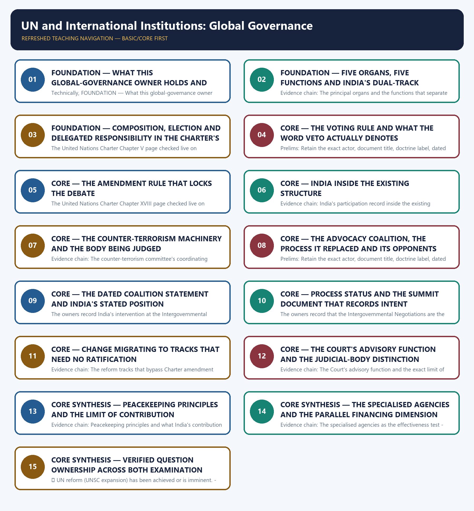

# UN and International Institutions: Global Governance — Learner-v2 Complete Learning Session

> **Authoring-only generation:** 2026-09-03. No PDF was rendered and no tracker or index was mutated.

### SOURCE, PROGRESSION AND CURRENT-LINKAGE AUDIT

- **Generation date:** 2026-09-03.
- **Repository-first evidence:** the Basic owner is taught first and preserved in full; the Advanced owner is retained only in the optional final teaching block.
- **OCR evidence:** Repository Markdown was primary. The OCR-searchable official General Studies question papers held under books\mains and books\more_previous_papers were read only to confirm the printed wording of routed demands. No official answer key, marking scheme, page precision or unsupported quotation was imported from them.
- **Qdrant:** not used; repository Markdown and available OCR context were sufficient.
- **PYQ integrity:** Five General Studies Paper II Mains demands are routed to this topic in the audited routing ledgers and each is reproduced below as a demand card with its printed year, paper, question number, directive, marks and word-limit provenance exactly as observed: 2024 question 19 on evaluating the effectiveness of the Security Council's Counter Terrorism Committee and its associated bodies, 15 marks with the 250-word limit printed in the question; 2025 question 20 on examining and critically evaluating East-West policy confrontations in relation to the unresolved reform process, 15 marks with the 250-word limit printed in the question; 2019 question 10 on the education and culture agency's funding and political stress in the light of the United States withdrawal, 10 marks, whose printed per-question tail carries only the mark value so that its 150-word limit is taken from that paper's own instruction block stating that answers to Questions 1 to 10 should be in 150 words and answers to Questions 11 to 20 in 250 words; 2020 question 9 on the health agency's role in global health security during the pandemic, a Critically examine demand of 10 marks and 150 words; and 2022 question 20 on India's changing policy towards climate change in various international fora in the context of geopolitics, 15 marks with the 250-word limit printed in the question. Three provenance facts are reported rather than repaired. First, the 2020 General Studies Paper II is not among the locally held official papers, so only the audited ledger's own neutral rendering of that demand is carried and its printed stem is deliberately not reconstructed, quoted or paraphrased. Second, the 2019, 2022, 2024 and 2025 stems were confirmed word for word against the locally held official General Studies Paper II question papers for those years, and the 2019 instruction block was read directly rather than assumed. Third, the 2022 demand is expressly cross-cutting in the audited ledger, which records that both the climate regime and multilateral fora are named in the stem, so this owner holds the institutional half while topic 11 holds the trade, negotiating and external-policy half, and the shared ownership is declared rather than silently duplicated or silently dropped. The objective ledgers additionally route fourteen demands from the audited 2018-2023 papers, three from the audited 2024-2025 papers and four from the audited 2026 paper to this owner, covering famine and conflict-affected countries, the anti-corruption, transnational-organised-crime and drugs-and-crime conventions, international declarations matched to their subjects, the Credentials Committee, the International Polar Code, General Assembly observer status and Permanent Observers, the Bidibidi and Dadaab refugee settlements, conflict zones in North Kivu, Nagorno-Karabakh, Kherson, Zaporizhzhia, Donbas, Kachin and Tigray, the Global Compact for Safe, Orderly and Regular Migration, International Years and their designated years, India's ratification status of major international labour and humanitarian conventions, migration cooperation platforms and their binding or consultative character, United Nations agencies awarded the Nobel Prize on multiple occasions and United Nations peacekeeping operations matched with their operational periods. The official 2018-2023 objective keys are not held locally, the 2024-2025 Set-A keys are held and the 2026 Set-A key held locally is provisional, and in every case no option, answer letter or inferred key is recorded, so none of these objective demands is converted into a solved answer. The locally held OCR-searchable official General Studies papers were read only to confirm the printed wording and word-limit provenance of the routed Mains demands; no question was invented from them, no stem was paraphrased into an apparent routing, and no marking scheme or official answer key was imported.
- **Live-link boundary:** Live official verification was attempted on 2026-09-03 in the priority order required for this topic: the Ministry of External Affairs pages first, then the United Nations as the custodian of the Charter and the reform process, then the other institutions this topic names. Every outcome is recorded exactly as observed. The Ministry of External Affairs press-release, bilateral-document and country-brief pages returned a browser-requirement stub or the Ministry's own error page, the Press Information Bureau index returned HTTP 403, the Security Council's own membership page returned HTTP 403, the General Assembly presidency page returned only a redirection notice and the World Health Organization governance page returned only a photograph caption, so no Indian official item, no current Council membership list and no health-governance fact was obtained from them. Five pages did return substantive official text and are used only for what they actually state: the United Nations Charter Chapter V and Chapter XVIII, the International Court of Justice page on advisory jurisdiction, the United Nations Peacekeeping page on the basic principles, and the World Trade Organization page on its own structure and decision rule. The package therefore uses the dated official anchors already carried by the repository owners together with those verified institutional sources, each with its actor, exact evidentiary level and date. It invents no membership, election or term, no mandate, power or voting rule, no resolution number or date, no summit, declaration or outcome document, no reform proposal, negotiating position or process status, no ratification, entry-into-force or funding figure, no quota or voting share, no previous-year question, no answer key and no current claim.
- **Fact/inference discipline:** no current-affairs item, PYQ wording, figure or quotation is invented.

### LIVE OFFICIAL-SOURCE ATTEMPT LOG

Every live check below was attempted on 2026-09-03 in the priority order required for International Relations: Ministry of External Affairs official pages first, then other official government or international-organisation documents. Access failures are recorded exactly as observed and no claim is reconstructed from a failed fetch.

- https://www.mea.gov.in/press-releases.htm — attempted 2026-09-03; the request redirected to a browser-requirement stub and returned no press release text, so no live item was taken from it.
- https://www.mea.gov.in/bilateral-documents.htm — attempted 2026-09-03; the request redirected to a browser-requirement stub and returned no bilateral document text, so no live item was taken from it.
- https://www.mea.gov.in/foreign-relation.htm — attempted 2026-09-03; the request redirected to the Ministry's own error page, so no country brief was taken from it.
- https://www.pib.gov.in/indexd.aspx?reg=3&lang=1 — attempted 2026-09-03; the request returned HTTP 403, so no release was taken from it.
- https://main.un.org/securitycouncil/en/content/current-members — attempted 2026-09-03; the Security Council's own membership page returned HTTP 403, so no current membership list, term or regional-seat claim was taken from it and the repository owners' dated membership record was used unchanged.
- https://www.un.org/en/ga/president/80/ — attempted 2026-09-03; the page returned only a redirection notice and no substantive session text, so no General Assembly session, agenda or reform-process claim was taken from it.
- https://www.who.int/about/governance — attempted 2026-09-03; the World Health Organization governance page returned only a photograph caption line, so no governance-body description, decision rule or health-regulation fact was taken from it.
- https://www.un.org/en/about-us/un-charter/chapter-5 — attempted 2026-09-03; the United Nations returned the substantive official text of Chapter V of the Charter, including Article 23 on a Security Council of fifteen Members with five named permanent members and ten elected non-permanent members serving two-year terms who are not eligible for immediate re-election, Article 24 conferring primary responsibility for the maintenance of international peace and security, Article 25 by which Members agree to accept and carry out the Council's decisions, Article 27 providing one vote per member, nine affirmative votes for procedural matters and nine affirmative votes including the concurring votes of the permanent members for all other matters with a compulsory abstention for a party to a dispute under Chapter VI and Article 52 paragraph 3, and Articles 29, 31 and 32 on subsidiary organs and participation without vote. That text is used only for those Charter provisions.
- https://www.un.org/en/about-us/un-charter/chapter-18 — attempted 2026-09-03; the United Nations returned the substantive official text of Chapter XVIII, including Article 108 requiring that amendments be adopted by a vote of two thirds of the members of the General Assembly and ratified by two thirds of the Members of the United Nations including all the permanent members of the Security Council, and Article 109 on a General Conference to review the Charter and the identical ratification condition for any alteration it recommends. That text is used only for the amendment rule.
- https://www.icj-cij.org/advisory-jurisdiction — attempted 2026-09-03; the International Court of Justice returned substantive official text recording that only States may appear in contentious cases, that the advisory procedure is available to five United Nations organs, fifteen specialized agencies and one related organization, that advisory proceedings begin with a written request addressed to the Registrar, and that the Court's advisory opinions are not binding except in rare cases where binding force is expressly provided, so that the requesting organ, agency or organization remains free to decide what effect to give them, while the opinions nonetheless carry great legal weight and moral authority. That text is used only for the advisory function and its limit.
- https://peacekeeping.un.org/en/principles-of-peacekeeping — attempted 2026-09-03; United Nations Peacekeeping returned substantive official text recording three inter-related and mutually reinforcing basic principles, namely consent of the parties, impartiality and non-use of force except in self-defence and defence of the mandate, and recording that impartiality is not neutrality or inactivity, that peacekeeping operations are not an enforcement tool but may use force at the tactical level with Security Council authorization, and that robust peacekeeping must not be confused with peace enforcement under Chapter VII of the Charter. That text is used only for those principles.
- https://www.wto.org/english/thewto_e/whatis_e/tif_e/org1_e.htm — attempted 2026-09-03; the World Trade Organization returned substantive official text recording that the organisation is run by its member governments, that decisions are normally taken by consensus, that power is not delegated to a board of directors or to the organisation's head unlike some other international organisations, that the Ministerial Conference is the topmost body meeting at least once every two years, and that the General Council, the Dispute Settlement Body and the Trade Policy Review Body are the same body meeting under different terms of reference. That text is used only for the trade institution's structure and decision rule.

## BASIC LEARNING SESSION

### DEEP-REVIEW LEARNING CONTRACT

| Control | Binding rule for this package |
|---|---|
| Syllabus boundary | Complete International Relations Basic/Core is answer-complete before optional Advanced depth. |
| Status boundary | Announced, negotiated, initialled, signed, ratified, entered into force, operational, suspended and completed remain distinct. |
| Institutional method | Treaty basis or political character → exact membership/status → mandate → decision rule → national instrument → implementation → outcome. |
| Level mapping | Bilateral, subregional/regional, minilateral/plurilateral and systemic levels are separated and then connected. |
| Policy method | Strategic objective → chosen instrument → implementing actors/resources → observed output/outcome → alternative and residual risk. |
| Evidence method | Claim → named India-centric treaty, institution, corridor, operation, agreement or summit → analysis → official source/date/status and causal qualification. |
| Neutrality method | Contested borders, maritime claims and conflicts are attributed neutrally; policy doctrine is distinguished from retrospective analytical label. |
| Practice contract | Every solved item has demand decoding, a detailed examiner-grade model, executable timed/compression plan, marks rationale and answer-specific improvement. |
| Approval | This immutable successor remains `approved: false` pending explicit approval. |

**Canonical Basic/Core owner:** `upsc-ai-kit\knowledge\International-Relations\basic\12_UN-and-International-Institutions-Global-Governance.md`  
**Substantive canonical provenance owner:** `upsc-ai-kit\knowledge\International-Relations\12_UN-and-International-Institutions-Global-Governance_Learner-V2-Complete-Topic-Package.md`  
**Optional Advanced owner:** `upsc-ai-kit\knowledge\International-Relations\advanced\12_UN-and-International-Institutions-Global-Governance.md`  
**Official syllabus mapping:** `upsc-ai-kit\knowledge\International Relations\OFFICIAL-UPSC-SYLLABUS-MAPPING.md`

### EVIDENCE, PYQ AND CURRENT-STATUS CONTROL

- **Membership discipline:** member, observer, dialogue partner, chair, guest and invited participant are not interchangeable; verify the relevant date.
- **Mandate discipline:** treaty organisation, UN organ, specialised agency, court, summit process, political forum, coalition and minilateral retain exact legal character and competence.
- **Agreement discipline:** announcement, negotiation, signature, ratification, entry into force, domestic implementation and measured outcome remain separate.
- **Connectivity discipline:** concept, financing, contract, construction, trial movement, operational segment, completed corridor and commercially viable use remain separate.
- **Conflict discipline:** distinguish verified event, party claim, independent attribution, legal characterisation and analytical inference; use neutral language for contested borders and conflicts.
- **Causal discipline:** chronology, summit language, trade change, deployment or project completion does not alone establish strategic effect; state mechanism, counterfactual and alternatives.
- **Trade-off discipline:** interests, capabilities, constraints, partner agency, escalation, dependence, finance, legitimacy, domestic distribution, alternatives and implementation risks are explicit.
- **PYQ discipline:** exact wording is preserved only where verified; routed or reconstructed demands remain labelled and no model is presented as an official UPSC answer.
- **Current-status note, rechecked 2026-09-03:** volatile relations, agreements, corridors, operations, conflicts, trade and summit outcomes retain official source, publication date and operative/interim/completed status; stale officeholders are omitted.

**Generation-local live/current sources:**
- `https://www.mea.gov.in/press-releases.htm — attempted 2026-09-03; the request redirected to a browser-requirement stub and returned no press release text, so no live item was taken from it.`
- `https://www.mea.gov.in/bilateral-documents.htm — attempted 2026-09-03; the request redirected to a browser-requirement stub and returned no bilateral document text, so no live item was taken from it.`
- `https://www.mea.gov.in/foreign-relation.htm — attempted 2026-09-03; the request redirected to the Ministry's own error page, so no country brief was taken from it.`
- `https://www.pib.gov.in/indexd.aspx?reg=3&lang=1 — attempted 2026-09-03; the request returned HTTP 403, so no release was taken from it.`
- `https://main.un.org/securitycouncil/en/content/current-members — attempted 2026-09-03; the Security Council's own membership page returned HTTP 403, so no current membership list, term or regional-seat claim was taken from it and the repository owners' dated membership record was used unchanged.`
- `https://www.un.org/en/ga/president/80/ — attempted 2026-09-03; the page returned only a redirection notice and no substantive session text, so no General Assembly session, agenda or reform-process claim was taken from it.`
- `https://www.who.int/about/governance — attempted 2026-09-03; the World Health Organization governance page returned only a photograph caption line, so no governance-body description, decision rule or health-regulation fact was taken from it.`
- `https://www.un.org/en/about-us/un-charter/chapter-5 — attempted 2026-09-03; the United Nations returned the substantive official text of Chapter V of the Charter, including Article 23 on a Security Council of fifteen Members with five named permanent members and ten elected non-permanent members serving two-year terms who are not eligible for immediate re-election, Article 24 conferring primary responsibility for the maintenance of international peace and security, Article 25 by which Members agree to accept and carry out the Council's decisions, Article 27 providing one vote per member, nine affirmative votes for procedural matters and nine affirmative votes including the concurring votes of the permanent members for all other matters with a compulsory abstention for a party to a dispute under Chapter VI and Article 52 paragraph 3, and Articles 29, 31 and 32 on subsidiary organs and participation without vote. That text is used only for those Charter provisions.`
- `https://www.un.org/en/about-us/un-charter/chapter-18 — attempted 2026-09-03; the United Nations returned the substantive official text of Chapter XVIII, including Article 108 requiring that amendments be adopted by a vote of two thirds of the members of the General Assembly and ratified by two thirds of the Members of the United Nations including all the permanent members of the Security Council, and Article 109 on a General Conference to review the Charter and the identical ratification condition for any alteration it recommends. That text is used only for the amendment rule.`
- `https://www.icj-cij.org/advisory-jurisdiction — attempted 2026-09-03; the International Court of Justice returned substantive official text recording that only States may appear in contentious cases, that the advisory procedure is available to five United Nations organs, fifteen specialized agencies and one related organization, that advisory proceedings begin with a written request addressed to the Registrar, and that the Court's advisory opinions are not binding except in rare cases where binding force is expressly provided, so that the requesting organ, agency or organization remains free to decide what effect to give them, while the opinions nonetheless carry great legal weight and moral authority. That text is used only for the advisory function and its limit.`
- `https://peacekeeping.un.org/en/principles-of-peacekeeping — attempted 2026-09-03; United Nations Peacekeeping returned substantive official text recording three inter-related and mutually reinforcing basic principles, namely consent of the parties, impartiality and non-use of force except in self-defence and defence of the mandate, and recording that impartiality is not neutrality or inactivity, that peacekeeping operations are not an enforcement tool but may use force at the tactical level with Security Council authorization, and that robust peacekeeping must not be confused with peace enforcement under Chapter VII of the Charter. That text is used only for those principles.`
- `https://www.wto.org/english/thewto_e/whatis_e/tif_e/org1_e.htm — attempted 2026-09-03; the World Trade Organization returned substantive official text recording that the organisation is run by its member governments, that decisions are normally taken by consensus, that power is not delegated to a board of directors or to the organisation's head unlike some other international organisations, that the Ministerial Conference is the topmost body meeting at least once every two years, and that the General Council, the Dispute Settlement Body and the Trade Policy Review Body are the same body meeting under different terms of reference. That text is used only for the trade institution's structure and decision rule.`




*Distinct embedded teaching-navigation image. The separate continuous Cārvāka-style flowchart package remains an independent at-a-glance artifact.*

### SESSION 1 — FOUNDATION — WHAT THIS GLOBAL-GOVERNANCE OWNER HOLDS AND HOW ITS BOUNDARIES ARE ROUTED

#### DEFINITION / WHAT THIS IS CALLED

**Plain-language definition:** Evidence chain: What this global-governance owner holds and how its boundaries are routed Qualified use: Open an institutions demand by fixing ownership so the answer does not drift into another owner's evidence.

**Technical definition:** Technically, FOUNDATION — What this global-governance owner holds and how its boundaries are routed is analysed by relating FOUNDATION to What this global-governance owner holds, then testing the relationship through how its boundaries are routed and Evidence chain.

#### ANSWER-GRABBING OPENING — WRITE/ADAPT IN THE EXAM

> Evidence chain: What this global-governance owner holds and how its boundaries are routed Qualified use: Open an institutions demand by fixing ownership so the answer does not drift into another owner's evidence.

#### MUST-WRITE KEYWORDS

- **FOUNDATION**
- **What this global-governance owner holds**
- **how its boundaries are routed**
- **Evidence chain**
- **Qualified use**
- **This**

**How to use them:** Frame the answer through FOUNDATION; define What this global-governance owner holds, connect how its boundaries are routed with Evidence chain to explain the mechanism, and use Qualified use for the decisive comparison or qualification.

#### VISUAL FIRST

```text
WHAT THIS GLOBAL-GOVERNANCE OWNER HOLDS AND HOW ITS BOUNDARIES ARE ROUTED
01. What this global-governance owner holds and how its boundaries are routed
BOUNDARY -> Creation-era chronology belongs to World History, lending and trade mechanics to Economy, climate targets to topic 11 and the Group of Twenty and BRICS to topic 10.
```

*This topic-specific rail fixes the evidence sequence and its exam boundary before analysis.*

#### CORE EXPLANATION

This topic owns the structure, mandate, decision rule and reform politics of the United Nations system and the Bretton Woods and trade institutions as they bear on India: which organ or body holds which power, what legal instrument creates it, what a decision of it actually binds, what India asks for and on what evidentiary level that ask currently stands; its distinctive feature is that reform must be analysed along four separable dimensions rather than as one undifferentiated demand, and five General Studies Paper II Mains demands from 2019, 2020, 2022, 2024 and 2025 are routed here alongside routed objective demands from 2018 to 2026, while the United Nations creation-era chronology belongs to the World History owner, operational lending and trade mechanics to the Economy owner, India's Nationally Determined Contribution and climate-trade evidence to topic 11, the representation grievance of the wider developing world to topic 08 and the Group of Twenty and BRICS as non-United Nations platforms to topic 10.

#### NAMED EVIDENCE AND MECHANISM

- This topic owns the structure, mandate, decision rule and reform politics of the United Nations system and the Bretton Woods and trade institutions as they bear on India: which organ or body holds which power, what legal instrument creates it, what a decision of it actually binds, what India asks for and on what evidentiary level that ask currently stands; its distinctive feature is that reform must be analysed along four separable dimensions rather than as one undifferentiated demand, and five General Studies Paper II Mains demands from 2019, 2020, 2022, 2024 and 2025 are routed here alongside routed objective demands from 2018 to 2026, while the United Nations creation-era chronology belongs to the World History owner, operational lending and trade mechanics to the Economy owner, India's Nationally Determined Contribution and climate-trade evidence to topic 11, the representation grievance of the wider developing world to topic 08 and the Group of Twenty and BRICS as non-United Nations platforms to topic 10.

#### EXAMINER CAUTION

- Creation-era chronology belongs to World History, lending and trade mechanics to Economy, climate targets to topic 11 and the Group of Twenty and BRICS to topic 10.

#### EXAM LINK

- **Prelims:** Retain the exact actor, document title, doctrine label, dated instrument and evidentiary level attached to What this global-governance owner holds and how its boundaries are routed, and never upgrade a vision statement into a treaty, a signature into a ratification, a participation category into membership, or an announced corridor into an operating one.
- **Mains:** Open an institutions demand by fixing ownership so the answer does not drift into another owner's evidence.

#### MINI RECAP

- **Evidence chain:** What this global-governance owner holds and how its boundaries are routed
- **Qualified use:** Open an institutions demand by fixing ownership so the answer does not drift into another owner's evidence.

#### CLOSING RECALL FLOW — FOUNDATION — WHAT THIS GLOBAL-GOVERNANCE OWNER HOLDS AND HOW ITS BOUNDARIES ARE ROUTED

```text
START / CONCEPT: FOUNDATION — What this global-governance owner holds and how its boundaries are routed
        |
        v
EXACT TERMS: FOUNDATION · What this global-governance owner holds · how its boundaries are routed · Evidence chain · Qualified use · This
        |
        v
MECHANISM / ARGUMENT: Prelims: Retain the exact actor, document title, doctrine label, dated instrument and evidentiary level attached to What this global-governance owner holds and how its boundaries are routed, and never upgrade a vision statement into a treaty, a signature into a ratification, a participation category into membership, or an announced corridor into an operating one.
        |
        v
CONSEQUENCE / CONTRAST: This topic owns the structure, mandate, decision rule and reform politics of the United Nations system and the Bretton Woods and trade institutions as they bear on India: which organ or body holds which power, what legal instrument creates it, what a decision of it actually binds, what India asks for and on what evidentiary level that ask currently stands; its distinctive feature is that reform must be analysed along four separable dimensions rather than as one undifferentiated demand, and five General Studies Paper II Mains demands from 2019, 2020, 2022, 2024 and 2025 are routed here alongside routed objective demands from 2018 to 2026, while the United Nations creation-era chronology belongs to the World History owner, operational lending and trade mechanics to the Economy owner, India's Nationally Determined Contribution and climate-trade evidence to topic 11, the representation grievance of the wider developing world to topic 08 and the Group of Twenty and BRICS as non-United Nations platforms to topic 10.
        |
        v
UPSC TRAP / ANSWER-USE: Mains: Open an institutions demand by fixing ownership so the answer does not drift into another owner's evidence.
        |
        v
ANSWER-GRABBING FORMULATION: Evidence chain: What this global-governance owner holds and how its boundaries are routed Qualified use: Open an institutions demand by fixing ownership so the answer does not drift into another owner's evidence.
```
### SESSION 2 — FOUNDATION — FIVE ORGANS, FIVE FUNCTIONS AND INDIA'S DUAL-TRACK DEMAND

#### DEFINITION / WHAT THIS IS CALLED

**Plain-language definition:** The owners set out the principal organs with distinct functions that must not be merged: the General Assembly with universal membership, deliberating and recommending; the Security Council with primary responsibility for international peace and security and a permanent membership holding a veto; the Economic and Social Council coordinating economic and social work; the International Court of Justice as the judicial organ; and the Secretariat as the administrative organ headed by the Secretary-General; they add that India's reform demand is dual-track, because Tharoor records that India, like many developing countries, wants the General Assembly strengthened as the primary intergovernmental legislative body, which it is not yet, rather than left as a rhetorical forum prone to declaratory effulgences without effect, so treating Security Council expansion as the whole of India's reform position understates it.

**Technical definition:** Evidence chain: The principal organs and the functions that separate them Qualified use: State the reform position completely, which is the difference between a partial and a full answer.

#### ANSWER-GRABBING OPENING — WRITE/ADAPT IN THE EXAM

> The owners set out the principal organs with distinct functions that must not be merged: the General Assembly with universal membership, deliberating and recommending; the Security Council with primary responsibility for international peace and security and a permanent membership holding a veto; the Economic and Social Council coordinating economic and social work; the International Court of Justice as the judicial organ; and the Secretariat as the administrative organ headed by the Secretary-General; they add that India's reform demand is dual-track, because Tharoor records that India, like many developing countries, wants the General Assembly strengthened as the primary intergovernmental legislative body, which it is not yet, rather than left as a rhetorical forum prone to declaratory effulgences without effect, so treating Security Council expansion as the whole of India's reform position understates it.

#### MUST-WRITE KEYWORDS

- **FOUNDATION**
- **Five organs**
- **five functions**
- **India's dual-track demand**
- **Evidence chain**
- **Qualified use**

**How to use them:** Frame the answer through FOUNDATION; define Five organs, connect five functions with India's dual-track demand to explain the mechanism, and use Evidence chain for the decisive comparison or qualification.

#### VISUAL FIRST

```text
FIVE ORGANS, FIVE FUNCTIONS AND INDIA'S DUAL-TRACK DEMAND
01. The principal organs and the functions that separate them
BOUNDARY -> Reducing India's reform position to a permanent seat understates the demand that the Assembly be strengthened as a legislative body.
```

*This topic-specific rail fixes the evidence sequence and its exam boundary before analysis.*

#### CORE EXPLANATION

The owners set out the principal organs with distinct functions that must not be merged: the General Assembly with universal membership, deliberating and recommending; the Security Council with primary responsibility for international peace and security and a permanent membership holding a veto; the Economic and Social Council coordinating economic and social work; the International Court of Justice as the judicial organ; and the Secretariat as the administrative organ headed by the Secretary-General; they add that India's reform demand is dual-track, because Tharoor records that India, like many developing countries, wants the General Assembly strengthened as the primary intergovernmental legislative body, which it is not yet, rather than left as a rhetorical forum prone to declaratory effulgences without effect, so treating Security Council expansion as the whole of India's reform position understates it.

#### NAMED EVIDENCE AND MECHANISM

- The owners set out the principal organs with distinct functions that must not be merged: the General Assembly with universal membership, deliberating and recommending; the Security Council with primary responsibility for international peace and security and a permanent membership holding a veto; the Economic and Social Council coordinating economic and social work; the International Court of Justice as the judicial organ; and the Secretariat as the administrative organ headed by the Secretary-General; they add that India's reform demand is dual-track, because Tharoor records that India, like many developing countries, wants the General Assembly strengthened as the primary intergovernmental legislative body, which it is not yet, rather than left as a rhetorical forum prone to declaratory effulgences without effect, so treating Security Council expansion as the whole of India's reform position understates it.

#### EXAMINER CAUTION

- Reducing India's reform position to a permanent seat understates the demand that the Assembly be strengthened as a legislative body.

#### EXAM LINK

- **Prelims:** Retain the exact actor, document title, doctrine label, dated instrument and evidentiary level attached to Five organs, five functions and India's dual-track demand, and never upgrade a vision statement into a treaty, a signature into a ratification, a participation category into membership, or an announced corridor into an operating one.
- **Mains:** State the reform position completely, which is the difference between a partial and a full answer.

#### MINI RECAP

- **Evidence chain:** The principal organs and the functions that separate them
- **Qualified use:** State the reform position completely, which is the difference between a partial and a full answer.

#### CLOSING RECALL FLOW — FOUNDATION — FIVE ORGANS, FIVE FUNCTIONS AND INDIA'S DUAL-TRACK DEMAND

```text
START / CONCEPT: FOUNDATION — Five organs, five functions and India's dual-track demand
        |
        v
EXACT TERMS: FOUNDATION · Five organs · five functions · India's dual-track demand · Evidence chain · Qualified use
        |
        v
MECHANISM / ARGUMENT: Evidence chain: The principal organs and the functions that separate them Qualified use: State the reform position completely, which is the difference between a partial and a full answer.
        |
        v
CONSEQUENCE / CONTRAST: Mains: State the reform position completely, which is the difference between a partial and a full answer.
        |
        v
UPSC TRAP / ANSWER-USE: Do not miss this limiting distinction: the owners set out the principal organs with distinct functions that must not be...
        |
        v
ANSWER-GRABBING FORMULATION: The owners set out the principal organs with distinct functions that must not be merged: the General Assembly with universal membership, deliberating and recommending; the Security Council with primary responsibility for international peace and security and a permanent membership holding a veto; the Economic and Social Council coordinating economic and social work; the International Court of Justice as the judicial organ; and the Secretariat as the administrative organ headed by the Secretary-General; they add that India's reform demand is dual-track, because Tharoor records that India, like many developing countries, wants the General Assembly strengthened as the primary intergovernmental legislative body, which it is not yet, rather than left as a rhetorical forum prone to declaratory effulgences without effect, so treating Security Council expansion as the whole of India's reform position understates it.
```
### SESSION 3 — FOUNDATION — COMPOSITION, ELECTION AND DELEGATED RESPONSIBILITY IN THE CHARTER'S OWN WORDS

#### DEFINITION / WHAT THIS IS CALLED

**Plain-language definition:** Evidence chain: Composition and election under the Charter's own words - What a Council decision actually obliges and where its powers come from Qualified use: Quote the governing article rather than a textbook paraphrase, which is what an examiner rewards.

**Technical definition:** The United Nations Charter Chapter V page checked live on 2026-09-03 records Article 23 providing that the Security Council shall consist of fifteen Members of the United Nations, that the Republic of China, France, the Union of Soviet Socialist Republics, the United Kingdom of Great Britain and Northern Ireland and the United States of America shall be permanent members, that the General Assembly shall elect ten other Members as non-permanent members with due regard first to their contribution to the maintenance of international peace and security and to the other purposes of the Organization and also to equitable geographical distribution, that non-permanent members are elected for a term of two years and that a retiring member shall not be eligible for immediate re-election, with each member having one representative; the owners require the Charter's own naming to be read carefully, because the printed text still names the Republic of China and the Union of Soviet Socialist Republics, which is exactly why an answer must distinguish the Charter's text from the practice that followed it.

#### ANSWER-GRABBING OPENING — WRITE/ADAPT IN THE EXAM

> Evidence chain: Composition and election under the Charter's own words - What a Council decision actually obliges and where its powers come from Qualified use: Quote the governing article rather than a textbook paraphrase, which is what an examiner rewards.

#### MUST-WRITE KEYWORDS

- **FOUNDATION**
- **Composition**
- **election**
- **delegated responsibility in the Charter's own words**
- **Evidence chain**
- **Qualified use**

**How to use them:** Frame the answer through FOUNDATION; define Composition, connect election with delegated responsibility in the Charter's own words to explain the mechanism, and use Evidence chain for the decisive comparison or qualification.

#### VISUAL FIRST

```text
COMPOSITION, ELECTION AND DELEGATED RESPONSIBILITY IN THE CHARTER'S OWN WORDS
01. Composition and election under the Charter's own words
    |
    v
02. What a Council decision actually obliges and where its powers come from
BOUNDARY -> The printed Charter still names the Republic of China and the Union of Soviet Socialist Republics, so text and practice must be distinguished.
```

*This topic-specific rail fixes the evidence sequence and its exam boundary before analysis.*

#### CORE EXPLANATION

The United Nations Charter Chapter V page checked live on 2026-09-03 records Article 23 providing that the Security Council shall consist of fifteen Members of the United Nations, that the Republic of China, France, the Union of Soviet Socialist Republics, the United Kingdom of Great Britain and Northern Ireland and the United States of America shall be permanent members, that the General Assembly shall elect ten other Members as non-permanent members with due regard first to their contribution to the maintenance of international peace and security and to the other purposes of the Organization and also to equitable geographical distribution, that non-permanent members are elected for a term of two years and that a retiring member shall not be eligible for immediate re-election, with each member having one representative; the owners require the Charter's own naming to be read carefully, because the printed text still names the Republic of China and the Union of Soviet Socialist Republics, which is exactly why an answer must distinguish the Charter's text from the practice that followed it. The same Charter page records Article 24, by which Members confer on the Security Council primary responsibility for the maintenance of international peace and security and agree that in carrying out its duties the Council acts on their behalf, with its specific powers laid down in Chapters VI, VII, VIII and XII and with an obligation to submit annual and, when necessary, special reports to the General Assembly; Article 25, by which the Members of the United Nations agree to accept and carry out the decisions of the Security Council in accordance with the Charter; Article 29, permitting the Council to establish such subsidiary organs as it deems necessary; and Articles 31 and 32, permitting non-members of the Council and even non-members of the Organization to participate in discussion without vote in specified circumstances; the owners use Article 29 in particular to explain why a counter-terrorism committee is a creature of the Council rather than an independent agency.

#### NAMED EVIDENCE AND MECHANISM

- The United Nations Charter Chapter V page checked live on 2026-09-03 records Article 23 providing that the Security Council shall consist of fifteen Members of the United Nations, that the Republic of China, France, the Union of Soviet Socialist Republics, the United Kingdom of Great Britain and Northern Ireland and the United States of America shall be permanent members, that the General Assembly shall elect ten other Members as non-permanent members with due regard first to their contribution to the maintenance of international peace and security and to the other purposes of the Organization and also to equitable geographical distribution, that non-permanent members are elected for a term of two years and that a retiring member shall not be eligible for immediate re-election, with each member having one representative; the owners require the Charter's own naming to be read carefully, because the printed text still names the Republic of China and the Union of Soviet Socialist Republics, which is exactly why an answer must distinguish the Charter's text from the practice that followed it.
- The same Charter page records Article 24, by which Members confer on the Security Council primary responsibility for the maintenance of international peace and security and agree that in carrying out its duties the Council acts on their behalf, with its specific powers laid down in Chapters VI, VII, VIII and XII and with an obligation to submit annual and, when necessary, special reports to the General Assembly; Article 25, by which the Members of the United Nations agree to accept and carry out the decisions of the Security Council in accordance with the Charter; Article 29, permitting the Council to establish such subsidiary organs as it deems necessary; and Articles 31 and 32, permitting non-members of the Council and even non-members of the Organization to participate in discussion without vote in specified circumstances; the owners use Article 29 in particular to explain why a counter-terrorism committee is a creature of the Council rather than an independent agency.

#### EXAMINER CAUTION

- The printed Charter still names the Republic of China and the Union of Soviet Socialist Republics, so text and practice must be distinguished.

#### EXAM LINK

- **Prelims:** Retain the exact actor, document title, doctrine label, dated instrument and evidentiary level attached to Composition, election and delegated responsibility in the Charter's own words, and never upgrade a vision statement into a treaty, a signature into a ratification, a participation category into membership, or an announced corridor into an operating one.
- **Mains:** Quote the governing article rather than a textbook paraphrase, which is what an examiner rewards.

#### MINI RECAP

- **Evidence chain:** Composition and election under the Charter's own words -> What a Council decision actually obliges and where its powers come from
- **Qualified use:** Quote the governing article rather than a textbook paraphrase, which is what an examiner rewards.

#### CLOSING RECALL FLOW — FOUNDATION — COMPOSITION, ELECTION AND DELEGATED RESPONSIBILITY IN THE CHARTER'S OWN WORDS

```text
START / CONCEPT: FOUNDATION — Composition, election and delegated responsibility in the Charter's own words
        |
        v
EXACT TERMS: FOUNDATION · Composition · election · delegated responsibility in the Charter's own words · Evidence chain · Qualified use
        |
        v
MECHANISM / ARGUMENT: The United Nations Charter Chapter V page checked live on 2026-09-03 records Article 23 providing that the Security Council shall consist of fifteen Members of the United Nations, that the Republic of China, France, the Union of Soviet Socialist Republics, the United Kingdom of Great Britain and Northern Ireland and the United States of America shall be permanent members, that the General Assembly shall elect ten other Members as non-permanent members with due regard first to their contribution to the maintenance of international peace and security and to the other purposes of the Organization and also to equitable geographical distribution, that non-permanent members are elected for a term of two years and that a retiring member shall not be eligible for immediate re-election, with each member having one representative; the owners require the Charter's own naming to be read carefully, because the printed text still names the Republic of China and the Union of Soviet Socialist Republics, which is exactly why an answer must distinguish the Charter's text from the practice that followed it.
        |
        v
CONSEQUENCE / CONTRAST: The same Charter page records Article 24, by which Members confer on the Security Council primary responsibility for the maintenance of international peace and security and agree that in carrying out its duties the Council acts on their behalf, with its specific powers laid down in Chapters VI, VII, VIII and XII and with an obligation to submit annual and, when necessary, special reports to the General Assembly; Article 25, by which the Members of the United Nations agree to accept and carry out the decisions of the Security Council in accordance with the Charter; Article 29, permitting the Council to establish such subsidiary organs as it deems necessary; and Articles 31 and 32, permitting non-members of the Council and even non-members of the Organization to participate in discussion without vote in specified circumstances; the owners use Article 29 in particular to explain why a counter-terrorism committee is a creature of the Council rather than an independent agency.
        |
        v
UPSC TRAP / ANSWER-USE: Do not miss this limiting distinction: the printed Charter still names the Republic of China and the Union of Soviet...
        |
        v
ANSWER-GRABBING FORMULATION: Evidence chain: Composition and election under the Charter's own words - What a Council decision actually obliges and where its powers come from Qualified use: Quote the governing article rather than a textbook paraphrase, which is what an examiner rewards.
```
### SESSION 4 — CORE — THE VOTING RULE AND WHAT THE WORD VETO ACTUALLY DENOTES

#### DEFINITION / WHAT THIS IS CALLED

**Plain-language definition:** Evidence chain: The voting rule and what the word veto precisely denotes Qualified use: Convert a vague statement about great-power privilege into an exact procedural claim.

**Technical definition:** Prelims: Retain the exact actor, document title, doctrine label, dated instrument and evidentiary level attached to The voting rule and what the word veto actually denotes, and never upgrade a vision statement into a treaty, a signature into a ratification, a participation category into membership, or an announced corridor into an operating one.

#### ANSWER-GRABBING OPENING — WRITE/ADAPT IN THE EXAM

> Evidence chain: The voting rule and what the word veto precisely denotes Qualified use: Convert a vague statement about great-power privilege into an exact procedural claim.

#### MUST-WRITE KEYWORDS

- **The voting rule**
- **Evidence chain**
- **Qualified use**
- **Article 27**
- **Article 52**
- **The Charter**

**How to use them:** Frame the answer through The voting rule; define Evidence chain, connect Qualified use with Article 27 to explain the mechanism, and use Article 52 for the decisive comparison or qualification.

#### VISUAL FIRST

```text
THE VOTING RULE AND WHAT THE WORD VETO ACTUALLY DENOTES
01. The voting rule and what the word veto precisely denotes
BOUNDARY -> The concurring-vote requirement is the veto, and the only compulsory abstention is the party-to-a-dispute rule.
```

*This topic-specific rail fixes the evidence sequence and its exam boundary before analysis.*

#### CORE EXPLANATION

The Charter page records Article 27 providing that each member of the Security Council shall have one vote, that decisions on procedural matters shall be made by an affirmative vote of nine members, and that decisions on all other matters shall be made by an affirmative vote of nine members including the concurring votes of the permanent members, with the proviso that in decisions under Chapter VI and under paragraph 3 of Article 52 a party to a dispute shall abstain from voting; the owners convert this into the exact examinable statement, namely that the word veto does not appear as a grant of a special power but arises from the requirement of concurring permanent-member votes on non-procedural matters, that a nine-vote threshold applies to both categories, and that the only compulsory abstention in the text is the party-to-a-dispute rule, and they add the analytical point that the veto was designed to keep major powers inside the system after the League of Nations experience while simultaneously blocking any reform those same powers resist.

#### NAMED EVIDENCE AND MECHANISM

- The Charter page records Article 27 providing that each member of the Security Council shall have one vote, that decisions on procedural matters shall be made by an affirmative vote of nine members, and that decisions on all other matters shall be made by an affirmative vote of nine members including the concurring votes of the permanent members, with the proviso that in decisions under Chapter VI and under paragraph 3 of Article 52 a party to a dispute shall abstain from voting; the owners convert this into the exact examinable statement, namely that the word veto does not appear as a grant of a special power but arises from the requirement of concurring permanent-member votes on non-procedural matters, that a nine-vote threshold applies to both categories, and that the only compulsory abstention in the text is the party-to-a-dispute rule, and they add the analytical point that the veto was designed to keep major powers inside the system after the League of Nations experience while simultaneously blocking any reform those same powers resist.

#### EXAMINER CAUTION

- The concurring-vote requirement is the veto, and the only compulsory abstention is the party-to-a-dispute rule.

#### EXAM LINK

- **Prelims:** Retain the exact actor, document title, doctrine label, dated instrument and evidentiary level attached to The voting rule and what the word veto actually denotes, and never upgrade a vision statement into a treaty, a signature into a ratification, a participation category into membership, or an announced corridor into an operating one.
- **Mains:** Convert a vague statement about great-power privilege into an exact procedural claim.

#### MINI RECAP

- **Evidence chain:** The voting rule and what the word veto precisely denotes
- **Qualified use:** Convert a vague statement about great-power privilege into an exact procedural claim.

#### CLOSING RECALL FLOW — CORE — THE VOTING RULE AND WHAT THE WORD VETO ACTUALLY DENOTES

```text
START / CONCEPT: CORE — The voting rule and what the word veto actually denotes
        |
        v
EXACT TERMS: The voting rule · Evidence chain · Qualified use · Article 27 · Article 52 · The Charter
        |
        v
MECHANISM / ARGUMENT: The Charter page records Article 27 providing that each member of the Security Council shall have one vote, that decisions on procedural matters shall be made by an affirmative vote of nine members, and that decisions on all other matters shall be made by an affirmative vote of nine members including the concurring votes of the permanent members, with the proviso that in decisions under Chapter VI and under paragraph 3 of Article 52 a party to a dispute shall abstain from voting; the owners convert this into the exact examinable statement, namely that the word veto does not appear as a grant of a special power but arises from the requirement of concurring permanent-member votes on non-procedural matters, that a nine-vote threshold applies to both categories, and that the only compulsory abstention in the text is the party-to-a-dispute rule, and they add the analytical point that the veto was designed to keep major powers inside the system after the League of Nations experience while simultaneously blocking any reform those same powers resist.
        |
        v
CONSEQUENCE / CONTRAST: Prelims: Retain the exact actor, document title, doctrine label, dated instrument and evidentiary level attached to The voting rule and what the word veto actually denotes, and never upgrade a vision statement into a treaty, a signature into a ratification, a participation category into membership, or an announced corridor into an operating one.
        |
        v
UPSC TRAP / ANSWER-USE: Do not miss this limiting distinction: the concurring-vote requirement is the veto.
        |
        v
ANSWER-GRABBING FORMULATION: Evidence chain: The voting rule and what the word veto precisely denotes Qualified use: Convert a vague statement about great-power privilege into an exact procedural claim.
```
### SESSION 5 — CORE — THE AMENDMENT RULE THAT LOCKS THE DEBATE

#### DEFINITION / WHAT THIS IS CALLED

**Plain-language definition:** Evidence chain: The amendment rule that locks the whole reform debate Qualified use: Explain the impasse structurally instead of attributing it only to great-power rivalry.

**Technical definition:** The United Nations Charter Chapter XVIII page checked live on 2026-09-03 records Article 108 providing that amendments come into force for all Members when they have been adopted by a vote of two thirds of the members of the General Assembly and ratified in accordance with their respective constitutional processes by two thirds of the Members of the United Nations, including all the permanent members of the Security Council, and Article 109 providing for a General Conference to review the Charter, convened by a two-thirds vote of the General Assembly and a vote of any nine members of the Security Council, with any alteration it recommends taking effect only on the same two-thirds ratification including all permanent members; the owners treat this as the single structural fact that explains the impasse, because expansion of the permanent category requires ratification by exactly the states whose relative position it would change.

#### ANSWER-GRABBING OPENING — WRITE/ADAPT IN THE EXAM

> Evidence chain: The amendment rule that locks the whole reform debate Qualified use: Explain the impasse structurally instead of attributing it only to great-power rivalry.

#### MUST-WRITE KEYWORDS

- **The amendment rule that locks the debate**
- **Evidence chain**
- **Qualified use**
- **Article 108**
- **Article 109**
- **2026-09**

**How to use them:** Frame the answer through The amendment rule that locks the debate; define Evidence chain, connect Qualified use with Article 108 to explain the mechanism, and use Article 109 for the decisive comparison or qualification.

#### VISUAL FIRST

```text
THE AMENDMENT RULE THAT LOCKS THE DEBATE
01. The amendment rule that locks the whole reform debate
BOUNDARY -> A two-thirds Assembly vote cannot amend the Charter alone, because ratification must include all the permanent members.
```

*This topic-specific rail fixes the evidence sequence and its exam boundary before analysis.*

#### CORE EXPLANATION

The United Nations Charter Chapter XVIII page checked live on 2026-09-03 records Article 108 providing that amendments come into force for all Members when they have been adopted by a vote of two thirds of the members of the General Assembly and ratified in accordance with their respective constitutional processes by two thirds of the Members of the United Nations, including all the permanent members of the Security Council, and Article 109 providing for a General Conference to review the Charter, convened by a two-thirds vote of the General Assembly and a vote of any nine members of the Security Council, with any alteration it recommends taking effect only on the same two-thirds ratification including all permanent members; the owners treat this as the single structural fact that explains the impasse, because expansion of the permanent category requires ratification by exactly the states whose relative position it would change.

#### NAMED EVIDENCE AND MECHANISM

- The United Nations Charter Chapter XVIII page checked live on 2026-09-03 records Article 108 providing that amendments come into force for all Members when they have been adopted by a vote of two thirds of the members of the General Assembly and ratified in accordance with their respective constitutional processes by two thirds of the Members of the United Nations, including all the permanent members of the Security Council, and Article 109 providing for a General Conference to review the Charter, convened by a two-thirds vote of the General Assembly and a vote of any nine members of the Security Council, with any alteration it recommends taking effect only on the same two-thirds ratification including all permanent members; the owners treat this as the single structural fact that explains the impasse, because expansion of the permanent category requires ratification by exactly the states whose relative position it would change.

#### EXAMINER CAUTION

- A two-thirds Assembly vote cannot amend the Charter alone, because ratification must include all the permanent members.

#### EXAM LINK

- **Prelims:** Retain the exact actor, document title, doctrine label, dated instrument and evidentiary level attached to The amendment rule that locks the debate, and never upgrade a vision statement into a treaty, a signature into a ratification, a participation category into membership, or an announced corridor into an operating one.
- **Mains:** Explain the impasse structurally instead of attributing it only to great-power rivalry.

#### MINI RECAP

- **Evidence chain:** The amendment rule that locks the whole reform debate
- **Qualified use:** Explain the impasse structurally instead of attributing it only to great-power rivalry.

#### CLOSING RECALL FLOW — CORE — THE AMENDMENT RULE THAT LOCKS THE DEBATE

```text
START / CONCEPT: CORE — The amendment rule that locks the debate
        |
        v
EXACT TERMS: The amendment rule that locks the debate · Evidence chain · Qualified use · Article 108 · Article 109 · 2026-09
        |
        v
MECHANISM / ARGUMENT: The United Nations Charter Chapter XVIII page checked live on 2026-09-03 records Article 108 providing that amendments come into force for all Members when they have been adopted by a vote of two thirds of the members of the General Assembly and ratified in accordance with their respective constitutional processes by two thirds of the Members of the United Nations, including all the permanent members of the Security Council, and Article 109 providing for a General Conference to review the Charter, convened by a two-thirds vote of the General Assembly and a vote of any nine members of the Security Council, with any alteration it recommends taking effect only on the same two-thirds ratification including all permanent members; the owners treat this as the single structural fact that explains the impasse, because expansion of the permanent category requires ratification by exactly the states whose relative position it would change.
        |
        v
CONSEQUENCE / CONTRAST: A two-thirds Assembly vote cannot amend the Charter alone, because ratification must include all the permanent members.
        |
        v
UPSC TRAP / ANSWER-USE: Do not miss this limiting distinction: explain the impasse structurally instead of attributing it only to great-power rivalry.
        |
        v
ANSWER-GRABBING FORMULATION: Evidence chain: The amendment rule that locks the whole reform debate Qualified use: Explain the impasse structurally instead of attributing it only to great-power rivalry.
```
### SESSION 6 — CORE — INDIA INSIDE THE EXISTING STRUCTURE

#### DEFINITION / WHAT THIS IS CALLED

**Plain-language definition:** Krishna's statement in India's first year on the Council that the international structure for maintaining peace and security and peacebuilding needs to be reformed because global power and the capacities to address problems are much more dispersed than they were six decades ago; India's most recent non-permanent terms were 2011-12 and 2021-22 and it launched its candidature for the 2028-29 term on 13 July 2026; the owners require participation and reform advocacy to be presented as two tracks of one position rather than as alternatives.

**Technical definition:** Evidence chain: India's participation record inside the existing structure Qualified use: Evidence responsible multilateralism with dated terms, a chairmanship and a launched candidature.

#### ANSWER-GRABBING OPENING — WRITE/ADAPT IN THE EXAM

> Krishna's statement in India's first year on the Council that the international structure for maintaining peace and security and peacebuilding needs to be reformed because global power and the capacities to address problems are much more dispersed than they were six decades ago; India's most recent non-permanent terms were 2011-12 and 2021-22 and it launched its candidature for the 2028-29 term on 13 July 2026; the owners require participation and reform advocacy to be presented as two tracks of one position rather than as alternatives.

#### MUST-WRITE KEYWORDS

- **India inside the existing structure**
- **Evidence chain**
- **Qualified use**
- **2011-12**
- **2021-22**
- **2028-29**

**How to use them:** Frame the answer through India inside the existing structure; define Evidence chain, connect Qualified use with 2011-12 to explain the mechanism, and use 2021-22 for the decisive comparison or qualification.

#### VISUAL FIRST

```text
INDIA INSIDE THE EXISTING STRUCTURE
01. India's participation record inside the existing structure
BOUNDARY -> Participation and reform advocacy are two tracks of one position rather than alternatives.
```

*This topic-specific rail fixes the evidence sequence and its exam boundary before analysis.*

#### CORE EXPLANATION

The owners record India's substantive engagement within the Council as it stands: Tharoor documents India's election by record margin to a non-permanent seat for 2011-12 alongside Germany and South Africa, with Brazil and Nigeria halfway through their own terms, and cites then-Foreign Minister S.M. Krishna's statement in India's first year on the Council that the international structure for maintaining peace and security and peacebuilding needs to be reformed because global power and the capacities to address problems are much more dispersed than they were six decades ago; India's most recent non-permanent terms were 2011-12 and 2021-22 and it launched its candidature for the 2028-29 term on 13 July 2026; the owners require participation and reform advocacy to be presented as two tracks of one position rather than as alternatives.

#### NAMED EVIDENCE AND MECHANISM

- The owners record India's substantive engagement within the Council as it stands: Tharoor documents India's election by record margin to a non-permanent seat for 2011-12 alongside Germany and South Africa, with Brazil and Nigeria halfway through their own terms, and cites then-Foreign Minister S.M. Krishna's statement in India's first year on the Council that the international structure for maintaining peace and security and peacebuilding needs to be reformed because global power and the capacities to address problems are much more dispersed than they were six decades ago; India's most recent non-permanent terms were 2011-12 and 2021-22 and it launched its candidature for the 2028-29 term on 13 July 2026; the owners require participation and reform advocacy to be presented as two tracks of one position rather than as alternatives.

#### EXAMINER CAUTION

- Participation and reform advocacy are two tracks of one position rather than alternatives.

#### EXAM LINK

- **Prelims:** Retain the exact actor, document title, doctrine label, dated instrument and evidentiary level attached to India inside the existing structure, and never upgrade a vision statement into a treaty, a signature into a ratification, a participation category into membership, or an announced corridor into an operating one.
- **Mains:** Evidence responsible multilateralism with dated terms, a chairmanship and a launched candidature.

#### MINI RECAP

- **Evidence chain:** India's participation record inside the existing structure
- **Qualified use:** Evidence responsible multilateralism with dated terms, a chairmanship and a launched candidature.

#### CLOSING RECALL FLOW — CORE — INDIA INSIDE THE EXISTING STRUCTURE

```text
START / CONCEPT: CORE — India inside the existing structure
        |
        v
EXACT TERMS: India inside the existing structure · Evidence chain · Qualified use · 2011-12 · 2021-22 · 2028-29
        |
        v
MECHANISM / ARGUMENT: Evidence chain: India's participation record inside the existing structure Qualified use: Evidence responsible multilateralism with dated terms, a chairmanship and a launched candidature.
        |
        v
CONSEQUENCE / CONTRAST: Participation and reform advocacy are two tracks of one position rather than alternatives.
        |
        v
UPSC TRAP / ANSWER-USE: Do not miss this limiting distinction: india's participation record inside the existing structure Qualified use.
        |
        v
ANSWER-GRABBING FORMULATION: Krishna's statement in India's first year on the Council that the international structure for maintaining peace and security and peacebuilding needs to be reformed because global power and the capacities to address problems are much more dispersed than they were six decades ago; India's most recent non-permanent terms were 2011-12 and 2021-22 and it launched its candidature for the 2028-29 term on 13 July 2026; the owners require participation and reform advocacy to be presented as two tracks of one position rather than as alternatives.
```
### SESSION 7 — CORE — THE COUNTER-TERRORISM MACHINERY AND THE BODY BEING JUDGED

#### DEFINITION / WHAT THIS IS CALLED

**Plain-language definition:** The owners record that the Counter-Terrorism Committee is a subsidiary body established by Security Council resolution 1373 of 28 September 2001, that India chaired it responsibly during its 2011-12 non-permanent term, that India hosted a special meeting of the Committee on 28-29 October 2022 which adopted the Delhi Declaration of 29 October 2022 on countering the use of new and emerging technologies for terrorist purposes, and that its expert arm, the Counter-Terrorism Committee Executive Directorate, had its mandate renewed by resolution 2810 of 2025 through 5 January 2029; they state the decisive limitation in the same place, namely that the Committee and its Directorate coordinate, monitor and assess member-state compliance without independent enforcement power, and that listings sit with the separate 1267, 1989 and 2253 Islamic State in Iraq and the Levant and Al-Qaida Sanctions Committee supported by its Monitoring Team, a distinction that decides whether an evaluative answer is even addressing the right body.

**Technical definition:** Evidence chain: The counter-terrorism committee's coordinating mandate and its expert arm Qualified use: Answer the 2024 effectiveness demand against the mandate that actually exists.

#### ANSWER-GRABBING OPENING — WRITE/ADAPT IN THE EXAM

> The owners record that the Counter-Terrorism Committee is a subsidiary body established by Security Council resolution 1373 of 28 September 2001, that India chaired it responsibly during its 2011-12 non-permanent term, that India hosted a special meeting of the Committee on 28-29 October 2022 which adopted the Delhi Declaration of 29 October 2022 on countering the use of new and emerging technologies for terrorist purposes, and that its expert arm, the Counter-Terrorism Committee Executive Directorate, had its mandate renewed by resolution 2810 of 2025 through 5 January 2029; they state the decisive limitation in the same place, namely that the Committee and its Directorate coordinate, monitor and assess member-state compliance without independent enforcement power, and that listings sit with the separate 1267, 1989 and 2253 Islamic State in Iraq and the Levant and Al-Qaida Sanctions Committee supported by its Monitoring Team, a distinction that decides whether an evaluative answer is even addressing the right body.

#### MUST-WRITE KEYWORDS

- **The counter-terrorism machinery**
- **the body being judged**
- **Evidence chain**
- **Qualified use**
- **The owners record that the Counter-Terrorism Committee**
- **2011-12**

**How to use them:** Frame the answer through The counter-terrorism machinery; define the body being judged, connect Evidence chain with Qualified use to explain the mechanism, and use The owners record that the Counter-Terrorism Committee for the decisive comparison or qualification.

#### VISUAL FIRST

```text
THE COUNTER-TERRORISM MACHINERY AND THE BODY BEING JUDGED
01. The counter-terrorism committee's coordinating mandate and its expert arm
BOUNDARY -> Coordination is not enforcement, and listings sit with the separate sanctions committee and its Monitoring Team.
```

*This topic-specific rail fixes the evidence sequence and its exam boundary before analysis.*

#### CORE EXPLANATION

The owners record that the Counter-Terrorism Committee is a subsidiary body established by Security Council resolution 1373 of 28 September 2001, that India chaired it responsibly during its 2011-12 non-permanent term, that India hosted a special meeting of the Committee on 28-29 October 2022 which adopted the Delhi Declaration of 29 October 2022 on countering the use of new and emerging technologies for terrorist purposes, and that its expert arm, the Counter-Terrorism Committee Executive Directorate, had its mandate renewed by resolution 2810 of 2025 through 5 January 2029; they state the decisive limitation in the same place, namely that the Committee and its Directorate coordinate, monitor and assess member-state compliance without independent enforcement power, and that listings sit with the separate 1267, 1989 and 2253 Islamic State in Iraq and the Levant and Al-Qaida Sanctions Committee supported by its Monitoring Team, a distinction that decides whether an evaluative answer is even addressing the right body.

#### NAMED EVIDENCE AND MECHANISM

- The owners record that the Counter-Terrorism Committee is a subsidiary body established by Security Council resolution 1373 of 28 September 2001, that India chaired it responsibly during its 2011-12 non-permanent term, that India hosted a special meeting of the Committee on 28-29 October 2022 which adopted the Delhi Declaration of 29 October 2022 on countering the use of new and emerging technologies for terrorist purposes, and that its expert arm, the Counter-Terrorism Committee Executive Directorate, had its mandate renewed by resolution 2810 of 2025 through 5 January 2029; they state the decisive limitation in the same place, namely that the Committee and its Directorate coordinate, monitor and assess member-state compliance without independent enforcement power, and that listings sit with the separate 1267, 1989 and 2253 Islamic State in Iraq and the Levant and Al-Qaida Sanctions Committee supported by its Monitoring Team, a distinction that decides whether an evaluative answer is even addressing the right body.

#### EXAMINER CAUTION

- Coordination is not enforcement, and listings sit with the separate sanctions committee and its Monitoring Team.

#### EXAM LINK

- **Prelims:** Retain the exact actor, document title, doctrine label, dated instrument and evidentiary level attached to The counter-terrorism machinery and the body being judged, and never upgrade a vision statement into a treaty, a signature into a ratification, a participation category into membership, or an announced corridor into an operating one.
- **Mains:** Answer the 2024 effectiveness demand against the mandate that actually exists.

#### MINI RECAP

- **Evidence chain:** The counter-terrorism committee's coordinating mandate and its expert arm
- **Qualified use:** Answer the 2024 effectiveness demand against the mandate that actually exists.

#### CLOSING RECALL FLOW — CORE — THE COUNTER-TERRORISM MACHINERY AND THE BODY BEING JUDGED

```text
START / CONCEPT: CORE — The counter-terrorism machinery and the body being judged
        |
        v
EXACT TERMS: The counter-terrorism machinery · the body being judged · Evidence chain · Qualified use · The owners record that the Counter-Terrorism Committee · 2011-12
        |
        v
MECHANISM / ARGUMENT: Evidence chain: The counter-terrorism committee's coordinating mandate and its expert arm Qualified use: Answer the 2024 effectiveness demand against the mandate that actually exists.
        |
        v
CONSEQUENCE / CONTRAST: Coordination is not enforcement, and listings sit with the separate sanctions committee and its Monitoring Team.
        |
        v
UPSC TRAP / ANSWER-USE: Do not miss this limiting distinction: and listings sit with the separate sanctions committee and its Monitoring Team.
        |
        v
ANSWER-GRABBING FORMULATION: The owners record that the Counter-Terrorism Committee is a subsidiary body established by Security Council resolution 1373 of 28 September 2001, that India chaired it responsibly during its 2011-12 non-permanent term, that India hosted a special meeting of the Committee on 28-29 October 2022 which adopted the Delhi Declaration of 29 October 2022 on countering the use of new and emerging technologies for terrorist purposes, and that its expert arm, the Counter-Terrorism Committee Executive Directorate, had its mandate renewed by resolution 2810 of 2025 through 5 January 2029; they state the decisive limitation in the same place, namely that the Committee and its Directorate coordinate, monitor and assess member-state compliance without independent enforcement power, and that listings sit with the separate 1267, 1989 and 2253 Islamic State in Iraq and the Levant and Al-Qaida Sanctions Committee supported by its Monitoring Team, a distinction that decides whether an evaluative answer is even addressing the right body.
```
### SESSION 8 — CORE — THE ADVOCACY COALITION, THE PROCESS IT REPLACED AND ITS OPPONENTS

#### DEFINITION / WHAT THIS IS CALLED

**Plain-language definition:** A focused coalition is not a diffuse working group, and counter-coalition opposition is a genuine obstacle rather than a footnote.

**Technical definition:** Prelims: Retain the exact actor, document title, doctrine label, dated instrument and evidentiary level attached to The advocacy coalition, the process it replaced and its opponents, and never upgrade a vision statement into a treaty, a signature into a ratification, a participation category into membership, or an announced corridor into an operating one.

#### ANSWER-GRABBING OPENING — WRITE/ADAPT IN THE EXAM

> Evidence chain: The reform coalition, the process it replaced and the wider demand Qualified use: Explain why reform momentum shifted after 2010 without producing an outcome.

#### MUST-WRITE KEYWORDS

- **The advocacy coalition**
- **the process it replaced**
- **its opponents**
- **Evidence chain**
- **Qualified use**
- **Group**

**How to use them:** Frame the answer through The advocacy coalition; define the process it replaced, connect its opponents with Evidence chain to explain the mechanism, and use Qualified use for the decisive comparison or qualification.

#### VISUAL FIRST

```text
THE ADVOCACY COALITION, THE PROCESS IT REPLACED AND ITS OPPONENTS
01. The reform coalition, the process it replaced and the wider demand
BOUNDARY -> A focused coalition is not a diffuse working group, and counter-coalition opposition is a genuine obstacle rather than a footnote.
```

*This topic-specific rail fixes the evidence sequence and its exam boundary before analysis.*

#### CORE EXPLANATION

The owners record that the Group of Four, comprising India, Brazil, Germany and Japan, is the principal coalition advocating expansion of the Security Council, that Tharoor records the coalition taking the debate away from what he calls the feckless Open-Ended Working Group in 2010 toward a more concrete reform push, and that Tharoor's own framing of the objective is a renewed, not a retired, United Nations, since the United Nations is as necessary today as it was in 1945 and will be even more necessary tomorrow; the owners require the distinction between a diffuse consensus-seeking working group and a focused advocacy coalition to be stated precisely, because it explains why reform momentum shifted after 2010 without producing an outcome, and they add that a counter-coalition favouring expansion centred on elected seats rather than new permanent seats is a genuine and persistent obstacle that is not reducible to opposition to any enlargement at all.

#### NAMED EVIDENCE AND MECHANISM

- The owners record that the Group of Four, comprising India, Brazil, Germany and Japan, is the principal coalition advocating expansion of the Security Council, that Tharoor records the coalition taking the debate away from what he calls the feckless Open-Ended Working Group in 2010 toward a more concrete reform push, and that Tharoor's own framing of the objective is a renewed, not a retired, United Nations, since the United Nations is as necessary today as it was in 1945 and will be even more necessary tomorrow; the owners require the distinction between a diffuse consensus-seeking working group and a focused advocacy coalition to be stated precisely, because it explains why reform momentum shifted after 2010 without producing an outcome, and they add that a counter-coalition favouring expansion centred on elected seats rather than new permanent seats is a genuine and persistent obstacle that is not reducible to opposition to any enlargement at all.

#### EXAMINER CAUTION

- A focused coalition is not a diffuse working group, and counter-coalition opposition is a genuine obstacle rather than a footnote.

#### EXAM LINK

- **Prelims:** Retain the exact actor, document title, doctrine label, dated instrument and evidentiary level attached to The advocacy coalition, the process it replaced and its opponents, and never upgrade a vision statement into a treaty, a signature into a ratification, a participation category into membership, or an announced corridor into an operating one.
- **Mains:** Explain why reform momentum shifted after 2010 without producing an outcome.

#### MINI RECAP

- **Evidence chain:** The reform coalition, the process it replaced and the wider demand
- **Qualified use:** Explain why reform momentum shifted after 2010 without producing an outcome.

#### CLOSING RECALL FLOW — CORE — THE ADVOCACY COALITION, THE PROCESS IT REPLACED AND ITS OPPONENTS

```text
START / CONCEPT: CORE — The advocacy coalition, the process it replaced and its opponents
        |
        v
EXACT TERMS: The advocacy coalition · the process it replaced · its opponents · Evidence chain · Qualified use · Group
        |
        v
MECHANISM / ARGUMENT: Prelims: Retain the exact actor, document title, doctrine label, dated instrument and evidentiary level attached to The advocacy coalition, the process it replaced and its opponents, and never upgrade a vision statement into a treaty, a signature into a ratification, a participation category into membership, or an announced corridor into an operating one.
        |
        v
CONSEQUENCE / CONTRAST: The owners record that the Group of Four, comprising India, Brazil, Germany and Japan, is the principal coalition advocating expansion of the Security Council, that Tharoor records the coalition taking the debate away from what he calls the feckless Open-Ended Working Group in 2010 toward a more concrete reform push, and that Tharoor's own framing of the objective is a renewed, not a retired, United Nations, since the United Nations is as necessary today as it was in 1945 and will be even more necessary tomorrow; the owners require the distinction between a diffuse consensus-seeking working group and a focused advocacy coalition to be stated precisely, because it explains why reform momentum shifted after 2010 without producing an outcome, and they add that a counter-coalition favouring expansion centred on elected seats rather than new permanent seats is a genuine and persistent obstacle that is not reducible to opposition to any enlargement at all.
        |
        v
UPSC TRAP / ANSWER-USE: A focused coalition is not a diffuse working group, and counter-coalition opposition is a genuine obstacle rather than a footnote.
        |
        v
ANSWER-GRABBING FORMULATION: Evidence chain: The reform coalition, the process it replaced and the wider demand Qualified use: Explain why reform momentum shifted after 2010 without producing an outcome.
```
### SESSION 9 — CORE — THE DATED COALITION STATEMENT AND INDIA'S STATED POSITION

#### DEFINITION / WHAT THIS IS CALLED

**Plain-language definition:** Evidence chain: The coalition's dated statement and the Common African Position - India's stated national position at the negotiations Qualified use: Cite dated reform evidence at its exact evidentiary level, which is the discipline the 2025 demand rewards.

**Technical definition:** The owners record India's intervention at the Intergovernmental Negotiations on 20 April 2026, delivered on the African model of Security Council reform, in which India aligned with the L.69 and Group of Four statements and, nationally, supported the African model, expansion in both categories, a twenty-six-member Council, a larger role for troop-contributing countries in mandate design, the principle that existing and new permanent members must have the same privileges and responsibilities on the veto expressed as an all-or-none rule with no sub-category within the permanent category, and the position that non-permanent-only expansion would not result in real and substantive reform; the owners insist that this is a negotiating position and not reform achieved, and that a stated national position must never be reported as an agreed outcome.

#### ANSWER-GRABBING OPENING — WRITE/ADAPT IN THE EXAM

> Evidence chain: The coalition's dated statement and the Common African Position - India's stated national position at the negotiations Qualified use: Cite dated reform evidence at its exact evidentiary level, which is the discipline the 2025 demand rewards.

#### MUST-WRITE KEYWORDS

- **The dated coalition statement**
- **India's stated position**
- **Evidence chain**
- **Qualified use**
- **Group**
- **Four Foreign Ministers**

**How to use them:** Frame the answer through The dated coalition statement; define India's stated position, connect Evidence chain with Qualified use to explain the mechanism, and use Group for the decisive comparison or qualification.

#### VISUAL FIRST

```text
THE DATED COALITION STATEMENT AND INDIA'S STATED POSITION
01. The coalition's dated statement and the Common African Position
    |
    v
02. India's stated national position at the negotiations
BOUNDARY -> A ministerial declaration is not an amendment and a national intervention is not an agreed outcome.
```

*This topic-specific rail fixes the evidence sequence and its exam boundary before analysis.*

#### CORE EXPLANATION

The owners record the Group of Four Foreign Ministers' joint statement issued at New York on 25 September 2025 on the margins of the eightieth session of the General Assembly, which reaffirms expansion in both the permanent and the non-permanent categories, supports the Common African Position as enshrined in the Ezulwini Consensus and the Sirte Declaration, records strong concern over the continued absence of concrete progress in the Intergovernmental Negotiations format, states an intention to work with a view to developing a consolidated model leading to text-based negotiations, and asserts that consensus is not a decision-making requirement; the owners flag the last clause as the analytically sharpest line available, because it reframes the blockage as a contested procedural convention rather than a legal rule, while a joint ministerial statement remains a political declaration and not an amendment. The owners record India's intervention at the Intergovernmental Negotiations on 20 April 2026, delivered on the African model of Security Council reform, in which India aligned with the L.69 and Group of Four statements and, nationally, supported the African model, expansion in both categories, a twenty-six-member Council, a larger role for troop-contributing countries in mandate design, the principle that existing and new permanent members must have the same privileges and responsibilities on the veto expressed as an all-or-none rule with no sub-category within the permanent category, and the position that non-permanent-only expansion would not result in real and substantive reform; the owners insist that this is a negotiating position and not reform achieved, and that a stated national position must never be reported as an agreed outcome.

#### NAMED EVIDENCE AND MECHANISM

- The owners record the Group of Four Foreign Ministers' joint statement issued at New York on 25 September 2025 on the margins of the eightieth session of the General Assembly, which reaffirms expansion in both the permanent and the non-permanent categories, supports the Common African Position as enshrined in the Ezulwini Consensus and the Sirte Declaration, records strong concern over the continued absence of concrete progress in the Intergovernmental Negotiations format, states an intention to work with a view to developing a consolidated model leading to text-based negotiations, and asserts that consensus is not a decision-making requirement; the owners flag the last clause as the analytically sharpest line available, because it reframes the blockage as a contested procedural convention rather than a legal rule, while a joint ministerial statement remains a political declaration and not an amendment.
- The owners record India's intervention at the Intergovernmental Negotiations on 20 April 2026, delivered on the African model of Security Council reform, in which India aligned with the L.69 and Group of Four statements and, nationally, supported the African model, expansion in both categories, a twenty-six-member Council, a larger role for troop-contributing countries in mandate design, the principle that existing and new permanent members must have the same privileges and responsibilities on the veto expressed as an all-or-none rule with no sub-category within the permanent category, and the position that non-permanent-only expansion would not result in real and substantive reform; the owners insist that this is a negotiating position and not reform achieved, and that a stated national position must never be reported as an agreed outcome.

#### EXAMINER CAUTION

- A ministerial declaration is not an amendment and a national intervention is not an agreed outcome.

#### EXAM LINK

- **Prelims:** Retain the exact actor, document title, doctrine label, dated instrument and evidentiary level attached to The dated coalition statement and India's stated position, and never upgrade a vision statement into a treaty, a signature into a ratification, a participation category into membership, or an announced corridor into an operating one.
- **Mains:** Cite dated reform evidence at its exact evidentiary level, which is the discipline the 2025 demand rewards.

#### MINI RECAP

- **Evidence chain:** The coalition's dated statement and the Common African Position -> India's stated national position at the negotiations
- **Qualified use:** Cite dated reform evidence at its exact evidentiary level, which is the discipline the 2025 demand rewards.

#### CLOSING RECALL FLOW — CORE — THE DATED COALITION STATEMENT AND INDIA'S STATED POSITION

```text
START / CONCEPT: CORE — The dated coalition statement and India's stated position
        |
        v
EXACT TERMS: The dated coalition statement · India's stated position · Evidence chain · Qualified use · Group · Four Foreign Ministers
        |
        v
MECHANISM / ARGUMENT: The owners record India's intervention at the Intergovernmental Negotiations on 20 April 2026, delivered on the African model of Security Council reform, in which India aligned with the L.69 and Group of Four statements and, nationally, supported the African model, expansion in both categories, a twenty-six-member Council, a larger role for troop-contributing countries in mandate design, the principle that existing and new permanent members must have the same privileges and responsibilities on the veto expressed as an all-or-none rule with no sub-category within the permanent category, and the position that non-permanent-only expansion would not result in real and substantive reform; the owners insist that this is a negotiating position and not reform achieved, and that a stated national position must never be reported as an agreed outcome.
        |
        v
CONSEQUENCE / CONTRAST: The owners record the Group of Four Foreign Ministers' joint statement issued at New York on 25 September 2025 on the margins of the eightieth session of the General Assembly, which reaffirms expansion in both the permanent and the non-permanent categories, supports the Common African Position as enshrined in the Ezulwini Consensus and the Sirte Declaration, records strong concern over the continued absence of concrete progress in the Intergovernmental Negotiations format, states an intention to work with a view to developing a consolidated model leading to text-based negotiations, and asserts that consensus is not a decision-making requirement; the owners flag the last clause as the analytically sharpest line available, because it reframes the blockage as a contested procedural convention rather than a legal rule, while a joint ministerial statement remains a political declaration and not an amendment.
        |
        v
UPSC TRAP / ANSWER-USE: A ministerial declaration is not an amendment and a national intervention is not an agreed outcome.
        |
        v
ANSWER-GRABBING FORMULATION: Evidence chain: The coalition's dated statement and the Common African Position - India's stated national position at the negotiations Qualified use: Cite dated reform evidence at its exact evidentiary level, which is the discipline the 2025 demand rewards.
```
### SESSION 10 — CORE — PROCESS STATUS AND THE SUMMIT DOCUMENT THAT RECORDS INTENT

#### DEFINITION / WHAT THIS IS CALLED

**Plain-language definition:** The owners record that the Pact for the Future was adopted at the Summit of the Future on 22 September 2024 with Annex I, the Global Digital Compact, and Annex II, the Declaration on Future Generations, and they record that the Global Digital Compact is a political framework for digital cooperation rather than a binding global technology treaty; they require the Pact to be cited as evidence of sustained political attention to reform rather than as delivered institutional change, since a summit outcome document expresses intent and cannot amend the Charter, and they connect it to the wider technology-governance layer in which the Global Partnership on Artificial Intelligence is a multistakeholder partnership for responsible human-centric artificial intelligence and the International Telecommunication Union develops telecommunications standards and supports connectivity without being an artificial-intelligence regulator.

**Technical definition:** The owners record that the Intergovernmental Negotiations are the General Assembly-mandated informal-plenary forum where Security Council reform is discussed without a fixed timeline, that the co-chairs for the eightieth session were appointed on 31 October 2025 and are Kuwait and the Netherlands, and that as of 3 August 2026 the Assembly had adopted neither a consolidated model nor a decision commencing text-based negotiations, with the eightieth-session process continuing through a revised Elements Paper and a rollover decision recorded in the July 2026 correspondence; the owners name this as the single most important status fact for any reform answer, because it converts an easy claim that negotiations have begun into a checkable and false one.

#### ANSWER-GRABBING OPENING — WRITE/ADAPT IN THE EXAM

> The owners record that the Pact for the Future was adopted at the Summit of the Future on 22 September 2024 with Annex I, the Global Digital Compact, and Annex II, the Declaration on Future Generations, and they record that the Global Digital Compact is a political framework for digital cooperation rather than a binding global technology treaty; they require the Pact to be cited as evidence of sustained political attention to reform rather than as delivered institutional change, since a summit outcome document expresses intent and cannot amend the Charter, and they connect it to the wider technology-governance layer in which the Global Partnership on Artificial Intelligence is a multistakeholder partnership for responsible human-centric artificial intelligence and the International Telecommunication Union develops telecommunications standards and supports connectivity without being an artificial-intelligence regulator.

#### MUST-WRITE KEYWORDS

- **Process status**
- **the summit document that records intent**
- **Evidence chain**
- **Qualified use**
- **The owners record that the Intergovernmental Negotiations**
- **Intergovernmental Negotiations**

**How to use them:** Frame the answer through Process status; define the summit document that records intent, connect Evidence chain with Qualified use to explain the mechanism, and use The owners record that the Intergovernmental Negotiations for the decisive comparison or qualification.

#### VISUAL FIRST

```text
PROCESS STATUS AND THE SUMMIT DOCUMENT THAT RECORDS INTENT
01. The negotiation's status and the two things the Assembly has not done
    |
    v
02. The summit outcome document and its two annexes
BOUNDARY -> Neither a consolidated model nor text-based negotiations had been adopted, and a summit outcome cannot amend the Charter.
```

*This topic-specific rail fixes the evidence sequence and its exam boundary before analysis.*

#### CORE EXPLANATION

The owners record that the Intergovernmental Negotiations are the General Assembly-mandated informal-plenary forum where Security Council reform is discussed without a fixed timeline, that the co-chairs for the eightieth session were appointed on 31 October 2025 and are Kuwait and the Netherlands, and that as of 3 August 2026 the Assembly had adopted neither a consolidated model nor a decision commencing text-based negotiations, with the eightieth-session process continuing through a revised Elements Paper and a rollover decision recorded in the July 2026 correspondence; the owners name this as the single most important status fact for any reform answer, because it converts an easy claim that negotiations have begun into a checkable and false one. The owners record that the Pact for the Future was adopted at the Summit of the Future on 22 September 2024 with Annex I, the Global Digital Compact, and Annex II, the Declaration on Future Generations, and they record that the Global Digital Compact is a political framework for digital cooperation rather than a binding global technology treaty; they require the Pact to be cited as evidence of sustained political attention to reform rather than as delivered institutional change, since a summit outcome document expresses intent and cannot amend the Charter, and they connect it to the wider technology-governance layer in which the Global Partnership on Artificial Intelligence is a multistakeholder partnership for responsible human-centric artificial intelligence and the International Telecommunication Union develops telecommunications standards and supports connectivity without being an artificial-intelligence regulator.

#### NAMED EVIDENCE AND MECHANISM

- The owners record that the Intergovernmental Negotiations are the General Assembly-mandated informal-plenary forum where Security Council reform is discussed without a fixed timeline, that the co-chairs for the eightieth session were appointed on 31 October 2025 and are Kuwait and the Netherlands, and that as of 3 August 2026 the Assembly had adopted neither a consolidated model nor a decision commencing text-based negotiations, with the eightieth-session process continuing through a revised Elements Paper and a rollover decision recorded in the July 2026 correspondence; the owners name this as the single most important status fact for any reform answer, because it converts an easy claim that negotiations have begun into a checkable and false one.
- The owners record that the Pact for the Future was adopted at the Summit of the Future on 22 September 2024 with Annex I, the Global Digital Compact, and Annex II, the Declaration on Future Generations, and they record that the Global Digital Compact is a political framework for digital cooperation rather than a binding global technology treaty; they require the Pact to be cited as evidence of sustained political attention to reform rather than as delivered institutional change, since a summit outcome document expresses intent and cannot amend the Charter, and they connect it to the wider technology-governance layer in which the Global Partnership on Artificial Intelligence is a multistakeholder partnership for responsible human-centric artificial intelligence and the International Telecommunication Union develops telecommunications standards and supports connectivity without being an artificial-intelligence regulator.

#### EXAMINER CAUTION

- Neither a consolidated model nor text-based negotiations had been adopted, and a summit outcome cannot amend the Charter.

#### EXAM LINK

- **Prelims:** Retain the exact actor, document title, doctrine label, dated instrument and evidentiary level attached to Process status and the summit document that records intent, and never upgrade a vision statement into a treaty, a signature into a ratification, a participation category into membership, or an announced corridor into an operating one.
- **Mains:** Supply the single status fact that separates a checkable answer from an assumed one.

#### MINI RECAP

- **Evidence chain:** The negotiation's status and the two things the Assembly has not done -> The summit outcome document and its two annexes
- **Qualified use:** Supply the single status fact that separates a checkable answer from an assumed one.

#### CLOSING RECALL FLOW — CORE — PROCESS STATUS AND THE SUMMIT DOCUMENT THAT RECORDS INTENT

```text
START / CONCEPT: CORE — Process status and the summit document that records intent
        |
        v
EXACT TERMS: Process status · the summit document that records intent · Evidence chain · Qualified use · The owners record that the Intergovernmental Negotiations · Intergovernmental Negotiations
        |
        v
MECHANISM / ARGUMENT: The owners record that the Intergovernmental Negotiations are the General Assembly-mandated informal-plenary forum where Security Council reform is discussed without a fixed timeline, that the co-chairs for the eightieth session were appointed on 31 October 2025 and are Kuwait and the Netherlands, and that as of 3 August 2026 the Assembly had adopted neither a consolidated model nor a decision commencing text-based negotiations, with the eightieth-session process continuing through a revised Elements Paper and a rollover decision recorded in the July 2026 correspondence; the owners name this as the single most important status fact for any reform answer, because it converts an easy claim that negotiations have begun into a checkable and false one.
        |
        v
CONSEQUENCE / CONTRAST: Evidence chain: The negotiation's status and the two things the Assembly has not done - The summit outcome document and its two annexes Qualified use: Supply the single status fact that separates a checkable answer from an assumed one.
        |
        v
UPSC TRAP / ANSWER-USE: Do not miss this limiting distinction: supply the single status fact that separates a checkable answer from an assumed one.
        |
        v
ANSWER-GRABBING FORMULATION: The owners record that the Pact for the Future was adopted at the Summit of the Future on 22 September 2024 with Annex I, the Global Digital Compact, and Annex II, the Declaration on Future Generations, and they record that the Global Digital Compact is a political framework for digital cooperation rather than a binding global technology treaty; they require the Pact to be cited as evidence of sustained political attention to reform rather than as delivered institutional change, since a summit outcome document expresses intent and cannot amend the Charter, and they connect it to the wider technology-governance layer in which the Global Partnership on Artificial Intelligence is a multistakeholder partnership for responsible human-centric artificial intelligence and the International Telecommunication Union develops telecommunications standards and supports connectivity without being an artificial-intelligence regulator.
```
### SESSION 11 — CORE — CHANGE MIGRATING TO TRACKS THAT NEED NO RATIFICATION

#### DEFINITION / WHAT THIS IS CALLED

**Plain-language definition:** The owners record two administrative tracks that change how the Organization works without changing who sits on the Council: the UN80 Initiative launched by the Secretary-General on 12 March 2025, covering Secretariat efficiency, mandate-implementation review and structural and programmatic realignment, and the selection process for the next Secretary-General, since Antonio Guterres's second term ends on 31 December 2026 and the process was formally initiated by a joint letter of the President of the General Assembly and the President of the Security Council on 25 November 2025 under resolution 79/327 of 5 September 2025; the owners add the distinctively advanced observation that while Charter-level reform stalls, institutional change has migrated to tracks that do not require permanent-member ratification, which explains the impasse's consequence and not merely its cause.

**Technical definition:** Evidence chain: The reform tracks that bypass Charter amendment altogether Qualified use: Add the distinguishing move that explains the impasse's consequence rather than only its cause.

#### ANSWER-GRABBING OPENING — WRITE/ADAPT IN THE EXAM

> The owners record two administrative tracks that change how the Organization works without changing who sits on the Council: the UN80 Initiative launched by the Secretary-General on 12 March 2025, covering Secretariat efficiency, mandate-implementation review and structural and programmatic realignment, and the selection process for the next Secretary-General, since Antonio Guterres's second term ends on 31 December 2026 and the process was formally initiated by a joint letter of the President of the General Assembly and the President of the Security Council on 25 November 2025 under resolution 79/327 of 5 September 2025; the owners add the distinctively advanced observation that while Charter-level reform stalls, institutional change has migrated to tracks that do not require permanent-member ratification, which explains the impasse's consequence and not merely its cause.

#### MUST-WRITE KEYWORDS

- **Change migrating to tracks that need no ratification**
- **Evidence chain**
- **Qualified use**
- **Organization**
- **Council**
- **Initiative**

**How to use them:** Frame the answer through Change migrating to tracks that need no ratification; define Evidence chain, connect Qualified use with Organization to explain the mechanism, and use Council for the decisive comparison or qualification.

#### VISUAL FIRST

```text
CHANGE MIGRATING TO TRACKS THAT NEED NO RATIFICATION
01. The reform tracks that bypass Charter amendment altogether
BOUNDARY -> Administrative and selection reform changes how the Organization works without changing who sits on the Council.
```

*This topic-specific rail fixes the evidence sequence and its exam boundary before analysis.*

#### CORE EXPLANATION

The owners record two administrative tracks that change how the Organization works without changing who sits on the Council: the UN80 Initiative launched by the Secretary-General on 12 March 2025, covering Secretariat efficiency, mandate-implementation review and structural and programmatic realignment, and the selection process for the next Secretary-General, since Antonio Guterres's second term ends on 31 December 2026 and the process was formally initiated by a joint letter of the President of the General Assembly and the President of the Security Council on 25 November 2025 under resolution 79/327 of 5 September 2025; the owners add the distinctively advanced observation that while Charter-level reform stalls, institutional change has migrated to tracks that do not require permanent-member ratification, which explains the impasse's consequence and not merely its cause.

#### NAMED EVIDENCE AND MECHANISM

- The owners record two administrative tracks that change how the Organization works without changing who sits on the Council: the UN80 Initiative launched by the Secretary-General on 12 March 2025, covering Secretariat efficiency, mandate-implementation review and structural and programmatic realignment, and the selection process for the next Secretary-General, since Antonio Guterres's second term ends on 31 December 2026 and the process was formally initiated by a joint letter of the President of the General Assembly and the President of the Security Council on 25 November 2025 under resolution 79/327 of 5 September 2025; the owners add the distinctively advanced observation that while Charter-level reform stalls, institutional change has migrated to tracks that do not require permanent-member ratification, which explains the impasse's consequence and not merely its cause.

#### EXAMINER CAUTION

- Administrative and selection reform changes how the Organization works without changing who sits on the Council.

#### EXAM LINK

- **Prelims:** Retain the exact actor, document title, doctrine label, dated instrument and evidentiary level attached to Change migrating to tracks that need no ratification, and never upgrade a vision statement into a treaty, a signature into a ratification, a participation category into membership, or an announced corridor into an operating one.
- **Mains:** Add the distinguishing move that explains the impasse's consequence rather than only its cause.

#### MINI RECAP

- **Evidence chain:** The reform tracks that bypass Charter amendment altogether
- **Qualified use:** Add the distinguishing move that explains the impasse's consequence rather than only its cause.

#### CLOSING RECALL FLOW — CORE — CHANGE MIGRATING TO TRACKS THAT NEED NO RATIFICATION

```text
START / CONCEPT: CORE — Change migrating to tracks that need no ratification
        |
        v
EXACT TERMS: Change migrating to tracks that need no ratification · Evidence chain · Qualified use · Organization · Council · Initiative
        |
        v
MECHANISM / ARGUMENT: Evidence chain: The reform tracks that bypass Charter amendment altogether Qualified use: Add the distinguishing move that explains the impasse's consequence rather than only its cause.
        |
        v
CONSEQUENCE / CONTRAST: Mains: Add the distinguishing move that explains the impasse's consequence rather than only its cause.
        |
        v
UPSC TRAP / ANSWER-USE: Do not miss this limiting distinction: the owners record two administrative tracks that change how the Organization works without changing...
        |
        v
ANSWER-GRABBING FORMULATION: The owners record two administrative tracks that change how the Organization works without changing who sits on the Council: the UN80 Initiative launched by the Secretary-General on 12 March 2025, covering Secretariat efficiency, mandate-implementation review and structural and programmatic realignment, and the selection process for the next Secretary-General, since Antonio Guterres's second term ends on 31 December 2026 and the process was formally initiated by a joint letter of the President of the General Assembly and the President of the Security Council on 25 November 2025 under resolution 79/327 of 5 September 2025; the owners add the distinctively advanced observation that while Charter-level reform stalls, institutional change has migrated to tracks that do not require permanent-member ratification, which explains the impasse's consequence and not merely its cause.
```
### SESSION 12 — CORE — THE COURT'S ADVISORY FUNCTION AND THE JUDICIAL-BODY DISTINCTION

#### DEFINITION / WHAT THIS IS CALLED

**Plain-language definition:** Advisory opinions are not binding except where expressly provided, and the two courts have different parties and different jurisdiction.

**Technical definition:** Evidence chain: The Court's advisory function and the exact limit of an advisory opinion - The judicial-body distinction and India's own treaty position Qualified use: Use a dated advisory opinion correctly instead of presenting it as an enforceable ruling.

#### ANSWER-GRABBING OPENING — WRITE/ADAPT IN THE EXAM

> Evidence chain: The Court's advisory function and the exact limit of an advisory opinion - The judicial-body distinction and India's own treaty position Qualified use: Use a dated advisory opinion correctly instead of presenting it as an enforceable ruling.

#### MUST-WRITE KEYWORDS

- **The Court's advisory function**
- **the judicial-body distinction**
- **Evidence chain**
- **Qualified use**
- **The International Court**
- **2026-09**

**How to use them:** Frame the answer through The Court's advisory function; define the judicial-body distinction, connect Evidence chain with Qualified use to explain the mechanism, and use The International Court for the decisive comparison or qualification.

#### VISUAL FIRST

```text
THE COURT'S ADVISORY FUNCTION AND THE JUDICIAL-BODY DISTINCTION
01. The Court's advisory function and the exact limit of an advisory opinion
    |
    v
02. The judicial-body distinction and India's own treaty position
BOUNDARY -> Advisory opinions are not binding except where expressly provided, and the two courts have different parties and different jurisdiction.
```

*This topic-specific rail fixes the evidence sequence and its exam boundary before analysis.*

#### CORE EXPLANATION

The International Court of Justice page checked live on 2026-09-03 records that only States are entitled to appear before the Court in contentious cases, that a special advisory procedure is available to five United Nations organs, fifteen specialized agencies and one related organization and to them alone, that advisory proceedings begin with a written request addressed to the Registrar by the Secretary-General or the head of the requesting entity, and that, contrary to judgments and except in rare cases where binding force is expressly provided such as the Convention on the Privileges and Immunities of the United Nations, the corresponding Convention for the specialized agencies and the Headquarters Agreement between the United Nations and the United States, the Court's advisory opinions are not binding, so the requesting organ, agency or organization remains free to decide what effect to give them while the opinions nonetheless carry great legal weight and moral authority; the owners attach the dated Indian-relevant instances, recording President Yuji Iwasawa elected on 3 March 2025 and the advisory opinion on Obligations of States in respect of Climate Change delivered on 23 July 2025, which treats climate-protection duties under treaty and customary law as requiring due diligence, prevention of significant harm and cooperation, with breach capable of engaging State responsibility. The owners require the International Court of Justice and the International Criminal Court to be kept apart: the former is a principal organ of the United Nations deciding disputes between States and giving advisory opinions, while the latter is a separate treaty court created by the 1998 Rome Statute to prosecute individuals for specified international crimes, and India is neither a signatory nor a State Party to that Statute; they add the parallel institutional distinction that the Council's counter-terrorism machinery monitors implementation of resolution 1373 through United Nations bodies while the Financial Action Task Force is a separate intergovernmental standard-setter for anti-money-laundering and counter-terrorist-financing systems, and that neither substitutes for national investigation and prosecution.

#### NAMED EVIDENCE AND MECHANISM

- The International Court of Justice page checked live on 2026-09-03 records that only States are entitled to appear before the Court in contentious cases, that a special advisory procedure is available to five United Nations organs, fifteen specialized agencies and one related organization and to them alone, that advisory proceedings begin with a written request addressed to the Registrar by the Secretary-General or the head of the requesting entity, and that, contrary to judgments and except in rare cases where binding force is expressly provided such as the Convention on the Privileges and Immunities of the United Nations, the corresponding Convention for the specialized agencies and the Headquarters Agreement between the United Nations and the United States, the Court's advisory opinions are not binding, so the requesting organ, agency or organization remains free to decide what effect to give them while the opinions nonetheless carry great legal weight and moral authority; the owners attach the dated Indian-relevant instances, recording President Yuji Iwasawa elected on 3 March 2025 and the advisory opinion on Obligations of States in respect of Climate Change delivered on 23 July 2025, which treats climate-protection duties under treaty and customary law as requiring due diligence, prevention of significant harm and cooperation, with breach capable of engaging State responsibility.
- The owners require the International Court of Justice and the International Criminal Court to be kept apart: the former is a principal organ of the United Nations deciding disputes between States and giving advisory opinions, while the latter is a separate treaty court created by the 1998 Rome Statute to prosecute individuals for specified international crimes, and India is neither a signatory nor a State Party to that Statute; they add the parallel institutional distinction that the Council's counter-terrorism machinery monitors implementation of resolution 1373 through United Nations bodies while the Financial Action Task Force is a separate intergovernmental standard-setter for anti-money-laundering and counter-terrorist-financing systems, and that neither substitutes for national investigation and prosecution.

#### EXAMINER CAUTION

- Advisory opinions are not binding except where expressly provided, and the two courts have different parties and different jurisdiction.

#### EXAM LINK

- **Prelims:** Retain the exact actor, document title, doctrine label, dated instrument and evidentiary level attached to The Court's advisory function and the judicial-body distinction, and never upgrade a vision statement into a treaty, a signature into a ratification, a participation category into membership, or an announced corridor into an operating one.
- **Mains:** Use a dated advisory opinion correctly instead of presenting it as an enforceable ruling.

#### MINI RECAP

- **Evidence chain:** The Court's advisory function and the exact limit of an advisory opinion -> The judicial-body distinction and India's own treaty position
- **Qualified use:** Use a dated advisory opinion correctly instead of presenting it as an enforceable ruling.

#### CLOSING RECALL FLOW — CORE — THE COURT'S ADVISORY FUNCTION AND THE JUDICIAL-BODY DISTINCTION

```text
START / CONCEPT: CORE — The Court's advisory function and the judicial-body distinction
        |
        v
EXACT TERMS: The Court's advisory function · the judicial-body distinction · Evidence chain · Qualified use · The International Court · 2026-09
        |
        v
MECHANISM / ARGUMENT: The International Court of Justice page checked live on 2026-09-03 records that only States are entitled to appear before the Court in contentious cases, that a special advisory procedure is available to five United Nations organs, fifteen specialized agencies and one related organization and to them alone, that advisory proceedings begin with a written request addressed to the Registrar by the Secretary-General or the head of the requesting entity, and that, contrary to judgments and except in rare cases where binding force is expressly provided such as the Convention on the Privileges and Immunities of the United Nations, the corresponding Convention for the specialized agencies and the Headquarters Agreement between the United Nations and the United States, the Court's advisory opinions are not binding, so the requesting organ, agency or organization remains free to decide what effect to give them while the opinions nonetheless carry great legal weight and moral authority; the owners attach the dated Indian-relevant instances, recording President Yuji Iwasawa elected on 3 March 2025 and the advisory opinion on Obligations of States in respect of Climate Change delivered on 23 July 2025, which treats climate-protection duties under treaty and customary law as requiring due diligence, prevention of significant harm and cooperation, with breach capable of engaging State responsibility.
        |
        v
CONSEQUENCE / CONTRAST: The owners require the International Court of Justice and the International Criminal Court to be kept apart: the former is a principal organ of the United Nations deciding disputes between States and giving advisory opinions, while the latter is a separate treaty court created by the 1998 Rome Statute to prosecute individuals for specified international crimes, and India is neither a signatory nor a State Party to that Statute; they add the parallel institutional distinction that the Council's counter-terrorism machinery monitors implementation of resolution 1373 through United Nations bodies while the Financial Action Task Force is a separate intergovernmental standard-setter for anti-money-laundering and counter-terrorist-financing systems, and that neither substitutes for national investigation and prosecution.
        |
        v
UPSC TRAP / ANSWER-USE: Advisory opinions are not binding except where expressly provided, and the two courts have different parties and different jurisdiction.
        |
        v
ANSWER-GRABBING FORMULATION: Evidence chain: The Court's advisory function and the exact limit of an advisory opinion - The judicial-body distinction and India's own treaty position Qualified use: Use a dated advisory opinion correctly instead of presenting it as an enforceable ruling.
```
### SESSION 13 — CORE SYNTHESIS — PEACEKEEPING PRINCIPLES AND THE LIMIT OF CONTRIBUTION

#### DEFINITION / WHAT THIS IS CALLED

**Plain-language definition:** The United Nations Peacekeeping page checked live on 2026-09-03 records three inter-related and mutually reinforcing basic principles, namely consent of the parties, impartiality and non-use of force except in self-defence and defence of the mandate, and it records that consent by the main parties does not guarantee consent at the local level, that impartiality must not be confused with neutrality or inactivity since peacekeepers should be impartial in dealings but not neutral in executing the mandate, and that operations are not an enforcement tool although they may use force at the tactical level with Security Council authorization, so robust peacekeeping must not be confused with peace enforcement under Chapter VII of the Charter; the owners add India's dated contribution, recording more than 275,000 Indian personnel serving in over fifty missions since 1948 and the first all-women Formed Police Unit deployed to Liberia in 2007, and they attach the limitation plainly, namely that troop contribution strengthens India's responsible-multilateralism claim but does not automatically yield a permanent seat.

**Technical definition:** Evidence chain: Peacekeeping principles and what India's contribution does and does not buy Qualified use: Evidence the responsible-multilateralism claim while conceding exactly what it does not prove.

#### ANSWER-GRABBING OPENING — WRITE/ADAPT IN THE EXAM

> Evidence chain: Peacekeeping principles and what India's contribution does and does not buy Qualified use: Evidence the responsible-multilateralism claim while conceding exactly what it does not prove.

#### MUST-WRITE KEYWORDS

- **CORE SYNTHESIS**
- **Peacekeeping principles**
- **the limit of contribution**
- **Evidence chain**
- **Qualified use**
- **2026-09**

**How to use them:** Frame the answer through CORE SYNTHESIS; define Peacekeeping principles, connect the limit of contribution with Evidence chain to explain the mechanism, and use Qualified use for the decisive comparison or qualification.

#### VISUAL FIRST

```text
PEACEKEEPING PRINCIPLES AND THE LIMIT OF CONTRIBUTION
01. Peacekeeping principles and what India's contribution does and does not buy
BOUNDARY -> Impartiality is not neutrality, robust peacekeeping is not enforcement, and contribution does not create entitlement.
```

*This topic-specific rail fixes the evidence sequence and its exam boundary before analysis.*

#### CORE EXPLANATION

The United Nations Peacekeeping page checked live on 2026-09-03 records three inter-related and mutually reinforcing basic principles, namely consent of the parties, impartiality and non-use of force except in self-defence and defence of the mandate, and it records that consent by the main parties does not guarantee consent at the local level, that impartiality must not be confused with neutrality or inactivity since peacekeepers should be impartial in dealings but not neutral in executing the mandate, and that operations are not an enforcement tool although they may use force at the tactical level with Security Council authorization, so robust peacekeeping must not be confused with peace enforcement under Chapter VII of the Charter; the owners add India's dated contribution, recording more than 275,000 Indian personnel serving in over fifty missions since 1948 and the first all-women Formed Police Unit deployed to Liberia in 2007, and they attach the limitation plainly, namely that troop contribution strengthens India's responsible-multilateralism claim but does not automatically yield a permanent seat.

#### NAMED EVIDENCE AND MECHANISM

- The United Nations Peacekeeping page checked live on 2026-09-03 records three inter-related and mutually reinforcing basic principles, namely consent of the parties, impartiality and non-use of force except in self-defence and defence of the mandate, and it records that consent by the main parties does not guarantee consent at the local level, that impartiality must not be confused with neutrality or inactivity since peacekeepers should be impartial in dealings but not neutral in executing the mandate, and that operations are not an enforcement tool although they may use force at the tactical level with Security Council authorization, so robust peacekeeping must not be confused with peace enforcement under Chapter VII of the Charter; the owners add India's dated contribution, recording more than 275,000 Indian personnel serving in over fifty missions since 1948 and the first all-women Formed Police Unit deployed to Liberia in 2007, and they attach the limitation plainly, namely that troop contribution strengthens India's responsible-multilateralism claim but does not automatically yield a permanent seat.

#### EXAMINER CAUTION

- Impartiality is not neutrality, robust peacekeeping is not enforcement, and contribution does not create entitlement.

#### EXAM LINK

- **Prelims:** Retain the exact actor, document title, doctrine label, dated instrument and evidentiary level attached to Peacekeeping principles and the limit of contribution, and never upgrade a vision statement into a treaty, a signature into a ratification, a participation category into membership, or an announced corridor into an operating one.
- **Mains:** Evidence the responsible-multilateralism claim while conceding exactly what it does not prove.

#### MINI RECAP

- **Evidence chain:** Peacekeeping principles and what India's contribution does and does not buy
- **Qualified use:** Evidence the responsible-multilateralism claim while conceding exactly what it does not prove.

#### CLOSING RECALL FLOW — CORE SYNTHESIS — PEACEKEEPING PRINCIPLES AND THE LIMIT OF CONTRIBUTION

```text
START / CONCEPT: CORE SYNTHESIS — Peacekeeping principles and the limit of contribution
        |
        v
EXACT TERMS: CORE SYNTHESIS · Peacekeeping principles · the limit of contribution · Evidence chain · Qualified use · 2026-09
        |
        v
MECHANISM / ARGUMENT: The United Nations Peacekeeping page checked live on 2026-09-03 records three inter-related and mutually reinforcing basic principles, namely consent of the parties, impartiality and non-use of force except in self-defence and defence of the mandate, and it records that consent by the main parties does not guarantee consent at the local level, that impartiality must not be confused with neutrality or inactivity since peacekeepers should be impartial in dealings but not neutral in executing the mandate, and that operations are not an enforcement tool although they may use force at the tactical level with Security Council authorization, so robust peacekeeping must not be confused with peace enforcement under Chapter VII of the Charter; the owners add India's dated contribution, recording more than 275,000 Indian personnel serving in over fifty missions since 1948 and the first all-women Formed Police Unit deployed to Liberia in 2007, and they attach the limitation plainly, namely that troop contribution strengthens India's responsible-multilateralism claim but does not automatically yield a permanent seat.
        |
        v
CONSEQUENCE / CONTRAST: Impartiality is not neutrality, robust peacekeeping is not enforcement, and contribution does not create entitlement.
        |
        v
UPSC TRAP / ANSWER-USE: Mains: Evidence the responsible-multilateralism claim while conceding exactly what it does not prove.
        |
        v
ANSWER-GRABBING FORMULATION: Evidence chain: Peacekeeping principles and what India's contribution does and does not buy Qualified use: Evidence the responsible-multilateralism claim while conceding exactly what it does not prove.
```
### SESSION 14 — CORE SYNTHESIS — THE SPECIALISED AGENCIES AND THE PARALLEL FINANCING DIMENSION

#### DEFINITION / WHAT THIS IS CALLED

**Plain-language definition:** For the education and culture agency they record its creation in 1945 for cooperation in education, science, culture and communication, a General Conference of all members, a fifty-eight-member Executive Board providing oversight, a Secretariat led by the Director-General, and its administration of the 1972 World Heritage Convention through the World Heritage Committee and List; the funding and legitimacy case records the United States announcing withdrawal in 2017 effective 31 December 2018, returning in 2023 with an arrears-payment plan and notifying another withdrawal in July 2025 to take effect only at the end of December 2026, so that as of 3 August 2026 it remained a member and notification is expressly not completed withdrawal, while India was re-elected to the Executive Board for 2025-29, which creates agenda and oversight access without establishing delivery or control.

**Technical definition:** Evidence chain: The specialised agencies as the effectiveness test - Financial and trade governance as the parallel reform dimension Qualified use: Answer the 2019 and 2020 agency demands and supply the financing dimension that most reform answers omit.

#### ANSWER-GRABBING OPENING — WRITE/ADAPT IN THE EXAM

> Evidence chain: The specialised agencies as the effectiveness test - Financial and trade governance as the parallel reform dimension Qualified use: Answer the 2019 and 2020 agency demands and supply the financing dimension that most reform answers omit.

#### MUST-WRITE KEYWORDS

- **CORE SYNTHESIS**
- **The specialised agencies**
- **the parallel financing dimension**
- **Evidence chain**
- **Qualified use**
- **2025-29**

**How to use them:** Frame the answer through CORE SYNTHESIS; define The specialised agencies, connect the parallel financing dimension with Evidence chain to explain the mechanism, and use Qualified use for the decisive comparison or qualification.

#### VISUAL FIRST

```text
THE SPECIALISED AGENCIES AND THE PARALLEL FINANCING DIMENSION
01. The specialised agencies as the effectiveness test
    |
    v
02. Financial and trade governance as the parallel reform dimension
BOUNDARY -> Notification is not completed withdrawal, adoption without an annex or ratifications is not an operating legal regime, and an equiproportional quota increase is not representation reform.
```

*This topic-specific rail fixes the evidence sequence and its exam boundary before analysis.*

#### CORE EXPLANATION

The owners use two agencies as the standing test of specialised-agency effectiveness. For the education and culture agency they record its creation in 1945 for cooperation in education, science, culture and communication, a General Conference of all members, a fifty-eight-member Executive Board providing oversight, a Secretariat led by the Director-General, and its administration of the 1972 World Heritage Convention through the World Heritage Committee and List; the funding and legitimacy case records the United States announcing withdrawal in 2017 effective 31 December 2018, returning in 2023 with an arrears-payment plan and notifying another withdrawal in July 2025 to take effect only at the end of December 2026, so that as of 3 August 2026 it remained a member and notification is expressly not completed withdrawal, while India was re-elected to the Executive Board for 2025-29, which creates agenda and oversight access without establishing delivery or control. For the health agency they record the World Health Assembly as the supreme decision-making body with an Executive Board giving effect to its decisions and a Secretariat implementing under the Director-General, the International Health Regulations Emergency Committee reaching no public-health-emergency determination at its first meeting of 22-23 January 2020 before the declaration on 30 January 2020, the COVAX mechanism of the health agency with Gavi, the Coalition for Epidemic Preparedness Innovations and the children's fund delivering close to two billion doses to 146 economies before closing at the end of 2023, the Pandemic Agreement adopted by consensus at the seventy-eighth World Health Assembly on 20 May 2025 with its pathogen access and benefit-sharing annex still under negotiation, no opening for signature as of 3 August 2026 and sixty ratifications required for entry into force, and the 2024 amendments to the International Health Regulations entering into force on 19 September 2025. The owners treat governance reform of the financial and trade institutions as a distinct reform dimension that runs alongside Security Council reform and is frequently overshadowed by it: the International Monetary Fund provides monetary cooperation, exchange stability and temporary balance-of-payments support, its sixteenth General Review of Quotas concluded in December 2023 approved a fifty per cent equiproportional quota increase that strengthens quota-based resources while leaving relative quota and voting shares unchanged, and India's quota share is about 2.75 per cent with a voting share of about 2.63 per cent, a gap that supports the reform case while requiring collectively negotiated redistribution; the World Bank provides development finance and poverty-reduction support, its shareholding and Evolution Roadmap debates combine voice reform with a larger climate and development mandate, and the twenty-first replenishment of the International Development Association was finalised in December 2024 mobilising one hundred billion United States dollars for the financial years 2025 to 2028, though more finance does not itself redistribute voting power; the Asian Infrastructure Investment Bank and the New Development Bank widen emerging-economy financing and voice while supplementing rather than replacing the Bretton Woods institutions; and the World Trade Organization, whose own structure page checked live on 2026-09-03 records a member-driven body deciding normally by consensus, with the Ministerial Conference as its topmost body meeting at least once every two years and the General Council, Dispute Settlement Body and Trade Policy Review Body as the same body under different terms of reference and with no power delegated to a board of directors or to its head, administers multilateral trade rules and provides negotiation, monitoring and dispute settlement; the owners also record law-making advancing outside the Council, with the agreement on marine biological diversity of areas beyond national jurisdiction entering into force on 17 January 2026 while India signed it on 25 September 2024 without depositing ratification and is therefore not a party.

#### NAMED EVIDENCE AND MECHANISM

- The owners use two agencies as the standing test of specialised-agency effectiveness. For the education and culture agency they record its creation in 1945 for cooperation in education, science, culture and communication, a General Conference of all members, a fifty-eight-member Executive Board providing oversight, a Secretariat led by the Director-General, and its administration of the 1972 World Heritage Convention through the World Heritage Committee and List; the funding and legitimacy case records the United States announcing withdrawal in 2017 effective 31 December 2018, returning in 2023 with an arrears-payment plan and notifying another withdrawal in July 2025 to take effect only at the end of December 2026, so that as of 3 August 2026 it remained a member and notification is expressly not completed withdrawal, while India was re-elected to the Executive Board for 2025-29, which creates agenda and oversight access without establishing delivery or control. For the health agency they record the World Health Assembly as the supreme decision-making body with an Executive Board giving effect to its decisions and a Secretariat implementing under the Director-General, the International Health Regulations Emergency Committee reaching no public-health-emergency determination at its first meeting of 22-23 January 2020 before the declaration on 30 January 2020, the COVAX mechanism of the health agency with Gavi, the Coalition for Epidemic Preparedness Innovations and the children's fund delivering close to two billion doses to 146 economies before closing at the end of 2023, the Pandemic Agreement adopted by consensus at the seventy-eighth World Health Assembly on 20 May 2025 with its pathogen access and benefit-sharing annex still under negotiation, no opening for signature as of 3 August 2026 and sixty ratifications required for entry into force, and the 2024 amendments to the International Health Regulations entering into force on 19 September 2025.
- The owners treat governance reform of the financial and trade institutions as a distinct reform dimension that runs alongside Security Council reform and is frequently overshadowed by it: the International Monetary Fund provides monetary cooperation, exchange stability and temporary balance-of-payments support, its sixteenth General Review of Quotas concluded in December 2023 approved a fifty per cent equiproportional quota increase that strengthens quota-based resources while leaving relative quota and voting shares unchanged, and India's quota share is about 2.75 per cent with a voting share of about 2.63 per cent, a gap that supports the reform case while requiring collectively negotiated redistribution; the World Bank provides development finance and poverty-reduction support, its shareholding and Evolution Roadmap debates combine voice reform with a larger climate and development mandate, and the twenty-first replenishment of the International Development Association was finalised in December 2024 mobilising one hundred billion United States dollars for the financial years 2025 to 2028, though more finance does not itself redistribute voting power; the Asian Infrastructure Investment Bank and the New Development Bank widen emerging-economy financing and voice while supplementing rather than replacing the Bretton Woods institutions; and the World Trade Organization, whose own structure page checked live on 2026-09-03 records a member-driven body deciding normally by consensus, with the Ministerial Conference as its topmost body meeting at least once every two years and the General Council, Dispute Settlement Body and Trade Policy Review Body as the same body under different terms of reference and with no power delegated to a board of directors or to its head, administers multilateral trade rules and provides negotiation, monitoring and dispute settlement; the owners also record law-making advancing outside the Council, with the agreement on marine biological diversity of areas beyond national jurisdiction entering into force on 17 January 2026 while India signed it on 25 September 2024 without depositing ratification and is therefore not a party.

#### EXAMINER CAUTION

- Notification is not completed withdrawal, adoption without an annex or ratifications is not an operating legal regime, and an equiproportional quota increase is not representation reform.

#### EXAM LINK

- **Prelims:** Retain the exact actor, document title, doctrine label, dated instrument and evidentiary level attached to The specialised agencies and the parallel financing dimension, and never upgrade a vision statement into a treaty, a signature into a ratification, a participation category into membership, or an announced corridor into an operating one.
- **Mains:** Answer the 2019 and 2020 agency demands and supply the financing dimension that most reform answers omit.

#### MINI RECAP

- **Evidence chain:** The specialised agencies as the effectiveness test -> Financial and trade governance as the parallel reform dimension
- **Qualified use:** Answer the 2019 and 2020 agency demands and supply the financing dimension that most reform answers omit.

#### CLOSING RECALL FLOW — CORE SYNTHESIS — THE SPECIALISED AGENCIES AND THE PARALLEL FINANCING DIMENSION

```text
START / CONCEPT: CORE SYNTHESIS — The specialised agencies and the parallel financing dimension
        |
        v
EXACT TERMS: CORE SYNTHESIS · The specialised agencies · the parallel financing dimension · Evidence chain · Qualified use · 2025-29
        |
        v
MECHANISM / ARGUMENT: The owners treat governance reform of the financial and trade institutions as a distinct reform dimension that runs alongside Security Council reform and is frequently overshadowed by it: the International Monetary Fund provides monetary cooperation, exchange stability and temporary balance-of-payments support, its sixteenth General Review of Quotas concluded in December 2023 approved a fifty per cent equiproportional quota increase that strengthens quota-based resources while leaving relative quota and voting shares unchanged, and India's quota share is about 2.75 per cent with a voting share of about 2.63 per cent, a gap that supports the reform case while requiring collectively negotiated redistribution; the World Bank provides development finance and poverty-reduction support, its shareholding and Evolution Roadmap debates combine voice reform with a larger climate and development mandate, and the twenty-first replenishment of the International Development Association was finalised in December 2024 mobilising one hundred billion United States dollars for the financial years 2025 to 2028, though more finance does not itself redistribute voting power; the Asian Infrastructure Investment Bank and the New Development Bank widen emerging-economy financing and voice while supplementing rather than replacing the Bretton Woods institutions; and the World Trade Organization, whose own structure page checked live on 2026-09-03 records a member-driven body deciding normally by consensus, with the Ministerial Conference as its topmost body meeting at least once every two years and the General Council, Dispute Settlement Body and Trade Policy Review Body as the same body under different terms of reference and with no power delegated to a board of directors or to its head, administers multilateral trade rules and provides negotiation, monitoring and dispute settlement; the owners also record law-making advancing outside the Council, with the agreement on marine biological diversity of areas beyond national jurisdiction entering into force on 17 January 2026 while India signed it on 25 September 2024 without depositing ratification and is therefore not a party.
        |
        v
CONSEQUENCE / CONTRAST: For the education and culture agency they record its creation in 1945 for cooperation in education, science, culture and communication, a General Conference of all members, a fifty-eight-member Executive Board providing oversight, a Secretariat led by the Director-General, and its administration of the 1972 World Heritage Convention through the World Heritage Committee and List; the funding and legitimacy case records the United States announcing withdrawal in 2017 effective 31 December 2018, returning in 2023 with an arrears-payment plan and notifying another withdrawal in July 2025 to take effect only at the end of December 2026, so that as of 3 August 2026 it remained a member and notification is expressly not completed withdrawal, while India was re-elected to the Executive Board for 2025-29, which creates agenda and oversight access without establishing delivery or control.
        |
        v
UPSC TRAP / ANSWER-USE: Notification is not completed withdrawal, adoption without an annex or ratifications is not an operating legal regime, and an equiproportional quota increase is not representation reform.
        |
        v
ANSWER-GRABBING FORMULATION: Evidence chain: The specialised agencies as the effectiveness test - Financial and trade governance as the parallel reform dimension Qualified use: Answer the 2019 and 2020 agency demands and supply the financing dimension that most reform answers omit.
```
### SESSION 15 — CORE SYNTHESIS — VERIFIED QUESTION OWNERSHIP ACROSS BOTH EXAMINATION STAGES

#### DEFINITION / WHAT THIS IS CALLED

**Plain-language definition:** CORE SYNTHESIS — Verified question ownership across both examination stages comprises CORE SYNTHESIS, Verified question ownership across both examination stages and Evidence chain as its core connected dimensions.

**Technical definition:** ❌ UN reform (UNSC expansion) has been achieved or is imminent. - Both PYQs and the sources reviewed here describe reform as unresolved; do not predict a specific outcome or timeline. ❌ The CTC has enforcement power over member states. - It coordinates and monitors compliance; it lacks direct enforcement power — member states retain implementation responsibility (a key limitation for the 2024 Q19 answer). ❌ The G4 and the Open-Ended Working Group are the same reform mechanism. ✅ Tharoor explicitly distinguishes the G4's more concrete push from what he calls the "feckless" Open-Ended Working Group process. ❌ India's UN-reform demand is limited to permanent-seat expansion alone. ✅ Tharoor notes India also wants the General Assembly strengthened as a genuine legislative body, not only Security Council reform. ❌ The UN's relevance is declining and should be replaced by newer institutions. - ✅ Tharoor's explicit framing calls for a "renewed, not a retired," UN — reform, not replacement. ❌ The IGN has moved to text-based negotiations. - As of 3 August 2026 the General Assembly had encouraged work "with a view to developing a consolidated model" but had adopted neither a consolidated model nor a decision commencing text-based negotiation; the 80th-session process continued through an Elements Paper and a rollover decision. ❌ Adoption of the WHO Pandemic Agreement (20 May 2025) means it is in force.

#### ANSWER-GRABBING OPENING — WRITE/ADAPT IN THE EXAM

> ⚠️ Always distinguish "reform discussed" from "reform achieved" — a recurring, high-value distinction across both anchor PYQs. ⚠️ Cite the specific dated instrument (Pact for the Future, G4 statement) rather than an undated "UN reform" claim. ⚠️ Use "renewed, not retired" as the precise framing for any "should the UN be reformed or replaced" question. ⚠️ Distinguish CTC's coordinating/monitoring mandate from an enforcement mandate explicitly.

#### MUST-WRITE KEYWORDS

- **CORE SYNTHESIS**
- **Verified question ownership across both examination stages**
- **Evidence chain**
- **Qualified use**
- **Subject**
- **Tier**

**How to use them:** Frame the answer through CORE SYNTHESIS; define Verified question ownership across both examination stages, connect Evidence chain with Qualified use to explain the mechanism, and use Subject for the decisive comparison or qualification.

#### VISUAL FIRST

```text
VERIFIED QUESTION OWNERSHIP ACROSS BOTH EXAMINATION STAGES
01. Honest question ownership for this global-governance owner
BOUNDARY -> The 2020 stem is not confirmable from a locally held paper, the 2022 demand is shared with topic 11, and no answer letter is recorded or inferred for any objective demand.
```

*This topic-specific rail fixes the evidence sequence and its exam boundary before analysis.*

#### CORE EXPLANATION

The audited ledgers route five General Studies Paper II Mains demands to this owner: 2024 question 19 asking the answer to evaluate the effectiveness of the Security Council's Counter Terrorism Committee and its associated bodies in addressing and mitigating the threat of terrorism at the international level, a 15-mark demand whose 250-word limit is printed in the question; 2025 question 20 asking the answer to examine and critically evaluate East-West policy confrontations in the light of the statement that the reform process in the United Nations remains unresolved because of the delicate imbalance of East and West and the entanglement of the United States against the Russo-Chinese alliance, a 15-mark demand whose 250-word limit is printed in the question; 2019 question 10 asking the answer to discuss the statement that too little cash and too much politics leaves the education and culture agency fighting for life, in the light of the United States withdrawal and its accusation of anti-Israel bias, a 10-mark demand whose printed tail carries only the mark value so that its 150-word limit comes from the paper's instruction block; 2020 question 9 on the role of the health agency in global health security during the pandemic, a Critically examine demand of 10 marks and 150 words for which the 2020 paper is not among the locally held official papers, so only the ledger's neutral rendering is carried; and 2022 question 20 on India's changing policy towards climate change in various international fora in the context of geopolitics, a 15-mark demand whose 250-word limit is printed in the question and which the ledger expressly records as cross-cutting, with this owner holding the institutional half and topic 11 holding the trade, negotiating and external-policy half; the objective ledgers additionally route fourteen demands from 2018 to 2023, three from 2024 to 2025 and four from 2026 to this owner, and because the 2018-2023 official keys are not held locally, the 2024-2025 Set-A keys are held and the 2026 Set-A key is provisional, no option, answer letter or inferred key is recorded for any of them.

#### NAMED EVIDENCE AND MECHANISM

- The audited ledgers route five General Studies Paper II Mains demands to this owner: 2024 question 19 asking the answer to evaluate the effectiveness of the Security Council's Counter Terrorism Committee and its associated bodies in addressing and mitigating the threat of terrorism at the international level, a 15-mark demand whose 250-word limit is printed in the question; 2025 question 20 asking the answer to examine and critically evaluate East-West policy confrontations in the light of the statement that the reform process in the United Nations remains unresolved because of the delicate imbalance of East and West and the entanglement of the United States against the Russo-Chinese alliance, a 15-mark demand whose 250-word limit is printed in the question; 2019 question 10 asking the answer to discuss the statement that too little cash and too much politics leaves the education and culture agency fighting for life, in the light of the United States withdrawal and its accusation of anti-Israel bias, a 10-mark demand whose printed tail carries only the mark value so that its 150-word limit comes from the paper's instruction block; 2020 question 9 on the role of the health agency in global health security during the pandemic, a Critically examine demand of 10 marks and 150 words for which the 2020 paper is not among the locally held official papers, so only the ledger's neutral rendering is carried; and 2022 question 20 on India's changing policy towards climate change in various international fora in the context of geopolitics, a 15-mark demand whose 250-word limit is printed in the question and which the ledger expressly records as cross-cutting, with this owner holding the institutional half and topic 11 holding the trade, negotiating and external-policy half; the objective ledgers additionally route fourteen demands from 2018 to 2023, three from 2024 to 2025 and four from 2026 to this owner, and because the 2018-2023 official keys are not held locally, the 2024-2025 Set-A keys are held and the 2026 Set-A key is provisional, no option, answer letter or inferred key is recorded for any of them.

#### EXAMINER CAUTION

- The 2020 stem is not confirmable from a locally held paper, the 2022 demand is shared with topic 11, and no answer letter is recorded or inferred for any objective demand.

#### EXAM LINK

- **Prelims:** Retain the exact actor, document title, doctrine label, dated instrument and evidentiary level attached to Verified question ownership across both examination stages, and never upgrade a vision statement into a treaty, a signature into a ratification, a participation category into membership, or an announced corridor into an operating one.
- **Mains:** Close the topic by stating exactly which demands this owner owns and at what evidentiary level.

#### MINI RECAP

- **Evidence chain:** Honest question ownership for this global-governance owner
- **Qualified use:** Close the topic by stating exactly which demands this owner owns and at what evidentiary level.
#### COMPLETE BASIC OWNER EVIDENCE BANK

> **Subject:** International Relations | **Tier:** Must-Do (foundation) | **GS Paper:** GS-II.
> **Core area:** UN organs (UNSC, UNGA, ECOSOC, ICJ, Secretariat); selected
> agencies; IMF, World Bank and WTO structures and mandates.
> **Grounded in:** Shashi Tharoor, *Pax Indica*; UN IGN reform portal; G4
> statement; `00_Master-Framework.md` Sections 6-7.
> ✅ = source-grounded | ⚠️ = analytical inference | 📰 = current anchor.
> *Companion: `advanced/12_UN-and-International-Institutions-Global-Governance.md`.*

#### 1. Visual foundation

```text
UNITED NATIONS ORGANS
UNGA | UNSC | ECOSOC | ICJ | Secretariat
             |
             v
SPECIALISED AGENCIES AND BODIES
(selected, issue-specific mandates)
             |
             v
BRETTON WOODS / TRADE INSTITUTIONS
IMF | World Bank | WTO
             |
             v
INDIA'S REFORM AGENDA
UNSC expansion (permanent + non-permanent)
+ stronger UNGA role + Bretton Woods
voting-share reform
             |
             v
REFORM MECHANISM
Intergovernmental Negotiations (IGN) +
G4 coordination
             |
             v
OUTCOME: REFORM REMAINS UNRESOLVED
(2025 PYQ framing) — not predicted here
```

**Core proposition:** ⚠️ India engages the UN and Bretton Woods system both as
a participant within existing structures (UNSC non-permanent membership,
committee chairmanships, IMF/World Bank engagement) and as an advocate for
structural reform (UNSC expansion, IMF/World Bank voting-share change),
recognising that reform itself remains unresolved rather than imminent.

#### 2. Essential definitions

| Concept | Exam-ready meaning |
|---|---|
| ⚠️ **UN principal organs** | UNGA (General Assembly, universal membership, deliberative), UNSC (Security Council, 15 members including 5 permanent with veto, primary responsibility for peace and security), ECOSOC (Economic and Social Council, coordinates economic/social work), ICJ (International Court of Justice, judicial organ) and the Secretariat (administrative organ headed by the Secretary-General). |
| ✅ **"Renewed, not retired" UN (Tharoor)** | ✅ Tharoor: "the UN is as necessary today as it was in 1945, and it will be even more necessary tomorrow. Our search has been, and must continue to be, for a renewed, not a retired, UN" — the explicit reform philosophy underlying India's UN engagement. |
| ✅ **G4** | ✅ A coalition (India, Brazil, Germany, Japan) advocating UNSC expansion; ✅ Tharoor notes "in 2010, the G4 took the debate away from the feckless Open-Ended Working Group" toward a more concrete reform push. |
| ✅ **UNSC Counter-Terrorism Committee (CTC)** | ✅ A UNSC subsidiary body established by **Security Council resolution 1373 (2001), adopted 28 September 2001**, addressing international counter-terrorism cooperation; ✅ Tharoor notes India "responsibly chaired the Council's Counter-Terrorism Committee" during its 2011-12 non-permanent term. India hosted a CTC special meeting on 28-29 October 2022, which adopted the **Delhi Declaration (29 October 2022)** on countering the use of new and emerging technologies for terrorist purposes. Its expert arm, the Counter-Terrorism Committee Executive Directorate (CTED), had its mandate renewed by resolution **2810 (2025)** through **5 January 2029**. ⚠️ CTC and CTED coordinate and assess; the separate 1267/1989/2253 ISIL (Da'esh) and Al-Qaida Sanctions Committee, supported by its Monitoring Team, handles listings. |
| ⚠️ **Bretton Woods institutions** | The IMF (monetary stability, balance-of-payments support) and World Bank (development finance) — created after World War II, with governance structures (voting shares) that India argues under-represent contemporary economic weight (Economy owns detailed lending-mechanism mandate; this folder owns the governance-reform debate). |

**IR-level mandate box:**

| Institution | Core mandate |
|---|---|
| IMF | International monetary cooperation, exchange stability and temporary balance-of-payments support |
| World Bank | Development finance, reconstruction and poverty-reduction support |
| WTO | Administration of multilateral trade rules, negotiation forum, trade-policy monitoring and dispute settlement |

#### 3. How the UN/global-governance mechanism works

1. **Organ-level functioning:** UNGA deliberates and recommends; UNSC decides
   on binding peace-and-security measures (subject to the P5 veto); ECOSOC
   coordinates economic/social cooperation; the ICJ adjudicates
   inter-state disputes; the Secretariat administers.
2. **India's participatory engagement:** ✅ Tharoor documents India's election
   "by record margin" to a non-permanent UNSC seat for 2011-12, alongside
   Germany and South Africa (with Brazil and Nigeria halfway through their own
   terms) — illustrating active participation within existing structures.
3. **Committee-level contribution:** ✅ India's chairing of the CTC during that
   term exemplifies substantive, responsibility-bearing engagement rather than
   passive membership.
4. **Reform advocacy through the G4:** ✅ the G4 coalition (India, Brazil,
   Germany, Japan) coordinates a shared push for UNSC expansion in both
   permanent and non-permanent categories, explicitly framed as more concrete
   than the earlier Open-Ended Working Group process.
5. **UNGA-strengthening argument:** ✅ Tharoor notes India, "like many
   developing countries," wants the General Assembly strengthened "as the
   primary intergovernmental legislative body, which it is not yet," rather
   than "a rhetorical forum" alone.
6. **Reform remains unresolved:** despite sustained advocacy (IGN process, G4
   coordination), no permanent-seat expansion has been achieved — a status
   this folder describes honestly as unresolved, not imminent.

#### 4. Institutions and agreements

- ✅ **UN Security Council:** 15 members (5 permanent with veto: US, UK,
  France, Russia, China; 10 non-permanent, elected for two-year terms).
  📰 India's most recent non-permanent terms were 2011-12 and **2021-22**, and
  India **launched its candidature for the 2028-29 term on 13 July 2026**.
- ✅ **UNSC Counter-Terrorism Committee (CTC):** created by resolution 1373
  (28 September 2001); India chaired it during its 2011-12 term and hosted the
  special meeting that adopted the **Delhi Declaration (29 October 2022)**.
  📰 CTED's mandate runs to **5 January 2029** under resolution 2810 (2025).
- ✅ **G4 (India, Brazil, Germany, Japan):** the principal reform-advocacy
  coalition for UNSC expansion.
- 📰 **UN Pact for the Future (22 September 2024):** adopted at the Summit of
  the Future, with **Annex I: Global Digital Compact** and **Annex II:
  Declaration on Future Generations**.
- 📰 **G4 Foreign Ministers' joint statement (New York, 25 September 2025):**
  issued on the margins of the 80th UN General Assembly session. It reaffirms
  expansion in **both permanent and non-permanent categories**, supports the
  Common African Position as enshrined in the **Ezulwini Consensus and Sirte
  Declaration**, records "strong concern over the continued absence of concrete
  progress" in the IGN, states an intention to work "with a view to developing a
  consolidated model... leading to text-based negotiations," and stresses that
  "consensus is not a decision-making requirement."
- ⚠️ **Uniting for Consensus:** a coalition including states that oppose or
  question adding new permanent seats and instead favours expansion centred on
  elected/non-permanent representation.
  **Significance:** UNSC reform is blocked not only by P5 rivalry but also by
  disagreement among the wider membership over the reform model.
  **Limitation:** the coalition is not homogeneous, and its position should not
  be reduced to opposition to any Council expansion.
- 📰 **India's IGN intervention (20 April 2026):** delivered on the African
  model of Security Council reform. India aligned with the L.69 and G4
  statements and, nationally, supported the African model, expansion in both
  categories, a **26-member Council**, and the principle that "existing and new
  permanent members must have the same privileges and responsibilities" on the
  veto. ⚠️ A negotiating position, not reform achieved.
- ⚠️ **Intergovernmental Negotiations (IGN) process:** the UNGA-mandated
  informal-plenary forum where UNSC reform is discussed, without a fixed
  timeline. 📰 Co-chairs for the 80th session (appointed 31 October 2025) were
  Kuwait and the Netherlands. ⚠️ As of 3 August 2026 the Assembly had **not**
  adopted a consolidated model or a decision commencing text-based negotiations.
- 📰 **UN80 Initiative (launched 12 March 2025):** the Secretary-General's
  system-wide reform framework covering Secretariat efficiency, mandate-
  implementation review and structural/programmatic realignment — ⚠️ an
  administrative reform track distinct from Charter-level Security Council
  reform.
- 📰 **Secretary-General selection:** António Guterres's second term ends
  31 December 2026; the selection process for the next Secretary-General was
  formally initiated by a joint letter of the President of the General Assembly
  and the President of the Security Council on 25 November 2025, under
  resolution 79/327 (5 September 2025).
- 📰 **ICJ:** President Yuji Iwasawa (elected 3 March 2025). On **23 July 2025**
  the Court delivered its advisory opinion on *Obligations of States in respect
  of Climate Change*, treating climate-protection duties under treaty and
  customary law as requiring due diligence, prevention of significant harm and
  cooperation, with breach capable of engaging State responsibility. ⚠️ An
  advisory opinion is authoritative but not binding on States.
- 📰 **Health and environment governance:** the **WHO Pandemic Agreement** was
  adopted by consensus at the 78th World Health Assembly on **20 May 2025**, but
  its Pathogen Access and Benefit-Sharing annex was still under negotiation and
  the Agreement had **not opened for signature** as of 3 August 2026 (60
  ratifications are needed for entry into force); the **2024 amendments to the
  International Health Regulations entered into force on 19 September 2025**;
  the **BBNJ Agreement entered into force on 17 January 2026** (India signed
  25 September 2024, ratification not deposited).
- ⚠️ **IMF, World Bank, WTO:** respectively cover monetary cooperation and
  balance-of-payments support, development finance and poverty reduction, and
  multilateral trade-rule administration/negotiation/monitoring/dispute
  settlement. 📰 The World Bank's **IDA21 replenishment was finalised in
  December 2024, mobilising USD 100 billion for FY2025-28**. Their governance
  reform is a parallel demand alongside UNSC reform; Economy owns operational
  lending and trade mechanics.

##### UNESCO and WHO as specialised-agency tests

- ✅ **UNESCO:** created in 1945 to advance cooperation in education, science,
  culture and communication. Its General Conference includes all members, its
  58-member Executive Board provides oversight and its Secretariat is led by
  the Director-General. UNESCO administers the 1972 World Heritage Convention
  through the World Heritage Committee/List.
- ✅ **Funding and withdrawal case:** the United States announced withdrawal in
  2017, effective **31 December 2018**, returned in 2023 with an arrears-payment
  plan, and notified another withdrawal in July 2025 to take effect only at the
  end of **December 2026**.
  **Significance:** specialised agencies are vulnerable to major-power funding
  and legitimacy choices.
  **Limitation/status caution:** as of 3 August 2026 the US was still a UNESCO
  member; notification is not completed withdrawal.
- 📰 **India:** India was re-elected to UNESCO's Executive Board for
  **2025-29**.
  **Significance:** institutional office creates agenda and oversight access.
  **Limitation:** election does not establish delivery or control.
- ✅ **WHO governance:** the World Health Assembly is the supreme
  decision-making body, the Executive Board gives effect to its decisions and
  the Secretariat implements programmes under the Director-General.
- ✅ **COVID-19 performance:** the IHR Emergency Committee did not reach a
  PHEIC determination at its first 22-23 January 2020 meeting; after
  reconvening, WHO declared a PHEIC on **30 January 2020**.
  **Significance:** WHO supplied a common alert, technical guidance and
  coordination platform.
  **Limitation:** divided early assessment, the February response gap and
  dependence on state reporting/compliance exposed weak enforcement capacity.
- ✅ **COVAX:** the WHO-Gavi-CEPI-UNICEF mechanism delivered close to two
  billion vaccine doses to 146 economies before closing at the end of 2023.
  **Significance:** multilateral pooling widened access.
  **Limitation:** supply nationalism and unequal coverage showed that a
  delivery mechanism could not by itself secure equity.
- 📰 **Pandemic Agreement status:** adopted in May 2025, but not yet open for
  signature or ratification as of 3 August 2026 because the PABS annex remained
  unfinished; entry into force would require 60 ratifications.
  **Significance:** it responds to coordination and equity failures.
  **Limitation:** adoption without a completed annex or ratifications is not an
  operating legal regime.

##### Financial-institution governance reform

- ✅ **IMF quota reform:** the 16th General Review of Quotas, concluded in
  December 2023, approved a **50% equiproportional quota increase**.
  **Significance:** it strengthens quota-based resources and reduces reliance
  on borrowing.
  **Limitation:** equiproportional increase leaves relative quota and voting
  shares unchanged, so the representation problem remains.
- ✅ **India's IMF stake:** India's quota share is about **2.75%** and its voting
  share about **2.63%**.
  **Significance:** the gap between contemporary economic weight and formal
  voice supports India's reform case.
  **Limitation:** redistribution must be collectively negotiated and preserve
  institutional credibility.
- ⚠️ **World Bank reform:** shareholding and Evolution Roadmap debates combine
  voice reform with a larger mandate for climate and global development
  challenges; IDA21 mobilised **USD 100 billion for FY2025-28**.
  **Significance:** reform concerns representation, mandate and resource scale.
  **Limitation:** more finance does not itself redistribute voting power.
- ⚠️ **Complementary institutions:** AIIB and the BRICS New Development Bank
  widen emerging-economy financing and voice options.
  **Significance:** they create complementary and competitive architecture.
  **Limitation:** they supplement rather than replace the IMF/World Bank.

##### International law, peacekeeping and counter-terrorism distinctions

- ✅ **ICJ versus ICC:** the ICJ is a UN principal organ deciding disputes
  between states and giving advisory opinions. The ICC is a separate treaty
  court created by the 1998 Rome Statute to prosecute individuals for specified
  international crimes. India is **neither a signatory nor a State Party** to
  the Rome Statute.
- ✅ **UN peacekeeping:** Security Council mandates are implemented with
  voluntarily contributed personnel under consent, impartiality and non-use of
  force except in self-defence and defence of the mandate.
  **Significance:** peacekeeping links collective-security authority with
  ceasefire support, civilian protection and peacebuilding.
  **Limitation:** mandates, resources, host-state consent and Council unity
  constrain effectiveness.
- ✅ **India's contribution:** more than **275,000 Indian personnel** have served
  in over 50 UN peacekeeping missions since 1948; India deployed the first
  all-women Formed Police Unit to Liberia in 2007.
  **Significance:** contribution strengthens India's responsible-multilateralism
  and reform claim.
  **Limitation:** troop contribution does not automatically yield a permanent
  Security Council seat.
- ⚠️ **CTC versus FATF:** the UNSC CTC monitors resolution 1373 through UN
  machinery; FATF is a separate intergovernmental standard-setter for
  anti-money-laundering and counter-terrorist-financing systems.
  **Significance:** they address different parts of counter-terrorism
  governance.
  **Limitation:** neither substitutes for national investigation and
  prosecution.
- ✅ **Climate-fora routing:** the UNFCCC supplies the treaty framework and COP
  process; topic 11 owns India's NDC, CBDR-RC, climate-finance and trade-policy
  evidence. This file owns institutional structure, not duplicate policy
  detail.

#### 5. Indian applications and examples

##### Multilateral technology governance

- ✅ The Global Digital Compact was adopted in 2024 as an annex to the Pact for the
  Future; it is a political framework for digital cooperation, not a binding global
  technology treaty.
- ✅ GPAI is a multistakeholder partnership focused on responsible, human-centric AI;
  India has used it to argue for inclusive innovation and Global South participation.
- ✅ ITU develops telecommunications/ICT standards and supports connectivity and
  capacity; it is not an AI regulator with power over national systems.
- ⚠️ Emerging UN AI dialogue can build shared principles and capacity, but fragmented
  national regulation, unequal compute/data access and non-binding outcomes limit
  enforceability.
- ⚠️ India's core diplomatic position is that safety and human rights must be combined
  with development access, multilingual inclusion and representation of developing states.

- ✅ **Direct PYQ (2024 Q19):** *"Terrorism has become a significant threat to
  global peace and security." Evaluate the effectiveness of the United Nations
  Security Council's Counter Terrorism Committee (CTC) and its associated
  bodies in addressing and mitigating this threat at the international level.*
  (15 marks, 250 words) — anchor PYQ for the counter-terrorism-institution
  half of this topic.
- ✅ **Direct PYQ (2025 Q20):** *"The reform process in the United Nations
  remains unresolved, because of the delicate imbalance of East and West and
  entanglement of the USA vs. Russo-Chinese alliance." Examine and critically
  evaluate the East-West policy confrontations in this regard.* (15 marks, 250
  words) — anchor PYQ for the UN-reform half of this topic.
- ✅ A strong answer to 2024 Q19 should evaluate the CTC's mandate (coordinating
  member-state counter-terrorism compliance) against its limitations (no
  enforcement power, dependent on member-state implementation) using India's
  own chairmanship experience as illustrative context.
- ✅ A strong answer to 2025 Q20 should cite the G4/IGN reform process, the UN
  Pact for the Future (22 September 2024) and the G4 Foreign Ministers' joint
  statement (25 September 2025) as the current, dated evidence that reform
  remains actively discussed but unresolved — without predicting a specific
  outcome or timeline.

#### 6. Must-Know Facts for Prelims

- ✅ The UNSC has 15 members: 5 permanent (with veto) and 10 non-permanent
  (two-year terms).
- ✅ India was elected to a non-permanent UNSC seat for 2011-12 "by record
  margin," alongside Germany and South Africa; its most recent term was 2021-22.
- 📰 India launched its candidature for a UNSC non-permanent seat for 2028-29 on
  13 July 2026.
- ✅ India chaired the UNSC's Counter-Terrorism Committee during its 2011-12
  term; the CTC was established by resolution 1373 (28 September 2001).
- 📰 The Delhi Declaration on countering the use of new and emerging
  technologies for terrorist purposes was adopted at the CTC special meeting in
  India on 29 October 2022; CTED's mandate runs to 5 January 2029 under
  resolution 2810 (2025).
- ✅ The G4 (India, Brazil, Germany, Japan) advocates UNSC expansion; it
  advanced its own reform push from 2010 onward, moving beyond the earlier
  Open-Ended Working Group.
- 📰 The UN Pact for the Future was adopted 22 September 2024, with the Global
  Digital Compact and the Declaration on Future Generations as its two annexes.
- 📰 The G4 Foreign Ministers issued a joint statement in New York on
  25 September 2025 supporting the Common African Position (Ezulwini Consensus
  and Sirte Declaration); India's IGN intervention of 20 April 2026 backed the
  African model and a 26-member Council with veto parity between existing and
  new permanent members.
- 📰 The UN80 Initiative was launched by the Secretary-General on 12 March 2025.
- 📰 The ICJ delivered its advisory opinion on States' climate-change
  obligations on 23 July 2025.
- 📰 The WHO Pandemic Agreement was adopted on 20 May 2025 and requires 60
  ratifications to enter into force; the 2024 IHR amendments entered into force
  on 19 September 2025.
- 📰 IDA21 was finalised in December 2024, mobilising USD 100 billion for
  FY2025-28.

#### 7. UPSC traps

- ❌ UN reform (UNSC expansion) has been achieved or is imminent. -> Both PYQs
  and the sources reviewed here describe reform as unresolved; do not predict a
  specific outcome or timeline.
- ❌ The CTC has enforcement power over member states. -> It coordinates and
  monitors compliance; it lacks direct enforcement power — member states retain
  implementation responsibility (a key limitation for the 2024 Q19 answer).
- ❌ The G4 and the Open-Ended Working Group are the same reform mechanism. ->
  ✅ Tharoor explicitly distinguishes the G4's more concrete push from what he
  calls the "feckless" Open-Ended Working Group process.
- ❌ India's UN-reform demand is limited to permanent-seat expansion alone. ->
  ✅ Tharoor notes India also wants the General Assembly strengthened as a
  genuine legislative body, not only Security Council reform.
- ❌ The UN's relevance is declining and should be replaced by newer
  institutions. -> ✅ Tharoor's explicit framing calls for a "renewed, not a
  retired," UN — reform, not replacement.
- ❌ The IGN has moved to text-based negotiations. -> As of 3 August 2026 the
  General Assembly had encouraged work "with a view to developing a consolidated
  model" but had adopted neither a consolidated model nor a decision commencing
  text-based negotiation; the 80th-session process continued through an Elements
  Paper and a rollover decision.
- ❌ Adoption of the WHO Pandemic Agreement (20 May 2025) means it is in force.
  -> Its PABS annex was still being negotiated and it had not opened for
  signature as of 3 August 2026; 60 ratifications are required for entry into
  force.
- ❌ The UN80 Initiative is Security Council reform. -> It is the
  Secretary-General's Secretariat-level and system-wide efficiency and mandate
  review (launched 12 March 2025); Security Council reform requires Charter
  amendment and runs through the IGN.

#### 8. 📰 Current anchor

- 📰 The **UN Pact for the Future (22 September 2024)**, the **G4 Foreign
  Ministers' joint statement (25 September 2025)** and **India's IGN
  intervention on the African model (20 April 2026)** are the three anchor
  current instruments for this topic — cite them, dated, as evidence that UN
  reform remains an active but unresolved process.
- 📰 For the wider institutional layer, cite the **UN80 Initiative (12 March
  2025)**, the **ICJ climate advisory opinion (23 July 2025)**, the **BBNJ
  Agreement's entry into force (17 January 2026)** and the **WHO Pandemic
  Agreement's adoption (20 May 2025)** — together they show global governance
  advancing through law and administration even while Security Council reform
  stalls.

#### 9. PYQ application

- ✅ **2024 Q19 (direct):** Evaluate the CTC's mandate and its structural
  limitation (no enforcement power, dependent on member-state compliance),
  using India's chairmanship experience as illustrative context, and note that
  effectiveness varies by member-state capacity and political will.
- ✅ **2025 Q20 (direct):** Cite the G4/IGN process, the UN Pact for the Future
  (22 September 2024) and the G4 Foreign Ministers' joint statement (25
  September 2025) as evidence that
  reform remains under active discussion; frame the "East-West" and "USA vs.
  Russo-Chinese alliance" tension as a structural obstacle to consensus, without
  predicting a specific resolution. ⚠️ Strengthen the answer by noting that the
  G4 statement itself insists "consensus is not a decision-making requirement,"
  which reframes the blockage as procedural-political rather than legally
  mandated.

#### 10. Mains angles

- ⚠️ Always distinguish "reform discussed" from "reform achieved" — a
  recurring, high-value distinction across both anchor PYQs.
- ⚠️ Cite the specific dated instrument (Pact for the Future, G4 statement)
  rather than an undated "UN reform" claim.
- ⚠️ Use "renewed, not retired" as the precise framing for any "should the UN
  be reformed or replaced" question.
- ⚠️ Distinguish CTC's coordinating/monitoring mandate from an enforcement
  mandate explicitly.

> **Answer thesis:** India engages UN and Bretton Woods institutions on two
> tracks — substantive participation within existing structures (UNSC
> non-permanent membership, CTC chairmanship) and sustained, dated reform
> advocacy (G4, IGN, the Pact for the Future) — consistent with Tharoor's
> "renewed, not retired" framing, while both the 2024 and 2025 PYQs correctly
> describe institutional reform as unresolved rather than imminent.

#### 11. Probable questions

- ⚠️ **Prelims:** Which four countries constitute the G4 coalition advocating
  UN Security Council reform?
- ✅ **Mains (15 marks, direct 2024 PYQ):** Evaluate the effectiveness of the
  United Nations Security Council's Counter Terrorism Committee (CTC) and its
  associated bodies in addressing and mitigating the threat of terrorism at
  the international level.
- ✅ **Mains (15 marks, direct 2025 PYQ):** "The reform process in the United
  Nations remains unresolved, because of the delicate imbalance of East and
  West and entanglement of the USA vs. Russo-Chinese alliance." Examine and
  critically evaluate the East-West policy confrontations in this regard.

#### 11A. Answer architecture (10/15/20-mark support)

Core owns the 2019 UNESCO, 2020 WHO and 2022 climate-fora institutional demands,
superseding the older `advanced/12` routes.

- **Institution test:** origin/legal basis -> membership/organs -> mandate/instruments ->
  implementation/enforcement -> India role -> reform/legitimacy.
- **Evidence:** UNGA/UNSC/G4/IGN, CTC/CTED, WHO/IHR/Pandemic Agreement, UNESCO, WTO,
  IMF/World Bank, ICJ/ICC distinction, BBNJ and technology-governance fora.

**10 marks:** structure and mandate plus one effectiveness judgment. **15 marks:** use
4-6 institutional evidence units and enforcement/representation limits. **20 marks:**
compare security, health, trade, finance, climate, law and digital governance; distinguish
reform from replacement and adoption from legal operation.

> **Reasoned verdict:** International institutions remain indispensable rule and
> coordination platforms, but effectiveness depends on member-state compliance,
> representative governance and enforceable or adequately financed mandates.

#### 12. Study links

- ✅ Advanced companion: `advanced/12_UN-and-International-Institutions-Global-Governance.md`.
- ✅ `World-History/basic/16_United-Nations-and-Global-Governance.md` — the
  UN's creation-era chronology (World History owns this detail).
- ✅ `Economy/basic/21_IMF-World-Bank-ADB-AIIB-NDB-and-Global-Governance.md` —
  Bretton Woods lending/trade mandates (Economy owns operational detail).
- ⚠️ **Cross-links within this folder:** topic 08 for the representation-
  deficit grievance underlying reform advocacy; topic 10 for G20/BRICS's
  parallel global-governance role; topic 03 for China's position within UNSC
  reform dynamics.
<!-- BEGIN GENERATED PYQ INTEGRATION: 2026 -->

#### 2026 PYQ Integration

> **Status:** 2026 question-level PYQ demand is integrated into this owner.
> **Provenance:** Audited local official-paper routing ledgers: `_PYQ-ROUTING-PRELIMS-2026.md`.
> **Answer-key rule:** The 2026 Prelims and CSAT Set-A keys held locally are **provisional**; no option or answer is recorded or inferred in this integration.

- **Year represented:** 2026
- **Paper(s):** Prelims GS-I
- **Routed question demands:** 4

| Year | Paper | Q | PYQ demand (neutral rendering) | Directive / format | Source status | Owner requirement |
|---:|---|---|---|---|---|---|
| 2026 | Prelims GS-I | 64 | India's ratification status of major international labour and humanitarian conventions | Objective question; provisional 2026 Set-A key present locally, answer not inferred | Provisional 2026 Set-A key present locally (`Ans-2026-GS1-Provisional`); key is provisional - no answer letter recorded or inferred here | Cover the named fact/concept and its likely statement-level distinctions. |
| 2026 | Prelims GS-I | 69 | Migration cooperation platforms and their binding or consultative character | Objective question; provisional 2026 Set-A key present locally, answer not inferred | Provisional 2026 Set-A key present locally (`Ans-2026-GS1-Provisional`); key is provisional - no answer letter recorded or inferred here | Cover the named fact/concept and its likely statement-level distinctions. |
| 2026 | Prelims GS-I | 70 | United Nations agencies awarded the Nobel Prize on multiple occasions | Objective question; provisional 2026 Set-A key present locally, answer not inferred | Provisional 2026 Set-A key present locally (`Ans-2026-GS1-Provisional`); key is provisional - no answer letter recorded or inferred here | Cover the named fact/concept and its likely statement-level distinctions. |
| 2026 | Prelims GS-I | 71 | United Nations peacekeeping operations matched with their operational periods | Objective question; provisional 2026 Set-A key present locally, answer not inferred | Provisional 2026 Set-A key present locally (`Ans-2026-GS1-Provisional`); key is provisional - no answer letter recorded or inferred here | Cover the named fact/concept and its likely statement-level distinctions. |

##### What this owner must now support

- India's ratification status of major international labour and humanitarian conventions
- Migration cooperation platforms and their binding or consultative character
- United Nations agencies awarded the Nobel Prize on multiple occasions
- United Nations peacekeeping operations matched with their operational periods

> This block integrates the 2026 examinable demand and paper metadata. It is kept separate from the 2018-2023 and 2024-2025 blocks and does not convert a provisionally-keyed, answer-free objective question into a solved answer.
<!-- END GENERATED PYQ INTEGRATION: 2026 -->

<!-- BEGIN GENERATED PYQ INTEGRATION: 2024-2025 -->

#### Recent PYQ Integration (2024-2025)

> **Status:** 2024-2025 question-level PYQ demand is integrated into this owner.
> **Provenance:** Audited local official-paper routing ledgers: `_PYQ-ROUTING-MAINS-GS1-GS2-ESSAY-2024-2025.md`, `_PYQ-ROUTING-PRELIMS-2024-2025.md`.
> **Answer-key rule:** The official 2024-2025 Prelims Set-A keys are present in the repository and CSAT Set-A keys are supplied; even so, no option or answer is recorded or inferred in this integration.

- **Years represented:** 2024, 2025
- **Paper(s):** GS-II, Prelims GS-I
- **Routed question demands:** 3

| Year | Paper | Q | PYQ demand (neutral rendering) | Directive / format | Source status | Owner requirement |
|---:|---|---|---|---|---|---|
| 2024 | GS-II | 19 | Effectiveness of the UNSC Counter-Terrorism Committee | Evaluate · 15 marks · 250 words | Routed to owning topic | Prepare context, core dimensions, evidence/examples, counterpoint and a concise conclusion. |
| 2025 | GS-II | 20 | UN reform amid East-West imbalance and USA vs Russo-Chinese alliance | Examine and evaluate · 15 marks · 250 words | Routed to owning topic | Prepare context, core dimensions, evidence/examples, counterpoint and a concise conclusion. |
| 2025 | Prelims GS-I | 96 | International Years and their designated years | Objective question; official Set-A key available locally, answer not inferred | Key available locally (official Set-A answer key present); answer not recorded here | Cover the named fact/concept and its likely statement-level distinctions. |

##### What this owner must now support

- Effectiveness of the UNSC Counter-Terrorism Committee
- UN reform amid East-West imbalance and USA vs Russo-Chinese alliance
- International Years and their designated years

> This block integrates the 2024-2025 examinable demand and paper metadata. It is kept separate from the 2018-2023 block and does not convert an unkeyed/answer-free objective question into a solved answer.
<!-- END GENERATED PYQ INTEGRATION: 2024-2025 -->

<!-- BEGIN GENERATED PYQ INTEGRATION: 2018-2023 -->

#### Historical PYQ Integration (2018-2023)

> **Status:** Question-level PYQ demand is integrated into this owner.
> **Provenance:** Audited local official-paper routing ledgers: `_PYQ-ROUTING-MAINS-GS1-GS2-ESSAY-2018-2023.md`, `_PYQ-ROUTING-PRELIMS-2018-2023.md`.
> **Answer-key rule:** The official 2018-2023 Prelims/CSAT keys are not held locally; no option or answer has been inferred.

- **Years represented:** 2018, 2019, 2020, 2022, 2023
- **Paper(s):** GS-II, Prelims GS-I
- **Routed question demands:** 14

| Year | Paper | Q | PYQ demand (neutral rendering) | Directive / format | Source status | Owner requirement |
|---:|---|---:|---|---|---|---|
| 2018 | Prelims GS-I | 18 | Countries facing severe famine due to war and conflict | Objective question; official key unavailable locally | Routed; key unavailable locally | Cover the named fact/concept and its likely statement-level distinctions. |
| 2019 | GS-II | 10 | UNESCO funding stress and the US withdrawal | Discuss · 10 marks · 150 words | Core route supersedes older Advanced ownership | Prepare context, core dimensions, evidence/examples, counterpoint and a concise conclusion. |
| 2019 | Prelims GS-I | 54 | UNCAC UNTOC and UNODC international conventions mandates | Objective question; official key unavailable locally | Routed; key unavailable locally | Cover the named fact/concept and its likely statement-level distinctions. |
| 2020 | GS-II | 9 | WHO role in global health security during the pandemic | Critically examine · 10 marks · 150 words | Core route supersedes older Advanced ownership | Prepare context, core dimensions, evidence/examples, counterpoint and a concise conclusion. |
| 2020 | Prelims GS-I | 10 | International declarations Alma-Ata Talanoa Under2 subject matching | Objective question; official key unavailable locally | Routed; key unavailable locally | Cover the named fact/concept and its likely statement-level distinctions. |
| 2022 | GS-II | 20 | Clean energy and India's climate policy in international fora | Describe briefly · 15 marks · 250 words | IR Core owns diplomatic/institutional dimension | Prepare context, core dimensions, evidence/examples, counterpoint and a concise conclusion. |
| 2022 | Prelims GS-I | 76 | UN Credentials Committee structure mandate and functioning | Objective question; official key unavailable locally | Routed; key unavailable locally | Cover the named fact/concept and its likely statement-level distinctions. |
| 2022 | Prelims GS-I | 77 | International Polar Code purpose and scope | Objective question; official key unavailable locally | Routed; key unavailable locally | Cover the named fact/concept and its likely statement-level distinctions. |
| 2022 | Prelims GS-I | 78 | UN General Assembly observer status and Permanent Observers | Objective question; official key unavailable locally | Routed; key unavailable locally | Cover the named fact/concept and its likely statement-level distinctions. |
| 2022 | Prelims GS-I | 82 | Bidibidi and Dadaab refugee settlements in East Africa | Objective question; official key unavailable locally | Routed; key unavailable locally | Cover the named fact/concept and its likely statement-level distinctions. |
| 2023 | Prelims GS-I | 78 | Country with decades of civil strife and famine | Objective question; official key unavailable locally | Routed; key unavailable locally | Cover the named fact/concept and its likely statement-level distinctions. |
| 2023 | Prelims GS-I | 90 | Global Compact for Safe Orderly and Regular Migration GCM | Objective question; official key unavailable locally | Routed; key unavailable locally | Cover the named fact/concept and its likely statement-level distinctions. |
| 2023 | Prelims GS-I | 93 | Conflict zones North Kivu Nagorno-Karabakh Kherson Zaporizhzhia | Objective question; official key unavailable locally | Routed; key unavailable locally | Cover the named fact/concept and its likely statement-level distinctions. |
| 2023 | Prelims GS-I | 97 | Conflict zones Donbas Kachin Tigray matched country locations | Objective question; official key unavailable locally | Routed; key unavailable locally | Cover the named fact/concept and its likely statement-level distinctions. |

##### What this owner must now support

- Countries facing severe famine due to war and conflict
- UNESCO funding stress and the US withdrawal
- UNCAC UNTOC and UNODC international conventions mandates
- WHO role in global health security during the pandemic
- International declarations Alma-Ata Talanoa Under2 subject matching
- Clean energy and India's climate policy in international fora
- UN Credentials Committee structure mandate and functioning
- International Polar Code purpose and scope
- UN General Assembly observer status and Permanent Observers
- Bidibidi and Dadaab refugee settlements in East Africa
- Country with decades of civil strife and famine
- Global Compact for Safe Orderly and Regular Migration GCM
- Conflict zones North Kivu Nagorno-Karabakh Kherson Zaporizhzhia
- Conflict zones Donbas Kachin Tigray matched country locations

> The table integrates the examinable demand and paper metadata. It does not turn an unkeyed objective question into a solved answer, and it does not claim that lexical presence alone proves full conceptual sufficiency.
<!-- END GENERATED PYQ INTEGRATION: 2018-2023 -->

#### CLOSING RECALL FLOW — CORE SYNTHESIS — VERIFIED QUESTION OWNERSHIP ACROSS BOTH EXAMINATION STAGES

```text
START / CONCEPT: CORE SYNTHESIS — Verified question ownership across both examination stages
        |
        v
EXACT TERMS: CORE SYNTHESIS · Verified question ownership across both examination stages · Evidence chain · Qualified use · Subject · Tier
        |
        v
MECHANISM / ARGUMENT: Evidence chain: Honest question ownership for this global-governance owner Qualified use: Close the topic by stating exactly which demands this owner owns and at what evidentiary level.
        |
        v
CONSEQUENCE / CONTRAST: It reaffirms expansion in both permanent and non-permanent categories, supports the Common African Position as enshrined in the Ezulwini Consensus and Sirte Declaration, records "strong concern over the continued absence of concrete progress" in the IGN, states an intention to work "with a view to developing a consolidated model... leading to text-based negotiations," and stresses that "consensus is not a decision-making requirement." ⚠️ Uniting for Consensus: a coalition including states that oppose or question adding new permanent seats and instead favours expansion centred on elected/non-permanent representation.
        |
        v
UPSC TRAP / ANSWER-USE: India aligned with the L.69 and G4 statements and, nationally, supported the African model, expansion in both categories, a 26-member Council, and the principle that "existing and new permanent members must have the same privileges and responsibilities" on the veto. ⚠️ A negotiating position, not reform achieved. ⚠️ Intergovernmental Negotiations (IGN) process: the UNGA-mandated informal-plenary forum where UNSC reform is discussed, without a fixed timeline. 📰 Co-chairs for the 80th session (appointed 31 October 2025) were Kuwait and the Netherlands. ⚠️ As of 3 August 2026 the Assembly had not adopted a consolidated model or a decision commencing text-based negotiations. 📰 UN80 Initiative (launched 12 March 2025): the Secretary-General's system-wide reform framework covering Secretariat efficiency, mandate implementation review and structural/programmatic realignment — ⚠️ an administrative reform track distinct from Charter-level Security Council reform. 📰 Secretary-General selection: António Guterres's second term ends formally initiated by a joint letter of the President of the General Assembly and the President of the Security Council on 25 November 2025, under resolution 79/327 (5 September 2025). 📰 ICJ: President Yuji Iwasawa (elected 3 March 2025).
        |
        v
ANSWER-GRABBING FORMULATION: ⚠️ Always distinguish "reform discussed" from "reform achieved" — a recurring, high-value distinction across both anchor PYQs. ⚠️ Cite the specific dated instrument (Pact for the Future, G4 statement) rather than an undated "UN reform" claim. ⚠️ Use "renewed, not retired" as the precise framing for any "should the UN be reformed or replaced" question. ⚠️ Distinguish CTC's coordinating/monitoring mandate from an enforcement mandate explicitly.
```
### INTERNATIONAL RELATIONS DEEP-REVIEW CORE CONTROL

- **Must remember:** Global governance distributes authority across the UN Charter system, specialised agencies, international financial institutions, WTO, courts and issue-specific regimes; legitimacy depends on mandate, representation, effectiveness, accountability and state consent.
- **Close distinction:** UN organ, specialised agency, related organisation, treaty body and independent international court have distinct legal bases; General Assembly recommendations differ from binding Security Council decisions, ICJ contentious judgments differ from advisory opinions, and reform proposal is not adopted Charter amendment.
- **Status / evidence / implementation limit:** Verify membership, voting rule, jurisdiction and mandate from constitutive instruments; date reform claims and institutional outcomes, separate proposal, adoption, ratification, entry into force and implementation, and analyse sovereignty, veto, finance, compliance and representation trade-offs.

## BASIC MCQS / REMEDIATION

### Q1. Which statement correctly identifies What this global-governance owner holds and how its boundaries are routed?

A. This topic owns the structure, mandate, decision rule and reform politics of the United Nations system and the Bretton Woods and trade institutions as they bear on India: which organ or body holds which power, what legal instrument creates it, what a decision of it actually binds, what India asks for and on what evidentiary level that ask currently stands; its distinctive feature is that reform must be analysed along four separable dimensions rather than as one undifferentiated demand, and five General Studies Paper II Mains demands from 2019, 2020, 2022, 2024 and 2025 are routed here alongside routed objective demands from 2018 to 2026, while the United Nations creation-era chronology belongs to the World History owner, operational lending and trade mechanics to the Economy owner, India's Nationally Determined Contribution and climate-trade evidence to topic 11, the representation grievance of the wider developing world to topic 08 and the Group of Twenty and BRICS as non-United Nations platforms to topic 10.
B. The owners set out the principal organs with distinct functions that must not be merged: the General Assembly with universal membership, deliberating and recommending; the Security Council with primary responsibility for international peace and security and a permanent membership holding a veto; the Economic and Social Council coordinating economic and social work; the International Court of Justice as the judicial organ; and the Secretariat as the administrative organ headed by the Secretary-General; they add that India's reform demand is dual-track, because Tharoor records that India, like many developing countries, wants the General Assembly strengthened as the primary intergovernmental legislative body, which it is not yet, rather than left as a rhetorical forum prone to declaratory effulgences without effect, so treating Security Council expansion as the whole of India's reform position understates it.
C. The same Charter page records Article 24, by which Members confer on the Security Council primary responsibility for the maintenance of international peace and security and agree that in carrying out its duties the Council acts on their behalf, with its specific powers laid down in Chapters VI, VII, VIII and XII and with an obligation to submit annual and, when necessary, special reports to the General Assembly; Article 25, by which the Members of the United Nations agree to accept and carry out the decisions of the Security Council in accordance with the Charter; Article 29, permitting the Council to establish such subsidiary organs as it deems necessary; and Articles 31 and 32, permitting non-members of the Council and even non-members of the Organization to participate in discussion without vote in specified circumstances; the owners use Article 29 in particular to explain why a counter-terrorism committee is a creature of the Council rather than an independent agency.
D. The United Nations Charter Chapter V page checked live on 2026-09-03 records Article 23 providing that the Security Council shall consist of fifteen Members of the United Nations, that the Republic of China, France, the Union of Soviet Socialist Republics, the United Kingdom of Great Britain and Northern Ireland and the United States of America shall be permanent members, that the General Assembly shall elect ten other Members as non-permanent members with due regard first to their contribution to the maintenance of international peace and security and to the other purposes of the Organization and also to equitable geographical distribution, that non-permanent members are elected for a term of two years and that a retiring member shall not be eligible for immediate re-election, with each member having one representative; the owners require the Charter's own naming to be read carefully, because the printed text still names the Republic of China and the Union of Soviet Socialist Republics, which is exactly why an answer must distinguish the Charter's text from the practice that followed it.

**Answer: A.**
**Explanation:** This topic owns the structure, mandate, decision rule and reform politics of the United Nations system and the Bretton Woods and trade institutions as they bear on India: which organ or body holds which power, what legal instrument creates it, what a decision of it actually binds, what India asks for and on what evidentiary level that ask currently stands; its distinctive feature is that reform must be analysed along four separable dimensions rather than as one undifferentiated demand, and five General Studies Paper II Mains demands from 2019, 2020, 2022, 2024 and 2025 are routed here alongside routed objective demands from 2018 to 2026, while the United Nations creation-era chronology belongs to the World History owner, operational lending and trade mechanics to the Economy owner, India's Nationally Determined Contribution and climate-trade evidence to topic 11, the representation grievance of the wider developing world to topic 08 and the Group of Twenty and BRICS as non-United Nations platforms to topic 10. The remaining options belong to different actors, instruments, evidentiary levels or analytical categories.

### Q2. Which card should be filed under What this global-governance owner holds and how its boundaries are routed in an International Relations answer?

A. The same Charter page records Article 24, by which Members confer on the Security Council primary responsibility for the maintenance of international peace and security and agree that in carrying out its duties the Council acts on their behalf, with its specific powers laid down in Chapters VI, VII, VIII and XII and with an obligation to submit annual and, when necessary, special reports to the General Assembly; Article 25, by which the Members of the United Nations agree to accept and carry out the decisions of the Security Council in accordance with the Charter; Article 29, permitting the Council to establish such subsidiary organs as it deems necessary; and Articles 31 and 32, permitting non-members of the Council and even non-members of the Organization to participate in discussion without vote in specified circumstances; the owners use Article 29 in particular to explain why a counter-terrorism committee is a creature of the Council rather than an independent agency.
B. This topic owns the structure, mandate, decision rule and reform politics of the United Nations system and the Bretton Woods and trade institutions as they bear on India: which organ or body holds which power, what legal instrument creates it, what a decision of it actually binds, what India asks for and on what evidentiary level that ask currently stands; its distinctive feature is that reform must be analysed along four separable dimensions rather than as one undifferentiated demand, and five General Studies Paper II Mains demands from 2019, 2020, 2022, 2024 and 2025 are routed here alongside routed objective demands from 2018 to 2026, while the United Nations creation-era chronology belongs to the World History owner, operational lending and trade mechanics to the Economy owner, India's Nationally Determined Contribution and climate-trade evidence to topic 11, the representation grievance of the wider developing world to topic 08 and the Group of Twenty and BRICS as non-United Nations platforms to topic 10.
C. The Charter page records Article 27 providing that each member of the Security Council shall have one vote, that decisions on procedural matters shall be made by an affirmative vote of nine members, and that decisions on all other matters shall be made by an affirmative vote of nine members including the concurring votes of the permanent members, with the proviso that in decisions under Chapter VI and under paragraph 3 of Article 52 a party to a dispute shall abstain from voting; the owners convert this into the exact examinable statement, namely that the word veto does not appear as a grant of a special power but arises from the requirement of concurring permanent-member votes on non-procedural matters, that a nine-vote threshold applies to both categories, and that the only compulsory abstention in the text is the party-to-a-dispute rule, and they add the analytical point that the veto was designed to keep major powers inside the system after the League of Nations experience while simultaneously blocking any reform those same powers resist.
D. The United Nations Charter Chapter V page checked live on 2026-09-03 records Article 23 providing that the Security Council shall consist of fifteen Members of the United Nations, that the Republic of China, France, the Union of Soviet Socialist Republics, the United Kingdom of Great Britain and Northern Ireland and the United States of America shall be permanent members, that the General Assembly shall elect ten other Members as non-permanent members with due regard first to their contribution to the maintenance of international peace and security and to the other purposes of the Organization and also to equitable geographical distribution, that non-permanent members are elected for a term of two years and that a retiring member shall not be eligible for immediate re-election, with each member having one representative; the owners require the Charter's own naming to be read carefully, because the printed text still names the Republic of China and the Union of Soviet Socialist Republics, which is exactly why an answer must distinguish the Charter's text from the practice that followed it.

**Answer: B.**
**Explanation:** This topic owns the structure, mandate, decision rule and reform politics of the United Nations system and the Bretton Woods and trade institutions as they bear on India: which organ or body holds which power, what legal instrument creates it, what a decision of it actually binds, what India asks for and on what evidentiary level that ask currently stands; its distinctive feature is that reform must be analysed along four separable dimensions rather than as one undifferentiated demand, and five General Studies Paper II Mains demands from 2019, 2020, 2022, 2024 and 2025 are routed here alongside routed objective demands from 2018 to 2026, while the United Nations creation-era chronology belongs to the World History owner, operational lending and trade mechanics to the Economy owner, India's Nationally Determined Contribution and climate-trade evidence to topic 11, the representation grievance of the wider developing world to topic 08 and the Group of Twenty and BRICS as non-United Nations platforms to topic 10. The remaining options belong to different actors, instruments, evidentiary levels or analytical categories.

### Q3. Which option preserves the source-bounded meaning of What this global-governance owner holds and how its boundaries are routed?

A. The Charter page records Article 27 providing that each member of the Security Council shall have one vote, that decisions on procedural matters shall be made by an affirmative vote of nine members, and that decisions on all other matters shall be made by an affirmative vote of nine members including the concurring votes of the permanent members, with the proviso that in decisions under Chapter VI and under paragraph 3 of Article 52 a party to a dispute shall abstain from voting; the owners convert this into the exact examinable statement, namely that the word veto does not appear as a grant of a special power but arises from the requirement of concurring permanent-member votes on non-procedural matters, that a nine-vote threshold applies to both categories, and that the only compulsory abstention in the text is the party-to-a-dispute rule, and they add the analytical point that the veto was designed to keep major powers inside the system after the League of Nations experience while simultaneously blocking any reform those same powers resist.
B. The same Charter page records Article 24, by which Members confer on the Security Council primary responsibility for the maintenance of international peace and security and agree that in carrying out its duties the Council acts on their behalf, with its specific powers laid down in Chapters VI, VII, VIII and XII and with an obligation to submit annual and, when necessary, special reports to the General Assembly; Article 25, by which the Members of the United Nations agree to accept and carry out the decisions of the Security Council in accordance with the Charter; Article 29, permitting the Council to establish such subsidiary organs as it deems necessary; and Articles 31 and 32, permitting non-members of the Council and even non-members of the Organization to participate in discussion without vote in specified circumstances; the owners use Article 29 in particular to explain why a counter-terrorism committee is a creature of the Council rather than an independent agency.
C. This topic owns the structure, mandate, decision rule and reform politics of the United Nations system and the Bretton Woods and trade institutions as they bear on India: which organ or body holds which power, what legal instrument creates it, what a decision of it actually binds, what India asks for and on what evidentiary level that ask currently stands; its distinctive feature is that reform must be analysed along four separable dimensions rather than as one undifferentiated demand, and five General Studies Paper II Mains demands from 2019, 2020, 2022, 2024 and 2025 are routed here alongside routed objective demands from 2018 to 2026, while the United Nations creation-era chronology belongs to the World History owner, operational lending and trade mechanics to the Economy owner, India's Nationally Determined Contribution and climate-trade evidence to topic 11, the representation grievance of the wider developing world to topic 08 and the Group of Twenty and BRICS as non-United Nations platforms to topic 10.
D. The United Nations Charter Chapter XVIII page checked live on 2026-09-03 records Article 108 providing that amendments come into force for all Members when they have been adopted by a vote of two thirds of the members of the General Assembly and ratified in accordance with their respective constitutional processes by two thirds of the Members of the United Nations, including all the permanent members of the Security Council, and Article 109 providing for a General Conference to review the Charter, convened by a two-thirds vote of the General Assembly and a vote of any nine members of the Security Council, with any alteration it recommends taking effect only on the same two-thirds ratification including all permanent members; the owners treat this as the single structural fact that explains the impasse, because expansion of the permanent category requires ratification by exactly the states whose relative position it would change.

**Answer: C.**
**Explanation:** This topic owns the structure, mandate, decision rule and reform politics of the United Nations system and the Bretton Woods and trade institutions as they bear on India: which organ or body holds which power, what legal instrument creates it, what a decision of it actually binds, what India asks for and on what evidentiary level that ask currently stands; its distinctive feature is that reform must be analysed along four separable dimensions rather than as one undifferentiated demand, and five General Studies Paper II Mains demands from 2019, 2020, 2022, 2024 and 2025 are routed here alongside routed objective demands from 2018 to 2026, while the United Nations creation-era chronology belongs to the World History owner, operational lending and trade mechanics to the Economy owner, India's Nationally Determined Contribution and climate-trade evidence to topic 11, the representation grievance of the wider developing world to topic 08 and the Group of Twenty and BRICS as non-United Nations platforms to topic 10. The remaining options belong to different actors, instruments, evidentiary levels or analytical categories.

### Q4. Which statement avoids a close-option trap about What this global-governance owner holds and how its boundaries are routed?

A. The Charter page records Article 27 providing that each member of the Security Council shall have one vote, that decisions on procedural matters shall be made by an affirmative vote of nine members, and that decisions on all other matters shall be made by an affirmative vote of nine members including the concurring votes of the permanent members, with the proviso that in decisions under Chapter VI and under paragraph 3 of Article 52 a party to a dispute shall abstain from voting; the owners convert this into the exact examinable statement, namely that the word veto does not appear as a grant of a special power but arises from the requirement of concurring permanent-member votes on non-procedural matters, that a nine-vote threshold applies to both categories, and that the only compulsory abstention in the text is the party-to-a-dispute rule, and they add the analytical point that the veto was designed to keep major powers inside the system after the League of Nations experience while simultaneously blocking any reform those same powers resist.
B. The owners record India's substantive engagement within the Council as it stands: Tharoor documents India's election by record margin to a non-permanent seat for 2011-12 alongside Germany and South Africa, with Brazil and Nigeria halfway through their own terms, and cites then-Foreign Minister S.M. Krishna's statement in India's first year on the Council that the international structure for maintaining peace and security and peacebuilding needs to be reformed because global power and the capacities to address problems are much more dispersed than they were six decades ago; India's most recent non-permanent terms were 2011-12 and 2021-22 and it launched its candidature for the 2028-29 term on 13 July 2026; the owners require participation and reform advocacy to be presented as two tracks of one position rather than as alternatives.
C. The United Nations Charter Chapter XVIII page checked live on 2026-09-03 records Article 108 providing that amendments come into force for all Members when they have been adopted by a vote of two thirds of the members of the General Assembly and ratified in accordance with their respective constitutional processes by two thirds of the Members of the United Nations, including all the permanent members of the Security Council, and Article 109 providing for a General Conference to review the Charter, convened by a two-thirds vote of the General Assembly and a vote of any nine members of the Security Council, with any alteration it recommends taking effect only on the same two-thirds ratification including all permanent members; the owners treat this as the single structural fact that explains the impasse, because expansion of the permanent category requires ratification by exactly the states whose relative position it would change.
D. This topic owns the structure, mandate, decision rule and reform politics of the United Nations system and the Bretton Woods and trade institutions as they bear on India: which organ or body holds which power, what legal instrument creates it, what a decision of it actually binds, what India asks for and on what evidentiary level that ask currently stands; its distinctive feature is that reform must be analysed along four separable dimensions rather than as one undifferentiated demand, and five General Studies Paper II Mains demands from 2019, 2020, 2022, 2024 and 2025 are routed here alongside routed objective demands from 2018 to 2026, while the United Nations creation-era chronology belongs to the World History owner, operational lending and trade mechanics to the Economy owner, India's Nationally Determined Contribution and climate-trade evidence to topic 11, the representation grievance of the wider developing world to topic 08 and the Group of Twenty and BRICS as non-United Nations platforms to topic 10.

**Answer: D.**
**Explanation:** This topic owns the structure, mandate, decision rule and reform politics of the United Nations system and the Bretton Woods and trade institutions as they bear on India: which organ or body holds which power, what legal instrument creates it, what a decision of it actually binds, what India asks for and on what evidentiary level that ask currently stands; its distinctive feature is that reform must be analysed along four separable dimensions rather than as one undifferentiated demand, and five General Studies Paper II Mains demands from 2019, 2020, 2022, 2024 and 2025 are routed here alongside routed objective demands from 2018 to 2026, while the United Nations creation-era chronology belongs to the World History owner, operational lending and trade mechanics to the Economy owner, India's Nationally Determined Contribution and climate-trade evidence to topic 11, the representation grievance of the wider developing world to topic 08 and the Group of Twenty and BRICS as non-United Nations platforms to topic 10. The remaining options belong to different actors, instruments, evidentiary levels or analytical categories.

### Q5. Which statement correctly identifies The principal organs and the functions that separate them?

A. The owners set out the principal organs with distinct functions that must not be merged: the General Assembly with universal membership, deliberating and recommending; the Security Council with primary responsibility for international peace and security and a permanent membership holding a veto; the Economic and Social Council coordinating economic and social work; the International Court of Justice as the judicial organ; and the Secretariat as the administrative organ headed by the Secretary-General; they add that India's reform demand is dual-track, because Tharoor records that India, like many developing countries, wants the General Assembly strengthened as the primary intergovernmental legislative body, which it is not yet, rather than left as a rhetorical forum prone to declaratory effulgences without effect, so treating Security Council expansion as the whole of India's reform position understates it.
B. The United Nations Charter Chapter V page checked live on 2026-09-03 records Article 23 providing that the Security Council shall consist of fifteen Members of the United Nations, that the Republic of China, France, the Union of Soviet Socialist Republics, the United Kingdom of Great Britain and Northern Ireland and the United States of America shall be permanent members, that the General Assembly shall elect ten other Members as non-permanent members with due regard first to their contribution to the maintenance of international peace and security and to the other purposes of the Organization and also to equitable geographical distribution, that non-permanent members are elected for a term of two years and that a retiring member shall not be eligible for immediate re-election, with each member having one representative; the owners require the Charter's own naming to be read carefully, because the printed text still names the Republic of China and the Union of Soviet Socialist Republics, which is exactly why an answer must distinguish the Charter's text from the practice that followed it.
C. The Charter page records Article 27 providing that each member of the Security Council shall have one vote, that decisions on procedural matters shall be made by an affirmative vote of nine members, and that decisions on all other matters shall be made by an affirmative vote of nine members including the concurring votes of the permanent members, with the proviso that in decisions under Chapter VI and under paragraph 3 of Article 52 a party to a dispute shall abstain from voting; the owners convert this into the exact examinable statement, namely that the word veto does not appear as a grant of a special power but arises from the requirement of concurring permanent-member votes on non-procedural matters, that a nine-vote threshold applies to both categories, and that the only compulsory abstention in the text is the party-to-a-dispute rule, and they add the analytical point that the veto was designed to keep major powers inside the system after the League of Nations experience while simultaneously blocking any reform those same powers resist.
D. The same Charter page records Article 24, by which Members confer on the Security Council primary responsibility for the maintenance of international peace and security and agree that in carrying out its duties the Council acts on their behalf, with its specific powers laid down in Chapters VI, VII, VIII and XII and with an obligation to submit annual and, when necessary, special reports to the General Assembly; Article 25, by which the Members of the United Nations agree to accept and carry out the decisions of the Security Council in accordance with the Charter; Article 29, permitting the Council to establish such subsidiary organs as it deems necessary; and Articles 31 and 32, permitting non-members of the Council and even non-members of the Organization to participate in discussion without vote in specified circumstances; the owners use Article 29 in particular to explain why a counter-terrorism committee is a creature of the Council rather than an independent agency.

**Answer: A.**
**Explanation:** The owners set out the principal organs with distinct functions that must not be merged: the General Assembly with universal membership, deliberating and recommending; the Security Council with primary responsibility for international peace and security and a permanent membership holding a veto; the Economic and Social Council coordinating economic and social work; the International Court of Justice as the judicial organ; and the Secretariat as the administrative organ headed by the Secretary-General; they add that India's reform demand is dual-track, because Tharoor records that India, like many developing countries, wants the General Assembly strengthened as the primary intergovernmental legislative body, which it is not yet, rather than left as a rhetorical forum prone to declaratory effulgences without effect, so treating Security Council expansion as the whole of India's reform position understates it. The remaining options belong to different actors, instruments, evidentiary levels or analytical categories.

### Q6. Which card should be filed under The principal organs and the functions that separate them in an International Relations answer?

A. The United Nations Charter Chapter XVIII page checked live on 2026-09-03 records Article 108 providing that amendments come into force for all Members when they have been adopted by a vote of two thirds of the members of the General Assembly and ratified in accordance with their respective constitutional processes by two thirds of the Members of the United Nations, including all the permanent members of the Security Council, and Article 109 providing for a General Conference to review the Charter, convened by a two-thirds vote of the General Assembly and a vote of any nine members of the Security Council, with any alteration it recommends taking effect only on the same two-thirds ratification including all permanent members; the owners treat this as the single structural fact that explains the impasse, because expansion of the permanent category requires ratification by exactly the states whose relative position it would change.
B. The owners set out the principal organs with distinct functions that must not be merged: the General Assembly with universal membership, deliberating and recommending; the Security Council with primary responsibility for international peace and security and a permanent membership holding a veto; the Economic and Social Council coordinating economic and social work; the International Court of Justice as the judicial organ; and the Secretariat as the administrative organ headed by the Secretary-General; they add that India's reform demand is dual-track, because Tharoor records that India, like many developing countries, wants the General Assembly strengthened as the primary intergovernmental legislative body, which it is not yet, rather than left as a rhetorical forum prone to declaratory effulgences without effect, so treating Security Council expansion as the whole of India's reform position understates it.
C. The Charter page records Article 27 providing that each member of the Security Council shall have one vote, that decisions on procedural matters shall be made by an affirmative vote of nine members, and that decisions on all other matters shall be made by an affirmative vote of nine members including the concurring votes of the permanent members, with the proviso that in decisions under Chapter VI and under paragraph 3 of Article 52 a party to a dispute shall abstain from voting; the owners convert this into the exact examinable statement, namely that the word veto does not appear as a grant of a special power but arises from the requirement of concurring permanent-member votes on non-procedural matters, that a nine-vote threshold applies to both categories, and that the only compulsory abstention in the text is the party-to-a-dispute rule, and they add the analytical point that the veto was designed to keep major powers inside the system after the League of Nations experience while simultaneously blocking any reform those same powers resist.
D. The same Charter page records Article 24, by which Members confer on the Security Council primary responsibility for the maintenance of international peace and security and agree that in carrying out its duties the Council acts on their behalf, with its specific powers laid down in Chapters VI, VII, VIII and XII and with an obligation to submit annual and, when necessary, special reports to the General Assembly; Article 25, by which the Members of the United Nations agree to accept and carry out the decisions of the Security Council in accordance with the Charter; Article 29, permitting the Council to establish such subsidiary organs as it deems necessary; and Articles 31 and 32, permitting non-members of the Council and even non-members of the Organization to participate in discussion without vote in specified circumstances; the owners use Article 29 in particular to explain why a counter-terrorism committee is a creature of the Council rather than an independent agency.

**Answer: B.**
**Explanation:** The owners set out the principal organs with distinct functions that must not be merged: the General Assembly with universal membership, deliberating and recommending; the Security Council with primary responsibility for international peace and security and a permanent membership holding a veto; the Economic and Social Council coordinating economic and social work; the International Court of Justice as the judicial organ; and the Secretariat as the administrative organ headed by the Secretary-General; they add that India's reform demand is dual-track, because Tharoor records that India, like many developing countries, wants the General Assembly strengthened as the primary intergovernmental legislative body, which it is not yet, rather than left as a rhetorical forum prone to declaratory effulgences without effect, so treating Security Council expansion as the whole of India's reform position understates it. The remaining options belong to different actors, instruments, evidentiary levels or analytical categories.

### Q7. Which option preserves the source-bounded meaning of The principal organs and the functions that separate them?

A. The owners record India's substantive engagement within the Council as it stands: Tharoor documents India's election by record margin to a non-permanent seat for 2011-12 alongside Germany and South Africa, with Brazil and Nigeria halfway through their own terms, and cites then-Foreign Minister S.M. Krishna's statement in India's first year on the Council that the international structure for maintaining peace and security and peacebuilding needs to be reformed because global power and the capacities to address problems are much more dispersed than they were six decades ago; India's most recent non-permanent terms were 2011-12 and 2021-22 and it launched its candidature for the 2028-29 term on 13 July 2026; the owners require participation and reform advocacy to be presented as two tracks of one position rather than as alternatives.
B. The United Nations Charter Chapter XVIII page checked live on 2026-09-03 records Article 108 providing that amendments come into force for all Members when they have been adopted by a vote of two thirds of the members of the General Assembly and ratified in accordance with their respective constitutional processes by two thirds of the Members of the United Nations, including all the permanent members of the Security Council, and Article 109 providing for a General Conference to review the Charter, convened by a two-thirds vote of the General Assembly and a vote of any nine members of the Security Council, with any alteration it recommends taking effect only on the same two-thirds ratification including all permanent members; the owners treat this as the single structural fact that explains the impasse, because expansion of the permanent category requires ratification by exactly the states whose relative position it would change.
C. The owners set out the principal organs with distinct functions that must not be merged: the General Assembly with universal membership, deliberating and recommending; the Security Council with primary responsibility for international peace and security and a permanent membership holding a veto; the Economic and Social Council coordinating economic and social work; the International Court of Justice as the judicial organ; and the Secretariat as the administrative organ headed by the Secretary-General; they add that India's reform demand is dual-track, because Tharoor records that India, like many developing countries, wants the General Assembly strengthened as the primary intergovernmental legislative body, which it is not yet, rather than left as a rhetorical forum prone to declaratory effulgences without effect, so treating Security Council expansion as the whole of India's reform position understates it.
D. The Charter page records Article 27 providing that each member of the Security Council shall have one vote, that decisions on procedural matters shall be made by an affirmative vote of nine members, and that decisions on all other matters shall be made by an affirmative vote of nine members including the concurring votes of the permanent members, with the proviso that in decisions under Chapter VI and under paragraph 3 of Article 52 a party to a dispute shall abstain from voting; the owners convert this into the exact examinable statement, namely that the word veto does not appear as a grant of a special power but arises from the requirement of concurring permanent-member votes on non-procedural matters, that a nine-vote threshold applies to both categories, and that the only compulsory abstention in the text is the party-to-a-dispute rule, and they add the analytical point that the veto was designed to keep major powers inside the system after the League of Nations experience while simultaneously blocking any reform those same powers resist.

**Answer: C.**
**Explanation:** The owners set out the principal organs with distinct functions that must not be merged: the General Assembly with universal membership, deliberating and recommending; the Security Council with primary responsibility for international peace and security and a permanent membership holding a veto; the Economic and Social Council coordinating economic and social work; the International Court of Justice as the judicial organ; and the Secretariat as the administrative organ headed by the Secretary-General; they add that India's reform demand is dual-track, because Tharoor records that India, like many developing countries, wants the General Assembly strengthened as the primary intergovernmental legislative body, which it is not yet, rather than left as a rhetorical forum prone to declaratory effulgences without effect, so treating Security Council expansion as the whole of India's reform position understates it. The remaining options belong to different actors, instruments, evidentiary levels or analytical categories.

### Q8. Which statement avoids a close-option trap about The principal organs and the functions that separate them?

A. The owners record India's substantive engagement within the Council as it stands: Tharoor documents India's election by record margin to a non-permanent seat for 2011-12 alongside Germany and South Africa, with Brazil and Nigeria halfway through their own terms, and cites then-Foreign Minister S.M. Krishna's statement in India's first year on the Council that the international structure for maintaining peace and security and peacebuilding needs to be reformed because global power and the capacities to address problems are much more dispersed than they were six decades ago; India's most recent non-permanent terms were 2011-12 and 2021-22 and it launched its candidature for the 2028-29 term on 13 July 2026; the owners require participation and reform advocacy to be presented as two tracks of one position rather than as alternatives.
B. The owners record that the Counter-Terrorism Committee is a subsidiary body established by Security Council resolution 1373 of 28 September 2001, that India chaired it responsibly during its 2011-12 non-permanent term, that India hosted a special meeting of the Committee on 28-29 October 2022 which adopted the Delhi Declaration of 29 October 2022 on countering the use of new and emerging technologies for terrorist purposes, and that its expert arm, the Counter-Terrorism Committee Executive Directorate, had its mandate renewed by resolution 2810 of 2025 through 5 January 2029; they state the decisive limitation in the same place, namely that the Committee and its Directorate coordinate, monitor and assess member-state compliance without independent enforcement power, and that listings sit with the separate 1267, 1989 and 2253 Islamic State in Iraq and the Levant and Al-Qaida Sanctions Committee supported by its Monitoring Team, a distinction that decides whether an evaluative answer is even addressing the right body.
C. The United Nations Charter Chapter XVIII page checked live on 2026-09-03 records Article 108 providing that amendments come into force for all Members when they have been adopted by a vote of two thirds of the members of the General Assembly and ratified in accordance with their respective constitutional processes by two thirds of the Members of the United Nations, including all the permanent members of the Security Council, and Article 109 providing for a General Conference to review the Charter, convened by a two-thirds vote of the General Assembly and a vote of any nine members of the Security Council, with any alteration it recommends taking effect only on the same two-thirds ratification including all permanent members; the owners treat this as the single structural fact that explains the impasse, because expansion of the permanent category requires ratification by exactly the states whose relative position it would change.
D. The owners set out the principal organs with distinct functions that must not be merged: the General Assembly with universal membership, deliberating and recommending; the Security Council with primary responsibility for international peace and security and a permanent membership holding a veto; the Economic and Social Council coordinating economic and social work; the International Court of Justice as the judicial organ; and the Secretariat as the administrative organ headed by the Secretary-General; they add that India's reform demand is dual-track, because Tharoor records that India, like many developing countries, wants the General Assembly strengthened as the primary intergovernmental legislative body, which it is not yet, rather than left as a rhetorical forum prone to declaratory effulgences without effect, so treating Security Council expansion as the whole of India's reform position understates it.

**Answer: D.**
**Explanation:** The owners set out the principal organs with distinct functions that must not be merged: the General Assembly with universal membership, deliberating and recommending; the Security Council with primary responsibility for international peace and security and a permanent membership holding a veto; the Economic and Social Council coordinating economic and social work; the International Court of Justice as the judicial organ; and the Secretariat as the administrative organ headed by the Secretary-General; they add that India's reform demand is dual-track, because Tharoor records that India, like many developing countries, wants the General Assembly strengthened as the primary intergovernmental legislative body, which it is not yet, rather than left as a rhetorical forum prone to declaratory effulgences without effect, so treating Security Council expansion as the whole of India's reform position understates it. The remaining options belong to different actors, instruments, evidentiary levels or analytical categories.

### Q9. Which statement correctly identifies Composition and election under the Charter's own words?

A. The United Nations Charter Chapter V page checked live on 2026-09-03 records Article 23 providing that the Security Council shall consist of fifteen Members of the United Nations, that the Republic of China, France, the Union of Soviet Socialist Republics, the United Kingdom of Great Britain and Northern Ireland and the United States of America shall be permanent members, that the General Assembly shall elect ten other Members as non-permanent members with due regard first to their contribution to the maintenance of international peace and security and to the other purposes of the Organization and also to equitable geographical distribution, that non-permanent members are elected for a term of two years and that a retiring member shall not be eligible for immediate re-election, with each member having one representative; the owners require the Charter's own naming to be read carefully, because the printed text still names the Republic of China and the Union of Soviet Socialist Republics, which is exactly why an answer must distinguish the Charter's text from the practice that followed it.
B. The same Charter page records Article 24, by which Members confer on the Security Council primary responsibility for the maintenance of international peace and security and agree that in carrying out its duties the Council acts on their behalf, with its specific powers laid down in Chapters VI, VII, VIII and XII and with an obligation to submit annual and, when necessary, special reports to the General Assembly; Article 25, by which the Members of the United Nations agree to accept and carry out the decisions of the Security Council in accordance with the Charter; Article 29, permitting the Council to establish such subsidiary organs as it deems necessary; and Articles 31 and 32, permitting non-members of the Council and even non-members of the Organization to participate in discussion without vote in specified circumstances; the owners use Article 29 in particular to explain why a counter-terrorism committee is a creature of the Council rather than an independent agency.
C. The United Nations Charter Chapter XVIII page checked live on 2026-09-03 records Article 108 providing that amendments come into force for all Members when they have been adopted by a vote of two thirds of the members of the General Assembly and ratified in accordance with their respective constitutional processes by two thirds of the Members of the United Nations, including all the permanent members of the Security Council, and Article 109 providing for a General Conference to review the Charter, convened by a two-thirds vote of the General Assembly and a vote of any nine members of the Security Council, with any alteration it recommends taking effect only on the same two-thirds ratification including all permanent members; the owners treat this as the single structural fact that explains the impasse, because expansion of the permanent category requires ratification by exactly the states whose relative position it would change.
D. The Charter page records Article 27 providing that each member of the Security Council shall have one vote, that decisions on procedural matters shall be made by an affirmative vote of nine members, and that decisions on all other matters shall be made by an affirmative vote of nine members including the concurring votes of the permanent members, with the proviso that in decisions under Chapter VI and under paragraph 3 of Article 52 a party to a dispute shall abstain from voting; the owners convert this into the exact examinable statement, namely that the word veto does not appear as a grant of a special power but arises from the requirement of concurring permanent-member votes on non-procedural matters, that a nine-vote threshold applies to both categories, and that the only compulsory abstention in the text is the party-to-a-dispute rule, and they add the analytical point that the veto was designed to keep major powers inside the system after the League of Nations experience while simultaneously blocking any reform those same powers resist.

**Answer: A.**
**Explanation:** The United Nations Charter Chapter V page checked live on 2026-09-03 records Article 23 providing that the Security Council shall consist of fifteen Members of the United Nations, that the Republic of China, France, the Union of Soviet Socialist Republics, the United Kingdom of Great Britain and Northern Ireland and the United States of America shall be permanent members, that the General Assembly shall elect ten other Members as non-permanent members with due regard first to their contribution to the maintenance of international peace and security and to the other purposes of the Organization and also to equitable geographical distribution, that non-permanent members are elected for a term of two years and that a retiring member shall not be eligible for immediate re-election, with each member having one representative; the owners require the Charter's own naming to be read carefully, because the printed text still names the Republic of China and the Union of Soviet Socialist Republics, which is exactly why an answer must distinguish the Charter's text from the practice that followed it. The remaining options belong to different actors, instruments, evidentiary levels or analytical categories.

### Q10. Which card should be filed under Composition and election under the Charter's own words in an International Relations answer?

A. The United Nations Charter Chapter XVIII page checked live on 2026-09-03 records Article 108 providing that amendments come into force for all Members when they have been adopted by a vote of two thirds of the members of the General Assembly and ratified in accordance with their respective constitutional processes by two thirds of the Members of the United Nations, including all the permanent members of the Security Council, and Article 109 providing for a General Conference to review the Charter, convened by a two-thirds vote of the General Assembly and a vote of any nine members of the Security Council, with any alteration it recommends taking effect only on the same two-thirds ratification including all permanent members; the owners treat this as the single structural fact that explains the impasse, because expansion of the permanent category requires ratification by exactly the states whose relative position it would change.
B. The United Nations Charter Chapter V page checked live on 2026-09-03 records Article 23 providing that the Security Council shall consist of fifteen Members of the United Nations, that the Republic of China, France, the Union of Soviet Socialist Republics, the United Kingdom of Great Britain and Northern Ireland and the United States of America shall be permanent members, that the General Assembly shall elect ten other Members as non-permanent members with due regard first to their contribution to the maintenance of international peace and security and to the other purposes of the Organization and also to equitable geographical distribution, that non-permanent members are elected for a term of two years and that a retiring member shall not be eligible for immediate re-election, with each member having one representative; the owners require the Charter's own naming to be read carefully, because the printed text still names the Republic of China and the Union of Soviet Socialist Republics, which is exactly why an answer must distinguish the Charter's text from the practice that followed it.
C. The Charter page records Article 27 providing that each member of the Security Council shall have one vote, that decisions on procedural matters shall be made by an affirmative vote of nine members, and that decisions on all other matters shall be made by an affirmative vote of nine members including the concurring votes of the permanent members, with the proviso that in decisions under Chapter VI and under paragraph 3 of Article 52 a party to a dispute shall abstain from voting; the owners convert this into the exact examinable statement, namely that the word veto does not appear as a grant of a special power but arises from the requirement of concurring permanent-member votes on non-procedural matters, that a nine-vote threshold applies to both categories, and that the only compulsory abstention in the text is the party-to-a-dispute rule, and they add the analytical point that the veto was designed to keep major powers inside the system after the League of Nations experience while simultaneously blocking any reform those same powers resist.
D. The owners record India's substantive engagement within the Council as it stands: Tharoor documents India's election by record margin to a non-permanent seat for 2011-12 alongside Germany and South Africa, with Brazil and Nigeria halfway through their own terms, and cites then-Foreign Minister S.M. Krishna's statement in India's first year on the Council that the international structure for maintaining peace and security and peacebuilding needs to be reformed because global power and the capacities to address problems are much more dispersed than they were six decades ago; India's most recent non-permanent terms were 2011-12 and 2021-22 and it launched its candidature for the 2028-29 term on 13 July 2026; the owners require participation and reform advocacy to be presented as two tracks of one position rather than as alternatives.

**Answer: B.**
**Explanation:** The United Nations Charter Chapter V page checked live on 2026-09-03 records Article 23 providing that the Security Council shall consist of fifteen Members of the United Nations, that the Republic of China, France, the Union of Soviet Socialist Republics, the United Kingdom of Great Britain and Northern Ireland and the United States of America shall be permanent members, that the General Assembly shall elect ten other Members as non-permanent members with due regard first to their contribution to the maintenance of international peace and security and to the other purposes of the Organization and also to equitable geographical distribution, that non-permanent members are elected for a term of two years and that a retiring member shall not be eligible for immediate re-election, with each member having one representative; the owners require the Charter's own naming to be read carefully, because the printed text still names the Republic of China and the Union of Soviet Socialist Republics, which is exactly why an answer must distinguish the Charter's text from the practice that followed it. The remaining options belong to different actors, instruments, evidentiary levels or analytical categories.

### Q11. Which option preserves the source-bounded meaning of Composition and election under the Charter's own words?

A. The owners record that the Counter-Terrorism Committee is a subsidiary body established by Security Council resolution 1373 of 28 September 2001, that India chaired it responsibly during its 2011-12 non-permanent term, that India hosted a special meeting of the Committee on 28-29 October 2022 which adopted the Delhi Declaration of 29 October 2022 on countering the use of new and emerging technologies for terrorist purposes, and that its expert arm, the Counter-Terrorism Committee Executive Directorate, had its mandate renewed by resolution 2810 of 2025 through 5 January 2029; they state the decisive limitation in the same place, namely that the Committee and its Directorate coordinate, monitor and assess member-state compliance without independent enforcement power, and that listings sit with the separate 1267, 1989 and 2253 Islamic State in Iraq and the Levant and Al-Qaida Sanctions Committee supported by its Monitoring Team, a distinction that decides whether an evaluative answer is even addressing the right body.
B. The owners record India's substantive engagement within the Council as it stands: Tharoor documents India's election by record margin to a non-permanent seat for 2011-12 alongside Germany and South Africa, with Brazil and Nigeria halfway through their own terms, and cites then-Foreign Minister S.M. Krishna's statement in India's first year on the Council that the international structure for maintaining peace and security and peacebuilding needs to be reformed because global power and the capacities to address problems are much more dispersed than they were six decades ago; India's most recent non-permanent terms were 2011-12 and 2021-22 and it launched its candidature for the 2028-29 term on 13 July 2026; the owners require participation and reform advocacy to be presented as two tracks of one position rather than as alternatives.
C. The United Nations Charter Chapter V page checked live on 2026-09-03 records Article 23 providing that the Security Council shall consist of fifteen Members of the United Nations, that the Republic of China, France, the Union of Soviet Socialist Republics, the United Kingdom of Great Britain and Northern Ireland and the United States of America shall be permanent members, that the General Assembly shall elect ten other Members as non-permanent members with due regard first to their contribution to the maintenance of international peace and security and to the other purposes of the Organization and also to equitable geographical distribution, that non-permanent members are elected for a term of two years and that a retiring member shall not be eligible for immediate re-election, with each member having one representative; the owners require the Charter's own naming to be read carefully, because the printed text still names the Republic of China and the Union of Soviet Socialist Republics, which is exactly why an answer must distinguish the Charter's text from the practice that followed it.
D. The United Nations Charter Chapter XVIII page checked live on 2026-09-03 records Article 108 providing that amendments come into force for all Members when they have been adopted by a vote of two thirds of the members of the General Assembly and ratified in accordance with their respective constitutional processes by two thirds of the Members of the United Nations, including all the permanent members of the Security Council, and Article 109 providing for a General Conference to review the Charter, convened by a two-thirds vote of the General Assembly and a vote of any nine members of the Security Council, with any alteration it recommends taking effect only on the same two-thirds ratification including all permanent members; the owners treat this as the single structural fact that explains the impasse, because expansion of the permanent category requires ratification by exactly the states whose relative position it would change.

**Answer: C.**
**Explanation:** The United Nations Charter Chapter V page checked live on 2026-09-03 records Article 23 providing that the Security Council shall consist of fifteen Members of the United Nations, that the Republic of China, France, the Union of Soviet Socialist Republics, the United Kingdom of Great Britain and Northern Ireland and the United States of America shall be permanent members, that the General Assembly shall elect ten other Members as non-permanent members with due regard first to their contribution to the maintenance of international peace and security and to the other purposes of the Organization and also to equitable geographical distribution, that non-permanent members are elected for a term of two years and that a retiring member shall not be eligible for immediate re-election, with each member having one representative; the owners require the Charter's own naming to be read carefully, because the printed text still names the Republic of China and the Union of Soviet Socialist Republics, which is exactly why an answer must distinguish the Charter's text from the practice that followed it. The remaining options belong to different actors, instruments, evidentiary levels or analytical categories.

### Q12. Which statement avoids a close-option trap about Composition and election under the Charter's own words?

A. The owners record that the Group of Four, comprising India, Brazil, Germany and Japan, is the principal coalition advocating expansion of the Security Council, that Tharoor records the coalition taking the debate away from what he calls the feckless Open-Ended Working Group in 2010 toward a more concrete reform push, and that Tharoor's own framing of the objective is a renewed, not a retired, United Nations, since the United Nations is as necessary today as it was in 1945 and will be even more necessary tomorrow; the owners require the distinction between a diffuse consensus-seeking working group and a focused advocacy coalition to be stated precisely, because it explains why reform momentum shifted after 2010 without producing an outcome, and they add that a counter-coalition favouring expansion centred on elected seats rather than new permanent seats is a genuine and persistent obstacle that is not reducible to opposition to any enlargement at all.
B. The owners record that the Counter-Terrorism Committee is a subsidiary body established by Security Council resolution 1373 of 28 September 2001, that India chaired it responsibly during its 2011-12 non-permanent term, that India hosted a special meeting of the Committee on 28-29 October 2022 which adopted the Delhi Declaration of 29 October 2022 on countering the use of new and emerging technologies for terrorist purposes, and that its expert arm, the Counter-Terrorism Committee Executive Directorate, had its mandate renewed by resolution 2810 of 2025 through 5 January 2029; they state the decisive limitation in the same place, namely that the Committee and its Directorate coordinate, monitor and assess member-state compliance without independent enforcement power, and that listings sit with the separate 1267, 1989 and 2253 Islamic State in Iraq and the Levant and Al-Qaida Sanctions Committee supported by its Monitoring Team, a distinction that decides whether an evaluative answer is even addressing the right body.
C. The owners record India's substantive engagement within the Council as it stands: Tharoor documents India's election by record margin to a non-permanent seat for 2011-12 alongside Germany and South Africa, with Brazil and Nigeria halfway through their own terms, and cites then-Foreign Minister S.M. Krishna's statement in India's first year on the Council that the international structure for maintaining peace and security and peacebuilding needs to be reformed because global power and the capacities to address problems are much more dispersed than they were six decades ago; India's most recent non-permanent terms were 2011-12 and 2021-22 and it launched its candidature for the 2028-29 term on 13 July 2026; the owners require participation and reform advocacy to be presented as two tracks of one position rather than as alternatives.
D. The United Nations Charter Chapter V page checked live on 2026-09-03 records Article 23 providing that the Security Council shall consist of fifteen Members of the United Nations, that the Republic of China, France, the Union of Soviet Socialist Republics, the United Kingdom of Great Britain and Northern Ireland and the United States of America shall be permanent members, that the General Assembly shall elect ten other Members as non-permanent members with due regard first to their contribution to the maintenance of international peace and security and to the other purposes of the Organization and also to equitable geographical distribution, that non-permanent members are elected for a term of two years and that a retiring member shall not be eligible for immediate re-election, with each member having one representative; the owners require the Charter's own naming to be read carefully, because the printed text still names the Republic of China and the Union of Soviet Socialist Republics, which is exactly why an answer must distinguish the Charter's text from the practice that followed it.

**Answer: D.**
**Explanation:** The United Nations Charter Chapter V page checked live on 2026-09-03 records Article 23 providing that the Security Council shall consist of fifteen Members of the United Nations, that the Republic of China, France, the Union of Soviet Socialist Republics, the United Kingdom of Great Britain and Northern Ireland and the United States of America shall be permanent members, that the General Assembly shall elect ten other Members as non-permanent members with due regard first to their contribution to the maintenance of international peace and security and to the other purposes of the Organization and also to equitable geographical distribution, that non-permanent members are elected for a term of two years and that a retiring member shall not be eligible for immediate re-election, with each member having one representative; the owners require the Charter's own naming to be read carefully, because the printed text still names the Republic of China and the Union of Soviet Socialist Republics, which is exactly why an answer must distinguish the Charter's text from the practice that followed it. The remaining options belong to different actors, instruments, evidentiary levels or analytical categories.

### Q13. Which statement correctly identifies What a Council decision actually obliges and where its powers come from?

A. The same Charter page records Article 24, by which Members confer on the Security Council primary responsibility for the maintenance of international peace and security and agree that in carrying out its duties the Council acts on their behalf, with its specific powers laid down in Chapters VI, VII, VIII and XII and with an obligation to submit annual and, when necessary, special reports to the General Assembly; Article 25, by which the Members of the United Nations agree to accept and carry out the decisions of the Security Council in accordance with the Charter; Article 29, permitting the Council to establish such subsidiary organs as it deems necessary; and Articles 31 and 32, permitting non-members of the Council and even non-members of the Organization to participate in discussion without vote in specified circumstances; the owners use Article 29 in particular to explain why a counter-terrorism committee is a creature of the Council rather than an independent agency.
B. The owners record India's substantive engagement within the Council as it stands: Tharoor documents India's election by record margin to a non-permanent seat for 2011-12 alongside Germany and South Africa, with Brazil and Nigeria halfway through their own terms, and cites then-Foreign Minister S.M. Krishna's statement in India's first year on the Council that the international structure for maintaining peace and security and peacebuilding needs to be reformed because global power and the capacities to address problems are much more dispersed than they were six decades ago; India's most recent non-permanent terms were 2011-12 and 2021-22 and it launched its candidature for the 2028-29 term on 13 July 2026; the owners require participation and reform advocacy to be presented as two tracks of one position rather than as alternatives.
C. The Charter page records Article 27 providing that each member of the Security Council shall have one vote, that decisions on procedural matters shall be made by an affirmative vote of nine members, and that decisions on all other matters shall be made by an affirmative vote of nine members including the concurring votes of the permanent members, with the proviso that in decisions under Chapter VI and under paragraph 3 of Article 52 a party to a dispute shall abstain from voting; the owners convert this into the exact examinable statement, namely that the word veto does not appear as a grant of a special power but arises from the requirement of concurring permanent-member votes on non-procedural matters, that a nine-vote threshold applies to both categories, and that the only compulsory abstention in the text is the party-to-a-dispute rule, and they add the analytical point that the veto was designed to keep major powers inside the system after the League of Nations experience while simultaneously blocking any reform those same powers resist.
D. The United Nations Charter Chapter XVIII page checked live on 2026-09-03 records Article 108 providing that amendments come into force for all Members when they have been adopted by a vote of two thirds of the members of the General Assembly and ratified in accordance with their respective constitutional processes by two thirds of the Members of the United Nations, including all the permanent members of the Security Council, and Article 109 providing for a General Conference to review the Charter, convened by a two-thirds vote of the General Assembly and a vote of any nine members of the Security Council, with any alteration it recommends taking effect only on the same two-thirds ratification including all permanent members; the owners treat this as the single structural fact that explains the impasse, because expansion of the permanent category requires ratification by exactly the states whose relative position it would change.

**Answer: A.**
**Explanation:** The same Charter page records Article 24, by which Members confer on the Security Council primary responsibility for the maintenance of international peace and security and agree that in carrying out its duties the Council acts on their behalf, with its specific powers laid down in Chapters VI, VII, VIII and XII and with an obligation to submit annual and, when necessary, special reports to the General Assembly; Article 25, by which the Members of the United Nations agree to accept and carry out the decisions of the Security Council in accordance with the Charter; Article 29, permitting the Council to establish such subsidiary organs as it deems necessary; and Articles 31 and 32, permitting non-members of the Council and even non-members of the Organization to participate in discussion without vote in specified circumstances; the owners use Article 29 in particular to explain why a counter-terrorism committee is a creature of the Council rather than an independent agency. The remaining options belong to different actors, instruments, evidentiary levels or analytical categories.

### Q14. Which card should be filed under What a Council decision actually obliges and where its powers come from in an International Relations answer?

A. The owners record India's substantive engagement within the Council as it stands: Tharoor documents India's election by record margin to a non-permanent seat for 2011-12 alongside Germany and South Africa, with Brazil and Nigeria halfway through their own terms, and cites then-Foreign Minister S.M. Krishna's statement in India's first year on the Council that the international structure for maintaining peace and security and peacebuilding needs to be reformed because global power and the capacities to address problems are much more dispersed than they were six decades ago; India's most recent non-permanent terms were 2011-12 and 2021-22 and it launched its candidature for the 2028-29 term on 13 July 2026; the owners require participation and reform advocacy to be presented as two tracks of one position rather than as alternatives.
B. The same Charter page records Article 24, by which Members confer on the Security Council primary responsibility for the maintenance of international peace and security and agree that in carrying out its duties the Council acts on their behalf, with its specific powers laid down in Chapters VI, VII, VIII and XII and with an obligation to submit annual and, when necessary, special reports to the General Assembly; Article 25, by which the Members of the United Nations agree to accept and carry out the decisions of the Security Council in accordance with the Charter; Article 29, permitting the Council to establish such subsidiary organs as it deems necessary; and Articles 31 and 32, permitting non-members of the Council and even non-members of the Organization to participate in discussion without vote in specified circumstances; the owners use Article 29 in particular to explain why a counter-terrorism committee is a creature of the Council rather than an independent agency.
C. The owners record that the Counter-Terrorism Committee is a subsidiary body established by Security Council resolution 1373 of 28 September 2001, that India chaired it responsibly during its 2011-12 non-permanent term, that India hosted a special meeting of the Committee on 28-29 October 2022 which adopted the Delhi Declaration of 29 October 2022 on countering the use of new and emerging technologies for terrorist purposes, and that its expert arm, the Counter-Terrorism Committee Executive Directorate, had its mandate renewed by resolution 2810 of 2025 through 5 January 2029; they state the decisive limitation in the same place, namely that the Committee and its Directorate coordinate, monitor and assess member-state compliance without independent enforcement power, and that listings sit with the separate 1267, 1989 and 2253 Islamic State in Iraq and the Levant and Al-Qaida Sanctions Committee supported by its Monitoring Team, a distinction that decides whether an evaluative answer is even addressing the right body.
D. The United Nations Charter Chapter XVIII page checked live on 2026-09-03 records Article 108 providing that amendments come into force for all Members when they have been adopted by a vote of two thirds of the members of the General Assembly and ratified in accordance with their respective constitutional processes by two thirds of the Members of the United Nations, including all the permanent members of the Security Council, and Article 109 providing for a General Conference to review the Charter, convened by a two-thirds vote of the General Assembly and a vote of any nine members of the Security Council, with any alteration it recommends taking effect only on the same two-thirds ratification including all permanent members; the owners treat this as the single structural fact that explains the impasse, because expansion of the permanent category requires ratification by exactly the states whose relative position it would change.

**Answer: B.**
**Explanation:** The same Charter page records Article 24, by which Members confer on the Security Council primary responsibility for the maintenance of international peace and security and agree that in carrying out its duties the Council acts on their behalf, with its specific powers laid down in Chapters VI, VII, VIII and XII and with an obligation to submit annual and, when necessary, special reports to the General Assembly; Article 25, by which the Members of the United Nations agree to accept and carry out the decisions of the Security Council in accordance with the Charter; Article 29, permitting the Council to establish such subsidiary organs as it deems necessary; and Articles 31 and 32, permitting non-members of the Council and even non-members of the Organization to participate in discussion without vote in specified circumstances; the owners use Article 29 in particular to explain why a counter-terrorism committee is a creature of the Council rather than an independent agency. The remaining options belong to different actors, instruments, evidentiary levels or analytical categories.

### Q15. Which option preserves the source-bounded meaning of What a Council decision actually obliges and where its powers come from?

A. The owners record India's substantive engagement within the Council as it stands: Tharoor documents India's election by record margin to a non-permanent seat for 2011-12 alongside Germany and South Africa, with Brazil and Nigeria halfway through their own terms, and cites then-Foreign Minister S.M. Krishna's statement in India's first year on the Council that the international structure for maintaining peace and security and peacebuilding needs to be reformed because global power and the capacities to address problems are much more dispersed than they were six decades ago; India's most recent non-permanent terms were 2011-12 and 2021-22 and it launched its candidature for the 2028-29 term on 13 July 2026; the owners require participation and reform advocacy to be presented as two tracks of one position rather than as alternatives.
B. The owners record that the Group of Four, comprising India, Brazil, Germany and Japan, is the principal coalition advocating expansion of the Security Council, that Tharoor records the coalition taking the debate away from what he calls the feckless Open-Ended Working Group in 2010 toward a more concrete reform push, and that Tharoor's own framing of the objective is a renewed, not a retired, United Nations, since the United Nations is as necessary today as it was in 1945 and will be even more necessary tomorrow; the owners require the distinction between a diffuse consensus-seeking working group and a focused advocacy coalition to be stated precisely, because it explains why reform momentum shifted after 2010 without producing an outcome, and they add that a counter-coalition favouring expansion centred on elected seats rather than new permanent seats is a genuine and persistent obstacle that is not reducible to opposition to any enlargement at all.
C. The same Charter page records Article 24, by which Members confer on the Security Council primary responsibility for the maintenance of international peace and security and agree that in carrying out its duties the Council acts on their behalf, with its specific powers laid down in Chapters VI, VII, VIII and XII and with an obligation to submit annual and, when necessary, special reports to the General Assembly; Article 25, by which the Members of the United Nations agree to accept and carry out the decisions of the Security Council in accordance with the Charter; Article 29, permitting the Council to establish such subsidiary organs as it deems necessary; and Articles 31 and 32, permitting non-members of the Council and even non-members of the Organization to participate in discussion without vote in specified circumstances; the owners use Article 29 in particular to explain why a counter-terrorism committee is a creature of the Council rather than an independent agency.
D. The owners record that the Counter-Terrorism Committee is a subsidiary body established by Security Council resolution 1373 of 28 September 2001, that India chaired it responsibly during its 2011-12 non-permanent term, that India hosted a special meeting of the Committee on 28-29 October 2022 which adopted the Delhi Declaration of 29 October 2022 on countering the use of new and emerging technologies for terrorist purposes, and that its expert arm, the Counter-Terrorism Committee Executive Directorate, had its mandate renewed by resolution 2810 of 2025 through 5 January 2029; they state the decisive limitation in the same place, namely that the Committee and its Directorate coordinate, monitor and assess member-state compliance without independent enforcement power, and that listings sit with the separate 1267, 1989 and 2253 Islamic State in Iraq and the Levant and Al-Qaida Sanctions Committee supported by its Monitoring Team, a distinction that decides whether an evaluative answer is even addressing the right body.

**Answer: C.**
**Explanation:** The same Charter page records Article 24, by which Members confer on the Security Council primary responsibility for the maintenance of international peace and security and agree that in carrying out its duties the Council acts on their behalf, with its specific powers laid down in Chapters VI, VII, VIII and XII and with an obligation to submit annual and, when necessary, special reports to the General Assembly; Article 25, by which the Members of the United Nations agree to accept and carry out the decisions of the Security Council in accordance with the Charter; Article 29, permitting the Council to establish such subsidiary organs as it deems necessary; and Articles 31 and 32, permitting non-members of the Council and even non-members of the Organization to participate in discussion without vote in specified circumstances; the owners use Article 29 in particular to explain why a counter-terrorism committee is a creature of the Council rather than an independent agency. The remaining options belong to different actors, instruments, evidentiary levels or analytical categories.

### Q16. Which statement avoids a close-option trap about What a Council decision actually obliges and where its powers come from?

A. The owners record that the Counter-Terrorism Committee is a subsidiary body established by Security Council resolution 1373 of 28 September 2001, that India chaired it responsibly during its 2011-12 non-permanent term, that India hosted a special meeting of the Committee on 28-29 October 2022 which adopted the Delhi Declaration of 29 October 2022 on countering the use of new and emerging technologies for terrorist purposes, and that its expert arm, the Counter-Terrorism Committee Executive Directorate, had its mandate renewed by resolution 2810 of 2025 through 5 January 2029; they state the decisive limitation in the same place, namely that the Committee and its Directorate coordinate, monitor and assess member-state compliance without independent enforcement power, and that listings sit with the separate 1267, 1989 and 2253 Islamic State in Iraq and the Levant and Al-Qaida Sanctions Committee supported by its Monitoring Team, a distinction that decides whether an evaluative answer is even addressing the right body.
B. The owners record the Group of Four Foreign Ministers' joint statement issued at New York on 25 September 2025 on the margins of the eightieth session of the General Assembly, which reaffirms expansion in both the permanent and the non-permanent categories, supports the Common African Position as enshrined in the Ezulwini Consensus and the Sirte Declaration, records strong concern over the continued absence of concrete progress in the Intergovernmental Negotiations format, states an intention to work with a view to developing a consolidated model leading to text-based negotiations, and asserts that consensus is not a decision-making requirement; the owners flag the last clause as the analytically sharpest line available, because it reframes the blockage as a contested procedural convention rather than a legal rule, while a joint ministerial statement remains a political declaration and not an amendment.
C. The owners record that the Group of Four, comprising India, Brazil, Germany and Japan, is the principal coalition advocating expansion of the Security Council, that Tharoor records the coalition taking the debate away from what he calls the feckless Open-Ended Working Group in 2010 toward a more concrete reform push, and that Tharoor's own framing of the objective is a renewed, not a retired, United Nations, since the United Nations is as necessary today as it was in 1945 and will be even more necessary tomorrow; the owners require the distinction between a diffuse consensus-seeking working group and a focused advocacy coalition to be stated precisely, because it explains why reform momentum shifted after 2010 without producing an outcome, and they add that a counter-coalition favouring expansion centred on elected seats rather than new permanent seats is a genuine and persistent obstacle that is not reducible to opposition to any enlargement at all.
D. The same Charter page records Article 24, by which Members confer on the Security Council primary responsibility for the maintenance of international peace and security and agree that in carrying out its duties the Council acts on their behalf, with its specific powers laid down in Chapters VI, VII, VIII and XII and with an obligation to submit annual and, when necessary, special reports to the General Assembly; Article 25, by which the Members of the United Nations agree to accept and carry out the decisions of the Security Council in accordance with the Charter; Article 29, permitting the Council to establish such subsidiary organs as it deems necessary; and Articles 31 and 32, permitting non-members of the Council and even non-members of the Organization to participate in discussion without vote in specified circumstances; the owners use Article 29 in particular to explain why a counter-terrorism committee is a creature of the Council rather than an independent agency.

**Answer: D.**
**Explanation:** The same Charter page records Article 24, by which Members confer on the Security Council primary responsibility for the maintenance of international peace and security and agree that in carrying out its duties the Council acts on their behalf, with its specific powers laid down in Chapters VI, VII, VIII and XII and with an obligation to submit annual and, when necessary, special reports to the General Assembly; Article 25, by which the Members of the United Nations agree to accept and carry out the decisions of the Security Council in accordance with the Charter; Article 29, permitting the Council to establish such subsidiary organs as it deems necessary; and Articles 31 and 32, permitting non-members of the Council and even non-members of the Organization to participate in discussion without vote in specified circumstances; the owners use Article 29 in particular to explain why a counter-terrorism committee is a creature of the Council rather than an independent agency. The remaining options belong to different actors, instruments, evidentiary levels or analytical categories.

### Q17. Which statement correctly identifies The voting rule and what the word veto precisely denotes?

A. The Charter page records Article 27 providing that each member of the Security Council shall have one vote, that decisions on procedural matters shall be made by an affirmative vote of nine members, and that decisions on all other matters shall be made by an affirmative vote of nine members including the concurring votes of the permanent members, with the proviso that in decisions under Chapter VI and under paragraph 3 of Article 52 a party to a dispute shall abstain from voting; the owners convert this into the exact examinable statement, namely that the word veto does not appear as a grant of a special power but arises from the requirement of concurring permanent-member votes on non-procedural matters, that a nine-vote threshold applies to both categories, and that the only compulsory abstention in the text is the party-to-a-dispute rule, and they add the analytical point that the veto was designed to keep major powers inside the system after the League of Nations experience while simultaneously blocking any reform those same powers resist.
B. The owners record that the Counter-Terrorism Committee is a subsidiary body established by Security Council resolution 1373 of 28 September 2001, that India chaired it responsibly during its 2011-12 non-permanent term, that India hosted a special meeting of the Committee on 28-29 October 2022 which adopted the Delhi Declaration of 29 October 2022 on countering the use of new and emerging technologies for terrorist purposes, and that its expert arm, the Counter-Terrorism Committee Executive Directorate, had its mandate renewed by resolution 2810 of 2025 through 5 January 2029; they state the decisive limitation in the same place, namely that the Committee and its Directorate coordinate, monitor and assess member-state compliance without independent enforcement power, and that listings sit with the separate 1267, 1989 and 2253 Islamic State in Iraq and the Levant and Al-Qaida Sanctions Committee supported by its Monitoring Team, a distinction that decides whether an evaluative answer is even addressing the right body.
C. The United Nations Charter Chapter XVIII page checked live on 2026-09-03 records Article 108 providing that amendments come into force for all Members when they have been adopted by a vote of two thirds of the members of the General Assembly and ratified in accordance with their respective constitutional processes by two thirds of the Members of the United Nations, including all the permanent members of the Security Council, and Article 109 providing for a General Conference to review the Charter, convened by a two-thirds vote of the General Assembly and a vote of any nine members of the Security Council, with any alteration it recommends taking effect only on the same two-thirds ratification including all permanent members; the owners treat this as the single structural fact that explains the impasse, because expansion of the permanent category requires ratification by exactly the states whose relative position it would change.
D. The owners record India's substantive engagement within the Council as it stands: Tharoor documents India's election by record margin to a non-permanent seat for 2011-12 alongside Germany and South Africa, with Brazil and Nigeria halfway through their own terms, and cites then-Foreign Minister S.M. Krishna's statement in India's first year on the Council that the international structure for maintaining peace and security and peacebuilding needs to be reformed because global power and the capacities to address problems are much more dispersed than they were six decades ago; India's most recent non-permanent terms were 2011-12 and 2021-22 and it launched its candidature for the 2028-29 term on 13 July 2026; the owners require participation and reform advocacy to be presented as two tracks of one position rather than as alternatives.

**Answer: A.**
**Explanation:** The Charter page records Article 27 providing that each member of the Security Council shall have one vote, that decisions on procedural matters shall be made by an affirmative vote of nine members, and that decisions on all other matters shall be made by an affirmative vote of nine members including the concurring votes of the permanent members, with the proviso that in decisions under Chapter VI and under paragraph 3 of Article 52 a party to a dispute shall abstain from voting; the owners convert this into the exact examinable statement, namely that the word veto does not appear as a grant of a special power but arises from the requirement of concurring permanent-member votes on non-procedural matters, that a nine-vote threshold applies to both categories, and that the only compulsory abstention in the text is the party-to-a-dispute rule, and they add the analytical point that the veto was designed to keep major powers inside the system after the League of Nations experience while simultaneously blocking any reform those same powers resist. The remaining options belong to different actors, instruments, evidentiary levels or analytical categories.

### Q18. Which card should be filed under The voting rule and what the word veto precisely denotes in an International Relations answer?

A. The owners record India's substantive engagement within the Council as it stands: Tharoor documents India's election by record margin to a non-permanent seat for 2011-12 alongside Germany and South Africa, with Brazil and Nigeria halfway through their own terms, and cites then-Foreign Minister S.M. Krishna's statement in India's first year on the Council that the international structure for maintaining peace and security and peacebuilding needs to be reformed because global power and the capacities to address problems are much more dispersed than they were six decades ago; India's most recent non-permanent terms were 2011-12 and 2021-22 and it launched its candidature for the 2028-29 term on 13 July 2026; the owners require participation and reform advocacy to be presented as two tracks of one position rather than as alternatives.
B. The Charter page records Article 27 providing that each member of the Security Council shall have one vote, that decisions on procedural matters shall be made by an affirmative vote of nine members, and that decisions on all other matters shall be made by an affirmative vote of nine members including the concurring votes of the permanent members, with the proviso that in decisions under Chapter VI and under paragraph 3 of Article 52 a party to a dispute shall abstain from voting; the owners convert this into the exact examinable statement, namely that the word veto does not appear as a grant of a special power but arises from the requirement of concurring permanent-member votes on non-procedural matters, that a nine-vote threshold applies to both categories, and that the only compulsory abstention in the text is the party-to-a-dispute rule, and they add the analytical point that the veto was designed to keep major powers inside the system after the League of Nations experience while simultaneously blocking any reform those same powers resist.
C. The owners record that the Counter-Terrorism Committee is a subsidiary body established by Security Council resolution 1373 of 28 September 2001, that India chaired it responsibly during its 2011-12 non-permanent term, that India hosted a special meeting of the Committee on 28-29 October 2022 which adopted the Delhi Declaration of 29 October 2022 on countering the use of new and emerging technologies for terrorist purposes, and that its expert arm, the Counter-Terrorism Committee Executive Directorate, had its mandate renewed by resolution 2810 of 2025 through 5 January 2029; they state the decisive limitation in the same place, namely that the Committee and its Directorate coordinate, monitor and assess member-state compliance without independent enforcement power, and that listings sit with the separate 1267, 1989 and 2253 Islamic State in Iraq and the Levant and Al-Qaida Sanctions Committee supported by its Monitoring Team, a distinction that decides whether an evaluative answer is even addressing the right body.
D. The owners record that the Group of Four, comprising India, Brazil, Germany and Japan, is the principal coalition advocating expansion of the Security Council, that Tharoor records the coalition taking the debate away from what he calls the feckless Open-Ended Working Group in 2010 toward a more concrete reform push, and that Tharoor's own framing of the objective is a renewed, not a retired, United Nations, since the United Nations is as necessary today as it was in 1945 and will be even more necessary tomorrow; the owners require the distinction between a diffuse consensus-seeking working group and a focused advocacy coalition to be stated precisely, because it explains why reform momentum shifted after 2010 without producing an outcome, and they add that a counter-coalition favouring expansion centred on elected seats rather than new permanent seats is a genuine and persistent obstacle that is not reducible to opposition to any enlargement at all.

**Answer: B.**
**Explanation:** The Charter page records Article 27 providing that each member of the Security Council shall have one vote, that decisions on procedural matters shall be made by an affirmative vote of nine members, and that decisions on all other matters shall be made by an affirmative vote of nine members including the concurring votes of the permanent members, with the proviso that in decisions under Chapter VI and under paragraph 3 of Article 52 a party to a dispute shall abstain from voting; the owners convert this into the exact examinable statement, namely that the word veto does not appear as a grant of a special power but arises from the requirement of concurring permanent-member votes on non-procedural matters, that a nine-vote threshold applies to both categories, and that the only compulsory abstention in the text is the party-to-a-dispute rule, and they add the analytical point that the veto was designed to keep major powers inside the system after the League of Nations experience while simultaneously blocking any reform those same powers resist. The remaining options belong to different actors, instruments, evidentiary levels or analytical categories.

### Q19. Which option preserves the source-bounded meaning of The voting rule and what the word veto precisely denotes?

A. The owners record the Group of Four Foreign Ministers' joint statement issued at New York on 25 September 2025 on the margins of the eightieth session of the General Assembly, which reaffirms expansion in both the permanent and the non-permanent categories, supports the Common African Position as enshrined in the Ezulwini Consensus and the Sirte Declaration, records strong concern over the continued absence of concrete progress in the Intergovernmental Negotiations format, states an intention to work with a view to developing a consolidated model leading to text-based negotiations, and asserts that consensus is not a decision-making requirement; the owners flag the last clause as the analytically sharpest line available, because it reframes the blockage as a contested procedural convention rather than a legal rule, while a joint ministerial statement remains a political declaration and not an amendment.
B. The owners record that the Counter-Terrorism Committee is a subsidiary body established by Security Council resolution 1373 of 28 September 2001, that India chaired it responsibly during its 2011-12 non-permanent term, that India hosted a special meeting of the Committee on 28-29 October 2022 which adopted the Delhi Declaration of 29 October 2022 on countering the use of new and emerging technologies for terrorist purposes, and that its expert arm, the Counter-Terrorism Committee Executive Directorate, had its mandate renewed by resolution 2810 of 2025 through 5 January 2029; they state the decisive limitation in the same place, namely that the Committee and its Directorate coordinate, monitor and assess member-state compliance without independent enforcement power, and that listings sit with the separate 1267, 1989 and 2253 Islamic State in Iraq and the Levant and Al-Qaida Sanctions Committee supported by its Monitoring Team, a distinction that decides whether an evaluative answer is even addressing the right body.
C. The Charter page records Article 27 providing that each member of the Security Council shall have one vote, that decisions on procedural matters shall be made by an affirmative vote of nine members, and that decisions on all other matters shall be made by an affirmative vote of nine members including the concurring votes of the permanent members, with the proviso that in decisions under Chapter VI and under paragraph 3 of Article 52 a party to a dispute shall abstain from voting; the owners convert this into the exact examinable statement, namely that the word veto does not appear as a grant of a special power but arises from the requirement of concurring permanent-member votes on non-procedural matters, that a nine-vote threshold applies to both categories, and that the only compulsory abstention in the text is the party-to-a-dispute rule, and they add the analytical point that the veto was designed to keep major powers inside the system after the League of Nations experience while simultaneously blocking any reform those same powers resist.
D. The owners record that the Group of Four, comprising India, Brazil, Germany and Japan, is the principal coalition advocating expansion of the Security Council, that Tharoor records the coalition taking the debate away from what he calls the feckless Open-Ended Working Group in 2010 toward a more concrete reform push, and that Tharoor's own framing of the objective is a renewed, not a retired, United Nations, since the United Nations is as necessary today as it was in 1945 and will be even more necessary tomorrow; the owners require the distinction between a diffuse consensus-seeking working group and a focused advocacy coalition to be stated precisely, because it explains why reform momentum shifted after 2010 without producing an outcome, and they add that a counter-coalition favouring expansion centred on elected seats rather than new permanent seats is a genuine and persistent obstacle that is not reducible to opposition to any enlargement at all.

**Answer: C.**
**Explanation:** The Charter page records Article 27 providing that each member of the Security Council shall have one vote, that decisions on procedural matters shall be made by an affirmative vote of nine members, and that decisions on all other matters shall be made by an affirmative vote of nine members including the concurring votes of the permanent members, with the proviso that in decisions under Chapter VI and under paragraph 3 of Article 52 a party to a dispute shall abstain from voting; the owners convert this into the exact examinable statement, namely that the word veto does not appear as a grant of a special power but arises from the requirement of concurring permanent-member votes on non-procedural matters, that a nine-vote threshold applies to both categories, and that the only compulsory abstention in the text is the party-to-a-dispute rule, and they add the analytical point that the veto was designed to keep major powers inside the system after the League of Nations experience while simultaneously blocking any reform those same powers resist. The remaining options belong to different actors, instruments, evidentiary levels or analytical categories.

### Q20. Which statement avoids a close-option trap about The voting rule and what the word veto precisely denotes?

A. The owners record the Group of Four Foreign Ministers' joint statement issued at New York on 25 September 2025 on the margins of the eightieth session of the General Assembly, which reaffirms expansion in both the permanent and the non-permanent categories, supports the Common African Position as enshrined in the Ezulwini Consensus and the Sirte Declaration, records strong concern over the continued absence of concrete progress in the Intergovernmental Negotiations format, states an intention to work with a view to developing a consolidated model leading to text-based negotiations, and asserts that consensus is not a decision-making requirement; the owners flag the last clause as the analytically sharpest line available, because it reframes the blockage as a contested procedural convention rather than a legal rule, while a joint ministerial statement remains a political declaration and not an amendment.
B. The owners record that the Group of Four, comprising India, Brazil, Germany and Japan, is the principal coalition advocating expansion of the Security Council, that Tharoor records the coalition taking the debate away from what he calls the feckless Open-Ended Working Group in 2010 toward a more concrete reform push, and that Tharoor's own framing of the objective is a renewed, not a retired, United Nations, since the United Nations is as necessary today as it was in 1945 and will be even more necessary tomorrow; the owners require the distinction between a diffuse consensus-seeking working group and a focused advocacy coalition to be stated precisely, because it explains why reform momentum shifted after 2010 without producing an outcome, and they add that a counter-coalition favouring expansion centred on elected seats rather than new permanent seats is a genuine and persistent obstacle that is not reducible to opposition to any enlargement at all.
C. The owners record India's intervention at the Intergovernmental Negotiations on 20 April 2026, delivered on the African model of Security Council reform, in which India aligned with the L.69 and Group of Four statements and, nationally, supported the African model, expansion in both categories, a twenty-six-member Council, a larger role for troop-contributing countries in mandate design, the principle that existing and new permanent members must have the same privileges and responsibilities on the veto expressed as an all-or-none rule with no sub-category within the permanent category, and the position that non-permanent-only expansion would not result in real and substantive reform; the owners insist that this is a negotiating position and not reform achieved, and that a stated national position must never be reported as an agreed outcome.
D. The Charter page records Article 27 providing that each member of the Security Council shall have one vote, that decisions on procedural matters shall be made by an affirmative vote of nine members, and that decisions on all other matters shall be made by an affirmative vote of nine members including the concurring votes of the permanent members, with the proviso that in decisions under Chapter VI and under paragraph 3 of Article 52 a party to a dispute shall abstain from voting; the owners convert this into the exact examinable statement, namely that the word veto does not appear as a grant of a special power but arises from the requirement of concurring permanent-member votes on non-procedural matters, that a nine-vote threshold applies to both categories, and that the only compulsory abstention in the text is the party-to-a-dispute rule, and they add the analytical point that the veto was designed to keep major powers inside the system after the League of Nations experience while simultaneously blocking any reform those same powers resist.

**Answer: D.**
**Explanation:** The Charter page records Article 27 providing that each member of the Security Council shall have one vote, that decisions on procedural matters shall be made by an affirmative vote of nine members, and that decisions on all other matters shall be made by an affirmative vote of nine members including the concurring votes of the permanent members, with the proviso that in decisions under Chapter VI and under paragraph 3 of Article 52 a party to a dispute shall abstain from voting; the owners convert this into the exact examinable statement, namely that the word veto does not appear as a grant of a special power but arises from the requirement of concurring permanent-member votes on non-procedural matters, that a nine-vote threshold applies to both categories, and that the only compulsory abstention in the text is the party-to-a-dispute rule, and they add the analytical point that the veto was designed to keep major powers inside the system after the League of Nations experience while simultaneously blocking any reform those same powers resist. The remaining options belong to different actors, instruments, evidentiary levels or analytical categories.

### Q21. Which statement correctly identifies The amendment rule that locks the whole reform debate?

A. The United Nations Charter Chapter XVIII page checked live on 2026-09-03 records Article 108 providing that amendments come into force for all Members when they have been adopted by a vote of two thirds of the members of the General Assembly and ratified in accordance with their respective constitutional processes by two thirds of the Members of the United Nations, including all the permanent members of the Security Council, and Article 109 providing for a General Conference to review the Charter, convened by a two-thirds vote of the General Assembly and a vote of any nine members of the Security Council, with any alteration it recommends taking effect only on the same two-thirds ratification including all permanent members; the owners treat this as the single structural fact that explains the impasse, because expansion of the permanent category requires ratification by exactly the states whose relative position it would change.
B. The owners record that the Group of Four, comprising India, Brazil, Germany and Japan, is the principal coalition advocating expansion of the Security Council, that Tharoor records the coalition taking the debate away from what he calls the feckless Open-Ended Working Group in 2010 toward a more concrete reform push, and that Tharoor's own framing of the objective is a renewed, not a retired, United Nations, since the United Nations is as necessary today as it was in 1945 and will be even more necessary tomorrow; the owners require the distinction between a diffuse consensus-seeking working group and a focused advocacy coalition to be stated precisely, because it explains why reform momentum shifted after 2010 without producing an outcome, and they add that a counter-coalition favouring expansion centred on elected seats rather than new permanent seats is a genuine and persistent obstacle that is not reducible to opposition to any enlargement at all.
C. The owners record that the Counter-Terrorism Committee is a subsidiary body established by Security Council resolution 1373 of 28 September 2001, that India chaired it responsibly during its 2011-12 non-permanent term, that India hosted a special meeting of the Committee on 28-29 October 2022 which adopted the Delhi Declaration of 29 October 2022 on countering the use of new and emerging technologies for terrorist purposes, and that its expert arm, the Counter-Terrorism Committee Executive Directorate, had its mandate renewed by resolution 2810 of 2025 through 5 January 2029; they state the decisive limitation in the same place, namely that the Committee and its Directorate coordinate, monitor and assess member-state compliance without independent enforcement power, and that listings sit with the separate 1267, 1989 and 2253 Islamic State in Iraq and the Levant and Al-Qaida Sanctions Committee supported by its Monitoring Team, a distinction that decides whether an evaluative answer is even addressing the right body.
D. The owners record India's substantive engagement within the Council as it stands: Tharoor documents India's election by record margin to a non-permanent seat for 2011-12 alongside Germany and South Africa, with Brazil and Nigeria halfway through their own terms, and cites then-Foreign Minister S.M. Krishna's statement in India's first year on the Council that the international structure for maintaining peace and security and peacebuilding needs to be reformed because global power and the capacities to address problems are much more dispersed than they were six decades ago; India's most recent non-permanent terms were 2011-12 and 2021-22 and it launched its candidature for the 2028-29 term on 13 July 2026; the owners require participation and reform advocacy to be presented as two tracks of one position rather than as alternatives.

**Answer: A.**
**Explanation:** The United Nations Charter Chapter XVIII page checked live on 2026-09-03 records Article 108 providing that amendments come into force for all Members when they have been adopted by a vote of two thirds of the members of the General Assembly and ratified in accordance with their respective constitutional processes by two thirds of the Members of the United Nations, including all the permanent members of the Security Council, and Article 109 providing for a General Conference to review the Charter, convened by a two-thirds vote of the General Assembly and a vote of any nine members of the Security Council, with any alteration it recommends taking effect only on the same two-thirds ratification including all permanent members; the owners treat this as the single structural fact that explains the impasse, because expansion of the permanent category requires ratification by exactly the states whose relative position it would change. The remaining options belong to different actors, instruments, evidentiary levels or analytical categories.

### Q22. Which card should be filed under The amendment rule that locks the whole reform debate in an International Relations answer?

A. The owners record that the Group of Four, comprising India, Brazil, Germany and Japan, is the principal coalition advocating expansion of the Security Council, that Tharoor records the coalition taking the debate away from what he calls the feckless Open-Ended Working Group in 2010 toward a more concrete reform push, and that Tharoor's own framing of the objective is a renewed, not a retired, United Nations, since the United Nations is as necessary today as it was in 1945 and will be even more necessary tomorrow; the owners require the distinction between a diffuse consensus-seeking working group and a focused advocacy coalition to be stated precisely, because it explains why reform momentum shifted after 2010 without producing an outcome, and they add that a counter-coalition favouring expansion centred on elected seats rather than new permanent seats is a genuine and persistent obstacle that is not reducible to opposition to any enlargement at all.
B. The United Nations Charter Chapter XVIII page checked live on 2026-09-03 records Article 108 providing that amendments come into force for all Members when they have been adopted by a vote of two thirds of the members of the General Assembly and ratified in accordance with their respective constitutional processes by two thirds of the Members of the United Nations, including all the permanent members of the Security Council, and Article 109 providing for a General Conference to review the Charter, convened by a two-thirds vote of the General Assembly and a vote of any nine members of the Security Council, with any alteration it recommends taking effect only on the same two-thirds ratification including all permanent members; the owners treat this as the single structural fact that explains the impasse, because expansion of the permanent category requires ratification by exactly the states whose relative position it would change.
C. The owners record that the Counter-Terrorism Committee is a subsidiary body established by Security Council resolution 1373 of 28 September 2001, that India chaired it responsibly during its 2011-12 non-permanent term, that India hosted a special meeting of the Committee on 28-29 October 2022 which adopted the Delhi Declaration of 29 October 2022 on countering the use of new and emerging technologies for terrorist purposes, and that its expert arm, the Counter-Terrorism Committee Executive Directorate, had its mandate renewed by resolution 2810 of 2025 through 5 January 2029; they state the decisive limitation in the same place, namely that the Committee and its Directorate coordinate, monitor and assess member-state compliance without independent enforcement power, and that listings sit with the separate 1267, 1989 and 2253 Islamic State in Iraq and the Levant and Al-Qaida Sanctions Committee supported by its Monitoring Team, a distinction that decides whether an evaluative answer is even addressing the right body.
D. The owners record the Group of Four Foreign Ministers' joint statement issued at New York on 25 September 2025 on the margins of the eightieth session of the General Assembly, which reaffirms expansion in both the permanent and the non-permanent categories, supports the Common African Position as enshrined in the Ezulwini Consensus and the Sirte Declaration, records strong concern over the continued absence of concrete progress in the Intergovernmental Negotiations format, states an intention to work with a view to developing a consolidated model leading to text-based negotiations, and asserts that consensus is not a decision-making requirement; the owners flag the last clause as the analytically sharpest line available, because it reframes the blockage as a contested procedural convention rather than a legal rule, while a joint ministerial statement remains a political declaration and not an amendment.

**Answer: B.**
**Explanation:** The United Nations Charter Chapter XVIII page checked live on 2026-09-03 records Article 108 providing that amendments come into force for all Members when they have been adopted by a vote of two thirds of the members of the General Assembly and ratified in accordance with their respective constitutional processes by two thirds of the Members of the United Nations, including all the permanent members of the Security Council, and Article 109 providing for a General Conference to review the Charter, convened by a two-thirds vote of the General Assembly and a vote of any nine members of the Security Council, with any alteration it recommends taking effect only on the same two-thirds ratification including all permanent members; the owners treat this as the single structural fact that explains the impasse, because expansion of the permanent category requires ratification by exactly the states whose relative position it would change. The remaining options belong to different actors, instruments, evidentiary levels or analytical categories.

### Q23. Which option preserves the source-bounded meaning of The amendment rule that locks the whole reform debate?

A. The owners record that the Group of Four, comprising India, Brazil, Germany and Japan, is the principal coalition advocating expansion of the Security Council, that Tharoor records the coalition taking the debate away from what he calls the feckless Open-Ended Working Group in 2010 toward a more concrete reform push, and that Tharoor's own framing of the objective is a renewed, not a retired, United Nations, since the United Nations is as necessary today as it was in 1945 and will be even more necessary tomorrow; the owners require the distinction between a diffuse consensus-seeking working group and a focused advocacy coalition to be stated precisely, because it explains why reform momentum shifted after 2010 without producing an outcome, and they add that a counter-coalition favouring expansion centred on elected seats rather than new permanent seats is a genuine and persistent obstacle that is not reducible to opposition to any enlargement at all.
B. The owners record India's intervention at the Intergovernmental Negotiations on 20 April 2026, delivered on the African model of Security Council reform, in which India aligned with the L.69 and Group of Four statements and, nationally, supported the African model, expansion in both categories, a twenty-six-member Council, a larger role for troop-contributing countries in mandate design, the principle that existing and new permanent members must have the same privileges and responsibilities on the veto expressed as an all-or-none rule with no sub-category within the permanent category, and the position that non-permanent-only expansion would not result in real and substantive reform; the owners insist that this is a negotiating position and not reform achieved, and that a stated national position must never be reported as an agreed outcome.
C. The United Nations Charter Chapter XVIII page checked live on 2026-09-03 records Article 108 providing that amendments come into force for all Members when they have been adopted by a vote of two thirds of the members of the General Assembly and ratified in accordance with their respective constitutional processes by two thirds of the Members of the United Nations, including all the permanent members of the Security Council, and Article 109 providing for a General Conference to review the Charter, convened by a two-thirds vote of the General Assembly and a vote of any nine members of the Security Council, with any alteration it recommends taking effect only on the same two-thirds ratification including all permanent members; the owners treat this as the single structural fact that explains the impasse, because expansion of the permanent category requires ratification by exactly the states whose relative position it would change.
D. The owners record the Group of Four Foreign Ministers' joint statement issued at New York on 25 September 2025 on the margins of the eightieth session of the General Assembly, which reaffirms expansion in both the permanent and the non-permanent categories, supports the Common African Position as enshrined in the Ezulwini Consensus and the Sirte Declaration, records strong concern over the continued absence of concrete progress in the Intergovernmental Negotiations format, states an intention to work with a view to developing a consolidated model leading to text-based negotiations, and asserts that consensus is not a decision-making requirement; the owners flag the last clause as the analytically sharpest line available, because it reframes the blockage as a contested procedural convention rather than a legal rule, while a joint ministerial statement remains a political declaration and not an amendment.

**Answer: C.**
**Explanation:** The United Nations Charter Chapter XVIII page checked live on 2026-09-03 records Article 108 providing that amendments come into force for all Members when they have been adopted by a vote of two thirds of the members of the General Assembly and ratified in accordance with their respective constitutional processes by two thirds of the Members of the United Nations, including all the permanent members of the Security Council, and Article 109 providing for a General Conference to review the Charter, convened by a two-thirds vote of the General Assembly and a vote of any nine members of the Security Council, with any alteration it recommends taking effect only on the same two-thirds ratification including all permanent members; the owners treat this as the single structural fact that explains the impasse, because expansion of the permanent category requires ratification by exactly the states whose relative position it would change. The remaining options belong to different actors, instruments, evidentiary levels or analytical categories.

### Q24. Which statement avoids a close-option trap about The amendment rule that locks the whole reform debate?

A. The owners record the Group of Four Foreign Ministers' joint statement issued at New York on 25 September 2025 on the margins of the eightieth session of the General Assembly, which reaffirms expansion in both the permanent and the non-permanent categories, supports the Common African Position as enshrined in the Ezulwini Consensus and the Sirte Declaration, records strong concern over the continued absence of concrete progress in the Intergovernmental Negotiations format, states an intention to work with a view to developing a consolidated model leading to text-based negotiations, and asserts that consensus is not a decision-making requirement; the owners flag the last clause as the analytically sharpest line available, because it reframes the blockage as a contested procedural convention rather than a legal rule, while a joint ministerial statement remains a political declaration and not an amendment.
B. The owners record India's intervention at the Intergovernmental Negotiations on 20 April 2026, delivered on the African model of Security Council reform, in which India aligned with the L.69 and Group of Four statements and, nationally, supported the African model, expansion in both categories, a twenty-six-member Council, a larger role for troop-contributing countries in mandate design, the principle that existing and new permanent members must have the same privileges and responsibilities on the veto expressed as an all-or-none rule with no sub-category within the permanent category, and the position that non-permanent-only expansion would not result in real and substantive reform; the owners insist that this is a negotiating position and not reform achieved, and that a stated national position must never be reported as an agreed outcome.
C. The owners record that the Intergovernmental Negotiations are the General Assembly-mandated informal-plenary forum where Security Council reform is discussed without a fixed timeline, that the co-chairs for the eightieth session were appointed on 31 October 2025 and are Kuwait and the Netherlands, and that as of 3 August 2026 the Assembly had adopted neither a consolidated model nor a decision commencing text-based negotiations, with the eightieth-session process continuing through a revised Elements Paper and a rollover decision recorded in the July 2026 correspondence; the owners name this as the single most important status fact for any reform answer, because it converts an easy claim that negotiations have begun into a checkable and false one.
D. The United Nations Charter Chapter XVIII page checked live on 2026-09-03 records Article 108 providing that amendments come into force for all Members when they have been adopted by a vote of two thirds of the members of the General Assembly and ratified in accordance with their respective constitutional processes by two thirds of the Members of the United Nations, including all the permanent members of the Security Council, and Article 109 providing for a General Conference to review the Charter, convened by a two-thirds vote of the General Assembly and a vote of any nine members of the Security Council, with any alteration it recommends taking effect only on the same two-thirds ratification including all permanent members; the owners treat this as the single structural fact that explains the impasse, because expansion of the permanent category requires ratification by exactly the states whose relative position it would change.

**Answer: D.**
**Explanation:** The United Nations Charter Chapter XVIII page checked live on 2026-09-03 records Article 108 providing that amendments come into force for all Members when they have been adopted by a vote of two thirds of the members of the General Assembly and ratified in accordance with their respective constitutional processes by two thirds of the Members of the United Nations, including all the permanent members of the Security Council, and Article 109 providing for a General Conference to review the Charter, convened by a two-thirds vote of the General Assembly and a vote of any nine members of the Security Council, with any alteration it recommends taking effect only on the same two-thirds ratification including all permanent members; the owners treat this as the single structural fact that explains the impasse, because expansion of the permanent category requires ratification by exactly the states whose relative position it would change. The remaining options belong to different actors, instruments, evidentiary levels or analytical categories.

### Q25. Which statement correctly identifies India's participation record inside the existing structure?

A. The owners record India's substantive engagement within the Council as it stands: Tharoor documents India's election by record margin to a non-permanent seat for 2011-12 alongside Germany and South Africa, with Brazil and Nigeria halfway through their own terms, and cites then-Foreign Minister S.M. Krishna's statement in India's first year on the Council that the international structure for maintaining peace and security and peacebuilding needs to be reformed because global power and the capacities to address problems are much more dispersed than they were six decades ago; India's most recent non-permanent terms were 2011-12 and 2021-22 and it launched its candidature for the 2028-29 term on 13 July 2026; the owners require participation and reform advocacy to be presented as two tracks of one position rather than as alternatives.
B. The owners record the Group of Four Foreign Ministers' joint statement issued at New York on 25 September 2025 on the margins of the eightieth session of the General Assembly, which reaffirms expansion in both the permanent and the non-permanent categories, supports the Common African Position as enshrined in the Ezulwini Consensus and the Sirte Declaration, records strong concern over the continued absence of concrete progress in the Intergovernmental Negotiations format, states an intention to work with a view to developing a consolidated model leading to text-based negotiations, and asserts that consensus is not a decision-making requirement; the owners flag the last clause as the analytically sharpest line available, because it reframes the blockage as a contested procedural convention rather than a legal rule, while a joint ministerial statement remains a political declaration and not an amendment.
C. The owners record that the Group of Four, comprising India, Brazil, Germany and Japan, is the principal coalition advocating expansion of the Security Council, that Tharoor records the coalition taking the debate away from what he calls the feckless Open-Ended Working Group in 2010 toward a more concrete reform push, and that Tharoor's own framing of the objective is a renewed, not a retired, United Nations, since the United Nations is as necessary today as it was in 1945 and will be even more necessary tomorrow; the owners require the distinction between a diffuse consensus-seeking working group and a focused advocacy coalition to be stated precisely, because it explains why reform momentum shifted after 2010 without producing an outcome, and they add that a counter-coalition favouring expansion centred on elected seats rather than new permanent seats is a genuine and persistent obstacle that is not reducible to opposition to any enlargement at all.
D. The owners record that the Counter-Terrorism Committee is a subsidiary body established by Security Council resolution 1373 of 28 September 2001, that India chaired it responsibly during its 2011-12 non-permanent term, that India hosted a special meeting of the Committee on 28-29 October 2022 which adopted the Delhi Declaration of 29 October 2022 on countering the use of new and emerging technologies for terrorist purposes, and that its expert arm, the Counter-Terrorism Committee Executive Directorate, had its mandate renewed by resolution 2810 of 2025 through 5 January 2029; they state the decisive limitation in the same place, namely that the Committee and its Directorate coordinate, monitor and assess member-state compliance without independent enforcement power, and that listings sit with the separate 1267, 1989 and 2253 Islamic State in Iraq and the Levant and Al-Qaida Sanctions Committee supported by its Monitoring Team, a distinction that decides whether an evaluative answer is even addressing the right body.

**Answer: A.**
**Explanation:** The owners record India's substantive engagement within the Council as it stands: Tharoor documents India's election by record margin to a non-permanent seat for 2011-12 alongside Germany and South Africa, with Brazil and Nigeria halfway through their own terms, and cites then-Foreign Minister S.M. Krishna's statement in India's first year on the Council that the international structure for maintaining peace and security and peacebuilding needs to be reformed because global power and the capacities to address problems are much more dispersed than they were six decades ago; India's most recent non-permanent terms were 2011-12 and 2021-22 and it launched its candidature for the 2028-29 term on 13 July 2026; the owners require participation and reform advocacy to be presented as two tracks of one position rather than as alternatives. The remaining options belong to different actors, instruments, evidentiary levels or analytical categories.

### Q26. Which card should be filed under India's participation record inside the existing structure in an International Relations answer?

A. The owners record India's intervention at the Intergovernmental Negotiations on 20 April 2026, delivered on the African model of Security Council reform, in which India aligned with the L.69 and Group of Four statements and, nationally, supported the African model, expansion in both categories, a twenty-six-member Council, a larger role for troop-contributing countries in mandate design, the principle that existing and new permanent members must have the same privileges and responsibilities on the veto expressed as an all-or-none rule with no sub-category within the permanent category, and the position that non-permanent-only expansion would not result in real and substantive reform; the owners insist that this is a negotiating position and not reform achieved, and that a stated national position must never be reported as an agreed outcome.
B. The owners record India's substantive engagement within the Council as it stands: Tharoor documents India's election by record margin to a non-permanent seat for 2011-12 alongside Germany and South Africa, with Brazil and Nigeria halfway through their own terms, and cites then-Foreign Minister S.M. Krishna's statement in India's first year on the Council that the international structure for maintaining peace and security and peacebuilding needs to be reformed because global power and the capacities to address problems are much more dispersed than they were six decades ago; India's most recent non-permanent terms were 2011-12 and 2021-22 and it launched its candidature for the 2028-29 term on 13 July 2026; the owners require participation and reform advocacy to be presented as two tracks of one position rather than as alternatives.
C. The owners record that the Group of Four, comprising India, Brazil, Germany and Japan, is the principal coalition advocating expansion of the Security Council, that Tharoor records the coalition taking the debate away from what he calls the feckless Open-Ended Working Group in 2010 toward a more concrete reform push, and that Tharoor's own framing of the objective is a renewed, not a retired, United Nations, since the United Nations is as necessary today as it was in 1945 and will be even more necessary tomorrow; the owners require the distinction between a diffuse consensus-seeking working group and a focused advocacy coalition to be stated precisely, because it explains why reform momentum shifted after 2010 without producing an outcome, and they add that a counter-coalition favouring expansion centred on elected seats rather than new permanent seats is a genuine and persistent obstacle that is not reducible to opposition to any enlargement at all.
D. The owners record the Group of Four Foreign Ministers' joint statement issued at New York on 25 September 2025 on the margins of the eightieth session of the General Assembly, which reaffirms expansion in both the permanent and the non-permanent categories, supports the Common African Position as enshrined in the Ezulwini Consensus and the Sirte Declaration, records strong concern over the continued absence of concrete progress in the Intergovernmental Negotiations format, states an intention to work with a view to developing a consolidated model leading to text-based negotiations, and asserts that consensus is not a decision-making requirement; the owners flag the last clause as the analytically sharpest line available, because it reframes the blockage as a contested procedural convention rather than a legal rule, while a joint ministerial statement remains a political declaration and not an amendment.

**Answer: B.**
**Explanation:** The owners record India's substantive engagement within the Council as it stands: Tharoor documents India's election by record margin to a non-permanent seat for 2011-12 alongside Germany and South Africa, with Brazil and Nigeria halfway through their own terms, and cites then-Foreign Minister S.M. Krishna's statement in India's first year on the Council that the international structure for maintaining peace and security and peacebuilding needs to be reformed because global power and the capacities to address problems are much more dispersed than they were six decades ago; India's most recent non-permanent terms were 2011-12 and 2021-22 and it launched its candidature for the 2028-29 term on 13 July 2026; the owners require participation and reform advocacy to be presented as two tracks of one position rather than as alternatives. The remaining options belong to different actors, instruments, evidentiary levels or analytical categories.

### Q27. Which option preserves the source-bounded meaning of India's participation record inside the existing structure?

A. The owners record the Group of Four Foreign Ministers' joint statement issued at New York on 25 September 2025 on the margins of the eightieth session of the General Assembly, which reaffirms expansion in both the permanent and the non-permanent categories, supports the Common African Position as enshrined in the Ezulwini Consensus and the Sirte Declaration, records strong concern over the continued absence of concrete progress in the Intergovernmental Negotiations format, states an intention to work with a view to developing a consolidated model leading to text-based negotiations, and asserts that consensus is not a decision-making requirement; the owners flag the last clause as the analytically sharpest line available, because it reframes the blockage as a contested procedural convention rather than a legal rule, while a joint ministerial statement remains a political declaration and not an amendment.
B. The owners record that the Intergovernmental Negotiations are the General Assembly-mandated informal-plenary forum where Security Council reform is discussed without a fixed timeline, that the co-chairs for the eightieth session were appointed on 31 October 2025 and are Kuwait and the Netherlands, and that as of 3 August 2026 the Assembly had adopted neither a consolidated model nor a decision commencing text-based negotiations, with the eightieth-session process continuing through a revised Elements Paper and a rollover decision recorded in the July 2026 correspondence; the owners name this as the single most important status fact for any reform answer, because it converts an easy claim that negotiations have begun into a checkable and false one.
C. The owners record India's substantive engagement within the Council as it stands: Tharoor documents India's election by record margin to a non-permanent seat for 2011-12 alongside Germany and South Africa, with Brazil and Nigeria halfway through their own terms, and cites then-Foreign Minister S.M. Krishna's statement in India's first year on the Council that the international structure for maintaining peace and security and peacebuilding needs to be reformed because global power and the capacities to address problems are much more dispersed than they were six decades ago; India's most recent non-permanent terms were 2011-12 and 2021-22 and it launched its candidature for the 2028-29 term on 13 July 2026; the owners require participation and reform advocacy to be presented as two tracks of one position rather than as alternatives.
D. The owners record India's intervention at the Intergovernmental Negotiations on 20 April 2026, delivered on the African model of Security Council reform, in which India aligned with the L.69 and Group of Four statements and, nationally, supported the African model, expansion in both categories, a twenty-six-member Council, a larger role for troop-contributing countries in mandate design, the principle that existing and new permanent members must have the same privileges and responsibilities on the veto expressed as an all-or-none rule with no sub-category within the permanent category, and the position that non-permanent-only expansion would not result in real and substantive reform; the owners insist that this is a negotiating position and not reform achieved, and that a stated national position must never be reported as an agreed outcome.

**Answer: C.**
**Explanation:** The owners record India's substantive engagement within the Council as it stands: Tharoor documents India's election by record margin to a non-permanent seat for 2011-12 alongside Germany and South Africa, with Brazil and Nigeria halfway through their own terms, and cites then-Foreign Minister S.M. Krishna's statement in India's first year on the Council that the international structure for maintaining peace and security and peacebuilding needs to be reformed because global power and the capacities to address problems are much more dispersed than they were six decades ago; India's most recent non-permanent terms were 2011-12 and 2021-22 and it launched its candidature for the 2028-29 term on 13 July 2026; the owners require participation and reform advocacy to be presented as two tracks of one position rather than as alternatives. The remaining options belong to different actors, instruments, evidentiary levels or analytical categories.

### Q28. Which statement avoids a close-option trap about India's participation record inside the existing structure?

A. The owners record that the Intergovernmental Negotiations are the General Assembly-mandated informal-plenary forum where Security Council reform is discussed without a fixed timeline, that the co-chairs for the eightieth session were appointed on 31 October 2025 and are Kuwait and the Netherlands, and that as of 3 August 2026 the Assembly had adopted neither a consolidated model nor a decision commencing text-based negotiations, with the eightieth-session process continuing through a revised Elements Paper and a rollover decision recorded in the July 2026 correspondence; the owners name this as the single most important status fact for any reform answer, because it converts an easy claim that negotiations have begun into a checkable and false one.
B. The owners record India's intervention at the Intergovernmental Negotiations on 20 April 2026, delivered on the African model of Security Council reform, in which India aligned with the L.69 and Group of Four statements and, nationally, supported the African model, expansion in both categories, a twenty-six-member Council, a larger role for troop-contributing countries in mandate design, the principle that existing and new permanent members must have the same privileges and responsibilities on the veto expressed as an all-or-none rule with no sub-category within the permanent category, and the position that non-permanent-only expansion would not result in real and substantive reform; the owners insist that this is a negotiating position and not reform achieved, and that a stated national position must never be reported as an agreed outcome.
C. The owners record that the Pact for the Future was adopted at the Summit of the Future on 22 September 2024 with Annex I, the Global Digital Compact, and Annex II, the Declaration on Future Generations, and they record that the Global Digital Compact is a political framework for digital cooperation rather than a binding global technology treaty; they require the Pact to be cited as evidence of sustained political attention to reform rather than as delivered institutional change, since a summit outcome document expresses intent and cannot amend the Charter, and they connect it to the wider technology-governance layer in which the Global Partnership on Artificial Intelligence is a multistakeholder partnership for responsible human-centric artificial intelligence and the International Telecommunication Union develops telecommunications standards and supports connectivity without being an artificial-intelligence regulator.
D. The owners record India's substantive engagement within the Council as it stands: Tharoor documents India's election by record margin to a non-permanent seat for 2011-12 alongside Germany and South Africa, with Brazil and Nigeria halfway through their own terms, and cites then-Foreign Minister S.M. Krishna's statement in India's first year on the Council that the international structure for maintaining peace and security and peacebuilding needs to be reformed because global power and the capacities to address problems are much more dispersed than they were six decades ago; India's most recent non-permanent terms were 2011-12 and 2021-22 and it launched its candidature for the 2028-29 term on 13 July 2026; the owners require participation and reform advocacy to be presented as two tracks of one position rather than as alternatives.

**Answer: D.**
**Explanation:** The owners record India's substantive engagement within the Council as it stands: Tharoor documents India's election by record margin to a non-permanent seat for 2011-12 alongside Germany and South Africa, with Brazil and Nigeria halfway through their own terms, and cites then-Foreign Minister S.M. Krishna's statement in India's first year on the Council that the international structure for maintaining peace and security and peacebuilding needs to be reformed because global power and the capacities to address problems are much more dispersed than they were six decades ago; India's most recent non-permanent terms were 2011-12 and 2021-22 and it launched its candidature for the 2028-29 term on 13 July 2026; the owners require participation and reform advocacy to be presented as two tracks of one position rather than as alternatives. The remaining options belong to different actors, instruments, evidentiary levels or analytical categories.

### Q29. Which statement correctly identifies The counter-terrorism committee's coordinating mandate and its expert arm?

A. The owners record that the Counter-Terrorism Committee is a subsidiary body established by Security Council resolution 1373 of 28 September 2001, that India chaired it responsibly during its 2011-12 non-permanent term, that India hosted a special meeting of the Committee on 28-29 October 2022 which adopted the Delhi Declaration of 29 October 2022 on countering the use of new and emerging technologies for terrorist purposes, and that its expert arm, the Counter-Terrorism Committee Executive Directorate, had its mandate renewed by resolution 2810 of 2025 through 5 January 2029; they state the decisive limitation in the same place, namely that the Committee and its Directorate coordinate, monitor and assess member-state compliance without independent enforcement power, and that listings sit with the separate 1267, 1989 and 2253 Islamic State in Iraq and the Levant and Al-Qaida Sanctions Committee supported by its Monitoring Team, a distinction that decides whether an evaluative answer is even addressing the right body.
B. The owners record the Group of Four Foreign Ministers' joint statement issued at New York on 25 September 2025 on the margins of the eightieth session of the General Assembly, which reaffirms expansion in both the permanent and the non-permanent categories, supports the Common African Position as enshrined in the Ezulwini Consensus and the Sirte Declaration, records strong concern over the continued absence of concrete progress in the Intergovernmental Negotiations format, states an intention to work with a view to developing a consolidated model leading to text-based negotiations, and asserts that consensus is not a decision-making requirement; the owners flag the last clause as the analytically sharpest line available, because it reframes the blockage as a contested procedural convention rather than a legal rule, while a joint ministerial statement remains a political declaration and not an amendment.
C. The owners record that the Group of Four, comprising India, Brazil, Germany and Japan, is the principal coalition advocating expansion of the Security Council, that Tharoor records the coalition taking the debate away from what he calls the feckless Open-Ended Working Group in 2010 toward a more concrete reform push, and that Tharoor's own framing of the objective is a renewed, not a retired, United Nations, since the United Nations is as necessary today as it was in 1945 and will be even more necessary tomorrow; the owners require the distinction between a diffuse consensus-seeking working group and a focused advocacy coalition to be stated precisely, because it explains why reform momentum shifted after 2010 without producing an outcome, and they add that a counter-coalition favouring expansion centred on elected seats rather than new permanent seats is a genuine and persistent obstacle that is not reducible to opposition to any enlargement at all.
D. The owners record India's intervention at the Intergovernmental Negotiations on 20 April 2026, delivered on the African model of Security Council reform, in which India aligned with the L.69 and Group of Four statements and, nationally, supported the African model, expansion in both categories, a twenty-six-member Council, a larger role for troop-contributing countries in mandate design, the principle that existing and new permanent members must have the same privileges and responsibilities on the veto expressed as an all-or-none rule with no sub-category within the permanent category, and the position that non-permanent-only expansion would not result in real and substantive reform; the owners insist that this is a negotiating position and not reform achieved, and that a stated national position must never be reported as an agreed outcome.

**Answer: A.**
**Explanation:** The owners record that the Counter-Terrorism Committee is a subsidiary body established by Security Council resolution 1373 of 28 September 2001, that India chaired it responsibly during its 2011-12 non-permanent term, that India hosted a special meeting of the Committee on 28-29 October 2022 which adopted the Delhi Declaration of 29 October 2022 on countering the use of new and emerging technologies for terrorist purposes, and that its expert arm, the Counter-Terrorism Committee Executive Directorate, had its mandate renewed by resolution 2810 of 2025 through 5 January 2029; they state the decisive limitation in the same place, namely that the Committee and its Directorate coordinate, monitor and assess member-state compliance without independent enforcement power, and that listings sit with the separate 1267, 1989 and 2253 Islamic State in Iraq and the Levant and Al-Qaida Sanctions Committee supported by its Monitoring Team, a distinction that decides whether an evaluative answer is even addressing the right body. The remaining options belong to different actors, instruments, evidentiary levels or analytical categories.

### Q30. Which card should be filed under The counter-terrorism committee's coordinating mandate and its expert arm in an International Relations answer?

A. The owners record India's intervention at the Intergovernmental Negotiations on 20 April 2026, delivered on the African model of Security Council reform, in which India aligned with the L.69 and Group of Four statements and, nationally, supported the African model, expansion in both categories, a twenty-six-member Council, a larger role for troop-contributing countries in mandate design, the principle that existing and new permanent members must have the same privileges and responsibilities on the veto expressed as an all-or-none rule with no sub-category within the permanent category, and the position that non-permanent-only expansion would not result in real and substantive reform; the owners insist that this is a negotiating position and not reform achieved, and that a stated national position must never be reported as an agreed outcome.
B. The owners record that the Counter-Terrorism Committee is a subsidiary body established by Security Council resolution 1373 of 28 September 2001, that India chaired it responsibly during its 2011-12 non-permanent term, that India hosted a special meeting of the Committee on 28-29 October 2022 which adopted the Delhi Declaration of 29 October 2022 on countering the use of new and emerging technologies for terrorist purposes, and that its expert arm, the Counter-Terrorism Committee Executive Directorate, had its mandate renewed by resolution 2810 of 2025 through 5 January 2029; they state the decisive limitation in the same place, namely that the Committee and its Directorate coordinate, monitor and assess member-state compliance without independent enforcement power, and that listings sit with the separate 1267, 1989 and 2253 Islamic State in Iraq and the Levant and Al-Qaida Sanctions Committee supported by its Monitoring Team, a distinction that decides whether an evaluative answer is even addressing the right body.
C. The owners record the Group of Four Foreign Ministers' joint statement issued at New York on 25 September 2025 on the margins of the eightieth session of the General Assembly, which reaffirms expansion in both the permanent and the non-permanent categories, supports the Common African Position as enshrined in the Ezulwini Consensus and the Sirte Declaration, records strong concern over the continued absence of concrete progress in the Intergovernmental Negotiations format, states an intention to work with a view to developing a consolidated model leading to text-based negotiations, and asserts that consensus is not a decision-making requirement; the owners flag the last clause as the analytically sharpest line available, because it reframes the blockage as a contested procedural convention rather than a legal rule, while a joint ministerial statement remains a political declaration and not an amendment.
D. The owners record that the Intergovernmental Negotiations are the General Assembly-mandated informal-plenary forum where Security Council reform is discussed without a fixed timeline, that the co-chairs for the eightieth session were appointed on 31 October 2025 and are Kuwait and the Netherlands, and that as of 3 August 2026 the Assembly had adopted neither a consolidated model nor a decision commencing text-based negotiations, with the eightieth-session process continuing through a revised Elements Paper and a rollover decision recorded in the July 2026 correspondence; the owners name this as the single most important status fact for any reform answer, because it converts an easy claim that negotiations have begun into a checkable and false one.

**Answer: B.**
**Explanation:** The owners record that the Counter-Terrorism Committee is a subsidiary body established by Security Council resolution 1373 of 28 September 2001, that India chaired it responsibly during its 2011-12 non-permanent term, that India hosted a special meeting of the Committee on 28-29 October 2022 which adopted the Delhi Declaration of 29 October 2022 on countering the use of new and emerging technologies for terrorist purposes, and that its expert arm, the Counter-Terrorism Committee Executive Directorate, had its mandate renewed by resolution 2810 of 2025 through 5 January 2029; they state the decisive limitation in the same place, namely that the Committee and its Directorate coordinate, monitor and assess member-state compliance without independent enforcement power, and that listings sit with the separate 1267, 1989 and 2253 Islamic State in Iraq and the Levant and Al-Qaida Sanctions Committee supported by its Monitoring Team, a distinction that decides whether an evaluative answer is even addressing the right body. The remaining options belong to different actors, instruments, evidentiary levels or analytical categories.

### Q31. Which option preserves the source-bounded meaning of The counter-terrorism committee's coordinating mandate and its expert arm?

A. The owners record that the Pact for the Future was adopted at the Summit of the Future on 22 September 2024 with Annex I, the Global Digital Compact, and Annex II, the Declaration on Future Generations, and they record that the Global Digital Compact is a political framework for digital cooperation rather than a binding global technology treaty; they require the Pact to be cited as evidence of sustained political attention to reform rather than as delivered institutional change, since a summit outcome document expresses intent and cannot amend the Charter, and they connect it to the wider technology-governance layer in which the Global Partnership on Artificial Intelligence is a multistakeholder partnership for responsible human-centric artificial intelligence and the International Telecommunication Union develops telecommunications standards and supports connectivity without being an artificial-intelligence regulator.
B. The owners record India's intervention at the Intergovernmental Negotiations on 20 April 2026, delivered on the African model of Security Council reform, in which India aligned with the L.69 and Group of Four statements and, nationally, supported the African model, expansion in both categories, a twenty-six-member Council, a larger role for troop-contributing countries in mandate design, the principle that existing and new permanent members must have the same privileges and responsibilities on the veto expressed as an all-or-none rule with no sub-category within the permanent category, and the position that non-permanent-only expansion would not result in real and substantive reform; the owners insist that this is a negotiating position and not reform achieved, and that a stated national position must never be reported as an agreed outcome.
C. The owners record that the Counter-Terrorism Committee is a subsidiary body established by Security Council resolution 1373 of 28 September 2001, that India chaired it responsibly during its 2011-12 non-permanent term, that India hosted a special meeting of the Committee on 28-29 October 2022 which adopted the Delhi Declaration of 29 October 2022 on countering the use of new and emerging technologies for terrorist purposes, and that its expert arm, the Counter-Terrorism Committee Executive Directorate, had its mandate renewed by resolution 2810 of 2025 through 5 January 2029; they state the decisive limitation in the same place, namely that the Committee and its Directorate coordinate, monitor and assess member-state compliance without independent enforcement power, and that listings sit with the separate 1267, 1989 and 2253 Islamic State in Iraq and the Levant and Al-Qaida Sanctions Committee supported by its Monitoring Team, a distinction that decides whether an evaluative answer is even addressing the right body.
D. The owners record that the Intergovernmental Negotiations are the General Assembly-mandated informal-plenary forum where Security Council reform is discussed without a fixed timeline, that the co-chairs for the eightieth session were appointed on 31 October 2025 and are Kuwait and the Netherlands, and that as of 3 August 2026 the Assembly had adopted neither a consolidated model nor a decision commencing text-based negotiations, with the eightieth-session process continuing through a revised Elements Paper and a rollover decision recorded in the July 2026 correspondence; the owners name this as the single most important status fact for any reform answer, because it converts an easy claim that negotiations have begun into a checkable and false one.

**Answer: C.**
**Explanation:** The owners record that the Counter-Terrorism Committee is a subsidiary body established by Security Council resolution 1373 of 28 September 2001, that India chaired it responsibly during its 2011-12 non-permanent term, that India hosted a special meeting of the Committee on 28-29 October 2022 which adopted the Delhi Declaration of 29 October 2022 on countering the use of new and emerging technologies for terrorist purposes, and that its expert arm, the Counter-Terrorism Committee Executive Directorate, had its mandate renewed by resolution 2810 of 2025 through 5 January 2029; they state the decisive limitation in the same place, namely that the Committee and its Directorate coordinate, monitor and assess member-state compliance without independent enforcement power, and that listings sit with the separate 1267, 1989 and 2253 Islamic State in Iraq and the Levant and Al-Qaida Sanctions Committee supported by its Monitoring Team, a distinction that decides whether an evaluative answer is even addressing the right body. The remaining options belong to different actors, instruments, evidentiary levels or analytical categories.

### Q32. Which statement avoids a close-option trap about The counter-terrorism committee's coordinating mandate and its expert arm?

A. The owners record that the Intergovernmental Negotiations are the General Assembly-mandated informal-plenary forum where Security Council reform is discussed without a fixed timeline, that the co-chairs for the eightieth session were appointed on 31 October 2025 and are Kuwait and the Netherlands, and that as of 3 August 2026 the Assembly had adopted neither a consolidated model nor a decision commencing text-based negotiations, with the eightieth-session process continuing through a revised Elements Paper and a rollover decision recorded in the July 2026 correspondence; the owners name this as the single most important status fact for any reform answer, because it converts an easy claim that negotiations have begun into a checkable and false one.
B. The owners record two administrative tracks that change how the Organization works without changing who sits on the Council: the UN80 Initiative launched by the Secretary-General on 12 March 2025, covering Secretariat efficiency, mandate-implementation review and structural and programmatic realignment, and the selection process for the next Secretary-General, since Antonio Guterres's second term ends on 31 December 2026 and the process was formally initiated by a joint letter of the President of the General Assembly and the President of the Security Council on 25 November 2025 under resolution 79/327 of 5 September 2025; the owners add the distinctively advanced observation that while Charter-level reform stalls, institutional change has migrated to tracks that do not require permanent-member ratification, which explains the impasse's consequence and not merely its cause.
C. The owners record that the Pact for the Future was adopted at the Summit of the Future on 22 September 2024 with Annex I, the Global Digital Compact, and Annex II, the Declaration on Future Generations, and they record that the Global Digital Compact is a political framework for digital cooperation rather than a binding global technology treaty; they require the Pact to be cited as evidence of sustained political attention to reform rather than as delivered institutional change, since a summit outcome document expresses intent and cannot amend the Charter, and they connect it to the wider technology-governance layer in which the Global Partnership on Artificial Intelligence is a multistakeholder partnership for responsible human-centric artificial intelligence and the International Telecommunication Union develops telecommunications standards and supports connectivity without being an artificial-intelligence regulator.
D. The owners record that the Counter-Terrorism Committee is a subsidiary body established by Security Council resolution 1373 of 28 September 2001, that India chaired it responsibly during its 2011-12 non-permanent term, that India hosted a special meeting of the Committee on 28-29 October 2022 which adopted the Delhi Declaration of 29 October 2022 on countering the use of new and emerging technologies for terrorist purposes, and that its expert arm, the Counter-Terrorism Committee Executive Directorate, had its mandate renewed by resolution 2810 of 2025 through 5 January 2029; they state the decisive limitation in the same place, namely that the Committee and its Directorate coordinate, monitor and assess member-state compliance without independent enforcement power, and that listings sit with the separate 1267, 1989 and 2253 Islamic State in Iraq and the Levant and Al-Qaida Sanctions Committee supported by its Monitoring Team, a distinction that decides whether an evaluative answer is even addressing the right body.

**Answer: D.**
**Explanation:** The owners record that the Counter-Terrorism Committee is a subsidiary body established by Security Council resolution 1373 of 28 September 2001, that India chaired it responsibly during its 2011-12 non-permanent term, that India hosted a special meeting of the Committee on 28-29 October 2022 which adopted the Delhi Declaration of 29 October 2022 on countering the use of new and emerging technologies for terrorist purposes, and that its expert arm, the Counter-Terrorism Committee Executive Directorate, had its mandate renewed by resolution 2810 of 2025 through 5 January 2029; they state the decisive limitation in the same place, namely that the Committee and its Directorate coordinate, monitor and assess member-state compliance without independent enforcement power, and that listings sit with the separate 1267, 1989 and 2253 Islamic State in Iraq and the Levant and Al-Qaida Sanctions Committee supported by its Monitoring Team, a distinction that decides whether an evaluative answer is even addressing the right body. The remaining options belong to different actors, instruments, evidentiary levels or analytical categories.

### Q33. Which statement correctly identifies The reform coalition, the process it replaced and the wider demand?

A. The owners record that the Group of Four, comprising India, Brazil, Germany and Japan, is the principal coalition advocating expansion of the Security Council, that Tharoor records the coalition taking the debate away from what he calls the feckless Open-Ended Working Group in 2010 toward a more concrete reform push, and that Tharoor's own framing of the objective is a renewed, not a retired, United Nations, since the United Nations is as necessary today as it was in 1945 and will be even more necessary tomorrow; the owners require the distinction between a diffuse consensus-seeking working group and a focused advocacy coalition to be stated precisely, because it explains why reform momentum shifted after 2010 without producing an outcome, and they add that a counter-coalition favouring expansion centred on elected seats rather than new permanent seats is a genuine and persistent obstacle that is not reducible to opposition to any enlargement at all.
B. The owners record India's intervention at the Intergovernmental Negotiations on 20 April 2026, delivered on the African model of Security Council reform, in which India aligned with the L.69 and Group of Four statements and, nationally, supported the African model, expansion in both categories, a twenty-six-member Council, a larger role for troop-contributing countries in mandate design, the principle that existing and new permanent members must have the same privileges and responsibilities on the veto expressed as an all-or-none rule with no sub-category within the permanent category, and the position that non-permanent-only expansion would not result in real and substantive reform; the owners insist that this is a negotiating position and not reform achieved, and that a stated national position must never be reported as an agreed outcome.
C. The owners record that the Intergovernmental Negotiations are the General Assembly-mandated informal-plenary forum where Security Council reform is discussed without a fixed timeline, that the co-chairs for the eightieth session were appointed on 31 October 2025 and are Kuwait and the Netherlands, and that as of 3 August 2026 the Assembly had adopted neither a consolidated model nor a decision commencing text-based negotiations, with the eightieth-session process continuing through a revised Elements Paper and a rollover decision recorded in the July 2026 correspondence; the owners name this as the single most important status fact for any reform answer, because it converts an easy claim that negotiations have begun into a checkable and false one.
D. The owners record the Group of Four Foreign Ministers' joint statement issued at New York on 25 September 2025 on the margins of the eightieth session of the General Assembly, which reaffirms expansion in both the permanent and the non-permanent categories, supports the Common African Position as enshrined in the Ezulwini Consensus and the Sirte Declaration, records strong concern over the continued absence of concrete progress in the Intergovernmental Negotiations format, states an intention to work with a view to developing a consolidated model leading to text-based negotiations, and asserts that consensus is not a decision-making requirement; the owners flag the last clause as the analytically sharpest line available, because it reframes the blockage as a contested procedural convention rather than a legal rule, while a joint ministerial statement remains a political declaration and not an amendment.

**Answer: A.**
**Explanation:** The owners record that the Group of Four, comprising India, Brazil, Germany and Japan, is the principal coalition advocating expansion of the Security Council, that Tharoor records the coalition taking the debate away from what he calls the feckless Open-Ended Working Group in 2010 toward a more concrete reform push, and that Tharoor's own framing of the objective is a renewed, not a retired, United Nations, since the United Nations is as necessary today as it was in 1945 and will be even more necessary tomorrow; the owners require the distinction between a diffuse consensus-seeking working group and a focused advocacy coalition to be stated precisely, because it explains why reform momentum shifted after 2010 without producing an outcome, and they add that a counter-coalition favouring expansion centred on elected seats rather than new permanent seats is a genuine and persistent obstacle that is not reducible to opposition to any enlargement at all. The remaining options belong to different actors, instruments, evidentiary levels or analytical categories.

### Q34. Which card should be filed under The reform coalition, the process it replaced and the wider demand in an International Relations answer?

A. The owners record that the Intergovernmental Negotiations are the General Assembly-mandated informal-plenary forum where Security Council reform is discussed without a fixed timeline, that the co-chairs for the eightieth session were appointed on 31 October 2025 and are Kuwait and the Netherlands, and that as of 3 August 2026 the Assembly had adopted neither a consolidated model nor a decision commencing text-based negotiations, with the eightieth-session process continuing through a revised Elements Paper and a rollover decision recorded in the July 2026 correspondence; the owners name this as the single most important status fact for any reform answer, because it converts an easy claim that negotiations have begun into a checkable and false one.
B. The owners record that the Group of Four, comprising India, Brazil, Germany and Japan, is the principal coalition advocating expansion of the Security Council, that Tharoor records the coalition taking the debate away from what he calls the feckless Open-Ended Working Group in 2010 toward a more concrete reform push, and that Tharoor's own framing of the objective is a renewed, not a retired, United Nations, since the United Nations is as necessary today as it was in 1945 and will be even more necessary tomorrow; the owners require the distinction between a diffuse consensus-seeking working group and a focused advocacy coalition to be stated precisely, because it explains why reform momentum shifted after 2010 without producing an outcome, and they add that a counter-coalition favouring expansion centred on elected seats rather than new permanent seats is a genuine and persistent obstacle that is not reducible to opposition to any enlargement at all.
C. The owners record India's intervention at the Intergovernmental Negotiations on 20 April 2026, delivered on the African model of Security Council reform, in which India aligned with the L.69 and Group of Four statements and, nationally, supported the African model, expansion in both categories, a twenty-six-member Council, a larger role for troop-contributing countries in mandate design, the principle that existing and new permanent members must have the same privileges and responsibilities on the veto expressed as an all-or-none rule with no sub-category within the permanent category, and the position that non-permanent-only expansion would not result in real and substantive reform; the owners insist that this is a negotiating position and not reform achieved, and that a stated national position must never be reported as an agreed outcome.
D. The owners record that the Pact for the Future was adopted at the Summit of the Future on 22 September 2024 with Annex I, the Global Digital Compact, and Annex II, the Declaration on Future Generations, and they record that the Global Digital Compact is a political framework for digital cooperation rather than a binding global technology treaty; they require the Pact to be cited as evidence of sustained political attention to reform rather than as delivered institutional change, since a summit outcome document expresses intent and cannot amend the Charter, and they connect it to the wider technology-governance layer in which the Global Partnership on Artificial Intelligence is a multistakeholder partnership for responsible human-centric artificial intelligence and the International Telecommunication Union develops telecommunications standards and supports connectivity without being an artificial-intelligence regulator.

**Answer: B.**
**Explanation:** The owners record that the Group of Four, comprising India, Brazil, Germany and Japan, is the principal coalition advocating expansion of the Security Council, that Tharoor records the coalition taking the debate away from what he calls the feckless Open-Ended Working Group in 2010 toward a more concrete reform push, and that Tharoor's own framing of the objective is a renewed, not a retired, United Nations, since the United Nations is as necessary today as it was in 1945 and will be even more necessary tomorrow; the owners require the distinction between a diffuse consensus-seeking working group and a focused advocacy coalition to be stated precisely, because it explains why reform momentum shifted after 2010 without producing an outcome, and they add that a counter-coalition favouring expansion centred on elected seats rather than new permanent seats is a genuine and persistent obstacle that is not reducible to opposition to any enlargement at all. The remaining options belong to different actors, instruments, evidentiary levels or analytical categories.

### Q35. Which option preserves the source-bounded meaning of The reform coalition, the process it replaced and the wider demand?

A. The owners record that the Pact for the Future was adopted at the Summit of the Future on 22 September 2024 with Annex I, the Global Digital Compact, and Annex II, the Declaration on Future Generations, and they record that the Global Digital Compact is a political framework for digital cooperation rather than a binding global technology treaty; they require the Pact to be cited as evidence of sustained political attention to reform rather than as delivered institutional change, since a summit outcome document expresses intent and cannot amend the Charter, and they connect it to the wider technology-governance layer in which the Global Partnership on Artificial Intelligence is a multistakeholder partnership for responsible human-centric artificial intelligence and the International Telecommunication Union develops telecommunications standards and supports connectivity without being an artificial-intelligence regulator.
B. The owners record two administrative tracks that change how the Organization works without changing who sits on the Council: the UN80 Initiative launched by the Secretary-General on 12 March 2025, covering Secretariat efficiency, mandate-implementation review and structural and programmatic realignment, and the selection process for the next Secretary-General, since Antonio Guterres's second term ends on 31 December 2026 and the process was formally initiated by a joint letter of the President of the General Assembly and the President of the Security Council on 25 November 2025 under resolution 79/327 of 5 September 2025; the owners add the distinctively advanced observation that while Charter-level reform stalls, institutional change has migrated to tracks that do not require permanent-member ratification, which explains the impasse's consequence and not merely its cause.
C. The owners record that the Group of Four, comprising India, Brazil, Germany and Japan, is the principal coalition advocating expansion of the Security Council, that Tharoor records the coalition taking the debate away from what he calls the feckless Open-Ended Working Group in 2010 toward a more concrete reform push, and that Tharoor's own framing of the objective is a renewed, not a retired, United Nations, since the United Nations is as necessary today as it was in 1945 and will be even more necessary tomorrow; the owners require the distinction between a diffuse consensus-seeking working group and a focused advocacy coalition to be stated precisely, because it explains why reform momentum shifted after 2010 without producing an outcome, and they add that a counter-coalition favouring expansion centred on elected seats rather than new permanent seats is a genuine and persistent obstacle that is not reducible to opposition to any enlargement at all.
D. The owners record that the Intergovernmental Negotiations are the General Assembly-mandated informal-plenary forum where Security Council reform is discussed without a fixed timeline, that the co-chairs for the eightieth session were appointed on 31 October 2025 and are Kuwait and the Netherlands, and that as of 3 August 2026 the Assembly had adopted neither a consolidated model nor a decision commencing text-based negotiations, with the eightieth-session process continuing through a revised Elements Paper and a rollover decision recorded in the July 2026 correspondence; the owners name this as the single most important status fact for any reform answer, because it converts an easy claim that negotiations have begun into a checkable and false one.

**Answer: C.**
**Explanation:** The owners record that the Group of Four, comprising India, Brazil, Germany and Japan, is the principal coalition advocating expansion of the Security Council, that Tharoor records the coalition taking the debate away from what he calls the feckless Open-Ended Working Group in 2010 toward a more concrete reform push, and that Tharoor's own framing of the objective is a renewed, not a retired, United Nations, since the United Nations is as necessary today as it was in 1945 and will be even more necessary tomorrow; the owners require the distinction between a diffuse consensus-seeking working group and a focused advocacy coalition to be stated precisely, because it explains why reform momentum shifted after 2010 without producing an outcome, and they add that a counter-coalition favouring expansion centred on elected seats rather than new permanent seats is a genuine and persistent obstacle that is not reducible to opposition to any enlargement at all. The remaining options belong to different actors, instruments, evidentiary levels or analytical categories.

### Q36. Which statement avoids a close-option trap about The reform coalition, the process it replaced and the wider demand?

A. The International Court of Justice page checked live on 2026-09-03 records that only States are entitled to appear before the Court in contentious cases, that a special advisory procedure is available to five United Nations organs, fifteen specialized agencies and one related organization and to them alone, that advisory proceedings begin with a written request addressed to the Registrar by the Secretary-General or the head of the requesting entity, and that, contrary to judgments and except in rare cases where binding force is expressly provided such as the Convention on the Privileges and Immunities of the United Nations, the corresponding Convention for the specialized agencies and the Headquarters Agreement between the United Nations and the United States, the Court's advisory opinions are not binding, so the requesting organ, agency or organization remains free to decide what effect to give them while the opinions nonetheless carry great legal weight and moral authority; the owners attach the dated Indian-relevant instances, recording President Yuji Iwasawa elected on 3 March 2025 and the advisory opinion on Obligations of States in respect of Climate Change delivered on 23 July 2025, which treats climate-protection duties under treaty and customary law as requiring due diligence, prevention of significant harm and cooperation, with breach capable of engaging State responsibility.
B. The owners record that the Pact for the Future was adopted at the Summit of the Future on 22 September 2024 with Annex I, the Global Digital Compact, and Annex II, the Declaration on Future Generations, and they record that the Global Digital Compact is a political framework for digital cooperation rather than a binding global technology treaty; they require the Pact to be cited as evidence of sustained political attention to reform rather than as delivered institutional change, since a summit outcome document expresses intent and cannot amend the Charter, and they connect it to the wider technology-governance layer in which the Global Partnership on Artificial Intelligence is a multistakeholder partnership for responsible human-centric artificial intelligence and the International Telecommunication Union develops telecommunications standards and supports connectivity without being an artificial-intelligence regulator.
C. The owners record two administrative tracks that change how the Organization works without changing who sits on the Council: the UN80 Initiative launched by the Secretary-General on 12 March 2025, covering Secretariat efficiency, mandate-implementation review and structural and programmatic realignment, and the selection process for the next Secretary-General, since Antonio Guterres's second term ends on 31 December 2026 and the process was formally initiated by a joint letter of the President of the General Assembly and the President of the Security Council on 25 November 2025 under resolution 79/327 of 5 September 2025; the owners add the distinctively advanced observation that while Charter-level reform stalls, institutional change has migrated to tracks that do not require permanent-member ratification, which explains the impasse's consequence and not merely its cause.
D. The owners record that the Group of Four, comprising India, Brazil, Germany and Japan, is the principal coalition advocating expansion of the Security Council, that Tharoor records the coalition taking the debate away from what he calls the feckless Open-Ended Working Group in 2010 toward a more concrete reform push, and that Tharoor's own framing of the objective is a renewed, not a retired, United Nations, since the United Nations is as necessary today as it was in 1945 and will be even more necessary tomorrow; the owners require the distinction between a diffuse consensus-seeking working group and a focused advocacy coalition to be stated precisely, because it explains why reform momentum shifted after 2010 without producing an outcome, and they add that a counter-coalition favouring expansion centred on elected seats rather than new permanent seats is a genuine and persistent obstacle that is not reducible to opposition to any enlargement at all.

**Answer: D.**
**Explanation:** The owners record that the Group of Four, comprising India, Brazil, Germany and Japan, is the principal coalition advocating expansion of the Security Council, that Tharoor records the coalition taking the debate away from what he calls the feckless Open-Ended Working Group in 2010 toward a more concrete reform push, and that Tharoor's own framing of the objective is a renewed, not a retired, United Nations, since the United Nations is as necessary today as it was in 1945 and will be even more necessary tomorrow; the owners require the distinction between a diffuse consensus-seeking working group and a focused advocacy coalition to be stated precisely, because it explains why reform momentum shifted after 2010 without producing an outcome, and they add that a counter-coalition favouring expansion centred on elected seats rather than new permanent seats is a genuine and persistent obstacle that is not reducible to opposition to any enlargement at all. The remaining options belong to different actors, instruments, evidentiary levels or analytical categories.

### Q37. Which statement correctly identifies The coalition's dated statement and the Common African Position?

A. The owners record the Group of Four Foreign Ministers' joint statement issued at New York on 25 September 2025 on the margins of the eightieth session of the General Assembly, which reaffirms expansion in both the permanent and the non-permanent categories, supports the Common African Position as enshrined in the Ezulwini Consensus and the Sirte Declaration, records strong concern over the continued absence of concrete progress in the Intergovernmental Negotiations format, states an intention to work with a view to developing a consolidated model leading to text-based negotiations, and asserts that consensus is not a decision-making requirement; the owners flag the last clause as the analytically sharpest line available, because it reframes the blockage as a contested procedural convention rather than a legal rule, while a joint ministerial statement remains a political declaration and not an amendment.
B. The owners record India's intervention at the Intergovernmental Negotiations on 20 April 2026, delivered on the African model of Security Council reform, in which India aligned with the L.69 and Group of Four statements and, nationally, supported the African model, expansion in both categories, a twenty-six-member Council, a larger role for troop-contributing countries in mandate design, the principle that existing and new permanent members must have the same privileges and responsibilities on the veto expressed as an all-or-none rule with no sub-category within the permanent category, and the position that non-permanent-only expansion would not result in real and substantive reform; the owners insist that this is a negotiating position and not reform achieved, and that a stated national position must never be reported as an agreed outcome.
C. The owners record that the Intergovernmental Negotiations are the General Assembly-mandated informal-plenary forum where Security Council reform is discussed without a fixed timeline, that the co-chairs for the eightieth session were appointed on 31 October 2025 and are Kuwait and the Netherlands, and that as of 3 August 2026 the Assembly had adopted neither a consolidated model nor a decision commencing text-based negotiations, with the eightieth-session process continuing through a revised Elements Paper and a rollover decision recorded in the July 2026 correspondence; the owners name this as the single most important status fact for any reform answer, because it converts an easy claim that negotiations have begun into a checkable and false one.
D. The owners record that the Pact for the Future was adopted at the Summit of the Future on 22 September 2024 with Annex I, the Global Digital Compact, and Annex II, the Declaration on Future Generations, and they record that the Global Digital Compact is a political framework for digital cooperation rather than a binding global technology treaty; they require the Pact to be cited as evidence of sustained political attention to reform rather than as delivered institutional change, since a summit outcome document expresses intent and cannot amend the Charter, and they connect it to the wider technology-governance layer in which the Global Partnership on Artificial Intelligence is a multistakeholder partnership for responsible human-centric artificial intelligence and the International Telecommunication Union develops telecommunications standards and supports connectivity without being an artificial-intelligence regulator.

**Answer: A.**
**Explanation:** The owners record the Group of Four Foreign Ministers' joint statement issued at New York on 25 September 2025 on the margins of the eightieth session of the General Assembly, which reaffirms expansion in both the permanent and the non-permanent categories, supports the Common African Position as enshrined in the Ezulwini Consensus and the Sirte Declaration, records strong concern over the continued absence of concrete progress in the Intergovernmental Negotiations format, states an intention to work with a view to developing a consolidated model leading to text-based negotiations, and asserts that consensus is not a decision-making requirement; the owners flag the last clause as the analytically sharpest line available, because it reframes the blockage as a contested procedural convention rather than a legal rule, while a joint ministerial statement remains a political declaration and not an amendment. The remaining options belong to different actors, instruments, evidentiary levels or analytical categories.

### Q38. Which card should be filed under The coalition's dated statement and the Common African Position in an International Relations answer?

A. The owners record that the Pact for the Future was adopted at the Summit of the Future on 22 September 2024 with Annex I, the Global Digital Compact, and Annex II, the Declaration on Future Generations, and they record that the Global Digital Compact is a political framework for digital cooperation rather than a binding global technology treaty; they require the Pact to be cited as evidence of sustained political attention to reform rather than as delivered institutional change, since a summit outcome document expresses intent and cannot amend the Charter, and they connect it to the wider technology-governance layer in which the Global Partnership on Artificial Intelligence is a multistakeholder partnership for responsible human-centric artificial intelligence and the International Telecommunication Union develops telecommunications standards and supports connectivity without being an artificial-intelligence regulator.
B. The owners record the Group of Four Foreign Ministers' joint statement issued at New York on 25 September 2025 on the margins of the eightieth session of the General Assembly, which reaffirms expansion in both the permanent and the non-permanent categories, supports the Common African Position as enshrined in the Ezulwini Consensus and the Sirte Declaration, records strong concern over the continued absence of concrete progress in the Intergovernmental Negotiations format, states an intention to work with a view to developing a consolidated model leading to text-based negotiations, and asserts that consensus is not a decision-making requirement; the owners flag the last clause as the analytically sharpest line available, because it reframes the blockage as a contested procedural convention rather than a legal rule, while a joint ministerial statement remains a political declaration and not an amendment.
C. The owners record two administrative tracks that change how the Organization works without changing who sits on the Council: the UN80 Initiative launched by the Secretary-General on 12 March 2025, covering Secretariat efficiency, mandate-implementation review and structural and programmatic realignment, and the selection process for the next Secretary-General, since Antonio Guterres's second term ends on 31 December 2026 and the process was formally initiated by a joint letter of the President of the General Assembly and the President of the Security Council on 25 November 2025 under resolution 79/327 of 5 September 2025; the owners add the distinctively advanced observation that while Charter-level reform stalls, institutional change has migrated to tracks that do not require permanent-member ratification, which explains the impasse's consequence and not merely its cause.
D. The owners record that the Intergovernmental Negotiations are the General Assembly-mandated informal-plenary forum where Security Council reform is discussed without a fixed timeline, that the co-chairs for the eightieth session were appointed on 31 October 2025 and are Kuwait and the Netherlands, and that as of 3 August 2026 the Assembly had adopted neither a consolidated model nor a decision commencing text-based negotiations, with the eightieth-session process continuing through a revised Elements Paper and a rollover decision recorded in the July 2026 correspondence; the owners name this as the single most important status fact for any reform answer, because it converts an easy claim that negotiations have begun into a checkable and false one.

**Answer: B.**
**Explanation:** The owners record the Group of Four Foreign Ministers' joint statement issued at New York on 25 September 2025 on the margins of the eightieth session of the General Assembly, which reaffirms expansion in both the permanent and the non-permanent categories, supports the Common African Position as enshrined in the Ezulwini Consensus and the Sirte Declaration, records strong concern over the continued absence of concrete progress in the Intergovernmental Negotiations format, states an intention to work with a view to developing a consolidated model leading to text-based negotiations, and asserts that consensus is not a decision-making requirement; the owners flag the last clause as the analytically sharpest line available, because it reframes the blockage as a contested procedural convention rather than a legal rule, while a joint ministerial statement remains a political declaration and not an amendment. The remaining options belong to different actors, instruments, evidentiary levels or analytical categories.

### Q39. Which option preserves the source-bounded meaning of The coalition's dated statement and the Common African Position?

A. The International Court of Justice page checked live on 2026-09-03 records that only States are entitled to appear before the Court in contentious cases, that a special advisory procedure is available to five United Nations organs, fifteen specialized agencies and one related organization and to them alone, that advisory proceedings begin with a written request addressed to the Registrar by the Secretary-General or the head of the requesting entity, and that, contrary to judgments and except in rare cases where binding force is expressly provided such as the Convention on the Privileges and Immunities of the United Nations, the corresponding Convention for the specialized agencies and the Headquarters Agreement between the United Nations and the United States, the Court's advisory opinions are not binding, so the requesting organ, agency or organization remains free to decide what effect to give them while the opinions nonetheless carry great legal weight and moral authority; the owners attach the dated Indian-relevant instances, recording President Yuji Iwasawa elected on 3 March 2025 and the advisory opinion on Obligations of States in respect of Climate Change delivered on 23 July 2025, which treats climate-protection duties under treaty and customary law as requiring due diligence, prevention of significant harm and cooperation, with breach capable of engaging State responsibility.
B. The owners record two administrative tracks that change how the Organization works without changing who sits on the Council: the UN80 Initiative launched by the Secretary-General on 12 March 2025, covering Secretariat efficiency, mandate-implementation review and structural and programmatic realignment, and the selection process for the next Secretary-General, since Antonio Guterres's second term ends on 31 December 2026 and the process was formally initiated by a joint letter of the President of the General Assembly and the President of the Security Council on 25 November 2025 under resolution 79/327 of 5 September 2025; the owners add the distinctively advanced observation that while Charter-level reform stalls, institutional change has migrated to tracks that do not require permanent-member ratification, which explains the impasse's consequence and not merely its cause.
C. The owners record the Group of Four Foreign Ministers' joint statement issued at New York on 25 September 2025 on the margins of the eightieth session of the General Assembly, which reaffirms expansion in both the permanent and the non-permanent categories, supports the Common African Position as enshrined in the Ezulwini Consensus and the Sirte Declaration, records strong concern over the continued absence of concrete progress in the Intergovernmental Negotiations format, states an intention to work with a view to developing a consolidated model leading to text-based negotiations, and asserts that consensus is not a decision-making requirement; the owners flag the last clause as the analytically sharpest line available, because it reframes the blockage as a contested procedural convention rather than a legal rule, while a joint ministerial statement remains a political declaration and not an amendment.
D. The owners record that the Pact for the Future was adopted at the Summit of the Future on 22 September 2024 with Annex I, the Global Digital Compact, and Annex II, the Declaration on Future Generations, and they record that the Global Digital Compact is a political framework for digital cooperation rather than a binding global technology treaty; they require the Pact to be cited as evidence of sustained political attention to reform rather than as delivered institutional change, since a summit outcome document expresses intent and cannot amend the Charter, and they connect it to the wider technology-governance layer in which the Global Partnership on Artificial Intelligence is a multistakeholder partnership for responsible human-centric artificial intelligence and the International Telecommunication Union develops telecommunications standards and supports connectivity without being an artificial-intelligence regulator.

**Answer: C.**
**Explanation:** The owners record the Group of Four Foreign Ministers' joint statement issued at New York on 25 September 2025 on the margins of the eightieth session of the General Assembly, which reaffirms expansion in both the permanent and the non-permanent categories, supports the Common African Position as enshrined in the Ezulwini Consensus and the Sirte Declaration, records strong concern over the continued absence of concrete progress in the Intergovernmental Negotiations format, states an intention to work with a view to developing a consolidated model leading to text-based negotiations, and asserts that consensus is not a decision-making requirement; the owners flag the last clause as the analytically sharpest line available, because it reframes the blockage as a contested procedural convention rather than a legal rule, while a joint ministerial statement remains a political declaration and not an amendment. The remaining options belong to different actors, instruments, evidentiary levels or analytical categories.

### Q40. Which statement avoids a close-option trap about The coalition's dated statement and the Common African Position?

A. The International Court of Justice page checked live on 2026-09-03 records that only States are entitled to appear before the Court in contentious cases, that a special advisory procedure is available to five United Nations organs, fifteen specialized agencies and one related organization and to them alone, that advisory proceedings begin with a written request addressed to the Registrar by the Secretary-General or the head of the requesting entity, and that, contrary to judgments and except in rare cases where binding force is expressly provided such as the Convention on the Privileges and Immunities of the United Nations, the corresponding Convention for the specialized agencies and the Headquarters Agreement between the United Nations and the United States, the Court's advisory opinions are not binding, so the requesting organ, agency or organization remains free to decide what effect to give them while the opinions nonetheless carry great legal weight and moral authority; the owners attach the dated Indian-relevant instances, recording President Yuji Iwasawa elected on 3 March 2025 and the advisory opinion on Obligations of States in respect of Climate Change delivered on 23 July 2025, which treats climate-protection duties under treaty and customary law as requiring due diligence, prevention of significant harm and cooperation, with breach capable of engaging State responsibility.
B. The owners require the International Court of Justice and the International Criminal Court to be kept apart: the former is a principal organ of the United Nations deciding disputes between States and giving advisory opinions, while the latter is a separate treaty court created by the 1998 Rome Statute to prosecute individuals for specified international crimes, and India is neither a signatory nor a State Party to that Statute; they add the parallel institutional distinction that the Council's counter-terrorism machinery monitors implementation of resolution 1373 through United Nations bodies while the Financial Action Task Force is a separate intergovernmental standard-setter for anti-money-laundering and counter-terrorist-financing systems, and that neither substitutes for national investigation and prosecution.
C. The owners record two administrative tracks that change how the Organization works without changing who sits on the Council: the UN80 Initiative launched by the Secretary-General on 12 March 2025, covering Secretariat efficiency, mandate-implementation review and structural and programmatic realignment, and the selection process for the next Secretary-General, since Antonio Guterres's second term ends on 31 December 2026 and the process was formally initiated by a joint letter of the President of the General Assembly and the President of the Security Council on 25 November 2025 under resolution 79/327 of 5 September 2025; the owners add the distinctively advanced observation that while Charter-level reform stalls, institutional change has migrated to tracks that do not require permanent-member ratification, which explains the impasse's consequence and not merely its cause.
D. The owners record the Group of Four Foreign Ministers' joint statement issued at New York on 25 September 2025 on the margins of the eightieth session of the General Assembly, which reaffirms expansion in both the permanent and the non-permanent categories, supports the Common African Position as enshrined in the Ezulwini Consensus and the Sirte Declaration, records strong concern over the continued absence of concrete progress in the Intergovernmental Negotiations format, states an intention to work with a view to developing a consolidated model leading to text-based negotiations, and asserts that consensus is not a decision-making requirement; the owners flag the last clause as the analytically sharpest line available, because it reframes the blockage as a contested procedural convention rather than a legal rule, while a joint ministerial statement remains a political declaration and not an amendment.

**Answer: D.**
**Explanation:** The owners record the Group of Four Foreign Ministers' joint statement issued at New York on 25 September 2025 on the margins of the eightieth session of the General Assembly, which reaffirms expansion in both the permanent and the non-permanent categories, supports the Common African Position as enshrined in the Ezulwini Consensus and the Sirte Declaration, records strong concern over the continued absence of concrete progress in the Intergovernmental Negotiations format, states an intention to work with a view to developing a consolidated model leading to text-based negotiations, and asserts that consensus is not a decision-making requirement; the owners flag the last clause as the analytically sharpest line available, because it reframes the blockage as a contested procedural convention rather than a legal rule, while a joint ministerial statement remains a political declaration and not an amendment. The remaining options belong to different actors, instruments, evidentiary levels or analytical categories.

### Q41. Which statement correctly identifies India's stated national position at the negotiations?

A. The owners record India's intervention at the Intergovernmental Negotiations on 20 April 2026, delivered on the African model of Security Council reform, in which India aligned with the L.69 and Group of Four statements and, nationally, supported the African model, expansion in both categories, a twenty-six-member Council, a larger role for troop-contributing countries in mandate design, the principle that existing and new permanent members must have the same privileges and responsibilities on the veto expressed as an all-or-none rule with no sub-category within the permanent category, and the position that non-permanent-only expansion would not result in real and substantive reform; the owners insist that this is a negotiating position and not reform achieved, and that a stated national position must never be reported as an agreed outcome.
B. The owners record that the Intergovernmental Negotiations are the General Assembly-mandated informal-plenary forum where Security Council reform is discussed without a fixed timeline, that the co-chairs for the eightieth session were appointed on 31 October 2025 and are Kuwait and the Netherlands, and that as of 3 August 2026 the Assembly had adopted neither a consolidated model nor a decision commencing text-based negotiations, with the eightieth-session process continuing through a revised Elements Paper and a rollover decision recorded in the July 2026 correspondence; the owners name this as the single most important status fact for any reform answer, because it converts an easy claim that negotiations have begun into a checkable and false one.
C. The owners record two administrative tracks that change how the Organization works without changing who sits on the Council: the UN80 Initiative launched by the Secretary-General on 12 March 2025, covering Secretariat efficiency, mandate-implementation review and structural and programmatic realignment, and the selection process for the next Secretary-General, since Antonio Guterres's second term ends on 31 December 2026 and the process was formally initiated by a joint letter of the President of the General Assembly and the President of the Security Council on 25 November 2025 under resolution 79/327 of 5 September 2025; the owners add the distinctively advanced observation that while Charter-level reform stalls, institutional change has migrated to tracks that do not require permanent-member ratification, which explains the impasse's consequence and not merely its cause.
D. The owners record that the Pact for the Future was adopted at the Summit of the Future on 22 September 2024 with Annex I, the Global Digital Compact, and Annex II, the Declaration on Future Generations, and they record that the Global Digital Compact is a political framework for digital cooperation rather than a binding global technology treaty; they require the Pact to be cited as evidence of sustained political attention to reform rather than as delivered institutional change, since a summit outcome document expresses intent and cannot amend the Charter, and they connect it to the wider technology-governance layer in which the Global Partnership on Artificial Intelligence is a multistakeholder partnership for responsible human-centric artificial intelligence and the International Telecommunication Union develops telecommunications standards and supports connectivity without being an artificial-intelligence regulator.

**Answer: A.**
**Explanation:** The owners record India's intervention at the Intergovernmental Negotiations on 20 April 2026, delivered on the African model of Security Council reform, in which India aligned with the L.69 and Group of Four statements and, nationally, supported the African model, expansion in both categories, a twenty-six-member Council, a larger role for troop-contributing countries in mandate design, the principle that existing and new permanent members must have the same privileges and responsibilities on the veto expressed as an all-or-none rule with no sub-category within the permanent category, and the position that non-permanent-only expansion would not result in real and substantive reform; the owners insist that this is a negotiating position and not reform achieved, and that a stated national position must never be reported as an agreed outcome. The remaining options belong to different actors, instruments, evidentiary levels or analytical categories.

### Q42. Which card should be filed under India's stated national position at the negotiations in an International Relations answer?

A. The International Court of Justice page checked live on 2026-09-03 records that only States are entitled to appear before the Court in contentious cases, that a special advisory procedure is available to five United Nations organs, fifteen specialized agencies and one related organization and to them alone, that advisory proceedings begin with a written request addressed to the Registrar by the Secretary-General or the head of the requesting entity, and that, contrary to judgments and except in rare cases where binding force is expressly provided such as the Convention on the Privileges and Immunities of the United Nations, the corresponding Convention for the specialized agencies and the Headquarters Agreement between the United Nations and the United States, the Court's advisory opinions are not binding, so the requesting organ, agency or organization remains free to decide what effect to give them while the opinions nonetheless carry great legal weight and moral authority; the owners attach the dated Indian-relevant instances, recording President Yuji Iwasawa elected on 3 March 2025 and the advisory opinion on Obligations of States in respect of Climate Change delivered on 23 July 2025, which treats climate-protection duties under treaty and customary law as requiring due diligence, prevention of significant harm and cooperation, with breach capable of engaging State responsibility.
B. The owners record India's intervention at the Intergovernmental Negotiations on 20 April 2026, delivered on the African model of Security Council reform, in which India aligned with the L.69 and Group of Four statements and, nationally, supported the African model, expansion in both categories, a twenty-six-member Council, a larger role for troop-contributing countries in mandate design, the principle that existing and new permanent members must have the same privileges and responsibilities on the veto expressed as an all-or-none rule with no sub-category within the permanent category, and the position that non-permanent-only expansion would not result in real and substantive reform; the owners insist that this is a negotiating position and not reform achieved, and that a stated national position must never be reported as an agreed outcome.
C. The owners record two administrative tracks that change how the Organization works without changing who sits on the Council: the UN80 Initiative launched by the Secretary-General on 12 March 2025, covering Secretariat efficiency, mandate-implementation review and structural and programmatic realignment, and the selection process for the next Secretary-General, since Antonio Guterres's second term ends on 31 December 2026 and the process was formally initiated by a joint letter of the President of the General Assembly and the President of the Security Council on 25 November 2025 under resolution 79/327 of 5 September 2025; the owners add the distinctively advanced observation that while Charter-level reform stalls, institutional change has migrated to tracks that do not require permanent-member ratification, which explains the impasse's consequence and not merely its cause.
D. The owners record that the Pact for the Future was adopted at the Summit of the Future on 22 September 2024 with Annex I, the Global Digital Compact, and Annex II, the Declaration on Future Generations, and they record that the Global Digital Compact is a political framework for digital cooperation rather than a binding global technology treaty; they require the Pact to be cited as evidence of sustained political attention to reform rather than as delivered institutional change, since a summit outcome document expresses intent and cannot amend the Charter, and they connect it to the wider technology-governance layer in which the Global Partnership on Artificial Intelligence is a multistakeholder partnership for responsible human-centric artificial intelligence and the International Telecommunication Union develops telecommunications standards and supports connectivity without being an artificial-intelligence regulator.

**Answer: B.**
**Explanation:** The owners record India's intervention at the Intergovernmental Negotiations on 20 April 2026, delivered on the African model of Security Council reform, in which India aligned with the L.69 and Group of Four statements and, nationally, supported the African model, expansion in both categories, a twenty-six-member Council, a larger role for troop-contributing countries in mandate design, the principle that existing and new permanent members must have the same privileges and responsibilities on the veto expressed as an all-or-none rule with no sub-category within the permanent category, and the position that non-permanent-only expansion would not result in real and substantive reform; the owners insist that this is a negotiating position and not reform achieved, and that a stated national position must never be reported as an agreed outcome. The remaining options belong to different actors, instruments, evidentiary levels or analytical categories.

### Q43. Which option preserves the source-bounded meaning of India's stated national position at the negotiations?

A. The owners require the International Court of Justice and the International Criminal Court to be kept apart: the former is a principal organ of the United Nations deciding disputes between States and giving advisory opinions, while the latter is a separate treaty court created by the 1998 Rome Statute to prosecute individuals for specified international crimes, and India is neither a signatory nor a State Party to that Statute; they add the parallel institutional distinction that the Council's counter-terrorism machinery monitors implementation of resolution 1373 through United Nations bodies while the Financial Action Task Force is a separate intergovernmental standard-setter for anti-money-laundering and counter-terrorist-financing systems, and that neither substitutes for national investigation and prosecution.
B. The owners record two administrative tracks that change how the Organization works without changing who sits on the Council: the UN80 Initiative launched by the Secretary-General on 12 March 2025, covering Secretariat efficiency, mandate-implementation review and structural and programmatic realignment, and the selection process for the next Secretary-General, since Antonio Guterres's second term ends on 31 December 2026 and the process was formally initiated by a joint letter of the President of the General Assembly and the President of the Security Council on 25 November 2025 under resolution 79/327 of 5 September 2025; the owners add the distinctively advanced observation that while Charter-level reform stalls, institutional change has migrated to tracks that do not require permanent-member ratification, which explains the impasse's consequence and not merely its cause.
C. The owners record India's intervention at the Intergovernmental Negotiations on 20 April 2026, delivered on the African model of Security Council reform, in which India aligned with the L.69 and Group of Four statements and, nationally, supported the African model, expansion in both categories, a twenty-six-member Council, a larger role for troop-contributing countries in mandate design, the principle that existing and new permanent members must have the same privileges and responsibilities on the veto expressed as an all-or-none rule with no sub-category within the permanent category, and the position that non-permanent-only expansion would not result in real and substantive reform; the owners insist that this is a negotiating position and not reform achieved, and that a stated national position must never be reported as an agreed outcome.
D. The International Court of Justice page checked live on 2026-09-03 records that only States are entitled to appear before the Court in contentious cases, that a special advisory procedure is available to five United Nations organs, fifteen specialized agencies and one related organization and to them alone, that advisory proceedings begin with a written request addressed to the Registrar by the Secretary-General or the head of the requesting entity, and that, contrary to judgments and except in rare cases where binding force is expressly provided such as the Convention on the Privileges and Immunities of the United Nations, the corresponding Convention for the specialized agencies and the Headquarters Agreement between the United Nations and the United States, the Court's advisory opinions are not binding, so the requesting organ, agency or organization remains free to decide what effect to give them while the opinions nonetheless carry great legal weight and moral authority; the owners attach the dated Indian-relevant instances, recording President Yuji Iwasawa elected on 3 March 2025 and the advisory opinion on Obligations of States in respect of Climate Change delivered on 23 July 2025, which treats climate-protection duties under treaty and customary law as requiring due diligence, prevention of significant harm and cooperation, with breach capable of engaging State responsibility.

**Answer: C.**
**Explanation:** The owners record India's intervention at the Intergovernmental Negotiations on 20 April 2026, delivered on the African model of Security Council reform, in which India aligned with the L.69 and Group of Four statements and, nationally, supported the African model, expansion in both categories, a twenty-six-member Council, a larger role for troop-contributing countries in mandate design, the principle that existing and new permanent members must have the same privileges and responsibilities on the veto expressed as an all-or-none rule with no sub-category within the permanent category, and the position that non-permanent-only expansion would not result in real and substantive reform; the owners insist that this is a negotiating position and not reform achieved, and that a stated national position must never be reported as an agreed outcome. The remaining options belong to different actors, instruments, evidentiary levels or analytical categories.

### Q44. Which statement avoids a close-option trap about India's stated national position at the negotiations?

A. The United Nations Peacekeeping page checked live on 2026-09-03 records three inter-related and mutually reinforcing basic principles, namely consent of the parties, impartiality and non-use of force except in self-defence and defence of the mandate, and it records that consent by the main parties does not guarantee consent at the local level, that impartiality must not be confused with neutrality or inactivity since peacekeepers should be impartial in dealings but not neutral in executing the mandate, and that operations are not an enforcement tool although they may use force at the tactical level with Security Council authorization, so robust peacekeeping must not be confused with peace enforcement under Chapter VII of the Charter; the owners add India's dated contribution, recording more than 275,000 Indian personnel serving in over fifty missions since 1948 and the first all-women Formed Police Unit deployed to Liberia in 2007, and they attach the limitation plainly, namely that troop contribution strengthens India's responsible-multilateralism claim but does not automatically yield a permanent seat.
B. The owners require the International Court of Justice and the International Criminal Court to be kept apart: the former is a principal organ of the United Nations deciding disputes between States and giving advisory opinions, while the latter is a separate treaty court created by the 1998 Rome Statute to prosecute individuals for specified international crimes, and India is neither a signatory nor a State Party to that Statute; they add the parallel institutional distinction that the Council's counter-terrorism machinery monitors implementation of resolution 1373 through United Nations bodies while the Financial Action Task Force is a separate intergovernmental standard-setter for anti-money-laundering and counter-terrorist-financing systems, and that neither substitutes for national investigation and prosecution.
C. The International Court of Justice page checked live on 2026-09-03 records that only States are entitled to appear before the Court in contentious cases, that a special advisory procedure is available to five United Nations organs, fifteen specialized agencies and one related organization and to them alone, that advisory proceedings begin with a written request addressed to the Registrar by the Secretary-General or the head of the requesting entity, and that, contrary to judgments and except in rare cases where binding force is expressly provided such as the Convention on the Privileges and Immunities of the United Nations, the corresponding Convention for the specialized agencies and the Headquarters Agreement between the United Nations and the United States, the Court's advisory opinions are not binding, so the requesting organ, agency or organization remains free to decide what effect to give them while the opinions nonetheless carry great legal weight and moral authority; the owners attach the dated Indian-relevant instances, recording President Yuji Iwasawa elected on 3 March 2025 and the advisory opinion on Obligations of States in respect of Climate Change delivered on 23 July 2025, which treats climate-protection duties under treaty and customary law as requiring due diligence, prevention of significant harm and cooperation, with breach capable of engaging State responsibility.
D. The owners record India's intervention at the Intergovernmental Negotiations on 20 April 2026, delivered on the African model of Security Council reform, in which India aligned with the L.69 and Group of Four statements and, nationally, supported the African model, expansion in both categories, a twenty-six-member Council, a larger role for troop-contributing countries in mandate design, the principle that existing and new permanent members must have the same privileges and responsibilities on the veto expressed as an all-or-none rule with no sub-category within the permanent category, and the position that non-permanent-only expansion would not result in real and substantive reform; the owners insist that this is a negotiating position and not reform achieved, and that a stated national position must never be reported as an agreed outcome.

**Answer: D.**
**Explanation:** The owners record India's intervention at the Intergovernmental Negotiations on 20 April 2026, delivered on the African model of Security Council reform, in which India aligned with the L.69 and Group of Four statements and, nationally, supported the African model, expansion in both categories, a twenty-six-member Council, a larger role for troop-contributing countries in mandate design, the principle that existing and new permanent members must have the same privileges and responsibilities on the veto expressed as an all-or-none rule with no sub-category within the permanent category, and the position that non-permanent-only expansion would not result in real and substantive reform; the owners insist that this is a negotiating position and not reform achieved, and that a stated national position must never be reported as an agreed outcome. The remaining options belong to different actors, instruments, evidentiary levels or analytical categories.

### Q45. Which statement correctly identifies The negotiation's status and the two things the Assembly has not done?

A. The owners record that the Intergovernmental Negotiations are the General Assembly-mandated informal-plenary forum where Security Council reform is discussed without a fixed timeline, that the co-chairs for the eightieth session were appointed on 31 October 2025 and are Kuwait and the Netherlands, and that as of 3 August 2026 the Assembly had adopted neither a consolidated model nor a decision commencing text-based negotiations, with the eightieth-session process continuing through a revised Elements Paper and a rollover decision recorded in the July 2026 correspondence; the owners name this as the single most important status fact for any reform answer, because it converts an easy claim that negotiations have begun into a checkable and false one.
B. The owners record two administrative tracks that change how the Organization works without changing who sits on the Council: the UN80 Initiative launched by the Secretary-General on 12 March 2025, covering Secretariat efficiency, mandate-implementation review and structural and programmatic realignment, and the selection process for the next Secretary-General, since Antonio Guterres's second term ends on 31 December 2026 and the process was formally initiated by a joint letter of the President of the General Assembly and the President of the Security Council on 25 November 2025 under resolution 79/327 of 5 September 2025; the owners add the distinctively advanced observation that while Charter-level reform stalls, institutional change has migrated to tracks that do not require permanent-member ratification, which explains the impasse's consequence and not merely its cause.
C. The International Court of Justice page checked live on 2026-09-03 records that only States are entitled to appear before the Court in contentious cases, that a special advisory procedure is available to five United Nations organs, fifteen specialized agencies and one related organization and to them alone, that advisory proceedings begin with a written request addressed to the Registrar by the Secretary-General or the head of the requesting entity, and that, contrary to judgments and except in rare cases where binding force is expressly provided such as the Convention on the Privileges and Immunities of the United Nations, the corresponding Convention for the specialized agencies and the Headquarters Agreement between the United Nations and the United States, the Court's advisory opinions are not binding, so the requesting organ, agency or organization remains free to decide what effect to give them while the opinions nonetheless carry great legal weight and moral authority; the owners attach the dated Indian-relevant instances, recording President Yuji Iwasawa elected on 3 March 2025 and the advisory opinion on Obligations of States in respect of Climate Change delivered on 23 July 2025, which treats climate-protection duties under treaty and customary law as requiring due diligence, prevention of significant harm and cooperation, with breach capable of engaging State responsibility.
D. The owners record that the Pact for the Future was adopted at the Summit of the Future on 22 September 2024 with Annex I, the Global Digital Compact, and Annex II, the Declaration on Future Generations, and they record that the Global Digital Compact is a political framework for digital cooperation rather than a binding global technology treaty; they require the Pact to be cited as evidence of sustained political attention to reform rather than as delivered institutional change, since a summit outcome document expresses intent and cannot amend the Charter, and they connect it to the wider technology-governance layer in which the Global Partnership on Artificial Intelligence is a multistakeholder partnership for responsible human-centric artificial intelligence and the International Telecommunication Union develops telecommunications standards and supports connectivity without being an artificial-intelligence regulator.

**Answer: A.**
**Explanation:** The owners record that the Intergovernmental Negotiations are the General Assembly-mandated informal-plenary forum where Security Council reform is discussed without a fixed timeline, that the co-chairs for the eightieth session were appointed on 31 October 2025 and are Kuwait and the Netherlands, and that as of 3 August 2026 the Assembly had adopted neither a consolidated model nor a decision commencing text-based negotiations, with the eightieth-session process continuing through a revised Elements Paper and a rollover decision recorded in the July 2026 correspondence; the owners name this as the single most important status fact for any reform answer, because it converts an easy claim that negotiations have begun into a checkable and false one. The remaining options belong to different actors, instruments, evidentiary levels or analytical categories.

### Q46. Which card should be filed under The negotiation's status and the two things the Assembly has not done in an International Relations answer?

A. The owners record two administrative tracks that change how the Organization works without changing who sits on the Council: the UN80 Initiative launched by the Secretary-General on 12 March 2025, covering Secretariat efficiency, mandate-implementation review and structural and programmatic realignment, and the selection process for the next Secretary-General, since Antonio Guterres's second term ends on 31 December 2026 and the process was formally initiated by a joint letter of the President of the General Assembly and the President of the Security Council on 25 November 2025 under resolution 79/327 of 5 September 2025; the owners add the distinctively advanced observation that while Charter-level reform stalls, institutional change has migrated to tracks that do not require permanent-member ratification, which explains the impasse's consequence and not merely its cause.
B. The owners record that the Intergovernmental Negotiations are the General Assembly-mandated informal-plenary forum where Security Council reform is discussed without a fixed timeline, that the co-chairs for the eightieth session were appointed on 31 October 2025 and are Kuwait and the Netherlands, and that as of 3 August 2026 the Assembly had adopted neither a consolidated model nor a decision commencing text-based negotiations, with the eightieth-session process continuing through a revised Elements Paper and a rollover decision recorded in the July 2026 correspondence; the owners name this as the single most important status fact for any reform answer, because it converts an easy claim that negotiations have begun into a checkable and false one.
C. The owners require the International Court of Justice and the International Criminal Court to be kept apart: the former is a principal organ of the United Nations deciding disputes between States and giving advisory opinions, while the latter is a separate treaty court created by the 1998 Rome Statute to prosecute individuals for specified international crimes, and India is neither a signatory nor a State Party to that Statute; they add the parallel institutional distinction that the Council's counter-terrorism machinery monitors implementation of resolution 1373 through United Nations bodies while the Financial Action Task Force is a separate intergovernmental standard-setter for anti-money-laundering and counter-terrorist-financing systems, and that neither substitutes for national investigation and prosecution.
D. The International Court of Justice page checked live on 2026-09-03 records that only States are entitled to appear before the Court in contentious cases, that a special advisory procedure is available to five United Nations organs, fifteen specialized agencies and one related organization and to them alone, that advisory proceedings begin with a written request addressed to the Registrar by the Secretary-General or the head of the requesting entity, and that, contrary to judgments and except in rare cases where binding force is expressly provided such as the Convention on the Privileges and Immunities of the United Nations, the corresponding Convention for the specialized agencies and the Headquarters Agreement between the United Nations and the United States, the Court's advisory opinions are not binding, so the requesting organ, agency or organization remains free to decide what effect to give them while the opinions nonetheless carry great legal weight and moral authority; the owners attach the dated Indian-relevant instances, recording President Yuji Iwasawa elected on 3 March 2025 and the advisory opinion on Obligations of States in respect of Climate Change delivered on 23 July 2025, which treats climate-protection duties under treaty and customary law as requiring due diligence, prevention of significant harm and cooperation, with breach capable of engaging State responsibility.

**Answer: B.**
**Explanation:** The owners record that the Intergovernmental Negotiations are the General Assembly-mandated informal-plenary forum where Security Council reform is discussed without a fixed timeline, that the co-chairs for the eightieth session were appointed on 31 October 2025 and are Kuwait and the Netherlands, and that as of 3 August 2026 the Assembly had adopted neither a consolidated model nor a decision commencing text-based negotiations, with the eightieth-session process continuing through a revised Elements Paper and a rollover decision recorded in the July 2026 correspondence; the owners name this as the single most important status fact for any reform answer, because it converts an easy claim that negotiations have begun into a checkable and false one. The remaining options belong to different actors, instruments, evidentiary levels or analytical categories.

### Q47. Which option preserves the source-bounded meaning of The negotiation's status and the two things the Assembly has not done?

A. The United Nations Peacekeeping page checked live on 2026-09-03 records three inter-related and mutually reinforcing basic principles, namely consent of the parties, impartiality and non-use of force except in self-defence and defence of the mandate, and it records that consent by the main parties does not guarantee consent at the local level, that impartiality must not be confused with neutrality or inactivity since peacekeepers should be impartial in dealings but not neutral in executing the mandate, and that operations are not an enforcement tool although they may use force at the tactical level with Security Council authorization, so robust peacekeeping must not be confused with peace enforcement under Chapter VII of the Charter; the owners add India's dated contribution, recording more than 275,000 Indian personnel serving in over fifty missions since 1948 and the first all-women Formed Police Unit deployed to Liberia in 2007, and they attach the limitation plainly, namely that troop contribution strengthens India's responsible-multilateralism claim but does not automatically yield a permanent seat.
B. The International Court of Justice page checked live on 2026-09-03 records that only States are entitled to appear before the Court in contentious cases, that a special advisory procedure is available to five United Nations organs, fifteen specialized agencies and one related organization and to them alone, that advisory proceedings begin with a written request addressed to the Registrar by the Secretary-General or the head of the requesting entity, and that, contrary to judgments and except in rare cases where binding force is expressly provided such as the Convention on the Privileges and Immunities of the United Nations, the corresponding Convention for the specialized agencies and the Headquarters Agreement between the United Nations and the United States, the Court's advisory opinions are not binding, so the requesting organ, agency or organization remains free to decide what effect to give them while the opinions nonetheless carry great legal weight and moral authority; the owners attach the dated Indian-relevant instances, recording President Yuji Iwasawa elected on 3 March 2025 and the advisory opinion on Obligations of States in respect of Climate Change delivered on 23 July 2025, which treats climate-protection duties under treaty and customary law as requiring due diligence, prevention of significant harm and cooperation, with breach capable of engaging State responsibility.
C. The owners record that the Intergovernmental Negotiations are the General Assembly-mandated informal-plenary forum where Security Council reform is discussed without a fixed timeline, that the co-chairs for the eightieth session were appointed on 31 October 2025 and are Kuwait and the Netherlands, and that as of 3 August 2026 the Assembly had adopted neither a consolidated model nor a decision commencing text-based negotiations, with the eightieth-session process continuing through a revised Elements Paper and a rollover decision recorded in the July 2026 correspondence; the owners name this as the single most important status fact for any reform answer, because it converts an easy claim that negotiations have begun into a checkable and false one.
D. The owners require the International Court of Justice and the International Criminal Court to be kept apart: the former is a principal organ of the United Nations deciding disputes between States and giving advisory opinions, while the latter is a separate treaty court created by the 1998 Rome Statute to prosecute individuals for specified international crimes, and India is neither a signatory nor a State Party to that Statute; they add the parallel institutional distinction that the Council's counter-terrorism machinery monitors implementation of resolution 1373 through United Nations bodies while the Financial Action Task Force is a separate intergovernmental standard-setter for anti-money-laundering and counter-terrorist-financing systems, and that neither substitutes for national investigation and prosecution.

**Answer: C.**
**Explanation:** The owners record that the Intergovernmental Negotiations are the General Assembly-mandated informal-plenary forum where Security Council reform is discussed without a fixed timeline, that the co-chairs for the eightieth session were appointed on 31 October 2025 and are Kuwait and the Netherlands, and that as of 3 August 2026 the Assembly had adopted neither a consolidated model nor a decision commencing text-based negotiations, with the eightieth-session process continuing through a revised Elements Paper and a rollover decision recorded in the July 2026 correspondence; the owners name this as the single most important status fact for any reform answer, because it converts an easy claim that negotiations have begun into a checkable and false one. The remaining options belong to different actors, instruments, evidentiary levels or analytical categories.

### Q48. Which statement avoids a close-option trap about The negotiation's status and the two things the Assembly has not done?

A. The United Nations Peacekeeping page checked live on 2026-09-03 records three inter-related and mutually reinforcing basic principles, namely consent of the parties, impartiality and non-use of force except in self-defence and defence of the mandate, and it records that consent by the main parties does not guarantee consent at the local level, that impartiality must not be confused with neutrality or inactivity since peacekeepers should be impartial in dealings but not neutral in executing the mandate, and that operations are not an enforcement tool although they may use force at the tactical level with Security Council authorization, so robust peacekeeping must not be confused with peace enforcement under Chapter VII of the Charter; the owners add India's dated contribution, recording more than 275,000 Indian personnel serving in over fifty missions since 1948 and the first all-women Formed Police Unit deployed to Liberia in 2007, and they attach the limitation plainly, namely that troop contribution strengthens India's responsible-multilateralism claim but does not automatically yield a permanent seat.
B. The owners require the International Court of Justice and the International Criminal Court to be kept apart: the former is a principal organ of the United Nations deciding disputes between States and giving advisory opinions, while the latter is a separate treaty court created by the 1998 Rome Statute to prosecute individuals for specified international crimes, and India is neither a signatory nor a State Party to that Statute; they add the parallel institutional distinction that the Council's counter-terrorism machinery monitors implementation of resolution 1373 through United Nations bodies while the Financial Action Task Force is a separate intergovernmental standard-setter for anti-money-laundering and counter-terrorist-financing systems, and that neither substitutes for national investigation and prosecution.
C. The owners use two agencies as the standing test of specialised-agency effectiveness. For the education and culture agency they record its creation in 1945 for cooperation in education, science, culture and communication, a General Conference of all members, a fifty-eight-member Executive Board providing oversight, a Secretariat led by the Director-General, and its administration of the 1972 World Heritage Convention through the World Heritage Committee and List; the funding and legitimacy case records the United States announcing withdrawal in 2017 effective 31 December 2018, returning in 2023 with an arrears-payment plan and notifying another withdrawal in July 2025 to take effect only at the end of December 2026, so that as of 3 August 2026 it remained a member and notification is expressly not completed withdrawal, while India was re-elected to the Executive Board for 2025-29, which creates agenda and oversight access without establishing delivery or control. For the health agency they record the World Health Assembly as the supreme decision-making body with an Executive Board giving effect to its decisions and a Secretariat implementing under the Director-General, the International Health Regulations Emergency Committee reaching no public-health-emergency determination at its first meeting of 22-23 January 2020 before the declaration on 30 January 2020, the COVAX mechanism of the health agency with Gavi, the Coalition for Epidemic Preparedness Innovations and the children's fund delivering close to two billion doses to 146 economies before closing at the end of 2023, the Pandemic Agreement adopted by consensus at the seventy-eighth World Health Assembly on 20 May 2025 with its pathogen access and benefit-sharing annex still under negotiation, no opening for signature as of 3 August 2026 and sixty ratifications required for entry into force, and the 2024 amendments to the International Health Regulations entering into force on 19 September 2025.
D. The owners record that the Intergovernmental Negotiations are the General Assembly-mandated informal-plenary forum where Security Council reform is discussed without a fixed timeline, that the co-chairs for the eightieth session were appointed on 31 October 2025 and are Kuwait and the Netherlands, and that as of 3 August 2026 the Assembly had adopted neither a consolidated model nor a decision commencing text-based negotiations, with the eightieth-session process continuing through a revised Elements Paper and a rollover decision recorded in the July 2026 correspondence; the owners name this as the single most important status fact for any reform answer, because it converts an easy claim that negotiations have begun into a checkable and false one.

**Answer: D.**
**Explanation:** The owners record that the Intergovernmental Negotiations are the General Assembly-mandated informal-plenary forum where Security Council reform is discussed without a fixed timeline, that the co-chairs for the eightieth session were appointed on 31 October 2025 and are Kuwait and the Netherlands, and that as of 3 August 2026 the Assembly had adopted neither a consolidated model nor a decision commencing text-based negotiations, with the eightieth-session process continuing through a revised Elements Paper and a rollover decision recorded in the July 2026 correspondence; the owners name this as the single most important status fact for any reform answer, because it converts an easy claim that negotiations have begun into a checkable and false one. The remaining options belong to different actors, instruments, evidentiary levels or analytical categories.

### Q49. Which statement correctly identifies The summit outcome document and its two annexes?

A. The owners record that the Pact for the Future was adopted at the Summit of the Future on 22 September 2024 with Annex I, the Global Digital Compact, and Annex II, the Declaration on Future Generations, and they record that the Global Digital Compact is a political framework for digital cooperation rather than a binding global technology treaty; they require the Pact to be cited as evidence of sustained political attention to reform rather than as delivered institutional change, since a summit outcome document expresses intent and cannot amend the Charter, and they connect it to the wider technology-governance layer in which the Global Partnership on Artificial Intelligence is a multistakeholder partnership for responsible human-centric artificial intelligence and the International Telecommunication Union develops telecommunications standards and supports connectivity without being an artificial-intelligence regulator.
B. The owners require the International Court of Justice and the International Criminal Court to be kept apart: the former is a principal organ of the United Nations deciding disputes between States and giving advisory opinions, while the latter is a separate treaty court created by the 1998 Rome Statute to prosecute individuals for specified international crimes, and India is neither a signatory nor a State Party to that Statute; they add the parallel institutional distinction that the Council's counter-terrorism machinery monitors implementation of resolution 1373 through United Nations bodies while the Financial Action Task Force is a separate intergovernmental standard-setter for anti-money-laundering and counter-terrorist-financing systems, and that neither substitutes for national investigation and prosecution.
C. The owners record two administrative tracks that change how the Organization works without changing who sits on the Council: the UN80 Initiative launched by the Secretary-General on 12 March 2025, covering Secretariat efficiency, mandate-implementation review and structural and programmatic realignment, and the selection process for the next Secretary-General, since Antonio Guterres's second term ends on 31 December 2026 and the process was formally initiated by a joint letter of the President of the General Assembly and the President of the Security Council on 25 November 2025 under resolution 79/327 of 5 September 2025; the owners add the distinctively advanced observation that while Charter-level reform stalls, institutional change has migrated to tracks that do not require permanent-member ratification, which explains the impasse's consequence and not merely its cause.
D. The International Court of Justice page checked live on 2026-09-03 records that only States are entitled to appear before the Court in contentious cases, that a special advisory procedure is available to five United Nations organs, fifteen specialized agencies and one related organization and to them alone, that advisory proceedings begin with a written request addressed to the Registrar by the Secretary-General or the head of the requesting entity, and that, contrary to judgments and except in rare cases where binding force is expressly provided such as the Convention on the Privileges and Immunities of the United Nations, the corresponding Convention for the specialized agencies and the Headquarters Agreement between the United Nations and the United States, the Court's advisory opinions are not binding, so the requesting organ, agency or organization remains free to decide what effect to give them while the opinions nonetheless carry great legal weight and moral authority; the owners attach the dated Indian-relevant instances, recording President Yuji Iwasawa elected on 3 March 2025 and the advisory opinion on Obligations of States in respect of Climate Change delivered on 23 July 2025, which treats climate-protection duties under treaty and customary law as requiring due diligence, prevention of significant harm and cooperation, with breach capable of engaging State responsibility.

**Answer: A.**
**Explanation:** The owners record that the Pact for the Future was adopted at the Summit of the Future on 22 September 2024 with Annex I, the Global Digital Compact, and Annex II, the Declaration on Future Generations, and they record that the Global Digital Compact is a political framework for digital cooperation rather than a binding global technology treaty; they require the Pact to be cited as evidence of sustained political attention to reform rather than as delivered institutional change, since a summit outcome document expresses intent and cannot amend the Charter, and they connect it to the wider technology-governance layer in which the Global Partnership on Artificial Intelligence is a multistakeholder partnership for responsible human-centric artificial intelligence and the International Telecommunication Union develops telecommunications standards and supports connectivity without being an artificial-intelligence regulator. The remaining options belong to different actors, instruments, evidentiary levels or analytical categories.

### Q50. Which card should be filed under The summit outcome document and its two annexes in an International Relations answer?

A. The owners require the International Court of Justice and the International Criminal Court to be kept apart: the former is a principal organ of the United Nations deciding disputes between States and giving advisory opinions, while the latter is a separate treaty court created by the 1998 Rome Statute to prosecute individuals for specified international crimes, and India is neither a signatory nor a State Party to that Statute; they add the parallel institutional distinction that the Council's counter-terrorism machinery monitors implementation of resolution 1373 through United Nations bodies while the Financial Action Task Force is a separate intergovernmental standard-setter for anti-money-laundering and counter-terrorist-financing systems, and that neither substitutes for national investigation and prosecution.
B. The owners record that the Pact for the Future was adopted at the Summit of the Future on 22 September 2024 with Annex I, the Global Digital Compact, and Annex II, the Declaration on Future Generations, and they record that the Global Digital Compact is a political framework for digital cooperation rather than a binding global technology treaty; they require the Pact to be cited as evidence of sustained political attention to reform rather than as delivered institutional change, since a summit outcome document expresses intent and cannot amend the Charter, and they connect it to the wider technology-governance layer in which the Global Partnership on Artificial Intelligence is a multistakeholder partnership for responsible human-centric artificial intelligence and the International Telecommunication Union develops telecommunications standards and supports connectivity without being an artificial-intelligence regulator.
C. The United Nations Peacekeeping page checked live on 2026-09-03 records three inter-related and mutually reinforcing basic principles, namely consent of the parties, impartiality and non-use of force except in self-defence and defence of the mandate, and it records that consent by the main parties does not guarantee consent at the local level, that impartiality must not be confused with neutrality or inactivity since peacekeepers should be impartial in dealings but not neutral in executing the mandate, and that operations are not an enforcement tool although they may use force at the tactical level with Security Council authorization, so robust peacekeeping must not be confused with peace enforcement under Chapter VII of the Charter; the owners add India's dated contribution, recording more than 275,000 Indian personnel serving in over fifty missions since 1948 and the first all-women Formed Police Unit deployed to Liberia in 2007, and they attach the limitation plainly, namely that troop contribution strengthens India's responsible-multilateralism claim but does not automatically yield a permanent seat.
D. The International Court of Justice page checked live on 2026-09-03 records that only States are entitled to appear before the Court in contentious cases, that a special advisory procedure is available to five United Nations organs, fifteen specialized agencies and one related organization and to them alone, that advisory proceedings begin with a written request addressed to the Registrar by the Secretary-General or the head of the requesting entity, and that, contrary to judgments and except in rare cases where binding force is expressly provided such as the Convention on the Privileges and Immunities of the United Nations, the corresponding Convention for the specialized agencies and the Headquarters Agreement between the United Nations and the United States, the Court's advisory opinions are not binding, so the requesting organ, agency or organization remains free to decide what effect to give them while the opinions nonetheless carry great legal weight and moral authority; the owners attach the dated Indian-relevant instances, recording President Yuji Iwasawa elected on 3 March 2025 and the advisory opinion on Obligations of States in respect of Climate Change delivered on 23 July 2025, which treats climate-protection duties under treaty and customary law as requiring due diligence, prevention of significant harm and cooperation, with breach capable of engaging State responsibility.

**Answer: B.**
**Explanation:** The owners record that the Pact for the Future was adopted at the Summit of the Future on 22 September 2024 with Annex I, the Global Digital Compact, and Annex II, the Declaration on Future Generations, and they record that the Global Digital Compact is a political framework for digital cooperation rather than a binding global technology treaty; they require the Pact to be cited as evidence of sustained political attention to reform rather than as delivered institutional change, since a summit outcome document expresses intent and cannot amend the Charter, and they connect it to the wider technology-governance layer in which the Global Partnership on Artificial Intelligence is a multistakeholder partnership for responsible human-centric artificial intelligence and the International Telecommunication Union develops telecommunications standards and supports connectivity without being an artificial-intelligence regulator. The remaining options belong to different actors, instruments, evidentiary levels or analytical categories.

### Q51. Which option preserves the source-bounded meaning of The summit outcome document and its two annexes?

A. The owners use two agencies as the standing test of specialised-agency effectiveness. For the education and culture agency they record its creation in 1945 for cooperation in education, science, culture and communication, a General Conference of all members, a fifty-eight-member Executive Board providing oversight, a Secretariat led by the Director-General, and its administration of the 1972 World Heritage Convention through the World Heritage Committee and List; the funding and legitimacy case records the United States announcing withdrawal in 2017 effective 31 December 2018, returning in 2023 with an arrears-payment plan and notifying another withdrawal in July 2025 to take effect only at the end of December 2026, so that as of 3 August 2026 it remained a member and notification is expressly not completed withdrawal, while India was re-elected to the Executive Board for 2025-29, which creates agenda and oversight access without establishing delivery or control. For the health agency they record the World Health Assembly as the supreme decision-making body with an Executive Board giving effect to its decisions and a Secretariat implementing under the Director-General, the International Health Regulations Emergency Committee reaching no public-health-emergency determination at its first meeting of 22-23 January 2020 before the declaration on 30 January 2020, the COVAX mechanism of the health agency with Gavi, the Coalition for Epidemic Preparedness Innovations and the children's fund delivering close to two billion doses to 146 economies before closing at the end of 2023, the Pandemic Agreement adopted by consensus at the seventy-eighth World Health Assembly on 20 May 2025 with its pathogen access and benefit-sharing annex still under negotiation, no opening for signature as of 3 August 2026 and sixty ratifications required for entry into force, and the 2024 amendments to the International Health Regulations entering into force on 19 September 2025.
B. The owners require the International Court of Justice and the International Criminal Court to be kept apart: the former is a principal organ of the United Nations deciding disputes between States and giving advisory opinions, while the latter is a separate treaty court created by the 1998 Rome Statute to prosecute individuals for specified international crimes, and India is neither a signatory nor a State Party to that Statute; they add the parallel institutional distinction that the Council's counter-terrorism machinery monitors implementation of resolution 1373 through United Nations bodies while the Financial Action Task Force is a separate intergovernmental standard-setter for anti-money-laundering and counter-terrorist-financing systems, and that neither substitutes for national investigation and prosecution.
C. The owners record that the Pact for the Future was adopted at the Summit of the Future on 22 September 2024 with Annex I, the Global Digital Compact, and Annex II, the Declaration on Future Generations, and they record that the Global Digital Compact is a political framework for digital cooperation rather than a binding global technology treaty; they require the Pact to be cited as evidence of sustained political attention to reform rather than as delivered institutional change, since a summit outcome document expresses intent and cannot amend the Charter, and they connect it to the wider technology-governance layer in which the Global Partnership on Artificial Intelligence is a multistakeholder partnership for responsible human-centric artificial intelligence and the International Telecommunication Union develops telecommunications standards and supports connectivity without being an artificial-intelligence regulator.
D. The United Nations Peacekeeping page checked live on 2026-09-03 records three inter-related and mutually reinforcing basic principles, namely consent of the parties, impartiality and non-use of force except in self-defence and defence of the mandate, and it records that consent by the main parties does not guarantee consent at the local level, that impartiality must not be confused with neutrality or inactivity since peacekeepers should be impartial in dealings but not neutral in executing the mandate, and that operations are not an enforcement tool although they may use force at the tactical level with Security Council authorization, so robust peacekeeping must not be confused with peace enforcement under Chapter VII of the Charter; the owners add India's dated contribution, recording more than 275,000 Indian personnel serving in over fifty missions since 1948 and the first all-women Formed Police Unit deployed to Liberia in 2007, and they attach the limitation plainly, namely that troop contribution strengthens India's responsible-multilateralism claim but does not automatically yield a permanent seat.

**Answer: C.**
**Explanation:** The owners record that the Pact for the Future was adopted at the Summit of the Future on 22 September 2024 with Annex I, the Global Digital Compact, and Annex II, the Declaration on Future Generations, and they record that the Global Digital Compact is a political framework for digital cooperation rather than a binding global technology treaty; they require the Pact to be cited as evidence of sustained political attention to reform rather than as delivered institutional change, since a summit outcome document expresses intent and cannot amend the Charter, and they connect it to the wider technology-governance layer in which the Global Partnership on Artificial Intelligence is a multistakeholder partnership for responsible human-centric artificial intelligence and the International Telecommunication Union develops telecommunications standards and supports connectivity without being an artificial-intelligence regulator. The remaining options belong to different actors, instruments, evidentiary levels or analytical categories.

### Q52. Which statement avoids a close-option trap about The summit outcome document and its two annexes?

A. The owners treat governance reform of the financial and trade institutions as a distinct reform dimension that runs alongside Security Council reform and is frequently overshadowed by it: the International Monetary Fund provides monetary cooperation, exchange stability and temporary balance-of-payments support, its sixteenth General Review of Quotas concluded in December 2023 approved a fifty per cent equiproportional quota increase that strengthens quota-based resources while leaving relative quota and voting shares unchanged, and India's quota share is about 2.75 per cent with a voting share of about 2.63 per cent, a gap that supports the reform case while requiring collectively negotiated redistribution; the World Bank provides development finance and poverty-reduction support, its shareholding and Evolution Roadmap debates combine voice reform with a larger climate and development mandate, and the twenty-first replenishment of the International Development Association was finalised in December 2024 mobilising one hundred billion United States dollars for the financial years 2025 to 2028, though more finance does not itself redistribute voting power; the Asian Infrastructure Investment Bank and the New Development Bank widen emerging-economy financing and voice while supplementing rather than replacing the Bretton Woods institutions; and the World Trade Organization, whose own structure page checked live on 2026-09-03 records a member-driven body deciding normally by consensus, with the Ministerial Conference as its topmost body meeting at least once every two years and the General Council, Dispute Settlement Body and Trade Policy Review Body as the same body under different terms of reference and with no power delegated to a board of directors or to its head, administers multilateral trade rules and provides negotiation, monitoring and dispute settlement; the owners also record law-making advancing outside the Council, with the agreement on marine biological diversity of areas beyond national jurisdiction entering into force on 17 January 2026 while India signed it on 25 September 2024 without depositing ratification and is therefore not a party.
B. The owners use two agencies as the standing test of specialised-agency effectiveness. For the education and culture agency they record its creation in 1945 for cooperation in education, science, culture and communication, a General Conference of all members, a fifty-eight-member Executive Board providing oversight, a Secretariat led by the Director-General, and its administration of the 1972 World Heritage Convention through the World Heritage Committee and List; the funding and legitimacy case records the United States announcing withdrawal in 2017 effective 31 December 2018, returning in 2023 with an arrears-payment plan and notifying another withdrawal in July 2025 to take effect only at the end of December 2026, so that as of 3 August 2026 it remained a member and notification is expressly not completed withdrawal, while India was re-elected to the Executive Board for 2025-29, which creates agenda and oversight access without establishing delivery or control. For the health agency they record the World Health Assembly as the supreme decision-making body with an Executive Board giving effect to its decisions and a Secretariat implementing under the Director-General, the International Health Regulations Emergency Committee reaching no public-health-emergency determination at its first meeting of 22-23 January 2020 before the declaration on 30 January 2020, the COVAX mechanism of the health agency with Gavi, the Coalition for Epidemic Preparedness Innovations and the children's fund delivering close to two billion doses to 146 economies before closing at the end of 2023, the Pandemic Agreement adopted by consensus at the seventy-eighth World Health Assembly on 20 May 2025 with its pathogen access and benefit-sharing annex still under negotiation, no opening for signature as of 3 August 2026 and sixty ratifications required for entry into force, and the 2024 amendments to the International Health Regulations entering into force on 19 September 2025.
C. The United Nations Peacekeeping page checked live on 2026-09-03 records three inter-related and mutually reinforcing basic principles, namely consent of the parties, impartiality and non-use of force except in self-defence and defence of the mandate, and it records that consent by the main parties does not guarantee consent at the local level, that impartiality must not be confused with neutrality or inactivity since peacekeepers should be impartial in dealings but not neutral in executing the mandate, and that operations are not an enforcement tool although they may use force at the tactical level with Security Council authorization, so robust peacekeeping must not be confused with peace enforcement under Chapter VII of the Charter; the owners add India's dated contribution, recording more than 275,000 Indian personnel serving in over fifty missions since 1948 and the first all-women Formed Police Unit deployed to Liberia in 2007, and they attach the limitation plainly, namely that troop contribution strengthens India's responsible-multilateralism claim but does not automatically yield a permanent seat.
D. The owners record that the Pact for the Future was adopted at the Summit of the Future on 22 September 2024 with Annex I, the Global Digital Compact, and Annex II, the Declaration on Future Generations, and they record that the Global Digital Compact is a political framework for digital cooperation rather than a binding global technology treaty; they require the Pact to be cited as evidence of sustained political attention to reform rather than as delivered institutional change, since a summit outcome document expresses intent and cannot amend the Charter, and they connect it to the wider technology-governance layer in which the Global Partnership on Artificial Intelligence is a multistakeholder partnership for responsible human-centric artificial intelligence and the International Telecommunication Union develops telecommunications standards and supports connectivity without being an artificial-intelligence regulator.

**Answer: D.**
**Explanation:** The owners record that the Pact for the Future was adopted at the Summit of the Future on 22 September 2024 with Annex I, the Global Digital Compact, and Annex II, the Declaration on Future Generations, and they record that the Global Digital Compact is a political framework for digital cooperation rather than a binding global technology treaty; they require the Pact to be cited as evidence of sustained political attention to reform rather than as delivered institutional change, since a summit outcome document expresses intent and cannot amend the Charter, and they connect it to the wider technology-governance layer in which the Global Partnership on Artificial Intelligence is a multistakeholder partnership for responsible human-centric artificial intelligence and the International Telecommunication Union develops telecommunications standards and supports connectivity without being an artificial-intelligence regulator. The remaining options belong to different actors, instruments, evidentiary levels or analytical categories.

### Q53. Which statement correctly identifies The reform tracks that bypass Charter amendment altogether?

A. The owners record two administrative tracks that change how the Organization works without changing who sits on the Council: the UN80 Initiative launched by the Secretary-General on 12 March 2025, covering Secretariat efficiency, mandate-implementation review and structural and programmatic realignment, and the selection process for the next Secretary-General, since Antonio Guterres's second term ends on 31 December 2026 and the process was formally initiated by a joint letter of the President of the General Assembly and the President of the Security Council on 25 November 2025 under resolution 79/327 of 5 September 2025; the owners add the distinctively advanced observation that while Charter-level reform stalls, institutional change has migrated to tracks that do not require permanent-member ratification, which explains the impasse's consequence and not merely its cause.
B. The owners require the International Court of Justice and the International Criminal Court to be kept apart: the former is a principal organ of the United Nations deciding disputes between States and giving advisory opinions, while the latter is a separate treaty court created by the 1998 Rome Statute to prosecute individuals for specified international crimes, and India is neither a signatory nor a State Party to that Statute; they add the parallel institutional distinction that the Council's counter-terrorism machinery monitors implementation of resolution 1373 through United Nations bodies while the Financial Action Task Force is a separate intergovernmental standard-setter for anti-money-laundering and counter-terrorist-financing systems, and that neither substitutes for national investigation and prosecution.
C. The United Nations Peacekeeping page checked live on 2026-09-03 records three inter-related and mutually reinforcing basic principles, namely consent of the parties, impartiality and non-use of force except in self-defence and defence of the mandate, and it records that consent by the main parties does not guarantee consent at the local level, that impartiality must not be confused with neutrality or inactivity since peacekeepers should be impartial in dealings but not neutral in executing the mandate, and that operations are not an enforcement tool although they may use force at the tactical level with Security Council authorization, so robust peacekeeping must not be confused with peace enforcement under Chapter VII of the Charter; the owners add India's dated contribution, recording more than 275,000 Indian personnel serving in over fifty missions since 1948 and the first all-women Formed Police Unit deployed to Liberia in 2007, and they attach the limitation plainly, namely that troop contribution strengthens India's responsible-multilateralism claim but does not automatically yield a permanent seat.
D. The International Court of Justice page checked live on 2026-09-03 records that only States are entitled to appear before the Court in contentious cases, that a special advisory procedure is available to five United Nations organs, fifteen specialized agencies and one related organization and to them alone, that advisory proceedings begin with a written request addressed to the Registrar by the Secretary-General or the head of the requesting entity, and that, contrary to judgments and except in rare cases where binding force is expressly provided such as the Convention on the Privileges and Immunities of the United Nations, the corresponding Convention for the specialized agencies and the Headquarters Agreement between the United Nations and the United States, the Court's advisory opinions are not binding, so the requesting organ, agency or organization remains free to decide what effect to give them while the opinions nonetheless carry great legal weight and moral authority; the owners attach the dated Indian-relevant instances, recording President Yuji Iwasawa elected on 3 March 2025 and the advisory opinion on Obligations of States in respect of Climate Change delivered on 23 July 2025, which treats climate-protection duties under treaty and customary law as requiring due diligence, prevention of significant harm and cooperation, with breach capable of engaging State responsibility.

**Answer: A.**
**Explanation:** The owners record two administrative tracks that change how the Organization works without changing who sits on the Council: the UN80 Initiative launched by the Secretary-General on 12 March 2025, covering Secretariat efficiency, mandate-implementation review and structural and programmatic realignment, and the selection process for the next Secretary-General, since Antonio Guterres's second term ends on 31 December 2026 and the process was formally initiated by a joint letter of the President of the General Assembly and the President of the Security Council on 25 November 2025 under resolution 79/327 of 5 September 2025; the owners add the distinctively advanced observation that while Charter-level reform stalls, institutional change has migrated to tracks that do not require permanent-member ratification, which explains the impasse's consequence and not merely its cause. The remaining options belong to different actors, instruments, evidentiary levels or analytical categories.

### Q54. Which card should be filed under The reform tracks that bypass Charter amendment altogether in an International Relations answer?

A. The owners use two agencies as the standing test of specialised-agency effectiveness. For the education and culture agency they record its creation in 1945 for cooperation in education, science, culture and communication, a General Conference of all members, a fifty-eight-member Executive Board providing oversight, a Secretariat led by the Director-General, and its administration of the 1972 World Heritage Convention through the World Heritage Committee and List; the funding and legitimacy case records the United States announcing withdrawal in 2017 effective 31 December 2018, returning in 2023 with an arrears-payment plan and notifying another withdrawal in July 2025 to take effect only at the end of December 2026, so that as of 3 August 2026 it remained a member and notification is expressly not completed withdrawal, while India was re-elected to the Executive Board for 2025-29, which creates agenda and oversight access without establishing delivery or control. For the health agency they record the World Health Assembly as the supreme decision-making body with an Executive Board giving effect to its decisions and a Secretariat implementing under the Director-General, the International Health Regulations Emergency Committee reaching no public-health-emergency determination at its first meeting of 22-23 January 2020 before the declaration on 30 January 2020, the COVAX mechanism of the health agency with Gavi, the Coalition for Epidemic Preparedness Innovations and the children's fund delivering close to two billion doses to 146 economies before closing at the end of 2023, the Pandemic Agreement adopted by consensus at the seventy-eighth World Health Assembly on 20 May 2025 with its pathogen access and benefit-sharing annex still under negotiation, no opening for signature as of 3 August 2026 and sixty ratifications required for entry into force, and the 2024 amendments to the International Health Regulations entering into force on 19 September 2025.
B. The owners record two administrative tracks that change how the Organization works without changing who sits on the Council: the UN80 Initiative launched by the Secretary-General on 12 March 2025, covering Secretariat efficiency, mandate-implementation review and structural and programmatic realignment, and the selection process for the next Secretary-General, since Antonio Guterres's second term ends on 31 December 2026 and the process was formally initiated by a joint letter of the President of the General Assembly and the President of the Security Council on 25 November 2025 under resolution 79/327 of 5 September 2025; the owners add the distinctively advanced observation that while Charter-level reform stalls, institutional change has migrated to tracks that do not require permanent-member ratification, which explains the impasse's consequence and not merely its cause.
C. The United Nations Peacekeeping page checked live on 2026-09-03 records three inter-related and mutually reinforcing basic principles, namely consent of the parties, impartiality and non-use of force except in self-defence and defence of the mandate, and it records that consent by the main parties does not guarantee consent at the local level, that impartiality must not be confused with neutrality or inactivity since peacekeepers should be impartial in dealings but not neutral in executing the mandate, and that operations are not an enforcement tool although they may use force at the tactical level with Security Council authorization, so robust peacekeeping must not be confused with peace enforcement under Chapter VII of the Charter; the owners add India's dated contribution, recording more than 275,000 Indian personnel serving in over fifty missions since 1948 and the first all-women Formed Police Unit deployed to Liberia in 2007, and they attach the limitation plainly, namely that troop contribution strengthens India's responsible-multilateralism claim but does not automatically yield a permanent seat.
D. The owners require the International Court of Justice and the International Criminal Court to be kept apart: the former is a principal organ of the United Nations deciding disputes between States and giving advisory opinions, while the latter is a separate treaty court created by the 1998 Rome Statute to prosecute individuals for specified international crimes, and India is neither a signatory nor a State Party to that Statute; they add the parallel institutional distinction that the Council's counter-terrorism machinery monitors implementation of resolution 1373 through United Nations bodies while the Financial Action Task Force is a separate intergovernmental standard-setter for anti-money-laundering and counter-terrorist-financing systems, and that neither substitutes for national investigation and prosecution.

**Answer: B.**
**Explanation:** The owners record two administrative tracks that change how the Organization works without changing who sits on the Council: the UN80 Initiative launched by the Secretary-General on 12 March 2025, covering Secretariat efficiency, mandate-implementation review and structural and programmatic realignment, and the selection process for the next Secretary-General, since Antonio Guterres's second term ends on 31 December 2026 and the process was formally initiated by a joint letter of the President of the General Assembly and the President of the Security Council on 25 November 2025 under resolution 79/327 of 5 September 2025; the owners add the distinctively advanced observation that while Charter-level reform stalls, institutional change has migrated to tracks that do not require permanent-member ratification, which explains the impasse's consequence and not merely its cause. The remaining options belong to different actors, instruments, evidentiary levels or analytical categories.

### Q55. Which option preserves the source-bounded meaning of The reform tracks that bypass Charter amendment altogether?

A. The owners use two agencies as the standing test of specialised-agency effectiveness. For the education and culture agency they record its creation in 1945 for cooperation in education, science, culture and communication, a General Conference of all members, a fifty-eight-member Executive Board providing oversight, a Secretariat led by the Director-General, and its administration of the 1972 World Heritage Convention through the World Heritage Committee and List; the funding and legitimacy case records the United States announcing withdrawal in 2017 effective 31 December 2018, returning in 2023 with an arrears-payment plan and notifying another withdrawal in July 2025 to take effect only at the end of December 2026, so that as of 3 August 2026 it remained a member and notification is expressly not completed withdrawal, while India was re-elected to the Executive Board for 2025-29, which creates agenda and oversight access without establishing delivery or control. For the health agency they record the World Health Assembly as the supreme decision-making body with an Executive Board giving effect to its decisions and a Secretariat implementing under the Director-General, the International Health Regulations Emergency Committee reaching no public-health-emergency determination at its first meeting of 22-23 January 2020 before the declaration on 30 January 2020, the COVAX mechanism of the health agency with Gavi, the Coalition for Epidemic Preparedness Innovations and the children's fund delivering close to two billion doses to 146 economies before closing at the end of 2023, the Pandemic Agreement adopted by consensus at the seventy-eighth World Health Assembly on 20 May 2025 with its pathogen access and benefit-sharing annex still under negotiation, no opening for signature as of 3 August 2026 and sixty ratifications required for entry into force, and the 2024 amendments to the International Health Regulations entering into force on 19 September 2025.
B. The owners treat governance reform of the financial and trade institutions as a distinct reform dimension that runs alongside Security Council reform and is frequently overshadowed by it: the International Monetary Fund provides monetary cooperation, exchange stability and temporary balance-of-payments support, its sixteenth General Review of Quotas concluded in December 2023 approved a fifty per cent equiproportional quota increase that strengthens quota-based resources while leaving relative quota and voting shares unchanged, and India's quota share is about 2.75 per cent with a voting share of about 2.63 per cent, a gap that supports the reform case while requiring collectively negotiated redistribution; the World Bank provides development finance and poverty-reduction support, its shareholding and Evolution Roadmap debates combine voice reform with a larger climate and development mandate, and the twenty-first replenishment of the International Development Association was finalised in December 2024 mobilising one hundred billion United States dollars for the financial years 2025 to 2028, though more finance does not itself redistribute voting power; the Asian Infrastructure Investment Bank and the New Development Bank widen emerging-economy financing and voice while supplementing rather than replacing the Bretton Woods institutions; and the World Trade Organization, whose own structure page checked live on 2026-09-03 records a member-driven body deciding normally by consensus, with the Ministerial Conference as its topmost body meeting at least once every two years and the General Council, Dispute Settlement Body and Trade Policy Review Body as the same body under different terms of reference and with no power delegated to a board of directors or to its head, administers multilateral trade rules and provides negotiation, monitoring and dispute settlement; the owners also record law-making advancing outside the Council, with the agreement on marine biological diversity of areas beyond national jurisdiction entering into force on 17 January 2026 while India signed it on 25 September 2024 without depositing ratification and is therefore not a party.
C. The owners record two administrative tracks that change how the Organization works without changing who sits on the Council: the UN80 Initiative launched by the Secretary-General on 12 March 2025, covering Secretariat efficiency, mandate-implementation review and structural and programmatic realignment, and the selection process for the next Secretary-General, since Antonio Guterres's second term ends on 31 December 2026 and the process was formally initiated by a joint letter of the President of the General Assembly and the President of the Security Council on 25 November 2025 under resolution 79/327 of 5 September 2025; the owners add the distinctively advanced observation that while Charter-level reform stalls, institutional change has migrated to tracks that do not require permanent-member ratification, which explains the impasse's consequence and not merely its cause.
D. The United Nations Peacekeeping page checked live on 2026-09-03 records three inter-related and mutually reinforcing basic principles, namely consent of the parties, impartiality and non-use of force except in self-defence and defence of the mandate, and it records that consent by the main parties does not guarantee consent at the local level, that impartiality must not be confused with neutrality or inactivity since peacekeepers should be impartial in dealings but not neutral in executing the mandate, and that operations are not an enforcement tool although they may use force at the tactical level with Security Council authorization, so robust peacekeeping must not be confused with peace enforcement under Chapter VII of the Charter; the owners add India's dated contribution, recording more than 275,000 Indian personnel serving in over fifty missions since 1948 and the first all-women Formed Police Unit deployed to Liberia in 2007, and they attach the limitation plainly, namely that troop contribution strengthens India's responsible-multilateralism claim but does not automatically yield a permanent seat.

**Answer: C.**
**Explanation:** The owners record two administrative tracks that change how the Organization works without changing who sits on the Council: the UN80 Initiative launched by the Secretary-General on 12 March 2025, covering Secretariat efficiency, mandate-implementation review and structural and programmatic realignment, and the selection process for the next Secretary-General, since Antonio Guterres's second term ends on 31 December 2026 and the process was formally initiated by a joint letter of the President of the General Assembly and the President of the Security Council on 25 November 2025 under resolution 79/327 of 5 September 2025; the owners add the distinctively advanced observation that while Charter-level reform stalls, institutional change has migrated to tracks that do not require permanent-member ratification, which explains the impasse's consequence and not merely its cause. The remaining options belong to different actors, instruments, evidentiary levels or analytical categories.

### Q56. Which statement avoids a close-option trap about The reform tracks that bypass Charter amendment altogether?

A. The owners treat governance reform of the financial and trade institutions as a distinct reform dimension that runs alongside Security Council reform and is frequently overshadowed by it: the International Monetary Fund provides monetary cooperation, exchange stability and temporary balance-of-payments support, its sixteenth General Review of Quotas concluded in December 2023 approved a fifty per cent equiproportional quota increase that strengthens quota-based resources while leaving relative quota and voting shares unchanged, and India's quota share is about 2.75 per cent with a voting share of about 2.63 per cent, a gap that supports the reform case while requiring collectively negotiated redistribution; the World Bank provides development finance and poverty-reduction support, its shareholding and Evolution Roadmap debates combine voice reform with a larger climate and development mandate, and the twenty-first replenishment of the International Development Association was finalised in December 2024 mobilising one hundred billion United States dollars for the financial years 2025 to 2028, though more finance does not itself redistribute voting power; the Asian Infrastructure Investment Bank and the New Development Bank widen emerging-economy financing and voice while supplementing rather than replacing the Bretton Woods institutions; and the World Trade Organization, whose own structure page checked live on 2026-09-03 records a member-driven body deciding normally by consensus, with the Ministerial Conference as its topmost body meeting at least once every two years and the General Council, Dispute Settlement Body and Trade Policy Review Body as the same body under different terms of reference and with no power delegated to a board of directors or to its head, administers multilateral trade rules and provides negotiation, monitoring and dispute settlement; the owners also record law-making advancing outside the Council, with the agreement on marine biological diversity of areas beyond national jurisdiction entering into force on 17 January 2026 while India signed it on 25 September 2024 without depositing ratification and is therefore not a party.
B. The owners use two agencies as the standing test of specialised-agency effectiveness. For the education and culture agency they record its creation in 1945 for cooperation in education, science, culture and communication, a General Conference of all members, a fifty-eight-member Executive Board providing oversight, a Secretariat led by the Director-General, and its administration of the 1972 World Heritage Convention through the World Heritage Committee and List; the funding and legitimacy case records the United States announcing withdrawal in 2017 effective 31 December 2018, returning in 2023 with an arrears-payment plan and notifying another withdrawal in July 2025 to take effect only at the end of December 2026, so that as of 3 August 2026 it remained a member and notification is expressly not completed withdrawal, while India was re-elected to the Executive Board for 2025-29, which creates agenda and oversight access without establishing delivery or control. For the health agency they record the World Health Assembly as the supreme decision-making body with an Executive Board giving effect to its decisions and a Secretariat implementing under the Director-General, the International Health Regulations Emergency Committee reaching no public-health-emergency determination at its first meeting of 22-23 January 2020 before the declaration on 30 January 2020, the COVAX mechanism of the health agency with Gavi, the Coalition for Epidemic Preparedness Innovations and the children's fund delivering close to two billion doses to 146 economies before closing at the end of 2023, the Pandemic Agreement adopted by consensus at the seventy-eighth World Health Assembly on 20 May 2025 with its pathogen access and benefit-sharing annex still under negotiation, no opening for signature as of 3 August 2026 and sixty ratifications required for entry into force, and the 2024 amendments to the International Health Regulations entering into force on 19 September 2025.
C. The audited ledgers route five General Studies Paper II Mains demands to this owner: 2024 question 19 asking the answer to evaluate the effectiveness of the Security Council's Counter Terrorism Committee and its associated bodies in addressing and mitigating the threat of terrorism at the international level, a 15-mark demand whose 250-word limit is printed in the question; 2025 question 20 asking the answer to examine and critically evaluate East-West policy confrontations in the light of the statement that the reform process in the United Nations remains unresolved because of the delicate imbalance of East and West and the entanglement of the United States against the Russo-Chinese alliance, a 15-mark demand whose 250-word limit is printed in the question; 2019 question 10 asking the answer to discuss the statement that too little cash and too much politics leaves the education and culture agency fighting for life, in the light of the United States withdrawal and its accusation of anti-Israel bias, a 10-mark demand whose printed tail carries only the mark value so that its 150-word limit comes from the paper's instruction block; 2020 question 9 on the role of the health agency in global health security during the pandemic, a Critically examine demand of 10 marks and 150 words for which the 2020 paper is not among the locally held official papers, so only the ledger's neutral rendering is carried; and 2022 question 20 on India's changing policy towards climate change in various international fora in the context of geopolitics, a 15-mark demand whose 250-word limit is printed in the question and which the ledger expressly records as cross-cutting, with this owner holding the institutional half and topic 11 holding the trade, negotiating and external-policy half; the objective ledgers additionally route fourteen demands from 2018 to 2023, three from 2024 to 2025 and four from 2026 to this owner, and because the 2018-2023 official keys are not held locally, the 2024-2025 Set-A keys are held and the 2026 Set-A key is provisional, no option, answer letter or inferred key is recorded for any of them.
D. The owners record two administrative tracks that change how the Organization works without changing who sits on the Council: the UN80 Initiative launched by the Secretary-General on 12 March 2025, covering Secretariat efficiency, mandate-implementation review and structural and programmatic realignment, and the selection process for the next Secretary-General, since Antonio Guterres's second term ends on 31 December 2026 and the process was formally initiated by a joint letter of the President of the General Assembly and the President of the Security Council on 25 November 2025 under resolution 79/327 of 5 September 2025; the owners add the distinctively advanced observation that while Charter-level reform stalls, institutional change has migrated to tracks that do not require permanent-member ratification, which explains the impasse's consequence and not merely its cause.

**Answer: D.**
**Explanation:** The owners record two administrative tracks that change how the Organization works without changing who sits on the Council: the UN80 Initiative launched by the Secretary-General on 12 March 2025, covering Secretariat efficiency, mandate-implementation review and structural and programmatic realignment, and the selection process for the next Secretary-General, since Antonio Guterres's second term ends on 31 December 2026 and the process was formally initiated by a joint letter of the President of the General Assembly and the President of the Security Council on 25 November 2025 under resolution 79/327 of 5 September 2025; the owners add the distinctively advanced observation that while Charter-level reform stalls, institutional change has migrated to tracks that do not require permanent-member ratification, which explains the impasse's consequence and not merely its cause. The remaining options belong to different actors, instruments, evidentiary levels or analytical categories.

### Q57. Which statement correctly identifies The Court's advisory function and the exact limit of an advisory opinion?

A. The International Court of Justice page checked live on 2026-09-03 records that only States are entitled to appear before the Court in contentious cases, that a special advisory procedure is available to five United Nations organs, fifteen specialized agencies and one related organization and to them alone, that advisory proceedings begin with a written request addressed to the Registrar by the Secretary-General or the head of the requesting entity, and that, contrary to judgments and except in rare cases where binding force is expressly provided such as the Convention on the Privileges and Immunities of the United Nations, the corresponding Convention for the specialized agencies and the Headquarters Agreement between the United Nations and the United States, the Court's advisory opinions are not binding, so the requesting organ, agency or organization remains free to decide what effect to give them while the opinions nonetheless carry great legal weight and moral authority; the owners attach the dated Indian-relevant instances, recording President Yuji Iwasawa elected on 3 March 2025 and the advisory opinion on Obligations of States in respect of Climate Change delivered on 23 July 2025, which treats climate-protection duties under treaty and customary law as requiring due diligence, prevention of significant harm and cooperation, with breach capable of engaging State responsibility.
B. The United Nations Peacekeeping page checked live on 2026-09-03 records three inter-related and mutually reinforcing basic principles, namely consent of the parties, impartiality and non-use of force except in self-defence and defence of the mandate, and it records that consent by the main parties does not guarantee consent at the local level, that impartiality must not be confused with neutrality or inactivity since peacekeepers should be impartial in dealings but not neutral in executing the mandate, and that operations are not an enforcement tool although they may use force at the tactical level with Security Council authorization, so robust peacekeeping must not be confused with peace enforcement under Chapter VII of the Charter; the owners add India's dated contribution, recording more than 275,000 Indian personnel serving in over fifty missions since 1948 and the first all-women Formed Police Unit deployed to Liberia in 2007, and they attach the limitation plainly, namely that troop contribution strengthens India's responsible-multilateralism claim but does not automatically yield a permanent seat.
C. The owners require the International Court of Justice and the International Criminal Court to be kept apart: the former is a principal organ of the United Nations deciding disputes between States and giving advisory opinions, while the latter is a separate treaty court created by the 1998 Rome Statute to prosecute individuals for specified international crimes, and India is neither a signatory nor a State Party to that Statute; they add the parallel institutional distinction that the Council's counter-terrorism machinery monitors implementation of resolution 1373 through United Nations bodies while the Financial Action Task Force is a separate intergovernmental standard-setter for anti-money-laundering and counter-terrorist-financing systems, and that neither substitutes for national investigation and prosecution.
D. The owners use two agencies as the standing test of specialised-agency effectiveness. For the education and culture agency they record its creation in 1945 for cooperation in education, science, culture and communication, a General Conference of all members, a fifty-eight-member Executive Board providing oversight, a Secretariat led by the Director-General, and its administration of the 1972 World Heritage Convention through the World Heritage Committee and List; the funding and legitimacy case records the United States announcing withdrawal in 2017 effective 31 December 2018, returning in 2023 with an arrears-payment plan and notifying another withdrawal in July 2025 to take effect only at the end of December 2026, so that as of 3 August 2026 it remained a member and notification is expressly not completed withdrawal, while India was re-elected to the Executive Board for 2025-29, which creates agenda and oversight access without establishing delivery or control. For the health agency they record the World Health Assembly as the supreme decision-making body with an Executive Board giving effect to its decisions and a Secretariat implementing under the Director-General, the International Health Regulations Emergency Committee reaching no public-health-emergency determination at its first meeting of 22-23 January 2020 before the declaration on 30 January 2020, the COVAX mechanism of the health agency with Gavi, the Coalition for Epidemic Preparedness Innovations and the children's fund delivering close to two billion doses to 146 economies before closing at the end of 2023, the Pandemic Agreement adopted by consensus at the seventy-eighth World Health Assembly on 20 May 2025 with its pathogen access and benefit-sharing annex still under negotiation, no opening for signature as of 3 August 2026 and sixty ratifications required for entry into force, and the 2024 amendments to the International Health Regulations entering into force on 19 September 2025.

**Answer: A.**
**Explanation:** The International Court of Justice page checked live on 2026-09-03 records that only States are entitled to appear before the Court in contentious cases, that a special advisory procedure is available to five United Nations organs, fifteen specialized agencies and one related organization and to them alone, that advisory proceedings begin with a written request addressed to the Registrar by the Secretary-General or the head of the requesting entity, and that, contrary to judgments and except in rare cases where binding force is expressly provided such as the Convention on the Privileges and Immunities of the United Nations, the corresponding Convention for the specialized agencies and the Headquarters Agreement between the United Nations and the United States, the Court's advisory opinions are not binding, so the requesting organ, agency or organization remains free to decide what effect to give them while the opinions nonetheless carry great legal weight and moral authority; the owners attach the dated Indian-relevant instances, recording President Yuji Iwasawa elected on 3 March 2025 and the advisory opinion on Obligations of States in respect of Climate Change delivered on 23 July 2025, which treats climate-protection duties under treaty and customary law as requiring due diligence, prevention of significant harm and cooperation, with breach capable of engaging State responsibility. The remaining options belong to different actors, instruments, evidentiary levels or analytical categories.

### Q58. Which card should be filed under The Court's advisory function and the exact limit of an advisory opinion in an International Relations answer?

A. The United Nations Peacekeeping page checked live on 2026-09-03 records three inter-related and mutually reinforcing basic principles, namely consent of the parties, impartiality and non-use of force except in self-defence and defence of the mandate, and it records that consent by the main parties does not guarantee consent at the local level, that impartiality must not be confused with neutrality or inactivity since peacekeepers should be impartial in dealings but not neutral in executing the mandate, and that operations are not an enforcement tool although they may use force at the tactical level with Security Council authorization, so robust peacekeeping must not be confused with peace enforcement under Chapter VII of the Charter; the owners add India's dated contribution, recording more than 275,000 Indian personnel serving in over fifty missions since 1948 and the first all-women Formed Police Unit deployed to Liberia in 2007, and they attach the limitation plainly, namely that troop contribution strengthens India's responsible-multilateralism claim but does not automatically yield a permanent seat.
B. The International Court of Justice page checked live on 2026-09-03 records that only States are entitled to appear before the Court in contentious cases, that a special advisory procedure is available to five United Nations organs, fifteen specialized agencies and one related organization and to them alone, that advisory proceedings begin with a written request addressed to the Registrar by the Secretary-General or the head of the requesting entity, and that, contrary to judgments and except in rare cases where binding force is expressly provided such as the Convention on the Privileges and Immunities of the United Nations, the corresponding Convention for the specialized agencies and the Headquarters Agreement between the United Nations and the United States, the Court's advisory opinions are not binding, so the requesting organ, agency or organization remains free to decide what effect to give them while the opinions nonetheless carry great legal weight and moral authority; the owners attach the dated Indian-relevant instances, recording President Yuji Iwasawa elected on 3 March 2025 and the advisory opinion on Obligations of States in respect of Climate Change delivered on 23 July 2025, which treats climate-protection duties under treaty and customary law as requiring due diligence, prevention of significant harm and cooperation, with breach capable of engaging State responsibility.
C. The owners treat governance reform of the financial and trade institutions as a distinct reform dimension that runs alongside Security Council reform and is frequently overshadowed by it: the International Monetary Fund provides monetary cooperation, exchange stability and temporary balance-of-payments support, its sixteenth General Review of Quotas concluded in December 2023 approved a fifty per cent equiproportional quota increase that strengthens quota-based resources while leaving relative quota and voting shares unchanged, and India's quota share is about 2.75 per cent with a voting share of about 2.63 per cent, a gap that supports the reform case while requiring collectively negotiated redistribution; the World Bank provides development finance and poverty-reduction support, its shareholding and Evolution Roadmap debates combine voice reform with a larger climate and development mandate, and the twenty-first replenishment of the International Development Association was finalised in December 2024 mobilising one hundred billion United States dollars for the financial years 2025 to 2028, though more finance does not itself redistribute voting power; the Asian Infrastructure Investment Bank and the New Development Bank widen emerging-economy financing and voice while supplementing rather than replacing the Bretton Woods institutions; and the World Trade Organization, whose own structure page checked live on 2026-09-03 records a member-driven body deciding normally by consensus, with the Ministerial Conference as its topmost body meeting at least once every two years and the General Council, Dispute Settlement Body and Trade Policy Review Body as the same body under different terms of reference and with no power delegated to a board of directors or to its head, administers multilateral trade rules and provides negotiation, monitoring and dispute settlement; the owners also record law-making advancing outside the Council, with the agreement on marine biological diversity of areas beyond national jurisdiction entering into force on 17 January 2026 while India signed it on 25 September 2024 without depositing ratification and is therefore not a party.
D. The owners use two agencies as the standing test of specialised-agency effectiveness. For the education and culture agency they record its creation in 1945 for cooperation in education, science, culture and communication, a General Conference of all members, a fifty-eight-member Executive Board providing oversight, a Secretariat led by the Director-General, and its administration of the 1972 World Heritage Convention through the World Heritage Committee and List; the funding and legitimacy case records the United States announcing withdrawal in 2017 effective 31 December 2018, returning in 2023 with an arrears-payment plan and notifying another withdrawal in July 2025 to take effect only at the end of December 2026, so that as of 3 August 2026 it remained a member and notification is expressly not completed withdrawal, while India was re-elected to the Executive Board for 2025-29, which creates agenda and oversight access without establishing delivery or control. For the health agency they record the World Health Assembly as the supreme decision-making body with an Executive Board giving effect to its decisions and a Secretariat implementing under the Director-General, the International Health Regulations Emergency Committee reaching no public-health-emergency determination at its first meeting of 22-23 January 2020 before the declaration on 30 January 2020, the COVAX mechanism of the health agency with Gavi, the Coalition for Epidemic Preparedness Innovations and the children's fund delivering close to two billion doses to 146 economies before closing at the end of 2023, the Pandemic Agreement adopted by consensus at the seventy-eighth World Health Assembly on 20 May 2025 with its pathogen access and benefit-sharing annex still under negotiation, no opening for signature as of 3 August 2026 and sixty ratifications required for entry into force, and the 2024 amendments to the International Health Regulations entering into force on 19 September 2025.

**Answer: B.**
**Explanation:** The International Court of Justice page checked live on 2026-09-03 records that only States are entitled to appear before the Court in contentious cases, that a special advisory procedure is available to five United Nations organs, fifteen specialized agencies and one related organization and to them alone, that advisory proceedings begin with a written request addressed to the Registrar by the Secretary-General or the head of the requesting entity, and that, contrary to judgments and except in rare cases where binding force is expressly provided such as the Convention on the Privileges and Immunities of the United Nations, the corresponding Convention for the specialized agencies and the Headquarters Agreement between the United Nations and the United States, the Court's advisory opinions are not binding, so the requesting organ, agency or organization remains free to decide what effect to give them while the opinions nonetheless carry great legal weight and moral authority; the owners attach the dated Indian-relevant instances, recording President Yuji Iwasawa elected on 3 March 2025 and the advisory opinion on Obligations of States in respect of Climate Change delivered on 23 July 2025, which treats climate-protection duties under treaty and customary law as requiring due diligence, prevention of significant harm and cooperation, with breach capable of engaging State responsibility. The remaining options belong to different actors, instruments, evidentiary levels or analytical categories.

### Q59. Which option preserves the source-bounded meaning of The Court's advisory function and the exact limit of an advisory opinion?

A. The audited ledgers route five General Studies Paper II Mains demands to this owner: 2024 question 19 asking the answer to evaluate the effectiveness of the Security Council's Counter Terrorism Committee and its associated bodies in addressing and mitigating the threat of terrorism at the international level, a 15-mark demand whose 250-word limit is printed in the question; 2025 question 20 asking the answer to examine and critically evaluate East-West policy confrontations in the light of the statement that the reform process in the United Nations remains unresolved because of the delicate imbalance of East and West and the entanglement of the United States against the Russo-Chinese alliance, a 15-mark demand whose 250-word limit is printed in the question; 2019 question 10 asking the answer to discuss the statement that too little cash and too much politics leaves the education and culture agency fighting for life, in the light of the United States withdrawal and its accusation of anti-Israel bias, a 10-mark demand whose printed tail carries only the mark value so that its 150-word limit comes from the paper's instruction block; 2020 question 9 on the role of the health agency in global health security during the pandemic, a Critically examine demand of 10 marks and 150 words for which the 2020 paper is not among the locally held official papers, so only the ledger's neutral rendering is carried; and 2022 question 20 on India's changing policy towards climate change in various international fora in the context of geopolitics, a 15-mark demand whose 250-word limit is printed in the question and which the ledger expressly records as cross-cutting, with this owner holding the institutional half and topic 11 holding the trade, negotiating and external-policy half; the objective ledgers additionally route fourteen demands from 2018 to 2023, three from 2024 to 2025 and four from 2026 to this owner, and because the 2018-2023 official keys are not held locally, the 2024-2025 Set-A keys are held and the 2026 Set-A key is provisional, no option, answer letter or inferred key is recorded for any of them.
B. The owners use two agencies as the standing test of specialised-agency effectiveness. For the education and culture agency they record its creation in 1945 for cooperation in education, science, culture and communication, a General Conference of all members, a fifty-eight-member Executive Board providing oversight, a Secretariat led by the Director-General, and its administration of the 1972 World Heritage Convention through the World Heritage Committee and List; the funding and legitimacy case records the United States announcing withdrawal in 2017 effective 31 December 2018, returning in 2023 with an arrears-payment plan and notifying another withdrawal in July 2025 to take effect only at the end of December 2026, so that as of 3 August 2026 it remained a member and notification is expressly not completed withdrawal, while India was re-elected to the Executive Board for 2025-29, which creates agenda and oversight access without establishing delivery or control. For the health agency they record the World Health Assembly as the supreme decision-making body with an Executive Board giving effect to its decisions and a Secretariat implementing under the Director-General, the International Health Regulations Emergency Committee reaching no public-health-emergency determination at its first meeting of 22-23 January 2020 before the declaration on 30 January 2020, the COVAX mechanism of the health agency with Gavi, the Coalition for Epidemic Preparedness Innovations and the children's fund delivering close to two billion doses to 146 economies before closing at the end of 2023, the Pandemic Agreement adopted by consensus at the seventy-eighth World Health Assembly on 20 May 2025 with its pathogen access and benefit-sharing annex still under negotiation, no opening for signature as of 3 August 2026 and sixty ratifications required for entry into force, and the 2024 amendments to the International Health Regulations entering into force on 19 September 2025.
C. The International Court of Justice page checked live on 2026-09-03 records that only States are entitled to appear before the Court in contentious cases, that a special advisory procedure is available to five United Nations organs, fifteen specialized agencies and one related organization and to them alone, that advisory proceedings begin with a written request addressed to the Registrar by the Secretary-General or the head of the requesting entity, and that, contrary to judgments and except in rare cases where binding force is expressly provided such as the Convention on the Privileges and Immunities of the United Nations, the corresponding Convention for the specialized agencies and the Headquarters Agreement between the United Nations and the United States, the Court's advisory opinions are not binding, so the requesting organ, agency or organization remains free to decide what effect to give them while the opinions nonetheless carry great legal weight and moral authority; the owners attach the dated Indian-relevant instances, recording President Yuji Iwasawa elected on 3 March 2025 and the advisory opinion on Obligations of States in respect of Climate Change delivered on 23 July 2025, which treats climate-protection duties under treaty and customary law as requiring due diligence, prevention of significant harm and cooperation, with breach capable of engaging State responsibility.
D. The owners treat governance reform of the financial and trade institutions as a distinct reform dimension that runs alongside Security Council reform and is frequently overshadowed by it: the International Monetary Fund provides monetary cooperation, exchange stability and temporary balance-of-payments support, its sixteenth General Review of Quotas concluded in December 2023 approved a fifty per cent equiproportional quota increase that strengthens quota-based resources while leaving relative quota and voting shares unchanged, and India's quota share is about 2.75 per cent with a voting share of about 2.63 per cent, a gap that supports the reform case while requiring collectively negotiated redistribution; the World Bank provides development finance and poverty-reduction support, its shareholding and Evolution Roadmap debates combine voice reform with a larger climate and development mandate, and the twenty-first replenishment of the International Development Association was finalised in December 2024 mobilising one hundred billion United States dollars for the financial years 2025 to 2028, though more finance does not itself redistribute voting power; the Asian Infrastructure Investment Bank and the New Development Bank widen emerging-economy financing and voice while supplementing rather than replacing the Bretton Woods institutions; and the World Trade Organization, whose own structure page checked live on 2026-09-03 records a member-driven body deciding normally by consensus, with the Ministerial Conference as its topmost body meeting at least once every two years and the General Council, Dispute Settlement Body and Trade Policy Review Body as the same body under different terms of reference and with no power delegated to a board of directors or to its head, administers multilateral trade rules and provides negotiation, monitoring and dispute settlement; the owners also record law-making advancing outside the Council, with the agreement on marine biological diversity of areas beyond national jurisdiction entering into force on 17 January 2026 while India signed it on 25 September 2024 without depositing ratification and is therefore not a party.

**Answer: C.**
**Explanation:** The International Court of Justice page checked live on 2026-09-03 records that only States are entitled to appear before the Court in contentious cases, that a special advisory procedure is available to five United Nations organs, fifteen specialized agencies and one related organization and to them alone, that advisory proceedings begin with a written request addressed to the Registrar by the Secretary-General or the head of the requesting entity, and that, contrary to judgments and except in rare cases where binding force is expressly provided such as the Convention on the Privileges and Immunities of the United Nations, the corresponding Convention for the specialized agencies and the Headquarters Agreement between the United Nations and the United States, the Court's advisory opinions are not binding, so the requesting organ, agency or organization remains free to decide what effect to give them while the opinions nonetheless carry great legal weight and moral authority; the owners attach the dated Indian-relevant instances, recording President Yuji Iwasawa elected on 3 March 2025 and the advisory opinion on Obligations of States in respect of Climate Change delivered on 23 July 2025, which treats climate-protection duties under treaty and customary law as requiring due diligence, prevention of significant harm and cooperation, with breach capable of engaging State responsibility. The remaining options belong to different actors, instruments, evidentiary levels or analytical categories.

### Q60. Which statement avoids a close-option trap about The Court's advisory function and the exact limit of an advisory opinion?

A. The audited ledgers route five General Studies Paper II Mains demands to this owner: 2024 question 19 asking the answer to evaluate the effectiveness of the Security Council's Counter Terrorism Committee and its associated bodies in addressing and mitigating the threat of terrorism at the international level, a 15-mark demand whose 250-word limit is printed in the question; 2025 question 20 asking the answer to examine and critically evaluate East-West policy confrontations in the light of the statement that the reform process in the United Nations remains unresolved because of the delicate imbalance of East and West and the entanglement of the United States against the Russo-Chinese alliance, a 15-mark demand whose 250-word limit is printed in the question; 2019 question 10 asking the answer to discuss the statement that too little cash and too much politics leaves the education and culture agency fighting for life, in the light of the United States withdrawal and its accusation of anti-Israel bias, a 10-mark demand whose printed tail carries only the mark value so that its 150-word limit comes from the paper's instruction block; 2020 question 9 on the role of the health agency in global health security during the pandemic, a Critically examine demand of 10 marks and 150 words for which the 2020 paper is not among the locally held official papers, so only the ledger's neutral rendering is carried; and 2022 question 20 on India's changing policy towards climate change in various international fora in the context of geopolitics, a 15-mark demand whose 250-word limit is printed in the question and which the ledger expressly records as cross-cutting, with this owner holding the institutional half and topic 11 holding the trade, negotiating and external-policy half; the objective ledgers additionally route fourteen demands from 2018 to 2023, three from 2024 to 2025 and four from 2026 to this owner, and because the 2018-2023 official keys are not held locally, the 2024-2025 Set-A keys are held and the 2026 Set-A key is provisional, no option, answer letter or inferred key is recorded for any of them.
B. The owners treat governance reform of the financial and trade institutions as a distinct reform dimension that runs alongside Security Council reform and is frequently overshadowed by it: the International Monetary Fund provides monetary cooperation, exchange stability and temporary balance-of-payments support, its sixteenth General Review of Quotas concluded in December 2023 approved a fifty per cent equiproportional quota increase that strengthens quota-based resources while leaving relative quota and voting shares unchanged, and India's quota share is about 2.75 per cent with a voting share of about 2.63 per cent, a gap that supports the reform case while requiring collectively negotiated redistribution; the World Bank provides development finance and poverty-reduction support, its shareholding and Evolution Roadmap debates combine voice reform with a larger climate and development mandate, and the twenty-first replenishment of the International Development Association was finalised in December 2024 mobilising one hundred billion United States dollars for the financial years 2025 to 2028, though more finance does not itself redistribute voting power; the Asian Infrastructure Investment Bank and the New Development Bank widen emerging-economy financing and voice while supplementing rather than replacing the Bretton Woods institutions; and the World Trade Organization, whose own structure page checked live on 2026-09-03 records a member-driven body deciding normally by consensus, with the Ministerial Conference as its topmost body meeting at least once every two years and the General Council, Dispute Settlement Body and Trade Policy Review Body as the same body under different terms of reference and with no power delegated to a board of directors or to its head, administers multilateral trade rules and provides negotiation, monitoring and dispute settlement; the owners also record law-making advancing outside the Council, with the agreement on marine biological diversity of areas beyond national jurisdiction entering into force on 17 January 2026 while India signed it on 25 September 2024 without depositing ratification and is therefore not a party.
C. This topic owns the structure, mandate, decision rule and reform politics of the United Nations system and the Bretton Woods and trade institutions as they bear on India: which organ or body holds which power, what legal instrument creates it, what a decision of it actually binds, what India asks for and on what evidentiary level that ask currently stands; its distinctive feature is that reform must be analysed along four separable dimensions rather than as one undifferentiated demand, and five General Studies Paper II Mains demands from 2019, 2020, 2022, 2024 and 2025 are routed here alongside routed objective demands from 2018 to 2026, while the United Nations creation-era chronology belongs to the World History owner, operational lending and trade mechanics to the Economy owner, India's Nationally Determined Contribution and climate-trade evidence to topic 11, the representation grievance of the wider developing world to topic 08 and the Group of Twenty and BRICS as non-United Nations platforms to topic 10.
D. The International Court of Justice page checked live on 2026-09-03 records that only States are entitled to appear before the Court in contentious cases, that a special advisory procedure is available to five United Nations organs, fifteen specialized agencies and one related organization and to them alone, that advisory proceedings begin with a written request addressed to the Registrar by the Secretary-General or the head of the requesting entity, and that, contrary to judgments and except in rare cases where binding force is expressly provided such as the Convention on the Privileges and Immunities of the United Nations, the corresponding Convention for the specialized agencies and the Headquarters Agreement between the United Nations and the United States, the Court's advisory opinions are not binding, so the requesting organ, agency or organization remains free to decide what effect to give them while the opinions nonetheless carry great legal weight and moral authority; the owners attach the dated Indian-relevant instances, recording President Yuji Iwasawa elected on 3 March 2025 and the advisory opinion on Obligations of States in respect of Climate Change delivered on 23 July 2025, which treats climate-protection duties under treaty and customary law as requiring due diligence, prevention of significant harm and cooperation, with breach capable of engaging State responsibility.

**Answer: D.**
**Explanation:** The International Court of Justice page checked live on 2026-09-03 records that only States are entitled to appear before the Court in contentious cases, that a special advisory procedure is available to five United Nations organs, fifteen specialized agencies and one related organization and to them alone, that advisory proceedings begin with a written request addressed to the Registrar by the Secretary-General or the head of the requesting entity, and that, contrary to judgments and except in rare cases where binding force is expressly provided such as the Convention on the Privileges and Immunities of the United Nations, the corresponding Convention for the specialized agencies and the Headquarters Agreement between the United Nations and the United States, the Court's advisory opinions are not binding, so the requesting organ, agency or organization remains free to decide what effect to give them while the opinions nonetheless carry great legal weight and moral authority; the owners attach the dated Indian-relevant instances, recording President Yuji Iwasawa elected on 3 March 2025 and the advisory opinion on Obligations of States in respect of Climate Change delivered on 23 July 2025, which treats climate-protection duties under treaty and customary law as requiring due diligence, prevention of significant harm and cooperation, with breach capable of engaging State responsibility. The remaining options belong to different actors, instruments, evidentiary levels or analytical categories.

### Q61. Which statement correctly identifies The judicial-body distinction and India's own treaty position?

A. The owners require the International Court of Justice and the International Criminal Court to be kept apart: the former is a principal organ of the United Nations deciding disputes between States and giving advisory opinions, while the latter is a separate treaty court created by the 1998 Rome Statute to prosecute individuals for specified international crimes, and India is neither a signatory nor a State Party to that Statute; they add the parallel institutional distinction that the Council's counter-terrorism machinery monitors implementation of resolution 1373 through United Nations bodies while the Financial Action Task Force is a separate intergovernmental standard-setter for anti-money-laundering and counter-terrorist-financing systems, and that neither substitutes for national investigation and prosecution.
B. The owners treat governance reform of the financial and trade institutions as a distinct reform dimension that runs alongside Security Council reform and is frequently overshadowed by it: the International Monetary Fund provides monetary cooperation, exchange stability and temporary balance-of-payments support, its sixteenth General Review of Quotas concluded in December 2023 approved a fifty per cent equiproportional quota increase that strengthens quota-based resources while leaving relative quota and voting shares unchanged, and India's quota share is about 2.75 per cent with a voting share of about 2.63 per cent, a gap that supports the reform case while requiring collectively negotiated redistribution; the World Bank provides development finance and poverty-reduction support, its shareholding and Evolution Roadmap debates combine voice reform with a larger climate and development mandate, and the twenty-first replenishment of the International Development Association was finalised in December 2024 mobilising one hundred billion United States dollars for the financial years 2025 to 2028, though more finance does not itself redistribute voting power; the Asian Infrastructure Investment Bank and the New Development Bank widen emerging-economy financing and voice while supplementing rather than replacing the Bretton Woods institutions; and the World Trade Organization, whose own structure page checked live on 2026-09-03 records a member-driven body deciding normally by consensus, with the Ministerial Conference as its topmost body meeting at least once every two years and the General Council, Dispute Settlement Body and Trade Policy Review Body as the same body under different terms of reference and with no power delegated to a board of directors or to its head, administers multilateral trade rules and provides negotiation, monitoring and dispute settlement; the owners also record law-making advancing outside the Council, with the agreement on marine biological diversity of areas beyond national jurisdiction entering into force on 17 January 2026 while India signed it on 25 September 2024 without depositing ratification and is therefore not a party.
C. The United Nations Peacekeeping page checked live on 2026-09-03 records three inter-related and mutually reinforcing basic principles, namely consent of the parties, impartiality and non-use of force except in self-defence and defence of the mandate, and it records that consent by the main parties does not guarantee consent at the local level, that impartiality must not be confused with neutrality or inactivity since peacekeepers should be impartial in dealings but not neutral in executing the mandate, and that operations are not an enforcement tool although they may use force at the tactical level with Security Council authorization, so robust peacekeeping must not be confused with peace enforcement under Chapter VII of the Charter; the owners add India's dated contribution, recording more than 275,000 Indian personnel serving in over fifty missions since 1948 and the first all-women Formed Police Unit deployed to Liberia in 2007, and they attach the limitation plainly, namely that troop contribution strengthens India's responsible-multilateralism claim but does not automatically yield a permanent seat.
D. The owners use two agencies as the standing test of specialised-agency effectiveness. For the education and culture agency they record its creation in 1945 for cooperation in education, science, culture and communication, a General Conference of all members, a fifty-eight-member Executive Board providing oversight, a Secretariat led by the Director-General, and its administration of the 1972 World Heritage Convention through the World Heritage Committee and List; the funding and legitimacy case records the United States announcing withdrawal in 2017 effective 31 December 2018, returning in 2023 with an arrears-payment plan and notifying another withdrawal in July 2025 to take effect only at the end of December 2026, so that as of 3 August 2026 it remained a member and notification is expressly not completed withdrawal, while India was re-elected to the Executive Board for 2025-29, which creates agenda and oversight access without establishing delivery or control. For the health agency they record the World Health Assembly as the supreme decision-making body with an Executive Board giving effect to its decisions and a Secretariat implementing under the Director-General, the International Health Regulations Emergency Committee reaching no public-health-emergency determination at its first meeting of 22-23 January 2020 before the declaration on 30 January 2020, the COVAX mechanism of the health agency with Gavi, the Coalition for Epidemic Preparedness Innovations and the children's fund delivering close to two billion doses to 146 economies before closing at the end of 2023, the Pandemic Agreement adopted by consensus at the seventy-eighth World Health Assembly on 20 May 2025 with its pathogen access and benefit-sharing annex still under negotiation, no opening for signature as of 3 August 2026 and sixty ratifications required for entry into force, and the 2024 amendments to the International Health Regulations entering into force on 19 September 2025.

**Answer: A.**
**Explanation:** The owners require the International Court of Justice and the International Criminal Court to be kept apart: the former is a principal organ of the United Nations deciding disputes between States and giving advisory opinions, while the latter is a separate treaty court created by the 1998 Rome Statute to prosecute individuals for specified international crimes, and India is neither a signatory nor a State Party to that Statute; they add the parallel institutional distinction that the Council's counter-terrorism machinery monitors implementation of resolution 1373 through United Nations bodies while the Financial Action Task Force is a separate intergovernmental standard-setter for anti-money-laundering and counter-terrorist-financing systems, and that neither substitutes for national investigation and prosecution. The remaining options belong to different actors, instruments, evidentiary levels or analytical categories.

### Q62. Which card should be filed under The judicial-body distinction and India's own treaty position in an International Relations answer?

A. The audited ledgers route five General Studies Paper II Mains demands to this owner: 2024 question 19 asking the answer to evaluate the effectiveness of the Security Council's Counter Terrorism Committee and its associated bodies in addressing and mitigating the threat of terrorism at the international level, a 15-mark demand whose 250-word limit is printed in the question; 2025 question 20 asking the answer to examine and critically evaluate East-West policy confrontations in the light of the statement that the reform process in the United Nations remains unresolved because of the delicate imbalance of East and West and the entanglement of the United States against the Russo-Chinese alliance, a 15-mark demand whose 250-word limit is printed in the question; 2019 question 10 asking the answer to discuss the statement that too little cash and too much politics leaves the education and culture agency fighting for life, in the light of the United States withdrawal and its accusation of anti-Israel bias, a 10-mark demand whose printed tail carries only the mark value so that its 150-word limit comes from the paper's instruction block; 2020 question 9 on the role of the health agency in global health security during the pandemic, a Critically examine demand of 10 marks and 150 words for which the 2020 paper is not among the locally held official papers, so only the ledger's neutral rendering is carried; and 2022 question 20 on India's changing policy towards climate change in various international fora in the context of geopolitics, a 15-mark demand whose 250-word limit is printed in the question and which the ledger expressly records as cross-cutting, with this owner holding the institutional half and topic 11 holding the trade, negotiating and external-policy half; the objective ledgers additionally route fourteen demands from 2018 to 2023, three from 2024 to 2025 and four from 2026 to this owner, and because the 2018-2023 official keys are not held locally, the 2024-2025 Set-A keys are held and the 2026 Set-A key is provisional, no option, answer letter or inferred key is recorded for any of them.
B. The owners require the International Court of Justice and the International Criminal Court to be kept apart: the former is a principal organ of the United Nations deciding disputes between States and giving advisory opinions, while the latter is a separate treaty court created by the 1998 Rome Statute to prosecute individuals for specified international crimes, and India is neither a signatory nor a State Party to that Statute; they add the parallel institutional distinction that the Council's counter-terrorism machinery monitors implementation of resolution 1373 through United Nations bodies while the Financial Action Task Force is a separate intergovernmental standard-setter for anti-money-laundering and counter-terrorist-financing systems, and that neither substitutes for national investigation and prosecution.
C. The owners use two agencies as the standing test of specialised-agency effectiveness. For the education and culture agency they record its creation in 1945 for cooperation in education, science, culture and communication, a General Conference of all members, a fifty-eight-member Executive Board providing oversight, a Secretariat led by the Director-General, and its administration of the 1972 World Heritage Convention through the World Heritage Committee and List; the funding and legitimacy case records the United States announcing withdrawal in 2017 effective 31 December 2018, returning in 2023 with an arrears-payment plan and notifying another withdrawal in July 2025 to take effect only at the end of December 2026, so that as of 3 August 2026 it remained a member and notification is expressly not completed withdrawal, while India was re-elected to the Executive Board for 2025-29, which creates agenda and oversight access without establishing delivery or control. For the health agency they record the World Health Assembly as the supreme decision-making body with an Executive Board giving effect to its decisions and a Secretariat implementing under the Director-General, the International Health Regulations Emergency Committee reaching no public-health-emergency determination at its first meeting of 22-23 January 2020 before the declaration on 30 January 2020, the COVAX mechanism of the health agency with Gavi, the Coalition for Epidemic Preparedness Innovations and the children's fund delivering close to two billion doses to 146 economies before closing at the end of 2023, the Pandemic Agreement adopted by consensus at the seventy-eighth World Health Assembly on 20 May 2025 with its pathogen access and benefit-sharing annex still under negotiation, no opening for signature as of 3 August 2026 and sixty ratifications required for entry into force, and the 2024 amendments to the International Health Regulations entering into force on 19 September 2025.
D. The owners treat governance reform of the financial and trade institutions as a distinct reform dimension that runs alongside Security Council reform and is frequently overshadowed by it: the International Monetary Fund provides monetary cooperation, exchange stability and temporary balance-of-payments support, its sixteenth General Review of Quotas concluded in December 2023 approved a fifty per cent equiproportional quota increase that strengthens quota-based resources while leaving relative quota and voting shares unchanged, and India's quota share is about 2.75 per cent with a voting share of about 2.63 per cent, a gap that supports the reform case while requiring collectively negotiated redistribution; the World Bank provides development finance and poverty-reduction support, its shareholding and Evolution Roadmap debates combine voice reform with a larger climate and development mandate, and the twenty-first replenishment of the International Development Association was finalised in December 2024 mobilising one hundred billion United States dollars for the financial years 2025 to 2028, though more finance does not itself redistribute voting power; the Asian Infrastructure Investment Bank and the New Development Bank widen emerging-economy financing and voice while supplementing rather than replacing the Bretton Woods institutions; and the World Trade Organization, whose own structure page checked live on 2026-09-03 records a member-driven body deciding normally by consensus, with the Ministerial Conference as its topmost body meeting at least once every two years and the General Council, Dispute Settlement Body and Trade Policy Review Body as the same body under different terms of reference and with no power delegated to a board of directors or to its head, administers multilateral trade rules and provides negotiation, monitoring and dispute settlement; the owners also record law-making advancing outside the Council, with the agreement on marine biological diversity of areas beyond national jurisdiction entering into force on 17 January 2026 while India signed it on 25 September 2024 without depositing ratification and is therefore not a party.

**Answer: B.**
**Explanation:** The owners require the International Court of Justice and the International Criminal Court to be kept apart: the former is a principal organ of the United Nations deciding disputes between States and giving advisory opinions, while the latter is a separate treaty court created by the 1998 Rome Statute to prosecute individuals for specified international crimes, and India is neither a signatory nor a State Party to that Statute; they add the parallel institutional distinction that the Council's counter-terrorism machinery monitors implementation of resolution 1373 through United Nations bodies while the Financial Action Task Force is a separate intergovernmental standard-setter for anti-money-laundering and counter-terrorist-financing systems, and that neither substitutes for national investigation and prosecution. The remaining options belong to different actors, instruments, evidentiary levels or analytical categories.

### Q63. Which option preserves the source-bounded meaning of The judicial-body distinction and India's own treaty position?

A. The owners treat governance reform of the financial and trade institutions as a distinct reform dimension that runs alongside Security Council reform and is frequently overshadowed by it: the International Monetary Fund provides monetary cooperation, exchange stability and temporary balance-of-payments support, its sixteenth General Review of Quotas concluded in December 2023 approved a fifty per cent equiproportional quota increase that strengthens quota-based resources while leaving relative quota and voting shares unchanged, and India's quota share is about 2.75 per cent with a voting share of about 2.63 per cent, a gap that supports the reform case while requiring collectively negotiated redistribution; the World Bank provides development finance and poverty-reduction support, its shareholding and Evolution Roadmap debates combine voice reform with a larger climate and development mandate, and the twenty-first replenishment of the International Development Association was finalised in December 2024 mobilising one hundred billion United States dollars for the financial years 2025 to 2028, though more finance does not itself redistribute voting power; the Asian Infrastructure Investment Bank and the New Development Bank widen emerging-economy financing and voice while supplementing rather than replacing the Bretton Woods institutions; and the World Trade Organization, whose own structure page checked live on 2026-09-03 records a member-driven body deciding normally by consensus, with the Ministerial Conference as its topmost body meeting at least once every two years and the General Council, Dispute Settlement Body and Trade Policy Review Body as the same body under different terms of reference and with no power delegated to a board of directors or to its head, administers multilateral trade rules and provides negotiation, monitoring and dispute settlement; the owners also record law-making advancing outside the Council, with the agreement on marine biological diversity of areas beyond national jurisdiction entering into force on 17 January 2026 while India signed it on 25 September 2024 without depositing ratification and is therefore not a party.
B. This topic owns the structure, mandate, decision rule and reform politics of the United Nations system and the Bretton Woods and trade institutions as they bear on India: which organ or body holds which power, what legal instrument creates it, what a decision of it actually binds, what India asks for and on what evidentiary level that ask currently stands; its distinctive feature is that reform must be analysed along four separable dimensions rather than as one undifferentiated demand, and five General Studies Paper II Mains demands from 2019, 2020, 2022, 2024 and 2025 are routed here alongside routed objective demands from 2018 to 2026, while the United Nations creation-era chronology belongs to the World History owner, operational lending and trade mechanics to the Economy owner, India's Nationally Determined Contribution and climate-trade evidence to topic 11, the representation grievance of the wider developing world to topic 08 and the Group of Twenty and BRICS as non-United Nations platforms to topic 10.
C. The owners require the International Court of Justice and the International Criminal Court to be kept apart: the former is a principal organ of the United Nations deciding disputes between States and giving advisory opinions, while the latter is a separate treaty court created by the 1998 Rome Statute to prosecute individuals for specified international crimes, and India is neither a signatory nor a State Party to that Statute; they add the parallel institutional distinction that the Council's counter-terrorism machinery monitors implementation of resolution 1373 through United Nations bodies while the Financial Action Task Force is a separate intergovernmental standard-setter for anti-money-laundering and counter-terrorist-financing systems, and that neither substitutes for national investigation and prosecution.
D. The audited ledgers route five General Studies Paper II Mains demands to this owner: 2024 question 19 asking the answer to evaluate the effectiveness of the Security Council's Counter Terrorism Committee and its associated bodies in addressing and mitigating the threat of terrorism at the international level, a 15-mark demand whose 250-word limit is printed in the question; 2025 question 20 asking the answer to examine and critically evaluate East-West policy confrontations in the light of the statement that the reform process in the United Nations remains unresolved because of the delicate imbalance of East and West and the entanglement of the United States against the Russo-Chinese alliance, a 15-mark demand whose 250-word limit is printed in the question; 2019 question 10 asking the answer to discuss the statement that too little cash and too much politics leaves the education and culture agency fighting for life, in the light of the United States withdrawal and its accusation of anti-Israel bias, a 10-mark demand whose printed tail carries only the mark value so that its 150-word limit comes from the paper's instruction block; 2020 question 9 on the role of the health agency in global health security during the pandemic, a Critically examine demand of 10 marks and 150 words for which the 2020 paper is not among the locally held official papers, so only the ledger's neutral rendering is carried; and 2022 question 20 on India's changing policy towards climate change in various international fora in the context of geopolitics, a 15-mark demand whose 250-word limit is printed in the question and which the ledger expressly records as cross-cutting, with this owner holding the institutional half and topic 11 holding the trade, negotiating and external-policy half; the objective ledgers additionally route fourteen demands from 2018 to 2023, three from 2024 to 2025 and four from 2026 to this owner, and because the 2018-2023 official keys are not held locally, the 2024-2025 Set-A keys are held and the 2026 Set-A key is provisional, no option, answer letter or inferred key is recorded for any of them.

**Answer: C.**
**Explanation:** The owners require the International Court of Justice and the International Criminal Court to be kept apart: the former is a principal organ of the United Nations deciding disputes between States and giving advisory opinions, while the latter is a separate treaty court created by the 1998 Rome Statute to prosecute individuals for specified international crimes, and India is neither a signatory nor a State Party to that Statute; they add the parallel institutional distinction that the Council's counter-terrorism machinery monitors implementation of resolution 1373 through United Nations bodies while the Financial Action Task Force is a separate intergovernmental standard-setter for anti-money-laundering and counter-terrorist-financing systems, and that neither substitutes for national investigation and prosecution. The remaining options belong to different actors, instruments, evidentiary levels or analytical categories.

### Q64. Which statement avoids a close-option trap about The judicial-body distinction and India's own treaty position?

A. This topic owns the structure, mandate, decision rule and reform politics of the United Nations system and the Bretton Woods and trade institutions as they bear on India: which organ or body holds which power, what legal instrument creates it, what a decision of it actually binds, what India asks for and on what evidentiary level that ask currently stands; its distinctive feature is that reform must be analysed along four separable dimensions rather than as one undifferentiated demand, and five General Studies Paper II Mains demands from 2019, 2020, 2022, 2024 and 2025 are routed here alongside routed objective demands from 2018 to 2026, while the United Nations creation-era chronology belongs to the World History owner, operational lending and trade mechanics to the Economy owner, India's Nationally Determined Contribution and climate-trade evidence to topic 11, the representation grievance of the wider developing world to topic 08 and the Group of Twenty and BRICS as non-United Nations platforms to topic 10.
B. The audited ledgers route five General Studies Paper II Mains demands to this owner: 2024 question 19 asking the answer to evaluate the effectiveness of the Security Council's Counter Terrorism Committee and its associated bodies in addressing and mitigating the threat of terrorism at the international level, a 15-mark demand whose 250-word limit is printed in the question; 2025 question 20 asking the answer to examine and critically evaluate East-West policy confrontations in the light of the statement that the reform process in the United Nations remains unresolved because of the delicate imbalance of East and West and the entanglement of the United States against the Russo-Chinese alliance, a 15-mark demand whose 250-word limit is printed in the question; 2019 question 10 asking the answer to discuss the statement that too little cash and too much politics leaves the education and culture agency fighting for life, in the light of the United States withdrawal and its accusation of anti-Israel bias, a 10-mark demand whose printed tail carries only the mark value so that its 150-word limit comes from the paper's instruction block; 2020 question 9 on the role of the health agency in global health security during the pandemic, a Critically examine demand of 10 marks and 150 words for which the 2020 paper is not among the locally held official papers, so only the ledger's neutral rendering is carried; and 2022 question 20 on India's changing policy towards climate change in various international fora in the context of geopolitics, a 15-mark demand whose 250-word limit is printed in the question and which the ledger expressly records as cross-cutting, with this owner holding the institutional half and topic 11 holding the trade, negotiating and external-policy half; the objective ledgers additionally route fourteen demands from 2018 to 2023, three from 2024 to 2025 and four from 2026 to this owner, and because the 2018-2023 official keys are not held locally, the 2024-2025 Set-A keys are held and the 2026 Set-A key is provisional, no option, answer letter or inferred key is recorded for any of them.
C. The owners set out the principal organs with distinct functions that must not be merged: the General Assembly with universal membership, deliberating and recommending; the Security Council with primary responsibility for international peace and security and a permanent membership holding a veto; the Economic and Social Council coordinating economic and social work; the International Court of Justice as the judicial organ; and the Secretariat as the administrative organ headed by the Secretary-General; they add that India's reform demand is dual-track, because Tharoor records that India, like many developing countries, wants the General Assembly strengthened as the primary intergovernmental legislative body, which it is not yet, rather than left as a rhetorical forum prone to declaratory effulgences without effect, so treating Security Council expansion as the whole of India's reform position understates it.
D. The owners require the International Court of Justice and the International Criminal Court to be kept apart: the former is a principal organ of the United Nations deciding disputes between States and giving advisory opinions, while the latter is a separate treaty court created by the 1998 Rome Statute to prosecute individuals for specified international crimes, and India is neither a signatory nor a State Party to that Statute; they add the parallel institutional distinction that the Council's counter-terrorism machinery monitors implementation of resolution 1373 through United Nations bodies while the Financial Action Task Force is a separate intergovernmental standard-setter for anti-money-laundering and counter-terrorist-financing systems, and that neither substitutes for national investigation and prosecution.

**Answer: D.**
**Explanation:** The owners require the International Court of Justice and the International Criminal Court to be kept apart: the former is a principal organ of the United Nations deciding disputes between States and giving advisory opinions, while the latter is a separate treaty court created by the 1998 Rome Statute to prosecute individuals for specified international crimes, and India is neither a signatory nor a State Party to that Statute; they add the parallel institutional distinction that the Council's counter-terrorism machinery monitors implementation of resolution 1373 through United Nations bodies while the Financial Action Task Force is a separate intergovernmental standard-setter for anti-money-laundering and counter-terrorist-financing systems, and that neither substitutes for national investigation and prosecution. The remaining options belong to different actors, instruments, evidentiary levels or analytical categories.

### Q65. Which statement correctly identifies Peacekeeping principles and what India's contribution does and does not buy?

A. The United Nations Peacekeeping page checked live on 2026-09-03 records three inter-related and mutually reinforcing basic principles, namely consent of the parties, impartiality and non-use of force except in self-defence and defence of the mandate, and it records that consent by the main parties does not guarantee consent at the local level, that impartiality must not be confused with neutrality or inactivity since peacekeepers should be impartial in dealings but not neutral in executing the mandate, and that operations are not an enforcement tool although they may use force at the tactical level with Security Council authorization, so robust peacekeeping must not be confused with peace enforcement under Chapter VII of the Charter; the owners add India's dated contribution, recording more than 275,000 Indian personnel serving in over fifty missions since 1948 and the first all-women Formed Police Unit deployed to Liberia in 2007, and they attach the limitation plainly, namely that troop contribution strengthens India's responsible-multilateralism claim but does not automatically yield a permanent seat.
B. The owners use two agencies as the standing test of specialised-agency effectiveness. For the education and culture agency they record its creation in 1945 for cooperation in education, science, culture and communication, a General Conference of all members, a fifty-eight-member Executive Board providing oversight, a Secretariat led by the Director-General, and its administration of the 1972 World Heritage Convention through the World Heritage Committee and List; the funding and legitimacy case records the United States announcing withdrawal in 2017 effective 31 December 2018, returning in 2023 with an arrears-payment plan and notifying another withdrawal in July 2025 to take effect only at the end of December 2026, so that as of 3 August 2026 it remained a member and notification is expressly not completed withdrawal, while India was re-elected to the Executive Board for 2025-29, which creates agenda and oversight access without establishing delivery or control. For the health agency they record the World Health Assembly as the supreme decision-making body with an Executive Board giving effect to its decisions and a Secretariat implementing under the Director-General, the International Health Regulations Emergency Committee reaching no public-health-emergency determination at its first meeting of 22-23 January 2020 before the declaration on 30 January 2020, the COVAX mechanism of the health agency with Gavi, the Coalition for Epidemic Preparedness Innovations and the children's fund delivering close to two billion doses to 146 economies before closing at the end of 2023, the Pandemic Agreement adopted by consensus at the seventy-eighth World Health Assembly on 20 May 2025 with its pathogen access and benefit-sharing annex still under negotiation, no opening for signature as of 3 August 2026 and sixty ratifications required for entry into force, and the 2024 amendments to the International Health Regulations entering into force on 19 September 2025.
C. The owners treat governance reform of the financial and trade institutions as a distinct reform dimension that runs alongside Security Council reform and is frequently overshadowed by it: the International Monetary Fund provides monetary cooperation, exchange stability and temporary balance-of-payments support, its sixteenth General Review of Quotas concluded in December 2023 approved a fifty per cent equiproportional quota increase that strengthens quota-based resources while leaving relative quota and voting shares unchanged, and India's quota share is about 2.75 per cent with a voting share of about 2.63 per cent, a gap that supports the reform case while requiring collectively negotiated redistribution; the World Bank provides development finance and poverty-reduction support, its shareholding and Evolution Roadmap debates combine voice reform with a larger climate and development mandate, and the twenty-first replenishment of the International Development Association was finalised in December 2024 mobilising one hundred billion United States dollars for the financial years 2025 to 2028, though more finance does not itself redistribute voting power; the Asian Infrastructure Investment Bank and the New Development Bank widen emerging-economy financing and voice while supplementing rather than replacing the Bretton Woods institutions; and the World Trade Organization, whose own structure page checked live on 2026-09-03 records a member-driven body deciding normally by consensus, with the Ministerial Conference as its topmost body meeting at least once every two years and the General Council, Dispute Settlement Body and Trade Policy Review Body as the same body under different terms of reference and with no power delegated to a board of directors or to its head, administers multilateral trade rules and provides negotiation, monitoring and dispute settlement; the owners also record law-making advancing outside the Council, with the agreement on marine biological diversity of areas beyond national jurisdiction entering into force on 17 January 2026 while India signed it on 25 September 2024 without depositing ratification and is therefore not a party.
D. The audited ledgers route five General Studies Paper II Mains demands to this owner: 2024 question 19 asking the answer to evaluate the effectiveness of the Security Council's Counter Terrorism Committee and its associated bodies in addressing and mitigating the threat of terrorism at the international level, a 15-mark demand whose 250-word limit is printed in the question; 2025 question 20 asking the answer to examine and critically evaluate East-West policy confrontations in the light of the statement that the reform process in the United Nations remains unresolved because of the delicate imbalance of East and West and the entanglement of the United States against the Russo-Chinese alliance, a 15-mark demand whose 250-word limit is printed in the question; 2019 question 10 asking the answer to discuss the statement that too little cash and too much politics leaves the education and culture agency fighting for life, in the light of the United States withdrawal and its accusation of anti-Israel bias, a 10-mark demand whose printed tail carries only the mark value so that its 150-word limit comes from the paper's instruction block; 2020 question 9 on the role of the health agency in global health security during the pandemic, a Critically examine demand of 10 marks and 150 words for which the 2020 paper is not among the locally held official papers, so only the ledger's neutral rendering is carried; and 2022 question 20 on India's changing policy towards climate change in various international fora in the context of geopolitics, a 15-mark demand whose 250-word limit is printed in the question and which the ledger expressly records as cross-cutting, with this owner holding the institutional half and topic 11 holding the trade, negotiating and external-policy half; the objective ledgers additionally route fourteen demands from 2018 to 2023, three from 2024 to 2025 and four from 2026 to this owner, and because the 2018-2023 official keys are not held locally, the 2024-2025 Set-A keys are held and the 2026 Set-A key is provisional, no option, answer letter or inferred key is recorded for any of them.

**Answer: A.**
**Explanation:** The United Nations Peacekeeping page checked live on 2026-09-03 records three inter-related and mutually reinforcing basic principles, namely consent of the parties, impartiality and non-use of force except in self-defence and defence of the mandate, and it records that consent by the main parties does not guarantee consent at the local level, that impartiality must not be confused with neutrality or inactivity since peacekeepers should be impartial in dealings but not neutral in executing the mandate, and that operations are not an enforcement tool although they may use force at the tactical level with Security Council authorization, so robust peacekeeping must not be confused with peace enforcement under Chapter VII of the Charter; the owners add India's dated contribution, recording more than 275,000 Indian personnel serving in over fifty missions since 1948 and the first all-women Formed Police Unit deployed to Liberia in 2007, and they attach the limitation plainly, namely that troop contribution strengthens India's responsible-multilateralism claim but does not automatically yield a permanent seat. The remaining options belong to different actors, instruments, evidentiary levels or analytical categories.

### Q66. Which card should be filed under Peacekeeping principles and what India's contribution does and does not buy in an International Relations answer?

A. This topic owns the structure, mandate, decision rule and reform politics of the United Nations system and the Bretton Woods and trade institutions as they bear on India: which organ or body holds which power, what legal instrument creates it, what a decision of it actually binds, what India asks for and on what evidentiary level that ask currently stands; its distinctive feature is that reform must be analysed along four separable dimensions rather than as one undifferentiated demand, and five General Studies Paper II Mains demands from 2019, 2020, 2022, 2024 and 2025 are routed here alongside routed objective demands from 2018 to 2026, while the United Nations creation-era chronology belongs to the World History owner, operational lending and trade mechanics to the Economy owner, India's Nationally Determined Contribution and climate-trade evidence to topic 11, the representation grievance of the wider developing world to topic 08 and the Group of Twenty and BRICS as non-United Nations platforms to topic 10.
B. The United Nations Peacekeeping page checked live on 2026-09-03 records three inter-related and mutually reinforcing basic principles, namely consent of the parties, impartiality and non-use of force except in self-defence and defence of the mandate, and it records that consent by the main parties does not guarantee consent at the local level, that impartiality must not be confused with neutrality or inactivity since peacekeepers should be impartial in dealings but not neutral in executing the mandate, and that operations are not an enforcement tool although they may use force at the tactical level with Security Council authorization, so robust peacekeeping must not be confused with peace enforcement under Chapter VII of the Charter; the owners add India's dated contribution, recording more than 275,000 Indian personnel serving in over fifty missions since 1948 and the first all-women Formed Police Unit deployed to Liberia in 2007, and they attach the limitation plainly, namely that troop contribution strengthens India's responsible-multilateralism claim but does not automatically yield a permanent seat.
C. The owners treat governance reform of the financial and trade institutions as a distinct reform dimension that runs alongside Security Council reform and is frequently overshadowed by it: the International Monetary Fund provides monetary cooperation, exchange stability and temporary balance-of-payments support, its sixteenth General Review of Quotas concluded in December 2023 approved a fifty per cent equiproportional quota increase that strengthens quota-based resources while leaving relative quota and voting shares unchanged, and India's quota share is about 2.75 per cent with a voting share of about 2.63 per cent, a gap that supports the reform case while requiring collectively negotiated redistribution; the World Bank provides development finance and poverty-reduction support, its shareholding and Evolution Roadmap debates combine voice reform with a larger climate and development mandate, and the twenty-first replenishment of the International Development Association was finalised in December 2024 mobilising one hundred billion United States dollars for the financial years 2025 to 2028, though more finance does not itself redistribute voting power; the Asian Infrastructure Investment Bank and the New Development Bank widen emerging-economy financing and voice while supplementing rather than replacing the Bretton Woods institutions; and the World Trade Organization, whose own structure page checked live on 2026-09-03 records a member-driven body deciding normally by consensus, with the Ministerial Conference as its topmost body meeting at least once every two years and the General Council, Dispute Settlement Body and Trade Policy Review Body as the same body under different terms of reference and with no power delegated to a board of directors or to its head, administers multilateral trade rules and provides negotiation, monitoring and dispute settlement; the owners also record law-making advancing outside the Council, with the agreement on marine biological diversity of areas beyond national jurisdiction entering into force on 17 January 2026 while India signed it on 25 September 2024 without depositing ratification and is therefore not a party.
D. The audited ledgers route five General Studies Paper II Mains demands to this owner: 2024 question 19 asking the answer to evaluate the effectiveness of the Security Council's Counter Terrorism Committee and its associated bodies in addressing and mitigating the threat of terrorism at the international level, a 15-mark demand whose 250-word limit is printed in the question; 2025 question 20 asking the answer to examine and critically evaluate East-West policy confrontations in the light of the statement that the reform process in the United Nations remains unresolved because of the delicate imbalance of East and West and the entanglement of the United States against the Russo-Chinese alliance, a 15-mark demand whose 250-word limit is printed in the question; 2019 question 10 asking the answer to discuss the statement that too little cash and too much politics leaves the education and culture agency fighting for life, in the light of the United States withdrawal and its accusation of anti-Israel bias, a 10-mark demand whose printed tail carries only the mark value so that its 150-word limit comes from the paper's instruction block; 2020 question 9 on the role of the health agency in global health security during the pandemic, a Critically examine demand of 10 marks and 150 words for which the 2020 paper is not among the locally held official papers, so only the ledger's neutral rendering is carried; and 2022 question 20 on India's changing policy towards climate change in various international fora in the context of geopolitics, a 15-mark demand whose 250-word limit is printed in the question and which the ledger expressly records as cross-cutting, with this owner holding the institutional half and topic 11 holding the trade, negotiating and external-policy half; the objective ledgers additionally route fourteen demands from 2018 to 2023, three from 2024 to 2025 and four from 2026 to this owner, and because the 2018-2023 official keys are not held locally, the 2024-2025 Set-A keys are held and the 2026 Set-A key is provisional, no option, answer letter or inferred key is recorded for any of them.

**Answer: B.**
**Explanation:** The United Nations Peacekeeping page checked live on 2026-09-03 records three inter-related and mutually reinforcing basic principles, namely consent of the parties, impartiality and non-use of force except in self-defence and defence of the mandate, and it records that consent by the main parties does not guarantee consent at the local level, that impartiality must not be confused with neutrality or inactivity since peacekeepers should be impartial in dealings but not neutral in executing the mandate, and that operations are not an enforcement tool although they may use force at the tactical level with Security Council authorization, so robust peacekeeping must not be confused with peace enforcement under Chapter VII of the Charter; the owners add India's dated contribution, recording more than 275,000 Indian personnel serving in over fifty missions since 1948 and the first all-women Formed Police Unit deployed to Liberia in 2007, and they attach the limitation plainly, namely that troop contribution strengthens India's responsible-multilateralism claim but does not automatically yield a permanent seat. The remaining options belong to different actors, instruments, evidentiary levels or analytical categories.

### Q67. Which option preserves the source-bounded meaning of Peacekeeping principles and what India's contribution does and does not buy?

A. This topic owns the structure, mandate, decision rule and reform politics of the United Nations system and the Bretton Woods and trade institutions as they bear on India: which organ or body holds which power, what legal instrument creates it, what a decision of it actually binds, what India asks for and on what evidentiary level that ask currently stands; its distinctive feature is that reform must be analysed along four separable dimensions rather than as one undifferentiated demand, and five General Studies Paper II Mains demands from 2019, 2020, 2022, 2024 and 2025 are routed here alongside routed objective demands from 2018 to 2026, while the United Nations creation-era chronology belongs to the World History owner, operational lending and trade mechanics to the Economy owner, India's Nationally Determined Contribution and climate-trade evidence to topic 11, the representation grievance of the wider developing world to topic 08 and the Group of Twenty and BRICS as non-United Nations platforms to topic 10.
B. The audited ledgers route five General Studies Paper II Mains demands to this owner: 2024 question 19 asking the answer to evaluate the effectiveness of the Security Council's Counter Terrorism Committee and its associated bodies in addressing and mitigating the threat of terrorism at the international level, a 15-mark demand whose 250-word limit is printed in the question; 2025 question 20 asking the answer to examine and critically evaluate East-West policy confrontations in the light of the statement that the reform process in the United Nations remains unresolved because of the delicate imbalance of East and West and the entanglement of the United States against the Russo-Chinese alliance, a 15-mark demand whose 250-word limit is printed in the question; 2019 question 10 asking the answer to discuss the statement that too little cash and too much politics leaves the education and culture agency fighting for life, in the light of the United States withdrawal and its accusation of anti-Israel bias, a 10-mark demand whose printed tail carries only the mark value so that its 150-word limit comes from the paper's instruction block; 2020 question 9 on the role of the health agency in global health security during the pandemic, a Critically examine demand of 10 marks and 150 words for which the 2020 paper is not among the locally held official papers, so only the ledger's neutral rendering is carried; and 2022 question 20 on India's changing policy towards climate change in various international fora in the context of geopolitics, a 15-mark demand whose 250-word limit is printed in the question and which the ledger expressly records as cross-cutting, with this owner holding the institutional half and topic 11 holding the trade, negotiating and external-policy half; the objective ledgers additionally route fourteen demands from 2018 to 2023, three from 2024 to 2025 and four from 2026 to this owner, and because the 2018-2023 official keys are not held locally, the 2024-2025 Set-A keys are held and the 2026 Set-A key is provisional, no option, answer letter or inferred key is recorded for any of them.
C. The United Nations Peacekeeping page checked live on 2026-09-03 records three inter-related and mutually reinforcing basic principles, namely consent of the parties, impartiality and non-use of force except in self-defence and defence of the mandate, and it records that consent by the main parties does not guarantee consent at the local level, that impartiality must not be confused with neutrality or inactivity since peacekeepers should be impartial in dealings but not neutral in executing the mandate, and that operations are not an enforcement tool although they may use force at the tactical level with Security Council authorization, so robust peacekeeping must not be confused with peace enforcement under Chapter VII of the Charter; the owners add India's dated contribution, recording more than 275,000 Indian personnel serving in over fifty missions since 1948 and the first all-women Formed Police Unit deployed to Liberia in 2007, and they attach the limitation plainly, namely that troop contribution strengthens India's responsible-multilateralism claim but does not automatically yield a permanent seat.
D. The owners set out the principal organs with distinct functions that must not be merged: the General Assembly with universal membership, deliberating and recommending; the Security Council with primary responsibility for international peace and security and a permanent membership holding a veto; the Economic and Social Council coordinating economic and social work; the International Court of Justice as the judicial organ; and the Secretariat as the administrative organ headed by the Secretary-General; they add that India's reform demand is dual-track, because Tharoor records that India, like many developing countries, wants the General Assembly strengthened as the primary intergovernmental legislative body, which it is not yet, rather than left as a rhetorical forum prone to declaratory effulgences without effect, so treating Security Council expansion as the whole of India's reform position understates it.

**Answer: C.**
**Explanation:** The United Nations Peacekeeping page checked live on 2026-09-03 records three inter-related and mutually reinforcing basic principles, namely consent of the parties, impartiality and non-use of force except in self-defence and defence of the mandate, and it records that consent by the main parties does not guarantee consent at the local level, that impartiality must not be confused with neutrality or inactivity since peacekeepers should be impartial in dealings but not neutral in executing the mandate, and that operations are not an enforcement tool although they may use force at the tactical level with Security Council authorization, so robust peacekeeping must not be confused with peace enforcement under Chapter VII of the Charter; the owners add India's dated contribution, recording more than 275,000 Indian personnel serving in over fifty missions since 1948 and the first all-women Formed Police Unit deployed to Liberia in 2007, and they attach the limitation plainly, namely that troop contribution strengthens India's responsible-multilateralism claim but does not automatically yield a permanent seat. The remaining options belong to different actors, instruments, evidentiary levels or analytical categories.

### Q68. Which statement avoids a close-option trap about Peacekeeping principles and what India's contribution does and does not buy?

A. The owners set out the principal organs with distinct functions that must not be merged: the General Assembly with universal membership, deliberating and recommending; the Security Council with primary responsibility for international peace and security and a permanent membership holding a veto; the Economic and Social Council coordinating economic and social work; the International Court of Justice as the judicial organ; and the Secretariat as the administrative organ headed by the Secretary-General; they add that India's reform demand is dual-track, because Tharoor records that India, like many developing countries, wants the General Assembly strengthened as the primary intergovernmental legislative body, which it is not yet, rather than left as a rhetorical forum prone to declaratory effulgences without effect, so treating Security Council expansion as the whole of India's reform position understates it.
B. This topic owns the structure, mandate, decision rule and reform politics of the United Nations system and the Bretton Woods and trade institutions as they bear on India: which organ or body holds which power, what legal instrument creates it, what a decision of it actually binds, what India asks for and on what evidentiary level that ask currently stands; its distinctive feature is that reform must be analysed along four separable dimensions rather than as one undifferentiated demand, and five General Studies Paper II Mains demands from 2019, 2020, 2022, 2024 and 2025 are routed here alongside routed objective demands from 2018 to 2026, while the United Nations creation-era chronology belongs to the World History owner, operational lending and trade mechanics to the Economy owner, India's Nationally Determined Contribution and climate-trade evidence to topic 11, the representation grievance of the wider developing world to topic 08 and the Group of Twenty and BRICS as non-United Nations platforms to topic 10.
C. The United Nations Charter Chapter V page checked live on 2026-09-03 records Article 23 providing that the Security Council shall consist of fifteen Members of the United Nations, that the Republic of China, France, the Union of Soviet Socialist Republics, the United Kingdom of Great Britain and Northern Ireland and the United States of America shall be permanent members, that the General Assembly shall elect ten other Members as non-permanent members with due regard first to their contribution to the maintenance of international peace and security and to the other purposes of the Organization and also to equitable geographical distribution, that non-permanent members are elected for a term of two years and that a retiring member shall not be eligible for immediate re-election, with each member having one representative; the owners require the Charter's own naming to be read carefully, because the printed text still names the Republic of China and the Union of Soviet Socialist Republics, which is exactly why an answer must distinguish the Charter's text from the practice that followed it.
D. The United Nations Peacekeeping page checked live on 2026-09-03 records three inter-related and mutually reinforcing basic principles, namely consent of the parties, impartiality and non-use of force except in self-defence and defence of the mandate, and it records that consent by the main parties does not guarantee consent at the local level, that impartiality must not be confused with neutrality or inactivity since peacekeepers should be impartial in dealings but not neutral in executing the mandate, and that operations are not an enforcement tool although they may use force at the tactical level with Security Council authorization, so robust peacekeeping must not be confused with peace enforcement under Chapter VII of the Charter; the owners add India's dated contribution, recording more than 275,000 Indian personnel serving in over fifty missions since 1948 and the first all-women Formed Police Unit deployed to Liberia in 2007, and they attach the limitation plainly, namely that troop contribution strengthens India's responsible-multilateralism claim but does not automatically yield a permanent seat.

**Answer: D.**
**Explanation:** The United Nations Peacekeeping page checked live on 2026-09-03 records three inter-related and mutually reinforcing basic principles, namely consent of the parties, impartiality and non-use of force except in self-defence and defence of the mandate, and it records that consent by the main parties does not guarantee consent at the local level, that impartiality must not be confused with neutrality or inactivity since peacekeepers should be impartial in dealings but not neutral in executing the mandate, and that operations are not an enforcement tool although they may use force at the tactical level with Security Council authorization, so robust peacekeeping must not be confused with peace enforcement under Chapter VII of the Charter; the owners add India's dated contribution, recording more than 275,000 Indian personnel serving in over fifty missions since 1948 and the first all-women Formed Police Unit deployed to Liberia in 2007, and they attach the limitation plainly, namely that troop contribution strengthens India's responsible-multilateralism claim but does not automatically yield a permanent seat. The remaining options belong to different actors, instruments, evidentiary levels or analytical categories.

### Q69. Which statement correctly identifies The specialised agencies as the effectiveness test?

A. The owners use two agencies as the standing test of specialised-agency effectiveness. For the education and culture agency they record its creation in 1945 for cooperation in education, science, culture and communication, a General Conference of all members, a fifty-eight-member Executive Board providing oversight, a Secretariat led by the Director-General, and its administration of the 1972 World Heritage Convention through the World Heritage Committee and List; the funding and legitimacy case records the United States announcing withdrawal in 2017 effective 31 December 2018, returning in 2023 with an arrears-payment plan and notifying another withdrawal in July 2025 to take effect only at the end of December 2026, so that as of 3 August 2026 it remained a member and notification is expressly not completed withdrawal, while India was re-elected to the Executive Board for 2025-29, which creates agenda and oversight access without establishing delivery or control. For the health agency they record the World Health Assembly as the supreme decision-making body with an Executive Board giving effect to its decisions and a Secretariat implementing under the Director-General, the International Health Regulations Emergency Committee reaching no public-health-emergency determination at its first meeting of 22-23 January 2020 before the declaration on 30 January 2020, the COVAX mechanism of the health agency with Gavi, the Coalition for Epidemic Preparedness Innovations and the children's fund delivering close to two billion doses to 146 economies before closing at the end of 2023, the Pandemic Agreement adopted by consensus at the seventy-eighth World Health Assembly on 20 May 2025 with its pathogen access and benefit-sharing annex still under negotiation, no opening for signature as of 3 August 2026 and sixty ratifications required for entry into force, and the 2024 amendments to the International Health Regulations entering into force on 19 September 2025.
B. This topic owns the structure, mandate, decision rule and reform politics of the United Nations system and the Bretton Woods and trade institutions as they bear on India: which organ or body holds which power, what legal instrument creates it, what a decision of it actually binds, what India asks for and on what evidentiary level that ask currently stands; its distinctive feature is that reform must be analysed along four separable dimensions rather than as one undifferentiated demand, and five General Studies Paper II Mains demands from 2019, 2020, 2022, 2024 and 2025 are routed here alongside routed objective demands from 2018 to 2026, while the United Nations creation-era chronology belongs to the World History owner, operational lending and trade mechanics to the Economy owner, India's Nationally Determined Contribution and climate-trade evidence to topic 11, the representation grievance of the wider developing world to topic 08 and the Group of Twenty and BRICS as non-United Nations platforms to topic 10.
C. The owners treat governance reform of the financial and trade institutions as a distinct reform dimension that runs alongside Security Council reform and is frequently overshadowed by it: the International Monetary Fund provides monetary cooperation, exchange stability and temporary balance-of-payments support, its sixteenth General Review of Quotas concluded in December 2023 approved a fifty per cent equiproportional quota increase that strengthens quota-based resources while leaving relative quota and voting shares unchanged, and India's quota share is about 2.75 per cent with a voting share of about 2.63 per cent, a gap that supports the reform case while requiring collectively negotiated redistribution; the World Bank provides development finance and poverty-reduction support, its shareholding and Evolution Roadmap debates combine voice reform with a larger climate and development mandate, and the twenty-first replenishment of the International Development Association was finalised in December 2024 mobilising one hundred billion United States dollars for the financial years 2025 to 2028, though more finance does not itself redistribute voting power; the Asian Infrastructure Investment Bank and the New Development Bank widen emerging-economy financing and voice while supplementing rather than replacing the Bretton Woods institutions; and the World Trade Organization, whose own structure page checked live on 2026-09-03 records a member-driven body deciding normally by consensus, with the Ministerial Conference as its topmost body meeting at least once every two years and the General Council, Dispute Settlement Body and Trade Policy Review Body as the same body under different terms of reference and with no power delegated to a board of directors or to its head, administers multilateral trade rules and provides negotiation, monitoring and dispute settlement; the owners also record law-making advancing outside the Council, with the agreement on marine biological diversity of areas beyond national jurisdiction entering into force on 17 January 2026 while India signed it on 25 September 2024 without depositing ratification and is therefore not a party.
D. The audited ledgers route five General Studies Paper II Mains demands to this owner: 2024 question 19 asking the answer to evaluate the effectiveness of the Security Council's Counter Terrorism Committee and its associated bodies in addressing and mitigating the threat of terrorism at the international level, a 15-mark demand whose 250-word limit is printed in the question; 2025 question 20 asking the answer to examine and critically evaluate East-West policy confrontations in the light of the statement that the reform process in the United Nations remains unresolved because of the delicate imbalance of East and West and the entanglement of the United States against the Russo-Chinese alliance, a 15-mark demand whose 250-word limit is printed in the question; 2019 question 10 asking the answer to discuss the statement that too little cash and too much politics leaves the education and culture agency fighting for life, in the light of the United States withdrawal and its accusation of anti-Israel bias, a 10-mark demand whose printed tail carries only the mark value so that its 150-word limit comes from the paper's instruction block; 2020 question 9 on the role of the health agency in global health security during the pandemic, a Critically examine demand of 10 marks and 150 words for which the 2020 paper is not among the locally held official papers, so only the ledger's neutral rendering is carried; and 2022 question 20 on India's changing policy towards climate change in various international fora in the context of geopolitics, a 15-mark demand whose 250-word limit is printed in the question and which the ledger expressly records as cross-cutting, with this owner holding the institutional half and topic 11 holding the trade, negotiating and external-policy half; the objective ledgers additionally route fourteen demands from 2018 to 2023, three from 2024 to 2025 and four from 2026 to this owner, and because the 2018-2023 official keys are not held locally, the 2024-2025 Set-A keys are held and the 2026 Set-A key is provisional, no option, answer letter or inferred key is recorded for any of them.

**Answer: A.**
**Explanation:** The owners use two agencies as the standing test of specialised-agency effectiveness. For the education and culture agency they record its creation in 1945 for cooperation in education, science, culture and communication, a General Conference of all members, a fifty-eight-member Executive Board providing oversight, a Secretariat led by the Director-General, and its administration of the 1972 World Heritage Convention through the World Heritage Committee and List; the funding and legitimacy case records the United States announcing withdrawal in 2017 effective 31 December 2018, returning in 2023 with an arrears-payment plan and notifying another withdrawal in July 2025 to take effect only at the end of December 2026, so that as of 3 August 2026 it remained a member and notification is expressly not completed withdrawal, while India was re-elected to the Executive Board for 2025-29, which creates agenda and oversight access without establishing delivery or control. For the health agency they record the World Health Assembly as the supreme decision-making body with an Executive Board giving effect to its decisions and a Secretariat implementing under the Director-General, the International Health Regulations Emergency Committee reaching no public-health-emergency determination at its first meeting of 22-23 January 2020 before the declaration on 30 January 2020, the COVAX mechanism of the health agency with Gavi, the Coalition for Epidemic Preparedness Innovations and the children's fund delivering close to two billion doses to 146 economies before closing at the end of 2023, the Pandemic Agreement adopted by consensus at the seventy-eighth World Health Assembly on 20 May 2025 with its pathogen access and benefit-sharing annex still under negotiation, no opening for signature as of 3 August 2026 and sixty ratifications required for entry into force, and the 2024 amendments to the International Health Regulations entering into force on 19 September 2025. The remaining options belong to different actors, instruments, evidentiary levels or analytical categories.

### Q70. Which card should be filed under The specialised agencies as the effectiveness test in an International Relations answer?

A. The owners set out the principal organs with distinct functions that must not be merged: the General Assembly with universal membership, deliberating and recommending; the Security Council with primary responsibility for international peace and security and a permanent membership holding a veto; the Economic and Social Council coordinating economic and social work; the International Court of Justice as the judicial organ; and the Secretariat as the administrative organ headed by the Secretary-General; they add that India's reform demand is dual-track, because Tharoor records that India, like many developing countries, wants the General Assembly strengthened as the primary intergovernmental legislative body, which it is not yet, rather than left as a rhetorical forum prone to declaratory effulgences without effect, so treating Security Council expansion as the whole of India's reform position understates it.
B. The owners use two agencies as the standing test of specialised-agency effectiveness. For the education and culture agency they record its creation in 1945 for cooperation in education, science, culture and communication, a General Conference of all members, a fifty-eight-member Executive Board providing oversight, a Secretariat led by the Director-General, and its administration of the 1972 World Heritage Convention through the World Heritage Committee and List; the funding and legitimacy case records the United States announcing withdrawal in 2017 effective 31 December 2018, returning in 2023 with an arrears-payment plan and notifying another withdrawal in July 2025 to take effect only at the end of December 2026, so that as of 3 August 2026 it remained a member and notification is expressly not completed withdrawal, while India was re-elected to the Executive Board for 2025-29, which creates agenda and oversight access without establishing delivery or control. For the health agency they record the World Health Assembly as the supreme decision-making body with an Executive Board giving effect to its decisions and a Secretariat implementing under the Director-General, the International Health Regulations Emergency Committee reaching no public-health-emergency determination at its first meeting of 22-23 January 2020 before the declaration on 30 January 2020, the COVAX mechanism of the health agency with Gavi, the Coalition for Epidemic Preparedness Innovations and the children's fund delivering close to two billion doses to 146 economies before closing at the end of 2023, the Pandemic Agreement adopted by consensus at the seventy-eighth World Health Assembly on 20 May 2025 with its pathogen access and benefit-sharing annex still under negotiation, no opening for signature as of 3 August 2026 and sixty ratifications required for entry into force, and the 2024 amendments to the International Health Regulations entering into force on 19 September 2025.
C. The audited ledgers route five General Studies Paper II Mains demands to this owner: 2024 question 19 asking the answer to evaluate the effectiveness of the Security Council's Counter Terrorism Committee and its associated bodies in addressing and mitigating the threat of terrorism at the international level, a 15-mark demand whose 250-word limit is printed in the question; 2025 question 20 asking the answer to examine and critically evaluate East-West policy confrontations in the light of the statement that the reform process in the United Nations remains unresolved because of the delicate imbalance of East and West and the entanglement of the United States against the Russo-Chinese alliance, a 15-mark demand whose 250-word limit is printed in the question; 2019 question 10 asking the answer to discuss the statement that too little cash and too much politics leaves the education and culture agency fighting for life, in the light of the United States withdrawal and its accusation of anti-Israel bias, a 10-mark demand whose printed tail carries only the mark value so that its 150-word limit comes from the paper's instruction block; 2020 question 9 on the role of the health agency in global health security during the pandemic, a Critically examine demand of 10 marks and 150 words for which the 2020 paper is not among the locally held official papers, so only the ledger's neutral rendering is carried; and 2022 question 20 on India's changing policy towards climate change in various international fora in the context of geopolitics, a 15-mark demand whose 250-word limit is printed in the question and which the ledger expressly records as cross-cutting, with this owner holding the institutional half and topic 11 holding the trade, negotiating and external-policy half; the objective ledgers additionally route fourteen demands from 2018 to 2023, three from 2024 to 2025 and four from 2026 to this owner, and because the 2018-2023 official keys are not held locally, the 2024-2025 Set-A keys are held and the 2026 Set-A key is provisional, no option, answer letter or inferred key is recorded for any of them.
D. This topic owns the structure, mandate, decision rule and reform politics of the United Nations system and the Bretton Woods and trade institutions as they bear on India: which organ or body holds which power, what legal instrument creates it, what a decision of it actually binds, what India asks for and on what evidentiary level that ask currently stands; its distinctive feature is that reform must be analysed along four separable dimensions rather than as one undifferentiated demand, and five General Studies Paper II Mains demands from 2019, 2020, 2022, 2024 and 2025 are routed here alongside routed objective demands from 2018 to 2026, while the United Nations creation-era chronology belongs to the World History owner, operational lending and trade mechanics to the Economy owner, India's Nationally Determined Contribution and climate-trade evidence to topic 11, the representation grievance of the wider developing world to topic 08 and the Group of Twenty and BRICS as non-United Nations platforms to topic 10.

**Answer: B.**
**Explanation:** The owners use two agencies as the standing test of specialised-agency effectiveness. For the education and culture agency they record its creation in 1945 for cooperation in education, science, culture and communication, a General Conference of all members, a fifty-eight-member Executive Board providing oversight, a Secretariat led by the Director-General, and its administration of the 1972 World Heritage Convention through the World Heritage Committee and List; the funding and legitimacy case records the United States announcing withdrawal in 2017 effective 31 December 2018, returning in 2023 with an arrears-payment plan and notifying another withdrawal in July 2025 to take effect only at the end of December 2026, so that as of 3 August 2026 it remained a member and notification is expressly not completed withdrawal, while India was re-elected to the Executive Board for 2025-29, which creates agenda and oversight access without establishing delivery or control. For the health agency they record the World Health Assembly as the supreme decision-making body with an Executive Board giving effect to its decisions and a Secretariat implementing under the Director-General, the International Health Regulations Emergency Committee reaching no public-health-emergency determination at its first meeting of 22-23 January 2020 before the declaration on 30 January 2020, the COVAX mechanism of the health agency with Gavi, the Coalition for Epidemic Preparedness Innovations and the children's fund delivering close to two billion doses to 146 economies before closing at the end of 2023, the Pandemic Agreement adopted by consensus at the seventy-eighth World Health Assembly on 20 May 2025 with its pathogen access and benefit-sharing annex still under negotiation, no opening for signature as of 3 August 2026 and sixty ratifications required for entry into force, and the 2024 amendments to the International Health Regulations entering into force on 19 September 2025. The remaining options belong to different actors, instruments, evidentiary levels or analytical categories.

### Q71. Which option preserves the source-bounded meaning of The specialised agencies as the effectiveness test?

A. This topic owns the structure, mandate, decision rule and reform politics of the United Nations system and the Bretton Woods and trade institutions as they bear on India: which organ or body holds which power, what legal instrument creates it, what a decision of it actually binds, what India asks for and on what evidentiary level that ask currently stands; its distinctive feature is that reform must be analysed along four separable dimensions rather than as one undifferentiated demand, and five General Studies Paper II Mains demands from 2019, 2020, 2022, 2024 and 2025 are routed here alongside routed objective demands from 2018 to 2026, while the United Nations creation-era chronology belongs to the World History owner, operational lending and trade mechanics to the Economy owner, India's Nationally Determined Contribution and climate-trade evidence to topic 11, the representation grievance of the wider developing world to topic 08 and the Group of Twenty and BRICS as non-United Nations platforms to topic 10.
B. The United Nations Charter Chapter V page checked live on 2026-09-03 records Article 23 providing that the Security Council shall consist of fifteen Members of the United Nations, that the Republic of China, France, the Union of Soviet Socialist Republics, the United Kingdom of Great Britain and Northern Ireland and the United States of America shall be permanent members, that the General Assembly shall elect ten other Members as non-permanent members with due regard first to their contribution to the maintenance of international peace and security and to the other purposes of the Organization and also to equitable geographical distribution, that non-permanent members are elected for a term of two years and that a retiring member shall not be eligible for immediate re-election, with each member having one representative; the owners require the Charter's own naming to be read carefully, because the printed text still names the Republic of China and the Union of Soviet Socialist Republics, which is exactly why an answer must distinguish the Charter's text from the practice that followed it.
C. The owners use two agencies as the standing test of specialised-agency effectiveness. For the education and culture agency they record its creation in 1945 for cooperation in education, science, culture and communication, a General Conference of all members, a fifty-eight-member Executive Board providing oversight, a Secretariat led by the Director-General, and its administration of the 1972 World Heritage Convention through the World Heritage Committee and List; the funding and legitimacy case records the United States announcing withdrawal in 2017 effective 31 December 2018, returning in 2023 with an arrears-payment plan and notifying another withdrawal in July 2025 to take effect only at the end of December 2026, so that as of 3 August 2026 it remained a member and notification is expressly not completed withdrawal, while India was re-elected to the Executive Board for 2025-29, which creates agenda and oversight access without establishing delivery or control. For the health agency they record the World Health Assembly as the supreme decision-making body with an Executive Board giving effect to its decisions and a Secretariat implementing under the Director-General, the International Health Regulations Emergency Committee reaching no public-health-emergency determination at its first meeting of 22-23 January 2020 before the declaration on 30 January 2020, the COVAX mechanism of the health agency with Gavi, the Coalition for Epidemic Preparedness Innovations and the children's fund delivering close to two billion doses to 146 economies before closing at the end of 2023, the Pandemic Agreement adopted by consensus at the seventy-eighth World Health Assembly on 20 May 2025 with its pathogen access and benefit-sharing annex still under negotiation, no opening for signature as of 3 August 2026 and sixty ratifications required for entry into force, and the 2024 amendments to the International Health Regulations entering into force on 19 September 2025.
D. The owners set out the principal organs with distinct functions that must not be merged: the General Assembly with universal membership, deliberating and recommending; the Security Council with primary responsibility for international peace and security and a permanent membership holding a veto; the Economic and Social Council coordinating economic and social work; the International Court of Justice as the judicial organ; and the Secretariat as the administrative organ headed by the Secretary-General; they add that India's reform demand is dual-track, because Tharoor records that India, like many developing countries, wants the General Assembly strengthened as the primary intergovernmental legislative body, which it is not yet, rather than left as a rhetorical forum prone to declaratory effulgences without effect, so treating Security Council expansion as the whole of India's reform position understates it.

**Answer: C.**
**Explanation:** The owners use two agencies as the standing test of specialised-agency effectiveness. For the education and culture agency they record its creation in 1945 for cooperation in education, science, culture and communication, a General Conference of all members, a fifty-eight-member Executive Board providing oversight, a Secretariat led by the Director-General, and its administration of the 1972 World Heritage Convention through the World Heritage Committee and List; the funding and legitimacy case records the United States announcing withdrawal in 2017 effective 31 December 2018, returning in 2023 with an arrears-payment plan and notifying another withdrawal in July 2025 to take effect only at the end of December 2026, so that as of 3 August 2026 it remained a member and notification is expressly not completed withdrawal, while India was re-elected to the Executive Board for 2025-29, which creates agenda and oversight access without establishing delivery or control. For the health agency they record the World Health Assembly as the supreme decision-making body with an Executive Board giving effect to its decisions and a Secretariat implementing under the Director-General, the International Health Regulations Emergency Committee reaching no public-health-emergency determination at its first meeting of 22-23 January 2020 before the declaration on 30 January 2020, the COVAX mechanism of the health agency with Gavi, the Coalition for Epidemic Preparedness Innovations and the children's fund delivering close to two billion doses to 146 economies before closing at the end of 2023, the Pandemic Agreement adopted by consensus at the seventy-eighth World Health Assembly on 20 May 2025 with its pathogen access and benefit-sharing annex still under negotiation, no opening for signature as of 3 August 2026 and sixty ratifications required for entry into force, and the 2024 amendments to the International Health Regulations entering into force on 19 September 2025. The remaining options belong to different actors, instruments, evidentiary levels or analytical categories.

### Q72. Which statement avoids a close-option trap about The specialised agencies as the effectiveness test?

A. The United Nations Charter Chapter V page checked live on 2026-09-03 records Article 23 providing that the Security Council shall consist of fifteen Members of the United Nations, that the Republic of China, France, the Union of Soviet Socialist Republics, the United Kingdom of Great Britain and Northern Ireland and the United States of America shall be permanent members, that the General Assembly shall elect ten other Members as non-permanent members with due regard first to their contribution to the maintenance of international peace and security and to the other purposes of the Organization and also to equitable geographical distribution, that non-permanent members are elected for a term of two years and that a retiring member shall not be eligible for immediate re-election, with each member having one representative; the owners require the Charter's own naming to be read carefully, because the printed text still names the Republic of China and the Union of Soviet Socialist Republics, which is exactly why an answer must distinguish the Charter's text from the practice that followed it.
B. The same Charter page records Article 24, by which Members confer on the Security Council primary responsibility for the maintenance of international peace and security and agree that in carrying out its duties the Council acts on their behalf, with its specific powers laid down in Chapters VI, VII, VIII and XII and with an obligation to submit annual and, when necessary, special reports to the General Assembly; Article 25, by which the Members of the United Nations agree to accept and carry out the decisions of the Security Council in accordance with the Charter; Article 29, permitting the Council to establish such subsidiary organs as it deems necessary; and Articles 31 and 32, permitting non-members of the Council and even non-members of the Organization to participate in discussion without vote in specified circumstances; the owners use Article 29 in particular to explain why a counter-terrorism committee is a creature of the Council rather than an independent agency.
C. The owners set out the principal organs with distinct functions that must not be merged: the General Assembly with universal membership, deliberating and recommending; the Security Council with primary responsibility for international peace and security and a permanent membership holding a veto; the Economic and Social Council coordinating economic and social work; the International Court of Justice as the judicial organ; and the Secretariat as the administrative organ headed by the Secretary-General; they add that India's reform demand is dual-track, because Tharoor records that India, like many developing countries, wants the General Assembly strengthened as the primary intergovernmental legislative body, which it is not yet, rather than left as a rhetorical forum prone to declaratory effulgences without effect, so treating Security Council expansion as the whole of India's reform position understates it.
D. The owners use two agencies as the standing test of specialised-agency effectiveness. For the education and culture agency they record its creation in 1945 for cooperation in education, science, culture and communication, a General Conference of all members, a fifty-eight-member Executive Board providing oversight, a Secretariat led by the Director-General, and its administration of the 1972 World Heritage Convention through the World Heritage Committee and List; the funding and legitimacy case records the United States announcing withdrawal in 2017 effective 31 December 2018, returning in 2023 with an arrears-payment plan and notifying another withdrawal in July 2025 to take effect only at the end of December 2026, so that as of 3 August 2026 it remained a member and notification is expressly not completed withdrawal, while India was re-elected to the Executive Board for 2025-29, which creates agenda and oversight access without establishing delivery or control. For the health agency they record the World Health Assembly as the supreme decision-making body with an Executive Board giving effect to its decisions and a Secretariat implementing under the Director-General, the International Health Regulations Emergency Committee reaching no public-health-emergency determination at its first meeting of 22-23 January 2020 before the declaration on 30 January 2020, the COVAX mechanism of the health agency with Gavi, the Coalition for Epidemic Preparedness Innovations and the children's fund delivering close to two billion doses to 146 economies before closing at the end of 2023, the Pandemic Agreement adopted by consensus at the seventy-eighth World Health Assembly on 20 May 2025 with its pathogen access and benefit-sharing annex still under negotiation, no opening for signature as of 3 August 2026 and sixty ratifications required for entry into force, and the 2024 amendments to the International Health Regulations entering into force on 19 September 2025.

**Answer: D.**
**Explanation:** The owners use two agencies as the standing test of specialised-agency effectiveness. For the education and culture agency they record its creation in 1945 for cooperation in education, science, culture and communication, a General Conference of all members, a fifty-eight-member Executive Board providing oversight, a Secretariat led by the Director-General, and its administration of the 1972 World Heritage Convention through the World Heritage Committee and List; the funding and legitimacy case records the United States announcing withdrawal in 2017 effective 31 December 2018, returning in 2023 with an arrears-payment plan and notifying another withdrawal in July 2025 to take effect only at the end of December 2026, so that as of 3 August 2026 it remained a member and notification is expressly not completed withdrawal, while India was re-elected to the Executive Board for 2025-29, which creates agenda and oversight access without establishing delivery or control. For the health agency they record the World Health Assembly as the supreme decision-making body with an Executive Board giving effect to its decisions and a Secretariat implementing under the Director-General, the International Health Regulations Emergency Committee reaching no public-health-emergency determination at its first meeting of 22-23 January 2020 before the declaration on 30 January 2020, the COVAX mechanism of the health agency with Gavi, the Coalition for Epidemic Preparedness Innovations and the children's fund delivering close to two billion doses to 146 economies before closing at the end of 2023, the Pandemic Agreement adopted by consensus at the seventy-eighth World Health Assembly on 20 May 2025 with its pathogen access and benefit-sharing annex still under negotiation, no opening for signature as of 3 August 2026 and sixty ratifications required for entry into force, and the 2024 amendments to the International Health Regulations entering into force on 19 September 2025. The remaining options belong to different actors, instruments, evidentiary levels or analytical categories.

### Q73. Which statement correctly identifies Financial and trade governance as the parallel reform dimension?

A. The owners treat governance reform of the financial and trade institutions as a distinct reform dimension that runs alongside Security Council reform and is frequently overshadowed by it: the International Monetary Fund provides monetary cooperation, exchange stability and temporary balance-of-payments support, its sixteenth General Review of Quotas concluded in December 2023 approved a fifty per cent equiproportional quota increase that strengthens quota-based resources while leaving relative quota and voting shares unchanged, and India's quota share is about 2.75 per cent with a voting share of about 2.63 per cent, a gap that supports the reform case while requiring collectively negotiated redistribution; the World Bank provides development finance and poverty-reduction support, its shareholding and Evolution Roadmap debates combine voice reform with a larger climate and development mandate, and the twenty-first replenishment of the International Development Association was finalised in December 2024 mobilising one hundred billion United States dollars for the financial years 2025 to 2028, though more finance does not itself redistribute voting power; the Asian Infrastructure Investment Bank and the New Development Bank widen emerging-economy financing and voice while supplementing rather than replacing the Bretton Woods institutions; and the World Trade Organization, whose own structure page checked live on 2026-09-03 records a member-driven body deciding normally by consensus, with the Ministerial Conference as its topmost body meeting at least once every two years and the General Council, Dispute Settlement Body and Trade Policy Review Body as the same body under different terms of reference and with no power delegated to a board of directors or to its head, administers multilateral trade rules and provides negotiation, monitoring and dispute settlement; the owners also record law-making advancing outside the Council, with the agreement on marine biological diversity of areas beyond national jurisdiction entering into force on 17 January 2026 while India signed it on 25 September 2024 without depositing ratification and is therefore not a party.
B. This topic owns the structure, mandate, decision rule and reform politics of the United Nations system and the Bretton Woods and trade institutions as they bear on India: which organ or body holds which power, what legal instrument creates it, what a decision of it actually binds, what India asks for and on what evidentiary level that ask currently stands; its distinctive feature is that reform must be analysed along four separable dimensions rather than as one undifferentiated demand, and five General Studies Paper II Mains demands from 2019, 2020, 2022, 2024 and 2025 are routed here alongside routed objective demands from 2018 to 2026, while the United Nations creation-era chronology belongs to the World History owner, operational lending and trade mechanics to the Economy owner, India's Nationally Determined Contribution and climate-trade evidence to topic 11, the representation grievance of the wider developing world to topic 08 and the Group of Twenty and BRICS as non-United Nations platforms to topic 10.
C. The audited ledgers route five General Studies Paper II Mains demands to this owner: 2024 question 19 asking the answer to evaluate the effectiveness of the Security Council's Counter Terrorism Committee and its associated bodies in addressing and mitigating the threat of terrorism at the international level, a 15-mark demand whose 250-word limit is printed in the question; 2025 question 20 asking the answer to examine and critically evaluate East-West policy confrontations in the light of the statement that the reform process in the United Nations remains unresolved because of the delicate imbalance of East and West and the entanglement of the United States against the Russo-Chinese alliance, a 15-mark demand whose 250-word limit is printed in the question; 2019 question 10 asking the answer to discuss the statement that too little cash and too much politics leaves the education and culture agency fighting for life, in the light of the United States withdrawal and its accusation of anti-Israel bias, a 10-mark demand whose printed tail carries only the mark value so that its 150-word limit comes from the paper's instruction block; 2020 question 9 on the role of the health agency in global health security during the pandemic, a Critically examine demand of 10 marks and 150 words for which the 2020 paper is not among the locally held official papers, so only the ledger's neutral rendering is carried; and 2022 question 20 on India's changing policy towards climate change in various international fora in the context of geopolitics, a 15-mark demand whose 250-word limit is printed in the question and which the ledger expressly records as cross-cutting, with this owner holding the institutional half and topic 11 holding the trade, negotiating and external-policy half; the objective ledgers additionally route fourteen demands from 2018 to 2023, three from 2024 to 2025 and four from 2026 to this owner, and because the 2018-2023 official keys are not held locally, the 2024-2025 Set-A keys are held and the 2026 Set-A key is provisional, no option, answer letter or inferred key is recorded for any of them.
D. The owners set out the principal organs with distinct functions that must not be merged: the General Assembly with universal membership, deliberating and recommending; the Security Council with primary responsibility for international peace and security and a permanent membership holding a veto; the Economic and Social Council coordinating economic and social work; the International Court of Justice as the judicial organ; and the Secretariat as the administrative organ headed by the Secretary-General; they add that India's reform demand is dual-track, because Tharoor records that India, like many developing countries, wants the General Assembly strengthened as the primary intergovernmental legislative body, which it is not yet, rather than left as a rhetorical forum prone to declaratory effulgences without effect, so treating Security Council expansion as the whole of India's reform position understates it.

**Answer: A.**
**Explanation:** The owners treat governance reform of the financial and trade institutions as a distinct reform dimension that runs alongside Security Council reform and is frequently overshadowed by it: the International Monetary Fund provides monetary cooperation, exchange stability and temporary balance-of-payments support, its sixteenth General Review of Quotas concluded in December 2023 approved a fifty per cent equiproportional quota increase that strengthens quota-based resources while leaving relative quota and voting shares unchanged, and India's quota share is about 2.75 per cent with a voting share of about 2.63 per cent, a gap that supports the reform case while requiring collectively negotiated redistribution; the World Bank provides development finance and poverty-reduction support, its shareholding and Evolution Roadmap debates combine voice reform with a larger climate and development mandate, and the twenty-first replenishment of the International Development Association was finalised in December 2024 mobilising one hundred billion United States dollars for the financial years 2025 to 2028, though more finance does not itself redistribute voting power; the Asian Infrastructure Investment Bank and the New Development Bank widen emerging-economy financing and voice while supplementing rather than replacing the Bretton Woods institutions; and the World Trade Organization, whose own structure page checked live on 2026-09-03 records a member-driven body deciding normally by consensus, with the Ministerial Conference as its topmost body meeting at least once every two years and the General Council, Dispute Settlement Body and Trade Policy Review Body as the same body under different terms of reference and with no power delegated to a board of directors or to its head, administers multilateral trade rules and provides negotiation, monitoring and dispute settlement; the owners also record law-making advancing outside the Council, with the agreement on marine biological diversity of areas beyond national jurisdiction entering into force on 17 January 2026 while India signed it on 25 September 2024 without depositing ratification and is therefore not a party. The remaining options belong to different actors, instruments, evidentiary levels or analytical categories.

### Q74. Which card should be filed under Financial and trade governance as the parallel reform dimension in an International Relations answer?

A. This topic owns the structure, mandate, decision rule and reform politics of the United Nations system and the Bretton Woods and trade institutions as they bear on India: which organ or body holds which power, what legal instrument creates it, what a decision of it actually binds, what India asks for and on what evidentiary level that ask currently stands; its distinctive feature is that reform must be analysed along four separable dimensions rather than as one undifferentiated demand, and five General Studies Paper II Mains demands from 2019, 2020, 2022, 2024 and 2025 are routed here alongside routed objective demands from 2018 to 2026, while the United Nations creation-era chronology belongs to the World History owner, operational lending and trade mechanics to the Economy owner, India's Nationally Determined Contribution and climate-trade evidence to topic 11, the representation grievance of the wider developing world to topic 08 and the Group of Twenty and BRICS as non-United Nations platforms to topic 10.
B. The owners treat governance reform of the financial and trade institutions as a distinct reform dimension that runs alongside Security Council reform and is frequently overshadowed by it: the International Monetary Fund provides monetary cooperation, exchange stability and temporary balance-of-payments support, its sixteenth General Review of Quotas concluded in December 2023 approved a fifty per cent equiproportional quota increase that strengthens quota-based resources while leaving relative quota and voting shares unchanged, and India's quota share is about 2.75 per cent with a voting share of about 2.63 per cent, a gap that supports the reform case while requiring collectively negotiated redistribution; the World Bank provides development finance and poverty-reduction support, its shareholding and Evolution Roadmap debates combine voice reform with a larger climate and development mandate, and the twenty-first replenishment of the International Development Association was finalised in December 2024 mobilising one hundred billion United States dollars for the financial years 2025 to 2028, though more finance does not itself redistribute voting power; the Asian Infrastructure Investment Bank and the New Development Bank widen emerging-economy financing and voice while supplementing rather than replacing the Bretton Woods institutions; and the World Trade Organization, whose own structure page checked live on 2026-09-03 records a member-driven body deciding normally by consensus, with the Ministerial Conference as its topmost body meeting at least once every two years and the General Council, Dispute Settlement Body and Trade Policy Review Body as the same body under different terms of reference and with no power delegated to a board of directors or to its head, administers multilateral trade rules and provides negotiation, monitoring and dispute settlement; the owners also record law-making advancing outside the Council, with the agreement on marine biological diversity of areas beyond national jurisdiction entering into force on 17 January 2026 while India signed it on 25 September 2024 without depositing ratification and is therefore not a party.
C. The owners set out the principal organs with distinct functions that must not be merged: the General Assembly with universal membership, deliberating and recommending; the Security Council with primary responsibility for international peace and security and a permanent membership holding a veto; the Economic and Social Council coordinating economic and social work; the International Court of Justice as the judicial organ; and the Secretariat as the administrative organ headed by the Secretary-General; they add that India's reform demand is dual-track, because Tharoor records that India, like many developing countries, wants the General Assembly strengthened as the primary intergovernmental legislative body, which it is not yet, rather than left as a rhetorical forum prone to declaratory effulgences without effect, so treating Security Council expansion as the whole of India's reform position understates it.
D. The United Nations Charter Chapter V page checked live on 2026-09-03 records Article 23 providing that the Security Council shall consist of fifteen Members of the United Nations, that the Republic of China, France, the Union of Soviet Socialist Republics, the United Kingdom of Great Britain and Northern Ireland and the United States of America shall be permanent members, that the General Assembly shall elect ten other Members as non-permanent members with due regard first to their contribution to the maintenance of international peace and security and to the other purposes of the Organization and also to equitable geographical distribution, that non-permanent members are elected for a term of two years and that a retiring member shall not be eligible for immediate re-election, with each member having one representative; the owners require the Charter's own naming to be read carefully, because the printed text still names the Republic of China and the Union of Soviet Socialist Republics, which is exactly why an answer must distinguish the Charter's text from the practice that followed it.

**Answer: B.**
**Explanation:** The owners treat governance reform of the financial and trade institutions as a distinct reform dimension that runs alongside Security Council reform and is frequently overshadowed by it: the International Monetary Fund provides monetary cooperation, exchange stability and temporary balance-of-payments support, its sixteenth General Review of Quotas concluded in December 2023 approved a fifty per cent equiproportional quota increase that strengthens quota-based resources while leaving relative quota and voting shares unchanged, and India's quota share is about 2.75 per cent with a voting share of about 2.63 per cent, a gap that supports the reform case while requiring collectively negotiated redistribution; the World Bank provides development finance and poverty-reduction support, its shareholding and Evolution Roadmap debates combine voice reform with a larger climate and development mandate, and the twenty-first replenishment of the International Development Association was finalised in December 2024 mobilising one hundred billion United States dollars for the financial years 2025 to 2028, though more finance does not itself redistribute voting power; the Asian Infrastructure Investment Bank and the New Development Bank widen emerging-economy financing and voice while supplementing rather than replacing the Bretton Woods institutions; and the World Trade Organization, whose own structure page checked live on 2026-09-03 records a member-driven body deciding normally by consensus, with the Ministerial Conference as its topmost body meeting at least once every two years and the General Council, Dispute Settlement Body and Trade Policy Review Body as the same body under different terms of reference and with no power delegated to a board of directors or to its head, administers multilateral trade rules and provides negotiation, monitoring and dispute settlement; the owners also record law-making advancing outside the Council, with the agreement on marine biological diversity of areas beyond national jurisdiction entering into force on 17 January 2026 while India signed it on 25 September 2024 without depositing ratification and is therefore not a party. The remaining options belong to different actors, instruments, evidentiary levels or analytical categories.

### Q75. Which option preserves the source-bounded meaning of Financial and trade governance as the parallel reform dimension?

A. The owners set out the principal organs with distinct functions that must not be merged: the General Assembly with universal membership, deliberating and recommending; the Security Council with primary responsibility for international peace and security and a permanent membership holding a veto; the Economic and Social Council coordinating economic and social work; the International Court of Justice as the judicial organ; and the Secretariat as the administrative organ headed by the Secretary-General; they add that India's reform demand is dual-track, because Tharoor records that India, like many developing countries, wants the General Assembly strengthened as the primary intergovernmental legislative body, which it is not yet, rather than left as a rhetorical forum prone to declaratory effulgences without effect, so treating Security Council expansion as the whole of India's reform position understates it.
B. The same Charter page records Article 24, by which Members confer on the Security Council primary responsibility for the maintenance of international peace and security and agree that in carrying out its duties the Council acts on their behalf, with its specific powers laid down in Chapters VI, VII, VIII and XII and with an obligation to submit annual and, when necessary, special reports to the General Assembly; Article 25, by which the Members of the United Nations agree to accept and carry out the decisions of the Security Council in accordance with the Charter; Article 29, permitting the Council to establish such subsidiary organs as it deems necessary; and Articles 31 and 32, permitting non-members of the Council and even non-members of the Organization to participate in discussion without vote in specified circumstances; the owners use Article 29 in particular to explain why a counter-terrorism committee is a creature of the Council rather than an independent agency.
C. The owners treat governance reform of the financial and trade institutions as a distinct reform dimension that runs alongside Security Council reform and is frequently overshadowed by it: the International Monetary Fund provides monetary cooperation, exchange stability and temporary balance-of-payments support, its sixteenth General Review of Quotas concluded in December 2023 approved a fifty per cent equiproportional quota increase that strengthens quota-based resources while leaving relative quota and voting shares unchanged, and India's quota share is about 2.75 per cent with a voting share of about 2.63 per cent, a gap that supports the reform case while requiring collectively negotiated redistribution; the World Bank provides development finance and poverty-reduction support, its shareholding and Evolution Roadmap debates combine voice reform with a larger climate and development mandate, and the twenty-first replenishment of the International Development Association was finalised in December 2024 mobilising one hundred billion United States dollars for the financial years 2025 to 2028, though more finance does not itself redistribute voting power; the Asian Infrastructure Investment Bank and the New Development Bank widen emerging-economy financing and voice while supplementing rather than replacing the Bretton Woods institutions; and the World Trade Organization, whose own structure page checked live on 2026-09-03 records a member-driven body deciding normally by consensus, with the Ministerial Conference as its topmost body meeting at least once every two years and the General Council, Dispute Settlement Body and Trade Policy Review Body as the same body under different terms of reference and with no power delegated to a board of directors or to its head, administers multilateral trade rules and provides negotiation, monitoring and dispute settlement; the owners also record law-making advancing outside the Council, with the agreement on marine biological diversity of areas beyond national jurisdiction entering into force on 17 January 2026 while India signed it on 25 September 2024 without depositing ratification and is therefore not a party.
D. The United Nations Charter Chapter V page checked live on 2026-09-03 records Article 23 providing that the Security Council shall consist of fifteen Members of the United Nations, that the Republic of China, France, the Union of Soviet Socialist Republics, the United Kingdom of Great Britain and Northern Ireland and the United States of America shall be permanent members, that the General Assembly shall elect ten other Members as non-permanent members with due regard first to their contribution to the maintenance of international peace and security and to the other purposes of the Organization and also to equitable geographical distribution, that non-permanent members are elected for a term of two years and that a retiring member shall not be eligible for immediate re-election, with each member having one representative; the owners require the Charter's own naming to be read carefully, because the printed text still names the Republic of China and the Union of Soviet Socialist Republics, which is exactly why an answer must distinguish the Charter's text from the practice that followed it.

**Answer: C.**
**Explanation:** The owners treat governance reform of the financial and trade institutions as a distinct reform dimension that runs alongside Security Council reform and is frequently overshadowed by it: the International Monetary Fund provides monetary cooperation, exchange stability and temporary balance-of-payments support, its sixteenth General Review of Quotas concluded in December 2023 approved a fifty per cent equiproportional quota increase that strengthens quota-based resources while leaving relative quota and voting shares unchanged, and India's quota share is about 2.75 per cent with a voting share of about 2.63 per cent, a gap that supports the reform case while requiring collectively negotiated redistribution; the World Bank provides development finance and poverty-reduction support, its shareholding and Evolution Roadmap debates combine voice reform with a larger climate and development mandate, and the twenty-first replenishment of the International Development Association was finalised in December 2024 mobilising one hundred billion United States dollars for the financial years 2025 to 2028, though more finance does not itself redistribute voting power; the Asian Infrastructure Investment Bank and the New Development Bank widen emerging-economy financing and voice while supplementing rather than replacing the Bretton Woods institutions; and the World Trade Organization, whose own structure page checked live on 2026-09-03 records a member-driven body deciding normally by consensus, with the Ministerial Conference as its topmost body meeting at least once every two years and the General Council, Dispute Settlement Body and Trade Policy Review Body as the same body under different terms of reference and with no power delegated to a board of directors or to its head, administers multilateral trade rules and provides negotiation, monitoring and dispute settlement; the owners also record law-making advancing outside the Council, with the agreement on marine biological diversity of areas beyond national jurisdiction entering into force on 17 January 2026 while India signed it on 25 September 2024 without depositing ratification and is therefore not a party. The remaining options belong to different actors, instruments, evidentiary levels or analytical categories.

### Q76. Which statement avoids a close-option trap about Financial and trade governance as the parallel reform dimension?

A. The Charter page records Article 27 providing that each member of the Security Council shall have one vote, that decisions on procedural matters shall be made by an affirmative vote of nine members, and that decisions on all other matters shall be made by an affirmative vote of nine members including the concurring votes of the permanent members, with the proviso that in decisions under Chapter VI and under paragraph 3 of Article 52 a party to a dispute shall abstain from voting; the owners convert this into the exact examinable statement, namely that the word veto does not appear as a grant of a special power but arises from the requirement of concurring permanent-member votes on non-procedural matters, that a nine-vote threshold applies to both categories, and that the only compulsory abstention in the text is the party-to-a-dispute rule, and they add the analytical point that the veto was designed to keep major powers inside the system after the League of Nations experience while simultaneously blocking any reform those same powers resist.
B. The same Charter page records Article 24, by which Members confer on the Security Council primary responsibility for the maintenance of international peace and security and agree that in carrying out its duties the Council acts on their behalf, with its specific powers laid down in Chapters VI, VII, VIII and XII and with an obligation to submit annual and, when necessary, special reports to the General Assembly; Article 25, by which the Members of the United Nations agree to accept and carry out the decisions of the Security Council in accordance with the Charter; Article 29, permitting the Council to establish such subsidiary organs as it deems necessary; and Articles 31 and 32, permitting non-members of the Council and even non-members of the Organization to participate in discussion without vote in specified circumstances; the owners use Article 29 in particular to explain why a counter-terrorism committee is a creature of the Council rather than an independent agency.
C. The United Nations Charter Chapter V page checked live on 2026-09-03 records Article 23 providing that the Security Council shall consist of fifteen Members of the United Nations, that the Republic of China, France, the Union of Soviet Socialist Republics, the United Kingdom of Great Britain and Northern Ireland and the United States of America shall be permanent members, that the General Assembly shall elect ten other Members as non-permanent members with due regard first to their contribution to the maintenance of international peace and security and to the other purposes of the Organization and also to equitable geographical distribution, that non-permanent members are elected for a term of two years and that a retiring member shall not be eligible for immediate re-election, with each member having one representative; the owners require the Charter's own naming to be read carefully, because the printed text still names the Republic of China and the Union of Soviet Socialist Republics, which is exactly why an answer must distinguish the Charter's text from the practice that followed it.
D. The owners treat governance reform of the financial and trade institutions as a distinct reform dimension that runs alongside Security Council reform and is frequently overshadowed by it: the International Monetary Fund provides monetary cooperation, exchange stability and temporary balance-of-payments support, its sixteenth General Review of Quotas concluded in December 2023 approved a fifty per cent equiproportional quota increase that strengthens quota-based resources while leaving relative quota and voting shares unchanged, and India's quota share is about 2.75 per cent with a voting share of about 2.63 per cent, a gap that supports the reform case while requiring collectively negotiated redistribution; the World Bank provides development finance and poverty-reduction support, its shareholding and Evolution Roadmap debates combine voice reform with a larger climate and development mandate, and the twenty-first replenishment of the International Development Association was finalised in December 2024 mobilising one hundred billion United States dollars for the financial years 2025 to 2028, though more finance does not itself redistribute voting power; the Asian Infrastructure Investment Bank and the New Development Bank widen emerging-economy financing and voice while supplementing rather than replacing the Bretton Woods institutions; and the World Trade Organization, whose own structure page checked live on 2026-09-03 records a member-driven body deciding normally by consensus, with the Ministerial Conference as its topmost body meeting at least once every two years and the General Council, Dispute Settlement Body and Trade Policy Review Body as the same body under different terms of reference and with no power delegated to a board of directors or to its head, administers multilateral trade rules and provides negotiation, monitoring and dispute settlement; the owners also record law-making advancing outside the Council, with the agreement on marine biological diversity of areas beyond national jurisdiction entering into force on 17 January 2026 while India signed it on 25 September 2024 without depositing ratification and is therefore not a party.

**Answer: D.**
**Explanation:** The owners treat governance reform of the financial and trade institutions as a distinct reform dimension that runs alongside Security Council reform and is frequently overshadowed by it: the International Monetary Fund provides monetary cooperation, exchange stability and temporary balance-of-payments support, its sixteenth General Review of Quotas concluded in December 2023 approved a fifty per cent equiproportional quota increase that strengthens quota-based resources while leaving relative quota and voting shares unchanged, and India's quota share is about 2.75 per cent with a voting share of about 2.63 per cent, a gap that supports the reform case while requiring collectively negotiated redistribution; the World Bank provides development finance and poverty-reduction support, its shareholding and Evolution Roadmap debates combine voice reform with a larger climate and development mandate, and the twenty-first replenishment of the International Development Association was finalised in December 2024 mobilising one hundred billion United States dollars for the financial years 2025 to 2028, though more finance does not itself redistribute voting power; the Asian Infrastructure Investment Bank and the New Development Bank widen emerging-economy financing and voice while supplementing rather than replacing the Bretton Woods institutions; and the World Trade Organization, whose own structure page checked live on 2026-09-03 records a member-driven body deciding normally by consensus, with the Ministerial Conference as its topmost body meeting at least once every two years and the General Council, Dispute Settlement Body and Trade Policy Review Body as the same body under different terms of reference and with no power delegated to a board of directors or to its head, administers multilateral trade rules and provides negotiation, monitoring and dispute settlement; the owners also record law-making advancing outside the Council, with the agreement on marine biological diversity of areas beyond national jurisdiction entering into force on 17 January 2026 while India signed it on 25 September 2024 without depositing ratification and is therefore not a party. The remaining options belong to different actors, instruments, evidentiary levels or analytical categories.

### Q77. Which statement correctly identifies Honest question ownership for this global-governance owner?

A. The audited ledgers route five General Studies Paper II Mains demands to this owner: 2024 question 19 asking the answer to evaluate the effectiveness of the Security Council's Counter Terrorism Committee and its associated bodies in addressing and mitigating the threat of terrorism at the international level, a 15-mark demand whose 250-word limit is printed in the question; 2025 question 20 asking the answer to examine and critically evaluate East-West policy confrontations in the light of the statement that the reform process in the United Nations remains unresolved because of the delicate imbalance of East and West and the entanglement of the United States against the Russo-Chinese alliance, a 15-mark demand whose 250-word limit is printed in the question; 2019 question 10 asking the answer to discuss the statement that too little cash and too much politics leaves the education and culture agency fighting for life, in the light of the United States withdrawal and its accusation of anti-Israel bias, a 10-mark demand whose printed tail carries only the mark value so that its 150-word limit comes from the paper's instruction block; 2020 question 9 on the role of the health agency in global health security during the pandemic, a Critically examine demand of 10 marks and 150 words for which the 2020 paper is not among the locally held official papers, so only the ledger's neutral rendering is carried; and 2022 question 20 on India's changing policy towards climate change in various international fora in the context of geopolitics, a 15-mark demand whose 250-word limit is printed in the question and which the ledger expressly records as cross-cutting, with this owner holding the institutional half and topic 11 holding the trade, negotiating and external-policy half; the objective ledgers additionally route fourteen demands from 2018 to 2023, three from 2024 to 2025 and four from 2026 to this owner, and because the 2018-2023 official keys are not held locally, the 2024-2025 Set-A keys are held and the 2026 Set-A key is provisional, no option, answer letter or inferred key is recorded for any of them.
B. The United Nations Charter Chapter V page checked live on 2026-09-03 records Article 23 providing that the Security Council shall consist of fifteen Members of the United Nations, that the Republic of China, France, the Union of Soviet Socialist Republics, the United Kingdom of Great Britain and Northern Ireland and the United States of America shall be permanent members, that the General Assembly shall elect ten other Members as non-permanent members with due regard first to their contribution to the maintenance of international peace and security and to the other purposes of the Organization and also to equitable geographical distribution, that non-permanent members are elected for a term of two years and that a retiring member shall not be eligible for immediate re-election, with each member having one representative; the owners require the Charter's own naming to be read carefully, because the printed text still names the Republic of China and the Union of Soviet Socialist Republics, which is exactly why an answer must distinguish the Charter's text from the practice that followed it.
C. This topic owns the structure, mandate, decision rule and reform politics of the United Nations system and the Bretton Woods and trade institutions as they bear on India: which organ or body holds which power, what legal instrument creates it, what a decision of it actually binds, what India asks for and on what evidentiary level that ask currently stands; its distinctive feature is that reform must be analysed along four separable dimensions rather than as one undifferentiated demand, and five General Studies Paper II Mains demands from 2019, 2020, 2022, 2024 and 2025 are routed here alongside routed objective demands from 2018 to 2026, while the United Nations creation-era chronology belongs to the World History owner, operational lending and trade mechanics to the Economy owner, India's Nationally Determined Contribution and climate-trade evidence to topic 11, the representation grievance of the wider developing world to topic 08 and the Group of Twenty and BRICS as non-United Nations platforms to topic 10.
D. The owners set out the principal organs with distinct functions that must not be merged: the General Assembly with universal membership, deliberating and recommending; the Security Council with primary responsibility for international peace and security and a permanent membership holding a veto; the Economic and Social Council coordinating economic and social work; the International Court of Justice as the judicial organ; and the Secretariat as the administrative organ headed by the Secretary-General; they add that India's reform demand is dual-track, because Tharoor records that India, like many developing countries, wants the General Assembly strengthened as the primary intergovernmental legislative body, which it is not yet, rather than left as a rhetorical forum prone to declaratory effulgences without effect, so treating Security Council expansion as the whole of India's reform position understates it.

**Answer: A.**
**Explanation:** The audited ledgers route five General Studies Paper II Mains demands to this owner: 2024 question 19 asking the answer to evaluate the effectiveness of the Security Council's Counter Terrorism Committee and its associated bodies in addressing and mitigating the threat of terrorism at the international level, a 15-mark demand whose 250-word limit is printed in the question; 2025 question 20 asking the answer to examine and critically evaluate East-West policy confrontations in the light of the statement that the reform process in the United Nations remains unresolved because of the delicate imbalance of East and West and the entanglement of the United States against the Russo-Chinese alliance, a 15-mark demand whose 250-word limit is printed in the question; 2019 question 10 asking the answer to discuss the statement that too little cash and too much politics leaves the education and culture agency fighting for life, in the light of the United States withdrawal and its accusation of anti-Israel bias, a 10-mark demand whose printed tail carries only the mark value so that its 150-word limit comes from the paper's instruction block; 2020 question 9 on the role of the health agency in global health security during the pandemic, a Critically examine demand of 10 marks and 150 words for which the 2020 paper is not among the locally held official papers, so only the ledger's neutral rendering is carried; and 2022 question 20 on India's changing policy towards climate change in various international fora in the context of geopolitics, a 15-mark demand whose 250-word limit is printed in the question and which the ledger expressly records as cross-cutting, with this owner holding the institutional half and topic 11 holding the trade, negotiating and external-policy half; the objective ledgers additionally route fourteen demands from 2018 to 2023, three from 2024 to 2025 and four from 2026 to this owner, and because the 2018-2023 official keys are not held locally, the 2024-2025 Set-A keys are held and the 2026 Set-A key is provisional, no option, answer letter or inferred key is recorded for any of them. The remaining options belong to different actors, instruments, evidentiary levels or analytical categories.

### Q78. Which card should be filed under Honest question ownership for this global-governance owner in an International Relations answer?

A. The owners set out the principal organs with distinct functions that must not be merged: the General Assembly with universal membership, deliberating and recommending; the Security Council with primary responsibility for international peace and security and a permanent membership holding a veto; the Economic and Social Council coordinating economic and social work; the International Court of Justice as the judicial organ; and the Secretariat as the administrative organ headed by the Secretary-General; they add that India's reform demand is dual-track, because Tharoor records that India, like many developing countries, wants the General Assembly strengthened as the primary intergovernmental legislative body, which it is not yet, rather than left as a rhetorical forum prone to declaratory effulgences without effect, so treating Security Council expansion as the whole of India's reform position understates it.
B. The audited ledgers route five General Studies Paper II Mains demands to this owner: 2024 question 19 asking the answer to evaluate the effectiveness of the Security Council's Counter Terrorism Committee and its associated bodies in addressing and mitigating the threat of terrorism at the international level, a 15-mark demand whose 250-word limit is printed in the question; 2025 question 20 asking the answer to examine and critically evaluate East-West policy confrontations in the light of the statement that the reform process in the United Nations remains unresolved because of the delicate imbalance of East and West and the entanglement of the United States against the Russo-Chinese alliance, a 15-mark demand whose 250-word limit is printed in the question; 2019 question 10 asking the answer to discuss the statement that too little cash and too much politics leaves the education and culture agency fighting for life, in the light of the United States withdrawal and its accusation of anti-Israel bias, a 10-mark demand whose printed tail carries only the mark value so that its 150-word limit comes from the paper's instruction block; 2020 question 9 on the role of the health agency in global health security during the pandemic, a Critically examine demand of 10 marks and 150 words for which the 2020 paper is not among the locally held official papers, so only the ledger's neutral rendering is carried; and 2022 question 20 on India's changing policy towards climate change in various international fora in the context of geopolitics, a 15-mark demand whose 250-word limit is printed in the question and which the ledger expressly records as cross-cutting, with this owner holding the institutional half and topic 11 holding the trade, negotiating and external-policy half; the objective ledgers additionally route fourteen demands from 2018 to 2023, three from 2024 to 2025 and four from 2026 to this owner, and because the 2018-2023 official keys are not held locally, the 2024-2025 Set-A keys are held and the 2026 Set-A key is provisional, no option, answer letter or inferred key is recorded for any of them.
C. The United Nations Charter Chapter V page checked live on 2026-09-03 records Article 23 providing that the Security Council shall consist of fifteen Members of the United Nations, that the Republic of China, France, the Union of Soviet Socialist Republics, the United Kingdom of Great Britain and Northern Ireland and the United States of America shall be permanent members, that the General Assembly shall elect ten other Members as non-permanent members with due regard first to their contribution to the maintenance of international peace and security and to the other purposes of the Organization and also to equitable geographical distribution, that non-permanent members are elected for a term of two years and that a retiring member shall not be eligible for immediate re-election, with each member having one representative; the owners require the Charter's own naming to be read carefully, because the printed text still names the Republic of China and the Union of Soviet Socialist Republics, which is exactly why an answer must distinguish the Charter's text from the practice that followed it.
D. The same Charter page records Article 24, by which Members confer on the Security Council primary responsibility for the maintenance of international peace and security and agree that in carrying out its duties the Council acts on their behalf, with its specific powers laid down in Chapters VI, VII, VIII and XII and with an obligation to submit annual and, when necessary, special reports to the General Assembly; Article 25, by which the Members of the United Nations agree to accept and carry out the decisions of the Security Council in accordance with the Charter; Article 29, permitting the Council to establish such subsidiary organs as it deems necessary; and Articles 31 and 32, permitting non-members of the Council and even non-members of the Organization to participate in discussion without vote in specified circumstances; the owners use Article 29 in particular to explain why a counter-terrorism committee is a creature of the Council rather than an independent agency.

**Answer: B.**
**Explanation:** The audited ledgers route five General Studies Paper II Mains demands to this owner: 2024 question 19 asking the answer to evaluate the effectiveness of the Security Council's Counter Terrorism Committee and its associated bodies in addressing and mitigating the threat of terrorism at the international level, a 15-mark demand whose 250-word limit is printed in the question; 2025 question 20 asking the answer to examine and critically evaluate East-West policy confrontations in the light of the statement that the reform process in the United Nations remains unresolved because of the delicate imbalance of East and West and the entanglement of the United States against the Russo-Chinese alliance, a 15-mark demand whose 250-word limit is printed in the question; 2019 question 10 asking the answer to discuss the statement that too little cash and too much politics leaves the education and culture agency fighting for life, in the light of the United States withdrawal and its accusation of anti-Israel bias, a 10-mark demand whose printed tail carries only the mark value so that its 150-word limit comes from the paper's instruction block; 2020 question 9 on the role of the health agency in global health security during the pandemic, a Critically examine demand of 10 marks and 150 words for which the 2020 paper is not among the locally held official papers, so only the ledger's neutral rendering is carried; and 2022 question 20 on India's changing policy towards climate change in various international fora in the context of geopolitics, a 15-mark demand whose 250-word limit is printed in the question and which the ledger expressly records as cross-cutting, with this owner holding the institutional half and topic 11 holding the trade, negotiating and external-policy half; the objective ledgers additionally route fourteen demands from 2018 to 2023, three from 2024 to 2025 and four from 2026 to this owner, and because the 2018-2023 official keys are not held locally, the 2024-2025 Set-A keys are held and the 2026 Set-A key is provisional, no option, answer letter or inferred key is recorded for any of them. The remaining options belong to different actors, instruments, evidentiary levels or analytical categories.

### Q79. Which option preserves the source-bounded meaning of Honest question ownership for this global-governance owner?

A. The same Charter page records Article 24, by which Members confer on the Security Council primary responsibility for the maintenance of international peace and security and agree that in carrying out its duties the Council acts on their behalf, with its specific powers laid down in Chapters VI, VII, VIII and XII and with an obligation to submit annual and, when necessary, special reports to the General Assembly; Article 25, by which the Members of the United Nations agree to accept and carry out the decisions of the Security Council in accordance with the Charter; Article 29, permitting the Council to establish such subsidiary organs as it deems necessary; and Articles 31 and 32, permitting non-members of the Council and even non-members of the Organization to participate in discussion without vote in specified circumstances; the owners use Article 29 in particular to explain why a counter-terrorism committee is a creature of the Council rather than an independent agency.
B. The United Nations Charter Chapter V page checked live on 2026-09-03 records Article 23 providing that the Security Council shall consist of fifteen Members of the United Nations, that the Republic of China, France, the Union of Soviet Socialist Republics, the United Kingdom of Great Britain and Northern Ireland and the United States of America shall be permanent members, that the General Assembly shall elect ten other Members as non-permanent members with due regard first to their contribution to the maintenance of international peace and security and to the other purposes of the Organization and also to equitable geographical distribution, that non-permanent members are elected for a term of two years and that a retiring member shall not be eligible for immediate re-election, with each member having one representative; the owners require the Charter's own naming to be read carefully, because the printed text still names the Republic of China and the Union of Soviet Socialist Republics, which is exactly why an answer must distinguish the Charter's text from the practice that followed it.
C. The audited ledgers route five General Studies Paper II Mains demands to this owner: 2024 question 19 asking the answer to evaluate the effectiveness of the Security Council's Counter Terrorism Committee and its associated bodies in addressing and mitigating the threat of terrorism at the international level, a 15-mark demand whose 250-word limit is printed in the question; 2025 question 20 asking the answer to examine and critically evaluate East-West policy confrontations in the light of the statement that the reform process in the United Nations remains unresolved because of the delicate imbalance of East and West and the entanglement of the United States against the Russo-Chinese alliance, a 15-mark demand whose 250-word limit is printed in the question; 2019 question 10 asking the answer to discuss the statement that too little cash and too much politics leaves the education and culture agency fighting for life, in the light of the United States withdrawal and its accusation of anti-Israel bias, a 10-mark demand whose printed tail carries only the mark value so that its 150-word limit comes from the paper's instruction block; 2020 question 9 on the role of the health agency in global health security during the pandemic, a Critically examine demand of 10 marks and 150 words for which the 2020 paper is not among the locally held official papers, so only the ledger's neutral rendering is carried; and 2022 question 20 on India's changing policy towards climate change in various international fora in the context of geopolitics, a 15-mark demand whose 250-word limit is printed in the question and which the ledger expressly records as cross-cutting, with this owner holding the institutional half and topic 11 holding the trade, negotiating and external-policy half; the objective ledgers additionally route fourteen demands from 2018 to 2023, three from 2024 to 2025 and four from 2026 to this owner, and because the 2018-2023 official keys are not held locally, the 2024-2025 Set-A keys are held and the 2026 Set-A key is provisional, no option, answer letter or inferred key is recorded for any of them.
D. The Charter page records Article 27 providing that each member of the Security Council shall have one vote, that decisions on procedural matters shall be made by an affirmative vote of nine members, and that decisions on all other matters shall be made by an affirmative vote of nine members including the concurring votes of the permanent members, with the proviso that in decisions under Chapter VI and under paragraph 3 of Article 52 a party to a dispute shall abstain from voting; the owners convert this into the exact examinable statement, namely that the word veto does not appear as a grant of a special power but arises from the requirement of concurring permanent-member votes on non-procedural matters, that a nine-vote threshold applies to both categories, and that the only compulsory abstention in the text is the party-to-a-dispute rule, and they add the analytical point that the veto was designed to keep major powers inside the system after the League of Nations experience while simultaneously blocking any reform those same powers resist.

**Answer: C.**
**Explanation:** The audited ledgers route five General Studies Paper II Mains demands to this owner: 2024 question 19 asking the answer to evaluate the effectiveness of the Security Council's Counter Terrorism Committee and its associated bodies in addressing and mitigating the threat of terrorism at the international level, a 15-mark demand whose 250-word limit is printed in the question; 2025 question 20 asking the answer to examine and critically evaluate East-West policy confrontations in the light of the statement that the reform process in the United Nations remains unresolved because of the delicate imbalance of East and West and the entanglement of the United States against the Russo-Chinese alliance, a 15-mark demand whose 250-word limit is printed in the question; 2019 question 10 asking the answer to discuss the statement that too little cash and too much politics leaves the education and culture agency fighting for life, in the light of the United States withdrawal and its accusation of anti-Israel bias, a 10-mark demand whose printed tail carries only the mark value so that its 150-word limit comes from the paper's instruction block; 2020 question 9 on the role of the health agency in global health security during the pandemic, a Critically examine demand of 10 marks and 150 words for which the 2020 paper is not among the locally held official papers, so only the ledger's neutral rendering is carried; and 2022 question 20 on India's changing policy towards climate change in various international fora in the context of geopolitics, a 15-mark demand whose 250-word limit is printed in the question and which the ledger expressly records as cross-cutting, with this owner holding the institutional half and topic 11 holding the trade, negotiating and external-policy half; the objective ledgers additionally route fourteen demands from 2018 to 2023, three from 2024 to 2025 and four from 2026 to this owner, and because the 2018-2023 official keys are not held locally, the 2024-2025 Set-A keys are held and the 2026 Set-A key is provisional, no option, answer letter or inferred key is recorded for any of them. The remaining options belong to different actors, instruments, evidentiary levels or analytical categories.

### Q80. Which statement avoids a close-option trap about Honest question ownership for this global-governance owner?

A. The same Charter page records Article 24, by which Members confer on the Security Council primary responsibility for the maintenance of international peace and security and agree that in carrying out its duties the Council acts on their behalf, with its specific powers laid down in Chapters VI, VII, VIII and XII and with an obligation to submit annual and, when necessary, special reports to the General Assembly; Article 25, by which the Members of the United Nations agree to accept and carry out the decisions of the Security Council in accordance with the Charter; Article 29, permitting the Council to establish such subsidiary organs as it deems necessary; and Articles 31 and 32, permitting non-members of the Council and even non-members of the Organization to participate in discussion without vote in specified circumstances; the owners use Article 29 in particular to explain why a counter-terrorism committee is a creature of the Council rather than an independent agency.
B. The United Nations Charter Chapter XVIII page checked live on 2026-09-03 records Article 108 providing that amendments come into force for all Members when they have been adopted by a vote of two thirds of the members of the General Assembly and ratified in accordance with their respective constitutional processes by two thirds of the Members of the United Nations, including all the permanent members of the Security Council, and Article 109 providing for a General Conference to review the Charter, convened by a two-thirds vote of the General Assembly and a vote of any nine members of the Security Council, with any alteration it recommends taking effect only on the same two-thirds ratification including all permanent members; the owners treat this as the single structural fact that explains the impasse, because expansion of the permanent category requires ratification by exactly the states whose relative position it would change.
C. The Charter page records Article 27 providing that each member of the Security Council shall have one vote, that decisions on procedural matters shall be made by an affirmative vote of nine members, and that decisions on all other matters shall be made by an affirmative vote of nine members including the concurring votes of the permanent members, with the proviso that in decisions under Chapter VI and under paragraph 3 of Article 52 a party to a dispute shall abstain from voting; the owners convert this into the exact examinable statement, namely that the word veto does not appear as a grant of a special power but arises from the requirement of concurring permanent-member votes on non-procedural matters, that a nine-vote threshold applies to both categories, and that the only compulsory abstention in the text is the party-to-a-dispute rule, and they add the analytical point that the veto was designed to keep major powers inside the system after the League of Nations experience while simultaneously blocking any reform those same powers resist.
D. The audited ledgers route five General Studies Paper II Mains demands to this owner: 2024 question 19 asking the answer to evaluate the effectiveness of the Security Council's Counter Terrorism Committee and its associated bodies in addressing and mitigating the threat of terrorism at the international level, a 15-mark demand whose 250-word limit is printed in the question; 2025 question 20 asking the answer to examine and critically evaluate East-West policy confrontations in the light of the statement that the reform process in the United Nations remains unresolved because of the delicate imbalance of East and West and the entanglement of the United States against the Russo-Chinese alliance, a 15-mark demand whose 250-word limit is printed in the question; 2019 question 10 asking the answer to discuss the statement that too little cash and too much politics leaves the education and culture agency fighting for life, in the light of the United States withdrawal and its accusation of anti-Israel bias, a 10-mark demand whose printed tail carries only the mark value so that its 150-word limit comes from the paper's instruction block; 2020 question 9 on the role of the health agency in global health security during the pandemic, a Critically examine demand of 10 marks and 150 words for which the 2020 paper is not among the locally held official papers, so only the ledger's neutral rendering is carried; and 2022 question 20 on India's changing policy towards climate change in various international fora in the context of geopolitics, a 15-mark demand whose 250-word limit is printed in the question and which the ledger expressly records as cross-cutting, with this owner holding the institutional half and topic 11 holding the trade, negotiating and external-policy half; the objective ledgers additionally route fourteen demands from 2018 to 2023, three from 2024 to 2025 and four from 2026 to this owner, and because the 2018-2023 official keys are not held locally, the 2024-2025 Set-A keys are held and the 2026 Set-A key is provisional, no option, answer letter or inferred key is recorded for any of them.

**Answer: D.**
**Explanation:** The audited ledgers route five General Studies Paper II Mains demands to this owner: 2024 question 19 asking the answer to evaluate the effectiveness of the Security Council's Counter Terrorism Committee and its associated bodies in addressing and mitigating the threat of terrorism at the international level, a 15-mark demand whose 250-word limit is printed in the question; 2025 question 20 asking the answer to examine and critically evaluate East-West policy confrontations in the light of the statement that the reform process in the United Nations remains unresolved because of the delicate imbalance of East and West and the entanglement of the United States against the Russo-Chinese alliance, a 15-mark demand whose 250-word limit is printed in the question; 2019 question 10 asking the answer to discuss the statement that too little cash and too much politics leaves the education and culture agency fighting for life, in the light of the United States withdrawal and its accusation of anti-Israel bias, a 10-mark demand whose printed tail carries only the mark value so that its 150-word limit comes from the paper's instruction block; 2020 question 9 on the role of the health agency in global health security during the pandemic, a Critically examine demand of 10 marks and 150 words for which the 2020 paper is not among the locally held official papers, so only the ledger's neutral rendering is carried; and 2022 question 20 on India's changing policy towards climate change in various international fora in the context of geopolitics, a 15-mark demand whose 250-word limit is printed in the question and which the ledger expressly records as cross-cutting, with this owner holding the institutional half and topic 11 holding the trade, negotiating and external-policy half; the objective ledgers additionally route fourteen demands from 2018 to 2023, three from 2024 to 2025 and four from 2026 to this owner, and because the 2018-2023 official keys are not held locally, the 2024-2025 Set-A keys are held and the 2026 Set-A key is provisional, no option, answer letter or inferred key is recorded for any of them. The remaining options belong to different actors, instruments, evidentiary levels or analytical categories.

## PYQS AND ANSWER PRACTICE

### VERIFIED PYQ OWNERSHIP AUDIT

Five General Studies Paper II Mains demands are routed to this topic in the audited routing ledgers and each is reproduced below as a demand card with its printed year, paper, question number, directive, marks and word-limit provenance exactly as observed: 2024 question 19 on evaluating the effectiveness of the Security Council's Counter Terrorism Committee and its associated bodies, 15 marks with the 250-word limit printed in the question; 2025 question 20 on examining and critically evaluating East-West policy confrontations in relation to the unresolved reform process, 15 marks with the 250-word limit printed in the question; 2019 question 10 on the education and culture agency's funding and political stress in the light of the United States withdrawal, 10 marks, whose printed per-question tail carries only the mark value so that its 150-word limit is taken from that paper's own instruction block stating that answers to Questions 1 to 10 should be in 150 words and answers to Questions 11 to 20 in 250 words; 2020 question 9 on the health agency's role in global health security during the pandemic, a Critically examine demand of 10 marks and 150 words; and 2022 question 20 on India's changing policy towards climate change in various international fora in the context of geopolitics, 15 marks with the 250-word limit printed in the question. Three provenance facts are reported rather than repaired. First, the 2020 General Studies Paper II is not among the locally held official papers, so only the audited ledger's own neutral rendering of that demand is carried and its printed stem is deliberately not reconstructed, quoted or paraphrased. Second, the 2019, 2022, 2024 and 2025 stems were confirmed word for word against the locally held official General Studies Paper II question papers for those years, and the 2019 instruction block was read directly rather than assumed. Third, the 2022 demand is expressly cross-cutting in the audited ledger, which records that both the climate regime and multilateral fora are named in the stem, so this owner holds the institutional half while topic 11 holds the trade, negotiating and external-policy half, and the shared ownership is declared rather than silently duplicated or silently dropped. The objective ledgers additionally route fourteen demands from the audited 2018-2023 papers, three from the audited 2024-2025 papers and four from the audited 2026 paper to this owner, covering famine and conflict-affected countries, the anti-corruption, transnational-organised-crime and drugs-and-crime conventions, international declarations matched to their subjects, the Credentials Committee, the International Polar Code, General Assembly observer status and Permanent Observers, the Bidibidi and Dadaab refugee settlements, conflict zones in North Kivu, Nagorno-Karabakh, Kherson, Zaporizhzhia, Donbas, Kachin and Tigray, the Global Compact for Safe, Orderly and Regular Migration, International Years and their designated years, India's ratification status of major international labour and humanitarian conventions, migration cooperation platforms and their binding or consultative character, United Nations agencies awarded the Nobel Prize on multiple occasions and United Nations peacekeeping operations matched with their operational periods. The official 2018-2023 objective keys are not held locally, the 2024-2025 Set-A keys are held and the 2026 Set-A key held locally is provisional, and in every case no option, answer letter or inferred key is recorded, so none of these objective demands is converted into a solved answer. The locally held OCR-searchable official General Studies papers were read only to confirm the printed wording and word-limit provenance of the routed Mains demands; no question was invented from them, no stem was paraphrased into an apparent routing, and no marking scheme or official answer key was imported.

### OWNER PYQ LEDGER EXTRACTS

#### 9. PYQ application

- ✅ **2024 Q19 (direct):** Evaluate the CTC's mandate and its structural
  limitation (no enforcement power, dependent on member-state compliance),
  using India's chairmanship experience as illustrative context, and note that
  effectiveness varies by member-state capacity and political will.
- ✅ **2025 Q20 (direct):** Cite the G4/IGN process, the UN Pact for the Future
  (22 September 2024) and the G4 Foreign Ministers' joint statement (25
  September 2025) as evidence that
  reform remains under active discussion; frame the "East-West" and "USA vs.
  Russo-Chinese alliance" tension as a structural obstacle to consensus, without
  predicting a specific resolution. ⚠️ Strengthen the answer by noting that the
  G4 statement itself insists "consensus is not a decision-making requirement,"
  which reframes the blockage as procedural-political rather than legally
  mandated.

#### 2026 PYQ Integration

> **Status:** 2026 question-level PYQ demand is integrated into this owner.
> **Provenance:** Audited local official-paper routing ledgers: `_PYQ-ROUTING-PRELIMS-2026.md`.
> **Answer-key rule:** The 2026 Prelims and CSAT Set-A keys held locally are **provisional**; no option or answer is recorded or inferred in this integration.

- **Year represented:** 2026
- **Paper(s):** Prelims GS-I
- **Routed question demands:** 4

| Year | Paper | Q | PYQ demand (neutral rendering) | Directive / format | Source status | Owner requirement |
|---:|---|---|---|---|---|---|
| 2026 | Prelims GS-I | 64 | India's ratification status of major international labour and humanitarian conventions | Objective question; provisional 2026 Set-A key present locally, answer not inferred | Provisional 2026 Set-A key present locally (`Ans-2026-GS1-Provisional`); key is provisional - no answer letter recorded or inferred here | Cover the named fact/concept and its likely statement-level distinctions. |
| 2026 | Prelims GS-I | 69 | Migration cooperation platforms and their binding or consultative character | Objective question; provisional 2026 Set-A key present locally, answer not inferred | Provisional 2026 Set-A key present locally (`Ans-2026-GS1-Provisional`); key is provisional - no answer letter recorded or inferred here | Cover the named fact/concept and its likely statement-level distinctions. |
| 2026 | Prelims GS-I | 70 | United Nations agencies awarded the Nobel Prize on multiple occasions | Objective question; provisional 2026 Set-A key present locally, answer not inferred | Provisional 2026 Set-A key present locally (`Ans-2026-GS1-Provisional`); key is provisional - no answer letter recorded or inferred here | Cover the named fact/concept and its likely statement-level distinctions. |
| 2026 | Prelims GS-I | 71 | United Nations peacekeeping operations matched with their operational periods | Objective question; provisional 2026 Set-A key present locally, answer not inferred | Provisional 2026 Set-A key present locally (`Ans-2026-GS1-Provisional`); key is provisional - no answer letter recorded or inferred here | Cover the named fact/concept and its likely statement-level distinctions. |

##### What this owner must now support

- India's ratification status of major international labour and humanitarian conventions
- Migration cooperation platforms and their binding or consultative character
- United Nations agencies awarded the Nobel Prize on multiple occasions
- United Nations peacekeeping operations matched with their operational periods

> This block integrates the 2026 examinable demand and paper metadata. It is kept separate from the 2018-2023 and 2024-2025 blocks and does not convert a provisionally-keyed, answer-free objective question into a solved answer.
<!-- END GENERATED PYQ INTEGRATION: 2026 -->

<!-- BEGIN GENERATED PYQ INTEGRATION: 2024-2025 -->

#### Recent PYQ Integration (2024-2025)

> **Status:** 2024-2025 question-level PYQ demand is integrated into this owner.
> **Provenance:** Audited local official-paper routing ledgers: `_PYQ-ROUTING-MAINS-GS1-GS2-ESSAY-2024-2025.md`, `_PYQ-ROUTING-PRELIMS-2024-2025.md`.
> **Answer-key rule:** The official 2024-2025 Prelims Set-A keys are present in the repository and CSAT Set-A keys are supplied; even so, no option or answer is recorded or inferred in this integration.

- **Years represented:** 2024, 2025
- **Paper(s):** GS-II, Prelims GS-I
- **Routed question demands:** 3

| Year | Paper | Q | PYQ demand (neutral rendering) | Directive / format | Source status | Owner requirement |
|---:|---|---|---|---|---|---|
| 2024 | GS-II | 19 | Effectiveness of the UNSC Counter-Terrorism Committee | Evaluate · 15 marks · 250 words | Routed to owning topic | Prepare context, core dimensions, evidence/examples, counterpoint and a concise conclusion. |
| 2025 | GS-II | 20 | UN reform amid East-West imbalance and USA vs Russo-Chinese alliance | Examine and evaluate · 15 marks · 250 words | Routed to owning topic | Prepare context, core dimensions, evidence/examples, counterpoint and a concise conclusion. |
| 2025 | Prelims GS-I | 96 | International Years and their designated years | Objective question; official Set-A key available locally, answer not inferred | Key available locally (official Set-A answer key present); answer not recorded here | Cover the named fact/concept and its likely statement-level distinctions. |

##### What this owner must now support

- Effectiveness of the UNSC Counter-Terrorism Committee
- UN reform amid East-West imbalance and USA vs Russo-Chinese alliance
- International Years and their designated years

> This block integrates the 2024-2025 examinable demand and paper metadata. It is kept separate from the 2018-2023 block and does not convert an unkeyed/answer-free objective question into a solved answer.
<!-- END GENERATED PYQ INTEGRATION: 2024-2025 -->

<!-- BEGIN GENERATED PYQ INTEGRATION: 2018-2023 -->

#### Historical PYQ Integration (2018-2023)

> **Status:** Question-level PYQ demand is integrated into this owner.
> **Provenance:** Audited local official-paper routing ledgers: `_PYQ-ROUTING-MAINS-GS1-GS2-ESSAY-2018-2023.md`, `_PYQ-ROUTING-PRELIMS-2018-2023.md`.
> **Answer-key rule:** The official 2018-2023 Prelims/CSAT keys are not held locally; no option or answer has been inferred.

- **Years represented:** 2018, 2019, 2020, 2022, 2023
- **Paper(s):** GS-II, Prelims GS-I
- **Routed question demands:** 14

| Year | Paper | Q | PYQ demand (neutral rendering) | Directive / format | Source status | Owner requirement |
|---:|---|---:|---|---|---|---|
| 2018 | Prelims GS-I | 18 | Countries facing severe famine due to war and conflict | Objective question; official key unavailable locally | Routed; key unavailable locally | Cover the named fact/concept and its likely statement-level distinctions. |
| 2019 | GS-II | 10 | UNESCO funding stress and the US withdrawal | Discuss · 10 marks · 150 words | Core route supersedes older Advanced ownership | Prepare context, core dimensions, evidence/examples, counterpoint and a concise conclusion. |
| 2019 | Prelims GS-I | 54 | UNCAC UNTOC and UNODC international conventions mandates | Objective question; official key unavailable locally | Routed; key unavailable locally | Cover the named fact/concept and its likely statement-level distinctions. |
| 2020 | GS-II | 9 | WHO role in global health security during the pandemic | Critically examine · 10 marks · 150 words | Core route supersedes older Advanced ownership | Prepare context, core dimensions, evidence/examples, counterpoint and a concise conclusion. |
| 2020 | Prelims GS-I | 10 | International declarations Alma-Ata Talanoa Under2 subject matching | Objective question; official key unavailable locally | Routed; key unavailable locally | Cover the named fact/concept and its likely statement-level distinctions. |
| 2022 | GS-II | 20 | Clean energy and India's climate policy in international fora | Describe briefly · 15 marks · 250 words | IR Core owns diplomatic/institutional dimension | Prepare context, core dimensions, evidence/examples, counterpoint and a concise conclusion. |
| 2022 | Prelims GS-I | 76 | UN Credentials Committee structure mandate and functioning | Objective question; official key unavailable locally | Routed; key unavailable locally | Cover the named fact/concept and its likely statement-level distinctions. |
| 2022 | Prelims GS-I | 77 | International Polar Code purpose and scope | Objective question; official key unavailable locally | Routed; key unavailable locally | Cover the named fact/concept and its likely statement-level distinctions. |
| 2022 | Prelims GS-I | 78 | UN General Assembly observer status and Permanent Observers | Objective question; official key unavailable locally | Routed; key unavailable locally | Cover the named fact/concept and its likely statement-level distinctions. |
| 2022 | Prelims GS-I | 82 | Bidibidi and Dadaab refugee settlements in East Africa | Objective question; official key unavailable locally | Routed; key unavailable locally | Cover the named fact/concept and its likely statement-level distinctions. |
| 2023 | Prelims GS-I | 78 | Country with decades of civil strife and famine | Objective question; official key unavailable locally | Routed; key unavailable locally | Cover the named fact/concept and its likely statement-level distinctions. |
| 2023 | Prelims GS-I | 90 | Global Compact for Safe Orderly and Regular Migration GCM | Objective question; official key unavailable locally | Routed; key unavailable locally | Cover the named fact/concept and its likely statement-level distinctions. |
| 2023 | Prelims GS-I | 93 | Conflict zones North Kivu Nagorno-Karabakh Kherson Zaporizhzhia | Objective question; official key unavailable locally | Routed; key unavailable locally | Cover the named fact/concept and its likely statement-level distinctions. |
| 2023 | Prelims GS-I | 97 | Conflict zones Donbas Kachin Tigray matched country locations | Objective question; official key unavailable locally | Routed; key unavailable locally | Cover the named fact/concept and its likely statement-level distinctions. |

##### What this owner must now support

- Countries facing severe famine due to war and conflict
- UNESCO funding stress and the US withdrawal
- UNCAC UNTOC and UNODC international conventions mandates
- WHO role in global health security during the pandemic
- International declarations Alma-Ata Talanoa Under2 subject matching
- Clean energy and India's climate policy in international fora
- UN Credentials Committee structure mandate and functioning
- International Polar Code purpose and scope
- UN General Assembly observer status and Permanent Observers
- Bidibidi and Dadaab refugee settlements in East Africa
- Country with decades of civil strife and famine
- Global Compact for Safe Orderly and Regular Migration GCM
- Conflict zones North Kivu Nagorno-Karabakh Kherson Zaporizhzhia
- Conflict zones Donbas Kachin Tigray matched country locations

> The table integrates the examinable demand and paper metadata. It does not turn an unkeyed objective question into a solved answer, and it does not claim that lexical presence alone proves full conceptual sufficiency.
<!-- END GENERATED PYQ INTEGRATION: 2018-2023 -->

#### 10. PYQ-based analytical application

- ✅ **2024 Q19 (direct):** *Evaluate the effectiveness of the United Nations
  Security Council's Counter Terrorism Committee (CTC) and its associated
  bodies in addressing and mitigating this threat at the international level.*
  An advanced answer should: (1) define the CTC's coordinating/monitoring
  mandate precisely (resolution 1373, 28 September 2001) and distinguish it from
  the 1267/1989/2253 ISIL and Al-Qaida Sanctions Committee, which does the
  listing; (2) note its dependence on member-state compliance
  capacity as the central limitation on "effectiveness," while crediting CTED's
  assessment machinery (mandate to 5 January 2029 under resolution 2810 (2025));
  (3) use India's own chairmanship and the Delhi Declaration (29 October 2022)
  on terrorist misuse of new and emerging technologies as evidence of
  substantive engagement; (4) avoid claiming direct enforcement power for the
  CTC.
- ✅ **2025 Q20 (direct):** *"The reform process in the United Nations remains
  unresolved, because of the delicate imbalance of East and West and
  entanglement of the USA vs. Russo-Chinese alliance." Examine and critically
  evaluate the East-West policy confrontations in this regard.* An advanced
  answer should: (1) distinguish the veto's stabilising-versus-blocking dual
  character; (2) cite the G4/IGN process and the dated Pact for the Future and
  G4 Foreign Ministers' joint statement (25 September 2025) as evidence of
  sustained but unresolved advocacy, noting that as of 3 August 2026 neither a
  consolidated model nor text-based negotiation had been agreed; (3) acknowledge
  the East-West fault line as significant but not the sole explanatory factor,
  noting counter-coalition opposition as an additional obstacle; (4) avoid
  predicting a specific reform outcome or timeline. ⚠️ A distinguishing move:
  observe that institutional change has migrated to tracks that do not require
  P5 ratification — UN80 (2025), the ICJ climate advisory opinion (2025) and the
  BBNJ Agreement's entry into force (2026).

#### Historical PYQ Integration (2018-2023)

> **Status:** Question-level PYQ demand is integrated into this owner.
> **Provenance:** Audited local official-paper routing ledgers: `_PYQ-ROUTING-MAINS-GS1-GS2-ESSAY-2018-2023.md`.

- **Years represented:** 2019, 2020, 2022
- **Paper(s):** GS-II
- **Routed question demands:** 3

| Year | Paper | Q | PYQ demand (neutral rendering) | Directive / format | Source status | Owner requirement |
|---:|---|---:|---|---|---|---|
| 2019 | GS-II | 10 | UNESCO funding stress and the US withdrawal | Discuss · 10 marks · 150 words | Routed to owning topic; word limit taken from the instruction block | Prepare context, core dimensions, evidence/examples, counterpoint and a concise conclusion. |
| 2020 | GS-II | 9 | WHO role in global health security during the pandemic | Critically examine · 10 marks · 150 words | Routed to owning topic | Prepare context, core dimensions, evidence/examples, counterpoint and a concise conclusion. |
| 2022 | GS-II | 20 | Clean energy and India's climate policy in international fora | Describe briefly · 15 marks · 250 words | Cross-cutting; climate regime and multilateral fora both named in the stem | Prepare context, core dimensions, evidence/examples, counterpoint and a concise conclusion. |

##### What this owner must now support

- UNESCO funding stress and the US withdrawal
- WHO role in global health security during the pandemic
- Clean energy and India's climate policy in international fora

> The table integrates the examinable demand and paper metadata. It does not turn an unkeyed objective question into a solved answer, and it does not claim that lexical presence alone proves full conceptual sufficiency.
<!-- END GENERATED PYQ INTEGRATION: 2018-2023 -->

### PYQ DEMAND CARD 1 — 2024 General Studies Paper II Question 19

**Demand:** "Terrorism has become a significant threat to global peace and security." Evaluate the effectiveness of the United Nations Security Council's Counter Terrorism Committee (CTC) and its associated bodies in addressing and mitigating this threat at the international level. (Answer in 250 words). A 15-mark demand whose word limit is printed in the question itself, confirmed word for word against the locally held official General Studies Paper II of 2024.

**Status:** Routed to this owner in the audited 2024-2025 Mains routing ledger and named by the Basic owner as the anchor demand for the counter-terrorism half of this topic. No official answer key exists for a Mains demand and none is claimed.

**Model solution:** Claim: the Committee and its associated bodies are effective at the task the Council actually gave them, which is standard-setting, monitoring and capacity assessment, and structurally incapable of the task the question's word threat invites, which is suppression, so the evaluation must be mandate-relative rather than outcome-relative. Named evidence and example: the Committee is a subsidiary body created under Article 29 of the Charter, which the United Nations text confirms permits the Council to establish such subsidiary organs as it deems necessary, and it was established by Security Council resolution 1373 of 28 September 2001; its expert arm, the Counter-Terrorism Committee Executive Directorate, had its mandate renewed by resolution 2810 of 2025 through 5 January 2029; India chaired the Committee during its 2011-12 non-permanent term and hosted its special meeting of 28-29 October 2022, which adopted the Delhi Declaration of 29 October 2022 on countering the use of new and emerging technologies for terrorist purposes; listings, by contrast, sit with the separate 1267, 1989 and 2253 Islamic State in Iraq and the Levant and Al-Qaida Sanctions Committee supported by its Monitoring Team; and the underlying obligation flows from Article 25, by which Members agree to accept and carry out the Council's decisions. Analysis: effectiveness therefore has two measurable limbs and one structural ceiling, since the Committee has succeeded in converting a single Council decision into a near-universal reporting and assessment architecture and in extending its normative reach to emerging technologies through the Delhi Declaration, while its Executive Directorate supplies the technical assessment that makes assistance targeted; the ceiling is that neither body investigates, prosecutes or sanctions, so measured outcomes depend on member-state capacity and political will, which vary far more than the standards themselves. Qualification: the evaluation must not attribute enforcement power to the Committee, must not confuse it with the sanctions committee that performs listings, must not treat the separate Financial Action Task Force as a United Nations body, must note that resolution 1373's obligations are binding under Article 25 while implementation is national, and must avoid claiming a measurable reduction in terrorism attributable to the Committee, since no such attribution is established in the sources used here. Why this earns marks: it defines the object of evaluation before evaluating it, credits genuine institutional achievement with dated instruments, and locates the limitation in the mandate's design rather than in vague institutional failure.

**Demand decoding:** The directive **answer** requires a direct position on “PYQ DEMAND CARD 1 — 2024 General Studies Paper II Question 19”, every clause, bilateral/regional/systemic mapping, interests and constraints, objective-instrument-implementation-outcome separation, named Indian evidence, trade-offs, alternatives, implementation risks and a qualified conclusion.

**Detailed examiner-grade model answer:**

**Introduction and thesis:** Claim: the Committee and its associated bodies are effective at the task the Council actually gave them, which is standard-setting, monitoring and capacity assessment, and structurally incapable of the task the question's word threat invites, which is suppression, so the evaluation must be mandate-relative rather than outcome-relative. Named evidence and example: the Committee is a subsidiary body created under Article 29 of the Charter, which the United Nations text confirms permits the Council to establish such subsidiary organs as it deems necessary, and it was established by Security Council resolution 1373 of 28 September 2001; its expert arm, the Counter-Terrorism Committee Executive Directorate, had its mandate renewed by resolution 2810 of 2025 through 5 January 2029; India chaired the Committee during its 2011-12 non-permanent term and hosted its special meeting of 28-29 October 2022, which adopted the Delhi Declaration of 29 October 2022 on countering the use of new and emerging technologies for terrorist purposes; listings, by contrast, sit with the separate 1267, 1989 and 2253 Islamic State in Iraq and the Levant and Al-Qaida Sanctions Committee supported by its Monitoring Team; and the underlying obligation flows from Article 25, by which Members agree to accept and carry out the Council's decisions. Analysis: effectiveness therefore has two measurable limbs and one structural ceiling, since the Committee has succeeded in converting a single Council decision into a near-universal reporting and assessment architecture and in extending its normative reach to emerging technologies through the Delhi Declaration, while its Executive Directorate supplies the technical assessment that makes assistance targeted; the ceiling is that neither body investigates, prosecutes or sanctions, so measured outcomes depend on member-state capacity and political will, which vary far more than the standards themselves. Qualification: the evaluation must not attribute enforcement power to the Committee, must not confuse it with the sanctions committee that performs listings, must not treat the separate Financial Action Task Force as a United Nations body, must note that resolution 1373's obligations are binding under Article 25 while implementation is national, and must avoid claiming a measurable reduction in terrorism attributable to the Committee, since no such attribution is established in the sources used here. Why this earns marks: it defines the object of evaluation before evaluating it, credits genuine institutional achievement with dated instruments, and locates the limitation in the mandate's design rather than in vague institutional failure.

**Analytical body:**

1. **Claim and named evidence:** PYQ DEMAND CARD 1 — 2024 General Studies Paper II Question 19 **Analysis:** Connect Indian and partner interests → chosen diplomatic, security, economic or institutional instrument → implementation mechanism → bilateral, regional and systemic consequence. **Qualification:** State membership and mandate, announced/signed/ratified/operative/completed status, official source and date, partner agency, causal limit, trade-off, alternative or residual implementation risk.

**Counter-position / limit:** A doctrine label, summit declaration, signed document, project announcement, military exercise, trade change or diplomatic statement cannot alone establish binding obligation, operational delivery or strategic outcome; test legal character, implementation, partner response, alternatives and evidence status.

**Qualified conclusion:** Claim: the Committee and its associated bodies are effective at the task the Council actually gave them, which is standard-setting, monitoring and capacity assessment, and structurally incapable of the task the question's word threat invites, which is suppression, so the evaluation must be mandate-relative rather than outcome-relative. Named evidence and example: the Committee is a subsidiary body created under Article 29 of the Charter, which the United Nations text confirms permits the Council to establish such subsidiary organs as it deems necessary, and it was established by Security Council resolution 1373 of 28 September 2001; its expert arm, the Counter-Terrorism Committee Executive Directorate, had its mandate renewed by resolution 2810 of 2025 through 5 January 2029; India chaired the Committee during its 2011-12 non-permanent term and hosted its special meeting of 28-29 October 2022, which adopted the Delhi Declaration of 29 October 2022 on countering the use of new and emerging technologies for terrorist purposes; listings, by contrast, sit with the separate 1267, 1989 and 2253 Islamic State in Iraq and the Levant and Al-Qaida Sanctions Committee supported by its Monitoring Team; and the underlying obligation flows from Article 25, by which Members agree to accept and carry out the Council's decisions. Analysis: effectiveness therefore has two measurable limbs and one structural ceiling, since the Committee has succeeded in converting a single Council decision into a near-universal reporting and assessment architecture and in extending its normative reach to emerging technologies through the Delhi Declaration, while its Executive Directorate supplies the technical assessment that makes assistance targeted; the ceiling is that neither body investigates, prosecutes or sanctions, so measured outcomes depend on member-state capacity and political will, which vary far more than the standards themselves. Qualification: the evaluation must not attribute enforcement power to the Committee, must not confuse it with the sanctions committee that performs listings, must not treat the separate Financial Action Task Force as a United Nations body, must note that resolution 1373's obligations are binding under Article 25 while implementation is national, and must avoid claiming a measurable reduction in terrorism attributable to the Committee, since no such attribution is established in the sources used here. Why this earns marks: it defines the object of evaluation before evaluating it, credits genuine institutional achievement with dated instruments, and locates the limitation in the mandate's design rather than in vague institutional failure.

**Executable exam-length answer / compression plan:** For 15 marks, spend one-sixth of the time decoding the directive and drawing level → interest → instrument → implementation → outcome → alternative; state a thesis; write four to seven claim → named evidence → analysis → qualification points; reserve the final minute for source, date, membership, operative status, partner agency, causation, escalation and residual risk.

**How to improve this answer:** For “PYQ DEMAND CARD 1 — 2024 General Studies Paper II Question 19”, replace the weakest event-list point with one named actor, interest, instrument, implementation bottleneck, measurable outcome, alternative and source-date-status qualification.

### PYQ DEMAND CARD 2 — 2025 General Studies Paper II Question 20

**Demand:** "The reform process in the United Nations remains unresolved, because of the delicate imbalance of East and West and entanglement of the USA vs. Russo-Chinese alliance." Examine and critically evaluate the East-West policy confrontations in this regard. (Answer in 250 words). A 15-mark demand whose word limit is printed in the question itself, confirmed word for word against the locally held official General Studies Paper II of 2025.

**Status:** Routed to this owner in the audited 2024-2025 Mains routing ledger and named by the Basic owner as the anchor demand for the reform half of this topic. No official answer key exists for a Mains demand and none is claimed.

**Model solution:** Claim: the statement identifies a real obstacle but misplaces its weight, because East-West confrontation aggravates a blockage whose primary cause is written into the Charter itself, so a critical evaluation must show the structural lock first and then the geopolitical layer that sits on top of it. Named evidence and example: the Charter text confirmed on the United Nations site records Article 27, under which decisions on all matters other than procedure require an affirmative vote of nine members including the concurring votes of the permanent members, and Article 108, under which amendments come into force only when adopted by two thirds of the General Assembly and ratified by two thirds of the Members including all the permanent members of the Security Council, with Article 109 imposing the identical ratification condition on any alteration recommended by a review conference; the political record is equally dated, with the Pact for the Future adopted at the Summit of the Future on 22 September 2024 with the Global Digital Compact and the Declaration on Future Generations as its annexes, the Group of Four Foreign Ministers' joint statement of 25 September 2025 reaffirming expansion in both categories, supporting the Common African Position in the Ezulwini Consensus and the Sirte Declaration, recording strong concern at the absence of concrete progress and asserting that consensus is not a decision-making requirement, India's Intergovernmental Negotiations intervention of 20 April 2026 backing the African model, a twenty-six-member Council and veto parity between existing and new permanent members, and co-chairs Kuwait and the Netherlands appointed on 31 October 2025, with neither a consolidated model nor a decision commencing text-based negotiations adopted as of 3 August 2026. Analysis: the structural lock means that any expansion of the permanent category must be ratified by precisely the states whose relative position it would diminish, so great-power rivalry does not create the veto point but determines how easily it is used; East-West confrontation therefore explains the current absence of even procedural movement, while two further fault lines the statement omits, namely counter-coalition preference for elected-seat expansion and disagreement within the developing world over the model itself, explain why a united majority has never formed to test the coalition's claim that consensus is not required. Qualification: the evaluation must not predict an outcome or timeline, must treat a ministerial joint statement and a national intervention as political positions rather than agreed decisions, must record that the Pact expresses intent rather than delivering change, and must concede that the East-West framing risks oversimplification, since it is one significant fault line among several rather than the sole explanatory factor; it should also note the consequence that institutional change has migrated to tracks needing no ratification, including the UN80 Initiative of 12 March 2025, the International Court of Justice advisory opinion of 23 July 2025 and the entry into force of the marine biodiversity agreement on 17 January 2026. Why this earns marks: it engages the quotation critically instead of restating it, grounds the impasse in two Charter articles quoted at the right level, and adds the omitted fault lines and the migration observation that distinguish a strong answer.

**Demand decoding:** The directive **answer** requires a direct position on “PYQ DEMAND CARD 2 — 2025 General Studies Paper II Question 20”, every clause, bilateral/regional/systemic mapping, interests and constraints, objective-instrument-implementation-outcome separation, named Indian evidence, trade-offs, alternatives, implementation risks and a qualified conclusion.

**Detailed examiner-grade model answer:**

**Introduction and thesis:** Claim: the statement identifies a real obstacle but misplaces its weight, because East-West confrontation aggravates a blockage whose primary cause is written into the Charter itself, so a critical evaluation must show the structural lock first and then the geopolitical layer that sits on top of it. Named evidence and example: the Charter text confirmed on the United Nations site records Article 27, under which decisions on all matters other than procedure require an affirmative vote of nine members including the concurring votes of the permanent members, and Article 108, under which amendments come into force only when adopted by two thirds of the General Assembly and ratified by two thirds of the Members including all the permanent members of the Security Council, with Article 109 imposing the identical ratification condition on any alteration recommended by a review conference; the political record is equally dated, with the Pact for the Future adopted at the Summit of the Future on 22 September 2024 with the Global Digital Compact and the Declaration on Future Generations as its annexes, the Group of Four Foreign Ministers' joint statement of 25 September 2025 reaffirming expansion in both categories, supporting the Common African Position in the Ezulwini Consensus and the Sirte Declaration, recording strong concern at the absence of concrete progress and asserting that consensus is not a decision-making requirement, India's Intergovernmental Negotiations intervention of 20 April 2026 backing the African model, a twenty-six-member Council and veto parity between existing and new permanent members, and co-chairs Kuwait and the Netherlands appointed on 31 October 2025, with neither a consolidated model nor a decision commencing text-based negotiations adopted as of 3 August 2026. Analysis: the structural lock means that any expansion of the permanent category must be ratified by precisely the states whose relative position it would diminish, so great-power rivalry does not create the veto point but determines how easily it is used; East-West confrontation therefore explains the current absence of even procedural movement, while two further fault lines the statement omits, namely counter-coalition preference for elected-seat expansion and disagreement within the developing world over the model itself, explain why a united majority has never formed to test the coalition's claim that consensus is not required. Qualification: the evaluation must not predict an outcome or timeline, must treat a ministerial joint statement and a national intervention as political positions rather than agreed decisions, must record that the Pact expresses intent rather than delivering change, and must concede that the East-West framing risks oversimplification, since it is one significant fault line among several rather than the sole explanatory factor; it should also note the consequence that institutional change has migrated to tracks needing no ratification, including the UN80 Initiative of 12 March 2025, the International Court of Justice advisory opinion of 23 July 2025 and the entry into force of the marine biodiversity agreement on 17 January 2026. Why this earns marks: it engages the quotation critically instead of restating it, grounds the impasse in two Charter articles quoted at the right level, and adds the omitted fault lines and the migration observation that distinguish a strong answer.

**Analytical body:**

1. **Claim and named evidence:** PYQ DEMAND CARD 2 — 2025 General Studies Paper II Question 20 **Analysis:** Connect Indian and partner interests → chosen diplomatic, security, economic or institutional instrument → implementation mechanism → bilateral, regional and systemic consequence. **Qualification:** State membership and mandate, announced/signed/ratified/operative/completed status, official source and date, partner agency, causal limit, trade-off, alternative or residual implementation risk.

**Counter-position / limit:** A doctrine label, summit declaration, signed document, project announcement, military exercise, trade change or diplomatic statement cannot alone establish binding obligation, operational delivery or strategic outcome; test legal character, implementation, partner response, alternatives and evidence status.

**Qualified conclusion:** Claim: the statement identifies a real obstacle but misplaces its weight, because East-West confrontation aggravates a blockage whose primary cause is written into the Charter itself, so a critical evaluation must show the structural lock first and then the geopolitical layer that sits on top of it. Named evidence and example: the Charter text confirmed on the United Nations site records Article 27, under which decisions on all matters other than procedure require an affirmative vote of nine members including the concurring votes of the permanent members, and Article 108, under which amendments come into force only when adopted by two thirds of the General Assembly and ratified by two thirds of the Members including all the permanent members of the Security Council, with Article 109 imposing the identical ratification condition on any alteration recommended by a review conference; the political record is equally dated, with the Pact for the Future adopted at the Summit of the Future on 22 September 2024 with the Global Digital Compact and the Declaration on Future Generations as its annexes, the Group of Four Foreign Ministers' joint statement of 25 September 2025 reaffirming expansion in both categories, supporting the Common African Position in the Ezulwini Consensus and the Sirte Declaration, recording strong concern at the absence of concrete progress and asserting that consensus is not a decision-making requirement, India's Intergovernmental Negotiations intervention of 20 April 2026 backing the African model, a twenty-six-member Council and veto parity between existing and new permanent members, and co-chairs Kuwait and the Netherlands appointed on 31 October 2025, with neither a consolidated model nor a decision commencing text-based negotiations adopted as of 3 August 2026. Analysis: the structural lock means that any expansion of the permanent category must be ratified by precisely the states whose relative position it would diminish, so great-power rivalry does not create the veto point but determines how easily it is used; East-West confrontation therefore explains the current absence of even procedural movement, while two further fault lines the statement omits, namely counter-coalition preference for elected-seat expansion and disagreement within the developing world over the model itself, explain why a united majority has never formed to test the coalition's claim that consensus is not required. Qualification: the evaluation must not predict an outcome or timeline, must treat a ministerial joint statement and a national intervention as political positions rather than agreed decisions, must record that the Pact expresses intent rather than delivering change, and must concede that the East-West framing risks oversimplification, since it is one significant fault line among several rather than the sole explanatory factor; it should also note the consequence that institutional change has migrated to tracks needing no ratification, including the UN80 Initiative of 12 March 2025, the International Court of Justice advisory opinion of 23 July 2025 and the entry into force of the marine biodiversity agreement on 17 January 2026. Why this earns marks: it engages the quotation critically instead of restating it, grounds the impasse in two Charter articles quoted at the right level, and adds the omitted fault lines and the migration observation that distinguish a strong answer.

**Executable exam-length answer / compression plan:** For 15 marks, spend one-sixth of the time decoding the directive and drawing level → interest → instrument → implementation → outcome → alternative; state a thesis; write four to seven claim → named evidence → analysis → qualification points; reserve the final minute for source, date, membership, operative status, partner agency, causation, escalation and residual risk.

**How to improve this answer:** For “PYQ DEMAND CARD 2 — 2025 General Studies Paper II Question 20”, replace the weakest event-list point with one named actor, interest, instrument, implementation bottleneck, measurable outcome, alternative and source-date-status qualification.

### PYQ DEMAND CARD 3 — 2019 General Studies Paper II Question 10

**Demand:** 'Too little cash, too much politics, leaves UNESCO fighting for life.' Discuss the statement in the light of US' withdrawal and its accusation of the cultural body as being 'anti-Israel bias'. A 10-mark demand confirmed word for word against the locally held official General Studies Paper II of 2019, whose printed per-question tail carries only the mark value; the 150-word limit is taken from that paper's instruction block, which states that answers to Questions No. 1 to 10 should be in 150 words and answers to Questions No. 11 to 20 in 250 words.

**Status:** Routed to this owner in the audited 2018-2023 Mains routing ledger, where the Core route is recorded as superseding the older Advanced ownership and where the word limit is recorded as taken from the paper's instruction block. That instruction block was read directly in the locally held official paper and is reported here rather than reconstructed. No official answer key exists for a Mains demand and none is claimed.

**Model solution:** Claim: the statement captures a real vulnerability of specialised agencies, namely that a universal-membership body funded by assessed contributions is exposed to the budgetary and political choices of its largest contributors, but the phrase fighting for life overstates the institutional consequence, because the agency's mandate, organs and treaty functions have continued to operate. Named evidence and example: the agency was created in 1945 for cooperation in education, science, culture and communication, works through a General Conference of all members, a fifty-eight-member Executive Board providing oversight and a Secretariat led by the Director-General, and administers the 1972 World Heritage Convention through the World Heritage Committee and List; the funding and legitimacy case is dated precisely, with the United States announcing withdrawal in 2017 effective 31 December 2018, returning in 2023 with an arrears-payment plan and notifying a further withdrawal in July 2025 to take effect only at the end of December 2026, so that it remained a member as of 3 August 2026; and India was re-elected to the Executive Board for 2025-29, which supplies agenda and oversight access. Analysis: the two halves of the quotation are causally connected rather than parallel, because a contested political judgement by a major contributor becomes a financial shock through the assessed-contribution mechanism, and the shock then constrains exactly the technical and normative programmes that give the agency its legitimacy, which is why cyclical withdrawal, arrears and return is more damaging to programme continuity than a single funding cut would be; the same episode also shows the countervailing fact that a universal body survives a major-power exit because its treaty functions belong to the whole membership. Qualification: the discussion must record that notification of withdrawal is not completed withdrawal, that election to an executive organ creates access rather than delivery or control, that the accusation cited in the stem is a stated position of a member state rather than a finding, and that no claim is made here about any specific programme's budget or closure. Why this earns marks: it separates the financial and political limbs of the quotation, dates every step of the withdrawal-and-return cycle, and qualifies the metaphor instead of adopting it.

**Demand decoding:** The directive **answer** requires a direct position on “PYQ DEMAND CARD 3 — 2019 General Studies Paper II Question 10”, every clause, bilateral/regional/systemic mapping, interests and constraints, objective-instrument-implementation-outcome separation, named Indian evidence, trade-offs, alternatives, implementation risks and a qualified conclusion.

**Detailed examiner-grade model answer:**

**Introduction and thesis:** Claim: the statement captures a real vulnerability of specialised agencies, namely that a universal-membership body funded by assessed contributions is exposed to the budgetary and political choices of its largest contributors, but the phrase fighting for life overstates the institutional consequence, because the agency's mandate, organs and treaty functions have continued to operate. Named evidence and example: the agency was created in 1945 for cooperation in education, science, culture and communication, works through a General Conference of all members, a fifty-eight-member Executive Board providing oversight and a Secretariat led by the Director-General, and administers the 1972 World Heritage Convention through the World Heritage Committee and List; the funding and legitimacy case is dated precisely, with the United States announcing withdrawal in 2017 effective 31 December 2018, returning in 2023 with an arrears-payment plan and notifying a further withdrawal in July 2025 to take effect only at the end of December 2026, so that it remained a member as of 3 August 2026; and India was re-elected to the Executive Board for 2025-29, which supplies agenda and oversight access. Analysis: the two halves of the quotation are causally connected rather than parallel, because a contested political judgement by a major contributor becomes a financial shock through the assessed-contribution mechanism, and the shock then constrains exactly the technical and normative programmes that give the agency its legitimacy, which is why cyclical withdrawal, arrears and return is more damaging to programme continuity than a single funding cut would be; the same episode also shows the countervailing fact that a universal body survives a major-power exit because its treaty functions belong to the whole membership. Qualification: the discussion must record that notification of withdrawal is not completed withdrawal, that election to an executive organ creates access rather than delivery or control, that the accusation cited in the stem is a stated position of a member state rather than a finding, and that no claim is made here about any specific programme's budget or closure. Why this earns marks: it separates the financial and political limbs of the quotation, dates every step of the withdrawal-and-return cycle, and qualifies the metaphor instead of adopting it.

**Analytical body:**

1. **Claim and named evidence:** PYQ DEMAND CARD 3 — 2019 General Studies Paper II Question 10 **Analysis:** Connect Indian and partner interests → chosen diplomatic, security, economic or institutional instrument → implementation mechanism → bilateral, regional and systemic consequence. **Qualification:** State membership and mandate, announced/signed/ratified/operative/completed status, official source and date, partner agency, causal limit, trade-off, alternative or residual implementation risk.

**Counter-position / limit:** A doctrine label, summit declaration, signed document, project announcement, military exercise, trade change or diplomatic statement cannot alone establish binding obligation, operational delivery or strategic outcome; test legal character, implementation, partner response, alternatives and evidence status.

**Qualified conclusion:** Claim: the statement captures a real vulnerability of specialised agencies, namely that a universal-membership body funded by assessed contributions is exposed to the budgetary and political choices of its largest contributors, but the phrase fighting for life overstates the institutional consequence, because the agency's mandate, organs and treaty functions have continued to operate. Named evidence and example: the agency was created in 1945 for cooperation in education, science, culture and communication, works through a General Conference of all members, a fifty-eight-member Executive Board providing oversight and a Secretariat led by the Director-General, and administers the 1972 World Heritage Convention through the World Heritage Committee and List; the funding and legitimacy case is dated precisely, with the United States announcing withdrawal in 2017 effective 31 December 2018, returning in 2023 with an arrears-payment plan and notifying a further withdrawal in July 2025 to take effect only at the end of December 2026, so that it remained a member as of 3 August 2026; and India was re-elected to the Executive Board for 2025-29, which supplies agenda and oversight access. Analysis: the two halves of the quotation are causally connected rather than parallel, because a contested political judgement by a major contributor becomes a financial shock through the assessed-contribution mechanism, and the shock then constrains exactly the technical and normative programmes that give the agency its legitimacy, which is why cyclical withdrawal, arrears and return is more damaging to programme continuity than a single funding cut would be; the same episode also shows the countervailing fact that a universal body survives a major-power exit because its treaty functions belong to the whole membership. Qualification: the discussion must record that notification of withdrawal is not completed withdrawal, that election to an executive organ creates access rather than delivery or control, that the accusation cited in the stem is a stated position of a member state rather than a finding, and that no claim is made here about any specific programme's budget or closure. Why this earns marks: it separates the financial and political limbs of the quotation, dates every step of the withdrawal-and-return cycle, and qualifies the metaphor instead of adopting it.

**Executable exam-length answer / compression plan:** For 15 marks, spend one-sixth of the time decoding the directive and drawing level → interest → instrument → implementation → outcome → alternative; state a thesis; write four to seven claim → named evidence → analysis → qualification points; reserve the final minute for source, date, membership, operative status, partner agency, causation, escalation and residual risk.

**How to improve this answer:** For “PYQ DEMAND CARD 3 — 2019 General Studies Paper II Question 10”, replace the weakest event-list point with one named actor, interest, instrument, implementation bottleneck, measurable outcome, alternative and source-date-status qualification.

### PYQ DEMAND CARD 4 — 2020 General Studies Paper II Question 9

**Demand:** The role of the World Health Organization in global health security during the pandemic. A Critically examine demand of 10 marks and 150 words. This is the neutral rendering recorded in the audited 2018-2023 Mains routing ledger; the 2020 General Studies Paper II is not among the locally held official papers, so the printed stem is deliberately not reconstructed, quoted or paraphrased into an apparent verbatim wording, and only the ledger's own rendering, directive, marks and word limit are carried here.

**Status:** Routed to this owner in the audited 2018-2023 Mains routing ledger, where the Core route is recorded as superseding the older Advanced ownership. No official answer key exists for a Mains demand and none is claimed, and the absence of a locally held 2020 paper is reported rather than repaired by an invented or reconstructed stem.

**Model solution:** Claim: the health agency supplied the common alert, technical guidance and coordination platform that no state could have supplied alone, and its weaknesses lay in the timing of collective judgement and in enforcement capacity rather than in the absence of a mandate, so a critical examination must credit the platform and locate the failure precisely. Named evidence and example: the agency's governance places the World Health Assembly as the supreme decision-making body, with an Executive Board giving effect to its decisions and a Secretariat implementing programmes under the Director-General; the Emergency Committee convened under the International Health Regulations did not reach a public-health-emergency determination at its first meeting of 22-23 January 2020 and, after reconvening, the emergency was declared on 30 January 2020; the COVAX mechanism operated with Gavi, the Coalition for Epidemic Preparedness Innovations and the children's fund and delivered close to two billion vaccine doses to 146 economies before closing at the end of 2023; and the institutional response since then is equally dated, with the 2024 amendments to the International Health Regulations entering into force on 19 September 2025 and the Pandemic Agreement adopted by consensus at the seventy-eighth World Health Assembly on 20 May 2025, its pathogen access and benefit-sharing annex still under negotiation, no opening for signature as of 3 August 2026 and sixty ratifications required for entry into force. Analysis: the pattern is consistent across all three limbs, since the agency's authority is informational and normative while the decisive resources, borders and manufacturing capacity remain national, so a divided early expert judgement delayed the signal, dependence on state reporting limited verification, and a functioning global delivery mechanism could not by itself defeat supply nationalism and unequal coverage; the post-pandemic instruments accordingly target reporting and equity rather than enforcement, which is an honest institutional response and not a solution. Qualification: the examination must record that adoption of an agreement is not entry into force, that an unfinished annex means there is no operating legal regime, that the declaration date and the first-meeting date are different facts that must not be merged, that a delivery mechanism's dose count measures reach rather than equity, and that this stem is carried only in its neutral ledger rendering. Why this earns marks: it credits and criticises the same institution on evidence, dates the sequence exactly, and ends on the enforcement gap that every strong answer on global health security must name.

**Demand decoding:** The directive **answer** requires a direct position on “PYQ DEMAND CARD 4 — 2020 General Studies Paper II Question 9”, every clause, bilateral/regional/systemic mapping, interests and constraints, objective-instrument-implementation-outcome separation, named Indian evidence, trade-offs, alternatives, implementation risks and a qualified conclusion.

**Detailed examiner-grade model answer:**

**Introduction and thesis:** Claim: the health agency supplied the common alert, technical guidance and coordination platform that no state could have supplied alone, and its weaknesses lay in the timing of collective judgement and in enforcement capacity rather than in the absence of a mandate, so a critical examination must credit the platform and locate the failure precisely. Named evidence and example: the agency's governance places the World Health Assembly as the supreme decision-making body, with an Executive Board giving effect to its decisions and a Secretariat implementing programmes under the Director-General; the Emergency Committee convened under the International Health Regulations did not reach a public-health-emergency determination at its first meeting of 22-23 January 2020 and, after reconvening, the emergency was declared on 30 January 2020; the COVAX mechanism operated with Gavi, the Coalition for Epidemic Preparedness Innovations and the children's fund and delivered close to two billion vaccine doses to 146 economies before closing at the end of 2023; and the institutional response since then is equally dated, with the 2024 amendments to the International Health Regulations entering into force on 19 September 2025 and the Pandemic Agreement adopted by consensus at the seventy-eighth World Health Assembly on 20 May 2025, its pathogen access and benefit-sharing annex still under negotiation, no opening for signature as of 3 August 2026 and sixty ratifications required for entry into force. Analysis: the pattern is consistent across all three limbs, since the agency's authority is informational and normative while the decisive resources, borders and manufacturing capacity remain national, so a divided early expert judgement delayed the signal, dependence on state reporting limited verification, and a functioning global delivery mechanism could not by itself defeat supply nationalism and unequal coverage; the post-pandemic instruments accordingly target reporting and equity rather than enforcement, which is an honest institutional response and not a solution. Qualification: the examination must record that adoption of an agreement is not entry into force, that an unfinished annex means there is no operating legal regime, that the declaration date and the first-meeting date are different facts that must not be merged, that a delivery mechanism's dose count measures reach rather than equity, and that this stem is carried only in its neutral ledger rendering. Why this earns marks: it credits and criticises the same institution on evidence, dates the sequence exactly, and ends on the enforcement gap that every strong answer on global health security must name.

**Analytical body:**

1. **Claim and named evidence:** PYQ DEMAND CARD 4 — 2020 General Studies Paper II Question 9 **Analysis:** Connect Indian and partner interests → chosen diplomatic, security, economic or institutional instrument → implementation mechanism → bilateral, regional and systemic consequence. **Qualification:** State membership and mandate, announced/signed/ratified/operative/completed status, official source and date, partner agency, causal limit, trade-off, alternative or residual implementation risk.

**Counter-position / limit:** A doctrine label, summit declaration, signed document, project announcement, military exercise, trade change or diplomatic statement cannot alone establish binding obligation, operational delivery or strategic outcome; test legal character, implementation, partner response, alternatives and evidence status.

**Qualified conclusion:** Claim: the health agency supplied the common alert, technical guidance and coordination platform that no state could have supplied alone, and its weaknesses lay in the timing of collective judgement and in enforcement capacity rather than in the absence of a mandate, so a critical examination must credit the platform and locate the failure precisely. Named evidence and example: the agency's governance places the World Health Assembly as the supreme decision-making body, with an Executive Board giving effect to its decisions and a Secretariat implementing programmes under the Director-General; the Emergency Committee convened under the International Health Regulations did not reach a public-health-emergency determination at its first meeting of 22-23 January 2020 and, after reconvening, the emergency was declared on 30 January 2020; the COVAX mechanism operated with Gavi, the Coalition for Epidemic Preparedness Innovations and the children's fund and delivered close to two billion vaccine doses to 146 economies before closing at the end of 2023; and the institutional response since then is equally dated, with the 2024 amendments to the International Health Regulations entering into force on 19 September 2025 and the Pandemic Agreement adopted by consensus at the seventy-eighth World Health Assembly on 20 May 2025, its pathogen access and benefit-sharing annex still under negotiation, no opening for signature as of 3 August 2026 and sixty ratifications required for entry into force. Analysis: the pattern is consistent across all three limbs, since the agency's authority is informational and normative while the decisive resources, borders and manufacturing capacity remain national, so a divided early expert judgement delayed the signal, dependence on state reporting limited verification, and a functioning global delivery mechanism could not by itself defeat supply nationalism and unequal coverage; the post-pandemic instruments accordingly target reporting and equity rather than enforcement, which is an honest institutional response and not a solution. Qualification: the examination must record that adoption of an agreement is not entry into force, that an unfinished annex means there is no operating legal regime, that the declaration date and the first-meeting date are different facts that must not be merged, that a delivery mechanism's dose count measures reach rather than equity, and that this stem is carried only in its neutral ledger rendering. Why this earns marks: it credits and criticises the same institution on evidence, dates the sequence exactly, and ends on the enforcement gap that every strong answer on global health security must name.

**Executable exam-length answer / compression plan:** For 15 marks, spend one-sixth of the time decoding the directive and drawing level → interest → instrument → implementation → outcome → alternative; state a thesis; write four to seven claim → named evidence → analysis → qualification points; reserve the final minute for source, date, membership, operative status, partner agency, causation, escalation and residual risk.

**How to improve this answer:** For “PYQ DEMAND CARD 4 — 2020 General Studies Paper II Question 9”, replace the weakest event-list point with one named actor, interest, instrument, implementation bottleneck, measurable outcome, alternative and source-date-status qualification.

### PYQ DEMAND CARD 5 — 2022 General Studies Paper II Question 20

**Demand:** 'Clean energy is the order of the day.' Describe briefly India's changing policy towards climate change in various international fora in the context of geopolitics. (Answer in 250 words). A 15-mark demand whose word limit is printed in the question itself, confirmed word for word against the locally held official General Studies Paper II of 2022. The audited ledger records this demand as cross-cutting: this owner holds the institutional half and topic 11 holds the trade, negotiating and external-policy half.

**Status:** Routed to this owner in the audited 2018-2023 Mains routing ledger for its institutional dimension, with the trade and external-policy dimension recorded against topic 11. The shared ownership is declared here rather than silently duplicated. No official answer key exists for a Mains demand and none is claimed.

**Model solution:** Claim: on the institutional half of this demand, India's climate diplomacy has changed by widening the range of fora in which it argues, moving from a treaty-process position expressed mainly in the climate regime to a position simultaneously advanced in the climate regime, in general United Nations instruments, in adjudication and in the trade institution. Named evidence and example: in the general United Nations track, the Pact for the Future adopted on 22 September 2024 carries the Declaration on Future Generations as Annex II and the Global Digital Compact as Annex I, both political frameworks rather than binding treaties; in the adjudicative track, the International Court of Justice delivered its advisory opinion on Obligations of States in respect of Climate Change on 23 July 2025, treating climate-protection duties under treaty and customary law as requiring due diligence, prevention of significant harm and cooperation with breach capable of engaging State responsibility, while the Court's own page confirms that advisory opinions are not binding except where binding force is expressly provided and that the requesting body remains free to decide what effect to give them; in the treaty track, the agreement on marine biological diversity of areas beyond national jurisdiction entered into force on 17 January 2026, with India having signed on 25 September 2024 without depositing ratification; and in the trade institution, whose own page confirms a member-driven body deciding normally by consensus with the Ministerial Conference as its topmost organ meeting at least once every two years, climate-linked measures now enter the same negotiating space, while the financing dimension is carried by the twenty-first replenishment of the International Development Association, finalised in December 2024 and mobilising one hundred billion United States dollars for the financial years 2025 to 2028. Analysis: the institutional change is a change of venue as much as of content, because a position that once had to be won inside one treaty process can now be pressed through law, finance and trade rules simultaneously, which suits a state whose central claim is differentiated responsibility with finance and technology access; the geopolitical edge follows directly, since the venues that advance fastest are those that do not require permanent-member ratification. Qualification: the description must record that an advisory opinion is authoritative but not binding, that signature without ratification leaves India outside a treaty in force, that a summit annex expresses intent rather than obligation, that replenishment finance does not redistribute governance, and that India's own emissions-intensity and non-fossil capacity commitments and its climate-finance negotiating positions belong to topic 11 and are cited rather than re-argued here. Why this earns marks: it answers the institutional half precisely, evidences each venue with a dated instrument at its correct evidentiary level, and names the geopolitical mechanism instead of gesturing at it.

**Demand decoding:** The directive **answer** requires a direct position on “PYQ DEMAND CARD 5 — 2022 General Studies Paper II Question 20”, every clause, bilateral/regional/systemic mapping, interests and constraints, objective-instrument-implementation-outcome separation, named Indian evidence, trade-offs, alternatives, implementation risks and a qualified conclusion.

**Detailed examiner-grade model answer:**

**Introduction and thesis:** Claim: on the institutional half of this demand, India's climate diplomacy has changed by widening the range of fora in which it argues, moving from a treaty-process position expressed mainly in the climate regime to a position simultaneously advanced in the climate regime, in general United Nations instruments, in adjudication and in the trade institution. Named evidence and example: in the general United Nations track, the Pact for the Future adopted on 22 September 2024 carries the Declaration on Future Generations as Annex II and the Global Digital Compact as Annex I, both political frameworks rather than binding treaties; in the adjudicative track, the International Court of Justice delivered its advisory opinion on Obligations of States in respect of Climate Change on 23 July 2025, treating climate-protection duties under treaty and customary law as requiring due diligence, prevention of significant harm and cooperation with breach capable of engaging State responsibility, while the Court's own page confirms that advisory opinions are not binding except where binding force is expressly provided and that the requesting body remains free to decide what effect to give them; in the treaty track, the agreement on marine biological diversity of areas beyond national jurisdiction entered into force on 17 January 2026, with India having signed on 25 September 2024 without depositing ratification; and in the trade institution, whose own page confirms a member-driven body deciding normally by consensus with the Ministerial Conference as its topmost organ meeting at least once every two years, climate-linked measures now enter the same negotiating space, while the financing dimension is carried by the twenty-first replenishment of the International Development Association, finalised in December 2024 and mobilising one hundred billion United States dollars for the financial years 2025 to 2028. Analysis: the institutional change is a change of venue as much as of content, because a position that once had to be won inside one treaty process can now be pressed through law, finance and trade rules simultaneously, which suits a state whose central claim is differentiated responsibility with finance and technology access; the geopolitical edge follows directly, since the venues that advance fastest are those that do not require permanent-member ratification. Qualification: the description must record that an advisory opinion is authoritative but not binding, that signature without ratification leaves India outside a treaty in force, that a summit annex expresses intent rather than obligation, that replenishment finance does not redistribute governance, and that India's own emissions-intensity and non-fossil capacity commitments and its climate-finance negotiating positions belong to topic 11 and are cited rather than re-argued here. Why this earns marks: it answers the institutional half precisely, evidences each venue with a dated instrument at its correct evidentiary level, and names the geopolitical mechanism instead of gesturing at it.

**Analytical body:**

1. **Claim and named evidence:** PYQ DEMAND CARD 5 — 2022 General Studies Paper II Question 20 **Analysis:** Connect Indian and partner interests → chosen diplomatic, security, economic or institutional instrument → implementation mechanism → bilateral, regional and systemic consequence. **Qualification:** State membership and mandate, announced/signed/ratified/operative/completed status, official source and date, partner agency, causal limit, trade-off, alternative or residual implementation risk.

**Counter-position / limit:** A doctrine label, summit declaration, signed document, project announcement, military exercise, trade change or diplomatic statement cannot alone establish binding obligation, operational delivery or strategic outcome; test legal character, implementation, partner response, alternatives and evidence status.

**Qualified conclusion:** Claim: on the institutional half of this demand, India's climate diplomacy has changed by widening the range of fora in which it argues, moving from a treaty-process position expressed mainly in the climate regime to a position simultaneously advanced in the climate regime, in general United Nations instruments, in adjudication and in the trade institution. Named evidence and example: in the general United Nations track, the Pact for the Future adopted on 22 September 2024 carries the Declaration on Future Generations as Annex II and the Global Digital Compact as Annex I, both political frameworks rather than binding treaties; in the adjudicative track, the International Court of Justice delivered its advisory opinion on Obligations of States in respect of Climate Change on 23 July 2025, treating climate-protection duties under treaty and customary law as requiring due diligence, prevention of significant harm and cooperation with breach capable of engaging State responsibility, while the Court's own page confirms that advisory opinions are not binding except where binding force is expressly provided and that the requesting body remains free to decide what effect to give them; in the treaty track, the agreement on marine biological diversity of areas beyond national jurisdiction entered into force on 17 January 2026, with India having signed on 25 September 2024 without depositing ratification; and in the trade institution, whose own page confirms a member-driven body deciding normally by consensus with the Ministerial Conference as its topmost organ meeting at least once every two years, climate-linked measures now enter the same negotiating space, while the financing dimension is carried by the twenty-first replenishment of the International Development Association, finalised in December 2024 and mobilising one hundred billion United States dollars for the financial years 2025 to 2028. Analysis: the institutional change is a change of venue as much as of content, because a position that once had to be won inside one treaty process can now be pressed through law, finance and trade rules simultaneously, which suits a state whose central claim is differentiated responsibility with finance and technology access; the geopolitical edge follows directly, since the venues that advance fastest are those that do not require permanent-member ratification. Qualification: the description must record that an advisory opinion is authoritative but not binding, that signature without ratification leaves India outside a treaty in force, that a summit annex expresses intent rather than obligation, that replenishment finance does not redistribute governance, and that India's own emissions-intensity and non-fossil capacity commitments and its climate-finance negotiating positions belong to topic 11 and are cited rather than re-argued here. Why this earns marks: it answers the institutional half precisely, evidences each venue with a dated instrument at its correct evidentiary level, and names the geopolitical mechanism instead of gesturing at it.

**Executable exam-length answer / compression plan:** For 15 marks, spend one-sixth of the time decoding the directive and drawing level → interest → instrument → implementation → outcome → alternative; state a thesis; write four to seven claim → named evidence → analysis → qualification points; reserve the final minute for source, date, membership, operative status, partner agency, causation, escalation and residual risk.

**How to improve this answer:** For “PYQ DEMAND CARD 5 — 2022 General Studies Paper II Question 20”, replace the weakest event-list point with one named actor, interest, instrument, implementation bottleneck, measurable outcome, alternative and source-date-status qualification.

### ORIGINAL MAINS 1 — 10 MARKS

**Question:** Comment on the proposition that the veto is simultaneously the reason the United Nations survived and the reason its Security Council cannot be reformed. Answer in about 150 words.

**Model thesis:** The proposition is defensible once the Charter's own wording is used, so the comment must state the voting rule and the amendment rule exactly and then show that the same requirement performs both functions.

**Claim → named evidence → analysis → qualification:**

- The Charter page records Article 27 providing that each member of the Security Council shall have one vote, that decisions on procedural matters shall be made by an affirmative vote of nine members, and that decisions on all other matters shall be made by an affirmative vote of nine members including the concurring votes of the permanent members, with the proviso that in decisions under Chapter VI and under paragraph 3 of Article 52 a party to a dispute shall abstain from voting; the owners convert this into the exact examinable statement, namely that the word veto does not appear as a grant of a special power but arises from the requirement of concurring permanent-member votes on non-procedural matters, that a nine-vote threshold applies to both categories, and that the only compulsory abstention in the text is the party-to-a-dispute rule, and they add the analytical point that the veto was designed to keep major powers inside the system after the League of Nations experience while simultaneously blocking any reform those same powers resist.
- The United Nations Charter Chapter XVIII page checked live on 2026-09-03 records Article 108 providing that amendments come into force for all Members when they have been adopted by a vote of two thirds of the members of the General Assembly and ratified in accordance with their respective constitutional processes by two thirds of the Members of the United Nations, including all the permanent members of the Security Council, and Article 109 providing for a General Conference to review the Charter, convened by a two-thirds vote of the General Assembly and a vote of any nine members of the Security Council, with any alteration it recommends taking effect only on the same two-thirds ratification including all permanent members; the owners treat this as the single structural fact that explains the impasse, because expansion of the permanent category requires ratification by exactly the states whose relative position it would change.
- The owners record that the Group of Four, comprising India, Brazil, Germany and Japan, is the principal coalition advocating expansion of the Security Council, that Tharoor records the coalition taking the debate away from what he calls the feckless Open-Ended Working Group in 2010 toward a more concrete reform push, and that Tharoor's own framing of the objective is a renewed, not a retired, United Nations, since the United Nations is as necessary today as it was in 1945 and will be even more necessary tomorrow; the owners require the distinction between a diffuse consensus-seeking working group and a focused advocacy coalition to be stated precisely, because it explains why reform momentum shifted after 2010 without producing an outcome, and they add that a counter-coalition favouring expansion centred on elected seats rather than new permanent seats is a genuine and persistent obstacle that is not reducible to opposition to any enlargement at all.
- The United Nations Charter Chapter V page checked live on 2026-09-03 records Article 23 providing that the Security Council shall consist of fifteen Members of the United Nations, that the Republic of China, France, the Union of Soviet Socialist Republics, the United Kingdom of Great Britain and Northern Ireland and the United States of America shall be permanent members, that the General Assembly shall elect ten other Members as non-permanent members with due regard first to their contribution to the maintenance of international peace and security and to the other purposes of the Organization and also to equitable geographical distribution, that non-permanent members are elected for a term of two years and that a retiring member shall not be eligible for immediate re-election, with each member having one representative; the owners require the Charter's own naming to be read carefully, because the printed text still names the Republic of China and the Union of Soviet Socialist Republics, which is exactly why an answer must distinguish the Charter's text from the practice that followed it.

**Qualified conclusion:** The proposition is defensible once the Charter's own wording is used, so the comment must state the voting rule and the amendment rule exactly and then show that the same requirement performs both functions.

**Demand decoding:** The directive **comment** requires a direct position on “Comment on the proposition that the veto is simultaneously the reason the United Nations…”, every clause, bilateral/regional/systemic mapping, interests and constraints, objective-instrument-implementation-outcome separation, named Indian evidence, trade-offs, alternatives, implementation risks and a qualified conclusion.

**Detailed examiner-grade model answer:**

**Introduction and thesis:** The proposition is defensible once the Charter's own wording is used, so the comment must state the voting rule and the amendment rule exactly and then show that the same requirement performs both functions.

**Analytical body:**

1. **Claim and named evidence:** The Charter page records Article 27 providing that each member of the Security Council shall have one vote, that decisions on procedural matters shall be made by an affirmative vote of nine members, and that decisions on all other matters shall be made by an affirmative vote of nine members including the concurring votes of the permanent members, with the proviso that in decisions under Chapter VI and under paragraph 3 of Article 52 a party to a dispute shall abstain from voting; the owners convert this into the exact examinable statement, namely that the word veto does not appear as a grant of a special power but arises from the requirement of concurring permanent-member votes on non-procedural matters, that a nine-vote threshold applies to both categories, and that the only compulsory abstention in the text is the party-to-a-dispute rule, and they add the analytical point that the veto was designed to keep major powers inside the system after the League of Nations experience while simultaneously blocking any reform those same powers resist. **Analysis:** Connect Indian and partner interests → chosen diplomatic, security, economic or institutional instrument → implementation mechanism → bilateral, regional and systemic consequence. **Qualification:** State membership and mandate, announced/signed/ratified/operative/completed status, official source and date, partner agency, causal limit, trade-off, alternative or residual implementation risk.
2. **Claim and named evidence:** The United Nations Charter Chapter XVIII page checked live on 2026-09-03 records Article 108 providing that amendments come into force for all Members when they have been adopted by a vote of two thirds of the members of the General Assembly and ratified in accordance with their respective constitutional processes by two thirds of the Members of the United Nations, including all the permanent members of the Security Council, and Article 109 providing for a General Conference to review the Charter, convened by a two-thirds vote of the General Assembly and a vote of any nine members of the Security Council, with any alteration it recommends taking effect only on the same two-thirds ratification including all permanent members; the owners treat this as the single structural fact that explains the impasse, because expansion of the permanent category requires ratification by exactly the states whose relative position it would change. **Analysis:** Connect Indian and partner interests → chosen diplomatic, security, economic or institutional instrument → implementation mechanism → bilateral, regional and systemic consequence. **Qualification:** State membership and mandate, announced/signed/ratified/operative/completed status, official source and date, partner agency, causal limit, trade-off, alternative or residual implementation risk.
3. **Claim and named evidence:** The owners record that the Group of Four, comprising India, Brazil, Germany and Japan, is the principal coalition advocating expansion of the Security Council, that Tharoor records the coalition taking the debate away from what he calls the feckless Open-Ended Working Group in 2010 toward a more concrete reform push, and that Tharoor's own framing of the objective is a renewed, not a retired, United Nations, since the United Nations is as necessary today as it was in 1945 and will be even more necessary tomorrow; the owners require the distinction between a diffuse consensus-seeking working group and a focused advocacy coalition to be stated precisely, because it explains why reform momentum shifted after 2010 without producing an outcome, and they add that a counter-coalition favouring expansion centred on elected seats rather than new permanent seats is a genuine and persistent obstacle that is not reducible to opposition to any enlargement at all. **Analysis:** Connect Indian and partner interests → chosen diplomatic, security, economic or institutional instrument → implementation mechanism → bilateral, regional and systemic consequence. **Qualification:** State membership and mandate, announced/signed/ratified/operative/completed status, official source and date, partner agency, causal limit, trade-off, alternative or residual implementation risk.
4. **Claim and named evidence:** The United Nations Charter Chapter V page checked live on 2026-09-03 records Article 23 providing that the Security Council shall consist of fifteen Members of the United Nations, that the Republic of China, France, the Union of Soviet Socialist Republics, the United Kingdom of Great Britain and Northern Ireland and the United States of America shall be permanent members, that the General Assembly shall elect ten other Members as non-permanent members with due regard first to their contribution to the maintenance of international peace and security and to the other purposes of the Organization and also to equitable geographical distribution, that non-permanent members are elected for a term of two years and that a retiring member shall not be eligible for immediate re-election, with each member having one representative; the owners require the Charter's own naming to be read carefully, because the printed text still names the Republic of China and the Union of Soviet Socialist Republics, which is exactly why an answer must distinguish the Charter's text from the practice that followed it. **Analysis:** Connect Indian and partner interests → chosen diplomatic, security, economic or institutional instrument → implementation mechanism → bilateral, regional and systemic consequence. **Qualification:** State membership and mandate, announced/signed/ratified/operative/completed status, official source and date, partner agency, causal limit, trade-off, alternative or residual implementation risk.

**Counter-position / limit:** A doctrine label, summit declaration, signed document, project announcement, military exercise, trade change or diplomatic statement cannot alone establish binding obligation, operational delivery or strategic outcome; test legal character, implementation, partner response, alternatives and evidence status.

**Qualified conclusion:** The proposition is defensible once the Charter's own wording is used, so the comment must state the voting rule and the amendment rule exactly and then show that the same requirement performs both functions.

**Executable exam-length answer / compression plan:** For 10 marks, spend one-sixth of the time decoding the directive and drawing level → interest → instrument → implementation → outcome → alternative; state a thesis; write four to seven claim → named evidence → analysis → qualification points; reserve the final minute for source, date, membership, operative status, partner agency, causation, escalation and residual risk.

**Why this earns marks:** The answer obeys the directive, explains strategy and implementation rather than listing visits or groupings, uses named India-centric evidence and preserves institutional, status, level, causal and geopolitical distinctions.

**How to improve this answer:** For “Comment on the proposition that the veto is simultaneously the reason the United Nations…”, replace the weakest event-list point with one named actor, interest, instrument, implementation bottleneck, measurable outcome, alternative and source-date-status qualification.

### ORIGINAL MAINS 2 — 10 MARKS

**Question:** Comment on the claim that India's reform demand is confined to a permanent seat on the Security Council. Answer in about 150 words.

**Model thesis:** The claim is incomplete, so the comment must set out the dual-track demand, evidence the General Assembly limb from the source that states it and cite India's dated negotiating position.

**Claim → named evidence → analysis → qualification:**

- The owners set out the principal organs with distinct functions that must not be merged: the General Assembly with universal membership, deliberating and recommending; the Security Council with primary responsibility for international peace and security and a permanent membership holding a veto; the Economic and Social Council coordinating economic and social work; the International Court of Justice as the judicial organ; and the Secretariat as the administrative organ headed by the Secretary-General; they add that India's reform demand is dual-track, because Tharoor records that India, like many developing countries, wants the General Assembly strengthened as the primary intergovernmental legislative body, which it is not yet, rather than left as a rhetorical forum prone to declaratory effulgences without effect, so treating Security Council expansion as the whole of India's reform position understates it.
- The owners record India's intervention at the Intergovernmental Negotiations on 20 April 2026, delivered on the African model of Security Council reform, in which India aligned with the L.69 and Group of Four statements and, nationally, supported the African model, expansion in both categories, a twenty-six-member Council, a larger role for troop-contributing countries in mandate design, the principle that existing and new permanent members must have the same privileges and responsibilities on the veto expressed as an all-or-none rule with no sub-category within the permanent category, and the position that non-permanent-only expansion would not result in real and substantive reform; the owners insist that this is a negotiating position and not reform achieved, and that a stated national position must never be reported as an agreed outcome.
- The owners record India's substantive engagement within the Council as it stands: Tharoor documents India's election by record margin to a non-permanent seat for 2011-12 alongside Germany and South Africa, with Brazil and Nigeria halfway through their own terms, and cites then-Foreign Minister S.M. Krishna's statement in India's first year on the Council that the international structure for maintaining peace and security and peacebuilding needs to be reformed because global power and the capacities to address problems are much more dispersed than they were six decades ago; India's most recent non-permanent terms were 2011-12 and 2021-22 and it launched its candidature for the 2028-29 term on 13 July 2026; the owners require participation and reform advocacy to be presented as two tracks of one position rather than as alternatives.
- The owners record that the Intergovernmental Negotiations are the General Assembly-mandated informal-plenary forum where Security Council reform is discussed without a fixed timeline, that the co-chairs for the eightieth session were appointed on 31 October 2025 and are Kuwait and the Netherlands, and that as of 3 August 2026 the Assembly had adopted neither a consolidated model nor a decision commencing text-based negotiations, with the eightieth-session process continuing through a revised Elements Paper and a rollover decision recorded in the July 2026 correspondence; the owners name this as the single most important status fact for any reform answer, because it converts an easy claim that negotiations have begun into a checkable and false one.

**Qualified conclusion:** The claim is incomplete, so the comment must set out the dual-track demand, evidence the General Assembly limb from the source that states it and cite India's dated negotiating position.

**Demand decoding:** The directive **comment** requires a direct position on “Comment on the claim that India's reform demand is confined to a permanent seat on the…”, every clause, bilateral/regional/systemic mapping, interests and constraints, objective-instrument-implementation-outcome separation, named Indian evidence, trade-offs, alternatives, implementation risks and a qualified conclusion.

**Detailed examiner-grade model answer:**

**Introduction and thesis:** The claim is incomplete, so the comment must set out the dual-track demand, evidence the General Assembly limb from the source that states it and cite India's dated negotiating position.

**Analytical body:**

1. **Claim and named evidence:** The owners set out the principal organs with distinct functions that must not be merged: the General Assembly with universal membership, deliberating and recommending; the Security Council with primary responsibility for international peace and security and a permanent membership holding a veto; the Economic and Social Council coordinating economic and social work; the International Court of Justice as the judicial organ; and the Secretariat as the administrative organ headed by the Secretary-General; they add that India's reform demand is dual-track, because Tharoor records that India, like many developing countries, wants the General Assembly strengthened as the primary intergovernmental legislative body, which it is not yet, rather than left as a rhetorical forum prone to declaratory effulgences without effect, so treating Security Council expansion as the whole of India's reform position understates it. **Analysis:** Connect Indian and partner interests → chosen diplomatic, security, economic or institutional instrument → implementation mechanism → bilateral, regional and systemic consequence. **Qualification:** State membership and mandate, announced/signed/ratified/operative/completed status, official source and date, partner agency, causal limit, trade-off, alternative or residual implementation risk.
2. **Claim and named evidence:** The owners record India's intervention at the Intergovernmental Negotiations on 20 April 2026, delivered on the African model of Security Council reform, in which India aligned with the L.69 and Group of Four statements and, nationally, supported the African model, expansion in both categories, a twenty-six-member Council, a larger role for troop-contributing countries in mandate design, the principle that existing and new permanent members must have the same privileges and responsibilities on the veto expressed as an all-or-none rule with no sub-category within the permanent category, and the position that non-permanent-only expansion would not result in real and substantive reform; the owners insist that this is a negotiating position and not reform achieved, and that a stated national position must never be reported as an agreed outcome. **Analysis:** Connect Indian and partner interests → chosen diplomatic, security, economic or institutional instrument → implementation mechanism → bilateral, regional and systemic consequence. **Qualification:** State membership and mandate, announced/signed/ratified/operative/completed status, official source and date, partner agency, causal limit, trade-off, alternative or residual implementation risk.
3. **Claim and named evidence:** The owners record India's substantive engagement within the Council as it stands: Tharoor documents India's election by record margin to a non-permanent seat for 2011-12 alongside Germany and South Africa, with Brazil and Nigeria halfway through their own terms, and cites then-Foreign Minister S.M. Krishna's statement in India's first year on the Council that the international structure for maintaining peace and security and peacebuilding needs to be reformed because global power and the capacities to address problems are much more dispersed than they were six decades ago; India's most recent non-permanent terms were 2011-12 and 2021-22 and it launched its candidature for the 2028-29 term on 13 July 2026; the owners require participation and reform advocacy to be presented as two tracks of one position rather than as alternatives. **Analysis:** Connect Indian and partner interests → chosen diplomatic, security, economic or institutional instrument → implementation mechanism → bilateral, regional and systemic consequence. **Qualification:** State membership and mandate, announced/signed/ratified/operative/completed status, official source and date, partner agency, causal limit, trade-off, alternative or residual implementation risk.
4. **Claim and named evidence:** The owners record that the Intergovernmental Negotiations are the General Assembly-mandated informal-plenary forum where Security Council reform is discussed without a fixed timeline, that the co-chairs for the eightieth session were appointed on 31 October 2025 and are Kuwait and the Netherlands, and that as of 3 August 2026 the Assembly had adopted neither a consolidated model nor a decision commencing text-based negotiations, with the eightieth-session process continuing through a revised Elements Paper and a rollover decision recorded in the July 2026 correspondence; the owners name this as the single most important status fact for any reform answer, because it converts an easy claim that negotiations have begun into a checkable and false one. **Analysis:** Connect Indian and partner interests → chosen diplomatic, security, economic or institutional instrument → implementation mechanism → bilateral, regional and systemic consequence. **Qualification:** State membership and mandate, announced/signed/ratified/operative/completed status, official source and date, partner agency, causal limit, trade-off, alternative or residual implementation risk.

**Counter-position / limit:** A doctrine label, summit declaration, signed document, project announcement, military exercise, trade change or diplomatic statement cannot alone establish binding obligation, operational delivery or strategic outcome; test legal character, implementation, partner response, alternatives and evidence status.

**Qualified conclusion:** The claim is incomplete, so the comment must set out the dual-track demand, evidence the General Assembly limb from the source that states it and cite India's dated negotiating position.

**Executable exam-length answer / compression plan:** For 10 marks, spend one-sixth of the time decoding the directive and drawing level → interest → instrument → implementation → outcome → alternative; state a thesis; write four to seven claim → named evidence → analysis → qualification points; reserve the final minute for source, date, membership, operative status, partner agency, causation, escalation and residual risk.

**Why this earns marks:** The answer obeys the directive, explains strategy and implementation rather than listing visits or groupings, uses named India-centric evidence and preserves institutional, status, level, causal and geopolitical distinctions.

**How to improve this answer:** For “Comment on the claim that India's reform demand is confined to a permanent seat on the…”, replace the weakest event-list point with one named actor, interest, instrument, implementation bottleneck, measurable outcome, alternative and source-date-status qualification.

### ORIGINAL MAINS 3 — 15 MARKS

**Question:** Examine why an evaluation of the Security Council's counter-terrorism machinery must begin by identifying which body is being evaluated. Answer in about 250 words.

**Model thesis:** Effectiveness is mandate-relative, so the examination must separate coordination from listing, date the founding and renewal instruments and then judge effectiveness against the mandate that actually exists.

**Claim → named evidence → analysis → qualification:**

- The owners record that the Counter-Terrorism Committee is a subsidiary body established by Security Council resolution 1373 of 28 September 2001, that India chaired it responsibly during its 2011-12 non-permanent term, that India hosted a special meeting of the Committee on 28-29 October 2022 which adopted the Delhi Declaration of 29 October 2022 on countering the use of new and emerging technologies for terrorist purposes, and that its expert arm, the Counter-Terrorism Committee Executive Directorate, had its mandate renewed by resolution 2810 of 2025 through 5 January 2029; they state the decisive limitation in the same place, namely that the Committee and its Directorate coordinate, monitor and assess member-state compliance without independent enforcement power, and that listings sit with the separate 1267, 1989 and 2253 Islamic State in Iraq and the Levant and Al-Qaida Sanctions Committee supported by its Monitoring Team, a distinction that decides whether an evaluative answer is even addressing the right body.
- The same Charter page records Article 24, by which Members confer on the Security Council primary responsibility for the maintenance of international peace and security and agree that in carrying out its duties the Council acts on their behalf, with its specific powers laid down in Chapters VI, VII, VIII and XII and with an obligation to submit annual and, when necessary, special reports to the General Assembly; Article 25, by which the Members of the United Nations agree to accept and carry out the decisions of the Security Council in accordance with the Charter; Article 29, permitting the Council to establish such subsidiary organs as it deems necessary; and Articles 31 and 32, permitting non-members of the Council and even non-members of the Organization to participate in discussion without vote in specified circumstances; the owners use Article 29 in particular to explain why a counter-terrorism committee is a creature of the Council rather than an independent agency.
- The United Nations Peacekeeping page checked live on 2026-09-03 records three inter-related and mutually reinforcing basic principles, namely consent of the parties, impartiality and non-use of force except in self-defence and defence of the mandate, and it records that consent by the main parties does not guarantee consent at the local level, that impartiality must not be confused with neutrality or inactivity since peacekeepers should be impartial in dealings but not neutral in executing the mandate, and that operations are not an enforcement tool although they may use force at the tactical level with Security Council authorization, so robust peacekeeping must not be confused with peace enforcement under Chapter VII of the Charter; the owners add India's dated contribution, recording more than 275,000 Indian personnel serving in over fifty missions since 1948 and the first all-women Formed Police Unit deployed to Liberia in 2007, and they attach the limitation plainly, namely that troop contribution strengthens India's responsible-multilateralism claim but does not automatically yield a permanent seat.
- The owners require the International Court of Justice and the International Criminal Court to be kept apart: the former is a principal organ of the United Nations deciding disputes between States and giving advisory opinions, while the latter is a separate treaty court created by the 1998 Rome Statute to prosecute individuals for specified international crimes, and India is neither a signatory nor a State Party to that Statute; they add the parallel institutional distinction that the Council's counter-terrorism machinery monitors implementation of resolution 1373 through United Nations bodies while the Financial Action Task Force is a separate intergovernmental standard-setter for anti-money-laundering and counter-terrorist-financing systems, and that neither substitutes for national investigation and prosecution.

**Qualified conclusion:** Effectiveness is mandate-relative, so the examination must separate coordination from listing, date the founding and renewal instruments and then judge effectiveness against the mandate that actually exists.

**Demand decoding:** The directive **examine** requires a direct position on “Examine why an evaluation of the Security Council's counter-terrorism machinery must begin by…”, every clause, bilateral/regional/systemic mapping, interests and constraints, objective-instrument-implementation-outcome separation, named Indian evidence, trade-offs, alternatives, implementation risks and a qualified conclusion.

**Detailed examiner-grade model answer:**

**Introduction and thesis:** Effectiveness is mandate-relative, so the examination must separate coordination from listing, date the founding and renewal instruments and then judge effectiveness against the mandate that actually exists.

**Analytical body:**

1. **Claim and named evidence:** The owners record that the Counter-Terrorism Committee is a subsidiary body established by Security Council resolution 1373 of 28 September 2001, that India chaired it responsibly during its 2011-12 non-permanent term, that India hosted a special meeting of the Committee on 28-29 October 2022 which adopted the Delhi Declaration of 29 October 2022 on countering the use of new and emerging technologies for terrorist purposes, and that its expert arm, the Counter-Terrorism Committee Executive Directorate, had its mandate renewed by resolution 2810 of 2025 through 5 January 2029; they state the decisive limitation in the same place, namely that the Committee and its Directorate coordinate, monitor and assess member-state compliance without independent enforcement power, and that listings sit with the separate 1267, 1989 and 2253 Islamic State in Iraq and the Levant and Al-Qaida Sanctions Committee supported by its Monitoring Team, a distinction that decides whether an evaluative answer is even addressing the right body. **Analysis:** Connect Indian and partner interests → chosen diplomatic, security, economic or institutional instrument → implementation mechanism → bilateral, regional and systemic consequence. **Qualification:** State membership and mandate, announced/signed/ratified/operative/completed status, official source and date, partner agency, causal limit, trade-off, alternative or residual implementation risk.
2. **Claim and named evidence:** The same Charter page records Article 24, by which Members confer on the Security Council primary responsibility for the maintenance of international peace and security and agree that in carrying out its duties the Council acts on their behalf, with its specific powers laid down in Chapters VI, VII, VIII and XII and with an obligation to submit annual and, when necessary, special reports to the General Assembly; Article 25, by which the Members of the United Nations agree to accept and carry out the decisions of the Security Council in accordance with the Charter; Article 29, permitting the Council to establish such subsidiary organs as it deems necessary; and Articles 31 and 32, permitting non-members of the Council and even non-members of the Organization to participate in discussion without vote in specified circumstances; the owners use Article 29 in particular to explain why a counter-terrorism committee is a creature of the Council rather than an independent agency. **Analysis:** Connect Indian and partner interests → chosen diplomatic, security, economic or institutional instrument → implementation mechanism → bilateral, regional and systemic consequence. **Qualification:** State membership and mandate, announced/signed/ratified/operative/completed status, official source and date, partner agency, causal limit, trade-off, alternative or residual implementation risk.
3. **Claim and named evidence:** The United Nations Peacekeeping page checked live on 2026-09-03 records three inter-related and mutually reinforcing basic principles, namely consent of the parties, impartiality and non-use of force except in self-defence and defence of the mandate, and it records that consent by the main parties does not guarantee consent at the local level, that impartiality must not be confused with neutrality or inactivity since peacekeepers should be impartial in dealings but not neutral in executing the mandate, and that operations are not an enforcement tool although they may use force at the tactical level with Security Council authorization, so robust peacekeeping must not be confused with peace enforcement under Chapter VII of the Charter; the owners add India's dated contribution, recording more than 275,000 Indian personnel serving in over fifty missions since 1948 and the first all-women Formed Police Unit deployed to Liberia in 2007, and they attach the limitation plainly, namely that troop contribution strengthens India's responsible-multilateralism claim but does not automatically yield a permanent seat. **Analysis:** Connect Indian and partner interests → chosen diplomatic, security, economic or institutional instrument → implementation mechanism → bilateral, regional and systemic consequence. **Qualification:** State membership and mandate, announced/signed/ratified/operative/completed status, official source and date, partner agency, causal limit, trade-off, alternative or residual implementation risk.
4. **Claim and named evidence:** The owners require the International Court of Justice and the International Criminal Court to be kept apart: the former is a principal organ of the United Nations deciding disputes between States and giving advisory opinions, while the latter is a separate treaty court created by the 1998 Rome Statute to prosecute individuals for specified international crimes, and India is neither a signatory nor a State Party to that Statute; they add the parallel institutional distinction that the Council's counter-terrorism machinery monitors implementation of resolution 1373 through United Nations bodies while the Financial Action Task Force is a separate intergovernmental standard-setter for anti-money-laundering and counter-terrorist-financing systems, and that neither substitutes for national investigation and prosecution. **Analysis:** Connect Indian and partner interests → chosen diplomatic, security, economic or institutional instrument → implementation mechanism → bilateral, regional and systemic consequence. **Qualification:** State membership and mandate, announced/signed/ratified/operative/completed status, official source and date, partner agency, causal limit, trade-off, alternative or residual implementation risk.

**Counter-position / limit:** A doctrine label, summit declaration, signed document, project announcement, military exercise, trade change or diplomatic statement cannot alone establish binding obligation, operational delivery or strategic outcome; test legal character, implementation, partner response, alternatives and evidence status.

**Qualified conclusion:** Effectiveness is mandate-relative, so the examination must separate coordination from listing, date the founding and renewal instruments and then judge effectiveness against the mandate that actually exists.

**Executable exam-length answer / compression plan:** For 15 marks, spend one-sixth of the time decoding the directive and drawing level → interest → instrument → implementation → outcome → alternative; state a thesis; write four to seven claim → named evidence → analysis → qualification points; reserve the final minute for source, date, membership, operative status, partner agency, causation, escalation and residual risk.

**Why this earns marks:** The answer obeys the directive, explains strategy and implementation rather than listing visits or groupings, uses named India-centric evidence and preserves institutional, status, level, causal and geopolitical distinctions.

**How to improve this answer:** For “Examine why an evaluation of the Security Council's counter-terrorism machinery must begin by…”, replace the weakest event-list point with one named actor, interest, instrument, implementation bottleneck, measurable outcome, alternative and source-date-status qualification.

### ORIGINAL MAINS 4 — 15 MARKS

**Question:** Examine the proposition that global governance now advances mainly through tracks that do not require Charter amendment. Answer in about 250 words.

**Model thesis:** The proposition is largely supported by dated evidence, so the examination must name the adjudicative, administrative and treaty tracks, evidence each and then concede what those tracks cannot deliver.

**Claim → named evidence → analysis → qualification:**

- The owners record two administrative tracks that change how the Organization works without changing who sits on the Council: the UN80 Initiative launched by the Secretary-General on 12 March 2025, covering Secretariat efficiency, mandate-implementation review and structural and programmatic realignment, and the selection process for the next Secretary-General, since Antonio Guterres's second term ends on 31 December 2026 and the process was formally initiated by a joint letter of the President of the General Assembly and the President of the Security Council on 25 November 2025 under resolution 79/327 of 5 September 2025; the owners add the distinctively advanced observation that while Charter-level reform stalls, institutional change has migrated to tracks that do not require permanent-member ratification, which explains the impasse's consequence and not merely its cause.
- The International Court of Justice page checked live on 2026-09-03 records that only States are entitled to appear before the Court in contentious cases, that a special advisory procedure is available to five United Nations organs, fifteen specialized agencies and one related organization and to them alone, that advisory proceedings begin with a written request addressed to the Registrar by the Secretary-General or the head of the requesting entity, and that, contrary to judgments and except in rare cases where binding force is expressly provided such as the Convention on the Privileges and Immunities of the United Nations, the corresponding Convention for the specialized agencies and the Headquarters Agreement between the United Nations and the United States, the Court's advisory opinions are not binding, so the requesting organ, agency or organization remains free to decide what effect to give them while the opinions nonetheless carry great legal weight and moral authority; the owners attach the dated Indian-relevant instances, recording President Yuji Iwasawa elected on 3 March 2025 and the advisory opinion on Obligations of States in respect of Climate Change delivered on 23 July 2025, which treats climate-protection duties under treaty and customary law as requiring due diligence, prevention of significant harm and cooperation, with breach capable of engaging State responsibility.
- The owners treat governance reform of the financial and trade institutions as a distinct reform dimension that runs alongside Security Council reform and is frequently overshadowed by it: the International Monetary Fund provides monetary cooperation, exchange stability and temporary balance-of-payments support, its sixteenth General Review of Quotas concluded in December 2023 approved a fifty per cent equiproportional quota increase that strengthens quota-based resources while leaving relative quota and voting shares unchanged, and India's quota share is about 2.75 per cent with a voting share of about 2.63 per cent, a gap that supports the reform case while requiring collectively negotiated redistribution; the World Bank provides development finance and poverty-reduction support, its shareholding and Evolution Roadmap debates combine voice reform with a larger climate and development mandate, and the twenty-first replenishment of the International Development Association was finalised in December 2024 mobilising one hundred billion United States dollars for the financial years 2025 to 2028, though more finance does not itself redistribute voting power; the Asian Infrastructure Investment Bank and the New Development Bank widen emerging-economy financing and voice while supplementing rather than replacing the Bretton Woods institutions; and the World Trade Organization, whose own structure page checked live on 2026-09-03 records a member-driven body deciding normally by consensus, with the Ministerial Conference as its topmost body meeting at least once every two years and the General Council, Dispute Settlement Body and Trade Policy Review Body as the same body under different terms of reference and with no power delegated to a board of directors or to its head, administers multilateral trade rules and provides negotiation, monitoring and dispute settlement; the owners also record law-making advancing outside the Council, with the agreement on marine biological diversity of areas beyond national jurisdiction entering into force on 17 January 2026 while India signed it on 25 September 2024 without depositing ratification and is therefore not a party.
- The owners record that the Pact for the Future was adopted at the Summit of the Future on 22 September 2024 with Annex I, the Global Digital Compact, and Annex II, the Declaration on Future Generations, and they record that the Global Digital Compact is a political framework for digital cooperation rather than a binding global technology treaty; they require the Pact to be cited as evidence of sustained political attention to reform rather than as delivered institutional change, since a summit outcome document expresses intent and cannot amend the Charter, and they connect it to the wider technology-governance layer in which the Global Partnership on Artificial Intelligence is a multistakeholder partnership for responsible human-centric artificial intelligence and the International Telecommunication Union develops telecommunications standards and supports connectivity without being an artificial-intelligence regulator.

**Qualified conclusion:** The proposition is largely supported by dated evidence, so the examination must name the adjudicative, administrative and treaty tracks, evidence each and then concede what those tracks cannot deliver.

**Demand decoding:** The directive **examine** requires a direct position on “Examine the proposition that global governance now advances mainly through tracks that do not…”, every clause, bilateral/regional/systemic mapping, interests and constraints, objective-instrument-implementation-outcome separation, named Indian evidence, trade-offs, alternatives, implementation risks and a qualified conclusion.

**Detailed examiner-grade model answer:**

**Introduction and thesis:** The proposition is largely supported by dated evidence, so the examination must name the adjudicative, administrative and treaty tracks, evidence each and then concede what those tracks cannot deliver.

**Analytical body:**

1. **Claim and named evidence:** The owners record two administrative tracks that change how the Organization works without changing who sits on the Council: the UN80 Initiative launched by the Secretary-General on 12 March 2025, covering Secretariat efficiency, mandate-implementation review and structural and programmatic realignment, and the selection process for the next Secretary-General, since Antonio Guterres's second term ends on 31 December 2026 and the process was formally initiated by a joint letter of the President of the General Assembly and the President of the Security Council on 25 November 2025 under resolution 79/327 of 5 September 2025; the owners add the distinctively advanced observation that while Charter-level reform stalls, institutional change has migrated to tracks that do not require permanent-member ratification, which explains the impasse's consequence and not merely its cause. **Analysis:** Connect Indian and partner interests → chosen diplomatic, security, economic or institutional instrument → implementation mechanism → bilateral, regional and systemic consequence. **Qualification:** State membership and mandate, announced/signed/ratified/operative/completed status, official source and date, partner agency, causal limit, trade-off, alternative or residual implementation risk.
2. **Claim and named evidence:** The International Court of Justice page checked live on 2026-09-03 records that only States are entitled to appear before the Court in contentious cases, that a special advisory procedure is available to five United Nations organs, fifteen specialized agencies and one related organization and to them alone, that advisory proceedings begin with a written request addressed to the Registrar by the Secretary-General or the head of the requesting entity, and that, contrary to judgments and except in rare cases where binding force is expressly provided such as the Convention on the Privileges and Immunities of the United Nations, the corresponding Convention for the specialized agencies and the Headquarters Agreement between the United Nations and the United States, the Court's advisory opinions are not binding, so the requesting organ, agency or organization remains free to decide what effect to give them while the opinions nonetheless carry great legal weight and moral authority; the owners attach the dated Indian-relevant instances, recording President Yuji Iwasawa elected on 3 March 2025 and the advisory opinion on Obligations of States in respect of Climate Change delivered on 23 July 2025, which treats climate-protection duties under treaty and customary law as requiring due diligence, prevention of significant harm and cooperation, with breach capable of engaging State responsibility. **Analysis:** Connect Indian and partner interests → chosen diplomatic, security, economic or institutional instrument → implementation mechanism → bilateral, regional and systemic consequence. **Qualification:** State membership and mandate, announced/signed/ratified/operative/completed status, official source and date, partner agency, causal limit, trade-off, alternative or residual implementation risk.
3. **Claim and named evidence:** The owners treat governance reform of the financial and trade institutions as a distinct reform dimension that runs alongside Security Council reform and is frequently overshadowed by it: the International Monetary Fund provides monetary cooperation, exchange stability and temporary balance-of-payments support, its sixteenth General Review of Quotas concluded in December 2023 approved a fifty per cent equiproportional quota increase that strengthens quota-based resources while leaving relative quota and voting shares unchanged, and India's quota share is about 2.75 per cent with a voting share of about 2.63 per cent, a gap that supports the reform case while requiring collectively negotiated redistribution; the World Bank provides development finance and poverty-reduction support, its shareholding and Evolution Roadmap debates combine voice reform with a larger climate and development mandate, and the twenty-first replenishment of the International Development Association was finalised in December 2024 mobilising one hundred billion United States dollars for the financial years 2025 to 2028, though more finance does not itself redistribute voting power; the Asian Infrastructure Investment Bank and the New Development Bank widen emerging-economy financing and voice while supplementing rather than replacing the Bretton Woods institutions; and the World Trade Organization, whose own structure page checked live on 2026-09-03 records a member-driven body deciding normally by consensus, with the Ministerial Conference as its topmost body meeting at least once every two years and the General Council, Dispute Settlement Body and Trade Policy Review Body as the same body under different terms of reference and with no power delegated to a board of directors or to its head, administers multilateral trade rules and provides negotiation, monitoring and dispute settlement; the owners also record law-making advancing outside the Council, with the agreement on marine biological diversity of areas beyond national jurisdiction entering into force on 17 January 2026 while India signed it on 25 September 2024 without depositing ratification and is therefore not a party. **Analysis:** Connect Indian and partner interests → chosen diplomatic, security, economic or institutional instrument → implementation mechanism → bilateral, regional and systemic consequence. **Qualification:** State membership and mandate, announced/signed/ratified/operative/completed status, official source and date, partner agency, causal limit, trade-off, alternative or residual implementation risk.
4. **Claim and named evidence:** The owners record that the Pact for the Future was adopted at the Summit of the Future on 22 September 2024 with Annex I, the Global Digital Compact, and Annex II, the Declaration on Future Generations, and they record that the Global Digital Compact is a political framework for digital cooperation rather than a binding global technology treaty; they require the Pact to be cited as evidence of sustained political attention to reform rather than as delivered institutional change, since a summit outcome document expresses intent and cannot amend the Charter, and they connect it to the wider technology-governance layer in which the Global Partnership on Artificial Intelligence is a multistakeholder partnership for responsible human-centric artificial intelligence and the International Telecommunication Union develops telecommunications standards and supports connectivity without being an artificial-intelligence regulator. **Analysis:** Connect Indian and partner interests → chosen diplomatic, security, economic or institutional instrument → implementation mechanism → bilateral, regional and systemic consequence. **Qualification:** State membership and mandate, announced/signed/ratified/operative/completed status, official source and date, partner agency, causal limit, trade-off, alternative or residual implementation risk.

**Counter-position / limit:** A doctrine label, summit declaration, signed document, project announcement, military exercise, trade change or diplomatic statement cannot alone establish binding obligation, operational delivery or strategic outcome; test legal character, implementation, partner response, alternatives and evidence status.

**Qualified conclusion:** The proposition is largely supported by dated evidence, so the examination must name the adjudicative, administrative and treaty tracks, evidence each and then concede what those tracks cannot deliver.

**Executable exam-length answer / compression plan:** For 15 marks, spend one-sixth of the time decoding the directive and drawing level → interest → instrument → implementation → outcome → alternative; state a thesis; write four to seven claim → named evidence → analysis → qualification points; reserve the final minute for source, date, membership, operative status, partner agency, causation, escalation and residual risk.

**Why this earns marks:** The answer obeys the directive, explains strategy and implementation rather than listing visits or groupings, uses named India-centric evidence and preserves institutional, status, level, causal and geopolitical distinctions.

**How to improve this answer:** For “Examine the proposition that global governance now advances mainly through tracks that do not…”, replace the weakest event-list point with one named actor, interest, instrument, implementation bottleneck, measurable outcome, alternative and source-date-status qualification.

### ORIGINAL MAINS 5 — 20 MARKS

**Question:** Assess the four dimensions along which reform of international institutions should be analysed. Answer in about 300 words.

**Model thesis:** Reform is not one question, so the assessment must separate representation, decision-making, financing and compliance, evidence each with a dated instrument and deliver a graded verdict on where movement is actually possible.

**Claim → named evidence → analysis → qualification:**

- The United Nations Charter Chapter V page checked live on 2026-09-03 records Article 23 providing that the Security Council shall consist of fifteen Members of the United Nations, that the Republic of China, France, the Union of Soviet Socialist Republics, the United Kingdom of Great Britain and Northern Ireland and the United States of America shall be permanent members, that the General Assembly shall elect ten other Members as non-permanent members with due regard first to their contribution to the maintenance of international peace and security and to the other purposes of the Organization and also to equitable geographical distribution, that non-permanent members are elected for a term of two years and that a retiring member shall not be eligible for immediate re-election, with each member having one representative; the owners require the Charter's own naming to be read carefully, because the printed text still names the Republic of China and the Union of Soviet Socialist Republics, which is exactly why an answer must distinguish the Charter's text from the practice that followed it.
- The Charter page records Article 27 providing that each member of the Security Council shall have one vote, that decisions on procedural matters shall be made by an affirmative vote of nine members, and that decisions on all other matters shall be made by an affirmative vote of nine members including the concurring votes of the permanent members, with the proviso that in decisions under Chapter VI and under paragraph 3 of Article 52 a party to a dispute shall abstain from voting; the owners convert this into the exact examinable statement, namely that the word veto does not appear as a grant of a special power but arises from the requirement of concurring permanent-member votes on non-procedural matters, that a nine-vote threshold applies to both categories, and that the only compulsory abstention in the text is the party-to-a-dispute rule, and they add the analytical point that the veto was designed to keep major powers inside the system after the League of Nations experience while simultaneously blocking any reform those same powers resist.
- The owners treat governance reform of the financial and trade institutions as a distinct reform dimension that runs alongside Security Council reform and is frequently overshadowed by it: the International Monetary Fund provides monetary cooperation, exchange stability and temporary balance-of-payments support, its sixteenth General Review of Quotas concluded in December 2023 approved a fifty per cent equiproportional quota increase that strengthens quota-based resources while leaving relative quota and voting shares unchanged, and India's quota share is about 2.75 per cent with a voting share of about 2.63 per cent, a gap that supports the reform case while requiring collectively negotiated redistribution; the World Bank provides development finance and poverty-reduction support, its shareholding and Evolution Roadmap debates combine voice reform with a larger climate and development mandate, and the twenty-first replenishment of the International Development Association was finalised in December 2024 mobilising one hundred billion United States dollars for the financial years 2025 to 2028, though more finance does not itself redistribute voting power; the Asian Infrastructure Investment Bank and the New Development Bank widen emerging-economy financing and voice while supplementing rather than replacing the Bretton Woods institutions; and the World Trade Organization, whose own structure page checked live on 2026-09-03 records a member-driven body deciding normally by consensus, with the Ministerial Conference as its topmost body meeting at least once every two years and the General Council, Dispute Settlement Body and Trade Policy Review Body as the same body under different terms of reference and with no power delegated to a board of directors or to its head, administers multilateral trade rules and provides negotiation, monitoring and dispute settlement; the owners also record law-making advancing outside the Council, with the agreement on marine biological diversity of areas beyond national jurisdiction entering into force on 17 January 2026 while India signed it on 25 September 2024 without depositing ratification and is therefore not a party.
- The owners use two agencies as the standing test of specialised-agency effectiveness. For the education and culture agency they record its creation in 1945 for cooperation in education, science, culture and communication, a General Conference of all members, a fifty-eight-member Executive Board providing oversight, a Secretariat led by the Director-General, and its administration of the 1972 World Heritage Convention through the World Heritage Committee and List; the funding and legitimacy case records the United States announcing withdrawal in 2017 effective 31 December 2018, returning in 2023 with an arrears-payment plan and notifying another withdrawal in July 2025 to take effect only at the end of December 2026, so that as of 3 August 2026 it remained a member and notification is expressly not completed withdrawal, while India was re-elected to the Executive Board for 2025-29, which creates agenda and oversight access without establishing delivery or control. For the health agency they record the World Health Assembly as the supreme decision-making body with an Executive Board giving effect to its decisions and a Secretariat implementing under the Director-General, the International Health Regulations Emergency Committee reaching no public-health-emergency determination at its first meeting of 22-23 January 2020 before the declaration on 30 January 2020, the COVAX mechanism of the health agency with Gavi, the Coalition for Epidemic Preparedness Innovations and the children's fund delivering close to two billion doses to 146 economies before closing at the end of 2023, the Pandemic Agreement adopted by consensus at the seventy-eighth World Health Assembly on 20 May 2025 with its pathogen access and benefit-sharing annex still under negotiation, no opening for signature as of 3 August 2026 and sixty ratifications required for entry into force, and the 2024 amendments to the International Health Regulations entering into force on 19 September 2025.

**Qualified conclusion:** Reform is not one question, so the assessment must separate representation, decision-making, financing and compliance, evidence each with a dated instrument and deliver a graded verdict on where movement is actually possible.

**Demand decoding:** The directive **assess** requires a direct position on “Assess the four dimensions along which reform of international institutions should be…”, every clause, bilateral/regional/systemic mapping, interests and constraints, objective-instrument-implementation-outcome separation, named Indian evidence, trade-offs, alternatives, implementation risks and a qualified conclusion.

**Detailed examiner-grade model answer:**

**Introduction and thesis:** Reform is not one question, so the assessment must separate representation, decision-making, financing and compliance, evidence each with a dated instrument and deliver a graded verdict on where movement is actually possible.

**Analytical body:**

1. **Claim and named evidence:** The United Nations Charter Chapter V page checked live on 2026-09-03 records Article 23 providing that the Security Council shall consist of fifteen Members of the United Nations, that the Republic of China, France, the Union of Soviet Socialist Republics, the United Kingdom of Great Britain and Northern Ireland and the United States of America shall be permanent members, that the General Assembly shall elect ten other Members as non-permanent members with due regard first to their contribution to the maintenance of international peace and security and to the other purposes of the Organization and also to equitable geographical distribution, that non-permanent members are elected for a term of two years and that a retiring member shall not be eligible for immediate re-election, with each member having one representative; the owners require the Charter's own naming to be read carefully, because the printed text still names the Republic of China and the Union of Soviet Socialist Republics, which is exactly why an answer must distinguish the Charter's text from the practice that followed it. **Analysis:** Connect Indian and partner interests → chosen diplomatic, security, economic or institutional instrument → implementation mechanism → bilateral, regional and systemic consequence. **Qualification:** State membership and mandate, announced/signed/ratified/operative/completed status, official source and date, partner agency, causal limit, trade-off, alternative or residual implementation risk.
2. **Claim and named evidence:** The Charter page records Article 27 providing that each member of the Security Council shall have one vote, that decisions on procedural matters shall be made by an affirmative vote of nine members, and that decisions on all other matters shall be made by an affirmative vote of nine members including the concurring votes of the permanent members, with the proviso that in decisions under Chapter VI and under paragraph 3 of Article 52 a party to a dispute shall abstain from voting; the owners convert this into the exact examinable statement, namely that the word veto does not appear as a grant of a special power but arises from the requirement of concurring permanent-member votes on non-procedural matters, that a nine-vote threshold applies to both categories, and that the only compulsory abstention in the text is the party-to-a-dispute rule, and they add the analytical point that the veto was designed to keep major powers inside the system after the League of Nations experience while simultaneously blocking any reform those same powers resist. **Analysis:** Connect Indian and partner interests → chosen diplomatic, security, economic or institutional instrument → implementation mechanism → bilateral, regional and systemic consequence. **Qualification:** State membership and mandate, announced/signed/ratified/operative/completed status, official source and date, partner agency, causal limit, trade-off, alternative or residual implementation risk.
3. **Claim and named evidence:** The owners treat governance reform of the financial and trade institutions as a distinct reform dimension that runs alongside Security Council reform and is frequently overshadowed by it: the International Monetary Fund provides monetary cooperation, exchange stability and temporary balance-of-payments support, its sixteenth General Review of Quotas concluded in December 2023 approved a fifty per cent equiproportional quota increase that strengthens quota-based resources while leaving relative quota and voting shares unchanged, and India's quota share is about 2.75 per cent with a voting share of about 2.63 per cent, a gap that supports the reform case while requiring collectively negotiated redistribution; the World Bank provides development finance and poverty-reduction support, its shareholding and Evolution Roadmap debates combine voice reform with a larger climate and development mandate, and the twenty-first replenishment of the International Development Association was finalised in December 2024 mobilising one hundred billion United States dollars for the financial years 2025 to 2028, though more finance does not itself redistribute voting power; the Asian Infrastructure Investment Bank and the New Development Bank widen emerging-economy financing and voice while supplementing rather than replacing the Bretton Woods institutions; and the World Trade Organization, whose own structure page checked live on 2026-09-03 records a member-driven body deciding normally by consensus, with the Ministerial Conference as its topmost body meeting at least once every two years and the General Council, Dispute Settlement Body and Trade Policy Review Body as the same body under different terms of reference and with no power delegated to a board of directors or to its head, administers multilateral trade rules and provides negotiation, monitoring and dispute settlement; the owners also record law-making advancing outside the Council, with the agreement on marine biological diversity of areas beyond national jurisdiction entering into force on 17 January 2026 while India signed it on 25 September 2024 without depositing ratification and is therefore not a party. **Analysis:** Connect Indian and partner interests → chosen diplomatic, security, economic or institutional instrument → implementation mechanism → bilateral, regional and systemic consequence. **Qualification:** State membership and mandate, announced/signed/ratified/operative/completed status, official source and date, partner agency, causal limit, trade-off, alternative or residual implementation risk.
4. **Claim and named evidence:** The owners use two agencies as the standing test of specialised-agency effectiveness. For the education and culture agency they record its creation in 1945 for cooperation in education, science, culture and communication, a General Conference of all members, a fifty-eight-member Executive Board providing oversight, a Secretariat led by the Director-General, and its administration of the 1972 World Heritage Convention through the World Heritage Committee and List; the funding and legitimacy case records the United States announcing withdrawal in 2017 effective 31 December 2018, returning in 2023 with an arrears-payment plan and notifying another withdrawal in July 2025 to take effect only at the end of December 2026, so that as of 3 August 2026 it remained a member and notification is expressly not completed withdrawal, while India was re-elected to the Executive Board for 2025-29, which creates agenda and oversight access without establishing delivery or control. For the health agency they record the World Health Assembly as the supreme decision-making body with an Executive Board giving effect to its decisions and a Secretariat implementing under the Director-General, the International Health Regulations Emergency Committee reaching no public-health-emergency determination at its first meeting of 22-23 January 2020 before the declaration on 30 January 2020, the COVAX mechanism of the health agency with Gavi, the Coalition for Epidemic Preparedness Innovations and the children's fund delivering close to two billion doses to 146 economies before closing at the end of 2023, the Pandemic Agreement adopted by consensus at the seventy-eighth World Health Assembly on 20 May 2025 with its pathogen access and benefit-sharing annex still under negotiation, no opening for signature as of 3 August 2026 and sixty ratifications required for entry into force, and the 2024 amendments to the International Health Regulations entering into force on 19 September 2025. **Analysis:** Connect Indian and partner interests → chosen diplomatic, security, economic or institutional instrument → implementation mechanism → bilateral, regional and systemic consequence. **Qualification:** State membership and mandate, announced/signed/ratified/operative/completed status, official source and date, partner agency, causal limit, trade-off, alternative or residual implementation risk.

**Counter-position / limit:** A doctrine label, summit declaration, signed document, project announcement, military exercise, trade change or diplomatic statement cannot alone establish binding obligation, operational delivery or strategic outcome; test legal character, implementation, partner response, alternatives and evidence status.

**Qualified conclusion:** Reform is not one question, so the assessment must separate representation, decision-making, financing and compliance, evidence each with a dated instrument and deliver a graded verdict on where movement is actually possible.

**Executable exam-length answer / compression plan:** For 20 marks, spend one-sixth of the time decoding the directive and drawing level → interest → instrument → implementation → outcome → alternative; state a thesis; write four to seven claim → named evidence → analysis → qualification points; reserve the final minute for source, date, membership, operative status, partner agency, causation, escalation and residual risk.

**Why this earns marks:** The answer obeys the directive, explains strategy and implementation rather than listing visits or groupings, uses named India-centric evidence and preserves institutional, status, level, causal and geopolitical distinctions.

**How to improve this answer:** For “Assess the four dimensions along which reform of international institutions should be…”, replace the weakest event-list point with one named actor, interest, instrument, implementation bottleneck, measurable outcome, alternative and source-date-status qualification.

### ORIGINAL MAINS 6 — 20 MARKS

**Question:** Assess how far India's record of participation strengthens its claim to a larger role in international institutions. Answer in about 300 words.

**Model thesis:** Participation supports but does not entail entitlement, so the assessment must evidence the record across the Council, its committees and peacekeeping, and then state precisely why the entitlement does not follow.

**Claim → named evidence → analysis → qualification:**

- The owners record India's substantive engagement within the Council as it stands: Tharoor documents India's election by record margin to a non-permanent seat for 2011-12 alongside Germany and South Africa, with Brazil and Nigeria halfway through their own terms, and cites then-Foreign Minister S.M. Krishna's statement in India's first year on the Council that the international structure for maintaining peace and security and peacebuilding needs to be reformed because global power and the capacities to address problems are much more dispersed than they were six decades ago; India's most recent non-permanent terms were 2011-12 and 2021-22 and it launched its candidature for the 2028-29 term on 13 July 2026; the owners require participation and reform advocacy to be presented as two tracks of one position rather than as alternatives.
- The owners record that the Counter-Terrorism Committee is a subsidiary body established by Security Council resolution 1373 of 28 September 2001, that India chaired it responsibly during its 2011-12 non-permanent term, that India hosted a special meeting of the Committee on 28-29 October 2022 which adopted the Delhi Declaration of 29 October 2022 on countering the use of new and emerging technologies for terrorist purposes, and that its expert arm, the Counter-Terrorism Committee Executive Directorate, had its mandate renewed by resolution 2810 of 2025 through 5 January 2029; they state the decisive limitation in the same place, namely that the Committee and its Directorate coordinate, monitor and assess member-state compliance without independent enforcement power, and that listings sit with the separate 1267, 1989 and 2253 Islamic State in Iraq and the Levant and Al-Qaida Sanctions Committee supported by its Monitoring Team, a distinction that decides whether an evaluative answer is even addressing the right body.
- The owners use two agencies as the standing test of specialised-agency effectiveness. For the education and culture agency they record its creation in 1945 for cooperation in education, science, culture and communication, a General Conference of all members, a fifty-eight-member Executive Board providing oversight, a Secretariat led by the Director-General, and its administration of the 1972 World Heritage Convention through the World Heritage Committee and List; the funding and legitimacy case records the United States announcing withdrawal in 2017 effective 31 December 2018, returning in 2023 with an arrears-payment plan and notifying another withdrawal in July 2025 to take effect only at the end of December 2026, so that as of 3 August 2026 it remained a member and notification is expressly not completed withdrawal, while India was re-elected to the Executive Board for 2025-29, which creates agenda and oversight access without establishing delivery or control. For the health agency they record the World Health Assembly as the supreme decision-making body with an Executive Board giving effect to its decisions and a Secretariat implementing under the Director-General, the International Health Regulations Emergency Committee reaching no public-health-emergency determination at its first meeting of 22-23 January 2020 before the declaration on 30 January 2020, the COVAX mechanism of the health agency with Gavi, the Coalition for Epidemic Preparedness Innovations and the children's fund delivering close to two billion doses to 146 economies before closing at the end of 2023, the Pandemic Agreement adopted by consensus at the seventy-eighth World Health Assembly on 20 May 2025 with its pathogen access and benefit-sharing annex still under negotiation, no opening for signature as of 3 August 2026 and sixty ratifications required for entry into force, and the 2024 amendments to the International Health Regulations entering into force on 19 September 2025.
- The United Nations Charter Chapter XVIII page checked live on 2026-09-03 records Article 108 providing that amendments come into force for all Members when they have been adopted by a vote of two thirds of the members of the General Assembly and ratified in accordance with their respective constitutional processes by two thirds of the Members of the United Nations, including all the permanent members of the Security Council, and Article 109 providing for a General Conference to review the Charter, convened by a two-thirds vote of the General Assembly and a vote of any nine members of the Security Council, with any alteration it recommends taking effect only on the same two-thirds ratification including all permanent members; the owners treat this as the single structural fact that explains the impasse, because expansion of the permanent category requires ratification by exactly the states whose relative position it would change.

**Qualified conclusion:** Participation supports but does not entail entitlement, so the assessment must evidence the record across the Council, its committees and peacekeeping, and then state precisely why the entitlement does not follow.

**Demand decoding:** The directive **assess** requires a direct position on “Assess how far India's record of participation strengthens its claim to a larger role in…”, every clause, bilateral/regional/systemic mapping, interests and constraints, objective-instrument-implementation-outcome separation, named Indian evidence, trade-offs, alternatives, implementation risks and a qualified conclusion.

**Detailed examiner-grade model answer:**

**Introduction and thesis:** Participation supports but does not entail entitlement, so the assessment must evidence the record across the Council, its committees and peacekeeping, and then state precisely why the entitlement does not follow.

**Analytical body:**

1. **Claim and named evidence:** The owners record India's substantive engagement within the Council as it stands: Tharoor documents India's election by record margin to a non-permanent seat for 2011-12 alongside Germany and South Africa, with Brazil and Nigeria halfway through their own terms, and cites then-Foreign Minister S.M. Krishna's statement in India's first year on the Council that the international structure for maintaining peace and security and peacebuilding needs to be reformed because global power and the capacities to address problems are much more dispersed than they were six decades ago; India's most recent non-permanent terms were 2011-12 and 2021-22 and it launched its candidature for the 2028-29 term on 13 July 2026; the owners require participation and reform advocacy to be presented as two tracks of one position rather than as alternatives. **Analysis:** Connect Indian and partner interests → chosen diplomatic, security, economic or institutional instrument → implementation mechanism → bilateral, regional and systemic consequence. **Qualification:** State membership and mandate, announced/signed/ratified/operative/completed status, official source and date, partner agency, causal limit, trade-off, alternative or residual implementation risk.
2. **Claim and named evidence:** The owners record that the Counter-Terrorism Committee is a subsidiary body established by Security Council resolution 1373 of 28 September 2001, that India chaired it responsibly during its 2011-12 non-permanent term, that India hosted a special meeting of the Committee on 28-29 October 2022 which adopted the Delhi Declaration of 29 October 2022 on countering the use of new and emerging technologies for terrorist purposes, and that its expert arm, the Counter-Terrorism Committee Executive Directorate, had its mandate renewed by resolution 2810 of 2025 through 5 January 2029; they state the decisive limitation in the same place, namely that the Committee and its Directorate coordinate, monitor and assess member-state compliance without independent enforcement power, and that listings sit with the separate 1267, 1989 and 2253 Islamic State in Iraq and the Levant and Al-Qaida Sanctions Committee supported by its Monitoring Team, a distinction that decides whether an evaluative answer is even addressing the right body. **Analysis:** Connect Indian and partner interests → chosen diplomatic, security, economic or institutional instrument → implementation mechanism → bilateral, regional and systemic consequence. **Qualification:** State membership and mandate, announced/signed/ratified/operative/completed status, official source and date, partner agency, causal limit, trade-off, alternative or residual implementation risk.
3. **Claim and named evidence:** The owners use two agencies as the standing test of specialised-agency effectiveness. For the education and culture agency they record its creation in 1945 for cooperation in education, science, culture and communication, a General Conference of all members, a fifty-eight-member Executive Board providing oversight, a Secretariat led by the Director-General, and its administration of the 1972 World Heritage Convention through the World Heritage Committee and List; the funding and legitimacy case records the United States announcing withdrawal in 2017 effective 31 December 2018, returning in 2023 with an arrears-payment plan and notifying another withdrawal in July 2025 to take effect only at the end of December 2026, so that as of 3 August 2026 it remained a member and notification is expressly not completed withdrawal, while India was re-elected to the Executive Board for 2025-29, which creates agenda and oversight access without establishing delivery or control. For the health agency they record the World Health Assembly as the supreme decision-making body with an Executive Board giving effect to its decisions and a Secretariat implementing under the Director-General, the International Health Regulations Emergency Committee reaching no public-health-emergency determination at its first meeting of 22-23 January 2020 before the declaration on 30 January 2020, the COVAX mechanism of the health agency with Gavi, the Coalition for Epidemic Preparedness Innovations and the children's fund delivering close to two billion doses to 146 economies before closing at the end of 2023, the Pandemic Agreement adopted by consensus at the seventy-eighth World Health Assembly on 20 May 2025 with its pathogen access and benefit-sharing annex still under negotiation, no opening for signature as of 3 August 2026 and sixty ratifications required for entry into force, and the 2024 amendments to the International Health Regulations entering into force on 19 September 2025. **Analysis:** Connect Indian and partner interests → chosen diplomatic, security, economic or institutional instrument → implementation mechanism → bilateral, regional and systemic consequence. **Qualification:** State membership and mandate, announced/signed/ratified/operative/completed status, official source and date, partner agency, causal limit, trade-off, alternative or residual implementation risk.
4. **Claim and named evidence:** The United Nations Charter Chapter XVIII page checked live on 2026-09-03 records Article 108 providing that amendments come into force for all Members when they have been adopted by a vote of two thirds of the members of the General Assembly and ratified in accordance with their respective constitutional processes by two thirds of the Members of the United Nations, including all the permanent members of the Security Council, and Article 109 providing for a General Conference to review the Charter, convened by a two-thirds vote of the General Assembly and a vote of any nine members of the Security Council, with any alteration it recommends taking effect only on the same two-thirds ratification including all permanent members; the owners treat this as the single structural fact that explains the impasse, because expansion of the permanent category requires ratification by exactly the states whose relative position it would change. **Analysis:** Connect Indian and partner interests → chosen diplomatic, security, economic or institutional instrument → implementation mechanism → bilateral, regional and systemic consequence. **Qualification:** State membership and mandate, announced/signed/ratified/operative/completed status, official source and date, partner agency, causal limit, trade-off, alternative or residual implementation risk.

**Counter-position / limit:** A doctrine label, summit declaration, signed document, project announcement, military exercise, trade change or diplomatic statement cannot alone establish binding obligation, operational delivery or strategic outcome; test legal character, implementation, partner response, alternatives and evidence status.

**Qualified conclusion:** Participation supports but does not entail entitlement, so the assessment must evidence the record across the Council, its committees and peacekeeping, and then state precisely why the entitlement does not follow.

**Executable exam-length answer / compression plan:** For 20 marks, spend one-sixth of the time decoding the directive and drawing level → interest → instrument → implementation → outcome → alternative; state a thesis; write four to seven claim → named evidence → analysis → qualification points; reserve the final minute for source, date, membership, operative status, partner agency, causation, escalation and residual risk.

**Why this earns marks:** The answer obeys the directive, explains strategy and implementation rather than listing visits or groupings, uses named India-centric evidence and preserves institutional, status, level, causal and geopolitical distinctions.

**How to improve this answer:** For “Assess how far India's record of participation strengthens its claim to a larger role in…”, replace the weakest event-list point with one named actor, interest, instrument, implementation bottleneck, measurable outcome, alternative and source-date-status qualification.

## OPTIONAL ADVANCED DEPTH — NOT REQUIRED FOR A CORE ANSWER

> **Subject:** International Relations | **Tier:** Advanced | **GS Paper:** GS-II.
> **Core area:** Representation, legitimacy, veto, financing, compliance/
> enforcement, UN reform and India's reform case.
> **Grounded in:** Shashi Tharoor, *Pax Indica*; UN IGN reform portal; G4
> statement; `00_Master-Framework.md` Sections 6-7.
> ✅ = source-grounded | ⚠️ = inference/analysis | 📰 = current anchor.
> *Companion: `basic/12_UN-and-International-Institutions-Global-Governance.md`.*

#### 1. Architecture

```text
LEGITIMACY PROBLEM
1945-era UNSC composition vs. 21st-century
demographic/economic reality
             |
             v
FOUR STRUCTURAL DIMENSIONS OF THE DEBATE
┌───────────┬───────────┬───────────┬───────────┐
│REPRESENT-  │VETO/      │FINANCING   │COMPLIANCE/ │
│ATION       │DECISION-  │(who funds, │ENFORCEMENT │
│(who sits at│MAKING     │who decides │(binding    │
│the table)  │(P5 veto   │budget      │decisions   │
│            │power)     │priorities) │vs. member- │
│            │           │            │state       │
│            │           │            │implement-  │
│            │           │            │ation gap)  │
└───────────┴───────────┴───────────┴───────────┘
             |
             v
REFORM MECHANISM
G4 coalition + IGN process + Pact for
the Future (22 Sep 2024) + G4 FM joint
statement (25 Sep 2025) + India's IGN
intervention on the African model
(20 Apr 2026)
             |
             v
EAST-WEST STRUCTURAL OBSTACLE
(2025 PYQ: "delicate imbalance of East
and West" + "USA vs. Russo-Chinese
alliance") blocks consensus
             |
             v
OUTCOME: REFORM ACTIVELY DISCUSSED,
STRUCTURALLY UNRESOLVED
```

**Analytical claim:** ⚠️ UN reform should be analysed along four distinct
structural dimensions — representation, veto/decision-making, financing and
compliance/enforcement — rather than treated as a single undifferentiated
"reform" question; the 2025 PYQ's East-West framing specifically targets the
veto/decision-making dimension, where P5 consensus (particularly between the
US and the Russia-China axis) is the binding constraint.

#### 2. Concepts and distinctions

| Concept | Precise meaning |
|---|---|
| ✅ **"Renewed, not retired" as India's reform philosophy (Tharoor)** | ✅ This explicit framing rejects both complacent status-quoism and radical UN replacement, positioning India's advocacy as evolutionary reform within the existing institution. |
| ✅ **G4 vs. Open-Ended Working Group** | ✅ Tharoor's characterisation of the pre-2010 Open-Ended Working Group as "feckless" versus the G4's more concrete, coordinated push distinguishes a diffuse, consensus-seeking process from a focused advocacy coalition — an important distinction for understanding why reform momentum shifted after 2010. |
| ✅ **UNGA-strengthening argument** | ✅ Tharoor: India, "like many developing countries," wants the General Assembly strengthened "as the primary intergovernmental legislative body, which it is not yet," criticising its tendency to become "too often a rhetorical forum, prone to declaratory effulgences without effect" — a distinct reform demand from UNSC expansion, targeting UNGA's own limited legislative authority. |
| ⚠️ **Veto as both stabiliser and blocker** | The P5 veto was originally designed to keep major powers within the UN system (preventing a repeat of the League of Nations' great-power exit problem) but simultaneously blocks any reform requiring P5 unanimous consent — a structural paradox at the heart of the East-West reform impasse. |
| ✅ **CTC's coordinating, not enforcing, mandate** | ✅ Tharoor's account of India's CTC chairmanship illustrates a body that monitors and coordinates member-state counter-terrorism compliance without independent enforcement power — compliance ultimately depends on national implementation capacity and political will, a limitation directly relevant to evaluating "effectiveness" in 2024 Q19. |
| ⚠️ **Financing as an underexamined reform dimension** | UN and Bretton Woods budget/quota structures (who funds and who decides spending priorities) constitute a distinct reform dimension from Security Council representation, often overlooked in favour of the more visible permanent-seat debate. |

#### 3. Detailed causal chain: from legitimacy deficit to unresolved reform

1. **1945-era composition creates a growing legitimacy deficit:** the UNSC's
   permanent membership reflects the post-World War II power distribution,
   increasingly mismatched with 21st-century demographic and economic realities
   (India, Brazil, Japan, Germany and the African continent's continued
   under-representation among permanent members).
2. **Reform advocacy consolidates around the G4:** ✅ Tharoor documents the 2010
   shift from the diffuse Open-Ended Working Group to the G4's more concrete,
   coordinated coalition push.
3. **Parallel UNGA-strengthening demand emerges:** ✅ India's reform agenda
   extends beyond Security Council seats to include making the General Assembly
   a genuine legislative body rather than a "rhetorical forum."
4. **Formal negotiation proceeds through the IGN process** without a binding
   timeline, periodically producing summit-level outcome documents (the Pact
   for the Future, 22 September 2024) that reaffirm reform intent without
   concluding it.
5. **The veto's dual character blocks consensus:** because any UNSC reform
   ultimately requires Charter amendment (subject to P5 ratification), the same
   veto power that reform seeks to rebalance can itself block the reform.
6. **East-West geopolitical tension compounds the structural blockage:** the
   2025 PYQ's framing — "delicate imbalance of East and West" and "USA vs.
   Russo-Chinese alliance" — describes how contemporary great-power rivalry
   (not only the original 1945 veto design) actively obstructs consensus on
   specific reform proposals.
7. **Outcome: sustained, dated advocacy without resolution.** The G4 Foreign
   Ministers' joint statement (25 September 2025) records "strong concern over
   the continued absence of concrete progress on UNSC reform in the
   Intergovernmental Negotiations (IGN) format" while asserting that "consensus
   is not a decision-making requirement" — ⚠️ an important analytical move,
   because it reframes the blockage as a contested procedural convention rather
   than a legal rule. Reform nonetheless remains correctly described (both PYQs
   implicitly, and this analysis explicitly) as unresolved rather than imminent.
8. **Meanwhile, global governance advances elsewhere.** ⚠️ A distinctively
   advanced point: while Charter-level reform stalls, the same system produced
   the UN80 Initiative (12 March 2025), the ICJ's climate advisory opinion
   (23 July 2025), the BBNJ Agreement's entry into force (17 January 2026) and
   the WHO Pandemic Agreement's adoption (20 May 2025). Institutional change is
   migrating to the tracks that do **not** require P5 ratification — an
   explanation of the reform impasse's consequence, not merely its cause.

#### 4. Institutional and reform architecture

- ✅ **G4 (India, Brazil, Germany, Japan):** the principal UNSC-reform advocacy
  coalition, active since at least 2010 per Tharoor's account.
- ⚠️ **Uniting for Consensus / other counter-coalitions:** groups of states
  opposing the G4's specific expansion model (e.g., favouring longer-term
  non-permanent seats over new permanent seats) — a genuine, ongoing
  counter-pressure that explains part of the reform impasse; cite any specific
  claim about their current position only with independent, dated
  verification.
- 📰 **UN Pact for the Future (22 September 2024):** adopted at the Summit of
  the Future, with the Global Digital Compact (Annex I) and the Declaration on
  Future Generations (Annex II).
- 📰 **G4 Foreign Ministers' joint statement (New York, 25 September 2025):**
  reaffirms expansion in both categories, backs the Common African Position as
  enshrined in the Ezulwini Consensus and Sirte Declaration, and argues that
  reform discussion "need not be confined to the IGN."
- 📰 **India's IGN intervention (20 April 2026):** on the African model —
  India aligned with the L.69 and G4 statements and, nationally, backed a
  **26-member Council**, expansion in both categories, an "all or none"
  principle on the veto ("there cannot be a sub-category within the permanent
  category"), a larger role for troop-contributing countries in mandate design,
  and the position that non-permanent-only expansion "would not result in real
  and substantive reform." ⚠️ A negotiating position, not reform achieved.
- ⚠️ **IGN process status:** co-chaired for the 80th session by Kuwait and the
  Netherlands (appointed 31 October 2025); the Assembly encouraged work "with a
  view to developing a consolidated model" but had adopted **neither a
  consolidated model nor a decision commencing text-based negotiations** as of
  3 August 2026, with the July 2026 correspondence covering a revised Elements
  Paper and a rollover decision.
- 📰 **Parallel reform tracks that bypass Charter amendment:** the **UN80
  Initiative** (launched 12 March 2025) on Secretariat efficiency, mandate
  review and structural realignment; and the **Secretary-General selection
  process** for the post falling vacant on 31 December 2026, formally initiated
  by joint letter of the Presidents of the General Assembly and Security
  Council on 25 November 2025 under resolution 79/327. ⚠️ Both change how the
  UN works without changing who sits on the Council.
- 📰 **Adjudicative and treaty-making tracks:** the ICJ's advisory opinion on
  *Obligations of States in respect of Climate Change* (23 July 2025) and the
  BBNJ Agreement's entry into force (17 January 2026) show international law
  advancing where the Council is deadlocked. ⚠️ An advisory opinion is
  authoritative but not binding; India signed BBNJ on 25 September 2024 without
  ratifying, so it is not a party.
- ✅ **UNSC Counter-Terrorism Committee (CTC):** established by resolution 1373
  (28 September 2001); a subsidiary body whose effectiveness is structurally
  limited by its coordinating (not enforcing) mandate — the central analytical
  point for 2024 Q19. 📰 Its expert arm CTED holds a mandate to 5 January 2029
  under resolution 2810 (2025); the Delhi Declaration was adopted at the CTC
  special meeting in India on 29 October 2022. ⚠️ Listings sit with the separate
  1267/1989/2253 ISIL (Da'esh) and Al-Qaida Sanctions Committee, not the CTC —
  a distinction that decides whether an answer on "effectiveness" is even
  addressing the right body.
- ⚠️ **IMF/World Bank governance reform:** a parallel, financing-dimension
  reform demand (voting-share rebalancing) that runs alongside, but is
  institutionally separate from, UNSC reform. 📰 IDA21 was finalised in December
  2024, mobilising USD 100 billion for FY2025-28 (Economy owns their
  operational lending mandates).

#### 5. Indian applications and boundary cases

- ✅ **Direct PYQ boundary case (2024 Q19):** an advanced answer on CTC
  effectiveness should explicitly separate (a) the CTC's coordinating/
  monitoring function, (b) its dependence on member-state implementation
  capacity and political will, and (c) India's own substantive engagement
  (chairmanship) as evidence of active, responsible participation — while
  avoiding an overstated claim that the CTC itself enforces compliance.
- ✅ **Direct PYQ boundary case (2025 Q20):** an advanced answer should
  distinguish the veto's original stabilising rationale (keeping major powers
  inside the system) from its current blocking effect on reform, and should
  treat "USA vs. Russo-Chinese alliance" as a description of a specific
  contemporary geopolitical alignment problem, not a permanent or resolved
  feature.
- ⚠️ **Boundary case — India's dual-track reform demand:** an advanced answer
  should note that India's reform agenda spans both UNSC expansion (G4) and
  UNGA strengthening — treating only the Security Council dimension as "the"
  reform question understates the full scope of India's stated position.
- ⚠️ **Boundary case — financing reform as underexamined:** an advanced answer
  can strengthen its analysis by noting that Bretton Woods voting-share reform
  is a parallel, distinct reform dimension often overshadowed by the more
  visible UNSC seat debate.

#### 6. Limitations and trade-offs

- ⚠️ **Veto-based blockage is structurally difficult to resolve:** because
  Charter amendment requires P5 ratification, any reform threatening the
  current veto-holders' relative position faces a near-insurmountable
  procedural hurdle absent voluntary P5 concession.
- ⚠️ **Counter-coalition opposition persists:** groups favouring alternative
  reform models (e.g., expanded non-permanent seats without new permanent
  members) mean the G4's specific proposal does not enjoy universal developing-
  country support, complicating the "unified Global South" narrative
  (cross-link to topic 08's internal-contestation analysis).
- ⚠️ **CTC's compliance-dependent design limits measurable effectiveness:**
  evaluating "effectiveness" is inherently difficult when the body's mandate is
  coordination rather than direct enforcement — effectiveness varies by
  member-state capacity, a genuine methodological limitation for any
  evaluative answer.
- ⚠️ **Summit outcome documents (Pact for the Future) express intent, not
  binding commitment:** treat the Pact as evidence of sustained political
  attention to reform, not as a delivered institutional change — the
  announcement-delivery gap applies directly here.
- ⚠️ **East-West framing risks oversimplification:** while the 2025 PYQ's own
  language invokes "East-West" and "USA vs. Russo-Chinese alliance," an
  advanced answer should note this is one significant fault line among several
  (including developing-versus-developed-country and G4-versus-counter-
  coalition splits), not the sole explanatory factor for reform's stagnation.

#### 7. Must-Know Facts for Advanced Prelims

- ✅ Tharoor documents India's non-permanent UNSC election for 2011-12 "by
  record margin," alongside Germany and South Africa, with Brazil and Nigeria
  halfway through concurrent terms.
- ✅ Tharoor cites then-Foreign Minister S.M. Krishna's statement in India's
  first year on the Council: "The international structure for maintaining
  peace and security and peacebuilding needs to be reformed. Global power and
  the capacities to address problems are much more dispersed than they were six
  decades ago."
- ✅ The G4 coalition became more concretely active from 2010, per Tharoor,
  superseding the "feckless" Open-Ended Working Group approach.
- 📰 The UN Pact for the Future (22 September 2024, with the Global Digital
  Compact and Declaration on Future Generations as annexes), the G4 Foreign
  Ministers' joint statement (25 September 2025) and India's IGN intervention
  (20 April 2026) are dated reform-process milestones, none of which changes
  the Charter by itself.
- 📰 India's stated national position at the IGN (20 April 2026) is a 26-member
  Council, expansion in both categories, and veto parity between existing and
  new permanent members.
- 📰 India's most recent UNSC non-permanent terms were 2011-12 and 2021-22; it
  launched its candidature for 2028-29 on 13 July 2026.

#### 8. Advanced Prelims traps

- ❌ The veto exists solely to protect small-state interests. -> Its original
  design rationale was to keep major powers engaged within the UN system
  (avoiding a League-of-Nations-style great-power exit), not to protect smaller
  states.
- ❌ All developing countries uniformly support the G4's specific reform model.
  -> Counter-coalitions favouring alternative models (e.g., no new permanent
  seats) represent genuine, persistent opposition within the broader developing-
  country group.
- ❌ The Pact for the Future (2024) constitutes completed UN reform. -> It is a
  summit-level outcome document expressing continued reform intent, not a
  Charter amendment or binding structural change.
- ❌ CTC effectiveness can be measured purely by its own institutional design.
  -> Effectiveness is substantially dependent on variable member-state
  implementation capacity and political will, a key limitation for any
  evaluative claim.

#### 9. 📰 Current-anchor note

- 📰 The UN Pact for the Future (22 September 2024) and the G4 Foreign
  Ministers' joint statement (25 September 2025) remain relevant; India's
  **20 April 2026 IGN intervention** is the current dated Indian position.
  Treat all three as process evidence, not completed institutional reform.
  ⚠️ As of 3 August 2026 the General Assembly had adopted neither a consolidated
  model nor a decision commencing text-based negotiations — the single most
  important status fact for any UN-reform answer.

#### 10. PYQ-based analytical application

- ✅ **2024 Q19 (direct):** *Evaluate the effectiveness of the United Nations
  Security Council's Counter Terrorism Committee (CTC) and its associated
  bodies in addressing and mitigating this threat at the international level.*
  An advanced answer should: (1) define the CTC's coordinating/monitoring
  mandate precisely (resolution 1373, 28 September 2001) and distinguish it from
  the 1267/1989/2253 ISIL and Al-Qaida Sanctions Committee, which does the
  listing; (2) note its dependence on member-state compliance
  capacity as the central limitation on "effectiveness," while crediting CTED's
  assessment machinery (mandate to 5 January 2029 under resolution 2810 (2025));
  (3) use India's own chairmanship and the Delhi Declaration (29 October 2022)
  on terrorist misuse of new and emerging technologies as evidence of
  substantive engagement; (4) avoid claiming direct enforcement power for the
  CTC.
- ✅ **2025 Q20 (direct):** *"The reform process in the United Nations remains
  unresolved, because of the delicate imbalance of East and West and
  entanglement of the USA vs. Russo-Chinese alliance." Examine and critically
  evaluate the East-West policy confrontations in this regard.* An advanced
  answer should: (1) distinguish the veto's stabilising-versus-blocking dual
  character; (2) cite the G4/IGN process and the dated Pact for the Future and
  G4 Foreign Ministers' joint statement (25 September 2025) as evidence of
  sustained but unresolved advocacy, noting that as of 3 August 2026 neither a
  consolidated model nor text-based negotiation had been agreed; (3) acknowledge
  the East-West fault line as significant but not the sole explanatory factor,
  noting counter-coalition opposition as an additional obstacle; (4) avoid
  predicting a specific reform outcome or timeline. ⚠️ A distinguishing move:
  observe that institutional change has migrated to tracks that do not require
  P5 ratification — UN80 (2025), the ICJ climate advisory opinion (2025) and the
  BBNJ Agreement's entry into force (2026).

#### 11. Mains-ready framework

**Central thesis:** UN reform should be analysed along four distinct
dimensions — representation, veto/decision-making, financing and compliance/
enforcement — with the 2025 PYQ's East-West framing specifically targeting the
veto/decision-making dimension; India's own "renewed, not retired" reform
philosophy pursues both UNSC expansion (via the G4) and UNGA strengthening,
but sustained, dated advocacy (the Pact for the Future, the G4 statement) has
not overcome the structural veto-based and geopolitical obstacles to
consensus.

1. **Separate the four reform dimensions** before analysing any specific
   reform proposal.
2. **Cite India's dual-track demand** (UNSC expansion plus UNGA
   strengthening) precisely.
3. **Explain the veto's dual stabilising/blocking character.**
4. **Cite the dated reform milestones** (Pact for the Future, G4 statement)
   as evidence of sustained but unresolved advocacy.
5. **Acknowledge counter-coalition opposition** as a further obstacle beyond
   the East-West fault line alone.
6. **Apply the "renewed, not retired" framing** as India's stated reform
   philosophy.
7. **Close without predicting a specific reform outcome or timeline.**

#### 12. Probable questions

- ✅ **Mains (15 marks, direct 2024 PYQ):** Evaluate the effectiveness of the
  United Nations Security Council's Counter Terrorism Committee (CTC) and its
  associated bodies in addressing and mitigating the threat of terrorism at
  the international level.
- ✅ **Mains (15 marks, direct 2025 PYQ):** "The reform process in the United
  Nations remains unresolved, because of the delicate imbalance of East and
  West and entanglement of the USA vs. Russo-Chinese alliance." Examine and
  critically evaluate the East-West policy confrontations in this regard.
- ⚠️ **Mains (10 marks):** Distinguish India's UNSC-expansion demand from its
  UNGA-strengthening demand as two separate dimensions of UN reform advocacy.

#### 13. Study links

- ✅ Foundation companion: `basic/12_UN-and-International-Institutions-Global-Governance.md`.
- ✅ `World-History/basic/16_United-Nations-and-Global-Governance.md` — the
  UN's creation-era chronology.
- ✅ `Economy/basic/21_IMF-World-Bank-ADB-AIIB-NDB-and-Global-Governance.md` —
  Bretton Woods financing/voting-share mechanics.
- ✅ `00_Master-Framework.md` Section 7 — the announcement-delivery gap applied
  to summit outcome documents.
- ⚠️ **Cross-links within this folder:** topic 08 (advanced) for the
  representation-deficit grievance and internal-contestation analysis; topic
  10 for G20/BRICS's parallel, non-UN global-governance role.

<!-- BEGIN GENERATED PYQ INTEGRATION: 2018-2023 -->

#### Historical PYQ Integration (2018-2023)

> **Status:** Question-level PYQ demand is integrated into this owner.
> **Provenance:** Audited local official-paper routing ledgers: `_PYQ-ROUTING-MAINS-GS1-GS2-ESSAY-2018-2023.md`.

- **Years represented:** 2019, 2020, 2022
- **Paper(s):** GS-II
- **Routed question demands:** 3

| Year | Paper | Q | PYQ demand (neutral rendering) | Directive / format | Source status | Owner requirement |
|---:|---|---:|---|---|---|---|
| 2019 | GS-II | 10 | UNESCO funding stress and the US withdrawal | Discuss · 10 marks · 150 words | Routed to owning topic; word limit taken from the instruction block | Prepare context, core dimensions, evidence/examples, counterpoint and a concise conclusion. |
| 2020 | GS-II | 9 | WHO role in global health security during the pandemic | Critically examine · 10 marks · 150 words | Routed to owning topic | Prepare context, core dimensions, evidence/examples, counterpoint and a concise conclusion. |
| 2022 | GS-II | 20 | Clean energy and India's climate policy in international fora | Describe briefly · 15 marks · 250 words | Cross-cutting; climate regime and multilateral fora both named in the stem | Prepare context, core dimensions, evidence/examples, counterpoint and a concise conclusion. |

##### What this owner must now support

- UNESCO funding stress and the US withdrawal
- WHO role in global health security during the pandemic
- Clean energy and India's climate policy in international fora

> The table integrates the examinable demand and paper metadata. It does not turn an unkeyed objective question into a solved answer, and it does not claim that lexical presence alone proves full conceptual sufficiency.
<!-- END GENERATED PYQ INTEGRATION: 2018-2023 -->

## CONSOLIDATED REGISTER NOTES

### UN and International Institutions: Global Governance: RAPID ACTOR, INSTRUMENT AND DATED-ANCHOR MAP

1. **What this global-governance owner holds and how its boundaries are routed:** This topic owns the structure, mandate, decision rule and reform politics of the United Nations system and the Bretton Woods and trade institutions as they bear on India: which organ or body holds which power, what legal instrument creates it, what a decision of it actually binds, what India asks for and on what evidentiary level that ask currently stands; its distinctive feature is that reform must be analysed along four separable dimensions rather than as one undifferentiated demand, and five General Studies Paper II Mains demands from 2019, 2020, 2022, 2024 and 2025 are routed here alongside routed objective demands from 2018 to 2026, while the United Nations creation-era chronology belongs to the World History owner, operational lending and trade mechanics to the Economy owner, India's Nationally Determined Contribution and climate-trade evidence to topic 11, the representation grievance of the wider developing world to topic 08 and the Group of Twenty and BRICS as non-United Nations platforms to topic 10.
2. **The principal organs and the functions that separate them:** The owners set out the principal organs with distinct functions that must not be merged: the General Assembly with universal membership, deliberating and recommending; the Security Council with primary responsibility for international peace and security and a permanent membership holding a veto; the Economic and Social Council coordinating economic and social work; the International Court of Justice as the judicial organ; and the Secretariat as the administrative organ headed by the Secretary-General; they add that India's reform demand is dual-track, because Tharoor records that India, like many developing countries, wants the General Assembly strengthened as the primary intergovernmental legislative body, which it is not yet, rather than left as a rhetorical forum prone to declaratory effulgences without effect, so treating Security Council expansion as the whole of India's reform position understates it.
3. **Composition and election under the Charter's own words:** The United Nations Charter Chapter V page checked live on 2026-09-03 records Article 23 providing that the Security Council shall consist of fifteen Members of the United Nations, that the Republic of China, France, the Union of Soviet Socialist Republics, the United Kingdom of Great Britain and Northern Ireland and the United States of America shall be permanent members, that the General Assembly shall elect ten other Members as non-permanent members with due regard first to their contribution to the maintenance of international peace and security and to the other purposes of the Organization and also to equitable geographical distribution, that non-permanent members are elected for a term of two years and that a retiring member shall not be eligible for immediate re-election, with each member having one representative; the owners require the Charter's own naming to be read carefully, because the printed text still names the Republic of China and the Union of Soviet Socialist Republics, which is exactly why an answer must distinguish the Charter's text from the practice that followed it.
4. **What a Council decision actually obliges and where its powers come from:** The same Charter page records Article 24, by which Members confer on the Security Council primary responsibility for the maintenance of international peace and security and agree that in carrying out its duties the Council acts on their behalf, with its specific powers laid down in Chapters VI, VII, VIII and XII and with an obligation to submit annual and, when necessary, special reports to the General Assembly; Article 25, by which the Members of the United Nations agree to accept and carry out the decisions of the Security Council in accordance with the Charter; Article 29, permitting the Council to establish such subsidiary organs as it deems necessary; and Articles 31 and 32, permitting non-members of the Council and even non-members of the Organization to participate in discussion without vote in specified circumstances; the owners use Article 29 in particular to explain why a counter-terrorism committee is a creature of the Council rather than an independent agency.
5. **The voting rule and what the word veto precisely denotes:** The Charter page records Article 27 providing that each member of the Security Council shall have one vote, that decisions on procedural matters shall be made by an affirmative vote of nine members, and that decisions on all other matters shall be made by an affirmative vote of nine members including the concurring votes of the permanent members, with the proviso that in decisions under Chapter VI and under paragraph 3 of Article 52 a party to a dispute shall abstain from voting; the owners convert this into the exact examinable statement, namely that the word veto does not appear as a grant of a special power but arises from the requirement of concurring permanent-member votes on non-procedural matters, that a nine-vote threshold applies to both categories, and that the only compulsory abstention in the text is the party-to-a-dispute rule, and they add the analytical point that the veto was designed to keep major powers inside the system after the League of Nations experience while simultaneously blocking any reform those same powers resist.
6. **The amendment rule that locks the whole reform debate:** The United Nations Charter Chapter XVIII page checked live on 2026-09-03 records Article 108 providing that amendments come into force for all Members when they have been adopted by a vote of two thirds of the members of the General Assembly and ratified in accordance with their respective constitutional processes by two thirds of the Members of the United Nations, including all the permanent members of the Security Council, and Article 109 providing for a General Conference to review the Charter, convened by a two-thirds vote of the General Assembly and a vote of any nine members of the Security Council, with any alteration it recommends taking effect only on the same two-thirds ratification including all permanent members; the owners treat this as the single structural fact that explains the impasse, because expansion of the permanent category requires ratification by exactly the states whose relative position it would change.
7. **India's participation record inside the existing structure:** The owners record India's substantive engagement within the Council as it stands: Tharoor documents India's election by record margin to a non-permanent seat for 2011-12 alongside Germany and South Africa, with Brazil and Nigeria halfway through their own terms, and cites then-Foreign Minister S.M. Krishna's statement in India's first year on the Council that the international structure for maintaining peace and security and peacebuilding needs to be reformed because global power and the capacities to address problems are much more dispersed than they were six decades ago; India's most recent non-permanent terms were 2011-12 and 2021-22 and it launched its candidature for the 2028-29 term on 13 July 2026; the owners require participation and reform advocacy to be presented as two tracks of one position rather than as alternatives.
8. **The counter-terrorism committee's coordinating mandate and its expert arm:** The owners record that the Counter-Terrorism Committee is a subsidiary body established by Security Council resolution 1373 of 28 September 2001, that India chaired it responsibly during its 2011-12 non-permanent term, that India hosted a special meeting of the Committee on 28-29 October 2022 which adopted the Delhi Declaration of 29 October 2022 on countering the use of new and emerging technologies for terrorist purposes, and that its expert arm, the Counter-Terrorism Committee Executive Directorate, had its mandate renewed by resolution 2810 of 2025 through 5 January 2029; they state the decisive limitation in the same place, namely that the Committee and its Directorate coordinate, monitor and assess member-state compliance without independent enforcement power, and that listings sit with the separate 1267, 1989 and 2253 Islamic State in Iraq and the Levant and Al-Qaida Sanctions Committee supported by its Monitoring Team, a distinction that decides whether an evaluative answer is even addressing the right body.
9. **The reform coalition, the process it replaced and the wider demand:** The owners record that the Group of Four, comprising India, Brazil, Germany and Japan, is the principal coalition advocating expansion of the Security Council, that Tharoor records the coalition taking the debate away from what he calls the feckless Open-Ended Working Group in 2010 toward a more concrete reform push, and that Tharoor's own framing of the objective is a renewed, not a retired, United Nations, since the United Nations is as necessary today as it was in 1945 and will be even more necessary tomorrow; the owners require the distinction between a diffuse consensus-seeking working group and a focused advocacy coalition to be stated precisely, because it explains why reform momentum shifted after 2010 without producing an outcome, and they add that a counter-coalition favouring expansion centred on elected seats rather than new permanent seats is a genuine and persistent obstacle that is not reducible to opposition to any enlargement at all.
10. **The coalition's dated statement and the Common African Position:** The owners record the Group of Four Foreign Ministers' joint statement issued at New York on 25 September 2025 on the margins of the eightieth session of the General Assembly, which reaffirms expansion in both the permanent and the non-permanent categories, supports the Common African Position as enshrined in the Ezulwini Consensus and the Sirte Declaration, records strong concern over the continued absence of concrete progress in the Intergovernmental Negotiations format, states an intention to work with a view to developing a consolidated model leading to text-based negotiations, and asserts that consensus is not a decision-making requirement; the owners flag the last clause as the analytically sharpest line available, because it reframes the blockage as a contested procedural convention rather than a legal rule, while a joint ministerial statement remains a political declaration and not an amendment.
11. **India's stated national position at the negotiations:** The owners record India's intervention at the Intergovernmental Negotiations on 20 April 2026, delivered on the African model of Security Council reform, in which India aligned with the L.69 and Group of Four statements and, nationally, supported the African model, expansion in both categories, a twenty-six-member Council, a larger role for troop-contributing countries in mandate design, the principle that existing and new permanent members must have the same privileges and responsibilities on the veto expressed as an all-or-none rule with no sub-category within the permanent category, and the position that non-permanent-only expansion would not result in real and substantive reform; the owners insist that this is a negotiating position and not reform achieved, and that a stated national position must never be reported as an agreed outcome.
12. **The negotiation's status and the two things the Assembly has not done:** The owners record that the Intergovernmental Negotiations are the General Assembly-mandated informal-plenary forum where Security Council reform is discussed without a fixed timeline, that the co-chairs for the eightieth session were appointed on 31 October 2025 and are Kuwait and the Netherlands, and that as of 3 August 2026 the Assembly had adopted neither a consolidated model nor a decision commencing text-based negotiations, with the eightieth-session process continuing through a revised Elements Paper and a rollover decision recorded in the July 2026 correspondence; the owners name this as the single most important status fact for any reform answer, because it converts an easy claim that negotiations have begun into a checkable and false one.
13. **The summit outcome document and its two annexes:** The owners record that the Pact for the Future was adopted at the Summit of the Future on 22 September 2024 with Annex I, the Global Digital Compact, and Annex II, the Declaration on Future Generations, and they record that the Global Digital Compact is a political framework for digital cooperation rather than a binding global technology treaty; they require the Pact to be cited as evidence of sustained political attention to reform rather than as delivered institutional change, since a summit outcome document expresses intent and cannot amend the Charter, and they connect it to the wider technology-governance layer in which the Global Partnership on Artificial Intelligence is a multistakeholder partnership for responsible human-centric artificial intelligence and the International Telecommunication Union develops telecommunications standards and supports connectivity without being an artificial-intelligence regulator.
14. **The reform tracks that bypass Charter amendment altogether:** The owners record two administrative tracks that change how the Organization works without changing who sits on the Council: the UN80 Initiative launched by the Secretary-General on 12 March 2025, covering Secretariat efficiency, mandate-implementation review and structural and programmatic realignment, and the selection process for the next Secretary-General, since Antonio Guterres's second term ends on 31 December 2026 and the process was formally initiated by a joint letter of the President of the General Assembly and the President of the Security Council on 25 November 2025 under resolution 79/327 of 5 September 2025; the owners add the distinctively advanced observation that while Charter-level reform stalls, institutional change has migrated to tracks that do not require permanent-member ratification, which explains the impasse's consequence and not merely its cause.
15. **The Court's advisory function and the exact limit of an advisory opinion:** The International Court of Justice page checked live on 2026-09-03 records that only States are entitled to appear before the Court in contentious cases, that a special advisory procedure is available to five United Nations organs, fifteen specialized agencies and one related organization and to them alone, that advisory proceedings begin with a written request addressed to the Registrar by the Secretary-General or the head of the requesting entity, and that, contrary to judgments and except in rare cases where binding force is expressly provided such as the Convention on the Privileges and Immunities of the United Nations, the corresponding Convention for the specialized agencies and the Headquarters Agreement between the United Nations and the United States, the Court's advisory opinions are not binding, so the requesting organ, agency or organization remains free to decide what effect to give them while the opinions nonetheless carry great legal weight and moral authority; the owners attach the dated Indian-relevant instances, recording President Yuji Iwasawa elected on 3 March 2025 and the advisory opinion on Obligations of States in respect of Climate Change delivered on 23 July 2025, which treats climate-protection duties under treaty and customary law as requiring due diligence, prevention of significant harm and cooperation, with breach capable of engaging State responsibility.
16. **The judicial-body distinction and India's own treaty position:** The owners require the International Court of Justice and the International Criminal Court to be kept apart: the former is a principal organ of the United Nations deciding disputes between States and giving advisory opinions, while the latter is a separate treaty court created by the 1998 Rome Statute to prosecute individuals for specified international crimes, and India is neither a signatory nor a State Party to that Statute; they add the parallel institutional distinction that the Council's counter-terrorism machinery monitors implementation of resolution 1373 through United Nations bodies while the Financial Action Task Force is a separate intergovernmental standard-setter for anti-money-laundering and counter-terrorist-financing systems, and that neither substitutes for national investigation and prosecution.
17. **Peacekeeping principles and what India's contribution does and does not buy:** The United Nations Peacekeeping page checked live on 2026-09-03 records three inter-related and mutually reinforcing basic principles, namely consent of the parties, impartiality and non-use of force except in self-defence and defence of the mandate, and it records that consent by the main parties does not guarantee consent at the local level, that impartiality must not be confused with neutrality or inactivity since peacekeepers should be impartial in dealings but not neutral in executing the mandate, and that operations are not an enforcement tool although they may use force at the tactical level with Security Council authorization, so robust peacekeeping must not be confused with peace enforcement under Chapter VII of the Charter; the owners add India's dated contribution, recording more than 275,000 Indian personnel serving in over fifty missions since 1948 and the first all-women Formed Police Unit deployed to Liberia in 2007, and they attach the limitation plainly, namely that troop contribution strengthens India's responsible-multilateralism claim but does not automatically yield a permanent seat.
18. **The specialised agencies as the effectiveness test:** The owners use two agencies as the standing test of specialised-agency effectiveness. For the education and culture agency they record its creation in 1945 for cooperation in education, science, culture and communication, a General Conference of all members, a fifty-eight-member Executive Board providing oversight, a Secretariat led by the Director-General, and its administration of the 1972 World Heritage Convention through the World Heritage Committee and List; the funding and legitimacy case records the United States announcing withdrawal in 2017 effective 31 December 2018, returning in 2023 with an arrears-payment plan and notifying another withdrawal in July 2025 to take effect only at the end of December 2026, so that as of 3 August 2026 it remained a member and notification is expressly not completed withdrawal, while India was re-elected to the Executive Board for 2025-29, which creates agenda and oversight access without establishing delivery or control. For the health agency they record the World Health Assembly as the supreme decision-making body with an Executive Board giving effect to its decisions and a Secretariat implementing under the Director-General, the International Health Regulations Emergency Committee reaching no public-health-emergency determination at its first meeting of 22-23 January 2020 before the declaration on 30 January 2020, the COVAX mechanism of the health agency with Gavi, the Coalition for Epidemic Preparedness Innovations and the children's fund delivering close to two billion doses to 146 economies before closing at the end of 2023, the Pandemic Agreement adopted by consensus at the seventy-eighth World Health Assembly on 20 May 2025 with its pathogen access and benefit-sharing annex still under negotiation, no opening for signature as of 3 August 2026 and sixty ratifications required for entry into force, and the 2024 amendments to the International Health Regulations entering into force on 19 September 2025.
19. **Financial and trade governance as the parallel reform dimension:** The owners treat governance reform of the financial and trade institutions as a distinct reform dimension that runs alongside Security Council reform and is frequently overshadowed by it: the International Monetary Fund provides monetary cooperation, exchange stability and temporary balance-of-payments support, its sixteenth General Review of Quotas concluded in December 2023 approved a fifty per cent equiproportional quota increase that strengthens quota-based resources while leaving relative quota and voting shares unchanged, and India's quota share is about 2.75 per cent with a voting share of about 2.63 per cent, a gap that supports the reform case while requiring collectively negotiated redistribution; the World Bank provides development finance and poverty-reduction support, its shareholding and Evolution Roadmap debates combine voice reform with a larger climate and development mandate, and the twenty-first replenishment of the International Development Association was finalised in December 2024 mobilising one hundred billion United States dollars for the financial years 2025 to 2028, though more finance does not itself redistribute voting power; the Asian Infrastructure Investment Bank and the New Development Bank widen emerging-economy financing and voice while supplementing rather than replacing the Bretton Woods institutions; and the World Trade Organization, whose own structure page checked live on 2026-09-03 records a member-driven body deciding normally by consensus, with the Ministerial Conference as its topmost body meeting at least once every two years and the General Council, Dispute Settlement Body and Trade Policy Review Body as the same body under different terms of reference and with no power delegated to a board of directors or to its head, administers multilateral trade rules and provides negotiation, monitoring and dispute settlement; the owners also record law-making advancing outside the Council, with the agreement on marine biological diversity of areas beyond national jurisdiction entering into force on 17 January 2026 while India signed it on 25 September 2024 without depositing ratification and is therefore not a party.
20. **Honest question ownership for this global-governance owner:** The audited ledgers route five General Studies Paper II Mains demands to this owner: 2024 question 19 asking the answer to evaluate the effectiveness of the Security Council's Counter Terrorism Committee and its associated bodies in addressing and mitigating the threat of terrorism at the international level, a 15-mark demand whose 250-word limit is printed in the question; 2025 question 20 asking the answer to examine and critically evaluate East-West policy confrontations in the light of the statement that the reform process in the United Nations remains unresolved because of the delicate imbalance of East and West and the entanglement of the United States against the Russo-Chinese alliance, a 15-mark demand whose 250-word limit is printed in the question; 2019 question 10 asking the answer to discuss the statement that too little cash and too much politics leaves the education and culture agency fighting for life, in the light of the United States withdrawal and its accusation of anti-Israel bias, a 10-mark demand whose printed tail carries only the mark value so that its 150-word limit comes from the paper's instruction block; 2020 question 9 on the role of the health agency in global health security during the pandemic, a Critically examine demand of 10 marks and 150 words for which the 2020 paper is not among the locally held official papers, so only the ledger's neutral rendering is carried; and 2022 question 20 on India's changing policy towards climate change in various international fora in the context of geopolitics, a 15-mark demand whose 250-word limit is printed in the question and which the ledger expressly records as cross-cutting, with this owner holding the institutional half and topic 11 holding the trade, negotiating and external-policy half; the objective ledgers additionally route fourteen demands from 2018 to 2023, three from 2024 to 2025 and four from 2026 to this owner, and because the 2018-2023 official keys are not held locally, the 2024-2025 Set-A keys are held and the 2026 Set-A key is provisional, no option, answer letter or inferred key is recorded for any of them.

### UN and International Institutions: Global Governance: CLOSE-OPTION AND STATUS-UPGRADE TRAPS

- Do not report Security Council reform as achieved or imminent, because the owners record that as of 3 August 2026 the General Assembly had adopted neither a consolidated model nor a decision commencing text-based negotiations.
- Do not describe the veto as a separately granted power, because Article 27 provides one vote per member, nine affirmative votes for procedural matters and nine affirmative votes including the concurring votes of the permanent members for all other matters.
- Do not forget the only compulsory abstention in the voting article, because a party to a dispute must abstain in decisions under Chapter VI and under paragraph 3 of Article 52.
- Do not describe non-permanent members as freely re-electable, because Article 23 provides a two-year term and states that a retiring member shall not be eligible for immediate re-election.
- Do not claim that a General Assembly two-thirds vote can amend the Charter by itself, because Article 108 also requires ratification by two thirds of the Members including all the permanent members of the Security Council.
- Do not present a review conference under Article 109 as an easier route, because any alteration it recommends takes effect only on the same two-thirds ratification including all permanent members.
- Do not attribute enforcement power to the Counter-Terrorism Committee, because it and its Executive Directorate coordinate, monitor and assess while implementation remains with member states.
- Do not confuse the Counter-Terrorism Committee with the separate 1267, 1989 and 2253 Sanctions Committee, because listings sit with the latter and its Monitoring Team.
- Do not misdate the counter-terrorism machinery, because the Committee was established by resolution 1373 of 28 September 2001, the Delhi Declaration was adopted on 29 October 2022 and the Executive Directorate's mandate runs to 5 January 2029 under resolution 2810 of 2025.
- Do not treat the Group of Four and the Open-Ended Working Group as the same mechanism, because Tharoor distinguishes the coalition's concrete push from 2010 from the earlier working group.
- Do not reduce India's reform demand to permanent-seat expansion, because India also seeks the General Assembly strengthened as the primary intergovernmental legislative body.
- Do not present the Group of Four Foreign Ministers' joint statement of 25 September 2025 as an amendment, because it is a political declaration that reaffirms both-category expansion, supports the Common African Position in the Ezulwini Consensus and Sirte Declaration and argues that consensus is not a decision-making requirement.
- Do not report India's intervention of 20 April 2026, with its twenty-six-member Council and all-or-none veto principle, as an agreed outcome, because it is a stated national negotiating position.
- Do not describe the Pact for the Future of 22 September 2024 as completed reform, because it is a summit outcome document with the Global Digital Compact and the Declaration on Future Generations as its two annexes.
- Do not call the UN80 Initiative of 12 March 2025 Security Council reform, because it is a Secretariat-level and system-wide efficiency and mandate review, while Council reform requires Charter amendment through the negotiations process.
- Do not describe an advisory opinion as binding, because the Court records that advisory opinions are not binding except in rare cases where binding force is expressly provided, while carrying great legal weight and moral authority.
- Do not open the advisory procedure to States, because the Court records it as available to five United Nations organs, fifteen specialized agencies and one related organization and to them alone.
- Do not confuse the International Court of Justice with the International Criminal Court, because the latter is a treaty court created by the 1998 Rome Statute to which India is neither a signatory nor a State Party.
- Do not describe impartiality in peacekeeping as neutrality, because the principles page records that peacekeepers should be impartial in dealings with the parties but not neutral in the execution of the mandate.
- Do not treat robust peacekeeping as peace enforcement, because operations are not an enforcement tool although they may use force at the tactical level with Security Council authorization.
- Do not convert India's contribution of more than 275,000 personnel across over fifty missions since 1948 into an entitlement, because troop contribution does not automatically yield a permanent seat.
- Do not describe the United States as having completed withdrawal from the education and culture agency, because it notified withdrawal in July 2025 to take effect only at the end of December 2026 and remained a member as of 3 August 2026.
- Do not say the Pandemic Agreement is in force, because it was adopted on 20 May 2025, its pathogen access and benefit-sharing annex remained under negotiation, it had not opened for signature as of 3 August 2026 and sixty ratifications are required.
- Do not read the fifty per cent equiproportional quota increase approved in December 2023 as representation reform, because an equiproportional increase leaves relative quota and voting shares unchanged and India's shares remain about 2.75 per cent and about 2.63 per cent.
- Do not treat the one hundred billion United States dollars mobilised for the financial years 2025 to 2028 as a redistribution of voting power, because more finance does not itself change shareholding.
- Do not describe India as a party to the agreement on marine biological diversity of areas beyond national jurisdiction, because India signed on 25 September 2024 without depositing ratification although the agreement entered into force on 17 January 2026.
- Do not invent a membership, election or term, a mandate, power or voting rule, a resolution number or date, a summit, declaration or outcome document, a reform proposal, negotiating position or process status, a ratification, entry-into-force or funding figure, a quota or voting share, a previous-year question, an answer key or a current claim for this topic.

### UN and International Institutions: Global Governance: ANSWER-WRITING SPINE

```text
NAME INDIA'S PRECISE INTEREST -> IDENTIFY THE EXTERNAL ACTOR AND ITS OWN INCENTIVE
-> CHOOSE THE LEVEL: BILATERAL, REGIONAL, MINILATERAL, MULTILATERAL OR DIASPORA
-> CITE ONE DATED INSTRUMENT AND STATE ITS EXACT EVIDENTIARY LEVEL
-> SEPARATE ANNOUNCED FROM SIGNED, SIGNED FROM IN FORCE, IN FORCE FROM DELIVERED
-> NAME THE BINDING CONSTRAINT: ASYMMETRY, RIVAL POWER, PARTNER POLITICS OR CAPACITY
-> CLOSE WITH A CALIBRATED WAY FORWARD AND AN EXPLICIT STRATEGIC-AUTONOMY LINK
```

### UN and International Institutions: Global Governance: LIVE-SOURCE AND DATED-CLAIM BOUNDARY

Live official verification was attempted on 2026-09-03 in the priority order required for this topic: the Ministry of External Affairs pages first, then the United Nations as the custodian of the Charter and the reform process, then the other institutions this topic names. Every outcome is recorded exactly as observed. The Ministry of External Affairs press-release, bilateral-document and country-brief pages returned a browser-requirement stub or the Ministry's own error page, the Press Information Bureau index returned HTTP 403, the Security Council's own membership page returned HTTP 403, the General Assembly presidency page returned only a redirection notice and the World Health Organization governance page returned only a photograph caption, so no Indian official item, no current Council membership list and no health-governance fact was obtained from them. Five pages did return substantive official text and are used only for what they actually state: the United Nations Charter Chapter V and Chapter XVIII, the International Court of Justice page on advisory jurisdiction, the United Nations Peacekeeping page on the basic principles, and the World Trade Organization page on its own structure and decision rule. The package therefore uses the dated official anchors already carried by the repository owners together with those verified institutional sources, each with its actor, exact evidentiary level and date. It invents no membership, election or term, no mandate, power or voting rule, no resolution number or date, no summit, declaration or outcome document, no reform proposal, negotiating position or process status, no ratification, entry-into-force or funding figure, no quota or voting share, no previous-year question, no answer key and no current claim.

### COMPLETE TOPIC ASCII MASTER FLOW DIAGRAM

#### ASCII MASTER FLOW — PANEL 1/12: Central question and the four reform dimensions

```ascii-master
CENTRAL QUESTION -> why is reform discussed for decades without being achieved?
ANSWER -> reform is four separable questions, not one
DIMENSION 1 REPRESENTATION -> who sits at the table
DIMENSION 2 DECISION-MAKING -> the concurring-vote requirement
DIMENSION 3 FINANCING -> who funds and who decides spending priorities
DIMENSION 4 COMPLIANCE -> binding decisions against implementation gaps
INDIA'S PHILOSOPHY -> a renewed, not a retired, United Nations
BOUNDARY -> creation-era chronology to World History; lending and trade
  mechanics to Economy; climate targets to topic 11; G20 and BRICS to topic 10
MUST REMEMBER: Global governance distributes authority across the UN Charter system,...
```

#### ASCII MASTER FLOW — PANEL 2/12: The Charter's own words on composition and obligation

```ascii-master
ARTICLE 23 -> the Council shall consist of fifteen Members
  permanent as printed: Republic of China, France, Union of Soviet Socialist
  Republics, United Kingdom of Great Britain and Northern Ireland,
  United States of America
  ten elected by the Assembly; due regard to contribution to peace and
  security and to equitable geographical distribution
  two-year term; a retiring member is not eligible for immediate re-election
ARTICLE 24 -> primary responsibility for international peace and security;
  the Council acts on behalf of the Members; powers in Chapters VI, VII,
  VIII and XII; annual and special reports to the Assembly
ARTICLE 25 -> Members agree to accept and carry out Council decisions
ARTICLE 29 -> the Council may establish subsidiary organs as it deems necessary
```

#### ASCII MASTER FLOW — PANEL 3/12: What the word veto actually denotes

```ascii-master
ARTICLE 27(1) -> each member of the Council shall have one vote
ARTICLE 27(2) -> procedural matters: an affirmative vote of nine members
ARTICLE 27(3) -> all other matters: an affirmative vote of nine members
  INCLUDING the concurring votes of the permanent members
PROVISO -> in decisions under Chapter VI and under Article 52(3),
  a party to a dispute shall abstain from voting
CONSEQUENCE -> the veto is the concurring-vote requirement, not a named power
DESIGN RATIONALE -> keep major powers inside the system after the League
PARADOX -> the same requirement blocks the reform it is asked to permit
```

#### ASCII MASTER FLOW — PANEL 4/12: The amendment lock in two articles

```ascii-master
ARTICLE 108 -> amendments come into force for all Members when
  adopted by two thirds of the members of the General Assembly
  AND ratified by two thirds of the Members of the United Nations,
  INCLUDING all the permanent members of the Security Council
ARTICLE 109 -> a General Conference to review the Charter may be held
  on a two-thirds Assembly vote and a vote of any nine Council members
  any alteration it recommends takes effect on the same ratification rule
CONSEQUENCE -> expansion of the permanent category needs ratification by
  exactly the states whose relative position it would change
ANSWER LINE -> the impasse is structural before it is geopolitical
```

#### ASCII MASTER FLOW — PANEL 5/12: India inside the Council and its committees

```ascii-master
2011-12 -> non-permanent term; elected by record margin, with Germany and
  South Africa; Brazil and Nigeria halfway through their own terms
  India chairs the Counter-Terrorism Committee during this term
28 SEPTEMBER 2001 -> the Committee is established by resolution 1373
28-29 OCTOBER 2022 -> India hosts a special meeting of the Committee
29 OCTOBER 2022 -> Delhi Declaration on terrorist misuse of new and
  emerging technologies
2021-22 -> most recent non-permanent term
2025 -> resolution 2810 renews the Executive Directorate to 5 January 2029
13 JULY 2026 -> India launches its candidature for the 2028-29 term
LIMIT -> the Committee coordinates and monitors; it does not enforce
```

#### ASCII MASTER FLOW — PANEL 6/12: Which counter-terrorism body does what

```ascii-master
COUNTER-TERRORISM COMMITTEE -> created by resolution 1373 (2001)
  FUNCTION: monitor and coordinate member-state implementation
  ARM: the Executive Directorate assesses capacity; mandate to 5 January 2029
  POWER: no independent enforcement; compliance rests on national capacity
1267 / 1989 / 2253 SANCTIONS COMMITTEE -> ISIL (Da'esh) and Al-Qaida
  FUNCTION: listings, supported by its Monitoring Team
FINANCIAL ACTION TASK FORCE -> a separate intergovernmental standard-setter
  FUNCTION: anti-money-laundering and counter-terrorist-financing standards
RULE -> neither substitutes for national investigation and prosecution
EXAM USE -> name the body before judging effectiveness
```

#### ASCII MASTER FLOW — PANEL 7/12: The reform process at its exact evidentiary level

```ascii-master
2010 -> the Group of Four takes the debate away from the Open-Ended
  Working Group, per Tharoor; India, Brazil, Germany, Japan
22 SEPTEMBER 2024 -> Pact for the Future adopted at the Summit of the Future
  Annex I Global Digital Compact | Annex II Declaration on Future Generations
25 SEPTEMBER 2025 -> Group of Four Foreign Ministers' joint statement,
  New York: both categories; Common African Position in the Ezulwini
  Consensus and Sirte Declaration; strong concern at absent progress;
  consensus is not a decision-making requirement
31 OCTOBER 2025 -> Kuwait and the Netherlands appointed IGN co-chairs
20 APRIL 2026 -> India's IGN intervention on the African model:
  26-member Council; both categories; veto parity, all or none
3 AUGUST 2026 -> neither a consolidated model nor text-based negotiations
```

#### ASCII MASTER FLOW — PANEL 8/12: Where institutional change is actually happening

```ascii-master
TRACK THAT NEEDS RATIFICATION -> Security Council composition and veto
  STATUS: blocked by Article 108
ADMINISTRATIVE TRACK -> UN80 Initiative, launched 12 March 2025
  Secretariat efficiency, mandate-implementation review, realignment
SELECTION TRACK -> Secretary-General post falls vacant 31 December 2026;
  process initiated by joint letter of the two Presidents, 25 November 2025,
  under resolution 79/327 of 5 September 2025
ADJUDICATIVE TRACK -> ICJ advisory opinion on climate obligations, 23 July 2025
TREATY TRACK -> BBNJ Agreement in force 17 January 2026; India signed
  25 September 2024 without ratifying, so India is not a party
OBSERVATION -> change migrates to the tracks that need no ratification
```

#### ASCII MASTER FLOW — PANEL 9/12: The Court's advisory function and its exact limit

```ascii-master
PROBLEM -> organisations cannot be parties to a contentious case
  RESPONSE: only States are entitled to appear in contentious proceedings
  RESPONSE: the advisory procedure is open to five United Nations organs,
  fifteen specialized agencies and one related organization, and to them alone
PROCESS -> written request addressed to the Registrar; written and oral phases
BINDINGNESS -> advisory opinions are not binding, except in rare cases where
  expressly provided, such as the Conventions on Privileges and Immunities
  and the United Nations Headquarters Agreement
EFFECT -> the requesting body decides what effect to give the opinion
WEIGHT -> great legal weight and moral authority nonetheless
INSTANCE -> climate-obligations opinion, 23 July 2025; due diligence,
  prevention of significant harm, cooperation, State responsibility on breach
```

#### ASCII MASTER FLOW — PANEL 10/12: Peacekeeping principles and India's record

```ascii-master
PRINCIPLE 1 -> consent of the parties; consent at the top is not consent below
PRINCIPLE 2 -> impartiality; impartial in dealings, not neutral in the mandate
PRINCIPLE 3 -> non-use of force except in self-defence and defence of mandate
STATUS -> the three principles are inter-related and mutually reinforcing
NOT AN ENFORCEMENT TOOL -> tactical force only with Council authorization
ROBUST PEACEKEEPING -> not peace enforcement under Chapter VII
INDIA -> more than 275,000 personnel in over fifty missions since 1948
INDIA -> first all-women Formed Police Unit, Liberia, 2007
LIMIT -> contribution does not automatically yield a permanent seat
CLOSE DISTINCTION: UN organ, specialised agency, related organisation, treaty body and...
```

#### ASCII MASTER FLOW — PANEL 11/12: Specialised agencies under funding and delivery stress

```ascii-master
EDUCATION AND CULTURE AGENCY -> created 1945; General Conference of all
  members; 58-member Executive Board; Director-General-led Secretariat
  administers the 1972 World Heritage Convention through Committee and List
  US withdrawal announced 2017, effective 31 December 2018; return 2023 with
  an arrears plan; new notification July 2025, effective end-December 2026
  STATUS on 3 August 2026: still a member; notification is not withdrawal
  India re-elected to the Executive Board for 2025-29
HEALTH AGENCY -> Assembly supreme; Executive Board effectuates; Secretariat
  no emergency determination at the first meeting, 22-23 January 2020;
  declaration on 30 January 2020
  COVAX: close to two billion doses to 146 economies; closed end-2023
  Pandemic Agreement adopted 20 May 2025; annex unfinished; 60 ratifications
  2024 International Health Regulations amendments in force 19 September 2025
EVIDENCE LIMIT: STATUS / LEVELS / IMPLEMENTATION: Verify membership, voting rule,...
```

#### ASCII MASTER FLOW — PANEL 12/12: Answer spine for a United Nations or institutions demand

```ascii-master
OPEN -> name the organ or body and the instrument that created it
RULE -> quote the governing article: composition, obligation, voting, amendment
MANDATE -> state what the body coordinates, decides or adjudicates
EVIDENCE -> one dated instrument with its exact evidentiary level attached
REFORM -> separate representation, decision-making, financing and compliance
STATUS -> no consolidated model and no text-based negotiations as of the date
CONCEDE -> counter-coalition opposition; contribution is not entitlement;
  adoption without ratification is not an operating legal regime
OWNERSHIP -> the 2024 counter-terrorism, 2025 reform, 2019 agency-funding,
  2020 health and 2022 climate-fora demands are the routed Mains questions
CLOSE -> renewed, not retired; predict no outcome and no timeline
```
