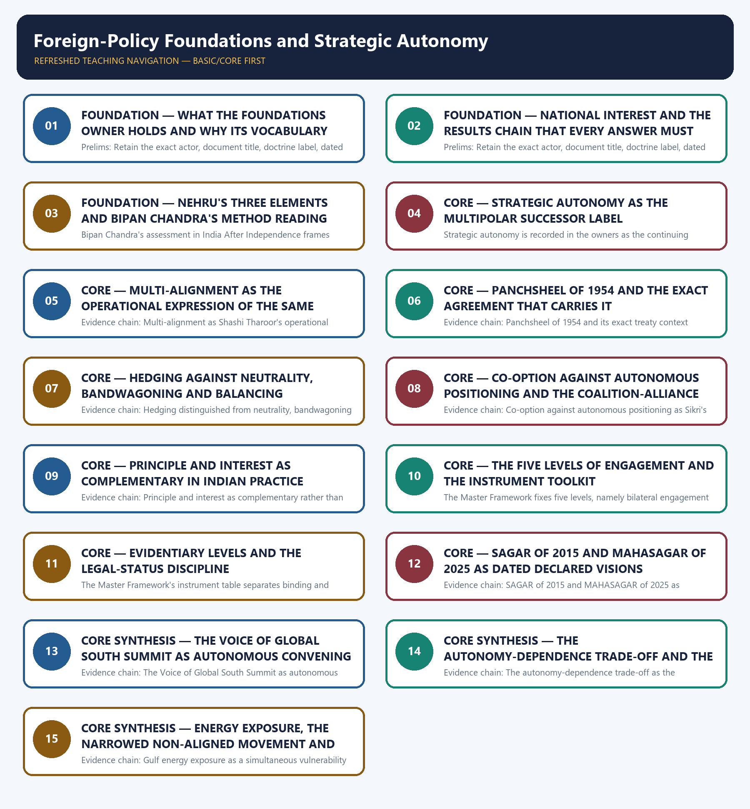

# Foreign-Policy Foundations and Strategic Autonomy — Learner-v2 Complete Learning Session

> **Authoring-only generation:** 2026-09-03. No PDF was rendered and no tracker or index was mutated.

### SOURCE, PROGRESSION AND CURRENT-LINKAGE AUDIT

- **Generation date:** 2026-09-03.
- **Repository-first evidence:** the Basic owner is taught first and preserved in full; the Advanced owner is retained only in the optional final teaching block.
- **OCR evidence:** Repository Markdown was primary. The OCR-searchable official General Studies question papers held under books\mains and books\more_previous_papers were read only to confirm the printed wording of routed demands. No official answer key, marking scheme, page precision or unsupported quotation was imported from them.
- **Qdrant:** not used; repository Markdown and available OCR context were sufficient.
- **PYQ integrity:** One objective demand is routed to this topic in the audited routing ledgers and it is reproduced here exactly as the ledger records it: 2024 Prelims General Studies Paper I, question 86, on books authored by S. Jaishankar, namely The India Way and Why Bharat Matters. The owner's own integration block records that the official 2024 Prelims Set-A key is present locally, yet it states expressly that no option or answer is recorded or inferred, and that rule is preserved here without exception, so no answer letter appears anywhere in this package. No General Studies Paper II Mains demand in the audited 2024-2025 papers directly names strategic autonomy, non-alignment or multi-alignment, and the owners instruct that this be stated honestly rather than force-fitted onto an unrelated question, so no Mains demand card is manufactured for this topic and no adjacent question is claimed as its property. The locally held OCR-searchable official General Studies papers were read only to confirm printed wording; no question was invented from them, no stem was paraphrased into an apparent routing, and no marking scheme or page precision was imported. Every model solution in the original practice section below is original work written to the repository's examiner-grade standard using the claim, named evidence, analysis and qualification pattern, and none of them reproduces or claims an official answer.
- **Live-link boundary:** Live official verification was attempted on 2026-09-03 against the Ministry of External Affairs press-release, bilateral-document and country-brief pages and against the Press Information Bureau release index. Each attempt is recorded honestly above: the Ministry pages returned a browser-requirement stub or the Ministry's own error page and the Press Information Bureau index returned HTTP 403, so no new live item was obtained. The package therefore uses only the dated official anchors already carried by the repository owners, each with its actor, exact evidentiary level and date. It invents no treaty or joint-statement wording, no border or diplomatic status, no summit outcome, no trade, tariff, investment or supply-chain figure, no initiative membership or participation category, no military or security development, no declared policy position, no previous-year question, no answer key and no current claim.
- **Fact/inference discipline:** no current-affairs item, PYQ wording, figure or quotation is invented.

### LIVE OFFICIAL-SOURCE ATTEMPT LOG

Every live check below was attempted on 2026-09-03 in the priority order required for International Relations: Ministry of External Affairs official pages first, then other official government or international-organisation documents. Access failures are recorded exactly as observed and no claim is reconstructed from a failed fetch.

- https://www.mea.gov.in/press-releases.htm — attempted 2026-09-03; the request redirected to a browser-requirement stub and returned no press release text, so no live item was taken from it.
- https://www.mea.gov.in/bilateral-documents.htm — attempted 2026-09-03; the request redirected to a browser-requirement stub and returned no bilateral document text, so no live item was taken from it.
- https://www.mea.gov.in/foreign-relation.htm — attempted 2026-09-03; the request redirected to the Ministry's own error page, so no country brief was taken from it.
- https://www.pib.gov.in/indexd.aspx?reg=3&lang=1 — attempted 2026-09-03; the request returned HTTP 403, so no release was taken from it.

## BASIC LEARNING SESSION



*Distinct embedded teaching-navigation image. The separate continuous Cārvāka-style flowchart package remains an independent at-a-glance artifact.*

### SESSION 1 — FOUNDATION — WHAT THE FOUNDATIONS OWNER HOLDS AND WHY ITS VOCABULARY TRANSFERS

#### DEFINITION / WHAT THIS IS CALLED

**Plain-language definition:** FOUNDATION — What the foundations owner holds and why its vocabulary transfers comprises FOUNDATION, What the foundations owner holds and why its vocabulary transfers as its core connected dimensions.

**Technical definition:** Prelims: Retain the exact actor, document title, doctrine label, dated instrument and evidentiary level attached to What the foundations owner holds and why its vocabulary transfers, and never upgrade a vision statement into a treaty, a signature into a ratification, a participation category into membership, or an announced corridor into an operating one.

#### ANSWER-GRABBING OPENING — WRITE/ADAPT IN THE EXAM

> Prelims: Retain the exact actor, document title, doctrine label, dated instrument and evidentiary level attached to What the foundations owner holds and why its vocabulary transfers, and never upgrade a vision statement into a treaty, a signature into a ratification, a participation category into membership, or an announced corridor into an operating one.

#### MUST-WRITE KEYWORDS

- **FOUNDATION**
- **What the foundations owner holds**
- **why its vocabulary transfers**
- **Evidence chain**
- **Qualified use**
- **Article 51**

**How to use them:** Frame the answer through FOUNDATION; define What the foundations owner holds, connect why its vocabulary transfers with Evidence chain to explain the mechanism, and use Qualified use for the decisive comparison or qualification.

#### VISUAL FIRST

```text
WHAT THE FOUNDATIONS OWNER HOLDS AND WHY ITS VOCABULARY TRANSFERS
01. What this owner holds and why the whole International Relations folder depends on it
BOUNDARY -> This owner supplies the lens; Article 51 doctrine belongs to Polity and Cold-War chronology to World History.
```

*This topic-specific rail fixes the evidence sequence and its exam boundary before analysis.*

#### CORE EXPLANATION

This topic owns the vocabulary that every later topic in the folder borrows, namely national interest, non-alignment, strategic autonomy, multi-alignment, Panchsheel, hedging, the bilateral-regional-minilateral-multilateral instrument toolkit and the autonomy-dependence trade-off, and its distinctive feature is that it is simultaneously conceptual and structurally examinable: the owners record that no General Studies Paper II Mains demand in the audited 2024-2025 papers directly names strategic autonomy, non-alignment or multi-alignment, while one objective demand from 2024 Prelims General Studies Paper I is routed to it, so it must be learned as the structuring lens for adjacent questions rather than as a stand-alone question bank; the constitutional basis in Article 51 of the Directive Principles belongs to the Polity owner and the Cold-War chronology of the Non-Aligned Movement's founding belongs to the World History owner.

#### NAMED EVIDENCE AND MECHANISM

- This topic owns the vocabulary that every later topic in the folder borrows, namely national interest, non-alignment, strategic autonomy, multi-alignment, Panchsheel, hedging, the bilateral-regional-minilateral-multilateral instrument toolkit and the autonomy-dependence trade-off, and its distinctive feature is that it is simultaneously conceptual and structurally examinable: the owners record that no General Studies Paper II Mains demand in the audited 2024-2025 papers directly names strategic autonomy, non-alignment or multi-alignment, while one objective demand from 2024 Prelims General Studies Paper I is routed to it, so it must be learned as the structuring lens for adjacent questions rather than as a stand-alone question bank; the constitutional basis in Article 51 of the Directive Principles belongs to the Polity owner and the Cold-War chronology of the Non-Aligned Movement's founding belongs to the World History owner.

#### EXAMINER CAUTION

- This owner supplies the lens; Article 51 doctrine belongs to Polity and Cold-War chronology to World History.

#### EXAM LINK

- **Prelims:** Retain the exact actor, document title, doctrine label, dated instrument and evidentiary level attached to What the foundations owner holds and why its vocabulary transfers, and never upgrade a vision statement into a treaty, a signature into a ratification, a participation category into membership, or an announced corridor into an operating one.
- **Mains:** Open any general foreign-policy demand by naming the interest and the doctrine label before listing any partner or summit.

#### MINI RECAP

- **Evidence chain:** What this owner holds and why the whole International Relations folder depends on it
- **Qualified use:** Open any general foreign-policy demand by naming the interest and the doctrine label before listing any partner or summit.

#### CLOSING RECALL FLOW — FOUNDATION — WHAT THE FOUNDATIONS OWNER HOLDS AND WHY ITS VOCABULARY TRANSFERS

```text
START / CONCEPT: FOUNDATION — What the foundations owner holds and why its vocabulary transfers
        |
        v
EXACT TERMS: FOUNDATION · What the foundations owner holds · why its vocabulary transfers · Evidence chain · Qualified use · Article 51
        |
        v
MECHANISM / ARGUMENT: Evidence chain: What this owner holds and why the whole International Relations folder depends on it Qualified use: Open any general foreign-policy demand by naming the interest and the doctrine label before listing any partner or summit.
        |
        v
CONSEQUENCE / CONTRAST: This topic owns the vocabulary that every later topic in the folder borrows, namely national interest, non-alignment, strategic autonomy, multi-alignment, Panchsheel, hedging, the bilateral-regional-minilateral-multilateral instrument toolkit and the autonomy-dependence trade-off, and its distinctive feature is that it is simultaneously conceptual and structurally examinable: the owners record that no General Studies Paper II Mains demand in the audited 2024-2025 papers directly names strategic autonomy, non-alignment or multi-alignment, while one objective demand from 2024 Prelims General Studies Paper I is routed to it, so it must be learned as the structuring lens for adjacent questions rather than as a stand-alone question bank; the constitutional basis in Article 51 of the Directive Principles belongs to the Polity owner and the Cold-War chronology of the Non-Aligned Movement's founding belongs to the World History owner.
        |
        v
UPSC TRAP / ANSWER-USE: Do not miss this limiting distinction: article 51 doctrine belongs to Polity and Cold-War chronology to World History.
        |
        v
ANSWER-GRABBING FORMULATION: Prelims: Retain the exact actor, document title, doctrine label, dated instrument and evidentiary level attached to What the foundations owner holds and why its vocabulary transfers, and never upgrade a vision statement into a treaty, a signature into a ratification, a participation category into membership, or an announced corridor into an operating one.
```
### SESSION 2 — FOUNDATION — NATIONAL INTEREST AND THE RESULTS CHAIN THAT EVERY ANSWER MUST TRACE

#### DEFINITION / WHAT THIS IS CALLED

**Plain-language definition:** The Master Framework of this folder defines national interest as the set of security, economic-growth and resource, technology, diaspora-welfare, reputation and rule-shaping, and strategic-autonomy goals that guide external conduct, and it fixes the answer chain as interest, then external context or actor, then instrument chosen, then verified outcome, then constraint or trade-off, then calibrated way forward; the operational consequence is that an answer which opens with a country list or a summit list has skipped the only step that makes the rest of the analysis evaluable, because the instrument can only be judged against the interest it was chosen to serve.

**Technical definition:** Prelims: Retain the exact actor, document title, doctrine label, dated instrument and evidentiary level attached to National interest and the results chain that every answer must trace, and never upgrade a vision statement into a treaty, a signature into a ratification, a participation category into membership, or an announced corridor into an operating one.

#### ANSWER-GRABBING OPENING — WRITE/ADAPT IN THE EXAM

> Prelims: Retain the exact actor, document title, doctrine label, dated instrument and evidentiary level attached to National interest and the results chain that every answer must trace, and never upgrade a vision statement into a treaty, a signature into a ratification, a participation category into membership, or an announced corridor into an operating one.

#### MUST-WRITE KEYWORDS

- **FOUNDATION**
- **National interest**
- **Evidence chain**
- **Qualified use**
- **The Master Framework**
- **Retain**

**How to use them:** Frame the answer through FOUNDATION; define National interest, connect Evidence chain with Qualified use to explain the mechanism, and use The Master Framework for the decisive comparison or qualification.

#### VISUAL FIRST

```text
NATIONAL INTEREST AND THE RESULTS CHAIN THAT EVERY ANSWER MUST TRACE
01. National interest as the fixed starting point of the results chain
BOUNDARY -> An answer that opens with a country list has skipped the step that makes the instrument evaluable.
```

*This topic-specific rail fixes the evidence sequence and its exam boundary before analysis.*

#### CORE EXPLANATION

The Master Framework of this folder defines national interest as the set of security, economic-growth and resource, technology, diaspora-welfare, reputation and rule-shaping, and strategic-autonomy goals that guide external conduct, and it fixes the answer chain as interest, then external context or actor, then instrument chosen, then verified outcome, then constraint or trade-off, then calibrated way forward; the operational consequence is that an answer which opens with a country list or a summit list has skipped the only step that makes the rest of the analysis evaluable, because the instrument can only be judged against the interest it was chosen to serve.

#### NAMED EVIDENCE AND MECHANISM

- The Master Framework of this folder defines national interest as the set of security, economic-growth and resource, technology, diaspora-welfare, reputation and rule-shaping, and strategic-autonomy goals that guide external conduct, and it fixes the answer chain as interest, then external context or actor, then instrument chosen, then verified outcome, then constraint or trade-off, then calibrated way forward; the operational consequence is that an answer which opens with a country list or a summit list has skipped the only step that makes the rest of the analysis evaluable, because the instrument can only be judged against the interest it was chosen to serve.

#### EXAMINER CAUTION

- An answer that opens with a country list has skipped the step that makes the instrument evaluable.

#### EXAM LINK

- **Prelims:** Retain the exact actor, document title, doctrine label, dated instrument and evidentiary level attached to National interest and the results chain that every answer must trace, and never upgrade a vision statement into a treaty, a signature into a ratification, a participation category into membership, or an announced corridor into an operating one.
- **Mains:** Structure a whole answer as interest, actor, level, instrument, outcome, constraint and calibrated way forward.

#### MINI RECAP

- **Evidence chain:** National interest as the fixed starting point of the results chain
- **Qualified use:** Structure a whole answer as interest, actor, level, instrument, outcome, constraint and calibrated way forward.

#### CLOSING RECALL FLOW — FOUNDATION — NATIONAL INTEREST AND THE RESULTS CHAIN THAT EVERY ANSWER MUST TRACE

```text
START / CONCEPT: FOUNDATION — National interest and the results chain that every answer must trace
        |
        v
EXACT TERMS: FOUNDATION · National interest · Evidence chain · Qualified use · The Master Framework · Retain
        |
        v
MECHANISM / ARGUMENT: Evidence chain: National interest as the fixed starting point of the results chain Qualified use: Structure a whole answer as interest, actor, level, instrument, outcome, constraint and calibrated way forward.
        |
        v
CONSEQUENCE / CONTRAST: The Master Framework of this folder defines national interest as the set of security, economic-growth and resource, technology, diaspora-welfare, reputation and rule-shaping, and strategic-autonomy goals that guide external conduct, and it fixes the answer chain as interest, then external context or actor, then instrument chosen, then verified outcome, then constraint or trade-off, then calibrated way forward; the operational consequence is that an answer which opens with a country list or a summit list has skipped the only step that makes the rest of the analysis evaluable, because the instrument can only be judged against the interest it was chosen to serve.
        |
        v
UPSC TRAP / ANSWER-USE: Do not miss this limiting distinction: an answer that opens with a country list has skipped the step that makes...
        |
        v
ANSWER-GRABBING FORMULATION: Prelims: Retain the exact actor, document title, doctrine label, dated instrument and evidentiary level attached to National interest and the results chain that every answer must trace, and never upgrade a vision statement into a treaty, a signature into a ratification, a participation category into membership, or an announced corridor into an operating one.
```
### SESSION 3 — FOUNDATION — NEHRU'S THREE ELEMENTS AND BIPAN CHANDRA'S METHOD READING

#### DEFINITION / WHAT THIS IS CALLED

**Plain-language definition:** Non-alignment as Nehru described it had three stated elements, namely that India has no military alliances with countries of either bloc, that India has an independent approach to foreign policy, and that India attempts to maintain friendly relations with all countries, so the doctrine was a refusal to join a Cold-War bloc rather than passivity or abstention from world affairs; the examinable precision is that the first element is about alliance membership, the second about decision-making method and the third about relationship breadth, and collapsing the three into a vague idea of neutrality loses exactly the distinction the examiner is testing.

**Technical definition:** Bipan Chandra's assessment in India After Independence frames non-alignment as not a blueprint for policy but an approach, a framework, a method, not a straitjacket but a lodestar by which the young nation could steer its course, which explains why the doctrine could survive the disappearance of the bipolar order that produced it; the analytical payoff is that continuity in Indian foreign policy is continuity of method and not continuity of partner set, so a change of partners is evidence of the method working rather than evidence of the doctrine being abandoned.

#### ANSWER-GRABBING OPENING — WRITE/ADAPT IN THE EXAM

> Evidence chain: Nehru's three-part formulation of non-alignment - Bipan Chandra's characterisation of non-alignment as a method rather than a blueprint Qualified use: Show doctrinal continuity through changed partners instead of narrating a chronology of summits.

#### MUST-WRITE KEYWORDS

- **FOUNDATION**
- **Nehru's three elements**
- **Bipan Chandra's method reading**
- **Evidence chain**
- **Qualified use**
- **Non-alignment**

**How to use them:** Frame the answer through FOUNDATION; define Nehru's three elements, connect Bipan Chandra's method reading with Evidence chain to explain the mechanism, and use Qualified use for the decisive comparison or qualification.

#### VISUAL FIRST

```text
NEHRU'S THREE ELEMENTS AND BIPAN CHANDRA'S METHOD READING
01. Nehru's three-part formulation of non-alignment
    |
    v
02. Bipan Chandra's characterisation of non-alignment as a method rather than a blueprint
BOUNDARY -> Non-alignment is bloc avoidance and independent method, not neutrality and not a fixed partner set.
```

*This topic-specific rail fixes the evidence sequence and its exam boundary before analysis.*

#### CORE EXPLANATION

Non-alignment as Nehru described it had three stated elements, namely that India has no military alliances with countries of either bloc, that India has an independent approach to foreign policy, and that India attempts to maintain friendly relations with all countries, so the doctrine was a refusal to join a Cold-War bloc rather than passivity or abstention from world affairs; the examinable precision is that the first element is about alliance membership, the second about decision-making method and the third about relationship breadth, and collapsing the three into a vague idea of neutrality loses exactly the distinction the examiner is testing. Bipan Chandra's assessment in India After Independence frames non-alignment as not a blueprint for policy but an approach, a framework, a method, not a straitjacket but a lodestar by which the young nation could steer its course, which explains why the doctrine could survive the disappearance of the bipolar order that produced it; the analytical payoff is that continuity in Indian foreign policy is continuity of method and not continuity of partner set, so a change of partners is evidence of the method working rather than evidence of the doctrine being abandoned.

#### NAMED EVIDENCE AND MECHANISM

- Non-alignment as Nehru described it had three stated elements, namely that India has no military alliances with countries of either bloc, that India has an independent approach to foreign policy, and that India attempts to maintain friendly relations with all countries, so the doctrine was a refusal to join a Cold-War bloc rather than passivity or abstention from world affairs; the examinable precision is that the first element is about alliance membership, the second about decision-making method and the third about relationship breadth, and collapsing the three into a vague idea of neutrality loses exactly the distinction the examiner is testing.
- Bipan Chandra's assessment in India After Independence frames non-alignment as not a blueprint for policy but an approach, a framework, a method, not a straitjacket but a lodestar by which the young nation could steer its course, which explains why the doctrine could survive the disappearance of the bipolar order that produced it; the analytical payoff is that continuity in Indian foreign policy is continuity of method and not continuity of partner set, so a change of partners is evidence of the method working rather than evidence of the doctrine being abandoned.

#### EXAMINER CAUTION

- Non-alignment is bloc avoidance and independent method, not neutrality and not a fixed partner set.

#### EXAM LINK

- **Prelims:** Retain the exact actor, document title, doctrine label, dated instrument and evidentiary level attached to Nehru's three elements and Bipan Chandra's method reading, and never upgrade a vision statement into a treaty, a signature into a ratification, a participation category into membership, or an announced corridor into an operating one.
- **Mains:** Show doctrinal continuity through changed partners instead of narrating a chronology of summits.

#### MINI RECAP

- **Evidence chain:** Nehru's three-part formulation of non-alignment -> Bipan Chandra's characterisation of non-alignment as a method rather than a blueprint
- **Qualified use:** Show doctrinal continuity through changed partners instead of narrating a chronology of summits.

#### CLOSING RECALL FLOW — FOUNDATION — NEHRU'S THREE ELEMENTS AND BIPAN CHANDRA'S METHOD READING

```text
START / CONCEPT: FOUNDATION — Nehru's three elements and Bipan Chandra's method reading
        |
        v
EXACT TERMS: FOUNDATION · Nehru's three elements · Bipan Chandra's method reading · Evidence chain · Qualified use · Non-alignment
        |
        v
MECHANISM / ARGUMENT: Bipan Chandra's assessment in India After Independence frames non-alignment as not a blueprint for policy but an approach, a framework, a method, not a straitjacket but a lodestar by which the young nation could steer its course, which explains why the doctrine could survive the disappearance of the bipolar order that produced it; the analytical payoff is that continuity in Indian foreign policy is continuity of method and not continuity of partner set, so a change of partners is evidence of the method working rather than evidence of the doctrine being abandoned.
        |
        v
CONSEQUENCE / CONTRAST: Non-alignment is bloc avoidance and independent method, not neutrality and not a fixed partner set.
        |
        v
UPSC TRAP / ANSWER-USE: Non-alignment as Nehru described it had three stated elements, namely that India has no military alliances with countries of either bloc, that India has an independent approach to foreign policy, and that India attempts to maintain friendly relations with all countries, so the doctrine was a refusal to join a Cold-War bloc rather than passivity or abstention from world affairs; the examinable precision is that the first element is about alliance membership, the second about decision-making method and the third about relationship breadth, and collapsing the three into a vague idea of neutrality loses exactly the distinction the examiner is testing.
        |
        v
ANSWER-GRABBING FORMULATION: Evidence chain: Nehru's three-part formulation of non-alignment - Bipan Chandra's characterisation of non-alignment as a method rather than a blueprint Qualified use: Show doctrinal continuity through changed partners instead of narrating a chronology of summits.
```
### SESSION 4 — CORE — STRATEGIC AUTONOMY AS THE MULTIPOLAR SUCCESSOR LABEL

#### DEFINITION / WHAT THIS IS CALLED

**Plain-language definition:** Evidence chain: Strategic autonomy as the multipolar-era successor label Qualified use: Anchor an is-India-still-non-aligned demand in continuity of method rather than declaring the doctrine over.

**Technical definition:** Strategic autonomy is recorded in the owners as the continuing successor concept to non-alignment in a multipolar, post-Cold-War world, defined as the retained capacity to decide each external issue by India's own interest calculus rather than by bloc discipline, and it is expressly distinguished from neutrality, which implies equidistance or non-participation, because autonomy permits active and asymmetric engagement with several actors at once; Rajiv Sikri's supporting formulation is that India has wisely diversified its foreign-policy options but must retain flexibility in order to be able to pursue an independent foreign policy, on which there is an overwhelming national consensus.

#### ANSWER-GRABBING OPENING — WRITE/ADAPT IN THE EXAM

> Evidence chain: Strategic autonomy as the multipolar-era successor label Qualified use: Anchor an is-India-still-non-aligned demand in continuity of method rather than declaring the doctrine over.

#### MUST-WRITE KEYWORDS

- **Strategic autonomy as the multipolar successor label**
- **Evidence chain**
- **Qualified use**
- **Strategic autonomy**
- **Strategic**
- **Cold-War**

**How to use them:** Frame the answer through Strategic autonomy as the multipolar successor label; define Evidence chain, connect Qualified use with Strategic autonomy to explain the mechanism, and use Strategic for the decisive comparison or qualification.

#### VISUAL FIRST

```text
STRATEGIC AUTONOMY AS THE MULTIPOLAR SUCCESSOR LABEL
01. Strategic autonomy as the multipolar-era successor label
BOUNDARY -> Autonomy permits active and asymmetric engagement, so it is not equidistance or non-participation.
```

*This topic-specific rail fixes the evidence sequence and its exam boundary before analysis.*

#### CORE EXPLANATION

Strategic autonomy is recorded in the owners as the continuing successor concept to non-alignment in a multipolar, post-Cold-War world, defined as the retained capacity to decide each external issue by India's own interest calculus rather than by bloc discipline, and it is expressly distinguished from neutrality, which implies equidistance or non-participation, because autonomy permits active and asymmetric engagement with several actors at once; Rajiv Sikri's supporting formulation is that India has wisely diversified its foreign-policy options but must retain flexibility in order to be able to pursue an independent foreign policy, on which there is an overwhelming national consensus.

#### NAMED EVIDENCE AND MECHANISM

- Strategic autonomy is recorded in the owners as the continuing successor concept to non-alignment in a multipolar, post-Cold-War world, defined as the retained capacity to decide each external issue by India's own interest calculus rather than by bloc discipline, and it is expressly distinguished from neutrality, which implies equidistance or non-participation, because autonomy permits active and asymmetric engagement with several actors at once; Rajiv Sikri's supporting formulation is that India has wisely diversified its foreign-policy options but must retain flexibility in order to be able to pursue an independent foreign policy, on which there is an overwhelming national consensus.

#### EXAMINER CAUTION

- Autonomy permits active and asymmetric engagement, so it is not equidistance or non-participation.

#### EXAM LINK

- **Prelims:** Retain the exact actor, document title, doctrine label, dated instrument and evidentiary level attached to Strategic autonomy as the multipolar successor label, and never upgrade a vision statement into a treaty, a signature into a ratification, a participation category into membership, or an announced corridor into an operating one.
- **Mains:** Anchor an is-India-still-non-aligned demand in continuity of method rather than declaring the doctrine over.

#### MINI RECAP

- **Evidence chain:** Strategic autonomy as the multipolar-era successor label
- **Qualified use:** Anchor an is-India-still-non-aligned demand in continuity of method rather than declaring the doctrine over.

#### CLOSING RECALL FLOW — CORE — STRATEGIC AUTONOMY AS THE MULTIPOLAR SUCCESSOR LABEL

```text
START / CONCEPT: CORE — Strategic autonomy as the multipolar successor label
        |
        v
EXACT TERMS: Strategic autonomy as the multipolar successor label · Evidence chain · Qualified use · Strategic autonomy · Strategic · Cold-War
        |
        v
MECHANISM / ARGUMENT: Strategic autonomy is recorded in the owners as the continuing successor concept to non-alignment in a multipolar, post-Cold-War world, defined as the retained capacity to decide each external issue by India's own interest calculus rather than by bloc discipline, and it is expressly distinguished from neutrality, which implies equidistance or non-participation, because autonomy permits active and asymmetric engagement with several actors at once; Rajiv Sikri's supporting formulation is that India has wisely diversified its foreign-policy options but must retain flexibility in order to be able to pursue an independent foreign policy, on which there is an overwhelming national consensus.
        |
        v
CONSEQUENCE / CONTRAST: Autonomy permits active and asymmetric engagement, so it is not equidistance or non-participation.
        |
        v
UPSC TRAP / ANSWER-USE: Mains: Anchor an is-India-still-non-aligned demand in continuity of method rather than declaring the doctrine over.
        |
        v
ANSWER-GRABBING FORMULATION: Evidence chain: Strategic autonomy as the multipolar-era successor label Qualified use: Anchor an is-India-still-non-aligned demand in continuity of method rather than declaring the doctrine over.
```
### SESSION 5 — CORE — MULTI-ALIGNMENT AS THE OPERATIONAL EXPRESSION OF THE SAME PRINCIPLE

#### DEFINITION / WHAT THIS IS CALLED

**Plain-language definition:** Multi-alignment is Tharoor's term in Pax Indica for engaging every relevant platform on its own terms, textually pairing the United Nations with the G20, the Non-Aligned Movement with the Community of Democracies, the G77 with smaller organizations like IOR-ARC, and SAARC with ASEAN-linked processes, as simultaneous and non-exclusive commitments rather than membership of one bloc; the examinable qualification is that most of the bodies in that list are non-treaty platforms, so multi-alignment describes engagement breadth and not alliance proliferation.

**Technical definition:** Evidence chain: Multi-alignment as Shashi Tharoor's operational expression of the same principle Qualified use: Cite paired simultaneous engagements to prove non-exclusivity instead of asserting balance.

#### ANSWER-GRABBING OPENING — WRITE/ADAPT IN THE EXAM

> Evidence chain: Multi-alignment as Shashi Tharoor's operational expression of the same principle Qualified use: Cite paired simultaneous engagements to prove non-exclusivity instead of asserting balance.

#### MUST-WRITE KEYWORDS

- **Evidence chain**
- **Qualified use**
- **Multi-alignment**
- **Tharoor's**
- **Pax Indica**
- **United Nations**

**How to use them:** Frame the answer through Evidence chain; define Qualified use, connect Multi-alignment with Tharoor's to explain the mechanism, and use Pax Indica for the decisive comparison or qualification.

#### VISUAL FIRST

```text
MULTI-ALIGNMENT AS THE OPERATIONAL EXPRESSION OF THE SAME PRINCIPLE
01. Multi-alignment as Shashi Tharoor's operational expression of the same principle
BOUNDARY -> Most platforms in the multi-alignment list are non-treaty, so breadth is not alliance proliferation.
```

*This topic-specific rail fixes the evidence sequence and its exam boundary before analysis.*

#### CORE EXPLANATION

Multi-alignment is Tharoor's term in Pax Indica for engaging every relevant platform on its own terms, textually pairing the United Nations with the G20, the Non-Aligned Movement with the Community of Democracies, the G77 with smaller organizations like IOR-ARC, and SAARC with ASEAN-linked processes, as simultaneous and non-exclusive commitments rather than membership of one bloc; the examinable qualification is that most of the bodies in that list are non-treaty platforms, so multi-alignment describes engagement breadth and not alliance proliferation.

#### NAMED EVIDENCE AND MECHANISM

- Multi-alignment is Tharoor's term in Pax Indica for engaging every relevant platform on its own terms, textually pairing the United Nations with the G20, the Non-Aligned Movement with the Community of Democracies, the G77 with smaller organizations like IOR-ARC, and SAARC with ASEAN-linked processes, as simultaneous and non-exclusive commitments rather than membership of one bloc; the examinable qualification is that most of the bodies in that list are non-treaty platforms, so multi-alignment describes engagement breadth and not alliance proliferation.

#### EXAMINER CAUTION

- Most platforms in the multi-alignment list are non-treaty, so breadth is not alliance proliferation.

#### EXAM LINK

- **Prelims:** Retain the exact actor, document title, doctrine label, dated instrument and evidentiary level attached to Multi-alignment as the operational expression of the same principle, and never upgrade a vision statement into a treaty, a signature into a ratification, a participation category into membership, or an announced corridor into an operating one.
- **Mains:** Cite paired simultaneous engagements to prove non-exclusivity instead of asserting balance.

#### MINI RECAP

- **Evidence chain:** Multi-alignment as Shashi Tharoor's operational expression of the same principle
- **Qualified use:** Cite paired simultaneous engagements to prove non-exclusivity instead of asserting balance.

#### CLOSING RECALL FLOW — CORE — MULTI-ALIGNMENT AS THE OPERATIONAL EXPRESSION OF THE SAME PRINCIPLE

```text
START / CONCEPT: CORE — Multi-alignment as the operational expression of the same principle
        |
        v
EXACT TERMS: Evidence chain · Qualified use · Multi-alignment · Tharoor's · Pax Indica · United Nations
        |
        v
MECHANISM / ARGUMENT: Multi-alignment is Tharoor's term in Pax Indica for engaging every relevant platform on its own terms, textually pairing the United Nations with the G20, the Non-Aligned Movement with the Community of Democracies, the G77 with smaller organizations like IOR-ARC, and SAARC with ASEAN-linked processes, as simultaneous and non-exclusive commitments rather than membership of one bloc; the examinable qualification is that most of the bodies in that list are non-treaty platforms, so multi-alignment describes engagement breadth and not alliance proliferation.
        |
        v
CONSEQUENCE / CONTRAST: Most platforms in the multi-alignment list are non-treaty, so breadth is not alliance proliferation.
        |
        v
UPSC TRAP / ANSWER-USE: Do not miss this limiting distinction: cite paired simultaneous engagements to prove non-exclusivity instead of asserting balance.
        |
        v
ANSWER-GRABBING FORMULATION: Evidence chain: Multi-alignment as Shashi Tharoor's operational expression of the same principle Qualified use: Cite paired simultaneous engagements to prove non-exclusivity instead of asserting balance.
```
### SESSION 6 — CORE — PANCHSHEEL OF 1954 AND THE EXACT AGREEMENT THAT CARRIES IT

#### DEFINITION / WHAT THIS IS CALLED

**Plain-language definition:** Panchsheel comprises the five principles of peaceful coexistence, namely mutual respect for sovereignty and territorial integrity, non-aggression, non-interference, equality and mutual benefit, and peaceful coexistence, and the owners fix its exact location as the preamble of the India-China Agreement on Trade and Intercourse with the Tibet Region of China signed on 29 April 1954, which remains a historical normative reference still invoked in India's diplomatic vocabulary and cited in joint statements; the precision that earns marks is that Panchsheel is a set of normative principles for interstate conduct while non-alignment is a bloc-avoidance posture, so the two are related but distinct and were not adopted at the same conference.

**Technical definition:** Evidence chain: Panchsheel of 1954 and its exact treaty context Qualified use: Supply the precise normative citation that raises a general foreign-policy answer above description.

#### ANSWER-GRABBING OPENING — WRITE/ADAPT IN THE EXAM

> Panchsheel comprises the five principles of peaceful coexistence, namely mutual respect for sovereignty and territorial integrity, non-aggression, non-interference, equality and mutual benefit, and peaceful coexistence, and the owners fix its exact location as the preamble of the India-China Agreement on Trade and Intercourse with the Tibet Region of China signed on 29 April 1954, which remains a historical normative reference still invoked in India's diplomatic vocabulary and cited in joint statements; the precision that earns marks is that Panchsheel is a set of normative principles for interstate conduct while non-alignment is a bloc-avoidance posture, so the two are related but distinct and were not adopted at the same conference.

#### MUST-WRITE KEYWORDS

- **Panchsheel of 1954**
- **the exact agreement that carries it**
- **Evidence chain**
- **Qualified use**
- **Panchsheel**
- **India-China Agreement**

**How to use them:** Frame the answer through Panchsheel of 1954; define the exact agreement that carries it, connect Evidence chain with Qualified use to explain the mechanism, and use Panchsheel for the decisive comparison or qualification.

#### VISUAL FIRST

```text
PANCHSHEEL OF 1954 AND THE EXACT AGREEMENT THAT CARRIES IT
01. Panchsheel of 1954 and its exact treaty context
BOUNDARY -> Panchsheel is a normative-principles statement, not a bloc posture, and the two were not adopted together.
```

*This topic-specific rail fixes the evidence sequence and its exam boundary before analysis.*

#### CORE EXPLANATION

Panchsheel comprises the five principles of peaceful coexistence, namely mutual respect for sovereignty and territorial integrity, non-aggression, non-interference, equality and mutual benefit, and peaceful coexistence, and the owners fix its exact location as the preamble of the India-China Agreement on Trade and Intercourse with the Tibet Region of China signed on 29 April 1954, which remains a historical normative reference still invoked in India's diplomatic vocabulary and cited in joint statements; the precision that earns marks is that Panchsheel is a set of normative principles for interstate conduct while non-alignment is a bloc-avoidance posture, so the two are related but distinct and were not adopted at the same conference.

#### NAMED EVIDENCE AND MECHANISM

- Panchsheel comprises the five principles of peaceful coexistence, namely mutual respect for sovereignty and territorial integrity, non-aggression, non-interference, equality and mutual benefit, and peaceful coexistence, and the owners fix its exact location as the preamble of the India-China Agreement on Trade and Intercourse with the Tibet Region of China signed on 29 April 1954, which remains a historical normative reference still invoked in India's diplomatic vocabulary and cited in joint statements; the precision that earns marks is that Panchsheel is a set of normative principles for interstate conduct while non-alignment is a bloc-avoidance posture, so the two are related but distinct and were not adopted at the same conference.

#### EXAMINER CAUTION

- Panchsheel is a normative-principles statement, not a bloc posture, and the two were not adopted together.

#### EXAM LINK

- **Prelims:** Retain the exact actor, document title, doctrine label, dated instrument and evidentiary level attached to Panchsheel of 1954 and the exact agreement that carries it, and never upgrade a vision statement into a treaty, a signature into a ratification, a participation category into membership, or an announced corridor into an operating one.
- **Mains:** Supply the precise normative citation that raises a general foreign-policy answer above description.

#### MINI RECAP

- **Evidence chain:** Panchsheel of 1954 and its exact treaty context
- **Qualified use:** Supply the precise normative citation that raises a general foreign-policy answer above description.

#### CLOSING RECALL FLOW — CORE — PANCHSHEEL OF 1954 AND THE EXACT AGREEMENT THAT CARRIES IT

```text
START / CONCEPT: CORE — Panchsheel of 1954 and the exact agreement that carries it
        |
        v
EXACT TERMS: Panchsheel of 1954 · the exact agreement that carries it · Evidence chain · Qualified use · Panchsheel · India-China Agreement
        |
        v
MECHANISM / ARGUMENT: Evidence chain: Panchsheel of 1954 and its exact treaty context Qualified use: Supply the precise normative citation that raises a general foreign-policy answer above description.
        |
        v
CONSEQUENCE / CONTRAST: Panchsheel is a normative-principles statement, not a bloc posture, and the two were not adopted together.
        |
        v
UPSC TRAP / ANSWER-USE: Do not miss this limiting distinction: supply the precise normative citation that raises a general foreign-policy answer above description.
        |
        v
ANSWER-GRABBING FORMULATION: Panchsheel comprises the five principles of peaceful coexistence, namely mutual respect for sovereignty and territorial integrity, non-aggression, non-interference, equality and mutual benefit, and peaceful coexistence, and the owners fix its exact location as the preamble of the India-China Agreement on Trade and Intercourse with the Tibet Region of China signed on 29 April 1954, which remains a historical normative reference still invoked in India's diplomatic vocabulary and cited in joint statements; the precision that earns marks is that Panchsheel is a set of normative principles for interstate conduct while non-alignment is a bloc-avoidance posture, so the two are related but distinct and were not adopted at the same conference.
```
### SESSION 7 — CORE — HEDGING AGAINST NEUTRALITY, BANDWAGONING AND BALANCING

#### DEFINITION / WHAT THIS IS CALLED

**Plain-language definition:** Bandwagoning means aligning with the stronger power, balancing means aligning against it, and hedging means pursuing both engagement and risk-mitigation with more than one power simultaneously, so hedging is the opposite of avoidance and is best described in the owners as India's posture toward the United States-China dynamic; the decisive analytical line is that hedging is not equidistance or fence-sitting, because it involves deepening several partnerships, often deeply and asymmetrically, on separate issue tracks rather than declining to commit on any of them.

**Technical definition:** Evidence chain: Hedging distinguished from neutrality, bandwagoning and balancing Qualified use: Name India's posture toward competing powers with the correct technical term and defend the choice.

#### ANSWER-GRABBING OPENING — WRITE/ADAPT IN THE EXAM

> Bandwagoning means aligning with the stronger power, balancing means aligning against it, and hedging means pursuing both engagement and risk-mitigation with more than one power simultaneously, so hedging is the opposite of avoidance and is best described in the owners as India's posture toward the United States-China dynamic; the decisive analytical line is that hedging is not equidistance or fence-sitting, because it involves deepening several partnerships, often deeply and asymmetrically, on separate issue tracks rather than declining to commit on any of them.

#### MUST-WRITE KEYWORDS

- **Hedging against neutrality**
- **bandwagoning**
- **balancing**
- **Evidence chain**
- **Qualified use**
- **India's**

**How to use them:** Frame the answer through Hedging against neutrality; define bandwagoning, connect balancing with Evidence chain to explain the mechanism, and use Qualified use for the decisive comparison or qualification.

#### VISUAL FIRST

```text
HEDGING AGAINST NEUTRALITY, BANDWAGONING AND BALANCING
01. Hedging distinguished from neutrality, bandwagoning and balancing
BOUNDARY -> Hedging deepens several partnerships at once, so describing it as fence-sitting inverts its meaning.
```

*This topic-specific rail fixes the evidence sequence and its exam boundary before analysis.*

#### CORE EXPLANATION

Bandwagoning means aligning with the stronger power, balancing means aligning against it, and hedging means pursuing both engagement and risk-mitigation with more than one power simultaneously, so hedging is the opposite of avoidance and is best described in the owners as India's posture toward the United States-China dynamic; the decisive analytical line is that hedging is not equidistance or fence-sitting, because it involves deepening several partnerships, often deeply and asymmetrically, on separate issue tracks rather than declining to commit on any of them.

#### NAMED EVIDENCE AND MECHANISM

- Bandwagoning means aligning with the stronger power, balancing means aligning against it, and hedging means pursuing both engagement and risk-mitigation with more than one power simultaneously, so hedging is the opposite of avoidance and is best described in the owners as India's posture toward the United States-China dynamic; the decisive analytical line is that hedging is not equidistance or fence-sitting, because it involves deepening several partnerships, often deeply and asymmetrically, on separate issue tracks rather than declining to commit on any of them.

#### EXAMINER CAUTION

- Hedging deepens several partnerships at once, so describing it as fence-sitting inverts its meaning.

#### EXAM LINK

- **Prelims:** Retain the exact actor, document title, doctrine label, dated instrument and evidentiary level attached to Hedging against neutrality, bandwagoning and balancing, and never upgrade a vision statement into a treaty, a signature into a ratification, a participation category into membership, or an announced corridor into an operating one.
- **Mains:** Name India's posture toward competing powers with the correct technical term and defend the choice.

#### MINI RECAP

- **Evidence chain:** Hedging distinguished from neutrality, bandwagoning and balancing
- **Qualified use:** Name India's posture toward competing powers with the correct technical term and defend the choice.

#### CLOSING RECALL FLOW — CORE — HEDGING AGAINST NEUTRALITY, BANDWAGONING AND BALANCING

```text
START / CONCEPT: CORE — Hedging against neutrality, bandwagoning and balancing
        |
        v
EXACT TERMS: Hedging against neutrality · bandwagoning · balancing · Evidence chain · Qualified use · India's
        |
        v
MECHANISM / ARGUMENT: Evidence chain: Hedging distinguished from neutrality, bandwagoning and balancing Qualified use: Name India's posture toward competing powers with the correct technical term and defend the choice.
        |
        v
CONSEQUENCE / CONTRAST: The resulting consequence is that bandwagoning means aligning with the stronger power, balancing means aligning against it.
        |
        v
UPSC TRAP / ANSWER-USE: Do not miss this limiting distinction: bandwagoning means aligning with the stronger power, balancing means aligning against it.
        |
        v
ANSWER-GRABBING FORMULATION: Bandwagoning means aligning with the stronger power, balancing means aligning against it, and hedging means pursuing both engagement and risk-mitigation with more than one power simultaneously, so hedging is the opposite of avoidance and is best described in the owners as India's posture toward the United States-China dynamic; the decisive analytical line is that hedging is not equidistance or fence-sitting, because it involves deepening several partnerships, often deeply and asymmetrically, on separate issue tracks rather than declining to commit on any of them.
```
### SESSION 8 — CORE — CO-OPTION AGAINST AUTONOMOUS POSITIONING AND THE COALITION-ALLIANCE LINE

#### DEFINITION / WHAT THIS IS CALLED

**Plain-language definition:** Co-option and autonomy are not fully exclusive, and a named grouping is not proof of alliance membership.

**Technical definition:** Evidence chain: Co-option against autonomous positioning as Sikri's central strategic choice - Issue-based coalition against treaty alliance Qualified use: Convert an evaluative question about a partnership into a testable question about retained freedom of choice.

#### ANSWER-GRABBING OPENING — WRITE/ADAPT IN THE EXAM

> Evidence chain: Co-option against autonomous positioning as Sikri's central strategic choice - Issue-based coalition against treaty alliance Qualified use: Convert an evaluative question about a partnership into a testable question about retained freedom of choice.

#### MUST-WRITE KEYWORDS

- **Co-option against autonomous positioning**
- **the coalition-alliance line**
- **Evidence chain**
- **Qualified use**
- **Sikri**
- **India**

**How to use them:** Frame the answer through Co-option against autonomous positioning; define the coalition-alliance line, connect Evidence chain with Qualified use to explain the mechanism, and use Sikri for the decisive comparison or qualification.

#### VISUAL FIRST

```text
CO-OPTION AGAINST AUTONOMOUS POSITIONING AND THE COALITION-ALLIANCE LINE
01. Co-option against autonomous positioning as Sikri's central strategic choice
    |
    v
02. Issue-based coalition against treaty alliance
BOUNDARY -> Co-option and autonomy are not fully exclusive, and a named grouping is not proof of alliance membership.
```

*This topic-specific rail fixes the evidence sequence and its exam boundary before analysis.*

#### CORE EXPLANATION

Sikri frames the core strategic choice explicitly as whether India wants to be co-opted into the existing international structures while retaining flexibility in order to be able to pursue an independent foreign policy, and the owners record this as the operational test to apply to any specific bilateral or multilateral decision; the two options are not fully exclusive in practice, which is precisely why the distinction is analytically useful, because it converts an evaluative question about a partnership into a testable question about whether the engagement preserved India's freedom to decide the next issue independently. An issue-based coalition such as the Quad, I2U2 or the G4 is formed around one specific shared interest without a mutual-defence treaty obligation, whereas an alliance carries binding collective-defence commitments, and the owners record that India's minilateral engagements are consistently the former and not the latter; the trap this distinction defuses is the assumption that participation in a named grouping implies alliance membership, and the Master Framework reinforces it with the alliance-autonomy conflation gap, which corrects the description of a deepened partnership as bloc membership.

#### NAMED EVIDENCE AND MECHANISM

- Sikri frames the core strategic choice explicitly as whether India wants to be co-opted into the existing international structures while retaining flexibility in order to be able to pursue an independent foreign policy, and the owners record this as the operational test to apply to any specific bilateral or multilateral decision; the two options are not fully exclusive in practice, which is precisely why the distinction is analytically useful, because it converts an evaluative question about a partnership into a testable question about whether the engagement preserved India's freedom to decide the next issue independently.
- An issue-based coalition such as the Quad, I2U2 or the G4 is formed around one specific shared interest without a mutual-defence treaty obligation, whereas an alliance carries binding collective-defence commitments, and the owners record that India's minilateral engagements are consistently the former and not the latter; the trap this distinction defuses is the assumption that participation in a named grouping implies alliance membership, and the Master Framework reinforces it with the alliance-autonomy conflation gap, which corrects the description of a deepened partnership as bloc membership.

#### EXAMINER CAUTION

- Co-option and autonomy are not fully exclusive, and a named grouping is not proof of alliance membership.

#### EXAM LINK

- **Prelims:** Retain the exact actor, document title, doctrine label, dated instrument and evidentiary level attached to Co-option against autonomous positioning and the coalition-alliance line, and never upgrade a vision statement into a treaty, a signature into a ratification, a participation category into membership, or an announced corridor into an operating one.
- **Mains:** Convert an evaluative question about a partnership into a testable question about retained freedom of choice.

#### MINI RECAP

- **Evidence chain:** Co-option against autonomous positioning as Sikri's central strategic choice -> Issue-based coalition against treaty alliance
- **Qualified use:** Convert an evaluative question about a partnership into a testable question about retained freedom of choice.

#### CLOSING RECALL FLOW — CORE — CO-OPTION AGAINST AUTONOMOUS POSITIONING AND THE COALITION-ALLIANCE LINE

```text
START / CONCEPT: CORE — Co-option against autonomous positioning and the coalition-alliance line
        |
        v
EXACT TERMS: Co-option against autonomous positioning · the coalition-alliance line · Evidence chain · Qualified use · Sikri · India
        |
        v
MECHANISM / ARGUMENT: Sikri frames the core strategic choice explicitly as whether India wants to be co-opted into the existing international structures while retaining flexibility in order to be able to pursue an independent foreign policy, and the owners record this as the operational test to apply to any specific bilateral or multilateral decision; the two options are not fully exclusive in practice, which is precisely why the distinction is analytically useful, because it converts an evaluative question about a partnership into a testable question about whether the engagement preserved India's freedom to decide the next issue independently.
        |
        v
CONSEQUENCE / CONTRAST: Co-option and autonomy are not fully exclusive, and a named grouping is not proof of alliance membership.
        |
        v
UPSC TRAP / ANSWER-USE: An issue-based coalition such as the Quad, I2U2 or the G4 is formed around one specific shared interest without a mutual-defence treaty obligation, whereas an alliance carries binding collective-defence commitments, and the owners record that India's minilateral engagements are consistently the former and not the latter; the trap this distinction defuses is the assumption that participation in a named grouping implies alliance membership, and the Master Framework reinforces it with the alliance-autonomy conflation gap, which corrects the description of a deepened partnership as bloc membership.
        |
        v
ANSWER-GRABBING FORMULATION: Evidence chain: Co-option against autonomous positioning as Sikri's central strategic choice - Issue-based coalition against treaty alliance Qualified use: Convert an evaluative question about a partnership into a testable question about retained freedom of choice.
```
### SESSION 9 — CORE — PRINCIPLE AND INTEREST AS COMPLEMENTARY IN INDIAN PRACTICE

#### DEFINITION / WHAT THIS IS CALLED

**Plain-language definition:** CORE — Principle and interest as complementary in Indian practice comprises Principle, interest as complementary in Indian practice and Evidence chain as its core connected dimensions.

**Technical definition:** Evidence chain: Principle and interest as complementary rather than opposed Qualified use: Answer a principles-versus-interests demand by showing complementarity rather than choosing a side.

#### ANSWER-GRABBING OPENING — WRITE/ADAPT IN THE EXAM

> Indian diplomatic practice does not present normative commitments such as anti-colonialism, sovereign equality and Panchsheel as a trade-off against hard interests such as security, technology access and growth, and the owners note that principled language is frequently used to build coalition legitimacy for interest-based goals, for example in Global South leadership; the boundary case worth writing is that solidarity language and the interest goal of institutional voice are not separable in practice, and saying so explicitly is itself an analytical point rather than an evasion.

#### MUST-WRITE KEYWORDS

- **Principle**
- **interest as complementary in Indian practice**
- **Evidence chain**
- **Qualified use**
- **Indian**
- **Panchsheel**

**How to use them:** Frame the answer through Principle; define interest as complementary in Indian practice, connect Evidence chain with Qualified use to explain the mechanism, and use Indian for the decisive comparison or qualification.

#### VISUAL FIRST

```text
PRINCIPLE AND INTEREST AS COMPLEMENTARY IN INDIAN PRACTICE
01. Principle and interest as complementary rather than opposed
BOUNDARY -> Solidarity language and the interest goal of institutional voice are not separable in practice.
```

*This topic-specific rail fixes the evidence sequence and its exam boundary before analysis.*

#### CORE EXPLANATION

Indian diplomatic practice does not present normative commitments such as anti-colonialism, sovereign equality and Panchsheel as a trade-off against hard interests such as security, technology access and growth, and the owners note that principled language is frequently used to build coalition legitimacy for interest-based goals, for example in Global South leadership; the boundary case worth writing is that solidarity language and the interest goal of institutional voice are not separable in practice, and saying so explicitly is itself an analytical point rather than an evasion.

#### NAMED EVIDENCE AND MECHANISM

- Indian diplomatic practice does not present normative commitments such as anti-colonialism, sovereign equality and Panchsheel as a trade-off against hard interests such as security, technology access and growth, and the owners note that principled language is frequently used to build coalition legitimacy for interest-based goals, for example in Global South leadership; the boundary case worth writing is that solidarity language and the interest goal of institutional voice are not separable in practice, and saying so explicitly is itself an analytical point rather than an evasion.

#### EXAMINER CAUTION

- Solidarity language and the interest goal of institutional voice are not separable in practice.

#### EXAM LINK

- **Prelims:** Retain the exact actor, document title, doctrine label, dated instrument and evidentiary level attached to Principle and interest as complementary in Indian practice, and never upgrade a vision statement into a treaty, a signature into a ratification, a participation category into membership, or an announced corridor into an operating one.
- **Mains:** Answer a principles-versus-interests demand by showing complementarity rather than choosing a side.

#### MINI RECAP

- **Evidence chain:** Principle and interest as complementary rather than opposed
- **Qualified use:** Answer a principles-versus-interests demand by showing complementarity rather than choosing a side.

#### CLOSING RECALL FLOW — CORE — PRINCIPLE AND INTEREST AS COMPLEMENTARY IN INDIAN PRACTICE

```text
START / CONCEPT: CORE — Principle and interest as complementary in Indian practice
        |
        v
EXACT TERMS: Principle · interest as complementary in Indian practice · Evidence chain · Qualified use · Indian · Panchsheel
        |
        v
MECHANISM / ARGUMENT: Evidence chain: Principle and interest as complementary rather than opposed Qualified use: Answer a principles-versus-interests demand by showing complementarity rather than choosing a side.
        |
        v
CONSEQUENCE / CONTRAST: Solidarity language and the interest goal of institutional voice are not separable in practice.
        |
        v
UPSC TRAP / ANSWER-USE: Do not miss this limiting distinction: indian diplomatic practice does not present normative commitments such as anti-colonialism, sovereign equality and...
        |
        v
ANSWER-GRABBING FORMULATION: Indian diplomatic practice does not present normative commitments such as anti-colonialism, sovereign equality and Panchsheel as a trade-off against hard interests such as security, technology access and growth, and the owners note that principled language is frequently used to build coalition legitimacy for interest-based goals, for example in Global South leadership; the boundary case worth writing is that solidarity language and the interest goal of institutional voice are not separable in practice, and saying so explicitly is itself an analytical point rather than an evasion.
```
### SESSION 10 — CORE — THE FIVE LEVELS OF ENGAGEMENT AND THE INSTRUMENT TOOLKIT

#### DEFINITION / WHAT THIS IS CALLED

**Plain-language definition:** Evidence chain: The five levels of engagement and the instrument toolkit Qualified use: Name the level and justify it, because level selection is itself a scoring step.

**Technical definition:** The Master Framework fixes five levels, namely bilateral engagement through summit visits, joint statements and defence or trade agreements, regional engagement through neighbourhood or geographic groupings such as SAARC, BIMSTEC, IORA and the Central Asia Dialogue, minilateral engagement through small non-treaty issue coalitions such as the Quad, I2U2, RIC and IBSA, multilateral or global engagement through universal or near-universal bodies such as the United Nations, the World Trade Organization, the International Monetary Fund, the World Bank and the G20, and diaspora or people-to-people engagement through the Pravasi Bharatiya Divas, the Indian Technical and Economic Cooperation programme and consular welfare diplomacy; the framework also records that one issue is frequently worked at more than one level at the same time, so naming the level and justifying it is a scoring step rather than decoration.

#### ANSWER-GRABBING OPENING — WRITE/ADAPT IN THE EXAM

> Evidence chain: The five levels of engagement and the instrument toolkit Qualified use: Name the level and justify it, because level selection is itself a scoring step.

#### MUST-WRITE KEYWORDS

- **The five levels of engagement**
- **the instrument toolkit**
- **Evidence chain**
- **Qualified use**
- **The Master Framework**
- **SAARC**

**How to use them:** Frame the answer through The five levels of engagement; define the instrument toolkit, connect Evidence chain with Qualified use to explain the mechanism, and use The Master Framework for the decisive comparison or qualification.

#### VISUAL FIRST

```text
THE FIVE LEVELS OF ENGAGEMENT AND THE INSTRUMENT TOOLKIT
01. The five levels of engagement and the instrument toolkit
BOUNDARY -> One issue is frequently worked at more than one level at the same time.
```

*This topic-specific rail fixes the evidence sequence and its exam boundary before analysis.*

#### CORE EXPLANATION

The Master Framework fixes five levels, namely bilateral engagement through summit visits, joint statements and defence or trade agreements, regional engagement through neighbourhood or geographic groupings such as SAARC, BIMSTEC, IORA and the Central Asia Dialogue, minilateral engagement through small non-treaty issue coalitions such as the Quad, I2U2, RIC and IBSA, multilateral or global engagement through universal or near-universal bodies such as the United Nations, the World Trade Organization, the International Monetary Fund, the World Bank and the G20, and diaspora or people-to-people engagement through the Pravasi Bharatiya Divas, the Indian Technical and Economic Cooperation programme and consular welfare diplomacy; the framework also records that one issue is frequently worked at more than one level at the same time, so naming the level and justifying it is a scoring step rather than decoration.

#### NAMED EVIDENCE AND MECHANISM

- The Master Framework fixes five levels, namely bilateral engagement through summit visits, joint statements and defence or trade agreements, regional engagement through neighbourhood or geographic groupings such as SAARC, BIMSTEC, IORA and the Central Asia Dialogue, minilateral engagement through small non-treaty issue coalitions such as the Quad, I2U2, RIC and IBSA, multilateral or global engagement through universal or near-universal bodies such as the United Nations, the World Trade Organization, the International Monetary Fund, the World Bank and the G20, and diaspora or people-to-people engagement through the Pravasi Bharatiya Divas, the Indian Technical and Economic Cooperation programme and consular welfare diplomacy; the framework also records that one issue is frequently worked at more than one level at the same time, so naming the level and justifying it is a scoring step rather than decoration.

#### EXAMINER CAUTION

- One issue is frequently worked at more than one level at the same time.

#### EXAM LINK

- **Prelims:** Retain the exact actor, document title, doctrine label, dated instrument and evidentiary level attached to The five levels of engagement and the instrument toolkit, and never upgrade a vision statement into a treaty, a signature into a ratification, a participation category into membership, or an announced corridor into an operating one.
- **Mains:** Name the level and justify it, because level selection is itself a scoring step.

#### MINI RECAP

- **Evidence chain:** The five levels of engagement and the instrument toolkit
- **Qualified use:** Name the level and justify it, because level selection is itself a scoring step.

#### CLOSING RECALL FLOW — CORE — THE FIVE LEVELS OF ENGAGEMENT AND THE INSTRUMENT TOOLKIT

```text
START / CONCEPT: CORE — The five levels of engagement and the instrument toolkit
        |
        v
EXACT TERMS: The five levels of engagement · the instrument toolkit · Evidence chain · Qualified use · The Master Framework · SAARC
        |
        v
MECHANISM / ARGUMENT: The Master Framework fixes five levels, namely bilateral engagement through summit visits, joint statements and defence or trade agreements, regional engagement through neighbourhood or geographic groupings such as SAARC, BIMSTEC, IORA and the Central Asia Dialogue, minilateral engagement through small non-treaty issue coalitions such as the Quad, I2U2, RIC and IBSA, multilateral or global engagement through universal or near-universal bodies such as the United Nations, the World Trade Organization, the International Monetary Fund, the World Bank and the G20, and diaspora or people-to-people engagement through the Pravasi Bharatiya Divas, the Indian Technical and Economic Cooperation programme and consular welfare diplomacy; the framework also records that one issue is frequently worked at more than one level at the same time, so naming the level and justifying it is a scoring step rather than decoration.
        |
        v
CONSEQUENCE / CONTRAST: One issue is frequently worked at more than one level at the same time.
        |
        v
UPSC TRAP / ANSWER-USE: Do not miss this limiting distinction: name the level and justify it, because level selection is itself a scoring step.
        |
        v
ANSWER-GRABBING FORMULATION: Evidence chain: The five levels of engagement and the instrument toolkit Qualified use: Name the level and justify it, because level selection is itself a scoring step.
```
### SESSION 11 — CORE — EVIDENTIARY LEVELS AND THE LEGAL-STATUS DISCIPLINE

#### DEFINITION / WHAT THIS IS CALLED

**Plain-language definition:** Evidence chain: Evidentiary levels and the legal-status gap Qualified use: Cite one instrument with its exact stage so the outcome claim cannot be inflated.

**Technical definition:** The Master Framework's instrument table separates binding and non-binding outputs by naming the exact stage each one reaches, so a treaty or agreement binds once ratified, a charter binds member states once in force, a joint statement or vision document is a political commitment and not a treaty, a declaration is political or normative rather than legally binding, a memorandum of understanding is a statement of intent that is not self-executing, a corridor memorandum is a framework of intent rather than evidence of an operating segment, a dialogue mechanism produces no binding output by itself, and partner or observer status is participation without the rights and obligations of full membership; the framework's stated exam trap is that agreed, signed or in force, and delivered are three different claims that must never be upgraded into one another without a date.

#### ANSWER-GRABBING OPENING — WRITE/ADAPT IN THE EXAM

> Evidence chain: Evidentiary levels and the legal-status gap Qualified use: Cite one instrument with its exact stage so the outcome claim cannot be inflated.

#### MUST-WRITE KEYWORDS

- **Evidentiary levels**
- **the legal-status discipline**
- **Evidence chain**
- **Qualified use**
- **The Master Framework's**
- **Agreed, signed or in force, and delivered**

**How to use them:** Frame the answer through Evidentiary levels; define the legal-status discipline, connect Evidence chain with Qualified use to explain the mechanism, and use The Master Framework's for the decisive comparison or qualification.

#### VISUAL FIRST

```text
EVIDENTIARY LEVELS AND THE LEGAL-STATUS DISCIPLINE
01. Evidentiary levels and the legal-status gap
BOUNDARY -> Agreed, signed or in force, and delivered are three different claims that need separate dates.
```

*This topic-specific rail fixes the evidence sequence and its exam boundary before analysis.*

#### CORE EXPLANATION

The Master Framework's instrument table separates binding and non-binding outputs by naming the exact stage each one reaches, so a treaty or agreement binds once ratified, a charter binds member states once in force, a joint statement or vision document is a political commitment and not a treaty, a declaration is political or normative rather than legally binding, a memorandum of understanding is a statement of intent that is not self-executing, a corridor memorandum is a framework of intent rather than evidence of an operating segment, a dialogue mechanism produces no binding output by itself, and partner or observer status is participation without the rights and obligations of full membership; the framework's stated exam trap is that agreed, signed or in force, and delivered are three different claims that must never be upgraded into one another without a date.

#### NAMED EVIDENCE AND MECHANISM

- The Master Framework's instrument table separates binding and non-binding outputs by naming the exact stage each one reaches, so a treaty or agreement binds once ratified, a charter binds member states once in force, a joint statement or vision document is a political commitment and not a treaty, a declaration is political or normative rather than legally binding, a memorandum of understanding is a statement of intent that is not self-executing, a corridor memorandum is a framework of intent rather than evidence of an operating segment, a dialogue mechanism produces no binding output by itself, and partner or observer status is participation without the rights and obligations of full membership; the framework's stated exam trap is that agreed, signed or in force, and delivered are three different claims that must never be upgraded into one another without a date.

#### EXAMINER CAUTION

- Agreed, signed or in force, and delivered are three different claims that need separate dates.

#### EXAM LINK

- **Prelims:** Retain the exact actor, document title, doctrine label, dated instrument and evidentiary level attached to Evidentiary levels and the legal-status discipline, and never upgrade a vision statement into a treaty, a signature into a ratification, a participation category into membership, or an announced corridor into an operating one.
- **Mains:** Cite one instrument with its exact stage so the outcome claim cannot be inflated.

#### MINI RECAP

- **Evidence chain:** Evidentiary levels and the legal-status gap
- **Qualified use:** Cite one instrument with its exact stage so the outcome claim cannot be inflated.

#### CLOSING RECALL FLOW — CORE — EVIDENTIARY LEVELS AND THE LEGAL-STATUS DISCIPLINE

```text
START / CONCEPT: CORE — Evidentiary levels and the legal-status discipline
        |
        v
EXACT TERMS: Evidentiary levels · the legal-status discipline · Evidence chain · Qualified use · The Master Framework's · Agreed, signed or in force, and delivered
        |
        v
MECHANISM / ARGUMENT: The Master Framework's instrument table separates binding and non-binding outputs by naming the exact stage each one reaches, so a treaty or agreement binds once ratified, a charter binds member states once in force, a joint statement or vision document is a political commitment and not a treaty, a declaration is political or normative rather than legally binding, a memorandum of understanding is a statement of intent that is not self-executing, a corridor memorandum is a framework of intent rather than evidence of an operating segment, a dialogue mechanism produces no binding output by itself, and partner or observer status is participation without the rights and obligations of full membership; the framework's stated exam trap is that agreed, signed or in force, and delivered are three different claims that must never be upgraded into one another without a date.
        |
        v
CONSEQUENCE / CONTRAST: Agreed, signed or in force, and delivered are three different claims that need separate dates.
        |
        v
UPSC TRAP / ANSWER-USE: Do not miss this limiting distinction: evidentiary levels and the legal-status gap Qualified use.
        |
        v
ANSWER-GRABBING FORMULATION: Evidence chain: Evidentiary levels and the legal-status gap Qualified use: Cite one instrument with its exact stage so the outcome claim cannot be inflated.
```
### SESSION 12 — CORE — SAGAR OF 2015 AND MAHASAGAR OF 2025 AS DATED DECLARED VISIONS

#### DEFINITION / WHAT THIS IS CALLED

**Plain-language definition:** SAGAR, standing for Security and Growth for All in the Region, was articulated in Mauritius on 12 March 2015, and on 12 March 2025, again in Mauritius at Port Louis, the Prime Minister announced that India's vision for the Global South would be going beyond SAGAR and would be MAHASAGAR, standing for Mutual and Holistic Advancement for Security and Growth Across Regions, encompassing trade for development, capacity building for sustainable growth, and mutual security for a shared future, delivered through technology sharing, concessional loan and grants; the owners are explicit that both are declared visions and not treaties, that they create no obligations by themselves, and that the 2025 announcement extends scope while reaffirming that India is moving ahead with the SAGAR Vision in the Indian Ocean region, so MAHASAGAR did not replace or supersede SAGAR.

**Technical definition:** Evidence chain: SAGAR of 2015 and MAHASAGAR of 2025 as declared visions Qualified use: Cite a doctrinal articulation with its date and status instead of an undated slogan.

#### ANSWER-GRABBING OPENING — WRITE/ADAPT IN THE EXAM

> SAGAR, standing for Security and Growth for All in the Region, was articulated in Mauritius on 12 March 2015, and on 12 March 2025, again in Mauritius at Port Louis, the Prime Minister announced that India's vision for the Global South would be going beyond SAGAR and would be MAHASAGAR, standing for Mutual and Holistic Advancement for Security and Growth Across Regions, encompassing trade for development, capacity building for sustainable growth, and mutual security for a shared future, delivered through technology sharing, concessional loan and grants; the owners are explicit that both are declared visions and not treaties, that they create no obligations by themselves, and that the 2025 announcement extends scope while reaffirming that India is moving ahead with the SAGAR Vision in the Indian Ocean region, so MAHASAGAR did not replace or supersede SAGAR.

#### MUST-WRITE KEYWORDS

- **SAGAR of 2015**
- **MAHASAGAR of 2025 as dated declared visions**
- **Evidence chain**
- **Qualified use**
- **SAGAR**
- **Security**

**How to use them:** Frame the answer through SAGAR of 2015; define MAHASAGAR of 2025 as dated declared visions, connect Evidence chain with Qualified use to explain the mechanism, and use SAGAR for the decisive comparison or qualification.

#### VISUAL FIRST

```text
SAGAR OF 2015 AND MAHASAGAR OF 2025 AS DATED DECLARED VISIONS
01. SAGAR of 2015 and MAHASAGAR of 2025 as declared visions
BOUNDARY -> Both are declared visions, not treaties, and the later one extends scope without superseding the earlier.
```

*This topic-specific rail fixes the evidence sequence and its exam boundary before analysis.*

#### CORE EXPLANATION

SAGAR, standing for Security and Growth for All in the Region, was articulated in Mauritius on 12 March 2015, and on 12 March 2025, again in Mauritius at Port Louis, the Prime Minister announced that India's vision for the Global South would be going beyond SAGAR and would be MAHASAGAR, standing for Mutual and Holistic Advancement for Security and Growth Across Regions, encompassing trade for development, capacity building for sustainable growth, and mutual security for a shared future, delivered through technology sharing, concessional loan and grants; the owners are explicit that both are declared visions and not treaties, that they create no obligations by themselves, and that the 2025 announcement extends scope while reaffirming that India is moving ahead with the SAGAR Vision in the Indian Ocean region, so MAHASAGAR did not replace or supersede SAGAR.

#### NAMED EVIDENCE AND MECHANISM

- SAGAR, standing for Security and Growth for All in the Region, was articulated in Mauritius on 12 March 2015, and on 12 March 2025, again in Mauritius at Port Louis, the Prime Minister announced that India's vision for the Global South would be going beyond SAGAR and would be MAHASAGAR, standing for Mutual and Holistic Advancement for Security and Growth Across Regions, encompassing trade for development, capacity building for sustainable growth, and mutual security for a shared future, delivered through technology sharing, concessional loan and grants; the owners are explicit that both are declared visions and not treaties, that they create no obligations by themselves, and that the 2025 announcement extends scope while reaffirming that India is moving ahead with the SAGAR Vision in the Indian Ocean region, so MAHASAGAR did not replace or supersede SAGAR.

#### EXAMINER CAUTION

- Both are declared visions, not treaties, and the later one extends scope without superseding the earlier.

#### EXAM LINK

- **Prelims:** Retain the exact actor, document title, doctrine label, dated instrument and evidentiary level attached to SAGAR of 2015 and MAHASAGAR of 2025 as dated declared visions, and never upgrade a vision statement into a treaty, a signature into a ratification, a participation category into membership, or an announced corridor into an operating one.
- **Mains:** Cite a doctrinal articulation with its date and status instead of an undated slogan.

#### MINI RECAP

- **Evidence chain:** SAGAR of 2015 and MAHASAGAR of 2025 as declared visions
- **Qualified use:** Cite a doctrinal articulation with its date and status instead of an undated slogan.

#### CLOSING RECALL FLOW — CORE — SAGAR OF 2015 AND MAHASAGAR OF 2025 AS DATED DECLARED VISIONS

```text
START / CONCEPT: CORE — SAGAR of 2015 and MAHASAGAR of 2025 as dated declared visions
        |
        v
EXACT TERMS: SAGAR of 2015 · MAHASAGAR of 2025 as dated declared visions · Evidence chain · Qualified use · SAGAR · Security
        |
        v
MECHANISM / ARGUMENT: Evidence chain: SAGAR of 2015 and MAHASAGAR of 2025 as declared visions Qualified use: Cite a doctrinal articulation with its date and status instead of an undated slogan.
        |
        v
CONSEQUENCE / CONTRAST: Both are declared visions, not treaties, and the later one extends scope without superseding the earlier.
        |
        v
UPSC TRAP / ANSWER-USE: Do not miss this limiting distinction: sAGAR, standing for Security and Growth for All in the Region, was articulated in...
        |
        v
ANSWER-GRABBING FORMULATION: SAGAR, standing for Security and Growth for All in the Region, was articulated in Mauritius on 12 March 2015, and on 12 March 2025, again in Mauritius at Port Louis, the Prime Minister announced that India's vision for the Global South would be going beyond SAGAR and would be MAHASAGAR, standing for Mutual and Holistic Advancement for Security and Growth Across Regions, encompassing trade for development, capacity building for sustainable growth, and mutual security for a shared future, delivered through technology sharing, concessional loan and grants; the owners are explicit that both are declared visions and not treaties, that they create no obligations by themselves, and that the 2025 announcement extends scope while reaffirming that India is moving ahead with the SAGAR Vision in the Indian Ocean region, so MAHASAGAR did not replace or supersede SAGAR.
```
### SESSION 13 — CORE SYNTHESIS — THE VOICE OF GLOBAL SOUTH SUMMIT AS AUTONOMOUS CONVENING

#### DEFINITION / WHAT THIS IS CALLED

**Plain-language definition:** CORE SYNTHESIS — The Voice of Global South Summit as autonomous convening comprises CORE SYNTHESIS, Evidence chain and Qualified use as its core connected dimensions.

**Technical definition:** Evidence chain: The Voice of Global South Summit as autonomous agenda-setting Qualified use: Prove independent agenda-setting with a dated, verified convening rather than an aspiration.

#### ANSWER-GRABBING OPENING — WRITE/ADAPT IN THE EXAM

> The Voice of Global South Summit has had three editions recorded in the owners, held on 12 to 13 January 2023, on 17 November 2023 and on 17 August 2024, all convened virtually by India, and the third edition of 17 August 2024 is referenced in a subsequent Ministry of External Affairs bilateral document dated January 2025; the owners further record that no fourth edition was officially recorded as of 3 August 2026, so the platform is the clearest verified example of India-led coalition convening under multi-alignment while any further edition or outcome requires its own dated verification before it may be cited.

#### MUST-WRITE KEYWORDS

- **CORE SYNTHESIS**
- **Evidence chain**
- **Qualified use**
- **The Voice**
- **Global South Summit**
- **India**

**How to use them:** Frame the answer through CORE SYNTHESIS; define Evidence chain, connect Qualified use with The Voice to explain the mechanism, and use Global South Summit for the decisive comparison or qualification.

#### VISUAL FIRST

```text
THE VOICE OF GLOBAL SOUTH SUMMIT AS AUTONOMOUS CONVENING
01. The Voice of Global South Summit as autonomous agenda-setting
BOUNDARY -> Three editions are recorded and no fourth was officially recorded as of 3 August 2026.
```

*This topic-specific rail fixes the evidence sequence and its exam boundary before analysis.*

#### CORE EXPLANATION

The Voice of Global South Summit has had three editions recorded in the owners, held on 12 to 13 January 2023, on 17 November 2023 and on 17 August 2024, all convened virtually by India, and the third edition of 17 August 2024 is referenced in a subsequent Ministry of External Affairs bilateral document dated January 2025; the owners further record that no fourth edition was officially recorded as of 3 August 2026, so the platform is the clearest verified example of India-led coalition convening under multi-alignment while any further edition or outcome requires its own dated verification before it may be cited.

#### NAMED EVIDENCE AND MECHANISM

- The Voice of Global South Summit has had three editions recorded in the owners, held on 12 to 13 January 2023, on 17 November 2023 and on 17 August 2024, all convened virtually by India, and the third edition of 17 August 2024 is referenced in a subsequent Ministry of External Affairs bilateral document dated January 2025; the owners further record that no fourth edition was officially recorded as of 3 August 2026, so the platform is the clearest verified example of India-led coalition convening under multi-alignment while any further edition or outcome requires its own dated verification before it may be cited.

#### EXAMINER CAUTION

- Three editions are recorded and no fourth was officially recorded as of 3 August 2026.

#### EXAM LINK

- **Prelims:** Retain the exact actor, document title, doctrine label, dated instrument and evidentiary level attached to The Voice of Global South Summit as autonomous convening, and never upgrade a vision statement into a treaty, a signature into a ratification, a participation category into membership, or an announced corridor into an operating one.
- **Mains:** Prove independent agenda-setting with a dated, verified convening rather than an aspiration.

#### MINI RECAP

- **Evidence chain:** The Voice of Global South Summit as autonomous agenda-setting
- **Qualified use:** Prove independent agenda-setting with a dated, verified convening rather than an aspiration.

#### CLOSING RECALL FLOW — CORE SYNTHESIS — THE VOICE OF GLOBAL SOUTH SUMMIT AS AUTONOMOUS CONVENING

```text
START / CONCEPT: CORE SYNTHESIS — The Voice of Global South Summit as autonomous convening
        |
        v
EXACT TERMS: CORE SYNTHESIS · Evidence chain · Qualified use · The Voice · Global South Summit · India
        |
        v
MECHANISM / ARGUMENT: Evidence chain: The Voice of Global South Summit as autonomous agenda-setting Qualified use: Prove independent agenda-setting with a dated, verified convening rather than an aspiration.
        |
        v
CONSEQUENCE / CONTRAST: Mains: Prove independent agenda-setting with a dated, verified convening rather than an aspiration.
        |
        v
UPSC TRAP / ANSWER-USE: Do not miss this limiting distinction: three editions are recorded and no fourth was officially recorded as of 3 August...
        |
        v
ANSWER-GRABBING FORMULATION: The Voice of Global South Summit has had three editions recorded in the owners, held on 12 to 13 January 2023, on 17 November 2023 and on 17 August 2024, all convened virtually by India, and the third edition of 17 August 2024 is referenced in a subsequent Ministry of External Affairs bilateral document dated January 2025; the owners further record that no fourth edition was officially recorded as of 3 August 2026, so the platform is the clearest verified example of India-led coalition convening under multi-alignment while any further edition or outcome requires its own dated verification before it may be cited.
```
### SESSION 14 — CORE SYNTHESIS — THE AUTONOMY-DEPENDENCE TRADE-OFF AND THE 2025-26 STRESS TEST

#### DEFINITION / WHAT THIS IS CALLED

**Plain-language definition:** The owners record a dated sequence that tests hedging directly: an additional United States duty linked to purchases of Russian oil took effect on 27 August 2025 and was removed from 7 February 2026, India officially called the action unjustified and unreasonable on 4 and 6 August 2025, the twenty-third India-Russia Annual Summit went ahead in New Delhi on 4 and 5 December 2025, and the ten-year Framework for the United States-India Major Defense Partnership was signed on 31 October 2025; the recorded reading is that hedging held but that its cost is real, priced and third-party imposed, and the Master Framework's sanctions-obligation gap adds the necessary precision that another state's unilateral measure is exposure and secondary risk rather than a binding international-law duty on India.

**Technical definition:** Evidence chain: The autonomy-dependence trade-off as the doctrine's real cost - The 2025-26 hedging stress test with dated, reversible measures Qualified use: Acknowledge the real, dated cost of hedging so the answer reads as analysis rather than advocacy.

#### ANSWER-GRABBING OPENING — WRITE/ADAPT IN THE EXAM

> Evidence chain: The autonomy-dependence trade-off as the doctrine's real cost - The 2025-26 hedging stress test with dated, reversible measures Qualified use: Acknowledge the real, dated cost of hedging so the answer reads as analysis rather than advocacy.

#### MUST-WRITE KEYWORDS

- **CORE SYNTHESIS**
- **The autonomy-dependence trade-off**
- **the 2025-26 stress test**
- **Evidence chain**
- **Qualified use**
- **2025-26**

**How to use them:** Frame the answer through CORE SYNTHESIS; define The autonomy-dependence trade-off, connect the 2025-26 stress test with Evidence chain to explain the mechanism, and use Qualified use for the decisive comparison or qualification.

#### VISUAL FIRST

```text
THE AUTONOMY-DEPENDENCE TRADE-OFF AND THE 2025-26 STRESS TEST
01. The autonomy-dependence trade-off as the doctrine's real cost
    |
    v
02. The 2025-26 hedging stress test with dated, reversible measures
BOUNDARY -> Another state's unilateral measure is exposure and secondary risk, not a legal duty on India.
```

*This topic-specific rail fixes the evidence sequence and its exam boundary before analysis.*

#### CORE EXPLANATION

The owners state that hedging is not cost-free and that deepening any single partnership beyond a threshold can erode the very autonomy the portfolio approach is meant to protect, and Sikri's own caution is recorded directly, namely that it is highly debatable whether it is wise for India, which remains heavily dependent on Russian military equipment, to enmesh its military planning and systems with those of the United States without reciprocal technology-sharing; the answer-writing consequence is that a strong response must acknowledge the trade-off as a genuine limitation rather than assert autonomy as costless, because the acknowledgement is precisely what distinguishes analysis from advocacy. The owners record a dated sequence that tests hedging directly: an additional United States duty linked to purchases of Russian oil took effect on 27 August 2025 and was removed from 7 February 2026, India officially called the action unjustified and unreasonable on 4 and 6 August 2025, the twenty-third India-Russia Annual Summit went ahead in New Delhi on 4 and 5 December 2025, and the ten-year Framework for the United States-India Major Defense Partnership was signed on 31 October 2025; the recorded reading is that hedging held but that its cost is real, priced and third-party imposed, and the Master Framework's sanctions-obligation gap adds the necessary precision that another state's unilateral measure is exposure and secondary risk rather than a binding international-law duty on India.

#### NAMED EVIDENCE AND MECHANISM

- The owners state that hedging is not cost-free and that deepening any single partnership beyond a threshold can erode the very autonomy the portfolio approach is meant to protect, and Sikri's own caution is recorded directly, namely that it is highly debatable whether it is wise for India, which remains heavily dependent on Russian military equipment, to enmesh its military planning and systems with those of the United States without reciprocal technology-sharing; the answer-writing consequence is that a strong response must acknowledge the trade-off as a genuine limitation rather than assert autonomy as costless, because the acknowledgement is precisely what distinguishes analysis from advocacy.
- The owners record a dated sequence that tests hedging directly: an additional United States duty linked to purchases of Russian oil took effect on 27 August 2025 and was removed from 7 February 2026, India officially called the action unjustified and unreasonable on 4 and 6 August 2025, the twenty-third India-Russia Annual Summit went ahead in New Delhi on 4 and 5 December 2025, and the ten-year Framework for the United States-India Major Defense Partnership was signed on 31 October 2025; the recorded reading is that hedging held but that its cost is real, priced and third-party imposed, and the Master Framework's sanctions-obligation gap adds the necessary precision that another state's unilateral measure is exposure and secondary risk rather than a binding international-law duty on India.

#### EXAMINER CAUTION

- Another state's unilateral measure is exposure and secondary risk, not a legal duty on India.

#### EXAM LINK

- **Prelims:** Retain the exact actor, document title, doctrine label, dated instrument and evidentiary level attached to The autonomy-dependence trade-off and the 2025-26 stress test, and never upgrade a vision statement into a treaty, a signature into a ratification, a participation category into membership, or an announced corridor into an operating one.
- **Mains:** Acknowledge the real, dated cost of hedging so the answer reads as analysis rather than advocacy.

#### MINI RECAP

- **Evidence chain:** The autonomy-dependence trade-off as the doctrine's real cost -> The 2025-26 hedging stress test with dated, reversible measures
- **Qualified use:** Acknowledge the real, dated cost of hedging so the answer reads as analysis rather than advocacy.

#### CLOSING RECALL FLOW — CORE SYNTHESIS — THE AUTONOMY-DEPENDENCE TRADE-OFF AND THE 2025-26 STRESS TEST

```text
START / CONCEPT: CORE SYNTHESIS — The autonomy-dependence trade-off and the 2025-26 stress test
        |
        v
EXACT TERMS: CORE SYNTHESIS · The autonomy-dependence trade-off · the 2025-26 stress test · Evidence chain · Qualified use · 2025-26
        |
        v
MECHANISM / ARGUMENT: The owners state that hedging is not cost-free and that deepening any single partnership beyond a threshold can erode the very autonomy the portfolio approach is meant to protect, and Sikri's own caution is recorded directly, namely that it is highly debatable whether it is wise for India, which remains heavily dependent on Russian military equipment, to enmesh its military planning and systems with those of the United States without reciprocal technology-sharing; the answer-writing consequence is that a strong response must acknowledge the trade-off as a genuine limitation rather than assert autonomy as costless, because the acknowledgement is precisely what distinguishes analysis from advocacy.
        |
        v
CONSEQUENCE / CONTRAST: The owners record a dated sequence that tests hedging directly: an additional United States duty linked to purchases of Russian oil took effect on 27 August 2025 and was removed from 7 February 2026, India officially called the action unjustified and unreasonable on 4 and 6 August 2025, the twenty-third India-Russia Annual Summit went ahead in New Delhi on 4 and 5 December 2025, and the ten-year Framework for the United States-India Major Defense Partnership was signed on 31 October 2025; the recorded reading is that hedging held but that its cost is real, priced and third-party imposed, and the Master Framework's sanctions-obligation gap adds the necessary precision that another state's unilateral measure is exposure and secondary risk rather than a binding international-law duty on India.
        |
        v
UPSC TRAP / ANSWER-USE: Another state's unilateral measure is exposure and secondary risk, not a legal duty on India.
        |
        v
ANSWER-GRABBING FORMULATION: Evidence chain: The autonomy-dependence trade-off as the doctrine's real cost - The 2025-26 hedging stress test with dated, reversible measures Qualified use: Acknowledge the real, dated cost of hedging so the answer reads as analysis rather than advocacy.
```
### SESSION 15 — CORE SYNTHESIS — ENERGY EXPOSURE, THE NARROWED NON-ALIGNED MOVEMENT AND HONEST QUESTION OWNERSHIP

#### DEFINITION / WHAT THIS IS CALLED

**Plain-language definition:** The owners record that continued membership of the Non-Aligned Movement is maintained as one platform among many under multi-alignment while the movement itself has far less contemporary relevance than during the Cold War era, and they separately record that convening or co-chairing platforms such as the Voice of Global South Summit or the G4 demonstrates agenda-setting intent without by itself guaranteeing institutional outcomes, the unresolved state of United Nations Security Council reform being the standing illustration; a further recorded constraint is that principled language can appear inconsistent if paired too visibly with an interest-driven partnership choice on the same issue, which makes sequencing and framing a real diplomatic limit rather than an academic one.

**Technical definition:** Evidence chain: Gulf energy exposure as a simultaneous vulnerability and lever - NAM's narrowed salience and the limits of coalition leadership - Honest question ownership and the recurring analytical gaps applied here Qualified use: Close with a named constraint, an institutional limit and an explicit ownership and data boundary.

#### ANSWER-GRABBING OPENING — WRITE/ADAPT IN THE EXAM

> Evidence chain: Gulf energy exposure as a simultaneous vulnerability and lever - NAM's narrowed salience and the limits of coalition leadership - Honest question ownership and the recurring analytical gaps applied here Qualified use: Close with a named constraint, an institutional limit and an explicit ownership and data boundary.

#### MUST-WRITE KEYWORDS

- **CORE SYNTHESIS**
- **Energy exposure**
- **the narrowed Non-Aligned Movement**
- **honest question ownership**
- **Evidence chain**
- **Qualified use**

**How to use them:** Frame the answer through CORE SYNTHESIS; define Energy exposure, connect the narrowed Non-Aligned Movement with honest question ownership to explain the mechanism, and use Evidence chain for the decisive comparison or qualification.

#### VISUAL FIRST

```text
ENERGY EXPOSURE, THE NARROWED NON-ALIGNED MOVEMENT AND HONEST QUESTION OWNERSHIP
01. Gulf energy exposure as a simultaneous vulnerability and lever
    |
    v
02. NAM's narrowed salience and the limits of coalition leadership
    |
    v
03. Honest question ownership and the recurring analytical gaps applied here
BOUNDARY -> Carry each dependence figure with its issuing body, financial year and provisional status, and never force-fit a question.
```

*This topic-specific rail fixes the evidence sequence and its exam boundary before analysis.*

#### CORE EXPLANATION

Sikri records that a Gulf diaspora of five million gives India vital interests in, and considerable influence over, this energy-rich region, and the owners pair that with the Petroleum Planning and Analysis Cell record of 88.2 per cent crude-oil import dependence in the financial year 2024-25 and about 88.7 per cent provisional in the financial year 2025-26, so energy dependence operates at the same time as a source of vulnerability and as a channel of diplomatic leverage through diaspora and investment ties; the boundary discipline is that each figure must be carried with its issuing body, financial year and provisional status, because a provisional figure that is later revised must not be quoted as a settled one. The owners record that continued membership of the Non-Aligned Movement is maintained as one platform among many under multi-alignment while the movement itself has far less contemporary relevance than during the Cold War era, and they separately record that convening or co-chairing platforms such as the Voice of Global South Summit or the G4 demonstrates agenda-setting intent without by itself guaranteeing institutional outcomes, the unresolved state of United Nations Security Council reform being the standing illustration; a further recorded constraint is that principled language can appear inconsistent if paired too visibly with an interest-driven partnership choice on the same issue, which makes sequencing and framing a real diplomatic limit rather than an academic one. The owners state plainly that no General Studies Paper II Mains question in the audited 2024-2025 papers directly names strategic autonomy, non-alignment or multi-alignment, and they instruct that this be stated honestly rather than force-fitted, while noting that adjacent demands such as the 2024 question on the West and China's supply chain and the 2025 question on waning globalisation and sovereign nationalism implicitly require this vocabulary as the underlying lens; the audited routing ledgers additionally route one objective demand from 2024 Prelims General Studies Paper I, question 86, on books authored by S. Jaishankar, namely The India Way and Why Bharat Matters, and the owners record that the official Set-A key is present locally but that no option or answer is recorded or inferred, so the objective route is carried as a coverage requirement and never as a solved answer.

#### NAMED EVIDENCE AND MECHANISM

- Sikri records that a Gulf diaspora of five million gives India vital interests in, and considerable influence over, this energy-rich region, and the owners pair that with the Petroleum Planning and Analysis Cell record of 88.2 per cent crude-oil import dependence in the financial year 2024-25 and about 88.7 per cent provisional in the financial year 2025-26, so energy dependence operates at the same time as a source of vulnerability and as a channel of diplomatic leverage through diaspora and investment ties; the boundary discipline is that each figure must be carried with its issuing body, financial year and provisional status, because a provisional figure that is later revised must not be quoted as a settled one.
- The owners record that continued membership of the Non-Aligned Movement is maintained as one platform among many under multi-alignment while the movement itself has far less contemporary relevance than during the Cold War era, and they separately record that convening or co-chairing platforms such as the Voice of Global South Summit or the G4 demonstrates agenda-setting intent without by itself guaranteeing institutional outcomes, the unresolved state of United Nations Security Council reform being the standing illustration; a further recorded constraint is that principled language can appear inconsistent if paired too visibly with an interest-driven partnership choice on the same issue, which makes sequencing and framing a real diplomatic limit rather than an academic one.
- The owners state plainly that no General Studies Paper II Mains question in the audited 2024-2025 papers directly names strategic autonomy, non-alignment or multi-alignment, and they instruct that this be stated honestly rather than force-fitted, while noting that adjacent demands such as the 2024 question on the West and China's supply chain and the 2025 question on waning globalisation and sovereign nationalism implicitly require this vocabulary as the underlying lens; the audited routing ledgers additionally route one objective demand from 2024 Prelims General Studies Paper I, question 86, on books authored by S. Jaishankar, namely The India Way and Why Bharat Matters, and the owners record that the official Set-A key is present locally but that no option or answer is recorded or inferred, so the objective route is carried as a coverage requirement and never as a solved answer.

#### EXAMINER CAUTION

- Carry each dependence figure with its issuing body, financial year and provisional status, and never force-fit a question.

#### EXAM LINK

- **Prelims:** Retain the exact actor, document title, doctrine label, dated instrument and evidentiary level attached to Energy exposure, the narrowed Non-Aligned Movement and honest question ownership, and never upgrade a vision statement into a treaty, a signature into a ratification, a participation category into membership, or an announced corridor into an operating one.
- **Mains:** Close with a named constraint, an institutional limit and an explicit ownership and data boundary.

#### MINI RECAP

- **Evidence chain:** Gulf energy exposure as a simultaneous vulnerability and lever -> NAM's narrowed salience and the limits of coalition leadership -> Honest question ownership and the recurring analytical gaps applied here
- **Qualified use:** Close with a named constraint, an institutional limit and an explicit ownership and data boundary.
#### COMPLETE BASIC OWNER EVIDENCE BANK

> **Subject:** International Relations | **Tier:** Must-Do (foundation) | **GS Paper:** GS-II.
> **Core area:** National interest; strategic autonomy; non-alignment to
> multi-alignment; principles versus interests; the bilateral/regional/
> multilateral instrument toolkit.
> **Grounded in:** Rajiv Sikri, *Challenges and Strategy: Rethinking India's
> Foreign Policy*; Shashi Tharoor, *Pax Indica*; `00_Master-Framework.md`
> Sections 1-4; audited GS-II syllabus.
> ✅ = source-grounded | ⚠️ = analytical inference | 📰 = current anchor.
> *Companion: `advanced/01_Foreign-Policy-Foundations-and-Strategic-Autonomy.md`.*

#### 1. Visual foundation

```text
NATIONAL INTEREST
security + growth + resources + diaspora
welfare + reputation + rule-shaping
             |
             v
GUIDING PRINCIPLE
non-alignment (historical) -> strategic
autonomy (continuing) -> multi-alignment
(contemporary practice)
             |
             v
INSTRUMENT CHOICE
bilateral visit/agreement | regional forum
| minilateral coalition | multilateral
platform | diaspora/development partnership
             |
             v
VERIFIED OUTCOME
joint statement, agreement, charter,
declaration, MoU (each a different
evidentiary level)
             |
             v
CONSTRAINT
asymmetry, rival-power competition,
partner's domestic politics, capacity limits
             |
             v
CALIBRATED WAY FORWARD
diversify, hedge, sequence — without
binding into one exclusive alliance
```

**Core proposition:** ⚠️ India's foreign policy has one continuous thread —
retaining the freedom to decide each issue on its own interest-based merits —
even though the label applied to that freedom has evolved from non-alignment to
strategic autonomy to multi-alignment.

#### 2. Essential definitions

| Concept | Exam-ready meaning |
|---|---|
| ✅ **National interest** | The set of security, economic, diaspora-welfare, reputational and autonomy-related goals that guide a state's external conduct; the starting point of any IR answer (`00_Master-Framework.md` Section 3). |
| ✅ **Non-alignment** | ✅ As Nehru described it, non-alignment meant "(i) that India has no military alliances with countries of either bloc... (ii) India has an independent approach to foreign policy; and (iii) India attempts to maintain friendly relations with all countries" — a refusal to join a Cold War bloc, not passivity. |
| ✅ **Strategic autonomy** | ⚠️ The continuing successor concept to non-alignment in a multipolar, post-Cold-War world: the retained capacity to decide each external issue by India's own interest calculus rather than bloc discipline. |
| ✅ **Multi-alignment** | ✅ Tharoor's term for engaging every relevant platform on its own terms — "both the United Nations and the G20; both the Non-Aligned Movement... and the Community of Democracies... both the G77... and smaller organizations like IOR-ARC... both SAARC and [ASEAN]" — rather than one exclusive bloc. |
| ✅ **Panchsheel** | The five principles of peaceful coexistence (mutual respect for sovereignty and territorial integrity, non-aggression, non-interference, equality and mutual benefit, peaceful coexistence), set out in the preamble of the India-China Agreement on Trade and Intercourse with the Tibet Region of China (signed 29 April 1954) — a historical normative reference still invoked in India's diplomatic vocabulary. |
| ⚠️ **Principles versus interests** | Indian foreign policy is regularly framed as balancing normative commitments (anti-colonialism, sovereign equality, peaceful coexistence) against hard interest calculations (security, growth, technology access) — the two are presented as complementary, not opposed. |
| ⚠️ **Hedging** | Simultaneously deepening ties with more than one major power on different issues, without exclusive commitment to any one — the operational expression of strategic autonomy in a multipolar order. |

#### 3. How the strategic-autonomy mechanism works

1. **Historical foundation:** ✅ Sikri notes that "from the very beginning, India's
   foreign policy concerned itself not only with India's narrow national
   interests, but also how it would impact other colonies in Asia and Africa" —
   non-alignment combined an anti-colonial normative stance with a security-driven
   refusal to join either Cold War bloc.
2. **Continuity through change:** ✅ Bipan Chandra's assessment (*India After
   Independence*) frames non-alignment as "not a blueprint for policy... a
   framework, a method, not a straitjacket but a lodestar" — flexible enough to
   evolve while retaining the same independent-decision-making core.
3. **Diversification in a changed world:** ✅ Sikri argues India "has wisely
   diversified its foreign policy options, but must retain flexibility in order
   to be able to pursue an independent foreign policy, on which there is an
   overwhelming national consensus."
4. **Contemporary label — multi-alignment:** ✅ Tharoor reframes the same
   underlying logic for a multipolar world: engage every relevant institution and
   partner through the platform best suited to each specific interest.
5. **Instrument selection:** Each interest is routed to the level (bilateral,
   regional, minilateral or multilateral) best suited to it — see
   `00_Master-Framework.md` Section 2 for the level table.

#### 4. Instruments, principles and reference points

- ✅ **Panchsheel (1954):** historical normative reference for peaceful
  coexistence, set out in the preamble of the India-China Tibet-trade agreement
  of 29 April 1954 and still cited in joint statements.
- ✅ **Non-alignment / NAM:** historical institutional expression of the refusal
  to join a bloc; World History owns the Cold-War chronology of NAM's founding.
- ⚠️ **SAGAR and its stated extension MAHASAGAR:** ✅ SAGAR ("Security and Growth
  for All in the Region") was articulated in Mauritius on 12 March 2015; ✅ on
  12 March 2025, again in Mauritius (Port Louis), the Prime Minister announced
  that India's vision for the Global South would be "going beyond SAGAR — it
  will be MAHASAGAR, i.e. 'Mutual and Holistic Advancement for Security and
  Growth Across Regions'," encompassing "trade for development, capacity
  building for sustainable growth, and mutual security for a shared future,"
  delivered through "technology sharing, concessional loan and grants."
  ⚠️ Both are declared visions, not treaties (detailed in topics 04 and 08).
- ⚠️ **Act East / Neighbourhood First:** contemporary policy doctrines that
  operationalise strategic autonomy regionally (detailed in topics 02 and 10).
- ⚠️ **Development partnership model:** lines of credit, capacity building and
  technical cooperation (ITEC) function as a distinct diplomatic instrument
  alongside classical security/trade tools (detailed in topics 07-08).
- ✅ **Voice of Global South Summit:** a contemporary multilateral platform India
  convenes to aggregate developing-country concerns (Section 8 below; detailed in
  topic 08).

#### 5. Indian applications and examples

- ✅ Sikri frames the core strategic choice as whether "India want[s] to be
  co-opted into the existing international structures... [while retaining]
  flexibility in order to be able to pursue an independent foreign policy" — this
  is the operational test for any specific bilateral or multilateral decision.
- ⚠️ India's simultaneous deepening of ties with the US (technology, defence
  trade), Russia (defence, energy) and the Gulf (energy, diaspora) illustrates
  hedging: no single partnership is exclusive, and each is pursued on its own
  interest logic (detailed in topics 03 and 06).
- ⚠️ **PYQ mapping:** no GS-II Mains question in the audited 2024-2025 papers
  directly names "strategic autonomy," "non-alignment" or "multi-alignment" as
  the framing device. State this honestly rather than force-fitting an unrelated
  PYQ; use the framework here as the structuring vocabulary for any question on
  India's overall foreign-policy orientation.

#### 6. Must-Know Facts for Prelims

- ✅ Panchsheel (1954) comprises five principles of peaceful coexistence between
  states.
- ✅ Nehru's non-alignment formulation had three elements: no military alliance
  with either bloc, an independent foreign-policy approach, and friendly
  relations with all countries.
- ✅ Non-alignment is described by Bipan Chandra as "an approach, a framework, a
  method" rather than a rigid policy blueprint.
- ✅ Tharoor's "multi-alignment" explicitly includes simultaneous engagement with
  the UN and G20, NAM and the Community of Democracies, the G77 and IOR-ARC, and
  SAARC and ASEAN-linked processes.
- 📰 The third Voice of Global South Summit was convened virtually on 17 August
  2024 — a contemporary example of India using a dedicated multilateral platform
  to aggregate developing-country voice (detailed current-anchor treatment in
  topic 08).
- 📰 MAHASAGAR ("Mutual and Holistic Advancement for Security and Growth Across
  Regions") was announced at Port Louis on 12 March 2025, exactly ten years after
  SAGAR was articulated in Mauritius on 12 March 2015.
- ⚠️ Strategic autonomy is not neutrality or non-alignment "on every issue at
  once" — it is issue-specific freedom of choice, retained even while deepening
  a particular bilateral relationship.

#### 7. UPSC traps

- ❌ Non-alignment meant India stayed neutral or passive on all global issues. ->
  Nehru explicitly framed it as an independent, active foreign-policy approach,
  not passivity.
- ❌ Strategic autonomy and multi-alignment are two different, competing
  doctrines. -> They express the same underlying principle (independent,
  interest-based decision-making) under labels suited to different eras.
- ❌ Multi-alignment means treaty membership in every possible bloc
  simultaneously. -> It means engaging the platform suited to each specific
  interest — most of these engagements (Quad, G4, Voice of Global South) are
  non-treaty arrangements, not binding alliances.
- ❌ Hedging between major powers is the same as equidistance or fence-sitting. ->
  Hedging means pursuing distinct, often deep, partnerships with more than one
  power on different issues, not avoiding commitment altogether.
- ❌ Panchsheel and non-alignment are the same concept. -> Panchsheel is a set of
  normative principles for interstate conduct (1954, India-China Tibet-trade
  agreement); non-alignment is a bloc-avoidance foreign-policy posture — related
  but distinct.
- ❌ MAHASAGAR replaced or superseded SAGAR. -> The 12 March 2025 announcement
  presents MAHASAGAR as "going beyond SAGAR" for the Global South while
  explicitly reaffirming that India is "moving ahead with the SAGAR Vision" in
  the Indian Ocean region — an extension of scope, not a repudiation.

#### 8. 📰 Current anchor

- 📰 The third **Voice of Global South Summit** was held virtually on
  **17 August 2024** (referenced in a subsequent MEA bilateral document dated
  January 2025). It illustrates contemporary strategic autonomy/multi-alignment
  in practice: India simultaneously deepens major-power partnerships (topic 03)
  and convenes a dedicated platform to aggregate Global South concerns (topic
  08) — engaging both tracks without treating them as mutually exclusive.
- 📰 **MAHASAGAR (12 March 2025, Port Louis)** is the most recent dated doctrinal
  articulation: it extends SAGAR's regional maritime framing into a Global South
  development-and-security vision. ⚠️ Cite it as a declared vision with a date,
  not as a treaty, funding commitment or delivered programme.

#### 9. PYQ application

- ⚠️ No GS-II Mains question in the audited 2024-2025 papers directly names
  "strategic autonomy," "non-alignment" or "multi-alignment." State this
  honestly. Several adjacent PYQs (2024 Q9 on West-China-India supply chains;
  2025 Q10 on waning globalisation and sovereign nationalism) implicitly require
  the strategic-autonomy vocabulary developed here as the underlying analytical
  lens, even though this topic is not itself the named subject of a question.

#### 10. Mains angles

- ⚠️ Use the interest -> context -> instrument -> outcome -> constraint chain
  (`00_Master-Framework.md` Section 1) to structure any general foreign-policy
  question.
- ⚠️ Distinguish principle-based continuity (non-alignment's independent-
  decision-making core) from label change (multi-alignment) — examiners reward
  this distinction over a simple chronological recitation.
- ⚠️ Use hedging/diversification, not equidistance, to describe India's conduct
  toward competing major powers.
- ⚠️ Anchor any "is India still non-aligned?" style question in the Sikri/
  Tharoor continuity argument rather than declaring non-alignment "over."

> **Answer thesis:** India's foreign policy has retained one constant purpose —
> independent, interest-based decision-making — across three labels
> (non-alignment, strategic autonomy, multi-alignment); each era's diplomatic
> toolkit (bilateral, regional, minilateral, multilateral, development and
> diaspora instruments) is selected issue-by-issue to serve that constant,
> without binding India into one exclusive alliance.

#### 11. Probable questions

- ⚠️ **Prelims:** Panchsheel comprises how many principles of peaceful
  coexistence, and in which year were they jointly enunciated?
- ⚠️ **Mains (10 marks):** Distinguish non-alignment, strategic autonomy and
  multi-alignment as successive framings of the same underlying foreign-policy
  principle.
- ⚠️ **Mains (15 marks):** "Strategic autonomy is not neutrality but the freedom
  to choose." Discuss with reference to India's contemporary engagement with
  major powers and multilateral platforms.

#### 11A. Answer architecture (10/15/20-mark support)

- **Demand decoder:** for `Discuss`, show autonomy's instruments and limits; for
  `Critically examine`, test autonomy against dependence and external pressure; for
  `Evaluate`, judge outcomes rather than merely listing partnerships.
- **Evidence chain:** non-alignment -> post-Cold-War strategic autonomy ->
  multi-alignment through Quad/BRICS/SCO/G20 -> issue-based coalitions.
- **Counter-evidence:** defence dependence, energy exposure, technology controls and
  asymmetric neighbours constrain freedom of action.
- **Named counter-evidence:** the S-400/CAATSA exposure and Russian-origin
  spares concentration (topic 03); Chabahar's reversible US sanctions exception
  (topics 05-06); EU CBAM and technology/export controls (topics 03 and 11);
  Teesta/federal constraints and neighbourhood asymmetry (topic 02).

**10 marks:** definition, qualified thesis, three instruments and one constraint.
**15 marks:** add historical evolution, four named cases and a counterpoint. **20 marks:**
compare non-alignment, strategic autonomy and multi-alignment; integrate security,
economy, technology, Global South and institutional reform.

> **Reasoned verdict:** Strategic autonomy is not equidistance or isolation; it is the
> capacity to make issue-specific choices while reducing dependencies that narrow them.

#### 12. Study links

- ✅ Advanced companion: `advanced/01_Foreign-Policy-Foundations-and-Strategic-Autonomy.md`.
- ✅ `Polity/basic/National-Integration-and-Foreign-Policy.md` — Article 51 (DPSP)
  constitutional basis (Polity owns doctrinal detail).
- ✅ `World-History/basic/15_Cold-War-and-International-Relations.md` — Cold-War
  bloc chronology that non-alignment responded to (World History owns
  chronology).
- ⚠️ **Downstream topics in this folder:** Topic 03 applies hedging to major-power
  relations; topic 08 applies multi-alignment to Global South leadership; topic
  10 applies the instrument toolkit to specific regional/global groupings.

<!-- BEGIN GENERATED PYQ INTEGRATION: 2024-2025 -->

#### Recent PYQ Integration (2024-2025)

> **Status:** 2024-2025 question-level PYQ demand is integrated into this owner.
> **Provenance:** Audited local official-paper routing ledgers: `_PYQ-ROUTING-PRELIMS-2024-2025.md`.
> **Answer-key rule:** The official 2024-2025 Prelims Set-A keys are present in the repository and CSAT Set-A keys are supplied; even so, no option or answer is recorded or inferred in this integration.

- **Years represented:** 2024
- **Paper(s):** Prelims GS-I
- **Routed question demands:** 1

| Year | Paper | Q | PYQ demand (neutral rendering) | Directive / format | Source status | Owner requirement |
|---:|---|---|---|---|---|---|
| 2024 | Prelims GS-I | 86 | Books authored by S. Jaishankar ('The India Way', 'Why Bharat Matters') | Objective question; official Set-A key available locally, answer not inferred | Key available locally (official Set-A answer key present); answer not recorded here | Cover the named fact/concept and its likely statement-level distinctions. |

##### What this owner must now support

- Books authored by S. Jaishankar ('The India Way', 'Why Bharat Matters')

> This block integrates the 2024-2025 examinable demand and paper metadata. It is kept separate from the 2018-2023 block and does not convert an unkeyed/answer-free objective question into a solved answer.
<!-- END GENERATED PYQ INTEGRATION: 2024-2025 -->

#### CLOSING RECALL FLOW — CORE SYNTHESIS — ENERGY EXPOSURE, THE NARROWED NON-ALIGNED MOVEMENT AND HONEST QUESTION OWNERSHIP

```text
START / CONCEPT: CORE SYNTHESIS — Energy exposure, the narrowed Non-Aligned Movement and honest question ownership
        |
        v
EXACT TERMS: CORE SYNTHESIS · Energy exposure · the narrowed Non-Aligned Movement · honest question ownership · Evidence chain · Qualified use
        |
        v
MECHANISM / ARGUMENT: The owners record that continued membership of the Non-Aligned Movement is maintained as one platform among many under multi-alignment while the movement itself has far less contemporary relevance than during the Cold War era, and they separately record that convening or co-chairing platforms such as the Voice of Global South Summit or the G4 demonstrates agenda-setting intent without by itself guaranteeing institutional outcomes, the unresolved state of United Nations Security Council reform being the standing illustration; a further recorded constraint is that principled language can appear inconsistent if paired too visibly with an interest-driven partnership choice on the same issue, which makes sequencing and framing a real diplomatic limit rather than an academic one.
        |
        v
CONSEQUENCE / CONTRAST: Sikri records that a Gulf diaspora of five million gives India vital interests in, and considerable influence over, this energy-rich region, and the owners pair that with the Petroleum Planning and Analysis Cell record of 88.2 per cent crude-oil import dependence in the financial year 2024-25 and about 88.7 per cent provisional in the financial year 2025-26, so energy dependence operates at the same time as a source of vulnerability and as a channel of diplomatic leverage through diaspora and investment ties; the boundary discipline is that each figure must be carried with its issuing body, financial year and provisional status, because a provisional figure that is later revised must not be quoted as a settled one.
        |
        v
UPSC TRAP / ANSWER-USE: ✅ Sikri frames the core strategic choice as whether "India want[s] to be co-opted into the existing international structures... [while retaining] flexibility in order to be able to pursue an independent foreign policy" — this is the operational test for any specific bilateral or multilateral decision. ⚠️ India's simultaneous deepening of ties with the US (technology, defence trade), Russia (defence, energy) and the Gulf (energy, diaspora) illustrates hedging: no single partnership is exclusive, and each is pursued on its own interest logic (detailed in topics 03 and 06). ⚠️ PYQ mapping: no GS-II Mains question in the audited 2024-2025 papers directly names "strategic autonomy," "non-alignment" or "multi-alignment" as the framing device.
        |
        v
ANSWER-GRABBING FORMULATION: Evidence chain: Gulf energy exposure as a simultaneous vulnerability and lever - NAM's narrowed salience and the limits of coalition leadership - Honest question ownership and the recurring analytical gaps applied here Qualified use: Close with a named constraint, an institutional limit and an explicit ownership and data boundary.
```
## BASIC MCQS / REMEDIATION

### Q1. Which statement correctly identifies What this owner holds and why the whole International Relations folder depends on it?

A. This topic owns the vocabulary that every later topic in the folder borrows, namely national interest, non-alignment, strategic autonomy, multi-alignment, Panchsheel, hedging, the bilateral-regional-minilateral-multilateral instrument toolkit and the autonomy-dependence trade-off, and its distinctive feature is that it is simultaneously conceptual and structurally examinable: the owners record that no General Studies Paper II Mains demand in the audited 2024-2025 papers directly names strategic autonomy, non-alignment or multi-alignment, while one objective demand from 2024 Prelims General Studies Paper I is routed to it, so it must be learned as the structuring lens for adjacent questions rather than as a stand-alone question bank; the constitutional basis in Article 51 of the Directive Principles belongs to the Polity owner and the Cold-War chronology of the Non-Aligned Movement's founding belongs to the World History owner.
B. Bipan Chandra's assessment in India After Independence frames non-alignment as not a blueprint for policy but an approach, a framework, a method, not a straitjacket but a lodestar by which the young nation could steer its course, which explains why the doctrine could survive the disappearance of the bipolar order that produced it; the analytical payoff is that continuity in Indian foreign policy is continuity of method and not continuity of partner set, so a change of partners is evidence of the method working rather than evidence of the doctrine being abandoned.
C. The Master Framework of this folder defines national interest as the set of security, economic-growth and resource, technology, diaspora-welfare, reputation and rule-shaping, and strategic-autonomy goals that guide external conduct, and it fixes the answer chain as interest, then external context or actor, then instrument chosen, then verified outcome, then constraint or trade-off, then calibrated way forward; the operational consequence is that an answer which opens with a country list or a summit list has skipped the only step that makes the rest of the analysis evaluable, because the instrument can only be judged against the interest it was chosen to serve.
D. Non-alignment as Nehru described it had three stated elements, namely that India has no military alliances with countries of either bloc, that India has an independent approach to foreign policy, and that India attempts to maintain friendly relations with all countries, so the doctrine was a refusal to join a Cold-War bloc rather than passivity or abstention from world affairs; the examinable precision is that the first element is about alliance membership, the second about decision-making method and the third about relationship breadth, and collapsing the three into a vague idea of neutrality loses exactly the distinction the examiner is testing.

**Answer: A.**
**Explanation:** This topic owns the vocabulary that every later topic in the folder borrows, namely national interest, non-alignment, strategic autonomy, multi-alignment, Panchsheel, hedging, the bilateral-regional-minilateral-multilateral instrument toolkit and the autonomy-dependence trade-off, and its distinctive feature is that it is simultaneously conceptual and structurally examinable: the owners record that no General Studies Paper II Mains demand in the audited 2024-2025 papers directly names strategic autonomy, non-alignment or multi-alignment, while one objective demand from 2024 Prelims General Studies Paper I is routed to it, so it must be learned as the structuring lens for adjacent questions rather than as a stand-alone question bank; the constitutional basis in Article 51 of the Directive Principles belongs to the Polity owner and the Cold-War chronology of the Non-Aligned Movement's founding belongs to the World History owner. The remaining options belong to different actors, instruments, evidentiary levels or analytical categories.

### Q2. Which card should be filed under What this owner holds and why the whole International Relations folder depends on it in an International Relations answer?

A. Non-alignment as Nehru described it had three stated elements, namely that India has no military alliances with countries of either bloc, that India has an independent approach to foreign policy, and that India attempts to maintain friendly relations with all countries, so the doctrine was a refusal to join a Cold-War bloc rather than passivity or abstention from world affairs; the examinable precision is that the first element is about alliance membership, the second about decision-making method and the third about relationship breadth, and collapsing the three into a vague idea of neutrality loses exactly the distinction the examiner is testing.
B. This topic owns the vocabulary that every later topic in the folder borrows, namely national interest, non-alignment, strategic autonomy, multi-alignment, Panchsheel, hedging, the bilateral-regional-minilateral-multilateral instrument toolkit and the autonomy-dependence trade-off, and its distinctive feature is that it is simultaneously conceptual and structurally examinable: the owners record that no General Studies Paper II Mains demand in the audited 2024-2025 papers directly names strategic autonomy, non-alignment or multi-alignment, while one objective demand from 2024 Prelims General Studies Paper I is routed to it, so it must be learned as the structuring lens for adjacent questions rather than as a stand-alone question bank; the constitutional basis in Article 51 of the Directive Principles belongs to the Polity owner and the Cold-War chronology of the Non-Aligned Movement's founding belongs to the World History owner.
C. Strategic autonomy is recorded in the owners as the continuing successor concept to non-alignment in a multipolar, post-Cold-War world, defined as the retained capacity to decide each external issue by India's own interest calculus rather than by bloc discipline, and it is expressly distinguished from neutrality, which implies equidistance or non-participation, because autonomy permits active and asymmetric engagement with several actors at once; Rajiv Sikri's supporting formulation is that India has wisely diversified its foreign-policy options but must retain flexibility in order to be able to pursue an independent foreign policy, on which there is an overwhelming national consensus.
D. Bipan Chandra's assessment in India After Independence frames non-alignment as not a blueprint for policy but an approach, a framework, a method, not a straitjacket but a lodestar by which the young nation could steer its course, which explains why the doctrine could survive the disappearance of the bipolar order that produced it; the analytical payoff is that continuity in Indian foreign policy is continuity of method and not continuity of partner set, so a change of partners is evidence of the method working rather than evidence of the doctrine being abandoned.

**Answer: B.**
**Explanation:** This topic owns the vocabulary that every later topic in the folder borrows, namely national interest, non-alignment, strategic autonomy, multi-alignment, Panchsheel, hedging, the bilateral-regional-minilateral-multilateral instrument toolkit and the autonomy-dependence trade-off, and its distinctive feature is that it is simultaneously conceptual and structurally examinable: the owners record that no General Studies Paper II Mains demand in the audited 2024-2025 papers directly names strategic autonomy, non-alignment or multi-alignment, while one objective demand from 2024 Prelims General Studies Paper I is routed to it, so it must be learned as the structuring lens for adjacent questions rather than as a stand-alone question bank; the constitutional basis in Article 51 of the Directive Principles belongs to the Polity owner and the Cold-War chronology of the Non-Aligned Movement's founding belongs to the World History owner. The remaining options belong to different actors, instruments, evidentiary levels or analytical categories.

### Q3. Which option preserves the source-bounded meaning of What this owner holds and why the whole International Relations folder depends on it?

A. Bipan Chandra's assessment in India After Independence frames non-alignment as not a blueprint for policy but an approach, a framework, a method, not a straitjacket but a lodestar by which the young nation could steer its course, which explains why the doctrine could survive the disappearance of the bipolar order that produced it; the analytical payoff is that continuity in Indian foreign policy is continuity of method and not continuity of partner set, so a change of partners is evidence of the method working rather than evidence of the doctrine being abandoned.
B. Multi-alignment is Tharoor's term in Pax Indica for engaging every relevant platform on its own terms, textually pairing the United Nations with the G20, the Non-Aligned Movement with the Community of Democracies, the G77 with smaller organizations like IOR-ARC, and SAARC with ASEAN-linked processes, as simultaneous and non-exclusive commitments rather than membership of one bloc; the examinable qualification is that most of the bodies in that list are non-treaty platforms, so multi-alignment describes engagement breadth and not alliance proliferation.
C. This topic owns the vocabulary that every later topic in the folder borrows, namely national interest, non-alignment, strategic autonomy, multi-alignment, Panchsheel, hedging, the bilateral-regional-minilateral-multilateral instrument toolkit and the autonomy-dependence trade-off, and its distinctive feature is that it is simultaneously conceptual and structurally examinable: the owners record that no General Studies Paper II Mains demand in the audited 2024-2025 papers directly names strategic autonomy, non-alignment or multi-alignment, while one objective demand from 2024 Prelims General Studies Paper I is routed to it, so it must be learned as the structuring lens for adjacent questions rather than as a stand-alone question bank; the constitutional basis in Article 51 of the Directive Principles belongs to the Polity owner and the Cold-War chronology of the Non-Aligned Movement's founding belongs to the World History owner.
D. Strategic autonomy is recorded in the owners as the continuing successor concept to non-alignment in a multipolar, post-Cold-War world, defined as the retained capacity to decide each external issue by India's own interest calculus rather than by bloc discipline, and it is expressly distinguished from neutrality, which implies equidistance or non-participation, because autonomy permits active and asymmetric engagement with several actors at once; Rajiv Sikri's supporting formulation is that India has wisely diversified its foreign-policy options but must retain flexibility in order to be able to pursue an independent foreign policy, on which there is an overwhelming national consensus.

**Answer: C.**
**Explanation:** This topic owns the vocabulary that every later topic in the folder borrows, namely national interest, non-alignment, strategic autonomy, multi-alignment, Panchsheel, hedging, the bilateral-regional-minilateral-multilateral instrument toolkit and the autonomy-dependence trade-off, and its distinctive feature is that it is simultaneously conceptual and structurally examinable: the owners record that no General Studies Paper II Mains demand in the audited 2024-2025 papers directly names strategic autonomy, non-alignment or multi-alignment, while one objective demand from 2024 Prelims General Studies Paper I is routed to it, so it must be learned as the structuring lens for adjacent questions rather than as a stand-alone question bank; the constitutional basis in Article 51 of the Directive Principles belongs to the Polity owner and the Cold-War chronology of the Non-Aligned Movement's founding belongs to the World History owner. The remaining options belong to different actors, instruments, evidentiary levels or analytical categories.

### Q4. Which statement avoids a close-option trap about What this owner holds and why the whole International Relations folder depends on it?

A. Multi-alignment is Tharoor's term in Pax Indica for engaging every relevant platform on its own terms, textually pairing the United Nations with the G20, the Non-Aligned Movement with the Community of Democracies, the G77 with smaller organizations like IOR-ARC, and SAARC with ASEAN-linked processes, as simultaneous and non-exclusive commitments rather than membership of one bloc; the examinable qualification is that most of the bodies in that list are non-treaty platforms, so multi-alignment describes engagement breadth and not alliance proliferation.
B. Panchsheel comprises the five principles of peaceful coexistence, namely mutual respect for sovereignty and territorial integrity, non-aggression, non-interference, equality and mutual benefit, and peaceful coexistence, and the owners fix its exact location as the preamble of the India-China Agreement on Trade and Intercourse with the Tibet Region of China signed on 29 April 1954, which remains a historical normative reference still invoked in India's diplomatic vocabulary and cited in joint statements; the precision that earns marks is that Panchsheel is a set of normative principles for interstate conduct while non-alignment is a bloc-avoidance posture, so the two are related but distinct and were not adopted at the same conference.
C. Strategic autonomy is recorded in the owners as the continuing successor concept to non-alignment in a multipolar, post-Cold-War world, defined as the retained capacity to decide each external issue by India's own interest calculus rather than by bloc discipline, and it is expressly distinguished from neutrality, which implies equidistance or non-participation, because autonomy permits active and asymmetric engagement with several actors at once; Rajiv Sikri's supporting formulation is that India has wisely diversified its foreign-policy options but must retain flexibility in order to be able to pursue an independent foreign policy, on which there is an overwhelming national consensus.
D. This topic owns the vocabulary that every later topic in the folder borrows, namely national interest, non-alignment, strategic autonomy, multi-alignment, Panchsheel, hedging, the bilateral-regional-minilateral-multilateral instrument toolkit and the autonomy-dependence trade-off, and its distinctive feature is that it is simultaneously conceptual and structurally examinable: the owners record that no General Studies Paper II Mains demand in the audited 2024-2025 papers directly names strategic autonomy, non-alignment or multi-alignment, while one objective demand from 2024 Prelims General Studies Paper I is routed to it, so it must be learned as the structuring lens for adjacent questions rather than as a stand-alone question bank; the constitutional basis in Article 51 of the Directive Principles belongs to the Polity owner and the Cold-War chronology of the Non-Aligned Movement's founding belongs to the World History owner.

**Answer: D.**
**Explanation:** This topic owns the vocabulary that every later topic in the folder borrows, namely national interest, non-alignment, strategic autonomy, multi-alignment, Panchsheel, hedging, the bilateral-regional-minilateral-multilateral instrument toolkit and the autonomy-dependence trade-off, and its distinctive feature is that it is simultaneously conceptual and structurally examinable: the owners record that no General Studies Paper II Mains demand in the audited 2024-2025 papers directly names strategic autonomy, non-alignment or multi-alignment, while one objective demand from 2024 Prelims General Studies Paper I is routed to it, so it must be learned as the structuring lens for adjacent questions rather than as a stand-alone question bank; the constitutional basis in Article 51 of the Directive Principles belongs to the Polity owner and the Cold-War chronology of the Non-Aligned Movement's founding belongs to the World History owner. The remaining options belong to different actors, instruments, evidentiary levels or analytical categories.

### Q5. Which statement correctly identifies National interest as the fixed starting point of the results chain?

A. The Master Framework of this folder defines national interest as the set of security, economic-growth and resource, technology, diaspora-welfare, reputation and rule-shaping, and strategic-autonomy goals that guide external conduct, and it fixes the answer chain as interest, then external context or actor, then instrument chosen, then verified outcome, then constraint or trade-off, then calibrated way forward; the operational consequence is that an answer which opens with a country list or a summit list has skipped the only step that makes the rest of the analysis evaluable, because the instrument can only be judged against the interest it was chosen to serve.
B. Bipan Chandra's assessment in India After Independence frames non-alignment as not a blueprint for policy but an approach, a framework, a method, not a straitjacket but a lodestar by which the young nation could steer its course, which explains why the doctrine could survive the disappearance of the bipolar order that produced it; the analytical payoff is that continuity in Indian foreign policy is continuity of method and not continuity of partner set, so a change of partners is evidence of the method working rather than evidence of the doctrine being abandoned.
C. Strategic autonomy is recorded in the owners as the continuing successor concept to non-alignment in a multipolar, post-Cold-War world, defined as the retained capacity to decide each external issue by India's own interest calculus rather than by bloc discipline, and it is expressly distinguished from neutrality, which implies equidistance or non-participation, because autonomy permits active and asymmetric engagement with several actors at once; Rajiv Sikri's supporting formulation is that India has wisely diversified its foreign-policy options but must retain flexibility in order to be able to pursue an independent foreign policy, on which there is an overwhelming national consensus.
D. Non-alignment as Nehru described it had three stated elements, namely that India has no military alliances with countries of either bloc, that India has an independent approach to foreign policy, and that India attempts to maintain friendly relations with all countries, so the doctrine was a refusal to join a Cold-War bloc rather than passivity or abstention from world affairs; the examinable precision is that the first element is about alliance membership, the second about decision-making method and the third about relationship breadth, and collapsing the three into a vague idea of neutrality loses exactly the distinction the examiner is testing.

**Answer: A.**
**Explanation:** The Master Framework of this folder defines national interest as the set of security, economic-growth and resource, technology, diaspora-welfare, reputation and rule-shaping, and strategic-autonomy goals that guide external conduct, and it fixes the answer chain as interest, then external context or actor, then instrument chosen, then verified outcome, then constraint or trade-off, then calibrated way forward; the operational consequence is that an answer which opens with a country list or a summit list has skipped the only step that makes the rest of the analysis evaluable, because the instrument can only be judged against the interest it was chosen to serve. The remaining options belong to different actors, instruments, evidentiary levels or analytical categories.

### Q6. Which card should be filed under National interest as the fixed starting point of the results chain in an International Relations answer?

A. Multi-alignment is Tharoor's term in Pax Indica for engaging every relevant platform on its own terms, textually pairing the United Nations with the G20, the Non-Aligned Movement with the Community of Democracies, the G77 with smaller organizations like IOR-ARC, and SAARC with ASEAN-linked processes, as simultaneous and non-exclusive commitments rather than membership of one bloc; the examinable qualification is that most of the bodies in that list are non-treaty platforms, so multi-alignment describes engagement breadth and not alliance proliferation.
B. The Master Framework of this folder defines national interest as the set of security, economic-growth and resource, technology, diaspora-welfare, reputation and rule-shaping, and strategic-autonomy goals that guide external conduct, and it fixes the answer chain as interest, then external context or actor, then instrument chosen, then verified outcome, then constraint or trade-off, then calibrated way forward; the operational consequence is that an answer which opens with a country list or a summit list has skipped the only step that makes the rest of the analysis evaluable, because the instrument can only be judged against the interest it was chosen to serve.
C. Strategic autonomy is recorded in the owners as the continuing successor concept to non-alignment in a multipolar, post-Cold-War world, defined as the retained capacity to decide each external issue by India's own interest calculus rather than by bloc discipline, and it is expressly distinguished from neutrality, which implies equidistance or non-participation, because autonomy permits active and asymmetric engagement with several actors at once; Rajiv Sikri's supporting formulation is that India has wisely diversified its foreign-policy options but must retain flexibility in order to be able to pursue an independent foreign policy, on which there is an overwhelming national consensus.
D. Bipan Chandra's assessment in India After Independence frames non-alignment as not a blueprint for policy but an approach, a framework, a method, not a straitjacket but a lodestar by which the young nation could steer its course, which explains why the doctrine could survive the disappearance of the bipolar order that produced it; the analytical payoff is that continuity in Indian foreign policy is continuity of method and not continuity of partner set, so a change of partners is evidence of the method working rather than evidence of the doctrine being abandoned.

**Answer: B.**
**Explanation:** The Master Framework of this folder defines national interest as the set of security, economic-growth and resource, technology, diaspora-welfare, reputation and rule-shaping, and strategic-autonomy goals that guide external conduct, and it fixes the answer chain as interest, then external context or actor, then instrument chosen, then verified outcome, then constraint or trade-off, then calibrated way forward; the operational consequence is that an answer which opens with a country list or a summit list has skipped the only step that makes the rest of the analysis evaluable, because the instrument can only be judged against the interest it was chosen to serve. The remaining options belong to different actors, instruments, evidentiary levels or analytical categories.

### Q7. Which option preserves the source-bounded meaning of National interest as the fixed starting point of the results chain?

A. Panchsheel comprises the five principles of peaceful coexistence, namely mutual respect for sovereignty and territorial integrity, non-aggression, non-interference, equality and mutual benefit, and peaceful coexistence, and the owners fix its exact location as the preamble of the India-China Agreement on Trade and Intercourse with the Tibet Region of China signed on 29 April 1954, which remains a historical normative reference still invoked in India's diplomatic vocabulary and cited in joint statements; the precision that earns marks is that Panchsheel is a set of normative principles for interstate conduct while non-alignment is a bloc-avoidance posture, so the two are related but distinct and were not adopted at the same conference.
B. Multi-alignment is Tharoor's term in Pax Indica for engaging every relevant platform on its own terms, textually pairing the United Nations with the G20, the Non-Aligned Movement with the Community of Democracies, the G77 with smaller organizations like IOR-ARC, and SAARC with ASEAN-linked processes, as simultaneous and non-exclusive commitments rather than membership of one bloc; the examinable qualification is that most of the bodies in that list are non-treaty platforms, so multi-alignment describes engagement breadth and not alliance proliferation.
C. The Master Framework of this folder defines national interest as the set of security, economic-growth and resource, technology, diaspora-welfare, reputation and rule-shaping, and strategic-autonomy goals that guide external conduct, and it fixes the answer chain as interest, then external context or actor, then instrument chosen, then verified outcome, then constraint or trade-off, then calibrated way forward; the operational consequence is that an answer which opens with a country list or a summit list has skipped the only step that makes the rest of the analysis evaluable, because the instrument can only be judged against the interest it was chosen to serve.
D. Strategic autonomy is recorded in the owners as the continuing successor concept to non-alignment in a multipolar, post-Cold-War world, defined as the retained capacity to decide each external issue by India's own interest calculus rather than by bloc discipline, and it is expressly distinguished from neutrality, which implies equidistance or non-participation, because autonomy permits active and asymmetric engagement with several actors at once; Rajiv Sikri's supporting formulation is that India has wisely diversified its foreign-policy options but must retain flexibility in order to be able to pursue an independent foreign policy, on which there is an overwhelming national consensus.

**Answer: C.**
**Explanation:** The Master Framework of this folder defines national interest as the set of security, economic-growth and resource, technology, diaspora-welfare, reputation and rule-shaping, and strategic-autonomy goals that guide external conduct, and it fixes the answer chain as interest, then external context or actor, then instrument chosen, then verified outcome, then constraint or trade-off, then calibrated way forward; the operational consequence is that an answer which opens with a country list or a summit list has skipped the only step that makes the rest of the analysis evaluable, because the instrument can only be judged against the interest it was chosen to serve. The remaining options belong to different actors, instruments, evidentiary levels or analytical categories.

### Q8. Which statement avoids a close-option trap about National interest as the fixed starting point of the results chain?

A. Multi-alignment is Tharoor's term in Pax Indica for engaging every relevant platform on its own terms, textually pairing the United Nations with the G20, the Non-Aligned Movement with the Community of Democracies, the G77 with smaller organizations like IOR-ARC, and SAARC with ASEAN-linked processes, as simultaneous and non-exclusive commitments rather than membership of one bloc; the examinable qualification is that most of the bodies in that list are non-treaty platforms, so multi-alignment describes engagement breadth and not alliance proliferation.
B. Panchsheel comprises the five principles of peaceful coexistence, namely mutual respect for sovereignty and territorial integrity, non-aggression, non-interference, equality and mutual benefit, and peaceful coexistence, and the owners fix its exact location as the preamble of the India-China Agreement on Trade and Intercourse with the Tibet Region of China signed on 29 April 1954, which remains a historical normative reference still invoked in India's diplomatic vocabulary and cited in joint statements; the precision that earns marks is that Panchsheel is a set of normative principles for interstate conduct while non-alignment is a bloc-avoidance posture, so the two are related but distinct and were not adopted at the same conference.
C. Bandwagoning means aligning with the stronger power, balancing means aligning against it, and hedging means pursuing both engagement and risk-mitigation with more than one power simultaneously, so hedging is the opposite of avoidance and is best described in the owners as India's posture toward the United States-China dynamic; the decisive analytical line is that hedging is not equidistance or fence-sitting, because it involves deepening several partnerships, often deeply and asymmetrically, on separate issue tracks rather than declining to commit on any of them.
D. The Master Framework of this folder defines national interest as the set of security, economic-growth and resource, technology, diaspora-welfare, reputation and rule-shaping, and strategic-autonomy goals that guide external conduct, and it fixes the answer chain as interest, then external context or actor, then instrument chosen, then verified outcome, then constraint or trade-off, then calibrated way forward; the operational consequence is that an answer which opens with a country list or a summit list has skipped the only step that makes the rest of the analysis evaluable, because the instrument can only be judged against the interest it was chosen to serve.

**Answer: D.**
**Explanation:** The Master Framework of this folder defines national interest as the set of security, economic-growth and resource, technology, diaspora-welfare, reputation and rule-shaping, and strategic-autonomy goals that guide external conduct, and it fixes the answer chain as interest, then external context or actor, then instrument chosen, then verified outcome, then constraint or trade-off, then calibrated way forward; the operational consequence is that an answer which opens with a country list or a summit list has skipped the only step that makes the rest of the analysis evaluable, because the instrument can only be judged against the interest it was chosen to serve. The remaining options belong to different actors, instruments, evidentiary levels or analytical categories.

### Q9. Which statement correctly identifies Nehru's three-part formulation of non-alignment?

A. Non-alignment as Nehru described it had three stated elements, namely that India has no military alliances with countries of either bloc, that India has an independent approach to foreign policy, and that India attempts to maintain friendly relations with all countries, so the doctrine was a refusal to join a Cold-War bloc rather than passivity or abstention from world affairs; the examinable precision is that the first element is about alliance membership, the second about decision-making method and the third about relationship breadth, and collapsing the three into a vague idea of neutrality loses exactly the distinction the examiner is testing.
B. Strategic autonomy is recorded in the owners as the continuing successor concept to non-alignment in a multipolar, post-Cold-War world, defined as the retained capacity to decide each external issue by India's own interest calculus rather than by bloc discipline, and it is expressly distinguished from neutrality, which implies equidistance or non-participation, because autonomy permits active and asymmetric engagement with several actors at once; Rajiv Sikri's supporting formulation is that India has wisely diversified its foreign-policy options but must retain flexibility in order to be able to pursue an independent foreign policy, on which there is an overwhelming national consensus.
C. Bipan Chandra's assessment in India After Independence frames non-alignment as not a blueprint for policy but an approach, a framework, a method, not a straitjacket but a lodestar by which the young nation could steer its course, which explains why the doctrine could survive the disappearance of the bipolar order that produced it; the analytical payoff is that continuity in Indian foreign policy is continuity of method and not continuity of partner set, so a change of partners is evidence of the method working rather than evidence of the doctrine being abandoned.
D. Multi-alignment is Tharoor's term in Pax Indica for engaging every relevant platform on its own terms, textually pairing the United Nations with the G20, the Non-Aligned Movement with the Community of Democracies, the G77 with smaller organizations like IOR-ARC, and SAARC with ASEAN-linked processes, as simultaneous and non-exclusive commitments rather than membership of one bloc; the examinable qualification is that most of the bodies in that list are non-treaty platforms, so multi-alignment describes engagement breadth and not alliance proliferation.

**Answer: A.**
**Explanation:** Non-alignment as Nehru described it had three stated elements, namely that India has no military alliances with countries of either bloc, that India has an independent approach to foreign policy, and that India attempts to maintain friendly relations with all countries, so the doctrine was a refusal to join a Cold-War bloc rather than passivity or abstention from world affairs; the examinable precision is that the first element is about alliance membership, the second about decision-making method and the third about relationship breadth, and collapsing the three into a vague idea of neutrality loses exactly the distinction the examiner is testing. The remaining options belong to different actors, instruments, evidentiary levels or analytical categories.

### Q10. Which card should be filed under Nehru's three-part formulation of non-alignment in an International Relations answer?

A. Multi-alignment is Tharoor's term in Pax Indica for engaging every relevant platform on its own terms, textually pairing the United Nations with the G20, the Non-Aligned Movement with the Community of Democracies, the G77 with smaller organizations like IOR-ARC, and SAARC with ASEAN-linked processes, as simultaneous and non-exclusive commitments rather than membership of one bloc; the examinable qualification is that most of the bodies in that list are non-treaty platforms, so multi-alignment describes engagement breadth and not alliance proliferation.
B. Non-alignment as Nehru described it had three stated elements, namely that India has no military alliances with countries of either bloc, that India has an independent approach to foreign policy, and that India attempts to maintain friendly relations with all countries, so the doctrine was a refusal to join a Cold-War bloc rather than passivity or abstention from world affairs; the examinable precision is that the first element is about alliance membership, the second about decision-making method and the third about relationship breadth, and collapsing the three into a vague idea of neutrality loses exactly the distinction the examiner is testing.
C. Strategic autonomy is recorded in the owners as the continuing successor concept to non-alignment in a multipolar, post-Cold-War world, defined as the retained capacity to decide each external issue by India's own interest calculus rather than by bloc discipline, and it is expressly distinguished from neutrality, which implies equidistance or non-participation, because autonomy permits active and asymmetric engagement with several actors at once; Rajiv Sikri's supporting formulation is that India has wisely diversified its foreign-policy options but must retain flexibility in order to be able to pursue an independent foreign policy, on which there is an overwhelming national consensus.
D. Panchsheel comprises the five principles of peaceful coexistence, namely mutual respect for sovereignty and territorial integrity, non-aggression, non-interference, equality and mutual benefit, and peaceful coexistence, and the owners fix its exact location as the preamble of the India-China Agreement on Trade and Intercourse with the Tibet Region of China signed on 29 April 1954, which remains a historical normative reference still invoked in India's diplomatic vocabulary and cited in joint statements; the precision that earns marks is that Panchsheel is a set of normative principles for interstate conduct while non-alignment is a bloc-avoidance posture, so the two are related but distinct and were not adopted at the same conference.

**Answer: B.**
**Explanation:** Non-alignment as Nehru described it had three stated elements, namely that India has no military alliances with countries of either bloc, that India has an independent approach to foreign policy, and that India attempts to maintain friendly relations with all countries, so the doctrine was a refusal to join a Cold-War bloc rather than passivity or abstention from world affairs; the examinable precision is that the first element is about alliance membership, the second about decision-making method and the third about relationship breadth, and collapsing the three into a vague idea of neutrality loses exactly the distinction the examiner is testing. The remaining options belong to different actors, instruments, evidentiary levels or analytical categories.

### Q11. Which option preserves the source-bounded meaning of Nehru's three-part formulation of non-alignment?

A. Multi-alignment is Tharoor's term in Pax Indica for engaging every relevant platform on its own terms, textually pairing the United Nations with the G20, the Non-Aligned Movement with the Community of Democracies, the G77 with smaller organizations like IOR-ARC, and SAARC with ASEAN-linked processes, as simultaneous and non-exclusive commitments rather than membership of one bloc; the examinable qualification is that most of the bodies in that list are non-treaty platforms, so multi-alignment describes engagement breadth and not alliance proliferation.
B. Bandwagoning means aligning with the stronger power, balancing means aligning against it, and hedging means pursuing both engagement and risk-mitigation with more than one power simultaneously, so hedging is the opposite of avoidance and is best described in the owners as India's posture toward the United States-China dynamic; the decisive analytical line is that hedging is not equidistance or fence-sitting, because it involves deepening several partnerships, often deeply and asymmetrically, on separate issue tracks rather than declining to commit on any of them.
C. Non-alignment as Nehru described it had three stated elements, namely that India has no military alliances with countries of either bloc, that India has an independent approach to foreign policy, and that India attempts to maintain friendly relations with all countries, so the doctrine was a refusal to join a Cold-War bloc rather than passivity or abstention from world affairs; the examinable precision is that the first element is about alliance membership, the second about decision-making method and the third about relationship breadth, and collapsing the three into a vague idea of neutrality loses exactly the distinction the examiner is testing.
D. Panchsheel comprises the five principles of peaceful coexistence, namely mutual respect for sovereignty and territorial integrity, non-aggression, non-interference, equality and mutual benefit, and peaceful coexistence, and the owners fix its exact location as the preamble of the India-China Agreement on Trade and Intercourse with the Tibet Region of China signed on 29 April 1954, which remains a historical normative reference still invoked in India's diplomatic vocabulary and cited in joint statements; the precision that earns marks is that Panchsheel is a set of normative principles for interstate conduct while non-alignment is a bloc-avoidance posture, so the two are related but distinct and were not adopted at the same conference.

**Answer: C.**
**Explanation:** Non-alignment as Nehru described it had three stated elements, namely that India has no military alliances with countries of either bloc, that India has an independent approach to foreign policy, and that India attempts to maintain friendly relations with all countries, so the doctrine was a refusal to join a Cold-War bloc rather than passivity or abstention from world affairs; the examinable precision is that the first element is about alliance membership, the second about decision-making method and the third about relationship breadth, and collapsing the three into a vague idea of neutrality loses exactly the distinction the examiner is testing. The remaining options belong to different actors, instruments, evidentiary levels or analytical categories.

### Q12. Which statement avoids a close-option trap about Nehru's three-part formulation of non-alignment?

A. Sikri frames the core strategic choice explicitly as whether India wants to be co-opted into the existing international structures while retaining flexibility in order to be able to pursue an independent foreign policy, and the owners record this as the operational test to apply to any specific bilateral or multilateral decision; the two options are not fully exclusive in practice, which is precisely why the distinction is analytically useful, because it converts an evaluative question about a partnership into a testable question about whether the engagement preserved India's freedom to decide the next issue independently.
B. Bandwagoning means aligning with the stronger power, balancing means aligning against it, and hedging means pursuing both engagement and risk-mitigation with more than one power simultaneously, so hedging is the opposite of avoidance and is best described in the owners as India's posture toward the United States-China dynamic; the decisive analytical line is that hedging is not equidistance or fence-sitting, because it involves deepening several partnerships, often deeply and asymmetrically, on separate issue tracks rather than declining to commit on any of them.
C. Panchsheel comprises the five principles of peaceful coexistence, namely mutual respect for sovereignty and territorial integrity, non-aggression, non-interference, equality and mutual benefit, and peaceful coexistence, and the owners fix its exact location as the preamble of the India-China Agreement on Trade and Intercourse with the Tibet Region of China signed on 29 April 1954, which remains a historical normative reference still invoked in India's diplomatic vocabulary and cited in joint statements; the precision that earns marks is that Panchsheel is a set of normative principles for interstate conduct while non-alignment is a bloc-avoidance posture, so the two are related but distinct and were not adopted at the same conference.
D. Non-alignment as Nehru described it had three stated elements, namely that India has no military alliances with countries of either bloc, that India has an independent approach to foreign policy, and that India attempts to maintain friendly relations with all countries, so the doctrine was a refusal to join a Cold-War bloc rather than passivity or abstention from world affairs; the examinable precision is that the first element is about alliance membership, the second about decision-making method and the third about relationship breadth, and collapsing the three into a vague idea of neutrality loses exactly the distinction the examiner is testing.

**Answer: D.**
**Explanation:** Non-alignment as Nehru described it had three stated elements, namely that India has no military alliances with countries of either bloc, that India has an independent approach to foreign policy, and that India attempts to maintain friendly relations with all countries, so the doctrine was a refusal to join a Cold-War bloc rather than passivity or abstention from world affairs; the examinable precision is that the first element is about alliance membership, the second about decision-making method and the third about relationship breadth, and collapsing the three into a vague idea of neutrality loses exactly the distinction the examiner is testing. The remaining options belong to different actors, instruments, evidentiary levels or analytical categories.

### Q13. Which statement correctly identifies Bipan Chandra's characterisation of non-alignment as a method rather than a blueprint?

A. Bipan Chandra's assessment in India After Independence frames non-alignment as not a blueprint for policy but an approach, a framework, a method, not a straitjacket but a lodestar by which the young nation could steer its course, which explains why the doctrine could survive the disappearance of the bipolar order that produced it; the analytical payoff is that continuity in Indian foreign policy is continuity of method and not continuity of partner set, so a change of partners is evidence of the method working rather than evidence of the doctrine being abandoned.
B. Strategic autonomy is recorded in the owners as the continuing successor concept to non-alignment in a multipolar, post-Cold-War world, defined as the retained capacity to decide each external issue by India's own interest calculus rather than by bloc discipline, and it is expressly distinguished from neutrality, which implies equidistance or non-participation, because autonomy permits active and asymmetric engagement with several actors at once; Rajiv Sikri's supporting formulation is that India has wisely diversified its foreign-policy options but must retain flexibility in order to be able to pursue an independent foreign policy, on which there is an overwhelming national consensus.
C. Panchsheel comprises the five principles of peaceful coexistence, namely mutual respect for sovereignty and territorial integrity, non-aggression, non-interference, equality and mutual benefit, and peaceful coexistence, and the owners fix its exact location as the preamble of the India-China Agreement on Trade and Intercourse with the Tibet Region of China signed on 29 April 1954, which remains a historical normative reference still invoked in India's diplomatic vocabulary and cited in joint statements; the precision that earns marks is that Panchsheel is a set of normative principles for interstate conduct while non-alignment is a bloc-avoidance posture, so the two are related but distinct and were not adopted at the same conference.
D. Multi-alignment is Tharoor's term in Pax Indica for engaging every relevant platform on its own terms, textually pairing the United Nations with the G20, the Non-Aligned Movement with the Community of Democracies, the G77 with smaller organizations like IOR-ARC, and SAARC with ASEAN-linked processes, as simultaneous and non-exclusive commitments rather than membership of one bloc; the examinable qualification is that most of the bodies in that list are non-treaty platforms, so multi-alignment describes engagement breadth and not alliance proliferation.

**Answer: A.**
**Explanation:** Bipan Chandra's assessment in India After Independence frames non-alignment as not a blueprint for policy but an approach, a framework, a method, not a straitjacket but a lodestar by which the young nation could steer its course, which explains why the doctrine could survive the disappearance of the bipolar order that produced it; the analytical payoff is that continuity in Indian foreign policy is continuity of method and not continuity of partner set, so a change of partners is evidence of the method working rather than evidence of the doctrine being abandoned. The remaining options belong to different actors, instruments, evidentiary levels or analytical categories.

### Q14. Which card should be filed under Bipan Chandra's characterisation of non-alignment as a method rather than a blueprint in an International Relations answer?

A. Multi-alignment is Tharoor's term in Pax Indica for engaging every relevant platform on its own terms, textually pairing the United Nations with the G20, the Non-Aligned Movement with the Community of Democracies, the G77 with smaller organizations like IOR-ARC, and SAARC with ASEAN-linked processes, as simultaneous and non-exclusive commitments rather than membership of one bloc; the examinable qualification is that most of the bodies in that list are non-treaty platforms, so multi-alignment describes engagement breadth and not alliance proliferation.
B. Bipan Chandra's assessment in India After Independence frames non-alignment as not a blueprint for policy but an approach, a framework, a method, not a straitjacket but a lodestar by which the young nation could steer its course, which explains why the doctrine could survive the disappearance of the bipolar order that produced it; the analytical payoff is that continuity in Indian foreign policy is continuity of method and not continuity of partner set, so a change of partners is evidence of the method working rather than evidence of the doctrine being abandoned.
C. Panchsheel comprises the five principles of peaceful coexistence, namely mutual respect for sovereignty and territorial integrity, non-aggression, non-interference, equality and mutual benefit, and peaceful coexistence, and the owners fix its exact location as the preamble of the India-China Agreement on Trade and Intercourse with the Tibet Region of China signed on 29 April 1954, which remains a historical normative reference still invoked in India's diplomatic vocabulary and cited in joint statements; the precision that earns marks is that Panchsheel is a set of normative principles for interstate conduct while non-alignment is a bloc-avoidance posture, so the two are related but distinct and were not adopted at the same conference.
D. Bandwagoning means aligning with the stronger power, balancing means aligning against it, and hedging means pursuing both engagement and risk-mitigation with more than one power simultaneously, so hedging is the opposite of avoidance and is best described in the owners as India's posture toward the United States-China dynamic; the decisive analytical line is that hedging is not equidistance or fence-sitting, because it involves deepening several partnerships, often deeply and asymmetrically, on separate issue tracks rather than declining to commit on any of them.

**Answer: B.**
**Explanation:** Bipan Chandra's assessment in India After Independence frames non-alignment as not a blueprint for policy but an approach, a framework, a method, not a straitjacket but a lodestar by which the young nation could steer its course, which explains why the doctrine could survive the disappearance of the bipolar order that produced it; the analytical payoff is that continuity in Indian foreign policy is continuity of method and not continuity of partner set, so a change of partners is evidence of the method working rather than evidence of the doctrine being abandoned. The remaining options belong to different actors, instruments, evidentiary levels or analytical categories.

### Q15. Which option preserves the source-bounded meaning of Bipan Chandra's characterisation of non-alignment as a method rather than a blueprint?

A. Bandwagoning means aligning with the stronger power, balancing means aligning against it, and hedging means pursuing both engagement and risk-mitigation with more than one power simultaneously, so hedging is the opposite of avoidance and is best described in the owners as India's posture toward the United States-China dynamic; the decisive analytical line is that hedging is not equidistance or fence-sitting, because it involves deepening several partnerships, often deeply and asymmetrically, on separate issue tracks rather than declining to commit on any of them.
B. Sikri frames the core strategic choice explicitly as whether India wants to be co-opted into the existing international structures while retaining flexibility in order to be able to pursue an independent foreign policy, and the owners record this as the operational test to apply to any specific bilateral or multilateral decision; the two options are not fully exclusive in practice, which is precisely why the distinction is analytically useful, because it converts an evaluative question about a partnership into a testable question about whether the engagement preserved India's freedom to decide the next issue independently.
C. Bipan Chandra's assessment in India After Independence frames non-alignment as not a blueprint for policy but an approach, a framework, a method, not a straitjacket but a lodestar by which the young nation could steer its course, which explains why the doctrine could survive the disappearance of the bipolar order that produced it; the analytical payoff is that continuity in Indian foreign policy is continuity of method and not continuity of partner set, so a change of partners is evidence of the method working rather than evidence of the doctrine being abandoned.
D. Panchsheel comprises the five principles of peaceful coexistence, namely mutual respect for sovereignty and territorial integrity, non-aggression, non-interference, equality and mutual benefit, and peaceful coexistence, and the owners fix its exact location as the preamble of the India-China Agreement on Trade and Intercourse with the Tibet Region of China signed on 29 April 1954, which remains a historical normative reference still invoked in India's diplomatic vocabulary and cited in joint statements; the precision that earns marks is that Panchsheel is a set of normative principles for interstate conduct while non-alignment is a bloc-avoidance posture, so the two are related but distinct and were not adopted at the same conference.

**Answer: C.**
**Explanation:** Bipan Chandra's assessment in India After Independence frames non-alignment as not a blueprint for policy but an approach, a framework, a method, not a straitjacket but a lodestar by which the young nation could steer its course, which explains why the doctrine could survive the disappearance of the bipolar order that produced it; the analytical payoff is that continuity in Indian foreign policy is continuity of method and not continuity of partner set, so a change of partners is evidence of the method working rather than evidence of the doctrine being abandoned. The remaining options belong to different actors, instruments, evidentiary levels or analytical categories.

### Q16. Which statement avoids a close-option trap about Bipan Chandra's characterisation of non-alignment as a method rather than a blueprint?

A. Sikri frames the core strategic choice explicitly as whether India wants to be co-opted into the existing international structures while retaining flexibility in order to be able to pursue an independent foreign policy, and the owners record this as the operational test to apply to any specific bilateral or multilateral decision; the two options are not fully exclusive in practice, which is precisely why the distinction is analytically useful, because it converts an evaluative question about a partnership into a testable question about whether the engagement preserved India's freedom to decide the next issue independently.
B. An issue-based coalition such as the Quad, I2U2 or the G4 is formed around one specific shared interest without a mutual-defence treaty obligation, whereas an alliance carries binding collective-defence commitments, and the owners record that India's minilateral engagements are consistently the former and not the latter; the trap this distinction defuses is the assumption that participation in a named grouping implies alliance membership, and the Master Framework reinforces it with the alliance-autonomy conflation gap, which corrects the description of a deepened partnership as bloc membership.
C. Bandwagoning means aligning with the stronger power, balancing means aligning against it, and hedging means pursuing both engagement and risk-mitigation with more than one power simultaneously, so hedging is the opposite of avoidance and is best described in the owners as India's posture toward the United States-China dynamic; the decisive analytical line is that hedging is not equidistance or fence-sitting, because it involves deepening several partnerships, often deeply and asymmetrically, on separate issue tracks rather than declining to commit on any of them.
D. Bipan Chandra's assessment in India After Independence frames non-alignment as not a blueprint for policy but an approach, a framework, a method, not a straitjacket but a lodestar by which the young nation could steer its course, which explains why the doctrine could survive the disappearance of the bipolar order that produced it; the analytical payoff is that continuity in Indian foreign policy is continuity of method and not continuity of partner set, so a change of partners is evidence of the method working rather than evidence of the doctrine being abandoned.

**Answer: D.**
**Explanation:** Bipan Chandra's assessment in India After Independence frames non-alignment as not a blueprint for policy but an approach, a framework, a method, not a straitjacket but a lodestar by which the young nation could steer its course, which explains why the doctrine could survive the disappearance of the bipolar order that produced it; the analytical payoff is that continuity in Indian foreign policy is continuity of method and not continuity of partner set, so a change of partners is evidence of the method working rather than evidence of the doctrine being abandoned. The remaining options belong to different actors, instruments, evidentiary levels or analytical categories.

### Q17. Which statement correctly identifies Strategic autonomy as the multipolar-era successor label?

A. Strategic autonomy is recorded in the owners as the continuing successor concept to non-alignment in a multipolar, post-Cold-War world, defined as the retained capacity to decide each external issue by India's own interest calculus rather than by bloc discipline, and it is expressly distinguished from neutrality, which implies equidistance or non-participation, because autonomy permits active and asymmetric engagement with several actors at once; Rajiv Sikri's supporting formulation is that India has wisely diversified its foreign-policy options but must retain flexibility in order to be able to pursue an independent foreign policy, on which there is an overwhelming national consensus.
B. Bandwagoning means aligning with the stronger power, balancing means aligning against it, and hedging means pursuing both engagement and risk-mitigation with more than one power simultaneously, so hedging is the opposite of avoidance and is best described in the owners as India's posture toward the United States-China dynamic; the decisive analytical line is that hedging is not equidistance or fence-sitting, because it involves deepening several partnerships, often deeply and asymmetrically, on separate issue tracks rather than declining to commit on any of them.
C. Multi-alignment is Tharoor's term in Pax Indica for engaging every relevant platform on its own terms, textually pairing the United Nations with the G20, the Non-Aligned Movement with the Community of Democracies, the G77 with smaller organizations like IOR-ARC, and SAARC with ASEAN-linked processes, as simultaneous and non-exclusive commitments rather than membership of one bloc; the examinable qualification is that most of the bodies in that list are non-treaty platforms, so multi-alignment describes engagement breadth and not alliance proliferation.
D. Panchsheel comprises the five principles of peaceful coexistence, namely mutual respect for sovereignty and territorial integrity, non-aggression, non-interference, equality and mutual benefit, and peaceful coexistence, and the owners fix its exact location as the preamble of the India-China Agreement on Trade and Intercourse with the Tibet Region of China signed on 29 April 1954, which remains a historical normative reference still invoked in India's diplomatic vocabulary and cited in joint statements; the precision that earns marks is that Panchsheel is a set of normative principles for interstate conduct while non-alignment is a bloc-avoidance posture, so the two are related but distinct and were not adopted at the same conference.

**Answer: A.**
**Explanation:** Strategic autonomy is recorded in the owners as the continuing successor concept to non-alignment in a multipolar, post-Cold-War world, defined as the retained capacity to decide each external issue by India's own interest calculus rather than by bloc discipline, and it is expressly distinguished from neutrality, which implies equidistance or non-participation, because autonomy permits active and asymmetric engagement with several actors at once; Rajiv Sikri's supporting formulation is that India has wisely diversified its foreign-policy options but must retain flexibility in order to be able to pursue an independent foreign policy, on which there is an overwhelming national consensus. The remaining options belong to different actors, instruments, evidentiary levels or analytical categories.

### Q18. Which card should be filed under Strategic autonomy as the multipolar-era successor label in an International Relations answer?

A. Bandwagoning means aligning with the stronger power, balancing means aligning against it, and hedging means pursuing both engagement and risk-mitigation with more than one power simultaneously, so hedging is the opposite of avoidance and is best described in the owners as India's posture toward the United States-China dynamic; the decisive analytical line is that hedging is not equidistance or fence-sitting, because it involves deepening several partnerships, often deeply and asymmetrically, on separate issue tracks rather than declining to commit on any of them.
B. Strategic autonomy is recorded in the owners as the continuing successor concept to non-alignment in a multipolar, post-Cold-War world, defined as the retained capacity to decide each external issue by India's own interest calculus rather than by bloc discipline, and it is expressly distinguished from neutrality, which implies equidistance or non-participation, because autonomy permits active and asymmetric engagement with several actors at once; Rajiv Sikri's supporting formulation is that India has wisely diversified its foreign-policy options but must retain flexibility in order to be able to pursue an independent foreign policy, on which there is an overwhelming national consensus.
C. Sikri frames the core strategic choice explicitly as whether India wants to be co-opted into the existing international structures while retaining flexibility in order to be able to pursue an independent foreign policy, and the owners record this as the operational test to apply to any specific bilateral or multilateral decision; the two options are not fully exclusive in practice, which is precisely why the distinction is analytically useful, because it converts an evaluative question about a partnership into a testable question about whether the engagement preserved India's freedom to decide the next issue independently.
D. Panchsheel comprises the five principles of peaceful coexistence, namely mutual respect for sovereignty and territorial integrity, non-aggression, non-interference, equality and mutual benefit, and peaceful coexistence, and the owners fix its exact location as the preamble of the India-China Agreement on Trade and Intercourse with the Tibet Region of China signed on 29 April 1954, which remains a historical normative reference still invoked in India's diplomatic vocabulary and cited in joint statements; the precision that earns marks is that Panchsheel is a set of normative principles for interstate conduct while non-alignment is a bloc-avoidance posture, so the two are related but distinct and were not adopted at the same conference.

**Answer: B.**
**Explanation:** Strategic autonomy is recorded in the owners as the continuing successor concept to non-alignment in a multipolar, post-Cold-War world, defined as the retained capacity to decide each external issue by India's own interest calculus rather than by bloc discipline, and it is expressly distinguished from neutrality, which implies equidistance or non-participation, because autonomy permits active and asymmetric engagement with several actors at once; Rajiv Sikri's supporting formulation is that India has wisely diversified its foreign-policy options but must retain flexibility in order to be able to pursue an independent foreign policy, on which there is an overwhelming national consensus. The remaining options belong to different actors, instruments, evidentiary levels or analytical categories.

### Q19. Which option preserves the source-bounded meaning of Strategic autonomy as the multipolar-era successor label?

A. An issue-based coalition such as the Quad, I2U2 or the G4 is formed around one specific shared interest without a mutual-defence treaty obligation, whereas an alliance carries binding collective-defence commitments, and the owners record that India's minilateral engagements are consistently the former and not the latter; the trap this distinction defuses is the assumption that participation in a named grouping implies alliance membership, and the Master Framework reinforces it with the alliance-autonomy conflation gap, which corrects the description of a deepened partnership as bloc membership.
B. Bandwagoning means aligning with the stronger power, balancing means aligning against it, and hedging means pursuing both engagement and risk-mitigation with more than one power simultaneously, so hedging is the opposite of avoidance and is best described in the owners as India's posture toward the United States-China dynamic; the decisive analytical line is that hedging is not equidistance or fence-sitting, because it involves deepening several partnerships, often deeply and asymmetrically, on separate issue tracks rather than declining to commit on any of them.
C. Strategic autonomy is recorded in the owners as the continuing successor concept to non-alignment in a multipolar, post-Cold-War world, defined as the retained capacity to decide each external issue by India's own interest calculus rather than by bloc discipline, and it is expressly distinguished from neutrality, which implies equidistance or non-participation, because autonomy permits active and asymmetric engagement with several actors at once; Rajiv Sikri's supporting formulation is that India has wisely diversified its foreign-policy options but must retain flexibility in order to be able to pursue an independent foreign policy, on which there is an overwhelming national consensus.
D. Sikri frames the core strategic choice explicitly as whether India wants to be co-opted into the existing international structures while retaining flexibility in order to be able to pursue an independent foreign policy, and the owners record this as the operational test to apply to any specific bilateral or multilateral decision; the two options are not fully exclusive in practice, which is precisely why the distinction is analytically useful, because it converts an evaluative question about a partnership into a testable question about whether the engagement preserved India's freedom to decide the next issue independently.

**Answer: C.**
**Explanation:** Strategic autonomy is recorded in the owners as the continuing successor concept to non-alignment in a multipolar, post-Cold-War world, defined as the retained capacity to decide each external issue by India's own interest calculus rather than by bloc discipline, and it is expressly distinguished from neutrality, which implies equidistance or non-participation, because autonomy permits active and asymmetric engagement with several actors at once; Rajiv Sikri's supporting formulation is that India has wisely diversified its foreign-policy options but must retain flexibility in order to be able to pursue an independent foreign policy, on which there is an overwhelming national consensus. The remaining options belong to different actors, instruments, evidentiary levels or analytical categories.

### Q20. Which statement avoids a close-option trap about Strategic autonomy as the multipolar-era successor label?

A. An issue-based coalition such as the Quad, I2U2 or the G4 is formed around one specific shared interest without a mutual-defence treaty obligation, whereas an alliance carries binding collective-defence commitments, and the owners record that India's minilateral engagements are consistently the former and not the latter; the trap this distinction defuses is the assumption that participation in a named grouping implies alliance membership, and the Master Framework reinforces it with the alliance-autonomy conflation gap, which corrects the description of a deepened partnership as bloc membership.
B. Indian diplomatic practice does not present normative commitments such as anti-colonialism, sovereign equality and Panchsheel as a trade-off against hard interests such as security, technology access and growth, and the owners note that principled language is frequently used to build coalition legitimacy for interest-based goals, for example in Global South leadership; the boundary case worth writing is that solidarity language and the interest goal of institutional voice are not separable in practice, and saying so explicitly is itself an analytical point rather than an evasion.
C. Sikri frames the core strategic choice explicitly as whether India wants to be co-opted into the existing international structures while retaining flexibility in order to be able to pursue an independent foreign policy, and the owners record this as the operational test to apply to any specific bilateral or multilateral decision; the two options are not fully exclusive in practice, which is precisely why the distinction is analytically useful, because it converts an evaluative question about a partnership into a testable question about whether the engagement preserved India's freedom to decide the next issue independently.
D. Strategic autonomy is recorded in the owners as the continuing successor concept to non-alignment in a multipolar, post-Cold-War world, defined as the retained capacity to decide each external issue by India's own interest calculus rather than by bloc discipline, and it is expressly distinguished from neutrality, which implies equidistance or non-participation, because autonomy permits active and asymmetric engagement with several actors at once; Rajiv Sikri's supporting formulation is that India has wisely diversified its foreign-policy options but must retain flexibility in order to be able to pursue an independent foreign policy, on which there is an overwhelming national consensus.

**Answer: D.**
**Explanation:** Strategic autonomy is recorded in the owners as the continuing successor concept to non-alignment in a multipolar, post-Cold-War world, defined as the retained capacity to decide each external issue by India's own interest calculus rather than by bloc discipline, and it is expressly distinguished from neutrality, which implies equidistance or non-participation, because autonomy permits active and asymmetric engagement with several actors at once; Rajiv Sikri's supporting formulation is that India has wisely diversified its foreign-policy options but must retain flexibility in order to be able to pursue an independent foreign policy, on which there is an overwhelming national consensus. The remaining options belong to different actors, instruments, evidentiary levels or analytical categories.

### Q21. Which statement correctly identifies Multi-alignment as Shashi Tharoor's operational expression of the same principle?

A. Multi-alignment is Tharoor's term in Pax Indica for engaging every relevant platform on its own terms, textually pairing the United Nations with the G20, the Non-Aligned Movement with the Community of Democracies, the G77 with smaller organizations like IOR-ARC, and SAARC with ASEAN-linked processes, as simultaneous and non-exclusive commitments rather than membership of one bloc; the examinable qualification is that most of the bodies in that list are non-treaty platforms, so multi-alignment describes engagement breadth and not alliance proliferation.
B. Panchsheel comprises the five principles of peaceful coexistence, namely mutual respect for sovereignty and territorial integrity, non-aggression, non-interference, equality and mutual benefit, and peaceful coexistence, and the owners fix its exact location as the preamble of the India-China Agreement on Trade and Intercourse with the Tibet Region of China signed on 29 April 1954, which remains a historical normative reference still invoked in India's diplomatic vocabulary and cited in joint statements; the precision that earns marks is that Panchsheel is a set of normative principles for interstate conduct while non-alignment is a bloc-avoidance posture, so the two are related but distinct and were not adopted at the same conference.
C. Bandwagoning means aligning with the stronger power, balancing means aligning against it, and hedging means pursuing both engagement and risk-mitigation with more than one power simultaneously, so hedging is the opposite of avoidance and is best described in the owners as India's posture toward the United States-China dynamic; the decisive analytical line is that hedging is not equidistance or fence-sitting, because it involves deepening several partnerships, often deeply and asymmetrically, on separate issue tracks rather than declining to commit on any of them.
D. Sikri frames the core strategic choice explicitly as whether India wants to be co-opted into the existing international structures while retaining flexibility in order to be able to pursue an independent foreign policy, and the owners record this as the operational test to apply to any specific bilateral or multilateral decision; the two options are not fully exclusive in practice, which is precisely why the distinction is analytically useful, because it converts an evaluative question about a partnership into a testable question about whether the engagement preserved India's freedom to decide the next issue independently.

**Answer: A.**
**Explanation:** Multi-alignment is Tharoor's term in Pax Indica for engaging every relevant platform on its own terms, textually pairing the United Nations with the G20, the Non-Aligned Movement with the Community of Democracies, the G77 with smaller organizations like IOR-ARC, and SAARC with ASEAN-linked processes, as simultaneous and non-exclusive commitments rather than membership of one bloc; the examinable qualification is that most of the bodies in that list are non-treaty platforms, so multi-alignment describes engagement breadth and not alliance proliferation. The remaining options belong to different actors, instruments, evidentiary levels or analytical categories.

### Q22. Which card should be filed under Multi-alignment as Shashi Tharoor's operational expression of the same principle in an International Relations answer?

A. Bandwagoning means aligning with the stronger power, balancing means aligning against it, and hedging means pursuing both engagement and risk-mitigation with more than one power simultaneously, so hedging is the opposite of avoidance and is best described in the owners as India's posture toward the United States-China dynamic; the decisive analytical line is that hedging is not equidistance or fence-sitting, because it involves deepening several partnerships, often deeply and asymmetrically, on separate issue tracks rather than declining to commit on any of them.
B. Multi-alignment is Tharoor's term in Pax Indica for engaging every relevant platform on its own terms, textually pairing the United Nations with the G20, the Non-Aligned Movement with the Community of Democracies, the G77 with smaller organizations like IOR-ARC, and SAARC with ASEAN-linked processes, as simultaneous and non-exclusive commitments rather than membership of one bloc; the examinable qualification is that most of the bodies in that list are non-treaty platforms, so multi-alignment describes engagement breadth and not alliance proliferation.
C. Sikri frames the core strategic choice explicitly as whether India wants to be co-opted into the existing international structures while retaining flexibility in order to be able to pursue an independent foreign policy, and the owners record this as the operational test to apply to any specific bilateral or multilateral decision; the two options are not fully exclusive in practice, which is precisely why the distinction is analytically useful, because it converts an evaluative question about a partnership into a testable question about whether the engagement preserved India's freedom to decide the next issue independently.
D. An issue-based coalition such as the Quad, I2U2 or the G4 is formed around one specific shared interest without a mutual-defence treaty obligation, whereas an alliance carries binding collective-defence commitments, and the owners record that India's minilateral engagements are consistently the former and not the latter; the trap this distinction defuses is the assumption that participation in a named grouping implies alliance membership, and the Master Framework reinforces it with the alliance-autonomy conflation gap, which corrects the description of a deepened partnership as bloc membership.

**Answer: B.**
**Explanation:** Multi-alignment is Tharoor's term in Pax Indica for engaging every relevant platform on its own terms, textually pairing the United Nations with the G20, the Non-Aligned Movement with the Community of Democracies, the G77 with smaller organizations like IOR-ARC, and SAARC with ASEAN-linked processes, as simultaneous and non-exclusive commitments rather than membership of one bloc; the examinable qualification is that most of the bodies in that list are non-treaty platforms, so multi-alignment describes engagement breadth and not alliance proliferation. The remaining options belong to different actors, instruments, evidentiary levels or analytical categories.

### Q23. Which option preserves the source-bounded meaning of Multi-alignment as Shashi Tharoor's operational expression of the same principle?

A. An issue-based coalition such as the Quad, I2U2 or the G4 is formed around one specific shared interest without a mutual-defence treaty obligation, whereas an alliance carries binding collective-defence commitments, and the owners record that India's minilateral engagements are consistently the former and not the latter; the trap this distinction defuses is the assumption that participation in a named grouping implies alliance membership, and the Master Framework reinforces it with the alliance-autonomy conflation gap, which corrects the description of a deepened partnership as bloc membership.
B. Sikri frames the core strategic choice explicitly as whether India wants to be co-opted into the existing international structures while retaining flexibility in order to be able to pursue an independent foreign policy, and the owners record this as the operational test to apply to any specific bilateral or multilateral decision; the two options are not fully exclusive in practice, which is precisely why the distinction is analytically useful, because it converts an evaluative question about a partnership into a testable question about whether the engagement preserved India's freedom to decide the next issue independently.
C. Multi-alignment is Tharoor's term in Pax Indica for engaging every relevant platform on its own terms, textually pairing the United Nations with the G20, the Non-Aligned Movement with the Community of Democracies, the G77 with smaller organizations like IOR-ARC, and SAARC with ASEAN-linked processes, as simultaneous and non-exclusive commitments rather than membership of one bloc; the examinable qualification is that most of the bodies in that list are non-treaty platforms, so multi-alignment describes engagement breadth and not alliance proliferation.
D. Indian diplomatic practice does not present normative commitments such as anti-colonialism, sovereign equality and Panchsheel as a trade-off against hard interests such as security, technology access and growth, and the owners note that principled language is frequently used to build coalition legitimacy for interest-based goals, for example in Global South leadership; the boundary case worth writing is that solidarity language and the interest goal of institutional voice are not separable in practice, and saying so explicitly is itself an analytical point rather than an evasion.

**Answer: C.**
**Explanation:** Multi-alignment is Tharoor's term in Pax Indica for engaging every relevant platform on its own terms, textually pairing the United Nations with the G20, the Non-Aligned Movement with the Community of Democracies, the G77 with smaller organizations like IOR-ARC, and SAARC with ASEAN-linked processes, as simultaneous and non-exclusive commitments rather than membership of one bloc; the examinable qualification is that most of the bodies in that list are non-treaty platforms, so multi-alignment describes engagement breadth and not alliance proliferation. The remaining options belong to different actors, instruments, evidentiary levels or analytical categories.

### Q24. Which statement avoids a close-option trap about Multi-alignment as Shashi Tharoor's operational expression of the same principle?

A. An issue-based coalition such as the Quad, I2U2 or the G4 is formed around one specific shared interest without a mutual-defence treaty obligation, whereas an alliance carries binding collective-defence commitments, and the owners record that India's minilateral engagements are consistently the former and not the latter; the trap this distinction defuses is the assumption that participation in a named grouping implies alliance membership, and the Master Framework reinforces it with the alliance-autonomy conflation gap, which corrects the description of a deepened partnership as bloc membership.
B. The Master Framework fixes five levels, namely bilateral engagement through summit visits, joint statements and defence or trade agreements, regional engagement through neighbourhood or geographic groupings such as SAARC, BIMSTEC, IORA and the Central Asia Dialogue, minilateral engagement through small non-treaty issue coalitions such as the Quad, I2U2, RIC and IBSA, multilateral or global engagement through universal or near-universal bodies such as the United Nations, the World Trade Organization, the International Monetary Fund, the World Bank and the G20, and diaspora or people-to-people engagement through the Pravasi Bharatiya Divas, the Indian Technical and Economic Cooperation programme and consular welfare diplomacy; the framework also records that one issue is frequently worked at more than one level at the same time, so naming the level and justifying it is a scoring step rather than decoration.
C. Indian diplomatic practice does not present normative commitments such as anti-colonialism, sovereign equality and Panchsheel as a trade-off against hard interests such as security, technology access and growth, and the owners note that principled language is frequently used to build coalition legitimacy for interest-based goals, for example in Global South leadership; the boundary case worth writing is that solidarity language and the interest goal of institutional voice are not separable in practice, and saying so explicitly is itself an analytical point rather than an evasion.
D. Multi-alignment is Tharoor's term in Pax Indica for engaging every relevant platform on its own terms, textually pairing the United Nations with the G20, the Non-Aligned Movement with the Community of Democracies, the G77 with smaller organizations like IOR-ARC, and SAARC with ASEAN-linked processes, as simultaneous and non-exclusive commitments rather than membership of one bloc; the examinable qualification is that most of the bodies in that list are non-treaty platforms, so multi-alignment describes engagement breadth and not alliance proliferation.

**Answer: D.**
**Explanation:** Multi-alignment is Tharoor's term in Pax Indica for engaging every relevant platform on its own terms, textually pairing the United Nations with the G20, the Non-Aligned Movement with the Community of Democracies, the G77 with smaller organizations like IOR-ARC, and SAARC with ASEAN-linked processes, as simultaneous and non-exclusive commitments rather than membership of one bloc; the examinable qualification is that most of the bodies in that list are non-treaty platforms, so multi-alignment describes engagement breadth and not alliance proliferation. The remaining options belong to different actors, instruments, evidentiary levels or analytical categories.

### Q25. Which statement correctly identifies Panchsheel of 1954 and its exact treaty context?

A. Panchsheel comprises the five principles of peaceful coexistence, namely mutual respect for sovereignty and territorial integrity, non-aggression, non-interference, equality and mutual benefit, and peaceful coexistence, and the owners fix its exact location as the preamble of the India-China Agreement on Trade and Intercourse with the Tibet Region of China signed on 29 April 1954, which remains a historical normative reference still invoked in India's diplomatic vocabulary and cited in joint statements; the precision that earns marks is that Panchsheel is a set of normative principles for interstate conduct while non-alignment is a bloc-avoidance posture, so the two are related but distinct and were not adopted at the same conference.
B. Bandwagoning means aligning with the stronger power, balancing means aligning against it, and hedging means pursuing both engagement and risk-mitigation with more than one power simultaneously, so hedging is the opposite of avoidance and is best described in the owners as India's posture toward the United States-China dynamic; the decisive analytical line is that hedging is not equidistance or fence-sitting, because it involves deepening several partnerships, often deeply and asymmetrically, on separate issue tracks rather than declining to commit on any of them.
C. An issue-based coalition such as the Quad, I2U2 or the G4 is formed around one specific shared interest without a mutual-defence treaty obligation, whereas an alliance carries binding collective-defence commitments, and the owners record that India's minilateral engagements are consistently the former and not the latter; the trap this distinction defuses is the assumption that participation in a named grouping implies alliance membership, and the Master Framework reinforces it with the alliance-autonomy conflation gap, which corrects the description of a deepened partnership as bloc membership.
D. Sikri frames the core strategic choice explicitly as whether India wants to be co-opted into the existing international structures while retaining flexibility in order to be able to pursue an independent foreign policy, and the owners record this as the operational test to apply to any specific bilateral or multilateral decision; the two options are not fully exclusive in practice, which is precisely why the distinction is analytically useful, because it converts an evaluative question about a partnership into a testable question about whether the engagement preserved India's freedom to decide the next issue independently.

**Answer: A.**
**Explanation:** Panchsheel comprises the five principles of peaceful coexistence, namely mutual respect for sovereignty and territorial integrity, non-aggression, non-interference, equality and mutual benefit, and peaceful coexistence, and the owners fix its exact location as the preamble of the India-China Agreement on Trade and Intercourse with the Tibet Region of China signed on 29 April 1954, which remains a historical normative reference still invoked in India's diplomatic vocabulary and cited in joint statements; the precision that earns marks is that Panchsheel is a set of normative principles for interstate conduct while non-alignment is a bloc-avoidance posture, so the two are related but distinct and were not adopted at the same conference. The remaining options belong to different actors, instruments, evidentiary levels or analytical categories.

### Q26. Which card should be filed under Panchsheel of 1954 and its exact treaty context in an International Relations answer?

A. An issue-based coalition such as the Quad, I2U2 or the G4 is formed around one specific shared interest without a mutual-defence treaty obligation, whereas an alliance carries binding collective-defence commitments, and the owners record that India's minilateral engagements are consistently the former and not the latter; the trap this distinction defuses is the assumption that participation in a named grouping implies alliance membership, and the Master Framework reinforces it with the alliance-autonomy conflation gap, which corrects the description of a deepened partnership as bloc membership.
B. Panchsheel comprises the five principles of peaceful coexistence, namely mutual respect for sovereignty and territorial integrity, non-aggression, non-interference, equality and mutual benefit, and peaceful coexistence, and the owners fix its exact location as the preamble of the India-China Agreement on Trade and Intercourse with the Tibet Region of China signed on 29 April 1954, which remains a historical normative reference still invoked in India's diplomatic vocabulary and cited in joint statements; the precision that earns marks is that Panchsheel is a set of normative principles for interstate conduct while non-alignment is a bloc-avoidance posture, so the two are related but distinct and were not adopted at the same conference.
C. Sikri frames the core strategic choice explicitly as whether India wants to be co-opted into the existing international structures while retaining flexibility in order to be able to pursue an independent foreign policy, and the owners record this as the operational test to apply to any specific bilateral or multilateral decision; the two options are not fully exclusive in practice, which is precisely why the distinction is analytically useful, because it converts an evaluative question about a partnership into a testable question about whether the engagement preserved India's freedom to decide the next issue independently.
D. Indian diplomatic practice does not present normative commitments such as anti-colonialism, sovereign equality and Panchsheel as a trade-off against hard interests such as security, technology access and growth, and the owners note that principled language is frequently used to build coalition legitimacy for interest-based goals, for example in Global South leadership; the boundary case worth writing is that solidarity language and the interest goal of institutional voice are not separable in practice, and saying so explicitly is itself an analytical point rather than an evasion.

**Answer: B.**
**Explanation:** Panchsheel comprises the five principles of peaceful coexistence, namely mutual respect for sovereignty and territorial integrity, non-aggression, non-interference, equality and mutual benefit, and peaceful coexistence, and the owners fix its exact location as the preamble of the India-China Agreement on Trade and Intercourse with the Tibet Region of China signed on 29 April 1954, which remains a historical normative reference still invoked in India's diplomatic vocabulary and cited in joint statements; the precision that earns marks is that Panchsheel is a set of normative principles for interstate conduct while non-alignment is a bloc-avoidance posture, so the two are related but distinct and were not adopted at the same conference. The remaining options belong to different actors, instruments, evidentiary levels or analytical categories.

### Q27. Which option preserves the source-bounded meaning of Panchsheel of 1954 and its exact treaty context?

A. The Master Framework fixes five levels, namely bilateral engagement through summit visits, joint statements and defence or trade agreements, regional engagement through neighbourhood or geographic groupings such as SAARC, BIMSTEC, IORA and the Central Asia Dialogue, minilateral engagement through small non-treaty issue coalitions such as the Quad, I2U2, RIC and IBSA, multilateral or global engagement through universal or near-universal bodies such as the United Nations, the World Trade Organization, the International Monetary Fund, the World Bank and the G20, and diaspora or people-to-people engagement through the Pravasi Bharatiya Divas, the Indian Technical and Economic Cooperation programme and consular welfare diplomacy; the framework also records that one issue is frequently worked at more than one level at the same time, so naming the level and justifying it is a scoring step rather than decoration.
B. An issue-based coalition such as the Quad, I2U2 or the G4 is formed around one specific shared interest without a mutual-defence treaty obligation, whereas an alliance carries binding collective-defence commitments, and the owners record that India's minilateral engagements are consistently the former and not the latter; the trap this distinction defuses is the assumption that participation in a named grouping implies alliance membership, and the Master Framework reinforces it with the alliance-autonomy conflation gap, which corrects the description of a deepened partnership as bloc membership.
C. Panchsheel comprises the five principles of peaceful coexistence, namely mutual respect for sovereignty and territorial integrity, non-aggression, non-interference, equality and mutual benefit, and peaceful coexistence, and the owners fix its exact location as the preamble of the India-China Agreement on Trade and Intercourse with the Tibet Region of China signed on 29 April 1954, which remains a historical normative reference still invoked in India's diplomatic vocabulary and cited in joint statements; the precision that earns marks is that Panchsheel is a set of normative principles for interstate conduct while non-alignment is a bloc-avoidance posture, so the two are related but distinct and were not adopted at the same conference.
D. Indian diplomatic practice does not present normative commitments such as anti-colonialism, sovereign equality and Panchsheel as a trade-off against hard interests such as security, technology access and growth, and the owners note that principled language is frequently used to build coalition legitimacy for interest-based goals, for example in Global South leadership; the boundary case worth writing is that solidarity language and the interest goal of institutional voice are not separable in practice, and saying so explicitly is itself an analytical point rather than an evasion.

**Answer: C.**
**Explanation:** Panchsheel comprises the five principles of peaceful coexistence, namely mutual respect for sovereignty and territorial integrity, non-aggression, non-interference, equality and mutual benefit, and peaceful coexistence, and the owners fix its exact location as the preamble of the India-China Agreement on Trade and Intercourse with the Tibet Region of China signed on 29 April 1954, which remains a historical normative reference still invoked in India's diplomatic vocabulary and cited in joint statements; the precision that earns marks is that Panchsheel is a set of normative principles for interstate conduct while non-alignment is a bloc-avoidance posture, so the two are related but distinct and were not adopted at the same conference. The remaining options belong to different actors, instruments, evidentiary levels or analytical categories.

### Q28. Which statement avoids a close-option trap about Panchsheel of 1954 and its exact treaty context?

A. The Master Framework fixes five levels, namely bilateral engagement through summit visits, joint statements and defence or trade agreements, regional engagement through neighbourhood or geographic groupings such as SAARC, BIMSTEC, IORA and the Central Asia Dialogue, minilateral engagement through small non-treaty issue coalitions such as the Quad, I2U2, RIC and IBSA, multilateral or global engagement through universal or near-universal bodies such as the United Nations, the World Trade Organization, the International Monetary Fund, the World Bank and the G20, and diaspora or people-to-people engagement through the Pravasi Bharatiya Divas, the Indian Technical and Economic Cooperation programme and consular welfare diplomacy; the framework also records that one issue is frequently worked at more than one level at the same time, so naming the level and justifying it is a scoring step rather than decoration.
B. The Master Framework's instrument table separates binding and non-binding outputs by naming the exact stage each one reaches, so a treaty or agreement binds once ratified, a charter binds member states once in force, a joint statement or vision document is a political commitment and not a treaty, a declaration is political or normative rather than legally binding, a memorandum of understanding is a statement of intent that is not self-executing, a corridor memorandum is a framework of intent rather than evidence of an operating segment, a dialogue mechanism produces no binding output by itself, and partner or observer status is participation without the rights and obligations of full membership; the framework's stated exam trap is that agreed, signed or in force, and delivered are three different claims that must never be upgraded into one another without a date.
C. Indian diplomatic practice does not present normative commitments such as anti-colonialism, sovereign equality and Panchsheel as a trade-off against hard interests such as security, technology access and growth, and the owners note that principled language is frequently used to build coalition legitimacy for interest-based goals, for example in Global South leadership; the boundary case worth writing is that solidarity language and the interest goal of institutional voice are not separable in practice, and saying so explicitly is itself an analytical point rather than an evasion.
D. Panchsheel comprises the five principles of peaceful coexistence, namely mutual respect for sovereignty and territorial integrity, non-aggression, non-interference, equality and mutual benefit, and peaceful coexistence, and the owners fix its exact location as the preamble of the India-China Agreement on Trade and Intercourse with the Tibet Region of China signed on 29 April 1954, which remains a historical normative reference still invoked in India's diplomatic vocabulary and cited in joint statements; the precision that earns marks is that Panchsheel is a set of normative principles for interstate conduct while non-alignment is a bloc-avoidance posture, so the two are related but distinct and were not adopted at the same conference.

**Answer: D.**
**Explanation:** Panchsheel comprises the five principles of peaceful coexistence, namely mutual respect for sovereignty and territorial integrity, non-aggression, non-interference, equality and mutual benefit, and peaceful coexistence, and the owners fix its exact location as the preamble of the India-China Agreement on Trade and Intercourse with the Tibet Region of China signed on 29 April 1954, which remains a historical normative reference still invoked in India's diplomatic vocabulary and cited in joint statements; the precision that earns marks is that Panchsheel is a set of normative principles for interstate conduct while non-alignment is a bloc-avoidance posture, so the two are related but distinct and were not adopted at the same conference. The remaining options belong to different actors, instruments, evidentiary levels or analytical categories.

### Q29. Which statement correctly identifies Hedging distinguished from neutrality, bandwagoning and balancing?

A. Bandwagoning means aligning with the stronger power, balancing means aligning against it, and hedging means pursuing both engagement and risk-mitigation with more than one power simultaneously, so hedging is the opposite of avoidance and is best described in the owners as India's posture toward the United States-China dynamic; the decisive analytical line is that hedging is not equidistance or fence-sitting, because it involves deepening several partnerships, often deeply and asymmetrically, on separate issue tracks rather than declining to commit on any of them.
B. An issue-based coalition such as the Quad, I2U2 or the G4 is formed around one specific shared interest without a mutual-defence treaty obligation, whereas an alliance carries binding collective-defence commitments, and the owners record that India's minilateral engagements are consistently the former and not the latter; the trap this distinction defuses is the assumption that participation in a named grouping implies alliance membership, and the Master Framework reinforces it with the alliance-autonomy conflation gap, which corrects the description of a deepened partnership as bloc membership.
C. Sikri frames the core strategic choice explicitly as whether India wants to be co-opted into the existing international structures while retaining flexibility in order to be able to pursue an independent foreign policy, and the owners record this as the operational test to apply to any specific bilateral or multilateral decision; the two options are not fully exclusive in practice, which is precisely why the distinction is analytically useful, because it converts an evaluative question about a partnership into a testable question about whether the engagement preserved India's freedom to decide the next issue independently.
D. Indian diplomatic practice does not present normative commitments such as anti-colonialism, sovereign equality and Panchsheel as a trade-off against hard interests such as security, technology access and growth, and the owners note that principled language is frequently used to build coalition legitimacy for interest-based goals, for example in Global South leadership; the boundary case worth writing is that solidarity language and the interest goal of institutional voice are not separable in practice, and saying so explicitly is itself an analytical point rather than an evasion.

**Answer: A.**
**Explanation:** Bandwagoning means aligning with the stronger power, balancing means aligning against it, and hedging means pursuing both engagement and risk-mitigation with more than one power simultaneously, so hedging is the opposite of avoidance and is best described in the owners as India's posture toward the United States-China dynamic; the decisive analytical line is that hedging is not equidistance or fence-sitting, because it involves deepening several partnerships, often deeply and asymmetrically, on separate issue tracks rather than declining to commit on any of them. The remaining options belong to different actors, instruments, evidentiary levels or analytical categories.

### Q30. Which card should be filed under Hedging distinguished from neutrality, bandwagoning and balancing in an International Relations answer?

A. Indian diplomatic practice does not present normative commitments such as anti-colonialism, sovereign equality and Panchsheel as a trade-off against hard interests such as security, technology access and growth, and the owners note that principled language is frequently used to build coalition legitimacy for interest-based goals, for example in Global South leadership; the boundary case worth writing is that solidarity language and the interest goal of institutional voice are not separable in practice, and saying so explicitly is itself an analytical point rather than an evasion.
B. Bandwagoning means aligning with the stronger power, balancing means aligning against it, and hedging means pursuing both engagement and risk-mitigation with more than one power simultaneously, so hedging is the opposite of avoidance and is best described in the owners as India's posture toward the United States-China dynamic; the decisive analytical line is that hedging is not equidistance or fence-sitting, because it involves deepening several partnerships, often deeply and asymmetrically, on separate issue tracks rather than declining to commit on any of them.
C. The Master Framework fixes five levels, namely bilateral engagement through summit visits, joint statements and defence or trade agreements, regional engagement through neighbourhood or geographic groupings such as SAARC, BIMSTEC, IORA and the Central Asia Dialogue, minilateral engagement through small non-treaty issue coalitions such as the Quad, I2U2, RIC and IBSA, multilateral or global engagement through universal or near-universal bodies such as the United Nations, the World Trade Organization, the International Monetary Fund, the World Bank and the G20, and diaspora or people-to-people engagement through the Pravasi Bharatiya Divas, the Indian Technical and Economic Cooperation programme and consular welfare diplomacy; the framework also records that one issue is frequently worked at more than one level at the same time, so naming the level and justifying it is a scoring step rather than decoration.
D. An issue-based coalition such as the Quad, I2U2 or the G4 is formed around one specific shared interest without a mutual-defence treaty obligation, whereas an alliance carries binding collective-defence commitments, and the owners record that India's minilateral engagements are consistently the former and not the latter; the trap this distinction defuses is the assumption that participation in a named grouping implies alliance membership, and the Master Framework reinforces it with the alliance-autonomy conflation gap, which corrects the description of a deepened partnership as bloc membership.

**Answer: B.**
**Explanation:** Bandwagoning means aligning with the stronger power, balancing means aligning against it, and hedging means pursuing both engagement and risk-mitigation with more than one power simultaneously, so hedging is the opposite of avoidance and is best described in the owners as India's posture toward the United States-China dynamic; the decisive analytical line is that hedging is not equidistance or fence-sitting, because it involves deepening several partnerships, often deeply and asymmetrically, on separate issue tracks rather than declining to commit on any of them. The remaining options belong to different actors, instruments, evidentiary levels or analytical categories.

### Q31. Which option preserves the source-bounded meaning of Hedging distinguished from neutrality, bandwagoning and balancing?

A. The Master Framework's instrument table separates binding and non-binding outputs by naming the exact stage each one reaches, so a treaty or agreement binds once ratified, a charter binds member states once in force, a joint statement or vision document is a political commitment and not a treaty, a declaration is political or normative rather than legally binding, a memorandum of understanding is a statement of intent that is not self-executing, a corridor memorandum is a framework of intent rather than evidence of an operating segment, a dialogue mechanism produces no binding output by itself, and partner or observer status is participation without the rights and obligations of full membership; the framework's stated exam trap is that agreed, signed or in force, and delivered are three different claims that must never be upgraded into one another without a date.
B. Indian diplomatic practice does not present normative commitments such as anti-colonialism, sovereign equality and Panchsheel as a trade-off against hard interests such as security, technology access and growth, and the owners note that principled language is frequently used to build coalition legitimacy for interest-based goals, for example in Global South leadership; the boundary case worth writing is that solidarity language and the interest goal of institutional voice are not separable in practice, and saying so explicitly is itself an analytical point rather than an evasion.
C. Bandwagoning means aligning with the stronger power, balancing means aligning against it, and hedging means pursuing both engagement and risk-mitigation with more than one power simultaneously, so hedging is the opposite of avoidance and is best described in the owners as India's posture toward the United States-China dynamic; the decisive analytical line is that hedging is not equidistance or fence-sitting, because it involves deepening several partnerships, often deeply and asymmetrically, on separate issue tracks rather than declining to commit on any of them.
D. The Master Framework fixes five levels, namely bilateral engagement through summit visits, joint statements and defence or trade agreements, regional engagement through neighbourhood or geographic groupings such as SAARC, BIMSTEC, IORA and the Central Asia Dialogue, minilateral engagement through small non-treaty issue coalitions such as the Quad, I2U2, RIC and IBSA, multilateral or global engagement through universal or near-universal bodies such as the United Nations, the World Trade Organization, the International Monetary Fund, the World Bank and the G20, and diaspora or people-to-people engagement through the Pravasi Bharatiya Divas, the Indian Technical and Economic Cooperation programme and consular welfare diplomacy; the framework also records that one issue is frequently worked at more than one level at the same time, so naming the level and justifying it is a scoring step rather than decoration.

**Answer: C.**
**Explanation:** Bandwagoning means aligning with the stronger power, balancing means aligning against it, and hedging means pursuing both engagement and risk-mitigation with more than one power simultaneously, so hedging is the opposite of avoidance and is best described in the owners as India's posture toward the United States-China dynamic; the decisive analytical line is that hedging is not equidistance or fence-sitting, because it involves deepening several partnerships, often deeply and asymmetrically, on separate issue tracks rather than declining to commit on any of them. The remaining options belong to different actors, instruments, evidentiary levels or analytical categories.

### Q32. Which statement avoids a close-option trap about Hedging distinguished from neutrality, bandwagoning and balancing?

A. SAGAR, standing for Security and Growth for All in the Region, was articulated in Mauritius on 12 March 2015, and on 12 March 2025, again in Mauritius at Port Louis, the Prime Minister announced that India's vision for the Global South would be going beyond SAGAR and would be MAHASAGAR, standing for Mutual and Holistic Advancement for Security and Growth Across Regions, encompassing trade for development, capacity building for sustainable growth, and mutual security for a shared future, delivered through technology sharing, concessional loan and grants; the owners are explicit that both are declared visions and not treaties, that they create no obligations by themselves, and that the 2025 announcement extends scope while reaffirming that India is moving ahead with the SAGAR Vision in the Indian Ocean region, so MAHASAGAR did not replace or supersede SAGAR.
B. The Master Framework's instrument table separates binding and non-binding outputs by naming the exact stage each one reaches, so a treaty or agreement binds once ratified, a charter binds member states once in force, a joint statement or vision document is a political commitment and not a treaty, a declaration is political or normative rather than legally binding, a memorandum of understanding is a statement of intent that is not self-executing, a corridor memorandum is a framework of intent rather than evidence of an operating segment, a dialogue mechanism produces no binding output by itself, and partner or observer status is participation without the rights and obligations of full membership; the framework's stated exam trap is that agreed, signed or in force, and delivered are three different claims that must never be upgraded into one another without a date.
C. The Master Framework fixes five levels, namely bilateral engagement through summit visits, joint statements and defence or trade agreements, regional engagement through neighbourhood or geographic groupings such as SAARC, BIMSTEC, IORA and the Central Asia Dialogue, minilateral engagement through small non-treaty issue coalitions such as the Quad, I2U2, RIC and IBSA, multilateral or global engagement through universal or near-universal bodies such as the United Nations, the World Trade Organization, the International Monetary Fund, the World Bank and the G20, and diaspora or people-to-people engagement through the Pravasi Bharatiya Divas, the Indian Technical and Economic Cooperation programme and consular welfare diplomacy; the framework also records that one issue is frequently worked at more than one level at the same time, so naming the level and justifying it is a scoring step rather than decoration.
D. Bandwagoning means aligning with the stronger power, balancing means aligning against it, and hedging means pursuing both engagement and risk-mitigation with more than one power simultaneously, so hedging is the opposite of avoidance and is best described in the owners as India's posture toward the United States-China dynamic; the decisive analytical line is that hedging is not equidistance or fence-sitting, because it involves deepening several partnerships, often deeply and asymmetrically, on separate issue tracks rather than declining to commit on any of them.

**Answer: D.**
**Explanation:** Bandwagoning means aligning with the stronger power, balancing means aligning against it, and hedging means pursuing both engagement and risk-mitigation with more than one power simultaneously, so hedging is the opposite of avoidance and is best described in the owners as India's posture toward the United States-China dynamic; the decisive analytical line is that hedging is not equidistance or fence-sitting, because it involves deepening several partnerships, often deeply and asymmetrically, on separate issue tracks rather than declining to commit on any of them. The remaining options belong to different actors, instruments, evidentiary levels or analytical categories.

### Q33. Which statement correctly identifies Co-option against autonomous positioning as Sikri's central strategic choice?

A. Sikri frames the core strategic choice explicitly as whether India wants to be co-opted into the existing international structures while retaining flexibility in order to be able to pursue an independent foreign policy, and the owners record this as the operational test to apply to any specific bilateral or multilateral decision; the two options are not fully exclusive in practice, which is precisely why the distinction is analytically useful, because it converts an evaluative question about a partnership into a testable question about whether the engagement preserved India's freedom to decide the next issue independently.
B. An issue-based coalition such as the Quad, I2U2 or the G4 is formed around one specific shared interest without a mutual-defence treaty obligation, whereas an alliance carries binding collective-defence commitments, and the owners record that India's minilateral engagements are consistently the former and not the latter; the trap this distinction defuses is the assumption that participation in a named grouping implies alliance membership, and the Master Framework reinforces it with the alliance-autonomy conflation gap, which corrects the description of a deepened partnership as bloc membership.
C. Indian diplomatic practice does not present normative commitments such as anti-colonialism, sovereign equality and Panchsheel as a trade-off against hard interests such as security, technology access and growth, and the owners note that principled language is frequently used to build coalition legitimacy for interest-based goals, for example in Global South leadership; the boundary case worth writing is that solidarity language and the interest goal of institutional voice are not separable in practice, and saying so explicitly is itself an analytical point rather than an evasion.
D. The Master Framework fixes five levels, namely bilateral engagement through summit visits, joint statements and defence or trade agreements, regional engagement through neighbourhood or geographic groupings such as SAARC, BIMSTEC, IORA and the Central Asia Dialogue, minilateral engagement through small non-treaty issue coalitions such as the Quad, I2U2, RIC and IBSA, multilateral or global engagement through universal or near-universal bodies such as the United Nations, the World Trade Organization, the International Monetary Fund, the World Bank and the G20, and diaspora or people-to-people engagement through the Pravasi Bharatiya Divas, the Indian Technical and Economic Cooperation programme and consular welfare diplomacy; the framework also records that one issue is frequently worked at more than one level at the same time, so naming the level and justifying it is a scoring step rather than decoration.

**Answer: A.**
**Explanation:** Sikri frames the core strategic choice explicitly as whether India wants to be co-opted into the existing international structures while retaining flexibility in order to be able to pursue an independent foreign policy, and the owners record this as the operational test to apply to any specific bilateral or multilateral decision; the two options are not fully exclusive in practice, which is precisely why the distinction is analytically useful, because it converts an evaluative question about a partnership into a testable question about whether the engagement preserved India's freedom to decide the next issue independently. The remaining options belong to different actors, instruments, evidentiary levels or analytical categories.

### Q34. Which card should be filed under Co-option against autonomous positioning as Sikri's central strategic choice in an International Relations answer?

A. Indian diplomatic practice does not present normative commitments such as anti-colonialism, sovereign equality and Panchsheel as a trade-off against hard interests such as security, technology access and growth, and the owners note that principled language is frequently used to build coalition legitimacy for interest-based goals, for example in Global South leadership; the boundary case worth writing is that solidarity language and the interest goal of institutional voice are not separable in practice, and saying so explicitly is itself an analytical point rather than an evasion.
B. Sikri frames the core strategic choice explicitly as whether India wants to be co-opted into the existing international structures while retaining flexibility in order to be able to pursue an independent foreign policy, and the owners record this as the operational test to apply to any specific bilateral or multilateral decision; the two options are not fully exclusive in practice, which is precisely why the distinction is analytically useful, because it converts an evaluative question about a partnership into a testable question about whether the engagement preserved India's freedom to decide the next issue independently.
C. The Master Framework's instrument table separates binding and non-binding outputs by naming the exact stage each one reaches, so a treaty or agreement binds once ratified, a charter binds member states once in force, a joint statement or vision document is a political commitment and not a treaty, a declaration is political or normative rather than legally binding, a memorandum of understanding is a statement of intent that is not self-executing, a corridor memorandum is a framework of intent rather than evidence of an operating segment, a dialogue mechanism produces no binding output by itself, and partner or observer status is participation without the rights and obligations of full membership; the framework's stated exam trap is that agreed, signed or in force, and delivered are three different claims that must never be upgraded into one another without a date.
D. The Master Framework fixes five levels, namely bilateral engagement through summit visits, joint statements and defence or trade agreements, regional engagement through neighbourhood or geographic groupings such as SAARC, BIMSTEC, IORA and the Central Asia Dialogue, minilateral engagement through small non-treaty issue coalitions such as the Quad, I2U2, RIC and IBSA, multilateral or global engagement through universal or near-universal bodies such as the United Nations, the World Trade Organization, the International Monetary Fund, the World Bank and the G20, and diaspora or people-to-people engagement through the Pravasi Bharatiya Divas, the Indian Technical and Economic Cooperation programme and consular welfare diplomacy; the framework also records that one issue is frequently worked at more than one level at the same time, so naming the level and justifying it is a scoring step rather than decoration.

**Answer: B.**
**Explanation:** Sikri frames the core strategic choice explicitly as whether India wants to be co-opted into the existing international structures while retaining flexibility in order to be able to pursue an independent foreign policy, and the owners record this as the operational test to apply to any specific bilateral or multilateral decision; the two options are not fully exclusive in practice, which is precisely why the distinction is analytically useful, because it converts an evaluative question about a partnership into a testable question about whether the engagement preserved India's freedom to decide the next issue independently. The remaining options belong to different actors, instruments, evidentiary levels or analytical categories.

### Q35. Which option preserves the source-bounded meaning of Co-option against autonomous positioning as Sikri's central strategic choice?

A. The Master Framework fixes five levels, namely bilateral engagement through summit visits, joint statements and defence or trade agreements, regional engagement through neighbourhood or geographic groupings such as SAARC, BIMSTEC, IORA and the Central Asia Dialogue, minilateral engagement through small non-treaty issue coalitions such as the Quad, I2U2, RIC and IBSA, multilateral or global engagement through universal or near-universal bodies such as the United Nations, the World Trade Organization, the International Monetary Fund, the World Bank and the G20, and diaspora or people-to-people engagement through the Pravasi Bharatiya Divas, the Indian Technical and Economic Cooperation programme and consular welfare diplomacy; the framework also records that one issue is frequently worked at more than one level at the same time, so naming the level and justifying it is a scoring step rather than decoration.
B. SAGAR, standing for Security and Growth for All in the Region, was articulated in Mauritius on 12 March 2015, and on 12 March 2025, again in Mauritius at Port Louis, the Prime Minister announced that India's vision for the Global South would be going beyond SAGAR and would be MAHASAGAR, standing for Mutual and Holistic Advancement for Security and Growth Across Regions, encompassing trade for development, capacity building for sustainable growth, and mutual security for a shared future, delivered through technology sharing, concessional loan and grants; the owners are explicit that both are declared visions and not treaties, that they create no obligations by themselves, and that the 2025 announcement extends scope while reaffirming that India is moving ahead with the SAGAR Vision in the Indian Ocean region, so MAHASAGAR did not replace or supersede SAGAR.
C. Sikri frames the core strategic choice explicitly as whether India wants to be co-opted into the existing international structures while retaining flexibility in order to be able to pursue an independent foreign policy, and the owners record this as the operational test to apply to any specific bilateral or multilateral decision; the two options are not fully exclusive in practice, which is precisely why the distinction is analytically useful, because it converts an evaluative question about a partnership into a testable question about whether the engagement preserved India's freedom to decide the next issue independently.
D. The Master Framework's instrument table separates binding and non-binding outputs by naming the exact stage each one reaches, so a treaty or agreement binds once ratified, a charter binds member states once in force, a joint statement or vision document is a political commitment and not a treaty, a declaration is political or normative rather than legally binding, a memorandum of understanding is a statement of intent that is not self-executing, a corridor memorandum is a framework of intent rather than evidence of an operating segment, a dialogue mechanism produces no binding output by itself, and partner or observer status is participation without the rights and obligations of full membership; the framework's stated exam trap is that agreed, signed or in force, and delivered are three different claims that must never be upgraded into one another without a date.

**Answer: C.**
**Explanation:** Sikri frames the core strategic choice explicitly as whether India wants to be co-opted into the existing international structures while retaining flexibility in order to be able to pursue an independent foreign policy, and the owners record this as the operational test to apply to any specific bilateral or multilateral decision; the two options are not fully exclusive in practice, which is precisely why the distinction is analytically useful, because it converts an evaluative question about a partnership into a testable question about whether the engagement preserved India's freedom to decide the next issue independently. The remaining options belong to different actors, instruments, evidentiary levels or analytical categories.

### Q36. Which statement avoids a close-option trap about Co-option against autonomous positioning as Sikri's central strategic choice?

A. The Voice of Global South Summit has had three editions recorded in the owners, held on 12 to 13 January 2023, on 17 November 2023 and on 17 August 2024, all convened virtually by India, and the third edition of 17 August 2024 is referenced in a subsequent Ministry of External Affairs bilateral document dated January 2025; the owners further record that no fourth edition was officially recorded as of 3 August 2026, so the platform is the clearest verified example of India-led coalition convening under multi-alignment while any further edition or outcome requires its own dated verification before it may be cited.
B. SAGAR, standing for Security and Growth for All in the Region, was articulated in Mauritius on 12 March 2015, and on 12 March 2025, again in Mauritius at Port Louis, the Prime Minister announced that India's vision for the Global South would be going beyond SAGAR and would be MAHASAGAR, standing for Mutual and Holistic Advancement for Security and Growth Across Regions, encompassing trade for development, capacity building for sustainable growth, and mutual security for a shared future, delivered through technology sharing, concessional loan and grants; the owners are explicit that both are declared visions and not treaties, that they create no obligations by themselves, and that the 2025 announcement extends scope while reaffirming that India is moving ahead with the SAGAR Vision in the Indian Ocean region, so MAHASAGAR did not replace or supersede SAGAR.
C. The Master Framework's instrument table separates binding and non-binding outputs by naming the exact stage each one reaches, so a treaty or agreement binds once ratified, a charter binds member states once in force, a joint statement or vision document is a political commitment and not a treaty, a declaration is political or normative rather than legally binding, a memorandum of understanding is a statement of intent that is not self-executing, a corridor memorandum is a framework of intent rather than evidence of an operating segment, a dialogue mechanism produces no binding output by itself, and partner or observer status is participation without the rights and obligations of full membership; the framework's stated exam trap is that agreed, signed or in force, and delivered are three different claims that must never be upgraded into one another without a date.
D. Sikri frames the core strategic choice explicitly as whether India wants to be co-opted into the existing international structures while retaining flexibility in order to be able to pursue an independent foreign policy, and the owners record this as the operational test to apply to any specific bilateral or multilateral decision; the two options are not fully exclusive in practice, which is precisely why the distinction is analytically useful, because it converts an evaluative question about a partnership into a testable question about whether the engagement preserved India's freedom to decide the next issue independently.

**Answer: D.**
**Explanation:** Sikri frames the core strategic choice explicitly as whether India wants to be co-opted into the existing international structures while retaining flexibility in order to be able to pursue an independent foreign policy, and the owners record this as the operational test to apply to any specific bilateral or multilateral decision; the two options are not fully exclusive in practice, which is precisely why the distinction is analytically useful, because it converts an evaluative question about a partnership into a testable question about whether the engagement preserved India's freedom to decide the next issue independently. The remaining options belong to different actors, instruments, evidentiary levels or analytical categories.

### Q37. Which statement correctly identifies Issue-based coalition against treaty alliance?

A. An issue-based coalition such as the Quad, I2U2 or the G4 is formed around one specific shared interest without a mutual-defence treaty obligation, whereas an alliance carries binding collective-defence commitments, and the owners record that India's minilateral engagements are consistently the former and not the latter; the trap this distinction defuses is the assumption that participation in a named grouping implies alliance membership, and the Master Framework reinforces it with the alliance-autonomy conflation gap, which corrects the description of a deepened partnership as bloc membership.
B. The Master Framework fixes five levels, namely bilateral engagement through summit visits, joint statements and defence or trade agreements, regional engagement through neighbourhood or geographic groupings such as SAARC, BIMSTEC, IORA and the Central Asia Dialogue, minilateral engagement through small non-treaty issue coalitions such as the Quad, I2U2, RIC and IBSA, multilateral or global engagement through universal or near-universal bodies such as the United Nations, the World Trade Organization, the International Monetary Fund, the World Bank and the G20, and diaspora or people-to-people engagement through the Pravasi Bharatiya Divas, the Indian Technical and Economic Cooperation programme and consular welfare diplomacy; the framework also records that one issue is frequently worked at more than one level at the same time, so naming the level and justifying it is a scoring step rather than decoration.
C. Indian diplomatic practice does not present normative commitments such as anti-colonialism, sovereign equality and Panchsheel as a trade-off against hard interests such as security, technology access and growth, and the owners note that principled language is frequently used to build coalition legitimacy for interest-based goals, for example in Global South leadership; the boundary case worth writing is that solidarity language and the interest goal of institutional voice are not separable in practice, and saying so explicitly is itself an analytical point rather than an evasion.
D. The Master Framework's instrument table separates binding and non-binding outputs by naming the exact stage each one reaches, so a treaty or agreement binds once ratified, a charter binds member states once in force, a joint statement or vision document is a political commitment and not a treaty, a declaration is political or normative rather than legally binding, a memorandum of understanding is a statement of intent that is not self-executing, a corridor memorandum is a framework of intent rather than evidence of an operating segment, a dialogue mechanism produces no binding output by itself, and partner or observer status is participation without the rights and obligations of full membership; the framework's stated exam trap is that agreed, signed or in force, and delivered are three different claims that must never be upgraded into one another without a date.

**Answer: A.**
**Explanation:** An issue-based coalition such as the Quad, I2U2 or the G4 is formed around one specific shared interest without a mutual-defence treaty obligation, whereas an alliance carries binding collective-defence commitments, and the owners record that India's minilateral engagements are consistently the former and not the latter; the trap this distinction defuses is the assumption that participation in a named grouping implies alliance membership, and the Master Framework reinforces it with the alliance-autonomy conflation gap, which corrects the description of a deepened partnership as bloc membership. The remaining options belong to different actors, instruments, evidentiary levels or analytical categories.

### Q38. Which card should be filed under Issue-based coalition against treaty alliance in an International Relations answer?

A. SAGAR, standing for Security and Growth for All in the Region, was articulated in Mauritius on 12 March 2015, and on 12 March 2025, again in Mauritius at Port Louis, the Prime Minister announced that India's vision for the Global South would be going beyond SAGAR and would be MAHASAGAR, standing for Mutual and Holistic Advancement for Security and Growth Across Regions, encompassing trade for development, capacity building for sustainable growth, and mutual security for a shared future, delivered through technology sharing, concessional loan and grants; the owners are explicit that both are declared visions and not treaties, that they create no obligations by themselves, and that the 2025 announcement extends scope while reaffirming that India is moving ahead with the SAGAR Vision in the Indian Ocean region, so MAHASAGAR did not replace or supersede SAGAR.
B. An issue-based coalition such as the Quad, I2U2 or the G4 is formed around one specific shared interest without a mutual-defence treaty obligation, whereas an alliance carries binding collective-defence commitments, and the owners record that India's minilateral engagements are consistently the former and not the latter; the trap this distinction defuses is the assumption that participation in a named grouping implies alliance membership, and the Master Framework reinforces it with the alliance-autonomy conflation gap, which corrects the description of a deepened partnership as bloc membership.
C. The Master Framework fixes five levels, namely bilateral engagement through summit visits, joint statements and defence or trade agreements, regional engagement through neighbourhood or geographic groupings such as SAARC, BIMSTEC, IORA and the Central Asia Dialogue, minilateral engagement through small non-treaty issue coalitions such as the Quad, I2U2, RIC and IBSA, multilateral or global engagement through universal or near-universal bodies such as the United Nations, the World Trade Organization, the International Monetary Fund, the World Bank and the G20, and diaspora or people-to-people engagement through the Pravasi Bharatiya Divas, the Indian Technical and Economic Cooperation programme and consular welfare diplomacy; the framework also records that one issue is frequently worked at more than one level at the same time, so naming the level and justifying it is a scoring step rather than decoration.
D. The Master Framework's instrument table separates binding and non-binding outputs by naming the exact stage each one reaches, so a treaty or agreement binds once ratified, a charter binds member states once in force, a joint statement or vision document is a political commitment and not a treaty, a declaration is political or normative rather than legally binding, a memorandum of understanding is a statement of intent that is not self-executing, a corridor memorandum is a framework of intent rather than evidence of an operating segment, a dialogue mechanism produces no binding output by itself, and partner or observer status is participation without the rights and obligations of full membership; the framework's stated exam trap is that agreed, signed or in force, and delivered are three different claims that must never be upgraded into one another without a date.

**Answer: B.**
**Explanation:** An issue-based coalition such as the Quad, I2U2 or the G4 is formed around one specific shared interest without a mutual-defence treaty obligation, whereas an alliance carries binding collective-defence commitments, and the owners record that India's minilateral engagements are consistently the former and not the latter; the trap this distinction defuses is the assumption that participation in a named grouping implies alliance membership, and the Master Framework reinforces it with the alliance-autonomy conflation gap, which corrects the description of a deepened partnership as bloc membership. The remaining options belong to different actors, instruments, evidentiary levels or analytical categories.

### Q39. Which option preserves the source-bounded meaning of Issue-based coalition against treaty alliance?

A. SAGAR, standing for Security and Growth for All in the Region, was articulated in Mauritius on 12 March 2015, and on 12 March 2025, again in Mauritius at Port Louis, the Prime Minister announced that India's vision for the Global South would be going beyond SAGAR and would be MAHASAGAR, standing for Mutual and Holistic Advancement for Security and Growth Across Regions, encompassing trade for development, capacity building for sustainable growth, and mutual security for a shared future, delivered through technology sharing, concessional loan and grants; the owners are explicit that both are declared visions and not treaties, that they create no obligations by themselves, and that the 2025 announcement extends scope while reaffirming that India is moving ahead with the SAGAR Vision in the Indian Ocean region, so MAHASAGAR did not replace or supersede SAGAR.
B. The Voice of Global South Summit has had three editions recorded in the owners, held on 12 to 13 January 2023, on 17 November 2023 and on 17 August 2024, all convened virtually by India, and the third edition of 17 August 2024 is referenced in a subsequent Ministry of External Affairs bilateral document dated January 2025; the owners further record that no fourth edition was officially recorded as of 3 August 2026, so the platform is the clearest verified example of India-led coalition convening under multi-alignment while any further edition or outcome requires its own dated verification before it may be cited.
C. An issue-based coalition such as the Quad, I2U2 or the G4 is formed around one specific shared interest without a mutual-defence treaty obligation, whereas an alliance carries binding collective-defence commitments, and the owners record that India's minilateral engagements are consistently the former and not the latter; the trap this distinction defuses is the assumption that participation in a named grouping implies alliance membership, and the Master Framework reinforces it with the alliance-autonomy conflation gap, which corrects the description of a deepened partnership as bloc membership.
D. The Master Framework's instrument table separates binding and non-binding outputs by naming the exact stage each one reaches, so a treaty or agreement binds once ratified, a charter binds member states once in force, a joint statement or vision document is a political commitment and not a treaty, a declaration is political or normative rather than legally binding, a memorandum of understanding is a statement of intent that is not self-executing, a corridor memorandum is a framework of intent rather than evidence of an operating segment, a dialogue mechanism produces no binding output by itself, and partner or observer status is participation without the rights and obligations of full membership; the framework's stated exam trap is that agreed, signed or in force, and delivered are three different claims that must never be upgraded into one another without a date.

**Answer: C.**
**Explanation:** An issue-based coalition such as the Quad, I2U2 or the G4 is formed around one specific shared interest without a mutual-defence treaty obligation, whereas an alliance carries binding collective-defence commitments, and the owners record that India's minilateral engagements are consistently the former and not the latter; the trap this distinction defuses is the assumption that participation in a named grouping implies alliance membership, and the Master Framework reinforces it with the alliance-autonomy conflation gap, which corrects the description of a deepened partnership as bloc membership. The remaining options belong to different actors, instruments, evidentiary levels or analytical categories.

### Q40. Which statement avoids a close-option trap about Issue-based coalition against treaty alliance?

A. The Voice of Global South Summit has had three editions recorded in the owners, held on 12 to 13 January 2023, on 17 November 2023 and on 17 August 2024, all convened virtually by India, and the third edition of 17 August 2024 is referenced in a subsequent Ministry of External Affairs bilateral document dated January 2025; the owners further record that no fourth edition was officially recorded as of 3 August 2026, so the platform is the clearest verified example of India-led coalition convening under multi-alignment while any further edition or outcome requires its own dated verification before it may be cited.
B. SAGAR, standing for Security and Growth for All in the Region, was articulated in Mauritius on 12 March 2015, and on 12 March 2025, again in Mauritius at Port Louis, the Prime Minister announced that India's vision for the Global South would be going beyond SAGAR and would be MAHASAGAR, standing for Mutual and Holistic Advancement for Security and Growth Across Regions, encompassing trade for development, capacity building for sustainable growth, and mutual security for a shared future, delivered through technology sharing, concessional loan and grants; the owners are explicit that both are declared visions and not treaties, that they create no obligations by themselves, and that the 2025 announcement extends scope while reaffirming that India is moving ahead with the SAGAR Vision in the Indian Ocean region, so MAHASAGAR did not replace or supersede SAGAR.
C. The owners state that hedging is not cost-free and that deepening any single partnership beyond a threshold can erode the very autonomy the portfolio approach is meant to protect, and Sikri's own caution is recorded directly, namely that it is highly debatable whether it is wise for India, which remains heavily dependent on Russian military equipment, to enmesh its military planning and systems with those of the United States without reciprocal technology-sharing; the answer-writing consequence is that a strong response must acknowledge the trade-off as a genuine limitation rather than assert autonomy as costless, because the acknowledgement is precisely what distinguishes analysis from advocacy.
D. An issue-based coalition such as the Quad, I2U2 or the G4 is formed around one specific shared interest without a mutual-defence treaty obligation, whereas an alliance carries binding collective-defence commitments, and the owners record that India's minilateral engagements are consistently the former and not the latter; the trap this distinction defuses is the assumption that participation in a named grouping implies alliance membership, and the Master Framework reinforces it with the alliance-autonomy conflation gap, which corrects the description of a deepened partnership as bloc membership.

**Answer: D.**
**Explanation:** An issue-based coalition such as the Quad, I2U2 or the G4 is formed around one specific shared interest without a mutual-defence treaty obligation, whereas an alliance carries binding collective-defence commitments, and the owners record that India's minilateral engagements are consistently the former and not the latter; the trap this distinction defuses is the assumption that participation in a named grouping implies alliance membership, and the Master Framework reinforces it with the alliance-autonomy conflation gap, which corrects the description of a deepened partnership as bloc membership. The remaining options belong to different actors, instruments, evidentiary levels or analytical categories.

### Q41. Which statement correctly identifies Principle and interest as complementary rather than opposed?

A. Indian diplomatic practice does not present normative commitments such as anti-colonialism, sovereign equality and Panchsheel as a trade-off against hard interests such as security, technology access and growth, and the owners note that principled language is frequently used to build coalition legitimacy for interest-based goals, for example in Global South leadership; the boundary case worth writing is that solidarity language and the interest goal of institutional voice are not separable in practice, and saying so explicitly is itself an analytical point rather than an evasion.
B. The Master Framework fixes five levels, namely bilateral engagement through summit visits, joint statements and defence or trade agreements, regional engagement through neighbourhood or geographic groupings such as SAARC, BIMSTEC, IORA and the Central Asia Dialogue, minilateral engagement through small non-treaty issue coalitions such as the Quad, I2U2, RIC and IBSA, multilateral or global engagement through universal or near-universal bodies such as the United Nations, the World Trade Organization, the International Monetary Fund, the World Bank and the G20, and diaspora or people-to-people engagement through the Pravasi Bharatiya Divas, the Indian Technical and Economic Cooperation programme and consular welfare diplomacy; the framework also records that one issue is frequently worked at more than one level at the same time, so naming the level and justifying it is a scoring step rather than decoration.
C. The Master Framework's instrument table separates binding and non-binding outputs by naming the exact stage each one reaches, so a treaty or agreement binds once ratified, a charter binds member states once in force, a joint statement or vision document is a political commitment and not a treaty, a declaration is political or normative rather than legally binding, a memorandum of understanding is a statement of intent that is not self-executing, a corridor memorandum is a framework of intent rather than evidence of an operating segment, a dialogue mechanism produces no binding output by itself, and partner or observer status is participation without the rights and obligations of full membership; the framework's stated exam trap is that agreed, signed or in force, and delivered are three different claims that must never be upgraded into one another without a date.
D. SAGAR, standing for Security and Growth for All in the Region, was articulated in Mauritius on 12 March 2015, and on 12 March 2025, again in Mauritius at Port Louis, the Prime Minister announced that India's vision for the Global South would be going beyond SAGAR and would be MAHASAGAR, standing for Mutual and Holistic Advancement for Security and Growth Across Regions, encompassing trade for development, capacity building for sustainable growth, and mutual security for a shared future, delivered through technology sharing, concessional loan and grants; the owners are explicit that both are declared visions and not treaties, that they create no obligations by themselves, and that the 2025 announcement extends scope while reaffirming that India is moving ahead with the SAGAR Vision in the Indian Ocean region, so MAHASAGAR did not replace or supersede SAGAR.

**Answer: A.**
**Explanation:** Indian diplomatic practice does not present normative commitments such as anti-colonialism, sovereign equality and Panchsheel as a trade-off against hard interests such as security, technology access and growth, and the owners note that principled language is frequently used to build coalition legitimacy for interest-based goals, for example in Global South leadership; the boundary case worth writing is that solidarity language and the interest goal of institutional voice are not separable in practice, and saying so explicitly is itself an analytical point rather than an evasion. The remaining options belong to different actors, instruments, evidentiary levels or analytical categories.

### Q42. Which card should be filed under Principle and interest as complementary rather than opposed in an International Relations answer?

A. The Voice of Global South Summit has had three editions recorded in the owners, held on 12 to 13 January 2023, on 17 November 2023 and on 17 August 2024, all convened virtually by India, and the third edition of 17 August 2024 is referenced in a subsequent Ministry of External Affairs bilateral document dated January 2025; the owners further record that no fourth edition was officially recorded as of 3 August 2026, so the platform is the clearest verified example of India-led coalition convening under multi-alignment while any further edition or outcome requires its own dated verification before it may be cited.
B. Indian diplomatic practice does not present normative commitments such as anti-colonialism, sovereign equality and Panchsheel as a trade-off against hard interests such as security, technology access and growth, and the owners note that principled language is frequently used to build coalition legitimacy for interest-based goals, for example in Global South leadership; the boundary case worth writing is that solidarity language and the interest goal of institutional voice are not separable in practice, and saying so explicitly is itself an analytical point rather than an evasion.
C. The Master Framework's instrument table separates binding and non-binding outputs by naming the exact stage each one reaches, so a treaty or agreement binds once ratified, a charter binds member states once in force, a joint statement or vision document is a political commitment and not a treaty, a declaration is political or normative rather than legally binding, a memorandum of understanding is a statement of intent that is not self-executing, a corridor memorandum is a framework of intent rather than evidence of an operating segment, a dialogue mechanism produces no binding output by itself, and partner or observer status is participation without the rights and obligations of full membership; the framework's stated exam trap is that agreed, signed or in force, and delivered are three different claims that must never be upgraded into one another without a date.
D. SAGAR, standing for Security and Growth for All in the Region, was articulated in Mauritius on 12 March 2015, and on 12 March 2025, again in Mauritius at Port Louis, the Prime Minister announced that India's vision for the Global South would be going beyond SAGAR and would be MAHASAGAR, standing for Mutual and Holistic Advancement for Security and Growth Across Regions, encompassing trade for development, capacity building for sustainable growth, and mutual security for a shared future, delivered through technology sharing, concessional loan and grants; the owners are explicit that both are declared visions and not treaties, that they create no obligations by themselves, and that the 2025 announcement extends scope while reaffirming that India is moving ahead with the SAGAR Vision in the Indian Ocean region, so MAHASAGAR did not replace or supersede SAGAR.

**Answer: B.**
**Explanation:** Indian diplomatic practice does not present normative commitments such as anti-colonialism, sovereign equality and Panchsheel as a trade-off against hard interests such as security, technology access and growth, and the owners note that principled language is frequently used to build coalition legitimacy for interest-based goals, for example in Global South leadership; the boundary case worth writing is that solidarity language and the interest goal of institutional voice are not separable in practice, and saying so explicitly is itself an analytical point rather than an evasion. The remaining options belong to different actors, instruments, evidentiary levels or analytical categories.

### Q43. Which option preserves the source-bounded meaning of Principle and interest as complementary rather than opposed?

A. The owners state that hedging is not cost-free and that deepening any single partnership beyond a threshold can erode the very autonomy the portfolio approach is meant to protect, and Sikri's own caution is recorded directly, namely that it is highly debatable whether it is wise for India, which remains heavily dependent on Russian military equipment, to enmesh its military planning and systems with those of the United States without reciprocal technology-sharing; the answer-writing consequence is that a strong response must acknowledge the trade-off as a genuine limitation rather than assert autonomy as costless, because the acknowledgement is precisely what distinguishes analysis from advocacy.
B. SAGAR, standing for Security and Growth for All in the Region, was articulated in Mauritius on 12 March 2015, and on 12 March 2025, again in Mauritius at Port Louis, the Prime Minister announced that India's vision for the Global South would be going beyond SAGAR and would be MAHASAGAR, standing for Mutual and Holistic Advancement for Security and Growth Across Regions, encompassing trade for development, capacity building for sustainable growth, and mutual security for a shared future, delivered through technology sharing, concessional loan and grants; the owners are explicit that both are declared visions and not treaties, that they create no obligations by themselves, and that the 2025 announcement extends scope while reaffirming that India is moving ahead with the SAGAR Vision in the Indian Ocean region, so MAHASAGAR did not replace or supersede SAGAR.
C. Indian diplomatic practice does not present normative commitments such as anti-colonialism, sovereign equality and Panchsheel as a trade-off against hard interests such as security, technology access and growth, and the owners note that principled language is frequently used to build coalition legitimacy for interest-based goals, for example in Global South leadership; the boundary case worth writing is that solidarity language and the interest goal of institutional voice are not separable in practice, and saying so explicitly is itself an analytical point rather than an evasion.
D. The Voice of Global South Summit has had three editions recorded in the owners, held on 12 to 13 January 2023, on 17 November 2023 and on 17 August 2024, all convened virtually by India, and the third edition of 17 August 2024 is referenced in a subsequent Ministry of External Affairs bilateral document dated January 2025; the owners further record that no fourth edition was officially recorded as of 3 August 2026, so the platform is the clearest verified example of India-led coalition convening under multi-alignment while any further edition or outcome requires its own dated verification before it may be cited.

**Answer: C.**
**Explanation:** Indian diplomatic practice does not present normative commitments such as anti-colonialism, sovereign equality and Panchsheel as a trade-off against hard interests such as security, technology access and growth, and the owners note that principled language is frequently used to build coalition legitimacy for interest-based goals, for example in Global South leadership; the boundary case worth writing is that solidarity language and the interest goal of institutional voice are not separable in practice, and saying so explicitly is itself an analytical point rather than an evasion. The remaining options belong to different actors, instruments, evidentiary levels or analytical categories.

### Q44. Which statement avoids a close-option trap about Principle and interest as complementary rather than opposed?

A. The Voice of Global South Summit has had three editions recorded in the owners, held on 12 to 13 January 2023, on 17 November 2023 and on 17 August 2024, all convened virtually by India, and the third edition of 17 August 2024 is referenced in a subsequent Ministry of External Affairs bilateral document dated January 2025; the owners further record that no fourth edition was officially recorded as of 3 August 2026, so the platform is the clearest verified example of India-led coalition convening under multi-alignment while any further edition or outcome requires its own dated verification before it may be cited.
B. The owners state that hedging is not cost-free and that deepening any single partnership beyond a threshold can erode the very autonomy the portfolio approach is meant to protect, and Sikri's own caution is recorded directly, namely that it is highly debatable whether it is wise for India, which remains heavily dependent on Russian military equipment, to enmesh its military planning and systems with those of the United States without reciprocal technology-sharing; the answer-writing consequence is that a strong response must acknowledge the trade-off as a genuine limitation rather than assert autonomy as costless, because the acknowledgement is precisely what distinguishes analysis from advocacy.
C. The owners record a dated sequence that tests hedging directly: an additional United States duty linked to purchases of Russian oil took effect on 27 August 2025 and was removed from 7 February 2026, India officially called the action unjustified and unreasonable on 4 and 6 August 2025, the twenty-third India-Russia Annual Summit went ahead in New Delhi on 4 and 5 December 2025, and the ten-year Framework for the United States-India Major Defense Partnership was signed on 31 October 2025; the recorded reading is that hedging held but that its cost is real, priced and third-party imposed, and the Master Framework's sanctions-obligation gap adds the necessary precision that another state's unilateral measure is exposure and secondary risk rather than a binding international-law duty on India.
D. Indian diplomatic practice does not present normative commitments such as anti-colonialism, sovereign equality and Panchsheel as a trade-off against hard interests such as security, technology access and growth, and the owners note that principled language is frequently used to build coalition legitimacy for interest-based goals, for example in Global South leadership; the boundary case worth writing is that solidarity language and the interest goal of institutional voice are not separable in practice, and saying so explicitly is itself an analytical point rather than an evasion.

**Answer: D.**
**Explanation:** Indian diplomatic practice does not present normative commitments such as anti-colonialism, sovereign equality and Panchsheel as a trade-off against hard interests such as security, technology access and growth, and the owners note that principled language is frequently used to build coalition legitimacy for interest-based goals, for example in Global South leadership; the boundary case worth writing is that solidarity language and the interest goal of institutional voice are not separable in practice, and saying so explicitly is itself an analytical point rather than an evasion. The remaining options belong to different actors, instruments, evidentiary levels or analytical categories.

### Q45. Which statement correctly identifies The five levels of engagement and the instrument toolkit?

A. The Master Framework fixes five levels, namely bilateral engagement through summit visits, joint statements and defence or trade agreements, regional engagement through neighbourhood or geographic groupings such as SAARC, BIMSTEC, IORA and the Central Asia Dialogue, minilateral engagement through small non-treaty issue coalitions such as the Quad, I2U2, RIC and IBSA, multilateral or global engagement through universal or near-universal bodies such as the United Nations, the World Trade Organization, the International Monetary Fund, the World Bank and the G20, and diaspora or people-to-people engagement through the Pravasi Bharatiya Divas, the Indian Technical and Economic Cooperation programme and consular welfare diplomacy; the framework also records that one issue is frequently worked at more than one level at the same time, so naming the level and justifying it is a scoring step rather than decoration.
B. SAGAR, standing for Security and Growth for All in the Region, was articulated in Mauritius on 12 March 2015, and on 12 March 2025, again in Mauritius at Port Louis, the Prime Minister announced that India's vision for the Global South would be going beyond SAGAR and would be MAHASAGAR, standing for Mutual and Holistic Advancement for Security and Growth Across Regions, encompassing trade for development, capacity building for sustainable growth, and mutual security for a shared future, delivered through technology sharing, concessional loan and grants; the owners are explicit that both are declared visions and not treaties, that they create no obligations by themselves, and that the 2025 announcement extends scope while reaffirming that India is moving ahead with the SAGAR Vision in the Indian Ocean region, so MAHASAGAR did not replace or supersede SAGAR.
C. The Master Framework's instrument table separates binding and non-binding outputs by naming the exact stage each one reaches, so a treaty or agreement binds once ratified, a charter binds member states once in force, a joint statement or vision document is a political commitment and not a treaty, a declaration is political or normative rather than legally binding, a memorandum of understanding is a statement of intent that is not self-executing, a corridor memorandum is a framework of intent rather than evidence of an operating segment, a dialogue mechanism produces no binding output by itself, and partner or observer status is participation without the rights and obligations of full membership; the framework's stated exam trap is that agreed, signed or in force, and delivered are three different claims that must never be upgraded into one another without a date.
D. The Voice of Global South Summit has had three editions recorded in the owners, held on 12 to 13 January 2023, on 17 November 2023 and on 17 August 2024, all convened virtually by India, and the third edition of 17 August 2024 is referenced in a subsequent Ministry of External Affairs bilateral document dated January 2025; the owners further record that no fourth edition was officially recorded as of 3 August 2026, so the platform is the clearest verified example of India-led coalition convening under multi-alignment while any further edition or outcome requires its own dated verification before it may be cited.

**Answer: A.**
**Explanation:** The Master Framework fixes five levels, namely bilateral engagement through summit visits, joint statements and defence or trade agreements, regional engagement through neighbourhood or geographic groupings such as SAARC, BIMSTEC, IORA and the Central Asia Dialogue, minilateral engagement through small non-treaty issue coalitions such as the Quad, I2U2, RIC and IBSA, multilateral or global engagement through universal or near-universal bodies such as the United Nations, the World Trade Organization, the International Monetary Fund, the World Bank and the G20, and diaspora or people-to-people engagement through the Pravasi Bharatiya Divas, the Indian Technical and Economic Cooperation programme and consular welfare diplomacy; the framework also records that one issue is frequently worked at more than one level at the same time, so naming the level and justifying it is a scoring step rather than decoration. The remaining options belong to different actors, instruments, evidentiary levels or analytical categories.

### Q46. Which card should be filed under The five levels of engagement and the instrument toolkit in an International Relations answer?

A. The Voice of Global South Summit has had three editions recorded in the owners, held on 12 to 13 January 2023, on 17 November 2023 and on 17 August 2024, all convened virtually by India, and the third edition of 17 August 2024 is referenced in a subsequent Ministry of External Affairs bilateral document dated January 2025; the owners further record that no fourth edition was officially recorded as of 3 August 2026, so the platform is the clearest verified example of India-led coalition convening under multi-alignment while any further edition or outcome requires its own dated verification before it may be cited.
B. The Master Framework fixes five levels, namely bilateral engagement through summit visits, joint statements and defence or trade agreements, regional engagement through neighbourhood or geographic groupings such as SAARC, BIMSTEC, IORA and the Central Asia Dialogue, minilateral engagement through small non-treaty issue coalitions such as the Quad, I2U2, RIC and IBSA, multilateral or global engagement through universal or near-universal bodies such as the United Nations, the World Trade Organization, the International Monetary Fund, the World Bank and the G20, and diaspora or people-to-people engagement through the Pravasi Bharatiya Divas, the Indian Technical and Economic Cooperation programme and consular welfare diplomacy; the framework also records that one issue is frequently worked at more than one level at the same time, so naming the level and justifying it is a scoring step rather than decoration.
C. SAGAR, standing for Security and Growth for All in the Region, was articulated in Mauritius on 12 March 2015, and on 12 March 2025, again in Mauritius at Port Louis, the Prime Minister announced that India's vision for the Global South would be going beyond SAGAR and would be MAHASAGAR, standing for Mutual and Holistic Advancement for Security and Growth Across Regions, encompassing trade for development, capacity building for sustainable growth, and mutual security for a shared future, delivered through technology sharing, concessional loan and grants; the owners are explicit that both are declared visions and not treaties, that they create no obligations by themselves, and that the 2025 announcement extends scope while reaffirming that India is moving ahead with the SAGAR Vision in the Indian Ocean region, so MAHASAGAR did not replace or supersede SAGAR.
D. The owners state that hedging is not cost-free and that deepening any single partnership beyond a threshold can erode the very autonomy the portfolio approach is meant to protect, and Sikri's own caution is recorded directly, namely that it is highly debatable whether it is wise for India, which remains heavily dependent on Russian military equipment, to enmesh its military planning and systems with those of the United States without reciprocal technology-sharing; the answer-writing consequence is that a strong response must acknowledge the trade-off as a genuine limitation rather than assert autonomy as costless, because the acknowledgement is precisely what distinguishes analysis from advocacy.

**Answer: B.**
**Explanation:** The Master Framework fixes five levels, namely bilateral engagement through summit visits, joint statements and defence or trade agreements, regional engagement through neighbourhood or geographic groupings such as SAARC, BIMSTEC, IORA and the Central Asia Dialogue, minilateral engagement through small non-treaty issue coalitions such as the Quad, I2U2, RIC and IBSA, multilateral or global engagement through universal or near-universal bodies such as the United Nations, the World Trade Organization, the International Monetary Fund, the World Bank and the G20, and diaspora or people-to-people engagement through the Pravasi Bharatiya Divas, the Indian Technical and Economic Cooperation programme and consular welfare diplomacy; the framework also records that one issue is frequently worked at more than one level at the same time, so naming the level and justifying it is a scoring step rather than decoration. The remaining options belong to different actors, instruments, evidentiary levels or analytical categories.

### Q47. Which option preserves the source-bounded meaning of The five levels of engagement and the instrument toolkit?

A. The Voice of Global South Summit has had three editions recorded in the owners, held on 12 to 13 January 2023, on 17 November 2023 and on 17 August 2024, all convened virtually by India, and the third edition of 17 August 2024 is referenced in a subsequent Ministry of External Affairs bilateral document dated January 2025; the owners further record that no fourth edition was officially recorded as of 3 August 2026, so the platform is the clearest verified example of India-led coalition convening under multi-alignment while any further edition or outcome requires its own dated verification before it may be cited.
B. The owners state that hedging is not cost-free and that deepening any single partnership beyond a threshold can erode the very autonomy the portfolio approach is meant to protect, and Sikri's own caution is recorded directly, namely that it is highly debatable whether it is wise for India, which remains heavily dependent on Russian military equipment, to enmesh its military planning and systems with those of the United States without reciprocal technology-sharing; the answer-writing consequence is that a strong response must acknowledge the trade-off as a genuine limitation rather than assert autonomy as costless, because the acknowledgement is precisely what distinguishes analysis from advocacy.
C. The Master Framework fixes five levels, namely bilateral engagement through summit visits, joint statements and defence or trade agreements, regional engagement through neighbourhood or geographic groupings such as SAARC, BIMSTEC, IORA and the Central Asia Dialogue, minilateral engagement through small non-treaty issue coalitions such as the Quad, I2U2, RIC and IBSA, multilateral or global engagement through universal or near-universal bodies such as the United Nations, the World Trade Organization, the International Monetary Fund, the World Bank and the G20, and diaspora or people-to-people engagement through the Pravasi Bharatiya Divas, the Indian Technical and Economic Cooperation programme and consular welfare diplomacy; the framework also records that one issue is frequently worked at more than one level at the same time, so naming the level and justifying it is a scoring step rather than decoration.
D. The owners record a dated sequence that tests hedging directly: an additional United States duty linked to purchases of Russian oil took effect on 27 August 2025 and was removed from 7 February 2026, India officially called the action unjustified and unreasonable on 4 and 6 August 2025, the twenty-third India-Russia Annual Summit went ahead in New Delhi on 4 and 5 December 2025, and the ten-year Framework for the United States-India Major Defense Partnership was signed on 31 October 2025; the recorded reading is that hedging held but that its cost is real, priced and third-party imposed, and the Master Framework's sanctions-obligation gap adds the necessary precision that another state's unilateral measure is exposure and secondary risk rather than a binding international-law duty on India.

**Answer: C.**
**Explanation:** The Master Framework fixes five levels, namely bilateral engagement through summit visits, joint statements and defence or trade agreements, regional engagement through neighbourhood or geographic groupings such as SAARC, BIMSTEC, IORA and the Central Asia Dialogue, minilateral engagement through small non-treaty issue coalitions such as the Quad, I2U2, RIC and IBSA, multilateral or global engagement through universal or near-universal bodies such as the United Nations, the World Trade Organization, the International Monetary Fund, the World Bank and the G20, and diaspora or people-to-people engagement through the Pravasi Bharatiya Divas, the Indian Technical and Economic Cooperation programme and consular welfare diplomacy; the framework also records that one issue is frequently worked at more than one level at the same time, so naming the level and justifying it is a scoring step rather than decoration. The remaining options belong to different actors, instruments, evidentiary levels or analytical categories.

### Q48. Which statement avoids a close-option trap about The five levels of engagement and the instrument toolkit?

A. The owners state that hedging is not cost-free and that deepening any single partnership beyond a threshold can erode the very autonomy the portfolio approach is meant to protect, and Sikri's own caution is recorded directly, namely that it is highly debatable whether it is wise for India, which remains heavily dependent on Russian military equipment, to enmesh its military planning and systems with those of the United States without reciprocal technology-sharing; the answer-writing consequence is that a strong response must acknowledge the trade-off as a genuine limitation rather than assert autonomy as costless, because the acknowledgement is precisely what distinguishes analysis from advocacy.
B. Sikri records that a Gulf diaspora of five million gives India vital interests in, and considerable influence over, this energy-rich region, and the owners pair that with the Petroleum Planning and Analysis Cell record of 88.2 per cent crude-oil import dependence in the financial year 2024-25 and about 88.7 per cent provisional in the financial year 2025-26, so energy dependence operates at the same time as a source of vulnerability and as a channel of diplomatic leverage through diaspora and investment ties; the boundary discipline is that each figure must be carried with its issuing body, financial year and provisional status, because a provisional figure that is later revised must not be quoted as a settled one.
C. The owners record a dated sequence that tests hedging directly: an additional United States duty linked to purchases of Russian oil took effect on 27 August 2025 and was removed from 7 February 2026, India officially called the action unjustified and unreasonable on 4 and 6 August 2025, the twenty-third India-Russia Annual Summit went ahead in New Delhi on 4 and 5 December 2025, and the ten-year Framework for the United States-India Major Defense Partnership was signed on 31 October 2025; the recorded reading is that hedging held but that its cost is real, priced and third-party imposed, and the Master Framework's sanctions-obligation gap adds the necessary precision that another state's unilateral measure is exposure and secondary risk rather than a binding international-law duty on India.
D. The Master Framework fixes five levels, namely bilateral engagement through summit visits, joint statements and defence or trade agreements, regional engagement through neighbourhood or geographic groupings such as SAARC, BIMSTEC, IORA and the Central Asia Dialogue, minilateral engagement through small non-treaty issue coalitions such as the Quad, I2U2, RIC and IBSA, multilateral or global engagement through universal or near-universal bodies such as the United Nations, the World Trade Organization, the International Monetary Fund, the World Bank and the G20, and diaspora or people-to-people engagement through the Pravasi Bharatiya Divas, the Indian Technical and Economic Cooperation programme and consular welfare diplomacy; the framework also records that one issue is frequently worked at more than one level at the same time, so naming the level and justifying it is a scoring step rather than decoration.

**Answer: D.**
**Explanation:** The Master Framework fixes five levels, namely bilateral engagement through summit visits, joint statements and defence or trade agreements, regional engagement through neighbourhood or geographic groupings such as SAARC, BIMSTEC, IORA and the Central Asia Dialogue, minilateral engagement through small non-treaty issue coalitions such as the Quad, I2U2, RIC and IBSA, multilateral or global engagement through universal or near-universal bodies such as the United Nations, the World Trade Organization, the International Monetary Fund, the World Bank and the G20, and diaspora or people-to-people engagement through the Pravasi Bharatiya Divas, the Indian Technical and Economic Cooperation programme and consular welfare diplomacy; the framework also records that one issue is frequently worked at more than one level at the same time, so naming the level and justifying it is a scoring step rather than decoration. The remaining options belong to different actors, instruments, evidentiary levels or analytical categories.

### Q49. Which statement correctly identifies Evidentiary levels and the legal-status gap?

A. The Master Framework's instrument table separates binding and non-binding outputs by naming the exact stage each one reaches, so a treaty or agreement binds once ratified, a charter binds member states once in force, a joint statement or vision document is a political commitment and not a treaty, a declaration is political or normative rather than legally binding, a memorandum of understanding is a statement of intent that is not self-executing, a corridor memorandum is a framework of intent rather than evidence of an operating segment, a dialogue mechanism produces no binding output by itself, and partner or observer status is participation without the rights and obligations of full membership; the framework's stated exam trap is that agreed, signed or in force, and delivered are three different claims that must never be upgraded into one another without a date.
B. The Voice of Global South Summit has had three editions recorded in the owners, held on 12 to 13 January 2023, on 17 November 2023 and on 17 August 2024, all convened virtually by India, and the third edition of 17 August 2024 is referenced in a subsequent Ministry of External Affairs bilateral document dated January 2025; the owners further record that no fourth edition was officially recorded as of 3 August 2026, so the platform is the clearest verified example of India-led coalition convening under multi-alignment while any further edition or outcome requires its own dated verification before it may be cited.
C. SAGAR, standing for Security and Growth for All in the Region, was articulated in Mauritius on 12 March 2015, and on 12 March 2025, again in Mauritius at Port Louis, the Prime Minister announced that India's vision for the Global South would be going beyond SAGAR and would be MAHASAGAR, standing for Mutual and Holistic Advancement for Security and Growth Across Regions, encompassing trade for development, capacity building for sustainable growth, and mutual security for a shared future, delivered through technology sharing, concessional loan and grants; the owners are explicit that both are declared visions and not treaties, that they create no obligations by themselves, and that the 2025 announcement extends scope while reaffirming that India is moving ahead with the SAGAR Vision in the Indian Ocean region, so MAHASAGAR did not replace or supersede SAGAR.
D. The owners state that hedging is not cost-free and that deepening any single partnership beyond a threshold can erode the very autonomy the portfolio approach is meant to protect, and Sikri's own caution is recorded directly, namely that it is highly debatable whether it is wise for India, which remains heavily dependent on Russian military equipment, to enmesh its military planning and systems with those of the United States without reciprocal technology-sharing; the answer-writing consequence is that a strong response must acknowledge the trade-off as a genuine limitation rather than assert autonomy as costless, because the acknowledgement is precisely what distinguishes analysis from advocacy.

**Answer: A.**
**Explanation:** The Master Framework's instrument table separates binding and non-binding outputs by naming the exact stage each one reaches, so a treaty or agreement binds once ratified, a charter binds member states once in force, a joint statement or vision document is a political commitment and not a treaty, a declaration is political or normative rather than legally binding, a memorandum of understanding is a statement of intent that is not self-executing, a corridor memorandum is a framework of intent rather than evidence of an operating segment, a dialogue mechanism produces no binding output by itself, and partner or observer status is participation without the rights and obligations of full membership; the framework's stated exam trap is that agreed, signed or in force, and delivered are three different claims that must never be upgraded into one another without a date. The remaining options belong to different actors, instruments, evidentiary levels or analytical categories.

### Q50. Which card should be filed under Evidentiary levels and the legal-status gap in an International Relations answer?

A. The owners state that hedging is not cost-free and that deepening any single partnership beyond a threshold can erode the very autonomy the portfolio approach is meant to protect, and Sikri's own caution is recorded directly, namely that it is highly debatable whether it is wise for India, which remains heavily dependent on Russian military equipment, to enmesh its military planning and systems with those of the United States without reciprocal technology-sharing; the answer-writing consequence is that a strong response must acknowledge the trade-off as a genuine limitation rather than assert autonomy as costless, because the acknowledgement is precisely what distinguishes analysis from advocacy.
B. The Master Framework's instrument table separates binding and non-binding outputs by naming the exact stage each one reaches, so a treaty or agreement binds once ratified, a charter binds member states once in force, a joint statement or vision document is a political commitment and not a treaty, a declaration is political or normative rather than legally binding, a memorandum of understanding is a statement of intent that is not self-executing, a corridor memorandum is a framework of intent rather than evidence of an operating segment, a dialogue mechanism produces no binding output by itself, and partner or observer status is participation without the rights and obligations of full membership; the framework's stated exam trap is that agreed, signed or in force, and delivered are three different claims that must never be upgraded into one another without a date.
C. The Voice of Global South Summit has had three editions recorded in the owners, held on 12 to 13 January 2023, on 17 November 2023 and on 17 August 2024, all convened virtually by India, and the third edition of 17 August 2024 is referenced in a subsequent Ministry of External Affairs bilateral document dated January 2025; the owners further record that no fourth edition was officially recorded as of 3 August 2026, so the platform is the clearest verified example of India-led coalition convening under multi-alignment while any further edition or outcome requires its own dated verification before it may be cited.
D. The owners record a dated sequence that tests hedging directly: an additional United States duty linked to purchases of Russian oil took effect on 27 August 2025 and was removed from 7 February 2026, India officially called the action unjustified and unreasonable on 4 and 6 August 2025, the twenty-third India-Russia Annual Summit went ahead in New Delhi on 4 and 5 December 2025, and the ten-year Framework for the United States-India Major Defense Partnership was signed on 31 October 2025; the recorded reading is that hedging held but that its cost is real, priced and third-party imposed, and the Master Framework's sanctions-obligation gap adds the necessary precision that another state's unilateral measure is exposure and secondary risk rather than a binding international-law duty on India.

**Answer: B.**
**Explanation:** The Master Framework's instrument table separates binding and non-binding outputs by naming the exact stage each one reaches, so a treaty or agreement binds once ratified, a charter binds member states once in force, a joint statement or vision document is a political commitment and not a treaty, a declaration is political or normative rather than legally binding, a memorandum of understanding is a statement of intent that is not self-executing, a corridor memorandum is a framework of intent rather than evidence of an operating segment, a dialogue mechanism produces no binding output by itself, and partner or observer status is participation without the rights and obligations of full membership; the framework's stated exam trap is that agreed, signed or in force, and delivered are three different claims that must never be upgraded into one another without a date. The remaining options belong to different actors, instruments, evidentiary levels or analytical categories.

### Q51. Which option preserves the source-bounded meaning of Evidentiary levels and the legal-status gap?

A. Sikri records that a Gulf diaspora of five million gives India vital interests in, and considerable influence over, this energy-rich region, and the owners pair that with the Petroleum Planning and Analysis Cell record of 88.2 per cent crude-oil import dependence in the financial year 2024-25 and about 88.7 per cent provisional in the financial year 2025-26, so energy dependence operates at the same time as a source of vulnerability and as a channel of diplomatic leverage through diaspora and investment ties; the boundary discipline is that each figure must be carried with its issuing body, financial year and provisional status, because a provisional figure that is later revised must not be quoted as a settled one.
B. The owners state that hedging is not cost-free and that deepening any single partnership beyond a threshold can erode the very autonomy the portfolio approach is meant to protect, and Sikri's own caution is recorded directly, namely that it is highly debatable whether it is wise for India, which remains heavily dependent on Russian military equipment, to enmesh its military planning and systems with those of the United States without reciprocal technology-sharing; the answer-writing consequence is that a strong response must acknowledge the trade-off as a genuine limitation rather than assert autonomy as costless, because the acknowledgement is precisely what distinguishes analysis from advocacy.
C. The Master Framework's instrument table separates binding and non-binding outputs by naming the exact stage each one reaches, so a treaty or agreement binds once ratified, a charter binds member states once in force, a joint statement or vision document is a political commitment and not a treaty, a declaration is political or normative rather than legally binding, a memorandum of understanding is a statement of intent that is not self-executing, a corridor memorandum is a framework of intent rather than evidence of an operating segment, a dialogue mechanism produces no binding output by itself, and partner or observer status is participation without the rights and obligations of full membership; the framework's stated exam trap is that agreed, signed or in force, and delivered are three different claims that must never be upgraded into one another without a date.
D. The owners record a dated sequence that tests hedging directly: an additional United States duty linked to purchases of Russian oil took effect on 27 August 2025 and was removed from 7 February 2026, India officially called the action unjustified and unreasonable on 4 and 6 August 2025, the twenty-third India-Russia Annual Summit went ahead in New Delhi on 4 and 5 December 2025, and the ten-year Framework for the United States-India Major Defense Partnership was signed on 31 October 2025; the recorded reading is that hedging held but that its cost is real, priced and third-party imposed, and the Master Framework's sanctions-obligation gap adds the necessary precision that another state's unilateral measure is exposure and secondary risk rather than a binding international-law duty on India.

**Answer: C.**
**Explanation:** The Master Framework's instrument table separates binding and non-binding outputs by naming the exact stage each one reaches, so a treaty or agreement binds once ratified, a charter binds member states once in force, a joint statement or vision document is a political commitment and not a treaty, a declaration is political or normative rather than legally binding, a memorandum of understanding is a statement of intent that is not self-executing, a corridor memorandum is a framework of intent rather than evidence of an operating segment, a dialogue mechanism produces no binding output by itself, and partner or observer status is participation without the rights and obligations of full membership; the framework's stated exam trap is that agreed, signed or in force, and delivered are three different claims that must never be upgraded into one another without a date. The remaining options belong to different actors, instruments, evidentiary levels or analytical categories.

### Q52. Which statement avoids a close-option trap about Evidentiary levels and the legal-status gap?

A. The owners record a dated sequence that tests hedging directly: an additional United States duty linked to purchases of Russian oil took effect on 27 August 2025 and was removed from 7 February 2026, India officially called the action unjustified and unreasonable on 4 and 6 August 2025, the twenty-third India-Russia Annual Summit went ahead in New Delhi on 4 and 5 December 2025, and the ten-year Framework for the United States-India Major Defense Partnership was signed on 31 October 2025; the recorded reading is that hedging held but that its cost is real, priced and third-party imposed, and the Master Framework's sanctions-obligation gap adds the necessary precision that another state's unilateral measure is exposure and secondary risk rather than a binding international-law duty on India.
B. The owners record that continued membership of the Non-Aligned Movement is maintained as one platform among many under multi-alignment while the movement itself has far less contemporary relevance than during the Cold War era, and they separately record that convening or co-chairing platforms such as the Voice of Global South Summit or the G4 demonstrates agenda-setting intent without by itself guaranteeing institutional outcomes, the unresolved state of United Nations Security Council reform being the standing illustration; a further recorded constraint is that principled language can appear inconsistent if paired too visibly with an interest-driven partnership choice on the same issue, which makes sequencing and framing a real diplomatic limit rather than an academic one.
C. Sikri records that a Gulf diaspora of five million gives India vital interests in, and considerable influence over, this energy-rich region, and the owners pair that with the Petroleum Planning and Analysis Cell record of 88.2 per cent crude-oil import dependence in the financial year 2024-25 and about 88.7 per cent provisional in the financial year 2025-26, so energy dependence operates at the same time as a source of vulnerability and as a channel of diplomatic leverage through diaspora and investment ties; the boundary discipline is that each figure must be carried with its issuing body, financial year and provisional status, because a provisional figure that is later revised must not be quoted as a settled one.
D. The Master Framework's instrument table separates binding and non-binding outputs by naming the exact stage each one reaches, so a treaty or agreement binds once ratified, a charter binds member states once in force, a joint statement or vision document is a political commitment and not a treaty, a declaration is political or normative rather than legally binding, a memorandum of understanding is a statement of intent that is not self-executing, a corridor memorandum is a framework of intent rather than evidence of an operating segment, a dialogue mechanism produces no binding output by itself, and partner or observer status is participation without the rights and obligations of full membership; the framework's stated exam trap is that agreed, signed or in force, and delivered are three different claims that must never be upgraded into one another without a date.

**Answer: D.**
**Explanation:** The Master Framework's instrument table separates binding and non-binding outputs by naming the exact stage each one reaches, so a treaty or agreement binds once ratified, a charter binds member states once in force, a joint statement or vision document is a political commitment and not a treaty, a declaration is political or normative rather than legally binding, a memorandum of understanding is a statement of intent that is not self-executing, a corridor memorandum is a framework of intent rather than evidence of an operating segment, a dialogue mechanism produces no binding output by itself, and partner or observer status is participation without the rights and obligations of full membership; the framework's stated exam trap is that agreed, signed or in force, and delivered are three different claims that must never be upgraded into one another without a date. The remaining options belong to different actors, instruments, evidentiary levels or analytical categories.

### Q53. Which statement correctly identifies SAGAR of 2015 and MAHASAGAR of 2025 as declared visions?

A. SAGAR, standing for Security and Growth for All in the Region, was articulated in Mauritius on 12 March 2015, and on 12 March 2025, again in Mauritius at Port Louis, the Prime Minister announced that India's vision for the Global South would be going beyond SAGAR and would be MAHASAGAR, standing for Mutual and Holistic Advancement for Security and Growth Across Regions, encompassing trade for development, capacity building for sustainable growth, and mutual security for a shared future, delivered through technology sharing, concessional loan and grants; the owners are explicit that both are declared visions and not treaties, that they create no obligations by themselves, and that the 2025 announcement extends scope while reaffirming that India is moving ahead with the SAGAR Vision in the Indian Ocean region, so MAHASAGAR did not replace or supersede SAGAR.
B. The owners state that hedging is not cost-free and that deepening any single partnership beyond a threshold can erode the very autonomy the portfolio approach is meant to protect, and Sikri's own caution is recorded directly, namely that it is highly debatable whether it is wise for India, which remains heavily dependent on Russian military equipment, to enmesh its military planning and systems with those of the United States without reciprocal technology-sharing; the answer-writing consequence is that a strong response must acknowledge the trade-off as a genuine limitation rather than assert autonomy as costless, because the acknowledgement is precisely what distinguishes analysis from advocacy.
C. The owners record a dated sequence that tests hedging directly: an additional United States duty linked to purchases of Russian oil took effect on 27 August 2025 and was removed from 7 February 2026, India officially called the action unjustified and unreasonable on 4 and 6 August 2025, the twenty-third India-Russia Annual Summit went ahead in New Delhi on 4 and 5 December 2025, and the ten-year Framework for the United States-India Major Defense Partnership was signed on 31 October 2025; the recorded reading is that hedging held but that its cost is real, priced and third-party imposed, and the Master Framework's sanctions-obligation gap adds the necessary precision that another state's unilateral measure is exposure and secondary risk rather than a binding international-law duty on India.
D. The Voice of Global South Summit has had three editions recorded in the owners, held on 12 to 13 January 2023, on 17 November 2023 and on 17 August 2024, all convened virtually by India, and the third edition of 17 August 2024 is referenced in a subsequent Ministry of External Affairs bilateral document dated January 2025; the owners further record that no fourth edition was officially recorded as of 3 August 2026, so the platform is the clearest verified example of India-led coalition convening under multi-alignment while any further edition or outcome requires its own dated verification before it may be cited.

**Answer: A.**
**Explanation:** SAGAR, standing for Security and Growth for All in the Region, was articulated in Mauritius on 12 March 2015, and on 12 March 2025, again in Mauritius at Port Louis, the Prime Minister announced that India's vision for the Global South would be going beyond SAGAR and would be MAHASAGAR, standing for Mutual and Holistic Advancement for Security and Growth Across Regions, encompassing trade for development, capacity building for sustainable growth, and mutual security for a shared future, delivered through technology sharing, concessional loan and grants; the owners are explicit that both are declared visions and not treaties, that they create no obligations by themselves, and that the 2025 announcement extends scope while reaffirming that India is moving ahead with the SAGAR Vision in the Indian Ocean region, so MAHASAGAR did not replace or supersede SAGAR. The remaining options belong to different actors, instruments, evidentiary levels or analytical categories.

### Q54. Which card should be filed under SAGAR of 2015 and MAHASAGAR of 2025 as declared visions in an International Relations answer?

A. Sikri records that a Gulf diaspora of five million gives India vital interests in, and considerable influence over, this energy-rich region, and the owners pair that with the Petroleum Planning and Analysis Cell record of 88.2 per cent crude-oil import dependence in the financial year 2024-25 and about 88.7 per cent provisional in the financial year 2025-26, so energy dependence operates at the same time as a source of vulnerability and as a channel of diplomatic leverage through diaspora and investment ties; the boundary discipline is that each figure must be carried with its issuing body, financial year and provisional status, because a provisional figure that is later revised must not be quoted as a settled one.
B. SAGAR, standing for Security and Growth for All in the Region, was articulated in Mauritius on 12 March 2015, and on 12 March 2025, again in Mauritius at Port Louis, the Prime Minister announced that India's vision for the Global South would be going beyond SAGAR and would be MAHASAGAR, standing for Mutual and Holistic Advancement for Security and Growth Across Regions, encompassing trade for development, capacity building for sustainable growth, and mutual security for a shared future, delivered through technology sharing, concessional loan and grants; the owners are explicit that both are declared visions and not treaties, that they create no obligations by themselves, and that the 2025 announcement extends scope while reaffirming that India is moving ahead with the SAGAR Vision in the Indian Ocean region, so MAHASAGAR did not replace or supersede SAGAR.
C. The owners record a dated sequence that tests hedging directly: an additional United States duty linked to purchases of Russian oil took effect on 27 August 2025 and was removed from 7 February 2026, India officially called the action unjustified and unreasonable on 4 and 6 August 2025, the twenty-third India-Russia Annual Summit went ahead in New Delhi on 4 and 5 December 2025, and the ten-year Framework for the United States-India Major Defense Partnership was signed on 31 October 2025; the recorded reading is that hedging held but that its cost is real, priced and third-party imposed, and the Master Framework's sanctions-obligation gap adds the necessary precision that another state's unilateral measure is exposure and secondary risk rather than a binding international-law duty on India.
D. The owners state that hedging is not cost-free and that deepening any single partnership beyond a threshold can erode the very autonomy the portfolio approach is meant to protect, and Sikri's own caution is recorded directly, namely that it is highly debatable whether it is wise for India, which remains heavily dependent on Russian military equipment, to enmesh its military planning and systems with those of the United States without reciprocal technology-sharing; the answer-writing consequence is that a strong response must acknowledge the trade-off as a genuine limitation rather than assert autonomy as costless, because the acknowledgement is precisely what distinguishes analysis from advocacy.

**Answer: B.**
**Explanation:** SAGAR, standing for Security and Growth for All in the Region, was articulated in Mauritius on 12 March 2015, and on 12 March 2025, again in Mauritius at Port Louis, the Prime Minister announced that India's vision for the Global South would be going beyond SAGAR and would be MAHASAGAR, standing for Mutual and Holistic Advancement for Security and Growth Across Regions, encompassing trade for development, capacity building for sustainable growth, and mutual security for a shared future, delivered through technology sharing, concessional loan and grants; the owners are explicit that both are declared visions and not treaties, that they create no obligations by themselves, and that the 2025 announcement extends scope while reaffirming that India is moving ahead with the SAGAR Vision in the Indian Ocean region, so MAHASAGAR did not replace or supersede SAGAR. The remaining options belong to different actors, instruments, evidentiary levels or analytical categories.

### Q55. Which option preserves the source-bounded meaning of SAGAR of 2015 and MAHASAGAR of 2025 as declared visions?

A. Sikri records that a Gulf diaspora of five million gives India vital interests in, and considerable influence over, this energy-rich region, and the owners pair that with the Petroleum Planning and Analysis Cell record of 88.2 per cent crude-oil import dependence in the financial year 2024-25 and about 88.7 per cent provisional in the financial year 2025-26, so energy dependence operates at the same time as a source of vulnerability and as a channel of diplomatic leverage through diaspora and investment ties; the boundary discipline is that each figure must be carried with its issuing body, financial year and provisional status, because a provisional figure that is later revised must not be quoted as a settled one.
B. The owners record a dated sequence that tests hedging directly: an additional United States duty linked to purchases of Russian oil took effect on 27 August 2025 and was removed from 7 February 2026, India officially called the action unjustified and unreasonable on 4 and 6 August 2025, the twenty-third India-Russia Annual Summit went ahead in New Delhi on 4 and 5 December 2025, and the ten-year Framework for the United States-India Major Defense Partnership was signed on 31 October 2025; the recorded reading is that hedging held but that its cost is real, priced and third-party imposed, and the Master Framework's sanctions-obligation gap adds the necessary precision that another state's unilateral measure is exposure and secondary risk rather than a binding international-law duty on India.
C. SAGAR, standing for Security and Growth for All in the Region, was articulated in Mauritius on 12 March 2015, and on 12 March 2025, again in Mauritius at Port Louis, the Prime Minister announced that India's vision for the Global South would be going beyond SAGAR and would be MAHASAGAR, standing for Mutual and Holistic Advancement for Security and Growth Across Regions, encompassing trade for development, capacity building for sustainable growth, and mutual security for a shared future, delivered through technology sharing, concessional loan and grants; the owners are explicit that both are declared visions and not treaties, that they create no obligations by themselves, and that the 2025 announcement extends scope while reaffirming that India is moving ahead with the SAGAR Vision in the Indian Ocean region, so MAHASAGAR did not replace or supersede SAGAR.
D. The owners record that continued membership of the Non-Aligned Movement is maintained as one platform among many under multi-alignment while the movement itself has far less contemporary relevance than during the Cold War era, and they separately record that convening or co-chairing platforms such as the Voice of Global South Summit or the G4 demonstrates agenda-setting intent without by itself guaranteeing institutional outcomes, the unresolved state of United Nations Security Council reform being the standing illustration; a further recorded constraint is that principled language can appear inconsistent if paired too visibly with an interest-driven partnership choice on the same issue, which makes sequencing and framing a real diplomatic limit rather than an academic one.

**Answer: C.**
**Explanation:** SAGAR, standing for Security and Growth for All in the Region, was articulated in Mauritius on 12 March 2015, and on 12 March 2025, again in Mauritius at Port Louis, the Prime Minister announced that India's vision for the Global South would be going beyond SAGAR and would be MAHASAGAR, standing for Mutual and Holistic Advancement for Security and Growth Across Regions, encompassing trade for development, capacity building for sustainable growth, and mutual security for a shared future, delivered through technology sharing, concessional loan and grants; the owners are explicit that both are declared visions and not treaties, that they create no obligations by themselves, and that the 2025 announcement extends scope while reaffirming that India is moving ahead with the SAGAR Vision in the Indian Ocean region, so MAHASAGAR did not replace or supersede SAGAR. The remaining options belong to different actors, instruments, evidentiary levels or analytical categories.

### Q56. Which statement avoids a close-option trap about SAGAR of 2015 and MAHASAGAR of 2025 as declared visions?

A. The owners record that continued membership of the Non-Aligned Movement is maintained as one platform among many under multi-alignment while the movement itself has far less contemporary relevance than during the Cold War era, and they separately record that convening or co-chairing platforms such as the Voice of Global South Summit or the G4 demonstrates agenda-setting intent without by itself guaranteeing institutional outcomes, the unresolved state of United Nations Security Council reform being the standing illustration; a further recorded constraint is that principled language can appear inconsistent if paired too visibly with an interest-driven partnership choice on the same issue, which makes sequencing and framing a real diplomatic limit rather than an academic one.
B. Sikri records that a Gulf diaspora of five million gives India vital interests in, and considerable influence over, this energy-rich region, and the owners pair that with the Petroleum Planning and Analysis Cell record of 88.2 per cent crude-oil import dependence in the financial year 2024-25 and about 88.7 per cent provisional in the financial year 2025-26, so energy dependence operates at the same time as a source of vulnerability and as a channel of diplomatic leverage through diaspora and investment ties; the boundary discipline is that each figure must be carried with its issuing body, financial year and provisional status, because a provisional figure that is later revised must not be quoted as a settled one.
C. The owners state plainly that no General Studies Paper II Mains question in the audited 2024-2025 papers directly names strategic autonomy, non-alignment or multi-alignment, and they instruct that this be stated honestly rather than force-fitted, while noting that adjacent demands such as the 2024 question on the West and China's supply chain and the 2025 question on waning globalisation and sovereign nationalism implicitly require this vocabulary as the underlying lens; the audited routing ledgers additionally route one objective demand from 2024 Prelims General Studies Paper I, question 86, on books authored by S. Jaishankar, namely The India Way and Why Bharat Matters, and the owners record that the official Set-A key is present locally but that no option or answer is recorded or inferred, so the objective route is carried as a coverage requirement and never as a solved answer.
D. SAGAR, standing for Security and Growth for All in the Region, was articulated in Mauritius on 12 March 2015, and on 12 March 2025, again in Mauritius at Port Louis, the Prime Minister announced that India's vision for the Global South would be going beyond SAGAR and would be MAHASAGAR, standing for Mutual and Holistic Advancement for Security and Growth Across Regions, encompassing trade for development, capacity building for sustainable growth, and mutual security for a shared future, delivered through technology sharing, concessional loan and grants; the owners are explicit that both are declared visions and not treaties, that they create no obligations by themselves, and that the 2025 announcement extends scope while reaffirming that India is moving ahead with the SAGAR Vision in the Indian Ocean region, so MAHASAGAR did not replace or supersede SAGAR.

**Answer: D.**
**Explanation:** SAGAR, standing for Security and Growth for All in the Region, was articulated in Mauritius on 12 March 2015, and on 12 March 2025, again in Mauritius at Port Louis, the Prime Minister announced that India's vision for the Global South would be going beyond SAGAR and would be MAHASAGAR, standing for Mutual and Holistic Advancement for Security and Growth Across Regions, encompassing trade for development, capacity building for sustainable growth, and mutual security for a shared future, delivered through technology sharing, concessional loan and grants; the owners are explicit that both are declared visions and not treaties, that they create no obligations by themselves, and that the 2025 announcement extends scope while reaffirming that India is moving ahead with the SAGAR Vision in the Indian Ocean region, so MAHASAGAR did not replace or supersede SAGAR. The remaining options belong to different actors, instruments, evidentiary levels or analytical categories.

### Q57. Which statement correctly identifies The Voice of Global South Summit as autonomous agenda-setting?

A. The Voice of Global South Summit has had three editions recorded in the owners, held on 12 to 13 January 2023, on 17 November 2023 and on 17 August 2024, all convened virtually by India, and the third edition of 17 August 2024 is referenced in a subsequent Ministry of External Affairs bilateral document dated January 2025; the owners further record that no fourth edition was officially recorded as of 3 August 2026, so the platform is the clearest verified example of India-led coalition convening under multi-alignment while any further edition or outcome requires its own dated verification before it may be cited.
B. The owners record a dated sequence that tests hedging directly: an additional United States duty linked to purchases of Russian oil took effect on 27 August 2025 and was removed from 7 February 2026, India officially called the action unjustified and unreasonable on 4 and 6 August 2025, the twenty-third India-Russia Annual Summit went ahead in New Delhi on 4 and 5 December 2025, and the ten-year Framework for the United States-India Major Defense Partnership was signed on 31 October 2025; the recorded reading is that hedging held but that its cost is real, priced and third-party imposed, and the Master Framework's sanctions-obligation gap adds the necessary precision that another state's unilateral measure is exposure and secondary risk rather than a binding international-law duty on India.
C. The owners state that hedging is not cost-free and that deepening any single partnership beyond a threshold can erode the very autonomy the portfolio approach is meant to protect, and Sikri's own caution is recorded directly, namely that it is highly debatable whether it is wise for India, which remains heavily dependent on Russian military equipment, to enmesh its military planning and systems with those of the United States without reciprocal technology-sharing; the answer-writing consequence is that a strong response must acknowledge the trade-off as a genuine limitation rather than assert autonomy as costless, because the acknowledgement is precisely what distinguishes analysis from advocacy.
D. Sikri records that a Gulf diaspora of five million gives India vital interests in, and considerable influence over, this energy-rich region, and the owners pair that with the Petroleum Planning and Analysis Cell record of 88.2 per cent crude-oil import dependence in the financial year 2024-25 and about 88.7 per cent provisional in the financial year 2025-26, so energy dependence operates at the same time as a source of vulnerability and as a channel of diplomatic leverage through diaspora and investment ties; the boundary discipline is that each figure must be carried with its issuing body, financial year and provisional status, because a provisional figure that is later revised must not be quoted as a settled one.

**Answer: A.**
**Explanation:** The Voice of Global South Summit has had three editions recorded in the owners, held on 12 to 13 January 2023, on 17 November 2023 and on 17 August 2024, all convened virtually by India, and the third edition of 17 August 2024 is referenced in a subsequent Ministry of External Affairs bilateral document dated January 2025; the owners further record that no fourth edition was officially recorded as of 3 August 2026, so the platform is the clearest verified example of India-led coalition convening under multi-alignment while any further edition or outcome requires its own dated verification before it may be cited. The remaining options belong to different actors, instruments, evidentiary levels or analytical categories.

### Q58. Which card should be filed under The Voice of Global South Summit as autonomous agenda-setting in an International Relations answer?

A. Sikri records that a Gulf diaspora of five million gives India vital interests in, and considerable influence over, this energy-rich region, and the owners pair that with the Petroleum Planning and Analysis Cell record of 88.2 per cent crude-oil import dependence in the financial year 2024-25 and about 88.7 per cent provisional in the financial year 2025-26, so energy dependence operates at the same time as a source of vulnerability and as a channel of diplomatic leverage through diaspora and investment ties; the boundary discipline is that each figure must be carried with its issuing body, financial year and provisional status, because a provisional figure that is later revised must not be quoted as a settled one.
B. The Voice of Global South Summit has had three editions recorded in the owners, held on 12 to 13 January 2023, on 17 November 2023 and on 17 August 2024, all convened virtually by India, and the third edition of 17 August 2024 is referenced in a subsequent Ministry of External Affairs bilateral document dated January 2025; the owners further record that no fourth edition was officially recorded as of 3 August 2026, so the platform is the clearest verified example of India-led coalition convening under multi-alignment while any further edition or outcome requires its own dated verification before it may be cited.
C. The owners record that continued membership of the Non-Aligned Movement is maintained as one platform among many under multi-alignment while the movement itself has far less contemporary relevance than during the Cold War era, and they separately record that convening or co-chairing platforms such as the Voice of Global South Summit or the G4 demonstrates agenda-setting intent without by itself guaranteeing institutional outcomes, the unresolved state of United Nations Security Council reform being the standing illustration; a further recorded constraint is that principled language can appear inconsistent if paired too visibly with an interest-driven partnership choice on the same issue, which makes sequencing and framing a real diplomatic limit rather than an academic one.
D. The owners record a dated sequence that tests hedging directly: an additional United States duty linked to purchases of Russian oil took effect on 27 August 2025 and was removed from 7 February 2026, India officially called the action unjustified and unreasonable on 4 and 6 August 2025, the twenty-third India-Russia Annual Summit went ahead in New Delhi on 4 and 5 December 2025, and the ten-year Framework for the United States-India Major Defense Partnership was signed on 31 October 2025; the recorded reading is that hedging held but that its cost is real, priced and third-party imposed, and the Master Framework's sanctions-obligation gap adds the necessary precision that another state's unilateral measure is exposure and secondary risk rather than a binding international-law duty on India.

**Answer: B.**
**Explanation:** The Voice of Global South Summit has had three editions recorded in the owners, held on 12 to 13 January 2023, on 17 November 2023 and on 17 August 2024, all convened virtually by India, and the third edition of 17 August 2024 is referenced in a subsequent Ministry of External Affairs bilateral document dated January 2025; the owners further record that no fourth edition was officially recorded as of 3 August 2026, so the platform is the clearest verified example of India-led coalition convening under multi-alignment while any further edition or outcome requires its own dated verification before it may be cited. The remaining options belong to different actors, instruments, evidentiary levels or analytical categories.

### Q59. Which option preserves the source-bounded meaning of The Voice of Global South Summit as autonomous agenda-setting?

A. Sikri records that a Gulf diaspora of five million gives India vital interests in, and considerable influence over, this energy-rich region, and the owners pair that with the Petroleum Planning and Analysis Cell record of 88.2 per cent crude-oil import dependence in the financial year 2024-25 and about 88.7 per cent provisional in the financial year 2025-26, so energy dependence operates at the same time as a source of vulnerability and as a channel of diplomatic leverage through diaspora and investment ties; the boundary discipline is that each figure must be carried with its issuing body, financial year and provisional status, because a provisional figure that is later revised must not be quoted as a settled one.
B. The owners state plainly that no General Studies Paper II Mains question in the audited 2024-2025 papers directly names strategic autonomy, non-alignment or multi-alignment, and they instruct that this be stated honestly rather than force-fitted, while noting that adjacent demands such as the 2024 question on the West and China's supply chain and the 2025 question on waning globalisation and sovereign nationalism implicitly require this vocabulary as the underlying lens; the audited routing ledgers additionally route one objective demand from 2024 Prelims General Studies Paper I, question 86, on books authored by S. Jaishankar, namely The India Way and Why Bharat Matters, and the owners record that the official Set-A key is present locally but that no option or answer is recorded or inferred, so the objective route is carried as a coverage requirement and never as a solved answer.
C. The Voice of Global South Summit has had three editions recorded in the owners, held on 12 to 13 January 2023, on 17 November 2023 and on 17 August 2024, all convened virtually by India, and the third edition of 17 August 2024 is referenced in a subsequent Ministry of External Affairs bilateral document dated January 2025; the owners further record that no fourth edition was officially recorded as of 3 August 2026, so the platform is the clearest verified example of India-led coalition convening under multi-alignment while any further edition or outcome requires its own dated verification before it may be cited.
D. The owners record that continued membership of the Non-Aligned Movement is maintained as one platform among many under multi-alignment while the movement itself has far less contemporary relevance than during the Cold War era, and they separately record that convening or co-chairing platforms such as the Voice of Global South Summit or the G4 demonstrates agenda-setting intent without by itself guaranteeing institutional outcomes, the unresolved state of United Nations Security Council reform being the standing illustration; a further recorded constraint is that principled language can appear inconsistent if paired too visibly with an interest-driven partnership choice on the same issue, which makes sequencing and framing a real diplomatic limit rather than an academic one.

**Answer: C.**
**Explanation:** The Voice of Global South Summit has had three editions recorded in the owners, held on 12 to 13 January 2023, on 17 November 2023 and on 17 August 2024, all convened virtually by India, and the third edition of 17 August 2024 is referenced in a subsequent Ministry of External Affairs bilateral document dated January 2025; the owners further record that no fourth edition was officially recorded as of 3 August 2026, so the platform is the clearest verified example of India-led coalition convening under multi-alignment while any further edition or outcome requires its own dated verification before it may be cited. The remaining options belong to different actors, instruments, evidentiary levels or analytical categories.

### Q60. Which statement avoids a close-option trap about The Voice of Global South Summit as autonomous agenda-setting?

A. The owners state plainly that no General Studies Paper II Mains question in the audited 2024-2025 papers directly names strategic autonomy, non-alignment or multi-alignment, and they instruct that this be stated honestly rather than force-fitted, while noting that adjacent demands such as the 2024 question on the West and China's supply chain and the 2025 question on waning globalisation and sovereign nationalism implicitly require this vocabulary as the underlying lens; the audited routing ledgers additionally route one objective demand from 2024 Prelims General Studies Paper I, question 86, on books authored by S. Jaishankar, namely The India Way and Why Bharat Matters, and the owners record that the official Set-A key is present locally but that no option or answer is recorded or inferred, so the objective route is carried as a coverage requirement and never as a solved answer.
B. This topic owns the vocabulary that every later topic in the folder borrows, namely national interest, non-alignment, strategic autonomy, multi-alignment, Panchsheel, hedging, the bilateral-regional-minilateral-multilateral instrument toolkit and the autonomy-dependence trade-off, and its distinctive feature is that it is simultaneously conceptual and structurally examinable: the owners record that no General Studies Paper II Mains demand in the audited 2024-2025 papers directly names strategic autonomy, non-alignment or multi-alignment, while one objective demand from 2024 Prelims General Studies Paper I is routed to it, so it must be learned as the structuring lens for adjacent questions rather than as a stand-alone question bank; the constitutional basis in Article 51 of the Directive Principles belongs to the Polity owner and the Cold-War chronology of the Non-Aligned Movement's founding belongs to the World History owner.
C. The owners record that continued membership of the Non-Aligned Movement is maintained as one platform among many under multi-alignment while the movement itself has far less contemporary relevance than during the Cold War era, and they separately record that convening or co-chairing platforms such as the Voice of Global South Summit or the G4 demonstrates agenda-setting intent without by itself guaranteeing institutional outcomes, the unresolved state of United Nations Security Council reform being the standing illustration; a further recorded constraint is that principled language can appear inconsistent if paired too visibly with an interest-driven partnership choice on the same issue, which makes sequencing and framing a real diplomatic limit rather than an academic one.
D. The Voice of Global South Summit has had three editions recorded in the owners, held on 12 to 13 January 2023, on 17 November 2023 and on 17 August 2024, all convened virtually by India, and the third edition of 17 August 2024 is referenced in a subsequent Ministry of External Affairs bilateral document dated January 2025; the owners further record that no fourth edition was officially recorded as of 3 August 2026, so the platform is the clearest verified example of India-led coalition convening under multi-alignment while any further edition or outcome requires its own dated verification before it may be cited.

**Answer: D.**
**Explanation:** The Voice of Global South Summit has had three editions recorded in the owners, held on 12 to 13 January 2023, on 17 November 2023 and on 17 August 2024, all convened virtually by India, and the third edition of 17 August 2024 is referenced in a subsequent Ministry of External Affairs bilateral document dated January 2025; the owners further record that no fourth edition was officially recorded as of 3 August 2026, so the platform is the clearest verified example of India-led coalition convening under multi-alignment while any further edition or outcome requires its own dated verification before it may be cited. The remaining options belong to different actors, instruments, evidentiary levels or analytical categories.

### Q61. Which statement correctly identifies The autonomy-dependence trade-off as the doctrine's real cost?

A. The owners state that hedging is not cost-free and that deepening any single partnership beyond a threshold can erode the very autonomy the portfolio approach is meant to protect, and Sikri's own caution is recorded directly, namely that it is highly debatable whether it is wise for India, which remains heavily dependent on Russian military equipment, to enmesh its military planning and systems with those of the United States without reciprocal technology-sharing; the answer-writing consequence is that a strong response must acknowledge the trade-off as a genuine limitation rather than assert autonomy as costless, because the acknowledgement is precisely what distinguishes analysis from advocacy.
B. The owners record a dated sequence that tests hedging directly: an additional United States duty linked to purchases of Russian oil took effect on 27 August 2025 and was removed from 7 February 2026, India officially called the action unjustified and unreasonable on 4 and 6 August 2025, the twenty-third India-Russia Annual Summit went ahead in New Delhi on 4 and 5 December 2025, and the ten-year Framework for the United States-India Major Defense Partnership was signed on 31 October 2025; the recorded reading is that hedging held but that its cost is real, priced and third-party imposed, and the Master Framework's sanctions-obligation gap adds the necessary precision that another state's unilateral measure is exposure and secondary risk rather than a binding international-law duty on India.
C. Sikri records that a Gulf diaspora of five million gives India vital interests in, and considerable influence over, this energy-rich region, and the owners pair that with the Petroleum Planning and Analysis Cell record of 88.2 per cent crude-oil import dependence in the financial year 2024-25 and about 88.7 per cent provisional in the financial year 2025-26, so energy dependence operates at the same time as a source of vulnerability and as a channel of diplomatic leverage through diaspora and investment ties; the boundary discipline is that each figure must be carried with its issuing body, financial year and provisional status, because a provisional figure that is later revised must not be quoted as a settled one.
D. The owners record that continued membership of the Non-Aligned Movement is maintained as one platform among many under multi-alignment while the movement itself has far less contemporary relevance than during the Cold War era, and they separately record that convening or co-chairing platforms such as the Voice of Global South Summit or the G4 demonstrates agenda-setting intent without by itself guaranteeing institutional outcomes, the unresolved state of United Nations Security Council reform being the standing illustration; a further recorded constraint is that principled language can appear inconsistent if paired too visibly with an interest-driven partnership choice on the same issue, which makes sequencing and framing a real diplomatic limit rather than an academic one.

**Answer: A.**
**Explanation:** The owners state that hedging is not cost-free and that deepening any single partnership beyond a threshold can erode the very autonomy the portfolio approach is meant to protect, and Sikri's own caution is recorded directly, namely that it is highly debatable whether it is wise for India, which remains heavily dependent on Russian military equipment, to enmesh its military planning and systems with those of the United States without reciprocal technology-sharing; the answer-writing consequence is that a strong response must acknowledge the trade-off as a genuine limitation rather than assert autonomy as costless, because the acknowledgement is precisely what distinguishes analysis from advocacy. The remaining options belong to different actors, instruments, evidentiary levels or analytical categories.

### Q62. Which card should be filed under The autonomy-dependence trade-off as the doctrine's real cost in an International Relations answer?

A. Sikri records that a Gulf diaspora of five million gives India vital interests in, and considerable influence over, this energy-rich region, and the owners pair that with the Petroleum Planning and Analysis Cell record of 88.2 per cent crude-oil import dependence in the financial year 2024-25 and about 88.7 per cent provisional in the financial year 2025-26, so energy dependence operates at the same time as a source of vulnerability and as a channel of diplomatic leverage through diaspora and investment ties; the boundary discipline is that each figure must be carried with its issuing body, financial year and provisional status, because a provisional figure that is later revised must not be quoted as a settled one.
B. The owners state that hedging is not cost-free and that deepening any single partnership beyond a threshold can erode the very autonomy the portfolio approach is meant to protect, and Sikri's own caution is recorded directly, namely that it is highly debatable whether it is wise for India, which remains heavily dependent on Russian military equipment, to enmesh its military planning and systems with those of the United States without reciprocal technology-sharing; the answer-writing consequence is that a strong response must acknowledge the trade-off as a genuine limitation rather than assert autonomy as costless, because the acknowledgement is precisely what distinguishes analysis from advocacy.
C. The owners state plainly that no General Studies Paper II Mains question in the audited 2024-2025 papers directly names strategic autonomy, non-alignment or multi-alignment, and they instruct that this be stated honestly rather than force-fitted, while noting that adjacent demands such as the 2024 question on the West and China's supply chain and the 2025 question on waning globalisation and sovereign nationalism implicitly require this vocabulary as the underlying lens; the audited routing ledgers additionally route one objective demand from 2024 Prelims General Studies Paper I, question 86, on books authored by S. Jaishankar, namely The India Way and Why Bharat Matters, and the owners record that the official Set-A key is present locally but that no option or answer is recorded or inferred, so the objective route is carried as a coverage requirement and never as a solved answer.
D. The owners record that continued membership of the Non-Aligned Movement is maintained as one platform among many under multi-alignment while the movement itself has far less contemporary relevance than during the Cold War era, and they separately record that convening or co-chairing platforms such as the Voice of Global South Summit or the G4 demonstrates agenda-setting intent without by itself guaranteeing institutional outcomes, the unresolved state of United Nations Security Council reform being the standing illustration; a further recorded constraint is that principled language can appear inconsistent if paired too visibly with an interest-driven partnership choice on the same issue, which makes sequencing and framing a real diplomatic limit rather than an academic one.

**Answer: B.**
**Explanation:** The owners state that hedging is not cost-free and that deepening any single partnership beyond a threshold can erode the very autonomy the portfolio approach is meant to protect, and Sikri's own caution is recorded directly, namely that it is highly debatable whether it is wise for India, which remains heavily dependent on Russian military equipment, to enmesh its military planning and systems with those of the United States without reciprocal technology-sharing; the answer-writing consequence is that a strong response must acknowledge the trade-off as a genuine limitation rather than assert autonomy as costless, because the acknowledgement is precisely what distinguishes analysis from advocacy. The remaining options belong to different actors, instruments, evidentiary levels or analytical categories.

### Q63. Which option preserves the source-bounded meaning of The autonomy-dependence trade-off as the doctrine's real cost?

A. The owners state plainly that no General Studies Paper II Mains question in the audited 2024-2025 papers directly names strategic autonomy, non-alignment or multi-alignment, and they instruct that this be stated honestly rather than force-fitted, while noting that adjacent demands such as the 2024 question on the West and China's supply chain and the 2025 question on waning globalisation and sovereign nationalism implicitly require this vocabulary as the underlying lens; the audited routing ledgers additionally route one objective demand from 2024 Prelims General Studies Paper I, question 86, on books authored by S. Jaishankar, namely The India Way and Why Bharat Matters, and the owners record that the official Set-A key is present locally but that no option or answer is recorded or inferred, so the objective route is carried as a coverage requirement and never as a solved answer.
B. This topic owns the vocabulary that every later topic in the folder borrows, namely national interest, non-alignment, strategic autonomy, multi-alignment, Panchsheel, hedging, the bilateral-regional-minilateral-multilateral instrument toolkit and the autonomy-dependence trade-off, and its distinctive feature is that it is simultaneously conceptual and structurally examinable: the owners record that no General Studies Paper II Mains demand in the audited 2024-2025 papers directly names strategic autonomy, non-alignment or multi-alignment, while one objective demand from 2024 Prelims General Studies Paper I is routed to it, so it must be learned as the structuring lens for adjacent questions rather than as a stand-alone question bank; the constitutional basis in Article 51 of the Directive Principles belongs to the Polity owner and the Cold-War chronology of the Non-Aligned Movement's founding belongs to the World History owner.
C. The owners state that hedging is not cost-free and that deepening any single partnership beyond a threshold can erode the very autonomy the portfolio approach is meant to protect, and Sikri's own caution is recorded directly, namely that it is highly debatable whether it is wise for India, which remains heavily dependent on Russian military equipment, to enmesh its military planning and systems with those of the United States without reciprocal technology-sharing; the answer-writing consequence is that a strong response must acknowledge the trade-off as a genuine limitation rather than assert autonomy as costless, because the acknowledgement is precisely what distinguishes analysis from advocacy.
D. The owners record that continued membership of the Non-Aligned Movement is maintained as one platform among many under multi-alignment while the movement itself has far less contemporary relevance than during the Cold War era, and they separately record that convening or co-chairing platforms such as the Voice of Global South Summit or the G4 demonstrates agenda-setting intent without by itself guaranteeing institutional outcomes, the unresolved state of United Nations Security Council reform being the standing illustration; a further recorded constraint is that principled language can appear inconsistent if paired too visibly with an interest-driven partnership choice on the same issue, which makes sequencing and framing a real diplomatic limit rather than an academic one.

**Answer: C.**
**Explanation:** The owners state that hedging is not cost-free and that deepening any single partnership beyond a threshold can erode the very autonomy the portfolio approach is meant to protect, and Sikri's own caution is recorded directly, namely that it is highly debatable whether it is wise for India, which remains heavily dependent on Russian military equipment, to enmesh its military planning and systems with those of the United States without reciprocal technology-sharing; the answer-writing consequence is that a strong response must acknowledge the trade-off as a genuine limitation rather than assert autonomy as costless, because the acknowledgement is precisely what distinguishes analysis from advocacy. The remaining options belong to different actors, instruments, evidentiary levels or analytical categories.

### Q64. Which statement avoids a close-option trap about The autonomy-dependence trade-off as the doctrine's real cost?

A. The Master Framework of this folder defines national interest as the set of security, economic-growth and resource, technology, diaspora-welfare, reputation and rule-shaping, and strategic-autonomy goals that guide external conduct, and it fixes the answer chain as interest, then external context or actor, then instrument chosen, then verified outcome, then constraint or trade-off, then calibrated way forward; the operational consequence is that an answer which opens with a country list or a summit list has skipped the only step that makes the rest of the analysis evaluable, because the instrument can only be judged against the interest it was chosen to serve.
B. The owners state plainly that no General Studies Paper II Mains question in the audited 2024-2025 papers directly names strategic autonomy, non-alignment or multi-alignment, and they instruct that this be stated honestly rather than force-fitted, while noting that adjacent demands such as the 2024 question on the West and China's supply chain and the 2025 question on waning globalisation and sovereign nationalism implicitly require this vocabulary as the underlying lens; the audited routing ledgers additionally route one objective demand from 2024 Prelims General Studies Paper I, question 86, on books authored by S. Jaishankar, namely The India Way and Why Bharat Matters, and the owners record that the official Set-A key is present locally but that no option or answer is recorded or inferred, so the objective route is carried as a coverage requirement and never as a solved answer.
C. This topic owns the vocabulary that every later topic in the folder borrows, namely national interest, non-alignment, strategic autonomy, multi-alignment, Panchsheel, hedging, the bilateral-regional-minilateral-multilateral instrument toolkit and the autonomy-dependence trade-off, and its distinctive feature is that it is simultaneously conceptual and structurally examinable: the owners record that no General Studies Paper II Mains demand in the audited 2024-2025 papers directly names strategic autonomy, non-alignment or multi-alignment, while one objective demand from 2024 Prelims General Studies Paper I is routed to it, so it must be learned as the structuring lens for adjacent questions rather than as a stand-alone question bank; the constitutional basis in Article 51 of the Directive Principles belongs to the Polity owner and the Cold-War chronology of the Non-Aligned Movement's founding belongs to the World History owner.
D. The owners state that hedging is not cost-free and that deepening any single partnership beyond a threshold can erode the very autonomy the portfolio approach is meant to protect, and Sikri's own caution is recorded directly, namely that it is highly debatable whether it is wise for India, which remains heavily dependent on Russian military equipment, to enmesh its military planning and systems with those of the United States without reciprocal technology-sharing; the answer-writing consequence is that a strong response must acknowledge the trade-off as a genuine limitation rather than assert autonomy as costless, because the acknowledgement is precisely what distinguishes analysis from advocacy.

**Answer: D.**
**Explanation:** The owners state that hedging is not cost-free and that deepening any single partnership beyond a threshold can erode the very autonomy the portfolio approach is meant to protect, and Sikri's own caution is recorded directly, namely that it is highly debatable whether it is wise for India, which remains heavily dependent on Russian military equipment, to enmesh its military planning and systems with those of the United States without reciprocal technology-sharing; the answer-writing consequence is that a strong response must acknowledge the trade-off as a genuine limitation rather than assert autonomy as costless, because the acknowledgement is precisely what distinguishes analysis from advocacy. The remaining options belong to different actors, instruments, evidentiary levels or analytical categories.

### Q65. Which statement correctly identifies The 2025-26 hedging stress test with dated, reversible measures?

A. The owners record a dated sequence that tests hedging directly: an additional United States duty linked to purchases of Russian oil took effect on 27 August 2025 and was removed from 7 February 2026, India officially called the action unjustified and unreasonable on 4 and 6 August 2025, the twenty-third India-Russia Annual Summit went ahead in New Delhi on 4 and 5 December 2025, and the ten-year Framework for the United States-India Major Defense Partnership was signed on 31 October 2025; the recorded reading is that hedging held but that its cost is real, priced and third-party imposed, and the Master Framework's sanctions-obligation gap adds the necessary precision that another state's unilateral measure is exposure and secondary risk rather than a binding international-law duty on India.
B. Sikri records that a Gulf diaspora of five million gives India vital interests in, and considerable influence over, this energy-rich region, and the owners pair that with the Petroleum Planning and Analysis Cell record of 88.2 per cent crude-oil import dependence in the financial year 2024-25 and about 88.7 per cent provisional in the financial year 2025-26, so energy dependence operates at the same time as a source of vulnerability and as a channel of diplomatic leverage through diaspora and investment ties; the boundary discipline is that each figure must be carried with its issuing body, financial year and provisional status, because a provisional figure that is later revised must not be quoted as a settled one.
C. The owners record that continued membership of the Non-Aligned Movement is maintained as one platform among many under multi-alignment while the movement itself has far less contemporary relevance than during the Cold War era, and they separately record that convening or co-chairing platforms such as the Voice of Global South Summit or the G4 demonstrates agenda-setting intent without by itself guaranteeing institutional outcomes, the unresolved state of United Nations Security Council reform being the standing illustration; a further recorded constraint is that principled language can appear inconsistent if paired too visibly with an interest-driven partnership choice on the same issue, which makes sequencing and framing a real diplomatic limit rather than an academic one.
D. The owners state plainly that no General Studies Paper II Mains question in the audited 2024-2025 papers directly names strategic autonomy, non-alignment or multi-alignment, and they instruct that this be stated honestly rather than force-fitted, while noting that adjacent demands such as the 2024 question on the West and China's supply chain and the 2025 question on waning globalisation and sovereign nationalism implicitly require this vocabulary as the underlying lens; the audited routing ledgers additionally route one objective demand from 2024 Prelims General Studies Paper I, question 86, on books authored by S. Jaishankar, namely The India Way and Why Bharat Matters, and the owners record that the official Set-A key is present locally but that no option or answer is recorded or inferred, so the objective route is carried as a coverage requirement and never as a solved answer.

**Answer: A.**
**Explanation:** The owners record a dated sequence that tests hedging directly: an additional United States duty linked to purchases of Russian oil took effect on 27 August 2025 and was removed from 7 February 2026, India officially called the action unjustified and unreasonable on 4 and 6 August 2025, the twenty-third India-Russia Annual Summit went ahead in New Delhi on 4 and 5 December 2025, and the ten-year Framework for the United States-India Major Defense Partnership was signed on 31 October 2025; the recorded reading is that hedging held but that its cost is real, priced and third-party imposed, and the Master Framework's sanctions-obligation gap adds the necessary precision that another state's unilateral measure is exposure and secondary risk rather than a binding international-law duty on India. The remaining options belong to different actors, instruments, evidentiary levels or analytical categories.

### Q66. Which card should be filed under The 2025-26 hedging stress test with dated, reversible measures in an International Relations answer?

A. This topic owns the vocabulary that every later topic in the folder borrows, namely national interest, non-alignment, strategic autonomy, multi-alignment, Panchsheel, hedging, the bilateral-regional-minilateral-multilateral instrument toolkit and the autonomy-dependence trade-off, and its distinctive feature is that it is simultaneously conceptual and structurally examinable: the owners record that no General Studies Paper II Mains demand in the audited 2024-2025 papers directly names strategic autonomy, non-alignment or multi-alignment, while one objective demand from 2024 Prelims General Studies Paper I is routed to it, so it must be learned as the structuring lens for adjacent questions rather than as a stand-alone question bank; the constitutional basis in Article 51 of the Directive Principles belongs to the Polity owner and the Cold-War chronology of the Non-Aligned Movement's founding belongs to the World History owner.
B. The owners record a dated sequence that tests hedging directly: an additional United States duty linked to purchases of Russian oil took effect on 27 August 2025 and was removed from 7 February 2026, India officially called the action unjustified and unreasonable on 4 and 6 August 2025, the twenty-third India-Russia Annual Summit went ahead in New Delhi on 4 and 5 December 2025, and the ten-year Framework for the United States-India Major Defense Partnership was signed on 31 October 2025; the recorded reading is that hedging held but that its cost is real, priced and third-party imposed, and the Master Framework's sanctions-obligation gap adds the necessary precision that another state's unilateral measure is exposure and secondary risk rather than a binding international-law duty on India.
C. The owners record that continued membership of the Non-Aligned Movement is maintained as one platform among many under multi-alignment while the movement itself has far less contemporary relevance than during the Cold War era, and they separately record that convening or co-chairing platforms such as the Voice of Global South Summit or the G4 demonstrates agenda-setting intent without by itself guaranteeing institutional outcomes, the unresolved state of United Nations Security Council reform being the standing illustration; a further recorded constraint is that principled language can appear inconsistent if paired too visibly with an interest-driven partnership choice on the same issue, which makes sequencing and framing a real diplomatic limit rather than an academic one.
D. The owners state plainly that no General Studies Paper II Mains question in the audited 2024-2025 papers directly names strategic autonomy, non-alignment or multi-alignment, and they instruct that this be stated honestly rather than force-fitted, while noting that adjacent demands such as the 2024 question on the West and China's supply chain and the 2025 question on waning globalisation and sovereign nationalism implicitly require this vocabulary as the underlying lens; the audited routing ledgers additionally route one objective demand from 2024 Prelims General Studies Paper I, question 86, on books authored by S. Jaishankar, namely The India Way and Why Bharat Matters, and the owners record that the official Set-A key is present locally but that no option or answer is recorded or inferred, so the objective route is carried as a coverage requirement and never as a solved answer.

**Answer: B.**
**Explanation:** The owners record a dated sequence that tests hedging directly: an additional United States duty linked to purchases of Russian oil took effect on 27 August 2025 and was removed from 7 February 2026, India officially called the action unjustified and unreasonable on 4 and 6 August 2025, the twenty-third India-Russia Annual Summit went ahead in New Delhi on 4 and 5 December 2025, and the ten-year Framework for the United States-India Major Defense Partnership was signed on 31 October 2025; the recorded reading is that hedging held but that its cost is real, priced and third-party imposed, and the Master Framework's sanctions-obligation gap adds the necessary precision that another state's unilateral measure is exposure and secondary risk rather than a binding international-law duty on India. The remaining options belong to different actors, instruments, evidentiary levels or analytical categories.

### Q67. Which option preserves the source-bounded meaning of The 2025-26 hedging stress test with dated, reversible measures?

A. The Master Framework of this folder defines national interest as the set of security, economic-growth and resource, technology, diaspora-welfare, reputation and rule-shaping, and strategic-autonomy goals that guide external conduct, and it fixes the answer chain as interest, then external context or actor, then instrument chosen, then verified outcome, then constraint or trade-off, then calibrated way forward; the operational consequence is that an answer which opens with a country list or a summit list has skipped the only step that makes the rest of the analysis evaluable, because the instrument can only be judged against the interest it was chosen to serve.
B. The owners state plainly that no General Studies Paper II Mains question in the audited 2024-2025 papers directly names strategic autonomy, non-alignment or multi-alignment, and they instruct that this be stated honestly rather than force-fitted, while noting that adjacent demands such as the 2024 question on the West and China's supply chain and the 2025 question on waning globalisation and sovereign nationalism implicitly require this vocabulary as the underlying lens; the audited routing ledgers additionally route one objective demand from 2024 Prelims General Studies Paper I, question 86, on books authored by S. Jaishankar, namely The India Way and Why Bharat Matters, and the owners record that the official Set-A key is present locally but that no option or answer is recorded or inferred, so the objective route is carried as a coverage requirement and never as a solved answer.
C. The owners record a dated sequence that tests hedging directly: an additional United States duty linked to purchases of Russian oil took effect on 27 August 2025 and was removed from 7 February 2026, India officially called the action unjustified and unreasonable on 4 and 6 August 2025, the twenty-third India-Russia Annual Summit went ahead in New Delhi on 4 and 5 December 2025, and the ten-year Framework for the United States-India Major Defense Partnership was signed on 31 October 2025; the recorded reading is that hedging held but that its cost is real, priced and third-party imposed, and the Master Framework's sanctions-obligation gap adds the necessary precision that another state's unilateral measure is exposure and secondary risk rather than a binding international-law duty on India.
D. This topic owns the vocabulary that every later topic in the folder borrows, namely national interest, non-alignment, strategic autonomy, multi-alignment, Panchsheel, hedging, the bilateral-regional-minilateral-multilateral instrument toolkit and the autonomy-dependence trade-off, and its distinctive feature is that it is simultaneously conceptual and structurally examinable: the owners record that no General Studies Paper II Mains demand in the audited 2024-2025 papers directly names strategic autonomy, non-alignment or multi-alignment, while one objective demand from 2024 Prelims General Studies Paper I is routed to it, so it must be learned as the structuring lens for adjacent questions rather than as a stand-alone question bank; the constitutional basis in Article 51 of the Directive Principles belongs to the Polity owner and the Cold-War chronology of the Non-Aligned Movement's founding belongs to the World History owner.

**Answer: C.**
**Explanation:** The owners record a dated sequence that tests hedging directly: an additional United States duty linked to purchases of Russian oil took effect on 27 August 2025 and was removed from 7 February 2026, India officially called the action unjustified and unreasonable on 4 and 6 August 2025, the twenty-third India-Russia Annual Summit went ahead in New Delhi on 4 and 5 December 2025, and the ten-year Framework for the United States-India Major Defense Partnership was signed on 31 October 2025; the recorded reading is that hedging held but that its cost is real, priced and third-party imposed, and the Master Framework's sanctions-obligation gap adds the necessary precision that another state's unilateral measure is exposure and secondary risk rather than a binding international-law duty on India. The remaining options belong to different actors, instruments, evidentiary levels or analytical categories.

### Q68. Which statement avoids a close-option trap about The 2025-26 hedging stress test with dated, reversible measures?

A. This topic owns the vocabulary that every later topic in the folder borrows, namely national interest, non-alignment, strategic autonomy, multi-alignment, Panchsheel, hedging, the bilateral-regional-minilateral-multilateral instrument toolkit and the autonomy-dependence trade-off, and its distinctive feature is that it is simultaneously conceptual and structurally examinable: the owners record that no General Studies Paper II Mains demand in the audited 2024-2025 papers directly names strategic autonomy, non-alignment or multi-alignment, while one objective demand from 2024 Prelims General Studies Paper I is routed to it, so it must be learned as the structuring lens for adjacent questions rather than as a stand-alone question bank; the constitutional basis in Article 51 of the Directive Principles belongs to the Polity owner and the Cold-War chronology of the Non-Aligned Movement's founding belongs to the World History owner.
B. Non-alignment as Nehru described it had three stated elements, namely that India has no military alliances with countries of either bloc, that India has an independent approach to foreign policy, and that India attempts to maintain friendly relations with all countries, so the doctrine was a refusal to join a Cold-War bloc rather than passivity or abstention from world affairs; the examinable precision is that the first element is about alliance membership, the second about decision-making method and the third about relationship breadth, and collapsing the three into a vague idea of neutrality loses exactly the distinction the examiner is testing.
C. The Master Framework of this folder defines national interest as the set of security, economic-growth and resource, technology, diaspora-welfare, reputation and rule-shaping, and strategic-autonomy goals that guide external conduct, and it fixes the answer chain as interest, then external context or actor, then instrument chosen, then verified outcome, then constraint or trade-off, then calibrated way forward; the operational consequence is that an answer which opens with a country list or a summit list has skipped the only step that makes the rest of the analysis evaluable, because the instrument can only be judged against the interest it was chosen to serve.
D. The owners record a dated sequence that tests hedging directly: an additional United States duty linked to purchases of Russian oil took effect on 27 August 2025 and was removed from 7 February 2026, India officially called the action unjustified and unreasonable on 4 and 6 August 2025, the twenty-third India-Russia Annual Summit went ahead in New Delhi on 4 and 5 December 2025, and the ten-year Framework for the United States-India Major Defense Partnership was signed on 31 October 2025; the recorded reading is that hedging held but that its cost is real, priced and third-party imposed, and the Master Framework's sanctions-obligation gap adds the necessary precision that another state's unilateral measure is exposure and secondary risk rather than a binding international-law duty on India.

**Answer: D.**
**Explanation:** The owners record a dated sequence that tests hedging directly: an additional United States duty linked to purchases of Russian oil took effect on 27 August 2025 and was removed from 7 February 2026, India officially called the action unjustified and unreasonable on 4 and 6 August 2025, the twenty-third India-Russia Annual Summit went ahead in New Delhi on 4 and 5 December 2025, and the ten-year Framework for the United States-India Major Defense Partnership was signed on 31 October 2025; the recorded reading is that hedging held but that its cost is real, priced and third-party imposed, and the Master Framework's sanctions-obligation gap adds the necessary precision that another state's unilateral measure is exposure and secondary risk rather than a binding international-law duty on India. The remaining options belong to different actors, instruments, evidentiary levels or analytical categories.

### Q69. Which statement correctly identifies Gulf energy exposure as a simultaneous vulnerability and lever?

A. Sikri records that a Gulf diaspora of five million gives India vital interests in, and considerable influence over, this energy-rich region, and the owners pair that with the Petroleum Planning and Analysis Cell record of 88.2 per cent crude-oil import dependence in the financial year 2024-25 and about 88.7 per cent provisional in the financial year 2025-26, so energy dependence operates at the same time as a source of vulnerability and as a channel of diplomatic leverage through diaspora and investment ties; the boundary discipline is that each figure must be carried with its issuing body, financial year and provisional status, because a provisional figure that is later revised must not be quoted as a settled one.
B. This topic owns the vocabulary that every later topic in the folder borrows, namely national interest, non-alignment, strategic autonomy, multi-alignment, Panchsheel, hedging, the bilateral-regional-minilateral-multilateral instrument toolkit and the autonomy-dependence trade-off, and its distinctive feature is that it is simultaneously conceptual and structurally examinable: the owners record that no General Studies Paper II Mains demand in the audited 2024-2025 papers directly names strategic autonomy, non-alignment or multi-alignment, while one objective demand from 2024 Prelims General Studies Paper I is routed to it, so it must be learned as the structuring lens for adjacent questions rather than as a stand-alone question bank; the constitutional basis in Article 51 of the Directive Principles belongs to the Polity owner and the Cold-War chronology of the Non-Aligned Movement's founding belongs to the World History owner.
C. The owners record that continued membership of the Non-Aligned Movement is maintained as one platform among many under multi-alignment while the movement itself has far less contemporary relevance than during the Cold War era, and they separately record that convening or co-chairing platforms such as the Voice of Global South Summit or the G4 demonstrates agenda-setting intent without by itself guaranteeing institutional outcomes, the unresolved state of United Nations Security Council reform being the standing illustration; a further recorded constraint is that principled language can appear inconsistent if paired too visibly with an interest-driven partnership choice on the same issue, which makes sequencing and framing a real diplomatic limit rather than an academic one.
D. The owners state plainly that no General Studies Paper II Mains question in the audited 2024-2025 papers directly names strategic autonomy, non-alignment or multi-alignment, and they instruct that this be stated honestly rather than force-fitted, while noting that adjacent demands such as the 2024 question on the West and China's supply chain and the 2025 question on waning globalisation and sovereign nationalism implicitly require this vocabulary as the underlying lens; the audited routing ledgers additionally route one objective demand from 2024 Prelims General Studies Paper I, question 86, on books authored by S. Jaishankar, namely The India Way and Why Bharat Matters, and the owners record that the official Set-A key is present locally but that no option or answer is recorded or inferred, so the objective route is carried as a coverage requirement and never as a solved answer.

**Answer: A.**
**Explanation:** Sikri records that a Gulf diaspora of five million gives India vital interests in, and considerable influence over, this energy-rich region, and the owners pair that with the Petroleum Planning and Analysis Cell record of 88.2 per cent crude-oil import dependence in the financial year 2024-25 and about 88.7 per cent provisional in the financial year 2025-26, so energy dependence operates at the same time as a source of vulnerability and as a channel of diplomatic leverage through diaspora and investment ties; the boundary discipline is that each figure must be carried with its issuing body, financial year and provisional status, because a provisional figure that is later revised must not be quoted as a settled one. The remaining options belong to different actors, instruments, evidentiary levels or analytical categories.

### Q70. Which card should be filed under Gulf energy exposure as a simultaneous vulnerability and lever in an International Relations answer?

A. The Master Framework of this folder defines national interest as the set of security, economic-growth and resource, technology, diaspora-welfare, reputation and rule-shaping, and strategic-autonomy goals that guide external conduct, and it fixes the answer chain as interest, then external context or actor, then instrument chosen, then verified outcome, then constraint or trade-off, then calibrated way forward; the operational consequence is that an answer which opens with a country list or a summit list has skipped the only step that makes the rest of the analysis evaluable, because the instrument can only be judged against the interest it was chosen to serve.
B. Sikri records that a Gulf diaspora of five million gives India vital interests in, and considerable influence over, this energy-rich region, and the owners pair that with the Petroleum Planning and Analysis Cell record of 88.2 per cent crude-oil import dependence in the financial year 2024-25 and about 88.7 per cent provisional in the financial year 2025-26, so energy dependence operates at the same time as a source of vulnerability and as a channel of diplomatic leverage through diaspora and investment ties; the boundary discipline is that each figure must be carried with its issuing body, financial year and provisional status, because a provisional figure that is later revised must not be quoted as a settled one.
C. This topic owns the vocabulary that every later topic in the folder borrows, namely national interest, non-alignment, strategic autonomy, multi-alignment, Panchsheel, hedging, the bilateral-regional-minilateral-multilateral instrument toolkit and the autonomy-dependence trade-off, and its distinctive feature is that it is simultaneously conceptual and structurally examinable: the owners record that no General Studies Paper II Mains demand in the audited 2024-2025 papers directly names strategic autonomy, non-alignment or multi-alignment, while one objective demand from 2024 Prelims General Studies Paper I is routed to it, so it must be learned as the structuring lens for adjacent questions rather than as a stand-alone question bank; the constitutional basis in Article 51 of the Directive Principles belongs to the Polity owner and the Cold-War chronology of the Non-Aligned Movement's founding belongs to the World History owner.
D. The owners state plainly that no General Studies Paper II Mains question in the audited 2024-2025 papers directly names strategic autonomy, non-alignment or multi-alignment, and they instruct that this be stated honestly rather than force-fitted, while noting that adjacent demands such as the 2024 question on the West and China's supply chain and the 2025 question on waning globalisation and sovereign nationalism implicitly require this vocabulary as the underlying lens; the audited routing ledgers additionally route one objective demand from 2024 Prelims General Studies Paper I, question 86, on books authored by S. Jaishankar, namely The India Way and Why Bharat Matters, and the owners record that the official Set-A key is present locally but that no option or answer is recorded or inferred, so the objective route is carried as a coverage requirement and never as a solved answer.

**Answer: B.**
**Explanation:** Sikri records that a Gulf diaspora of five million gives India vital interests in, and considerable influence over, this energy-rich region, and the owners pair that with the Petroleum Planning and Analysis Cell record of 88.2 per cent crude-oil import dependence in the financial year 2024-25 and about 88.7 per cent provisional in the financial year 2025-26, so energy dependence operates at the same time as a source of vulnerability and as a channel of diplomatic leverage through diaspora and investment ties; the boundary discipline is that each figure must be carried with its issuing body, financial year and provisional status, because a provisional figure that is later revised must not be quoted as a settled one. The remaining options belong to different actors, instruments, evidentiary levels or analytical categories.

### Q71. Which option preserves the source-bounded meaning of Gulf energy exposure as a simultaneous vulnerability and lever?

A. Non-alignment as Nehru described it had three stated elements, namely that India has no military alliances with countries of either bloc, that India has an independent approach to foreign policy, and that India attempts to maintain friendly relations with all countries, so the doctrine was a refusal to join a Cold-War bloc rather than passivity or abstention from world affairs; the examinable precision is that the first element is about alliance membership, the second about decision-making method and the third about relationship breadth, and collapsing the three into a vague idea of neutrality loses exactly the distinction the examiner is testing.
B. The Master Framework of this folder defines national interest as the set of security, economic-growth and resource, technology, diaspora-welfare, reputation and rule-shaping, and strategic-autonomy goals that guide external conduct, and it fixes the answer chain as interest, then external context or actor, then instrument chosen, then verified outcome, then constraint or trade-off, then calibrated way forward; the operational consequence is that an answer which opens with a country list or a summit list has skipped the only step that makes the rest of the analysis evaluable, because the instrument can only be judged against the interest it was chosen to serve.
C. Sikri records that a Gulf diaspora of five million gives India vital interests in, and considerable influence over, this energy-rich region, and the owners pair that with the Petroleum Planning and Analysis Cell record of 88.2 per cent crude-oil import dependence in the financial year 2024-25 and about 88.7 per cent provisional in the financial year 2025-26, so energy dependence operates at the same time as a source of vulnerability and as a channel of diplomatic leverage through diaspora and investment ties; the boundary discipline is that each figure must be carried with its issuing body, financial year and provisional status, because a provisional figure that is later revised must not be quoted as a settled one.
D. This topic owns the vocabulary that every later topic in the folder borrows, namely national interest, non-alignment, strategic autonomy, multi-alignment, Panchsheel, hedging, the bilateral-regional-minilateral-multilateral instrument toolkit and the autonomy-dependence trade-off, and its distinctive feature is that it is simultaneously conceptual and structurally examinable: the owners record that no General Studies Paper II Mains demand in the audited 2024-2025 papers directly names strategic autonomy, non-alignment or multi-alignment, while one objective demand from 2024 Prelims General Studies Paper I is routed to it, so it must be learned as the structuring lens for adjacent questions rather than as a stand-alone question bank; the constitutional basis in Article 51 of the Directive Principles belongs to the Polity owner and the Cold-War chronology of the Non-Aligned Movement's founding belongs to the World History owner.

**Answer: C.**
**Explanation:** Sikri records that a Gulf diaspora of five million gives India vital interests in, and considerable influence over, this energy-rich region, and the owners pair that with the Petroleum Planning and Analysis Cell record of 88.2 per cent crude-oil import dependence in the financial year 2024-25 and about 88.7 per cent provisional in the financial year 2025-26, so energy dependence operates at the same time as a source of vulnerability and as a channel of diplomatic leverage through diaspora and investment ties; the boundary discipline is that each figure must be carried with its issuing body, financial year and provisional status, because a provisional figure that is later revised must not be quoted as a settled one. The remaining options belong to different actors, instruments, evidentiary levels or analytical categories.

### Q72. Which statement avoids a close-option trap about Gulf energy exposure as a simultaneous vulnerability and lever?

A. Non-alignment as Nehru described it had three stated elements, namely that India has no military alliances with countries of either bloc, that India has an independent approach to foreign policy, and that India attempts to maintain friendly relations with all countries, so the doctrine was a refusal to join a Cold-War bloc rather than passivity or abstention from world affairs; the examinable precision is that the first element is about alliance membership, the second about decision-making method and the third about relationship breadth, and collapsing the three into a vague idea of neutrality loses exactly the distinction the examiner is testing.
B. The Master Framework of this folder defines national interest as the set of security, economic-growth and resource, technology, diaspora-welfare, reputation and rule-shaping, and strategic-autonomy goals that guide external conduct, and it fixes the answer chain as interest, then external context or actor, then instrument chosen, then verified outcome, then constraint or trade-off, then calibrated way forward; the operational consequence is that an answer which opens with a country list or a summit list has skipped the only step that makes the rest of the analysis evaluable, because the instrument can only be judged against the interest it was chosen to serve.
C. Bipan Chandra's assessment in India After Independence frames non-alignment as not a blueprint for policy but an approach, a framework, a method, not a straitjacket but a lodestar by which the young nation could steer its course, which explains why the doctrine could survive the disappearance of the bipolar order that produced it; the analytical payoff is that continuity in Indian foreign policy is continuity of method and not continuity of partner set, so a change of partners is evidence of the method working rather than evidence of the doctrine being abandoned.
D. Sikri records that a Gulf diaspora of five million gives India vital interests in, and considerable influence over, this energy-rich region, and the owners pair that with the Petroleum Planning and Analysis Cell record of 88.2 per cent crude-oil import dependence in the financial year 2024-25 and about 88.7 per cent provisional in the financial year 2025-26, so energy dependence operates at the same time as a source of vulnerability and as a channel of diplomatic leverage through diaspora and investment ties; the boundary discipline is that each figure must be carried with its issuing body, financial year and provisional status, because a provisional figure that is later revised must not be quoted as a settled one.

**Answer: D.**
**Explanation:** Sikri records that a Gulf diaspora of five million gives India vital interests in, and considerable influence over, this energy-rich region, and the owners pair that with the Petroleum Planning and Analysis Cell record of 88.2 per cent crude-oil import dependence in the financial year 2024-25 and about 88.7 per cent provisional in the financial year 2025-26, so energy dependence operates at the same time as a source of vulnerability and as a channel of diplomatic leverage through diaspora and investment ties; the boundary discipline is that each figure must be carried with its issuing body, financial year and provisional status, because a provisional figure that is later revised must not be quoted as a settled one. The remaining options belong to different actors, instruments, evidentiary levels or analytical categories.

### Q73. Which statement correctly identifies NAM's narrowed salience and the limits of coalition leadership?

A. The owners record that continued membership of the Non-Aligned Movement is maintained as one platform among many under multi-alignment while the movement itself has far less contemporary relevance than during the Cold War era, and they separately record that convening or co-chairing platforms such as the Voice of Global South Summit or the G4 demonstrates agenda-setting intent without by itself guaranteeing institutional outcomes, the unresolved state of United Nations Security Council reform being the standing illustration; a further recorded constraint is that principled language can appear inconsistent if paired too visibly with an interest-driven partnership choice on the same issue, which makes sequencing and framing a real diplomatic limit rather than an academic one.
B. The Master Framework of this folder defines national interest as the set of security, economic-growth and resource, technology, diaspora-welfare, reputation and rule-shaping, and strategic-autonomy goals that guide external conduct, and it fixes the answer chain as interest, then external context or actor, then instrument chosen, then verified outcome, then constraint or trade-off, then calibrated way forward; the operational consequence is that an answer which opens with a country list or a summit list has skipped the only step that makes the rest of the analysis evaluable, because the instrument can only be judged against the interest it was chosen to serve.
C. The owners state plainly that no General Studies Paper II Mains question in the audited 2024-2025 papers directly names strategic autonomy, non-alignment or multi-alignment, and they instruct that this be stated honestly rather than force-fitted, while noting that adjacent demands such as the 2024 question on the West and China's supply chain and the 2025 question on waning globalisation and sovereign nationalism implicitly require this vocabulary as the underlying lens; the audited routing ledgers additionally route one objective demand from 2024 Prelims General Studies Paper I, question 86, on books authored by S. Jaishankar, namely The India Way and Why Bharat Matters, and the owners record that the official Set-A key is present locally but that no option or answer is recorded or inferred, so the objective route is carried as a coverage requirement and never as a solved answer.
D. This topic owns the vocabulary that every later topic in the folder borrows, namely national interest, non-alignment, strategic autonomy, multi-alignment, Panchsheel, hedging, the bilateral-regional-minilateral-multilateral instrument toolkit and the autonomy-dependence trade-off, and its distinctive feature is that it is simultaneously conceptual and structurally examinable: the owners record that no General Studies Paper II Mains demand in the audited 2024-2025 papers directly names strategic autonomy, non-alignment or multi-alignment, while one objective demand from 2024 Prelims General Studies Paper I is routed to it, so it must be learned as the structuring lens for adjacent questions rather than as a stand-alone question bank; the constitutional basis in Article 51 of the Directive Principles belongs to the Polity owner and the Cold-War chronology of the Non-Aligned Movement's founding belongs to the World History owner.

**Answer: A.**
**Explanation:** The owners record that continued membership of the Non-Aligned Movement is maintained as one platform among many under multi-alignment while the movement itself has far less contemporary relevance than during the Cold War era, and they separately record that convening or co-chairing platforms such as the Voice of Global South Summit or the G4 demonstrates agenda-setting intent without by itself guaranteeing institutional outcomes, the unresolved state of United Nations Security Council reform being the standing illustration; a further recorded constraint is that principled language can appear inconsistent if paired too visibly with an interest-driven partnership choice on the same issue, which makes sequencing and framing a real diplomatic limit rather than an academic one. The remaining options belong to different actors, instruments, evidentiary levels or analytical categories.

### Q74. Which card should be filed under NAM's narrowed salience and the limits of coalition leadership in an International Relations answer?

A. This topic owns the vocabulary that every later topic in the folder borrows, namely national interest, non-alignment, strategic autonomy, multi-alignment, Panchsheel, hedging, the bilateral-regional-minilateral-multilateral instrument toolkit and the autonomy-dependence trade-off, and its distinctive feature is that it is simultaneously conceptual and structurally examinable: the owners record that no General Studies Paper II Mains demand in the audited 2024-2025 papers directly names strategic autonomy, non-alignment or multi-alignment, while one objective demand from 2024 Prelims General Studies Paper I is routed to it, so it must be learned as the structuring lens for adjacent questions rather than as a stand-alone question bank; the constitutional basis in Article 51 of the Directive Principles belongs to the Polity owner and the Cold-War chronology of the Non-Aligned Movement's founding belongs to the World History owner.
B. The owners record that continued membership of the Non-Aligned Movement is maintained as one platform among many under multi-alignment while the movement itself has far less contemporary relevance than during the Cold War era, and they separately record that convening or co-chairing platforms such as the Voice of Global South Summit or the G4 demonstrates agenda-setting intent without by itself guaranteeing institutional outcomes, the unresolved state of United Nations Security Council reform being the standing illustration; a further recorded constraint is that principled language can appear inconsistent if paired too visibly with an interest-driven partnership choice on the same issue, which makes sequencing and framing a real diplomatic limit rather than an academic one.
C. The Master Framework of this folder defines national interest as the set of security, economic-growth and resource, technology, diaspora-welfare, reputation and rule-shaping, and strategic-autonomy goals that guide external conduct, and it fixes the answer chain as interest, then external context or actor, then instrument chosen, then verified outcome, then constraint or trade-off, then calibrated way forward; the operational consequence is that an answer which opens with a country list or a summit list has skipped the only step that makes the rest of the analysis evaluable, because the instrument can only be judged against the interest it was chosen to serve.
D. Non-alignment as Nehru described it had three stated elements, namely that India has no military alliances with countries of either bloc, that India has an independent approach to foreign policy, and that India attempts to maintain friendly relations with all countries, so the doctrine was a refusal to join a Cold-War bloc rather than passivity or abstention from world affairs; the examinable precision is that the first element is about alliance membership, the second about decision-making method and the third about relationship breadth, and collapsing the three into a vague idea of neutrality loses exactly the distinction the examiner is testing.

**Answer: B.**
**Explanation:** The owners record that continued membership of the Non-Aligned Movement is maintained as one platform among many under multi-alignment while the movement itself has far less contemporary relevance than during the Cold War era, and they separately record that convening or co-chairing platforms such as the Voice of Global South Summit or the G4 demonstrates agenda-setting intent without by itself guaranteeing institutional outcomes, the unresolved state of United Nations Security Council reform being the standing illustration; a further recorded constraint is that principled language can appear inconsistent if paired too visibly with an interest-driven partnership choice on the same issue, which makes sequencing and framing a real diplomatic limit rather than an academic one. The remaining options belong to different actors, instruments, evidentiary levels or analytical categories.

### Q75. Which option preserves the source-bounded meaning of NAM's narrowed salience and the limits of coalition leadership?

A. The Master Framework of this folder defines national interest as the set of security, economic-growth and resource, technology, diaspora-welfare, reputation and rule-shaping, and strategic-autonomy goals that guide external conduct, and it fixes the answer chain as interest, then external context or actor, then instrument chosen, then verified outcome, then constraint or trade-off, then calibrated way forward; the operational consequence is that an answer which opens with a country list or a summit list has skipped the only step that makes the rest of the analysis evaluable, because the instrument can only be judged against the interest it was chosen to serve.
B. Bipan Chandra's assessment in India After Independence frames non-alignment as not a blueprint for policy but an approach, a framework, a method, not a straitjacket but a lodestar by which the young nation could steer its course, which explains why the doctrine could survive the disappearance of the bipolar order that produced it; the analytical payoff is that continuity in Indian foreign policy is continuity of method and not continuity of partner set, so a change of partners is evidence of the method working rather than evidence of the doctrine being abandoned.
C. The owners record that continued membership of the Non-Aligned Movement is maintained as one platform among many under multi-alignment while the movement itself has far less contemporary relevance than during the Cold War era, and they separately record that convening or co-chairing platforms such as the Voice of Global South Summit or the G4 demonstrates agenda-setting intent without by itself guaranteeing institutional outcomes, the unresolved state of United Nations Security Council reform being the standing illustration; a further recorded constraint is that principled language can appear inconsistent if paired too visibly with an interest-driven partnership choice on the same issue, which makes sequencing and framing a real diplomatic limit rather than an academic one.
D. Non-alignment as Nehru described it had three stated elements, namely that India has no military alliances with countries of either bloc, that India has an independent approach to foreign policy, and that India attempts to maintain friendly relations with all countries, so the doctrine was a refusal to join a Cold-War bloc rather than passivity or abstention from world affairs; the examinable precision is that the first element is about alliance membership, the second about decision-making method and the third about relationship breadth, and collapsing the three into a vague idea of neutrality loses exactly the distinction the examiner is testing.

**Answer: C.**
**Explanation:** The owners record that continued membership of the Non-Aligned Movement is maintained as one platform among many under multi-alignment while the movement itself has far less contemporary relevance than during the Cold War era, and they separately record that convening or co-chairing platforms such as the Voice of Global South Summit or the G4 demonstrates agenda-setting intent without by itself guaranteeing institutional outcomes, the unresolved state of United Nations Security Council reform being the standing illustration; a further recorded constraint is that principled language can appear inconsistent if paired too visibly with an interest-driven partnership choice on the same issue, which makes sequencing and framing a real diplomatic limit rather than an academic one. The remaining options belong to different actors, instruments, evidentiary levels or analytical categories.

### Q76. Which statement avoids a close-option trap about NAM's narrowed salience and the limits of coalition leadership?

A. Non-alignment as Nehru described it had three stated elements, namely that India has no military alliances with countries of either bloc, that India has an independent approach to foreign policy, and that India attempts to maintain friendly relations with all countries, so the doctrine was a refusal to join a Cold-War bloc rather than passivity or abstention from world affairs; the examinable precision is that the first element is about alliance membership, the second about decision-making method and the third about relationship breadth, and collapsing the three into a vague idea of neutrality loses exactly the distinction the examiner is testing.
B. Bipan Chandra's assessment in India After Independence frames non-alignment as not a blueprint for policy but an approach, a framework, a method, not a straitjacket but a lodestar by which the young nation could steer its course, which explains why the doctrine could survive the disappearance of the bipolar order that produced it; the analytical payoff is that continuity in Indian foreign policy is continuity of method and not continuity of partner set, so a change of partners is evidence of the method working rather than evidence of the doctrine being abandoned.
C. Strategic autonomy is recorded in the owners as the continuing successor concept to non-alignment in a multipolar, post-Cold-War world, defined as the retained capacity to decide each external issue by India's own interest calculus rather than by bloc discipline, and it is expressly distinguished from neutrality, which implies equidistance or non-participation, because autonomy permits active and asymmetric engagement with several actors at once; Rajiv Sikri's supporting formulation is that India has wisely diversified its foreign-policy options but must retain flexibility in order to be able to pursue an independent foreign policy, on which there is an overwhelming national consensus.
D. The owners record that continued membership of the Non-Aligned Movement is maintained as one platform among many under multi-alignment while the movement itself has far less contemporary relevance than during the Cold War era, and they separately record that convening or co-chairing platforms such as the Voice of Global South Summit or the G4 demonstrates agenda-setting intent without by itself guaranteeing institutional outcomes, the unresolved state of United Nations Security Council reform being the standing illustration; a further recorded constraint is that principled language can appear inconsistent if paired too visibly with an interest-driven partnership choice on the same issue, which makes sequencing and framing a real diplomatic limit rather than an academic one.

**Answer: D.**
**Explanation:** The owners record that continued membership of the Non-Aligned Movement is maintained as one platform among many under multi-alignment while the movement itself has far less contemporary relevance than during the Cold War era, and they separately record that convening or co-chairing platforms such as the Voice of Global South Summit or the G4 demonstrates agenda-setting intent without by itself guaranteeing institutional outcomes, the unresolved state of United Nations Security Council reform being the standing illustration; a further recorded constraint is that principled language can appear inconsistent if paired too visibly with an interest-driven partnership choice on the same issue, which makes sequencing and framing a real diplomatic limit rather than an academic one. The remaining options belong to different actors, instruments, evidentiary levels or analytical categories.

### Q77. Which statement correctly identifies Honest question ownership and the recurring analytical gaps applied here?

A. The owners state plainly that no General Studies Paper II Mains question in the audited 2024-2025 papers directly names strategic autonomy, non-alignment or multi-alignment, and they instruct that this be stated honestly rather than force-fitted, while noting that adjacent demands such as the 2024 question on the West and China's supply chain and the 2025 question on waning globalisation and sovereign nationalism implicitly require this vocabulary as the underlying lens; the audited routing ledgers additionally route one objective demand from 2024 Prelims General Studies Paper I, question 86, on books authored by S. Jaishankar, namely The India Way and Why Bharat Matters, and the owners record that the official Set-A key is present locally but that no option or answer is recorded or inferred, so the objective route is carried as a coverage requirement and never as a solved answer.
B. Non-alignment as Nehru described it had three stated elements, namely that India has no military alliances with countries of either bloc, that India has an independent approach to foreign policy, and that India attempts to maintain friendly relations with all countries, so the doctrine was a refusal to join a Cold-War bloc rather than passivity or abstention from world affairs; the examinable precision is that the first element is about alliance membership, the second about decision-making method and the third about relationship breadth, and collapsing the three into a vague idea of neutrality loses exactly the distinction the examiner is testing.
C. This topic owns the vocabulary that every later topic in the folder borrows, namely national interest, non-alignment, strategic autonomy, multi-alignment, Panchsheel, hedging, the bilateral-regional-minilateral-multilateral instrument toolkit and the autonomy-dependence trade-off, and its distinctive feature is that it is simultaneously conceptual and structurally examinable: the owners record that no General Studies Paper II Mains demand in the audited 2024-2025 papers directly names strategic autonomy, non-alignment or multi-alignment, while one objective demand from 2024 Prelims General Studies Paper I is routed to it, so it must be learned as the structuring lens for adjacent questions rather than as a stand-alone question bank; the constitutional basis in Article 51 of the Directive Principles belongs to the Polity owner and the Cold-War chronology of the Non-Aligned Movement's founding belongs to the World History owner.
D. The Master Framework of this folder defines national interest as the set of security, economic-growth and resource, technology, diaspora-welfare, reputation and rule-shaping, and strategic-autonomy goals that guide external conduct, and it fixes the answer chain as interest, then external context or actor, then instrument chosen, then verified outcome, then constraint or trade-off, then calibrated way forward; the operational consequence is that an answer which opens with a country list or a summit list has skipped the only step that makes the rest of the analysis evaluable, because the instrument can only be judged against the interest it was chosen to serve.

**Answer: A.**
**Explanation:** The owners state plainly that no General Studies Paper II Mains question in the audited 2024-2025 papers directly names strategic autonomy, non-alignment or multi-alignment, and they instruct that this be stated honestly rather than force-fitted, while noting that adjacent demands such as the 2024 question on the West and China's supply chain and the 2025 question on waning globalisation and sovereign nationalism implicitly require this vocabulary as the underlying lens; the audited routing ledgers additionally route one objective demand from 2024 Prelims General Studies Paper I, question 86, on books authored by S. Jaishankar, namely The India Way and Why Bharat Matters, and the owners record that the official Set-A key is present locally but that no option or answer is recorded or inferred, so the objective route is carried as a coverage requirement and never as a solved answer. The remaining options belong to different actors, instruments, evidentiary levels or analytical categories.

### Q78. Which card should be filed under Honest question ownership and the recurring analytical gaps applied here in an International Relations answer?

A. The Master Framework of this folder defines national interest as the set of security, economic-growth and resource, technology, diaspora-welfare, reputation and rule-shaping, and strategic-autonomy goals that guide external conduct, and it fixes the answer chain as interest, then external context or actor, then instrument chosen, then verified outcome, then constraint or trade-off, then calibrated way forward; the operational consequence is that an answer which opens with a country list or a summit list has skipped the only step that makes the rest of the analysis evaluable, because the instrument can only be judged against the interest it was chosen to serve.
B. The owners state plainly that no General Studies Paper II Mains question in the audited 2024-2025 papers directly names strategic autonomy, non-alignment or multi-alignment, and they instruct that this be stated honestly rather than force-fitted, while noting that adjacent demands such as the 2024 question on the West and China's supply chain and the 2025 question on waning globalisation and sovereign nationalism implicitly require this vocabulary as the underlying lens; the audited routing ledgers additionally route one objective demand from 2024 Prelims General Studies Paper I, question 86, on books authored by S. Jaishankar, namely The India Way and Why Bharat Matters, and the owners record that the official Set-A key is present locally but that no option or answer is recorded or inferred, so the objective route is carried as a coverage requirement and never as a solved answer.
C. Bipan Chandra's assessment in India After Independence frames non-alignment as not a blueprint for policy but an approach, a framework, a method, not a straitjacket but a lodestar by which the young nation could steer its course, which explains why the doctrine could survive the disappearance of the bipolar order that produced it; the analytical payoff is that continuity in Indian foreign policy is continuity of method and not continuity of partner set, so a change of partners is evidence of the method working rather than evidence of the doctrine being abandoned.
D. Non-alignment as Nehru described it had three stated elements, namely that India has no military alliances with countries of either bloc, that India has an independent approach to foreign policy, and that India attempts to maintain friendly relations with all countries, so the doctrine was a refusal to join a Cold-War bloc rather than passivity or abstention from world affairs; the examinable precision is that the first element is about alliance membership, the second about decision-making method and the third about relationship breadth, and collapsing the three into a vague idea of neutrality loses exactly the distinction the examiner is testing.

**Answer: B.**
**Explanation:** The owners state plainly that no General Studies Paper II Mains question in the audited 2024-2025 papers directly names strategic autonomy, non-alignment or multi-alignment, and they instruct that this be stated honestly rather than force-fitted, while noting that adjacent demands such as the 2024 question on the West and China's supply chain and the 2025 question on waning globalisation and sovereign nationalism implicitly require this vocabulary as the underlying lens; the audited routing ledgers additionally route one objective demand from 2024 Prelims General Studies Paper I, question 86, on books authored by S. Jaishankar, namely The India Way and Why Bharat Matters, and the owners record that the official Set-A key is present locally but that no option or answer is recorded or inferred, so the objective route is carried as a coverage requirement and never as a solved answer. The remaining options belong to different actors, instruments, evidentiary levels or analytical categories.

### Q79. Which option preserves the source-bounded meaning of Honest question ownership and the recurring analytical gaps applied here?

A. Non-alignment as Nehru described it had three stated elements, namely that India has no military alliances with countries of either bloc, that India has an independent approach to foreign policy, and that India attempts to maintain friendly relations with all countries, so the doctrine was a refusal to join a Cold-War bloc rather than passivity or abstention from world affairs; the examinable precision is that the first element is about alliance membership, the second about decision-making method and the third about relationship breadth, and collapsing the three into a vague idea of neutrality loses exactly the distinction the examiner is testing.
B. Bipan Chandra's assessment in India After Independence frames non-alignment as not a blueprint for policy but an approach, a framework, a method, not a straitjacket but a lodestar by which the young nation could steer its course, which explains why the doctrine could survive the disappearance of the bipolar order that produced it; the analytical payoff is that continuity in Indian foreign policy is continuity of method and not continuity of partner set, so a change of partners is evidence of the method working rather than evidence of the doctrine being abandoned.
C. The owners state plainly that no General Studies Paper II Mains question in the audited 2024-2025 papers directly names strategic autonomy, non-alignment or multi-alignment, and they instruct that this be stated honestly rather than force-fitted, while noting that adjacent demands such as the 2024 question on the West and China's supply chain and the 2025 question on waning globalisation and sovereign nationalism implicitly require this vocabulary as the underlying lens; the audited routing ledgers additionally route one objective demand from 2024 Prelims General Studies Paper I, question 86, on books authored by S. Jaishankar, namely The India Way and Why Bharat Matters, and the owners record that the official Set-A key is present locally but that no option or answer is recorded or inferred, so the objective route is carried as a coverage requirement and never as a solved answer.
D. Strategic autonomy is recorded in the owners as the continuing successor concept to non-alignment in a multipolar, post-Cold-War world, defined as the retained capacity to decide each external issue by India's own interest calculus rather than by bloc discipline, and it is expressly distinguished from neutrality, which implies equidistance or non-participation, because autonomy permits active and asymmetric engagement with several actors at once; Rajiv Sikri's supporting formulation is that India has wisely diversified its foreign-policy options but must retain flexibility in order to be able to pursue an independent foreign policy, on which there is an overwhelming national consensus.

**Answer: C.**
**Explanation:** The owners state plainly that no General Studies Paper II Mains question in the audited 2024-2025 papers directly names strategic autonomy, non-alignment or multi-alignment, and they instruct that this be stated honestly rather than force-fitted, while noting that adjacent demands such as the 2024 question on the West and China's supply chain and the 2025 question on waning globalisation and sovereign nationalism implicitly require this vocabulary as the underlying lens; the audited routing ledgers additionally route one objective demand from 2024 Prelims General Studies Paper I, question 86, on books authored by S. Jaishankar, namely The India Way and Why Bharat Matters, and the owners record that the official Set-A key is present locally but that no option or answer is recorded or inferred, so the objective route is carried as a coverage requirement and never as a solved answer. The remaining options belong to different actors, instruments, evidentiary levels or analytical categories.

### Q80. Which statement avoids a close-option trap about Honest question ownership and the recurring analytical gaps applied here?

A. Strategic autonomy is recorded in the owners as the continuing successor concept to non-alignment in a multipolar, post-Cold-War world, defined as the retained capacity to decide each external issue by India's own interest calculus rather than by bloc discipline, and it is expressly distinguished from neutrality, which implies equidistance or non-participation, because autonomy permits active and asymmetric engagement with several actors at once; Rajiv Sikri's supporting formulation is that India has wisely diversified its foreign-policy options but must retain flexibility in order to be able to pursue an independent foreign policy, on which there is an overwhelming national consensus.
B. Bipan Chandra's assessment in India After Independence frames non-alignment as not a blueprint for policy but an approach, a framework, a method, not a straitjacket but a lodestar by which the young nation could steer its course, which explains why the doctrine could survive the disappearance of the bipolar order that produced it; the analytical payoff is that continuity in Indian foreign policy is continuity of method and not continuity of partner set, so a change of partners is evidence of the method working rather than evidence of the doctrine being abandoned.
C. Multi-alignment is Tharoor's term in Pax Indica for engaging every relevant platform on its own terms, textually pairing the United Nations with the G20, the Non-Aligned Movement with the Community of Democracies, the G77 with smaller organizations like IOR-ARC, and SAARC with ASEAN-linked processes, as simultaneous and non-exclusive commitments rather than membership of one bloc; the examinable qualification is that most of the bodies in that list are non-treaty platforms, so multi-alignment describes engagement breadth and not alliance proliferation.
D. The owners state plainly that no General Studies Paper II Mains question in the audited 2024-2025 papers directly names strategic autonomy, non-alignment or multi-alignment, and they instruct that this be stated honestly rather than force-fitted, while noting that adjacent demands such as the 2024 question on the West and China's supply chain and the 2025 question on waning globalisation and sovereign nationalism implicitly require this vocabulary as the underlying lens; the audited routing ledgers additionally route one objective demand from 2024 Prelims General Studies Paper I, question 86, on books authored by S. Jaishankar, namely The India Way and Why Bharat Matters, and the owners record that the official Set-A key is present locally but that no option or answer is recorded or inferred, so the objective route is carried as a coverage requirement and never as a solved answer.

**Answer: D.**
**Explanation:** The owners state plainly that no General Studies Paper II Mains question in the audited 2024-2025 papers directly names strategic autonomy, non-alignment or multi-alignment, and they instruct that this be stated honestly rather than force-fitted, while noting that adjacent demands such as the 2024 question on the West and China's supply chain and the 2025 question on waning globalisation and sovereign nationalism implicitly require this vocabulary as the underlying lens; the audited routing ledgers additionally route one objective demand from 2024 Prelims General Studies Paper I, question 86, on books authored by S. Jaishankar, namely The India Way and Why Bharat Matters, and the owners record that the official Set-A key is present locally but that no option or answer is recorded or inferred, so the objective route is carried as a coverage requirement and never as a solved answer. The remaining options belong to different actors, instruments, evidentiary levels or analytical categories.

## PYQS AND ANSWER PRACTICE

### VERIFIED OBJECTIVE-ONLY PYQ OWNERSHIP AUDIT

One objective demand is routed to this topic in the audited routing ledgers and it is reproduced here exactly as the ledger records it: 2024 Prelims General Studies Paper I, question 86, on books authored by S. Jaishankar, namely The India Way and Why Bharat Matters. The owner's own integration block records that the official 2024 Prelims Set-A key is present locally, yet it states expressly that no option or answer is recorded or inferred, and that rule is preserved here without exception, so no answer letter appears anywhere in this package. No General Studies Paper II Mains demand in the audited 2024-2025 papers directly names strategic autonomy, non-alignment or multi-alignment, and the owners instruct that this be stated honestly rather than force-fitted onto an unrelated question, so no Mains demand card is manufactured for this topic and no adjacent question is claimed as its property. The locally held OCR-searchable official General Studies papers were read only to confirm printed wording; no question was invented from them, no stem was paraphrased into an apparent routing, and no marking scheme or page precision was imported. Every model solution in the original practice section below is original work written to the repository's examiner-grade standard using the claim, named evidence, analysis and qualification pattern, and none of them reproduces or claims an official answer.

### OWNER PYQ LEDGER EXTRACTS

#### 9. PYQ application

- ⚠️ No GS-II Mains question in the audited 2024-2025 papers directly names
  "strategic autonomy," "non-alignment" or "multi-alignment." State this
  honestly. Several adjacent PYQs (2024 Q9 on West-China-India supply chains;
  2025 Q10 on waning globalisation and sovereign nationalism) implicitly require
  the strategic-autonomy vocabulary developed here as the underlying analytical
  lens, even though this topic is not itself the named subject of a question.

#### Recent PYQ Integration (2024-2025)

> **Status:** 2024-2025 question-level PYQ demand is integrated into this owner.
> **Provenance:** Audited local official-paper routing ledgers: `_PYQ-ROUTING-PRELIMS-2024-2025.md`.
> **Answer-key rule:** The official 2024-2025 Prelims Set-A keys are present in the repository and CSAT Set-A keys are supplied; even so, no option or answer is recorded or inferred in this integration.

- **Years represented:** 2024
- **Paper(s):** Prelims GS-I
- **Routed question demands:** 1

| Year | Paper | Q | PYQ demand (neutral rendering) | Directive / format | Source status | Owner requirement |
|---:|---|---|---|---|---|---|
| 2024 | Prelims GS-I | 86 | Books authored by S. Jaishankar ('The India Way', 'Why Bharat Matters') | Objective question; official Set-A key available locally, answer not inferred | Key available locally (official Set-A answer key present); answer not recorded here | Cover the named fact/concept and its likely statement-level distinctions. |

##### What this owner must now support

- Books authored by S. Jaishankar ('The India Way', 'Why Bharat Matters')

> This block integrates the 2024-2025 examinable demand and paper metadata. It is kept separate from the 2018-2023 block and does not convert an unkeyed/answer-free objective question into a solved answer.
<!-- END GENERATED PYQ INTEGRATION: 2024-2025 -->

#### 10. PYQ-based analytical application

- ⚠️ No GS-II Mains question in the audited 2024-2025 papers directly names
  strategic autonomy or multi-alignment. A strong analytical answer on India's
  general foreign-policy orientation should nonetheless:
  1. State the continuing principle (independent, interest-based
     decision-making) before naming any era-specific label.
  2. Distinguish hedging from neutrality/equidistance explicitly.
  3. Cite one concrete example of simultaneous, non-exclusive engagement (e.g.,
     US-Russia, or Global South leadership alongside major-power partnership).
  4. Acknowledge the autonomy-dependence trade-off as a genuine limitation,
     not merely assert autonomy as costless.

### ORIGINAL MAINS 1 — 10 MARKS

**Question:** Distinguish non-alignment, strategic autonomy and multi-alignment as successive framings of one underlying foreign-policy principle. Answer in about 150 words.

**Model thesis:** The three labels express one continuing principle of independent, interest-based decision-making, so the answer must define each label with its own source, show what changed in the external context rather than in the method, and close by testing any engagement against whether it preserved India's freedom to decide the next issue.

**Claim → named evidence → analysis → qualification:**

- Non-alignment as Nehru described it had three stated elements, namely that India has no military alliances with countries of either bloc, that India has an independent approach to foreign policy, and that India attempts to maintain friendly relations with all countries, so the doctrine was a refusal to join a Cold-War bloc rather than passivity or abstention from world affairs; the examinable precision is that the first element is about alliance membership, the second about decision-making method and the third about relationship breadth, and collapsing the three into a vague idea of neutrality loses exactly the distinction the examiner is testing.
- Bipan Chandra's assessment in India After Independence frames non-alignment as not a blueprint for policy but an approach, a framework, a method, not a straitjacket but a lodestar by which the young nation could steer its course, which explains why the doctrine could survive the disappearance of the bipolar order that produced it; the analytical payoff is that continuity in Indian foreign policy is continuity of method and not continuity of partner set, so a change of partners is evidence of the method working rather than evidence of the doctrine being abandoned.
- Strategic autonomy is recorded in the owners as the continuing successor concept to non-alignment in a multipolar, post-Cold-War world, defined as the retained capacity to decide each external issue by India's own interest calculus rather than by bloc discipline, and it is expressly distinguished from neutrality, which implies equidistance or non-participation, because autonomy permits active and asymmetric engagement with several actors at once; Rajiv Sikri's supporting formulation is that India has wisely diversified its foreign-policy options but must retain flexibility in order to be able to pursue an independent foreign policy, on which there is an overwhelming national consensus.
- Multi-alignment is Tharoor's term in Pax Indica for engaging every relevant platform on its own terms, textually pairing the United Nations with the G20, the Non-Aligned Movement with the Community of Democracies, the G77 with smaller organizations like IOR-ARC, and SAARC with ASEAN-linked processes, as simultaneous and non-exclusive commitments rather than membership of one bloc; the examinable qualification is that most of the bodies in that list are non-treaty platforms, so multi-alignment describes engagement breadth and not alliance proliferation.

**Qualified conclusion:** The three labels express one continuing principle of independent, interest-based decision-making, so the answer must define each label with its own source, show what changed in the external context rather than in the method, and close by testing any engagement against whether it preserved India's freedom to decide the next issue.

### ORIGINAL MAINS 2 — 10 MARKS

**Question:** Explain why Panchsheel and non-alignment are related but analytically distinct, and why the distinction matters for an answer on India's normative vocabulary. Answer in about 150 words.

**Model thesis:** Panchsheel is a five-principle statement of interstate conduct located in the preamble of the India-China agreement of 29 April 1954, while non-alignment is a bloc-avoidance posture, so the answer must separate normative principle from strategic posture and show how principled language supports interest-based coalition building without collapsing into it.

**Claim → named evidence → analysis → qualification:**

- Panchsheel comprises the five principles of peaceful coexistence, namely mutual respect for sovereignty and territorial integrity, non-aggression, non-interference, equality and mutual benefit, and peaceful coexistence, and the owners fix its exact location as the preamble of the India-China Agreement on Trade and Intercourse with the Tibet Region of China signed on 29 April 1954, which remains a historical normative reference still invoked in India's diplomatic vocabulary and cited in joint statements; the precision that earns marks is that Panchsheel is a set of normative principles for interstate conduct while non-alignment is a bloc-avoidance posture, so the two are related but distinct and were not adopted at the same conference.
- Indian diplomatic practice does not present normative commitments such as anti-colonialism, sovereign equality and Panchsheel as a trade-off against hard interests such as security, technology access and growth, and the owners note that principled language is frequently used to build coalition legitimacy for interest-based goals, for example in Global South leadership; the boundary case worth writing is that solidarity language and the interest goal of institutional voice are not separable in practice, and saying so explicitly is itself an analytical point rather than an evasion.
- Non-alignment as Nehru described it had three stated elements, namely that India has no military alliances with countries of either bloc, that India has an independent approach to foreign policy, and that India attempts to maintain friendly relations with all countries, so the doctrine was a refusal to join a Cold-War bloc rather than passivity or abstention from world affairs; the examinable precision is that the first element is about alliance membership, the second about decision-making method and the third about relationship breadth, and collapsing the three into a vague idea of neutrality loses exactly the distinction the examiner is testing.
- This topic owns the vocabulary that every later topic in the folder borrows, namely national interest, non-alignment, strategic autonomy, multi-alignment, Panchsheel, hedging, the bilateral-regional-minilateral-multilateral instrument toolkit and the autonomy-dependence trade-off, and its distinctive feature is that it is simultaneously conceptual and structurally examinable: the owners record that no General Studies Paper II Mains demand in the audited 2024-2025 papers directly names strategic autonomy, non-alignment or multi-alignment, while one objective demand from 2024 Prelims General Studies Paper I is routed to it, so it must be learned as the structuring lens for adjacent questions rather than as a stand-alone question bank; the constitutional basis in Article 51 of the Directive Principles belongs to the Polity owner and the Cold-War chronology of the Non-Aligned Movement's founding belongs to the World History owner.

**Qualified conclusion:** Panchsheel is a five-principle statement of interstate conduct located in the preamble of the India-China agreement of 29 April 1954, while non-alignment is a bloc-avoidance posture, so the answer must separate normative principle from strategic posture and show how principled language supports interest-based coalition building without collapsing into it.

### ORIGINAL MAINS 3 — 15 MARKS

**Question:** Examine the claim that strategic autonomy is best understood as a method of instrument selection rather than as a fixed alliance preference. Answer in about 250 words.

**Model thesis:** Autonomy is a method because the owners fix a five-level instrument toolkit and an evidentiary hierarchy that force each interest to be routed to the level that suits it, so the examination must run the results chain, name the level, cite one dated instrument with its exact evidentiary level, and close with the constraint that bounds the claim.

**Claim → named evidence → analysis → qualification:**

- The Master Framework of this folder defines national interest as the set of security, economic-growth and resource, technology, diaspora-welfare, reputation and rule-shaping, and strategic-autonomy goals that guide external conduct, and it fixes the answer chain as interest, then external context or actor, then instrument chosen, then verified outcome, then constraint or trade-off, then calibrated way forward; the operational consequence is that an answer which opens with a country list or a summit list has skipped the only step that makes the rest of the analysis evaluable, because the instrument can only be judged against the interest it was chosen to serve.
- The Master Framework fixes five levels, namely bilateral engagement through summit visits, joint statements and defence or trade agreements, regional engagement through neighbourhood or geographic groupings such as SAARC, BIMSTEC, IORA and the Central Asia Dialogue, minilateral engagement through small non-treaty issue coalitions such as the Quad, I2U2, RIC and IBSA, multilateral or global engagement through universal or near-universal bodies such as the United Nations, the World Trade Organization, the International Monetary Fund, the World Bank and the G20, and diaspora or people-to-people engagement through the Pravasi Bharatiya Divas, the Indian Technical and Economic Cooperation programme and consular welfare diplomacy; the framework also records that one issue is frequently worked at more than one level at the same time, so naming the level and justifying it is a scoring step rather than decoration.
- The Master Framework's instrument table separates binding and non-binding outputs by naming the exact stage each one reaches, so a treaty or agreement binds once ratified, a charter binds member states once in force, a joint statement or vision document is a political commitment and not a treaty, a declaration is political or normative rather than legally binding, a memorandum of understanding is a statement of intent that is not self-executing, a corridor memorandum is a framework of intent rather than evidence of an operating segment, a dialogue mechanism produces no binding output by itself, and partner or observer status is participation without the rights and obligations of full membership; the framework's stated exam trap is that agreed, signed or in force, and delivered are three different claims that must never be upgraded into one another without a date.
- Sikri frames the core strategic choice explicitly as whether India wants to be co-opted into the existing international structures while retaining flexibility in order to be able to pursue an independent foreign policy, and the owners record this as the operational test to apply to any specific bilateral or multilateral decision; the two options are not fully exclusive in practice, which is precisely why the distinction is analytically useful, because it converts an evaluative question about a partnership into a testable question about whether the engagement preserved India's freedom to decide the next issue independently.

**Qualified conclusion:** Autonomy is a method because the owners fix a five-level instrument toolkit and an evidentiary hierarchy that force each interest to be routed to the level that suits it, so the examination must run the results chain, name the level, cite one dated instrument with its exact evidentiary level, and close with the constraint that bounds the claim.

### ORIGINAL MAINS 4 — 15 MARKS

**Question:** Examine hedging as India's operational method toward competing major powers, and state the conditions under which it becomes costly. Answer in about 250 words.

**Model thesis:** Hedging is the simultaneous deepening of several partnerships on separate issue tracks rather than equidistance, so the examination must define it against bandwagoning and balancing, use the dated 2025-26 sequence as the stress test, and qualify it with the autonomy-dependence trade-off and the sanctions-obligation distinction.

**Claim → named evidence → analysis → qualification:**

- Bandwagoning means aligning with the stronger power, balancing means aligning against it, and hedging means pursuing both engagement and risk-mitigation with more than one power simultaneously, so hedging is the opposite of avoidance and is best described in the owners as India's posture toward the United States-China dynamic; the decisive analytical line is that hedging is not equidistance or fence-sitting, because it involves deepening several partnerships, often deeply and asymmetrically, on separate issue tracks rather than declining to commit on any of them.
- An issue-based coalition such as the Quad, I2U2 or the G4 is formed around one specific shared interest without a mutual-defence treaty obligation, whereas an alliance carries binding collective-defence commitments, and the owners record that India's minilateral engagements are consistently the former and not the latter; the trap this distinction defuses is the assumption that participation in a named grouping implies alliance membership, and the Master Framework reinforces it with the alliance-autonomy conflation gap, which corrects the description of a deepened partnership as bloc membership.
- The owners state that hedging is not cost-free and that deepening any single partnership beyond a threshold can erode the very autonomy the portfolio approach is meant to protect, and Sikri's own caution is recorded directly, namely that it is highly debatable whether it is wise for India, which remains heavily dependent on Russian military equipment, to enmesh its military planning and systems with those of the United States without reciprocal technology-sharing; the answer-writing consequence is that a strong response must acknowledge the trade-off as a genuine limitation rather than assert autonomy as costless, because the acknowledgement is precisely what distinguishes analysis from advocacy.
- The owners record a dated sequence that tests hedging directly: an additional United States duty linked to purchases of Russian oil took effect on 27 August 2025 and was removed from 7 February 2026, India officially called the action unjustified and unreasonable on 4 and 6 August 2025, the twenty-third India-Russia Annual Summit went ahead in New Delhi on 4 and 5 December 2025, and the ten-year Framework for the United States-India Major Defense Partnership was signed on 31 October 2025; the recorded reading is that hedging held but that its cost is real, priced and third-party imposed, and the Master Framework's sanctions-obligation gap adds the necessary precision that another state's unilateral measure is exposure and secondary risk rather than a binding international-law duty on India.

**Qualified conclusion:** Hedging is the simultaneous deepening of several partnerships on separate issue tracks rather than equidistance, so the examination must define it against bandwagoning and balancing, use the dated 2025-26 sequence as the stress test, and qualify it with the autonomy-dependence trade-off and the sanctions-obligation distinction.

### ORIGINAL MAINS 5 — 20 MARKS

**Question:** Assess whether India's declared Global South visions and convening platforms strengthen strategic autonomy or merely restate it. Answer in about 300 words.

**Model thesis:** Declared visions and convened platforms strengthen autonomy only to the extent that they demonstrate independent agenda-setting while remaining honestly labelled as visions rather than treaties, so the assessment must date SAGAR and MAHASAGAR, date the three Voice of Global South Summit editions, and close with the recorded limit that convening does not by itself guarantee an institutional outcome.

**Claim → named evidence → analysis → qualification:**

- SAGAR, standing for Security and Growth for All in the Region, was articulated in Mauritius on 12 March 2015, and on 12 March 2025, again in Mauritius at Port Louis, the Prime Minister announced that India's vision for the Global South would be going beyond SAGAR and would be MAHASAGAR, standing for Mutual and Holistic Advancement for Security and Growth Across Regions, encompassing trade for development, capacity building for sustainable growth, and mutual security for a shared future, delivered through technology sharing, concessional loan and grants; the owners are explicit that both are declared visions and not treaties, that they create no obligations by themselves, and that the 2025 announcement extends scope while reaffirming that India is moving ahead with the SAGAR Vision in the Indian Ocean region, so MAHASAGAR did not replace or supersede SAGAR.
- The Voice of Global South Summit has had three editions recorded in the owners, held on 12 to 13 January 2023, on 17 November 2023 and on 17 August 2024, all convened virtually by India, and the third edition of 17 August 2024 is referenced in a subsequent Ministry of External Affairs bilateral document dated January 2025; the owners further record that no fourth edition was officially recorded as of 3 August 2026, so the platform is the clearest verified example of India-led coalition convening under multi-alignment while any further edition or outcome requires its own dated verification before it may be cited.
- The owners record that continued membership of the Non-Aligned Movement is maintained as one platform among many under multi-alignment while the movement itself has far less contemporary relevance than during the Cold War era, and they separately record that convening or co-chairing platforms such as the Voice of Global South Summit or the G4 demonstrates agenda-setting intent without by itself guaranteeing institutional outcomes, the unresolved state of United Nations Security Council reform being the standing illustration; a further recorded constraint is that principled language can appear inconsistent if paired too visibly with an interest-driven partnership choice on the same issue, which makes sequencing and framing a real diplomatic limit rather than an academic one.
- Indian diplomatic practice does not present normative commitments such as anti-colonialism, sovereign equality and Panchsheel as a trade-off against hard interests such as security, technology access and growth, and the owners note that principled language is frequently used to build coalition legitimacy for interest-based goals, for example in Global South leadership; the boundary case worth writing is that solidarity language and the interest goal of institutional voice are not separable in practice, and saying so explicitly is itself an analytical point rather than an evasion.

**Qualified conclusion:** Declared visions and convened platforms strengthen autonomy only to the extent that they demonstrate independent agenda-setting while remaining honestly labelled as visions rather than treaties, so the assessment must date SAGAR and MAHASAGAR, date the three Voice of Global South Summit editions, and close with the recorded limit that convening does not by itself guarantee an institutional outcome.

### ORIGINAL MAINS 6 — 20 MARKS

**Question:** Assess the autonomy-dependence trade-off as the binding constraint on India's diversified foreign-policy portfolio. Answer in about 300 words.

**Model thesis:** The trade-off binds because deepening any single partnership beyond a threshold narrows the freedom the portfolio was built to protect, so the assessment must state Sikri's caution, price the 2025-26 duty sequence as a dated and reversible third-party cost, carry the energy-dependence figures with their issuing body and financial year, and end with a calibrated diversification verdict rather than a prediction.

**Claim → named evidence → analysis → qualification:**

- The owners state that hedging is not cost-free and that deepening any single partnership beyond a threshold can erode the very autonomy the portfolio approach is meant to protect, and Sikri's own caution is recorded directly, namely that it is highly debatable whether it is wise for India, which remains heavily dependent on Russian military equipment, to enmesh its military planning and systems with those of the United States without reciprocal technology-sharing; the answer-writing consequence is that a strong response must acknowledge the trade-off as a genuine limitation rather than assert autonomy as costless, because the acknowledgement is precisely what distinguishes analysis from advocacy.
- The owners record a dated sequence that tests hedging directly: an additional United States duty linked to purchases of Russian oil took effect on 27 August 2025 and was removed from 7 February 2026, India officially called the action unjustified and unreasonable on 4 and 6 August 2025, the twenty-third India-Russia Annual Summit went ahead in New Delhi on 4 and 5 December 2025, and the ten-year Framework for the United States-India Major Defense Partnership was signed on 31 October 2025; the recorded reading is that hedging held but that its cost is real, priced and third-party imposed, and the Master Framework's sanctions-obligation gap adds the necessary precision that another state's unilateral measure is exposure and secondary risk rather than a binding international-law duty on India.
- Sikri records that a Gulf diaspora of five million gives India vital interests in, and considerable influence over, this energy-rich region, and the owners pair that with the Petroleum Planning and Analysis Cell record of 88.2 per cent crude-oil import dependence in the financial year 2024-25 and about 88.7 per cent provisional in the financial year 2025-26, so energy dependence operates at the same time as a source of vulnerability and as a channel of diplomatic leverage through diaspora and investment ties; the boundary discipline is that each figure must be carried with its issuing body, financial year and provisional status, because a provisional figure that is later revised must not be quoted as a settled one.
- The owners state plainly that no General Studies Paper II Mains question in the audited 2024-2025 papers directly names strategic autonomy, non-alignment or multi-alignment, and they instruct that this be stated honestly rather than force-fitted, while noting that adjacent demands such as the 2024 question on the West and China's supply chain and the 2025 question on waning globalisation and sovereign nationalism implicitly require this vocabulary as the underlying lens; the audited routing ledgers additionally route one objective demand from 2024 Prelims General Studies Paper I, question 86, on books authored by S. Jaishankar, namely The India Way and Why Bharat Matters, and the owners record that the official Set-A key is present locally but that no option or answer is recorded or inferred, so the objective route is carried as a coverage requirement and never as a solved answer.

**Qualified conclusion:** The trade-off binds because deepening any single partnership beyond a threshold narrows the freedom the portfolio was built to protect, so the assessment must state Sikri's caution, price the 2025-26 duty sequence as a dated and reversible third-party cost, carry the energy-dependence figures with their issuing body and financial year, and end with a calibrated diversification verdict rather than a prediction.

## OPTIONAL ADVANCED DEPTH — NOT REQUIRED FOR A CORE ANSWER

> **Subject:** International Relations | **Tier:** Advanced | **GS Paper:** GS-II.
> **Core area:** Continuity/change in India's foreign-policy doctrine; hedging;
> issue-based coalitions; autonomy-dependence trade-offs.
> **Grounded in:** Rajiv Sikri, *Challenges and Strategy: Rethinking India's
> Foreign Policy*; Shashi Tharoor, *Pax Indica*; Bipan Chandra, *India After
> Independence*; `00_Master-Framework.md` Sections 1-7; audited GS-II syllabus.
> ✅ = source-grounded | ⚠️ = inference/analysis | 📰 = current anchor.
> *Companion: `basic/01_Foreign-Policy-Foundations-and-Strategic-Autonomy.md`.*

#### 1. Architecture

```text
HISTORICAL DOCTRINE            CONTINUING PRINCIPLE
NON-ALIGNMENT                  INDEPENDENT, INTEREST-BASED
(bloc avoidance,        -->    DECISION-MAKING
anti-colonial solidarity)      (the constant across eras)
        |                              |
        v                              v
STRATEGIC AUTONOMY              MULTI-ALIGNMENT
(multipolar-era label;          (Tharoor's operational
freedom of choice)               expression: every platform
        |                        engaged on its own terms)
        +--------------+---------------+
                       |
                       v
          HEDGING AS OPERATIONAL METHOD
   deepen US tech/defence ties + Russia defence/
   energy ties + Gulf energy/diaspora ties +
   Global South leadership — simultaneously,
   without exclusive commitment to one
                       |
                       v
          AUTONOMY-DEPENDENCE TRADE-OFF
   deepening any one tie (e.g., defence-technology
   reliance) can narrow future room for manoeuvre
                       |
                       v
          ISSUE-BASED COALITION FORMATION
   Quad (maritime), I2U2 (tech/food/energy),
   G4 (UN reform), BRICS (financial voice) —
   each formed around one interest, not a bloc
```

**Analytical claim:** ⚠️ The apparent tension between "principled" non-alignment
and "interest-driven" multi-alignment dissolves once autonomy is understood as
the method, not a fixed alliance preference: every era chooses different partners
and platforms, but the underlying test — does this engagement preserve India's
freedom to decide the next issue independently? — remains constant.

#### 2. Concepts and distinctions

| Concept | Precise meaning |
|---|---|
| ✅ **Non-alignment as method, not blueprint** | ✅ Bipan Chandra: non-alignment "was not a blueprint for policy, it was an approach, a framework, a method, not a straitjacket but a lodestar by which the young nation could steer its course" — explicitly designed to evolve rather than fix a permanent partner set. |
| ⚠️ **Strategic autonomy vs. neutrality** | Neutrality implies equidistance or non-participation; strategic autonomy implies active, asymmetric engagement with multiple actors, chosen issue-by-issue — India can be simultaneously close to the US on technology and to Russia on defence without being "neutral" on either. |
| ✅ **Hedging vs. bandwagoning vs. balancing** | Bandwagoning aligns with the stronger power; balancing aligns against it; hedging pursues both engagement and risk-mitigation with more than one power simultaneously — ⚠️ India's posture toward the US-China dynamic is best described as hedging, not balancing or bandwagoning. |
| ✅ **Co-option vs. autonomous positioning** | ✅ Sikri frames the strategic choice explicitly: does India want "to be co-opted into the existing international structures" or retain the flexibility for an independent foreign policy — the two are not fully exclusive, but the analytical distinction matters for evaluating any specific engagement. |
| ⚠️ **Issue-based coalition vs. alliance** | An issue-based coalition (Quad, I2U2, G4) is formed around a specific shared interest without a mutual-defence treaty obligation; an alliance carries binding collective-defence commitments — India's minilateral engagements are consistently the former, not the latter. |
| ⚠️ **Principle-interest complementarity** | Normative commitments (anti-colonialism, sovereign equality, Panchsheel) and hard interests (security, technology, growth) are not presented as a trade-off in Indian diplomatic practice; principled language is frequently used to build coalition legitimacy for interest-based goals (e.g., Global South leadership). |

#### 3. Detailed causal chain: from non-alignment to multi-alignment

1. **Colonial-era formation:** ✅ Sikri notes India's foreign policy "from the very
   beginning" concerned itself with "how it would impact other colonies in Asia
   and Africa," fusing anti-colonial solidarity with security calculation.
2. **Cold War bloc-avoidance:** ✅ Nehru's non-alignment formulation (no military
   alliance with either bloc, independent approach, friendly relations with all)
   institutionalised this fusion as formal doctrine (World History owns the
   Cold-War chronology of NAM's founding).
3. **Post-Cold-War diversification:** ✅ Sikri: India "diversified its foreign
   policy options, but must retain flexibility" — the bipolar constraint that
   originally required non-alignment disappeared, but the underlying autonomy
   principle did not.
4. **Multipolar relabelling:** ✅ Tharoor's "multi-alignment" operationalises the
   same principle for a world with multiple credible partners (US, Russia, EU,
   Japan, Gulf, ASEAN, Africa) rather than two blocs.
5. **Hedging as day-to-day practice:** ⚠️ Each bilateral or minilateral engagement
   (Quad, I2U2, RIC, BRICS) is evaluated on its own interest merits, producing a
   portfolio of overlapping, non-exclusive partnerships.
6. **Trade-off exposure:** ⚠️ Deepening any single partnership beyond a threshold
   (e.g., defence-technology dependence) can erode the very autonomy the
   portfolio approach is meant to protect — the core limitation examined in
   Section 6.
7. **Coalition leadership as autonomy-reinforcement:** ⚠️ Convening India-led
   platforms (Voice of Global South Summit) demonstrates autonomous agenda-setting
   capacity rather than dependence on any single power's framework.

#### 4. Institutional and reform architecture

- ✅ **Panchsheel (1954):** the earliest formal normative architecture, still
  cited in bilateral joint statements as a reference point for non-interference
  and sovereign equality.
- ✅ **Non-Aligned Movement:** the institutional expression of bloc-avoidance;
  its relevance has narrowed in a multipolar world, but India retains membership
  as one platform among many (multi-alignment logic), not as its primary
  orientation.
- ⚠️ **Minilateral architecture (Quad, I2U2, G4, RIC, IBSA):** each is a
  non-treaty, issue-specific coalition — the institutional form best suited to
  hedging, since it avoids the binding collective-defence character of a formal
  alliance while still enabling deep cooperation.
- 📰 **Voice of Global South Summit (third edition, 17 August 2024):** an
  India-convened platform illustrating autonomous coalition leadership — detailed
  institutional treatment in topic 08.

#### 5. Indian applications and boundary cases

- ⚠️ **US-Russia hedging as boundary case:** India's deepening defence-technology
  relationship with the US (topic 03) coexists with continuing defence and energy
  ties with Russia (topic 03) — this is the clearest test of whether hedging
  remains viable as US-Russia tension intensifies. 📰 The 2025-26 sequence is
  instructive: an additional Russian-oil-linked US duty took effect on 27 August
  2025 and was removed from 7 February 2026, while the 23rd India-Russia Annual
  Summit went ahead in New Delhi on 4-5 December 2025 and the ten-year US-India
  Major Defense Partnership framework was signed on 31 October 2025. ⚠️ Hedging
  held, but the episode shows its cost is real, priced and third-party imposed.
- ⚠️ **Gulf energy dependence as a boundary case:** ✅ Sikri notes a Gulf diaspora
  of "5 million" gives India "vital interests in, and considerable influence
  over, this energy-rich region" — energy dependence is simultaneously a source
  of vulnerability (📰 PPAC records 88.2% crude-oil import dependence in
  FY2024-25 and about 88.7% provisional in FY2025-26) and of diplomatic leverage through
  diaspora and investment ties (topic 06).
- ⚠️ **Central Asia as a constrained-autonomy case:** ✅ Sikri highlights that
  "any energy pipeline from Eurasia to India that does not cross Afghanistan/
  Pakistan has to be routed via Xinjiang and then across the Karakoram and the
  Himalayan mountain ranges" — geography itself constrains India's autonomy of
  connectivity choice in this region (topic 05; Geography owns the route detail).
- ⚠️ **Boundary case — principled solidarity versus interest calculation:** Global
  South leadership combines normative solidarity language with the interest goal
  of institutional voice (UNSC reform, climate finance) — the two motivations are
  not separable in practice, which is itself an analytical point worth making in
  a Mains answer.

#### 6. Limitations and trade-offs

- ⚠️ **Hedging is not cost-free:** deepening ties with competing powers
  simultaneously can generate friction with each partner if either perceives the
  other relationship as encroaching on an exclusive expectation. 📰 The clearest
  dated illustration is the additional 25% US duty on specified Indian goods
  linked to purchases of Russian oil, effective 27 August 2025 and removed from
  7 February 2026, which India officially called "unjustified and unreasonable"
  (4 and 6 August 2025) — hedging was sustained, but at a measurable,
  time-bound market-access cost.
- ⚠️ **Defence-technology dependence risk:** ✅ Sikri warns explicitly against
  over-reliance, noting it is "highly debatable whether it is wise for India,
  which remains heavily dependent on Russian military equipment, to enmesh its
  military planning and systems with those of the US" without reciprocal
  technology-sharing — dependence on any single supplier narrows future autonomy.
- ⚠️ **Capacity constraint on coalition leadership:** convening or co-chairing
  platforms (Voice of Global South, G4) demonstrates agenda-setting intent but
  does not by itself guarantee institutional outcomes (e.g., UNSC reform remains
  unresolved — topic 12).
- ⚠️ **Normative-interest tension in messaging:** principled language (sovereign
  equality, anti-colonial solidarity) can appear inconsistent if paired too
  visibly with an interest-driven partnership choice on the same issue — careful
  sequencing and framing is a real diplomatic constraint, not just an academic
  one.
- ⚠️ **NAM's declining institutional salience:** continued NAM membership is
  maintained as one platform among many under multi-alignment, but the movement
  itself has far less contemporary relevance than during the Cold War era —
  a distinction examiners expect candidates to draw rather than treat NAM as
  still central.

#### 7. Must-Know Facts for Advanced Prelims

- ✅ Nehru's three-part non-alignment formulation: no military alliance with
  either bloc; independent foreign-policy approach; friendly relations with all
  states.
- ✅ Bipan Chandra explicitly characterises non-alignment as a flexible "method,"
  not a fixed policy blueprint — a frequently tested nuance.
- ✅ Sikri identifies the central strategic choice as "co-option into existing
  structures" versus "flexibility for an independent foreign policy."
- ✅ Tharoor's multi-alignment textually pairs UN with G20, NAM with the
  Community of Democracies, G77 with IOR-ARC, and SAARC with ASEAN-linked
  engagement, as simultaneous, non-exclusive commitments.
- 📰 The Voice of Global South Summit has had three editions (12-13 January
  2023, 17 November 2023 and 17 August 2024), all convened virtually by India —
  the clearest verified example of India-led coalition convening under this
  framework.
- 📰 MAHASAGAR (12 March 2025, Port Louis) restates the autonomy logic in
  development-partnership form: "trade for development, capacity building for
  sustainable growth, and mutual security for a shared future," delivered
  through "technology sharing, concessional loan and grants."

#### 8. Advanced Prelims traps

- ❌ Strategic autonomy is a post-1991 invention with no continuity to
  non-alignment. -> Both express the same underlying principle of independent,
  interest-based decision-making; only the label and the external context
  changed.
- ❌ Hedging means India avoids taking any position. -> Hedging means actively
  deepening multiple, sometimes competing, partnerships simultaneously — the
  opposite of avoidance.
- ❌ Multi-alignment implies formal alliance membership in every grouping named.
  -> Most of the groupings Tharoor lists (NAM, G77, IOR-ARC) are non-treaty
  platforms; multi-alignment is about engagement breadth, not alliance
  proliferation.
- ❌ Panchsheel and the non-alignment doctrine were adopted at the same
  conference. -> Panchsheel (1954, in the context of the India-China agreement on
  Tibet) is a normative-principles statement; non-alignment developed as a
  broader Cold-War-era foreign-policy posture — World History owns the precise
  chronology.

#### 9. 📰 Current-anchor note

- 📰 Two dated anchors carry this topic. The **third Voice of Global South
  Summit (17 August 2024)** remains the most recent verified India-convened
  Global South summit (no fourth edition was officially recorded as of 3 August
  2026), and **MAHASAGAR (12 March 2025)** is the most recent doctrinal
  articulation of autonomous agenda-setting. Treat any further summit editions
  or outcomes as requiring their own dated verification before citing.

#### 10. PYQ-based analytical application

- ⚠️ No GS-II Mains question in the audited 2024-2025 papers directly names
  strategic autonomy or multi-alignment. A strong analytical answer on India's
  general foreign-policy orientation should nonetheless:
  1. State the continuing principle (independent, interest-based
     decision-making) before naming any era-specific label.
  2. Distinguish hedging from neutrality/equidistance explicitly.
  3. Cite one concrete example of simultaneous, non-exclusive engagement (e.g.,
     US-Russia, or Global South leadership alongside major-power partnership).
  4. Acknowledge the autonomy-dependence trade-off as a genuine limitation,
     not merely assert autonomy as costless.

#### 11. Mains-ready framework

**Central thesis:** India's foreign policy exhibits doctrinal continuity beneath
apparent relabelling: non-alignment, strategic autonomy and multi-alignment are
successive operational expressions of one constant — the retained freedom to
decide each external issue on its own interest merits — pursued today through a
diversified, hedged portfolio of bilateral, regional, minilateral and
multilateral engagements, at the real but manageable cost of dependence risk in
any single deepened partnership.

1. **State the continuing principle** before naming the era-specific label.
2. **Trace the causal chain** from colonial-era anti-colonial solidarity through
   Cold-War bloc-avoidance to post-Cold-War diversification and multipolar
   multi-alignment.
3. **Distinguish hedging from neutrality, bandwagoning and balancing** with a
   precise definition of each.
4. **Cite one verified contemporary instance** (dated) of simultaneous
   engagement with competing powers or platforms.
5. **Acknowledge the autonomy-dependence trade-off** using the defence-
   technology-reliance example.
6. **Address the normative-interest tension** in coalition leadership (Global
   South solidarity plus institutional-voice interest).
7. **Recommend a calibrated stance** — diversify further, avoid over-reliance
   on one supplier/partner, and continue autonomous agenda-setting — without
   predicting a specific alliance or outcome.

#### 12. Probable questions

- ⚠️ **Prelims:** In which year were the five principles of Panchsheel jointly
  enunciated, and in the context of which bilateral agreement?
- ⚠️ **Mains (10 marks):** "Non-alignment was a method, not a blueprint."
  Explain this characterisation and assess its relevance to India's contemporary
  strategic autonomy.
- ⚠️ **Mains (15 marks):** Distinguish hedging from neutrality and from
  balancing. Illustrate with India's simultaneous engagement with competing
  major powers.
- ⚠️ **Mains (15 marks):** "Strategic autonomy carries an autonomy-dependence
  trade-off." Critically examine with reference to India's defence-technology
  partnerships.

#### 13. Study links

- ✅ Foundation companion: `basic/01_Foreign-Policy-Foundations-and-Strategic-Autonomy.md`.
- ✅ `Polity/basic/National-Integration-and-Foreign-Policy.md` — Article 51 (DPSP)
  constitutional basis.
- ✅ `World-History/basic/15_Cold-War-and-International-Relations.md` — Cold-War
  chronology underlying non-alignment's origin.
- ✅ `00_Master-Framework.md` Sections 4 and 7 — the strategic-autonomy framework
  and recurring analytical gaps applied across every later topic in this folder.

## CONSOLIDATED REGISTER NOTES

### Foreign-Policy Foundations and Strategic Autonomy: RAPID ACTOR, INSTRUMENT AND DATED-ANCHOR MAP

1. **What this owner holds and why the whole International Relations folder depends on it:** This topic owns the vocabulary that every later topic in the folder borrows, namely national interest, non-alignment, strategic autonomy, multi-alignment, Panchsheel, hedging, the bilateral-regional-minilateral-multilateral instrument toolkit and the autonomy-dependence trade-off, and its distinctive feature is that it is simultaneously conceptual and structurally examinable: the owners record that no General Studies Paper II Mains demand in the audited 2024-2025 papers directly names strategic autonomy, non-alignment or multi-alignment, while one objective demand from 2024 Prelims General Studies Paper I is routed to it, so it must be learned as the structuring lens for adjacent questions rather than as a stand-alone question bank; the constitutional basis in Article 51 of the Directive Principles belongs to the Polity owner and the Cold-War chronology of the Non-Aligned Movement's founding belongs to the World History owner.
2. **National interest as the fixed starting point of the results chain:** The Master Framework of this folder defines national interest as the set of security, economic-growth and resource, technology, diaspora-welfare, reputation and rule-shaping, and strategic-autonomy goals that guide external conduct, and it fixes the answer chain as interest, then external context or actor, then instrument chosen, then verified outcome, then constraint or trade-off, then calibrated way forward; the operational consequence is that an answer which opens with a country list or a summit list has skipped the only step that makes the rest of the analysis evaluable, because the instrument can only be judged against the interest it was chosen to serve.
3. **Nehru's three-part formulation of non-alignment:** Non-alignment as Nehru described it had three stated elements, namely that India has no military alliances with countries of either bloc, that India has an independent approach to foreign policy, and that India attempts to maintain friendly relations with all countries, so the doctrine was a refusal to join a Cold-War bloc rather than passivity or abstention from world affairs; the examinable precision is that the first element is about alliance membership, the second about decision-making method and the third about relationship breadth, and collapsing the three into a vague idea of neutrality loses exactly the distinction the examiner is testing.
4. **Bipan Chandra's characterisation of non-alignment as a method rather than a blueprint:** Bipan Chandra's assessment in India After Independence frames non-alignment as not a blueprint for policy but an approach, a framework, a method, not a straitjacket but a lodestar by which the young nation could steer its course, which explains why the doctrine could survive the disappearance of the bipolar order that produced it; the analytical payoff is that continuity in Indian foreign policy is continuity of method and not continuity of partner set, so a change of partners is evidence of the method working rather than evidence of the doctrine being abandoned.
5. **Strategic autonomy as the multipolar-era successor label:** Strategic autonomy is recorded in the owners as the continuing successor concept to non-alignment in a multipolar, post-Cold-War world, defined as the retained capacity to decide each external issue by India's own interest calculus rather than by bloc discipline, and it is expressly distinguished from neutrality, which implies equidistance or non-participation, because autonomy permits active and asymmetric engagement with several actors at once; Rajiv Sikri's supporting formulation is that India has wisely diversified its foreign-policy options but must retain flexibility in order to be able to pursue an independent foreign policy, on which there is an overwhelming national consensus.
6. **Multi-alignment as Shashi Tharoor's operational expression of the same principle:** Multi-alignment is Tharoor's term in Pax Indica for engaging every relevant platform on its own terms, textually pairing the United Nations with the G20, the Non-Aligned Movement with the Community of Democracies, the G77 with smaller organizations like IOR-ARC, and SAARC with ASEAN-linked processes, as simultaneous and non-exclusive commitments rather than membership of one bloc; the examinable qualification is that most of the bodies in that list are non-treaty platforms, so multi-alignment describes engagement breadth and not alliance proliferation.
7. **Panchsheel of 1954 and its exact treaty context:** Panchsheel comprises the five principles of peaceful coexistence, namely mutual respect for sovereignty and territorial integrity, non-aggression, non-interference, equality and mutual benefit, and peaceful coexistence, and the owners fix its exact location as the preamble of the India-China Agreement on Trade and Intercourse with the Tibet Region of China signed on 29 April 1954, which remains a historical normative reference still invoked in India's diplomatic vocabulary and cited in joint statements; the precision that earns marks is that Panchsheel is a set of normative principles for interstate conduct while non-alignment is a bloc-avoidance posture, so the two are related but distinct and were not adopted at the same conference.
8. **Hedging distinguished from neutrality, bandwagoning and balancing:** Bandwagoning means aligning with the stronger power, balancing means aligning against it, and hedging means pursuing both engagement and risk-mitigation with more than one power simultaneously, so hedging is the opposite of avoidance and is best described in the owners as India's posture toward the United States-China dynamic; the decisive analytical line is that hedging is not equidistance or fence-sitting, because it involves deepening several partnerships, often deeply and asymmetrically, on separate issue tracks rather than declining to commit on any of them.
9. **Co-option against autonomous positioning as Sikri's central strategic choice:** Sikri frames the core strategic choice explicitly as whether India wants to be co-opted into the existing international structures while retaining flexibility in order to be able to pursue an independent foreign policy, and the owners record this as the operational test to apply to any specific bilateral or multilateral decision; the two options are not fully exclusive in practice, which is precisely why the distinction is analytically useful, because it converts an evaluative question about a partnership into a testable question about whether the engagement preserved India's freedom to decide the next issue independently.
10. **Issue-based coalition against treaty alliance:** An issue-based coalition such as the Quad, I2U2 or the G4 is formed around one specific shared interest without a mutual-defence treaty obligation, whereas an alliance carries binding collective-defence commitments, and the owners record that India's minilateral engagements are consistently the former and not the latter; the trap this distinction defuses is the assumption that participation in a named grouping implies alliance membership, and the Master Framework reinforces it with the alliance-autonomy conflation gap, which corrects the description of a deepened partnership as bloc membership.
11. **Principle and interest as complementary rather than opposed:** Indian diplomatic practice does not present normative commitments such as anti-colonialism, sovereign equality and Panchsheel as a trade-off against hard interests such as security, technology access and growth, and the owners note that principled language is frequently used to build coalition legitimacy for interest-based goals, for example in Global South leadership; the boundary case worth writing is that solidarity language and the interest goal of institutional voice are not separable in practice, and saying so explicitly is itself an analytical point rather than an evasion.
12. **The five levels of engagement and the instrument toolkit:** The Master Framework fixes five levels, namely bilateral engagement through summit visits, joint statements and defence or trade agreements, regional engagement through neighbourhood or geographic groupings such as SAARC, BIMSTEC, IORA and the Central Asia Dialogue, minilateral engagement through small non-treaty issue coalitions such as the Quad, I2U2, RIC and IBSA, multilateral or global engagement through universal or near-universal bodies such as the United Nations, the World Trade Organization, the International Monetary Fund, the World Bank and the G20, and diaspora or people-to-people engagement through the Pravasi Bharatiya Divas, the Indian Technical and Economic Cooperation programme and consular welfare diplomacy; the framework also records that one issue is frequently worked at more than one level at the same time, so naming the level and justifying it is a scoring step rather than decoration.
13. **Evidentiary levels and the legal-status gap:** The Master Framework's instrument table separates binding and non-binding outputs by naming the exact stage each one reaches, so a treaty or agreement binds once ratified, a charter binds member states once in force, a joint statement or vision document is a political commitment and not a treaty, a declaration is political or normative rather than legally binding, a memorandum of understanding is a statement of intent that is not self-executing, a corridor memorandum is a framework of intent rather than evidence of an operating segment, a dialogue mechanism produces no binding output by itself, and partner or observer status is participation without the rights and obligations of full membership; the framework's stated exam trap is that agreed, signed or in force, and delivered are three different claims that must never be upgraded into one another without a date.
14. **SAGAR of 2015 and MAHASAGAR of 2025 as declared visions:** SAGAR, standing for Security and Growth for All in the Region, was articulated in Mauritius on 12 March 2015, and on 12 March 2025, again in Mauritius at Port Louis, the Prime Minister announced that India's vision for the Global South would be going beyond SAGAR and would be MAHASAGAR, standing for Mutual and Holistic Advancement for Security and Growth Across Regions, encompassing trade for development, capacity building for sustainable growth, and mutual security for a shared future, delivered through technology sharing, concessional loan and grants; the owners are explicit that both are declared visions and not treaties, that they create no obligations by themselves, and that the 2025 announcement extends scope while reaffirming that India is moving ahead with the SAGAR Vision in the Indian Ocean region, so MAHASAGAR did not replace or supersede SAGAR.
15. **The Voice of Global South Summit as autonomous agenda-setting:** The Voice of Global South Summit has had three editions recorded in the owners, held on 12 to 13 January 2023, on 17 November 2023 and on 17 August 2024, all convened virtually by India, and the third edition of 17 August 2024 is referenced in a subsequent Ministry of External Affairs bilateral document dated January 2025; the owners further record that no fourth edition was officially recorded as of 3 August 2026, so the platform is the clearest verified example of India-led coalition convening under multi-alignment while any further edition or outcome requires its own dated verification before it may be cited.
16. **The autonomy-dependence trade-off as the doctrine's real cost:** The owners state that hedging is not cost-free and that deepening any single partnership beyond a threshold can erode the very autonomy the portfolio approach is meant to protect, and Sikri's own caution is recorded directly, namely that it is highly debatable whether it is wise for India, which remains heavily dependent on Russian military equipment, to enmesh its military planning and systems with those of the United States without reciprocal technology-sharing; the answer-writing consequence is that a strong response must acknowledge the trade-off as a genuine limitation rather than assert autonomy as costless, because the acknowledgement is precisely what distinguishes analysis from advocacy.
17. **The 2025-26 hedging stress test with dated, reversible measures:** The owners record a dated sequence that tests hedging directly: an additional United States duty linked to purchases of Russian oil took effect on 27 August 2025 and was removed from 7 February 2026, India officially called the action unjustified and unreasonable on 4 and 6 August 2025, the twenty-third India-Russia Annual Summit went ahead in New Delhi on 4 and 5 December 2025, and the ten-year Framework for the United States-India Major Defense Partnership was signed on 31 October 2025; the recorded reading is that hedging held but that its cost is real, priced and third-party imposed, and the Master Framework's sanctions-obligation gap adds the necessary precision that another state's unilateral measure is exposure and secondary risk rather than a binding international-law duty on India.
18. **Gulf energy exposure as a simultaneous vulnerability and lever:** Sikri records that a Gulf diaspora of five million gives India vital interests in, and considerable influence over, this energy-rich region, and the owners pair that with the Petroleum Planning and Analysis Cell record of 88.2 per cent crude-oil import dependence in the financial year 2024-25 and about 88.7 per cent provisional in the financial year 2025-26, so energy dependence operates at the same time as a source of vulnerability and as a channel of diplomatic leverage through diaspora and investment ties; the boundary discipline is that each figure must be carried with its issuing body, financial year and provisional status, because a provisional figure that is later revised must not be quoted as a settled one.
19. **NAM's narrowed salience and the limits of coalition leadership:** The owners record that continued membership of the Non-Aligned Movement is maintained as one platform among many under multi-alignment while the movement itself has far less contemporary relevance than during the Cold War era, and they separately record that convening or co-chairing platforms such as the Voice of Global South Summit or the G4 demonstrates agenda-setting intent without by itself guaranteeing institutional outcomes, the unresolved state of United Nations Security Council reform being the standing illustration; a further recorded constraint is that principled language can appear inconsistent if paired too visibly with an interest-driven partnership choice on the same issue, which makes sequencing and framing a real diplomatic limit rather than an academic one.
20. **Honest question ownership and the recurring analytical gaps applied here:** The owners state plainly that no General Studies Paper II Mains question in the audited 2024-2025 papers directly names strategic autonomy, non-alignment or multi-alignment, and they instruct that this be stated honestly rather than force-fitted, while noting that adjacent demands such as the 2024 question on the West and China's supply chain and the 2025 question on waning globalisation and sovereign nationalism implicitly require this vocabulary as the underlying lens; the audited routing ledgers additionally route one objective demand from 2024 Prelims General Studies Paper I, question 86, on books authored by S. Jaishankar, namely The India Way and Why Bharat Matters, and the owners record that the official Set-A key is present locally but that no option or answer is recorded or inferred, so the objective route is carried as a coverage requirement and never as a solved answer.

### Foreign-Policy Foundations and Strategic Autonomy: CLOSE-OPTION AND STATUS-UPGRADE TRAPS

- Do not describe non-alignment as neutrality or passivity, because Nehru's formulation is expressly an independent and active foreign-policy approach with three stated elements.
- Do not treat strategic autonomy and multi-alignment as competing doctrines, because the owners record them as successive labels for one continuing principle of independent, interest-based decision-making.
- Do not read multi-alignment as treaty membership of every named grouping, because most of the bodies Tharoor lists are non-treaty platforms and the concept describes engagement breadth.
- Do not equate hedging with equidistance or fence-sitting, because hedging means deepening several partnerships simultaneously on separate issue tracks.
- Do not conflate Panchsheel with non-alignment, because Panchsheel is a five-principle statement of interstate conduct in the preamble of the India-China agreement of 29 April 1954 while non-alignment is a bloc-avoidance posture.
- Do not state that MAHASAGAR replaced or superseded SAGAR, because the announcement of 12 March 2025 presents it as going beyond SAGAR while reaffirming that India is moving ahead with the SAGAR Vision.
- Do not describe SAGAR or MAHASAGAR as a treaty, a funding commitment or a delivered programme, because the owners classify both as declared visions carrying a date.
- Do not upgrade a joint statement, vision document, declaration or memorandum of understanding into a binding treaty, because the Master Framework's instrument table assigns each one a different evidentiary level.
- Do not upgrade signature into ratification, participation into membership, or a corridor memorandum into an operating corridor, because the legal-status, membership-participation and corridor-conception gaps each correct a different upgrade.
- Do not treat another state's unilateral sanction or tariff as a legal obligation on India, because the sanctions-obligation gap distinguishes exposure and secondary risk from a binding international-law duty.
- Do not present the 2025-26 United States duty sequence as settled trade policy, because the additional Russian-oil-linked duty took effect on 27 August 2025 and was removed from 7 February 2026.
- Do not assert that autonomy is costless, because the owners record the autonomy-dependence trade-off and Sikri's explicit caution about enmeshing military planning while remaining heavily dependent on Russian equipment.
- Do not claim that convening a platform guarantees an institutional outcome, because United Nations Security Council reform remains unresolved in the owners' own record.
- Do not treat the Non-Aligned Movement as still central, because the owners record its contemporary salience as far narrower while membership continues as one platform among many.
- Do not quote a crude-oil import-dependence figure without its issuing body, financial year and provisional status, because the owners record 88.2 per cent for the financial year 2024-25 and about 88.7 per cent as provisional for the financial year 2025-26.
- Do not force-fit a previous-year question onto this topic, because the owners record that no audited 2024-2025 General Studies Paper II Mains demand names strategic autonomy, non-alignment or multi-alignment.
- Do not record or infer an option for the routed 2024 Prelims General Studies Paper I question 86, because the integration block states that no answer is recorded or inferred even where the official Set-A key is held locally.
- Do not invent a treaty or joint-statement wording, a summit outcome, a diplomatic status, a trade or supply-chain figure, an initiative membership, a military or security development, a policy position, a previous-year question, an answer key or a current claim for this topic.

### Foreign-Policy Foundations and Strategic Autonomy: ANSWER-WRITING SPINE

```text
NAME INDIA'S PRECISE INTEREST -> IDENTIFY THE EXTERNAL ACTOR AND ITS OWN INCENTIVE
-> CHOOSE THE LEVEL: BILATERAL, REGIONAL, MINILATERAL, MULTILATERAL OR DIASPORA
-> CITE ONE DATED INSTRUMENT AND STATE ITS EXACT EVIDENTIARY LEVEL
-> SEPARATE ANNOUNCED FROM SIGNED, SIGNED FROM IN FORCE, IN FORCE FROM DELIVERED
-> NAME THE BINDING CONSTRAINT: ASYMMETRY, RIVAL POWER, PARTNER POLITICS OR CAPACITY
-> CLOSE WITH A CALIBRATED WAY FORWARD AND AN EXPLICIT STRATEGIC-AUTONOMY LINK
```

### Foreign-Policy Foundations and Strategic Autonomy: LIVE-SOURCE AND DATED-CLAIM BOUNDARY

Live official verification was attempted on 2026-09-03 against the Ministry of External Affairs press-release, bilateral-document and country-brief pages and against the Press Information Bureau release index. Each attempt is recorded honestly above: the Ministry pages returned a browser-requirement stub or the Ministry's own error page and the Press Information Bureau index returned HTTP 403, so no new live item was obtained. The package therefore uses only the dated official anchors already carried by the repository owners, each with its actor, exact evidentiary level and date. It invents no treaty or joint-statement wording, no border or diplomatic status, no summit outcome, no trade, tariff, investment or supply-chain figure, no initiative membership or participation category, no military or security development, no declared policy position, no previous-year question, no answer key and no current claim.

### COMPLETE TOPIC ASCII MASTER FLOW DIAGRAM

**High-yield use:** Follow the panels as one topic-specific conceptual atlas: root question, classifications, processes or arguments, comparisons, objections and a final answer-writing spine. This text-native master is separate from both graphical flowchart artifacts.

#### ASCII MASTER FLOW — PANEL 1/12: Results chain of every IR answer

```ascii-master
INTEREST -> security, growth, resources, technology, diaspora, reputation, autonomy
-> EXTERNAL CONTEXT / ACTOR: neighbour, major power, region, grouping, institution
-> INSTRUMENT: bilateral visit, regional forum, minilateral coalition, multilateral platform
-> VERIFIED OUTCOME: joint statement, agreement, charter, declaration, memorandum
-> CONSTRAINT: asymmetry, rival-power competition, partner politics, capacity limits
-> CALIBRATED WAY FORWARD: diversify, hedge, sequence, build alternative capacity
```

#### ASCII MASTER FLOW — PANEL 2/12: Three labels, one continuing principle

```ascii-master
NON-ALIGNMENT -> no bloc alliance, independent approach, friendly relations with all
-> STRATEGIC AUTONOMY: multipolar-era label for issue-by-issue freedom of choice
-> MULTI-ALIGNMENT: every relevant platform engaged on its own terms, non-exclusively
CONSTANT -> independent, interest-based decision-making survives every relabelling
```

#### ASCII MASTER FLOW — PANEL 3/12: Posture vocabulary grid

```ascii-master
BANDWAGONING -> align with the stronger power and accept its agenda
BALANCING -> align against the stronger power to check it
HEDGING -> engage and mitigate risk with more than one power at the same time
NEUTRALITY -> equidistance or non-participation; expressly not India's posture
RULE -> hedging is active and asymmetric, so it is never fence-sitting
```

#### ASCII MASTER FLOW — PANEL 4/12: Panchsheel card

```ascii-master
INSTRUMENT -> preamble of the India-China Agreement on Trade and Intercourse with
the Tibet Region of China, signed 29 April 1954
PRINCIPLE 1 -> mutual respect for sovereignty and territorial integrity
PRINCIPLE 2 -> non-aggression   PRINCIPLE 3 -> non-interference
PRINCIPLE 4 -> equality and mutual benefit   PRINCIPLE 5 -> peaceful coexistence
BOUNDARY -> a normative-principles statement, not the non-alignment posture
```

#### ASCII MASTER FLOW — PANEL 5/12: Five levels of engagement

```ascii-master
BILATERAL -> summit visit, joint statement, defence or trade agreement
REGIONAL -> SAARC, BIMSTEC, IORA, India-Central Asia Dialogue
MINILATERAL -> Quad, I2U2, RIC, IBSA; small, issue-specific, non-treaty
MULTILATERAL -> United Nations, World Trade Organization, IMF, World Bank, G20
DIASPORA -> Pravasi Bharatiya Divas, ITEC, consular and welfare diplomacy
NOTE -> one issue is frequently worked at more than one level at the same time
```

#### ASCII MASTER FLOW — PANEL 6/12: Evidentiary ladder of instruments

```ascii-master
TREATY / AGREEMENT -> binding once ratified
CHARTER -> binding on member states once in force
JOINT STATEMENT / VISION -> political commitment, not a treaty
DECLARATION -> political or normative, not legally binding
MEMORANDUM OF UNDERSTANDING -> statement of intent, not self-executing
CORRIDOR MEMORANDUM -> framework of intent, not an operating segment
PARTNER / OBSERVER STATUS -> participation without membership rights and duties
```

#### ASCII MASTER FLOW — PANEL 7/12: Declared-vision timeline

```ascii-master
12 MARCH 2015 -> SAGAR articulated in Mauritius: Security and Growth for All in the Region
12-13 JANUARY 2023 -> first Voice of Global South Summit, convened virtually by India
17 NOVEMBER 2023 -> second Voice of Global South Summit
17 AUGUST 2024 -> third Voice of Global South Summit; no fourth recorded as of 3 August 2026
12 MARCH 2025 -> MAHASAGAR announced at Port Louis as going beyond SAGAR
STATUS -> declared visions and convened platforms, not treaties or delivered programmes
```

#### ASCII MASTER FLOW — PANEL 8/12: Hedging stress test of 2025-26

```ascii-master
27 AUGUST 2025 -> additional Russian-oil-linked United States duty takes effect
4 AND 6 AUGUST 2025 -> India officially calls the action unjustified and unreasonable
31 OCTOBER 2025 -> ten-year Framework for the US-India Major Defense Partnership signed
4-5 DECEMBER 2025 -> twenty-third India-Russia Annual Summit held in New Delhi
7 FEBRUARY 2026 -> the additional duty is removed
READING -> hedging held, but its cost was real, priced and third-party imposed
```

#### ASCII MASTER FLOW — PANEL 9/12: Autonomy-dependence trade-off

```ascii-master
PORTFOLIO -> overlapping, non-exclusive ties with several powers protect choice
THRESHOLD -> deepening any one tie too far narrows the choice it was meant to protect
SIKRI CAUTION -> enmeshing military planning while heavily dependent on Russian equipment
is called highly debatable absent reciprocal technology-sharing
ANSWER RULE -> concede the trade-off; do not assert that autonomy is costless
```

#### ASCII MASTER FLOW — PANEL 10/12: Energy exposure as vulnerability and lever

```ascii-master
LEVER -> a Gulf diaspora of five million gives vital interests and considerable influence
VULNERABILITY -> crude-oil import dependence recorded at 88.2 per cent in FY2024-25
PROVISIONAL -> about 88.7 per cent provisional for FY2025-26 per the same issuing body
DISCIPLINE -> carry issuing body, financial year and provisional status with every figure
```

#### ASCII MASTER FLOW — PANEL 11/12: Recurring analytical gaps applied here

```ascii-master
ANNOUNCEMENT-DELIVERY -> a memorandum or vision treated as a completed outcome
LEGAL-STATUS -> signature treated as ratification, or adoption as entry into force
MEMBERSHIP-PARTICIPATION -> partner or observer status described as membership
ALLIANCE-AUTONOMY -> a deepened partnership described as bloc membership
SANCTIONS-OBLIGATION -> another state's unilateral measure treated as a duty on India
FIX -> name the exact stage and its date before making any evaluative claim
```

#### ASCII MASTER FLOW — PANEL 12/12: Answer spine for a foundations demand

```ascii-master
OPEN -> state the continuing principle before naming any era-specific label
BUILD -> trace anti-colonial formation, bloc avoidance, diversification, multi-alignment
TEST -> cite one dated instrument with its exact evidentiary level and its actor
CLOSE -> concede the autonomy-dependence trade-off and give a calibrated way forward
```
