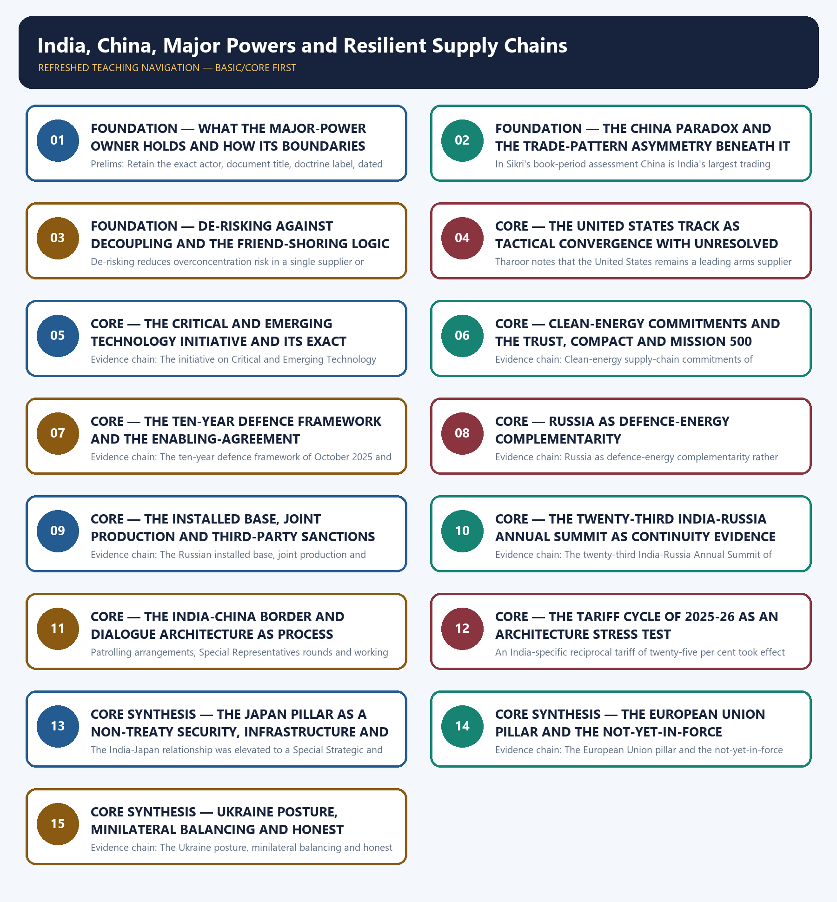

# India, China, Major Powers and Resilient Supply Chains — Learner-v2 Complete Learning Session

> **Authoring-only generation:** 2026-09-03. No PDF was rendered and no tracker or index was mutated.

### SOURCE, PROGRESSION AND CURRENT-LINKAGE AUDIT

- **Generation date:** 2026-09-03.
- **Repository-first evidence:** the Basic owner is taught first and preserved in full; the Advanced owner is retained only in the optional final teaching block.
- **OCR evidence:** Repository Markdown was primary. The OCR-searchable official General Studies question papers held under books\mains and books\more_previous_papers were read only to confirm the printed wording of routed demands. No official answer key, marking scheme, page precision or unsupported quotation was imported from them.
- **Qdrant:** not used; repository Markdown and available OCR context were sufficient.
- **PYQ integrity:** Four General Studies Paper II Mains demands are routed to this topic in the audited routing ledgers and each is reproduced below as a demand card with its printed year, paper, question number, directive, marks and word limit exactly as the ledger records them: 2019 General Studies Paper II question 9 on the India-Japan contemporary global and strategic partnership, a Comment demand of 10 marks and 150 words; 2019 General Studies Paper II question 20 on friction in India-United States ties and India's place in United States global strategy, an Explain with suitable examples demand of 15 marks and 250 words; 2021 General Studies Paper II question 10 on the United States facing an existential challenge from China, an Explain demand of 10 marks and 150 words; and 2024 General Studies Paper II question 9 on the West fostering India as an alternative to China's supply chain, an Explain demand of 10 marks and 150 words. For the three 2019 and 2021 demands the ledger records that the Core route supersedes the older Advanced ownership and that the word limits are taken from the instruction block. Two objective demands are also routed to this owner and are carried as coverage requirements only: 2019 Prelims General Studies Paper I question 89 on India's nuclear-field cooperation bilateral action plan, for which the official key is not held locally, and 2026 Prelims General Studies Paper I question 78 on India-Germany bilateral visit outcomes, cooperation and Indo-Pacific dialogue, for which only a provisional 2026 Set-A key is present locally. No option or answer letter is recorded or inferred for either objective demand, and the provisional status of the 2026 key is preserved exactly. The supplied paper text of the 2024 demand carries apparent grammatical and spelling defects, and the owners require that it be reproduced as printed rather than silently corrected, which is done in the corresponding demand card below. The locally held OCR-searchable official General Studies papers were read only to confirm the printed wording of the routed Mains demands; no question was invented from them, no stem was paraphrased into an apparent routing, and no marking scheme or page precision was imported. Every model solution below is original work written to the repository's examiner-grade standard using the claim, named evidence, analysis and qualification pattern, and none of them reproduces or claims an official answer.
- **Live-link boundary:** Live official verification was attempted on 2026-09-03 against the Ministry of External Affairs press-release, bilateral-document and country-brief pages and against the Press Information Bureau release index. Each attempt is recorded honestly above: the Ministry pages returned a browser-requirement stub or the Ministry's own error page and the Press Information Bureau index returned HTTP 403, so no new live item was obtained. The package therefore uses only the dated official anchors already carried by the repository owners, each with its actor, exact evidentiary level and date. It invents no treaty or joint-statement wording, no border or diplomatic status, no summit outcome, no trade, tariff, investment or supply-chain figure, no initiative membership or participation category, no military or security development, no declared policy position, no previous-year question, no answer key and no current claim.
- **Fact/inference discipline:** no current-affairs item, PYQ wording, figure or quotation is invented.

### LIVE OFFICIAL-SOURCE ATTEMPT LOG

Every live check below was attempted on 2026-09-03 in the priority order required for International Relations: Ministry of External Affairs official pages first, then other official government or international-organisation documents. Access failures are recorded exactly as observed and no claim is reconstructed from a failed fetch.

- https://www.mea.gov.in/press-releases.htm — attempted 2026-09-03; the request redirected to a browser-requirement stub and returned no press release text, so no live item was taken from it.
- https://www.mea.gov.in/bilateral-documents.htm — attempted 2026-09-03; the request redirected to a browser-requirement stub and returned no bilateral document text, so no live item was taken from it.
- https://www.mea.gov.in/foreign-relation.htm — attempted 2026-09-03; the request redirected to the Ministry's own error page, so no country brief was taken from it.
- https://www.pib.gov.in/indexd.aspx?reg=3&lang=1 — attempted 2026-09-03; the request returned HTTP 403, so no release was taken from it.

## BASIC LEARNING SESSION



*Distinct embedded teaching-navigation image. The separate continuous Cārvāka-style flowchart package remains an independent at-a-glance artifact.*

### SESSION 1 — FOUNDATION — WHAT THE MAJOR-POWER OWNER HOLDS AND HOW ITS BOUNDARIES ARE ROUTED

#### DEFINITION / WHAT THIS IS CALLED

**Plain-language definition:** Evidence chain: What this owner holds and how its boundaries are routed Qualified use: Open a major-power demand by fixing ownership so the answer does not drift into another owner's evidence.

**Technical definition:** Prelims: Retain the exact actor, document title, doctrine label, dated instrument and evidentiary level attached to What the major-power owner holds and how its boundaries are routed, and never upgrade a vision statement into a treaty, a signature into a ratification, a participation category into membership, or an announced corridor into an operating one.

#### ANSWER-GRABBING OPENING — WRITE/ADAPT IN THE EXAM

> Evidence chain: What this owner holds and how its boundaries are routed Qualified use: Open a major-power demand by fixing ownership so the answer does not drift into another owner's evidence.

#### MUST-WRITE KEYWORDS

- **FOUNDATION**
- **What the major-power owner holds**
- **how its boundaries are routed**
- **Evidence chain**
- **Qualified use**
- **This**

**How to use them:** Frame the answer through FOUNDATION; define What the major-power owner holds, connect how its boundaries are routed with Evidence chain to explain the mechanism, and use Qualified use for the decisive comparison or qualification.

#### VISUAL FIRST

```text
WHAT THE MAJOR-POWER OWNER HOLDS AND HOW ITS BOUNDARIES ARE ROUTED
01. What this owner holds and how its boundaries are routed
BOUNDARY -> Trade mechanics belong to Economy, grouping profiles to topic 10, systemic de-risking to topic 11 and Security Council reform to topic 12.
```

*This topic-specific rail fixes the evidence sequence and its exam boundary before analysis.*

#### CORE EXPLANATION

This topic owns India's relationships with the United States, China, Russia, the European Union and Japan together with the supply-chain resilience and critical-and-emerging-technology agenda, and its distinctive feature is that it carries the heaviest verified Mains load in the folder, with four General Studies Paper II demands routed to it from 2019, 2021 and 2024 alongside two objective demands from 2019 and 2026; the tariff schedules, balance of payments and trade-deficit mechanics belong to the Economy owner, the institutional profiles of the Quad and I2U2 belong to topic 10, globalisation and de-risking as a systemic trend belong to topic 11, and China's role in Security Council reform belongs to topic 12.

#### NAMED EVIDENCE AND MECHANISM

- This topic owns India's relationships with the United States, China, Russia, the European Union and Japan together with the supply-chain resilience and critical-and-emerging-technology agenda, and its distinctive feature is that it carries the heaviest verified Mains load in the folder, with four General Studies Paper II demands routed to it from 2019, 2021 and 2024 alongside two objective demands from 2019 and 2026; the tariff schedules, balance of payments and trade-deficit mechanics belong to the Economy owner, the institutional profiles of the Quad and I2U2 belong to topic 10, globalisation and de-risking as a systemic trend belong to topic 11, and China's role in Security Council reform belongs to topic 12.

#### EXAMINER CAUTION

- Trade mechanics belong to Economy, grouping profiles to topic 10, systemic de-risking to topic 11 and Security Council reform to topic 12.

#### EXAM LINK

- **Prelims:** Retain the exact actor, document title, doctrine label, dated instrument and evidentiary level attached to What the major-power owner holds and how its boundaries are routed, and never upgrade a vision statement into a treaty, a signature into a ratification, a participation category into membership, or an announced corridor into an operating one.
- **Mains:** Open a major-power demand by fixing ownership so the answer does not drift into another owner's evidence.

#### MINI RECAP

- **Evidence chain:** What this owner holds and how its boundaries are routed
- **Qualified use:** Open a major-power demand by fixing ownership so the answer does not drift into another owner's evidence.

#### CLOSING RECALL FLOW — FOUNDATION — WHAT THE MAJOR-POWER OWNER HOLDS AND HOW ITS BOUNDARIES ARE ROUTED

```text
START / CONCEPT: FOUNDATION — What the major-power owner holds and how its boundaries are routed
        |
        v
EXACT TERMS: FOUNDATION · What the major-power owner holds · how its boundaries are routed · Evidence chain · Qualified use · This
        |
        v
MECHANISM / ARGUMENT: Prelims: Retain the exact actor, document title, doctrine label, dated instrument and evidentiary level attached to What the major-power owner holds and how its boundaries are routed, and never upgrade a vision statement into a treaty, a signature into a ratification, a participation category into membership, or an announced corridor into an operating one.
        |
        v
CONSEQUENCE / CONTRAST: Mains: Open a major-power demand by fixing ownership so the answer does not drift into another owner's evidence.
        |
        v
UPSC TRAP / ANSWER-USE: Do not miss this limiting distinction: this topic owns India's relationships with the United States, China, Russia, the European Union...
        |
        v
ANSWER-GRABBING FORMULATION: Evidence chain: What this owner holds and how its boundaries are routed Qualified use: Open a major-power demand by fixing ownership so the answer does not drift into another owner's evidence.
```
### SESSION 2 — FOUNDATION — THE CHINA PARADOX AND THE TRADE-PATTERN ASYMMETRY BENEATH IT

#### DEFINITION / WHAT THIS IS CALLED

**Plain-language definition:** Evidence chain: The India-China economic-strategic paradox - Trade-pattern asymmetry as an economic grievance layered on strategic mistrust Qualified use: Separate economic interdependence from strategic trust, which is the commonest scoring error on this topic.

**Technical definition:** In Sikri's book-period assessment China is India's largest trading partner although the economic relationship is not without its problems, while at the same time India's security concerns and the competition for influence in Asia will ensure some degree of enduring mistrust and suspicion, because the relationship is essentially a political and strategic one arising out of the fact that India and China are neighbours with an unresolved boundary dispute; the examinable discipline is twofold, namely that trade volume is never evidence of strategic trust, and that any present-day ranking claim requires current official trade data rather than a book-period statement.

#### ANSWER-GRABBING OPENING — WRITE/ADAPT IN THE EXAM

> Evidence chain: The India-China economic-strategic paradox - Trade-pattern asymmetry as an economic grievance layered on strategic mistrust Qualified use: Separate economic interdependence from strategic trust, which is the commonest scoring error on this topic.

#### MUST-WRITE KEYWORDS

- **FOUNDATION**
- **The China paradox**
- **the trade-pattern asymmetry beneath it**
- **Evidence chain**
- **Qualified use**
- **In Sikri's book-period assessment China**

**How to use them:** Frame the answer through FOUNDATION; define The China paradox, connect the trade-pattern asymmetry beneath it with Evidence chain to explain the mechanism, and use Qualified use for the decisive comparison or qualification.

#### VISUAL FIRST

```text
THE CHINA PARADOX AND THE TRADE-PATTERN ASYMMETRY BENEATH IT
01. The India-China economic-strategic paradox
    |
    v
02. Trade-pattern asymmetry as an economic grievance layered on strategic mistrust
BOUNDARY -> Book-period ranking and the over ten billion dollar deficit are period evidence, not current figures.
```

*This topic-specific rail fixes the evidence sequence and its exam boundary before analysis.*

#### CORE EXPLANATION

In Sikri's book-period assessment China is India's largest trading partner although the economic relationship is not without its problems, while at the same time India's security concerns and the competition for influence in Asia will ensure some degree of enduring mistrust and suspicion, because the relationship is essentially a political and strategic one arising out of the fact that India and China are neighbours with an unresolved boundary dispute; the examinable discipline is twofold, namely that trade volume is never evidence of strategic trust, and that any present-day ranking claim requires current official trade data rather than a book-period statement. Sikri records India's concern over its trade deficit and the pattern of India exporting mostly raw materials and commodities while China exports mostly manufactured products, with Chinese firms suspected of dumping given China's non-market economy with opaque pricing, and he documents a specific trade deficit of over ten billion dollars from the 2007 era; the owners require that figure to be cited as historical period evidence of the underlying grievance rather than as a current number, and the analytical point is that the structural asymmetry reinforces rather than offsets strategic distrust, so the cooperative economic track does not soften the security track.

#### NAMED EVIDENCE AND MECHANISM

- In Sikri's book-period assessment China is India's largest trading partner although the economic relationship is not without its problems, while at the same time India's security concerns and the competition for influence in Asia will ensure some degree of enduring mistrust and suspicion, because the relationship is essentially a political and strategic one arising out of the fact that India and China are neighbours with an unresolved boundary dispute; the examinable discipline is twofold, namely that trade volume is never evidence of strategic trust, and that any present-day ranking claim requires current official trade data rather than a book-period statement.
- Sikri records India's concern over its trade deficit and the pattern of India exporting mostly raw materials and commodities while China exports mostly manufactured products, with Chinese firms suspected of dumping given China's non-market economy with opaque pricing, and he documents a specific trade deficit of over ten billion dollars from the 2007 era; the owners require that figure to be cited as historical period evidence of the underlying grievance rather than as a current number, and the analytical point is that the structural asymmetry reinforces rather than offsets strategic distrust, so the cooperative economic track does not soften the security track.

#### EXAMINER CAUTION

- Book-period ranking and the over ten billion dollar deficit are period evidence, not current figures.

#### EXAM LINK

- **Prelims:** Retain the exact actor, document title, doctrine label, dated instrument and evidentiary level attached to The China paradox and the trade-pattern asymmetry beneath it, and never upgrade a vision statement into a treaty, a signature into a ratification, a participation category into membership, or an announced corridor into an operating one.
- **Mains:** Separate economic interdependence from strategic trust, which is the commonest scoring error on this topic.

#### MINI RECAP

- **Evidence chain:** The India-China economic-strategic paradox -> Trade-pattern asymmetry as an economic grievance layered on strategic mistrust
- **Qualified use:** Separate economic interdependence from strategic trust, which is the commonest scoring error on this topic.

#### CLOSING RECALL FLOW — FOUNDATION — THE CHINA PARADOX AND THE TRADE-PATTERN ASYMMETRY BENEATH IT

```text
START / CONCEPT: FOUNDATION — The China paradox and the trade-pattern asymmetry beneath it
        |
        v
EXACT TERMS: FOUNDATION · The China paradox · the trade-pattern asymmetry beneath it · Evidence chain · Qualified use · In Sikri's book-period assessment China
        |
        v
MECHANISM / ARGUMENT: In Sikri's book-period assessment China is India's largest trading partner although the economic relationship is not without its problems, while at the same time India's security concerns and the competition for influence in Asia will ensure some degree of enduring mistrust and suspicion, because the relationship is essentially a political and strategic one arising out of the fact that India and China are neighbours with an unresolved boundary dispute; the examinable discipline is twofold, namely that trade volume is never evidence of strategic trust, and that any present-day ranking claim requires current official trade data rather than a book-period statement.
        |
        v
CONSEQUENCE / CONTRAST: Sikri records India's concern over its trade deficit and the pattern of India exporting mostly raw materials and commodities while China exports mostly manufactured products, with Chinese firms suspected of dumping given China's non-market economy with opaque pricing, and he documents a specific trade deficit of over ten billion dollars from the 2007 era; the owners require that figure to be cited as historical period evidence of the underlying grievance rather than as a current number, and the analytical point is that the structural asymmetry reinforces rather than offsets strategic distrust, so the cooperative economic track does not soften the security track.
        |
        v
UPSC TRAP / ANSWER-USE: Book-period ranking and the over ten billion dollar deficit are period evidence, not current figures.
        |
        v
ANSWER-GRABBING FORMULATION: Evidence chain: The India-China economic-strategic paradox - Trade-pattern asymmetry as an economic grievance layered on strategic mistrust Qualified use: Separate economic interdependence from strategic trust, which is the commonest scoring error on this topic.
```
### SESSION 3 — FOUNDATION — DE-RISKING AGAINST DECOUPLING AND THE FRIEND-SHORING LOGIC

#### DEFINITION / WHAT THIS IS CALLED

**Plain-language definition:** Evidence chain: De-risking against decoupling - Friend-shoring and trusted supply chains as the Western policy logic Qualified use: Use the correct policy term so the answer describes India's actual posture rather than a stronger one.

**Technical definition:** De-risking reduces overconcentration risk in a single supplier or partner while retaining engagement, whereas decoupling implies full disengagement, and the owners record India's posture toward China consistently as de-risking and never as decoupling; the boundary that makes the distinction real is scale, because full diversification away from China-linked inputs such as electronics, active pharmaceutical ingredients and other manufactured intermediates is a multi-year undertaking rather than an immediate substitution, and the precise trade-data mechanics of that transition belong to the Economy owner.

#### ANSWER-GRABBING OPENING — WRITE/ADAPT IN THE EXAM

> Evidence chain: De-risking against decoupling - Friend-shoring and trusted supply chains as the Western policy logic Qualified use: Use the correct policy term so the answer describes India's actual posture rather than a stronger one.

#### MUST-WRITE KEYWORDS

- **FOUNDATION**
- **De-risking against decoupling**
- **the friend-shoring logic**
- **Evidence chain**
- **Qualified use**
- **De-risking**

**How to use them:** Frame the answer through FOUNDATION; define De-risking against decoupling, connect the friend-shoring logic with Evidence chain to explain the mechanism, and use Qualified use for the decisive comparison or qualification.

#### VISUAL FIRST

```text
DE-RISKING AGAINST DECOUPLING AND THE FRIEND-SHORING LOGIC
01. De-risking against decoupling
    |
    v
02. Friend-shoring and trusted supply chains as the Western policy logic
BOUNDARY -> Diversification is not replacement, and full substitution away from China-linked inputs is a multi-year undertaking.
```

*This topic-specific rail fixes the evidence sequence and its exam boundary before analysis.*

#### CORE EXPLANATION

De-risking reduces overconcentration risk in a single supplier or partner while retaining engagement, whereas decoupling implies full disengagement, and the owners record India's posture toward China consistently as de-risking and never as decoupling; the boundary that makes the distinction real is scale, because full diversification away from China-linked inputs such as electronics, active pharmaceutical ingredients and other manufactured intermediates is a multi-year undertaking rather than an immediate substitution, and the precise trade-data mechanics of that transition belong to the Economy owner. Friend-shoring means relocating or diversifying critical supply chains toward geopolitically aligned or trusted partners, which is distinct from simple offshoring based on cost alone, and it is the policy logic behind India-United States and India-European Union technology cooperation, with critical minerals such as rare earths, lithium and cobalt and semiconductor fabrication and packaging capacity treated as strategic-supply-chain priorities; the correction the owners insist upon is that Western diversification interest makes India an alternative production and technology-cooperation base rather than a replacement for China, and treating it as replacement is analytically and empirically incorrect at current scale.

#### NAMED EVIDENCE AND MECHANISM

- De-risking reduces overconcentration risk in a single supplier or partner while retaining engagement, whereas decoupling implies full disengagement, and the owners record India's posture toward China consistently as de-risking and never as decoupling; the boundary that makes the distinction real is scale, because full diversification away from China-linked inputs such as electronics, active pharmaceutical ingredients and other manufactured intermediates is a multi-year undertaking rather than an immediate substitution, and the precise trade-data mechanics of that transition belong to the Economy owner.
- Friend-shoring means relocating or diversifying critical supply chains toward geopolitically aligned or trusted partners, which is distinct from simple offshoring based on cost alone, and it is the policy logic behind India-United States and India-European Union technology cooperation, with critical minerals such as rare earths, lithium and cobalt and semiconductor fabrication and packaging capacity treated as strategic-supply-chain priorities; the correction the owners insist upon is that Western diversification interest makes India an alternative production and technology-cooperation base rather than a replacement for China, and treating it as replacement is analytically and empirically incorrect at current scale.

#### EXAMINER CAUTION

- Diversification is not replacement, and full substitution away from China-linked inputs is a multi-year undertaking.

#### EXAM LINK

- **Prelims:** Retain the exact actor, document title, doctrine label, dated instrument and evidentiary level attached to De-risking against decoupling and the friend-shoring logic, and never upgrade a vision statement into a treaty, a signature into a ratification, a participation category into membership, or an announced corridor into an operating one.
- **Mains:** Use the correct policy term so the answer describes India's actual posture rather than a stronger one.

#### MINI RECAP

- **Evidence chain:** De-risking against decoupling -> Friend-shoring and trusted supply chains as the Western policy logic
- **Qualified use:** Use the correct policy term so the answer describes India's actual posture rather than a stronger one.

#### CLOSING RECALL FLOW — FOUNDATION — DE-RISKING AGAINST DECOUPLING AND THE FRIEND-SHORING LOGIC

```text
START / CONCEPT: FOUNDATION — De-risking against decoupling and the friend-shoring logic
        |
        v
EXACT TERMS: FOUNDATION · De-risking against decoupling · the friend-shoring logic · Evidence chain · Qualified use · De-risking
        |
        v
MECHANISM / ARGUMENT: De-risking reduces overconcentration risk in a single supplier or partner while retaining engagement, whereas decoupling implies full disengagement, and the owners record India's posture toward China consistently as de-risking and never as decoupling; the boundary that makes the distinction real is scale, because full diversification away from China-linked inputs such as electronics, active pharmaceutical ingredients and other manufactured intermediates is a multi-year undertaking rather than an immediate substitution, and the precise trade-data mechanics of that transition belong to the Economy owner.
        |
        v
CONSEQUENCE / CONTRAST: Diversification is not replacement, and full substitution away from China-linked inputs is a multi-year undertaking.
        |
        v
UPSC TRAP / ANSWER-USE: Friend-shoring means relocating or diversifying critical supply chains toward geopolitically aligned or trusted partners, which is distinct from simple offshoring based on cost alone, and it is the policy logic behind India-United States and India-European Union technology cooperation, with critical minerals such as rare earths, lithium and cobalt and semiconductor fabrication and packaging capacity treated as strategic-supply-chain priorities; the correction the owners insist upon is that Western diversification interest makes India an alternative production and technology-cooperation base rather than a replacement for China, and treating it as replacement is analytically and empirically incorrect at current scale.
        |
        v
ANSWER-GRABBING FORMULATION: Evidence chain: De-risking against decoupling - Friend-shoring and trusted supply chains as the Western policy logic Qualified use: Use the correct policy term so the answer describes India's actual posture rather than a stronger one.
```
### SESSION 4 — CORE — THE UNITED STATES TRACK AS TACTICAL CONVERGENCE WITH UNRESOLVED FRICTION

#### DEFINITION / WHAT THIS IS CALLED

**Plain-language definition:** Tharoor flags continuing restrictions on the sale of United States high technology to India as friction that persists despite the political warmth, and the owners treat this as a genuine unresolved problem rather than a solved one, which qualifies any claim of full strategic convergence; the operational consequence is that India cannot assume unconditional technology access even under a named cooperation initiative, so negotiation over specific technology categories remains ongoing and diversification remains the rational response rather than dependence on any single supplier.

**Technical definition:** Tharoor notes that the United States remains a leading arms supplier to India and Sikri observes that after decades of mutual suspicion and wariness India and the United States are moving toward closer alignment, yet Tharoor expressly recommends viewing the relationship as a tactical partnership that serves both countries' short-term interests and cautions against hyperbole that would frame it as an alliance; the vocabulary rule that follows is that an answer should use tactical partnership rather than alliance, because the enabling instruments in this relationship carry no collective-defence obligation on India.

#### ANSWER-GRABBING OPENING — WRITE/ADAPT IN THE EXAM

> Evidence chain: The United States track as technology-led tactical convergence - Technology-access asymmetry as unresolved friction Qualified use: Adopt the vocabulary discipline that keeps the relationship correctly classified throughout the answer.

#### MUST-WRITE KEYWORDS

- **Evidence chain**
- **Qualified use**
- **Tharoor**
- **United States**
- **India**
- **Sikri**

**How to use them:** Frame the answer through Evidence chain; define Qualified use, connect Tharoor with United States to explain the mechanism, and use India for the decisive comparison or qualification.

#### VISUAL FIRST

```text
THE UNITED STATES TRACK AS TACTICAL CONVERGENCE WITH UNRESOLVED FRICTION
01. The United States track as technology-led tactical convergence
    |
    v
02. Technology-access asymmetry as unresolved friction
BOUNDARY -> Continuing restrictions on high-technology sales remain unresolved, so convergence is not unconditional access.
```

*This topic-specific rail fixes the evidence sequence and its exam boundary before analysis.*

#### CORE EXPLANATION

Tharoor notes that the United States remains a leading arms supplier to India and Sikri observes that after decades of mutual suspicion and wariness India and the United States are moving toward closer alignment, yet Tharoor expressly recommends viewing the relationship as a tactical partnership that serves both countries' short-term interests and cautions against hyperbole that would frame it as an alliance; the vocabulary rule that follows is that an answer should use tactical partnership rather than alliance, because the enabling instruments in this relationship carry no collective-defence obligation on India. Tharoor flags continuing restrictions on the sale of United States high technology to India as friction that persists despite the political warmth, and the owners treat this as a genuine unresolved problem rather than a solved one, which qualifies any claim of full strategic convergence; the operational consequence is that India cannot assume unconditional technology access even under a named cooperation initiative, so negotiation over specific technology categories remains ongoing and diversification remains the rational response rather than dependence on any single supplier.

#### NAMED EVIDENCE AND MECHANISM

- Tharoor notes that the United States remains a leading arms supplier to India and Sikri observes that after decades of mutual suspicion and wariness India and the United States are moving toward closer alignment, yet Tharoor expressly recommends viewing the relationship as a tactical partnership that serves both countries' short-term interests and cautions against hyperbole that would frame it as an alliance; the vocabulary rule that follows is that an answer should use tactical partnership rather than alliance, because the enabling instruments in this relationship carry no collective-defence obligation on India.
- Tharoor flags continuing restrictions on the sale of United States high technology to India as friction that persists despite the political warmth, and the owners treat this as a genuine unresolved problem rather than a solved one, which qualifies any claim of full strategic convergence; the operational consequence is that India cannot assume unconditional technology access even under a named cooperation initiative, so negotiation over specific technology categories remains ongoing and diversification remains the rational response rather than dependence on any single supplier.

#### EXAMINER CAUTION

- Continuing restrictions on high-technology sales remain unresolved, so convergence is not unconditional access.

#### EXAM LINK

- **Prelims:** Retain the exact actor, document title, doctrine label, dated instrument and evidentiary level attached to The United States track as tactical convergence with unresolved friction, and never upgrade a vision statement into a treaty, a signature into a ratification, a participation category into membership, or an announced corridor into an operating one.
- **Mains:** Adopt the vocabulary discipline that keeps the relationship correctly classified throughout the answer.

#### MINI RECAP

- **Evidence chain:** The United States track as technology-led tactical convergence -> Technology-access asymmetry as unresolved friction
- **Qualified use:** Adopt the vocabulary discipline that keeps the relationship correctly classified throughout the answer.

#### CLOSING RECALL FLOW — CORE — THE UNITED STATES TRACK AS TACTICAL CONVERGENCE WITH UNRESOLVED FRICTION

```text
START / CONCEPT: CORE — The United States track as tactical convergence with unresolved friction
        |
        v
EXACT TERMS: Evidence chain · Qualified use · Tharoor · United States · India · Sikri
        |
        v
MECHANISM / ARGUMENT: Tharoor notes that the United States remains a leading arms supplier to India and Sikri observes that after decades of mutual suspicion and wariness India and the United States are moving toward closer alignment, yet Tharoor expressly recommends viewing the relationship as a tactical partnership that serves both countries' short-term interests and cautions against hyperbole that would frame it as an alliance; the vocabulary rule that follows is that an answer should use tactical partnership rather than alliance, because the enabling instruments in this relationship carry no collective-defence obligation on India.
        |
        v
CONSEQUENCE / CONTRAST: Tharoor flags continuing restrictions on the sale of United States high technology to India as friction that persists despite the political warmth, and the owners treat this as a genuine unresolved problem rather than a solved one, which qualifies any claim of full strategic convergence; the operational consequence is that India cannot assume unconditional technology access even under a named cooperation initiative, so negotiation over specific technology categories remains ongoing and diversification remains the rational response rather than dependence on any single supplier.
        |
        v
UPSC TRAP / ANSWER-USE: Continuing restrictions on high-technology sales remain unresolved, so convergence is not unconditional access.
        |
        v
ANSWER-GRABBING FORMULATION: Evidence chain: The United States track as technology-led tactical convergence - Technology-access asymmetry as unresolved friction Qualified use: Adopt the vocabulary discipline that keeps the relationship correctly classified throughout the answer.
```
### SESSION 5 — CORE — THE CRITICAL AND EMERGING TECHNOLOGY INITIATIVE AND ITS EXACT STATUS

#### DEFINITION / WHAT THIS IS CALLED

**Plain-language definition:** CORE — The critical and emerging technology initiative and its exact status comprises The critical, emerging technology initiative and its exact status as its core connected dimensions.

**Technical definition:** Evidence chain: The initiative on Critical and Emerging Technology and its exact status Qualified use: Cite the dated technology instrument that a supply-chain demand expects, without inflating its legal character.

#### ANSWER-GRABBING OPENING — WRITE/ADAPT IN THE EXAM

> Evidence chain: The initiative on Critical and Emerging Technology and its exact status Qualified use: Cite the dated technology instrument that a supply-chain demand expects, without inflating its legal character.

#### MUST-WRITE KEYWORDS

- **The critical**
- **emerging technology initiative**
- **its exact status**
- **Evidence chain**
- **Qualified use**
- **Critical**

**How to use them:** Frame the answer through The critical; define emerging technology initiative, connect its exact status with Evidence chain to explain the mechanism, and use Qualified use for the decisive comparison or qualification.

#### VISUAL FIRST

```text
THE CRITICAL AND EMERGING TECHNOLOGY INITIATIVE AND ITS EXACT STATUS
01. The initiative on Critical and Emerging Technology and its exact status
BOUNDARY -> It is a cooperation initiative, not a treaty or framework agreement, and not a defence alliance.
```

*This topic-specific rail fixes the evidence sequence and its exam boundary before analysis.*

#### CORE EXPLANATION

The initiative on Critical and Emerging Technology, abbreviated iCET, was announced in May 2022, held its inaugural National Security Adviser-level meeting on 31 January 2023 and a second National Security Adviser-level review on 17 June 2024, covering semiconductors, artificial intelligence, space and defence-industrial cooperation; the owners fix its evidentiary level precisely as a cooperation initiative and not a treaty or framework agreement, and they warn that treating it as a defence-alliance treaty misstates both its legal character and India's obligations.

#### NAMED EVIDENCE AND MECHANISM

- The initiative on Critical and Emerging Technology, abbreviated iCET, was announced in May 2022, held its inaugural National Security Adviser-level meeting on 31 January 2023 and a second National Security Adviser-level review on 17 June 2024, covering semiconductors, artificial intelligence, space and defence-industrial cooperation; the owners fix its evidentiary level precisely as a cooperation initiative and not a treaty or framework agreement, and they warn that treating it as a defence-alliance treaty misstates both its legal character and India's obligations.

#### EXAMINER CAUTION

- It is a cooperation initiative, not a treaty or framework agreement, and not a defence alliance.

#### EXAM LINK

- **Prelims:** Retain the exact actor, document title, doctrine label, dated instrument and evidentiary level attached to The critical and emerging technology initiative and its exact status, and never upgrade a vision statement into a treaty, a signature into a ratification, a participation category into membership, or an announced corridor into an operating one.
- **Mains:** Cite the dated technology instrument that a supply-chain demand expects, without inflating its legal character.

#### MINI RECAP

- **Evidence chain:** The initiative on Critical and Emerging Technology and its exact status
- **Qualified use:** Cite the dated technology instrument that a supply-chain demand expects, without inflating its legal character.

#### CLOSING RECALL FLOW — CORE — THE CRITICAL AND EMERGING TECHNOLOGY INITIATIVE AND ITS EXACT STATUS

```text
START / CONCEPT: CORE — The critical and emerging technology initiative and its exact status
        |
        v
EXACT TERMS: The critical · emerging technology initiative · its exact status · Evidence chain · Qualified use · Critical
        |
        v
MECHANISM / ARGUMENT: The initiative on Critical and Emerging Technology, abbreviated iCET, was announced in May 2022, held its inaugural National Security Adviser-level meeting on 31 January 2023 and a second National Security Adviser-level review on 17 June 2024, covering semiconductors, artificial intelligence, space and defence-industrial cooperation; the owners fix its evidentiary level precisely as a cooperation initiative and not a treaty or framework agreement, and they warn that treating it as a defence-alliance treaty misstates both its legal character and India's obligations.
        |
        v
CONSEQUENCE / CONTRAST: It is a cooperation initiative, not a treaty or framework agreement, and not a defence alliance.
        |
        v
UPSC TRAP / ANSWER-USE: Do not miss this limiting distinction: the initiative on Critical and Emerging Technology and its exact status Qualified use.
        |
        v
ANSWER-GRABBING FORMULATION: Evidence chain: The initiative on Critical and Emerging Technology and its exact status Qualified use: Cite the dated technology instrument that a supply-chain demand expects, without inflating its legal character.
```
### SESSION 6 — CORE — CLEAN-ENERGY COMMITMENTS AND THE TRUST, COMPACT AND MISSION 500 BRANDING

#### DEFINITION / WHAT THIS IS CALLED

**Plain-language definition:** India-United States clean-energy supply-chain commitments were announced on 21 September 2024, extending the resilience agenda from critical and emerging technology into clean-energy manufacturing inputs and announced alongside the broader technology partnership; the owners treat this as one of the concrete dated examples of Western diversification interest that a 2024-style demand expects a candidate to cite, and its evidentiary level is a bilateral commitment announcement rather than a delivered manufacturing outcome, so the claim must stop at commitment unless a separate delivery date is available.

**Technical definition:** Evidence chain: Clean-energy supply-chain commitments of September 2024 - TRUST, COMPACT and Mission 500 of February 2025 Qualified use: Add two further dated examples of Western diversification interest without asserting a legal succession.

#### ANSWER-GRABBING OPENING — WRITE/ADAPT IN THE EXAM

> Evidence chain: Clean-energy supply-chain commitments of September 2024 - TRUST, COMPACT and Mission 500 of February 2025 Qualified use: Add two further dated examples of Western diversification interest without asserting a legal succession.

#### MUST-WRITE KEYWORDS

- **Clean-energy commitments**
- **the TRUST**
- **COMPACT**
- **Mission 500 branding**
- **Evidence chain**
- **Qualified use**

**How to use them:** Frame the answer through Clean-energy commitments; define the TRUST, connect COMPACT with Mission 500 branding to explain the mechanism, and use Evidence chain for the decisive comparison or qualification.

#### VISUAL FIRST

```text
CLEAN-ENERGY COMMITMENTS AND THE TRUST, COMPACT AND MISSION 500 BRANDING
01. Clean-energy supply-chain commitments of September 2024
    |
    v
02. TRUST, COMPACT and Mission 500 of February 2025
BOUNDARY -> The official text does not state that TRUST terminated or superseded the earlier initiative.
```

*This topic-specific rail fixes the evidence sequence and its exam boundary before analysis.*

#### CORE EXPLANATION

India-United States clean-energy supply-chain commitments were announced on 21 September 2024, extending the resilience agenda from critical and emerging technology into clean-energy manufacturing inputs and announced alongside the broader technology partnership; the owners treat this as one of the concrete dated examples of Western diversification interest that a 2024-style demand expects a candidate to cite, and its evidentiary level is a bilateral commitment announcement rather than a delivered manufacturing outcome, so the claim must stop at commitment unless a separate delivery date is available. Two India-United States initiatives were announced in the same joint leaders' statement of 13 February 2025, namely TRUST, standing for Transforming the Relationship Utilizing Strategic Technology, for critical-technology cooperation, and COMPACT, standing for Catalyzing Opportunities for Military Partnership, Accelerated Commerce and Technology, announced together with Mission 500, a stated goal of expanding bilateral trade, and with the launch of negotiations toward a bilateral trade agreement; the owners record the decisive precision that the official text does not state that TRUST terminated or superseded iCET, so it must be treated as successor or parallel branding and never as a documented legal succession.

#### NAMED EVIDENCE AND MECHANISM

- India-United States clean-energy supply-chain commitments were announced on 21 September 2024, extending the resilience agenda from critical and emerging technology into clean-energy manufacturing inputs and announced alongside the broader technology partnership; the owners treat this as one of the concrete dated examples of Western diversification interest that a 2024-style demand expects a candidate to cite, and its evidentiary level is a bilateral commitment announcement rather than a delivered manufacturing outcome, so the claim must stop at commitment unless a separate delivery date is available.
- Two India-United States initiatives were announced in the same joint leaders' statement of 13 February 2025, namely TRUST, standing for Transforming the Relationship Utilizing Strategic Technology, for critical-technology cooperation, and COMPACT, standing for Catalyzing Opportunities for Military Partnership, Accelerated Commerce and Technology, announced together with Mission 500, a stated goal of expanding bilateral trade, and with the launch of negotiations toward a bilateral trade agreement; the owners record the decisive precision that the official text does not state that TRUST terminated or superseded iCET, so it must be treated as successor or parallel branding and never as a documented legal succession.

#### EXAMINER CAUTION

- The official text does not state that TRUST terminated or superseded the earlier initiative.

#### EXAM LINK

- **Prelims:** Retain the exact actor, document title, doctrine label, dated instrument and evidentiary level attached to Clean-energy commitments and the TRUST, COMPACT and Mission 500 branding, and never upgrade a vision statement into a treaty, a signature into a ratification, a participation category into membership, or an announced corridor into an operating one.
- **Mains:** Add two further dated examples of Western diversification interest without asserting a legal succession.

#### MINI RECAP

- **Evidence chain:** Clean-energy supply-chain commitments of September 2024 -> TRUST, COMPACT and Mission 500 of February 2025
- **Qualified use:** Add two further dated examples of Western diversification interest without asserting a legal succession.

#### CLOSING RECALL FLOW — CORE — CLEAN-ENERGY COMMITMENTS AND THE TRUST, COMPACT AND MISSION 500 BRANDING

```text
START / CONCEPT: CORE — Clean-energy commitments and the TRUST, COMPACT and Mission 500 branding
        |
        v
EXACT TERMS: Clean-energy commitments · the TRUST · COMPACT · Mission 500 branding · Evidence chain · Qualified use
        |
        v
MECHANISM / ARGUMENT: Two India-United States initiatives were announced in the same joint leaders' statement of 13 February 2025, namely TRUST, standing for Transforming the Relationship Utilizing Strategic Technology, for critical-technology cooperation, and COMPACT, standing for Catalyzing Opportunities for Military Partnership, Accelerated Commerce and Technology, announced together with Mission 500, a stated goal of expanding bilateral trade, and with the launch of negotiations toward a bilateral trade agreement; the owners record the decisive precision that the official text does not state that TRUST terminated or superseded iCET, so it must be treated as successor or parallel branding and never as a documented legal succession.
        |
        v
CONSEQUENCE / CONTRAST: The official text does not state that TRUST terminated or superseded the earlier initiative.
        |
        v
UPSC TRAP / ANSWER-USE: India-United States clean-energy supply-chain commitments were announced on 21 September 2024, extending the resilience agenda from critical and emerging technology into clean-energy manufacturing inputs and announced alongside the broader technology partnership; the owners treat this as one of the concrete dated examples of Western diversification interest that a 2024-style demand expects a candidate to cite, and its evidentiary level is a bilateral commitment announcement rather than a delivered manufacturing outcome, so the claim must stop at commitment unless a separate delivery date is available.
        |
        v
ANSWER-GRABBING FORMULATION: Evidence chain: Clean-energy supply-chain commitments of September 2024 - TRUST, COMPACT and Mission 500 of February 2025 Qualified use: Add two further dated examples of Western diversification interest without asserting a legal succession.
```
### SESSION 7 — CORE — THE TEN-YEAR DEFENCE FRAMEWORK AND THE ENABLING-AGREEMENT ARCHITECTURE

#### DEFINITION / WHAT THIS IS CALLED

**Plain-language definition:** The Framework for the United States-India Major Defense Partnership was signed at Kuala Lumpur on 31 October 2025 as a ten-year defence framework, and the owners state expressly that a framework is not a mutual-defence treaty and that India carries no collective-defence obligation to the United States; the same discipline extends backwards through the relationship, because the United States designated India a Major Defence Partner in 2016 and that designation likewise conferred a partnership status rather than an alliance commitment.

**Technical definition:** Evidence chain: The ten-year defence framework of October 2025 and its non-treaty character - The enabling-agreement architecture and what it does not create Qualified use: Evidence defence depth precisely while refusing alliance language that would misstate India's obligations.

#### ANSWER-GRABBING OPENING — WRITE/ADAPT IN THE EXAM

> Evidence chain: The ten-year defence framework of October 2025 and its non-treaty character - The enabling-agreement architecture and what it does not create Qualified use: Evidence defence depth precisely while refusing alliance language that would misstate India's obligations.

#### MUST-WRITE KEYWORDS

- **The ten-year defence framework**
- **the enabling-agreement architecture**
- **Evidence chain**
- **Qualified use**
- **United States-India Major Defense Partnership**
- **Kuala Lumpur**

**How to use them:** Frame the answer through The ten-year defence framework; define the enabling-agreement architecture, connect Evidence chain with Qualified use to explain the mechanism, and use United States-India Major Defense Partnership for the decisive comparison or qualification.

#### VISUAL FIRST

```text
THE TEN-YEAR DEFENCE FRAMEWORK AND THE ENABLING-AGREEMENT ARCHITECTURE
01. The ten-year defence framework of October 2025 and its non-treaty character
    |
    v
02. The enabling-agreement architecture and what it does not create
BOUNDARY -> A framework and three enabling agreements create interoperability, not collective defence or basing rights.
```

*This topic-specific rail fixes the evidence sequence and its exam boundary before analysis.*

#### CORE EXPLANATION

The Framework for the United States-India Major Defense Partnership was signed at Kuala Lumpur on 31 October 2025 as a ten-year defence framework, and the owners state expressly that a framework is not a mutual-defence treaty and that India carries no collective-defence obligation to the United States; the same discipline extends backwards through the relationship, because the United States designated India a Major Defence Partner in 2016 and that designation likewise conferred a partnership status rather than an alliance commitment. The India-United States enabling agreements are the Logistics Exchange Memorandum of Agreement of 2016, which enables reciprocal logistics support, the Communications Compatibility and Security Agreement of 2018, which enables secure communications, and the Basic Exchange and Cooperation Agreement of 2020, which enables exchange of geospatial information, and together they improve interoperability, logistics and situational awareness; the owners attach the limitation directly, namely that they are enabling agreements and not a collective-defence alliance or an automatic basing right, while export controls, commercial negotiation and policy volatility continue to condition actual delivery.

#### NAMED EVIDENCE AND MECHANISM

- The Framework for the United States-India Major Defense Partnership was signed at Kuala Lumpur on 31 October 2025 as a ten-year defence framework, and the owners state expressly that a framework is not a mutual-defence treaty and that India carries no collective-defence obligation to the United States; the same discipline extends backwards through the relationship, because the United States designated India a Major Defence Partner in 2016 and that designation likewise conferred a partnership status rather than an alliance commitment.
- The India-United States enabling agreements are the Logistics Exchange Memorandum of Agreement of 2016, which enables reciprocal logistics support, the Communications Compatibility and Security Agreement of 2018, which enables secure communications, and the Basic Exchange and Cooperation Agreement of 2020, which enables exchange of geospatial information, and together they improve interoperability, logistics and situational awareness; the owners attach the limitation directly, namely that they are enabling agreements and not a collective-defence alliance or an automatic basing right, while export controls, commercial negotiation and policy volatility continue to condition actual delivery.

#### EXAMINER CAUTION

- A framework and three enabling agreements create interoperability, not collective defence or basing rights.

#### EXAM LINK

- **Prelims:** Retain the exact actor, document title, doctrine label, dated instrument and evidentiary level attached to The ten-year defence framework and the enabling-agreement architecture, and never upgrade a vision statement into a treaty, a signature into a ratification, a participation category into membership, or an announced corridor into an operating one.
- **Mains:** Evidence defence depth precisely while refusing alliance language that would misstate India's obligations.

#### MINI RECAP

- **Evidence chain:** The ten-year defence framework of October 2025 and its non-treaty character -> The enabling-agreement architecture and what it does not create
- **Qualified use:** Evidence defence depth precisely while refusing alliance language that would misstate India's obligations.

#### CLOSING RECALL FLOW — CORE — THE TEN-YEAR DEFENCE FRAMEWORK AND THE ENABLING-AGREEMENT ARCHITECTURE

```text
START / CONCEPT: CORE — The ten-year defence framework and the enabling-agreement architecture
        |
        v
EXACT TERMS: The ten-year defence framework · the enabling-agreement architecture · Evidence chain · Qualified use · United States-India Major Defense Partnership · Kuala Lumpur
        |
        v
MECHANISM / ARGUMENT: The Framework for the United States-India Major Defense Partnership was signed at Kuala Lumpur on 31 October 2025 as a ten-year defence framework, and the owners state expressly that a framework is not a mutual-defence treaty and that India carries no collective-defence obligation to the United States; the same discipline extends backwards through the relationship, because the United States designated India a Major Defence Partner in 2016 and that designation likewise conferred a partnership status rather than an alliance commitment.
        |
        v
CONSEQUENCE / CONTRAST: A framework and three enabling agreements create interoperability, not collective defence or basing rights.
        |
        v
UPSC TRAP / ANSWER-USE: Mains: Evidence defence depth precisely while refusing alliance language that would misstate India's obligations.
        |
        v
ANSWER-GRABBING FORMULATION: Evidence chain: The ten-year defence framework of October 2025 and its non-treaty character - The enabling-agreement architecture and what it does not create Qualified use: Evidence defence depth precisely while refusing alliance language that would misstate India's obligations.
```
### SESSION 8 — CORE — RUSSIA AS DEFENCE-ENERGY COMPLEMENTARITY

#### DEFINITION / WHAT THIS IS CALLED

**Plain-language definition:** Complementarity describes the whole relationship while the narrower spares dependence must be named separately.

**Technical definition:** Evidence chain: Russia as defence-energy complementarity rather than one-sided dependence Qualified use: Use the accurate relational term and then isolate the specific dependence that carries risk.

#### ANSWER-GRABBING OPENING — WRITE/ADAPT IN THE EXAM

> Sikri grounds the India-Russia relationship in the observation that India is an energy-deficient country and Russia an energy-surplus one, and records that Russia remains the only foreign military supplier from whom India is able to procure high-technology equipment unavailable from elsewhere, including nuclear-powered submarines; the owners instruct that complementarity is the correct word for the overall relationship while the narrower installed-base and spares dependence must be named precisely, because energy complementarity and equipment dependence are different claims that carry different risks.

#### MUST-WRITE KEYWORDS

- **Russia as defence-energy complementarity**
- **Evidence chain**
- **Qualified use**
- **Sikri**
- **India-Russia**
- **India**

**How to use them:** Frame the answer through Russia as defence-energy complementarity; define Evidence chain, connect Qualified use with Sikri to explain the mechanism, and use India-Russia for the decisive comparison or qualification.

#### VISUAL FIRST

```text
RUSSIA AS DEFENCE-ENERGY COMPLEMENTARITY
01. Russia as defence-energy complementarity rather than one-sided dependence
BOUNDARY -> Complementarity describes the whole relationship while the narrower spares dependence must be named separately.
```

*This topic-specific rail fixes the evidence sequence and its exam boundary before analysis.*

#### CORE EXPLANATION

Sikri grounds the India-Russia relationship in the observation that India is an energy-deficient country and Russia an energy-surplus one, and records that Russia remains the only foreign military supplier from whom India is able to procure high-technology equipment unavailable from elsewhere, including nuclear-powered submarines; the owners instruct that complementarity is the correct word for the overall relationship while the narrower installed-base and spares dependence must be named precisely, because energy complementarity and equipment dependence are different claims that carry different risks.

#### NAMED EVIDENCE AND MECHANISM

- Sikri grounds the India-Russia relationship in the observation that India is an energy-deficient country and Russia an energy-surplus one, and records that Russia remains the only foreign military supplier from whom India is able to procure high-technology equipment unavailable from elsewhere, including nuclear-powered submarines; the owners instruct that complementarity is the correct word for the overall relationship while the narrower installed-base and spares dependence must be named precisely, because energy complementarity and equipment dependence are different claims that carry different risks.

#### EXAMINER CAUTION

- Complementarity describes the whole relationship while the narrower spares dependence must be named separately.

#### EXAM LINK

- **Prelims:** Retain the exact actor, document title, doctrine label, dated instrument and evidentiary level attached to Russia as defence-energy complementarity, and never upgrade a vision statement into a treaty, a signature into a ratification, a participation category into membership, or an announced corridor into an operating one.
- **Mains:** Use the accurate relational term and then isolate the specific dependence that carries risk.

#### MINI RECAP

- **Evidence chain:** Russia as defence-energy complementarity rather than one-sided dependence
- **Qualified use:** Use the accurate relational term and then isolate the specific dependence that carries risk.

#### CLOSING RECALL FLOW — CORE — RUSSIA AS DEFENCE-ENERGY COMPLEMENTARITY

```text
START / CONCEPT: CORE — Russia as defence-energy complementarity
        |
        v
EXACT TERMS: Russia as defence-energy complementarity · Evidence chain · Qualified use · Sikri · India-Russia · India
        |
        v
MECHANISM / ARGUMENT: Evidence chain: Russia as defence-energy complementarity rather than one-sided dependence Qualified use: Use the accurate relational term and then isolate the specific dependence that carries risk.
        |
        v
CONSEQUENCE / CONTRAST: Complementarity describes the whole relationship while the narrower spares dependence must be named separately.
        |
        v
UPSC TRAP / ANSWER-USE: Do not miss this limiting distinction: use the accurate relational term and then isolate the specific dependence that carries risk.
        |
        v
ANSWER-GRABBING FORMULATION: Sikri grounds the India-Russia relationship in the observation that India is an energy-deficient country and Russia an energy-surplus one, and records that Russia remains the only foreign military supplier from whom India is able to procure high-technology equipment unavailable from elsewhere, including nuclear-powered submarines; the owners instruct that complementarity is the correct word for the overall relationship while the narrower installed-base and spares dependence must be named precisely, because energy complementarity and equipment dependence are different claims that carry different risks.
```
### SESSION 9 — CORE — THE INSTALLED BASE, JOINT PRODUCTION AND THIRD-PARTY SANCTIONS EXPOSURE

#### DEFINITION / WHAT THIS IS CALLED

**Plain-language definition:** Licensed production of the Su-30MKI and the BrahMos joint venture demonstrate co-production alongside procurement, the S-400 contract of 2018 is the named high-end acquisition, and the AK-203 joint venture through Indo-Russian Rifles Private Limited at Korwa represents an attempt to localise production whose localisation depth, component sourcing and production milestones must be verified separately; the recorded risk is that installed-base and spares concentration creates dependence even where the overall relationship is described as complementary, and that the S-400 purchase created exposure to possible United States sanctions under another state's domestic law, which is exposure and secondary risk rather than an international-law obligation on India.

**Technical definition:** Evidence chain: The Russian installed base, joint production and third-party sanctions exposure Qualified use: Convert a dependence claim into a bounded, evidenced argument instead of a general assertion.

#### ANSWER-GRABBING OPENING — WRITE/ADAPT IN THE EXAM

> Evidence chain: The Russian installed base, joint production and third-party sanctions exposure Qualified use: Convert a dependence claim into a bounded, evidenced argument instead of a general assertion.

#### MUST-WRITE KEYWORDS

- **The installed base**
- **joint production**
- **third-party sanctions exposure**
- **Evidence chain**
- **Qualified use**
- **Licensed**

**How to use them:** Frame the answer through The installed base; define joint production, connect third-party sanctions exposure with Evidence chain to explain the mechanism, and use Qualified use for the decisive comparison or qualification.

#### VISUAL FIRST

```text
THE INSTALLED BASE, JOINT PRODUCTION AND THIRD-PARTY SANCTIONS EXPOSURE
01. The Russian installed base, joint production and third-party sanctions exposure
BOUNDARY -> Delivery status and crude volumes are unverified without an official figure, and exposure is not a legal duty.
```

*This topic-specific rail fixes the evidence sequence and its exam boundary before analysis.*

#### CORE EXPLANATION

Licensed production of the Su-30MKI and the BrahMos joint venture demonstrate co-production alongside procurement, the S-400 contract of 2018 is the named high-end acquisition, and the AK-203 joint venture through Indo-Russian Rifles Private Limited at Korwa represents an attempt to localise production whose localisation depth, component sourcing and production milestones must be verified separately; the recorded risk is that installed-base and spares concentration creates dependence even where the overall relationship is described as complementary, and that the S-400 purchase created exposure to possible United States sanctions under another state's domestic law, which is exposure and secondary risk rather than an international-law obligation on India.

#### NAMED EVIDENCE AND MECHANISM

- Licensed production of the Su-30MKI and the BrahMos joint venture demonstrate co-production alongside procurement, the S-400 contract of 2018 is the named high-end acquisition, and the AK-203 joint venture through Indo-Russian Rifles Private Limited at Korwa represents an attempt to localise production whose localisation depth, component sourcing and production milestones must be verified separately; the recorded risk is that installed-base and spares concentration creates dependence even where the overall relationship is described as complementary, and that the S-400 purchase created exposure to possible United States sanctions under another state's domestic law, which is exposure and secondary risk rather than an international-law obligation on India.

#### EXAMINER CAUTION

- Delivery status and crude volumes are unverified without an official figure, and exposure is not a legal duty.

#### EXAM LINK

- **Prelims:** Retain the exact actor, document title, doctrine label, dated instrument and evidentiary level attached to The installed base, joint production and third-party sanctions exposure, and never upgrade a vision statement into a treaty, a signature into a ratification, a participation category into membership, or an announced corridor into an operating one.
- **Mains:** Convert a dependence claim into a bounded, evidenced argument instead of a general assertion.

#### MINI RECAP

- **Evidence chain:** The Russian installed base, joint production and third-party sanctions exposure
- **Qualified use:** Convert a dependence claim into a bounded, evidenced argument instead of a general assertion.

#### CLOSING RECALL FLOW — CORE — THE INSTALLED BASE, JOINT PRODUCTION AND THIRD-PARTY SANCTIONS EXPOSURE

```text
START / CONCEPT: CORE — The installed base, joint production and third-party sanctions exposure
        |
        v
EXACT TERMS: The installed base · joint production · third-party sanctions exposure · Evidence chain · Qualified use · Licensed
        |
        v
MECHANISM / ARGUMENT: Licensed production of the Su-30MKI and the BrahMos joint venture demonstrate co-production alongside procurement, the S-400 contract of 2018 is the named high-end acquisition, and the AK-203 joint venture through Indo-Russian Rifles Private Limited at Korwa represents an attempt to localise production whose localisation depth, component sourcing and production milestones must be verified separately; the recorded risk is that installed-base and spares concentration creates dependence even where the overall relationship is described as complementary, and that the S-400 purchase created exposure to possible United States sanctions under another state's domestic law, which is exposure and secondary risk rather than an international-law obligation on India.
        |
        v
CONSEQUENCE / CONTRAST: Delivery status and crude volumes are unverified without an official figure, and exposure is not a legal duty.
        |
        v
UPSC TRAP / ANSWER-USE: Do not miss this limiting distinction: the Russian installed base, joint production and third-party sanctions exposure Qualified use.
        |
        v
ANSWER-GRABBING FORMULATION: Evidence chain: The Russian installed base, joint production and third-party sanctions exposure Qualified use: Convert a dependence claim into a bounded, evidenced argument instead of a general assertion.
```
### SESSION 10 — CORE — THE TWENTY-THIRD INDIA-RUSSIA ANNUAL SUMMIT AS CONTINUITY EVIDENCE

#### DEFINITION / WHAT THIS IS CALLED

**Plain-language definition:** The twenty-third India-Russia Annual Summit was held in New Delhi on 4 and 5 December 2025 during President Putin's state visit, producing a joint statement titled Russia-India: A Time-Tested Progressive Partnership, Anchored in Trust and Mutual Respect, with a Programme for Development of Strategic Areas of Economic Cooperation until 2030 among the documents adopted; the owners require that S-400 delivery status and Russian-crude volumes be treated as separately unverified without an official figure, so the summit may be cited as continuity evidence while no delivery or volume number is asserted on its authority.

**Technical definition:** Evidence chain: The twenty-third India-Russia Annual Summit of December 2025 Qualified use: Cite one dated continuity anchor to prove that the Russia track was not sacrificed.

#### ANSWER-GRABBING OPENING — WRITE/ADAPT IN THE EXAM

> Evidence chain: The twenty-third India-Russia Annual Summit of December 2025 Qualified use: Cite one dated continuity anchor to prove that the Russia track was not sacrificed.

#### MUST-WRITE KEYWORDS

- **The twenty-third India-Russia Annual Summit as continuity evidence**
- **Evidence chain**
- **Qualified use**
- **India-Russia Annual Summit**
- **New Delhi**
- **President Putin's**

**How to use them:** Frame the answer through The twenty-third India-Russia Annual Summit as continuity evidence; define Evidence chain, connect Qualified use with India-Russia Annual Summit to explain the mechanism, and use New Delhi for the decisive comparison or qualification.

#### VISUAL FIRST

```text
THE TWENTY-THIRD INDIA-RUSSIA ANNUAL SUMMIT AS CONTINUITY EVIDENCE
01. The twenty-third India-Russia Annual Summit of December 2025
BOUNDARY -> The summit evidences continuity and adopted documents; it evidences no delivery or volume number.
```

*This topic-specific rail fixes the evidence sequence and its exam boundary before analysis.*

#### CORE EXPLANATION

The twenty-third India-Russia Annual Summit was held in New Delhi on 4 and 5 December 2025 during President Putin's state visit, producing a joint statement titled Russia-India: A Time-Tested Progressive Partnership, Anchored in Trust and Mutual Respect, with a Programme for Development of Strategic Areas of Economic Cooperation until 2030 among the documents adopted; the owners require that S-400 delivery status and Russian-crude volumes be treated as separately unverified without an official figure, so the summit may be cited as continuity evidence while no delivery or volume number is asserted on its authority.

#### NAMED EVIDENCE AND MECHANISM

- The twenty-third India-Russia Annual Summit was held in New Delhi on 4 and 5 December 2025 during President Putin's state visit, producing a joint statement titled Russia-India: A Time-Tested Progressive Partnership, Anchored in Trust and Mutual Respect, with a Programme for Development of Strategic Areas of Economic Cooperation until 2030 among the documents adopted; the owners require that S-400 delivery status and Russian-crude volumes be treated as separately unverified without an official figure, so the summit may be cited as continuity evidence while no delivery or volume number is asserted on its authority.

#### EXAMINER CAUTION

- The summit evidences continuity and adopted documents; it evidences no delivery or volume number.

#### EXAM LINK

- **Prelims:** Retain the exact actor, document title, doctrine label, dated instrument and evidentiary level attached to The twenty-third India-Russia Annual Summit as continuity evidence, and never upgrade a vision statement into a treaty, a signature into a ratification, a participation category into membership, or an announced corridor into an operating one.
- **Mains:** Cite one dated continuity anchor to prove that the Russia track was not sacrificed.

#### MINI RECAP

- **Evidence chain:** The twenty-third India-Russia Annual Summit of December 2025
- **Qualified use:** Cite one dated continuity anchor to prove that the Russia track was not sacrificed.

#### CLOSING RECALL FLOW — CORE — THE TWENTY-THIRD INDIA-RUSSIA ANNUAL SUMMIT AS CONTINUITY EVIDENCE

```text
START / CONCEPT: CORE — The twenty-third India-Russia Annual Summit as continuity evidence
        |
        v
EXACT TERMS: The twenty-third India-Russia Annual Summit as continuity evidence · Evidence chain · Qualified use · India-Russia Annual Summit · New Delhi · President Putin's
        |
        v
MECHANISM / ARGUMENT: The twenty-third India-Russia Annual Summit was held in New Delhi on 4 and 5 December 2025 during President Putin's state visit, producing a joint statement titled Russia-India: A Time-Tested Progressive Partnership, Anchored in Trust and Mutual Respect, with a Programme for Development of Strategic Areas of Economic Cooperation until 2030 among the documents adopted; the owners require that S-400 delivery status and Russian-crude volumes be treated as separately unverified without an official figure, so the summit may be cited as continuity evidence while no delivery or volume number is asserted on its authority.
        |
        v
CONSEQUENCE / CONTRAST: Mains: Cite one dated continuity anchor to prove that the Russia track was not sacrificed.
        |
        v
UPSC TRAP / ANSWER-USE: Do not miss this limiting distinction: the twenty-third India-Russia Annual Summit of December 2025 Qualified use.
        |
        v
ANSWER-GRABBING FORMULATION: Evidence chain: The twenty-third India-Russia Annual Summit of December 2025 Qualified use: Cite one dated continuity anchor to prove that the Russia track was not sacrificed.
```
### SESSION 11 — CORE — THE INDIA-CHINA BORDER AND DIALOGUE ARCHITECTURE AS PROCESS

#### DEFINITION / WHAT THIS IS CALLED

**Plain-language definition:** Evidence chain: The India-China border and dialogue architecture as process, not settlement Qualified use: Refuse the settlement reading while still crediting the dated de-escalation and dialogue steps.

**Technical definition:** Patrolling arrangements, Special Representatives rounds and working mechanisms are process, not settlement.

#### ANSWER-GRABBING OPENING — WRITE/ADAPT IN THE EXAM

> Evidence chain: The India-China border and dialogue architecture as process, not settlement Qualified use: Refuse the settlement reading while still crediting the dated de-escalation and dialogue steps.

#### MUST-WRITE KEYWORDS

- **The India-China border**
- **dialogue architecture as process**
- **Evidence chain**
- **Qualified use**
- **Patrolling**
- **Special Representatives**

**How to use them:** Frame the answer through The India-China border; define dialogue architecture as process, connect Evidence chain with Qualified use to explain the mechanism, and use Patrolling for the decisive comparison or qualification.

#### VISUAL FIRST

```text
THE INDIA-CHINA BORDER AND DIALOGUE ARCHITECTURE AS PROCESS
01. The India-China border and dialogue architecture as process, not settlement
BOUNDARY -> Patrolling arrangements, Special Representatives rounds and working mechanisms are process, not settlement.
```

*This topic-specific rail fixes the evidence sequence and its exam boundary before analysis.*

#### CORE EXPLANATION

On 21 October 2024 the Ministry of External Affairs announced an agreement on patrolling arrangements along the Line of Actual Control leading to disengagement and a resolution of the issues that had arisen in these areas in 2020, later specified as covering Depsang and Demchok, the twenty-third Special Representatives round met in Beijing on 18 December 2024 and the twenty-fourth in New Delhi on 19 August 2025 agreeing an Expert Group on early harvest boundary delimitation, a Working Mechanism for Consultation and Coordination working group on border management and General-Level Mechanisms in the Eastern and Middle sectors and providing for reopening border trade through the existing designated points of Lipulekh, Shipki La and Nathu La, the Prime Minister met President Xi at Tianjin on 31 August 2025, and the thirty-fifth Working Mechanism meeting was held in Beijing on 27 May 2026 to prepare the next Special Representatives meeting; the owners are categorical that this is a patrolling and process architecture and not a boundary settlement.

#### NAMED EVIDENCE AND MECHANISM

- On 21 October 2024 the Ministry of External Affairs announced an agreement on patrolling arrangements along the Line of Actual Control leading to disengagement and a resolution of the issues that had arisen in these areas in 2020, later specified as covering Depsang and Demchok, the twenty-third Special Representatives round met in Beijing on 18 December 2024 and the twenty-fourth in New Delhi on 19 August 2025 agreeing an Expert Group on early harvest boundary delimitation, a Working Mechanism for Consultation and Coordination working group on border management and General-Level Mechanisms in the Eastern and Middle sectors and providing for reopening border trade through the existing designated points of Lipulekh, Shipki La and Nathu La, the Prime Minister met President Xi at Tianjin on 31 August 2025, and the thirty-fifth Working Mechanism meeting was held in Beijing on 27 May 2026 to prepare the next Special Representatives meeting; the owners are categorical that this is a patrolling and process architecture and not a boundary settlement.

#### EXAMINER CAUTION

- Patrolling arrangements, Special Representatives rounds and working mechanisms are process, not settlement.

#### EXAM LINK

- **Prelims:** Retain the exact actor, document title, doctrine label, dated instrument and evidentiary level attached to The India-China border and dialogue architecture as process, and never upgrade a vision statement into a treaty, a signature into a ratification, a participation category into membership, or an announced corridor into an operating one.
- **Mains:** Refuse the settlement reading while still crediting the dated de-escalation and dialogue steps.

#### MINI RECAP

- **Evidence chain:** The India-China border and dialogue architecture as process, not settlement
- **Qualified use:** Refuse the settlement reading while still crediting the dated de-escalation and dialogue steps.

#### CLOSING RECALL FLOW — CORE — THE INDIA-CHINA BORDER AND DIALOGUE ARCHITECTURE AS PROCESS

```text
START / CONCEPT: CORE — The India-China border and dialogue architecture as process
        |
        v
EXACT TERMS: The India-China border · dialogue architecture as process · Evidence chain · Qualified use · Patrolling · Special Representatives
        |
        v
MECHANISM / ARGUMENT: Patrolling arrangements, Special Representatives rounds and working mechanisms are process, not settlement.
        |
        v
CONSEQUENCE / CONTRAST: The resulting consequence is that the India-China border and dialogue architecture as process, not settlement Qualified use.
        |
        v
UPSC TRAP / ANSWER-USE: Do not miss this limiting distinction: the India-China border and dialogue architecture as process, not settlement Qualified use.
        |
        v
ANSWER-GRABBING FORMULATION: Evidence chain: The India-China border and dialogue architecture as process, not settlement Qualified use: Refuse the settlement reading while still crediting the dated de-escalation and dialogue steps.
```
### SESSION 12 — CORE — THE TARIFF CYCLE OF 2025-26 AS AN ARCHITECTURE STRESS TEST

#### DEFINITION / WHAT THIS IS CALLED

**Plain-language definition:** Evidence chain: The United States tariff cycle of 2025-26 as an architecture stress test Qualified use: Supply the decisive counter-evidence to a one-directional fostering reading of Western interest.

**Technical definition:** An India-specific reciprocal tariff of twenty-five per cent took effect on 7 August 2025 under Executive Order 14326 and an additional twenty-five per cent Russian-oil-linked duty took effect on 27 August 2025 under Executive Order 14329, the additional duty was removed from 7 February 2026 under Executive Order 14384, the International Emergency Economic Powers Act additional duties including the reciprocal duty were ended by Executive Order 14389 in February 2026, and a separate ten per cent Section 301 duty on specified Indian goods applied from 24 July 2026, while India officially called the Russian-oil-linked action unjustified and unreasonable on 4 and 6 August 2025; the owners record this as the clearest available evidence that friend-shoring partnership and coercive trade measures can run simultaneously from the same partner, and require these measures to be cited as dated, reversible executive actions rather than as a standing rate or settled trade policy.

#### ANSWER-GRABBING OPENING — WRITE/ADAPT IN THE EXAM

> Evidence chain: The United States tariff cycle of 2025-26 as an architecture stress test Qualified use: Supply the decisive counter-evidence to a one-directional fostering reading of Western interest.

#### MUST-WRITE KEYWORDS

- **Evidence chain**
- **Qualified use**
- **An India-specific**
- **Executive Order**
- **Russian-oil-linked**
- **2025-26**

**How to use them:** Frame the answer through Evidence chain; define Qualified use, connect An India-specific with Executive Order to explain the mechanism, and use Russian-oil-linked for the decisive comparison or qualification.

#### VISUAL FIRST

```text
THE TARIFF CYCLE OF 2025-26 AS AN ARCHITECTURE STRESS TEST
01. The United States tariff cycle of 2025-26 as an architecture stress test
BOUNDARY -> Every measure was executive-order-based, dated and reversible, so no standing rate may be quoted.
```

*This topic-specific rail fixes the evidence sequence and its exam boundary before analysis.*

#### CORE EXPLANATION

An India-specific reciprocal tariff of twenty-five per cent took effect on 7 August 2025 under Executive Order 14326 and an additional twenty-five per cent Russian-oil-linked duty took effect on 27 August 2025 under Executive Order 14329, the additional duty was removed from 7 February 2026 under Executive Order 14384, the International Emergency Economic Powers Act additional duties including the reciprocal duty were ended by Executive Order 14389 in February 2026, and a separate ten per cent Section 301 duty on specified Indian goods applied from 24 July 2026, while India officially called the Russian-oil-linked action unjustified and unreasonable on 4 and 6 August 2025; the owners record this as the clearest available evidence that friend-shoring partnership and coercive trade measures can run simultaneously from the same partner, and require these measures to be cited as dated, reversible executive actions rather than as a standing rate or settled trade policy.

#### NAMED EVIDENCE AND MECHANISM

- An India-specific reciprocal tariff of twenty-five per cent took effect on 7 August 2025 under Executive Order 14326 and an additional twenty-five per cent Russian-oil-linked duty took effect on 27 August 2025 under Executive Order 14329, the additional duty was removed from 7 February 2026 under Executive Order 14384, the International Emergency Economic Powers Act additional duties including the reciprocal duty were ended by Executive Order 14389 in February 2026, and a separate ten per cent Section 301 duty on specified Indian goods applied from 24 July 2026, while India officially called the Russian-oil-linked action unjustified and unreasonable on 4 and 6 August 2025; the owners record this as the clearest available evidence that friend-shoring partnership and coercive trade measures can run simultaneously from the same partner, and require these measures to be cited as dated, reversible executive actions rather than as a standing rate or settled trade policy.

#### EXAMINER CAUTION

- Every measure was executive-order-based, dated and reversible, so no standing rate may be quoted.

#### EXAM LINK

- **Prelims:** Retain the exact actor, document title, doctrine label, dated instrument and evidentiary level attached to The tariff cycle of 2025-26 as an architecture stress test, and never upgrade a vision statement into a treaty, a signature into a ratification, a participation category into membership, or an announced corridor into an operating one.
- **Mains:** Supply the decisive counter-evidence to a one-directional fostering reading of Western interest.

#### MINI RECAP

- **Evidence chain:** The United States tariff cycle of 2025-26 as an architecture stress test
- **Qualified use:** Supply the decisive counter-evidence to a one-directional fostering reading of Western interest.

#### CLOSING RECALL FLOW — CORE — THE TARIFF CYCLE OF 2025-26 AS AN ARCHITECTURE STRESS TEST

```text
START / CONCEPT: CORE — The tariff cycle of 2025-26 as an architecture stress test
        |
        v
EXACT TERMS: Evidence chain · Qualified use · An India-specific · Executive Order · Russian-oil-linked · 2025-26
        |
        v
MECHANISM / ARGUMENT: An India-specific reciprocal tariff of twenty-five per cent took effect on 7 August 2025 under Executive Order 14326 and an additional twenty-five per cent Russian-oil-linked duty took effect on 27 August 2025 under Executive Order 14329, the additional duty was removed from 7 February 2026 under Executive Order 14384, the International Emergency Economic Powers Act additional duties including the reciprocal duty were ended by Executive Order 14389 in February 2026, and a separate ten per cent Section 301 duty on specified Indian goods applied from 24 July 2026, while India officially called the Russian-oil-linked action unjustified and unreasonable on 4 and 6 August 2025; the owners record this as the clearest available evidence that friend-shoring partnership and coercive trade measures can run simultaneously from the same partner, and require these measures to be cited as dated, reversible executive actions rather than as a standing rate or settled trade policy.
        |
        v
CONSEQUENCE / CONTRAST: Every measure was executive-order-based, dated and reversible, so no standing rate may be quoted.
        |
        v
UPSC TRAP / ANSWER-USE: Do not miss this limiting distinction: the United States tariff cycle of 2025-26 as an architecture stress test Qualified use.
        |
        v
ANSWER-GRABBING FORMULATION: Evidence chain: The United States tariff cycle of 2025-26 as an architecture stress test Qualified use: Supply the decisive counter-evidence to a one-directional fostering reading of Western interest.
```
### SESSION 13 — CORE SYNTHESIS — THE JAPAN PILLAR AS A NON-TREATY SECURITY, INFRASTRUCTURE AND TECHNOLOGY PARTNER

#### DEFINITION / WHAT THIS IS CALLED

**Plain-language definition:** Evidence chain: The Japan pillar as a non-treaty security, infrastructure and technology partner Qualified use: Widen the diversification argument beyond the United States without overstating any single instrument.

**Technical definition:** The India-Japan relationship was elevated to a Special Strategic and Global Partnership in 2014, the third Foreign and Defence Ministers' two-plus-two meeting met in New Delhi on 20 August 2024 and agreed to revise the 2008 Joint Declaration on Security Cooperation, the Agreement concerning Reciprocal Provision of Supplies and Services was signed in September 2020 and became operational in 2021, the Japan International Cooperation Agency records cumulative commitments exceeding one trillion Japanese yen since 2017 for the Mumbai-Ahmedabad High-Speed Rail alongside Shinkansen technology, training and station-area cooperation, and Australia, India and Japan launched the Supply Chain Resilience Initiative in April 2021 for diversification, digital tools and buyer-seller matching; the owners attach the limits directly, namely that logistics access is not a collective-defence commitment, that concessional finance and technology choice do not remove construction, localisation or delivery risk, and that a dialogue and matching mechanism does not itself establish relocated production.

#### ANSWER-GRABBING OPENING — WRITE/ADAPT IN THE EXAM

> Evidence chain: The Japan pillar as a non-treaty security, infrastructure and technology partner Qualified use: Widen the diversification argument beyond the United States without overstating any single instrument.

#### MUST-WRITE KEYWORDS

- **CORE SYNTHESIS**
- **The Japan pillar as a non-treaty security**
- **infrastructure**
- **technology partner**
- **Evidence chain**
- **Qualified use**

**How to use them:** Frame the answer through CORE SYNTHESIS; define The Japan pillar as a non-treaty security, connect infrastructure with technology partner to explain the mechanism, and use Evidence chain for the decisive comparison or qualification.

#### VISUAL FIRST

```text
THE JAPAN PILLAR AS A NON-TREATY SECURITY, INFRASTRUCTURE AND TECHNOLOGY PARTNER
01. The Japan pillar as a non-treaty security, infrastructure and technology partner
BOUNDARY -> Logistics access is not collective defence and a matching mechanism is not relocated production.
```

*This topic-specific rail fixes the evidence sequence and its exam boundary before analysis.*

#### CORE EXPLANATION

The India-Japan relationship was elevated to a Special Strategic and Global Partnership in 2014, the third Foreign and Defence Ministers' two-plus-two meeting met in New Delhi on 20 August 2024 and agreed to revise the 2008 Joint Declaration on Security Cooperation, the Agreement concerning Reciprocal Provision of Supplies and Services was signed in September 2020 and became operational in 2021, the Japan International Cooperation Agency records cumulative commitments exceeding one trillion Japanese yen since 2017 for the Mumbai-Ahmedabad High-Speed Rail alongside Shinkansen technology, training and station-area cooperation, and Australia, India and Japan launched the Supply Chain Resilience Initiative in April 2021 for diversification, digital tools and buyer-seller matching; the owners attach the limits directly, namely that logistics access is not a collective-defence commitment, that concessional finance and technology choice do not remove construction, localisation or delivery risk, and that a dialogue and matching mechanism does not itself establish relocated production.

#### NAMED EVIDENCE AND MECHANISM

- The India-Japan relationship was elevated to a Special Strategic and Global Partnership in 2014, the third Foreign and Defence Ministers' two-plus-two meeting met in New Delhi on 20 August 2024 and agreed to revise the 2008 Joint Declaration on Security Cooperation, the Agreement concerning Reciprocal Provision of Supplies and Services was signed in September 2020 and became operational in 2021, the Japan International Cooperation Agency records cumulative commitments exceeding one trillion Japanese yen since 2017 for the Mumbai-Ahmedabad High-Speed Rail alongside Shinkansen technology, training and station-area cooperation, and Australia, India and Japan launched the Supply Chain Resilience Initiative in April 2021 for diversification, digital tools and buyer-seller matching; the owners attach the limits directly, namely that logistics access is not a collective-defence commitment, that concessional finance and technology choice do not remove construction, localisation or delivery risk, and that a dialogue and matching mechanism does not itself establish relocated production.

#### EXAMINER CAUTION

- Logistics access is not collective defence and a matching mechanism is not relocated production.

#### EXAM LINK

- **Prelims:** Retain the exact actor, document title, doctrine label, dated instrument and evidentiary level attached to The Japan pillar as a non-treaty security, infrastructure and technology partner, and never upgrade a vision statement into a treaty, a signature into a ratification, a participation category into membership, or an announced corridor into an operating one.
- **Mains:** Widen the diversification argument beyond the United States without overstating any single instrument.

#### MINI RECAP

- **Evidence chain:** The Japan pillar as a non-treaty security, infrastructure and technology partner
- **Qualified use:** Widen the diversification argument beyond the United States without overstating any single instrument.

#### CLOSING RECALL FLOW — CORE SYNTHESIS — THE JAPAN PILLAR AS A NON-TREATY SECURITY, INFRASTRUCTURE AND TECHNOLOGY PARTNER

```text
START / CONCEPT: CORE SYNTHESIS — The Japan pillar as a non-treaty security, infrastructure and technology partner
        |
        v
EXACT TERMS: CORE SYNTHESIS · The Japan pillar as a non-treaty security · infrastructure · technology partner · Evidence chain · Qualified use
        |
        v
MECHANISM / ARGUMENT: The India-Japan relationship was elevated to a Special Strategic and Global Partnership in 2014, the third Foreign and Defence Ministers' two-plus-two meeting met in New Delhi on 20 August 2024 and agreed to revise the 2008 Joint Declaration on Security Cooperation, the Agreement concerning Reciprocal Provision of Supplies and Services was signed in September 2020 and became operational in 2021, the Japan International Cooperation Agency records cumulative commitments exceeding one trillion Japanese yen since 2017 for the Mumbai-Ahmedabad High-Speed Rail alongside Shinkansen technology, training and station-area cooperation, and Australia, India and Japan launched the Supply Chain Resilience Initiative in April 2021 for diversification, digital tools and buyer-seller matching; the owners attach the limits directly, namely that logistics access is not a collective-defence commitment, that concessional finance and technology choice do not remove construction, localisation or delivery risk, and that a dialogue and matching mechanism does not itself establish relocated production.
        |
        v
CONSEQUENCE / CONTRAST: Logistics access is not collective defence and a matching mechanism is not relocated production.
        |
        v
UPSC TRAP / ANSWER-USE: Do not miss this limiting distinction: the Japan pillar as a non-treaty security, infrastructure and technology partner Qualified use.
        |
        v
ANSWER-GRABBING FORMULATION: Evidence chain: The Japan pillar as a non-treaty security, infrastructure and technology partner Qualified use: Widen the diversification argument beyond the United States without overstating any single instrument.
```
### SESSION 14 — CORE SYNTHESIS — THE EUROPEAN UNION PILLAR AND THE NOT-YET-IN-FORCE QUALIFICATION

#### DEFINITION / WHAT THIS IS CALLED

**Plain-language definition:** The European Union-India Trade and Technology Council creates a channel for technology, green-transition and standards cooperation and widens India's technology, market and regulatory options beyond United States-China competition, and free trade agreement negotiations concluded on 27 January 2026, but the owners record that legal review and ratification remained necessary before entry into force; the discipline this imposes is the Master Framework's legal-status gap in its clearest form, because a concluded negotiation is neither a signed treaty nor an agreement in force, and regulatory differences plus an agreement not yet in force constrain any claim of immediate gains.

**Technical definition:** Evidence chain: The European Union pillar and the not-yet-in-force qualification Qualified use: Apply the legal-status discipline in its clearest form inside a live economic-diplomacy example.

#### ANSWER-GRABBING OPENING — WRITE/ADAPT IN THE EXAM

> Evidence chain: The European Union pillar and the not-yet-in-force qualification Qualified use: Apply the legal-status discipline in its clearest form inside a live economic-diplomacy example.

#### MUST-WRITE KEYWORDS

- **CORE SYNTHESIS**
- **The European Union pillar**
- **the not-yet-in-force qualification**
- **Evidence chain**
- **Qualified use**
- **The European Union-India Trade**

**How to use them:** Frame the answer through CORE SYNTHESIS; define The European Union pillar, connect the not-yet-in-force qualification with Evidence chain to explain the mechanism, and use Qualified use for the decisive comparison or qualification.

#### VISUAL FIRST

```text
THE EUROPEAN UNION PILLAR AND THE NOT-YET-IN-FORCE QUALIFICATION
01. The European Union pillar and the not-yet-in-force qualification
BOUNDARY -> A concluded negotiation is neither a signed treaty nor an agreement in force.
```

*This topic-specific rail fixes the evidence sequence and its exam boundary before analysis.*

#### CORE EXPLANATION

The European Union-India Trade and Technology Council creates a channel for technology, green-transition and standards cooperation and widens India's technology, market and regulatory options beyond United States-China competition, and free trade agreement negotiations concluded on 27 January 2026, but the owners record that legal review and ratification remained necessary before entry into force; the discipline this imposes is the Master Framework's legal-status gap in its clearest form, because a concluded negotiation is neither a signed treaty nor an agreement in force, and regulatory differences plus an agreement not yet in force constrain any claim of immediate gains.

#### NAMED EVIDENCE AND MECHANISM

- The European Union-India Trade and Technology Council creates a channel for technology, green-transition and standards cooperation and widens India's technology, market and regulatory options beyond United States-China competition, and free trade agreement negotiations concluded on 27 January 2026, but the owners record that legal review and ratification remained necessary before entry into force; the discipline this imposes is the Master Framework's legal-status gap in its clearest form, because a concluded negotiation is neither a signed treaty nor an agreement in force, and regulatory differences plus an agreement not yet in force constrain any claim of immediate gains.

#### EXAMINER CAUTION

- A concluded negotiation is neither a signed treaty nor an agreement in force.

#### EXAM LINK

- **Prelims:** Retain the exact actor, document title, doctrine label, dated instrument and evidentiary level attached to The European Union pillar and the not-yet-in-force qualification, and never upgrade a vision statement into a treaty, a signature into a ratification, a participation category into membership, or an announced corridor into an operating one.
- **Mains:** Apply the legal-status discipline in its clearest form inside a live economic-diplomacy example.

#### MINI RECAP

- **Evidence chain:** The European Union pillar and the not-yet-in-force qualification
- **Qualified use:** Apply the legal-status discipline in its clearest form inside a live economic-diplomacy example.

#### CLOSING RECALL FLOW — CORE SYNTHESIS — THE EUROPEAN UNION PILLAR AND THE NOT-YET-IN-FORCE QUALIFICATION

```text
START / CONCEPT: CORE SYNTHESIS — The European Union pillar and the not-yet-in-force qualification
        |
        v
EXACT TERMS: CORE SYNTHESIS · The European Union pillar · the not-yet-in-force qualification · Evidence chain · Qualified use · The European Union-India Trade
        |
        v
MECHANISM / ARGUMENT: The European Union-India Trade and Technology Council creates a channel for technology, green-transition and standards cooperation and widens India's technology, market and regulatory options beyond United States-China competition, and free trade agreement negotiations concluded on 27 January 2026, but the owners record that legal review and ratification remained necessary before entry into force; the discipline this imposes is the Master Framework's legal-status gap in its clearest form, because a concluded negotiation is neither a signed treaty nor an agreement in force, and regulatory differences plus an agreement not yet in force constrain any claim of immediate gains.
        |
        v
CONSEQUENCE / CONTRAST: A concluded negotiation is neither a signed treaty nor an agreement in force.
        |
        v
UPSC TRAP / ANSWER-USE: Do not miss this limiting distinction: the European Union pillar and the not-yet-in-force qualification Qualified use.
        |
        v
ANSWER-GRABBING FORMULATION: Evidence chain: The European Union pillar and the not-yet-in-force qualification Qualified use: Apply the legal-status discipline in its clearest form inside a live economic-diplomacy example.
```
### SESSION 15 — CORE SYNTHESIS — UKRAINE POSTURE, MINILATERAL BALANCING AND HONEST QUESTION OWNERSHIP

#### DEFINITION / WHAT THIS IS CALLED

**Plain-language definition:** Russia's full-scale military action against Ukraine began in February 2022 and India has repeatedly called for dialogue and diplomacy, invoked sovereignty and territorial integrity, supplied humanitarian assistance and generally abstained on polarising United Nations resolutions rather than joining either bloc, with disrupted European-Russian trade redirecting discounted Russian supplies toward India in a gain qualified by sanctions exposure, payment and logistics friction and vulnerability to unilateral tariff or secondary-sanctions pressure, while Black Sea disruption affected food, fertiliser, freight and energy markets; minilateral balancing through the non-treaty Quad and I2U2 supplies additional non-exclusive diversification channels at the cost of coordination across partners with differing priorities, and on ownership the audited ledgers route four Mains demands to this owner, namely 2019 General Studies Paper II questions 9 and 20, 2021 General Studies Paper II question 10 and 2024 General Studies Paper II question 9, together with two objective demands, namely 2019 Prelims General Studies Paper I question 89 on India's nuclear-field cooperation bilateral action plan and 2026 Prelims General Studies Paper I question 78 on India-Germany bilateral visit outcomes, cooperation and Indo-Pacific dialogue, for which no option or answer is recorded or inferred.

**Technical definition:** Evidence chain: The Ukraine posture, minilateral balancing and honest question ownership Qualified use: Close with the systemic frame, the coordination limit and an explicit ownership boundary.

#### ANSWER-GRABBING OPENING — WRITE/ADAPT IN THE EXAM

> Evidence chain: The Ukraine posture, minilateral balancing and honest question ownership Qualified use: Close with the systemic frame, the coordination limit and an explicit ownership boundary.

#### MUST-WRITE KEYWORDS

- **CORE SYNTHESIS**
- **Ukraine posture**
- **minilateral balancing**
- **honest question ownership**
- **Evidence chain**
- **Qualified use**

**How to use them:** Frame the answer through CORE SYNTHESIS; define Ukraine posture, connect minilateral balancing with honest question ownership to explain the mechanism, and use Evidence chain for the decisive comparison or qualification.

#### VISUAL FIRST

```text
UKRAINE POSTURE, MINILATERAL BALANCING AND HONEST QUESTION OWNERSHIP
01. The Ukraine posture, minilateral balancing and honest question ownership
BOUNDARY -> Minilateral coordination costs are real, and no routed demand may be force-fitted or answered from a key.
```

*This topic-specific rail fixes the evidence sequence and its exam boundary before analysis.*

#### CORE EXPLANATION

Russia's full-scale military action against Ukraine began in February 2022 and India has repeatedly called for dialogue and diplomacy, invoked sovereignty and territorial integrity, supplied humanitarian assistance and generally abstained on polarising United Nations resolutions rather than joining either bloc, with disrupted European-Russian trade redirecting discounted Russian supplies toward India in a gain qualified by sanctions exposure, payment and logistics friction and vulnerability to unilateral tariff or secondary-sanctions pressure, while Black Sea disruption affected food, fertiliser, freight and energy markets; minilateral balancing through the non-treaty Quad and I2U2 supplies additional non-exclusive diversification channels at the cost of coordination across partners with differing priorities, and on ownership the audited ledgers route four Mains demands to this owner, namely 2019 General Studies Paper II questions 9 and 20, 2021 General Studies Paper II question 10 and 2024 General Studies Paper II question 9, together with two objective demands, namely 2019 Prelims General Studies Paper I question 89 on India's nuclear-field cooperation bilateral action plan and 2026 Prelims General Studies Paper I question 78 on India-Germany bilateral visit outcomes, cooperation and Indo-Pacific dialogue, for which no option or answer is recorded or inferred.

#### NAMED EVIDENCE AND MECHANISM

- Russia's full-scale military action against Ukraine began in February 2022 and India has repeatedly called for dialogue and diplomacy, invoked sovereignty and territorial integrity, supplied humanitarian assistance and generally abstained on polarising United Nations resolutions rather than joining either bloc, with disrupted European-Russian trade redirecting discounted Russian supplies toward India in a gain qualified by sanctions exposure, payment and logistics friction and vulnerability to unilateral tariff or secondary-sanctions pressure, while Black Sea disruption affected food, fertiliser, freight and energy markets; minilateral balancing through the non-treaty Quad and I2U2 supplies additional non-exclusive diversification channels at the cost of coordination across partners with differing priorities, and on ownership the audited ledgers route four Mains demands to this owner, namely 2019 General Studies Paper II questions 9 and 20, 2021 General Studies Paper II question 10 and 2024 General Studies Paper II question 9, together with two objective demands, namely 2019 Prelims General Studies Paper I question 89 on India's nuclear-field cooperation bilateral action plan and 2026 Prelims General Studies Paper I question 78 on India-Germany bilateral visit outcomes, cooperation and Indo-Pacific dialogue, for which no option or answer is recorded or inferred.

#### EXAMINER CAUTION

- Minilateral coordination costs are real, and no routed demand may be force-fitted or answered from a key.

#### EXAM LINK

- **Prelims:** Retain the exact actor, document title, doctrine label, dated instrument and evidentiary level attached to Ukraine posture, minilateral balancing and honest question ownership, and never upgrade a vision statement into a treaty, a signature into a ratification, a participation category into membership, or an announced corridor into an operating one.
- **Mains:** Close with the systemic frame, the coordination limit and an explicit ownership boundary.

#### MINI RECAP

- **Evidence chain:** The Ukraine posture, minilateral balancing and honest question ownership
- **Qualified use:** Close with the systemic frame, the coordination limit and an explicit ownership boundary.
#### COMPLETE BASIC OWNER EVIDENCE BANK

> **Subject:** International Relations | **Tier:** Must-Do (foundation) | **GS Paper:** GS-II.
> **Core area:** India's relationships with the US, China, Russia, the EU and
> Japan; supply-chain resilience and critical/emerging technologies.
> **Grounded in:** Rajiv Sikri, *Challenges and Strategy: Rethinking India's
> Foreign Policy*; Shashi Tharoor, *Pax Indica*; MEA/White House iCET
> documentation; `00_Master-Framework.md` Sections 2 and 4.
> ✅ = source-grounded | ⚠️ = analytical inference | 📰 = current anchor.
> *Companion: `advanced/03_India-China-Major-Powers-and-Resilient-Supply-Chains.md`.*

#### 1. Visual foundation

```text
MAJOR-POWER RELATIONSHIPS
    US              CHINA            RUSSIA
(technology,     (largest trade    (defence,
 defence trade,   partner, deep    energy,
 strategic         mistrust,        continuity
 convergence)     unresolved       partnership)
                  boundary)
       \              |               /
        \             |              /
         +------------+-------------+
                       |
                       v
     SUPPLY-CHAIN RESILIENCE AGENDA
  friend-shoring, trusted supply chains,
  critical minerals, semiconductors
                       |
                       v
     STRATEGIC-AUTONOMY FILTER
  (topic 01: engage every power on its
   own interest merits, not as a bloc choice)
                       |
                       v
     OUTCOME: DIVERSIFIED, HEDGED
     TECHNOLOGY AND SUPPLY PARTNERSHIPS
```

**Core proposition:** ⚠️ India manages three structurally different major-power
relationships simultaneously — deep economic interdependence with strategic
mistrust (China), a rapidly deepening technology/defence partnership (the US),
and continuity-based defence-energy complementarity (Russia) — and channels all
three into a supply-chain resilience and strategic-autonomy agenda rather than
choosing a single patron.

#### 2. Essential definitions

| Concept | Exam-ready meaning |
|---|---|
| ✅ **India-China economic-strategic paradox** | ✅ In Sikri's book-period assessment, "China is today India's largest trading partner... although the economic relationship is not without its problems," while at the same time "India's security concerns and the competition for influence in Asia will ensure some degree of enduring mistrust and suspicion." Use current official trade data for any present-day ranking claim. |
| ⚠️ **Friend-shoring / trusted supply chains** | Relocating or diversifying critical supply chains toward geopolitically aligned or trusted partners, distinct from simple offshoring based on cost alone — the policy logic behind India-US and India-EU technology cooperation. |
| ✅ **iCET (initiative on Critical and Emerging Technology)** | An India-US cooperation initiative announced in May 2022, with its inaugural National Security Adviser-level meeting on 31 January 2023 and a second NSA-level review on 17 June 2024, covering semiconductors, AI, defence-industrial cooperation and space — a cooperation initiative, not a treaty or framework agreement. |
| 📰 **TRUST and COMPACT (13 February 2025)** | Two India-US initiatives announced in the same joint leaders' statement: **TRUST** ("Transforming the Relationship Utilizing Strategic Technology") for critical-technology cooperation, and **COMPACT** ("Catalyzing Opportunities for Military Partnership, Accelerated Commerce & Technology"). ⚠️ The official text does not state that TRUST terminated or superseded iCET — treat it as a successor/parallel branding, not a documented replacement. |
| ✅ **India-Russia defence-energy complementarity** | ✅ Sikri: "India is an energy-deficient country and Russia an energy-surplus one," and Russia remains, per Sikri, "the only foreign military supplier from whom India is able to procure hi-tech equipment unavailable from elsewhere, including nuclear-powered submarines." |
| ⚠️ **De-risking vs. decoupling** | De-risking reduces overconcentration risk in a single supplier/partner while retaining engagement; decoupling implies a full disengagement — India's posture is consistently de-risking, not decoupling, from China. |
| ⚠️ **Critical minerals and semiconductors** | Inputs (rare earths, lithium, cobalt; chip fabrication and packaging capacity) treated as strategic-supply-chain priorities under the resilience agenda — Economy owns the trade/production mechanics. |

#### 3. How the major-power/supply-chain mechanism works

1. **China: interdependence with mistrust.** ✅ In Sikri's book-period
   assessment, China is India's largest trading partner, yet "India's
   relationship with China is essentially a
   political and strategic one arising out of the fact that India and China are
   neighbours with an unresolved boundary dispute" — trade volume does not
   translate into strategic trust.
2. **US: technology-led convergence.** ✅ Tharoor notes the US remains "a leading
   arms supplier to India," and Sikri observes that "after decades of mutual
   suspicion and wariness, India and the US are" moving toward closer alignment —
   though ✅ Tharoor also flags continuing "restrictions on the sale of US high
   technology to India" as unresolved friction.
3. **Russia: continuity through defence-energy ties.** ✅ Sikri: Russia's defence
   relationship gives India access to equipment "unavailable from elsewhere,"
   while energy complementarity (India energy-deficient, Russia energy-surplus)
   sustains the partnership independent of Western alignment shifts.
4. **Supply-chain resilience response:** the West's interest in reducing
   overconcentration on China channels into India-specific instruments (iCET,
   semiconductor cooperation, clean-energy supply-chain commitments).
5. **Strategic-autonomy filter applied:** each relationship is pursued on its own
   interest logic (topic 01) — deepening US technology ties does not require
   ending Russian defence/energy ties or abandoning China trade engagement.

#### 4. Institutions and agreements

- ✅ **iCET (announced May 2022; inaugural NSA-level meeting 31 January 2023;
  second NSA-level review 17 June 2024):** the two National Security Advisers
  reviewed India-US critical-and-emerging-technology cooperation, including
  semiconductors, AI, space and defence-industrial cooperation.
- 📰 **India-US clean-energy supply-chain commitments, 21 September 2024:**
  bilateral commitments on clean-energy supply-chain resilience, announced
  alongside the broader technology partnership.
- 📰 **TRUST and COMPACT (13 February 2025):** the current India-US
  technology and defence-commerce initiative branding, announced together with
  **Mission 500** (a stated goal of expanding bilateral trade) and the launch of
  negotiations toward a bilateral trade agreement.
- 📰 **Framework for the US-India Major Defense Partnership (signed Kuala Lumpur,
  31 October 2025):** a ten-year defence framework. ⚠️ A framework, not a
  mutual-defence treaty; India has no collective-defence obligation to the US.
- 📰 **US tariff cycle affecting India (2025-26):** an India-specific reciprocal
  tariff of 25% took effect 7 August 2025 (Executive Order 14326) and an
  additional 25% Russian-oil-linked duty took effect 27 August 2025 (EO 14329);
  the additional duty was removed from 7 February 2026 (EO 14384) and the IEEPA
  additional duties, including the reciprocal duty, were ended by EO 14389 in
  February 2026; a separate 10% Section 301 duty on specified Indian goods
  applied from 24 July 2026. India officially called the Russian-oil-linked
  action "unjustified and unreasonable" (4 and 6 August 2025). ⚠️ Treat these as
  dated, reversible executive measures — not as settled trade policy.
- 📰 **23rd India-Russia Annual Summit (New Delhi, 4-5 December 2025):** held
  during President Putin's state visit; joint statement titled "Russia-India: A
  Time-Tested Progressive Partnership, Anchored in Trust & Mutual Respect," with
  a Programme for Development of Strategic Areas of Economic Cooperation until
  2030 among the documents adopted.
- 📰 **India-China border management:** on 21 October 2024 MEA announced "an
  agreement... on patrolling arrangements along the Line of Actual Control...
  leading to disengagement and a resolution of the issues that had arisen in
  these areas in 2020," later specified as covering Depsang and Demchok. The
  23rd Special Representatives round met in Beijing on 18 December 2024 and the
  24th in New Delhi on 19 August 2025, agreeing an Expert Group on "early
  harvest" boundary delimitation, a WMCC working group on border management and
  General-Level Mechanisms in the Eastern and Middle sectors; the Prime Minister
  met President Xi at Tianjin on 31 August 2025. ⚠️ These are patrolling and
  process arrangements — not a boundary settlement.
- ⚠️ **China trade relationship:** managed through ongoing commercial engagement
  without a comparable strategic framework agreement, given the unresolved
  boundary dispute — Economy owns tariff/trade-deficit mechanics.

##### India-US and India-Russia defence architecture

- ✅ **India-US enabling agreements:** LEMOA (2016) enables reciprocal
  logistics support; COMCASA (2018) enables secure communications; BECA (2020)
  enables exchange of geospatial information.
  **Significance:** together they improve interoperability, logistics and
  situational awareness.
  **Limitation:** they are enabling agreements, not a collective-defence
  alliance or automatic basing right.
- ✅ **Major Defence Partner:** the United States designated India a Major
  Defence Partner in **2016**; the ten-year Framework for the US-India Major
  Defense Partnership was signed on **31 October 2025**.
  **Significance:** the relationship now combines procurement, exercises,
  industrial cooperation and technology access.
  **Limitation:** export controls, commercial negotiation and policy volatility
  continue to condition delivery.
- ✅ **India-Russia installed base:** Su-30MKI licensed production and the
  BrahMos joint venture demonstrate co-production alongside procurement; the
  2018 S-400 contract is a named high-end acquisition.
  **Significance:** Russia remains embedded in India's operational inventory and
  maintenance ecosystem.
  **Limitation:** installed-base and spares concentration creates dependence
  risk even when the overall relationship is described as complementary.
- ✅ **AK-203 joint venture:** the Indo-Russian Rifles Private Limited venture at
  Korwa represents an attempt to localise production.
  **Significance:** joint production can convert buyer-seller ties into
  industrial capacity.
  **Limitation:** localisation depth, component sourcing and production
  milestones must be verified separately.
- ⚠️ **CAATSA exposure:** the S-400 purchase created exposure to possible US
  sanctions under another state's domestic law.
  **Significance:** third-party sanctions can narrow strategic-autonomy choices.
  **Limitation:** exposure is not the same as an international-law obligation
  on India.

##### India-Japan and India-EU diversification pillars

- ✅ **India-Japan strategic upgrade:** the relationship was elevated to a
  **Special Strategic and Global Partnership in 2014**. The third Foreign and
  Defence Ministers' 2+2 meeting met in New Delhi on **20 August 2024** and
  agreed to revise the 2008 Joint Declaration on Security Cooperation.
  **Significance:** Japan supplies a combined security, infrastructure,
  technology and Indo-Pacific pillar outside a treaty alliance.
  **Limitation:** implementation pace and Japan's own security constraints
  prevent the partnership from substituting for Indian capability.
- ✅ **Reciprocal logistics support:** the India-Japan Agreement concerning
  Reciprocal Provision of Supplies and Services was signed in **September
  2020** and became operational in 2021.
  **Significance:** it enables practical defence interoperability and expands
  the geographic reach of exercises and HADR cooperation.
  **Limitation:** logistics access is not a collective-defence commitment.
- ✅ **Mumbai-Ahmedabad High-Speed Rail:** JICA records cumulative commitments
  exceeding **JPY 1 trillion since 2017**, alongside Shinkansen technology,
  training and station-area cooperation.
  **Significance:** the project converts strategic partnership into long-term
  infrastructure and technology transfer.
  **Limitation:** concessional finance and technology choice do not remove
  construction, localisation or delivery risks.
- ✅ **Supply Chain Resilience Initiative:** Australia, India and Japan launched
  SCRI in **April 2021** to promote diversification, digital tools and
  buyer-seller matching.
  **Significance:** it translates de-risking from China into a plurilateral
  economic instrument.
  **Limitation:** dialogue and matching mechanisms do not themselves establish
  relocated production.
- ⚠️ **India-EU pillar:** the EU-India Trade and Technology Council creates a
  channel for technology, green-transition and standards cooperation. FTA
  negotiations concluded on **27 January 2026**, but legal review and
  ratification remained necessary before entry into force.
  **Significance:** the EU widens India's technology, market and regulatory
  options beyond US-China competition.
  **Limitation:** regulatory differences and an agreement not yet in force
  constrain immediate gains.

#### 5. Indian applications and examples

##### Russia-Ukraine conflict and India's interests

- ✅ Russia's full-scale military action against Ukraine began in February 2022. India
  has repeatedly called for dialogue and diplomacy, invoked sovereignty and territorial
  integrity, supplied humanitarian assistance, and generally abstained on polarising UN
  resolutions rather than joining either bloc.
- ⚠️ **Energy and fertiliser:** disrupted European-Russian trade redirected discounted
  Russian supplies toward India, supporting energy and farm-input security. The gain is
  qualified by sanctions exposure, payment/logistics friction and vulnerability to
  unilateral tariff or secondary-sanctions pressure.
- ⚠️ **Defence:** legacy Russian-origin platforms make spares and maintenance a security
  concern; diversification reduces future concentration but cannot instantly replace an
  installed equipment base.
- ⚠️ **Diplomacy:** India's position demonstrates strategic autonomy and preserves access
  to Russia while maintaining Western technology partnerships. The limitation is
  reputational criticism and reduced room for explicit norm-enforcement.
- ⚠️ **Global spillovers:** Black Sea disruption affected food, fertiliser, freight and
  energy markets; India must separate humanitarian/UN-Charter principles from its
  national-interest management of supplies.

- ✅ **Direct PYQ (2024 Q9, local paper text reproduced verbatim):** *"The West
  is fostering India as an alternative to reduce dependence on China's supply
  chain and as a strategically to counter China's political and econimic
  dominance." Explain this statement with examples.* (10 marks, 150 words) —
  the apparent grammatical/spelling defects in the supplied paper text are
  retained rather than silently corrected.
- ⚠️ A strong answer to 2024 Q9 should cite iCET (17 June 2024 review) and the
  clean-energy supply-chain commitments (21 September 2024) as concrete examples
  of the West "fostering India as an alternative," updated with TRUST/COMPACT
  (13 February 2025) and the ten-year US-India Major Defense Partnership
  framework (31 October 2025), while noting the risk (flagged in the master
  framework's boundary-blindness gap) of overstating this as India "replacing"
  China rather than diversifying supply-chain dependence. ⚠️ The 2025-26 US
  tariff cycle is the strongest counter-evidence to a one-way "fostering"
  reading and should be acknowledged.
- ⚠️ Sikri's mistrust framing and Tharoor's "tactical partnership" caution
  (India-US relationship should be seen "as a tactical partnership that serves
  both countries' short-term interests," not an alliance) both support treating
  supply-chain diversification as an interest-convergence opportunity, not a
  binding alliance commitment.

#### 6. Must-Know Facts for Prelims

- ✅ iCET was announced in May 2022; its inaugural NSA-level meeting was held on
  31 January 2023 and a second NSA-level review on 17 June 2024.
- 📰 India-US clean-energy supply-chain commitments were announced 21 September
  2024.
- 📰 TRUST ("Transforming the Relationship Utilizing Strategic Technology") and
  COMPACT ("Catalyzing Opportunities for Military Partnership, Accelerated
  Commerce & Technology") were both announced on 13 February 2025.
- 📰 The Framework for the US-India Major Defense Partnership — a ten-year
  framework — was signed at Kuala Lumpur on 31 October 2025.
- 📰 The India-China patrolling arrangement covering Depsang and Demchok was
  announced by MEA on 21 October 2024; the 23rd and 24th Special Representatives
  rounds were held on 18 December 2024 (Beijing) and 19 August 2025 (New Delhi).
- 📰 The 23rd India-Russia Annual Summit was held in New Delhi on 4-5 December
  2025 during President Putin's state visit.
- ✅ Sikri's book-period assessment described China as India's largest trading
  partner despite an unresolved boundary dispute and persistent strategic
  mistrust; a current ranking requires current official trade data.
- ✅ Russia remains, per Sikri, a supplier of high-technology defence equipment
  (including nuclear-powered submarines) unavailable to India from other
  sources.
- ✅ Tharoor identifies continuing restrictions on US high-technology exports to
  India as unresolved friction even amid deepening strategic convergence.
- ⚠️ De-risking (reducing overconcentration) is analytically distinct from
  decoupling (full disengagement); India's China policy is de-risking, not
  decoupling.

#### 7. UPSC traps

- ❌ The West's supply-chain diversification toward India means India is
  "replacing" China. -> It means diversifying dependence, not substitution;
  China remains a major trading partner even as alternative capacity develops
  elsewhere.
- ❌ India-US technology cooperation constitutes a formal military alliance. ->
  iCET and defence-industrial cooperation are partnership frameworks, not a
  mutual-defence treaty; Tharoor explicitly frames the relationship as
  "tactical," not alliance-bound.
- ❌ India's deepening Russia ties are incompatible with deepening US ties. ->
  Strategic autonomy/hedging (topic 01) allows both to proceed on separate
  interest logics (defence-energy complementarity with Russia; technology
  convergence with the US).
- ❌ Trade volume with China implies strategic trust. -> Sikri explicitly
  separates the two: high trade volume coexists with "enduring mistrust and
  suspicion" rooted in the unresolved boundary dispute.
- ❌ Critical-mineral and semiconductor cooperation are purely economic
  (Economy-only) matters. -> Their strategic/security dimension (supply-chain
  resilience, technology-access diplomacy) is IR's domain; Economy owns the
  trade and production mechanics.
- ❌ The October 2024 patrolling arrangement settled the India-China boundary.
  -> MEA's own wording covers "patrolling arrangements... leading to
  disengagement," specified as Depsang and Demchok; the boundary question
  continues in the Special Representatives channel, with an Expert Group on
  "early harvest" delimitation agreed only on 19 August 2025.
- ❌ TRUST replaced iCET, and the 2025 defence framework is an alliance treaty.
  -> The official 13 February 2025 statement does not say TRUST terminated iCET,
  and the 31 October 2025 instrument is a ten-year *framework* for a major
  defence partnership, not a mutual-defence treaty.
- ❌ US tariff measures on India are a fixed feature of the relationship. ->
  The 2025-26 measures were executive-order-based and were varied and then
  removed within months; cite the specific order and effective date rather
  than a standing rate.

#### 8. 📰 Current anchor

- 📰 For the technology track, cite **TRUST/COMPACT (13 February 2025)** and the
  **Framework for the US-India Major Defense Partnership (31 October 2025)**
  alongside the earlier **iCET review (17 June 2024)** and **clean-energy
  supply-chain commitments (21 September 2024)**. For the China track, cite the
  **patrolling arrangement of 21 October 2024** and the **24th Special
  Representatives round (19 August 2025)**. For the Russia track, cite the
  **23rd India-Russia Annual Summit (4-5 December 2025)**. ⚠️ Together these
  three dated tracks are the evidence that India's hedge is being run
  simultaneously, not sequentially.

#### 9. PYQ application

- ✅ **2024 Q9 (direct; local paper text reproduced verbatim):** *"The West is
  fostering India as an alternative to reduce dependence on China's supply chain
  and as a strategically to counter China's political and econimic dominance."
  Explain this statement with examples.* Structure the answer: (1) define
  friend-shoring/de-risking; (2)
  cite iCET (17 June 2024 review), clean-energy supply-chain commitments (21
  September 2024) and TRUST/COMPACT (13 February 2025) as concrete examples; (3)
  note the risk of overstating this as "replacement" rather than diversification,
  and cite the 2025-26 US tariff cycle as evidence that "fostering" is
  conditional and reversible; (4) close with the strategic-
  autonomy point that India pursues this without abandoning China trade or
  Russia defence/energy ties (23rd Annual Summit, 4-5 December 2025).

#### 10. Mains angles

- ⚠️ Separate the economic-interdependence and strategic-mistrust dimensions of
  India-China relations explicitly — conflating them is a common scoring error.
- ⚠️ Use "tactical partnership," not "alliance," to describe India-US
  convergence, per Tharoor's own framing caution.
- ⚠️ Use "complementarity" for the overall India-Russia relationship, while
  naming the narrower **installed-base/spares dependence** precisely.
- ⚠️ Always distinguish de-risking from decoupling when discussing supply-chain
  policy.

> **Answer thesis:** India manages structurally different major-power
> relationships — economic interdependence with strategic mistrust toward China,
> technology-led tactical convergence with the US, and defence-energy
> complementarity with Russia — by channelling Western supply-chain
> diversification interest into concrete, dated instruments like iCET, without
> treating any single relationship as an exclusive alliance or abandoning the
> others.

#### 11. Probable questions

- ⚠️ **Prelims:** On what date was the second India-US iCET meeting/review held
  in 2024?
- ✅ **Mains (10 marks, direct 2024 PYQ; local text verbatim):** "The West is
  fostering India as an alternative to reduce dependence on China's supply chain
  and as a strategically to counter China's political and econimic dominance."
  Explain this statement with examples.
- ⚠️ **Mains (15 marks):** Distinguish India's economic engagement with China
  from its strategic posture toward China. How does this distinction shape
  India's supply-chain diversification policy?

#### 11A. Answer architecture (10/15/20-mark support)

##### Direct Mains demands owned by Core

Core owns the 2019 India-Japan and India-US demands and the 2021 China challenge
demand, superseding the older `advanced/03` routes.

- **Major-power matrix:** China--trade plus boundary mistrust; US--technology/security
  convergence plus policy volatility; Russia--defence/energy continuity plus sanctions
  exposure; Japan/EU--capital, standards, connectivity and resilient supply chains.
- **Ukraine engine:** principles -> UN posture -> energy/fertiliser -> defence spares ->
  sanctions exposure -> diplomatic balance.

**10 marks:** precise bilateral thesis and 2-3 dated instruments. **15 marks:** interests,
convergence, friction and third-party effects with 4-6 examples. **20 marks:** compare
all major-power tracks, dependencies, supply chains, technology controls, conflicts and
strategic-autonomy choices.

> **Reasoned verdict:** India's major-power policy is successful when diversified
> partnerships expand capability without converting any one dependence into a veto over
> national choices.

#### 12. Study links

- ✅ Advanced companion: `advanced/03_India-China-Major-Powers-and-Resilient-Supply-Chains.md`.
- ✅ `Economy/basic/20_Foreign-Trade-WTO-FTAs-and-Protectionism.md` — trade and
  tariff mechanics (Economy owns this detail).
- ✅ `00_Master-Framework.md` Section 4 — the strategic-autonomy framework
  underlying hedged major-power engagement.
- ⚠️ **Cross-links within this folder:** topic 01 for the hedging vocabulary;
  topic 11 for globalisation/de-risking as a systemic trend; topic 12 for
  China's role in UN Security Council reform debates.
<!-- BEGIN GENERATED PYQ INTEGRATION: 2026 -->

#### 2026 PYQ Integration

> **Status:** 2026 question-level PYQ demand is integrated into this owner.
> **Provenance:** Audited local official-paper routing ledgers: `_PYQ-ROUTING-PRELIMS-2026.md`.
> **Answer-key rule:** The 2026 Prelims and CSAT Set-A keys held locally are **provisional**; no option or answer is recorded or inferred in this integration.

- **Year represented:** 2026
- **Paper(s):** Prelims GS-I
- **Routed question demands:** 1

| Year | Paper | Q | PYQ demand (neutral rendering) | Directive / format | Source status | Owner requirement |
|---:|---|---|---|---|---|---|
| 2026 | Prelims GS-I | 78 | India-Germany bilateral visit outcomes, cooperation, and Indo-Pacific dialogue | Objective question; provisional 2026 Set-A key present locally, answer not inferred | Provisional 2026 Set-A key present locally (`Ans-2026-GS1-Provisional`); key is provisional - no answer letter recorded or inferred here | Cover the named fact/concept and its likely statement-level distinctions. |

##### What this owner must now support

- India-Germany bilateral visit outcomes, cooperation, and Indo-Pacific dialogue

> This block integrates the 2026 examinable demand and paper metadata. It is kept separate from the 2018-2023 and 2024-2025 blocks and does not convert a provisionally-keyed, answer-free objective question into a solved answer.
<!-- END GENERATED PYQ INTEGRATION: 2026 -->

<!-- BEGIN GENERATED PYQ INTEGRATION: 2024-2025 -->

#### Recent PYQ Integration (2024-2025)

> **Status:** 2024-2025 question-level PYQ demand is integrated into this owner.
> **Provenance:** Audited local official-paper routing ledgers: `_PYQ-ROUTING-MAINS-GS1-GS2-ESSAY-2024-2025.md`.

- **Years represented:** 2024
- **Paper(s):** GS-II
- **Routed question demands:** 1

| Year | Paper | Q | PYQ demand (neutral rendering) | Directive / format | Source status | Owner requirement |
|---:|---|---|---|---|---|---|
| 2024 | GS-II | 9 | West fostering India as an alternative to China's supply chain | Explain · 10 marks · 150 words | Routed to owning topic | Prepare context, core dimensions, evidence/examples, counterpoint and a concise conclusion. |

##### What this owner must now support

- West fostering India as an alternative to China's supply chain

> This block integrates the 2024-2025 examinable demand and paper metadata. It is kept separate from the 2018-2023 block and does not convert an unkeyed/answer-free objective question into a solved answer.
<!-- END GENERATED PYQ INTEGRATION: 2024-2025 -->

<!-- BEGIN GENERATED PYQ INTEGRATION: 2018-2023 -->

#### Historical PYQ Integration (2018-2023)

> **Status:** Question-level PYQ demand is integrated into this owner.
> **Provenance:** Audited local official-paper routing ledgers: `_PYQ-ROUTING-MAINS-GS1-GS2-ESSAY-2018-2023.md`, `_PYQ-ROUTING-PRELIMS-2018-2023.md`.
> **Answer-key rule:** The official 2018-2023 Prelims/CSAT keys are not held locally; no option or answer has been inferred.

- **Years represented:** 2019, 2021
- **Paper(s):** GS-II, Prelims GS-I
- **Routed question demands:** 4

| Year | Paper | Q | PYQ demand (neutral rendering) | Directive / format | Source status | Owner requirement |
|---:|---|---:|---|---|---|---|
| 2019 | GS-II | 9 | India-Japan contemporary global and strategic partnership | Comment · 10 marks · 150 words | Core route supersedes older Advanced ownership | Prepare context, core dimensions, evidence/examples, counterpoint and a concise conclusion. |
| 2019 | GS-II | 20 | Friction in India-US ties and India's place in US global strategy | Explain with suitable examples · 15 marks · 250 words | Core route supersedes older Advanced ownership | Prepare context, core dimensions, evidence/examples, counterpoint and a concise conclusion. |
| 2019 | Prelims GS-I | 89 | India nuclear field cooperation bilateral action plan | Objective question; official key unavailable locally | Routed; key unavailable locally | Cover the named fact/concept and its likely statement-level distinctions. |
| 2021 | GS-II | 10 | The USA facing an existential challenge from China | Explain · 10 marks · 150 words | Core route supersedes older Advanced ownership | Prepare context, core dimensions, evidence/examples, counterpoint and a concise conclusion. |

##### What this owner must now support

- India-Japan contemporary global and strategic partnership
- Friction in India-US ties and India's place in US global strategy
- India nuclear field cooperation bilateral action plan
- The USA facing an existential challenge from China

> The table integrates the examinable demand and paper metadata. It does not turn an unkeyed objective question into a solved answer, and it does not claim that lexical presence alone proves full conceptual sufficiency.
<!-- END GENERATED PYQ INTEGRATION: 2018-2023 -->

#### CLOSING RECALL FLOW — CORE SYNTHESIS — UKRAINE POSTURE, MINILATERAL BALANCING AND HONEST QUESTION OWNERSHIP

```text
START / CONCEPT: CORE SYNTHESIS — Ukraine posture, minilateral balancing and honest question ownership
        |
        v
EXACT TERMS: CORE SYNTHESIS · Ukraine posture · minilateral balancing · honest question ownership · Evidence chain · Qualified use
        |
        v
MECHANISM / ARGUMENT: Russia's full-scale military action against Ukraine began in February 2022 and India has repeatedly called for dialogue and diplomacy, invoked sovereignty and territorial integrity, supplied humanitarian assistance and generally abstained on polarising United Nations resolutions rather than joining either bloc, with disrupted European-Russian trade redirecting discounted Russian supplies toward India in a gain qualified by sanctions exposure, payment and logistics friction and vulnerability to unilateral tariff or secondary-sanctions pressure, while Black Sea disruption affected food, fertiliser, freight and energy markets; minilateral balancing through the non-treaty Quad and I2U2 supplies additional non-exclusive diversification channels at the cost of coordination across partners with differing priorities, and on ownership the audited ledgers route four Mains demands to this owner, namely 2019 General Studies Paper II questions 9 and 20, 2021 General Studies Paper II question 10 and 2024 General Studies Paper II question 9, together with two objective demands, namely 2019 Prelims General Studies Paper I question 89 on India's nuclear-field cooperation bilateral action plan and 2026 Prelims General Studies Paper I question 78 on India-Germany bilateral visit outcomes, cooperation and Indo-Pacific dialogue, for which no option or answer is recorded or inferred.
        |
        v
CONSEQUENCE / CONTRAST: Strategic-autonomy filter applied: each relationship is pursued on its own interest logic (topic 01) — deepening US technology ties does not require ending Russian defence/energy ties or abandoning China trade engagement.
        |
        v
UPSC TRAP / ANSWER-USE: Limitation: exposure is not the same as an international-law obligation on India.
        |
        v
ANSWER-GRABBING FORMULATION: Evidence chain: The Ukraine posture, minilateral balancing and honest question ownership Qualified use: Close with the systemic frame, the coordination limit and an explicit ownership boundary.
```
## BASIC MCQS / REMEDIATION

### Q1. Which statement correctly identifies What this owner holds and how its boundaries are routed?

A. This topic owns India's relationships with the United States, China, Russia, the European Union and Japan together with the supply-chain resilience and critical-and-emerging-technology agenda, and its distinctive feature is that it carries the heaviest verified Mains load in the folder, with four General Studies Paper II demands routed to it from 2019, 2021 and 2024 alongside two objective demands from 2019 and 2026; the tariff schedules, balance of payments and trade-deficit mechanics belong to the Economy owner, the institutional profiles of the Quad and I2U2 belong to topic 10, globalisation and de-risking as a systemic trend belong to topic 11, and China's role in Security Council reform belongs to topic 12.
B. In Sikri's book-period assessment China is India's largest trading partner although the economic relationship is not without its problems, while at the same time India's security concerns and the competition for influence in Asia will ensure some degree of enduring mistrust and suspicion, because the relationship is essentially a political and strategic one arising out of the fact that India and China are neighbours with an unresolved boundary dispute; the examinable discipline is twofold, namely that trade volume is never evidence of strategic trust, and that any present-day ranking claim requires current official trade data rather than a book-period statement.
C. Sikri records India's concern over its trade deficit and the pattern of India exporting mostly raw materials and commodities while China exports mostly manufactured products, with Chinese firms suspected of dumping given China's non-market economy with opaque pricing, and he documents a specific trade deficit of over ten billion dollars from the 2007 era; the owners require that figure to be cited as historical period evidence of the underlying grievance rather than as a current number, and the analytical point is that the structural asymmetry reinforces rather than offsets strategic distrust, so the cooperative economic track does not soften the security track.
D. De-risking reduces overconcentration risk in a single supplier or partner while retaining engagement, whereas decoupling implies full disengagement, and the owners record India's posture toward China consistently as de-risking and never as decoupling; the boundary that makes the distinction real is scale, because full diversification away from China-linked inputs such as electronics, active pharmaceutical ingredients and other manufactured intermediates is a multi-year undertaking rather than an immediate substitution, and the precise trade-data mechanics of that transition belong to the Economy owner.

**Answer: A.**
**Explanation:** This topic owns India's relationships with the United States, China, Russia, the European Union and Japan together with the supply-chain resilience and critical-and-emerging-technology agenda, and its distinctive feature is that it carries the heaviest verified Mains load in the folder, with four General Studies Paper II demands routed to it from 2019, 2021 and 2024 alongside two objective demands from 2019 and 2026; the tariff schedules, balance of payments and trade-deficit mechanics belong to the Economy owner, the institutional profiles of the Quad and I2U2 belong to topic 10, globalisation and de-risking as a systemic trend belong to topic 11, and China's role in Security Council reform belongs to topic 12. The remaining options belong to different actors, instruments, evidentiary levels or analytical categories.

### Q2. Which card should be filed under What this owner holds and how its boundaries are routed in an International Relations answer?

A. Friend-shoring means relocating or diversifying critical supply chains toward geopolitically aligned or trusted partners, which is distinct from simple offshoring based on cost alone, and it is the policy logic behind India-United States and India-European Union technology cooperation, with critical minerals such as rare earths, lithium and cobalt and semiconductor fabrication and packaging capacity treated as strategic-supply-chain priorities; the correction the owners insist upon is that Western diversification interest makes India an alternative production and technology-cooperation base rather than a replacement for China, and treating it as replacement is analytically and empirically incorrect at current scale.
B. This topic owns India's relationships with the United States, China, Russia, the European Union and Japan together with the supply-chain resilience and critical-and-emerging-technology agenda, and its distinctive feature is that it carries the heaviest verified Mains load in the folder, with four General Studies Paper II demands routed to it from 2019, 2021 and 2024 alongside two objective demands from 2019 and 2026; the tariff schedules, balance of payments and trade-deficit mechanics belong to the Economy owner, the institutional profiles of the Quad and I2U2 belong to topic 10, globalisation and de-risking as a systemic trend belong to topic 11, and China's role in Security Council reform belongs to topic 12.
C. Sikri records India's concern over its trade deficit and the pattern of India exporting mostly raw materials and commodities while China exports mostly manufactured products, with Chinese firms suspected of dumping given China's non-market economy with opaque pricing, and he documents a specific trade deficit of over ten billion dollars from the 2007 era; the owners require that figure to be cited as historical period evidence of the underlying grievance rather than as a current number, and the analytical point is that the structural asymmetry reinforces rather than offsets strategic distrust, so the cooperative economic track does not soften the security track.
D. De-risking reduces overconcentration risk in a single supplier or partner while retaining engagement, whereas decoupling implies full disengagement, and the owners record India's posture toward China consistently as de-risking and never as decoupling; the boundary that makes the distinction real is scale, because full diversification away from China-linked inputs such as electronics, active pharmaceutical ingredients and other manufactured intermediates is a multi-year undertaking rather than an immediate substitution, and the precise trade-data mechanics of that transition belong to the Economy owner.

**Answer: B.**
**Explanation:** This topic owns India's relationships with the United States, China, Russia, the European Union and Japan together with the supply-chain resilience and critical-and-emerging-technology agenda, and its distinctive feature is that it carries the heaviest verified Mains load in the folder, with four General Studies Paper II demands routed to it from 2019, 2021 and 2024 alongside two objective demands from 2019 and 2026; the tariff schedules, balance of payments and trade-deficit mechanics belong to the Economy owner, the institutional profiles of the Quad and I2U2 belong to topic 10, globalisation and de-risking as a systemic trend belong to topic 11, and China's role in Security Council reform belongs to topic 12. The remaining options belong to different actors, instruments, evidentiary levels or analytical categories.

### Q3. Which option preserves the source-bounded meaning of What this owner holds and how its boundaries are routed?

A. Friend-shoring means relocating or diversifying critical supply chains toward geopolitically aligned or trusted partners, which is distinct from simple offshoring based on cost alone, and it is the policy logic behind India-United States and India-European Union technology cooperation, with critical minerals such as rare earths, lithium and cobalt and semiconductor fabrication and packaging capacity treated as strategic-supply-chain priorities; the correction the owners insist upon is that Western diversification interest makes India an alternative production and technology-cooperation base rather than a replacement for China, and treating it as replacement is analytically and empirically incorrect at current scale.
B. De-risking reduces overconcentration risk in a single supplier or partner while retaining engagement, whereas decoupling implies full disengagement, and the owners record India's posture toward China consistently as de-risking and never as decoupling; the boundary that makes the distinction real is scale, because full diversification away from China-linked inputs such as electronics, active pharmaceutical ingredients and other manufactured intermediates is a multi-year undertaking rather than an immediate substitution, and the precise trade-data mechanics of that transition belong to the Economy owner.
C. This topic owns India's relationships with the United States, China, Russia, the European Union and Japan together with the supply-chain resilience and critical-and-emerging-technology agenda, and its distinctive feature is that it carries the heaviest verified Mains load in the folder, with four General Studies Paper II demands routed to it from 2019, 2021 and 2024 alongside two objective demands from 2019 and 2026; the tariff schedules, balance of payments and trade-deficit mechanics belong to the Economy owner, the institutional profiles of the Quad and I2U2 belong to topic 10, globalisation and de-risking as a systemic trend belong to topic 11, and China's role in Security Council reform belongs to topic 12.
D. Tharoor notes that the United States remains a leading arms supplier to India and Sikri observes that after decades of mutual suspicion and wariness India and the United States are moving toward closer alignment, yet Tharoor expressly recommends viewing the relationship as a tactical partnership that serves both countries' short-term interests and cautions against hyperbole that would frame it as an alliance; the vocabulary rule that follows is that an answer should use tactical partnership rather than alliance, because the enabling instruments in this relationship carry no collective-defence obligation on India.

**Answer: C.**
**Explanation:** This topic owns India's relationships with the United States, China, Russia, the European Union and Japan together with the supply-chain resilience and critical-and-emerging-technology agenda, and its distinctive feature is that it carries the heaviest verified Mains load in the folder, with four General Studies Paper II demands routed to it from 2019, 2021 and 2024 alongside two objective demands from 2019 and 2026; the tariff schedules, balance of payments and trade-deficit mechanics belong to the Economy owner, the institutional profiles of the Quad and I2U2 belong to topic 10, globalisation and de-risking as a systemic trend belong to topic 11, and China's role in Security Council reform belongs to topic 12. The remaining options belong to different actors, instruments, evidentiary levels or analytical categories.

### Q4. Which statement avoids a close-option trap about What this owner holds and how its boundaries are routed?

A. Friend-shoring means relocating or diversifying critical supply chains toward geopolitically aligned or trusted partners, which is distinct from simple offshoring based on cost alone, and it is the policy logic behind India-United States and India-European Union technology cooperation, with critical minerals such as rare earths, lithium and cobalt and semiconductor fabrication and packaging capacity treated as strategic-supply-chain priorities; the correction the owners insist upon is that Western diversification interest makes India an alternative production and technology-cooperation base rather than a replacement for China, and treating it as replacement is analytically and empirically incorrect at current scale.
B. Tharoor flags continuing restrictions on the sale of United States high technology to India as friction that persists despite the political warmth, and the owners treat this as a genuine unresolved problem rather than a solved one, which qualifies any claim of full strategic convergence; the operational consequence is that India cannot assume unconditional technology access even under a named cooperation initiative, so negotiation over specific technology categories remains ongoing and diversification remains the rational response rather than dependence on any single supplier.
C. Tharoor notes that the United States remains a leading arms supplier to India and Sikri observes that after decades of mutual suspicion and wariness India and the United States are moving toward closer alignment, yet Tharoor expressly recommends viewing the relationship as a tactical partnership that serves both countries' short-term interests and cautions against hyperbole that would frame it as an alliance; the vocabulary rule that follows is that an answer should use tactical partnership rather than alliance, because the enabling instruments in this relationship carry no collective-defence obligation on India.
D. This topic owns India's relationships with the United States, China, Russia, the European Union and Japan together with the supply-chain resilience and critical-and-emerging-technology agenda, and its distinctive feature is that it carries the heaviest verified Mains load in the folder, with four General Studies Paper II demands routed to it from 2019, 2021 and 2024 alongside two objective demands from 2019 and 2026; the tariff schedules, balance of payments and trade-deficit mechanics belong to the Economy owner, the institutional profiles of the Quad and I2U2 belong to topic 10, globalisation and de-risking as a systemic trend belong to topic 11, and China's role in Security Council reform belongs to topic 12.

**Answer: D.**
**Explanation:** This topic owns India's relationships with the United States, China, Russia, the European Union and Japan together with the supply-chain resilience and critical-and-emerging-technology agenda, and its distinctive feature is that it carries the heaviest verified Mains load in the folder, with four General Studies Paper II demands routed to it from 2019, 2021 and 2024 alongside two objective demands from 2019 and 2026; the tariff schedules, balance of payments and trade-deficit mechanics belong to the Economy owner, the institutional profiles of the Quad and I2U2 belong to topic 10, globalisation and de-risking as a systemic trend belong to topic 11, and China's role in Security Council reform belongs to topic 12. The remaining options belong to different actors, instruments, evidentiary levels or analytical categories.

### Q5. Which statement correctly identifies The India-China economic-strategic paradox?

A. In Sikri's book-period assessment China is India's largest trading partner although the economic relationship is not without its problems, while at the same time India's security concerns and the competition for influence in Asia will ensure some degree of enduring mistrust and suspicion, because the relationship is essentially a political and strategic one arising out of the fact that India and China are neighbours with an unresolved boundary dispute; the examinable discipline is twofold, namely that trade volume is never evidence of strategic trust, and that any present-day ranking claim requires current official trade data rather than a book-period statement.
B. De-risking reduces overconcentration risk in a single supplier or partner while retaining engagement, whereas decoupling implies full disengagement, and the owners record India's posture toward China consistently as de-risking and never as decoupling; the boundary that makes the distinction real is scale, because full diversification away from China-linked inputs such as electronics, active pharmaceutical ingredients and other manufactured intermediates is a multi-year undertaking rather than an immediate substitution, and the precise trade-data mechanics of that transition belong to the Economy owner.
C. Sikri records India's concern over its trade deficit and the pattern of India exporting mostly raw materials and commodities while China exports mostly manufactured products, with Chinese firms suspected of dumping given China's non-market economy with opaque pricing, and he documents a specific trade deficit of over ten billion dollars from the 2007 era; the owners require that figure to be cited as historical period evidence of the underlying grievance rather than as a current number, and the analytical point is that the structural asymmetry reinforces rather than offsets strategic distrust, so the cooperative economic track does not soften the security track.
D. Friend-shoring means relocating or diversifying critical supply chains toward geopolitically aligned or trusted partners, which is distinct from simple offshoring based on cost alone, and it is the policy logic behind India-United States and India-European Union technology cooperation, with critical minerals such as rare earths, lithium and cobalt and semiconductor fabrication and packaging capacity treated as strategic-supply-chain priorities; the correction the owners insist upon is that Western diversification interest makes India an alternative production and technology-cooperation base rather than a replacement for China, and treating it as replacement is analytically and empirically incorrect at current scale.

**Answer: A.**
**Explanation:** In Sikri's book-period assessment China is India's largest trading partner although the economic relationship is not without its problems, while at the same time India's security concerns and the competition for influence in Asia will ensure some degree of enduring mistrust and suspicion, because the relationship is essentially a political and strategic one arising out of the fact that India and China are neighbours with an unresolved boundary dispute; the examinable discipline is twofold, namely that trade volume is never evidence of strategic trust, and that any present-day ranking claim requires current official trade data rather than a book-period statement. The remaining options belong to different actors, instruments, evidentiary levels or analytical categories.

### Q6. Which card should be filed under The India-China economic-strategic paradox in an International Relations answer?

A. Tharoor notes that the United States remains a leading arms supplier to India and Sikri observes that after decades of mutual suspicion and wariness India and the United States are moving toward closer alignment, yet Tharoor expressly recommends viewing the relationship as a tactical partnership that serves both countries' short-term interests and cautions against hyperbole that would frame it as an alliance; the vocabulary rule that follows is that an answer should use tactical partnership rather than alliance, because the enabling instruments in this relationship carry no collective-defence obligation on India.
B. In Sikri's book-period assessment China is India's largest trading partner although the economic relationship is not without its problems, while at the same time India's security concerns and the competition for influence in Asia will ensure some degree of enduring mistrust and suspicion, because the relationship is essentially a political and strategic one arising out of the fact that India and China are neighbours with an unresolved boundary dispute; the examinable discipline is twofold, namely that trade volume is never evidence of strategic trust, and that any present-day ranking claim requires current official trade data rather than a book-period statement.
C. De-risking reduces overconcentration risk in a single supplier or partner while retaining engagement, whereas decoupling implies full disengagement, and the owners record India's posture toward China consistently as de-risking and never as decoupling; the boundary that makes the distinction real is scale, because full diversification away from China-linked inputs such as electronics, active pharmaceutical ingredients and other manufactured intermediates is a multi-year undertaking rather than an immediate substitution, and the precise trade-data mechanics of that transition belong to the Economy owner.
D. Friend-shoring means relocating or diversifying critical supply chains toward geopolitically aligned or trusted partners, which is distinct from simple offshoring based on cost alone, and it is the policy logic behind India-United States and India-European Union technology cooperation, with critical minerals such as rare earths, lithium and cobalt and semiconductor fabrication and packaging capacity treated as strategic-supply-chain priorities; the correction the owners insist upon is that Western diversification interest makes India an alternative production and technology-cooperation base rather than a replacement for China, and treating it as replacement is analytically and empirically incorrect at current scale.

**Answer: B.**
**Explanation:** In Sikri's book-period assessment China is India's largest trading partner although the economic relationship is not without its problems, while at the same time India's security concerns and the competition for influence in Asia will ensure some degree of enduring mistrust and suspicion, because the relationship is essentially a political and strategic one arising out of the fact that India and China are neighbours with an unresolved boundary dispute; the examinable discipline is twofold, namely that trade volume is never evidence of strategic trust, and that any present-day ranking claim requires current official trade data rather than a book-period statement. The remaining options belong to different actors, instruments, evidentiary levels or analytical categories.

### Q7. Which option preserves the source-bounded meaning of The India-China economic-strategic paradox?

A. Tharoor notes that the United States remains a leading arms supplier to India and Sikri observes that after decades of mutual suspicion and wariness India and the United States are moving toward closer alignment, yet Tharoor expressly recommends viewing the relationship as a tactical partnership that serves both countries' short-term interests and cautions against hyperbole that would frame it as an alliance; the vocabulary rule that follows is that an answer should use tactical partnership rather than alliance, because the enabling instruments in this relationship carry no collective-defence obligation on India.
B. Friend-shoring means relocating or diversifying critical supply chains toward geopolitically aligned or trusted partners, which is distinct from simple offshoring based on cost alone, and it is the policy logic behind India-United States and India-European Union technology cooperation, with critical minerals such as rare earths, lithium and cobalt and semiconductor fabrication and packaging capacity treated as strategic-supply-chain priorities; the correction the owners insist upon is that Western diversification interest makes India an alternative production and technology-cooperation base rather than a replacement for China, and treating it as replacement is analytically and empirically incorrect at current scale.
C. In Sikri's book-period assessment China is India's largest trading partner although the economic relationship is not without its problems, while at the same time India's security concerns and the competition for influence in Asia will ensure some degree of enduring mistrust and suspicion, because the relationship is essentially a political and strategic one arising out of the fact that India and China are neighbours with an unresolved boundary dispute; the examinable discipline is twofold, namely that trade volume is never evidence of strategic trust, and that any present-day ranking claim requires current official trade data rather than a book-period statement.
D. Tharoor flags continuing restrictions on the sale of United States high technology to India as friction that persists despite the political warmth, and the owners treat this as a genuine unresolved problem rather than a solved one, which qualifies any claim of full strategic convergence; the operational consequence is that India cannot assume unconditional technology access even under a named cooperation initiative, so negotiation over specific technology categories remains ongoing and diversification remains the rational response rather than dependence on any single supplier.

**Answer: C.**
**Explanation:** In Sikri's book-period assessment China is India's largest trading partner although the economic relationship is not without its problems, while at the same time India's security concerns and the competition for influence in Asia will ensure some degree of enduring mistrust and suspicion, because the relationship is essentially a political and strategic one arising out of the fact that India and China are neighbours with an unresolved boundary dispute; the examinable discipline is twofold, namely that trade volume is never evidence of strategic trust, and that any present-day ranking claim requires current official trade data rather than a book-period statement. The remaining options belong to different actors, instruments, evidentiary levels or analytical categories.

### Q8. Which statement avoids a close-option trap about The India-China economic-strategic paradox?

A. Tharoor notes that the United States remains a leading arms supplier to India and Sikri observes that after decades of mutual suspicion and wariness India and the United States are moving toward closer alignment, yet Tharoor expressly recommends viewing the relationship as a tactical partnership that serves both countries' short-term interests and cautions against hyperbole that would frame it as an alliance; the vocabulary rule that follows is that an answer should use tactical partnership rather than alliance, because the enabling instruments in this relationship carry no collective-defence obligation on India.
B. Tharoor flags continuing restrictions on the sale of United States high technology to India as friction that persists despite the political warmth, and the owners treat this as a genuine unresolved problem rather than a solved one, which qualifies any claim of full strategic convergence; the operational consequence is that India cannot assume unconditional technology access even under a named cooperation initiative, so negotiation over specific technology categories remains ongoing and diversification remains the rational response rather than dependence on any single supplier.
C. The initiative on Critical and Emerging Technology, abbreviated iCET, was announced in May 2022, held its inaugural National Security Adviser-level meeting on 31 January 2023 and a second National Security Adviser-level review on 17 June 2024, covering semiconductors, artificial intelligence, space and defence-industrial cooperation; the owners fix its evidentiary level precisely as a cooperation initiative and not a treaty or framework agreement, and they warn that treating it as a defence-alliance treaty misstates both its legal character and India's obligations.
D. In Sikri's book-period assessment China is India's largest trading partner although the economic relationship is not without its problems, while at the same time India's security concerns and the competition for influence in Asia will ensure some degree of enduring mistrust and suspicion, because the relationship is essentially a political and strategic one arising out of the fact that India and China are neighbours with an unresolved boundary dispute; the examinable discipline is twofold, namely that trade volume is never evidence of strategic trust, and that any present-day ranking claim requires current official trade data rather than a book-period statement.

**Answer: D.**
**Explanation:** In Sikri's book-period assessment China is India's largest trading partner although the economic relationship is not without its problems, while at the same time India's security concerns and the competition for influence in Asia will ensure some degree of enduring mistrust and suspicion, because the relationship is essentially a political and strategic one arising out of the fact that India and China are neighbours with an unresolved boundary dispute; the examinable discipline is twofold, namely that trade volume is never evidence of strategic trust, and that any present-day ranking claim requires current official trade data rather than a book-period statement. The remaining options belong to different actors, instruments, evidentiary levels or analytical categories.

### Q9. Which statement correctly identifies Trade-pattern asymmetry as an economic grievance layered on strategic mistrust?

A. Sikri records India's concern over its trade deficit and the pattern of India exporting mostly raw materials and commodities while China exports mostly manufactured products, with Chinese firms suspected of dumping given China's non-market economy with opaque pricing, and he documents a specific trade deficit of over ten billion dollars from the 2007 era; the owners require that figure to be cited as historical period evidence of the underlying grievance rather than as a current number, and the analytical point is that the structural asymmetry reinforces rather than offsets strategic distrust, so the cooperative economic track does not soften the security track.
B. Friend-shoring means relocating or diversifying critical supply chains toward geopolitically aligned or trusted partners, which is distinct from simple offshoring based on cost alone, and it is the policy logic behind India-United States and India-European Union technology cooperation, with critical minerals such as rare earths, lithium and cobalt and semiconductor fabrication and packaging capacity treated as strategic-supply-chain priorities; the correction the owners insist upon is that Western diversification interest makes India an alternative production and technology-cooperation base rather than a replacement for China, and treating it as replacement is analytically and empirically incorrect at current scale.
C. De-risking reduces overconcentration risk in a single supplier or partner while retaining engagement, whereas decoupling implies full disengagement, and the owners record India's posture toward China consistently as de-risking and never as decoupling; the boundary that makes the distinction real is scale, because full diversification away from China-linked inputs such as electronics, active pharmaceutical ingredients and other manufactured intermediates is a multi-year undertaking rather than an immediate substitution, and the precise trade-data mechanics of that transition belong to the Economy owner.
D. Tharoor notes that the United States remains a leading arms supplier to India and Sikri observes that after decades of mutual suspicion and wariness India and the United States are moving toward closer alignment, yet Tharoor expressly recommends viewing the relationship as a tactical partnership that serves both countries' short-term interests and cautions against hyperbole that would frame it as an alliance; the vocabulary rule that follows is that an answer should use tactical partnership rather than alliance, because the enabling instruments in this relationship carry no collective-defence obligation on India.

**Answer: A.**
**Explanation:** Sikri records India's concern over its trade deficit and the pattern of India exporting mostly raw materials and commodities while China exports mostly manufactured products, with Chinese firms suspected of dumping given China's non-market economy with opaque pricing, and he documents a specific trade deficit of over ten billion dollars from the 2007 era; the owners require that figure to be cited as historical period evidence of the underlying grievance rather than as a current number, and the analytical point is that the structural asymmetry reinforces rather than offsets strategic distrust, so the cooperative economic track does not soften the security track. The remaining options belong to different actors, instruments, evidentiary levels or analytical categories.

### Q10. Which card should be filed under Trade-pattern asymmetry as an economic grievance layered on strategic mistrust in an International Relations answer?

A. Tharoor flags continuing restrictions on the sale of United States high technology to India as friction that persists despite the political warmth, and the owners treat this as a genuine unresolved problem rather than a solved one, which qualifies any claim of full strategic convergence; the operational consequence is that India cannot assume unconditional technology access even under a named cooperation initiative, so negotiation over specific technology categories remains ongoing and diversification remains the rational response rather than dependence on any single supplier.
B. Sikri records India's concern over its trade deficit and the pattern of India exporting mostly raw materials and commodities while China exports mostly manufactured products, with Chinese firms suspected of dumping given China's non-market economy with opaque pricing, and he documents a specific trade deficit of over ten billion dollars from the 2007 era; the owners require that figure to be cited as historical period evidence of the underlying grievance rather than as a current number, and the analytical point is that the structural asymmetry reinforces rather than offsets strategic distrust, so the cooperative economic track does not soften the security track.
C. Tharoor notes that the United States remains a leading arms supplier to India and Sikri observes that after decades of mutual suspicion and wariness India and the United States are moving toward closer alignment, yet Tharoor expressly recommends viewing the relationship as a tactical partnership that serves both countries' short-term interests and cautions against hyperbole that would frame it as an alliance; the vocabulary rule that follows is that an answer should use tactical partnership rather than alliance, because the enabling instruments in this relationship carry no collective-defence obligation on India.
D. Friend-shoring means relocating or diversifying critical supply chains toward geopolitically aligned or trusted partners, which is distinct from simple offshoring based on cost alone, and it is the policy logic behind India-United States and India-European Union technology cooperation, with critical minerals such as rare earths, lithium and cobalt and semiconductor fabrication and packaging capacity treated as strategic-supply-chain priorities; the correction the owners insist upon is that Western diversification interest makes India an alternative production and technology-cooperation base rather than a replacement for China, and treating it as replacement is analytically and empirically incorrect at current scale.

**Answer: B.**
**Explanation:** Sikri records India's concern over its trade deficit and the pattern of India exporting mostly raw materials and commodities while China exports mostly manufactured products, with Chinese firms suspected of dumping given China's non-market economy with opaque pricing, and he documents a specific trade deficit of over ten billion dollars from the 2007 era; the owners require that figure to be cited as historical period evidence of the underlying grievance rather than as a current number, and the analytical point is that the structural asymmetry reinforces rather than offsets strategic distrust, so the cooperative economic track does not soften the security track. The remaining options belong to different actors, instruments, evidentiary levels or analytical categories.

### Q11. Which option preserves the source-bounded meaning of Trade-pattern asymmetry as an economic grievance layered on strategic mistrust?

A. The initiative on Critical and Emerging Technology, abbreviated iCET, was announced in May 2022, held its inaugural National Security Adviser-level meeting on 31 January 2023 and a second National Security Adviser-level review on 17 June 2024, covering semiconductors, artificial intelligence, space and defence-industrial cooperation; the owners fix its evidentiary level precisely as a cooperation initiative and not a treaty or framework agreement, and they warn that treating it as a defence-alliance treaty misstates both its legal character and India's obligations.
B. Tharoor flags continuing restrictions on the sale of United States high technology to India as friction that persists despite the political warmth, and the owners treat this as a genuine unresolved problem rather than a solved one, which qualifies any claim of full strategic convergence; the operational consequence is that India cannot assume unconditional technology access even under a named cooperation initiative, so negotiation over specific technology categories remains ongoing and diversification remains the rational response rather than dependence on any single supplier.
C. Sikri records India's concern over its trade deficit and the pattern of India exporting mostly raw materials and commodities while China exports mostly manufactured products, with Chinese firms suspected of dumping given China's non-market economy with opaque pricing, and he documents a specific trade deficit of over ten billion dollars from the 2007 era; the owners require that figure to be cited as historical period evidence of the underlying grievance rather than as a current number, and the analytical point is that the structural asymmetry reinforces rather than offsets strategic distrust, so the cooperative economic track does not soften the security track.
D. Tharoor notes that the United States remains a leading arms supplier to India and Sikri observes that after decades of mutual suspicion and wariness India and the United States are moving toward closer alignment, yet Tharoor expressly recommends viewing the relationship as a tactical partnership that serves both countries' short-term interests and cautions against hyperbole that would frame it as an alliance; the vocabulary rule that follows is that an answer should use tactical partnership rather than alliance, because the enabling instruments in this relationship carry no collective-defence obligation on India.

**Answer: C.**
**Explanation:** Sikri records India's concern over its trade deficit and the pattern of India exporting mostly raw materials and commodities while China exports mostly manufactured products, with Chinese firms suspected of dumping given China's non-market economy with opaque pricing, and he documents a specific trade deficit of over ten billion dollars from the 2007 era; the owners require that figure to be cited as historical period evidence of the underlying grievance rather than as a current number, and the analytical point is that the structural asymmetry reinforces rather than offsets strategic distrust, so the cooperative economic track does not soften the security track. The remaining options belong to different actors, instruments, evidentiary levels or analytical categories.

### Q12. Which statement avoids a close-option trap about Trade-pattern asymmetry as an economic grievance layered on strategic mistrust?

A. India-United States clean-energy supply-chain commitments were announced on 21 September 2024, extending the resilience agenda from critical and emerging technology into clean-energy manufacturing inputs and announced alongside the broader technology partnership; the owners treat this as one of the concrete dated examples of Western diversification interest that a 2024-style demand expects a candidate to cite, and its evidentiary level is a bilateral commitment announcement rather than a delivered manufacturing outcome, so the claim must stop at commitment unless a separate delivery date is available.
B. Tharoor flags continuing restrictions on the sale of United States high technology to India as friction that persists despite the political warmth, and the owners treat this as a genuine unresolved problem rather than a solved one, which qualifies any claim of full strategic convergence; the operational consequence is that India cannot assume unconditional technology access even under a named cooperation initiative, so negotiation over specific technology categories remains ongoing and diversification remains the rational response rather than dependence on any single supplier.
C. The initiative on Critical and Emerging Technology, abbreviated iCET, was announced in May 2022, held its inaugural National Security Adviser-level meeting on 31 January 2023 and a second National Security Adviser-level review on 17 June 2024, covering semiconductors, artificial intelligence, space and defence-industrial cooperation; the owners fix its evidentiary level precisely as a cooperation initiative and not a treaty or framework agreement, and they warn that treating it as a defence-alliance treaty misstates both its legal character and India's obligations.
D. Sikri records India's concern over its trade deficit and the pattern of India exporting mostly raw materials and commodities while China exports mostly manufactured products, with Chinese firms suspected of dumping given China's non-market economy with opaque pricing, and he documents a specific trade deficit of over ten billion dollars from the 2007 era; the owners require that figure to be cited as historical period evidence of the underlying grievance rather than as a current number, and the analytical point is that the structural asymmetry reinforces rather than offsets strategic distrust, so the cooperative economic track does not soften the security track.

**Answer: D.**
**Explanation:** Sikri records India's concern over its trade deficit and the pattern of India exporting mostly raw materials and commodities while China exports mostly manufactured products, with Chinese firms suspected of dumping given China's non-market economy with opaque pricing, and he documents a specific trade deficit of over ten billion dollars from the 2007 era; the owners require that figure to be cited as historical period evidence of the underlying grievance rather than as a current number, and the analytical point is that the structural asymmetry reinforces rather than offsets strategic distrust, so the cooperative economic track does not soften the security track. The remaining options belong to different actors, instruments, evidentiary levels or analytical categories.

### Q13. Which statement correctly identifies De-risking against decoupling?

A. De-risking reduces overconcentration risk in a single supplier or partner while retaining engagement, whereas decoupling implies full disengagement, and the owners record India's posture toward China consistently as de-risking and never as decoupling; the boundary that makes the distinction real is scale, because full diversification away from China-linked inputs such as electronics, active pharmaceutical ingredients and other manufactured intermediates is a multi-year undertaking rather than an immediate substitution, and the precise trade-data mechanics of that transition belong to the Economy owner.
B. Friend-shoring means relocating or diversifying critical supply chains toward geopolitically aligned or trusted partners, which is distinct from simple offshoring based on cost alone, and it is the policy logic behind India-United States and India-European Union technology cooperation, with critical minerals such as rare earths, lithium and cobalt and semiconductor fabrication and packaging capacity treated as strategic-supply-chain priorities; the correction the owners insist upon is that Western diversification interest makes India an alternative production and technology-cooperation base rather than a replacement for China, and treating it as replacement is analytically and empirically incorrect at current scale.
C. Tharoor flags continuing restrictions on the sale of United States high technology to India as friction that persists despite the political warmth, and the owners treat this as a genuine unresolved problem rather than a solved one, which qualifies any claim of full strategic convergence; the operational consequence is that India cannot assume unconditional technology access even under a named cooperation initiative, so negotiation over specific technology categories remains ongoing and diversification remains the rational response rather than dependence on any single supplier.
D. Tharoor notes that the United States remains a leading arms supplier to India and Sikri observes that after decades of mutual suspicion and wariness India and the United States are moving toward closer alignment, yet Tharoor expressly recommends viewing the relationship as a tactical partnership that serves both countries' short-term interests and cautions against hyperbole that would frame it as an alliance; the vocabulary rule that follows is that an answer should use tactical partnership rather than alliance, because the enabling instruments in this relationship carry no collective-defence obligation on India.

**Answer: A.**
**Explanation:** De-risking reduces overconcentration risk in a single supplier or partner while retaining engagement, whereas decoupling implies full disengagement, and the owners record India's posture toward China consistently as de-risking and never as decoupling; the boundary that makes the distinction real is scale, because full diversification away from China-linked inputs such as electronics, active pharmaceutical ingredients and other manufactured intermediates is a multi-year undertaking rather than an immediate substitution, and the precise trade-data mechanics of that transition belong to the Economy owner. The remaining options belong to different actors, instruments, evidentiary levels or analytical categories.

### Q14. Which card should be filed under De-risking against decoupling in an International Relations answer?

A. Tharoor flags continuing restrictions on the sale of United States high technology to India as friction that persists despite the political warmth, and the owners treat this as a genuine unresolved problem rather than a solved one, which qualifies any claim of full strategic convergence; the operational consequence is that India cannot assume unconditional technology access even under a named cooperation initiative, so negotiation over specific technology categories remains ongoing and diversification remains the rational response rather than dependence on any single supplier.
B. De-risking reduces overconcentration risk in a single supplier or partner while retaining engagement, whereas decoupling implies full disengagement, and the owners record India's posture toward China consistently as de-risking and never as decoupling; the boundary that makes the distinction real is scale, because full diversification away from China-linked inputs such as electronics, active pharmaceutical ingredients and other manufactured intermediates is a multi-year undertaking rather than an immediate substitution, and the precise trade-data mechanics of that transition belong to the Economy owner.
C. Tharoor notes that the United States remains a leading arms supplier to India and Sikri observes that after decades of mutual suspicion and wariness India and the United States are moving toward closer alignment, yet Tharoor expressly recommends viewing the relationship as a tactical partnership that serves both countries' short-term interests and cautions against hyperbole that would frame it as an alliance; the vocabulary rule that follows is that an answer should use tactical partnership rather than alliance, because the enabling instruments in this relationship carry no collective-defence obligation on India.
D. The initiative on Critical and Emerging Technology, abbreviated iCET, was announced in May 2022, held its inaugural National Security Adviser-level meeting on 31 January 2023 and a second National Security Adviser-level review on 17 June 2024, covering semiconductors, artificial intelligence, space and defence-industrial cooperation; the owners fix its evidentiary level precisely as a cooperation initiative and not a treaty or framework agreement, and they warn that treating it as a defence-alliance treaty misstates both its legal character and India's obligations.

**Answer: B.**
**Explanation:** De-risking reduces overconcentration risk in a single supplier or partner while retaining engagement, whereas decoupling implies full disengagement, and the owners record India's posture toward China consistently as de-risking and never as decoupling; the boundary that makes the distinction real is scale, because full diversification away from China-linked inputs such as electronics, active pharmaceutical ingredients and other manufactured intermediates is a multi-year undertaking rather than an immediate substitution, and the precise trade-data mechanics of that transition belong to the Economy owner. The remaining options belong to different actors, instruments, evidentiary levels or analytical categories.

### Q15. Which option preserves the source-bounded meaning of De-risking against decoupling?

A. Tharoor flags continuing restrictions on the sale of United States high technology to India as friction that persists despite the political warmth, and the owners treat this as a genuine unresolved problem rather than a solved one, which qualifies any claim of full strategic convergence; the operational consequence is that India cannot assume unconditional technology access even under a named cooperation initiative, so negotiation over specific technology categories remains ongoing and diversification remains the rational response rather than dependence on any single supplier.
B. India-United States clean-energy supply-chain commitments were announced on 21 September 2024, extending the resilience agenda from critical and emerging technology into clean-energy manufacturing inputs and announced alongside the broader technology partnership; the owners treat this as one of the concrete dated examples of Western diversification interest that a 2024-style demand expects a candidate to cite, and its evidentiary level is a bilateral commitment announcement rather than a delivered manufacturing outcome, so the claim must stop at commitment unless a separate delivery date is available.
C. De-risking reduces overconcentration risk in a single supplier or partner while retaining engagement, whereas decoupling implies full disengagement, and the owners record India's posture toward China consistently as de-risking and never as decoupling; the boundary that makes the distinction real is scale, because full diversification away from China-linked inputs such as electronics, active pharmaceutical ingredients and other manufactured intermediates is a multi-year undertaking rather than an immediate substitution, and the precise trade-data mechanics of that transition belong to the Economy owner.
D. The initiative on Critical and Emerging Technology, abbreviated iCET, was announced in May 2022, held its inaugural National Security Adviser-level meeting on 31 January 2023 and a second National Security Adviser-level review on 17 June 2024, covering semiconductors, artificial intelligence, space and defence-industrial cooperation; the owners fix its evidentiary level precisely as a cooperation initiative and not a treaty or framework agreement, and they warn that treating it as a defence-alliance treaty misstates both its legal character and India's obligations.

**Answer: C.**
**Explanation:** De-risking reduces overconcentration risk in a single supplier or partner while retaining engagement, whereas decoupling implies full disengagement, and the owners record India's posture toward China consistently as de-risking and never as decoupling; the boundary that makes the distinction real is scale, because full diversification away from China-linked inputs such as electronics, active pharmaceutical ingredients and other manufactured intermediates is a multi-year undertaking rather than an immediate substitution, and the precise trade-data mechanics of that transition belong to the Economy owner. The remaining options belong to different actors, instruments, evidentiary levels or analytical categories.

### Q16. Which statement avoids a close-option trap about De-risking against decoupling?

A. Two India-United States initiatives were announced in the same joint leaders' statement of 13 February 2025, namely TRUST, standing for Transforming the Relationship Utilizing Strategic Technology, for critical-technology cooperation, and COMPACT, standing for Catalyzing Opportunities for Military Partnership, Accelerated Commerce and Technology, announced together with Mission 500, a stated goal of expanding bilateral trade, and with the launch of negotiations toward a bilateral trade agreement; the owners record the decisive precision that the official text does not state that TRUST terminated or superseded iCET, so it must be treated as successor or parallel branding and never as a documented legal succession.
B. The initiative on Critical and Emerging Technology, abbreviated iCET, was announced in May 2022, held its inaugural National Security Adviser-level meeting on 31 January 2023 and a second National Security Adviser-level review on 17 June 2024, covering semiconductors, artificial intelligence, space and defence-industrial cooperation; the owners fix its evidentiary level precisely as a cooperation initiative and not a treaty or framework agreement, and they warn that treating it as a defence-alliance treaty misstates both its legal character and India's obligations.
C. India-United States clean-energy supply-chain commitments were announced on 21 September 2024, extending the resilience agenda from critical and emerging technology into clean-energy manufacturing inputs and announced alongside the broader technology partnership; the owners treat this as one of the concrete dated examples of Western diversification interest that a 2024-style demand expects a candidate to cite, and its evidentiary level is a bilateral commitment announcement rather than a delivered manufacturing outcome, so the claim must stop at commitment unless a separate delivery date is available.
D. De-risking reduces overconcentration risk in a single supplier or partner while retaining engagement, whereas decoupling implies full disengagement, and the owners record India's posture toward China consistently as de-risking and never as decoupling; the boundary that makes the distinction real is scale, because full diversification away from China-linked inputs such as electronics, active pharmaceutical ingredients and other manufactured intermediates is a multi-year undertaking rather than an immediate substitution, and the precise trade-data mechanics of that transition belong to the Economy owner.

**Answer: D.**
**Explanation:** De-risking reduces overconcentration risk in a single supplier or partner while retaining engagement, whereas decoupling implies full disengagement, and the owners record India's posture toward China consistently as de-risking and never as decoupling; the boundary that makes the distinction real is scale, because full diversification away from China-linked inputs such as electronics, active pharmaceutical ingredients and other manufactured intermediates is a multi-year undertaking rather than an immediate substitution, and the precise trade-data mechanics of that transition belong to the Economy owner. The remaining options belong to different actors, instruments, evidentiary levels or analytical categories.

### Q17. Which statement correctly identifies Friend-shoring and trusted supply chains as the Western policy logic?

A. Friend-shoring means relocating or diversifying critical supply chains toward geopolitically aligned or trusted partners, which is distinct from simple offshoring based on cost alone, and it is the policy logic behind India-United States and India-European Union technology cooperation, with critical minerals such as rare earths, lithium and cobalt and semiconductor fabrication and packaging capacity treated as strategic-supply-chain priorities; the correction the owners insist upon is that Western diversification interest makes India an alternative production and technology-cooperation base rather than a replacement for China, and treating it as replacement is analytically and empirically incorrect at current scale.
B. Tharoor flags continuing restrictions on the sale of United States high technology to India as friction that persists despite the political warmth, and the owners treat this as a genuine unresolved problem rather than a solved one, which qualifies any claim of full strategic convergence; the operational consequence is that India cannot assume unconditional technology access even under a named cooperation initiative, so negotiation over specific technology categories remains ongoing and diversification remains the rational response rather than dependence on any single supplier.
C. Tharoor notes that the United States remains a leading arms supplier to India and Sikri observes that after decades of mutual suspicion and wariness India and the United States are moving toward closer alignment, yet Tharoor expressly recommends viewing the relationship as a tactical partnership that serves both countries' short-term interests and cautions against hyperbole that would frame it as an alliance; the vocabulary rule that follows is that an answer should use tactical partnership rather than alliance, because the enabling instruments in this relationship carry no collective-defence obligation on India.
D. The initiative on Critical and Emerging Technology, abbreviated iCET, was announced in May 2022, held its inaugural National Security Adviser-level meeting on 31 January 2023 and a second National Security Adviser-level review on 17 June 2024, covering semiconductors, artificial intelligence, space and defence-industrial cooperation; the owners fix its evidentiary level precisely as a cooperation initiative and not a treaty or framework agreement, and they warn that treating it as a defence-alliance treaty misstates both its legal character and India's obligations.

**Answer: A.**
**Explanation:** Friend-shoring means relocating or diversifying critical supply chains toward geopolitically aligned or trusted partners, which is distinct from simple offshoring based on cost alone, and it is the policy logic behind India-United States and India-European Union technology cooperation, with critical minerals such as rare earths, lithium and cobalt and semiconductor fabrication and packaging capacity treated as strategic-supply-chain priorities; the correction the owners insist upon is that Western diversification interest makes India an alternative production and technology-cooperation base rather than a replacement for China, and treating it as replacement is analytically and empirically incorrect at current scale. The remaining options belong to different actors, instruments, evidentiary levels or analytical categories.

### Q18. Which card should be filed under Friend-shoring and trusted supply chains as the Western policy logic in an International Relations answer?

A. The initiative on Critical and Emerging Technology, abbreviated iCET, was announced in May 2022, held its inaugural National Security Adviser-level meeting on 31 January 2023 and a second National Security Adviser-level review on 17 June 2024, covering semiconductors, artificial intelligence, space and defence-industrial cooperation; the owners fix its evidentiary level precisely as a cooperation initiative and not a treaty or framework agreement, and they warn that treating it as a defence-alliance treaty misstates both its legal character and India's obligations.
B. Friend-shoring means relocating or diversifying critical supply chains toward geopolitically aligned or trusted partners, which is distinct from simple offshoring based on cost alone, and it is the policy logic behind India-United States and India-European Union technology cooperation, with critical minerals such as rare earths, lithium and cobalt and semiconductor fabrication and packaging capacity treated as strategic-supply-chain priorities; the correction the owners insist upon is that Western diversification interest makes India an alternative production and technology-cooperation base rather than a replacement for China, and treating it as replacement is analytically and empirically incorrect at current scale.
C. Tharoor flags continuing restrictions on the sale of United States high technology to India as friction that persists despite the political warmth, and the owners treat this as a genuine unresolved problem rather than a solved one, which qualifies any claim of full strategic convergence; the operational consequence is that India cannot assume unconditional technology access even under a named cooperation initiative, so negotiation over specific technology categories remains ongoing and diversification remains the rational response rather than dependence on any single supplier.
D. India-United States clean-energy supply-chain commitments were announced on 21 September 2024, extending the resilience agenda from critical and emerging technology into clean-energy manufacturing inputs and announced alongside the broader technology partnership; the owners treat this as one of the concrete dated examples of Western diversification interest that a 2024-style demand expects a candidate to cite, and its evidentiary level is a bilateral commitment announcement rather than a delivered manufacturing outcome, so the claim must stop at commitment unless a separate delivery date is available.

**Answer: B.**
**Explanation:** Friend-shoring means relocating or diversifying critical supply chains toward geopolitically aligned or trusted partners, which is distinct from simple offshoring based on cost alone, and it is the policy logic behind India-United States and India-European Union technology cooperation, with critical minerals such as rare earths, lithium and cobalt and semiconductor fabrication and packaging capacity treated as strategic-supply-chain priorities; the correction the owners insist upon is that Western diversification interest makes India an alternative production and technology-cooperation base rather than a replacement for China, and treating it as replacement is analytically and empirically incorrect at current scale. The remaining options belong to different actors, instruments, evidentiary levels or analytical categories.

### Q19. Which option preserves the source-bounded meaning of Friend-shoring and trusted supply chains as the Western policy logic?

A. The initiative on Critical and Emerging Technology, abbreviated iCET, was announced in May 2022, held its inaugural National Security Adviser-level meeting on 31 January 2023 and a second National Security Adviser-level review on 17 June 2024, covering semiconductors, artificial intelligence, space and defence-industrial cooperation; the owners fix its evidentiary level precisely as a cooperation initiative and not a treaty or framework agreement, and they warn that treating it as a defence-alliance treaty misstates both its legal character and India's obligations.
B. India-United States clean-energy supply-chain commitments were announced on 21 September 2024, extending the resilience agenda from critical and emerging technology into clean-energy manufacturing inputs and announced alongside the broader technology partnership; the owners treat this as one of the concrete dated examples of Western diversification interest that a 2024-style demand expects a candidate to cite, and its evidentiary level is a bilateral commitment announcement rather than a delivered manufacturing outcome, so the claim must stop at commitment unless a separate delivery date is available.
C. Friend-shoring means relocating or diversifying critical supply chains toward geopolitically aligned or trusted partners, which is distinct from simple offshoring based on cost alone, and it is the policy logic behind India-United States and India-European Union technology cooperation, with critical minerals such as rare earths, lithium and cobalt and semiconductor fabrication and packaging capacity treated as strategic-supply-chain priorities; the correction the owners insist upon is that Western diversification interest makes India an alternative production and technology-cooperation base rather than a replacement for China, and treating it as replacement is analytically and empirically incorrect at current scale.
D. Two India-United States initiatives were announced in the same joint leaders' statement of 13 February 2025, namely TRUST, standing for Transforming the Relationship Utilizing Strategic Technology, for critical-technology cooperation, and COMPACT, standing for Catalyzing Opportunities for Military Partnership, Accelerated Commerce and Technology, announced together with Mission 500, a stated goal of expanding bilateral trade, and with the launch of negotiations toward a bilateral trade agreement; the owners record the decisive precision that the official text does not state that TRUST terminated or superseded iCET, so it must be treated as successor or parallel branding and never as a documented legal succession.

**Answer: C.**
**Explanation:** Friend-shoring means relocating or diversifying critical supply chains toward geopolitically aligned or trusted partners, which is distinct from simple offshoring based on cost alone, and it is the policy logic behind India-United States and India-European Union technology cooperation, with critical minerals such as rare earths, lithium and cobalt and semiconductor fabrication and packaging capacity treated as strategic-supply-chain priorities; the correction the owners insist upon is that Western diversification interest makes India an alternative production and technology-cooperation base rather than a replacement for China, and treating it as replacement is analytically and empirically incorrect at current scale. The remaining options belong to different actors, instruments, evidentiary levels or analytical categories.

### Q20. Which statement avoids a close-option trap about Friend-shoring and trusted supply chains as the Western policy logic?

A. India-United States clean-energy supply-chain commitments were announced on 21 September 2024, extending the resilience agenda from critical and emerging technology into clean-energy manufacturing inputs and announced alongside the broader technology partnership; the owners treat this as one of the concrete dated examples of Western diversification interest that a 2024-style demand expects a candidate to cite, and its evidentiary level is a bilateral commitment announcement rather than a delivered manufacturing outcome, so the claim must stop at commitment unless a separate delivery date is available.
B. Two India-United States initiatives were announced in the same joint leaders' statement of 13 February 2025, namely TRUST, standing for Transforming the Relationship Utilizing Strategic Technology, for critical-technology cooperation, and COMPACT, standing for Catalyzing Opportunities for Military Partnership, Accelerated Commerce and Technology, announced together with Mission 500, a stated goal of expanding bilateral trade, and with the launch of negotiations toward a bilateral trade agreement; the owners record the decisive precision that the official text does not state that TRUST terminated or superseded iCET, so it must be treated as successor or parallel branding and never as a documented legal succession.
C. The Framework for the United States-India Major Defense Partnership was signed at Kuala Lumpur on 31 October 2025 as a ten-year defence framework, and the owners state expressly that a framework is not a mutual-defence treaty and that India carries no collective-defence obligation to the United States; the same discipline extends backwards through the relationship, because the United States designated India a Major Defence Partner in 2016 and that designation likewise conferred a partnership status rather than an alliance commitment.
D. Friend-shoring means relocating or diversifying critical supply chains toward geopolitically aligned or trusted partners, which is distinct from simple offshoring based on cost alone, and it is the policy logic behind India-United States and India-European Union technology cooperation, with critical minerals such as rare earths, lithium and cobalt and semiconductor fabrication and packaging capacity treated as strategic-supply-chain priorities; the correction the owners insist upon is that Western diversification interest makes India an alternative production and technology-cooperation base rather than a replacement for China, and treating it as replacement is analytically and empirically incorrect at current scale.

**Answer: D.**
**Explanation:** Friend-shoring means relocating or diversifying critical supply chains toward geopolitically aligned or trusted partners, which is distinct from simple offshoring based on cost alone, and it is the policy logic behind India-United States and India-European Union technology cooperation, with critical minerals such as rare earths, lithium and cobalt and semiconductor fabrication and packaging capacity treated as strategic-supply-chain priorities; the correction the owners insist upon is that Western diversification interest makes India an alternative production and technology-cooperation base rather than a replacement for China, and treating it as replacement is analytically and empirically incorrect at current scale. The remaining options belong to different actors, instruments, evidentiary levels or analytical categories.

### Q21. Which statement correctly identifies The United States track as technology-led tactical convergence?

A. Tharoor notes that the United States remains a leading arms supplier to India and Sikri observes that after decades of mutual suspicion and wariness India and the United States are moving toward closer alignment, yet Tharoor expressly recommends viewing the relationship as a tactical partnership that serves both countries' short-term interests and cautions against hyperbole that would frame it as an alliance; the vocabulary rule that follows is that an answer should use tactical partnership rather than alliance, because the enabling instruments in this relationship carry no collective-defence obligation on India.
B. Tharoor flags continuing restrictions on the sale of United States high technology to India as friction that persists despite the political warmth, and the owners treat this as a genuine unresolved problem rather than a solved one, which qualifies any claim of full strategic convergence; the operational consequence is that India cannot assume unconditional technology access even under a named cooperation initiative, so negotiation over specific technology categories remains ongoing and diversification remains the rational response rather than dependence on any single supplier.
C. India-United States clean-energy supply-chain commitments were announced on 21 September 2024, extending the resilience agenda from critical and emerging technology into clean-energy manufacturing inputs and announced alongside the broader technology partnership; the owners treat this as one of the concrete dated examples of Western diversification interest that a 2024-style demand expects a candidate to cite, and its evidentiary level is a bilateral commitment announcement rather than a delivered manufacturing outcome, so the claim must stop at commitment unless a separate delivery date is available.
D. The initiative on Critical and Emerging Technology, abbreviated iCET, was announced in May 2022, held its inaugural National Security Adviser-level meeting on 31 January 2023 and a second National Security Adviser-level review on 17 June 2024, covering semiconductors, artificial intelligence, space and defence-industrial cooperation; the owners fix its evidentiary level precisely as a cooperation initiative and not a treaty or framework agreement, and they warn that treating it as a defence-alliance treaty misstates both its legal character and India's obligations.

**Answer: A.**
**Explanation:** Tharoor notes that the United States remains a leading arms supplier to India and Sikri observes that after decades of mutual suspicion and wariness India and the United States are moving toward closer alignment, yet Tharoor expressly recommends viewing the relationship as a tactical partnership that serves both countries' short-term interests and cautions against hyperbole that would frame it as an alliance; the vocabulary rule that follows is that an answer should use tactical partnership rather than alliance, because the enabling instruments in this relationship carry no collective-defence obligation on India. The remaining options belong to different actors, instruments, evidentiary levels or analytical categories.

### Q22. Which card should be filed under The United States track as technology-led tactical convergence in an International Relations answer?

A. India-United States clean-energy supply-chain commitments were announced on 21 September 2024, extending the resilience agenda from critical and emerging technology into clean-energy manufacturing inputs and announced alongside the broader technology partnership; the owners treat this as one of the concrete dated examples of Western diversification interest that a 2024-style demand expects a candidate to cite, and its evidentiary level is a bilateral commitment announcement rather than a delivered manufacturing outcome, so the claim must stop at commitment unless a separate delivery date is available.
B. Tharoor notes that the United States remains a leading arms supplier to India and Sikri observes that after decades of mutual suspicion and wariness India and the United States are moving toward closer alignment, yet Tharoor expressly recommends viewing the relationship as a tactical partnership that serves both countries' short-term interests and cautions against hyperbole that would frame it as an alliance; the vocabulary rule that follows is that an answer should use tactical partnership rather than alliance, because the enabling instruments in this relationship carry no collective-defence obligation on India.
C. Two India-United States initiatives were announced in the same joint leaders' statement of 13 February 2025, namely TRUST, standing for Transforming the Relationship Utilizing Strategic Technology, for critical-technology cooperation, and COMPACT, standing for Catalyzing Opportunities for Military Partnership, Accelerated Commerce and Technology, announced together with Mission 500, a stated goal of expanding bilateral trade, and with the launch of negotiations toward a bilateral trade agreement; the owners record the decisive precision that the official text does not state that TRUST terminated or superseded iCET, so it must be treated as successor or parallel branding and never as a documented legal succession.
D. The initiative on Critical and Emerging Technology, abbreviated iCET, was announced in May 2022, held its inaugural National Security Adviser-level meeting on 31 January 2023 and a second National Security Adviser-level review on 17 June 2024, covering semiconductors, artificial intelligence, space and defence-industrial cooperation; the owners fix its evidentiary level precisely as a cooperation initiative and not a treaty or framework agreement, and they warn that treating it as a defence-alliance treaty misstates both its legal character and India's obligations.

**Answer: B.**
**Explanation:** Tharoor notes that the United States remains a leading arms supplier to India and Sikri observes that after decades of mutual suspicion and wariness India and the United States are moving toward closer alignment, yet Tharoor expressly recommends viewing the relationship as a tactical partnership that serves both countries' short-term interests and cautions against hyperbole that would frame it as an alliance; the vocabulary rule that follows is that an answer should use tactical partnership rather than alliance, because the enabling instruments in this relationship carry no collective-defence obligation on India. The remaining options belong to different actors, instruments, evidentiary levels or analytical categories.

### Q23. Which option preserves the source-bounded meaning of The United States track as technology-led tactical convergence?

A. India-United States clean-energy supply-chain commitments were announced on 21 September 2024, extending the resilience agenda from critical and emerging technology into clean-energy manufacturing inputs and announced alongside the broader technology partnership; the owners treat this as one of the concrete dated examples of Western diversification interest that a 2024-style demand expects a candidate to cite, and its evidentiary level is a bilateral commitment announcement rather than a delivered manufacturing outcome, so the claim must stop at commitment unless a separate delivery date is available.
B. Two India-United States initiatives were announced in the same joint leaders' statement of 13 February 2025, namely TRUST, standing for Transforming the Relationship Utilizing Strategic Technology, for critical-technology cooperation, and COMPACT, standing for Catalyzing Opportunities for Military Partnership, Accelerated Commerce and Technology, announced together with Mission 500, a stated goal of expanding bilateral trade, and with the launch of negotiations toward a bilateral trade agreement; the owners record the decisive precision that the official text does not state that TRUST terminated or superseded iCET, so it must be treated as successor or parallel branding and never as a documented legal succession.
C. Tharoor notes that the United States remains a leading arms supplier to India and Sikri observes that after decades of mutual suspicion and wariness India and the United States are moving toward closer alignment, yet Tharoor expressly recommends viewing the relationship as a tactical partnership that serves both countries' short-term interests and cautions against hyperbole that would frame it as an alliance; the vocabulary rule that follows is that an answer should use tactical partnership rather than alliance, because the enabling instruments in this relationship carry no collective-defence obligation on India.
D. The Framework for the United States-India Major Defense Partnership was signed at Kuala Lumpur on 31 October 2025 as a ten-year defence framework, and the owners state expressly that a framework is not a mutual-defence treaty and that India carries no collective-defence obligation to the United States; the same discipline extends backwards through the relationship, because the United States designated India a Major Defence Partner in 2016 and that designation likewise conferred a partnership status rather than an alliance commitment.

**Answer: C.**
**Explanation:** Tharoor notes that the United States remains a leading arms supplier to India and Sikri observes that after decades of mutual suspicion and wariness India and the United States are moving toward closer alignment, yet Tharoor expressly recommends viewing the relationship as a tactical partnership that serves both countries' short-term interests and cautions against hyperbole that would frame it as an alliance; the vocabulary rule that follows is that an answer should use tactical partnership rather than alliance, because the enabling instruments in this relationship carry no collective-defence obligation on India. The remaining options belong to different actors, instruments, evidentiary levels or analytical categories.

### Q24. Which statement avoids a close-option trap about The United States track as technology-led tactical convergence?

A. The Framework for the United States-India Major Defense Partnership was signed at Kuala Lumpur on 31 October 2025 as a ten-year defence framework, and the owners state expressly that a framework is not a mutual-defence treaty and that India carries no collective-defence obligation to the United States; the same discipline extends backwards through the relationship, because the United States designated India a Major Defence Partner in 2016 and that designation likewise conferred a partnership status rather than an alliance commitment.
B. The India-United States enabling agreements are the Logistics Exchange Memorandum of Agreement of 2016, which enables reciprocal logistics support, the Communications Compatibility and Security Agreement of 2018, which enables secure communications, and the Basic Exchange and Cooperation Agreement of 2020, which enables exchange of geospatial information, and together they improve interoperability, logistics and situational awareness; the owners attach the limitation directly, namely that they are enabling agreements and not a collective-defence alliance or an automatic basing right, while export controls, commercial negotiation and policy volatility continue to condition actual delivery.
C. Two India-United States initiatives were announced in the same joint leaders' statement of 13 February 2025, namely TRUST, standing for Transforming the Relationship Utilizing Strategic Technology, for critical-technology cooperation, and COMPACT, standing for Catalyzing Opportunities for Military Partnership, Accelerated Commerce and Technology, announced together with Mission 500, a stated goal of expanding bilateral trade, and with the launch of negotiations toward a bilateral trade agreement; the owners record the decisive precision that the official text does not state that TRUST terminated or superseded iCET, so it must be treated as successor or parallel branding and never as a documented legal succession.
D. Tharoor notes that the United States remains a leading arms supplier to India and Sikri observes that after decades of mutual suspicion and wariness India and the United States are moving toward closer alignment, yet Tharoor expressly recommends viewing the relationship as a tactical partnership that serves both countries' short-term interests and cautions against hyperbole that would frame it as an alliance; the vocabulary rule that follows is that an answer should use tactical partnership rather than alliance, because the enabling instruments in this relationship carry no collective-defence obligation on India.

**Answer: D.**
**Explanation:** Tharoor notes that the United States remains a leading arms supplier to India and Sikri observes that after decades of mutual suspicion and wariness India and the United States are moving toward closer alignment, yet Tharoor expressly recommends viewing the relationship as a tactical partnership that serves both countries' short-term interests and cautions against hyperbole that would frame it as an alliance; the vocabulary rule that follows is that an answer should use tactical partnership rather than alliance, because the enabling instruments in this relationship carry no collective-defence obligation on India. The remaining options belong to different actors, instruments, evidentiary levels or analytical categories.

### Q25. Which statement correctly identifies Technology-access asymmetry as unresolved friction?

A. Tharoor flags continuing restrictions on the sale of United States high technology to India as friction that persists despite the political warmth, and the owners treat this as a genuine unresolved problem rather than a solved one, which qualifies any claim of full strategic convergence; the operational consequence is that India cannot assume unconditional technology access even under a named cooperation initiative, so negotiation over specific technology categories remains ongoing and diversification remains the rational response rather than dependence on any single supplier.
B. India-United States clean-energy supply-chain commitments were announced on 21 September 2024, extending the resilience agenda from critical and emerging technology into clean-energy manufacturing inputs and announced alongside the broader technology partnership; the owners treat this as one of the concrete dated examples of Western diversification interest that a 2024-style demand expects a candidate to cite, and its evidentiary level is a bilateral commitment announcement rather than a delivered manufacturing outcome, so the claim must stop at commitment unless a separate delivery date is available.
C. The initiative on Critical and Emerging Technology, abbreviated iCET, was announced in May 2022, held its inaugural National Security Adviser-level meeting on 31 January 2023 and a second National Security Adviser-level review on 17 June 2024, covering semiconductors, artificial intelligence, space and defence-industrial cooperation; the owners fix its evidentiary level precisely as a cooperation initiative and not a treaty or framework agreement, and they warn that treating it as a defence-alliance treaty misstates both its legal character and India's obligations.
D. Two India-United States initiatives were announced in the same joint leaders' statement of 13 February 2025, namely TRUST, standing for Transforming the Relationship Utilizing Strategic Technology, for critical-technology cooperation, and COMPACT, standing for Catalyzing Opportunities for Military Partnership, Accelerated Commerce and Technology, announced together with Mission 500, a stated goal of expanding bilateral trade, and with the launch of negotiations toward a bilateral trade agreement; the owners record the decisive precision that the official text does not state that TRUST terminated or superseded iCET, so it must be treated as successor or parallel branding and never as a documented legal succession.

**Answer: A.**
**Explanation:** Tharoor flags continuing restrictions on the sale of United States high technology to India as friction that persists despite the political warmth, and the owners treat this as a genuine unresolved problem rather than a solved one, which qualifies any claim of full strategic convergence; the operational consequence is that India cannot assume unconditional technology access even under a named cooperation initiative, so negotiation over specific technology categories remains ongoing and diversification remains the rational response rather than dependence on any single supplier. The remaining options belong to different actors, instruments, evidentiary levels or analytical categories.

### Q26. Which card should be filed under Technology-access asymmetry as unresolved friction in an International Relations answer?

A. The Framework for the United States-India Major Defense Partnership was signed at Kuala Lumpur on 31 October 2025 as a ten-year defence framework, and the owners state expressly that a framework is not a mutual-defence treaty and that India carries no collective-defence obligation to the United States; the same discipline extends backwards through the relationship, because the United States designated India a Major Defence Partner in 2016 and that designation likewise conferred a partnership status rather than an alliance commitment.
B. Tharoor flags continuing restrictions on the sale of United States high technology to India as friction that persists despite the political warmth, and the owners treat this as a genuine unresolved problem rather than a solved one, which qualifies any claim of full strategic convergence; the operational consequence is that India cannot assume unconditional technology access even under a named cooperation initiative, so negotiation over specific technology categories remains ongoing and diversification remains the rational response rather than dependence on any single supplier.
C. Two India-United States initiatives were announced in the same joint leaders' statement of 13 February 2025, namely TRUST, standing for Transforming the Relationship Utilizing Strategic Technology, for critical-technology cooperation, and COMPACT, standing for Catalyzing Opportunities for Military Partnership, Accelerated Commerce and Technology, announced together with Mission 500, a stated goal of expanding bilateral trade, and with the launch of negotiations toward a bilateral trade agreement; the owners record the decisive precision that the official text does not state that TRUST terminated or superseded iCET, so it must be treated as successor or parallel branding and never as a documented legal succession.
D. India-United States clean-energy supply-chain commitments were announced on 21 September 2024, extending the resilience agenda from critical and emerging technology into clean-energy manufacturing inputs and announced alongside the broader technology partnership; the owners treat this as one of the concrete dated examples of Western diversification interest that a 2024-style demand expects a candidate to cite, and its evidentiary level is a bilateral commitment announcement rather than a delivered manufacturing outcome, so the claim must stop at commitment unless a separate delivery date is available.

**Answer: B.**
**Explanation:** Tharoor flags continuing restrictions on the sale of United States high technology to India as friction that persists despite the political warmth, and the owners treat this as a genuine unresolved problem rather than a solved one, which qualifies any claim of full strategic convergence; the operational consequence is that India cannot assume unconditional technology access even under a named cooperation initiative, so negotiation over specific technology categories remains ongoing and diversification remains the rational response rather than dependence on any single supplier. The remaining options belong to different actors, instruments, evidentiary levels or analytical categories.

### Q27. Which option preserves the source-bounded meaning of Technology-access asymmetry as unresolved friction?

A. Two India-United States initiatives were announced in the same joint leaders' statement of 13 February 2025, namely TRUST, standing for Transforming the Relationship Utilizing Strategic Technology, for critical-technology cooperation, and COMPACT, standing for Catalyzing Opportunities for Military Partnership, Accelerated Commerce and Technology, announced together with Mission 500, a stated goal of expanding bilateral trade, and with the launch of negotiations toward a bilateral trade agreement; the owners record the decisive precision that the official text does not state that TRUST terminated or superseded iCET, so it must be treated as successor or parallel branding and never as a documented legal succession.
B. The India-United States enabling agreements are the Logistics Exchange Memorandum of Agreement of 2016, which enables reciprocal logistics support, the Communications Compatibility and Security Agreement of 2018, which enables secure communications, and the Basic Exchange and Cooperation Agreement of 2020, which enables exchange of geospatial information, and together they improve interoperability, logistics and situational awareness; the owners attach the limitation directly, namely that they are enabling agreements and not a collective-defence alliance or an automatic basing right, while export controls, commercial negotiation and policy volatility continue to condition actual delivery.
C. Tharoor flags continuing restrictions on the sale of United States high technology to India as friction that persists despite the political warmth, and the owners treat this as a genuine unresolved problem rather than a solved one, which qualifies any claim of full strategic convergence; the operational consequence is that India cannot assume unconditional technology access even under a named cooperation initiative, so negotiation over specific technology categories remains ongoing and diversification remains the rational response rather than dependence on any single supplier.
D. The Framework for the United States-India Major Defense Partnership was signed at Kuala Lumpur on 31 October 2025 as a ten-year defence framework, and the owners state expressly that a framework is not a mutual-defence treaty and that India carries no collective-defence obligation to the United States; the same discipline extends backwards through the relationship, because the United States designated India a Major Defence Partner in 2016 and that designation likewise conferred a partnership status rather than an alliance commitment.

**Answer: C.**
**Explanation:** Tharoor flags continuing restrictions on the sale of United States high technology to India as friction that persists despite the political warmth, and the owners treat this as a genuine unresolved problem rather than a solved one, which qualifies any claim of full strategic convergence; the operational consequence is that India cannot assume unconditional technology access even under a named cooperation initiative, so negotiation over specific technology categories remains ongoing and diversification remains the rational response rather than dependence on any single supplier. The remaining options belong to different actors, instruments, evidentiary levels or analytical categories.

### Q28. Which statement avoids a close-option trap about Technology-access asymmetry as unresolved friction?

A. The India-United States enabling agreements are the Logistics Exchange Memorandum of Agreement of 2016, which enables reciprocal logistics support, the Communications Compatibility and Security Agreement of 2018, which enables secure communications, and the Basic Exchange and Cooperation Agreement of 2020, which enables exchange of geospatial information, and together they improve interoperability, logistics and situational awareness; the owners attach the limitation directly, namely that they are enabling agreements and not a collective-defence alliance or an automatic basing right, while export controls, commercial negotiation and policy volatility continue to condition actual delivery.
B. The Framework for the United States-India Major Defense Partnership was signed at Kuala Lumpur on 31 October 2025 as a ten-year defence framework, and the owners state expressly that a framework is not a mutual-defence treaty and that India carries no collective-defence obligation to the United States; the same discipline extends backwards through the relationship, because the United States designated India a Major Defence Partner in 2016 and that designation likewise conferred a partnership status rather than an alliance commitment.
C. Sikri grounds the India-Russia relationship in the observation that India is an energy-deficient country and Russia an energy-surplus one, and records that Russia remains the only foreign military supplier from whom India is able to procure high-technology equipment unavailable from elsewhere, including nuclear-powered submarines; the owners instruct that complementarity is the correct word for the overall relationship while the narrower installed-base and spares dependence must be named precisely, because energy complementarity and equipment dependence are different claims that carry different risks.
D. Tharoor flags continuing restrictions on the sale of United States high technology to India as friction that persists despite the political warmth, and the owners treat this as a genuine unresolved problem rather than a solved one, which qualifies any claim of full strategic convergence; the operational consequence is that India cannot assume unconditional technology access even under a named cooperation initiative, so negotiation over specific technology categories remains ongoing and diversification remains the rational response rather than dependence on any single supplier.

**Answer: D.**
**Explanation:** Tharoor flags continuing restrictions on the sale of United States high technology to India as friction that persists despite the political warmth, and the owners treat this as a genuine unresolved problem rather than a solved one, which qualifies any claim of full strategic convergence; the operational consequence is that India cannot assume unconditional technology access even under a named cooperation initiative, so negotiation over specific technology categories remains ongoing and diversification remains the rational response rather than dependence on any single supplier. The remaining options belong to different actors, instruments, evidentiary levels or analytical categories.

### Q29. Which statement correctly identifies The initiative on Critical and Emerging Technology and its exact status?

A. The initiative on Critical and Emerging Technology, abbreviated iCET, was announced in May 2022, held its inaugural National Security Adviser-level meeting on 31 January 2023 and a second National Security Adviser-level review on 17 June 2024, covering semiconductors, artificial intelligence, space and defence-industrial cooperation; the owners fix its evidentiary level precisely as a cooperation initiative and not a treaty or framework agreement, and they warn that treating it as a defence-alliance treaty misstates both its legal character and India's obligations.
B. Two India-United States initiatives were announced in the same joint leaders' statement of 13 February 2025, namely TRUST, standing for Transforming the Relationship Utilizing Strategic Technology, for critical-technology cooperation, and COMPACT, standing for Catalyzing Opportunities for Military Partnership, Accelerated Commerce and Technology, announced together with Mission 500, a stated goal of expanding bilateral trade, and with the launch of negotiations toward a bilateral trade agreement; the owners record the decisive precision that the official text does not state that TRUST terminated or superseded iCET, so it must be treated as successor or parallel branding and never as a documented legal succession.
C. The Framework for the United States-India Major Defense Partnership was signed at Kuala Lumpur on 31 October 2025 as a ten-year defence framework, and the owners state expressly that a framework is not a mutual-defence treaty and that India carries no collective-defence obligation to the United States; the same discipline extends backwards through the relationship, because the United States designated India a Major Defence Partner in 2016 and that designation likewise conferred a partnership status rather than an alliance commitment.
D. India-United States clean-energy supply-chain commitments were announced on 21 September 2024, extending the resilience agenda from critical and emerging technology into clean-energy manufacturing inputs and announced alongside the broader technology partnership; the owners treat this as one of the concrete dated examples of Western diversification interest that a 2024-style demand expects a candidate to cite, and its evidentiary level is a bilateral commitment announcement rather than a delivered manufacturing outcome, so the claim must stop at commitment unless a separate delivery date is available.

**Answer: A.**
**Explanation:** The initiative on Critical and Emerging Technology, abbreviated iCET, was announced in May 2022, held its inaugural National Security Adviser-level meeting on 31 January 2023 and a second National Security Adviser-level review on 17 June 2024, covering semiconductors, artificial intelligence, space and defence-industrial cooperation; the owners fix its evidentiary level precisely as a cooperation initiative and not a treaty or framework agreement, and they warn that treating it as a defence-alliance treaty misstates both its legal character and India's obligations. The remaining options belong to different actors, instruments, evidentiary levels or analytical categories.

### Q30. Which card should be filed under The initiative on Critical and Emerging Technology and its exact status in an International Relations answer?

A. The Framework for the United States-India Major Defense Partnership was signed at Kuala Lumpur on 31 October 2025 as a ten-year defence framework, and the owners state expressly that a framework is not a mutual-defence treaty and that India carries no collective-defence obligation to the United States; the same discipline extends backwards through the relationship, because the United States designated India a Major Defence Partner in 2016 and that designation likewise conferred a partnership status rather than an alliance commitment.
B. The initiative on Critical and Emerging Technology, abbreviated iCET, was announced in May 2022, held its inaugural National Security Adviser-level meeting on 31 January 2023 and a second National Security Adviser-level review on 17 June 2024, covering semiconductors, artificial intelligence, space and defence-industrial cooperation; the owners fix its evidentiary level precisely as a cooperation initiative and not a treaty or framework agreement, and they warn that treating it as a defence-alliance treaty misstates both its legal character and India's obligations.
C. The India-United States enabling agreements are the Logistics Exchange Memorandum of Agreement of 2016, which enables reciprocal logistics support, the Communications Compatibility and Security Agreement of 2018, which enables secure communications, and the Basic Exchange and Cooperation Agreement of 2020, which enables exchange of geospatial information, and together they improve interoperability, logistics and situational awareness; the owners attach the limitation directly, namely that they are enabling agreements and not a collective-defence alliance or an automatic basing right, while export controls, commercial negotiation and policy volatility continue to condition actual delivery.
D. Two India-United States initiatives were announced in the same joint leaders' statement of 13 February 2025, namely TRUST, standing for Transforming the Relationship Utilizing Strategic Technology, for critical-technology cooperation, and COMPACT, standing for Catalyzing Opportunities for Military Partnership, Accelerated Commerce and Technology, announced together with Mission 500, a stated goal of expanding bilateral trade, and with the launch of negotiations toward a bilateral trade agreement; the owners record the decisive precision that the official text does not state that TRUST terminated or superseded iCET, so it must be treated as successor or parallel branding and never as a documented legal succession.

**Answer: B.**
**Explanation:** The initiative on Critical and Emerging Technology, abbreviated iCET, was announced in May 2022, held its inaugural National Security Adviser-level meeting on 31 January 2023 and a second National Security Adviser-level review on 17 June 2024, covering semiconductors, artificial intelligence, space and defence-industrial cooperation; the owners fix its evidentiary level precisely as a cooperation initiative and not a treaty or framework agreement, and they warn that treating it as a defence-alliance treaty misstates both its legal character and India's obligations. The remaining options belong to different actors, instruments, evidentiary levels or analytical categories.

### Q31. Which option preserves the source-bounded meaning of The initiative on Critical and Emerging Technology and its exact status?

A. Sikri grounds the India-Russia relationship in the observation that India is an energy-deficient country and Russia an energy-surplus one, and records that Russia remains the only foreign military supplier from whom India is able to procure high-technology equipment unavailable from elsewhere, including nuclear-powered submarines; the owners instruct that complementarity is the correct word for the overall relationship while the narrower installed-base and spares dependence must be named precisely, because energy complementarity and equipment dependence are different claims that carry different risks.
B. The India-United States enabling agreements are the Logistics Exchange Memorandum of Agreement of 2016, which enables reciprocal logistics support, the Communications Compatibility and Security Agreement of 2018, which enables secure communications, and the Basic Exchange and Cooperation Agreement of 2020, which enables exchange of geospatial information, and together they improve interoperability, logistics and situational awareness; the owners attach the limitation directly, namely that they are enabling agreements and not a collective-defence alliance or an automatic basing right, while export controls, commercial negotiation and policy volatility continue to condition actual delivery.
C. The initiative on Critical and Emerging Technology, abbreviated iCET, was announced in May 2022, held its inaugural National Security Adviser-level meeting on 31 January 2023 and a second National Security Adviser-level review on 17 June 2024, covering semiconductors, artificial intelligence, space and defence-industrial cooperation; the owners fix its evidentiary level precisely as a cooperation initiative and not a treaty or framework agreement, and they warn that treating it as a defence-alliance treaty misstates both its legal character and India's obligations.
D. The Framework for the United States-India Major Defense Partnership was signed at Kuala Lumpur on 31 October 2025 as a ten-year defence framework, and the owners state expressly that a framework is not a mutual-defence treaty and that India carries no collective-defence obligation to the United States; the same discipline extends backwards through the relationship, because the United States designated India a Major Defence Partner in 2016 and that designation likewise conferred a partnership status rather than an alliance commitment.

**Answer: C.**
**Explanation:** The initiative on Critical and Emerging Technology, abbreviated iCET, was announced in May 2022, held its inaugural National Security Adviser-level meeting on 31 January 2023 and a second National Security Adviser-level review on 17 June 2024, covering semiconductors, artificial intelligence, space and defence-industrial cooperation; the owners fix its evidentiary level precisely as a cooperation initiative and not a treaty or framework agreement, and they warn that treating it as a defence-alliance treaty misstates both its legal character and India's obligations. The remaining options belong to different actors, instruments, evidentiary levels or analytical categories.

### Q32. Which statement avoids a close-option trap about The initiative on Critical and Emerging Technology and its exact status?

A. Sikri grounds the India-Russia relationship in the observation that India is an energy-deficient country and Russia an energy-surplus one, and records that Russia remains the only foreign military supplier from whom India is able to procure high-technology equipment unavailable from elsewhere, including nuclear-powered submarines; the owners instruct that complementarity is the correct word for the overall relationship while the narrower installed-base and spares dependence must be named precisely, because energy complementarity and equipment dependence are different claims that carry different risks.
B. The India-United States enabling agreements are the Logistics Exchange Memorandum of Agreement of 2016, which enables reciprocal logistics support, the Communications Compatibility and Security Agreement of 2018, which enables secure communications, and the Basic Exchange and Cooperation Agreement of 2020, which enables exchange of geospatial information, and together they improve interoperability, logistics and situational awareness; the owners attach the limitation directly, namely that they are enabling agreements and not a collective-defence alliance or an automatic basing right, while export controls, commercial negotiation and policy volatility continue to condition actual delivery.
C. Licensed production of the Su-30MKI and the BrahMos joint venture demonstrate co-production alongside procurement, the S-400 contract of 2018 is the named high-end acquisition, and the AK-203 joint venture through Indo-Russian Rifles Private Limited at Korwa represents an attempt to localise production whose localisation depth, component sourcing and production milestones must be verified separately; the recorded risk is that installed-base and spares concentration creates dependence even where the overall relationship is described as complementary, and that the S-400 purchase created exposure to possible United States sanctions under another state's domestic law, which is exposure and secondary risk rather than an international-law obligation on India.
D. The initiative on Critical and Emerging Technology, abbreviated iCET, was announced in May 2022, held its inaugural National Security Adviser-level meeting on 31 January 2023 and a second National Security Adviser-level review on 17 June 2024, covering semiconductors, artificial intelligence, space and defence-industrial cooperation; the owners fix its evidentiary level precisely as a cooperation initiative and not a treaty or framework agreement, and they warn that treating it as a defence-alliance treaty misstates both its legal character and India's obligations.

**Answer: D.**
**Explanation:** The initiative on Critical and Emerging Technology, abbreviated iCET, was announced in May 2022, held its inaugural National Security Adviser-level meeting on 31 January 2023 and a second National Security Adviser-level review on 17 June 2024, covering semiconductors, artificial intelligence, space and defence-industrial cooperation; the owners fix its evidentiary level precisely as a cooperation initiative and not a treaty or framework agreement, and they warn that treating it as a defence-alliance treaty misstates both its legal character and India's obligations. The remaining options belong to different actors, instruments, evidentiary levels or analytical categories.

### Q33. Which statement correctly identifies Clean-energy supply-chain commitments of September 2024?

A. India-United States clean-energy supply-chain commitments were announced on 21 September 2024, extending the resilience agenda from critical and emerging technology into clean-energy manufacturing inputs and announced alongside the broader technology partnership; the owners treat this as one of the concrete dated examples of Western diversification interest that a 2024-style demand expects a candidate to cite, and its evidentiary level is a bilateral commitment announcement rather than a delivered manufacturing outcome, so the claim must stop at commitment unless a separate delivery date is available.
B. Two India-United States initiatives were announced in the same joint leaders' statement of 13 February 2025, namely TRUST, standing for Transforming the Relationship Utilizing Strategic Technology, for critical-technology cooperation, and COMPACT, standing for Catalyzing Opportunities for Military Partnership, Accelerated Commerce and Technology, announced together with Mission 500, a stated goal of expanding bilateral trade, and with the launch of negotiations toward a bilateral trade agreement; the owners record the decisive precision that the official text does not state that TRUST terminated or superseded iCET, so it must be treated as successor or parallel branding and never as a documented legal succession.
C. The India-United States enabling agreements are the Logistics Exchange Memorandum of Agreement of 2016, which enables reciprocal logistics support, the Communications Compatibility and Security Agreement of 2018, which enables secure communications, and the Basic Exchange and Cooperation Agreement of 2020, which enables exchange of geospatial information, and together they improve interoperability, logistics and situational awareness; the owners attach the limitation directly, namely that they are enabling agreements and not a collective-defence alliance or an automatic basing right, while export controls, commercial negotiation and policy volatility continue to condition actual delivery.
D. The Framework for the United States-India Major Defense Partnership was signed at Kuala Lumpur on 31 October 2025 as a ten-year defence framework, and the owners state expressly that a framework is not a mutual-defence treaty and that India carries no collective-defence obligation to the United States; the same discipline extends backwards through the relationship, because the United States designated India a Major Defence Partner in 2016 and that designation likewise conferred a partnership status rather than an alliance commitment.

**Answer: A.**
**Explanation:** India-United States clean-energy supply-chain commitments were announced on 21 September 2024, extending the resilience agenda from critical and emerging technology into clean-energy manufacturing inputs and announced alongside the broader technology partnership; the owners treat this as one of the concrete dated examples of Western diversification interest that a 2024-style demand expects a candidate to cite, and its evidentiary level is a bilateral commitment announcement rather than a delivered manufacturing outcome, so the claim must stop at commitment unless a separate delivery date is available. The remaining options belong to different actors, instruments, evidentiary levels or analytical categories.

### Q34. Which card should be filed under Clean-energy supply-chain commitments of September 2024 in an International Relations answer?

A. Sikri grounds the India-Russia relationship in the observation that India is an energy-deficient country and Russia an energy-surplus one, and records that Russia remains the only foreign military supplier from whom India is able to procure high-technology equipment unavailable from elsewhere, including nuclear-powered submarines; the owners instruct that complementarity is the correct word for the overall relationship while the narrower installed-base and spares dependence must be named precisely, because energy complementarity and equipment dependence are different claims that carry different risks.
B. India-United States clean-energy supply-chain commitments were announced on 21 September 2024, extending the resilience agenda from critical and emerging technology into clean-energy manufacturing inputs and announced alongside the broader technology partnership; the owners treat this as one of the concrete dated examples of Western diversification interest that a 2024-style demand expects a candidate to cite, and its evidentiary level is a bilateral commitment announcement rather than a delivered manufacturing outcome, so the claim must stop at commitment unless a separate delivery date is available.
C. The Framework for the United States-India Major Defense Partnership was signed at Kuala Lumpur on 31 October 2025 as a ten-year defence framework, and the owners state expressly that a framework is not a mutual-defence treaty and that India carries no collective-defence obligation to the United States; the same discipline extends backwards through the relationship, because the United States designated India a Major Defence Partner in 2016 and that designation likewise conferred a partnership status rather than an alliance commitment.
D. The India-United States enabling agreements are the Logistics Exchange Memorandum of Agreement of 2016, which enables reciprocal logistics support, the Communications Compatibility and Security Agreement of 2018, which enables secure communications, and the Basic Exchange and Cooperation Agreement of 2020, which enables exchange of geospatial information, and together they improve interoperability, logistics and situational awareness; the owners attach the limitation directly, namely that they are enabling agreements and not a collective-defence alliance or an automatic basing right, while export controls, commercial negotiation and policy volatility continue to condition actual delivery.

**Answer: B.**
**Explanation:** India-United States clean-energy supply-chain commitments were announced on 21 September 2024, extending the resilience agenda from critical and emerging technology into clean-energy manufacturing inputs and announced alongside the broader technology partnership; the owners treat this as one of the concrete dated examples of Western diversification interest that a 2024-style demand expects a candidate to cite, and its evidentiary level is a bilateral commitment announcement rather than a delivered manufacturing outcome, so the claim must stop at commitment unless a separate delivery date is available. The remaining options belong to different actors, instruments, evidentiary levels or analytical categories.

### Q35. Which option preserves the source-bounded meaning of Clean-energy supply-chain commitments of September 2024?

A. Sikri grounds the India-Russia relationship in the observation that India is an energy-deficient country and Russia an energy-surplus one, and records that Russia remains the only foreign military supplier from whom India is able to procure high-technology equipment unavailable from elsewhere, including nuclear-powered submarines; the owners instruct that complementarity is the correct word for the overall relationship while the narrower installed-base and spares dependence must be named precisely, because energy complementarity and equipment dependence are different claims that carry different risks.
B. Licensed production of the Su-30MKI and the BrahMos joint venture demonstrate co-production alongside procurement, the S-400 contract of 2018 is the named high-end acquisition, and the AK-203 joint venture through Indo-Russian Rifles Private Limited at Korwa represents an attempt to localise production whose localisation depth, component sourcing and production milestones must be verified separately; the recorded risk is that installed-base and spares concentration creates dependence even where the overall relationship is described as complementary, and that the S-400 purchase created exposure to possible United States sanctions under another state's domestic law, which is exposure and secondary risk rather than an international-law obligation on India.
C. India-United States clean-energy supply-chain commitments were announced on 21 September 2024, extending the resilience agenda from critical and emerging technology into clean-energy manufacturing inputs and announced alongside the broader technology partnership; the owners treat this as one of the concrete dated examples of Western diversification interest that a 2024-style demand expects a candidate to cite, and its evidentiary level is a bilateral commitment announcement rather than a delivered manufacturing outcome, so the claim must stop at commitment unless a separate delivery date is available.
D. The India-United States enabling agreements are the Logistics Exchange Memorandum of Agreement of 2016, which enables reciprocal logistics support, the Communications Compatibility and Security Agreement of 2018, which enables secure communications, and the Basic Exchange and Cooperation Agreement of 2020, which enables exchange of geospatial information, and together they improve interoperability, logistics and situational awareness; the owners attach the limitation directly, namely that they are enabling agreements and not a collective-defence alliance or an automatic basing right, while export controls, commercial negotiation and policy volatility continue to condition actual delivery.

**Answer: C.**
**Explanation:** India-United States clean-energy supply-chain commitments were announced on 21 September 2024, extending the resilience agenda from critical and emerging technology into clean-energy manufacturing inputs and announced alongside the broader technology partnership; the owners treat this as one of the concrete dated examples of Western diversification interest that a 2024-style demand expects a candidate to cite, and its evidentiary level is a bilateral commitment announcement rather than a delivered manufacturing outcome, so the claim must stop at commitment unless a separate delivery date is available. The remaining options belong to different actors, instruments, evidentiary levels or analytical categories.

### Q36. Which statement avoids a close-option trap about Clean-energy supply-chain commitments of September 2024?

A. Licensed production of the Su-30MKI and the BrahMos joint venture demonstrate co-production alongside procurement, the S-400 contract of 2018 is the named high-end acquisition, and the AK-203 joint venture through Indo-Russian Rifles Private Limited at Korwa represents an attempt to localise production whose localisation depth, component sourcing and production milestones must be verified separately; the recorded risk is that installed-base and spares concentration creates dependence even where the overall relationship is described as complementary, and that the S-400 purchase created exposure to possible United States sanctions under another state's domestic law, which is exposure and secondary risk rather than an international-law obligation on India.
B. The twenty-third India-Russia Annual Summit was held in New Delhi on 4 and 5 December 2025 during President Putin's state visit, producing a joint statement titled Russia-India: A Time-Tested Progressive Partnership, Anchored in Trust and Mutual Respect, with a Programme for Development of Strategic Areas of Economic Cooperation until 2030 among the documents adopted; the owners require that S-400 delivery status and Russian-crude volumes be treated as separately unverified without an official figure, so the summit may be cited as continuity evidence while no delivery or volume number is asserted on its authority.
C. Sikri grounds the India-Russia relationship in the observation that India is an energy-deficient country and Russia an energy-surplus one, and records that Russia remains the only foreign military supplier from whom India is able to procure high-technology equipment unavailable from elsewhere, including nuclear-powered submarines; the owners instruct that complementarity is the correct word for the overall relationship while the narrower installed-base and spares dependence must be named precisely, because energy complementarity and equipment dependence are different claims that carry different risks.
D. India-United States clean-energy supply-chain commitments were announced on 21 September 2024, extending the resilience agenda from critical and emerging technology into clean-energy manufacturing inputs and announced alongside the broader technology partnership; the owners treat this as one of the concrete dated examples of Western diversification interest that a 2024-style demand expects a candidate to cite, and its evidentiary level is a bilateral commitment announcement rather than a delivered manufacturing outcome, so the claim must stop at commitment unless a separate delivery date is available.

**Answer: D.**
**Explanation:** India-United States clean-energy supply-chain commitments were announced on 21 September 2024, extending the resilience agenda from critical and emerging technology into clean-energy manufacturing inputs and announced alongside the broader technology partnership; the owners treat this as one of the concrete dated examples of Western diversification interest that a 2024-style demand expects a candidate to cite, and its evidentiary level is a bilateral commitment announcement rather than a delivered manufacturing outcome, so the claim must stop at commitment unless a separate delivery date is available. The remaining options belong to different actors, instruments, evidentiary levels or analytical categories.

### Q37. Which statement correctly identifies TRUST, COMPACT and Mission 500 of February 2025?

A. Two India-United States initiatives were announced in the same joint leaders' statement of 13 February 2025, namely TRUST, standing for Transforming the Relationship Utilizing Strategic Technology, for critical-technology cooperation, and COMPACT, standing for Catalyzing Opportunities for Military Partnership, Accelerated Commerce and Technology, announced together with Mission 500, a stated goal of expanding bilateral trade, and with the launch of negotiations toward a bilateral trade agreement; the owners record the decisive precision that the official text does not state that TRUST terminated or superseded iCET, so it must be treated as successor or parallel branding and never as a documented legal succession.
B. The Framework for the United States-India Major Defense Partnership was signed at Kuala Lumpur on 31 October 2025 as a ten-year defence framework, and the owners state expressly that a framework is not a mutual-defence treaty and that India carries no collective-defence obligation to the United States; the same discipline extends backwards through the relationship, because the United States designated India a Major Defence Partner in 2016 and that designation likewise conferred a partnership status rather than an alliance commitment.
C. The India-United States enabling agreements are the Logistics Exchange Memorandum of Agreement of 2016, which enables reciprocal logistics support, the Communications Compatibility and Security Agreement of 2018, which enables secure communications, and the Basic Exchange and Cooperation Agreement of 2020, which enables exchange of geospatial information, and together they improve interoperability, logistics and situational awareness; the owners attach the limitation directly, namely that they are enabling agreements and not a collective-defence alliance or an automatic basing right, while export controls, commercial negotiation and policy volatility continue to condition actual delivery.
D. Sikri grounds the India-Russia relationship in the observation that India is an energy-deficient country and Russia an energy-surplus one, and records that Russia remains the only foreign military supplier from whom India is able to procure high-technology equipment unavailable from elsewhere, including nuclear-powered submarines; the owners instruct that complementarity is the correct word for the overall relationship while the narrower installed-base and spares dependence must be named precisely, because energy complementarity and equipment dependence are different claims that carry different risks.

**Answer: A.**
**Explanation:** Two India-United States initiatives were announced in the same joint leaders' statement of 13 February 2025, namely TRUST, standing for Transforming the Relationship Utilizing Strategic Technology, for critical-technology cooperation, and COMPACT, standing for Catalyzing Opportunities for Military Partnership, Accelerated Commerce and Technology, announced together with Mission 500, a stated goal of expanding bilateral trade, and with the launch of negotiations toward a bilateral trade agreement; the owners record the decisive precision that the official text does not state that TRUST terminated or superseded iCET, so it must be treated as successor or parallel branding and never as a documented legal succession. The remaining options belong to different actors, instruments, evidentiary levels or analytical categories.

### Q38. Which card should be filed under TRUST, COMPACT and Mission 500 of February 2025 in an International Relations answer?

A. The India-United States enabling agreements are the Logistics Exchange Memorandum of Agreement of 2016, which enables reciprocal logistics support, the Communications Compatibility and Security Agreement of 2018, which enables secure communications, and the Basic Exchange and Cooperation Agreement of 2020, which enables exchange of geospatial information, and together they improve interoperability, logistics and situational awareness; the owners attach the limitation directly, namely that they are enabling agreements and not a collective-defence alliance or an automatic basing right, while export controls, commercial negotiation and policy volatility continue to condition actual delivery.
B. Two India-United States initiatives were announced in the same joint leaders' statement of 13 February 2025, namely TRUST, standing for Transforming the Relationship Utilizing Strategic Technology, for critical-technology cooperation, and COMPACT, standing for Catalyzing Opportunities for Military Partnership, Accelerated Commerce and Technology, announced together with Mission 500, a stated goal of expanding bilateral trade, and with the launch of negotiations toward a bilateral trade agreement; the owners record the decisive precision that the official text does not state that TRUST terminated or superseded iCET, so it must be treated as successor or parallel branding and never as a documented legal succession.
C. Sikri grounds the India-Russia relationship in the observation that India is an energy-deficient country and Russia an energy-surplus one, and records that Russia remains the only foreign military supplier from whom India is able to procure high-technology equipment unavailable from elsewhere, including nuclear-powered submarines; the owners instruct that complementarity is the correct word for the overall relationship while the narrower installed-base and spares dependence must be named precisely, because energy complementarity and equipment dependence are different claims that carry different risks.
D. Licensed production of the Su-30MKI and the BrahMos joint venture demonstrate co-production alongside procurement, the S-400 contract of 2018 is the named high-end acquisition, and the AK-203 joint venture through Indo-Russian Rifles Private Limited at Korwa represents an attempt to localise production whose localisation depth, component sourcing and production milestones must be verified separately; the recorded risk is that installed-base and spares concentration creates dependence even where the overall relationship is described as complementary, and that the S-400 purchase created exposure to possible United States sanctions under another state's domestic law, which is exposure and secondary risk rather than an international-law obligation on India.

**Answer: B.**
**Explanation:** Two India-United States initiatives were announced in the same joint leaders' statement of 13 February 2025, namely TRUST, standing for Transforming the Relationship Utilizing Strategic Technology, for critical-technology cooperation, and COMPACT, standing for Catalyzing Opportunities for Military Partnership, Accelerated Commerce and Technology, announced together with Mission 500, a stated goal of expanding bilateral trade, and with the launch of negotiations toward a bilateral trade agreement; the owners record the decisive precision that the official text does not state that TRUST terminated or superseded iCET, so it must be treated as successor or parallel branding and never as a documented legal succession. The remaining options belong to different actors, instruments, evidentiary levels or analytical categories.

### Q39. Which option preserves the source-bounded meaning of TRUST, COMPACT and Mission 500 of February 2025?

A. Sikri grounds the India-Russia relationship in the observation that India is an energy-deficient country and Russia an energy-surplus one, and records that Russia remains the only foreign military supplier from whom India is able to procure high-technology equipment unavailable from elsewhere, including nuclear-powered submarines; the owners instruct that complementarity is the correct word for the overall relationship while the narrower installed-base and spares dependence must be named precisely, because energy complementarity and equipment dependence are different claims that carry different risks.
B. Licensed production of the Su-30MKI and the BrahMos joint venture demonstrate co-production alongside procurement, the S-400 contract of 2018 is the named high-end acquisition, and the AK-203 joint venture through Indo-Russian Rifles Private Limited at Korwa represents an attempt to localise production whose localisation depth, component sourcing and production milestones must be verified separately; the recorded risk is that installed-base and spares concentration creates dependence even where the overall relationship is described as complementary, and that the S-400 purchase created exposure to possible United States sanctions under another state's domestic law, which is exposure and secondary risk rather than an international-law obligation on India.
C. Two India-United States initiatives were announced in the same joint leaders' statement of 13 February 2025, namely TRUST, standing for Transforming the Relationship Utilizing Strategic Technology, for critical-technology cooperation, and COMPACT, standing for Catalyzing Opportunities for Military Partnership, Accelerated Commerce and Technology, announced together with Mission 500, a stated goal of expanding bilateral trade, and with the launch of negotiations toward a bilateral trade agreement; the owners record the decisive precision that the official text does not state that TRUST terminated or superseded iCET, so it must be treated as successor or parallel branding and never as a documented legal succession.
D. The twenty-third India-Russia Annual Summit was held in New Delhi on 4 and 5 December 2025 during President Putin's state visit, producing a joint statement titled Russia-India: A Time-Tested Progressive Partnership, Anchored in Trust and Mutual Respect, with a Programme for Development of Strategic Areas of Economic Cooperation until 2030 among the documents adopted; the owners require that S-400 delivery status and Russian-crude volumes be treated as separately unverified without an official figure, so the summit may be cited as continuity evidence while no delivery or volume number is asserted on its authority.

**Answer: C.**
**Explanation:** Two India-United States initiatives were announced in the same joint leaders' statement of 13 February 2025, namely TRUST, standing for Transforming the Relationship Utilizing Strategic Technology, for critical-technology cooperation, and COMPACT, standing for Catalyzing Opportunities for Military Partnership, Accelerated Commerce and Technology, announced together with Mission 500, a stated goal of expanding bilateral trade, and with the launch of negotiations toward a bilateral trade agreement; the owners record the decisive precision that the official text does not state that TRUST terminated or superseded iCET, so it must be treated as successor or parallel branding and never as a documented legal succession. The remaining options belong to different actors, instruments, evidentiary levels or analytical categories.

### Q40. Which statement avoids a close-option trap about TRUST, COMPACT and Mission 500 of February 2025?

A. The twenty-third India-Russia Annual Summit was held in New Delhi on 4 and 5 December 2025 during President Putin's state visit, producing a joint statement titled Russia-India: A Time-Tested Progressive Partnership, Anchored in Trust and Mutual Respect, with a Programme for Development of Strategic Areas of Economic Cooperation until 2030 among the documents adopted; the owners require that S-400 delivery status and Russian-crude volumes be treated as separately unverified without an official figure, so the summit may be cited as continuity evidence while no delivery or volume number is asserted on its authority.
B. On 21 October 2024 the Ministry of External Affairs announced an agreement on patrolling arrangements along the Line of Actual Control leading to disengagement and a resolution of the issues that had arisen in these areas in 2020, later specified as covering Depsang and Demchok, the twenty-third Special Representatives round met in Beijing on 18 December 2024 and the twenty-fourth in New Delhi on 19 August 2025 agreeing an Expert Group on early harvest boundary delimitation, a Working Mechanism for Consultation and Coordination working group on border management and General-Level Mechanisms in the Eastern and Middle sectors and providing for reopening border trade through the existing designated points of Lipulekh, Shipki La and Nathu La, the Prime Minister met President Xi at Tianjin on 31 August 2025, and the thirty-fifth Working Mechanism meeting was held in Beijing on 27 May 2026 to prepare the next Special Representatives meeting; the owners are categorical that this is a patrolling and process architecture and not a boundary settlement.
C. Licensed production of the Su-30MKI and the BrahMos joint venture demonstrate co-production alongside procurement, the S-400 contract of 2018 is the named high-end acquisition, and the AK-203 joint venture through Indo-Russian Rifles Private Limited at Korwa represents an attempt to localise production whose localisation depth, component sourcing and production milestones must be verified separately; the recorded risk is that installed-base and spares concentration creates dependence even where the overall relationship is described as complementary, and that the S-400 purchase created exposure to possible United States sanctions under another state's domestic law, which is exposure and secondary risk rather than an international-law obligation on India.
D. Two India-United States initiatives were announced in the same joint leaders' statement of 13 February 2025, namely TRUST, standing for Transforming the Relationship Utilizing Strategic Technology, for critical-technology cooperation, and COMPACT, standing for Catalyzing Opportunities for Military Partnership, Accelerated Commerce and Technology, announced together with Mission 500, a stated goal of expanding bilateral trade, and with the launch of negotiations toward a bilateral trade agreement; the owners record the decisive precision that the official text does not state that TRUST terminated or superseded iCET, so it must be treated as successor or parallel branding and never as a documented legal succession.

**Answer: D.**
**Explanation:** Two India-United States initiatives were announced in the same joint leaders' statement of 13 February 2025, namely TRUST, standing for Transforming the Relationship Utilizing Strategic Technology, for critical-technology cooperation, and COMPACT, standing for Catalyzing Opportunities for Military Partnership, Accelerated Commerce and Technology, announced together with Mission 500, a stated goal of expanding bilateral trade, and with the launch of negotiations toward a bilateral trade agreement; the owners record the decisive precision that the official text does not state that TRUST terminated or superseded iCET, so it must be treated as successor or parallel branding and never as a documented legal succession. The remaining options belong to different actors, instruments, evidentiary levels or analytical categories.

### Q41. Which statement correctly identifies The ten-year defence framework of October 2025 and its non-treaty character?

A. The Framework for the United States-India Major Defense Partnership was signed at Kuala Lumpur on 31 October 2025 as a ten-year defence framework, and the owners state expressly that a framework is not a mutual-defence treaty and that India carries no collective-defence obligation to the United States; the same discipline extends backwards through the relationship, because the United States designated India a Major Defence Partner in 2016 and that designation likewise conferred a partnership status rather than an alliance commitment.
B. Sikri grounds the India-Russia relationship in the observation that India is an energy-deficient country and Russia an energy-surplus one, and records that Russia remains the only foreign military supplier from whom India is able to procure high-technology equipment unavailable from elsewhere, including nuclear-powered submarines; the owners instruct that complementarity is the correct word for the overall relationship while the narrower installed-base and spares dependence must be named precisely, because energy complementarity and equipment dependence are different claims that carry different risks.
C. Licensed production of the Su-30MKI and the BrahMos joint venture demonstrate co-production alongside procurement, the S-400 contract of 2018 is the named high-end acquisition, and the AK-203 joint venture through Indo-Russian Rifles Private Limited at Korwa represents an attempt to localise production whose localisation depth, component sourcing and production milestones must be verified separately; the recorded risk is that installed-base and spares concentration creates dependence even where the overall relationship is described as complementary, and that the S-400 purchase created exposure to possible United States sanctions under another state's domestic law, which is exposure and secondary risk rather than an international-law obligation on India.
D. The India-United States enabling agreements are the Logistics Exchange Memorandum of Agreement of 2016, which enables reciprocal logistics support, the Communications Compatibility and Security Agreement of 2018, which enables secure communications, and the Basic Exchange and Cooperation Agreement of 2020, which enables exchange of geospatial information, and together they improve interoperability, logistics and situational awareness; the owners attach the limitation directly, namely that they are enabling agreements and not a collective-defence alliance or an automatic basing right, while export controls, commercial negotiation and policy volatility continue to condition actual delivery.

**Answer: A.**
**Explanation:** The Framework for the United States-India Major Defense Partnership was signed at Kuala Lumpur on 31 October 2025 as a ten-year defence framework, and the owners state expressly that a framework is not a mutual-defence treaty and that India carries no collective-defence obligation to the United States; the same discipline extends backwards through the relationship, because the United States designated India a Major Defence Partner in 2016 and that designation likewise conferred a partnership status rather than an alliance commitment. The remaining options belong to different actors, instruments, evidentiary levels or analytical categories.

### Q42. Which card should be filed under The ten-year defence framework of October 2025 and its non-treaty character in an International Relations answer?

A. The twenty-third India-Russia Annual Summit was held in New Delhi on 4 and 5 December 2025 during President Putin's state visit, producing a joint statement titled Russia-India: A Time-Tested Progressive Partnership, Anchored in Trust and Mutual Respect, with a Programme for Development of Strategic Areas of Economic Cooperation until 2030 among the documents adopted; the owners require that S-400 delivery status and Russian-crude volumes be treated as separately unverified without an official figure, so the summit may be cited as continuity evidence while no delivery or volume number is asserted on its authority.
B. The Framework for the United States-India Major Defense Partnership was signed at Kuala Lumpur on 31 October 2025 as a ten-year defence framework, and the owners state expressly that a framework is not a mutual-defence treaty and that India carries no collective-defence obligation to the United States; the same discipline extends backwards through the relationship, because the United States designated India a Major Defence Partner in 2016 and that designation likewise conferred a partnership status rather than an alliance commitment.
C. Sikri grounds the India-Russia relationship in the observation that India is an energy-deficient country and Russia an energy-surplus one, and records that Russia remains the only foreign military supplier from whom India is able to procure high-technology equipment unavailable from elsewhere, including nuclear-powered submarines; the owners instruct that complementarity is the correct word for the overall relationship while the narrower installed-base and spares dependence must be named precisely, because energy complementarity and equipment dependence are different claims that carry different risks.
D. Licensed production of the Su-30MKI and the BrahMos joint venture demonstrate co-production alongside procurement, the S-400 contract of 2018 is the named high-end acquisition, and the AK-203 joint venture through Indo-Russian Rifles Private Limited at Korwa represents an attempt to localise production whose localisation depth, component sourcing and production milestones must be verified separately; the recorded risk is that installed-base and spares concentration creates dependence even where the overall relationship is described as complementary, and that the S-400 purchase created exposure to possible United States sanctions under another state's domestic law, which is exposure and secondary risk rather than an international-law obligation on India.

**Answer: B.**
**Explanation:** The Framework for the United States-India Major Defense Partnership was signed at Kuala Lumpur on 31 October 2025 as a ten-year defence framework, and the owners state expressly that a framework is not a mutual-defence treaty and that India carries no collective-defence obligation to the United States; the same discipline extends backwards through the relationship, because the United States designated India a Major Defence Partner in 2016 and that designation likewise conferred a partnership status rather than an alliance commitment. The remaining options belong to different actors, instruments, evidentiary levels or analytical categories.

### Q43. Which option preserves the source-bounded meaning of The ten-year defence framework of October 2025 and its non-treaty character?

A. The twenty-third India-Russia Annual Summit was held in New Delhi on 4 and 5 December 2025 during President Putin's state visit, producing a joint statement titled Russia-India: A Time-Tested Progressive Partnership, Anchored in Trust and Mutual Respect, with a Programme for Development of Strategic Areas of Economic Cooperation until 2030 among the documents adopted; the owners require that S-400 delivery status and Russian-crude volumes be treated as separately unverified without an official figure, so the summit may be cited as continuity evidence while no delivery or volume number is asserted on its authority.
B. Licensed production of the Su-30MKI and the BrahMos joint venture demonstrate co-production alongside procurement, the S-400 contract of 2018 is the named high-end acquisition, and the AK-203 joint venture through Indo-Russian Rifles Private Limited at Korwa represents an attempt to localise production whose localisation depth, component sourcing and production milestones must be verified separately; the recorded risk is that installed-base and spares concentration creates dependence even where the overall relationship is described as complementary, and that the S-400 purchase created exposure to possible United States sanctions under another state's domestic law, which is exposure and secondary risk rather than an international-law obligation on India.
C. The Framework for the United States-India Major Defense Partnership was signed at Kuala Lumpur on 31 October 2025 as a ten-year defence framework, and the owners state expressly that a framework is not a mutual-defence treaty and that India carries no collective-defence obligation to the United States; the same discipline extends backwards through the relationship, because the United States designated India a Major Defence Partner in 2016 and that designation likewise conferred a partnership status rather than an alliance commitment.
D. On 21 October 2024 the Ministry of External Affairs announced an agreement on patrolling arrangements along the Line of Actual Control leading to disengagement and a resolution of the issues that had arisen in these areas in 2020, later specified as covering Depsang and Demchok, the twenty-third Special Representatives round met in Beijing on 18 December 2024 and the twenty-fourth in New Delhi on 19 August 2025 agreeing an Expert Group on early harvest boundary delimitation, a Working Mechanism for Consultation and Coordination working group on border management and General-Level Mechanisms in the Eastern and Middle sectors and providing for reopening border trade through the existing designated points of Lipulekh, Shipki La and Nathu La, the Prime Minister met President Xi at Tianjin on 31 August 2025, and the thirty-fifth Working Mechanism meeting was held in Beijing on 27 May 2026 to prepare the next Special Representatives meeting; the owners are categorical that this is a patrolling and process architecture and not a boundary settlement.

**Answer: C.**
**Explanation:** The Framework for the United States-India Major Defense Partnership was signed at Kuala Lumpur on 31 October 2025 as a ten-year defence framework, and the owners state expressly that a framework is not a mutual-defence treaty and that India carries no collective-defence obligation to the United States; the same discipline extends backwards through the relationship, because the United States designated India a Major Defence Partner in 2016 and that designation likewise conferred a partnership status rather than an alliance commitment. The remaining options belong to different actors, instruments, evidentiary levels or analytical categories.

### Q44. Which statement avoids a close-option trap about The ten-year defence framework of October 2025 and its non-treaty character?

A. The twenty-third India-Russia Annual Summit was held in New Delhi on 4 and 5 December 2025 during President Putin's state visit, producing a joint statement titled Russia-India: A Time-Tested Progressive Partnership, Anchored in Trust and Mutual Respect, with a Programme for Development of Strategic Areas of Economic Cooperation until 2030 among the documents adopted; the owners require that S-400 delivery status and Russian-crude volumes be treated as separately unverified without an official figure, so the summit may be cited as continuity evidence while no delivery or volume number is asserted on its authority.
B. On 21 October 2024 the Ministry of External Affairs announced an agreement on patrolling arrangements along the Line of Actual Control leading to disengagement and a resolution of the issues that had arisen in these areas in 2020, later specified as covering Depsang and Demchok, the twenty-third Special Representatives round met in Beijing on 18 December 2024 and the twenty-fourth in New Delhi on 19 August 2025 agreeing an Expert Group on early harvest boundary delimitation, a Working Mechanism for Consultation and Coordination working group on border management and General-Level Mechanisms in the Eastern and Middle sectors and providing for reopening border trade through the existing designated points of Lipulekh, Shipki La and Nathu La, the Prime Minister met President Xi at Tianjin on 31 August 2025, and the thirty-fifth Working Mechanism meeting was held in Beijing on 27 May 2026 to prepare the next Special Representatives meeting; the owners are categorical that this is a patrolling and process architecture and not a boundary settlement.
C. An India-specific reciprocal tariff of twenty-five per cent took effect on 7 August 2025 under Executive Order 14326 and an additional twenty-five per cent Russian-oil-linked duty took effect on 27 August 2025 under Executive Order 14329, the additional duty was removed from 7 February 2026 under Executive Order 14384, the International Emergency Economic Powers Act additional duties including the reciprocal duty were ended by Executive Order 14389 in February 2026, and a separate ten per cent Section 301 duty on specified Indian goods applied from 24 July 2026, while India officially called the Russian-oil-linked action unjustified and unreasonable on 4 and 6 August 2025; the owners record this as the clearest available evidence that friend-shoring partnership and coercive trade measures can run simultaneously from the same partner, and require these measures to be cited as dated, reversible executive actions rather than as a standing rate or settled trade policy.
D. The Framework for the United States-India Major Defense Partnership was signed at Kuala Lumpur on 31 October 2025 as a ten-year defence framework, and the owners state expressly that a framework is not a mutual-defence treaty and that India carries no collective-defence obligation to the United States; the same discipline extends backwards through the relationship, because the United States designated India a Major Defence Partner in 2016 and that designation likewise conferred a partnership status rather than an alliance commitment.

**Answer: D.**
**Explanation:** The Framework for the United States-India Major Defense Partnership was signed at Kuala Lumpur on 31 October 2025 as a ten-year defence framework, and the owners state expressly that a framework is not a mutual-defence treaty and that India carries no collective-defence obligation to the United States; the same discipline extends backwards through the relationship, because the United States designated India a Major Defence Partner in 2016 and that designation likewise conferred a partnership status rather than an alliance commitment. The remaining options belong to different actors, instruments, evidentiary levels or analytical categories.

### Q45. Which statement correctly identifies The enabling-agreement architecture and what it does not create?

A. The India-United States enabling agreements are the Logistics Exchange Memorandum of Agreement of 2016, which enables reciprocal logistics support, the Communications Compatibility and Security Agreement of 2018, which enables secure communications, and the Basic Exchange and Cooperation Agreement of 2020, which enables exchange of geospatial information, and together they improve interoperability, logistics and situational awareness; the owners attach the limitation directly, namely that they are enabling agreements and not a collective-defence alliance or an automatic basing right, while export controls, commercial negotiation and policy volatility continue to condition actual delivery.
B. Licensed production of the Su-30MKI and the BrahMos joint venture demonstrate co-production alongside procurement, the S-400 contract of 2018 is the named high-end acquisition, and the AK-203 joint venture through Indo-Russian Rifles Private Limited at Korwa represents an attempt to localise production whose localisation depth, component sourcing and production milestones must be verified separately; the recorded risk is that installed-base and spares concentration creates dependence even where the overall relationship is described as complementary, and that the S-400 purchase created exposure to possible United States sanctions under another state's domestic law, which is exposure and secondary risk rather than an international-law obligation on India.
C. The twenty-third India-Russia Annual Summit was held in New Delhi on 4 and 5 December 2025 during President Putin's state visit, producing a joint statement titled Russia-India: A Time-Tested Progressive Partnership, Anchored in Trust and Mutual Respect, with a Programme for Development of Strategic Areas of Economic Cooperation until 2030 among the documents adopted; the owners require that S-400 delivery status and Russian-crude volumes be treated as separately unverified without an official figure, so the summit may be cited as continuity evidence while no delivery or volume number is asserted on its authority.
D. Sikri grounds the India-Russia relationship in the observation that India is an energy-deficient country and Russia an energy-surplus one, and records that Russia remains the only foreign military supplier from whom India is able to procure high-technology equipment unavailable from elsewhere, including nuclear-powered submarines; the owners instruct that complementarity is the correct word for the overall relationship while the narrower installed-base and spares dependence must be named precisely, because energy complementarity and equipment dependence are different claims that carry different risks.

**Answer: A.**
**Explanation:** The India-United States enabling agreements are the Logistics Exchange Memorandum of Agreement of 2016, which enables reciprocal logistics support, the Communications Compatibility and Security Agreement of 2018, which enables secure communications, and the Basic Exchange and Cooperation Agreement of 2020, which enables exchange of geospatial information, and together they improve interoperability, logistics and situational awareness; the owners attach the limitation directly, namely that they are enabling agreements and not a collective-defence alliance or an automatic basing right, while export controls, commercial negotiation and policy volatility continue to condition actual delivery. The remaining options belong to different actors, instruments, evidentiary levels or analytical categories.

### Q46. Which card should be filed under The enabling-agreement architecture and what it does not create in an International Relations answer?

A. The twenty-third India-Russia Annual Summit was held in New Delhi on 4 and 5 December 2025 during President Putin's state visit, producing a joint statement titled Russia-India: A Time-Tested Progressive Partnership, Anchored in Trust and Mutual Respect, with a Programme for Development of Strategic Areas of Economic Cooperation until 2030 among the documents adopted; the owners require that S-400 delivery status and Russian-crude volumes be treated as separately unverified without an official figure, so the summit may be cited as continuity evidence while no delivery or volume number is asserted on its authority.
B. The India-United States enabling agreements are the Logistics Exchange Memorandum of Agreement of 2016, which enables reciprocal logistics support, the Communications Compatibility and Security Agreement of 2018, which enables secure communications, and the Basic Exchange and Cooperation Agreement of 2020, which enables exchange of geospatial information, and together they improve interoperability, logistics and situational awareness; the owners attach the limitation directly, namely that they are enabling agreements and not a collective-defence alliance or an automatic basing right, while export controls, commercial negotiation and policy volatility continue to condition actual delivery.
C. Licensed production of the Su-30MKI and the BrahMos joint venture demonstrate co-production alongside procurement, the S-400 contract of 2018 is the named high-end acquisition, and the AK-203 joint venture through Indo-Russian Rifles Private Limited at Korwa represents an attempt to localise production whose localisation depth, component sourcing and production milestones must be verified separately; the recorded risk is that installed-base and spares concentration creates dependence even where the overall relationship is described as complementary, and that the S-400 purchase created exposure to possible United States sanctions under another state's domestic law, which is exposure and secondary risk rather than an international-law obligation on India.
D. On 21 October 2024 the Ministry of External Affairs announced an agreement on patrolling arrangements along the Line of Actual Control leading to disengagement and a resolution of the issues that had arisen in these areas in 2020, later specified as covering Depsang and Demchok, the twenty-third Special Representatives round met in Beijing on 18 December 2024 and the twenty-fourth in New Delhi on 19 August 2025 agreeing an Expert Group on early harvest boundary delimitation, a Working Mechanism for Consultation and Coordination working group on border management and General-Level Mechanisms in the Eastern and Middle sectors and providing for reopening border trade through the existing designated points of Lipulekh, Shipki La and Nathu La, the Prime Minister met President Xi at Tianjin on 31 August 2025, and the thirty-fifth Working Mechanism meeting was held in Beijing on 27 May 2026 to prepare the next Special Representatives meeting; the owners are categorical that this is a patrolling and process architecture and not a boundary settlement.

**Answer: B.**
**Explanation:** The India-United States enabling agreements are the Logistics Exchange Memorandum of Agreement of 2016, which enables reciprocal logistics support, the Communications Compatibility and Security Agreement of 2018, which enables secure communications, and the Basic Exchange and Cooperation Agreement of 2020, which enables exchange of geospatial information, and together they improve interoperability, logistics and situational awareness; the owners attach the limitation directly, namely that they are enabling agreements and not a collective-defence alliance or an automatic basing right, while export controls, commercial negotiation and policy volatility continue to condition actual delivery. The remaining options belong to different actors, instruments, evidentiary levels or analytical categories.

### Q47. Which option preserves the source-bounded meaning of The enabling-agreement architecture and what it does not create?

A. On 21 October 2024 the Ministry of External Affairs announced an agreement on patrolling arrangements along the Line of Actual Control leading to disengagement and a resolution of the issues that had arisen in these areas in 2020, later specified as covering Depsang and Demchok, the twenty-third Special Representatives round met in Beijing on 18 December 2024 and the twenty-fourth in New Delhi on 19 August 2025 agreeing an Expert Group on early harvest boundary delimitation, a Working Mechanism for Consultation and Coordination working group on border management and General-Level Mechanisms in the Eastern and Middle sectors and providing for reopening border trade through the existing designated points of Lipulekh, Shipki La and Nathu La, the Prime Minister met President Xi at Tianjin on 31 August 2025, and the thirty-fifth Working Mechanism meeting was held in Beijing on 27 May 2026 to prepare the next Special Representatives meeting; the owners are categorical that this is a patrolling and process architecture and not a boundary settlement.
B. The twenty-third India-Russia Annual Summit was held in New Delhi on 4 and 5 December 2025 during President Putin's state visit, producing a joint statement titled Russia-India: A Time-Tested Progressive Partnership, Anchored in Trust and Mutual Respect, with a Programme for Development of Strategic Areas of Economic Cooperation until 2030 among the documents adopted; the owners require that S-400 delivery status and Russian-crude volumes be treated as separately unverified without an official figure, so the summit may be cited as continuity evidence while no delivery or volume number is asserted on its authority.
C. The India-United States enabling agreements are the Logistics Exchange Memorandum of Agreement of 2016, which enables reciprocal logistics support, the Communications Compatibility and Security Agreement of 2018, which enables secure communications, and the Basic Exchange and Cooperation Agreement of 2020, which enables exchange of geospatial information, and together they improve interoperability, logistics and situational awareness; the owners attach the limitation directly, namely that they are enabling agreements and not a collective-defence alliance or an automatic basing right, while export controls, commercial negotiation and policy volatility continue to condition actual delivery.
D. An India-specific reciprocal tariff of twenty-five per cent took effect on 7 August 2025 under Executive Order 14326 and an additional twenty-five per cent Russian-oil-linked duty took effect on 27 August 2025 under Executive Order 14329, the additional duty was removed from 7 February 2026 under Executive Order 14384, the International Emergency Economic Powers Act additional duties including the reciprocal duty were ended by Executive Order 14389 in February 2026, and a separate ten per cent Section 301 duty on specified Indian goods applied from 24 July 2026, while India officially called the Russian-oil-linked action unjustified and unreasonable on 4 and 6 August 2025; the owners record this as the clearest available evidence that friend-shoring partnership and coercive trade measures can run simultaneously from the same partner, and require these measures to be cited as dated, reversible executive actions rather than as a standing rate or settled trade policy.

**Answer: C.**
**Explanation:** The India-United States enabling agreements are the Logistics Exchange Memorandum of Agreement of 2016, which enables reciprocal logistics support, the Communications Compatibility and Security Agreement of 2018, which enables secure communications, and the Basic Exchange and Cooperation Agreement of 2020, which enables exchange of geospatial information, and together they improve interoperability, logistics and situational awareness; the owners attach the limitation directly, namely that they are enabling agreements and not a collective-defence alliance or an automatic basing right, while export controls, commercial negotiation and policy volatility continue to condition actual delivery. The remaining options belong to different actors, instruments, evidentiary levels or analytical categories.

### Q48. Which statement avoids a close-option trap about The enabling-agreement architecture and what it does not create?

A. The India-Japan relationship was elevated to a Special Strategic and Global Partnership in 2014, the third Foreign and Defence Ministers' two-plus-two meeting met in New Delhi on 20 August 2024 and agreed to revise the 2008 Joint Declaration on Security Cooperation, the Agreement concerning Reciprocal Provision of Supplies and Services was signed in September 2020 and became operational in 2021, the Japan International Cooperation Agency records cumulative commitments exceeding one trillion Japanese yen since 2017 for the Mumbai-Ahmedabad High-Speed Rail alongside Shinkansen technology, training and station-area cooperation, and Australia, India and Japan launched the Supply Chain Resilience Initiative in April 2021 for diversification, digital tools and buyer-seller matching; the owners attach the limits directly, namely that logistics access is not a collective-defence commitment, that concessional finance and technology choice do not remove construction, localisation or delivery risk, and that a dialogue and matching mechanism does not itself establish relocated production.
B. An India-specific reciprocal tariff of twenty-five per cent took effect on 7 August 2025 under Executive Order 14326 and an additional twenty-five per cent Russian-oil-linked duty took effect on 27 August 2025 under Executive Order 14329, the additional duty was removed from 7 February 2026 under Executive Order 14384, the International Emergency Economic Powers Act additional duties including the reciprocal duty were ended by Executive Order 14389 in February 2026, and a separate ten per cent Section 301 duty on specified Indian goods applied from 24 July 2026, while India officially called the Russian-oil-linked action unjustified and unreasonable on 4 and 6 August 2025; the owners record this as the clearest available evidence that friend-shoring partnership and coercive trade measures can run simultaneously from the same partner, and require these measures to be cited as dated, reversible executive actions rather than as a standing rate or settled trade policy.
C. On 21 October 2024 the Ministry of External Affairs announced an agreement on patrolling arrangements along the Line of Actual Control leading to disengagement and a resolution of the issues that had arisen in these areas in 2020, later specified as covering Depsang and Demchok, the twenty-third Special Representatives round met in Beijing on 18 December 2024 and the twenty-fourth in New Delhi on 19 August 2025 agreeing an Expert Group on early harvest boundary delimitation, a Working Mechanism for Consultation and Coordination working group on border management and General-Level Mechanisms in the Eastern and Middle sectors and providing for reopening border trade through the existing designated points of Lipulekh, Shipki La and Nathu La, the Prime Minister met President Xi at Tianjin on 31 August 2025, and the thirty-fifth Working Mechanism meeting was held in Beijing on 27 May 2026 to prepare the next Special Representatives meeting; the owners are categorical that this is a patrolling and process architecture and not a boundary settlement.
D. The India-United States enabling agreements are the Logistics Exchange Memorandum of Agreement of 2016, which enables reciprocal logistics support, the Communications Compatibility and Security Agreement of 2018, which enables secure communications, and the Basic Exchange and Cooperation Agreement of 2020, which enables exchange of geospatial information, and together they improve interoperability, logistics and situational awareness; the owners attach the limitation directly, namely that they are enabling agreements and not a collective-defence alliance or an automatic basing right, while export controls, commercial negotiation and policy volatility continue to condition actual delivery.

**Answer: D.**
**Explanation:** The India-United States enabling agreements are the Logistics Exchange Memorandum of Agreement of 2016, which enables reciprocal logistics support, the Communications Compatibility and Security Agreement of 2018, which enables secure communications, and the Basic Exchange and Cooperation Agreement of 2020, which enables exchange of geospatial information, and together they improve interoperability, logistics and situational awareness; the owners attach the limitation directly, namely that they are enabling agreements and not a collective-defence alliance or an automatic basing right, while export controls, commercial negotiation and policy volatility continue to condition actual delivery. The remaining options belong to different actors, instruments, evidentiary levels or analytical categories.

### Q49. Which statement correctly identifies Russia as defence-energy complementarity rather than one-sided dependence?

A. Sikri grounds the India-Russia relationship in the observation that India is an energy-deficient country and Russia an energy-surplus one, and records that Russia remains the only foreign military supplier from whom India is able to procure high-technology equipment unavailable from elsewhere, including nuclear-powered submarines; the owners instruct that complementarity is the correct word for the overall relationship while the narrower installed-base and spares dependence must be named precisely, because energy complementarity and equipment dependence are different claims that carry different risks.
B. The twenty-third India-Russia Annual Summit was held in New Delhi on 4 and 5 December 2025 during President Putin's state visit, producing a joint statement titled Russia-India: A Time-Tested Progressive Partnership, Anchored in Trust and Mutual Respect, with a Programme for Development of Strategic Areas of Economic Cooperation until 2030 among the documents adopted; the owners require that S-400 delivery status and Russian-crude volumes be treated as separately unverified without an official figure, so the summit may be cited as continuity evidence while no delivery or volume number is asserted on its authority.
C. Licensed production of the Su-30MKI and the BrahMos joint venture demonstrate co-production alongside procurement, the S-400 contract of 2018 is the named high-end acquisition, and the AK-203 joint venture through Indo-Russian Rifles Private Limited at Korwa represents an attempt to localise production whose localisation depth, component sourcing and production milestones must be verified separately; the recorded risk is that installed-base and spares concentration creates dependence even where the overall relationship is described as complementary, and that the S-400 purchase created exposure to possible United States sanctions under another state's domestic law, which is exposure and secondary risk rather than an international-law obligation on India.
D. On 21 October 2024 the Ministry of External Affairs announced an agreement on patrolling arrangements along the Line of Actual Control leading to disengagement and a resolution of the issues that had arisen in these areas in 2020, later specified as covering Depsang and Demchok, the twenty-third Special Representatives round met in Beijing on 18 December 2024 and the twenty-fourth in New Delhi on 19 August 2025 agreeing an Expert Group on early harvest boundary delimitation, a Working Mechanism for Consultation and Coordination working group on border management and General-Level Mechanisms in the Eastern and Middle sectors and providing for reopening border trade through the existing designated points of Lipulekh, Shipki La and Nathu La, the Prime Minister met President Xi at Tianjin on 31 August 2025, and the thirty-fifth Working Mechanism meeting was held in Beijing on 27 May 2026 to prepare the next Special Representatives meeting; the owners are categorical that this is a patrolling and process architecture and not a boundary settlement.

**Answer: A.**
**Explanation:** Sikri grounds the India-Russia relationship in the observation that India is an energy-deficient country and Russia an energy-surplus one, and records that Russia remains the only foreign military supplier from whom India is able to procure high-technology equipment unavailable from elsewhere, including nuclear-powered submarines; the owners instruct that complementarity is the correct word for the overall relationship while the narrower installed-base and spares dependence must be named precisely, because energy complementarity and equipment dependence are different claims that carry different risks. The remaining options belong to different actors, instruments, evidentiary levels or analytical categories.

### Q50. Which card should be filed under Russia as defence-energy complementarity rather than one-sided dependence in an International Relations answer?

A. The twenty-third India-Russia Annual Summit was held in New Delhi on 4 and 5 December 2025 during President Putin's state visit, producing a joint statement titled Russia-India: A Time-Tested Progressive Partnership, Anchored in Trust and Mutual Respect, with a Programme for Development of Strategic Areas of Economic Cooperation until 2030 among the documents adopted; the owners require that S-400 delivery status and Russian-crude volumes be treated as separately unverified without an official figure, so the summit may be cited as continuity evidence while no delivery or volume number is asserted on its authority.
B. Sikri grounds the India-Russia relationship in the observation that India is an energy-deficient country and Russia an energy-surplus one, and records that Russia remains the only foreign military supplier from whom India is able to procure high-technology equipment unavailable from elsewhere, including nuclear-powered submarines; the owners instruct that complementarity is the correct word for the overall relationship while the narrower installed-base and spares dependence must be named precisely, because energy complementarity and equipment dependence are different claims that carry different risks.
C. An India-specific reciprocal tariff of twenty-five per cent took effect on 7 August 2025 under Executive Order 14326 and an additional twenty-five per cent Russian-oil-linked duty took effect on 27 August 2025 under Executive Order 14329, the additional duty was removed from 7 February 2026 under Executive Order 14384, the International Emergency Economic Powers Act additional duties including the reciprocal duty were ended by Executive Order 14389 in February 2026, and a separate ten per cent Section 301 duty on specified Indian goods applied from 24 July 2026, while India officially called the Russian-oil-linked action unjustified and unreasonable on 4 and 6 August 2025; the owners record this as the clearest available evidence that friend-shoring partnership and coercive trade measures can run simultaneously from the same partner, and require these measures to be cited as dated, reversible executive actions rather than as a standing rate or settled trade policy.
D. On 21 October 2024 the Ministry of External Affairs announced an agreement on patrolling arrangements along the Line of Actual Control leading to disengagement and a resolution of the issues that had arisen in these areas in 2020, later specified as covering Depsang and Demchok, the twenty-third Special Representatives round met in Beijing on 18 December 2024 and the twenty-fourth in New Delhi on 19 August 2025 agreeing an Expert Group on early harvest boundary delimitation, a Working Mechanism for Consultation and Coordination working group on border management and General-Level Mechanisms in the Eastern and Middle sectors and providing for reopening border trade through the existing designated points of Lipulekh, Shipki La and Nathu La, the Prime Minister met President Xi at Tianjin on 31 August 2025, and the thirty-fifth Working Mechanism meeting was held in Beijing on 27 May 2026 to prepare the next Special Representatives meeting; the owners are categorical that this is a patrolling and process architecture and not a boundary settlement.

**Answer: B.**
**Explanation:** Sikri grounds the India-Russia relationship in the observation that India is an energy-deficient country and Russia an energy-surplus one, and records that Russia remains the only foreign military supplier from whom India is able to procure high-technology equipment unavailable from elsewhere, including nuclear-powered submarines; the owners instruct that complementarity is the correct word for the overall relationship while the narrower installed-base and spares dependence must be named precisely, because energy complementarity and equipment dependence are different claims that carry different risks. The remaining options belong to different actors, instruments, evidentiary levels or analytical categories.

### Q51. Which option preserves the source-bounded meaning of Russia as defence-energy complementarity rather than one-sided dependence?

A. An India-specific reciprocal tariff of twenty-five per cent took effect on 7 August 2025 under Executive Order 14326 and an additional twenty-five per cent Russian-oil-linked duty took effect on 27 August 2025 under Executive Order 14329, the additional duty was removed from 7 February 2026 under Executive Order 14384, the International Emergency Economic Powers Act additional duties including the reciprocal duty were ended by Executive Order 14389 in February 2026, and a separate ten per cent Section 301 duty on specified Indian goods applied from 24 July 2026, while India officially called the Russian-oil-linked action unjustified and unreasonable on 4 and 6 August 2025; the owners record this as the clearest available evidence that friend-shoring partnership and coercive trade measures can run simultaneously from the same partner, and require these measures to be cited as dated, reversible executive actions rather than as a standing rate or settled trade policy.
B. The India-Japan relationship was elevated to a Special Strategic and Global Partnership in 2014, the third Foreign and Defence Ministers' two-plus-two meeting met in New Delhi on 20 August 2024 and agreed to revise the 2008 Joint Declaration on Security Cooperation, the Agreement concerning Reciprocal Provision of Supplies and Services was signed in September 2020 and became operational in 2021, the Japan International Cooperation Agency records cumulative commitments exceeding one trillion Japanese yen since 2017 for the Mumbai-Ahmedabad High-Speed Rail alongside Shinkansen technology, training and station-area cooperation, and Australia, India and Japan launched the Supply Chain Resilience Initiative in April 2021 for diversification, digital tools and buyer-seller matching; the owners attach the limits directly, namely that logistics access is not a collective-defence commitment, that concessional finance and technology choice do not remove construction, localisation or delivery risk, and that a dialogue and matching mechanism does not itself establish relocated production.
C. Sikri grounds the India-Russia relationship in the observation that India is an energy-deficient country and Russia an energy-surplus one, and records that Russia remains the only foreign military supplier from whom India is able to procure high-technology equipment unavailable from elsewhere, including nuclear-powered submarines; the owners instruct that complementarity is the correct word for the overall relationship while the narrower installed-base and spares dependence must be named precisely, because energy complementarity and equipment dependence are different claims that carry different risks.
D. On 21 October 2024 the Ministry of External Affairs announced an agreement on patrolling arrangements along the Line of Actual Control leading to disengagement and a resolution of the issues that had arisen in these areas in 2020, later specified as covering Depsang and Demchok, the twenty-third Special Representatives round met in Beijing on 18 December 2024 and the twenty-fourth in New Delhi on 19 August 2025 agreeing an Expert Group on early harvest boundary delimitation, a Working Mechanism for Consultation and Coordination working group on border management and General-Level Mechanisms in the Eastern and Middle sectors and providing for reopening border trade through the existing designated points of Lipulekh, Shipki La and Nathu La, the Prime Minister met President Xi at Tianjin on 31 August 2025, and the thirty-fifth Working Mechanism meeting was held in Beijing on 27 May 2026 to prepare the next Special Representatives meeting; the owners are categorical that this is a patrolling and process architecture and not a boundary settlement.

**Answer: C.**
**Explanation:** Sikri grounds the India-Russia relationship in the observation that India is an energy-deficient country and Russia an energy-surplus one, and records that Russia remains the only foreign military supplier from whom India is able to procure high-technology equipment unavailable from elsewhere, including nuclear-powered submarines; the owners instruct that complementarity is the correct word for the overall relationship while the narrower installed-base and spares dependence must be named precisely, because energy complementarity and equipment dependence are different claims that carry different risks. The remaining options belong to different actors, instruments, evidentiary levels or analytical categories.

### Q52. Which statement avoids a close-option trap about Russia as defence-energy complementarity rather than one-sided dependence?

A. The European Union-India Trade and Technology Council creates a channel for technology, green-transition and standards cooperation and widens India's technology, market and regulatory options beyond United States-China competition, and free trade agreement negotiations concluded on 27 January 2026, but the owners record that legal review and ratification remained necessary before entry into force; the discipline this imposes is the Master Framework's legal-status gap in its clearest form, because a concluded negotiation is neither a signed treaty nor an agreement in force, and regulatory differences plus an agreement not yet in force constrain any claim of immediate gains.
B. An India-specific reciprocal tariff of twenty-five per cent took effect on 7 August 2025 under Executive Order 14326 and an additional twenty-five per cent Russian-oil-linked duty took effect on 27 August 2025 under Executive Order 14329, the additional duty was removed from 7 February 2026 under Executive Order 14384, the International Emergency Economic Powers Act additional duties including the reciprocal duty were ended by Executive Order 14389 in February 2026, and a separate ten per cent Section 301 duty on specified Indian goods applied from 24 July 2026, while India officially called the Russian-oil-linked action unjustified and unreasonable on 4 and 6 August 2025; the owners record this as the clearest available evidence that friend-shoring partnership and coercive trade measures can run simultaneously from the same partner, and require these measures to be cited as dated, reversible executive actions rather than as a standing rate or settled trade policy.
C. The India-Japan relationship was elevated to a Special Strategic and Global Partnership in 2014, the third Foreign and Defence Ministers' two-plus-two meeting met in New Delhi on 20 August 2024 and agreed to revise the 2008 Joint Declaration on Security Cooperation, the Agreement concerning Reciprocal Provision of Supplies and Services was signed in September 2020 and became operational in 2021, the Japan International Cooperation Agency records cumulative commitments exceeding one trillion Japanese yen since 2017 for the Mumbai-Ahmedabad High-Speed Rail alongside Shinkansen technology, training and station-area cooperation, and Australia, India and Japan launched the Supply Chain Resilience Initiative in April 2021 for diversification, digital tools and buyer-seller matching; the owners attach the limits directly, namely that logistics access is not a collective-defence commitment, that concessional finance and technology choice do not remove construction, localisation or delivery risk, and that a dialogue and matching mechanism does not itself establish relocated production.
D. Sikri grounds the India-Russia relationship in the observation that India is an energy-deficient country and Russia an energy-surplus one, and records that Russia remains the only foreign military supplier from whom India is able to procure high-technology equipment unavailable from elsewhere, including nuclear-powered submarines; the owners instruct that complementarity is the correct word for the overall relationship while the narrower installed-base and spares dependence must be named precisely, because energy complementarity and equipment dependence are different claims that carry different risks.

**Answer: D.**
**Explanation:** Sikri grounds the India-Russia relationship in the observation that India is an energy-deficient country and Russia an energy-surplus one, and records that Russia remains the only foreign military supplier from whom India is able to procure high-technology equipment unavailable from elsewhere, including nuclear-powered submarines; the owners instruct that complementarity is the correct word for the overall relationship while the narrower installed-base and spares dependence must be named precisely, because energy complementarity and equipment dependence are different claims that carry different risks. The remaining options belong to different actors, instruments, evidentiary levels or analytical categories.

### Q53. Which statement correctly identifies The Russian installed base, joint production and third-party sanctions exposure?

A. Licensed production of the Su-30MKI and the BrahMos joint venture demonstrate co-production alongside procurement, the S-400 contract of 2018 is the named high-end acquisition, and the AK-203 joint venture through Indo-Russian Rifles Private Limited at Korwa represents an attempt to localise production whose localisation depth, component sourcing and production milestones must be verified separately; the recorded risk is that installed-base and spares concentration creates dependence even where the overall relationship is described as complementary, and that the S-400 purchase created exposure to possible United States sanctions under another state's domestic law, which is exposure and secondary risk rather than an international-law obligation on India.
B. The twenty-third India-Russia Annual Summit was held in New Delhi on 4 and 5 December 2025 during President Putin's state visit, producing a joint statement titled Russia-India: A Time-Tested Progressive Partnership, Anchored in Trust and Mutual Respect, with a Programme for Development of Strategic Areas of Economic Cooperation until 2030 among the documents adopted; the owners require that S-400 delivery status and Russian-crude volumes be treated as separately unverified without an official figure, so the summit may be cited as continuity evidence while no delivery or volume number is asserted on its authority.
C. On 21 October 2024 the Ministry of External Affairs announced an agreement on patrolling arrangements along the Line of Actual Control leading to disengagement and a resolution of the issues that had arisen in these areas in 2020, later specified as covering Depsang and Demchok, the twenty-third Special Representatives round met in Beijing on 18 December 2024 and the twenty-fourth in New Delhi on 19 August 2025 agreeing an Expert Group on early harvest boundary delimitation, a Working Mechanism for Consultation and Coordination working group on border management and General-Level Mechanisms in the Eastern and Middle sectors and providing for reopening border trade through the existing designated points of Lipulekh, Shipki La and Nathu La, the Prime Minister met President Xi at Tianjin on 31 August 2025, and the thirty-fifth Working Mechanism meeting was held in Beijing on 27 May 2026 to prepare the next Special Representatives meeting; the owners are categorical that this is a patrolling and process architecture and not a boundary settlement.
D. An India-specific reciprocal tariff of twenty-five per cent took effect on 7 August 2025 under Executive Order 14326 and an additional twenty-five per cent Russian-oil-linked duty took effect on 27 August 2025 under Executive Order 14329, the additional duty was removed from 7 February 2026 under Executive Order 14384, the International Emergency Economic Powers Act additional duties including the reciprocal duty were ended by Executive Order 14389 in February 2026, and a separate ten per cent Section 301 duty on specified Indian goods applied from 24 July 2026, while India officially called the Russian-oil-linked action unjustified and unreasonable on 4 and 6 August 2025; the owners record this as the clearest available evidence that friend-shoring partnership and coercive trade measures can run simultaneously from the same partner, and require these measures to be cited as dated, reversible executive actions rather than as a standing rate or settled trade policy.

**Answer: A.**
**Explanation:** Licensed production of the Su-30MKI and the BrahMos joint venture demonstrate co-production alongside procurement, the S-400 contract of 2018 is the named high-end acquisition, and the AK-203 joint venture through Indo-Russian Rifles Private Limited at Korwa represents an attempt to localise production whose localisation depth, component sourcing and production milestones must be verified separately; the recorded risk is that installed-base and spares concentration creates dependence even where the overall relationship is described as complementary, and that the S-400 purchase created exposure to possible United States sanctions under another state's domestic law, which is exposure and secondary risk rather than an international-law obligation on India. The remaining options belong to different actors, instruments, evidentiary levels or analytical categories.

### Q54. Which card should be filed under The Russian installed base, joint production and third-party sanctions exposure in an International Relations answer?

A. On 21 October 2024 the Ministry of External Affairs announced an agreement on patrolling arrangements along the Line of Actual Control leading to disengagement and a resolution of the issues that had arisen in these areas in 2020, later specified as covering Depsang and Demchok, the twenty-third Special Representatives round met in Beijing on 18 December 2024 and the twenty-fourth in New Delhi on 19 August 2025 agreeing an Expert Group on early harvest boundary delimitation, a Working Mechanism for Consultation and Coordination working group on border management and General-Level Mechanisms in the Eastern and Middle sectors and providing for reopening border trade through the existing designated points of Lipulekh, Shipki La and Nathu La, the Prime Minister met President Xi at Tianjin on 31 August 2025, and the thirty-fifth Working Mechanism meeting was held in Beijing on 27 May 2026 to prepare the next Special Representatives meeting; the owners are categorical that this is a patrolling and process architecture and not a boundary settlement.
B. Licensed production of the Su-30MKI and the BrahMos joint venture demonstrate co-production alongside procurement, the S-400 contract of 2018 is the named high-end acquisition, and the AK-203 joint venture through Indo-Russian Rifles Private Limited at Korwa represents an attempt to localise production whose localisation depth, component sourcing and production milestones must be verified separately; the recorded risk is that installed-base and spares concentration creates dependence even where the overall relationship is described as complementary, and that the S-400 purchase created exposure to possible United States sanctions under another state's domestic law, which is exposure and secondary risk rather than an international-law obligation on India.
C. The India-Japan relationship was elevated to a Special Strategic and Global Partnership in 2014, the third Foreign and Defence Ministers' two-plus-two meeting met in New Delhi on 20 August 2024 and agreed to revise the 2008 Joint Declaration on Security Cooperation, the Agreement concerning Reciprocal Provision of Supplies and Services was signed in September 2020 and became operational in 2021, the Japan International Cooperation Agency records cumulative commitments exceeding one trillion Japanese yen since 2017 for the Mumbai-Ahmedabad High-Speed Rail alongside Shinkansen technology, training and station-area cooperation, and Australia, India and Japan launched the Supply Chain Resilience Initiative in April 2021 for diversification, digital tools and buyer-seller matching; the owners attach the limits directly, namely that logistics access is not a collective-defence commitment, that concessional finance and technology choice do not remove construction, localisation or delivery risk, and that a dialogue and matching mechanism does not itself establish relocated production.
D. An India-specific reciprocal tariff of twenty-five per cent took effect on 7 August 2025 under Executive Order 14326 and an additional twenty-five per cent Russian-oil-linked duty took effect on 27 August 2025 under Executive Order 14329, the additional duty was removed from 7 February 2026 under Executive Order 14384, the International Emergency Economic Powers Act additional duties including the reciprocal duty were ended by Executive Order 14389 in February 2026, and a separate ten per cent Section 301 duty on specified Indian goods applied from 24 July 2026, while India officially called the Russian-oil-linked action unjustified and unreasonable on 4 and 6 August 2025; the owners record this as the clearest available evidence that friend-shoring partnership and coercive trade measures can run simultaneously from the same partner, and require these measures to be cited as dated, reversible executive actions rather than as a standing rate or settled trade policy.

**Answer: B.**
**Explanation:** Licensed production of the Su-30MKI and the BrahMos joint venture demonstrate co-production alongside procurement, the S-400 contract of 2018 is the named high-end acquisition, and the AK-203 joint venture through Indo-Russian Rifles Private Limited at Korwa represents an attempt to localise production whose localisation depth, component sourcing and production milestones must be verified separately; the recorded risk is that installed-base and spares concentration creates dependence even where the overall relationship is described as complementary, and that the S-400 purchase created exposure to possible United States sanctions under another state's domestic law, which is exposure and secondary risk rather than an international-law obligation on India. The remaining options belong to different actors, instruments, evidentiary levels or analytical categories.

### Q55. Which option preserves the source-bounded meaning of The Russian installed base, joint production and third-party sanctions exposure?

A. An India-specific reciprocal tariff of twenty-five per cent took effect on 7 August 2025 under Executive Order 14326 and an additional twenty-five per cent Russian-oil-linked duty took effect on 27 August 2025 under Executive Order 14329, the additional duty was removed from 7 February 2026 under Executive Order 14384, the International Emergency Economic Powers Act additional duties including the reciprocal duty were ended by Executive Order 14389 in February 2026, and a separate ten per cent Section 301 duty on specified Indian goods applied from 24 July 2026, while India officially called the Russian-oil-linked action unjustified and unreasonable on 4 and 6 August 2025; the owners record this as the clearest available evidence that friend-shoring partnership and coercive trade measures can run simultaneously from the same partner, and require these measures to be cited as dated, reversible executive actions rather than as a standing rate or settled trade policy.
B. The India-Japan relationship was elevated to a Special Strategic and Global Partnership in 2014, the third Foreign and Defence Ministers' two-plus-two meeting met in New Delhi on 20 August 2024 and agreed to revise the 2008 Joint Declaration on Security Cooperation, the Agreement concerning Reciprocal Provision of Supplies and Services was signed in September 2020 and became operational in 2021, the Japan International Cooperation Agency records cumulative commitments exceeding one trillion Japanese yen since 2017 for the Mumbai-Ahmedabad High-Speed Rail alongside Shinkansen technology, training and station-area cooperation, and Australia, India and Japan launched the Supply Chain Resilience Initiative in April 2021 for diversification, digital tools and buyer-seller matching; the owners attach the limits directly, namely that logistics access is not a collective-defence commitment, that concessional finance and technology choice do not remove construction, localisation or delivery risk, and that a dialogue and matching mechanism does not itself establish relocated production.
C. Licensed production of the Su-30MKI and the BrahMos joint venture demonstrate co-production alongside procurement, the S-400 contract of 2018 is the named high-end acquisition, and the AK-203 joint venture through Indo-Russian Rifles Private Limited at Korwa represents an attempt to localise production whose localisation depth, component sourcing and production milestones must be verified separately; the recorded risk is that installed-base and spares concentration creates dependence even where the overall relationship is described as complementary, and that the S-400 purchase created exposure to possible United States sanctions under another state's domestic law, which is exposure and secondary risk rather than an international-law obligation on India.
D. The European Union-India Trade and Technology Council creates a channel for technology, green-transition and standards cooperation and widens India's technology, market and regulatory options beyond United States-China competition, and free trade agreement negotiations concluded on 27 January 2026, but the owners record that legal review and ratification remained necessary before entry into force; the discipline this imposes is the Master Framework's legal-status gap in its clearest form, because a concluded negotiation is neither a signed treaty nor an agreement in force, and regulatory differences plus an agreement not yet in force constrain any claim of immediate gains.

**Answer: C.**
**Explanation:** Licensed production of the Su-30MKI and the BrahMos joint venture demonstrate co-production alongside procurement, the S-400 contract of 2018 is the named high-end acquisition, and the AK-203 joint venture through Indo-Russian Rifles Private Limited at Korwa represents an attempt to localise production whose localisation depth, component sourcing and production milestones must be verified separately; the recorded risk is that installed-base and spares concentration creates dependence even where the overall relationship is described as complementary, and that the S-400 purchase created exposure to possible United States sanctions under another state's domestic law, which is exposure and secondary risk rather than an international-law obligation on India. The remaining options belong to different actors, instruments, evidentiary levels or analytical categories.

### Q56. Which statement avoids a close-option trap about The Russian installed base, joint production and third-party sanctions exposure?

A. The European Union-India Trade and Technology Council creates a channel for technology, green-transition and standards cooperation and widens India's technology, market and regulatory options beyond United States-China competition, and free trade agreement negotiations concluded on 27 January 2026, but the owners record that legal review and ratification remained necessary before entry into force; the discipline this imposes is the Master Framework's legal-status gap in its clearest form, because a concluded negotiation is neither a signed treaty nor an agreement in force, and regulatory differences plus an agreement not yet in force constrain any claim of immediate gains.
B. Russia's full-scale military action against Ukraine began in February 2022 and India has repeatedly called for dialogue and diplomacy, invoked sovereignty and territorial integrity, supplied humanitarian assistance and generally abstained on polarising United Nations resolutions rather than joining either bloc, with disrupted European-Russian trade redirecting discounted Russian supplies toward India in a gain qualified by sanctions exposure, payment and logistics friction and vulnerability to unilateral tariff or secondary-sanctions pressure, while Black Sea disruption affected food, fertiliser, freight and energy markets; minilateral balancing through the non-treaty Quad and I2U2 supplies additional non-exclusive diversification channels at the cost of coordination across partners with differing priorities, and on ownership the audited ledgers route four Mains demands to this owner, namely 2019 General Studies Paper II questions 9 and 20, 2021 General Studies Paper II question 10 and 2024 General Studies Paper II question 9, together with two objective demands, namely 2019 Prelims General Studies Paper I question 89 on India's nuclear-field cooperation bilateral action plan and 2026 Prelims General Studies Paper I question 78 on India-Germany bilateral visit outcomes, cooperation and Indo-Pacific dialogue, for which no option or answer is recorded or inferred.
C. The India-Japan relationship was elevated to a Special Strategic and Global Partnership in 2014, the third Foreign and Defence Ministers' two-plus-two meeting met in New Delhi on 20 August 2024 and agreed to revise the 2008 Joint Declaration on Security Cooperation, the Agreement concerning Reciprocal Provision of Supplies and Services was signed in September 2020 and became operational in 2021, the Japan International Cooperation Agency records cumulative commitments exceeding one trillion Japanese yen since 2017 for the Mumbai-Ahmedabad High-Speed Rail alongside Shinkansen technology, training and station-area cooperation, and Australia, India and Japan launched the Supply Chain Resilience Initiative in April 2021 for diversification, digital tools and buyer-seller matching; the owners attach the limits directly, namely that logistics access is not a collective-defence commitment, that concessional finance and technology choice do not remove construction, localisation or delivery risk, and that a dialogue and matching mechanism does not itself establish relocated production.
D. Licensed production of the Su-30MKI and the BrahMos joint venture demonstrate co-production alongside procurement, the S-400 contract of 2018 is the named high-end acquisition, and the AK-203 joint venture through Indo-Russian Rifles Private Limited at Korwa represents an attempt to localise production whose localisation depth, component sourcing and production milestones must be verified separately; the recorded risk is that installed-base and spares concentration creates dependence even where the overall relationship is described as complementary, and that the S-400 purchase created exposure to possible United States sanctions under another state's domestic law, which is exposure and secondary risk rather than an international-law obligation on India.

**Answer: D.**
**Explanation:** Licensed production of the Su-30MKI and the BrahMos joint venture demonstrate co-production alongside procurement, the S-400 contract of 2018 is the named high-end acquisition, and the AK-203 joint venture through Indo-Russian Rifles Private Limited at Korwa represents an attempt to localise production whose localisation depth, component sourcing and production milestones must be verified separately; the recorded risk is that installed-base and spares concentration creates dependence even where the overall relationship is described as complementary, and that the S-400 purchase created exposure to possible United States sanctions under another state's domestic law, which is exposure and secondary risk rather than an international-law obligation on India. The remaining options belong to different actors, instruments, evidentiary levels or analytical categories.

### Q57. Which statement correctly identifies The twenty-third India-Russia Annual Summit of December 2025?

A. The twenty-third India-Russia Annual Summit was held in New Delhi on 4 and 5 December 2025 during President Putin's state visit, producing a joint statement titled Russia-India: A Time-Tested Progressive Partnership, Anchored in Trust and Mutual Respect, with a Programme for Development of Strategic Areas of Economic Cooperation until 2030 among the documents adopted; the owners require that S-400 delivery status and Russian-crude volumes be treated as separately unverified without an official figure, so the summit may be cited as continuity evidence while no delivery or volume number is asserted on its authority.
B. The India-Japan relationship was elevated to a Special Strategic and Global Partnership in 2014, the third Foreign and Defence Ministers' two-plus-two meeting met in New Delhi on 20 August 2024 and agreed to revise the 2008 Joint Declaration on Security Cooperation, the Agreement concerning Reciprocal Provision of Supplies and Services was signed in September 2020 and became operational in 2021, the Japan International Cooperation Agency records cumulative commitments exceeding one trillion Japanese yen since 2017 for the Mumbai-Ahmedabad High-Speed Rail alongside Shinkansen technology, training and station-area cooperation, and Australia, India and Japan launched the Supply Chain Resilience Initiative in April 2021 for diversification, digital tools and buyer-seller matching; the owners attach the limits directly, namely that logistics access is not a collective-defence commitment, that concessional finance and technology choice do not remove construction, localisation or delivery risk, and that a dialogue and matching mechanism does not itself establish relocated production.
C. On 21 October 2024 the Ministry of External Affairs announced an agreement on patrolling arrangements along the Line of Actual Control leading to disengagement and a resolution of the issues that had arisen in these areas in 2020, later specified as covering Depsang and Demchok, the twenty-third Special Representatives round met in Beijing on 18 December 2024 and the twenty-fourth in New Delhi on 19 August 2025 agreeing an Expert Group on early harvest boundary delimitation, a Working Mechanism for Consultation and Coordination working group on border management and General-Level Mechanisms in the Eastern and Middle sectors and providing for reopening border trade through the existing designated points of Lipulekh, Shipki La and Nathu La, the Prime Minister met President Xi at Tianjin on 31 August 2025, and the thirty-fifth Working Mechanism meeting was held in Beijing on 27 May 2026 to prepare the next Special Representatives meeting; the owners are categorical that this is a patrolling and process architecture and not a boundary settlement.
D. An India-specific reciprocal tariff of twenty-five per cent took effect on 7 August 2025 under Executive Order 14326 and an additional twenty-five per cent Russian-oil-linked duty took effect on 27 August 2025 under Executive Order 14329, the additional duty was removed from 7 February 2026 under Executive Order 14384, the International Emergency Economic Powers Act additional duties including the reciprocal duty were ended by Executive Order 14389 in February 2026, and a separate ten per cent Section 301 duty on specified Indian goods applied from 24 July 2026, while India officially called the Russian-oil-linked action unjustified and unreasonable on 4 and 6 August 2025; the owners record this as the clearest available evidence that friend-shoring partnership and coercive trade measures can run simultaneously from the same partner, and require these measures to be cited as dated, reversible executive actions rather than as a standing rate or settled trade policy.

**Answer: A.**
**Explanation:** The twenty-third India-Russia Annual Summit was held in New Delhi on 4 and 5 December 2025 during President Putin's state visit, producing a joint statement titled Russia-India: A Time-Tested Progressive Partnership, Anchored in Trust and Mutual Respect, with a Programme for Development of Strategic Areas of Economic Cooperation until 2030 among the documents adopted; the owners require that S-400 delivery status and Russian-crude volumes be treated as separately unverified without an official figure, so the summit may be cited as continuity evidence while no delivery or volume number is asserted on its authority. The remaining options belong to different actors, instruments, evidentiary levels or analytical categories.

### Q58. Which card should be filed under The twenty-third India-Russia Annual Summit of December 2025 in an International Relations answer?

A. An India-specific reciprocal tariff of twenty-five per cent took effect on 7 August 2025 under Executive Order 14326 and an additional twenty-five per cent Russian-oil-linked duty took effect on 27 August 2025 under Executive Order 14329, the additional duty was removed from 7 February 2026 under Executive Order 14384, the International Emergency Economic Powers Act additional duties including the reciprocal duty were ended by Executive Order 14389 in February 2026, and a separate ten per cent Section 301 duty on specified Indian goods applied from 24 July 2026, while India officially called the Russian-oil-linked action unjustified and unreasonable on 4 and 6 August 2025; the owners record this as the clearest available evidence that friend-shoring partnership and coercive trade measures can run simultaneously from the same partner, and require these measures to be cited as dated, reversible executive actions rather than as a standing rate or settled trade policy.
B. The twenty-third India-Russia Annual Summit was held in New Delhi on 4 and 5 December 2025 during President Putin's state visit, producing a joint statement titled Russia-India: A Time-Tested Progressive Partnership, Anchored in Trust and Mutual Respect, with a Programme for Development of Strategic Areas of Economic Cooperation until 2030 among the documents adopted; the owners require that S-400 delivery status and Russian-crude volumes be treated as separately unverified without an official figure, so the summit may be cited as continuity evidence while no delivery or volume number is asserted on its authority.
C. The India-Japan relationship was elevated to a Special Strategic and Global Partnership in 2014, the third Foreign and Defence Ministers' two-plus-two meeting met in New Delhi on 20 August 2024 and agreed to revise the 2008 Joint Declaration on Security Cooperation, the Agreement concerning Reciprocal Provision of Supplies and Services was signed in September 2020 and became operational in 2021, the Japan International Cooperation Agency records cumulative commitments exceeding one trillion Japanese yen since 2017 for the Mumbai-Ahmedabad High-Speed Rail alongside Shinkansen technology, training and station-area cooperation, and Australia, India and Japan launched the Supply Chain Resilience Initiative in April 2021 for diversification, digital tools and buyer-seller matching; the owners attach the limits directly, namely that logistics access is not a collective-defence commitment, that concessional finance and technology choice do not remove construction, localisation or delivery risk, and that a dialogue and matching mechanism does not itself establish relocated production.
D. The European Union-India Trade and Technology Council creates a channel for technology, green-transition and standards cooperation and widens India's technology, market and regulatory options beyond United States-China competition, and free trade agreement negotiations concluded on 27 January 2026, but the owners record that legal review and ratification remained necessary before entry into force; the discipline this imposes is the Master Framework's legal-status gap in its clearest form, because a concluded negotiation is neither a signed treaty nor an agreement in force, and regulatory differences plus an agreement not yet in force constrain any claim of immediate gains.

**Answer: B.**
**Explanation:** The twenty-third India-Russia Annual Summit was held in New Delhi on 4 and 5 December 2025 during President Putin's state visit, producing a joint statement titled Russia-India: A Time-Tested Progressive Partnership, Anchored in Trust and Mutual Respect, with a Programme for Development of Strategic Areas of Economic Cooperation until 2030 among the documents adopted; the owners require that S-400 delivery status and Russian-crude volumes be treated as separately unverified without an official figure, so the summit may be cited as continuity evidence while no delivery or volume number is asserted on its authority. The remaining options belong to different actors, instruments, evidentiary levels or analytical categories.

### Q59. Which option preserves the source-bounded meaning of The twenty-third India-Russia Annual Summit of December 2025?

A. Russia's full-scale military action against Ukraine began in February 2022 and India has repeatedly called for dialogue and diplomacy, invoked sovereignty and territorial integrity, supplied humanitarian assistance and generally abstained on polarising United Nations resolutions rather than joining either bloc, with disrupted European-Russian trade redirecting discounted Russian supplies toward India in a gain qualified by sanctions exposure, payment and logistics friction and vulnerability to unilateral tariff or secondary-sanctions pressure, while Black Sea disruption affected food, fertiliser, freight and energy markets; minilateral balancing through the non-treaty Quad and I2U2 supplies additional non-exclusive diversification channels at the cost of coordination across partners with differing priorities, and on ownership the audited ledgers route four Mains demands to this owner, namely 2019 General Studies Paper II questions 9 and 20, 2021 General Studies Paper II question 10 and 2024 General Studies Paper II question 9, together with two objective demands, namely 2019 Prelims General Studies Paper I question 89 on India's nuclear-field cooperation bilateral action plan and 2026 Prelims General Studies Paper I question 78 on India-Germany bilateral visit outcomes, cooperation and Indo-Pacific dialogue, for which no option or answer is recorded or inferred.
B. The India-Japan relationship was elevated to a Special Strategic and Global Partnership in 2014, the third Foreign and Defence Ministers' two-plus-two meeting met in New Delhi on 20 August 2024 and agreed to revise the 2008 Joint Declaration on Security Cooperation, the Agreement concerning Reciprocal Provision of Supplies and Services was signed in September 2020 and became operational in 2021, the Japan International Cooperation Agency records cumulative commitments exceeding one trillion Japanese yen since 2017 for the Mumbai-Ahmedabad High-Speed Rail alongside Shinkansen technology, training and station-area cooperation, and Australia, India and Japan launched the Supply Chain Resilience Initiative in April 2021 for diversification, digital tools and buyer-seller matching; the owners attach the limits directly, namely that logistics access is not a collective-defence commitment, that concessional finance and technology choice do not remove construction, localisation or delivery risk, and that a dialogue and matching mechanism does not itself establish relocated production.
C. The twenty-third India-Russia Annual Summit was held in New Delhi on 4 and 5 December 2025 during President Putin's state visit, producing a joint statement titled Russia-India: A Time-Tested Progressive Partnership, Anchored in Trust and Mutual Respect, with a Programme for Development of Strategic Areas of Economic Cooperation until 2030 among the documents adopted; the owners require that S-400 delivery status and Russian-crude volumes be treated as separately unverified without an official figure, so the summit may be cited as continuity evidence while no delivery or volume number is asserted on its authority.
D. The European Union-India Trade and Technology Council creates a channel for technology, green-transition and standards cooperation and widens India's technology, market and regulatory options beyond United States-China competition, and free trade agreement negotiations concluded on 27 January 2026, but the owners record that legal review and ratification remained necessary before entry into force; the discipline this imposes is the Master Framework's legal-status gap in its clearest form, because a concluded negotiation is neither a signed treaty nor an agreement in force, and regulatory differences plus an agreement not yet in force constrain any claim of immediate gains.

**Answer: C.**
**Explanation:** The twenty-third India-Russia Annual Summit was held in New Delhi on 4 and 5 December 2025 during President Putin's state visit, producing a joint statement titled Russia-India: A Time-Tested Progressive Partnership, Anchored in Trust and Mutual Respect, with a Programme for Development of Strategic Areas of Economic Cooperation until 2030 among the documents adopted; the owners require that S-400 delivery status and Russian-crude volumes be treated as separately unverified without an official figure, so the summit may be cited as continuity evidence while no delivery or volume number is asserted on its authority. The remaining options belong to different actors, instruments, evidentiary levels or analytical categories.

### Q60. Which statement avoids a close-option trap about The twenty-third India-Russia Annual Summit of December 2025?

A. The European Union-India Trade and Technology Council creates a channel for technology, green-transition and standards cooperation and widens India's technology, market and regulatory options beyond United States-China competition, and free trade agreement negotiations concluded on 27 January 2026, but the owners record that legal review and ratification remained necessary before entry into force; the discipline this imposes is the Master Framework's legal-status gap in its clearest form, because a concluded negotiation is neither a signed treaty nor an agreement in force, and regulatory differences plus an agreement not yet in force constrain any claim of immediate gains.
B. This topic owns India's relationships with the United States, China, Russia, the European Union and Japan together with the supply-chain resilience and critical-and-emerging-technology agenda, and its distinctive feature is that it carries the heaviest verified Mains load in the folder, with four General Studies Paper II demands routed to it from 2019, 2021 and 2024 alongside two objective demands from 2019 and 2026; the tariff schedules, balance of payments and trade-deficit mechanics belong to the Economy owner, the institutional profiles of the Quad and I2U2 belong to topic 10, globalisation and de-risking as a systemic trend belong to topic 11, and China's role in Security Council reform belongs to topic 12.
C. Russia's full-scale military action against Ukraine began in February 2022 and India has repeatedly called for dialogue and diplomacy, invoked sovereignty and territorial integrity, supplied humanitarian assistance and generally abstained on polarising United Nations resolutions rather than joining either bloc, with disrupted European-Russian trade redirecting discounted Russian supplies toward India in a gain qualified by sanctions exposure, payment and logistics friction and vulnerability to unilateral tariff or secondary-sanctions pressure, while Black Sea disruption affected food, fertiliser, freight and energy markets; minilateral balancing through the non-treaty Quad and I2U2 supplies additional non-exclusive diversification channels at the cost of coordination across partners with differing priorities, and on ownership the audited ledgers route four Mains demands to this owner, namely 2019 General Studies Paper II questions 9 and 20, 2021 General Studies Paper II question 10 and 2024 General Studies Paper II question 9, together with two objective demands, namely 2019 Prelims General Studies Paper I question 89 on India's nuclear-field cooperation bilateral action plan and 2026 Prelims General Studies Paper I question 78 on India-Germany bilateral visit outcomes, cooperation and Indo-Pacific dialogue, for which no option or answer is recorded or inferred.
D. The twenty-third India-Russia Annual Summit was held in New Delhi on 4 and 5 December 2025 during President Putin's state visit, producing a joint statement titled Russia-India: A Time-Tested Progressive Partnership, Anchored in Trust and Mutual Respect, with a Programme for Development of Strategic Areas of Economic Cooperation until 2030 among the documents adopted; the owners require that S-400 delivery status and Russian-crude volumes be treated as separately unverified without an official figure, so the summit may be cited as continuity evidence while no delivery or volume number is asserted on its authority.

**Answer: D.**
**Explanation:** The twenty-third India-Russia Annual Summit was held in New Delhi on 4 and 5 December 2025 during President Putin's state visit, producing a joint statement titled Russia-India: A Time-Tested Progressive Partnership, Anchored in Trust and Mutual Respect, with a Programme for Development of Strategic Areas of Economic Cooperation until 2030 among the documents adopted; the owners require that S-400 delivery status and Russian-crude volumes be treated as separately unverified without an official figure, so the summit may be cited as continuity evidence while no delivery or volume number is asserted on its authority. The remaining options belong to different actors, instruments, evidentiary levels or analytical categories.

### Q61. Which statement correctly identifies The India-China border and dialogue architecture as process, not settlement?

A. On 21 October 2024 the Ministry of External Affairs announced an agreement on patrolling arrangements along the Line of Actual Control leading to disengagement and a resolution of the issues that had arisen in these areas in 2020, later specified as covering Depsang and Demchok, the twenty-third Special Representatives round met in Beijing on 18 December 2024 and the twenty-fourth in New Delhi on 19 August 2025 agreeing an Expert Group on early harvest boundary delimitation, a Working Mechanism for Consultation and Coordination working group on border management and General-Level Mechanisms in the Eastern and Middle sectors and providing for reopening border trade through the existing designated points of Lipulekh, Shipki La and Nathu La, the Prime Minister met President Xi at Tianjin on 31 August 2025, and the thirty-fifth Working Mechanism meeting was held in Beijing on 27 May 2026 to prepare the next Special Representatives meeting; the owners are categorical that this is a patrolling and process architecture and not a boundary settlement.
B. The European Union-India Trade and Technology Council creates a channel for technology, green-transition and standards cooperation and widens India's technology, market and regulatory options beyond United States-China competition, and free trade agreement negotiations concluded on 27 January 2026, but the owners record that legal review and ratification remained necessary before entry into force; the discipline this imposes is the Master Framework's legal-status gap in its clearest form, because a concluded negotiation is neither a signed treaty nor an agreement in force, and regulatory differences plus an agreement not yet in force constrain any claim of immediate gains.
C. The India-Japan relationship was elevated to a Special Strategic and Global Partnership in 2014, the third Foreign and Defence Ministers' two-plus-two meeting met in New Delhi on 20 August 2024 and agreed to revise the 2008 Joint Declaration on Security Cooperation, the Agreement concerning Reciprocal Provision of Supplies and Services was signed in September 2020 and became operational in 2021, the Japan International Cooperation Agency records cumulative commitments exceeding one trillion Japanese yen since 2017 for the Mumbai-Ahmedabad High-Speed Rail alongside Shinkansen technology, training and station-area cooperation, and Australia, India and Japan launched the Supply Chain Resilience Initiative in April 2021 for diversification, digital tools and buyer-seller matching; the owners attach the limits directly, namely that logistics access is not a collective-defence commitment, that concessional finance and technology choice do not remove construction, localisation or delivery risk, and that a dialogue and matching mechanism does not itself establish relocated production.
D. An India-specific reciprocal tariff of twenty-five per cent took effect on 7 August 2025 under Executive Order 14326 and an additional twenty-five per cent Russian-oil-linked duty took effect on 27 August 2025 under Executive Order 14329, the additional duty was removed from 7 February 2026 under Executive Order 14384, the International Emergency Economic Powers Act additional duties including the reciprocal duty were ended by Executive Order 14389 in February 2026, and a separate ten per cent Section 301 duty on specified Indian goods applied from 24 July 2026, while India officially called the Russian-oil-linked action unjustified and unreasonable on 4 and 6 August 2025; the owners record this as the clearest available evidence that friend-shoring partnership and coercive trade measures can run simultaneously from the same partner, and require these measures to be cited as dated, reversible executive actions rather than as a standing rate or settled trade policy.

**Answer: A.**
**Explanation:** On 21 October 2024 the Ministry of External Affairs announced an agreement on patrolling arrangements along the Line of Actual Control leading to disengagement and a resolution of the issues that had arisen in these areas in 2020, later specified as covering Depsang and Demchok, the twenty-third Special Representatives round met in Beijing on 18 December 2024 and the twenty-fourth in New Delhi on 19 August 2025 agreeing an Expert Group on early harvest boundary delimitation, a Working Mechanism for Consultation and Coordination working group on border management and General-Level Mechanisms in the Eastern and Middle sectors and providing for reopening border trade through the existing designated points of Lipulekh, Shipki La and Nathu La, the Prime Minister met President Xi at Tianjin on 31 August 2025, and the thirty-fifth Working Mechanism meeting was held in Beijing on 27 May 2026 to prepare the next Special Representatives meeting; the owners are categorical that this is a patrolling and process architecture and not a boundary settlement. The remaining options belong to different actors, instruments, evidentiary levels or analytical categories.

### Q62. Which card should be filed under The India-China border and dialogue architecture as process, not settlement in an International Relations answer?

A. The European Union-India Trade and Technology Council creates a channel for technology, green-transition and standards cooperation and widens India's technology, market and regulatory options beyond United States-China competition, and free trade agreement negotiations concluded on 27 January 2026, but the owners record that legal review and ratification remained necessary before entry into force; the discipline this imposes is the Master Framework's legal-status gap in its clearest form, because a concluded negotiation is neither a signed treaty nor an agreement in force, and regulatory differences plus an agreement not yet in force constrain any claim of immediate gains.
B. On 21 October 2024 the Ministry of External Affairs announced an agreement on patrolling arrangements along the Line of Actual Control leading to disengagement and a resolution of the issues that had arisen in these areas in 2020, later specified as covering Depsang and Demchok, the twenty-third Special Representatives round met in Beijing on 18 December 2024 and the twenty-fourth in New Delhi on 19 August 2025 agreeing an Expert Group on early harvest boundary delimitation, a Working Mechanism for Consultation and Coordination working group on border management and General-Level Mechanisms in the Eastern and Middle sectors and providing for reopening border trade through the existing designated points of Lipulekh, Shipki La and Nathu La, the Prime Minister met President Xi at Tianjin on 31 August 2025, and the thirty-fifth Working Mechanism meeting was held in Beijing on 27 May 2026 to prepare the next Special Representatives meeting; the owners are categorical that this is a patrolling and process architecture and not a boundary settlement.
C. The India-Japan relationship was elevated to a Special Strategic and Global Partnership in 2014, the third Foreign and Defence Ministers' two-plus-two meeting met in New Delhi on 20 August 2024 and agreed to revise the 2008 Joint Declaration on Security Cooperation, the Agreement concerning Reciprocal Provision of Supplies and Services was signed in September 2020 and became operational in 2021, the Japan International Cooperation Agency records cumulative commitments exceeding one trillion Japanese yen since 2017 for the Mumbai-Ahmedabad High-Speed Rail alongside Shinkansen technology, training and station-area cooperation, and Australia, India and Japan launched the Supply Chain Resilience Initiative in April 2021 for diversification, digital tools and buyer-seller matching; the owners attach the limits directly, namely that logistics access is not a collective-defence commitment, that concessional finance and technology choice do not remove construction, localisation or delivery risk, and that a dialogue and matching mechanism does not itself establish relocated production.
D. Russia's full-scale military action against Ukraine began in February 2022 and India has repeatedly called for dialogue and diplomacy, invoked sovereignty and territorial integrity, supplied humanitarian assistance and generally abstained on polarising United Nations resolutions rather than joining either bloc, with disrupted European-Russian trade redirecting discounted Russian supplies toward India in a gain qualified by sanctions exposure, payment and logistics friction and vulnerability to unilateral tariff or secondary-sanctions pressure, while Black Sea disruption affected food, fertiliser, freight and energy markets; minilateral balancing through the non-treaty Quad and I2U2 supplies additional non-exclusive diversification channels at the cost of coordination across partners with differing priorities, and on ownership the audited ledgers route four Mains demands to this owner, namely 2019 General Studies Paper II questions 9 and 20, 2021 General Studies Paper II question 10 and 2024 General Studies Paper II question 9, together with two objective demands, namely 2019 Prelims General Studies Paper I question 89 on India's nuclear-field cooperation bilateral action plan and 2026 Prelims General Studies Paper I question 78 on India-Germany bilateral visit outcomes, cooperation and Indo-Pacific dialogue, for which no option or answer is recorded or inferred.

**Answer: B.**
**Explanation:** On 21 October 2024 the Ministry of External Affairs announced an agreement on patrolling arrangements along the Line of Actual Control leading to disengagement and a resolution of the issues that had arisen in these areas in 2020, later specified as covering Depsang and Demchok, the twenty-third Special Representatives round met in Beijing on 18 December 2024 and the twenty-fourth in New Delhi on 19 August 2025 agreeing an Expert Group on early harvest boundary delimitation, a Working Mechanism for Consultation and Coordination working group on border management and General-Level Mechanisms in the Eastern and Middle sectors and providing for reopening border trade through the existing designated points of Lipulekh, Shipki La and Nathu La, the Prime Minister met President Xi at Tianjin on 31 August 2025, and the thirty-fifth Working Mechanism meeting was held in Beijing on 27 May 2026 to prepare the next Special Representatives meeting; the owners are categorical that this is a patrolling and process architecture and not a boundary settlement. The remaining options belong to different actors, instruments, evidentiary levels or analytical categories.

### Q63. Which option preserves the source-bounded meaning of The India-China border and dialogue architecture as process, not settlement?

A. The European Union-India Trade and Technology Council creates a channel for technology, green-transition and standards cooperation and widens India's technology, market and regulatory options beyond United States-China competition, and free trade agreement negotiations concluded on 27 January 2026, but the owners record that legal review and ratification remained necessary before entry into force; the discipline this imposes is the Master Framework's legal-status gap in its clearest form, because a concluded negotiation is neither a signed treaty nor an agreement in force, and regulatory differences plus an agreement not yet in force constrain any claim of immediate gains.
B. This topic owns India's relationships with the United States, China, Russia, the European Union and Japan together with the supply-chain resilience and critical-and-emerging-technology agenda, and its distinctive feature is that it carries the heaviest verified Mains load in the folder, with four General Studies Paper II demands routed to it from 2019, 2021 and 2024 alongside two objective demands from 2019 and 2026; the tariff schedules, balance of payments and trade-deficit mechanics belong to the Economy owner, the institutional profiles of the Quad and I2U2 belong to topic 10, globalisation and de-risking as a systemic trend belong to topic 11, and China's role in Security Council reform belongs to topic 12.
C. On 21 October 2024 the Ministry of External Affairs announced an agreement on patrolling arrangements along the Line of Actual Control leading to disengagement and a resolution of the issues that had arisen in these areas in 2020, later specified as covering Depsang and Demchok, the twenty-third Special Representatives round met in Beijing on 18 December 2024 and the twenty-fourth in New Delhi on 19 August 2025 agreeing an Expert Group on early harvest boundary delimitation, a Working Mechanism for Consultation and Coordination working group on border management and General-Level Mechanisms in the Eastern and Middle sectors and providing for reopening border trade through the existing designated points of Lipulekh, Shipki La and Nathu La, the Prime Minister met President Xi at Tianjin on 31 August 2025, and the thirty-fifth Working Mechanism meeting was held in Beijing on 27 May 2026 to prepare the next Special Representatives meeting; the owners are categorical that this is a patrolling and process architecture and not a boundary settlement.
D. Russia's full-scale military action against Ukraine began in February 2022 and India has repeatedly called for dialogue and diplomacy, invoked sovereignty and territorial integrity, supplied humanitarian assistance and generally abstained on polarising United Nations resolutions rather than joining either bloc, with disrupted European-Russian trade redirecting discounted Russian supplies toward India in a gain qualified by sanctions exposure, payment and logistics friction and vulnerability to unilateral tariff or secondary-sanctions pressure, while Black Sea disruption affected food, fertiliser, freight and energy markets; minilateral balancing through the non-treaty Quad and I2U2 supplies additional non-exclusive diversification channels at the cost of coordination across partners with differing priorities, and on ownership the audited ledgers route four Mains demands to this owner, namely 2019 General Studies Paper II questions 9 and 20, 2021 General Studies Paper II question 10 and 2024 General Studies Paper II question 9, together with two objective demands, namely 2019 Prelims General Studies Paper I question 89 on India's nuclear-field cooperation bilateral action plan and 2026 Prelims General Studies Paper I question 78 on India-Germany bilateral visit outcomes, cooperation and Indo-Pacific dialogue, for which no option or answer is recorded or inferred.

**Answer: C.**
**Explanation:** On 21 October 2024 the Ministry of External Affairs announced an agreement on patrolling arrangements along the Line of Actual Control leading to disengagement and a resolution of the issues that had arisen in these areas in 2020, later specified as covering Depsang and Demchok, the twenty-third Special Representatives round met in Beijing on 18 December 2024 and the twenty-fourth in New Delhi on 19 August 2025 agreeing an Expert Group on early harvest boundary delimitation, a Working Mechanism for Consultation and Coordination working group on border management and General-Level Mechanisms in the Eastern and Middle sectors and providing for reopening border trade through the existing designated points of Lipulekh, Shipki La and Nathu La, the Prime Minister met President Xi at Tianjin on 31 August 2025, and the thirty-fifth Working Mechanism meeting was held in Beijing on 27 May 2026 to prepare the next Special Representatives meeting; the owners are categorical that this is a patrolling and process architecture and not a boundary settlement. The remaining options belong to different actors, instruments, evidentiary levels or analytical categories.

### Q64. Which statement avoids a close-option trap about The India-China border and dialogue architecture as process, not settlement?

A. Russia's full-scale military action against Ukraine began in February 2022 and India has repeatedly called for dialogue and diplomacy, invoked sovereignty and territorial integrity, supplied humanitarian assistance and generally abstained on polarising United Nations resolutions rather than joining either bloc, with disrupted European-Russian trade redirecting discounted Russian supplies toward India in a gain qualified by sanctions exposure, payment and logistics friction and vulnerability to unilateral tariff or secondary-sanctions pressure, while Black Sea disruption affected food, fertiliser, freight and energy markets; minilateral balancing through the non-treaty Quad and I2U2 supplies additional non-exclusive diversification channels at the cost of coordination across partners with differing priorities, and on ownership the audited ledgers route four Mains demands to this owner, namely 2019 General Studies Paper II questions 9 and 20, 2021 General Studies Paper II question 10 and 2024 General Studies Paper II question 9, together with two objective demands, namely 2019 Prelims General Studies Paper I question 89 on India's nuclear-field cooperation bilateral action plan and 2026 Prelims General Studies Paper I question 78 on India-Germany bilateral visit outcomes, cooperation and Indo-Pacific dialogue, for which no option or answer is recorded or inferred.
B. In Sikri's book-period assessment China is India's largest trading partner although the economic relationship is not without its problems, while at the same time India's security concerns and the competition for influence in Asia will ensure some degree of enduring mistrust and suspicion, because the relationship is essentially a political and strategic one arising out of the fact that India and China are neighbours with an unresolved boundary dispute; the examinable discipline is twofold, namely that trade volume is never evidence of strategic trust, and that any present-day ranking claim requires current official trade data rather than a book-period statement.
C. This topic owns India's relationships with the United States, China, Russia, the European Union and Japan together with the supply-chain resilience and critical-and-emerging-technology agenda, and its distinctive feature is that it carries the heaviest verified Mains load in the folder, with four General Studies Paper II demands routed to it from 2019, 2021 and 2024 alongside two objective demands from 2019 and 2026; the tariff schedules, balance of payments and trade-deficit mechanics belong to the Economy owner, the institutional profiles of the Quad and I2U2 belong to topic 10, globalisation and de-risking as a systemic trend belong to topic 11, and China's role in Security Council reform belongs to topic 12.
D. On 21 October 2024 the Ministry of External Affairs announced an agreement on patrolling arrangements along the Line of Actual Control leading to disengagement and a resolution of the issues that had arisen in these areas in 2020, later specified as covering Depsang and Demchok, the twenty-third Special Representatives round met in Beijing on 18 December 2024 and the twenty-fourth in New Delhi on 19 August 2025 agreeing an Expert Group on early harvest boundary delimitation, a Working Mechanism for Consultation and Coordination working group on border management and General-Level Mechanisms in the Eastern and Middle sectors and providing for reopening border trade through the existing designated points of Lipulekh, Shipki La and Nathu La, the Prime Minister met President Xi at Tianjin on 31 August 2025, and the thirty-fifth Working Mechanism meeting was held in Beijing on 27 May 2026 to prepare the next Special Representatives meeting; the owners are categorical that this is a patrolling and process architecture and not a boundary settlement.

**Answer: D.**
**Explanation:** On 21 October 2024 the Ministry of External Affairs announced an agreement on patrolling arrangements along the Line of Actual Control leading to disengagement and a resolution of the issues that had arisen in these areas in 2020, later specified as covering Depsang and Demchok, the twenty-third Special Representatives round met in Beijing on 18 December 2024 and the twenty-fourth in New Delhi on 19 August 2025 agreeing an Expert Group on early harvest boundary delimitation, a Working Mechanism for Consultation and Coordination working group on border management and General-Level Mechanisms in the Eastern and Middle sectors and providing for reopening border trade through the existing designated points of Lipulekh, Shipki La and Nathu La, the Prime Minister met President Xi at Tianjin on 31 August 2025, and the thirty-fifth Working Mechanism meeting was held in Beijing on 27 May 2026 to prepare the next Special Representatives meeting; the owners are categorical that this is a patrolling and process architecture and not a boundary settlement. The remaining options belong to different actors, instruments, evidentiary levels or analytical categories.

### Q65. Which statement correctly identifies The United States tariff cycle of 2025-26 as an architecture stress test?

A. An India-specific reciprocal tariff of twenty-five per cent took effect on 7 August 2025 under Executive Order 14326 and an additional twenty-five per cent Russian-oil-linked duty took effect on 27 August 2025 under Executive Order 14329, the additional duty was removed from 7 February 2026 under Executive Order 14384, the International Emergency Economic Powers Act additional duties including the reciprocal duty were ended by Executive Order 14389 in February 2026, and a separate ten per cent Section 301 duty on specified Indian goods applied from 24 July 2026, while India officially called the Russian-oil-linked action unjustified and unreasonable on 4 and 6 August 2025; the owners record this as the clearest available evidence that friend-shoring partnership and coercive trade measures can run simultaneously from the same partner, and require these measures to be cited as dated, reversible executive actions rather than as a standing rate or settled trade policy.
B. The India-Japan relationship was elevated to a Special Strategic and Global Partnership in 2014, the third Foreign and Defence Ministers' two-plus-two meeting met in New Delhi on 20 August 2024 and agreed to revise the 2008 Joint Declaration on Security Cooperation, the Agreement concerning Reciprocal Provision of Supplies and Services was signed in September 2020 and became operational in 2021, the Japan International Cooperation Agency records cumulative commitments exceeding one trillion Japanese yen since 2017 for the Mumbai-Ahmedabad High-Speed Rail alongside Shinkansen technology, training and station-area cooperation, and Australia, India and Japan launched the Supply Chain Resilience Initiative in April 2021 for diversification, digital tools and buyer-seller matching; the owners attach the limits directly, namely that logistics access is not a collective-defence commitment, that concessional finance and technology choice do not remove construction, localisation or delivery risk, and that a dialogue and matching mechanism does not itself establish relocated production.
C. The European Union-India Trade and Technology Council creates a channel for technology, green-transition and standards cooperation and widens India's technology, market and regulatory options beyond United States-China competition, and free trade agreement negotiations concluded on 27 January 2026, but the owners record that legal review and ratification remained necessary before entry into force; the discipline this imposes is the Master Framework's legal-status gap in its clearest form, because a concluded negotiation is neither a signed treaty nor an agreement in force, and regulatory differences plus an agreement not yet in force constrain any claim of immediate gains.
D. Russia's full-scale military action against Ukraine began in February 2022 and India has repeatedly called for dialogue and diplomacy, invoked sovereignty and territorial integrity, supplied humanitarian assistance and generally abstained on polarising United Nations resolutions rather than joining either bloc, with disrupted European-Russian trade redirecting discounted Russian supplies toward India in a gain qualified by sanctions exposure, payment and logistics friction and vulnerability to unilateral tariff or secondary-sanctions pressure, while Black Sea disruption affected food, fertiliser, freight and energy markets; minilateral balancing through the non-treaty Quad and I2U2 supplies additional non-exclusive diversification channels at the cost of coordination across partners with differing priorities, and on ownership the audited ledgers route four Mains demands to this owner, namely 2019 General Studies Paper II questions 9 and 20, 2021 General Studies Paper II question 10 and 2024 General Studies Paper II question 9, together with two objective demands, namely 2019 Prelims General Studies Paper I question 89 on India's nuclear-field cooperation bilateral action plan and 2026 Prelims General Studies Paper I question 78 on India-Germany bilateral visit outcomes, cooperation and Indo-Pacific dialogue, for which no option or answer is recorded or inferred.

**Answer: A.**
**Explanation:** An India-specific reciprocal tariff of twenty-five per cent took effect on 7 August 2025 under Executive Order 14326 and an additional twenty-five per cent Russian-oil-linked duty took effect on 27 August 2025 under Executive Order 14329, the additional duty was removed from 7 February 2026 under Executive Order 14384, the International Emergency Economic Powers Act additional duties including the reciprocal duty were ended by Executive Order 14389 in February 2026, and a separate ten per cent Section 301 duty on specified Indian goods applied from 24 July 2026, while India officially called the Russian-oil-linked action unjustified and unreasonable on 4 and 6 August 2025; the owners record this as the clearest available evidence that friend-shoring partnership and coercive trade measures can run simultaneously from the same partner, and require these measures to be cited as dated, reversible executive actions rather than as a standing rate or settled trade policy. The remaining options belong to different actors, instruments, evidentiary levels or analytical categories.

### Q66. Which card should be filed under The United States tariff cycle of 2025-26 as an architecture stress test in an International Relations answer?

A. Russia's full-scale military action against Ukraine began in February 2022 and India has repeatedly called for dialogue and diplomacy, invoked sovereignty and territorial integrity, supplied humanitarian assistance and generally abstained on polarising United Nations resolutions rather than joining either bloc, with disrupted European-Russian trade redirecting discounted Russian supplies toward India in a gain qualified by sanctions exposure, payment and logistics friction and vulnerability to unilateral tariff or secondary-sanctions pressure, while Black Sea disruption affected food, fertiliser, freight and energy markets; minilateral balancing through the non-treaty Quad and I2U2 supplies additional non-exclusive diversification channels at the cost of coordination across partners with differing priorities, and on ownership the audited ledgers route four Mains demands to this owner, namely 2019 General Studies Paper II questions 9 and 20, 2021 General Studies Paper II question 10 and 2024 General Studies Paper II question 9, together with two objective demands, namely 2019 Prelims General Studies Paper I question 89 on India's nuclear-field cooperation bilateral action plan and 2026 Prelims General Studies Paper I question 78 on India-Germany bilateral visit outcomes, cooperation and Indo-Pacific dialogue, for which no option or answer is recorded or inferred.
B. An India-specific reciprocal tariff of twenty-five per cent took effect on 7 August 2025 under Executive Order 14326 and an additional twenty-five per cent Russian-oil-linked duty took effect on 27 August 2025 under Executive Order 14329, the additional duty was removed from 7 February 2026 under Executive Order 14384, the International Emergency Economic Powers Act additional duties including the reciprocal duty were ended by Executive Order 14389 in February 2026, and a separate ten per cent Section 301 duty on specified Indian goods applied from 24 July 2026, while India officially called the Russian-oil-linked action unjustified and unreasonable on 4 and 6 August 2025; the owners record this as the clearest available evidence that friend-shoring partnership and coercive trade measures can run simultaneously from the same partner, and require these measures to be cited as dated, reversible executive actions rather than as a standing rate or settled trade policy.
C. This topic owns India's relationships with the United States, China, Russia, the European Union and Japan together with the supply-chain resilience and critical-and-emerging-technology agenda, and its distinctive feature is that it carries the heaviest verified Mains load in the folder, with four General Studies Paper II demands routed to it from 2019, 2021 and 2024 alongside two objective demands from 2019 and 2026; the tariff schedules, balance of payments and trade-deficit mechanics belong to the Economy owner, the institutional profiles of the Quad and I2U2 belong to topic 10, globalisation and de-risking as a systemic trend belong to topic 11, and China's role in Security Council reform belongs to topic 12.
D. The European Union-India Trade and Technology Council creates a channel for technology, green-transition and standards cooperation and widens India's technology, market and regulatory options beyond United States-China competition, and free trade agreement negotiations concluded on 27 January 2026, but the owners record that legal review and ratification remained necessary before entry into force; the discipline this imposes is the Master Framework's legal-status gap in its clearest form, because a concluded negotiation is neither a signed treaty nor an agreement in force, and regulatory differences plus an agreement not yet in force constrain any claim of immediate gains.

**Answer: B.**
**Explanation:** An India-specific reciprocal tariff of twenty-five per cent took effect on 7 August 2025 under Executive Order 14326 and an additional twenty-five per cent Russian-oil-linked duty took effect on 27 August 2025 under Executive Order 14329, the additional duty was removed from 7 February 2026 under Executive Order 14384, the International Emergency Economic Powers Act additional duties including the reciprocal duty were ended by Executive Order 14389 in February 2026, and a separate ten per cent Section 301 duty on specified Indian goods applied from 24 July 2026, while India officially called the Russian-oil-linked action unjustified and unreasonable on 4 and 6 August 2025; the owners record this as the clearest available evidence that friend-shoring partnership and coercive trade measures can run simultaneously from the same partner, and require these measures to be cited as dated, reversible executive actions rather than as a standing rate or settled trade policy. The remaining options belong to different actors, instruments, evidentiary levels or analytical categories.

### Q67. Which option preserves the source-bounded meaning of The United States tariff cycle of 2025-26 as an architecture stress test?

A. In Sikri's book-period assessment China is India's largest trading partner although the economic relationship is not without its problems, while at the same time India's security concerns and the competition for influence in Asia will ensure some degree of enduring mistrust and suspicion, because the relationship is essentially a political and strategic one arising out of the fact that India and China are neighbours with an unresolved boundary dispute; the examinable discipline is twofold, namely that trade volume is never evidence of strategic trust, and that any present-day ranking claim requires current official trade data rather than a book-period statement.
B. This topic owns India's relationships with the United States, China, Russia, the European Union and Japan together with the supply-chain resilience and critical-and-emerging-technology agenda, and its distinctive feature is that it carries the heaviest verified Mains load in the folder, with four General Studies Paper II demands routed to it from 2019, 2021 and 2024 alongside two objective demands from 2019 and 2026; the tariff schedules, balance of payments and trade-deficit mechanics belong to the Economy owner, the institutional profiles of the Quad and I2U2 belong to topic 10, globalisation and de-risking as a systemic trend belong to topic 11, and China's role in Security Council reform belongs to topic 12.
C. An India-specific reciprocal tariff of twenty-five per cent took effect on 7 August 2025 under Executive Order 14326 and an additional twenty-five per cent Russian-oil-linked duty took effect on 27 August 2025 under Executive Order 14329, the additional duty was removed from 7 February 2026 under Executive Order 14384, the International Emergency Economic Powers Act additional duties including the reciprocal duty were ended by Executive Order 14389 in February 2026, and a separate ten per cent Section 301 duty on specified Indian goods applied from 24 July 2026, while India officially called the Russian-oil-linked action unjustified and unreasonable on 4 and 6 August 2025; the owners record this as the clearest available evidence that friend-shoring partnership and coercive trade measures can run simultaneously from the same partner, and require these measures to be cited as dated, reversible executive actions rather than as a standing rate or settled trade policy.
D. Russia's full-scale military action against Ukraine began in February 2022 and India has repeatedly called for dialogue and diplomacy, invoked sovereignty and territorial integrity, supplied humanitarian assistance and generally abstained on polarising United Nations resolutions rather than joining either bloc, with disrupted European-Russian trade redirecting discounted Russian supplies toward India in a gain qualified by sanctions exposure, payment and logistics friction and vulnerability to unilateral tariff or secondary-sanctions pressure, while Black Sea disruption affected food, fertiliser, freight and energy markets; minilateral balancing through the non-treaty Quad and I2U2 supplies additional non-exclusive diversification channels at the cost of coordination across partners with differing priorities, and on ownership the audited ledgers route four Mains demands to this owner, namely 2019 General Studies Paper II questions 9 and 20, 2021 General Studies Paper II question 10 and 2024 General Studies Paper II question 9, together with two objective demands, namely 2019 Prelims General Studies Paper I question 89 on India's nuclear-field cooperation bilateral action plan and 2026 Prelims General Studies Paper I question 78 on India-Germany bilateral visit outcomes, cooperation and Indo-Pacific dialogue, for which no option or answer is recorded or inferred.

**Answer: C.**
**Explanation:** An India-specific reciprocal tariff of twenty-five per cent took effect on 7 August 2025 under Executive Order 14326 and an additional twenty-five per cent Russian-oil-linked duty took effect on 27 August 2025 under Executive Order 14329, the additional duty was removed from 7 February 2026 under Executive Order 14384, the International Emergency Economic Powers Act additional duties including the reciprocal duty were ended by Executive Order 14389 in February 2026, and a separate ten per cent Section 301 duty on specified Indian goods applied from 24 July 2026, while India officially called the Russian-oil-linked action unjustified and unreasonable on 4 and 6 August 2025; the owners record this as the clearest available evidence that friend-shoring partnership and coercive trade measures can run simultaneously from the same partner, and require these measures to be cited as dated, reversible executive actions rather than as a standing rate or settled trade policy. The remaining options belong to different actors, instruments, evidentiary levels or analytical categories.

### Q68. Which statement avoids a close-option trap about The United States tariff cycle of 2025-26 as an architecture stress test?

A. Sikri records India's concern over its trade deficit and the pattern of India exporting mostly raw materials and commodities while China exports mostly manufactured products, with Chinese firms suspected of dumping given China's non-market economy with opaque pricing, and he documents a specific trade deficit of over ten billion dollars from the 2007 era; the owners require that figure to be cited as historical period evidence of the underlying grievance rather than as a current number, and the analytical point is that the structural asymmetry reinforces rather than offsets strategic distrust, so the cooperative economic track does not soften the security track.
B. In Sikri's book-period assessment China is India's largest trading partner although the economic relationship is not without its problems, while at the same time India's security concerns and the competition for influence in Asia will ensure some degree of enduring mistrust and suspicion, because the relationship is essentially a political and strategic one arising out of the fact that India and China are neighbours with an unresolved boundary dispute; the examinable discipline is twofold, namely that trade volume is never evidence of strategic trust, and that any present-day ranking claim requires current official trade data rather than a book-period statement.
C. This topic owns India's relationships with the United States, China, Russia, the European Union and Japan together with the supply-chain resilience and critical-and-emerging-technology agenda, and its distinctive feature is that it carries the heaviest verified Mains load in the folder, with four General Studies Paper II demands routed to it from 2019, 2021 and 2024 alongside two objective demands from 2019 and 2026; the tariff schedules, balance of payments and trade-deficit mechanics belong to the Economy owner, the institutional profiles of the Quad and I2U2 belong to topic 10, globalisation and de-risking as a systemic trend belong to topic 11, and China's role in Security Council reform belongs to topic 12.
D. An India-specific reciprocal tariff of twenty-five per cent took effect on 7 August 2025 under Executive Order 14326 and an additional twenty-five per cent Russian-oil-linked duty took effect on 27 August 2025 under Executive Order 14329, the additional duty was removed from 7 February 2026 under Executive Order 14384, the International Emergency Economic Powers Act additional duties including the reciprocal duty were ended by Executive Order 14389 in February 2026, and a separate ten per cent Section 301 duty on specified Indian goods applied from 24 July 2026, while India officially called the Russian-oil-linked action unjustified and unreasonable on 4 and 6 August 2025; the owners record this as the clearest available evidence that friend-shoring partnership and coercive trade measures can run simultaneously from the same partner, and require these measures to be cited as dated, reversible executive actions rather than as a standing rate or settled trade policy.

**Answer: D.**
**Explanation:** An India-specific reciprocal tariff of twenty-five per cent took effect on 7 August 2025 under Executive Order 14326 and an additional twenty-five per cent Russian-oil-linked duty took effect on 27 August 2025 under Executive Order 14329, the additional duty was removed from 7 February 2026 under Executive Order 14384, the International Emergency Economic Powers Act additional duties including the reciprocal duty were ended by Executive Order 14389 in February 2026, and a separate ten per cent Section 301 duty on specified Indian goods applied from 24 July 2026, while India officially called the Russian-oil-linked action unjustified and unreasonable on 4 and 6 August 2025; the owners record this as the clearest available evidence that friend-shoring partnership and coercive trade measures can run simultaneously from the same partner, and require these measures to be cited as dated, reversible executive actions rather than as a standing rate or settled trade policy. The remaining options belong to different actors, instruments, evidentiary levels or analytical categories.

### Q69. Which statement correctly identifies The Japan pillar as a non-treaty security, infrastructure and technology partner?

A. The India-Japan relationship was elevated to a Special Strategic and Global Partnership in 2014, the third Foreign and Defence Ministers' two-plus-two meeting met in New Delhi on 20 August 2024 and agreed to revise the 2008 Joint Declaration on Security Cooperation, the Agreement concerning Reciprocal Provision of Supplies and Services was signed in September 2020 and became operational in 2021, the Japan International Cooperation Agency records cumulative commitments exceeding one trillion Japanese yen since 2017 for the Mumbai-Ahmedabad High-Speed Rail alongside Shinkansen technology, training and station-area cooperation, and Australia, India and Japan launched the Supply Chain Resilience Initiative in April 2021 for diversification, digital tools and buyer-seller matching; the owners attach the limits directly, namely that logistics access is not a collective-defence commitment, that concessional finance and technology choice do not remove construction, localisation or delivery risk, and that a dialogue and matching mechanism does not itself establish relocated production.
B. The European Union-India Trade and Technology Council creates a channel for technology, green-transition and standards cooperation and widens India's technology, market and regulatory options beyond United States-China competition, and free trade agreement negotiations concluded on 27 January 2026, but the owners record that legal review and ratification remained necessary before entry into force; the discipline this imposes is the Master Framework's legal-status gap in its clearest form, because a concluded negotiation is neither a signed treaty nor an agreement in force, and regulatory differences plus an agreement not yet in force constrain any claim of immediate gains.
C. Russia's full-scale military action against Ukraine began in February 2022 and India has repeatedly called for dialogue and diplomacy, invoked sovereignty and territorial integrity, supplied humanitarian assistance and generally abstained on polarising United Nations resolutions rather than joining either bloc, with disrupted European-Russian trade redirecting discounted Russian supplies toward India in a gain qualified by sanctions exposure, payment and logistics friction and vulnerability to unilateral tariff or secondary-sanctions pressure, while Black Sea disruption affected food, fertiliser, freight and energy markets; minilateral balancing through the non-treaty Quad and I2U2 supplies additional non-exclusive diversification channels at the cost of coordination across partners with differing priorities, and on ownership the audited ledgers route four Mains demands to this owner, namely 2019 General Studies Paper II questions 9 and 20, 2021 General Studies Paper II question 10 and 2024 General Studies Paper II question 9, together with two objective demands, namely 2019 Prelims General Studies Paper I question 89 on India's nuclear-field cooperation bilateral action plan and 2026 Prelims General Studies Paper I question 78 on India-Germany bilateral visit outcomes, cooperation and Indo-Pacific dialogue, for which no option or answer is recorded or inferred.
D. This topic owns India's relationships with the United States, China, Russia, the European Union and Japan together with the supply-chain resilience and critical-and-emerging-technology agenda, and its distinctive feature is that it carries the heaviest verified Mains load in the folder, with four General Studies Paper II demands routed to it from 2019, 2021 and 2024 alongside two objective demands from 2019 and 2026; the tariff schedules, balance of payments and trade-deficit mechanics belong to the Economy owner, the institutional profiles of the Quad and I2U2 belong to topic 10, globalisation and de-risking as a systemic trend belong to topic 11, and China's role in Security Council reform belongs to topic 12.

**Answer: A.**
**Explanation:** The India-Japan relationship was elevated to a Special Strategic and Global Partnership in 2014, the third Foreign and Defence Ministers' two-plus-two meeting met in New Delhi on 20 August 2024 and agreed to revise the 2008 Joint Declaration on Security Cooperation, the Agreement concerning Reciprocal Provision of Supplies and Services was signed in September 2020 and became operational in 2021, the Japan International Cooperation Agency records cumulative commitments exceeding one trillion Japanese yen since 2017 for the Mumbai-Ahmedabad High-Speed Rail alongside Shinkansen technology, training and station-area cooperation, and Australia, India and Japan launched the Supply Chain Resilience Initiative in April 2021 for diversification, digital tools and buyer-seller matching; the owners attach the limits directly, namely that logistics access is not a collective-defence commitment, that concessional finance and technology choice do not remove construction, localisation or delivery risk, and that a dialogue and matching mechanism does not itself establish relocated production. The remaining options belong to different actors, instruments, evidentiary levels or analytical categories.

### Q70. Which card should be filed under The Japan pillar as a non-treaty security, infrastructure and technology partner in an International Relations answer?

A. In Sikri's book-period assessment China is India's largest trading partner although the economic relationship is not without its problems, while at the same time India's security concerns and the competition for influence in Asia will ensure some degree of enduring mistrust and suspicion, because the relationship is essentially a political and strategic one arising out of the fact that India and China are neighbours with an unresolved boundary dispute; the examinable discipline is twofold, namely that trade volume is never evidence of strategic trust, and that any present-day ranking claim requires current official trade data rather than a book-period statement.
B. The India-Japan relationship was elevated to a Special Strategic and Global Partnership in 2014, the third Foreign and Defence Ministers' two-plus-two meeting met in New Delhi on 20 August 2024 and agreed to revise the 2008 Joint Declaration on Security Cooperation, the Agreement concerning Reciprocal Provision of Supplies and Services was signed in September 2020 and became operational in 2021, the Japan International Cooperation Agency records cumulative commitments exceeding one trillion Japanese yen since 2017 for the Mumbai-Ahmedabad High-Speed Rail alongside Shinkansen technology, training and station-area cooperation, and Australia, India and Japan launched the Supply Chain Resilience Initiative in April 2021 for diversification, digital tools and buyer-seller matching; the owners attach the limits directly, namely that logistics access is not a collective-defence commitment, that concessional finance and technology choice do not remove construction, localisation or delivery risk, and that a dialogue and matching mechanism does not itself establish relocated production.
C. Russia's full-scale military action against Ukraine began in February 2022 and India has repeatedly called for dialogue and diplomacy, invoked sovereignty and territorial integrity, supplied humanitarian assistance and generally abstained on polarising United Nations resolutions rather than joining either bloc, with disrupted European-Russian trade redirecting discounted Russian supplies toward India in a gain qualified by sanctions exposure, payment and logistics friction and vulnerability to unilateral tariff or secondary-sanctions pressure, while Black Sea disruption affected food, fertiliser, freight and energy markets; minilateral balancing through the non-treaty Quad and I2U2 supplies additional non-exclusive diversification channels at the cost of coordination across partners with differing priorities, and on ownership the audited ledgers route four Mains demands to this owner, namely 2019 General Studies Paper II questions 9 and 20, 2021 General Studies Paper II question 10 and 2024 General Studies Paper II question 9, together with two objective demands, namely 2019 Prelims General Studies Paper I question 89 on India's nuclear-field cooperation bilateral action plan and 2026 Prelims General Studies Paper I question 78 on India-Germany bilateral visit outcomes, cooperation and Indo-Pacific dialogue, for which no option or answer is recorded or inferred.
D. This topic owns India's relationships with the United States, China, Russia, the European Union and Japan together with the supply-chain resilience and critical-and-emerging-technology agenda, and its distinctive feature is that it carries the heaviest verified Mains load in the folder, with four General Studies Paper II demands routed to it from 2019, 2021 and 2024 alongside two objective demands from 2019 and 2026; the tariff schedules, balance of payments and trade-deficit mechanics belong to the Economy owner, the institutional profiles of the Quad and I2U2 belong to topic 10, globalisation and de-risking as a systemic trend belong to topic 11, and China's role in Security Council reform belongs to topic 12.

**Answer: B.**
**Explanation:** The India-Japan relationship was elevated to a Special Strategic and Global Partnership in 2014, the third Foreign and Defence Ministers' two-plus-two meeting met in New Delhi on 20 August 2024 and agreed to revise the 2008 Joint Declaration on Security Cooperation, the Agreement concerning Reciprocal Provision of Supplies and Services was signed in September 2020 and became operational in 2021, the Japan International Cooperation Agency records cumulative commitments exceeding one trillion Japanese yen since 2017 for the Mumbai-Ahmedabad High-Speed Rail alongside Shinkansen technology, training and station-area cooperation, and Australia, India and Japan launched the Supply Chain Resilience Initiative in April 2021 for diversification, digital tools and buyer-seller matching; the owners attach the limits directly, namely that logistics access is not a collective-defence commitment, that concessional finance and technology choice do not remove construction, localisation or delivery risk, and that a dialogue and matching mechanism does not itself establish relocated production. The remaining options belong to different actors, instruments, evidentiary levels or analytical categories.

### Q71. Which option preserves the source-bounded meaning of The Japan pillar as a non-treaty security, infrastructure and technology partner?

A. In Sikri's book-period assessment China is India's largest trading partner although the economic relationship is not without its problems, while at the same time India's security concerns and the competition for influence in Asia will ensure some degree of enduring mistrust and suspicion, because the relationship is essentially a political and strategic one arising out of the fact that India and China are neighbours with an unresolved boundary dispute; the examinable discipline is twofold, namely that trade volume is never evidence of strategic trust, and that any present-day ranking claim requires current official trade data rather than a book-period statement.
B. This topic owns India's relationships with the United States, China, Russia, the European Union and Japan together with the supply-chain resilience and critical-and-emerging-technology agenda, and its distinctive feature is that it carries the heaviest verified Mains load in the folder, with four General Studies Paper II demands routed to it from 2019, 2021 and 2024 alongside two objective demands from 2019 and 2026; the tariff schedules, balance of payments and trade-deficit mechanics belong to the Economy owner, the institutional profiles of the Quad and I2U2 belong to topic 10, globalisation and de-risking as a systemic trend belong to topic 11, and China's role in Security Council reform belongs to topic 12.
C. The India-Japan relationship was elevated to a Special Strategic and Global Partnership in 2014, the third Foreign and Defence Ministers' two-plus-two meeting met in New Delhi on 20 August 2024 and agreed to revise the 2008 Joint Declaration on Security Cooperation, the Agreement concerning Reciprocal Provision of Supplies and Services was signed in September 2020 and became operational in 2021, the Japan International Cooperation Agency records cumulative commitments exceeding one trillion Japanese yen since 2017 for the Mumbai-Ahmedabad High-Speed Rail alongside Shinkansen technology, training and station-area cooperation, and Australia, India and Japan launched the Supply Chain Resilience Initiative in April 2021 for diversification, digital tools and buyer-seller matching; the owners attach the limits directly, namely that logistics access is not a collective-defence commitment, that concessional finance and technology choice do not remove construction, localisation or delivery risk, and that a dialogue and matching mechanism does not itself establish relocated production.
D. Sikri records India's concern over its trade deficit and the pattern of India exporting mostly raw materials and commodities while China exports mostly manufactured products, with Chinese firms suspected of dumping given China's non-market economy with opaque pricing, and he documents a specific trade deficit of over ten billion dollars from the 2007 era; the owners require that figure to be cited as historical period evidence of the underlying grievance rather than as a current number, and the analytical point is that the structural asymmetry reinforces rather than offsets strategic distrust, so the cooperative economic track does not soften the security track.

**Answer: C.**
**Explanation:** The India-Japan relationship was elevated to a Special Strategic and Global Partnership in 2014, the third Foreign and Defence Ministers' two-plus-two meeting met in New Delhi on 20 August 2024 and agreed to revise the 2008 Joint Declaration on Security Cooperation, the Agreement concerning Reciprocal Provision of Supplies and Services was signed in September 2020 and became operational in 2021, the Japan International Cooperation Agency records cumulative commitments exceeding one trillion Japanese yen since 2017 for the Mumbai-Ahmedabad High-Speed Rail alongside Shinkansen technology, training and station-area cooperation, and Australia, India and Japan launched the Supply Chain Resilience Initiative in April 2021 for diversification, digital tools and buyer-seller matching; the owners attach the limits directly, namely that logistics access is not a collective-defence commitment, that concessional finance and technology choice do not remove construction, localisation or delivery risk, and that a dialogue and matching mechanism does not itself establish relocated production. The remaining options belong to different actors, instruments, evidentiary levels or analytical categories.

### Q72. Which statement avoids a close-option trap about The Japan pillar as a non-treaty security, infrastructure and technology partner?

A. Sikri records India's concern over its trade deficit and the pattern of India exporting mostly raw materials and commodities while China exports mostly manufactured products, with Chinese firms suspected of dumping given China's non-market economy with opaque pricing, and he documents a specific trade deficit of over ten billion dollars from the 2007 era; the owners require that figure to be cited as historical period evidence of the underlying grievance rather than as a current number, and the analytical point is that the structural asymmetry reinforces rather than offsets strategic distrust, so the cooperative economic track does not soften the security track.
B. In Sikri's book-period assessment China is India's largest trading partner although the economic relationship is not without its problems, while at the same time India's security concerns and the competition for influence in Asia will ensure some degree of enduring mistrust and suspicion, because the relationship is essentially a political and strategic one arising out of the fact that India and China are neighbours with an unresolved boundary dispute; the examinable discipline is twofold, namely that trade volume is never evidence of strategic trust, and that any present-day ranking claim requires current official trade data rather than a book-period statement.
C. De-risking reduces overconcentration risk in a single supplier or partner while retaining engagement, whereas decoupling implies full disengagement, and the owners record India's posture toward China consistently as de-risking and never as decoupling; the boundary that makes the distinction real is scale, because full diversification away from China-linked inputs such as electronics, active pharmaceutical ingredients and other manufactured intermediates is a multi-year undertaking rather than an immediate substitution, and the precise trade-data mechanics of that transition belong to the Economy owner.
D. The India-Japan relationship was elevated to a Special Strategic and Global Partnership in 2014, the third Foreign and Defence Ministers' two-plus-two meeting met in New Delhi on 20 August 2024 and agreed to revise the 2008 Joint Declaration on Security Cooperation, the Agreement concerning Reciprocal Provision of Supplies and Services was signed in September 2020 and became operational in 2021, the Japan International Cooperation Agency records cumulative commitments exceeding one trillion Japanese yen since 2017 for the Mumbai-Ahmedabad High-Speed Rail alongside Shinkansen technology, training and station-area cooperation, and Australia, India and Japan launched the Supply Chain Resilience Initiative in April 2021 for diversification, digital tools and buyer-seller matching; the owners attach the limits directly, namely that logistics access is not a collective-defence commitment, that concessional finance and technology choice do not remove construction, localisation or delivery risk, and that a dialogue and matching mechanism does not itself establish relocated production.

**Answer: D.**
**Explanation:** The India-Japan relationship was elevated to a Special Strategic and Global Partnership in 2014, the third Foreign and Defence Ministers' two-plus-two meeting met in New Delhi on 20 August 2024 and agreed to revise the 2008 Joint Declaration on Security Cooperation, the Agreement concerning Reciprocal Provision of Supplies and Services was signed in September 2020 and became operational in 2021, the Japan International Cooperation Agency records cumulative commitments exceeding one trillion Japanese yen since 2017 for the Mumbai-Ahmedabad High-Speed Rail alongside Shinkansen technology, training and station-area cooperation, and Australia, India and Japan launched the Supply Chain Resilience Initiative in April 2021 for diversification, digital tools and buyer-seller matching; the owners attach the limits directly, namely that logistics access is not a collective-defence commitment, that concessional finance and technology choice do not remove construction, localisation or delivery risk, and that a dialogue and matching mechanism does not itself establish relocated production. The remaining options belong to different actors, instruments, evidentiary levels or analytical categories.

### Q73. Which statement correctly identifies The European Union pillar and the not-yet-in-force qualification?

A. The European Union-India Trade and Technology Council creates a channel for technology, green-transition and standards cooperation and widens India's technology, market and regulatory options beyond United States-China competition, and free trade agreement negotiations concluded on 27 January 2026, but the owners record that legal review and ratification remained necessary before entry into force; the discipline this imposes is the Master Framework's legal-status gap in its clearest form, because a concluded negotiation is neither a signed treaty nor an agreement in force, and regulatory differences plus an agreement not yet in force constrain any claim of immediate gains.
B. Russia's full-scale military action against Ukraine began in February 2022 and India has repeatedly called for dialogue and diplomacy, invoked sovereignty and territorial integrity, supplied humanitarian assistance and generally abstained on polarising United Nations resolutions rather than joining either bloc, with disrupted European-Russian trade redirecting discounted Russian supplies toward India in a gain qualified by sanctions exposure, payment and logistics friction and vulnerability to unilateral tariff or secondary-sanctions pressure, while Black Sea disruption affected food, fertiliser, freight and energy markets; minilateral balancing through the non-treaty Quad and I2U2 supplies additional non-exclusive diversification channels at the cost of coordination across partners with differing priorities, and on ownership the audited ledgers route four Mains demands to this owner, namely 2019 General Studies Paper II questions 9 and 20, 2021 General Studies Paper II question 10 and 2024 General Studies Paper II question 9, together with two objective demands, namely 2019 Prelims General Studies Paper I question 89 on India's nuclear-field cooperation bilateral action plan and 2026 Prelims General Studies Paper I question 78 on India-Germany bilateral visit outcomes, cooperation and Indo-Pacific dialogue, for which no option or answer is recorded or inferred.
C. This topic owns India's relationships with the United States, China, Russia, the European Union and Japan together with the supply-chain resilience and critical-and-emerging-technology agenda, and its distinctive feature is that it carries the heaviest verified Mains load in the folder, with four General Studies Paper II demands routed to it from 2019, 2021 and 2024 alongside two objective demands from 2019 and 2026; the tariff schedules, balance of payments and trade-deficit mechanics belong to the Economy owner, the institutional profiles of the Quad and I2U2 belong to topic 10, globalisation and de-risking as a systemic trend belong to topic 11, and China's role in Security Council reform belongs to topic 12.
D. In Sikri's book-period assessment China is India's largest trading partner although the economic relationship is not without its problems, while at the same time India's security concerns and the competition for influence in Asia will ensure some degree of enduring mistrust and suspicion, because the relationship is essentially a political and strategic one arising out of the fact that India and China are neighbours with an unresolved boundary dispute; the examinable discipline is twofold, namely that trade volume is never evidence of strategic trust, and that any present-day ranking claim requires current official trade data rather than a book-period statement.

**Answer: A.**
**Explanation:** The European Union-India Trade and Technology Council creates a channel for technology, green-transition and standards cooperation and widens India's technology, market and regulatory options beyond United States-China competition, and free trade agreement negotiations concluded on 27 January 2026, but the owners record that legal review and ratification remained necessary before entry into force; the discipline this imposes is the Master Framework's legal-status gap in its clearest form, because a concluded negotiation is neither a signed treaty nor an agreement in force, and regulatory differences plus an agreement not yet in force constrain any claim of immediate gains. The remaining options belong to different actors, instruments, evidentiary levels or analytical categories.

### Q74. Which card should be filed under The European Union pillar and the not-yet-in-force qualification in an International Relations answer?

A. Sikri records India's concern over its trade deficit and the pattern of India exporting mostly raw materials and commodities while China exports mostly manufactured products, with Chinese firms suspected of dumping given China's non-market economy with opaque pricing, and he documents a specific trade deficit of over ten billion dollars from the 2007 era; the owners require that figure to be cited as historical period evidence of the underlying grievance rather than as a current number, and the analytical point is that the structural asymmetry reinforces rather than offsets strategic distrust, so the cooperative economic track does not soften the security track.
B. The European Union-India Trade and Technology Council creates a channel for technology, green-transition and standards cooperation and widens India's technology, market and regulatory options beyond United States-China competition, and free trade agreement negotiations concluded on 27 January 2026, but the owners record that legal review and ratification remained necessary before entry into force; the discipline this imposes is the Master Framework's legal-status gap in its clearest form, because a concluded negotiation is neither a signed treaty nor an agreement in force, and regulatory differences plus an agreement not yet in force constrain any claim of immediate gains.
C. This topic owns India's relationships with the United States, China, Russia, the European Union and Japan together with the supply-chain resilience and critical-and-emerging-technology agenda, and its distinctive feature is that it carries the heaviest verified Mains load in the folder, with four General Studies Paper II demands routed to it from 2019, 2021 and 2024 alongside two objective demands from 2019 and 2026; the tariff schedules, balance of payments and trade-deficit mechanics belong to the Economy owner, the institutional profiles of the Quad and I2U2 belong to topic 10, globalisation and de-risking as a systemic trend belong to topic 11, and China's role in Security Council reform belongs to topic 12.
D. In Sikri's book-period assessment China is India's largest trading partner although the economic relationship is not without its problems, while at the same time India's security concerns and the competition for influence in Asia will ensure some degree of enduring mistrust and suspicion, because the relationship is essentially a political and strategic one arising out of the fact that India and China are neighbours with an unresolved boundary dispute; the examinable discipline is twofold, namely that trade volume is never evidence of strategic trust, and that any present-day ranking claim requires current official trade data rather than a book-period statement.

**Answer: B.**
**Explanation:** The European Union-India Trade and Technology Council creates a channel for technology, green-transition and standards cooperation and widens India's technology, market and regulatory options beyond United States-China competition, and free trade agreement negotiations concluded on 27 January 2026, but the owners record that legal review and ratification remained necessary before entry into force; the discipline this imposes is the Master Framework's legal-status gap in its clearest form, because a concluded negotiation is neither a signed treaty nor an agreement in force, and regulatory differences plus an agreement not yet in force constrain any claim of immediate gains. The remaining options belong to different actors, instruments, evidentiary levels or analytical categories.

### Q75. Which option preserves the source-bounded meaning of The European Union pillar and the not-yet-in-force qualification?

A. Sikri records India's concern over its trade deficit and the pattern of India exporting mostly raw materials and commodities while China exports mostly manufactured products, with Chinese firms suspected of dumping given China's non-market economy with opaque pricing, and he documents a specific trade deficit of over ten billion dollars from the 2007 era; the owners require that figure to be cited as historical period evidence of the underlying grievance rather than as a current number, and the analytical point is that the structural asymmetry reinforces rather than offsets strategic distrust, so the cooperative economic track does not soften the security track.
B. In Sikri's book-period assessment China is India's largest trading partner although the economic relationship is not without its problems, while at the same time India's security concerns and the competition for influence in Asia will ensure some degree of enduring mistrust and suspicion, because the relationship is essentially a political and strategic one arising out of the fact that India and China are neighbours with an unresolved boundary dispute; the examinable discipline is twofold, namely that trade volume is never evidence of strategic trust, and that any present-day ranking claim requires current official trade data rather than a book-period statement.
C. The European Union-India Trade and Technology Council creates a channel for technology, green-transition and standards cooperation and widens India's technology, market and regulatory options beyond United States-China competition, and free trade agreement negotiations concluded on 27 January 2026, but the owners record that legal review and ratification remained necessary before entry into force; the discipline this imposes is the Master Framework's legal-status gap in its clearest form, because a concluded negotiation is neither a signed treaty nor an agreement in force, and regulatory differences plus an agreement not yet in force constrain any claim of immediate gains.
D. De-risking reduces overconcentration risk in a single supplier or partner while retaining engagement, whereas decoupling implies full disengagement, and the owners record India's posture toward China consistently as de-risking and never as decoupling; the boundary that makes the distinction real is scale, because full diversification away from China-linked inputs such as electronics, active pharmaceutical ingredients and other manufactured intermediates is a multi-year undertaking rather than an immediate substitution, and the precise trade-data mechanics of that transition belong to the Economy owner.

**Answer: C.**
**Explanation:** The European Union-India Trade and Technology Council creates a channel for technology, green-transition and standards cooperation and widens India's technology, market and regulatory options beyond United States-China competition, and free trade agreement negotiations concluded on 27 January 2026, but the owners record that legal review and ratification remained necessary before entry into force; the discipline this imposes is the Master Framework's legal-status gap in its clearest form, because a concluded negotiation is neither a signed treaty nor an agreement in force, and regulatory differences plus an agreement not yet in force constrain any claim of immediate gains. The remaining options belong to different actors, instruments, evidentiary levels or analytical categories.

### Q76. Which statement avoids a close-option trap about The European Union pillar and the not-yet-in-force qualification?

A. Sikri records India's concern over its trade deficit and the pattern of India exporting mostly raw materials and commodities while China exports mostly manufactured products, with Chinese firms suspected of dumping given China's non-market economy with opaque pricing, and he documents a specific trade deficit of over ten billion dollars from the 2007 era; the owners require that figure to be cited as historical period evidence of the underlying grievance rather than as a current number, and the analytical point is that the structural asymmetry reinforces rather than offsets strategic distrust, so the cooperative economic track does not soften the security track.
B. Friend-shoring means relocating or diversifying critical supply chains toward geopolitically aligned or trusted partners, which is distinct from simple offshoring based on cost alone, and it is the policy logic behind India-United States and India-European Union technology cooperation, with critical minerals such as rare earths, lithium and cobalt and semiconductor fabrication and packaging capacity treated as strategic-supply-chain priorities; the correction the owners insist upon is that Western diversification interest makes India an alternative production and technology-cooperation base rather than a replacement for China, and treating it as replacement is analytically and empirically incorrect at current scale.
C. De-risking reduces overconcentration risk in a single supplier or partner while retaining engagement, whereas decoupling implies full disengagement, and the owners record India's posture toward China consistently as de-risking and never as decoupling; the boundary that makes the distinction real is scale, because full diversification away from China-linked inputs such as electronics, active pharmaceutical ingredients and other manufactured intermediates is a multi-year undertaking rather than an immediate substitution, and the precise trade-data mechanics of that transition belong to the Economy owner.
D. The European Union-India Trade and Technology Council creates a channel for technology, green-transition and standards cooperation and widens India's technology, market and regulatory options beyond United States-China competition, and free trade agreement negotiations concluded on 27 January 2026, but the owners record that legal review and ratification remained necessary before entry into force; the discipline this imposes is the Master Framework's legal-status gap in its clearest form, because a concluded negotiation is neither a signed treaty nor an agreement in force, and regulatory differences plus an agreement not yet in force constrain any claim of immediate gains.

**Answer: D.**
**Explanation:** The European Union-India Trade and Technology Council creates a channel for technology, green-transition and standards cooperation and widens India's technology, market and regulatory options beyond United States-China competition, and free trade agreement negotiations concluded on 27 January 2026, but the owners record that legal review and ratification remained necessary before entry into force; the discipline this imposes is the Master Framework's legal-status gap in its clearest form, because a concluded negotiation is neither a signed treaty nor an agreement in force, and regulatory differences plus an agreement not yet in force constrain any claim of immediate gains. The remaining options belong to different actors, instruments, evidentiary levels or analytical categories.

### Q77. Which statement correctly identifies The Ukraine posture, minilateral balancing and honest question ownership?

A. Russia's full-scale military action against Ukraine began in February 2022 and India has repeatedly called for dialogue and diplomacy, invoked sovereignty and territorial integrity, supplied humanitarian assistance and generally abstained on polarising United Nations resolutions rather than joining either bloc, with disrupted European-Russian trade redirecting discounted Russian supplies toward India in a gain qualified by sanctions exposure, payment and logistics friction and vulnerability to unilateral tariff or secondary-sanctions pressure, while Black Sea disruption affected food, fertiliser, freight and energy markets; minilateral balancing through the non-treaty Quad and I2U2 supplies additional non-exclusive diversification channels at the cost of coordination across partners with differing priorities, and on ownership the audited ledgers route four Mains demands to this owner, namely 2019 General Studies Paper II questions 9 and 20, 2021 General Studies Paper II question 10 and 2024 General Studies Paper II question 9, together with two objective demands, namely 2019 Prelims General Studies Paper I question 89 on India's nuclear-field cooperation bilateral action plan and 2026 Prelims General Studies Paper I question 78 on India-Germany bilateral visit outcomes, cooperation and Indo-Pacific dialogue, for which no option or answer is recorded or inferred.
B. In Sikri's book-period assessment China is India's largest trading partner although the economic relationship is not without its problems, while at the same time India's security concerns and the competition for influence in Asia will ensure some degree of enduring mistrust and suspicion, because the relationship is essentially a political and strategic one arising out of the fact that India and China are neighbours with an unresolved boundary dispute; the examinable discipline is twofold, namely that trade volume is never evidence of strategic trust, and that any present-day ranking claim requires current official trade data rather than a book-period statement.
C. Sikri records India's concern over its trade deficit and the pattern of India exporting mostly raw materials and commodities while China exports mostly manufactured products, with Chinese firms suspected of dumping given China's non-market economy with opaque pricing, and he documents a specific trade deficit of over ten billion dollars from the 2007 era; the owners require that figure to be cited as historical period evidence of the underlying grievance rather than as a current number, and the analytical point is that the structural asymmetry reinforces rather than offsets strategic distrust, so the cooperative economic track does not soften the security track.
D. This topic owns India's relationships with the United States, China, Russia, the European Union and Japan together with the supply-chain resilience and critical-and-emerging-technology agenda, and its distinctive feature is that it carries the heaviest verified Mains load in the folder, with four General Studies Paper II demands routed to it from 2019, 2021 and 2024 alongside two objective demands from 2019 and 2026; the tariff schedules, balance of payments and trade-deficit mechanics belong to the Economy owner, the institutional profiles of the Quad and I2U2 belong to topic 10, globalisation and de-risking as a systemic trend belong to topic 11, and China's role in Security Council reform belongs to topic 12.

**Answer: A.**
**Explanation:** Russia's full-scale military action against Ukraine began in February 2022 and India has repeatedly called for dialogue and diplomacy, invoked sovereignty and territorial integrity, supplied humanitarian assistance and generally abstained on polarising United Nations resolutions rather than joining either bloc, with disrupted European-Russian trade redirecting discounted Russian supplies toward India in a gain qualified by sanctions exposure, payment and logistics friction and vulnerability to unilateral tariff or secondary-sanctions pressure, while Black Sea disruption affected food, fertiliser, freight and energy markets; minilateral balancing through the non-treaty Quad and I2U2 supplies additional non-exclusive diversification channels at the cost of coordination across partners with differing priorities, and on ownership the audited ledgers route four Mains demands to this owner, namely 2019 General Studies Paper II questions 9 and 20, 2021 General Studies Paper II question 10 and 2024 General Studies Paper II question 9, together with two objective demands, namely 2019 Prelims General Studies Paper I question 89 on India's nuclear-field cooperation bilateral action plan and 2026 Prelims General Studies Paper I question 78 on India-Germany bilateral visit outcomes, cooperation and Indo-Pacific dialogue, for which no option or answer is recorded or inferred. The remaining options belong to different actors, instruments, evidentiary levels or analytical categories.

### Q78. Which card should be filed under The Ukraine posture, minilateral balancing and honest question ownership in an International Relations answer?

A. In Sikri's book-period assessment China is India's largest trading partner although the economic relationship is not without its problems, while at the same time India's security concerns and the competition for influence in Asia will ensure some degree of enduring mistrust and suspicion, because the relationship is essentially a political and strategic one arising out of the fact that India and China are neighbours with an unresolved boundary dispute; the examinable discipline is twofold, namely that trade volume is never evidence of strategic trust, and that any present-day ranking claim requires current official trade data rather than a book-period statement.
B. Russia's full-scale military action against Ukraine began in February 2022 and India has repeatedly called for dialogue and diplomacy, invoked sovereignty and territorial integrity, supplied humanitarian assistance and generally abstained on polarising United Nations resolutions rather than joining either bloc, with disrupted European-Russian trade redirecting discounted Russian supplies toward India in a gain qualified by sanctions exposure, payment and logistics friction and vulnerability to unilateral tariff or secondary-sanctions pressure, while Black Sea disruption affected food, fertiliser, freight and energy markets; minilateral balancing through the non-treaty Quad and I2U2 supplies additional non-exclusive diversification channels at the cost of coordination across partners with differing priorities, and on ownership the audited ledgers route four Mains demands to this owner, namely 2019 General Studies Paper II questions 9 and 20, 2021 General Studies Paper II question 10 and 2024 General Studies Paper II question 9, together with two objective demands, namely 2019 Prelims General Studies Paper I question 89 on India's nuclear-field cooperation bilateral action plan and 2026 Prelims General Studies Paper I question 78 on India-Germany bilateral visit outcomes, cooperation and Indo-Pacific dialogue, for which no option or answer is recorded or inferred.
C. Sikri records India's concern over its trade deficit and the pattern of India exporting mostly raw materials and commodities while China exports mostly manufactured products, with Chinese firms suspected of dumping given China's non-market economy with opaque pricing, and he documents a specific trade deficit of over ten billion dollars from the 2007 era; the owners require that figure to be cited as historical period evidence of the underlying grievance rather than as a current number, and the analytical point is that the structural asymmetry reinforces rather than offsets strategic distrust, so the cooperative economic track does not soften the security track.
D. De-risking reduces overconcentration risk in a single supplier or partner while retaining engagement, whereas decoupling implies full disengagement, and the owners record India's posture toward China consistently as de-risking and never as decoupling; the boundary that makes the distinction real is scale, because full diversification away from China-linked inputs such as electronics, active pharmaceutical ingredients and other manufactured intermediates is a multi-year undertaking rather than an immediate substitution, and the precise trade-data mechanics of that transition belong to the Economy owner.

**Answer: B.**
**Explanation:** Russia's full-scale military action against Ukraine began in February 2022 and India has repeatedly called for dialogue and diplomacy, invoked sovereignty and territorial integrity, supplied humanitarian assistance and generally abstained on polarising United Nations resolutions rather than joining either bloc, with disrupted European-Russian trade redirecting discounted Russian supplies toward India in a gain qualified by sanctions exposure, payment and logistics friction and vulnerability to unilateral tariff or secondary-sanctions pressure, while Black Sea disruption affected food, fertiliser, freight and energy markets; minilateral balancing through the non-treaty Quad and I2U2 supplies additional non-exclusive diversification channels at the cost of coordination across partners with differing priorities, and on ownership the audited ledgers route four Mains demands to this owner, namely 2019 General Studies Paper II questions 9 and 20, 2021 General Studies Paper II question 10 and 2024 General Studies Paper II question 9, together with two objective demands, namely 2019 Prelims General Studies Paper I question 89 on India's nuclear-field cooperation bilateral action plan and 2026 Prelims General Studies Paper I question 78 on India-Germany bilateral visit outcomes, cooperation and Indo-Pacific dialogue, for which no option or answer is recorded or inferred. The remaining options belong to different actors, instruments, evidentiary levels or analytical categories.

### Q79. Which option preserves the source-bounded meaning of The Ukraine posture, minilateral balancing and honest question ownership?

A. Sikri records India's concern over its trade deficit and the pattern of India exporting mostly raw materials and commodities while China exports mostly manufactured products, with Chinese firms suspected of dumping given China's non-market economy with opaque pricing, and he documents a specific trade deficit of over ten billion dollars from the 2007 era; the owners require that figure to be cited as historical period evidence of the underlying grievance rather than as a current number, and the analytical point is that the structural asymmetry reinforces rather than offsets strategic distrust, so the cooperative economic track does not soften the security track.
B. De-risking reduces overconcentration risk in a single supplier or partner while retaining engagement, whereas decoupling implies full disengagement, and the owners record India's posture toward China consistently as de-risking and never as decoupling; the boundary that makes the distinction real is scale, because full diversification away from China-linked inputs such as electronics, active pharmaceutical ingredients and other manufactured intermediates is a multi-year undertaking rather than an immediate substitution, and the precise trade-data mechanics of that transition belong to the Economy owner.
C. Russia's full-scale military action against Ukraine began in February 2022 and India has repeatedly called for dialogue and diplomacy, invoked sovereignty and territorial integrity, supplied humanitarian assistance and generally abstained on polarising United Nations resolutions rather than joining either bloc, with disrupted European-Russian trade redirecting discounted Russian supplies toward India in a gain qualified by sanctions exposure, payment and logistics friction and vulnerability to unilateral tariff or secondary-sanctions pressure, while Black Sea disruption affected food, fertiliser, freight and energy markets; minilateral balancing through the non-treaty Quad and I2U2 supplies additional non-exclusive diversification channels at the cost of coordination across partners with differing priorities, and on ownership the audited ledgers route four Mains demands to this owner, namely 2019 General Studies Paper II questions 9 and 20, 2021 General Studies Paper II question 10 and 2024 General Studies Paper II question 9, together with two objective demands, namely 2019 Prelims General Studies Paper I question 89 on India's nuclear-field cooperation bilateral action plan and 2026 Prelims General Studies Paper I question 78 on India-Germany bilateral visit outcomes, cooperation and Indo-Pacific dialogue, for which no option or answer is recorded or inferred.
D. Friend-shoring means relocating or diversifying critical supply chains toward geopolitically aligned or trusted partners, which is distinct from simple offshoring based on cost alone, and it is the policy logic behind India-United States and India-European Union technology cooperation, with critical minerals such as rare earths, lithium and cobalt and semiconductor fabrication and packaging capacity treated as strategic-supply-chain priorities; the correction the owners insist upon is that Western diversification interest makes India an alternative production and technology-cooperation base rather than a replacement for China, and treating it as replacement is analytically and empirically incorrect at current scale.

**Answer: C.**
**Explanation:** Russia's full-scale military action against Ukraine began in February 2022 and India has repeatedly called for dialogue and diplomacy, invoked sovereignty and territorial integrity, supplied humanitarian assistance and generally abstained on polarising United Nations resolutions rather than joining either bloc, with disrupted European-Russian trade redirecting discounted Russian supplies toward India in a gain qualified by sanctions exposure, payment and logistics friction and vulnerability to unilateral tariff or secondary-sanctions pressure, while Black Sea disruption affected food, fertiliser, freight and energy markets; minilateral balancing through the non-treaty Quad and I2U2 supplies additional non-exclusive diversification channels at the cost of coordination across partners with differing priorities, and on ownership the audited ledgers route four Mains demands to this owner, namely 2019 General Studies Paper II questions 9 and 20, 2021 General Studies Paper II question 10 and 2024 General Studies Paper II question 9, together with two objective demands, namely 2019 Prelims General Studies Paper I question 89 on India's nuclear-field cooperation bilateral action plan and 2026 Prelims General Studies Paper I question 78 on India-Germany bilateral visit outcomes, cooperation and Indo-Pacific dialogue, for which no option or answer is recorded or inferred. The remaining options belong to different actors, instruments, evidentiary levels or analytical categories.

### Q80. Which statement avoids a close-option trap about The Ukraine posture, minilateral balancing and honest question ownership?

A. Tharoor notes that the United States remains a leading arms supplier to India and Sikri observes that after decades of mutual suspicion and wariness India and the United States are moving toward closer alignment, yet Tharoor expressly recommends viewing the relationship as a tactical partnership that serves both countries' short-term interests and cautions against hyperbole that would frame it as an alliance; the vocabulary rule that follows is that an answer should use tactical partnership rather than alliance, because the enabling instruments in this relationship carry no collective-defence obligation on India.
B. Friend-shoring means relocating or diversifying critical supply chains toward geopolitically aligned or trusted partners, which is distinct from simple offshoring based on cost alone, and it is the policy logic behind India-United States and India-European Union technology cooperation, with critical minerals such as rare earths, lithium and cobalt and semiconductor fabrication and packaging capacity treated as strategic-supply-chain priorities; the correction the owners insist upon is that Western diversification interest makes India an alternative production and technology-cooperation base rather than a replacement for China, and treating it as replacement is analytically and empirically incorrect at current scale.
C. De-risking reduces overconcentration risk in a single supplier or partner while retaining engagement, whereas decoupling implies full disengagement, and the owners record India's posture toward China consistently as de-risking and never as decoupling; the boundary that makes the distinction real is scale, because full diversification away from China-linked inputs such as electronics, active pharmaceutical ingredients and other manufactured intermediates is a multi-year undertaking rather than an immediate substitution, and the precise trade-data mechanics of that transition belong to the Economy owner.
D. Russia's full-scale military action against Ukraine began in February 2022 and India has repeatedly called for dialogue and diplomacy, invoked sovereignty and territorial integrity, supplied humanitarian assistance and generally abstained on polarising United Nations resolutions rather than joining either bloc, with disrupted European-Russian trade redirecting discounted Russian supplies toward India in a gain qualified by sanctions exposure, payment and logistics friction and vulnerability to unilateral tariff or secondary-sanctions pressure, while Black Sea disruption affected food, fertiliser, freight and energy markets; minilateral balancing through the non-treaty Quad and I2U2 supplies additional non-exclusive diversification channels at the cost of coordination across partners with differing priorities, and on ownership the audited ledgers route four Mains demands to this owner, namely 2019 General Studies Paper II questions 9 and 20, 2021 General Studies Paper II question 10 and 2024 General Studies Paper II question 9, together with two objective demands, namely 2019 Prelims General Studies Paper I question 89 on India's nuclear-field cooperation bilateral action plan and 2026 Prelims General Studies Paper I question 78 on India-Germany bilateral visit outcomes, cooperation and Indo-Pacific dialogue, for which no option or answer is recorded or inferred.

**Answer: D.**
**Explanation:** Russia's full-scale military action against Ukraine began in February 2022 and India has repeatedly called for dialogue and diplomacy, invoked sovereignty and territorial integrity, supplied humanitarian assistance and generally abstained on polarising United Nations resolutions rather than joining either bloc, with disrupted European-Russian trade redirecting discounted Russian supplies toward India in a gain qualified by sanctions exposure, payment and logistics friction and vulnerability to unilateral tariff or secondary-sanctions pressure, while Black Sea disruption affected food, fertiliser, freight and energy markets; minilateral balancing through the non-treaty Quad and I2U2 supplies additional non-exclusive diversification channels at the cost of coordination across partners with differing priorities, and on ownership the audited ledgers route four Mains demands to this owner, namely 2019 General Studies Paper II questions 9 and 20, 2021 General Studies Paper II question 10 and 2024 General Studies Paper II question 9, together with two objective demands, namely 2019 Prelims General Studies Paper I question 89 on India's nuclear-field cooperation bilateral action plan and 2026 Prelims General Studies Paper I question 78 on India-Germany bilateral visit outcomes, cooperation and Indo-Pacific dialogue, for which no option or answer is recorded or inferred. The remaining options belong to different actors, instruments, evidentiary levels or analytical categories.

## PYQS AND ANSWER PRACTICE

### VERIFIED PYQ OWNERSHIP AUDIT

Four General Studies Paper II Mains demands are routed to this topic in the audited routing ledgers and each is reproduced below as a demand card with its printed year, paper, question number, directive, marks and word limit exactly as the ledger records them: 2019 General Studies Paper II question 9 on the India-Japan contemporary global and strategic partnership, a Comment demand of 10 marks and 150 words; 2019 General Studies Paper II question 20 on friction in India-United States ties and India's place in United States global strategy, an Explain with suitable examples demand of 15 marks and 250 words; 2021 General Studies Paper II question 10 on the United States facing an existential challenge from China, an Explain demand of 10 marks and 150 words; and 2024 General Studies Paper II question 9 on the West fostering India as an alternative to China's supply chain, an Explain demand of 10 marks and 150 words. For the three 2019 and 2021 demands the ledger records that the Core route supersedes the older Advanced ownership and that the word limits are taken from the instruction block. Two objective demands are also routed to this owner and are carried as coverage requirements only: 2019 Prelims General Studies Paper I question 89 on India's nuclear-field cooperation bilateral action plan, for which the official key is not held locally, and 2026 Prelims General Studies Paper I question 78 on India-Germany bilateral visit outcomes, cooperation and Indo-Pacific dialogue, for which only a provisional 2026 Set-A key is present locally. No option or answer letter is recorded or inferred for either objective demand, and the provisional status of the 2026 key is preserved exactly. The supplied paper text of the 2024 demand carries apparent grammatical and spelling defects, and the owners require that it be reproduced as printed rather than silently corrected, which is done in the corresponding demand card below. The locally held OCR-searchable official General Studies papers were read only to confirm the printed wording of the routed Mains demands; no question was invented from them, no stem was paraphrased into an apparent routing, and no marking scheme or page precision was imported. Every model solution below is original work written to the repository's examiner-grade standard using the claim, named evidence, analysis and qualification pattern, and none of them reproduces or claims an official answer.

### OWNER PYQ LEDGER EXTRACTS

#### 9. PYQ application

- ✅ **2024 Q9 (direct; local paper text reproduced verbatim):** *"The West is
  fostering India as an alternative to reduce dependence on China's supply chain
  and as a strategically to counter China's political and econimic dominance."
  Explain this statement with examples.* Structure the answer: (1) define
  friend-shoring/de-risking; (2)
  cite iCET (17 June 2024 review), clean-energy supply-chain commitments (21
  September 2024) and TRUST/COMPACT (13 February 2025) as concrete examples; (3)
  note the risk of overstating this as "replacement" rather than diversification,
  and cite the 2025-26 US tariff cycle as evidence that "fostering" is
  conditional and reversible; (4) close with the strategic-
  autonomy point that India pursues this without abandoning China trade or
  Russia defence/energy ties (23rd Annual Summit, 4-5 December 2025).

#### 2026 PYQ Integration

> **Status:** 2026 question-level PYQ demand is integrated into this owner.
> **Provenance:** Audited local official-paper routing ledgers: `_PYQ-ROUTING-PRELIMS-2026.md`.
> **Answer-key rule:** The 2026 Prelims and CSAT Set-A keys held locally are **provisional**; no option or answer is recorded or inferred in this integration.

- **Year represented:** 2026
- **Paper(s):** Prelims GS-I
- **Routed question demands:** 1

| Year | Paper | Q | PYQ demand (neutral rendering) | Directive / format | Source status | Owner requirement |
|---:|---|---|---|---|---|---|
| 2026 | Prelims GS-I | 78 | India-Germany bilateral visit outcomes, cooperation, and Indo-Pacific dialogue | Objective question; provisional 2026 Set-A key present locally, answer not inferred | Provisional 2026 Set-A key present locally (`Ans-2026-GS1-Provisional`); key is provisional - no answer letter recorded or inferred here | Cover the named fact/concept and its likely statement-level distinctions. |

##### What this owner must now support

- India-Germany bilateral visit outcomes, cooperation, and Indo-Pacific dialogue

> This block integrates the 2026 examinable demand and paper metadata. It is kept separate from the 2018-2023 and 2024-2025 blocks and does not convert a provisionally-keyed, answer-free objective question into a solved answer.
<!-- END GENERATED PYQ INTEGRATION: 2026 -->

<!-- BEGIN GENERATED PYQ INTEGRATION: 2024-2025 -->

#### Recent PYQ Integration (2024-2025)

> **Status:** 2024-2025 question-level PYQ demand is integrated into this owner.
> **Provenance:** Audited local official-paper routing ledgers: `_PYQ-ROUTING-MAINS-GS1-GS2-ESSAY-2024-2025.md`.

- **Years represented:** 2024
- **Paper(s):** GS-II
- **Routed question demands:** 1

| Year | Paper | Q | PYQ demand (neutral rendering) | Directive / format | Source status | Owner requirement |
|---:|---|---|---|---|---|---|
| 2024 | GS-II | 9 | West fostering India as an alternative to China's supply chain | Explain · 10 marks · 150 words | Routed to owning topic | Prepare context, core dimensions, evidence/examples, counterpoint and a concise conclusion. |

##### What this owner must now support

- West fostering India as an alternative to China's supply chain

> This block integrates the 2024-2025 examinable demand and paper metadata. It is kept separate from the 2018-2023 block and does not convert an unkeyed/answer-free objective question into a solved answer.
<!-- END GENERATED PYQ INTEGRATION: 2024-2025 -->

<!-- BEGIN GENERATED PYQ INTEGRATION: 2018-2023 -->

#### Historical PYQ Integration (2018-2023)

> **Status:** Question-level PYQ demand is integrated into this owner.
> **Provenance:** Audited local official-paper routing ledgers: `_PYQ-ROUTING-MAINS-GS1-GS2-ESSAY-2018-2023.md`, `_PYQ-ROUTING-PRELIMS-2018-2023.md`.
> **Answer-key rule:** The official 2018-2023 Prelims/CSAT keys are not held locally; no option or answer has been inferred.

- **Years represented:** 2019, 2021
- **Paper(s):** GS-II, Prelims GS-I
- **Routed question demands:** 4

| Year | Paper | Q | PYQ demand (neutral rendering) | Directive / format | Source status | Owner requirement |
|---:|---|---:|---|---|---|---|
| 2019 | GS-II | 9 | India-Japan contemporary global and strategic partnership | Comment · 10 marks · 150 words | Core route supersedes older Advanced ownership | Prepare context, core dimensions, evidence/examples, counterpoint and a concise conclusion. |
| 2019 | GS-II | 20 | Friction in India-US ties and India's place in US global strategy | Explain with suitable examples · 15 marks · 250 words | Core route supersedes older Advanced ownership | Prepare context, core dimensions, evidence/examples, counterpoint and a concise conclusion. |
| 2019 | Prelims GS-I | 89 | India nuclear field cooperation bilateral action plan | Objective question; official key unavailable locally | Routed; key unavailable locally | Cover the named fact/concept and its likely statement-level distinctions. |
| 2021 | GS-II | 10 | The USA facing an existential challenge from China | Explain · 10 marks · 150 words | Core route supersedes older Advanced ownership | Prepare context, core dimensions, evidence/examples, counterpoint and a concise conclusion. |

##### What this owner must now support

- India-Japan contemporary global and strategic partnership
- Friction in India-US ties and India's place in US global strategy
- India nuclear field cooperation bilateral action plan
- The USA facing an existential challenge from China

> The table integrates the examinable demand and paper metadata. It does not turn an unkeyed objective question into a solved answer, and it does not claim that lexical presence alone proves full conceptual sufficiency.
<!-- END GENERATED PYQ INTEGRATION: 2018-2023 -->

#### 10. PYQ-based analytical application

- ✅ **2024 Q9 (direct; local paper text reproduced verbatim):** *"The West is
  fostering India as an alternative to reduce dependence on China's supply chain
  and as a strategically to counter China's political and econimic dominance."
  Explain this statement with examples.* An advanced-level answer should:
  1. Separate the economic (diversification opportunity) and strategic (mistrust
     of China) dimensions explicitly.
  2. Cite iCET (17 June 2024 review), the clean-energy supply-chain
     commitments (21 September 2024) and TRUST/COMPACT (13 February 2025) as
     concrete evidence.
  3. Qualify the "counter China's dominance" framing — India pursues
     diversification, not an anti-China alliance, and sustains simultaneous
     China engagement (the 24th SR round, 19 August 2025) and Russia
     defence-energy ties (23rd Annual Summit, 4-5 December 2025).
  4. Flag the autonomy-dependence trade-off if the US-technology track deepens
     without reciprocal technology-sharing, and cite the 2025-26 US tariff cycle
     as evidence that "fostering" is conditional and reversible.

#### Historical PYQ Integration (2018-2023)

> **Status:** Question-level PYQ demand is integrated into this owner.
> **Provenance:** Audited local official-paper routing ledgers: `_PYQ-ROUTING-MAINS-GS1-GS2-ESSAY-2018-2023.md`.

- **Years represented:** 2019, 2021
- **Paper(s):** GS-II
- **Routed question demands:** 3

| Year | Paper | Q | PYQ demand (neutral rendering) | Directive / format | Source status | Owner requirement |
|---:|---|---:|---|---|---|---|
| 2019 | GS-II | 9 | India-Japan contemporary global and strategic partnership | Comment · 10 marks · 150 words | Routed to owning topic; word limit taken from the instruction block | Prepare context, core dimensions, evidence/examples, counterpoint and a concise conclusion. |
| 2019 | GS-II | 20 | Friction in India-US ties and India's place in US global strategy | Explain with suitable examples · 15 marks · 250 words | Routed to owning topic; word limit taken from the instruction block | Prepare context, core dimensions, evidence/examples, counterpoint and a concise conclusion. |
| 2021 | GS-II | 10 | The USA facing an existential challenge from China | Explain · 10 marks · 150 words | Routed to owning topic | Prepare context, core dimensions, evidence/examples, counterpoint and a concise conclusion. |

##### What this owner must now support

- India-Japan contemporary global and strategic partnership
- Friction in India-US ties and India's place in US global strategy
- The USA facing an existential challenge from China

> The table integrates the examinable demand and paper metadata. It does not turn an unkeyed objective question into a solved answer, and it does not claim that lexical presence alone proves full conceptual sufficiency.
<!-- END GENERATED PYQ INTEGRATION: 2018-2023 -->

### PYQ DEMAND CARD 1 — 2019 General Studies Paper II Question 9

**Demand:** The India-Japan contemporary global and strategic partnership, a Comment demand of 10 marks and 150 words, exactly as recorded in the audited 2018-2023 Mains routing ledger with the word limit taken from the instruction block.

**Status:** Routed to this owner in the audited 2018-2023 Mains routing ledger, where the Core route is recorded as superseding the older Advanced ownership. No official answer key exists for a Mains demand and none is claimed.

**Model solution:** Claim: the India-Japan partnership is best commented upon as a non-treaty partnership that delivers security, infrastructure and technology simultaneously, which is precisely what makes it valuable to a state pursuing diversification without alliance. Named evidence and example: elevation to a Special Strategic and Global Partnership in 2014; the third Foreign and Defence Ministers' two-plus-two meeting in New Delhi on 20 August 2024, which agreed to revise the 2008 Joint Declaration on Security Cooperation; the Agreement concerning Reciprocal Provision of Supplies and Services signed in September 2020 and operational from 2021; Japan International Cooperation Agency commitments exceeding one trillion Japanese yen since 2017 for the Mumbai-Ahmedabad High-Speed Rail with Shinkansen technology, training and station-area cooperation; and the Supply Chain Resilience Initiative launched with Australia in April 2021. Analysis: each instrument occupies a different level of the toolkit, since the two-plus-two is a political and defence consultation mechanism, the supplies agreement is an enabling instrument that extends the geographic reach of exercises and humanitarian assistance, the rail commitment converts partnership into long-term infrastructure and technology transfer, and the resilience initiative translates de-risking into a plurilateral economic instrument, so the partnership is broad precisely because no single instrument carries a treaty obligation. Qualification: the comment must not overstate any of these, because logistics access is not a collective-defence commitment, concessional finance and technology choice do not remove construction, localisation or delivery risk, a dialogue and matching mechanism does not itself establish relocated production, and Japan's own security constraints and implementation pace prevent the partnership from substituting for Indian capability. Why this earns marks: it answers the Comment directive by making an evaluative judgement about the partnership's character rather than listing its milestones, and it prices each instrument at its exact evidentiary level.

### PYQ DEMAND CARD 2 — 2019 General Studies Paper II Question 20

**Demand:** Friction in India-United States ties and India's place in United States global strategy, an Explain with suitable examples demand of 15 marks and 250 words, exactly as recorded in the audited 2018-2023 Mains routing ledger with the word limit taken from the instruction block.

**Status:** Routed to this owner in the audited 2018-2023 Mains routing ledger, where the Core route is recorded as superseding the older Advanced ownership. No official answer key exists for a Mains demand and none is claimed.

**Model solution:** Claim: friction persists inside a deepening relationship because India's place in United States global strategy is instrumental rather than allied, so convergence and coercion can operate at the same time. Named evidence and example: Tharoor's recommendation to view the relationship as a tactical partnership serving both countries' short-term interests together with his caution against hyperbole; his separate record of continuing restrictions on the sale of United States high technology to India; the enabling architecture of the Logistics Exchange Memorandum of Agreement of 2016, the Communications Compatibility and Security Agreement of 2018 and the Basic Exchange and Cooperation Agreement of 2020; the 2016 Major Defence Partner designation and the ten-year Framework for the United States-India Major Defense Partnership signed at Kuala Lumpur on 31 October 2025; and the tariff sequence in which a twenty-five per cent reciprocal duty took effect on 7 August 2025 under Executive Order 14326, an additional twenty-five per cent Russian-oil-linked duty took effect on 27 August 2025 under Executive Order 14329 and was removed from 7 February 2026 under Executive Order 14384, with a separate ten per cent Section 301 duty from 24 July 2026 and India's official description of the Russian-oil-linked action as unjustified and unreasonable on 4 and 6 August 2025. Analysis: the enabling agreements raise interoperability, logistics and situational awareness without creating an obligation, which is exactly the arrangement a state seeking freedom of action wants, but the same absence of obligation leaves India exposed to unilateral measures that a treaty ally would contest through alliance machinery; technology-access restriction is the standing structural friction because it withholds the specific good that the partnership is supposed to supply, while Sikri's caution against enmeshing military planning while remaining heavily dependent on Russian equipment shows that friction runs in both directions. Qualification: the answer must not convert exposure into obligation, because another state's unilateral tariff or sanctions law creates secondary risk rather than a binding international-law duty on India, and it must not treat the tariff measures as settled policy, since they were executive-order-based and reversible within months. Why this earns marks: it explains a mechanism with dated, checkable examples on both the convergence and the friction side, and it names the exact legal character of each instrument.

### PYQ DEMAND CARD 3 — 2021 General Studies Paper II Question 10

**Demand:** The United States facing an existential challenge from China, an Explain demand of 10 marks and 150 words, exactly as recorded in the audited 2018-2023 Mains routing ledger.

**Status:** Routed to this owner in the audited 2018-2023 Mains routing ledger, where the Core route is recorded as superseding the older Advanced ownership. No official answer key exists for a Mains demand and none is claimed.

**Model solution:** Claim: the challenge is best explained as structural and economic rather than merely military, because it operates through concentration of manufacturing and technology capacity, and India's relevance to it is as a diversification partner rather than as a bloc member. Named evidence and example: the Western interest in reducing concentration risk that produced friend-shoring and trusted-supply-chain policy; the initiative on Critical and Emerging Technology announced in May 2022 with its inaugural meeting on 31 January 2023 and second review on 17 June 2024 covering semiconductors, artificial intelligence, space and defence-industrial cooperation; the clean-energy supply-chain commitments of 21 September 2024; the Supply Chain Resilience Initiative launched by Australia, India and Japan in April 2021; and the non-treaty Quad and I2U2 as minilateral vehicles. Analysis: concentration in electronics, active pharmaceutical ingredients and other manufactured intermediates converts an ordinary commercial dependence into a strategic vulnerability, which is why the response is expressed through technology-cooperation initiatives and plurilateral matching mechanisms rather than through tariffs alone, and why India is approached as an alternative production and technology base; the same logic explains why India accepts the opportunity through specific instruments rather than through a bloc commitment. Qualification: the explanation must not slide into asserting that India replaces China or joins an anti-China alliance, because full diversification away from China-linked inputs is a multi-year undertaking, India's own posture is de-risking rather than decoupling, and minilateral coalitions carry real coordination costs across partners with differing priorities. Why this earns marks: it explains a systemic mechanism with dated instruments, keeps India's position correctly classified, and states the scale limit that most answers omit.

### PYQ DEMAND CARD 4 — 2024 General Studies Paper II Question 9

**Demand:** The supplied paper text is reproduced exactly as printed, including its apparent defects: "The West is fostering India as an alternative to reduce dependence on China's supply chain and as a strategically to counter China's political and econimic dominance." Explain this statement with examples, an Explain demand of 10 marks and 150 words, exactly as recorded in the audited 2024-2025 Mains routing ledger.

**Status:** Routed to this owner in the audited 2024-2025 Mains routing ledger and reproduced in the Basic owner with its printed defects retained rather than silently corrected. No official answer key exists for a Mains demand and none is claimed.

**Model solution:** Claim: the statement is accurate as a description of Western intent but must be qualified twice, because fostering means diversification rather than replacement and because the fostering itself proved conditional and reversible. Named evidence and example: the initiative on Critical and Emerging Technology and its review of 17 June 2024 covering semiconductors, artificial intelligence, space and defence-industrial cooperation; the India-United States clean-energy supply-chain commitments of 21 September 2024; TRUST and COMPACT announced on 13 February 2025 with Mission 500 and the launch of bilateral trade-agreement negotiations; the ten-year Framework for the United States-India Major Defense Partnership signed on 31 October 2025; and, as counter-evidence, the twenty-five per cent reciprocal duty effective 7 August 2025, the additional twenty-five per cent Russian-oil-linked duty effective 27 August 2025 and removed from 7 February 2026, and the separate ten per cent Section 301 duty from 24 July 2026. Analysis: each named instrument is a real, dated expression of Western diversification interest and together they show technology, energy and defence-industrial channels opening at once, which is what fostering means in practice; yet the same partner applied coercive trade measures during the same window, so the fostering is transactional and conditional, and India's simultaneous continuation of the China dialogue through the twenty-fourth Special Representatives round of 19 August 2025 and of the Russia track through the twenty-third Annual Summit of 4 and 5 December 2025 demonstrates that India accepts the opportunity without adopting an anti-China alliance posture. Qualification: the answer must reject the replacement reading, since China remains a major trading partner even as alternative capacity develops elsewhere, must not describe any of the named instruments as a treaty or alliance, and must treat the tariff measures as dated executive actions rather than a standing rate. Why this earns marks: it explains the statement with concrete dated examples, supplies the strongest available counter-evidence instead of accepting the premise uncritically, and closes on the strategic-autonomy point that the three tracks ran simultaneously.

### ORIGINAL MAINS 1 — 10 MARKS

**Question:** Explain why high trade volume between India and China coexists with enduring strategic mistrust. Answer in about 150 words.

**Model thesis:** Trade volume and strategic trust are separate variables because the relationship is political and strategic in origin and rests on an unresolved boundary dispute, so the answer must separate the two dimensions, add the raw-material-for-manufactured-goods asymmetry as a compounding grievance, and qualify any ranking claim as requiring current official trade data.

**Claim → named evidence → analysis → qualification:**

- In Sikri's book-period assessment China is India's largest trading partner although the economic relationship is not without its problems, while at the same time India's security concerns and the competition for influence in Asia will ensure some degree of enduring mistrust and suspicion, because the relationship is essentially a political and strategic one arising out of the fact that India and China are neighbours with an unresolved boundary dispute; the examinable discipline is twofold, namely that trade volume is never evidence of strategic trust, and that any present-day ranking claim requires current official trade data rather than a book-period statement.
- Sikri records India's concern over its trade deficit and the pattern of India exporting mostly raw materials and commodities while China exports mostly manufactured products, with Chinese firms suspected of dumping given China's non-market economy with opaque pricing, and he documents a specific trade deficit of over ten billion dollars from the 2007 era; the owners require that figure to be cited as historical period evidence of the underlying grievance rather than as a current number, and the analytical point is that the structural asymmetry reinforces rather than offsets strategic distrust, so the cooperative economic track does not soften the security track.
- De-risking reduces overconcentration risk in a single supplier or partner while retaining engagement, whereas decoupling implies full disengagement, and the owners record India's posture toward China consistently as de-risking and never as decoupling; the boundary that makes the distinction real is scale, because full diversification away from China-linked inputs such as electronics, active pharmaceutical ingredients and other manufactured intermediates is a multi-year undertaking rather than an immediate substitution, and the precise trade-data mechanics of that transition belong to the Economy owner.
- On 21 October 2024 the Ministry of External Affairs announced an agreement on patrolling arrangements along the Line of Actual Control leading to disengagement and a resolution of the issues that had arisen in these areas in 2020, later specified as covering Depsang and Demchok, the twenty-third Special Representatives round met in Beijing on 18 December 2024 and the twenty-fourth in New Delhi on 19 August 2025 agreeing an Expert Group on early harvest boundary delimitation, a Working Mechanism for Consultation and Coordination working group on border management and General-Level Mechanisms in the Eastern and Middle sectors and providing for reopening border trade through the existing designated points of Lipulekh, Shipki La and Nathu La, the Prime Minister met President Xi at Tianjin on 31 August 2025, and the thirty-fifth Working Mechanism meeting was held in Beijing on 27 May 2026 to prepare the next Special Representatives meeting; the owners are categorical that this is a patrolling and process architecture and not a boundary settlement.

**Qualified conclusion:** Trade volume and strategic trust are separate variables because the relationship is political and strategic in origin and rests on an unresolved boundary dispute, so the answer must separate the two dimensions, add the raw-material-for-manufactured-goods asymmetry as a compounding grievance, and qualify any ranking claim as requiring current official trade data.

### ORIGINAL MAINS 2 — 10 MARKS

**Question:** Comment on the proposition that India's engagement with the United States is best described as a tactical partnership rather than an alliance. Answer in about 150 words.

**Model thesis:** The tactical-partnership framing is more accurate because every instrument in the relationship is enabling or framework in character and none creates a collective-defence obligation, so the answer must name the enabling agreements and the ten-year framework with their dates and stop short of alliance language, while conceding the unresolved technology-access friction.

**Claim → named evidence → analysis → qualification:**

- Tharoor notes that the United States remains a leading arms supplier to India and Sikri observes that after decades of mutual suspicion and wariness India and the United States are moving toward closer alignment, yet Tharoor expressly recommends viewing the relationship as a tactical partnership that serves both countries' short-term interests and cautions against hyperbole that would frame it as an alliance; the vocabulary rule that follows is that an answer should use tactical partnership rather than alliance, because the enabling instruments in this relationship carry no collective-defence obligation on India.
- Tharoor flags continuing restrictions on the sale of United States high technology to India as friction that persists despite the political warmth, and the owners treat this as a genuine unresolved problem rather than a solved one, which qualifies any claim of full strategic convergence; the operational consequence is that India cannot assume unconditional technology access even under a named cooperation initiative, so negotiation over specific technology categories remains ongoing and diversification remains the rational response rather than dependence on any single supplier.
- The Framework for the United States-India Major Defense Partnership was signed at Kuala Lumpur on 31 October 2025 as a ten-year defence framework, and the owners state expressly that a framework is not a mutual-defence treaty and that India carries no collective-defence obligation to the United States; the same discipline extends backwards through the relationship, because the United States designated India a Major Defence Partner in 2016 and that designation likewise conferred a partnership status rather than an alliance commitment.
- The India-United States enabling agreements are the Logistics Exchange Memorandum of Agreement of 2016, which enables reciprocal logistics support, the Communications Compatibility and Security Agreement of 2018, which enables secure communications, and the Basic Exchange and Cooperation Agreement of 2020, which enables exchange of geospatial information, and together they improve interoperability, logistics and situational awareness; the owners attach the limitation directly, namely that they are enabling agreements and not a collective-defence alliance or an automatic basing right, while export controls, commercial negotiation and policy volatility continue to condition actual delivery.

**Qualified conclusion:** The tactical-partnership framing is more accurate because every instrument in the relationship is enabling or framework in character and none creates a collective-defence obligation, so the answer must name the enabling agreements and the ten-year framework with their dates and stop short of alliance language, while conceding the unresolved technology-access friction.

### ORIGINAL MAINS 3 — 15 MARKS

**Question:** Examine the concrete instruments through which the West's supply-chain diversification interest in India has been expressed, and state what they do not establish. Answer in about 250 words.

**Model thesis:** The instruments are real, dated and cumulative but each stops at a specific evidentiary level, so the examination must run from the initiative of May 2022 through the review of 17 June 2024, the clean-energy commitments of 21 September 2024 and the branding of 13 February 2025, and close by refusing the replacement narrative in favour of diversification of dependence.

**Claim → named evidence → analysis → qualification:**

- Friend-shoring means relocating or diversifying critical supply chains toward geopolitically aligned or trusted partners, which is distinct from simple offshoring based on cost alone, and it is the policy logic behind India-United States and India-European Union technology cooperation, with critical minerals such as rare earths, lithium and cobalt and semiconductor fabrication and packaging capacity treated as strategic-supply-chain priorities; the correction the owners insist upon is that Western diversification interest makes India an alternative production and technology-cooperation base rather than a replacement for China, and treating it as replacement is analytically and empirically incorrect at current scale.
- The initiative on Critical and Emerging Technology, abbreviated iCET, was announced in May 2022, held its inaugural National Security Adviser-level meeting on 31 January 2023 and a second National Security Adviser-level review on 17 June 2024, covering semiconductors, artificial intelligence, space and defence-industrial cooperation; the owners fix its evidentiary level precisely as a cooperation initiative and not a treaty or framework agreement, and they warn that treating it as a defence-alliance treaty misstates both its legal character and India's obligations.
- India-United States clean-energy supply-chain commitments were announced on 21 September 2024, extending the resilience agenda from critical and emerging technology into clean-energy manufacturing inputs and announced alongside the broader technology partnership; the owners treat this as one of the concrete dated examples of Western diversification interest that a 2024-style demand expects a candidate to cite, and its evidentiary level is a bilateral commitment announcement rather than a delivered manufacturing outcome, so the claim must stop at commitment unless a separate delivery date is available.
- Two India-United States initiatives were announced in the same joint leaders' statement of 13 February 2025, namely TRUST, standing for Transforming the Relationship Utilizing Strategic Technology, for critical-technology cooperation, and COMPACT, standing for Catalyzing Opportunities for Military Partnership, Accelerated Commerce and Technology, announced together with Mission 500, a stated goal of expanding bilateral trade, and with the launch of negotiations toward a bilateral trade agreement; the owners record the decisive precision that the official text does not state that TRUST terminated or superseded iCET, so it must be treated as successor or parallel branding and never as a documented legal succession.

**Qualified conclusion:** The instruments are real, dated and cumulative but each stops at a specific evidentiary level, so the examination must run from the initiative of May 2022 through the review of 17 June 2024, the clean-energy commitments of 21 September 2024 and the branding of 13 February 2025, and close by refusing the replacement narrative in favour of diversification of dependence.

### ORIGINAL MAINS 4 — 15 MARKS

**Question:** Examine India's simultaneous engagement with the United States, China and Russia during 2024 to 2026 as a test of hedging capacity. Answer in about 250 words.

**Model thesis:** Simultaneity is the empirical test of hedging, so the examination must date the three tracks within a single window, price the tariff cycle as a real but reversible third-party cost, distinguish exposure from obligation, and qualify the verdict with the installed-base dependence that the hedge has not yet removed.

**Claim → named evidence → analysis → qualification:**

- The twenty-third India-Russia Annual Summit was held in New Delhi on 4 and 5 December 2025 during President Putin's state visit, producing a joint statement titled Russia-India: A Time-Tested Progressive Partnership, Anchored in Trust and Mutual Respect, with a Programme for Development of Strategic Areas of Economic Cooperation until 2030 among the documents adopted; the owners require that S-400 delivery status and Russian-crude volumes be treated as separately unverified without an official figure, so the summit may be cited as continuity evidence while no delivery or volume number is asserted on its authority.
- On 21 October 2024 the Ministry of External Affairs announced an agreement on patrolling arrangements along the Line of Actual Control leading to disengagement and a resolution of the issues that had arisen in these areas in 2020, later specified as covering Depsang and Demchok, the twenty-third Special Representatives round met in Beijing on 18 December 2024 and the twenty-fourth in New Delhi on 19 August 2025 agreeing an Expert Group on early harvest boundary delimitation, a Working Mechanism for Consultation and Coordination working group on border management and General-Level Mechanisms in the Eastern and Middle sectors and providing for reopening border trade through the existing designated points of Lipulekh, Shipki La and Nathu La, the Prime Minister met President Xi at Tianjin on 31 August 2025, and the thirty-fifth Working Mechanism meeting was held in Beijing on 27 May 2026 to prepare the next Special Representatives meeting; the owners are categorical that this is a patrolling and process architecture and not a boundary settlement.
- An India-specific reciprocal tariff of twenty-five per cent took effect on 7 August 2025 under Executive Order 14326 and an additional twenty-five per cent Russian-oil-linked duty took effect on 27 August 2025 under Executive Order 14329, the additional duty was removed from 7 February 2026 under Executive Order 14384, the International Emergency Economic Powers Act additional duties including the reciprocal duty were ended by Executive Order 14389 in February 2026, and a separate ten per cent Section 301 duty on specified Indian goods applied from 24 July 2026, while India officially called the Russian-oil-linked action unjustified and unreasonable on 4 and 6 August 2025; the owners record this as the clearest available evidence that friend-shoring partnership and coercive trade measures can run simultaneously from the same partner, and require these measures to be cited as dated, reversible executive actions rather than as a standing rate or settled trade policy.
- Licensed production of the Su-30MKI and the BrahMos joint venture demonstrate co-production alongside procurement, the S-400 contract of 2018 is the named high-end acquisition, and the AK-203 joint venture through Indo-Russian Rifles Private Limited at Korwa represents an attempt to localise production whose localisation depth, component sourcing and production milestones must be verified separately; the recorded risk is that installed-base and spares concentration creates dependence even where the overall relationship is described as complementary, and that the S-400 purchase created exposure to possible United States sanctions under another state's domestic law, which is exposure and secondary risk rather than an international-law obligation on India.

**Qualified conclusion:** Simultaneity is the empirical test of hedging, so the examination must date the three tracks within a single window, price the tariff cycle as a real but reversible third-party cost, distinguish exposure from obligation, and qualify the verdict with the installed-base dependence that the hedge has not yet removed.

### ORIGINAL MAINS 5 — 20 MARKS

**Question:** Assess whether India's supply-chain resilience agenda can reduce dependence without decoupling from China. Answer in about 300 words.

**Model thesis:** Reduction without decoupling is feasible only at multi-year scale and only where diversification partners actually deliver capacity, so the assessment must define de-risking against decoupling, evaluate the Japan and European Union pillars at their exact evidentiary levels, name the technology-access and coordination limits, and close with a graded verdict rather than a target.

**Claim → named evidence → analysis → qualification:**

- De-risking reduces overconcentration risk in a single supplier or partner while retaining engagement, whereas decoupling implies full disengagement, and the owners record India's posture toward China consistently as de-risking and never as decoupling; the boundary that makes the distinction real is scale, because full diversification away from China-linked inputs such as electronics, active pharmaceutical ingredients and other manufactured intermediates is a multi-year undertaking rather than an immediate substitution, and the precise trade-data mechanics of that transition belong to the Economy owner.
- The India-Japan relationship was elevated to a Special Strategic and Global Partnership in 2014, the third Foreign and Defence Ministers' two-plus-two meeting met in New Delhi on 20 August 2024 and agreed to revise the 2008 Joint Declaration on Security Cooperation, the Agreement concerning Reciprocal Provision of Supplies and Services was signed in September 2020 and became operational in 2021, the Japan International Cooperation Agency records cumulative commitments exceeding one trillion Japanese yen since 2017 for the Mumbai-Ahmedabad High-Speed Rail alongside Shinkansen technology, training and station-area cooperation, and Australia, India and Japan launched the Supply Chain Resilience Initiative in April 2021 for diversification, digital tools and buyer-seller matching; the owners attach the limits directly, namely that logistics access is not a collective-defence commitment, that concessional finance and technology choice do not remove construction, localisation or delivery risk, and that a dialogue and matching mechanism does not itself establish relocated production.
- The European Union-India Trade and Technology Council creates a channel for technology, green-transition and standards cooperation and widens India's technology, market and regulatory options beyond United States-China competition, and free trade agreement negotiations concluded on 27 January 2026, but the owners record that legal review and ratification remained necessary before entry into force; the discipline this imposes is the Master Framework's legal-status gap in its clearest form, because a concluded negotiation is neither a signed treaty nor an agreement in force, and regulatory differences plus an agreement not yet in force constrain any claim of immediate gains.
- Russia's full-scale military action against Ukraine began in February 2022 and India has repeatedly called for dialogue and diplomacy, invoked sovereignty and territorial integrity, supplied humanitarian assistance and generally abstained on polarising United Nations resolutions rather than joining either bloc, with disrupted European-Russian trade redirecting discounted Russian supplies toward India in a gain qualified by sanctions exposure, payment and logistics friction and vulnerability to unilateral tariff or secondary-sanctions pressure, while Black Sea disruption affected food, fertiliser, freight and energy markets; minilateral balancing through the non-treaty Quad and I2U2 supplies additional non-exclusive diversification channels at the cost of coordination across partners with differing priorities, and on ownership the audited ledgers route four Mains demands to this owner, namely 2019 General Studies Paper II questions 9 and 20, 2021 General Studies Paper II question 10 and 2024 General Studies Paper II question 9, together with two objective demands, namely 2019 Prelims General Studies Paper I question 89 on India's nuclear-field cooperation bilateral action plan and 2026 Prelims General Studies Paper I question 78 on India-Germany bilateral visit outcomes, cooperation and Indo-Pacific dialogue, for which no option or answer is recorded or inferred.

**Qualified conclusion:** Reduction without decoupling is feasible only at multi-year scale and only where diversification partners actually deliver capacity, so the assessment must define de-risking against decoupling, evaluate the Japan and European Union pillars at their exact evidentiary levels, name the technology-access and coordination limits, and close with a graded verdict rather than a target.

### ORIGINAL MAINS 6 — 20 MARKS

**Question:** Assess India's three-track major-power engagement as a single strategic design rather than three unrelated bilateral policies. Answer in about 300 words.

**Model thesis:** The three tracks form one design because each is routed to a different interest and none is allowed to become exclusive, so the assessment must state the structural difference between the China, United States and Russia relationships, evidence each with dated instruments at their exact levels, acknowledge the autonomy-dependence trade-off if any single track deepens disproportionately, and relink the conclusion to strategic autonomy.

**Claim → named evidence → analysis → qualification:**

- This topic owns India's relationships with the United States, China, Russia, the European Union and Japan together with the supply-chain resilience and critical-and-emerging-technology agenda, and its distinctive feature is that it carries the heaviest verified Mains load in the folder, with four General Studies Paper II demands routed to it from 2019, 2021 and 2024 alongside two objective demands from 2019 and 2026; the tariff schedules, balance of payments and trade-deficit mechanics belong to the Economy owner, the institutional profiles of the Quad and I2U2 belong to topic 10, globalisation and de-risking as a systemic trend belong to topic 11, and China's role in Security Council reform belongs to topic 12.
- In Sikri's book-period assessment China is India's largest trading partner although the economic relationship is not without its problems, while at the same time India's security concerns and the competition for influence in Asia will ensure some degree of enduring mistrust and suspicion, because the relationship is essentially a political and strategic one arising out of the fact that India and China are neighbours with an unresolved boundary dispute; the examinable discipline is twofold, namely that trade volume is never evidence of strategic trust, and that any present-day ranking claim requires current official trade data rather than a book-period statement.
- Sikri grounds the India-Russia relationship in the observation that India is an energy-deficient country and Russia an energy-surplus one, and records that Russia remains the only foreign military supplier from whom India is able to procure high-technology equipment unavailable from elsewhere, including nuclear-powered submarines; the owners instruct that complementarity is the correct word for the overall relationship while the narrower installed-base and spares dependence must be named precisely, because energy complementarity and equipment dependence are different claims that carry different risks.
- An India-specific reciprocal tariff of twenty-five per cent took effect on 7 August 2025 under Executive Order 14326 and an additional twenty-five per cent Russian-oil-linked duty took effect on 27 August 2025 under Executive Order 14329, the additional duty was removed from 7 February 2026 under Executive Order 14384, the International Emergency Economic Powers Act additional duties including the reciprocal duty were ended by Executive Order 14389 in February 2026, and a separate ten per cent Section 301 duty on specified Indian goods applied from 24 July 2026, while India officially called the Russian-oil-linked action unjustified and unreasonable on 4 and 6 August 2025; the owners record this as the clearest available evidence that friend-shoring partnership and coercive trade measures can run simultaneously from the same partner, and require these measures to be cited as dated, reversible executive actions rather than as a standing rate or settled trade policy.

**Qualified conclusion:** The three tracks form one design because each is routed to a different interest and none is allowed to become exclusive, so the assessment must state the structural difference between the China, United States and Russia relationships, evidence each with dated instruments at their exact levels, acknowledge the autonomy-dependence trade-off if any single track deepens disproportionately, and relink the conclusion to strategic autonomy.

## OPTIONAL ADVANCED DEPTH — NOT REQUIRED FOR A CORE ANSWER

> **Subject:** International Relations | **Tier:** Advanced | **GS Paper:** GS-II.
> **Core area:** Competition/cooperation with major powers; de-risking versus
> decoupling; strategic-technology dependence; minilateral balancing.
> **Grounded in:** Rajiv Sikri, *Challenges and Strategy: Rethinking India's
> Foreign Policy*; Shashi Tharoor, *Pax Indica*; MEA/White House iCET
> documentation; `00_Master-Framework.md` Sections 4-7.
> ✅ = source-grounded | ⚠️ = inference/analysis | 📰 = current anchor.
> *Companion: `basic/03_India-China-Major-Powers-and-Resilient-Supply-Chains.md`.*

#### 1. Architecture

```text
THREE STRUCTURALLY DIFFERENT MAJOR-POWER TIES
┌─────────────────┬─────────────────┬─────────────────┐
│ CHINA            │ UNITED STATES    │ RUSSIA           │
│ interdependence  │ technology-led   │ defence-energy   │
│ + mistrust       │ tactical         │ complementarity  │
│ (largest trade   │ convergence      │ (continuity      │
│ partner, unre-   │ (iCET, defence   │ partnership,     │
│ solved boundary) │ trade, restric-  │ hi-tech access)  │
│                  │ tions persist)   │                  │
└─────────────────┴─────────────────┴─────────────────┘
             |                |                |
             +--------+-------+--------+-------+
                      |
                      v
        WESTERN SUPPLY-CHAIN DIVERSIFICATION INTEREST
        (friend-shoring, trusted-partner sourcing)
                      |
                      v
        DE-RISKING (not decoupling) AS INDIA'S POSTURE
                      |
                      v
        MINILATERAL BALANCING INSTRUMENTS
        (Quad maritime/tech cooperation, I2U2,
         semiconductor/critical-mineral partnerships)
                      |
                      v
        STRATEGIC-TECHNOLOGY-DEPENDENCE RISK
        (concentration on any single supplier narrows
         future autonomy — the trade-off examined below)
```

**Analytical claim:** ⚠️ The West's interest in India as a supply-chain
alternative to China is real and instrumentally useful to India, but it does not
convert India into an anti-China bloc member; India simultaneously sustains
significant China trade, deepens US technology ties, and preserves Russian
defence-energy complementarity — a three-track hedge, not a binary choice.

#### 2. Concepts and distinctions

| Concept | Precise meaning |
|---|---|
| ✅ **Trade interdependence vs. strategic trust (China)** | ✅ Sikri's book-period assessment separates the two explicitly: China as "India's largest trading partner" coexists with "some degree of enduring mistrust and suspicion" rooted in "an unresolved boundary dispute" — high trade volume is not evidence of political trust. Use current official trade data for any present-day ranking. |
| ⚠️ **De-risking vs. decoupling** | De-risking reduces overconcentration in a single supplier while sustaining engagement (India's actual posture toward China); decoupling implies severing engagement altogether — conflating the two overstates India's China policy. |
| ✅ **Tactical partnership vs. alliance (US)** | ✅ Tharoor recommends viewing the India-US relationship "as a tactical partnership that serves both countries' short-term interests," explicitly cautioning against "hyperbole" that would frame it as an alliance. |
| ⚠️ **Technology-access asymmetry** | ✅ Tharoor notes "continuing restrictions on the sale of US high technology to India" persist despite the political warmth — a genuine friction point, not a solved problem, that qualifies any claim of full strategic convergence. |
| ✅ **Defence-energy complementarity (Russia)** | ✅ Sikri: the relationship rests on India being "energy-deficient" and Russia "energy-surplus," reinforced by Russia's unique position as supplier of high-technology defence equipment (including nuclear-powered submarines) "unavailable from elsewhere." |
| ⚠️ **Minilateral balancing** | Using small, issue-specific coalitions (Quad, I2U2) to advance supply-chain and technology cooperation with multiple partners simultaneously, without a formal alliance commitment to any one — distinct from bilateral deepening with a single power. |

#### 3. Detailed causal chain: from mistrust/complementarity to resilient supply chains

1. **China: economic engagement outpaces strategic trust.** ✅ In Sikri's
   book-period assessment, "China is today India's largest trading partner," yet
   the relationship "is essentially
   a political and strategic one arising out of the fact that India and China
   are neighbours with an unresolved boundary dispute" — trade growth alone does
   not resolve the underlying security competition.
2. **Trade-pattern asymmetry compounds mistrust.** ✅ Sikri notes India's concern
   "over its trade deficit" and the pattern "India exporting mostly raw
   materials and commodities, and China mostly manufactured products," with
   Chinese firms "suspected of dumping" given China's "non-market economy with
   opaque pricing" — an economic grievance layered onto strategic mistrust.
3. **The West identifies India as a diversification partner.** Given China's
   dominant manufacturing role, Western economies with concentration risk look to
   India (among others) as an alternative production and technology-cooperation
   base.
4. **India accepts the opportunity through a specific instrument (iCET, 17 June
   2024) rather than a bloc commitment**, consistent with the strategic-autonomy
   principle (topic 01) of engaging each interest through the platform best
   suited to it.
5. **Simultaneously, India sustains the Russia defence-energy track** — Sikri's
   complementarity logic (energy-deficient/energy-surplus) continues to operate
   independently of the US-technology track, since the two serve different
   interests (energy/defence-equipment access versus critical/emerging-technology
   access).
6. **US-supplied technology restrictions persist as friction** (Tharoor),
   meaning the "convergence" narrative should not be overstated as unconditional
   access — India continues to diversify rather than depend on any single
   supplier.
7. **Trade-off materialises if any one track deepens too far**: over-reliance on
   Russian defence equipment, or on US technology inputs, both carry the
   autonomy-dependence trade-off identified in `00_Master-Framework.md` Section
   4 and the advanced file for topic 01.
8. **Outcome: a three-track hedge**, not a binary China-versus-West alignment —
   the correct analytical frame for any Mains answer on this topic.

#### 4. Institutional and reform architecture

- ✅ **iCET (announced May 2022; inaugural NSA-level meeting 31 January 2023;
  second NSA-level review 17 June 2024):** the two National Security
  Advisers reviewed India-US cooperation on semiconductors, AI, space and
  defence-industrial collaboration — a cooperation initiative, not a treaty or
  framework agreement.
- 📰 **India-US clean-energy supply-chain commitments (21 September 2024):**
  extends the resilience agenda from technology into clean-energy manufacturing
  inputs.
- 📰 **TRUST and COMPACT (13 February 2025):** the current India-US technology
  and defence-commerce branding, announced with **Mission 500** and the launch
  of bilateral trade-agreement negotiations. ⚠️ The official statement does not
  say TRUST terminated or superseded iCET — an important precision point, since
  treating a rebrand as a legal succession misstates the architecture.
- 📰 **Framework for the US-India Major Defense Partnership (Kuala Lumpur, 31
  October 2025):** a ten-year defence framework. ⚠️ A framework is not a
  mutual-defence treaty; Tharoor's "tactical partnership" caution still applies.
- 📰 **The 2025-26 US tariff cycle as an architecture stress test:** a 25%
  India-specific reciprocal duty (effective 7 August 2025) and an additional 25%
  Russian-oil-linked duty (effective 27 August 2025) were imposed, the latter
  removed from 7 February 2026 and IEEPA additional duties ended that month,
  with a separate 10% Section 301 duty from 24 July 2026. ⚠️ This is the
  clearest available evidence that "friend-shoring" partnership and coercive
  trade measures can run simultaneously from the same partner — a decisive
  qualification to any simple "the West is fostering India" reading (2024 Q9).
- 📰 **India-Russia continuity architecture:** the 23rd Annual Summit (New
  Delhi, 4-5 December 2025) during President Putin's state visit produced the
  joint statement "Russia-India: A Time-Tested Progressive Partnership, Anchored
  in Trust & Mutual Respect" and a Programme for Development of Strategic Areas
  of Economic Cooperation until 2030. ⚠️ Treat S-400 delivery status and
  Russian-crude volumes as separately unverified without an official figure.
- 📰 **India-China border and dialogue architecture:** the patrolling
  arrangement announced 21 October 2024 (Depsang and Demchok); the 23rd Special
  Representatives round (Beijing, 18 December 2024) and 24th round (New Delhi,
  19 August 2025), which agreed an Expert Group on "early harvest" boundary
  delimitation, a WMCC working group on border management and General-Level
  Mechanisms in the Eastern and Middle sectors, and provided for reopening
  border trade through the existing designated points of Lipulekh, Shipki La
  and Nathu La; the Modi-Xi meeting at Tianjin on 31 August 2025; and the 35th
  WMCC (Beijing, 27 May 2026), which prepared for the next SR meeting. ⚠️ A
  process architecture, not a settlement.
- ⚠️ **Quad and I2U2 as minilateral supply-chain vehicles:** these
  non-treaty coalitions provide additional, non-exclusive channels for
  diversification cooperation, distinct from the bilateral track (full
  institutional profile reserved for topic 10).

#### 5. Indian applications and boundary cases

- ✅ **Direct PYQ boundary case (2024 Q9):** the supplied paper text reads
  verbatim, "the West is fostering India... as a strategically to counter
  China's political and econimic dominance"; its apparent defects should be
  acknowledged rather than silently repaired. The underlying proposition must
  be qualified in a strong answer: India
  accepts diversification opportunities without adopting an anti-China alliance
  posture; conflating the two would misstate India's actual position.
- ⚠️ **Boundary case — trade deficit with China as economic grievance layered
  on strategic mistrust:** Sikri's point about raw-material-for-manufactured-
  goods trade patterns shows that even the "cooperative" economic relationship
  carries structural asymmetry, reinforcing (not offsetting) the strategic
  distrust.
- ⚠️ **Boundary case — Russia-US simultaneous engagement:** the continued
  functioning of both tracks (Russian defence-energy complementarity, US
  technology convergence) without either being sacrificed is the central
  empirical test of India's hedging capacity, and increasingly sensitive as
  US-Russia tensions evolve.
- ⚠️ **Boundary case — unresolved technology-access asymmetry with the US:**
  Tharoor's point about continuing export-control restrictions shows that even
  the most rapidly deepening major-power partnership retains real friction —
  a corrective against overly optimistic "strategic convergence" narratives.

#### 6. Limitations and trade-offs

- ⚠️ **De-risking has limits given China's manufacturing scale:** full
  diversification away from China-linked inputs (electronics, active
  pharmaceutical ingredients, and other manufactured intermediates) is a
  multi-year undertaking, not an immediate substitution — Economy owns the
  precise trade-data mechanics of this transition.
- ⚠️ **US technology-transfer friction persists:** Tharoor's export-control
  point means India cannot assume unconditional US technology access even under
  iCET; negotiation over specific technology categories remains ongoing.
- ⚠️ **Russia-defence dependence risk:** Sikri's own caution against
  "enmesh[ing]" military planning with the US while remaining "heavily
  dependent on Russian military equipment" without reciprocal US technology-
  sharing illustrates a genuine strategic bind, not a costless hedge. The
  advanced file for topic 01 develops this trade-off further.
- ⚠️ **Minilateral coalitions carry coordination costs:** Quad/I2U2-style
  cooperation requires aligning multiple partners' differing priorities, which
  can slow delivery relative to a purely bilateral arrangement.
- ⚠️ **Risk of overstated "replacement" narrative:** treating India as
  "replacing" China in global supply chains (rather than diversifying dependence)
  is analytically and empirically incorrect at current scale, and is flagged
  explicitly as a trap in the basic file.

#### 7. Must-Know Facts for Advanced Prelims

- ✅ Sikri documents a specific 2007-era Indian trade deficit with China
  "over $10 billion," alongside the raw-material-for-manufactured-goods trade
  pattern — cite as historical/period evidence of the underlying economic
  grievance, not a current figure.
- ✅ Tharoor explicitly recommends framing India-US relations as a "tactical
  partnership," not an alliance, cautioning against "hyperbole."
- ✅ Sikri identifies nuclear-powered submarines as an example of
  high-technology defence equipment India can source only from Russia.
- 📰 The dated 2024-2026 anchors for this topic are: iCET review (17 June 2024);
  clean-energy supply-chain commitments (21 September 2024); the India-China
  patrolling arrangement (21 October 2024); TRUST and COMPACT (13 February
  2025); the 24th Special Representatives round (19 August 2025); the Modi-Xi
  meeting at Tianjin (31 August 2025); the ten-year US-India Major Defense
  Partnership framework (31 October 2025); and the 23rd India-Russia Annual
  Summit (4-5 December 2025).
- 📰 The US tariff sequence — 25% reciprocal duty from 7 August 2025, an
  additional 25% Russian-oil-linked duty from 27 August 2025, its removal from
  7 February 2026 and a separate 10% Section 301 duty from 24 July 2026 — is
  the dated counter-evidence to a one-directional "fostering" narrative.

#### 8. Advanced Prelims traps

- ❌ De-risking and decoupling are interchangeable terms for the same policy. ->
  De-risking reduces overconcentration while sustaining engagement; decoupling
  implies full disengagement — India's China policy is the former.
- ❌ iCET is a defence-alliance treaty. -> It is a critical-and-emerging-
  technology cooperation framework, not a mutual-defence treaty.
- ❌ India's growing US technology ties have resolved all prior
  technology-transfer restrictions. -> Tharoor's caution about continuing export
  restrictions remains a valid, unresolved friction point.
- ❌ India's trade deficit with China is a recent development. -> Sikri
  documents this pattern from an earlier period; the underlying structural
  asymmetry (raw materials for manufactured goods) long predates any current
  figure.

#### 9. 📰 Current-anchor note

- 📰 The strongest current framing for this topic is the **three-track
  simultaneity of 2025**: TRUST/COMPACT with the US (13 February 2025), the
  24th Special Representatives round with China (19 August 2025) and the 23rd
  Annual Summit with Russia (4-5 December 2025) — all within ten months, and all
  while a US Russian-oil-linked tariff was in force against India. ⚠️ Any newer
  summit outcome or agreement claim requires independent, dated verification
  before being treated as ✅.

#### 10. PYQ-based analytical application

- ✅ **2024 Q9 (direct; local paper text reproduced verbatim):** *"The West is
  fostering India as an alternative to reduce dependence on China's supply chain
  and as a strategically to counter China's political and econimic dominance."
  Explain this statement with examples.* An advanced-level answer should:
  1. Separate the economic (diversification opportunity) and strategic (mistrust
     of China) dimensions explicitly.
  2. Cite iCET (17 June 2024 review), the clean-energy supply-chain
     commitments (21 September 2024) and TRUST/COMPACT (13 February 2025) as
     concrete evidence.
  3. Qualify the "counter China's dominance" framing — India pursues
     diversification, not an anti-China alliance, and sustains simultaneous
     China engagement (the 24th SR round, 19 August 2025) and Russia
     defence-energy ties (23rd Annual Summit, 4-5 December 2025).
  4. Flag the autonomy-dependence trade-off if the US-technology track deepens
     without reciprocal technology-sharing, and cite the 2025-26 US tariff cycle
     as evidence that "fostering" is conditional and reversible.

#### 11. Mains-ready framework

**Central thesis:** India's major-power engagement is a three-track hedge —
economic interdependence with strategic mistrust toward China, technology-led
tactical (not alliance) convergence with the US, and continuity-based
defence-energy complementarity with Russia — channelled into concrete,
dated supply-chain-resilience instruments without collapsing into a binary
China-versus-West alignment.

1. **Separate trade interdependence from strategic trust** for China.
2. **Use "tactical partnership," not alliance**, for the US relationship.
3. **Use "complementarity," not one-sided dependence**, for Russia, while
   noting the real dependence-risk caveat.
4. **Cite the dated anchors** — iCET/TRUST, the patrolling arrangement and SR
   rounds, and the India-Russia Annual Summit — as concrete evidence of
   Western diversification interest and of simultaneous three-track engagement.
5. **Reject the "replacement" narrative** in favour of "diversification of
   dependence."
6. **Acknowledge the autonomy-dependence trade-off** if any single track
   deepens disproportionately.
7. **Close by relinking to strategic autonomy** (topic 01) as the organising
   principle across all three tracks.

#### 12. Probable questions

- ✅ **Mains (10 marks, direct 2024 PYQ; local text verbatim):** "The West is
  fostering India as an alternative to reduce dependence on China's supply chain
  and as a strategically to counter China's political and econimic dominance."
  Explain this statement with examples.
- ⚠️ **Mains (15 marks):** "India's China policy is de-risking, not
  decoupling." Critically examine with reference to trade interdependence and
  strategic mistrust.
- ⚠️ **Mains (15 marks):** Assess whether India's simultaneous deepening of
  technology ties with the US and defence-energy ties with Russia is a
  sustainable long-term hedge.

#### 13. Study links

- ✅ Foundation companion: `basic/03_India-China-Major-Powers-and-Resilient-Supply-Chains.md`.
- ✅ `Economy/basic/20_Foreign-Trade-WTO-FTAs-and-Protectionism.md` — trade and
  tariff mechanics.
- ✅ `00_Master-Framework.md` Section 4 — the strategic-autonomy and
  autonomy-dependence trade-off framework.
- ⚠️ **Cross-links within this folder:** topic 01 (advanced) for the
  autonomy-dependence trade-off in full detail; topic 10 for Quad/I2U2
  institutional profiles; topic 11 for globalisation/de-risking as a systemic
  trend; topic 12 for China's role in UN reform debates.

<!-- BEGIN GENERATED PYQ INTEGRATION: 2018-2023 -->

#### Historical PYQ Integration (2018-2023)

> **Status:** Question-level PYQ demand is integrated into this owner.
> **Provenance:** Audited local official-paper routing ledgers: `_PYQ-ROUTING-MAINS-GS1-GS2-ESSAY-2018-2023.md`.

- **Years represented:** 2019, 2021
- **Paper(s):** GS-II
- **Routed question demands:** 3

| Year | Paper | Q | PYQ demand (neutral rendering) | Directive / format | Source status | Owner requirement |
|---:|---|---:|---|---|---|---|
| 2019 | GS-II | 9 | India-Japan contemporary global and strategic partnership | Comment · 10 marks · 150 words | Routed to owning topic; word limit taken from the instruction block | Prepare context, core dimensions, evidence/examples, counterpoint and a concise conclusion. |
| 2019 | GS-II | 20 | Friction in India-US ties and India's place in US global strategy | Explain with suitable examples · 15 marks · 250 words | Routed to owning topic; word limit taken from the instruction block | Prepare context, core dimensions, evidence/examples, counterpoint and a concise conclusion. |
| 2021 | GS-II | 10 | The USA facing an existential challenge from China | Explain · 10 marks · 150 words | Routed to owning topic | Prepare context, core dimensions, evidence/examples, counterpoint and a concise conclusion. |

##### What this owner must now support

- India-Japan contemporary global and strategic partnership
- Friction in India-US ties and India's place in US global strategy
- The USA facing an existential challenge from China

> The table integrates the examinable demand and paper metadata. It does not turn an unkeyed objective question into a solved answer, and it does not claim that lexical presence alone proves full conceptual sufficiency.
<!-- END GENERATED PYQ INTEGRATION: 2018-2023 -->

## CONSOLIDATED REGISTER NOTES

### India, China, Major Powers and Resilient Supply Chains: RAPID ACTOR, INSTRUMENT AND DATED-ANCHOR MAP

1. **What this owner holds and how its boundaries are routed:** This topic owns India's relationships with the United States, China, Russia, the European Union and Japan together with the supply-chain resilience and critical-and-emerging-technology agenda, and its distinctive feature is that it carries the heaviest verified Mains load in the folder, with four General Studies Paper II demands routed to it from 2019, 2021 and 2024 alongside two objective demands from 2019 and 2026; the tariff schedules, balance of payments and trade-deficit mechanics belong to the Economy owner, the institutional profiles of the Quad and I2U2 belong to topic 10, globalisation and de-risking as a systemic trend belong to topic 11, and China's role in Security Council reform belongs to topic 12.
2. **The India-China economic-strategic paradox:** In Sikri's book-period assessment China is India's largest trading partner although the economic relationship is not without its problems, while at the same time India's security concerns and the competition for influence in Asia will ensure some degree of enduring mistrust and suspicion, because the relationship is essentially a political and strategic one arising out of the fact that India and China are neighbours with an unresolved boundary dispute; the examinable discipline is twofold, namely that trade volume is never evidence of strategic trust, and that any present-day ranking claim requires current official trade data rather than a book-period statement.
3. **Trade-pattern asymmetry as an economic grievance layered on strategic mistrust:** Sikri records India's concern over its trade deficit and the pattern of India exporting mostly raw materials and commodities while China exports mostly manufactured products, with Chinese firms suspected of dumping given China's non-market economy with opaque pricing, and he documents a specific trade deficit of over ten billion dollars from the 2007 era; the owners require that figure to be cited as historical period evidence of the underlying grievance rather than as a current number, and the analytical point is that the structural asymmetry reinforces rather than offsets strategic distrust, so the cooperative economic track does not soften the security track.
4. **De-risking against decoupling:** De-risking reduces overconcentration risk in a single supplier or partner while retaining engagement, whereas decoupling implies full disengagement, and the owners record India's posture toward China consistently as de-risking and never as decoupling; the boundary that makes the distinction real is scale, because full diversification away from China-linked inputs such as electronics, active pharmaceutical ingredients and other manufactured intermediates is a multi-year undertaking rather than an immediate substitution, and the precise trade-data mechanics of that transition belong to the Economy owner.
5. **Friend-shoring and trusted supply chains as the Western policy logic:** Friend-shoring means relocating or diversifying critical supply chains toward geopolitically aligned or trusted partners, which is distinct from simple offshoring based on cost alone, and it is the policy logic behind India-United States and India-European Union technology cooperation, with critical minerals such as rare earths, lithium and cobalt and semiconductor fabrication and packaging capacity treated as strategic-supply-chain priorities; the correction the owners insist upon is that Western diversification interest makes India an alternative production and technology-cooperation base rather than a replacement for China, and treating it as replacement is analytically and empirically incorrect at current scale.
6. **The United States track as technology-led tactical convergence:** Tharoor notes that the United States remains a leading arms supplier to India and Sikri observes that after decades of mutual suspicion and wariness India and the United States are moving toward closer alignment, yet Tharoor expressly recommends viewing the relationship as a tactical partnership that serves both countries' short-term interests and cautions against hyperbole that would frame it as an alliance; the vocabulary rule that follows is that an answer should use tactical partnership rather than alliance, because the enabling instruments in this relationship carry no collective-defence obligation on India.
7. **Technology-access asymmetry as unresolved friction:** Tharoor flags continuing restrictions on the sale of United States high technology to India as friction that persists despite the political warmth, and the owners treat this as a genuine unresolved problem rather than a solved one, which qualifies any claim of full strategic convergence; the operational consequence is that India cannot assume unconditional technology access even under a named cooperation initiative, so negotiation over specific technology categories remains ongoing and diversification remains the rational response rather than dependence on any single supplier.
8. **The initiative on Critical and Emerging Technology and its exact status:** The initiative on Critical and Emerging Technology, abbreviated iCET, was announced in May 2022, held its inaugural National Security Adviser-level meeting on 31 January 2023 and a second National Security Adviser-level review on 17 June 2024, covering semiconductors, artificial intelligence, space and defence-industrial cooperation; the owners fix its evidentiary level precisely as a cooperation initiative and not a treaty or framework agreement, and they warn that treating it as a defence-alliance treaty misstates both its legal character and India's obligations.
9. **Clean-energy supply-chain commitments of September 2024:** India-United States clean-energy supply-chain commitments were announced on 21 September 2024, extending the resilience agenda from critical and emerging technology into clean-energy manufacturing inputs and announced alongside the broader technology partnership; the owners treat this as one of the concrete dated examples of Western diversification interest that a 2024-style demand expects a candidate to cite, and its evidentiary level is a bilateral commitment announcement rather than a delivered manufacturing outcome, so the claim must stop at commitment unless a separate delivery date is available.
10. **TRUST, COMPACT and Mission 500 of February 2025:** Two India-United States initiatives were announced in the same joint leaders' statement of 13 February 2025, namely TRUST, standing for Transforming the Relationship Utilizing Strategic Technology, for critical-technology cooperation, and COMPACT, standing for Catalyzing Opportunities for Military Partnership, Accelerated Commerce and Technology, announced together with Mission 500, a stated goal of expanding bilateral trade, and with the launch of negotiations toward a bilateral trade agreement; the owners record the decisive precision that the official text does not state that TRUST terminated or superseded iCET, so it must be treated as successor or parallel branding and never as a documented legal succession.
11. **The ten-year defence framework of October 2025 and its non-treaty character:** The Framework for the United States-India Major Defense Partnership was signed at Kuala Lumpur on 31 October 2025 as a ten-year defence framework, and the owners state expressly that a framework is not a mutual-defence treaty and that India carries no collective-defence obligation to the United States; the same discipline extends backwards through the relationship, because the United States designated India a Major Defence Partner in 2016 and that designation likewise conferred a partnership status rather than an alliance commitment.
12. **The enabling-agreement architecture and what it does not create:** The India-United States enabling agreements are the Logistics Exchange Memorandum of Agreement of 2016, which enables reciprocal logistics support, the Communications Compatibility and Security Agreement of 2018, which enables secure communications, and the Basic Exchange and Cooperation Agreement of 2020, which enables exchange of geospatial information, and together they improve interoperability, logistics and situational awareness; the owners attach the limitation directly, namely that they are enabling agreements and not a collective-defence alliance or an automatic basing right, while export controls, commercial negotiation and policy volatility continue to condition actual delivery.
13. **Russia as defence-energy complementarity rather than one-sided dependence:** Sikri grounds the India-Russia relationship in the observation that India is an energy-deficient country and Russia an energy-surplus one, and records that Russia remains the only foreign military supplier from whom India is able to procure high-technology equipment unavailable from elsewhere, including nuclear-powered submarines; the owners instruct that complementarity is the correct word for the overall relationship while the narrower installed-base and spares dependence must be named precisely, because energy complementarity and equipment dependence are different claims that carry different risks.
14. **The Russian installed base, joint production and third-party sanctions exposure:** Licensed production of the Su-30MKI and the BrahMos joint venture demonstrate co-production alongside procurement, the S-400 contract of 2018 is the named high-end acquisition, and the AK-203 joint venture through Indo-Russian Rifles Private Limited at Korwa represents an attempt to localise production whose localisation depth, component sourcing and production milestones must be verified separately; the recorded risk is that installed-base and spares concentration creates dependence even where the overall relationship is described as complementary, and that the S-400 purchase created exposure to possible United States sanctions under another state's domestic law, which is exposure and secondary risk rather than an international-law obligation on India.
15. **The twenty-third India-Russia Annual Summit of December 2025:** The twenty-third India-Russia Annual Summit was held in New Delhi on 4 and 5 December 2025 during President Putin's state visit, producing a joint statement titled Russia-India: A Time-Tested Progressive Partnership, Anchored in Trust and Mutual Respect, with a Programme for Development of Strategic Areas of Economic Cooperation until 2030 among the documents adopted; the owners require that S-400 delivery status and Russian-crude volumes be treated as separately unverified without an official figure, so the summit may be cited as continuity evidence while no delivery or volume number is asserted on its authority.
16. **The India-China border and dialogue architecture as process, not settlement:** On 21 October 2024 the Ministry of External Affairs announced an agreement on patrolling arrangements along the Line of Actual Control leading to disengagement and a resolution of the issues that had arisen in these areas in 2020, later specified as covering Depsang and Demchok, the twenty-third Special Representatives round met in Beijing on 18 December 2024 and the twenty-fourth in New Delhi on 19 August 2025 agreeing an Expert Group on early harvest boundary delimitation, a Working Mechanism for Consultation and Coordination working group on border management and General-Level Mechanisms in the Eastern and Middle sectors and providing for reopening border trade through the existing designated points of Lipulekh, Shipki La and Nathu La, the Prime Minister met President Xi at Tianjin on 31 August 2025, and the thirty-fifth Working Mechanism meeting was held in Beijing on 27 May 2026 to prepare the next Special Representatives meeting; the owners are categorical that this is a patrolling and process architecture and not a boundary settlement.
17. **The United States tariff cycle of 2025-26 as an architecture stress test:** An India-specific reciprocal tariff of twenty-five per cent took effect on 7 August 2025 under Executive Order 14326 and an additional twenty-five per cent Russian-oil-linked duty took effect on 27 August 2025 under Executive Order 14329, the additional duty was removed from 7 February 2026 under Executive Order 14384, the International Emergency Economic Powers Act additional duties including the reciprocal duty were ended by Executive Order 14389 in February 2026, and a separate ten per cent Section 301 duty on specified Indian goods applied from 24 July 2026, while India officially called the Russian-oil-linked action unjustified and unreasonable on 4 and 6 August 2025; the owners record this as the clearest available evidence that friend-shoring partnership and coercive trade measures can run simultaneously from the same partner, and require these measures to be cited as dated, reversible executive actions rather than as a standing rate or settled trade policy.
18. **The Japan pillar as a non-treaty security, infrastructure and technology partner:** The India-Japan relationship was elevated to a Special Strategic and Global Partnership in 2014, the third Foreign and Defence Ministers' two-plus-two meeting met in New Delhi on 20 August 2024 and agreed to revise the 2008 Joint Declaration on Security Cooperation, the Agreement concerning Reciprocal Provision of Supplies and Services was signed in September 2020 and became operational in 2021, the Japan International Cooperation Agency records cumulative commitments exceeding one trillion Japanese yen since 2017 for the Mumbai-Ahmedabad High-Speed Rail alongside Shinkansen technology, training and station-area cooperation, and Australia, India and Japan launched the Supply Chain Resilience Initiative in April 2021 for diversification, digital tools and buyer-seller matching; the owners attach the limits directly, namely that logistics access is not a collective-defence commitment, that concessional finance and technology choice do not remove construction, localisation or delivery risk, and that a dialogue and matching mechanism does not itself establish relocated production.
19. **The European Union pillar and the not-yet-in-force qualification:** The European Union-India Trade and Technology Council creates a channel for technology, green-transition and standards cooperation and widens India's technology, market and regulatory options beyond United States-China competition, and free trade agreement negotiations concluded on 27 January 2026, but the owners record that legal review and ratification remained necessary before entry into force; the discipline this imposes is the Master Framework's legal-status gap in its clearest form, because a concluded negotiation is neither a signed treaty nor an agreement in force, and regulatory differences plus an agreement not yet in force constrain any claim of immediate gains.
20. **The Ukraine posture, minilateral balancing and honest question ownership:** Russia's full-scale military action against Ukraine began in February 2022 and India has repeatedly called for dialogue and diplomacy, invoked sovereignty and territorial integrity, supplied humanitarian assistance and generally abstained on polarising United Nations resolutions rather than joining either bloc, with disrupted European-Russian trade redirecting discounted Russian supplies toward India in a gain qualified by sanctions exposure, payment and logistics friction and vulnerability to unilateral tariff or secondary-sanctions pressure, while Black Sea disruption affected food, fertiliser, freight and energy markets; minilateral balancing through the non-treaty Quad and I2U2 supplies additional non-exclusive diversification channels at the cost of coordination across partners with differing priorities, and on ownership the audited ledgers route four Mains demands to this owner, namely 2019 General Studies Paper II questions 9 and 20, 2021 General Studies Paper II question 10 and 2024 General Studies Paper II question 9, together with two objective demands, namely 2019 Prelims General Studies Paper I question 89 on India's nuclear-field cooperation bilateral action plan and 2026 Prelims General Studies Paper I question 78 on India-Germany bilateral visit outcomes, cooperation and Indo-Pacific dialogue, for which no option or answer is recorded or inferred.

### India, China, Major Powers and Resilient Supply Chains: CLOSE-OPTION AND STATUS-UPGRADE TRAPS

- Do not read Western supply-chain diversification as India replacing China, because the owners record diversification of dependence and flag the replacement narrative as incorrect at current scale.
- Do not describe India-United States technology cooperation as a formal military alliance, because the initiative on Critical and Emerging Technology is a cooperation initiative and Tharoor's own framing is a tactical partnership.
- Do not treat the ten-year Framework for the United States-India Major Defense Partnership of 31 October 2025 as a mutual-defence treaty, because a framework creates no collective-defence obligation on India.
- Do not present the Logistics Exchange Memorandum of Agreement, the Communications Compatibility and Security Agreement or the Basic Exchange and Cooperation Agreement as an alliance or an automatic basing right, because they are enabling agreements.
- Do not state that TRUST replaced or superseded iCET, because the official statement of 13 February 2025 does not say that it terminated the earlier initiative.
- Do not treat trade volume with China as evidence of strategic trust, because Sikri separates high trade volume from enduring mistrust rooted in an unresolved boundary dispute.
- Do not cite Sikri's book-period ranking or his over ten billion dollar deficit figure as a current number, because both are period evidence and a present-day claim requires current official trade data.
- Do not use de-risking and decoupling interchangeably, because de-risking sustains engagement while decoupling implies full disengagement and India's China policy is the former.
- Do not say that the patrolling arrangement announced on 21 October 2024 settled the India-China boundary, because it covers patrolling arrangements leading to disengagement in Depsang and Demchok while the boundary question continues in the Special Representatives channel.
- Do not describe the Expert Group agreed on 19 August 2025 as a delimitation outcome, because it was agreed for early harvest boundary delimitation and remains a process mechanism.
- Do not treat the 2025-26 United States tariff measures as a fixed feature of the relationship, because they were executive-order-based, were varied, and the additional Russian-oil-linked duty was removed from 7 February 2026.
- Do not treat another state's unilateral sanction or tariff exposure as an international-law obligation on India, because exposure and secondary risk are analytically distinct from a binding duty.
- Do not assert an S-400 delivery status or a Russian-crude volume, because the owners record both as separately unverified without an official figure.
- Do not describe the India-Japan Agreement concerning Reciprocal Provision of Supplies and Services as a collective-defence commitment, because logistics access is not a defence guarantee.
- Do not describe the Supply Chain Resilience Initiative of April 2021 as relocated production, because a dialogue and matching mechanism does not itself establish manufacturing.
- Do not describe the India-European Union free trade agreement as in force, because negotiations concluded on 27 January 2026 while legal review and ratification remained necessary.
- Do not treat critical-mineral and semiconductor cooperation as an Economy-only matter, because their supply-chain-resilience and technology-access dimension is owned here while the trade and production mechanics are owned by Economy.
- Do not silently correct the printed wording of the 2024 General Studies Paper II question 9, because the owners require the supplied paper text to be reproduced as printed with its apparent defects acknowledged.
- Do not invent a treaty or joint-statement wording, a border or diplomatic status, a summit outcome, a trade, tariff or supply-chain figure, an initiative membership, a military or security development, a policy position, a previous-year question, an answer key or a current claim for this topic.

### India, China, Major Powers and Resilient Supply Chains: ANSWER-WRITING SPINE

```text
NAME INDIA'S PRECISE INTEREST -> IDENTIFY THE EXTERNAL ACTOR AND ITS OWN INCENTIVE
-> CHOOSE THE LEVEL: BILATERAL, REGIONAL, MINILATERAL, MULTILATERAL OR DIASPORA
-> CITE ONE DATED INSTRUMENT AND STATE ITS EXACT EVIDENTIARY LEVEL
-> SEPARATE ANNOUNCED FROM SIGNED, SIGNED FROM IN FORCE, IN FORCE FROM DELIVERED
-> NAME THE BINDING CONSTRAINT: ASYMMETRY, RIVAL POWER, PARTNER POLITICS OR CAPACITY
-> CLOSE WITH A CALIBRATED WAY FORWARD AND AN EXPLICIT STRATEGIC-AUTONOMY LINK
```

### India, China, Major Powers and Resilient Supply Chains: LIVE-SOURCE AND DATED-CLAIM BOUNDARY

Live official verification was attempted on 2026-09-03 against the Ministry of External Affairs press-release, bilateral-document and country-brief pages and against the Press Information Bureau release index. Each attempt is recorded honestly above: the Ministry pages returned a browser-requirement stub or the Ministry's own error page and the Press Information Bureau index returned HTTP 403, so no new live item was obtained. The package therefore uses only the dated official anchors already carried by the repository owners, each with its actor, exact evidentiary level and date. It invents no treaty or joint-statement wording, no border or diplomatic status, no summit outcome, no trade, tariff, investment or supply-chain figure, no initiative membership or participation category, no military or security development, no declared policy position, no previous-year question, no answer key and no current claim.

### COMPLETE TOPIC ASCII MASTER FLOW DIAGRAM

**High-yield use:** Follow the panels as one topic-specific conceptual atlas: root question, classifications, processes or arguments, comparisons, objections and a final answer-writing spine. This text-native master is separate from both graphical flowchart artifacts.

#### ASCII MASTER FLOW — PANEL 1/12: Three structurally different major-power ties

```ascii-master
CHINA -> interdependence plus mistrust; largest trade partner in the book-period
assessment; unresolved boundary dispute drives the strategic reading
UNITED STATES -> technology-led tactical convergence; enabling agreements and
frameworks; high-technology export restrictions persist
RUSSIA -> defence-energy complementarity; energy-deficient meets energy-surplus;
high-technology equipment unavailable from elsewhere
RULE -> a three-track hedge, never a binary China-versus-West alignment
```

#### ASCII MASTER FLOW — PANEL 2/12: Policy-term discipline

```ascii-master
DE-RISKING -> reduce overconcentration while sustaining engagement; India's posture
DECOUPLING -> sever engagement altogether; expressly not India's posture
FRIEND-SHORING -> divert critical supply chains toward trusted partners, not cost alone
REPLACEMENT -> the incorrect reading; the correct one is diversification of dependence
```

#### ASCII MASTER FLOW — PANEL 3/12: India-United States technology timeline

```ascii-master
MAY 2022 -> initiative on Critical and Emerging Technology announced
31 JANUARY 2023 -> inaugural National Security Adviser-level meeting
17 JUNE 2024 -> second National Security Adviser-level review
21 SEPTEMBER 2024 -> clean-energy supply-chain commitments announced
13 FEBRUARY 2025 -> TRUST and COMPACT announced with Mission 500 and trade talks
STATUS -> cooperation initiatives and branding; no documented legal succession
```

#### ASCII MASTER FLOW — PANEL 4/12: Defence architecture ladder

```ascii-master
2016 -> India designated a Major Defence Partner by the United States
LEMOA 2016 -> reciprocal logistics support
COMCASA 2018 -> secure communications
BECA 2020 -> exchange of geospatial information
31 OCTOBER 2025 -> ten-year Framework for the US-India Major Defense Partnership
LIMIT -> enabling agreements and a framework; no collective defence, no basing right
```

#### ASCII MASTER FLOW — PANEL 5/12: Russia track evidence card

```ascii-master
COMPLEMENTARITY -> India energy-deficient, Russia energy-surplus
UNIQUE SUPPLY -> high-technology equipment including nuclear-powered submarines
INSTALLED BASE -> Su-30MKI licensed production; BrahMos joint venture
2018 -> S-400 contract as the named high-end acquisition
AK-203 -> Indo-Russian Rifles Private Limited at Korwa; localisation to be verified
UNVERIFIED -> S-400 delivery status and Russian-crude volumes without an official figure
```

#### ASCII MASTER FLOW — PANEL 6/12: India-China process architecture

```ascii-master
21 OCTOBER 2024 -> patrolling arrangements announced; specified as Depsang and Demchok
-> 18 DECEMBER 2024: twenty-third Special Representatives round, Beijing
-> 19 AUGUST 2025: twenty-fourth round, New Delhi; Expert Group on early harvest
delimitation; WMCC working group; General-Level Mechanisms in Eastern and Middle sectors
-> 31 AUGUST 2025: leaders meet at Tianjin
-> 27 MAY 2026: thirty-fifth WMCC, Beijing, prepares the next round
STATUS -> process architecture, expressly not a boundary settlement
```

#### ASCII MASTER FLOW — PANEL 7/12: Designated border-trade points

```ascii-master
LIPULEKH -> existing designated point provided for in the reopening arrangement
SHIPKI LA -> existing designated point provided for in the reopening arrangement
NATHU LA -> existing designated point provided for in the reopening arrangement
SOURCE -> agreed at the twenty-fourth Special Representatives round, 19 August 2025
LIMIT -> provision for reopening trade is not evidence of resumed trade volume
```

#### ASCII MASTER FLOW — PANEL 8/12: Tariff cycle stress test

```ascii-master
7 AUGUST 2025 -> 25 per cent India-specific reciprocal duty, Executive Order 14326
27 AUGUST 2025 -> additional 25 per cent Russian-oil-linked duty, Executive Order 14329
4 AND 6 AUGUST 2025 -> India calls the action unjustified and unreasonable
7 FEBRUARY 2026 -> additional duty removed, Executive Order 14384
FEBRUARY 2026 -> IEEPA additional duties ended by Executive Order 14389
24 JULY 2026 -> separate 10 per cent Section 301 duty on specified Indian goods
READING -> partnership and coercive trade measures ran from the same partner at once
```

#### ASCII MASTER FLOW — PANEL 9/12: Japan diversification pillar

```ascii-master
2014 -> elevated to a Special Strategic and Global Partnership
20 AUGUST 2024 -> third two-plus-two agrees to revise the 2008 security declaration
SEPTEMBER 2020 -> Reciprocal Provision of Supplies and Services signed; operational 2021
SINCE 2017 -> JICA commitments exceeding one trillion yen for high-speed rail
APRIL 2021 -> Supply Chain Resilience Initiative with Australia and Japan
LIMIT -> logistics access is not collective defence; matching is not relocated production
```

#### ASCII MASTER FLOW — PANEL 10/12: European Union pillar and legal status

```ascii-master
CHANNEL -> Trade and Technology Council for technology, green transition and standards
27 JANUARY 2026 -> free trade agreement negotiations concluded
PENDING -> legal review and ratification remained necessary before entry into force
CONSEQUENCE -> a concluded negotiation is neither signature nor entry into force
GAIN -> wider technology, market and regulatory options beyond US-China competition
```

#### ASCII MASTER FLOW — PANEL 11/12: Ukraine engine and minilateral balancing

```ascii-master
PRINCIPLES -> dialogue and diplomacy; sovereignty and territorial integrity invoked
-> UN POSTURE: generally abstained on polarising resolutions; humanitarian assistance sent
-> ENERGY AND FERTILISER: discounted supplies redirected toward India
-> EXPOSURE: sanctions risk, payment and logistics friction, unilateral tariff pressure
-> MINILATERAL: non-treaty Quad and I2U2 add channels at a coordination cost
SPILLOVER -> Black Sea disruption affected food, fertiliser, freight and energy markets
```

#### ASCII MASTER FLOW — PANEL 12/12: Answer spine for a major-power demand

```ascii-master
OPEN -> state the structural difference between the China, United States and Russia ties
BUILD -> evidence each track with one dated instrument at its exact evidentiary level
TEST -> price the tariff cycle and the technology-access friction as real, dated limits
CLOSE -> refuse the replacement narrative and relink the verdict to strategic autonomy
```
