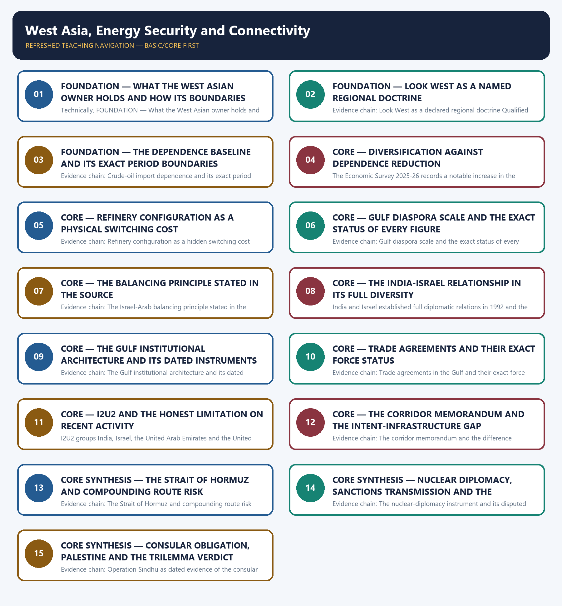

# West Asia, Energy Security and Connectivity — Learner-v2 Complete Learning Session

> **Authoring-only generation:** 2026-09-03. No PDF was rendered and no tracker or index was mutated.

### SOURCE, PROGRESSION AND CURRENT-LINKAGE AUDIT

- **Generation date:** 2026-09-03.
- **Repository-first evidence:** the Basic owner is taught first and preserved in full; the Advanced owner is retained only in the optional final teaching block.
- **OCR evidence:** Repository Markdown was primary. The OCR-searchable official General Studies question papers held under books\mains and books\more_previous_papers were read only to confirm the printed wording of routed demands. No official answer key, marking scheme, page precision or unsupported quotation was imported from them.
- **Qdrant:** not used; repository Markdown and available OCR context were sufficient.
- **PYQ integrity:** Three General Studies Paper II Mains demands are routed to this topic in the audited routing ledgers and each is reproduced below as a demand card with its printed year, paper, question number, directive, marks and word limit exactly as the ledger records them: 2018 General Studies Paper II question 9 on the depth and diversity of India's relations with Israel, a Discuss demand of 10 marks and 150 words, for which the ledger records that the printed word-limit tail was corrupted in the scan and that the Core route supersedes the older Advanced ownership; 2018 General Studies Paper II question 20 on the United States-Iran nuclear-pact controversy and India's national interest, an In what ways and How should demand of 15 marks and 250 words on the same superseding route; and 2025 General Studies Paper II question 19 on energy security and India's foreign policy in the Middle East, a Discuss demand of 15 marks and 250 words. Four objective demands are also routed to this owner and are carried as coverage requirements only: 2018 Prelims General Studies Paper I question 24 on the two-state solution in an international-affairs context, 2018 Prelims General Studies Paper I question 37 on conflict-zone towns and their correct country matching, and 2023 Prelims General Studies Paper I question 94 on Israel, Arab states, diplomatic relations and the Arab Peace Initiative, for which the official 2018-2023 Prelims keys are not held locally; and 2026 Prelims General Studies Paper I question 30 on the Strait of Hormuz and West Asian maritime access to the Indian Ocean, for which only a provisional 2026 Set-A key is present locally and its provisional status is preserved exactly. No option or answer letter is recorded or inferred for any of the four objective demands. Where a printed word limit or stem tail is recorded as corrupted in the scan, that defect is reported rather than silently repaired by invented wording. The locally held OCR-searchable official General Studies papers were read only to confirm the printed wording of the routed Mains demands; no question was invented from them, no stem was paraphrased into an apparent routing, and no marking scheme or official answer key was imported.
- **Live-link boundary:** Live official verification was attempted on 2026-09-03 in the priority order required for this topic: the Ministry of External Affairs pages first, then the Press Information Bureau, the Gulf Cooperation Council Secretariat, the Petroleum Planning and Analysis Cell and the International Maritime Organization. Every outcome is recorded exactly as observed. The Ministry of External Affairs pages returned a browser-requirement stub or the Ministry's own error page, the Press Information Bureau index returned HTTP 403, the Gulf Cooperation Council Secretariat returned a two-line teaser, and the Petroleum Planning and Analysis Cell returned only an ownership footer without any import or dependence table. The International Maritime Organization returned general descriptive text that supplies background rather than a dated West Asian item, so no new live item was obtained that would add, alter or date any claim in this package. The package therefore uses only the dated official anchors already carried by the repository owners, each with its actor, exact evidentiary level and date. It invents no energy or trade share, no corridor or project status, no route alignment, no summit outcome, no sanctions measure, no evacuation or diaspora figure, no port access, no treaty or statement wording, no border or diplomatic status, no date, no previous-year question, no answer key and no current claim.
- **Fact/inference discipline:** no current-affairs item, PYQ wording, figure or quotation is invented.

### LIVE OFFICIAL-SOURCE ATTEMPT LOG

Every live check below was attempted on 2026-09-03 in the priority order required for International Relations: Ministry of External Affairs official pages first, then other official government or international-organisation documents. Access failures are recorded exactly as observed and no claim is reconstructed from a failed fetch.

- https://www.mea.gov.in/press-releases.htm — attempted 2026-09-03; the request redirected to a browser-requirement stub and returned no press release text, so no live item was taken from it.
- https://www.mea.gov.in/bilateral-documents.htm — attempted 2026-09-03; the request redirected to a browser-requirement stub and returned no bilateral document text, so no live item was taken from it.
- https://www.mea.gov.in/foreign-relation.htm — attempted 2026-09-03; the request redirected to the Ministry's own error page, so no country brief was taken from it.
- https://www.pib.gov.in/indexd.aspx?reg=3&lang=1 — attempted 2026-09-03; the request returned HTTP 403, so no release was taken from it.
- https://www.gcc-sg.org/en-us/Pages/default.aspx — attempted 2026-09-03; the Gulf Cooperation Council Secretariat returned only a two-line teaser for its joint-action section with no agreement text, summit record or dated outcome, so no summit outcome, agreement wording or membership claim was taken from it.
- https://www.ppac.gov.in/ — attempted 2026-09-03; the Petroleum Planning and Analysis Cell site returned only its ownership footer with no import, dependence or supplier-share table, so no energy share or dependence figure was taken from it and the repository owners' dated figures were used unchanged.
- https://www.imo.org/en/About/Pages/Default.aspx — attempted 2026-09-03; the International Maritime Organization returned substantive descriptive text on its standard-setting mandate, which is background for chokepoint and shipping risk rather than a dated West Asian item, so no route-risk or freight claim was taken from it.

## BASIC LEARNING SESSION



*Distinct embedded teaching-navigation image. The separate continuous Cārvāka-style flowchart package remains an independent at-a-glance artifact.*

### SESSION 1 — FOUNDATION — WHAT THE WEST ASIAN OWNER HOLDS AND HOW ITS BOUNDARIES ARE ROUTED

#### DEFINITION / WHAT THIS IS CALLED

**Plain-language definition:** Evidence chain: What this West Asian owner holds and how its boundaries are routed Qualified use: Open a West Asia demand by fixing ownership so the answer does not drift into another owner's evidence.

**Technical definition:** Technically, FOUNDATION — What the West Asian owner holds and how its boundaries are routed is analysed by relating FOUNDATION to how its boundaries are routed, then testing the relationship through Evidence chain and Qualified use.

#### ANSWER-GRABBING OPENING — WRITE/ADAPT IN THE EXAM

> Evidence chain: What this West Asian owner holds and how its boundaries are routed Qualified use: Open a West Asia demand by fixing ownership so the answer does not drift into another owner's evidence.

#### MUST-WRITE KEYWORDS

- **FOUNDATION**
- **how its boundaries are routed**
- **Evidence chain**
- **Qualified use**
- **This**
- **India's Look West**

**How to use them:** Frame the answer through FOUNDATION; define how its boundaries are routed, connect Evidence chain with Qualified use to explain the mechanism, and use This for the decisive comparison or qualification.

#### VISUAL FIRST

```text
WHAT THE WEST ASIAN OWNER HOLDS AND HOW ITS BOUNDARIES ARE ROUTED
01. What this West Asian owner holds and how its boundaries are routed
BOUNDARY -> Pricing and import-bill mechanics belong to Economy, the minilateral profile to topic 10, diaspora diplomacy to topic 09 and the Central Asian limb of Chabahar to topic 05.
```

*This topic-specific rail fixes the evidence sequence and its exam boundary before analysis.*

#### CORE EXPLANATION

This topic owns India's Look West engagement with the Gulf and the Arab world, the Israel and Iran tracks, energy security as the organising interest, Gulf diaspora welfare as a foreign-policy obligation, the Palestine position and the connectivity and minilateral frameworks of I2U2 and the India-Middle East-Europe Economic Corridor, and its distinctive feature is that a single regional escalation can threaten energy supply, diaspora safety and connectivity viability at the same time; three verified General Studies Paper II Mains demands from 2018 and 2025 and four objective demands from 2018, 2023 and 2026 are routed here, while oil-import-bill, pricing and tariff mechanics belong to the Economy owner, the minilateral classification of I2U2 belongs to topic 10, diaspora diplomacy in general belongs to topic 09, the Central Asian limb of Chabahar belongs to topic 05, and the humanitarian relief cycle belongs to the Disaster Management owners.

#### NAMED EVIDENCE AND MECHANISM

- This topic owns India's Look West engagement with the Gulf and the Arab world, the Israel and Iran tracks, energy security as the organising interest, Gulf diaspora welfare as a foreign-policy obligation, the Palestine position and the connectivity and minilateral frameworks of I2U2 and the India-Middle East-Europe Economic Corridor, and its distinctive feature is that a single regional escalation can threaten energy supply, diaspora safety and connectivity viability at the same time; three verified General Studies Paper II Mains demands from 2018 and 2025 and four objective demands from 2018, 2023 and 2026 are routed here, while oil-import-bill, pricing and tariff mechanics belong to the Economy owner, the minilateral classification of I2U2 belongs to topic 10, diaspora diplomacy in general belongs to topic 09, the Central Asian limb of Chabahar belongs to topic 05, and the humanitarian relief cycle belongs to the Disaster Management owners.

#### EXAMINER CAUTION

- Pricing and import-bill mechanics belong to Economy, the minilateral profile to topic 10, diaspora diplomacy to topic 09 and the Central Asian limb of Chabahar to topic 05.

#### EXAM LINK

- **Prelims:** Retain the exact actor, document title, doctrine label, dated instrument and evidentiary level attached to What the West Asian owner holds and how its boundaries are routed, and never upgrade a vision statement into a treaty, a signature into a ratification, a participation category into membership, or an announced corridor into an operating one.
- **Mains:** Open a West Asia demand by fixing ownership so the answer does not drift into another owner's evidence.

#### MINI RECAP

- **Evidence chain:** What this West Asian owner holds and how its boundaries are routed
- **Qualified use:** Open a West Asia demand by fixing ownership so the answer does not drift into another owner's evidence.

#### CLOSING RECALL FLOW — FOUNDATION — WHAT THE WEST ASIAN OWNER HOLDS AND HOW ITS BOUNDARIES ARE ROUTED

```text
START / CONCEPT: FOUNDATION — What the West Asian owner holds and how its boundaries are routed
        |
        v
EXACT TERMS: FOUNDATION · how its boundaries are routed · Evidence chain · Qualified use · This · India's Look West
        |
        v
MECHANISM / ARGUMENT: Prelims: Retain the exact actor, document title, doctrine label, dated instrument and evidentiary level attached to What the West Asian owner holds and how its boundaries are routed, and never upgrade a vision statement into a treaty, a signature into a ratification, a participation category into membership, or an announced corridor into an operating one.
        |
        v
CONSEQUENCE / CONTRAST: This topic owns India's Look West engagement with the Gulf and the Arab world, the Israel and Iran tracks, energy security as the organising interest, Gulf diaspora welfare as a foreign-policy obligation, the Palestine position and the connectivity and minilateral frameworks of I2U2 and the India-Middle East-Europe Economic Corridor, and its distinctive feature is that a single regional escalation can threaten energy supply, diaspora safety and connectivity viability at the same time; three verified General Studies Paper II Mains demands from 2018 and 2025 and four objective demands from 2018, 2023 and 2026 are routed here, while oil-import-bill, pricing and tariff mechanics belong to the Economy owner, the minilateral classification of I2U2 belongs to topic 10, diaspora diplomacy in general belongs to topic 09, the Central Asian limb of Chabahar belongs to topic 05, and the humanitarian relief cycle belongs to the Disaster Management owners.
        |
        v
UPSC TRAP / ANSWER-USE: Mains: Open a West Asia demand by fixing ownership so the answer does not drift into another owner's evidence.
        |
        v
ANSWER-GRABBING FORMULATION: Evidence chain: What this West Asian owner holds and how its boundaries are routed Qualified use: Open a West Asia demand by fixing ownership so the answer does not drift into another owner's evidence.
```
### SESSION 2 — FOUNDATION — LOOK WEST AS A NAMED REGIONAL DOCTRINE

#### DEFINITION / WHAT THIS IS CALLED

**Plain-language definition:** Tharoor records that as far as the Arab world is concerned India is proud that it has a Look West policy too, which the owners treat as an explicit parallel to the better-known Look East policy and therefore as a regionally targeted engagement doctrine rather than an undifferentiated foreign-policy stance; the examinable value of the phrase is that it establishes West Asia as a named policy theatre with its own instruments, so a candidate can open an answer by classifying the region correctly instead of treating Gulf engagement as an appendix to a general foreign-policy narrative.

**Technical definition:** Evidence chain: Look West as a declared regional doctrine Qualified use: Classify the region correctly at the opening instead of treating Gulf engagement as an appendix.

#### ANSWER-GRABBING OPENING — WRITE/ADAPT IN THE EXAM

> Tharoor records that as far as the Arab world is concerned India is proud that it has a Look West policy too, which the owners treat as an explicit parallel to the better-known Look East policy and therefore as a regionally targeted engagement doctrine rather than an undifferentiated foreign-policy stance; the examinable value of the phrase is that it establishes West Asia as a named policy theatre with its own instruments, so a candidate can open an answer by classifying the region correctly instead of treating Gulf engagement as an appendix to a general foreign-policy narrative.

#### MUST-WRITE KEYWORDS

- **FOUNDATION**
- **Look West as a named regional doctrine**
- **Evidence chain**
- **Qualified use**
- **Tharoor**
- **Arab**

**How to use them:** Frame the answer through FOUNDATION; define Look West as a named regional doctrine, connect Evidence chain with Qualified use to explain the mechanism, and use Tharoor for the decisive comparison or qualification.

#### VISUAL FIRST

```text
LOOK WEST AS A NAMED REGIONAL DOCTRINE
01. Look West as a declared regional doctrine
BOUNDARY -> The phrase establishes a policy theatre and is not itself evidence of any specific outcome in that theatre.
```

*This topic-specific rail fixes the evidence sequence and its exam boundary before analysis.*

#### CORE EXPLANATION

Tharoor records that as far as the Arab world is concerned India is proud that it has a Look West policy too, which the owners treat as an explicit parallel to the better-known Look East policy and therefore as a regionally targeted engagement doctrine rather than an undifferentiated foreign-policy stance; the examinable value of the phrase is that it establishes West Asia as a named policy theatre with its own instruments, so a candidate can open an answer by classifying the region correctly instead of treating Gulf engagement as an appendix to a general foreign-policy narrative.

#### NAMED EVIDENCE AND MECHANISM

- Tharoor records that as far as the Arab world is concerned India is proud that it has a Look West policy too, which the owners treat as an explicit parallel to the better-known Look East policy and therefore as a regionally targeted engagement doctrine rather than an undifferentiated foreign-policy stance; the examinable value of the phrase is that it establishes West Asia as a named policy theatre with its own instruments, so a candidate can open an answer by classifying the region correctly instead of treating Gulf engagement as an appendix to a general foreign-policy narrative.

#### EXAMINER CAUTION

- The phrase establishes a policy theatre and is not itself evidence of any specific outcome in that theatre.

#### EXAM LINK

- **Prelims:** Retain the exact actor, document title, doctrine label, dated instrument and evidentiary level attached to Look West as a named regional doctrine, and never upgrade a vision statement into a treaty, a signature into a ratification, a participation category into membership, or an announced corridor into an operating one.
- **Mains:** Classify the region correctly at the opening instead of treating Gulf engagement as an appendix.

#### MINI RECAP

- **Evidence chain:** Look West as a declared regional doctrine
- **Qualified use:** Classify the region correctly at the opening instead of treating Gulf engagement as an appendix.

#### CLOSING RECALL FLOW — FOUNDATION — LOOK WEST AS A NAMED REGIONAL DOCTRINE

```text
START / CONCEPT: FOUNDATION — Look West as a named regional doctrine
        |
        v
EXACT TERMS: FOUNDATION · Look West as a named regional doctrine · Evidence chain · Qualified use · Tharoor · Arab
        |
        v
MECHANISM / ARGUMENT: Evidence chain: Look West as a declared regional doctrine Qualified use: Classify the region correctly at the opening instead of treating Gulf engagement as an appendix.
        |
        v
CONSEQUENCE / CONTRAST: The phrase establishes a policy theatre and is not itself evidence of any specific outcome in that theatre.
        |
        v
UPSC TRAP / ANSWER-USE: Do not miss this limiting distinction: tharoor records that as far as the Arab world is concerned India is proud...
        |
        v
ANSWER-GRABBING FORMULATION: Tharoor records that as far as the Arab world is concerned India is proud that it has a Look West policy too, which the owners treat as an explicit parallel to the better-known Look East policy and therefore as a regionally targeted engagement doctrine rather than an undifferentiated foreign-policy stance; the examinable value of the phrase is that it establishes West Asia as a named policy theatre with its own instruments, so a candidate can open an answer by classifying the region correctly instead of treating Gulf engagement as an appendix to a general foreign-policy narrative.
```
### SESSION 3 — FOUNDATION — THE DEPENDENCE BASELINE AND ITS EXACT PERIOD BOUNDARIES

#### DEFINITION / WHAT THIS IS CALLED

**Plain-language definition:** Petroleum Planning and Analysis Cell data put India's crude-oil import dependence at eighty-eight point two per cent in the financial year 2024-25 and about eighty-eight point seven per cent provisional in the financial year 2025-26, while Sikri records the book-period figure at approximately seventy per cent; the owners require the current figure and its consumption-basis definition to be cited for any present-day claim and permit the book-period figure only as a historical baseline showing the direction of travel, so quoting approximately seventy per cent as a current number is treated as a factual error rather than a stylistic one.

**Technical definition:** Evidence chain: Crude-oil import dependence and its exact period boundaries Qualified use: Establish the material interest with the correct current figure, which most answers on this topic get wrong.

#### ANSWER-GRABBING OPENING — WRITE/ADAPT IN THE EXAM

> Evidence chain: Crude-oil import dependence and its exact period boundaries Qualified use: Establish the material interest with the correct current figure, which most answers on this topic get wrong.

#### MUST-WRITE KEYWORDS

- **FOUNDATION**
- **The dependence baseline**
- **its exact period boundaries**
- **Evidence chain**
- **Qualified use**
- **2024-25**

**How to use them:** Frame the answer through FOUNDATION; define The dependence baseline, connect its exact period boundaries with Evidence chain to explain the mechanism, and use Qualified use for the decisive comparison or qualification.

#### VISUAL FIRST

```text
THE DEPENDENCE BASELINE AND ITS EXACT PERIOD BOUNDARIES
01. Crude-oil import dependence and its exact period boundaries
BOUNDARY -> The book-period figure is a historical baseline only and must never be quoted as a current number.
```

*This topic-specific rail fixes the evidence sequence and its exam boundary before analysis.*

#### CORE EXPLANATION

Petroleum Planning and Analysis Cell data put India's crude-oil import dependence at eighty-eight point two per cent in the financial year 2024-25 and about eighty-eight point seven per cent provisional in the financial year 2025-26, while Sikri records the book-period figure at approximately seventy per cent; the owners require the current figure and its consumption-basis definition to be cited for any present-day claim and permit the book-period figure only as a historical baseline showing the direction of travel, so quoting approximately seventy per cent as a current number is treated as a factual error rather than a stylistic one.

#### NAMED EVIDENCE AND MECHANISM

- Petroleum Planning and Analysis Cell data put India's crude-oil import dependence at eighty-eight point two per cent in the financial year 2024-25 and about eighty-eight point seven per cent provisional in the financial year 2025-26, while Sikri records the book-period figure at approximately seventy per cent; the owners require the current figure and its consumption-basis definition to be cited for any present-day claim and permit the book-period figure only as a historical baseline showing the direction of travel, so quoting approximately seventy per cent as a current number is treated as a factual error rather than a stylistic one.

#### EXAMINER CAUTION

- The book-period figure is a historical baseline only and must never be quoted as a current number.

#### EXAM LINK

- **Prelims:** Retain the exact actor, document title, doctrine label, dated instrument and evidentiary level attached to The dependence baseline and its exact period boundaries, and never upgrade a vision statement into a treaty, a signature into a ratification, a participation category into membership, or an announced corridor into an operating one.
- **Mains:** Establish the material interest with the correct current figure, which most answers on this topic get wrong.

#### MINI RECAP

- **Evidence chain:** Crude-oil import dependence and its exact period boundaries
- **Qualified use:** Establish the material interest with the correct current figure, which most answers on this topic get wrong.

#### CLOSING RECALL FLOW — FOUNDATION — THE DEPENDENCE BASELINE AND ITS EXACT PERIOD BOUNDARIES

```text
START / CONCEPT: FOUNDATION — The dependence baseline and its exact period boundaries
        |
        v
EXACT TERMS: FOUNDATION · The dependence baseline · its exact period boundaries · Evidence chain · Qualified use · 2024-25
        |
        v
MECHANISM / ARGUMENT: Petroleum Planning and Analysis Cell data put India's crude-oil import dependence at eighty-eight point two per cent in the financial year 2024-25 and about eighty-eight point seven per cent provisional in the financial year 2025-26, while Sikri records the book-period figure at approximately seventy per cent; the owners require the current figure and its consumption-basis definition to be cited for any present-day claim and permit the book-period figure only as a historical baseline showing the direction of travel, so quoting approximately seventy per cent as a current number is treated as a factual error rather than a stylistic one.
        |
        v
CONSEQUENCE / CONTRAST: The book-period figure is a historical baseline only and must never be quoted as a current number.
        |
        v
UPSC TRAP / ANSWER-USE: Do not miss this limiting distinction: crude-oil import dependence and its exact period boundaries Qualified use.
        |
        v
ANSWER-GRABBING FORMULATION: Evidence chain: Crude-oil import dependence and its exact period boundaries Qualified use: Establish the material interest with the correct current figure, which most answers on this topic get wrong.
```
### SESSION 4 — CORE — DIVERSIFICATION AGAINST DEPENDENCE REDUCTION

#### DEFINITION / WHAT THIS IS CALLED

**Plain-language definition:** Evidence chain: Supplier diversification against dependence reduction Qualified use: Separate two variables that answers routinely merge, which is where the analytical marks sit.

**Technical definition:** The Economic Survey 2025-26 records a notable increase in the diversity of countries from which India imports crude oil, with the United States share rising to eight point one per cent from four point six per cent and the United Arab Emirates share to eleven point one per cent from nine point four per cent in April to November of the financial year 2026, while Egypt, Nigeria and Libya also rose and Russia, Saudi Arabia, Iraq and Venezuela declined; the owners insist on the analytical separation that this is diversification of sources and not reduction of aggregate dependence, because equity stakes and a wider supplier base spread single-point-of-failure risk without lowering the share of consumption that must be imported.

#### ANSWER-GRABBING OPENING — WRITE/ADAPT IN THE EXAM

> Evidence chain: Supplier diversification against dependence reduction Qualified use: Separate two variables that answers routinely merge, which is where the analytical marks sit.

#### MUST-WRITE KEYWORDS

- **Diversification against dependence reduction**
- **Evidence chain**
- **Qualified use**
- **The Economic Survey**
- **India**
- **2025-26**

**How to use them:** Frame the answer through Diversification against dependence reduction; define Evidence chain, connect Qualified use with The Economic Survey to explain the mechanism, and use India for the decisive comparison or qualification.

#### VISUAL FIRST

```text
DIVERSIFICATION AGAINST DEPENDENCE REDUCTION
01. Supplier diversification against dependence reduction
BOUNDARY -> A wider supplier base spreads risk without lowering the share of consumption that must be imported.
```

*This topic-specific rail fixes the evidence sequence and its exam boundary before analysis.*

#### CORE EXPLANATION

The Economic Survey 2025-26 records a notable increase in the diversity of countries from which India imports crude oil, with the United States share rising to eight point one per cent from four point six per cent and the United Arab Emirates share to eleven point one per cent from nine point four per cent in April to November of the financial year 2026, while Egypt, Nigeria and Libya also rose and Russia, Saudi Arabia, Iraq and Venezuela declined; the owners insist on the analytical separation that this is diversification of sources and not reduction of aggregate dependence, because equity stakes and a wider supplier base spread single-point-of-failure risk without lowering the share of consumption that must be imported.

#### NAMED EVIDENCE AND MECHANISM

- The Economic Survey 2025-26 records a notable increase in the diversity of countries from which India imports crude oil, with the United States share rising to eight point one per cent from four point six per cent and the United Arab Emirates share to eleven point one per cent from nine point four per cent in April to November of the financial year 2026, while Egypt, Nigeria and Libya also rose and Russia, Saudi Arabia, Iraq and Venezuela declined; the owners insist on the analytical separation that this is diversification of sources and not reduction of aggregate dependence, because equity stakes and a wider supplier base spread single-point-of-failure risk without lowering the share of consumption that must be imported.

#### EXAMINER CAUTION

- A wider supplier base spreads risk without lowering the share of consumption that must be imported.

#### EXAM LINK

- **Prelims:** Retain the exact actor, document title, doctrine label, dated instrument and evidentiary level attached to Diversification against dependence reduction, and never upgrade a vision statement into a treaty, a signature into a ratification, a participation category into membership, or an announced corridor into an operating one.
- **Mains:** Separate two variables that answers routinely merge, which is where the analytical marks sit.

#### MINI RECAP

- **Evidence chain:** Supplier diversification against dependence reduction
- **Qualified use:** Separate two variables that answers routinely merge, which is where the analytical marks sit.

#### CLOSING RECALL FLOW — CORE — DIVERSIFICATION AGAINST DEPENDENCE REDUCTION

```text
START / CONCEPT: CORE — Diversification against dependence reduction
        |
        v
EXACT TERMS: Diversification against dependence reduction · Evidence chain · Qualified use · The Economic Survey · India · 2025-26
        |
        v
MECHANISM / ARGUMENT: The Economic Survey 2025-26 records a notable increase in the diversity of countries from which India imports crude oil, with the United States share rising to eight point one per cent from four point six per cent and the United Arab Emirates share to eleven point one per cent from nine point four per cent in April to November of the financial year 2026, while Egypt, Nigeria and Libya also rose and Russia, Saudi Arabia, Iraq and Venezuela declined; the owners insist on the analytical separation that this is diversification of sources and not reduction of aggregate dependence, because equity stakes and a wider supplier base spread single-point-of-failure risk without lowering the share of consumption that must be imported.
        |
        v
CONSEQUENCE / CONTRAST: A wider supplier base spreads risk without lowering the share of consumption that must be imported.
        |
        v
UPSC TRAP / ANSWER-USE: Do not miss this limiting distinction: separate two variables that answers routinely merge, which is where the analytical marks sit.
        |
        v
ANSWER-GRABBING FORMULATION: Evidence chain: Supplier diversification against dependence reduction Qualified use: Separate two variables that answers routinely merge, which is where the analytical marks sit.
```
### SESSION 5 — CORE — REFINERY CONFIGURATION AS A PHYSICAL SWITCHING COST

#### DEFINITION / WHAT THIS IS CALLED

**Plain-language definition:** Tharoor notes that many Indian refineries are in fact devised to process the quality of crude oil that Iran supplies, and Sikri records the underlying policy response of making equity investments in oilfields abroad, so the owners treat configuration-specific refining capacity as a physical constraint on how quickly a supplier mix can actually change; the analytical payoff is that headline diversification percentages move slowly for engineering reasons rather than diplomatic ones, which is why a strategy answer must price switching cost instead of assuming that political intent translates immediately into a changed energy basket.

**Technical definition:** Evidence chain: Refinery configuration as a hidden switching cost Qualified use: Explain why intent does not translate immediately into a changed basket, converting assertion into mechanism.

#### ANSWER-GRABBING OPENING — WRITE/ADAPT IN THE EXAM

> Evidence chain: Refinery configuration as a hidden switching cost Qualified use: Explain why intent does not translate immediately into a changed basket, converting assertion into mechanism.

#### MUST-WRITE KEYWORDS

- **Refinery configuration as a physical switching cost**
- **Evidence chain**
- **Qualified use**
- **Tharoor notes that many Indian refineries**
- **Tharoor**
- **Indian**

**How to use them:** Frame the answer through Refinery configuration as a physical switching cost; define Evidence chain, connect Qualified use with Tharoor notes that many Indian refineries to explain the mechanism, and use Tharoor for the decisive comparison or qualification.

#### VISUAL FIRST

```text
REFINERY CONFIGURATION AS A PHYSICAL SWITCHING COST
01. Refinery configuration as a hidden switching cost
BOUNDARY -> Headline percentages move slowly for engineering reasons rather than diplomatic ones.
```

*This topic-specific rail fixes the evidence sequence and its exam boundary before analysis.*

#### CORE EXPLANATION

Tharoor notes that many Indian refineries are in fact devised to process the quality of crude oil that Iran supplies, and Sikri records the underlying policy response of making equity investments in oilfields abroad, so the owners treat configuration-specific refining capacity as a physical constraint on how quickly a supplier mix can actually change; the analytical payoff is that headline diversification percentages move slowly for engineering reasons rather than diplomatic ones, which is why a strategy answer must price switching cost instead of assuming that political intent translates immediately into a changed energy basket.

#### NAMED EVIDENCE AND MECHANISM

- Tharoor notes that many Indian refineries are in fact devised to process the quality of crude oil that Iran supplies, and Sikri records the underlying policy response of making equity investments in oilfields abroad, so the owners treat configuration-specific refining capacity as a physical constraint on how quickly a supplier mix can actually change; the analytical payoff is that headline diversification percentages move slowly for engineering reasons rather than diplomatic ones, which is why a strategy answer must price switching cost instead of assuming that political intent translates immediately into a changed energy basket.

#### EXAMINER CAUTION

- Headline percentages move slowly for engineering reasons rather than diplomatic ones.

#### EXAM LINK

- **Prelims:** Retain the exact actor, document title, doctrine label, dated instrument and evidentiary level attached to Refinery configuration as a physical switching cost, and never upgrade a vision statement into a treaty, a signature into a ratification, a participation category into membership, or an announced corridor into an operating one.
- **Mains:** Explain why intent does not translate immediately into a changed basket, converting assertion into mechanism.

#### MINI RECAP

- **Evidence chain:** Refinery configuration as a hidden switching cost
- **Qualified use:** Explain why intent does not translate immediately into a changed basket, converting assertion into mechanism.

#### CLOSING RECALL FLOW — CORE — REFINERY CONFIGURATION AS A PHYSICAL SWITCHING COST

```text
START / CONCEPT: CORE — Refinery configuration as a physical switching cost
        |
        v
EXACT TERMS: Refinery configuration as a physical switching cost · Evidence chain · Qualified use · Tharoor notes that many Indian refineries · Tharoor · Indian
        |
        v
MECHANISM / ARGUMENT: Tharoor notes that many Indian refineries are in fact devised to process the quality of crude oil that Iran supplies, and Sikri records the underlying policy response of making equity investments in oilfields abroad, so the owners treat configuration-specific refining capacity as a physical constraint on how quickly a supplier mix can actually change; the analytical payoff is that headline diversification percentages move slowly for engineering reasons rather than diplomatic ones, which is why a strategy answer must price switching cost instead of assuming that political intent translates immediately into a changed energy basket.
        |
        v
CONSEQUENCE / CONTRAST: Mains: Explain why intent does not translate immediately into a changed basket, converting assertion into mechanism.
        |
        v
UPSC TRAP / ANSWER-USE: Do not miss this limiting distinction: refinery configuration as a hidden switching cost Qualified use.
        |
        v
ANSWER-GRABBING FORMULATION: Evidence chain: Refinery configuration as a hidden switching cost Qualified use: Explain why intent does not translate immediately into a changed basket, converting assertion into mechanism.
```
### SESSION 6 — CORE — GULF DIASPORA SCALE AND THE EXACT STATUS OF EVERY FIGURE

#### DEFINITION / WHAT THIS IS CALLED

**Plain-language definition:** Sikri cites a diaspora of five million in the Gulf and Tharoor separately notes that the Arab world is home to nearly six million Indians, both period-specific, while the Ministry of External Affairs overseas-Indian population table as on January 2026 records four million three hundred and forty-four thousand and eight persons in the United Arab Emirates and two million seven hundred and fifty thousand five hundred and fifty-one in Saudi Arabia; the owners require these to be described as population-stock estimates rather than citizenship or Overseas Citizen of India counts, and they route remittance data to the Economy owner and general diaspora diplomacy to topic 09.

**Technical definition:** Evidence chain: Gulf diaspora scale and the exact status of every figure Qualified use: Add the second limb of West Asia policy with correctly qualified figures rather than a rounded claim.

#### ANSWER-GRABBING OPENING — WRITE/ADAPT IN THE EXAM

> Evidence chain: Gulf diaspora scale and the exact status of every figure Qualified use: Add the second limb of West Asia policy with correctly qualified figures rather than a rounded claim.

#### MUST-WRITE KEYWORDS

- **Gulf diaspora scale**
- **the exact status of every figure**
- **Evidence chain**
- **Qualified use**
- **Sikri**
- **Gulf**

**How to use them:** Frame the answer through Gulf diaspora scale; define the exact status of every figure, connect Evidence chain with Qualified use to explain the mechanism, and use Sikri for the decisive comparison or qualification.

#### VISUAL FIRST

```text
GULF DIASPORA SCALE AND THE EXACT STATUS OF EVERY FIGURE
01. Gulf diaspora scale and the exact status of every figure
BOUNDARY -> Every diaspora number is a period-specific population-stock estimate and never a citizenship or Overseas Citizen count.
```

*This topic-specific rail fixes the evidence sequence and its exam boundary before analysis.*

#### CORE EXPLANATION

Sikri cites a diaspora of five million in the Gulf and Tharoor separately notes that the Arab world is home to nearly six million Indians, both period-specific, while the Ministry of External Affairs overseas-Indian population table as on January 2026 records four million three hundred and forty-four thousand and eight persons in the United Arab Emirates and two million seven hundred and fifty thousand five hundred and fifty-one in Saudi Arabia; the owners require these to be described as population-stock estimates rather than citizenship or Overseas Citizen of India counts, and they route remittance data to the Economy owner and general diaspora diplomacy to topic 09.

#### NAMED EVIDENCE AND MECHANISM

- Sikri cites a diaspora of five million in the Gulf and Tharoor separately notes that the Arab world is home to nearly six million Indians, both period-specific, while the Ministry of External Affairs overseas-Indian population table as on January 2026 records four million three hundred and forty-four thousand and eight persons in the United Arab Emirates and two million seven hundred and fifty thousand five hundred and fifty-one in Saudi Arabia; the owners require these to be described as population-stock estimates rather than citizenship or Overseas Citizen of India counts, and they route remittance data to the Economy owner and general diaspora diplomacy to topic 09.

#### EXAMINER CAUTION

- Every diaspora number is a period-specific population-stock estimate and never a citizenship or Overseas Citizen count.

#### EXAM LINK

- **Prelims:** Retain the exact actor, document title, doctrine label, dated instrument and evidentiary level attached to Gulf diaspora scale and the exact status of every figure, and never upgrade a vision statement into a treaty, a signature into a ratification, a participation category into membership, or an announced corridor into an operating one.
- **Mains:** Add the second limb of West Asia policy with correctly qualified figures rather than a rounded claim.

#### MINI RECAP

- **Evidence chain:** Gulf diaspora scale and the exact status of every figure
- **Qualified use:** Add the second limb of West Asia policy with correctly qualified figures rather than a rounded claim.

#### CLOSING RECALL FLOW — CORE — GULF DIASPORA SCALE AND THE EXACT STATUS OF EVERY FIGURE

```text
START / CONCEPT: CORE — Gulf diaspora scale and the exact status of every figure
        |
        v
EXACT TERMS: Gulf diaspora scale · the exact status of every figure · Evidence chain · Qualified use · Sikri · Gulf
        |
        v
MECHANISM / ARGUMENT: Sikri cites a diaspora of five million in the Gulf and Tharoor separately notes that the Arab world is home to nearly six million Indians, both period-specific, while the Ministry of External Affairs overseas-Indian population table as on January 2026 records four million three hundred and forty-four thousand and eight persons in the United Arab Emirates and two million seven hundred and fifty thousand five hundred and fifty-one in Saudi Arabia; the owners require these to be described as population-stock estimates rather than citizenship or Overseas Citizen of India counts, and they route remittance data to the Economy owner and general diaspora diplomacy to topic 09.
        |
        v
CONSEQUENCE / CONTRAST: Every diaspora number is a period-specific population-stock estimate and never a citizenship or Overseas Citizen count.
        |
        v
UPSC TRAP / ANSWER-USE: Do not miss this limiting distinction: gulf diaspora scale and the exact status of every figure Qualified use.
        |
        v
ANSWER-GRABBING FORMULATION: Evidence chain: Gulf diaspora scale and the exact status of every figure Qualified use: Add the second limb of West Asia policy with correctly qualified figures rather than a rounded claim.
```
### SESSION 7 — CORE — THE BALANCING PRINCIPLE STATED IN THE SOURCE

#### DEFINITION / WHAT THIS IS CALLED

**Plain-language definition:** Active balancing deepens several ties at once and is not passive equidistance or a sequence of choices.

**Technical definition:** Evidence chain: The Israel-Arab balancing principle stated in the source Qualified use: Anchor the balancing argument in the exact source wording rather than a general claim of neutrality.

#### ANSWER-GRABBING OPENING — WRITE/ADAPT IN THE EXAM

> Evidence chain: The Israel-Arab balancing principle stated in the source Qualified use: Anchor the balancing argument in the exact source wording rather than a general claim of neutrality.

#### MUST-WRITE KEYWORDS

- **The balancing principle stated in the source**
- **Evidence chain**
- **Qualified use**
- **Tharoor**
- **India**
- **Israel**

**How to use them:** Frame the answer through The balancing principle stated in the source; define Evidence chain, connect Qualified use with Tharoor to explain the mechanism, and use India for the decisive comparison or qualification.

#### VISUAL FIRST

```text
THE BALANCING PRINCIPLE STATED IN THE SOURCE
01. The Israel-Arab balancing principle stated in the source
BOUNDARY -> Active balancing deepens several ties at once and is not passive equidistance or a sequence of choices.
```

*This topic-specific rail fixes the evidence sequence and its exam boundary before analysis.*

#### CORE EXPLANATION

Tharoor states that India values its relationship with Israel, but not at the expense of its friendships with Arab and other Muslim states, which is the explicit textual anchor for every balancing argument in this topic, and the owners sharpen it into active balancing rather than passive equidistance, because India deepens several ties simultaneously instead of avoiding commitment to any; the consequence for answer writing is that the Gulf, Israel and Iran tracks must be presented as parallel and non-exclusive rather than as a sequence of choices in which one relationship displaces another.

#### NAMED EVIDENCE AND MECHANISM

- Tharoor states that India values its relationship with Israel, but not at the expense of its friendships with Arab and other Muslim states, which is the explicit textual anchor for every balancing argument in this topic, and the owners sharpen it into active balancing rather than passive equidistance, because India deepens several ties simultaneously instead of avoiding commitment to any; the consequence for answer writing is that the Gulf, Israel and Iran tracks must be presented as parallel and non-exclusive rather than as a sequence of choices in which one relationship displaces another.

#### EXAMINER CAUTION

- Active balancing deepens several ties at once and is not passive equidistance or a sequence of choices.

#### EXAM LINK

- **Prelims:** Retain the exact actor, document title, doctrine label, dated instrument and evidentiary level attached to The balancing principle stated in the source, and never upgrade a vision statement into a treaty, a signature into a ratification, a participation category into membership, or an announced corridor into an operating one.
- **Mains:** Anchor the balancing argument in the exact source wording rather than a general claim of neutrality.

#### MINI RECAP

- **Evidence chain:** The Israel-Arab balancing principle stated in the source
- **Qualified use:** Anchor the balancing argument in the exact source wording rather than a general claim of neutrality.

#### CLOSING RECALL FLOW — CORE — THE BALANCING PRINCIPLE STATED IN THE SOURCE

```text
START / CONCEPT: CORE — The balancing principle stated in the source
        |
        v
EXACT TERMS: The balancing principle stated in the source · Evidence chain · Qualified use · Tharoor · India · Israel
        |
        v
MECHANISM / ARGUMENT: Tharoor states that India values its relationship with Israel, but not at the expense of its friendships with Arab and other Muslim states, which is the explicit textual anchor for every balancing argument in this topic, and the owners sharpen it into active balancing rather than passive equidistance, because India deepens several ties simultaneously instead of avoiding commitment to any; the consequence for answer writing is that the Gulf, Israel and Iran tracks must be presented as parallel and non-exclusive rather than as a sequence of choices in which one relationship displaces another.
        |
        v
CONSEQUENCE / CONTRAST: Active balancing deepens several ties at once and is not passive equidistance or a sequence of choices.
        |
        v
UPSC TRAP / ANSWER-USE: Do not miss this limiting distinction: the Israel-Arab balancing principle stated in the source Qualified use.
        |
        v
ANSWER-GRABBING FORMULATION: Evidence chain: The Israel-Arab balancing principle stated in the source Qualified use: Anchor the balancing argument in the exact source wording rather than a general claim of neutrality.
```
### SESSION 8 — CORE — THE INDIA-ISRAEL RELATIONSHIP IN ITS FULL DIVERSITY

#### DEFINITION / WHAT THIS IS CALLED

**Plain-language definition:** Evidence chain: The India-Israel relationship in its full diversity Qualified use: Answer the 2018 depth-and-diversity demand across domains instead of listing defence deals alone.

**Technical definition:** India and Israel established full diplomatic relations in 1992 and the first visit by an Indian Prime Minister to Israel in July 2017 marked a major political upgrade, after which cooperation spans defence procurement, counter-terrorism and co-development with the Barak-8 air-defence system as the named joint development, the Indo-Israel Agricultural Project operating Centres of Excellence for protected cultivation, irrigation and post-harvest practices, and the India-Israel Industrial Research and Development and Technological Innovation Fund launched in 2017; the owners attach the limits directly, namely that import dependence, cost and technology-transfer depth remain relevant, that demonstration centres require local extension, affordability and scaling before they affect wider productivity, and that funded projects must be distinguished from announced cooperation.

#### ANSWER-GRABBING OPENING — WRITE/ADAPT IN THE EXAM

> Evidence chain: The India-Israel relationship in its full diversity Qualified use: Answer the 2018 depth-and-diversity demand across domains instead of listing defence deals alone.

#### MUST-WRITE KEYWORDS

- **The India-Israel relationship in its full diversity**
- **Evidence chain**
- **Qualified use**
- **India**
- **Israel**
- **Indian Prime Minister**

**How to use them:** Frame the answer through The India-Israel relationship in its full diversity; define Evidence chain, connect Qualified use with India to explain the mechanism, and use Israel for the decisive comparison or qualification.

#### VISUAL FIRST

```text
THE INDIA-ISRAEL RELATIONSHIP IN ITS FULL DIVERSITY
01. The India-Israel relationship in its full diversity
BOUNDARY -> Demonstration centres and announced funds are not proof of scaled productivity gains or completed transfer.
```

*This topic-specific rail fixes the evidence sequence and its exam boundary before analysis.*

#### CORE EXPLANATION

India and Israel established full diplomatic relations in 1992 and the first visit by an Indian Prime Minister to Israel in July 2017 marked a major political upgrade, after which cooperation spans defence procurement, counter-terrorism and co-development with the Barak-8 air-defence system as the named joint development, the Indo-Israel Agricultural Project operating Centres of Excellence for protected cultivation, irrigation and post-harvest practices, and the India-Israel Industrial Research and Development and Technological Innovation Fund launched in 2017; the owners attach the limits directly, namely that import dependence, cost and technology-transfer depth remain relevant, that demonstration centres require local extension, affordability and scaling before they affect wider productivity, and that funded projects must be distinguished from announced cooperation.

#### NAMED EVIDENCE AND MECHANISM

- India and Israel established full diplomatic relations in 1992 and the first visit by an Indian Prime Minister to Israel in July 2017 marked a major political upgrade, after which cooperation spans defence procurement, counter-terrorism and co-development with the Barak-8 air-defence system as the named joint development, the Indo-Israel Agricultural Project operating Centres of Excellence for protected cultivation, irrigation and post-harvest practices, and the India-Israel Industrial Research and Development and Technological Innovation Fund launched in 2017; the owners attach the limits directly, namely that import dependence, cost and technology-transfer depth remain relevant, that demonstration centres require local extension, affordability and scaling before they affect wider productivity, and that funded projects must be distinguished from announced cooperation.

#### EXAMINER CAUTION

- Demonstration centres and announced funds are not proof of scaled productivity gains or completed transfer.

#### EXAM LINK

- **Prelims:** Retain the exact actor, document title, doctrine label, dated instrument and evidentiary level attached to The India-Israel relationship in its full diversity, and never upgrade a vision statement into a treaty, a signature into a ratification, a participation category into membership, or an announced corridor into an operating one.
- **Mains:** Answer the 2018 depth-and-diversity demand across domains instead of listing defence deals alone.

#### MINI RECAP

- **Evidence chain:** The India-Israel relationship in its full diversity
- **Qualified use:** Answer the 2018 depth-and-diversity demand across domains instead of listing defence deals alone.

#### CLOSING RECALL FLOW — CORE — THE INDIA-ISRAEL RELATIONSHIP IN ITS FULL DIVERSITY

```text
START / CONCEPT: CORE — The India-Israel relationship in its full diversity
        |
        v
EXACT TERMS: The India-Israel relationship in its full diversity · Evidence chain · Qualified use · India · Israel · Indian Prime Minister
        |
        v
MECHANISM / ARGUMENT: India and Israel established full diplomatic relations in 1992 and the first visit by an Indian Prime Minister to Israel in July 2017 marked a major political upgrade, after which cooperation spans defence procurement, counter-terrorism and co-development with the Barak-8 air-defence system as the named joint development, the Indo-Israel Agricultural Project operating Centres of Excellence for protected cultivation, irrigation and post-harvest practices, and the India-Israel Industrial Research and Development and Technological Innovation Fund launched in 2017; the owners attach the limits directly, namely that import dependence, cost and technology-transfer depth remain relevant, that demonstration centres require local extension, affordability and scaling before they affect wider productivity, and that funded projects must be distinguished from announced cooperation.
        |
        v
CONSEQUENCE / CONTRAST: Demonstration centres and announced funds are not proof of scaled productivity gains or completed transfer.
        |
        v
UPSC TRAP / ANSWER-USE: Do not miss this limiting distinction: the India-Israel relationship in its full diversity Qualified use.
        |
        v
ANSWER-GRABBING FORMULATION: Evidence chain: The India-Israel relationship in its full diversity Qualified use: Answer the 2018 depth-and-diversity demand across domains instead of listing defence deals alone.
```
### SESSION 9 — CORE — THE GULF INSTITUTIONAL ARCHITECTURE AND ITS DATED INSTRUMENTS

#### DEFINITION / WHAT THIS IS CALLED

**Plain-language definition:** A dated instrument and its forum are what make a strategic-partnership claim checkable.

**Technical definition:** Evidence chain: The Gulf institutional architecture and its dated instruments Qualified use: Replace an undated partnership assertion with the anchor framework a Gulf demand expects.

#### ANSWER-GRABBING OPENING — WRITE/ADAPT IN THE EXAM

> Evidence chain: The Gulf institutional architecture and its dated instruments Qualified use: Replace an undated partnership assertion with the anchor framework a Gulf demand expects.

#### MUST-WRITE KEYWORDS

- **The Gulf institutional architecture**
- **its dated instruments**
- **Evidence chain**
- **Qualified use**
- **The India-Gulf Cooperation Council Joint**
- **2024-2028**

**How to use them:** Frame the answer through The Gulf institutional architecture; define its dated instruments, connect Evidence chain with Qualified use to explain the mechanism, and use The India-Gulf Cooperation Council Joint for the decisive comparison or qualification.

#### VISUAL FIRST

```text
THE GULF INSTITUTIONAL ARCHITECTURE AND ITS DATED INSTRUMENTS
01. The Gulf institutional architecture and its dated instruments
BOUNDARY -> A dated instrument and its forum are what make a strategic-partnership claim checkable.
```

*This topic-specific rail fixes the evidence sequence and its exam boundary before analysis.*

#### CORE EXPLANATION

The India-Gulf Cooperation Council Joint Action Plan for 2024-2028 was adopted at the first India-Gulf Cooperation Council Joint Ministerial Meeting for Strategic Dialogue at Riyadh on 9 September 2024 and is the anchor current framework for India's strategic dialogue with the Council, while the India-Saudi Arabia Strategic Partnership Council held its second meeting at Jeddah on 22 April 2025, India and Qatar signed an Agreement on Establishment of a Bilateral Strategic Partnership on 18 February 2025, and India-United Arab Emirates relations were elevated to a Comprehensive Strategic Partnership on 25 January 2017; the owners require a dated instrument to be named rather than an undated assertion of strategic partnership, because the date and the forum are what make the claim checkable.

#### NAMED EVIDENCE AND MECHANISM

- The India-Gulf Cooperation Council Joint Action Plan for 2024-2028 was adopted at the first India-Gulf Cooperation Council Joint Ministerial Meeting for Strategic Dialogue at Riyadh on 9 September 2024 and is the anchor current framework for India's strategic dialogue with the Council, while the India-Saudi Arabia Strategic Partnership Council held its second meeting at Jeddah on 22 April 2025, India and Qatar signed an Agreement on Establishment of a Bilateral Strategic Partnership on 18 February 2025, and India-United Arab Emirates relations were elevated to a Comprehensive Strategic Partnership on 25 January 2017; the owners require a dated instrument to be named rather than an undated assertion of strategic partnership, because the date and the forum are what make the claim checkable.

#### EXAMINER CAUTION

- A dated instrument and its forum are what make a strategic-partnership claim checkable.

#### EXAM LINK

- **Prelims:** Retain the exact actor, document title, doctrine label, dated instrument and evidentiary level attached to The Gulf institutional architecture and its dated instruments, and never upgrade a vision statement into a treaty, a signature into a ratification, a participation category into membership, or an announced corridor into an operating one.
- **Mains:** Replace an undated partnership assertion with the anchor framework a Gulf demand expects.

#### MINI RECAP

- **Evidence chain:** The Gulf institutional architecture and its dated instruments
- **Qualified use:** Replace an undated partnership assertion with the anchor framework a Gulf demand expects.

#### CLOSING RECALL FLOW — CORE — THE GULF INSTITUTIONAL ARCHITECTURE AND ITS DATED INSTRUMENTS

```text
START / CONCEPT: CORE — The Gulf institutional architecture and its dated instruments
        |
        v
EXACT TERMS: The Gulf institutional architecture · its dated instruments · Evidence chain · Qualified use · The India-Gulf Cooperation Council Joint · 2024-2028
        |
        v
MECHANISM / ARGUMENT: The India-Gulf Cooperation Council Joint Action Plan for 2024-2028 was adopted at the first India-Gulf Cooperation Council Joint Ministerial Meeting for Strategic Dialogue at Riyadh on 9 September 2024 and is the anchor current framework for India's strategic dialogue with the Council, while the India-Saudi Arabia Strategic Partnership Council held its second meeting at Jeddah on 22 April 2025, India and Qatar signed an Agreement on Establishment of a Bilateral Strategic Partnership on 18 February 2025, and India-United Arab Emirates relations were elevated to a Comprehensive Strategic Partnership on 25 January 2017; the owners require a dated instrument to be named rather than an undated assertion of strategic partnership, because the date and the forum are what make the claim checkable.
        |
        v
CONSEQUENCE / CONTRAST: A dated instrument and its forum are what make a strategic-partnership claim checkable.
        |
        v
UPSC TRAP / ANSWER-USE: Do not miss this limiting distinction: the Gulf institutional architecture and its dated instruments Qualified use.
        |
        v
ANSWER-GRABBING FORMULATION: Evidence chain: The Gulf institutional architecture and its dated instruments Qualified use: Replace an undated partnership assertion with the anchor framework a Gulf demand expects.
```
### SESSION 10 — CORE — TRADE AGREEMENTS AND THEIR EXACT FORCE STATUS

#### DEFINITION / WHAT THIS IS CALLED

**Plain-language definition:** The India-United Arab Emirates Comprehensive Economic Partnership Agreement has been in force since 1 May 2022 and officially reported bilateral trade was approximately one hundred billion United States dollars in the financial year 2024-25, while an India-Oman Comprehensive Economic Partnership Agreement was signed on 18 December 2025 with entry into force requiring separate verification; the owners keep the tariff and trade-volume mechanics with the Economy owner and retain only the strategic-partnership significance here, and they insist that signature and entry into force are recorded as distinct evidentiary levels.

**Technical definition:** Evidence chain: Trade agreements in the Gulf and their exact force status Qualified use: Apply the legal-status discipline inside a live economic-diplomacy example.

#### ANSWER-GRABBING OPENING — WRITE/ADAPT IN THE EXAM

> Evidence chain: Trade agreements in the Gulf and their exact force status Qualified use: Apply the legal-status discipline inside a live economic-diplomacy example.

#### MUST-WRITE KEYWORDS

- **Trade agreements**
- **their exact force status**
- **Evidence chain**
- **Qualified use**
- **The India-United Arab Emirates Comprehensive**
- **2024-25**

**How to use them:** Frame the answer through Trade agreements; define their exact force status, connect Evidence chain with Qualified use to explain the mechanism, and use The India-United Arab Emirates Comprehensive for the decisive comparison or qualification.

#### VISUAL FIRST

```text
TRADE AGREEMENTS AND THEIR EXACT FORCE STATUS
01. Trade agreements in the Gulf and their exact force status
BOUNDARY -> Signature and entry into force are distinct levels, and tariff mechanics belong to the Economy owner.
```

*This topic-specific rail fixes the evidence sequence and its exam boundary before analysis.*

#### CORE EXPLANATION

The India-United Arab Emirates Comprehensive Economic Partnership Agreement has been in force since 1 May 2022 and officially reported bilateral trade was approximately one hundred billion United States dollars in the financial year 2024-25, while an India-Oman Comprehensive Economic Partnership Agreement was signed on 18 December 2025 with entry into force requiring separate verification; the owners keep the tariff and trade-volume mechanics with the Economy owner and retain only the strategic-partnership significance here, and they insist that signature and entry into force are recorded as distinct evidentiary levels.

#### NAMED EVIDENCE AND MECHANISM

- The India-United Arab Emirates Comprehensive Economic Partnership Agreement has been in force since 1 May 2022 and officially reported bilateral trade was approximately one hundred billion United States dollars in the financial year 2024-25, while an India-Oman Comprehensive Economic Partnership Agreement was signed on 18 December 2025 with entry into force requiring separate verification; the owners keep the tariff and trade-volume mechanics with the Economy owner and retain only the strategic-partnership significance here, and they insist that signature and entry into force are recorded as distinct evidentiary levels.

#### EXAMINER CAUTION

- Signature and entry into force are distinct levels, and tariff mechanics belong to the Economy owner.

#### EXAM LINK

- **Prelims:** Retain the exact actor, document title, doctrine label, dated instrument and evidentiary level attached to Trade agreements and their exact force status, and never upgrade a vision statement into a treaty, a signature into a ratification, a participation category into membership, or an announced corridor into an operating one.
- **Mains:** Apply the legal-status discipline inside a live economic-diplomacy example.

#### MINI RECAP

- **Evidence chain:** Trade agreements in the Gulf and their exact force status
- **Qualified use:** Apply the legal-status discipline inside a live economic-diplomacy example.

#### CLOSING RECALL FLOW — CORE — TRADE AGREEMENTS AND THEIR EXACT FORCE STATUS

```text
START / CONCEPT: CORE — Trade agreements and their exact force status
        |
        v
EXACT TERMS: Trade agreements · their exact force status · Evidence chain · Qualified use · The India-United Arab Emirates Comprehensive · 2024-25
        |
        v
MECHANISM / ARGUMENT: The India-United Arab Emirates Comprehensive Economic Partnership Agreement has been in force since 1 May 2022 and officially reported bilateral trade was approximately one hundred billion United States dollars in the financial year 2024-25, while an India-Oman Comprehensive Economic Partnership Agreement was signed on 18 December 2025 with entry into force requiring separate verification; the owners keep the tariff and trade-volume mechanics with the Economy owner and retain only the strategic-partnership significance here, and they insist that signature and entry into force are recorded as distinct evidentiary levels.
        |
        v
CONSEQUENCE / CONTRAST: Signature and entry into force are distinct levels, and tariff mechanics belong to the Economy owner.
        |
        v
UPSC TRAP / ANSWER-USE: Do not miss this limiting distinction: trade agreements in the Gulf and their exact force status Qualified use.
        |
        v
ANSWER-GRABBING FORMULATION: Evidence chain: Trade agreements in the Gulf and their exact force status Qualified use: Apply the legal-status discipline inside a live economic-diplomacy example.
```
### SESSION 11 — CORE — I2U2 AND THE HONEST LIMITATION ON RECENT ACTIVITY

#### DEFINITION / WHAT THIS IS CALLED

**Plain-language definition:** Evidence chain: I2U2 and the honest limitation on its recent activity Qualified use: Score by stating a verification limitation that most answers silently paper over.

**Technical definition:** I2U2 groups India, Israel, the United Arab Emirates and the United States in a minilateral cooperation framework spanning food security, water, energy and technology, and it emerged in the environment widened by the Abraham Accords of 2020 which normalised Israel's relations with several Arab states without resolving the Palestinian question; the owners record an honest limitation that answers routinely omit, namely that no four-party I2U2 meeting or outcome in 2024 to 2026 could be verified from official sources and that the India-United States statement of 13 February 2025 recorded only an intention to convene partners, so continuous activity must not be assumed.

#### ANSWER-GRABBING OPENING — WRITE/ADAPT IN THE EXAM

> I2U2 groups India, Israel, the United Arab Emirates and the United States in a minilateral cooperation framework spanning food security, water, energy and technology, and it emerged in the environment widened by the Abraham Accords of 2020 which normalised Israel's relations with several Arab states without resolving the Palestinian question; the owners record an honest limitation that answers routinely omit, namely that no four-party I2U2 meeting or outcome in 2024 to 2026 could be verified from official sources and that the India-United States statement of 13 February 2025 recorded only an intention to convene partners, so continuous activity must not be assumed.

#### MUST-WRITE KEYWORDS

- **I2U2**
- **the honest limitation on recent activity**
- **Evidence chain**
- **Qualified use**
- **India**
- **Israel**

**How to use them:** Frame the answer through I2U2; define the honest limitation on recent activity, connect Evidence chain with Qualified use to explain the mechanism, and use India for the decisive comparison or qualification.

#### VISUAL FIRST

```text
I2U2 AND THE HONEST LIMITATION ON RECENT ACTIVITY
01. I2U2 and the honest limitation on its recent activity
BOUNDARY -> No four-party meeting or outcome in 2024 to 2026 could be verified, and an intention to convene is not a meeting.
```

*This topic-specific rail fixes the evidence sequence and its exam boundary before analysis.*

#### CORE EXPLANATION

I2U2 groups India, Israel, the United Arab Emirates and the United States in a minilateral cooperation framework spanning food security, water, energy and technology, and it emerged in the environment widened by the Abraham Accords of 2020 which normalised Israel's relations with several Arab states without resolving the Palestinian question; the owners record an honest limitation that answers routinely omit, namely that no four-party I2U2 meeting or outcome in 2024 to 2026 could be verified from official sources and that the India-United States statement of 13 February 2025 recorded only an intention to convene partners, so continuous activity must not be assumed.

#### NAMED EVIDENCE AND MECHANISM

- I2U2 groups India, Israel, the United Arab Emirates and the United States in a minilateral cooperation framework spanning food security, water, energy and technology, and it emerged in the environment widened by the Abraham Accords of 2020 which normalised Israel's relations with several Arab states without resolving the Palestinian question; the owners record an honest limitation that answers routinely omit, namely that no four-party I2U2 meeting or outcome in 2024 to 2026 could be verified from official sources and that the India-United States statement of 13 February 2025 recorded only an intention to convene partners, so continuous activity must not be assumed.

#### EXAMINER CAUTION

- No four-party meeting or outcome in 2024 to 2026 could be verified, and an intention to convene is not a meeting.

#### EXAM LINK

- **Prelims:** Retain the exact actor, document title, doctrine label, dated instrument and evidentiary level attached to I2U2 and the honest limitation on recent activity, and never upgrade a vision statement into a treaty, a signature into a ratification, a participation category into membership, or an announced corridor into an operating one.
- **Mains:** Score by stating a verification limitation that most answers silently paper over.

#### MINI RECAP

- **Evidence chain:** I2U2 and the honest limitation on its recent activity
- **Qualified use:** Score by stating a verification limitation that most answers silently paper over.

#### CLOSING RECALL FLOW — CORE — I2U2 AND THE HONEST LIMITATION ON RECENT ACTIVITY

```text
START / CONCEPT: CORE — I2U2 and the honest limitation on recent activity
        |
        v
EXACT TERMS: I2U2 · the honest limitation on recent activity · Evidence chain · Qualified use · India · Israel
        |
        v
MECHANISM / ARGUMENT: Evidence chain: I2U2 and the honest limitation on its recent activity Qualified use: Score by stating a verification limitation that most answers silently paper over.
        |
        v
CONSEQUENCE / CONTRAST: No four-party meeting or outcome in 2024 to 2026 could be verified, and an intention to convene is not a meeting.
        |
        v
UPSC TRAP / ANSWER-USE: Do not miss this limiting distinction: i2U2 groups India, Israel, the United Arab Emirates and the United States in a...
        |
        v
ANSWER-GRABBING FORMULATION: I2U2 groups India, Israel, the United Arab Emirates and the United States in a minilateral cooperation framework spanning food security, water, energy and technology, and it emerged in the environment widened by the Abraham Accords of 2020 which normalised Israel's relations with several Arab states without resolving the Palestinian question; the owners record an honest limitation that answers routinely omit, namely that no four-party I2U2 meeting or outcome in 2024 to 2026 could be verified from official sources and that the India-United States statement of 13 February 2025 recorded only an intention to convene partners, so continuous activity must not be assumed.
```
### SESSION 12 — CORE — THE CORRIDOR MEMORANDUM AND THE INTENT-INFRASTRUCTURE GAP

#### DEFINITION / WHAT THIS IS CALLED

**Plain-language definition:** The India-Middle East-Europe Economic Corridor memorandum of understanding was signed in New Delhi on 9 September 2023 by eight parties, namely India, the United States, Saudi Arabia, the United Arab Emirates, the European Union, France, Germany and Italy, on the margins of the Group of Twenty summit, and the Ministry of External Affairs India-United Arab Emirates readout of 24 June 2024 referred to commencement of work on the corridor; the owners are categorical that a memorandum among eight parties is a framework of intent and that no completed construction or operating segment is officially established, so connectivity diplomacy and connectivity infrastructure must never be conflated.

**Technical definition:** Evidence chain: The corridor memorandum and the difference between intent and infrastructure Qualified use: Refuse the completed-corridor narrative while still crediting the dated diplomatic achievement.

#### ANSWER-GRABBING OPENING — WRITE/ADAPT IN THE EXAM

> Evidence chain: The corridor memorandum and the difference between intent and infrastructure Qualified use: Refuse the completed-corridor narrative while still crediting the dated diplomatic achievement.

#### MUST-WRITE KEYWORDS

- **The corridor memorandum**
- **the intent-infrastructure gap**
- **Evidence chain**
- **Qualified use**
- **The India-Middle East-Europe Economic Corridor**
- **New Delhi**

**How to use them:** Frame the answer through The corridor memorandum; define the intent-infrastructure gap, connect Evidence chain with Qualified use to explain the mechanism, and use The India-Middle East-Europe Economic Corridor for the decisive comparison or qualification.

#### VISUAL FIRST

```text
THE CORRIDOR MEMORANDUM AND THE INTENT-INFRASTRUCTURE GAP
01. The corridor memorandum and the difference between intent and infrastructure
BOUNDARY -> An eight-party memorandum is a framework of intent, and a readout reference is not a delivered segment.
```

*This topic-specific rail fixes the evidence sequence and its exam boundary before analysis.*

#### CORE EXPLANATION

The India-Middle East-Europe Economic Corridor memorandum of understanding was signed in New Delhi on 9 September 2023 by eight parties, namely India, the United States, Saudi Arabia, the United Arab Emirates, the European Union, France, Germany and Italy, on the margins of the Group of Twenty summit, and the Ministry of External Affairs India-United Arab Emirates readout of 24 June 2024 referred to commencement of work on the corridor; the owners are categorical that a memorandum among eight parties is a framework of intent and that no completed construction or operating segment is officially established, so connectivity diplomacy and connectivity infrastructure must never be conflated.

#### NAMED EVIDENCE AND MECHANISM

- The India-Middle East-Europe Economic Corridor memorandum of understanding was signed in New Delhi on 9 September 2023 by eight parties, namely India, the United States, Saudi Arabia, the United Arab Emirates, the European Union, France, Germany and Italy, on the margins of the Group of Twenty summit, and the Ministry of External Affairs India-United Arab Emirates readout of 24 June 2024 referred to commencement of work on the corridor; the owners are categorical that a memorandum among eight parties is a framework of intent and that no completed construction or operating segment is officially established, so connectivity diplomacy and connectivity infrastructure must never be conflated.

#### EXAMINER CAUTION

- An eight-party memorandum is a framework of intent, and a readout reference is not a delivered segment.

#### EXAM LINK

- **Prelims:** Retain the exact actor, document title, doctrine label, dated instrument and evidentiary level attached to The corridor memorandum and the intent-infrastructure gap, and never upgrade a vision statement into a treaty, a signature into a ratification, a participation category into membership, or an announced corridor into an operating one.
- **Mains:** Refuse the completed-corridor narrative while still crediting the dated diplomatic achievement.

#### MINI RECAP

- **Evidence chain:** The corridor memorandum and the difference between intent and infrastructure
- **Qualified use:** Refuse the completed-corridor narrative while still crediting the dated diplomatic achievement.

#### CLOSING RECALL FLOW — CORE — THE CORRIDOR MEMORANDUM AND THE INTENT-INFRASTRUCTURE GAP

```text
START / CONCEPT: CORE — The corridor memorandum and the intent-infrastructure gap
        |
        v
EXACT TERMS: The corridor memorandum · the intent-infrastructure gap · Evidence chain · Qualified use · The India-Middle East-Europe Economic Corridor · New Delhi
        |
        v
MECHANISM / ARGUMENT: The India-Middle East-Europe Economic Corridor memorandum of understanding was signed in New Delhi on 9 September 2023 by eight parties, namely India, the United States, Saudi Arabia, the United Arab Emirates, the European Union, France, Germany and Italy, on the margins of the Group of Twenty summit, and the Ministry of External Affairs India-United Arab Emirates readout of 24 June 2024 referred to commencement of work on the corridor; the owners are categorical that a memorandum among eight parties is a framework of intent and that no completed construction or operating segment is officially established, so connectivity diplomacy and connectivity infrastructure must never be conflated.
        |
        v
CONSEQUENCE / CONTRAST: An eight-party memorandum is a framework of intent, and a readout reference is not a delivered segment.
        |
        v
UPSC TRAP / ANSWER-USE: Do not miss this limiting distinction: the corridor memorandum and the difference between intent and infrastructure Qualified use.
        |
        v
ANSWER-GRABBING FORMULATION: Evidence chain: The corridor memorandum and the difference between intent and infrastructure Qualified use: Refuse the completed-corridor narrative while still crediting the dated diplomatic achievement.
```
### SESSION 13 — CORE SYNTHESIS — THE STRAIT OF HORMUZ AND COMPOUNDING ROUTE RISK

#### DEFINITION / WHAT THIS IS CALLED

**Plain-language definition:** The Strait of Hormuz is the narrow outlet from the Persian Gulf to the Gulf of Oman and is the principal route-risk chokepoint for Gulf energy shipments, so disruption there can transmit immediately into freight, insurance and supply insecurity for India, and the owners add the qualification that supplier diversification does not eliminate common-route exposure while strategic reserves and alternative energy reduce but do not remove the risk; the wider structural point is that West Asian risk is compounding rather than isolated, because one escalation can threaten energy-supply continuity, diaspora physical safety and connectivity-project viability at the same time.

**Technical definition:** Evidence chain: The Strait of Hormuz and compounding route risk Qualified use: Supply the chokepoint dimension that a 2026 objective demand and a strategy answer both require.

#### ANSWER-GRABBING OPENING — WRITE/ADAPT IN THE EXAM

> Evidence chain: The Strait of Hormuz and compounding route risk Qualified use: Supply the chokepoint dimension that a 2026 objective demand and a strategy answer both require.

#### MUST-WRITE KEYWORDS

- **CORE SYNTHESIS**
- **The Strait of Hormuz**
- **compounding route risk**
- **Evidence chain**
- **Qualified use**
- **The Strait**

**How to use them:** Frame the answer through CORE SYNTHESIS; define The Strait of Hormuz, connect compounding route risk with Evidence chain to explain the mechanism, and use Qualified use for the decisive comparison or qualification.

#### VISUAL FIRST

```text
THE STRAIT OF HORMUZ AND COMPOUNDING ROUTE RISK
01. The Strait of Hormuz and compounding route risk
BOUNDARY -> Diversification does not remove common-route exposure, and reserves reduce rather than eliminate risk.
```

*This topic-specific rail fixes the evidence sequence and its exam boundary before analysis.*

#### CORE EXPLANATION

The Strait of Hormuz is the narrow outlet from the Persian Gulf to the Gulf of Oman and is the principal route-risk chokepoint for Gulf energy shipments, so disruption there can transmit immediately into freight, insurance and supply insecurity for India, and the owners add the qualification that supplier diversification does not eliminate common-route exposure while strategic reserves and alternative energy reduce but do not remove the risk; the wider structural point is that West Asian risk is compounding rather than isolated, because one escalation can threaten energy-supply continuity, diaspora physical safety and connectivity-project viability at the same time.

#### NAMED EVIDENCE AND MECHANISM

- The Strait of Hormuz is the narrow outlet from the Persian Gulf to the Gulf of Oman and is the principal route-risk chokepoint for Gulf energy shipments, so disruption there can transmit immediately into freight, insurance and supply insecurity for India, and the owners add the qualification that supplier diversification does not eliminate common-route exposure while strategic reserves and alternative energy reduce but do not remove the risk; the wider structural point is that West Asian risk is compounding rather than isolated, because one escalation can threaten energy-supply continuity, diaspora physical safety and connectivity-project viability at the same time.

#### EXAMINER CAUTION

- Diversification does not remove common-route exposure, and reserves reduce rather than eliminate risk.

#### EXAM LINK

- **Prelims:** Retain the exact actor, document title, doctrine label, dated instrument and evidentiary level attached to The Strait of Hormuz and compounding route risk, and never upgrade a vision statement into a treaty, a signature into a ratification, a participation category into membership, or an announced corridor into an operating one.
- **Mains:** Supply the chokepoint dimension that a 2026 objective demand and a strategy answer both require.

#### MINI RECAP

- **Evidence chain:** The Strait of Hormuz and compounding route risk
- **Qualified use:** Supply the chokepoint dimension that a 2026 objective demand and a strategy answer both require.

#### CLOSING RECALL FLOW — CORE SYNTHESIS — THE STRAIT OF HORMUZ AND COMPOUNDING ROUTE RISK

```text
START / CONCEPT: CORE SYNTHESIS — The Strait of Hormuz and compounding route risk
        |
        v
EXACT TERMS: CORE SYNTHESIS · The Strait of Hormuz · compounding route risk · Evidence chain · Qualified use · The Strait
        |
        v
MECHANISM / ARGUMENT: The Strait of Hormuz is the narrow outlet from the Persian Gulf to the Gulf of Oman and is the principal route-risk chokepoint for Gulf energy shipments, so disruption there can transmit immediately into freight, insurance and supply insecurity for India, and the owners add the qualification that supplier diversification does not eliminate common-route exposure while strategic reserves and alternative energy reduce but do not remove the risk; the wider structural point is that West Asian risk is compounding rather than isolated, because one escalation can threaten energy-supply continuity, diaspora physical safety and connectivity-project viability at the same time.
        |
        v
CONSEQUENCE / CONTRAST: Diversification does not remove common-route exposure, and reserves reduce rather than eliminate risk.
        |
        v
UPSC TRAP / ANSWER-USE: Do not miss this limiting distinction: the Strait of Hormuz and compounding route risk Qualified use.
        |
        v
ANSWER-GRABBING FORMULATION: Evidence chain: The Strait of Hormuz and compounding route risk Qualified use: Supply the chokepoint dimension that a 2026 objective demand and a strategy answer both require.
```
### SESSION 14 — CORE SYNTHESIS — NUCLEAR DIPLOMACY, SANCTIONS TRANSMISSION AND THE CHABAHAR CARVE-OUT

#### DEFINITION / WHAT THIS IS CALLED

**Plain-language definition:** The United States exception granted in 2018 for Chabahar and Afghanistan-related connectivity was revoked with effect from 29 September 2025, and the ten-year Chabahar contract had been signed on 13 May 2024, so the owners read the sequence as showing both that India may pursue a national-interest carve-out even amid United States-Iran confrontation and that an exception is a reversible foreign executive measure rather than a permanent legal guarantee; the connectivity link serves West Asia and Central Asia simultaneously, and the Central Asian limb of the same instrument is owned by topic 05.

**Technical definition:** Evidence chain: The nuclear-diplomacy instrument and its disputed present status - The oil-sourcing transmission of another state's policy - The Chabahar carve-out and its reversal Qualified use: Answer the 2018 national-interest demand through transmission and carve-out logic rather than moral framing.

#### ANSWER-GRABBING OPENING — WRITE/ADAPT IN THE EXAM

> The Joint Comprehensive Plan of Action was concluded on 14 July 2015 between Iran and the E3 and European Union plus three grouping and was endorsed by United Nations Security Council resolution 2231, after which the United States announced withdrawal on 8 May 2018 and restored sanctions in stages, and the owners give an explicit status caution that the Plan must not be described as normally functioning because, following the E3 snapback action in 2025, the status of restored United Nations measures is disputed by Iran, Russia and China; the examinable consequence is that nuclear diplomacy initially widened the space for energy and connectivity ties while renewed sanctions exposed Indian oil, banking, insurance and project channels to third-country pressure.

#### MUST-WRITE KEYWORDS

- **CORE SYNTHESIS**
- **Nuclear diplomacy**
- **sanctions transmission**
- **the Chabahar carve-out**
- **Evidence chain**
- **Qualified use**

**How to use them:** Frame the answer through CORE SYNTHESIS; define Nuclear diplomacy, connect sanctions transmission with the Chabahar carve-out to explain the mechanism, and use Evidence chain for the decisive comparison or qualification.

#### VISUAL FIRST

```text
NUCLEAR DIPLOMACY, SANCTIONS TRANSMISSION AND THE CHABAHAR CARVE-OUT
01. The nuclear-diplomacy instrument and its disputed present status
    |
    v
02. The oil-sourcing transmission of another state's policy
    |
    v
03. The Chabahar carve-out and its reversal
BOUNDARY -> The Plan must not be described as normally functioning, and an exception is reversible rather than guaranteed.
```

*This topic-specific rail fixes the evidence sequence and its exam boundary before analysis.*

#### CORE EXPLANATION

The Joint Comprehensive Plan of Action was concluded on 14 July 2015 between Iran and the E3 and European Union plus three grouping and was endorsed by United Nations Security Council resolution 2231, after which the United States announced withdrawal on 8 May 2018 and restored sanctions in stages, and the owners give an explicit status caution that the Plan must not be described as normally functioning because, following the E3 snapback action in 2025, the status of restored United Nations measures is disputed by Iran, Russia and China; the examinable consequence is that nuclear diplomacy initially widened the space for energy and connectivity ties while renewed sanctions exposed Indian oil, banking, insurance and project channels to third-country pressure. India ceased Iranian crude purchases after United States Significant Reduction Exceptions ended in May 2019 and substituted other suppliers, which the owners treat as the clearest single demonstration that external policy can directly change India's energy basket; the qualification is equally important, because supplier substitution reduced immediate sanctions exposure but narrowed the Iran relationship and did not reduce aggregate import dependence, so the episode is evidence of vulnerability transmission rather than of successful dependence reduction. The United States exception granted in 2018 for Chabahar and Afghanistan-related connectivity was revoked with effect from 29 September 2025, and the ten-year Chabahar contract had been signed on 13 May 2024, so the owners read the sequence as showing both that India may pursue a national-interest carve-out even amid United States-Iran confrontation and that an exception is a reversible foreign executive measure rather than a permanent legal guarantee; the connectivity link serves West Asia and Central Asia simultaneously, and the Central Asian limb of the same instrument is owned by topic 05.

#### NAMED EVIDENCE AND MECHANISM

- The Joint Comprehensive Plan of Action was concluded on 14 July 2015 between Iran and the E3 and European Union plus three grouping and was endorsed by United Nations Security Council resolution 2231, after which the United States announced withdrawal on 8 May 2018 and restored sanctions in stages, and the owners give an explicit status caution that the Plan must not be described as normally functioning because, following the E3 snapback action in 2025, the status of restored United Nations measures is disputed by Iran, Russia and China; the examinable consequence is that nuclear diplomacy initially widened the space for energy and connectivity ties while renewed sanctions exposed Indian oil, banking, insurance and project channels to third-country pressure.
- India ceased Iranian crude purchases after United States Significant Reduction Exceptions ended in May 2019 and substituted other suppliers, which the owners treat as the clearest single demonstration that external policy can directly change India's energy basket; the qualification is equally important, because supplier substitution reduced immediate sanctions exposure but narrowed the Iran relationship and did not reduce aggregate import dependence, so the episode is evidence of vulnerability transmission rather than of successful dependence reduction.
- The United States exception granted in 2018 for Chabahar and Afghanistan-related connectivity was revoked with effect from 29 September 2025, and the ten-year Chabahar contract had been signed on 13 May 2024, so the owners read the sequence as showing both that India may pursue a national-interest carve-out even amid United States-Iran confrontation and that an exception is a reversible foreign executive measure rather than a permanent legal guarantee; the connectivity link serves West Asia and Central Asia simultaneously, and the Central Asian limb of the same instrument is owned by topic 05.

#### EXAMINER CAUTION

- The Plan must not be described as normally functioning, and an exception is reversible rather than guaranteed.

#### EXAM LINK

- **Prelims:** Retain the exact actor, document title, doctrine label, dated instrument and evidentiary level attached to Nuclear diplomacy, sanctions transmission and the Chabahar carve-out, and never upgrade a vision statement into a treaty, a signature into a ratification, a participation category into membership, or an announced corridor into an operating one.
- **Mains:** Answer the 2018 national-interest demand through transmission and carve-out logic rather than moral framing.

#### MINI RECAP

- **Evidence chain:** The nuclear-diplomacy instrument and its disputed present status -> The oil-sourcing transmission of another state's policy -> The Chabahar carve-out and its reversal
- **Qualified use:** Answer the 2018 national-interest demand through transmission and carve-out logic rather than moral framing.

#### CLOSING RECALL FLOW — CORE SYNTHESIS — NUCLEAR DIPLOMACY, SANCTIONS TRANSMISSION AND THE CHABAHAR CARVE-OUT

```text
START / CONCEPT: CORE SYNTHESIS — Nuclear diplomacy, sanctions transmission and the Chabahar carve-out
        |
        v
EXACT TERMS: CORE SYNTHESIS · Nuclear diplomacy · sanctions transmission · the Chabahar carve-out · Evidence chain · Qualified use
        |
        v
MECHANISM / ARGUMENT: Evidence chain: The nuclear-diplomacy instrument and its disputed present status - The oil-sourcing transmission of another state's policy - The Chabahar carve-out and its reversal Qualified use: Answer the 2018 national-interest demand through transmission and carve-out logic rather than moral framing.
        |
        v
CONSEQUENCE / CONTRAST: India ceased Iranian crude purchases after United States Significant Reduction Exceptions ended in May 2019 and substituted other suppliers, which the owners treat as the clearest single demonstration that external policy can directly change India's energy basket; the qualification is equally important, because supplier substitution reduced immediate sanctions exposure but narrowed the Iran relationship and did not reduce aggregate import dependence, so the episode is evidence of vulnerability transmission rather than of successful dependence reduction.
        |
        v
UPSC TRAP / ANSWER-USE: The United States exception granted in 2018 for Chabahar and Afghanistan-related connectivity was revoked with effect from 29 September 2025, and the ten-year Chabahar contract had been signed on 13 May 2024, so the owners read the sequence as showing both that India may pursue a national-interest carve-out even amid United States-Iran confrontation and that an exception is a reversible foreign executive measure rather than a permanent legal guarantee; the connectivity link serves West Asia and Central Asia simultaneously, and the Central Asian limb of the same instrument is owned by topic 05.
        |
        v
ANSWER-GRABBING FORMULATION: The Joint Comprehensive Plan of Action was concluded on 14 July 2015 between Iran and the E3 and European Union plus three grouping and was endorsed by United Nations Security Council resolution 2231, after which the United States announced withdrawal on 8 May 2018 and restored sanctions in stages, and the owners give an explicit status caution that the Plan must not be described as normally functioning because, following the E3 snapback action in 2025, the status of restored United Nations measures is disputed by Iran, Russia and China; the examinable consequence is that nuclear diplomacy initially widened the space for energy and connectivity ties while renewed sanctions exposed Indian oil, banking, insurance and project channels to third-country pressure.
```
### SESSION 15 — CORE SYNTHESIS — CONSULAR OBLIGATION, PALESTINE AND THE TRILEMMA VERDICT

#### DEFINITION / WHAT THIS IS CALLED

**Plain-language definition:** Reasoned verdict: India's West Asia policy is viable only as a non-exclusive portfolio that combines material interests with a credible two-state and humanitarian position.

**Technical definition:** Evidence chain: Operation Sindhu as dated evidence of the consular obligation - India's Palestine position and the balance it must hold - The energy trilemma as the correct evaluative frame - Honest question ownership for this West Asian owner Qualified use: Close with the compounding-risk frame, the coherent Palestine position and an explicit ownership boundary.

#### ANSWER-GRABBING OPENING — WRITE/ADAPT IN THE EXAM

> Evidence chain: Operation Sindhu as dated evidence of the consular obligation - India's Palestine position and the balance it must hold - The energy trilemma as the correct evaluative frame - Honest question ownership for this West Asian owner Qualified use: Close with the compounding-risk frame, the coherent Palestine position and an explicit ownership boundary.

#### MUST-WRITE KEYWORDS

- **CORE SYNTHESIS**
- **Consular obligation**
- **Palestine**
- **the trilemma verdict**
- **Evidence chain**
- **Qualified use**

**How to use them:** Frame the answer through CORE SYNTHESIS; define Consular obligation, connect Palestine with the trilemma verdict to explain the mechanism, and use Evidence chain for the decisive comparison or qualification.

#### VISUAL FIRST

```text
CONSULAR OBLIGATION, PALESTINE AND THE TRILEMMA VERDICT
01. Operation Sindhu as dated evidence of the consular obligation
    |
    v
02. India's Palestine position and the balance it must hold
    |
    v
03. The energy trilemma as the correct evaluative frame
    |
    v
04. Honest question ownership for this West Asian owner
BOUNDARY -> Announced corridors and minilaterals are not insulated from regional war, and no routed demand may be answered from a key.
```

*This topic-specific rail fixes the evidence sequence and its exam boundary before analysis.*

#### CORE EXPLANATION

Operation Sindhu evacuated four thousand four hundred and fifteen Indian nationals from Iran and Israel by 27 June 2025, comprising three thousand five hundred and ninety-seven from Iran and eight hundred and eighteen from Israel, which the owners treat as the concrete dated demonstration that West Asia policy carries a standing consular-protection obligation rather than a hypothetical risk; the boundary is stated in the same place, because the operational relief and logistics cycle belongs to the Disaster Management owner while the host-government negotiation and consular diplomacy that enable an evacuation belong to this folder and to topic 09. India recognised the State of Palestine in 1988 and continues to support a negotiated, sovereign, viable two-state solution alongside Israel, and after the October 2023 conflict began India condemned terrorism, called for humanitarian protection, release of hostages, dialogue and a two-state settlement while continuing relations with Israel and assistance to Palestinians; the owners require this to be presented as a single coherent position rather than as a contradiction, and they add the analytical warning that the conflict tests the corridor and minilateral frameworks by raising political, security and route-risk costs, so announced corridors and minilaterals must not be treated as insulated from regional war. The owners argue that India's West Asia policy is best evaluated through the energy trilemma of security, affordability and sustainability rather than through energy security alone, because supplier diversification, diaspora exposure and connectivity-framework design are all shaped by the same trade-offs between reliable supply, cost and long-term transition pressure; the practical consequence for a Mains answer is that a purely security-based frame misses affordability and transition considerations that can conflict with each other, and that triangular relationship management across the Gulf, Israel and Iran requires continuous diplomatic effort rather than a one-time policy declaration. The audited ledgers route three General Studies Paper II Mains demands to this owner, namely 2018 General Studies Paper II question 9 on the depth and diversity of India's relations with Israel, a Discuss demand of 10 marks and 150 words for which the ledger records that the printed word-limit tail was corrupted in the scan and that the Core route supersedes the older Advanced ownership, 2018 General Studies Paper II question 20 on the United States-Iran nuclear-pact controversy and India's national interest, an In what ways and How should demand of 15 marks and 250 words on the same superseding route, and 2025 General Studies Paper II question 19 on energy security and India's foreign policy in the Middle East, a Discuss demand of 15 marks and 250 words; four objective demands are also routed here and carried as coverage requirements only, namely 2018 Prelims General Studies Paper I question 24 on the two-state solution in an international-affairs context, 2018 Prelims General Studies Paper I question 37 on conflict-zone towns and their correct country matching, 2023 Prelims General Studies Paper I question 94 on Israel, Arab states, diplomatic relations and the Arab Peace Initiative, for which the official 2018-2023 keys are not held locally, and 2026 Prelims General Studies Paper I question 30 on the Strait of Hormuz and West Asian maritime access to the Indian Ocean, for which only a provisional 2026 Set-A key is present locally, and no option or answer letter is recorded or inferred for any of them.

#### NAMED EVIDENCE AND MECHANISM

- Operation Sindhu evacuated four thousand four hundred and fifteen Indian nationals from Iran and Israel by 27 June 2025, comprising three thousand five hundred and ninety-seven from Iran and eight hundred and eighteen from Israel, which the owners treat as the concrete dated demonstration that West Asia policy carries a standing consular-protection obligation rather than a hypothetical risk; the boundary is stated in the same place, because the operational relief and logistics cycle belongs to the Disaster Management owner while the host-government negotiation and consular diplomacy that enable an evacuation belong to this folder and to topic 09.
- India recognised the State of Palestine in 1988 and continues to support a negotiated, sovereign, viable two-state solution alongside Israel, and after the October 2023 conflict began India condemned terrorism, called for humanitarian protection, release of hostages, dialogue and a two-state settlement while continuing relations with Israel and assistance to Palestinians; the owners require this to be presented as a single coherent position rather than as a contradiction, and they add the analytical warning that the conflict tests the corridor and minilateral frameworks by raising political, security and route-risk costs, so announced corridors and minilaterals must not be treated as insulated from regional war.
- The owners argue that India's West Asia policy is best evaluated through the energy trilemma of security, affordability and sustainability rather than through energy security alone, because supplier diversification, diaspora exposure and connectivity-framework design are all shaped by the same trade-offs between reliable supply, cost and long-term transition pressure; the practical consequence for a Mains answer is that a purely security-based frame misses affordability and transition considerations that can conflict with each other, and that triangular relationship management across the Gulf, Israel and Iran requires continuous diplomatic effort rather than a one-time policy declaration.
- The audited ledgers route three General Studies Paper II Mains demands to this owner, namely 2018 General Studies Paper II question 9 on the depth and diversity of India's relations with Israel, a Discuss demand of 10 marks and 150 words for which the ledger records that the printed word-limit tail was corrupted in the scan and that the Core route supersedes the older Advanced ownership, 2018 General Studies Paper II question 20 on the United States-Iran nuclear-pact controversy and India's national interest, an In what ways and How should demand of 15 marks and 250 words on the same superseding route, and 2025 General Studies Paper II question 19 on energy security and India's foreign policy in the Middle East, a Discuss demand of 15 marks and 250 words; four objective demands are also routed here and carried as coverage requirements only, namely 2018 Prelims General Studies Paper I question 24 on the two-state solution in an international-affairs context, 2018 Prelims General Studies Paper I question 37 on conflict-zone towns and their correct country matching, 2023 Prelims General Studies Paper I question 94 on Israel, Arab states, diplomatic relations and the Arab Peace Initiative, for which the official 2018-2023 keys are not held locally, and 2026 Prelims General Studies Paper I question 30 on the Strait of Hormuz and West Asian maritime access to the Indian Ocean, for which only a provisional 2026 Set-A key is present locally, and no option or answer letter is recorded or inferred for any of them.

#### EXAMINER CAUTION

- Announced corridors and minilaterals are not insulated from regional war, and no routed demand may be answered from a key.

#### EXAM LINK

- **Prelims:** Retain the exact actor, document title, doctrine label, dated instrument and evidentiary level attached to Consular obligation, Palestine and the trilemma verdict, and never upgrade a vision statement into a treaty, a signature into a ratification, a participation category into membership, or an announced corridor into an operating one.
- **Mains:** Close with the compounding-risk frame, the coherent Palestine position and an explicit ownership boundary.

#### MINI RECAP

- **Evidence chain:** Operation Sindhu as dated evidence of the consular obligation -> India's Palestine position and the balance it must hold -> The energy trilemma as the correct evaluative frame -> Honest question ownership for this West Asian owner
- **Qualified use:** Close with the compounding-risk frame, the coherent Palestine position and an explicit ownership boundary.
#### COMPLETE BASIC OWNER EVIDENCE BANK

> **Subject:** International Relations | **Tier:** Must-Do (foundation) | **GS Paper:** GS-II.
> **Core area:** The Gulf, Israel, Iran and the Palestine issue; energy security;
> diaspora welfare; connectivity.
> **Grounded in:** Rajiv Sikri, *Challenges and Strategy: Rethinking India's
> Foreign Policy*; Shashi Tharoor, *Pax Indica*; MEA India-GCC Joint Action Plan;
> `00_Master-Framework.md` Sections 2-3.
> ✅ = source-grounded | ⚠️ = analytical inference | 📰 = current anchor.
> *Companion: `advanced/06_West-Asia-Energy-Security-and-Connectivity.md`.*

#### 1. Visual foundation

```text
"LOOK WEST" POLICY (Arab world engagement,
distinct from "Look East")
             |
             v
THREE PARALLEL RELATIONSHIPS
GULF/GCC          ISRAEL           IRAN
(energy +         (technology,     (energy,
 diaspora)        defence,         connectivity
                  agriculture)     via Chabahar)
             |
             v
ENERGY SECURITY AS DOMINANT INTEREST
88.2% FY25 / ~88.7% FY26(P) crude-oil import dependence (PPAC,
FY2024-25 and FY2025-26 provisional); equity
stakes in overseas oilfields; source
diversification
             |
             v
DIASPORA WELFARE
millions of Indians in the Gulf; remittance
context (Economy owns the data); consular
protection (topic 09 owns the diplomacy)
             |
             v
CONNECTIVITY AND MINILATERAL FRAMEWORKS
I2U2 | IMEEC | GCC Joint Action Plan
             |
             v
BALANCING ACT
India values Israel ties without sacrificing
Arab/Gulf/Muslim-world relationships
```

**Core proposition:** ⚠️ India's West Asia policy pursues energy security as its
central, organising interest, layering diaspora welfare, technology partnership
(Israel) and connectivity frameworks (I2U2, IMEEC) on top of it, while
deliberately balancing ties with the Gulf/Arab world, Israel and Iran rather
than treating any one as exclusive.

#### 2. Essential definitions

| Concept | Exam-ready meaning |
|---|---|
| ✅ **"Look West" policy** | ✅ Tharoor: "as far as the Arab world is concerned, we are proud that we have a 'Look West' policy too" — paralleling the better-known "Look East" policy but oriented toward the Gulf/Arab world. |
| ✅ **Energy-security dependence** | ✅ Sikri notes India's imported-oil dependence stood at "approximately 70 per cent" in his book period, driving a policy of "making equity investments in oilfields abroad." 📰 PPAC data put crude-oil import dependence at **88.2% in FY2024-25** and about **88.7% (provisional) in FY2025-26** — cite the current figure and its consumption-basis definition, not the book-period one, for any present-day claim. |
| 📰 **Supplier diversification (Economic Survey 2025-26)** | ✅ "A notable increase in the diversity of countries from which India imports crude oil has been observed": in April-November of FY26, the US share rose to 8.1% (from 4.6% a year earlier) and the UAE's to 11.1% (from 9.4%), with Egypt, Nigeria and Libya also rising, while Russia, Saudi Arabia, Iraq and Venezuela declined. ⚠️ Diversification of sources, not reduction of aggregate dependence. |
| ✅ **Gulf diaspora scale** | ✅ Sikri cites "a diaspora of 5 million in the Gulf"; ✅ Tharoor separately notes the Arab world "is home to nearly 6 million Indians" — both are period-specific. 📰 MEA's overseas-Indian population table (as on January 2026) records 4,344,008 in the UAE and 2,750,551 in Saudi Arabia. ⚠️ These are population-stock estimates, not citizenship or OCI counts. |
| ⚠️ **Energy trilemma** | Balancing energy security (reliable supply), affordability and sustainability — a standard framework for evaluating any energy-security policy, including India's Gulf/Iran engagement. |
| ✅ **Israel-Arab balancing** | ✅ Tharoor: India "values its relationship with Israel, but not at the expense of its friendships with Arab and other Muslim states" — the explicit statement of India's balancing principle in the region. |
| ⚠️ **I2U2 and IMEC (also written IMEEC)** | Minilateral (India-Israel-UAE-US) and connectivity (India-Middle East-Europe Economic Corridor) frameworks that combine diplomatic, economic and infrastructure cooperation across West Asia. 📰 The IMEC MoU was signed in New Delhi on **9 September 2023** by India, the US, Saudi Arabia, the UAE, the EU, France, Germany and Italy. ⚠️ An MoU among eight parties is a framework of intent — it is not evidence of a financed, constructed or operating corridor segment. |

#### 3. How the West Asia engagement mechanism works

1. **Energy dependence sets the baseline interest:** 📰 PPAC's 88.2%
   FY2024-25 and roughly 88.7% FY2025-26 provisional crude-oil-import-dependence figures
   — up from ✅ Sikri's book-period "approximately 70 per cent" — explains why
   the Gulf/West Asia region is treated as central to India's overall
   energy-security strategy.
2. **Diversification strategy:** ✅ India's equity investment in oilfields abroad
   is a direct policy response to this dependence, aiming to secure supply
   without over-relying on any single source or route; 📰 the Economic Survey
   2025-26 records a measurable widening of the supplier base in FY26, with the
   US and UAE shares rising. ⚠️ Source diversification is not dependence
   reduction.
3. **Diaspora-driven engagement:** the large expatriate population (Sikri's 5
   million; Tharoor's 6 million figure, each period-specific) creates both a
   welfare-diplomacy obligation and a source of remittance-linked economic ties
   (Economy owns the remittance data; topic 09 owns diaspora diplomacy in
   general).
4. **Parallel-track balancing:** ✅ Tharoor's explicit statement that Israel ties
   are pursued "not at the expense" of Arab/Muslim relationships describes the
   operating principle for managing three potentially competing relationships
   (Gulf, Israel, Iran) simultaneously.
5. **Connectivity layering:** I2U2 and IMEEC add an economic-corridor dimension
   to the relationship, intended to link India, the Gulf, Israel and Europe —
   these remain developing frameworks, not settled infrastructure.

#### 4. Institutions and agreements

- 📰 **India-GCC Joint Action Plan (2024-2028):** adopted at the **first
  India-GCC Joint Ministerial Meeting for Strategic Dialogue, Riyadh, 9
  September 2024** — the anchor current framework for India's strategic
  dialogue with the Gulf Cooperation Council.
- 📰 **Bilateral strategic architecture in the Gulf:** the India-Saudi Arabia
  Strategic Partnership Council held its **second meeting at Jeddah on 22 April
  2025**; India and Qatar signed an **Agreement on Establishment of a Bilateral
  Strategic Partnership on 18 February 2025**; India-UAE relations were elevated
  to a Comprehensive Strategic Partnership on 25 January 2017.

##### India-Israel: depth and diversity

- ✅ **Diplomatic foundation:** India and Israel established full diplomatic
  relations in **1992**; the first visit by an Indian Prime Minister to Israel
  in **July 2017** marked a major political upgrade.
  **Significance:** the relationship moved from limited, low-visibility contact
  to an openly diversified partnership.
  **Limitation:** bilateral depth must still be balanced with India's
  Palestine position and Arab-world interests.
- ✅ **Defence and security:** cooperation includes defence procurement,
  counter-terrorism and co-development, with the **Barak-8 air-defence system**
  as a named India-Israel development example.
  **Significance:** Israel contributes specialised technology and rapid
  capability acquisition.
  **Limitation:** import dependence, cost and technology-transfer depth remain
  relevant.
- ✅ **Agriculture and water:** the Indo-Israel Agricultural Project operates
  Centres of Excellence for protected cultivation, irrigation and
  post-harvest practices.
  **Significance:** it converts bilateral ties into farm-level technology and
  capacity demonstration.
  **Limitation:** demonstration centres require local extension, affordability
  and scaling to affect wider productivity.
- ✅ **Innovation:** the India-Israel Industrial R&D and Technological
  Innovation Fund, launched in 2017, supports joint industrial research.
  **Significance:** it diversifies the relationship beyond defence into
  civilian innovation.
  **Limitation:** funded projects and commercial scale must be distinguished
  from announced cooperation.
- ⚠️ **Minilateral extension:** I2U2 adds food, water, energy and technology
  cooperation with the UAE and US.
  **Significance:** India-Israel ties now operate bilaterally and through
  regional minilateralism.
  **Limitation:** I2U2 delivery and regional conflict remain constraints.
- ⚠️ **Strait of Hormuz:** the narrow outlet from the Persian Gulf to the Gulf
  of Oman is the principal route-risk chokepoint for Gulf energy shipments.
  **Significance:** disruption can transmit immediately into freight,
  insurance and supply insecurity for India.
  **Limitation:** supplier diversification does not eliminate common-route
  exposure; strategic reserves and alternative energy reduce but do not remove
  the risk.
- ⚠️ **UAE-India CEPA:** in force since **1 May 2022**; officially reported
  bilateral trade was approximately USD 100 billion in FY2024-25 (Economy owns
  tariff/trade-volume mechanics; IR owns its strategic-partnership
  significance). 📰 An **India-Oman CEPA was signed on 18 December 2025** —
  ⚠️ signature; entry into force requires separate verification.
- ⚠️ **I2U2 (India-Israel-UAE-US):** a minilateral cooperation framework
  spanning food security, water, energy and technology. ⚠️ No four-party I2U2
  meeting or outcome in 2024-2026 could be verified from official sources; the
  13 February 2025 India-US statement only recorded an intention to convene
  partners.
- 📰 **IMEC (India-Middle East-Europe Economic Corridor):** MoU signed 9
  September 2023 by eight parties on the margins of the G20 New Delhi Summit;
  MEA's 24 June 2024 India-UAE readout referred to "commencement of work on
  IMEEC." ⚠️ No completed construction or operating segment is officially
  established — treat completion or capacity claims as unverified.
- 📰 **Chabahar port (Iran):** 10-year long-term contract signed 13 May 2024;
  the US sanctions waiver was revoked effective 29 September 2025. Connectivity
  link relevant to both West Asia and Central Asia (cross-link to topic 05).
- ✅ **JCPOA and India's interests:** the Joint Comprehensive Plan of Action was
  concluded on **14 July 2015** between Iran and the E3/EU+3 and endorsed by
  UNSC resolution 2231. The United States announced withdrawal on **8 May
  2018** and restored sanctions in stages.
  **Significance:** nuclear diplomacy initially widened the space for energy and
  connectivity ties; renewed sanctions exposed Indian oil, banking, insurance
  and project channels to third-country pressure.
  **Limitation/status caution:** do not describe the JCPOA as normally
  functioning. Following the E3 snapback action in 2025, the status of restored
  UN measures is disputed by Iran, Russia and China.
- ⚠️ **Oil-sourcing transmission:** India ceased Iranian crude purchases after
  US Significant Reduction Exceptions ended in May 2019 and substituted other
  suppliers.
  **Significance:** external policy directly changed India's energy basket.
  **Limitation:** supplier substitution reduced immediate sanctions exposure
  but narrowed the Iran relationship and did not reduce aggregate import
  dependence.
- ⚠️ **Chabahar exception and reversal:** the 2018 US exception for Chabahar and
  Afghanistan-related connectivity was revoked effective **29 September
  2025**.
  **Significance:** Chabahar shows why India may pursue a national-interest
  carve-out even amid US-Iran confrontation.
  **Limitation:** an exception is a reversible foreign executive measure, not a
  permanent legal guarantee.
- 📰 **Operation Sindhu (June 2025):** India's evacuation of **4,415 nationals**
  from Iran (3,597) and Israel (818) by 27 June 2025 — the concrete illustration
  that West Asia policy carries a standing consular-protection obligation
  (topic 09 owns the diaspora-diplomacy architecture).

#### 5. Indian applications and examples

##### Israel-Palestine and India's balancing position

- ✅ India recognised the State of Palestine in 1988 and continues to support a
  negotiated, sovereign, viable two-state solution alongside Israel.
- ✅ The Abraham Accords (2020) normalised Israel's relations with several Arab states
  and widened the space for economic/minilateral cooperation, including the environment
  in which I2U2 emerged. Normalisation did not resolve the Palestinian question.
- ⚠️ After the October 2023 conflict began, India condemned terrorism, called for
  humanitarian protection, release of hostages, dialogue and a two-state settlement,
  while continuing relations with Israel and assistance to Palestinians.
- ⚠️ The conflict tests IMEEC/I2U2 by raising political, security and route-risk costs;
  announced corridors and minilaterals must not be treated as insulated from regional war.

- ✅ **Direct PYQ (2025 Q19):** *"Energy security constitutes the dominant
  kingpin of India's foreign policy, and is linked with India's overarching
  influence in Middle Eastern countries." How would you integrate energy
  security with India's foreign policy trajectories in the coming years?*
  (250 words) — this is the anchor PYQ for this topic.
- ✅ A strong answer to 2025 Q19 should cite the 88.2% FY2024-25 and roughly
  88.7% provisional FY2025-26 crude-oil-import-dependence figures alongside Sikri's book-period
  ~70% baseline to show the trend direction, the equity-investment and
  supplier-diversification strategy (Economic Survey 2025-26), the India-GCC
  Joint Action Plan (2024-2028, Riyadh, 9 September 2024), and I2U2/IMEEC as
  concrete integration mechanisms,
  while avoiding any prediction of specific future oil-price or corridor
  outcomes.
- ⚠️ India's simultaneous engagement with Israel (technology, defence,
  agriculture) and the Gulf/Arab world (energy, diaspora) exemplifies the
  balancing principle Tharoor describes explicitly.

#### 6. Must-Know Facts for Prelims

- 📰 India's crude-oil import dependence was **88.2% in FY2024-25** and about
  **88.7% (provisional) in FY2025-26** (PPAC). ✅ Sikri's "approximately 70 per cent" is
  a book-period figure — quote it only as historical baseline.
- 📰 In April-November of FY26, the US share of India's crude imports rose to
  8.1% from 4.6%, and the UAE's to 11.1% from 9.4%, while Russia, Saudi Arabia,
  Iraq and Venezuela declined (Economic Survey 2025-26).
- ✅ Sikri cites a Gulf diaspora of approximately 5 million and Tharoor nearly 6
  million Indians in the Arab world; 📰 MEA's January 2026 table records
  4,344,008 overseas Indians in the UAE and 2,750,551 in Saudi Arabia.
- 📰 The India-GCC Joint Action Plan (2024-2028) was adopted at the first
  India-GCC Joint Ministerial Meeting for Strategic Dialogue, Riyadh, 9
  September 2024.
- 📰 The India-Qatar Agreement on Establishment of a Bilateral Strategic
  Partnership was signed on 18 February 2025; the second India-Saudi Arabia
  Strategic Partnership Council met at Jeddah on 22 April 2025.
- 📰 The IMEC MoU was signed on 9 September 2023 by eight parties: India, the
  US, Saudi Arabia, the UAE, the EU, France, Germany and Italy.
- 📰 Operation Sindhu evacuated 4,415 Indians from Iran and Israel by 27 June
  2025.
- ✅ India's "Look West" policy is explicitly paralleled with the "Look East"
  policy in Tharoor's framing.
- ✅ Tharoor states India values Israel ties "not at the expense of" Arab and
  Muslim-world friendships.
- ⚠️ I2U2 groups India, Israel, the UAE and the US around food, water, energy
  and technology cooperation.

#### 7. UPSC traps

- ❌ Energy security in West Asia is only an economic/pricing issue. -> It is
  explicitly a foreign-policy "kingpin" per the 2025 PYQ framing, with
  diplomatic, diaspora and connectivity dimensions layered on top of the
  economic core (Economy owns pricing/import-bill mechanics).
- ❌ India's Israel partnership has replaced its Gulf/Arab relationships. ->
  Tharoor explicitly frames these as parallel, non-exclusive relationships.
- ❌ IMEEC is a completed, operational corridor. -> It rests on an eight-party
  MoU of 9 September 2023; no completed construction or operating segment is
  officially established.
- ❌ India's oil-import dependence is about 70 per cent. -> That is Sikri's
  book-period figure. PPAC records 88.2% for FY2024-25 and about 88.7% for FY2025-26
  (provisional); supplier diversification has increased even as aggregate
  dependence has not fallen.
- ❌ The Gulf diaspora figure is a fixed, unchanging number. -> Diaspora figures
  are period-specific estimates (Sikri's 5 million, Tharoor's 6 million; MEA's
  January 2026 country table), and they measure population stock, not
  citizenship or OCI status.
- ❌ Iran is excluded from India's West Asia engagement due to Israel ties. ->
  India engages Iran separately (energy, Chabahar connectivity) without treating
  Israel and Iran engagement as mutually exclusive, though third-party sanctions
  (the Chabahar waiver revocation of 29 September 2025) constrain execution.

#### 8. 📰 Current anchor

- 📰 The **India-GCC Joint Action Plan (2024-2028)**, adopted at Riyadh on 9
  September 2024, is the anchor current framework for India's Gulf engagement —
  cite it, with its date and forum, for any claim about the current structure of
  India-GCC strategic dialogue.
- 📰 Pair it with **Operation Sindhu (4,415 Indians evacuated from Iran and
  Israel by 27 June 2025)** as the dated evidence that West Asia policy is
  simultaneously an energy, diaspora-protection and connectivity portfolio.

#### 9. PYQ application

- ✅ **2022 GS-II I2U2 cross-route:** "How will I2U2 (India, Israel, UAE
  and USA) grouping transform India's position in global politics?" Use
  this file for West-Asia, investment, food/energy and connectivity
  dimensions; topic `10` owns minilateral classification.
- ✅ **2025 Q19 (direct):** *"Energy security constitutes the dominant kingpin of
  India's foreign policy, and is linked with India's overarching influence in
  Middle Eastern countries." How would you integrate energy security with
  India's foreign policy trajectories in the coming years?* Structure: (1) state
  the 88.2% FY2024-25 / roughly 88.7% provisional FY2025-26 baseline (PPAC) and the direction of travel since
  Sikri's ~70%; (2) cite the equity-investment and supplier-diversification
  strategy; (3) cite the India-GCC Joint Action Plan (2024-2028, adopted Riyadh,
  9 September 2024) and I2U2/IMEEC as integration mechanisms; (4) balance this
  against the Israel-Arab-Iran triangular relationship and the diaspora-
  protection obligation (Operation Sindhu, June 2025); (5) avoid predicting
  specific future oil-price or corridor outcomes.

#### 10. Mains angles

- ⚠️ Always integrate the diaspora-welfare dimension alongside the energy
  dimension — West Asia policy is not energy-only.
- ⚠️ Cite the dated GCC Joint Action Plan rather than an undated "strategic
  partnership" claim.
- ⚠️ Use the explicit Israel-Arab balancing principle (Tharoor) rather than
  presenting India's Middle East policy as choosing sides.
- ⚠️ Distinguish energy-security economics (Economy's domain) from the
  diplomatic-integration question this topic addresses.

> **Answer thesis:** Energy security is the organising interest of India's West
> Asia policy, but its foreign-policy "integration" requires balancing three
> parallel relationships — the energy/diaspora-rich Gulf, the technology-
> partner Israel, and the energy/connectivity-relevant Iran — through
> diversification (equity investment), dated institutional frameworks (the
> GCC Joint Action Plan) and connectivity initiatives (I2U2, IMEEC), without
> subordinating any one relationship to another.

#### 11. Probable questions

- ⚠️ **Prelims:** The India-GCC Joint Action Plan announced in 2024 covers which
  period?
- ✅ **Mains (15 marks, direct 2025 PYQ):** "Energy security constitutes the
  dominant kingpin of India's foreign policy, and is linked with India's
  overarching influence in Middle Eastern countries." How would you integrate
  energy security with India's foreign policy trajectories in the coming years?
- ⚠️ **Mains (10 marks):** Explain how India balances its relationships with
  Israel and the Arab/Gulf world without treating either as exclusive.

#### 11A. Answer architecture (10/15/20-mark support)

Core owns the **2018 India-Israel** and **US-Iran nuclear-pact/national-interest**
demands, superseding `advanced/06`.

- **Portfolio:** Gulf energy/diaspora, Israel technology/defence, Iran connectivity,
  Palestine principles/humanitarian diplomacy, and emerging corridors/minilaterals.
- **Balance:** diversification reduces energy risk, while regional wars, sanctions and
  unresolved Palestine can disrupt corridors and political acceptance.

**10 marks:** one relationship plus three interest dimensions. **15 marks:** energy,
diaspora, security, connectivity and Palestine balance with 4-6 examples. **20 marks:**
integrate Gulf transitions, Israel-Iran rivalry, sanctions, two-state policy, IMEEC/I2U2
and consular protection.

> **Reasoned verdict:** India's West Asia policy is viable only as a non-exclusive
> portfolio that combines material interests with a credible two-state and humanitarian
> position.

#### 12. Study links

- ✅ Advanced companion: `advanced/06_West-Asia-Energy-Security-and-Connectivity.md`.
- ✅ `Economy/basic/19_Balance-of-Payments-Exchange-Rates-and-Forex-Reserves.md`
  — oil-import-bill and forex mechanics (Economy owns this detail).
- ⚠️ **Cross-links within this folder:** topic 05 for Chabahar/Iran connectivity
  to Central Asia; topic 09 for diaspora consular-protection diplomacy; topic 10
  for I2U2's minilateral profile.
<!-- BEGIN GENERATED PYQ INTEGRATION: 2026 -->

#### 2026 PYQ Integration

> **Status:** 2026 question-level PYQ demand is integrated into this owner.
> **Provenance:** Audited local official-paper routing ledgers: `_PYQ-ROUTING-PRELIMS-2026.md`.
> **Answer-key rule:** The 2026 Prelims and CSAT Set-A keys held locally are **provisional**; no option or answer is recorded or inferred in this integration.

- **Year represented:** 2026
- **Paper(s):** Prelims GS-I
- **Routed question demands:** 1

| Year | Paper | Q | PYQ demand (neutral rendering) | Directive / format | Source status | Owner requirement |
|---:|---|---|---|---|---|---|
| 2026 | Prelims GS-I | 30 | Strait of Hormuz and West Asian maritime access to Indian Ocean | Objective question; provisional 2026 Set-A key present locally, answer not inferred | Provisional 2026 Set-A key present locally (`Ans-2026-GS1-Provisional`); key is provisional - no answer letter recorded or inferred here | Cover the named fact/concept and its likely statement-level distinctions. |

##### What this owner must now support

- Strait of Hormuz and West Asian maritime access to Indian Ocean

> This block integrates the 2026 examinable demand and paper metadata. It is kept separate from the 2018-2023 and 2024-2025 blocks and does not convert a provisionally-keyed, answer-free objective question into a solved answer.
<!-- END GENERATED PYQ INTEGRATION: 2026 -->

<!-- BEGIN GENERATED PYQ INTEGRATION: 2024-2025 -->

#### Recent PYQ Integration (2024-2025)

> **Status:** 2024-2025 question-level PYQ demand is integrated into this owner.
> **Provenance:** Audited local official-paper routing ledgers: `_PYQ-ROUTING-MAINS-GS1-GS2-ESSAY-2024-2025.md`.

- **Years represented:** 2025
- **Paper(s):** GS-II
- **Routed question demands:** 1

| Year | Paper | Q | PYQ demand (neutral rendering) | Directive / format | Source status | Owner requirement |
|---:|---|---|---|---|---|---|
| 2025 | GS-II | 19 | Energy security and India's foreign policy in the Middle East | Discuss · 15 marks · 250 words | Routed to owning topic | Prepare context, core dimensions, evidence/examples, counterpoint and a concise conclusion. |

##### What this owner must now support

- Energy security and India's foreign policy in the Middle East

> This block integrates the 2024-2025 examinable demand and paper metadata. It is kept separate from the 2018-2023 block and does not convert an unkeyed/answer-free objective question into a solved answer.
<!-- END GENERATED PYQ INTEGRATION: 2024-2025 -->

<!-- BEGIN GENERATED PYQ INTEGRATION: 2018-2023 -->

#### Historical PYQ Integration (2018-2023)

> **Status:** Question-level PYQ demand is integrated into this owner.
> **Provenance:** Audited local official-paper routing ledgers: `_PYQ-ROUTING-MAINS-GS1-GS2-ESSAY-2018-2023.md`, `_PYQ-ROUTING-PRELIMS-2018-2023.md`.
> **Answer-key rule:** The official 2018-2023 Prelims/CSAT keys are not held locally; no option or answer has been inferred.

- **Years represented:** 2018, 2023
- **Paper(s):** GS-II, Prelims GS-I
- **Routed question demands:** 5

| Year | Paper | Q | PYQ demand (neutral rendering) | Directive / format | Source status | Owner requirement |
|---:|---|---:|---|---|---|---|
| 2018 | GS-II | 9 | Depth and diversity of India's relations with Israel | Discuss · 10 marks · 150 words | Core route supersedes older Advanced ownership | Prepare context, core dimensions, evidence/examples, counterpoint and a concise conclusion. |
| 2018 | GS-II | 20 | US-Iran nuclear pact controversy and India's national interest | In what ways and How should · 15 marks · 250 words | Core route supersedes older Advanced ownership | Prepare context, core dimensions, evidence/examples, counterpoint and a concise conclusion. |
| 2018 | Prelims GS-I | 24 | Two-state solution in international affairs context | Objective question; official key unavailable locally | Routed; key unavailable locally | Cover the named fact/concept and its likely statement-level distinctions. |
| 2018 | Prelims GS-I | 37 | Conflict zone towns and their correct country matching | Objective question; official key unavailable locally | Routed; key unavailable locally | Cover the named fact/concept and its likely statement-level distinctions. |
| 2023 | Prelims GS-I | 94 | Israel Arab states diplomatic relations Arab Peace Initiative | Objective question; official key unavailable locally | Routed; key unavailable locally | Cover the named fact/concept and its likely statement-level distinctions. |

##### What this owner must now support

- Depth and diversity of India's relations with Israel
- US-Iran nuclear pact controversy and India's national interest
- Two-state solution in international affairs context
- Conflict zone towns and their correct country matching
- Israel Arab states diplomatic relations Arab Peace Initiative

> The table integrates the examinable demand and paper metadata. It does not turn an unkeyed objective question into a solved answer, and it does not claim that lexical presence alone proves full conceptual sufficiency.
<!-- END GENERATED PYQ INTEGRATION: 2018-2023 -->

#### CLOSING RECALL FLOW — CORE SYNTHESIS — CONSULAR OBLIGATION, PALESTINE AND THE TRILEMMA VERDICT

```text
START / CONCEPT: CORE SYNTHESIS — Consular obligation, Palestine and the trilemma verdict
        |
        v
EXACT TERMS: CORE SYNTHESIS · Consular obligation · Palestine · the trilemma verdict · Evidence chain · Qualified use
        |
        v
MECHANISM / ARGUMENT: Operation Sindhu evacuated four thousand four hundred and fifteen Indian nationals from Iran and Israel by 27 June 2025, comprising three thousand five hundred and ninety-seven from Iran and eight hundred and eighteen from Israel, which the owners treat as the concrete dated demonstration that West Asia policy carries a standing consular-protection obligation rather than a hypothetical risk; the boundary is stated in the same place, because the operational relief and logistics cycle belongs to the Disaster Management owner while the host-government negotiation and consular diplomacy that enable an evacuation belong to this folder and to topic 09.
        |
        v
CONSEQUENCE / CONTRAST: Balance: diversification reduces energy risk, while regional wars, sanctions and unresolved Palestine can disrupt corridors and political acceptance.
        |
        v
UPSC TRAP / ANSWER-USE: India recognised the State of Palestine in 1988 and continues to support a negotiated, sovereign, viable two-state solution alongside Israel, and after the October 2023 conflict began India condemned terrorism, called for humanitarian protection, release of hostages, dialogue and a two-state settlement while continuing relations with Israel and assistance to Palestinians; the owners require this to be presented as a single coherent position rather than as a contradiction, and they add the analytical warning that the conflict tests the corridor and minilateral frameworks by raising political, security and route-risk costs, so announced corridors and minilaterals must not be treated as insulated from regional war.
        |
        v
ANSWER-GRABBING FORMULATION: Evidence chain: Operation Sindhu as dated evidence of the consular obligation - India's Palestine position and the balance it must hold - The energy trilemma as the correct evaluative frame - Honest question ownership for this West Asian owner Qualified use: Close with the compounding-risk frame, the coherent Palestine position and an explicit ownership boundary.
```
## BASIC MCQS / REMEDIATION

### Q1. Which statement correctly identifies What this West Asian owner holds and how its boundaries are routed?

A. This topic owns India's Look West engagement with the Gulf and the Arab world, the Israel and Iran tracks, energy security as the organising interest, Gulf diaspora welfare as a foreign-policy obligation, the Palestine position and the connectivity and minilateral frameworks of I2U2 and the India-Middle East-Europe Economic Corridor, and its distinctive feature is that a single regional escalation can threaten energy supply, diaspora safety and connectivity viability at the same time; three verified General Studies Paper II Mains demands from 2018 and 2025 and four objective demands from 2018, 2023 and 2026 are routed here, while oil-import-bill, pricing and tariff mechanics belong to the Economy owner, the minilateral classification of I2U2 belongs to topic 10, diaspora diplomacy in general belongs to topic 09, the Central Asian limb of Chabahar belongs to topic 05, and the humanitarian relief cycle belongs to the Disaster Management owners.
B. The Economic Survey 2025-26 records a notable increase in the diversity of countries from which India imports crude oil, with the United States share rising to eight point one per cent from four point six per cent and the United Arab Emirates share to eleven point one per cent from nine point four per cent in April to November of the financial year 2026, while Egypt, Nigeria and Libya also rose and Russia, Saudi Arabia, Iraq and Venezuela declined; the owners insist on the analytical separation that this is diversification of sources and not reduction of aggregate dependence, because equity stakes and a wider supplier base spread single-point-of-failure risk without lowering the share of consumption that must be imported.
C. Petroleum Planning and Analysis Cell data put India's crude-oil import dependence at eighty-eight point two per cent in the financial year 2024-25 and about eighty-eight point seven per cent provisional in the financial year 2025-26, while Sikri records the book-period figure at approximately seventy per cent; the owners require the current figure and its consumption-basis definition to be cited for any present-day claim and permit the book-period figure only as a historical baseline showing the direction of travel, so quoting approximately seventy per cent as a current number is treated as a factual error rather than a stylistic one.
D. Tharoor records that as far as the Arab world is concerned India is proud that it has a Look West policy too, which the owners treat as an explicit parallel to the better-known Look East policy and therefore as a regionally targeted engagement doctrine rather than an undifferentiated foreign-policy stance; the examinable value of the phrase is that it establishes West Asia as a named policy theatre with its own instruments, so a candidate can open an answer by classifying the region correctly instead of treating Gulf engagement as an appendix to a general foreign-policy narrative.

**Answer: A.**
**Explanation:** This topic owns India's Look West engagement with the Gulf and the Arab world, the Israel and Iran tracks, energy security as the organising interest, Gulf diaspora welfare as a foreign-policy obligation, the Palestine position and the connectivity and minilateral frameworks of I2U2 and the India-Middle East-Europe Economic Corridor, and its distinctive feature is that a single regional escalation can threaten energy supply, diaspora safety and connectivity viability at the same time; three verified General Studies Paper II Mains demands from 2018 and 2025 and four objective demands from 2018, 2023 and 2026 are routed here, while oil-import-bill, pricing and tariff mechanics belong to the Economy owner, the minilateral classification of I2U2 belongs to topic 10, diaspora diplomacy in general belongs to topic 09, the Central Asian limb of Chabahar belongs to topic 05, and the humanitarian relief cycle belongs to the Disaster Management owners. The remaining options belong to different actors, instruments, evidentiary levels or analytical categories.

### Q2. Which card should be filed under What this West Asian owner holds and how its boundaries are routed in an International Relations answer?

A. The Economic Survey 2025-26 records a notable increase in the diversity of countries from which India imports crude oil, with the United States share rising to eight point one per cent from four point six per cent and the United Arab Emirates share to eleven point one per cent from nine point four per cent in April to November of the financial year 2026, while Egypt, Nigeria and Libya also rose and Russia, Saudi Arabia, Iraq and Venezuela declined; the owners insist on the analytical separation that this is diversification of sources and not reduction of aggregate dependence, because equity stakes and a wider supplier base spread single-point-of-failure risk without lowering the share of consumption that must be imported.
B. This topic owns India's Look West engagement with the Gulf and the Arab world, the Israel and Iran tracks, energy security as the organising interest, Gulf diaspora welfare as a foreign-policy obligation, the Palestine position and the connectivity and minilateral frameworks of I2U2 and the India-Middle East-Europe Economic Corridor, and its distinctive feature is that a single regional escalation can threaten energy supply, diaspora safety and connectivity viability at the same time; three verified General Studies Paper II Mains demands from 2018 and 2025 and four objective demands from 2018, 2023 and 2026 are routed here, while oil-import-bill, pricing and tariff mechanics belong to the Economy owner, the minilateral classification of I2U2 belongs to topic 10, diaspora diplomacy in general belongs to topic 09, the Central Asian limb of Chabahar belongs to topic 05, and the humanitarian relief cycle belongs to the Disaster Management owners.
C. Tharoor notes that many Indian refineries are in fact devised to process the quality of crude oil that Iran supplies, and Sikri records the underlying policy response of making equity investments in oilfields abroad, so the owners treat configuration-specific refining capacity as a physical constraint on how quickly a supplier mix can actually change; the analytical payoff is that headline diversification percentages move slowly for engineering reasons rather than diplomatic ones, which is why a strategy answer must price switching cost instead of assuming that political intent translates immediately into a changed energy basket.
D. Petroleum Planning and Analysis Cell data put India's crude-oil import dependence at eighty-eight point two per cent in the financial year 2024-25 and about eighty-eight point seven per cent provisional in the financial year 2025-26, while Sikri records the book-period figure at approximately seventy per cent; the owners require the current figure and its consumption-basis definition to be cited for any present-day claim and permit the book-period figure only as a historical baseline showing the direction of travel, so quoting approximately seventy per cent as a current number is treated as a factual error rather than a stylistic one.

**Answer: B.**
**Explanation:** This topic owns India's Look West engagement with the Gulf and the Arab world, the Israel and Iran tracks, energy security as the organising interest, Gulf diaspora welfare as a foreign-policy obligation, the Palestine position and the connectivity and minilateral frameworks of I2U2 and the India-Middle East-Europe Economic Corridor, and its distinctive feature is that a single regional escalation can threaten energy supply, diaspora safety and connectivity viability at the same time; three verified General Studies Paper II Mains demands from 2018 and 2025 and four objective demands from 2018, 2023 and 2026 are routed here, while oil-import-bill, pricing and tariff mechanics belong to the Economy owner, the minilateral classification of I2U2 belongs to topic 10, diaspora diplomacy in general belongs to topic 09, the Central Asian limb of Chabahar belongs to topic 05, and the humanitarian relief cycle belongs to the Disaster Management owners. The remaining options belong to different actors, instruments, evidentiary levels or analytical categories.

### Q3. Which option preserves the source-bounded meaning of What this West Asian owner holds and how its boundaries are routed?

A. Tharoor notes that many Indian refineries are in fact devised to process the quality of crude oil that Iran supplies, and Sikri records the underlying policy response of making equity investments in oilfields abroad, so the owners treat configuration-specific refining capacity as a physical constraint on how quickly a supplier mix can actually change; the analytical payoff is that headline diversification percentages move slowly for engineering reasons rather than diplomatic ones, which is why a strategy answer must price switching cost instead of assuming that political intent translates immediately into a changed energy basket.
B. Sikri cites a diaspora of five million in the Gulf and Tharoor separately notes that the Arab world is home to nearly six million Indians, both period-specific, while the Ministry of External Affairs overseas-Indian population table as on January 2026 records four million three hundred and forty-four thousand and eight persons in the United Arab Emirates and two million seven hundred and fifty thousand five hundred and fifty-one in Saudi Arabia; the owners require these to be described as population-stock estimates rather than citizenship or Overseas Citizen of India counts, and they route remittance data to the Economy owner and general diaspora diplomacy to topic 09.
C. This topic owns India's Look West engagement with the Gulf and the Arab world, the Israel and Iran tracks, energy security as the organising interest, Gulf diaspora welfare as a foreign-policy obligation, the Palestine position and the connectivity and minilateral frameworks of I2U2 and the India-Middle East-Europe Economic Corridor, and its distinctive feature is that a single regional escalation can threaten energy supply, diaspora safety and connectivity viability at the same time; three verified General Studies Paper II Mains demands from 2018 and 2025 and four objective demands from 2018, 2023 and 2026 are routed here, while oil-import-bill, pricing and tariff mechanics belong to the Economy owner, the minilateral classification of I2U2 belongs to topic 10, diaspora diplomacy in general belongs to topic 09, the Central Asian limb of Chabahar belongs to topic 05, and the humanitarian relief cycle belongs to the Disaster Management owners.
D. The Economic Survey 2025-26 records a notable increase in the diversity of countries from which India imports crude oil, with the United States share rising to eight point one per cent from four point six per cent and the United Arab Emirates share to eleven point one per cent from nine point four per cent in April to November of the financial year 2026, while Egypt, Nigeria and Libya also rose and Russia, Saudi Arabia, Iraq and Venezuela declined; the owners insist on the analytical separation that this is diversification of sources and not reduction of aggregate dependence, because equity stakes and a wider supplier base spread single-point-of-failure risk without lowering the share of consumption that must be imported.

**Answer: C.**
**Explanation:** This topic owns India's Look West engagement with the Gulf and the Arab world, the Israel and Iran tracks, energy security as the organising interest, Gulf diaspora welfare as a foreign-policy obligation, the Palestine position and the connectivity and minilateral frameworks of I2U2 and the India-Middle East-Europe Economic Corridor, and its distinctive feature is that a single regional escalation can threaten energy supply, diaspora safety and connectivity viability at the same time; three verified General Studies Paper II Mains demands from 2018 and 2025 and four objective demands from 2018, 2023 and 2026 are routed here, while oil-import-bill, pricing and tariff mechanics belong to the Economy owner, the minilateral classification of I2U2 belongs to topic 10, diaspora diplomacy in general belongs to topic 09, the Central Asian limb of Chabahar belongs to topic 05, and the humanitarian relief cycle belongs to the Disaster Management owners. The remaining options belong to different actors, instruments, evidentiary levels or analytical categories.

### Q4. Which statement avoids a close-option trap about What this West Asian owner holds and how its boundaries are routed?

A. Tharoor notes that many Indian refineries are in fact devised to process the quality of crude oil that Iran supplies, and Sikri records the underlying policy response of making equity investments in oilfields abroad, so the owners treat configuration-specific refining capacity as a physical constraint on how quickly a supplier mix can actually change; the analytical payoff is that headline diversification percentages move slowly for engineering reasons rather than diplomatic ones, which is why a strategy answer must price switching cost instead of assuming that political intent translates immediately into a changed energy basket.
B. Sikri cites a diaspora of five million in the Gulf and Tharoor separately notes that the Arab world is home to nearly six million Indians, both period-specific, while the Ministry of External Affairs overseas-Indian population table as on January 2026 records four million three hundred and forty-four thousand and eight persons in the United Arab Emirates and two million seven hundred and fifty thousand five hundred and fifty-one in Saudi Arabia; the owners require these to be described as population-stock estimates rather than citizenship or Overseas Citizen of India counts, and they route remittance data to the Economy owner and general diaspora diplomacy to topic 09.
C. Tharoor states that India values its relationship with Israel, but not at the expense of its friendships with Arab and other Muslim states, which is the explicit textual anchor for every balancing argument in this topic, and the owners sharpen it into active balancing rather than passive equidistance, because India deepens several ties simultaneously instead of avoiding commitment to any; the consequence for answer writing is that the Gulf, Israel and Iran tracks must be presented as parallel and non-exclusive rather than as a sequence of choices in which one relationship displaces another.
D. This topic owns India's Look West engagement with the Gulf and the Arab world, the Israel and Iran tracks, energy security as the organising interest, Gulf diaspora welfare as a foreign-policy obligation, the Palestine position and the connectivity and minilateral frameworks of I2U2 and the India-Middle East-Europe Economic Corridor, and its distinctive feature is that a single regional escalation can threaten energy supply, diaspora safety and connectivity viability at the same time; three verified General Studies Paper II Mains demands from 2018 and 2025 and four objective demands from 2018, 2023 and 2026 are routed here, while oil-import-bill, pricing and tariff mechanics belong to the Economy owner, the minilateral classification of I2U2 belongs to topic 10, diaspora diplomacy in general belongs to topic 09, the Central Asian limb of Chabahar belongs to topic 05, and the humanitarian relief cycle belongs to the Disaster Management owners.

**Answer: D.**
**Explanation:** This topic owns India's Look West engagement with the Gulf and the Arab world, the Israel and Iran tracks, energy security as the organising interest, Gulf diaspora welfare as a foreign-policy obligation, the Palestine position and the connectivity and minilateral frameworks of I2U2 and the India-Middle East-Europe Economic Corridor, and its distinctive feature is that a single regional escalation can threaten energy supply, diaspora safety and connectivity viability at the same time; three verified General Studies Paper II Mains demands from 2018 and 2025 and four objective demands from 2018, 2023 and 2026 are routed here, while oil-import-bill, pricing and tariff mechanics belong to the Economy owner, the minilateral classification of I2U2 belongs to topic 10, diaspora diplomacy in general belongs to topic 09, the Central Asian limb of Chabahar belongs to topic 05, and the humanitarian relief cycle belongs to the Disaster Management owners. The remaining options belong to different actors, instruments, evidentiary levels or analytical categories.

### Q5. Which statement correctly identifies Look West as a declared regional doctrine?

A. Tharoor records that as far as the Arab world is concerned India is proud that it has a Look West policy too, which the owners treat as an explicit parallel to the better-known Look East policy and therefore as a regionally targeted engagement doctrine rather than an undifferentiated foreign-policy stance; the examinable value of the phrase is that it establishes West Asia as a named policy theatre with its own instruments, so a candidate can open an answer by classifying the region correctly instead of treating Gulf engagement as an appendix to a general foreign-policy narrative.
B. Tharoor notes that many Indian refineries are in fact devised to process the quality of crude oil that Iran supplies, and Sikri records the underlying policy response of making equity investments in oilfields abroad, so the owners treat configuration-specific refining capacity as a physical constraint on how quickly a supplier mix can actually change; the analytical payoff is that headline diversification percentages move slowly for engineering reasons rather than diplomatic ones, which is why a strategy answer must price switching cost instead of assuming that political intent translates immediately into a changed energy basket.
C. The Economic Survey 2025-26 records a notable increase in the diversity of countries from which India imports crude oil, with the United States share rising to eight point one per cent from four point six per cent and the United Arab Emirates share to eleven point one per cent from nine point four per cent in April to November of the financial year 2026, while Egypt, Nigeria and Libya also rose and Russia, Saudi Arabia, Iraq and Venezuela declined; the owners insist on the analytical separation that this is diversification of sources and not reduction of aggregate dependence, because equity stakes and a wider supplier base spread single-point-of-failure risk without lowering the share of consumption that must be imported.
D. Petroleum Planning and Analysis Cell data put India's crude-oil import dependence at eighty-eight point two per cent in the financial year 2024-25 and about eighty-eight point seven per cent provisional in the financial year 2025-26, while Sikri records the book-period figure at approximately seventy per cent; the owners require the current figure and its consumption-basis definition to be cited for any present-day claim and permit the book-period figure only as a historical baseline showing the direction of travel, so quoting approximately seventy per cent as a current number is treated as a factual error rather than a stylistic one.

**Answer: A.**
**Explanation:** Tharoor records that as far as the Arab world is concerned India is proud that it has a Look West policy too, which the owners treat as an explicit parallel to the better-known Look East policy and therefore as a regionally targeted engagement doctrine rather than an undifferentiated foreign-policy stance; the examinable value of the phrase is that it establishes West Asia as a named policy theatre with its own instruments, so a candidate can open an answer by classifying the region correctly instead of treating Gulf engagement as an appendix to a general foreign-policy narrative. The remaining options belong to different actors, instruments, evidentiary levels or analytical categories.

### Q6. Which card should be filed under Look West as a declared regional doctrine in an International Relations answer?

A. The Economic Survey 2025-26 records a notable increase in the diversity of countries from which India imports crude oil, with the United States share rising to eight point one per cent from four point six per cent and the United Arab Emirates share to eleven point one per cent from nine point four per cent in April to November of the financial year 2026, while Egypt, Nigeria and Libya also rose and Russia, Saudi Arabia, Iraq and Venezuela declined; the owners insist on the analytical separation that this is diversification of sources and not reduction of aggregate dependence, because equity stakes and a wider supplier base spread single-point-of-failure risk without lowering the share of consumption that must be imported.
B. Tharoor records that as far as the Arab world is concerned India is proud that it has a Look West policy too, which the owners treat as an explicit parallel to the better-known Look East policy and therefore as a regionally targeted engagement doctrine rather than an undifferentiated foreign-policy stance; the examinable value of the phrase is that it establishes West Asia as a named policy theatre with its own instruments, so a candidate can open an answer by classifying the region correctly instead of treating Gulf engagement as an appendix to a general foreign-policy narrative.
C. Tharoor notes that many Indian refineries are in fact devised to process the quality of crude oil that Iran supplies, and Sikri records the underlying policy response of making equity investments in oilfields abroad, so the owners treat configuration-specific refining capacity as a physical constraint on how quickly a supplier mix can actually change; the analytical payoff is that headline diversification percentages move slowly for engineering reasons rather than diplomatic ones, which is why a strategy answer must price switching cost instead of assuming that political intent translates immediately into a changed energy basket.
D. Sikri cites a diaspora of five million in the Gulf and Tharoor separately notes that the Arab world is home to nearly six million Indians, both period-specific, while the Ministry of External Affairs overseas-Indian population table as on January 2026 records four million three hundred and forty-four thousand and eight persons in the United Arab Emirates and two million seven hundred and fifty thousand five hundred and fifty-one in Saudi Arabia; the owners require these to be described as population-stock estimates rather than citizenship or Overseas Citizen of India counts, and they route remittance data to the Economy owner and general diaspora diplomacy to topic 09.

**Answer: B.**
**Explanation:** Tharoor records that as far as the Arab world is concerned India is proud that it has a Look West policy too, which the owners treat as an explicit parallel to the better-known Look East policy and therefore as a regionally targeted engagement doctrine rather than an undifferentiated foreign-policy stance; the examinable value of the phrase is that it establishes West Asia as a named policy theatre with its own instruments, so a candidate can open an answer by classifying the region correctly instead of treating Gulf engagement as an appendix to a general foreign-policy narrative. The remaining options belong to different actors, instruments, evidentiary levels or analytical categories.

### Q7. Which option preserves the source-bounded meaning of Look West as a declared regional doctrine?

A. Tharoor states that India values its relationship with Israel, but not at the expense of its friendships with Arab and other Muslim states, which is the explicit textual anchor for every balancing argument in this topic, and the owners sharpen it into active balancing rather than passive equidistance, because India deepens several ties simultaneously instead of avoiding commitment to any; the consequence for answer writing is that the Gulf, Israel and Iran tracks must be presented as parallel and non-exclusive rather than as a sequence of choices in which one relationship displaces another.
B. Sikri cites a diaspora of five million in the Gulf and Tharoor separately notes that the Arab world is home to nearly six million Indians, both period-specific, while the Ministry of External Affairs overseas-Indian population table as on January 2026 records four million three hundred and forty-four thousand and eight persons in the United Arab Emirates and two million seven hundred and fifty thousand five hundred and fifty-one in Saudi Arabia; the owners require these to be described as population-stock estimates rather than citizenship or Overseas Citizen of India counts, and they route remittance data to the Economy owner and general diaspora diplomacy to topic 09.
C. Tharoor records that as far as the Arab world is concerned India is proud that it has a Look West policy too, which the owners treat as an explicit parallel to the better-known Look East policy and therefore as a regionally targeted engagement doctrine rather than an undifferentiated foreign-policy stance; the examinable value of the phrase is that it establishes West Asia as a named policy theatre with its own instruments, so a candidate can open an answer by classifying the region correctly instead of treating Gulf engagement as an appendix to a general foreign-policy narrative.
D. Tharoor notes that many Indian refineries are in fact devised to process the quality of crude oil that Iran supplies, and Sikri records the underlying policy response of making equity investments in oilfields abroad, so the owners treat configuration-specific refining capacity as a physical constraint on how quickly a supplier mix can actually change; the analytical payoff is that headline diversification percentages move slowly for engineering reasons rather than diplomatic ones, which is why a strategy answer must price switching cost instead of assuming that political intent translates immediately into a changed energy basket.

**Answer: C.**
**Explanation:** Tharoor records that as far as the Arab world is concerned India is proud that it has a Look West policy too, which the owners treat as an explicit parallel to the better-known Look East policy and therefore as a regionally targeted engagement doctrine rather than an undifferentiated foreign-policy stance; the examinable value of the phrase is that it establishes West Asia as a named policy theatre with its own instruments, so a candidate can open an answer by classifying the region correctly instead of treating Gulf engagement as an appendix to a general foreign-policy narrative. The remaining options belong to different actors, instruments, evidentiary levels or analytical categories.

### Q8. Which statement avoids a close-option trap about Look West as a declared regional doctrine?

A. India and Israel established full diplomatic relations in 1992 and the first visit by an Indian Prime Minister to Israel in July 2017 marked a major political upgrade, after which cooperation spans defence procurement, counter-terrorism and co-development with the Barak-8 air-defence system as the named joint development, the Indo-Israel Agricultural Project operating Centres of Excellence for protected cultivation, irrigation and post-harvest practices, and the India-Israel Industrial Research and Development and Technological Innovation Fund launched in 2017; the owners attach the limits directly, namely that import dependence, cost and technology-transfer depth remain relevant, that demonstration centres require local extension, affordability and scaling before they affect wider productivity, and that funded projects must be distinguished from announced cooperation.
B. Tharoor states that India values its relationship with Israel, but not at the expense of its friendships with Arab and other Muslim states, which is the explicit textual anchor for every balancing argument in this topic, and the owners sharpen it into active balancing rather than passive equidistance, because India deepens several ties simultaneously instead of avoiding commitment to any; the consequence for answer writing is that the Gulf, Israel and Iran tracks must be presented as parallel and non-exclusive rather than as a sequence of choices in which one relationship displaces another.
C. Sikri cites a diaspora of five million in the Gulf and Tharoor separately notes that the Arab world is home to nearly six million Indians, both period-specific, while the Ministry of External Affairs overseas-Indian population table as on January 2026 records four million three hundred and forty-four thousand and eight persons in the United Arab Emirates and two million seven hundred and fifty thousand five hundred and fifty-one in Saudi Arabia; the owners require these to be described as population-stock estimates rather than citizenship or Overseas Citizen of India counts, and they route remittance data to the Economy owner and general diaspora diplomacy to topic 09.
D. Tharoor records that as far as the Arab world is concerned India is proud that it has a Look West policy too, which the owners treat as an explicit parallel to the better-known Look East policy and therefore as a regionally targeted engagement doctrine rather than an undifferentiated foreign-policy stance; the examinable value of the phrase is that it establishes West Asia as a named policy theatre with its own instruments, so a candidate can open an answer by classifying the region correctly instead of treating Gulf engagement as an appendix to a general foreign-policy narrative.

**Answer: D.**
**Explanation:** Tharoor records that as far as the Arab world is concerned India is proud that it has a Look West policy too, which the owners treat as an explicit parallel to the better-known Look East policy and therefore as a regionally targeted engagement doctrine rather than an undifferentiated foreign-policy stance; the examinable value of the phrase is that it establishes West Asia as a named policy theatre with its own instruments, so a candidate can open an answer by classifying the region correctly instead of treating Gulf engagement as an appendix to a general foreign-policy narrative. The remaining options belong to different actors, instruments, evidentiary levels or analytical categories.

### Q9. Which statement correctly identifies Crude-oil import dependence and its exact period boundaries?

A. Petroleum Planning and Analysis Cell data put India's crude-oil import dependence at eighty-eight point two per cent in the financial year 2024-25 and about eighty-eight point seven per cent provisional in the financial year 2025-26, while Sikri records the book-period figure at approximately seventy per cent; the owners require the current figure and its consumption-basis definition to be cited for any present-day claim and permit the book-period figure only as a historical baseline showing the direction of travel, so quoting approximately seventy per cent as a current number is treated as a factual error rather than a stylistic one.
B. The Economic Survey 2025-26 records a notable increase in the diversity of countries from which India imports crude oil, with the United States share rising to eight point one per cent from four point six per cent and the United Arab Emirates share to eleven point one per cent from nine point four per cent in April to November of the financial year 2026, while Egypt, Nigeria and Libya also rose and Russia, Saudi Arabia, Iraq and Venezuela declined; the owners insist on the analytical separation that this is diversification of sources and not reduction of aggregate dependence, because equity stakes and a wider supplier base spread single-point-of-failure risk without lowering the share of consumption that must be imported.
C. Sikri cites a diaspora of five million in the Gulf and Tharoor separately notes that the Arab world is home to nearly six million Indians, both period-specific, while the Ministry of External Affairs overseas-Indian population table as on January 2026 records four million three hundred and forty-four thousand and eight persons in the United Arab Emirates and two million seven hundred and fifty thousand five hundred and fifty-one in Saudi Arabia; the owners require these to be described as population-stock estimates rather than citizenship or Overseas Citizen of India counts, and they route remittance data to the Economy owner and general diaspora diplomacy to topic 09.
D. Tharoor notes that many Indian refineries are in fact devised to process the quality of crude oil that Iran supplies, and Sikri records the underlying policy response of making equity investments in oilfields abroad, so the owners treat configuration-specific refining capacity as a physical constraint on how quickly a supplier mix can actually change; the analytical payoff is that headline diversification percentages move slowly for engineering reasons rather than diplomatic ones, which is why a strategy answer must price switching cost instead of assuming that political intent translates immediately into a changed energy basket.

**Answer: A.**
**Explanation:** Petroleum Planning and Analysis Cell data put India's crude-oil import dependence at eighty-eight point two per cent in the financial year 2024-25 and about eighty-eight point seven per cent provisional in the financial year 2025-26, while Sikri records the book-period figure at approximately seventy per cent; the owners require the current figure and its consumption-basis definition to be cited for any present-day claim and permit the book-period figure only as a historical baseline showing the direction of travel, so quoting approximately seventy per cent as a current number is treated as a factual error rather than a stylistic one. The remaining options belong to different actors, instruments, evidentiary levels or analytical categories.

### Q10. Which card should be filed under Crude-oil import dependence and its exact period boundaries in an International Relations answer?

A. Tharoor states that India values its relationship with Israel, but not at the expense of its friendships with Arab and other Muslim states, which is the explicit textual anchor for every balancing argument in this topic, and the owners sharpen it into active balancing rather than passive equidistance, because India deepens several ties simultaneously instead of avoiding commitment to any; the consequence for answer writing is that the Gulf, Israel and Iran tracks must be presented as parallel and non-exclusive rather than as a sequence of choices in which one relationship displaces another.
B. Petroleum Planning and Analysis Cell data put India's crude-oil import dependence at eighty-eight point two per cent in the financial year 2024-25 and about eighty-eight point seven per cent provisional in the financial year 2025-26, while Sikri records the book-period figure at approximately seventy per cent; the owners require the current figure and its consumption-basis definition to be cited for any present-day claim and permit the book-period figure only as a historical baseline showing the direction of travel, so quoting approximately seventy per cent as a current number is treated as a factual error rather than a stylistic one.
C. Sikri cites a diaspora of five million in the Gulf and Tharoor separately notes that the Arab world is home to nearly six million Indians, both period-specific, while the Ministry of External Affairs overseas-Indian population table as on January 2026 records four million three hundred and forty-four thousand and eight persons in the United Arab Emirates and two million seven hundred and fifty thousand five hundred and fifty-one in Saudi Arabia; the owners require these to be described as population-stock estimates rather than citizenship or Overseas Citizen of India counts, and they route remittance data to the Economy owner and general diaspora diplomacy to topic 09.
D. Tharoor notes that many Indian refineries are in fact devised to process the quality of crude oil that Iran supplies, and Sikri records the underlying policy response of making equity investments in oilfields abroad, so the owners treat configuration-specific refining capacity as a physical constraint on how quickly a supplier mix can actually change; the analytical payoff is that headline diversification percentages move slowly for engineering reasons rather than diplomatic ones, which is why a strategy answer must price switching cost instead of assuming that political intent translates immediately into a changed energy basket.

**Answer: B.**
**Explanation:** Petroleum Planning and Analysis Cell data put India's crude-oil import dependence at eighty-eight point two per cent in the financial year 2024-25 and about eighty-eight point seven per cent provisional in the financial year 2025-26, while Sikri records the book-period figure at approximately seventy per cent; the owners require the current figure and its consumption-basis definition to be cited for any present-day claim and permit the book-period figure only as a historical baseline showing the direction of travel, so quoting approximately seventy per cent as a current number is treated as a factual error rather than a stylistic one. The remaining options belong to different actors, instruments, evidentiary levels or analytical categories.

### Q11. Which option preserves the source-bounded meaning of Crude-oil import dependence and its exact period boundaries?

A. India and Israel established full diplomatic relations in 1992 and the first visit by an Indian Prime Minister to Israel in July 2017 marked a major political upgrade, after which cooperation spans defence procurement, counter-terrorism and co-development with the Barak-8 air-defence system as the named joint development, the Indo-Israel Agricultural Project operating Centres of Excellence for protected cultivation, irrigation and post-harvest practices, and the India-Israel Industrial Research and Development and Technological Innovation Fund launched in 2017; the owners attach the limits directly, namely that import dependence, cost and technology-transfer depth remain relevant, that demonstration centres require local extension, affordability and scaling before they affect wider productivity, and that funded projects must be distinguished from announced cooperation.
B. Sikri cites a diaspora of five million in the Gulf and Tharoor separately notes that the Arab world is home to nearly six million Indians, both period-specific, while the Ministry of External Affairs overseas-Indian population table as on January 2026 records four million three hundred and forty-four thousand and eight persons in the United Arab Emirates and two million seven hundred and fifty thousand five hundred and fifty-one in Saudi Arabia; the owners require these to be described as population-stock estimates rather than citizenship or Overseas Citizen of India counts, and they route remittance data to the Economy owner and general diaspora diplomacy to topic 09.
C. Petroleum Planning and Analysis Cell data put India's crude-oil import dependence at eighty-eight point two per cent in the financial year 2024-25 and about eighty-eight point seven per cent provisional in the financial year 2025-26, while Sikri records the book-period figure at approximately seventy per cent; the owners require the current figure and its consumption-basis definition to be cited for any present-day claim and permit the book-period figure only as a historical baseline showing the direction of travel, so quoting approximately seventy per cent as a current number is treated as a factual error rather than a stylistic one.
D. Tharoor states that India values its relationship with Israel, but not at the expense of its friendships with Arab and other Muslim states, which is the explicit textual anchor for every balancing argument in this topic, and the owners sharpen it into active balancing rather than passive equidistance, because India deepens several ties simultaneously instead of avoiding commitment to any; the consequence for answer writing is that the Gulf, Israel and Iran tracks must be presented as parallel and non-exclusive rather than as a sequence of choices in which one relationship displaces another.

**Answer: C.**
**Explanation:** Petroleum Planning and Analysis Cell data put India's crude-oil import dependence at eighty-eight point two per cent in the financial year 2024-25 and about eighty-eight point seven per cent provisional in the financial year 2025-26, while Sikri records the book-period figure at approximately seventy per cent; the owners require the current figure and its consumption-basis definition to be cited for any present-day claim and permit the book-period figure only as a historical baseline showing the direction of travel, so quoting approximately seventy per cent as a current number is treated as a factual error rather than a stylistic one. The remaining options belong to different actors, instruments, evidentiary levels or analytical categories.

### Q12. Which statement avoids a close-option trap about Crude-oil import dependence and its exact period boundaries?

A. India and Israel established full diplomatic relations in 1992 and the first visit by an Indian Prime Minister to Israel in July 2017 marked a major political upgrade, after which cooperation spans defence procurement, counter-terrorism and co-development with the Barak-8 air-defence system as the named joint development, the Indo-Israel Agricultural Project operating Centres of Excellence for protected cultivation, irrigation and post-harvest practices, and the India-Israel Industrial Research and Development and Technological Innovation Fund launched in 2017; the owners attach the limits directly, namely that import dependence, cost and technology-transfer depth remain relevant, that demonstration centres require local extension, affordability and scaling before they affect wider productivity, and that funded projects must be distinguished from announced cooperation.
B. The India-Gulf Cooperation Council Joint Action Plan for 2024-2028 was adopted at the first India-Gulf Cooperation Council Joint Ministerial Meeting for Strategic Dialogue at Riyadh on 9 September 2024 and is the anchor current framework for India's strategic dialogue with the Council, while the India-Saudi Arabia Strategic Partnership Council held its second meeting at Jeddah on 22 April 2025, India and Qatar signed an Agreement on Establishment of a Bilateral Strategic Partnership on 18 February 2025, and India-United Arab Emirates relations were elevated to a Comprehensive Strategic Partnership on 25 January 2017; the owners require a dated instrument to be named rather than an undated assertion of strategic partnership, because the date and the forum are what make the claim checkable.
C. Tharoor states that India values its relationship with Israel, but not at the expense of its friendships with Arab and other Muslim states, which is the explicit textual anchor for every balancing argument in this topic, and the owners sharpen it into active balancing rather than passive equidistance, because India deepens several ties simultaneously instead of avoiding commitment to any; the consequence for answer writing is that the Gulf, Israel and Iran tracks must be presented as parallel and non-exclusive rather than as a sequence of choices in which one relationship displaces another.
D. Petroleum Planning and Analysis Cell data put India's crude-oil import dependence at eighty-eight point two per cent in the financial year 2024-25 and about eighty-eight point seven per cent provisional in the financial year 2025-26, while Sikri records the book-period figure at approximately seventy per cent; the owners require the current figure and its consumption-basis definition to be cited for any present-day claim and permit the book-period figure only as a historical baseline showing the direction of travel, so quoting approximately seventy per cent as a current number is treated as a factual error rather than a stylistic one.

**Answer: D.**
**Explanation:** Petroleum Planning and Analysis Cell data put India's crude-oil import dependence at eighty-eight point two per cent in the financial year 2024-25 and about eighty-eight point seven per cent provisional in the financial year 2025-26, while Sikri records the book-period figure at approximately seventy per cent; the owners require the current figure and its consumption-basis definition to be cited for any present-day claim and permit the book-period figure only as a historical baseline showing the direction of travel, so quoting approximately seventy per cent as a current number is treated as a factual error rather than a stylistic one. The remaining options belong to different actors, instruments, evidentiary levels or analytical categories.

### Q13. Which statement correctly identifies Supplier diversification against dependence reduction?

A. The Economic Survey 2025-26 records a notable increase in the diversity of countries from which India imports crude oil, with the United States share rising to eight point one per cent from four point six per cent and the United Arab Emirates share to eleven point one per cent from nine point four per cent in April to November of the financial year 2026, while Egypt, Nigeria and Libya also rose and Russia, Saudi Arabia, Iraq and Venezuela declined; the owners insist on the analytical separation that this is diversification of sources and not reduction of aggregate dependence, because equity stakes and a wider supplier base spread single-point-of-failure risk without lowering the share of consumption that must be imported.
B. Tharoor states that India values its relationship with Israel, but not at the expense of its friendships with Arab and other Muslim states, which is the explicit textual anchor for every balancing argument in this topic, and the owners sharpen it into active balancing rather than passive equidistance, because India deepens several ties simultaneously instead of avoiding commitment to any; the consequence for answer writing is that the Gulf, Israel and Iran tracks must be presented as parallel and non-exclusive rather than as a sequence of choices in which one relationship displaces another.
C. Tharoor notes that many Indian refineries are in fact devised to process the quality of crude oil that Iran supplies, and Sikri records the underlying policy response of making equity investments in oilfields abroad, so the owners treat configuration-specific refining capacity as a physical constraint on how quickly a supplier mix can actually change; the analytical payoff is that headline diversification percentages move slowly for engineering reasons rather than diplomatic ones, which is why a strategy answer must price switching cost instead of assuming that political intent translates immediately into a changed energy basket.
D. Sikri cites a diaspora of five million in the Gulf and Tharoor separately notes that the Arab world is home to nearly six million Indians, both period-specific, while the Ministry of External Affairs overseas-Indian population table as on January 2026 records four million three hundred and forty-four thousand and eight persons in the United Arab Emirates and two million seven hundred and fifty thousand five hundred and fifty-one in Saudi Arabia; the owners require these to be described as population-stock estimates rather than citizenship or Overseas Citizen of India counts, and they route remittance data to the Economy owner and general diaspora diplomacy to topic 09.

**Answer: A.**
**Explanation:** The Economic Survey 2025-26 records a notable increase in the diversity of countries from which India imports crude oil, with the United States share rising to eight point one per cent from four point six per cent and the United Arab Emirates share to eleven point one per cent from nine point four per cent in April to November of the financial year 2026, while Egypt, Nigeria and Libya also rose and Russia, Saudi Arabia, Iraq and Venezuela declined; the owners insist on the analytical separation that this is diversification of sources and not reduction of aggregate dependence, because equity stakes and a wider supplier base spread single-point-of-failure risk without lowering the share of consumption that must be imported. The remaining options belong to different actors, instruments, evidentiary levels or analytical categories.

### Q14. Which card should be filed under Supplier diversification against dependence reduction in an International Relations answer?

A. Tharoor states that India values its relationship with Israel, but not at the expense of its friendships with Arab and other Muslim states, which is the explicit textual anchor for every balancing argument in this topic, and the owners sharpen it into active balancing rather than passive equidistance, because India deepens several ties simultaneously instead of avoiding commitment to any; the consequence for answer writing is that the Gulf, Israel and Iran tracks must be presented as parallel and non-exclusive rather than as a sequence of choices in which one relationship displaces another.
B. The Economic Survey 2025-26 records a notable increase in the diversity of countries from which India imports crude oil, with the United States share rising to eight point one per cent from four point six per cent and the United Arab Emirates share to eleven point one per cent from nine point four per cent in April to November of the financial year 2026, while Egypt, Nigeria and Libya also rose and Russia, Saudi Arabia, Iraq and Venezuela declined; the owners insist on the analytical separation that this is diversification of sources and not reduction of aggregate dependence, because equity stakes and a wider supplier base spread single-point-of-failure risk without lowering the share of consumption that must be imported.
C. Sikri cites a diaspora of five million in the Gulf and Tharoor separately notes that the Arab world is home to nearly six million Indians, both period-specific, while the Ministry of External Affairs overseas-Indian population table as on January 2026 records four million three hundred and forty-four thousand and eight persons in the United Arab Emirates and two million seven hundred and fifty thousand five hundred and fifty-one in Saudi Arabia; the owners require these to be described as population-stock estimates rather than citizenship or Overseas Citizen of India counts, and they route remittance data to the Economy owner and general diaspora diplomacy to topic 09.
D. India and Israel established full diplomatic relations in 1992 and the first visit by an Indian Prime Minister to Israel in July 2017 marked a major political upgrade, after which cooperation spans defence procurement, counter-terrorism and co-development with the Barak-8 air-defence system as the named joint development, the Indo-Israel Agricultural Project operating Centres of Excellence for protected cultivation, irrigation and post-harvest practices, and the India-Israel Industrial Research and Development and Technological Innovation Fund launched in 2017; the owners attach the limits directly, namely that import dependence, cost and technology-transfer depth remain relevant, that demonstration centres require local extension, affordability and scaling before they affect wider productivity, and that funded projects must be distinguished from announced cooperation.

**Answer: B.**
**Explanation:** The Economic Survey 2025-26 records a notable increase in the diversity of countries from which India imports crude oil, with the United States share rising to eight point one per cent from four point six per cent and the United Arab Emirates share to eleven point one per cent from nine point four per cent in April to November of the financial year 2026, while Egypt, Nigeria and Libya also rose and Russia, Saudi Arabia, Iraq and Venezuela declined; the owners insist on the analytical separation that this is diversification of sources and not reduction of aggregate dependence, because equity stakes and a wider supplier base spread single-point-of-failure risk without lowering the share of consumption that must be imported. The remaining options belong to different actors, instruments, evidentiary levels or analytical categories.

### Q15. Which option preserves the source-bounded meaning of Supplier diversification against dependence reduction?

A. Tharoor states that India values its relationship with Israel, but not at the expense of its friendships with Arab and other Muslim states, which is the explicit textual anchor for every balancing argument in this topic, and the owners sharpen it into active balancing rather than passive equidistance, because India deepens several ties simultaneously instead of avoiding commitment to any; the consequence for answer writing is that the Gulf, Israel and Iran tracks must be presented as parallel and non-exclusive rather than as a sequence of choices in which one relationship displaces another.
B. India and Israel established full diplomatic relations in 1992 and the first visit by an Indian Prime Minister to Israel in July 2017 marked a major political upgrade, after which cooperation spans defence procurement, counter-terrorism and co-development with the Barak-8 air-defence system as the named joint development, the Indo-Israel Agricultural Project operating Centres of Excellence for protected cultivation, irrigation and post-harvest practices, and the India-Israel Industrial Research and Development and Technological Innovation Fund launched in 2017; the owners attach the limits directly, namely that import dependence, cost and technology-transfer depth remain relevant, that demonstration centres require local extension, affordability and scaling before they affect wider productivity, and that funded projects must be distinguished from announced cooperation.
C. The Economic Survey 2025-26 records a notable increase in the diversity of countries from which India imports crude oil, with the United States share rising to eight point one per cent from four point six per cent and the United Arab Emirates share to eleven point one per cent from nine point four per cent in April to November of the financial year 2026, while Egypt, Nigeria and Libya also rose and Russia, Saudi Arabia, Iraq and Venezuela declined; the owners insist on the analytical separation that this is diversification of sources and not reduction of aggregate dependence, because equity stakes and a wider supplier base spread single-point-of-failure risk without lowering the share of consumption that must be imported.
D. The India-Gulf Cooperation Council Joint Action Plan for 2024-2028 was adopted at the first India-Gulf Cooperation Council Joint Ministerial Meeting for Strategic Dialogue at Riyadh on 9 September 2024 and is the anchor current framework for India's strategic dialogue with the Council, while the India-Saudi Arabia Strategic Partnership Council held its second meeting at Jeddah on 22 April 2025, India and Qatar signed an Agreement on Establishment of a Bilateral Strategic Partnership on 18 February 2025, and India-United Arab Emirates relations were elevated to a Comprehensive Strategic Partnership on 25 January 2017; the owners require a dated instrument to be named rather than an undated assertion of strategic partnership, because the date and the forum are what make the claim checkable.

**Answer: C.**
**Explanation:** The Economic Survey 2025-26 records a notable increase in the diversity of countries from which India imports crude oil, with the United States share rising to eight point one per cent from four point six per cent and the United Arab Emirates share to eleven point one per cent from nine point four per cent in April to November of the financial year 2026, while Egypt, Nigeria and Libya also rose and Russia, Saudi Arabia, Iraq and Venezuela declined; the owners insist on the analytical separation that this is diversification of sources and not reduction of aggregate dependence, because equity stakes and a wider supplier base spread single-point-of-failure risk without lowering the share of consumption that must be imported. The remaining options belong to different actors, instruments, evidentiary levels or analytical categories.

### Q16. Which statement avoids a close-option trap about Supplier diversification against dependence reduction?

A. India and Israel established full diplomatic relations in 1992 and the first visit by an Indian Prime Minister to Israel in July 2017 marked a major political upgrade, after which cooperation spans defence procurement, counter-terrorism and co-development with the Barak-8 air-defence system as the named joint development, the Indo-Israel Agricultural Project operating Centres of Excellence for protected cultivation, irrigation and post-harvest practices, and the India-Israel Industrial Research and Development and Technological Innovation Fund launched in 2017; the owners attach the limits directly, namely that import dependence, cost and technology-transfer depth remain relevant, that demonstration centres require local extension, affordability and scaling before they affect wider productivity, and that funded projects must be distinguished from announced cooperation.
B. The India-United Arab Emirates Comprehensive Economic Partnership Agreement has been in force since 1 May 2022 and officially reported bilateral trade was approximately one hundred billion United States dollars in the financial year 2024-25, while an India-Oman Comprehensive Economic Partnership Agreement was signed on 18 December 2025 with entry into force requiring separate verification; the owners keep the tariff and trade-volume mechanics with the Economy owner and retain only the strategic-partnership significance here, and they insist that signature and entry into force are recorded as distinct evidentiary levels.
C. The India-Gulf Cooperation Council Joint Action Plan for 2024-2028 was adopted at the first India-Gulf Cooperation Council Joint Ministerial Meeting for Strategic Dialogue at Riyadh on 9 September 2024 and is the anchor current framework for India's strategic dialogue with the Council, while the India-Saudi Arabia Strategic Partnership Council held its second meeting at Jeddah on 22 April 2025, India and Qatar signed an Agreement on Establishment of a Bilateral Strategic Partnership on 18 February 2025, and India-United Arab Emirates relations were elevated to a Comprehensive Strategic Partnership on 25 January 2017; the owners require a dated instrument to be named rather than an undated assertion of strategic partnership, because the date and the forum are what make the claim checkable.
D. The Economic Survey 2025-26 records a notable increase in the diversity of countries from which India imports crude oil, with the United States share rising to eight point one per cent from four point six per cent and the United Arab Emirates share to eleven point one per cent from nine point four per cent in April to November of the financial year 2026, while Egypt, Nigeria and Libya also rose and Russia, Saudi Arabia, Iraq and Venezuela declined; the owners insist on the analytical separation that this is diversification of sources and not reduction of aggregate dependence, because equity stakes and a wider supplier base spread single-point-of-failure risk without lowering the share of consumption that must be imported.

**Answer: D.**
**Explanation:** The Economic Survey 2025-26 records a notable increase in the diversity of countries from which India imports crude oil, with the United States share rising to eight point one per cent from four point six per cent and the United Arab Emirates share to eleven point one per cent from nine point four per cent in April to November of the financial year 2026, while Egypt, Nigeria and Libya also rose and Russia, Saudi Arabia, Iraq and Venezuela declined; the owners insist on the analytical separation that this is diversification of sources and not reduction of aggregate dependence, because equity stakes and a wider supplier base spread single-point-of-failure risk without lowering the share of consumption that must be imported. The remaining options belong to different actors, instruments, evidentiary levels or analytical categories.

### Q17. Which statement correctly identifies Refinery configuration as a hidden switching cost?

A. Tharoor notes that many Indian refineries are in fact devised to process the quality of crude oil that Iran supplies, and Sikri records the underlying policy response of making equity investments in oilfields abroad, so the owners treat configuration-specific refining capacity as a physical constraint on how quickly a supplier mix can actually change; the analytical payoff is that headline diversification percentages move slowly for engineering reasons rather than diplomatic ones, which is why a strategy answer must price switching cost instead of assuming that political intent translates immediately into a changed energy basket.
B. India and Israel established full diplomatic relations in 1992 and the first visit by an Indian Prime Minister to Israel in July 2017 marked a major political upgrade, after which cooperation spans defence procurement, counter-terrorism and co-development with the Barak-8 air-defence system as the named joint development, the Indo-Israel Agricultural Project operating Centres of Excellence for protected cultivation, irrigation and post-harvest practices, and the India-Israel Industrial Research and Development and Technological Innovation Fund launched in 2017; the owners attach the limits directly, namely that import dependence, cost and technology-transfer depth remain relevant, that demonstration centres require local extension, affordability and scaling before they affect wider productivity, and that funded projects must be distinguished from announced cooperation.
C. Sikri cites a diaspora of five million in the Gulf and Tharoor separately notes that the Arab world is home to nearly six million Indians, both period-specific, while the Ministry of External Affairs overseas-Indian population table as on January 2026 records four million three hundred and forty-four thousand and eight persons in the United Arab Emirates and two million seven hundred and fifty thousand five hundred and fifty-one in Saudi Arabia; the owners require these to be described as population-stock estimates rather than citizenship or Overseas Citizen of India counts, and they route remittance data to the Economy owner and general diaspora diplomacy to topic 09.
D. Tharoor states that India values its relationship with Israel, but not at the expense of its friendships with Arab and other Muslim states, which is the explicit textual anchor for every balancing argument in this topic, and the owners sharpen it into active balancing rather than passive equidistance, because India deepens several ties simultaneously instead of avoiding commitment to any; the consequence for answer writing is that the Gulf, Israel and Iran tracks must be presented as parallel and non-exclusive rather than as a sequence of choices in which one relationship displaces another.

**Answer: A.**
**Explanation:** Tharoor notes that many Indian refineries are in fact devised to process the quality of crude oil that Iran supplies, and Sikri records the underlying policy response of making equity investments in oilfields abroad, so the owners treat configuration-specific refining capacity as a physical constraint on how quickly a supplier mix can actually change; the analytical payoff is that headline diversification percentages move slowly for engineering reasons rather than diplomatic ones, which is why a strategy answer must price switching cost instead of assuming that political intent translates immediately into a changed energy basket. The remaining options belong to different actors, instruments, evidentiary levels or analytical categories.

### Q18. Which card should be filed under Refinery configuration as a hidden switching cost in an International Relations answer?

A. Tharoor states that India values its relationship with Israel, but not at the expense of its friendships with Arab and other Muslim states, which is the explicit textual anchor for every balancing argument in this topic, and the owners sharpen it into active balancing rather than passive equidistance, because India deepens several ties simultaneously instead of avoiding commitment to any; the consequence for answer writing is that the Gulf, Israel and Iran tracks must be presented as parallel and non-exclusive rather than as a sequence of choices in which one relationship displaces another.
B. Tharoor notes that many Indian refineries are in fact devised to process the quality of crude oil that Iran supplies, and Sikri records the underlying policy response of making equity investments in oilfields abroad, so the owners treat configuration-specific refining capacity as a physical constraint on how quickly a supplier mix can actually change; the analytical payoff is that headline diversification percentages move slowly for engineering reasons rather than diplomatic ones, which is why a strategy answer must price switching cost instead of assuming that political intent translates immediately into a changed energy basket.
C. The India-Gulf Cooperation Council Joint Action Plan for 2024-2028 was adopted at the first India-Gulf Cooperation Council Joint Ministerial Meeting for Strategic Dialogue at Riyadh on 9 September 2024 and is the anchor current framework for India's strategic dialogue with the Council, while the India-Saudi Arabia Strategic Partnership Council held its second meeting at Jeddah on 22 April 2025, India and Qatar signed an Agreement on Establishment of a Bilateral Strategic Partnership on 18 February 2025, and India-United Arab Emirates relations were elevated to a Comprehensive Strategic Partnership on 25 January 2017; the owners require a dated instrument to be named rather than an undated assertion of strategic partnership, because the date and the forum are what make the claim checkable.
D. India and Israel established full diplomatic relations in 1992 and the first visit by an Indian Prime Minister to Israel in July 2017 marked a major political upgrade, after which cooperation spans defence procurement, counter-terrorism and co-development with the Barak-8 air-defence system as the named joint development, the Indo-Israel Agricultural Project operating Centres of Excellence for protected cultivation, irrigation and post-harvest practices, and the India-Israel Industrial Research and Development and Technological Innovation Fund launched in 2017; the owners attach the limits directly, namely that import dependence, cost and technology-transfer depth remain relevant, that demonstration centres require local extension, affordability and scaling before they affect wider productivity, and that funded projects must be distinguished from announced cooperation.

**Answer: B.**
**Explanation:** Tharoor notes that many Indian refineries are in fact devised to process the quality of crude oil that Iran supplies, and Sikri records the underlying policy response of making equity investments in oilfields abroad, so the owners treat configuration-specific refining capacity as a physical constraint on how quickly a supplier mix can actually change; the analytical payoff is that headline diversification percentages move slowly for engineering reasons rather than diplomatic ones, which is why a strategy answer must price switching cost instead of assuming that political intent translates immediately into a changed energy basket. The remaining options belong to different actors, instruments, evidentiary levels or analytical categories.

### Q19. Which option preserves the source-bounded meaning of Refinery configuration as a hidden switching cost?

A. India and Israel established full diplomatic relations in 1992 and the first visit by an Indian Prime Minister to Israel in July 2017 marked a major political upgrade, after which cooperation spans defence procurement, counter-terrorism and co-development with the Barak-8 air-defence system as the named joint development, the Indo-Israel Agricultural Project operating Centres of Excellence for protected cultivation, irrigation and post-harvest practices, and the India-Israel Industrial Research and Development and Technological Innovation Fund launched in 2017; the owners attach the limits directly, namely that import dependence, cost and technology-transfer depth remain relevant, that demonstration centres require local extension, affordability and scaling before they affect wider productivity, and that funded projects must be distinguished from announced cooperation.
B. The India-United Arab Emirates Comprehensive Economic Partnership Agreement has been in force since 1 May 2022 and officially reported bilateral trade was approximately one hundred billion United States dollars in the financial year 2024-25, while an India-Oman Comprehensive Economic Partnership Agreement was signed on 18 December 2025 with entry into force requiring separate verification; the owners keep the tariff and trade-volume mechanics with the Economy owner and retain only the strategic-partnership significance here, and they insist that signature and entry into force are recorded as distinct evidentiary levels.
C. Tharoor notes that many Indian refineries are in fact devised to process the quality of crude oil that Iran supplies, and Sikri records the underlying policy response of making equity investments in oilfields abroad, so the owners treat configuration-specific refining capacity as a physical constraint on how quickly a supplier mix can actually change; the analytical payoff is that headline diversification percentages move slowly for engineering reasons rather than diplomatic ones, which is why a strategy answer must price switching cost instead of assuming that political intent translates immediately into a changed energy basket.
D. The India-Gulf Cooperation Council Joint Action Plan for 2024-2028 was adopted at the first India-Gulf Cooperation Council Joint Ministerial Meeting for Strategic Dialogue at Riyadh on 9 September 2024 and is the anchor current framework for India's strategic dialogue with the Council, while the India-Saudi Arabia Strategic Partnership Council held its second meeting at Jeddah on 22 April 2025, India and Qatar signed an Agreement on Establishment of a Bilateral Strategic Partnership on 18 February 2025, and India-United Arab Emirates relations were elevated to a Comprehensive Strategic Partnership on 25 January 2017; the owners require a dated instrument to be named rather than an undated assertion of strategic partnership, because the date and the forum are what make the claim checkable.

**Answer: C.**
**Explanation:** Tharoor notes that many Indian refineries are in fact devised to process the quality of crude oil that Iran supplies, and Sikri records the underlying policy response of making equity investments in oilfields abroad, so the owners treat configuration-specific refining capacity as a physical constraint on how quickly a supplier mix can actually change; the analytical payoff is that headline diversification percentages move slowly for engineering reasons rather than diplomatic ones, which is why a strategy answer must price switching cost instead of assuming that political intent translates immediately into a changed energy basket. The remaining options belong to different actors, instruments, evidentiary levels or analytical categories.

### Q20. Which statement avoids a close-option trap about Refinery configuration as a hidden switching cost?

A. The India-United Arab Emirates Comprehensive Economic Partnership Agreement has been in force since 1 May 2022 and officially reported bilateral trade was approximately one hundred billion United States dollars in the financial year 2024-25, while an India-Oman Comprehensive Economic Partnership Agreement was signed on 18 December 2025 with entry into force requiring separate verification; the owners keep the tariff and trade-volume mechanics with the Economy owner and retain only the strategic-partnership significance here, and they insist that signature and entry into force are recorded as distinct evidentiary levels.
B. The India-Gulf Cooperation Council Joint Action Plan for 2024-2028 was adopted at the first India-Gulf Cooperation Council Joint Ministerial Meeting for Strategic Dialogue at Riyadh on 9 September 2024 and is the anchor current framework for India's strategic dialogue with the Council, while the India-Saudi Arabia Strategic Partnership Council held its second meeting at Jeddah on 22 April 2025, India and Qatar signed an Agreement on Establishment of a Bilateral Strategic Partnership on 18 February 2025, and India-United Arab Emirates relations were elevated to a Comprehensive Strategic Partnership on 25 January 2017; the owners require a dated instrument to be named rather than an undated assertion of strategic partnership, because the date and the forum are what make the claim checkable.
C. I2U2 groups India, Israel, the United Arab Emirates and the United States in a minilateral cooperation framework spanning food security, water, energy and technology, and it emerged in the environment widened by the Abraham Accords of 2020 which normalised Israel's relations with several Arab states without resolving the Palestinian question; the owners record an honest limitation that answers routinely omit, namely that no four-party I2U2 meeting or outcome in 2024 to 2026 could be verified from official sources and that the India-United States statement of 13 February 2025 recorded only an intention to convene partners, so continuous activity must not be assumed.
D. Tharoor notes that many Indian refineries are in fact devised to process the quality of crude oil that Iran supplies, and Sikri records the underlying policy response of making equity investments in oilfields abroad, so the owners treat configuration-specific refining capacity as a physical constraint on how quickly a supplier mix can actually change; the analytical payoff is that headline diversification percentages move slowly for engineering reasons rather than diplomatic ones, which is why a strategy answer must price switching cost instead of assuming that political intent translates immediately into a changed energy basket.

**Answer: D.**
**Explanation:** Tharoor notes that many Indian refineries are in fact devised to process the quality of crude oil that Iran supplies, and Sikri records the underlying policy response of making equity investments in oilfields abroad, so the owners treat configuration-specific refining capacity as a physical constraint on how quickly a supplier mix can actually change; the analytical payoff is that headline diversification percentages move slowly for engineering reasons rather than diplomatic ones, which is why a strategy answer must price switching cost instead of assuming that political intent translates immediately into a changed energy basket. The remaining options belong to different actors, instruments, evidentiary levels or analytical categories.

### Q21. Which statement correctly identifies Gulf diaspora scale and the exact status of every figure?

A. Sikri cites a diaspora of five million in the Gulf and Tharoor separately notes that the Arab world is home to nearly six million Indians, both period-specific, while the Ministry of External Affairs overseas-Indian population table as on January 2026 records four million three hundred and forty-four thousand and eight persons in the United Arab Emirates and two million seven hundred and fifty thousand five hundred and fifty-one in Saudi Arabia; the owners require these to be described as population-stock estimates rather than citizenship or Overseas Citizen of India counts, and they route remittance data to the Economy owner and general diaspora diplomacy to topic 09.
B. Tharoor states that India values its relationship with Israel, but not at the expense of its friendships with Arab and other Muslim states, which is the explicit textual anchor for every balancing argument in this topic, and the owners sharpen it into active balancing rather than passive equidistance, because India deepens several ties simultaneously instead of avoiding commitment to any; the consequence for answer writing is that the Gulf, Israel and Iran tracks must be presented as parallel and non-exclusive rather than as a sequence of choices in which one relationship displaces another.
C. The India-Gulf Cooperation Council Joint Action Plan for 2024-2028 was adopted at the first India-Gulf Cooperation Council Joint Ministerial Meeting for Strategic Dialogue at Riyadh on 9 September 2024 and is the anchor current framework for India's strategic dialogue with the Council, while the India-Saudi Arabia Strategic Partnership Council held its second meeting at Jeddah on 22 April 2025, India and Qatar signed an Agreement on Establishment of a Bilateral Strategic Partnership on 18 February 2025, and India-United Arab Emirates relations were elevated to a Comprehensive Strategic Partnership on 25 January 2017; the owners require a dated instrument to be named rather than an undated assertion of strategic partnership, because the date and the forum are what make the claim checkable.
D. India and Israel established full diplomatic relations in 1992 and the first visit by an Indian Prime Minister to Israel in July 2017 marked a major political upgrade, after which cooperation spans defence procurement, counter-terrorism and co-development with the Barak-8 air-defence system as the named joint development, the Indo-Israel Agricultural Project operating Centres of Excellence for protected cultivation, irrigation and post-harvest practices, and the India-Israel Industrial Research and Development and Technological Innovation Fund launched in 2017; the owners attach the limits directly, namely that import dependence, cost and technology-transfer depth remain relevant, that demonstration centres require local extension, affordability and scaling before they affect wider productivity, and that funded projects must be distinguished from announced cooperation.

**Answer: A.**
**Explanation:** Sikri cites a diaspora of five million in the Gulf and Tharoor separately notes that the Arab world is home to nearly six million Indians, both period-specific, while the Ministry of External Affairs overseas-Indian population table as on January 2026 records four million three hundred and forty-four thousand and eight persons in the United Arab Emirates and two million seven hundred and fifty thousand five hundred and fifty-one in Saudi Arabia; the owners require these to be described as population-stock estimates rather than citizenship or Overseas Citizen of India counts, and they route remittance data to the Economy owner and general diaspora diplomacy to topic 09. The remaining options belong to different actors, instruments, evidentiary levels or analytical categories.

### Q22. Which card should be filed under Gulf diaspora scale and the exact status of every figure in an International Relations answer?

A. The India-Gulf Cooperation Council Joint Action Plan for 2024-2028 was adopted at the first India-Gulf Cooperation Council Joint Ministerial Meeting for Strategic Dialogue at Riyadh on 9 September 2024 and is the anchor current framework for India's strategic dialogue with the Council, while the India-Saudi Arabia Strategic Partnership Council held its second meeting at Jeddah on 22 April 2025, India and Qatar signed an Agreement on Establishment of a Bilateral Strategic Partnership on 18 February 2025, and India-United Arab Emirates relations were elevated to a Comprehensive Strategic Partnership on 25 January 2017; the owners require a dated instrument to be named rather than an undated assertion of strategic partnership, because the date and the forum are what make the claim checkable.
B. Sikri cites a diaspora of five million in the Gulf and Tharoor separately notes that the Arab world is home to nearly six million Indians, both period-specific, while the Ministry of External Affairs overseas-Indian population table as on January 2026 records four million three hundred and forty-four thousand and eight persons in the United Arab Emirates and two million seven hundred and fifty thousand five hundred and fifty-one in Saudi Arabia; the owners require these to be described as population-stock estimates rather than citizenship or Overseas Citizen of India counts, and they route remittance data to the Economy owner and general diaspora diplomacy to topic 09.
C. India and Israel established full diplomatic relations in 1992 and the first visit by an Indian Prime Minister to Israel in July 2017 marked a major political upgrade, after which cooperation spans defence procurement, counter-terrorism and co-development with the Barak-8 air-defence system as the named joint development, the Indo-Israel Agricultural Project operating Centres of Excellence for protected cultivation, irrigation and post-harvest practices, and the India-Israel Industrial Research and Development and Technological Innovation Fund launched in 2017; the owners attach the limits directly, namely that import dependence, cost and technology-transfer depth remain relevant, that demonstration centres require local extension, affordability and scaling before they affect wider productivity, and that funded projects must be distinguished from announced cooperation.
D. The India-United Arab Emirates Comprehensive Economic Partnership Agreement has been in force since 1 May 2022 and officially reported bilateral trade was approximately one hundred billion United States dollars in the financial year 2024-25, while an India-Oman Comprehensive Economic Partnership Agreement was signed on 18 December 2025 with entry into force requiring separate verification; the owners keep the tariff and trade-volume mechanics with the Economy owner and retain only the strategic-partnership significance here, and they insist that signature and entry into force are recorded as distinct evidentiary levels.

**Answer: B.**
**Explanation:** Sikri cites a diaspora of five million in the Gulf and Tharoor separately notes that the Arab world is home to nearly six million Indians, both period-specific, while the Ministry of External Affairs overseas-Indian population table as on January 2026 records four million three hundred and forty-four thousand and eight persons in the United Arab Emirates and two million seven hundred and fifty thousand five hundred and fifty-one in Saudi Arabia; the owners require these to be described as population-stock estimates rather than citizenship or Overseas Citizen of India counts, and they route remittance data to the Economy owner and general diaspora diplomacy to topic 09. The remaining options belong to different actors, instruments, evidentiary levels or analytical categories.

### Q23. Which option preserves the source-bounded meaning of Gulf diaspora scale and the exact status of every figure?

A. The India-Gulf Cooperation Council Joint Action Plan for 2024-2028 was adopted at the first India-Gulf Cooperation Council Joint Ministerial Meeting for Strategic Dialogue at Riyadh on 9 September 2024 and is the anchor current framework for India's strategic dialogue with the Council, while the India-Saudi Arabia Strategic Partnership Council held its second meeting at Jeddah on 22 April 2025, India and Qatar signed an Agreement on Establishment of a Bilateral Strategic Partnership on 18 February 2025, and India-United Arab Emirates relations were elevated to a Comprehensive Strategic Partnership on 25 January 2017; the owners require a dated instrument to be named rather than an undated assertion of strategic partnership, because the date and the forum are what make the claim checkable.
B. I2U2 groups India, Israel, the United Arab Emirates and the United States in a minilateral cooperation framework spanning food security, water, energy and technology, and it emerged in the environment widened by the Abraham Accords of 2020 which normalised Israel's relations with several Arab states without resolving the Palestinian question; the owners record an honest limitation that answers routinely omit, namely that no four-party I2U2 meeting or outcome in 2024 to 2026 could be verified from official sources and that the India-United States statement of 13 February 2025 recorded only an intention to convene partners, so continuous activity must not be assumed.
C. Sikri cites a diaspora of five million in the Gulf and Tharoor separately notes that the Arab world is home to nearly six million Indians, both period-specific, while the Ministry of External Affairs overseas-Indian population table as on January 2026 records four million three hundred and forty-four thousand and eight persons in the United Arab Emirates and two million seven hundred and fifty thousand five hundred and fifty-one in Saudi Arabia; the owners require these to be described as population-stock estimates rather than citizenship or Overseas Citizen of India counts, and they route remittance data to the Economy owner and general diaspora diplomacy to topic 09.
D. The India-United Arab Emirates Comprehensive Economic Partnership Agreement has been in force since 1 May 2022 and officially reported bilateral trade was approximately one hundred billion United States dollars in the financial year 2024-25, while an India-Oman Comprehensive Economic Partnership Agreement was signed on 18 December 2025 with entry into force requiring separate verification; the owners keep the tariff and trade-volume mechanics with the Economy owner and retain only the strategic-partnership significance here, and they insist that signature and entry into force are recorded as distinct evidentiary levels.

**Answer: C.**
**Explanation:** Sikri cites a diaspora of five million in the Gulf and Tharoor separately notes that the Arab world is home to nearly six million Indians, both period-specific, while the Ministry of External Affairs overseas-Indian population table as on January 2026 records four million three hundred and forty-four thousand and eight persons in the United Arab Emirates and two million seven hundred and fifty thousand five hundred and fifty-one in Saudi Arabia; the owners require these to be described as population-stock estimates rather than citizenship or Overseas Citizen of India counts, and they route remittance data to the Economy owner and general diaspora diplomacy to topic 09. The remaining options belong to different actors, instruments, evidentiary levels or analytical categories.

### Q24. Which statement avoids a close-option trap about Gulf diaspora scale and the exact status of every figure?

A. The India-Middle East-Europe Economic Corridor memorandum of understanding was signed in New Delhi on 9 September 2023 by eight parties, namely India, the United States, Saudi Arabia, the United Arab Emirates, the European Union, France, Germany and Italy, on the margins of the Group of Twenty summit, and the Ministry of External Affairs India-United Arab Emirates readout of 24 June 2024 referred to commencement of work on the corridor; the owners are categorical that a memorandum among eight parties is a framework of intent and that no completed construction or operating segment is officially established, so connectivity diplomacy and connectivity infrastructure must never be conflated.
B. The India-United Arab Emirates Comprehensive Economic Partnership Agreement has been in force since 1 May 2022 and officially reported bilateral trade was approximately one hundred billion United States dollars in the financial year 2024-25, while an India-Oman Comprehensive Economic Partnership Agreement was signed on 18 December 2025 with entry into force requiring separate verification; the owners keep the tariff and trade-volume mechanics with the Economy owner and retain only the strategic-partnership significance here, and they insist that signature and entry into force are recorded as distinct evidentiary levels.
C. I2U2 groups India, Israel, the United Arab Emirates and the United States in a minilateral cooperation framework spanning food security, water, energy and technology, and it emerged in the environment widened by the Abraham Accords of 2020 which normalised Israel's relations with several Arab states without resolving the Palestinian question; the owners record an honest limitation that answers routinely omit, namely that no four-party I2U2 meeting or outcome in 2024 to 2026 could be verified from official sources and that the India-United States statement of 13 February 2025 recorded only an intention to convene partners, so continuous activity must not be assumed.
D. Sikri cites a diaspora of five million in the Gulf and Tharoor separately notes that the Arab world is home to nearly six million Indians, both period-specific, while the Ministry of External Affairs overseas-Indian population table as on January 2026 records four million three hundred and forty-four thousand and eight persons in the United Arab Emirates and two million seven hundred and fifty thousand five hundred and fifty-one in Saudi Arabia; the owners require these to be described as population-stock estimates rather than citizenship or Overseas Citizen of India counts, and they route remittance data to the Economy owner and general diaspora diplomacy to topic 09.

**Answer: D.**
**Explanation:** Sikri cites a diaspora of five million in the Gulf and Tharoor separately notes that the Arab world is home to nearly six million Indians, both period-specific, while the Ministry of External Affairs overseas-Indian population table as on January 2026 records four million three hundred and forty-four thousand and eight persons in the United Arab Emirates and two million seven hundred and fifty thousand five hundred and fifty-one in Saudi Arabia; the owners require these to be described as population-stock estimates rather than citizenship or Overseas Citizen of India counts, and they route remittance data to the Economy owner and general diaspora diplomacy to topic 09. The remaining options belong to different actors, instruments, evidentiary levels or analytical categories.

### Q25. Which statement correctly identifies The Israel-Arab balancing principle stated in the source?

A. Tharoor states that India values its relationship with Israel, but not at the expense of its friendships with Arab and other Muslim states, which is the explicit textual anchor for every balancing argument in this topic, and the owners sharpen it into active balancing rather than passive equidistance, because India deepens several ties simultaneously instead of avoiding commitment to any; the consequence for answer writing is that the Gulf, Israel and Iran tracks must be presented as parallel and non-exclusive rather than as a sequence of choices in which one relationship displaces another.
B. The India-Gulf Cooperation Council Joint Action Plan for 2024-2028 was adopted at the first India-Gulf Cooperation Council Joint Ministerial Meeting for Strategic Dialogue at Riyadh on 9 September 2024 and is the anchor current framework for India's strategic dialogue with the Council, while the India-Saudi Arabia Strategic Partnership Council held its second meeting at Jeddah on 22 April 2025, India and Qatar signed an Agreement on Establishment of a Bilateral Strategic Partnership on 18 February 2025, and India-United Arab Emirates relations were elevated to a Comprehensive Strategic Partnership on 25 January 2017; the owners require a dated instrument to be named rather than an undated assertion of strategic partnership, because the date and the forum are what make the claim checkable.
C. India and Israel established full diplomatic relations in 1992 and the first visit by an Indian Prime Minister to Israel in July 2017 marked a major political upgrade, after which cooperation spans defence procurement, counter-terrorism and co-development with the Barak-8 air-defence system as the named joint development, the Indo-Israel Agricultural Project operating Centres of Excellence for protected cultivation, irrigation and post-harvest practices, and the India-Israel Industrial Research and Development and Technological Innovation Fund launched in 2017; the owners attach the limits directly, namely that import dependence, cost and technology-transfer depth remain relevant, that demonstration centres require local extension, affordability and scaling before they affect wider productivity, and that funded projects must be distinguished from announced cooperation.
D. The India-United Arab Emirates Comprehensive Economic Partnership Agreement has been in force since 1 May 2022 and officially reported bilateral trade was approximately one hundred billion United States dollars in the financial year 2024-25, while an India-Oman Comprehensive Economic Partnership Agreement was signed on 18 December 2025 with entry into force requiring separate verification; the owners keep the tariff and trade-volume mechanics with the Economy owner and retain only the strategic-partnership significance here, and they insist that signature and entry into force are recorded as distinct evidentiary levels.

**Answer: A.**
**Explanation:** Tharoor states that India values its relationship with Israel, but not at the expense of its friendships with Arab and other Muslim states, which is the explicit textual anchor for every balancing argument in this topic, and the owners sharpen it into active balancing rather than passive equidistance, because India deepens several ties simultaneously instead of avoiding commitment to any; the consequence for answer writing is that the Gulf, Israel and Iran tracks must be presented as parallel and non-exclusive rather than as a sequence of choices in which one relationship displaces another. The remaining options belong to different actors, instruments, evidentiary levels or analytical categories.

### Q26. Which card should be filed under The Israel-Arab balancing principle stated in the source in an International Relations answer?

A. I2U2 groups India, Israel, the United Arab Emirates and the United States in a minilateral cooperation framework spanning food security, water, energy and technology, and it emerged in the environment widened by the Abraham Accords of 2020 which normalised Israel's relations with several Arab states without resolving the Palestinian question; the owners record an honest limitation that answers routinely omit, namely that no four-party I2U2 meeting or outcome in 2024 to 2026 could be verified from official sources and that the India-United States statement of 13 February 2025 recorded only an intention to convene partners, so continuous activity must not be assumed.
B. Tharoor states that India values its relationship with Israel, but not at the expense of its friendships with Arab and other Muslim states, which is the explicit textual anchor for every balancing argument in this topic, and the owners sharpen it into active balancing rather than passive equidistance, because India deepens several ties simultaneously instead of avoiding commitment to any; the consequence for answer writing is that the Gulf, Israel and Iran tracks must be presented as parallel and non-exclusive rather than as a sequence of choices in which one relationship displaces another.
C. The India-Gulf Cooperation Council Joint Action Plan for 2024-2028 was adopted at the first India-Gulf Cooperation Council Joint Ministerial Meeting for Strategic Dialogue at Riyadh on 9 September 2024 and is the anchor current framework for India's strategic dialogue with the Council, while the India-Saudi Arabia Strategic Partnership Council held its second meeting at Jeddah on 22 April 2025, India and Qatar signed an Agreement on Establishment of a Bilateral Strategic Partnership on 18 February 2025, and India-United Arab Emirates relations were elevated to a Comprehensive Strategic Partnership on 25 January 2017; the owners require a dated instrument to be named rather than an undated assertion of strategic partnership, because the date and the forum are what make the claim checkable.
D. The India-United Arab Emirates Comprehensive Economic Partnership Agreement has been in force since 1 May 2022 and officially reported bilateral trade was approximately one hundred billion United States dollars in the financial year 2024-25, while an India-Oman Comprehensive Economic Partnership Agreement was signed on 18 December 2025 with entry into force requiring separate verification; the owners keep the tariff and trade-volume mechanics with the Economy owner and retain only the strategic-partnership significance here, and they insist that signature and entry into force are recorded as distinct evidentiary levels.

**Answer: B.**
**Explanation:** Tharoor states that India values its relationship with Israel, but not at the expense of its friendships with Arab and other Muslim states, which is the explicit textual anchor for every balancing argument in this topic, and the owners sharpen it into active balancing rather than passive equidistance, because India deepens several ties simultaneously instead of avoiding commitment to any; the consequence for answer writing is that the Gulf, Israel and Iran tracks must be presented as parallel and non-exclusive rather than as a sequence of choices in which one relationship displaces another. The remaining options belong to different actors, instruments, evidentiary levels or analytical categories.

### Q27. Which option preserves the source-bounded meaning of The Israel-Arab balancing principle stated in the source?

A. The India-United Arab Emirates Comprehensive Economic Partnership Agreement has been in force since 1 May 2022 and officially reported bilateral trade was approximately one hundred billion United States dollars in the financial year 2024-25, while an India-Oman Comprehensive Economic Partnership Agreement was signed on 18 December 2025 with entry into force requiring separate verification; the owners keep the tariff and trade-volume mechanics with the Economy owner and retain only the strategic-partnership significance here, and they insist that signature and entry into force are recorded as distinct evidentiary levels.
B. I2U2 groups India, Israel, the United Arab Emirates and the United States in a minilateral cooperation framework spanning food security, water, energy and technology, and it emerged in the environment widened by the Abraham Accords of 2020 which normalised Israel's relations with several Arab states without resolving the Palestinian question; the owners record an honest limitation that answers routinely omit, namely that no four-party I2U2 meeting or outcome in 2024 to 2026 could be verified from official sources and that the India-United States statement of 13 February 2025 recorded only an intention to convene partners, so continuous activity must not be assumed.
C. Tharoor states that India values its relationship with Israel, but not at the expense of its friendships with Arab and other Muslim states, which is the explicit textual anchor for every balancing argument in this topic, and the owners sharpen it into active balancing rather than passive equidistance, because India deepens several ties simultaneously instead of avoiding commitment to any; the consequence for answer writing is that the Gulf, Israel and Iran tracks must be presented as parallel and non-exclusive rather than as a sequence of choices in which one relationship displaces another.
D. The India-Middle East-Europe Economic Corridor memorandum of understanding was signed in New Delhi on 9 September 2023 by eight parties, namely India, the United States, Saudi Arabia, the United Arab Emirates, the European Union, France, Germany and Italy, on the margins of the Group of Twenty summit, and the Ministry of External Affairs India-United Arab Emirates readout of 24 June 2024 referred to commencement of work on the corridor; the owners are categorical that a memorandum among eight parties is a framework of intent and that no completed construction or operating segment is officially established, so connectivity diplomacy and connectivity infrastructure must never be conflated.

**Answer: C.**
**Explanation:** Tharoor states that India values its relationship with Israel, but not at the expense of its friendships with Arab and other Muslim states, which is the explicit textual anchor for every balancing argument in this topic, and the owners sharpen it into active balancing rather than passive equidistance, because India deepens several ties simultaneously instead of avoiding commitment to any; the consequence for answer writing is that the Gulf, Israel and Iran tracks must be presented as parallel and non-exclusive rather than as a sequence of choices in which one relationship displaces another. The remaining options belong to different actors, instruments, evidentiary levels or analytical categories.

### Q28. Which statement avoids a close-option trap about The Israel-Arab balancing principle stated in the source?

A. I2U2 groups India, Israel, the United Arab Emirates and the United States in a minilateral cooperation framework spanning food security, water, energy and technology, and it emerged in the environment widened by the Abraham Accords of 2020 which normalised Israel's relations with several Arab states without resolving the Palestinian question; the owners record an honest limitation that answers routinely omit, namely that no four-party I2U2 meeting or outcome in 2024 to 2026 could be verified from official sources and that the India-United States statement of 13 February 2025 recorded only an intention to convene partners, so continuous activity must not be assumed.
B. The India-Middle East-Europe Economic Corridor memorandum of understanding was signed in New Delhi on 9 September 2023 by eight parties, namely India, the United States, Saudi Arabia, the United Arab Emirates, the European Union, France, Germany and Italy, on the margins of the Group of Twenty summit, and the Ministry of External Affairs India-United Arab Emirates readout of 24 June 2024 referred to commencement of work on the corridor; the owners are categorical that a memorandum among eight parties is a framework of intent and that no completed construction or operating segment is officially established, so connectivity diplomacy and connectivity infrastructure must never be conflated.
C. The Strait of Hormuz is the narrow outlet from the Persian Gulf to the Gulf of Oman and is the principal route-risk chokepoint for Gulf energy shipments, so disruption there can transmit immediately into freight, insurance and supply insecurity for India, and the owners add the qualification that supplier diversification does not eliminate common-route exposure while strategic reserves and alternative energy reduce but do not remove the risk; the wider structural point is that West Asian risk is compounding rather than isolated, because one escalation can threaten energy-supply continuity, diaspora physical safety and connectivity-project viability at the same time.
D. Tharoor states that India values its relationship with Israel, but not at the expense of its friendships with Arab and other Muslim states, which is the explicit textual anchor for every balancing argument in this topic, and the owners sharpen it into active balancing rather than passive equidistance, because India deepens several ties simultaneously instead of avoiding commitment to any; the consequence for answer writing is that the Gulf, Israel and Iran tracks must be presented as parallel and non-exclusive rather than as a sequence of choices in which one relationship displaces another.

**Answer: D.**
**Explanation:** Tharoor states that India values its relationship with Israel, but not at the expense of its friendships with Arab and other Muslim states, which is the explicit textual anchor for every balancing argument in this topic, and the owners sharpen it into active balancing rather than passive equidistance, because India deepens several ties simultaneously instead of avoiding commitment to any; the consequence for answer writing is that the Gulf, Israel and Iran tracks must be presented as parallel and non-exclusive rather than as a sequence of choices in which one relationship displaces another. The remaining options belong to different actors, instruments, evidentiary levels or analytical categories.

### Q29. Which statement correctly identifies The India-Israel relationship in its full diversity?

A. India and Israel established full diplomatic relations in 1992 and the first visit by an Indian Prime Minister to Israel in July 2017 marked a major political upgrade, after which cooperation spans defence procurement, counter-terrorism and co-development with the Barak-8 air-defence system as the named joint development, the Indo-Israel Agricultural Project operating Centres of Excellence for protected cultivation, irrigation and post-harvest practices, and the India-Israel Industrial Research and Development and Technological Innovation Fund launched in 2017; the owners attach the limits directly, namely that import dependence, cost and technology-transfer depth remain relevant, that demonstration centres require local extension, affordability and scaling before they affect wider productivity, and that funded projects must be distinguished from announced cooperation.
B. The India-Gulf Cooperation Council Joint Action Plan for 2024-2028 was adopted at the first India-Gulf Cooperation Council Joint Ministerial Meeting for Strategic Dialogue at Riyadh on 9 September 2024 and is the anchor current framework for India's strategic dialogue with the Council, while the India-Saudi Arabia Strategic Partnership Council held its second meeting at Jeddah on 22 April 2025, India and Qatar signed an Agreement on Establishment of a Bilateral Strategic Partnership on 18 February 2025, and India-United Arab Emirates relations were elevated to a Comprehensive Strategic Partnership on 25 January 2017; the owners require a dated instrument to be named rather than an undated assertion of strategic partnership, because the date and the forum are what make the claim checkable.
C. The India-United Arab Emirates Comprehensive Economic Partnership Agreement has been in force since 1 May 2022 and officially reported bilateral trade was approximately one hundred billion United States dollars in the financial year 2024-25, while an India-Oman Comprehensive Economic Partnership Agreement was signed on 18 December 2025 with entry into force requiring separate verification; the owners keep the tariff and trade-volume mechanics with the Economy owner and retain only the strategic-partnership significance here, and they insist that signature and entry into force are recorded as distinct evidentiary levels.
D. I2U2 groups India, Israel, the United Arab Emirates and the United States in a minilateral cooperation framework spanning food security, water, energy and technology, and it emerged in the environment widened by the Abraham Accords of 2020 which normalised Israel's relations with several Arab states without resolving the Palestinian question; the owners record an honest limitation that answers routinely omit, namely that no four-party I2U2 meeting or outcome in 2024 to 2026 could be verified from official sources and that the India-United States statement of 13 February 2025 recorded only an intention to convene partners, so continuous activity must not be assumed.

**Answer: A.**
**Explanation:** India and Israel established full diplomatic relations in 1992 and the first visit by an Indian Prime Minister to Israel in July 2017 marked a major political upgrade, after which cooperation spans defence procurement, counter-terrorism and co-development with the Barak-8 air-defence system as the named joint development, the Indo-Israel Agricultural Project operating Centres of Excellence for protected cultivation, irrigation and post-harvest practices, and the India-Israel Industrial Research and Development and Technological Innovation Fund launched in 2017; the owners attach the limits directly, namely that import dependence, cost and technology-transfer depth remain relevant, that demonstration centres require local extension, affordability and scaling before they affect wider productivity, and that funded projects must be distinguished from announced cooperation. The remaining options belong to different actors, instruments, evidentiary levels or analytical categories.

### Q30. Which card should be filed under The India-Israel relationship in its full diversity in an International Relations answer?

A. The India-Middle East-Europe Economic Corridor memorandum of understanding was signed in New Delhi on 9 September 2023 by eight parties, namely India, the United States, Saudi Arabia, the United Arab Emirates, the European Union, France, Germany and Italy, on the margins of the Group of Twenty summit, and the Ministry of External Affairs India-United Arab Emirates readout of 24 June 2024 referred to commencement of work on the corridor; the owners are categorical that a memorandum among eight parties is a framework of intent and that no completed construction or operating segment is officially established, so connectivity diplomacy and connectivity infrastructure must never be conflated.
B. India and Israel established full diplomatic relations in 1992 and the first visit by an Indian Prime Minister to Israel in July 2017 marked a major political upgrade, after which cooperation spans defence procurement, counter-terrorism and co-development with the Barak-8 air-defence system as the named joint development, the Indo-Israel Agricultural Project operating Centres of Excellence for protected cultivation, irrigation and post-harvest practices, and the India-Israel Industrial Research and Development and Technological Innovation Fund launched in 2017; the owners attach the limits directly, namely that import dependence, cost and technology-transfer depth remain relevant, that demonstration centres require local extension, affordability and scaling before they affect wider productivity, and that funded projects must be distinguished from announced cooperation.
C. I2U2 groups India, Israel, the United Arab Emirates and the United States in a minilateral cooperation framework spanning food security, water, energy and technology, and it emerged in the environment widened by the Abraham Accords of 2020 which normalised Israel's relations with several Arab states without resolving the Palestinian question; the owners record an honest limitation that answers routinely omit, namely that no four-party I2U2 meeting or outcome in 2024 to 2026 could be verified from official sources and that the India-United States statement of 13 February 2025 recorded only an intention to convene partners, so continuous activity must not be assumed.
D. The India-United Arab Emirates Comprehensive Economic Partnership Agreement has been in force since 1 May 2022 and officially reported bilateral trade was approximately one hundred billion United States dollars in the financial year 2024-25, while an India-Oman Comprehensive Economic Partnership Agreement was signed on 18 December 2025 with entry into force requiring separate verification; the owners keep the tariff and trade-volume mechanics with the Economy owner and retain only the strategic-partnership significance here, and they insist that signature and entry into force are recorded as distinct evidentiary levels.

**Answer: B.**
**Explanation:** India and Israel established full diplomatic relations in 1992 and the first visit by an Indian Prime Minister to Israel in July 2017 marked a major political upgrade, after which cooperation spans defence procurement, counter-terrorism and co-development with the Barak-8 air-defence system as the named joint development, the Indo-Israel Agricultural Project operating Centres of Excellence for protected cultivation, irrigation and post-harvest practices, and the India-Israel Industrial Research and Development and Technological Innovation Fund launched in 2017; the owners attach the limits directly, namely that import dependence, cost and technology-transfer depth remain relevant, that demonstration centres require local extension, affordability and scaling before they affect wider productivity, and that funded projects must be distinguished from announced cooperation. The remaining options belong to different actors, instruments, evidentiary levels or analytical categories.

### Q31. Which option preserves the source-bounded meaning of The India-Israel relationship in its full diversity?

A. The India-Middle East-Europe Economic Corridor memorandum of understanding was signed in New Delhi on 9 September 2023 by eight parties, namely India, the United States, Saudi Arabia, the United Arab Emirates, the European Union, France, Germany and Italy, on the margins of the Group of Twenty summit, and the Ministry of External Affairs India-United Arab Emirates readout of 24 June 2024 referred to commencement of work on the corridor; the owners are categorical that a memorandum among eight parties is a framework of intent and that no completed construction or operating segment is officially established, so connectivity diplomacy and connectivity infrastructure must never be conflated.
B. The Strait of Hormuz is the narrow outlet from the Persian Gulf to the Gulf of Oman and is the principal route-risk chokepoint for Gulf energy shipments, so disruption there can transmit immediately into freight, insurance and supply insecurity for India, and the owners add the qualification that supplier diversification does not eliminate common-route exposure while strategic reserves and alternative energy reduce but do not remove the risk; the wider structural point is that West Asian risk is compounding rather than isolated, because one escalation can threaten energy-supply continuity, diaspora physical safety and connectivity-project viability at the same time.
C. India and Israel established full diplomatic relations in 1992 and the first visit by an Indian Prime Minister to Israel in July 2017 marked a major political upgrade, after which cooperation spans defence procurement, counter-terrorism and co-development with the Barak-8 air-defence system as the named joint development, the Indo-Israel Agricultural Project operating Centres of Excellence for protected cultivation, irrigation and post-harvest practices, and the India-Israel Industrial Research and Development and Technological Innovation Fund launched in 2017; the owners attach the limits directly, namely that import dependence, cost and technology-transfer depth remain relevant, that demonstration centres require local extension, affordability and scaling before they affect wider productivity, and that funded projects must be distinguished from announced cooperation.
D. I2U2 groups India, Israel, the United Arab Emirates and the United States in a minilateral cooperation framework spanning food security, water, energy and technology, and it emerged in the environment widened by the Abraham Accords of 2020 which normalised Israel's relations with several Arab states without resolving the Palestinian question; the owners record an honest limitation that answers routinely omit, namely that no four-party I2U2 meeting or outcome in 2024 to 2026 could be verified from official sources and that the India-United States statement of 13 February 2025 recorded only an intention to convene partners, so continuous activity must not be assumed.

**Answer: C.**
**Explanation:** India and Israel established full diplomatic relations in 1992 and the first visit by an Indian Prime Minister to Israel in July 2017 marked a major political upgrade, after which cooperation spans defence procurement, counter-terrorism and co-development with the Barak-8 air-defence system as the named joint development, the Indo-Israel Agricultural Project operating Centres of Excellence for protected cultivation, irrigation and post-harvest practices, and the India-Israel Industrial Research and Development and Technological Innovation Fund launched in 2017; the owners attach the limits directly, namely that import dependence, cost and technology-transfer depth remain relevant, that demonstration centres require local extension, affordability and scaling before they affect wider productivity, and that funded projects must be distinguished from announced cooperation. The remaining options belong to different actors, instruments, evidentiary levels or analytical categories.

### Q32. Which statement avoids a close-option trap about The India-Israel relationship in its full diversity?

A. The Strait of Hormuz is the narrow outlet from the Persian Gulf to the Gulf of Oman and is the principal route-risk chokepoint for Gulf energy shipments, so disruption there can transmit immediately into freight, insurance and supply insecurity for India, and the owners add the qualification that supplier diversification does not eliminate common-route exposure while strategic reserves and alternative energy reduce but do not remove the risk; the wider structural point is that West Asian risk is compounding rather than isolated, because one escalation can threaten energy-supply continuity, diaspora physical safety and connectivity-project viability at the same time.
B. The India-Middle East-Europe Economic Corridor memorandum of understanding was signed in New Delhi on 9 September 2023 by eight parties, namely India, the United States, Saudi Arabia, the United Arab Emirates, the European Union, France, Germany and Italy, on the margins of the Group of Twenty summit, and the Ministry of External Affairs India-United Arab Emirates readout of 24 June 2024 referred to commencement of work on the corridor; the owners are categorical that a memorandum among eight parties is a framework of intent and that no completed construction or operating segment is officially established, so connectivity diplomacy and connectivity infrastructure must never be conflated.
C. The Joint Comprehensive Plan of Action was concluded on 14 July 2015 between Iran and the E3 and European Union plus three grouping and was endorsed by United Nations Security Council resolution 2231, after which the United States announced withdrawal on 8 May 2018 and restored sanctions in stages, and the owners give an explicit status caution that the Plan must not be described as normally functioning because, following the E3 snapback action in 2025, the status of restored United Nations measures is disputed by Iran, Russia and China; the examinable consequence is that nuclear diplomacy initially widened the space for energy and connectivity ties while renewed sanctions exposed Indian oil, banking, insurance and project channels to third-country pressure.
D. India and Israel established full diplomatic relations in 1992 and the first visit by an Indian Prime Minister to Israel in July 2017 marked a major political upgrade, after which cooperation spans defence procurement, counter-terrorism and co-development with the Barak-8 air-defence system as the named joint development, the Indo-Israel Agricultural Project operating Centres of Excellence for protected cultivation, irrigation and post-harvest practices, and the India-Israel Industrial Research and Development and Technological Innovation Fund launched in 2017; the owners attach the limits directly, namely that import dependence, cost and technology-transfer depth remain relevant, that demonstration centres require local extension, affordability and scaling before they affect wider productivity, and that funded projects must be distinguished from announced cooperation.

**Answer: D.**
**Explanation:** India and Israel established full diplomatic relations in 1992 and the first visit by an Indian Prime Minister to Israel in July 2017 marked a major political upgrade, after which cooperation spans defence procurement, counter-terrorism and co-development with the Barak-8 air-defence system as the named joint development, the Indo-Israel Agricultural Project operating Centres of Excellence for protected cultivation, irrigation and post-harvest practices, and the India-Israel Industrial Research and Development and Technological Innovation Fund launched in 2017; the owners attach the limits directly, namely that import dependence, cost and technology-transfer depth remain relevant, that demonstration centres require local extension, affordability and scaling before they affect wider productivity, and that funded projects must be distinguished from announced cooperation. The remaining options belong to different actors, instruments, evidentiary levels or analytical categories.

### Q33. Which statement correctly identifies The Gulf institutional architecture and its dated instruments?

A. The India-Gulf Cooperation Council Joint Action Plan for 2024-2028 was adopted at the first India-Gulf Cooperation Council Joint Ministerial Meeting for Strategic Dialogue at Riyadh on 9 September 2024 and is the anchor current framework for India's strategic dialogue with the Council, while the India-Saudi Arabia Strategic Partnership Council held its second meeting at Jeddah on 22 April 2025, India and Qatar signed an Agreement on Establishment of a Bilateral Strategic Partnership on 18 February 2025, and India-United Arab Emirates relations were elevated to a Comprehensive Strategic Partnership on 25 January 2017; the owners require a dated instrument to be named rather than an undated assertion of strategic partnership, because the date and the forum are what make the claim checkable.
B. The India-United Arab Emirates Comprehensive Economic Partnership Agreement has been in force since 1 May 2022 and officially reported bilateral trade was approximately one hundred billion United States dollars in the financial year 2024-25, while an India-Oman Comprehensive Economic Partnership Agreement was signed on 18 December 2025 with entry into force requiring separate verification; the owners keep the tariff and trade-volume mechanics with the Economy owner and retain only the strategic-partnership significance here, and they insist that signature and entry into force are recorded as distinct evidentiary levels.
C. I2U2 groups India, Israel, the United Arab Emirates and the United States in a minilateral cooperation framework spanning food security, water, energy and technology, and it emerged in the environment widened by the Abraham Accords of 2020 which normalised Israel's relations with several Arab states without resolving the Palestinian question; the owners record an honest limitation that answers routinely omit, namely that no four-party I2U2 meeting or outcome in 2024 to 2026 could be verified from official sources and that the India-United States statement of 13 February 2025 recorded only an intention to convene partners, so continuous activity must not be assumed.
D. The India-Middle East-Europe Economic Corridor memorandum of understanding was signed in New Delhi on 9 September 2023 by eight parties, namely India, the United States, Saudi Arabia, the United Arab Emirates, the European Union, France, Germany and Italy, on the margins of the Group of Twenty summit, and the Ministry of External Affairs India-United Arab Emirates readout of 24 June 2024 referred to commencement of work on the corridor; the owners are categorical that a memorandum among eight parties is a framework of intent and that no completed construction or operating segment is officially established, so connectivity diplomacy and connectivity infrastructure must never be conflated.

**Answer: A.**
**Explanation:** The India-Gulf Cooperation Council Joint Action Plan for 2024-2028 was adopted at the first India-Gulf Cooperation Council Joint Ministerial Meeting for Strategic Dialogue at Riyadh on 9 September 2024 and is the anchor current framework for India's strategic dialogue with the Council, while the India-Saudi Arabia Strategic Partnership Council held its second meeting at Jeddah on 22 April 2025, India and Qatar signed an Agreement on Establishment of a Bilateral Strategic Partnership on 18 February 2025, and India-United Arab Emirates relations were elevated to a Comprehensive Strategic Partnership on 25 January 2017; the owners require a dated instrument to be named rather than an undated assertion of strategic partnership, because the date and the forum are what make the claim checkable. The remaining options belong to different actors, instruments, evidentiary levels or analytical categories.

### Q34. Which card should be filed under The Gulf institutional architecture and its dated instruments in an International Relations answer?

A. I2U2 groups India, Israel, the United Arab Emirates and the United States in a minilateral cooperation framework spanning food security, water, energy and technology, and it emerged in the environment widened by the Abraham Accords of 2020 which normalised Israel's relations with several Arab states without resolving the Palestinian question; the owners record an honest limitation that answers routinely omit, namely that no four-party I2U2 meeting or outcome in 2024 to 2026 could be verified from official sources and that the India-United States statement of 13 February 2025 recorded only an intention to convene partners, so continuous activity must not be assumed.
B. The India-Gulf Cooperation Council Joint Action Plan for 2024-2028 was adopted at the first India-Gulf Cooperation Council Joint Ministerial Meeting for Strategic Dialogue at Riyadh on 9 September 2024 and is the anchor current framework for India's strategic dialogue with the Council, while the India-Saudi Arabia Strategic Partnership Council held its second meeting at Jeddah on 22 April 2025, India and Qatar signed an Agreement on Establishment of a Bilateral Strategic Partnership on 18 February 2025, and India-United Arab Emirates relations were elevated to a Comprehensive Strategic Partnership on 25 January 2017; the owners require a dated instrument to be named rather than an undated assertion of strategic partnership, because the date and the forum are what make the claim checkable.
C. The Strait of Hormuz is the narrow outlet from the Persian Gulf to the Gulf of Oman and is the principal route-risk chokepoint for Gulf energy shipments, so disruption there can transmit immediately into freight, insurance and supply insecurity for India, and the owners add the qualification that supplier diversification does not eliminate common-route exposure while strategic reserves and alternative energy reduce but do not remove the risk; the wider structural point is that West Asian risk is compounding rather than isolated, because one escalation can threaten energy-supply continuity, diaspora physical safety and connectivity-project viability at the same time.
D. The India-Middle East-Europe Economic Corridor memorandum of understanding was signed in New Delhi on 9 September 2023 by eight parties, namely India, the United States, Saudi Arabia, the United Arab Emirates, the European Union, France, Germany and Italy, on the margins of the Group of Twenty summit, and the Ministry of External Affairs India-United Arab Emirates readout of 24 June 2024 referred to commencement of work on the corridor; the owners are categorical that a memorandum among eight parties is a framework of intent and that no completed construction or operating segment is officially established, so connectivity diplomacy and connectivity infrastructure must never be conflated.

**Answer: B.**
**Explanation:** The India-Gulf Cooperation Council Joint Action Plan for 2024-2028 was adopted at the first India-Gulf Cooperation Council Joint Ministerial Meeting for Strategic Dialogue at Riyadh on 9 September 2024 and is the anchor current framework for India's strategic dialogue with the Council, while the India-Saudi Arabia Strategic Partnership Council held its second meeting at Jeddah on 22 April 2025, India and Qatar signed an Agreement on Establishment of a Bilateral Strategic Partnership on 18 February 2025, and India-United Arab Emirates relations were elevated to a Comprehensive Strategic Partnership on 25 January 2017; the owners require a dated instrument to be named rather than an undated assertion of strategic partnership, because the date and the forum are what make the claim checkable. The remaining options belong to different actors, instruments, evidentiary levels or analytical categories.

### Q35. Which option preserves the source-bounded meaning of The Gulf institutional architecture and its dated instruments?

A. The India-Middle East-Europe Economic Corridor memorandum of understanding was signed in New Delhi on 9 September 2023 by eight parties, namely India, the United States, Saudi Arabia, the United Arab Emirates, the European Union, France, Germany and Italy, on the margins of the Group of Twenty summit, and the Ministry of External Affairs India-United Arab Emirates readout of 24 June 2024 referred to commencement of work on the corridor; the owners are categorical that a memorandum among eight parties is a framework of intent and that no completed construction or operating segment is officially established, so connectivity diplomacy and connectivity infrastructure must never be conflated.
B. The Joint Comprehensive Plan of Action was concluded on 14 July 2015 between Iran and the E3 and European Union plus three grouping and was endorsed by United Nations Security Council resolution 2231, after which the United States announced withdrawal on 8 May 2018 and restored sanctions in stages, and the owners give an explicit status caution that the Plan must not be described as normally functioning because, following the E3 snapback action in 2025, the status of restored United Nations measures is disputed by Iran, Russia and China; the examinable consequence is that nuclear diplomacy initially widened the space for energy and connectivity ties while renewed sanctions exposed Indian oil, banking, insurance and project channels to third-country pressure.
C. The India-Gulf Cooperation Council Joint Action Plan for 2024-2028 was adopted at the first India-Gulf Cooperation Council Joint Ministerial Meeting for Strategic Dialogue at Riyadh on 9 September 2024 and is the anchor current framework for India's strategic dialogue with the Council, while the India-Saudi Arabia Strategic Partnership Council held its second meeting at Jeddah on 22 April 2025, India and Qatar signed an Agreement on Establishment of a Bilateral Strategic Partnership on 18 February 2025, and India-United Arab Emirates relations were elevated to a Comprehensive Strategic Partnership on 25 January 2017; the owners require a dated instrument to be named rather than an undated assertion of strategic partnership, because the date and the forum are what make the claim checkable.
D. The Strait of Hormuz is the narrow outlet from the Persian Gulf to the Gulf of Oman and is the principal route-risk chokepoint for Gulf energy shipments, so disruption there can transmit immediately into freight, insurance and supply insecurity for India, and the owners add the qualification that supplier diversification does not eliminate common-route exposure while strategic reserves and alternative energy reduce but do not remove the risk; the wider structural point is that West Asian risk is compounding rather than isolated, because one escalation can threaten energy-supply continuity, diaspora physical safety and connectivity-project viability at the same time.

**Answer: C.**
**Explanation:** The India-Gulf Cooperation Council Joint Action Plan for 2024-2028 was adopted at the first India-Gulf Cooperation Council Joint Ministerial Meeting for Strategic Dialogue at Riyadh on 9 September 2024 and is the anchor current framework for India's strategic dialogue with the Council, while the India-Saudi Arabia Strategic Partnership Council held its second meeting at Jeddah on 22 April 2025, India and Qatar signed an Agreement on Establishment of a Bilateral Strategic Partnership on 18 February 2025, and India-United Arab Emirates relations were elevated to a Comprehensive Strategic Partnership on 25 January 2017; the owners require a dated instrument to be named rather than an undated assertion of strategic partnership, because the date and the forum are what make the claim checkable. The remaining options belong to different actors, instruments, evidentiary levels or analytical categories.

### Q36. Which statement avoids a close-option trap about The Gulf institutional architecture and its dated instruments?

A. The Joint Comprehensive Plan of Action was concluded on 14 July 2015 between Iran and the E3 and European Union plus three grouping and was endorsed by United Nations Security Council resolution 2231, after which the United States announced withdrawal on 8 May 2018 and restored sanctions in stages, and the owners give an explicit status caution that the Plan must not be described as normally functioning because, following the E3 snapback action in 2025, the status of restored United Nations measures is disputed by Iran, Russia and China; the examinable consequence is that nuclear diplomacy initially widened the space for energy and connectivity ties while renewed sanctions exposed Indian oil, banking, insurance and project channels to third-country pressure.
B. India ceased Iranian crude purchases after United States Significant Reduction Exceptions ended in May 2019 and substituted other suppliers, which the owners treat as the clearest single demonstration that external policy can directly change India's energy basket; the qualification is equally important, because supplier substitution reduced immediate sanctions exposure but narrowed the Iran relationship and did not reduce aggregate import dependence, so the episode is evidence of vulnerability transmission rather than of successful dependence reduction.
C. The Strait of Hormuz is the narrow outlet from the Persian Gulf to the Gulf of Oman and is the principal route-risk chokepoint for Gulf energy shipments, so disruption there can transmit immediately into freight, insurance and supply insecurity for India, and the owners add the qualification that supplier diversification does not eliminate common-route exposure while strategic reserves and alternative energy reduce but do not remove the risk; the wider structural point is that West Asian risk is compounding rather than isolated, because one escalation can threaten energy-supply continuity, diaspora physical safety and connectivity-project viability at the same time.
D. The India-Gulf Cooperation Council Joint Action Plan for 2024-2028 was adopted at the first India-Gulf Cooperation Council Joint Ministerial Meeting for Strategic Dialogue at Riyadh on 9 September 2024 and is the anchor current framework for India's strategic dialogue with the Council, while the India-Saudi Arabia Strategic Partnership Council held its second meeting at Jeddah on 22 April 2025, India and Qatar signed an Agreement on Establishment of a Bilateral Strategic Partnership on 18 February 2025, and India-United Arab Emirates relations were elevated to a Comprehensive Strategic Partnership on 25 January 2017; the owners require a dated instrument to be named rather than an undated assertion of strategic partnership, because the date and the forum are what make the claim checkable.

**Answer: D.**
**Explanation:** The India-Gulf Cooperation Council Joint Action Plan for 2024-2028 was adopted at the first India-Gulf Cooperation Council Joint Ministerial Meeting for Strategic Dialogue at Riyadh on 9 September 2024 and is the anchor current framework for India's strategic dialogue with the Council, while the India-Saudi Arabia Strategic Partnership Council held its second meeting at Jeddah on 22 April 2025, India and Qatar signed an Agreement on Establishment of a Bilateral Strategic Partnership on 18 February 2025, and India-United Arab Emirates relations were elevated to a Comprehensive Strategic Partnership on 25 January 2017; the owners require a dated instrument to be named rather than an undated assertion of strategic partnership, because the date and the forum are what make the claim checkable. The remaining options belong to different actors, instruments, evidentiary levels or analytical categories.

### Q37. Which statement correctly identifies Trade agreements in the Gulf and their exact force status?

A. The India-United Arab Emirates Comprehensive Economic Partnership Agreement has been in force since 1 May 2022 and officially reported bilateral trade was approximately one hundred billion United States dollars in the financial year 2024-25, while an India-Oman Comprehensive Economic Partnership Agreement was signed on 18 December 2025 with entry into force requiring separate verification; the owners keep the tariff and trade-volume mechanics with the Economy owner and retain only the strategic-partnership significance here, and they insist that signature and entry into force are recorded as distinct evidentiary levels.
B. The Strait of Hormuz is the narrow outlet from the Persian Gulf to the Gulf of Oman and is the principal route-risk chokepoint for Gulf energy shipments, so disruption there can transmit immediately into freight, insurance and supply insecurity for India, and the owners add the qualification that supplier diversification does not eliminate common-route exposure while strategic reserves and alternative energy reduce but do not remove the risk; the wider structural point is that West Asian risk is compounding rather than isolated, because one escalation can threaten energy-supply continuity, diaspora physical safety and connectivity-project viability at the same time.
C. I2U2 groups India, Israel, the United Arab Emirates and the United States in a minilateral cooperation framework spanning food security, water, energy and technology, and it emerged in the environment widened by the Abraham Accords of 2020 which normalised Israel's relations with several Arab states without resolving the Palestinian question; the owners record an honest limitation that answers routinely omit, namely that no four-party I2U2 meeting or outcome in 2024 to 2026 could be verified from official sources and that the India-United States statement of 13 February 2025 recorded only an intention to convene partners, so continuous activity must not be assumed.
D. The India-Middle East-Europe Economic Corridor memorandum of understanding was signed in New Delhi on 9 September 2023 by eight parties, namely India, the United States, Saudi Arabia, the United Arab Emirates, the European Union, France, Germany and Italy, on the margins of the Group of Twenty summit, and the Ministry of External Affairs India-United Arab Emirates readout of 24 June 2024 referred to commencement of work on the corridor; the owners are categorical that a memorandum among eight parties is a framework of intent and that no completed construction or operating segment is officially established, so connectivity diplomacy and connectivity infrastructure must never be conflated.

**Answer: A.**
**Explanation:** The India-United Arab Emirates Comprehensive Economic Partnership Agreement has been in force since 1 May 2022 and officially reported bilateral trade was approximately one hundred billion United States dollars in the financial year 2024-25, while an India-Oman Comprehensive Economic Partnership Agreement was signed on 18 December 2025 with entry into force requiring separate verification; the owners keep the tariff and trade-volume mechanics with the Economy owner and retain only the strategic-partnership significance here, and they insist that signature and entry into force are recorded as distinct evidentiary levels. The remaining options belong to different actors, instruments, evidentiary levels or analytical categories.

### Q38. Which card should be filed under Trade agreements in the Gulf and their exact force status in an International Relations answer?

A. The India-Middle East-Europe Economic Corridor memorandum of understanding was signed in New Delhi on 9 September 2023 by eight parties, namely India, the United States, Saudi Arabia, the United Arab Emirates, the European Union, France, Germany and Italy, on the margins of the Group of Twenty summit, and the Ministry of External Affairs India-United Arab Emirates readout of 24 June 2024 referred to commencement of work on the corridor; the owners are categorical that a memorandum among eight parties is a framework of intent and that no completed construction or operating segment is officially established, so connectivity diplomacy and connectivity infrastructure must never be conflated.
B. The India-United Arab Emirates Comprehensive Economic Partnership Agreement has been in force since 1 May 2022 and officially reported bilateral trade was approximately one hundred billion United States dollars in the financial year 2024-25, while an India-Oman Comprehensive Economic Partnership Agreement was signed on 18 December 2025 with entry into force requiring separate verification; the owners keep the tariff and trade-volume mechanics with the Economy owner and retain only the strategic-partnership significance here, and they insist that signature and entry into force are recorded as distinct evidentiary levels.
C. The Strait of Hormuz is the narrow outlet from the Persian Gulf to the Gulf of Oman and is the principal route-risk chokepoint for Gulf energy shipments, so disruption there can transmit immediately into freight, insurance and supply insecurity for India, and the owners add the qualification that supplier diversification does not eliminate common-route exposure while strategic reserves and alternative energy reduce but do not remove the risk; the wider structural point is that West Asian risk is compounding rather than isolated, because one escalation can threaten energy-supply continuity, diaspora physical safety and connectivity-project viability at the same time.
D. The Joint Comprehensive Plan of Action was concluded on 14 July 2015 between Iran and the E3 and European Union plus three grouping and was endorsed by United Nations Security Council resolution 2231, after which the United States announced withdrawal on 8 May 2018 and restored sanctions in stages, and the owners give an explicit status caution that the Plan must not be described as normally functioning because, following the E3 snapback action in 2025, the status of restored United Nations measures is disputed by Iran, Russia and China; the examinable consequence is that nuclear diplomacy initially widened the space for energy and connectivity ties while renewed sanctions exposed Indian oil, banking, insurance and project channels to third-country pressure.

**Answer: B.**
**Explanation:** The India-United Arab Emirates Comprehensive Economic Partnership Agreement has been in force since 1 May 2022 and officially reported bilateral trade was approximately one hundred billion United States dollars in the financial year 2024-25, while an India-Oman Comprehensive Economic Partnership Agreement was signed on 18 December 2025 with entry into force requiring separate verification; the owners keep the tariff and trade-volume mechanics with the Economy owner and retain only the strategic-partnership significance here, and they insist that signature and entry into force are recorded as distinct evidentiary levels. The remaining options belong to different actors, instruments, evidentiary levels or analytical categories.

### Q39. Which option preserves the source-bounded meaning of Trade agreements in the Gulf and their exact force status?

A. India ceased Iranian crude purchases after United States Significant Reduction Exceptions ended in May 2019 and substituted other suppliers, which the owners treat as the clearest single demonstration that external policy can directly change India's energy basket; the qualification is equally important, because supplier substitution reduced immediate sanctions exposure but narrowed the Iran relationship and did not reduce aggregate import dependence, so the episode is evidence of vulnerability transmission rather than of successful dependence reduction.
B. The Strait of Hormuz is the narrow outlet from the Persian Gulf to the Gulf of Oman and is the principal route-risk chokepoint for Gulf energy shipments, so disruption there can transmit immediately into freight, insurance and supply insecurity for India, and the owners add the qualification that supplier diversification does not eliminate common-route exposure while strategic reserves and alternative energy reduce but do not remove the risk; the wider structural point is that West Asian risk is compounding rather than isolated, because one escalation can threaten energy-supply continuity, diaspora physical safety and connectivity-project viability at the same time.
C. The India-United Arab Emirates Comprehensive Economic Partnership Agreement has been in force since 1 May 2022 and officially reported bilateral trade was approximately one hundred billion United States dollars in the financial year 2024-25, while an India-Oman Comprehensive Economic Partnership Agreement was signed on 18 December 2025 with entry into force requiring separate verification; the owners keep the tariff and trade-volume mechanics with the Economy owner and retain only the strategic-partnership significance here, and they insist that signature and entry into force are recorded as distinct evidentiary levels.
D. The Joint Comprehensive Plan of Action was concluded on 14 July 2015 between Iran and the E3 and European Union plus three grouping and was endorsed by United Nations Security Council resolution 2231, after which the United States announced withdrawal on 8 May 2018 and restored sanctions in stages, and the owners give an explicit status caution that the Plan must not be described as normally functioning because, following the E3 snapback action in 2025, the status of restored United Nations measures is disputed by Iran, Russia and China; the examinable consequence is that nuclear diplomacy initially widened the space for energy and connectivity ties while renewed sanctions exposed Indian oil, banking, insurance and project channels to third-country pressure.

**Answer: C.**
**Explanation:** The India-United Arab Emirates Comprehensive Economic Partnership Agreement has been in force since 1 May 2022 and officially reported bilateral trade was approximately one hundred billion United States dollars in the financial year 2024-25, while an India-Oman Comprehensive Economic Partnership Agreement was signed on 18 December 2025 with entry into force requiring separate verification; the owners keep the tariff and trade-volume mechanics with the Economy owner and retain only the strategic-partnership significance here, and they insist that signature and entry into force are recorded as distinct evidentiary levels. The remaining options belong to different actors, instruments, evidentiary levels or analytical categories.

### Q40. Which statement avoids a close-option trap about Trade agreements in the Gulf and their exact force status?

A. The Joint Comprehensive Plan of Action was concluded on 14 July 2015 between Iran and the E3 and European Union plus three grouping and was endorsed by United Nations Security Council resolution 2231, after which the United States announced withdrawal on 8 May 2018 and restored sanctions in stages, and the owners give an explicit status caution that the Plan must not be described as normally functioning because, following the E3 snapback action in 2025, the status of restored United Nations measures is disputed by Iran, Russia and China; the examinable consequence is that nuclear diplomacy initially widened the space for energy and connectivity ties while renewed sanctions exposed Indian oil, banking, insurance and project channels to third-country pressure.
B. The United States exception granted in 2018 for Chabahar and Afghanistan-related connectivity was revoked with effect from 29 September 2025, and the ten-year Chabahar contract had been signed on 13 May 2024, so the owners read the sequence as showing both that India may pursue a national-interest carve-out even amid United States-Iran confrontation and that an exception is a reversible foreign executive measure rather than a permanent legal guarantee; the connectivity link serves West Asia and Central Asia simultaneously, and the Central Asian limb of the same instrument is owned by topic 05.
C. India ceased Iranian crude purchases after United States Significant Reduction Exceptions ended in May 2019 and substituted other suppliers, which the owners treat as the clearest single demonstration that external policy can directly change India's energy basket; the qualification is equally important, because supplier substitution reduced immediate sanctions exposure but narrowed the Iran relationship and did not reduce aggregate import dependence, so the episode is evidence of vulnerability transmission rather than of successful dependence reduction.
D. The India-United Arab Emirates Comprehensive Economic Partnership Agreement has been in force since 1 May 2022 and officially reported bilateral trade was approximately one hundred billion United States dollars in the financial year 2024-25, while an India-Oman Comprehensive Economic Partnership Agreement was signed on 18 December 2025 with entry into force requiring separate verification; the owners keep the tariff and trade-volume mechanics with the Economy owner and retain only the strategic-partnership significance here, and they insist that signature and entry into force are recorded as distinct evidentiary levels.

**Answer: D.**
**Explanation:** The India-United Arab Emirates Comprehensive Economic Partnership Agreement has been in force since 1 May 2022 and officially reported bilateral trade was approximately one hundred billion United States dollars in the financial year 2024-25, while an India-Oman Comprehensive Economic Partnership Agreement was signed on 18 December 2025 with entry into force requiring separate verification; the owners keep the tariff and trade-volume mechanics with the Economy owner and retain only the strategic-partnership significance here, and they insist that signature and entry into force are recorded as distinct evidentiary levels. The remaining options belong to different actors, instruments, evidentiary levels or analytical categories.

### Q41. Which statement correctly identifies I2U2 and the honest limitation on its recent activity?

A. I2U2 groups India, Israel, the United Arab Emirates and the United States in a minilateral cooperation framework spanning food security, water, energy and technology, and it emerged in the environment widened by the Abraham Accords of 2020 which normalised Israel's relations with several Arab states without resolving the Palestinian question; the owners record an honest limitation that answers routinely omit, namely that no four-party I2U2 meeting or outcome in 2024 to 2026 could be verified from official sources and that the India-United States statement of 13 February 2025 recorded only an intention to convene partners, so continuous activity must not be assumed.
B. The Joint Comprehensive Plan of Action was concluded on 14 July 2015 between Iran and the E3 and European Union plus three grouping and was endorsed by United Nations Security Council resolution 2231, after which the United States announced withdrawal on 8 May 2018 and restored sanctions in stages, and the owners give an explicit status caution that the Plan must not be described as normally functioning because, following the E3 snapback action in 2025, the status of restored United Nations measures is disputed by Iran, Russia and China; the examinable consequence is that nuclear diplomacy initially widened the space for energy and connectivity ties while renewed sanctions exposed Indian oil, banking, insurance and project channels to third-country pressure.
C. The Strait of Hormuz is the narrow outlet from the Persian Gulf to the Gulf of Oman and is the principal route-risk chokepoint for Gulf energy shipments, so disruption there can transmit immediately into freight, insurance and supply insecurity for India, and the owners add the qualification that supplier diversification does not eliminate common-route exposure while strategic reserves and alternative energy reduce but do not remove the risk; the wider structural point is that West Asian risk is compounding rather than isolated, because one escalation can threaten energy-supply continuity, diaspora physical safety and connectivity-project viability at the same time.
D. The India-Middle East-Europe Economic Corridor memorandum of understanding was signed in New Delhi on 9 September 2023 by eight parties, namely India, the United States, Saudi Arabia, the United Arab Emirates, the European Union, France, Germany and Italy, on the margins of the Group of Twenty summit, and the Ministry of External Affairs India-United Arab Emirates readout of 24 June 2024 referred to commencement of work on the corridor; the owners are categorical that a memorandum among eight parties is a framework of intent and that no completed construction or operating segment is officially established, so connectivity diplomacy and connectivity infrastructure must never be conflated.

**Answer: A.**
**Explanation:** I2U2 groups India, Israel, the United Arab Emirates and the United States in a minilateral cooperation framework spanning food security, water, energy and technology, and it emerged in the environment widened by the Abraham Accords of 2020 which normalised Israel's relations with several Arab states without resolving the Palestinian question; the owners record an honest limitation that answers routinely omit, namely that no four-party I2U2 meeting or outcome in 2024 to 2026 could be verified from official sources and that the India-United States statement of 13 February 2025 recorded only an intention to convene partners, so continuous activity must not be assumed. The remaining options belong to different actors, instruments, evidentiary levels or analytical categories.

### Q42. Which card should be filed under I2U2 and the honest limitation on its recent activity in an International Relations answer?

A. The Strait of Hormuz is the narrow outlet from the Persian Gulf to the Gulf of Oman and is the principal route-risk chokepoint for Gulf energy shipments, so disruption there can transmit immediately into freight, insurance and supply insecurity for India, and the owners add the qualification that supplier diversification does not eliminate common-route exposure while strategic reserves and alternative energy reduce but do not remove the risk; the wider structural point is that West Asian risk is compounding rather than isolated, because one escalation can threaten energy-supply continuity, diaspora physical safety and connectivity-project viability at the same time.
B. I2U2 groups India, Israel, the United Arab Emirates and the United States in a minilateral cooperation framework spanning food security, water, energy and technology, and it emerged in the environment widened by the Abraham Accords of 2020 which normalised Israel's relations with several Arab states without resolving the Palestinian question; the owners record an honest limitation that answers routinely omit, namely that no four-party I2U2 meeting or outcome in 2024 to 2026 could be verified from official sources and that the India-United States statement of 13 February 2025 recorded only an intention to convene partners, so continuous activity must not be assumed.
C. The Joint Comprehensive Plan of Action was concluded on 14 July 2015 between Iran and the E3 and European Union plus three grouping and was endorsed by United Nations Security Council resolution 2231, after which the United States announced withdrawal on 8 May 2018 and restored sanctions in stages, and the owners give an explicit status caution that the Plan must not be described as normally functioning because, following the E3 snapback action in 2025, the status of restored United Nations measures is disputed by Iran, Russia and China; the examinable consequence is that nuclear diplomacy initially widened the space for energy and connectivity ties while renewed sanctions exposed Indian oil, banking, insurance and project channels to third-country pressure.
D. India ceased Iranian crude purchases after United States Significant Reduction Exceptions ended in May 2019 and substituted other suppliers, which the owners treat as the clearest single demonstration that external policy can directly change India's energy basket; the qualification is equally important, because supplier substitution reduced immediate sanctions exposure but narrowed the Iran relationship and did not reduce aggregate import dependence, so the episode is evidence of vulnerability transmission rather than of successful dependence reduction.

**Answer: B.**
**Explanation:** I2U2 groups India, Israel, the United Arab Emirates and the United States in a minilateral cooperation framework spanning food security, water, energy and technology, and it emerged in the environment widened by the Abraham Accords of 2020 which normalised Israel's relations with several Arab states without resolving the Palestinian question; the owners record an honest limitation that answers routinely omit, namely that no four-party I2U2 meeting or outcome in 2024 to 2026 could be verified from official sources and that the India-United States statement of 13 February 2025 recorded only an intention to convene partners, so continuous activity must not be assumed. The remaining options belong to different actors, instruments, evidentiary levels or analytical categories.

### Q43. Which option preserves the source-bounded meaning of I2U2 and the honest limitation on its recent activity?

A. The United States exception granted in 2018 for Chabahar and Afghanistan-related connectivity was revoked with effect from 29 September 2025, and the ten-year Chabahar contract had been signed on 13 May 2024, so the owners read the sequence as showing both that India may pursue a national-interest carve-out even amid United States-Iran confrontation and that an exception is a reversible foreign executive measure rather than a permanent legal guarantee; the connectivity link serves West Asia and Central Asia simultaneously, and the Central Asian limb of the same instrument is owned by topic 05.
B. The Joint Comprehensive Plan of Action was concluded on 14 July 2015 between Iran and the E3 and European Union plus three grouping and was endorsed by United Nations Security Council resolution 2231, after which the United States announced withdrawal on 8 May 2018 and restored sanctions in stages, and the owners give an explicit status caution that the Plan must not be described as normally functioning because, following the E3 snapback action in 2025, the status of restored United Nations measures is disputed by Iran, Russia and China; the examinable consequence is that nuclear diplomacy initially widened the space for energy and connectivity ties while renewed sanctions exposed Indian oil, banking, insurance and project channels to third-country pressure.
C. I2U2 groups India, Israel, the United Arab Emirates and the United States in a minilateral cooperation framework spanning food security, water, energy and technology, and it emerged in the environment widened by the Abraham Accords of 2020 which normalised Israel's relations with several Arab states without resolving the Palestinian question; the owners record an honest limitation that answers routinely omit, namely that no four-party I2U2 meeting or outcome in 2024 to 2026 could be verified from official sources and that the India-United States statement of 13 February 2025 recorded only an intention to convene partners, so continuous activity must not be assumed.
D. India ceased Iranian crude purchases after United States Significant Reduction Exceptions ended in May 2019 and substituted other suppliers, which the owners treat as the clearest single demonstration that external policy can directly change India's energy basket; the qualification is equally important, because supplier substitution reduced immediate sanctions exposure but narrowed the Iran relationship and did not reduce aggregate import dependence, so the episode is evidence of vulnerability transmission rather than of successful dependence reduction.

**Answer: C.**
**Explanation:** I2U2 groups India, Israel, the United Arab Emirates and the United States in a minilateral cooperation framework spanning food security, water, energy and technology, and it emerged in the environment widened by the Abraham Accords of 2020 which normalised Israel's relations with several Arab states without resolving the Palestinian question; the owners record an honest limitation that answers routinely omit, namely that no four-party I2U2 meeting or outcome in 2024 to 2026 could be verified from official sources and that the India-United States statement of 13 February 2025 recorded only an intention to convene partners, so continuous activity must not be assumed. The remaining options belong to different actors, instruments, evidentiary levels or analytical categories.

### Q44. Which statement avoids a close-option trap about I2U2 and the honest limitation on its recent activity?

A. India ceased Iranian crude purchases after United States Significant Reduction Exceptions ended in May 2019 and substituted other suppliers, which the owners treat as the clearest single demonstration that external policy can directly change India's energy basket; the qualification is equally important, because supplier substitution reduced immediate sanctions exposure but narrowed the Iran relationship and did not reduce aggregate import dependence, so the episode is evidence of vulnerability transmission rather than of successful dependence reduction.
B. The United States exception granted in 2018 for Chabahar and Afghanistan-related connectivity was revoked with effect from 29 September 2025, and the ten-year Chabahar contract had been signed on 13 May 2024, so the owners read the sequence as showing both that India may pursue a national-interest carve-out even amid United States-Iran confrontation and that an exception is a reversible foreign executive measure rather than a permanent legal guarantee; the connectivity link serves West Asia and Central Asia simultaneously, and the Central Asian limb of the same instrument is owned by topic 05.
C. Operation Sindhu evacuated four thousand four hundred and fifteen Indian nationals from Iran and Israel by 27 June 2025, comprising three thousand five hundred and ninety-seven from Iran and eight hundred and eighteen from Israel, which the owners treat as the concrete dated demonstration that West Asia policy carries a standing consular-protection obligation rather than a hypothetical risk; the boundary is stated in the same place, because the operational relief and logistics cycle belongs to the Disaster Management owner while the host-government negotiation and consular diplomacy that enable an evacuation belong to this folder and to topic 09.
D. I2U2 groups India, Israel, the United Arab Emirates and the United States in a minilateral cooperation framework spanning food security, water, energy and technology, and it emerged in the environment widened by the Abraham Accords of 2020 which normalised Israel's relations with several Arab states without resolving the Palestinian question; the owners record an honest limitation that answers routinely omit, namely that no four-party I2U2 meeting or outcome in 2024 to 2026 could be verified from official sources and that the India-United States statement of 13 February 2025 recorded only an intention to convene partners, so continuous activity must not be assumed.

**Answer: D.**
**Explanation:** I2U2 groups India, Israel, the United Arab Emirates and the United States in a minilateral cooperation framework spanning food security, water, energy and technology, and it emerged in the environment widened by the Abraham Accords of 2020 which normalised Israel's relations with several Arab states without resolving the Palestinian question; the owners record an honest limitation that answers routinely omit, namely that no four-party I2U2 meeting or outcome in 2024 to 2026 could be verified from official sources and that the India-United States statement of 13 February 2025 recorded only an intention to convene partners, so continuous activity must not be assumed. The remaining options belong to different actors, instruments, evidentiary levels or analytical categories.

### Q45. Which statement correctly identifies The corridor memorandum and the difference between intent and infrastructure?

A. The India-Middle East-Europe Economic Corridor memorandum of understanding was signed in New Delhi on 9 September 2023 by eight parties, namely India, the United States, Saudi Arabia, the United Arab Emirates, the European Union, France, Germany and Italy, on the margins of the Group of Twenty summit, and the Ministry of External Affairs India-United Arab Emirates readout of 24 June 2024 referred to commencement of work on the corridor; the owners are categorical that a memorandum among eight parties is a framework of intent and that no completed construction or operating segment is officially established, so connectivity diplomacy and connectivity infrastructure must never be conflated.
B. India ceased Iranian crude purchases after United States Significant Reduction Exceptions ended in May 2019 and substituted other suppliers, which the owners treat as the clearest single demonstration that external policy can directly change India's energy basket; the qualification is equally important, because supplier substitution reduced immediate sanctions exposure but narrowed the Iran relationship and did not reduce aggregate import dependence, so the episode is evidence of vulnerability transmission rather than of successful dependence reduction.
C. The Strait of Hormuz is the narrow outlet from the Persian Gulf to the Gulf of Oman and is the principal route-risk chokepoint for Gulf energy shipments, so disruption there can transmit immediately into freight, insurance and supply insecurity for India, and the owners add the qualification that supplier diversification does not eliminate common-route exposure while strategic reserves and alternative energy reduce but do not remove the risk; the wider structural point is that West Asian risk is compounding rather than isolated, because one escalation can threaten energy-supply continuity, diaspora physical safety and connectivity-project viability at the same time.
D. The Joint Comprehensive Plan of Action was concluded on 14 July 2015 between Iran and the E3 and European Union plus three grouping and was endorsed by United Nations Security Council resolution 2231, after which the United States announced withdrawal on 8 May 2018 and restored sanctions in stages, and the owners give an explicit status caution that the Plan must not be described as normally functioning because, following the E3 snapback action in 2025, the status of restored United Nations measures is disputed by Iran, Russia and China; the examinable consequence is that nuclear diplomacy initially widened the space for energy and connectivity ties while renewed sanctions exposed Indian oil, banking, insurance and project channels to third-country pressure.

**Answer: A.**
**Explanation:** The India-Middle East-Europe Economic Corridor memorandum of understanding was signed in New Delhi on 9 September 2023 by eight parties, namely India, the United States, Saudi Arabia, the United Arab Emirates, the European Union, France, Germany and Italy, on the margins of the Group of Twenty summit, and the Ministry of External Affairs India-United Arab Emirates readout of 24 June 2024 referred to commencement of work on the corridor; the owners are categorical that a memorandum among eight parties is a framework of intent and that no completed construction or operating segment is officially established, so connectivity diplomacy and connectivity infrastructure must never be conflated. The remaining options belong to different actors, instruments, evidentiary levels or analytical categories.

### Q46. Which card should be filed under The corridor memorandum and the difference between intent and infrastructure in an International Relations answer?

A. The Joint Comprehensive Plan of Action was concluded on 14 July 2015 between Iran and the E3 and European Union plus three grouping and was endorsed by United Nations Security Council resolution 2231, after which the United States announced withdrawal on 8 May 2018 and restored sanctions in stages, and the owners give an explicit status caution that the Plan must not be described as normally functioning because, following the E3 snapback action in 2025, the status of restored United Nations measures is disputed by Iran, Russia and China; the examinable consequence is that nuclear diplomacy initially widened the space for energy and connectivity ties while renewed sanctions exposed Indian oil, banking, insurance and project channels to third-country pressure.
B. The India-Middle East-Europe Economic Corridor memorandum of understanding was signed in New Delhi on 9 September 2023 by eight parties, namely India, the United States, Saudi Arabia, the United Arab Emirates, the European Union, France, Germany and Italy, on the margins of the Group of Twenty summit, and the Ministry of External Affairs India-United Arab Emirates readout of 24 June 2024 referred to commencement of work on the corridor; the owners are categorical that a memorandum among eight parties is a framework of intent and that no completed construction or operating segment is officially established, so connectivity diplomacy and connectivity infrastructure must never be conflated.
C. India ceased Iranian crude purchases after United States Significant Reduction Exceptions ended in May 2019 and substituted other suppliers, which the owners treat as the clearest single demonstration that external policy can directly change India's energy basket; the qualification is equally important, because supplier substitution reduced immediate sanctions exposure but narrowed the Iran relationship and did not reduce aggregate import dependence, so the episode is evidence of vulnerability transmission rather than of successful dependence reduction.
D. The United States exception granted in 2018 for Chabahar and Afghanistan-related connectivity was revoked with effect from 29 September 2025, and the ten-year Chabahar contract had been signed on 13 May 2024, so the owners read the sequence as showing both that India may pursue a national-interest carve-out even amid United States-Iran confrontation and that an exception is a reversible foreign executive measure rather than a permanent legal guarantee; the connectivity link serves West Asia and Central Asia simultaneously, and the Central Asian limb of the same instrument is owned by topic 05.

**Answer: B.**
**Explanation:** The India-Middle East-Europe Economic Corridor memorandum of understanding was signed in New Delhi on 9 September 2023 by eight parties, namely India, the United States, Saudi Arabia, the United Arab Emirates, the European Union, France, Germany and Italy, on the margins of the Group of Twenty summit, and the Ministry of External Affairs India-United Arab Emirates readout of 24 June 2024 referred to commencement of work on the corridor; the owners are categorical that a memorandum among eight parties is a framework of intent and that no completed construction or operating segment is officially established, so connectivity diplomacy and connectivity infrastructure must never be conflated. The remaining options belong to different actors, instruments, evidentiary levels or analytical categories.

### Q47. Which option preserves the source-bounded meaning of The corridor memorandum and the difference between intent and infrastructure?

A. India ceased Iranian crude purchases after United States Significant Reduction Exceptions ended in May 2019 and substituted other suppliers, which the owners treat as the clearest single demonstration that external policy can directly change India's energy basket; the qualification is equally important, because supplier substitution reduced immediate sanctions exposure but narrowed the Iran relationship and did not reduce aggregate import dependence, so the episode is evidence of vulnerability transmission rather than of successful dependence reduction.
B. The United States exception granted in 2018 for Chabahar and Afghanistan-related connectivity was revoked with effect from 29 September 2025, and the ten-year Chabahar contract had been signed on 13 May 2024, so the owners read the sequence as showing both that India may pursue a national-interest carve-out even amid United States-Iran confrontation and that an exception is a reversible foreign executive measure rather than a permanent legal guarantee; the connectivity link serves West Asia and Central Asia simultaneously, and the Central Asian limb of the same instrument is owned by topic 05.
C. The India-Middle East-Europe Economic Corridor memorandum of understanding was signed in New Delhi on 9 September 2023 by eight parties, namely India, the United States, Saudi Arabia, the United Arab Emirates, the European Union, France, Germany and Italy, on the margins of the Group of Twenty summit, and the Ministry of External Affairs India-United Arab Emirates readout of 24 June 2024 referred to commencement of work on the corridor; the owners are categorical that a memorandum among eight parties is a framework of intent and that no completed construction or operating segment is officially established, so connectivity diplomacy and connectivity infrastructure must never be conflated.
D. Operation Sindhu evacuated four thousand four hundred and fifteen Indian nationals from Iran and Israel by 27 June 2025, comprising three thousand five hundred and ninety-seven from Iran and eight hundred and eighteen from Israel, which the owners treat as the concrete dated demonstration that West Asia policy carries a standing consular-protection obligation rather than a hypothetical risk; the boundary is stated in the same place, because the operational relief and logistics cycle belongs to the Disaster Management owner while the host-government negotiation and consular diplomacy that enable an evacuation belong to this folder and to topic 09.

**Answer: C.**
**Explanation:** The India-Middle East-Europe Economic Corridor memorandum of understanding was signed in New Delhi on 9 September 2023 by eight parties, namely India, the United States, Saudi Arabia, the United Arab Emirates, the European Union, France, Germany and Italy, on the margins of the Group of Twenty summit, and the Ministry of External Affairs India-United Arab Emirates readout of 24 June 2024 referred to commencement of work on the corridor; the owners are categorical that a memorandum among eight parties is a framework of intent and that no completed construction or operating segment is officially established, so connectivity diplomacy and connectivity infrastructure must never be conflated. The remaining options belong to different actors, instruments, evidentiary levels or analytical categories.

### Q48. Which statement avoids a close-option trap about The corridor memorandum and the difference between intent and infrastructure?

A. The United States exception granted in 2018 for Chabahar and Afghanistan-related connectivity was revoked with effect from 29 September 2025, and the ten-year Chabahar contract had been signed on 13 May 2024, so the owners read the sequence as showing both that India may pursue a national-interest carve-out even amid United States-Iran confrontation and that an exception is a reversible foreign executive measure rather than a permanent legal guarantee; the connectivity link serves West Asia and Central Asia simultaneously, and the Central Asian limb of the same instrument is owned by topic 05.
B. Operation Sindhu evacuated four thousand four hundred and fifteen Indian nationals from Iran and Israel by 27 June 2025, comprising three thousand five hundred and ninety-seven from Iran and eight hundred and eighteen from Israel, which the owners treat as the concrete dated demonstration that West Asia policy carries a standing consular-protection obligation rather than a hypothetical risk; the boundary is stated in the same place, because the operational relief and logistics cycle belongs to the Disaster Management owner while the host-government negotiation and consular diplomacy that enable an evacuation belong to this folder and to topic 09.
C. India recognised the State of Palestine in 1988 and continues to support a negotiated, sovereign, viable two-state solution alongside Israel, and after the October 2023 conflict began India condemned terrorism, called for humanitarian protection, release of hostages, dialogue and a two-state settlement while continuing relations with Israel and assistance to Palestinians; the owners require this to be presented as a single coherent position rather than as a contradiction, and they add the analytical warning that the conflict tests the corridor and minilateral frameworks by raising political, security and route-risk costs, so announced corridors and minilaterals must not be treated as insulated from regional war.
D. The India-Middle East-Europe Economic Corridor memorandum of understanding was signed in New Delhi on 9 September 2023 by eight parties, namely India, the United States, Saudi Arabia, the United Arab Emirates, the European Union, France, Germany and Italy, on the margins of the Group of Twenty summit, and the Ministry of External Affairs India-United Arab Emirates readout of 24 June 2024 referred to commencement of work on the corridor; the owners are categorical that a memorandum among eight parties is a framework of intent and that no completed construction or operating segment is officially established, so connectivity diplomacy and connectivity infrastructure must never be conflated.

**Answer: D.**
**Explanation:** The India-Middle East-Europe Economic Corridor memorandum of understanding was signed in New Delhi on 9 September 2023 by eight parties, namely India, the United States, Saudi Arabia, the United Arab Emirates, the European Union, France, Germany and Italy, on the margins of the Group of Twenty summit, and the Ministry of External Affairs India-United Arab Emirates readout of 24 June 2024 referred to commencement of work on the corridor; the owners are categorical that a memorandum among eight parties is a framework of intent and that no completed construction or operating segment is officially established, so connectivity diplomacy and connectivity infrastructure must never be conflated. The remaining options belong to different actors, instruments, evidentiary levels or analytical categories.

### Q49. Which statement correctly identifies The Strait of Hormuz and compounding route risk?

A. The Strait of Hormuz is the narrow outlet from the Persian Gulf to the Gulf of Oman and is the principal route-risk chokepoint for Gulf energy shipments, so disruption there can transmit immediately into freight, insurance and supply insecurity for India, and the owners add the qualification that supplier diversification does not eliminate common-route exposure while strategic reserves and alternative energy reduce but do not remove the risk; the wider structural point is that West Asian risk is compounding rather than isolated, because one escalation can threaten energy-supply continuity, diaspora physical safety and connectivity-project viability at the same time.
B. The Joint Comprehensive Plan of Action was concluded on 14 July 2015 between Iran and the E3 and European Union plus three grouping and was endorsed by United Nations Security Council resolution 2231, after which the United States announced withdrawal on 8 May 2018 and restored sanctions in stages, and the owners give an explicit status caution that the Plan must not be described as normally functioning because, following the E3 snapback action in 2025, the status of restored United Nations measures is disputed by Iran, Russia and China; the examinable consequence is that nuclear diplomacy initially widened the space for energy and connectivity ties while renewed sanctions exposed Indian oil, banking, insurance and project channels to third-country pressure.
C. India ceased Iranian crude purchases after United States Significant Reduction Exceptions ended in May 2019 and substituted other suppliers, which the owners treat as the clearest single demonstration that external policy can directly change India's energy basket; the qualification is equally important, because supplier substitution reduced immediate sanctions exposure but narrowed the Iran relationship and did not reduce aggregate import dependence, so the episode is evidence of vulnerability transmission rather than of successful dependence reduction.
D. The United States exception granted in 2018 for Chabahar and Afghanistan-related connectivity was revoked with effect from 29 September 2025, and the ten-year Chabahar contract had been signed on 13 May 2024, so the owners read the sequence as showing both that India may pursue a national-interest carve-out even amid United States-Iran confrontation and that an exception is a reversible foreign executive measure rather than a permanent legal guarantee; the connectivity link serves West Asia and Central Asia simultaneously, and the Central Asian limb of the same instrument is owned by topic 05.

**Answer: A.**
**Explanation:** The Strait of Hormuz is the narrow outlet from the Persian Gulf to the Gulf of Oman and is the principal route-risk chokepoint for Gulf energy shipments, so disruption there can transmit immediately into freight, insurance and supply insecurity for India, and the owners add the qualification that supplier diversification does not eliminate common-route exposure while strategic reserves and alternative energy reduce but do not remove the risk; the wider structural point is that West Asian risk is compounding rather than isolated, because one escalation can threaten energy-supply continuity, diaspora physical safety and connectivity-project viability at the same time. The remaining options belong to different actors, instruments, evidentiary levels or analytical categories.

### Q50. Which card should be filed under The Strait of Hormuz and compounding route risk in an International Relations answer?

A. India ceased Iranian crude purchases after United States Significant Reduction Exceptions ended in May 2019 and substituted other suppliers, which the owners treat as the clearest single demonstration that external policy can directly change India's energy basket; the qualification is equally important, because supplier substitution reduced immediate sanctions exposure but narrowed the Iran relationship and did not reduce aggregate import dependence, so the episode is evidence of vulnerability transmission rather than of successful dependence reduction.
B. The Strait of Hormuz is the narrow outlet from the Persian Gulf to the Gulf of Oman and is the principal route-risk chokepoint for Gulf energy shipments, so disruption there can transmit immediately into freight, insurance and supply insecurity for India, and the owners add the qualification that supplier diversification does not eliminate common-route exposure while strategic reserves and alternative energy reduce but do not remove the risk; the wider structural point is that West Asian risk is compounding rather than isolated, because one escalation can threaten energy-supply continuity, diaspora physical safety and connectivity-project viability at the same time.
C. The United States exception granted in 2018 for Chabahar and Afghanistan-related connectivity was revoked with effect from 29 September 2025, and the ten-year Chabahar contract had been signed on 13 May 2024, so the owners read the sequence as showing both that India may pursue a national-interest carve-out even amid United States-Iran confrontation and that an exception is a reversible foreign executive measure rather than a permanent legal guarantee; the connectivity link serves West Asia and Central Asia simultaneously, and the Central Asian limb of the same instrument is owned by topic 05.
D. Operation Sindhu evacuated four thousand four hundred and fifteen Indian nationals from Iran and Israel by 27 June 2025, comprising three thousand five hundred and ninety-seven from Iran and eight hundred and eighteen from Israel, which the owners treat as the concrete dated demonstration that West Asia policy carries a standing consular-protection obligation rather than a hypothetical risk; the boundary is stated in the same place, because the operational relief and logistics cycle belongs to the Disaster Management owner while the host-government negotiation and consular diplomacy that enable an evacuation belong to this folder and to topic 09.

**Answer: B.**
**Explanation:** The Strait of Hormuz is the narrow outlet from the Persian Gulf to the Gulf of Oman and is the principal route-risk chokepoint for Gulf energy shipments, so disruption there can transmit immediately into freight, insurance and supply insecurity for India, and the owners add the qualification that supplier diversification does not eliminate common-route exposure while strategic reserves and alternative energy reduce but do not remove the risk; the wider structural point is that West Asian risk is compounding rather than isolated, because one escalation can threaten energy-supply continuity, diaspora physical safety and connectivity-project viability at the same time. The remaining options belong to different actors, instruments, evidentiary levels or analytical categories.

### Q51. Which option preserves the source-bounded meaning of The Strait of Hormuz and compounding route risk?

A. Operation Sindhu evacuated four thousand four hundred and fifteen Indian nationals from Iran and Israel by 27 June 2025, comprising three thousand five hundred and ninety-seven from Iran and eight hundred and eighteen from Israel, which the owners treat as the concrete dated demonstration that West Asia policy carries a standing consular-protection obligation rather than a hypothetical risk; the boundary is stated in the same place, because the operational relief and logistics cycle belongs to the Disaster Management owner while the host-government negotiation and consular diplomacy that enable an evacuation belong to this folder and to topic 09.
B. India recognised the State of Palestine in 1988 and continues to support a negotiated, sovereign, viable two-state solution alongside Israel, and after the October 2023 conflict began India condemned terrorism, called for humanitarian protection, release of hostages, dialogue and a two-state settlement while continuing relations with Israel and assistance to Palestinians; the owners require this to be presented as a single coherent position rather than as a contradiction, and they add the analytical warning that the conflict tests the corridor and minilateral frameworks by raising political, security and route-risk costs, so announced corridors and minilaterals must not be treated as insulated from regional war.
C. The Strait of Hormuz is the narrow outlet from the Persian Gulf to the Gulf of Oman and is the principal route-risk chokepoint for Gulf energy shipments, so disruption there can transmit immediately into freight, insurance and supply insecurity for India, and the owners add the qualification that supplier diversification does not eliminate common-route exposure while strategic reserves and alternative energy reduce but do not remove the risk; the wider structural point is that West Asian risk is compounding rather than isolated, because one escalation can threaten energy-supply continuity, diaspora physical safety and connectivity-project viability at the same time.
D. The United States exception granted in 2018 for Chabahar and Afghanistan-related connectivity was revoked with effect from 29 September 2025, and the ten-year Chabahar contract had been signed on 13 May 2024, so the owners read the sequence as showing both that India may pursue a national-interest carve-out even amid United States-Iran confrontation and that an exception is a reversible foreign executive measure rather than a permanent legal guarantee; the connectivity link serves West Asia and Central Asia simultaneously, and the Central Asian limb of the same instrument is owned by topic 05.

**Answer: C.**
**Explanation:** The Strait of Hormuz is the narrow outlet from the Persian Gulf to the Gulf of Oman and is the principal route-risk chokepoint for Gulf energy shipments, so disruption there can transmit immediately into freight, insurance and supply insecurity for India, and the owners add the qualification that supplier diversification does not eliminate common-route exposure while strategic reserves and alternative energy reduce but do not remove the risk; the wider structural point is that West Asian risk is compounding rather than isolated, because one escalation can threaten energy-supply continuity, diaspora physical safety and connectivity-project viability at the same time. The remaining options belong to different actors, instruments, evidentiary levels or analytical categories.

### Q52. Which statement avoids a close-option trap about The Strait of Hormuz and compounding route risk?

A. India recognised the State of Palestine in 1988 and continues to support a negotiated, sovereign, viable two-state solution alongside Israel, and after the October 2023 conflict began India condemned terrorism, called for humanitarian protection, release of hostages, dialogue and a two-state settlement while continuing relations with Israel and assistance to Palestinians; the owners require this to be presented as a single coherent position rather than as a contradiction, and they add the analytical warning that the conflict tests the corridor and minilateral frameworks by raising political, security and route-risk costs, so announced corridors and minilaterals must not be treated as insulated from regional war.
B. The owners argue that India's West Asia policy is best evaluated through the energy trilemma of security, affordability and sustainability rather than through energy security alone, because supplier diversification, diaspora exposure and connectivity-framework design are all shaped by the same trade-offs between reliable supply, cost and long-term transition pressure; the practical consequence for a Mains answer is that a purely security-based frame misses affordability and transition considerations that can conflict with each other, and that triangular relationship management across the Gulf, Israel and Iran requires continuous diplomatic effort rather than a one-time policy declaration.
C. Operation Sindhu evacuated four thousand four hundred and fifteen Indian nationals from Iran and Israel by 27 June 2025, comprising three thousand five hundred and ninety-seven from Iran and eight hundred and eighteen from Israel, which the owners treat as the concrete dated demonstration that West Asia policy carries a standing consular-protection obligation rather than a hypothetical risk; the boundary is stated in the same place, because the operational relief and logistics cycle belongs to the Disaster Management owner while the host-government negotiation and consular diplomacy that enable an evacuation belong to this folder and to topic 09.
D. The Strait of Hormuz is the narrow outlet from the Persian Gulf to the Gulf of Oman and is the principal route-risk chokepoint for Gulf energy shipments, so disruption there can transmit immediately into freight, insurance and supply insecurity for India, and the owners add the qualification that supplier diversification does not eliminate common-route exposure while strategic reserves and alternative energy reduce but do not remove the risk; the wider structural point is that West Asian risk is compounding rather than isolated, because one escalation can threaten energy-supply continuity, diaspora physical safety and connectivity-project viability at the same time.

**Answer: D.**
**Explanation:** The Strait of Hormuz is the narrow outlet from the Persian Gulf to the Gulf of Oman and is the principal route-risk chokepoint for Gulf energy shipments, so disruption there can transmit immediately into freight, insurance and supply insecurity for India, and the owners add the qualification that supplier diversification does not eliminate common-route exposure while strategic reserves and alternative energy reduce but do not remove the risk; the wider structural point is that West Asian risk is compounding rather than isolated, because one escalation can threaten energy-supply continuity, diaspora physical safety and connectivity-project viability at the same time. The remaining options belong to different actors, instruments, evidentiary levels or analytical categories.

### Q53. Which statement correctly identifies The nuclear-diplomacy instrument and its disputed present status?

A. The Joint Comprehensive Plan of Action was concluded on 14 July 2015 between Iran and the E3 and European Union plus three grouping and was endorsed by United Nations Security Council resolution 2231, after which the United States announced withdrawal on 8 May 2018 and restored sanctions in stages, and the owners give an explicit status caution that the Plan must not be described as normally functioning because, following the E3 snapback action in 2025, the status of restored United Nations measures is disputed by Iran, Russia and China; the examinable consequence is that nuclear diplomacy initially widened the space for energy and connectivity ties while renewed sanctions exposed Indian oil, banking, insurance and project channels to third-country pressure.
B. Operation Sindhu evacuated four thousand four hundred and fifteen Indian nationals from Iran and Israel by 27 June 2025, comprising three thousand five hundred and ninety-seven from Iran and eight hundred and eighteen from Israel, which the owners treat as the concrete dated demonstration that West Asia policy carries a standing consular-protection obligation rather than a hypothetical risk; the boundary is stated in the same place, because the operational relief and logistics cycle belongs to the Disaster Management owner while the host-government negotiation and consular diplomacy that enable an evacuation belong to this folder and to topic 09.
C. India ceased Iranian crude purchases after United States Significant Reduction Exceptions ended in May 2019 and substituted other suppliers, which the owners treat as the clearest single demonstration that external policy can directly change India's energy basket; the qualification is equally important, because supplier substitution reduced immediate sanctions exposure but narrowed the Iran relationship and did not reduce aggregate import dependence, so the episode is evidence of vulnerability transmission rather than of successful dependence reduction.
D. The United States exception granted in 2018 for Chabahar and Afghanistan-related connectivity was revoked with effect from 29 September 2025, and the ten-year Chabahar contract had been signed on 13 May 2024, so the owners read the sequence as showing both that India may pursue a national-interest carve-out even amid United States-Iran confrontation and that an exception is a reversible foreign executive measure rather than a permanent legal guarantee; the connectivity link serves West Asia and Central Asia simultaneously, and the Central Asian limb of the same instrument is owned by topic 05.

**Answer: A.**
**Explanation:** The Joint Comprehensive Plan of Action was concluded on 14 July 2015 between Iran and the E3 and European Union plus three grouping and was endorsed by United Nations Security Council resolution 2231, after which the United States announced withdrawal on 8 May 2018 and restored sanctions in stages, and the owners give an explicit status caution that the Plan must not be described as normally functioning because, following the E3 snapback action in 2025, the status of restored United Nations measures is disputed by Iran, Russia and China; the examinable consequence is that nuclear diplomacy initially widened the space for energy and connectivity ties while renewed sanctions exposed Indian oil, banking, insurance and project channels to third-country pressure. The remaining options belong to different actors, instruments, evidentiary levels or analytical categories.

### Q54. Which card should be filed under The nuclear-diplomacy instrument and its disputed present status in an International Relations answer?

A. Operation Sindhu evacuated four thousand four hundred and fifteen Indian nationals from Iran and Israel by 27 June 2025, comprising three thousand five hundred and ninety-seven from Iran and eight hundred and eighteen from Israel, which the owners treat as the concrete dated demonstration that West Asia policy carries a standing consular-protection obligation rather than a hypothetical risk; the boundary is stated in the same place, because the operational relief and logistics cycle belongs to the Disaster Management owner while the host-government negotiation and consular diplomacy that enable an evacuation belong to this folder and to topic 09.
B. The Joint Comprehensive Plan of Action was concluded on 14 July 2015 between Iran and the E3 and European Union plus three grouping and was endorsed by United Nations Security Council resolution 2231, after which the United States announced withdrawal on 8 May 2018 and restored sanctions in stages, and the owners give an explicit status caution that the Plan must not be described as normally functioning because, following the E3 snapback action in 2025, the status of restored United Nations measures is disputed by Iran, Russia and China; the examinable consequence is that nuclear diplomacy initially widened the space for energy and connectivity ties while renewed sanctions exposed Indian oil, banking, insurance and project channels to third-country pressure.
C. India recognised the State of Palestine in 1988 and continues to support a negotiated, sovereign, viable two-state solution alongside Israel, and after the October 2023 conflict began India condemned terrorism, called for humanitarian protection, release of hostages, dialogue and a two-state settlement while continuing relations with Israel and assistance to Palestinians; the owners require this to be presented as a single coherent position rather than as a contradiction, and they add the analytical warning that the conflict tests the corridor and minilateral frameworks by raising political, security and route-risk costs, so announced corridors and minilaterals must not be treated as insulated from regional war.
D. The United States exception granted in 2018 for Chabahar and Afghanistan-related connectivity was revoked with effect from 29 September 2025, and the ten-year Chabahar contract had been signed on 13 May 2024, so the owners read the sequence as showing both that India may pursue a national-interest carve-out even amid United States-Iran confrontation and that an exception is a reversible foreign executive measure rather than a permanent legal guarantee; the connectivity link serves West Asia and Central Asia simultaneously, and the Central Asian limb of the same instrument is owned by topic 05.

**Answer: B.**
**Explanation:** The Joint Comprehensive Plan of Action was concluded on 14 July 2015 between Iran and the E3 and European Union plus three grouping and was endorsed by United Nations Security Council resolution 2231, after which the United States announced withdrawal on 8 May 2018 and restored sanctions in stages, and the owners give an explicit status caution that the Plan must not be described as normally functioning because, following the E3 snapback action in 2025, the status of restored United Nations measures is disputed by Iran, Russia and China; the examinable consequence is that nuclear diplomacy initially widened the space for energy and connectivity ties while renewed sanctions exposed Indian oil, banking, insurance and project channels to third-country pressure. The remaining options belong to different actors, instruments, evidentiary levels or analytical categories.

### Q55. Which option preserves the source-bounded meaning of The nuclear-diplomacy instrument and its disputed present status?

A. Operation Sindhu evacuated four thousand four hundred and fifteen Indian nationals from Iran and Israel by 27 June 2025, comprising three thousand five hundred and ninety-seven from Iran and eight hundred and eighteen from Israel, which the owners treat as the concrete dated demonstration that West Asia policy carries a standing consular-protection obligation rather than a hypothetical risk; the boundary is stated in the same place, because the operational relief and logistics cycle belongs to the Disaster Management owner while the host-government negotiation and consular diplomacy that enable an evacuation belong to this folder and to topic 09.
B. India recognised the State of Palestine in 1988 and continues to support a negotiated, sovereign, viable two-state solution alongside Israel, and after the October 2023 conflict began India condemned terrorism, called for humanitarian protection, release of hostages, dialogue and a two-state settlement while continuing relations with Israel and assistance to Palestinians; the owners require this to be presented as a single coherent position rather than as a contradiction, and they add the analytical warning that the conflict tests the corridor and minilateral frameworks by raising political, security and route-risk costs, so announced corridors and minilaterals must not be treated as insulated from regional war.
C. The Joint Comprehensive Plan of Action was concluded on 14 July 2015 between Iran and the E3 and European Union plus three grouping and was endorsed by United Nations Security Council resolution 2231, after which the United States announced withdrawal on 8 May 2018 and restored sanctions in stages, and the owners give an explicit status caution that the Plan must not be described as normally functioning because, following the E3 snapback action in 2025, the status of restored United Nations measures is disputed by Iran, Russia and China; the examinable consequence is that nuclear diplomacy initially widened the space for energy and connectivity ties while renewed sanctions exposed Indian oil, banking, insurance and project channels to third-country pressure.
D. The owners argue that India's West Asia policy is best evaluated through the energy trilemma of security, affordability and sustainability rather than through energy security alone, because supplier diversification, diaspora exposure and connectivity-framework design are all shaped by the same trade-offs between reliable supply, cost and long-term transition pressure; the practical consequence for a Mains answer is that a purely security-based frame misses affordability and transition considerations that can conflict with each other, and that triangular relationship management across the Gulf, Israel and Iran requires continuous diplomatic effort rather than a one-time policy declaration.

**Answer: C.**
**Explanation:** The Joint Comprehensive Plan of Action was concluded on 14 July 2015 between Iran and the E3 and European Union plus three grouping and was endorsed by United Nations Security Council resolution 2231, after which the United States announced withdrawal on 8 May 2018 and restored sanctions in stages, and the owners give an explicit status caution that the Plan must not be described as normally functioning because, following the E3 snapback action in 2025, the status of restored United Nations measures is disputed by Iran, Russia and China; the examinable consequence is that nuclear diplomacy initially widened the space for energy and connectivity ties while renewed sanctions exposed Indian oil, banking, insurance and project channels to third-country pressure. The remaining options belong to different actors, instruments, evidentiary levels or analytical categories.

### Q56. Which statement avoids a close-option trap about The nuclear-diplomacy instrument and its disputed present status?

A. The audited ledgers route three General Studies Paper II Mains demands to this owner, namely 2018 General Studies Paper II question 9 on the depth and diversity of India's relations with Israel, a Discuss demand of 10 marks and 150 words for which the ledger records that the printed word-limit tail was corrupted in the scan and that the Core route supersedes the older Advanced ownership, 2018 General Studies Paper II question 20 on the United States-Iran nuclear-pact controversy and India's national interest, an In what ways and How should demand of 15 marks and 250 words on the same superseding route, and 2025 General Studies Paper II question 19 on energy security and India's foreign policy in the Middle East, a Discuss demand of 15 marks and 250 words; four objective demands are also routed here and carried as coverage requirements only, namely 2018 Prelims General Studies Paper I question 24 on the two-state solution in an international-affairs context, 2018 Prelims General Studies Paper I question 37 on conflict-zone towns and their correct country matching, 2023 Prelims General Studies Paper I question 94 on Israel, Arab states, diplomatic relations and the Arab Peace Initiative, for which the official 2018-2023 keys are not held locally, and 2026 Prelims General Studies Paper I question 30 on the Strait of Hormuz and West Asian maritime access to the Indian Ocean, for which only a provisional 2026 Set-A key is present locally, and no option or answer letter is recorded or inferred for any of them.
B. The owners argue that India's West Asia policy is best evaluated through the energy trilemma of security, affordability and sustainability rather than through energy security alone, because supplier diversification, diaspora exposure and connectivity-framework design are all shaped by the same trade-offs between reliable supply, cost and long-term transition pressure; the practical consequence for a Mains answer is that a purely security-based frame misses affordability and transition considerations that can conflict with each other, and that triangular relationship management across the Gulf, Israel and Iran requires continuous diplomatic effort rather than a one-time policy declaration.
C. India recognised the State of Palestine in 1988 and continues to support a negotiated, sovereign, viable two-state solution alongside Israel, and after the October 2023 conflict began India condemned terrorism, called for humanitarian protection, release of hostages, dialogue and a two-state settlement while continuing relations with Israel and assistance to Palestinians; the owners require this to be presented as a single coherent position rather than as a contradiction, and they add the analytical warning that the conflict tests the corridor and minilateral frameworks by raising political, security and route-risk costs, so announced corridors and minilaterals must not be treated as insulated from regional war.
D. The Joint Comprehensive Plan of Action was concluded on 14 July 2015 between Iran and the E3 and European Union plus three grouping and was endorsed by United Nations Security Council resolution 2231, after which the United States announced withdrawal on 8 May 2018 and restored sanctions in stages, and the owners give an explicit status caution that the Plan must not be described as normally functioning because, following the E3 snapback action in 2025, the status of restored United Nations measures is disputed by Iran, Russia and China; the examinable consequence is that nuclear diplomacy initially widened the space for energy and connectivity ties while renewed sanctions exposed Indian oil, banking, insurance and project channels to third-country pressure.

**Answer: D.**
**Explanation:** The Joint Comprehensive Plan of Action was concluded on 14 July 2015 between Iran and the E3 and European Union plus three grouping and was endorsed by United Nations Security Council resolution 2231, after which the United States announced withdrawal on 8 May 2018 and restored sanctions in stages, and the owners give an explicit status caution that the Plan must not be described as normally functioning because, following the E3 snapback action in 2025, the status of restored United Nations measures is disputed by Iran, Russia and China; the examinable consequence is that nuclear diplomacy initially widened the space for energy and connectivity ties while renewed sanctions exposed Indian oil, banking, insurance and project channels to third-country pressure. The remaining options belong to different actors, instruments, evidentiary levels or analytical categories.

### Q57. Which statement correctly identifies The oil-sourcing transmission of another state's policy?

A. India ceased Iranian crude purchases after United States Significant Reduction Exceptions ended in May 2019 and substituted other suppliers, which the owners treat as the clearest single demonstration that external policy can directly change India's energy basket; the qualification is equally important, because supplier substitution reduced immediate sanctions exposure but narrowed the Iran relationship and did not reduce aggregate import dependence, so the episode is evidence of vulnerability transmission rather than of successful dependence reduction.
B. The United States exception granted in 2018 for Chabahar and Afghanistan-related connectivity was revoked with effect from 29 September 2025, and the ten-year Chabahar contract had been signed on 13 May 2024, so the owners read the sequence as showing both that India may pursue a national-interest carve-out even amid United States-Iran confrontation and that an exception is a reversible foreign executive measure rather than a permanent legal guarantee; the connectivity link serves West Asia and Central Asia simultaneously, and the Central Asian limb of the same instrument is owned by topic 05.
C. Operation Sindhu evacuated four thousand four hundred and fifteen Indian nationals from Iran and Israel by 27 June 2025, comprising three thousand five hundred and ninety-seven from Iran and eight hundred and eighteen from Israel, which the owners treat as the concrete dated demonstration that West Asia policy carries a standing consular-protection obligation rather than a hypothetical risk; the boundary is stated in the same place, because the operational relief and logistics cycle belongs to the Disaster Management owner while the host-government negotiation and consular diplomacy that enable an evacuation belong to this folder and to topic 09.
D. India recognised the State of Palestine in 1988 and continues to support a negotiated, sovereign, viable two-state solution alongside Israel, and after the October 2023 conflict began India condemned terrorism, called for humanitarian protection, release of hostages, dialogue and a two-state settlement while continuing relations with Israel and assistance to Palestinians; the owners require this to be presented as a single coherent position rather than as a contradiction, and they add the analytical warning that the conflict tests the corridor and minilateral frameworks by raising political, security and route-risk costs, so announced corridors and minilaterals must not be treated as insulated from regional war.

**Answer: A.**
**Explanation:** India ceased Iranian crude purchases after United States Significant Reduction Exceptions ended in May 2019 and substituted other suppliers, which the owners treat as the clearest single demonstration that external policy can directly change India's energy basket; the qualification is equally important, because supplier substitution reduced immediate sanctions exposure but narrowed the Iran relationship and did not reduce aggregate import dependence, so the episode is evidence of vulnerability transmission rather than of successful dependence reduction. The remaining options belong to different actors, instruments, evidentiary levels or analytical categories.

### Q58. Which card should be filed under The oil-sourcing transmission of another state's policy in an International Relations answer?

A. India recognised the State of Palestine in 1988 and continues to support a negotiated, sovereign, viable two-state solution alongside Israel, and after the October 2023 conflict began India condemned terrorism, called for humanitarian protection, release of hostages, dialogue and a two-state settlement while continuing relations with Israel and assistance to Palestinians; the owners require this to be presented as a single coherent position rather than as a contradiction, and they add the analytical warning that the conflict tests the corridor and minilateral frameworks by raising political, security and route-risk costs, so announced corridors and minilaterals must not be treated as insulated from regional war.
B. India ceased Iranian crude purchases after United States Significant Reduction Exceptions ended in May 2019 and substituted other suppliers, which the owners treat as the clearest single demonstration that external policy can directly change India's energy basket; the qualification is equally important, because supplier substitution reduced immediate sanctions exposure but narrowed the Iran relationship and did not reduce aggregate import dependence, so the episode is evidence of vulnerability transmission rather than of successful dependence reduction.
C. Operation Sindhu evacuated four thousand four hundred and fifteen Indian nationals from Iran and Israel by 27 June 2025, comprising three thousand five hundred and ninety-seven from Iran and eight hundred and eighteen from Israel, which the owners treat as the concrete dated demonstration that West Asia policy carries a standing consular-protection obligation rather than a hypothetical risk; the boundary is stated in the same place, because the operational relief and logistics cycle belongs to the Disaster Management owner while the host-government negotiation and consular diplomacy that enable an evacuation belong to this folder and to topic 09.
D. The owners argue that India's West Asia policy is best evaluated through the energy trilemma of security, affordability and sustainability rather than through energy security alone, because supplier diversification, diaspora exposure and connectivity-framework design are all shaped by the same trade-offs between reliable supply, cost and long-term transition pressure; the practical consequence for a Mains answer is that a purely security-based frame misses affordability and transition considerations that can conflict with each other, and that triangular relationship management across the Gulf, Israel and Iran requires continuous diplomatic effort rather than a one-time policy declaration.

**Answer: B.**
**Explanation:** India ceased Iranian crude purchases after United States Significant Reduction Exceptions ended in May 2019 and substituted other suppliers, which the owners treat as the clearest single demonstration that external policy can directly change India's energy basket; the qualification is equally important, because supplier substitution reduced immediate sanctions exposure but narrowed the Iran relationship and did not reduce aggregate import dependence, so the episode is evidence of vulnerability transmission rather than of successful dependence reduction. The remaining options belong to different actors, instruments, evidentiary levels or analytical categories.

### Q59. Which option preserves the source-bounded meaning of The oil-sourcing transmission of another state's policy?

A. The audited ledgers route three General Studies Paper II Mains demands to this owner, namely 2018 General Studies Paper II question 9 on the depth and diversity of India's relations with Israel, a Discuss demand of 10 marks and 150 words for which the ledger records that the printed word-limit tail was corrupted in the scan and that the Core route supersedes the older Advanced ownership, 2018 General Studies Paper II question 20 on the United States-Iran nuclear-pact controversy and India's national interest, an In what ways and How should demand of 15 marks and 250 words on the same superseding route, and 2025 General Studies Paper II question 19 on energy security and India's foreign policy in the Middle East, a Discuss demand of 15 marks and 250 words; four objective demands are also routed here and carried as coverage requirements only, namely 2018 Prelims General Studies Paper I question 24 on the two-state solution in an international-affairs context, 2018 Prelims General Studies Paper I question 37 on conflict-zone towns and their correct country matching, 2023 Prelims General Studies Paper I question 94 on Israel, Arab states, diplomatic relations and the Arab Peace Initiative, for which the official 2018-2023 keys are not held locally, and 2026 Prelims General Studies Paper I question 30 on the Strait of Hormuz and West Asian maritime access to the Indian Ocean, for which only a provisional 2026 Set-A key is present locally, and no option or answer letter is recorded or inferred for any of them.
B. The owners argue that India's West Asia policy is best evaluated through the energy trilemma of security, affordability and sustainability rather than through energy security alone, because supplier diversification, diaspora exposure and connectivity-framework design are all shaped by the same trade-offs between reliable supply, cost and long-term transition pressure; the practical consequence for a Mains answer is that a purely security-based frame misses affordability and transition considerations that can conflict with each other, and that triangular relationship management across the Gulf, Israel and Iran requires continuous diplomatic effort rather than a one-time policy declaration.
C. India ceased Iranian crude purchases after United States Significant Reduction Exceptions ended in May 2019 and substituted other suppliers, which the owners treat as the clearest single demonstration that external policy can directly change India's energy basket; the qualification is equally important, because supplier substitution reduced immediate sanctions exposure but narrowed the Iran relationship and did not reduce aggregate import dependence, so the episode is evidence of vulnerability transmission rather than of successful dependence reduction.
D. India recognised the State of Palestine in 1988 and continues to support a negotiated, sovereign, viable two-state solution alongside Israel, and after the October 2023 conflict began India condemned terrorism, called for humanitarian protection, release of hostages, dialogue and a two-state settlement while continuing relations with Israel and assistance to Palestinians; the owners require this to be presented as a single coherent position rather than as a contradiction, and they add the analytical warning that the conflict tests the corridor and minilateral frameworks by raising political, security and route-risk costs, so announced corridors and minilaterals must not be treated as insulated from regional war.

**Answer: C.**
**Explanation:** India ceased Iranian crude purchases after United States Significant Reduction Exceptions ended in May 2019 and substituted other suppliers, which the owners treat as the clearest single demonstration that external policy can directly change India's energy basket; the qualification is equally important, because supplier substitution reduced immediate sanctions exposure but narrowed the Iran relationship and did not reduce aggregate import dependence, so the episode is evidence of vulnerability transmission rather than of successful dependence reduction. The remaining options belong to different actors, instruments, evidentiary levels or analytical categories.

### Q60. Which statement avoids a close-option trap about The oil-sourcing transmission of another state's policy?

A. This topic owns India's Look West engagement with the Gulf and the Arab world, the Israel and Iran tracks, energy security as the organising interest, Gulf diaspora welfare as a foreign-policy obligation, the Palestine position and the connectivity and minilateral frameworks of I2U2 and the India-Middle East-Europe Economic Corridor, and its distinctive feature is that a single regional escalation can threaten energy supply, diaspora safety and connectivity viability at the same time; three verified General Studies Paper II Mains demands from 2018 and 2025 and four objective demands from 2018, 2023 and 2026 are routed here, while oil-import-bill, pricing and tariff mechanics belong to the Economy owner, the minilateral classification of I2U2 belongs to topic 10, diaspora diplomacy in general belongs to topic 09, the Central Asian limb of Chabahar belongs to topic 05, and the humanitarian relief cycle belongs to the Disaster Management owners.
B. The audited ledgers route three General Studies Paper II Mains demands to this owner, namely 2018 General Studies Paper II question 9 on the depth and diversity of India's relations with Israel, a Discuss demand of 10 marks and 150 words for which the ledger records that the printed word-limit tail was corrupted in the scan and that the Core route supersedes the older Advanced ownership, 2018 General Studies Paper II question 20 on the United States-Iran nuclear-pact controversy and India's national interest, an In what ways and How should demand of 15 marks and 250 words on the same superseding route, and 2025 General Studies Paper II question 19 on energy security and India's foreign policy in the Middle East, a Discuss demand of 15 marks and 250 words; four objective demands are also routed here and carried as coverage requirements only, namely 2018 Prelims General Studies Paper I question 24 on the two-state solution in an international-affairs context, 2018 Prelims General Studies Paper I question 37 on conflict-zone towns and their correct country matching, 2023 Prelims General Studies Paper I question 94 on Israel, Arab states, diplomatic relations and the Arab Peace Initiative, for which the official 2018-2023 keys are not held locally, and 2026 Prelims General Studies Paper I question 30 on the Strait of Hormuz and West Asian maritime access to the Indian Ocean, for which only a provisional 2026 Set-A key is present locally, and no option or answer letter is recorded or inferred for any of them.
C. The owners argue that India's West Asia policy is best evaluated through the energy trilemma of security, affordability and sustainability rather than through energy security alone, because supplier diversification, diaspora exposure and connectivity-framework design are all shaped by the same trade-offs between reliable supply, cost and long-term transition pressure; the practical consequence for a Mains answer is that a purely security-based frame misses affordability and transition considerations that can conflict with each other, and that triangular relationship management across the Gulf, Israel and Iran requires continuous diplomatic effort rather than a one-time policy declaration.
D. India ceased Iranian crude purchases after United States Significant Reduction Exceptions ended in May 2019 and substituted other suppliers, which the owners treat as the clearest single demonstration that external policy can directly change India's energy basket; the qualification is equally important, because supplier substitution reduced immediate sanctions exposure but narrowed the Iran relationship and did not reduce aggregate import dependence, so the episode is evidence of vulnerability transmission rather than of successful dependence reduction.

**Answer: D.**
**Explanation:** India ceased Iranian crude purchases after United States Significant Reduction Exceptions ended in May 2019 and substituted other suppliers, which the owners treat as the clearest single demonstration that external policy can directly change India's energy basket; the qualification is equally important, because supplier substitution reduced immediate sanctions exposure but narrowed the Iran relationship and did not reduce aggregate import dependence, so the episode is evidence of vulnerability transmission rather than of successful dependence reduction. The remaining options belong to different actors, instruments, evidentiary levels or analytical categories.

### Q61. Which statement correctly identifies The Chabahar carve-out and its reversal?

A. The United States exception granted in 2018 for Chabahar and Afghanistan-related connectivity was revoked with effect from 29 September 2025, and the ten-year Chabahar contract had been signed on 13 May 2024, so the owners read the sequence as showing both that India may pursue a national-interest carve-out even amid United States-Iran confrontation and that an exception is a reversible foreign executive measure rather than a permanent legal guarantee; the connectivity link serves West Asia and Central Asia simultaneously, and the Central Asian limb of the same instrument is owned by topic 05.
B. India recognised the State of Palestine in 1988 and continues to support a negotiated, sovereign, viable two-state solution alongside Israel, and after the October 2023 conflict began India condemned terrorism, called for humanitarian protection, release of hostages, dialogue and a two-state settlement while continuing relations with Israel and assistance to Palestinians; the owners require this to be presented as a single coherent position rather than as a contradiction, and they add the analytical warning that the conflict tests the corridor and minilateral frameworks by raising political, security and route-risk costs, so announced corridors and minilaterals must not be treated as insulated from regional war.
C. Operation Sindhu evacuated four thousand four hundred and fifteen Indian nationals from Iran and Israel by 27 June 2025, comprising three thousand five hundred and ninety-seven from Iran and eight hundred and eighteen from Israel, which the owners treat as the concrete dated demonstration that West Asia policy carries a standing consular-protection obligation rather than a hypothetical risk; the boundary is stated in the same place, because the operational relief and logistics cycle belongs to the Disaster Management owner while the host-government negotiation and consular diplomacy that enable an evacuation belong to this folder and to topic 09.
D. The owners argue that India's West Asia policy is best evaluated through the energy trilemma of security, affordability and sustainability rather than through energy security alone, because supplier diversification, diaspora exposure and connectivity-framework design are all shaped by the same trade-offs between reliable supply, cost and long-term transition pressure; the practical consequence for a Mains answer is that a purely security-based frame misses affordability and transition considerations that can conflict with each other, and that triangular relationship management across the Gulf, Israel and Iran requires continuous diplomatic effort rather than a one-time policy declaration.

**Answer: A.**
**Explanation:** The United States exception granted in 2018 for Chabahar and Afghanistan-related connectivity was revoked with effect from 29 September 2025, and the ten-year Chabahar contract had been signed on 13 May 2024, so the owners read the sequence as showing both that India may pursue a national-interest carve-out even amid United States-Iran confrontation and that an exception is a reversible foreign executive measure rather than a permanent legal guarantee; the connectivity link serves West Asia and Central Asia simultaneously, and the Central Asian limb of the same instrument is owned by topic 05. The remaining options belong to different actors, instruments, evidentiary levels or analytical categories.

### Q62. Which card should be filed under The Chabahar carve-out and its reversal in an International Relations answer?

A. India recognised the State of Palestine in 1988 and continues to support a negotiated, sovereign, viable two-state solution alongside Israel, and after the October 2023 conflict began India condemned terrorism, called for humanitarian protection, release of hostages, dialogue and a two-state settlement while continuing relations with Israel and assistance to Palestinians; the owners require this to be presented as a single coherent position rather than as a contradiction, and they add the analytical warning that the conflict tests the corridor and minilateral frameworks by raising political, security and route-risk costs, so announced corridors and minilaterals must not be treated as insulated from regional war.
B. The United States exception granted in 2018 for Chabahar and Afghanistan-related connectivity was revoked with effect from 29 September 2025, and the ten-year Chabahar contract had been signed on 13 May 2024, so the owners read the sequence as showing both that India may pursue a national-interest carve-out even amid United States-Iran confrontation and that an exception is a reversible foreign executive measure rather than a permanent legal guarantee; the connectivity link serves West Asia and Central Asia simultaneously, and the Central Asian limb of the same instrument is owned by topic 05.
C. The audited ledgers route three General Studies Paper II Mains demands to this owner, namely 2018 General Studies Paper II question 9 on the depth and diversity of India's relations with Israel, a Discuss demand of 10 marks and 150 words for which the ledger records that the printed word-limit tail was corrupted in the scan and that the Core route supersedes the older Advanced ownership, 2018 General Studies Paper II question 20 on the United States-Iran nuclear-pact controversy and India's national interest, an In what ways and How should demand of 15 marks and 250 words on the same superseding route, and 2025 General Studies Paper II question 19 on energy security and India's foreign policy in the Middle East, a Discuss demand of 15 marks and 250 words; four objective demands are also routed here and carried as coverage requirements only, namely 2018 Prelims General Studies Paper I question 24 on the two-state solution in an international-affairs context, 2018 Prelims General Studies Paper I question 37 on conflict-zone towns and their correct country matching, 2023 Prelims General Studies Paper I question 94 on Israel, Arab states, diplomatic relations and the Arab Peace Initiative, for which the official 2018-2023 keys are not held locally, and 2026 Prelims General Studies Paper I question 30 on the Strait of Hormuz and West Asian maritime access to the Indian Ocean, for which only a provisional 2026 Set-A key is present locally, and no option or answer letter is recorded or inferred for any of them.
D. The owners argue that India's West Asia policy is best evaluated through the energy trilemma of security, affordability and sustainability rather than through energy security alone, because supplier diversification, diaspora exposure and connectivity-framework design are all shaped by the same trade-offs between reliable supply, cost and long-term transition pressure; the practical consequence for a Mains answer is that a purely security-based frame misses affordability and transition considerations that can conflict with each other, and that triangular relationship management across the Gulf, Israel and Iran requires continuous diplomatic effort rather than a one-time policy declaration.

**Answer: B.**
**Explanation:** The United States exception granted in 2018 for Chabahar and Afghanistan-related connectivity was revoked with effect from 29 September 2025, and the ten-year Chabahar contract had been signed on 13 May 2024, so the owners read the sequence as showing both that India may pursue a national-interest carve-out even amid United States-Iran confrontation and that an exception is a reversible foreign executive measure rather than a permanent legal guarantee; the connectivity link serves West Asia and Central Asia simultaneously, and the Central Asian limb of the same instrument is owned by topic 05. The remaining options belong to different actors, instruments, evidentiary levels or analytical categories.

### Q63. Which option preserves the source-bounded meaning of The Chabahar carve-out and its reversal?

A. The owners argue that India's West Asia policy is best evaluated through the energy trilemma of security, affordability and sustainability rather than through energy security alone, because supplier diversification, diaspora exposure and connectivity-framework design are all shaped by the same trade-offs between reliable supply, cost and long-term transition pressure; the practical consequence for a Mains answer is that a purely security-based frame misses affordability and transition considerations that can conflict with each other, and that triangular relationship management across the Gulf, Israel and Iran requires continuous diplomatic effort rather than a one-time policy declaration.
B. The audited ledgers route three General Studies Paper II Mains demands to this owner, namely 2018 General Studies Paper II question 9 on the depth and diversity of India's relations with Israel, a Discuss demand of 10 marks and 150 words for which the ledger records that the printed word-limit tail was corrupted in the scan and that the Core route supersedes the older Advanced ownership, 2018 General Studies Paper II question 20 on the United States-Iran nuclear-pact controversy and India's national interest, an In what ways and How should demand of 15 marks and 250 words on the same superseding route, and 2025 General Studies Paper II question 19 on energy security and India's foreign policy in the Middle East, a Discuss demand of 15 marks and 250 words; four objective demands are also routed here and carried as coverage requirements only, namely 2018 Prelims General Studies Paper I question 24 on the two-state solution in an international-affairs context, 2018 Prelims General Studies Paper I question 37 on conflict-zone towns and their correct country matching, 2023 Prelims General Studies Paper I question 94 on Israel, Arab states, diplomatic relations and the Arab Peace Initiative, for which the official 2018-2023 keys are not held locally, and 2026 Prelims General Studies Paper I question 30 on the Strait of Hormuz and West Asian maritime access to the Indian Ocean, for which only a provisional 2026 Set-A key is present locally, and no option or answer letter is recorded or inferred for any of them.
C. The United States exception granted in 2018 for Chabahar and Afghanistan-related connectivity was revoked with effect from 29 September 2025, and the ten-year Chabahar contract had been signed on 13 May 2024, so the owners read the sequence as showing both that India may pursue a national-interest carve-out even amid United States-Iran confrontation and that an exception is a reversible foreign executive measure rather than a permanent legal guarantee; the connectivity link serves West Asia and Central Asia simultaneously, and the Central Asian limb of the same instrument is owned by topic 05.
D. This topic owns India's Look West engagement with the Gulf and the Arab world, the Israel and Iran tracks, energy security as the organising interest, Gulf diaspora welfare as a foreign-policy obligation, the Palestine position and the connectivity and minilateral frameworks of I2U2 and the India-Middle East-Europe Economic Corridor, and its distinctive feature is that a single regional escalation can threaten energy supply, diaspora safety and connectivity viability at the same time; three verified General Studies Paper II Mains demands from 2018 and 2025 and four objective demands from 2018, 2023 and 2026 are routed here, while oil-import-bill, pricing and tariff mechanics belong to the Economy owner, the minilateral classification of I2U2 belongs to topic 10, diaspora diplomacy in general belongs to topic 09, the Central Asian limb of Chabahar belongs to topic 05, and the humanitarian relief cycle belongs to the Disaster Management owners.

**Answer: C.**
**Explanation:** The United States exception granted in 2018 for Chabahar and Afghanistan-related connectivity was revoked with effect from 29 September 2025, and the ten-year Chabahar contract had been signed on 13 May 2024, so the owners read the sequence as showing both that India may pursue a national-interest carve-out even amid United States-Iran confrontation and that an exception is a reversible foreign executive measure rather than a permanent legal guarantee; the connectivity link serves West Asia and Central Asia simultaneously, and the Central Asian limb of the same instrument is owned by topic 05. The remaining options belong to different actors, instruments, evidentiary levels or analytical categories.

### Q64. Which statement avoids a close-option trap about The Chabahar carve-out and its reversal?

A. This topic owns India's Look West engagement with the Gulf and the Arab world, the Israel and Iran tracks, energy security as the organising interest, Gulf diaspora welfare as a foreign-policy obligation, the Palestine position and the connectivity and minilateral frameworks of I2U2 and the India-Middle East-Europe Economic Corridor, and its distinctive feature is that a single regional escalation can threaten energy supply, diaspora safety and connectivity viability at the same time; three verified General Studies Paper II Mains demands from 2018 and 2025 and four objective demands from 2018, 2023 and 2026 are routed here, while oil-import-bill, pricing and tariff mechanics belong to the Economy owner, the minilateral classification of I2U2 belongs to topic 10, diaspora diplomacy in general belongs to topic 09, the Central Asian limb of Chabahar belongs to topic 05, and the humanitarian relief cycle belongs to the Disaster Management owners.
B. Tharoor records that as far as the Arab world is concerned India is proud that it has a Look West policy too, which the owners treat as an explicit parallel to the better-known Look East policy and therefore as a regionally targeted engagement doctrine rather than an undifferentiated foreign-policy stance; the examinable value of the phrase is that it establishes West Asia as a named policy theatre with its own instruments, so a candidate can open an answer by classifying the region correctly instead of treating Gulf engagement as an appendix to a general foreign-policy narrative.
C. The audited ledgers route three General Studies Paper II Mains demands to this owner, namely 2018 General Studies Paper II question 9 on the depth and diversity of India's relations with Israel, a Discuss demand of 10 marks and 150 words for which the ledger records that the printed word-limit tail was corrupted in the scan and that the Core route supersedes the older Advanced ownership, 2018 General Studies Paper II question 20 on the United States-Iran nuclear-pact controversy and India's national interest, an In what ways and How should demand of 15 marks and 250 words on the same superseding route, and 2025 General Studies Paper II question 19 on energy security and India's foreign policy in the Middle East, a Discuss demand of 15 marks and 250 words; four objective demands are also routed here and carried as coverage requirements only, namely 2018 Prelims General Studies Paper I question 24 on the two-state solution in an international-affairs context, 2018 Prelims General Studies Paper I question 37 on conflict-zone towns and their correct country matching, 2023 Prelims General Studies Paper I question 94 on Israel, Arab states, diplomatic relations and the Arab Peace Initiative, for which the official 2018-2023 keys are not held locally, and 2026 Prelims General Studies Paper I question 30 on the Strait of Hormuz and West Asian maritime access to the Indian Ocean, for which only a provisional 2026 Set-A key is present locally, and no option or answer letter is recorded or inferred for any of them.
D. The United States exception granted in 2018 for Chabahar and Afghanistan-related connectivity was revoked with effect from 29 September 2025, and the ten-year Chabahar contract had been signed on 13 May 2024, so the owners read the sequence as showing both that India may pursue a national-interest carve-out even amid United States-Iran confrontation and that an exception is a reversible foreign executive measure rather than a permanent legal guarantee; the connectivity link serves West Asia and Central Asia simultaneously, and the Central Asian limb of the same instrument is owned by topic 05.

**Answer: D.**
**Explanation:** The United States exception granted in 2018 for Chabahar and Afghanistan-related connectivity was revoked with effect from 29 September 2025, and the ten-year Chabahar contract had been signed on 13 May 2024, so the owners read the sequence as showing both that India may pursue a national-interest carve-out even amid United States-Iran confrontation and that an exception is a reversible foreign executive measure rather than a permanent legal guarantee; the connectivity link serves West Asia and Central Asia simultaneously, and the Central Asian limb of the same instrument is owned by topic 05. The remaining options belong to different actors, instruments, evidentiary levels or analytical categories.

### Q65. Which statement correctly identifies Operation Sindhu as dated evidence of the consular obligation?

A. Operation Sindhu evacuated four thousand four hundred and fifteen Indian nationals from Iran and Israel by 27 June 2025, comprising three thousand five hundred and ninety-seven from Iran and eight hundred and eighteen from Israel, which the owners treat as the concrete dated demonstration that West Asia policy carries a standing consular-protection obligation rather than a hypothetical risk; the boundary is stated in the same place, because the operational relief and logistics cycle belongs to the Disaster Management owner while the host-government negotiation and consular diplomacy that enable an evacuation belong to this folder and to topic 09.
B. The owners argue that India's West Asia policy is best evaluated through the energy trilemma of security, affordability and sustainability rather than through energy security alone, because supplier diversification, diaspora exposure and connectivity-framework design are all shaped by the same trade-offs between reliable supply, cost and long-term transition pressure; the practical consequence for a Mains answer is that a purely security-based frame misses affordability and transition considerations that can conflict with each other, and that triangular relationship management across the Gulf, Israel and Iran requires continuous diplomatic effort rather than a one-time policy declaration.
C. India recognised the State of Palestine in 1988 and continues to support a negotiated, sovereign, viable two-state solution alongside Israel, and after the October 2023 conflict began India condemned terrorism, called for humanitarian protection, release of hostages, dialogue and a two-state settlement while continuing relations with Israel and assistance to Palestinians; the owners require this to be presented as a single coherent position rather than as a contradiction, and they add the analytical warning that the conflict tests the corridor and minilateral frameworks by raising political, security and route-risk costs, so announced corridors and minilaterals must not be treated as insulated from regional war.
D. The audited ledgers route three General Studies Paper II Mains demands to this owner, namely 2018 General Studies Paper II question 9 on the depth and diversity of India's relations with Israel, a Discuss demand of 10 marks and 150 words for which the ledger records that the printed word-limit tail was corrupted in the scan and that the Core route supersedes the older Advanced ownership, 2018 General Studies Paper II question 20 on the United States-Iran nuclear-pact controversy and India's national interest, an In what ways and How should demand of 15 marks and 250 words on the same superseding route, and 2025 General Studies Paper II question 19 on energy security and India's foreign policy in the Middle East, a Discuss demand of 15 marks and 250 words; four objective demands are also routed here and carried as coverage requirements only, namely 2018 Prelims General Studies Paper I question 24 on the two-state solution in an international-affairs context, 2018 Prelims General Studies Paper I question 37 on conflict-zone towns and their correct country matching, 2023 Prelims General Studies Paper I question 94 on Israel, Arab states, diplomatic relations and the Arab Peace Initiative, for which the official 2018-2023 keys are not held locally, and 2026 Prelims General Studies Paper I question 30 on the Strait of Hormuz and West Asian maritime access to the Indian Ocean, for which only a provisional 2026 Set-A key is present locally, and no option or answer letter is recorded or inferred for any of them.

**Answer: A.**
**Explanation:** Operation Sindhu evacuated four thousand four hundred and fifteen Indian nationals from Iran and Israel by 27 June 2025, comprising three thousand five hundred and ninety-seven from Iran and eight hundred and eighteen from Israel, which the owners treat as the concrete dated demonstration that West Asia policy carries a standing consular-protection obligation rather than a hypothetical risk; the boundary is stated in the same place, because the operational relief and logistics cycle belongs to the Disaster Management owner while the host-government negotiation and consular diplomacy that enable an evacuation belong to this folder and to topic 09. The remaining options belong to different actors, instruments, evidentiary levels or analytical categories.

### Q66. Which card should be filed under Operation Sindhu as dated evidence of the consular obligation in an International Relations answer?

A. This topic owns India's Look West engagement with the Gulf and the Arab world, the Israel and Iran tracks, energy security as the organising interest, Gulf diaspora welfare as a foreign-policy obligation, the Palestine position and the connectivity and minilateral frameworks of I2U2 and the India-Middle East-Europe Economic Corridor, and its distinctive feature is that a single regional escalation can threaten energy supply, diaspora safety and connectivity viability at the same time; three verified General Studies Paper II Mains demands from 2018 and 2025 and four objective demands from 2018, 2023 and 2026 are routed here, while oil-import-bill, pricing and tariff mechanics belong to the Economy owner, the minilateral classification of I2U2 belongs to topic 10, diaspora diplomacy in general belongs to topic 09, the Central Asian limb of Chabahar belongs to topic 05, and the humanitarian relief cycle belongs to the Disaster Management owners.
B. Operation Sindhu evacuated four thousand four hundred and fifteen Indian nationals from Iran and Israel by 27 June 2025, comprising three thousand five hundred and ninety-seven from Iran and eight hundred and eighteen from Israel, which the owners treat as the concrete dated demonstration that West Asia policy carries a standing consular-protection obligation rather than a hypothetical risk; the boundary is stated in the same place, because the operational relief and logistics cycle belongs to the Disaster Management owner while the host-government negotiation and consular diplomacy that enable an evacuation belong to this folder and to topic 09.
C. The audited ledgers route three General Studies Paper II Mains demands to this owner, namely 2018 General Studies Paper II question 9 on the depth and diversity of India's relations with Israel, a Discuss demand of 10 marks and 150 words for which the ledger records that the printed word-limit tail was corrupted in the scan and that the Core route supersedes the older Advanced ownership, 2018 General Studies Paper II question 20 on the United States-Iran nuclear-pact controversy and India's national interest, an In what ways and How should demand of 15 marks and 250 words on the same superseding route, and 2025 General Studies Paper II question 19 on energy security and India's foreign policy in the Middle East, a Discuss demand of 15 marks and 250 words; four objective demands are also routed here and carried as coverage requirements only, namely 2018 Prelims General Studies Paper I question 24 on the two-state solution in an international-affairs context, 2018 Prelims General Studies Paper I question 37 on conflict-zone towns and their correct country matching, 2023 Prelims General Studies Paper I question 94 on Israel, Arab states, diplomatic relations and the Arab Peace Initiative, for which the official 2018-2023 keys are not held locally, and 2026 Prelims General Studies Paper I question 30 on the Strait of Hormuz and West Asian maritime access to the Indian Ocean, for which only a provisional 2026 Set-A key is present locally, and no option or answer letter is recorded or inferred for any of them.
D. The owners argue that India's West Asia policy is best evaluated through the energy trilemma of security, affordability and sustainability rather than through energy security alone, because supplier diversification, diaspora exposure and connectivity-framework design are all shaped by the same trade-offs between reliable supply, cost and long-term transition pressure; the practical consequence for a Mains answer is that a purely security-based frame misses affordability and transition considerations that can conflict with each other, and that triangular relationship management across the Gulf, Israel and Iran requires continuous diplomatic effort rather than a one-time policy declaration.

**Answer: B.**
**Explanation:** Operation Sindhu evacuated four thousand four hundred and fifteen Indian nationals from Iran and Israel by 27 June 2025, comprising three thousand five hundred and ninety-seven from Iran and eight hundred and eighteen from Israel, which the owners treat as the concrete dated demonstration that West Asia policy carries a standing consular-protection obligation rather than a hypothetical risk; the boundary is stated in the same place, because the operational relief and logistics cycle belongs to the Disaster Management owner while the host-government negotiation and consular diplomacy that enable an evacuation belong to this folder and to topic 09. The remaining options belong to different actors, instruments, evidentiary levels or analytical categories.

### Q67. Which option preserves the source-bounded meaning of Operation Sindhu as dated evidence of the consular obligation?

A. Tharoor records that as far as the Arab world is concerned India is proud that it has a Look West policy too, which the owners treat as an explicit parallel to the better-known Look East policy and therefore as a regionally targeted engagement doctrine rather than an undifferentiated foreign-policy stance; the examinable value of the phrase is that it establishes West Asia as a named policy theatre with its own instruments, so a candidate can open an answer by classifying the region correctly instead of treating Gulf engagement as an appendix to a general foreign-policy narrative.
B. The audited ledgers route three General Studies Paper II Mains demands to this owner, namely 2018 General Studies Paper II question 9 on the depth and diversity of India's relations with Israel, a Discuss demand of 10 marks and 150 words for which the ledger records that the printed word-limit tail was corrupted in the scan and that the Core route supersedes the older Advanced ownership, 2018 General Studies Paper II question 20 on the United States-Iran nuclear-pact controversy and India's national interest, an In what ways and How should demand of 15 marks and 250 words on the same superseding route, and 2025 General Studies Paper II question 19 on energy security and India's foreign policy in the Middle East, a Discuss demand of 15 marks and 250 words; four objective demands are also routed here and carried as coverage requirements only, namely 2018 Prelims General Studies Paper I question 24 on the two-state solution in an international-affairs context, 2018 Prelims General Studies Paper I question 37 on conflict-zone towns and their correct country matching, 2023 Prelims General Studies Paper I question 94 on Israel, Arab states, diplomatic relations and the Arab Peace Initiative, for which the official 2018-2023 keys are not held locally, and 2026 Prelims General Studies Paper I question 30 on the Strait of Hormuz and West Asian maritime access to the Indian Ocean, for which only a provisional 2026 Set-A key is present locally, and no option or answer letter is recorded or inferred for any of them.
C. Operation Sindhu evacuated four thousand four hundred and fifteen Indian nationals from Iran and Israel by 27 June 2025, comprising three thousand five hundred and ninety-seven from Iran and eight hundred and eighteen from Israel, which the owners treat as the concrete dated demonstration that West Asia policy carries a standing consular-protection obligation rather than a hypothetical risk; the boundary is stated in the same place, because the operational relief and logistics cycle belongs to the Disaster Management owner while the host-government negotiation and consular diplomacy that enable an evacuation belong to this folder and to topic 09.
D. This topic owns India's Look West engagement with the Gulf and the Arab world, the Israel and Iran tracks, energy security as the organising interest, Gulf diaspora welfare as a foreign-policy obligation, the Palestine position and the connectivity and minilateral frameworks of I2U2 and the India-Middle East-Europe Economic Corridor, and its distinctive feature is that a single regional escalation can threaten energy supply, diaspora safety and connectivity viability at the same time; three verified General Studies Paper II Mains demands from 2018 and 2025 and four objective demands from 2018, 2023 and 2026 are routed here, while oil-import-bill, pricing and tariff mechanics belong to the Economy owner, the minilateral classification of I2U2 belongs to topic 10, diaspora diplomacy in general belongs to topic 09, the Central Asian limb of Chabahar belongs to topic 05, and the humanitarian relief cycle belongs to the Disaster Management owners.

**Answer: C.**
**Explanation:** Operation Sindhu evacuated four thousand four hundred and fifteen Indian nationals from Iran and Israel by 27 June 2025, comprising three thousand five hundred and ninety-seven from Iran and eight hundred and eighteen from Israel, which the owners treat as the concrete dated demonstration that West Asia policy carries a standing consular-protection obligation rather than a hypothetical risk; the boundary is stated in the same place, because the operational relief and logistics cycle belongs to the Disaster Management owner while the host-government negotiation and consular diplomacy that enable an evacuation belong to this folder and to topic 09. The remaining options belong to different actors, instruments, evidentiary levels or analytical categories.

### Q68. Which statement avoids a close-option trap about Operation Sindhu as dated evidence of the consular obligation?

A. This topic owns India's Look West engagement with the Gulf and the Arab world, the Israel and Iran tracks, energy security as the organising interest, Gulf diaspora welfare as a foreign-policy obligation, the Palestine position and the connectivity and minilateral frameworks of I2U2 and the India-Middle East-Europe Economic Corridor, and its distinctive feature is that a single regional escalation can threaten energy supply, diaspora safety and connectivity viability at the same time; three verified General Studies Paper II Mains demands from 2018 and 2025 and four objective demands from 2018, 2023 and 2026 are routed here, while oil-import-bill, pricing and tariff mechanics belong to the Economy owner, the minilateral classification of I2U2 belongs to topic 10, diaspora diplomacy in general belongs to topic 09, the Central Asian limb of Chabahar belongs to topic 05, and the humanitarian relief cycle belongs to the Disaster Management owners.
B. Petroleum Planning and Analysis Cell data put India's crude-oil import dependence at eighty-eight point two per cent in the financial year 2024-25 and about eighty-eight point seven per cent provisional in the financial year 2025-26, while Sikri records the book-period figure at approximately seventy per cent; the owners require the current figure and its consumption-basis definition to be cited for any present-day claim and permit the book-period figure only as a historical baseline showing the direction of travel, so quoting approximately seventy per cent as a current number is treated as a factual error rather than a stylistic one.
C. Tharoor records that as far as the Arab world is concerned India is proud that it has a Look West policy too, which the owners treat as an explicit parallel to the better-known Look East policy and therefore as a regionally targeted engagement doctrine rather than an undifferentiated foreign-policy stance; the examinable value of the phrase is that it establishes West Asia as a named policy theatre with its own instruments, so a candidate can open an answer by classifying the region correctly instead of treating Gulf engagement as an appendix to a general foreign-policy narrative.
D. Operation Sindhu evacuated four thousand four hundred and fifteen Indian nationals from Iran and Israel by 27 June 2025, comprising three thousand five hundred and ninety-seven from Iran and eight hundred and eighteen from Israel, which the owners treat as the concrete dated demonstration that West Asia policy carries a standing consular-protection obligation rather than a hypothetical risk; the boundary is stated in the same place, because the operational relief and logistics cycle belongs to the Disaster Management owner while the host-government negotiation and consular diplomacy that enable an evacuation belong to this folder and to topic 09.

**Answer: D.**
**Explanation:** Operation Sindhu evacuated four thousand four hundred and fifteen Indian nationals from Iran and Israel by 27 June 2025, comprising three thousand five hundred and ninety-seven from Iran and eight hundred and eighteen from Israel, which the owners treat as the concrete dated demonstration that West Asia policy carries a standing consular-protection obligation rather than a hypothetical risk; the boundary is stated in the same place, because the operational relief and logistics cycle belongs to the Disaster Management owner while the host-government negotiation and consular diplomacy that enable an evacuation belong to this folder and to topic 09. The remaining options belong to different actors, instruments, evidentiary levels or analytical categories.

### Q69. Which statement correctly identifies India's Palestine position and the balance it must hold?

A. India recognised the State of Palestine in 1988 and continues to support a negotiated, sovereign, viable two-state solution alongside Israel, and after the October 2023 conflict began India condemned terrorism, called for humanitarian protection, release of hostages, dialogue and a two-state settlement while continuing relations with Israel and assistance to Palestinians; the owners require this to be presented as a single coherent position rather than as a contradiction, and they add the analytical warning that the conflict tests the corridor and minilateral frameworks by raising political, security and route-risk costs, so announced corridors and minilaterals must not be treated as insulated from regional war.
B. This topic owns India's Look West engagement with the Gulf and the Arab world, the Israel and Iran tracks, energy security as the organising interest, Gulf diaspora welfare as a foreign-policy obligation, the Palestine position and the connectivity and minilateral frameworks of I2U2 and the India-Middle East-Europe Economic Corridor, and its distinctive feature is that a single regional escalation can threaten energy supply, diaspora safety and connectivity viability at the same time; three verified General Studies Paper II Mains demands from 2018 and 2025 and four objective demands from 2018, 2023 and 2026 are routed here, while oil-import-bill, pricing and tariff mechanics belong to the Economy owner, the minilateral classification of I2U2 belongs to topic 10, diaspora diplomacy in general belongs to topic 09, the Central Asian limb of Chabahar belongs to topic 05, and the humanitarian relief cycle belongs to the Disaster Management owners.
C. The owners argue that India's West Asia policy is best evaluated through the energy trilemma of security, affordability and sustainability rather than through energy security alone, because supplier diversification, diaspora exposure and connectivity-framework design are all shaped by the same trade-offs between reliable supply, cost and long-term transition pressure; the practical consequence for a Mains answer is that a purely security-based frame misses affordability and transition considerations that can conflict with each other, and that triangular relationship management across the Gulf, Israel and Iran requires continuous diplomatic effort rather than a one-time policy declaration.
D. The audited ledgers route three General Studies Paper II Mains demands to this owner, namely 2018 General Studies Paper II question 9 on the depth and diversity of India's relations with Israel, a Discuss demand of 10 marks and 150 words for which the ledger records that the printed word-limit tail was corrupted in the scan and that the Core route supersedes the older Advanced ownership, 2018 General Studies Paper II question 20 on the United States-Iran nuclear-pact controversy and India's national interest, an In what ways and How should demand of 15 marks and 250 words on the same superseding route, and 2025 General Studies Paper II question 19 on energy security and India's foreign policy in the Middle East, a Discuss demand of 15 marks and 250 words; four objective demands are also routed here and carried as coverage requirements only, namely 2018 Prelims General Studies Paper I question 24 on the two-state solution in an international-affairs context, 2018 Prelims General Studies Paper I question 37 on conflict-zone towns and their correct country matching, 2023 Prelims General Studies Paper I question 94 on Israel, Arab states, diplomatic relations and the Arab Peace Initiative, for which the official 2018-2023 keys are not held locally, and 2026 Prelims General Studies Paper I question 30 on the Strait of Hormuz and West Asian maritime access to the Indian Ocean, for which only a provisional 2026 Set-A key is present locally, and no option or answer letter is recorded or inferred for any of them.

**Answer: A.**
**Explanation:** India recognised the State of Palestine in 1988 and continues to support a negotiated, sovereign, viable two-state solution alongside Israel, and after the October 2023 conflict began India condemned terrorism, called for humanitarian protection, release of hostages, dialogue and a two-state settlement while continuing relations with Israel and assistance to Palestinians; the owners require this to be presented as a single coherent position rather than as a contradiction, and they add the analytical warning that the conflict tests the corridor and minilateral frameworks by raising political, security and route-risk costs, so announced corridors and minilaterals must not be treated as insulated from regional war. The remaining options belong to different actors, instruments, evidentiary levels or analytical categories.

### Q70. Which card should be filed under India's Palestine position and the balance it must hold in an International Relations answer?

A. Tharoor records that as far as the Arab world is concerned India is proud that it has a Look West policy too, which the owners treat as an explicit parallel to the better-known Look East policy and therefore as a regionally targeted engagement doctrine rather than an undifferentiated foreign-policy stance; the examinable value of the phrase is that it establishes West Asia as a named policy theatre with its own instruments, so a candidate can open an answer by classifying the region correctly instead of treating Gulf engagement as an appendix to a general foreign-policy narrative.
B. India recognised the State of Palestine in 1988 and continues to support a negotiated, sovereign, viable two-state solution alongside Israel, and after the October 2023 conflict began India condemned terrorism, called for humanitarian protection, release of hostages, dialogue and a two-state settlement while continuing relations with Israel and assistance to Palestinians; the owners require this to be presented as a single coherent position rather than as a contradiction, and they add the analytical warning that the conflict tests the corridor and minilateral frameworks by raising political, security and route-risk costs, so announced corridors and minilaterals must not be treated as insulated from regional war.
C. The audited ledgers route three General Studies Paper II Mains demands to this owner, namely 2018 General Studies Paper II question 9 on the depth and diversity of India's relations with Israel, a Discuss demand of 10 marks and 150 words for which the ledger records that the printed word-limit tail was corrupted in the scan and that the Core route supersedes the older Advanced ownership, 2018 General Studies Paper II question 20 on the United States-Iran nuclear-pact controversy and India's national interest, an In what ways and How should demand of 15 marks and 250 words on the same superseding route, and 2025 General Studies Paper II question 19 on energy security and India's foreign policy in the Middle East, a Discuss demand of 15 marks and 250 words; four objective demands are also routed here and carried as coverage requirements only, namely 2018 Prelims General Studies Paper I question 24 on the two-state solution in an international-affairs context, 2018 Prelims General Studies Paper I question 37 on conflict-zone towns and their correct country matching, 2023 Prelims General Studies Paper I question 94 on Israel, Arab states, diplomatic relations and the Arab Peace Initiative, for which the official 2018-2023 keys are not held locally, and 2026 Prelims General Studies Paper I question 30 on the Strait of Hormuz and West Asian maritime access to the Indian Ocean, for which only a provisional 2026 Set-A key is present locally, and no option or answer letter is recorded or inferred for any of them.
D. This topic owns India's Look West engagement with the Gulf and the Arab world, the Israel and Iran tracks, energy security as the organising interest, Gulf diaspora welfare as a foreign-policy obligation, the Palestine position and the connectivity and minilateral frameworks of I2U2 and the India-Middle East-Europe Economic Corridor, and its distinctive feature is that a single regional escalation can threaten energy supply, diaspora safety and connectivity viability at the same time; three verified General Studies Paper II Mains demands from 2018 and 2025 and four objective demands from 2018, 2023 and 2026 are routed here, while oil-import-bill, pricing and tariff mechanics belong to the Economy owner, the minilateral classification of I2U2 belongs to topic 10, diaspora diplomacy in general belongs to topic 09, the Central Asian limb of Chabahar belongs to topic 05, and the humanitarian relief cycle belongs to the Disaster Management owners.

**Answer: B.**
**Explanation:** India recognised the State of Palestine in 1988 and continues to support a negotiated, sovereign, viable two-state solution alongside Israel, and after the October 2023 conflict began India condemned terrorism, called for humanitarian protection, release of hostages, dialogue and a two-state settlement while continuing relations with Israel and assistance to Palestinians; the owners require this to be presented as a single coherent position rather than as a contradiction, and they add the analytical warning that the conflict tests the corridor and minilateral frameworks by raising political, security and route-risk costs, so announced corridors and minilaterals must not be treated as insulated from regional war. The remaining options belong to different actors, instruments, evidentiary levels or analytical categories.

### Q71. Which option preserves the source-bounded meaning of India's Palestine position and the balance it must hold?

A. Petroleum Planning and Analysis Cell data put India's crude-oil import dependence at eighty-eight point two per cent in the financial year 2024-25 and about eighty-eight point seven per cent provisional in the financial year 2025-26, while Sikri records the book-period figure at approximately seventy per cent; the owners require the current figure and its consumption-basis definition to be cited for any present-day claim and permit the book-period figure only as a historical baseline showing the direction of travel, so quoting approximately seventy per cent as a current number is treated as a factual error rather than a stylistic one.
B. This topic owns India's Look West engagement with the Gulf and the Arab world, the Israel and Iran tracks, energy security as the organising interest, Gulf diaspora welfare as a foreign-policy obligation, the Palestine position and the connectivity and minilateral frameworks of I2U2 and the India-Middle East-Europe Economic Corridor, and its distinctive feature is that a single regional escalation can threaten energy supply, diaspora safety and connectivity viability at the same time; three verified General Studies Paper II Mains demands from 2018 and 2025 and four objective demands from 2018, 2023 and 2026 are routed here, while oil-import-bill, pricing and tariff mechanics belong to the Economy owner, the minilateral classification of I2U2 belongs to topic 10, diaspora diplomacy in general belongs to topic 09, the Central Asian limb of Chabahar belongs to topic 05, and the humanitarian relief cycle belongs to the Disaster Management owners.
C. India recognised the State of Palestine in 1988 and continues to support a negotiated, sovereign, viable two-state solution alongside Israel, and after the October 2023 conflict began India condemned terrorism, called for humanitarian protection, release of hostages, dialogue and a two-state settlement while continuing relations with Israel and assistance to Palestinians; the owners require this to be presented as a single coherent position rather than as a contradiction, and they add the analytical warning that the conflict tests the corridor and minilateral frameworks by raising political, security and route-risk costs, so announced corridors and minilaterals must not be treated as insulated from regional war.
D. Tharoor records that as far as the Arab world is concerned India is proud that it has a Look West policy too, which the owners treat as an explicit parallel to the better-known Look East policy and therefore as a regionally targeted engagement doctrine rather than an undifferentiated foreign-policy stance; the examinable value of the phrase is that it establishes West Asia as a named policy theatre with its own instruments, so a candidate can open an answer by classifying the region correctly instead of treating Gulf engagement as an appendix to a general foreign-policy narrative.

**Answer: C.**
**Explanation:** India recognised the State of Palestine in 1988 and continues to support a negotiated, sovereign, viable two-state solution alongside Israel, and after the October 2023 conflict began India condemned terrorism, called for humanitarian protection, release of hostages, dialogue and a two-state settlement while continuing relations with Israel and assistance to Palestinians; the owners require this to be presented as a single coherent position rather than as a contradiction, and they add the analytical warning that the conflict tests the corridor and minilateral frameworks by raising political, security and route-risk costs, so announced corridors and minilaterals must not be treated as insulated from regional war. The remaining options belong to different actors, instruments, evidentiary levels or analytical categories.

### Q72. Which statement avoids a close-option trap about India's Palestine position and the balance it must hold?

A. Tharoor records that as far as the Arab world is concerned India is proud that it has a Look West policy too, which the owners treat as an explicit parallel to the better-known Look East policy and therefore as a regionally targeted engagement doctrine rather than an undifferentiated foreign-policy stance; the examinable value of the phrase is that it establishes West Asia as a named policy theatre with its own instruments, so a candidate can open an answer by classifying the region correctly instead of treating Gulf engagement as an appendix to a general foreign-policy narrative.
B. Petroleum Planning and Analysis Cell data put India's crude-oil import dependence at eighty-eight point two per cent in the financial year 2024-25 and about eighty-eight point seven per cent provisional in the financial year 2025-26, while Sikri records the book-period figure at approximately seventy per cent; the owners require the current figure and its consumption-basis definition to be cited for any present-day claim and permit the book-period figure only as a historical baseline showing the direction of travel, so quoting approximately seventy per cent as a current number is treated as a factual error rather than a stylistic one.
C. The Economic Survey 2025-26 records a notable increase in the diversity of countries from which India imports crude oil, with the United States share rising to eight point one per cent from four point six per cent and the United Arab Emirates share to eleven point one per cent from nine point four per cent in April to November of the financial year 2026, while Egypt, Nigeria and Libya also rose and Russia, Saudi Arabia, Iraq and Venezuela declined; the owners insist on the analytical separation that this is diversification of sources and not reduction of aggregate dependence, because equity stakes and a wider supplier base spread single-point-of-failure risk without lowering the share of consumption that must be imported.
D. India recognised the State of Palestine in 1988 and continues to support a negotiated, sovereign, viable two-state solution alongside Israel, and after the October 2023 conflict began India condemned terrorism, called for humanitarian protection, release of hostages, dialogue and a two-state settlement while continuing relations with Israel and assistance to Palestinians; the owners require this to be presented as a single coherent position rather than as a contradiction, and they add the analytical warning that the conflict tests the corridor and minilateral frameworks by raising political, security and route-risk costs, so announced corridors and minilaterals must not be treated as insulated from regional war.

**Answer: D.**
**Explanation:** India recognised the State of Palestine in 1988 and continues to support a negotiated, sovereign, viable two-state solution alongside Israel, and after the October 2023 conflict began India condemned terrorism, called for humanitarian protection, release of hostages, dialogue and a two-state settlement while continuing relations with Israel and assistance to Palestinians; the owners require this to be presented as a single coherent position rather than as a contradiction, and they add the analytical warning that the conflict tests the corridor and minilateral frameworks by raising political, security and route-risk costs, so announced corridors and minilaterals must not be treated as insulated from regional war. The remaining options belong to different actors, instruments, evidentiary levels or analytical categories.

### Q73. Which statement correctly identifies The energy trilemma as the correct evaluative frame?

A. The owners argue that India's West Asia policy is best evaluated through the energy trilemma of security, affordability and sustainability rather than through energy security alone, because supplier diversification, diaspora exposure and connectivity-framework design are all shaped by the same trade-offs between reliable supply, cost and long-term transition pressure; the practical consequence for a Mains answer is that a purely security-based frame misses affordability and transition considerations that can conflict with each other, and that triangular relationship management across the Gulf, Israel and Iran requires continuous diplomatic effort rather than a one-time policy declaration.
B. Tharoor records that as far as the Arab world is concerned India is proud that it has a Look West policy too, which the owners treat as an explicit parallel to the better-known Look East policy and therefore as a regionally targeted engagement doctrine rather than an undifferentiated foreign-policy stance; the examinable value of the phrase is that it establishes West Asia as a named policy theatre with its own instruments, so a candidate can open an answer by classifying the region correctly instead of treating Gulf engagement as an appendix to a general foreign-policy narrative.
C. This topic owns India's Look West engagement with the Gulf and the Arab world, the Israel and Iran tracks, energy security as the organising interest, Gulf diaspora welfare as a foreign-policy obligation, the Palestine position and the connectivity and minilateral frameworks of I2U2 and the India-Middle East-Europe Economic Corridor, and its distinctive feature is that a single regional escalation can threaten energy supply, diaspora safety and connectivity viability at the same time; three verified General Studies Paper II Mains demands from 2018 and 2025 and four objective demands from 2018, 2023 and 2026 are routed here, while oil-import-bill, pricing and tariff mechanics belong to the Economy owner, the minilateral classification of I2U2 belongs to topic 10, diaspora diplomacy in general belongs to topic 09, the Central Asian limb of Chabahar belongs to topic 05, and the humanitarian relief cycle belongs to the Disaster Management owners.
D. The audited ledgers route three General Studies Paper II Mains demands to this owner, namely 2018 General Studies Paper II question 9 on the depth and diversity of India's relations with Israel, a Discuss demand of 10 marks and 150 words for which the ledger records that the printed word-limit tail was corrupted in the scan and that the Core route supersedes the older Advanced ownership, 2018 General Studies Paper II question 20 on the United States-Iran nuclear-pact controversy and India's national interest, an In what ways and How should demand of 15 marks and 250 words on the same superseding route, and 2025 General Studies Paper II question 19 on energy security and India's foreign policy in the Middle East, a Discuss demand of 15 marks and 250 words; four objective demands are also routed here and carried as coverage requirements only, namely 2018 Prelims General Studies Paper I question 24 on the two-state solution in an international-affairs context, 2018 Prelims General Studies Paper I question 37 on conflict-zone towns and their correct country matching, 2023 Prelims General Studies Paper I question 94 on Israel, Arab states, diplomatic relations and the Arab Peace Initiative, for which the official 2018-2023 keys are not held locally, and 2026 Prelims General Studies Paper I question 30 on the Strait of Hormuz and West Asian maritime access to the Indian Ocean, for which only a provisional 2026 Set-A key is present locally, and no option or answer letter is recorded or inferred for any of them.

**Answer: A.**
**Explanation:** The owners argue that India's West Asia policy is best evaluated through the energy trilemma of security, affordability and sustainability rather than through energy security alone, because supplier diversification, diaspora exposure and connectivity-framework design are all shaped by the same trade-offs between reliable supply, cost and long-term transition pressure; the practical consequence for a Mains answer is that a purely security-based frame misses affordability and transition considerations that can conflict with each other, and that triangular relationship management across the Gulf, Israel and Iran requires continuous diplomatic effort rather than a one-time policy declaration. The remaining options belong to different actors, instruments, evidentiary levels or analytical categories.

### Q74. Which card should be filed under The energy trilemma as the correct evaluative frame in an International Relations answer?

A. Tharoor records that as far as the Arab world is concerned India is proud that it has a Look West policy too, which the owners treat as an explicit parallel to the better-known Look East policy and therefore as a regionally targeted engagement doctrine rather than an undifferentiated foreign-policy stance; the examinable value of the phrase is that it establishes West Asia as a named policy theatre with its own instruments, so a candidate can open an answer by classifying the region correctly instead of treating Gulf engagement as an appendix to a general foreign-policy narrative.
B. The owners argue that India's West Asia policy is best evaluated through the energy trilemma of security, affordability and sustainability rather than through energy security alone, because supplier diversification, diaspora exposure and connectivity-framework design are all shaped by the same trade-offs between reliable supply, cost and long-term transition pressure; the practical consequence for a Mains answer is that a purely security-based frame misses affordability and transition considerations that can conflict with each other, and that triangular relationship management across the Gulf, Israel and Iran requires continuous diplomatic effort rather than a one-time policy declaration.
C. Petroleum Planning and Analysis Cell data put India's crude-oil import dependence at eighty-eight point two per cent in the financial year 2024-25 and about eighty-eight point seven per cent provisional in the financial year 2025-26, while Sikri records the book-period figure at approximately seventy per cent; the owners require the current figure and its consumption-basis definition to be cited for any present-day claim and permit the book-period figure only as a historical baseline showing the direction of travel, so quoting approximately seventy per cent as a current number is treated as a factual error rather than a stylistic one.
D. This topic owns India's Look West engagement with the Gulf and the Arab world, the Israel and Iran tracks, energy security as the organising interest, Gulf diaspora welfare as a foreign-policy obligation, the Palestine position and the connectivity and minilateral frameworks of I2U2 and the India-Middle East-Europe Economic Corridor, and its distinctive feature is that a single regional escalation can threaten energy supply, diaspora safety and connectivity viability at the same time; three verified General Studies Paper II Mains demands from 2018 and 2025 and four objective demands from 2018, 2023 and 2026 are routed here, while oil-import-bill, pricing and tariff mechanics belong to the Economy owner, the minilateral classification of I2U2 belongs to topic 10, diaspora diplomacy in general belongs to topic 09, the Central Asian limb of Chabahar belongs to topic 05, and the humanitarian relief cycle belongs to the Disaster Management owners.

**Answer: B.**
**Explanation:** The owners argue that India's West Asia policy is best evaluated through the energy trilemma of security, affordability and sustainability rather than through energy security alone, because supplier diversification, diaspora exposure and connectivity-framework design are all shaped by the same trade-offs between reliable supply, cost and long-term transition pressure; the practical consequence for a Mains answer is that a purely security-based frame misses affordability and transition considerations that can conflict with each other, and that triangular relationship management across the Gulf, Israel and Iran requires continuous diplomatic effort rather than a one-time policy declaration. The remaining options belong to different actors, instruments, evidentiary levels or analytical categories.

### Q75. Which option preserves the source-bounded meaning of The energy trilemma as the correct evaluative frame?

A. Petroleum Planning and Analysis Cell data put India's crude-oil import dependence at eighty-eight point two per cent in the financial year 2024-25 and about eighty-eight point seven per cent provisional in the financial year 2025-26, while Sikri records the book-period figure at approximately seventy per cent; the owners require the current figure and its consumption-basis definition to be cited for any present-day claim and permit the book-period figure only as a historical baseline showing the direction of travel, so quoting approximately seventy per cent as a current number is treated as a factual error rather than a stylistic one.
B. The Economic Survey 2025-26 records a notable increase in the diversity of countries from which India imports crude oil, with the United States share rising to eight point one per cent from four point six per cent and the United Arab Emirates share to eleven point one per cent from nine point four per cent in April to November of the financial year 2026, while Egypt, Nigeria and Libya also rose and Russia, Saudi Arabia, Iraq and Venezuela declined; the owners insist on the analytical separation that this is diversification of sources and not reduction of aggregate dependence, because equity stakes and a wider supplier base spread single-point-of-failure risk without lowering the share of consumption that must be imported.
C. The owners argue that India's West Asia policy is best evaluated through the energy trilemma of security, affordability and sustainability rather than through energy security alone, because supplier diversification, diaspora exposure and connectivity-framework design are all shaped by the same trade-offs between reliable supply, cost and long-term transition pressure; the practical consequence for a Mains answer is that a purely security-based frame misses affordability and transition considerations that can conflict with each other, and that triangular relationship management across the Gulf, Israel and Iran requires continuous diplomatic effort rather than a one-time policy declaration.
D. Tharoor records that as far as the Arab world is concerned India is proud that it has a Look West policy too, which the owners treat as an explicit parallel to the better-known Look East policy and therefore as a regionally targeted engagement doctrine rather than an undifferentiated foreign-policy stance; the examinable value of the phrase is that it establishes West Asia as a named policy theatre with its own instruments, so a candidate can open an answer by classifying the region correctly instead of treating Gulf engagement as an appendix to a general foreign-policy narrative.

**Answer: C.**
**Explanation:** The owners argue that India's West Asia policy is best evaluated through the energy trilemma of security, affordability and sustainability rather than through energy security alone, because supplier diversification, diaspora exposure and connectivity-framework design are all shaped by the same trade-offs between reliable supply, cost and long-term transition pressure; the practical consequence for a Mains answer is that a purely security-based frame misses affordability and transition considerations that can conflict with each other, and that triangular relationship management across the Gulf, Israel and Iran requires continuous diplomatic effort rather than a one-time policy declaration. The remaining options belong to different actors, instruments, evidentiary levels or analytical categories.

### Q76. Which statement avoids a close-option trap about The energy trilemma as the correct evaluative frame?

A. Petroleum Planning and Analysis Cell data put India's crude-oil import dependence at eighty-eight point two per cent in the financial year 2024-25 and about eighty-eight point seven per cent provisional in the financial year 2025-26, while Sikri records the book-period figure at approximately seventy per cent; the owners require the current figure and its consumption-basis definition to be cited for any present-day claim and permit the book-period figure only as a historical baseline showing the direction of travel, so quoting approximately seventy per cent as a current number is treated as a factual error rather than a stylistic one.
B. Tharoor notes that many Indian refineries are in fact devised to process the quality of crude oil that Iran supplies, and Sikri records the underlying policy response of making equity investments in oilfields abroad, so the owners treat configuration-specific refining capacity as a physical constraint on how quickly a supplier mix can actually change; the analytical payoff is that headline diversification percentages move slowly for engineering reasons rather than diplomatic ones, which is why a strategy answer must price switching cost instead of assuming that political intent translates immediately into a changed energy basket.
C. The Economic Survey 2025-26 records a notable increase in the diversity of countries from which India imports crude oil, with the United States share rising to eight point one per cent from four point six per cent and the United Arab Emirates share to eleven point one per cent from nine point four per cent in April to November of the financial year 2026, while Egypt, Nigeria and Libya also rose and Russia, Saudi Arabia, Iraq and Venezuela declined; the owners insist on the analytical separation that this is diversification of sources and not reduction of aggregate dependence, because equity stakes and a wider supplier base spread single-point-of-failure risk without lowering the share of consumption that must be imported.
D. The owners argue that India's West Asia policy is best evaluated through the energy trilemma of security, affordability and sustainability rather than through energy security alone, because supplier diversification, diaspora exposure and connectivity-framework design are all shaped by the same trade-offs between reliable supply, cost and long-term transition pressure; the practical consequence for a Mains answer is that a purely security-based frame misses affordability and transition considerations that can conflict with each other, and that triangular relationship management across the Gulf, Israel and Iran requires continuous diplomatic effort rather than a one-time policy declaration.

**Answer: D.**
**Explanation:** The owners argue that India's West Asia policy is best evaluated through the energy trilemma of security, affordability and sustainability rather than through energy security alone, because supplier diversification, diaspora exposure and connectivity-framework design are all shaped by the same trade-offs between reliable supply, cost and long-term transition pressure; the practical consequence for a Mains answer is that a purely security-based frame misses affordability and transition considerations that can conflict with each other, and that triangular relationship management across the Gulf, Israel and Iran requires continuous diplomatic effort rather than a one-time policy declaration. The remaining options belong to different actors, instruments, evidentiary levels or analytical categories.

### Q77. Which statement correctly identifies Honest question ownership for this West Asian owner?

A. The audited ledgers route three General Studies Paper II Mains demands to this owner, namely 2018 General Studies Paper II question 9 on the depth and diversity of India's relations with Israel, a Discuss demand of 10 marks and 150 words for which the ledger records that the printed word-limit tail was corrupted in the scan and that the Core route supersedes the older Advanced ownership, 2018 General Studies Paper II question 20 on the United States-Iran nuclear-pact controversy and India's national interest, an In what ways and How should demand of 15 marks and 250 words on the same superseding route, and 2025 General Studies Paper II question 19 on energy security and India's foreign policy in the Middle East, a Discuss demand of 15 marks and 250 words; four objective demands are also routed here and carried as coverage requirements only, namely 2018 Prelims General Studies Paper I question 24 on the two-state solution in an international-affairs context, 2018 Prelims General Studies Paper I question 37 on conflict-zone towns and their correct country matching, 2023 Prelims General Studies Paper I question 94 on Israel, Arab states, diplomatic relations and the Arab Peace Initiative, for which the official 2018-2023 keys are not held locally, and 2026 Prelims General Studies Paper I question 30 on the Strait of Hormuz and West Asian maritime access to the Indian Ocean, for which only a provisional 2026 Set-A key is present locally, and no option or answer letter is recorded or inferred for any of them.
B. Petroleum Planning and Analysis Cell data put India's crude-oil import dependence at eighty-eight point two per cent in the financial year 2024-25 and about eighty-eight point seven per cent provisional in the financial year 2025-26, while Sikri records the book-period figure at approximately seventy per cent; the owners require the current figure and its consumption-basis definition to be cited for any present-day claim and permit the book-period figure only as a historical baseline showing the direction of travel, so quoting approximately seventy per cent as a current number is treated as a factual error rather than a stylistic one.
C. This topic owns India's Look West engagement with the Gulf and the Arab world, the Israel and Iran tracks, energy security as the organising interest, Gulf diaspora welfare as a foreign-policy obligation, the Palestine position and the connectivity and minilateral frameworks of I2U2 and the India-Middle East-Europe Economic Corridor, and its distinctive feature is that a single regional escalation can threaten energy supply, diaspora safety and connectivity viability at the same time; three verified General Studies Paper II Mains demands from 2018 and 2025 and four objective demands from 2018, 2023 and 2026 are routed here, while oil-import-bill, pricing and tariff mechanics belong to the Economy owner, the minilateral classification of I2U2 belongs to topic 10, diaspora diplomacy in general belongs to topic 09, the Central Asian limb of Chabahar belongs to topic 05, and the humanitarian relief cycle belongs to the Disaster Management owners.
D. Tharoor records that as far as the Arab world is concerned India is proud that it has a Look West policy too, which the owners treat as an explicit parallel to the better-known Look East policy and therefore as a regionally targeted engagement doctrine rather than an undifferentiated foreign-policy stance; the examinable value of the phrase is that it establishes West Asia as a named policy theatre with its own instruments, so a candidate can open an answer by classifying the region correctly instead of treating Gulf engagement as an appendix to a general foreign-policy narrative.

**Answer: A.**
**Explanation:** The audited ledgers route three General Studies Paper II Mains demands to this owner, namely 2018 General Studies Paper II question 9 on the depth and diversity of India's relations with Israel, a Discuss demand of 10 marks and 150 words for which the ledger records that the printed word-limit tail was corrupted in the scan and that the Core route supersedes the older Advanced ownership, 2018 General Studies Paper II question 20 on the United States-Iran nuclear-pact controversy and India's national interest, an In what ways and How should demand of 15 marks and 250 words on the same superseding route, and 2025 General Studies Paper II question 19 on energy security and India's foreign policy in the Middle East, a Discuss demand of 15 marks and 250 words; four objective demands are also routed here and carried as coverage requirements only, namely 2018 Prelims General Studies Paper I question 24 on the two-state solution in an international-affairs context, 2018 Prelims General Studies Paper I question 37 on conflict-zone towns and their correct country matching, 2023 Prelims General Studies Paper I question 94 on Israel, Arab states, diplomatic relations and the Arab Peace Initiative, for which the official 2018-2023 keys are not held locally, and 2026 Prelims General Studies Paper I question 30 on the Strait of Hormuz and West Asian maritime access to the Indian Ocean, for which only a provisional 2026 Set-A key is present locally, and no option or answer letter is recorded or inferred for any of them. The remaining options belong to different actors, instruments, evidentiary levels or analytical categories.

### Q78. Which card should be filed under Honest question ownership for this West Asian owner in an International Relations answer?

A. The Economic Survey 2025-26 records a notable increase in the diversity of countries from which India imports crude oil, with the United States share rising to eight point one per cent from four point six per cent and the United Arab Emirates share to eleven point one per cent from nine point four per cent in April to November of the financial year 2026, while Egypt, Nigeria and Libya also rose and Russia, Saudi Arabia, Iraq and Venezuela declined; the owners insist on the analytical separation that this is diversification of sources and not reduction of aggregate dependence, because equity stakes and a wider supplier base spread single-point-of-failure risk without lowering the share of consumption that must be imported.
B. The audited ledgers route three General Studies Paper II Mains demands to this owner, namely 2018 General Studies Paper II question 9 on the depth and diversity of India's relations with Israel, a Discuss demand of 10 marks and 150 words for which the ledger records that the printed word-limit tail was corrupted in the scan and that the Core route supersedes the older Advanced ownership, 2018 General Studies Paper II question 20 on the United States-Iran nuclear-pact controversy and India's national interest, an In what ways and How should demand of 15 marks and 250 words on the same superseding route, and 2025 General Studies Paper II question 19 on energy security and India's foreign policy in the Middle East, a Discuss demand of 15 marks and 250 words; four objective demands are also routed here and carried as coverage requirements only, namely 2018 Prelims General Studies Paper I question 24 on the two-state solution in an international-affairs context, 2018 Prelims General Studies Paper I question 37 on conflict-zone towns and their correct country matching, 2023 Prelims General Studies Paper I question 94 on Israel, Arab states, diplomatic relations and the Arab Peace Initiative, for which the official 2018-2023 keys are not held locally, and 2026 Prelims General Studies Paper I question 30 on the Strait of Hormuz and West Asian maritime access to the Indian Ocean, for which only a provisional 2026 Set-A key is present locally, and no option or answer letter is recorded or inferred for any of them.
C. Tharoor records that as far as the Arab world is concerned India is proud that it has a Look West policy too, which the owners treat as an explicit parallel to the better-known Look East policy and therefore as a regionally targeted engagement doctrine rather than an undifferentiated foreign-policy stance; the examinable value of the phrase is that it establishes West Asia as a named policy theatre with its own instruments, so a candidate can open an answer by classifying the region correctly instead of treating Gulf engagement as an appendix to a general foreign-policy narrative.
D. Petroleum Planning and Analysis Cell data put India's crude-oil import dependence at eighty-eight point two per cent in the financial year 2024-25 and about eighty-eight point seven per cent provisional in the financial year 2025-26, while Sikri records the book-period figure at approximately seventy per cent; the owners require the current figure and its consumption-basis definition to be cited for any present-day claim and permit the book-period figure only as a historical baseline showing the direction of travel, so quoting approximately seventy per cent as a current number is treated as a factual error rather than a stylistic one.

**Answer: B.**
**Explanation:** The audited ledgers route three General Studies Paper II Mains demands to this owner, namely 2018 General Studies Paper II question 9 on the depth and diversity of India's relations with Israel, a Discuss demand of 10 marks and 150 words for which the ledger records that the printed word-limit tail was corrupted in the scan and that the Core route supersedes the older Advanced ownership, 2018 General Studies Paper II question 20 on the United States-Iran nuclear-pact controversy and India's national interest, an In what ways and How should demand of 15 marks and 250 words on the same superseding route, and 2025 General Studies Paper II question 19 on energy security and India's foreign policy in the Middle East, a Discuss demand of 15 marks and 250 words; four objective demands are also routed here and carried as coverage requirements only, namely 2018 Prelims General Studies Paper I question 24 on the two-state solution in an international-affairs context, 2018 Prelims General Studies Paper I question 37 on conflict-zone towns and their correct country matching, 2023 Prelims General Studies Paper I question 94 on Israel, Arab states, diplomatic relations and the Arab Peace Initiative, for which the official 2018-2023 keys are not held locally, and 2026 Prelims General Studies Paper I question 30 on the Strait of Hormuz and West Asian maritime access to the Indian Ocean, for which only a provisional 2026 Set-A key is present locally, and no option or answer letter is recorded or inferred for any of them. The remaining options belong to different actors, instruments, evidentiary levels or analytical categories.

### Q79. Which option preserves the source-bounded meaning of Honest question ownership for this West Asian owner?

A. Tharoor notes that many Indian refineries are in fact devised to process the quality of crude oil that Iran supplies, and Sikri records the underlying policy response of making equity investments in oilfields abroad, so the owners treat configuration-specific refining capacity as a physical constraint on how quickly a supplier mix can actually change; the analytical payoff is that headline diversification percentages move slowly for engineering reasons rather than diplomatic ones, which is why a strategy answer must price switching cost instead of assuming that political intent translates immediately into a changed energy basket.
B. The Economic Survey 2025-26 records a notable increase in the diversity of countries from which India imports crude oil, with the United States share rising to eight point one per cent from four point six per cent and the United Arab Emirates share to eleven point one per cent from nine point four per cent in April to November of the financial year 2026, while Egypt, Nigeria and Libya also rose and Russia, Saudi Arabia, Iraq and Venezuela declined; the owners insist on the analytical separation that this is diversification of sources and not reduction of aggregate dependence, because equity stakes and a wider supplier base spread single-point-of-failure risk without lowering the share of consumption that must be imported.
C. The audited ledgers route three General Studies Paper II Mains demands to this owner, namely 2018 General Studies Paper II question 9 on the depth and diversity of India's relations with Israel, a Discuss demand of 10 marks and 150 words for which the ledger records that the printed word-limit tail was corrupted in the scan and that the Core route supersedes the older Advanced ownership, 2018 General Studies Paper II question 20 on the United States-Iran nuclear-pact controversy and India's national interest, an In what ways and How should demand of 15 marks and 250 words on the same superseding route, and 2025 General Studies Paper II question 19 on energy security and India's foreign policy in the Middle East, a Discuss demand of 15 marks and 250 words; four objective demands are also routed here and carried as coverage requirements only, namely 2018 Prelims General Studies Paper I question 24 on the two-state solution in an international-affairs context, 2018 Prelims General Studies Paper I question 37 on conflict-zone towns and their correct country matching, 2023 Prelims General Studies Paper I question 94 on Israel, Arab states, diplomatic relations and the Arab Peace Initiative, for which the official 2018-2023 keys are not held locally, and 2026 Prelims General Studies Paper I question 30 on the Strait of Hormuz and West Asian maritime access to the Indian Ocean, for which only a provisional 2026 Set-A key is present locally, and no option or answer letter is recorded or inferred for any of them.
D. Petroleum Planning and Analysis Cell data put India's crude-oil import dependence at eighty-eight point two per cent in the financial year 2024-25 and about eighty-eight point seven per cent provisional in the financial year 2025-26, while Sikri records the book-period figure at approximately seventy per cent; the owners require the current figure and its consumption-basis definition to be cited for any present-day claim and permit the book-period figure only as a historical baseline showing the direction of travel, so quoting approximately seventy per cent as a current number is treated as a factual error rather than a stylistic one.

**Answer: C.**
**Explanation:** The audited ledgers route three General Studies Paper II Mains demands to this owner, namely 2018 General Studies Paper II question 9 on the depth and diversity of India's relations with Israel, a Discuss demand of 10 marks and 150 words for which the ledger records that the printed word-limit tail was corrupted in the scan and that the Core route supersedes the older Advanced ownership, 2018 General Studies Paper II question 20 on the United States-Iran nuclear-pact controversy and India's national interest, an In what ways and How should demand of 15 marks and 250 words on the same superseding route, and 2025 General Studies Paper II question 19 on energy security and India's foreign policy in the Middle East, a Discuss demand of 15 marks and 250 words; four objective demands are also routed here and carried as coverage requirements only, namely 2018 Prelims General Studies Paper I question 24 on the two-state solution in an international-affairs context, 2018 Prelims General Studies Paper I question 37 on conflict-zone towns and their correct country matching, 2023 Prelims General Studies Paper I question 94 on Israel, Arab states, diplomatic relations and the Arab Peace Initiative, for which the official 2018-2023 keys are not held locally, and 2026 Prelims General Studies Paper I question 30 on the Strait of Hormuz and West Asian maritime access to the Indian Ocean, for which only a provisional 2026 Set-A key is present locally, and no option or answer letter is recorded or inferred for any of them. The remaining options belong to different actors, instruments, evidentiary levels or analytical categories.

### Q80. Which statement avoids a close-option trap about Honest question ownership for this West Asian owner?

A. The Economic Survey 2025-26 records a notable increase in the diversity of countries from which India imports crude oil, with the United States share rising to eight point one per cent from four point six per cent and the United Arab Emirates share to eleven point one per cent from nine point four per cent in April to November of the financial year 2026, while Egypt, Nigeria and Libya also rose and Russia, Saudi Arabia, Iraq and Venezuela declined; the owners insist on the analytical separation that this is diversification of sources and not reduction of aggregate dependence, because equity stakes and a wider supplier base spread single-point-of-failure risk without lowering the share of consumption that must be imported.
B. Sikri cites a diaspora of five million in the Gulf and Tharoor separately notes that the Arab world is home to nearly six million Indians, both period-specific, while the Ministry of External Affairs overseas-Indian population table as on January 2026 records four million three hundred and forty-four thousand and eight persons in the United Arab Emirates and two million seven hundred and fifty thousand five hundred and fifty-one in Saudi Arabia; the owners require these to be described as population-stock estimates rather than citizenship or Overseas Citizen of India counts, and they route remittance data to the Economy owner and general diaspora diplomacy to topic 09.
C. Tharoor notes that many Indian refineries are in fact devised to process the quality of crude oil that Iran supplies, and Sikri records the underlying policy response of making equity investments in oilfields abroad, so the owners treat configuration-specific refining capacity as a physical constraint on how quickly a supplier mix can actually change; the analytical payoff is that headline diversification percentages move slowly for engineering reasons rather than diplomatic ones, which is why a strategy answer must price switching cost instead of assuming that political intent translates immediately into a changed energy basket.
D. The audited ledgers route three General Studies Paper II Mains demands to this owner, namely 2018 General Studies Paper II question 9 on the depth and diversity of India's relations with Israel, a Discuss demand of 10 marks and 150 words for which the ledger records that the printed word-limit tail was corrupted in the scan and that the Core route supersedes the older Advanced ownership, 2018 General Studies Paper II question 20 on the United States-Iran nuclear-pact controversy and India's national interest, an In what ways and How should demand of 15 marks and 250 words on the same superseding route, and 2025 General Studies Paper II question 19 on energy security and India's foreign policy in the Middle East, a Discuss demand of 15 marks and 250 words; four objective demands are also routed here and carried as coverage requirements only, namely 2018 Prelims General Studies Paper I question 24 on the two-state solution in an international-affairs context, 2018 Prelims General Studies Paper I question 37 on conflict-zone towns and their correct country matching, 2023 Prelims General Studies Paper I question 94 on Israel, Arab states, diplomatic relations and the Arab Peace Initiative, for which the official 2018-2023 keys are not held locally, and 2026 Prelims General Studies Paper I question 30 on the Strait of Hormuz and West Asian maritime access to the Indian Ocean, for which only a provisional 2026 Set-A key is present locally, and no option or answer letter is recorded or inferred for any of them.

**Answer: D.**
**Explanation:** The audited ledgers route three General Studies Paper II Mains demands to this owner, namely 2018 General Studies Paper II question 9 on the depth and diversity of India's relations with Israel, a Discuss demand of 10 marks and 150 words for which the ledger records that the printed word-limit tail was corrupted in the scan and that the Core route supersedes the older Advanced ownership, 2018 General Studies Paper II question 20 on the United States-Iran nuclear-pact controversy and India's national interest, an In what ways and How should demand of 15 marks and 250 words on the same superseding route, and 2025 General Studies Paper II question 19 on energy security and India's foreign policy in the Middle East, a Discuss demand of 15 marks and 250 words; four objective demands are also routed here and carried as coverage requirements only, namely 2018 Prelims General Studies Paper I question 24 on the two-state solution in an international-affairs context, 2018 Prelims General Studies Paper I question 37 on conflict-zone towns and their correct country matching, 2023 Prelims General Studies Paper I question 94 on Israel, Arab states, diplomatic relations and the Arab Peace Initiative, for which the official 2018-2023 keys are not held locally, and 2026 Prelims General Studies Paper I question 30 on the Strait of Hormuz and West Asian maritime access to the Indian Ocean, for which only a provisional 2026 Set-A key is present locally, and no option or answer letter is recorded or inferred for any of them. The remaining options belong to different actors, instruments, evidentiary levels or analytical categories.

## PYQS AND ANSWER PRACTICE

### VERIFIED PYQ OWNERSHIP AUDIT

Three General Studies Paper II Mains demands are routed to this topic in the audited routing ledgers and each is reproduced below as a demand card with its printed year, paper, question number, directive, marks and word limit exactly as the ledger records them: 2018 General Studies Paper II question 9 on the depth and diversity of India's relations with Israel, a Discuss demand of 10 marks and 150 words, for which the ledger records that the printed word-limit tail was corrupted in the scan and that the Core route supersedes the older Advanced ownership; 2018 General Studies Paper II question 20 on the United States-Iran nuclear-pact controversy and India's national interest, an In what ways and How should demand of 15 marks and 250 words on the same superseding route; and 2025 General Studies Paper II question 19 on energy security and India's foreign policy in the Middle East, a Discuss demand of 15 marks and 250 words. Four objective demands are also routed to this owner and are carried as coverage requirements only: 2018 Prelims General Studies Paper I question 24 on the two-state solution in an international-affairs context, 2018 Prelims General Studies Paper I question 37 on conflict-zone towns and their correct country matching, and 2023 Prelims General Studies Paper I question 94 on Israel, Arab states, diplomatic relations and the Arab Peace Initiative, for which the official 2018-2023 Prelims keys are not held locally; and 2026 Prelims General Studies Paper I question 30 on the Strait of Hormuz and West Asian maritime access to the Indian Ocean, for which only a provisional 2026 Set-A key is present locally and its provisional status is preserved exactly. No option or answer letter is recorded or inferred for any of the four objective demands. Where a printed word limit or stem tail is recorded as corrupted in the scan, that defect is reported rather than silently repaired by invented wording. The locally held OCR-searchable official General Studies papers were read only to confirm the printed wording of the routed Mains demands; no question was invented from them, no stem was paraphrased into an apparent routing, and no marking scheme or official answer key was imported.

### OWNER PYQ LEDGER EXTRACTS

#### 9. PYQ application

- ✅ **2022 GS-II I2U2 cross-route:** "How will I2U2 (India, Israel, UAE
  and USA) grouping transform India's position in global politics?" Use
  this file for West-Asia, investment, food/energy and connectivity
  dimensions; topic `10` owns minilateral classification.
- ✅ **2025 Q19 (direct):** *"Energy security constitutes the dominant kingpin of
  India's foreign policy, and is linked with India's overarching influence in
  Middle Eastern countries." How would you integrate energy security with
  India's foreign policy trajectories in the coming years?* Structure: (1) state
  the 88.2% FY2024-25 / roughly 88.7% provisional FY2025-26 baseline (PPAC) and the direction of travel since
  Sikri's ~70%; (2) cite the equity-investment and supplier-diversification
  strategy; (3) cite the India-GCC Joint Action Plan (2024-2028, adopted Riyadh,
  9 September 2024) and I2U2/IMEEC as integration mechanisms; (4) balance this
  against the Israel-Arab-Iran triangular relationship and the diaspora-
  protection obligation (Operation Sindhu, June 2025); (5) avoid predicting
  specific future oil-price or corridor outcomes.

#### 2026 PYQ Integration

> **Status:** 2026 question-level PYQ demand is integrated into this owner.
> **Provenance:** Audited local official-paper routing ledgers: `_PYQ-ROUTING-PRELIMS-2026.md`.
> **Answer-key rule:** The 2026 Prelims and CSAT Set-A keys held locally are **provisional**; no option or answer is recorded or inferred in this integration.

- **Year represented:** 2026
- **Paper(s):** Prelims GS-I
- **Routed question demands:** 1

| Year | Paper | Q | PYQ demand (neutral rendering) | Directive / format | Source status | Owner requirement |
|---:|---|---|---|---|---|---|
| 2026 | Prelims GS-I | 30 | Strait of Hormuz and West Asian maritime access to Indian Ocean | Objective question; provisional 2026 Set-A key present locally, answer not inferred | Provisional 2026 Set-A key present locally (`Ans-2026-GS1-Provisional`); key is provisional - no answer letter recorded or inferred here | Cover the named fact/concept and its likely statement-level distinctions. |

##### What this owner must now support

- Strait of Hormuz and West Asian maritime access to Indian Ocean

> This block integrates the 2026 examinable demand and paper metadata. It is kept separate from the 2018-2023 and 2024-2025 blocks and does not convert a provisionally-keyed, answer-free objective question into a solved answer.
<!-- END GENERATED PYQ INTEGRATION: 2026 -->

<!-- BEGIN GENERATED PYQ INTEGRATION: 2024-2025 -->

#### Recent PYQ Integration (2024-2025)

> **Status:** 2024-2025 question-level PYQ demand is integrated into this owner.
> **Provenance:** Audited local official-paper routing ledgers: `_PYQ-ROUTING-MAINS-GS1-GS2-ESSAY-2024-2025.md`.

- **Years represented:** 2025
- **Paper(s):** GS-II
- **Routed question demands:** 1

| Year | Paper | Q | PYQ demand (neutral rendering) | Directive / format | Source status | Owner requirement |
|---:|---|---|---|---|---|---|
| 2025 | GS-II | 19 | Energy security and India's foreign policy in the Middle East | Discuss · 15 marks · 250 words | Routed to owning topic | Prepare context, core dimensions, evidence/examples, counterpoint and a concise conclusion. |

##### What this owner must now support

- Energy security and India's foreign policy in the Middle East

> This block integrates the 2024-2025 examinable demand and paper metadata. It is kept separate from the 2018-2023 block and does not convert an unkeyed/answer-free objective question into a solved answer.
<!-- END GENERATED PYQ INTEGRATION: 2024-2025 -->

<!-- BEGIN GENERATED PYQ INTEGRATION: 2018-2023 -->

#### Historical PYQ Integration (2018-2023)

> **Status:** Question-level PYQ demand is integrated into this owner.
> **Provenance:** Audited local official-paper routing ledgers: `_PYQ-ROUTING-MAINS-GS1-GS2-ESSAY-2018-2023.md`, `_PYQ-ROUTING-PRELIMS-2018-2023.md`.
> **Answer-key rule:** The official 2018-2023 Prelims/CSAT keys are not held locally; no option or answer has been inferred.

- **Years represented:** 2018, 2023
- **Paper(s):** GS-II, Prelims GS-I
- **Routed question demands:** 5

| Year | Paper | Q | PYQ demand (neutral rendering) | Directive / format | Source status | Owner requirement |
|---:|---|---:|---|---|---|---|
| 2018 | GS-II | 9 | Depth and diversity of India's relations with Israel | Discuss · 10 marks · 150 words | Core route supersedes older Advanced ownership | Prepare context, core dimensions, evidence/examples, counterpoint and a concise conclusion. |
| 2018 | GS-II | 20 | US-Iran nuclear pact controversy and India's national interest | In what ways and How should · 15 marks · 250 words | Core route supersedes older Advanced ownership | Prepare context, core dimensions, evidence/examples, counterpoint and a concise conclusion. |
| 2018 | Prelims GS-I | 24 | Two-state solution in international affairs context | Objective question; official key unavailable locally | Routed; key unavailable locally | Cover the named fact/concept and its likely statement-level distinctions. |
| 2018 | Prelims GS-I | 37 | Conflict zone towns and their correct country matching | Objective question; official key unavailable locally | Routed; key unavailable locally | Cover the named fact/concept and its likely statement-level distinctions. |
| 2023 | Prelims GS-I | 94 | Israel Arab states diplomatic relations Arab Peace Initiative | Objective question; official key unavailable locally | Routed; key unavailable locally | Cover the named fact/concept and its likely statement-level distinctions. |

##### What this owner must now support

- Depth and diversity of India's relations with Israel
- US-Iran nuclear pact controversy and India's national interest
- Two-state solution in international affairs context
- Conflict zone towns and their correct country matching
- Israel Arab states diplomatic relations Arab Peace Initiative

> The table integrates the examinable demand and paper metadata. It does not turn an unkeyed objective question into a solved answer, and it does not claim that lexical presence alone proves full conceptual sufficiency.
<!-- END GENERATED PYQ INTEGRATION: 2018-2023 -->

#### 10. PYQ-based analytical application

- ✅ **2022 I2U2 cross-route:** assess the minilateral's effect on India's
  West-Asia position through capital, technology, food/energy projects and
  strategic-autonomy constraints; topic `10` owns the grouping comparison.
- ✅ **2025 Q19 (direct):** *"Energy security constitutes the dominant kingpin of
  India's foreign policy, and is linked with India's overarching influence in
  Middle Eastern countries." How would you integrate energy security with
  India's foreign policy trajectories in the coming years?* An advanced answer
  should:
  1. Apply the energy trilemma (security, affordability, sustainability)
     rather than security alone.
  2. Cite the 88.2% FY2024-25 / about 88.7% provisional FY2025-26 import-dependence baseline (PPAC) against Sikri's
     book-period ~70%, and the equity-investment and supplier-diversification
     response documented in the Economic Survey 2025-26.
  3. Unpack "overarching influence" into diaspora diplomacy (Operation Sindhu,
     June 2025), Israel technology partnership, and connectivity frameworks
     (I2U2, IMEEC, GCC Joint Action Plan 2024-2028).
  4. Flag regional-conflict spillover risk as a compounding factor requiring
     continuous diplomatic management, without predicting a specific future
     event.

#### Historical PYQ Integration (2018-2023)

> **Status:** Question-level PYQ demand is integrated into this owner.
> **Provenance:** Audited local official-paper routing ledgers: `_PYQ-ROUTING-MAINS-GS1-GS2-ESSAY-2018-2023.md`.

- **Years represented:** 2018
- **Paper(s):** GS-II
- **Routed question demands:** 2

| Year | Paper | Q | PYQ demand (neutral rendering) | Directive / format | Source status | Owner requirement |
|---:|---|---:|---|---|---|---|
| 2018 | GS-II | 9 | Depth and diversity of India's relations with Israel | Discuss · 10 marks · 150 words | Routed to owning topic; printed word-limit tail OCR-corrupted in scan | Prepare context, core dimensions, evidence/examples, counterpoint and a concise conclusion. |
| 2018 | GS-II | 20 | US-Iran nuclear pact controversy and India's national interest | In what ways and How should · 15 marks · 250 words | Routed to owning topic | Prepare context, core dimensions, evidence/examples, counterpoint and a concise conclusion. |

##### What this owner must now support

- Depth and diversity of India's relations with Israel
- US-Iran nuclear pact controversy and India's national interest

> The table integrates the examinable demand and paper metadata. It does not turn an unkeyed objective question into a solved answer, and it does not claim that lexical presence alone proves full conceptual sufficiency.
<!-- END GENERATED PYQ INTEGRATION: 2018-2023 -->

### PYQ DEMAND CARD 1 — 2018 General Studies Paper II Question 9

**Demand:** The depth and diversity of India's relations with Israel, a Discuss demand of 10 marks and 150 words, exactly as recorded in the audited 2018-2023 Mains routing ledger. The ledger records that the printed word-limit tail was corrupted in the scan, and that defect is reported here rather than repaired by invented wording.

**Status:** Routed to this owner in the audited 2018-2023 Mains routing ledger, where the Core route is recorded as superseding the older Advanced ownership. No official answer key exists for a Mains demand and none is claimed, and no reconstruction of the corrupted word-limit tail is attempted.

**Model solution:** Claim: the relationship is deep because it moved from limited, low-visibility contact to open political engagement, and diverse because it now runs simultaneously through defence, agriculture, innovation and minilateral channels rather than through arms transfer alone. Named evidence and example: the establishment of full diplomatic relations in 1992 and the first visit by an Indian Prime Minister to Israel in July 2017 as the political upgrade; defence procurement, counter-terrorism and co-development with the Barak-8 air-defence system as the named joint development; the Indo-Israel Agricultural Project operating Centres of Excellence for protected cultivation, irrigation and post-harvest practices; the India-Israel Industrial Research and Development and Technological Innovation Fund launched in 2017; and the extension of the relationship into I2U2 with the United Arab Emirates and the United States across food security, water, energy and technology. Analysis: each domain answers a different Indian need, since defence cooperation supplies specialised technology and rapid capability acquisition, the agricultural centres convert diplomacy into farm-level technology demonstration, the innovation fund diversifies the relationship into civilian industrial research, and the minilateral extension shows the bilateral tie operating inside a wider regional format; the diversity itself is the evidence of depth, because a single-domain relationship would not survive the political sensitivities that surround this one. Qualification: the discussion must not overstate any limb, because import dependence, cost and technology-transfer depth remain live issues, demonstration centres require local extension, affordability and scaling before they affect wider productivity, funded projects must be distinguished from announced cooperation, no four-party I2U2 meeting or outcome in 2024 to 2026 could be verified from official sources, and the whole relationship is pursued, in Tharoor's words, not at the expense of India's friendships with Arab and other Muslim states. Why this earns marks: it evidences both words of the directive with named, dated instruments across four domains and closes on the balancing principle that keeps the relationship politically sustainable.

### PYQ DEMAND CARD 2 — 2018 General Studies Paper II Question 20

**Demand:** The United States-Iran nuclear-pact controversy and India's national interest, an In what ways and How should demand of 15 marks and 250 words, exactly as recorded in the audited 2018-2023 Mains routing ledger.

**Status:** Routed to this owner in the audited 2018-2023 Mains routing ledger, where the Core route is recorded as superseding the older Advanced ownership. No official answer key exists for a Mains demand and none is claimed.

**Model solution:** Claim: the controversy reaches India through transmission rather than through obligation, so the ways in which it affects national interest are supply, finance and connectivity channels, and the response should be to protect specific carve-outs while treating every exception as reversible. Named evidence and example: the Joint Comprehensive Plan of Action concluded on 14 July 2015 between Iran and the E3 and European Union plus three grouping and endorsed by United Nations Security Council resolution 2231; the United States announcement of withdrawal on 8 May 2018 followed by sanctions restored in stages; the end of United States Significant Reduction Exceptions in May 2019, after which India ceased Iranian crude purchases and substituted other suppliers; Tharoor's observations that Iran's oil and natural gas have been increasingly important for India for decades, that many Indian refineries are in fact devised to process the quality of crude oil that Iran supplies, and that India is anxious to avoid Iran becoming an irritant in its strengthening relations with the United States; and the ten-year Chabahar contract of 13 May 2024 set against revocation of the 2018 exception with effect from 29 September 2025. Analysis: the transmission runs through three channels at once, since renewed sanctions exposed Indian oil, banking, insurance and project channels to third-country pressure, refinery configuration made substitution physically costly rather than merely inconvenient, and the connectivity investment that gave India a Pakistan-bypassing route became a financing and exposure question instead of a geographic one; the Chabahar sequence is therefore the clearest available demonstration both that India can pursue a national-interest carve-out amid confrontation and that such a carve-out sits at the pleasure of another state's executive. Qualification: the answer must not describe the Plan as normally functioning, because following the E3 snapback action in 2025 the status of restored United Nations measures is disputed by Iran, Russia and China; it must not convert third-country sanctions exposure into an international legal obligation on India; and it must record that supplier substitution reduced immediate exposure while narrowing the Iran relationship and leaving aggregate import dependence undiminished. Why this earns marks: it answers both limbs of the directive, traces a mechanism through three named channels with dates, and states the reversibility of a carve-out instead of presenting it as a settled Indian gain.

### PYQ DEMAND CARD 3 — 2025 General Studies Paper II Question 19

**Demand:** Energy security constitutes the dominant kingpin of India's foreign policy, and is linked with India's overarching influence in Middle Eastern countries. How would you integrate energy security with India's foreign policy trajectories in the coming years? A Discuss demand of 15 marks and 250 words, exactly as recorded in the audited 2024-2025 Mains routing ledger.

**Status:** Routed to this owner in the audited 2024-2025 Mains routing ledger and reproduced in the Basic owner as the anchor demand for this topic. No official answer key exists for a Mains demand and none is claimed.

**Model solution:** Claim: energy security is indeed the organising interest, but integrating it with foreign-policy trajectories requires the energy trilemma rather than a supply-only frame, and requires unpacking influence into diaspora, technology and connectivity limbs that a purchase relationship alone cannot deliver. Named evidence and example: Petroleum Planning and Analysis Cell figures of eighty-eight point two per cent crude-oil import dependence in the financial year 2024-25 and about eighty-eight point seven per cent provisional in the financial year 2025-26 against Sikri's book-period approximately seventy per cent; the equity-investment strategy in overseas oilfields together with the Economic Survey 2025-26 record of the United States share rising to eight point one per cent from four point six per cent and the United Arab Emirates share to eleven point one per cent from nine point four per cent in April to November of the financial year 2026; the India-Gulf Cooperation Council Joint Action Plan for 2024-2028 adopted at Riyadh on 9 September 2024, the second India-Saudi Arabia Strategic Partnership Council at Jeddah on 22 April 2025 and the India-Qatar Agreement on Establishment of a Bilateral Strategic Partnership of 18 February 2025; the India-United Arab Emirates Comprehensive Economic Partnership Agreement in force since 1 May 2022 with officially reported bilateral trade of approximately one hundred billion United States dollars in the financial year 2024-25 and the India-Oman agreement signed on 18 December 2025; the I2U2 framework and the India-Middle East-Europe Economic Corridor memorandum of 9 September 2023; and Operation Sindhu, which evacuated four thousand four hundred and fifteen Indians from Iran and Israel by 27 June 2025. Analysis: integration works by matching each limb of the trilemma to an instrument, since diversification and equity stakes serve supply security, dated institutional frameworks convert transactional purchase into strategic dialogue that supports affordability and predictability, corridor and minilateral participation extends the relationship into logistics and technology so that energy is not the only currency of influence, and the standing consular obligation demonstrated by Operation Sindhu is what makes influence reciprocal rather than merely extractive; the Israel technology partnership and the Gulf energy relationship reinforce each other only because India pursues them in parallel under the balancing principle. Qualification: the answer must concede that diversification of sources is not reduction of aggregate dependence, that refinery configuration slows any basket change, that the corridor memorandum is a framework of intent with no completed or operating segment officially established, that no four-party I2U2 meeting or outcome in 2024 to 2026 could be verified from official sources, that a single escalation at the Strait of Hormuz can hit energy, diaspora and connectivity together, and that no specific future oil price, corridor completion or conflict outcome may be predicted. Why this earns marks: it answers the integration question with a named frame and matched instruments, dates every claim, and closes with disciplined refusals instead of forecasting.

### ORIGINAL MAINS 1 — 10 MARKS

**Question:** Explain why supplier diversification has not reduced India's aggregate crude-oil import dependence. Answer in about 150 words.

**Model thesis:** Diversification and dependence are different variables, so the answer must set the current dependence figure against the book-period baseline, use the recorded shifts in supplier shares as the evidence of diversification, and close on refinery configuration as the physical reason the basket changes slowly.

**Claim → named evidence → analysis → qualification:**

- Petroleum Planning and Analysis Cell data put India's crude-oil import dependence at eighty-eight point two per cent in the financial year 2024-25 and about eighty-eight point seven per cent provisional in the financial year 2025-26, while Sikri records the book-period figure at approximately seventy per cent; the owners require the current figure and its consumption-basis definition to be cited for any present-day claim and permit the book-period figure only as a historical baseline showing the direction of travel, so quoting approximately seventy per cent as a current number is treated as a factual error rather than a stylistic one.
- The Economic Survey 2025-26 records a notable increase in the diversity of countries from which India imports crude oil, with the United States share rising to eight point one per cent from four point six per cent and the United Arab Emirates share to eleven point one per cent from nine point four per cent in April to November of the financial year 2026, while Egypt, Nigeria and Libya also rose and Russia, Saudi Arabia, Iraq and Venezuela declined; the owners insist on the analytical separation that this is diversification of sources and not reduction of aggregate dependence, because equity stakes and a wider supplier base spread single-point-of-failure risk without lowering the share of consumption that must be imported.
- Tharoor notes that many Indian refineries are in fact devised to process the quality of crude oil that Iran supplies, and Sikri records the underlying policy response of making equity investments in oilfields abroad, so the owners treat configuration-specific refining capacity as a physical constraint on how quickly a supplier mix can actually change; the analytical payoff is that headline diversification percentages move slowly for engineering reasons rather than diplomatic ones, which is why a strategy answer must price switching cost instead of assuming that political intent translates immediately into a changed energy basket.
- The Strait of Hormuz is the narrow outlet from the Persian Gulf to the Gulf of Oman and is the principal route-risk chokepoint for Gulf energy shipments, so disruption there can transmit immediately into freight, insurance and supply insecurity for India, and the owners add the qualification that supplier diversification does not eliminate common-route exposure while strategic reserves and alternative energy reduce but do not remove the risk; the wider structural point is that West Asian risk is compounding rather than isolated, because one escalation can threaten energy-supply continuity, diaspora physical safety and connectivity-project viability at the same time.

**Qualified conclusion:** Diversification and dependence are different variables, so the answer must set the current dependence figure against the book-period baseline, use the recorded shifts in supplier shares as the evidence of diversification, and close on refinery configuration as the physical reason the basket changes slowly.

### ORIGINAL MAINS 2 — 10 MARKS

**Question:** Comment on the proposition that India's deepening partnership with Israel has come at the expense of its Gulf and Arab relationships. Answer in about 150 words.

**Model thesis:** The proposition fails against the explicit source statement and against the dated Gulf architecture, so the comment must quote the balancing principle, evidence both tracks with dated instruments, and describe the posture as active balancing rather than equidistance or a choice.

**Claim → named evidence → analysis → qualification:**

- Tharoor states that India values its relationship with Israel, but not at the expense of its friendships with Arab and other Muslim states, which is the explicit textual anchor for every balancing argument in this topic, and the owners sharpen it into active balancing rather than passive equidistance, because India deepens several ties simultaneously instead of avoiding commitment to any; the consequence for answer writing is that the Gulf, Israel and Iran tracks must be presented as parallel and non-exclusive rather than as a sequence of choices in which one relationship displaces another.
- India and Israel established full diplomatic relations in 1992 and the first visit by an Indian Prime Minister to Israel in July 2017 marked a major political upgrade, after which cooperation spans defence procurement, counter-terrorism and co-development with the Barak-8 air-defence system as the named joint development, the Indo-Israel Agricultural Project operating Centres of Excellence for protected cultivation, irrigation and post-harvest practices, and the India-Israel Industrial Research and Development and Technological Innovation Fund launched in 2017; the owners attach the limits directly, namely that import dependence, cost and technology-transfer depth remain relevant, that demonstration centres require local extension, affordability and scaling before they affect wider productivity, and that funded projects must be distinguished from announced cooperation.
- The India-Gulf Cooperation Council Joint Action Plan for 2024-2028 was adopted at the first India-Gulf Cooperation Council Joint Ministerial Meeting for Strategic Dialogue at Riyadh on 9 September 2024 and is the anchor current framework for India's strategic dialogue with the Council, while the India-Saudi Arabia Strategic Partnership Council held its second meeting at Jeddah on 22 April 2025, India and Qatar signed an Agreement on Establishment of a Bilateral Strategic Partnership on 18 February 2025, and India-United Arab Emirates relations were elevated to a Comprehensive Strategic Partnership on 25 January 2017; the owners require a dated instrument to be named rather than an undated assertion of strategic partnership, because the date and the forum are what make the claim checkable.
- India recognised the State of Palestine in 1988 and continues to support a negotiated, sovereign, viable two-state solution alongside Israel, and after the October 2023 conflict began India condemned terrorism, called for humanitarian protection, release of hostages, dialogue and a two-state settlement while continuing relations with Israel and assistance to Palestinians; the owners require this to be presented as a single coherent position rather than as a contradiction, and they add the analytical warning that the conflict tests the corridor and minilateral frameworks by raising political, security and route-risk costs, so announced corridors and minilaterals must not be treated as insulated from regional war.

**Qualified conclusion:** The proposition fails against the explicit source statement and against the dated Gulf architecture, so the comment must quote the balancing principle, evidence both tracks with dated instruments, and describe the posture as active balancing rather than equidistance or a choice.

### ORIGINAL MAINS 3 — 15 MARKS

**Question:** Examine the depth and diversity of India's relations with Israel and state where the relationship's limits lie. Answer in about 250 words.

**Model thesis:** Depth and diversity must be shown across several distinct domains rather than asserted, so the examination must move from diplomatic normalisation through defence, agriculture and innovation to the minilateral extension, and must close with the technology-transfer, scaling and regional-conflict limits.

**Claim → named evidence → analysis → qualification:**

- India and Israel established full diplomatic relations in 1992 and the first visit by an Indian Prime Minister to Israel in July 2017 marked a major political upgrade, after which cooperation spans defence procurement, counter-terrorism and co-development with the Barak-8 air-defence system as the named joint development, the Indo-Israel Agricultural Project operating Centres of Excellence for protected cultivation, irrigation and post-harvest practices, and the India-Israel Industrial Research and Development and Technological Innovation Fund launched in 2017; the owners attach the limits directly, namely that import dependence, cost and technology-transfer depth remain relevant, that demonstration centres require local extension, affordability and scaling before they affect wider productivity, and that funded projects must be distinguished from announced cooperation.
- I2U2 groups India, Israel, the United Arab Emirates and the United States in a minilateral cooperation framework spanning food security, water, energy and technology, and it emerged in the environment widened by the Abraham Accords of 2020 which normalised Israel's relations with several Arab states without resolving the Palestinian question; the owners record an honest limitation that answers routinely omit, namely that no four-party I2U2 meeting or outcome in 2024 to 2026 could be verified from official sources and that the India-United States statement of 13 February 2025 recorded only an intention to convene partners, so continuous activity must not be assumed.
- India recognised the State of Palestine in 1988 and continues to support a negotiated, sovereign, viable two-state solution alongside Israel, and after the October 2023 conflict began India condemned terrorism, called for humanitarian protection, release of hostages, dialogue and a two-state settlement while continuing relations with Israel and assistance to Palestinians; the owners require this to be presented as a single coherent position rather than as a contradiction, and they add the analytical warning that the conflict tests the corridor and minilateral frameworks by raising political, security and route-risk costs, so announced corridors and minilaterals must not be treated as insulated from regional war.
- Tharoor states that India values its relationship with Israel, but not at the expense of its friendships with Arab and other Muslim states, which is the explicit textual anchor for every balancing argument in this topic, and the owners sharpen it into active balancing rather than passive equidistance, because India deepens several ties simultaneously instead of avoiding commitment to any; the consequence for answer writing is that the Gulf, Israel and Iran tracks must be presented as parallel and non-exclusive rather than as a sequence of choices in which one relationship displaces another.

**Qualified conclusion:** Depth and diversity must be shown across several distinct domains rather than asserted, so the examination must move from diplomatic normalisation through defence, agriculture and innovation to the minilateral extension, and must close with the technology-transfer, scaling and regional-conflict limits.

### ORIGINAL MAINS 4 — 15 MARKS

**Question:** Examine how the United States-Iran nuclear dispute has affected India's national interest, and state how India should respond. Answer in about 250 words.

**Model thesis:** The dispute reaches India through transmission rather than obligation, so the examination must date the instrument and the withdrawal, trace transmission through crude sourcing and the Chabahar carve-out, and recommend a response that preserves the carve-out logic while pricing reversibility honestly.

**Claim → named evidence → analysis → qualification:**

- The Joint Comprehensive Plan of Action was concluded on 14 July 2015 between Iran and the E3 and European Union plus three grouping and was endorsed by United Nations Security Council resolution 2231, after which the United States announced withdrawal on 8 May 2018 and restored sanctions in stages, and the owners give an explicit status caution that the Plan must not be described as normally functioning because, following the E3 snapback action in 2025, the status of restored United Nations measures is disputed by Iran, Russia and China; the examinable consequence is that nuclear diplomacy initially widened the space for energy and connectivity ties while renewed sanctions exposed Indian oil, banking, insurance and project channels to third-country pressure.
- India ceased Iranian crude purchases after United States Significant Reduction Exceptions ended in May 2019 and substituted other suppliers, which the owners treat as the clearest single demonstration that external policy can directly change India's energy basket; the qualification is equally important, because supplier substitution reduced immediate sanctions exposure but narrowed the Iran relationship and did not reduce aggregate import dependence, so the episode is evidence of vulnerability transmission rather than of successful dependence reduction.
- The United States exception granted in 2018 for Chabahar and Afghanistan-related connectivity was revoked with effect from 29 September 2025, and the ten-year Chabahar contract had been signed on 13 May 2024, so the owners read the sequence as showing both that India may pursue a national-interest carve-out even amid United States-Iran confrontation and that an exception is a reversible foreign executive measure rather than a permanent legal guarantee; the connectivity link serves West Asia and Central Asia simultaneously, and the Central Asian limb of the same instrument is owned by topic 05.
- Tharoor notes that many Indian refineries are in fact devised to process the quality of crude oil that Iran supplies, and Sikri records the underlying policy response of making equity investments in oilfields abroad, so the owners treat configuration-specific refining capacity as a physical constraint on how quickly a supplier mix can actually change; the analytical payoff is that headline diversification percentages move slowly for engineering reasons rather than diplomatic ones, which is why a strategy answer must price switching cost instead of assuming that political intent translates immediately into a changed energy basket.

**Qualified conclusion:** The dispute reaches India through transmission rather than obligation, so the examination must date the instrument and the withdrawal, trace transmission through crude sourcing and the Chabahar carve-out, and recommend a response that preserves the carve-out logic while pricing reversibility honestly.

### ORIGINAL MAINS 5 — 20 MARKS

**Question:** Assess how India should integrate energy security with its foreign-policy trajectories in West Asia in the coming years. Answer in about 300 words.

**Model thesis:** Integration requires the trilemma rather than a security-only frame, so the assessment must state the dependence baseline, evidence diversification and the dated Gulf and corridor architecture, unpack influence into diaspora, technology and connectivity limbs, and refuse any prediction of price, corridor or conflict outcomes.

**Claim → named evidence → analysis → qualification:**

- Petroleum Planning and Analysis Cell data put India's crude-oil import dependence at eighty-eight point two per cent in the financial year 2024-25 and about eighty-eight point seven per cent provisional in the financial year 2025-26, while Sikri records the book-period figure at approximately seventy per cent; the owners require the current figure and its consumption-basis definition to be cited for any present-day claim and permit the book-period figure only as a historical baseline showing the direction of travel, so quoting approximately seventy per cent as a current number is treated as a factual error rather than a stylistic one.
- The India-Gulf Cooperation Council Joint Action Plan for 2024-2028 was adopted at the first India-Gulf Cooperation Council Joint Ministerial Meeting for Strategic Dialogue at Riyadh on 9 September 2024 and is the anchor current framework for India's strategic dialogue with the Council, while the India-Saudi Arabia Strategic Partnership Council held its second meeting at Jeddah on 22 April 2025, India and Qatar signed an Agreement on Establishment of a Bilateral Strategic Partnership on 18 February 2025, and India-United Arab Emirates relations were elevated to a Comprehensive Strategic Partnership on 25 January 2017; the owners require a dated instrument to be named rather than an undated assertion of strategic partnership, because the date and the forum are what make the claim checkable.
- The India-Middle East-Europe Economic Corridor memorandum of understanding was signed in New Delhi on 9 September 2023 by eight parties, namely India, the United States, Saudi Arabia, the United Arab Emirates, the European Union, France, Germany and Italy, on the margins of the Group of Twenty summit, and the Ministry of External Affairs India-United Arab Emirates readout of 24 June 2024 referred to commencement of work on the corridor; the owners are categorical that a memorandum among eight parties is a framework of intent and that no completed construction or operating segment is officially established, so connectivity diplomacy and connectivity infrastructure must never be conflated.
- The owners argue that India's West Asia policy is best evaluated through the energy trilemma of security, affordability and sustainability rather than through energy security alone, because supplier diversification, diaspora exposure and connectivity-framework design are all shaped by the same trade-offs between reliable supply, cost and long-term transition pressure; the practical consequence for a Mains answer is that a purely security-based frame misses affordability and transition considerations that can conflict with each other, and that triangular relationship management across the Gulf, Israel and Iran requires continuous diplomatic effort rather than a one-time policy declaration.

**Qualified conclusion:** Integration requires the trilemma rather than a security-only frame, so the assessment must state the dependence baseline, evidence diversification and the dated Gulf and corridor architecture, unpack influence into diaspora, technology and connectivity limbs, and refuse any prediction of price, corridor or conflict outcomes.

### ORIGINAL MAINS 6 — 20 MARKS

**Question:** Assess the proposition that West Asian risk to India is compounding rather than isolated. Answer in about 300 words.

**Model thesis:** Compounding risk is the distinctive feature of this region, so the assessment must show one escalation reaching energy, diaspora and connectivity at once, evidence each limb with a dated anchor, and close with a graded verdict on a non-exclusive portfolio rather than a single-dimension policy.

**Claim → named evidence → analysis → qualification:**

- The Strait of Hormuz is the narrow outlet from the Persian Gulf to the Gulf of Oman and is the principal route-risk chokepoint for Gulf energy shipments, so disruption there can transmit immediately into freight, insurance and supply insecurity for India, and the owners add the qualification that supplier diversification does not eliminate common-route exposure while strategic reserves and alternative energy reduce but do not remove the risk; the wider structural point is that West Asian risk is compounding rather than isolated, because one escalation can threaten energy-supply continuity, diaspora physical safety and connectivity-project viability at the same time.
- Operation Sindhu evacuated four thousand four hundred and fifteen Indian nationals from Iran and Israel by 27 June 2025, comprising three thousand five hundred and ninety-seven from Iran and eight hundred and eighteen from Israel, which the owners treat as the concrete dated demonstration that West Asia policy carries a standing consular-protection obligation rather than a hypothetical risk; the boundary is stated in the same place, because the operational relief and logistics cycle belongs to the Disaster Management owner while the host-government negotiation and consular diplomacy that enable an evacuation belong to this folder and to topic 09.
- India recognised the State of Palestine in 1988 and continues to support a negotiated, sovereign, viable two-state solution alongside Israel, and after the October 2023 conflict began India condemned terrorism, called for humanitarian protection, release of hostages, dialogue and a two-state settlement while continuing relations with Israel and assistance to Palestinians; the owners require this to be presented as a single coherent position rather than as a contradiction, and they add the analytical warning that the conflict tests the corridor and minilateral frameworks by raising political, security and route-risk costs, so announced corridors and minilaterals must not be treated as insulated from regional war.
- The audited ledgers route three General Studies Paper II Mains demands to this owner, namely 2018 General Studies Paper II question 9 on the depth and diversity of India's relations with Israel, a Discuss demand of 10 marks and 150 words for which the ledger records that the printed word-limit tail was corrupted in the scan and that the Core route supersedes the older Advanced ownership, 2018 General Studies Paper II question 20 on the United States-Iran nuclear-pact controversy and India's national interest, an In what ways and How should demand of 15 marks and 250 words on the same superseding route, and 2025 General Studies Paper II question 19 on energy security and India's foreign policy in the Middle East, a Discuss demand of 15 marks and 250 words; four objective demands are also routed here and carried as coverage requirements only, namely 2018 Prelims General Studies Paper I question 24 on the two-state solution in an international-affairs context, 2018 Prelims General Studies Paper I question 37 on conflict-zone towns and their correct country matching, 2023 Prelims General Studies Paper I question 94 on Israel, Arab states, diplomatic relations and the Arab Peace Initiative, for which the official 2018-2023 keys are not held locally, and 2026 Prelims General Studies Paper I question 30 on the Strait of Hormuz and West Asian maritime access to the Indian Ocean, for which only a provisional 2026 Set-A key is present locally, and no option or answer letter is recorded or inferred for any of them.

**Qualified conclusion:** Compounding risk is the distinctive feature of this region, so the assessment must show one escalation reaching energy, diaspora and connectivity at once, evidence each limb with a dated anchor, and close with a graded verdict on a non-exclusive portfolio rather than a single-dimension policy.

## OPTIONAL ADVANCED DEPTH — NOT REQUIRED FOR A CORE ANSWER

> **Subject:** International Relations | **Tier:** Advanced | **GS Paper:** GS-II.
> **Core area:** The energy trilemma; supplier diversification; regional-
> conflict spillovers; I2U2/IMEEC as diplomatic-economic frameworks.
> **Grounded in:** Rajiv Sikri, *Challenges and Strategy*; Shashi Tharoor, *Pax
> Indica*; MEA India-GCC Joint Action Plan; `00_Master-Framework.md` Sections
> 4-7.
> ✅ = source-grounded | ⚠️ = inference/analysis | 📰 = current anchor.
> *Companion: `basic/06_West-Asia-Energy-Security-and-Connectivity.md`.*

#### 1. Architecture

```text
ENERGY TRILEMMA
┌───────────┬───────────┬───────────┐
│ SECURITY   │ AFFORD-   │ SUSTAIN-  │
│ (supply    │ ABILITY   │ ABILITY   │
│ reliability│ (price    │ (transition│
│ 88.2% crude│ exposure) │ pressure) │
│ import dep)│           │           │
└───────────┴───────────┴───────────┘
        |
        v
DIVERSIFICATION STRATEGY
equity stakes in overseas oilfields +
supplier-base broadening (Gulf, Russia,
US, Africa) + renewable/hydrogen diplomacy
        |
        v
TRIANGULAR RELATIONSHIP MANAGEMENT
GULF/ARAB WORLD <---> ISRAEL <---> IRAN
(energy + diaspora) (tech/defence) (energy +
                                    Chabahar
                                    connectivity)
        |
        v
REGIONAL-CONFLICT SPILLOVER RISK
(any Gulf/Iran/Israel-Palestine tension can
disrupt energy flow, diaspora safety, or
connectivity projects simultaneously)
        |
        v
CONNECTIVITY-DIPLOMACY LAYER
I2U2 + IMEEC + GCC Joint Action Plan
(diplomatic-economic frameworks, not
completed infrastructure)
```

**Analytical claim:** ⚠️ India's West Asia policy is best evaluated through the
energy trilemma (security, affordability, sustainability) rather than energy
security alone, because supplier diversification, diaspora exposure and
connectivity-framework design are all shaped by the same underlying trade-offs
between reliable supply, cost and long-term transition pressure.

#### 2. Concepts and distinctions

| Concept | Precise meaning |
|---|---|
| ✅ **Energy trilemma applied to West Asia** | ⚠️ India's crude-oil import dependence — 📰 88.2% in FY2024-25 and about 88.7% provisional in FY2025-26 (PPAC), against ✅ Sikri's book-period "approximately 70 per cent" — creates a security vulnerability that equity investment abroad partially addresses, but affordability (price exposure) and sustainability (transition pressure) introduce additional, sometimes conflicting, considerations that a pure security lens misses. |
| ⚠️ **Diversification vs. dependence-reduction** | Equity investment in overseas oilfields and a widening supplier base diversify supply risk but do not by themselves reduce India's aggregate import-dependence level — a distinction between managing risk and eliminating it. 📰 The Economic Survey 2025-26 documents exactly this pattern: the US share of India's crude imports rose to 8.1% (from 4.6%) and the UAE's to 11.1% (from 9.4%) in April-November of FY26, while aggregate dependence remained very high. |
| ⚠️ **Refinery lock-in as a hidden switching cost** | ✅ Tharoor notes "many Indian refineries are in fact devised to process the quality of crude oil that Iran supplies" — ⚠️ configuration-specific refining capacity is a physical constraint on how quickly a supplier mix can actually change, and is the reason headline diversification percentages move slowly. |
| ✅ **Look West and Look East as parallel doctrines** | ✅ Tharoor frames "Look West" as an explicit parallel to the "Look East" policy — both represent regionally targeted engagement doctrines rather than a single undifferentiated foreign-policy stance. |
| ✅ **Balancing, not equidistance, in the Israel-Arab-Iran triangle** | ✅ Tharoor's explicit statement — valuing Israel ties "not at the expense of" Arab/Muslim friendships — describes active balancing (deepening multiple ties simultaneously) rather than passive equidistance (avoiding commitment to any). |
| ⚠️ **Connectivity-diplomacy vs. connectivity-infrastructure** | I2U2 and IMEEC are diplomatic-economic frameworks that create political momentum and investment interest; they are not, by themselves, completed transport/energy infrastructure — a distinction essential to avoid overstating delivery. |
| ⚠️ **Regional-conflict spillover** | Any escalation involving the Gulf, Iran or Israel-Palestine can simultaneously threaten energy-supply continuity, diaspora physical safety and the viability of connectivity projects routed through the region — a compounding-risk feature distinctive to West Asia among India's partner regions. |

#### 3. Detailed causal chain: from dependence to integrated strategy

1. **Baseline vulnerability:** 📰 PPAC's 88.2% FY2024-25 and about 88.7% provisional FY2025-26 crude-oil-import-dependence
   figure for FY2024-25 and FY2025-26 (provisional), up from ✅ Sikri's
   book-period "approximately 70 per cent," establishes West Asia's structural
   centrality to India's energy security.
2. **Diversification response:** ✅ India's equity-investment strategy in
   overseas oilfields spreads supply risk across multiple sources and
   geographies, a direct policy response to the baseline vulnerability.
3. **Diaspora exposure compounds the stakes:** ✅ the Gulf diaspora (Sikri's
   5-million estimate; Tharoor's 6-million Arab-world estimate) means any
   regional instability threatens not only energy supply but also the physical
   safety and remittance flows of a very large expatriate population — raising
   the cost of any disruption well beyond the energy dimension alone.
4. **Triangular relationship management becomes necessary:** because Gulf/Arab,
   Israel and Iran engagement each serve different but overlapping interests
   (energy, technology, diaspora, connectivity), India's explicit non-exclusive
   balancing approach (Tharoor) is the only strategy that can sustain all three
   simultaneously.
5. **Connectivity frameworks add an economic-integration layer:** I2U2 and
   IMEEC extend the relationship beyond energy purchase into technology,
   logistics and infrastructure cooperation — but these remain diplomatic-
   economic frameworks under development, not delivered infrastructure.
6. **Regional-conflict spillover risk is ever-present:** any Gulf, Iran or
   Israel-Palestine escalation can simultaneously disrupt energy flows, diaspora
   safety and connectivity-project viability — a compounding risk that
   distinguishes West Asia from most of India's other partner regions.
7. **Outcome: an integrated, trilemma-based, non-exclusive strategy**, not a
   single-dimension "energy-only" policy.

#### 4. Institutional and reform architecture

- 📰 **India-GCC Joint Action Plan (2024-2028):** adopted at the first India-GCC
  Joint Ministerial Meeting for Strategic Dialogue, Riyadh, 9 September 2024 —
  the current dated framework for India-GCC strategic dialogue, covering trade,
  energy, security and people-to-people dimensions.
- 📰 **Bilateral strategic architecture:** the India-Saudi Strategic Partnership
  Council's second meeting (Jeddah, 22 April 2025) and the India-Qatar Agreement
  on Establishment of a Bilateral Strategic Partnership (18 February 2025).
- ⚠️ **UAE-India CEPA (in force 1 May 2022):** a bilateral trade-agreement
  instrument deepening India-UAE economic integration, with officially reported
  bilateral trade of approximately USD 100 billion in FY2024-25 (Economy owns
  tariff mechanics). 📰 An India-Oman CEPA was signed on 18 December 2025.
- ⚠️ **I2U2 (India-Israel-UAE-US):** a minilateral framework on food security,
  water, energy and technology. ⚠️ No four-party meeting or outcome in 2024-2026
  is officially verified — an honest limitation to state rather than assume
  continuous activity.
- 📰 **IMEC/IMEEC:** an eight-party MoU signed on 9 September 2023 (India, US,
  Saudi Arabia, UAE, EU, France, Germany, Italy) linking India, the Gulf,
  the Levant and Europe. ⚠️ MEA's 24 June 2024 India-UAE readout referred to
  "commencement of work"; no completed construction or operating segment is
  officially established.
- 📰 **Chabahar port (Iran):** 10-year contract signed 13 May 2024; US sanctions
  waiver revoked effective 29 September 2025 — a connectivity link serving both
  West Asia and Central Asia engagement (cross-link to topic 05).

#### 5. Indian applications and boundary cases

- ✅ **Direct PYQ boundary case (2025 Q19):** the question's framing — energy
  security as the "dominant kingpin" linked to "overarching influence in Middle
  Eastern countries" — invites an advanced answer to unpack "influence" beyond
  energy purchase into diaspora diplomacy, technology partnership (Israel) and
  connectivity-framework participation (I2U2, IMEEC, GCC Joint Action Plan).
- ⚠️ **Boundary case — Iran under sanctions pressure:** ✅ Tharoor notes "Iran's
  natural resources, particularly its oil and natural gas, have been
  increasingly important for India for decades," that "many Indian refineries
  are in fact devised to process the quality of crude oil that Iran supplies,"
  and that India is "anxious to avoid Iran becoming an irritant in its
  strengthening relations with the United States." 📰 The tension is now dated
  and concrete: the 10-year Chabahar contract of 13 May 2024 was followed by
  revocation of the US sanctions waiver effective 29 September 2025, with
  non-exposure assurance only to 26 April 2026. ⚠️ Sanctions exposure is a
  commercial and financing constraint created by another state's domestic law —
  not an international legal obligation on India.
- ⚠️ **Boundary case — Israel-Palestine escalation risk:** any escalation
  directly tests India's explicit balancing principle (valuing Israel ties
  "not at the expense of" Arab/Muslim relationships); how India navigates a
  specific escalation is a live, evolving matter requiring dated,
  event-specific verification rather than a general assumption.
- ⚠️ **Boundary case — diaspora welfare during regional conflict:** any Gulf/
  regional conflict escalation triggers evacuation and consular-protection
  needs. 📰 Operation Sindhu evacuated 4,415 Indians — 3,597 from Iran and 818
  from Israel — by 27 June 2025, the concrete demonstration that this is not a
  hypothetical risk. ⚠️ The operational relief and logistics cycle belongs to
  `Disaster-Management/basic/17`; the host-government negotiation and consular
  diplomacy enabling it belong to this folder and to topic 09.

#### 6. Limitations and trade-offs

- ⚠️ **Diversification manages risk but does not eliminate dependence:** equity
  stakes and multiple suppliers reduce single-point-of-failure risk but do not
  reduce India's aggregate import-dependence level, which remains high absent a
  broader energy-transition shift (Economy owns the transition-economics
  detail).
- ⚠️ **Triangular balancing requires continuous diplomatic management:** the
  Israel-Arab-Iran relationship set carries an inherent risk of one
  relationship's deepening being read by another partner as a slight — sustained
  diplomatic effort, not a one-time policy declaration, is required.
- ⚠️ **Connectivity frameworks (I2U2, IMEEC) face genuine delivery uncertainty:**
  political announcements do not guarantee infrastructure completion; treat
  timeline or capacity claims with the same caution applied to INSTC/Chabahar in
  topic 05.
- ⚠️ **Regional-conflict spillover is a compounding, not isolated, risk:**
  unlike most bilateral relationships, a single regional escalation in West Asia
  can simultaneously threaten energy, diaspora and connectivity interests —
  raising the stakes of any single crisis beyond what a single-dimension
  analysis would suggest.
- ⚠️ **Sanctions regimes on Iran constrain policy choice:** India's Iran
  engagement (energy, Chabahar) operates within the limits set by international
  sanctions frameworks, which are themselves subject to change and require
  dated verification before any specific claim.

#### 7. Must-Know Facts for Advanced Prelims

- ✅ India's crude-oil import dependence is 88.2% in FY2024-25 and about 88.7% in FY2025-26
  provisional (PPAC); ✅ Sikri's ~70% is a book-period baseline useful only for
  showing the trend direction.
- ✅ Tharoor explicitly parallels "Look West" with "Look East" as regionally
  targeted engagement doctrines.
- ✅ Tharoor's explicit balancing statement — Israel ties valued "not at the
  expense of" Arab/Muslim friendships — is the precise textual anchor for any
  "balancing" argument in this topic.
- ✅ Tharoor notes many Indian refineries are configured for Iranian crude and
  that the proposed Iran-Pakistan-India pipeline remained "a serious attraction"
  despite US pressure and India's reluctance to route energy security through
  Pakistani territory.
- 📰 The India-GCC Joint Action Plan (2024-2028) was adopted at the first
  India-GCC Joint Ministerial Meeting for Strategic Dialogue, Riyadh, 9
  September 2024; the IMEC MoU was signed by eight parties on 9 September 2023.

#### 8. Advanced Prelims traps

- ❌ Energy diversification eliminates India's import dependence. -> It manages
  supply-source risk; aggregate dependence remains high absent a broader
  transition (Economy's domain).
- ❌ India's Israel and Gulf/Arab relationships are mutually exclusive choices.
  -> Tharoor's explicit statement frames them as parallel, non-exclusive
  engagements.
- ❌ IMEEC and I2U2 are completed transport/energy infrastructure. -> They are
  diplomatic-economic frameworks under development; treat any capacity or
  completion claim cautiously.
- ❌ West Asia's risk to India is purely economic (price volatility). -> The
  region's risk is compounding — energy, diaspora safety and connectivity
  viability can all be threatened simultaneously by one regional escalation.

#### 9. 📰 Current-anchor note

- 📰 The India-GCC Joint Action Plan (2024-2028), adopted at Riyadh on
  9 September 2024, remains the anchor framework. Two further dated anchors
  sharpen the analysis: **Operation Sindhu (4,415 Indians evacuated by 27 June
  2025)**, which prices the diaspora-exposure limb of the trilemma, and the
  **revocation of the US Chabahar sanctions waiver (effective 29 September
  2025)**, which prices the connectivity limb. ⚠️ Any claim about I2U2/IMEEC
  delivery status, or about a specific regional-conflict development, requires
  independent, dated verification before being treated as ✅.

#### 10. PYQ-based analytical application

- ✅ **2022 I2U2 cross-route:** assess the minilateral's effect on India's
  West-Asia position through capital, technology, food/energy projects and
  strategic-autonomy constraints; topic `10` owns the grouping comparison.
- ✅ **2025 Q19 (direct):** *"Energy security constitutes the dominant kingpin of
  India's foreign policy, and is linked with India's overarching influence in
  Middle Eastern countries." How would you integrate energy security with
  India's foreign policy trajectories in the coming years?* An advanced answer
  should:
  1. Apply the energy trilemma (security, affordability, sustainability)
     rather than security alone.
  2. Cite the 88.2% FY2024-25 / about 88.7% provisional FY2025-26 import-dependence baseline (PPAC) against Sikri's
     book-period ~70%, and the equity-investment and supplier-diversification
     response documented in the Economic Survey 2025-26.
  3. Unpack "overarching influence" into diaspora diplomacy (Operation Sindhu,
     June 2025), Israel technology partnership, and connectivity frameworks
     (I2U2, IMEEC, GCC Joint Action Plan 2024-2028).
  4. Flag regional-conflict spillover risk as a compounding factor requiring
     continuous diplomatic management, without predicting a specific future
     event.

#### 11. Mains-ready framework

**Central thesis:** India's West Asia strategy should be read through the
energy trilemma, not energy security alone: diversification (equity stakes,
supplier broadening) manages but does not eliminate import dependence; explicit,
continuous balancing across the Gulf/Arab world, Israel and Iran sustains three
simultaneously valuable but potentially competing relationships; and
connectivity frameworks (I2U2, IMEEC, the GCC Joint Action Plan) add an
economic-integration layer that remains under development and exposed to
regional-conflict spillover risk.

1. **Apply the energy trilemma** rather than a security-only frame.
2. **Cite the diversification strategy** and its limits (risk management, not
   dependence elimination).
3. **Name the triangular relationship** (Gulf/Arab, Israel, Iran) and the
   explicit balancing principle governing it.
4. **Introduce connectivity frameworks** (I2U2, IMEEC, GCC Joint Action Plan)
   as an economic-integration layer, appropriately dated.
5. **Flag regional-conflict spillover risk** as a compounding, not isolated,
   vulnerability.
6. **Acknowledge sanctions/Iran-related constraints** on the full
   operationalisation of the Chabahar-linked connectivity option.
7. **Recommend continued diversification and balancing** — without predicting a
   specific oil-price, corridor-completion or conflict outcome.

#### 12. Probable questions

- ✅ **Mains (15 marks, direct 2025 PYQ):** "Energy security constitutes the
  dominant kingpin of India's foreign policy, and is linked with India's
  overarching influence in Middle Eastern countries." How would you integrate
  energy security with India's foreign policy trajectories in the coming years?
- ⚠️ **Mains (15 marks):** Apply the energy trilemma (security, affordability,
  sustainability) to critically evaluate India's West Asia energy strategy.
- ⚠️ **Mains (10 marks):** Assess the risk of regional-conflict spillover on
  India's simultaneous energy, diaspora and connectivity interests in West Asia.

#### 13. Study links

- ✅ Foundation companion: `basic/06_West-Asia-Energy-Security-and-Connectivity.md`.
- ✅ `Economy/basic/19_Balance-of-Payments-Exchange-Rates-and-Forex-Reserves.md`
  — oil-import-bill and forex mechanics.
- ✅ `00_Master-Framework.md` Section 7 — the announcement-delivery gap applied
  to I2U2/IMEEC.
- ⚠️ **Cross-links within this folder:** topic 05 (advanced) for the Chabahar/
  Iran connectivity linkage to Central Asia; topic 09 for diaspora consular-
  protection diplomacy; topic 10 for I2U2's minilateral institutional profile.

<!-- BEGIN GENERATED PYQ INTEGRATION: 2018-2023 -->

#### Historical PYQ Integration (2018-2023)

> **Status:** Question-level PYQ demand is integrated into this owner.
> **Provenance:** Audited local official-paper routing ledgers: `_PYQ-ROUTING-MAINS-GS1-GS2-ESSAY-2018-2023.md`.

- **Years represented:** 2018
- **Paper(s):** GS-II
- **Routed question demands:** 2

| Year | Paper | Q | PYQ demand (neutral rendering) | Directive / format | Source status | Owner requirement |
|---:|---|---:|---|---|---|---|
| 2018 | GS-II | 9 | Depth and diversity of India's relations with Israel | Discuss · 10 marks · 150 words | Routed to owning topic; printed word-limit tail OCR-corrupted in scan | Prepare context, core dimensions, evidence/examples, counterpoint and a concise conclusion. |
| 2018 | GS-II | 20 | US-Iran nuclear pact controversy and India's national interest | In what ways and How should · 15 marks · 250 words | Routed to owning topic | Prepare context, core dimensions, evidence/examples, counterpoint and a concise conclusion. |

##### What this owner must now support

- Depth and diversity of India's relations with Israel
- US-Iran nuclear pact controversy and India's national interest

> The table integrates the examinable demand and paper metadata. It does not turn an unkeyed objective question into a solved answer, and it does not claim that lexical presence alone proves full conceptual sufficiency.
<!-- END GENERATED PYQ INTEGRATION: 2018-2023 -->

## CONSOLIDATED REGISTER NOTES

### West Asia, Energy Security and Connectivity: RAPID ACTOR, INSTRUMENT AND DATED-ANCHOR MAP

1. **What this West Asian owner holds and how its boundaries are routed:** This topic owns India's Look West engagement with the Gulf and the Arab world, the Israel and Iran tracks, energy security as the organising interest, Gulf diaspora welfare as a foreign-policy obligation, the Palestine position and the connectivity and minilateral frameworks of I2U2 and the India-Middle East-Europe Economic Corridor, and its distinctive feature is that a single regional escalation can threaten energy supply, diaspora safety and connectivity viability at the same time; three verified General Studies Paper II Mains demands from 2018 and 2025 and four objective demands from 2018, 2023 and 2026 are routed here, while oil-import-bill, pricing and tariff mechanics belong to the Economy owner, the minilateral classification of I2U2 belongs to topic 10, diaspora diplomacy in general belongs to topic 09, the Central Asian limb of Chabahar belongs to topic 05, and the humanitarian relief cycle belongs to the Disaster Management owners.
2. **Look West as a declared regional doctrine:** Tharoor records that as far as the Arab world is concerned India is proud that it has a Look West policy too, which the owners treat as an explicit parallel to the better-known Look East policy and therefore as a regionally targeted engagement doctrine rather than an undifferentiated foreign-policy stance; the examinable value of the phrase is that it establishes West Asia as a named policy theatre with its own instruments, so a candidate can open an answer by classifying the region correctly instead of treating Gulf engagement as an appendix to a general foreign-policy narrative.
3. **Crude-oil import dependence and its exact period boundaries:** Petroleum Planning and Analysis Cell data put India's crude-oil import dependence at eighty-eight point two per cent in the financial year 2024-25 and about eighty-eight point seven per cent provisional in the financial year 2025-26, while Sikri records the book-period figure at approximately seventy per cent; the owners require the current figure and its consumption-basis definition to be cited for any present-day claim and permit the book-period figure only as a historical baseline showing the direction of travel, so quoting approximately seventy per cent as a current number is treated as a factual error rather than a stylistic one.
4. **Supplier diversification against dependence reduction:** The Economic Survey 2025-26 records a notable increase in the diversity of countries from which India imports crude oil, with the United States share rising to eight point one per cent from four point six per cent and the United Arab Emirates share to eleven point one per cent from nine point four per cent in April to November of the financial year 2026, while Egypt, Nigeria and Libya also rose and Russia, Saudi Arabia, Iraq and Venezuela declined; the owners insist on the analytical separation that this is diversification of sources and not reduction of aggregate dependence, because equity stakes and a wider supplier base spread single-point-of-failure risk without lowering the share of consumption that must be imported.
5. **Refinery configuration as a hidden switching cost:** Tharoor notes that many Indian refineries are in fact devised to process the quality of crude oil that Iran supplies, and Sikri records the underlying policy response of making equity investments in oilfields abroad, so the owners treat configuration-specific refining capacity as a physical constraint on how quickly a supplier mix can actually change; the analytical payoff is that headline diversification percentages move slowly for engineering reasons rather than diplomatic ones, which is why a strategy answer must price switching cost instead of assuming that political intent translates immediately into a changed energy basket.
6. **Gulf diaspora scale and the exact status of every figure:** Sikri cites a diaspora of five million in the Gulf and Tharoor separately notes that the Arab world is home to nearly six million Indians, both period-specific, while the Ministry of External Affairs overseas-Indian population table as on January 2026 records four million three hundred and forty-four thousand and eight persons in the United Arab Emirates and two million seven hundred and fifty thousand five hundred and fifty-one in Saudi Arabia; the owners require these to be described as population-stock estimates rather than citizenship or Overseas Citizen of India counts, and they route remittance data to the Economy owner and general diaspora diplomacy to topic 09.
7. **The Israel-Arab balancing principle stated in the source:** Tharoor states that India values its relationship with Israel, but not at the expense of its friendships with Arab and other Muslim states, which is the explicit textual anchor for every balancing argument in this topic, and the owners sharpen it into active balancing rather than passive equidistance, because India deepens several ties simultaneously instead of avoiding commitment to any; the consequence for answer writing is that the Gulf, Israel and Iran tracks must be presented as parallel and non-exclusive rather than as a sequence of choices in which one relationship displaces another.
8. **The India-Israel relationship in its full diversity:** India and Israel established full diplomatic relations in 1992 and the first visit by an Indian Prime Minister to Israel in July 2017 marked a major political upgrade, after which cooperation spans defence procurement, counter-terrorism and co-development with the Barak-8 air-defence system as the named joint development, the Indo-Israel Agricultural Project operating Centres of Excellence for protected cultivation, irrigation and post-harvest practices, and the India-Israel Industrial Research and Development and Technological Innovation Fund launched in 2017; the owners attach the limits directly, namely that import dependence, cost and technology-transfer depth remain relevant, that demonstration centres require local extension, affordability and scaling before they affect wider productivity, and that funded projects must be distinguished from announced cooperation.
9. **The Gulf institutional architecture and its dated instruments:** The India-Gulf Cooperation Council Joint Action Plan for 2024-2028 was adopted at the first India-Gulf Cooperation Council Joint Ministerial Meeting for Strategic Dialogue at Riyadh on 9 September 2024 and is the anchor current framework for India's strategic dialogue with the Council, while the India-Saudi Arabia Strategic Partnership Council held its second meeting at Jeddah on 22 April 2025, India and Qatar signed an Agreement on Establishment of a Bilateral Strategic Partnership on 18 February 2025, and India-United Arab Emirates relations were elevated to a Comprehensive Strategic Partnership on 25 January 2017; the owners require a dated instrument to be named rather than an undated assertion of strategic partnership, because the date and the forum are what make the claim checkable.
10. **Trade agreements in the Gulf and their exact force status:** The India-United Arab Emirates Comprehensive Economic Partnership Agreement has been in force since 1 May 2022 and officially reported bilateral trade was approximately one hundred billion United States dollars in the financial year 2024-25, while an India-Oman Comprehensive Economic Partnership Agreement was signed on 18 December 2025 with entry into force requiring separate verification; the owners keep the tariff and trade-volume mechanics with the Economy owner and retain only the strategic-partnership significance here, and they insist that signature and entry into force are recorded as distinct evidentiary levels.
11. **I2U2 and the honest limitation on its recent activity:** I2U2 groups India, Israel, the United Arab Emirates and the United States in a minilateral cooperation framework spanning food security, water, energy and technology, and it emerged in the environment widened by the Abraham Accords of 2020 which normalised Israel's relations with several Arab states without resolving the Palestinian question; the owners record an honest limitation that answers routinely omit, namely that no four-party I2U2 meeting or outcome in 2024 to 2026 could be verified from official sources and that the India-United States statement of 13 February 2025 recorded only an intention to convene partners, so continuous activity must not be assumed.
12. **The corridor memorandum and the difference between intent and infrastructure:** The India-Middle East-Europe Economic Corridor memorandum of understanding was signed in New Delhi on 9 September 2023 by eight parties, namely India, the United States, Saudi Arabia, the United Arab Emirates, the European Union, France, Germany and Italy, on the margins of the Group of Twenty summit, and the Ministry of External Affairs India-United Arab Emirates readout of 24 June 2024 referred to commencement of work on the corridor; the owners are categorical that a memorandum among eight parties is a framework of intent and that no completed construction or operating segment is officially established, so connectivity diplomacy and connectivity infrastructure must never be conflated.
13. **The Strait of Hormuz and compounding route risk:** The Strait of Hormuz is the narrow outlet from the Persian Gulf to the Gulf of Oman and is the principal route-risk chokepoint for Gulf energy shipments, so disruption there can transmit immediately into freight, insurance and supply insecurity for India, and the owners add the qualification that supplier diversification does not eliminate common-route exposure while strategic reserves and alternative energy reduce but do not remove the risk; the wider structural point is that West Asian risk is compounding rather than isolated, because one escalation can threaten energy-supply continuity, diaspora physical safety and connectivity-project viability at the same time.
14. **The nuclear-diplomacy instrument and its disputed present status:** The Joint Comprehensive Plan of Action was concluded on 14 July 2015 between Iran and the E3 and European Union plus three grouping and was endorsed by United Nations Security Council resolution 2231, after which the United States announced withdrawal on 8 May 2018 and restored sanctions in stages, and the owners give an explicit status caution that the Plan must not be described as normally functioning because, following the E3 snapback action in 2025, the status of restored United Nations measures is disputed by Iran, Russia and China; the examinable consequence is that nuclear diplomacy initially widened the space for energy and connectivity ties while renewed sanctions exposed Indian oil, banking, insurance and project channels to third-country pressure.
15. **The oil-sourcing transmission of another state's policy:** India ceased Iranian crude purchases after United States Significant Reduction Exceptions ended in May 2019 and substituted other suppliers, which the owners treat as the clearest single demonstration that external policy can directly change India's energy basket; the qualification is equally important, because supplier substitution reduced immediate sanctions exposure but narrowed the Iran relationship and did not reduce aggregate import dependence, so the episode is evidence of vulnerability transmission rather than of successful dependence reduction.
16. **The Chabahar carve-out and its reversal:** The United States exception granted in 2018 for Chabahar and Afghanistan-related connectivity was revoked with effect from 29 September 2025, and the ten-year Chabahar contract had been signed on 13 May 2024, so the owners read the sequence as showing both that India may pursue a national-interest carve-out even amid United States-Iran confrontation and that an exception is a reversible foreign executive measure rather than a permanent legal guarantee; the connectivity link serves West Asia and Central Asia simultaneously, and the Central Asian limb of the same instrument is owned by topic 05.
17. **Operation Sindhu as dated evidence of the consular obligation:** Operation Sindhu evacuated four thousand four hundred and fifteen Indian nationals from Iran and Israel by 27 June 2025, comprising three thousand five hundred and ninety-seven from Iran and eight hundred and eighteen from Israel, which the owners treat as the concrete dated demonstration that West Asia policy carries a standing consular-protection obligation rather than a hypothetical risk; the boundary is stated in the same place, because the operational relief and logistics cycle belongs to the Disaster Management owner while the host-government negotiation and consular diplomacy that enable an evacuation belong to this folder and to topic 09.
18. **India's Palestine position and the balance it must hold:** India recognised the State of Palestine in 1988 and continues to support a negotiated, sovereign, viable two-state solution alongside Israel, and after the October 2023 conflict began India condemned terrorism, called for humanitarian protection, release of hostages, dialogue and a two-state settlement while continuing relations with Israel and assistance to Palestinians; the owners require this to be presented as a single coherent position rather than as a contradiction, and they add the analytical warning that the conflict tests the corridor and minilateral frameworks by raising political, security and route-risk costs, so announced corridors and minilaterals must not be treated as insulated from regional war.
19. **The energy trilemma as the correct evaluative frame:** The owners argue that India's West Asia policy is best evaluated through the energy trilemma of security, affordability and sustainability rather than through energy security alone, because supplier diversification, diaspora exposure and connectivity-framework design are all shaped by the same trade-offs between reliable supply, cost and long-term transition pressure; the practical consequence for a Mains answer is that a purely security-based frame misses affordability and transition considerations that can conflict with each other, and that triangular relationship management across the Gulf, Israel and Iran requires continuous diplomatic effort rather than a one-time policy declaration.
20. **Honest question ownership for this West Asian owner:** The audited ledgers route three General Studies Paper II Mains demands to this owner, namely 2018 General Studies Paper II question 9 on the depth and diversity of India's relations with Israel, a Discuss demand of 10 marks and 150 words for which the ledger records that the printed word-limit tail was corrupted in the scan and that the Core route supersedes the older Advanced ownership, 2018 General Studies Paper II question 20 on the United States-Iran nuclear-pact controversy and India's national interest, an In what ways and How should demand of 15 marks and 250 words on the same superseding route, and 2025 General Studies Paper II question 19 on energy security and India's foreign policy in the Middle East, a Discuss demand of 15 marks and 250 words; four objective demands are also routed here and carried as coverage requirements only, namely 2018 Prelims General Studies Paper I question 24 on the two-state solution in an international-affairs context, 2018 Prelims General Studies Paper I question 37 on conflict-zone towns and their correct country matching, 2023 Prelims General Studies Paper I question 94 on Israel, Arab states, diplomatic relations and the Arab Peace Initiative, for which the official 2018-2023 keys are not held locally, and 2026 Prelims General Studies Paper I question 30 on the Strait of Hormuz and West Asian maritime access to the Indian Ocean, for which only a provisional 2026 Set-A key is present locally, and no option or answer letter is recorded or inferred for any of them.

### West Asia, Energy Security and Connectivity: CLOSE-OPTION AND STATUS-UPGRADE TRAPS

- Do not state that India's crude-oil import dependence is about seventy per cent, because that is Sikri's book-period figure while the Petroleum Planning and Analysis Cell records eighty-eight point two per cent for the financial year 2024-25 and about eighty-eight point seven per cent provisional for the financial year 2025-26.
- Do not present supplier diversification as dependence reduction, because the Economic Survey 2025-26 records a wider supplier base while aggregate import dependence remained very high.
- Do not assume that a changed political preference produces an immediately changed energy basket, because many Indian refineries are configured for the quality of crude that Iran supplies and configuration is a physical switching cost.
- Do not treat Gulf diaspora figures as fixed numbers or as citizenship counts, because Sikri's five million and Tharoor's nearly six million are period-specific and the January 2026 official table records population stock rather than citizenship or Overseas Citizen of India status.
- Do not present India's Israel partnership as having replaced its Gulf and Arab relationships, because Tharoor frames them as parallel and non-exclusive engagements.
- Do not describe India's regional posture as equidistance, because the owners record active balancing in which several ties are deepened simultaneously rather than commitment being avoided.
- Do not describe the India-Middle East-Europe Economic Corridor as a completed or operating corridor, because it rests on an eight-party memorandum of understanding of 9 September 2023 and no completed construction or operating segment is officially established.
- Do not read the reference to commencement of work in the readout of 24 June 2024 as evidence of a delivered segment, because it is a readout reference and not a construction or capacity record.
- Do not assume continuous I2U2 activity, because no four-party meeting or outcome in 2024 to 2026 could be verified from official sources and the statement of 13 February 2025 recorded only an intention to convene partners.
- Do not treat the Abraham Accords of 2020 as having resolved the Palestinian question, because normalisation widened the space for economic and minilateral cooperation without settling that question.
- Do not describe the Joint Comprehensive Plan of Action as normally functioning, because the United States announced withdrawal on 8 May 2018 and, following the E3 snapback action in 2025, the status of restored United Nations measures is disputed by Iran, Russia and China.
- Do not present the end of United States Significant Reduction Exceptions in May 2019 as an Indian policy choice, because it was another state's measure whose transmission changed India's supplier basket.
- Do not treat the 2018 Chabahar exception as a permanent legal guarantee, because it was revoked with effect from 29 September 2025 and an exception is a reversible foreign executive measure.
- Do not describe the India-Oman Comprehensive Economic Partnership Agreement signed on 18 December 2025 as in force, because entry into force requires separate verification, unlike the India-United Arab Emirates agreement in force since 1 May 2022.
- Do not treat West Asian risk as purely economic price volatility, because a single escalation can threaten energy-supply continuity, diaspora physical safety and connectivity-project viability at the same time.
- Do not claim that supplier diversification removes chokepoint exposure at the Strait of Hormuz, because common-route exposure persists and reserves and alternative energy reduce rather than remove the risk.
- Do not present India's Palestine position and its Israel relationship as a contradiction, because India recognised the State of Palestine in 1988 and supports a negotiated two-state solution while continuing relations with Israel.
- Do not evaluate this topic through energy security alone, because the owners require the energy trilemma of security, affordability and sustainability as the correct frame.
- Do not invent an energy or trade share, a corridor or project status, a route alignment, a summit outcome, a sanctions measure, an evacuation or diaspora figure, a port-access arrangement, a treaty or statement wording, a border or diplomatic status, a date, a previous-year question, an answer key or a current claim for this topic.

### West Asia, Energy Security and Connectivity: ANSWER-WRITING SPINE

```text
NAME INDIA'S PRECISE INTEREST -> IDENTIFY THE EXTERNAL ACTOR AND ITS OWN INCENTIVE
-> CHOOSE THE LEVEL: BILATERAL, REGIONAL, MINILATERAL, MULTILATERAL OR DIASPORA
-> CITE ONE DATED INSTRUMENT AND STATE ITS EXACT EVIDENTIARY LEVEL
-> SEPARATE ANNOUNCED FROM SIGNED, SIGNED FROM IN FORCE, IN FORCE FROM DELIVERED
-> NAME THE BINDING CONSTRAINT: ASYMMETRY, RIVAL POWER, PARTNER POLITICS OR CAPACITY
-> CLOSE WITH A CALIBRATED WAY FORWARD AND AN EXPLICIT STRATEGIC-AUTONOMY LINK
```

### West Asia, Energy Security and Connectivity: LIVE-SOURCE AND DATED-CLAIM BOUNDARY

Live official verification was attempted on 2026-09-03 in the priority order required for this topic: the Ministry of External Affairs pages first, then the Press Information Bureau, the Gulf Cooperation Council Secretariat, the Petroleum Planning and Analysis Cell and the International Maritime Organization. Every outcome is recorded exactly as observed. The Ministry of External Affairs pages returned a browser-requirement stub or the Ministry's own error page, the Press Information Bureau index returned HTTP 403, the Gulf Cooperation Council Secretariat returned a two-line teaser, and the Petroleum Planning and Analysis Cell returned only an ownership footer without any import or dependence table. The International Maritime Organization returned general descriptive text that supplies background rather than a dated West Asian item, so no new live item was obtained that would add, alter or date any claim in this package. The package therefore uses only the dated official anchors already carried by the repository owners, each with its actor, exact evidentiary level and date. It invents no energy or trade share, no corridor or project status, no route alignment, no summit outcome, no sanctions measure, no evacuation or diaspora figure, no port access, no treaty or statement wording, no border or diplomatic status, no date, no previous-year question, no answer key and no current claim.

### COMPLETE TOPIC ASCII MASTER FLOW DIAGRAM

**High-yield use:** Follow the panels as one topic-specific conceptual atlas: root question, classifications, processes or arguments, comparisons, objections and a final answer-writing spine. This text-native master is separate from both graphical flowchart artifacts.

#### ASCII MASTER FLOW — PANEL 1/12: Central question and the three parallel tracks

```ascii-master
CENTRAL QUESTION -> how does one region carry energy, people and corridors at once?
ROOT CONDITION -> crude-oil import dependence of 88.2% in FY2024-25;
  about 88.7% provisional in FY2025-26; Sikri's book period: approximately 70%
TRACK 1 -> GULF and ARAB WORLD: energy and diaspora
TRACK 2 -> ISRAEL: technology, defence, agriculture, innovation
TRACK 3 -> IRAN: energy history and Chabahar connectivity
DOCTRINE -> Look West, named by Tharoor as a parallel to Look East
RULE -> parallel and non-exclusive tracks, never a sequence of choices
```

#### ASCII MASTER FLOW — PANEL 2/12: Two variables answers keep merging

```ascii-master
DIVERSIFICATION -> widening the set of suppliers and equity sources
  EVIDENCE: US share 4.6% -> 8.1%; UAE share 9.4% -> 11.1%, April-November FY26
  ALSO ROSE: Egypt, Nigeria, Libya | DECLINED: Russia, Saudi Arabia, Iraq, Venezuela
DEPENDENCE REDUCTION -> lowering the share of consumption that must be imported
  EVIDENCE: aggregate dependence remained very high across the same period
VERDICT -> diversification of sources, expressly not reduction of dependence
BRAKE -> refineries devised for the quality of crude that Iran supplies
```

#### ASCII MASTER FLOW — PANEL 3/12: Energy trilemma as the evaluative frame

```ascii-master
SECURITY      | AFFORDABILITY      | SUSTAINABILITY
supply         | price exposure and  | transition pressure and
reliability    | import-bill burden  | long-horizon substitution
TENSION -> a security-only frame hides trade-offs between these three limbs
APPLIED -> diversification serves security; it does not settle affordability
APPLIED -> transition pressure reshapes what security will mean over time
RULE -> evaluate the portfolio on all three axes, not on supply alone
```

#### ASCII MASTER FLOW — PANEL 4/12: Israel track: depth across distinct domains

```ascii-master
1992 -> full diplomatic relations established
JULY 2017 -> first visit by an Indian Prime Minister to Israel
  |-- DEFENCE: procurement, counter-terrorism, co-development; Barak-8
  |-- AGRICULTURE: Indo-Israel Agricultural Project Centres of Excellence
  |-- INNOVATION: Industrial R&D and Technological Innovation Fund, 2017
  +-- MINILATERAL: I2U2 food, water, energy and technology cooperation
LIMITS -> transfer depth, cost, extension and scaling, regional conflict
```

#### ASCII MASTER FLOW — PANEL 5/12: Gulf architecture with dates and forums

```ascii-master
9 SEPTEMBER 2024, RIYADH -> India-GCC Joint Action Plan 2024-2028, adopted at the
  first Joint Ministerial Meeting for Strategic Dialogue
22 APRIL 2025, JEDDAH -> second India-Saudi Arabia Strategic Partnership Council
18 FEBRUARY 2025 -> India-Qatar Agreement on a Bilateral Strategic Partnership
25 JANUARY 2017 -> India-UAE Comprehensive Strategic Partnership
RULE -> name the dated instrument and its forum, never an undated partnership
```

#### ASCII MASTER FLOW — PANEL 6/12: Trade instruments and their force status

```ascii-master
INDIA-UAE CEPA -> IN FORCE since 1 May 2022
  reported bilateral trade approximately USD 100 billion in FY2024-25
INDIA-OMAN CEPA -> SIGNED on 18 December 2025
  entry into force requires separate verification
BOUNDARY -> tariff and trade-volume mechanics belong to the Economy owner
IR KEEPS -> the strategic-partnership significance of each instrument
```

#### ASCII MASTER FLOW — PANEL 7/12: Corridor diplomacy against corridor infrastructure

```ascii-master
9 SEPTEMBER 2023, NEW DELHI -> IMEC memorandum signed by eight parties:
  India, US, Saudi Arabia, UAE, EU, France, Germany, Italy
-> 24 JUNE 2024: MEA India-UAE readout refers to commencement of work
-> STATUS: no completed construction or operating segment officially established
CONSEQUENCE -> connectivity diplomacy creates momentum, not delivered infrastructure
STRESS TEST -> regional conflict raises political, security and route-risk costs
```

#### ASCII MASTER FLOW — PANEL 8/12: Iran track: instrument, withdrawal and disputed status

```ascii-master
14 JULY 2015 -> Joint Comprehensive Plan of Action concluded, Iran with E3/EU+3;
  endorsed by UN Security Council resolution 2231
8 MAY 2018 -> United States announces withdrawal; sanctions restored in stages
MAY 2019 -> Significant Reduction Exceptions end; India ceases Iranian crude purchases
13 MAY 2024 -> ten-year Chabahar contract signed
29 SEPTEMBER 2025 -> the 2018 Chabahar exception revoked with effect from this date
2025 -> after the E3 snapback action the status of restored UN measures is disputed
  by Iran, Russia and China; do not call the Plan normally functioning
```

#### ASCII MASTER FLOW — PANEL 9/12: Compounding risk at one chokepoint

```ascii-master
STRAIT OF HORMUZ -> narrow outlet from the Persian Gulf to the Gulf of Oman
-> ENERGY: freight, insurance and supply insecurity transmit immediately
-> DIASPORA: physical safety of a very large expatriate population is exposed
-> CONNECTIVITY: corridor and project viability is exposed at the same moment
LIMIT -> diversification does not remove common-route exposure
LIMIT -> reserves and alternative energy reduce but do not remove the risk
DISTINCTIVE -> compounding rather than isolated risk, unlike most partner regions
```

#### ASCII MASTER FLOW — PANEL 10/12: Diaspora exposure priced with dated evidence

```ascii-master
SIKRI -> a diaspora of 5 million in the Gulf, period-specific
THAROOR -> the Arab world is home to nearly 6 million Indians, period-specific
MEA TABLE, JANUARY 2026 -> UAE 4,344,008 | Saudi Arabia 2,750,551
STATUS -> population-stock estimates, not citizenship or OCI counts
27 JUNE 2025 -> Operation Sindhu evacuated 4,415 nationals:
  3,597 from Iran and 818 from Israel
BOUNDARY -> relief logistics to Disaster Management; consular diplomacy here and topic 09
```

#### ASCII MASTER FLOW — PANEL 11/12: Balancing without contradiction

```ascii-master
PROBLEM -> deepening Israel ties could be read as a slight by Arab partners
  RESPONSE: India values Israel ties but not at the expense of Arab and Muslim friendships
PROBLEM -> a two-state position could be read as abandoning Israel cooperation
  RESPONSE: recognition of the State of Palestine in 1988 runs alongside full relations
PROBLEM -> the October 2023 conflict tests both limbs at once
  RESPONSE: condemn terrorism, seek humanitarian protection, hostage release, dialogue
VERDICT -> active balancing sustained by continuous effort, not a single declaration
```

#### ASCII MASTER FLOW — PANEL 12/12: Answer spine for a West Asia demand

```ascii-master
OPEN -> state the dependence baseline with its exact financial year and basis
BUILD -> energy, diaspora, technology and connectivity, each with one dated instrument
TEST -> price chokepoint exposure, sanctions transmission and unverified minilateral activity
CLOSE -> give a trilemma verdict on a non-exclusive portfolio, predicting no price or outcome
```
