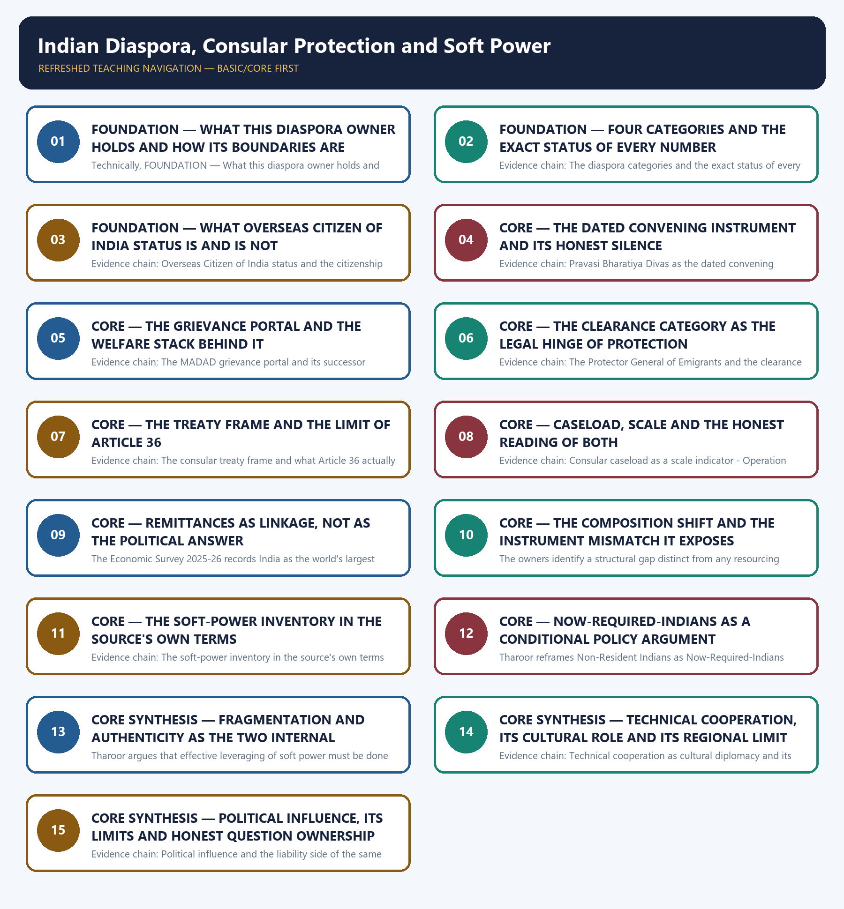

# Indian Diaspora, Consular Protection and Soft Power — Learner-v2 Complete Learning Session

> **Authoring-only generation:** 2026-09-03. No PDF was rendered and no tracker or index was mutated.

### SOURCE, PROGRESSION AND CURRENT-LINKAGE AUDIT

- **Generation date:** 2026-09-03.
- **Repository-first evidence:** the Basic owner is taught first and preserved in full; the Advanced owner is retained only in the optional final teaching block.
- **OCR evidence:** Repository Markdown was primary. The OCR-searchable official General Studies question papers held under books\mains and books\more_previous_papers were read only to confirm the printed wording of routed demands. No official answer key, marking scheme, page precision or unsupported quotation was imported from them.
- **Qdrant:** not used; repository Markdown and available OCR context were sufficient.
- **PYQ integrity:** Two General Studies Paper II Mains demands are routed to this topic in the audited routing ledgers and each is reproduced below as a demand card with its printed year, paper, question number, directive, marks and word limit exactly as the ledger records them: 2020 General Studies Paper II question 10 on the Indian diaspora in the politics and economy of America and European countries, a Comment with examples demand of 10 marks and 150 words, for which the ledger records that the Core route supersedes the older Advanced ownership; and 2023 General Studies Paper II question 10 on the Indian diaspora in the West and its economic and political benefits, a Describe demand of 10 marks and 150 words on the same superseding route, for which the ledger records that the word limit was taken from the paper's instruction block because the printed per-question tail carries only the mark value, a provenance defect that is reported here rather than repaired by invented wording. No objective demand from any audited Prelims routing ledger is routed to this owner, so none is listed, invented or answered. The Basic and Advanced owners additionally cite a 2017 General Studies Paper II demand on the role of the Indian diaspora in the economy and society of South-East Asian countries; that year falls outside the audited 2018-2023 and 2024-2025 routing ledgers and the wording is not confirmable from the locally held official papers, so it is recorded here as an owner-cited demand without a question number and is deliberately not converted into a solved demand card. The Basic and Advanced owners also record that no General Studies Paper II Mains question in the audited 2024-2025 papers directly names the diaspora, consular protection or soft power, and that absence is stated honestly instead of force-fitting an adjacent question. The locally held OCR-searchable official General Studies papers were read only to confirm the printed wording of the two routed Mains demands; no question was invented from them, no stem was paraphrased into an apparent routing, and no marking scheme or official answer key was imported.
- **Live-link boundary:** Live official verification was attempted on 2026-09-03 in the priority order required for this topic: the Ministry of External Affairs pages first, then the Ministry's consular and emigration portals, then the Indian Council for Cultural Relations, then the United Nations as the custodian of the consular treaty framework. Every outcome is recorded exactly as observed. The Ministry of External Affairs press-release, bilateral-document and country-brief pages returned a browser-requirement stub or the Ministry's own error page, the Press Information Bureau index returned HTTP 403, the consular grievance portal and the emigration clearance portal returned only title lines, the Indian Council for Cultural Relations site failed with a host-resolution error, and the United Nations treaty text file returned unreadable raw bytes, so no Indian official item and no treaty quotation was obtained from any of them. The United Nations Audiovisual Library of International Law page on the Vienna Convention on Consular Relations did return substantive official text, and it is used here only for the treaty facts that page actually states. The package therefore uses the dated official anchors already carried by the repository owners together with that single verified treaty source, each with its actor, exact evidentiary level and date. It invents no diaspora, migrant or overseas-population figure, no remittance value or source share, no evacuation, consular-caseload or insurance count, no legal entitlement, citizenship or Overseas Citizen status, no scheme launch or coverage claim, no cultural-institution figure, no host-country political outcome, no date, no previous-year question, no answer key and no current claim.
- **Fact/inference discipline:** no current-affairs item, PYQ wording, figure or quotation is invented.

### LIVE OFFICIAL-SOURCE ATTEMPT LOG

Every live check below was attempted on 2026-09-03 in the priority order required for International Relations: Ministry of External Affairs official pages first, then other official government or international-organisation documents. Access failures are recorded exactly as observed and no claim is reconstructed from a failed fetch.

- https://www.mea.gov.in/press-releases.htm — attempted 2026-09-03; the request redirected to a browser-requirement stub and returned no press release text, so no live item was taken from it.
- https://www.mea.gov.in/bilateral-documents.htm — attempted 2026-09-03; the request redirected to a browser-requirement stub and returned no bilateral document text, so no live item was taken from it.
- https://www.mea.gov.in/foreign-relation.htm — attempted 2026-09-03; the request redirected to the Ministry's own error page, so no country brief was taken from it.
- https://www.pib.gov.in/indexd.aspx?reg=3&lang=1 — attempted 2026-09-03; the request returned HTTP 403, so no release was taken from it.
- https://madad.gov.in/ — attempted 2026-09-03; the Ministry's consular grievance portal redirected to its landing page and returned only a title line with no grievance, caseload or scheme data, so no consular figure was taken from it and the repository owners' dated figures were used unchanged.
- https://www.emigrate.gov.in/ — attempted 2026-09-03; the emigration clearance portal returned only the words E-migrate with no registration, clearance or grievance table, so no emigration or worker figure was taken from it.
- https://www.iccr.gov.in/ — attempted 2026-09-03; the request failed with a host-resolution error, so no cultural-diplomacy programme, centre count or scholarship claim was taken from the Indian Council for Cultural Relations.
- https://legal.un.org/avl/ha/vccr/vccr.html — attempted 2026-09-03; the United Nations Audiovisual Library of International Law returned substantive official text on the Vienna Convention on Consular Relations, including the Vienna conference of 4 March to 22 April 1963 attended by delegates of ninety-five States, the adoption and opening for signature on 24 April 1963 together with the two Optional Protocols, entry into force on 19 March 1967, the Convention's 79 articles and the content of Article 36. That text is used only for those treaty facts and no Indian consular case, figure or outcome was taken from it.
- https://legal.un.org/ilc/texts/instruments/english/conventions/9_2_1963.pdf — attempted 2026-09-03; the request returned a PDF whose raw bytes could not be simplified to readable text, so no treaty article wording was quoted from it.

## BASIC LEARNING SESSION



*Distinct embedded teaching-navigation image. The separate continuous Cārvāka-style flowchart package remains an independent at-a-glance artifact.*

### SESSION 1 — FOUNDATION — WHAT THIS DIASPORA OWNER HOLDS AND HOW ITS BOUNDARIES ARE ROUTED

#### DEFINITION / WHAT THIS IS CALLED

**Plain-language definition:** Evidence chain: What this diaspora owner holds and how its boundaries are routed Qualified use: Open a diaspora demand by fixing ownership so the answer does not drift into another owner's evidence.

**Technical definition:** Technically, FOUNDATION — What this diaspora owner holds and how its boundaries are routed is analysed by relating FOUNDATION to What this diaspora owner holds, then testing the relationship through how its boundaries are routed and Evidence chain.

#### ANSWER-GRABBING OPENING — WRITE/ADAPT IN THE EXAM

> Evidence chain: What this diaspora owner holds and how its boundaries are routed Qualified use: Open a diaspora demand by fixing ownership so the answer does not drift into another owner's evidence.

#### MUST-WRITE KEYWORDS

- **FOUNDATION**
- **What this diaspora owner holds**
- **how its boundaries are routed**
- **Evidence chain**
- **Qualified use**
- **This**

**How to use them:** Frame the answer through FOUNDATION; define What this diaspora owner holds, connect how its boundaries are routed with Evidence chain to explain the mechanism, and use Qualified use for the decisive comparison or qualification.

#### VISUAL FIRST

```text
WHAT THIS DIASPORA OWNER HOLDS AND HOW ITS BOUNDARIES ARE ROUTED
01. What this diaspora owner holds and how its boundaries are routed
BOUNDARY -> Citizenship doctrine belongs to Polity, remittance macroeconomics to Economy, relief logistics to Disaster Management and Gulf regional exposure to topic 06.
```

*This topic-specific rail fixes the evidence sequence and its exam boundary before analysis.*

#### CORE EXPLANATION

This topic owns the diaspora as a foreign-policy relationship: the population categories and their exact legal status, the welfare and consular-protection stack, evacuation diplomacy as distinct from evacuation logistics, remittances treated only as a diplomatic linkage, and the cultural soft-power track running through the Indian Council for Cultural Relations, the Indian Technical and Economic Cooperation Programme and India's cultural assets; its distinctive feature is that the same population is simultaneously an asset, a standing protection obligation and a potential source of host-country friction, and two General Studies Paper II Mains demands from 2020 and 2023 are routed here with no objective demand routed at all, while Overseas Citizen of India and citizenship doctrine belongs to the Polity owner, remittance macroeconomics belongs to the Economy owner, relief and logistics belong to the Disaster Management owners, and Gulf-specific regional exposure belongs to topic 06.

#### NAMED EVIDENCE AND MECHANISM

- This topic owns the diaspora as a foreign-policy relationship: the population categories and their exact legal status, the welfare and consular-protection stack, evacuation diplomacy as distinct from evacuation logistics, remittances treated only as a diplomatic linkage, and the cultural soft-power track running through the Indian Council for Cultural Relations, the Indian Technical and Economic Cooperation Programme and India's cultural assets; its distinctive feature is that the same population is simultaneously an asset, a standing protection obligation and a potential source of host-country friction, and two General Studies Paper II Mains demands from 2020 and 2023 are routed here with no objective demand routed at all, while Overseas Citizen of India and citizenship doctrine belongs to the Polity owner, remittance macroeconomics belongs to the Economy owner, relief and logistics belong to the Disaster Management owners, and Gulf-specific regional exposure belongs to topic 06.

#### EXAMINER CAUTION

- Citizenship doctrine belongs to Polity, remittance macroeconomics to Economy, relief logistics to Disaster Management and Gulf regional exposure to topic 06.

#### EXAM LINK

- **Prelims:** Retain the exact actor, document title, doctrine label, dated instrument and evidentiary level attached to What this diaspora owner holds and how its boundaries are routed, and never upgrade a vision statement into a treaty, a signature into a ratification, a participation category into membership, or an announced corridor into an operating one.
- **Mains:** Open a diaspora demand by fixing ownership so the answer does not drift into another owner's evidence.

#### MINI RECAP

- **Evidence chain:** What this diaspora owner holds and how its boundaries are routed
- **Qualified use:** Open a diaspora demand by fixing ownership so the answer does not drift into another owner's evidence.

#### CLOSING RECALL FLOW — FOUNDATION — WHAT THIS DIASPORA OWNER HOLDS AND HOW ITS BOUNDARIES ARE ROUTED

```text
START / CONCEPT: FOUNDATION — What this diaspora owner holds and how its boundaries are routed
        |
        v
EXACT TERMS: FOUNDATION · What this diaspora owner holds · how its boundaries are routed · Evidence chain · Qualified use · This
        |
        v
MECHANISM / ARGUMENT: Prelims: Retain the exact actor, document title, doctrine label, dated instrument and evidentiary level attached to What this diaspora owner holds and how its boundaries are routed, and never upgrade a vision statement into a treaty, a signature into a ratification, a participation category into membership, or an announced corridor into an operating one.
        |
        v
CONSEQUENCE / CONTRAST: This topic owns the diaspora as a foreign-policy relationship: the population categories and their exact legal status, the welfare and consular-protection stack, evacuation diplomacy as distinct from evacuation logistics, remittances treated only as a diplomatic linkage, and the cultural soft-power track running through the Indian Council for Cultural Relations, the Indian Technical and Economic Cooperation Programme and India's cultural assets; its distinctive feature is that the same population is simultaneously an asset, a standing protection obligation and a potential source of host-country friction, and two General Studies Paper II Mains demands from 2020 and 2023 are routed here with no objective demand routed at all, while Overseas Citizen of India and citizenship doctrine belongs to the Polity owner, remittance macroeconomics belongs to the Economy owner, relief and logistics belong to the Disaster Management owners, and Gulf-specific regional exposure belongs to topic 06.
        |
        v
UPSC TRAP / ANSWER-USE: Mains: Open a diaspora demand by fixing ownership so the answer does not drift into another owner's evidence.
        |
        v
ANSWER-GRABBING FORMULATION: Evidence chain: What this diaspora owner holds and how its boundaries are routed Qualified use: Open a diaspora demand by fixing ownership so the answer does not drift into another owner's evidence.
```
### SESSION 2 — FOUNDATION — FOUR CATEGORIES AND THE EXACT STATUS OF EVERY NUMBER

#### DEFINITION / WHAT THIS IS CALLED

**Plain-language definition:** Every population figure is a stock estimate and never a count of citizens abroad or of Overseas Citizen of India cards.

**Technical definition:** Evidence chain: The diaspora categories and the exact status of every figure Qualified use: Secure the definitional and numerical marks that most diaspora answers concede in the first paragraph.

#### ANSWER-GRABBING OPENING — WRITE/ADAPT IN THE EXAM

> Evidence chain: The diaspora categories and the exact status of every figure Qualified use: Secure the definitional and numerical marks that most diaspora answers concede in the first paragraph.

#### MUST-WRITE KEYWORDS

- **FOUNDATION**
- **Four categories**
- **the exact status of every number**
- **Evidence chain**
- **Qualified use**
- **The owners separate Non-Resident Indians, who**

**How to use them:** Frame the answer through FOUNDATION; define Four categories, connect the exact status of every number with Evidence chain to explain the mechanism, and use Qualified use for the decisive comparison or qualification.

#### VISUAL FIRST

```text
FOUR CATEGORIES AND THE EXACT STATUS OF EVERY NUMBER
01. The diaspora categories and the exact status of every figure
BOUNDARY -> Every population figure is a stock estimate and never a count of citizens abroad or of Overseas Citizen of India cards.
```

*This topic-specific rail fixes the evidence sequence and its exam boundary before analysis.*

#### CORE EXPLANATION

The owners separate Non-Resident Indians, who are Indian citizens residing abroad, from Persons of Indian Origin and Overseas Citizen of India cardholders, who are foreign nationals of Indian origin, and from labour migrants especially in the Gulf, and the Ministry of External Affairs overseas-Indian population table as on January 2026 records 35,421,987 overseas Indians comprising 19,571,375 Non-Resident Indians and 15,850,612 Persons of Indian Origin, with the United States at 6,079,221, the United Arab Emirates at 4,344,008, Malaysia at 2,902,370 and Saudi Arabia at 2,750,551; the owners require every one of these to be described as a population-stock estimate and never as a count of citizens abroad or of Overseas Citizen of India cards issued, because the categories carry different rights and different policy instruments.

#### NAMED EVIDENCE AND MECHANISM

- The owners separate Non-Resident Indians, who are Indian citizens residing abroad, from Persons of Indian Origin and Overseas Citizen of India cardholders, who are foreign nationals of Indian origin, and from labour migrants especially in the Gulf, and the Ministry of External Affairs overseas-Indian population table as on January 2026 records 35,421,987 overseas Indians comprising 19,571,375 Non-Resident Indians and 15,850,612 Persons of Indian Origin, with the United States at 6,079,221, the United Arab Emirates at 4,344,008, Malaysia at 2,902,370 and Saudi Arabia at 2,750,551; the owners require every one of these to be described as a population-stock estimate and never as a count of citizens abroad or of Overseas Citizen of India cards issued, because the categories carry different rights and different policy instruments.

#### EXAMINER CAUTION

- Every population figure is a stock estimate and never a count of citizens abroad or of Overseas Citizen of India cards.

#### EXAM LINK

- **Prelims:** Retain the exact actor, document title, doctrine label, dated instrument and evidentiary level attached to Four categories and the exact status of every number, and never upgrade a vision statement into a treaty, a signature into a ratification, a participation category into membership, or an announced corridor into an operating one.
- **Mains:** Secure the definitional and numerical marks that most diaspora answers concede in the first paragraph.

#### MINI RECAP

- **Evidence chain:** The diaspora categories and the exact status of every figure
- **Qualified use:** Secure the definitional and numerical marks that most diaspora answers concede in the first paragraph.

#### CLOSING RECALL FLOW — FOUNDATION — FOUR CATEGORIES AND THE EXACT STATUS OF EVERY NUMBER

```text
START / CONCEPT: FOUNDATION — Four categories and the exact status of every number
        |
        v
EXACT TERMS: FOUNDATION · Four categories · the exact status of every number · Evidence chain · Qualified use · The owners separate Non-Resident Indians, who
        |
        v
MECHANISM / ARGUMENT: The owners separate Non-Resident Indians, who are Indian citizens residing abroad, from Persons of Indian Origin and Overseas Citizen of India cardholders, who are foreign nationals of Indian origin, and from labour migrants especially in the Gulf, and the Ministry of External Affairs overseas-Indian population table as on January 2026 records 35,421,987 overseas Indians comprising 19,571,375 Non-Resident Indians and 15,850,612 Persons of Indian Origin, with the United States at 6,079,221, the United Arab Emirates at 4,344,008, Malaysia at 2,902,370 and Saudi Arabia at 2,750,551; the owners require every one of these to be described as a population-stock estimate and never as a count of citizens abroad or of Overseas Citizen of India cards issued, because the categories carry different rights and different policy instruments.
        |
        v
CONSEQUENCE / CONTRAST: Every population figure is a stock estimate and never a count of citizens abroad or of Overseas Citizen of India cards.
        |
        v
UPSC TRAP / ANSWER-USE: Do not miss this limiting distinction: the diaspora categories and the exact status of every figure Qualified use.
        |
        v
ANSWER-GRABBING FORMULATION: Evidence chain: The diaspora categories and the exact status of every figure Qualified use: Secure the definitional and numerical marks that most diaspora answers concede in the first paragraph.
```
### SESSION 3 — FOUNDATION — WHAT OVERSEAS CITIZEN OF INDIA STATUS IS AND IS NOT

#### DEFINITION / WHAT THIS IS CALLED

**Plain-language definition:** The owners state flatly that Overseas Citizen of India status is not dual citizenship but a specific set of rights and benefits for persons of Indian origin who hold foreign citizenship, and they route the precise legal doctrine to the Polity owner rather than restating it here; the examinable consequence is that an answer must not describe the diaspora as though it enjoyed a second Indian citizenship, because that single error changes what the state may lawfully do for those persons abroad and misstates the entitlement that consular protection actually rests on.

**Technical definition:** Evidence chain: Overseas Citizen of India status and the citizenship boundary Qualified use: Avoid the single legal error that misstates what the Indian state may lawfully do for people abroad.

#### ANSWER-GRABBING OPENING — WRITE/ADAPT IN THE EXAM

> The owners state flatly that Overseas Citizen of India status is not dual citizenship but a specific set of rights and benefits for persons of Indian origin who hold foreign citizenship, and they route the precise legal doctrine to the Polity owner rather than restating it here; the examinable consequence is that an answer must not describe the diaspora as though it enjoyed a second Indian citizenship, because that single error changes what the state may lawfully do for those persons abroad and misstates the entitlement that consular protection actually rests on.

#### MUST-WRITE KEYWORDS

- **FOUNDATION**
- **is not**
- **Evidence chain**
- **Qualified use**
- **Overseas Citizen**
- **India**

**How to use them:** Frame the answer through FOUNDATION; define is not, connect Evidence chain with Qualified use to explain the mechanism, and use Overseas Citizen for the decisive comparison or qualification.

#### VISUAL FIRST

```text
WHAT OVERSEAS CITIZEN OF INDIA STATUS IS AND IS NOT
01. Overseas Citizen of India status and the citizenship boundary
BOUNDARY -> It is a set of rights and benefits for foreign nationals of Indian origin and is expressly not dual citizenship.
```

*This topic-specific rail fixes the evidence sequence and its exam boundary before analysis.*

#### CORE EXPLANATION

The owners state flatly that Overseas Citizen of India status is not dual citizenship but a specific set of rights and benefits for persons of Indian origin who hold foreign citizenship, and they route the precise legal doctrine to the Polity owner rather than restating it here; the examinable consequence is that an answer must not describe the diaspora as though it enjoyed a second Indian citizenship, because that single error changes what the state may lawfully do for those persons abroad and misstates the entitlement that consular protection actually rests on.

#### NAMED EVIDENCE AND MECHANISM

- The owners state flatly that Overseas Citizen of India status is not dual citizenship but a specific set of rights and benefits for persons of Indian origin who hold foreign citizenship, and they route the precise legal doctrine to the Polity owner rather than restating it here; the examinable consequence is that an answer must not describe the diaspora as though it enjoyed a second Indian citizenship, because that single error changes what the state may lawfully do for those persons abroad and misstates the entitlement that consular protection actually rests on.

#### EXAMINER CAUTION

- It is a set of rights and benefits for foreign nationals of Indian origin and is expressly not dual citizenship.

#### EXAM LINK

- **Prelims:** Retain the exact actor, document title, doctrine label, dated instrument and evidentiary level attached to What Overseas Citizen of India status is and is not, and never upgrade a vision statement into a treaty, a signature into a ratification, a participation category into membership, or an announced corridor into an operating one.
- **Mains:** Avoid the single legal error that misstates what the Indian state may lawfully do for people abroad.

#### MINI RECAP

- **Evidence chain:** Overseas Citizen of India status and the citizenship boundary
- **Qualified use:** Avoid the single legal error that misstates what the Indian state may lawfully do for people abroad.

#### CLOSING RECALL FLOW — FOUNDATION — WHAT OVERSEAS CITIZEN OF INDIA STATUS IS AND IS NOT

```text
START / CONCEPT: FOUNDATION — What Overseas Citizen of India status is and is not
        |
        v
EXACT TERMS: FOUNDATION · is not · Evidence chain · Qualified use · Overseas Citizen · India
        |
        v
MECHANISM / ARGUMENT: Evidence chain: Overseas Citizen of India status and the citizenship boundary Qualified use: Avoid the single legal error that misstates what the Indian state may lawfully do for people abroad.
        |
        v
CONSEQUENCE / CONTRAST: Prelims: Retain the exact actor, document title, doctrine label, dated instrument and evidentiary level attached to What Overseas Citizen of India status is and is not, and never upgrade a vision statement into a treaty, a signature into a ratification, a participation category into membership, or an announced corridor into an operating one.
        |
        v
UPSC TRAP / ANSWER-USE: It is a set of rights and benefits for foreign nationals of Indian origin and is expressly not dual citizenship.
        |
        v
ANSWER-GRABBING FORMULATION: The owners state flatly that Overseas Citizen of India status is not dual citizenship but a specific set of rights and benefits for persons of Indian origin who hold foreign citizenship, and they route the precise legal doctrine to the Polity owner rather than restating it here; the examinable consequence is that an answer must not describe the diaspora as though it enjoyed a second Indian citizenship, because that single error changes what the state may lawfully do for those persons abroad and misstates the entitlement that consular protection actually rests on.
```
### SESSION 4 — CORE — THE DATED CONVENING INSTRUMENT AND ITS HONEST SILENCE

#### DEFINITION / WHAT THIS IS CALLED

**Plain-language definition:** A dated edition must be cited, and the absence of a recorded next edition is stated rather than implied away.

**Technical definition:** Evidence chain: Pravasi Bharatiya Divas as the dated convening instrument Qualified use: Replace an undated diaspora-engagement claim with a checkable event and theme.

#### ANSWER-GRABBING OPENING — WRITE/ADAPT IN THE EXAM

> Evidence chain: Pravasi Bharatiya Divas as the dated convening instrument Qualified use: Replace an undated diaspora-engagement claim with a checkable event and theme.

#### MUST-WRITE KEYWORDS

- **The dated convening instrument**
- **its honest silence**
- **Evidence chain**
- **Qualified use**
- **Pravasi Bharatiya Divas**
- **India's**

**How to use them:** Frame the answer through The dated convening instrument; define its honest silence, connect Evidence chain with Qualified use to explain the mechanism, and use Pravasi Bharatiya Divas for the decisive comparison or qualification.

#### VISUAL FIRST

```text
THE DATED CONVENING INSTRUMENT AND ITS HONEST SILENCE
01. Pravasi Bharatiya Divas as the dated convening instrument
BOUNDARY -> A dated edition must be cited, and the absence of a recorded next edition is stated rather than implied away.
```

*This topic-specific rail fixes the evidence sequence and its exam boundary before analysis.*

#### CORE EXPLANATION

Pravasi Bharatiya Divas is India's flagship diaspora-engagement event recognising diaspora contributions and setting engagement priorities, and the owners record its most recent verified edition exactly: the eighteenth edition was held from 8-10 January 2025 at Bhubaneswar in Odisha under the theme Diaspora's Contribution to a Viksit Bharat, with no nineteenth edition officially recorded as held or announced as of 3 August 2026; the discipline attached is that a dated edition must be cited rather than an undated claim of diaspora engagement, and that the absence of a recorded next edition is stated honestly rather than implied away.

#### NAMED EVIDENCE AND MECHANISM

- Pravasi Bharatiya Divas is India's flagship diaspora-engagement event recognising diaspora contributions and setting engagement priorities, and the owners record its most recent verified edition exactly: the eighteenth edition was held from 8-10 January 2025 at Bhubaneswar in Odisha under the theme Diaspora's Contribution to a Viksit Bharat, with no nineteenth edition officially recorded as held or announced as of 3 August 2026; the discipline attached is that a dated edition must be cited rather than an undated claim of diaspora engagement, and that the absence of a recorded next edition is stated honestly rather than implied away.

#### EXAMINER CAUTION

- A dated edition must be cited, and the absence of a recorded next edition is stated rather than implied away.

#### EXAM LINK

- **Prelims:** Retain the exact actor, document title, doctrine label, dated instrument and evidentiary level attached to The dated convening instrument and its honest silence, and never upgrade a vision statement into a treaty, a signature into a ratification, a participation category into membership, or an announced corridor into an operating one.
- **Mains:** Replace an undated diaspora-engagement claim with a checkable event and theme.

#### MINI RECAP

- **Evidence chain:** Pravasi Bharatiya Divas as the dated convening instrument
- **Qualified use:** Replace an undated diaspora-engagement claim with a checkable event and theme.

#### CLOSING RECALL FLOW — CORE — THE DATED CONVENING INSTRUMENT AND ITS HONEST SILENCE

```text
START / CONCEPT: CORE — The dated convening instrument and its honest silence
        |
        v
EXACT TERMS: The dated convening instrument · its honest silence · Evidence chain · Qualified use · Pravasi Bharatiya Divas · India's
        |
        v
MECHANISM / ARGUMENT: Pravasi Bharatiya Divas is India's flagship diaspora-engagement event recognising diaspora contributions and setting engagement priorities, and the owners record its most recent verified edition exactly: the eighteenth edition was held from 8-10 January 2025 at Bhubaneswar in Odisha under the theme Diaspora's Contribution to a Viksit Bharat, with no nineteenth edition officially recorded as held or announced as of 3 August 2026; the discipline attached is that a dated edition must be cited rather than an undated claim of diaspora engagement, and that the absence of a recorded next edition is stated honestly rather than implied away.
        |
        v
CONSEQUENCE / CONTRAST: A dated edition must be cited, and the absence of a recorded next edition is stated rather than implied away.
        |
        v
UPSC TRAP / ANSWER-USE: Do not miss this limiting distinction: pravasi Bharatiya Divas as the dated convening instrument Qualified use.
        |
        v
ANSWER-GRABBING FORMULATION: Evidence chain: Pravasi Bharatiya Divas as the dated convening instrument Qualified use: Replace an undated diaspora-engagement claim with a checkable event and theme.
```
### SESSION 5 — CORE — THE GRIEVANCE PORTAL AND THE WELFARE STACK BEHIND IT

#### DEFINITION / WHAT THIS IS CALLED

**Plain-language definition:** Three operational welfare instruments sit alongside MADAD: the Indian Community Welfare Fund supports emergency medical care, air passage and legal aid; e-Migrate registers and clears Emigration-Check-Required workers and routes grievances to MADAD; and the Pravasi Bharatiya Bima Yojana is compulsory insurance for Emigration-Check-Required workers going to Emigration-Check-Required countries, providing ten lakh rupees of accidental-death and permanent-disability cover, with 8,536,398 beneficiaries and 2,222 claims settled through October 2025; the owners require the beneficiary and claim figures to be cited with their exact cut-off, because a cumulative coverage figure and a settled-claim figure measure different things.

**Technical definition:** Evidence chain: The MADAD grievance portal and its successor version - The welfare stack behind the portal Qualified use: Evidence routine consular capacity with named instruments and correctly bounded figures.

#### ANSWER-GRABBING OPENING — WRITE/ADAPT IN THE EXAM

> Evidence chain: The MADAD grievance portal and its successor version - The welfare stack behind the portal Qualified use: Evidence routine consular capacity with named instruments and correctly bounded figures.

#### MUST-WRITE KEYWORDS

- **The grievance portal**
- **the welfare stack behind it**
- **Evidence chain**
- **Qualified use**
- **MADAD**
- **Ministry**

**How to use them:** Frame the answer through The grievance portal; define the welfare stack behind it, connect Evidence chain with Qualified use to explain the mechanism, and use MADAD for the decisive comparison or qualification.

#### VISUAL FIRST

```text
THE GRIEVANCE PORTAL AND THE WELFARE STACK BEHIND IT
01. The MADAD grievance portal and its successor version
    |
    v
02. The welfare stack behind the portal
BOUNDARY -> A platform launch is an available channel and not a resolved grievance, and coverage and claims measure different things.
```

*This topic-specific rail fixes the evidence sequence and its exam boundary before analysis.*

#### CORE EXPLANATION

MADAD is the Ministry of External Affairs online grievance-redress and consular-assistance platform for overseas Indians, launched on 21 February 2015, and MADAD 2.0 was launched in December 2025 and linked with e-Migrate and the Pravasi Bharatiya Sahayata Kendras; the owners treat this as the routine consular limb of the relationship, qualitatively different from crisis evacuation, and they insist that a platform launch is evidence of an available channel rather than evidence of a resolved grievance, so an answer should cite it as institutional capacity and not as an outcome. Three operational welfare instruments sit alongside MADAD: the Indian Community Welfare Fund supports emergency medical care, air passage and legal aid; e-Migrate registers and clears Emigration-Check-Required workers and routes grievances to MADAD; and the Pravasi Bharatiya Bima Yojana is compulsory insurance for Emigration-Check-Required workers going to Emigration-Check-Required countries, providing ten lakh rupees of accidental-death and permanent-disability cover, with 8,536,398 beneficiaries and 2,222 claims settled through October 2025; the owners require the beneficiary and claim figures to be cited with their exact cut-off, because a cumulative coverage figure and a settled-claim figure measure different things.

#### NAMED EVIDENCE AND MECHANISM

- MADAD is the Ministry of External Affairs online grievance-redress and consular-assistance platform for overseas Indians, launched on 21 February 2015, and MADAD 2.0 was launched in December 2025 and linked with e-Migrate and the Pravasi Bharatiya Sahayata Kendras; the owners treat this as the routine consular limb of the relationship, qualitatively different from crisis evacuation, and they insist that a platform launch is evidence of an available channel rather than evidence of a resolved grievance, so an answer should cite it as institutional capacity and not as an outcome.
- Three operational welfare instruments sit alongside MADAD: the Indian Community Welfare Fund supports emergency medical care, air passage and legal aid; e-Migrate registers and clears Emigration-Check-Required workers and routes grievances to MADAD; and the Pravasi Bharatiya Bima Yojana is compulsory insurance for Emigration-Check-Required workers going to Emigration-Check-Required countries, providing ten lakh rupees of accidental-death and permanent-disability cover, with 8,536,398 beneficiaries and 2,222 claims settled through October 2025; the owners require the beneficiary and claim figures to be cited with their exact cut-off, because a cumulative coverage figure and a settled-claim figure measure different things.

#### EXAMINER CAUTION

- A platform launch is an available channel and not a resolved grievance, and coverage and claims measure different things.

#### EXAM LINK

- **Prelims:** Retain the exact actor, document title, doctrine label, dated instrument and evidentiary level attached to The grievance portal and the welfare stack behind it, and never upgrade a vision statement into a treaty, a signature into a ratification, a participation category into membership, or an announced corridor into an operating one.
- **Mains:** Evidence routine consular capacity with named instruments and correctly bounded figures.

#### MINI RECAP

- **Evidence chain:** The MADAD grievance portal and its successor version -> The welfare stack behind the portal
- **Qualified use:** Evidence routine consular capacity with named instruments and correctly bounded figures.

#### CLOSING RECALL FLOW — CORE — THE GRIEVANCE PORTAL AND THE WELFARE STACK BEHIND IT

```text
START / CONCEPT: CORE — The grievance portal and the welfare stack behind it
        |
        v
EXACT TERMS: The grievance portal · the welfare stack behind it · Evidence chain · Qualified use · MADAD · Ministry
        |
        v
MECHANISM / ARGUMENT: Three operational welfare instruments sit alongside MADAD: the Indian Community Welfare Fund supports emergency medical care, air passage and legal aid; e-Migrate registers and clears Emigration-Check-Required workers and routes grievances to MADAD; and the Pravasi Bharatiya Bima Yojana is compulsory insurance for Emigration-Check-Required workers going to Emigration-Check-Required countries, providing ten lakh rupees of accidental-death and permanent-disability cover, with 8,536,398 beneficiaries and 2,222 claims settled through October 2025; the owners require the beneficiary and claim figures to be cited with their exact cut-off, because a cumulative coverage figure and a settled-claim figure measure different things.
        |
        v
CONSEQUENCE / CONTRAST: MADAD is the Ministry of External Affairs online grievance-redress and consular-assistance platform for overseas Indians, launched on 21 February 2015, and MADAD 2.0 was launched in December 2025 and linked with e-Migrate and the Pravasi Bharatiya Sahayata Kendras; the owners treat this as the routine consular limb of the relationship, qualitatively different from crisis evacuation, and they insist that a platform launch is evidence of an available channel rather than evidence of a resolved grievance, so an answer should cite it as institutional capacity and not as an outcome.
        |
        v
UPSC TRAP / ANSWER-USE: A platform launch is an available channel and not a resolved grievance, and coverage and claims measure different things.
        |
        v
ANSWER-GRABBING FORMULATION: Evidence chain: The MADAD grievance portal and its successor version - The welfare stack behind the portal Qualified use: Evidence routine consular capacity with named instruments and correctly bounded figures.
```
### SESSION 6 — CORE — THE CLEARANCE CATEGORY AS THE LEGAL HINGE OF PROTECTION

#### DEFINITION / WHAT THIS IS CALLED

**Plain-language definition:** The Protector General of Emigrants is the Ministry of External Affairs authority overseeing emigration clearance and protection of migrant workers, particularly for Emigration-Check-Required categories heading to specified countries, and the owners treat the clearance category as the legal hinge of the welfare track because it determines who is covered by compulsory insurance and mandatory registration; the analytical point is that a protection architecture organised around a clearance category protects exactly the population inside that category and leaves everyone outside it to a different and thinner set of instruments.

**Technical definition:** Evidence chain: The Protector General of Emigrants and the clearance category Qualified use: Set up the mismatch argument that a 15-mark welfare question specifically rewards.

#### ANSWER-GRABBING OPENING — WRITE/ADAPT IN THE EXAM

> The Protector General of Emigrants is the Ministry of External Affairs authority overseeing emigration clearance and protection of migrant workers, particularly for Emigration-Check-Required categories heading to specified countries, and the owners treat the clearance category as the legal hinge of the welfare track because it determines who is covered by compulsory insurance and mandatory registration; the analytical point is that a protection architecture organised around a clearance category protects exactly the population inside that category and leaves everyone outside it to a different and thinner set of instruments.

#### MUST-WRITE KEYWORDS

- **Evidence chain**
- **Qualified use**
- **The Protector General of Emigrants**
- **The Protector General**
- **Emigrants**
- **Ministry**

**How to use them:** Frame the answer through Evidence chain; define Qualified use, connect The Protector General of Emigrants with The Protector General to explain the mechanism, and use Emigrants for the decisive comparison or qualification.

#### VISUAL FIRST

```text
THE CLEARANCE CATEGORY AS THE LEGAL HINGE OF PROTECTION
01. The Protector General of Emigrants and the clearance category
BOUNDARY -> A protection architecture built on a clearance category covers exactly that category and no one else.
```

*This topic-specific rail fixes the evidence sequence and its exam boundary before analysis.*

#### CORE EXPLANATION

The Protector General of Emigrants is the Ministry of External Affairs authority overseeing emigration clearance and protection of migrant workers, particularly for Emigration-Check-Required categories heading to specified countries, and the owners treat the clearance category as the legal hinge of the welfare track because it determines who is covered by compulsory insurance and mandatory registration; the analytical point is that a protection architecture organised around a clearance category protects exactly the population inside that category and leaves everyone outside it to a different and thinner set of instruments.

#### NAMED EVIDENCE AND MECHANISM

- The Protector General of Emigrants is the Ministry of External Affairs authority overseeing emigration clearance and protection of migrant workers, particularly for Emigration-Check-Required categories heading to specified countries, and the owners treat the clearance category as the legal hinge of the welfare track because it determines who is covered by compulsory insurance and mandatory registration; the analytical point is that a protection architecture organised around a clearance category protects exactly the population inside that category and leaves everyone outside it to a different and thinner set of instruments.

#### EXAMINER CAUTION

- A protection architecture built on a clearance category covers exactly that category and no one else.

#### EXAM LINK

- **Prelims:** Retain the exact actor, document title, doctrine label, dated instrument and evidentiary level attached to The clearance category as the legal hinge of protection, and never upgrade a vision statement into a treaty, a signature into a ratification, a participation category into membership, or an announced corridor into an operating one.
- **Mains:** Set up the mismatch argument that a 15-mark welfare question specifically rewards.

#### MINI RECAP

- **Evidence chain:** The Protector General of Emigrants and the clearance category
- **Qualified use:** Set up the mismatch argument that a 15-mark welfare question specifically rewards.

#### CLOSING RECALL FLOW — CORE — THE CLEARANCE CATEGORY AS THE LEGAL HINGE OF PROTECTION

```text
START / CONCEPT: CORE — The clearance category as the legal hinge of protection
        |
        v
EXACT TERMS: Evidence chain · Qualified use · The Protector General of Emigrants · The Protector General · Emigrants · Ministry
        |
        v
MECHANISM / ARGUMENT: Evidence chain: The Protector General of Emigrants and the clearance category Qualified use: Set up the mismatch argument that a 15-mark welfare question specifically rewards.
        |
        v
CONSEQUENCE / CONTRAST: A protection architecture built on a clearance category covers exactly that category and no one else.
        |
        v
UPSC TRAP / ANSWER-USE: Do not miss this limiting distinction: the Protector General of Emigrants is the Ministry of External Affairs authority overseeing emigration...
        |
        v
ANSWER-GRABBING FORMULATION: The Protector General of Emigrants is the Ministry of External Affairs authority overseeing emigration clearance and protection of migrant workers, particularly for Emigration-Check-Required categories heading to specified countries, and the owners treat the clearance category as the legal hinge of the welfare track because it determines who is covered by compulsory insurance and mandatory registration; the analytical point is that a protection architecture organised around a clearance category protects exactly the population inside that category and leaves everyone outside it to a different and thinner set of instruments.
```
### SESSION 7 — CORE — THE TREATY FRAME AND THE LIMIT OF ARTICLE 36

#### DEFINITION / WHAT THIS IS CALLED

**Plain-language definition:** The United Nations Audiovisual Library of International Law page on the Vienna Convention on Consular Relations, checked live on 2026-09-03, records that the United Nations Conference on Consular Relations was held at Vienna from 4 March to 22 April 1963 and attended by delegates of ninety-five States, that on 24 April 1963 the Conference adopted and opened for signature the Convention together with the Optional Protocol concerning Acquisition of Nationality and the Optional Protocol concerning the Compulsory Settlement of Disputes, that the Convention and both Optional Protocols came into force on 19 March 1967, and that the Convention consists of 79 articles of which Article 36 provides obligations for competent authorities on the arrest or detention of a foreign national so as to guarantee counsel and due process through consular notification and effective access to consular protection; the owners add the limit in the same place, namely that this is a reciprocal treaty right and a procedural safeguard and not an unlimited power to override host-country law or secure release.

**Technical definition:** Evidence chain: The consular treaty frame and what Article 36 actually guarantees Qualified use: Anchor the protection obligation in a dated treaty instead of a general duty-of-care assertion.

#### ANSWER-GRABBING OPENING — WRITE/ADAPT IN THE EXAM

> The United Nations Audiovisual Library of International Law page on the Vienna Convention on Consular Relations, checked live on 2026-09-03, records that the United Nations Conference on Consular Relations was held at Vienna from 4 March to 22 April 1963 and attended by delegates of ninety-five States, that on 24 April 1963 the Conference adopted and opened for signature the Convention together with the Optional Protocol concerning Acquisition of Nationality and the Optional Protocol concerning the Compulsory Settlement of Disputes, that the Convention and both Optional Protocols came into force on 19 March 1967, and that the Convention consists of 79 articles of which Article 36 provides obligations for competent authorities on the arrest or detention of a foreign national so as to guarantee counsel and due process through consular notification and effective access to consular protection; the owners add the limit in the same place, namely that this is a reciprocal treaty right and a procedural safeguard and not an unlimited power to override host-country law or secure release.

#### MUST-WRITE KEYWORDS

- **The treaty frame**
- **the limit of Article 36**
- **Evidence chain**
- **Qualified use**
- **Article 36**
- **2026-09**

**How to use them:** Frame the answer through The treaty frame; define the limit of Article 36, connect Evidence chain with Qualified use to explain the mechanism, and use Article 36 for the decisive comparison or qualification.

#### VISUAL FIRST

```text
THE TREATY FRAME AND THE LIMIT OF ARTICLE 36
01. The consular treaty frame and what Article 36 actually guarantees
BOUNDARY -> Consular notification and effective access are procedural safeguards and never a power to override host-country law.
```

*This topic-specific rail fixes the evidence sequence and its exam boundary before analysis.*

#### CORE EXPLANATION

The United Nations Audiovisual Library of International Law page on the Vienna Convention on Consular Relations, checked live on 2026-09-03, records that the United Nations Conference on Consular Relations was held at Vienna from 4 March to 22 April 1963 and attended by delegates of ninety-five States, that on 24 April 1963 the Conference adopted and opened for signature the Convention together with the Optional Protocol concerning Acquisition of Nationality and the Optional Protocol concerning the Compulsory Settlement of Disputes, that the Convention and both Optional Protocols came into force on 19 March 1967, and that the Convention consists of 79 articles of which Article 36 provides obligations for competent authorities on the arrest or detention of a foreign national so as to guarantee counsel and due process through consular notification and effective access to consular protection; the owners add the limit in the same place, namely that this is a reciprocal treaty right and a procedural safeguard and not an unlimited power to override host-country law or secure release.

#### NAMED EVIDENCE AND MECHANISM

- The United Nations Audiovisual Library of International Law page on the Vienna Convention on Consular Relations, checked live on 2026-09-03, records that the United Nations Conference on Consular Relations was held at Vienna from 4 March to 22 April 1963 and attended by delegates of ninety-five States, that on 24 April 1963 the Conference adopted and opened for signature the Convention together with the Optional Protocol concerning Acquisition of Nationality and the Optional Protocol concerning the Compulsory Settlement of Disputes, that the Convention and both Optional Protocols came into force on 19 March 1967, and that the Convention consists of 79 articles of which Article 36 provides obligations for competent authorities on the arrest or detention of a foreign national so as to guarantee counsel and due process through consular notification and effective access to consular protection; the owners add the limit in the same place, namely that this is a reciprocal treaty right and a procedural safeguard and not an unlimited power to override host-country law or secure release.

#### EXAMINER CAUTION

- Consular notification and effective access are procedural safeguards and never a power to override host-country law.

#### EXAM LINK

- **Prelims:** Retain the exact actor, document title, doctrine label, dated instrument and evidentiary level attached to The treaty frame and the limit of Article 36, and never upgrade a vision statement into a treaty, a signature into a ratification, a participation category into membership, or an announced corridor into an operating one.
- **Mains:** Anchor the protection obligation in a dated treaty instead of a general duty-of-care assertion.

#### MINI RECAP

- **Evidence chain:** The consular treaty frame and what Article 36 actually guarantees
- **Qualified use:** Anchor the protection obligation in a dated treaty instead of a general duty-of-care assertion.

#### CLOSING RECALL FLOW — CORE — THE TREATY FRAME AND THE LIMIT OF ARTICLE 36

```text
START / CONCEPT: CORE — The treaty frame and the limit of Article 36
        |
        v
EXACT TERMS: The treaty frame · the limit of Article 36 · Evidence chain · Qualified use · Article 36 · 2026-09
        |
        v
MECHANISM / ARGUMENT: Evidence chain: The consular treaty frame and what Article 36 actually guarantees Qualified use: Anchor the protection obligation in a dated treaty instead of a general duty-of-care assertion.
        |
        v
CONSEQUENCE / CONTRAST: Consular notification and effective access are procedural safeguards and never a power to override host-country law.
        |
        v
UPSC TRAP / ANSWER-USE: Do not miss this limiting distinction: the United Nations Audiovisual Library of International Law page on the Vienna Convention on...
        |
        v
ANSWER-GRABBING FORMULATION: The United Nations Audiovisual Library of International Law page on the Vienna Convention on Consular Relations, checked live on 2026-09-03, records that the United Nations Conference on Consular Relations was held at Vienna from 4 March to 22 April 1963 and attended by delegates of ninety-five States, that on 24 April 1963 the Conference adopted and opened for signature the Convention together with the Optional Protocol concerning Acquisition of Nationality and the Optional Protocol concerning the Compulsory Settlement of Disputes, that the Convention and both Optional Protocols came into force on 19 March 1967, and that the Convention consists of 79 articles of which Article 36 provides obligations for competent authorities on the arrest or detention of a foreign national so as to guarantee counsel and due process through consular notification and effective access to consular protection; the owners add the limit in the same place, namely that this is a reciprocal treaty right and a procedural safeguard and not an unlimited power to override host-country law or secure release.
```
### SESSION 8 — CORE — CASELOAD, SCALE AND THE HONEST READING OF BOTH

#### DEFINITION / WHAT THIS IS CALLED

**Plain-language definition:** Caseload measures obligation and not wrongdoing, and evacuation diplomacy is not evacuation logistics.

**Technical definition:** Evidence chain: Consular caseload as a scale indicator - Operation Sindhu and the evacuation-diplomacy boundary Qualified use: Show the operating scale of protection and demonstrate the obligation with one dated operation.

#### ANSWER-GRABBING OPENING — WRITE/ADAPT IN THE EXAM

> Evidence chain: Consular caseload as a scale indicator - Operation Sindhu and the evacuation-diplomacy boundary Qualified use: Show the operating scale of protection and demonstrate the obligation with one dated operation.

#### MUST-WRITE KEYWORDS

- **Caseload**
- **scale**
- **the honest reading of both**
- **Evidence chain**
- **Qualified use**
- **The Ministry**

**How to use them:** Frame the answer through Caseload; define scale, connect the honest reading of both with Evidence chain to explain the mechanism, and use Qualified use for the decisive comparison or qualification.

#### VISUAL FIRST

```text
CASELOAD, SCALE AND THE HONEST READING OF BOTH
01. Consular caseload as a scale indicator
    |
    v
02. Operation Sindhu and the evacuation-diplomacy boundary
BOUNDARY -> Caseload measures obligation and not wrongdoing, and evacuation diplomacy is not evacuation logistics.
```

*This topic-specific rail fixes the evidence sequence and its exam boundary before analysis.*

#### CORE EXPLANATION

The Ministry of External Affairs recorded 10,152 Indian prisoners and undertrials abroad in a Lok Sabha answer dated 28 March 2025, which the owners treat as a measure of consular workload rather than of diaspora wrongdoing, and they pair it with the population stock of 35,421,987 overseas Indians to show that welfare and protection capacity operates at a very large scale; the qualification is that capacity and reach limitations are a genuine ongoing operational challenge rather than a solved problem, so an answer should treat the caseload as evidence of obligation rather than as a criticism of the community. Operation Sindhu evacuated 4,415 Indian nationals from Iran and Israel by 27 June 2025, comprising 3,597 from Iran and 818 from Israel, and the owners treat it as the dated worked example of crisis evacuation, which is qualitatively different from routine consular welfare because it requires host-government negotiation and consular readiness before any aircraft moves; the boundary is stated in the same place, because the diplomatic architecture that enables an evacuation belongs to this folder while the relief and logistics cycle belongs to the Disaster Management owner, and the Gulf regional exposure that generates such crises belongs to topic 06.

#### NAMED EVIDENCE AND MECHANISM

- The Ministry of External Affairs recorded 10,152 Indian prisoners and undertrials abroad in a Lok Sabha answer dated 28 March 2025, which the owners treat as a measure of consular workload rather than of diaspora wrongdoing, and they pair it with the population stock of 35,421,987 overseas Indians to show that welfare and protection capacity operates at a very large scale; the qualification is that capacity and reach limitations are a genuine ongoing operational challenge rather than a solved problem, so an answer should treat the caseload as evidence of obligation rather than as a criticism of the community.
- Operation Sindhu evacuated 4,415 Indian nationals from Iran and Israel by 27 June 2025, comprising 3,597 from Iran and 818 from Israel, and the owners treat it as the dated worked example of crisis evacuation, which is qualitatively different from routine consular welfare because it requires host-government negotiation and consular readiness before any aircraft moves; the boundary is stated in the same place, because the diplomatic architecture that enables an evacuation belongs to this folder while the relief and logistics cycle belongs to the Disaster Management owner, and the Gulf regional exposure that generates such crises belongs to topic 06.

#### EXAMINER CAUTION

- Caseload measures obligation and not wrongdoing, and evacuation diplomacy is not evacuation logistics.

#### EXAM LINK

- **Prelims:** Retain the exact actor, document title, doctrine label, dated instrument and evidentiary level attached to Caseload, scale and the honest reading of both, and never upgrade a vision statement into a treaty, a signature into a ratification, a participation category into membership, or an announced corridor into an operating one.
- **Mains:** Show the operating scale of protection and demonstrate the obligation with one dated operation.

#### MINI RECAP

- **Evidence chain:** Consular caseload as a scale indicator -> Operation Sindhu and the evacuation-diplomacy boundary
- **Qualified use:** Show the operating scale of protection and demonstrate the obligation with one dated operation.

#### CLOSING RECALL FLOW — CORE — CASELOAD, SCALE AND THE HONEST READING OF BOTH

```text
START / CONCEPT: CORE — Caseload, scale and the honest reading of both
        |
        v
EXACT TERMS: Caseload · scale · the honest reading of both · Evidence chain · Qualified use · The Ministry
        |
        v
MECHANISM / ARGUMENT: The Ministry of External Affairs recorded 10,152 Indian prisoners and undertrials abroad in a Lok Sabha answer dated 28 March 2025, which the owners treat as a measure of consular workload rather than of diaspora wrongdoing, and they pair it with the population stock of 35,421,987 overseas Indians to show that welfare and protection capacity operates at a very large scale; the qualification is that capacity and reach limitations are a genuine ongoing operational challenge rather than a solved problem, so an answer should treat the caseload as evidence of obligation rather than as a criticism of the community.
        |
        v
CONSEQUENCE / CONTRAST: Caseload measures obligation and not wrongdoing, and evacuation diplomacy is not evacuation logistics.
        |
        v
UPSC TRAP / ANSWER-USE: Operation Sindhu evacuated 4,415 Indian nationals from Iran and Israel by 27 June 2025, comprising 3,597 from Iran and 818 from Israel, and the owners treat it as the dated worked example of crisis evacuation, which is qualitatively different from routine consular welfare because it requires host-government negotiation and consular readiness before any aircraft moves; the boundary is stated in the same place, because the diplomatic architecture that enables an evacuation belongs to this folder while the relief and logistics cycle belongs to the Disaster Management owner, and the Gulf regional exposure that generates such crises belongs to topic 06.
        |
        v
ANSWER-GRABBING FORMULATION: Evidence chain: Consular caseload as a scale indicator - Operation Sindhu and the evacuation-diplomacy boundary Qualified use: Show the operating scale of protection and demonstrate the obligation with one dated operation.
```
### SESSION 9 — CORE — REMITTANCES AS LINKAGE, NOT AS THE POLITICAL ANSWER

#### DEFINITION / WHAT THIS IS CALLED

**Plain-language definition:** Evidence chain: Remittances as a diplomatic linkage and the Economy boundary Qualified use: Answer the economic limb of the 2020 and 2023 demands without collapsing the political limb into it.

**Technical definition:** The Economic Survey 2025-26 records India as the world's largest recipient of remittances, with inflows rising from USD 55.6 billion in the financial year 2011 to USD 135.4 billion provisional in the financial year 2025, about 3.5 per cent of gross domestic product, and USD 73 billion in the first half of the financial year 2026 against USD 64.7 billion a year earlier; the owners admit these as dated evidence of the diaspora's economic weight while routing the macroeconomic mechanics to the Economy owner, and they warn that remittance data must never be substituted for the political half of a question that asks about political influence.

#### ANSWER-GRABBING OPENING — WRITE/ADAPT IN THE EXAM

> The Economic Survey 2025-26 records India as the world's largest recipient of remittances, with inflows rising from USD 55.6 billion in the financial year 2011 to USD 135.4 billion provisional in the financial year 2025, about 3.5 per cent of gross domestic product, and USD 73 billion in the first half of the financial year 2026 against USD 64.7 billion a year earlier; the owners admit these as dated evidence of the diaspora's economic weight while routing the macroeconomic mechanics to the Economy owner, and they warn that remittance data must never be substituted for the political half of a question that asks about political influence.

#### MUST-WRITE KEYWORDS

- **Remittances as linkage**
- **not as the political answer**
- **Evidence chain**
- **Qualified use**
- **The Economic Survey**
- **2025-26**

**How to use them:** Frame the answer through Remittances as linkage; define not as the political answer, connect Evidence chain with Qualified use to explain the mechanism, and use The Economic Survey for the decisive comparison or qualification.

#### VISUAL FIRST

```text
REMITTANCES AS LINKAGE, NOT AS THE POLITICAL ANSWER
01. Remittances as a diplomatic linkage and the Economy boundary
BOUNDARY -> Remittance value evidences economic weight and can never stand in for political effect.
```

*This topic-specific rail fixes the evidence sequence and its exam boundary before analysis.*

#### CORE EXPLANATION

The Economic Survey 2025-26 records India as the world's largest recipient of remittances, with inflows rising from USD 55.6 billion in the financial year 2011 to USD 135.4 billion provisional in the financial year 2025, about 3.5 per cent of gross domestic product, and USD 73 billion in the first half of the financial year 2026 against USD 64.7 billion a year earlier; the owners admit these as dated evidence of the diaspora's economic weight while routing the macroeconomic mechanics to the Economy owner, and they warn that remittance data must never be substituted for the political half of a question that asks about political influence.

#### NAMED EVIDENCE AND MECHANISM

- The Economic Survey 2025-26 records India as the world's largest recipient of remittances, with inflows rising from USD 55.6 billion in the financial year 2011 to USD 135.4 billion provisional in the financial year 2025, about 3.5 per cent of gross domestic product, and USD 73 billion in the first half of the financial year 2026 against USD 64.7 billion a year earlier; the owners admit these as dated evidence of the diaspora's economic weight while routing the macroeconomic mechanics to the Economy owner, and they warn that remittance data must never be substituted for the political half of a question that asks about political influence.

#### EXAMINER CAUTION

- Remittance value evidences economic weight and can never stand in for political effect.

#### EXAM LINK

- **Prelims:** Retain the exact actor, document title, doctrine label, dated instrument and evidentiary level attached to Remittances as linkage, not as the political answer, and never upgrade a vision statement into a treaty, a signature into a ratification, a participation category into membership, or an announced corridor into an operating one.
- **Mains:** Answer the economic limb of the 2020 and 2023 demands without collapsing the political limb into it.

#### MINI RECAP

- **Evidence chain:** Remittances as a diplomatic linkage and the Economy boundary
- **Qualified use:** Answer the economic limb of the 2020 and 2023 demands without collapsing the political limb into it.

#### CLOSING RECALL FLOW — CORE — REMITTANCES AS LINKAGE, NOT AS THE POLITICAL ANSWER

```text
START / CONCEPT: CORE — Remittances as linkage, not as the political answer
        |
        v
EXACT TERMS: Remittances as linkage · not as the political answer · Evidence chain · Qualified use · The Economic Survey · 2025-26
        |
        v
MECHANISM / ARGUMENT: Evidence chain: Remittances as a diplomatic linkage and the Economy boundary Qualified use: Answer the economic limb of the 2020 and 2023 demands without collapsing the political limb into it.
        |
        v
CONSEQUENCE / CONTRAST: Remittance value evidences economic weight and can never stand in for political effect.
        |
        v
UPSC TRAP / ANSWER-USE: Do not miss this limiting distinction: the Economic Survey 2025-26 records India as the world's largest recipient of remittances, with...
        |
        v
ANSWER-GRABBING FORMULATION: The Economic Survey 2025-26 records India as the world's largest recipient of remittances, with inflows rising from USD 55.6 billion in the financial year 2011 to USD 135.4 billion provisional in the financial year 2025, about 3.5 per cent of gross domestic product, and USD 73 billion in the first half of the financial year 2026 against USD 64.7 billion a year earlier; the owners admit these as dated evidence of the diaspora's economic weight while routing the macroeconomic mechanics to the Economy owner, and they warn that remittance data must never be substituted for the political half of a question that asks about political influence.
```
### SESSION 10 — CORE — THE COMPOSITION SHIFT AND THE INSTRUMENT MISMATCH IT EXPOSES

#### DEFINITION / WHAT THIS IS CALLED

**Plain-language definition:** Evidence chain: The remittance composition shift and what it changes - The instrument-population mismatch Qualified use: Convert a statistic into a policy-design argument, which is where the analytical marks sit.

**Technical definition:** The owners identify a structural gap distinct from any resourcing problem: the compulsory-insurance and emigration-clearance stack is tied to the Emigration-Check-Required category and therefore to low-wage Gulf migration, while the fastest-growing remittance base is skilled professional migration to advanced economies whose binding constraints are visa regimes, social-security portability and professional qualification recognition rather than emigration clearance; the examinable consequence is that an answer recommending better diaspora policy must name the mismatch and propose instruments matched to the segment, instead of proposing more of an instrument that does not reach that segment.

#### ANSWER-GRABBING OPENING — WRITE/ADAPT IN THE EXAM

> Evidence chain: The remittance composition shift and what it changes - The instrument-population mismatch Qualified use: Convert a statistic into a policy-design argument, which is where the analytical marks sit.

#### MUST-WRITE KEYWORDS

- **The composition shift**
- **the instrument mismatch it exposes**
- **Evidence chain**
- **Qualified use**
- **The Reserve Bank**
- **2025-26**

**How to use them:** Frame the answer through The composition shift; define the instrument mismatch it exposes, connect Evidence chain with Qualified use to explain the mechanism, and use The Reserve Bank for the decisive comparison or qualification.

#### VISUAL FIRST

```text
THE COMPOSITION SHIFT AND THE INSTRUMENT MISMATCH IT EXPOSES
01. The remittance composition shift and what it changes
    |
    v
02. The instrument-population mismatch
BOUNDARY -> The fastest-growing segment is constrained by visas, portability and recognition rather than by emigration clearance.
```

*This topic-specific rail fixes the evidence sequence and its exam boundary before analysis.*

#### CORE EXPLANATION

The Reserve Bank of India's sixth Survey on Remittances for the financial year 2024, reported in the Economic Survey 2025-26, records that advanced economies now contribute more of India's inward remittances than the Gulf Cooperation Council countries, with the United States the top source at 27.7 per cent, followed by the United Arab Emirates at 19.2, the United Kingdom at 10.8 and Singapore at 6.6; the owners treat this as analytically consequential rather than as a statistic, because the diaspora's economic centre of gravity is moving from low-skilled Gulf labour towards skilled professional migration, which changes which host-country relationships carry the greatest consular and negotiating weight. The owners identify a structural gap distinct from any resourcing problem: the compulsory-insurance and emigration-clearance stack is tied to the Emigration-Check-Required category and therefore to low-wage Gulf migration, while the fastest-growing remittance base is skilled professional migration to advanced economies whose binding constraints are visa regimes, social-security portability and professional qualification recognition rather than emigration clearance; the examinable consequence is that an answer recommending better diaspora policy must name the mismatch and propose instruments matched to the segment, instead of proposing more of an instrument that does not reach that segment.

#### NAMED EVIDENCE AND MECHANISM

- The Reserve Bank of India's sixth Survey on Remittances for the financial year 2024, reported in the Economic Survey 2025-26, records that advanced economies now contribute more of India's inward remittances than the Gulf Cooperation Council countries, with the United States the top source at 27.7 per cent, followed by the United Arab Emirates at 19.2, the United Kingdom at 10.8 and Singapore at 6.6; the owners treat this as analytically consequential rather than as a statistic, because the diaspora's economic centre of gravity is moving from low-skilled Gulf labour towards skilled professional migration, which changes which host-country relationships carry the greatest consular and negotiating weight.
- The owners identify a structural gap distinct from any resourcing problem: the compulsory-insurance and emigration-clearance stack is tied to the Emigration-Check-Required category and therefore to low-wage Gulf migration, while the fastest-growing remittance base is skilled professional migration to advanced economies whose binding constraints are visa regimes, social-security portability and professional qualification recognition rather than emigration clearance; the examinable consequence is that an answer recommending better diaspora policy must name the mismatch and propose instruments matched to the segment, instead of proposing more of an instrument that does not reach that segment.

#### EXAMINER CAUTION

- The fastest-growing segment is constrained by visas, portability and recognition rather than by emigration clearance.

#### EXAM LINK

- **Prelims:** Retain the exact actor, document title, doctrine label, dated instrument and evidentiary level attached to The composition shift and the instrument mismatch it exposes, and never upgrade a vision statement into a treaty, a signature into a ratification, a participation category into membership, or an announced corridor into an operating one.
- **Mains:** Convert a statistic into a policy-design argument, which is where the analytical marks sit.

#### MINI RECAP

- **Evidence chain:** The remittance composition shift and what it changes -> The instrument-population mismatch
- **Qualified use:** Convert a statistic into a policy-design argument, which is where the analytical marks sit.

#### CLOSING RECALL FLOW — CORE — THE COMPOSITION SHIFT AND THE INSTRUMENT MISMATCH IT EXPOSES

```text
START / CONCEPT: CORE — The composition shift and the instrument mismatch it exposes
        |
        v
EXACT TERMS: The composition shift · the instrument mismatch it exposes · Evidence chain · Qualified use · The Reserve Bank · 2025-26
        |
        v
MECHANISM / ARGUMENT: The Reserve Bank of India's sixth Survey on Remittances for the financial year 2024, reported in the Economic Survey 2025-26, records that advanced economies now contribute more of India's inward remittances than the Gulf Cooperation Council countries, with the United States the top source at 27.7 per cent, followed by the United Arab Emirates at 19.2, the United Kingdom at 10.8 and Singapore at 6.6; the owners treat this as analytically consequential rather than as a statistic, because the diaspora's economic centre of gravity is moving from low-skilled Gulf labour towards skilled professional migration, which changes which host-country relationships carry the greatest consular and negotiating weight.
        |
        v
CONSEQUENCE / CONTRAST: The owners identify a structural gap distinct from any resourcing problem: the compulsory-insurance and emigration-clearance stack is tied to the Emigration-Check-Required category and therefore to low-wage Gulf migration, while the fastest-growing remittance base is skilled professional migration to advanced economies whose binding constraints are visa regimes, social-security portability and professional qualification recognition rather than emigration clearance; the examinable consequence is that an answer recommending better diaspora policy must name the mismatch and propose instruments matched to the segment, instead of proposing more of an instrument that does not reach that segment.
        |
        v
UPSC TRAP / ANSWER-USE: The fastest-growing segment is constrained by visas, portability and recognition rather than by emigration clearance.
        |
        v
ANSWER-GRABBING FORMULATION: Evidence chain: The remittance composition shift and what it changes - The instrument-population mismatch Qualified use: Convert a statistic into a policy-design argument, which is where the analytical marks sit.
```
### SESSION 11 — CORE — THE SOFT-POWER INVENTORY IN THE SOURCE'S OWN TERMS

#### DEFINITION / WHAT THIS IS CALLED

**Plain-language definition:** Tharoor lists Bollywood cinema, books and music, educational opportunities, health care, sporting exchanges, tourism and cultural schemes, alongside Ayurveda and yoga and the transformed image of the country created by its thriving diaspora, as the components of India's soft power, and the owners use this inventory as the precise vocabulary for the cultural-projection track; the discipline is that soft power must be evidenced through this named inventory and the institutions that carry it rather than asserted as a general national attractiveness, because a vague claim of cultural influence earns nothing in an answer.

**Technical definition:** Evidence chain: The soft-power inventory in the source's own terms Qualified use: Give the cultural track a precise vocabulary instead of a general claim of civilisational appeal.

#### ANSWER-GRABBING OPENING — WRITE/ADAPT IN THE EXAM

> Evidence chain: The soft-power inventory in the source's own terms Qualified use: Give the cultural track a precise vocabulary instead of a general claim of civilisational appeal.

#### MUST-WRITE KEYWORDS

- **The soft-power inventory in the source's own terms**
- **Evidence chain**
- **Qualified use**
- **Tharoor**
- **Bollywood**
- **Ayurveda**

**How to use them:** Frame the answer through The soft-power inventory in the source's own terms; define Evidence chain, connect Qualified use with Tharoor to explain the mechanism, and use Bollywood for the decisive comparison or qualification.

#### VISUAL FIRST

```text
THE SOFT-POWER INVENTORY IN THE SOURCE'S OWN TERMS
01. The soft-power inventory in the source's own terms
BOUNDARY -> Soft power must be evidenced through named assets and institutions rather than asserted as national attractiveness.
```

*This topic-specific rail fixes the evidence sequence and its exam boundary before analysis.*

#### CORE EXPLANATION

Tharoor lists Bollywood cinema, books and music, educational opportunities, health care, sporting exchanges, tourism and cultural schemes, alongside Ayurveda and yoga and the transformed image of the country created by its thriving diaspora, as the components of India's soft power, and the owners use this inventory as the precise vocabulary for the cultural-projection track; the discipline is that soft power must be evidenced through this named inventory and the institutions that carry it rather than asserted as a general national attractiveness, because a vague claim of cultural influence earns nothing in an answer.

#### NAMED EVIDENCE AND MECHANISM

- Tharoor lists Bollywood cinema, books and music, educational opportunities, health care, sporting exchanges, tourism and cultural schemes, alongside Ayurveda and yoga and the transformed image of the country created by its thriving diaspora, as the components of India's soft power, and the owners use this inventory as the precise vocabulary for the cultural-projection track; the discipline is that soft power must be evidenced through this named inventory and the institutions that carry it rather than asserted as a general national attractiveness, because a vague claim of cultural influence earns nothing in an answer.

#### EXAMINER CAUTION

- Soft power must be evidenced through named assets and institutions rather than asserted as national attractiveness.

#### EXAM LINK

- **Prelims:** Retain the exact actor, document title, doctrine label, dated instrument and evidentiary level attached to The soft-power inventory in the source's own terms, and never upgrade a vision statement into a treaty, a signature into a ratification, a participation category into membership, or an announced corridor into an operating one.
- **Mains:** Give the cultural track a precise vocabulary instead of a general claim of civilisational appeal.

#### MINI RECAP

- **Evidence chain:** The soft-power inventory in the source's own terms
- **Qualified use:** Give the cultural track a precise vocabulary instead of a general claim of civilisational appeal.

#### CLOSING RECALL FLOW — CORE — THE SOFT-POWER INVENTORY IN THE SOURCE'S OWN TERMS

```text
START / CONCEPT: CORE — The soft-power inventory in the source's own terms
        |
        v
EXACT TERMS: The soft-power inventory in the source's own terms · Evidence chain · Qualified use · Tharoor · Bollywood · Ayurveda
        |
        v
MECHANISM / ARGUMENT: Tharoor lists Bollywood cinema, books and music, educational opportunities, health care, sporting exchanges, tourism and cultural schemes, alongside Ayurveda and yoga and the transformed image of the country created by its thriving diaspora, as the components of India's soft power, and the owners use this inventory as the precise vocabulary for the cultural-projection track; the discipline is that soft power must be evidenced through this named inventory and the institutions that carry it rather than asserted as a general national attractiveness, because a vague claim of cultural influence earns nothing in an answer.
        |
        v
CONSEQUENCE / CONTRAST: Soft power must be evidenced through named assets and institutions rather than asserted as national attractiveness.
        |
        v
UPSC TRAP / ANSWER-USE: Do not miss this limiting distinction: the soft-power inventory in the source's own terms Qualified use.
        |
        v
ANSWER-GRABBING FORMULATION: Evidence chain: The soft-power inventory in the source's own terms Qualified use: Give the cultural track a precise vocabulary instead of a general claim of civilisational appeal.
```
### SESSION 12 — CORE — NOW-REQUIRED-INDIANS AS A CONDITIONAL POLICY ARGUMENT

#### DEFINITION / WHAT THIS IS CALLED

**Plain-language definition:** Evidence chain: Now-Required-Indians as a conditional policy argument Qualified use: Deploy the phrase with its condition attached, which is what distinguishes a read answer from a quoted one.

**Technical definition:** Tharoor reframes Non-Resident Indians as Now-Required-Indians while arguing that India lacks a policy to channel diaspora enthusiasm, commitment and resources to the promotion of India's image, and the owners stress that the reframing is explicitly conditional on India adopting such a policy rather than being a description of the diaspora's current relationship with India; the answer-writing consequence is that the phrase must be deployed as a policy-design argument with its condition attached, since quoting it as a settled description inverts the author's own claim.

#### ANSWER-GRABBING OPENING — WRITE/ADAPT IN THE EXAM

> Evidence chain: Now-Required-Indians as a conditional policy argument Qualified use: Deploy the phrase with its condition attached, which is what distinguishes a read answer from a quoted one.

#### MUST-WRITE KEYWORDS

- **Now-Required-Indians as a conditional policy argument**
- **Evidence chain**
- **Qualified use**
- **Tharoor**
- **Non-Resident Indians**
- **Now-Required-Indians**

**How to use them:** Frame the answer through Now-Required-Indians as a conditional policy argument; define Evidence chain, connect Qualified use with Tharoor to explain the mechanism, and use Non-Resident Indians for the decisive comparison or qualification.

#### VISUAL FIRST

```text
NOW-REQUIRED-INDIANS AS A CONDITIONAL POLICY ARGUMENT
01. Now-Required-Indians as a conditional policy argument
BOUNDARY -> The reframing is conditional on adopting a channelling policy and is not a description of the present relationship.
```

*This topic-specific rail fixes the evidence sequence and its exam boundary before analysis.*

#### CORE EXPLANATION

Tharoor reframes Non-Resident Indians as Now-Required-Indians while arguing that India lacks a policy to channel diaspora enthusiasm, commitment and resources to the promotion of India's image, and the owners stress that the reframing is explicitly conditional on India adopting such a policy rather than being a description of the diaspora's current relationship with India; the answer-writing consequence is that the phrase must be deployed as a policy-design argument with its condition attached, since quoting it as a settled description inverts the author's own claim.

#### NAMED EVIDENCE AND MECHANISM

- Tharoor reframes Non-Resident Indians as Now-Required-Indians while arguing that India lacks a policy to channel diaspora enthusiasm, commitment and resources to the promotion of India's image, and the owners stress that the reframing is explicitly conditional on India adopting such a policy rather than being a description of the diaspora's current relationship with India; the answer-writing consequence is that the phrase must be deployed as a policy-design argument with its condition attached, since quoting it as a settled description inverts the author's own claim.

#### EXAMINER CAUTION

- The reframing is conditional on adopting a channelling policy and is not a description of the present relationship.

#### EXAM LINK

- **Prelims:** Retain the exact actor, document title, doctrine label, dated instrument and evidentiary level attached to Now-Required-Indians as a conditional policy argument, and never upgrade a vision statement into a treaty, a signature into a ratification, a participation category into membership, or an announced corridor into an operating one.
- **Mains:** Deploy the phrase with its condition attached, which is what distinguishes a read answer from a quoted one.

#### MINI RECAP

- **Evidence chain:** Now-Required-Indians as a conditional policy argument
- **Qualified use:** Deploy the phrase with its condition attached, which is what distinguishes a read answer from a quoted one.

#### CLOSING RECALL FLOW — CORE — NOW-REQUIRED-INDIANS AS A CONDITIONAL POLICY ARGUMENT

```text
START / CONCEPT: CORE — Now-Required-Indians as a conditional policy argument
        |
        v
EXACT TERMS: Now-Required-Indians as a conditional policy argument · Evidence chain · Qualified use · Tharoor · Non-Resident Indians · Now-Required-Indians
        |
        v
MECHANISM / ARGUMENT: Tharoor reframes Non-Resident Indians as Now-Required-Indians while arguing that India lacks a policy to channel diaspora enthusiasm, commitment and resources to the promotion of India's image, and the owners stress that the reframing is explicitly conditional on India adopting such a policy rather than being a description of the diaspora's current relationship with India; the answer-writing consequence is that the phrase must be deployed as a policy-design argument with its condition attached, since quoting it as a settled description inverts the author's own claim.
        |
        v
CONSEQUENCE / CONTRAST: The reframing is conditional on adopting a channelling policy and is not a description of the present relationship.
        |
        v
UPSC TRAP / ANSWER-USE: Do not miss this limiting distinction: deploy the phrase with its condition attached, which is what distinguishes a read answer...
        |
        v
ANSWER-GRABBING FORMULATION: Evidence chain: Now-Required-Indians as a conditional policy argument Qualified use: Deploy the phrase with its condition attached, which is what distinguishes a read answer from a quoted one.
```
### SESSION 13 — CORE SYNTHESIS — FRAGMENTATION AND AUTHENTICITY AS THE TWO INTERNAL CONSTRAINTS

#### DEFINITION / WHAT THIS IS CALLED

**Plain-language definition:** Evidence chain: The institutional-fragmentation critique - Authenticity and self-inflicted soft-power damage Qualified use: Supply the analytical spine for any question asking how India should improve its soft power.

**Technical definition:** Tharoor argues that effective leveraging of soft power must be done by making its promotion integral to the work of the substantive territorial divisions rather than leaving it solely to umbrella entities like the Indian Council for Cultural Relations and the public diplomacy division, and the owners treat this as a structural institutional-design critique rather than a resourcing complaint; the qualification is that mainstreaming promotion across every geographic desk is a documented proposal and not an implemented reform, so an answer must present it as the analytical spine for a how-should-India-improve question and not as an accomplished institutional change.

#### ANSWER-GRABBING OPENING — WRITE/ADAPT IN THE EXAM

> Evidence chain: The institutional-fragmentation critique - Authenticity and self-inflicted soft-power damage Qualified use: Supply the analytical spine for any question asking how India should improve its soft power.

#### MUST-WRITE KEYWORDS

- **CORE SYNTHESIS**
- **Fragmentation**
- **authenticity as the two internal constraints**
- **Evidence chain**
- **Qualified use**
- **Tharoor**

**How to use them:** Frame the answer through CORE SYNTHESIS; define Fragmentation, connect authenticity as the two internal constraints with Evidence chain to explain the mechanism, and use Qualified use for the decisive comparison or qualification.

#### VISUAL FIRST

```text
FRAGMENTATION AND AUTHENTICITY AS THE TWO INTERNAL CONSTRAINTS
01. The institutional-fragmentation critique
    |
    v
02. Authenticity and self-inflicted soft-power damage
BOUNDARY -> Mainstreaming is a proposal and not an implemented reform, and domestic conduct can undo external projection.
```

*This topic-specific rail fixes the evidence sequence and its exam boundary before analysis.*

#### CORE EXPLANATION

Tharoor argues that effective leveraging of soft power must be done by making its promotion integral to the work of the substantive territorial divisions rather than leaving it solely to umbrella entities like the Indian Council for Cultural Relations and the public diplomacy division, and the owners treat this as a structural institutional-design critique rather than a resourcing complaint; the qualification is that mainstreaming promotion across every geographic desk is a documented proposal and not an implemented reform, so an answer must present it as the analytical spine for a how-should-India-improve question and not as an accomplished institutional change. Tharoor attributes soft-power damage to India's own domestic failures, citing a nativist attack episode, and argues that soft power will not come from a narrow or restricted version of Indianness and must instead proudly reflect the multi-religious identities of our people and our linguistic diversity, which the owners convert into the rule that soft power is shaped by domestic conduct and not only by external promotion; the analytical sharpening is that the relationship is asymmetric, because a single domestic incident inconsistent with the plural self-image can disproportionately damage cumulative investment in cultural projection.

#### NAMED EVIDENCE AND MECHANISM

- Tharoor argues that effective leveraging of soft power must be done by making its promotion integral to the work of the substantive territorial divisions rather than leaving it solely to umbrella entities like the Indian Council for Cultural Relations and the public diplomacy division, and the owners treat this as a structural institutional-design critique rather than a resourcing complaint; the qualification is that mainstreaming promotion across every geographic desk is a documented proposal and not an implemented reform, so an answer must present it as the analytical spine for a how-should-India-improve question and not as an accomplished institutional change.
- Tharoor attributes soft-power damage to India's own domestic failures, citing a nativist attack episode, and argues that soft power will not come from a narrow or restricted version of Indianness and must instead proudly reflect the multi-religious identities of our people and our linguistic diversity, which the owners convert into the rule that soft power is shaped by domestic conduct and not only by external promotion; the analytical sharpening is that the relationship is asymmetric, because a single domestic incident inconsistent with the plural self-image can disproportionately damage cumulative investment in cultural projection.

#### EXAMINER CAUTION

- Mainstreaming is a proposal and not an implemented reform, and domestic conduct can undo external projection.

#### EXAM LINK

- **Prelims:** Retain the exact actor, document title, doctrine label, dated instrument and evidentiary level attached to Fragmentation and authenticity as the two internal constraints, and never upgrade a vision statement into a treaty, a signature into a ratification, a participation category into membership, or an announced corridor into an operating one.
- **Mains:** Supply the analytical spine for any question asking how India should improve its soft power.

#### MINI RECAP

- **Evidence chain:** The institutional-fragmentation critique -> Authenticity and self-inflicted soft-power damage
- **Qualified use:** Supply the analytical spine for any question asking how India should improve its soft power.

#### CLOSING RECALL FLOW — CORE SYNTHESIS — FRAGMENTATION AND AUTHENTICITY AS THE TWO INTERNAL CONSTRAINTS

```text
START / CONCEPT: CORE SYNTHESIS — Fragmentation and authenticity as the two internal constraints
        |
        v
EXACT TERMS: CORE SYNTHESIS · Fragmentation · authenticity as the two internal constraints · Evidence chain · Qualified use · Tharoor
        |
        v
MECHANISM / ARGUMENT: Tharoor argues that effective leveraging of soft power must be done by making its promotion integral to the work of the substantive territorial divisions rather than leaving it solely to umbrella entities like the Indian Council for Cultural Relations and the public diplomacy division, and the owners treat this as a structural institutional-design critique rather than a resourcing complaint; the qualification is that mainstreaming promotion across every geographic desk is a documented proposal and not an implemented reform, so an answer must present it as the analytical spine for a how-should-India-improve question and not as an accomplished institutional change.
        |
        v
CONSEQUENCE / CONTRAST: Mainstreaming is a proposal and not an implemented reform, and domestic conduct can undo external projection.
        |
        v
UPSC TRAP / ANSWER-USE: Tharoor attributes soft-power damage to India's own domestic failures, citing a nativist attack episode, and argues that soft power will not come from a narrow or restricted version of Indianness and must instead proudly reflect the multi-religious identities of our people and our linguistic diversity, which the owners convert into the rule that soft power is shaped by domestic conduct and not only by external promotion; the analytical sharpening is that the relationship is asymmetric, because a single domestic incident inconsistent with the plural self-image can disproportionately damage cumulative investment in cultural projection.
        |
        v
ANSWER-GRABBING FORMULATION: Evidence chain: The institutional-fragmentation critique - Authenticity and self-inflicted soft-power damage Qualified use: Supply the analytical spine for any question asking how India should improve its soft power.
```
### SESSION 14 — CORE SYNTHESIS — TECHNICAL COOPERATION, ITS CULTURAL ROLE AND ITS REGIONAL LIMIT

#### DEFINITION / WHAT THIS IS CALLED

**Plain-language definition:** CORE SYNTHESIS — Technical cooperation, its cultural role and its regional limit comprises CORE SYNTHESIS, Technical cooperation and its cultural role as its core connected dimensions.

**Technical definition:** Evidence chain: Technical cooperation as cultural diplomacy and its regional limit Qualified use: Evidence a working instrument while refusing the uniform-effect overstatement.

#### ANSWER-GRABBING OPENING — WRITE/ADAPT IN THE EXAM

> Evidence chain: Technical cooperation as cultural diplomacy and its regional limit Qualified use: Evidence a working instrument while refusing the uniform-effect overstatement.

#### MUST-WRITE KEYWORDS

- **CORE SYNTHESIS**
- **Technical cooperation**
- **its cultural role**
- **its regional limit**
- **Evidence chain**
- **Qualified use**

**How to use them:** Frame the answer through CORE SYNTHESIS; define Technical cooperation, connect its cultural role with its regional limit to explain the mechanism, and use Evidence chain for the decisive comparison or qualification.

#### VISUAL FIRST

```text
TECHNICAL COOPERATION, ITS CULTURAL ROLE AND ITS REGIONAL LIMIT
01. Technical cooperation as cultural diplomacy and its regional limit
BOUNDARY -> The cultural-diplomacy effect is strongest in South Asia and is not uniform across all partner countries.
```

*This topic-specific rail fixes the evidence sequence and its exam boundary before analysis.*

#### CORE EXPLANATION

The Economic Survey 2025-26 records that the Indian Technical and Economic Cooperation Programme has trained more than two lakh persons from over one hundred and sixty countries in both the civilian and the defence sector and that it has been an important tool in strengthening India's cultural diplomacy and influence, especially in the South Asian region, which the owners use to show that a technical-training programme doubles as a soft-power instrument; the limit is explicit and frequently missed, because the survey itself flags the South Asian region as where the cultural-diplomacy effect is strongest, so the effect is not uniform across all partner countries and the programme must not be confused with Pravasi Bharatiya Divas, which is a diaspora-recognition convening event.

#### NAMED EVIDENCE AND MECHANISM

- The Economic Survey 2025-26 records that the Indian Technical and Economic Cooperation Programme has trained more than two lakh persons from over one hundred and sixty countries in both the civilian and the defence sector and that it has been an important tool in strengthening India's cultural diplomacy and influence, especially in the South Asian region, which the owners use to show that a technical-training programme doubles as a soft-power instrument; the limit is explicit and frequently missed, because the survey itself flags the South Asian region as where the cultural-diplomacy effect is strongest, so the effect is not uniform across all partner countries and the programme must not be confused with Pravasi Bharatiya Divas, which is a diaspora-recognition convening event.

#### EXAMINER CAUTION

- The cultural-diplomacy effect is strongest in South Asia and is not uniform across all partner countries.

#### EXAM LINK

- **Prelims:** Retain the exact actor, document title, doctrine label, dated instrument and evidentiary level attached to Technical cooperation, its cultural role and its regional limit, and never upgrade a vision statement into a treaty, a signature into a ratification, a participation category into membership, or an announced corridor into an operating one.
- **Mains:** Evidence a working instrument while refusing the uniform-effect overstatement.

#### MINI RECAP

- **Evidence chain:** Technical cooperation as cultural diplomacy and its regional limit
- **Qualified use:** Evidence a working instrument while refusing the uniform-effect overstatement.

#### CLOSING RECALL FLOW — CORE SYNTHESIS — TECHNICAL COOPERATION, ITS CULTURAL ROLE AND ITS REGIONAL LIMIT

```text
START / CONCEPT: CORE SYNTHESIS — Technical cooperation, its cultural role and its regional limit
        |
        v
EXACT TERMS: CORE SYNTHESIS · Technical cooperation · its cultural role · its regional limit · Evidence chain · Qualified use
        |
        v
MECHANISM / ARGUMENT: The Economic Survey 2025-26 records that the Indian Technical and Economic Cooperation Programme has trained more than two lakh persons from over one hundred and sixty countries in both the civilian and the defence sector and that it has been an important tool in strengthening India's cultural diplomacy and influence, especially in the South Asian region, which the owners use to show that a technical-training programme doubles as a soft-power instrument; the limit is explicit and frequently missed, because the survey itself flags the South Asian region as where the cultural-diplomacy effect is strongest, so the effect is not uniform across all partner countries and the programme must not be confused with Pravasi Bharatiya Divas, which is a diaspora-recognition convening event.
        |
        v
CONSEQUENCE / CONTRAST: The cultural-diplomacy effect is strongest in South Asia and is not uniform across all partner countries.
        |
        v
UPSC TRAP / ANSWER-USE: Do not miss this limiting distinction: technical cooperation as cultural diplomacy and its regional limit Qualified use.
        |
        v
ANSWER-GRABBING FORMULATION: Evidence chain: Technical cooperation as cultural diplomacy and its regional limit Qualified use: Evidence a working instrument while refusing the uniform-effect overstatement.
```
### SESSION 15 — CORE SYNTHESIS — POLITICAL INFLUENCE, ITS LIMITS AND HONEST QUESTION OWNERSHIP

#### DEFINITION / WHAT THIS IS CALLED

**Plain-language definition:** Balance: diaspora influence can aid bilateral ties, but communities are internally diverse, host-country citizens have independent politics and overseas vulnerability creates protection obligations.

**Technical definition:** Evidence chain: Political influence and the liability side of the same asset - Honest question ownership for this diaspora owner Qualified use: Close the political limb with named evidence and state exactly which demands this owner owns.

#### ANSWER-GRABBING OPENING — WRITE/ADAPT IN THE EXAM

> Evidence chain: Political influence and the liability side of the same asset - Honest question ownership for this diaspora owner Qualified use: Close the political limb with named evidence and state exactly which demands this owner owns.

#### MUST-WRITE KEYWORDS

- **CORE SYNTHESIS**
- **Political influence**
- **its limits**
- **honest question ownership**
- **Evidence chain**
- **Qualified use**

**How to use them:** Frame the answer through CORE SYNTHESIS; define Political influence, connect its limits with honest question ownership to explain the mechanism, and use Evidence chain for the decisive comparison or qualification.

#### VISUAL FIRST

```text
POLITICAL INFLUENCE, ITS LIMITS AND HONEST QUESTION OWNERSHIP
01. Political influence and the liability side of the same asset
    |
    v
02. Honest question ownership for this diaspora owner
BOUNDARY -> Office-holders act under host-country mandates, and an individual case is never generalised to a community.
```

*This topic-specific rail fixes the evidence sequence and its exam boundary before analysis.*

#### CORE EXPLANATION

Indian-origin public figures have held prominent elected offices in developed democracies, including Kamala Harris as United States Vice-President from 2021 to 2025 and Rishi Sunak as United Kingdom Prime Minister from 2022 to 2024, the 119th Congress included six Indian-American members of the House of Representatives, and scholarship on the 2005 to 2008 India-United States civil-nuclear initiative identifies Indian-American organisations as contributors to coalition-building with United States business and strategic constituencies; the owners attach the limits directly, namely that office-holders act under host-country mandates and cannot be treated as agents of India, that party, constituency and committee incentives shape positions more than ancestry, that advocacy contributed to but did not independently determine Congressional approval, and that diaspora-linked separatism or a security dispute can turn a community connection into a sovereignty, law-enforcement and trust problem in which allegations, charges, pleas and final judicial findings must be kept distinct and never generalised to a community. The audited ledgers route two General Studies Paper II Mains demands to this owner, namely 2020 General Studies Paper II question 10 on the Indian diaspora in the politics and economy of America and European countries, a Comment with examples demand of 10 marks and 150 words for which the ledger records that the Core route supersedes the older Advanced ownership, and 2023 General Studies Paper II question 10 on the Indian diaspora in the West and its economic and political benefits, a Describe demand of 10 marks and 150 words on the same superseding route, for which the ledger records that the word limit was taken from the paper's instruction block because the printed per-question tail carries only the mark value; no objective demand from any audited Prelims ledger is routed to this owner. The Basic and Advanced owners additionally cite a 2017 General Studies Paper II demand on the role of the Indian diaspora in South-East Asian economy and society, which falls outside the audited 2018-2023 and 2024-2025 routing ledgers, is not confirmable from the locally held official papers, and is therefore recorded here as an owner-cited demand without a question number rather than being converted into a solved card; no option, answer letter or unverified stem is recorded or inferred.

#### NAMED EVIDENCE AND MECHANISM

- Indian-origin public figures have held prominent elected offices in developed democracies, including Kamala Harris as United States Vice-President from 2021 to 2025 and Rishi Sunak as United Kingdom Prime Minister from 2022 to 2024, the 119th Congress included six Indian-American members of the House of Representatives, and scholarship on the 2005 to 2008 India-United States civil-nuclear initiative identifies Indian-American organisations as contributors to coalition-building with United States business and strategic constituencies; the owners attach the limits directly, namely that office-holders act under host-country mandates and cannot be treated as agents of India, that party, constituency and committee incentives shape positions more than ancestry, that advocacy contributed to but did not independently determine Congressional approval, and that diaspora-linked separatism or a security dispute can turn a community connection into a sovereignty, law-enforcement and trust problem in which allegations, charges, pleas and final judicial findings must be kept distinct and never generalised to a community.
- The audited ledgers route two General Studies Paper II Mains demands to this owner, namely 2020 General Studies Paper II question 10 on the Indian diaspora in the politics and economy of America and European countries, a Comment with examples demand of 10 marks and 150 words for which the ledger records that the Core route supersedes the older Advanced ownership, and 2023 General Studies Paper II question 10 on the Indian diaspora in the West and its economic and political benefits, a Describe demand of 10 marks and 150 words on the same superseding route, for which the ledger records that the word limit was taken from the paper's instruction block because the printed per-question tail carries only the mark value; no objective demand from any audited Prelims ledger is routed to this owner. The Basic and Advanced owners additionally cite a 2017 General Studies Paper II demand on the role of the Indian diaspora in South-East Asian economy and society, which falls outside the audited 2018-2023 and 2024-2025 routing ledgers, is not confirmable from the locally held official papers, and is therefore recorded here as an owner-cited demand without a question number rather than being converted into a solved card; no option, answer letter or unverified stem is recorded or inferred.

#### EXAMINER CAUTION

- Office-holders act under host-country mandates, and an individual case is never generalised to a community.

#### EXAM LINK

- **Prelims:** Retain the exact actor, document title, doctrine label, dated instrument and evidentiary level attached to Political influence, its limits and honest question ownership, and never upgrade a vision statement into a treaty, a signature into a ratification, a participation category into membership, or an announced corridor into an operating one.
- **Mains:** Close the political limb with named evidence and state exactly which demands this owner owns.

#### MINI RECAP

- **Evidence chain:** Political influence and the liability side of the same asset -> Honest question ownership for this diaspora owner
- **Qualified use:** Close the political limb with named evidence and state exactly which demands this owner owns.
#### COMPLETE BASIC OWNER EVIDENCE BANK

> **Subject:** International Relations | **Tier:** Must-Do (foundation) | **GS Paper:** GS-II.
> **Core area:** Diaspora categories; diaspora diplomacy; remittances as
> context; cultural and knowledge links; consular support.
> **Grounded in:** Shashi Tharoor, *Pax Indica*; Economic Survey 2025-26 (ITEC);
> MEA Pravasi Bharatiya Divas references; `00_Master-Framework.md` Sections 2-3.
> ✅ = source-grounded | ⚠️ = analytical inference | 📰 = current anchor.
> *Companion: `advanced/09_Indian-Diaspora-Consular-Protection-and-Soft-Power.md`.*

#### 1. Visual foundation

```text
INDIAN DIASPORA
Non-Resident Indians (NRIs) + Persons of
Indian Origin (PIOs)/OCI cardholders +
labour migrants (esp. Gulf)
             |
             v
DIASPORA-DIPLOMACY INSTRUMENTS
Pravasi Bharatiya Divas (PBD) + MADAD
portal + Protector General of Emigrants
             |
             v
CONSULAR PROTECTION
welfare, grievance redress, emigration
clearance, evacuation coordination
             |
             v
SOFT-POWER PROJECTION
Ayurveda/yoga, Bollywood, cuisine, IT-
sector reputation, ICCR cultural outreach
             |
             v
CULTURAL DIPLOMACY (ITEC)
training programme also builds
people-to-people/diplomatic goodwill
             |
             v
OUTCOME: DIASPORA AS BRIDGE
(not simply a foreign-policy "instrument"
to be deployed)
```

**Core proposition:** ⚠️ India's diaspora and soft-power diplomacy combines
welfare/consular protection with cultural projection, treating the diaspora
primarily as a bridge of goodwill and knowledge exchange between India and host
countries rather than as a foreign-policy lever to be directed.

#### 2. Essential definitions

| Concept | Exam-ready meaning |
|---|---|
| ⚠️ **Diaspora categories** | Non-Resident Indians (NRIs, Indian citizens residing abroad), Persons of Indian Origin/Overseas Citizens of India (OCI cardholders, foreign nationals of Indian origin) and labour migrants (especially in the Gulf) — each with distinct legal status (Polity owns the citizenship/OCI legal doctrine). 📰 MEA's population table (as on January 2026) records **35,421,987 overseas Indians — 19,571,375 NRIs and 15,850,612 PIOs**; top host countries include the USA (6,079,221), the UAE (4,344,008), Malaysia (2,902,370) and Saudi Arabia (2,750,551). ⚠️ These are population-stock estimates, not counts of citizenship or OCI cards. |
| ✅ **Pravasi Bharatiya Divas (PBD)** | India's flagship diaspora-engagement event, held periodically to recognise diaspora contributions; the 18th edition was held 8-10 January 2025 at Bhubaneswar, Odisha, under the theme "Diaspora's Contribution to a Viksit Bharat." ⚠️ No 19th edition had been officially recorded as held or announced as of 3 August 2026. |
| ⚠️ **MADAD portal** | An MEA online grievance-redress and consular-assistance platform for overseas Indians, launched 21 February 2015; 📰 **MADAD 2.0** was launched in December 2025 and linked with e-Migrate and Pravasi Bharatiya Sahayata Kendras. |
| 📰 **Indian Community Welfare Fund (ICWF), e-Migrate and PBBY** | The three operational welfare instruments alongside MADAD: ICWF supports emergency medical care, air passage and legal aid; e-Migrate registers and clears Emigration-Check-Required (ECR) workers and routes grievances to MADAD; the **Pravasi Bharatiya Bima Yojana** is compulsory insurance for ECR workers going to ECR countries, providing ₹10 lakh accidental-death/permanent-disability cover, with 8,536,398 beneficiaries and 2,222 claims settled through October 2025. |
| ⚠️ **Protector General of Emigrants** | The MEA authority overseeing emigration clearance and protection of migrant workers, particularly for Emigration-Check-Required (ECR) categories heading to specific countries. |
| ✅ **Soft power (Tharoor)** | ✅ Tharoor lists "Bollywood cinema, books and music, educational opportunities, health care..., sporting exchanges, tourism and cultural schemes," alongside Ayurveda and yoga, and "the transformed image of the country created by its thriving diaspora," as the components of India's soft power. |
| ✅ **"Now-Required-Indians"** | ✅ Tharoor's reframing of "NRIs" — arguing India lacks "a policy to channel [diaspora] enthusiasm... and resources to the promotion of India's image," and that with such a policy NRIs could become "Now-Required-Indians." |
| ⚠️ **Cultural diplomacy via ITEC** | ✅ per the Economic Survey 2025-26, ITEC "has been an important tool in strengthening India's cultural diplomacy and influence, especially in the South Asian region," alongside its technical-training function. |
| ✅ **Vienna Convention on Consular Relations (1963)** | Article 36 anchors communication and access when a foreign national is detained: authorities must inform the person of the right to contact the consulate and facilitate consular communication. ⚠️ It is a reciprocal treaty right and procedural safeguard, not an unlimited power to override host-country law or secure release. |

#### 3. How the diaspora-diplomacy mechanism works

1. **Recognition and convening:** ✅ Pravasi Bharatiya Divas periodically brings
   together diaspora members and Indian officials to recognise contributions
   and set engagement priorities (18th edition, 8-10 January 2025).
2. **Welfare and consular protection:** MADAD and the Protector General of
   Emigrants mechanism address grievances and emigration-clearance protection,
   particularly for vulnerable labour-migrant categories.
3. **Soft-power projection:** ✅ Tharoor's inventory (Bollywood, yoga, cuisine,
   IT-sector reputation, education, healthcare, tourism) constitutes the
   cultural-attraction dimension, reinforced by the diaspora's own visible
   presence and success abroad.
4. **Institutional coordination gap identified:** ✅ Tharoor argues soft-power
   promotion should be integrated into the work of "substantive territorial
   divisions" of the foreign ministry, not left solely to umbrella bodies like
   ICCR and the public-diplomacy division — a structural critique of
   institutional fragmentation.
5. **Cultural-diplomacy training channel:** ✅ ITEC (Economic Survey 2025-26)
   supplements cultural/soft-power projection with a concrete technical-training
   mechanism, particularly influential in the South Asian region.
6. **Authenticity requirement:** ✅ Tharoor insists soft power "must instead
   proudly reflect the multi-religious identities of our people, [and] our
   linguistic diversity," warning that a narrow, sectarian version of
   "Bharatiya sanskriti" undermines rather than projects soft power.

#### 4. Institutions and agreements

- ✅ **Pravasi Bharatiya Divas (18th edition, 8-10 January 2025, Bhubaneswar):**
  the anchor diaspora-convening event, themed "Diaspora's Contribution to a
  Viksit Bharat."
- ⚠️ **MADAD (2015; MADAD 2.0 launched December 2025):** the online
  consular-grievance and welfare-assistance portal, now linked with e-Migrate
  and Pravasi Bharatiya Sahayata Kendras.
- ⚠️ **Protector General of Emigrants, e-Migrate, ICWF and PBBY:** the
  emigration-clearance and welfare stack for ECR-category migrant workers; PBBY
  provides ₹10 lakh accidental-death/permanent-disability cover and had
  8,536,398 beneficiaries with 2,222 claims settled through October 2025.
- 📰 **Crisis-evacuation practice — Operation Sindhu (June 2025):** 4,415
  Indians evacuated by 27 June 2025, comprising 3,597 from Iran and 818 from
  Israel. ⚠️ IR owns the host-government coordination and consular diplomacy;
  `Disaster-Management/basic/17` owns the relief and logistics cycle.
- 📰 **Consular caseload as a scale indicator:** MEA recorded **10,152 Indian
  prisoners/undertrials abroad** in a Lok Sabha answer dated 28 March 2025 —
  ⚠️ a measure of consular workload, not of diaspora wrongdoing.
- ✅ **ICCR (Indian Council for Cultural Relations):** the traditional
  institutional vehicle for cultural diplomacy — ✅ Tharoor argues its role
  should be complemented, not solely relied upon, by mainstreaming
  soft-power promotion across the foreign ministry's territorial divisions.
- ✅ **ITEC (Indian Technical and Economic Cooperation Programme):** per the
  Economic Survey 2025-26, trained more than two lakh persons from over 160
  countries, serving both a technical-training and a cultural-diplomacy
  function.

#### 5. Indian applications and examples

- ⚠️ **PYQ mapping:** no GS-II Mains question in the audited 2024-2025 papers
  directly names the Indian diaspora, consular protection or soft power as the
  framing device. State this honestly rather than force-fitting an adjacent
  PYQ; use the PBD (18th edition, January 2025) and Tharoor's soft-power
  inventory as the structuring devices for any diaspora/soft-power question.
- ✅ Tharoor's critique of episodic soft-power failures — citing a "nativist
  attack" incident and comparable episodes — illustrates that soft power is
  vulnerable to domestic events, not solely a function of deliberate foreign-
  policy projection.
- ⚠️ Diaspora remittance flows are a significant economic linkage. ✅ The
  Economic Survey 2025-26 records India as "the world's largest recipient of
  remittances," with inflows rising from USD 55.6 billion in FY11 to **USD 135.4
  billion (provisional) in FY25 — about 3.5 per cent of GDP** — and USD 73
  billion in H1 FY26 against USD 64.7 billion a year earlier. ⚠️ The composition
  is shifting: per the RBI's sixth Survey on Remittances (FY24), advanced
  economies now contribute more than the Gulf Cooperation Council countries, with
  the US the top source at 27.7 per cent, followed by the UAE (19.2), the UK
  (10.8) and Singapore (6.6) — evidence that the diaspora's economic weight is
  moving from low-skilled Gulf labour toward skilled professional migration, with
  direct consequences for which consular and soft-power instruments matter most.
  Economy owns the macroeconomic mechanics; this folder treats the diplomatic
  and cultural-bridge role.

##### Political influence and diplomatic liability

- ✅ **Descriptive representation:** Indian-origin public figures have held
  prominent elected offices in developed democracies, including Kamala Harris
  as US Vice-President (2021-25) and Rishi Sunak as UK Prime Minister
  (2022-24).
  **Significance:** representation can improve familiarity, networks and the
  visibility of India-related issues.
  **Limitation:** office-holders act under host-country mandates and cannot be
  treated as agents of India.
- ✅ **US Congress:** the 119th Congress included six Indian-American House
  members. Their presence supplies access and issue advocacy, but party,
  constituency and committee incentives shape positions more than ancestry
  alone.
- ✅ **Civil nuclear agreement advocacy:** scholarship on the 2005-08
  India-US civil-nuclear initiative identifies Indian-American organisations
  as contributors to coalition-building with US business and strategic
  constituencies.
  **Significance:** diaspora influence works through networks and alliances,
  not only votes.
  **Limitation:** advocacy contributed to but did not independently determine
  Congressional approval.
- ⚠️ **Security-friction case:** US proceedings concerning the alleged
  murder-for-hire plot against a US citizen created bilateral strain and
  prompted an Indian high-level inquiry.
  **Significance:** diaspora-linked separatism or security disputes can turn a
  community connection into a sovereignty, law-enforcement and trust problem.
  **Limitation:** distinguish allegations, charges, pleas and final judicial
  findings; do not generalise from an individual case to a diaspora.
- ⚠️ **Answer balance:** diaspora is an asset when welfare protection,
  integration, credibility and network mobilisation reinforce each other; it
  becomes a liability when domestic polarisation, host-country law or
  securitised identity politics overwhelms those gains.

#### 6. Must-Know Facts for Prelims

- 📰 MEA's overseas-Indian population table (as on January 2026) records
  35,421,987 overseas Indians: 19,571,375 NRIs and 15,850,612 PIOs.
- 📰 The 18th Pravasi Bharatiya Divas was held 8-10 January 2025 at Bhubaneswar,
  themed "Diaspora's Contribution to a Viksit Bharat."
- ✅ India is the world's largest recipient of remittances; inflows reached USD
  135.4 billion (provisional) in FY25, about 3.5 per cent of GDP, and USD 73
  billion in H1 FY26 (Economic Survey 2025-26).
- ✅ Per the RBI's sixth Survey on Remittances (FY24), advanced economies now
  contribute more than GCC countries: the US 27.7 per cent, the UAE 19.2, the UK
  10.8 and Singapore 6.6.
- 📰 Operation Sindhu evacuated 4,415 Indians — 3,597 from Iran and 818 from
  Israel — by 27 June 2025.
- 📰 The Pravasi Bharatiya Bima Yojana provides ₹10 lakh accidental-death/
  permanent-disability cover for ECR-category workers, with 8,536,398
  beneficiaries and 2,222 claims settled through October 2025.
- ✅ Tharoor's soft-power inventory includes Bollywood, books, music,
  educational opportunities, healthcare, sporting exchanges, tourism, cultural
  schemes, Ayurveda and yoga.
- ✅ Tharoor's "Now-Required-Indians" reframing links a coherent diaspora-
  engagement policy to unlocking diaspora goodwill and resources.
- ✅ ITEC has trained more than two lakh persons from over 160 countries per
  the Economic Survey 2025-26, with a particular cultural-diplomacy role in
  South Asia.
- ⚠️ MADAD (2015; MADAD 2.0 from December 2025), e-Migrate, ICWF, PBBY and the
  Protector General of Emigrants are the principal MEA mechanisms for diaspora
  welfare and emigration-clearance protection.

#### 7. UPSC traps

- ❌ OCI status confers dual citizenship. -> OCI is not dual citizenship; it is
  a specific set of rights/benefits for persons of Indian origin holding
  foreign citizenship — Polity owns this legal doctrine precisely.
- ❌ Diaspora diplomacy is purely a "soft power instrument" to be deployed by
  the state. -> Tharoor's framing emphasises the diaspora as a two-way bridge of
  goodwill, not simply a controllable foreign-policy tool.
- ❌ Soft power is generated automatically by diaspora success abroad, with no
  policy effort required. -> Tharoor explicitly argues a coherent institutional
  strategy (beyond ICCR alone) and channelling diaspora enthusiasm are needed to
  realise the "Now-Required-Indians" potential.
- ❌ A narrow, singular version of "Indian culture" projects soft power most
  effectively. -> Tharoor warns explicitly that soft power must "proudly
  reflect" multi-religious and multi-linguistic diversity; a sectarian framing
  undermines it.
- ❌ ITEC and PBD are the same programme. -> ITEC is a technical-training and
  cultural-diplomacy cooperation programme with partner countries; PBD is a
  diaspora-recognition convening event — distinct instruments.
- ❌ The MEA overseas-Indian figure counts Indian citizens abroad. -> It counts
  population stock in two distinct categories — NRIs (Indian citizens resident
  abroad) and PIOs (foreign nationals of Indian origin) — and is not a count of
  OCI cards issued.
- ❌ Gulf countries remain the dominant source of India's remittances. -> Per
  the RBI's sixth Survey on Remittances (FY24, cited in the Economic Survey
  2025-26), advanced economies now contribute more than GCC countries, with the
  US the single largest source.

#### 8. 📰 Current anchor

- 📰 The **18th Pravasi Bharatiya Divas (8-10 January 2025, Bhubaneswar)**,
  themed "Diaspora's Contribution to a Viksit Bharat," is the anchor current
  event for this topic — cite it, dated, as evidence of India's ongoing
  diaspora-engagement architecture.
- 📰 For the protection track, cite **Operation Sindhu (4,415 Indians evacuated
  from Iran and Israel by 27 June 2025)** and **MADAD 2.0 (December 2025)**; for
  the economic-linkage track, cite the **Economic Survey 2025-26** remittance
  data and the RBI's sixth Survey on Remittances.

#### 9. PYQ application

- ✅ **2017 GS-II:** "Indian diaspora has an important role to play in
  South-East Asian countries' economy and society. Appraise the role of
  Indian diaspora in South-East Asia in this context." — separate economic
  contribution, social mediation and host-country constraints.
- ✅ **2020 GS-II:** "Indian diaspora has a decisive role to play in the
  politics and economy of America and European countries. Comment with
  examples." — distinguish political influence from economic contribution;
  do not substitute remittance data for the political half.
- ⚠️ No 2024-2025 question directly names the diaspora; use the 18th PBD as
  the current anchor, Polity for OCI doctrine and Economy for remittances.

#### 10. Mains angles

- ⚠️ Always distinguish diaspora welfare/consular protection (MADAD, Protector
  General of Emigrants) from cultural soft-power projection (ICCR, ITEC,
  Bollywood/yoga/cuisine) as two related but separate policy tracks.
- ⚠️ Cite the dated PBD edition rather than an undated "diaspora engagement"
  claim.
- ⚠️ Use Tharoor's authenticity/diversity argument when discussing how India
  should project its cultural identity abroad.
- ⚠️ Avoid claiming OCI as dual citizenship; route precise legal doctrine to
  Polity.

> **Answer thesis:** India's diaspora and soft-power diplomacy operates on two
> linked tracks — welfare/consular protection (MADAD, the Protector General of
> Emigrants) and cultural-soft-power projection (ICCR, ITEC, and the broader
> Tharoor inventory of cultural assets) — treating the diaspora as a two-way
> bridge of goodwill rather than a directed foreign-policy instrument, and
> requiring an authentic, plural representation of Indian identity to be
> effective.

#### 11. Probable questions

- ⚠️ **Prelims:** The 18th Pravasi Bharatiya Divas (January 2025) was held
  under which theme?
- ⚠️ **Mains (10 marks):** Distinguish diaspora welfare/consular protection from
  soft-power projection as two components of India's diaspora diplomacy.
- ⚠️ **Mains (15 marks):** "Soft power requires an authentic, plural
  representation of national identity." Discuss with reference to India's
  cultural diplomacy.

#### 11A. Answer architecture (10/15/20-mark support)

The **2020 and 2023 GS-II diaspora in America/Europe/West** demands are owned here,
superseding `advanced/09`.

- **Mechanism:** diaspora stock/profile -> remittances, knowledge and networks ->
  political advocacy/soft power -> consular protection -> host-country and domestic limits.
- **Evidence:** Gulf labour migration, skilled US/Europe communities, remittance-source
  shift, OCI/Pravasi institutions, evacuation operations and cultural diplomacy.
- **Balance:** diaspora influence can aid bilateral ties, but communities are internally
  diverse, host-country citizens have independent politics and overseas vulnerability
  creates protection obligations.

**10 marks:** economic and political contribution plus examples. **15 marks:** compare
Gulf and Western profiles, consular tools and limits. **20 marks:** migration regimes,
brain circulation, remittances, lobbying, identity, labour rights and crisis evacuation.

> **Reasoned verdict:** Diaspora is an external-capability multiplier only when India
> avoids instrumentalising citizens abroad and pairs engagement with credible protection.

#### 12. Study links

- ✅ Advanced companion: `advanced/09_Indian-Diaspora-Consular-Protection-and-Soft-Power.md`.
- ✅ `Polity/basic/Citizenship.md` — OCI and citizenship legal doctrine (Polity
  owns this detail).
- ⚠️ **Cross-links within this folder:** topic 06 for Gulf-diaspora welfare
  context and Operation Sindhu; topic 07 for ITEC's Africa-specific role; topic
  01 for the multi-alignment vocabulary. Route evacuation operations to
  `Disaster-Management/basic/17_Humanitarian-Logistics-Relief-Rehabilitation-and-Recovery.md`
  and international cooperation to
  `Disaster-Management/basic/18_Governance-Capacity-and-International-Cooperation.md`.

<!-- BEGIN GENERATED PYQ INTEGRATION: 2018-2023 -->

#### Historical PYQ Integration (2018-2023)

> **Status:** Question-level PYQ demand is integrated into this owner.
> **Provenance:** Audited local official-paper routing ledgers: `_PYQ-ROUTING-MAINS-GS1-GS2-ESSAY-2018-2023.md`.

- **Years represented:** 2020, 2023
- **Paper(s):** GS-II
- **Routed question demands:** 2

| Year | Paper | Q | PYQ demand (neutral rendering) | Directive / format | Source status | Owner requirement |
|---:|---|---:|---|---|---|---|
| 2020 | GS-II | 10 | Indian diaspora in the politics and economy of America and Europe | Comment with examples · 10 marks · 150 words | Core route supersedes older Advanced ownership | Prepare context, core dimensions, evidence/examples, counterpoint and a concise conclusion. |
| 2023 | GS-II | 10 | Indian diaspora in the West and its economic and political benefits | Describe · 10 marks · 150 words | Core route supersedes older Advanced ownership | Prepare context, core dimensions, evidence/examples, counterpoint and a concise conclusion. |

##### What this owner must now support

- Indian diaspora in the politics and economy of America and Europe
- Indian diaspora in the West and its economic and political benefits

> The table integrates the examinable demand and paper metadata. It does not turn an unkeyed objective question into a solved answer, and it does not claim that lexical presence alone proves full conceptual sufficiency.
<!-- END GENERATED PYQ INTEGRATION: 2018-2023 -->

#### CLOSING RECALL FLOW — CORE SYNTHESIS — POLITICAL INFLUENCE, ITS LIMITS AND HONEST QUESTION OWNERSHIP

```text
START / CONCEPT: CORE SYNTHESIS — Political influence, its limits and honest question ownership
        |
        v
EXACT TERMS: CORE SYNTHESIS · Political influence · its limits · honest question ownership · Evidence chain · Qualified use
        |
        v
MECHANISM / ARGUMENT: The audited ledgers route two General Studies Paper II Mains demands to this owner, namely 2020 General Studies Paper II question 10 on the Indian diaspora in the politics and economy of America and European countries, a Comment with examples demand of 10 marks and 150 words for which the ledger records that the Core route supersedes the older Advanced ownership, and 2023 General Studies Paper II question 10 on the Indian diaspora in the West and its economic and political benefits, a Describe demand of 10 marks and 150 words on the same superseding route, for which the ledger records that the word limit was taken from the paper's instruction block because the printed per-question tail carries only the mark value; no objective demand from any audited Prelims ledger is routed to this owner.
        |
        v
CONSEQUENCE / CONTRAST: Comment with examples." — distinguish political influence from economic contribution; do not substitute remittance data for the political half. ⚠️ No 2024-2025 question directly names the diaspora; use the 18th PBD as the current anchor, Polity for OCI doctrine and Economy for remittances.
        |
        v
UPSC TRAP / ANSWER-USE: Balance: diaspora influence can aid bilateral ties, but communities are internally diverse, host-country citizens have independent politics and overseas vulnerability creates protection obligations.
        |
        v
ANSWER-GRABBING FORMULATION: Evidence chain: Political influence and the liability side of the same asset - Honest question ownership for this diaspora owner Qualified use: Close the political limb with named evidence and state exactly which demands this owner owns.
```
## BASIC MCQS / REMEDIATION

### Q1. Which statement correctly identifies What this diaspora owner holds and how its boundaries are routed?

A. This topic owns the diaspora as a foreign-policy relationship: the population categories and their exact legal status, the welfare and consular-protection stack, evacuation diplomacy as distinct from evacuation logistics, remittances treated only as a diplomatic linkage, and the cultural soft-power track running through the Indian Council for Cultural Relations, the Indian Technical and Economic Cooperation Programme and India's cultural assets; its distinctive feature is that the same population is simultaneously an asset, a standing protection obligation and a potential source of host-country friction, and two General Studies Paper II Mains demands from 2020 and 2023 are routed here with no objective demand routed at all, while Overseas Citizen of India and citizenship doctrine belongs to the Polity owner, remittance macroeconomics belongs to the Economy owner, relief and logistics belong to the Disaster Management owners, and Gulf-specific regional exposure belongs to topic 06.
B. The owners state flatly that Overseas Citizen of India status is not dual citizenship but a specific set of rights and benefits for persons of Indian origin who hold foreign citizenship, and they route the precise legal doctrine to the Polity owner rather than restating it here; the examinable consequence is that an answer must not describe the diaspora as though it enjoyed a second Indian citizenship, because that single error changes what the state may lawfully do for those persons abroad and misstates the entitlement that consular protection actually rests on.
C. The owners separate Non-Resident Indians, who are Indian citizens residing abroad, from Persons of Indian Origin and Overseas Citizen of India cardholders, who are foreign nationals of Indian origin, and from labour migrants especially in the Gulf, and the Ministry of External Affairs overseas-Indian population table as on January 2026 records 35,421,987 overseas Indians comprising 19,571,375 Non-Resident Indians and 15,850,612 Persons of Indian Origin, with the United States at 6,079,221, the United Arab Emirates at 4,344,008, Malaysia at 2,902,370 and Saudi Arabia at 2,750,551; the owners require every one of these to be described as a population-stock estimate and never as a count of citizens abroad or of Overseas Citizen of India cards issued, because the categories carry different rights and different policy instruments.
D. Pravasi Bharatiya Divas is India's flagship diaspora-engagement event recognising diaspora contributions and setting engagement priorities, and the owners record its most recent verified edition exactly: the eighteenth edition was held from 8-10 January 2025 at Bhubaneswar in Odisha under the theme Diaspora's Contribution to a Viksit Bharat, with no nineteenth edition officially recorded as held or announced as of 3 August 2026; the discipline attached is that a dated edition must be cited rather than an undated claim of diaspora engagement, and that the absence of a recorded next edition is stated honestly rather than implied away.

**Answer: A.**
**Explanation:** This topic owns the diaspora as a foreign-policy relationship: the population categories and their exact legal status, the welfare and consular-protection stack, evacuation diplomacy as distinct from evacuation logistics, remittances treated only as a diplomatic linkage, and the cultural soft-power track running through the Indian Council for Cultural Relations, the Indian Technical and Economic Cooperation Programme and India's cultural assets; its distinctive feature is that the same population is simultaneously an asset, a standing protection obligation and a potential source of host-country friction, and two General Studies Paper II Mains demands from 2020 and 2023 are routed here with no objective demand routed at all, while Overseas Citizen of India and citizenship doctrine belongs to the Polity owner, remittance macroeconomics belongs to the Economy owner, relief and logistics belong to the Disaster Management owners, and Gulf-specific regional exposure belongs to topic 06. The remaining options belong to different actors, instruments, evidentiary levels or analytical categories.

### Q2. Which card should be filed under What this diaspora owner holds and how its boundaries are routed in an International Relations answer?

A. Pravasi Bharatiya Divas is India's flagship diaspora-engagement event recognising diaspora contributions and setting engagement priorities, and the owners record its most recent verified edition exactly: the eighteenth edition was held from 8-10 January 2025 at Bhubaneswar in Odisha under the theme Diaspora's Contribution to a Viksit Bharat, with no nineteenth edition officially recorded as held or announced as of 3 August 2026; the discipline attached is that a dated edition must be cited rather than an undated claim of diaspora engagement, and that the absence of a recorded next edition is stated honestly rather than implied away.
B. This topic owns the diaspora as a foreign-policy relationship: the population categories and their exact legal status, the welfare and consular-protection stack, evacuation diplomacy as distinct from evacuation logistics, remittances treated only as a diplomatic linkage, and the cultural soft-power track running through the Indian Council for Cultural Relations, the Indian Technical and Economic Cooperation Programme and India's cultural assets; its distinctive feature is that the same population is simultaneously an asset, a standing protection obligation and a potential source of host-country friction, and two General Studies Paper II Mains demands from 2020 and 2023 are routed here with no objective demand routed at all, while Overseas Citizen of India and citizenship doctrine belongs to the Polity owner, remittance macroeconomics belongs to the Economy owner, relief and logistics belong to the Disaster Management owners, and Gulf-specific regional exposure belongs to topic 06.
C. MADAD is the Ministry of External Affairs online grievance-redress and consular-assistance platform for overseas Indians, launched on 21 February 2015, and MADAD 2.0 was launched in December 2025 and linked with e-Migrate and the Pravasi Bharatiya Sahayata Kendras; the owners treat this as the routine consular limb of the relationship, qualitatively different from crisis evacuation, and they insist that a platform launch is evidence of an available channel rather than evidence of a resolved grievance, so an answer should cite it as institutional capacity and not as an outcome.
D. The owners state flatly that Overseas Citizen of India status is not dual citizenship but a specific set of rights and benefits for persons of Indian origin who hold foreign citizenship, and they route the precise legal doctrine to the Polity owner rather than restating it here; the examinable consequence is that an answer must not describe the diaspora as though it enjoyed a second Indian citizenship, because that single error changes what the state may lawfully do for those persons abroad and misstates the entitlement that consular protection actually rests on.

**Answer: B.**
**Explanation:** This topic owns the diaspora as a foreign-policy relationship: the population categories and their exact legal status, the welfare and consular-protection stack, evacuation diplomacy as distinct from evacuation logistics, remittances treated only as a diplomatic linkage, and the cultural soft-power track running through the Indian Council for Cultural Relations, the Indian Technical and Economic Cooperation Programme and India's cultural assets; its distinctive feature is that the same population is simultaneously an asset, a standing protection obligation and a potential source of host-country friction, and two General Studies Paper II Mains demands from 2020 and 2023 are routed here with no objective demand routed at all, while Overseas Citizen of India and citizenship doctrine belongs to the Polity owner, remittance macroeconomics belongs to the Economy owner, relief and logistics belong to the Disaster Management owners, and Gulf-specific regional exposure belongs to topic 06. The remaining options belong to different actors, instruments, evidentiary levels or analytical categories.

### Q3. Which option preserves the source-bounded meaning of What this diaspora owner holds and how its boundaries are routed?

A. Three operational welfare instruments sit alongside MADAD: the Indian Community Welfare Fund supports emergency medical care, air passage and legal aid; e-Migrate registers and clears Emigration-Check-Required workers and routes grievances to MADAD; and the Pravasi Bharatiya Bima Yojana is compulsory insurance for Emigration-Check-Required workers going to Emigration-Check-Required countries, providing ten lakh rupees of accidental-death and permanent-disability cover, with 8,536,398 beneficiaries and 2,222 claims settled through October 2025; the owners require the beneficiary and claim figures to be cited with their exact cut-off, because a cumulative coverage figure and a settled-claim figure measure different things.
B. MADAD is the Ministry of External Affairs online grievance-redress and consular-assistance platform for overseas Indians, launched on 21 February 2015, and MADAD 2.0 was launched in December 2025 and linked with e-Migrate and the Pravasi Bharatiya Sahayata Kendras; the owners treat this as the routine consular limb of the relationship, qualitatively different from crisis evacuation, and they insist that a platform launch is evidence of an available channel rather than evidence of a resolved grievance, so an answer should cite it as institutional capacity and not as an outcome.
C. This topic owns the diaspora as a foreign-policy relationship: the population categories and their exact legal status, the welfare and consular-protection stack, evacuation diplomacy as distinct from evacuation logistics, remittances treated only as a diplomatic linkage, and the cultural soft-power track running through the Indian Council for Cultural Relations, the Indian Technical and Economic Cooperation Programme and India's cultural assets; its distinctive feature is that the same population is simultaneously an asset, a standing protection obligation and a potential source of host-country friction, and two General Studies Paper II Mains demands from 2020 and 2023 are routed here with no objective demand routed at all, while Overseas Citizen of India and citizenship doctrine belongs to the Polity owner, remittance macroeconomics belongs to the Economy owner, relief and logistics belong to the Disaster Management owners, and Gulf-specific regional exposure belongs to topic 06.
D. Pravasi Bharatiya Divas is India's flagship diaspora-engagement event recognising diaspora contributions and setting engagement priorities, and the owners record its most recent verified edition exactly: the eighteenth edition was held from 8-10 January 2025 at Bhubaneswar in Odisha under the theme Diaspora's Contribution to a Viksit Bharat, with no nineteenth edition officially recorded as held or announced as of 3 August 2026; the discipline attached is that a dated edition must be cited rather than an undated claim of diaspora engagement, and that the absence of a recorded next edition is stated honestly rather than implied away.

**Answer: C.**
**Explanation:** This topic owns the diaspora as a foreign-policy relationship: the population categories and their exact legal status, the welfare and consular-protection stack, evacuation diplomacy as distinct from evacuation logistics, remittances treated only as a diplomatic linkage, and the cultural soft-power track running through the Indian Council for Cultural Relations, the Indian Technical and Economic Cooperation Programme and India's cultural assets; its distinctive feature is that the same population is simultaneously an asset, a standing protection obligation and a potential source of host-country friction, and two General Studies Paper II Mains demands from 2020 and 2023 are routed here with no objective demand routed at all, while Overseas Citizen of India and citizenship doctrine belongs to the Polity owner, remittance macroeconomics belongs to the Economy owner, relief and logistics belong to the Disaster Management owners, and Gulf-specific regional exposure belongs to topic 06. The remaining options belong to different actors, instruments, evidentiary levels or analytical categories.

### Q4. Which statement avoids a close-option trap about What this diaspora owner holds and how its boundaries are routed?

A. Three operational welfare instruments sit alongside MADAD: the Indian Community Welfare Fund supports emergency medical care, air passage and legal aid; e-Migrate registers and clears Emigration-Check-Required workers and routes grievances to MADAD; and the Pravasi Bharatiya Bima Yojana is compulsory insurance for Emigration-Check-Required workers going to Emigration-Check-Required countries, providing ten lakh rupees of accidental-death and permanent-disability cover, with 8,536,398 beneficiaries and 2,222 claims settled through October 2025; the owners require the beneficiary and claim figures to be cited with their exact cut-off, because a cumulative coverage figure and a settled-claim figure measure different things.
B. MADAD is the Ministry of External Affairs online grievance-redress and consular-assistance platform for overseas Indians, launched on 21 February 2015, and MADAD 2.0 was launched in December 2025 and linked with e-Migrate and the Pravasi Bharatiya Sahayata Kendras; the owners treat this as the routine consular limb of the relationship, qualitatively different from crisis evacuation, and they insist that a platform launch is evidence of an available channel rather than evidence of a resolved grievance, so an answer should cite it as institutional capacity and not as an outcome.
C. The Protector General of Emigrants is the Ministry of External Affairs authority overseeing emigration clearance and protection of migrant workers, particularly for Emigration-Check-Required categories heading to specified countries, and the owners treat the clearance category as the legal hinge of the welfare track because it determines who is covered by compulsory insurance and mandatory registration; the analytical point is that a protection architecture organised around a clearance category protects exactly the population inside that category and leaves everyone outside it to a different and thinner set of instruments.
D. This topic owns the diaspora as a foreign-policy relationship: the population categories and their exact legal status, the welfare and consular-protection stack, evacuation diplomacy as distinct from evacuation logistics, remittances treated only as a diplomatic linkage, and the cultural soft-power track running through the Indian Council for Cultural Relations, the Indian Technical and Economic Cooperation Programme and India's cultural assets; its distinctive feature is that the same population is simultaneously an asset, a standing protection obligation and a potential source of host-country friction, and two General Studies Paper II Mains demands from 2020 and 2023 are routed here with no objective demand routed at all, while Overseas Citizen of India and citizenship doctrine belongs to the Polity owner, remittance macroeconomics belongs to the Economy owner, relief and logistics belong to the Disaster Management owners, and Gulf-specific regional exposure belongs to topic 06.

**Answer: D.**
**Explanation:** This topic owns the diaspora as a foreign-policy relationship: the population categories and their exact legal status, the welfare and consular-protection stack, evacuation diplomacy as distinct from evacuation logistics, remittances treated only as a diplomatic linkage, and the cultural soft-power track running through the Indian Council for Cultural Relations, the Indian Technical and Economic Cooperation Programme and India's cultural assets; its distinctive feature is that the same population is simultaneously an asset, a standing protection obligation and a potential source of host-country friction, and two General Studies Paper II Mains demands from 2020 and 2023 are routed here with no objective demand routed at all, while Overseas Citizen of India and citizenship doctrine belongs to the Polity owner, remittance macroeconomics belongs to the Economy owner, relief and logistics belong to the Disaster Management owners, and Gulf-specific regional exposure belongs to topic 06. The remaining options belong to different actors, instruments, evidentiary levels or analytical categories.

### Q5. Which statement correctly identifies The diaspora categories and the exact status of every figure?

A. The owners separate Non-Resident Indians, who are Indian citizens residing abroad, from Persons of Indian Origin and Overseas Citizen of India cardholders, who are foreign nationals of Indian origin, and from labour migrants especially in the Gulf, and the Ministry of External Affairs overseas-Indian population table as on January 2026 records 35,421,987 overseas Indians comprising 19,571,375 Non-Resident Indians and 15,850,612 Persons of Indian Origin, with the United States at 6,079,221, the United Arab Emirates at 4,344,008, Malaysia at 2,902,370 and Saudi Arabia at 2,750,551; the owners require every one of these to be described as a population-stock estimate and never as a count of citizens abroad or of Overseas Citizen of India cards issued, because the categories carry different rights and different policy instruments.
B. MADAD is the Ministry of External Affairs online grievance-redress and consular-assistance platform for overseas Indians, launched on 21 February 2015, and MADAD 2.0 was launched in December 2025 and linked with e-Migrate and the Pravasi Bharatiya Sahayata Kendras; the owners treat this as the routine consular limb of the relationship, qualitatively different from crisis evacuation, and they insist that a platform launch is evidence of an available channel rather than evidence of a resolved grievance, so an answer should cite it as institutional capacity and not as an outcome.
C. The owners state flatly that Overseas Citizen of India status is not dual citizenship but a specific set of rights and benefits for persons of Indian origin who hold foreign citizenship, and they route the precise legal doctrine to the Polity owner rather than restating it here; the examinable consequence is that an answer must not describe the diaspora as though it enjoyed a second Indian citizenship, because that single error changes what the state may lawfully do for those persons abroad and misstates the entitlement that consular protection actually rests on.
D. Pravasi Bharatiya Divas is India's flagship diaspora-engagement event recognising diaspora contributions and setting engagement priorities, and the owners record its most recent verified edition exactly: the eighteenth edition was held from 8-10 January 2025 at Bhubaneswar in Odisha under the theme Diaspora's Contribution to a Viksit Bharat, with no nineteenth edition officially recorded as held or announced as of 3 August 2026; the discipline attached is that a dated edition must be cited rather than an undated claim of diaspora engagement, and that the absence of a recorded next edition is stated honestly rather than implied away.

**Answer: A.**
**Explanation:** The owners separate Non-Resident Indians, who are Indian citizens residing abroad, from Persons of Indian Origin and Overseas Citizen of India cardholders, who are foreign nationals of Indian origin, and from labour migrants especially in the Gulf, and the Ministry of External Affairs overseas-Indian population table as on January 2026 records 35,421,987 overseas Indians comprising 19,571,375 Non-Resident Indians and 15,850,612 Persons of Indian Origin, with the United States at 6,079,221, the United Arab Emirates at 4,344,008, Malaysia at 2,902,370 and Saudi Arabia at 2,750,551; the owners require every one of these to be described as a population-stock estimate and never as a count of citizens abroad or of Overseas Citizen of India cards issued, because the categories carry different rights and different policy instruments. The remaining options belong to different actors, instruments, evidentiary levels or analytical categories.

### Q6. Which card should be filed under The diaspora categories and the exact status of every figure in an International Relations answer?

A. Pravasi Bharatiya Divas is India's flagship diaspora-engagement event recognising diaspora contributions and setting engagement priorities, and the owners record its most recent verified edition exactly: the eighteenth edition was held from 8-10 January 2025 at Bhubaneswar in Odisha under the theme Diaspora's Contribution to a Viksit Bharat, with no nineteenth edition officially recorded as held or announced as of 3 August 2026; the discipline attached is that a dated edition must be cited rather than an undated claim of diaspora engagement, and that the absence of a recorded next edition is stated honestly rather than implied away.
B. The owners separate Non-Resident Indians, who are Indian citizens residing abroad, from Persons of Indian Origin and Overseas Citizen of India cardholders, who are foreign nationals of Indian origin, and from labour migrants especially in the Gulf, and the Ministry of External Affairs overseas-Indian population table as on January 2026 records 35,421,987 overseas Indians comprising 19,571,375 Non-Resident Indians and 15,850,612 Persons of Indian Origin, with the United States at 6,079,221, the United Arab Emirates at 4,344,008, Malaysia at 2,902,370 and Saudi Arabia at 2,750,551; the owners require every one of these to be described as a population-stock estimate and never as a count of citizens abroad or of Overseas Citizen of India cards issued, because the categories carry different rights and different policy instruments.
C. Three operational welfare instruments sit alongside MADAD: the Indian Community Welfare Fund supports emergency medical care, air passage and legal aid; e-Migrate registers and clears Emigration-Check-Required workers and routes grievances to MADAD; and the Pravasi Bharatiya Bima Yojana is compulsory insurance for Emigration-Check-Required workers going to Emigration-Check-Required countries, providing ten lakh rupees of accidental-death and permanent-disability cover, with 8,536,398 beneficiaries and 2,222 claims settled through October 2025; the owners require the beneficiary and claim figures to be cited with their exact cut-off, because a cumulative coverage figure and a settled-claim figure measure different things.
D. MADAD is the Ministry of External Affairs online grievance-redress and consular-assistance platform for overseas Indians, launched on 21 February 2015, and MADAD 2.0 was launched in December 2025 and linked with e-Migrate and the Pravasi Bharatiya Sahayata Kendras; the owners treat this as the routine consular limb of the relationship, qualitatively different from crisis evacuation, and they insist that a platform launch is evidence of an available channel rather than evidence of a resolved grievance, so an answer should cite it as institutional capacity and not as an outcome.

**Answer: B.**
**Explanation:** The owners separate Non-Resident Indians, who are Indian citizens residing abroad, from Persons of Indian Origin and Overseas Citizen of India cardholders, who are foreign nationals of Indian origin, and from labour migrants especially in the Gulf, and the Ministry of External Affairs overseas-Indian population table as on January 2026 records 35,421,987 overseas Indians comprising 19,571,375 Non-Resident Indians and 15,850,612 Persons of Indian Origin, with the United States at 6,079,221, the United Arab Emirates at 4,344,008, Malaysia at 2,902,370 and Saudi Arabia at 2,750,551; the owners require every one of these to be described as a population-stock estimate and never as a count of citizens abroad or of Overseas Citizen of India cards issued, because the categories carry different rights and different policy instruments. The remaining options belong to different actors, instruments, evidentiary levels or analytical categories.

### Q7. Which option preserves the source-bounded meaning of The diaspora categories and the exact status of every figure?

A. MADAD is the Ministry of External Affairs online grievance-redress and consular-assistance platform for overseas Indians, launched on 21 February 2015, and MADAD 2.0 was launched in December 2025 and linked with e-Migrate and the Pravasi Bharatiya Sahayata Kendras; the owners treat this as the routine consular limb of the relationship, qualitatively different from crisis evacuation, and they insist that a platform launch is evidence of an available channel rather than evidence of a resolved grievance, so an answer should cite it as institutional capacity and not as an outcome.
B. The Protector General of Emigrants is the Ministry of External Affairs authority overseeing emigration clearance and protection of migrant workers, particularly for Emigration-Check-Required categories heading to specified countries, and the owners treat the clearance category as the legal hinge of the welfare track because it determines who is covered by compulsory insurance and mandatory registration; the analytical point is that a protection architecture organised around a clearance category protects exactly the population inside that category and leaves everyone outside it to a different and thinner set of instruments.
C. The owners separate Non-Resident Indians, who are Indian citizens residing abroad, from Persons of Indian Origin and Overseas Citizen of India cardholders, who are foreign nationals of Indian origin, and from labour migrants especially in the Gulf, and the Ministry of External Affairs overseas-Indian population table as on January 2026 records 35,421,987 overseas Indians comprising 19,571,375 Non-Resident Indians and 15,850,612 Persons of Indian Origin, with the United States at 6,079,221, the United Arab Emirates at 4,344,008, Malaysia at 2,902,370 and Saudi Arabia at 2,750,551; the owners require every one of these to be described as a population-stock estimate and never as a count of citizens abroad or of Overseas Citizen of India cards issued, because the categories carry different rights and different policy instruments.
D. Three operational welfare instruments sit alongside MADAD: the Indian Community Welfare Fund supports emergency medical care, air passage and legal aid; e-Migrate registers and clears Emigration-Check-Required workers and routes grievances to MADAD; and the Pravasi Bharatiya Bima Yojana is compulsory insurance for Emigration-Check-Required workers going to Emigration-Check-Required countries, providing ten lakh rupees of accidental-death and permanent-disability cover, with 8,536,398 beneficiaries and 2,222 claims settled through October 2025; the owners require the beneficiary and claim figures to be cited with their exact cut-off, because a cumulative coverage figure and a settled-claim figure measure different things.

**Answer: C.**
**Explanation:** The owners separate Non-Resident Indians, who are Indian citizens residing abroad, from Persons of Indian Origin and Overseas Citizen of India cardholders, who are foreign nationals of Indian origin, and from labour migrants especially in the Gulf, and the Ministry of External Affairs overseas-Indian population table as on January 2026 records 35,421,987 overseas Indians comprising 19,571,375 Non-Resident Indians and 15,850,612 Persons of Indian Origin, with the United States at 6,079,221, the United Arab Emirates at 4,344,008, Malaysia at 2,902,370 and Saudi Arabia at 2,750,551; the owners require every one of these to be described as a population-stock estimate and never as a count of citizens abroad or of Overseas Citizen of India cards issued, because the categories carry different rights and different policy instruments. The remaining options belong to different actors, instruments, evidentiary levels or analytical categories.

### Q8. Which statement avoids a close-option trap about The diaspora categories and the exact status of every figure?

A. The Protector General of Emigrants is the Ministry of External Affairs authority overseeing emigration clearance and protection of migrant workers, particularly for Emigration-Check-Required categories heading to specified countries, and the owners treat the clearance category as the legal hinge of the welfare track because it determines who is covered by compulsory insurance and mandatory registration; the analytical point is that a protection architecture organised around a clearance category protects exactly the population inside that category and leaves everyone outside it to a different and thinner set of instruments.
B. The United Nations Audiovisual Library of International Law page on the Vienna Convention on Consular Relations, checked live on 2026-09-03, records that the United Nations Conference on Consular Relations was held at Vienna from 4 March to 22 April 1963 and attended by delegates of ninety-five States, that on 24 April 1963 the Conference adopted and opened for signature the Convention together with the Optional Protocol concerning Acquisition of Nationality and the Optional Protocol concerning the Compulsory Settlement of Disputes, that the Convention and both Optional Protocols came into force on 19 March 1967, and that the Convention consists of 79 articles of which Article 36 provides obligations for competent authorities on the arrest or detention of a foreign national so as to guarantee counsel and due process through consular notification and effective access to consular protection; the owners add the limit in the same place, namely that this is a reciprocal treaty right and a procedural safeguard and not an unlimited power to override host-country law or secure release.
C. Three operational welfare instruments sit alongside MADAD: the Indian Community Welfare Fund supports emergency medical care, air passage and legal aid; e-Migrate registers and clears Emigration-Check-Required workers and routes grievances to MADAD; and the Pravasi Bharatiya Bima Yojana is compulsory insurance for Emigration-Check-Required workers going to Emigration-Check-Required countries, providing ten lakh rupees of accidental-death and permanent-disability cover, with 8,536,398 beneficiaries and 2,222 claims settled through October 2025; the owners require the beneficiary and claim figures to be cited with their exact cut-off, because a cumulative coverage figure and a settled-claim figure measure different things.
D. The owners separate Non-Resident Indians, who are Indian citizens residing abroad, from Persons of Indian Origin and Overseas Citizen of India cardholders, who are foreign nationals of Indian origin, and from labour migrants especially in the Gulf, and the Ministry of External Affairs overseas-Indian population table as on January 2026 records 35,421,987 overseas Indians comprising 19,571,375 Non-Resident Indians and 15,850,612 Persons of Indian Origin, with the United States at 6,079,221, the United Arab Emirates at 4,344,008, Malaysia at 2,902,370 and Saudi Arabia at 2,750,551; the owners require every one of these to be described as a population-stock estimate and never as a count of citizens abroad or of Overseas Citizen of India cards issued, because the categories carry different rights and different policy instruments.

**Answer: D.**
**Explanation:** The owners separate Non-Resident Indians, who are Indian citizens residing abroad, from Persons of Indian Origin and Overseas Citizen of India cardholders, who are foreign nationals of Indian origin, and from labour migrants especially in the Gulf, and the Ministry of External Affairs overseas-Indian population table as on January 2026 records 35,421,987 overseas Indians comprising 19,571,375 Non-Resident Indians and 15,850,612 Persons of Indian Origin, with the United States at 6,079,221, the United Arab Emirates at 4,344,008, Malaysia at 2,902,370 and Saudi Arabia at 2,750,551; the owners require every one of these to be described as a population-stock estimate and never as a count of citizens abroad or of Overseas Citizen of India cards issued, because the categories carry different rights and different policy instruments. The remaining options belong to different actors, instruments, evidentiary levels or analytical categories.

### Q9. Which statement correctly identifies Overseas Citizen of India status and the citizenship boundary?

A. The owners state flatly that Overseas Citizen of India status is not dual citizenship but a specific set of rights and benefits for persons of Indian origin who hold foreign citizenship, and they route the precise legal doctrine to the Polity owner rather than restating it here; the examinable consequence is that an answer must not describe the diaspora as though it enjoyed a second Indian citizenship, because that single error changes what the state may lawfully do for those persons abroad and misstates the entitlement that consular protection actually rests on.
B. Three operational welfare instruments sit alongside MADAD: the Indian Community Welfare Fund supports emergency medical care, air passage and legal aid; e-Migrate registers and clears Emigration-Check-Required workers and routes grievances to MADAD; and the Pravasi Bharatiya Bima Yojana is compulsory insurance for Emigration-Check-Required workers going to Emigration-Check-Required countries, providing ten lakh rupees of accidental-death and permanent-disability cover, with 8,536,398 beneficiaries and 2,222 claims settled through October 2025; the owners require the beneficiary and claim figures to be cited with their exact cut-off, because a cumulative coverage figure and a settled-claim figure measure different things.
C. Pravasi Bharatiya Divas is India's flagship diaspora-engagement event recognising diaspora contributions and setting engagement priorities, and the owners record its most recent verified edition exactly: the eighteenth edition was held from 8-10 January 2025 at Bhubaneswar in Odisha under the theme Diaspora's Contribution to a Viksit Bharat, with no nineteenth edition officially recorded as held or announced as of 3 August 2026; the discipline attached is that a dated edition must be cited rather than an undated claim of diaspora engagement, and that the absence of a recorded next edition is stated honestly rather than implied away.
D. MADAD is the Ministry of External Affairs online grievance-redress and consular-assistance platform for overseas Indians, launched on 21 February 2015, and MADAD 2.0 was launched in December 2025 and linked with e-Migrate and the Pravasi Bharatiya Sahayata Kendras; the owners treat this as the routine consular limb of the relationship, qualitatively different from crisis evacuation, and they insist that a platform launch is evidence of an available channel rather than evidence of a resolved grievance, so an answer should cite it as institutional capacity and not as an outcome.

**Answer: A.**
**Explanation:** The owners state flatly that Overseas Citizen of India status is not dual citizenship but a specific set of rights and benefits for persons of Indian origin who hold foreign citizenship, and they route the precise legal doctrine to the Polity owner rather than restating it here; the examinable consequence is that an answer must not describe the diaspora as though it enjoyed a second Indian citizenship, because that single error changes what the state may lawfully do for those persons abroad and misstates the entitlement that consular protection actually rests on. The remaining options belong to different actors, instruments, evidentiary levels or analytical categories.

### Q10. Which card should be filed under Overseas Citizen of India status and the citizenship boundary in an International Relations answer?

A. The Protector General of Emigrants is the Ministry of External Affairs authority overseeing emigration clearance and protection of migrant workers, particularly for Emigration-Check-Required categories heading to specified countries, and the owners treat the clearance category as the legal hinge of the welfare track because it determines who is covered by compulsory insurance and mandatory registration; the analytical point is that a protection architecture organised around a clearance category protects exactly the population inside that category and leaves everyone outside it to a different and thinner set of instruments.
B. The owners state flatly that Overseas Citizen of India status is not dual citizenship but a specific set of rights and benefits for persons of Indian origin who hold foreign citizenship, and they route the precise legal doctrine to the Polity owner rather than restating it here; the examinable consequence is that an answer must not describe the diaspora as though it enjoyed a second Indian citizenship, because that single error changes what the state may lawfully do for those persons abroad and misstates the entitlement that consular protection actually rests on.
C. Three operational welfare instruments sit alongside MADAD: the Indian Community Welfare Fund supports emergency medical care, air passage and legal aid; e-Migrate registers and clears Emigration-Check-Required workers and routes grievances to MADAD; and the Pravasi Bharatiya Bima Yojana is compulsory insurance for Emigration-Check-Required workers going to Emigration-Check-Required countries, providing ten lakh rupees of accidental-death and permanent-disability cover, with 8,536,398 beneficiaries and 2,222 claims settled through October 2025; the owners require the beneficiary and claim figures to be cited with their exact cut-off, because a cumulative coverage figure and a settled-claim figure measure different things.
D. MADAD is the Ministry of External Affairs online grievance-redress and consular-assistance platform for overseas Indians, launched on 21 February 2015, and MADAD 2.0 was launched in December 2025 and linked with e-Migrate and the Pravasi Bharatiya Sahayata Kendras; the owners treat this as the routine consular limb of the relationship, qualitatively different from crisis evacuation, and they insist that a platform launch is evidence of an available channel rather than evidence of a resolved grievance, so an answer should cite it as institutional capacity and not as an outcome.

**Answer: B.**
**Explanation:** The owners state flatly that Overseas Citizen of India status is not dual citizenship but a specific set of rights and benefits for persons of Indian origin who hold foreign citizenship, and they route the precise legal doctrine to the Polity owner rather than restating it here; the examinable consequence is that an answer must not describe the diaspora as though it enjoyed a second Indian citizenship, because that single error changes what the state may lawfully do for those persons abroad and misstates the entitlement that consular protection actually rests on. The remaining options belong to different actors, instruments, evidentiary levels or analytical categories.

### Q11. Which option preserves the source-bounded meaning of Overseas Citizen of India status and the citizenship boundary?

A. The Protector General of Emigrants is the Ministry of External Affairs authority overseeing emigration clearance and protection of migrant workers, particularly for Emigration-Check-Required categories heading to specified countries, and the owners treat the clearance category as the legal hinge of the welfare track because it determines who is covered by compulsory insurance and mandatory registration; the analytical point is that a protection architecture organised around a clearance category protects exactly the population inside that category and leaves everyone outside it to a different and thinner set of instruments.
B. Three operational welfare instruments sit alongside MADAD: the Indian Community Welfare Fund supports emergency medical care, air passage and legal aid; e-Migrate registers and clears Emigration-Check-Required workers and routes grievances to MADAD; and the Pravasi Bharatiya Bima Yojana is compulsory insurance for Emigration-Check-Required workers going to Emigration-Check-Required countries, providing ten lakh rupees of accidental-death and permanent-disability cover, with 8,536,398 beneficiaries and 2,222 claims settled through October 2025; the owners require the beneficiary and claim figures to be cited with their exact cut-off, because a cumulative coverage figure and a settled-claim figure measure different things.
C. The owners state flatly that Overseas Citizen of India status is not dual citizenship but a specific set of rights and benefits for persons of Indian origin who hold foreign citizenship, and they route the precise legal doctrine to the Polity owner rather than restating it here; the examinable consequence is that an answer must not describe the diaspora as though it enjoyed a second Indian citizenship, because that single error changes what the state may lawfully do for those persons abroad and misstates the entitlement that consular protection actually rests on.
D. The United Nations Audiovisual Library of International Law page on the Vienna Convention on Consular Relations, checked live on 2026-09-03, records that the United Nations Conference on Consular Relations was held at Vienna from 4 March to 22 April 1963 and attended by delegates of ninety-five States, that on 24 April 1963 the Conference adopted and opened for signature the Convention together with the Optional Protocol concerning Acquisition of Nationality and the Optional Protocol concerning the Compulsory Settlement of Disputes, that the Convention and both Optional Protocols came into force on 19 March 1967, and that the Convention consists of 79 articles of which Article 36 provides obligations for competent authorities on the arrest or detention of a foreign national so as to guarantee counsel and due process through consular notification and effective access to consular protection; the owners add the limit in the same place, namely that this is a reciprocal treaty right and a procedural safeguard and not an unlimited power to override host-country law or secure release.

**Answer: C.**
**Explanation:** The owners state flatly that Overseas Citizen of India status is not dual citizenship but a specific set of rights and benefits for persons of Indian origin who hold foreign citizenship, and they route the precise legal doctrine to the Polity owner rather than restating it here; the examinable consequence is that an answer must not describe the diaspora as though it enjoyed a second Indian citizenship, because that single error changes what the state may lawfully do for those persons abroad and misstates the entitlement that consular protection actually rests on. The remaining options belong to different actors, instruments, evidentiary levels or analytical categories.

### Q12. Which statement avoids a close-option trap about Overseas Citizen of India status and the citizenship boundary?

A. The Ministry of External Affairs recorded 10,152 Indian prisoners and undertrials abroad in a Lok Sabha answer dated 28 March 2025, which the owners treat as a measure of consular workload rather than of diaspora wrongdoing, and they pair it with the population stock of 35,421,987 overseas Indians to show that welfare and protection capacity operates at a very large scale; the qualification is that capacity and reach limitations are a genuine ongoing operational challenge rather than a solved problem, so an answer should treat the caseload as evidence of obligation rather than as a criticism of the community.
B. The Protector General of Emigrants is the Ministry of External Affairs authority overseeing emigration clearance and protection of migrant workers, particularly for Emigration-Check-Required categories heading to specified countries, and the owners treat the clearance category as the legal hinge of the welfare track because it determines who is covered by compulsory insurance and mandatory registration; the analytical point is that a protection architecture organised around a clearance category protects exactly the population inside that category and leaves everyone outside it to a different and thinner set of instruments.
C. The United Nations Audiovisual Library of International Law page on the Vienna Convention on Consular Relations, checked live on 2026-09-03, records that the United Nations Conference on Consular Relations was held at Vienna from 4 March to 22 April 1963 and attended by delegates of ninety-five States, that on 24 April 1963 the Conference adopted and opened for signature the Convention together with the Optional Protocol concerning Acquisition of Nationality and the Optional Protocol concerning the Compulsory Settlement of Disputes, that the Convention and both Optional Protocols came into force on 19 March 1967, and that the Convention consists of 79 articles of which Article 36 provides obligations for competent authorities on the arrest or detention of a foreign national so as to guarantee counsel and due process through consular notification and effective access to consular protection; the owners add the limit in the same place, namely that this is a reciprocal treaty right and a procedural safeguard and not an unlimited power to override host-country law or secure release.
D. The owners state flatly that Overseas Citizen of India status is not dual citizenship but a specific set of rights and benefits for persons of Indian origin who hold foreign citizenship, and they route the precise legal doctrine to the Polity owner rather than restating it here; the examinable consequence is that an answer must not describe the diaspora as though it enjoyed a second Indian citizenship, because that single error changes what the state may lawfully do for those persons abroad and misstates the entitlement that consular protection actually rests on.

**Answer: D.**
**Explanation:** The owners state flatly that Overseas Citizen of India status is not dual citizenship but a specific set of rights and benefits for persons of Indian origin who hold foreign citizenship, and they route the precise legal doctrine to the Polity owner rather than restating it here; the examinable consequence is that an answer must not describe the diaspora as though it enjoyed a second Indian citizenship, because that single error changes what the state may lawfully do for those persons abroad and misstates the entitlement that consular protection actually rests on. The remaining options belong to different actors, instruments, evidentiary levels or analytical categories.

### Q13. Which statement correctly identifies Pravasi Bharatiya Divas as the dated convening instrument?

A. Pravasi Bharatiya Divas is India's flagship diaspora-engagement event recognising diaspora contributions and setting engagement priorities, and the owners record its most recent verified edition exactly: the eighteenth edition was held from 8-10 January 2025 at Bhubaneswar in Odisha under the theme Diaspora's Contribution to a Viksit Bharat, with no nineteenth edition officially recorded as held or announced as of 3 August 2026; the discipline attached is that a dated edition must be cited rather than an undated claim of diaspora engagement, and that the absence of a recorded next edition is stated honestly rather than implied away.
B. The Protector General of Emigrants is the Ministry of External Affairs authority overseeing emigration clearance and protection of migrant workers, particularly for Emigration-Check-Required categories heading to specified countries, and the owners treat the clearance category as the legal hinge of the welfare track because it determines who is covered by compulsory insurance and mandatory registration; the analytical point is that a protection architecture organised around a clearance category protects exactly the population inside that category and leaves everyone outside it to a different and thinner set of instruments.
C. MADAD is the Ministry of External Affairs online grievance-redress and consular-assistance platform for overseas Indians, launched on 21 February 2015, and MADAD 2.0 was launched in December 2025 and linked with e-Migrate and the Pravasi Bharatiya Sahayata Kendras; the owners treat this as the routine consular limb of the relationship, qualitatively different from crisis evacuation, and they insist that a platform launch is evidence of an available channel rather than evidence of a resolved grievance, so an answer should cite it as institutional capacity and not as an outcome.
D. Three operational welfare instruments sit alongside MADAD: the Indian Community Welfare Fund supports emergency medical care, air passage and legal aid; e-Migrate registers and clears Emigration-Check-Required workers and routes grievances to MADAD; and the Pravasi Bharatiya Bima Yojana is compulsory insurance for Emigration-Check-Required workers going to Emigration-Check-Required countries, providing ten lakh rupees of accidental-death and permanent-disability cover, with 8,536,398 beneficiaries and 2,222 claims settled through October 2025; the owners require the beneficiary and claim figures to be cited with their exact cut-off, because a cumulative coverage figure and a settled-claim figure measure different things.

**Answer: A.**
**Explanation:** Pravasi Bharatiya Divas is India's flagship diaspora-engagement event recognising diaspora contributions and setting engagement priorities, and the owners record its most recent verified edition exactly: the eighteenth edition was held from 8-10 January 2025 at Bhubaneswar in Odisha under the theme Diaspora's Contribution to a Viksit Bharat, with no nineteenth edition officially recorded as held or announced as of 3 August 2026; the discipline attached is that a dated edition must be cited rather than an undated claim of diaspora engagement, and that the absence of a recorded next edition is stated honestly rather than implied away. The remaining options belong to different actors, instruments, evidentiary levels or analytical categories.

### Q14. Which card should be filed under Pravasi Bharatiya Divas as the dated convening instrument in an International Relations answer?

A. The United Nations Audiovisual Library of International Law page on the Vienna Convention on Consular Relations, checked live on 2026-09-03, records that the United Nations Conference on Consular Relations was held at Vienna from 4 March to 22 April 1963 and attended by delegates of ninety-five States, that on 24 April 1963 the Conference adopted and opened for signature the Convention together with the Optional Protocol concerning Acquisition of Nationality and the Optional Protocol concerning the Compulsory Settlement of Disputes, that the Convention and both Optional Protocols came into force on 19 March 1967, and that the Convention consists of 79 articles of which Article 36 provides obligations for competent authorities on the arrest or detention of a foreign national so as to guarantee counsel and due process through consular notification and effective access to consular protection; the owners add the limit in the same place, namely that this is a reciprocal treaty right and a procedural safeguard and not an unlimited power to override host-country law or secure release.
B. Pravasi Bharatiya Divas is India's flagship diaspora-engagement event recognising diaspora contributions and setting engagement priorities, and the owners record its most recent verified edition exactly: the eighteenth edition was held from 8-10 January 2025 at Bhubaneswar in Odisha under the theme Diaspora's Contribution to a Viksit Bharat, with no nineteenth edition officially recorded as held or announced as of 3 August 2026; the discipline attached is that a dated edition must be cited rather than an undated claim of diaspora engagement, and that the absence of a recorded next edition is stated honestly rather than implied away.
C. The Protector General of Emigrants is the Ministry of External Affairs authority overseeing emigration clearance and protection of migrant workers, particularly for Emigration-Check-Required categories heading to specified countries, and the owners treat the clearance category as the legal hinge of the welfare track because it determines who is covered by compulsory insurance and mandatory registration; the analytical point is that a protection architecture organised around a clearance category protects exactly the population inside that category and leaves everyone outside it to a different and thinner set of instruments.
D. Three operational welfare instruments sit alongside MADAD: the Indian Community Welfare Fund supports emergency medical care, air passage and legal aid; e-Migrate registers and clears Emigration-Check-Required workers and routes grievances to MADAD; and the Pravasi Bharatiya Bima Yojana is compulsory insurance for Emigration-Check-Required workers going to Emigration-Check-Required countries, providing ten lakh rupees of accidental-death and permanent-disability cover, with 8,536,398 beneficiaries and 2,222 claims settled through October 2025; the owners require the beneficiary and claim figures to be cited with their exact cut-off, because a cumulative coverage figure and a settled-claim figure measure different things.

**Answer: B.**
**Explanation:** Pravasi Bharatiya Divas is India's flagship diaspora-engagement event recognising diaspora contributions and setting engagement priorities, and the owners record its most recent verified edition exactly: the eighteenth edition was held from 8-10 January 2025 at Bhubaneswar in Odisha under the theme Diaspora's Contribution to a Viksit Bharat, with no nineteenth edition officially recorded as held or announced as of 3 August 2026; the discipline attached is that a dated edition must be cited rather than an undated claim of diaspora engagement, and that the absence of a recorded next edition is stated honestly rather than implied away. The remaining options belong to different actors, instruments, evidentiary levels or analytical categories.

### Q15. Which option preserves the source-bounded meaning of Pravasi Bharatiya Divas as the dated convening instrument?

A. The Ministry of External Affairs recorded 10,152 Indian prisoners and undertrials abroad in a Lok Sabha answer dated 28 March 2025, which the owners treat as a measure of consular workload rather than of diaspora wrongdoing, and they pair it with the population stock of 35,421,987 overseas Indians to show that welfare and protection capacity operates at a very large scale; the qualification is that capacity and reach limitations are a genuine ongoing operational challenge rather than a solved problem, so an answer should treat the caseload as evidence of obligation rather than as a criticism of the community.
B. The United Nations Audiovisual Library of International Law page on the Vienna Convention on Consular Relations, checked live on 2026-09-03, records that the United Nations Conference on Consular Relations was held at Vienna from 4 March to 22 April 1963 and attended by delegates of ninety-five States, that on 24 April 1963 the Conference adopted and opened for signature the Convention together with the Optional Protocol concerning Acquisition of Nationality and the Optional Protocol concerning the Compulsory Settlement of Disputes, that the Convention and both Optional Protocols came into force on 19 March 1967, and that the Convention consists of 79 articles of which Article 36 provides obligations for competent authorities on the arrest or detention of a foreign national so as to guarantee counsel and due process through consular notification and effective access to consular protection; the owners add the limit in the same place, namely that this is a reciprocal treaty right and a procedural safeguard and not an unlimited power to override host-country law or secure release.
C. Pravasi Bharatiya Divas is India's flagship diaspora-engagement event recognising diaspora contributions and setting engagement priorities, and the owners record its most recent verified edition exactly: the eighteenth edition was held from 8-10 January 2025 at Bhubaneswar in Odisha under the theme Diaspora's Contribution to a Viksit Bharat, with no nineteenth edition officially recorded as held or announced as of 3 August 2026; the discipline attached is that a dated edition must be cited rather than an undated claim of diaspora engagement, and that the absence of a recorded next edition is stated honestly rather than implied away.
D. The Protector General of Emigrants is the Ministry of External Affairs authority overseeing emigration clearance and protection of migrant workers, particularly for Emigration-Check-Required categories heading to specified countries, and the owners treat the clearance category as the legal hinge of the welfare track because it determines who is covered by compulsory insurance and mandatory registration; the analytical point is that a protection architecture organised around a clearance category protects exactly the population inside that category and leaves everyone outside it to a different and thinner set of instruments.

**Answer: C.**
**Explanation:** Pravasi Bharatiya Divas is India's flagship diaspora-engagement event recognising diaspora contributions and setting engagement priorities, and the owners record its most recent verified edition exactly: the eighteenth edition was held from 8-10 January 2025 at Bhubaneswar in Odisha under the theme Diaspora's Contribution to a Viksit Bharat, with no nineteenth edition officially recorded as held or announced as of 3 August 2026; the discipline attached is that a dated edition must be cited rather than an undated claim of diaspora engagement, and that the absence of a recorded next edition is stated honestly rather than implied away. The remaining options belong to different actors, instruments, evidentiary levels or analytical categories.

### Q16. Which statement avoids a close-option trap about Pravasi Bharatiya Divas as the dated convening instrument?

A. Operation Sindhu evacuated 4,415 Indian nationals from Iran and Israel by 27 June 2025, comprising 3,597 from Iran and 818 from Israel, and the owners treat it as the dated worked example of crisis evacuation, which is qualitatively different from routine consular welfare because it requires host-government negotiation and consular readiness before any aircraft moves; the boundary is stated in the same place, because the diplomatic architecture that enables an evacuation belongs to this folder while the relief and logistics cycle belongs to the Disaster Management owner, and the Gulf regional exposure that generates such crises belongs to topic 06.
B. The Ministry of External Affairs recorded 10,152 Indian prisoners and undertrials abroad in a Lok Sabha answer dated 28 March 2025, which the owners treat as a measure of consular workload rather than of diaspora wrongdoing, and they pair it with the population stock of 35,421,987 overseas Indians to show that welfare and protection capacity operates at a very large scale; the qualification is that capacity and reach limitations are a genuine ongoing operational challenge rather than a solved problem, so an answer should treat the caseload as evidence of obligation rather than as a criticism of the community.
C. The United Nations Audiovisual Library of International Law page on the Vienna Convention on Consular Relations, checked live on 2026-09-03, records that the United Nations Conference on Consular Relations was held at Vienna from 4 March to 22 April 1963 and attended by delegates of ninety-five States, that on 24 April 1963 the Conference adopted and opened for signature the Convention together with the Optional Protocol concerning Acquisition of Nationality and the Optional Protocol concerning the Compulsory Settlement of Disputes, that the Convention and both Optional Protocols came into force on 19 March 1967, and that the Convention consists of 79 articles of which Article 36 provides obligations for competent authorities on the arrest or detention of a foreign national so as to guarantee counsel and due process through consular notification and effective access to consular protection; the owners add the limit in the same place, namely that this is a reciprocal treaty right and a procedural safeguard and not an unlimited power to override host-country law or secure release.
D. Pravasi Bharatiya Divas is India's flagship diaspora-engagement event recognising diaspora contributions and setting engagement priorities, and the owners record its most recent verified edition exactly: the eighteenth edition was held from 8-10 January 2025 at Bhubaneswar in Odisha under the theme Diaspora's Contribution to a Viksit Bharat, with no nineteenth edition officially recorded as held or announced as of 3 August 2026; the discipline attached is that a dated edition must be cited rather than an undated claim of diaspora engagement, and that the absence of a recorded next edition is stated honestly rather than implied away.

**Answer: D.**
**Explanation:** Pravasi Bharatiya Divas is India's flagship diaspora-engagement event recognising diaspora contributions and setting engagement priorities, and the owners record its most recent verified edition exactly: the eighteenth edition was held from 8-10 January 2025 at Bhubaneswar in Odisha under the theme Diaspora's Contribution to a Viksit Bharat, with no nineteenth edition officially recorded as held or announced as of 3 August 2026; the discipline attached is that a dated edition must be cited rather than an undated claim of diaspora engagement, and that the absence of a recorded next edition is stated honestly rather than implied away. The remaining options belong to different actors, instruments, evidentiary levels or analytical categories.

### Q17. Which statement correctly identifies The MADAD grievance portal and its successor version?

A. MADAD is the Ministry of External Affairs online grievance-redress and consular-assistance platform for overseas Indians, launched on 21 February 2015, and MADAD 2.0 was launched in December 2025 and linked with e-Migrate and the Pravasi Bharatiya Sahayata Kendras; the owners treat this as the routine consular limb of the relationship, qualitatively different from crisis evacuation, and they insist that a platform launch is evidence of an available channel rather than evidence of a resolved grievance, so an answer should cite it as institutional capacity and not as an outcome.
B. The United Nations Audiovisual Library of International Law page on the Vienna Convention on Consular Relations, checked live on 2026-09-03, records that the United Nations Conference on Consular Relations was held at Vienna from 4 March to 22 April 1963 and attended by delegates of ninety-five States, that on 24 April 1963 the Conference adopted and opened for signature the Convention together with the Optional Protocol concerning Acquisition of Nationality and the Optional Protocol concerning the Compulsory Settlement of Disputes, that the Convention and both Optional Protocols came into force on 19 March 1967, and that the Convention consists of 79 articles of which Article 36 provides obligations for competent authorities on the arrest or detention of a foreign national so as to guarantee counsel and due process through consular notification and effective access to consular protection; the owners add the limit in the same place, namely that this is a reciprocal treaty right and a procedural safeguard and not an unlimited power to override host-country law or secure release.
C. The Protector General of Emigrants is the Ministry of External Affairs authority overseeing emigration clearance and protection of migrant workers, particularly for Emigration-Check-Required categories heading to specified countries, and the owners treat the clearance category as the legal hinge of the welfare track because it determines who is covered by compulsory insurance and mandatory registration; the analytical point is that a protection architecture organised around a clearance category protects exactly the population inside that category and leaves everyone outside it to a different and thinner set of instruments.
D. Three operational welfare instruments sit alongside MADAD: the Indian Community Welfare Fund supports emergency medical care, air passage and legal aid; e-Migrate registers and clears Emigration-Check-Required workers and routes grievances to MADAD; and the Pravasi Bharatiya Bima Yojana is compulsory insurance for Emigration-Check-Required workers going to Emigration-Check-Required countries, providing ten lakh rupees of accidental-death and permanent-disability cover, with 8,536,398 beneficiaries and 2,222 claims settled through October 2025; the owners require the beneficiary and claim figures to be cited with their exact cut-off, because a cumulative coverage figure and a settled-claim figure measure different things.

**Answer: A.**
**Explanation:** MADAD is the Ministry of External Affairs online grievance-redress and consular-assistance platform for overseas Indians, launched on 21 February 2015, and MADAD 2.0 was launched in December 2025 and linked with e-Migrate and the Pravasi Bharatiya Sahayata Kendras; the owners treat this as the routine consular limb of the relationship, qualitatively different from crisis evacuation, and they insist that a platform launch is evidence of an available channel rather than evidence of a resolved grievance, so an answer should cite it as institutional capacity and not as an outcome. The remaining options belong to different actors, instruments, evidentiary levels or analytical categories.

### Q18. Which card should be filed under The MADAD grievance portal and its successor version in an International Relations answer?

A. The United Nations Audiovisual Library of International Law page on the Vienna Convention on Consular Relations, checked live on 2026-09-03, records that the United Nations Conference on Consular Relations was held at Vienna from 4 March to 22 April 1963 and attended by delegates of ninety-five States, that on 24 April 1963 the Conference adopted and opened for signature the Convention together with the Optional Protocol concerning Acquisition of Nationality and the Optional Protocol concerning the Compulsory Settlement of Disputes, that the Convention and both Optional Protocols came into force on 19 March 1967, and that the Convention consists of 79 articles of which Article 36 provides obligations for competent authorities on the arrest or detention of a foreign national so as to guarantee counsel and due process through consular notification and effective access to consular protection; the owners add the limit in the same place, namely that this is a reciprocal treaty right and a procedural safeguard and not an unlimited power to override host-country law or secure release.
B. MADAD is the Ministry of External Affairs online grievance-redress and consular-assistance platform for overseas Indians, launched on 21 February 2015, and MADAD 2.0 was launched in December 2025 and linked with e-Migrate and the Pravasi Bharatiya Sahayata Kendras; the owners treat this as the routine consular limb of the relationship, qualitatively different from crisis evacuation, and they insist that a platform launch is evidence of an available channel rather than evidence of a resolved grievance, so an answer should cite it as institutional capacity and not as an outcome.
C. The Protector General of Emigrants is the Ministry of External Affairs authority overseeing emigration clearance and protection of migrant workers, particularly for Emigration-Check-Required categories heading to specified countries, and the owners treat the clearance category as the legal hinge of the welfare track because it determines who is covered by compulsory insurance and mandatory registration; the analytical point is that a protection architecture organised around a clearance category protects exactly the population inside that category and leaves everyone outside it to a different and thinner set of instruments.
D. The Ministry of External Affairs recorded 10,152 Indian prisoners and undertrials abroad in a Lok Sabha answer dated 28 March 2025, which the owners treat as a measure of consular workload rather than of diaspora wrongdoing, and they pair it with the population stock of 35,421,987 overseas Indians to show that welfare and protection capacity operates at a very large scale; the qualification is that capacity and reach limitations are a genuine ongoing operational challenge rather than a solved problem, so an answer should treat the caseload as evidence of obligation rather than as a criticism of the community.

**Answer: B.**
**Explanation:** MADAD is the Ministry of External Affairs online grievance-redress and consular-assistance platform for overseas Indians, launched on 21 February 2015, and MADAD 2.0 was launched in December 2025 and linked with e-Migrate and the Pravasi Bharatiya Sahayata Kendras; the owners treat this as the routine consular limb of the relationship, qualitatively different from crisis evacuation, and they insist that a platform launch is evidence of an available channel rather than evidence of a resolved grievance, so an answer should cite it as institutional capacity and not as an outcome. The remaining options belong to different actors, instruments, evidentiary levels or analytical categories.

### Q19. Which option preserves the source-bounded meaning of The MADAD grievance portal and its successor version?

A. Operation Sindhu evacuated 4,415 Indian nationals from Iran and Israel by 27 June 2025, comprising 3,597 from Iran and 818 from Israel, and the owners treat it as the dated worked example of crisis evacuation, which is qualitatively different from routine consular welfare because it requires host-government negotiation and consular readiness before any aircraft moves; the boundary is stated in the same place, because the diplomatic architecture that enables an evacuation belongs to this folder while the relief and logistics cycle belongs to the Disaster Management owner, and the Gulf regional exposure that generates such crises belongs to topic 06.
B. The United Nations Audiovisual Library of International Law page on the Vienna Convention on Consular Relations, checked live on 2026-09-03, records that the United Nations Conference on Consular Relations was held at Vienna from 4 March to 22 April 1963 and attended by delegates of ninety-five States, that on 24 April 1963 the Conference adopted and opened for signature the Convention together with the Optional Protocol concerning Acquisition of Nationality and the Optional Protocol concerning the Compulsory Settlement of Disputes, that the Convention and both Optional Protocols came into force on 19 March 1967, and that the Convention consists of 79 articles of which Article 36 provides obligations for competent authorities on the arrest or detention of a foreign national so as to guarantee counsel and due process through consular notification and effective access to consular protection; the owners add the limit in the same place, namely that this is a reciprocal treaty right and a procedural safeguard and not an unlimited power to override host-country law or secure release.
C. MADAD is the Ministry of External Affairs online grievance-redress and consular-assistance platform for overseas Indians, launched on 21 February 2015, and MADAD 2.0 was launched in December 2025 and linked with e-Migrate and the Pravasi Bharatiya Sahayata Kendras; the owners treat this as the routine consular limb of the relationship, qualitatively different from crisis evacuation, and they insist that a platform launch is evidence of an available channel rather than evidence of a resolved grievance, so an answer should cite it as institutional capacity and not as an outcome.
D. The Ministry of External Affairs recorded 10,152 Indian prisoners and undertrials abroad in a Lok Sabha answer dated 28 March 2025, which the owners treat as a measure of consular workload rather than of diaspora wrongdoing, and they pair it with the population stock of 35,421,987 overseas Indians to show that welfare and protection capacity operates at a very large scale; the qualification is that capacity and reach limitations are a genuine ongoing operational challenge rather than a solved problem, so an answer should treat the caseload as evidence of obligation rather than as a criticism of the community.

**Answer: C.**
**Explanation:** MADAD is the Ministry of External Affairs online grievance-redress and consular-assistance platform for overseas Indians, launched on 21 February 2015, and MADAD 2.0 was launched in December 2025 and linked with e-Migrate and the Pravasi Bharatiya Sahayata Kendras; the owners treat this as the routine consular limb of the relationship, qualitatively different from crisis evacuation, and they insist that a platform launch is evidence of an available channel rather than evidence of a resolved grievance, so an answer should cite it as institutional capacity and not as an outcome. The remaining options belong to different actors, instruments, evidentiary levels or analytical categories.

### Q20. Which statement avoids a close-option trap about The MADAD grievance portal and its successor version?

A. The Ministry of External Affairs recorded 10,152 Indian prisoners and undertrials abroad in a Lok Sabha answer dated 28 March 2025, which the owners treat as a measure of consular workload rather than of diaspora wrongdoing, and they pair it with the population stock of 35,421,987 overseas Indians to show that welfare and protection capacity operates at a very large scale; the qualification is that capacity and reach limitations are a genuine ongoing operational challenge rather than a solved problem, so an answer should treat the caseload as evidence of obligation rather than as a criticism of the community.
B. Operation Sindhu evacuated 4,415 Indian nationals from Iran and Israel by 27 June 2025, comprising 3,597 from Iran and 818 from Israel, and the owners treat it as the dated worked example of crisis evacuation, which is qualitatively different from routine consular welfare because it requires host-government negotiation and consular readiness before any aircraft moves; the boundary is stated in the same place, because the diplomatic architecture that enables an evacuation belongs to this folder while the relief and logistics cycle belongs to the Disaster Management owner, and the Gulf regional exposure that generates such crises belongs to topic 06.
C. The Economic Survey 2025-26 records India as the world's largest recipient of remittances, with inflows rising from USD 55.6 billion in the financial year 2011 to USD 135.4 billion provisional in the financial year 2025, about 3.5 per cent of gross domestic product, and USD 73 billion in the first half of the financial year 2026 against USD 64.7 billion a year earlier; the owners admit these as dated evidence of the diaspora's economic weight while routing the macroeconomic mechanics to the Economy owner, and they warn that remittance data must never be substituted for the political half of a question that asks about political influence.
D. MADAD is the Ministry of External Affairs online grievance-redress and consular-assistance platform for overseas Indians, launched on 21 February 2015, and MADAD 2.0 was launched in December 2025 and linked with e-Migrate and the Pravasi Bharatiya Sahayata Kendras; the owners treat this as the routine consular limb of the relationship, qualitatively different from crisis evacuation, and they insist that a platform launch is evidence of an available channel rather than evidence of a resolved grievance, so an answer should cite it as institutional capacity and not as an outcome.

**Answer: D.**
**Explanation:** MADAD is the Ministry of External Affairs online grievance-redress and consular-assistance platform for overseas Indians, launched on 21 February 2015, and MADAD 2.0 was launched in December 2025 and linked with e-Migrate and the Pravasi Bharatiya Sahayata Kendras; the owners treat this as the routine consular limb of the relationship, qualitatively different from crisis evacuation, and they insist that a platform launch is evidence of an available channel rather than evidence of a resolved grievance, so an answer should cite it as institutional capacity and not as an outcome. The remaining options belong to different actors, instruments, evidentiary levels or analytical categories.

### Q21. Which statement correctly identifies The welfare stack behind the portal?

A. Three operational welfare instruments sit alongside MADAD: the Indian Community Welfare Fund supports emergency medical care, air passage and legal aid; e-Migrate registers and clears Emigration-Check-Required workers and routes grievances to MADAD; and the Pravasi Bharatiya Bima Yojana is compulsory insurance for Emigration-Check-Required workers going to Emigration-Check-Required countries, providing ten lakh rupees of accidental-death and permanent-disability cover, with 8,536,398 beneficiaries and 2,222 claims settled through October 2025; the owners require the beneficiary and claim figures to be cited with their exact cut-off, because a cumulative coverage figure and a settled-claim figure measure different things.
B. The Protector General of Emigrants is the Ministry of External Affairs authority overseeing emigration clearance and protection of migrant workers, particularly for Emigration-Check-Required categories heading to specified countries, and the owners treat the clearance category as the legal hinge of the welfare track because it determines who is covered by compulsory insurance and mandatory registration; the analytical point is that a protection architecture organised around a clearance category protects exactly the population inside that category and leaves everyone outside it to a different and thinner set of instruments.
C. The Ministry of External Affairs recorded 10,152 Indian prisoners and undertrials abroad in a Lok Sabha answer dated 28 March 2025, which the owners treat as a measure of consular workload rather than of diaspora wrongdoing, and they pair it with the population stock of 35,421,987 overseas Indians to show that welfare and protection capacity operates at a very large scale; the qualification is that capacity and reach limitations are a genuine ongoing operational challenge rather than a solved problem, so an answer should treat the caseload as evidence of obligation rather than as a criticism of the community.
D. The United Nations Audiovisual Library of International Law page on the Vienna Convention on Consular Relations, checked live on 2026-09-03, records that the United Nations Conference on Consular Relations was held at Vienna from 4 March to 22 April 1963 and attended by delegates of ninety-five States, that on 24 April 1963 the Conference adopted and opened for signature the Convention together with the Optional Protocol concerning Acquisition of Nationality and the Optional Protocol concerning the Compulsory Settlement of Disputes, that the Convention and both Optional Protocols came into force on 19 March 1967, and that the Convention consists of 79 articles of which Article 36 provides obligations for competent authorities on the arrest or detention of a foreign national so as to guarantee counsel and due process through consular notification and effective access to consular protection; the owners add the limit in the same place, namely that this is a reciprocal treaty right and a procedural safeguard and not an unlimited power to override host-country law or secure release.

**Answer: A.**
**Explanation:** Three operational welfare instruments sit alongside MADAD: the Indian Community Welfare Fund supports emergency medical care, air passage and legal aid; e-Migrate registers and clears Emigration-Check-Required workers and routes grievances to MADAD; and the Pravasi Bharatiya Bima Yojana is compulsory insurance for Emigration-Check-Required workers going to Emigration-Check-Required countries, providing ten lakh rupees of accidental-death and permanent-disability cover, with 8,536,398 beneficiaries and 2,222 claims settled through October 2025; the owners require the beneficiary and claim figures to be cited with their exact cut-off, because a cumulative coverage figure and a settled-claim figure measure different things. The remaining options belong to different actors, instruments, evidentiary levels or analytical categories.

### Q22. Which card should be filed under The welfare stack behind the portal in an International Relations answer?

A. The United Nations Audiovisual Library of International Law page on the Vienna Convention on Consular Relations, checked live on 2026-09-03, records that the United Nations Conference on Consular Relations was held at Vienna from 4 March to 22 April 1963 and attended by delegates of ninety-five States, that on 24 April 1963 the Conference adopted and opened for signature the Convention together with the Optional Protocol concerning Acquisition of Nationality and the Optional Protocol concerning the Compulsory Settlement of Disputes, that the Convention and both Optional Protocols came into force on 19 March 1967, and that the Convention consists of 79 articles of which Article 36 provides obligations for competent authorities on the arrest or detention of a foreign national so as to guarantee counsel and due process through consular notification and effective access to consular protection; the owners add the limit in the same place, namely that this is a reciprocal treaty right and a procedural safeguard and not an unlimited power to override host-country law or secure release.
B. Three operational welfare instruments sit alongside MADAD: the Indian Community Welfare Fund supports emergency medical care, air passage and legal aid; e-Migrate registers and clears Emigration-Check-Required workers and routes grievances to MADAD; and the Pravasi Bharatiya Bima Yojana is compulsory insurance for Emigration-Check-Required workers going to Emigration-Check-Required countries, providing ten lakh rupees of accidental-death and permanent-disability cover, with 8,536,398 beneficiaries and 2,222 claims settled through October 2025; the owners require the beneficiary and claim figures to be cited with their exact cut-off, because a cumulative coverage figure and a settled-claim figure measure different things.
C. Operation Sindhu evacuated 4,415 Indian nationals from Iran and Israel by 27 June 2025, comprising 3,597 from Iran and 818 from Israel, and the owners treat it as the dated worked example of crisis evacuation, which is qualitatively different from routine consular welfare because it requires host-government negotiation and consular readiness before any aircraft moves; the boundary is stated in the same place, because the diplomatic architecture that enables an evacuation belongs to this folder while the relief and logistics cycle belongs to the Disaster Management owner, and the Gulf regional exposure that generates such crises belongs to topic 06.
D. The Ministry of External Affairs recorded 10,152 Indian prisoners and undertrials abroad in a Lok Sabha answer dated 28 March 2025, which the owners treat as a measure of consular workload rather than of diaspora wrongdoing, and they pair it with the population stock of 35,421,987 overseas Indians to show that welfare and protection capacity operates at a very large scale; the qualification is that capacity and reach limitations are a genuine ongoing operational challenge rather than a solved problem, so an answer should treat the caseload as evidence of obligation rather than as a criticism of the community.

**Answer: B.**
**Explanation:** Three operational welfare instruments sit alongside MADAD: the Indian Community Welfare Fund supports emergency medical care, air passage and legal aid; e-Migrate registers and clears Emigration-Check-Required workers and routes grievances to MADAD; and the Pravasi Bharatiya Bima Yojana is compulsory insurance for Emigration-Check-Required workers going to Emigration-Check-Required countries, providing ten lakh rupees of accidental-death and permanent-disability cover, with 8,536,398 beneficiaries and 2,222 claims settled through October 2025; the owners require the beneficiary and claim figures to be cited with their exact cut-off, because a cumulative coverage figure and a settled-claim figure measure different things. The remaining options belong to different actors, instruments, evidentiary levels or analytical categories.

### Q23. Which option preserves the source-bounded meaning of The welfare stack behind the portal?

A. The Ministry of External Affairs recorded 10,152 Indian prisoners and undertrials abroad in a Lok Sabha answer dated 28 March 2025, which the owners treat as a measure of consular workload rather than of diaspora wrongdoing, and they pair it with the population stock of 35,421,987 overseas Indians to show that welfare and protection capacity operates at a very large scale; the qualification is that capacity and reach limitations are a genuine ongoing operational challenge rather than a solved problem, so an answer should treat the caseload as evidence of obligation rather than as a criticism of the community.
B. The Economic Survey 2025-26 records India as the world's largest recipient of remittances, with inflows rising from USD 55.6 billion in the financial year 2011 to USD 135.4 billion provisional in the financial year 2025, about 3.5 per cent of gross domestic product, and USD 73 billion in the first half of the financial year 2026 against USD 64.7 billion a year earlier; the owners admit these as dated evidence of the diaspora's economic weight while routing the macroeconomic mechanics to the Economy owner, and they warn that remittance data must never be substituted for the political half of a question that asks about political influence.
C. Three operational welfare instruments sit alongside MADAD: the Indian Community Welfare Fund supports emergency medical care, air passage and legal aid; e-Migrate registers and clears Emigration-Check-Required workers and routes grievances to MADAD; and the Pravasi Bharatiya Bima Yojana is compulsory insurance for Emigration-Check-Required workers going to Emigration-Check-Required countries, providing ten lakh rupees of accidental-death and permanent-disability cover, with 8,536,398 beneficiaries and 2,222 claims settled through October 2025; the owners require the beneficiary and claim figures to be cited with their exact cut-off, because a cumulative coverage figure and a settled-claim figure measure different things.
D. Operation Sindhu evacuated 4,415 Indian nationals from Iran and Israel by 27 June 2025, comprising 3,597 from Iran and 818 from Israel, and the owners treat it as the dated worked example of crisis evacuation, which is qualitatively different from routine consular welfare because it requires host-government negotiation and consular readiness before any aircraft moves; the boundary is stated in the same place, because the diplomatic architecture that enables an evacuation belongs to this folder while the relief and logistics cycle belongs to the Disaster Management owner, and the Gulf regional exposure that generates such crises belongs to topic 06.

**Answer: C.**
**Explanation:** Three operational welfare instruments sit alongside MADAD: the Indian Community Welfare Fund supports emergency medical care, air passage and legal aid; e-Migrate registers and clears Emigration-Check-Required workers and routes grievances to MADAD; and the Pravasi Bharatiya Bima Yojana is compulsory insurance for Emigration-Check-Required workers going to Emigration-Check-Required countries, providing ten lakh rupees of accidental-death and permanent-disability cover, with 8,536,398 beneficiaries and 2,222 claims settled through October 2025; the owners require the beneficiary and claim figures to be cited with their exact cut-off, because a cumulative coverage figure and a settled-claim figure measure different things. The remaining options belong to different actors, instruments, evidentiary levels or analytical categories.

### Q24. Which statement avoids a close-option trap about The welfare stack behind the portal?

A. The Economic Survey 2025-26 records India as the world's largest recipient of remittances, with inflows rising from USD 55.6 billion in the financial year 2011 to USD 135.4 billion provisional in the financial year 2025, about 3.5 per cent of gross domestic product, and USD 73 billion in the first half of the financial year 2026 against USD 64.7 billion a year earlier; the owners admit these as dated evidence of the diaspora's economic weight while routing the macroeconomic mechanics to the Economy owner, and they warn that remittance data must never be substituted for the political half of a question that asks about political influence.
B. Operation Sindhu evacuated 4,415 Indian nationals from Iran and Israel by 27 June 2025, comprising 3,597 from Iran and 818 from Israel, and the owners treat it as the dated worked example of crisis evacuation, which is qualitatively different from routine consular welfare because it requires host-government negotiation and consular readiness before any aircraft moves; the boundary is stated in the same place, because the diplomatic architecture that enables an evacuation belongs to this folder while the relief and logistics cycle belongs to the Disaster Management owner, and the Gulf regional exposure that generates such crises belongs to topic 06.
C. The Reserve Bank of India's sixth Survey on Remittances for the financial year 2024, reported in the Economic Survey 2025-26, records that advanced economies now contribute more of India's inward remittances than the Gulf Cooperation Council countries, with the United States the top source at 27.7 per cent, followed by the United Arab Emirates at 19.2, the United Kingdom at 10.8 and Singapore at 6.6; the owners treat this as analytically consequential rather than as a statistic, because the diaspora's economic centre of gravity is moving from low-skilled Gulf labour towards skilled professional migration, which changes which host-country relationships carry the greatest consular and negotiating weight.
D. Three operational welfare instruments sit alongside MADAD: the Indian Community Welfare Fund supports emergency medical care, air passage and legal aid; e-Migrate registers and clears Emigration-Check-Required workers and routes grievances to MADAD; and the Pravasi Bharatiya Bima Yojana is compulsory insurance for Emigration-Check-Required workers going to Emigration-Check-Required countries, providing ten lakh rupees of accidental-death and permanent-disability cover, with 8,536,398 beneficiaries and 2,222 claims settled through October 2025; the owners require the beneficiary and claim figures to be cited with their exact cut-off, because a cumulative coverage figure and a settled-claim figure measure different things.

**Answer: D.**
**Explanation:** Three operational welfare instruments sit alongside MADAD: the Indian Community Welfare Fund supports emergency medical care, air passage and legal aid; e-Migrate registers and clears Emigration-Check-Required workers and routes grievances to MADAD; and the Pravasi Bharatiya Bima Yojana is compulsory insurance for Emigration-Check-Required workers going to Emigration-Check-Required countries, providing ten lakh rupees of accidental-death and permanent-disability cover, with 8,536,398 beneficiaries and 2,222 claims settled through October 2025; the owners require the beneficiary and claim figures to be cited with their exact cut-off, because a cumulative coverage figure and a settled-claim figure measure different things. The remaining options belong to different actors, instruments, evidentiary levels or analytical categories.

### Q25. Which statement correctly identifies The Protector General of Emigrants and the clearance category?

A. The Protector General of Emigrants is the Ministry of External Affairs authority overseeing emigration clearance and protection of migrant workers, particularly for Emigration-Check-Required categories heading to specified countries, and the owners treat the clearance category as the legal hinge of the welfare track because it determines who is covered by compulsory insurance and mandatory registration; the analytical point is that a protection architecture organised around a clearance category protects exactly the population inside that category and leaves everyone outside it to a different and thinner set of instruments.
B. The Ministry of External Affairs recorded 10,152 Indian prisoners and undertrials abroad in a Lok Sabha answer dated 28 March 2025, which the owners treat as a measure of consular workload rather than of diaspora wrongdoing, and they pair it with the population stock of 35,421,987 overseas Indians to show that welfare and protection capacity operates at a very large scale; the qualification is that capacity and reach limitations are a genuine ongoing operational challenge rather than a solved problem, so an answer should treat the caseload as evidence of obligation rather than as a criticism of the community.
C. Operation Sindhu evacuated 4,415 Indian nationals from Iran and Israel by 27 June 2025, comprising 3,597 from Iran and 818 from Israel, and the owners treat it as the dated worked example of crisis evacuation, which is qualitatively different from routine consular welfare because it requires host-government negotiation and consular readiness before any aircraft moves; the boundary is stated in the same place, because the diplomatic architecture that enables an evacuation belongs to this folder while the relief and logistics cycle belongs to the Disaster Management owner, and the Gulf regional exposure that generates such crises belongs to topic 06.
D. The United Nations Audiovisual Library of International Law page on the Vienna Convention on Consular Relations, checked live on 2026-09-03, records that the United Nations Conference on Consular Relations was held at Vienna from 4 March to 22 April 1963 and attended by delegates of ninety-five States, that on 24 April 1963 the Conference adopted and opened for signature the Convention together with the Optional Protocol concerning Acquisition of Nationality and the Optional Protocol concerning the Compulsory Settlement of Disputes, that the Convention and both Optional Protocols came into force on 19 March 1967, and that the Convention consists of 79 articles of which Article 36 provides obligations for competent authorities on the arrest or detention of a foreign national so as to guarantee counsel and due process through consular notification and effective access to consular protection; the owners add the limit in the same place, namely that this is a reciprocal treaty right and a procedural safeguard and not an unlimited power to override host-country law or secure release.

**Answer: A.**
**Explanation:** The Protector General of Emigrants is the Ministry of External Affairs authority overseeing emigration clearance and protection of migrant workers, particularly for Emigration-Check-Required categories heading to specified countries, and the owners treat the clearance category as the legal hinge of the welfare track because it determines who is covered by compulsory insurance and mandatory registration; the analytical point is that a protection architecture organised around a clearance category protects exactly the population inside that category and leaves everyone outside it to a different and thinner set of instruments. The remaining options belong to different actors, instruments, evidentiary levels or analytical categories.

### Q26. Which card should be filed under The Protector General of Emigrants and the clearance category in an International Relations answer?

A. The Ministry of External Affairs recorded 10,152 Indian prisoners and undertrials abroad in a Lok Sabha answer dated 28 March 2025, which the owners treat as a measure of consular workload rather than of diaspora wrongdoing, and they pair it with the population stock of 35,421,987 overseas Indians to show that welfare and protection capacity operates at a very large scale; the qualification is that capacity and reach limitations are a genuine ongoing operational challenge rather than a solved problem, so an answer should treat the caseload as evidence of obligation rather than as a criticism of the community.
B. The Protector General of Emigrants is the Ministry of External Affairs authority overseeing emigration clearance and protection of migrant workers, particularly for Emigration-Check-Required categories heading to specified countries, and the owners treat the clearance category as the legal hinge of the welfare track because it determines who is covered by compulsory insurance and mandatory registration; the analytical point is that a protection architecture organised around a clearance category protects exactly the population inside that category and leaves everyone outside it to a different and thinner set of instruments.
C. The Economic Survey 2025-26 records India as the world's largest recipient of remittances, with inflows rising from USD 55.6 billion in the financial year 2011 to USD 135.4 billion provisional in the financial year 2025, about 3.5 per cent of gross domestic product, and USD 73 billion in the first half of the financial year 2026 against USD 64.7 billion a year earlier; the owners admit these as dated evidence of the diaspora's economic weight while routing the macroeconomic mechanics to the Economy owner, and they warn that remittance data must never be substituted for the political half of a question that asks about political influence.
D. Operation Sindhu evacuated 4,415 Indian nationals from Iran and Israel by 27 June 2025, comprising 3,597 from Iran and 818 from Israel, and the owners treat it as the dated worked example of crisis evacuation, which is qualitatively different from routine consular welfare because it requires host-government negotiation and consular readiness before any aircraft moves; the boundary is stated in the same place, because the diplomatic architecture that enables an evacuation belongs to this folder while the relief and logistics cycle belongs to the Disaster Management owner, and the Gulf regional exposure that generates such crises belongs to topic 06.

**Answer: B.**
**Explanation:** The Protector General of Emigrants is the Ministry of External Affairs authority overseeing emigration clearance and protection of migrant workers, particularly for Emigration-Check-Required categories heading to specified countries, and the owners treat the clearance category as the legal hinge of the welfare track because it determines who is covered by compulsory insurance and mandatory registration; the analytical point is that a protection architecture organised around a clearance category protects exactly the population inside that category and leaves everyone outside it to a different and thinner set of instruments. The remaining options belong to different actors, instruments, evidentiary levels or analytical categories.

### Q27. Which option preserves the source-bounded meaning of The Protector General of Emigrants and the clearance category?

A. The Economic Survey 2025-26 records India as the world's largest recipient of remittances, with inflows rising from USD 55.6 billion in the financial year 2011 to USD 135.4 billion provisional in the financial year 2025, about 3.5 per cent of gross domestic product, and USD 73 billion in the first half of the financial year 2026 against USD 64.7 billion a year earlier; the owners admit these as dated evidence of the diaspora's economic weight while routing the macroeconomic mechanics to the Economy owner, and they warn that remittance data must never be substituted for the political half of a question that asks about political influence.
B. Operation Sindhu evacuated 4,415 Indian nationals from Iran and Israel by 27 June 2025, comprising 3,597 from Iran and 818 from Israel, and the owners treat it as the dated worked example of crisis evacuation, which is qualitatively different from routine consular welfare because it requires host-government negotiation and consular readiness before any aircraft moves; the boundary is stated in the same place, because the diplomatic architecture that enables an evacuation belongs to this folder while the relief and logistics cycle belongs to the Disaster Management owner, and the Gulf regional exposure that generates such crises belongs to topic 06.
C. The Protector General of Emigrants is the Ministry of External Affairs authority overseeing emigration clearance and protection of migrant workers, particularly for Emigration-Check-Required categories heading to specified countries, and the owners treat the clearance category as the legal hinge of the welfare track because it determines who is covered by compulsory insurance and mandatory registration; the analytical point is that a protection architecture organised around a clearance category protects exactly the population inside that category and leaves everyone outside it to a different and thinner set of instruments.
D. The Reserve Bank of India's sixth Survey on Remittances for the financial year 2024, reported in the Economic Survey 2025-26, records that advanced economies now contribute more of India's inward remittances than the Gulf Cooperation Council countries, with the United States the top source at 27.7 per cent, followed by the United Arab Emirates at 19.2, the United Kingdom at 10.8 and Singapore at 6.6; the owners treat this as analytically consequential rather than as a statistic, because the diaspora's economic centre of gravity is moving from low-skilled Gulf labour towards skilled professional migration, which changes which host-country relationships carry the greatest consular and negotiating weight.

**Answer: C.**
**Explanation:** The Protector General of Emigrants is the Ministry of External Affairs authority overseeing emigration clearance and protection of migrant workers, particularly for Emigration-Check-Required categories heading to specified countries, and the owners treat the clearance category as the legal hinge of the welfare track because it determines who is covered by compulsory insurance and mandatory registration; the analytical point is that a protection architecture organised around a clearance category protects exactly the population inside that category and leaves everyone outside it to a different and thinner set of instruments. The remaining options belong to different actors, instruments, evidentiary levels or analytical categories.

### Q28. Which statement avoids a close-option trap about The Protector General of Emigrants and the clearance category?

A. The owners identify a structural gap distinct from any resourcing problem: the compulsory-insurance and emigration-clearance stack is tied to the Emigration-Check-Required category and therefore to low-wage Gulf migration, while the fastest-growing remittance base is skilled professional migration to advanced economies whose binding constraints are visa regimes, social-security portability and professional qualification recognition rather than emigration clearance; the examinable consequence is that an answer recommending better diaspora policy must name the mismatch and propose instruments matched to the segment, instead of proposing more of an instrument that does not reach that segment.
B. The Reserve Bank of India's sixth Survey on Remittances for the financial year 2024, reported in the Economic Survey 2025-26, records that advanced economies now contribute more of India's inward remittances than the Gulf Cooperation Council countries, with the United States the top source at 27.7 per cent, followed by the United Arab Emirates at 19.2, the United Kingdom at 10.8 and Singapore at 6.6; the owners treat this as analytically consequential rather than as a statistic, because the diaspora's economic centre of gravity is moving from low-skilled Gulf labour towards skilled professional migration, which changes which host-country relationships carry the greatest consular and negotiating weight.
C. The Economic Survey 2025-26 records India as the world's largest recipient of remittances, with inflows rising from USD 55.6 billion in the financial year 2011 to USD 135.4 billion provisional in the financial year 2025, about 3.5 per cent of gross domestic product, and USD 73 billion in the first half of the financial year 2026 against USD 64.7 billion a year earlier; the owners admit these as dated evidence of the diaspora's economic weight while routing the macroeconomic mechanics to the Economy owner, and they warn that remittance data must never be substituted for the political half of a question that asks about political influence.
D. The Protector General of Emigrants is the Ministry of External Affairs authority overseeing emigration clearance and protection of migrant workers, particularly for Emigration-Check-Required categories heading to specified countries, and the owners treat the clearance category as the legal hinge of the welfare track because it determines who is covered by compulsory insurance and mandatory registration; the analytical point is that a protection architecture organised around a clearance category protects exactly the population inside that category and leaves everyone outside it to a different and thinner set of instruments.

**Answer: D.**
**Explanation:** The Protector General of Emigrants is the Ministry of External Affairs authority overseeing emigration clearance and protection of migrant workers, particularly for Emigration-Check-Required categories heading to specified countries, and the owners treat the clearance category as the legal hinge of the welfare track because it determines who is covered by compulsory insurance and mandatory registration; the analytical point is that a protection architecture organised around a clearance category protects exactly the population inside that category and leaves everyone outside it to a different and thinner set of instruments. The remaining options belong to different actors, instruments, evidentiary levels or analytical categories.

### Q29. Which statement correctly identifies The consular treaty frame and what Article 36 actually guarantees?

A. The United Nations Audiovisual Library of International Law page on the Vienna Convention on Consular Relations, checked live on 2026-09-03, records that the United Nations Conference on Consular Relations was held at Vienna from 4 March to 22 April 1963 and attended by delegates of ninety-five States, that on 24 April 1963 the Conference adopted and opened for signature the Convention together with the Optional Protocol concerning Acquisition of Nationality and the Optional Protocol concerning the Compulsory Settlement of Disputes, that the Convention and both Optional Protocols came into force on 19 March 1967, and that the Convention consists of 79 articles of which Article 36 provides obligations for competent authorities on the arrest or detention of a foreign national so as to guarantee counsel and due process through consular notification and effective access to consular protection; the owners add the limit in the same place, namely that this is a reciprocal treaty right and a procedural safeguard and not an unlimited power to override host-country law or secure release.
B. The Economic Survey 2025-26 records India as the world's largest recipient of remittances, with inflows rising from USD 55.6 billion in the financial year 2011 to USD 135.4 billion provisional in the financial year 2025, about 3.5 per cent of gross domestic product, and USD 73 billion in the first half of the financial year 2026 against USD 64.7 billion a year earlier; the owners admit these as dated evidence of the diaspora's economic weight while routing the macroeconomic mechanics to the Economy owner, and they warn that remittance data must never be substituted for the political half of a question that asks about political influence.
C. The Ministry of External Affairs recorded 10,152 Indian prisoners and undertrials abroad in a Lok Sabha answer dated 28 March 2025, which the owners treat as a measure of consular workload rather than of diaspora wrongdoing, and they pair it with the population stock of 35,421,987 overseas Indians to show that welfare and protection capacity operates at a very large scale; the qualification is that capacity and reach limitations are a genuine ongoing operational challenge rather than a solved problem, so an answer should treat the caseload as evidence of obligation rather than as a criticism of the community.
D. Operation Sindhu evacuated 4,415 Indian nationals from Iran and Israel by 27 June 2025, comprising 3,597 from Iran and 818 from Israel, and the owners treat it as the dated worked example of crisis evacuation, which is qualitatively different from routine consular welfare because it requires host-government negotiation and consular readiness before any aircraft moves; the boundary is stated in the same place, because the diplomatic architecture that enables an evacuation belongs to this folder while the relief and logistics cycle belongs to the Disaster Management owner, and the Gulf regional exposure that generates such crises belongs to topic 06.

**Answer: A.**
**Explanation:** The United Nations Audiovisual Library of International Law page on the Vienna Convention on Consular Relations, checked live on 2026-09-03, records that the United Nations Conference on Consular Relations was held at Vienna from 4 March to 22 April 1963 and attended by delegates of ninety-five States, that on 24 April 1963 the Conference adopted and opened for signature the Convention together with the Optional Protocol concerning Acquisition of Nationality and the Optional Protocol concerning the Compulsory Settlement of Disputes, that the Convention and both Optional Protocols came into force on 19 March 1967, and that the Convention consists of 79 articles of which Article 36 provides obligations for competent authorities on the arrest or detention of a foreign national so as to guarantee counsel and due process through consular notification and effective access to consular protection; the owners add the limit in the same place, namely that this is a reciprocal treaty right and a procedural safeguard and not an unlimited power to override host-country law or secure release. The remaining options belong to different actors, instruments, evidentiary levels or analytical categories.

### Q30. Which card should be filed under The consular treaty frame and what Article 36 actually guarantees in an International Relations answer?

A. Operation Sindhu evacuated 4,415 Indian nationals from Iran and Israel by 27 June 2025, comprising 3,597 from Iran and 818 from Israel, and the owners treat it as the dated worked example of crisis evacuation, which is qualitatively different from routine consular welfare because it requires host-government negotiation and consular readiness before any aircraft moves; the boundary is stated in the same place, because the diplomatic architecture that enables an evacuation belongs to this folder while the relief and logistics cycle belongs to the Disaster Management owner, and the Gulf regional exposure that generates such crises belongs to topic 06.
B. The United Nations Audiovisual Library of International Law page on the Vienna Convention on Consular Relations, checked live on 2026-09-03, records that the United Nations Conference on Consular Relations was held at Vienna from 4 March to 22 April 1963 and attended by delegates of ninety-five States, that on 24 April 1963 the Conference adopted and opened for signature the Convention together with the Optional Protocol concerning Acquisition of Nationality and the Optional Protocol concerning the Compulsory Settlement of Disputes, that the Convention and both Optional Protocols came into force on 19 March 1967, and that the Convention consists of 79 articles of which Article 36 provides obligations for competent authorities on the arrest or detention of a foreign national so as to guarantee counsel and due process through consular notification and effective access to consular protection; the owners add the limit in the same place, namely that this is a reciprocal treaty right and a procedural safeguard and not an unlimited power to override host-country law or secure release.
C. The Economic Survey 2025-26 records India as the world's largest recipient of remittances, with inflows rising from USD 55.6 billion in the financial year 2011 to USD 135.4 billion provisional in the financial year 2025, about 3.5 per cent of gross domestic product, and USD 73 billion in the first half of the financial year 2026 against USD 64.7 billion a year earlier; the owners admit these as dated evidence of the diaspora's economic weight while routing the macroeconomic mechanics to the Economy owner, and they warn that remittance data must never be substituted for the political half of a question that asks about political influence.
D. The Reserve Bank of India's sixth Survey on Remittances for the financial year 2024, reported in the Economic Survey 2025-26, records that advanced economies now contribute more of India's inward remittances than the Gulf Cooperation Council countries, with the United States the top source at 27.7 per cent, followed by the United Arab Emirates at 19.2, the United Kingdom at 10.8 and Singapore at 6.6; the owners treat this as analytically consequential rather than as a statistic, because the diaspora's economic centre of gravity is moving from low-skilled Gulf labour towards skilled professional migration, which changes which host-country relationships carry the greatest consular and negotiating weight.

**Answer: B.**
**Explanation:** The United Nations Audiovisual Library of International Law page on the Vienna Convention on Consular Relations, checked live on 2026-09-03, records that the United Nations Conference on Consular Relations was held at Vienna from 4 March to 22 April 1963 and attended by delegates of ninety-five States, that on 24 April 1963 the Conference adopted and opened for signature the Convention together with the Optional Protocol concerning Acquisition of Nationality and the Optional Protocol concerning the Compulsory Settlement of Disputes, that the Convention and both Optional Protocols came into force on 19 March 1967, and that the Convention consists of 79 articles of which Article 36 provides obligations for competent authorities on the arrest or detention of a foreign national so as to guarantee counsel and due process through consular notification and effective access to consular protection; the owners add the limit in the same place, namely that this is a reciprocal treaty right and a procedural safeguard and not an unlimited power to override host-country law or secure release. The remaining options belong to different actors, instruments, evidentiary levels or analytical categories.

### Q31. Which option preserves the source-bounded meaning of The consular treaty frame and what Article 36 actually guarantees?

A. The Reserve Bank of India's sixth Survey on Remittances for the financial year 2024, reported in the Economic Survey 2025-26, records that advanced economies now contribute more of India's inward remittances than the Gulf Cooperation Council countries, with the United States the top source at 27.7 per cent, followed by the United Arab Emirates at 19.2, the United Kingdom at 10.8 and Singapore at 6.6; the owners treat this as analytically consequential rather than as a statistic, because the diaspora's economic centre of gravity is moving from low-skilled Gulf labour towards skilled professional migration, which changes which host-country relationships carry the greatest consular and negotiating weight.
B. The Economic Survey 2025-26 records India as the world's largest recipient of remittances, with inflows rising from USD 55.6 billion in the financial year 2011 to USD 135.4 billion provisional in the financial year 2025, about 3.5 per cent of gross domestic product, and USD 73 billion in the first half of the financial year 2026 against USD 64.7 billion a year earlier; the owners admit these as dated evidence of the diaspora's economic weight while routing the macroeconomic mechanics to the Economy owner, and they warn that remittance data must never be substituted for the political half of a question that asks about political influence.
C. The United Nations Audiovisual Library of International Law page on the Vienna Convention on Consular Relations, checked live on 2026-09-03, records that the United Nations Conference on Consular Relations was held at Vienna from 4 March to 22 April 1963 and attended by delegates of ninety-five States, that on 24 April 1963 the Conference adopted and opened for signature the Convention together with the Optional Protocol concerning Acquisition of Nationality and the Optional Protocol concerning the Compulsory Settlement of Disputes, that the Convention and both Optional Protocols came into force on 19 March 1967, and that the Convention consists of 79 articles of which Article 36 provides obligations for competent authorities on the arrest or detention of a foreign national so as to guarantee counsel and due process through consular notification and effective access to consular protection; the owners add the limit in the same place, namely that this is a reciprocal treaty right and a procedural safeguard and not an unlimited power to override host-country law or secure release.
D. The owners identify a structural gap distinct from any resourcing problem: the compulsory-insurance and emigration-clearance stack is tied to the Emigration-Check-Required category and therefore to low-wage Gulf migration, while the fastest-growing remittance base is skilled professional migration to advanced economies whose binding constraints are visa regimes, social-security portability and professional qualification recognition rather than emigration clearance; the examinable consequence is that an answer recommending better diaspora policy must name the mismatch and propose instruments matched to the segment, instead of proposing more of an instrument that does not reach that segment.

**Answer: C.**
**Explanation:** The United Nations Audiovisual Library of International Law page on the Vienna Convention on Consular Relations, checked live on 2026-09-03, records that the United Nations Conference on Consular Relations was held at Vienna from 4 March to 22 April 1963 and attended by delegates of ninety-five States, that on 24 April 1963 the Conference adopted and opened for signature the Convention together with the Optional Protocol concerning Acquisition of Nationality and the Optional Protocol concerning the Compulsory Settlement of Disputes, that the Convention and both Optional Protocols came into force on 19 March 1967, and that the Convention consists of 79 articles of which Article 36 provides obligations for competent authorities on the arrest or detention of a foreign national so as to guarantee counsel and due process through consular notification and effective access to consular protection; the owners add the limit in the same place, namely that this is a reciprocal treaty right and a procedural safeguard and not an unlimited power to override host-country law or secure release. The remaining options belong to different actors, instruments, evidentiary levels or analytical categories.

### Q32. Which statement avoids a close-option trap about The consular treaty frame and what Article 36 actually guarantees?

A. The owners identify a structural gap distinct from any resourcing problem: the compulsory-insurance and emigration-clearance stack is tied to the Emigration-Check-Required category and therefore to low-wage Gulf migration, while the fastest-growing remittance base is skilled professional migration to advanced economies whose binding constraints are visa regimes, social-security portability and professional qualification recognition rather than emigration clearance; the examinable consequence is that an answer recommending better diaspora policy must name the mismatch and propose instruments matched to the segment, instead of proposing more of an instrument that does not reach that segment.
B. The Reserve Bank of India's sixth Survey on Remittances for the financial year 2024, reported in the Economic Survey 2025-26, records that advanced economies now contribute more of India's inward remittances than the Gulf Cooperation Council countries, with the United States the top source at 27.7 per cent, followed by the United Arab Emirates at 19.2, the United Kingdom at 10.8 and Singapore at 6.6; the owners treat this as analytically consequential rather than as a statistic, because the diaspora's economic centre of gravity is moving from low-skilled Gulf labour towards skilled professional migration, which changes which host-country relationships carry the greatest consular and negotiating weight.
C. Tharoor lists Bollywood cinema, books and music, educational opportunities, health care, sporting exchanges, tourism and cultural schemes, alongside Ayurveda and yoga and the transformed image of the country created by its thriving diaspora, as the components of India's soft power, and the owners use this inventory as the precise vocabulary for the cultural-projection track; the discipline is that soft power must be evidenced through this named inventory and the institutions that carry it rather than asserted as a general national attractiveness, because a vague claim of cultural influence earns nothing in an answer.
D. The United Nations Audiovisual Library of International Law page on the Vienna Convention on Consular Relations, checked live on 2026-09-03, records that the United Nations Conference on Consular Relations was held at Vienna from 4 March to 22 April 1963 and attended by delegates of ninety-five States, that on 24 April 1963 the Conference adopted and opened for signature the Convention together with the Optional Protocol concerning Acquisition of Nationality and the Optional Protocol concerning the Compulsory Settlement of Disputes, that the Convention and both Optional Protocols came into force on 19 March 1967, and that the Convention consists of 79 articles of which Article 36 provides obligations for competent authorities on the arrest or detention of a foreign national so as to guarantee counsel and due process through consular notification and effective access to consular protection; the owners add the limit in the same place, namely that this is a reciprocal treaty right and a procedural safeguard and not an unlimited power to override host-country law or secure release.

**Answer: D.**
**Explanation:** The United Nations Audiovisual Library of International Law page on the Vienna Convention on Consular Relations, checked live on 2026-09-03, records that the United Nations Conference on Consular Relations was held at Vienna from 4 March to 22 April 1963 and attended by delegates of ninety-five States, that on 24 April 1963 the Conference adopted and opened for signature the Convention together with the Optional Protocol concerning Acquisition of Nationality and the Optional Protocol concerning the Compulsory Settlement of Disputes, that the Convention and both Optional Protocols came into force on 19 March 1967, and that the Convention consists of 79 articles of which Article 36 provides obligations for competent authorities on the arrest or detention of a foreign national so as to guarantee counsel and due process through consular notification and effective access to consular protection; the owners add the limit in the same place, namely that this is a reciprocal treaty right and a procedural safeguard and not an unlimited power to override host-country law or secure release. The remaining options belong to different actors, instruments, evidentiary levels or analytical categories.

### Q33. Which statement correctly identifies Consular caseload as a scale indicator?

A. The Ministry of External Affairs recorded 10,152 Indian prisoners and undertrials abroad in a Lok Sabha answer dated 28 March 2025, which the owners treat as a measure of consular workload rather than of diaspora wrongdoing, and they pair it with the population stock of 35,421,987 overseas Indians to show that welfare and protection capacity operates at a very large scale; the qualification is that capacity and reach limitations are a genuine ongoing operational challenge rather than a solved problem, so an answer should treat the caseload as evidence of obligation rather than as a criticism of the community.
B. The Economic Survey 2025-26 records India as the world's largest recipient of remittances, with inflows rising from USD 55.6 billion in the financial year 2011 to USD 135.4 billion provisional in the financial year 2025, about 3.5 per cent of gross domestic product, and USD 73 billion in the first half of the financial year 2026 against USD 64.7 billion a year earlier; the owners admit these as dated evidence of the diaspora's economic weight while routing the macroeconomic mechanics to the Economy owner, and they warn that remittance data must never be substituted for the political half of a question that asks about political influence.
C. The Reserve Bank of India's sixth Survey on Remittances for the financial year 2024, reported in the Economic Survey 2025-26, records that advanced economies now contribute more of India's inward remittances than the Gulf Cooperation Council countries, with the United States the top source at 27.7 per cent, followed by the United Arab Emirates at 19.2, the United Kingdom at 10.8 and Singapore at 6.6; the owners treat this as analytically consequential rather than as a statistic, because the diaspora's economic centre of gravity is moving from low-skilled Gulf labour towards skilled professional migration, which changes which host-country relationships carry the greatest consular and negotiating weight.
D. Operation Sindhu evacuated 4,415 Indian nationals from Iran and Israel by 27 June 2025, comprising 3,597 from Iran and 818 from Israel, and the owners treat it as the dated worked example of crisis evacuation, which is qualitatively different from routine consular welfare because it requires host-government negotiation and consular readiness before any aircraft moves; the boundary is stated in the same place, because the diplomatic architecture that enables an evacuation belongs to this folder while the relief and logistics cycle belongs to the Disaster Management owner, and the Gulf regional exposure that generates such crises belongs to topic 06.

**Answer: A.**
**Explanation:** The Ministry of External Affairs recorded 10,152 Indian prisoners and undertrials abroad in a Lok Sabha answer dated 28 March 2025, which the owners treat as a measure of consular workload rather than of diaspora wrongdoing, and they pair it with the population stock of 35,421,987 overseas Indians to show that welfare and protection capacity operates at a very large scale; the qualification is that capacity and reach limitations are a genuine ongoing operational challenge rather than a solved problem, so an answer should treat the caseload as evidence of obligation rather than as a criticism of the community. The remaining options belong to different actors, instruments, evidentiary levels or analytical categories.

### Q34. Which card should be filed under Consular caseload as a scale indicator in an International Relations answer?

A. The owners identify a structural gap distinct from any resourcing problem: the compulsory-insurance and emigration-clearance stack is tied to the Emigration-Check-Required category and therefore to low-wage Gulf migration, while the fastest-growing remittance base is skilled professional migration to advanced economies whose binding constraints are visa regimes, social-security portability and professional qualification recognition rather than emigration clearance; the examinable consequence is that an answer recommending better diaspora policy must name the mismatch and propose instruments matched to the segment, instead of proposing more of an instrument that does not reach that segment.
B. The Ministry of External Affairs recorded 10,152 Indian prisoners and undertrials abroad in a Lok Sabha answer dated 28 March 2025, which the owners treat as a measure of consular workload rather than of diaspora wrongdoing, and they pair it with the population stock of 35,421,987 overseas Indians to show that welfare and protection capacity operates at a very large scale; the qualification is that capacity and reach limitations are a genuine ongoing operational challenge rather than a solved problem, so an answer should treat the caseload as evidence of obligation rather than as a criticism of the community.
C. The Reserve Bank of India's sixth Survey on Remittances for the financial year 2024, reported in the Economic Survey 2025-26, records that advanced economies now contribute more of India's inward remittances than the Gulf Cooperation Council countries, with the United States the top source at 27.7 per cent, followed by the United Arab Emirates at 19.2, the United Kingdom at 10.8 and Singapore at 6.6; the owners treat this as analytically consequential rather than as a statistic, because the diaspora's economic centre of gravity is moving from low-skilled Gulf labour towards skilled professional migration, which changes which host-country relationships carry the greatest consular and negotiating weight.
D. The Economic Survey 2025-26 records India as the world's largest recipient of remittances, with inflows rising from USD 55.6 billion in the financial year 2011 to USD 135.4 billion provisional in the financial year 2025, about 3.5 per cent of gross domestic product, and USD 73 billion in the first half of the financial year 2026 against USD 64.7 billion a year earlier; the owners admit these as dated evidence of the diaspora's economic weight while routing the macroeconomic mechanics to the Economy owner, and they warn that remittance data must never be substituted for the political half of a question that asks about political influence.

**Answer: B.**
**Explanation:** The Ministry of External Affairs recorded 10,152 Indian prisoners and undertrials abroad in a Lok Sabha answer dated 28 March 2025, which the owners treat as a measure of consular workload rather than of diaspora wrongdoing, and they pair it with the population stock of 35,421,987 overseas Indians to show that welfare and protection capacity operates at a very large scale; the qualification is that capacity and reach limitations are a genuine ongoing operational challenge rather than a solved problem, so an answer should treat the caseload as evidence of obligation rather than as a criticism of the community. The remaining options belong to different actors, instruments, evidentiary levels or analytical categories.

### Q35. Which option preserves the source-bounded meaning of Consular caseload as a scale indicator?

A. The Reserve Bank of India's sixth Survey on Remittances for the financial year 2024, reported in the Economic Survey 2025-26, records that advanced economies now contribute more of India's inward remittances than the Gulf Cooperation Council countries, with the United States the top source at 27.7 per cent, followed by the United Arab Emirates at 19.2, the United Kingdom at 10.8 and Singapore at 6.6; the owners treat this as analytically consequential rather than as a statistic, because the diaspora's economic centre of gravity is moving from low-skilled Gulf labour towards skilled professional migration, which changes which host-country relationships carry the greatest consular and negotiating weight.
B. Tharoor lists Bollywood cinema, books and music, educational opportunities, health care, sporting exchanges, tourism and cultural schemes, alongside Ayurveda and yoga and the transformed image of the country created by its thriving diaspora, as the components of India's soft power, and the owners use this inventory as the precise vocabulary for the cultural-projection track; the discipline is that soft power must be evidenced through this named inventory and the institutions that carry it rather than asserted as a general national attractiveness, because a vague claim of cultural influence earns nothing in an answer.
C. The Ministry of External Affairs recorded 10,152 Indian prisoners and undertrials abroad in a Lok Sabha answer dated 28 March 2025, which the owners treat as a measure of consular workload rather than of diaspora wrongdoing, and they pair it with the population stock of 35,421,987 overseas Indians to show that welfare and protection capacity operates at a very large scale; the qualification is that capacity and reach limitations are a genuine ongoing operational challenge rather than a solved problem, so an answer should treat the caseload as evidence of obligation rather than as a criticism of the community.
D. The owners identify a structural gap distinct from any resourcing problem: the compulsory-insurance and emigration-clearance stack is tied to the Emigration-Check-Required category and therefore to low-wage Gulf migration, while the fastest-growing remittance base is skilled professional migration to advanced economies whose binding constraints are visa regimes, social-security portability and professional qualification recognition rather than emigration clearance; the examinable consequence is that an answer recommending better diaspora policy must name the mismatch and propose instruments matched to the segment, instead of proposing more of an instrument that does not reach that segment.

**Answer: C.**
**Explanation:** The Ministry of External Affairs recorded 10,152 Indian prisoners and undertrials abroad in a Lok Sabha answer dated 28 March 2025, which the owners treat as a measure of consular workload rather than of diaspora wrongdoing, and they pair it with the population stock of 35,421,987 overseas Indians to show that welfare and protection capacity operates at a very large scale; the qualification is that capacity and reach limitations are a genuine ongoing operational challenge rather than a solved problem, so an answer should treat the caseload as evidence of obligation rather than as a criticism of the community. The remaining options belong to different actors, instruments, evidentiary levels or analytical categories.

### Q36. Which statement avoids a close-option trap about Consular caseload as a scale indicator?

A. The owners identify a structural gap distinct from any resourcing problem: the compulsory-insurance and emigration-clearance stack is tied to the Emigration-Check-Required category and therefore to low-wage Gulf migration, while the fastest-growing remittance base is skilled professional migration to advanced economies whose binding constraints are visa regimes, social-security portability and professional qualification recognition rather than emigration clearance; the examinable consequence is that an answer recommending better diaspora policy must name the mismatch and propose instruments matched to the segment, instead of proposing more of an instrument that does not reach that segment.
B. Tharoor reframes Non-Resident Indians as Now-Required-Indians while arguing that India lacks a policy to channel diaspora enthusiasm, commitment and resources to the promotion of India's image, and the owners stress that the reframing is explicitly conditional on India adopting such a policy rather than being a description of the diaspora's current relationship with India; the answer-writing consequence is that the phrase must be deployed as a policy-design argument with its condition attached, since quoting it as a settled description inverts the author's own claim.
C. Tharoor lists Bollywood cinema, books and music, educational opportunities, health care, sporting exchanges, tourism and cultural schemes, alongside Ayurveda and yoga and the transformed image of the country created by its thriving diaspora, as the components of India's soft power, and the owners use this inventory as the precise vocabulary for the cultural-projection track; the discipline is that soft power must be evidenced through this named inventory and the institutions that carry it rather than asserted as a general national attractiveness, because a vague claim of cultural influence earns nothing in an answer.
D. The Ministry of External Affairs recorded 10,152 Indian prisoners and undertrials abroad in a Lok Sabha answer dated 28 March 2025, which the owners treat as a measure of consular workload rather than of diaspora wrongdoing, and they pair it with the population stock of 35,421,987 overseas Indians to show that welfare and protection capacity operates at a very large scale; the qualification is that capacity and reach limitations are a genuine ongoing operational challenge rather than a solved problem, so an answer should treat the caseload as evidence of obligation rather than as a criticism of the community.

**Answer: D.**
**Explanation:** The Ministry of External Affairs recorded 10,152 Indian prisoners and undertrials abroad in a Lok Sabha answer dated 28 March 2025, which the owners treat as a measure of consular workload rather than of diaspora wrongdoing, and they pair it with the population stock of 35,421,987 overseas Indians to show that welfare and protection capacity operates at a very large scale; the qualification is that capacity and reach limitations are a genuine ongoing operational challenge rather than a solved problem, so an answer should treat the caseload as evidence of obligation rather than as a criticism of the community. The remaining options belong to different actors, instruments, evidentiary levels or analytical categories.

### Q37. Which statement correctly identifies Operation Sindhu and the evacuation-diplomacy boundary?

A. Operation Sindhu evacuated 4,415 Indian nationals from Iran and Israel by 27 June 2025, comprising 3,597 from Iran and 818 from Israel, and the owners treat it as the dated worked example of crisis evacuation, which is qualitatively different from routine consular welfare because it requires host-government negotiation and consular readiness before any aircraft moves; the boundary is stated in the same place, because the diplomatic architecture that enables an evacuation belongs to this folder while the relief and logistics cycle belongs to the Disaster Management owner, and the Gulf regional exposure that generates such crises belongs to topic 06.
B. The Economic Survey 2025-26 records India as the world's largest recipient of remittances, with inflows rising from USD 55.6 billion in the financial year 2011 to USD 135.4 billion provisional in the financial year 2025, about 3.5 per cent of gross domestic product, and USD 73 billion in the first half of the financial year 2026 against USD 64.7 billion a year earlier; the owners admit these as dated evidence of the diaspora's economic weight while routing the macroeconomic mechanics to the Economy owner, and they warn that remittance data must never be substituted for the political half of a question that asks about political influence.
C. The Reserve Bank of India's sixth Survey on Remittances for the financial year 2024, reported in the Economic Survey 2025-26, records that advanced economies now contribute more of India's inward remittances than the Gulf Cooperation Council countries, with the United States the top source at 27.7 per cent, followed by the United Arab Emirates at 19.2, the United Kingdom at 10.8 and Singapore at 6.6; the owners treat this as analytically consequential rather than as a statistic, because the diaspora's economic centre of gravity is moving from low-skilled Gulf labour towards skilled professional migration, which changes which host-country relationships carry the greatest consular and negotiating weight.
D. The owners identify a structural gap distinct from any resourcing problem: the compulsory-insurance and emigration-clearance stack is tied to the Emigration-Check-Required category and therefore to low-wage Gulf migration, while the fastest-growing remittance base is skilled professional migration to advanced economies whose binding constraints are visa regimes, social-security portability and professional qualification recognition rather than emigration clearance; the examinable consequence is that an answer recommending better diaspora policy must name the mismatch and propose instruments matched to the segment, instead of proposing more of an instrument that does not reach that segment.

**Answer: A.**
**Explanation:** Operation Sindhu evacuated 4,415 Indian nationals from Iran and Israel by 27 June 2025, comprising 3,597 from Iran and 818 from Israel, and the owners treat it as the dated worked example of crisis evacuation, which is qualitatively different from routine consular welfare because it requires host-government negotiation and consular readiness before any aircraft moves; the boundary is stated in the same place, because the diplomatic architecture that enables an evacuation belongs to this folder while the relief and logistics cycle belongs to the Disaster Management owner, and the Gulf regional exposure that generates such crises belongs to topic 06. The remaining options belong to different actors, instruments, evidentiary levels or analytical categories.

### Q38. Which card should be filed under Operation Sindhu and the evacuation-diplomacy boundary in an International Relations answer?

A. Tharoor lists Bollywood cinema, books and music, educational opportunities, health care, sporting exchanges, tourism and cultural schemes, alongside Ayurveda and yoga and the transformed image of the country created by its thriving diaspora, as the components of India's soft power, and the owners use this inventory as the precise vocabulary for the cultural-projection track; the discipline is that soft power must be evidenced through this named inventory and the institutions that carry it rather than asserted as a general national attractiveness, because a vague claim of cultural influence earns nothing in an answer.
B. Operation Sindhu evacuated 4,415 Indian nationals from Iran and Israel by 27 June 2025, comprising 3,597 from Iran and 818 from Israel, and the owners treat it as the dated worked example of crisis evacuation, which is qualitatively different from routine consular welfare because it requires host-government negotiation and consular readiness before any aircraft moves; the boundary is stated in the same place, because the diplomatic architecture that enables an evacuation belongs to this folder while the relief and logistics cycle belongs to the Disaster Management owner, and the Gulf regional exposure that generates such crises belongs to topic 06.
C. The Reserve Bank of India's sixth Survey on Remittances for the financial year 2024, reported in the Economic Survey 2025-26, records that advanced economies now contribute more of India's inward remittances than the Gulf Cooperation Council countries, with the United States the top source at 27.7 per cent, followed by the United Arab Emirates at 19.2, the United Kingdom at 10.8 and Singapore at 6.6; the owners treat this as analytically consequential rather than as a statistic, because the diaspora's economic centre of gravity is moving from low-skilled Gulf labour towards skilled professional migration, which changes which host-country relationships carry the greatest consular and negotiating weight.
D. The owners identify a structural gap distinct from any resourcing problem: the compulsory-insurance and emigration-clearance stack is tied to the Emigration-Check-Required category and therefore to low-wage Gulf migration, while the fastest-growing remittance base is skilled professional migration to advanced economies whose binding constraints are visa regimes, social-security portability and professional qualification recognition rather than emigration clearance; the examinable consequence is that an answer recommending better diaspora policy must name the mismatch and propose instruments matched to the segment, instead of proposing more of an instrument that does not reach that segment.

**Answer: B.**
**Explanation:** Operation Sindhu evacuated 4,415 Indian nationals from Iran and Israel by 27 June 2025, comprising 3,597 from Iran and 818 from Israel, and the owners treat it as the dated worked example of crisis evacuation, which is qualitatively different from routine consular welfare because it requires host-government negotiation and consular readiness before any aircraft moves; the boundary is stated in the same place, because the diplomatic architecture that enables an evacuation belongs to this folder while the relief and logistics cycle belongs to the Disaster Management owner, and the Gulf regional exposure that generates such crises belongs to topic 06. The remaining options belong to different actors, instruments, evidentiary levels or analytical categories.

### Q39. Which option preserves the source-bounded meaning of Operation Sindhu and the evacuation-diplomacy boundary?

A. The owners identify a structural gap distinct from any resourcing problem: the compulsory-insurance and emigration-clearance stack is tied to the Emigration-Check-Required category and therefore to low-wage Gulf migration, while the fastest-growing remittance base is skilled professional migration to advanced economies whose binding constraints are visa regimes, social-security portability and professional qualification recognition rather than emigration clearance; the examinable consequence is that an answer recommending better diaspora policy must name the mismatch and propose instruments matched to the segment, instead of proposing more of an instrument that does not reach that segment.
B. Tharoor reframes Non-Resident Indians as Now-Required-Indians while arguing that India lacks a policy to channel diaspora enthusiasm, commitment and resources to the promotion of India's image, and the owners stress that the reframing is explicitly conditional on India adopting such a policy rather than being a description of the diaspora's current relationship with India; the answer-writing consequence is that the phrase must be deployed as a policy-design argument with its condition attached, since quoting it as a settled description inverts the author's own claim.
C. Operation Sindhu evacuated 4,415 Indian nationals from Iran and Israel by 27 June 2025, comprising 3,597 from Iran and 818 from Israel, and the owners treat it as the dated worked example of crisis evacuation, which is qualitatively different from routine consular welfare because it requires host-government negotiation and consular readiness before any aircraft moves; the boundary is stated in the same place, because the diplomatic architecture that enables an evacuation belongs to this folder while the relief and logistics cycle belongs to the Disaster Management owner, and the Gulf regional exposure that generates such crises belongs to topic 06.
D. Tharoor lists Bollywood cinema, books and music, educational opportunities, health care, sporting exchanges, tourism and cultural schemes, alongside Ayurveda and yoga and the transformed image of the country created by its thriving diaspora, as the components of India's soft power, and the owners use this inventory as the precise vocabulary for the cultural-projection track; the discipline is that soft power must be evidenced through this named inventory and the institutions that carry it rather than asserted as a general national attractiveness, because a vague claim of cultural influence earns nothing in an answer.

**Answer: C.**
**Explanation:** Operation Sindhu evacuated 4,415 Indian nationals from Iran and Israel by 27 June 2025, comprising 3,597 from Iran and 818 from Israel, and the owners treat it as the dated worked example of crisis evacuation, which is qualitatively different from routine consular welfare because it requires host-government negotiation and consular readiness before any aircraft moves; the boundary is stated in the same place, because the diplomatic architecture that enables an evacuation belongs to this folder while the relief and logistics cycle belongs to the Disaster Management owner, and the Gulf regional exposure that generates such crises belongs to topic 06. The remaining options belong to different actors, instruments, evidentiary levels or analytical categories.

### Q40. Which statement avoids a close-option trap about Operation Sindhu and the evacuation-diplomacy boundary?

A. Tharoor lists Bollywood cinema, books and music, educational opportunities, health care, sporting exchanges, tourism and cultural schemes, alongside Ayurveda and yoga and the transformed image of the country created by its thriving diaspora, as the components of India's soft power, and the owners use this inventory as the precise vocabulary for the cultural-projection track; the discipline is that soft power must be evidenced through this named inventory and the institutions that carry it rather than asserted as a general national attractiveness, because a vague claim of cultural influence earns nothing in an answer.
B. Tharoor reframes Non-Resident Indians as Now-Required-Indians while arguing that India lacks a policy to channel diaspora enthusiasm, commitment and resources to the promotion of India's image, and the owners stress that the reframing is explicitly conditional on India adopting such a policy rather than being a description of the diaspora's current relationship with India; the answer-writing consequence is that the phrase must be deployed as a policy-design argument with its condition attached, since quoting it as a settled description inverts the author's own claim.
C. Tharoor argues that effective leveraging of soft power must be done by making its promotion integral to the work of the substantive territorial divisions rather than leaving it solely to umbrella entities like the Indian Council for Cultural Relations and the public diplomacy division, and the owners treat this as a structural institutional-design critique rather than a resourcing complaint; the qualification is that mainstreaming promotion across every geographic desk is a documented proposal and not an implemented reform, so an answer must present it as the analytical spine for a how-should-India-improve question and not as an accomplished institutional change.
D. Operation Sindhu evacuated 4,415 Indian nationals from Iran and Israel by 27 June 2025, comprising 3,597 from Iran and 818 from Israel, and the owners treat it as the dated worked example of crisis evacuation, which is qualitatively different from routine consular welfare because it requires host-government negotiation and consular readiness before any aircraft moves; the boundary is stated in the same place, because the diplomatic architecture that enables an evacuation belongs to this folder while the relief and logistics cycle belongs to the Disaster Management owner, and the Gulf regional exposure that generates such crises belongs to topic 06.

**Answer: D.**
**Explanation:** Operation Sindhu evacuated 4,415 Indian nationals from Iran and Israel by 27 June 2025, comprising 3,597 from Iran and 818 from Israel, and the owners treat it as the dated worked example of crisis evacuation, which is qualitatively different from routine consular welfare because it requires host-government negotiation and consular readiness before any aircraft moves; the boundary is stated in the same place, because the diplomatic architecture that enables an evacuation belongs to this folder while the relief and logistics cycle belongs to the Disaster Management owner, and the Gulf regional exposure that generates such crises belongs to topic 06. The remaining options belong to different actors, instruments, evidentiary levels or analytical categories.

### Q41. Which statement correctly identifies Remittances as a diplomatic linkage and the Economy boundary?

A. The Economic Survey 2025-26 records India as the world's largest recipient of remittances, with inflows rising from USD 55.6 billion in the financial year 2011 to USD 135.4 billion provisional in the financial year 2025, about 3.5 per cent of gross domestic product, and USD 73 billion in the first half of the financial year 2026 against USD 64.7 billion a year earlier; the owners admit these as dated evidence of the diaspora's economic weight while routing the macroeconomic mechanics to the Economy owner, and they warn that remittance data must never be substituted for the political half of a question that asks about political influence.
B. Tharoor lists Bollywood cinema, books and music, educational opportunities, health care, sporting exchanges, tourism and cultural schemes, alongside Ayurveda and yoga and the transformed image of the country created by its thriving diaspora, as the components of India's soft power, and the owners use this inventory as the precise vocabulary for the cultural-projection track; the discipline is that soft power must be evidenced through this named inventory and the institutions that carry it rather than asserted as a general national attractiveness, because a vague claim of cultural influence earns nothing in an answer.
C. The owners identify a structural gap distinct from any resourcing problem: the compulsory-insurance and emigration-clearance stack is tied to the Emigration-Check-Required category and therefore to low-wage Gulf migration, while the fastest-growing remittance base is skilled professional migration to advanced economies whose binding constraints are visa regimes, social-security portability and professional qualification recognition rather than emigration clearance; the examinable consequence is that an answer recommending better diaspora policy must name the mismatch and propose instruments matched to the segment, instead of proposing more of an instrument that does not reach that segment.
D. The Reserve Bank of India's sixth Survey on Remittances for the financial year 2024, reported in the Economic Survey 2025-26, records that advanced economies now contribute more of India's inward remittances than the Gulf Cooperation Council countries, with the United States the top source at 27.7 per cent, followed by the United Arab Emirates at 19.2, the United Kingdom at 10.8 and Singapore at 6.6; the owners treat this as analytically consequential rather than as a statistic, because the diaspora's economic centre of gravity is moving from low-skilled Gulf labour towards skilled professional migration, which changes which host-country relationships carry the greatest consular and negotiating weight.

**Answer: A.**
**Explanation:** The Economic Survey 2025-26 records India as the world's largest recipient of remittances, with inflows rising from USD 55.6 billion in the financial year 2011 to USD 135.4 billion provisional in the financial year 2025, about 3.5 per cent of gross domestic product, and USD 73 billion in the first half of the financial year 2026 against USD 64.7 billion a year earlier; the owners admit these as dated evidence of the diaspora's economic weight while routing the macroeconomic mechanics to the Economy owner, and they warn that remittance data must never be substituted for the political half of a question that asks about political influence. The remaining options belong to different actors, instruments, evidentiary levels or analytical categories.

### Q42. Which card should be filed under Remittances as a diplomatic linkage and the Economy boundary in an International Relations answer?

A. The owners identify a structural gap distinct from any resourcing problem: the compulsory-insurance and emigration-clearance stack is tied to the Emigration-Check-Required category and therefore to low-wage Gulf migration, while the fastest-growing remittance base is skilled professional migration to advanced economies whose binding constraints are visa regimes, social-security portability and professional qualification recognition rather than emigration clearance; the examinable consequence is that an answer recommending better diaspora policy must name the mismatch and propose instruments matched to the segment, instead of proposing more of an instrument that does not reach that segment.
B. The Economic Survey 2025-26 records India as the world's largest recipient of remittances, with inflows rising from USD 55.6 billion in the financial year 2011 to USD 135.4 billion provisional in the financial year 2025, about 3.5 per cent of gross domestic product, and USD 73 billion in the first half of the financial year 2026 against USD 64.7 billion a year earlier; the owners admit these as dated evidence of the diaspora's economic weight while routing the macroeconomic mechanics to the Economy owner, and they warn that remittance data must never be substituted for the political half of a question that asks about political influence.
C. Tharoor reframes Non-Resident Indians as Now-Required-Indians while arguing that India lacks a policy to channel diaspora enthusiasm, commitment and resources to the promotion of India's image, and the owners stress that the reframing is explicitly conditional on India adopting such a policy rather than being a description of the diaspora's current relationship with India; the answer-writing consequence is that the phrase must be deployed as a policy-design argument with its condition attached, since quoting it as a settled description inverts the author's own claim.
D. Tharoor lists Bollywood cinema, books and music, educational opportunities, health care, sporting exchanges, tourism and cultural schemes, alongside Ayurveda and yoga and the transformed image of the country created by its thriving diaspora, as the components of India's soft power, and the owners use this inventory as the precise vocabulary for the cultural-projection track; the discipline is that soft power must be evidenced through this named inventory and the institutions that carry it rather than asserted as a general national attractiveness, because a vague claim of cultural influence earns nothing in an answer.

**Answer: B.**
**Explanation:** The Economic Survey 2025-26 records India as the world's largest recipient of remittances, with inflows rising from USD 55.6 billion in the financial year 2011 to USD 135.4 billion provisional in the financial year 2025, about 3.5 per cent of gross domestic product, and USD 73 billion in the first half of the financial year 2026 against USD 64.7 billion a year earlier; the owners admit these as dated evidence of the diaspora's economic weight while routing the macroeconomic mechanics to the Economy owner, and they warn that remittance data must never be substituted for the political half of a question that asks about political influence. The remaining options belong to different actors, instruments, evidentiary levels or analytical categories.

### Q43. Which option preserves the source-bounded meaning of Remittances as a diplomatic linkage and the Economy boundary?

A. Tharoor argues that effective leveraging of soft power must be done by making its promotion integral to the work of the substantive territorial divisions rather than leaving it solely to umbrella entities like the Indian Council for Cultural Relations and the public diplomacy division, and the owners treat this as a structural institutional-design critique rather than a resourcing complaint; the qualification is that mainstreaming promotion across every geographic desk is a documented proposal and not an implemented reform, so an answer must present it as the analytical spine for a how-should-India-improve question and not as an accomplished institutional change.
B. Tharoor reframes Non-Resident Indians as Now-Required-Indians while arguing that India lacks a policy to channel diaspora enthusiasm, commitment and resources to the promotion of India's image, and the owners stress that the reframing is explicitly conditional on India adopting such a policy rather than being a description of the diaspora's current relationship with India; the answer-writing consequence is that the phrase must be deployed as a policy-design argument with its condition attached, since quoting it as a settled description inverts the author's own claim.
C. The Economic Survey 2025-26 records India as the world's largest recipient of remittances, with inflows rising from USD 55.6 billion in the financial year 2011 to USD 135.4 billion provisional in the financial year 2025, about 3.5 per cent of gross domestic product, and USD 73 billion in the first half of the financial year 2026 against USD 64.7 billion a year earlier; the owners admit these as dated evidence of the diaspora's economic weight while routing the macroeconomic mechanics to the Economy owner, and they warn that remittance data must never be substituted for the political half of a question that asks about political influence.
D. Tharoor lists Bollywood cinema, books and music, educational opportunities, health care, sporting exchanges, tourism and cultural schemes, alongside Ayurveda and yoga and the transformed image of the country created by its thriving diaspora, as the components of India's soft power, and the owners use this inventory as the precise vocabulary for the cultural-projection track; the discipline is that soft power must be evidenced through this named inventory and the institutions that carry it rather than asserted as a general national attractiveness, because a vague claim of cultural influence earns nothing in an answer.

**Answer: C.**
**Explanation:** The Economic Survey 2025-26 records India as the world's largest recipient of remittances, with inflows rising from USD 55.6 billion in the financial year 2011 to USD 135.4 billion provisional in the financial year 2025, about 3.5 per cent of gross domestic product, and USD 73 billion in the first half of the financial year 2026 against USD 64.7 billion a year earlier; the owners admit these as dated evidence of the diaspora's economic weight while routing the macroeconomic mechanics to the Economy owner, and they warn that remittance data must never be substituted for the political half of a question that asks about political influence. The remaining options belong to different actors, instruments, evidentiary levels or analytical categories.

### Q44. Which statement avoids a close-option trap about Remittances as a diplomatic linkage and the Economy boundary?

A. Tharoor attributes soft-power damage to India's own domestic failures, citing a nativist attack episode, and argues that soft power will not come from a narrow or restricted version of Indianness and must instead proudly reflect the multi-religious identities of our people and our linguistic diversity, which the owners convert into the rule that soft power is shaped by domestic conduct and not only by external promotion; the analytical sharpening is that the relationship is asymmetric, because a single domestic incident inconsistent with the plural self-image can disproportionately damage cumulative investment in cultural projection.
B. Tharoor reframes Non-Resident Indians as Now-Required-Indians while arguing that India lacks a policy to channel diaspora enthusiasm, commitment and resources to the promotion of India's image, and the owners stress that the reframing is explicitly conditional on India adopting such a policy rather than being a description of the diaspora's current relationship with India; the answer-writing consequence is that the phrase must be deployed as a policy-design argument with its condition attached, since quoting it as a settled description inverts the author's own claim.
C. Tharoor argues that effective leveraging of soft power must be done by making its promotion integral to the work of the substantive territorial divisions rather than leaving it solely to umbrella entities like the Indian Council for Cultural Relations and the public diplomacy division, and the owners treat this as a structural institutional-design critique rather than a resourcing complaint; the qualification is that mainstreaming promotion across every geographic desk is a documented proposal and not an implemented reform, so an answer must present it as the analytical spine for a how-should-India-improve question and not as an accomplished institutional change.
D. The Economic Survey 2025-26 records India as the world's largest recipient of remittances, with inflows rising from USD 55.6 billion in the financial year 2011 to USD 135.4 billion provisional in the financial year 2025, about 3.5 per cent of gross domestic product, and USD 73 billion in the first half of the financial year 2026 against USD 64.7 billion a year earlier; the owners admit these as dated evidence of the diaspora's economic weight while routing the macroeconomic mechanics to the Economy owner, and they warn that remittance data must never be substituted for the political half of a question that asks about political influence.

**Answer: D.**
**Explanation:** The Economic Survey 2025-26 records India as the world's largest recipient of remittances, with inflows rising from USD 55.6 billion in the financial year 2011 to USD 135.4 billion provisional in the financial year 2025, about 3.5 per cent of gross domestic product, and USD 73 billion in the first half of the financial year 2026 against USD 64.7 billion a year earlier; the owners admit these as dated evidence of the diaspora's economic weight while routing the macroeconomic mechanics to the Economy owner, and they warn that remittance data must never be substituted for the political half of a question that asks about political influence. The remaining options belong to different actors, instruments, evidentiary levels or analytical categories.

### Q45. Which statement correctly identifies The remittance composition shift and what it changes?

A. The Reserve Bank of India's sixth Survey on Remittances for the financial year 2024, reported in the Economic Survey 2025-26, records that advanced economies now contribute more of India's inward remittances than the Gulf Cooperation Council countries, with the United States the top source at 27.7 per cent, followed by the United Arab Emirates at 19.2, the United Kingdom at 10.8 and Singapore at 6.6; the owners treat this as analytically consequential rather than as a statistic, because the diaspora's economic centre of gravity is moving from low-skilled Gulf labour towards skilled professional migration, which changes which host-country relationships carry the greatest consular and negotiating weight.
B. Tharoor reframes Non-Resident Indians as Now-Required-Indians while arguing that India lacks a policy to channel diaspora enthusiasm, commitment and resources to the promotion of India's image, and the owners stress that the reframing is explicitly conditional on India adopting such a policy rather than being a description of the diaspora's current relationship with India; the answer-writing consequence is that the phrase must be deployed as a policy-design argument with its condition attached, since quoting it as a settled description inverts the author's own claim.
C. The owners identify a structural gap distinct from any resourcing problem: the compulsory-insurance and emigration-clearance stack is tied to the Emigration-Check-Required category and therefore to low-wage Gulf migration, while the fastest-growing remittance base is skilled professional migration to advanced economies whose binding constraints are visa regimes, social-security portability and professional qualification recognition rather than emigration clearance; the examinable consequence is that an answer recommending better diaspora policy must name the mismatch and propose instruments matched to the segment, instead of proposing more of an instrument that does not reach that segment.
D. Tharoor lists Bollywood cinema, books and music, educational opportunities, health care, sporting exchanges, tourism and cultural schemes, alongside Ayurveda and yoga and the transformed image of the country created by its thriving diaspora, as the components of India's soft power, and the owners use this inventory as the precise vocabulary for the cultural-projection track; the discipline is that soft power must be evidenced through this named inventory and the institutions that carry it rather than asserted as a general national attractiveness, because a vague claim of cultural influence earns nothing in an answer.

**Answer: A.**
**Explanation:** The Reserve Bank of India's sixth Survey on Remittances for the financial year 2024, reported in the Economic Survey 2025-26, records that advanced economies now contribute more of India's inward remittances than the Gulf Cooperation Council countries, with the United States the top source at 27.7 per cent, followed by the United Arab Emirates at 19.2, the United Kingdom at 10.8 and Singapore at 6.6; the owners treat this as analytically consequential rather than as a statistic, because the diaspora's economic centre of gravity is moving from low-skilled Gulf labour towards skilled professional migration, which changes which host-country relationships carry the greatest consular and negotiating weight. The remaining options belong to different actors, instruments, evidentiary levels or analytical categories.

### Q46. Which card should be filed under The remittance composition shift and what it changes in an International Relations answer?

A. Tharoor lists Bollywood cinema, books and music, educational opportunities, health care, sporting exchanges, tourism and cultural schemes, alongside Ayurveda and yoga and the transformed image of the country created by its thriving diaspora, as the components of India's soft power, and the owners use this inventory as the precise vocabulary for the cultural-projection track; the discipline is that soft power must be evidenced through this named inventory and the institutions that carry it rather than asserted as a general national attractiveness, because a vague claim of cultural influence earns nothing in an answer.
B. The Reserve Bank of India's sixth Survey on Remittances for the financial year 2024, reported in the Economic Survey 2025-26, records that advanced economies now contribute more of India's inward remittances than the Gulf Cooperation Council countries, with the United States the top source at 27.7 per cent, followed by the United Arab Emirates at 19.2, the United Kingdom at 10.8 and Singapore at 6.6; the owners treat this as analytically consequential rather than as a statistic, because the diaspora's economic centre of gravity is moving from low-skilled Gulf labour towards skilled professional migration, which changes which host-country relationships carry the greatest consular and negotiating weight.
C. Tharoor reframes Non-Resident Indians as Now-Required-Indians while arguing that India lacks a policy to channel diaspora enthusiasm, commitment and resources to the promotion of India's image, and the owners stress that the reframing is explicitly conditional on India adopting such a policy rather than being a description of the diaspora's current relationship with India; the answer-writing consequence is that the phrase must be deployed as a policy-design argument with its condition attached, since quoting it as a settled description inverts the author's own claim.
D. Tharoor argues that effective leveraging of soft power must be done by making its promotion integral to the work of the substantive territorial divisions rather than leaving it solely to umbrella entities like the Indian Council for Cultural Relations and the public diplomacy division, and the owners treat this as a structural institutional-design critique rather than a resourcing complaint; the qualification is that mainstreaming promotion across every geographic desk is a documented proposal and not an implemented reform, so an answer must present it as the analytical spine for a how-should-India-improve question and not as an accomplished institutional change.

**Answer: B.**
**Explanation:** The Reserve Bank of India's sixth Survey on Remittances for the financial year 2024, reported in the Economic Survey 2025-26, records that advanced economies now contribute more of India's inward remittances than the Gulf Cooperation Council countries, with the United States the top source at 27.7 per cent, followed by the United Arab Emirates at 19.2, the United Kingdom at 10.8 and Singapore at 6.6; the owners treat this as analytically consequential rather than as a statistic, because the diaspora's economic centre of gravity is moving from low-skilled Gulf labour towards skilled professional migration, which changes which host-country relationships carry the greatest consular and negotiating weight. The remaining options belong to different actors, instruments, evidentiary levels or analytical categories.

### Q47. Which option preserves the source-bounded meaning of The remittance composition shift and what it changes?

A. Tharoor reframes Non-Resident Indians as Now-Required-Indians while arguing that India lacks a policy to channel diaspora enthusiasm, commitment and resources to the promotion of India's image, and the owners stress that the reframing is explicitly conditional on India adopting such a policy rather than being a description of the diaspora's current relationship with India; the answer-writing consequence is that the phrase must be deployed as a policy-design argument with its condition attached, since quoting it as a settled description inverts the author's own claim.
B. Tharoor attributes soft-power damage to India's own domestic failures, citing a nativist attack episode, and argues that soft power will not come from a narrow or restricted version of Indianness and must instead proudly reflect the multi-religious identities of our people and our linguistic diversity, which the owners convert into the rule that soft power is shaped by domestic conduct and not only by external promotion; the analytical sharpening is that the relationship is asymmetric, because a single domestic incident inconsistent with the plural self-image can disproportionately damage cumulative investment in cultural projection.
C. The Reserve Bank of India's sixth Survey on Remittances for the financial year 2024, reported in the Economic Survey 2025-26, records that advanced economies now contribute more of India's inward remittances than the Gulf Cooperation Council countries, with the United States the top source at 27.7 per cent, followed by the United Arab Emirates at 19.2, the United Kingdom at 10.8 and Singapore at 6.6; the owners treat this as analytically consequential rather than as a statistic, because the diaspora's economic centre of gravity is moving from low-skilled Gulf labour towards skilled professional migration, which changes which host-country relationships carry the greatest consular and negotiating weight.
D. Tharoor argues that effective leveraging of soft power must be done by making its promotion integral to the work of the substantive territorial divisions rather than leaving it solely to umbrella entities like the Indian Council for Cultural Relations and the public diplomacy division, and the owners treat this as a structural institutional-design critique rather than a resourcing complaint; the qualification is that mainstreaming promotion across every geographic desk is a documented proposal and not an implemented reform, so an answer must present it as the analytical spine for a how-should-India-improve question and not as an accomplished institutional change.

**Answer: C.**
**Explanation:** The Reserve Bank of India's sixth Survey on Remittances for the financial year 2024, reported in the Economic Survey 2025-26, records that advanced economies now contribute more of India's inward remittances than the Gulf Cooperation Council countries, with the United States the top source at 27.7 per cent, followed by the United Arab Emirates at 19.2, the United Kingdom at 10.8 and Singapore at 6.6; the owners treat this as analytically consequential rather than as a statistic, because the diaspora's economic centre of gravity is moving from low-skilled Gulf labour towards skilled professional migration, which changes which host-country relationships carry the greatest consular and negotiating weight. The remaining options belong to different actors, instruments, evidentiary levels or analytical categories.

### Q48. Which statement avoids a close-option trap about The remittance composition shift and what it changes?

A. Tharoor argues that effective leveraging of soft power must be done by making its promotion integral to the work of the substantive territorial divisions rather than leaving it solely to umbrella entities like the Indian Council for Cultural Relations and the public diplomacy division, and the owners treat this as a structural institutional-design critique rather than a resourcing complaint; the qualification is that mainstreaming promotion across every geographic desk is a documented proposal and not an implemented reform, so an answer must present it as the analytical spine for a how-should-India-improve question and not as an accomplished institutional change.
B. Tharoor attributes soft-power damage to India's own domestic failures, citing a nativist attack episode, and argues that soft power will not come from a narrow or restricted version of Indianness and must instead proudly reflect the multi-religious identities of our people and our linguistic diversity, which the owners convert into the rule that soft power is shaped by domestic conduct and not only by external promotion; the analytical sharpening is that the relationship is asymmetric, because a single domestic incident inconsistent with the plural self-image can disproportionately damage cumulative investment in cultural projection.
C. The Economic Survey 2025-26 records that the Indian Technical and Economic Cooperation Programme has trained more than two lakh persons from over one hundred and sixty countries in both the civilian and the defence sector and that it has been an important tool in strengthening India's cultural diplomacy and influence, especially in the South Asian region, which the owners use to show that a technical-training programme doubles as a soft-power instrument; the limit is explicit and frequently missed, because the survey itself flags the South Asian region as where the cultural-diplomacy effect is strongest, so the effect is not uniform across all partner countries and the programme must not be confused with Pravasi Bharatiya Divas, which is a diaspora-recognition convening event.
D. The Reserve Bank of India's sixth Survey on Remittances for the financial year 2024, reported in the Economic Survey 2025-26, records that advanced economies now contribute more of India's inward remittances than the Gulf Cooperation Council countries, with the United States the top source at 27.7 per cent, followed by the United Arab Emirates at 19.2, the United Kingdom at 10.8 and Singapore at 6.6; the owners treat this as analytically consequential rather than as a statistic, because the diaspora's economic centre of gravity is moving from low-skilled Gulf labour towards skilled professional migration, which changes which host-country relationships carry the greatest consular and negotiating weight.

**Answer: D.**
**Explanation:** The Reserve Bank of India's sixth Survey on Remittances for the financial year 2024, reported in the Economic Survey 2025-26, records that advanced economies now contribute more of India's inward remittances than the Gulf Cooperation Council countries, with the United States the top source at 27.7 per cent, followed by the United Arab Emirates at 19.2, the United Kingdom at 10.8 and Singapore at 6.6; the owners treat this as analytically consequential rather than as a statistic, because the diaspora's economic centre of gravity is moving from low-skilled Gulf labour towards skilled professional migration, which changes which host-country relationships carry the greatest consular and negotiating weight. The remaining options belong to different actors, instruments, evidentiary levels or analytical categories.

### Q49. Which statement correctly identifies The instrument-population mismatch?

A. The owners identify a structural gap distinct from any resourcing problem: the compulsory-insurance and emigration-clearance stack is tied to the Emigration-Check-Required category and therefore to low-wage Gulf migration, while the fastest-growing remittance base is skilled professional migration to advanced economies whose binding constraints are visa regimes, social-security portability and professional qualification recognition rather than emigration clearance; the examinable consequence is that an answer recommending better diaspora policy must name the mismatch and propose instruments matched to the segment, instead of proposing more of an instrument that does not reach that segment.
B. Tharoor reframes Non-Resident Indians as Now-Required-Indians while arguing that India lacks a policy to channel diaspora enthusiasm, commitment and resources to the promotion of India's image, and the owners stress that the reframing is explicitly conditional on India adopting such a policy rather than being a description of the diaspora's current relationship with India; the answer-writing consequence is that the phrase must be deployed as a policy-design argument with its condition attached, since quoting it as a settled description inverts the author's own claim.
C. Tharoor argues that effective leveraging of soft power must be done by making its promotion integral to the work of the substantive territorial divisions rather than leaving it solely to umbrella entities like the Indian Council for Cultural Relations and the public diplomacy division, and the owners treat this as a structural institutional-design critique rather than a resourcing complaint; the qualification is that mainstreaming promotion across every geographic desk is a documented proposal and not an implemented reform, so an answer must present it as the analytical spine for a how-should-India-improve question and not as an accomplished institutional change.
D. Tharoor lists Bollywood cinema, books and music, educational opportunities, health care, sporting exchanges, tourism and cultural schemes, alongside Ayurveda and yoga and the transformed image of the country created by its thriving diaspora, as the components of India's soft power, and the owners use this inventory as the precise vocabulary for the cultural-projection track; the discipline is that soft power must be evidenced through this named inventory and the institutions that carry it rather than asserted as a general national attractiveness, because a vague claim of cultural influence earns nothing in an answer.

**Answer: A.**
**Explanation:** The owners identify a structural gap distinct from any resourcing problem: the compulsory-insurance and emigration-clearance stack is tied to the Emigration-Check-Required category and therefore to low-wage Gulf migration, while the fastest-growing remittance base is skilled professional migration to advanced economies whose binding constraints are visa regimes, social-security portability and professional qualification recognition rather than emigration clearance; the examinable consequence is that an answer recommending better diaspora policy must name the mismatch and propose instruments matched to the segment, instead of proposing more of an instrument that does not reach that segment. The remaining options belong to different actors, instruments, evidentiary levels or analytical categories.

### Q50. Which card should be filed under The instrument-population mismatch in an International Relations answer?

A. Tharoor attributes soft-power damage to India's own domestic failures, citing a nativist attack episode, and argues that soft power will not come from a narrow or restricted version of Indianness and must instead proudly reflect the multi-religious identities of our people and our linguistic diversity, which the owners convert into the rule that soft power is shaped by domestic conduct and not only by external promotion; the analytical sharpening is that the relationship is asymmetric, because a single domestic incident inconsistent with the plural self-image can disproportionately damage cumulative investment in cultural projection.
B. The owners identify a structural gap distinct from any resourcing problem: the compulsory-insurance and emigration-clearance stack is tied to the Emigration-Check-Required category and therefore to low-wage Gulf migration, while the fastest-growing remittance base is skilled professional migration to advanced economies whose binding constraints are visa regimes, social-security portability and professional qualification recognition rather than emigration clearance; the examinable consequence is that an answer recommending better diaspora policy must name the mismatch and propose instruments matched to the segment, instead of proposing more of an instrument that does not reach that segment.
C. Tharoor argues that effective leveraging of soft power must be done by making its promotion integral to the work of the substantive territorial divisions rather than leaving it solely to umbrella entities like the Indian Council for Cultural Relations and the public diplomacy division, and the owners treat this as a structural institutional-design critique rather than a resourcing complaint; the qualification is that mainstreaming promotion across every geographic desk is a documented proposal and not an implemented reform, so an answer must present it as the analytical spine for a how-should-India-improve question and not as an accomplished institutional change.
D. Tharoor reframes Non-Resident Indians as Now-Required-Indians while arguing that India lacks a policy to channel diaspora enthusiasm, commitment and resources to the promotion of India's image, and the owners stress that the reframing is explicitly conditional on India adopting such a policy rather than being a description of the diaspora's current relationship with India; the answer-writing consequence is that the phrase must be deployed as a policy-design argument with its condition attached, since quoting it as a settled description inverts the author's own claim.

**Answer: B.**
**Explanation:** The owners identify a structural gap distinct from any resourcing problem: the compulsory-insurance and emigration-clearance stack is tied to the Emigration-Check-Required category and therefore to low-wage Gulf migration, while the fastest-growing remittance base is skilled professional migration to advanced economies whose binding constraints are visa regimes, social-security portability and professional qualification recognition rather than emigration clearance; the examinable consequence is that an answer recommending better diaspora policy must name the mismatch and propose instruments matched to the segment, instead of proposing more of an instrument that does not reach that segment. The remaining options belong to different actors, instruments, evidentiary levels or analytical categories.

### Q51. Which option preserves the source-bounded meaning of The instrument-population mismatch?

A. The Economic Survey 2025-26 records that the Indian Technical and Economic Cooperation Programme has trained more than two lakh persons from over one hundred and sixty countries in both the civilian and the defence sector and that it has been an important tool in strengthening India's cultural diplomacy and influence, especially in the South Asian region, which the owners use to show that a technical-training programme doubles as a soft-power instrument; the limit is explicit and frequently missed, because the survey itself flags the South Asian region as where the cultural-diplomacy effect is strongest, so the effect is not uniform across all partner countries and the programme must not be confused with Pravasi Bharatiya Divas, which is a diaspora-recognition convening event.
B. Tharoor argues that effective leveraging of soft power must be done by making its promotion integral to the work of the substantive territorial divisions rather than leaving it solely to umbrella entities like the Indian Council for Cultural Relations and the public diplomacy division, and the owners treat this as a structural institutional-design critique rather than a resourcing complaint; the qualification is that mainstreaming promotion across every geographic desk is a documented proposal and not an implemented reform, so an answer must present it as the analytical spine for a how-should-India-improve question and not as an accomplished institutional change.
C. The owners identify a structural gap distinct from any resourcing problem: the compulsory-insurance and emigration-clearance stack is tied to the Emigration-Check-Required category and therefore to low-wage Gulf migration, while the fastest-growing remittance base is skilled professional migration to advanced economies whose binding constraints are visa regimes, social-security portability and professional qualification recognition rather than emigration clearance; the examinable consequence is that an answer recommending better diaspora policy must name the mismatch and propose instruments matched to the segment, instead of proposing more of an instrument that does not reach that segment.
D. Tharoor attributes soft-power damage to India's own domestic failures, citing a nativist attack episode, and argues that soft power will not come from a narrow or restricted version of Indianness and must instead proudly reflect the multi-religious identities of our people and our linguistic diversity, which the owners convert into the rule that soft power is shaped by domestic conduct and not only by external promotion; the analytical sharpening is that the relationship is asymmetric, because a single domestic incident inconsistent with the plural self-image can disproportionately damage cumulative investment in cultural projection.

**Answer: C.**
**Explanation:** The owners identify a structural gap distinct from any resourcing problem: the compulsory-insurance and emigration-clearance stack is tied to the Emigration-Check-Required category and therefore to low-wage Gulf migration, while the fastest-growing remittance base is skilled professional migration to advanced economies whose binding constraints are visa regimes, social-security portability and professional qualification recognition rather than emigration clearance; the examinable consequence is that an answer recommending better diaspora policy must name the mismatch and propose instruments matched to the segment, instead of proposing more of an instrument that does not reach that segment. The remaining options belong to different actors, instruments, evidentiary levels or analytical categories.

### Q52. Which statement avoids a close-option trap about The instrument-population mismatch?

A. Tharoor attributes soft-power damage to India's own domestic failures, citing a nativist attack episode, and argues that soft power will not come from a narrow or restricted version of Indianness and must instead proudly reflect the multi-religious identities of our people and our linguistic diversity, which the owners convert into the rule that soft power is shaped by domestic conduct and not only by external promotion; the analytical sharpening is that the relationship is asymmetric, because a single domestic incident inconsistent with the plural self-image can disproportionately damage cumulative investment in cultural projection.
B. The Economic Survey 2025-26 records that the Indian Technical and Economic Cooperation Programme has trained more than two lakh persons from over one hundred and sixty countries in both the civilian and the defence sector and that it has been an important tool in strengthening India's cultural diplomacy and influence, especially in the South Asian region, which the owners use to show that a technical-training programme doubles as a soft-power instrument; the limit is explicit and frequently missed, because the survey itself flags the South Asian region as where the cultural-diplomacy effect is strongest, so the effect is not uniform across all partner countries and the programme must not be confused with Pravasi Bharatiya Divas, which is a diaspora-recognition convening event.
C. Indian-origin public figures have held prominent elected offices in developed democracies, including Kamala Harris as United States Vice-President from 2021 to 2025 and Rishi Sunak as United Kingdom Prime Minister from 2022 to 2024, the 119th Congress included six Indian-American members of the House of Representatives, and scholarship on the 2005 to 2008 India-United States civil-nuclear initiative identifies Indian-American organisations as contributors to coalition-building with United States business and strategic constituencies; the owners attach the limits directly, namely that office-holders act under host-country mandates and cannot be treated as agents of India, that party, constituency and committee incentives shape positions more than ancestry, that advocacy contributed to but did not independently determine Congressional approval, and that diaspora-linked separatism or a security dispute can turn a community connection into a sovereignty, law-enforcement and trust problem in which allegations, charges, pleas and final judicial findings must be kept distinct and never generalised to a community.
D. The owners identify a structural gap distinct from any resourcing problem: the compulsory-insurance and emigration-clearance stack is tied to the Emigration-Check-Required category and therefore to low-wage Gulf migration, while the fastest-growing remittance base is skilled professional migration to advanced economies whose binding constraints are visa regimes, social-security portability and professional qualification recognition rather than emigration clearance; the examinable consequence is that an answer recommending better diaspora policy must name the mismatch and propose instruments matched to the segment, instead of proposing more of an instrument that does not reach that segment.

**Answer: D.**
**Explanation:** The owners identify a structural gap distinct from any resourcing problem: the compulsory-insurance and emigration-clearance stack is tied to the Emigration-Check-Required category and therefore to low-wage Gulf migration, while the fastest-growing remittance base is skilled professional migration to advanced economies whose binding constraints are visa regimes, social-security portability and professional qualification recognition rather than emigration clearance; the examinable consequence is that an answer recommending better diaspora policy must name the mismatch and propose instruments matched to the segment, instead of proposing more of an instrument that does not reach that segment. The remaining options belong to different actors, instruments, evidentiary levels or analytical categories.

### Q53. Which statement correctly identifies The soft-power inventory in the source's own terms?

A. Tharoor lists Bollywood cinema, books and music, educational opportunities, health care, sporting exchanges, tourism and cultural schemes, alongside Ayurveda and yoga and the transformed image of the country created by its thriving diaspora, as the components of India's soft power, and the owners use this inventory as the precise vocabulary for the cultural-projection track; the discipline is that soft power must be evidenced through this named inventory and the institutions that carry it rather than asserted as a general national attractiveness, because a vague claim of cultural influence earns nothing in an answer.
B. Tharoor argues that effective leveraging of soft power must be done by making its promotion integral to the work of the substantive territorial divisions rather than leaving it solely to umbrella entities like the Indian Council for Cultural Relations and the public diplomacy division, and the owners treat this as a structural institutional-design critique rather than a resourcing complaint; the qualification is that mainstreaming promotion across every geographic desk is a documented proposal and not an implemented reform, so an answer must present it as the analytical spine for a how-should-India-improve question and not as an accomplished institutional change.
C. Tharoor attributes soft-power damage to India's own domestic failures, citing a nativist attack episode, and argues that soft power will not come from a narrow or restricted version of Indianness and must instead proudly reflect the multi-religious identities of our people and our linguistic diversity, which the owners convert into the rule that soft power is shaped by domestic conduct and not only by external promotion; the analytical sharpening is that the relationship is asymmetric, because a single domestic incident inconsistent with the plural self-image can disproportionately damage cumulative investment in cultural projection.
D. Tharoor reframes Non-Resident Indians as Now-Required-Indians while arguing that India lacks a policy to channel diaspora enthusiasm, commitment and resources to the promotion of India's image, and the owners stress that the reframing is explicitly conditional on India adopting such a policy rather than being a description of the diaspora's current relationship with India; the answer-writing consequence is that the phrase must be deployed as a policy-design argument with its condition attached, since quoting it as a settled description inverts the author's own claim.

**Answer: A.**
**Explanation:** Tharoor lists Bollywood cinema, books and music, educational opportunities, health care, sporting exchanges, tourism and cultural schemes, alongside Ayurveda and yoga and the transformed image of the country created by its thriving diaspora, as the components of India's soft power, and the owners use this inventory as the precise vocabulary for the cultural-projection track; the discipline is that soft power must be evidenced through this named inventory and the institutions that carry it rather than asserted as a general national attractiveness, because a vague claim of cultural influence earns nothing in an answer. The remaining options belong to different actors, instruments, evidentiary levels or analytical categories.

### Q54. Which card should be filed under The soft-power inventory in the source's own terms in an International Relations answer?

A. Tharoor argues that effective leveraging of soft power must be done by making its promotion integral to the work of the substantive territorial divisions rather than leaving it solely to umbrella entities like the Indian Council for Cultural Relations and the public diplomacy division, and the owners treat this as a structural institutional-design critique rather than a resourcing complaint; the qualification is that mainstreaming promotion across every geographic desk is a documented proposal and not an implemented reform, so an answer must present it as the analytical spine for a how-should-India-improve question and not as an accomplished institutional change.
B. Tharoor lists Bollywood cinema, books and music, educational opportunities, health care, sporting exchanges, tourism and cultural schemes, alongside Ayurveda and yoga and the transformed image of the country created by its thriving diaspora, as the components of India's soft power, and the owners use this inventory as the precise vocabulary for the cultural-projection track; the discipline is that soft power must be evidenced through this named inventory and the institutions that carry it rather than asserted as a general national attractiveness, because a vague claim of cultural influence earns nothing in an answer.
C. The Economic Survey 2025-26 records that the Indian Technical and Economic Cooperation Programme has trained more than two lakh persons from over one hundred and sixty countries in both the civilian and the defence sector and that it has been an important tool in strengthening India's cultural diplomacy and influence, especially in the South Asian region, which the owners use to show that a technical-training programme doubles as a soft-power instrument; the limit is explicit and frequently missed, because the survey itself flags the South Asian region as where the cultural-diplomacy effect is strongest, so the effect is not uniform across all partner countries and the programme must not be confused with Pravasi Bharatiya Divas, which is a diaspora-recognition convening event.
D. Tharoor attributes soft-power damage to India's own domestic failures, citing a nativist attack episode, and argues that soft power will not come from a narrow or restricted version of Indianness and must instead proudly reflect the multi-religious identities of our people and our linguistic diversity, which the owners convert into the rule that soft power is shaped by domestic conduct and not only by external promotion; the analytical sharpening is that the relationship is asymmetric, because a single domestic incident inconsistent with the plural self-image can disproportionately damage cumulative investment in cultural projection.

**Answer: B.**
**Explanation:** Tharoor lists Bollywood cinema, books and music, educational opportunities, health care, sporting exchanges, tourism and cultural schemes, alongside Ayurveda and yoga and the transformed image of the country created by its thriving diaspora, as the components of India's soft power, and the owners use this inventory as the precise vocabulary for the cultural-projection track; the discipline is that soft power must be evidenced through this named inventory and the institutions that carry it rather than asserted as a general national attractiveness, because a vague claim of cultural influence earns nothing in an answer. The remaining options belong to different actors, instruments, evidentiary levels or analytical categories.

### Q55. Which option preserves the source-bounded meaning of The soft-power inventory in the source's own terms?

A. Tharoor attributes soft-power damage to India's own domestic failures, citing a nativist attack episode, and argues that soft power will not come from a narrow or restricted version of Indianness and must instead proudly reflect the multi-religious identities of our people and our linguistic diversity, which the owners convert into the rule that soft power is shaped by domestic conduct and not only by external promotion; the analytical sharpening is that the relationship is asymmetric, because a single domestic incident inconsistent with the plural self-image can disproportionately damage cumulative investment in cultural projection.
B. Indian-origin public figures have held prominent elected offices in developed democracies, including Kamala Harris as United States Vice-President from 2021 to 2025 and Rishi Sunak as United Kingdom Prime Minister from 2022 to 2024, the 119th Congress included six Indian-American members of the House of Representatives, and scholarship on the 2005 to 2008 India-United States civil-nuclear initiative identifies Indian-American organisations as contributors to coalition-building with United States business and strategic constituencies; the owners attach the limits directly, namely that office-holders act under host-country mandates and cannot be treated as agents of India, that party, constituency and committee incentives shape positions more than ancestry, that advocacy contributed to but did not independently determine Congressional approval, and that diaspora-linked separatism or a security dispute can turn a community connection into a sovereignty, law-enforcement and trust problem in which allegations, charges, pleas and final judicial findings must be kept distinct and never generalised to a community.
C. Tharoor lists Bollywood cinema, books and music, educational opportunities, health care, sporting exchanges, tourism and cultural schemes, alongside Ayurveda and yoga and the transformed image of the country created by its thriving diaspora, as the components of India's soft power, and the owners use this inventory as the precise vocabulary for the cultural-projection track; the discipline is that soft power must be evidenced through this named inventory and the institutions that carry it rather than asserted as a general national attractiveness, because a vague claim of cultural influence earns nothing in an answer.
D. The Economic Survey 2025-26 records that the Indian Technical and Economic Cooperation Programme has trained more than two lakh persons from over one hundred and sixty countries in both the civilian and the defence sector and that it has been an important tool in strengthening India's cultural diplomacy and influence, especially in the South Asian region, which the owners use to show that a technical-training programme doubles as a soft-power instrument; the limit is explicit and frequently missed, because the survey itself flags the South Asian region as where the cultural-diplomacy effect is strongest, so the effect is not uniform across all partner countries and the programme must not be confused with Pravasi Bharatiya Divas, which is a diaspora-recognition convening event.

**Answer: C.**
**Explanation:** Tharoor lists Bollywood cinema, books and music, educational opportunities, health care, sporting exchanges, tourism and cultural schemes, alongside Ayurveda and yoga and the transformed image of the country created by its thriving diaspora, as the components of India's soft power, and the owners use this inventory as the precise vocabulary for the cultural-projection track; the discipline is that soft power must be evidenced through this named inventory and the institutions that carry it rather than asserted as a general national attractiveness, because a vague claim of cultural influence earns nothing in an answer. The remaining options belong to different actors, instruments, evidentiary levels or analytical categories.

### Q56. Which statement avoids a close-option trap about The soft-power inventory in the source's own terms?

A. The Economic Survey 2025-26 records that the Indian Technical and Economic Cooperation Programme has trained more than two lakh persons from over one hundred and sixty countries in both the civilian and the defence sector and that it has been an important tool in strengthening India's cultural diplomacy and influence, especially in the South Asian region, which the owners use to show that a technical-training programme doubles as a soft-power instrument; the limit is explicit and frequently missed, because the survey itself flags the South Asian region as where the cultural-diplomacy effect is strongest, so the effect is not uniform across all partner countries and the programme must not be confused with Pravasi Bharatiya Divas, which is a diaspora-recognition convening event.
B. The audited ledgers route two General Studies Paper II Mains demands to this owner, namely 2020 General Studies Paper II question 10 on the Indian diaspora in the politics and economy of America and European countries, a Comment with examples demand of 10 marks and 150 words for which the ledger records that the Core route supersedes the older Advanced ownership, and 2023 General Studies Paper II question 10 on the Indian diaspora in the West and its economic and political benefits, a Describe demand of 10 marks and 150 words on the same superseding route, for which the ledger records that the word limit was taken from the paper's instruction block because the printed per-question tail carries only the mark value; no objective demand from any audited Prelims ledger is routed to this owner. The Basic and Advanced owners additionally cite a 2017 General Studies Paper II demand on the role of the Indian diaspora in South-East Asian economy and society, which falls outside the audited 2018-2023 and 2024-2025 routing ledgers, is not confirmable from the locally held official papers, and is therefore recorded here as an owner-cited demand without a question number rather than being converted into a solved card; no option, answer letter or unverified stem is recorded or inferred.
C. Indian-origin public figures have held prominent elected offices in developed democracies, including Kamala Harris as United States Vice-President from 2021 to 2025 and Rishi Sunak as United Kingdom Prime Minister from 2022 to 2024, the 119th Congress included six Indian-American members of the House of Representatives, and scholarship on the 2005 to 2008 India-United States civil-nuclear initiative identifies Indian-American organisations as contributors to coalition-building with United States business and strategic constituencies; the owners attach the limits directly, namely that office-holders act under host-country mandates and cannot be treated as agents of India, that party, constituency and committee incentives shape positions more than ancestry, that advocacy contributed to but did not independently determine Congressional approval, and that diaspora-linked separatism or a security dispute can turn a community connection into a sovereignty, law-enforcement and trust problem in which allegations, charges, pleas and final judicial findings must be kept distinct and never generalised to a community.
D. Tharoor lists Bollywood cinema, books and music, educational opportunities, health care, sporting exchanges, tourism and cultural schemes, alongside Ayurveda and yoga and the transformed image of the country created by its thriving diaspora, as the components of India's soft power, and the owners use this inventory as the precise vocabulary for the cultural-projection track; the discipline is that soft power must be evidenced through this named inventory and the institutions that carry it rather than asserted as a general national attractiveness, because a vague claim of cultural influence earns nothing in an answer.

**Answer: D.**
**Explanation:** Tharoor lists Bollywood cinema, books and music, educational opportunities, health care, sporting exchanges, tourism and cultural schemes, alongside Ayurveda and yoga and the transformed image of the country created by its thriving diaspora, as the components of India's soft power, and the owners use this inventory as the precise vocabulary for the cultural-projection track; the discipline is that soft power must be evidenced through this named inventory and the institutions that carry it rather than asserted as a general national attractiveness, because a vague claim of cultural influence earns nothing in an answer. The remaining options belong to different actors, instruments, evidentiary levels or analytical categories.

### Q57. Which statement correctly identifies Now-Required-Indians as a conditional policy argument?

A. Tharoor reframes Non-Resident Indians as Now-Required-Indians while arguing that India lacks a policy to channel diaspora enthusiasm, commitment and resources to the promotion of India's image, and the owners stress that the reframing is explicitly conditional on India adopting such a policy rather than being a description of the diaspora's current relationship with India; the answer-writing consequence is that the phrase must be deployed as a policy-design argument with its condition attached, since quoting it as a settled description inverts the author's own claim.
B. Tharoor argues that effective leveraging of soft power must be done by making its promotion integral to the work of the substantive territorial divisions rather than leaving it solely to umbrella entities like the Indian Council for Cultural Relations and the public diplomacy division, and the owners treat this as a structural institutional-design critique rather than a resourcing complaint; the qualification is that mainstreaming promotion across every geographic desk is a documented proposal and not an implemented reform, so an answer must present it as the analytical spine for a how-should-India-improve question and not as an accomplished institutional change.
C. Tharoor attributes soft-power damage to India's own domestic failures, citing a nativist attack episode, and argues that soft power will not come from a narrow or restricted version of Indianness and must instead proudly reflect the multi-religious identities of our people and our linguistic diversity, which the owners convert into the rule that soft power is shaped by domestic conduct and not only by external promotion; the analytical sharpening is that the relationship is asymmetric, because a single domestic incident inconsistent with the plural self-image can disproportionately damage cumulative investment in cultural projection.
D. The Economic Survey 2025-26 records that the Indian Technical and Economic Cooperation Programme has trained more than two lakh persons from over one hundred and sixty countries in both the civilian and the defence sector and that it has been an important tool in strengthening India's cultural diplomacy and influence, especially in the South Asian region, which the owners use to show that a technical-training programme doubles as a soft-power instrument; the limit is explicit and frequently missed, because the survey itself flags the South Asian region as where the cultural-diplomacy effect is strongest, so the effect is not uniform across all partner countries and the programme must not be confused with Pravasi Bharatiya Divas, which is a diaspora-recognition convening event.

**Answer: A.**
**Explanation:** Tharoor reframes Non-Resident Indians as Now-Required-Indians while arguing that India lacks a policy to channel diaspora enthusiasm, commitment and resources to the promotion of India's image, and the owners stress that the reframing is explicitly conditional on India adopting such a policy rather than being a description of the diaspora's current relationship with India; the answer-writing consequence is that the phrase must be deployed as a policy-design argument with its condition attached, since quoting it as a settled description inverts the author's own claim. The remaining options belong to different actors, instruments, evidentiary levels or analytical categories.

### Q58. Which card should be filed under Now-Required-Indians as a conditional policy argument in an International Relations answer?

A. Tharoor attributes soft-power damage to India's own domestic failures, citing a nativist attack episode, and argues that soft power will not come from a narrow or restricted version of Indianness and must instead proudly reflect the multi-religious identities of our people and our linguistic diversity, which the owners convert into the rule that soft power is shaped by domestic conduct and not only by external promotion; the analytical sharpening is that the relationship is asymmetric, because a single domestic incident inconsistent with the plural self-image can disproportionately damage cumulative investment in cultural projection.
B. Tharoor reframes Non-Resident Indians as Now-Required-Indians while arguing that India lacks a policy to channel diaspora enthusiasm, commitment and resources to the promotion of India's image, and the owners stress that the reframing is explicitly conditional on India adopting such a policy rather than being a description of the diaspora's current relationship with India; the answer-writing consequence is that the phrase must be deployed as a policy-design argument with its condition attached, since quoting it as a settled description inverts the author's own claim.
C. Indian-origin public figures have held prominent elected offices in developed democracies, including Kamala Harris as United States Vice-President from 2021 to 2025 and Rishi Sunak as United Kingdom Prime Minister from 2022 to 2024, the 119th Congress included six Indian-American members of the House of Representatives, and scholarship on the 2005 to 2008 India-United States civil-nuclear initiative identifies Indian-American organisations as contributors to coalition-building with United States business and strategic constituencies; the owners attach the limits directly, namely that office-holders act under host-country mandates and cannot be treated as agents of India, that party, constituency and committee incentives shape positions more than ancestry, that advocacy contributed to but did not independently determine Congressional approval, and that diaspora-linked separatism or a security dispute can turn a community connection into a sovereignty, law-enforcement and trust problem in which allegations, charges, pleas and final judicial findings must be kept distinct and never generalised to a community.
D. The Economic Survey 2025-26 records that the Indian Technical and Economic Cooperation Programme has trained more than two lakh persons from over one hundred and sixty countries in both the civilian and the defence sector and that it has been an important tool in strengthening India's cultural diplomacy and influence, especially in the South Asian region, which the owners use to show that a technical-training programme doubles as a soft-power instrument; the limit is explicit and frequently missed, because the survey itself flags the South Asian region as where the cultural-diplomacy effect is strongest, so the effect is not uniform across all partner countries and the programme must not be confused with Pravasi Bharatiya Divas, which is a diaspora-recognition convening event.

**Answer: B.**
**Explanation:** Tharoor reframes Non-Resident Indians as Now-Required-Indians while arguing that India lacks a policy to channel diaspora enthusiasm, commitment and resources to the promotion of India's image, and the owners stress that the reframing is explicitly conditional on India adopting such a policy rather than being a description of the diaspora's current relationship with India; the answer-writing consequence is that the phrase must be deployed as a policy-design argument with its condition attached, since quoting it as a settled description inverts the author's own claim. The remaining options belong to different actors, instruments, evidentiary levels or analytical categories.

### Q59. Which option preserves the source-bounded meaning of Now-Required-Indians as a conditional policy argument?

A. Indian-origin public figures have held prominent elected offices in developed democracies, including Kamala Harris as United States Vice-President from 2021 to 2025 and Rishi Sunak as United Kingdom Prime Minister from 2022 to 2024, the 119th Congress included six Indian-American members of the House of Representatives, and scholarship on the 2005 to 2008 India-United States civil-nuclear initiative identifies Indian-American organisations as contributors to coalition-building with United States business and strategic constituencies; the owners attach the limits directly, namely that office-holders act under host-country mandates and cannot be treated as agents of India, that party, constituency and committee incentives shape positions more than ancestry, that advocacy contributed to but did not independently determine Congressional approval, and that diaspora-linked separatism or a security dispute can turn a community connection into a sovereignty, law-enforcement and trust problem in which allegations, charges, pleas and final judicial findings must be kept distinct and never generalised to a community.
B. The Economic Survey 2025-26 records that the Indian Technical and Economic Cooperation Programme has trained more than two lakh persons from over one hundred and sixty countries in both the civilian and the defence sector and that it has been an important tool in strengthening India's cultural diplomacy and influence, especially in the South Asian region, which the owners use to show that a technical-training programme doubles as a soft-power instrument; the limit is explicit and frequently missed, because the survey itself flags the South Asian region as where the cultural-diplomacy effect is strongest, so the effect is not uniform across all partner countries and the programme must not be confused with Pravasi Bharatiya Divas, which is a diaspora-recognition convening event.
C. Tharoor reframes Non-Resident Indians as Now-Required-Indians while arguing that India lacks a policy to channel diaspora enthusiasm, commitment and resources to the promotion of India's image, and the owners stress that the reframing is explicitly conditional on India adopting such a policy rather than being a description of the diaspora's current relationship with India; the answer-writing consequence is that the phrase must be deployed as a policy-design argument with its condition attached, since quoting it as a settled description inverts the author's own claim.
D. The audited ledgers route two General Studies Paper II Mains demands to this owner, namely 2020 General Studies Paper II question 10 on the Indian diaspora in the politics and economy of America and European countries, a Comment with examples demand of 10 marks and 150 words for which the ledger records that the Core route supersedes the older Advanced ownership, and 2023 General Studies Paper II question 10 on the Indian diaspora in the West and its economic and political benefits, a Describe demand of 10 marks and 150 words on the same superseding route, for which the ledger records that the word limit was taken from the paper's instruction block because the printed per-question tail carries only the mark value; no objective demand from any audited Prelims ledger is routed to this owner. The Basic and Advanced owners additionally cite a 2017 General Studies Paper II demand on the role of the Indian diaspora in South-East Asian economy and society, which falls outside the audited 2018-2023 and 2024-2025 routing ledgers, is not confirmable from the locally held official papers, and is therefore recorded here as an owner-cited demand without a question number rather than being converted into a solved card; no option, answer letter or unverified stem is recorded or inferred.

**Answer: C.**
**Explanation:** Tharoor reframes Non-Resident Indians as Now-Required-Indians while arguing that India lacks a policy to channel diaspora enthusiasm, commitment and resources to the promotion of India's image, and the owners stress that the reframing is explicitly conditional on India adopting such a policy rather than being a description of the diaspora's current relationship with India; the answer-writing consequence is that the phrase must be deployed as a policy-design argument with its condition attached, since quoting it as a settled description inverts the author's own claim. The remaining options belong to different actors, instruments, evidentiary levels or analytical categories.

### Q60. Which statement avoids a close-option trap about Now-Required-Indians as a conditional policy argument?

A. The audited ledgers route two General Studies Paper II Mains demands to this owner, namely 2020 General Studies Paper II question 10 on the Indian diaspora in the politics and economy of America and European countries, a Comment with examples demand of 10 marks and 150 words for which the ledger records that the Core route supersedes the older Advanced ownership, and 2023 General Studies Paper II question 10 on the Indian diaspora in the West and its economic and political benefits, a Describe demand of 10 marks and 150 words on the same superseding route, for which the ledger records that the word limit was taken from the paper's instruction block because the printed per-question tail carries only the mark value; no objective demand from any audited Prelims ledger is routed to this owner. The Basic and Advanced owners additionally cite a 2017 General Studies Paper II demand on the role of the Indian diaspora in South-East Asian economy and society, which falls outside the audited 2018-2023 and 2024-2025 routing ledgers, is not confirmable from the locally held official papers, and is therefore recorded here as an owner-cited demand without a question number rather than being converted into a solved card; no option, answer letter or unverified stem is recorded or inferred.
B. Indian-origin public figures have held prominent elected offices in developed democracies, including Kamala Harris as United States Vice-President from 2021 to 2025 and Rishi Sunak as United Kingdom Prime Minister from 2022 to 2024, the 119th Congress included six Indian-American members of the House of Representatives, and scholarship on the 2005 to 2008 India-United States civil-nuclear initiative identifies Indian-American organisations as contributors to coalition-building with United States business and strategic constituencies; the owners attach the limits directly, namely that office-holders act under host-country mandates and cannot be treated as agents of India, that party, constituency and committee incentives shape positions more than ancestry, that advocacy contributed to but did not independently determine Congressional approval, and that diaspora-linked separatism or a security dispute can turn a community connection into a sovereignty, law-enforcement and trust problem in which allegations, charges, pleas and final judicial findings must be kept distinct and never generalised to a community.
C. This topic owns the diaspora as a foreign-policy relationship: the population categories and their exact legal status, the welfare and consular-protection stack, evacuation diplomacy as distinct from evacuation logistics, remittances treated only as a diplomatic linkage, and the cultural soft-power track running through the Indian Council for Cultural Relations, the Indian Technical and Economic Cooperation Programme and India's cultural assets; its distinctive feature is that the same population is simultaneously an asset, a standing protection obligation and a potential source of host-country friction, and two General Studies Paper II Mains demands from 2020 and 2023 are routed here with no objective demand routed at all, while Overseas Citizen of India and citizenship doctrine belongs to the Polity owner, remittance macroeconomics belongs to the Economy owner, relief and logistics belong to the Disaster Management owners, and Gulf-specific regional exposure belongs to topic 06.
D. Tharoor reframes Non-Resident Indians as Now-Required-Indians while arguing that India lacks a policy to channel diaspora enthusiasm, commitment and resources to the promotion of India's image, and the owners stress that the reframing is explicitly conditional on India adopting such a policy rather than being a description of the diaspora's current relationship with India; the answer-writing consequence is that the phrase must be deployed as a policy-design argument with its condition attached, since quoting it as a settled description inverts the author's own claim.

**Answer: D.**
**Explanation:** Tharoor reframes Non-Resident Indians as Now-Required-Indians while arguing that India lacks a policy to channel diaspora enthusiasm, commitment and resources to the promotion of India's image, and the owners stress that the reframing is explicitly conditional on India adopting such a policy rather than being a description of the diaspora's current relationship with India; the answer-writing consequence is that the phrase must be deployed as a policy-design argument with its condition attached, since quoting it as a settled description inverts the author's own claim. The remaining options belong to different actors, instruments, evidentiary levels or analytical categories.

### Q61. Which statement correctly identifies The institutional-fragmentation critique?

A. Tharoor argues that effective leveraging of soft power must be done by making its promotion integral to the work of the substantive territorial divisions rather than leaving it solely to umbrella entities like the Indian Council for Cultural Relations and the public diplomacy division, and the owners treat this as a structural institutional-design critique rather than a resourcing complaint; the qualification is that mainstreaming promotion across every geographic desk is a documented proposal and not an implemented reform, so an answer must present it as the analytical spine for a how-should-India-improve question and not as an accomplished institutional change.
B. Indian-origin public figures have held prominent elected offices in developed democracies, including Kamala Harris as United States Vice-President from 2021 to 2025 and Rishi Sunak as United Kingdom Prime Minister from 2022 to 2024, the 119th Congress included six Indian-American members of the House of Representatives, and scholarship on the 2005 to 2008 India-United States civil-nuclear initiative identifies Indian-American organisations as contributors to coalition-building with United States business and strategic constituencies; the owners attach the limits directly, namely that office-holders act under host-country mandates and cannot be treated as agents of India, that party, constituency and committee incentives shape positions more than ancestry, that advocacy contributed to but did not independently determine Congressional approval, and that diaspora-linked separatism or a security dispute can turn a community connection into a sovereignty, law-enforcement and trust problem in which allegations, charges, pleas and final judicial findings must be kept distinct and never generalised to a community.
C. The Economic Survey 2025-26 records that the Indian Technical and Economic Cooperation Programme has trained more than two lakh persons from over one hundred and sixty countries in both the civilian and the defence sector and that it has been an important tool in strengthening India's cultural diplomacy and influence, especially in the South Asian region, which the owners use to show that a technical-training programme doubles as a soft-power instrument; the limit is explicit and frequently missed, because the survey itself flags the South Asian region as where the cultural-diplomacy effect is strongest, so the effect is not uniform across all partner countries and the programme must not be confused with Pravasi Bharatiya Divas, which is a diaspora-recognition convening event.
D. Tharoor attributes soft-power damage to India's own domestic failures, citing a nativist attack episode, and argues that soft power will not come from a narrow or restricted version of Indianness and must instead proudly reflect the multi-religious identities of our people and our linguistic diversity, which the owners convert into the rule that soft power is shaped by domestic conduct and not only by external promotion; the analytical sharpening is that the relationship is asymmetric, because a single domestic incident inconsistent with the plural self-image can disproportionately damage cumulative investment in cultural projection.

**Answer: A.**
**Explanation:** Tharoor argues that effective leveraging of soft power must be done by making its promotion integral to the work of the substantive territorial divisions rather than leaving it solely to umbrella entities like the Indian Council for Cultural Relations and the public diplomacy division, and the owners treat this as a structural institutional-design critique rather than a resourcing complaint; the qualification is that mainstreaming promotion across every geographic desk is a documented proposal and not an implemented reform, so an answer must present it as the analytical spine for a how-should-India-improve question and not as an accomplished institutional change. The remaining options belong to different actors, instruments, evidentiary levels or analytical categories.

### Q62. Which card should be filed under The institutional-fragmentation critique in an International Relations answer?

A. The Economic Survey 2025-26 records that the Indian Technical and Economic Cooperation Programme has trained more than two lakh persons from over one hundred and sixty countries in both the civilian and the defence sector and that it has been an important tool in strengthening India's cultural diplomacy and influence, especially in the South Asian region, which the owners use to show that a technical-training programme doubles as a soft-power instrument; the limit is explicit and frequently missed, because the survey itself flags the South Asian region as where the cultural-diplomacy effect is strongest, so the effect is not uniform across all partner countries and the programme must not be confused with Pravasi Bharatiya Divas, which is a diaspora-recognition convening event.
B. Tharoor argues that effective leveraging of soft power must be done by making its promotion integral to the work of the substantive territorial divisions rather than leaving it solely to umbrella entities like the Indian Council for Cultural Relations and the public diplomacy division, and the owners treat this as a structural institutional-design critique rather than a resourcing complaint; the qualification is that mainstreaming promotion across every geographic desk is a documented proposal and not an implemented reform, so an answer must present it as the analytical spine for a how-should-India-improve question and not as an accomplished institutional change.
C. Indian-origin public figures have held prominent elected offices in developed democracies, including Kamala Harris as United States Vice-President from 2021 to 2025 and Rishi Sunak as United Kingdom Prime Minister from 2022 to 2024, the 119th Congress included six Indian-American members of the House of Representatives, and scholarship on the 2005 to 2008 India-United States civil-nuclear initiative identifies Indian-American organisations as contributors to coalition-building with United States business and strategic constituencies; the owners attach the limits directly, namely that office-holders act under host-country mandates and cannot be treated as agents of India, that party, constituency and committee incentives shape positions more than ancestry, that advocacy contributed to but did not independently determine Congressional approval, and that diaspora-linked separatism or a security dispute can turn a community connection into a sovereignty, law-enforcement and trust problem in which allegations, charges, pleas and final judicial findings must be kept distinct and never generalised to a community.
D. The audited ledgers route two General Studies Paper II Mains demands to this owner, namely 2020 General Studies Paper II question 10 on the Indian diaspora in the politics and economy of America and European countries, a Comment with examples demand of 10 marks and 150 words for which the ledger records that the Core route supersedes the older Advanced ownership, and 2023 General Studies Paper II question 10 on the Indian diaspora in the West and its economic and political benefits, a Describe demand of 10 marks and 150 words on the same superseding route, for which the ledger records that the word limit was taken from the paper's instruction block because the printed per-question tail carries only the mark value; no objective demand from any audited Prelims ledger is routed to this owner. The Basic and Advanced owners additionally cite a 2017 General Studies Paper II demand on the role of the Indian diaspora in South-East Asian economy and society, which falls outside the audited 2018-2023 and 2024-2025 routing ledgers, is not confirmable from the locally held official papers, and is therefore recorded here as an owner-cited demand without a question number rather than being converted into a solved card; no option, answer letter or unverified stem is recorded or inferred.

**Answer: B.**
**Explanation:** Tharoor argues that effective leveraging of soft power must be done by making its promotion integral to the work of the substantive territorial divisions rather than leaving it solely to umbrella entities like the Indian Council for Cultural Relations and the public diplomacy division, and the owners treat this as a structural institutional-design critique rather than a resourcing complaint; the qualification is that mainstreaming promotion across every geographic desk is a documented proposal and not an implemented reform, so an answer must present it as the analytical spine for a how-should-India-improve question and not as an accomplished institutional change. The remaining options belong to different actors, instruments, evidentiary levels or analytical categories.

### Q63. Which option preserves the source-bounded meaning of The institutional-fragmentation critique?

A. The audited ledgers route two General Studies Paper II Mains demands to this owner, namely 2020 General Studies Paper II question 10 on the Indian diaspora in the politics and economy of America and European countries, a Comment with examples demand of 10 marks and 150 words for which the ledger records that the Core route supersedes the older Advanced ownership, and 2023 General Studies Paper II question 10 on the Indian diaspora in the West and its economic and political benefits, a Describe demand of 10 marks and 150 words on the same superseding route, for which the ledger records that the word limit was taken from the paper's instruction block because the printed per-question tail carries only the mark value; no objective demand from any audited Prelims ledger is routed to this owner. The Basic and Advanced owners additionally cite a 2017 General Studies Paper II demand on the role of the Indian diaspora in South-East Asian economy and society, which falls outside the audited 2018-2023 and 2024-2025 routing ledgers, is not confirmable from the locally held official papers, and is therefore recorded here as an owner-cited demand without a question number rather than being converted into a solved card; no option, answer letter or unverified stem is recorded or inferred.
B. Indian-origin public figures have held prominent elected offices in developed democracies, including Kamala Harris as United States Vice-President from 2021 to 2025 and Rishi Sunak as United Kingdom Prime Minister from 2022 to 2024, the 119th Congress included six Indian-American members of the House of Representatives, and scholarship on the 2005 to 2008 India-United States civil-nuclear initiative identifies Indian-American organisations as contributors to coalition-building with United States business and strategic constituencies; the owners attach the limits directly, namely that office-holders act under host-country mandates and cannot be treated as agents of India, that party, constituency and committee incentives shape positions more than ancestry, that advocacy contributed to but did not independently determine Congressional approval, and that diaspora-linked separatism or a security dispute can turn a community connection into a sovereignty, law-enforcement and trust problem in which allegations, charges, pleas and final judicial findings must be kept distinct and never generalised to a community.
C. Tharoor argues that effective leveraging of soft power must be done by making its promotion integral to the work of the substantive territorial divisions rather than leaving it solely to umbrella entities like the Indian Council for Cultural Relations and the public diplomacy division, and the owners treat this as a structural institutional-design critique rather than a resourcing complaint; the qualification is that mainstreaming promotion across every geographic desk is a documented proposal and not an implemented reform, so an answer must present it as the analytical spine for a how-should-India-improve question and not as an accomplished institutional change.
D. This topic owns the diaspora as a foreign-policy relationship: the population categories and their exact legal status, the welfare and consular-protection stack, evacuation diplomacy as distinct from evacuation logistics, remittances treated only as a diplomatic linkage, and the cultural soft-power track running through the Indian Council for Cultural Relations, the Indian Technical and Economic Cooperation Programme and India's cultural assets; its distinctive feature is that the same population is simultaneously an asset, a standing protection obligation and a potential source of host-country friction, and two General Studies Paper II Mains demands from 2020 and 2023 are routed here with no objective demand routed at all, while Overseas Citizen of India and citizenship doctrine belongs to the Polity owner, remittance macroeconomics belongs to the Economy owner, relief and logistics belong to the Disaster Management owners, and Gulf-specific regional exposure belongs to topic 06.

**Answer: C.**
**Explanation:** Tharoor argues that effective leveraging of soft power must be done by making its promotion integral to the work of the substantive territorial divisions rather than leaving it solely to umbrella entities like the Indian Council for Cultural Relations and the public diplomacy division, and the owners treat this as a structural institutional-design critique rather than a resourcing complaint; the qualification is that mainstreaming promotion across every geographic desk is a documented proposal and not an implemented reform, so an answer must present it as the analytical spine for a how-should-India-improve question and not as an accomplished institutional change. The remaining options belong to different actors, instruments, evidentiary levels or analytical categories.

### Q64. Which statement avoids a close-option trap about The institutional-fragmentation critique?

A. The audited ledgers route two General Studies Paper II Mains demands to this owner, namely 2020 General Studies Paper II question 10 on the Indian diaspora in the politics and economy of America and European countries, a Comment with examples demand of 10 marks and 150 words for which the ledger records that the Core route supersedes the older Advanced ownership, and 2023 General Studies Paper II question 10 on the Indian diaspora in the West and its economic and political benefits, a Describe demand of 10 marks and 150 words on the same superseding route, for which the ledger records that the word limit was taken from the paper's instruction block because the printed per-question tail carries only the mark value; no objective demand from any audited Prelims ledger is routed to this owner. The Basic and Advanced owners additionally cite a 2017 General Studies Paper II demand on the role of the Indian diaspora in South-East Asian economy and society, which falls outside the audited 2018-2023 and 2024-2025 routing ledgers, is not confirmable from the locally held official papers, and is therefore recorded here as an owner-cited demand without a question number rather than being converted into a solved card; no option, answer letter or unverified stem is recorded or inferred.
B. This topic owns the diaspora as a foreign-policy relationship: the population categories and their exact legal status, the welfare and consular-protection stack, evacuation diplomacy as distinct from evacuation logistics, remittances treated only as a diplomatic linkage, and the cultural soft-power track running through the Indian Council for Cultural Relations, the Indian Technical and Economic Cooperation Programme and India's cultural assets; its distinctive feature is that the same population is simultaneously an asset, a standing protection obligation and a potential source of host-country friction, and two General Studies Paper II Mains demands from 2020 and 2023 are routed here with no objective demand routed at all, while Overseas Citizen of India and citizenship doctrine belongs to the Polity owner, remittance macroeconomics belongs to the Economy owner, relief and logistics belong to the Disaster Management owners, and Gulf-specific regional exposure belongs to topic 06.
C. The owners separate Non-Resident Indians, who are Indian citizens residing abroad, from Persons of Indian Origin and Overseas Citizen of India cardholders, who are foreign nationals of Indian origin, and from labour migrants especially in the Gulf, and the Ministry of External Affairs overseas-Indian population table as on January 2026 records 35,421,987 overseas Indians comprising 19,571,375 Non-Resident Indians and 15,850,612 Persons of Indian Origin, with the United States at 6,079,221, the United Arab Emirates at 4,344,008, Malaysia at 2,902,370 and Saudi Arabia at 2,750,551; the owners require every one of these to be described as a population-stock estimate and never as a count of citizens abroad or of Overseas Citizen of India cards issued, because the categories carry different rights and different policy instruments.
D. Tharoor argues that effective leveraging of soft power must be done by making its promotion integral to the work of the substantive territorial divisions rather than leaving it solely to umbrella entities like the Indian Council for Cultural Relations and the public diplomacy division, and the owners treat this as a structural institutional-design critique rather than a resourcing complaint; the qualification is that mainstreaming promotion across every geographic desk is a documented proposal and not an implemented reform, so an answer must present it as the analytical spine for a how-should-India-improve question and not as an accomplished institutional change.

**Answer: D.**
**Explanation:** Tharoor argues that effective leveraging of soft power must be done by making its promotion integral to the work of the substantive territorial divisions rather than leaving it solely to umbrella entities like the Indian Council for Cultural Relations and the public diplomacy division, and the owners treat this as a structural institutional-design critique rather than a resourcing complaint; the qualification is that mainstreaming promotion across every geographic desk is a documented proposal and not an implemented reform, so an answer must present it as the analytical spine for a how-should-India-improve question and not as an accomplished institutional change. The remaining options belong to different actors, instruments, evidentiary levels or analytical categories.

### Q65. Which statement correctly identifies Authenticity and self-inflicted soft-power damage?

A. Tharoor attributes soft-power damage to India's own domestic failures, citing a nativist attack episode, and argues that soft power will not come from a narrow or restricted version of Indianness and must instead proudly reflect the multi-religious identities of our people and our linguistic diversity, which the owners convert into the rule that soft power is shaped by domestic conduct and not only by external promotion; the analytical sharpening is that the relationship is asymmetric, because a single domestic incident inconsistent with the plural self-image can disproportionately damage cumulative investment in cultural projection.
B. The Economic Survey 2025-26 records that the Indian Technical and Economic Cooperation Programme has trained more than two lakh persons from over one hundred and sixty countries in both the civilian and the defence sector and that it has been an important tool in strengthening India's cultural diplomacy and influence, especially in the South Asian region, which the owners use to show that a technical-training programme doubles as a soft-power instrument; the limit is explicit and frequently missed, because the survey itself flags the South Asian region as where the cultural-diplomacy effect is strongest, so the effect is not uniform across all partner countries and the programme must not be confused with Pravasi Bharatiya Divas, which is a diaspora-recognition convening event.
C. The audited ledgers route two General Studies Paper II Mains demands to this owner, namely 2020 General Studies Paper II question 10 on the Indian diaspora in the politics and economy of America and European countries, a Comment with examples demand of 10 marks and 150 words for which the ledger records that the Core route supersedes the older Advanced ownership, and 2023 General Studies Paper II question 10 on the Indian diaspora in the West and its economic and political benefits, a Describe demand of 10 marks and 150 words on the same superseding route, for which the ledger records that the word limit was taken from the paper's instruction block because the printed per-question tail carries only the mark value; no objective demand from any audited Prelims ledger is routed to this owner. The Basic and Advanced owners additionally cite a 2017 General Studies Paper II demand on the role of the Indian diaspora in South-East Asian economy and society, which falls outside the audited 2018-2023 and 2024-2025 routing ledgers, is not confirmable from the locally held official papers, and is therefore recorded here as an owner-cited demand without a question number rather than being converted into a solved card; no option, answer letter or unverified stem is recorded or inferred.
D. Indian-origin public figures have held prominent elected offices in developed democracies, including Kamala Harris as United States Vice-President from 2021 to 2025 and Rishi Sunak as United Kingdom Prime Minister from 2022 to 2024, the 119th Congress included six Indian-American members of the House of Representatives, and scholarship on the 2005 to 2008 India-United States civil-nuclear initiative identifies Indian-American organisations as contributors to coalition-building with United States business and strategic constituencies; the owners attach the limits directly, namely that office-holders act under host-country mandates and cannot be treated as agents of India, that party, constituency and committee incentives shape positions more than ancestry, that advocacy contributed to but did not independently determine Congressional approval, and that diaspora-linked separatism or a security dispute can turn a community connection into a sovereignty, law-enforcement and trust problem in which allegations, charges, pleas and final judicial findings must be kept distinct and never generalised to a community.

**Answer: A.**
**Explanation:** Tharoor attributes soft-power damage to India's own domestic failures, citing a nativist attack episode, and argues that soft power will not come from a narrow or restricted version of Indianness and must instead proudly reflect the multi-religious identities of our people and our linguistic diversity, which the owners convert into the rule that soft power is shaped by domestic conduct and not only by external promotion; the analytical sharpening is that the relationship is asymmetric, because a single domestic incident inconsistent with the plural self-image can disproportionately damage cumulative investment in cultural projection. The remaining options belong to different actors, instruments, evidentiary levels or analytical categories.

### Q66. Which card should be filed under Authenticity and self-inflicted soft-power damage in an International Relations answer?

A. This topic owns the diaspora as a foreign-policy relationship: the population categories and their exact legal status, the welfare and consular-protection stack, evacuation diplomacy as distinct from evacuation logistics, remittances treated only as a diplomatic linkage, and the cultural soft-power track running through the Indian Council for Cultural Relations, the Indian Technical and Economic Cooperation Programme and India's cultural assets; its distinctive feature is that the same population is simultaneously an asset, a standing protection obligation and a potential source of host-country friction, and two General Studies Paper II Mains demands from 2020 and 2023 are routed here with no objective demand routed at all, while Overseas Citizen of India and citizenship doctrine belongs to the Polity owner, remittance macroeconomics belongs to the Economy owner, relief and logistics belong to the Disaster Management owners, and Gulf-specific regional exposure belongs to topic 06.
B. Tharoor attributes soft-power damage to India's own domestic failures, citing a nativist attack episode, and argues that soft power will not come from a narrow or restricted version of Indianness and must instead proudly reflect the multi-religious identities of our people and our linguistic diversity, which the owners convert into the rule that soft power is shaped by domestic conduct and not only by external promotion; the analytical sharpening is that the relationship is asymmetric, because a single domestic incident inconsistent with the plural self-image can disproportionately damage cumulative investment in cultural projection.
C. The audited ledgers route two General Studies Paper II Mains demands to this owner, namely 2020 General Studies Paper II question 10 on the Indian diaspora in the politics and economy of America and European countries, a Comment with examples demand of 10 marks and 150 words for which the ledger records that the Core route supersedes the older Advanced ownership, and 2023 General Studies Paper II question 10 on the Indian diaspora in the West and its economic and political benefits, a Describe demand of 10 marks and 150 words on the same superseding route, for which the ledger records that the word limit was taken from the paper's instruction block because the printed per-question tail carries only the mark value; no objective demand from any audited Prelims ledger is routed to this owner. The Basic and Advanced owners additionally cite a 2017 General Studies Paper II demand on the role of the Indian diaspora in South-East Asian economy and society, which falls outside the audited 2018-2023 and 2024-2025 routing ledgers, is not confirmable from the locally held official papers, and is therefore recorded here as an owner-cited demand without a question number rather than being converted into a solved card; no option, answer letter or unverified stem is recorded or inferred.
D. Indian-origin public figures have held prominent elected offices in developed democracies, including Kamala Harris as United States Vice-President from 2021 to 2025 and Rishi Sunak as United Kingdom Prime Minister from 2022 to 2024, the 119th Congress included six Indian-American members of the House of Representatives, and scholarship on the 2005 to 2008 India-United States civil-nuclear initiative identifies Indian-American organisations as contributors to coalition-building with United States business and strategic constituencies; the owners attach the limits directly, namely that office-holders act under host-country mandates and cannot be treated as agents of India, that party, constituency and committee incentives shape positions more than ancestry, that advocacy contributed to but did not independently determine Congressional approval, and that diaspora-linked separatism or a security dispute can turn a community connection into a sovereignty, law-enforcement and trust problem in which allegations, charges, pleas and final judicial findings must be kept distinct and never generalised to a community.

**Answer: B.**
**Explanation:** Tharoor attributes soft-power damage to India's own domestic failures, citing a nativist attack episode, and argues that soft power will not come from a narrow or restricted version of Indianness and must instead proudly reflect the multi-religious identities of our people and our linguistic diversity, which the owners convert into the rule that soft power is shaped by domestic conduct and not only by external promotion; the analytical sharpening is that the relationship is asymmetric, because a single domestic incident inconsistent with the plural self-image can disproportionately damage cumulative investment in cultural projection. The remaining options belong to different actors, instruments, evidentiary levels or analytical categories.

### Q67. Which option preserves the source-bounded meaning of Authenticity and self-inflicted soft-power damage?

A. This topic owns the diaspora as a foreign-policy relationship: the population categories and their exact legal status, the welfare and consular-protection stack, evacuation diplomacy as distinct from evacuation logistics, remittances treated only as a diplomatic linkage, and the cultural soft-power track running through the Indian Council for Cultural Relations, the Indian Technical and Economic Cooperation Programme and India's cultural assets; its distinctive feature is that the same population is simultaneously an asset, a standing protection obligation and a potential source of host-country friction, and two General Studies Paper II Mains demands from 2020 and 2023 are routed here with no objective demand routed at all, while Overseas Citizen of India and citizenship doctrine belongs to the Polity owner, remittance macroeconomics belongs to the Economy owner, relief and logistics belong to the Disaster Management owners, and Gulf-specific regional exposure belongs to topic 06.
B. The audited ledgers route two General Studies Paper II Mains demands to this owner, namely 2020 General Studies Paper II question 10 on the Indian diaspora in the politics and economy of America and European countries, a Comment with examples demand of 10 marks and 150 words for which the ledger records that the Core route supersedes the older Advanced ownership, and 2023 General Studies Paper II question 10 on the Indian diaspora in the West and its economic and political benefits, a Describe demand of 10 marks and 150 words on the same superseding route, for which the ledger records that the word limit was taken from the paper's instruction block because the printed per-question tail carries only the mark value; no objective demand from any audited Prelims ledger is routed to this owner. The Basic and Advanced owners additionally cite a 2017 General Studies Paper II demand on the role of the Indian diaspora in South-East Asian economy and society, which falls outside the audited 2018-2023 and 2024-2025 routing ledgers, is not confirmable from the locally held official papers, and is therefore recorded here as an owner-cited demand without a question number rather than being converted into a solved card; no option, answer letter or unverified stem is recorded or inferred.
C. Tharoor attributes soft-power damage to India's own domestic failures, citing a nativist attack episode, and argues that soft power will not come from a narrow or restricted version of Indianness and must instead proudly reflect the multi-religious identities of our people and our linguistic diversity, which the owners convert into the rule that soft power is shaped by domestic conduct and not only by external promotion; the analytical sharpening is that the relationship is asymmetric, because a single domestic incident inconsistent with the plural self-image can disproportionately damage cumulative investment in cultural projection.
D. The owners separate Non-Resident Indians, who are Indian citizens residing abroad, from Persons of Indian Origin and Overseas Citizen of India cardholders, who are foreign nationals of Indian origin, and from labour migrants especially in the Gulf, and the Ministry of External Affairs overseas-Indian population table as on January 2026 records 35,421,987 overseas Indians comprising 19,571,375 Non-Resident Indians and 15,850,612 Persons of Indian Origin, with the United States at 6,079,221, the United Arab Emirates at 4,344,008, Malaysia at 2,902,370 and Saudi Arabia at 2,750,551; the owners require every one of these to be described as a population-stock estimate and never as a count of citizens abroad or of Overseas Citizen of India cards issued, because the categories carry different rights and different policy instruments.

**Answer: C.**
**Explanation:** Tharoor attributes soft-power damage to India's own domestic failures, citing a nativist attack episode, and argues that soft power will not come from a narrow or restricted version of Indianness and must instead proudly reflect the multi-religious identities of our people and our linguistic diversity, which the owners convert into the rule that soft power is shaped by domestic conduct and not only by external promotion; the analytical sharpening is that the relationship is asymmetric, because a single domestic incident inconsistent with the plural self-image can disproportionately damage cumulative investment in cultural projection. The remaining options belong to different actors, instruments, evidentiary levels or analytical categories.

### Q68. Which statement avoids a close-option trap about Authenticity and self-inflicted soft-power damage?

A. The owners separate Non-Resident Indians, who are Indian citizens residing abroad, from Persons of Indian Origin and Overseas Citizen of India cardholders, who are foreign nationals of Indian origin, and from labour migrants especially in the Gulf, and the Ministry of External Affairs overseas-Indian population table as on January 2026 records 35,421,987 overseas Indians comprising 19,571,375 Non-Resident Indians and 15,850,612 Persons of Indian Origin, with the United States at 6,079,221, the United Arab Emirates at 4,344,008, Malaysia at 2,902,370 and Saudi Arabia at 2,750,551; the owners require every one of these to be described as a population-stock estimate and never as a count of citizens abroad or of Overseas Citizen of India cards issued, because the categories carry different rights and different policy instruments.
B. The owners state flatly that Overseas Citizen of India status is not dual citizenship but a specific set of rights and benefits for persons of Indian origin who hold foreign citizenship, and they route the precise legal doctrine to the Polity owner rather than restating it here; the examinable consequence is that an answer must not describe the diaspora as though it enjoyed a second Indian citizenship, because that single error changes what the state may lawfully do for those persons abroad and misstates the entitlement that consular protection actually rests on.
C. This topic owns the diaspora as a foreign-policy relationship: the population categories and their exact legal status, the welfare and consular-protection stack, evacuation diplomacy as distinct from evacuation logistics, remittances treated only as a diplomatic linkage, and the cultural soft-power track running through the Indian Council for Cultural Relations, the Indian Technical and Economic Cooperation Programme and India's cultural assets; its distinctive feature is that the same population is simultaneously an asset, a standing protection obligation and a potential source of host-country friction, and two General Studies Paper II Mains demands from 2020 and 2023 are routed here with no objective demand routed at all, while Overseas Citizen of India and citizenship doctrine belongs to the Polity owner, remittance macroeconomics belongs to the Economy owner, relief and logistics belong to the Disaster Management owners, and Gulf-specific regional exposure belongs to topic 06.
D. Tharoor attributes soft-power damage to India's own domestic failures, citing a nativist attack episode, and argues that soft power will not come from a narrow or restricted version of Indianness and must instead proudly reflect the multi-religious identities of our people and our linguistic diversity, which the owners convert into the rule that soft power is shaped by domestic conduct and not only by external promotion; the analytical sharpening is that the relationship is asymmetric, because a single domestic incident inconsistent with the plural self-image can disproportionately damage cumulative investment in cultural projection.

**Answer: D.**
**Explanation:** Tharoor attributes soft-power damage to India's own domestic failures, citing a nativist attack episode, and argues that soft power will not come from a narrow or restricted version of Indianness and must instead proudly reflect the multi-religious identities of our people and our linguistic diversity, which the owners convert into the rule that soft power is shaped by domestic conduct and not only by external promotion; the analytical sharpening is that the relationship is asymmetric, because a single domestic incident inconsistent with the plural self-image can disproportionately damage cumulative investment in cultural projection. The remaining options belong to different actors, instruments, evidentiary levels or analytical categories.

### Q69. Which statement correctly identifies Technical cooperation as cultural diplomacy and its regional limit?

A. The Economic Survey 2025-26 records that the Indian Technical and Economic Cooperation Programme has trained more than two lakh persons from over one hundred and sixty countries in both the civilian and the defence sector and that it has been an important tool in strengthening India's cultural diplomacy and influence, especially in the South Asian region, which the owners use to show that a technical-training programme doubles as a soft-power instrument; the limit is explicit and frequently missed, because the survey itself flags the South Asian region as where the cultural-diplomacy effect is strongest, so the effect is not uniform across all partner countries and the programme must not be confused with Pravasi Bharatiya Divas, which is a diaspora-recognition convening event.
B. Indian-origin public figures have held prominent elected offices in developed democracies, including Kamala Harris as United States Vice-President from 2021 to 2025 and Rishi Sunak as United Kingdom Prime Minister from 2022 to 2024, the 119th Congress included six Indian-American members of the House of Representatives, and scholarship on the 2005 to 2008 India-United States civil-nuclear initiative identifies Indian-American organisations as contributors to coalition-building with United States business and strategic constituencies; the owners attach the limits directly, namely that office-holders act under host-country mandates and cannot be treated as agents of India, that party, constituency and committee incentives shape positions more than ancestry, that advocacy contributed to but did not independently determine Congressional approval, and that diaspora-linked separatism or a security dispute can turn a community connection into a sovereignty, law-enforcement and trust problem in which allegations, charges, pleas and final judicial findings must be kept distinct and never generalised to a community.
C. This topic owns the diaspora as a foreign-policy relationship: the population categories and their exact legal status, the welfare and consular-protection stack, evacuation diplomacy as distinct from evacuation logistics, remittances treated only as a diplomatic linkage, and the cultural soft-power track running through the Indian Council for Cultural Relations, the Indian Technical and Economic Cooperation Programme and India's cultural assets; its distinctive feature is that the same population is simultaneously an asset, a standing protection obligation and a potential source of host-country friction, and two General Studies Paper II Mains demands from 2020 and 2023 are routed here with no objective demand routed at all, while Overseas Citizen of India and citizenship doctrine belongs to the Polity owner, remittance macroeconomics belongs to the Economy owner, relief and logistics belong to the Disaster Management owners, and Gulf-specific regional exposure belongs to topic 06.
D. The audited ledgers route two General Studies Paper II Mains demands to this owner, namely 2020 General Studies Paper II question 10 on the Indian diaspora in the politics and economy of America and European countries, a Comment with examples demand of 10 marks and 150 words for which the ledger records that the Core route supersedes the older Advanced ownership, and 2023 General Studies Paper II question 10 on the Indian diaspora in the West and its economic and political benefits, a Describe demand of 10 marks and 150 words on the same superseding route, for which the ledger records that the word limit was taken from the paper's instruction block because the printed per-question tail carries only the mark value; no objective demand from any audited Prelims ledger is routed to this owner. The Basic and Advanced owners additionally cite a 2017 General Studies Paper II demand on the role of the Indian diaspora in South-East Asian economy and society, which falls outside the audited 2018-2023 and 2024-2025 routing ledgers, is not confirmable from the locally held official papers, and is therefore recorded here as an owner-cited demand without a question number rather than being converted into a solved card; no option, answer letter or unverified stem is recorded or inferred.

**Answer: A.**
**Explanation:** The Economic Survey 2025-26 records that the Indian Technical and Economic Cooperation Programme has trained more than two lakh persons from over one hundred and sixty countries in both the civilian and the defence sector and that it has been an important tool in strengthening India's cultural diplomacy and influence, especially in the South Asian region, which the owners use to show that a technical-training programme doubles as a soft-power instrument; the limit is explicit and frequently missed, because the survey itself flags the South Asian region as where the cultural-diplomacy effect is strongest, so the effect is not uniform across all partner countries and the programme must not be confused with Pravasi Bharatiya Divas, which is a diaspora-recognition convening event. The remaining options belong to different actors, instruments, evidentiary levels or analytical categories.

### Q70. Which card should be filed under Technical cooperation as cultural diplomacy and its regional limit in an International Relations answer?

A. The audited ledgers route two General Studies Paper II Mains demands to this owner, namely 2020 General Studies Paper II question 10 on the Indian diaspora in the politics and economy of America and European countries, a Comment with examples demand of 10 marks and 150 words for which the ledger records that the Core route supersedes the older Advanced ownership, and 2023 General Studies Paper II question 10 on the Indian diaspora in the West and its economic and political benefits, a Describe demand of 10 marks and 150 words on the same superseding route, for which the ledger records that the word limit was taken from the paper's instruction block because the printed per-question tail carries only the mark value; no objective demand from any audited Prelims ledger is routed to this owner. The Basic and Advanced owners additionally cite a 2017 General Studies Paper II demand on the role of the Indian diaspora in South-East Asian economy and society, which falls outside the audited 2018-2023 and 2024-2025 routing ledgers, is not confirmable from the locally held official papers, and is therefore recorded here as an owner-cited demand without a question number rather than being converted into a solved card; no option, answer letter or unverified stem is recorded or inferred.
B. The Economic Survey 2025-26 records that the Indian Technical and Economic Cooperation Programme has trained more than two lakh persons from over one hundred and sixty countries in both the civilian and the defence sector and that it has been an important tool in strengthening India's cultural diplomacy and influence, especially in the South Asian region, which the owners use to show that a technical-training programme doubles as a soft-power instrument; the limit is explicit and frequently missed, because the survey itself flags the South Asian region as where the cultural-diplomacy effect is strongest, so the effect is not uniform across all partner countries and the programme must not be confused with Pravasi Bharatiya Divas, which is a diaspora-recognition convening event.
C. The owners separate Non-Resident Indians, who are Indian citizens residing abroad, from Persons of Indian Origin and Overseas Citizen of India cardholders, who are foreign nationals of Indian origin, and from labour migrants especially in the Gulf, and the Ministry of External Affairs overseas-Indian population table as on January 2026 records 35,421,987 overseas Indians comprising 19,571,375 Non-Resident Indians and 15,850,612 Persons of Indian Origin, with the United States at 6,079,221, the United Arab Emirates at 4,344,008, Malaysia at 2,902,370 and Saudi Arabia at 2,750,551; the owners require every one of these to be described as a population-stock estimate and never as a count of citizens abroad or of Overseas Citizen of India cards issued, because the categories carry different rights and different policy instruments.
D. This topic owns the diaspora as a foreign-policy relationship: the population categories and their exact legal status, the welfare and consular-protection stack, evacuation diplomacy as distinct from evacuation logistics, remittances treated only as a diplomatic linkage, and the cultural soft-power track running through the Indian Council for Cultural Relations, the Indian Technical and Economic Cooperation Programme and India's cultural assets; its distinctive feature is that the same population is simultaneously an asset, a standing protection obligation and a potential source of host-country friction, and two General Studies Paper II Mains demands from 2020 and 2023 are routed here with no objective demand routed at all, while Overseas Citizen of India and citizenship doctrine belongs to the Polity owner, remittance macroeconomics belongs to the Economy owner, relief and logistics belong to the Disaster Management owners, and Gulf-specific regional exposure belongs to topic 06.

**Answer: B.**
**Explanation:** The Economic Survey 2025-26 records that the Indian Technical and Economic Cooperation Programme has trained more than two lakh persons from over one hundred and sixty countries in both the civilian and the defence sector and that it has been an important tool in strengthening India's cultural diplomacy and influence, especially in the South Asian region, which the owners use to show that a technical-training programme doubles as a soft-power instrument; the limit is explicit and frequently missed, because the survey itself flags the South Asian region as where the cultural-diplomacy effect is strongest, so the effect is not uniform across all partner countries and the programme must not be confused with Pravasi Bharatiya Divas, which is a diaspora-recognition convening event. The remaining options belong to different actors, instruments, evidentiary levels or analytical categories.

### Q71. Which option preserves the source-bounded meaning of Technical cooperation as cultural diplomacy and its regional limit?

A. This topic owns the diaspora as a foreign-policy relationship: the population categories and their exact legal status, the welfare and consular-protection stack, evacuation diplomacy as distinct from evacuation logistics, remittances treated only as a diplomatic linkage, and the cultural soft-power track running through the Indian Council for Cultural Relations, the Indian Technical and Economic Cooperation Programme and India's cultural assets; its distinctive feature is that the same population is simultaneously an asset, a standing protection obligation and a potential source of host-country friction, and two General Studies Paper II Mains demands from 2020 and 2023 are routed here with no objective demand routed at all, while Overseas Citizen of India and citizenship doctrine belongs to the Polity owner, remittance macroeconomics belongs to the Economy owner, relief and logistics belong to the Disaster Management owners, and Gulf-specific regional exposure belongs to topic 06.
B. The owners state flatly that Overseas Citizen of India status is not dual citizenship but a specific set of rights and benefits for persons of Indian origin who hold foreign citizenship, and they route the precise legal doctrine to the Polity owner rather than restating it here; the examinable consequence is that an answer must not describe the diaspora as though it enjoyed a second Indian citizenship, because that single error changes what the state may lawfully do for those persons abroad and misstates the entitlement that consular protection actually rests on.
C. The Economic Survey 2025-26 records that the Indian Technical and Economic Cooperation Programme has trained more than two lakh persons from over one hundred and sixty countries in both the civilian and the defence sector and that it has been an important tool in strengthening India's cultural diplomacy and influence, especially in the South Asian region, which the owners use to show that a technical-training programme doubles as a soft-power instrument; the limit is explicit and frequently missed, because the survey itself flags the South Asian region as where the cultural-diplomacy effect is strongest, so the effect is not uniform across all partner countries and the programme must not be confused with Pravasi Bharatiya Divas, which is a diaspora-recognition convening event.
D. The owners separate Non-Resident Indians, who are Indian citizens residing abroad, from Persons of Indian Origin and Overseas Citizen of India cardholders, who are foreign nationals of Indian origin, and from labour migrants especially in the Gulf, and the Ministry of External Affairs overseas-Indian population table as on January 2026 records 35,421,987 overseas Indians comprising 19,571,375 Non-Resident Indians and 15,850,612 Persons of Indian Origin, with the United States at 6,079,221, the United Arab Emirates at 4,344,008, Malaysia at 2,902,370 and Saudi Arabia at 2,750,551; the owners require every one of these to be described as a population-stock estimate and never as a count of citizens abroad or of Overseas Citizen of India cards issued, because the categories carry different rights and different policy instruments.

**Answer: C.**
**Explanation:** The Economic Survey 2025-26 records that the Indian Technical and Economic Cooperation Programme has trained more than two lakh persons from over one hundred and sixty countries in both the civilian and the defence sector and that it has been an important tool in strengthening India's cultural diplomacy and influence, especially in the South Asian region, which the owners use to show that a technical-training programme doubles as a soft-power instrument; the limit is explicit and frequently missed, because the survey itself flags the South Asian region as where the cultural-diplomacy effect is strongest, so the effect is not uniform across all partner countries and the programme must not be confused with Pravasi Bharatiya Divas, which is a diaspora-recognition convening event. The remaining options belong to different actors, instruments, evidentiary levels or analytical categories.

### Q72. Which statement avoids a close-option trap about Technical cooperation as cultural diplomacy and its regional limit?

A. The owners separate Non-Resident Indians, who are Indian citizens residing abroad, from Persons of Indian Origin and Overseas Citizen of India cardholders, who are foreign nationals of Indian origin, and from labour migrants especially in the Gulf, and the Ministry of External Affairs overseas-Indian population table as on January 2026 records 35,421,987 overseas Indians comprising 19,571,375 Non-Resident Indians and 15,850,612 Persons of Indian Origin, with the United States at 6,079,221, the United Arab Emirates at 4,344,008, Malaysia at 2,902,370 and Saudi Arabia at 2,750,551; the owners require every one of these to be described as a population-stock estimate and never as a count of citizens abroad or of Overseas Citizen of India cards issued, because the categories carry different rights and different policy instruments.
B. The owners state flatly that Overseas Citizen of India status is not dual citizenship but a specific set of rights and benefits for persons of Indian origin who hold foreign citizenship, and they route the precise legal doctrine to the Polity owner rather than restating it here; the examinable consequence is that an answer must not describe the diaspora as though it enjoyed a second Indian citizenship, because that single error changes what the state may lawfully do for those persons abroad and misstates the entitlement that consular protection actually rests on.
C. Pravasi Bharatiya Divas is India's flagship diaspora-engagement event recognising diaspora contributions and setting engagement priorities, and the owners record its most recent verified edition exactly: the eighteenth edition was held from 8-10 January 2025 at Bhubaneswar in Odisha under the theme Diaspora's Contribution to a Viksit Bharat, with no nineteenth edition officially recorded as held or announced as of 3 August 2026; the discipline attached is that a dated edition must be cited rather than an undated claim of diaspora engagement, and that the absence of a recorded next edition is stated honestly rather than implied away.
D. The Economic Survey 2025-26 records that the Indian Technical and Economic Cooperation Programme has trained more than two lakh persons from over one hundred and sixty countries in both the civilian and the defence sector and that it has been an important tool in strengthening India's cultural diplomacy and influence, especially in the South Asian region, which the owners use to show that a technical-training programme doubles as a soft-power instrument; the limit is explicit and frequently missed, because the survey itself flags the South Asian region as where the cultural-diplomacy effect is strongest, so the effect is not uniform across all partner countries and the programme must not be confused with Pravasi Bharatiya Divas, which is a diaspora-recognition convening event.

**Answer: D.**
**Explanation:** The Economic Survey 2025-26 records that the Indian Technical and Economic Cooperation Programme has trained more than two lakh persons from over one hundred and sixty countries in both the civilian and the defence sector and that it has been an important tool in strengthening India's cultural diplomacy and influence, especially in the South Asian region, which the owners use to show that a technical-training programme doubles as a soft-power instrument; the limit is explicit and frequently missed, because the survey itself flags the South Asian region as where the cultural-diplomacy effect is strongest, so the effect is not uniform across all partner countries and the programme must not be confused with Pravasi Bharatiya Divas, which is a diaspora-recognition convening event. The remaining options belong to different actors, instruments, evidentiary levels or analytical categories.

### Q73. Which statement correctly identifies Political influence and the liability side of the same asset?

A. Indian-origin public figures have held prominent elected offices in developed democracies, including Kamala Harris as United States Vice-President from 2021 to 2025 and Rishi Sunak as United Kingdom Prime Minister from 2022 to 2024, the 119th Congress included six Indian-American members of the House of Representatives, and scholarship on the 2005 to 2008 India-United States civil-nuclear initiative identifies Indian-American organisations as contributors to coalition-building with United States business and strategic constituencies; the owners attach the limits directly, namely that office-holders act under host-country mandates and cannot be treated as agents of India, that party, constituency and committee incentives shape positions more than ancestry, that advocacy contributed to but did not independently determine Congressional approval, and that diaspora-linked separatism or a security dispute can turn a community connection into a sovereignty, law-enforcement and trust problem in which allegations, charges, pleas and final judicial findings must be kept distinct and never generalised to a community.
B. The audited ledgers route two General Studies Paper II Mains demands to this owner, namely 2020 General Studies Paper II question 10 on the Indian diaspora in the politics and economy of America and European countries, a Comment with examples demand of 10 marks and 150 words for which the ledger records that the Core route supersedes the older Advanced ownership, and 2023 General Studies Paper II question 10 on the Indian diaspora in the West and its economic and political benefits, a Describe demand of 10 marks and 150 words on the same superseding route, for which the ledger records that the word limit was taken from the paper's instruction block because the printed per-question tail carries only the mark value; no objective demand from any audited Prelims ledger is routed to this owner. The Basic and Advanced owners additionally cite a 2017 General Studies Paper II demand on the role of the Indian diaspora in South-East Asian economy and society, which falls outside the audited 2018-2023 and 2024-2025 routing ledgers, is not confirmable from the locally held official papers, and is therefore recorded here as an owner-cited demand without a question number rather than being converted into a solved card; no option, answer letter or unverified stem is recorded or inferred.
C. The owners separate Non-Resident Indians, who are Indian citizens residing abroad, from Persons of Indian Origin and Overseas Citizen of India cardholders, who are foreign nationals of Indian origin, and from labour migrants especially in the Gulf, and the Ministry of External Affairs overseas-Indian population table as on January 2026 records 35,421,987 overseas Indians comprising 19,571,375 Non-Resident Indians and 15,850,612 Persons of Indian Origin, with the United States at 6,079,221, the United Arab Emirates at 4,344,008, Malaysia at 2,902,370 and Saudi Arabia at 2,750,551; the owners require every one of these to be described as a population-stock estimate and never as a count of citizens abroad or of Overseas Citizen of India cards issued, because the categories carry different rights and different policy instruments.
D. This topic owns the diaspora as a foreign-policy relationship: the population categories and their exact legal status, the welfare and consular-protection stack, evacuation diplomacy as distinct from evacuation logistics, remittances treated only as a diplomatic linkage, and the cultural soft-power track running through the Indian Council for Cultural Relations, the Indian Technical and Economic Cooperation Programme and India's cultural assets; its distinctive feature is that the same population is simultaneously an asset, a standing protection obligation and a potential source of host-country friction, and two General Studies Paper II Mains demands from 2020 and 2023 are routed here with no objective demand routed at all, while Overseas Citizen of India and citizenship doctrine belongs to the Polity owner, remittance macroeconomics belongs to the Economy owner, relief and logistics belong to the Disaster Management owners, and Gulf-specific regional exposure belongs to topic 06.

**Answer: A.**
**Explanation:** Indian-origin public figures have held prominent elected offices in developed democracies, including Kamala Harris as United States Vice-President from 2021 to 2025 and Rishi Sunak as United Kingdom Prime Minister from 2022 to 2024, the 119th Congress included six Indian-American members of the House of Representatives, and scholarship on the 2005 to 2008 India-United States civil-nuclear initiative identifies Indian-American organisations as contributors to coalition-building with United States business and strategic constituencies; the owners attach the limits directly, namely that office-holders act under host-country mandates and cannot be treated as agents of India, that party, constituency and committee incentives shape positions more than ancestry, that advocacy contributed to but did not independently determine Congressional approval, and that diaspora-linked separatism or a security dispute can turn a community connection into a sovereignty, law-enforcement and trust problem in which allegations, charges, pleas and final judicial findings must be kept distinct and never generalised to a community. The remaining options belong to different actors, instruments, evidentiary levels or analytical categories.

### Q74. Which card should be filed under Political influence and the liability side of the same asset in an International Relations answer?

A. The owners state flatly that Overseas Citizen of India status is not dual citizenship but a specific set of rights and benefits for persons of Indian origin who hold foreign citizenship, and they route the precise legal doctrine to the Polity owner rather than restating it here; the examinable consequence is that an answer must not describe the diaspora as though it enjoyed a second Indian citizenship, because that single error changes what the state may lawfully do for those persons abroad and misstates the entitlement that consular protection actually rests on.
B. Indian-origin public figures have held prominent elected offices in developed democracies, including Kamala Harris as United States Vice-President from 2021 to 2025 and Rishi Sunak as United Kingdom Prime Minister from 2022 to 2024, the 119th Congress included six Indian-American members of the House of Representatives, and scholarship on the 2005 to 2008 India-United States civil-nuclear initiative identifies Indian-American organisations as contributors to coalition-building with United States business and strategic constituencies; the owners attach the limits directly, namely that office-holders act under host-country mandates and cannot be treated as agents of India, that party, constituency and committee incentives shape positions more than ancestry, that advocacy contributed to but did not independently determine Congressional approval, and that diaspora-linked separatism or a security dispute can turn a community connection into a sovereignty, law-enforcement and trust problem in which allegations, charges, pleas and final judicial findings must be kept distinct and never generalised to a community.
C. The owners separate Non-Resident Indians, who are Indian citizens residing abroad, from Persons of Indian Origin and Overseas Citizen of India cardholders, who are foreign nationals of Indian origin, and from labour migrants especially in the Gulf, and the Ministry of External Affairs overseas-Indian population table as on January 2026 records 35,421,987 overseas Indians comprising 19,571,375 Non-Resident Indians and 15,850,612 Persons of Indian Origin, with the United States at 6,079,221, the United Arab Emirates at 4,344,008, Malaysia at 2,902,370 and Saudi Arabia at 2,750,551; the owners require every one of these to be described as a population-stock estimate and never as a count of citizens abroad or of Overseas Citizen of India cards issued, because the categories carry different rights and different policy instruments.
D. This topic owns the diaspora as a foreign-policy relationship: the population categories and their exact legal status, the welfare and consular-protection stack, evacuation diplomacy as distinct from evacuation logistics, remittances treated only as a diplomatic linkage, and the cultural soft-power track running through the Indian Council for Cultural Relations, the Indian Technical and Economic Cooperation Programme and India's cultural assets; its distinctive feature is that the same population is simultaneously an asset, a standing protection obligation and a potential source of host-country friction, and two General Studies Paper II Mains demands from 2020 and 2023 are routed here with no objective demand routed at all, while Overseas Citizen of India and citizenship doctrine belongs to the Polity owner, remittance macroeconomics belongs to the Economy owner, relief and logistics belong to the Disaster Management owners, and Gulf-specific regional exposure belongs to topic 06.

**Answer: B.**
**Explanation:** Indian-origin public figures have held prominent elected offices in developed democracies, including Kamala Harris as United States Vice-President from 2021 to 2025 and Rishi Sunak as United Kingdom Prime Minister from 2022 to 2024, the 119th Congress included six Indian-American members of the House of Representatives, and scholarship on the 2005 to 2008 India-United States civil-nuclear initiative identifies Indian-American organisations as contributors to coalition-building with United States business and strategic constituencies; the owners attach the limits directly, namely that office-holders act under host-country mandates and cannot be treated as agents of India, that party, constituency and committee incentives shape positions more than ancestry, that advocacy contributed to but did not independently determine Congressional approval, and that diaspora-linked separatism or a security dispute can turn a community connection into a sovereignty, law-enforcement and trust problem in which allegations, charges, pleas and final judicial findings must be kept distinct and never generalised to a community. The remaining options belong to different actors, instruments, evidentiary levels or analytical categories.

### Q75. Which option preserves the source-bounded meaning of Political influence and the liability side of the same asset?

A. The owners separate Non-Resident Indians, who are Indian citizens residing abroad, from Persons of Indian Origin and Overseas Citizen of India cardholders, who are foreign nationals of Indian origin, and from labour migrants especially in the Gulf, and the Ministry of External Affairs overseas-Indian population table as on January 2026 records 35,421,987 overseas Indians comprising 19,571,375 Non-Resident Indians and 15,850,612 Persons of Indian Origin, with the United States at 6,079,221, the United Arab Emirates at 4,344,008, Malaysia at 2,902,370 and Saudi Arabia at 2,750,551; the owners require every one of these to be described as a population-stock estimate and never as a count of citizens abroad or of Overseas Citizen of India cards issued, because the categories carry different rights and different policy instruments.
B. The owners state flatly that Overseas Citizen of India status is not dual citizenship but a specific set of rights and benefits for persons of Indian origin who hold foreign citizenship, and they route the precise legal doctrine to the Polity owner rather than restating it here; the examinable consequence is that an answer must not describe the diaspora as though it enjoyed a second Indian citizenship, because that single error changes what the state may lawfully do for those persons abroad and misstates the entitlement that consular protection actually rests on.
C. Indian-origin public figures have held prominent elected offices in developed democracies, including Kamala Harris as United States Vice-President from 2021 to 2025 and Rishi Sunak as United Kingdom Prime Minister from 2022 to 2024, the 119th Congress included six Indian-American members of the House of Representatives, and scholarship on the 2005 to 2008 India-United States civil-nuclear initiative identifies Indian-American organisations as contributors to coalition-building with United States business and strategic constituencies; the owners attach the limits directly, namely that office-holders act under host-country mandates and cannot be treated as agents of India, that party, constituency and committee incentives shape positions more than ancestry, that advocacy contributed to but did not independently determine Congressional approval, and that diaspora-linked separatism or a security dispute can turn a community connection into a sovereignty, law-enforcement and trust problem in which allegations, charges, pleas and final judicial findings must be kept distinct and never generalised to a community.
D. Pravasi Bharatiya Divas is India's flagship diaspora-engagement event recognising diaspora contributions and setting engagement priorities, and the owners record its most recent verified edition exactly: the eighteenth edition was held from 8-10 January 2025 at Bhubaneswar in Odisha under the theme Diaspora's Contribution to a Viksit Bharat, with no nineteenth edition officially recorded as held or announced as of 3 August 2026; the discipline attached is that a dated edition must be cited rather than an undated claim of diaspora engagement, and that the absence of a recorded next edition is stated honestly rather than implied away.

**Answer: C.**
**Explanation:** Indian-origin public figures have held prominent elected offices in developed democracies, including Kamala Harris as United States Vice-President from 2021 to 2025 and Rishi Sunak as United Kingdom Prime Minister from 2022 to 2024, the 119th Congress included six Indian-American members of the House of Representatives, and scholarship on the 2005 to 2008 India-United States civil-nuclear initiative identifies Indian-American organisations as contributors to coalition-building with United States business and strategic constituencies; the owners attach the limits directly, namely that office-holders act under host-country mandates and cannot be treated as agents of India, that party, constituency and committee incentives shape positions more than ancestry, that advocacy contributed to but did not independently determine Congressional approval, and that diaspora-linked separatism or a security dispute can turn a community connection into a sovereignty, law-enforcement and trust problem in which allegations, charges, pleas and final judicial findings must be kept distinct and never generalised to a community. The remaining options belong to different actors, instruments, evidentiary levels or analytical categories.

### Q76. Which statement avoids a close-option trap about Political influence and the liability side of the same asset?

A. MADAD is the Ministry of External Affairs online grievance-redress and consular-assistance platform for overseas Indians, launched on 21 February 2015, and MADAD 2.0 was launched in December 2025 and linked with e-Migrate and the Pravasi Bharatiya Sahayata Kendras; the owners treat this as the routine consular limb of the relationship, qualitatively different from crisis evacuation, and they insist that a platform launch is evidence of an available channel rather than evidence of a resolved grievance, so an answer should cite it as institutional capacity and not as an outcome.
B. The owners state flatly that Overseas Citizen of India status is not dual citizenship but a specific set of rights and benefits for persons of Indian origin who hold foreign citizenship, and they route the precise legal doctrine to the Polity owner rather than restating it here; the examinable consequence is that an answer must not describe the diaspora as though it enjoyed a second Indian citizenship, because that single error changes what the state may lawfully do for those persons abroad and misstates the entitlement that consular protection actually rests on.
C. Pravasi Bharatiya Divas is India's flagship diaspora-engagement event recognising diaspora contributions and setting engagement priorities, and the owners record its most recent verified edition exactly: the eighteenth edition was held from 8-10 January 2025 at Bhubaneswar in Odisha under the theme Diaspora's Contribution to a Viksit Bharat, with no nineteenth edition officially recorded as held or announced as of 3 August 2026; the discipline attached is that a dated edition must be cited rather than an undated claim of diaspora engagement, and that the absence of a recorded next edition is stated honestly rather than implied away.
D. Indian-origin public figures have held prominent elected offices in developed democracies, including Kamala Harris as United States Vice-President from 2021 to 2025 and Rishi Sunak as United Kingdom Prime Minister from 2022 to 2024, the 119th Congress included six Indian-American members of the House of Representatives, and scholarship on the 2005 to 2008 India-United States civil-nuclear initiative identifies Indian-American organisations as contributors to coalition-building with United States business and strategic constituencies; the owners attach the limits directly, namely that office-holders act under host-country mandates and cannot be treated as agents of India, that party, constituency and committee incentives shape positions more than ancestry, that advocacy contributed to but did not independently determine Congressional approval, and that diaspora-linked separatism or a security dispute can turn a community connection into a sovereignty, law-enforcement and trust problem in which allegations, charges, pleas and final judicial findings must be kept distinct and never generalised to a community.

**Answer: D.**
**Explanation:** Indian-origin public figures have held prominent elected offices in developed democracies, including Kamala Harris as United States Vice-President from 2021 to 2025 and Rishi Sunak as United Kingdom Prime Minister from 2022 to 2024, the 119th Congress included six Indian-American members of the House of Representatives, and scholarship on the 2005 to 2008 India-United States civil-nuclear initiative identifies Indian-American organisations as contributors to coalition-building with United States business and strategic constituencies; the owners attach the limits directly, namely that office-holders act under host-country mandates and cannot be treated as agents of India, that party, constituency and committee incentives shape positions more than ancestry, that advocacy contributed to but did not independently determine Congressional approval, and that diaspora-linked separatism or a security dispute can turn a community connection into a sovereignty, law-enforcement and trust problem in which allegations, charges, pleas and final judicial findings must be kept distinct and never generalised to a community. The remaining options belong to different actors, instruments, evidentiary levels or analytical categories.

### Q77. Which statement correctly identifies Honest question ownership for this diaspora owner?

A. The audited ledgers route two General Studies Paper II Mains demands to this owner, namely 2020 General Studies Paper II question 10 on the Indian diaspora in the politics and economy of America and European countries, a Comment with examples demand of 10 marks and 150 words for which the ledger records that the Core route supersedes the older Advanced ownership, and 2023 General Studies Paper II question 10 on the Indian diaspora in the West and its economic and political benefits, a Describe demand of 10 marks and 150 words on the same superseding route, for which the ledger records that the word limit was taken from the paper's instruction block because the printed per-question tail carries only the mark value; no objective demand from any audited Prelims ledger is routed to this owner. The Basic and Advanced owners additionally cite a 2017 General Studies Paper II demand on the role of the Indian diaspora in South-East Asian economy and society, which falls outside the audited 2018-2023 and 2024-2025 routing ledgers, is not confirmable from the locally held official papers, and is therefore recorded here as an owner-cited demand without a question number rather than being converted into a solved card; no option, answer letter or unverified stem is recorded or inferred.
B. This topic owns the diaspora as a foreign-policy relationship: the population categories and their exact legal status, the welfare and consular-protection stack, evacuation diplomacy as distinct from evacuation logistics, remittances treated only as a diplomatic linkage, and the cultural soft-power track running through the Indian Council for Cultural Relations, the Indian Technical and Economic Cooperation Programme and India's cultural assets; its distinctive feature is that the same population is simultaneously an asset, a standing protection obligation and a potential source of host-country friction, and two General Studies Paper II Mains demands from 2020 and 2023 are routed here with no objective demand routed at all, while Overseas Citizen of India and citizenship doctrine belongs to the Polity owner, remittance macroeconomics belongs to the Economy owner, relief and logistics belong to the Disaster Management owners, and Gulf-specific regional exposure belongs to topic 06.
C. The owners state flatly that Overseas Citizen of India status is not dual citizenship but a specific set of rights and benefits for persons of Indian origin who hold foreign citizenship, and they route the precise legal doctrine to the Polity owner rather than restating it here; the examinable consequence is that an answer must not describe the diaspora as though it enjoyed a second Indian citizenship, because that single error changes what the state may lawfully do for those persons abroad and misstates the entitlement that consular protection actually rests on.
D. The owners separate Non-Resident Indians, who are Indian citizens residing abroad, from Persons of Indian Origin and Overseas Citizen of India cardholders, who are foreign nationals of Indian origin, and from labour migrants especially in the Gulf, and the Ministry of External Affairs overseas-Indian population table as on January 2026 records 35,421,987 overseas Indians comprising 19,571,375 Non-Resident Indians and 15,850,612 Persons of Indian Origin, with the United States at 6,079,221, the United Arab Emirates at 4,344,008, Malaysia at 2,902,370 and Saudi Arabia at 2,750,551; the owners require every one of these to be described as a population-stock estimate and never as a count of citizens abroad or of Overseas Citizen of India cards issued, because the categories carry different rights and different policy instruments.

**Answer: A.**
**Explanation:** The audited ledgers route two General Studies Paper II Mains demands to this owner, namely 2020 General Studies Paper II question 10 on the Indian diaspora in the politics and economy of America and European countries, a Comment with examples demand of 10 marks and 150 words for which the ledger records that the Core route supersedes the older Advanced ownership, and 2023 General Studies Paper II question 10 on the Indian diaspora in the West and its economic and political benefits, a Describe demand of 10 marks and 150 words on the same superseding route, for which the ledger records that the word limit was taken from the paper's instruction block because the printed per-question tail carries only the mark value; no objective demand from any audited Prelims ledger is routed to this owner. The Basic and Advanced owners additionally cite a 2017 General Studies Paper II demand on the role of the Indian diaspora in South-East Asian economy and society, which falls outside the audited 2018-2023 and 2024-2025 routing ledgers, is not confirmable from the locally held official papers, and is therefore recorded here as an owner-cited demand without a question number rather than being converted into a solved card; no option, answer letter or unverified stem is recorded or inferred. The remaining options belong to different actors, instruments, evidentiary levels or analytical categories.

### Q78. Which card should be filed under Honest question ownership for this diaspora owner in an International Relations answer?

A. The owners separate Non-Resident Indians, who are Indian citizens residing abroad, from Persons of Indian Origin and Overseas Citizen of India cardholders, who are foreign nationals of Indian origin, and from labour migrants especially in the Gulf, and the Ministry of External Affairs overseas-Indian population table as on January 2026 records 35,421,987 overseas Indians comprising 19,571,375 Non-Resident Indians and 15,850,612 Persons of Indian Origin, with the United States at 6,079,221, the United Arab Emirates at 4,344,008, Malaysia at 2,902,370 and Saudi Arabia at 2,750,551; the owners require every one of these to be described as a population-stock estimate and never as a count of citizens abroad or of Overseas Citizen of India cards issued, because the categories carry different rights and different policy instruments.
B. The audited ledgers route two General Studies Paper II Mains demands to this owner, namely 2020 General Studies Paper II question 10 on the Indian diaspora in the politics and economy of America and European countries, a Comment with examples demand of 10 marks and 150 words for which the ledger records that the Core route supersedes the older Advanced ownership, and 2023 General Studies Paper II question 10 on the Indian diaspora in the West and its economic and political benefits, a Describe demand of 10 marks and 150 words on the same superseding route, for which the ledger records that the word limit was taken from the paper's instruction block because the printed per-question tail carries only the mark value; no objective demand from any audited Prelims ledger is routed to this owner. The Basic and Advanced owners additionally cite a 2017 General Studies Paper II demand on the role of the Indian diaspora in South-East Asian economy and society, which falls outside the audited 2018-2023 and 2024-2025 routing ledgers, is not confirmable from the locally held official papers, and is therefore recorded here as an owner-cited demand without a question number rather than being converted into a solved card; no option, answer letter or unverified stem is recorded or inferred.
C. Pravasi Bharatiya Divas is India's flagship diaspora-engagement event recognising diaspora contributions and setting engagement priorities, and the owners record its most recent verified edition exactly: the eighteenth edition was held from 8-10 January 2025 at Bhubaneswar in Odisha under the theme Diaspora's Contribution to a Viksit Bharat, with no nineteenth edition officially recorded as held or announced as of 3 August 2026; the discipline attached is that a dated edition must be cited rather than an undated claim of diaspora engagement, and that the absence of a recorded next edition is stated honestly rather than implied away.
D. The owners state flatly that Overseas Citizen of India status is not dual citizenship but a specific set of rights and benefits for persons of Indian origin who hold foreign citizenship, and they route the precise legal doctrine to the Polity owner rather than restating it here; the examinable consequence is that an answer must not describe the diaspora as though it enjoyed a second Indian citizenship, because that single error changes what the state may lawfully do for those persons abroad and misstates the entitlement that consular protection actually rests on.

**Answer: B.**
**Explanation:** The audited ledgers route two General Studies Paper II Mains demands to this owner, namely 2020 General Studies Paper II question 10 on the Indian diaspora in the politics and economy of America and European countries, a Comment with examples demand of 10 marks and 150 words for which the ledger records that the Core route supersedes the older Advanced ownership, and 2023 General Studies Paper II question 10 on the Indian diaspora in the West and its economic and political benefits, a Describe demand of 10 marks and 150 words on the same superseding route, for which the ledger records that the word limit was taken from the paper's instruction block because the printed per-question tail carries only the mark value; no objective demand from any audited Prelims ledger is routed to this owner. The Basic and Advanced owners additionally cite a 2017 General Studies Paper II demand on the role of the Indian diaspora in South-East Asian economy and society, which falls outside the audited 2018-2023 and 2024-2025 routing ledgers, is not confirmable from the locally held official papers, and is therefore recorded here as an owner-cited demand without a question number rather than being converted into a solved card; no option, answer letter or unverified stem is recorded or inferred. The remaining options belong to different actors, instruments, evidentiary levels or analytical categories.

### Q79. Which option preserves the source-bounded meaning of Honest question ownership for this diaspora owner?

A. MADAD is the Ministry of External Affairs online grievance-redress and consular-assistance platform for overseas Indians, launched on 21 February 2015, and MADAD 2.0 was launched in December 2025 and linked with e-Migrate and the Pravasi Bharatiya Sahayata Kendras; the owners treat this as the routine consular limb of the relationship, qualitatively different from crisis evacuation, and they insist that a platform launch is evidence of an available channel rather than evidence of a resolved grievance, so an answer should cite it as institutional capacity and not as an outcome.
B. Pravasi Bharatiya Divas is India's flagship diaspora-engagement event recognising diaspora contributions and setting engagement priorities, and the owners record its most recent verified edition exactly: the eighteenth edition was held from 8-10 January 2025 at Bhubaneswar in Odisha under the theme Diaspora's Contribution to a Viksit Bharat, with no nineteenth edition officially recorded as held or announced as of 3 August 2026; the discipline attached is that a dated edition must be cited rather than an undated claim of diaspora engagement, and that the absence of a recorded next edition is stated honestly rather than implied away.
C. The audited ledgers route two General Studies Paper II Mains demands to this owner, namely 2020 General Studies Paper II question 10 on the Indian diaspora in the politics and economy of America and European countries, a Comment with examples demand of 10 marks and 150 words for which the ledger records that the Core route supersedes the older Advanced ownership, and 2023 General Studies Paper II question 10 on the Indian diaspora in the West and its economic and political benefits, a Describe demand of 10 marks and 150 words on the same superseding route, for which the ledger records that the word limit was taken from the paper's instruction block because the printed per-question tail carries only the mark value; no objective demand from any audited Prelims ledger is routed to this owner. The Basic and Advanced owners additionally cite a 2017 General Studies Paper II demand on the role of the Indian diaspora in South-East Asian economy and society, which falls outside the audited 2018-2023 and 2024-2025 routing ledgers, is not confirmable from the locally held official papers, and is therefore recorded here as an owner-cited demand without a question number rather than being converted into a solved card; no option, answer letter or unverified stem is recorded or inferred.
D. The owners state flatly that Overseas Citizen of India status is not dual citizenship but a specific set of rights and benefits for persons of Indian origin who hold foreign citizenship, and they route the precise legal doctrine to the Polity owner rather than restating it here; the examinable consequence is that an answer must not describe the diaspora as though it enjoyed a second Indian citizenship, because that single error changes what the state may lawfully do for those persons abroad and misstates the entitlement that consular protection actually rests on.

**Answer: C.**
**Explanation:** The audited ledgers route two General Studies Paper II Mains demands to this owner, namely 2020 General Studies Paper II question 10 on the Indian diaspora in the politics and economy of America and European countries, a Comment with examples demand of 10 marks and 150 words for which the ledger records that the Core route supersedes the older Advanced ownership, and 2023 General Studies Paper II question 10 on the Indian diaspora in the West and its economic and political benefits, a Describe demand of 10 marks and 150 words on the same superseding route, for which the ledger records that the word limit was taken from the paper's instruction block because the printed per-question tail carries only the mark value; no objective demand from any audited Prelims ledger is routed to this owner. The Basic and Advanced owners additionally cite a 2017 General Studies Paper II demand on the role of the Indian diaspora in South-East Asian economy and society, which falls outside the audited 2018-2023 and 2024-2025 routing ledgers, is not confirmable from the locally held official papers, and is therefore recorded here as an owner-cited demand without a question number rather than being converted into a solved card; no option, answer letter or unverified stem is recorded or inferred. The remaining options belong to different actors, instruments, evidentiary levels or analytical categories.

### Q80. Which statement avoids a close-option trap about Honest question ownership for this diaspora owner?

A. MADAD is the Ministry of External Affairs online grievance-redress and consular-assistance platform for overseas Indians, launched on 21 February 2015, and MADAD 2.0 was launched in December 2025 and linked with e-Migrate and the Pravasi Bharatiya Sahayata Kendras; the owners treat this as the routine consular limb of the relationship, qualitatively different from crisis evacuation, and they insist that a platform launch is evidence of an available channel rather than evidence of a resolved grievance, so an answer should cite it as institutional capacity and not as an outcome.
B. Three operational welfare instruments sit alongside MADAD: the Indian Community Welfare Fund supports emergency medical care, air passage and legal aid; e-Migrate registers and clears Emigration-Check-Required workers and routes grievances to MADAD; and the Pravasi Bharatiya Bima Yojana is compulsory insurance for Emigration-Check-Required workers going to Emigration-Check-Required countries, providing ten lakh rupees of accidental-death and permanent-disability cover, with 8,536,398 beneficiaries and 2,222 claims settled through October 2025; the owners require the beneficiary and claim figures to be cited with their exact cut-off, because a cumulative coverage figure and a settled-claim figure measure different things.
C. Pravasi Bharatiya Divas is India's flagship diaspora-engagement event recognising diaspora contributions and setting engagement priorities, and the owners record its most recent verified edition exactly: the eighteenth edition was held from 8-10 January 2025 at Bhubaneswar in Odisha under the theme Diaspora's Contribution to a Viksit Bharat, with no nineteenth edition officially recorded as held or announced as of 3 August 2026; the discipline attached is that a dated edition must be cited rather than an undated claim of diaspora engagement, and that the absence of a recorded next edition is stated honestly rather than implied away.
D. The audited ledgers route two General Studies Paper II Mains demands to this owner, namely 2020 General Studies Paper II question 10 on the Indian diaspora in the politics and economy of America and European countries, a Comment with examples demand of 10 marks and 150 words for which the ledger records that the Core route supersedes the older Advanced ownership, and 2023 General Studies Paper II question 10 on the Indian diaspora in the West and its economic and political benefits, a Describe demand of 10 marks and 150 words on the same superseding route, for which the ledger records that the word limit was taken from the paper's instruction block because the printed per-question tail carries only the mark value; no objective demand from any audited Prelims ledger is routed to this owner. The Basic and Advanced owners additionally cite a 2017 General Studies Paper II demand on the role of the Indian diaspora in South-East Asian economy and society, which falls outside the audited 2018-2023 and 2024-2025 routing ledgers, is not confirmable from the locally held official papers, and is therefore recorded here as an owner-cited demand without a question number rather than being converted into a solved card; no option, answer letter or unverified stem is recorded or inferred.

**Answer: D.**
**Explanation:** The audited ledgers route two General Studies Paper II Mains demands to this owner, namely 2020 General Studies Paper II question 10 on the Indian diaspora in the politics and economy of America and European countries, a Comment with examples demand of 10 marks and 150 words for which the ledger records that the Core route supersedes the older Advanced ownership, and 2023 General Studies Paper II question 10 on the Indian diaspora in the West and its economic and political benefits, a Describe demand of 10 marks and 150 words on the same superseding route, for which the ledger records that the word limit was taken from the paper's instruction block because the printed per-question tail carries only the mark value; no objective demand from any audited Prelims ledger is routed to this owner. The Basic and Advanced owners additionally cite a 2017 General Studies Paper II demand on the role of the Indian diaspora in South-East Asian economy and society, which falls outside the audited 2018-2023 and 2024-2025 routing ledgers, is not confirmable from the locally held official papers, and is therefore recorded here as an owner-cited demand without a question number rather than being converted into a solved card; no option, answer letter or unverified stem is recorded or inferred. The remaining options belong to different actors, instruments, evidentiary levels or analytical categories.

## PYQS AND ANSWER PRACTICE

### VERIFIED PYQ OWNERSHIP AUDIT

Two General Studies Paper II Mains demands are routed to this topic in the audited routing ledgers and each is reproduced below as a demand card with its printed year, paper, question number, directive, marks and word limit exactly as the ledger records them: 2020 General Studies Paper II question 10 on the Indian diaspora in the politics and economy of America and European countries, a Comment with examples demand of 10 marks and 150 words, for which the ledger records that the Core route supersedes the older Advanced ownership; and 2023 General Studies Paper II question 10 on the Indian diaspora in the West and its economic and political benefits, a Describe demand of 10 marks and 150 words on the same superseding route, for which the ledger records that the word limit was taken from the paper's instruction block because the printed per-question tail carries only the mark value, a provenance defect that is reported here rather than repaired by invented wording. No objective demand from any audited Prelims routing ledger is routed to this owner, so none is listed, invented or answered. The Basic and Advanced owners additionally cite a 2017 General Studies Paper II demand on the role of the Indian diaspora in the economy and society of South-East Asian countries; that year falls outside the audited 2018-2023 and 2024-2025 routing ledgers and the wording is not confirmable from the locally held official papers, so it is recorded here as an owner-cited demand without a question number and is deliberately not converted into a solved demand card. The Basic and Advanced owners also record that no General Studies Paper II Mains question in the audited 2024-2025 papers directly names the diaspora, consular protection or soft power, and that absence is stated honestly instead of force-fitting an adjacent question. The locally held OCR-searchable official General Studies papers were read only to confirm the printed wording of the two routed Mains demands; no question was invented from them, no stem was paraphrased into an apparent routing, and no marking scheme or official answer key was imported.

### OWNER PYQ LEDGER EXTRACTS

#### 9. PYQ application

- ✅ **2017 GS-II:** "Indian diaspora has an important role to play in
  South-East Asian countries' economy and society. Appraise the role of
  Indian diaspora in South-East Asia in this context." — separate economic
  contribution, social mediation and host-country constraints.
- ✅ **2020 GS-II:** "Indian diaspora has a decisive role to play in the
  politics and economy of America and European countries. Comment with
  examples." — distinguish political influence from economic contribution;
  do not substitute remittance data for the political half.
- ⚠️ No 2024-2025 question directly names the diaspora; use the 18th PBD as
  the current anchor, Polity for OCI doctrine and Economy for remittances.

#### Historical PYQ Integration (2018-2023)

> **Status:** Question-level PYQ demand is integrated into this owner.
> **Provenance:** Audited local official-paper routing ledgers: `_PYQ-ROUTING-MAINS-GS1-GS2-ESSAY-2018-2023.md`.

- **Years represented:** 2020, 2023
- **Paper(s):** GS-II
- **Routed question demands:** 2

| Year | Paper | Q | PYQ demand (neutral rendering) | Directive / format | Source status | Owner requirement |
|---:|---|---:|---|---|---|---|
| 2020 | GS-II | 10 | Indian diaspora in the politics and economy of America and Europe | Comment with examples · 10 marks · 150 words | Core route supersedes older Advanced ownership | Prepare context, core dimensions, evidence/examples, counterpoint and a concise conclusion. |
| 2023 | GS-II | 10 | Indian diaspora in the West and its economic and political benefits | Describe · 10 marks · 150 words | Core route supersedes older Advanced ownership | Prepare context, core dimensions, evidence/examples, counterpoint and a concise conclusion. |

##### What this owner must now support

- Indian diaspora in the politics and economy of America and Europe
- Indian diaspora in the West and its economic and political benefits

> The table integrates the examinable demand and paper metadata. It does not turn an unkeyed objective question into a solved answer, and it does not claim that lexical presence alone proves full conceptual sufficiency.
<!-- END GENERATED PYQ INTEGRATION: 2018-2023 -->

#### 10. PYQ-based analytical application

- ✅ **2017 GS-II** requires an appraisal of the diaspora's economic and
  social role in South-East Asia; apply the two-way-bridge model and add
  host-country integration/identity constraints.
- ✅ **2020 GS-II** requires comment on the diaspora's political and economic
  role in America and Europe; keep lobbying/representation analytically
  distinct from trade, entrepreneurship and knowledge networks.
- ⚠️ No 2024-2025 question directly names this theme. An advanced answer
  should:
  1. Distinguish the welfare/protection track from the soft-power-projection
     track explicitly.
  2. Cite Tharoor's institutional-fragmentation critique as the analytical
     spine for any "how should India improve its soft power" question.
  3. Link authenticity/pluralism at home to credibility abroad, using the
     nativist-attack example as concrete evidence.
  4. Cite the dated PBD (January 2025) rather than an undated diaspora-
     engagement claim.

#### Historical PYQ Integration (2018-2023)

> **Status:** Question-level PYQ demand is integrated into this owner.
> **Provenance:** Audited local official-paper routing ledgers: `_PYQ-ROUTING-MAINS-GS1-GS2-ESSAY-2018-2023.md`.

- **Years represented:** 2020, 2023
- **Paper(s):** GS-II
- **Routed question demands:** 2

| Year | Paper | Q | PYQ demand (neutral rendering) | Directive / format | Source status | Owner requirement |
|---:|---|---:|---|---|---|---|
| 2020 | GS-II | 10 | Indian diaspora in the politics and economy of America and Europe | Comment with examples · 10 marks · 150 words | Routed to owning topic | Prepare context, core dimensions, evidence/examples, counterpoint and a concise conclusion. |
| 2023 | GS-II | 10 | Indian diaspora in the West and its economic and political benefits | Describe · 10 marks · 150 words | Routed to owning topic; word limit taken from the instruction block | Prepare context, core dimensions, evidence/examples, counterpoint and a concise conclusion. |

##### What this owner must now support

- Indian diaspora in the politics and economy of America and Europe
- Indian diaspora in the West and its economic and political benefits

> The table integrates the examinable demand and paper metadata. It does not turn an unkeyed objective question into a solved answer, and it does not claim that lexical presence alone proves full conceptual sufficiency.
<!-- END GENERATED PYQ INTEGRATION: 2018-2023 -->

### PYQ DEMAND CARD 1 — 2020 General Studies Paper II Question 10

**Demand:** 'Indian diaspora has a decisive role to play in the politics and economy of America and European Countries'. Comment with examples. (Answer in 150 words). A Comment with examples demand of 10 marks and 150 words, exactly as recorded in the audited 2018-2023 Mains routing ledger and confirmed against the locally held official paper.

**Status:** Routed to this owner in the audited 2018-2023 Mains routing ledger, where the Core route is recorded as superseding the older Advanced ownership. No official answer key exists for a Mains demand and none is claimed.

**Model solution:** Claim: the diaspora's role is substantial and demonstrable in the economic sphere and real but conditional in the political sphere, so the word decisive overstates the political limb while understating how the two limbs interact. Named evidence and example: the Ministry of External Affairs overseas-Indian population table as on January 2026, recording 35,421,987 overseas Indians of whom 19,571,375 are Non-Resident Indians and 15,850,612 are Persons of Indian Origin, with the United States at 6,079,221; the Economic Survey 2025-26 record of India as the world's largest recipient of remittances at USD 135.4 billion provisional in the financial year 2025, about 3.5 per cent of gross domestic product, and USD 73 billion in the first half of the financial year 2026; the Reserve Bank of India's sixth Survey on Remittances for the financial year 2024, showing advanced economies now contributing more than the Gulf Cooperation Council countries with the United States at 27.7 per cent, the United Kingdom at 10.8 per cent and Singapore at 6.6 per cent; Kamala Harris as United States Vice-President from 2021 to 2025 and Rishi Sunak as United Kingdom Prime Minister from 2022 to 2024; six Indian-American members of the House of Representatives in the 119th Congress; and scholarship on the 2005 to 2008 India-United States civil-nuclear initiative identifying Indian-American organisations as contributors to coalition-building with United States business and strategic constituencies. Analysis: the economic limb is decisive in a measurable sense because remittances, professional presence and knowledge networks change the composition of India's external accounts and the density of its institutional links with these societies, while the political limb works indirectly through access, familiarity and coalition-building rather than through control, so the diaspora enlarges the space in which Indian diplomacy operates without determining any specific legislative or electoral outcome; the shift of the remittance base towards advanced economies makes precisely these host relationships more consequential for consular and negotiating purposes. Qualification: the comment must not overstate the political limb, because office-holders of Indian origin act under host-country mandates and cannot be treated as agents of India, party, constituency and committee incentives shape their positions more than ancestry does, diaspora advocacy contributed to but did not independently determine Congressional approval of the civil-nuclear initiative, diaspora-linked security or separatism disputes can convert a community connection into a sovereignty and law-enforcement problem, and every population figure cited is a stock estimate rather than a count of citizens or of Overseas Citizen of India cards. Why this earns marks: it engages the word decisive directly instead of ignoring it, evidences both halves of the question with dated and named material, and closes with the host-country mandate limit that separates influence from control.

### PYQ DEMAND CARD 2 — 2023 General Studies Paper II Question 10

**Demand:** Indian diaspora has scaled new heights in the West. Describe its economic and political benefits for India. A Describe demand of 10 marks and 150 words, exactly as recorded in the audited 2018-2023 Mains routing ledger and confirmed against the locally held official paper, where the printed per-question tail carries only the mark value and the word limit is taken from the paper's instruction block.

**Status:** Routed to this owner in the audited 2018-2023 Mains routing ledger, where the Core route is recorded as superseding the older Advanced ownership. No official answer key exists for a Mains demand and none is claimed, and the word-limit provenance is reported rather than reconstructed.

**Model solution:** Claim: the diaspora's rise in the West yields three describable benefit streams for India, namely financial inflows, knowledge and institutional networks, and political access, and each is real, dated and separately bounded. Named evidence and example: the financial stream is evidenced by the Economic Survey 2025-26 record of India as the world's largest recipient of remittances, with inflows rising from USD 55.6 billion in the financial year 2011 to USD 135.4 billion provisional in the financial year 2025 at about 3.5 per cent of gross domestic product, and by the Reserve Bank of India's sixth Survey on Remittances for the financial year 2024 showing the United States at 27.7 per cent, the United Arab Emirates at 19.2 per cent, the United Kingdom at 10.8 per cent and Singapore at 6.6 per cent; the network stream is evidenced by a diaspora of 35,421,987 recorded by the Ministry of External Affairs as on January 2026, including 6,079,221 in the United States, and by Tharoor's inclusion of the transformed image of the country created by its thriving diaspora among the components of India's soft power alongside educational opportunities, health care, cultural schemes, Ayurveda and yoga; the political stream is evidenced by Kamala Harris as United States Vice-President from 2021 to 2025, Rishi Sunak as United Kingdom Prime Minister from 2022 to 2024, six Indian-American members of the House in the 119th Congress, and organisational advocacy around the 2005 to 2008 India-United States civil-nuclear initiative. Analysis: the three streams reinforce one another, since professional success generates both remittances and reputational capital, reputational capital lowers the cost of India's own cultural and technical diplomacy, and visibility in host institutions creates access that converts diplomatic requests into hearings rather than into outcomes; the composition shift towards advanced economies also raises the consular and negotiating weight of exactly the countries where the diaspora is most prominent, which is why benefit and obligation grow together. Qualification: the description must remain bounded, because population figures are stock estimates and not counts of citizens or Overseas Citizen of India cards, Overseas Citizen of India status is not dual citizenship, remittance data evidences economic weight and cannot be substituted for political effect, host-country office-holders act under their own mandates, the same prominence creates a protection obligation evidenced by 10,152 Indian prisoners and undertrials abroad recorded in a Lok Sabha answer of 28 March 2025, and India's soft power can be damaged by domestic conduct inconsistent with the plural, multi-religious and multi-linguistic self-image the source insists upon. Why this earns marks: it describes three distinct benefit streams with precise dated evidence rather than listing achievements, links them causally, and closes by converting the benefit into the obligation that a strong conclusion needs.

### ORIGINAL MAINS 1 — 10 MARKS

**Question:** Comment with examples on the proposition that the Indian diaspora has a decisive role to play in the politics and economy of America and European countries. Answer in about 150 words.

**Model thesis:** Decisive is a strong word that the evidence only partly supports, so the comment must separate economic contribution from political effect, evidence both with named cases and figures, and then qualify the political limb with host-country mandate and incentive constraints.

**Claim → named evidence → analysis → qualification:**

- Indian-origin public figures have held prominent elected offices in developed democracies, including Kamala Harris as United States Vice-President from 2021 to 2025 and Rishi Sunak as United Kingdom Prime Minister from 2022 to 2024, the 119th Congress included six Indian-American members of the House of Representatives, and scholarship on the 2005 to 2008 India-United States civil-nuclear initiative identifies Indian-American organisations as contributors to coalition-building with United States business and strategic constituencies; the owners attach the limits directly, namely that office-holders act under host-country mandates and cannot be treated as agents of India, that party, constituency and committee incentives shape positions more than ancestry, that advocacy contributed to but did not independently determine Congressional approval, and that diaspora-linked separatism or a security dispute can turn a community connection into a sovereignty, law-enforcement and trust problem in which allegations, charges, pleas and final judicial findings must be kept distinct and never generalised to a community.
- The Reserve Bank of India's sixth Survey on Remittances for the financial year 2024, reported in the Economic Survey 2025-26, records that advanced economies now contribute more of India's inward remittances than the Gulf Cooperation Council countries, with the United States the top source at 27.7 per cent, followed by the United Arab Emirates at 19.2, the United Kingdom at 10.8 and Singapore at 6.6; the owners treat this as analytically consequential rather than as a statistic, because the diaspora's economic centre of gravity is moving from low-skilled Gulf labour towards skilled professional migration, which changes which host-country relationships carry the greatest consular and negotiating weight.
- The owners identify a structural gap distinct from any resourcing problem: the compulsory-insurance and emigration-clearance stack is tied to the Emigration-Check-Required category and therefore to low-wage Gulf migration, while the fastest-growing remittance base is skilled professional migration to advanced economies whose binding constraints are visa regimes, social-security portability and professional qualification recognition rather than emigration clearance; the examinable consequence is that an answer recommending better diaspora policy must name the mismatch and propose instruments matched to the segment, instead of proposing more of an instrument that does not reach that segment.
- The owners separate Non-Resident Indians, who are Indian citizens residing abroad, from Persons of Indian Origin and Overseas Citizen of India cardholders, who are foreign nationals of Indian origin, and from labour migrants especially in the Gulf, and the Ministry of External Affairs overseas-Indian population table as on January 2026 records 35,421,987 overseas Indians comprising 19,571,375 Non-Resident Indians and 15,850,612 Persons of Indian Origin, with the United States at 6,079,221, the United Arab Emirates at 4,344,008, Malaysia at 2,902,370 and Saudi Arabia at 2,750,551; the owners require every one of these to be described as a population-stock estimate and never as a count of citizens abroad or of Overseas Citizen of India cards issued, because the categories carry different rights and different policy instruments.

**Qualified conclusion:** Decisive is a strong word that the evidence only partly supports, so the comment must separate economic contribution from political effect, evidence both with named cases and figures, and then qualify the political limb with host-country mandate and incentive constraints.

### ORIGINAL MAINS 2 — 10 MARKS

**Question:** Describe the economic and political benefits for India of the Indian diaspora's rise in the West. Answer in about 150 words.

**Model thesis:** Description must still be organised and bounded, so the answer must set out population, economic and political benefit streams with dated evidence, and close by noting that the same rise creates a protection obligation rather than a costless gain.

**Claim → named evidence → analysis → qualification:**

- The owners separate Non-Resident Indians, who are Indian citizens residing abroad, from Persons of Indian Origin and Overseas Citizen of India cardholders, who are foreign nationals of Indian origin, and from labour migrants especially in the Gulf, and the Ministry of External Affairs overseas-Indian population table as on January 2026 records 35,421,987 overseas Indians comprising 19,571,375 Non-Resident Indians and 15,850,612 Persons of Indian Origin, with the United States at 6,079,221, the United Arab Emirates at 4,344,008, Malaysia at 2,902,370 and Saudi Arabia at 2,750,551; the owners require every one of these to be described as a population-stock estimate and never as a count of citizens abroad or of Overseas Citizen of India cards issued, because the categories carry different rights and different policy instruments.
- The Economic Survey 2025-26 records India as the world's largest recipient of remittances, with inflows rising from USD 55.6 billion in the financial year 2011 to USD 135.4 billion provisional in the financial year 2025, about 3.5 per cent of gross domestic product, and USD 73 billion in the first half of the financial year 2026 against USD 64.7 billion a year earlier; the owners admit these as dated evidence of the diaspora's economic weight while routing the macroeconomic mechanics to the Economy owner, and they warn that remittance data must never be substituted for the political half of a question that asks about political influence.
- Indian-origin public figures have held prominent elected offices in developed democracies, including Kamala Harris as United States Vice-President from 2021 to 2025 and Rishi Sunak as United Kingdom Prime Minister from 2022 to 2024, the 119th Congress included six Indian-American members of the House of Representatives, and scholarship on the 2005 to 2008 India-United States civil-nuclear initiative identifies Indian-American organisations as contributors to coalition-building with United States business and strategic constituencies; the owners attach the limits directly, namely that office-holders act under host-country mandates and cannot be treated as agents of India, that party, constituency and committee incentives shape positions more than ancestry, that advocacy contributed to but did not independently determine Congressional approval, and that diaspora-linked separatism or a security dispute can turn a community connection into a sovereignty, law-enforcement and trust problem in which allegations, charges, pleas and final judicial findings must be kept distinct and never generalised to a community.
- Pravasi Bharatiya Divas is India's flagship diaspora-engagement event recognising diaspora contributions and setting engagement priorities, and the owners record its most recent verified edition exactly: the eighteenth edition was held from 8-10 January 2025 at Bhubaneswar in Odisha under the theme Diaspora's Contribution to a Viksit Bharat, with no nineteenth edition officially recorded as held or announced as of 3 August 2026; the discipline attached is that a dated edition must be cited rather than an undated claim of diaspora engagement, and that the absence of a recorded next edition is stated honestly rather than implied away.

**Qualified conclusion:** Description must still be organised and bounded, so the answer must set out population, economic and political benefit streams with dated evidence, and close by noting that the same rise creates a protection obligation rather than a costless gain.

### ORIGINAL MAINS 3 — 15 MARKS

**Question:** Examine why India's diaspora-welfare instruments no longer match the fastest-growing segment of the diaspora. Answer in about 250 words.

**Model thesis:** The mismatch is structural rather than a funding shortfall, so the examination must describe the clearance-based architecture, evidence the composition shift with source shares, and recommend instruments matched to the skilled segment's actual constraints.

**Claim → named evidence → analysis → qualification:**

- Three operational welfare instruments sit alongside MADAD: the Indian Community Welfare Fund supports emergency medical care, air passage and legal aid; e-Migrate registers and clears Emigration-Check-Required workers and routes grievances to MADAD; and the Pravasi Bharatiya Bima Yojana is compulsory insurance for Emigration-Check-Required workers going to Emigration-Check-Required countries, providing ten lakh rupees of accidental-death and permanent-disability cover, with 8,536,398 beneficiaries and 2,222 claims settled through October 2025; the owners require the beneficiary and claim figures to be cited with their exact cut-off, because a cumulative coverage figure and a settled-claim figure measure different things.
- The Protector General of Emigrants is the Ministry of External Affairs authority overseeing emigration clearance and protection of migrant workers, particularly for Emigration-Check-Required categories heading to specified countries, and the owners treat the clearance category as the legal hinge of the welfare track because it determines who is covered by compulsory insurance and mandatory registration; the analytical point is that a protection architecture organised around a clearance category protects exactly the population inside that category and leaves everyone outside it to a different and thinner set of instruments.
- The Reserve Bank of India's sixth Survey on Remittances for the financial year 2024, reported in the Economic Survey 2025-26, records that advanced economies now contribute more of India's inward remittances than the Gulf Cooperation Council countries, with the United States the top source at 27.7 per cent, followed by the United Arab Emirates at 19.2, the United Kingdom at 10.8 and Singapore at 6.6; the owners treat this as analytically consequential rather than as a statistic, because the diaspora's economic centre of gravity is moving from low-skilled Gulf labour towards skilled professional migration, which changes which host-country relationships carry the greatest consular and negotiating weight.
- The owners identify a structural gap distinct from any resourcing problem: the compulsory-insurance and emigration-clearance stack is tied to the Emigration-Check-Required category and therefore to low-wage Gulf migration, while the fastest-growing remittance base is skilled professional migration to advanced economies whose binding constraints are visa regimes, social-security portability and professional qualification recognition rather than emigration clearance; the examinable consequence is that an answer recommending better diaspora policy must name the mismatch and propose instruments matched to the segment, instead of proposing more of an instrument that does not reach that segment.

**Qualified conclusion:** The mismatch is structural rather than a funding shortfall, so the examination must describe the clearance-based architecture, evidence the composition shift with source shares, and recommend instruments matched to the skilled segment's actual constraints.

### ORIGINAL MAINS 4 — 15 MARKS

**Question:** Examine the claim that India's soft power is constrained more by institutional fragmentation than by external competition. Answer in about 250 words.

**Model thesis:** The claim is largely defensible but needs both limbs, so the examination must state the fragmentation critique precisely, add the authenticity argument as a second internal constraint, evidence the instruments that do work, and note their regional concentration.

**Claim → named evidence → analysis → qualification:**

- Tharoor lists Bollywood cinema, books and music, educational opportunities, health care, sporting exchanges, tourism and cultural schemes, alongside Ayurveda and yoga and the transformed image of the country created by its thriving diaspora, as the components of India's soft power, and the owners use this inventory as the precise vocabulary for the cultural-projection track; the discipline is that soft power must be evidenced through this named inventory and the institutions that carry it rather than asserted as a general national attractiveness, because a vague claim of cultural influence earns nothing in an answer.
- Tharoor argues that effective leveraging of soft power must be done by making its promotion integral to the work of the substantive territorial divisions rather than leaving it solely to umbrella entities like the Indian Council for Cultural Relations and the public diplomacy division, and the owners treat this as a structural institutional-design critique rather than a resourcing complaint; the qualification is that mainstreaming promotion across every geographic desk is a documented proposal and not an implemented reform, so an answer must present it as the analytical spine for a how-should-India-improve question and not as an accomplished institutional change.
- Tharoor attributes soft-power damage to India's own domestic failures, citing a nativist attack episode, and argues that soft power will not come from a narrow or restricted version of Indianness and must instead proudly reflect the multi-religious identities of our people and our linguistic diversity, which the owners convert into the rule that soft power is shaped by domestic conduct and not only by external promotion; the analytical sharpening is that the relationship is asymmetric, because a single domestic incident inconsistent with the plural self-image can disproportionately damage cumulative investment in cultural projection.
- The Economic Survey 2025-26 records that the Indian Technical and Economic Cooperation Programme has trained more than two lakh persons from over one hundred and sixty countries in both the civilian and the defence sector and that it has been an important tool in strengthening India's cultural diplomacy and influence, especially in the South Asian region, which the owners use to show that a technical-training programme doubles as a soft-power instrument; the limit is explicit and frequently missed, because the survey itself flags the South Asian region as where the cultural-diplomacy effect is strongest, so the effect is not uniform across all partner countries and the programme must not be confused with Pravasi Bharatiya Divas, which is a diaspora-recognition convening event.

**Qualified conclusion:** The claim is largely defensible but needs both limbs, so the examination must state the fragmentation critique precisely, add the authenticity argument as a second internal constraint, evidence the instruments that do work, and note their regional concentration.

### ORIGINAL MAINS 5 — 20 MARKS

**Question:** Assess the proposition that the diaspora should be treated as a two-way bridge rather than a foreign-policy lever. Answer in about 300 words.

**Model thesis:** Bridge and lever imply different policies, so the assessment must show why instrumentalising citizens abroad creates host-country risk, evidence the reciprocal obligations India already carries, and close on a graded verdict about credibility.

**Claim → named evidence → analysis → qualification:**

- Indian-origin public figures have held prominent elected offices in developed democracies, including Kamala Harris as United States Vice-President from 2021 to 2025 and Rishi Sunak as United Kingdom Prime Minister from 2022 to 2024, the 119th Congress included six Indian-American members of the House of Representatives, and scholarship on the 2005 to 2008 India-United States civil-nuclear initiative identifies Indian-American organisations as contributors to coalition-building with United States business and strategic constituencies; the owners attach the limits directly, namely that office-holders act under host-country mandates and cannot be treated as agents of India, that party, constituency and committee incentives shape positions more than ancestry, that advocacy contributed to but did not independently determine Congressional approval, and that diaspora-linked separatism or a security dispute can turn a community connection into a sovereignty, law-enforcement and trust problem in which allegations, charges, pleas and final judicial findings must be kept distinct and never generalised to a community.
- Tharoor attributes soft-power damage to India's own domestic failures, citing a nativist attack episode, and argues that soft power will not come from a narrow or restricted version of Indianness and must instead proudly reflect the multi-religious identities of our people and our linguistic diversity, which the owners convert into the rule that soft power is shaped by domestic conduct and not only by external promotion; the analytical sharpening is that the relationship is asymmetric, because a single domestic incident inconsistent with the plural self-image can disproportionately damage cumulative investment in cultural projection.
- Operation Sindhu evacuated 4,415 Indian nationals from Iran and Israel by 27 June 2025, comprising 3,597 from Iran and 818 from Israel, and the owners treat it as the dated worked example of crisis evacuation, which is qualitatively different from routine consular welfare because it requires host-government negotiation and consular readiness before any aircraft moves; the boundary is stated in the same place, because the diplomatic architecture that enables an evacuation belongs to this folder while the relief and logistics cycle belongs to the Disaster Management owner, and the Gulf regional exposure that generates such crises belongs to topic 06.
- The owners state flatly that Overseas Citizen of India status is not dual citizenship but a specific set of rights and benefits for persons of Indian origin who hold foreign citizenship, and they route the precise legal doctrine to the Polity owner rather than restating it here; the examinable consequence is that an answer must not describe the diaspora as though it enjoyed a second Indian citizenship, because that single error changes what the state may lawfully do for those persons abroad and misstates the entitlement that consular protection actually rests on.

**Qualified conclusion:** Bridge and lever imply different policies, so the assessment must show why instrumentalising citizens abroad creates host-country risk, evidence the reciprocal obligations India already carries, and close on a graded verdict about credibility.

### ORIGINAL MAINS 6 — 20 MARKS

**Question:** Assess how consular protection converts a diaspora relationship into a standing obligation of the Indian state. Answer in about 300 words.

**Model thesis:** Obligation is legal, institutional and demonstrated, so the assessment must move from the treaty frame through the welfare stack and caseload to a dated evacuation, and must state precisely what the state can and cannot do abroad.

**Claim → named evidence → analysis → qualification:**

- The United Nations Audiovisual Library of International Law page on the Vienna Convention on Consular Relations, checked live on 2026-09-03, records that the United Nations Conference on Consular Relations was held at Vienna from 4 March to 22 April 1963 and attended by delegates of ninety-five States, that on 24 April 1963 the Conference adopted and opened for signature the Convention together with the Optional Protocol concerning Acquisition of Nationality and the Optional Protocol concerning the Compulsory Settlement of Disputes, that the Convention and both Optional Protocols came into force on 19 March 1967, and that the Convention consists of 79 articles of which Article 36 provides obligations for competent authorities on the arrest or detention of a foreign national so as to guarantee counsel and due process through consular notification and effective access to consular protection; the owners add the limit in the same place, namely that this is a reciprocal treaty right and a procedural safeguard and not an unlimited power to override host-country law or secure release.
- The Ministry of External Affairs recorded 10,152 Indian prisoners and undertrials abroad in a Lok Sabha answer dated 28 March 2025, which the owners treat as a measure of consular workload rather than of diaspora wrongdoing, and they pair it with the population stock of 35,421,987 overseas Indians to show that welfare and protection capacity operates at a very large scale; the qualification is that capacity and reach limitations are a genuine ongoing operational challenge rather than a solved problem, so an answer should treat the caseload as evidence of obligation rather than as a criticism of the community.
- Operation Sindhu evacuated 4,415 Indian nationals from Iran and Israel by 27 June 2025, comprising 3,597 from Iran and 818 from Israel, and the owners treat it as the dated worked example of crisis evacuation, which is qualitatively different from routine consular welfare because it requires host-government negotiation and consular readiness before any aircraft moves; the boundary is stated in the same place, because the diplomatic architecture that enables an evacuation belongs to this folder while the relief and logistics cycle belongs to the Disaster Management owner, and the Gulf regional exposure that generates such crises belongs to topic 06.
- The Protector General of Emigrants is the Ministry of External Affairs authority overseeing emigration clearance and protection of migrant workers, particularly for Emigration-Check-Required categories heading to specified countries, and the owners treat the clearance category as the legal hinge of the welfare track because it determines who is covered by compulsory insurance and mandatory registration; the analytical point is that a protection architecture organised around a clearance category protects exactly the population inside that category and leaves everyone outside it to a different and thinner set of instruments.

**Qualified conclusion:** Obligation is legal, institutional and demonstrated, so the assessment must move from the treaty frame through the welfare stack and caseload to a dated evacuation, and must state precisely what the state can and cannot do abroad.

## OPTIONAL ADVANCED DEPTH — NOT REQUIRED FOR A CORE ANSWER

> **Subject:** International Relations | **Tier:** Advanced | **GS Paper:** GS-II.
> **Core area:** Welfare/protection; political sensitivity in host states;
> evacuation coordination; diaspora as bridge, not foreign-policy instrument
> alone.
> **Grounded in:** Shashi Tharoor, *Pax Indica*; Economic Survey 2025-26 (ITEC);
> MEA Pravasi Bharatiya Divas references; `00_Master-Framework.md` Sections 3,
> 6 and 7.
> ✅ = source-grounded | ⚠️ = inference/analysis | 📰 = current anchor.
> *Companion: `basic/09_Indian-Diaspora-Consular-Protection-and-Soft-Power.md`.*

#### 1. Architecture

```text
DIASPORA AS ASSET AND RESPONSIBILITY
             |
   +---------+---------+
   |                   |
   v                   v
WELFARE/PROTECTION      SOFT-POWER
TRACK                   PROJECTION TRACK
(MADAD, Protector       (ICCR, ITEC,
General of Emigrants,   Bollywood/yoga/
evacuation coordination)cuisine, diaspora
                         visibility)
   |                   |
   +---------+---------+
             |
             v
INSTITUTIONAL-FRAGMENTATION PROBLEM
✅ soft power left to ICCR/public-diplomacy
division alone, not mainstreamed across
territorial divisions (Tharoor's critique)
             |
             v
AUTHENTICITY REQUIREMENT
plural, multi-religious, multi-linguistic
representation — not narrow "Bharatiya
sanskriti"
             |
             v
POLITICAL-SENSITIVITY RISK IN HOST STATES
diaspora visibility can itself become a
point of host-country domestic contention
             |
             v
OUTCOME: DIASPORA AS BRIDGE
(two-way goodwill channel), not a
one-directional foreign-policy lever
```

**Analytical claim:** ⚠️ The advanced analytical challenge in this topic is
resisting the instrumentalist framing of the diaspora as simply a foreign-
policy tool; Tharoor's own critique of institutional fragmentation and his
insistence on authentic, plural cultural representation both point toward
treating the diaspora relationship as a two-way bridge whose credibility
depends on domestic Indian pluralism as much as on external diplomatic effort.

#### 2. Concepts and distinctions

| Concept | Precise meaning |
|---|---|
| ✅ **Institutional fragmentation critique (Tharoor)** | ✅ Tharoor argues effective "leveraging of soft power must be done by making its promotion integral to the work of the substantive territorial divisions, rather than leaving it solely to umbrella entities like ICCR and the public diplomacy division" — a structural, institutional-design critique, not merely a resourcing complaint. |
| ✅ **"Now-Required-Indians" as a policy-design argument** | ✅ Tharoor's reframing depends on India adopting "a policy to channel [NRIs'] enthusiasm, their commitment and their resources" — the term is conditional on policy design, not an automatic description of the diaspora's current relationship with India. |
| ⚠️ **Diaspora as bridge vs. diaspora as lever** | The "bridge" framing treats the diaspora as a channel of mutual understanding and goodwill between India and host societies; the "lever" framing would treat diaspora communities as an instrument to be directed for Indian foreign-policy ends — Tharoor's analysis favours the former, cautioning against the latter's risks. |
| ✅ **Authenticity and self-inflicted soft-power damage** | ✅ Tharoor explicitly attributes soft-power damage to India's own domestic failures — citing "a nativist attack" episode — arguing "soft power will not come from a narrow or restricted version of Indianness" and must instead "proudly reflect the multi-religious identities of our people, our linguistic diversity." |
| ⚠️ **Political sensitivity in host states** | Diaspora visibility and political engagement (e.g., diaspora advocacy, community organisation) can itself become contested within a host country's own domestic politics, requiring India to calibrate engagement carefully rather than assume unconditional diaspora mobilisation is cost-free. |
| ⚠️ **Evacuation coordination as diplomatic architecture** | The bilateral/multilateral arrangements (host-government coordination, consular readiness) that enable evacuation during a crisis belong to IR's diplomatic-framework domain; the operational execution belongs to `Disaster-Management/basic/17`. 📰 Operation Sindhu (4,415 Indians evacuated — 3,597 from Iran, 818 from Israel — by 27 June 2025) is the dated worked example. |
| 📰 **Composition shift as a policy-design variable** | ✅ Per the RBI's sixth Survey on Remittances (FY24, reported in the Economic Survey 2025-26), advanced economies now contribute more of India's inward remittances than the GCC countries, with the US at 27.7 per cent, the UAE 19.2, the UK 10.8 and Singapore 6.6. ⚠️ This is analytically consequential: the welfare/protection track (ECR clearance, PBBY, emigration protection) was designed around low-wage Gulf labour migration, while the fastest-growing remittance base is skilled professional migration to advanced economies — where the binding constraints are visa regimes, social-security portability and professional recognition, not emigration clearance. |

#### 3. Detailed causal chain: from fragmented promotion to authentic soft power

1. **Baseline asset:** India's diaspora, IT-sector reputation, and cultural
   exports (Ayurveda, yoga, Bollywood) constitute a genuine, if under-leveraged,
   soft-power asset base.
2. **Institutional fragmentation limits full realisation:** ✅ Tharoor's
   critique — soft power confined to ICCR and the public-diplomacy division
   rather than mainstreamed across the foreign ministry's territorial
   divisions — identifies a structural, not merely resource-based, limitation.
3. **Policy-design gap compounds the problem:** ✅ Tharoor's "Now-Required-
   Indians" argument shows that without a deliberate policy to channel diaspora
   enthusiasm and resources, the diaspora's soft-power potential remains
   partially unrealised.
4. **Authenticity failures actively erode soft power:** ✅ Tharoor's citation of
   a domestic "nativist attack" incident demonstrates that soft power is not
   solely built by external projection efforts — it can be actively undermined
   by domestic events inconsistent with the plural, multi-religious image
   India seeks to project.
5. **Political sensitivity in host states adds a further constraint:**
   diaspora visibility can become entangled in a host country's own domestic
   political debates, requiring calibrated, context-sensitive engagement rather
   than uniform mobilisation.
6. **Bridge framing is the more defensible analytical outcome:** given both the
   fragmentation and authenticity challenges, treating the diaspora as a
   two-way bridge — requiring reciprocal investment in pluralism at home and
   coordinated promotion abroad — is more accurate than treating it as a simple
   directed instrument.

#### 4. Institutional and reform architecture

- ✅ **ICCR:** the traditional cultural-diplomacy institution; Tharoor's
  critique calls for its complementation, not replacement, by mainstreaming
  soft-power promotion elsewhere in the foreign ministry.
- 📰 **Pravasi Bharatiya Divas (18th edition, 8-10 January 2025):** the current
  dated convening instrument recognising diaspora contribution.
- ⚠️ **MADAD and the Protector General of Emigrants:** the welfare/protection
  institutional pair, particularly significant for labour migrants in
  Emigration-Check-Required categories.
- ✅ **ITEC:** per the Economic Survey 2025-26, a technical-cooperation
  programme doubling as a cultural-diplomacy instrument, with particular
  salience in the South Asian region.
- ⚠️ **Territorial-division mainstreaming (Tharoor's proposed reform):** an
  institutional-design recommendation — embedding soft-power promotion within
  each geographic desk of the foreign ministry rather than centralising it in a
  single cultural-relations body — treat as a documented critique/proposal, not
  as an implemented reform, absent specific verification.

#### 5. Indian applications and boundary cases

- ⚠️ **Boundary case — diaspora political mobilisation in a host state:**
  active diaspora political engagement (e.g., community advocacy on
  India-related issues in a host country's domestic politics) can generate
  goodwill but also friction if perceived as foreign political interference —
  a genuine, evolving tension requiring careful, case-specific judgment rather
  than a blanket policy.
- ⚠️ **Boundary case — remittances versus diplomatic bridge role:** the
  diaspora's economic contribution (📰 USD 135.4 billion in FY25, about 3.5 per
  cent of GDP, and USD 73 billion in H1 FY26 per the Economic Survey 2025-26) is
  analytically distinct from its diplomatic/cultural bridge role; Economy owns
  the former's macroeconomic mechanics, while this folder addresses only the
  latter. ⚠️ The two nonetheless interact: a diaspora of 35,421,987 (MEA, as on
  January 2026) whose remittance centre of gravity is shifting from the Gulf to
  advanced economies changes which host-country relationships carry the greatest
  consular and negotiating weight.
- ⚠️ **Boundary case — evacuation diplomacy versus consular routine:** routine
  consular welfare work (MADAD-handled grievances; 📰 MADAD 2.0 launched
  December 2025) is qualitatively different from crisis evacuation coordination,
  which requires host-government negotiation and overlaps with Disaster
  Management's operational domain — 📰 Operation Sindhu (June 2025) is the dated
  illustration; route the operational cycle to
  `Disaster-Management/basic/17`.
- ⚠️ **Boundary case — authenticity as a two-way requirement:** Tharoor's
  argument implies soft power is not solely an external-facing communications
  challenge but is shaped by domestic Indian social cohesion — a boundary point
  connecting this IR topic to (but not overlapping with) Indian Society's
  domestic-pluralism analysis.

#### 6. Limitations and trade-offs

- ⚠️ **Institutional fragmentation is a persistent, not easily resolved,
  challenge:** mainstreaming soft-power promotion across territorial divisions
  (Tharoor's recommendation) requires sustained institutional reform, not a
  one-time policy announcement.
- ⚠️ **Diaspora mobilisation carries host-state political risk:** encouraging
  diaspora political engagement can generate host-country domestic friction if
  perceived as overreach, limiting how actively India can encourage diaspora
  advocacy in any specific country.
- ⚠️ **Authenticity failures have asymmetric impact:** a single domestic
  incident inconsistent with India's plural self-image (per Tharoor's nativist-
  attack example) can disproportionately damage cumulative soft-power
  investment, illustrating a fragile, asymmetric relationship between
  domestic conduct and external perception.
- ⚠️ **Welfare-protection capacity constraints:** MADAD, e-Migrate, the ICWF,
  PBBY and the Protector General of Emigrants mechanism operate at scale across
  a very large and diverse diaspora population — 📰 35,421,987 overseas Indians
  (MEA, January 2026), with 10,152 Indian prisoners/undertrials abroad recorded
  in a Lok Sabha answer of 28 March 2025. ⚠️ Capacity and reach limitations are
  a genuine, ongoing operational challenge, not a solved problem.
- ⚠️ **Instrument-population mismatch:** the compulsory-insurance and
  emigration-clearance stack is tied to the ECR category, i.e. to low-wage Gulf
  migration; ⚠️ it does not by design address the skilled-migration issues
  (visa policy, social-security portability, qualification recognition) that
  dominate the fastest-growing segment of the diaspora — a structural gap
  distinct from the resourcing problem.
- ⚠️ **ITEC's cultural-diplomacy role is regionally concentrated:** the
  Economic Survey 2025-26 explicitly notes ITEC's cultural-diplomacy influence
  is strongest "in the South Asian region," meaning its soft-power effect is
  not uniform across all 160+ partner countries.

#### 7. Must-Know Facts for Advanced Prelims

- ✅ Tharoor's institutional-fragmentation critique specifically names ICCR and
  the public-diplomacy division as the entities soft-power promotion should not
  be left to alone.
- ✅ Tharoor's "Now-Required-Indians" concept is explicitly conditional on
  India adopting a deliberate policy to channel diaspora enthusiasm and
  resources.
- ✅ Tharoor cites a domestic "nativist attack" incident as a concrete example
  of self-inflicted soft-power damage.
- 📰 The 18th Pravasi Bharatiya Divas (8-10 January 2025) is the most recent
  verified dated diaspora-convening event.
- ✅ The Economic Survey 2025-26 specifically notes ITEC's cultural-diplomacy
  influence is strongest in the South Asian region, not uniformly across all
  partner countries.
- 📰 MEA's overseas-Indian population table (as on January 2026) records
  35,421,987 overseas Indians — 19,571,375 NRIs and 15,850,612 PIOs.
- 📰 Per the RBI's sixth Survey on Remittances (FY24), advanced economies now
  contribute more than GCC countries, with the US at 27.7 per cent, the UAE
  19.2, the UK 10.8 and Singapore 6.6.
- 📰 Operation Sindhu evacuated 4,415 Indians from Iran and Israel by 27 June
  2025; MADAD 2.0 was launched in December 2025.

#### 8. Advanced Prelims traps

- ❌ Soft power is generated solely through external cultural-diplomacy effort.
  -> Tharoor explicitly links soft-power outcomes to domestic conduct
  (authenticity, pluralism), not only external promotion.
- ❌ ICCR alone is responsible for, and sufficient for, India's soft-power
  projection. -> Tharoor's critique calls for mainstreaming promotion beyond
  ICCR into the foreign ministry's territorial divisions.
- ❌ Diaspora political mobilisation carries no host-country risk. -> It can
  generate host-state domestic friction if perceived as foreign political
  interference — a genuine constraint on how actively India can encourage such
  mobilisation.
- ❌ ITEC's cultural-diplomacy effect is uniform across all 160+ partner
  countries. -> The Economic Survey 2025-26 specifically flags the South Asian
  region as where this effect is strongest.

#### 9. 📰 Current-anchor note

- 📰 The 18th Pravasi Bharatiya Divas (8-10 January 2025, Bhubaneswar) remains
  the most recent verified dated diaspora-convening event; ⚠️ no 19th edition
  was officially recorded as of 3 August 2026. For the protection track cite
  **Operation Sindhu (June 2025)** and **MADAD 2.0 (December 2025)**; for the
  economic-linkage track cite the **Economic Survey 2025-26** remittance data
  and the **RBI's sixth Survey on Remittances (FY24)** composition shift. Any
  claim about a subsequent PBD edition or a specific new diaspora-policy measure
  requires independent, dated verification.

#### 10. PYQ-based analytical application

- ✅ **2017 GS-II** requires an appraisal of the diaspora's economic and
  social role in South-East Asia; apply the two-way-bridge model and add
  host-country integration/identity constraints.
- ✅ **2020 GS-II** requires comment on the diaspora's political and economic
  role in America and Europe; keep lobbying/representation analytically
  distinct from trade, entrepreneurship and knowledge networks.
- ⚠️ No 2024-2025 question directly names this theme. An advanced answer
  should:
  1. Distinguish the welfare/protection track from the soft-power-projection
     track explicitly.
  2. Cite Tharoor's institutional-fragmentation critique as the analytical
     spine for any "how should India improve its soft power" question.
  3. Link authenticity/pluralism at home to credibility abroad, using the
     nativist-attack example as concrete evidence.
  4. Cite the dated PBD (January 2025) rather than an undated diaspora-
     engagement claim.

#### 11. Mains-ready framework

**Central thesis:** India's diaspora and soft-power diplomacy is best evaluated
as a two-way bridge rather than a directed foreign-policy lever: its full
potential is constrained less by external competition than by institutional
fragmentation (soft-power promotion confined to ICCR) and by domestic
authenticity failures that can undercut the plural self-image India seeks to
project — both correctable through institutional reform and sustained
pluralism, not through diaspora "deployment" alone.

1. **Establish the diaspora/soft-power asset base.**
2. **Distinguish welfare/protection from cultural-projection tracks.**
3. **Cite the institutional-fragmentation critique** (Tharoor) as the central
   limiting factor.
4. **Link domestic authenticity/pluralism to external credibility.**
5. **Acknowledge host-state political-sensitivity risk** around diaspora
   mobilisation.
6. **Cite the dated PBD/ITEC evidence** precisely, noting ITEC's regional
   concentration.
7. **Recommend institutional mainstreaming and sustained pluralism** as the
   calibrated way forward, without predicting a specific policy outcome.

#### 12. Probable questions

- ⚠️ **Mains (15 marks):** "India's soft power is constrained more by
  institutional fragmentation than by external competition." Critically
  examine.
- ⚠️ **Mains (10 marks):** Explain the "diaspora as bridge, not lever"
  framing and its implications for India's diaspora-engagement policy.
- ⚠️ **Mains (15 marks):** Assess the relationship between domestic pluralism
  and India's external soft-power credibility.

#### 13. Study links

- ✅ Foundation companion: `basic/09_Indian-Diaspora-Consular-Protection-and-Soft-Power.md`.
- ✅ `Polity/basic/Citizenship.md` — OCI and citizenship legal doctrine.
- ✅ `00_Master-Framework.md` Section 6 — the instrument table applied to
  diaspora/cultural-diplomacy instruments.
- ⚠️ **Cross-links within this folder:** topic 06 (advanced) for Gulf-diaspora
  welfare exposure to regional-conflict spillover; topic 07 for ITEC's
  Africa-specific role; topic 01 for the multi-alignment vocabulary. Route
  evacuation operations to
  `Disaster-Management/basic/17_Humanitarian-Logistics-Relief-Rehabilitation-and-Recovery.md`.

<!-- BEGIN GENERATED PYQ INTEGRATION: 2018-2023 -->

#### Historical PYQ Integration (2018-2023)

> **Status:** Question-level PYQ demand is integrated into this owner.
> **Provenance:** Audited local official-paper routing ledgers: `_PYQ-ROUTING-MAINS-GS1-GS2-ESSAY-2018-2023.md`.

- **Years represented:** 2020, 2023
- **Paper(s):** GS-II
- **Routed question demands:** 2

| Year | Paper | Q | PYQ demand (neutral rendering) | Directive / format | Source status | Owner requirement |
|---:|---|---:|---|---|---|---|
| 2020 | GS-II | 10 | Indian diaspora in the politics and economy of America and Europe | Comment with examples · 10 marks · 150 words | Routed to owning topic | Prepare context, core dimensions, evidence/examples, counterpoint and a concise conclusion. |
| 2023 | GS-II | 10 | Indian diaspora in the West and its economic and political benefits | Describe · 10 marks · 150 words | Routed to owning topic; word limit taken from the instruction block | Prepare context, core dimensions, evidence/examples, counterpoint and a concise conclusion. |

##### What this owner must now support

- Indian diaspora in the politics and economy of America and Europe
- Indian diaspora in the West and its economic and political benefits

> The table integrates the examinable demand and paper metadata. It does not turn an unkeyed objective question into a solved answer, and it does not claim that lexical presence alone proves full conceptual sufficiency.
<!-- END GENERATED PYQ INTEGRATION: 2018-2023 -->

## CONSOLIDATED REGISTER NOTES

### Indian Diaspora, Consular Protection and Soft Power: RAPID ACTOR, INSTRUMENT AND DATED-ANCHOR MAP

1. **What this diaspora owner holds and how its boundaries are routed:** This topic owns the diaspora as a foreign-policy relationship: the population categories and their exact legal status, the welfare and consular-protection stack, evacuation diplomacy as distinct from evacuation logistics, remittances treated only as a diplomatic linkage, and the cultural soft-power track running through the Indian Council for Cultural Relations, the Indian Technical and Economic Cooperation Programme and India's cultural assets; its distinctive feature is that the same population is simultaneously an asset, a standing protection obligation and a potential source of host-country friction, and two General Studies Paper II Mains demands from 2020 and 2023 are routed here with no objective demand routed at all, while Overseas Citizen of India and citizenship doctrine belongs to the Polity owner, remittance macroeconomics belongs to the Economy owner, relief and logistics belong to the Disaster Management owners, and Gulf-specific regional exposure belongs to topic 06.
2. **The diaspora categories and the exact status of every figure:** The owners separate Non-Resident Indians, who are Indian citizens residing abroad, from Persons of Indian Origin and Overseas Citizen of India cardholders, who are foreign nationals of Indian origin, and from labour migrants especially in the Gulf, and the Ministry of External Affairs overseas-Indian population table as on January 2026 records 35,421,987 overseas Indians comprising 19,571,375 Non-Resident Indians and 15,850,612 Persons of Indian Origin, with the United States at 6,079,221, the United Arab Emirates at 4,344,008, Malaysia at 2,902,370 and Saudi Arabia at 2,750,551; the owners require every one of these to be described as a population-stock estimate and never as a count of citizens abroad or of Overseas Citizen of India cards issued, because the categories carry different rights and different policy instruments.
3. **Overseas Citizen of India status and the citizenship boundary:** The owners state flatly that Overseas Citizen of India status is not dual citizenship but a specific set of rights and benefits for persons of Indian origin who hold foreign citizenship, and they route the precise legal doctrine to the Polity owner rather than restating it here; the examinable consequence is that an answer must not describe the diaspora as though it enjoyed a second Indian citizenship, because that single error changes what the state may lawfully do for those persons abroad and misstates the entitlement that consular protection actually rests on.
4. **Pravasi Bharatiya Divas as the dated convening instrument:** Pravasi Bharatiya Divas is India's flagship diaspora-engagement event recognising diaspora contributions and setting engagement priorities, and the owners record its most recent verified edition exactly: the eighteenth edition was held from 8-10 January 2025 at Bhubaneswar in Odisha under the theme Diaspora's Contribution to a Viksit Bharat, with no nineteenth edition officially recorded as held or announced as of 3 August 2026; the discipline attached is that a dated edition must be cited rather than an undated claim of diaspora engagement, and that the absence of a recorded next edition is stated honestly rather than implied away.
5. **The MADAD grievance portal and its successor version:** MADAD is the Ministry of External Affairs online grievance-redress and consular-assistance platform for overseas Indians, launched on 21 February 2015, and MADAD 2.0 was launched in December 2025 and linked with e-Migrate and the Pravasi Bharatiya Sahayata Kendras; the owners treat this as the routine consular limb of the relationship, qualitatively different from crisis evacuation, and they insist that a platform launch is evidence of an available channel rather than evidence of a resolved grievance, so an answer should cite it as institutional capacity and not as an outcome.
6. **The welfare stack behind the portal:** Three operational welfare instruments sit alongside MADAD: the Indian Community Welfare Fund supports emergency medical care, air passage and legal aid; e-Migrate registers and clears Emigration-Check-Required workers and routes grievances to MADAD; and the Pravasi Bharatiya Bima Yojana is compulsory insurance for Emigration-Check-Required workers going to Emigration-Check-Required countries, providing ten lakh rupees of accidental-death and permanent-disability cover, with 8,536,398 beneficiaries and 2,222 claims settled through October 2025; the owners require the beneficiary and claim figures to be cited with their exact cut-off, because a cumulative coverage figure and a settled-claim figure measure different things.
7. **The Protector General of Emigrants and the clearance category:** The Protector General of Emigrants is the Ministry of External Affairs authority overseeing emigration clearance and protection of migrant workers, particularly for Emigration-Check-Required categories heading to specified countries, and the owners treat the clearance category as the legal hinge of the welfare track because it determines who is covered by compulsory insurance and mandatory registration; the analytical point is that a protection architecture organised around a clearance category protects exactly the population inside that category and leaves everyone outside it to a different and thinner set of instruments.
8. **The consular treaty frame and what Article 36 actually guarantees:** The United Nations Audiovisual Library of International Law page on the Vienna Convention on Consular Relations, checked live on 2026-09-03, records that the United Nations Conference on Consular Relations was held at Vienna from 4 March to 22 April 1963 and attended by delegates of ninety-five States, that on 24 April 1963 the Conference adopted and opened for signature the Convention together with the Optional Protocol concerning Acquisition of Nationality and the Optional Protocol concerning the Compulsory Settlement of Disputes, that the Convention and both Optional Protocols came into force on 19 March 1967, and that the Convention consists of 79 articles of which Article 36 provides obligations for competent authorities on the arrest or detention of a foreign national so as to guarantee counsel and due process through consular notification and effective access to consular protection; the owners add the limit in the same place, namely that this is a reciprocal treaty right and a procedural safeguard and not an unlimited power to override host-country law or secure release.
9. **Consular caseload as a scale indicator:** The Ministry of External Affairs recorded 10,152 Indian prisoners and undertrials abroad in a Lok Sabha answer dated 28 March 2025, which the owners treat as a measure of consular workload rather than of diaspora wrongdoing, and they pair it with the population stock of 35,421,987 overseas Indians to show that welfare and protection capacity operates at a very large scale; the qualification is that capacity and reach limitations are a genuine ongoing operational challenge rather than a solved problem, so an answer should treat the caseload as evidence of obligation rather than as a criticism of the community.
10. **Operation Sindhu and the evacuation-diplomacy boundary:** Operation Sindhu evacuated 4,415 Indian nationals from Iran and Israel by 27 June 2025, comprising 3,597 from Iran and 818 from Israel, and the owners treat it as the dated worked example of crisis evacuation, which is qualitatively different from routine consular welfare because it requires host-government negotiation and consular readiness before any aircraft moves; the boundary is stated in the same place, because the diplomatic architecture that enables an evacuation belongs to this folder while the relief and logistics cycle belongs to the Disaster Management owner, and the Gulf regional exposure that generates such crises belongs to topic 06.
11. **Remittances as a diplomatic linkage and the Economy boundary:** The Economic Survey 2025-26 records India as the world's largest recipient of remittances, with inflows rising from USD 55.6 billion in the financial year 2011 to USD 135.4 billion provisional in the financial year 2025, about 3.5 per cent of gross domestic product, and USD 73 billion in the first half of the financial year 2026 against USD 64.7 billion a year earlier; the owners admit these as dated evidence of the diaspora's economic weight while routing the macroeconomic mechanics to the Economy owner, and they warn that remittance data must never be substituted for the political half of a question that asks about political influence.
12. **The remittance composition shift and what it changes:** The Reserve Bank of India's sixth Survey on Remittances for the financial year 2024, reported in the Economic Survey 2025-26, records that advanced economies now contribute more of India's inward remittances than the Gulf Cooperation Council countries, with the United States the top source at 27.7 per cent, followed by the United Arab Emirates at 19.2, the United Kingdom at 10.8 and Singapore at 6.6; the owners treat this as analytically consequential rather than as a statistic, because the diaspora's economic centre of gravity is moving from low-skilled Gulf labour towards skilled professional migration, which changes which host-country relationships carry the greatest consular and negotiating weight.
13. **The instrument-population mismatch:** The owners identify a structural gap distinct from any resourcing problem: the compulsory-insurance and emigration-clearance stack is tied to the Emigration-Check-Required category and therefore to low-wage Gulf migration, while the fastest-growing remittance base is skilled professional migration to advanced economies whose binding constraints are visa regimes, social-security portability and professional qualification recognition rather than emigration clearance; the examinable consequence is that an answer recommending better diaspora policy must name the mismatch and propose instruments matched to the segment, instead of proposing more of an instrument that does not reach that segment.
14. **The soft-power inventory in the source's own terms:** Tharoor lists Bollywood cinema, books and music, educational opportunities, health care, sporting exchanges, tourism and cultural schemes, alongside Ayurveda and yoga and the transformed image of the country created by its thriving diaspora, as the components of India's soft power, and the owners use this inventory as the precise vocabulary for the cultural-projection track; the discipline is that soft power must be evidenced through this named inventory and the institutions that carry it rather than asserted as a general national attractiveness, because a vague claim of cultural influence earns nothing in an answer.
15. **Now-Required-Indians as a conditional policy argument:** Tharoor reframes Non-Resident Indians as Now-Required-Indians while arguing that India lacks a policy to channel diaspora enthusiasm, commitment and resources to the promotion of India's image, and the owners stress that the reframing is explicitly conditional on India adopting such a policy rather than being a description of the diaspora's current relationship with India; the answer-writing consequence is that the phrase must be deployed as a policy-design argument with its condition attached, since quoting it as a settled description inverts the author's own claim.
16. **The institutional-fragmentation critique:** Tharoor argues that effective leveraging of soft power must be done by making its promotion integral to the work of the substantive territorial divisions rather than leaving it solely to umbrella entities like the Indian Council for Cultural Relations and the public diplomacy division, and the owners treat this as a structural institutional-design critique rather than a resourcing complaint; the qualification is that mainstreaming promotion across every geographic desk is a documented proposal and not an implemented reform, so an answer must present it as the analytical spine for a how-should-India-improve question and not as an accomplished institutional change.
17. **Authenticity and self-inflicted soft-power damage:** Tharoor attributes soft-power damage to India's own domestic failures, citing a nativist attack episode, and argues that soft power will not come from a narrow or restricted version of Indianness and must instead proudly reflect the multi-religious identities of our people and our linguistic diversity, which the owners convert into the rule that soft power is shaped by domestic conduct and not only by external promotion; the analytical sharpening is that the relationship is asymmetric, because a single domestic incident inconsistent with the plural self-image can disproportionately damage cumulative investment in cultural projection.
18. **Technical cooperation as cultural diplomacy and its regional limit:** The Economic Survey 2025-26 records that the Indian Technical and Economic Cooperation Programme has trained more than two lakh persons from over one hundred and sixty countries in both the civilian and the defence sector and that it has been an important tool in strengthening India's cultural diplomacy and influence, especially in the South Asian region, which the owners use to show that a technical-training programme doubles as a soft-power instrument; the limit is explicit and frequently missed, because the survey itself flags the South Asian region as where the cultural-diplomacy effect is strongest, so the effect is not uniform across all partner countries and the programme must not be confused with Pravasi Bharatiya Divas, which is a diaspora-recognition convening event.
19. **Political influence and the liability side of the same asset:** Indian-origin public figures have held prominent elected offices in developed democracies, including Kamala Harris as United States Vice-President from 2021 to 2025 and Rishi Sunak as United Kingdom Prime Minister from 2022 to 2024, the 119th Congress included six Indian-American members of the House of Representatives, and scholarship on the 2005 to 2008 India-United States civil-nuclear initiative identifies Indian-American organisations as contributors to coalition-building with United States business and strategic constituencies; the owners attach the limits directly, namely that office-holders act under host-country mandates and cannot be treated as agents of India, that party, constituency and committee incentives shape positions more than ancestry, that advocacy contributed to but did not independently determine Congressional approval, and that diaspora-linked separatism or a security dispute can turn a community connection into a sovereignty, law-enforcement and trust problem in which allegations, charges, pleas and final judicial findings must be kept distinct and never generalised to a community.
20. **Honest question ownership for this diaspora owner:** The audited ledgers route two General Studies Paper II Mains demands to this owner, namely 2020 General Studies Paper II question 10 on the Indian diaspora in the politics and economy of America and European countries, a Comment with examples demand of 10 marks and 150 words for which the ledger records that the Core route supersedes the older Advanced ownership, and 2023 General Studies Paper II question 10 on the Indian diaspora in the West and its economic and political benefits, a Describe demand of 10 marks and 150 words on the same superseding route, for which the ledger records that the word limit was taken from the paper's instruction block because the printed per-question tail carries only the mark value; no objective demand from any audited Prelims ledger is routed to this owner. The Basic and Advanced owners additionally cite a 2017 General Studies Paper II demand on the role of the Indian diaspora in South-East Asian economy and society, which falls outside the audited 2018-2023 and 2024-2025 routing ledgers, is not confirmable from the locally held official papers, and is therefore recorded here as an owner-cited demand without a question number rather than being converted into a solved card; no option, answer letter or unverified stem is recorded or inferred.

### Indian Diaspora, Consular Protection and Soft Power: CLOSE-OPTION AND STATUS-UPGRADE TRAPS

- Do not describe Overseas Citizen of India status as dual citizenship, because it is a specific set of rights and benefits for persons of Indian origin holding foreign citizenship and the precise legal doctrine belongs to the Polity owner.
- Do not treat the figure of 35,421,987 overseas Indians as a count of Indian citizens abroad or of Overseas Citizen of India cards, because the Ministry of External Affairs table as on January 2026 records population stock split into 19,571,375 Non-Resident Indians and 15,850,612 Persons of Indian Origin.
- Do not merge Non-Resident Indians, Persons of Indian Origin, Overseas Citizen of India cardholders and labour migrants into one undifferentiated diaspora, because each category carries different rights and is reached by different instruments.
- Do not make an undated diaspora-engagement claim, because the eighteenth Pravasi Bharatiya Divas of 8-10 January 2025 at Bhubaneswar is the most recent verified edition and no nineteenth edition was officially recorded as of 3 August 2026.
- Do not treat the launch of MADAD in 2015 or MADAD 2.0 in December 2025 as evidence of resolved grievances, because a platform launch evidences an available channel and not an outcome.
- Do not quote the Pravasi Bharatiya Bima Yojana figures without their cut-off, because 8,536,398 beneficiaries and 2,222 claims settled are recorded through October 2025 and measure different things.
- Do not present the Emigration-Check-Required protection stack as covering the whole diaspora, because it is tied to a clearance category built around low-wage Gulf migration.
- Do not describe Article 36 of the Vienna Convention on Consular Relations as a power to override host-country law or secure release, because it is a reciprocal treaty right and a procedural safeguard of consular notification and effective access.
- Do not misdate the consular treaty frame, because the Vienna conference ran from 4 March to 22 April 1963 with delegates of ninety-five States, the Convention was adopted and opened for signature on 24 April 1963 and it came into force with both Optional Protocols on 19 March 1967.
- Do not read 10,152 Indian prisoners and undertrials abroad, recorded in a Lok Sabha answer of 28 March 2025, as evidence of diaspora wrongdoing, because it measures consular workload.
- Do not treat Operation Sindhu's evacuation of 4,415 nationals by 27 June 2025 as an operational logistics achievement owned here, because this folder owns the host-government negotiation and consular diplomacy while the relief and logistics cycle belongs to the Disaster Management owner.
- Do not substitute remittance data for the political half of a question about political influence, because USD 135.4 billion provisional in the financial year 2025 at about 3.5 per cent of gross domestic product evidences economic weight and not political effect.
- Do not state that Gulf countries remain the dominant source of India's remittances, because the Reserve Bank of India's sixth Survey on Remittances for the financial year 2024 records advanced economies contributing more, with the United States at 27.7 per cent.
- Do not propose more emigration-clearance capacity as the answer to skilled-migration problems, because the binding constraints for that segment are visa regimes, social-security portability and qualification recognition.
- Do not assert general cultural attractiveness in place of the named soft-power inventory, because Bollywood, books and music, educational opportunities, health care, sporting exchanges, tourism, cultural schemes, Ayurveda and yoga are the components the source actually lists.
- Do not quote Now-Required-Indians as a description of the present relationship, because the reframing is explicitly conditional on India adopting a policy to channel diaspora enthusiasm, commitment and resources.
- Do not present the mainstreaming of soft-power promotion across territorial divisions as an implemented reform, because it is a documented critique and proposal about institutional design.
- Do not claim that soft power is generated only by external cultural-diplomacy effort, because the source attributes damage to domestic conduct inconsistent with a plural, multi-religious and multi-linguistic self-image.
- Do not treat the Indian Technical and Economic Cooperation Programme's cultural-diplomacy effect as uniform across more than one hundred and sixty countries, because the Economic Survey 2025-26 flags the South Asian region as where it is strongest, and do not confuse that programme with Pravasi Bharatiya Divas.
- Do not treat Indian-origin office-holders or legislators as agents of India, because they act under host-country mandates and their positions are shaped by party, constituency and committee incentives rather than by ancestry.
- Do not generalise an individual security or law-enforcement case to a community, and keep allegations, charges, pleas and final judicial findings distinct.
- Do not invent a diaspora, migrant or overseas-population figure, a remittance value or source share, an evacuation, caseload or insurance count, a legal entitlement or citizenship status, a scheme launch or coverage claim, a cultural-institution figure, a host-country political outcome, a date, a previous-year question, an answer key or a current claim for this topic.

### Indian Diaspora, Consular Protection and Soft Power: ANSWER-WRITING SPINE

```text
NAME INDIA'S PRECISE INTEREST -> IDENTIFY THE EXTERNAL ACTOR AND ITS OWN INCENTIVE
-> CHOOSE THE LEVEL: BILATERAL, REGIONAL, MINILATERAL, MULTILATERAL OR DIASPORA
-> CITE ONE DATED INSTRUMENT AND STATE ITS EXACT EVIDENTIARY LEVEL
-> SEPARATE ANNOUNCED FROM SIGNED, SIGNED FROM IN FORCE, IN FORCE FROM DELIVERED
-> NAME THE BINDING CONSTRAINT: ASYMMETRY, RIVAL POWER, PARTNER POLITICS OR CAPACITY
-> CLOSE WITH A CALIBRATED WAY FORWARD AND AN EXPLICIT STRATEGIC-AUTONOMY LINK
```

### Indian Diaspora, Consular Protection and Soft Power: LIVE-SOURCE AND DATED-CLAIM BOUNDARY

Live official verification was attempted on 2026-09-03 in the priority order required for this topic: the Ministry of External Affairs pages first, then the Ministry's consular and emigration portals, then the Indian Council for Cultural Relations, then the United Nations as the custodian of the consular treaty framework. Every outcome is recorded exactly as observed. The Ministry of External Affairs press-release, bilateral-document and country-brief pages returned a browser-requirement stub or the Ministry's own error page, the Press Information Bureau index returned HTTP 403, the consular grievance portal and the emigration clearance portal returned only title lines, the Indian Council for Cultural Relations site failed with a host-resolution error, and the United Nations treaty text file returned unreadable raw bytes, so no Indian official item and no treaty quotation was obtained from any of them. The United Nations Audiovisual Library of International Law page on the Vienna Convention on Consular Relations did return substantive official text, and it is used here only for the treaty facts that page actually states. The package therefore uses the dated official anchors already carried by the repository owners together with that single verified treaty source, each with its actor, exact evidentiary level and date. It invents no diaspora, migrant or overseas-population figure, no remittance value or source share, no evacuation, consular-caseload or insurance count, no legal entitlement, citizenship or Overseas Citizen status, no scheme launch or coverage claim, no cultural-institution figure, no host-country political outcome, no date, no previous-year question, no answer key and no current claim.

### COMPLETE TOPIC ASCII MASTER FLOW DIAGRAM

**High-yield use:** Follow the panels as one topic-specific conceptual atlas: root question, classifications, processes or arguments, comparisons, objections and a final answer-writing spine. This text-native master is separate from both graphical flowchart artifacts.

#### ASCII MASTER FLOW — PANEL 1/12: Central question and the three faces of one population

```ascii-master
CENTRAL QUESTION -> is a diaspora an asset, an obligation or a liability?
ANSWER -> all three at once, which is why the tracks must be separated
TRACK 1 -> WELFARE AND CONSULAR PROTECTION: a standing state obligation
TRACK 2 -> SOFT POWER AND CULTURAL PROJECTION: an influence asset
TRACK 3 -> HOST-COUNTRY POLITICS: access, advocacy and friction together
FRAME -> two-way bridge, expressly not a foreign-policy lever to be directed
BOUNDARY -> OCI doctrine to Polity; remittance mechanics to Economy;
  relief logistics to Disaster Management; Gulf exposure to topic 06
```

#### ASCII MASTER FLOW — PANEL 2/12: Categories and the population table read correctly

```ascii-master
MEA TABLE, AS ON JANUARY 2026 -> 35,421,987 overseas Indians
  NRIs (Indian citizens resident abroad)         -> 19,571,375
  PIOs (foreign nationals of Indian origin)      -> 15,850,612
TOP HOSTS -> United States 6,079,221 | United Arab Emirates 4,344,008
             Malaysia 2,902,370     | Saudi Arabia 2,750,551
STATUS -> population-stock estimates only
NOT -> a count of Indian citizens abroad; not a count of OCI cards issued
OCI -> rights and benefits for foreign nationals of Indian origin, not dual citizenship
```

#### ASCII MASTER FLOW — PANEL 3/12: Welfare and consular stack, instrument by instrument

```ascii-master
PRAVASI BHARATIYA DIVAS -> 18th edition, 8-10 January 2025, Bhubaneswar, Odisha
  theme: Diaspora's Contribution to a Viksit Bharat; no 19th edition recorded
MADAD -> launched 21 February 2015; MADAD 2.0 launched December 2025,
  linked with e-Migrate and the Pravasi Bharatiya Sahayata Kendras
ICWF -> emergency medical care, air passage and legal aid
e-MIGRATE -> registers and clears ECR workers; routes grievances to MADAD
PBBY -> compulsory ECR insurance; ten lakh rupees accidental-death cover;
  8,536,398 beneficiaries and 2,222 claims settled through October 2025
PROTECTOR GENERAL OF EMIGRANTS -> emigration clearance and worker protection
```

#### ASCII MASTER FLOW — PANEL 4/12: The treaty frame with its dates and its exact limit

```ascii-master
4 MARCH - 22 APRIL 1963 -> UN Conference on Consular Relations at Vienna;
  attended by delegates of ninety-five States
24 APRIL 1963 -> Convention adopted and opened for signature, together with the
  Optional Protocol concerning Acquisition of Nationality and the Optional
  Protocol concerning the Compulsory Settlement of Disputes
19 MARCH 1967 -> the Convention and both Optional Protocols come into force
STRUCTURE -> 79 articles
ARTICLE 36 -> consular notification and effective access on arrest or detention
LIMIT -> a reciprocal procedural safeguard, not a power to override host law
```

#### ASCII MASTER FLOW — PANEL 5/12: Routine consular work against crisis evacuation

```ascii-master
ROUTINE -> grievances, documentation, welfare, prisoner and undertrial access
  SCALE: 10,152 Indian prisoners and undertrials abroad, Lok Sabha answer
  dated 28 March 2025; a workload measure, never a wrongdoing measure
CRISIS -> host-government negotiation, air access, consular readiness
  WORKED EXAMPLE: Operation Sindhu, 4,415 nationals evacuated by 27 June 2025
  3,597 from Iran and 818 from Israel
OWNED HERE -> the diplomacy that makes an evacuation possible
OWNED ELSEWHERE -> the relief and logistics cycle, by Disaster Management
```

#### ASCII MASTER FLOW — PANEL 6/12: Remittance weight and the boundary it must not cross

```ascii-master
WORLD'S LARGEST RECIPIENT -> Economic Survey 2025-26
FY11 -> USD 55.6 billion
FY25 -> USD 135.4 billion provisional, about 3.5 per cent of GDP
H1 FY26 -> USD 73 billion against USD 64.7 billion a year earlier
OWNED BY ECONOMY -> the macroeconomic mechanics of these flows
OWNED HERE -> the diplomatic and cultural bridge the flows accompany
RULE -> never answer a political-influence question with a remittance number
```

#### ASCII MASTER FLOW — PANEL 7/12: Where the money now comes from and why it matters

```ascii-master
RBI SIXTH SURVEY ON REMITTANCES, FY24 -> advanced economies exceed the GCC
  United States 27.7% | United Arab Emirates 19.2%
  United Kingdom 10.8% | Singapore 6.6%
MEANING -> the centre of gravity shifts from low-skilled Gulf labour towards
  skilled professional migration to advanced economies
CONSEQUENCE -> different host relationships now carry the consular weight
CONSEQUENCE -> different instruments are needed, not simply more of the same
```

#### ASCII MASTER FLOW — PANEL 8/12: The mismatch between instrument and population

```ascii-master
PROBLEM -> the protection stack is tied to the ECR clearance category
  RESPONSE: it works well for low-wage Gulf migration and reaches that group
PROBLEM -> the fastest-growing segment is skilled migration to advanced economies
  RESPONSE: its constraints are visa regimes, social-security portability and
  professional qualification recognition, none of which clearance touches
DIAGNOSIS -> a design gap, expressly not a funding shortfall
PRESCRIPTION -> match the instrument to the segment before adding capacity
```

#### ASCII MASTER FLOW — PANEL 9/12: The soft-power inventory and the training instrument

```ascii-master
CULTURAL -> Bollywood cinema | books and music | cultural schemes
KNOWLEDGE -> educational opportunities | health care
WELLNESS -> Ayurveda | yoga
PEOPLE -> sporting exchanges | tourism
IMAGE -> the transformed image of the country created by its thriving diaspora
INSTITUTIONS -> Indian Council for Cultural Relations; public diplomacy division
ITEC (Economic Survey 2025-26) -> more than two lakh persons trained from over
  one hundred and sixty countries, civilian and defence sectors; an important
  tool of cultural diplomacy, especially the South Asian region
LIMIT -> the cultural-diplomacy effect is not uniform across all partner countries
DO NOT CONFUSE -> ITEC is training cooperation with partner governments, while
  Pravasi Bharatiya Divas is a diaspora-recognition convening event
RULE -> evidence soft power through this inventory, never through vague appeal
```

#### ASCII MASTER FLOW — PANEL 10/12: Two internal constraints that outweigh external competition

```ascii-master
CONSTRAINT 1 -> institutional fragmentation
  promotion left solely to ICCR and the public diplomacy division
  -> proposed remedy: make it integral to the substantive territorial divisions
  -> STATUS: a documented proposal, expressly not an implemented reform
CONSTRAINT 2 -> authenticity
  a narrow or restricted version of Indianness does not project soft power
  -> it must reflect multi-religious identities and linguistic diversity
  -> ASYMMETRY: one domestic incident can undo cumulative external investment
POLICY ARGUMENT -> Now-Required-Indians, conditional on a channelling policy
```

#### ASCII MASTER FLOW — PANEL 11/12: Political access and the same asset as a liability

```ascii-master
ACCESS -> Kamala Harris, US Vice-President 2021-2025
          Rishi Sunak, UK Prime Minister 2022-2024
          119th Congress: six Indian-American members of the House
MECHANISM -> networks and coalitions, not votes alone; scholarship on the
  2005-2008 India-US civil-nuclear initiative records organisational advocacy
LIMIT -> office-holders act under host-country mandates, not as agents of India
LIMIT -> party, constituency and committee incentives outweigh ancestry
LIABILITY -> diaspora-linked separatism or a security dispute converts a
  community connection into a sovereignty and law-enforcement problem
DISCIPLINE -> separate allegation, charge, plea and final judicial finding
```

#### ASCII MASTER FLOW — PANEL 12/12: Answer spine for a diaspora or soft-power demand

```ascii-master
OPEN -> name the category, its stock figure and its exact status in one line
SPLIT -> welfare and consular protection against cultural soft-power projection
EVIDENCE -> treaty frame, welfare stack, one dated evacuation, remittance shift
POLITICS -> access and advocacy with the host-country mandate limit attached
DIAGNOSE -> fragmentation, authenticity and the instrument-population mismatch
OWNERSHIP -> the 2020 Comment and 2023 Describe demands are the routed questions
CLOSE -> bridge rather than lever; predict no host-country political outcome
```
