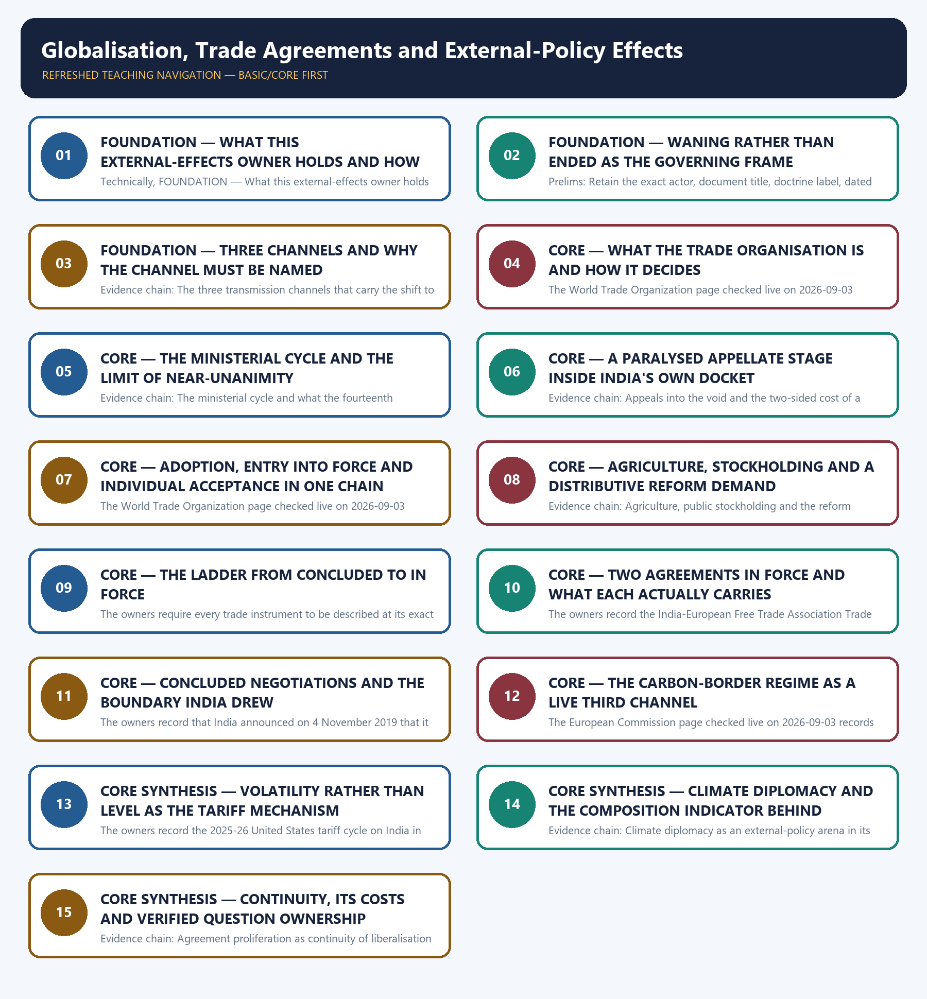

# Globalisation, Trade Agreements and External-Policy Effects — Learner-v2 Complete Learning Session

> **Authoring-only generation:** 2026-09-03. No PDF was rendered and no tracker or index was mutated.

### SOURCE, PROGRESSION AND CURRENT-LINKAGE AUDIT

- **Generation date:** 2026-09-03.
- **Repository-first evidence:** the Basic owner is taught first and preserved in full; the Advanced owner is retained only in the optional final teaching block.
- **OCR evidence:** Repository Markdown was primary. The OCR-searchable official General Studies question papers held under books\mains and books\more_previous_papers were read only to confirm the printed wording of routed demands. No official answer key, marking scheme, page precision or unsupported quotation was imported from them.
- **Qdrant:** not used; repository Markdown and available OCR context were sufficient.
- **PYQ integrity:** Three General Studies Paper II Mains demands are routed to this topic in the audited routing ledgers and each is reproduced below as a demand card with its printed year, paper, question number, directive, marks and word-limit provenance exactly as observed: 2025 question 10 asking the answer to elucidate the statement that with the waning of globalization the post-Cold War world is becoming a site of sovereign nationalism, a 10-mark demand whose 150-word limit is printed in the question itself and which the Basic owner names as the anchor demand for this topic; 2018 question 19 on the key areas of World Trade Organization reform in the context of a trade war, a 15-mark demand of 250 words recorded on a Core route that supersedes the older Advanced ownership; and 2022 question 20 asking the answer to describe briefly India's changing policy towards climate change in various international fora in the context of geopolitics, a 15-mark demand whose 250-word limit is printed in the question. Two provenance facts are reported rather than repaired. First, the 2018 General Studies Paper II is not among the locally held official papers, so only the audited ledger's own neutral rendering of that demand is carried and its printed stem is deliberately not reconstructed, quoted or paraphrased, while the 2022 and 2025 stems were confirmed word for word against the locally held official papers for those years. Second, the 2022 demand is expressly cross-cutting: the audited ledger records that both the climate regime and multilateral fora are named in the stem, this owner holds the trade, negotiating and external-policy half, and topic 12 holds the institutional half, so the shared ownership is declared rather than silently duplicated or silently dropped. No objective demand from any audited Prelims routing ledger is routed to this owner, so none is listed, invented or answered. The locally held OCR-searchable official General Studies papers were read only to confirm the printed wording and word-limit provenance of the routed Mains demands; no question was invented from them, no stem was paraphrased into an apparent routing, and no marking scheme or official answer key was imported.
- **Live-link boundary:** Live official verification was attempted on 2026-09-03 in the priority order required for this topic: the Ministry of External Affairs pages first, then the Department of Commerce as India's trade-agreement authority, then the World Trade Organization as the custodian of the multilateral rules framework, then the partner-side instruments. Every outcome is recorded exactly as observed. The Ministry of External Affairs press-release, bilateral-document and country-brief pages returned a browser-requirement stub or the Ministry's own error page, the Press Information Bureau index returned HTTP 403, the Department of Commerce trade-agreements page returned HTTP 403 and the European Free Trade Association page returned HTTP 429, so no Indian agreement status and no partnership objective was obtained from them. Four pages did return substantive official text and are used only for what they actually state: the World Trade Organization pages on its own structure, on the fourteenth Ministerial Conference calendar and agenda, on the Agreement on Fisheries Subsidies and on currently notified appeals, and the European Commission page on the Carbon Border Adjustment Mechanism's definitive regime. The package therefore uses the dated official anchors already carried by the repository owners together with those verified institutional sources, each with its actor, exact evidentiary level and date. It invents no trade, tariff, investment or export figure, no agreement provision or schedule, no signature, ratification, conclusion or entry-into-force date, no dispute status, ruling or remedy, no ministerial decision or negotiating outcome, no climate target or finance figure, no previous-year question, no answer key and no current claim.
- **Fact/inference discipline:** no current-affairs item, PYQ wording, figure or quotation is invented.

### LIVE OFFICIAL-SOURCE ATTEMPT LOG

Every live check below was attempted on 2026-09-03 in the priority order required for International Relations: Ministry of External Affairs official pages first, then other official government or international-organisation documents. Access failures are recorded exactly as observed and no claim is reconstructed from a failed fetch.

- https://www.mea.gov.in/press-releases.htm — attempted 2026-09-03; the request redirected to a browser-requirement stub and returned no press release text, so no live item was taken from it.
- https://www.mea.gov.in/bilateral-documents.htm — attempted 2026-09-03; the request redirected to a browser-requirement stub and returned no bilateral document text, so no live item was taken from it.
- https://www.mea.gov.in/foreign-relation.htm — attempted 2026-09-03; the request redirected to the Ministry's own error page, so no country brief was taken from it.
- https://www.pib.gov.in/indexd.aspx?reg=3&lang=1 — attempted 2026-09-03; the request returned HTTP 403, so no release was taken from it.
- https://commerce.gov.in/international-trade/trade-agreements/ — attempted 2026-09-03; the Department of Commerce trade-agreements page returned HTTP 403, so no Indian agreement status, signature or entry-into-force date was taken from it and the repository owners' dated statuses were used unchanged.
- https://www.efta.int/free-trade/free-trade-agreements/india — attempted 2026-09-03; the European Free Trade Association page returned HTTP 429, so no Trade and Economic Partnership Agreement text, investment objective or employment objective was taken from it.
- https://www.wto.org/english/thewto_e/whatis_e/tif_e/org1_e.htm — attempted 2026-09-03; the World Trade Organization returned substantive official text recording that the organisation is run by its member governments, that all major decisions are made by the membership as a whole either by ministers meeting at least once every two years or by their delegates in Geneva, that decisions are normally taken by consensus, that power is not delegated to a board of directors or to the organisation's head, that rules are enforced by the members themselves with sanctions imposed by member countries and authorised by the membership as a whole, and that the Ministerial Conference is the topmost body while the General Council, the Dispute Settlement Body and the Trade Policy Review Body are the same body meeting under different terms of reference. That text is used only for those structural facts.
- https://www.wto.org/english/thewto_e/minist_e/mc14_e/mc14_e.htm — attempted 2026-09-03; the World Trade Organization returned substantive official text recording that the fourteenth Ministerial Conference opened on 26 March with a ministerial breakout session on foundational issues, that 27 March was given to minister-facilitated breakout sessions on reform followed by a plenary, that the third day opened with an update on dispute-settlement reform and continued with ministerial sessions on fisheries subsidies, incorporation of the Investment Facilitation for Development Agreement, the E-commerce Work Programme and moratorium, agriculture and development including least-developed-country issues, and that the Conference ended on 30 March with a Heads of Delegation meeting and a closing session. That text is used only for the conference calendar and agenda and no outcome, decision or figure was taken from it.
- https://www.wto.org/english/tratop_e/rulesneg_e/fish_e/fish_e.htm — attempted 2026-09-03; the World Trade Organization returned substantive official text recording that the Agreement on Fisheries Subsidies prohibits harmful fisheries subsidies, that it is the first World Trade Organization agreement to focus on the environment, the first broad binding multilateral agreement on ocean sustainability and only the second multilateral agreement reached at the organisation since its inception, that it was adopted at the twelfth Ministerial Conference in June 2022, that it entered into force once two-thirds of members had deposited instruments of acceptance and that this threshold was reached at a ceremony on 15 September 2025, that it delivers the eleventh Ministerial Conference mandate contained in the Buenos Aires Ministerial Decision and Sustainable Development Goal 14.6, and that negotiations on additional provisions continue under the Negotiating Group on Rules. That text is used only for those treaty facts.
- https://www.wto.org/english/tratop_e/dispu_e/appellate_body_e.htm — attempted 2026-09-03; the World Trade Organization returned substantive official text listing current notified appeals that remain pending, including India's notification of appeal of 8 December 2023 in DS582 on tariff treatment of certain information and communications technology goods, India's notification of 17 May 2023 in DS584 on tariff treatment of certain goods in the dispute brought by Japan, and India's three notifications of 24 December 2021 in DS579, DS580 and DS581 on measures concerning sugar and sugarcane. That text is used only as official evidence that appeals stand notified without appellate disposal, and no ruling, finding or outcome was taken from it.
- https://taxation-customs.ec.europa.eu/carbon-border-adjustment-mechanism_en — attempted 2026-09-03; the European Commission returned substantive official text recording that the Carbon Border Adjustment Mechanism applies in its definitive regime from 1 January 2026, that the regime introduces authorisation requirements, reporting obligations and the purchase and surrender of certificates corresponding to the embedded carbon emissions of imported goods, that it applies to imports of selected goods in cement, iron and steel, aluminium, fertilisers, electricity and hydrogen, that certificate prices are calculated from European Union Emissions Trading System allowance auction prices, and that the transitional phase ran from 2023 to 2025. That text is used only for those regime facts and no India-specific impact figure was taken from it.

## BASIC LEARNING SESSION



*Distinct embedded teaching-navigation image. The separate continuous Cārvāka-style flowchart package remains an independent at-a-glance artifact.*

### SESSION 1 — FOUNDATION — WHAT THIS EXTERNAL-EFFECTS OWNER HOLDS AND HOW ITS BOUNDARIES ARE ROUTED

#### DEFINITION / WHAT THIS IS CALLED

**Plain-language definition:** Evidence chain: What this external-effects owner holds and how its boundaries are routed Qualified use: Open an external-effects demand by fixing ownership so the answer does not drift into another owner's evidence.

**Technical definition:** Technically, FOUNDATION — What this external-effects owner holds and how its boundaries are routed is analysed by relating FOUNDATION to What this external-effects owner holds, then testing the relationship through how its boundaries are routed and Evidence chain.

#### ANSWER-GRABBING OPENING — WRITE/ADAPT IN THE EXAM

> Evidence chain: What this external-effects owner holds and how its boundaries are routed Qualified use: Open an external-effects demand by fixing ownership so the answer does not drift into another owner's evidence.

#### MUST-WRITE KEYWORDS

- **FOUNDATION**
- **What this external-effects owner holds**
- **how its boundaries are routed**
- **Evidence chain**
- **Qualified use**
- **This**

**How to use them:** Frame the answer through FOUNDATION; define What this external-effects owner holds, connect how its boundaries are routed with Evidence chain to explain the mechanism, and use Qualified use for the decisive comparison or qualification.

#### VISUAL FIRST

```text
WHAT THIS EXTERNAL-EFFECTS OWNER HOLDS AND HOW ITS BOUNDARIES ARE ROUTED
01. What this external-effects owner holds and how its boundaries are routed
BOUNDARY -> Tariff and balance-of-payments mechanics belong to Economy, de-risking detail to topic 03 and the trade organisation's full institutional structure to topic 12.
```

*This topic-specific rail fixes the evidence sequence and its exam boundary before analysis.*

#### CORE EXPLANATION

This topic owns the diplomatic and strategic meaning of the international economic order for India: how globalisation and sovereign nationalism operate together, how another state's or bloc's economic and regulatory choices transmit into Indian market access, technology access and climate-compliance costs, what exact legal stage each trade instrument has reached, and how India answers through negotiation, dispute mechanisms and rule-shaping; its distinctive feature is that the same structural shift makes India simultaneously a beneficiary of diversification interest and a target of others' measures, and three General Studies Paper II Mains demands from 2018, 2022 and 2025 are routed here, while tariff schedules, balance-of-payments and trade-modelling mechanics belong to the Economy owner, de-risking and friend-shoring detail to topic 03, and the institutional mandate and structure of the World Trade Organization in full to topic 12.

#### NAMED EVIDENCE AND MECHANISM

- This topic owns the diplomatic and strategic meaning of the international economic order for India: how globalisation and sovereign nationalism operate together, how another state's or bloc's economic and regulatory choices transmit into Indian market access, technology access and climate-compliance costs, what exact legal stage each trade instrument has reached, and how India answers through negotiation, dispute mechanisms and rule-shaping; its distinctive feature is that the same structural shift makes India simultaneously a beneficiary of diversification interest and a target of others' measures, and three General Studies Paper II Mains demands from 2018, 2022 and 2025 are routed here, while tariff schedules, balance-of-payments and trade-modelling mechanics belong to the Economy owner, de-risking and friend-shoring detail to topic 03, and the institutional mandate and structure of the World Trade Organization in full to topic 12.

#### EXAMINER CAUTION

- Tariff and balance-of-payments mechanics belong to Economy, de-risking detail to topic 03 and the trade organisation's full institutional structure to topic 12.

#### EXAM LINK

- **Prelims:** Retain the exact actor, document title, doctrine label, dated instrument and evidentiary level attached to What this external-effects owner holds and how its boundaries are routed, and never upgrade a vision statement into a treaty, a signature into a ratification, a participation category into membership, or an announced corridor into an operating one.
- **Mains:** Open an external-effects demand by fixing ownership so the answer does not drift into another owner's evidence.

#### MINI RECAP

- **Evidence chain:** What this external-effects owner holds and how its boundaries are routed
- **Qualified use:** Open an external-effects demand by fixing ownership so the answer does not drift into another owner's evidence.

#### CLOSING RECALL FLOW — FOUNDATION — WHAT THIS EXTERNAL-EFFECTS OWNER HOLDS AND HOW ITS BOUNDARIES ARE ROUTED

```text
START / CONCEPT: FOUNDATION — What this external-effects owner holds and how its boundaries are routed
        |
        v
EXACT TERMS: FOUNDATION · What this external-effects owner holds · how its boundaries are routed · Evidence chain · Qualified use · This
        |
        v
MECHANISM / ARGUMENT: Prelims: Retain the exact actor, document title, doctrine label, dated instrument and evidentiary level attached to What this external-effects owner holds and how its boundaries are routed, and never upgrade a vision statement into a treaty, a signature into a ratification, a participation category into membership, or an announced corridor into an operating one.
        |
        v
CONSEQUENCE / CONTRAST: This topic owns the diplomatic and strategic meaning of the international economic order for India: how globalisation and sovereign nationalism operate together, how another state's or bloc's economic and regulatory choices transmit into Indian market access, technology access and climate-compliance costs, what exact legal stage each trade instrument has reached, and how India answers through negotiation, dispute mechanisms and rule-shaping; its distinctive feature is that the same structural shift makes India simultaneously a beneficiary of diversification interest and a target of others' measures, and three General Studies Paper II Mains demands from 2018, 2022 and 2025 are routed here, while tariff schedules, balance-of-payments and trade-modelling mechanics belong to the Economy owner, de-risking and friend-shoring detail to topic 03, and the institutional mandate and structure of the World Trade Organization in full to topic 12.
        |
        v
UPSC TRAP / ANSWER-USE: Mains: Open an external-effects demand by fixing ownership so the answer does not drift into another owner's evidence.
        |
        v
ANSWER-GRABBING FORMULATION: Evidence chain: What this external-effects owner holds and how its boundaries are routed Qualified use: Open an external-effects demand by fixing ownership so the answer does not drift into another owner's evidence.
```
### SESSION 2 — FOUNDATION — WANING RATHER THAN ENDED AS THE GOVERNING FRAME

#### DEFINITION / WHAT THIS IS CALLED

**Plain-language definition:** The owners insist that globalisation, understood as the intensifying cross-border integration of trade, capital, technology and information flows that characterised the post-Cold-War decades, and sovereign nationalism, understood as a resurgent emphasis on national control over trade, technology, borders and strategic industries expressed through protectionism, export controls and buy-national industrial policy, are simultaneously operating forces of differing relative strength across sectors and states rather than sequential eras; they anchor the point in the wording of the routed 2025 demand itself, which says waning rather than ended, and they treat the correction of a binary globalisation-is-over narrative as the single highest-value framing move available in this topic.

**Technical definition:** Prelims: Retain the exact actor, document title, doctrine label, dated instrument and evidentiary level attached to Waning rather than ended as the governing frame, and never upgrade a vision statement into a treaty, a signature into a ratification, a participation category into membership, or an announced corridor into an operating one.

#### ANSWER-GRABBING OPENING — WRITE/ADAPT IN THE EXAM

> The owners insist that globalisation, understood as the intensifying cross-border integration of trade, capital, technology and information flows that characterised the post-Cold-War decades, and sovereign nationalism, understood as a resurgent emphasis on national control over trade, technology, borders and strategic industries expressed through protectionism, export controls and buy-national industrial policy, are simultaneously operating forces of differing relative strength across sectors and states rather than sequential eras; they anchor the point in the wording of the routed 2025 demand itself, which says waning rather than ended, and they treat the correction of a binary globalisation-is-over narrative as the single highest-value framing move available in this topic.

#### MUST-WRITE KEYWORDS

- **FOUNDATION**
- **Evidence chain**
- **Qualified use**
- **Cold-War**
- **Retain**
- **Waning**

**How to use them:** Frame the answer through FOUNDATION; define Evidence chain, connect Qualified use with Cold-War to explain the mechanism, and use Retain for the decisive comparison or qualification.

#### VISUAL FIRST

```text
WANING RATHER THAN ENDED AS THE GOVERNING FRAME
01. Co-presence rather than succession as the governing frame
BOUNDARY -> The routed demand says waning, so a binary end-of-globalisation narrative misreads the question before the answer begins.
```

*This topic-specific rail fixes the evidence sequence and its exam boundary before analysis.*

#### CORE EXPLANATION

The owners insist that globalisation, understood as the intensifying cross-border integration of trade, capital, technology and information flows that characterised the post-Cold-War decades, and sovereign nationalism, understood as a resurgent emphasis on national control over trade, technology, borders and strategic industries expressed through protectionism, export controls and buy-national industrial policy, are simultaneously operating forces of differing relative strength across sectors and states rather than sequential eras; they anchor the point in the wording of the routed 2025 demand itself, which says waning rather than ended, and they treat the correction of a binary globalisation-is-over narrative as the single highest-value framing move available in this topic.

#### NAMED EVIDENCE AND MECHANISM

- The owners insist that globalisation, understood as the intensifying cross-border integration of trade, capital, technology and information flows that characterised the post-Cold-War decades, and sovereign nationalism, understood as a resurgent emphasis on national control over trade, technology, borders and strategic industries expressed through protectionism, export controls and buy-national industrial policy, are simultaneously operating forces of differing relative strength across sectors and states rather than sequential eras; they anchor the point in the wording of the routed 2025 demand itself, which says waning rather than ended, and they treat the correction of a binary globalisation-is-over narrative as the single highest-value framing move available in this topic.

#### EXAMINER CAUTION

- The routed demand says waning, so a binary end-of-globalisation narrative misreads the question before the answer begins.

#### EXAM LINK

- **Prelims:** Retain the exact actor, document title, doctrine label, dated instrument and evidentiary level attached to Waning rather than ended as the governing frame, and never upgrade a vision statement into a treaty, a signature into a ratification, a participation category into membership, or an announced corridor into an operating one.
- **Mains:** Secure the framing marks that the 2025 demand awards in its first two sentences.

#### MINI RECAP

- **Evidence chain:** Co-presence rather than succession as the governing frame
- **Qualified use:** Secure the framing marks that the 2025 demand awards in its first two sentences.

#### CLOSING RECALL FLOW — FOUNDATION — WANING RATHER THAN ENDED AS THE GOVERNING FRAME

```text
START / CONCEPT: FOUNDATION — Waning rather than ended as the governing frame
        |
        v
EXACT TERMS: FOUNDATION · Evidence chain · Qualified use · Cold-War · Retain · Waning
        |
        v
MECHANISM / ARGUMENT: Prelims: Retain the exact actor, document title, doctrine label, dated instrument and evidentiary level attached to Waning rather than ended as the governing frame, and never upgrade a vision statement into a treaty, a signature into a ratification, a participation category into membership, or an announced corridor into an operating one.
        |
        v
CONSEQUENCE / CONTRAST: Evidence chain: Co-presence rather than succession as the governing frame Qualified use: Secure the framing marks that the 2025 demand awards in its first two sentences.
        |
        v
UPSC TRAP / ANSWER-USE: Do not miss this limiting distinction: retain the exact actor, document title, doctrine label, dated instrument and evidentiary level attached...
        |
        v
ANSWER-GRABBING FORMULATION: The owners insist that globalisation, understood as the intensifying cross-border integration of trade, capital, technology and information flows that characterised the post-Cold-War decades, and sovereign nationalism, understood as a resurgent emphasis on national control over trade, technology, borders and strategic industries expressed through protectionism, export controls and buy-national industrial policy, are simultaneously operating forces of differing relative strength across sectors and states rather than sequential eras; they anchor the point in the wording of the routed 2025 demand itself, which says waning rather than ended, and they treat the correction of a binary globalisation-is-over narrative as the single highest-value framing move available in this topic.
```
### SESSION 3 — FOUNDATION — THREE CHANNELS AND WHY THE CHANNEL MUST BE NAMED

#### DEFINITION / WHAT THIS IS CALLED

**Plain-language definition:** Prelims: Retain the exact actor, document title, doctrine label, dated instrument and evidentiary level attached to Three channels and why the channel must be named, and never upgrade a vision statement into a treaty, a signature into a ratification, a participation category into membership, or an announced corridor into an operating one.

**Technical definition:** Evidence chain: The three transmission channels that carry the shift to India Qualified use: Replace a general claim about protectionism with a channel-specific transmission argument.

#### ANSWER-GRABBING OPENING — WRITE/ADAPT IN THE EXAM

> Prelims: Retain the exact actor, document title, doctrine label, dated instrument and evidentiary level attached to Three channels and why the channel must be named, and never upgrade a vision statement into a treaty, a signature into a ratification, a participation category into membership, or an announced corridor into an operating one.

#### MUST-WRITE KEYWORDS

- **FOUNDATION**
- **Three channels**
- **Evidence chain**
- **Qualified use**
- **Indian**
- **Retain**

**How to use them:** Frame the answer through FOUNDATION; define Three channels, connect Evidence chain with Qualified use to explain the mechanism, and use Indian for the decisive comparison or qualification.

#### VISUAL FIRST

```text
THREE CHANNELS AND WHY THE CHANNEL MUST BE NAMED
01. The three transmission channels that carry the shift to India
BOUNDARY -> A contemporary measure can be a trade instrument, an industrial-policy tool and a climate instrument at the same time.
```

*This topic-specific rail fixes the evidence sequence and its exam boundary before analysis.*

#### CORE EXPLANATION

The owners identify three channels through which sovereign-nationalist policy reaches Indian interests: a trade channel running through protectionism, the shift from multilateral liberalisation toward bilateral and plurilateral agreements and the stagnation of the multilateral negotiating function; a technology channel running through export controls, investment screening and de-risking; and a climate channel running through carbon-border measures and green-subsidy competition; they add that a contemporary instrument frequently combines all three objectives at once, which makes classical tariff-only analysis inadequate, and they require an answer to name the channel before describing the effect.

#### NAMED EVIDENCE AND MECHANISM

- The owners identify three channels through which sovereign-nationalist policy reaches Indian interests: a trade channel running through protectionism, the shift from multilateral liberalisation toward bilateral and plurilateral agreements and the stagnation of the multilateral negotiating function; a technology channel running through export controls, investment screening and de-risking; and a climate channel running through carbon-border measures and green-subsidy competition; they add that a contemporary instrument frequently combines all three objectives at once, which makes classical tariff-only analysis inadequate, and they require an answer to name the channel before describing the effect.

#### EXAMINER CAUTION

- A contemporary measure can be a trade instrument, an industrial-policy tool and a climate instrument at the same time.

#### EXAM LINK

- **Prelims:** Retain the exact actor, document title, doctrine label, dated instrument and evidentiary level attached to Three channels and why the channel must be named, and never upgrade a vision statement into a treaty, a signature into a ratification, a participation category into membership, or an announced corridor into an operating one.
- **Mains:** Replace a general claim about protectionism with a channel-specific transmission argument.

#### MINI RECAP

- **Evidence chain:** The three transmission channels that carry the shift to India
- **Qualified use:** Replace a general claim about protectionism with a channel-specific transmission argument.

#### CLOSING RECALL FLOW — FOUNDATION — THREE CHANNELS AND WHY THE CHANNEL MUST BE NAMED

```text
START / CONCEPT: FOUNDATION — Three channels and why the channel must be named
        |
        v
EXACT TERMS: FOUNDATION · Three channels · Evidence chain · Qualified use · Indian · Retain
        |
        v
MECHANISM / ARGUMENT: The owners identify three channels through which sovereign-nationalist policy reaches Indian interests: a trade channel running through protectionism, the shift from multilateral liberalisation toward bilateral and plurilateral agreements and the stagnation of the multilateral negotiating function; a technology channel running through export controls, investment screening and de-risking; and a climate channel running through carbon-border measures and green-subsidy competition; they add that a contemporary instrument frequently combines all three objectives at once, which makes classical tariff-only analysis inadequate, and they require an answer to name the channel before describing the effect.
        |
        v
CONSEQUENCE / CONTRAST: Evidence chain: The three transmission channels that carry the shift to India Qualified use: Replace a general claim about protectionism with a channel-specific transmission argument.
        |
        v
UPSC TRAP / ANSWER-USE: Do not miss this limiting distinction: a contemporary measure can be a trade instrument, an industrial-policy tool and a climate...
        |
        v
ANSWER-GRABBING FORMULATION: Prelims: Retain the exact actor, document title, doctrine label, dated instrument and evidentiary level attached to Three channels and why the channel must be named, and never upgrade a vision statement into a treaty, a signature into a ratification, a participation category into membership, or an announced corridor into an operating one.
```
### SESSION 4 — CORE — WHAT THE TRADE ORGANISATION IS AND HOW IT DECIDES

#### DEFINITION / WHAT THIS IS CALLED

**Plain-language definition:** Evidence chain: What the trade organisation is and how it actually decides Qualified use: Ground any reform demand in the organisation's actual decision structure rather than in its reputation.

**Technical definition:** The World Trade Organization page checked live on 2026-09-03 records that the organisation is run by its member governments, that all major decisions are made by the membership as a whole either by ministers meeting at least once every two years or by their delegates in Geneva, that decisions are normally taken by consensus, that power is not delegated to a board of directors or to the organisation's head, that rules are enforced by the members themselves with sanctions imposed by member countries and authorised by the membership as a whole, and that the Ministerial Conference is the topmost body while the General Council, the Dispute Settlement Body and the Trade Policy Review Body are the same body meeting under different terms of reference; the owners add that the organisation was established in 1995 with India a founding member and that it remains the reference framework for baseline rules even as its negotiating function has weakened, so it is a weakened institution and expressly not an irrelevant one.

#### ANSWER-GRABBING OPENING — WRITE/ADAPT IN THE EXAM

> Evidence chain: What the trade organisation is and how it actually decides Qualified use: Ground any reform demand in the organisation's actual decision structure rather than in its reputation.

#### MUST-WRITE KEYWORDS

- **What the trade organisation is**
- **how it decides**
- **Evidence chain**
- **Qualified use**
- **The World Trade Organization**
- **2026-09**

**How to use them:** Frame the answer through What the trade organisation is; define how it decides, connect Evidence chain with Qualified use to explain the mechanism, and use The World Trade Organization for the decisive comparison or qualification.

#### VISUAL FIRST

```text
WHAT THE TRADE ORGANISATION IS AND HOW IT DECIDES
01. What the trade organisation is and how it actually decides
BOUNDARY -> A member-driven consensus body with no delegated executive is weakened in its negotiating function and not irrelevant.
```

*This topic-specific rail fixes the evidence sequence and its exam boundary before analysis.*

#### CORE EXPLANATION

The World Trade Organization page checked live on 2026-09-03 records that the organisation is run by its member governments, that all major decisions are made by the membership as a whole either by ministers meeting at least once every two years or by their delegates in Geneva, that decisions are normally taken by consensus, that power is not delegated to a board of directors or to the organisation's head, that rules are enforced by the members themselves with sanctions imposed by member countries and authorised by the membership as a whole, and that the Ministerial Conference is the topmost body while the General Council, the Dispute Settlement Body and the Trade Policy Review Body are the same body meeting under different terms of reference; the owners add that the organisation was established in 1995 with India a founding member and that it remains the reference framework for baseline rules even as its negotiating function has weakened, so it is a weakened institution and expressly not an irrelevant one.

#### NAMED EVIDENCE AND MECHANISM

- The World Trade Organization page checked live on 2026-09-03 records that the organisation is run by its member governments, that all major decisions are made by the membership as a whole either by ministers meeting at least once every two years or by their delegates in Geneva, that decisions are normally taken by consensus, that power is not delegated to a board of directors or to the organisation's head, that rules are enforced by the members themselves with sanctions imposed by member countries and authorised by the membership as a whole, and that the Ministerial Conference is the topmost body while the General Council, the Dispute Settlement Body and the Trade Policy Review Body are the same body meeting under different terms of reference; the owners add that the organisation was established in 1995 with India a founding member and that it remains the reference framework for baseline rules even as its negotiating function has weakened, so it is a weakened institution and expressly not an irrelevant one.

#### EXAMINER CAUTION

- A member-driven consensus body with no delegated executive is weakened in its negotiating function and not irrelevant.

#### EXAM LINK

- **Prelims:** Retain the exact actor, document title, doctrine label, dated instrument and evidentiary level attached to What the trade organisation is and how it decides, and never upgrade a vision statement into a treaty, a signature into a ratification, a participation category into membership, or an announced corridor into an operating one.
- **Mains:** Ground any reform demand in the organisation's actual decision structure rather than in its reputation.

#### MINI RECAP

- **Evidence chain:** What the trade organisation is and how it actually decides
- **Qualified use:** Ground any reform demand in the organisation's actual decision structure rather than in its reputation.

#### CLOSING RECALL FLOW — CORE — WHAT THE TRADE ORGANISATION IS AND HOW IT DECIDES

```text
START / CONCEPT: CORE — What the trade organisation is and how it decides
        |
        v
EXACT TERMS: What the trade organisation is · how it decides · Evidence chain · Qualified use · The World Trade Organization · 2026-09
        |
        v
MECHANISM / ARGUMENT: The World Trade Organization page checked live on 2026-09-03 records that the organisation is run by its member governments, that all major decisions are made by the membership as a whole either by ministers meeting at least once every two years or by their delegates in Geneva, that decisions are normally taken by consensus, that power is not delegated to a board of directors or to the organisation's head, that rules are enforced by the members themselves with sanctions imposed by member countries and authorised by the membership as a whole, and that the Ministerial Conference is the topmost body while the General Council, the Dispute Settlement Body and the Trade Policy Review Body are the same body meeting under different terms of reference; the owners add that the organisation was established in 1995 with India a founding member and that it remains the reference framework for baseline rules even as its negotiating function has weakened, so it is a weakened institution and expressly not an irrelevant one.
        |
        v
CONSEQUENCE / CONTRAST: Prelims: Retain the exact actor, document title, doctrine label, dated instrument and evidentiary level attached to What the trade organisation is and how it decides, and never upgrade a vision statement into a treaty, a signature into a ratification, a participation category into membership, or an announced corridor into an operating one.
        |
        v
UPSC TRAP / ANSWER-USE: A member-driven consensus body with no delegated executive is weakened in its negotiating function and not irrelevant.
        |
        v
ANSWER-GRABBING FORMULATION: Evidence chain: What the trade organisation is and how it actually decides Qualified use: Ground any reform demand in the organisation's actual decision structure rather than in its reputation.
```
### SESSION 5 — CORE — THE MINISTERIAL CYCLE AND THE LIMIT OF NEAR-UNANIMITY

#### DEFINITION / WHAT THIS IS CALLED

**Plain-language definition:** The owners record that at the fourteenth Ministerial Conference the Investment Facilitation for Development agreement had the support of 165 of 166 members for incorporation into the rulebook and 129 parties supporting implementation, yet consensus was absent and incorporation failed, and they draw the precise lesson that in this organisation the veto point is procedural rather than majoritarian; the analytical payoff they attach is structural, because the same consensus convention that protects every member from being outvoted also converts a single objection into a blockage, which is why near-unanimity is never a decision and why the blockage is comparable in form, though not in law, to the permanent-member veto problem owned by topic 12.

**Technical definition:** Evidence chain: The ministerial cycle and what the fourteenth conference actually did - Consensus as the veto point that near-unanimity cannot overcome Qualified use: Answer the 2018 reform demand with the procedural veto point named exactly.

#### ANSWER-GRABBING OPENING — WRITE/ADAPT IN THE EXAM

> Evidence chain: The ministerial cycle and what the fourteenth conference actually did - Consensus as the veto point that near-unanimity cannot overcome Qualified use: Answer the 2018 reform demand with the procedural veto point named exactly.

#### MUST-WRITE KEYWORDS

- **The ministerial cycle**
- **the limit of near-unanimity**
- **Evidence chain**
- **Qualified use**
- **Ministerial Conference**
- **2026-09**

**How to use them:** Frame the answer through The ministerial cycle; define the limit of near-unanimity, connect Evidence chain with Qualified use to explain the mechanism, and use Ministerial Conference for the decisive comparison or qualification.

#### VISUAL FIRST

```text
THE MINISTERIAL CYCLE AND THE LIMIT OF NEAR-UNANIMITY
01. The ministerial cycle and what the fourteenth conference actually did
    |
    v
02. Consensus as the veto point that near-unanimity cannot overcome
BOUNDARY -> An agenda item is not an outcome, and 165 of 166 members is still not consensus.
```

*This topic-specific rail fixes the evidence sequence and its exam boundary before analysis.*

#### CORE EXPLANATION

The owners record that the thirteenth Ministerial Conference met at Abu Dhabi from 26 February to 2 March 2024 and produced the Abu Dhabi Ministerial Declaration with decisions on dispute-settlement reform, special and differential treatment, least-developed-country graduation and electronic commerce, and that the fourteenth met at Yaounde in Cameroon from 26 to 30 March 2026, taking decisions on small economies and on sanitary, phytosanitary and technical-barrier implementation and continuing fisheries negotiations toward the fifteenth conference while electronic-commerce moratorium questions remained unresolved; the organisation's own conference page checked live on 2026-09-03 confirms the calendar and agenda, recording an opening on 26 March with a foundational-issues breakout, minister-facilitated reform breakouts and a reform plenary on 27 March, a third day opening with a dispute-settlement reform update and continuing through ministerial sessions on fisheries subsidies, incorporation of the Investment Facilitation for Development Agreement, the E-commerce Work Programme and moratorium, agriculture and development, and a close on 30 March. The owners record that at the fourteenth Ministerial Conference the Investment Facilitation for Development agreement had the support of 165 of 166 members for incorporation into the rulebook and 129 parties supporting implementation, yet consensus was absent and incorporation failed, and they draw the precise lesson that in this organisation the veto point is procedural rather than majoritarian; the analytical payoff they attach is structural, because the same consensus convention that protects every member from being outvoted also converts a single objection into a blockage, which is why near-unanimity is never a decision and why the blockage is comparable in form, though not in law, to the permanent-member veto problem owned by topic 12.

#### NAMED EVIDENCE AND MECHANISM

- The owners record that the thirteenth Ministerial Conference met at Abu Dhabi from 26 February to 2 March 2024 and produced the Abu Dhabi Ministerial Declaration with decisions on dispute-settlement reform, special and differential treatment, least-developed-country graduation and electronic commerce, and that the fourteenth met at Yaounde in Cameroon from 26 to 30 March 2026, taking decisions on small economies and on sanitary, phytosanitary and technical-barrier implementation and continuing fisheries negotiations toward the fifteenth conference while electronic-commerce moratorium questions remained unresolved; the organisation's own conference page checked live on 2026-09-03 confirms the calendar and agenda, recording an opening on 26 March with a foundational-issues breakout, minister-facilitated reform breakouts and a reform plenary on 27 March, a third day opening with a dispute-settlement reform update and continuing through ministerial sessions on fisheries subsidies, incorporation of the Investment Facilitation for Development Agreement, the E-commerce Work Programme and moratorium, agriculture and development, and a close on 30 March.
- The owners record that at the fourteenth Ministerial Conference the Investment Facilitation for Development agreement had the support of 165 of 166 members for incorporation into the rulebook and 129 parties supporting implementation, yet consensus was absent and incorporation failed, and they draw the precise lesson that in this organisation the veto point is procedural rather than majoritarian; the analytical payoff they attach is structural, because the same consensus convention that protects every member from being outvoted also converts a single objection into a blockage, which is why near-unanimity is never a decision and why the blockage is comparable in form, though not in law, to the permanent-member veto problem owned by topic 12.

#### EXAMINER CAUTION

- An agenda item is not an outcome, and 165 of 166 members is still not consensus.

#### EXAM LINK

- **Prelims:** Retain the exact actor, document title, doctrine label, dated instrument and evidentiary level attached to The ministerial cycle and the limit of near-unanimity, and never upgrade a vision statement into a treaty, a signature into a ratification, a participation category into membership, or an announced corridor into an operating one.
- **Mains:** Answer the 2018 reform demand with the procedural veto point named exactly.

#### MINI RECAP

- **Evidence chain:** The ministerial cycle and what the fourteenth conference actually did -> Consensus as the veto point that near-unanimity cannot overcome
- **Qualified use:** Answer the 2018 reform demand with the procedural veto point named exactly.

#### CLOSING RECALL FLOW — CORE — THE MINISTERIAL CYCLE AND THE LIMIT OF NEAR-UNANIMITY

```text
START / CONCEPT: CORE — The ministerial cycle and the limit of near-unanimity
        |
        v
EXACT TERMS: The ministerial cycle · the limit of near-unanimity · Evidence chain · Qualified use · Ministerial Conference · 2026-09
        |
        v
MECHANISM / ARGUMENT: The owners record that at the fourteenth Ministerial Conference the Investment Facilitation for Development agreement had the support of 165 of 166 members for incorporation into the rulebook and 129 parties supporting implementation, yet consensus was absent and incorporation failed, and they draw the precise lesson that in this organisation the veto point is procedural rather than majoritarian; the analytical payoff they attach is structural, because the same consensus convention that protects every member from being outvoted also converts a single objection into a blockage, which is why near-unanimity is never a decision and why the blockage is comparable in form, though not in law, to the permanent-member veto problem owned by topic 12.
        |
        v
CONSEQUENCE / CONTRAST: The owners record that the thirteenth Ministerial Conference met at Abu Dhabi from 26 February to 2 March 2024 and produced the Abu Dhabi Ministerial Declaration with decisions on dispute-settlement reform, special and differential treatment, least-developed-country graduation and electronic commerce, and that the fourteenth met at Yaounde in Cameroon from 26 to 30 March 2026, taking decisions on small economies and on sanitary, phytosanitary and technical-barrier implementation and continuing fisheries negotiations toward the fifteenth conference while electronic-commerce moratorium questions remained unresolved; the organisation's own conference page checked live on 2026-09-03 confirms the calendar and agenda, recording an opening on 26 March with a foundational-issues breakout, minister-facilitated reform breakouts and a reform plenary on 27 March, a third day opening with a dispute-settlement reform update and continuing through ministerial sessions on fisheries subsidies, incorporation of the Investment Facilitation for Development Agreement, the E-commerce Work Programme and moratorium, agriculture and development, and a close on 30 March.
        |
        v
UPSC TRAP / ANSWER-USE: An agenda item is not an outcome, and 165 of 166 members is still not consensus.
        |
        v
ANSWER-GRABBING FORMULATION: Evidence chain: The ministerial cycle and what the fourteenth conference actually did - Consensus as the veto point that near-unanimity cannot overcome Qualified use: Answer the 2018 reform demand with the procedural veto point named exactly.
```
### SESSION 6 — CORE — A PARALYSED APPELLATE STAGE INSIDE INDIA'S OWN DOCKET

#### DEFINITION / WHAT THIS IS CALLED

**Plain-language definition:** The owners record that the Appellate Body lost its three-member quorum for new appeals on 10 December 2019 and has had zero members since 30 November 2020, that some thirty members participate in the interim multi-party interim appeal arbitration arrangement under Article 25 of the Dispute Settlement Understanding but India is not among them, and that an adverse panel report can therefore be appealed into the void; the organisation's own list of current notified appeals checked live on 2026-09-03 shows this operating in India's own docket, recording India's notification of appeal of 8 December 2023 in DS582 on tariff treatment of certain information and communications technology goods, its notification of 17 May 2023 in DS584 on tariff treatment of certain goods in the dispute brought by Japan and its three notifications of 24 December 2021 in DS579, DS580 and DS581 on measures concerning sugar and sugarcane; the owners insist the cost is two-sided, because India equally cannot obtain binding appellate review against others.

**Technical definition:** Evidence chain: Appeals into the void and the two-sided cost of a paralysed appellate stage Qualified use: Date the institutional weakness instead of asserting that dispute settlement has collapsed.

#### ANSWER-GRABBING OPENING — WRITE/ADAPT IN THE EXAM

> The owners record that the Appellate Body lost its three-member quorum for new appeals on 10 December 2019 and has had zero members since 30 November 2020, that some thirty members participate in the interim multi-party interim appeal arbitration arrangement under Article 25 of the Dispute Settlement Understanding but India is not among them, and that an adverse panel report can therefore be appealed into the void; the organisation's own list of current notified appeals checked live on 2026-09-03 shows this operating in India's own docket, recording India's notification of appeal of 8 December 2023 in DS582 on tariff treatment of certain information and communications technology goods, its notification of 17 May 2023 in DS584 on tariff treatment of certain goods in the dispute brought by Japan and its three notifications of 24 December 2021 in DS579, DS580 and DS581 on measures concerning sugar and sugarcane; the owners insist the cost is two-sided, because India equally cannot obtain binding appellate review against others.

#### MUST-WRITE KEYWORDS

- **A paralysed appellate stage inside India's own docket**
- **Evidence chain**
- **Qualified use**
- **Article 25**
- **Appellate Body**
- **2026-09**

**How to use them:** Frame the answer through A paralysed appellate stage inside India's own docket; define Evidence chain, connect Qualified use with Article 25 to explain the mechanism, and use Appellate Body for the decisive comparison or qualification.

#### VISUAL FIRST

```text
A PARALYSED APPELLATE STAGE INSIDE INDIA'S OWN DOCKET
01. Appeals into the void and the two-sided cost of a paralysed appellate stage
BOUNDARY -> The cost is two-sided, because India is outside the interim arrangement and cannot obtain binding appellate review either.
```

*This topic-specific rail fixes the evidence sequence and its exam boundary before analysis.*

#### CORE EXPLANATION

The owners record that the Appellate Body lost its three-member quorum for new appeals on 10 December 2019 and has had zero members since 30 November 2020, that some thirty members participate in the interim multi-party interim appeal arbitration arrangement under Article 25 of the Dispute Settlement Understanding but India is not among them, and that an adverse panel report can therefore be appealed into the void; the organisation's own list of current notified appeals checked live on 2026-09-03 shows this operating in India's own docket, recording India's notification of appeal of 8 December 2023 in DS582 on tariff treatment of certain information and communications technology goods, its notification of 17 May 2023 in DS584 on tariff treatment of certain goods in the dispute brought by Japan and its three notifications of 24 December 2021 in DS579, DS580 and DS581 on measures concerning sugar and sugarcane; the owners insist the cost is two-sided, because India equally cannot obtain binding appellate review against others.

#### NAMED EVIDENCE AND MECHANISM

- The owners record that the Appellate Body lost its three-member quorum for new appeals on 10 December 2019 and has had zero members since 30 November 2020, that some thirty members participate in the interim multi-party interim appeal arbitration arrangement under Article 25 of the Dispute Settlement Understanding but India is not among them, and that an adverse panel report can therefore be appealed into the void; the organisation's own list of current notified appeals checked live on 2026-09-03 shows this operating in India's own docket, recording India's notification of appeal of 8 December 2023 in DS582 on tariff treatment of certain information and communications technology goods, its notification of 17 May 2023 in DS584 on tariff treatment of certain goods in the dispute brought by Japan and its three notifications of 24 December 2021 in DS579, DS580 and DS581 on measures concerning sugar and sugarcane; the owners insist the cost is two-sided, because India equally cannot obtain binding appellate review against others.

#### EXAMINER CAUTION

- The cost is two-sided, because India is outside the interim arrangement and cannot obtain binding appellate review either.

#### EXAM LINK

- **Prelims:** Retain the exact actor, document title, doctrine label, dated instrument and evidentiary level attached to A paralysed appellate stage inside India's own docket, and never upgrade a vision statement into a treaty, a signature into a ratification, a participation category into membership, or an announced corridor into an operating one.
- **Mains:** Date the institutional weakness instead of asserting that dispute settlement has collapsed.

#### MINI RECAP

- **Evidence chain:** Appeals into the void and the two-sided cost of a paralysed appellate stage
- **Qualified use:** Date the institutional weakness instead of asserting that dispute settlement has collapsed.

#### CLOSING RECALL FLOW — CORE — A PARALYSED APPELLATE STAGE INSIDE INDIA'S OWN DOCKET

```text
START / CONCEPT: CORE — A paralysed appellate stage inside India's own docket
        |
        v
EXACT TERMS: A paralysed appellate stage inside India's own docket · Evidence chain · Qualified use · Article 25 · Appellate Body · 2026-09
        |
        v
MECHANISM / ARGUMENT: The cost is two-sided, because India is outside the interim arrangement and cannot obtain binding appellate review either.
        |
        v
CONSEQUENCE / CONTRAST: Evidence chain: Appeals into the void and the two-sided cost of a paralysed appellate stage Qualified use: Date the institutional weakness instead of asserting that dispute settlement has collapsed.
        |
        v
UPSC TRAP / ANSWER-USE: Do not miss this limiting distinction: date the institutional weakness instead of asserting that dispute settlement has collapsed.
        |
        v
ANSWER-GRABBING FORMULATION: The owners record that the Appellate Body lost its three-member quorum for new appeals on 10 December 2019 and has had zero members since 30 November 2020, that some thirty members participate in the interim multi-party interim appeal arbitration arrangement under Article 25 of the Dispute Settlement Understanding but India is not among them, and that an adverse panel report can therefore be appealed into the void; the organisation's own list of current notified appeals checked live on 2026-09-03 shows this operating in India's own docket, recording India's notification of appeal of 8 December 2023 in DS582 on tariff treatment of certain information and communications technology goods, its notification of 17 May 2023 in DS584 on tariff treatment of certain goods in the dispute brought by Japan and its three notifications of 24 December 2021 in DS579, DS580 and DS581 on measures concerning sugar and sugarcane; the owners insist the cost is two-sided, because India equally cannot obtain binding appellate review against others.
```
### SESSION 7 — CORE — ADOPTION, ENTRY INTO FORCE AND INDIVIDUAL ACCEPTANCE IN ONE CHAIN

#### DEFINITION / WHAT THIS IS CALLED

**Plain-language definition:** Adoption, threshold entry into force and a member's own deposit are three distinct steps and three distinct dates.

**Technical definition:** The World Trade Organization page checked live on 2026-09-03 records that the Agreement on Fisheries Subsidies prohibits harmful fisheries subsidies, that it is the first agreement of the organisation to focus on the environment, the first broad binding multilateral agreement on ocean sustainability and only the second multilateral agreement reached at the organisation since its inception, that it was adopted at the twelfth Ministerial Conference in June 2022, that it entered into force once two-thirds of members deposited instruments of acceptance and that this threshold was reached at a ceremony on 15 September 2025, that it delivers the eleventh Ministerial Conference mandate in the Buenos Aires Ministerial Decision and Sustainable Development Goal 14.6, and that negotiations on additional provisions continue under the Negotiating Group on Rules; the owners add the Indian step that completes the sequence, recording adoption on 17 June 2022, entry into force on 15 September 2025 and India's deposit of its instrument of acceptance on 20 July 2026, which together give a single worked chain from adoption through entry into force to individual acceptance.

#### ANSWER-GRABBING OPENING — WRITE/ADAPT IN THE EXAM

> The World Trade Organization page checked live on 2026-09-03 records that the Agreement on Fisheries Subsidies prohibits harmful fisheries subsidies, that it is the first agreement of the organisation to focus on the environment, the first broad binding multilateral agreement on ocean sustainability and only the second multilateral agreement reached at the organisation since its inception, that it was adopted at the twelfth Ministerial Conference in June 2022, that it entered into force once two-thirds of members deposited instruments of acceptance and that this threshold was reached at a ceremony on 15 September 2025, that it delivers the eleventh Ministerial Conference mandate in the Buenos Aires Ministerial Decision and Sustainable Development Goal 14.6, and that negotiations on additional provisions continue under the Negotiating Group on Rules; the owners add the Indian step that completes the sequence, recording adoption on 17 June 2022, entry into force on 15 September 2025 and India's deposit of its instrument of acceptance on 20 July 2026, which together give a single worked chain from adoption through entry into force to individual acceptance.

#### MUST-WRITE KEYWORDS

- **Adoption**
- **entry into force**
- **individual acceptance in one chain**
- **Evidence chain**
- **Qualified use**
- **2026-09**

**How to use them:** Frame the answer through Adoption; define entry into force, connect individual acceptance in one chain with Evidence chain to explain the mechanism, and use Qualified use for the decisive comparison or qualification.

#### VISUAL FIRST

```text
ADOPTION, ENTRY INTO FORCE AND INDIVIDUAL ACCEPTANCE IN ONE CHAIN
01. The fisheries agreement as the clean adoption-to-acceptance sequence
BOUNDARY -> Adoption, threshold entry into force and a member's own deposit are three distinct steps and three distinct dates.
```

*This topic-specific rail fixes the evidence sequence and its exam boundary before analysis.*

#### CORE EXPLANATION

The World Trade Organization page checked live on 2026-09-03 records that the Agreement on Fisheries Subsidies prohibits harmful fisheries subsidies, that it is the first agreement of the organisation to focus on the environment, the first broad binding multilateral agreement on ocean sustainability and only the second multilateral agreement reached at the organisation since its inception, that it was adopted at the twelfth Ministerial Conference in June 2022, that it entered into force once two-thirds of members deposited instruments of acceptance and that this threshold was reached at a ceremony on 15 September 2025, that it delivers the eleventh Ministerial Conference mandate in the Buenos Aires Ministerial Decision and Sustainable Development Goal 14.6, and that negotiations on additional provisions continue under the Negotiating Group on Rules; the owners add the Indian step that completes the sequence, recording adoption on 17 June 2022, entry into force on 15 September 2025 and India's deposit of its instrument of acceptance on 20 July 2026, which together give a single worked chain from adoption through entry into force to individual acceptance.

#### NAMED EVIDENCE AND MECHANISM

- The World Trade Organization page checked live on 2026-09-03 records that the Agreement on Fisheries Subsidies prohibits harmful fisheries subsidies, that it is the first agreement of the organisation to focus on the environment, the first broad binding multilateral agreement on ocean sustainability and only the second multilateral agreement reached at the organisation since its inception, that it was adopted at the twelfth Ministerial Conference in June 2022, that it entered into force once two-thirds of members deposited instruments of acceptance and that this threshold was reached at a ceremony on 15 September 2025, that it delivers the eleventh Ministerial Conference mandate in the Buenos Aires Ministerial Decision and Sustainable Development Goal 14.6, and that negotiations on additional provisions continue under the Negotiating Group on Rules; the owners add the Indian step that completes the sequence, recording adoption on 17 June 2022, entry into force on 15 September 2025 and India's deposit of its instrument of acceptance on 20 July 2026, which together give a single worked chain from adoption through entry into force to individual acceptance.

#### EXAMINER CAUTION

- Adoption, threshold entry into force and a member's own deposit are three distinct steps and three distinct dates.

#### EXAM LINK

- **Prelims:** Retain the exact actor, document title, doctrine label, dated instrument and evidentiary level attached to Adoption, entry into force and individual acceptance in one chain, and never upgrade a vision statement into a treaty, a signature into a ratification, a participation category into membership, or an announced corridor into an operating one.
- **Mains:** Demonstrate treaty-stage literacy with a single agreement that supplies the whole sequence.

#### MINI RECAP

- **Evidence chain:** The fisheries agreement as the clean adoption-to-acceptance sequence
- **Qualified use:** Demonstrate treaty-stage literacy with a single agreement that supplies the whole sequence.

#### CLOSING RECALL FLOW — CORE — ADOPTION, ENTRY INTO FORCE AND INDIVIDUAL ACCEPTANCE IN ONE CHAIN

```text
START / CONCEPT: CORE — Adoption, entry into force and individual acceptance in one chain
        |
        v
EXACT TERMS: Adoption · entry into force · individual acceptance in one chain · Evidence chain · Qualified use · 2026-09
        |
        v
MECHANISM / ARGUMENT: Adoption, threshold entry into force and a member's own deposit are three distinct steps and three distinct dates.
        |
        v
CONSEQUENCE / CONTRAST: Evidence chain: The fisheries agreement as the clean adoption-to-acceptance sequence Qualified use: Demonstrate treaty-stage literacy with a single agreement that supplies the whole sequence.
        |
        v
UPSC TRAP / ANSWER-USE: Do not miss this limiting distinction: demonstrate treaty-stage literacy with a single agreement that supplies the whole sequence.
        |
        v
ANSWER-GRABBING FORMULATION: The World Trade Organization page checked live on 2026-09-03 records that the Agreement on Fisheries Subsidies prohibits harmful fisheries subsidies, that it is the first agreement of the organisation to focus on the environment, the first broad binding multilateral agreement on ocean sustainability and only the second multilateral agreement reached at the organisation since its inception, that it was adopted at the twelfth Ministerial Conference in June 2022, that it entered into force once two-thirds of members deposited instruments of acceptance and that this threshold was reached at a ceremony on 15 September 2025, that it delivers the eleventh Ministerial Conference mandate in the Buenos Aires Ministerial Decision and Sustainable Development Goal 14.6, and that negotiations on additional provisions continue under the Negotiating Group on Rules; the owners add the Indian step that completes the sequence, recording adoption on 17 June 2022, entry into force on 15 September 2025 and India's deposit of its instrument of acceptance on 20 July 2026, which together give a single worked chain from adoption through entry into force to individual acceptance.
```
### SESSION 8 — CORE — AGRICULTURE, STOCKHOLDING AND A DISTRIBUTIVE REFORM DEMAND

#### DEFINITION / WHAT THIS IS CALLED

**Plain-language definition:** The owners record that the Agreement on Agriculture disciplines market access, domestic support and export competition, that the 2013 Bali peace clause protects eligible developing-country public-stockholding programmes from specified legal challenge while members negotiate a permanent solution, and that India's reform demand is to preserve public stockholding and special and differential treatment while improving subsidy and market-access rules; they attach two limits in the same place, namely that the interim protection carries notification and programme conditions and is not the permanent settlement India seeks, and that producer support, consumer food security and export effects must all be balanced, which is why reform in this organisation is distributive rather than merely procedural.

**Technical definition:** Evidence chain: Agriculture, public stockholding and the reform demand India actually makes Qualified use: Give the reform answer a concrete Indian stake rather than a procedural wish list.

#### ANSWER-GRABBING OPENING — WRITE/ADAPT IN THE EXAM

> The owners record that the Agreement on Agriculture disciplines market access, domestic support and export competition, that the 2013 Bali peace clause protects eligible developing-country public-stockholding programmes from specified legal challenge while members negotiate a permanent solution, and that India's reform demand is to preserve public stockholding and special and differential treatment while improving subsidy and market-access rules; they attach two limits in the same place, namely that the interim protection carries notification and programme conditions and is not the permanent settlement India seeks, and that producer support, consumer food security and export effects must all be balanced, which is why reform in this organisation is distributive rather than merely procedural.

#### MUST-WRITE KEYWORDS

- **Agriculture**
- **stockholding**
- **a distributive reform demand**
- **Evidence chain**
- **Qualified use**
- **Agreement**

**How to use them:** Frame the answer through Agriculture; define stockholding, connect a distributive reform demand with Evidence chain to explain the mechanism, and use Qualified use for the decisive comparison or qualification.

#### VISUAL FIRST

```text
AGRICULTURE, STOCKHOLDING AND A DISTRIBUTIVE REFORM DEMAND
01. Agriculture, public stockholding and the reform demand India actually makes
BOUNDARY -> Interim protection carrying notification and programme conditions is not the permanent settlement India seeks.
```

*This topic-specific rail fixes the evidence sequence and its exam boundary before analysis.*

#### CORE EXPLANATION

The owners record that the Agreement on Agriculture disciplines market access, domestic support and export competition, that the 2013 Bali peace clause protects eligible developing-country public-stockholding programmes from specified legal challenge while members negotiate a permanent solution, and that India's reform demand is to preserve public stockholding and special and differential treatment while improving subsidy and market-access rules; they attach two limits in the same place, namely that the interim protection carries notification and programme conditions and is not the permanent settlement India seeks, and that producer support, consumer food security and export effects must all be balanced, which is why reform in this organisation is distributive rather than merely procedural.

#### NAMED EVIDENCE AND MECHANISM

- The owners record that the Agreement on Agriculture disciplines market access, domestic support and export competition, that the 2013 Bali peace clause protects eligible developing-country public-stockholding programmes from specified legal challenge while members negotiate a permanent solution, and that India's reform demand is to preserve public stockholding and special and differential treatment while improving subsidy and market-access rules; they attach two limits in the same place, namely that the interim protection carries notification and programme conditions and is not the permanent settlement India seeks, and that producer support, consumer food security and export effects must all be balanced, which is why reform in this organisation is distributive rather than merely procedural.

#### EXAMINER CAUTION

- Interim protection carrying notification and programme conditions is not the permanent settlement India seeks.

#### EXAM LINK

- **Prelims:** Retain the exact actor, document title, doctrine label, dated instrument and evidentiary level attached to Agriculture, stockholding and a distributive reform demand, and never upgrade a vision statement into a treaty, a signature into a ratification, a participation category into membership, or an announced corridor into an operating one.
- **Mains:** Give the reform answer a concrete Indian stake rather than a procedural wish list.

#### MINI RECAP

- **Evidence chain:** Agriculture, public stockholding and the reform demand India actually makes
- **Qualified use:** Give the reform answer a concrete Indian stake rather than a procedural wish list.

#### CLOSING RECALL FLOW — CORE — AGRICULTURE, STOCKHOLDING AND A DISTRIBUTIVE REFORM DEMAND

```text
START / CONCEPT: CORE — Agriculture, stockholding and a distributive reform demand
        |
        v
EXACT TERMS: Agriculture · stockholding · a distributive reform demand · Evidence chain · Qualified use · Agreement
        |
        v
MECHANISM / ARGUMENT: Evidence chain: Agriculture, public stockholding and the reform demand India actually makes Qualified use: Give the reform answer a concrete Indian stake rather than a procedural wish list.
        |
        v
CONSEQUENCE / CONTRAST: Interim protection carrying notification and programme conditions is not the permanent settlement India seeks.
        |
        v
UPSC TRAP / ANSWER-USE: Do not miss this limiting distinction: the owners record that the Agreement on Agriculture disciplines market access, domestic support and...
        |
        v
ANSWER-GRABBING FORMULATION: The owners record that the Agreement on Agriculture disciplines market access, domestic support and export competition, that the 2013 Bali peace clause protects eligible developing-country public-stockholding programmes from specified legal challenge while members negotiate a permanent solution, and that India's reform demand is to preserve public stockholding and special and differential treatment while improving subsidy and market-access rules; they attach two limits in the same place, namely that the interim protection carries notification and programme conditions and is not the permanent settlement India seeks, and that producer support, consumer food security and export effects must all be balanced, which is why reform in this organisation is distributive rather than merely procedural.
```
### SESSION 9 — CORE — THE LADDER FROM CONCLUDED TO IN FORCE

#### DEFINITION / WHAT THIS IS CALLED

**Plain-language definition:** Concluded, signed, ratified and in force are four different claims and an answer must name the one it means.

**Technical definition:** The owners require every trade instrument to be described at its exact legal stage, and they supply a dated ladder for India: the India-United Arab Emirates Comprehensive Economic Partnership Agreement in force from 1 May 2022 and the India-Australia Economic Cooperation and Trade Agreement in force from 29 December 2022 at the top; the India-European Free Trade Association Trade and Economic Partnership Agreement signed on 10 March 2024 and in force from 1 October 2025; the India-United Kingdom Comprehensive Economic and Trade Agreement signed at London on 24 July 2025 and in force from 15 July 2026; the India-Oman Comprehensive Economic Partnership Agreement signed on 18 December 2025; the India-New Zealand agreement signed on 27 April 2026; the India-Chile Comprehensive Economic Partnership Agreement with negotiations concluded on 5 December 2025; the India-European Union agreement with negotiations concluded on 27 January 2026 but neither signed nor in force; and the India-United States relationship carrying an interim framework and continuing negotiation with no comprehensive agreement in force; the discipline is that concluded, signed, ratified and in force are four different claims and that an answer must name the one it means.

#### ANSWER-GRABBING OPENING — WRITE/ADAPT IN THE EXAM

> The owners require every trade instrument to be described at its exact legal stage, and they supply a dated ladder for India: the India-United Arab Emirates Comprehensive Economic Partnership Agreement in force from 1 May 2022 and the India-Australia Economic Cooperation and Trade Agreement in force from 29 December 2022 at the top; the India-European Free Trade Association Trade and Economic Partnership Agreement signed on 10 March 2024 and in force from 1 October 2025; the India-United Kingdom Comprehensive Economic and Trade Agreement signed at London on 24 July 2025 and in force from 15 July 2026; the India-Oman Comprehensive Economic Partnership Agreement signed on 18 December 2025; the India-New Zealand agreement signed on 27 April 2026; the India-Chile Comprehensive Economic Partnership Agreement with negotiations concluded on 5 December 2025; the India-European Union agreement with negotiations concluded on 27 January 2026 but neither signed nor in force; and the India-United States relationship carrying an interim framework and continuing negotiation with no comprehensive agreement in force; the discipline is that concluded, signed, ratified and in force are four different claims and that an answer must name the one it means.

#### MUST-WRITE KEYWORDS

- **The ladder from concluded to in force**
- **Evidence chain**
- **Qualified use**
- **India**
- **India-United Arab Emirates Comprehensive Economic**
- **Partnership Agreement**

**How to use them:** Frame the answer through The ladder from concluded to in force; define Evidence chain, connect Qualified use with India to explain the mechanism, and use India-United Arab Emirates Comprehensive Economic for the decisive comparison or qualification.

#### VISUAL FIRST

```text
THE LADDER FROM CONCLUDED TO IN FORCE
01. The status vocabulary that decides whether a trade claim is true
BOUNDARY -> Concluded, signed, ratified and in force are four different claims and an answer must name the one it means.
```

*This topic-specific rail fixes the evidence sequence and its exam boundary before analysis.*

#### CORE EXPLANATION

The owners require every trade instrument to be described at its exact legal stage, and they supply a dated ladder for India: the India-United Arab Emirates Comprehensive Economic Partnership Agreement in force from 1 May 2022 and the India-Australia Economic Cooperation and Trade Agreement in force from 29 December 2022 at the top; the India-European Free Trade Association Trade and Economic Partnership Agreement signed on 10 March 2024 and in force from 1 October 2025; the India-United Kingdom Comprehensive Economic and Trade Agreement signed at London on 24 July 2025 and in force from 15 July 2026; the India-Oman Comprehensive Economic Partnership Agreement signed on 18 December 2025; the India-New Zealand agreement signed on 27 April 2026; the India-Chile Comprehensive Economic Partnership Agreement with negotiations concluded on 5 December 2025; the India-European Union agreement with negotiations concluded on 27 January 2026 but neither signed nor in force; and the India-United States relationship carrying an interim framework and continuing negotiation with no comprehensive agreement in force; the discipline is that concluded, signed, ratified and in force are four different claims and that an answer must name the one it means.

#### NAMED EVIDENCE AND MECHANISM

- The owners require every trade instrument to be described at its exact legal stage, and they supply a dated ladder for India: the India-United Arab Emirates Comprehensive Economic Partnership Agreement in force from 1 May 2022 and the India-Australia Economic Cooperation and Trade Agreement in force from 29 December 2022 at the top; the India-European Free Trade Association Trade and Economic Partnership Agreement signed on 10 March 2024 and in force from 1 October 2025; the India-United Kingdom Comprehensive Economic and Trade Agreement signed at London on 24 July 2025 and in force from 15 July 2026; the India-Oman Comprehensive Economic Partnership Agreement signed on 18 December 2025; the India-New Zealand agreement signed on 27 April 2026; the India-Chile Comprehensive Economic Partnership Agreement with negotiations concluded on 5 December 2025; the India-European Union agreement with negotiations concluded on 27 January 2026 but neither signed nor in force; and the India-United States relationship carrying an interim framework and continuing negotiation with no comprehensive agreement in force; the discipline is that concluded, signed, ratified and in force are four different claims and that an answer must name the one it means.

#### EXAMINER CAUTION

- Concluded, signed, ratified and in force are four different claims and an answer must name the one it means.

#### EXAM LINK

- **Prelims:** Retain the exact actor, document title, doctrine label, dated instrument and evidentiary level attached to The ladder from concluded to in force, and never upgrade a vision statement into a treaty, a signature into a ratification, a participation category into membership, or an announced corridor into an operating one.
- **Mains:** Prevent the single status error that invalidates an otherwise well-evidenced trade paragraph.

#### MINI RECAP

- **Evidence chain:** The status vocabulary that decides whether a trade claim is true
- **Qualified use:** Prevent the single status error that invalidates an otherwise well-evidenced trade paragraph.

#### CLOSING RECALL FLOW — CORE — THE LADDER FROM CONCLUDED TO IN FORCE

```text
START / CONCEPT: CORE — The ladder from concluded to in force
        |
        v
EXACT TERMS: The ladder from concluded to in force · Evidence chain · Qualified use · India · India-United Arab Emirates Comprehensive Economic · Partnership Agreement
        |
        v
MECHANISM / ARGUMENT: Concluded, signed, ratified and in force are four different claims and an answer must name the one it means.
        |
        v
CONSEQUENCE / CONTRAST: Evidence chain: The status vocabulary that decides whether a trade claim is true Qualified use: Prevent the single status error that invalidates an otherwise well-evidenced trade paragraph.
        |
        v
UPSC TRAP / ANSWER-USE: Do not miss this limiting distinction: the owners require every trade instrument to be described at its exact legal stage.
        |
        v
ANSWER-GRABBING FORMULATION: The owners require every trade instrument to be described at its exact legal stage, and they supply a dated ladder for India: the India-United Arab Emirates Comprehensive Economic Partnership Agreement in force from 1 May 2022 and the India-Australia Economic Cooperation and Trade Agreement in force from 29 December 2022 at the top; the India-European Free Trade Association Trade and Economic Partnership Agreement signed on 10 March 2024 and in force from 1 October 2025; the India-United Kingdom Comprehensive Economic and Trade Agreement signed at London on 24 July 2025 and in force from 15 July 2026; the India-Oman Comprehensive Economic Partnership Agreement signed on 18 December 2025; the India-New Zealand agreement signed on 27 April 2026; the India-Chile Comprehensive Economic Partnership Agreement with negotiations concluded on 5 December 2025; the India-European Union agreement with negotiations concluded on 27 January 2026 but neither signed nor in force; and the India-United States relationship carrying an interim framework and continuing negotiation with no comprehensive agreement in force; the discipline is that concluded, signed, ratified and in force are four different claims and that an answer must name the one it means.
```
### SESSION 10 — CORE — TWO AGREEMENTS IN FORCE AND WHAT EACH ACTUALLY CARRIES

#### DEFINITION / WHAT THIS IS CALLED

**Plain-language definition:** CORE — Two agreements in force and what each actually carries comprises Two agreements in force, what each actually carries and Evidence chain as its core connected dimensions.

**Technical definition:** The owners record the India-European Free Trade Association Trade and Economic Partnership Agreement as signed on 10 March 2024 and entered into force on 1 October 2025, and they record in the same place that the figure of one hundred billion United States dollars over fifteen years and one million direct jobs is a shared objective stated in the agreement's framework rather than realised investment or realised employment; the examinable consequence is that a negotiated aspiration must never be cited as delivered outcome, because doing so converts a bargaining target into a fact and destroys the credibility of every other figure in the same answer.

#### ANSWER-GRABBING OPENING — WRITE/ADAPT IN THE EXAM

> The owners record the India-United Kingdom Comprehensive Economic and Trade Agreement as signed at London on 24 July 2025 and entered into force on 15 July 2026, with the Double Contributions Convention entering into force on the same day and providing up to sixty months of home-country social-security coverage for detached workers; the owners treat the paired instrument as analytically significant rather than incidental, because it shows that a contemporary trade agreement carries mobility and social-security machinery alongside tariff concessions, which is exactly the kind of provision an answer on services-led trade interests should cite instead of a general claim about market access.

#### MUST-WRITE KEYWORDS

- **Two agreements in force**
- **what each actually carries**
- **Evidence chain**
- **Qualified use**
- **India-European Free Trade Association Trade**
- **Economic Partnership Agreement**

**How to use them:** Frame the answer through Two agreements in force; define what each actually carries, connect Evidence chain with Qualified use to explain the mechanism, and use India-European Free Trade Association Trade for the decisive comparison or qualification.

#### VISUAL FIRST

```text
TWO AGREEMENTS IN FORCE AND WHAT EACH ACTUALLY CARRIES
01. The European trade partnership in force and the objective that is not an outcome
    |
    v
02. The United Kingdom agreement in force and its social-security companion
BOUNDARY -> A negotiated objective is not realised investment or employment, and a paired convention is part of the instrument.
```

*This topic-specific rail fixes the evidence sequence and its exam boundary before analysis.*

#### CORE EXPLANATION

The owners record the India-European Free Trade Association Trade and Economic Partnership Agreement as signed on 10 March 2024 and entered into force on 1 October 2025, and they record in the same place that the figure of one hundred billion United States dollars over fifteen years and one million direct jobs is a shared objective stated in the agreement's framework rather than realised investment or realised employment; the examinable consequence is that a negotiated aspiration must never be cited as delivered outcome, because doing so converts a bargaining target into a fact and destroys the credibility of every other figure in the same answer. The owners record the India-United Kingdom Comprehensive Economic and Trade Agreement as signed at London on 24 July 2025 and entered into force on 15 July 2026, with the Double Contributions Convention entering into force on the same day and providing up to sixty months of home-country social-security coverage for detached workers; the owners treat the paired instrument as analytically significant rather than incidental, because it shows that a contemporary trade agreement carries mobility and social-security machinery alongside tariff concessions, which is exactly the kind of provision an answer on services-led trade interests should cite instead of a general claim about market access.

#### NAMED EVIDENCE AND MECHANISM

- The owners record the India-European Free Trade Association Trade and Economic Partnership Agreement as signed on 10 March 2024 and entered into force on 1 October 2025, and they record in the same place that the figure of one hundred billion United States dollars over fifteen years and one million direct jobs is a shared objective stated in the agreement's framework rather than realised investment or realised employment; the examinable consequence is that a negotiated aspiration must never be cited as delivered outcome, because doing so converts a bargaining target into a fact and destroys the credibility of every other figure in the same answer.
- The owners record the India-United Kingdom Comprehensive Economic and Trade Agreement as signed at London on 24 July 2025 and entered into force on 15 July 2026, with the Double Contributions Convention entering into force on the same day and providing up to sixty months of home-country social-security coverage for detached workers; the owners treat the paired instrument as analytically significant rather than incidental, because it shows that a contemporary trade agreement carries mobility and social-security machinery alongside tariff concessions, which is exactly the kind of provision an answer on services-led trade interests should cite instead of a general claim about market access.

#### EXAMINER CAUTION

- A negotiated objective is not realised investment or employment, and a paired convention is part of the instrument.

#### EXAM LINK

- **Prelims:** Retain the exact actor, document title, doctrine label, dated instrument and evidentiary level attached to Two agreements in force and what each actually carries, and never upgrade a vision statement into a treaty, a signature into a ratification, a participation category into membership, or an announced corridor into an operating one.
- **Mains:** Cite market access and mobility provisions precisely instead of asserting general trade benefit.

#### MINI RECAP

- **Evidence chain:** The European trade partnership in force and the objective that is not an outcome -> The United Kingdom agreement in force and its social-security companion
- **Qualified use:** Cite market access and mobility provisions precisely instead of asserting general trade benefit.

#### CLOSING RECALL FLOW — CORE — TWO AGREEMENTS IN FORCE AND WHAT EACH ACTUALLY CARRIES

```text
START / CONCEPT: CORE — Two agreements in force and what each actually carries
        |
        v
EXACT TERMS: Two agreements in force · what each actually carries · Evidence chain · Qualified use · India-European Free Trade Association Trade · Economic Partnership Agreement
        |
        v
MECHANISM / ARGUMENT: The owners record the India-European Free Trade Association Trade and Economic Partnership Agreement as signed on 10 March 2024 and entered into force on 1 October 2025, and they record in the same place that the figure of one hundred billion United States dollars over fifteen years and one million direct jobs is a shared objective stated in the agreement's framework rather than realised investment or realised employment; the examinable consequence is that a negotiated aspiration must never be cited as delivered outcome, because doing so converts a bargaining target into a fact and destroys the credibility of every other figure in the same answer.
        |
        v
CONSEQUENCE / CONTRAST: Evidence chain: The European trade partnership in force and the objective that is not an outcome - The United Kingdom agreement in force and its social-security companion Qualified use: Cite market access and mobility provisions precisely instead of asserting general trade benefit.
        |
        v
UPSC TRAP / ANSWER-USE: A negotiated objective is not realised investment or employment, and a paired convention is part of the instrument.
        |
        v
ANSWER-GRABBING FORMULATION: The owners record the India-United Kingdom Comprehensive Economic and Trade Agreement as signed at London on 24 July 2025 and entered into force on 15 July 2026, with the Double Contributions Convention entering into force on the same day and providing up to sixty months of home-country social-security coverage for detached workers; the owners treat the paired instrument as analytically significant rather than incidental, because it shows that a contemporary trade agreement carries mobility and social-security machinery alongside tariff concessions, which is exactly the kind of provision an answer on services-led trade interests should cite instead of a general claim about market access.
```
### SESSION 11 — CORE — CONCLUDED NEGOTIATIONS AND THE BOUNDARY INDIA DREW

#### DEFINITION / WHAT THIS IS CALLED

**Plain-language definition:** Evidence chain: Concluded negotiations and the same-summit verb discipline - The withdrawal decision that defines India's own trade boundary Qualified use: Answer the dual-positioning limb of the 2025 demand with India's own dated choices.

**Technical definition:** The owners record that India announced on 4 November 2019 that it would not join the Regional Comprehensive Economic Partnership, and they treat the decision as the boundary marker of India's trade strategy rather than as a retreat from trade, because the same period saw India conclude and bring into force several bilateral and plurilateral agreements; the analytical use is that a state seeking market access abroad while protecting selected domestic sectors is navigating both faces of the structural shift at once, which is precisely the dual positioning the routed 2025 demand asks an answer to elucidate.

#### ANSWER-GRABBING OPENING — WRITE/ADAPT IN THE EXAM

> The owners record that India-European Union free trade agreement negotiations were concluded on 27 January 2026 at the sixteenth India-European Union Summit and that the agreement was neither signed nor ratified nor in force, and they record that the same summit signed a Security and Defence Partnership, launched negotiations on a Security of Information Agreement and adopted the document Towards 2030: India-European Union Joint Comprehensive Strategic Agenda; the owners use the summit as the cleanest available demonstration that concluded, signed, launched and adopted are four different verbs carrying four different obligations inside one communique, so an answer must reproduce the verb the source actually used.

#### MUST-WRITE KEYWORDS

- **Concluded negotiations**
- **the boundary India drew**
- **Evidence chain**
- **Qualified use**
- **India-European Union**
- **India-European Union Summit**

**How to use them:** Frame the answer through Concluded negotiations; define the boundary India drew, connect Evidence chain with Qualified use to explain the mechanism, and use India-European Union for the decisive comparison or qualification.

#### VISUAL FIRST

```text
CONCLUDED NEGOTIATIONS AND THE BOUNDARY INDIA DREW
01. Concluded negotiations and the same-summit verb discipline
    |
    v
02. The withdrawal decision that defines India's own trade boundary
BOUNDARY -> Four verbs in one communique carry four different obligations, and a withdrawal decision is not a rejection of trade.
```

*This topic-specific rail fixes the evidence sequence and its exam boundary before analysis.*

#### CORE EXPLANATION

The owners record that India-European Union free trade agreement negotiations were concluded on 27 January 2026 at the sixteenth India-European Union Summit and that the agreement was neither signed nor ratified nor in force, and they record that the same summit signed a Security and Defence Partnership, launched negotiations on a Security of Information Agreement and adopted the document Towards 2030: India-European Union Joint Comprehensive Strategic Agenda; the owners use the summit as the cleanest available demonstration that concluded, signed, launched and adopted are four different verbs carrying four different obligations inside one communique, so an answer must reproduce the verb the source actually used. The owners record that India announced on 4 November 2019 that it would not join the Regional Comprehensive Economic Partnership, and they treat the decision as the boundary marker of India's trade strategy rather than as a retreat from trade, because the same period saw India conclude and bring into force several bilateral and plurilateral agreements; the analytical use is that a state seeking market access abroad while protecting selected domestic sectors is navigating both faces of the structural shift at once, which is precisely the dual positioning the routed 2025 demand asks an answer to elucidate.

#### NAMED EVIDENCE AND MECHANISM

- The owners record that India-European Union free trade agreement negotiations were concluded on 27 January 2026 at the sixteenth India-European Union Summit and that the agreement was neither signed nor ratified nor in force, and they record that the same summit signed a Security and Defence Partnership, launched negotiations on a Security of Information Agreement and adopted the document Towards 2030: India-European Union Joint Comprehensive Strategic Agenda; the owners use the summit as the cleanest available demonstration that concluded, signed, launched and adopted are four different verbs carrying four different obligations inside one communique, so an answer must reproduce the verb the source actually used.
- The owners record that India announced on 4 November 2019 that it would not join the Regional Comprehensive Economic Partnership, and they treat the decision as the boundary marker of India's trade strategy rather than as a retreat from trade, because the same period saw India conclude and bring into force several bilateral and plurilateral agreements; the analytical use is that a state seeking market access abroad while protecting selected domestic sectors is navigating both faces of the structural shift at once, which is precisely the dual positioning the routed 2025 demand asks an answer to elucidate.

#### EXAMINER CAUTION

- Four verbs in one communique carry four different obligations, and a withdrawal decision is not a rejection of trade.

#### EXAM LINK

- **Prelims:** Retain the exact actor, document title, doctrine label, dated instrument and evidentiary level attached to Concluded negotiations and the boundary India drew, and never upgrade a vision statement into a treaty, a signature into a ratification, a participation category into membership, or an announced corridor into an operating one.
- **Mains:** Answer the dual-positioning limb of the 2025 demand with India's own dated choices.

#### MINI RECAP

- **Evidence chain:** Concluded negotiations and the same-summit verb discipline -> The withdrawal decision that defines India's own trade boundary
- **Qualified use:** Answer the dual-positioning limb of the 2025 demand with India's own dated choices.

#### CLOSING RECALL FLOW — CORE — CONCLUDED NEGOTIATIONS AND THE BOUNDARY INDIA DREW

```text
START / CONCEPT: CORE — Concluded negotiations and the boundary India drew
        |
        v
EXACT TERMS: Concluded negotiations · the boundary India drew · Evidence chain · Qualified use · India-European Union · India-European Union Summit
        |
        v
MECHANISM / ARGUMENT: Evidence chain: Concluded negotiations and the same-summit verb discipline - The withdrawal decision that defines India's own trade boundary Qualified use: Answer the dual-positioning limb of the 2025 demand with India's own dated choices.
        |
        v
CONSEQUENCE / CONTRAST: The owners record that India announced on 4 November 2019 that it would not join the Regional Comprehensive Economic Partnership, and they treat the decision as the boundary marker of India's trade strategy rather than as a retreat from trade, because the same period saw India conclude and bring into force several bilateral and plurilateral agreements; the analytical use is that a state seeking market access abroad while protecting selected domestic sectors is navigating both faces of the structural shift at once, which is precisely the dual positioning the routed 2025 demand asks an answer to elucidate.
        |
        v
UPSC TRAP / ANSWER-USE: Four verbs in one communique carry four different obligations, and a withdrawal decision is not a rejection of trade.
        |
        v
ANSWER-GRABBING FORMULATION: The owners record that India-European Union free trade agreement negotiations were concluded on 27 January 2026 at the sixteenth India-European Union Summit and that the agreement was neither signed nor ratified nor in force, and they record that the same summit signed a Security and Defence Partnership, launched negotiations on a Security of Information Agreement and adopted the document Towards 2030: India-European Union Joint Comprehensive Strategic Agenda; the owners use the summit as the cleanest available demonstration that concluded, signed, launched and adopted are four different verbs carrying four different obligations inside one communique, so an answer must reproduce the verb the source actually used.
```
### SESSION 12 — CORE — THE CARBON-BORDER REGIME AS A LIVE THIRD CHANNEL

#### DEFINITION / WHAT THIS IS CALLED

**Plain-language definition:** Evidence chain: The carbon-border mechanism as the third channel in operation Qualified use: Evidence the climate channel with a regime that is actually in operation rather than proposed.

**Technical definition:** The European Commission page checked live on 2026-09-03 records that the Carbon Border Adjustment Mechanism applies in its definitive regime from 1 January 2026, that the regime introduces authorisation requirements, reporting obligations and the purchase and surrender of certificates corresponding to the embedded carbon emissions of imported goods, that it applies to imports of selected goods in cement, iron and steel, aluminium, fertilisers, electricity and hydrogen, that certificate prices are calculated from European Union Emissions Trading System allowance auction prices and that a transitional phase ran from 2023 to 2025; the owners add the classification point that such a measure functions simultaneously as a trade instrument, an industrial-policy tool and a climate instrument, that affected exporters including India may contest its proportionality or fairness, and that India is affected through market access, standards and negotiating strategy without being bound as a party to the European Union's internal law.

#### ANSWER-GRABBING OPENING — WRITE/ADAPT IN THE EXAM

> Evidence chain: The carbon-border mechanism as the third channel in operation Qualified use: Evidence the climate channel with a regime that is actually in operation rather than proposed.

#### MUST-WRITE KEYWORDS

- **The carbon-border regime as a live third channel**
- **Evidence chain**
- **Qualified use**
- **The European Commission**
- **Carbon Border Adjustment Mechanism**
- **2026-09**

**How to use them:** Frame the answer through The carbon-border regime as a live third channel; define Evidence chain, connect Qualified use with The European Commission to explain the mechanism, and use Carbon Border Adjustment Mechanism for the decisive comparison or qualification.

#### VISUAL FIRST

```text
THE CARBON-BORDER REGIME AS A LIVE THIRD CHANNEL
01. The carbon-border mechanism as the third channel in operation
BOUNDARY -> The measure binds importers under another jurisdiction's internal law and reaches India through market access and standards.
```

*This topic-specific rail fixes the evidence sequence and its exam boundary before analysis.*

#### CORE EXPLANATION

The European Commission page checked live on 2026-09-03 records that the Carbon Border Adjustment Mechanism applies in its definitive regime from 1 January 2026, that the regime introduces authorisation requirements, reporting obligations and the purchase and surrender of certificates corresponding to the embedded carbon emissions of imported goods, that it applies to imports of selected goods in cement, iron and steel, aluminium, fertilisers, electricity and hydrogen, that certificate prices are calculated from European Union Emissions Trading System allowance auction prices and that a transitional phase ran from 2023 to 2025; the owners add the classification point that such a measure functions simultaneously as a trade instrument, an industrial-policy tool and a climate instrument, that affected exporters including India may contest its proportionality or fairness, and that India is affected through market access, standards and negotiating strategy without being bound as a party to the European Union's internal law.

#### NAMED EVIDENCE AND MECHANISM

- The European Commission page checked live on 2026-09-03 records that the Carbon Border Adjustment Mechanism applies in its definitive regime from 1 January 2026, that the regime introduces authorisation requirements, reporting obligations and the purchase and surrender of certificates corresponding to the embedded carbon emissions of imported goods, that it applies to imports of selected goods in cement, iron and steel, aluminium, fertilisers, electricity and hydrogen, that certificate prices are calculated from European Union Emissions Trading System allowance auction prices and that a transitional phase ran from 2023 to 2025; the owners add the classification point that such a measure functions simultaneously as a trade instrument, an industrial-policy tool and a climate instrument, that affected exporters including India may contest its proportionality or fairness, and that India is affected through market access, standards and negotiating strategy without being bound as a party to the European Union's internal law.

#### EXAMINER CAUTION

- The measure binds importers under another jurisdiction's internal law and reaches India through market access and standards.

#### EXAM LINK

- **Prelims:** Retain the exact actor, document title, doctrine label, dated instrument and evidentiary level attached to The carbon-border regime as a live third channel, and never upgrade a vision statement into a treaty, a signature into a ratification, a participation category into membership, or an announced corridor into an operating one.
- **Mains:** Evidence the climate channel with a regime that is actually in operation rather than proposed.

#### MINI RECAP

- **Evidence chain:** The carbon-border mechanism as the third channel in operation
- **Qualified use:** Evidence the climate channel with a regime that is actually in operation rather than proposed.

#### CLOSING RECALL FLOW — CORE — THE CARBON-BORDER REGIME AS A LIVE THIRD CHANNEL

```text
START / CONCEPT: CORE — The carbon-border regime as a live third channel
        |
        v
EXACT TERMS: The carbon-border regime as a live third channel · Evidence chain · Qualified use · The European Commission · Carbon Border Adjustment Mechanism · 2026-09
        |
        v
MECHANISM / ARGUMENT: The European Commission page checked live on 2026-09-03 records that the Carbon Border Adjustment Mechanism applies in its definitive regime from 1 January 2026, that the regime introduces authorisation requirements, reporting obligations and the purchase and surrender of certificates corresponding to the embedded carbon emissions of imported goods, that it applies to imports of selected goods in cement, iron and steel, aluminium, fertilisers, electricity and hydrogen, that certificate prices are calculated from European Union Emissions Trading System allowance auction prices and that a transitional phase ran from 2023 to 2025; the owners add the classification point that such a measure functions simultaneously as a trade instrument, an industrial-policy tool and a climate instrument, that affected exporters including India may contest its proportionality or fairness, and that India is affected through market access, standards and negotiating strategy without being bound as a party to the European Union's internal law.
        |
        v
CONSEQUENCE / CONTRAST: Mains: Evidence the climate channel with a regime that is actually in operation rather than proposed.
        |
        v
UPSC TRAP / ANSWER-USE: Do not miss this limiting distinction: the measure binds importers under another jurisdiction's internal law and reaches India through market...
        |
        v
ANSWER-GRABBING FORMULATION: Evidence chain: The carbon-border mechanism as the third channel in operation Qualified use: Evidence the climate channel with a regime that is actually in operation rather than proposed.
```
### SESSION 13 — CORE SYNTHESIS — VOLATILITY RATHER THAN LEVEL AS THE TARIFF MECHANISM

#### DEFINITION / WHAT THIS IS CALLED

**Plain-language definition:** Evidence chain: Unilateral tariff action and why volatility rather than level is the mechanism Qualified use: Convert a tariff narrative into a mechanism argument, which is where the analytical marks sit.

**Technical definition:** The owners record the 2025-26 United States tariff cycle on India in dated sequence: a twenty-five per cent reciprocal duty effective 7 August 2025, an additional twenty-five per cent duty linked to Russian oil effective 27 August 2025 and removed from 7 February 2026, additional duties under the International Emergency Economic Powers Act ending in February 2026, and a separate ten per cent duty under Section 301 from 24 July 2026; they attach two analytical points in the same place, namely that these are another state's domestic measures creating exposure rather than obligations binding on India, and that a measure lasting under six months still shaped a full negotiating cycle, so volatility rather than tariff level is the transmission mechanism an answer should name.

#### ANSWER-GRABBING OPENING — WRITE/ADAPT IN THE EXAM

> Evidence chain: Unilateral tariff action and why volatility rather than level is the mechanism Qualified use: Convert a tariff narrative into a mechanism argument, which is where the analytical marks sit.

#### MUST-WRITE KEYWORDS

- **CORE SYNTHESIS**
- **Volatility rather than level as the tariff mechanism**
- **Evidence chain**
- **Qualified use**
- **United States**
- **2025-26**

**How to use them:** Frame the answer through CORE SYNTHESIS; define Volatility rather than level as the tariff mechanism, connect Evidence chain with Qualified use to explain the mechanism, and use United States for the decisive comparison or qualification.

#### VISUAL FIRST

```text
VOLATILITY RATHER THAN LEVEL AS THE TARIFF MECHANISM
01. Unilateral tariff action and why volatility rather than level is the mechanism
BOUNDARY -> Another state's domestic measures create exposure without creating obligations, and a removed duty still shaped a negotiating cycle.
```

*This topic-specific rail fixes the evidence sequence and its exam boundary before analysis.*

#### CORE EXPLANATION

The owners record the 2025-26 United States tariff cycle on India in dated sequence: a twenty-five per cent reciprocal duty effective 7 August 2025, an additional twenty-five per cent duty linked to Russian oil effective 27 August 2025 and removed from 7 February 2026, additional duties under the International Emergency Economic Powers Act ending in February 2026, and a separate ten per cent duty under Section 301 from 24 July 2026; they attach two analytical points in the same place, namely that these are another state's domestic measures creating exposure rather than obligations binding on India, and that a measure lasting under six months still shaped a full negotiating cycle, so volatility rather than tariff level is the transmission mechanism an answer should name.

#### NAMED EVIDENCE AND MECHANISM

- The owners record the 2025-26 United States tariff cycle on India in dated sequence: a twenty-five per cent reciprocal duty effective 7 August 2025, an additional twenty-five per cent duty linked to Russian oil effective 27 August 2025 and removed from 7 February 2026, additional duties under the International Emergency Economic Powers Act ending in February 2026, and a separate ten per cent duty under Section 301 from 24 July 2026; they attach two analytical points in the same place, namely that these are another state's domestic measures creating exposure rather than obligations binding on India, and that a measure lasting under six months still shaped a full negotiating cycle, so volatility rather than tariff level is the transmission mechanism an answer should name.

#### EXAMINER CAUTION

- Another state's domestic measures create exposure without creating obligations, and a removed duty still shaped a negotiating cycle.

#### EXAM LINK

- **Prelims:** Retain the exact actor, document title, doctrine label, dated instrument and evidentiary level attached to Volatility rather than level as the tariff mechanism, and never upgrade a vision statement into a treaty, a signature into a ratification, a participation category into membership, or an announced corridor into an operating one.
- **Mains:** Convert a tariff narrative into a mechanism argument, which is where the analytical marks sit.

#### MINI RECAP

- **Evidence chain:** Unilateral tariff action and why volatility rather than level is the mechanism
- **Qualified use:** Convert a tariff narrative into a mechanism argument, which is where the analytical marks sit.

#### CLOSING RECALL FLOW — CORE SYNTHESIS — VOLATILITY RATHER THAN LEVEL AS THE TARIFF MECHANISM

```text
START / CONCEPT: CORE SYNTHESIS — Volatility rather than level as the tariff mechanism
        |
        v
EXACT TERMS: CORE SYNTHESIS · Volatility rather than level as the tariff mechanism · Evidence chain · Qualified use · United States · 2025-26
        |
        v
MECHANISM / ARGUMENT: The owners record the 2025-26 United States tariff cycle on India in dated sequence: a twenty-five per cent reciprocal duty effective 7 August 2025, an additional twenty-five per cent duty linked to Russian oil effective 27 August 2025 and removed from 7 February 2026, additional duties under the International Emergency Economic Powers Act ending in February 2026, and a separate ten per cent duty under Section 301 from 24 July 2026; they attach two analytical points in the same place, namely that these are another state's domestic measures creating exposure rather than obligations binding on India, and that a measure lasting under six months still shaped a full negotiating cycle, so volatility rather than tariff level is the transmission mechanism an answer should name.
        |
        v
CONSEQUENCE / CONTRAST: Mains: Convert a tariff narrative into a mechanism argument, which is where the analytical marks sit.
        |
        v
UPSC TRAP / ANSWER-USE: Do not miss this limiting distinction: another state's domestic measures create exposure without creating obligations.
        |
        v
ANSWER-GRABBING FORMULATION: Evidence chain: Unilateral tariff action and why volatility rather than level is the mechanism Qualified use: Convert a tariff narrative into a mechanism argument, which is where the analytical marks sit.
```
### SESSION 14 — CORE SYNTHESIS — CLIMATE DIPLOMACY AND THE COMPOSITION INDICATOR BEHIND DIVERSIFICATION

#### DEFINITION / WHAT THIS IS CALLED

**Plain-language definition:** Targets are commitments rather than realised outcomes, and a complexity rank measures capability composition rather than market access.

**Technical definition:** Evidence chain: Climate diplomacy as an external-policy arena in its own right - The structural indicator behind the export-diversification push Qualified use: Answer the 2022 climate-fora demand and ground a diversification recommendation in dated evidence.

#### ANSWER-GRABBING OPENING — WRITE/ADAPT IN THE EXAM

> Evidence chain: Climate diplomacy as an external-policy arena in its own right - The structural indicator behind the export-diversification push Qualified use: Answer the 2022 climate-fora demand and ground a diversification recommendation in dated evidence.

#### MUST-WRITE KEYWORDS

- **CORE SYNTHESIS**
- **Climate diplomacy**
- **the composition indicator behind diversification**
- **Evidence chain**
- **Qualified use**
- **2025-26**

**How to use them:** Frame the answer through CORE SYNTHESIS; define Climate diplomacy, connect the composition indicator behind diversification with Evidence chain to explain the mechanism, and use Qualified use for the decisive comparison or qualification.

#### VISUAL FIRST

```text
CLIMATE DIPLOMACY AND THE COMPOSITION INDICATOR BEHIND DIVERSIFICATION
01. Climate diplomacy as an external-policy arena in its own right
    |
    v
02. The structural indicator behind the export-diversification push
BOUNDARY -> Targets are commitments rather than realised outcomes, and a complexity rank measures capability composition rather than market access.
```

*This topic-specific rail fixes the evidence sequence and its exam boundary before analysis.*

#### CORE EXPLANATION

The owners record that under its updated 2022 Nationally Determined Contribution India committed by 2030 to reduce the emissions intensity of gross domestic product by forty-five per cent from 2005 levels and to achieve about fifty per cent cumulative installed electric-power capacity from non-fossil sources, with net zero by 2070 as the long-term target, that India's negotiating position combines equity and common but differentiated responsibilities and respective capabilities with climate finance and technology access alongside domestic mitigation, and that the Loss and Damage funding arrangements were operationalised at the twenty-eighth Conference of the Parties, recognising vulnerable-country loss beyond mitigation and adaptation while adequacy, access and contributor scale remain contested; the owners state plainly that targets are commitments and not proof of realised outcomes. The owners record from the Economic Survey 2025-26 that India ranked forty-fourth of one hundred and forty-five countries on the Harvard Economic Complexity Index in 2023, up from fifty-seventh in 2013 but unchanged since 2019, and they treat this as a structural indicator of the composition of India's export basket rather than as a measure of trade volume or of policy success; the examinable use is that an answer recommending diversification can ground the recommendation in a dated composition indicator instead of asserting a general need to diversify, while conceding that the index measures capability composition and not market access, tariff exposure or bargaining power.

#### NAMED EVIDENCE AND MECHANISM

- The owners record that under its updated 2022 Nationally Determined Contribution India committed by 2030 to reduce the emissions intensity of gross domestic product by forty-five per cent from 2005 levels and to achieve about fifty per cent cumulative installed electric-power capacity from non-fossil sources, with net zero by 2070 as the long-term target, that India's negotiating position combines equity and common but differentiated responsibilities and respective capabilities with climate finance and technology access alongside domestic mitigation, and that the Loss and Damage funding arrangements were operationalised at the twenty-eighth Conference of the Parties, recognising vulnerable-country loss beyond mitigation and adaptation while adequacy, access and contributor scale remain contested; the owners state plainly that targets are commitments and not proof of realised outcomes.
- The owners record from the Economic Survey 2025-26 that India ranked forty-fourth of one hundred and forty-five countries on the Harvard Economic Complexity Index in 2023, up from fifty-seventh in 2013 but unchanged since 2019, and they treat this as a structural indicator of the composition of India's export basket rather than as a measure of trade volume or of policy success; the examinable use is that an answer recommending diversification can ground the recommendation in a dated composition indicator instead of asserting a general need to diversify, while conceding that the index measures capability composition and not market access, tariff exposure or bargaining power.

#### EXAMINER CAUTION

- Targets are commitments rather than realised outcomes, and a complexity rank measures capability composition rather than market access.

#### EXAM LINK

- **Prelims:** Retain the exact actor, document title, doctrine label, dated instrument and evidentiary level attached to Climate diplomacy and the composition indicator behind diversification, and never upgrade a vision statement into a treaty, a signature into a ratification, a participation category into membership, or an announced corridor into an operating one.
- **Mains:** Answer the 2022 climate-fora demand and ground a diversification recommendation in dated evidence.

#### MINI RECAP

- **Evidence chain:** Climate diplomacy as an external-policy arena in its own right -> The structural indicator behind the export-diversification push
- **Qualified use:** Answer the 2022 climate-fora demand and ground a diversification recommendation in dated evidence.

#### CLOSING RECALL FLOW — CORE SYNTHESIS — CLIMATE DIPLOMACY AND THE COMPOSITION INDICATOR BEHIND DIVERSIFICATION

```text
START / CONCEPT: CORE SYNTHESIS — Climate diplomacy and the composition indicator behind diversification
        |
        v
EXACT TERMS: CORE SYNTHESIS · Climate diplomacy · the composition indicator behind diversification · Evidence chain · Qualified use · 2025-26
        |
        v
MECHANISM / ARGUMENT: The owners record that under its updated 2022 Nationally Determined Contribution India committed by 2030 to reduce the emissions intensity of gross domestic product by forty-five per cent from 2005 levels and to achieve about fifty per cent cumulative installed electric-power capacity from non-fossil sources, with net zero by 2070 as the long-term target, that India's negotiating position combines equity and common but differentiated responsibilities and respective capabilities with climate finance and technology access alongside domestic mitigation, and that the Loss and Damage funding arrangements were operationalised at the twenty-eighth Conference of the Parties, recognising vulnerable-country loss beyond mitigation and adaptation while adequacy, access and contributor scale remain contested; the owners state plainly that targets are commitments and not proof of realised outcomes.
        |
        v
CONSEQUENCE / CONTRAST: The owners record from the Economic Survey 2025-26 that India ranked forty-fourth of one hundred and forty-five countries on the Harvard Economic Complexity Index in 2023, up from fifty-seventh in 2013 but unchanged since 2019, and they treat this as a structural indicator of the composition of India's export basket rather than as a measure of trade volume or of policy success; the examinable use is that an answer recommending diversification can ground the recommendation in a dated composition indicator instead of asserting a general need to diversify, while conceding that the index measures capability composition and not market access, tariff exposure or bargaining power.
        |
        v
UPSC TRAP / ANSWER-USE: Targets are commitments rather than realised outcomes, and a complexity rank measures capability composition rather than market access.
        |
        v
ANSWER-GRABBING FORMULATION: Evidence chain: Climate diplomacy as an external-policy arena in its own right - The structural indicator behind the export-diversification push Qualified use: Answer the 2022 climate-fora demand and ground a diversification recommendation in dated evidence.
```
### SESSION 15 — CORE SYNTHESIS — CONTINUITY, ITS COSTS AND VERIFIED QUESTION OWNERSHIP

#### DEFINITION / WHAT THIS IS CALLED

**Plain-language definition:** The owners argue that the spread of bilateral and plurilateral agreements is a continuation of trade liberalisation through a different institutional form rather than a nationalist retreat from trade, since such agreements are pursued precisely because multilateral liberalisation has stalled, and they attach the genuine costs in the same place: a growing patchwork of agreements each with different rules of origin and standards raises compliance complexity relative to a single multilateral rulebook, de-risking requires investment in alternative capacity that is neither instantaneous nor costless, climate-linked measures risk being perceived as disguised protectionism, the paralysed appellate stage cuts both ways, and domestic strategic-sector support schemes can themselves invite reciprocal trade friction from partners.

**Technical definition:** Evidence chain: Agreement proliferation as continuity of liberalisation and its fragmentation cost - Honest question ownership for this external-effects owner Qualified use: Close with a bounded verdict and an exact statement of which demands this owner owns.

#### ANSWER-GRABBING OPENING — WRITE/ADAPT IN THE EXAM

> Evidence chain: Agreement proliferation as continuity of liberalisation and its fragmentation cost - Honest question ownership for this external-effects owner Qualified use: Close with a bounded verdict and an exact statement of which demands this owner owns.

#### MUST-WRITE KEYWORDS

- **CORE SYNTHESIS**
- **Continuity**
- **its costs**
- **verified question ownership**
- **Evidence chain**
- **Qualified use**

**How to use them:** Frame the answer through CORE SYNTHESIS; define Continuity, connect its costs with verified question ownership to explain the mechanism, and use Evidence chain for the decisive comparison or qualification.

#### VISUAL FIRST

```text
CONTINUITY, ITS COSTS AND VERIFIED QUESTION OWNERSHIP
01. Agreement proliferation as continuity of liberalisation and its fragmentation cost
    |
    v
02. Honest question ownership for this external-effects owner
BOUNDARY -> No objective demand is routed here, the 2018 paper is not held locally and no answer key is claimed for any Mains demand.
```

*This topic-specific rail fixes the evidence sequence and its exam boundary before analysis.*

#### CORE EXPLANATION

The owners argue that the spread of bilateral and plurilateral agreements is a continuation of trade liberalisation through a different institutional form rather than a nationalist retreat from trade, since such agreements are pursued precisely because multilateral liberalisation has stalled, and they attach the genuine costs in the same place: a growing patchwork of agreements each with different rules of origin and standards raises compliance complexity relative to a single multilateral rulebook, de-risking requires investment in alternative capacity that is neither instantaneous nor costless, climate-linked measures risk being perceived as disguised protectionism, the paralysed appellate stage cuts both ways, and domestic strategic-sector support schemes can themselves invite reciprocal trade friction from partners. The audited ledgers route three General Studies Paper II Mains demands to this owner: 2025 question 10 asking the answer to elucidate the statement that with the waning of globalization the post-Cold War world is becoming a site of sovereign nationalism, a 10-mark demand whose 150-word limit is printed in the question and which the Basic owner names as the anchor demand for this topic; 2018 question 19 on the key areas of World Trade Organization reform in the context of a trade war, a 15-mark demand of 250 words recorded on a Core route that supersedes the older Advanced ownership and for which the 2018 paper is not among the locally held official papers; and 2022 question 20 asking the answer to describe briefly India's changing policy towards climate change in various international fora in the context of geopolitics, a 15-mark demand whose 250-word limit is printed in the question and which is expressly cross-cutting, with this owner holding the trade, negotiating and external-policy half while topic 12 holds the institutional half; no objective demand from any audited Prelims routing ledger is routed to this owner, so none is listed, invented or answered.

#### NAMED EVIDENCE AND MECHANISM

- The owners argue that the spread of bilateral and plurilateral agreements is a continuation of trade liberalisation through a different institutional form rather than a nationalist retreat from trade, since such agreements are pursued precisely because multilateral liberalisation has stalled, and they attach the genuine costs in the same place: a growing patchwork of agreements each with different rules of origin and standards raises compliance complexity relative to a single multilateral rulebook, de-risking requires investment in alternative capacity that is neither instantaneous nor costless, climate-linked measures risk being perceived as disguised protectionism, the paralysed appellate stage cuts both ways, and domestic strategic-sector support schemes can themselves invite reciprocal trade friction from partners.
- The audited ledgers route three General Studies Paper II Mains demands to this owner: 2025 question 10 asking the answer to elucidate the statement that with the waning of globalization the post-Cold War world is becoming a site of sovereign nationalism, a 10-mark demand whose 150-word limit is printed in the question and which the Basic owner names as the anchor demand for this topic; 2018 question 19 on the key areas of World Trade Organization reform in the context of a trade war, a 15-mark demand of 250 words recorded on a Core route that supersedes the older Advanced ownership and for which the 2018 paper is not among the locally held official papers; and 2022 question 20 asking the answer to describe briefly India's changing policy towards climate change in various international fora in the context of geopolitics, a 15-mark demand whose 250-word limit is printed in the question and which is expressly cross-cutting, with this owner holding the trade, negotiating and external-policy half while topic 12 holds the institutional half; no objective demand from any audited Prelims routing ledger is routed to this owner, so none is listed, invented or answered.

#### EXAMINER CAUTION

- No objective demand is routed here, the 2018 paper is not held locally and no answer key is claimed for any Mains demand.

#### EXAM LINK

- **Prelims:** Retain the exact actor, document title, doctrine label, dated instrument and evidentiary level attached to Continuity, its costs and verified question ownership, and never upgrade a vision statement into a treaty, a signature into a ratification, a participation category into membership, or an announced corridor into an operating one.
- **Mains:** Close with a bounded verdict and an exact statement of which demands this owner owns.

#### MINI RECAP

- **Evidence chain:** Agreement proliferation as continuity of liberalisation and its fragmentation cost -> Honest question ownership for this external-effects owner
- **Qualified use:** Close with a bounded verdict and an exact statement of which demands this owner owns.
#### COMPLETE BASIC OWNER EVIDENCE BANK

> **Subject:** International Relations | **Tier:** Must-Do (foundation) | **GS Paper:** GS-II.
> **Core area:** Globalisation and protectionism; sanctions and export controls;
> supply chains; FTAs/CEPAs; WTO rules as context.
> **Grounded in:** WTO ministerial-conference and dispute-settlement records;
> official EFTA/UK/EU trade documentation; US executive orders and Federal
> Register notices; Economic Survey 2025-26; audited GS-II syllabus and PYQ;
> `00_Master-Framework.md` Sections 3 and 6. *(Note: Sikri and Tharoor were read
> directly from the source PDFs; neither develops this specific topic at length,
> so the content here is built on the syllabus, the verified PYQ and dated
> first-party institutional records, tagged conservatively.)*
> ✅ = source-grounded | ⚠️ = analytical inference | 📰 = current anchor.
> *Companion: `advanced/11_Globalisation-Trade-Agreements-and-External-Policy-Effects.md`.*

#### 1. Visual foundation

```text
GLOBALISATION (economic/technological/
informational interdependence)
             |
             v
COUNTER-TREND: SOVEREIGN NATIONALISM
(post-Cold-War-era assertion of national
control over trade, technology, borders)
             |
             v
POLICY INSTRUMENTS OF THE COUNTER-TREND
protectionism | sanctions | export controls
| industrial policy | FTA/CEPA negotiation
             |
             v
TRANSMISSION TO INDIA'S INTERESTS
market access, supply-chain participation,
technology access, climate-linked trade
measures
             |
             v
WTO AS BACKGROUND RULES FRAMEWORK
(rules-based order under strain, not
replaced)
             |
             v
OUTCOME: INDIA NAVIGATES BOTH
GLOBALISED AND NATIONALIST PRESSURES
SIMULTANEOUSLY
```

**Core proposition:** ⚠️ Globalisation and sovereign nationalism are not
sequential (one ending before the other begins) but co-present forces; India's
external-policy task is to preserve market access and supply-chain
participation while responding to the real protectionist, sanctions-driven and
technology-control pressures that "waning globalisation" produces.

#### 2. Essential definitions

| Concept | Exam-ready meaning |
|---|---|
| ⚠️ **Globalisation** | The intensifying cross-border integration of trade, capital, technology and information flows that characterised the post-Cold-War decades. |
| ⚠️ **Sovereign nationalism** | A resurgent emphasis on national control over trade, technology, borders and strategic industries, often expressed as protectionism, export controls or "buy national" industrial policy — the specific counter-trend named in the 2025 PYQ. |
| ⚠️ **Protectionism** | Trade-policy measures (tariffs, quotas, local-content requirements) that shield domestic industry from international competition — Economy owns the precise tariff/trade-data mechanics; IR owns the diplomatic and strategic meaning of a protectionist turn. |
| ⚠️ **Sanctions and export controls** | Instruments used by states to restrict trade or technology transfer for foreign-policy or security reasons — a direct expression of sovereign nationalism in the economic domain. |
| ⚠️ **FTA/CEPA** | Free Trade Agreements and Comprehensive Economic Partnership Agreements — bilateral/plurilateral instruments that carve out preferential trade terms, often pursued precisely because multilateral (WTO) liberalisation has stalled. |
| ✅ **WTO as the background rules framework** | The World Trade Organization (founded 1995; India a founding member) remains the reference framework for trade rules even as its negotiating function has weakened and states increasingly turn to bilateral FTAs and unilateral measures. 📰 MC13 met at Abu Dhabi on 26 February-2 March 2024 and MC14 at Yaoundé, Cameroon, on 26-30 March 2026. The **Appellate Body has had zero members since 30 November 2020** and lost its three-member quorum for new appeals on 10 December 2019; ⚠️ India is **not** a participant in the interim MPIA appeal-arbitration arrangement. |
| 📰 **Agreement on Fisheries Subsidies** | Adopted at WTO MC12 on 17 June 2022; **entered into force 15 September 2025** on reaching two-thirds acceptance; ⚠️ **India deposited its instrument of acceptance on 20 July 2026** — a clean worked example of the adoption -> entry-into-force -> individual-acceptance sequence. |

#### 3. How the globalisation/nationalism mechanism works

1. **Post-Cold-War globalisation baseline:** the removal of Cold-War-era bloc
   barriers, WTO's 1995 founding, and technology-enabled integration produced
   several decades of intensifying cross-border economic interdependence.
2. **Stalling of multilateral liberalisation:** WTO's negotiating function (the
   Doha Round and successors) has struggled to produce new comprehensive
   agreements, pushing states toward bilateral FTAs/CEPAs and unilateral
   measures instead.
3. **Sovereign-nationalist policy response emerges:** protectionism, export
   controls, sanctions and industrial policy (e.g., subsidies for domestic
   manufacturing) reassert national control over strategic sectors, especially
   after supply-chain shocks exposed over-concentration risk.
4. **Transmission to India's interests:** as a large trading economy pursuing
   both market access and strategic-technology access, India experiences both
   opportunities (as a diversification destination — topic 03) and risks (as a
   target of others' protectionist or carbon-border-type measures) from this
   counter-trend.
5. **WTO's continuing but weakened role:** the organisation remains the
   reference framework for dispute settlement and baseline rules even as its
   practical influence over new liberalisation has diminished — India continues
   to use WTO notification mechanisms and dispute processes even while pursuing
   FTAs bilaterally.

#### 4. Institutions and agreements

- ✅ **WTO:** the multilateral trade-rules body. 📰 MC13 (Abu Dhabi, 26 February-
  2 March 2024) produced the Abu Dhabi Ministerial Declaration and decisions on
  dispute-settlement reform, special and differential treatment, LDC graduation
  and e-commerce; MC14 (Yaoundé, 26-30 March 2026) took decisions on small
  economies and SPS/TBT implementation and continued fisheries negotiations
  toward MC15, while e-commerce moratorium questions remained unresolved. At
  MC14 the Investment Facilitation for Development agreement had the support of
  165 of 166 members for incorporation, but **consensus was absent, so it was
  not incorporated** — ⚠️ near-unanimity is not consensus in WTO practice.
- ✅ **WTO agriculture and food security:** the Agreement on Agriculture
  disciplines market access, domestic support and export competition. The 2013
  Bali "peace clause" protects eligible developing-country public-stockholding
  programmes from specified legal challenge while members negotiate a
  permanent solution.
  **Significance:** India's food-security procurement makes agriculture central
  to its WTO reform position.
  **Limitation:** the interim protection carries notification and programme
  conditions and is not the permanent settlement India seeks.
- ⚠️ **India's reform demand:** preserve public stockholding and special and
  differential treatment while improving subsidy and market-access rules.
  **Significance:** WTO reform is distributive, not only procedural.
  **Limitation:** producer support, consumer food security and export effects
  must all be balanced.
- 📰 **India's FTA/CEPA cycle (dated status, 3 August 2026):**

  | Agreement | Status | Date |
  |---|---|---|
  | India-UAE CEPA | In force | 1 May 2022 |
  | India-Australia ECTA | In force | 29 December 2022 |
  | India-EFTA TEPA | Signed 10 March 2024; **in force 1 October 2025** | 2024/2025 |
  | India-UK CETA | Signed London 24 July 2025; **in force 15 July 2026**, with the Double Contributions Convention in force the same day | 2025/2026 |
  | India-EU FTA | **Negotiations concluded 27 January 2026** at the 16th India-EU Summit; ⚠️ not signed, ratified or in force | 2026 |
  | India-Oman CEPA | Signed | 18 December 2025 |
  | India-Chile CEPA | Negotiations concluded | 5 December 2025 |
  | India-New Zealand FTA | Signed | 27 April 2026 |
  | India-US | Interim framework and continuing negotiation; ⚠️ no comprehensive agreement in force | 2025-2026 |
  | RCEP | India announced it would not join | 4 November 2019 |

  ⚠️ EFTA's "USD 100 billion over 15 years and one million direct jobs" is a
  shared objective in the TEPA framework, not realised investment or employment.
- 📰 **Carbon-border and climate-linked trade measures:** the EU's Carbon Border
  Adjustment Mechanism entered its **definitive regime on 1 January 2026** —
  the clearest current example of an external climate policy transmitting
  directly into India's trade interests.
- 📰 **Unilateral tariff and sanctions measures as external-policy effects:**
  the 2025-26 US tariff cycle on India (25% reciprocal duty effective 7 August
  2025; an additional 25% Russian-oil-linked duty effective 27 August 2025,
  removed from 7 February 2026; IEEPA additional duties ended in February 2026;
  a separate 10% Section 301 duty from 24 July 2026) illustrates how a single
  partner's executive action can reshape market access within months. ⚠️ These
  are another state's domestic measures creating exposure — not obligations
  binding on India.
- ⚠️ **Export-control regimes:** instruments used by major powers, including in
  India's own technology partnerships (cross-link to topic 03's iCET/TRUST
  discussion of persistent US export restrictions).

#### 5. Indian applications and examples

##### Climate diplomacy as an external-policy arena

- ✅ Under its updated 2022 NDC, India committed by 2030 to reduce GDP emissions
  intensity by 45% from 2005 and achieve about 50% cumulative installed electric-power
  capacity from non-fossil sources; net-zero 2070 remains the long-term target.
- ⚠️ India's negotiating position combines equity/CBDR-RC, climate finance and
  technology access with domestic mitigation. Targets are commitments, not proof of
  realised outcomes.
- ✅ The Loss and Damage funding arrangements were operationalised at COP28; their
  significance is recognition of vulnerable-country loss beyond mitigation/adaptation,
  while adequacy, access and contributor scale remain contested.
- ⚠️ CBAM illustrates policy spillover: a foreign climate instrument can affect Indian
  market access, standards and negotiating strategy even when India is not bound as a
  party to the EU's internal law.

- ✅ **Direct PYQ (2025 Q10):** *"With the waning of globalization, post-Cold
  War world is becoming a site of sovereign nationalism." Elucidate.* (150
  words) — this is the anchor PYQ for this topic.
- ⚠️ A strong answer to 2025 Q10 should define globalisation and sovereign
  nationalism as co-present (not sequential) forces, cite protectionism/
  sanctions/export-control examples — the 2025-26 US tariff cycle on India and
  the EU CBAM's definitive regime (from 1 January 2026) are the cleanest dated
  cases — and connect the trend to India's own navigation of both opportunity
  (supply-chain diversification, topic 03) and risk (exposure to others'
  protectionist measures), while avoiding any fabricated statistic or unverified
  current-affairs claim.
- ⚠️ India's own use of FTAs/CEPAs alongside continued WTO engagement
  exemplifies a state navigating both the globalised (seeking market access
  abroad) and nationalist (protecting select domestic sectors) dimensions
  simultaneously — evidenced by TEPA entering into force (1 October 2025) and
  CETA (15 July 2026) even as India stayed out of RCEP and out of the WTO's
  MPIA appeal arrangement.

#### 6. Must-Know Facts for Prelims

- ✅ The WTO was established in 1995, with India as a founding member.
- 📰 WTO MC13 met at Abu Dhabi (26 February-2 March 2024) and MC14 at Yaoundé,
  Cameroon (26-30 March 2026).
- 📰 The WTO Agreement on Fisheries Subsidies was adopted 17 June 2022 and
  entered into force 15 September 2025; India deposited its instrument of
  acceptance on 20 July 2026.
- 📰 The WTO Appellate Body has had no members since 30 November 2020 and lost
  its quorum for new appeals on 10 December 2019; India is not a participant in
  the MPIA interim appeal arrangement.
- 📰 India-EFTA TEPA was signed 10 March 2024 and entered into force 1 October
  2025; India-UK CETA was signed 24 July 2025 and entered into force 15 July
  2026; India-EU FTA negotiations were concluded on 27 January 2026 but the
  agreement was not signed or in force.
- 📰 The EU's Carbon Border Adjustment Mechanism began its definitive regime on
  1 January 2026.
- ✅ India announced it would not join RCEP on 4 November 2019.
- ✅ India ranked 44th of 145 countries on the Harvard Economic Complexity Index
  in 2023, up from 57th in 2013 but unchanged since 2019 (Economic Survey
  2025-26) — a structural indicator behind India's export-diversification push.
- ⚠️ Sovereign nationalism, in this context, refers to reasserted national
  control over trade, technology and strategic industries rather than a purely
  political-nationalist phenomenon.
- ⚠️ FTAs/CEPAs are frequently pursued specifically because multilateral (WTO)
  liberalisation negotiations have stalled.
- ⚠️ Export controls and sanctions are policy instruments distinct from tariffs,
  targeting specific technologies, entities or countries rather than
  across-the-board trade.

#### 7. UPSC traps

- ❌ Globalisation has ended and been fully replaced by sovereign nationalism.
  -> The 2025 PYQ's own framing is "waning," not "ended" — the two trends
  coexist, with sovereign nationalism gaining relative salience.
- ❌ Protectionism and sanctions/export controls are the same instrument. ->
  Protectionism (tariffs, quotas) targets broad trade competitiveness; sanctions
  and export controls target specific countries, entities or technologies for
  foreign-policy or security reasons.
- ❌ FTAs are inherently anti-globalisation. -> FTAs are a globalisation
  instrument at the bilateral/plurilateral level, pursued precisely because
  multilateral liberalisation has stalled — not a nationalist retreat from trade
  itself.
- ❌ WTO has become irrelevant. -> It remains the reference framework for
  baseline trade rules and dispute settlement even as its negotiating function
  has weakened — a "weakened," not "irrelevant," institution. ⚠️ Be precise
  about the weakness: the Appellate Body has been without members since
  30 November 2020, so appeals "into the void" are possible, and India does not
  participate in the MPIA workaround.
- ❌ Concluding FTA negotiations means the agreement is in force. -> India-EU
  negotiations were **concluded** on 27 January 2026 but the agreement was
  neither signed nor in force; by contrast India-EFTA TEPA entered into force on
  1 October 2025 and India-UK CETA on 15 July 2026.
- ❌ Climate-linked trade measures are purely an environmental policy matter. ->
  They have a direct trade-policy and diplomatic dimension relevant to IR,
  even though Economy owns their precise economic mechanics; the EU CBAM's
  definitive regime began on 1 January 2026.

#### 8. 📰 Current anchor

- 📰 Three dated anchors carry this topic: the **entry into force of India-EFTA
  TEPA (1 October 2025) and India-UK CETA (15 July 2026)** against the merely
  **concluded India-EU FTA negotiation (27 January 2026)**; the **EU CBAM
  definitive regime (from 1 January 2026)**; and **WTO MC14 (Yaoundé, 26-30
  March 2026)**, where the Investment Facilitation for Development agreement
  had 165 of 166 members' support yet failed for want of consensus.
- ⚠️ Date-stamp every specific trade claim individually. Use the WTO's
  ministerial-conference and dispute-settlement pages, official partner-
  government trade pages and the Department of Commerce rather than
  secondary tariff commentary.

#### 9. PYQ application

- ✅ **2025 Q10 (direct):** *"With the waning of globalization, post-Cold War
  world is becoming a site of sovereign nationalism." Elucidate.* Structure:
  (1) define globalisation and sovereign nationalism as co-present forces; (2)
  cite protectionism, sanctions/export controls and the FTA-over-WTO shift as
  evidence — the 2025-26 US tariff cycle, the EU CBAM definitive regime and the
  MC14 failure of the Investment Facilitation for Development agreement despite
  165 of 166 members' support; (3) connect to India's own dual navigation
  (seeking market access via TEPA/CETA while protecting strategic sectors and
  staying out of RCEP); (4) avoid fabricated statistics — cite
  only date-stamped, verifiable measures if specifics are required.

#### 10. Mains angles

- ⚠️ Always frame globalisation/sovereign-nationalism as co-present, not
  sequential — a common scoring distinction.
- ⚠️ Distinguish protectionism from sanctions/export controls precisely.
- ⚠️ Cite India's FTA/CEPA turn as a globalisation-continuation strategy, not
  an anti-globalisation retreat.
- ⚠️ Avoid asserting any specific tariff percentage, trade-deficit figure or
  FTA-conclusion date without independent, current verification — and always
  name the exact legal stage (signed / concluded / ratified / in force).

> **Answer thesis:** The post-Cold-War world exhibits waning multilateral
> globalisation and rising sovereign nationalism as co-present, not sequential,
> forces — expressed through protectionism, sanctions, export controls and a
> shift from WTO-centred liberalisation toward bilateral FTAs/CEPAs — and India
> must navigate both dimensions simultaneously, pursuing market access and
> supply-chain participation while responding to others' nationalist trade and
> technology measures.

#### 11. Probable questions

- ⚠️ **Prelims:** In which year was the WTO established, and was India a
  founding member?
- ✅ **Mains (10 marks, direct 2025 PYQ):** "With the waning of globalization,
  post-Cold War world is becoming a site of sovereign nationalism." Elucidate.
- ⚠️ **Mains (15 marks):** Distinguish protectionism from sanctions/export
  controls as instruments of sovereign nationalism, with reference to their
  effect on India's external interests.

#### 11A. Answer architecture (10/15/20-mark support)

Core owns the **2018 WTO-reform** demand, superseding `advanced/11`; it also owns the
IR/diplomatic half of the 2022 clean-energy-in-international-fora demand.

- **External-effects chain:** foreign policy/regulation -> trade, energy or technology
  transmission -> sector/state exposure -> Indian diplomatic response -> diversification
  and rule-shaping.
- **Evidence:** WTO Appellate Body, FTAs, RCEP choice, tariffs/sanctions, export controls,
  EU CBAM, UNFCCC/NDC and climate finance.

**10 marks:** define the instrument and two effects. **15 marks:** mechanism, sectors,
responses and limitations with 4-6 examples. **20 marks:** connect sovereign nationalism,
trade fragmentation, climate diplomacy, technology controls, strategic autonomy and
Global South equity.

> **Reasoned verdict:** India must remain open enough to gain markets and technology
> while building resilience and shaping external rules that otherwise transmit foreign
> priorities into domestic costs.

#### 12. Study links

- ✅ Advanced companion: `advanced/11_Globalisation-Trade-Agreements-and-External-Policy-Effects.md`.
- ✅ `Economy/basic/20_Foreign-Trade-WTO-FTAs-and-Protectionism.md` — tariff
  schedules, BoP and trade-modelling mechanics (Economy owns this detail).
- ⚠️ **Cross-links within this folder:** topic 03 for de-risking/friend-shoring
  as a specific globalisation-era supply-chain response; topic 12 for WTO's
  institutional mandate and structure in full.

<!-- BEGIN GENERATED PYQ INTEGRATION: 2024-2025 -->

#### Recent PYQ Integration (2024-2025)

> **Status:** 2024-2025 question-level PYQ demand is integrated into this owner.
> **Provenance:** Audited local official-paper routing ledgers: `_PYQ-ROUTING-MAINS-GS1-GS2-ESSAY-2024-2025.md`.

- **Years represented:** 2025
- **Paper(s):** GS-II
- **Routed question demands:** 1

| Year | Paper | Q | PYQ demand (neutral rendering) | Directive / format | Source status | Owner requirement |
|---:|---|---|---|---|---|---|
| 2025 | GS-II | 10 | Waning globalization and post-Cold War sovereign nationalism | Elucidate · 10 marks · 150 words | Routed to owning topic | Prepare context, core dimensions, evidence/examples, counterpoint and a concise conclusion. |

##### What this owner must now support

- Waning globalization and post-Cold War sovereign nationalism

> This block integrates the 2024-2025 examinable demand and paper metadata. It is kept separate from the 2018-2023 block and does not convert an unkeyed/answer-free objective question into a solved answer.
<!-- END GENERATED PYQ INTEGRATION: 2024-2025 -->

<!-- BEGIN GENERATED PYQ INTEGRATION: 2018-2023 -->

#### Historical PYQ Integration (2018-2023)

> **Status:** Question-level PYQ demand is integrated into this owner.
> **Provenance:** Audited local official-paper routing ledgers: `_PYQ-ROUTING-MAINS-GS1-GS2-ESSAY-2018-2023.md`.

- **Years represented:** 2018, 2022
- **Paper(s):** GS-II
- **Routed question demands:** 2

| Year | Paper | Q | PYQ demand (neutral rendering) | Directive / format | Source status | Owner requirement |
|---:|---|---:|---|---|---|---|
| 2018 | GS-II | 19 | Key areas of WTO reform in the context of trade war | What are the key areas · 15 marks · 250 words | Core route supersedes older Advanced ownership | Prepare context, core dimensions, evidence/examples, counterpoint and a concise conclusion. |
| 2022 | GS-II | 20 | Clean energy and India's climate policy in international fora | Describe briefly · 15 marks · 250 words | IR Core owns diplomatic/institutional dimension | Prepare context, core dimensions, evidence/examples, counterpoint and a concise conclusion. |

##### What this owner must now support

- Key areas of WTO reform in the context of trade war
- Clean energy and India's climate policy in international fora

> The table integrates the examinable demand and paper metadata. It does not turn an unkeyed objective question into a solved answer, and it does not claim that lexical presence alone proves full conceptual sufficiency.
<!-- END GENERATED PYQ INTEGRATION: 2018-2023 -->

#### CLOSING RECALL FLOW — CORE SYNTHESIS — CONTINUITY, ITS COSTS AND VERIFIED QUESTION OWNERSHIP

```text
START / CONCEPT: CORE SYNTHESIS — Continuity, its costs and verified question ownership
        |
        v
EXACT TERMS: CORE SYNTHESIS · Continuity · its costs · verified question ownership · Evidence chain · Qualified use
        |
        v
MECHANISM / ARGUMENT: The owners argue that the spread of bilateral and plurilateral agreements is a continuation of trade liberalisation through a different institutional form rather than a nationalist retreat from trade, since such agreements are pursued precisely because multilateral liberalisation has stalled, and they attach the genuine costs in the same place: a growing patchwork of agreements each with different rules of origin and standards raises compliance complexity relative to a single multilateral rulebook, de-risking requires investment in alternative capacity that is neither instantaneous nor costless, climate-linked measures risk being perceived as disguised protectionism, the paralysed appellate stage cuts both ways, and domestic strategic-sector support schemes can themselves invite reciprocal trade friction from partners.
        |
        v
CONSEQUENCE / CONTRAST: Reasoned verdict: India must remain open enough to gain markets and technology while building resilience and shaping external rules that otherwise transmit foreign priorities into domestic costs.
        |
        v
UPSC TRAP / ANSWER-USE: The audited ledgers route three General Studies Paper II Mains demands to this owner: 2025 question 10 asking the answer to elucidate the statement that with the waning of globalization the post-Cold War world is becoming a site of sovereign nationalism, a 10-mark demand whose 150-word limit is printed in the question and which the Basic owner names as the anchor demand for this topic; 2018 question 19 on the key areas of World Trade Organization reform in the context of a trade war, a 15-mark demand of 250 words recorded on a Core route that supersedes the older Advanced ownership and for which the 2018 paper is not among the locally held official papers; and 2022 question 20 asking the answer to describe briefly India's changing policy towards climate change in various international fora in the context of geopolitics, a 15-mark demand whose 250-word limit is printed in the question and which is expressly cross-cutting, with this owner holding the trade, negotiating and external-policy half while topic 12 holds the institutional half; no objective demand from any audited Prelims routing ledger is routed to this owner, so none is listed, invented or answered.
        |
        v
ANSWER-GRABBING FORMULATION: Evidence chain: Agreement proliferation as continuity of liberalisation and its fragmentation cost - Honest question ownership for this external-effects owner Qualified use: Close with a bounded verdict and an exact statement of which demands this owner owns.
```
## BASIC MCQS / REMEDIATION

### Q1. Which statement correctly identifies What this external-effects owner holds and how its boundaries are routed?

A. This topic owns the diplomatic and strategic meaning of the international economic order for India: how globalisation and sovereign nationalism operate together, how another state's or bloc's economic and regulatory choices transmit into Indian market access, technology access and climate-compliance costs, what exact legal stage each trade instrument has reached, and how India answers through negotiation, dispute mechanisms and rule-shaping; its distinctive feature is that the same structural shift makes India simultaneously a beneficiary of diversification interest and a target of others' measures, and three General Studies Paper II Mains demands from 2018, 2022 and 2025 are routed here, while tariff schedules, balance-of-payments and trade-modelling mechanics belong to the Economy owner, de-risking and friend-shoring detail to topic 03, and the institutional mandate and structure of the World Trade Organization in full to topic 12.
B. The owners insist that globalisation, understood as the intensifying cross-border integration of trade, capital, technology and information flows that characterised the post-Cold-War decades, and sovereign nationalism, understood as a resurgent emphasis on national control over trade, technology, borders and strategic industries expressed through protectionism, export controls and buy-national industrial policy, are simultaneously operating forces of differing relative strength across sectors and states rather than sequential eras; they anchor the point in the wording of the routed 2025 demand itself, which says waning rather than ended, and they treat the correction of a binary globalisation-is-over narrative as the single highest-value framing move available in this topic.
C. The World Trade Organization page checked live on 2026-09-03 records that the organisation is run by its member governments, that all major decisions are made by the membership as a whole either by ministers meeting at least once every two years or by their delegates in Geneva, that decisions are normally taken by consensus, that power is not delegated to a board of directors or to the organisation's head, that rules are enforced by the members themselves with sanctions imposed by member countries and authorised by the membership as a whole, and that the Ministerial Conference is the topmost body while the General Council, the Dispute Settlement Body and the Trade Policy Review Body are the same body meeting under different terms of reference; the owners add that the organisation was established in 1995 with India a founding member and that it remains the reference framework for baseline rules even as its negotiating function has weakened, so it is a weakened institution and expressly not an irrelevant one.
D. The owners identify three channels through which sovereign-nationalist policy reaches Indian interests: a trade channel running through protectionism, the shift from multilateral liberalisation toward bilateral and plurilateral agreements and the stagnation of the multilateral negotiating function; a technology channel running through export controls, investment screening and de-risking; and a climate channel running through carbon-border measures and green-subsidy competition; they add that a contemporary instrument frequently combines all three objectives at once, which makes classical tariff-only analysis inadequate, and they require an answer to name the channel before describing the effect.

**Answer: A.**
**Explanation:** This topic owns the diplomatic and strategic meaning of the international economic order for India: how globalisation and sovereign nationalism operate together, how another state's or bloc's economic and regulatory choices transmit into Indian market access, technology access and climate-compliance costs, what exact legal stage each trade instrument has reached, and how India answers through negotiation, dispute mechanisms and rule-shaping; its distinctive feature is that the same structural shift makes India simultaneously a beneficiary of diversification interest and a target of others' measures, and three General Studies Paper II Mains demands from 2018, 2022 and 2025 are routed here, while tariff schedules, balance-of-payments and trade-modelling mechanics belong to the Economy owner, de-risking and friend-shoring detail to topic 03, and the institutional mandate and structure of the World Trade Organization in full to topic 12. The remaining options belong to different actors, instruments, evidentiary levels or analytical categories.

### Q2. Which card should be filed under What this external-effects owner holds and how its boundaries are routed in an International Relations answer?

A. The owners identify three channels through which sovereign-nationalist policy reaches Indian interests: a trade channel running through protectionism, the shift from multilateral liberalisation toward bilateral and plurilateral agreements and the stagnation of the multilateral negotiating function; a technology channel running through export controls, investment screening and de-risking; and a climate channel running through carbon-border measures and green-subsidy competition; they add that a contemporary instrument frequently combines all three objectives at once, which makes classical tariff-only analysis inadequate, and they require an answer to name the channel before describing the effect.
B. This topic owns the diplomatic and strategic meaning of the international economic order for India: how globalisation and sovereign nationalism operate together, how another state's or bloc's economic and regulatory choices transmit into Indian market access, technology access and climate-compliance costs, what exact legal stage each trade instrument has reached, and how India answers through negotiation, dispute mechanisms and rule-shaping; its distinctive feature is that the same structural shift makes India simultaneously a beneficiary of diversification interest and a target of others' measures, and three General Studies Paper II Mains demands from 2018, 2022 and 2025 are routed here, while tariff schedules, balance-of-payments and trade-modelling mechanics belong to the Economy owner, de-risking and friend-shoring detail to topic 03, and the institutional mandate and structure of the World Trade Organization in full to topic 12.
C. The owners record that the thirteenth Ministerial Conference met at Abu Dhabi from 26 February to 2 March 2024 and produced the Abu Dhabi Ministerial Declaration with decisions on dispute-settlement reform, special and differential treatment, least-developed-country graduation and electronic commerce, and that the fourteenth met at Yaounde in Cameroon from 26 to 30 March 2026, taking decisions on small economies and on sanitary, phytosanitary and technical-barrier implementation and continuing fisheries negotiations toward the fifteenth conference while electronic-commerce moratorium questions remained unresolved; the organisation's own conference page checked live on 2026-09-03 confirms the calendar and agenda, recording an opening on 26 March with a foundational-issues breakout, minister-facilitated reform breakouts and a reform plenary on 27 March, a third day opening with a dispute-settlement reform update and continuing through ministerial sessions on fisheries subsidies, incorporation of the Investment Facilitation for Development Agreement, the E-commerce Work Programme and moratorium, agriculture and development, and a close on 30 March.
D. The World Trade Organization page checked live on 2026-09-03 records that the organisation is run by its member governments, that all major decisions are made by the membership as a whole either by ministers meeting at least once every two years or by their delegates in Geneva, that decisions are normally taken by consensus, that power is not delegated to a board of directors or to the organisation's head, that rules are enforced by the members themselves with sanctions imposed by member countries and authorised by the membership as a whole, and that the Ministerial Conference is the topmost body while the General Council, the Dispute Settlement Body and the Trade Policy Review Body are the same body meeting under different terms of reference; the owners add that the organisation was established in 1995 with India a founding member and that it remains the reference framework for baseline rules even as its negotiating function has weakened, so it is a weakened institution and expressly not an irrelevant one.

**Answer: B.**
**Explanation:** This topic owns the diplomatic and strategic meaning of the international economic order for India: how globalisation and sovereign nationalism operate together, how another state's or bloc's economic and regulatory choices transmit into Indian market access, technology access and climate-compliance costs, what exact legal stage each trade instrument has reached, and how India answers through negotiation, dispute mechanisms and rule-shaping; its distinctive feature is that the same structural shift makes India simultaneously a beneficiary of diversification interest and a target of others' measures, and three General Studies Paper II Mains demands from 2018, 2022 and 2025 are routed here, while tariff schedules, balance-of-payments and trade-modelling mechanics belong to the Economy owner, de-risking and friend-shoring detail to topic 03, and the institutional mandate and structure of the World Trade Organization in full to topic 12. The remaining options belong to different actors, instruments, evidentiary levels or analytical categories.

### Q3. Which option preserves the source-bounded meaning of What this external-effects owner holds and how its boundaries are routed?

A. The World Trade Organization page checked live on 2026-09-03 records that the organisation is run by its member governments, that all major decisions are made by the membership as a whole either by ministers meeting at least once every two years or by their delegates in Geneva, that decisions are normally taken by consensus, that power is not delegated to a board of directors or to the organisation's head, that rules are enforced by the members themselves with sanctions imposed by member countries and authorised by the membership as a whole, and that the Ministerial Conference is the topmost body while the General Council, the Dispute Settlement Body and the Trade Policy Review Body are the same body meeting under different terms of reference; the owners add that the organisation was established in 1995 with India a founding member and that it remains the reference framework for baseline rules even as its negotiating function has weakened, so it is a weakened institution and expressly not an irrelevant one.
B. The owners record that the thirteenth Ministerial Conference met at Abu Dhabi from 26 February to 2 March 2024 and produced the Abu Dhabi Ministerial Declaration with decisions on dispute-settlement reform, special and differential treatment, least-developed-country graduation and electronic commerce, and that the fourteenth met at Yaounde in Cameroon from 26 to 30 March 2026, taking decisions on small economies and on sanitary, phytosanitary and technical-barrier implementation and continuing fisheries negotiations toward the fifteenth conference while electronic-commerce moratorium questions remained unresolved; the organisation's own conference page checked live on 2026-09-03 confirms the calendar and agenda, recording an opening on 26 March with a foundational-issues breakout, minister-facilitated reform breakouts and a reform plenary on 27 March, a third day opening with a dispute-settlement reform update and continuing through ministerial sessions on fisheries subsidies, incorporation of the Investment Facilitation for Development Agreement, the E-commerce Work Programme and moratorium, agriculture and development, and a close on 30 March.
C. This topic owns the diplomatic and strategic meaning of the international economic order for India: how globalisation and sovereign nationalism operate together, how another state's or bloc's economic and regulatory choices transmit into Indian market access, technology access and climate-compliance costs, what exact legal stage each trade instrument has reached, and how India answers through negotiation, dispute mechanisms and rule-shaping; its distinctive feature is that the same structural shift makes India simultaneously a beneficiary of diversification interest and a target of others' measures, and three General Studies Paper II Mains demands from 2018, 2022 and 2025 are routed here, while tariff schedules, balance-of-payments and trade-modelling mechanics belong to the Economy owner, de-risking and friend-shoring detail to topic 03, and the institutional mandate and structure of the World Trade Organization in full to topic 12.
D. The owners record that at the fourteenth Ministerial Conference the Investment Facilitation for Development agreement had the support of 165 of 166 members for incorporation into the rulebook and 129 parties supporting implementation, yet consensus was absent and incorporation failed, and they draw the precise lesson that in this organisation the veto point is procedural rather than majoritarian; the analytical payoff they attach is structural, because the same consensus convention that protects every member from being outvoted also converts a single objection into a blockage, which is why near-unanimity is never a decision and why the blockage is comparable in form, though not in law, to the permanent-member veto problem owned by topic 12.

**Answer: C.**
**Explanation:** This topic owns the diplomatic and strategic meaning of the international economic order for India: how globalisation and sovereign nationalism operate together, how another state's or bloc's economic and regulatory choices transmit into Indian market access, technology access and climate-compliance costs, what exact legal stage each trade instrument has reached, and how India answers through negotiation, dispute mechanisms and rule-shaping; its distinctive feature is that the same structural shift makes India simultaneously a beneficiary of diversification interest and a target of others' measures, and three General Studies Paper II Mains demands from 2018, 2022 and 2025 are routed here, while tariff schedules, balance-of-payments and trade-modelling mechanics belong to the Economy owner, de-risking and friend-shoring detail to topic 03, and the institutional mandate and structure of the World Trade Organization in full to topic 12. The remaining options belong to different actors, instruments, evidentiary levels or analytical categories.

### Q4. Which statement avoids a close-option trap about What this external-effects owner holds and how its boundaries are routed?

A. The owners record that the thirteenth Ministerial Conference met at Abu Dhabi from 26 February to 2 March 2024 and produced the Abu Dhabi Ministerial Declaration with decisions on dispute-settlement reform, special and differential treatment, least-developed-country graduation and electronic commerce, and that the fourteenth met at Yaounde in Cameroon from 26 to 30 March 2026, taking decisions on small economies and on sanitary, phytosanitary and technical-barrier implementation and continuing fisheries negotiations toward the fifteenth conference while electronic-commerce moratorium questions remained unresolved; the organisation's own conference page checked live on 2026-09-03 confirms the calendar and agenda, recording an opening on 26 March with a foundational-issues breakout, minister-facilitated reform breakouts and a reform plenary on 27 March, a third day opening with a dispute-settlement reform update and continuing through ministerial sessions on fisheries subsidies, incorporation of the Investment Facilitation for Development Agreement, the E-commerce Work Programme and moratorium, agriculture and development, and a close on 30 March.
B. The owners record that the Appellate Body lost its three-member quorum for new appeals on 10 December 2019 and has had zero members since 30 November 2020, that some thirty members participate in the interim multi-party interim appeal arbitration arrangement under Article 25 of the Dispute Settlement Understanding but India is not among them, and that an adverse panel report can therefore be appealed into the void; the organisation's own list of current notified appeals checked live on 2026-09-03 shows this operating in India's own docket, recording India's notification of appeal of 8 December 2023 in DS582 on tariff treatment of certain information and communications technology goods, its notification of 17 May 2023 in DS584 on tariff treatment of certain goods in the dispute brought by Japan and its three notifications of 24 December 2021 in DS579, DS580 and DS581 on measures concerning sugar and sugarcane; the owners insist the cost is two-sided, because India equally cannot obtain binding appellate review against others.
C. The owners record that at the fourteenth Ministerial Conference the Investment Facilitation for Development agreement had the support of 165 of 166 members for incorporation into the rulebook and 129 parties supporting implementation, yet consensus was absent and incorporation failed, and they draw the precise lesson that in this organisation the veto point is procedural rather than majoritarian; the analytical payoff they attach is structural, because the same consensus convention that protects every member from being outvoted also converts a single objection into a blockage, which is why near-unanimity is never a decision and why the blockage is comparable in form, though not in law, to the permanent-member veto problem owned by topic 12.
D. This topic owns the diplomatic and strategic meaning of the international economic order for India: how globalisation and sovereign nationalism operate together, how another state's or bloc's economic and regulatory choices transmit into Indian market access, technology access and climate-compliance costs, what exact legal stage each trade instrument has reached, and how India answers through negotiation, dispute mechanisms and rule-shaping; its distinctive feature is that the same structural shift makes India simultaneously a beneficiary of diversification interest and a target of others' measures, and three General Studies Paper II Mains demands from 2018, 2022 and 2025 are routed here, while tariff schedules, balance-of-payments and trade-modelling mechanics belong to the Economy owner, de-risking and friend-shoring detail to topic 03, and the institutional mandate and structure of the World Trade Organization in full to topic 12.

**Answer: D.**
**Explanation:** This topic owns the diplomatic and strategic meaning of the international economic order for India: how globalisation and sovereign nationalism operate together, how another state's or bloc's economic and regulatory choices transmit into Indian market access, technology access and climate-compliance costs, what exact legal stage each trade instrument has reached, and how India answers through negotiation, dispute mechanisms and rule-shaping; its distinctive feature is that the same structural shift makes India simultaneously a beneficiary of diversification interest and a target of others' measures, and three General Studies Paper II Mains demands from 2018, 2022 and 2025 are routed here, while tariff schedules, balance-of-payments and trade-modelling mechanics belong to the Economy owner, de-risking and friend-shoring detail to topic 03, and the institutional mandate and structure of the World Trade Organization in full to topic 12. The remaining options belong to different actors, instruments, evidentiary levels or analytical categories.

### Q5. Which statement correctly identifies Co-presence rather than succession as the governing frame?

A. The owners insist that globalisation, understood as the intensifying cross-border integration of trade, capital, technology and information flows that characterised the post-Cold-War decades, and sovereign nationalism, understood as a resurgent emphasis on national control over trade, technology, borders and strategic industries expressed through protectionism, export controls and buy-national industrial policy, are simultaneously operating forces of differing relative strength across sectors and states rather than sequential eras; they anchor the point in the wording of the routed 2025 demand itself, which says waning rather than ended, and they treat the correction of a binary globalisation-is-over narrative as the single highest-value framing move available in this topic.
B. The owners record that the thirteenth Ministerial Conference met at Abu Dhabi from 26 February to 2 March 2024 and produced the Abu Dhabi Ministerial Declaration with decisions on dispute-settlement reform, special and differential treatment, least-developed-country graduation and electronic commerce, and that the fourteenth met at Yaounde in Cameroon from 26 to 30 March 2026, taking decisions on small economies and on sanitary, phytosanitary and technical-barrier implementation and continuing fisheries negotiations toward the fifteenth conference while electronic-commerce moratorium questions remained unresolved; the organisation's own conference page checked live on 2026-09-03 confirms the calendar and agenda, recording an opening on 26 March with a foundational-issues breakout, minister-facilitated reform breakouts and a reform plenary on 27 March, a third day opening with a dispute-settlement reform update and continuing through ministerial sessions on fisheries subsidies, incorporation of the Investment Facilitation for Development Agreement, the E-commerce Work Programme and moratorium, agriculture and development, and a close on 30 March.
C. The owners identify three channels through which sovereign-nationalist policy reaches Indian interests: a trade channel running through protectionism, the shift from multilateral liberalisation toward bilateral and plurilateral agreements and the stagnation of the multilateral negotiating function; a technology channel running through export controls, investment screening and de-risking; and a climate channel running through carbon-border measures and green-subsidy competition; they add that a contemporary instrument frequently combines all three objectives at once, which makes classical tariff-only analysis inadequate, and they require an answer to name the channel before describing the effect.
D. The World Trade Organization page checked live on 2026-09-03 records that the organisation is run by its member governments, that all major decisions are made by the membership as a whole either by ministers meeting at least once every two years or by their delegates in Geneva, that decisions are normally taken by consensus, that power is not delegated to a board of directors or to the organisation's head, that rules are enforced by the members themselves with sanctions imposed by member countries and authorised by the membership as a whole, and that the Ministerial Conference is the topmost body while the General Council, the Dispute Settlement Body and the Trade Policy Review Body are the same body meeting under different terms of reference; the owners add that the organisation was established in 1995 with India a founding member and that it remains the reference framework for baseline rules even as its negotiating function has weakened, so it is a weakened institution and expressly not an irrelevant one.

**Answer: A.**
**Explanation:** The owners insist that globalisation, understood as the intensifying cross-border integration of trade, capital, technology and information flows that characterised the post-Cold-War decades, and sovereign nationalism, understood as a resurgent emphasis on national control over trade, technology, borders and strategic industries expressed through protectionism, export controls and buy-national industrial policy, are simultaneously operating forces of differing relative strength across sectors and states rather than sequential eras; they anchor the point in the wording of the routed 2025 demand itself, which says waning rather than ended, and they treat the correction of a binary globalisation-is-over narrative as the single highest-value framing move available in this topic. The remaining options belong to different actors, instruments, evidentiary levels or analytical categories.

### Q6. Which card should be filed under Co-presence rather than succession as the governing frame in an International Relations answer?

A. The owners record that the thirteenth Ministerial Conference met at Abu Dhabi from 26 February to 2 March 2024 and produced the Abu Dhabi Ministerial Declaration with decisions on dispute-settlement reform, special and differential treatment, least-developed-country graduation and electronic commerce, and that the fourteenth met at Yaounde in Cameroon from 26 to 30 March 2026, taking decisions on small economies and on sanitary, phytosanitary and technical-barrier implementation and continuing fisheries negotiations toward the fifteenth conference while electronic-commerce moratorium questions remained unresolved; the organisation's own conference page checked live on 2026-09-03 confirms the calendar and agenda, recording an opening on 26 March with a foundational-issues breakout, minister-facilitated reform breakouts and a reform plenary on 27 March, a third day opening with a dispute-settlement reform update and continuing through ministerial sessions on fisheries subsidies, incorporation of the Investment Facilitation for Development Agreement, the E-commerce Work Programme and moratorium, agriculture and development, and a close on 30 March.
B. The owners insist that globalisation, understood as the intensifying cross-border integration of trade, capital, technology and information flows that characterised the post-Cold-War decades, and sovereign nationalism, understood as a resurgent emphasis on national control over trade, technology, borders and strategic industries expressed through protectionism, export controls and buy-national industrial policy, are simultaneously operating forces of differing relative strength across sectors and states rather than sequential eras; they anchor the point in the wording of the routed 2025 demand itself, which says waning rather than ended, and they treat the correction of a binary globalisation-is-over narrative as the single highest-value framing move available in this topic.
C. The owners record that at the fourteenth Ministerial Conference the Investment Facilitation for Development agreement had the support of 165 of 166 members for incorporation into the rulebook and 129 parties supporting implementation, yet consensus was absent and incorporation failed, and they draw the precise lesson that in this organisation the veto point is procedural rather than majoritarian; the analytical payoff they attach is structural, because the same consensus convention that protects every member from being outvoted also converts a single objection into a blockage, which is why near-unanimity is never a decision and why the blockage is comparable in form, though not in law, to the permanent-member veto problem owned by topic 12.
D. The World Trade Organization page checked live on 2026-09-03 records that the organisation is run by its member governments, that all major decisions are made by the membership as a whole either by ministers meeting at least once every two years or by their delegates in Geneva, that decisions are normally taken by consensus, that power is not delegated to a board of directors or to the organisation's head, that rules are enforced by the members themselves with sanctions imposed by member countries and authorised by the membership as a whole, and that the Ministerial Conference is the topmost body while the General Council, the Dispute Settlement Body and the Trade Policy Review Body are the same body meeting under different terms of reference; the owners add that the organisation was established in 1995 with India a founding member and that it remains the reference framework for baseline rules even as its negotiating function has weakened, so it is a weakened institution and expressly not an irrelevant one.

**Answer: B.**
**Explanation:** The owners insist that globalisation, understood as the intensifying cross-border integration of trade, capital, technology and information flows that characterised the post-Cold-War decades, and sovereign nationalism, understood as a resurgent emphasis on national control over trade, technology, borders and strategic industries expressed through protectionism, export controls and buy-national industrial policy, are simultaneously operating forces of differing relative strength across sectors and states rather than sequential eras; they anchor the point in the wording of the routed 2025 demand itself, which says waning rather than ended, and they treat the correction of a binary globalisation-is-over narrative as the single highest-value framing move available in this topic. The remaining options belong to different actors, instruments, evidentiary levels or analytical categories.

### Q7. Which option preserves the source-bounded meaning of Co-presence rather than succession as the governing frame?

A. The owners record that the Appellate Body lost its three-member quorum for new appeals on 10 December 2019 and has had zero members since 30 November 2020, that some thirty members participate in the interim multi-party interim appeal arbitration arrangement under Article 25 of the Dispute Settlement Understanding but India is not among them, and that an adverse panel report can therefore be appealed into the void; the organisation's own list of current notified appeals checked live on 2026-09-03 shows this operating in India's own docket, recording India's notification of appeal of 8 December 2023 in DS582 on tariff treatment of certain information and communications technology goods, its notification of 17 May 2023 in DS584 on tariff treatment of certain goods in the dispute brought by Japan and its three notifications of 24 December 2021 in DS579, DS580 and DS581 on measures concerning sugar and sugarcane; the owners insist the cost is two-sided, because India equally cannot obtain binding appellate review against others.
B. The owners record that the thirteenth Ministerial Conference met at Abu Dhabi from 26 February to 2 March 2024 and produced the Abu Dhabi Ministerial Declaration with decisions on dispute-settlement reform, special and differential treatment, least-developed-country graduation and electronic commerce, and that the fourteenth met at Yaounde in Cameroon from 26 to 30 March 2026, taking decisions on small economies and on sanitary, phytosanitary and technical-barrier implementation and continuing fisheries negotiations toward the fifteenth conference while electronic-commerce moratorium questions remained unresolved; the organisation's own conference page checked live on 2026-09-03 confirms the calendar and agenda, recording an opening on 26 March with a foundational-issues breakout, minister-facilitated reform breakouts and a reform plenary on 27 March, a third day opening with a dispute-settlement reform update and continuing through ministerial sessions on fisheries subsidies, incorporation of the Investment Facilitation for Development Agreement, the E-commerce Work Programme and moratorium, agriculture and development, and a close on 30 March.
C. The owners insist that globalisation, understood as the intensifying cross-border integration of trade, capital, technology and information flows that characterised the post-Cold-War decades, and sovereign nationalism, understood as a resurgent emphasis on national control over trade, technology, borders and strategic industries expressed through protectionism, export controls and buy-national industrial policy, are simultaneously operating forces of differing relative strength across sectors and states rather than sequential eras; they anchor the point in the wording of the routed 2025 demand itself, which says waning rather than ended, and they treat the correction of a binary globalisation-is-over narrative as the single highest-value framing move available in this topic.
D. The owners record that at the fourteenth Ministerial Conference the Investment Facilitation for Development agreement had the support of 165 of 166 members for incorporation into the rulebook and 129 parties supporting implementation, yet consensus was absent and incorporation failed, and they draw the precise lesson that in this organisation the veto point is procedural rather than majoritarian; the analytical payoff they attach is structural, because the same consensus convention that protects every member from being outvoted also converts a single objection into a blockage, which is why near-unanimity is never a decision and why the blockage is comparable in form, though not in law, to the permanent-member veto problem owned by topic 12.

**Answer: C.**
**Explanation:** The owners insist that globalisation, understood as the intensifying cross-border integration of trade, capital, technology and information flows that characterised the post-Cold-War decades, and sovereign nationalism, understood as a resurgent emphasis on national control over trade, technology, borders and strategic industries expressed through protectionism, export controls and buy-national industrial policy, are simultaneously operating forces of differing relative strength across sectors and states rather than sequential eras; they anchor the point in the wording of the routed 2025 demand itself, which says waning rather than ended, and they treat the correction of a binary globalisation-is-over narrative as the single highest-value framing move available in this topic. The remaining options belong to different actors, instruments, evidentiary levels or analytical categories.

### Q8. Which statement avoids a close-option trap about Co-presence rather than succession as the governing frame?

A. The World Trade Organization page checked live on 2026-09-03 records that the Agreement on Fisheries Subsidies prohibits harmful fisheries subsidies, that it is the first agreement of the organisation to focus on the environment, the first broad binding multilateral agreement on ocean sustainability and only the second multilateral agreement reached at the organisation since its inception, that it was adopted at the twelfth Ministerial Conference in June 2022, that it entered into force once two-thirds of members deposited instruments of acceptance and that this threshold was reached at a ceremony on 15 September 2025, that it delivers the eleventh Ministerial Conference mandate in the Buenos Aires Ministerial Decision and Sustainable Development Goal 14.6, and that negotiations on additional provisions continue under the Negotiating Group on Rules; the owners add the Indian step that completes the sequence, recording adoption on 17 June 2022, entry into force on 15 September 2025 and India's deposit of its instrument of acceptance on 20 July 2026, which together give a single worked chain from adoption through entry into force to individual acceptance.
B. The owners record that at the fourteenth Ministerial Conference the Investment Facilitation for Development agreement had the support of 165 of 166 members for incorporation into the rulebook and 129 parties supporting implementation, yet consensus was absent and incorporation failed, and they draw the precise lesson that in this organisation the veto point is procedural rather than majoritarian; the analytical payoff they attach is structural, because the same consensus convention that protects every member from being outvoted also converts a single objection into a blockage, which is why near-unanimity is never a decision and why the blockage is comparable in form, though not in law, to the permanent-member veto problem owned by topic 12.
C. The owners record that the Appellate Body lost its three-member quorum for new appeals on 10 December 2019 and has had zero members since 30 November 2020, that some thirty members participate in the interim multi-party interim appeal arbitration arrangement under Article 25 of the Dispute Settlement Understanding but India is not among them, and that an adverse panel report can therefore be appealed into the void; the organisation's own list of current notified appeals checked live on 2026-09-03 shows this operating in India's own docket, recording India's notification of appeal of 8 December 2023 in DS582 on tariff treatment of certain information and communications technology goods, its notification of 17 May 2023 in DS584 on tariff treatment of certain goods in the dispute brought by Japan and its three notifications of 24 December 2021 in DS579, DS580 and DS581 on measures concerning sugar and sugarcane; the owners insist the cost is two-sided, because India equally cannot obtain binding appellate review against others.
D. The owners insist that globalisation, understood as the intensifying cross-border integration of trade, capital, technology and information flows that characterised the post-Cold-War decades, and sovereign nationalism, understood as a resurgent emphasis on national control over trade, technology, borders and strategic industries expressed through protectionism, export controls and buy-national industrial policy, are simultaneously operating forces of differing relative strength across sectors and states rather than sequential eras; they anchor the point in the wording of the routed 2025 demand itself, which says waning rather than ended, and they treat the correction of a binary globalisation-is-over narrative as the single highest-value framing move available in this topic.

**Answer: D.**
**Explanation:** The owners insist that globalisation, understood as the intensifying cross-border integration of trade, capital, technology and information flows that characterised the post-Cold-War decades, and sovereign nationalism, understood as a resurgent emphasis on national control over trade, technology, borders and strategic industries expressed through protectionism, export controls and buy-national industrial policy, are simultaneously operating forces of differing relative strength across sectors and states rather than sequential eras; they anchor the point in the wording of the routed 2025 demand itself, which says waning rather than ended, and they treat the correction of a binary globalisation-is-over narrative as the single highest-value framing move available in this topic. The remaining options belong to different actors, instruments, evidentiary levels or analytical categories.

### Q9. Which statement correctly identifies The three transmission channels that carry the shift to India?

A. The owners identify three channels through which sovereign-nationalist policy reaches Indian interests: a trade channel running through protectionism, the shift from multilateral liberalisation toward bilateral and plurilateral agreements and the stagnation of the multilateral negotiating function; a technology channel running through export controls, investment screening and de-risking; and a climate channel running through carbon-border measures and green-subsidy competition; they add that a contemporary instrument frequently combines all three objectives at once, which makes classical tariff-only analysis inadequate, and they require an answer to name the channel before describing the effect.
B. The owners record that at the fourteenth Ministerial Conference the Investment Facilitation for Development agreement had the support of 165 of 166 members for incorporation into the rulebook and 129 parties supporting implementation, yet consensus was absent and incorporation failed, and they draw the precise lesson that in this organisation the veto point is procedural rather than majoritarian; the analytical payoff they attach is structural, because the same consensus convention that protects every member from being outvoted also converts a single objection into a blockage, which is why near-unanimity is never a decision and why the blockage is comparable in form, though not in law, to the permanent-member veto problem owned by topic 12.
C. The owners record that the thirteenth Ministerial Conference met at Abu Dhabi from 26 February to 2 March 2024 and produced the Abu Dhabi Ministerial Declaration with decisions on dispute-settlement reform, special and differential treatment, least-developed-country graduation and electronic commerce, and that the fourteenth met at Yaounde in Cameroon from 26 to 30 March 2026, taking decisions on small economies and on sanitary, phytosanitary and technical-barrier implementation and continuing fisheries negotiations toward the fifteenth conference while electronic-commerce moratorium questions remained unresolved; the organisation's own conference page checked live on 2026-09-03 confirms the calendar and agenda, recording an opening on 26 March with a foundational-issues breakout, minister-facilitated reform breakouts and a reform plenary on 27 March, a third day opening with a dispute-settlement reform update and continuing through ministerial sessions on fisheries subsidies, incorporation of the Investment Facilitation for Development Agreement, the E-commerce Work Programme and moratorium, agriculture and development, and a close on 30 March.
D. The World Trade Organization page checked live on 2026-09-03 records that the organisation is run by its member governments, that all major decisions are made by the membership as a whole either by ministers meeting at least once every two years or by their delegates in Geneva, that decisions are normally taken by consensus, that power is not delegated to a board of directors or to the organisation's head, that rules are enforced by the members themselves with sanctions imposed by member countries and authorised by the membership as a whole, and that the Ministerial Conference is the topmost body while the General Council, the Dispute Settlement Body and the Trade Policy Review Body are the same body meeting under different terms of reference; the owners add that the organisation was established in 1995 with India a founding member and that it remains the reference framework for baseline rules even as its negotiating function has weakened, so it is a weakened institution and expressly not an irrelevant one.

**Answer: A.**
**Explanation:** The owners identify three channels through which sovereign-nationalist policy reaches Indian interests: a trade channel running through protectionism, the shift from multilateral liberalisation toward bilateral and plurilateral agreements and the stagnation of the multilateral negotiating function; a technology channel running through export controls, investment screening and de-risking; and a climate channel running through carbon-border measures and green-subsidy competition; they add that a contemporary instrument frequently combines all three objectives at once, which makes classical tariff-only analysis inadequate, and they require an answer to name the channel before describing the effect. The remaining options belong to different actors, instruments, evidentiary levels or analytical categories.

### Q10. Which card should be filed under The three transmission channels that carry the shift to India in an International Relations answer?

A. The owners record that the thirteenth Ministerial Conference met at Abu Dhabi from 26 February to 2 March 2024 and produced the Abu Dhabi Ministerial Declaration with decisions on dispute-settlement reform, special and differential treatment, least-developed-country graduation and electronic commerce, and that the fourteenth met at Yaounde in Cameroon from 26 to 30 March 2026, taking decisions on small economies and on sanitary, phytosanitary and technical-barrier implementation and continuing fisheries negotiations toward the fifteenth conference while electronic-commerce moratorium questions remained unresolved; the organisation's own conference page checked live on 2026-09-03 confirms the calendar and agenda, recording an opening on 26 March with a foundational-issues breakout, minister-facilitated reform breakouts and a reform plenary on 27 March, a third day opening with a dispute-settlement reform update and continuing through ministerial sessions on fisheries subsidies, incorporation of the Investment Facilitation for Development Agreement, the E-commerce Work Programme and moratorium, agriculture and development, and a close on 30 March.
B. The owners identify three channels through which sovereign-nationalist policy reaches Indian interests: a trade channel running through protectionism, the shift from multilateral liberalisation toward bilateral and plurilateral agreements and the stagnation of the multilateral negotiating function; a technology channel running through export controls, investment screening and de-risking; and a climate channel running through carbon-border measures and green-subsidy competition; they add that a contemporary instrument frequently combines all three objectives at once, which makes classical tariff-only analysis inadequate, and they require an answer to name the channel before describing the effect.
C. The owners record that at the fourteenth Ministerial Conference the Investment Facilitation for Development agreement had the support of 165 of 166 members for incorporation into the rulebook and 129 parties supporting implementation, yet consensus was absent and incorporation failed, and they draw the precise lesson that in this organisation the veto point is procedural rather than majoritarian; the analytical payoff they attach is structural, because the same consensus convention that protects every member from being outvoted also converts a single objection into a blockage, which is why near-unanimity is never a decision and why the blockage is comparable in form, though not in law, to the permanent-member veto problem owned by topic 12.
D. The owners record that the Appellate Body lost its three-member quorum for new appeals on 10 December 2019 and has had zero members since 30 November 2020, that some thirty members participate in the interim multi-party interim appeal arbitration arrangement under Article 25 of the Dispute Settlement Understanding but India is not among them, and that an adverse panel report can therefore be appealed into the void; the organisation's own list of current notified appeals checked live on 2026-09-03 shows this operating in India's own docket, recording India's notification of appeal of 8 December 2023 in DS582 on tariff treatment of certain information and communications technology goods, its notification of 17 May 2023 in DS584 on tariff treatment of certain goods in the dispute brought by Japan and its three notifications of 24 December 2021 in DS579, DS580 and DS581 on measures concerning sugar and sugarcane; the owners insist the cost is two-sided, because India equally cannot obtain binding appellate review against others.

**Answer: B.**
**Explanation:** The owners identify three channels through which sovereign-nationalist policy reaches Indian interests: a trade channel running through protectionism, the shift from multilateral liberalisation toward bilateral and plurilateral agreements and the stagnation of the multilateral negotiating function; a technology channel running through export controls, investment screening and de-risking; and a climate channel running through carbon-border measures and green-subsidy competition; they add that a contemporary instrument frequently combines all three objectives at once, which makes classical tariff-only analysis inadequate, and they require an answer to name the channel before describing the effect. The remaining options belong to different actors, instruments, evidentiary levels or analytical categories.

### Q11. Which option preserves the source-bounded meaning of The three transmission channels that carry the shift to India?

A. The owners record that the Appellate Body lost its three-member quorum for new appeals on 10 December 2019 and has had zero members since 30 November 2020, that some thirty members participate in the interim multi-party interim appeal arbitration arrangement under Article 25 of the Dispute Settlement Understanding but India is not among them, and that an adverse panel report can therefore be appealed into the void; the organisation's own list of current notified appeals checked live on 2026-09-03 shows this operating in India's own docket, recording India's notification of appeal of 8 December 2023 in DS582 on tariff treatment of certain information and communications technology goods, its notification of 17 May 2023 in DS584 on tariff treatment of certain goods in the dispute brought by Japan and its three notifications of 24 December 2021 in DS579, DS580 and DS581 on measures concerning sugar and sugarcane; the owners insist the cost is two-sided, because India equally cannot obtain binding appellate review against others.
B. The World Trade Organization page checked live on 2026-09-03 records that the Agreement on Fisheries Subsidies prohibits harmful fisheries subsidies, that it is the first agreement of the organisation to focus on the environment, the first broad binding multilateral agreement on ocean sustainability and only the second multilateral agreement reached at the organisation since its inception, that it was adopted at the twelfth Ministerial Conference in June 2022, that it entered into force once two-thirds of members deposited instruments of acceptance and that this threshold was reached at a ceremony on 15 September 2025, that it delivers the eleventh Ministerial Conference mandate in the Buenos Aires Ministerial Decision and Sustainable Development Goal 14.6, and that negotiations on additional provisions continue under the Negotiating Group on Rules; the owners add the Indian step that completes the sequence, recording adoption on 17 June 2022, entry into force on 15 September 2025 and India's deposit of its instrument of acceptance on 20 July 2026, which together give a single worked chain from adoption through entry into force to individual acceptance.
C. The owners identify three channels through which sovereign-nationalist policy reaches Indian interests: a trade channel running through protectionism, the shift from multilateral liberalisation toward bilateral and plurilateral agreements and the stagnation of the multilateral negotiating function; a technology channel running through export controls, investment screening and de-risking; and a climate channel running through carbon-border measures and green-subsidy competition; they add that a contemporary instrument frequently combines all three objectives at once, which makes classical tariff-only analysis inadequate, and they require an answer to name the channel before describing the effect.
D. The owners record that at the fourteenth Ministerial Conference the Investment Facilitation for Development agreement had the support of 165 of 166 members for incorporation into the rulebook and 129 parties supporting implementation, yet consensus was absent and incorporation failed, and they draw the precise lesson that in this organisation the veto point is procedural rather than majoritarian; the analytical payoff they attach is structural, because the same consensus convention that protects every member from being outvoted also converts a single objection into a blockage, which is why near-unanimity is never a decision and why the blockage is comparable in form, though not in law, to the permanent-member veto problem owned by topic 12.

**Answer: C.**
**Explanation:** The owners identify three channels through which sovereign-nationalist policy reaches Indian interests: a trade channel running through protectionism, the shift from multilateral liberalisation toward bilateral and plurilateral agreements and the stagnation of the multilateral negotiating function; a technology channel running through export controls, investment screening and de-risking; and a climate channel running through carbon-border measures and green-subsidy competition; they add that a contemporary instrument frequently combines all three objectives at once, which makes classical tariff-only analysis inadequate, and they require an answer to name the channel before describing the effect. The remaining options belong to different actors, instruments, evidentiary levels or analytical categories.

### Q12. Which statement avoids a close-option trap about The three transmission channels that carry the shift to India?

A. The World Trade Organization page checked live on 2026-09-03 records that the Agreement on Fisheries Subsidies prohibits harmful fisheries subsidies, that it is the first agreement of the organisation to focus on the environment, the first broad binding multilateral agreement on ocean sustainability and only the second multilateral agreement reached at the organisation since its inception, that it was adopted at the twelfth Ministerial Conference in June 2022, that it entered into force once two-thirds of members deposited instruments of acceptance and that this threshold was reached at a ceremony on 15 September 2025, that it delivers the eleventh Ministerial Conference mandate in the Buenos Aires Ministerial Decision and Sustainable Development Goal 14.6, and that negotiations on additional provisions continue under the Negotiating Group on Rules; the owners add the Indian step that completes the sequence, recording adoption on 17 June 2022, entry into force on 15 September 2025 and India's deposit of its instrument of acceptance on 20 July 2026, which together give a single worked chain from adoption through entry into force to individual acceptance.
B. The owners record that the Appellate Body lost its three-member quorum for new appeals on 10 December 2019 and has had zero members since 30 November 2020, that some thirty members participate in the interim multi-party interim appeal arbitration arrangement under Article 25 of the Dispute Settlement Understanding but India is not among them, and that an adverse panel report can therefore be appealed into the void; the organisation's own list of current notified appeals checked live on 2026-09-03 shows this operating in India's own docket, recording India's notification of appeal of 8 December 2023 in DS582 on tariff treatment of certain information and communications technology goods, its notification of 17 May 2023 in DS584 on tariff treatment of certain goods in the dispute brought by Japan and its three notifications of 24 December 2021 in DS579, DS580 and DS581 on measures concerning sugar and sugarcane; the owners insist the cost is two-sided, because India equally cannot obtain binding appellate review against others.
C. The owners record that the Agreement on Agriculture disciplines market access, domestic support and export competition, that the 2013 Bali peace clause protects eligible developing-country public-stockholding programmes from specified legal challenge while members negotiate a permanent solution, and that India's reform demand is to preserve public stockholding and special and differential treatment while improving subsidy and market-access rules; they attach two limits in the same place, namely that the interim protection carries notification and programme conditions and is not the permanent settlement India seeks, and that producer support, consumer food security and export effects must all be balanced, which is why reform in this organisation is distributive rather than merely procedural.
D. The owners identify three channels through which sovereign-nationalist policy reaches Indian interests: a trade channel running through protectionism, the shift from multilateral liberalisation toward bilateral and plurilateral agreements and the stagnation of the multilateral negotiating function; a technology channel running through export controls, investment screening and de-risking; and a climate channel running through carbon-border measures and green-subsidy competition; they add that a contemporary instrument frequently combines all three objectives at once, which makes classical tariff-only analysis inadequate, and they require an answer to name the channel before describing the effect.

**Answer: D.**
**Explanation:** The owners identify three channels through which sovereign-nationalist policy reaches Indian interests: a trade channel running through protectionism, the shift from multilateral liberalisation toward bilateral and plurilateral agreements and the stagnation of the multilateral negotiating function; a technology channel running through export controls, investment screening and de-risking; and a climate channel running through carbon-border measures and green-subsidy competition; they add that a contemporary instrument frequently combines all three objectives at once, which makes classical tariff-only analysis inadequate, and they require an answer to name the channel before describing the effect. The remaining options belong to different actors, instruments, evidentiary levels or analytical categories.

### Q13. Which statement correctly identifies What the trade organisation is and how it actually decides?

A. The World Trade Organization page checked live on 2026-09-03 records that the organisation is run by its member governments, that all major decisions are made by the membership as a whole either by ministers meeting at least once every two years or by their delegates in Geneva, that decisions are normally taken by consensus, that power is not delegated to a board of directors or to the organisation's head, that rules are enforced by the members themselves with sanctions imposed by member countries and authorised by the membership as a whole, and that the Ministerial Conference is the topmost body while the General Council, the Dispute Settlement Body and the Trade Policy Review Body are the same body meeting under different terms of reference; the owners add that the organisation was established in 1995 with India a founding member and that it remains the reference framework for baseline rules even as its negotiating function has weakened, so it is a weakened institution and expressly not an irrelevant one.
B. The owners record that the Appellate Body lost its three-member quorum for new appeals on 10 December 2019 and has had zero members since 30 November 2020, that some thirty members participate in the interim multi-party interim appeal arbitration arrangement under Article 25 of the Dispute Settlement Understanding but India is not among them, and that an adverse panel report can therefore be appealed into the void; the organisation's own list of current notified appeals checked live on 2026-09-03 shows this operating in India's own docket, recording India's notification of appeal of 8 December 2023 in DS582 on tariff treatment of certain information and communications technology goods, its notification of 17 May 2023 in DS584 on tariff treatment of certain goods in the dispute brought by Japan and its three notifications of 24 December 2021 in DS579, DS580 and DS581 on measures concerning sugar and sugarcane; the owners insist the cost is two-sided, because India equally cannot obtain binding appellate review against others.
C. The owners record that at the fourteenth Ministerial Conference the Investment Facilitation for Development agreement had the support of 165 of 166 members for incorporation into the rulebook and 129 parties supporting implementation, yet consensus was absent and incorporation failed, and they draw the precise lesson that in this organisation the veto point is procedural rather than majoritarian; the analytical payoff they attach is structural, because the same consensus convention that protects every member from being outvoted also converts a single objection into a blockage, which is why near-unanimity is never a decision and why the blockage is comparable in form, though not in law, to the permanent-member veto problem owned by topic 12.
D. The owners record that the thirteenth Ministerial Conference met at Abu Dhabi from 26 February to 2 March 2024 and produced the Abu Dhabi Ministerial Declaration with decisions on dispute-settlement reform, special and differential treatment, least-developed-country graduation and electronic commerce, and that the fourteenth met at Yaounde in Cameroon from 26 to 30 March 2026, taking decisions on small economies and on sanitary, phytosanitary and technical-barrier implementation and continuing fisheries negotiations toward the fifteenth conference while electronic-commerce moratorium questions remained unresolved; the organisation's own conference page checked live on 2026-09-03 confirms the calendar and agenda, recording an opening on 26 March with a foundational-issues breakout, minister-facilitated reform breakouts and a reform plenary on 27 March, a third day opening with a dispute-settlement reform update and continuing through ministerial sessions on fisheries subsidies, incorporation of the Investment Facilitation for Development Agreement, the E-commerce Work Programme and moratorium, agriculture and development, and a close on 30 March.

**Answer: A.**
**Explanation:** The World Trade Organization page checked live on 2026-09-03 records that the organisation is run by its member governments, that all major decisions are made by the membership as a whole either by ministers meeting at least once every two years or by their delegates in Geneva, that decisions are normally taken by consensus, that power is not delegated to a board of directors or to the organisation's head, that rules are enforced by the members themselves with sanctions imposed by member countries and authorised by the membership as a whole, and that the Ministerial Conference is the topmost body while the General Council, the Dispute Settlement Body and the Trade Policy Review Body are the same body meeting under different terms of reference; the owners add that the organisation was established in 1995 with India a founding member and that it remains the reference framework for baseline rules even as its negotiating function has weakened, so it is a weakened institution and expressly not an irrelevant one. The remaining options belong to different actors, instruments, evidentiary levels or analytical categories.

### Q14. Which card should be filed under What the trade organisation is and how it actually decides in an International Relations answer?

A. The owners record that at the fourteenth Ministerial Conference the Investment Facilitation for Development agreement had the support of 165 of 166 members for incorporation into the rulebook and 129 parties supporting implementation, yet consensus was absent and incorporation failed, and they draw the precise lesson that in this organisation the veto point is procedural rather than majoritarian; the analytical payoff they attach is structural, because the same consensus convention that protects every member from being outvoted also converts a single objection into a blockage, which is why near-unanimity is never a decision and why the blockage is comparable in form, though not in law, to the permanent-member veto problem owned by topic 12.
B. The World Trade Organization page checked live on 2026-09-03 records that the organisation is run by its member governments, that all major decisions are made by the membership as a whole either by ministers meeting at least once every two years or by their delegates in Geneva, that decisions are normally taken by consensus, that power is not delegated to a board of directors or to the organisation's head, that rules are enforced by the members themselves with sanctions imposed by member countries and authorised by the membership as a whole, and that the Ministerial Conference is the topmost body while the General Council, the Dispute Settlement Body and the Trade Policy Review Body are the same body meeting under different terms of reference; the owners add that the organisation was established in 1995 with India a founding member and that it remains the reference framework for baseline rules even as its negotiating function has weakened, so it is a weakened institution and expressly not an irrelevant one.
C. The World Trade Organization page checked live on 2026-09-03 records that the Agreement on Fisheries Subsidies prohibits harmful fisheries subsidies, that it is the first agreement of the organisation to focus on the environment, the first broad binding multilateral agreement on ocean sustainability and only the second multilateral agreement reached at the organisation since its inception, that it was adopted at the twelfth Ministerial Conference in June 2022, that it entered into force once two-thirds of members deposited instruments of acceptance and that this threshold was reached at a ceremony on 15 September 2025, that it delivers the eleventh Ministerial Conference mandate in the Buenos Aires Ministerial Decision and Sustainable Development Goal 14.6, and that negotiations on additional provisions continue under the Negotiating Group on Rules; the owners add the Indian step that completes the sequence, recording adoption on 17 June 2022, entry into force on 15 September 2025 and India's deposit of its instrument of acceptance on 20 July 2026, which together give a single worked chain from adoption through entry into force to individual acceptance.
D. The owners record that the Appellate Body lost its three-member quorum for new appeals on 10 December 2019 and has had zero members since 30 November 2020, that some thirty members participate in the interim multi-party interim appeal arbitration arrangement under Article 25 of the Dispute Settlement Understanding but India is not among them, and that an adverse panel report can therefore be appealed into the void; the organisation's own list of current notified appeals checked live on 2026-09-03 shows this operating in India's own docket, recording India's notification of appeal of 8 December 2023 in DS582 on tariff treatment of certain information and communications technology goods, its notification of 17 May 2023 in DS584 on tariff treatment of certain goods in the dispute brought by Japan and its three notifications of 24 December 2021 in DS579, DS580 and DS581 on measures concerning sugar and sugarcane; the owners insist the cost is two-sided, because India equally cannot obtain binding appellate review against others.

**Answer: B.**
**Explanation:** The World Trade Organization page checked live on 2026-09-03 records that the organisation is run by its member governments, that all major decisions are made by the membership as a whole either by ministers meeting at least once every two years or by their delegates in Geneva, that decisions are normally taken by consensus, that power is not delegated to a board of directors or to the organisation's head, that rules are enforced by the members themselves with sanctions imposed by member countries and authorised by the membership as a whole, and that the Ministerial Conference is the topmost body while the General Council, the Dispute Settlement Body and the Trade Policy Review Body are the same body meeting under different terms of reference; the owners add that the organisation was established in 1995 with India a founding member and that it remains the reference framework for baseline rules even as its negotiating function has weakened, so it is a weakened institution and expressly not an irrelevant one. The remaining options belong to different actors, instruments, evidentiary levels or analytical categories.

### Q15. Which option preserves the source-bounded meaning of What the trade organisation is and how it actually decides?

A. The owners record that the Agreement on Agriculture disciplines market access, domestic support and export competition, that the 2013 Bali peace clause protects eligible developing-country public-stockholding programmes from specified legal challenge while members negotiate a permanent solution, and that India's reform demand is to preserve public stockholding and special and differential treatment while improving subsidy and market-access rules; they attach two limits in the same place, namely that the interim protection carries notification and programme conditions and is not the permanent settlement India seeks, and that producer support, consumer food security and export effects must all be balanced, which is why reform in this organisation is distributive rather than merely procedural.
B. The World Trade Organization page checked live on 2026-09-03 records that the Agreement on Fisheries Subsidies prohibits harmful fisheries subsidies, that it is the first agreement of the organisation to focus on the environment, the first broad binding multilateral agreement on ocean sustainability and only the second multilateral agreement reached at the organisation since its inception, that it was adopted at the twelfth Ministerial Conference in June 2022, that it entered into force once two-thirds of members deposited instruments of acceptance and that this threshold was reached at a ceremony on 15 September 2025, that it delivers the eleventh Ministerial Conference mandate in the Buenos Aires Ministerial Decision and Sustainable Development Goal 14.6, and that negotiations on additional provisions continue under the Negotiating Group on Rules; the owners add the Indian step that completes the sequence, recording adoption on 17 June 2022, entry into force on 15 September 2025 and India's deposit of its instrument of acceptance on 20 July 2026, which together give a single worked chain from adoption through entry into force to individual acceptance.
C. The World Trade Organization page checked live on 2026-09-03 records that the organisation is run by its member governments, that all major decisions are made by the membership as a whole either by ministers meeting at least once every two years or by their delegates in Geneva, that decisions are normally taken by consensus, that power is not delegated to a board of directors or to the organisation's head, that rules are enforced by the members themselves with sanctions imposed by member countries and authorised by the membership as a whole, and that the Ministerial Conference is the topmost body while the General Council, the Dispute Settlement Body and the Trade Policy Review Body are the same body meeting under different terms of reference; the owners add that the organisation was established in 1995 with India a founding member and that it remains the reference framework for baseline rules even as its negotiating function has weakened, so it is a weakened institution and expressly not an irrelevant one.
D. The owners record that the Appellate Body lost its three-member quorum for new appeals on 10 December 2019 and has had zero members since 30 November 2020, that some thirty members participate in the interim multi-party interim appeal arbitration arrangement under Article 25 of the Dispute Settlement Understanding but India is not among them, and that an adverse panel report can therefore be appealed into the void; the organisation's own list of current notified appeals checked live on 2026-09-03 shows this operating in India's own docket, recording India's notification of appeal of 8 December 2023 in DS582 on tariff treatment of certain information and communications technology goods, its notification of 17 May 2023 in DS584 on tariff treatment of certain goods in the dispute brought by Japan and its three notifications of 24 December 2021 in DS579, DS580 and DS581 on measures concerning sugar and sugarcane; the owners insist the cost is two-sided, because India equally cannot obtain binding appellate review against others.

**Answer: C.**
**Explanation:** The World Trade Organization page checked live on 2026-09-03 records that the organisation is run by its member governments, that all major decisions are made by the membership as a whole either by ministers meeting at least once every two years or by their delegates in Geneva, that decisions are normally taken by consensus, that power is not delegated to a board of directors or to the organisation's head, that rules are enforced by the members themselves with sanctions imposed by member countries and authorised by the membership as a whole, and that the Ministerial Conference is the topmost body while the General Council, the Dispute Settlement Body and the Trade Policy Review Body are the same body meeting under different terms of reference; the owners add that the organisation was established in 1995 with India a founding member and that it remains the reference framework for baseline rules even as its negotiating function has weakened, so it is a weakened institution and expressly not an irrelevant one. The remaining options belong to different actors, instruments, evidentiary levels or analytical categories.

### Q16. Which statement avoids a close-option trap about What the trade organisation is and how it actually decides?

A. The owners require every trade instrument to be described at its exact legal stage, and they supply a dated ladder for India: the India-United Arab Emirates Comprehensive Economic Partnership Agreement in force from 1 May 2022 and the India-Australia Economic Cooperation and Trade Agreement in force from 29 December 2022 at the top; the India-European Free Trade Association Trade and Economic Partnership Agreement signed on 10 March 2024 and in force from 1 October 2025; the India-United Kingdom Comprehensive Economic and Trade Agreement signed at London on 24 July 2025 and in force from 15 July 2026; the India-Oman Comprehensive Economic Partnership Agreement signed on 18 December 2025; the India-New Zealand agreement signed on 27 April 2026; the India-Chile Comprehensive Economic Partnership Agreement with negotiations concluded on 5 December 2025; the India-European Union agreement with negotiations concluded on 27 January 2026 but neither signed nor in force; and the India-United States relationship carrying an interim framework and continuing negotiation with no comprehensive agreement in force; the discipline is that concluded, signed, ratified and in force are four different claims and that an answer must name the one it means.
B. The owners record that the Agreement on Agriculture disciplines market access, domestic support and export competition, that the 2013 Bali peace clause protects eligible developing-country public-stockholding programmes from specified legal challenge while members negotiate a permanent solution, and that India's reform demand is to preserve public stockholding and special and differential treatment while improving subsidy and market-access rules; they attach two limits in the same place, namely that the interim protection carries notification and programme conditions and is not the permanent settlement India seeks, and that producer support, consumer food security and export effects must all be balanced, which is why reform in this organisation is distributive rather than merely procedural.
C. The World Trade Organization page checked live on 2026-09-03 records that the Agreement on Fisheries Subsidies prohibits harmful fisheries subsidies, that it is the first agreement of the organisation to focus on the environment, the first broad binding multilateral agreement on ocean sustainability and only the second multilateral agreement reached at the organisation since its inception, that it was adopted at the twelfth Ministerial Conference in June 2022, that it entered into force once two-thirds of members deposited instruments of acceptance and that this threshold was reached at a ceremony on 15 September 2025, that it delivers the eleventh Ministerial Conference mandate in the Buenos Aires Ministerial Decision and Sustainable Development Goal 14.6, and that negotiations on additional provisions continue under the Negotiating Group on Rules; the owners add the Indian step that completes the sequence, recording adoption on 17 June 2022, entry into force on 15 September 2025 and India's deposit of its instrument of acceptance on 20 July 2026, which together give a single worked chain from adoption through entry into force to individual acceptance.
D. The World Trade Organization page checked live on 2026-09-03 records that the organisation is run by its member governments, that all major decisions are made by the membership as a whole either by ministers meeting at least once every two years or by their delegates in Geneva, that decisions are normally taken by consensus, that power is not delegated to a board of directors or to the organisation's head, that rules are enforced by the members themselves with sanctions imposed by member countries and authorised by the membership as a whole, and that the Ministerial Conference is the topmost body while the General Council, the Dispute Settlement Body and the Trade Policy Review Body are the same body meeting under different terms of reference; the owners add that the organisation was established in 1995 with India a founding member and that it remains the reference framework for baseline rules even as its negotiating function has weakened, so it is a weakened institution and expressly not an irrelevant one.

**Answer: D.**
**Explanation:** The World Trade Organization page checked live on 2026-09-03 records that the organisation is run by its member governments, that all major decisions are made by the membership as a whole either by ministers meeting at least once every two years or by their delegates in Geneva, that decisions are normally taken by consensus, that power is not delegated to a board of directors or to the organisation's head, that rules are enforced by the members themselves with sanctions imposed by member countries and authorised by the membership as a whole, and that the Ministerial Conference is the topmost body while the General Council, the Dispute Settlement Body and the Trade Policy Review Body are the same body meeting under different terms of reference; the owners add that the organisation was established in 1995 with India a founding member and that it remains the reference framework for baseline rules even as its negotiating function has weakened, so it is a weakened institution and expressly not an irrelevant one. The remaining options belong to different actors, instruments, evidentiary levels or analytical categories.

### Q17. Which statement correctly identifies The ministerial cycle and what the fourteenth conference actually did?

A. The owners record that the thirteenth Ministerial Conference met at Abu Dhabi from 26 February to 2 March 2024 and produced the Abu Dhabi Ministerial Declaration with decisions on dispute-settlement reform, special and differential treatment, least-developed-country graduation and electronic commerce, and that the fourteenth met at Yaounde in Cameroon from 26 to 30 March 2026, taking decisions on small economies and on sanitary, phytosanitary and technical-barrier implementation and continuing fisheries negotiations toward the fifteenth conference while electronic-commerce moratorium questions remained unresolved; the organisation's own conference page checked live on 2026-09-03 confirms the calendar and agenda, recording an opening on 26 March with a foundational-issues breakout, minister-facilitated reform breakouts and a reform plenary on 27 March, a third day opening with a dispute-settlement reform update and continuing through ministerial sessions on fisheries subsidies, incorporation of the Investment Facilitation for Development Agreement, the E-commerce Work Programme and moratorium, agriculture and development, and a close on 30 March.
B. The owners record that at the fourteenth Ministerial Conference the Investment Facilitation for Development agreement had the support of 165 of 166 members for incorporation into the rulebook and 129 parties supporting implementation, yet consensus was absent and incorporation failed, and they draw the precise lesson that in this organisation the veto point is procedural rather than majoritarian; the analytical payoff they attach is structural, because the same consensus convention that protects every member from being outvoted also converts a single objection into a blockage, which is why near-unanimity is never a decision and why the blockage is comparable in form, though not in law, to the permanent-member veto problem owned by topic 12.
C. The World Trade Organization page checked live on 2026-09-03 records that the Agreement on Fisheries Subsidies prohibits harmful fisheries subsidies, that it is the first agreement of the organisation to focus on the environment, the first broad binding multilateral agreement on ocean sustainability and only the second multilateral agreement reached at the organisation since its inception, that it was adopted at the twelfth Ministerial Conference in June 2022, that it entered into force once two-thirds of members deposited instruments of acceptance and that this threshold was reached at a ceremony on 15 September 2025, that it delivers the eleventh Ministerial Conference mandate in the Buenos Aires Ministerial Decision and Sustainable Development Goal 14.6, and that negotiations on additional provisions continue under the Negotiating Group on Rules; the owners add the Indian step that completes the sequence, recording adoption on 17 June 2022, entry into force on 15 September 2025 and India's deposit of its instrument of acceptance on 20 July 2026, which together give a single worked chain from adoption through entry into force to individual acceptance.
D. The owners record that the Appellate Body lost its three-member quorum for new appeals on 10 December 2019 and has had zero members since 30 November 2020, that some thirty members participate in the interim multi-party interim appeal arbitration arrangement under Article 25 of the Dispute Settlement Understanding but India is not among them, and that an adverse panel report can therefore be appealed into the void; the organisation's own list of current notified appeals checked live on 2026-09-03 shows this operating in India's own docket, recording India's notification of appeal of 8 December 2023 in DS582 on tariff treatment of certain information and communications technology goods, its notification of 17 May 2023 in DS584 on tariff treatment of certain goods in the dispute brought by Japan and its three notifications of 24 December 2021 in DS579, DS580 and DS581 on measures concerning sugar and sugarcane; the owners insist the cost is two-sided, because India equally cannot obtain binding appellate review against others.

**Answer: A.**
**Explanation:** The owners record that the thirteenth Ministerial Conference met at Abu Dhabi from 26 February to 2 March 2024 and produced the Abu Dhabi Ministerial Declaration with decisions on dispute-settlement reform, special and differential treatment, least-developed-country graduation and electronic commerce, and that the fourteenth met at Yaounde in Cameroon from 26 to 30 March 2026, taking decisions on small economies and on sanitary, phytosanitary and technical-barrier implementation and continuing fisheries negotiations toward the fifteenth conference while electronic-commerce moratorium questions remained unresolved; the organisation's own conference page checked live on 2026-09-03 confirms the calendar and agenda, recording an opening on 26 March with a foundational-issues breakout, minister-facilitated reform breakouts and a reform plenary on 27 March, a third day opening with a dispute-settlement reform update and continuing through ministerial sessions on fisheries subsidies, incorporation of the Investment Facilitation for Development Agreement, the E-commerce Work Programme and moratorium, agriculture and development, and a close on 30 March. The remaining options belong to different actors, instruments, evidentiary levels or analytical categories.

### Q18. Which card should be filed under The ministerial cycle and what the fourteenth conference actually did in an International Relations answer?

A. The owners record that the Appellate Body lost its three-member quorum for new appeals on 10 December 2019 and has had zero members since 30 November 2020, that some thirty members participate in the interim multi-party interim appeal arbitration arrangement under Article 25 of the Dispute Settlement Understanding but India is not among them, and that an adverse panel report can therefore be appealed into the void; the organisation's own list of current notified appeals checked live on 2026-09-03 shows this operating in India's own docket, recording India's notification of appeal of 8 December 2023 in DS582 on tariff treatment of certain information and communications technology goods, its notification of 17 May 2023 in DS584 on tariff treatment of certain goods in the dispute brought by Japan and its three notifications of 24 December 2021 in DS579, DS580 and DS581 on measures concerning sugar and sugarcane; the owners insist the cost is two-sided, because India equally cannot obtain binding appellate review against others.
B. The owners record that the thirteenth Ministerial Conference met at Abu Dhabi from 26 February to 2 March 2024 and produced the Abu Dhabi Ministerial Declaration with decisions on dispute-settlement reform, special and differential treatment, least-developed-country graduation and electronic commerce, and that the fourteenth met at Yaounde in Cameroon from 26 to 30 March 2026, taking decisions on small economies and on sanitary, phytosanitary and technical-barrier implementation and continuing fisheries negotiations toward the fifteenth conference while electronic-commerce moratorium questions remained unresolved; the organisation's own conference page checked live on 2026-09-03 confirms the calendar and agenda, recording an opening on 26 March with a foundational-issues breakout, minister-facilitated reform breakouts and a reform plenary on 27 March, a third day opening with a dispute-settlement reform update and continuing through ministerial sessions on fisheries subsidies, incorporation of the Investment Facilitation for Development Agreement, the E-commerce Work Programme and moratorium, agriculture and development, and a close on 30 March.
C. The owners record that the Agreement on Agriculture disciplines market access, domestic support and export competition, that the 2013 Bali peace clause protects eligible developing-country public-stockholding programmes from specified legal challenge while members negotiate a permanent solution, and that India's reform demand is to preserve public stockholding and special and differential treatment while improving subsidy and market-access rules; they attach two limits in the same place, namely that the interim protection carries notification and programme conditions and is not the permanent settlement India seeks, and that producer support, consumer food security and export effects must all be balanced, which is why reform in this organisation is distributive rather than merely procedural.
D. The World Trade Organization page checked live on 2026-09-03 records that the Agreement on Fisheries Subsidies prohibits harmful fisheries subsidies, that it is the first agreement of the organisation to focus on the environment, the first broad binding multilateral agreement on ocean sustainability and only the second multilateral agreement reached at the organisation since its inception, that it was adopted at the twelfth Ministerial Conference in June 2022, that it entered into force once two-thirds of members deposited instruments of acceptance and that this threshold was reached at a ceremony on 15 September 2025, that it delivers the eleventh Ministerial Conference mandate in the Buenos Aires Ministerial Decision and Sustainable Development Goal 14.6, and that negotiations on additional provisions continue under the Negotiating Group on Rules; the owners add the Indian step that completes the sequence, recording adoption on 17 June 2022, entry into force on 15 September 2025 and India's deposit of its instrument of acceptance on 20 July 2026, which together give a single worked chain from adoption through entry into force to individual acceptance.

**Answer: B.**
**Explanation:** The owners record that the thirteenth Ministerial Conference met at Abu Dhabi from 26 February to 2 March 2024 and produced the Abu Dhabi Ministerial Declaration with decisions on dispute-settlement reform, special and differential treatment, least-developed-country graduation and electronic commerce, and that the fourteenth met at Yaounde in Cameroon from 26 to 30 March 2026, taking decisions on small economies and on sanitary, phytosanitary and technical-barrier implementation and continuing fisheries negotiations toward the fifteenth conference while electronic-commerce moratorium questions remained unresolved; the organisation's own conference page checked live on 2026-09-03 confirms the calendar and agenda, recording an opening on 26 March with a foundational-issues breakout, minister-facilitated reform breakouts and a reform plenary on 27 March, a third day opening with a dispute-settlement reform update and continuing through ministerial sessions on fisheries subsidies, incorporation of the Investment Facilitation for Development Agreement, the E-commerce Work Programme and moratorium, agriculture and development, and a close on 30 March. The remaining options belong to different actors, instruments, evidentiary levels or analytical categories.

### Q19. Which option preserves the source-bounded meaning of The ministerial cycle and what the fourteenth conference actually did?

A. The owners record that the Agreement on Agriculture disciplines market access, domestic support and export competition, that the 2013 Bali peace clause protects eligible developing-country public-stockholding programmes from specified legal challenge while members negotiate a permanent solution, and that India's reform demand is to preserve public stockholding and special and differential treatment while improving subsidy and market-access rules; they attach two limits in the same place, namely that the interim protection carries notification and programme conditions and is not the permanent settlement India seeks, and that producer support, consumer food security and export effects must all be balanced, which is why reform in this organisation is distributive rather than merely procedural.
B. The owners require every trade instrument to be described at its exact legal stage, and they supply a dated ladder for India: the India-United Arab Emirates Comprehensive Economic Partnership Agreement in force from 1 May 2022 and the India-Australia Economic Cooperation and Trade Agreement in force from 29 December 2022 at the top; the India-European Free Trade Association Trade and Economic Partnership Agreement signed on 10 March 2024 and in force from 1 October 2025; the India-United Kingdom Comprehensive Economic and Trade Agreement signed at London on 24 July 2025 and in force from 15 July 2026; the India-Oman Comprehensive Economic Partnership Agreement signed on 18 December 2025; the India-New Zealand agreement signed on 27 April 2026; the India-Chile Comprehensive Economic Partnership Agreement with negotiations concluded on 5 December 2025; the India-European Union agreement with negotiations concluded on 27 January 2026 but neither signed nor in force; and the India-United States relationship carrying an interim framework and continuing negotiation with no comprehensive agreement in force; the discipline is that concluded, signed, ratified and in force are four different claims and that an answer must name the one it means.
C. The owners record that the thirteenth Ministerial Conference met at Abu Dhabi from 26 February to 2 March 2024 and produced the Abu Dhabi Ministerial Declaration with decisions on dispute-settlement reform, special and differential treatment, least-developed-country graduation and electronic commerce, and that the fourteenth met at Yaounde in Cameroon from 26 to 30 March 2026, taking decisions on small economies and on sanitary, phytosanitary and technical-barrier implementation and continuing fisheries negotiations toward the fifteenth conference while electronic-commerce moratorium questions remained unresolved; the organisation's own conference page checked live on 2026-09-03 confirms the calendar and agenda, recording an opening on 26 March with a foundational-issues breakout, minister-facilitated reform breakouts and a reform plenary on 27 March, a third day opening with a dispute-settlement reform update and continuing through ministerial sessions on fisheries subsidies, incorporation of the Investment Facilitation for Development Agreement, the E-commerce Work Programme and moratorium, agriculture and development, and a close on 30 March.
D. The World Trade Organization page checked live on 2026-09-03 records that the Agreement on Fisheries Subsidies prohibits harmful fisheries subsidies, that it is the first agreement of the organisation to focus on the environment, the first broad binding multilateral agreement on ocean sustainability and only the second multilateral agreement reached at the organisation since its inception, that it was adopted at the twelfth Ministerial Conference in June 2022, that it entered into force once two-thirds of members deposited instruments of acceptance and that this threshold was reached at a ceremony on 15 September 2025, that it delivers the eleventh Ministerial Conference mandate in the Buenos Aires Ministerial Decision and Sustainable Development Goal 14.6, and that negotiations on additional provisions continue under the Negotiating Group on Rules; the owners add the Indian step that completes the sequence, recording adoption on 17 June 2022, entry into force on 15 September 2025 and India's deposit of its instrument of acceptance on 20 July 2026, which together give a single worked chain from adoption through entry into force to individual acceptance.

**Answer: C.**
**Explanation:** The owners record that the thirteenth Ministerial Conference met at Abu Dhabi from 26 February to 2 March 2024 and produced the Abu Dhabi Ministerial Declaration with decisions on dispute-settlement reform, special and differential treatment, least-developed-country graduation and electronic commerce, and that the fourteenth met at Yaounde in Cameroon from 26 to 30 March 2026, taking decisions on small economies and on sanitary, phytosanitary and technical-barrier implementation and continuing fisheries negotiations toward the fifteenth conference while electronic-commerce moratorium questions remained unresolved; the organisation's own conference page checked live on 2026-09-03 confirms the calendar and agenda, recording an opening on 26 March with a foundational-issues breakout, minister-facilitated reform breakouts and a reform plenary on 27 March, a third day opening with a dispute-settlement reform update and continuing through ministerial sessions on fisheries subsidies, incorporation of the Investment Facilitation for Development Agreement, the E-commerce Work Programme and moratorium, agriculture and development, and a close on 30 March. The remaining options belong to different actors, instruments, evidentiary levels or analytical categories.

### Q20. Which statement avoids a close-option trap about The ministerial cycle and what the fourteenth conference actually did?

A. The owners record that the Agreement on Agriculture disciplines market access, domestic support and export competition, that the 2013 Bali peace clause protects eligible developing-country public-stockholding programmes from specified legal challenge while members negotiate a permanent solution, and that India's reform demand is to preserve public stockholding and special and differential treatment while improving subsidy and market-access rules; they attach two limits in the same place, namely that the interim protection carries notification and programme conditions and is not the permanent settlement India seeks, and that producer support, consumer food security and export effects must all be balanced, which is why reform in this organisation is distributive rather than merely procedural.
B. The owners require every trade instrument to be described at its exact legal stage, and they supply a dated ladder for India: the India-United Arab Emirates Comprehensive Economic Partnership Agreement in force from 1 May 2022 and the India-Australia Economic Cooperation and Trade Agreement in force from 29 December 2022 at the top; the India-European Free Trade Association Trade and Economic Partnership Agreement signed on 10 March 2024 and in force from 1 October 2025; the India-United Kingdom Comprehensive Economic and Trade Agreement signed at London on 24 July 2025 and in force from 15 July 2026; the India-Oman Comprehensive Economic Partnership Agreement signed on 18 December 2025; the India-New Zealand agreement signed on 27 April 2026; the India-Chile Comprehensive Economic Partnership Agreement with negotiations concluded on 5 December 2025; the India-European Union agreement with negotiations concluded on 27 January 2026 but neither signed nor in force; and the India-United States relationship carrying an interim framework and continuing negotiation with no comprehensive agreement in force; the discipline is that concluded, signed, ratified and in force are four different claims and that an answer must name the one it means.
C. The owners record the India-European Free Trade Association Trade and Economic Partnership Agreement as signed on 10 March 2024 and entered into force on 1 October 2025, and they record in the same place that the figure of one hundred billion United States dollars over fifteen years and one million direct jobs is a shared objective stated in the agreement's framework rather than realised investment or realised employment; the examinable consequence is that a negotiated aspiration must never be cited as delivered outcome, because doing so converts a bargaining target into a fact and destroys the credibility of every other figure in the same answer.
D. The owners record that the thirteenth Ministerial Conference met at Abu Dhabi from 26 February to 2 March 2024 and produced the Abu Dhabi Ministerial Declaration with decisions on dispute-settlement reform, special and differential treatment, least-developed-country graduation and electronic commerce, and that the fourteenth met at Yaounde in Cameroon from 26 to 30 March 2026, taking decisions on small economies and on sanitary, phytosanitary and technical-barrier implementation and continuing fisheries negotiations toward the fifteenth conference while electronic-commerce moratorium questions remained unresolved; the organisation's own conference page checked live on 2026-09-03 confirms the calendar and agenda, recording an opening on 26 March with a foundational-issues breakout, minister-facilitated reform breakouts and a reform plenary on 27 March, a third day opening with a dispute-settlement reform update and continuing through ministerial sessions on fisheries subsidies, incorporation of the Investment Facilitation for Development Agreement, the E-commerce Work Programme and moratorium, agriculture and development, and a close on 30 March.

**Answer: D.**
**Explanation:** The owners record that the thirteenth Ministerial Conference met at Abu Dhabi from 26 February to 2 March 2024 and produced the Abu Dhabi Ministerial Declaration with decisions on dispute-settlement reform, special and differential treatment, least-developed-country graduation and electronic commerce, and that the fourteenth met at Yaounde in Cameroon from 26 to 30 March 2026, taking decisions on small economies and on sanitary, phytosanitary and technical-barrier implementation and continuing fisheries negotiations toward the fifteenth conference while electronic-commerce moratorium questions remained unresolved; the organisation's own conference page checked live on 2026-09-03 confirms the calendar and agenda, recording an opening on 26 March with a foundational-issues breakout, minister-facilitated reform breakouts and a reform plenary on 27 March, a third day opening with a dispute-settlement reform update and continuing through ministerial sessions on fisheries subsidies, incorporation of the Investment Facilitation for Development Agreement, the E-commerce Work Programme and moratorium, agriculture and development, and a close on 30 March. The remaining options belong to different actors, instruments, evidentiary levels or analytical categories.

### Q21. Which statement correctly identifies Consensus as the veto point that near-unanimity cannot overcome?

A. The owners record that at the fourteenth Ministerial Conference the Investment Facilitation for Development agreement had the support of 165 of 166 members for incorporation into the rulebook and 129 parties supporting implementation, yet consensus was absent and incorporation failed, and they draw the precise lesson that in this organisation the veto point is procedural rather than majoritarian; the analytical payoff they attach is structural, because the same consensus convention that protects every member from being outvoted also converts a single objection into a blockage, which is why near-unanimity is never a decision and why the blockage is comparable in form, though not in law, to the permanent-member veto problem owned by topic 12.
B. The World Trade Organization page checked live on 2026-09-03 records that the Agreement on Fisheries Subsidies prohibits harmful fisheries subsidies, that it is the first agreement of the organisation to focus on the environment, the first broad binding multilateral agreement on ocean sustainability and only the second multilateral agreement reached at the organisation since its inception, that it was adopted at the twelfth Ministerial Conference in June 2022, that it entered into force once two-thirds of members deposited instruments of acceptance and that this threshold was reached at a ceremony on 15 September 2025, that it delivers the eleventh Ministerial Conference mandate in the Buenos Aires Ministerial Decision and Sustainable Development Goal 14.6, and that negotiations on additional provisions continue under the Negotiating Group on Rules; the owners add the Indian step that completes the sequence, recording adoption on 17 June 2022, entry into force on 15 September 2025 and India's deposit of its instrument of acceptance on 20 July 2026, which together give a single worked chain from adoption through entry into force to individual acceptance.
C. The owners record that the Appellate Body lost its three-member quorum for new appeals on 10 December 2019 and has had zero members since 30 November 2020, that some thirty members participate in the interim multi-party interim appeal arbitration arrangement under Article 25 of the Dispute Settlement Understanding but India is not among them, and that an adverse panel report can therefore be appealed into the void; the organisation's own list of current notified appeals checked live on 2026-09-03 shows this operating in India's own docket, recording India's notification of appeal of 8 December 2023 in DS582 on tariff treatment of certain information and communications technology goods, its notification of 17 May 2023 in DS584 on tariff treatment of certain goods in the dispute brought by Japan and its three notifications of 24 December 2021 in DS579, DS580 and DS581 on measures concerning sugar and sugarcane; the owners insist the cost is two-sided, because India equally cannot obtain binding appellate review against others.
D. The owners record that the Agreement on Agriculture disciplines market access, domestic support and export competition, that the 2013 Bali peace clause protects eligible developing-country public-stockholding programmes from specified legal challenge while members negotiate a permanent solution, and that India's reform demand is to preserve public stockholding and special and differential treatment while improving subsidy and market-access rules; they attach two limits in the same place, namely that the interim protection carries notification and programme conditions and is not the permanent settlement India seeks, and that producer support, consumer food security and export effects must all be balanced, which is why reform in this organisation is distributive rather than merely procedural.

**Answer: A.**
**Explanation:** The owners record that at the fourteenth Ministerial Conference the Investment Facilitation for Development agreement had the support of 165 of 166 members for incorporation into the rulebook and 129 parties supporting implementation, yet consensus was absent and incorporation failed, and they draw the precise lesson that in this organisation the veto point is procedural rather than majoritarian; the analytical payoff they attach is structural, because the same consensus convention that protects every member from being outvoted also converts a single objection into a blockage, which is why near-unanimity is never a decision and why the blockage is comparable in form, though not in law, to the permanent-member veto problem owned by topic 12. The remaining options belong to different actors, instruments, evidentiary levels or analytical categories.

### Q22. Which card should be filed under Consensus as the veto point that near-unanimity cannot overcome in an International Relations answer?

A. The owners record that the Agreement on Agriculture disciplines market access, domestic support and export competition, that the 2013 Bali peace clause protects eligible developing-country public-stockholding programmes from specified legal challenge while members negotiate a permanent solution, and that India's reform demand is to preserve public stockholding and special and differential treatment while improving subsidy and market-access rules; they attach two limits in the same place, namely that the interim protection carries notification and programme conditions and is not the permanent settlement India seeks, and that producer support, consumer food security and export effects must all be balanced, which is why reform in this organisation is distributive rather than merely procedural.
B. The owners record that at the fourteenth Ministerial Conference the Investment Facilitation for Development agreement had the support of 165 of 166 members for incorporation into the rulebook and 129 parties supporting implementation, yet consensus was absent and incorporation failed, and they draw the precise lesson that in this organisation the veto point is procedural rather than majoritarian; the analytical payoff they attach is structural, because the same consensus convention that protects every member from being outvoted also converts a single objection into a blockage, which is why near-unanimity is never a decision and why the blockage is comparable in form, though not in law, to the permanent-member veto problem owned by topic 12.
C. The owners require every trade instrument to be described at its exact legal stage, and they supply a dated ladder for India: the India-United Arab Emirates Comprehensive Economic Partnership Agreement in force from 1 May 2022 and the India-Australia Economic Cooperation and Trade Agreement in force from 29 December 2022 at the top; the India-European Free Trade Association Trade and Economic Partnership Agreement signed on 10 March 2024 and in force from 1 October 2025; the India-United Kingdom Comprehensive Economic and Trade Agreement signed at London on 24 July 2025 and in force from 15 July 2026; the India-Oman Comprehensive Economic Partnership Agreement signed on 18 December 2025; the India-New Zealand agreement signed on 27 April 2026; the India-Chile Comprehensive Economic Partnership Agreement with negotiations concluded on 5 December 2025; the India-European Union agreement with negotiations concluded on 27 January 2026 but neither signed nor in force; and the India-United States relationship carrying an interim framework and continuing negotiation with no comprehensive agreement in force; the discipline is that concluded, signed, ratified and in force are four different claims and that an answer must name the one it means.
D. The World Trade Organization page checked live on 2026-09-03 records that the Agreement on Fisheries Subsidies prohibits harmful fisheries subsidies, that it is the first agreement of the organisation to focus on the environment, the first broad binding multilateral agreement on ocean sustainability and only the second multilateral agreement reached at the organisation since its inception, that it was adopted at the twelfth Ministerial Conference in June 2022, that it entered into force once two-thirds of members deposited instruments of acceptance and that this threshold was reached at a ceremony on 15 September 2025, that it delivers the eleventh Ministerial Conference mandate in the Buenos Aires Ministerial Decision and Sustainable Development Goal 14.6, and that negotiations on additional provisions continue under the Negotiating Group on Rules; the owners add the Indian step that completes the sequence, recording adoption on 17 June 2022, entry into force on 15 September 2025 and India's deposit of its instrument of acceptance on 20 July 2026, which together give a single worked chain from adoption through entry into force to individual acceptance.

**Answer: B.**
**Explanation:** The owners record that at the fourteenth Ministerial Conference the Investment Facilitation for Development agreement had the support of 165 of 166 members for incorporation into the rulebook and 129 parties supporting implementation, yet consensus was absent and incorporation failed, and they draw the precise lesson that in this organisation the veto point is procedural rather than majoritarian; the analytical payoff they attach is structural, because the same consensus convention that protects every member from being outvoted also converts a single objection into a blockage, which is why near-unanimity is never a decision and why the blockage is comparable in form, though not in law, to the permanent-member veto problem owned by topic 12. The remaining options belong to different actors, instruments, evidentiary levels or analytical categories.

### Q23. Which option preserves the source-bounded meaning of Consensus as the veto point that near-unanimity cannot overcome?

A. The owners record that the Agreement on Agriculture disciplines market access, domestic support and export competition, that the 2013 Bali peace clause protects eligible developing-country public-stockholding programmes from specified legal challenge while members negotiate a permanent solution, and that India's reform demand is to preserve public stockholding and special and differential treatment while improving subsidy and market-access rules; they attach two limits in the same place, namely that the interim protection carries notification and programme conditions and is not the permanent settlement India seeks, and that producer support, consumer food security and export effects must all be balanced, which is why reform in this organisation is distributive rather than merely procedural.
B. The owners require every trade instrument to be described at its exact legal stage, and they supply a dated ladder for India: the India-United Arab Emirates Comprehensive Economic Partnership Agreement in force from 1 May 2022 and the India-Australia Economic Cooperation and Trade Agreement in force from 29 December 2022 at the top; the India-European Free Trade Association Trade and Economic Partnership Agreement signed on 10 March 2024 and in force from 1 October 2025; the India-United Kingdom Comprehensive Economic and Trade Agreement signed at London on 24 July 2025 and in force from 15 July 2026; the India-Oman Comprehensive Economic Partnership Agreement signed on 18 December 2025; the India-New Zealand agreement signed on 27 April 2026; the India-Chile Comprehensive Economic Partnership Agreement with negotiations concluded on 5 December 2025; the India-European Union agreement with negotiations concluded on 27 January 2026 but neither signed nor in force; and the India-United States relationship carrying an interim framework and continuing negotiation with no comprehensive agreement in force; the discipline is that concluded, signed, ratified and in force are four different claims and that an answer must name the one it means.
C. The owners record that at the fourteenth Ministerial Conference the Investment Facilitation for Development agreement had the support of 165 of 166 members for incorporation into the rulebook and 129 parties supporting implementation, yet consensus was absent and incorporation failed, and they draw the precise lesson that in this organisation the veto point is procedural rather than majoritarian; the analytical payoff they attach is structural, because the same consensus convention that protects every member from being outvoted also converts a single objection into a blockage, which is why near-unanimity is never a decision and why the blockage is comparable in form, though not in law, to the permanent-member veto problem owned by topic 12.
D. The owners record the India-European Free Trade Association Trade and Economic Partnership Agreement as signed on 10 March 2024 and entered into force on 1 October 2025, and they record in the same place that the figure of one hundred billion United States dollars over fifteen years and one million direct jobs is a shared objective stated in the agreement's framework rather than realised investment or realised employment; the examinable consequence is that a negotiated aspiration must never be cited as delivered outcome, because doing so converts a bargaining target into a fact and destroys the credibility of every other figure in the same answer.

**Answer: C.**
**Explanation:** The owners record that at the fourteenth Ministerial Conference the Investment Facilitation for Development agreement had the support of 165 of 166 members for incorporation into the rulebook and 129 parties supporting implementation, yet consensus was absent and incorporation failed, and they draw the precise lesson that in this organisation the veto point is procedural rather than majoritarian; the analytical payoff they attach is structural, because the same consensus convention that protects every member from being outvoted also converts a single objection into a blockage, which is why near-unanimity is never a decision and why the blockage is comparable in form, though not in law, to the permanent-member veto problem owned by topic 12. The remaining options belong to different actors, instruments, evidentiary levels or analytical categories.

### Q24. Which statement avoids a close-option trap about Consensus as the veto point that near-unanimity cannot overcome?

A. The owners record the India-European Free Trade Association Trade and Economic Partnership Agreement as signed on 10 March 2024 and entered into force on 1 October 2025, and they record in the same place that the figure of one hundred billion United States dollars over fifteen years and one million direct jobs is a shared objective stated in the agreement's framework rather than realised investment or realised employment; the examinable consequence is that a negotiated aspiration must never be cited as delivered outcome, because doing so converts a bargaining target into a fact and destroys the credibility of every other figure in the same answer.
B. The owners record the India-United Kingdom Comprehensive Economic and Trade Agreement as signed at London on 24 July 2025 and entered into force on 15 July 2026, with the Double Contributions Convention entering into force on the same day and providing up to sixty months of home-country social-security coverage for detached workers; the owners treat the paired instrument as analytically significant rather than incidental, because it shows that a contemporary trade agreement carries mobility and social-security machinery alongside tariff concessions, which is exactly the kind of provision an answer on services-led trade interests should cite instead of a general claim about market access.
C. The owners require every trade instrument to be described at its exact legal stage, and they supply a dated ladder for India: the India-United Arab Emirates Comprehensive Economic Partnership Agreement in force from 1 May 2022 and the India-Australia Economic Cooperation and Trade Agreement in force from 29 December 2022 at the top; the India-European Free Trade Association Trade and Economic Partnership Agreement signed on 10 March 2024 and in force from 1 October 2025; the India-United Kingdom Comprehensive Economic and Trade Agreement signed at London on 24 July 2025 and in force from 15 July 2026; the India-Oman Comprehensive Economic Partnership Agreement signed on 18 December 2025; the India-New Zealand agreement signed on 27 April 2026; the India-Chile Comprehensive Economic Partnership Agreement with negotiations concluded on 5 December 2025; the India-European Union agreement with negotiations concluded on 27 January 2026 but neither signed nor in force; and the India-United States relationship carrying an interim framework and continuing negotiation with no comprehensive agreement in force; the discipline is that concluded, signed, ratified and in force are four different claims and that an answer must name the one it means.
D. The owners record that at the fourteenth Ministerial Conference the Investment Facilitation for Development agreement had the support of 165 of 166 members for incorporation into the rulebook and 129 parties supporting implementation, yet consensus was absent and incorporation failed, and they draw the precise lesson that in this organisation the veto point is procedural rather than majoritarian; the analytical payoff they attach is structural, because the same consensus convention that protects every member from being outvoted also converts a single objection into a blockage, which is why near-unanimity is never a decision and why the blockage is comparable in form, though not in law, to the permanent-member veto problem owned by topic 12.

**Answer: D.**
**Explanation:** The owners record that at the fourteenth Ministerial Conference the Investment Facilitation for Development agreement had the support of 165 of 166 members for incorporation into the rulebook and 129 parties supporting implementation, yet consensus was absent and incorporation failed, and they draw the precise lesson that in this organisation the veto point is procedural rather than majoritarian; the analytical payoff they attach is structural, because the same consensus convention that protects every member from being outvoted also converts a single objection into a blockage, which is why near-unanimity is never a decision and why the blockage is comparable in form, though not in law, to the permanent-member veto problem owned by topic 12. The remaining options belong to different actors, instruments, evidentiary levels or analytical categories.

### Q25. Which statement correctly identifies Appeals into the void and the two-sided cost of a paralysed appellate stage?

A. The owners record that the Appellate Body lost its three-member quorum for new appeals on 10 December 2019 and has had zero members since 30 November 2020, that some thirty members participate in the interim multi-party interim appeal arbitration arrangement under Article 25 of the Dispute Settlement Understanding but India is not among them, and that an adverse panel report can therefore be appealed into the void; the organisation's own list of current notified appeals checked live on 2026-09-03 shows this operating in India's own docket, recording India's notification of appeal of 8 December 2023 in DS582 on tariff treatment of certain information and communications technology goods, its notification of 17 May 2023 in DS584 on tariff treatment of certain goods in the dispute brought by Japan and its three notifications of 24 December 2021 in DS579, DS580 and DS581 on measures concerning sugar and sugarcane; the owners insist the cost is two-sided, because India equally cannot obtain binding appellate review against others.
B. The owners require every trade instrument to be described at its exact legal stage, and they supply a dated ladder for India: the India-United Arab Emirates Comprehensive Economic Partnership Agreement in force from 1 May 2022 and the India-Australia Economic Cooperation and Trade Agreement in force from 29 December 2022 at the top; the India-European Free Trade Association Trade and Economic Partnership Agreement signed on 10 March 2024 and in force from 1 October 2025; the India-United Kingdom Comprehensive Economic and Trade Agreement signed at London on 24 July 2025 and in force from 15 July 2026; the India-Oman Comprehensive Economic Partnership Agreement signed on 18 December 2025; the India-New Zealand agreement signed on 27 April 2026; the India-Chile Comprehensive Economic Partnership Agreement with negotiations concluded on 5 December 2025; the India-European Union agreement with negotiations concluded on 27 January 2026 but neither signed nor in force; and the India-United States relationship carrying an interim framework and continuing negotiation with no comprehensive agreement in force; the discipline is that concluded, signed, ratified and in force are four different claims and that an answer must name the one it means.
C. The World Trade Organization page checked live on 2026-09-03 records that the Agreement on Fisheries Subsidies prohibits harmful fisheries subsidies, that it is the first agreement of the organisation to focus on the environment, the first broad binding multilateral agreement on ocean sustainability and only the second multilateral agreement reached at the organisation since its inception, that it was adopted at the twelfth Ministerial Conference in June 2022, that it entered into force once two-thirds of members deposited instruments of acceptance and that this threshold was reached at a ceremony on 15 September 2025, that it delivers the eleventh Ministerial Conference mandate in the Buenos Aires Ministerial Decision and Sustainable Development Goal 14.6, and that negotiations on additional provisions continue under the Negotiating Group on Rules; the owners add the Indian step that completes the sequence, recording adoption on 17 June 2022, entry into force on 15 September 2025 and India's deposit of its instrument of acceptance on 20 July 2026, which together give a single worked chain from adoption through entry into force to individual acceptance.
D. The owners record that the Agreement on Agriculture disciplines market access, domestic support and export competition, that the 2013 Bali peace clause protects eligible developing-country public-stockholding programmes from specified legal challenge while members negotiate a permanent solution, and that India's reform demand is to preserve public stockholding and special and differential treatment while improving subsidy and market-access rules; they attach two limits in the same place, namely that the interim protection carries notification and programme conditions and is not the permanent settlement India seeks, and that producer support, consumer food security and export effects must all be balanced, which is why reform in this organisation is distributive rather than merely procedural.

**Answer: A.**
**Explanation:** The owners record that the Appellate Body lost its three-member quorum for new appeals on 10 December 2019 and has had zero members since 30 November 2020, that some thirty members participate in the interim multi-party interim appeal arbitration arrangement under Article 25 of the Dispute Settlement Understanding but India is not among them, and that an adverse panel report can therefore be appealed into the void; the organisation's own list of current notified appeals checked live on 2026-09-03 shows this operating in India's own docket, recording India's notification of appeal of 8 December 2023 in DS582 on tariff treatment of certain information and communications technology goods, its notification of 17 May 2023 in DS584 on tariff treatment of certain goods in the dispute brought by Japan and its three notifications of 24 December 2021 in DS579, DS580 and DS581 on measures concerning sugar and sugarcane; the owners insist the cost is two-sided, because India equally cannot obtain binding appellate review against others. The remaining options belong to different actors, instruments, evidentiary levels or analytical categories.

### Q26. Which card should be filed under Appeals into the void and the two-sided cost of a paralysed appellate stage in an International Relations answer?

A. The owners record the India-European Free Trade Association Trade and Economic Partnership Agreement as signed on 10 March 2024 and entered into force on 1 October 2025, and they record in the same place that the figure of one hundred billion United States dollars over fifteen years and one million direct jobs is a shared objective stated in the agreement's framework rather than realised investment or realised employment; the examinable consequence is that a negotiated aspiration must never be cited as delivered outcome, because doing so converts a bargaining target into a fact and destroys the credibility of every other figure in the same answer.
B. The owners record that the Appellate Body lost its three-member quorum for new appeals on 10 December 2019 and has had zero members since 30 November 2020, that some thirty members participate in the interim multi-party interim appeal arbitration arrangement under Article 25 of the Dispute Settlement Understanding but India is not among them, and that an adverse panel report can therefore be appealed into the void; the organisation's own list of current notified appeals checked live on 2026-09-03 shows this operating in India's own docket, recording India's notification of appeal of 8 December 2023 in DS582 on tariff treatment of certain information and communications technology goods, its notification of 17 May 2023 in DS584 on tariff treatment of certain goods in the dispute brought by Japan and its three notifications of 24 December 2021 in DS579, DS580 and DS581 on measures concerning sugar and sugarcane; the owners insist the cost is two-sided, because India equally cannot obtain binding appellate review against others.
C. The owners require every trade instrument to be described at its exact legal stage, and they supply a dated ladder for India: the India-United Arab Emirates Comprehensive Economic Partnership Agreement in force from 1 May 2022 and the India-Australia Economic Cooperation and Trade Agreement in force from 29 December 2022 at the top; the India-European Free Trade Association Trade and Economic Partnership Agreement signed on 10 March 2024 and in force from 1 October 2025; the India-United Kingdom Comprehensive Economic and Trade Agreement signed at London on 24 July 2025 and in force from 15 July 2026; the India-Oman Comprehensive Economic Partnership Agreement signed on 18 December 2025; the India-New Zealand agreement signed on 27 April 2026; the India-Chile Comprehensive Economic Partnership Agreement with negotiations concluded on 5 December 2025; the India-European Union agreement with negotiations concluded on 27 January 2026 but neither signed nor in force; and the India-United States relationship carrying an interim framework and continuing negotiation with no comprehensive agreement in force; the discipline is that concluded, signed, ratified and in force are four different claims and that an answer must name the one it means.
D. The owners record that the Agreement on Agriculture disciplines market access, domestic support and export competition, that the 2013 Bali peace clause protects eligible developing-country public-stockholding programmes from specified legal challenge while members negotiate a permanent solution, and that India's reform demand is to preserve public stockholding and special and differential treatment while improving subsidy and market-access rules; they attach two limits in the same place, namely that the interim protection carries notification and programme conditions and is not the permanent settlement India seeks, and that producer support, consumer food security and export effects must all be balanced, which is why reform in this organisation is distributive rather than merely procedural.

**Answer: B.**
**Explanation:** The owners record that the Appellate Body lost its three-member quorum for new appeals on 10 December 2019 and has had zero members since 30 November 2020, that some thirty members participate in the interim multi-party interim appeal arbitration arrangement under Article 25 of the Dispute Settlement Understanding but India is not among them, and that an adverse panel report can therefore be appealed into the void; the organisation's own list of current notified appeals checked live on 2026-09-03 shows this operating in India's own docket, recording India's notification of appeal of 8 December 2023 in DS582 on tariff treatment of certain information and communications technology goods, its notification of 17 May 2023 in DS584 on tariff treatment of certain goods in the dispute brought by Japan and its three notifications of 24 December 2021 in DS579, DS580 and DS581 on measures concerning sugar and sugarcane; the owners insist the cost is two-sided, because India equally cannot obtain binding appellate review against others. The remaining options belong to different actors, instruments, evidentiary levels or analytical categories.

### Q27. Which option preserves the source-bounded meaning of Appeals into the void and the two-sided cost of a paralysed appellate stage?

A. The owners record the India-United Kingdom Comprehensive Economic and Trade Agreement as signed at London on 24 July 2025 and entered into force on 15 July 2026, with the Double Contributions Convention entering into force on the same day and providing up to sixty months of home-country social-security coverage for detached workers; the owners treat the paired instrument as analytically significant rather than incidental, because it shows that a contemporary trade agreement carries mobility and social-security machinery alongside tariff concessions, which is exactly the kind of provision an answer on services-led trade interests should cite instead of a general claim about market access.
B. The owners require every trade instrument to be described at its exact legal stage, and they supply a dated ladder for India: the India-United Arab Emirates Comprehensive Economic Partnership Agreement in force from 1 May 2022 and the India-Australia Economic Cooperation and Trade Agreement in force from 29 December 2022 at the top; the India-European Free Trade Association Trade and Economic Partnership Agreement signed on 10 March 2024 and in force from 1 October 2025; the India-United Kingdom Comprehensive Economic and Trade Agreement signed at London on 24 July 2025 and in force from 15 July 2026; the India-Oman Comprehensive Economic Partnership Agreement signed on 18 December 2025; the India-New Zealand agreement signed on 27 April 2026; the India-Chile Comprehensive Economic Partnership Agreement with negotiations concluded on 5 December 2025; the India-European Union agreement with negotiations concluded on 27 January 2026 but neither signed nor in force; and the India-United States relationship carrying an interim framework and continuing negotiation with no comprehensive agreement in force; the discipline is that concluded, signed, ratified and in force are four different claims and that an answer must name the one it means.
C. The owners record that the Appellate Body lost its three-member quorum for new appeals on 10 December 2019 and has had zero members since 30 November 2020, that some thirty members participate in the interim multi-party interim appeal arbitration arrangement under Article 25 of the Dispute Settlement Understanding but India is not among them, and that an adverse panel report can therefore be appealed into the void; the organisation's own list of current notified appeals checked live on 2026-09-03 shows this operating in India's own docket, recording India's notification of appeal of 8 December 2023 in DS582 on tariff treatment of certain information and communications technology goods, its notification of 17 May 2023 in DS584 on tariff treatment of certain goods in the dispute brought by Japan and its three notifications of 24 December 2021 in DS579, DS580 and DS581 on measures concerning sugar and sugarcane; the owners insist the cost is two-sided, because India equally cannot obtain binding appellate review against others.
D. The owners record the India-European Free Trade Association Trade and Economic Partnership Agreement as signed on 10 March 2024 and entered into force on 1 October 2025, and they record in the same place that the figure of one hundred billion United States dollars over fifteen years and one million direct jobs is a shared objective stated in the agreement's framework rather than realised investment or realised employment; the examinable consequence is that a negotiated aspiration must never be cited as delivered outcome, because doing so converts a bargaining target into a fact and destroys the credibility of every other figure in the same answer.

**Answer: C.**
**Explanation:** The owners record that the Appellate Body lost its three-member quorum for new appeals on 10 December 2019 and has had zero members since 30 November 2020, that some thirty members participate in the interim multi-party interim appeal arbitration arrangement under Article 25 of the Dispute Settlement Understanding but India is not among them, and that an adverse panel report can therefore be appealed into the void; the organisation's own list of current notified appeals checked live on 2026-09-03 shows this operating in India's own docket, recording India's notification of appeal of 8 December 2023 in DS582 on tariff treatment of certain information and communications technology goods, its notification of 17 May 2023 in DS584 on tariff treatment of certain goods in the dispute brought by Japan and its three notifications of 24 December 2021 in DS579, DS580 and DS581 on measures concerning sugar and sugarcane; the owners insist the cost is two-sided, because India equally cannot obtain binding appellate review against others. The remaining options belong to different actors, instruments, evidentiary levels or analytical categories.

### Q28. Which statement avoids a close-option trap about Appeals into the void and the two-sided cost of a paralysed appellate stage?

A. The owners record that India-European Union free trade agreement negotiations were concluded on 27 January 2026 at the sixteenth India-European Union Summit and that the agreement was neither signed nor ratified nor in force, and they record that the same summit signed a Security and Defence Partnership, launched negotiations on a Security of Information Agreement and adopted the document Towards 2030: India-European Union Joint Comprehensive Strategic Agenda; the owners use the summit as the cleanest available demonstration that concluded, signed, launched and adopted are four different verbs carrying four different obligations inside one communique, so an answer must reproduce the verb the source actually used.
B. The owners record the India-European Free Trade Association Trade and Economic Partnership Agreement as signed on 10 March 2024 and entered into force on 1 October 2025, and they record in the same place that the figure of one hundred billion United States dollars over fifteen years and one million direct jobs is a shared objective stated in the agreement's framework rather than realised investment or realised employment; the examinable consequence is that a negotiated aspiration must never be cited as delivered outcome, because doing so converts a bargaining target into a fact and destroys the credibility of every other figure in the same answer.
C. The owners record the India-United Kingdom Comprehensive Economic and Trade Agreement as signed at London on 24 July 2025 and entered into force on 15 July 2026, with the Double Contributions Convention entering into force on the same day and providing up to sixty months of home-country social-security coverage for detached workers; the owners treat the paired instrument as analytically significant rather than incidental, because it shows that a contemporary trade agreement carries mobility and social-security machinery alongside tariff concessions, which is exactly the kind of provision an answer on services-led trade interests should cite instead of a general claim about market access.
D. The owners record that the Appellate Body lost its three-member quorum for new appeals on 10 December 2019 and has had zero members since 30 November 2020, that some thirty members participate in the interim multi-party interim appeal arbitration arrangement under Article 25 of the Dispute Settlement Understanding but India is not among them, and that an adverse panel report can therefore be appealed into the void; the organisation's own list of current notified appeals checked live on 2026-09-03 shows this operating in India's own docket, recording India's notification of appeal of 8 December 2023 in DS582 on tariff treatment of certain information and communications technology goods, its notification of 17 May 2023 in DS584 on tariff treatment of certain goods in the dispute brought by Japan and its three notifications of 24 December 2021 in DS579, DS580 and DS581 on measures concerning sugar and sugarcane; the owners insist the cost is two-sided, because India equally cannot obtain binding appellate review against others.

**Answer: D.**
**Explanation:** The owners record that the Appellate Body lost its three-member quorum for new appeals on 10 December 2019 and has had zero members since 30 November 2020, that some thirty members participate in the interim multi-party interim appeal arbitration arrangement under Article 25 of the Dispute Settlement Understanding but India is not among them, and that an adverse panel report can therefore be appealed into the void; the organisation's own list of current notified appeals checked live on 2026-09-03 shows this operating in India's own docket, recording India's notification of appeal of 8 December 2023 in DS582 on tariff treatment of certain information and communications technology goods, its notification of 17 May 2023 in DS584 on tariff treatment of certain goods in the dispute brought by Japan and its three notifications of 24 December 2021 in DS579, DS580 and DS581 on measures concerning sugar and sugarcane; the owners insist the cost is two-sided, because India equally cannot obtain binding appellate review against others. The remaining options belong to different actors, instruments, evidentiary levels or analytical categories.

### Q29. Which statement correctly identifies The fisheries agreement as the clean adoption-to-acceptance sequence?

A. The World Trade Organization page checked live on 2026-09-03 records that the Agreement on Fisheries Subsidies prohibits harmful fisheries subsidies, that it is the first agreement of the organisation to focus on the environment, the first broad binding multilateral agreement on ocean sustainability and only the second multilateral agreement reached at the organisation since its inception, that it was adopted at the twelfth Ministerial Conference in June 2022, that it entered into force once two-thirds of members deposited instruments of acceptance and that this threshold was reached at a ceremony on 15 September 2025, that it delivers the eleventh Ministerial Conference mandate in the Buenos Aires Ministerial Decision and Sustainable Development Goal 14.6, and that negotiations on additional provisions continue under the Negotiating Group on Rules; the owners add the Indian step that completes the sequence, recording adoption on 17 June 2022, entry into force on 15 September 2025 and India's deposit of its instrument of acceptance on 20 July 2026, which together give a single worked chain from adoption through entry into force to individual acceptance.
B. The owners require every trade instrument to be described at its exact legal stage, and they supply a dated ladder for India: the India-United Arab Emirates Comprehensive Economic Partnership Agreement in force from 1 May 2022 and the India-Australia Economic Cooperation and Trade Agreement in force from 29 December 2022 at the top; the India-European Free Trade Association Trade and Economic Partnership Agreement signed on 10 March 2024 and in force from 1 October 2025; the India-United Kingdom Comprehensive Economic and Trade Agreement signed at London on 24 July 2025 and in force from 15 July 2026; the India-Oman Comprehensive Economic Partnership Agreement signed on 18 December 2025; the India-New Zealand agreement signed on 27 April 2026; the India-Chile Comprehensive Economic Partnership Agreement with negotiations concluded on 5 December 2025; the India-European Union agreement with negotiations concluded on 27 January 2026 but neither signed nor in force; and the India-United States relationship carrying an interim framework and continuing negotiation with no comprehensive agreement in force; the discipline is that concluded, signed, ratified and in force are four different claims and that an answer must name the one it means.
C. The owners record the India-European Free Trade Association Trade and Economic Partnership Agreement as signed on 10 March 2024 and entered into force on 1 October 2025, and they record in the same place that the figure of one hundred billion United States dollars over fifteen years and one million direct jobs is a shared objective stated in the agreement's framework rather than realised investment or realised employment; the examinable consequence is that a negotiated aspiration must never be cited as delivered outcome, because doing so converts a bargaining target into a fact and destroys the credibility of every other figure in the same answer.
D. The owners record that the Agreement on Agriculture disciplines market access, domestic support and export competition, that the 2013 Bali peace clause protects eligible developing-country public-stockholding programmes from specified legal challenge while members negotiate a permanent solution, and that India's reform demand is to preserve public stockholding and special and differential treatment while improving subsidy and market-access rules; they attach two limits in the same place, namely that the interim protection carries notification and programme conditions and is not the permanent settlement India seeks, and that producer support, consumer food security and export effects must all be balanced, which is why reform in this organisation is distributive rather than merely procedural.

**Answer: A.**
**Explanation:** The World Trade Organization page checked live on 2026-09-03 records that the Agreement on Fisheries Subsidies prohibits harmful fisheries subsidies, that it is the first agreement of the organisation to focus on the environment, the first broad binding multilateral agreement on ocean sustainability and only the second multilateral agreement reached at the organisation since its inception, that it was adopted at the twelfth Ministerial Conference in June 2022, that it entered into force once two-thirds of members deposited instruments of acceptance and that this threshold was reached at a ceremony on 15 September 2025, that it delivers the eleventh Ministerial Conference mandate in the Buenos Aires Ministerial Decision and Sustainable Development Goal 14.6, and that negotiations on additional provisions continue under the Negotiating Group on Rules; the owners add the Indian step that completes the sequence, recording adoption on 17 June 2022, entry into force on 15 September 2025 and India's deposit of its instrument of acceptance on 20 July 2026, which together give a single worked chain from adoption through entry into force to individual acceptance. The remaining options belong to different actors, instruments, evidentiary levels or analytical categories.

### Q30. Which card should be filed under The fisheries agreement as the clean adoption-to-acceptance sequence in an International Relations answer?

A. The owners record the India-European Free Trade Association Trade and Economic Partnership Agreement as signed on 10 March 2024 and entered into force on 1 October 2025, and they record in the same place that the figure of one hundred billion United States dollars over fifteen years and one million direct jobs is a shared objective stated in the agreement's framework rather than realised investment or realised employment; the examinable consequence is that a negotiated aspiration must never be cited as delivered outcome, because doing so converts a bargaining target into a fact and destroys the credibility of every other figure in the same answer.
B. The World Trade Organization page checked live on 2026-09-03 records that the Agreement on Fisheries Subsidies prohibits harmful fisheries subsidies, that it is the first agreement of the organisation to focus on the environment, the first broad binding multilateral agreement on ocean sustainability and only the second multilateral agreement reached at the organisation since its inception, that it was adopted at the twelfth Ministerial Conference in June 2022, that it entered into force once two-thirds of members deposited instruments of acceptance and that this threshold was reached at a ceremony on 15 September 2025, that it delivers the eleventh Ministerial Conference mandate in the Buenos Aires Ministerial Decision and Sustainable Development Goal 14.6, and that negotiations on additional provisions continue under the Negotiating Group on Rules; the owners add the Indian step that completes the sequence, recording adoption on 17 June 2022, entry into force on 15 September 2025 and India's deposit of its instrument of acceptance on 20 July 2026, which together give a single worked chain from adoption through entry into force to individual acceptance.
C. The owners require every trade instrument to be described at its exact legal stage, and they supply a dated ladder for India: the India-United Arab Emirates Comprehensive Economic Partnership Agreement in force from 1 May 2022 and the India-Australia Economic Cooperation and Trade Agreement in force from 29 December 2022 at the top; the India-European Free Trade Association Trade and Economic Partnership Agreement signed on 10 March 2024 and in force from 1 October 2025; the India-United Kingdom Comprehensive Economic and Trade Agreement signed at London on 24 July 2025 and in force from 15 July 2026; the India-Oman Comprehensive Economic Partnership Agreement signed on 18 December 2025; the India-New Zealand agreement signed on 27 April 2026; the India-Chile Comprehensive Economic Partnership Agreement with negotiations concluded on 5 December 2025; the India-European Union agreement with negotiations concluded on 27 January 2026 but neither signed nor in force; and the India-United States relationship carrying an interim framework and continuing negotiation with no comprehensive agreement in force; the discipline is that concluded, signed, ratified and in force are four different claims and that an answer must name the one it means.
D. The owners record the India-United Kingdom Comprehensive Economic and Trade Agreement as signed at London on 24 July 2025 and entered into force on 15 July 2026, with the Double Contributions Convention entering into force on the same day and providing up to sixty months of home-country social-security coverage for detached workers; the owners treat the paired instrument as analytically significant rather than incidental, because it shows that a contemporary trade agreement carries mobility and social-security machinery alongside tariff concessions, which is exactly the kind of provision an answer on services-led trade interests should cite instead of a general claim about market access.

**Answer: B.**
**Explanation:** The World Trade Organization page checked live on 2026-09-03 records that the Agreement on Fisheries Subsidies prohibits harmful fisheries subsidies, that it is the first agreement of the organisation to focus on the environment, the first broad binding multilateral agreement on ocean sustainability and only the second multilateral agreement reached at the organisation since its inception, that it was adopted at the twelfth Ministerial Conference in June 2022, that it entered into force once two-thirds of members deposited instruments of acceptance and that this threshold was reached at a ceremony on 15 September 2025, that it delivers the eleventh Ministerial Conference mandate in the Buenos Aires Ministerial Decision and Sustainable Development Goal 14.6, and that negotiations on additional provisions continue under the Negotiating Group on Rules; the owners add the Indian step that completes the sequence, recording adoption on 17 June 2022, entry into force on 15 September 2025 and India's deposit of its instrument of acceptance on 20 July 2026, which together give a single worked chain from adoption through entry into force to individual acceptance. The remaining options belong to different actors, instruments, evidentiary levels or analytical categories.

### Q31. Which option preserves the source-bounded meaning of The fisheries agreement as the clean adoption-to-acceptance sequence?

A. The owners record the India-United Kingdom Comprehensive Economic and Trade Agreement as signed at London on 24 July 2025 and entered into force on 15 July 2026, with the Double Contributions Convention entering into force on the same day and providing up to sixty months of home-country social-security coverage for detached workers; the owners treat the paired instrument as analytically significant rather than incidental, because it shows that a contemporary trade agreement carries mobility and social-security machinery alongside tariff concessions, which is exactly the kind of provision an answer on services-led trade interests should cite instead of a general claim about market access.
B. The owners record that India-European Union free trade agreement negotiations were concluded on 27 January 2026 at the sixteenth India-European Union Summit and that the agreement was neither signed nor ratified nor in force, and they record that the same summit signed a Security and Defence Partnership, launched negotiations on a Security of Information Agreement and adopted the document Towards 2030: India-European Union Joint Comprehensive Strategic Agenda; the owners use the summit as the cleanest available demonstration that concluded, signed, launched and adopted are four different verbs carrying four different obligations inside one communique, so an answer must reproduce the verb the source actually used.
C. The World Trade Organization page checked live on 2026-09-03 records that the Agreement on Fisheries Subsidies prohibits harmful fisheries subsidies, that it is the first agreement of the organisation to focus on the environment, the first broad binding multilateral agreement on ocean sustainability and only the second multilateral agreement reached at the organisation since its inception, that it was adopted at the twelfth Ministerial Conference in June 2022, that it entered into force once two-thirds of members deposited instruments of acceptance and that this threshold was reached at a ceremony on 15 September 2025, that it delivers the eleventh Ministerial Conference mandate in the Buenos Aires Ministerial Decision and Sustainable Development Goal 14.6, and that negotiations on additional provisions continue under the Negotiating Group on Rules; the owners add the Indian step that completes the sequence, recording adoption on 17 June 2022, entry into force on 15 September 2025 and India's deposit of its instrument of acceptance on 20 July 2026, which together give a single worked chain from adoption through entry into force to individual acceptance.
D. The owners record the India-European Free Trade Association Trade and Economic Partnership Agreement as signed on 10 March 2024 and entered into force on 1 October 2025, and they record in the same place that the figure of one hundred billion United States dollars over fifteen years and one million direct jobs is a shared objective stated in the agreement's framework rather than realised investment or realised employment; the examinable consequence is that a negotiated aspiration must never be cited as delivered outcome, because doing so converts a bargaining target into a fact and destroys the credibility of every other figure in the same answer.

**Answer: C.**
**Explanation:** The World Trade Organization page checked live on 2026-09-03 records that the Agreement on Fisheries Subsidies prohibits harmful fisheries subsidies, that it is the first agreement of the organisation to focus on the environment, the first broad binding multilateral agreement on ocean sustainability and only the second multilateral agreement reached at the organisation since its inception, that it was adopted at the twelfth Ministerial Conference in June 2022, that it entered into force once two-thirds of members deposited instruments of acceptance and that this threshold was reached at a ceremony on 15 September 2025, that it delivers the eleventh Ministerial Conference mandate in the Buenos Aires Ministerial Decision and Sustainable Development Goal 14.6, and that negotiations on additional provisions continue under the Negotiating Group on Rules; the owners add the Indian step that completes the sequence, recording adoption on 17 June 2022, entry into force on 15 September 2025 and India's deposit of its instrument of acceptance on 20 July 2026, which together give a single worked chain from adoption through entry into force to individual acceptance. The remaining options belong to different actors, instruments, evidentiary levels or analytical categories.

### Q32. Which statement avoids a close-option trap about The fisheries agreement as the clean adoption-to-acceptance sequence?

A. The owners record the India-United Kingdom Comprehensive Economic and Trade Agreement as signed at London on 24 July 2025 and entered into force on 15 July 2026, with the Double Contributions Convention entering into force on the same day and providing up to sixty months of home-country social-security coverage for detached workers; the owners treat the paired instrument as analytically significant rather than incidental, because it shows that a contemporary trade agreement carries mobility and social-security machinery alongside tariff concessions, which is exactly the kind of provision an answer on services-led trade interests should cite instead of a general claim about market access.
B. The owners record that India-European Union free trade agreement negotiations were concluded on 27 January 2026 at the sixteenth India-European Union Summit and that the agreement was neither signed nor ratified nor in force, and they record that the same summit signed a Security and Defence Partnership, launched negotiations on a Security of Information Agreement and adopted the document Towards 2030: India-European Union Joint Comprehensive Strategic Agenda; the owners use the summit as the cleanest available demonstration that concluded, signed, launched and adopted are four different verbs carrying four different obligations inside one communique, so an answer must reproduce the verb the source actually used.
C. The owners record that India announced on 4 November 2019 that it would not join the Regional Comprehensive Economic Partnership, and they treat the decision as the boundary marker of India's trade strategy rather than as a retreat from trade, because the same period saw India conclude and bring into force several bilateral and plurilateral agreements; the analytical use is that a state seeking market access abroad while protecting selected domestic sectors is navigating both faces of the structural shift at once, which is precisely the dual positioning the routed 2025 demand asks an answer to elucidate.
D. The World Trade Organization page checked live on 2026-09-03 records that the Agreement on Fisheries Subsidies prohibits harmful fisheries subsidies, that it is the first agreement of the organisation to focus on the environment, the first broad binding multilateral agreement on ocean sustainability and only the second multilateral agreement reached at the organisation since its inception, that it was adopted at the twelfth Ministerial Conference in June 2022, that it entered into force once two-thirds of members deposited instruments of acceptance and that this threshold was reached at a ceremony on 15 September 2025, that it delivers the eleventh Ministerial Conference mandate in the Buenos Aires Ministerial Decision and Sustainable Development Goal 14.6, and that negotiations on additional provisions continue under the Negotiating Group on Rules; the owners add the Indian step that completes the sequence, recording adoption on 17 June 2022, entry into force on 15 September 2025 and India's deposit of its instrument of acceptance on 20 July 2026, which together give a single worked chain from adoption through entry into force to individual acceptance.

**Answer: D.**
**Explanation:** The World Trade Organization page checked live on 2026-09-03 records that the Agreement on Fisheries Subsidies prohibits harmful fisheries subsidies, that it is the first agreement of the organisation to focus on the environment, the first broad binding multilateral agreement on ocean sustainability and only the second multilateral agreement reached at the organisation since its inception, that it was adopted at the twelfth Ministerial Conference in June 2022, that it entered into force once two-thirds of members deposited instruments of acceptance and that this threshold was reached at a ceremony on 15 September 2025, that it delivers the eleventh Ministerial Conference mandate in the Buenos Aires Ministerial Decision and Sustainable Development Goal 14.6, and that negotiations on additional provisions continue under the Negotiating Group on Rules; the owners add the Indian step that completes the sequence, recording adoption on 17 June 2022, entry into force on 15 September 2025 and India's deposit of its instrument of acceptance on 20 July 2026, which together give a single worked chain from adoption through entry into force to individual acceptance. The remaining options belong to different actors, instruments, evidentiary levels or analytical categories.

### Q33. Which statement correctly identifies Agriculture, public stockholding and the reform demand India actually makes?

A. The owners record that the Agreement on Agriculture disciplines market access, domestic support and export competition, that the 2013 Bali peace clause protects eligible developing-country public-stockholding programmes from specified legal challenge while members negotiate a permanent solution, and that India's reform demand is to preserve public stockholding and special and differential treatment while improving subsidy and market-access rules; they attach two limits in the same place, namely that the interim protection carries notification and programme conditions and is not the permanent settlement India seeks, and that producer support, consumer food security and export effects must all be balanced, which is why reform in this organisation is distributive rather than merely procedural.
B. The owners require every trade instrument to be described at its exact legal stage, and they supply a dated ladder for India: the India-United Arab Emirates Comprehensive Economic Partnership Agreement in force from 1 May 2022 and the India-Australia Economic Cooperation and Trade Agreement in force from 29 December 2022 at the top; the India-European Free Trade Association Trade and Economic Partnership Agreement signed on 10 March 2024 and in force from 1 October 2025; the India-United Kingdom Comprehensive Economic and Trade Agreement signed at London on 24 July 2025 and in force from 15 July 2026; the India-Oman Comprehensive Economic Partnership Agreement signed on 18 December 2025; the India-New Zealand agreement signed on 27 April 2026; the India-Chile Comprehensive Economic Partnership Agreement with negotiations concluded on 5 December 2025; the India-European Union agreement with negotiations concluded on 27 January 2026 but neither signed nor in force; and the India-United States relationship carrying an interim framework and continuing negotiation with no comprehensive agreement in force; the discipline is that concluded, signed, ratified and in force are four different claims and that an answer must name the one it means.
C. The owners record the India-European Free Trade Association Trade and Economic Partnership Agreement as signed on 10 March 2024 and entered into force on 1 October 2025, and they record in the same place that the figure of one hundred billion United States dollars over fifteen years and one million direct jobs is a shared objective stated in the agreement's framework rather than realised investment or realised employment; the examinable consequence is that a negotiated aspiration must never be cited as delivered outcome, because doing so converts a bargaining target into a fact and destroys the credibility of every other figure in the same answer.
D. The owners record the India-United Kingdom Comprehensive Economic and Trade Agreement as signed at London on 24 July 2025 and entered into force on 15 July 2026, with the Double Contributions Convention entering into force on the same day and providing up to sixty months of home-country social-security coverage for detached workers; the owners treat the paired instrument as analytically significant rather than incidental, because it shows that a contemporary trade agreement carries mobility and social-security machinery alongside tariff concessions, which is exactly the kind of provision an answer on services-led trade interests should cite instead of a general claim about market access.

**Answer: A.**
**Explanation:** The owners record that the Agreement on Agriculture disciplines market access, domestic support and export competition, that the 2013 Bali peace clause protects eligible developing-country public-stockholding programmes from specified legal challenge while members negotiate a permanent solution, and that India's reform demand is to preserve public stockholding and special and differential treatment while improving subsidy and market-access rules; they attach two limits in the same place, namely that the interim protection carries notification and programme conditions and is not the permanent settlement India seeks, and that producer support, consumer food security and export effects must all be balanced, which is why reform in this organisation is distributive rather than merely procedural. The remaining options belong to different actors, instruments, evidentiary levels or analytical categories.

### Q34. Which card should be filed under Agriculture, public stockholding and the reform demand India actually makes in an International Relations answer?

A. The owners record that India-European Union free trade agreement negotiations were concluded on 27 January 2026 at the sixteenth India-European Union Summit and that the agreement was neither signed nor ratified nor in force, and they record that the same summit signed a Security and Defence Partnership, launched negotiations on a Security of Information Agreement and adopted the document Towards 2030: India-European Union Joint Comprehensive Strategic Agenda; the owners use the summit as the cleanest available demonstration that concluded, signed, launched and adopted are four different verbs carrying four different obligations inside one communique, so an answer must reproduce the verb the source actually used.
B. The owners record that the Agreement on Agriculture disciplines market access, domestic support and export competition, that the 2013 Bali peace clause protects eligible developing-country public-stockholding programmes from specified legal challenge while members negotiate a permanent solution, and that India's reform demand is to preserve public stockholding and special and differential treatment while improving subsidy and market-access rules; they attach two limits in the same place, namely that the interim protection carries notification and programme conditions and is not the permanent settlement India seeks, and that producer support, consumer food security and export effects must all be balanced, which is why reform in this organisation is distributive rather than merely procedural.
C. The owners record the India-United Kingdom Comprehensive Economic and Trade Agreement as signed at London on 24 July 2025 and entered into force on 15 July 2026, with the Double Contributions Convention entering into force on the same day and providing up to sixty months of home-country social-security coverage for detached workers; the owners treat the paired instrument as analytically significant rather than incidental, because it shows that a contemporary trade agreement carries mobility and social-security machinery alongside tariff concessions, which is exactly the kind of provision an answer on services-led trade interests should cite instead of a general claim about market access.
D. The owners record the India-European Free Trade Association Trade and Economic Partnership Agreement as signed on 10 March 2024 and entered into force on 1 October 2025, and they record in the same place that the figure of one hundred billion United States dollars over fifteen years and one million direct jobs is a shared objective stated in the agreement's framework rather than realised investment or realised employment; the examinable consequence is that a negotiated aspiration must never be cited as delivered outcome, because doing so converts a bargaining target into a fact and destroys the credibility of every other figure in the same answer.

**Answer: B.**
**Explanation:** The owners record that the Agreement on Agriculture disciplines market access, domestic support and export competition, that the 2013 Bali peace clause protects eligible developing-country public-stockholding programmes from specified legal challenge while members negotiate a permanent solution, and that India's reform demand is to preserve public stockholding and special and differential treatment while improving subsidy and market-access rules; they attach two limits in the same place, namely that the interim protection carries notification and programme conditions and is not the permanent settlement India seeks, and that producer support, consumer food security and export effects must all be balanced, which is why reform in this organisation is distributive rather than merely procedural. The remaining options belong to different actors, instruments, evidentiary levels or analytical categories.

### Q35. Which option preserves the source-bounded meaning of Agriculture, public stockholding and the reform demand India actually makes?

A. The owners record that India announced on 4 November 2019 that it would not join the Regional Comprehensive Economic Partnership, and they treat the decision as the boundary marker of India's trade strategy rather than as a retreat from trade, because the same period saw India conclude and bring into force several bilateral and plurilateral agreements; the analytical use is that a state seeking market access abroad while protecting selected domestic sectors is navigating both faces of the structural shift at once, which is precisely the dual positioning the routed 2025 demand asks an answer to elucidate.
B. The owners record the India-United Kingdom Comprehensive Economic and Trade Agreement as signed at London on 24 July 2025 and entered into force on 15 July 2026, with the Double Contributions Convention entering into force on the same day and providing up to sixty months of home-country social-security coverage for detached workers; the owners treat the paired instrument as analytically significant rather than incidental, because it shows that a contemporary trade agreement carries mobility and social-security machinery alongside tariff concessions, which is exactly the kind of provision an answer on services-led trade interests should cite instead of a general claim about market access.
C. The owners record that the Agreement on Agriculture disciplines market access, domestic support and export competition, that the 2013 Bali peace clause protects eligible developing-country public-stockholding programmes from specified legal challenge while members negotiate a permanent solution, and that India's reform demand is to preserve public stockholding and special and differential treatment while improving subsidy and market-access rules; they attach two limits in the same place, namely that the interim protection carries notification and programme conditions and is not the permanent settlement India seeks, and that producer support, consumer food security and export effects must all be balanced, which is why reform in this organisation is distributive rather than merely procedural.
D. The owners record that India-European Union free trade agreement negotiations were concluded on 27 January 2026 at the sixteenth India-European Union Summit and that the agreement was neither signed nor ratified nor in force, and they record that the same summit signed a Security and Defence Partnership, launched negotiations on a Security of Information Agreement and adopted the document Towards 2030: India-European Union Joint Comprehensive Strategic Agenda; the owners use the summit as the cleanest available demonstration that concluded, signed, launched and adopted are four different verbs carrying four different obligations inside one communique, so an answer must reproduce the verb the source actually used.

**Answer: C.**
**Explanation:** The owners record that the Agreement on Agriculture disciplines market access, domestic support and export competition, that the 2013 Bali peace clause protects eligible developing-country public-stockholding programmes from specified legal challenge while members negotiate a permanent solution, and that India's reform demand is to preserve public stockholding and special and differential treatment while improving subsidy and market-access rules; they attach two limits in the same place, namely that the interim protection carries notification and programme conditions and is not the permanent settlement India seeks, and that producer support, consumer food security and export effects must all be balanced, which is why reform in this organisation is distributive rather than merely procedural. The remaining options belong to different actors, instruments, evidentiary levels or analytical categories.

### Q36. Which statement avoids a close-option trap about Agriculture, public stockholding and the reform demand India actually makes?

A. The owners record that India-European Union free trade agreement negotiations were concluded on 27 January 2026 at the sixteenth India-European Union Summit and that the agreement was neither signed nor ratified nor in force, and they record that the same summit signed a Security and Defence Partnership, launched negotiations on a Security of Information Agreement and adopted the document Towards 2030: India-European Union Joint Comprehensive Strategic Agenda; the owners use the summit as the cleanest available demonstration that concluded, signed, launched and adopted are four different verbs carrying four different obligations inside one communique, so an answer must reproduce the verb the source actually used.
B. The owners record that India announced on 4 November 2019 that it would not join the Regional Comprehensive Economic Partnership, and they treat the decision as the boundary marker of India's trade strategy rather than as a retreat from trade, because the same period saw India conclude and bring into force several bilateral and plurilateral agreements; the analytical use is that a state seeking market access abroad while protecting selected domestic sectors is navigating both faces of the structural shift at once, which is precisely the dual positioning the routed 2025 demand asks an answer to elucidate.
C. The European Commission page checked live on 2026-09-03 records that the Carbon Border Adjustment Mechanism applies in its definitive regime from 1 January 2026, that the regime introduces authorisation requirements, reporting obligations and the purchase and surrender of certificates corresponding to the embedded carbon emissions of imported goods, that it applies to imports of selected goods in cement, iron and steel, aluminium, fertilisers, electricity and hydrogen, that certificate prices are calculated from European Union Emissions Trading System allowance auction prices and that a transitional phase ran from 2023 to 2025; the owners add the classification point that such a measure functions simultaneously as a trade instrument, an industrial-policy tool and a climate instrument, that affected exporters including India may contest its proportionality or fairness, and that India is affected through market access, standards and negotiating strategy without being bound as a party to the European Union's internal law.
D. The owners record that the Agreement on Agriculture disciplines market access, domestic support and export competition, that the 2013 Bali peace clause protects eligible developing-country public-stockholding programmes from specified legal challenge while members negotiate a permanent solution, and that India's reform demand is to preserve public stockholding and special and differential treatment while improving subsidy and market-access rules; they attach two limits in the same place, namely that the interim protection carries notification and programme conditions and is not the permanent settlement India seeks, and that producer support, consumer food security and export effects must all be balanced, which is why reform in this organisation is distributive rather than merely procedural.

**Answer: D.**
**Explanation:** The owners record that the Agreement on Agriculture disciplines market access, domestic support and export competition, that the 2013 Bali peace clause protects eligible developing-country public-stockholding programmes from specified legal challenge while members negotiate a permanent solution, and that India's reform demand is to preserve public stockholding and special and differential treatment while improving subsidy and market-access rules; they attach two limits in the same place, namely that the interim protection carries notification and programme conditions and is not the permanent settlement India seeks, and that producer support, consumer food security and export effects must all be balanced, which is why reform in this organisation is distributive rather than merely procedural. The remaining options belong to different actors, instruments, evidentiary levels or analytical categories.

### Q37. Which statement correctly identifies The status vocabulary that decides whether a trade claim is true?

A. The owners require every trade instrument to be described at its exact legal stage, and they supply a dated ladder for India: the India-United Arab Emirates Comprehensive Economic Partnership Agreement in force from 1 May 2022 and the India-Australia Economic Cooperation and Trade Agreement in force from 29 December 2022 at the top; the India-European Free Trade Association Trade and Economic Partnership Agreement signed on 10 March 2024 and in force from 1 October 2025; the India-United Kingdom Comprehensive Economic and Trade Agreement signed at London on 24 July 2025 and in force from 15 July 2026; the India-Oman Comprehensive Economic Partnership Agreement signed on 18 December 2025; the India-New Zealand agreement signed on 27 April 2026; the India-Chile Comprehensive Economic Partnership Agreement with negotiations concluded on 5 December 2025; the India-European Union agreement with negotiations concluded on 27 January 2026 but neither signed nor in force; and the India-United States relationship carrying an interim framework and continuing negotiation with no comprehensive agreement in force; the discipline is that concluded, signed, ratified and in force are four different claims and that an answer must name the one it means.
B. The owners record that India-European Union free trade agreement negotiations were concluded on 27 January 2026 at the sixteenth India-European Union Summit and that the agreement was neither signed nor ratified nor in force, and they record that the same summit signed a Security and Defence Partnership, launched negotiations on a Security of Information Agreement and adopted the document Towards 2030: India-European Union Joint Comprehensive Strategic Agenda; the owners use the summit as the cleanest available demonstration that concluded, signed, launched and adopted are four different verbs carrying four different obligations inside one communique, so an answer must reproduce the verb the source actually used.
C. The owners record the India-United Kingdom Comprehensive Economic and Trade Agreement as signed at London on 24 July 2025 and entered into force on 15 July 2026, with the Double Contributions Convention entering into force on the same day and providing up to sixty months of home-country social-security coverage for detached workers; the owners treat the paired instrument as analytically significant rather than incidental, because it shows that a contemporary trade agreement carries mobility and social-security machinery alongside tariff concessions, which is exactly the kind of provision an answer on services-led trade interests should cite instead of a general claim about market access.
D. The owners record the India-European Free Trade Association Trade and Economic Partnership Agreement as signed on 10 March 2024 and entered into force on 1 October 2025, and they record in the same place that the figure of one hundred billion United States dollars over fifteen years and one million direct jobs is a shared objective stated in the agreement's framework rather than realised investment or realised employment; the examinable consequence is that a negotiated aspiration must never be cited as delivered outcome, because doing so converts a bargaining target into a fact and destroys the credibility of every other figure in the same answer.

**Answer: A.**
**Explanation:** The owners require every trade instrument to be described at its exact legal stage, and they supply a dated ladder for India: the India-United Arab Emirates Comprehensive Economic Partnership Agreement in force from 1 May 2022 and the India-Australia Economic Cooperation and Trade Agreement in force from 29 December 2022 at the top; the India-European Free Trade Association Trade and Economic Partnership Agreement signed on 10 March 2024 and in force from 1 October 2025; the India-United Kingdom Comprehensive Economic and Trade Agreement signed at London on 24 July 2025 and in force from 15 July 2026; the India-Oman Comprehensive Economic Partnership Agreement signed on 18 December 2025; the India-New Zealand agreement signed on 27 April 2026; the India-Chile Comprehensive Economic Partnership Agreement with negotiations concluded on 5 December 2025; the India-European Union agreement with negotiations concluded on 27 January 2026 but neither signed nor in force; and the India-United States relationship carrying an interim framework and continuing negotiation with no comprehensive agreement in force; the discipline is that concluded, signed, ratified and in force are four different claims and that an answer must name the one it means. The remaining options belong to different actors, instruments, evidentiary levels or analytical categories.

### Q38. Which card should be filed under The status vocabulary that decides whether a trade claim is true in an International Relations answer?

A. The owners record that India announced on 4 November 2019 that it would not join the Regional Comprehensive Economic Partnership, and they treat the decision as the boundary marker of India's trade strategy rather than as a retreat from trade, because the same period saw India conclude and bring into force several bilateral and plurilateral agreements; the analytical use is that a state seeking market access abroad while protecting selected domestic sectors is navigating both faces of the structural shift at once, which is precisely the dual positioning the routed 2025 demand asks an answer to elucidate.
B. The owners require every trade instrument to be described at its exact legal stage, and they supply a dated ladder for India: the India-United Arab Emirates Comprehensive Economic Partnership Agreement in force from 1 May 2022 and the India-Australia Economic Cooperation and Trade Agreement in force from 29 December 2022 at the top; the India-European Free Trade Association Trade and Economic Partnership Agreement signed on 10 March 2024 and in force from 1 October 2025; the India-United Kingdom Comprehensive Economic and Trade Agreement signed at London on 24 July 2025 and in force from 15 July 2026; the India-Oman Comprehensive Economic Partnership Agreement signed on 18 December 2025; the India-New Zealand agreement signed on 27 April 2026; the India-Chile Comprehensive Economic Partnership Agreement with negotiations concluded on 5 December 2025; the India-European Union agreement with negotiations concluded on 27 January 2026 but neither signed nor in force; and the India-United States relationship carrying an interim framework and continuing negotiation with no comprehensive agreement in force; the discipline is that concluded, signed, ratified and in force are four different claims and that an answer must name the one it means.
C. The owners record the India-United Kingdom Comprehensive Economic and Trade Agreement as signed at London on 24 July 2025 and entered into force on 15 July 2026, with the Double Contributions Convention entering into force on the same day and providing up to sixty months of home-country social-security coverage for detached workers; the owners treat the paired instrument as analytically significant rather than incidental, because it shows that a contemporary trade agreement carries mobility and social-security machinery alongside tariff concessions, which is exactly the kind of provision an answer on services-led trade interests should cite instead of a general claim about market access.
D. The owners record that India-European Union free trade agreement negotiations were concluded on 27 January 2026 at the sixteenth India-European Union Summit and that the agreement was neither signed nor ratified nor in force, and they record that the same summit signed a Security and Defence Partnership, launched negotiations on a Security of Information Agreement and adopted the document Towards 2030: India-European Union Joint Comprehensive Strategic Agenda; the owners use the summit as the cleanest available demonstration that concluded, signed, launched and adopted are four different verbs carrying four different obligations inside one communique, so an answer must reproduce the verb the source actually used.

**Answer: B.**
**Explanation:** The owners require every trade instrument to be described at its exact legal stage, and they supply a dated ladder for India: the India-United Arab Emirates Comprehensive Economic Partnership Agreement in force from 1 May 2022 and the India-Australia Economic Cooperation and Trade Agreement in force from 29 December 2022 at the top; the India-European Free Trade Association Trade and Economic Partnership Agreement signed on 10 March 2024 and in force from 1 October 2025; the India-United Kingdom Comprehensive Economic and Trade Agreement signed at London on 24 July 2025 and in force from 15 July 2026; the India-Oman Comprehensive Economic Partnership Agreement signed on 18 December 2025; the India-New Zealand agreement signed on 27 April 2026; the India-Chile Comprehensive Economic Partnership Agreement with negotiations concluded on 5 December 2025; the India-European Union agreement with negotiations concluded on 27 January 2026 but neither signed nor in force; and the India-United States relationship carrying an interim framework and continuing negotiation with no comprehensive agreement in force; the discipline is that concluded, signed, ratified and in force are four different claims and that an answer must name the one it means. The remaining options belong to different actors, instruments, evidentiary levels or analytical categories.

### Q39. Which option preserves the source-bounded meaning of The status vocabulary that decides whether a trade claim is true?

A. The owners record that India-European Union free trade agreement negotiations were concluded on 27 January 2026 at the sixteenth India-European Union Summit and that the agreement was neither signed nor ratified nor in force, and they record that the same summit signed a Security and Defence Partnership, launched negotiations on a Security of Information Agreement and adopted the document Towards 2030: India-European Union Joint Comprehensive Strategic Agenda; the owners use the summit as the cleanest available demonstration that concluded, signed, launched and adopted are four different verbs carrying four different obligations inside one communique, so an answer must reproduce the verb the source actually used.
B. The owners record that India announced on 4 November 2019 that it would not join the Regional Comprehensive Economic Partnership, and they treat the decision as the boundary marker of India's trade strategy rather than as a retreat from trade, because the same period saw India conclude and bring into force several bilateral and plurilateral agreements; the analytical use is that a state seeking market access abroad while protecting selected domestic sectors is navigating both faces of the structural shift at once, which is precisely the dual positioning the routed 2025 demand asks an answer to elucidate.
C. The owners require every trade instrument to be described at its exact legal stage, and they supply a dated ladder for India: the India-United Arab Emirates Comprehensive Economic Partnership Agreement in force from 1 May 2022 and the India-Australia Economic Cooperation and Trade Agreement in force from 29 December 2022 at the top; the India-European Free Trade Association Trade and Economic Partnership Agreement signed on 10 March 2024 and in force from 1 October 2025; the India-United Kingdom Comprehensive Economic and Trade Agreement signed at London on 24 July 2025 and in force from 15 July 2026; the India-Oman Comprehensive Economic Partnership Agreement signed on 18 December 2025; the India-New Zealand agreement signed on 27 April 2026; the India-Chile Comprehensive Economic Partnership Agreement with negotiations concluded on 5 December 2025; the India-European Union agreement with negotiations concluded on 27 January 2026 but neither signed nor in force; and the India-United States relationship carrying an interim framework and continuing negotiation with no comprehensive agreement in force; the discipline is that concluded, signed, ratified and in force are four different claims and that an answer must name the one it means.
D. The European Commission page checked live on 2026-09-03 records that the Carbon Border Adjustment Mechanism applies in its definitive regime from 1 January 2026, that the regime introduces authorisation requirements, reporting obligations and the purchase and surrender of certificates corresponding to the embedded carbon emissions of imported goods, that it applies to imports of selected goods in cement, iron and steel, aluminium, fertilisers, electricity and hydrogen, that certificate prices are calculated from European Union Emissions Trading System allowance auction prices and that a transitional phase ran from 2023 to 2025; the owners add the classification point that such a measure functions simultaneously as a trade instrument, an industrial-policy tool and a climate instrument, that affected exporters including India may contest its proportionality or fairness, and that India is affected through market access, standards and negotiating strategy without being bound as a party to the European Union's internal law.

**Answer: C.**
**Explanation:** The owners require every trade instrument to be described at its exact legal stage, and they supply a dated ladder for India: the India-United Arab Emirates Comprehensive Economic Partnership Agreement in force from 1 May 2022 and the India-Australia Economic Cooperation and Trade Agreement in force from 29 December 2022 at the top; the India-European Free Trade Association Trade and Economic Partnership Agreement signed on 10 March 2024 and in force from 1 October 2025; the India-United Kingdom Comprehensive Economic and Trade Agreement signed at London on 24 July 2025 and in force from 15 July 2026; the India-Oman Comprehensive Economic Partnership Agreement signed on 18 December 2025; the India-New Zealand agreement signed on 27 April 2026; the India-Chile Comprehensive Economic Partnership Agreement with negotiations concluded on 5 December 2025; the India-European Union agreement with negotiations concluded on 27 January 2026 but neither signed nor in force; and the India-United States relationship carrying an interim framework and continuing negotiation with no comprehensive agreement in force; the discipline is that concluded, signed, ratified and in force are four different claims and that an answer must name the one it means. The remaining options belong to different actors, instruments, evidentiary levels or analytical categories.

### Q40. Which statement avoids a close-option trap about The status vocabulary that decides whether a trade claim is true?

A. The European Commission page checked live on 2026-09-03 records that the Carbon Border Adjustment Mechanism applies in its definitive regime from 1 January 2026, that the regime introduces authorisation requirements, reporting obligations and the purchase and surrender of certificates corresponding to the embedded carbon emissions of imported goods, that it applies to imports of selected goods in cement, iron and steel, aluminium, fertilisers, electricity and hydrogen, that certificate prices are calculated from European Union Emissions Trading System allowance auction prices and that a transitional phase ran from 2023 to 2025; the owners add the classification point that such a measure functions simultaneously as a trade instrument, an industrial-policy tool and a climate instrument, that affected exporters including India may contest its proportionality or fairness, and that India is affected through market access, standards and negotiating strategy without being bound as a party to the European Union's internal law.
B. The owners record that India announced on 4 November 2019 that it would not join the Regional Comprehensive Economic Partnership, and they treat the decision as the boundary marker of India's trade strategy rather than as a retreat from trade, because the same period saw India conclude and bring into force several bilateral and plurilateral agreements; the analytical use is that a state seeking market access abroad while protecting selected domestic sectors is navigating both faces of the structural shift at once, which is precisely the dual positioning the routed 2025 demand asks an answer to elucidate.
C. The owners record the 2025-26 United States tariff cycle on India in dated sequence: a twenty-five per cent reciprocal duty effective 7 August 2025, an additional twenty-five per cent duty linked to Russian oil effective 27 August 2025 and removed from 7 February 2026, additional duties under the International Emergency Economic Powers Act ending in February 2026, and a separate ten per cent duty under Section 301 from 24 July 2026; they attach two analytical points in the same place, namely that these are another state's domestic measures creating exposure rather than obligations binding on India, and that a measure lasting under six months still shaped a full negotiating cycle, so volatility rather than tariff level is the transmission mechanism an answer should name.
D. The owners require every trade instrument to be described at its exact legal stage, and they supply a dated ladder for India: the India-United Arab Emirates Comprehensive Economic Partnership Agreement in force from 1 May 2022 and the India-Australia Economic Cooperation and Trade Agreement in force from 29 December 2022 at the top; the India-European Free Trade Association Trade and Economic Partnership Agreement signed on 10 March 2024 and in force from 1 October 2025; the India-United Kingdom Comprehensive Economic and Trade Agreement signed at London on 24 July 2025 and in force from 15 July 2026; the India-Oman Comprehensive Economic Partnership Agreement signed on 18 December 2025; the India-New Zealand agreement signed on 27 April 2026; the India-Chile Comprehensive Economic Partnership Agreement with negotiations concluded on 5 December 2025; the India-European Union agreement with negotiations concluded on 27 January 2026 but neither signed nor in force; and the India-United States relationship carrying an interim framework and continuing negotiation with no comprehensive agreement in force; the discipline is that concluded, signed, ratified and in force are four different claims and that an answer must name the one it means.

**Answer: D.**
**Explanation:** The owners require every trade instrument to be described at its exact legal stage, and they supply a dated ladder for India: the India-United Arab Emirates Comprehensive Economic Partnership Agreement in force from 1 May 2022 and the India-Australia Economic Cooperation and Trade Agreement in force from 29 December 2022 at the top; the India-European Free Trade Association Trade and Economic Partnership Agreement signed on 10 March 2024 and in force from 1 October 2025; the India-United Kingdom Comprehensive Economic and Trade Agreement signed at London on 24 July 2025 and in force from 15 July 2026; the India-Oman Comprehensive Economic Partnership Agreement signed on 18 December 2025; the India-New Zealand agreement signed on 27 April 2026; the India-Chile Comprehensive Economic Partnership Agreement with negotiations concluded on 5 December 2025; the India-European Union agreement with negotiations concluded on 27 January 2026 but neither signed nor in force; and the India-United States relationship carrying an interim framework and continuing negotiation with no comprehensive agreement in force; the discipline is that concluded, signed, ratified and in force are four different claims and that an answer must name the one it means. The remaining options belong to different actors, instruments, evidentiary levels or analytical categories.

### Q41. Which statement correctly identifies The European trade partnership in force and the objective that is not an outcome?

A. The owners record the India-European Free Trade Association Trade and Economic Partnership Agreement as signed on 10 March 2024 and entered into force on 1 October 2025, and they record in the same place that the figure of one hundred billion United States dollars over fifteen years and one million direct jobs is a shared objective stated in the agreement's framework rather than realised investment or realised employment; the examinable consequence is that a negotiated aspiration must never be cited as delivered outcome, because doing so converts a bargaining target into a fact and destroys the credibility of every other figure in the same answer.
B. The owners record that India announced on 4 November 2019 that it would not join the Regional Comprehensive Economic Partnership, and they treat the decision as the boundary marker of India's trade strategy rather than as a retreat from trade, because the same period saw India conclude and bring into force several bilateral and plurilateral agreements; the analytical use is that a state seeking market access abroad while protecting selected domestic sectors is navigating both faces of the structural shift at once, which is precisely the dual positioning the routed 2025 demand asks an answer to elucidate.
C. The owners record the India-United Kingdom Comprehensive Economic and Trade Agreement as signed at London on 24 July 2025 and entered into force on 15 July 2026, with the Double Contributions Convention entering into force on the same day and providing up to sixty months of home-country social-security coverage for detached workers; the owners treat the paired instrument as analytically significant rather than incidental, because it shows that a contemporary trade agreement carries mobility and social-security machinery alongside tariff concessions, which is exactly the kind of provision an answer on services-led trade interests should cite instead of a general claim about market access.
D. The owners record that India-European Union free trade agreement negotiations were concluded on 27 January 2026 at the sixteenth India-European Union Summit and that the agreement was neither signed nor ratified nor in force, and they record that the same summit signed a Security and Defence Partnership, launched negotiations on a Security of Information Agreement and adopted the document Towards 2030: India-European Union Joint Comprehensive Strategic Agenda; the owners use the summit as the cleanest available demonstration that concluded, signed, launched and adopted are four different verbs carrying four different obligations inside one communique, so an answer must reproduce the verb the source actually used.

**Answer: A.**
**Explanation:** The owners record the India-European Free Trade Association Trade and Economic Partnership Agreement as signed on 10 March 2024 and entered into force on 1 October 2025, and they record in the same place that the figure of one hundred billion United States dollars over fifteen years and one million direct jobs is a shared objective stated in the agreement's framework rather than realised investment or realised employment; the examinable consequence is that a negotiated aspiration must never be cited as delivered outcome, because doing so converts a bargaining target into a fact and destroys the credibility of every other figure in the same answer. The remaining options belong to different actors, instruments, evidentiary levels or analytical categories.

### Q42. Which card should be filed under The European trade partnership in force and the objective that is not an outcome in an International Relations answer?

A. The owners record that India announced on 4 November 2019 that it would not join the Regional Comprehensive Economic Partnership, and they treat the decision as the boundary marker of India's trade strategy rather than as a retreat from trade, because the same period saw India conclude and bring into force several bilateral and plurilateral agreements; the analytical use is that a state seeking market access abroad while protecting selected domestic sectors is navigating both faces of the structural shift at once, which is precisely the dual positioning the routed 2025 demand asks an answer to elucidate.
B. The owners record the India-European Free Trade Association Trade and Economic Partnership Agreement as signed on 10 March 2024 and entered into force on 1 October 2025, and they record in the same place that the figure of one hundred billion United States dollars over fifteen years and one million direct jobs is a shared objective stated in the agreement's framework rather than realised investment or realised employment; the examinable consequence is that a negotiated aspiration must never be cited as delivered outcome, because doing so converts a bargaining target into a fact and destroys the credibility of every other figure in the same answer.
C. The European Commission page checked live on 2026-09-03 records that the Carbon Border Adjustment Mechanism applies in its definitive regime from 1 January 2026, that the regime introduces authorisation requirements, reporting obligations and the purchase and surrender of certificates corresponding to the embedded carbon emissions of imported goods, that it applies to imports of selected goods in cement, iron and steel, aluminium, fertilisers, electricity and hydrogen, that certificate prices are calculated from European Union Emissions Trading System allowance auction prices and that a transitional phase ran from 2023 to 2025; the owners add the classification point that such a measure functions simultaneously as a trade instrument, an industrial-policy tool and a climate instrument, that affected exporters including India may contest its proportionality or fairness, and that India is affected through market access, standards and negotiating strategy without being bound as a party to the European Union's internal law.
D. The owners record that India-European Union free trade agreement negotiations were concluded on 27 January 2026 at the sixteenth India-European Union Summit and that the agreement was neither signed nor ratified nor in force, and they record that the same summit signed a Security and Defence Partnership, launched negotiations on a Security of Information Agreement and adopted the document Towards 2030: India-European Union Joint Comprehensive Strategic Agenda; the owners use the summit as the cleanest available demonstration that concluded, signed, launched and adopted are four different verbs carrying four different obligations inside one communique, so an answer must reproduce the verb the source actually used.

**Answer: B.**
**Explanation:** The owners record the India-European Free Trade Association Trade and Economic Partnership Agreement as signed on 10 March 2024 and entered into force on 1 October 2025, and they record in the same place that the figure of one hundred billion United States dollars over fifteen years and one million direct jobs is a shared objective stated in the agreement's framework rather than realised investment or realised employment; the examinable consequence is that a negotiated aspiration must never be cited as delivered outcome, because doing so converts a bargaining target into a fact and destroys the credibility of every other figure in the same answer. The remaining options belong to different actors, instruments, evidentiary levels or analytical categories.

### Q43. Which option preserves the source-bounded meaning of The European trade partnership in force and the objective that is not an outcome?

A. The owners record that India announced on 4 November 2019 that it would not join the Regional Comprehensive Economic Partnership, and they treat the decision as the boundary marker of India's trade strategy rather than as a retreat from trade, because the same period saw India conclude and bring into force several bilateral and plurilateral agreements; the analytical use is that a state seeking market access abroad while protecting selected domestic sectors is navigating both faces of the structural shift at once, which is precisely the dual positioning the routed 2025 demand asks an answer to elucidate.
B. The owners record the 2025-26 United States tariff cycle on India in dated sequence: a twenty-five per cent reciprocal duty effective 7 August 2025, an additional twenty-five per cent duty linked to Russian oil effective 27 August 2025 and removed from 7 February 2026, additional duties under the International Emergency Economic Powers Act ending in February 2026, and a separate ten per cent duty under Section 301 from 24 July 2026; they attach two analytical points in the same place, namely that these are another state's domestic measures creating exposure rather than obligations binding on India, and that a measure lasting under six months still shaped a full negotiating cycle, so volatility rather than tariff level is the transmission mechanism an answer should name.
C. The owners record the India-European Free Trade Association Trade and Economic Partnership Agreement as signed on 10 March 2024 and entered into force on 1 October 2025, and they record in the same place that the figure of one hundred billion United States dollars over fifteen years and one million direct jobs is a shared objective stated in the agreement's framework rather than realised investment or realised employment; the examinable consequence is that a negotiated aspiration must never be cited as delivered outcome, because doing so converts a bargaining target into a fact and destroys the credibility of every other figure in the same answer.
D. The European Commission page checked live on 2026-09-03 records that the Carbon Border Adjustment Mechanism applies in its definitive regime from 1 January 2026, that the regime introduces authorisation requirements, reporting obligations and the purchase and surrender of certificates corresponding to the embedded carbon emissions of imported goods, that it applies to imports of selected goods in cement, iron and steel, aluminium, fertilisers, electricity and hydrogen, that certificate prices are calculated from European Union Emissions Trading System allowance auction prices and that a transitional phase ran from 2023 to 2025; the owners add the classification point that such a measure functions simultaneously as a trade instrument, an industrial-policy tool and a climate instrument, that affected exporters including India may contest its proportionality or fairness, and that India is affected through market access, standards and negotiating strategy without being bound as a party to the European Union's internal law.

**Answer: C.**
**Explanation:** The owners record the India-European Free Trade Association Trade and Economic Partnership Agreement as signed on 10 March 2024 and entered into force on 1 October 2025, and they record in the same place that the figure of one hundred billion United States dollars over fifteen years and one million direct jobs is a shared objective stated in the agreement's framework rather than realised investment or realised employment; the examinable consequence is that a negotiated aspiration must never be cited as delivered outcome, because doing so converts a bargaining target into a fact and destroys the credibility of every other figure in the same answer. The remaining options belong to different actors, instruments, evidentiary levels or analytical categories.

### Q44. Which statement avoids a close-option trap about The European trade partnership in force and the objective that is not an outcome?

A. The European Commission page checked live on 2026-09-03 records that the Carbon Border Adjustment Mechanism applies in its definitive regime from 1 January 2026, that the regime introduces authorisation requirements, reporting obligations and the purchase and surrender of certificates corresponding to the embedded carbon emissions of imported goods, that it applies to imports of selected goods in cement, iron and steel, aluminium, fertilisers, electricity and hydrogen, that certificate prices are calculated from European Union Emissions Trading System allowance auction prices and that a transitional phase ran from 2023 to 2025; the owners add the classification point that such a measure functions simultaneously as a trade instrument, an industrial-policy tool and a climate instrument, that affected exporters including India may contest its proportionality or fairness, and that India is affected through market access, standards and negotiating strategy without being bound as a party to the European Union's internal law.
B. The owners record that under its updated 2022 Nationally Determined Contribution India committed by 2030 to reduce the emissions intensity of gross domestic product by forty-five per cent from 2005 levels and to achieve about fifty per cent cumulative installed electric-power capacity from non-fossil sources, with net zero by 2070 as the long-term target, that India's negotiating position combines equity and common but differentiated responsibilities and respective capabilities with climate finance and technology access alongside domestic mitigation, and that the Loss and Damage funding arrangements were operationalised at the twenty-eighth Conference of the Parties, recognising vulnerable-country loss beyond mitigation and adaptation while adequacy, access and contributor scale remain contested; the owners state plainly that targets are commitments and not proof of realised outcomes.
C. The owners record the 2025-26 United States tariff cycle on India in dated sequence: a twenty-five per cent reciprocal duty effective 7 August 2025, an additional twenty-five per cent duty linked to Russian oil effective 27 August 2025 and removed from 7 February 2026, additional duties under the International Emergency Economic Powers Act ending in February 2026, and a separate ten per cent duty under Section 301 from 24 July 2026; they attach two analytical points in the same place, namely that these are another state's domestic measures creating exposure rather than obligations binding on India, and that a measure lasting under six months still shaped a full negotiating cycle, so volatility rather than tariff level is the transmission mechanism an answer should name.
D. The owners record the India-European Free Trade Association Trade and Economic Partnership Agreement as signed on 10 March 2024 and entered into force on 1 October 2025, and they record in the same place that the figure of one hundred billion United States dollars over fifteen years and one million direct jobs is a shared objective stated in the agreement's framework rather than realised investment or realised employment; the examinable consequence is that a negotiated aspiration must never be cited as delivered outcome, because doing so converts a bargaining target into a fact and destroys the credibility of every other figure in the same answer.

**Answer: D.**
**Explanation:** The owners record the India-European Free Trade Association Trade and Economic Partnership Agreement as signed on 10 March 2024 and entered into force on 1 October 2025, and they record in the same place that the figure of one hundred billion United States dollars over fifteen years and one million direct jobs is a shared objective stated in the agreement's framework rather than realised investment or realised employment; the examinable consequence is that a negotiated aspiration must never be cited as delivered outcome, because doing so converts a bargaining target into a fact and destroys the credibility of every other figure in the same answer. The remaining options belong to different actors, instruments, evidentiary levels or analytical categories.

### Q45. Which statement correctly identifies The United Kingdom agreement in force and its social-security companion?

A. The owners record the India-United Kingdom Comprehensive Economic and Trade Agreement as signed at London on 24 July 2025 and entered into force on 15 July 2026, with the Double Contributions Convention entering into force on the same day and providing up to sixty months of home-country social-security coverage for detached workers; the owners treat the paired instrument as analytically significant rather than incidental, because it shows that a contemporary trade agreement carries mobility and social-security machinery alongside tariff concessions, which is exactly the kind of provision an answer on services-led trade interests should cite instead of a general claim about market access.
B. The owners record that India-European Union free trade agreement negotiations were concluded on 27 January 2026 at the sixteenth India-European Union Summit and that the agreement was neither signed nor ratified nor in force, and they record that the same summit signed a Security and Defence Partnership, launched negotiations on a Security of Information Agreement and adopted the document Towards 2030: India-European Union Joint Comprehensive Strategic Agenda; the owners use the summit as the cleanest available demonstration that concluded, signed, launched and adopted are four different verbs carrying four different obligations inside one communique, so an answer must reproduce the verb the source actually used.
C. The European Commission page checked live on 2026-09-03 records that the Carbon Border Adjustment Mechanism applies in its definitive regime from 1 January 2026, that the regime introduces authorisation requirements, reporting obligations and the purchase and surrender of certificates corresponding to the embedded carbon emissions of imported goods, that it applies to imports of selected goods in cement, iron and steel, aluminium, fertilisers, electricity and hydrogen, that certificate prices are calculated from European Union Emissions Trading System allowance auction prices and that a transitional phase ran from 2023 to 2025; the owners add the classification point that such a measure functions simultaneously as a trade instrument, an industrial-policy tool and a climate instrument, that affected exporters including India may contest its proportionality or fairness, and that India is affected through market access, standards and negotiating strategy without being bound as a party to the European Union's internal law.
D. The owners record that India announced on 4 November 2019 that it would not join the Regional Comprehensive Economic Partnership, and they treat the decision as the boundary marker of India's trade strategy rather than as a retreat from trade, because the same period saw India conclude and bring into force several bilateral and plurilateral agreements; the analytical use is that a state seeking market access abroad while protecting selected domestic sectors is navigating both faces of the structural shift at once, which is precisely the dual positioning the routed 2025 demand asks an answer to elucidate.

**Answer: A.**
**Explanation:** The owners record the India-United Kingdom Comprehensive Economic and Trade Agreement as signed at London on 24 July 2025 and entered into force on 15 July 2026, with the Double Contributions Convention entering into force on the same day and providing up to sixty months of home-country social-security coverage for detached workers; the owners treat the paired instrument as analytically significant rather than incidental, because it shows that a contemporary trade agreement carries mobility and social-security machinery alongside tariff concessions, which is exactly the kind of provision an answer on services-led trade interests should cite instead of a general claim about market access. The remaining options belong to different actors, instruments, evidentiary levels or analytical categories.

### Q46. Which card should be filed under The United Kingdom agreement in force and its social-security companion in an International Relations answer?

A. The owners record that India announced on 4 November 2019 that it would not join the Regional Comprehensive Economic Partnership, and they treat the decision as the boundary marker of India's trade strategy rather than as a retreat from trade, because the same period saw India conclude and bring into force several bilateral and plurilateral agreements; the analytical use is that a state seeking market access abroad while protecting selected domestic sectors is navigating both faces of the structural shift at once, which is precisely the dual positioning the routed 2025 demand asks an answer to elucidate.
B. The owners record the India-United Kingdom Comprehensive Economic and Trade Agreement as signed at London on 24 July 2025 and entered into force on 15 July 2026, with the Double Contributions Convention entering into force on the same day and providing up to sixty months of home-country social-security coverage for detached workers; the owners treat the paired instrument as analytically significant rather than incidental, because it shows that a contemporary trade agreement carries mobility and social-security machinery alongside tariff concessions, which is exactly the kind of provision an answer on services-led trade interests should cite instead of a general claim about market access.
C. The European Commission page checked live on 2026-09-03 records that the Carbon Border Adjustment Mechanism applies in its definitive regime from 1 January 2026, that the regime introduces authorisation requirements, reporting obligations and the purchase and surrender of certificates corresponding to the embedded carbon emissions of imported goods, that it applies to imports of selected goods in cement, iron and steel, aluminium, fertilisers, electricity and hydrogen, that certificate prices are calculated from European Union Emissions Trading System allowance auction prices and that a transitional phase ran from 2023 to 2025; the owners add the classification point that such a measure functions simultaneously as a trade instrument, an industrial-policy tool and a climate instrument, that affected exporters including India may contest its proportionality or fairness, and that India is affected through market access, standards and negotiating strategy without being bound as a party to the European Union's internal law.
D. The owners record the 2025-26 United States tariff cycle on India in dated sequence: a twenty-five per cent reciprocal duty effective 7 August 2025, an additional twenty-five per cent duty linked to Russian oil effective 27 August 2025 and removed from 7 February 2026, additional duties under the International Emergency Economic Powers Act ending in February 2026, and a separate ten per cent duty under Section 301 from 24 July 2026; they attach two analytical points in the same place, namely that these are another state's domestic measures creating exposure rather than obligations binding on India, and that a measure lasting under six months still shaped a full negotiating cycle, so volatility rather than tariff level is the transmission mechanism an answer should name.

**Answer: B.**
**Explanation:** The owners record the India-United Kingdom Comprehensive Economic and Trade Agreement as signed at London on 24 July 2025 and entered into force on 15 July 2026, with the Double Contributions Convention entering into force on the same day and providing up to sixty months of home-country social-security coverage for detached workers; the owners treat the paired instrument as analytically significant rather than incidental, because it shows that a contemporary trade agreement carries mobility and social-security machinery alongside tariff concessions, which is exactly the kind of provision an answer on services-led trade interests should cite instead of a general claim about market access. The remaining options belong to different actors, instruments, evidentiary levels or analytical categories.

### Q47. Which option preserves the source-bounded meaning of The United Kingdom agreement in force and its social-security companion?

A. The European Commission page checked live on 2026-09-03 records that the Carbon Border Adjustment Mechanism applies in its definitive regime from 1 January 2026, that the regime introduces authorisation requirements, reporting obligations and the purchase and surrender of certificates corresponding to the embedded carbon emissions of imported goods, that it applies to imports of selected goods in cement, iron and steel, aluminium, fertilisers, electricity and hydrogen, that certificate prices are calculated from European Union Emissions Trading System allowance auction prices and that a transitional phase ran from 2023 to 2025; the owners add the classification point that such a measure functions simultaneously as a trade instrument, an industrial-policy tool and a climate instrument, that affected exporters including India may contest its proportionality or fairness, and that India is affected through market access, standards and negotiating strategy without being bound as a party to the European Union's internal law.
B. The owners record that under its updated 2022 Nationally Determined Contribution India committed by 2030 to reduce the emissions intensity of gross domestic product by forty-five per cent from 2005 levels and to achieve about fifty per cent cumulative installed electric-power capacity from non-fossil sources, with net zero by 2070 as the long-term target, that India's negotiating position combines equity and common but differentiated responsibilities and respective capabilities with climate finance and technology access alongside domestic mitigation, and that the Loss and Damage funding arrangements were operationalised at the twenty-eighth Conference of the Parties, recognising vulnerable-country loss beyond mitigation and adaptation while adequacy, access and contributor scale remain contested; the owners state plainly that targets are commitments and not proof of realised outcomes.
C. The owners record the India-United Kingdom Comprehensive Economic and Trade Agreement as signed at London on 24 July 2025 and entered into force on 15 July 2026, with the Double Contributions Convention entering into force on the same day and providing up to sixty months of home-country social-security coverage for detached workers; the owners treat the paired instrument as analytically significant rather than incidental, because it shows that a contemporary trade agreement carries mobility and social-security machinery alongside tariff concessions, which is exactly the kind of provision an answer on services-led trade interests should cite instead of a general claim about market access.
D. The owners record the 2025-26 United States tariff cycle on India in dated sequence: a twenty-five per cent reciprocal duty effective 7 August 2025, an additional twenty-five per cent duty linked to Russian oil effective 27 August 2025 and removed from 7 February 2026, additional duties under the International Emergency Economic Powers Act ending in February 2026, and a separate ten per cent duty under Section 301 from 24 July 2026; they attach two analytical points in the same place, namely that these are another state's domestic measures creating exposure rather than obligations binding on India, and that a measure lasting under six months still shaped a full negotiating cycle, so volatility rather than tariff level is the transmission mechanism an answer should name.

**Answer: C.**
**Explanation:** The owners record the India-United Kingdom Comprehensive Economic and Trade Agreement as signed at London on 24 July 2025 and entered into force on 15 July 2026, with the Double Contributions Convention entering into force on the same day and providing up to sixty months of home-country social-security coverage for detached workers; the owners treat the paired instrument as analytically significant rather than incidental, because it shows that a contemporary trade agreement carries mobility and social-security machinery alongside tariff concessions, which is exactly the kind of provision an answer on services-led trade interests should cite instead of a general claim about market access. The remaining options belong to different actors, instruments, evidentiary levels or analytical categories.

### Q48. Which statement avoids a close-option trap about The United Kingdom agreement in force and its social-security companion?

A. The owners record that under its updated 2022 Nationally Determined Contribution India committed by 2030 to reduce the emissions intensity of gross domestic product by forty-five per cent from 2005 levels and to achieve about fifty per cent cumulative installed electric-power capacity from non-fossil sources, with net zero by 2070 as the long-term target, that India's negotiating position combines equity and common but differentiated responsibilities and respective capabilities with climate finance and technology access alongside domestic mitigation, and that the Loss and Damage funding arrangements were operationalised at the twenty-eighth Conference of the Parties, recognising vulnerable-country loss beyond mitigation and adaptation while adequacy, access and contributor scale remain contested; the owners state plainly that targets are commitments and not proof of realised outcomes.
B. The owners record the 2025-26 United States tariff cycle on India in dated sequence: a twenty-five per cent reciprocal duty effective 7 August 2025, an additional twenty-five per cent duty linked to Russian oil effective 27 August 2025 and removed from 7 February 2026, additional duties under the International Emergency Economic Powers Act ending in February 2026, and a separate ten per cent duty under Section 301 from 24 July 2026; they attach two analytical points in the same place, namely that these are another state's domestic measures creating exposure rather than obligations binding on India, and that a measure lasting under six months still shaped a full negotiating cycle, so volatility rather than tariff level is the transmission mechanism an answer should name.
C. The owners record from the Economic Survey 2025-26 that India ranked forty-fourth of one hundred and forty-five countries on the Harvard Economic Complexity Index in 2023, up from fifty-seventh in 2013 but unchanged since 2019, and they treat this as a structural indicator of the composition of India's export basket rather than as a measure of trade volume or of policy success; the examinable use is that an answer recommending diversification can ground the recommendation in a dated composition indicator instead of asserting a general need to diversify, while conceding that the index measures capability composition and not market access, tariff exposure or bargaining power.
D. The owners record the India-United Kingdom Comprehensive Economic and Trade Agreement as signed at London on 24 July 2025 and entered into force on 15 July 2026, with the Double Contributions Convention entering into force on the same day and providing up to sixty months of home-country social-security coverage for detached workers; the owners treat the paired instrument as analytically significant rather than incidental, because it shows that a contemporary trade agreement carries mobility and social-security machinery alongside tariff concessions, which is exactly the kind of provision an answer on services-led trade interests should cite instead of a general claim about market access.

**Answer: D.**
**Explanation:** The owners record the India-United Kingdom Comprehensive Economic and Trade Agreement as signed at London on 24 July 2025 and entered into force on 15 July 2026, with the Double Contributions Convention entering into force on the same day and providing up to sixty months of home-country social-security coverage for detached workers; the owners treat the paired instrument as analytically significant rather than incidental, because it shows that a contemporary trade agreement carries mobility and social-security machinery alongside tariff concessions, which is exactly the kind of provision an answer on services-led trade interests should cite instead of a general claim about market access. The remaining options belong to different actors, instruments, evidentiary levels or analytical categories.

### Q49. Which statement correctly identifies Concluded negotiations and the same-summit verb discipline?

A. The owners record that India-European Union free trade agreement negotiations were concluded on 27 January 2026 at the sixteenth India-European Union Summit and that the agreement was neither signed nor ratified nor in force, and they record that the same summit signed a Security and Defence Partnership, launched negotiations on a Security of Information Agreement and adopted the document Towards 2030: India-European Union Joint Comprehensive Strategic Agenda; the owners use the summit as the cleanest available demonstration that concluded, signed, launched and adopted are four different verbs carrying four different obligations inside one communique, so an answer must reproduce the verb the source actually used.
B. The European Commission page checked live on 2026-09-03 records that the Carbon Border Adjustment Mechanism applies in its definitive regime from 1 January 2026, that the regime introduces authorisation requirements, reporting obligations and the purchase and surrender of certificates corresponding to the embedded carbon emissions of imported goods, that it applies to imports of selected goods in cement, iron and steel, aluminium, fertilisers, electricity and hydrogen, that certificate prices are calculated from European Union Emissions Trading System allowance auction prices and that a transitional phase ran from 2023 to 2025; the owners add the classification point that such a measure functions simultaneously as a trade instrument, an industrial-policy tool and a climate instrument, that affected exporters including India may contest its proportionality or fairness, and that India is affected through market access, standards and negotiating strategy without being bound as a party to the European Union's internal law.
C. The owners record the 2025-26 United States tariff cycle on India in dated sequence: a twenty-five per cent reciprocal duty effective 7 August 2025, an additional twenty-five per cent duty linked to Russian oil effective 27 August 2025 and removed from 7 February 2026, additional duties under the International Emergency Economic Powers Act ending in February 2026, and a separate ten per cent duty under Section 301 from 24 July 2026; they attach two analytical points in the same place, namely that these are another state's domestic measures creating exposure rather than obligations binding on India, and that a measure lasting under six months still shaped a full negotiating cycle, so volatility rather than tariff level is the transmission mechanism an answer should name.
D. The owners record that India announced on 4 November 2019 that it would not join the Regional Comprehensive Economic Partnership, and they treat the decision as the boundary marker of India's trade strategy rather than as a retreat from trade, because the same period saw India conclude and bring into force several bilateral and plurilateral agreements; the analytical use is that a state seeking market access abroad while protecting selected domestic sectors is navigating both faces of the structural shift at once, which is precisely the dual positioning the routed 2025 demand asks an answer to elucidate.

**Answer: A.**
**Explanation:** The owners record that India-European Union free trade agreement negotiations were concluded on 27 January 2026 at the sixteenth India-European Union Summit and that the agreement was neither signed nor ratified nor in force, and they record that the same summit signed a Security and Defence Partnership, launched negotiations on a Security of Information Agreement and adopted the document Towards 2030: India-European Union Joint Comprehensive Strategic Agenda; the owners use the summit as the cleanest available demonstration that concluded, signed, launched and adopted are four different verbs carrying four different obligations inside one communique, so an answer must reproduce the verb the source actually used. The remaining options belong to different actors, instruments, evidentiary levels or analytical categories.

### Q50. Which card should be filed under Concluded negotiations and the same-summit verb discipline in an International Relations answer?

A. The European Commission page checked live on 2026-09-03 records that the Carbon Border Adjustment Mechanism applies in its definitive regime from 1 January 2026, that the regime introduces authorisation requirements, reporting obligations and the purchase and surrender of certificates corresponding to the embedded carbon emissions of imported goods, that it applies to imports of selected goods in cement, iron and steel, aluminium, fertilisers, electricity and hydrogen, that certificate prices are calculated from European Union Emissions Trading System allowance auction prices and that a transitional phase ran from 2023 to 2025; the owners add the classification point that such a measure functions simultaneously as a trade instrument, an industrial-policy tool and a climate instrument, that affected exporters including India may contest its proportionality or fairness, and that India is affected through market access, standards and negotiating strategy without being bound as a party to the European Union's internal law.
B. The owners record that India-European Union free trade agreement negotiations were concluded on 27 January 2026 at the sixteenth India-European Union Summit and that the agreement was neither signed nor ratified nor in force, and they record that the same summit signed a Security and Defence Partnership, launched negotiations on a Security of Information Agreement and adopted the document Towards 2030: India-European Union Joint Comprehensive Strategic Agenda; the owners use the summit as the cleanest available demonstration that concluded, signed, launched and adopted are four different verbs carrying four different obligations inside one communique, so an answer must reproduce the verb the source actually used.
C. The owners record the 2025-26 United States tariff cycle on India in dated sequence: a twenty-five per cent reciprocal duty effective 7 August 2025, an additional twenty-five per cent duty linked to Russian oil effective 27 August 2025 and removed from 7 February 2026, additional duties under the International Emergency Economic Powers Act ending in February 2026, and a separate ten per cent duty under Section 301 from 24 July 2026; they attach two analytical points in the same place, namely that these are another state's domestic measures creating exposure rather than obligations binding on India, and that a measure lasting under six months still shaped a full negotiating cycle, so volatility rather than tariff level is the transmission mechanism an answer should name.
D. The owners record that under its updated 2022 Nationally Determined Contribution India committed by 2030 to reduce the emissions intensity of gross domestic product by forty-five per cent from 2005 levels and to achieve about fifty per cent cumulative installed electric-power capacity from non-fossil sources, with net zero by 2070 as the long-term target, that India's negotiating position combines equity and common but differentiated responsibilities and respective capabilities with climate finance and technology access alongside domestic mitigation, and that the Loss and Damage funding arrangements were operationalised at the twenty-eighth Conference of the Parties, recognising vulnerable-country loss beyond mitigation and adaptation while adequacy, access and contributor scale remain contested; the owners state plainly that targets are commitments and not proof of realised outcomes.

**Answer: B.**
**Explanation:** The owners record that India-European Union free trade agreement negotiations were concluded on 27 January 2026 at the sixteenth India-European Union Summit and that the agreement was neither signed nor ratified nor in force, and they record that the same summit signed a Security and Defence Partnership, launched negotiations on a Security of Information Agreement and adopted the document Towards 2030: India-European Union Joint Comprehensive Strategic Agenda; the owners use the summit as the cleanest available demonstration that concluded, signed, launched and adopted are four different verbs carrying four different obligations inside one communique, so an answer must reproduce the verb the source actually used. The remaining options belong to different actors, instruments, evidentiary levels or analytical categories.

### Q51. Which option preserves the source-bounded meaning of Concluded negotiations and the same-summit verb discipline?

A. The owners record that under its updated 2022 Nationally Determined Contribution India committed by 2030 to reduce the emissions intensity of gross domestic product by forty-five per cent from 2005 levels and to achieve about fifty per cent cumulative installed electric-power capacity from non-fossil sources, with net zero by 2070 as the long-term target, that India's negotiating position combines equity and common but differentiated responsibilities and respective capabilities with climate finance and technology access alongside domestic mitigation, and that the Loss and Damage funding arrangements were operationalised at the twenty-eighth Conference of the Parties, recognising vulnerable-country loss beyond mitigation and adaptation while adequacy, access and contributor scale remain contested; the owners state plainly that targets are commitments and not proof of realised outcomes.
B. The owners record from the Economic Survey 2025-26 that India ranked forty-fourth of one hundred and forty-five countries on the Harvard Economic Complexity Index in 2023, up from fifty-seventh in 2013 but unchanged since 2019, and they treat this as a structural indicator of the composition of India's export basket rather than as a measure of trade volume or of policy success; the examinable use is that an answer recommending diversification can ground the recommendation in a dated composition indicator instead of asserting a general need to diversify, while conceding that the index measures capability composition and not market access, tariff exposure or bargaining power.
C. The owners record that India-European Union free trade agreement negotiations were concluded on 27 January 2026 at the sixteenth India-European Union Summit and that the agreement was neither signed nor ratified nor in force, and they record that the same summit signed a Security and Defence Partnership, launched negotiations on a Security of Information Agreement and adopted the document Towards 2030: India-European Union Joint Comprehensive Strategic Agenda; the owners use the summit as the cleanest available demonstration that concluded, signed, launched and adopted are four different verbs carrying four different obligations inside one communique, so an answer must reproduce the verb the source actually used.
D. The owners record the 2025-26 United States tariff cycle on India in dated sequence: a twenty-five per cent reciprocal duty effective 7 August 2025, an additional twenty-five per cent duty linked to Russian oil effective 27 August 2025 and removed from 7 February 2026, additional duties under the International Emergency Economic Powers Act ending in February 2026, and a separate ten per cent duty under Section 301 from 24 July 2026; they attach two analytical points in the same place, namely that these are another state's domestic measures creating exposure rather than obligations binding on India, and that a measure lasting under six months still shaped a full negotiating cycle, so volatility rather than tariff level is the transmission mechanism an answer should name.

**Answer: C.**
**Explanation:** The owners record that India-European Union free trade agreement negotiations were concluded on 27 January 2026 at the sixteenth India-European Union Summit and that the agreement was neither signed nor ratified nor in force, and they record that the same summit signed a Security and Defence Partnership, launched negotiations on a Security of Information Agreement and adopted the document Towards 2030: India-European Union Joint Comprehensive Strategic Agenda; the owners use the summit as the cleanest available demonstration that concluded, signed, launched and adopted are four different verbs carrying four different obligations inside one communique, so an answer must reproduce the verb the source actually used. The remaining options belong to different actors, instruments, evidentiary levels or analytical categories.

### Q52. Which statement avoids a close-option trap about Concluded negotiations and the same-summit verb discipline?

A. The owners record from the Economic Survey 2025-26 that India ranked forty-fourth of one hundred and forty-five countries on the Harvard Economic Complexity Index in 2023, up from fifty-seventh in 2013 but unchanged since 2019, and they treat this as a structural indicator of the composition of India's export basket rather than as a measure of trade volume or of policy success; the examinable use is that an answer recommending diversification can ground the recommendation in a dated composition indicator instead of asserting a general need to diversify, while conceding that the index measures capability composition and not market access, tariff exposure or bargaining power.
B. The owners record that under its updated 2022 Nationally Determined Contribution India committed by 2030 to reduce the emissions intensity of gross domestic product by forty-five per cent from 2005 levels and to achieve about fifty per cent cumulative installed electric-power capacity from non-fossil sources, with net zero by 2070 as the long-term target, that India's negotiating position combines equity and common but differentiated responsibilities and respective capabilities with climate finance and technology access alongside domestic mitigation, and that the Loss and Damage funding arrangements were operationalised at the twenty-eighth Conference of the Parties, recognising vulnerable-country loss beyond mitigation and adaptation while adequacy, access and contributor scale remain contested; the owners state plainly that targets are commitments and not proof of realised outcomes.
C. The owners argue that the spread of bilateral and plurilateral agreements is a continuation of trade liberalisation through a different institutional form rather than a nationalist retreat from trade, since such agreements are pursued precisely because multilateral liberalisation has stalled, and they attach the genuine costs in the same place: a growing patchwork of agreements each with different rules of origin and standards raises compliance complexity relative to a single multilateral rulebook, de-risking requires investment in alternative capacity that is neither instantaneous nor costless, climate-linked measures risk being perceived as disguised protectionism, the paralysed appellate stage cuts both ways, and domestic strategic-sector support schemes can themselves invite reciprocal trade friction from partners.
D. The owners record that India-European Union free trade agreement negotiations were concluded on 27 January 2026 at the sixteenth India-European Union Summit and that the agreement was neither signed nor ratified nor in force, and they record that the same summit signed a Security and Defence Partnership, launched negotiations on a Security of Information Agreement and adopted the document Towards 2030: India-European Union Joint Comprehensive Strategic Agenda; the owners use the summit as the cleanest available demonstration that concluded, signed, launched and adopted are four different verbs carrying four different obligations inside one communique, so an answer must reproduce the verb the source actually used.

**Answer: D.**
**Explanation:** The owners record that India-European Union free trade agreement negotiations were concluded on 27 January 2026 at the sixteenth India-European Union Summit and that the agreement was neither signed nor ratified nor in force, and they record that the same summit signed a Security and Defence Partnership, launched negotiations on a Security of Information Agreement and adopted the document Towards 2030: India-European Union Joint Comprehensive Strategic Agenda; the owners use the summit as the cleanest available demonstration that concluded, signed, launched and adopted are four different verbs carrying four different obligations inside one communique, so an answer must reproduce the verb the source actually used. The remaining options belong to different actors, instruments, evidentiary levels or analytical categories.

### Q53. Which statement correctly identifies The withdrawal decision that defines India's own trade boundary?

A. The owners record that India announced on 4 November 2019 that it would not join the Regional Comprehensive Economic Partnership, and they treat the decision as the boundary marker of India's trade strategy rather than as a retreat from trade, because the same period saw India conclude and bring into force several bilateral and plurilateral agreements; the analytical use is that a state seeking market access abroad while protecting selected domestic sectors is navigating both faces of the structural shift at once, which is precisely the dual positioning the routed 2025 demand asks an answer to elucidate.
B. The owners record the 2025-26 United States tariff cycle on India in dated sequence: a twenty-five per cent reciprocal duty effective 7 August 2025, an additional twenty-five per cent duty linked to Russian oil effective 27 August 2025 and removed from 7 February 2026, additional duties under the International Emergency Economic Powers Act ending in February 2026, and a separate ten per cent duty under Section 301 from 24 July 2026; they attach two analytical points in the same place, namely that these are another state's domestic measures creating exposure rather than obligations binding on India, and that a measure lasting under six months still shaped a full negotiating cycle, so volatility rather than tariff level is the transmission mechanism an answer should name.
C. The European Commission page checked live on 2026-09-03 records that the Carbon Border Adjustment Mechanism applies in its definitive regime from 1 January 2026, that the regime introduces authorisation requirements, reporting obligations and the purchase and surrender of certificates corresponding to the embedded carbon emissions of imported goods, that it applies to imports of selected goods in cement, iron and steel, aluminium, fertilisers, electricity and hydrogen, that certificate prices are calculated from European Union Emissions Trading System allowance auction prices and that a transitional phase ran from 2023 to 2025; the owners add the classification point that such a measure functions simultaneously as a trade instrument, an industrial-policy tool and a climate instrument, that affected exporters including India may contest its proportionality or fairness, and that India is affected through market access, standards and negotiating strategy without being bound as a party to the European Union's internal law.
D. The owners record that under its updated 2022 Nationally Determined Contribution India committed by 2030 to reduce the emissions intensity of gross domestic product by forty-five per cent from 2005 levels and to achieve about fifty per cent cumulative installed electric-power capacity from non-fossil sources, with net zero by 2070 as the long-term target, that India's negotiating position combines equity and common but differentiated responsibilities and respective capabilities with climate finance and technology access alongside domestic mitigation, and that the Loss and Damage funding arrangements were operationalised at the twenty-eighth Conference of the Parties, recognising vulnerable-country loss beyond mitigation and adaptation while adequacy, access and contributor scale remain contested; the owners state plainly that targets are commitments and not proof of realised outcomes.

**Answer: A.**
**Explanation:** The owners record that India announced on 4 November 2019 that it would not join the Regional Comprehensive Economic Partnership, and they treat the decision as the boundary marker of India's trade strategy rather than as a retreat from trade, because the same period saw India conclude and bring into force several bilateral and plurilateral agreements; the analytical use is that a state seeking market access abroad while protecting selected domestic sectors is navigating both faces of the structural shift at once, which is precisely the dual positioning the routed 2025 demand asks an answer to elucidate. The remaining options belong to different actors, instruments, evidentiary levels or analytical categories.

### Q54. Which card should be filed under The withdrawal decision that defines India's own trade boundary in an International Relations answer?

A. The owners record from the Economic Survey 2025-26 that India ranked forty-fourth of one hundred and forty-five countries on the Harvard Economic Complexity Index in 2023, up from fifty-seventh in 2013 but unchanged since 2019, and they treat this as a structural indicator of the composition of India's export basket rather than as a measure of trade volume or of policy success; the examinable use is that an answer recommending diversification can ground the recommendation in a dated composition indicator instead of asserting a general need to diversify, while conceding that the index measures capability composition and not market access, tariff exposure or bargaining power.
B. The owners record that India announced on 4 November 2019 that it would not join the Regional Comprehensive Economic Partnership, and they treat the decision as the boundary marker of India's trade strategy rather than as a retreat from trade, because the same period saw India conclude and bring into force several bilateral and plurilateral agreements; the analytical use is that a state seeking market access abroad while protecting selected domestic sectors is navigating both faces of the structural shift at once, which is precisely the dual positioning the routed 2025 demand asks an answer to elucidate.
C. The owners record that under its updated 2022 Nationally Determined Contribution India committed by 2030 to reduce the emissions intensity of gross domestic product by forty-five per cent from 2005 levels and to achieve about fifty per cent cumulative installed electric-power capacity from non-fossil sources, with net zero by 2070 as the long-term target, that India's negotiating position combines equity and common but differentiated responsibilities and respective capabilities with climate finance and technology access alongside domestic mitigation, and that the Loss and Damage funding arrangements were operationalised at the twenty-eighth Conference of the Parties, recognising vulnerable-country loss beyond mitigation and adaptation while adequacy, access and contributor scale remain contested; the owners state plainly that targets are commitments and not proof of realised outcomes.
D. The owners record the 2025-26 United States tariff cycle on India in dated sequence: a twenty-five per cent reciprocal duty effective 7 August 2025, an additional twenty-five per cent duty linked to Russian oil effective 27 August 2025 and removed from 7 February 2026, additional duties under the International Emergency Economic Powers Act ending in February 2026, and a separate ten per cent duty under Section 301 from 24 July 2026; they attach two analytical points in the same place, namely that these are another state's domestic measures creating exposure rather than obligations binding on India, and that a measure lasting under six months still shaped a full negotiating cycle, so volatility rather than tariff level is the transmission mechanism an answer should name.

**Answer: B.**
**Explanation:** The owners record that India announced on 4 November 2019 that it would not join the Regional Comprehensive Economic Partnership, and they treat the decision as the boundary marker of India's trade strategy rather than as a retreat from trade, because the same period saw India conclude and bring into force several bilateral and plurilateral agreements; the analytical use is that a state seeking market access abroad while protecting selected domestic sectors is navigating both faces of the structural shift at once, which is precisely the dual positioning the routed 2025 demand asks an answer to elucidate. The remaining options belong to different actors, instruments, evidentiary levels or analytical categories.

### Q55. Which option preserves the source-bounded meaning of The withdrawal decision that defines India's own trade boundary?

A. The owners argue that the spread of bilateral and plurilateral agreements is a continuation of trade liberalisation through a different institutional form rather than a nationalist retreat from trade, since such agreements are pursued precisely because multilateral liberalisation has stalled, and they attach the genuine costs in the same place: a growing patchwork of agreements each with different rules of origin and standards raises compliance complexity relative to a single multilateral rulebook, de-risking requires investment in alternative capacity that is neither instantaneous nor costless, climate-linked measures risk being perceived as disguised protectionism, the paralysed appellate stage cuts both ways, and domestic strategic-sector support schemes can themselves invite reciprocal trade friction from partners.
B. The owners record that under its updated 2022 Nationally Determined Contribution India committed by 2030 to reduce the emissions intensity of gross domestic product by forty-five per cent from 2005 levels and to achieve about fifty per cent cumulative installed electric-power capacity from non-fossil sources, with net zero by 2070 as the long-term target, that India's negotiating position combines equity and common but differentiated responsibilities and respective capabilities with climate finance and technology access alongside domestic mitigation, and that the Loss and Damage funding arrangements were operationalised at the twenty-eighth Conference of the Parties, recognising vulnerable-country loss beyond mitigation and adaptation while adequacy, access and contributor scale remain contested; the owners state plainly that targets are commitments and not proof of realised outcomes.
C. The owners record that India announced on 4 November 2019 that it would not join the Regional Comprehensive Economic Partnership, and they treat the decision as the boundary marker of India's trade strategy rather than as a retreat from trade, because the same period saw India conclude and bring into force several bilateral and plurilateral agreements; the analytical use is that a state seeking market access abroad while protecting selected domestic sectors is navigating both faces of the structural shift at once, which is precisely the dual positioning the routed 2025 demand asks an answer to elucidate.
D. The owners record from the Economic Survey 2025-26 that India ranked forty-fourth of one hundred and forty-five countries on the Harvard Economic Complexity Index in 2023, up from fifty-seventh in 2013 but unchanged since 2019, and they treat this as a structural indicator of the composition of India's export basket rather than as a measure of trade volume or of policy success; the examinable use is that an answer recommending diversification can ground the recommendation in a dated composition indicator instead of asserting a general need to diversify, while conceding that the index measures capability composition and not market access, tariff exposure or bargaining power.

**Answer: C.**
**Explanation:** The owners record that India announced on 4 November 2019 that it would not join the Regional Comprehensive Economic Partnership, and they treat the decision as the boundary marker of India's trade strategy rather than as a retreat from trade, because the same period saw India conclude and bring into force several bilateral and plurilateral agreements; the analytical use is that a state seeking market access abroad while protecting selected domestic sectors is navigating both faces of the structural shift at once, which is precisely the dual positioning the routed 2025 demand asks an answer to elucidate. The remaining options belong to different actors, instruments, evidentiary levels or analytical categories.

### Q56. Which statement avoids a close-option trap about The withdrawal decision that defines India's own trade boundary?

A. The owners argue that the spread of bilateral and plurilateral agreements is a continuation of trade liberalisation through a different institutional form rather than a nationalist retreat from trade, since such agreements are pursued precisely because multilateral liberalisation has stalled, and they attach the genuine costs in the same place: a growing patchwork of agreements each with different rules of origin and standards raises compliance complexity relative to a single multilateral rulebook, de-risking requires investment in alternative capacity that is neither instantaneous nor costless, climate-linked measures risk being perceived as disguised protectionism, the paralysed appellate stage cuts both ways, and domestic strategic-sector support schemes can themselves invite reciprocal trade friction from partners.
B. The audited ledgers route three General Studies Paper II Mains demands to this owner: 2025 question 10 asking the answer to elucidate the statement that with the waning of globalization the post-Cold War world is becoming a site of sovereign nationalism, a 10-mark demand whose 150-word limit is printed in the question and which the Basic owner names as the anchor demand for this topic; 2018 question 19 on the key areas of World Trade Organization reform in the context of a trade war, a 15-mark demand of 250 words recorded on a Core route that supersedes the older Advanced ownership and for which the 2018 paper is not among the locally held official papers; and 2022 question 20 asking the answer to describe briefly India's changing policy towards climate change in various international fora in the context of geopolitics, a 15-mark demand whose 250-word limit is printed in the question and which is expressly cross-cutting, with this owner holding the trade, negotiating and external-policy half while topic 12 holds the institutional half; no objective demand from any audited Prelims routing ledger is routed to this owner, so none is listed, invented or answered.
C. The owners record from the Economic Survey 2025-26 that India ranked forty-fourth of one hundred and forty-five countries on the Harvard Economic Complexity Index in 2023, up from fifty-seventh in 2013 but unchanged since 2019, and they treat this as a structural indicator of the composition of India's export basket rather than as a measure of trade volume or of policy success; the examinable use is that an answer recommending diversification can ground the recommendation in a dated composition indicator instead of asserting a general need to diversify, while conceding that the index measures capability composition and not market access, tariff exposure or bargaining power.
D. The owners record that India announced on 4 November 2019 that it would not join the Regional Comprehensive Economic Partnership, and they treat the decision as the boundary marker of India's trade strategy rather than as a retreat from trade, because the same period saw India conclude and bring into force several bilateral and plurilateral agreements; the analytical use is that a state seeking market access abroad while protecting selected domestic sectors is navigating both faces of the structural shift at once, which is precisely the dual positioning the routed 2025 demand asks an answer to elucidate.

**Answer: D.**
**Explanation:** The owners record that India announced on 4 November 2019 that it would not join the Regional Comprehensive Economic Partnership, and they treat the decision as the boundary marker of India's trade strategy rather than as a retreat from trade, because the same period saw India conclude and bring into force several bilateral and plurilateral agreements; the analytical use is that a state seeking market access abroad while protecting selected domestic sectors is navigating both faces of the structural shift at once, which is precisely the dual positioning the routed 2025 demand asks an answer to elucidate. The remaining options belong to different actors, instruments, evidentiary levels or analytical categories.

### Q57. Which statement correctly identifies The carbon-border mechanism as the third channel in operation?

A. The European Commission page checked live on 2026-09-03 records that the Carbon Border Adjustment Mechanism applies in its definitive regime from 1 January 2026, that the regime introduces authorisation requirements, reporting obligations and the purchase and surrender of certificates corresponding to the embedded carbon emissions of imported goods, that it applies to imports of selected goods in cement, iron and steel, aluminium, fertilisers, electricity and hydrogen, that certificate prices are calculated from European Union Emissions Trading System allowance auction prices and that a transitional phase ran from 2023 to 2025; the owners add the classification point that such a measure functions simultaneously as a trade instrument, an industrial-policy tool and a climate instrument, that affected exporters including India may contest its proportionality or fairness, and that India is affected through market access, standards and negotiating strategy without being bound as a party to the European Union's internal law.
B. The owners record the 2025-26 United States tariff cycle on India in dated sequence: a twenty-five per cent reciprocal duty effective 7 August 2025, an additional twenty-five per cent duty linked to Russian oil effective 27 August 2025 and removed from 7 February 2026, additional duties under the International Emergency Economic Powers Act ending in February 2026, and a separate ten per cent duty under Section 301 from 24 July 2026; they attach two analytical points in the same place, namely that these are another state's domestic measures creating exposure rather than obligations binding on India, and that a measure lasting under six months still shaped a full negotiating cycle, so volatility rather than tariff level is the transmission mechanism an answer should name.
C. The owners record that under its updated 2022 Nationally Determined Contribution India committed by 2030 to reduce the emissions intensity of gross domestic product by forty-five per cent from 2005 levels and to achieve about fifty per cent cumulative installed electric-power capacity from non-fossil sources, with net zero by 2070 as the long-term target, that India's negotiating position combines equity and common but differentiated responsibilities and respective capabilities with climate finance and technology access alongside domestic mitigation, and that the Loss and Damage funding arrangements were operationalised at the twenty-eighth Conference of the Parties, recognising vulnerable-country loss beyond mitigation and adaptation while adequacy, access and contributor scale remain contested; the owners state plainly that targets are commitments and not proof of realised outcomes.
D. The owners record from the Economic Survey 2025-26 that India ranked forty-fourth of one hundred and forty-five countries on the Harvard Economic Complexity Index in 2023, up from fifty-seventh in 2013 but unchanged since 2019, and they treat this as a structural indicator of the composition of India's export basket rather than as a measure of trade volume or of policy success; the examinable use is that an answer recommending diversification can ground the recommendation in a dated composition indicator instead of asserting a general need to diversify, while conceding that the index measures capability composition and not market access, tariff exposure or bargaining power.

**Answer: A.**
**Explanation:** The European Commission page checked live on 2026-09-03 records that the Carbon Border Adjustment Mechanism applies in its definitive regime from 1 January 2026, that the regime introduces authorisation requirements, reporting obligations and the purchase and surrender of certificates corresponding to the embedded carbon emissions of imported goods, that it applies to imports of selected goods in cement, iron and steel, aluminium, fertilisers, electricity and hydrogen, that certificate prices are calculated from European Union Emissions Trading System allowance auction prices and that a transitional phase ran from 2023 to 2025; the owners add the classification point that such a measure functions simultaneously as a trade instrument, an industrial-policy tool and a climate instrument, that affected exporters including India may contest its proportionality or fairness, and that India is affected through market access, standards and negotiating strategy without being bound as a party to the European Union's internal law. The remaining options belong to different actors, instruments, evidentiary levels or analytical categories.

### Q58. Which card should be filed under The carbon-border mechanism as the third channel in operation in an International Relations answer?

A. The owners argue that the spread of bilateral and plurilateral agreements is a continuation of trade liberalisation through a different institutional form rather than a nationalist retreat from trade, since such agreements are pursued precisely because multilateral liberalisation has stalled, and they attach the genuine costs in the same place: a growing patchwork of agreements each with different rules of origin and standards raises compliance complexity relative to a single multilateral rulebook, de-risking requires investment in alternative capacity that is neither instantaneous nor costless, climate-linked measures risk being perceived as disguised protectionism, the paralysed appellate stage cuts both ways, and domestic strategic-sector support schemes can themselves invite reciprocal trade friction from partners.
B. The European Commission page checked live on 2026-09-03 records that the Carbon Border Adjustment Mechanism applies in its definitive regime from 1 January 2026, that the regime introduces authorisation requirements, reporting obligations and the purchase and surrender of certificates corresponding to the embedded carbon emissions of imported goods, that it applies to imports of selected goods in cement, iron and steel, aluminium, fertilisers, electricity and hydrogen, that certificate prices are calculated from European Union Emissions Trading System allowance auction prices and that a transitional phase ran from 2023 to 2025; the owners add the classification point that such a measure functions simultaneously as a trade instrument, an industrial-policy tool and a climate instrument, that affected exporters including India may contest its proportionality or fairness, and that India is affected through market access, standards and negotiating strategy without being bound as a party to the European Union's internal law.
C. The owners record from the Economic Survey 2025-26 that India ranked forty-fourth of one hundred and forty-five countries on the Harvard Economic Complexity Index in 2023, up from fifty-seventh in 2013 but unchanged since 2019, and they treat this as a structural indicator of the composition of India's export basket rather than as a measure of trade volume or of policy success; the examinable use is that an answer recommending diversification can ground the recommendation in a dated composition indicator instead of asserting a general need to diversify, while conceding that the index measures capability composition and not market access, tariff exposure or bargaining power.
D. The owners record that under its updated 2022 Nationally Determined Contribution India committed by 2030 to reduce the emissions intensity of gross domestic product by forty-five per cent from 2005 levels and to achieve about fifty per cent cumulative installed electric-power capacity from non-fossil sources, with net zero by 2070 as the long-term target, that India's negotiating position combines equity and common but differentiated responsibilities and respective capabilities with climate finance and technology access alongside domestic mitigation, and that the Loss and Damage funding arrangements were operationalised at the twenty-eighth Conference of the Parties, recognising vulnerable-country loss beyond mitigation and adaptation while adequacy, access and contributor scale remain contested; the owners state plainly that targets are commitments and not proof of realised outcomes.

**Answer: B.**
**Explanation:** The European Commission page checked live on 2026-09-03 records that the Carbon Border Adjustment Mechanism applies in its definitive regime from 1 January 2026, that the regime introduces authorisation requirements, reporting obligations and the purchase and surrender of certificates corresponding to the embedded carbon emissions of imported goods, that it applies to imports of selected goods in cement, iron and steel, aluminium, fertilisers, electricity and hydrogen, that certificate prices are calculated from European Union Emissions Trading System allowance auction prices and that a transitional phase ran from 2023 to 2025; the owners add the classification point that such a measure functions simultaneously as a trade instrument, an industrial-policy tool and a climate instrument, that affected exporters including India may contest its proportionality or fairness, and that India is affected through market access, standards and negotiating strategy without being bound as a party to the European Union's internal law. The remaining options belong to different actors, instruments, evidentiary levels or analytical categories.

### Q59. Which option preserves the source-bounded meaning of The carbon-border mechanism as the third channel in operation?

A. The audited ledgers route three General Studies Paper II Mains demands to this owner: 2025 question 10 asking the answer to elucidate the statement that with the waning of globalization the post-Cold War world is becoming a site of sovereign nationalism, a 10-mark demand whose 150-word limit is printed in the question and which the Basic owner names as the anchor demand for this topic; 2018 question 19 on the key areas of World Trade Organization reform in the context of a trade war, a 15-mark demand of 250 words recorded on a Core route that supersedes the older Advanced ownership and for which the 2018 paper is not among the locally held official papers; and 2022 question 20 asking the answer to describe briefly India's changing policy towards climate change in various international fora in the context of geopolitics, a 15-mark demand whose 250-word limit is printed in the question and which is expressly cross-cutting, with this owner holding the trade, negotiating and external-policy half while topic 12 holds the institutional half; no objective demand from any audited Prelims routing ledger is routed to this owner, so none is listed, invented or answered.
B. The owners record from the Economic Survey 2025-26 that India ranked forty-fourth of one hundred and forty-five countries on the Harvard Economic Complexity Index in 2023, up from fifty-seventh in 2013 but unchanged since 2019, and they treat this as a structural indicator of the composition of India's export basket rather than as a measure of trade volume or of policy success; the examinable use is that an answer recommending diversification can ground the recommendation in a dated composition indicator instead of asserting a general need to diversify, while conceding that the index measures capability composition and not market access, tariff exposure or bargaining power.
C. The European Commission page checked live on 2026-09-03 records that the Carbon Border Adjustment Mechanism applies in its definitive regime from 1 January 2026, that the regime introduces authorisation requirements, reporting obligations and the purchase and surrender of certificates corresponding to the embedded carbon emissions of imported goods, that it applies to imports of selected goods in cement, iron and steel, aluminium, fertilisers, electricity and hydrogen, that certificate prices are calculated from European Union Emissions Trading System allowance auction prices and that a transitional phase ran from 2023 to 2025; the owners add the classification point that such a measure functions simultaneously as a trade instrument, an industrial-policy tool and a climate instrument, that affected exporters including India may contest its proportionality or fairness, and that India is affected through market access, standards and negotiating strategy without being bound as a party to the European Union's internal law.
D. The owners argue that the spread of bilateral and plurilateral agreements is a continuation of trade liberalisation through a different institutional form rather than a nationalist retreat from trade, since such agreements are pursued precisely because multilateral liberalisation has stalled, and they attach the genuine costs in the same place: a growing patchwork of agreements each with different rules of origin and standards raises compliance complexity relative to a single multilateral rulebook, de-risking requires investment in alternative capacity that is neither instantaneous nor costless, climate-linked measures risk being perceived as disguised protectionism, the paralysed appellate stage cuts both ways, and domestic strategic-sector support schemes can themselves invite reciprocal trade friction from partners.

**Answer: C.**
**Explanation:** The European Commission page checked live on 2026-09-03 records that the Carbon Border Adjustment Mechanism applies in its definitive regime from 1 January 2026, that the regime introduces authorisation requirements, reporting obligations and the purchase and surrender of certificates corresponding to the embedded carbon emissions of imported goods, that it applies to imports of selected goods in cement, iron and steel, aluminium, fertilisers, electricity and hydrogen, that certificate prices are calculated from European Union Emissions Trading System allowance auction prices and that a transitional phase ran from 2023 to 2025; the owners add the classification point that such a measure functions simultaneously as a trade instrument, an industrial-policy tool and a climate instrument, that affected exporters including India may contest its proportionality or fairness, and that India is affected through market access, standards and negotiating strategy without being bound as a party to the European Union's internal law. The remaining options belong to different actors, instruments, evidentiary levels or analytical categories.

### Q60. Which statement avoids a close-option trap about The carbon-border mechanism as the third channel in operation?

A. This topic owns the diplomatic and strategic meaning of the international economic order for India: how globalisation and sovereign nationalism operate together, how another state's or bloc's economic and regulatory choices transmit into Indian market access, technology access and climate-compliance costs, what exact legal stage each trade instrument has reached, and how India answers through negotiation, dispute mechanisms and rule-shaping; its distinctive feature is that the same structural shift makes India simultaneously a beneficiary of diversification interest and a target of others' measures, and three General Studies Paper II Mains demands from 2018, 2022 and 2025 are routed here, while tariff schedules, balance-of-payments and trade-modelling mechanics belong to the Economy owner, de-risking and friend-shoring detail to topic 03, and the institutional mandate and structure of the World Trade Organization in full to topic 12.
B. The owners argue that the spread of bilateral and plurilateral agreements is a continuation of trade liberalisation through a different institutional form rather than a nationalist retreat from trade, since such agreements are pursued precisely because multilateral liberalisation has stalled, and they attach the genuine costs in the same place: a growing patchwork of agreements each with different rules of origin and standards raises compliance complexity relative to a single multilateral rulebook, de-risking requires investment in alternative capacity that is neither instantaneous nor costless, climate-linked measures risk being perceived as disguised protectionism, the paralysed appellate stage cuts both ways, and domestic strategic-sector support schemes can themselves invite reciprocal trade friction from partners.
C. The audited ledgers route three General Studies Paper II Mains demands to this owner: 2025 question 10 asking the answer to elucidate the statement that with the waning of globalization the post-Cold War world is becoming a site of sovereign nationalism, a 10-mark demand whose 150-word limit is printed in the question and which the Basic owner names as the anchor demand for this topic; 2018 question 19 on the key areas of World Trade Organization reform in the context of a trade war, a 15-mark demand of 250 words recorded on a Core route that supersedes the older Advanced ownership and for which the 2018 paper is not among the locally held official papers; and 2022 question 20 asking the answer to describe briefly India's changing policy towards climate change in various international fora in the context of geopolitics, a 15-mark demand whose 250-word limit is printed in the question and which is expressly cross-cutting, with this owner holding the trade, negotiating and external-policy half while topic 12 holds the institutional half; no objective demand from any audited Prelims routing ledger is routed to this owner, so none is listed, invented or answered.
D. The European Commission page checked live on 2026-09-03 records that the Carbon Border Adjustment Mechanism applies in its definitive regime from 1 January 2026, that the regime introduces authorisation requirements, reporting obligations and the purchase and surrender of certificates corresponding to the embedded carbon emissions of imported goods, that it applies to imports of selected goods in cement, iron and steel, aluminium, fertilisers, electricity and hydrogen, that certificate prices are calculated from European Union Emissions Trading System allowance auction prices and that a transitional phase ran from 2023 to 2025; the owners add the classification point that such a measure functions simultaneously as a trade instrument, an industrial-policy tool and a climate instrument, that affected exporters including India may contest its proportionality or fairness, and that India is affected through market access, standards and negotiating strategy without being bound as a party to the European Union's internal law.

**Answer: D.**
**Explanation:** The European Commission page checked live on 2026-09-03 records that the Carbon Border Adjustment Mechanism applies in its definitive regime from 1 January 2026, that the regime introduces authorisation requirements, reporting obligations and the purchase and surrender of certificates corresponding to the embedded carbon emissions of imported goods, that it applies to imports of selected goods in cement, iron and steel, aluminium, fertilisers, electricity and hydrogen, that certificate prices are calculated from European Union Emissions Trading System allowance auction prices and that a transitional phase ran from 2023 to 2025; the owners add the classification point that such a measure functions simultaneously as a trade instrument, an industrial-policy tool and a climate instrument, that affected exporters including India may contest its proportionality or fairness, and that India is affected through market access, standards and negotiating strategy without being bound as a party to the European Union's internal law. The remaining options belong to different actors, instruments, evidentiary levels or analytical categories.

### Q61. Which statement correctly identifies Unilateral tariff action and why volatility rather than level is the mechanism?

A. The owners record the 2025-26 United States tariff cycle on India in dated sequence: a twenty-five per cent reciprocal duty effective 7 August 2025, an additional twenty-five per cent duty linked to Russian oil effective 27 August 2025 and removed from 7 February 2026, additional duties under the International Emergency Economic Powers Act ending in February 2026, and a separate ten per cent duty under Section 301 from 24 July 2026; they attach two analytical points in the same place, namely that these are another state's domestic measures creating exposure rather than obligations binding on India, and that a measure lasting under six months still shaped a full negotiating cycle, so volatility rather than tariff level is the transmission mechanism an answer should name.
B. The owners argue that the spread of bilateral and plurilateral agreements is a continuation of trade liberalisation through a different institutional form rather than a nationalist retreat from trade, since such agreements are pursued precisely because multilateral liberalisation has stalled, and they attach the genuine costs in the same place: a growing patchwork of agreements each with different rules of origin and standards raises compliance complexity relative to a single multilateral rulebook, de-risking requires investment in alternative capacity that is neither instantaneous nor costless, climate-linked measures risk being perceived as disguised protectionism, the paralysed appellate stage cuts both ways, and domestic strategic-sector support schemes can themselves invite reciprocal trade friction from partners.
C. The owners record that under its updated 2022 Nationally Determined Contribution India committed by 2030 to reduce the emissions intensity of gross domestic product by forty-five per cent from 2005 levels and to achieve about fifty per cent cumulative installed electric-power capacity from non-fossil sources, with net zero by 2070 as the long-term target, that India's negotiating position combines equity and common but differentiated responsibilities and respective capabilities with climate finance and technology access alongside domestic mitigation, and that the Loss and Damage funding arrangements were operationalised at the twenty-eighth Conference of the Parties, recognising vulnerable-country loss beyond mitigation and adaptation while adequacy, access and contributor scale remain contested; the owners state plainly that targets are commitments and not proof of realised outcomes.
D. The owners record from the Economic Survey 2025-26 that India ranked forty-fourth of one hundred and forty-five countries on the Harvard Economic Complexity Index in 2023, up from fifty-seventh in 2013 but unchanged since 2019, and they treat this as a structural indicator of the composition of India's export basket rather than as a measure of trade volume or of policy success; the examinable use is that an answer recommending diversification can ground the recommendation in a dated composition indicator instead of asserting a general need to diversify, while conceding that the index measures capability composition and not market access, tariff exposure or bargaining power.

**Answer: A.**
**Explanation:** The owners record the 2025-26 United States tariff cycle on India in dated sequence: a twenty-five per cent reciprocal duty effective 7 August 2025, an additional twenty-five per cent duty linked to Russian oil effective 27 August 2025 and removed from 7 February 2026, additional duties under the International Emergency Economic Powers Act ending in February 2026, and a separate ten per cent duty under Section 301 from 24 July 2026; they attach two analytical points in the same place, namely that these are another state's domestic measures creating exposure rather than obligations binding on India, and that a measure lasting under six months still shaped a full negotiating cycle, so volatility rather than tariff level is the transmission mechanism an answer should name. The remaining options belong to different actors, instruments, evidentiary levels or analytical categories.

### Q62. Which card should be filed under Unilateral tariff action and why volatility rather than level is the mechanism in an International Relations answer?

A. The owners argue that the spread of bilateral and plurilateral agreements is a continuation of trade liberalisation through a different institutional form rather than a nationalist retreat from trade, since such agreements are pursued precisely because multilateral liberalisation has stalled, and they attach the genuine costs in the same place: a growing patchwork of agreements each with different rules of origin and standards raises compliance complexity relative to a single multilateral rulebook, de-risking requires investment in alternative capacity that is neither instantaneous nor costless, climate-linked measures risk being perceived as disguised protectionism, the paralysed appellate stage cuts both ways, and domestic strategic-sector support schemes can themselves invite reciprocal trade friction from partners.
B. The owners record the 2025-26 United States tariff cycle on India in dated sequence: a twenty-five per cent reciprocal duty effective 7 August 2025, an additional twenty-five per cent duty linked to Russian oil effective 27 August 2025 and removed from 7 February 2026, additional duties under the International Emergency Economic Powers Act ending in February 2026, and a separate ten per cent duty under Section 301 from 24 July 2026; they attach two analytical points in the same place, namely that these are another state's domestic measures creating exposure rather than obligations binding on India, and that a measure lasting under six months still shaped a full negotiating cycle, so volatility rather than tariff level is the transmission mechanism an answer should name.
C. The owners record from the Economic Survey 2025-26 that India ranked forty-fourth of one hundred and forty-five countries on the Harvard Economic Complexity Index in 2023, up from fifty-seventh in 2013 but unchanged since 2019, and they treat this as a structural indicator of the composition of India's export basket rather than as a measure of trade volume or of policy success; the examinable use is that an answer recommending diversification can ground the recommendation in a dated composition indicator instead of asserting a general need to diversify, while conceding that the index measures capability composition and not market access, tariff exposure or bargaining power.
D. The audited ledgers route three General Studies Paper II Mains demands to this owner: 2025 question 10 asking the answer to elucidate the statement that with the waning of globalization the post-Cold War world is becoming a site of sovereign nationalism, a 10-mark demand whose 150-word limit is printed in the question and which the Basic owner names as the anchor demand for this topic; 2018 question 19 on the key areas of World Trade Organization reform in the context of a trade war, a 15-mark demand of 250 words recorded on a Core route that supersedes the older Advanced ownership and for which the 2018 paper is not among the locally held official papers; and 2022 question 20 asking the answer to describe briefly India's changing policy towards climate change in various international fora in the context of geopolitics, a 15-mark demand whose 250-word limit is printed in the question and which is expressly cross-cutting, with this owner holding the trade, negotiating and external-policy half while topic 12 holds the institutional half; no objective demand from any audited Prelims routing ledger is routed to this owner, so none is listed, invented or answered.

**Answer: B.**
**Explanation:** The owners record the 2025-26 United States tariff cycle on India in dated sequence: a twenty-five per cent reciprocal duty effective 7 August 2025, an additional twenty-five per cent duty linked to Russian oil effective 27 August 2025 and removed from 7 February 2026, additional duties under the International Emergency Economic Powers Act ending in February 2026, and a separate ten per cent duty under Section 301 from 24 July 2026; they attach two analytical points in the same place, namely that these are another state's domestic measures creating exposure rather than obligations binding on India, and that a measure lasting under six months still shaped a full negotiating cycle, so volatility rather than tariff level is the transmission mechanism an answer should name. The remaining options belong to different actors, instruments, evidentiary levels or analytical categories.

### Q63. Which option preserves the source-bounded meaning of Unilateral tariff action and why volatility rather than level is the mechanism?

A. The owners argue that the spread of bilateral and plurilateral agreements is a continuation of trade liberalisation through a different institutional form rather than a nationalist retreat from trade, since such agreements are pursued precisely because multilateral liberalisation has stalled, and they attach the genuine costs in the same place: a growing patchwork of agreements each with different rules of origin and standards raises compliance complexity relative to a single multilateral rulebook, de-risking requires investment in alternative capacity that is neither instantaneous nor costless, climate-linked measures risk being perceived as disguised protectionism, the paralysed appellate stage cuts both ways, and domestic strategic-sector support schemes can themselves invite reciprocal trade friction from partners.
B. This topic owns the diplomatic and strategic meaning of the international economic order for India: how globalisation and sovereign nationalism operate together, how another state's or bloc's economic and regulatory choices transmit into Indian market access, technology access and climate-compliance costs, what exact legal stage each trade instrument has reached, and how India answers through negotiation, dispute mechanisms and rule-shaping; its distinctive feature is that the same structural shift makes India simultaneously a beneficiary of diversification interest and a target of others' measures, and three General Studies Paper II Mains demands from 2018, 2022 and 2025 are routed here, while tariff schedules, balance-of-payments and trade-modelling mechanics belong to the Economy owner, de-risking and friend-shoring detail to topic 03, and the institutional mandate and structure of the World Trade Organization in full to topic 12.
C. The owners record the 2025-26 United States tariff cycle on India in dated sequence: a twenty-five per cent reciprocal duty effective 7 August 2025, an additional twenty-five per cent duty linked to Russian oil effective 27 August 2025 and removed from 7 February 2026, additional duties under the International Emergency Economic Powers Act ending in February 2026, and a separate ten per cent duty under Section 301 from 24 July 2026; they attach two analytical points in the same place, namely that these are another state's domestic measures creating exposure rather than obligations binding on India, and that a measure lasting under six months still shaped a full negotiating cycle, so volatility rather than tariff level is the transmission mechanism an answer should name.
D. The audited ledgers route three General Studies Paper II Mains demands to this owner: 2025 question 10 asking the answer to elucidate the statement that with the waning of globalization the post-Cold War world is becoming a site of sovereign nationalism, a 10-mark demand whose 150-word limit is printed in the question and which the Basic owner names as the anchor demand for this topic; 2018 question 19 on the key areas of World Trade Organization reform in the context of a trade war, a 15-mark demand of 250 words recorded on a Core route that supersedes the older Advanced ownership and for which the 2018 paper is not among the locally held official papers; and 2022 question 20 asking the answer to describe briefly India's changing policy towards climate change in various international fora in the context of geopolitics, a 15-mark demand whose 250-word limit is printed in the question and which is expressly cross-cutting, with this owner holding the trade, negotiating and external-policy half while topic 12 holds the institutional half; no objective demand from any audited Prelims routing ledger is routed to this owner, so none is listed, invented or answered.

**Answer: C.**
**Explanation:** The owners record the 2025-26 United States tariff cycle on India in dated sequence: a twenty-five per cent reciprocal duty effective 7 August 2025, an additional twenty-five per cent duty linked to Russian oil effective 27 August 2025 and removed from 7 February 2026, additional duties under the International Emergency Economic Powers Act ending in February 2026, and a separate ten per cent duty under Section 301 from 24 July 2026; they attach two analytical points in the same place, namely that these are another state's domestic measures creating exposure rather than obligations binding on India, and that a measure lasting under six months still shaped a full negotiating cycle, so volatility rather than tariff level is the transmission mechanism an answer should name. The remaining options belong to different actors, instruments, evidentiary levels or analytical categories.

### Q64. Which statement avoids a close-option trap about Unilateral tariff action and why volatility rather than level is the mechanism?

A. The audited ledgers route three General Studies Paper II Mains demands to this owner: 2025 question 10 asking the answer to elucidate the statement that with the waning of globalization the post-Cold War world is becoming a site of sovereign nationalism, a 10-mark demand whose 150-word limit is printed in the question and which the Basic owner names as the anchor demand for this topic; 2018 question 19 on the key areas of World Trade Organization reform in the context of a trade war, a 15-mark demand of 250 words recorded on a Core route that supersedes the older Advanced ownership and for which the 2018 paper is not among the locally held official papers; and 2022 question 20 asking the answer to describe briefly India's changing policy towards climate change in various international fora in the context of geopolitics, a 15-mark demand whose 250-word limit is printed in the question and which is expressly cross-cutting, with this owner holding the trade, negotiating and external-policy half while topic 12 holds the institutional half; no objective demand from any audited Prelims routing ledger is routed to this owner, so none is listed, invented or answered.
B. This topic owns the diplomatic and strategic meaning of the international economic order for India: how globalisation and sovereign nationalism operate together, how another state's or bloc's economic and regulatory choices transmit into Indian market access, technology access and climate-compliance costs, what exact legal stage each trade instrument has reached, and how India answers through negotiation, dispute mechanisms and rule-shaping; its distinctive feature is that the same structural shift makes India simultaneously a beneficiary of diversification interest and a target of others' measures, and three General Studies Paper II Mains demands from 2018, 2022 and 2025 are routed here, while tariff schedules, balance-of-payments and trade-modelling mechanics belong to the Economy owner, de-risking and friend-shoring detail to topic 03, and the institutional mandate and structure of the World Trade Organization in full to topic 12.
C. The owners insist that globalisation, understood as the intensifying cross-border integration of trade, capital, technology and information flows that characterised the post-Cold-War decades, and sovereign nationalism, understood as a resurgent emphasis on national control over trade, technology, borders and strategic industries expressed through protectionism, export controls and buy-national industrial policy, are simultaneously operating forces of differing relative strength across sectors and states rather than sequential eras; they anchor the point in the wording of the routed 2025 demand itself, which says waning rather than ended, and they treat the correction of a binary globalisation-is-over narrative as the single highest-value framing move available in this topic.
D. The owners record the 2025-26 United States tariff cycle on India in dated sequence: a twenty-five per cent reciprocal duty effective 7 August 2025, an additional twenty-five per cent duty linked to Russian oil effective 27 August 2025 and removed from 7 February 2026, additional duties under the International Emergency Economic Powers Act ending in February 2026, and a separate ten per cent duty under Section 301 from 24 July 2026; they attach two analytical points in the same place, namely that these are another state's domestic measures creating exposure rather than obligations binding on India, and that a measure lasting under six months still shaped a full negotiating cycle, so volatility rather than tariff level is the transmission mechanism an answer should name.

**Answer: D.**
**Explanation:** The owners record the 2025-26 United States tariff cycle on India in dated sequence: a twenty-five per cent reciprocal duty effective 7 August 2025, an additional twenty-five per cent duty linked to Russian oil effective 27 August 2025 and removed from 7 February 2026, additional duties under the International Emergency Economic Powers Act ending in February 2026, and a separate ten per cent duty under Section 301 from 24 July 2026; they attach two analytical points in the same place, namely that these are another state's domestic measures creating exposure rather than obligations binding on India, and that a measure lasting under six months still shaped a full negotiating cycle, so volatility rather than tariff level is the transmission mechanism an answer should name. The remaining options belong to different actors, instruments, evidentiary levels or analytical categories.

### Q65. Which statement correctly identifies Climate diplomacy as an external-policy arena in its own right?

A. The owners record that under its updated 2022 Nationally Determined Contribution India committed by 2030 to reduce the emissions intensity of gross domestic product by forty-five per cent from 2005 levels and to achieve about fifty per cent cumulative installed electric-power capacity from non-fossil sources, with net zero by 2070 as the long-term target, that India's negotiating position combines equity and common but differentiated responsibilities and respective capabilities with climate finance and technology access alongside domestic mitigation, and that the Loss and Damage funding arrangements were operationalised at the twenty-eighth Conference of the Parties, recognising vulnerable-country loss beyond mitigation and adaptation while adequacy, access and contributor scale remain contested; the owners state plainly that targets are commitments and not proof of realised outcomes.
B. The owners argue that the spread of bilateral and plurilateral agreements is a continuation of trade liberalisation through a different institutional form rather than a nationalist retreat from trade, since such agreements are pursued precisely because multilateral liberalisation has stalled, and they attach the genuine costs in the same place: a growing patchwork of agreements each with different rules of origin and standards raises compliance complexity relative to a single multilateral rulebook, de-risking requires investment in alternative capacity that is neither instantaneous nor costless, climate-linked measures risk being perceived as disguised protectionism, the paralysed appellate stage cuts both ways, and domestic strategic-sector support schemes can themselves invite reciprocal trade friction from partners.
C. The audited ledgers route three General Studies Paper II Mains demands to this owner: 2025 question 10 asking the answer to elucidate the statement that with the waning of globalization the post-Cold War world is becoming a site of sovereign nationalism, a 10-mark demand whose 150-word limit is printed in the question and which the Basic owner names as the anchor demand for this topic; 2018 question 19 on the key areas of World Trade Organization reform in the context of a trade war, a 15-mark demand of 250 words recorded on a Core route that supersedes the older Advanced ownership and for which the 2018 paper is not among the locally held official papers; and 2022 question 20 asking the answer to describe briefly India's changing policy towards climate change in various international fora in the context of geopolitics, a 15-mark demand whose 250-word limit is printed in the question and which is expressly cross-cutting, with this owner holding the trade, negotiating and external-policy half while topic 12 holds the institutional half; no objective demand from any audited Prelims routing ledger is routed to this owner, so none is listed, invented or answered.
D. The owners record from the Economic Survey 2025-26 that India ranked forty-fourth of one hundred and forty-five countries on the Harvard Economic Complexity Index in 2023, up from fifty-seventh in 2013 but unchanged since 2019, and they treat this as a structural indicator of the composition of India's export basket rather than as a measure of trade volume or of policy success; the examinable use is that an answer recommending diversification can ground the recommendation in a dated composition indicator instead of asserting a general need to diversify, while conceding that the index measures capability composition and not market access, tariff exposure or bargaining power.

**Answer: A.**
**Explanation:** The owners record that under its updated 2022 Nationally Determined Contribution India committed by 2030 to reduce the emissions intensity of gross domestic product by forty-five per cent from 2005 levels and to achieve about fifty per cent cumulative installed electric-power capacity from non-fossil sources, with net zero by 2070 as the long-term target, that India's negotiating position combines equity and common but differentiated responsibilities and respective capabilities with climate finance and technology access alongside domestic mitigation, and that the Loss and Damage funding arrangements were operationalised at the twenty-eighth Conference of the Parties, recognising vulnerable-country loss beyond mitigation and adaptation while adequacy, access and contributor scale remain contested; the owners state plainly that targets are commitments and not proof of realised outcomes. The remaining options belong to different actors, instruments, evidentiary levels or analytical categories.

### Q66. Which card should be filed under Climate diplomacy as an external-policy arena in its own right in an International Relations answer?

A. The owners argue that the spread of bilateral and plurilateral agreements is a continuation of trade liberalisation through a different institutional form rather than a nationalist retreat from trade, since such agreements are pursued precisely because multilateral liberalisation has stalled, and they attach the genuine costs in the same place: a growing patchwork of agreements each with different rules of origin and standards raises compliance complexity relative to a single multilateral rulebook, de-risking requires investment in alternative capacity that is neither instantaneous nor costless, climate-linked measures risk being perceived as disguised protectionism, the paralysed appellate stage cuts both ways, and domestic strategic-sector support schemes can themselves invite reciprocal trade friction from partners.
B. The owners record that under its updated 2022 Nationally Determined Contribution India committed by 2030 to reduce the emissions intensity of gross domestic product by forty-five per cent from 2005 levels and to achieve about fifty per cent cumulative installed electric-power capacity from non-fossil sources, with net zero by 2070 as the long-term target, that India's negotiating position combines equity and common but differentiated responsibilities and respective capabilities with climate finance and technology access alongside domestic mitigation, and that the Loss and Damage funding arrangements were operationalised at the twenty-eighth Conference of the Parties, recognising vulnerable-country loss beyond mitigation and adaptation while adequacy, access and contributor scale remain contested; the owners state plainly that targets are commitments and not proof of realised outcomes.
C. This topic owns the diplomatic and strategic meaning of the international economic order for India: how globalisation and sovereign nationalism operate together, how another state's or bloc's economic and regulatory choices transmit into Indian market access, technology access and climate-compliance costs, what exact legal stage each trade instrument has reached, and how India answers through negotiation, dispute mechanisms and rule-shaping; its distinctive feature is that the same structural shift makes India simultaneously a beneficiary of diversification interest and a target of others' measures, and three General Studies Paper II Mains demands from 2018, 2022 and 2025 are routed here, while tariff schedules, balance-of-payments and trade-modelling mechanics belong to the Economy owner, de-risking and friend-shoring detail to topic 03, and the institutional mandate and structure of the World Trade Organization in full to topic 12.
D. The audited ledgers route three General Studies Paper II Mains demands to this owner: 2025 question 10 asking the answer to elucidate the statement that with the waning of globalization the post-Cold War world is becoming a site of sovereign nationalism, a 10-mark demand whose 150-word limit is printed in the question and which the Basic owner names as the anchor demand for this topic; 2018 question 19 on the key areas of World Trade Organization reform in the context of a trade war, a 15-mark demand of 250 words recorded on a Core route that supersedes the older Advanced ownership and for which the 2018 paper is not among the locally held official papers; and 2022 question 20 asking the answer to describe briefly India's changing policy towards climate change in various international fora in the context of geopolitics, a 15-mark demand whose 250-word limit is printed in the question and which is expressly cross-cutting, with this owner holding the trade, negotiating and external-policy half while topic 12 holds the institutional half; no objective demand from any audited Prelims routing ledger is routed to this owner, so none is listed, invented or answered.

**Answer: B.**
**Explanation:** The owners record that under its updated 2022 Nationally Determined Contribution India committed by 2030 to reduce the emissions intensity of gross domestic product by forty-five per cent from 2005 levels and to achieve about fifty per cent cumulative installed electric-power capacity from non-fossil sources, with net zero by 2070 as the long-term target, that India's negotiating position combines equity and common but differentiated responsibilities and respective capabilities with climate finance and technology access alongside domestic mitigation, and that the Loss and Damage funding arrangements were operationalised at the twenty-eighth Conference of the Parties, recognising vulnerable-country loss beyond mitigation and adaptation while adequacy, access and contributor scale remain contested; the owners state plainly that targets are commitments and not proof of realised outcomes. The remaining options belong to different actors, instruments, evidentiary levels or analytical categories.

### Q67. Which option preserves the source-bounded meaning of Climate diplomacy as an external-policy arena in its own right?

A. The audited ledgers route three General Studies Paper II Mains demands to this owner: 2025 question 10 asking the answer to elucidate the statement that with the waning of globalization the post-Cold War world is becoming a site of sovereign nationalism, a 10-mark demand whose 150-word limit is printed in the question and which the Basic owner names as the anchor demand for this topic; 2018 question 19 on the key areas of World Trade Organization reform in the context of a trade war, a 15-mark demand of 250 words recorded on a Core route that supersedes the older Advanced ownership and for which the 2018 paper is not among the locally held official papers; and 2022 question 20 asking the answer to describe briefly India's changing policy towards climate change in various international fora in the context of geopolitics, a 15-mark demand whose 250-word limit is printed in the question and which is expressly cross-cutting, with this owner holding the trade, negotiating and external-policy half while topic 12 holds the institutional half; no objective demand from any audited Prelims routing ledger is routed to this owner, so none is listed, invented or answered.
B. The owners insist that globalisation, understood as the intensifying cross-border integration of trade, capital, technology and information flows that characterised the post-Cold-War decades, and sovereign nationalism, understood as a resurgent emphasis on national control over trade, technology, borders and strategic industries expressed through protectionism, export controls and buy-national industrial policy, are simultaneously operating forces of differing relative strength across sectors and states rather than sequential eras; they anchor the point in the wording of the routed 2025 demand itself, which says waning rather than ended, and they treat the correction of a binary globalisation-is-over narrative as the single highest-value framing move available in this topic.
C. The owners record that under its updated 2022 Nationally Determined Contribution India committed by 2030 to reduce the emissions intensity of gross domestic product by forty-five per cent from 2005 levels and to achieve about fifty per cent cumulative installed electric-power capacity from non-fossil sources, with net zero by 2070 as the long-term target, that India's negotiating position combines equity and common but differentiated responsibilities and respective capabilities with climate finance and technology access alongside domestic mitigation, and that the Loss and Damage funding arrangements were operationalised at the twenty-eighth Conference of the Parties, recognising vulnerable-country loss beyond mitigation and adaptation while adequacy, access and contributor scale remain contested; the owners state plainly that targets are commitments and not proof of realised outcomes.
D. This topic owns the diplomatic and strategic meaning of the international economic order for India: how globalisation and sovereign nationalism operate together, how another state's or bloc's economic and regulatory choices transmit into Indian market access, technology access and climate-compliance costs, what exact legal stage each trade instrument has reached, and how India answers through negotiation, dispute mechanisms and rule-shaping; its distinctive feature is that the same structural shift makes India simultaneously a beneficiary of diversification interest and a target of others' measures, and three General Studies Paper II Mains demands from 2018, 2022 and 2025 are routed here, while tariff schedules, balance-of-payments and trade-modelling mechanics belong to the Economy owner, de-risking and friend-shoring detail to topic 03, and the institutional mandate and structure of the World Trade Organization in full to topic 12.

**Answer: C.**
**Explanation:** The owners record that under its updated 2022 Nationally Determined Contribution India committed by 2030 to reduce the emissions intensity of gross domestic product by forty-five per cent from 2005 levels and to achieve about fifty per cent cumulative installed electric-power capacity from non-fossil sources, with net zero by 2070 as the long-term target, that India's negotiating position combines equity and common but differentiated responsibilities and respective capabilities with climate finance and technology access alongside domestic mitigation, and that the Loss and Damage funding arrangements were operationalised at the twenty-eighth Conference of the Parties, recognising vulnerable-country loss beyond mitigation and adaptation while adequacy, access and contributor scale remain contested; the owners state plainly that targets are commitments and not proof of realised outcomes. The remaining options belong to different actors, instruments, evidentiary levels or analytical categories.

### Q68. Which statement avoids a close-option trap about Climate diplomacy as an external-policy arena in its own right?

A. The owners insist that globalisation, understood as the intensifying cross-border integration of trade, capital, technology and information flows that characterised the post-Cold-War decades, and sovereign nationalism, understood as a resurgent emphasis on national control over trade, technology, borders and strategic industries expressed through protectionism, export controls and buy-national industrial policy, are simultaneously operating forces of differing relative strength across sectors and states rather than sequential eras; they anchor the point in the wording of the routed 2025 demand itself, which says waning rather than ended, and they treat the correction of a binary globalisation-is-over narrative as the single highest-value framing move available in this topic.
B. The owners identify three channels through which sovereign-nationalist policy reaches Indian interests: a trade channel running through protectionism, the shift from multilateral liberalisation toward bilateral and plurilateral agreements and the stagnation of the multilateral negotiating function; a technology channel running through export controls, investment screening and de-risking; and a climate channel running through carbon-border measures and green-subsidy competition; they add that a contemporary instrument frequently combines all three objectives at once, which makes classical tariff-only analysis inadequate, and they require an answer to name the channel before describing the effect.
C. This topic owns the diplomatic and strategic meaning of the international economic order for India: how globalisation and sovereign nationalism operate together, how another state's or bloc's economic and regulatory choices transmit into Indian market access, technology access and climate-compliance costs, what exact legal stage each trade instrument has reached, and how India answers through negotiation, dispute mechanisms and rule-shaping; its distinctive feature is that the same structural shift makes India simultaneously a beneficiary of diversification interest and a target of others' measures, and three General Studies Paper II Mains demands from 2018, 2022 and 2025 are routed here, while tariff schedules, balance-of-payments and trade-modelling mechanics belong to the Economy owner, de-risking and friend-shoring detail to topic 03, and the institutional mandate and structure of the World Trade Organization in full to topic 12.
D. The owners record that under its updated 2022 Nationally Determined Contribution India committed by 2030 to reduce the emissions intensity of gross domestic product by forty-five per cent from 2005 levels and to achieve about fifty per cent cumulative installed electric-power capacity from non-fossil sources, with net zero by 2070 as the long-term target, that India's negotiating position combines equity and common but differentiated responsibilities and respective capabilities with climate finance and technology access alongside domestic mitigation, and that the Loss and Damage funding arrangements were operationalised at the twenty-eighth Conference of the Parties, recognising vulnerable-country loss beyond mitigation and adaptation while adequacy, access and contributor scale remain contested; the owners state plainly that targets are commitments and not proof of realised outcomes.

**Answer: D.**
**Explanation:** The owners record that under its updated 2022 Nationally Determined Contribution India committed by 2030 to reduce the emissions intensity of gross domestic product by forty-five per cent from 2005 levels and to achieve about fifty per cent cumulative installed electric-power capacity from non-fossil sources, with net zero by 2070 as the long-term target, that India's negotiating position combines equity and common but differentiated responsibilities and respective capabilities with climate finance and technology access alongside domestic mitigation, and that the Loss and Damage funding arrangements were operationalised at the twenty-eighth Conference of the Parties, recognising vulnerable-country loss beyond mitigation and adaptation while adequacy, access and contributor scale remain contested; the owners state plainly that targets are commitments and not proof of realised outcomes. The remaining options belong to different actors, instruments, evidentiary levels or analytical categories.

### Q69. Which statement correctly identifies The structural indicator behind the export-diversification push?

A. The owners record from the Economic Survey 2025-26 that India ranked forty-fourth of one hundred and forty-five countries on the Harvard Economic Complexity Index in 2023, up from fifty-seventh in 2013 but unchanged since 2019, and they treat this as a structural indicator of the composition of India's export basket rather than as a measure of trade volume or of policy success; the examinable use is that an answer recommending diversification can ground the recommendation in a dated composition indicator instead of asserting a general need to diversify, while conceding that the index measures capability composition and not market access, tariff exposure or bargaining power.
B. This topic owns the diplomatic and strategic meaning of the international economic order for India: how globalisation and sovereign nationalism operate together, how another state's or bloc's economic and regulatory choices transmit into Indian market access, technology access and climate-compliance costs, what exact legal stage each trade instrument has reached, and how India answers through negotiation, dispute mechanisms and rule-shaping; its distinctive feature is that the same structural shift makes India simultaneously a beneficiary of diversification interest and a target of others' measures, and three General Studies Paper II Mains demands from 2018, 2022 and 2025 are routed here, while tariff schedules, balance-of-payments and trade-modelling mechanics belong to the Economy owner, de-risking and friend-shoring detail to topic 03, and the institutional mandate and structure of the World Trade Organization in full to topic 12.
C. The audited ledgers route three General Studies Paper II Mains demands to this owner: 2025 question 10 asking the answer to elucidate the statement that with the waning of globalization the post-Cold War world is becoming a site of sovereign nationalism, a 10-mark demand whose 150-word limit is printed in the question and which the Basic owner names as the anchor demand for this topic; 2018 question 19 on the key areas of World Trade Organization reform in the context of a trade war, a 15-mark demand of 250 words recorded on a Core route that supersedes the older Advanced ownership and for which the 2018 paper is not among the locally held official papers; and 2022 question 20 asking the answer to describe briefly India's changing policy towards climate change in various international fora in the context of geopolitics, a 15-mark demand whose 250-word limit is printed in the question and which is expressly cross-cutting, with this owner holding the trade, negotiating and external-policy half while topic 12 holds the institutional half; no objective demand from any audited Prelims routing ledger is routed to this owner, so none is listed, invented or answered.
D. The owners argue that the spread of bilateral and plurilateral agreements is a continuation of trade liberalisation through a different institutional form rather than a nationalist retreat from trade, since such agreements are pursued precisely because multilateral liberalisation has stalled, and they attach the genuine costs in the same place: a growing patchwork of agreements each with different rules of origin and standards raises compliance complexity relative to a single multilateral rulebook, de-risking requires investment in alternative capacity that is neither instantaneous nor costless, climate-linked measures risk being perceived as disguised protectionism, the paralysed appellate stage cuts both ways, and domestic strategic-sector support schemes can themselves invite reciprocal trade friction from partners.

**Answer: A.**
**Explanation:** The owners record from the Economic Survey 2025-26 that India ranked forty-fourth of one hundred and forty-five countries on the Harvard Economic Complexity Index in 2023, up from fifty-seventh in 2013 but unchanged since 2019, and they treat this as a structural indicator of the composition of India's export basket rather than as a measure of trade volume or of policy success; the examinable use is that an answer recommending diversification can ground the recommendation in a dated composition indicator instead of asserting a general need to diversify, while conceding that the index measures capability composition and not market access, tariff exposure or bargaining power. The remaining options belong to different actors, instruments, evidentiary levels or analytical categories.

### Q70. Which card should be filed under The structural indicator behind the export-diversification push in an International Relations answer?

A. The owners insist that globalisation, understood as the intensifying cross-border integration of trade, capital, technology and information flows that characterised the post-Cold-War decades, and sovereign nationalism, understood as a resurgent emphasis on national control over trade, technology, borders and strategic industries expressed through protectionism, export controls and buy-national industrial policy, are simultaneously operating forces of differing relative strength across sectors and states rather than sequential eras; they anchor the point in the wording of the routed 2025 demand itself, which says waning rather than ended, and they treat the correction of a binary globalisation-is-over narrative as the single highest-value framing move available in this topic.
B. The owners record from the Economic Survey 2025-26 that India ranked forty-fourth of one hundred and forty-five countries on the Harvard Economic Complexity Index in 2023, up from fifty-seventh in 2013 but unchanged since 2019, and they treat this as a structural indicator of the composition of India's export basket rather than as a measure of trade volume or of policy success; the examinable use is that an answer recommending diversification can ground the recommendation in a dated composition indicator instead of asserting a general need to diversify, while conceding that the index measures capability composition and not market access, tariff exposure or bargaining power.
C. This topic owns the diplomatic and strategic meaning of the international economic order for India: how globalisation and sovereign nationalism operate together, how another state's or bloc's economic and regulatory choices transmit into Indian market access, technology access and climate-compliance costs, what exact legal stage each trade instrument has reached, and how India answers through negotiation, dispute mechanisms and rule-shaping; its distinctive feature is that the same structural shift makes India simultaneously a beneficiary of diversification interest and a target of others' measures, and three General Studies Paper II Mains demands from 2018, 2022 and 2025 are routed here, while tariff schedules, balance-of-payments and trade-modelling mechanics belong to the Economy owner, de-risking and friend-shoring detail to topic 03, and the institutional mandate and structure of the World Trade Organization in full to topic 12.
D. The audited ledgers route three General Studies Paper II Mains demands to this owner: 2025 question 10 asking the answer to elucidate the statement that with the waning of globalization the post-Cold War world is becoming a site of sovereign nationalism, a 10-mark demand whose 150-word limit is printed in the question and which the Basic owner names as the anchor demand for this topic; 2018 question 19 on the key areas of World Trade Organization reform in the context of a trade war, a 15-mark demand of 250 words recorded on a Core route that supersedes the older Advanced ownership and for which the 2018 paper is not among the locally held official papers; and 2022 question 20 asking the answer to describe briefly India's changing policy towards climate change in various international fora in the context of geopolitics, a 15-mark demand whose 250-word limit is printed in the question and which is expressly cross-cutting, with this owner holding the trade, negotiating and external-policy half while topic 12 holds the institutional half; no objective demand from any audited Prelims routing ledger is routed to this owner, so none is listed, invented or answered.

**Answer: B.**
**Explanation:** The owners record from the Economic Survey 2025-26 that India ranked forty-fourth of one hundred and forty-five countries on the Harvard Economic Complexity Index in 2023, up from fifty-seventh in 2013 but unchanged since 2019, and they treat this as a structural indicator of the composition of India's export basket rather than as a measure of trade volume or of policy success; the examinable use is that an answer recommending diversification can ground the recommendation in a dated composition indicator instead of asserting a general need to diversify, while conceding that the index measures capability composition and not market access, tariff exposure or bargaining power. The remaining options belong to different actors, instruments, evidentiary levels or analytical categories.

### Q71. Which option preserves the source-bounded meaning of The structural indicator behind the export-diversification push?

A. The owners identify three channels through which sovereign-nationalist policy reaches Indian interests: a trade channel running through protectionism, the shift from multilateral liberalisation toward bilateral and plurilateral agreements and the stagnation of the multilateral negotiating function; a technology channel running through export controls, investment screening and de-risking; and a climate channel running through carbon-border measures and green-subsidy competition; they add that a contemporary instrument frequently combines all three objectives at once, which makes classical tariff-only analysis inadequate, and they require an answer to name the channel before describing the effect.
B. This topic owns the diplomatic and strategic meaning of the international economic order for India: how globalisation and sovereign nationalism operate together, how another state's or bloc's economic and regulatory choices transmit into Indian market access, technology access and climate-compliance costs, what exact legal stage each trade instrument has reached, and how India answers through negotiation, dispute mechanisms and rule-shaping; its distinctive feature is that the same structural shift makes India simultaneously a beneficiary of diversification interest and a target of others' measures, and three General Studies Paper II Mains demands from 2018, 2022 and 2025 are routed here, while tariff schedules, balance-of-payments and trade-modelling mechanics belong to the Economy owner, de-risking and friend-shoring detail to topic 03, and the institutional mandate and structure of the World Trade Organization in full to topic 12.
C. The owners record from the Economic Survey 2025-26 that India ranked forty-fourth of one hundred and forty-five countries on the Harvard Economic Complexity Index in 2023, up from fifty-seventh in 2013 but unchanged since 2019, and they treat this as a structural indicator of the composition of India's export basket rather than as a measure of trade volume or of policy success; the examinable use is that an answer recommending diversification can ground the recommendation in a dated composition indicator instead of asserting a general need to diversify, while conceding that the index measures capability composition and not market access, tariff exposure or bargaining power.
D. The owners insist that globalisation, understood as the intensifying cross-border integration of trade, capital, technology and information flows that characterised the post-Cold-War decades, and sovereign nationalism, understood as a resurgent emphasis on national control over trade, technology, borders and strategic industries expressed through protectionism, export controls and buy-national industrial policy, are simultaneously operating forces of differing relative strength across sectors and states rather than sequential eras; they anchor the point in the wording of the routed 2025 demand itself, which says waning rather than ended, and they treat the correction of a binary globalisation-is-over narrative as the single highest-value framing move available in this topic.

**Answer: C.**
**Explanation:** The owners record from the Economic Survey 2025-26 that India ranked forty-fourth of one hundred and forty-five countries on the Harvard Economic Complexity Index in 2023, up from fifty-seventh in 2013 but unchanged since 2019, and they treat this as a structural indicator of the composition of India's export basket rather than as a measure of trade volume or of policy success; the examinable use is that an answer recommending diversification can ground the recommendation in a dated composition indicator instead of asserting a general need to diversify, while conceding that the index measures capability composition and not market access, tariff exposure or bargaining power. The remaining options belong to different actors, instruments, evidentiary levels or analytical categories.

### Q72. Which statement avoids a close-option trap about The structural indicator behind the export-diversification push?

A. The owners identify three channels through which sovereign-nationalist policy reaches Indian interests: a trade channel running through protectionism, the shift from multilateral liberalisation toward bilateral and plurilateral agreements and the stagnation of the multilateral negotiating function; a technology channel running through export controls, investment screening and de-risking; and a climate channel running through carbon-border measures and green-subsidy competition; they add that a contemporary instrument frequently combines all three objectives at once, which makes classical tariff-only analysis inadequate, and they require an answer to name the channel before describing the effect.
B. The owners insist that globalisation, understood as the intensifying cross-border integration of trade, capital, technology and information flows that characterised the post-Cold-War decades, and sovereign nationalism, understood as a resurgent emphasis on national control over trade, technology, borders and strategic industries expressed through protectionism, export controls and buy-national industrial policy, are simultaneously operating forces of differing relative strength across sectors and states rather than sequential eras; they anchor the point in the wording of the routed 2025 demand itself, which says waning rather than ended, and they treat the correction of a binary globalisation-is-over narrative as the single highest-value framing move available in this topic.
C. The World Trade Organization page checked live on 2026-09-03 records that the organisation is run by its member governments, that all major decisions are made by the membership as a whole either by ministers meeting at least once every two years or by their delegates in Geneva, that decisions are normally taken by consensus, that power is not delegated to a board of directors or to the organisation's head, that rules are enforced by the members themselves with sanctions imposed by member countries and authorised by the membership as a whole, and that the Ministerial Conference is the topmost body while the General Council, the Dispute Settlement Body and the Trade Policy Review Body are the same body meeting under different terms of reference; the owners add that the organisation was established in 1995 with India a founding member and that it remains the reference framework for baseline rules even as its negotiating function has weakened, so it is a weakened institution and expressly not an irrelevant one.
D. The owners record from the Economic Survey 2025-26 that India ranked forty-fourth of one hundred and forty-five countries on the Harvard Economic Complexity Index in 2023, up from fifty-seventh in 2013 but unchanged since 2019, and they treat this as a structural indicator of the composition of India's export basket rather than as a measure of trade volume or of policy success; the examinable use is that an answer recommending diversification can ground the recommendation in a dated composition indicator instead of asserting a general need to diversify, while conceding that the index measures capability composition and not market access, tariff exposure or bargaining power.

**Answer: D.**
**Explanation:** The owners record from the Economic Survey 2025-26 that India ranked forty-fourth of one hundred and forty-five countries on the Harvard Economic Complexity Index in 2023, up from fifty-seventh in 2013 but unchanged since 2019, and they treat this as a structural indicator of the composition of India's export basket rather than as a measure of trade volume or of policy success; the examinable use is that an answer recommending diversification can ground the recommendation in a dated composition indicator instead of asserting a general need to diversify, while conceding that the index measures capability composition and not market access, tariff exposure or bargaining power. The remaining options belong to different actors, instruments, evidentiary levels or analytical categories.

### Q73. Which statement correctly identifies Agreement proliferation as continuity of liberalisation and its fragmentation cost?

A. The owners argue that the spread of bilateral and plurilateral agreements is a continuation of trade liberalisation through a different institutional form rather than a nationalist retreat from trade, since such agreements are pursued precisely because multilateral liberalisation has stalled, and they attach the genuine costs in the same place: a growing patchwork of agreements each with different rules of origin and standards raises compliance complexity relative to a single multilateral rulebook, de-risking requires investment in alternative capacity that is neither instantaneous nor costless, climate-linked measures risk being perceived as disguised protectionism, the paralysed appellate stage cuts both ways, and domestic strategic-sector support schemes can themselves invite reciprocal trade friction from partners.
B. The owners insist that globalisation, understood as the intensifying cross-border integration of trade, capital, technology and information flows that characterised the post-Cold-War decades, and sovereign nationalism, understood as a resurgent emphasis on national control over trade, technology, borders and strategic industries expressed through protectionism, export controls and buy-national industrial policy, are simultaneously operating forces of differing relative strength across sectors and states rather than sequential eras; they anchor the point in the wording of the routed 2025 demand itself, which says waning rather than ended, and they treat the correction of a binary globalisation-is-over narrative as the single highest-value framing move available in this topic.
C. This topic owns the diplomatic and strategic meaning of the international economic order for India: how globalisation and sovereign nationalism operate together, how another state's or bloc's economic and regulatory choices transmit into Indian market access, technology access and climate-compliance costs, what exact legal stage each trade instrument has reached, and how India answers through negotiation, dispute mechanisms and rule-shaping; its distinctive feature is that the same structural shift makes India simultaneously a beneficiary of diversification interest and a target of others' measures, and three General Studies Paper II Mains demands from 2018, 2022 and 2025 are routed here, while tariff schedules, balance-of-payments and trade-modelling mechanics belong to the Economy owner, de-risking and friend-shoring detail to topic 03, and the institutional mandate and structure of the World Trade Organization in full to topic 12.
D. The audited ledgers route three General Studies Paper II Mains demands to this owner: 2025 question 10 asking the answer to elucidate the statement that with the waning of globalization the post-Cold War world is becoming a site of sovereign nationalism, a 10-mark demand whose 150-word limit is printed in the question and which the Basic owner names as the anchor demand for this topic; 2018 question 19 on the key areas of World Trade Organization reform in the context of a trade war, a 15-mark demand of 250 words recorded on a Core route that supersedes the older Advanced ownership and for which the 2018 paper is not among the locally held official papers; and 2022 question 20 asking the answer to describe briefly India's changing policy towards climate change in various international fora in the context of geopolitics, a 15-mark demand whose 250-word limit is printed in the question and which is expressly cross-cutting, with this owner holding the trade, negotiating and external-policy half while topic 12 holds the institutional half; no objective demand from any audited Prelims routing ledger is routed to this owner, so none is listed, invented or answered.

**Answer: A.**
**Explanation:** The owners argue that the spread of bilateral and plurilateral agreements is a continuation of trade liberalisation through a different institutional form rather than a nationalist retreat from trade, since such agreements are pursued precisely because multilateral liberalisation has stalled, and they attach the genuine costs in the same place: a growing patchwork of agreements each with different rules of origin and standards raises compliance complexity relative to a single multilateral rulebook, de-risking requires investment in alternative capacity that is neither instantaneous nor costless, climate-linked measures risk being perceived as disguised protectionism, the paralysed appellate stage cuts both ways, and domestic strategic-sector support schemes can themselves invite reciprocal trade friction from partners. The remaining options belong to different actors, instruments, evidentiary levels or analytical categories.

### Q74. Which card should be filed under Agreement proliferation as continuity of liberalisation and its fragmentation cost in an International Relations answer?

A. This topic owns the diplomatic and strategic meaning of the international economic order for India: how globalisation and sovereign nationalism operate together, how another state's or bloc's economic and regulatory choices transmit into Indian market access, technology access and climate-compliance costs, what exact legal stage each trade instrument has reached, and how India answers through negotiation, dispute mechanisms and rule-shaping; its distinctive feature is that the same structural shift makes India simultaneously a beneficiary of diversification interest and a target of others' measures, and three General Studies Paper II Mains demands from 2018, 2022 and 2025 are routed here, while tariff schedules, balance-of-payments and trade-modelling mechanics belong to the Economy owner, de-risking and friend-shoring detail to topic 03, and the institutional mandate and structure of the World Trade Organization in full to topic 12.
B. The owners argue that the spread of bilateral and plurilateral agreements is a continuation of trade liberalisation through a different institutional form rather than a nationalist retreat from trade, since such agreements are pursued precisely because multilateral liberalisation has stalled, and they attach the genuine costs in the same place: a growing patchwork of agreements each with different rules of origin and standards raises compliance complexity relative to a single multilateral rulebook, de-risking requires investment in alternative capacity that is neither instantaneous nor costless, climate-linked measures risk being perceived as disguised protectionism, the paralysed appellate stage cuts both ways, and domestic strategic-sector support schemes can themselves invite reciprocal trade friction from partners.
C. The owners insist that globalisation, understood as the intensifying cross-border integration of trade, capital, technology and information flows that characterised the post-Cold-War decades, and sovereign nationalism, understood as a resurgent emphasis on national control over trade, technology, borders and strategic industries expressed through protectionism, export controls and buy-national industrial policy, are simultaneously operating forces of differing relative strength across sectors and states rather than sequential eras; they anchor the point in the wording of the routed 2025 demand itself, which says waning rather than ended, and they treat the correction of a binary globalisation-is-over narrative as the single highest-value framing move available in this topic.
D. The owners identify three channels through which sovereign-nationalist policy reaches Indian interests: a trade channel running through protectionism, the shift from multilateral liberalisation toward bilateral and plurilateral agreements and the stagnation of the multilateral negotiating function; a technology channel running through export controls, investment screening and de-risking; and a climate channel running through carbon-border measures and green-subsidy competition; they add that a contemporary instrument frequently combines all three objectives at once, which makes classical tariff-only analysis inadequate, and they require an answer to name the channel before describing the effect.

**Answer: B.**
**Explanation:** The owners argue that the spread of bilateral and plurilateral agreements is a continuation of trade liberalisation through a different institutional form rather than a nationalist retreat from trade, since such agreements are pursued precisely because multilateral liberalisation has stalled, and they attach the genuine costs in the same place: a growing patchwork of agreements each with different rules of origin and standards raises compliance complexity relative to a single multilateral rulebook, de-risking requires investment in alternative capacity that is neither instantaneous nor costless, climate-linked measures risk being perceived as disguised protectionism, the paralysed appellate stage cuts both ways, and domestic strategic-sector support schemes can themselves invite reciprocal trade friction from partners. The remaining options belong to different actors, instruments, evidentiary levels or analytical categories.

### Q75. Which option preserves the source-bounded meaning of Agreement proliferation as continuity of liberalisation and its fragmentation cost?

A. The owners insist that globalisation, understood as the intensifying cross-border integration of trade, capital, technology and information flows that characterised the post-Cold-War decades, and sovereign nationalism, understood as a resurgent emphasis on national control over trade, technology, borders and strategic industries expressed through protectionism, export controls and buy-national industrial policy, are simultaneously operating forces of differing relative strength across sectors and states rather than sequential eras; they anchor the point in the wording of the routed 2025 demand itself, which says waning rather than ended, and they treat the correction of a binary globalisation-is-over narrative as the single highest-value framing move available in this topic.
B. The World Trade Organization page checked live on 2026-09-03 records that the organisation is run by its member governments, that all major decisions are made by the membership as a whole either by ministers meeting at least once every two years or by their delegates in Geneva, that decisions are normally taken by consensus, that power is not delegated to a board of directors or to the organisation's head, that rules are enforced by the members themselves with sanctions imposed by member countries and authorised by the membership as a whole, and that the Ministerial Conference is the topmost body while the General Council, the Dispute Settlement Body and the Trade Policy Review Body are the same body meeting under different terms of reference; the owners add that the organisation was established in 1995 with India a founding member and that it remains the reference framework for baseline rules even as its negotiating function has weakened, so it is a weakened institution and expressly not an irrelevant one.
C. The owners argue that the spread of bilateral and plurilateral agreements is a continuation of trade liberalisation through a different institutional form rather than a nationalist retreat from trade, since such agreements are pursued precisely because multilateral liberalisation has stalled, and they attach the genuine costs in the same place: a growing patchwork of agreements each with different rules of origin and standards raises compliance complexity relative to a single multilateral rulebook, de-risking requires investment in alternative capacity that is neither instantaneous nor costless, climate-linked measures risk being perceived as disguised protectionism, the paralysed appellate stage cuts both ways, and domestic strategic-sector support schemes can themselves invite reciprocal trade friction from partners.
D. The owners identify three channels through which sovereign-nationalist policy reaches Indian interests: a trade channel running through protectionism, the shift from multilateral liberalisation toward bilateral and plurilateral agreements and the stagnation of the multilateral negotiating function; a technology channel running through export controls, investment screening and de-risking; and a climate channel running through carbon-border measures and green-subsidy competition; they add that a contemporary instrument frequently combines all three objectives at once, which makes classical tariff-only analysis inadequate, and they require an answer to name the channel before describing the effect.

**Answer: C.**
**Explanation:** The owners argue that the spread of bilateral and plurilateral agreements is a continuation of trade liberalisation through a different institutional form rather than a nationalist retreat from trade, since such agreements are pursued precisely because multilateral liberalisation has stalled, and they attach the genuine costs in the same place: a growing patchwork of agreements each with different rules of origin and standards raises compliance complexity relative to a single multilateral rulebook, de-risking requires investment in alternative capacity that is neither instantaneous nor costless, climate-linked measures risk being perceived as disguised protectionism, the paralysed appellate stage cuts both ways, and domestic strategic-sector support schemes can themselves invite reciprocal trade friction from partners. The remaining options belong to different actors, instruments, evidentiary levels or analytical categories.

### Q76. Which statement avoids a close-option trap about Agreement proliferation as continuity of liberalisation and its fragmentation cost?

A. The World Trade Organization page checked live on 2026-09-03 records that the organisation is run by its member governments, that all major decisions are made by the membership as a whole either by ministers meeting at least once every two years or by their delegates in Geneva, that decisions are normally taken by consensus, that power is not delegated to a board of directors or to the organisation's head, that rules are enforced by the members themselves with sanctions imposed by member countries and authorised by the membership as a whole, and that the Ministerial Conference is the topmost body while the General Council, the Dispute Settlement Body and the Trade Policy Review Body are the same body meeting under different terms of reference; the owners add that the organisation was established in 1995 with India a founding member and that it remains the reference framework for baseline rules even as its negotiating function has weakened, so it is a weakened institution and expressly not an irrelevant one.
B. The owners identify three channels through which sovereign-nationalist policy reaches Indian interests: a trade channel running through protectionism, the shift from multilateral liberalisation toward bilateral and plurilateral agreements and the stagnation of the multilateral negotiating function; a technology channel running through export controls, investment screening and de-risking; and a climate channel running through carbon-border measures and green-subsidy competition; they add that a contemporary instrument frequently combines all three objectives at once, which makes classical tariff-only analysis inadequate, and they require an answer to name the channel before describing the effect.
C. The owners record that the thirteenth Ministerial Conference met at Abu Dhabi from 26 February to 2 March 2024 and produced the Abu Dhabi Ministerial Declaration with decisions on dispute-settlement reform, special and differential treatment, least-developed-country graduation and electronic commerce, and that the fourteenth met at Yaounde in Cameroon from 26 to 30 March 2026, taking decisions on small economies and on sanitary, phytosanitary and technical-barrier implementation and continuing fisheries negotiations toward the fifteenth conference while electronic-commerce moratorium questions remained unresolved; the organisation's own conference page checked live on 2026-09-03 confirms the calendar and agenda, recording an opening on 26 March with a foundational-issues breakout, minister-facilitated reform breakouts and a reform plenary on 27 March, a third day opening with a dispute-settlement reform update and continuing through ministerial sessions on fisheries subsidies, incorporation of the Investment Facilitation for Development Agreement, the E-commerce Work Programme and moratorium, agriculture and development, and a close on 30 March.
D. The owners argue that the spread of bilateral and plurilateral agreements is a continuation of trade liberalisation through a different institutional form rather than a nationalist retreat from trade, since such agreements are pursued precisely because multilateral liberalisation has stalled, and they attach the genuine costs in the same place: a growing patchwork of agreements each with different rules of origin and standards raises compliance complexity relative to a single multilateral rulebook, de-risking requires investment in alternative capacity that is neither instantaneous nor costless, climate-linked measures risk being perceived as disguised protectionism, the paralysed appellate stage cuts both ways, and domestic strategic-sector support schemes can themselves invite reciprocal trade friction from partners.

**Answer: D.**
**Explanation:** The owners argue that the spread of bilateral and plurilateral agreements is a continuation of trade liberalisation through a different institutional form rather than a nationalist retreat from trade, since such agreements are pursued precisely because multilateral liberalisation has stalled, and they attach the genuine costs in the same place: a growing patchwork of agreements each with different rules of origin and standards raises compliance complexity relative to a single multilateral rulebook, de-risking requires investment in alternative capacity that is neither instantaneous nor costless, climate-linked measures risk being perceived as disguised protectionism, the paralysed appellate stage cuts both ways, and domestic strategic-sector support schemes can themselves invite reciprocal trade friction from partners. The remaining options belong to different actors, instruments, evidentiary levels or analytical categories.

### Q77. Which statement correctly identifies Honest question ownership for this external-effects owner?

A. The audited ledgers route three General Studies Paper II Mains demands to this owner: 2025 question 10 asking the answer to elucidate the statement that with the waning of globalization the post-Cold War world is becoming a site of sovereign nationalism, a 10-mark demand whose 150-word limit is printed in the question and which the Basic owner names as the anchor demand for this topic; 2018 question 19 on the key areas of World Trade Organization reform in the context of a trade war, a 15-mark demand of 250 words recorded on a Core route that supersedes the older Advanced ownership and for which the 2018 paper is not among the locally held official papers; and 2022 question 20 asking the answer to describe briefly India's changing policy towards climate change in various international fora in the context of geopolitics, a 15-mark demand whose 250-word limit is printed in the question and which is expressly cross-cutting, with this owner holding the trade, negotiating and external-policy half while topic 12 holds the institutional half; no objective demand from any audited Prelims routing ledger is routed to this owner, so none is listed, invented or answered.
B. The owners insist that globalisation, understood as the intensifying cross-border integration of trade, capital, technology and information flows that characterised the post-Cold-War decades, and sovereign nationalism, understood as a resurgent emphasis on national control over trade, technology, borders and strategic industries expressed through protectionism, export controls and buy-national industrial policy, are simultaneously operating forces of differing relative strength across sectors and states rather than sequential eras; they anchor the point in the wording of the routed 2025 demand itself, which says waning rather than ended, and they treat the correction of a binary globalisation-is-over narrative as the single highest-value framing move available in this topic.
C. The owners identify three channels through which sovereign-nationalist policy reaches Indian interests: a trade channel running through protectionism, the shift from multilateral liberalisation toward bilateral and plurilateral agreements and the stagnation of the multilateral negotiating function; a technology channel running through export controls, investment screening and de-risking; and a climate channel running through carbon-border measures and green-subsidy competition; they add that a contemporary instrument frequently combines all three objectives at once, which makes classical tariff-only analysis inadequate, and they require an answer to name the channel before describing the effect.
D. This topic owns the diplomatic and strategic meaning of the international economic order for India: how globalisation and sovereign nationalism operate together, how another state's or bloc's economic and regulatory choices transmit into Indian market access, technology access and climate-compliance costs, what exact legal stage each trade instrument has reached, and how India answers through negotiation, dispute mechanisms and rule-shaping; its distinctive feature is that the same structural shift makes India simultaneously a beneficiary of diversification interest and a target of others' measures, and three General Studies Paper II Mains demands from 2018, 2022 and 2025 are routed here, while tariff schedules, balance-of-payments and trade-modelling mechanics belong to the Economy owner, de-risking and friend-shoring detail to topic 03, and the institutional mandate and structure of the World Trade Organization in full to topic 12.

**Answer: A.**
**Explanation:** The audited ledgers route three General Studies Paper II Mains demands to this owner: 2025 question 10 asking the answer to elucidate the statement that with the waning of globalization the post-Cold War world is becoming a site of sovereign nationalism, a 10-mark demand whose 150-word limit is printed in the question and which the Basic owner names as the anchor demand for this topic; 2018 question 19 on the key areas of World Trade Organization reform in the context of a trade war, a 15-mark demand of 250 words recorded on a Core route that supersedes the older Advanced ownership and for which the 2018 paper is not among the locally held official papers; and 2022 question 20 asking the answer to describe briefly India's changing policy towards climate change in various international fora in the context of geopolitics, a 15-mark demand whose 250-word limit is printed in the question and which is expressly cross-cutting, with this owner holding the trade, negotiating and external-policy half while topic 12 holds the institutional half; no objective demand from any audited Prelims routing ledger is routed to this owner, so none is listed, invented or answered. The remaining options belong to different actors, instruments, evidentiary levels or analytical categories.

### Q78. Which card should be filed under Honest question ownership for this external-effects owner in an International Relations answer?

A. The owners insist that globalisation, understood as the intensifying cross-border integration of trade, capital, technology and information flows that characterised the post-Cold-War decades, and sovereign nationalism, understood as a resurgent emphasis on national control over trade, technology, borders and strategic industries expressed through protectionism, export controls and buy-national industrial policy, are simultaneously operating forces of differing relative strength across sectors and states rather than sequential eras; they anchor the point in the wording of the routed 2025 demand itself, which says waning rather than ended, and they treat the correction of a binary globalisation-is-over narrative as the single highest-value framing move available in this topic.
B. The audited ledgers route three General Studies Paper II Mains demands to this owner: 2025 question 10 asking the answer to elucidate the statement that with the waning of globalization the post-Cold War world is becoming a site of sovereign nationalism, a 10-mark demand whose 150-word limit is printed in the question and which the Basic owner names as the anchor demand for this topic; 2018 question 19 on the key areas of World Trade Organization reform in the context of a trade war, a 15-mark demand of 250 words recorded on a Core route that supersedes the older Advanced ownership and for which the 2018 paper is not among the locally held official papers; and 2022 question 20 asking the answer to describe briefly India's changing policy towards climate change in various international fora in the context of geopolitics, a 15-mark demand whose 250-word limit is printed in the question and which is expressly cross-cutting, with this owner holding the trade, negotiating and external-policy half while topic 12 holds the institutional half; no objective demand from any audited Prelims routing ledger is routed to this owner, so none is listed, invented or answered.
C. The World Trade Organization page checked live on 2026-09-03 records that the organisation is run by its member governments, that all major decisions are made by the membership as a whole either by ministers meeting at least once every two years or by their delegates in Geneva, that decisions are normally taken by consensus, that power is not delegated to a board of directors or to the organisation's head, that rules are enforced by the members themselves with sanctions imposed by member countries and authorised by the membership as a whole, and that the Ministerial Conference is the topmost body while the General Council, the Dispute Settlement Body and the Trade Policy Review Body are the same body meeting under different terms of reference; the owners add that the organisation was established in 1995 with India a founding member and that it remains the reference framework for baseline rules even as its negotiating function has weakened, so it is a weakened institution and expressly not an irrelevant one.
D. The owners identify three channels through which sovereign-nationalist policy reaches Indian interests: a trade channel running through protectionism, the shift from multilateral liberalisation toward bilateral and plurilateral agreements and the stagnation of the multilateral negotiating function; a technology channel running through export controls, investment screening and de-risking; and a climate channel running through carbon-border measures and green-subsidy competition; they add that a contemporary instrument frequently combines all three objectives at once, which makes classical tariff-only analysis inadequate, and they require an answer to name the channel before describing the effect.

**Answer: B.**
**Explanation:** The audited ledgers route three General Studies Paper II Mains demands to this owner: 2025 question 10 asking the answer to elucidate the statement that with the waning of globalization the post-Cold War world is becoming a site of sovereign nationalism, a 10-mark demand whose 150-word limit is printed in the question and which the Basic owner names as the anchor demand for this topic; 2018 question 19 on the key areas of World Trade Organization reform in the context of a trade war, a 15-mark demand of 250 words recorded on a Core route that supersedes the older Advanced ownership and for which the 2018 paper is not among the locally held official papers; and 2022 question 20 asking the answer to describe briefly India's changing policy towards climate change in various international fora in the context of geopolitics, a 15-mark demand whose 250-word limit is printed in the question and which is expressly cross-cutting, with this owner holding the trade, negotiating and external-policy half while topic 12 holds the institutional half; no objective demand from any audited Prelims routing ledger is routed to this owner, so none is listed, invented or answered. The remaining options belong to different actors, instruments, evidentiary levels or analytical categories.

### Q79. Which option preserves the source-bounded meaning of Honest question ownership for this external-effects owner?

A. The owners record that the thirteenth Ministerial Conference met at Abu Dhabi from 26 February to 2 March 2024 and produced the Abu Dhabi Ministerial Declaration with decisions on dispute-settlement reform, special and differential treatment, least-developed-country graduation and electronic commerce, and that the fourteenth met at Yaounde in Cameroon from 26 to 30 March 2026, taking decisions on small economies and on sanitary, phytosanitary and technical-barrier implementation and continuing fisheries negotiations toward the fifteenth conference while electronic-commerce moratorium questions remained unresolved; the organisation's own conference page checked live on 2026-09-03 confirms the calendar and agenda, recording an opening on 26 March with a foundational-issues breakout, minister-facilitated reform breakouts and a reform plenary on 27 March, a third day opening with a dispute-settlement reform update and continuing through ministerial sessions on fisheries subsidies, incorporation of the Investment Facilitation for Development Agreement, the E-commerce Work Programme and moratorium, agriculture and development, and a close on 30 March.
B. The owners identify three channels through which sovereign-nationalist policy reaches Indian interests: a trade channel running through protectionism, the shift from multilateral liberalisation toward bilateral and plurilateral agreements and the stagnation of the multilateral negotiating function; a technology channel running through export controls, investment screening and de-risking; and a climate channel running through carbon-border measures and green-subsidy competition; they add that a contemporary instrument frequently combines all three objectives at once, which makes classical tariff-only analysis inadequate, and they require an answer to name the channel before describing the effect.
C. The audited ledgers route three General Studies Paper II Mains demands to this owner: 2025 question 10 asking the answer to elucidate the statement that with the waning of globalization the post-Cold War world is becoming a site of sovereign nationalism, a 10-mark demand whose 150-word limit is printed in the question and which the Basic owner names as the anchor demand for this topic; 2018 question 19 on the key areas of World Trade Organization reform in the context of a trade war, a 15-mark demand of 250 words recorded on a Core route that supersedes the older Advanced ownership and for which the 2018 paper is not among the locally held official papers; and 2022 question 20 asking the answer to describe briefly India's changing policy towards climate change in various international fora in the context of geopolitics, a 15-mark demand whose 250-word limit is printed in the question and which is expressly cross-cutting, with this owner holding the trade, negotiating and external-policy half while topic 12 holds the institutional half; no objective demand from any audited Prelims routing ledger is routed to this owner, so none is listed, invented or answered.
D. The World Trade Organization page checked live on 2026-09-03 records that the organisation is run by its member governments, that all major decisions are made by the membership as a whole either by ministers meeting at least once every two years or by their delegates in Geneva, that decisions are normally taken by consensus, that power is not delegated to a board of directors or to the organisation's head, that rules are enforced by the members themselves with sanctions imposed by member countries and authorised by the membership as a whole, and that the Ministerial Conference is the topmost body while the General Council, the Dispute Settlement Body and the Trade Policy Review Body are the same body meeting under different terms of reference; the owners add that the organisation was established in 1995 with India a founding member and that it remains the reference framework for baseline rules even as its negotiating function has weakened, so it is a weakened institution and expressly not an irrelevant one.

**Answer: C.**
**Explanation:** The audited ledgers route three General Studies Paper II Mains demands to this owner: 2025 question 10 asking the answer to elucidate the statement that with the waning of globalization the post-Cold War world is becoming a site of sovereign nationalism, a 10-mark demand whose 150-word limit is printed in the question and which the Basic owner names as the anchor demand for this topic; 2018 question 19 on the key areas of World Trade Organization reform in the context of a trade war, a 15-mark demand of 250 words recorded on a Core route that supersedes the older Advanced ownership and for which the 2018 paper is not among the locally held official papers; and 2022 question 20 asking the answer to describe briefly India's changing policy towards climate change in various international fora in the context of geopolitics, a 15-mark demand whose 250-word limit is printed in the question and which is expressly cross-cutting, with this owner holding the trade, negotiating and external-policy half while topic 12 holds the institutional half; no objective demand from any audited Prelims routing ledger is routed to this owner, so none is listed, invented or answered. The remaining options belong to different actors, instruments, evidentiary levels or analytical categories.

### Q80. Which statement avoids a close-option trap about Honest question ownership for this external-effects owner?

A. The World Trade Organization page checked live on 2026-09-03 records that the organisation is run by its member governments, that all major decisions are made by the membership as a whole either by ministers meeting at least once every two years or by their delegates in Geneva, that decisions are normally taken by consensus, that power is not delegated to a board of directors or to the organisation's head, that rules are enforced by the members themselves with sanctions imposed by member countries and authorised by the membership as a whole, and that the Ministerial Conference is the topmost body while the General Council, the Dispute Settlement Body and the Trade Policy Review Body are the same body meeting under different terms of reference; the owners add that the organisation was established in 1995 with India a founding member and that it remains the reference framework for baseline rules even as its negotiating function has weakened, so it is a weakened institution and expressly not an irrelevant one.
B. The owners record that at the fourteenth Ministerial Conference the Investment Facilitation for Development agreement had the support of 165 of 166 members for incorporation into the rulebook and 129 parties supporting implementation, yet consensus was absent and incorporation failed, and they draw the precise lesson that in this organisation the veto point is procedural rather than majoritarian; the analytical payoff they attach is structural, because the same consensus convention that protects every member from being outvoted also converts a single objection into a blockage, which is why near-unanimity is never a decision and why the blockage is comparable in form, though not in law, to the permanent-member veto problem owned by topic 12.
C. The owners record that the thirteenth Ministerial Conference met at Abu Dhabi from 26 February to 2 March 2024 and produced the Abu Dhabi Ministerial Declaration with decisions on dispute-settlement reform, special and differential treatment, least-developed-country graduation and electronic commerce, and that the fourteenth met at Yaounde in Cameroon from 26 to 30 March 2026, taking decisions on small economies and on sanitary, phytosanitary and technical-barrier implementation and continuing fisheries negotiations toward the fifteenth conference while electronic-commerce moratorium questions remained unresolved; the organisation's own conference page checked live on 2026-09-03 confirms the calendar and agenda, recording an opening on 26 March with a foundational-issues breakout, minister-facilitated reform breakouts and a reform plenary on 27 March, a third day opening with a dispute-settlement reform update and continuing through ministerial sessions on fisheries subsidies, incorporation of the Investment Facilitation for Development Agreement, the E-commerce Work Programme and moratorium, agriculture and development, and a close on 30 March.
D. The audited ledgers route three General Studies Paper II Mains demands to this owner: 2025 question 10 asking the answer to elucidate the statement that with the waning of globalization the post-Cold War world is becoming a site of sovereign nationalism, a 10-mark demand whose 150-word limit is printed in the question and which the Basic owner names as the anchor demand for this topic; 2018 question 19 on the key areas of World Trade Organization reform in the context of a trade war, a 15-mark demand of 250 words recorded on a Core route that supersedes the older Advanced ownership and for which the 2018 paper is not among the locally held official papers; and 2022 question 20 asking the answer to describe briefly India's changing policy towards climate change in various international fora in the context of geopolitics, a 15-mark demand whose 250-word limit is printed in the question and which is expressly cross-cutting, with this owner holding the trade, negotiating and external-policy half while topic 12 holds the institutional half; no objective demand from any audited Prelims routing ledger is routed to this owner, so none is listed, invented or answered.

**Answer: D.**
**Explanation:** The audited ledgers route three General Studies Paper II Mains demands to this owner: 2025 question 10 asking the answer to elucidate the statement that with the waning of globalization the post-Cold War world is becoming a site of sovereign nationalism, a 10-mark demand whose 150-word limit is printed in the question and which the Basic owner names as the anchor demand for this topic; 2018 question 19 on the key areas of World Trade Organization reform in the context of a trade war, a 15-mark demand of 250 words recorded on a Core route that supersedes the older Advanced ownership and for which the 2018 paper is not among the locally held official papers; and 2022 question 20 asking the answer to describe briefly India's changing policy towards climate change in various international fora in the context of geopolitics, a 15-mark demand whose 250-word limit is printed in the question and which is expressly cross-cutting, with this owner holding the trade, negotiating and external-policy half while topic 12 holds the institutional half; no objective demand from any audited Prelims routing ledger is routed to this owner, so none is listed, invented or answered. The remaining options belong to different actors, instruments, evidentiary levels or analytical categories.

## PYQS AND ANSWER PRACTICE

### VERIFIED PYQ OWNERSHIP AUDIT

Three General Studies Paper II Mains demands are routed to this topic in the audited routing ledgers and each is reproduced below as a demand card with its printed year, paper, question number, directive, marks and word-limit provenance exactly as observed: 2025 question 10 asking the answer to elucidate the statement that with the waning of globalization the post-Cold War world is becoming a site of sovereign nationalism, a 10-mark demand whose 150-word limit is printed in the question itself and which the Basic owner names as the anchor demand for this topic; 2018 question 19 on the key areas of World Trade Organization reform in the context of a trade war, a 15-mark demand of 250 words recorded on a Core route that supersedes the older Advanced ownership; and 2022 question 20 asking the answer to describe briefly India's changing policy towards climate change in various international fora in the context of geopolitics, a 15-mark demand whose 250-word limit is printed in the question. Two provenance facts are reported rather than repaired. First, the 2018 General Studies Paper II is not among the locally held official papers, so only the audited ledger's own neutral rendering of that demand is carried and its printed stem is deliberately not reconstructed, quoted or paraphrased, while the 2022 and 2025 stems were confirmed word for word against the locally held official papers for those years. Second, the 2022 demand is expressly cross-cutting: the audited ledger records that both the climate regime and multilateral fora are named in the stem, this owner holds the trade, negotiating and external-policy half, and topic 12 holds the institutional half, so the shared ownership is declared rather than silently duplicated or silently dropped. No objective demand from any audited Prelims routing ledger is routed to this owner, so none is listed, invented or answered. The locally held OCR-searchable official General Studies papers were read only to confirm the printed wording and word-limit provenance of the routed Mains demands; no question was invented from them, no stem was paraphrased into an apparent routing, and no marking scheme or official answer key was imported.

### OWNER PYQ LEDGER EXTRACTS

#### 9. PYQ application

- ✅ **2025 Q10 (direct):** *"With the waning of globalization, post-Cold War
  world is becoming a site of sovereign nationalism." Elucidate.* Structure:
  (1) define globalisation and sovereign nationalism as co-present forces; (2)
  cite protectionism, sanctions/export controls and the FTA-over-WTO shift as
  evidence — the 2025-26 US tariff cycle, the EU CBAM definitive regime and the
  MC14 failure of the Investment Facilitation for Development agreement despite
  165 of 166 members' support; (3) connect to India's own dual navigation
  (seeking market access via TEPA/CETA while protecting strategic sectors and
  staying out of RCEP); (4) avoid fabricated statistics — cite
  only date-stamped, verifiable measures if specifics are required.

#### Recent PYQ Integration (2024-2025)

> **Status:** 2024-2025 question-level PYQ demand is integrated into this owner.
> **Provenance:** Audited local official-paper routing ledgers: `_PYQ-ROUTING-MAINS-GS1-GS2-ESSAY-2024-2025.md`.

- **Years represented:** 2025
- **Paper(s):** GS-II
- **Routed question demands:** 1

| Year | Paper | Q | PYQ demand (neutral rendering) | Directive / format | Source status | Owner requirement |
|---:|---|---|---|---|---|---|
| 2025 | GS-II | 10 | Waning globalization and post-Cold War sovereign nationalism | Elucidate · 10 marks · 150 words | Routed to owning topic | Prepare context, core dimensions, evidence/examples, counterpoint and a concise conclusion. |

##### What this owner must now support

- Waning globalization and post-Cold War sovereign nationalism

> This block integrates the 2024-2025 examinable demand and paper metadata. It is kept separate from the 2018-2023 block and does not convert an unkeyed/answer-free objective question into a solved answer.
<!-- END GENERATED PYQ INTEGRATION: 2024-2025 -->

<!-- BEGIN GENERATED PYQ INTEGRATION: 2018-2023 -->

#### Historical PYQ Integration (2018-2023)

> **Status:** Question-level PYQ demand is integrated into this owner.
> **Provenance:** Audited local official-paper routing ledgers: `_PYQ-ROUTING-MAINS-GS1-GS2-ESSAY-2018-2023.md`.

- **Years represented:** 2018, 2022
- **Paper(s):** GS-II
- **Routed question demands:** 2

| Year | Paper | Q | PYQ demand (neutral rendering) | Directive / format | Source status | Owner requirement |
|---:|---|---:|---|---|---|---|
| 2018 | GS-II | 19 | Key areas of WTO reform in the context of trade war | What are the key areas · 15 marks · 250 words | Core route supersedes older Advanced ownership | Prepare context, core dimensions, evidence/examples, counterpoint and a concise conclusion. |
| 2022 | GS-II | 20 | Clean energy and India's climate policy in international fora | Describe briefly · 15 marks · 250 words | IR Core owns diplomatic/institutional dimension | Prepare context, core dimensions, evidence/examples, counterpoint and a concise conclusion. |

##### What this owner must now support

- Key areas of WTO reform in the context of trade war
- Clean energy and India's climate policy in international fora

> The table integrates the examinable demand and paper metadata. It does not turn an unkeyed objective question into a solved answer, and it does not claim that lexical presence alone proves full conceptual sufficiency.
<!-- END GENERATED PYQ INTEGRATION: 2018-2023 -->

#### 10. PYQ-based analytical application

- ✅ **2025 Q10 (direct):** *"With the waning of globalization, post-Cold War
  world is becoming a site of sovereign nationalism." Elucidate.* An advanced
  answer should:
  1. Frame globalisation and sovereign nationalism as co-present, relatively
     shifting forces, not a completed transition.
  2. Trace the three transmission channels (trade, technology, climate)
     through which sovereign nationalism manifests.
  3. Position India as simultaneously a beneficiary (diversification interest)
     and a target (protectionist/climate-measure exposure) of the trend.
  4. Cite the FTA-over-WTO shift as continuity of liberalisation through a
     different institutional form, not simple nationalist retreat.

#### Historical PYQ Integration (2018-2023)

> **Status:** Question-level PYQ demand is integrated into this owner.
> **Provenance:** Audited local official-paper routing ledgers: `_PYQ-ROUTING-MAINS-GS1-GS2-ESSAY-2018-2023.md`.

- **Years represented:** 2018
- **Paper(s):** GS-II
- **Routed question demands:** 1

| Year | Paper | Q | PYQ demand (neutral rendering) | Directive / format | Source status | Owner requirement |
|---:|---|---:|---|---|---|---|
| 2018 | GS-II | 19 | Key areas of WTO reform in the context of trade war | What are the key areas · 15 marks · 250 words | Routed to owning topic | Prepare context, core dimensions, evidence/examples, counterpoint and a concise conclusion. |

##### What this owner must now support

- Key areas of WTO reform in the context of trade war

> The table integrates the examinable demand and paper metadata. It does not turn an unkeyed objective question into a solved answer, and it does not claim that lexical presence alone proves full conceptual sufficiency.
<!-- END GENERATED PYQ INTEGRATION: 2018-2023 -->

### PYQ DEMAND CARD 1 — 2025 General Studies Paper II Question 10

**Demand:** "With the waning of globalization, post-Cold War world is becoming a site of sovereign nationalism." Elucidate. (Answer in 150 words). A 10-mark demand whose word limit is printed in the question itself, confirmed word for word against the locally held official General Studies Paper II of 2025.

**Status:** Routed to this owner in the audited 2024-2025 Mains routing ledger and named by the Basic owner as the anchor demand for this topic. No official answer key exists for a Mains demand and none is claimed.

**Model solution:** Claim: the statement is defensible only in its own qualified terms, because the word waning describes a relative shift rather than a completed transition, so the world is becoming a site where sovereign nationalism operates alongside a continuing but institutionally redistributed globalisation. Named evidence and example: the trade channel is evidenced by the migration of liberalisation from a stalled multilateral forum into dated bilateral instruments, with the India-European Free Trade Association Trade and Economic Partnership Agreement signed on 10 March 2024 and in force from 1 October 2025 and the India-United Kingdom Comprehensive Economic and Trade Agreement signed on 24 July 2025 and in force from 15 July 2026, against India-European Union negotiations merely concluded on 27 January 2026; the decision-rule evidence is the fourteenth Ministerial Conference at Yaounde from 26 to 30 March 2026, where the Investment Facilitation for Development agreement had 165 of 166 members' support for incorporation yet failed for want of consensus, and the World Trade Organization's own structure page confirming a member-driven, normally consensus-based body whose Ministerial Conference meets at least once every two years; the dispute evidence is the loss of the Appellate Body's quorum on 10 December 2019 and its zero membership since 30 November 2020, with India outside the interim appeal arrangement and its own appeals of 24 December 2021 in DS579, DS580 and DS581, of 17 May 2023 in DS584 and of 8 December 2023 in DS582 still listed among current notified appeals; the technology and climate channels are evidenced by the European Commission's record that the Carbon Border Adjustment Mechanism applies in its definitive regime from 1 January 2026 with authorisation, reporting and certificate-surrender obligations across cement, iron and steel, aluminium, fertilisers, electricity and hydrogen, and by the 2025-26 United States tariff cycle on India, in which a twenty-five per cent reciprocal duty took effect on 7 August 2025, an additional Russian-oil-linked duty of twenty-five per cent took effect on 27 August 2025 and was removed from 7 February 2026, and a separate ten per cent Section 301 duty began on 24 July 2026. Analysis: what has actually waned is the multilateral negotiating function, not exchange itself, because states continue to liberalise through instruments they can control while simultaneously reasserting control over strategic sectors, technology flows and carbon-intensive imports; India illustrates the co-presence exactly, since it announced on 4 November 2019 that it would not join the Regional Comprehensive Economic Partnership while concluding and bringing into force several other agreements, which is the behaviour of a state managing both faces of the shift rather than choosing between them. Qualification: the elucidation must not upgrade waning into ended, must not treat protectionism and export controls as one instrument, must not read another state's domestic tariff measures as obligations binding on India, must record that a duty lasting under six months still shaped a full negotiating cycle so that volatility rather than level is the mechanism, and must not present India as purely a beneficiary or purely a victim of the trend. Why this earns marks: it engages the exact word the examiner chose, evidences each channel with a dated instrument at its correct legal stage, and closes on the dual positioning that the stem's own phrasing invites.

### PYQ DEMAND CARD 2 — 2018 General Studies Paper II Question 19

**Demand:** Key areas of World Trade Organization reform in the context of a trade war, especially keeping in mind India's interest. A What are the key areas demand of 15 marks and 250 words. This is the neutral rendering recorded in the audited 2018-2023 Mains routing ledger; the 2018 General Studies Paper II is not among the locally held official papers, so the printed stem is deliberately not reconstructed, quoted or paraphrased into an apparent verbatim wording, and only the ledger's own rendering, directive, marks and word limit are carried here.

**Status:** Routed to this owner in the audited 2018-2023 Mains routing ledger, where the Core route is recorded as superseding the older Advanced ownership. No official answer key exists for a Mains demand and none is claimed, and the absence of a locally held 2018 paper is reported rather than repaired by an invented or reconstructed stem.

**Model solution:** Claim: reform must address four areas that map onto the organisation's own architecture, namely dispute settlement, the decision rule, agriculture and development, and the new trade-climate-technology frontier, and India's interest is served by restoration and rebalancing rather than by replacement. Named evidence and example: on dispute settlement, the Appellate Body lost its quorum for new appeals on 10 December 2019 and has had zero members since 30 November 2020, some thirty members participate in the interim appeal-arbitration arrangement under Article 25 of the Dispute Settlement Understanding while India does not, and the organisation's own list of current notified appeals still carries India's notifications of 24 December 2021 in DS579, DS580 and DS581, of 17 May 2023 in DS584 and of 8 December 2023 in DS582; on the decision rule, the organisation's structure page records a member-driven body deciding normally by consensus with no power delegated to a board or to its head, and the fourteenth Ministerial Conference at Yaounde from 26 to 30 March 2026 showed the consequence when the Investment Facilitation for Development agreement failed for want of consensus despite 165 of 166 members' support; on agriculture, the Agreement on Agriculture disciplines market access, domestic support and export competition while the 2013 Bali peace clause gives only interim, conditional protection to eligible public-stockholding programmes; and on the frontier, the Agreement on Fisheries Subsidies, adopted at the twelfth Ministerial Conference on 17 June 2022, reaching its two-thirds threshold at a ceremony on 15 September 2025 and accepted by India on 20 July 2026, shows that a binding multilateral outcome remains achievable, while the European Union's Carbon Border Adjustment Mechanism, in its definitive regime from 1 January 2026, shows unilateral climate-linked measures filling the space the organisation has not occupied. Analysis: the four areas are interdependent, because a paralysed appellate stage removes the enforcement credibility that makes concessions worth granting, an unreformed consensus convention converts every reform into a hostage of one objection, an unresolved agriculture settlement keeps the largest developing members permanently defensive, and an absent multilateral climate-trade discipline pushes members toward unilateral instruments that then require defensive litigation; India's specific interest is therefore restoration of binding appellate review, a permanent solution on public stockholding with preserved special and differential treatment, realistic decision-rule practice, and multilateral rather than unilateral treatment of climate-linked trade measures. Qualification: the answer must record that the organisation is weakened rather than irrelevant, that the paralysis is two-sided because India can neither be appealed against effectively nor obtain binding review, that the peace clause carries notification and programme conditions, that the carbon mechanism binds importers under another jurisdiction's internal law rather than binding India, that no negotiating outcome is predicted, and that this stem is not confirmable from a locally held paper. Why this earns marks: it converts the vague word reform into four named institutional areas, evidences each with a dated fact from a first-party source, and ties every recommendation to a specific Indian stake.

### PYQ DEMAND CARD 3 — 2022 General Studies Paper II Question 20

**Demand:** 'Clean energy is the order of the day.' Describe briefly India's changing policy towards climate change in various international fora in the context of geopolitics. (Answer in 250 words). A 15-mark demand whose word limit is printed in the question itself, confirmed word for word against the locally held official General Studies Paper II of 2022. The audited ledger records this demand as cross-cutting: this owner holds the trade, negotiating and external-policy half and topic 12 holds the institutional half.

**Status:** Routed to this owner in the audited 2018-2023 Mains routing ledger for its diplomatic and external-policy dimension, with the institutional dimension recorded against topic 12. The shared ownership is declared here rather than silently duplicated. No official answer key exists for a Mains demand and none is claimed.

**Model solution:** Claim: India's climate policy in international fora has moved from a primarily defensive equity position to a dual position that combines equity claims with dated domestic commitments and active management of climate-linked trade measures, and geopolitics enters mainly through the last of these. Named evidence and example: under its updated 2022 Nationally Determined Contribution India committed by 2030 to reduce the emissions intensity of gross domestic product by forty-five per cent from 2005 levels and to reach about fifty per cent cumulative installed electric-power capacity from non-fossil sources, with net zero by 2070 as the long-term target; its negotiating position combines equity and common but differentiated responsibilities and respective capabilities with climate finance and technology access; the Loss and Damage funding arrangements were operationalised at the twenty-eighth Conference of the Parties, recognising vulnerable-country loss beyond mitigation and adaptation while adequacy, access and contributor scale remain contested; and the geopolitical edge is supplied by the European Union's Carbon Border Adjustment Mechanism, whose definitive regime applies from 1 January 2026 with authorisation, reporting and certificate-surrender obligations covering cement, iron and steel, aluminium, fertilisers, electricity and hydrogen, priced from Emissions Trading System allowance auctions. Analysis: the change is best described as a widening of the arena rather than an abandonment of the equity claim, because a domestic mitigation commitment gives India standing to press for finance and technology while the appearance of climate-linked trade instruments turns climate diplomacy into trade diplomacy, so India now argues simultaneously in the climate regime for differentiated responsibility and in the trade domain against measures that transmit another jurisdiction's climate policy into Indian market access, standards and compliance costs. Qualification: the description must record that targets are commitments rather than realised outcomes, that operationalisation of a funding arrangement is not adequacy of finance, that a carbon-border measure has a genuine climate rationale and its proportionality is contested rather than settled, that India is affected without being a party to the European Union's internal law, and that the institutional structure of the climate and multilateral fora is owned by topic 12 and cited rather than re-argued here. Why this earns marks: it describes a policy trajectory rather than listing conferences, evidences each stage with dated commitments and one operating instrument, and closes on the geopolitical mechanism the stem explicitly asks for.

### ORIGINAL MAINS 1 — 10 MARKS

**Question:** Comment on the proposition that the spread of bilateral and plurilateral trade agreements reflects continuity of, rather than retreat from, globalisation. Answer in about 150 words.

**Model thesis:** The proposition is largely correct but must be evidenced through legal stages rather than asserted, so the comment must show liberalisation migrating from a stalled multilateral forum into dated bilateral instruments and then concede the fragmentation cost.

**Claim → named evidence → analysis → qualification:**

- The owners argue that the spread of bilateral and plurilateral agreements is a continuation of trade liberalisation through a different institutional form rather than a nationalist retreat from trade, since such agreements are pursued precisely because multilateral liberalisation has stalled, and they attach the genuine costs in the same place: a growing patchwork of agreements each with different rules of origin and standards raises compliance complexity relative to a single multilateral rulebook, de-risking requires investment in alternative capacity that is neither instantaneous nor costless, climate-linked measures risk being perceived as disguised protectionism, the paralysed appellate stage cuts both ways, and domestic strategic-sector support schemes can themselves invite reciprocal trade friction from partners.
- The owners require every trade instrument to be described at its exact legal stage, and they supply a dated ladder for India: the India-United Arab Emirates Comprehensive Economic Partnership Agreement in force from 1 May 2022 and the India-Australia Economic Cooperation and Trade Agreement in force from 29 December 2022 at the top; the India-European Free Trade Association Trade and Economic Partnership Agreement signed on 10 March 2024 and in force from 1 October 2025; the India-United Kingdom Comprehensive Economic and Trade Agreement signed at London on 24 July 2025 and in force from 15 July 2026; the India-Oman Comprehensive Economic Partnership Agreement signed on 18 December 2025; the India-New Zealand agreement signed on 27 April 2026; the India-Chile Comprehensive Economic Partnership Agreement with negotiations concluded on 5 December 2025; the India-European Union agreement with negotiations concluded on 27 January 2026 but neither signed nor in force; and the India-United States relationship carrying an interim framework and continuing negotiation with no comprehensive agreement in force; the discipline is that concluded, signed, ratified and in force are four different claims and that an answer must name the one it means.
- The World Trade Organization page checked live on 2026-09-03 records that the organisation is run by its member governments, that all major decisions are made by the membership as a whole either by ministers meeting at least once every two years or by their delegates in Geneva, that decisions are normally taken by consensus, that power is not delegated to a board of directors or to the organisation's head, that rules are enforced by the members themselves with sanctions imposed by member countries and authorised by the membership as a whole, and that the Ministerial Conference is the topmost body while the General Council, the Dispute Settlement Body and the Trade Policy Review Body are the same body meeting under different terms of reference; the owners add that the organisation was established in 1995 with India a founding member and that it remains the reference framework for baseline rules even as its negotiating function has weakened, so it is a weakened institution and expressly not an irrelevant one.
- The owners record that India announced on 4 November 2019 that it would not join the Regional Comprehensive Economic Partnership, and they treat the decision as the boundary marker of India's trade strategy rather than as a retreat from trade, because the same period saw India conclude and bring into force several bilateral and plurilateral agreements; the analytical use is that a state seeking market access abroad while protecting selected domestic sectors is navigating both faces of the structural shift at once, which is precisely the dual positioning the routed 2025 demand asks an answer to elucidate.

**Qualified conclusion:** The proposition is largely correct but must be evidenced through legal stages rather than asserted, so the comment must show liberalisation migrating from a stalled multilateral forum into dated bilateral instruments and then concede the fragmentation cost.

### ORIGINAL MAINS 2 — 10 MARKS

**Question:** Comment on the claim that the World Trade Organization has become irrelevant to India's trade policy. Answer in about 150 words.

**Model thesis:** The claim is wrong as stated but points at a real weakness, so the comment must separate the negotiating function from the dispute and rule-baseline functions and date the paralysis precisely.

**Claim → named evidence → analysis → qualification:**

- The World Trade Organization page checked live on 2026-09-03 records that the organisation is run by its member governments, that all major decisions are made by the membership as a whole either by ministers meeting at least once every two years or by their delegates in Geneva, that decisions are normally taken by consensus, that power is not delegated to a board of directors or to the organisation's head, that rules are enforced by the members themselves with sanctions imposed by member countries and authorised by the membership as a whole, and that the Ministerial Conference is the topmost body while the General Council, the Dispute Settlement Body and the Trade Policy Review Body are the same body meeting under different terms of reference; the owners add that the organisation was established in 1995 with India a founding member and that it remains the reference framework for baseline rules even as its negotiating function has weakened, so it is a weakened institution and expressly not an irrelevant one.
- The owners record that the Appellate Body lost its three-member quorum for new appeals on 10 December 2019 and has had zero members since 30 November 2020, that some thirty members participate in the interim multi-party interim appeal arbitration arrangement under Article 25 of the Dispute Settlement Understanding but India is not among them, and that an adverse panel report can therefore be appealed into the void; the organisation's own list of current notified appeals checked live on 2026-09-03 shows this operating in India's own docket, recording India's notification of appeal of 8 December 2023 in DS582 on tariff treatment of certain information and communications technology goods, its notification of 17 May 2023 in DS584 on tariff treatment of certain goods in the dispute brought by Japan and its three notifications of 24 December 2021 in DS579, DS580 and DS581 on measures concerning sugar and sugarcane; the owners insist the cost is two-sided, because India equally cannot obtain binding appellate review against others.
- The World Trade Organization page checked live on 2026-09-03 records that the Agreement on Fisheries Subsidies prohibits harmful fisheries subsidies, that it is the first agreement of the organisation to focus on the environment, the first broad binding multilateral agreement on ocean sustainability and only the second multilateral agreement reached at the organisation since its inception, that it was adopted at the twelfth Ministerial Conference in June 2022, that it entered into force once two-thirds of members deposited instruments of acceptance and that this threshold was reached at a ceremony on 15 September 2025, that it delivers the eleventh Ministerial Conference mandate in the Buenos Aires Ministerial Decision and Sustainable Development Goal 14.6, and that negotiations on additional provisions continue under the Negotiating Group on Rules; the owners add the Indian step that completes the sequence, recording adoption on 17 June 2022, entry into force on 15 September 2025 and India's deposit of its instrument of acceptance on 20 July 2026, which together give a single worked chain from adoption through entry into force to individual acceptance.
- The owners record that at the fourteenth Ministerial Conference the Investment Facilitation for Development agreement had the support of 165 of 166 members for incorporation into the rulebook and 129 parties supporting implementation, yet consensus was absent and incorporation failed, and they draw the precise lesson that in this organisation the veto point is procedural rather than majoritarian; the analytical payoff they attach is structural, because the same consensus convention that protects every member from being outvoted also converts a single objection into a blockage, which is why near-unanimity is never a decision and why the blockage is comparable in form, though not in law, to the permanent-member veto problem owned by topic 12.

**Qualified conclusion:** The claim is wrong as stated but points at a real weakness, so the comment must separate the negotiating function from the dispute and rule-baseline functions and date the paralysis precisely.

### ORIGINAL MAINS 3 — 15 MARKS

**Question:** Examine the channels through which another state's or bloc's economic policy choice transmits into India's external interests. Answer in about 250 words.

**Model thesis:** Transmission is channel-specific rather than general, so the examination must name the trade, technology and climate channels, evidence each with a dated instrument and show why a single contemporary measure can occupy all three.

**Claim → named evidence → analysis → qualification:**

- The owners identify three channels through which sovereign-nationalist policy reaches Indian interests: a trade channel running through protectionism, the shift from multilateral liberalisation toward bilateral and plurilateral agreements and the stagnation of the multilateral negotiating function; a technology channel running through export controls, investment screening and de-risking; and a climate channel running through carbon-border measures and green-subsidy competition; they add that a contemporary instrument frequently combines all three objectives at once, which makes classical tariff-only analysis inadequate, and they require an answer to name the channel before describing the effect.
- The European Commission page checked live on 2026-09-03 records that the Carbon Border Adjustment Mechanism applies in its definitive regime from 1 January 2026, that the regime introduces authorisation requirements, reporting obligations and the purchase and surrender of certificates corresponding to the embedded carbon emissions of imported goods, that it applies to imports of selected goods in cement, iron and steel, aluminium, fertilisers, electricity and hydrogen, that certificate prices are calculated from European Union Emissions Trading System allowance auction prices and that a transitional phase ran from 2023 to 2025; the owners add the classification point that such a measure functions simultaneously as a trade instrument, an industrial-policy tool and a climate instrument, that affected exporters including India may contest its proportionality or fairness, and that India is affected through market access, standards and negotiating strategy without being bound as a party to the European Union's internal law.
- The owners record the 2025-26 United States tariff cycle on India in dated sequence: a twenty-five per cent reciprocal duty effective 7 August 2025, an additional twenty-five per cent duty linked to Russian oil effective 27 August 2025 and removed from 7 February 2026, additional duties under the International Emergency Economic Powers Act ending in February 2026, and a separate ten per cent duty under Section 301 from 24 July 2026; they attach two analytical points in the same place, namely that these are another state's domestic measures creating exposure rather than obligations binding on India, and that a measure lasting under six months still shaped a full negotiating cycle, so volatility rather than tariff level is the transmission mechanism an answer should name.
- This topic owns the diplomatic and strategic meaning of the international economic order for India: how globalisation and sovereign nationalism operate together, how another state's or bloc's economic and regulatory choices transmit into Indian market access, technology access and climate-compliance costs, what exact legal stage each trade instrument has reached, and how India answers through negotiation, dispute mechanisms and rule-shaping; its distinctive feature is that the same structural shift makes India simultaneously a beneficiary of diversification interest and a target of others' measures, and three General Studies Paper II Mains demands from 2018, 2022 and 2025 are routed here, while tariff schedules, balance-of-payments and trade-modelling mechanics belong to the Economy owner, de-risking and friend-shoring detail to topic 03, and the institutional mandate and structure of the World Trade Organization in full to topic 12.

**Qualified conclusion:** Transmission is channel-specific rather than general, so the examination must name the trade, technology and climate channels, evidence each with a dated instrument and show why a single contemporary measure can occupy all three.

### ORIGINAL MAINS 4 — 15 MARKS

**Question:** Examine why precision about legal stage is decisive in any answer about India's trade agreements. Answer in about 250 words.

**Model thesis:** Legal stage decides what a state is actually obliged to do, so the examination must run the concluded, signed and in-force ladder with named agreements and then show what an imprecise claim would falsely assert.

**Claim → named evidence → analysis → qualification:**

- The owners require every trade instrument to be described at its exact legal stage, and they supply a dated ladder for India: the India-United Arab Emirates Comprehensive Economic Partnership Agreement in force from 1 May 2022 and the India-Australia Economic Cooperation and Trade Agreement in force from 29 December 2022 at the top; the India-European Free Trade Association Trade and Economic Partnership Agreement signed on 10 March 2024 and in force from 1 October 2025; the India-United Kingdom Comprehensive Economic and Trade Agreement signed at London on 24 July 2025 and in force from 15 July 2026; the India-Oman Comprehensive Economic Partnership Agreement signed on 18 December 2025; the India-New Zealand agreement signed on 27 April 2026; the India-Chile Comprehensive Economic Partnership Agreement with negotiations concluded on 5 December 2025; the India-European Union agreement with negotiations concluded on 27 January 2026 but neither signed nor in force; and the India-United States relationship carrying an interim framework and continuing negotiation with no comprehensive agreement in force; the discipline is that concluded, signed, ratified and in force are four different claims and that an answer must name the one it means.
- The owners record the India-United Kingdom Comprehensive Economic and Trade Agreement as signed at London on 24 July 2025 and entered into force on 15 July 2026, with the Double Contributions Convention entering into force on the same day and providing up to sixty months of home-country social-security coverage for detached workers; the owners treat the paired instrument as analytically significant rather than incidental, because it shows that a contemporary trade agreement carries mobility and social-security machinery alongside tariff concessions, which is exactly the kind of provision an answer on services-led trade interests should cite instead of a general claim about market access.
- The owners record that India-European Union free trade agreement negotiations were concluded on 27 January 2026 at the sixteenth India-European Union Summit and that the agreement was neither signed nor ratified nor in force, and they record that the same summit signed a Security and Defence Partnership, launched negotiations on a Security of Information Agreement and adopted the document Towards 2030: India-European Union Joint Comprehensive Strategic Agenda; the owners use the summit as the cleanest available demonstration that concluded, signed, launched and adopted are four different verbs carrying four different obligations inside one communique, so an answer must reproduce the verb the source actually used.
- The owners record the India-European Free Trade Association Trade and Economic Partnership Agreement as signed on 10 March 2024 and entered into force on 1 October 2025, and they record in the same place that the figure of one hundred billion United States dollars over fifteen years and one million direct jobs is a shared objective stated in the agreement's framework rather than realised investment or realised employment; the examinable consequence is that a negotiated aspiration must never be cited as delivered outcome, because doing so converts a bargaining target into a fact and destroys the credibility of every other figure in the same answer.

**Qualified conclusion:** Legal stage decides what a state is actually obliged to do, so the examination must run the concluded, signed and in-force ladder with named agreements and then show what an imprecise claim would falsely assert.

### ORIGINAL MAINS 5 — 20 MARKS

**Question:** Assess the proposition that India is simultaneously a beneficiary and a target of the shift towards sovereign nationalism. Answer in about 300 words.

**Model thesis:** Both positions are true at once and the assessment must hold them together, evidencing the beneficiary side through India's own agreement cycle and the target side through unilateral tariffs and carbon-border measures before delivering a graded verdict.

**Claim → named evidence → analysis → qualification:**

- The owners insist that globalisation, understood as the intensifying cross-border integration of trade, capital, technology and information flows that characterised the post-Cold-War decades, and sovereign nationalism, understood as a resurgent emphasis on national control over trade, technology, borders and strategic industries expressed through protectionism, export controls and buy-national industrial policy, are simultaneously operating forces of differing relative strength across sectors and states rather than sequential eras; they anchor the point in the wording of the routed 2025 demand itself, which says waning rather than ended, and they treat the correction of a binary globalisation-is-over narrative as the single highest-value framing move available in this topic.
- The owners record that India announced on 4 November 2019 that it would not join the Regional Comprehensive Economic Partnership, and they treat the decision as the boundary marker of India's trade strategy rather than as a retreat from trade, because the same period saw India conclude and bring into force several bilateral and plurilateral agreements; the analytical use is that a state seeking market access abroad while protecting selected domestic sectors is navigating both faces of the structural shift at once, which is precisely the dual positioning the routed 2025 demand asks an answer to elucidate.
- The owners record the 2025-26 United States tariff cycle on India in dated sequence: a twenty-five per cent reciprocal duty effective 7 August 2025, an additional twenty-five per cent duty linked to Russian oil effective 27 August 2025 and removed from 7 February 2026, additional duties under the International Emergency Economic Powers Act ending in February 2026, and a separate ten per cent duty under Section 301 from 24 July 2026; they attach two analytical points in the same place, namely that these are another state's domestic measures creating exposure rather than obligations binding on India, and that a measure lasting under six months still shaped a full negotiating cycle, so volatility rather than tariff level is the transmission mechanism an answer should name.
- The European Commission page checked live on 2026-09-03 records that the Carbon Border Adjustment Mechanism applies in its definitive regime from 1 January 2026, that the regime introduces authorisation requirements, reporting obligations and the purchase and surrender of certificates corresponding to the embedded carbon emissions of imported goods, that it applies to imports of selected goods in cement, iron and steel, aluminium, fertilisers, electricity and hydrogen, that certificate prices are calculated from European Union Emissions Trading System allowance auction prices and that a transitional phase ran from 2023 to 2025; the owners add the classification point that such a measure functions simultaneously as a trade instrument, an industrial-policy tool and a climate instrument, that affected exporters including India may contest its proportionality or fairness, and that India is affected through market access, standards and negotiating strategy without being bound as a party to the European Union's internal law.

**Qualified conclusion:** Both positions are true at once and the assessment must hold them together, evidencing the beneficiary side through India's own agreement cycle and the target side through unilateral tariffs and carbon-border measures before delivering a graded verdict.

### ORIGINAL MAINS 6 — 20 MARKS

**Question:** Assess what a credible Indian reform agenda for the multilateral trading system should contain. Answer in about 300 words.

**Model thesis:** Reform is distributive as well as procedural, so the assessment must combine dispute-settlement restoration, agriculture and public stockholding, decision-rule realism and climate-trade linkage, and must refuse to predict any negotiating outcome.

**Claim → named evidence → analysis → qualification:**

- The owners record that the Agreement on Agriculture disciplines market access, domestic support and export competition, that the 2013 Bali peace clause protects eligible developing-country public-stockholding programmes from specified legal challenge while members negotiate a permanent solution, and that India's reform demand is to preserve public stockholding and special and differential treatment while improving subsidy and market-access rules; they attach two limits in the same place, namely that the interim protection carries notification and programme conditions and is not the permanent settlement India seeks, and that producer support, consumer food security and export effects must all be balanced, which is why reform in this organisation is distributive rather than merely procedural.
- The owners record that at the fourteenth Ministerial Conference the Investment Facilitation for Development agreement had the support of 165 of 166 members for incorporation into the rulebook and 129 parties supporting implementation, yet consensus was absent and incorporation failed, and they draw the precise lesson that in this organisation the veto point is procedural rather than majoritarian; the analytical payoff they attach is structural, because the same consensus convention that protects every member from being outvoted also converts a single objection into a blockage, which is why near-unanimity is never a decision and why the blockage is comparable in form, though not in law, to the permanent-member veto problem owned by topic 12.
- The owners record that the Appellate Body lost its three-member quorum for new appeals on 10 December 2019 and has had zero members since 30 November 2020, that some thirty members participate in the interim multi-party interim appeal arbitration arrangement under Article 25 of the Dispute Settlement Understanding but India is not among them, and that an adverse panel report can therefore be appealed into the void; the organisation's own list of current notified appeals checked live on 2026-09-03 shows this operating in India's own docket, recording India's notification of appeal of 8 December 2023 in DS582 on tariff treatment of certain information and communications technology goods, its notification of 17 May 2023 in DS584 on tariff treatment of certain goods in the dispute brought by Japan and its three notifications of 24 December 2021 in DS579, DS580 and DS581 on measures concerning sugar and sugarcane; the owners insist the cost is two-sided, because India equally cannot obtain binding appellate review against others.
- The owners record from the Economic Survey 2025-26 that India ranked forty-fourth of one hundred and forty-five countries on the Harvard Economic Complexity Index in 2023, up from fifty-seventh in 2013 but unchanged since 2019, and they treat this as a structural indicator of the composition of India's export basket rather than as a measure of trade volume or of policy success; the examinable use is that an answer recommending diversification can ground the recommendation in a dated composition indicator instead of asserting a general need to diversify, while conceding that the index measures capability composition and not market access, tariff exposure or bargaining power.

**Qualified conclusion:** Reform is distributive as well as procedural, so the assessment must combine dispute-settlement restoration, agriculture and public stockholding, decision-rule realism and climate-trade linkage, and must refuse to predict any negotiating outcome.

## OPTIONAL ADVANCED DEPTH — NOT REQUIRED FOR A CORE ANSWER

> **Subject:** International Relations | **Tier:** Advanced | **GS Paper:** GS-II.
> **Core area:** Sovereign nationalism; de-risking; trade-technology-climate
> linkages; policy transmission to Indian interests.
> **Grounded in:** WTO ministerial-conference and dispute-settlement records;
> official EFTA/UK/EU trade documentation; US executive orders and Federal
> Register notices; Economic Survey 2025-26; audited GS-II syllabus and PYQ;
> `00_Master-Framework.md` Sections 6-7. *(Note: Sikri and Tharoor were read
> directly from the source PDFs; neither develops this specific topic at length,
> so content is built on the syllabus, the verified PYQ and dated first-party
> institutional records — no statistic, treaty status or quotation is
> fabricated.)*
> ✅ = source-grounded | ⚠️ = inference/analysis | 📰 = current anchor.
> *Companion: `basic/11_Globalisation-Trade-Agreements-and-External-Policy-Effects.md`.*

#### 1. Architecture

```text
GLOBALISATION (integration) <-----> SOVEREIGN NATIONALISM (control)
        (co-present, not sequential, forces)
                     |
                     v
       THREE TRANSMISSION CHANNELS TO INDIA
┌──────────────┬──────────────┬──────────────┐
│ TRADE         │ TECHNOLOGY    │ CLIMATE       │
│ (protectionism│ (export       │ (carbon-border│
│ FTA/CEPA turn,│ controls,     │ measures,     │
│ WTO stagnation│ de-risking)   │ green-subsidy │
│ )             │               │ competition)  │
└──────────────┴──────────────┴──────────────┘
                     |
                     v
       INDIA'S DUAL POSITIONING
  beneficiary of diversification interest
  (topic 03) + target of others' protectionist/
  climate-linked trade measures
                     |
                     v
       POLICY RESPONSE PORTFOLIO
  FTA/CEPA negotiation + WTO dispute
  mechanisms + domestic industrial policy
  (PLI-type schemes, Economy's domain)
```

**Analytical claim:** ⚠️ "Waning globalisation" and "sovereign nationalism" are
best understood as two faces of the same structural shift — from a
rules-based, multilaterally negotiated trade order toward a more transactional,
security-conscious order — and India's external-policy response spans trade,
technology and climate-linked channels simultaneously, not any single
dimension alone.

#### 2. Concepts and distinctions

| Concept | Precise meaning |
|---|---|
| ⚠️ **Co-presence, not succession** | Globalisation (integration) and sovereign nationalism (control) are not sequential eras but simultaneously operating forces of differing relative strength across different sectors and states at any given time — a precise framing correction against a simplistic "globalisation is over" narrative. |
| ⚠️ **De-risking as a specific trade-technology response** | De-risking (reducing overconcentration in a single supplier or partner while sustaining engagement) is the moderate policy response to sovereign-nationalist pressure, distinct from full protectionist retrenchment or decoupling (cross-link to topic 03's detailed treatment). |
| ⚠️ **Trade-technology-climate linkage** | Contemporary external-policy measures increasingly combine trade, technology-control and climate objectives in a single instrument (e.g., a carbon-border adjustment mechanism that is simultaneously a trade measure, an industrial-policy tool and a climate instrument) — a more complex policy-transmission structure than classical tariff-only protectionism. |
| ⚠️ **Policy transmission to Indian interests** | The specific channels (market-access changes, supply-chain reallocation, technology-access conditions, climate-compliance costs) through which another country's or bloc's sovereign-nationalist policy choice affects India's own economic and strategic interests. |
| ✅ **WTO's weakened but continuing role** | The WTO remains India's reference framework for trade-dispute resolution and baseline rules even as its Doha-era negotiating function has stalled — an institution whose relevance has narrowed in scope (negotiation) while persisting in another (dispute settlement and rule-setting baseline). ⚠️ The weakening is now specific and datable: the Appellate Body lost its three-member quorum for new appeals on 10 December 2019 and has had **zero members since 30 November 2020**, so appeals can be filed "into the void"; the interim MPIA arrangement under DSU Article 25 has some 30 participants but **India is not among them**. |
| 📰 **Consensus as the binding constraint** | At MC14 (Yaoundé, 26-30 March 2026), 165 of 166 members supported incorporating the Investment Facilitation for Development agreement into the WTO rulebook and 129 parties supported implementation, yet **consensus was absent and incorporation failed**. ⚠️ The precise lesson for a Mains answer: in the WTO the veto point is procedural (consensus), not majoritarian — structurally parallel to the P5 veto problem in topic 12. |

#### 3. Detailed causal chain: from globalisation strain to Indian policy response

1. **Multilateral negotiating stagnation:** the WTO's post-Uruguay-Round
   negotiating rounds (Doha and successors) have struggled to reach
   comprehensive new agreements, reducing multilateralism's practical
   liberalisation function even as its dispute-settlement and rule-baseline
   functions persist.
2. **States turn to bilateral/plurilateral instruments:** FTAs and CEPAs
   proliferate as a substitute liberalisation channel, alongside minilateral
   economic frameworks (I2U2, IPEF-type arrangements) that combine trade,
   technology and supply-chain objectives.
3. **Security concerns re-enter trade policy:** post-pandemic supply-chain
   shocks and geopolitical tension (e.g., over Taiwan, Ukraine) have pushed
   major economies to treat trade and technology flows as security matters,
   producing export controls, investment screening and "friend-shoring"
   policies (cross-link to topic 03).
4. **Climate policy becomes a third transmission channel:** carbon-border
   measures and green-subsidy competition (e.g., domestic-content
   requirements in clean-energy subsidy schemes) introduce a new category of
   external-policy effect that combines trade, industrial-policy and climate
   objectives.
5. **India experiences all three channels simultaneously:** as a
   diversification beneficiary (Western supply-chain interest, topic 03), a
   target of others' carbon-border-type measures (as an exporter to markets
   adopting such measures), and a participant in its own domestic industrial
   policy (Economy's PLI-scheme domain) responding to the same pressures.
6. **India's calibrated response portfolio:** continuing WTO engagement
   (dispute mechanisms, notifications) for baseline-rule stability, active
   FTA/CEPA negotiation for market access, and domestic industrial policy for
   strategic-sector resilience — a three-pronged response mirroring the
   three-channel transmission structure.

#### 4. Institutional and reform architecture

- ✅ **WTO:** retains its dispute-settlement and baseline-rule function, but
  with a non-functioning Appellate Body since 30 November 2020 and India outside
  the MPIA workaround. 📰 MC13 met at Abu Dhabi (26 February-2 March 2024) and
  MC14 at Yaoundé (26-30 March 2026). 📰 The Agreement on Fisheries Subsidies
  entered into force 15 September 2025; India deposited its acceptance on
  20 July 2026.
- 📰 **Bilateral FTA/CEPA architecture:** India-EFTA TEPA (signed 10 March 2024,
  in force 1 October 2025), India-UK CETA (signed 24 July 2025, in force 15 July
  2026, with the Double Contributions Convention in force the same day and up to
  60 months' home-country social-security coverage for detached workers), and
  the India-EU FTA whose negotiations were **concluded on 27 January 2026** at
  the 16th India-EU Summit but which was neither signed nor in force. ⚠️ Three
  agreements, three different legal stages — the cleanest available teaching set
  for the status vocabulary.
- 📰 **Beyond trade in the same summits:** the 16th India-EU Summit also **signed**
  a Security and Defence Partnership, **launched** negotiations on a Security of
  Information Agreement and **adopted** *Towards 2030: India-EU Joint
  Comprehensive Strategic Agenda*. ⚠️ Signed, launched and adopted are three
  different verbs and three different obligations in one communiqué.
- ⚠️ **Minilateral trade-technology frameworks:** arrangements combining trade,
  supply-chain and technology-cooperation objectives (cross-link to topic 03's
  iCET/TRUST treatment and topic 10's minilateral-grouping profile).
- 📰 **Carbon-border and green-subsidy measures:** the EU's Carbon Border
  Adjustment Mechanism entered its **definitive regime on 1 January 2026** — an
  external-policy category requiring separate, dated verification for any
  specific claim about a particular measure's scope or India-specific impact.
- 📰 **Unilateral tariff measures as external-policy effects:** the 2025-26 US
  tariff cycle on India (25% reciprocal duty from 7 August 2025; an additional
  25% Russian-oil-linked duty from 27 August 2025, removed 7 February 2026;
  IEEPA additional duties ended February 2026; a separate 10% Section 301 duty
  from 24 July 2026). ⚠️ Note the analytical point: a measure that lasted under
  six months still shaped a full negotiating cycle — volatility, not level, is
  the transmission mechanism.

#### 5. Indian applications and boundary cases

- ✅ **Direct PYQ boundary case (2025 Q10):** the question's own "waning...
  becoming a site of" framing requires an advanced answer to resist a binary
  "globalisation is dead" narrative, instead tracing the specific mechanisms
  (protectionism, sanctions, export controls, FTA-over-WTO shift) through which
  sovereign nationalism is gaining relative — not absolute — salience.
- ⚠️ **Boundary case — India as both beneficiary and target:** India
  simultaneously benefits from Western supply-chain diversification interest
  (a globalisation-continuation dynamic) and faces exposure to others'
  protectionist or carbon-border measures (a sovereign-nationalism-driven
  risk) — an advanced answer should hold both dynamics together rather than
  presenting India as purely a winner or purely a victim of the trend.
- ⚠️ **Boundary case — climate policy as trade policy:** carbon-border-type
  measures blur the line between environmental policy and protectionism,
  raising a genuine classification challenge for any answer distinguishing
  "trade" from "climate" external-policy effects.
- ⚠️ **Boundary case — FTA proliferation as globalisation, not retreat:** the
  shift from multilateral to bilateral trade liberalisation should be
  presented as globalisation continuing through a different institutional
  form, not as evidence of full retreat into nationalism — a precise framing
  distinction examiners reward.

#### 6. Limitations and trade-offs

- ⚠️ **FTA proliferation fragments the rules landscape:** a growing patchwork
  of bilateral/plurilateral agreements, each with different rules of origin and
  standards, increases compliance complexity relative to a single multilateral
  rulebook — a genuine cost of the shift away from WTO-centred liberalisation.
- ⚠️ **De-risking has real economic transition costs:** reducing
  overconcentration in any single supplier requires investment in alternative
  capacity, which is neither instantaneous nor costless (Economy owns the
  detailed cost mechanics).
- ⚠️ **Climate-linked trade measures risk being perceived as disguised
  protectionism:** even where a measure has a genuine climate rationale,
  affected exporting countries (including India) may contest its
  proportionality or fairness — a live, contested policy area requiring
  case-specific, dated evidence rather than a general assumption either way.
- ⚠️ **WTO's dispute-settlement function itself faces strain:** the Appellate
  Body has had no members since 30 November 2020, having lost its quorum for
  new appeals on 10 December 2019; India does not participate in the MPIA
  interim arrangement, so an adverse panel report against India can be appealed
  into the void — and India equally cannot obtain binding appellate review
  against others. ⚠️ This is a two-sided cost, not simply a shield.
- ⚠️ **Domestic industrial policy carries its own trade-offs:** PLI-type
  schemes and similar strategic-sector support measures (Economy's domain)
  respond to sovereign-nationalist pressure but can themselves invite
  reciprocal trade friction from partners.

#### 7. Must-Know Facts for Advanced Prelims

- ✅ The WTO was established in 1995, succeeding GATT, with India as a founding
  member.
- ⚠️ The Doha Round (launched 2001) has not concluded as a comprehensive
  agreement, illustrating the stagnation of multilateral trade negotiation
  referenced in this topic.
- 📰 The WTO Appellate Body lost its quorum on 10 December 2019 and has had no
  members since 30 November 2020; India is not an MPIA participant.
- 📰 The Agreement on Fisheries Subsidies entered into force 15 September 2025;
  India deposited its instrument of acceptance on 20 July 2026.
- 📰 India-EFTA TEPA entered into force 1 October 2025; India-UK CETA on 15 July
  2026; India-EU FTA negotiations were concluded 27 January 2026 without
  signature or entry into force.
- 📰 The EU's CBAM definitive regime began on 1 January 2026.
- ⚠️ De-risking, not decoupling, is the analytically precise term for the
  moderate supply-chain-diversification response to sovereign-nationalist
  pressure (cross-link to topic 03).
- ⚠️ Carbon-border-type measures represent a structurally new category of
  external-policy effect combining trade, industrial and climate objectives.

#### 8. Advanced Prelims traps

- ❌ Globalisation has fully ended, replaced entirely by sovereign nationalism.
  -> Both forces are co-present; the 2025 PYQ itself uses "waning," not
  "ended."
- ❌ FTA/CEPA proliferation is evidence of nationalist retreat from trade. ->
  It is a continuation of trade liberalisation through a different
  (bilateral/plurilateral) institutional form, substituting for stalled
  multilateralism.
- ❌ Carbon-border measures are purely environmental, with no trade-policy
  dimension. -> They function simultaneously as trade and industrial-policy
  instruments, a key IR-relevant classification point.
- ❌ WTO has become fully irrelevant to India's trade policy. -> It continues to
  provide the baseline dispute-settlement and rules framework even as its
  negotiating function has weakened — but be precise: no Appellate Body members
  since 30 November 2020, and India outside the MPIA.
- ❌ Near-unanimous support at the WTO produces a decision. -> At MC14 the
  Investment Facilitation for Development agreement had 165 of 166 members'
  support for incorporation and still failed, because WTO decisions rest on
  consensus rather than majority.

#### 9. 📰 Current-anchor note

- 📰 Four dated anchors carry this topic: **India-EFTA TEPA in force (1 October
  2025)** and **India-UK CETA in force (15 July 2026)** against the merely
  **concluded India-EU FTA negotiation (27 January 2026)**; the **EU CBAM
  definitive regime (from 1 January 2026)**; **WTO MC14 (Yaoundé, 26-30 March
  2026)**, where the Investment Facilitation for Development agreement failed on
  consensus despite 165 of 166 members' support; and the **2025-26 US tariff
  cycle** on India. ⚠️ Each specific claim (a particular FTA's status, a
  particular carbon-border measure's scope) still requires its own independent,
  dated verification before being treated as ✅.

#### 10. PYQ-based analytical application

- ✅ **2025 Q10 (direct):** *"With the waning of globalization, post-Cold War
  world is becoming a site of sovereign nationalism." Elucidate.* An advanced
  answer should:
  1. Frame globalisation and sovereign nationalism as co-present, relatively
     shifting forces, not a completed transition.
  2. Trace the three transmission channels (trade, technology, climate)
     through which sovereign nationalism manifests.
  3. Position India as simultaneously a beneficiary (diversification interest)
     and a target (protectionist/climate-measure exposure) of the trend.
  4. Cite the FTA-over-WTO shift as continuity of liberalisation through a
     different institutional form, not simple nationalist retreat.

#### 11. Mains-ready framework

**Central thesis:** The post-Cold-War international economy exhibits a
relative shift — not a completed transition — from multilaterally negotiated
globalisation toward sovereign-nationalist assertions of control over trade,
technology and climate-linked policy; India navigates this shift along three
transmission channels simultaneously, positioning itself as both a
diversification beneficiary and a target of others' nationalist measures,
while relying on a three-pronged response of continued WTO engagement,
active FTA/CEPA negotiation and domestic industrial policy.

1. **Frame the shift as relative, not absolute** (waning, not ended).
2. **Name the three transmission channels** (trade, technology, climate)
   explicitly.
3. **Position India's dual role** (beneficiary and target) precisely.
4. **Cite the FTA-over-WTO shift** as continuity through a different form.
5. **Acknowledge the fragmentation and compliance-cost trade-offs** of FTA
   proliferation.
6. **Note WTO's weakened but continuing dispute-settlement role.**
7. **Recommend a diversified, three-pronged policy response** without
   predicting a specific negotiation outcome.

#### 12. Probable questions

- ✅ **Mains (10 marks, direct 2025 PYQ):** "With the waning of globalization,
  post-Cold War world is becoming a site of sovereign nationalism." Elucidate.
- ⚠️ **Mains (15 marks):** Distinguish trade, technology and climate-linked
  channels through which sovereign nationalism transmits to India's external
  interests.
- ⚠️ **Mains (10 marks):** "FTA proliferation reflects continuity of, not
  retreat from, globalisation." Discuss.

#### 13. Study links

- ✅ Foundation companion: `basic/11_Globalisation-Trade-Agreements-and-External-Policy-Effects.md`.
- ✅ `Economy/basic/20_Foreign-Trade-WTO-FTAs-and-Protectionism.md` — tariff and
  trade-modelling mechanics.
- ✅ `00_Master-Framework.md` Section 6 — the instrument-bindingness table
  applied to FTAs, sanctions and WTO rules.
- ⚠️ **Cross-links within this folder:** topic 03 (advanced) for the full
  de-risking/friend-shoring analysis; topic 12 for WTO's institutional mandate
  and structure in full.

<!-- BEGIN GENERATED PYQ INTEGRATION: 2018-2023 -->

#### Historical PYQ Integration (2018-2023)

> **Status:** Question-level PYQ demand is integrated into this owner.
> **Provenance:** Audited local official-paper routing ledgers: `_PYQ-ROUTING-MAINS-GS1-GS2-ESSAY-2018-2023.md`.

- **Years represented:** 2018
- **Paper(s):** GS-II
- **Routed question demands:** 1

| Year | Paper | Q | PYQ demand (neutral rendering) | Directive / format | Source status | Owner requirement |
|---:|---|---:|---|---|---|---|
| 2018 | GS-II | 19 | Key areas of WTO reform in the context of trade war | What are the key areas · 15 marks · 250 words | Routed to owning topic | Prepare context, core dimensions, evidence/examples, counterpoint and a concise conclusion. |

##### What this owner must now support

- Key areas of WTO reform in the context of trade war

> The table integrates the examinable demand and paper metadata. It does not turn an unkeyed objective question into a solved answer, and it does not claim that lexical presence alone proves full conceptual sufficiency.
<!-- END GENERATED PYQ INTEGRATION: 2018-2023 -->

## CONSOLIDATED REGISTER NOTES

### Globalisation, Trade Agreements and External-Policy Effects: RAPID ACTOR, INSTRUMENT AND DATED-ANCHOR MAP

1. **What this external-effects owner holds and how its boundaries are routed:** This topic owns the diplomatic and strategic meaning of the international economic order for India: how globalisation and sovereign nationalism operate together, how another state's or bloc's economic and regulatory choices transmit into Indian market access, technology access and climate-compliance costs, what exact legal stage each trade instrument has reached, and how India answers through negotiation, dispute mechanisms and rule-shaping; its distinctive feature is that the same structural shift makes India simultaneously a beneficiary of diversification interest and a target of others' measures, and three General Studies Paper II Mains demands from 2018, 2022 and 2025 are routed here, while tariff schedules, balance-of-payments and trade-modelling mechanics belong to the Economy owner, de-risking and friend-shoring detail to topic 03, and the institutional mandate and structure of the World Trade Organization in full to topic 12.
2. **Co-presence rather than succession as the governing frame:** The owners insist that globalisation, understood as the intensifying cross-border integration of trade, capital, technology and information flows that characterised the post-Cold-War decades, and sovereign nationalism, understood as a resurgent emphasis on national control over trade, technology, borders and strategic industries expressed through protectionism, export controls and buy-national industrial policy, are simultaneously operating forces of differing relative strength across sectors and states rather than sequential eras; they anchor the point in the wording of the routed 2025 demand itself, which says waning rather than ended, and they treat the correction of a binary globalisation-is-over narrative as the single highest-value framing move available in this topic.
3. **The three transmission channels that carry the shift to India:** The owners identify three channels through which sovereign-nationalist policy reaches Indian interests: a trade channel running through protectionism, the shift from multilateral liberalisation toward bilateral and plurilateral agreements and the stagnation of the multilateral negotiating function; a technology channel running through export controls, investment screening and de-risking; and a climate channel running through carbon-border measures and green-subsidy competition; they add that a contemporary instrument frequently combines all three objectives at once, which makes classical tariff-only analysis inadequate, and they require an answer to name the channel before describing the effect.
4. **What the trade organisation is and how it actually decides:** The World Trade Organization page checked live on 2026-09-03 records that the organisation is run by its member governments, that all major decisions are made by the membership as a whole either by ministers meeting at least once every two years or by their delegates in Geneva, that decisions are normally taken by consensus, that power is not delegated to a board of directors or to the organisation's head, that rules are enforced by the members themselves with sanctions imposed by member countries and authorised by the membership as a whole, and that the Ministerial Conference is the topmost body while the General Council, the Dispute Settlement Body and the Trade Policy Review Body are the same body meeting under different terms of reference; the owners add that the organisation was established in 1995 with India a founding member and that it remains the reference framework for baseline rules even as its negotiating function has weakened, so it is a weakened institution and expressly not an irrelevant one.
5. **The ministerial cycle and what the fourteenth conference actually did:** The owners record that the thirteenth Ministerial Conference met at Abu Dhabi from 26 February to 2 March 2024 and produced the Abu Dhabi Ministerial Declaration with decisions on dispute-settlement reform, special and differential treatment, least-developed-country graduation and electronic commerce, and that the fourteenth met at Yaounde in Cameroon from 26 to 30 March 2026, taking decisions on small economies and on sanitary, phytosanitary and technical-barrier implementation and continuing fisheries negotiations toward the fifteenth conference while electronic-commerce moratorium questions remained unresolved; the organisation's own conference page checked live on 2026-09-03 confirms the calendar and agenda, recording an opening on 26 March with a foundational-issues breakout, minister-facilitated reform breakouts and a reform plenary on 27 March, a third day opening with a dispute-settlement reform update and continuing through ministerial sessions on fisheries subsidies, incorporation of the Investment Facilitation for Development Agreement, the E-commerce Work Programme and moratorium, agriculture and development, and a close on 30 March.
6. **Consensus as the veto point that near-unanimity cannot overcome:** The owners record that at the fourteenth Ministerial Conference the Investment Facilitation for Development agreement had the support of 165 of 166 members for incorporation into the rulebook and 129 parties supporting implementation, yet consensus was absent and incorporation failed, and they draw the precise lesson that in this organisation the veto point is procedural rather than majoritarian; the analytical payoff they attach is structural, because the same consensus convention that protects every member from being outvoted also converts a single objection into a blockage, which is why near-unanimity is never a decision and why the blockage is comparable in form, though not in law, to the permanent-member veto problem owned by topic 12.
7. **Appeals into the void and the two-sided cost of a paralysed appellate stage:** The owners record that the Appellate Body lost its three-member quorum for new appeals on 10 December 2019 and has had zero members since 30 November 2020, that some thirty members participate in the interim multi-party interim appeal arbitration arrangement under Article 25 of the Dispute Settlement Understanding but India is not among them, and that an adverse panel report can therefore be appealed into the void; the organisation's own list of current notified appeals checked live on 2026-09-03 shows this operating in India's own docket, recording India's notification of appeal of 8 December 2023 in DS582 on tariff treatment of certain information and communications technology goods, its notification of 17 May 2023 in DS584 on tariff treatment of certain goods in the dispute brought by Japan and its three notifications of 24 December 2021 in DS579, DS580 and DS581 on measures concerning sugar and sugarcane; the owners insist the cost is two-sided, because India equally cannot obtain binding appellate review against others.
8. **The fisheries agreement as the clean adoption-to-acceptance sequence:** The World Trade Organization page checked live on 2026-09-03 records that the Agreement on Fisheries Subsidies prohibits harmful fisheries subsidies, that it is the first agreement of the organisation to focus on the environment, the first broad binding multilateral agreement on ocean sustainability and only the second multilateral agreement reached at the organisation since its inception, that it was adopted at the twelfth Ministerial Conference in June 2022, that it entered into force once two-thirds of members deposited instruments of acceptance and that this threshold was reached at a ceremony on 15 September 2025, that it delivers the eleventh Ministerial Conference mandate in the Buenos Aires Ministerial Decision and Sustainable Development Goal 14.6, and that negotiations on additional provisions continue under the Negotiating Group on Rules; the owners add the Indian step that completes the sequence, recording adoption on 17 June 2022, entry into force on 15 September 2025 and India's deposit of its instrument of acceptance on 20 July 2026, which together give a single worked chain from adoption through entry into force to individual acceptance.
9. **Agriculture, public stockholding and the reform demand India actually makes:** The owners record that the Agreement on Agriculture disciplines market access, domestic support and export competition, that the 2013 Bali peace clause protects eligible developing-country public-stockholding programmes from specified legal challenge while members negotiate a permanent solution, and that India's reform demand is to preserve public stockholding and special and differential treatment while improving subsidy and market-access rules; they attach two limits in the same place, namely that the interim protection carries notification and programme conditions and is not the permanent settlement India seeks, and that producer support, consumer food security and export effects must all be balanced, which is why reform in this organisation is distributive rather than merely procedural.
10. **The status vocabulary that decides whether a trade claim is true:** The owners require every trade instrument to be described at its exact legal stage, and they supply a dated ladder for India: the India-United Arab Emirates Comprehensive Economic Partnership Agreement in force from 1 May 2022 and the India-Australia Economic Cooperation and Trade Agreement in force from 29 December 2022 at the top; the India-European Free Trade Association Trade and Economic Partnership Agreement signed on 10 March 2024 and in force from 1 October 2025; the India-United Kingdom Comprehensive Economic and Trade Agreement signed at London on 24 July 2025 and in force from 15 July 2026; the India-Oman Comprehensive Economic Partnership Agreement signed on 18 December 2025; the India-New Zealand agreement signed on 27 April 2026; the India-Chile Comprehensive Economic Partnership Agreement with negotiations concluded on 5 December 2025; the India-European Union agreement with negotiations concluded on 27 January 2026 but neither signed nor in force; and the India-United States relationship carrying an interim framework and continuing negotiation with no comprehensive agreement in force; the discipline is that concluded, signed, ratified and in force are four different claims and that an answer must name the one it means.
11. **The European trade partnership in force and the objective that is not an outcome:** The owners record the India-European Free Trade Association Trade and Economic Partnership Agreement as signed on 10 March 2024 and entered into force on 1 October 2025, and they record in the same place that the figure of one hundred billion United States dollars over fifteen years and one million direct jobs is a shared objective stated in the agreement's framework rather than realised investment or realised employment; the examinable consequence is that a negotiated aspiration must never be cited as delivered outcome, because doing so converts a bargaining target into a fact and destroys the credibility of every other figure in the same answer.
12. **The United Kingdom agreement in force and its social-security companion:** The owners record the India-United Kingdom Comprehensive Economic and Trade Agreement as signed at London on 24 July 2025 and entered into force on 15 July 2026, with the Double Contributions Convention entering into force on the same day and providing up to sixty months of home-country social-security coverage for detached workers; the owners treat the paired instrument as analytically significant rather than incidental, because it shows that a contemporary trade agreement carries mobility and social-security machinery alongside tariff concessions, which is exactly the kind of provision an answer on services-led trade interests should cite instead of a general claim about market access.
13. **Concluded negotiations and the same-summit verb discipline:** The owners record that India-European Union free trade agreement negotiations were concluded on 27 January 2026 at the sixteenth India-European Union Summit and that the agreement was neither signed nor ratified nor in force, and they record that the same summit signed a Security and Defence Partnership, launched negotiations on a Security of Information Agreement and adopted the document Towards 2030: India-European Union Joint Comprehensive Strategic Agenda; the owners use the summit as the cleanest available demonstration that concluded, signed, launched and adopted are four different verbs carrying four different obligations inside one communique, so an answer must reproduce the verb the source actually used.
14. **The withdrawal decision that defines India's own trade boundary:** The owners record that India announced on 4 November 2019 that it would not join the Regional Comprehensive Economic Partnership, and they treat the decision as the boundary marker of India's trade strategy rather than as a retreat from trade, because the same period saw India conclude and bring into force several bilateral and plurilateral agreements; the analytical use is that a state seeking market access abroad while protecting selected domestic sectors is navigating both faces of the structural shift at once, which is precisely the dual positioning the routed 2025 demand asks an answer to elucidate.
15. **The carbon-border mechanism as the third channel in operation:** The European Commission page checked live on 2026-09-03 records that the Carbon Border Adjustment Mechanism applies in its definitive regime from 1 January 2026, that the regime introduces authorisation requirements, reporting obligations and the purchase and surrender of certificates corresponding to the embedded carbon emissions of imported goods, that it applies to imports of selected goods in cement, iron and steel, aluminium, fertilisers, electricity and hydrogen, that certificate prices are calculated from European Union Emissions Trading System allowance auction prices and that a transitional phase ran from 2023 to 2025; the owners add the classification point that such a measure functions simultaneously as a trade instrument, an industrial-policy tool and a climate instrument, that affected exporters including India may contest its proportionality or fairness, and that India is affected through market access, standards and negotiating strategy without being bound as a party to the European Union's internal law.
16. **Unilateral tariff action and why volatility rather than level is the mechanism:** The owners record the 2025-26 United States tariff cycle on India in dated sequence: a twenty-five per cent reciprocal duty effective 7 August 2025, an additional twenty-five per cent duty linked to Russian oil effective 27 August 2025 and removed from 7 February 2026, additional duties under the International Emergency Economic Powers Act ending in February 2026, and a separate ten per cent duty under Section 301 from 24 July 2026; they attach two analytical points in the same place, namely that these are another state's domestic measures creating exposure rather than obligations binding on India, and that a measure lasting under six months still shaped a full negotiating cycle, so volatility rather than tariff level is the transmission mechanism an answer should name.
17. **Climate diplomacy as an external-policy arena in its own right:** The owners record that under its updated 2022 Nationally Determined Contribution India committed by 2030 to reduce the emissions intensity of gross domestic product by forty-five per cent from 2005 levels and to achieve about fifty per cent cumulative installed electric-power capacity from non-fossil sources, with net zero by 2070 as the long-term target, that India's negotiating position combines equity and common but differentiated responsibilities and respective capabilities with climate finance and technology access alongside domestic mitigation, and that the Loss and Damage funding arrangements were operationalised at the twenty-eighth Conference of the Parties, recognising vulnerable-country loss beyond mitigation and adaptation while adequacy, access and contributor scale remain contested; the owners state plainly that targets are commitments and not proof of realised outcomes.
18. **The structural indicator behind the export-diversification push:** The owners record from the Economic Survey 2025-26 that India ranked forty-fourth of one hundred and forty-five countries on the Harvard Economic Complexity Index in 2023, up from fifty-seventh in 2013 but unchanged since 2019, and they treat this as a structural indicator of the composition of India's export basket rather than as a measure of trade volume or of policy success; the examinable use is that an answer recommending diversification can ground the recommendation in a dated composition indicator instead of asserting a general need to diversify, while conceding that the index measures capability composition and not market access, tariff exposure or bargaining power.
19. **Agreement proliferation as continuity of liberalisation and its fragmentation cost:** The owners argue that the spread of bilateral and plurilateral agreements is a continuation of trade liberalisation through a different institutional form rather than a nationalist retreat from trade, since such agreements are pursued precisely because multilateral liberalisation has stalled, and they attach the genuine costs in the same place: a growing patchwork of agreements each with different rules of origin and standards raises compliance complexity relative to a single multilateral rulebook, de-risking requires investment in alternative capacity that is neither instantaneous nor costless, climate-linked measures risk being perceived as disguised protectionism, the paralysed appellate stage cuts both ways, and domestic strategic-sector support schemes can themselves invite reciprocal trade friction from partners.
20. **Honest question ownership for this external-effects owner:** The audited ledgers route three General Studies Paper II Mains demands to this owner: 2025 question 10 asking the answer to elucidate the statement that with the waning of globalization the post-Cold War world is becoming a site of sovereign nationalism, a 10-mark demand whose 150-word limit is printed in the question and which the Basic owner names as the anchor demand for this topic; 2018 question 19 on the key areas of World Trade Organization reform in the context of a trade war, a 15-mark demand of 250 words recorded on a Core route that supersedes the older Advanced ownership and for which the 2018 paper is not among the locally held official papers; and 2022 question 20 asking the answer to describe briefly India's changing policy towards climate change in various international fora in the context of geopolitics, a 15-mark demand whose 250-word limit is printed in the question and which is expressly cross-cutting, with this owner holding the trade, negotiating and external-policy half while topic 12 holds the institutional half; no objective demand from any audited Prelims routing ledger is routed to this owner, so none is listed, invented or answered.

### Globalisation, Trade Agreements and External-Policy Effects: CLOSE-OPTION AND STATUS-UPGRADE TRAPS

- Do not write that globalisation has ended and been replaced by sovereign nationalism, because the routed 2025 demand itself says waning rather than ended and the owners treat the two as co-present forces of differing relative strength.
- Do not treat protectionism and sanctions or export controls as the same instrument, because tariffs and quotas target broad trade competitiveness while export controls and sanctions target specified countries, entities or technologies for foreign-policy or security reasons.
- Do not describe the spread of bilateral and plurilateral agreements as an anti-globalisation retreat, because the owners record it as liberalisation continuing through a different institutional form after multilateral negotiation stalled.
- Do not call the World Trade Organization irrelevant, because its own page records a member-driven consensus structure with the Ministerial Conference meeting at least once every two years and the General Council, Dispute Settlement Body and Trade Policy Review Body operating as one body under different terms of reference.
- Do not describe the organisation's decisions as majoritarian, because at the fourteenth Ministerial Conference the Investment Facilitation for Development agreement had 165 of 166 members' support for incorporation and still failed for want of consensus.
- Do not treat a Ministerial Conference agenda item as a Ministerial Conference outcome, because the conference page records only that the fourteenth conference opened on 26 March, took reform breakouts on 27 March, held ministerial sessions on the third day and closed on 30 March.
- Do not state that the Appellate Body is merely slow, because it lost its quorum for new appeals on 10 December 2019 and has had zero members since 30 November 2020, so appeals can be filed into the void.
- Do not present India as protected by that paralysis, because India is not a participant in the interim appeal-arbitration arrangement and therefore also cannot obtain binding appellate review against others.
- Do not read India's notified appeals of 24 December 2021 in DS579, DS580 and DS581, of 17 May 2023 in DS584 and of 8 December 2023 in DS582 as decided cases, because the organisation lists them among current notified appeals and no ruling, finding or remedy is recorded here.
- Do not collapse the fisheries sequence, because the Agreement on Fisheries Subsidies was adopted on 17 June 2022, reached its two-thirds acceptance threshold at a ceremony on 15 September 2025 and India deposited its own instrument of acceptance on 20 July 2026.
- Do not describe the 2013 Bali peace clause as the permanent solution India seeks, because it is interim protection for eligible public-stockholding programmes and carries notification and programme conditions.
- Do not treat concluded negotiations as an agreement in force, because India-European Union negotiations were concluded on 27 January 2026 without signature or entry into force while the India-European Free Trade Association agreement entered into force on 1 October 2025 and the India-United Kingdom agreement on 15 July 2026.
- Do not read signed, launched and adopted as interchangeable, because the sixteenth India-European Union Summit signed a Security and Defence Partnership, launched negotiations on a Security of Information Agreement and adopted Towards 2030: India-European Union Joint Comprehensive Strategic Agenda in one communique.
- Do not cite the figure of one hundred billion United States dollars over fifteen years and one million direct jobs as realised investment or employment, because it is a shared objective stated in the framework of the India-European Free Trade Association agreement.
- Do not omit the Double Contributions Convention when citing the India-United Kingdom agreement, because it entered into force on the same day, 15 July 2026, and provides up to sixty months of home-country social-security coverage for detached workers.
- Do not present India's announcement of 4 November 2019 that it would not join the Regional Comprehensive Economic Partnership as a rejection of trade, because the same period saw other agreements concluded and brought into force.
- Do not describe the Carbon Border Adjustment Mechanism as purely environmental, because the European Commission records a definitive regime from 1 January 2026 imposing authorisation, reporting and certificate-surrender obligations on importers of cement, iron and steel, aluminium, fertilisers, electricity and hydrogen with prices drawn from Emissions Trading System auctions.
- Do not claim that India is legally bound by that mechanism, because India is affected through market access, standards and negotiating strategy without being a party to the European Union's internal law.
- Do not describe the 2025-26 United States tariff measures as obligations binding on India, because they are another state's domestic measures, and do not omit that the additional Russian-oil-linked duty of 27 August 2025 was removed from 7 February 2026.
- Do not present India's updated 2022 Nationally Determined Contribution targets of a forty-five per cent reduction in emissions intensity from 2005 levels and about fifty per cent non-fossil installed capacity by 2030 as achieved outcomes, because they are commitments.
- Do not use the Harvard Economic Complexity Index rank of forty-fourth of one hundred and forty-five in 2023 as a measure of trade volume or policy success, because it measures export-basket capability composition and was unchanged since 2019.
- Do not present agreement proliferation as costless, because the owners record rules-of-origin and standards fragmentation, transition costs of building alternative capacity, contested proportionality of climate-linked measures and reciprocal friction from domestic support schemes.
- Do not invent a trade, tariff, investment or export figure, an agreement provision or schedule, a signature, ratification, conclusion or entry-into-force date, a dispute status, ruling or remedy, a ministerial decision or negotiating outcome, a climate target or finance figure, a previous-year question, an answer key or a current claim for this topic.

### Globalisation, Trade Agreements and External-Policy Effects: ANSWER-WRITING SPINE

```text
NAME INDIA'S PRECISE INTEREST -> IDENTIFY THE EXTERNAL ACTOR AND ITS OWN INCENTIVE
-> CHOOSE THE LEVEL: BILATERAL, REGIONAL, MINILATERAL, MULTILATERAL OR DIASPORA
-> CITE ONE DATED INSTRUMENT AND STATE ITS EXACT EVIDENTIARY LEVEL
-> SEPARATE ANNOUNCED FROM SIGNED, SIGNED FROM IN FORCE, IN FORCE FROM DELIVERED
-> NAME THE BINDING CONSTRAINT: ASYMMETRY, RIVAL POWER, PARTNER POLITICS OR CAPACITY
-> CLOSE WITH A CALIBRATED WAY FORWARD AND AN EXPLICIT STRATEGIC-AUTONOMY LINK
```

### Globalisation, Trade Agreements and External-Policy Effects: LIVE-SOURCE AND DATED-CLAIM BOUNDARY

Live official verification was attempted on 2026-09-03 in the priority order required for this topic: the Ministry of External Affairs pages first, then the Department of Commerce as India's trade-agreement authority, then the World Trade Organization as the custodian of the multilateral rules framework, then the partner-side instruments. Every outcome is recorded exactly as observed. The Ministry of External Affairs press-release, bilateral-document and country-brief pages returned a browser-requirement stub or the Ministry's own error page, the Press Information Bureau index returned HTTP 403, the Department of Commerce trade-agreements page returned HTTP 403 and the European Free Trade Association page returned HTTP 429, so no Indian agreement status and no partnership objective was obtained from them. Four pages did return substantive official text and are used only for what they actually state: the World Trade Organization pages on its own structure, on the fourteenth Ministerial Conference calendar and agenda, on the Agreement on Fisheries Subsidies and on currently notified appeals, and the European Commission page on the Carbon Border Adjustment Mechanism's definitive regime. The package therefore uses the dated official anchors already carried by the repository owners together with those verified institutional sources, each with its actor, exact evidentiary level and date. It invents no trade, tariff, investment or export figure, no agreement provision or schedule, no signature, ratification, conclusion or entry-into-force date, no dispute status, ruling or remedy, no ministerial decision or negotiating outcome, no climate target or finance figure, no previous-year question, no answer key and no current claim.

### COMPLETE TOPIC ASCII MASTER FLOW DIAGRAM

**High-yield use:** Follow the panels as one topic-specific conceptual atlas: root question, classifications, processes or arguments, comparisons, objections and a final answer-writing spine. This text-native master is separate from both graphical flowchart artifacts.

#### ASCII MASTER FLOW — PANEL 1/12: Central question and the co-presence answer

```ascii-master
CENTRAL QUESTION -> has globalisation ended or is it being contested?
ANSWER -> waning, not ended; integration and control operate together
GLOBALISATION -> trade, capital, technology and information integration
SOVEREIGN NATIONALISM -> national control over trade, technology, borders
  and strategic industries: protectionism, export controls, buy-national policy
RELATION -> co-present forces of differing strength across sectors and states
PYQ WORDING -> the 2025 demand itself says waning, never ended
BOUNDARY -> tariff and balance-of-payments mechanics to Economy;
  de-risking detail to topic 03; the organisation's full structure to topic 12
```

#### ASCII MASTER FLOW — PANEL 2/12: Three transmission channels into Indian interests

```ascii-master
TRADE CHANNEL -> protectionism | stalled multilateral liberalisation
  | migration of liberalisation into bilateral and plurilateral agreements
TECHNOLOGY CHANNEL -> export controls | investment screening | de-risking
CLIMATE CHANNEL -> carbon-border measures | green-subsidy competition
COMBINED INSTRUMENT -> one measure can be trade, industrial policy and climate
INDIA AS BENEFICIARY -> diversification interest, owned in detail by topic 03
INDIA AS TARGET -> others' tariffs and carbon-border measures
RULE -> name the channel before describing the effect
```

#### ASCII MASTER FLOW — PANEL 3/12: How the trade organisation is actually built

```ascii-master
MEMBER-DRIVEN -> run by member governments; no delegated board or head
MINISTERIAL CONFERENCE -> topmost body; meets at least once every two years
GENERAL COUNCIL -> the same body in three guises
  General Council | Dispute Settlement Body | Trade Policy Review Body
SECTOR COUNCILS -> Goods | Services | Trade-Related Intellectual Property
DECISION RULE -> normally by consensus among the whole membership
ENFORCEMENT -> by members themselves; sanctions authorised by the membership
FOUNDED 1995 -> India a founding member
VERDICT -> weakened in negotiation, not irrelevant in rules and disputes
```

#### ASCII MASTER FLOW — PANEL 4/12: Ministerial cycle and the consensus chokepoint

```ascii-master
26 FEBRUARY - 2 MARCH 2024 -> MC13, Abu Dhabi; Abu Dhabi Ministerial
  Declaration; decisions on dispute-settlement reform, special and
  differential treatment, LDC graduation and electronic commerce
26 MARCH 2026 -> MC14 opens at Yaounde; foundational-issues breakout
27 MARCH 2026 -> minister-facilitated reform breakouts and reform plenary
THIRD DAY -> dispute-settlement reform update; ministerial sessions on
  fisheries subsidies, Investment Facilitation for Development incorporation,
  E-commerce Work Programme and moratorium, agriculture, development and LDCs
30 MARCH 2026 -> Heads of Delegation meeting and closing session
CHOKEPOINT -> 165 of 166 supported incorporation; consensus absent; it failed
LESSON -> the veto point is procedural, never majoritarian
```

#### ASCII MASTER FLOW — PANEL 5/12: The appellate void and India's own notified appeals

```ascii-master
10 DECEMBER 2019 -> Appellate Body loses its quorum for new appeals
30 NOVEMBER 2020 -> zero members; appeals can be filed into the void
MPIA -> interim appeal arbitration under DSU Article 25; India not a participant
CURRENT NOTIFIED APPEALS INVOLVING INDIA, AS LISTED BY THE ORGANISATION:
  24 December 2021 -> DS579 sugar and sugarcane (Brazil)
  24 December 2021 -> DS580 sugar and sugarcane (Australia)
  24 December 2021 -> DS581 sugar and sugarcane (Guatemala)
  17 May 2023     -> DS584 tariff treatment on certain goods (Japan)
  8 December 2023 -> DS582 tariff treatment, ICT sector
COST -> two-sided: no binding appellate review for India either
```

#### ASCII MASTER FLOW — PANEL 6/12: One agreement, three legal steps, three dates

```ascii-master
STEP 1 ADOPTION -> Agreement on Fisheries Subsidies adopted at MC12,
  17 June 2022; prohibits harmful fisheries subsidies
  first agreement of the organisation to focus on the environment;
  first broad binding multilateral agreement on ocean sustainability;
  only the second multilateral agreement reached since its inception
STEP 2 ENTRY INTO FORCE -> on two-thirds acceptance; threshold reached at a
  ceremony on 15 September 2025
STEP 3 INDIVIDUAL ACCEPTANCE -> India deposits its instrument, 20 July 2026
MANDATE -> MC11 Buenos Aires Ministerial Decision and SDG 14.6
CONTINUING -> additional provisions under the Negotiating Group on Rules
```

#### ASCII MASTER FLOW — PANEL 7/12: Agriculture and the reform demand India actually makes

```ascii-master
PROBLEM -> public-stockholding procurement collides with domestic-support rules
  RESPONSE: the 2013 Bali peace clause shields eligible programmes from
  specified legal challenge while a permanent solution is negotiated
LIMIT -> the shield carries notification and programme conditions
LIMIT -> interim protection is not the permanent settlement India seeks
INDIA'S DEMAND -> preserve public stockholding and special and differential
  treatment while improving subsidy and market-access rules
BALANCE -> producer support, consumer food security and export effects together
DIAGNOSIS -> reform here is distributive, not merely procedural
```

#### ASCII MASTER FLOW — PANEL 8/12: The legal-stage ladder for India's agreements

```ascii-master
IN FORCE -> India-UAE CEPA, 1 May 2022
IN FORCE -> India-Australia ECTA, 29 December 2022
IN FORCE -> India-EFTA TEPA, signed 10 March 2024, in force 1 October 2025
IN FORCE -> India-UK CETA, signed London 24 July 2025, in force 15 July 2026
  Double Contributions Convention in force the same day; up to 60 months of
  home-country social-security coverage for detached workers
SIGNED -> India-Oman CEPA, 18 December 2025; India-New Zealand, 27 April 2026
CONCLUDED -> India-Chile CEPA, 5 December 2025
CONCLUDED ONLY -> India-EU FTA, 27 January 2026; not signed, not in force
NEITHER -> India-United States: interim framework and continuing negotiation
RULE -> concluded, signed, ratified and in force are four different claims
```

#### ASCII MASTER FLOW — PANEL 9/12: Four verbs in one communique

```ascii-master
16th INDIA-EU SUMMIT, 27 JANUARY 2026
CONCLUDED -> free trade agreement negotiations; not signed, not in force
SIGNED -> Security and Defence Partnership
LAUNCHED -> negotiations on a Security of Information Agreement
ADOPTED -> Towards 2030: India-EU Joint Comprehensive Strategic Agenda
OBLIGATION LEVEL -> four verbs, four different obligations, one document
SEPARATE BOUNDARY -> India announced on 4 November 2019 that it would not
  join the Regional Comprehensive Economic Partnership
RULE -> reproduce the verb the source actually used
```

#### ASCII MASTER FLOW — PANEL 10/12: The carbon-border regime in operation

```ascii-master
DEFINITIVE REGIME -> applies from 1 January 2026
TRANSITIONAL PHASE -> 2023 to 2025
OBLIGATIONS -> importer authorisation | reporting | purchase and surrender of
  certificates matching the embedded carbon emissions of imported goods
SECTORS -> cement | iron and steel | aluminium | fertilisers | electricity
  | hydrogen
PRICE -> calculated from EU Emissions Trading System allowance auction prices
CLASSIFICATION -> trade instrument, industrial-policy tool and climate measure
INDIA -> affected through market access, standards and negotiating strategy
  without being a party to the European Union's internal law
```

#### ASCII MASTER FLOW — PANEL 11/12: Tariff volatility as the transmission mechanism

```ascii-master
7 AUGUST 2025 -> 25 per cent reciprocal duty on India takes effect
27 AUGUST 2025 -> additional 25 per cent duty linked to Russian oil
7 FEBRUARY 2026 -> the additional Russian-oil-linked duty is removed
FEBRUARY 2026 -> additional duties under the International Emergency
  Economic Powers Act end
24 JULY 2026 -> a separate 10 per cent duty under Section 301 begins
STATUS -> another state's domestic measures; exposure, not Indian obligation
MECHANISM -> a duty lasting under six months still shaped a negotiating cycle
ANSWER LINE -> volatility, not level, is what transmits
```

#### ASCII MASTER FLOW — PANEL 12/12: Answer spine for a globalisation or trade-effects demand

```ascii-master
OPEN -> define both forces and state that they are co-present, not sequential
CHANNEL -> name trade, technology or climate before describing the effect
EVIDENCE -> one dated instrument per channel, each at its exact legal stage
DUAL POSITION -> India as diversification beneficiary and as measure target
RESPONSE -> continued organisation engagement, agreement negotiation and
  domestic strategic-sector policy, which is Economy's operational domain
CONCEDE -> rules-of-origin fragmentation, transition cost, contested
  proportionality of climate measures, two-sided appellate paralysis
OWNERSHIP -> the 2025 elucidate, 2018 reform and 2022 climate-fora demands
CLOSE -> open enough for markets and technology, resilient enough to absorb
  volatility, and active enough to shape the rules that transmit it
```
