# Provincial & Regional Kingdoms (Bengal, Gujarat, Malwa, Jaunpur, Kashmir) + bounded Ahom/Assam Prelims extension - Complete Topic Package


> **Subject:** Medieval Indian History | **Topic:** 08 | **Repaired export date:** 2026-08-16  
> **Approval:** false - awaiting explicit user approval.  
> **Source order used:** repository Markdown -> OCR-searchable Satish Chandra, *Medieval India: From Sultanat to the Mughals, Part I*, chapter 12 -> live UNESCO World Heritage List property 1711 -> Qdrant not used.  
> **Evidence tags:** [FACT] source-grounded; [ANALYSIS] evidence-led synthesis; [LIMIT] scope or evidentiary qualification.

## BASIC LEARNING SESSION

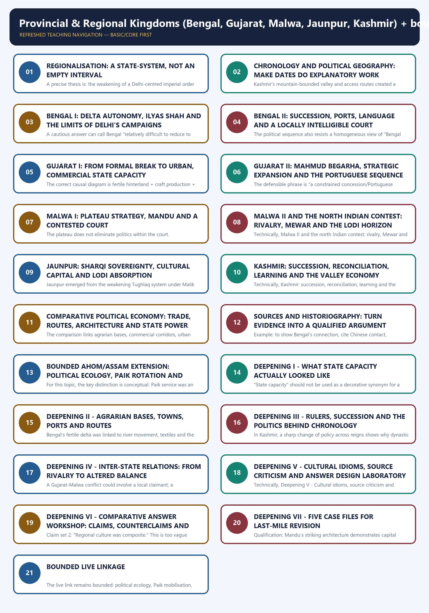

*Distinct embedded teaching-navigation image. The separate continuous Cārvāka-style flowchart package remains an independent at-a-glance artifact.*

#### Package scope, provenance and honest limits

- This repaired package contains 21 Guided-Tutor sections, 12 original learning MCQs, 3 honestly routed PYQ demands, 32 original broad MCQs, 12 remedial MCQs and 6 original solved Mains answers.
- The main learning session preserves the topic cover and all **22 instructional visuals** (`01`-`22`), i.e. **23 topic images including the cover**. Every path is repository-relative.
- The local source chapter is used for the regional-state system, Bengal, Gujarat, Malwa, Jaunpur and Kashmir. Its observations are not converted into unqualified social generalisations. Where a source supplies a courtly anecdote, it is treated as evidence of a legitimacy claim, not as a statistical fact.
- UNESCO's live property page was rechecked for Charaideo: it confirms the Tai-Ahom royal necropolis, 90 moidams and the thirteenth-to-nineteenth-century time span. This History package deliberately stops at state formation, Paik rotation, Buranjis and Charaideo/Moidams as a source anchor. Detailed funerary form, cosmology, criteria interpretation and conservation belong to Art & Culture.
- The three PYQs are **routed demands**, not reconstructed question papers. The repository does not hold a readable official key for them. Any answer route is prominently labelled as an inference rather than an official answer.

#### Roadmap and retrieval strategy

| Move | Question to answer | Evidence to deploy | UPSC output |
|---|---|---|---|
| Frame | Why did regional polities endure? | Delhi's contraction + local resources | regionalisation, not vacuum |
| Map | What did each political geography enable? | delta, port-hinterland, plateau, valley | comparative paragraph |
| Sequence | Which ruler belongs to which transition? | Ilyas, Ahmad, Begarha, Sharqis, Zainul | chronology-safe Prelims answer |
| Explain | How did capacity work? | revenue routes, towns, nobles, service | causal Mains analysis |
| Qualify | What cannot be inferred? | court texts, monuments, traveller accounts | source-critical conclusion |
| Extend | What does Ahom add without drifting? | Paik, Buranjis, Charaideo | bounded comparative note |

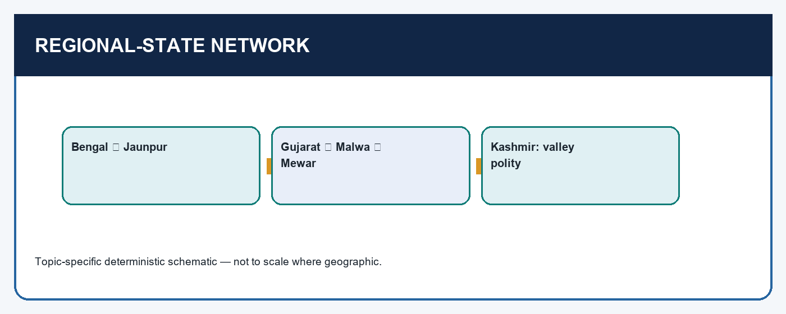

*Visual first: read the fifteenth century as several connected political arenas rather than a blank between the Tughlaqs and the Mughals.*

### SESSION 1 — REGIONALISATION: A STATE-SYSTEM, NOT AN EMPTY INTERVAL

#### DEFINITION / WHAT THIS IS CALLED

**Plain-language definition:** Regionalisation means that political authority was reassembled at several scales.

**Technical definition:** A precise thesis is: the weakening of a Delhi-centred imperial order created a competitive regional state-system whose durability rested on differentiated political geographies and institutions.

#### ANSWER-GRABBING OPENING — WRITE/ADAPT IN THE EXAM

> A precise thesis is: the weakening of a Delhi-centred imperial order created a competitive regional state-system whose durability rested on differentiated political geographies and institutions.

#### MUST-WRITE KEYWORDS

- **Regionalisation**
- **a state-system**
- **not an empty interval**
- **Bengal**
- **Gujarat**
- **Malwa**

**How to use them:** Frame the answer through Regionalisation; define a state-system, connect not an empty interval with Bengal to explain the mechanism, and use Gujarat for the decisive comparison or qualification.

[FACT] Timur's 1398 invasion accelerated a crisis already visible in the late Tughlaq order. Bengal had already broken away; after the invasion, Gujarat, Malwa and Jaunpur were governed as independent kingdoms, while Rajput polities also asserted greater autonomy. Satish Chandra's key corrective is that warfare did not dissolve India into unrelated fragments. A patterned balance developed: Gujarat, Malwa and Mewar checked one another in the west; Bengal was checked by Orissa and Jaunpur in the east; the Lodis and Sharqis competed for the upper Ganga-Yamuna zone; Kashmir remained a distinct valley polity.

[ANALYSIS] **Regionalisation** means that political authority was reassembled at several scales. Delhi's weaker ability to discipline governors was a condition, not a complete explanation. A regional court needed a territory that could be provisioned, a coalition of nobles and local elites, ways to raise and protect revenue, military access to strategic corridors, and a language of legitimacy. The same era can therefore contain warfare, stable capitals, commercial expansion, literary patronage and architectural experimentation. These are not contradictory facts.

For a Mains introduction, avoid both extremes. "The Sultanate collapsed" is too flat because it erases the capacities of new courts. "Every province became fully sovereign" is equally careless because frontiers were fought over, rulers depended on elite bargains, and the Lodis later rebuilt a large northern domain. A precise thesis is: *the weakening of a Delhi-centred imperial order created a competitive regional state-system whose durability rested on differentiated political geographies and institutions*.

[LIMIT] "Balance of power" is an analytical description of recurring checks, not a treaty among equal modern nation-states. Gujarat and Malwa could be rivals without fixed borders; Bengal and Jaunpur could communicate, fight or shelter exiles without becoming a single bloc. Use the term to explain why no single court easily absorbed the others before the late fifteenth-century shifts.

#### CLOSING RECALL FLOW — REGIONALISATION: A STATE-SYSTEM, NOT AN EMPTY INTERVAL

```text
START / CONCEPT: Regionalisation: a state-system, not an empty interval
        |
        v
EXACT TERMS: Regionalisation · a state-system · not an empty interval · Bengal · Gujarat · Malwa
        |
        v
MECHANISM / ARGUMENT: A patterned balance developed: Gujarat, Malwa and Mewar checked one another in the west; Bengal was checked by Orissa and Jaunpur in the east; the Lodis and Sharqis competed for the upper Ganga-Yamuna zone; Kashmir remained a distinct valley polity.
        |
        v
CONSEQUENCE / CONTRAST: Bengal had already broken away; after the invasion, Gujarat, Malwa and Jaunpur were governed as independent kingdoms, while Rajput polities also asserted greater autonomy.
        |
        v
UPSC TRAP / ANSWER-USE: Satish Chandra's key corrective is that warfare did not dissolve India into unrelated fragments.
        |
        v
ANSWER-GRABBING FORMULATION: A precise thesis is: the weakening of a Delhi-centred imperial order created a competitive regional state-system whose durability rested on differentiated political geographies and institutions.
```
### SESSION 2 — CHRONOLOGY AND POLITICAL GEOGRAPHY: MAKE DATES DO EXPLANATORY WORK

#### DEFINITION / WHAT THIS IS CALLED

**Plain-language definition:** Gujarat's 1407 formal break does not mean that the political work was finished: Ahmad Shah I's rule is the stronger marker for control over nobles, administration and a new capital.

**Technical definition:** Kashmir's mountain-bounded valley and access routes created a separate political setting.

#### ANSWER-GRABBING OPENING — WRITE/ADAPT IN THE EXAM

> Gujarat's 1407 formal break does not mean that the political work was finished: Ahmad Shah I's rule is the stronger marker for control over nobles, administration and a new capital.

#### MUST-WRITE KEYWORDS

- **Chronology**
- **political geography**
- **make dates do explanatory work**
- **Ghiyasuddin Azam Shah ruled Bengal**
- **joins courtly justice, China contacts and overseas connection**
- **1389-1409**

**How to use them:** Frame the answer through Chronology; define political geography, connect make dates do explanatory work with Ghiyasuddin Azam Shah ruled Bengal to explain the mechanism, and use joins courtly justice, China contacts and overseas connection for the decisive comparison or qualification.

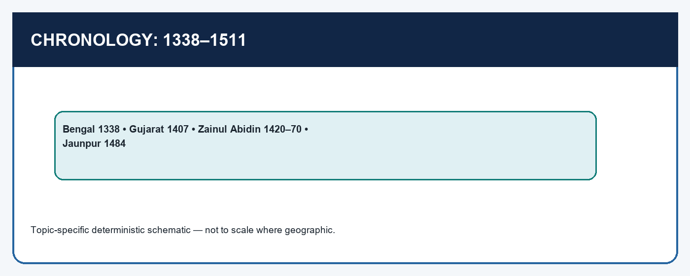

*Visual first: use dates as anchors for transitions; then attach a place, ruler, institution and consequence.*


| Anchor | What changed | Why the date is useful |
|---|---|---|
| 1338 / 1342 | Bengal reasserted independence; Ilyas Khan captured Lakhnauti and Sonargaon | separates Bengal's autonomy from the later 1398 shock |
| 1389-1409 | Ghiyasuddin Azam Shah ruled Bengal | joins courtly justice, China contacts and overseas connection |
| 1407 / 1411-42 | Muzaffar Shah's formal independence; Ahmad Shah I's consolidation | separates proclamation from state-building |
| 1420-70 | Zainul Abidin ruled Kashmir | prevents confusion with Sikandar Shah's earlier coercive measures |
| 1459-1511 | Mahmud Begarha's long Gujarat reign | attaches Girnar, Champaner, routes and Portuguese pressure |
| 1484 | Bahlul Lodi annexed Jaunpur | marks a break in the earlier eastern balance |

[ANALYSIS] Chronology becomes useful only when it prevents a causal error. Bengal's 1338-42 consolidation precedes Timur; it cannot be explained solely as a post-1398 event. Gujarat's 1407 formal break does not mean that the political work was finished: Ahmad Shah I's rule is the stronger marker for control over nobles, administration and a new capital. Mahmud Begarha's resistance to Portuguese pressure must not be merged with Bahadur Shah's later, constrained Bassein-Diu situation under pressure from Humayun. Similarly, Zainul Abidin's policies should be contrasted with, not projected backwards onto, Sikandar Shah's reign.

Political geography gives these dates their operating environment. The Bengal delta raised the logistical cost of north-western military projection while supplying riverine routes. Gujarat joined a fertile and productive interior to west-coast ports. Malwa's plateau commanded routes across north, west and south India. Jaunpur's location made it a Ganga-valley competitor for Delhi. Kashmir's mountain-bounded valley and access routes created a separate political setting. A good map answer names direction and corridor: Bengal-east/delta; Gujarat-west/coast; Malwa-central plateau; Jaunpur-eastern Uttar Pradesh/Ganga plain; Kashmir-north-western valley; Ahom polity-Brahmaputra valley.

#### CLOSING RECALL FLOW — CHRONOLOGY AND POLITICAL GEOGRAPHY: MAKE DATES DO EXPLANATORY WORK

```text
START / CONCEPT: Chronology and political geography: make dates do explanatory work
        |
        v
EXACT TERMS: Chronology · political geography · make dates do explanatory work · Ghiyasuddin Azam Shah ruled Bengal · joins courtly justice, China contacts and overseas connection · 1389-1409
        |
        v
MECHANISM / ARGUMENT: Kashmir's mountain-bounded valley and access routes created a separate political setting.
        |
        v
CONSEQUENCE / CONTRAST: Mahmud Begarha's resistance to Portuguese pressure must not be merged with Bahadur Shah's later, constrained Bassein-Diu situation under pressure from Humayun.
        |
        v
UPSC TRAP / ANSWER-USE: Similarly, Zainul Abidin's policies should be contrasted with, not projected backwards onto, Sikandar Shah's reign.
        |
        v
ANSWER-GRABBING FORMULATION: Gujarat's 1407 formal break does not mean that the political work was finished: Ahmad Shah I's rule is the stronger marker for control over nobles, administration and a new capital.
```
### SESSION 3 — BENGAL I: DELTA AUTONOMY, ILYAS SHAH AND THE LIMITS OF DELHI'S CAMPAIGNS

#### DEFINITION / WHAT THIS IS CALLED

**Plain-language definition:** The story of campaigns is narrated by elite sources and conveys ruler-centred politics.

**Technical definition:** A cautious answer can call Bengal "relatively difficult to reduce to Delhi's authority," not inherently unconquerable.

#### ANSWER-GRABBING OPENING — WRITE/ADAPT IN THE EXAM

> Thus the causal chain is: delta ecology - costly external projection plus internal mobility - room for dynastic organisation - durable autonomy.

#### MUST-WRITE KEYWORDS

- **Bengal I**
- **delta autonomy**
- **Ilyas Shah**
- **the limits of Delhi's campaigns**
- **The military narrative**
- **Ilyas**

**How to use them:** Frame the answer through Bengal I; define delta autonomy, connect Ilyas Shah with the limits of Delhi's campaigns to explain the mechanism, and use The military narrative for the decisive comparison or qualification.

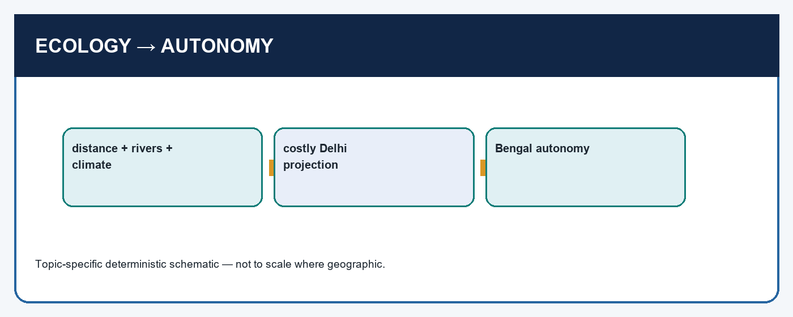

*Visual first: distance, water-based communications and climate shaped the costs of coercion, but a dynasty still had to organise power.*


[FACT] Bengal repeatedly asserted independence from Delhi. The local chapter attributes its resilience partly to distance, difficult land and water communications, and a hot, humid climate unfamiliar to many troops from the north-west. In 1338 Bengal again broke away during Muhammad bin Tughlaq's troubled reign. In 1342 Ilyas Khan captured Lakhnauti and Sonargaon and ruled as Sultan Shamsuddin Ilyas Shah. The source associates his expansion with territories from Tirhut through Champaran and Gorakhpur towards Banaras, which compelled Firuz Tughlaq to campaign.

The military narrative is important because it rebuts a crude geography-only answer. Firuz captured the Bengali capital, but Ilyas withdrew to the stronghold of Ekdala. The campaign did not translate into permanent subordination. A treaty fixed the Kosi in Bihar as a boundary. Ilyas exchanged gifts with Firuz, yet the source explicitly says that he was not subordinate. When Sikandar, Ilyas's son, followed a comparable strategy at Ekdala during a second Firuz campaign, Delhi again failed to secure lasting control. In one form or another the Ilyas Shahi line endured for more than a century.

[ANALYSIS] Rivers were not merely barriers. They lowered some overland military advantages, but they also moved people, grain and goods within the delta. The same environment that made an invading army's supply and movement expensive could support a court capable of provisioning itself and linking agrarian areas to markets. Thus the causal chain is: **delta ecology -> costly external projection plus internal mobility -> room for dynastic organisation -> durable autonomy**. Removing the dynastic and fiscal middle steps turns an explanation into environmental determinism.

[LIMIT] The story of campaigns is narrated by elite sources and conveys ruler-centred politics. It cannot by itself measure peasant welfare or the exact scale of revenue. A cautious answer can call Bengal "relatively difficult to reduce to Delhi's authority," not inherently unconquerable. It should also remember that Bengal was connected to Kamrup, Orissa, Chittagong and wider circuits rather than isolated behind rivers.

#### CLOSING RECALL FLOW — BENGAL I: DELTA AUTONOMY, ILYAS SHAH AND THE LIMITS OF DELHI'S CAMPAIGNS

```text
START / CONCEPT: Bengal I: delta autonomy, Ilyas Shah and the limits of Delhi's campaigns
        |
        v
EXACT TERMS: Bengal I · delta autonomy · Ilyas Shah · the limits of Delhi's campaigns · The military narrative · Ilyas
        |
        v
MECHANISM / ARGUMENT: The story of campaigns is narrated by elite sources and conveys ruler-centred politics.
        |
        v
CONSEQUENCE / CONTRAST: A cautious answer can call Bengal "relatively difficult to reduce to Delhi's authority," not inherently unconquerable.
        |
        v
UPSC TRAP / ANSWER-USE: Ilyas exchanged gifts with Firuz, yet the source explicitly says that he was not subordinate.
        |
        v
ANSWER-GRABBING FORMULATION: Thus the causal chain is: delta ecology - costly external projection plus internal mobility - room for dynastic organisation - durable autonomy.
```
### SESSION 4 — BENGAL II: SUCCESSION, PORTS, LANGUAGE AND A LOCALLY INTELLIGIBLE COURT

#### DEFINITION / WHAT THIS IS CALLED

**Plain-language definition:** The point is not that the court ceased to be Persianate, but that local language, materials and elite alliances helped make sovereignty regionally intelligible.

**Technical definition:** The political sequence also resists a homogeneous view of "Bengal Sultanate." Raja Ganesh's intervention, Jaunpur's short-lived expedition, and the unsettled succession show that regional autonomy did not end elite contestation.

#### ANSWER-GRABBING OPENING — WRITE/ADAPT IN THE EXAM

> The point is not that the court ceased to be Persianate, but that local language, materials and elite alliances helped make sovereignty regionally intelligible.

#### MUST-WRITE KEYWORDS

- **Bengal II**
- **succession**
- **ports**
- **language**
- **a locally intelligible court**
- **1389-1409**

**How to use them:** Frame the answer through Bengal II; define succession, connect ports with language to explain the mechanism, and use a locally intelligible court for the decisive comparison or qualification.

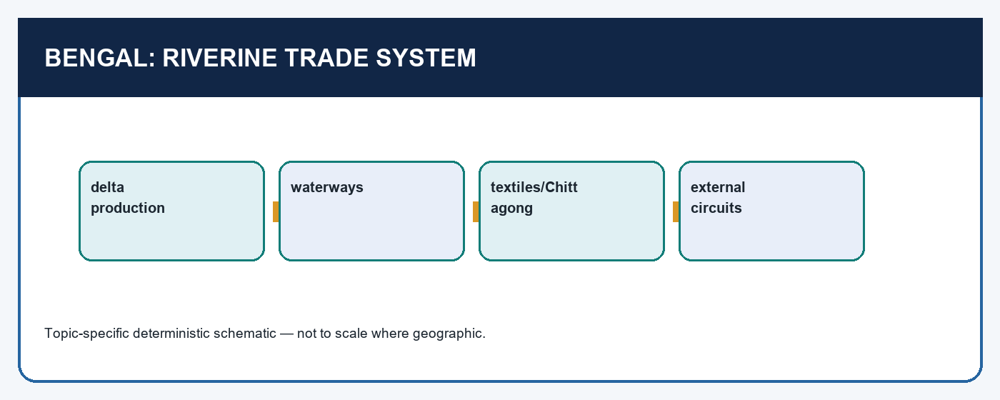

*Visual first: production, waterways, towns and Chittagong connect autonomy to exchange rather than treating the delta as a closed refuge.*


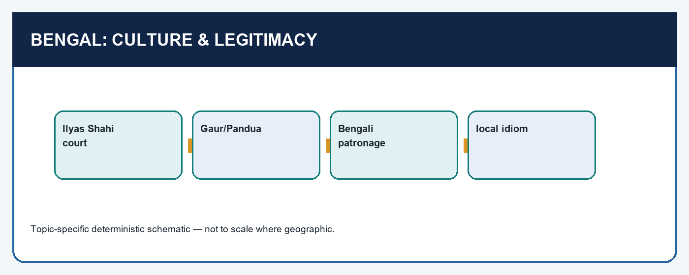

*Visual first: material adaptation and patronage made a Persianate court legible in a Bengali setting.*


[FACT] Ghiyasuddin Azam Shah (1389-1409) is remembered in the chapter for a justice anecdote, contacts with Hafiz of Shiraz and renewed relations with China. The justice tale should be used carefully: it is a courtly story about the ruler appearing before a qazi, so it demonstrates a claim about justice rather than proving an impartial legal system for all subjects. The Chinese connection is more structurally useful. An envoy was received in 1409; subsequent contact supported Bengal's overseas trade. Chittagong became a flourishing port, Bengal built ocean-going ships, exported fine textiles and re-exported Chinese goods. Ma Huan's account is a traveller-interpreter's perspective and should be cross-checked, but it is meaningful evidence for commercial and cultural contact.

The political sequence also resists a homogeneous view of "Bengal Sultanate." Raja Ganesh's intervention, Jaunpur's short-lived expedition, and the unsettled succession show that regional autonomy did not end elite contestation. Alauddin Hussain Shah (1493-1519) founded a new line after that instability. The source credits his reign with order and liberal recruitment: Hindu officers served as wazir, physician, bodyguard chief and mint master; Rupa and Sanatan held high positions. This is evidence of political incorporation, not a licence to assert universal equality or the absence of conflict. His campaigns towards Assam, Orissa, Chittagong and Arakan also show that an autonomous Bengal could be expansionist.

Architecture and literature carried the same regional message. At Gaur and Pandua, brick and mortar, broad sloping arches, curvilinear roof forms and decorative motifs yielded a mature idiom distinct from Delhi. The Adina Mosque and Dakhil Darwaza are material evidence for patronage, labour and adaptation; temple spolia at Adina also cautions against a celebratory "synthesis" formula. Bengali literary patronage included Maladhar Basu, honoured as Gunaraja Khan, and later writers under Hussain Shah. The point is not that the court ceased to be Persianate, but that local language, materials and elite alliances helped make sovereignty regionally intelligible.

[ANALYSIS] Bengal's political economy is best written as a circuit: agrarian delta and craft production supplied goods; waterways linked interior and coast; Chittagong linked the coast to overseas exchange; the court used order, patronage and office to secure its position. A port alone cannot explain the circuit, nor can agriculture alone.

#### CLOSING RECALL FLOW — BENGAL II: SUCCESSION, PORTS, LANGUAGE AND A LOCALLY INTELLIGIBLE COURT

```text
START / CONCEPT: Bengal II: succession, ports, language and a locally intelligible court
        |
        v
EXACT TERMS: Bengal II · succession · ports · language · a locally intelligible court · 1389-1409
        |
        v
MECHANISM / ARGUMENT: The political sequence also resists a homogeneous view of "Bengal Sultanate." Raja Ganesh's intervention, Jaunpur's short-lived expedition, and the unsettled succession show that regional autonomy did not end elite contestation.
        |
        v
CONSEQUENCE / CONTRAST: Ma Huan's account is a traveller-interpreter's perspective and should be cross-checked, but it is meaningful evidence for commercial and cultural contact.
        |
        v
UPSC TRAP / ANSWER-USE: This is evidence of political incorporation, not a licence to assert universal equality or the absence of conflict.
        |
        v
ANSWER-GRABBING FORMULATION: The point is not that the court ceased to be Persianate, but that local language, materials and elite alliances helped make sovereignty regionally intelligible.
```
### SESSION 5 — GUJARAT I: FROM FORMAL BREAK TO URBAN, COMMERCIAL STATE CAPACITY

#### DEFINITION / WHAT THIS IS CALLED

**Plain-language definition:** Gujarat I: from formal break to urban, commercial state capacity comprises Gujarat I, from formal break to urban and commercial state capacity as its core connected dimensions.

**Technical definition:** The correct causal diagram is fertile hinterland + craft production + urban concentration + secure routes and ports + courtly protection - fiscal and military resources.

#### ANSWER-GRABBING OPENING — WRITE/ADAPT IN THE EXAM

> State capacity was therefore territorial and commercial.

#### MUST-WRITE KEYWORDS

- **Gujarat I**
- **from formal break to urban**
- **commercial state capacity**
- **A capital**
- **Gujarat**
- **1411-42**

**How to use them:** Frame the answer through Gujarat I; define from formal break to urban, connect commercial state capacity with A capital to explain the mechanism, and use Gujarat for the decisive comparison or qualification.

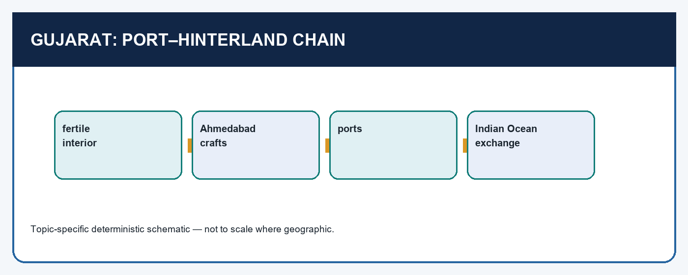

*Visual first: ports require a productive interior, artisans, towns, merchants, security and a court; they are not self-explanatory wealth.*


[FACT] Gujarat formally proclaimed independence in 1407 under Zafar Khan/Muzaffar Shah, but the chapter calls Ahmad Shah I (1411-42) its real founder in the practical sense. He brought the nobility under control, settled the administration, expanded and consolidated the kingdom, moved the capital from Patan to Ahmedabad, and laid the latter's foundation in 1413. A capital is not merely a date to memorise. Ahmedabad's palaces, bazaars, mosques and madrasas indicate an urban concentration of court, market, learning and craft.

Gujarat was a rich prize because fertile land, excellent handicrafts and flourishing sea-ports connected much of north India's sea trade to an inland productive base. Malwa and Rajasthan were transit zones between the Ganga valley and Gujarat's ports. This network explains why the west Indian contest involved more than coastlines. A ruler needed to protect caravans and routes, negotiate with merchants and local rulers, discipline nobles, and maintain access to the hinterland. State capacity was therefore territorial **and** commercial.

The distinctive architecture of Ahmad Shah's Gujarat is a good example of local resource and skill. The chapter says that he drew on Jain building traditions to create a style unlike Delhi: slender turrets, exquisite stone carving and ornate brackets. Ahmedabad's Jama Masjid and Tin Darwaza can be used as named examples. Yet the same source records campaigns against Hindu polities, temple destruction in particular campaigns and recruitment of Hindus to government. The analytical lesson is not a one-word verdict of "tolerance" or "intolerance." It is that state-building used varied, sometimes contradictory, instruments-warfare, revenue demands, urban patronage and administrative recruitment.

[ANALYSIS] The correct causal diagram is **fertile hinterland + craft production + urban concentration + secure routes and ports + courtly protection -> fiscal and military resources**. It also explains vulnerability: valuable coasts and routes attracted maritime competitors, while interior conflicts could alter a ruler's choices at the shore.

#### CLOSING RECALL FLOW — GUJARAT I: FROM FORMAL BREAK TO URBAN, COMMERCIAL STATE CAPACITY

```text
START / CONCEPT: Gujarat I: from formal break to urban, commercial state capacity
        |
        v
EXACT TERMS: Gujarat I · from formal break to urban · commercial state capacity · A capital · Gujarat · 1411-42
        |
        v
MECHANISM / ARGUMENT: Gujarat was a rich prize because fertile land, excellent handicrafts and flourishing sea-ports connected much of north India's sea trade to an inland productive base.
        |
        v
CONSEQUENCE / CONTRAST: The analytical lesson is not a one-word verdict of "tolerance" or "intolerance." It is that state-building used varied, sometimes contradictory, instruments-warfare, revenue demands, urban patronage and administrative recruitment.
        |
        v
UPSC TRAP / ANSWER-USE: Do not miss this limiting distinction: the chapter says that he drew on Jain building traditions to create a style...
        |
        v
ANSWER-GRABBING FORMULATION: State capacity was therefore territorial and commercial.
```
### SESSION 6 — GUJARAT II: MAHMUD BEGARHA, STRATEGIC EXPANSION AND THE PORTUGUESE SEQUENCE

#### DEFINITION / WHAT THIS IS CALLED

**Plain-language definition:** His two defining strategic associations are Girnar in Saurashtra and Champaner in south Gujarat.

**Technical definition:** The defensible phrase is "a constrained concession/Portuguese position at Bassein and Diu under Bahadur Shah"; do not exaggerate treaty clauses where the local source record is unavailable.

#### ANSWER-GRABBING OPENING — WRITE/ADAPT IN THE EXAM

> His two defining strategic associations are Girnar in Saurashtra and Champaner in south Gujarat.

#### MUST-WRITE KEYWORDS

- **Gujarat II**
- **Mahmud Begarha**
- **strategic expansion**
- **the Portuguese sequence**
- **Bahadur Shah**
- **His two defining strategic associations**

**How to use them:** Frame the answer through Gujarat II; define Mahmud Begarha, connect strategic expansion with the Portuguese sequence to explain the mechanism, and use Bahadur Shah for the decisive comparison or qualification.

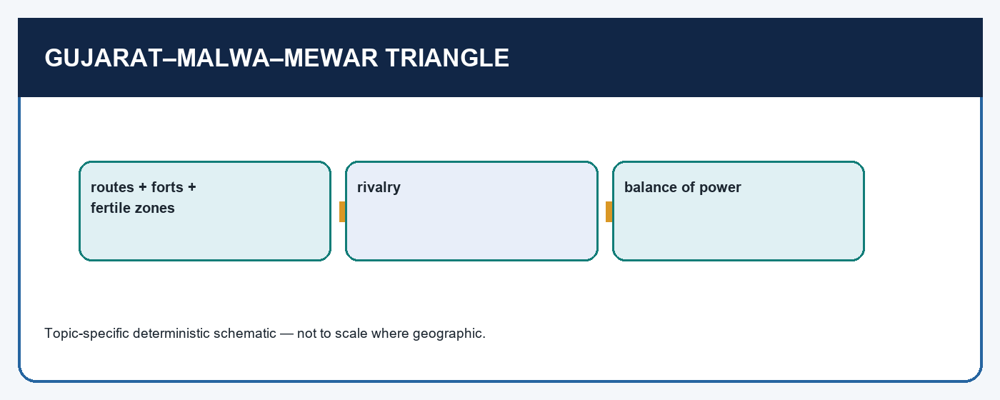

*Visual first: western rivalry was organised around corridors, forts and border states, not a simple religious binary.*


[FACT] Mahmud Begarha ruled Gujarat from 1459 to 1511. His two defining strategic associations are Girnar in Saurashtra and Champaner in south Gujarat. Saurashtra was fertile, contained flourishing ports, and suffered from piracy and robbery that affected shipping. The source presents Girnar as useful both to administer Saurashtra and as a base relevant to Sindh. At its foot Begarha developed Mustafabad. Champaner was strategically valuable for designs on Khandesh and Malwa; the ruler built Muhammadabad nearby and made it an important residence. The fine stonework of Champaner's Jama Masjid is a material indicator of skilled craft, not proof that the city was politically unimportant.

The long reign also made commercial order a state question. The source records caravanserais and inns, safe roads and contented merchants. These are not numerical measures of economic growth, but they identify a plausible institutional mechanism: secure movement lowers transaction risks and lets a court draw benefit from trade. Begarha's conflict with Portuguese interference in Gujarat's West Asian trade must be placed beside this concern with routes. He allied with the ruler of Egypt against Portuguese naval power but did not succeed in checking it decisively.

[ANALYSIS] A frequent UPSC trap compresses two rulers into one. **Mahmud Begarha** belongs to the earlier resistance to Portuguese intrusion. **Bahadur Shah** belongs to the later Bassein-Diu context, when pressure from Humayun interacted with maritime coercion. The defensible phrase is "a constrained concession/Portuguese position at Bassein and Diu under Bahadur Shah"; do not exaggerate treaty clauses where the local source record is unavailable. The explanation must be two-sided: coastward pressure mattered, but inland Mughal threat affected the choice.

The Gujarat-Malwa-Mewar triangle adds another qualification. Rival courts supported factions, contested border states and sought influence without repeatedly remaking stable frontiers. The result was a check on concentration of power, yet it could also drain resources and invite outside intervention. Thus trade gave Gujarat resources and exposure; strategy was never reducible to either "wealth" or "religion."

#### CLOSING RECALL FLOW — GUJARAT II: MAHMUD BEGARHA, STRATEGIC EXPANSION AND THE PORTUGUESE SEQUENCE

```text
START / CONCEPT: Gujarat II: Mahmud Begarha, strategic expansion and the Portuguese sequence
        |
        v
EXACT TERMS: Gujarat II · Mahmud Begarha · strategic expansion · the Portuguese sequence · Bahadur Shah · His two defining strategic associations
        |
        v
MECHANISM / ARGUMENT: These are not numerical measures of economic growth, but they identify a plausible institutional mechanism: secure movement lowers transaction risks and lets a court draw benefit from trade.
        |
        v
CONSEQUENCE / CONTRAST: The defensible phrase is "a constrained concession/Portuguese position at Bassein and Diu under Bahadur Shah"; do not exaggerate treaty clauses where the local source record is unavailable.
        |
        v
UPSC TRAP / ANSWER-USE: Thus trade gave Gujarat resources and exposure; strategy was never reducible to either "wealth" or "religion.".
        |
        v
ANSWER-GRABBING FORMULATION: His two defining strategic associations are Girnar in Saurashtra and Champaner in south Gujarat.
```
### SESSION 7 — MALWA I: PLATEAU STRATEGY, MANDU AND A CONTESTED COURT

#### DEFINITION / WHAT THIS IS CALLED

**Plain-language definition:** The best Mains comparison pairs Mandu's plateau and routes with Gujarat's port-hinterland: both are political geographies, yet one derives leverage from corridor control and the other from commercial articulation.

**Technical definition:** The plateau does not eliminate politics within the court.

#### ANSWER-GRABBING OPENING — WRITE/ADAPT IN THE EXAM

> The best Mains comparison pairs Mandu's plateau and routes with Gujarat's port-hinterland: both are political geographies, yet one derives leverage from corridor control and the other from commercial articulation.

#### MUST-WRITE KEYWORDS

- **Malwa I**
- **plateau strategy**
- **Mandu**
- **a contested court**
- **not**
- **Mandu's plateau and routes**

**How to use them:** Frame the answer through Malwa I; define plateau strategy, connect Mandu with a contested court to explain the mechanism, and use not for the decisive comparison or qualification.

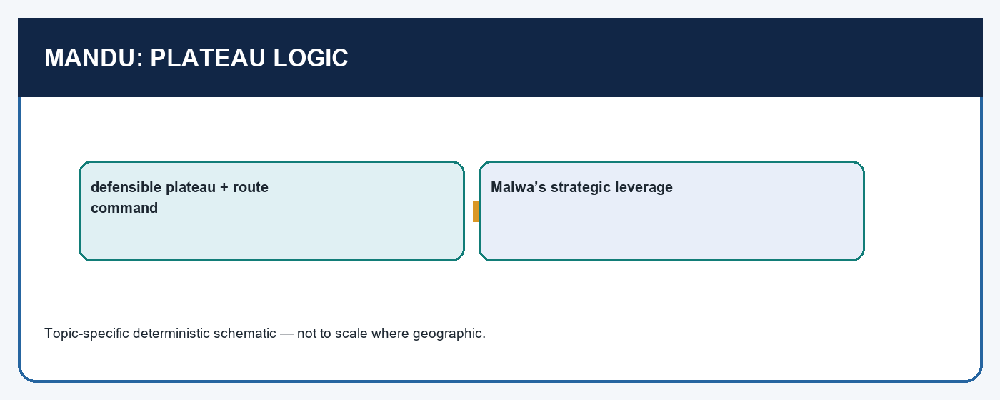

*Visual first: Malwa's plateau made routes and approaches contestable; architecture must be read alongside this geography.*


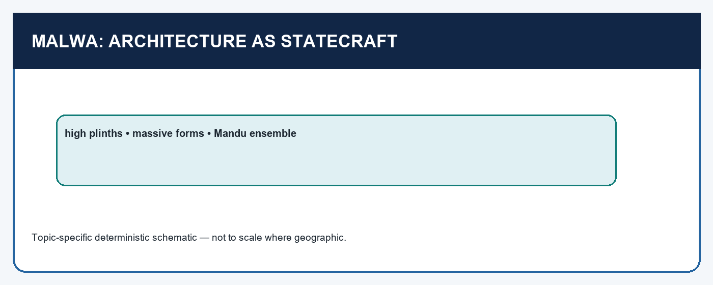

*Visual first: material mass, high plinths and glazed tiles are evidence of patronage situated within a defensible capital.*


[FACT] Malwa lay on the high plateau between the Narmada and Tapti rivers. It commanded trunk routes between Gujarat and northern India as well as routes between north and south India. A strong Malwa could block the ambitions of Gujarat, Mewar, the Bahmani sultans and the Lodis. Its capital shifted from Dhar to Mandu, a defensible place of natural beauty. Mandu's large buildings use a massive idiom heightened by lofty plinths and coloured or glazed tiles; the Jama Masjid, Hindola Mahal and Jahaz Mahal are named examples.

The plateau does not eliminate politics within the court. The chapter repeatedly notes succession conflict and factional struggle among nobles. Hushang Shah, successor to Dilawar Khan, is associated with a broad policy of toleration, grants to Rajputs and patronage of Jains who were important merchants and bankers; Nardeva Soni, a merchant, appears as treasurer and adviser. This gives a concrete political-economy link: commercial groups were not external to state-building. It does **not** allow an answer to convert a reign into a timeless picture of harmony.

Mahmud Khalji (1436-69), regarded by the source as Malwa's most powerful ruler, fought Gujarat, Gondwana, Orissa, the Bahmanis, Delhi and regional Hindu rulers, while much of his energy went into south Rajputana and Mewar. The source cautions that temple destruction in particular wartime struggles should not automatically be treated as a settled general policy. This is a model source-critical point: use specific evidence, identify its context, and refuse both apology and over-generalisation.

[ANALYSIS] Malwa's "strategic hinge" position explains why many powers wanted influence there, but it also made factionalism consequential. A rival who gained a local ally could alter access to routes and fortifications. The best Mains comparison pairs **Mandu's plateau and routes** with **Gujarat's port-hinterland**: both are political geographies, yet one derives leverage from corridor control and the other from commercial articulation.

#### CLOSING RECALL FLOW — MALWA I: PLATEAU STRATEGY, MANDU AND A CONTESTED COURT

```text
START / CONCEPT: Malwa I: plateau strategy, Mandu and a contested court
        |
        v
EXACT TERMS: Malwa I · plateau strategy · Mandu · a contested court · not · Mandu's plateau and routes
        |
        v
MECHANISM / ARGUMENT: Mandu's large buildings use a massive idiom heightened by lofty plinths and coloured or glazed tiles; the Jama Masjid, Hindola Mahal and Jahaz Mahal are named examples.
        |
        v
CONSEQUENCE / CONTRAST: The plateau does not eliminate politics within the court.
        |
        v
UPSC TRAP / ANSWER-USE: This gives a concrete political-economy link: commercial groups were not external to state-building.
        |
        v
ANSWER-GRABBING FORMULATION: The best Mains comparison pairs Mandu's plateau and routes with Gujarat's port-hinterland: both are political geographies, yet one derives leverage from corridor control and the other from commercial articulation.
```
### SESSION 8 — MALWA II AND THE NORTH INDIAN CONTEST: RIVALRY, MEWAR AND THE LODI HORIZON

#### DEFINITION / WHAT THIS IS CALLED

**Plain-language definition:** Map knowledge matters: Chanderi, Malwa, Rajasthan, Agra and the routes to Gujarat are not decorative place names; together they explain why an internal Malwa dispute could become an issue for Mewar and Delhi.

**Technical definition:** Technically, Malwa II and the north Indian contest: rivalry, Mewar and the Lodi horizon is analysed by relating Malwa II to the north Indian contest, then testing the relationship through rivalry and Mewar.

#### ANSWER-GRABBING OPENING — WRITE/ADAPT IN THE EXAM

> Map knowledge matters: Chanderi, Malwa, Rajasthan, Agra and the routes to Gujarat are not decorative place names; together they explain why an internal Malwa dispute could become an issue for Mewar and Delhi.

#### MUST-WRITE KEYWORDS

- **Malwa II**
- **the north Indian contest**
- **rivalry**
- **Mewar**
- **the Lodi horizon**
- **Gujarat**

**How to use them:** Frame the answer through Malwa II; define the north Indian contest, connect rivalry with Mewar to explain the mechanism, and use the Lodi horizon for the decisive comparison or qualification.

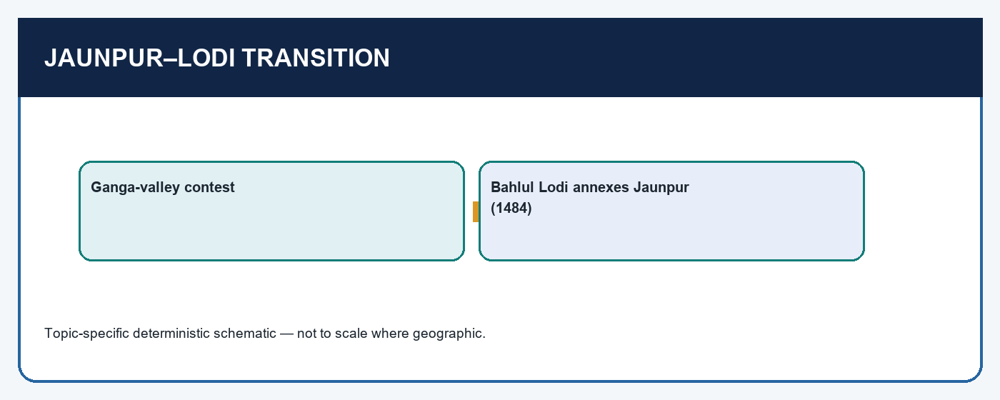

*Visual first: 1484 ended Sharqi sovereignty but not the regional cultures and rivalries inherited by the Lodis and later Mughals.*


[FACT] Gujarat and Malwa were persistent rivals. Muzaffar Shah had defeated and imprisoned Hushang Shah but later restored him, an outcome that did not remove Malwa's apprehension of Gujarat. The two courts supported disaffected nobles, local rulers and rival claimants in one another's political field. Such interventions often changed alignments more than frontiers. Mewar's rise under Rana Kumbha added a third force: Kumbha consolidated internally, extended influence over several Rajputana locations and clashed with both Gujarat and Malwa.

The early sixteenth-century breakdown makes the comparison dynamic rather than static. Mahmud II of Malwa fell out with Medini Rai, whose support had helped him. Mahmud sought Gujarat's help; Medini Rai sought Rana Sanga's. In 1519 Rana Sanga defeated Mahmud II and held him prisoner before release; eastern Malwa, including Chanderi, passed under Sanga's over-lordship. The Lodis, who had interests in Malwa and Chanderi, were alarmed. Ibrahim Lodi's conflict with Rana Sanga and the latter's expanding influence towards the Agra region created a field in which Babur's arrival mattered.

[ANALYSIS] This sequence is the antidote to an "eternal three-cornered rivalry" formula. Regional politics changed because succession, noble factions and external patrons changed. Map knowledge matters: Chanderi, Malwa, Rajasthan, Agra and the routes to Gujarat are not decorative place names; together they explain why an internal Malwa dispute could become an issue for Mewar and Delhi. In a 20-marker, show movement from balance to altered balance, then connect it to the Lodi-Mughal transition.

[LIMIT] The source's ruler-centred narrative does not reveal every local group's calculation. Avoid declaring that one battle permanently settled central India. Better: the episode demonstrates how fragmented sovereignty could be reorganised by alliances, but also why it remained vulnerable to new imperial bids.

#### CLOSING RECALL FLOW — MALWA II AND THE NORTH INDIAN CONTEST: RIVALRY, MEWAR AND THE LODI HORIZON

```text
START / CONCEPT: Malwa II and the north Indian contest: rivalry, Mewar and the Lodi horizon
        |
        v
EXACT TERMS: Malwa II · the north Indian contest · rivalry · Mewar · the Lodi horizon · Gujarat
        |
        v
MECHANISM / ARGUMENT: Better: the episode demonstrates how fragmented sovereignty could be reorganised by alliances, but also why it remained vulnerable to new imperial bids.
        |
        v
CONSEQUENCE / CONTRAST: Muzaffar Shah had defeated and imprisoned Hushang Shah but later restored him, an outcome that did not remove Malwa's apprehension of Gujarat.
        |
        v
UPSC TRAP / ANSWER-USE: The source's ruler-centred narrative does not reveal every local group's calculation.
        |
        v
ANSWER-GRABBING FORMULATION: Map knowledge matters: Chanderi, Malwa, Rajasthan, Agra and the routes to Gujarat are not decorative place names; together they explain why an internal Malwa dispute could become an issue for Mewar and Delhi.
```
### SESSION 9 — JAUNPUR: SHARQI SOVEREIGNTY, CULTURAL CAPITAL AND LODI ABSORPTION

#### DEFINITION / WHAT THIS IS CALLED

**Plain-language definition:** Jaunpur also did work that is often obscured by the nickname.

**Technical definition:** Jaunpur emerged from the weakening Tughlaq system under Malik Sarwar, who held the title Malik-us-Sharq, "lord of the east." His successors were called the Sharqis.

#### ANSWER-GRABBING OPENING — WRITE/ADAPT IN THE EXAM

> This scale is useful not as a rigid border map but as a reminder that Jaunpur was a Ganga-valley power, not merely a cultural city.

#### MUST-WRITE KEYWORDS

- **Jaunpur**
- **Sharqi sovereignty**
- **cultural capital**
- **Lodi absorption**
- **Tughlaq**
- **Malik Sarwar**

**How to use them:** Frame the answer through Jaunpur; define Sharqi sovereignty, connect cultural capital with Lodi absorption to explain the mechanism, and use Tughlaq for the decisive comparison or qualification.

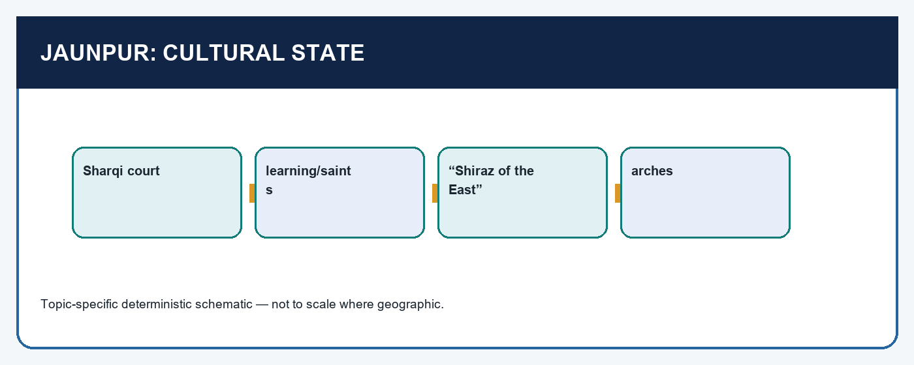

*Visual first: culture, saintly and scholarly networks, and Ganga-valley power worked together; none guaranteed permanent survival.*


[FACT] Jaunpur emerged from the weakening Tughlaq system under Malik Sarwar, who held the title Malik-us-Sharq, "lord of the east." His successors were called the Sharqis. At its height, the Sharqi kingdom extended from Aligarh in the west towards Darbhanga in north Bihar, from the Nepal boundary in the north towards Bundelkhand in the south. This scale is useful not as a rigid border map but as a reminder that Jaunpur was a Ganga-valley power, not merely a cultural city.

The Sharqis created their own architectural idiom, marked by lofty gates and huge arches. They patronised poets, scholars and saints; Jaunpur became known as the "Shiraz of the East." Malik Muhammad Jaisi's association with the city can be used as a literary marker. These facts establish cultural capital: a court could attract learned people and make a claim to independent prestige. They do not establish that all learning was state-controlled or that social hierarchy vanished.

Jaunpur also did work that is often obscured by the nickname. The Sharqis maintained order over a large tract after Delhi's collapse and checked Bengal's advance into eastern Uttar Pradesh. Yet their aspiration towards Delhi brought them into prolonged conflict. With the Lodi establishment at Delhi in the mid-fifteenth century, the Sharqis were pushed onto the defensive. Bahlul Lodi occupied Jaunpur and annexed the kingdom in 1484. Cultural prestige therefore needs a military and political qualifier: it could strengthen a court's legitimacy but could not, by itself, secure it against an expanding rival.

[ANALYSIS] Compare Jaunpur to Bengal carefully. Bengal's autonomy rested heavily on delta logistics and maritime-riverine connection; Jaunpur's leverage came from its Ganga-valley position, administrative reach and cultural networks. Both formed regional courts, but their resource bases were not interchangeable. This is what turns a list of capitals into a comparative answer.

#### CLOSING RECALL FLOW — JAUNPUR: SHARQI SOVEREIGNTY, CULTURAL CAPITAL AND LODI ABSORPTION

```text
START / CONCEPT: Jaunpur: Sharqi sovereignty, cultural capital and Lodi absorption
        |
        v
EXACT TERMS: Jaunpur · Sharqi sovereignty · cultural capital · Lodi absorption · Tughlaq · Malik Sarwar
        |
        v
MECHANISM / ARGUMENT: Jaunpur also did work that is often obscured by the nickname.
        |
        v
CONSEQUENCE / CONTRAST: Cultural prestige therefore needs a military and political qualifier: it could strengthen a court's legitimacy but could not, by itself, secure it against an expanding rival.
        |
        v
UPSC TRAP / ANSWER-USE: Do not miss this limiting distinction: jaunpur emerged from the weakening Tughlaq system under Malik Sarwar, who held the title...
        |
        v
ANSWER-GRABBING FORMULATION: This scale is useful not as a rigid border map but as a reminder that Jaunpur was a Ganga-valley power, not merely a cultural city.
```
### SESSION 10 — KASHMIR: SUCCESSION, RECONCILIATION, LEARNING AND THE VALLEY ECONOMY

#### DEFINITION / WHAT THIS IS CALLED

**Plain-language definition:** Kashmir: succession, reconciliation, learning and the valley economy comprises Kashmir, succession and reconciliation as its core connected dimensions.

**Technical definition:** Technically, Kashmir: succession, reconciliation, learning and the valley economy is analysed by relating Kashmir to succession, then testing the relationship through reconciliation and learning.

#### ANSWER-GRABBING OPENING — WRITE/ADAPT IN THE EXAM

> This evidence supports a strong but bounded claim: policy could be an instrument of reconciliation and legitimacy in a particular valley polity.

#### MUST-WRITE KEYWORDS

- **Kashmir**
- **succession**
- **reconciliation**
- **learning**
- **the valley economy**
- **1389-1413**

**How to use them:** Frame the answer through Kashmir; define succession, connect reconciliation with learning to explain the mechanism, and use the valley economy for the decisive comparison or qualification.

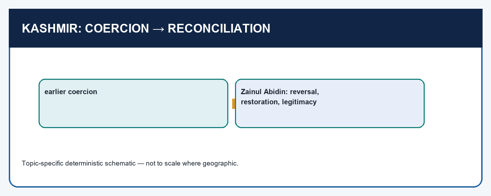

*Visual first: distinguish Sikandar Shah's coercive phase from Zainul Abidin's reversals; do not project either reign across all medieval India.*


[FACT] Kashmir's political context was distinct. A destructive Mongol attack in 1320 preceded the ending of the earlier Hindu rule, while Baramula offered an access route for saints and refugees from Central Asia. The Rishi tradition combined elements of Hinduism and Islam. The local chapter describes the persecution of brahmans and learned Hindus under Sikandar Shah (1389-1413), including orders associated in the narrative with his minister Suha Bhatt. It is a warning against claims that Islamisation or religious policy was uniform, peaceful or explained by one agent alone.

Zainul Abidin (1420-70), widely remembered as Bud Shah, cancelled the earlier coercive orders. The source records that he brought back non-Muslims who had fled, allowed choice in religious affiliation, restored libraries, grants and temples, abolished jizyah and cow slaughter, and appointed Hindus to high office; Sriya Bhatt appears as minister of justice and chief physician. He patronised Persian and Sanskrit learning and commissioned translations, including Kalhana's *Rajatarangini*, while personally being associated with Persian, Kashmiri, Sanskrit and Tibetan. On the economic side, the chapter credits him with encouragement of agriculture, paper-making, crafts, shawl-making and musket manufacture.

[ANALYSIS] This evidence supports a strong but bounded claim: policy could be an instrument of reconciliation and legitimacy in a particular valley polity. Restoring grants and institutions could bring back skilled groups and reduce political estrangement; craft and agricultural support could widen the material basis of rule. The claim is not that all social relations became harmonious, nor that Zainul's policy represented every Sultanate court. The contrast between two reigns is itself the point.

[LIMIT] A court chronicle or later praise of Bud Shah has a normative agenda. Use it with named measures and contrast, but do not turn it into an exact social census. The most defensible conclusion is contingent policy change, not a romantic "golden age."

#### CLOSING RECALL FLOW — KASHMIR: SUCCESSION, RECONCILIATION, LEARNING AND THE VALLEY ECONOMY

```text
START / CONCEPT: Kashmir: succession, reconciliation, learning and the valley economy
        |
        v
EXACT TERMS: Kashmir · succession · reconciliation · learning · the valley economy · 1389-1413
        |
        v
MECHANISM / ARGUMENT: It is a warning against claims that Islamisation or religious policy was uniform, peaceful or explained by one agent alone.
        |
        v
CONSEQUENCE / CONTRAST: The claim is not that all social relations became harmonious, nor that Zainul's policy represented every Sultanate court.
        |
        v
UPSC TRAP / ANSWER-USE: Use it with named measures and contrast, but do not turn it into an exact social census.
        |
        v
ANSWER-GRABBING FORMULATION: This evidence supports a strong but bounded claim: policy could be an instrument of reconciliation and legitimacy in a particular valley polity.
```
### SESSION 11 — COMPARATIVE POLITICAL ECONOMY: TRADE, ROUTES, ARCHITECTURE AND STATE POWER

#### DEFINITION / WHAT THIS IS CALLED

**Plain-language definition:** Comparative political economy explains how Bengal, Gujarat, Malwa, Jaunpur and Kashmir converted different resources, routes, towns and cultural institutions into regional state power.

**Technical definition:** The comparison links agrarian bases, commercial corridors, urban nodes, architecture, elite incorporation and political geography to the unequal capacities of the five regional kingdoms.

#### ANSWER-GRABBING OPENING — WRITE/ADAPT IN THE EXAM

> Trade, routes and architecture mattered politically because regional courts had to organise production, movement, protection, revenue and legitimacy rather than merely possess a favourable location.

#### MUST-WRITE KEYWORDS

- **comparative political economy**
- **trade**
- **routes**
- **architecture**
- **regional kingdoms**

**How to use them:** Use comparative political economy to compare how trade, routes and architecture supported state power across the regional kingdoms before identifying each polity's distinct resource circuit.

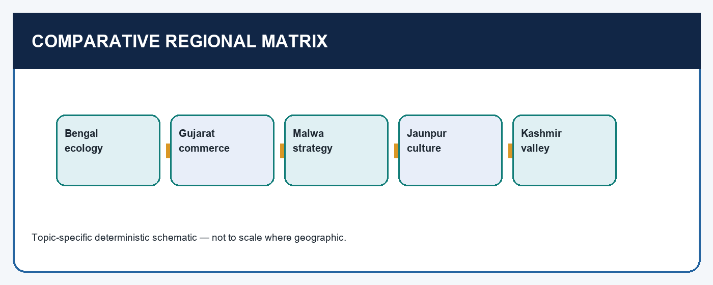

*Visual first: compare resource bases before drawing a shared conclusion about regionalisation.*


*Visual first: both Bengal and Gujarat depended on production, transport, protection and institutions; neither can be reduced to a port.*


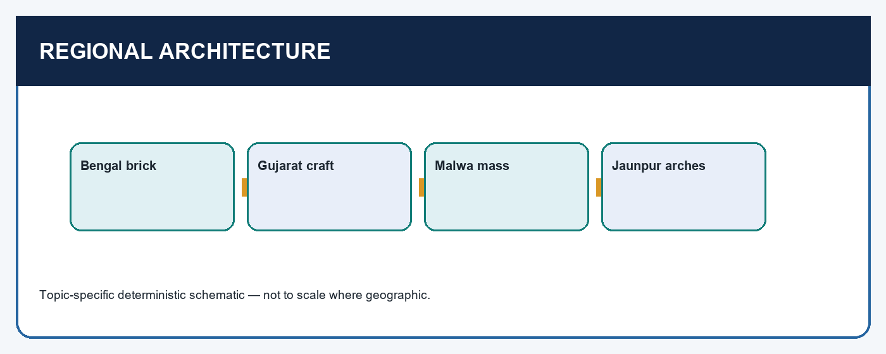

*Visual first: materials and craft traditions show adaptation and patronage, but buildings are not social surveys.*


| Case | Capacity base | Named evidence | Cultural idiom | Key qualification |
|---|---|---|---|---|
| Bengal | delta mobility, agrarian production, textiles, port connection | Ekdala, Chittagong, Gaur/Pandua | brick, local roof forms, Bengali patronage | ecology enabled, not mechanically caused, autonomy |
| Gujarat | fertile interior, handicrafts, Ahmedabad, west-coast ports | Ahmad Shah, Begarha, caravanserais | fine stone, brackets, turrets | trade created exposure to maritime coercion |
| Malwa | plateau, corridors, forts, merchants and bankers | Mandu, Hushang, Mahmud Khalji | massive forms, high plinths, glazed tiles | strategic location intensified faction and rivalry |
| Jaunpur | Ganga-valley territory, administration, learned networks | Malik Sarwar, Sharqis, 1484 | lofty gates, huge arches | cultural prestige did not prevent annexation |
| Kashmir | valley setting, reconciliation, learning, crafts | Sikandar, Zainul, Sriya Bhatt | Rishi-Sufi and translation milieu | do not generalise one reign across all India |

[ANALYSIS] The table is not a mnemonic list; it supplies an answer architecture. Start with a shared claim-regional courts were durable because they connected local resources to institutions-and then differentiate mechanisms. Bengal's water and trade circuit differs from Gujarat's port-hinterland chain. Malwa's plateau produced leverage through route control; Jaunpur's Ganga-valley location created a Delhi-facing territorial contest; Kashmir's valley politics foregrounds policy and cultural-economic reconstruction. The comparison thereby avoids "all regional states prospered in the same way."

Architecture is especially prone to overclaim. Bengal's brick and sloping forms show material adaptation; Gujarat's carving and brackets show craft tradition; Mandu's mass and plinths show capital-scale patronage; Jaunpur's arches show a distinct courtly idiom. From these we can infer patronage, labour, technical traditions and claims to prestige. We cannot securely infer complete religious harmony, equal access to wealth or the attitudes of every community. Pair material evidence with a ruler's policy, an inscription or narrative, and the political geography.

#### CLOSING RECALL FLOW — COMPARATIVE POLITICAL ECONOMY: TRADE, ROUTES, ARCHITECTURE AND STATE POWER

```text
START / CONCEPT: Comparative political economy: trade, routes, architecture and state power
        |
        v
EXACT TERMS: comparative political economy · trade · routes · architecture · regional kingdoms
        |
        v
MECHANISM / ARGUMENT: Productive hinterlands supplied towns and crafts, routes and ports connected exchange, courts protected movement and recruited elites, and architecture made state power visible in regionally specific forms.
        |
        v
CONSEQUENCE / CONTRAST: The regional kingdoms developed durable but unequal capacities: commercial vitality and cultural patronage could strengthen rule while also attracting rivalry, intervention and maritime pressure.
        |
        v
UPSC TRAP / ANSWER-USE: Do not reduce comparative political economy to a port list, treat architecture as proof of social equality, or assume favourable routes automatically created state power without institutions.
        |
        v
ANSWER-GRABBING FORMULATION: Trade, routes and architecture mattered politically because regional courts had to organise production, movement, protection, revenue and legitimacy rather than merely possess a favourable location.
```
### SESSION 12 — SOURCES AND HISTORIOGRAPHY: TURN EVIDENCE INTO A QUALIFIED ARGUMENT

#### DEFINITION / WHAT THIS IS CALLED

**Plain-language definition:** Sources and historiography: turn evidence into a qualified argument comprises Sources, historiography and turn evidence into a qualified argument as its core connected dimensions.

**Technical definition:** Example: to show Bengal's connection, cite Chinese contact, Chittagong and textiles; explain the waterway-to-port mechanism; then qualify Ma Huan or court narratives as partial perspectives.

#### ANSWER-GRABBING OPENING — WRITE/ADAPT IN THE EXAM

> Sources and historiography: turn evidence into a qualified argument comprises Sources, historiography and turn evidence into a qualified argument as its core connected dimensions.

#### MUST-WRITE KEYWORDS

- **Sources**
- **historiography**
- **turn evidence into a qualified argument**
- **evidence ladder**
- **Court chronicle or justice anecdote**
- **ideals, ruler's claims, sequence**

**How to use them:** Frame the answer through Sources; define historiography, connect turn evidence into a qualified argument with evidence ladder to explain the mechanism, and use Court chronicle or justice anecdote for the decisive comparison or qualification.


*Visual first: no single source type answers every historical question; triangulate claim, context and limit.*


| Source type | Useful for | What it cannot settle alone | Safe use in Topic 08 |
|---|---|---|---|
| Court chronicle or justice anecdote | ideals, ruler's claims, sequence | universal social practice | Ghiyasuddin's justice reputation; Zainul's legitimacy |
| Monument and urban fabric | patronage, materials, craft, capital investment | equality or popular belief | Ahmedabad, Mandu, Gaur/Pandua, Jaunpur |
| Traveller/interpreter account | observed commodities and contact | a complete economy | Ma Huan on Bengal's commercial world |
| Literary work and patronage | language, court networks, cultural prestige | direct political control of all authors | Maladhar Basu, Jaisi, translations in Kashmir |
| Chronicle with administrative detail | institutions and court perspective | neutral transcript | Buranjis for Ahom sequence and organisation |

[ANALYSIS] A high-scoring history answer makes an **evidence ladder**. Example: to show Bengal's connection, cite Chinese contact, Chittagong and textiles; explain the waterway-to-port mechanism; then qualify Ma Huan or court narratives as partial perspectives. To show regional architecture, name an example and material idiom; explain how a capital displayed patronage; then say that a monument is not a social survey. To explain Kashmir, contrast named orders of Sikandar and Zainul; show the reconciliation logic; then note that elite textual evidence cannot prove total harmony.

Source criticism is not an excuse for silence. It tells the examiner what kind of conclusion is justified. "A court chronicle is biased" earns little by itself. "The Buranjis are royal records useful for sequence and institutional detail, but should be read with awareness of court perspective" is a usable historical judgement. Likewise, "the justice story expresses a normative ideal" is stronger than either accepting it literally or dismissing it completely.

#### CLOSING RECALL FLOW — SOURCES AND HISTORIOGRAPHY: TURN EVIDENCE INTO A QUALIFIED ARGUMENT

```text
START / CONCEPT: Sources and historiography: turn evidence into a qualified argument
        |
        v
EXACT TERMS: Sources · historiography · turn evidence into a qualified argument · evidence ladder · Court chronicle or justice anecdote · ideals, ruler's claims, sequence
        |
        v
MECHANISM / ARGUMENT: Example: to show Bengal's connection, cite Chinese contact, Chittagong and textiles; explain the waterway-to-port mechanism; then qualify Ma Huan or court narratives as partial perspectives.
        |
        v
CONSEQUENCE / CONTRAST: To show regional architecture, name an example and material idiom; explain how a capital displayed patronage; then say that a monument is not a social survey.
        |
        v
UPSC TRAP / ANSWER-USE: To explain Kashmir, contrast named orders of Sikandar and Zainul; show the reconciliation logic; then note that elite textual evidence cannot prove total harmony.
        |
        v
ANSWER-GRABBING FORMULATION: Sources and historiography: turn evidence into a qualified argument comprises Sources, historiography and turn evidence into a qualified argument as its core connected dimensions.
```
### SESSION 13 — BOUNDED AHOM/ASSAM EXTENSION: POLITICAL ECOLOGY, PAIK ROTATION AND BURANJIS

#### DEFINITION / WHAT THIS IS CALLED

**Plain-language definition:** Bounded Ahom/Assam extension: political ecology, Paik rotation and Buranjis comprises Bounded Ahom/Assam extension, political ecology and Paik rotation as its core connected dimensions.

**Technical definition:** For this topic, the key distinction is conceptual: Paik service was an organised obligation and mobilising device, not a synonym for chattel slavery.

#### ANSWER-GRABBING OPENING — WRITE/ADAPT IN THE EXAM

> This comparison is valuable because it shows state formation in a political ecology not reducible to Delhi's provincial system.

#### MUST-WRITE KEYWORDS

- **Bounded Ahom/Assam extension**
- **political ecology**
- **Paik rotation**
- **Buranjis**
- **Paik**
- **not**

**How to use them:** Frame the answer through Bounded Ahom/Assam extension; define political ecology, connect Paik rotation with Buranjis to explain the mechanism, and use Paik for the decisive comparison or qualification.

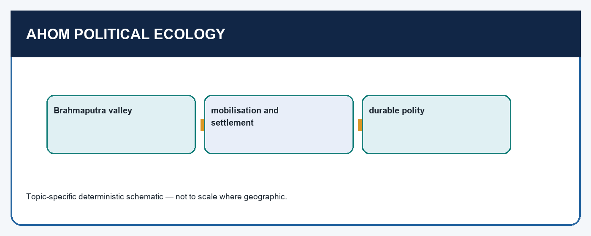

*Visual first: the Brahmaputra-valley comparison broadens the map of state formation without making Assam a Delhi province.*


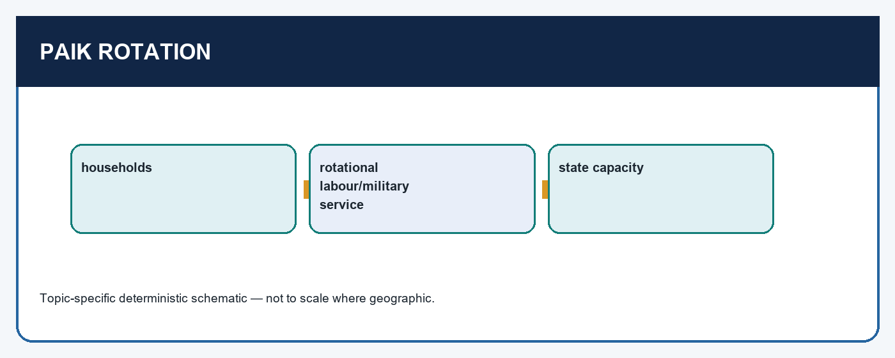

*Visual first: service rotation links households, labour and mobilisation; name the institution precisely rather than using a vague forced-labour label.*


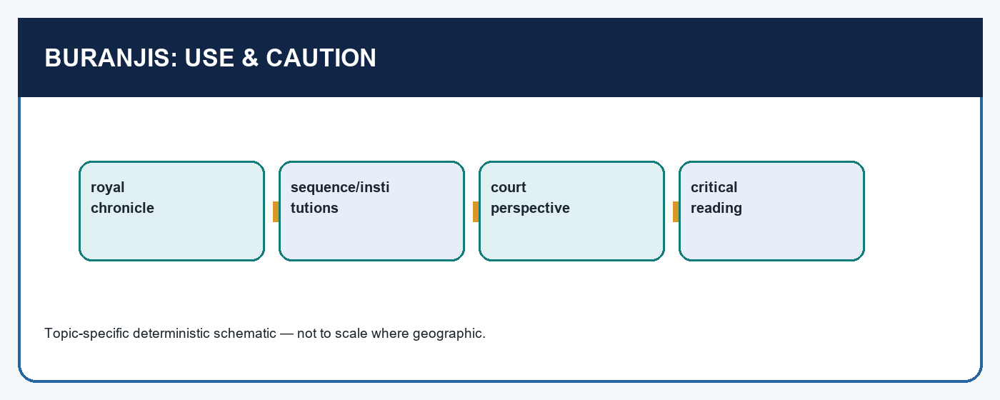

*Visual first: royal chronicles are rich institutional evidence and also courtly narratives requiring contextual reading.*


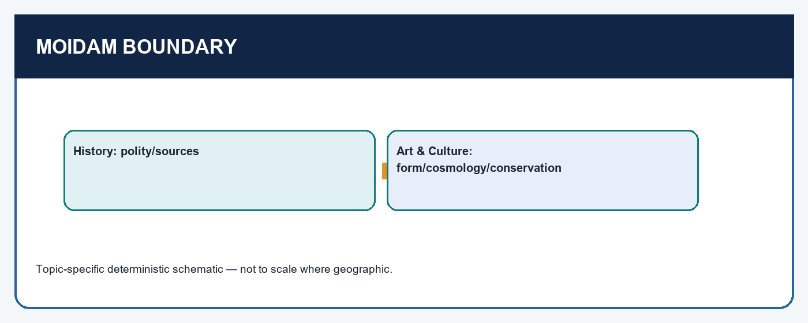

*Visual first: retain Charaideo as a political-source anchor here and route detailed funerary study to Art & Culture.*


[FACT] The Tai-Ahom entered the Brahmaputra valley from Yunnan in the first half of the thirteenth century under Siu-kha-pha/Sukapha. The local source associates their early control with the area of present-day Dibrugarh and Sivasagar; UNESCO's live World Heritage page says that Siu-kha-pha selected Charaideo as the first capital and location of the royal necropolis. This comparison is valuable because it shows state formation in a political ecology not reducible to Delhi's provincial system.

The **Paik** arrangement is best described as rotational service tied to adult male subjects or households, linking labour and military mobilisation. The exact organisation evolved over time, so avoid pretending that a single simple formula covers every period. For this topic, the key distinction is conceptual: Paik service was an organised obligation and mobilising device, **not** a synonym for chattel slavery. Its analytical value is that state capacity may arise through a service system adapted to the Brahmaputra valley, not only through the court-and-port model visible in Gujarat or Bengal.

The **Buranjis** are Ahom royal chronicles. They can preserve sequence, institutional vocabulary, court decisions and aspects of political life. Their royal location also demands source criticism: ask whose actions are centred, what kind of legitimacy is being narrated and which non-court voices are thin. They should be used as evidence with a limit, not discarded as useless "bias."

UNESCO's property 1711 verifies that Charaideo contains 90 Tai-Ahom royal moidams from the thirteenth to nineteenth centuries. Here that fact anchors chronology, royal memory and the usefulness of Buranjis. **Boundary:** do not turn this History unit into a detailed account of mound-vault form, cosmology, World Heritage criteria or conservation management. Those are legitimate questions, but belong in Indian Art & Culture. A disciplined answer signals the boundary explicitly.

[ANALYSIS] The Ahom extension does not prove that every regional state worked in the same way. It does prove that "regionalisation" can be studied as plural state formation: delta commercial capacity, port-hinterland capacity, plateau-route capacity and Brahmaputra service capacity are comparable at the level of mechanism while remaining historically distinct.

#### CLOSING RECALL FLOW — BOUNDED AHOM/ASSAM EXTENSION: POLITICAL ECOLOGY, PAIK ROTATION AND BURANJIS

```text
START / CONCEPT: Bounded Ahom/Assam extension: political ecology, Paik rotation and Buranjis
        |
        v
EXACT TERMS: Bounded Ahom/Assam extension · political ecology · Paik rotation · Buranjis · Paik · not
        |
        v
MECHANISM / ARGUMENT: Its analytical value is that state capacity may arise through a service system adapted to the Brahmaputra valley, not only through the court-and-port model visible in Gujarat or Bengal.
        |
        v
CONSEQUENCE / CONTRAST: The Ahom extension does not prove that every regional state worked in the same way.
        |
        v
UPSC TRAP / ANSWER-USE: For this topic, the key distinction is conceptual: Paik service was an organised obligation and mobilising device, not a synonym for chattel slavery.
        |
        v
ANSWER-GRABBING FORMULATION: This comparison is valuable because it shows state formation in a political ecology not reducible to Delhi's provincial system.
```
### 14. Transition, answer architecture and final synthesis

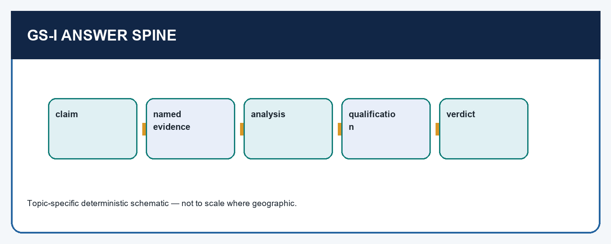

*Visual first: every paragraph should move from claim to named evidence, analysis, qualification and a reasoned verdict.*


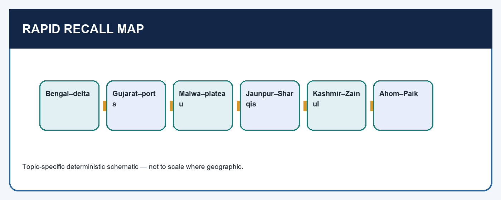

*Visual first: retrieve one ruler, one place, one mechanism and one source limit for each case before writing.*


#### Answer spine for 10, 15 and 20 markers

1. **Claim:** define regionalisation as plural state formation after Delhi's contraction, not as a vacuum.  
2. **Named evidence:** choose only directive-relevant examples: Ilyas/Ekdala for Bengal; Ahmad-Ahmedabad or Begarha for Gujarat; Mandu/Hushang/Mahmud for Malwa; Sharqis/1484 for Jaunpur; Zainul for Kashmir; Paik/Buranjis for the extension.  
3. **Analysis:** explain the mechanism-route, ecology, urban production, elite coalition, service mobilisation or cultural legitimacy.  
4. **Qualification:** identify the source limit, conflict, succession pressure or regional variation.  
5. **Verdict:** return to the directive. "Thus regional courts were durable but contested" is better than a generic "therefore they were important."

[ANALYSIS] Transition forward with care. Bahlul's 1484 annexation changed the eastern balance but did not erase Jaunpur's cultural memory. The Lodi effort to dominate the upper Ganga valley and their interest in Malwa led into a competitive field already shaped by Gujarat, Mewar and Bengal. Babur and the Mughals therefore encountered regional powers with resources, memories and political calculations; they did not inherit an empty subcontinent. This is the proper bridge to the next topics on the Deccan, Babur and the struggle for empire.

[LIMIT] Do not force Ahom material into a question solely about the Gujarat-Malwa-Mewar triangle, and do not force every kingdom into a 10-marker. Precision in selection is part of answer quality.

### SESSION 14 — DEEPENING I - WHAT STATE CAPACITY ACTUALLY LOOKED LIKE

#### DEFINITION / WHAT THIS IS CALLED

**Plain-language definition:** Political incorporation is the capacity dimension most often missed in Prelims-oriented revision.

**Technical definition:** "State capacity" should not be used as a decorative synonym for a strong ruler.

#### ANSWER-GRABBING OPENING — WRITE/ADAPT IN THE EXAM

> "State capacity" should not be used as a decorative synonym for a strong ruler.

#### MUST-WRITE KEYWORDS

- **Deepening I - What state capacity actually looked like**
- **delta communications and Ekdala**
- **ports, routes and a consolidated court**
- **plateau defence and corridor leverage**
- **territorial Ganga-valley reach**
- **valley setting and internal political choices**

**How to use them:** Frame the answer through Deepening I - What state capacity actually looked like; define delta communications and Ekdala, connect ports, routes and a consolidated court with plateau defence and corridor leverage to explain the mechanism, and use territorial Ganga-valley reach for the decisive comparison or qualification.

"State capacity" should not be used as a decorative synonym for a strong ruler. In this topic it means the recurrent ability of a court to obtain resources, coordinate elites, move or sustain force, protect strategic routes, make credible claims of legitimacy and survive succession pressure. The evidence differs by region, so an answer should identify the working mechanism rather than write that every kingdom "had a good administration."

| Capacity question | Bengal | Gujarat | Malwa | Jaunpur | Kashmir |
|---|---|---|---|---|---|
| How was external pressure limited? | delta communications and Ekdala | ports, routes and a consolidated court | plateau defence and corridor leverage | territorial Ganga-valley reach | valley setting and internal political choices |
| What resource circuit mattered? | waterways, textiles, Chittagong | fertile land, crafts, Ahmedabad, sea trade | transit routes, commercial groups, Mandu | land and order over a large tract | agriculture, crafts, learning and offices |
| Which elite problem appears? | succession and Raja Ganesh's intervention | nobles under Ahmad Shah; border rulers | succession contenders and noble factions | contest with Delhi/Lodis | policy change and incorporation |
| What kind of legitimacy appears? | dynasty, local language, courtly justice | urban building and administrative consolidation | Mandu patronage and negotiated commercial ties | learned and saintly prestige | restoration, translation and reconciliation |

[ANALYSIS] The same institution can produce more than one effect. A fortified site can be defensive, administrative and symbolic. A road can aid military movement and merchant exchange. A capital can house court ritual while concentrating credit, crafts and markets. This is why Ahmed Shah's Ahmedabad and Begarha's road security must not be separated into "culture" and "economy" boxes. They are linked state practices. Likewise, Bengal's water setting could obstruct Delhi's forces and enable internal movement; the causal claim is not "rivers caused independence," but that a dynasty could exploit a particular movement and provisioning environment.

Political incorporation is the capacity dimension most often missed in Prelims-oriented revision. Bengal's high offices under Hussain Shah, Hushang Shah's patronage of Jain merchants and grants to Rajputs, and Zainul Abidin's restoration of grants and recruitment of Hindus show courts engaging groups whose cooperation mattered. None of this proves a modern inclusive state, and no case licenses a generic "composite culture" conclusion. It does show that coercion alone was not a complete account of rule.

[LIMIT] The source does not provide a common revenue table, troop count or tax yield for these states. Do not fabricate numerical rankings. Compare observable mechanisms-route security, capital formation, elite recruitment, service and institutional records-rather than pretending to measure each kingdom by an unavailable statistic.

#### CLOSING RECALL FLOW — DEEPENING I - WHAT STATE CAPACITY ACTUALLY LOOKED LIKE

```text
START / CONCEPT: Deepening I - What state capacity actually looked like
        |
        v
EXACT TERMS: Deepening I - What state capacity actually looked like · delta communications and Ekdala · ports, routes and a consolidated court · plateau defence and corridor leverage · territorial Ganga-valley reach · valley setting and internal political choices
        |
        v
MECHANISM / ARGUMENT: In this topic it means the recurrent ability of a court to obtain resources, coordinate elites, move or sustain force, protect strategic routes, make credible claims of legitimacy and survive succession pressure.
        |
        v
CONSEQUENCE / CONTRAST: The source does not provide a common revenue table, troop count or tax yield for these states.
        |
        v
UPSC TRAP / ANSWER-USE: A capital can house court ritual while concentrating credit, crafts and markets.
        |
        v
ANSWER-GRABBING FORMULATION: "State capacity" should not be used as a decorative synonym for a strong ruler.
```
### SESSION 15 — DEEPENING II - AGRARIAN BASES, TOWNS, PORTS AND ROUTES

#### DEFINITION / WHAT THIS IS CALLED

**Plain-language definition:** Kashmir under Zainul Abidin is associated with agricultural development, paper-making and crafts, reminding us that a valley polity could strengthen its resource base without a west-coast port.

**Technical definition:** Bengal's fertile delta was linked to river movement, textiles and the port of Chittagong.

#### ANSWER-GRABBING OPENING — WRITE/ADAPT IN THE EXAM

> Do not call every river a trade route or every port a state-controlled customs machine unless a source supports it.

#### MUST-WRITE KEYWORDS

- **Deepening II - Agrarian bases**
- **towns**
- **ports**
- **routes**
- **Bengal's**
- **Chittagong**

**How to use them:** Frame the answer through Deepening II - Agrarian bases; define towns, connect ports with routes to explain the mechanism, and use Bengal's for the decisive comparison or qualification.

[FACT] Regional strength rested on a relation between countryside and town. Bengal's fertile delta was linked to river movement, textiles and the port of Chittagong. Gujarat's fertile lands and handicrafts supplied a trade network in which Ahmedabad was a major urban node and west-coast ports served a larger interior. Malwa and Rajasthan connected the Ganga valley to Gujarat's sea-ports; Malwa's value lay therefore in transit as well as local production. Kashmir under Zainul Abidin is associated with agricultural development, paper-making and crafts, reminding us that a valley polity could strengthen its resource base without a west-coast port.

Use the following causal chain in an answer:

```text
productive countryside / specialist crafts
            -> town, market and elite consumption
            -> roads, riverways or port access
            -> protection, credit and court regulation
            -> revenue, prestige and military-political capacity
```

[ANALYSIS] The chain also clarifies why commerce created vulnerability. Goods, shipping and route security attracted piracy, rival courts and Portuguese naval interference. Begarha's concern with Saurashtra, Dwarka, caravanserais and safe roads reflects this problem. A merchant-oriented state was not passive: it could build facilities, police movement, intervene against threats and use urban investment to support authority. Yet it could not wholly control maritime competitors, especially when coastward pressure met an inland crisis as in the later Bahadur Shah context.

Bengal supplies a complementary case. Its links to China and Chittagong should not be treated as proof of a modern national export economy. They are evidence for circuits: ships, textiles, re-export and diplomatic contacts. Ma Huan's notice is an external observer's window, while courtly records centre rulers. Together they make a reasonable claim about connection, not a precise claim about total volume, wages or distribution. This distinction is a valuable UPSC trap: **commercial vitality is not automatically an index of equal prosperity**.

[LIMIT] Do not call every river a trade route or every port a state-controlled customs machine unless a source supports it. In Topic 08, write "connected to" or "important for" where the evidence is qualitative. The quality of the answer lies in explaining the mechanism honestly, not in inserting unsupported figures.

#### CLOSING RECALL FLOW — DEEPENING II - AGRARIAN BASES, TOWNS, PORTS AND ROUTES

```text
START / CONCEPT: Deepening II - Agrarian bases, towns, ports and routes
        |
        v
EXACT TERMS: Deepening II - Agrarian bases · towns · ports · routes · Bengal's · Chittagong
        |
        v
MECHANISM / ARGUMENT: Kashmir under Zainul Abidin is associated with agricultural development, paper-making and crafts, reminding us that a valley polity could strengthen its resource base without a west-coast port.
        |
        v
CONSEQUENCE / CONTRAST: Its links to China and Chittagong should not be treated as proof of a modern national export economy.
        |
        v
UPSC TRAP / ANSWER-USE: A merchant-oriented state was not passive: it could build facilities, police movement, intervene against threats and use urban investment to support authority.
        |
        v
ANSWER-GRABBING FORMULATION: Do not call every river a trade route or every port a state-controlled customs machine unless a source supports it.
```
### SESSION 16 — DEEPENING III - RULERS, SUCCESSION AND THE POLITICS BEHIND CHRONOLOGY

#### DEFINITION / WHAT THIS IS CALLED

**Plain-language definition:** Succession is not a supplementary list of names.

**Technical definition:** In Kashmir, a sharp change of policy across reigns shows why dynastic chronology must control any claim about religion or statecraft.

#### ANSWER-GRABBING OPENING — WRITE/ADAPT IN THE EXAM

> Do not infer hereditary succession rules, precise reign dates not given above, or a uniform political agenda merely from one ruler's name.

#### MUST-WRITE KEYWORDS

- **Deepening III - Rulers**
- **succession**
- **the politics behind chronology**
- **person - polity - place/institution - sequence**
- **Bengal**
- **independence, diplomacy/trade, dynastic reconstitution**

**How to use them:** Frame the answer through Deepening III - Rulers; define succession, connect the politics behind chronology with person - polity - place/institution - sequence to explain the mechanism, and use Bengal for the decisive comparison or qualification.

| Polity | Sequence to retain | What chronology helps explain | Common confusion to avoid |
|---|---|---|---|
| Bengal | 1338 break -> Ilyas 1342 -> Ghiyasuddin Azam Shah -> succession contests -> Hussain Shah 1493 | independence, diplomacy/trade, dynastic reconstitution | making the Ilyas line or Hussain Shah's regime a single unchanged block |
| Gujarat | Muzaffar 1407 -> Ahmad 1411-42 -> Begarha 1459-1511 -> Bahadur later | proclamation, consolidation, commercial security, Portuguese-Mughal pressure | assigning Bassein-Diu to Begarha |
| Malwa | Hushang -> Mahmud Khalji -> later Mahmud II/Medini Rai crisis | court diversity, warfare, faction and external intervention | treating "Malwa" as a unitary actor with no succession issue |
| Jaunpur | Malik Sarwar/Sharqis -> Lodi pressure -> Bahlul 1484 | formation from a provincial office and later annexation | confusing a cultural label with absence of territorial politics |
| Kashmir | Sikandar 1389-1413 -> Zainul 1420-70 | change in coercion, reconciliation, learning and economic policy | projecting Zainul backwards onto Sikandar |

[ANALYSIS] Succession is not a supplementary list of names. It is a test of whether a regional court could reproduce authority. In Bengal, Ilyas's popular and durable line did not prevent later contest, including Raja Ganesh's intervention. In Gujarat, the difference between a formal declaration under Muzaffar and consolidation under Ahmad shows that founding is a process. In Malwa, rival claimants and noble groupings were not background noise; their conflicts gave Gujarat and Mewar opportunities to intervene. In Jaunpur, the Sharqi cultural reputation existed alongside a sustained contest with Delhi. In Kashmir, a sharp change of policy across reigns shows why dynastic chronology must control any claim about religion or statecraft.

For Prelims, construct a mental four-part label: **person -> polity -> place/institution -> sequence**. For example: Ahmad Shah I -> Gujarat -> Ahmedabad/craft idiom -> follows Muzaffar and precedes Begarha. This is safer than memorising isolated dates. For Mains, add one mechanism: Ahmedabad is not just a foundation; it marks the concentration of administration, markets and cultural patronage.

[LIMIT] The sequence table is a retrieval device, not a complete genealogy. Do not infer hereditary succession rules, precise reign dates not given above, or a uniform political agenda merely from one ruler's name.

#### CLOSING RECALL FLOW — DEEPENING III - RULERS, SUCCESSION AND THE POLITICS BEHIND CHRONOLOGY

```text
START / CONCEPT: Deepening III - Rulers, succession and the politics behind chronology
        |
        v
EXACT TERMS: Deepening III - Rulers · succession · the politics behind chronology · person - polity - place/institution - sequence · Bengal · independence, diplomacy/trade, dynastic reconstitution
        |
        v
MECHANISM / ARGUMENT: For Mains, add one mechanism: Ahmedabad is not just a foundation; it marks the concentration of administration, markets and cultural patronage.
        |
        v
CONSEQUENCE / CONTRAST: Succession is not a supplementary list of names.
        |
        v
UPSC TRAP / ANSWER-USE: In Malwa, rival claimants and noble groupings were not background noise; their conflicts gave Gujarat and Mewar opportunities to intervene.
        |
        v
ANSWER-GRABBING FORMULATION: Do not infer hereditary succession rules, precise reign dates not given above, or a uniform political agenda merely from one ruler's name.
```
### SESSION 17 — DEEPENING IV - INTER-STATE RELATIONS: FROM RIVALRY TO ALTERED BALANCE

#### DEFINITION / WHAT THIS IS CALLED

**Plain-language definition:** The Gujarat-Malwa-Mewar relation was not an incidental triangle.

**Technical definition:** A Gujarat-Malwa conflict could involve a local claimant; a Malwa-Mewar struggle could draw Lodi attention because Chanderi and the route to Malwa mattered; a Bengal-Jaunpur relationship could include both strategic checking and refuge for a defeated ruler.

#### ANSWER-GRABBING OPENING — WRITE/ADAPT IN THE EXAM

> The Gujarat-Malwa-Mewar relation was not an incidental triangle.

#### MUST-WRITE KEYWORDS

- **Deepening IV - Inter-state relations**
- **from rivalry to altered balance**
- **The Gujarat-Malwa-Mewar**
- **Gujarat**
- **Malwa**
- **Mewar's**

**How to use them:** Frame the answer through Deepening IV - Inter-state relations; define from rivalry to altered balance, connect The Gujarat-Malwa-Mewar with Gujarat to explain the mechanism, and use Malwa for the decisive comparison or qualification.

[FACT] The Gujarat-Malwa-Mewar relation was not an incidental triangle. Gujarat and Malwa were both coveted for fertile land, routes and commerce, while Mewar's rise under Rana Kumbha made Rajasthan a major counterweight. Gujarat and Malwa supported rival factions and contested border-state alignments. Neither could make enduring deep inroads into Rajasthan, in part because of Mewar's power. The eastern system similarly linked Bengal, Orissa and Jaunpur; after Jaunpur's defeat, the Lodi reach extended towards Bengal and the terms of the eastern balance changed.

[ANALYSIS] Treat conflict as a network:

```text
Gujarat <-> Malwa <-> Mewar
    \        |        /
   ports - corridors - Rajput border states

Delhi/Lodis <-> Jaunpur <-> Bengal/Orissa
        \       |
       upper Ganga valley and Bihar
```

This diagram does not claim that every connection was constantly active. It prevents a false binary. A Gujarat-Malwa conflict could involve a local claimant; a Malwa-Mewar struggle could draw Lodi attention because Chanderi and the route to Malwa mattered; a Bengal-Jaunpur relationship could include both strategic checking and refuge for a defeated ruler. Political relations therefore mix military contest, alliances, tribute, diplomacy, exile and local elite bargaining.

The late-fifteenth and early-sixteenth transformations are essential. Bahlul's 1484 annexation of Jaunpur reduced a counterweight to Delhi in the east. Malwa's internal disintegration and Medini Rai's alliance with Rana Sanga sharpened the western-central contest. The Lodi interest in these changes shows a renewed Delhi-based bid for dominance, but it had to operate through and against existing regional resources. Babur entered this moving field, not a map frozen at the moment of Timur's invasion.

[LIMIT] Avoid calling the relationships "international relations" in the modern legal sense. Also avoid turning a line of influence into a permanent conquest. Use verbs such as checked, intervened, sought support, influenced, contested or annexed only where the case supports them.

#### CLOSING RECALL FLOW — DEEPENING IV - INTER-STATE RELATIONS: FROM RIVALRY TO ALTERED BALANCE

```text
START / CONCEPT: Deepening IV - Inter-state relations: from rivalry to altered balance
        |
        v
EXACT TERMS: Deepening IV - Inter-state relations · from rivalry to altered balance · The Gujarat-Malwa-Mewar · Gujarat · Malwa · Mewar's
        |
        v
MECHANISM / ARGUMENT: A Gujarat-Malwa conflict could involve a local claimant; a Malwa-Mewar struggle could draw Lodi attention because Chanderi and the route to Malwa mattered; a Bengal-Jaunpur relationship could include both strategic checking and refuge for a defeated ruler.
        |
        v
CONSEQUENCE / CONTRAST: Gujarat and Malwa were both coveted for fertile land, routes and commerce, while Mewar's rise under Rana Kumbha made Rajasthan a major counterweight.
        |
        v
UPSC TRAP / ANSWER-USE: This diagram does not claim that every connection was constantly active.
        |
        v
ANSWER-GRABBING FORMULATION: The Gujarat-Malwa-Mewar relation was not an incidental triangle.
```
### SESSION 18 — DEEPENING V - CULTURAL IDIOMS, SOURCE CRITICISM AND ANSWER DESIGN LABORATORY

#### DEFINITION / WHAT THIS IS CALLED

**Plain-language definition:** Deepening V - Cultural idioms, source criticism and answer design laboratory comprises Deepening V - Cultural idioms, source criticism and design laboratory as its core connected dimensions.

**Technical definition:** Technically, Deepening V - Cultural idioms, source criticism and answer design laboratory is analysed by relating Deepening V - Cultural idioms to source criticism, then testing the relationship through design laboratory and Bengal brick, roofs and motifs at Gaur/Pandua.

#### ANSWER-GRABBING OPENING — WRITE/ADAPT IN THE EXAM

> Deepening V - Cultural idioms, source criticism and answer design laboratory comprises Deepening V - Cultural idioms, source criticism and design laboratory as its core connected dimensions.

#### MUST-WRITE KEYWORDS

- **Deepening V - Cultural idioms**
- **source criticism**
- **design laboratory**
- **Bengal brick, roofs and motifs at Gaur/Pandua**
- **local adaptation**
- **cannot prove universal cultural fusion**

**How to use them:** Frame the answer through Deepening V - Cultural idioms; define source criticism, connect design laboratory with Bengal brick, roofs and motifs at Gaur/Pandua to explain the mechanism, and use local adaptation for the decisive comparison or qualification.

The strongest cultural answer puts form into a political argument. Start with a material fact, name its setting, explain the function, and then limit the inference:

| Evidence | Claim | Analysis | Qualification |
|---|---|---|---|
| Bengal brick, roofs and motifs at Gaur/Pandua | local adaptation | a court used materials and forms intelligible in a delta setting | cannot prove universal cultural fusion |
| Gujarat stone carving, brackets and turrets | craft-based regional idiom | Ahmedabad attached state building to skilled local traditions | campaign violence and office recruitment require separate evidence |
| Mandu mass, plinths and tiles | capital-scale patronage | style complemented a plateau capital's visibility and defensibility | monuments do not explain all Malwa factionalism |
| Jaunpur gates and arches plus learned reputation | cultural capital | scholarship and saintly networks made an independent court prestigious | 1484 shows prestige did not guarantee survival |
| Zainul's translations and craft patronage | reconciliation-statecraft | restoration could support legitimacy and skilled activity | avoid a conflict-free "golden age" |

[ANALYSIS] This is also the correct method for the terms "synthesis," "tolerance" and "decline." Never begin with the label and then hunt for decorative examples. Begin with named evidence, explain a relationship, and only then offer a guarded interpretation. A court appointing Hindu officers is evidence of political recruitment; it is not automatically evidence of modern secular equality. A temple destroyed in a campaign is evidence of violence in a specific context; it is not automatically a comprehensive policy for every ruler and subject. A new literary language at court is evidence of patronage and network formation; it is not proof that Persian disappeared.

**Timed-answer drill (five minutes).** For the question "How did regional courts create legitimacy?" write: (i) thesis-legitimacy combined resource control and cultural-political incorporation; (ii) Bengal-brick/local language plus delta court; (iii) Gujarat-Ahmedabad and craft; (iv) Jaunpur-Shiraz reputation; (v) Kashmir-Zainul's restorations; (vi) qualification-monument/text limits; (vii) verdict-culture was an instrument of statecraft, not a substitute for force.

#### CLOSING RECALL FLOW — DEEPENING V - CULTURAL IDIOMS, SOURCE CRITICISM AND ANSWER DESIGN LABORATORY

```text
START / CONCEPT: Deepening V - Cultural idioms, source criticism and answer design laboratory
        |
        v
EXACT TERMS: Deepening V - Cultural idioms · source criticism · design laboratory · Bengal brick, roofs and motifs at Gaur/Pandua · local adaptation · cannot prove universal cultural fusion
        |
        v
MECHANISM / ARGUMENT: This is also the correct method for the terms "synthesis," "tolerance" and "decline." Never begin with the label and then hunt for decorative examples.
        |
        v
CONSEQUENCE / CONTRAST: A court appointing Hindu officers is evidence of political recruitment; it is not automatically evidence of modern secular equality.
        |
        v
UPSC TRAP / ANSWER-USE: A temple destroyed in a campaign is evidence of violence in a specific context; it is not automatically a comprehensive policy for every ruler and subject.
        |
        v
ANSWER-GRABBING FORMULATION: Deepening V - Cultural idioms, source criticism and answer design laboratory comprises Deepening V - Cultural idioms, source criticism and design laboratory as its core connected dimensions.
```
### SESSION 19 — DEEPENING VI - COMPARATIVE ANSWER WORKSHOP: CLAIMS, COUNTERCLAIMS AND TRANSITIONS

#### DEFINITION / WHAT THIS IS CALLED

**Plain-language definition:** Claim set 1: "Delhi declined; therefore regions rose." This is a valid opening condition, but insufficient as an explanation.

**Technical definition:** Claim set 2: "Regional culture was composite." This is too vague unless broken into evidence and qualification.

#### ANSWER-GRABBING OPENING — WRITE/ADAPT IN THE EXAM

> Claim set 1: "Delhi declined; therefore regions rose." This is a valid opening condition, but insufficient as an explanation.

#### MUST-WRITE KEYWORDS

- **Deepening VI - Comparative answer workshop**
- **claims**
- **counterclaims**
- **transitions**
- **Claim set 1: "Delhi declined; therefore regions rose."**
- **circuits of capacity**

**How to use them:** Frame the answer through Deepening VI - Comparative answer workshop; define claims, connect counterclaims with transitions to explain the mechanism, and use Claim set 1: "Delhi declined; therefore regions rose." for the decisive comparison or qualification.

The most common weak answer to this topic is a sequence of miniature biographies: Ilyas Shah, Ahmad Shah, Begarha, Zainul Abidin and Bahlul Lodi appear in order, but no causal question is answered. Repair it by sorting evidence into four comparative dimensions before writing:

| Dimension | Bengal | Gujarat | Malwa | Jaunpur | Kashmir / Ahom extension |
|---|---|---|---|---|---|
| Political geography | delta, river movement, costly projection | coast and productive interior | plateau and corridors | Ganga-valley territorial contest | valley / Brahmaputra political ecology |
| State capacity | Ilyas line, Ekdala, offices | nobles, Ahmedabad, route security | capital, factions, route leverage | order over a tract, Sharqi court | reconciliation/crafts; Paik mobilisation |
| Culture and source | brick, Bengali patronage, Ma Huan | stone craft and urban patronage | Mandu form and merchant links | Shiraz reputation, Jaisi | translations/Rishis; Buranji caution |
| Main qualification | ecology is not destiny | ports are not the whole economy | strategy can intensify instability | prestige cannot stop annexation | do not generalise one reign or overstep Ahom scope |

**Claim set 1: "Delhi declined; therefore regions rose."** This is a valid opening condition, but insufficient as an explanation. Improve it: Delhi's weakening reduced one kind of constraint; regional rulers then had to organise bases of power. Ilyas Shah's ability to hold against Firuz, Ahmad Shah's discipline over nobility and new capital, and the Sharqis' territorial administration show the additional work.

**Claim set 2: "Regional culture was composite."** This is too vague unless broken into evidence and qualification. Improve it: Bengal's local material idiom and literary patronage, Gujarat's Jain-influenced craft language, Jaunpur's learning and Kashmir's translation/restoration policies show courts adapting or recruiting across traditions. Then qualify: a building does not prove equality; war and coercion occurred; policies varied by ruler and moment.

**Claim set 3: "Trade made Gujarat and Bengal rich."** Again, rewrite the verb. Bengal's textiles, waterways and Chittagong and Gujarat's crafts, Ahmedabad, ports and safe routes created **circuits of capacity**. This wording forces an explanation of production, transport, protection and court power. It also allows the counterpoint: commercial nodes attracted pirates, rival courts and Portuguese interference.

**Claim set 4: "Ahom was another provincial kingdom."** Reject the premise. The Ahom case is a bounded comparison in state formation. Siu-kha-pha, Charaideo, Paik rotation and Buranjis demonstrate a Brahmaputra-valley political ecology. They should expand the map, not be flattened into a Delhi province or displaced by a detailed Art & Culture essay on funerary architecture.

#### Directive decoder

| Directive | What the examiner needs | Minimum Topic 08 move |
|---|---|---|
| Discuss | a thesis plus breadth | define regionalisation; use Bengal, Gujarat and one contrast |
| Examine | causal working | explain ecology/route/urban/service mechanism, then qualify |
| Compare | same lens across cases | use a table or paired paragraphs; do not alternate unrelated facts |
| Assess | evidence on both sides | capacity and vulnerability; culture and limit; autonomy and conflict |
| Source-based question | provenance and inference | identify court text, monument, traveller or Buranji; state what it can prove |

**Transition sentence bank.** "Bengal's delta did not merely shield it; it linked a court to internal movement and external exchange." "Gujarat's coast was powerful only because an interior of production, urban craft and protected routes sustained it." "Malwa's plateau converted local faction into a subcontinental issue because its corridors mattered to rival powers." "Jaunpur's cultural capital explains prestige, while 1484 demonstrates the limits of prestige without military security." "Zainul Abidin's measures demonstrate contingent statecraft, not a timeless verdict on medieval religious policy." These sentences are answer spines, not substitutes for evidence.

#### CLOSING RECALL FLOW — DEEPENING VI - COMPARATIVE ANSWER WORKSHOP: CLAIMS, COUNTERCLAIMS AND TRANSITIONS

```text
START / CONCEPT: Deepening VI - Comparative answer workshop: claims, counterclaims and transitions
        |
        v
EXACT TERMS: Deepening VI - Comparative answer workshop · claims · counterclaims · transitions · Claim set 1: "Delhi declined; therefore regions rose." · circuits of capacity
        |
        v
MECHANISM / ARGUMENT: Then qualify: a building does not prove equality; war and coercion occurred; policies varied by ruler and moment.
        |
        v
CONSEQUENCE / CONTRAST: The most common weak answer to this topic is a sequence of miniature biographies: Ilyas Shah, Ahmad Shah, Begarha, Zainul Abidin and Bahlul Lodi appear in order, but no causal question is answered.
        |
        v
UPSC TRAP / ANSWER-USE: They should expand the map, not be flattened into a Delhi province or displaced by a detailed Art & Culture essay on funerary architecture.
        |
        v
ANSWER-GRABBING FORMULATION: Claim set 1: "Delhi declined; therefore regions rose." This is a valid opening condition, but insufficient as an explanation.
```
### SESSION 20 — DEEPENING VII - FIVE CASE FILES FOR LAST-MILE REVISION

#### DEFINITION / WHAT THIS IS CALLED

**Plain-language definition:** Qualification: Paik is not chattel slavery; Buranjis are courtly; detailed funerary form and conservation belong to Art & Culture.

**Technical definition:** Qualification: Mandu's striking architecture demonstrates capital patronage, not an explanation for every political result.

#### ANSWER-GRABBING OPENING — WRITE/ADAPT IN THE EXAM

> Qualification: gifts to Firuz were not subordination; Chinese contact, Chittagong and textiles mean the region was connected, not sealed off.

#### MUST-WRITE KEYWORDS

- **Deepening VII - Five case files for last-mile revision**
- **Claim**
- **Named evidence**
- **Qualification**
- **Firuz**
- **Chinese**

**How to use them:** Frame the answer through Deepening VII - Five case files for last-mile revision; define Claim, connect Named evidence with Qualification to explain the mechanism, and use Firuz for the decisive comparison or qualification.

#### Case file A: Bengal - autonomy is not isolation

**Claim:** Bengal remained difficult for Delhi to subordinate because the delta changed military logistics. **Named evidence:** the 1338 break, Ilyas Shah's 1342 consolidation, Ekdala, Firuz's campaigns and the Kosi settlement. **Analysis:** distance, water communications and climate increased external costs, while dynastic organisation and internal movement supplied the missing institutional link. **Qualification:** gifts to Firuz were not subordination; Chinese contact, Chittagong and textiles mean the region was connected, not sealed off.

#### Case file B: Gujarat - commercial capacity is institutional

**Claim:** Gujarat's commercial strength rested on a chain, not a port alone. **Named evidence:** 1407, Ahmad Shah's Ahmedabad, handicrafts, fertile land, Begarha's Girnar-Champaner strategy, caravanserais and Portuguese interference. **Analysis:** production, city, transport and protection created revenue and strategic leverage. **Qualification:** do not translate prosperity into an invented figure, and do not collapse Begarha's resistance into Bahadur Shah's later pressured Bassein-Diu setting.

#### Case file C: Malwa - centrality can produce vulnerability

**Claim:** Malwa's corridor position made it valuable and exposed. **Named evidence:** Mandu, high plateau between Narmada and Tapti, Hushang's merchant connection, Mahmud Khalji's conflicts and the Mahmud II-Medini Rai-Rana Sanga crisis. **Analysis:** control of corridors enlarged the consequence of court faction; rival powers had an incentive to intervene. **Qualification:** Mandu's striking architecture demonstrates capital patronage, not an explanation for every political result.

#### Case file D: Jaunpur and Kashmir - culture with a political context

**Claim:** cultural prestige operated as statecraft but could not be abstracted from power. **Named evidence:** Malik-us-Sharq, Jaunpur's learned reputation and 1484 annexation; Sikandar's coercion versus Zainul's restoration, translations and crafts. **Analysis:** learning, architecture, policy and recruitment made courts credible to elite networks; chronological contrast reveals that policy could change with ruler and legitimacy needs. **Qualification:** never make the Shiraz label prove political weakness, or Zainul's reign prove permanent harmony.

#### Case file E: Ahom - a disciplined extension

**Claim:** the Ahom case adds a different institutional route to state capacity. **Named evidence:** Siu-kha-pha, Charaideo, Paik rotation, Buranjis and UNESCO's 90-moidam chronological anchor. **Analysis:** service mobilisation and court records make the Brahmaputra valley comparable at the level of mechanism. **Qualification:** Paik is not chattel slavery; Buranjis are courtly; detailed funerary form and conservation belong to Art & Culture.

#### CLOSING RECALL FLOW — DEEPENING VII - FIVE CASE FILES FOR LAST-MILE REVISION

```text
START / CONCEPT: Deepening VII - Five case files for last-mile revision
        |
        v
EXACT TERMS: Deepening VII - Five case files for last-mile revision · Claim · Named evidence · Qualification · Firuz · Chinese
        |
        v
MECHANISM / ARGUMENT: Qualification: Mandu's striking architecture demonstrates capital patronage, not an explanation for every political result.
        |
        v
CONSEQUENCE / CONTRAST: Qualification: do not translate prosperity into an invented figure, and do not collapse Begarha's resistance into Bahadur Shah's later pressured Bassein-Diu setting.
        |
        v
UPSC TRAP / ANSWER-USE: Claim: cultural prestige operated as statecraft but could not be abstracted from power.
        |
        v
ANSWER-GRABBING FORMULATION: Qualification: gifts to Firuz were not subordination; Chinese contact, Chittagong and textiles mean the region was connected, not sealed off.
```
### SESSION 21 — BOUNDED LIVE LINKAGE

#### DEFINITION / WHAT THIS IS CALLED

**Plain-language definition:** The live page is a teaching bridge only.

**Technical definition:** The live link remains bounded: political ecology, Paik mobilisation, Buranji source criticism and royal memory belong here, while detailed funerary form, cosmology and conservation remain with Art & Culture.

#### ANSWER-GRABBING OPENING — WRITE/ADAPT IN THE EXAM

> The live link remains bounded: political ecology, Paik mobilisation, Buranji source criticism and royal memory belong here, while detailed funerary form, cosmology and conservation remain with Art & Culture.

#### MUST-WRITE KEYWORDS

- **Bounded live linkage**
- **UNESCO's Moidams**
- **Mound-Burial System**
- **Ahom Dynasty**
- **Paik**
- **Buranji**

**How to use them:** Frame the answer through Bounded live linkage; define UNESCO's Moidams, connect Mound-Burial System with Ahom Dynasty to explain the mechanism, and use Paik for the decisive comparison or qualification.

UNESCO's Moidams - the Mound-Burial System of the Ahom Dynasty page was rechecked on 30 August 2026. It identifies Charaideo as a Tai-Ahom royal necropolis, records 90 moidams, and dates the funerary tradition from the thirteenth to the nineteenth centuries. The live link remains bounded: political ecology, Paik mobilisation, Buranji source criticism and royal memory belong here, while detailed funerary form, cosmology and conservation remain with Art & Culture.

The live page is a teaching bridge only. Historical chronology, causation and institutional claims remain controlled by repository Markdown, OCR-searchable books and source criticism.

#### CLOSING RECALL FLOW — BOUNDED LIVE LINKAGE

```text
START / CONCEPT: Bounded live linkage
        |
        v
EXACT TERMS: Bounded live linkage · UNESCO's Moidams · Mound-Burial System · Ahom Dynasty · Paik · Buranji
        |
        v
MECHANISM / ARGUMENT: UNESCO's Moidams - the Mound-Burial System of the Ahom Dynasty page was rechecked on 30 August 2026.
        |
        v
CONSEQUENCE / CONTRAST: The live page is a teaching bridge only.
        |
        v
UPSC TRAP / ANSWER-USE: Do not miss this limiting distinction: political ecology, Paik mobilisation, Buranji source criticism and royal memory belong here.
        |
        v
ANSWER-GRABBING FORMULATION: The live link remains bounded: political ecology, Paik mobilisation, Buranji source criticism and royal memory belong here, while detailed funerary form, cosmology and conservation remain with Art & Culture.
```
## BASIC MCQS / REMEDIATION

#### Learning MCQ 01 - Frame

Which statement best frames fifteenth-century north Indian regionalisation?

- A. Delhi's weakened reach opened a plural but connected system in which regional courts built capacity from local resources, routes and elite coalitions.
- B. The end of Tughlaq dominance instantly removed all political institutions from the provinces.
- C. Cultural patronage proves that inter-state warfare had ceased.
- D. Gujarat, Bengal and Malwa became administrative districts of one Rajput confederacy.

**Answer: A.**
**Explanation:** A is correct because it links the imperial context to regional mechanisms. B is the closest distractor because Delhi's contraction mattered, but it did not erase courts, revenue systems or political competition.

#### Learning MCQ 02 - Chronology

Which pairing is chronologically and analytically sound?

- A. Bengal's 1342 consolidation followed the Portuguese arrival on the Gujarat coast.
- B. Ahmad Shah I's consolidation and Ahmedabad explain why 1407 independence must be distinguished from the later building of Gujarat's state capacity.
- C. Zainul Abidin's reconciliation policies explain Sikandar Shah's earlier coercive orders.
- D. Bahlul Lodi's annexation of Jaunpur created the Ilyas Shahi dynasty.

**Answer: B.**
**Explanation:** B correctly separates a formal political break from subsequent consolidation. A is the closest distractor because both are medieval events, but Bengal's consolidation long predates Portuguese intervention in Gujarat.

#### Learning MCQ 03 - Bengal's mechanism

What best explains why Firuz Tughlaq's Bengal campaigns did not create enduring subordination?

- A. Ilyas Shah transferred the capital to Mandu and received Mewar's army.
- B. The Kosi treaty made Bengal a province administered directly from Delhi.
- C. Riverine terrain and climate raised the cost of projection while Ilyas Shahi organisation and the Ekdala strategy converted that advantage into autonomy.
- D. Bengal had no towns or long-distance trade worth controlling.

**Answer: C.**
**Explanation:** C combines ecology with political organisation and the campaign outcome. A is the closest distractor because difficult conquest did not imply isolation; Bengal was commercially connected.

#### Learning MCQ 04 - Bengal's political economy

Which inference is best supported by Bengal's China contacts, Chittagong, textiles and Bengali patronage?

- A. Brick architecture proves that every Bengali subject shared the court's culture.
- B. Ghiyasuddin Azam Shah ruled after Bahlul Lodi annexed Jaunpur.
- C. Overseas trade made dynastic succession irrelevant in Bengal.
- D. A riverine regional court could combine external commercial links with local material and literary strategies of legitimacy.

**Answer: D.**
**Explanation:** D correctly joins connectivity to regional adaptation. B is the closest distractor because buildings reveal patronage and craft traditions, not the social attitudes of every group.

#### Learning MCQ 05 - Gujarat's capacity

Why is Ahmedabad central to an explanation of Gujarat's power under Ahmad Shah I?

- A. It represents the conversion of formal independence into a capital that concentrated administration, markets, building patronage and craft networks.
- B. It replaced Chittagong as Bengal's principal delta port.
- C. It proves that Gujarat's prosperity came only from Portuguese naval protection.
- D. It was the Sharqi capital from which Jaunpur governed the Ganga valley.

**Answer: A.**
**Explanation:** A treats Ahmedabad as an institutional and urban node, not just a foundation date. C is the closest distractor because ports mattered, but Portuguese pressure was a later challenge and did not create Gujarat's prosperity.

#### Learning MCQ 06 - Portuguese chronology

Which formulation keeps the Gujarat-Portuguese sequence accurate?

- A. Bahadur Shah defeated the Portuguese before Mahmud Begarha founded Ahmedabad.
- B. Mahmud Begarha's resistance should be distinguished from Bahadur Shah's later, pressured Bassein-Diu position in a context that also included Humayun.
- C. The Bassein-Diu episode proves that Gujarat had no inland political rivals.
- D. Portuguese pressure affected only Kashmir and never Gujarat's west-coast trade.

**Answer: B.**
**Explanation:** B preserves ruler sequence and the interaction of maritime and inland pressure. D is the closest distractor because the episode did reveal vulnerability, but Gujarat remained embedded in conflicts with Malwa, Mewar and Mughal power.

#### Learning MCQ 07 - Malwa

Why was Malwa repeatedly central to north Indian power politics?

- A. Mandu's architecture made it impossible for Gujarat or Mewar to intervene.
- B. Its rulers had no links with commercial groups or bankers.
- C. Its plateau commanded routes between north, west and south India, so internal faction and external rivalry could affect a much wider balance.
- D. It was a coastal island whose only importance was sea customs.

**Answer: C.**
**Explanation:** C links location, routes and political consequence. D is the closest distractor because Mandu was defensible, but defensibility did not end Gujarat-Mewar intervention or internal succession struggles.

#### Learning MCQ 08 - Regional relations

What does the Medini Rai-Mahmud II-Rana Sanga episode most clearly demonstrate?

- A. Malwa's plateau eliminated the need for elite alliances.
- B. The Lodis abandoned all interest in the route to Malwa after 1451.
- C. Regional frontiers were fixed and internal factions had no external consequences.
- D. Succession and factional conflict inside a strategic kingdom could draw in Gujarat, Mewar and Delhi, altering the wider balance.

**Answer: D.**
**Explanation:** D captures the connection between internal contest and inter-state relations. A is the closest distractor because strategic geography mattered, but it did not create fixed, uncontested frontiers.

#### Learning MCQ 09 - Jaunpur

Which conclusion follows from Jaunpur's "Shiraz of the East" reputation and its 1484 annexation?

- A. Cultural patronage and a distinctive architectural idiom could create political prestige, but they did not remove Ganga-valley military competition with the Lodis.
- B. The Sharqis founded Ahmedabad after Bahlul Lodi's death.
- C. Jaunpur was a maritime port whose power depended on Chittagong.
- D. The "Shiraz" label proves that Jaunpur never exercised territorial administration.

**Answer: A.**
**Explanation:** A holds cultural capital and political vulnerability together. D is the closest distractor because the label signals prestige, but the Sharqi kingdom did maintain order over a substantial territorial tract.

#### Learning MCQ 10 - Kashmir

Which use of Zainul Abidin is most defensible in an answer on medieval religious policy?

- A. His policies founded the Ilyas Shahi dynasty in Bengal.
- B. His reversal of earlier orders, restoration measures and recruitment of Hindus show that policy varied by ruler, legitimacy strategy and setting.
- C. His translation patronage proves that Kashmir had no agrarian or craft economy.
- D. His reign proves that coercive policy never occurred in Kashmir.

**Answer: B.**
**Explanation:** B makes a specific, qualified claim from named measures. A is the closest distractor because Zainul's reversals are meaningful only when contrasted with earlier coercive policies.

#### Learning MCQ 11 - Compare, do not flatten

Which comparison best distinguishes Bengal from Gujarat without denying their shared regional-state character?

- A. Gujarat's stone buildings and Bengal's brick buildings prove opposite religious communities.
- B. Both states were controlled directly by the Lodis throughout the fifteenth century.
- C. Bengal's delta linked autonomy to riverine movement, textiles and Chittagong, while Gujarat joined a fertile and craft-producing interior to Ahmedabad and west-coast ports.
- D. Bengal had no commerce because waterways prevented movement, whereas Gujarat had no agrarian base.

**Answer: C.**
**Explanation:** C identifies distinct mechanisms within a common regional-state frame. D is the closest distractor because materials reveal local building practice and patronage, not a simple religious-social divide.

#### Learning MCQ 12 - Evidence

Which source method is strongest for a claim about regional legitimacy?

- A. Use one monument as conclusive proof of social equality.
- B. Reject all chronicles because they are written near rulers.
- C. Treat a courtly justice tale as a statistical record of every legal case.
- D. Combine a named text, monument or trade record with political context, state the inference, and mark the limit of each source.

**Answer: D.**
**Explanation:** D is the method required for a defensible historical claim. A is the closest distractor because monuments are valuable evidence of patronage and technology, but not conclusive evidence of society-wide integration.

### PART II - Solved topic-specific MCQs: routed PYQs and original broad coverage

#### Routed PYQ 1 - UPSC Prelims GS-I 2023 Q49: Gujarat, Portuguese pressure and Diu

**PYQ demand (neutral routing):** distinguish the Gujarat ruler sequence around Portuguese pressure, Bassein/Diu and the wider context of Humayun.

**INFERRED ANSWER - NOT OFFICIALLY VERIFIED. Confidence: High.** The safe route separates Mahmud Begarha's earlier resistance to Portuguese interference from Bahadur Shah's later constrained Bassein-Diu position when Humayun's threat mattered. Eliminate a choice that assigns the later concession to Begarha, reverses the rulers, or treats the decision as a voluntary expression of uncontested Gujarati strength. The repository does not contain the official option set or readable official key, so this is an evidence-based inference, not an official answer.

#### Routed PYQ 2 - UPSC Prelims GS-I 2022 Q92: king-dynasty pairs

**PYQ demand (neutral routing):** test king-dynasty-region discipline for early/medieval pairs relevant to the topic's chronology method.

**OFFICIAL KEY UNAVAILABLE LOCALLY - ROUTED, NOT RECONSTRUCTED.** Do not invent the original options. Solve by making a four-column check-ruler, dynasty, region and sequence-and eliminate a pair that crosses Bengal, Gujarat, Malwa, Jaunpur or adjacent regional traditions. Confidence in the method is high; confidence in any unpreserved option answer would be false precision.

#### Routed PYQ 3 - UPSC Prelims GS-I 2023 Q45: medieval dynasties and foundation periods

**PYQ demand (neutral routing):** distinguish founding-period and region associations for Hoysala, Gahadavala, Kakatiya and Yadava traditions.

**OFFICIAL KEY UNAVAILABLE LOCALLY - ROUTED, NOT RECONSTRUCTED.** This is an adjacent chronology drill, not a licence to fabricate a solved paper. Use a time-place grid, remove options that transpose Deccan and Ganga-valley contexts, and keep it distinct from Topic 08's Bengal-Gujarat-Malwa-Jaunpur-Kashmir core. Confidence: medium for the local routing, not an official-key claim.

### Original broad-coverage MCQs (32; strict A → B → C → D rotation)

#### Q1. Which explanation best accounts for Bengal's ability to retain autonomy after Firuz Tughlaq's campaigns?

- A. Distance, difficult land-water communications and climate combined with Ilyas Shahi organisation and the Ekdala strategy.
- B. A complete absence of trade routes connecting the delta to other regions.
- C. The permanent deployment of a Lodi governor at Pandua.
- D. Mandu's plateau fortifications blocking every approach to Bengal.

**Answer: A.**
**Explanation:** A is correct: ecology raised the cost of projection, while dynasty and strategy made autonomy durable. B is the closest distractor because difficult conquest did not mean isolation; Chittagong, textiles and Chinese contact show active connectivity.

#### Q2. Which sequence correctly identifies Ilyas Shah's consolidation?

- A. He abolished jizyah in Kashmir after Sikandar Shah.
- B. He captured Lakhnauti and Sonargaon in 1342 and ruled as Shamsuddin Ilyas Shah.
- C. He shifted Malwa's capital from Dhar to Mandu.
- D. He founded Ahmedabad after annexing Jaunpur in 1484.

**Answer: B.**
**Explanation:** B is correct and attaches ruler, places and date. A is the closest distractor because it contains real Topic 08 places and a date, but Ahmedabad belongs to Ahmad Shah I and Jaunpur's annexation to Bahlul Lodi.

#### Q3. What is the most careful use of the Ghiyasuddin Azam Shah justice anecdote?

- A. It proves that Bengal had no social hierarchy or legal inequality.
- B. It is irrelevant because court stories never contain historical information.
- C. It reveals a courtly ideal of justice and should be read with trade, diplomacy and other evidence rather than as a social census.
- D. It establishes that Ghiyasuddin was a Gujarat ruler who founded Ahmedabad.

**Answer: C.**
**Explanation:** C is correct because the anecdote is evidence of a normative legitimacy claim. A is the closest distractor because a justice story can be historically meaningful, but it cannot establish universal legal experience.

#### Q4. Which feature most securely identifies the mature regional idiom at Gaur and Pandua?

- A. Lofty gates and huge arches associated with the Sharqi idiom at Jaunpur.
- B. Slender stone turrets and ornate brackets derived from Gujarat's Jain craft tradition.
- C. Massive high-plinth buildings with coloured glazed tiles characteristic of Mandu.
- D. Brick and mortar, broad sloping arches, curvilinear roofs and locally adapted decorative motifs.

**Answer: D.**
**Explanation:** D is correct for Bengal. A is the closest distractor because it is a plausible regional architectural description, but it belongs to Gujarat rather than the brick-rich Bengal setting.

#### Q5. Which statement best describes Alauddin Hussain Shah's relevance to Bengal?

- A. His reign combined a new dynastic phase with Bengali literary patronage, recruitment of Hindus to high office and expansion towards Chittagong-Arakan.
- B. He was Mahmud Begarha's successor who captured Girnar and Champaner.
- C. He founded the Tai-Ahom polity at Charaideo.
- D. He was the Sharqi ruler annexed by Bahlul Lodi in 1484.

**Answer: A.**
**Explanation:** A is correct because it connects post-succession consolidation, patronage, incorporation and external policy. B is the closest distractor because both involve eastern regional politics, but Jaunpur's Sharqi kingdom-not Bengal-was annexed by Bahlul.

#### Q6. Why should Gujarat's 1407 independence be distinguished from Ahmad Shah I's rule?

- A. The distinction concerns only the shape of Charaideo moidams.
- B. Formal independence under Muzaffar Shah preceded Ahmad Shah's consolidation of nobles, administration and Ahmedabad as a capital.
- C. 1407 ended all rivalries with Malwa and Mewar.
- D. Ahmad Shah ruled Bengal before Ilyas Shah.

**Answer: B.**
**Explanation:** B is correct: proclamation and durable state-building are separate processes. A is the closest distractor because independence did change Gujarat's political status, but Gujarat-Malwa-Mewar rivalry remained central.

#### Q7. Which combination best captures Mahmud Begarha's statecraft?

- A. He was a Kashmir ruler who restored temples and abolished jizyah.
- B. He relied on Bengal's Kosi boundary and never intervened in Saurashtra.
- C. He pursued Girnar and Champaner, made route security a concern through inns and caravanserais, and faced Portuguese interference in trade.
- D. He confined Gujarat to Patan and abandoned all commercial routes.

**Answer: C.**
**Explanation:** C is correct because it joins strategic conquest, route security and maritime pressure. A is the closest distractor because boundaries matter in the topic, but the Kosi belongs to the Bengal-Delhi settlement.

#### Q8. Which statement correctly separates the two Gujarati Portuguese episodes?

- A. Bahadur Shah, not Begarha, founded Ahmedabad in 1413.
- B. The Portuguese affected only inland Malwa and never Gujarat's coast.
- C. Mahmud Begarha made the Bassein concession while facing Ilyas Shah.
- D. Mahmud Begarha is linked to earlier resistance; Bahadur Shah's later Bassein-Diu position must be read with pressure from Humayun.

**Answer: D.**
**Explanation:** D is correct because it preserves chronology and multi-directional pressure. B is the closest distractor because it recognises a Portuguese connection, but it wrongly assigns Bahadur Shah's later constrained position to Begarha.

#### Q9. Why was Malwa a strategic hinge?

- A. Its plateau commanded routes between Gujarat, north India and the north-south corridor, making it relevant to Gujarat, Mewar, Bahmanis and Lodis.
- B. It was an isolated coast with no connection to Rajasthan.
- C. It controlled the only route from China to Chittagong.
- D. Its importance rested exclusively on poetic patronage at Jaunpur.

**Answer: A.**
**Explanation:** A is correct because route command explains Malwa's repeated political salience. D is the closest distractor because cultural patronage mattered in regional states, but Jaunpur's learned reputation cannot explain Malwa's geography.

#### Q10. Which evidence best illustrates Hushang Shah's relationship with commercial groups?

- A. He instituted Paik rotation in the Brahmaputra valley.
- B. He patronised Jains, important merchants and bankers; Nardeva Soni appears as treasurer and adviser.
- C. He made Ma Huan the chief minister of Bengal.
- D. He ordered the Lodi annexation of Jaunpur in 1484.

**Answer: B.**
**Explanation:** B is correct and offers a named link between court and commercial personnel. A is the closest distractor because Ma Huan is connected to a trade source, but he was a Chinese interpreter-account writer, not Hushang's minister.

#### Q11. What is the safest interpretation of Mahmud Khalji's temple destruction in conflicts with Mewar and neighbouring rulers?

- A. It establishes that Malwa was permanently subject to Gujarat.
- B. It proves that every Malwa ruler followed one unchanging policy.
- C. It must be condemned and placed in its wartime context; particular campaigns do not by themselves establish a general policy across all Malwa rule.
- D. It can be ignored because military evidence never matters.

**Answer: C.**
**Explanation:** C is correct because it neither erases violence nor overgeneralises from it. A is the closest distractor because Mahmud Khalji is politically important, but Hushang Shah's different policies show variation within Malwa.

#### Q12. Which event best demonstrates how Malwa's internal contest altered the wider balance?

- A. The Kosi treaty between Firuz and Ilyas Shah.
- B. Alauddin Hussain Shah's patronage of Bengali writers.
- C. Zainul Abidin's restoration of Kashmir's libraries.
- D. Mahmud II's conflict with Medini Rai drew in Rana Sanga and Gujarat, while the Lodis watched Chanderi and Malwa.

**Answer: D.**
**Explanation:** D is correct because a factional dispute in Malwa connected to Mewar, Gujarat and Lodi interests. A is the closest distractor because it is also a boundary settlement, but it belongs to Bengal's earlier relationship with Delhi.

#### Q13. Why are the Sharqis called the Sharqis?

- A. Their founder Malik Sarwar held the title Malik-us-Sharq, lord of the east.
- B. They founded the Ilyas Shahi line at Pandua.
- C. They governed Saurashtra from the fort of Girnar.
- D. They were the first Tai-Ahom chroniclers at Charaideo.

**Answer: A.**
**Explanation:** A is correct and explains a dynastic label through a political title. D is the closest distractor because both are eastern regional dynasties, but the Ilyas Shahi line belongs to Bengal.

#### Q14. Which description of Jaunpur is most accurate?

- A. A plateau capital of Malwa built around glazed tiles.
- B. A Ganga-valley Sharqi kingdom with territorial reach, a distinctive idiom of lofty gates and arches, and a learned reputation as the Shiraz of the East.
- C. A Kashmir valley court ruled by Zainul Abidin.
- D. A small coastal settlement dependent upon Portuguese customs.

**Answer: B.**
**Explanation:** B is correct because it joins territorial, architectural and cultural dimensions. C is the closest distractor because it gives a real regional architectural description, but it belongs to Mandu in Malwa.

#### Q15. What does Bahlul Lodi's 1484 annexation of Jaunpur show?

- A. Bengal's delta had become directly governed by Delhi.
- B. The Portuguese had conquered Ahmedabad.
- C. The earlier balance was changing as the Lodis extended control in the Ganga valley; Sharqi cultural memory could outlast sovereignty.
- D. All regional cultural traditions vanished with a single battle.

**Answer: C.**
**Explanation:** C is correct because it states both a political break and cultural continuity. B is the closest distractor because annexation was decisive for sovereignty, but it did not erase Jaunpur's architectural and learned traditions.

#### Q16. Which contrast is correct for Kashmir?

- A. Zainul Abidin ruled before the 1320 Mongol attack.
- B. The Rishi tradition proves that coercion was impossible in Kashmir.
- C. Sikandar and Zainul Abidin followed identical policies toward temples, jizyah and returning non-Muslims.
- D. Sikandar Shah's coercive phase should be distinguished from Zainul Abidin's reversals, restorations and broader reconciliation.

**Answer: D.**
**Explanation:** D is correct because the contrast between reigns is the historical point. A is the closest distractor because both rulers belong to Kashmir, but their policies are specifically presented as different.

#### Q17. Which named evidence best supports an argument that Zainul Abidin linked legitimacy with social and economic reconstruction?

- A. Restoration of grants and temples, return of non-Muslims, high office for Hindus, translation patronage and encouragement of crafts and agriculture.
- B. Girnar, Champaner and Portuguese resistance.
- C. The Kosi boundary and Ekdala fort.
- D. Malik Sarwar's title Malik-us-Sharq.

**Answer: A.**
**Explanation:** A is correct because it connects reconciliation to institutions, learning and material activity. C is the closest distractor because it gives a coherent state-building cluster, but it belongs to Gujarat.

#### Q18. What can regional architecture securely establish?

- A. That a court's subjects enjoyed equal status regardless of class or community.
- B. That rulers patronised particular materials, crafts, labour and urban forms, which can be related to political geography when cross-checked.
- C. That every building was made only by the ruler's own religious community.
- D. That a single monument fixes the exact boundary of a kingdom.

**Answer: B.**
**Explanation:** B is correct because material culture can show patronage and technique. A is the closest distractor because architecture can be socially meaningful, but it is not a census of equality.

#### Q19. Which is the strongest evidence ladder for Bengal's external connection?

- A. One architectural photograph without date or context.
- B. A later courtly title alone.
- C. Chinese diplomatic contact, Ma Huan's perspective, Chittagong, textiles and re-export, interpreted with the limit of each source.
- D. An assertion that delta states cannot participate in oceanic trade.

**Answer: C.**
**Explanation:** C is correct because it triangulates diplomacy, trade nodes and an observer while retaining a limit. B is the closest distractor because courtly titles can indicate legitimacy, but they cannot alone demonstrate commercial connection.

#### Q20. Which statement best defines the fifteenth-century balance of power?

- A. A single Delhi army controlling every regional court.
- B. A world in which states never intervened beyond their capitals.
- C. A formal federation with a written constitution binding Gujarat, Malwa, Mewar, Bengal and Jaunpur.
- D. A recurring pattern of checks among regional powers, shaped by rivalry, alliances and contested corridors rather than fixed modern borders.

**Answer: D.**
**Explanation:** D is correct because it treats balance as a pattern of interaction. A is the closest distractor because the states were interconnected, but there was no federation or fixed constitutional equality.

#### Q21. What is the appropriate place of the Ahom case in this topic?

- A. A bounded comparison showing Brahmaputra-valley state formation beyond the Delhi-centred provincial system.
- B. A detailed survey of every funerary architectural form at Charaideo.
- C. Evidence that Paik service operated under the Sharqis.
- D. A substitute for studying Bengal, Gujarat, Malwa, Jaunpur and Kashmir.

**Answer: A.**
**Explanation:** A is correct because it broadens comparison without displacing the core cases. C is the closest distractor because Charaideo is relevant, but detailed funerary form is deliberately routed to Art & Culture.

#### Q22. Which statement most accurately describes Paik organisation for this bounded extension?

- A. A coin used for north Indian land revenue accounts.
- B. A rotational service arrangement linking adult male subjects or households to labour and military mobilisation.
- C. A Bengali brick architectural feature.
- D. A title held by the Gujarat governor of Saurashtra.

**Answer: B.**
**Explanation:** B is correct and avoids reducing an institutional obligation to a vague labour label. A is the closest distractor because fiscal vocabulary matters in state history, but Paik is a service organisation, not coinage.

#### Q23. How should Buranjis be used?

- A. Only as decorative evidence for moidam art.
- B. As neutral transcripts that need no contextual reading.
- C. As royal chronicles useful for sequence and institutional detail, read with awareness of court perspective and silences.
- D. As proof that Assam was an administrative division of the Lodis.

**Answer: C.**
**Explanation:** C is correct because it states both utility and limitation. A is the closest distractor because chronicles can be rich evidence, but their royal viewpoint prevents treating them as neutral transcripts.

#### Q24. Which topic boundary is methodologically correct?

- A. Explain the full ritual cosmology of every moidam before discussing Ahom state formation.
- B. Treat World Heritage listing as proof of a political treaty with Delhi.
- C. Use no Charaideo evidence in History because UNESCO is only Art & Culture.
- D. Use Charaideo, Paik and Buranjis here for polity, chronology and sources; route detailed funerary form, cosmology and conservation to Art & Culture.

**Answer: D.**
**Explanation:** D is correct because it preserves an examinable anchor while preventing scope drift. B is the closest distractor because ritual form is genuinely important, but it exceeds this History module's stated boundary.

#### Q25. Which chronology is safest for Gujarat?

- A. Muzaffar Shah -> Ahmad Shah I -> Mahmud Begarha -> Bahadur Shah.
- B. Mahmud Begarha -> Ilyas Shah -> Zainul Abidin -> Bahlul Lodi.
- C. Bahadur Shah -> Muzaffar Shah -> Ghiyasuddin Azam Shah -> Hushang Shah.
- D. Ahmad Shah I -> Malik Sarwar -> Sikandar Shah -> Siu-kha-pha.

**Answer: A.**
**Explanation:** A is correct for the Gujarat sequence used in this package. D is the closest distractor because several names are medieval rulers, but it mixes regions and reverses Gujarat's order.

#### Q26. Which example most directly shows that state capacity involved more than conquest?

- A. A monument interpreted without its capital, patron or material context.
- B. Ahmad Shah's control over nobles and administration, urban development at Ahmedabad, and Begarha's concern with safe roads and caravanserais.
- C. A claim that only one battlefield determines a state's history.
- D. A chronological list with no explanation of mechanisms.

**Answer: B.**
**Explanation:** B is correct because it names administrative, urban and route-security dimensions. A is the closest distractor because conquest mattered, but durable capacity also required institutions and protected movement.

#### Q27. Which statement best applies source criticism to a monument?

- A. A monument removes the need to identify its date, place or patron.
- B. A monument has no historical value because it is not a written text.
- C. A monument can demonstrate patronage, craft and material adaptation; combine it with texts and context before making a claim about society or policy.
- D. A monument proves the private beliefs of every person in the kingdom.

**Answer: C.**
**Explanation:** C is correct because it identifies both inference and limit. B is the closest distractor because monuments can have broad cultural significance, but they cannot reveal every subject's private belief.

#### Q28. Which comparative thesis is strongest?

- A. Regional culture was politically irrelevant because states fought wars.
- B. All regional kingdoms followed the identical Delhi administrative model.
- C. Bengal's autonomy was caused only by rain, Gujarat's only by ports, and Malwa's only by a fort.
- D. Regional courts shared the task of converting local resources into authority, but Bengal's delta, Gujarat's commercial network, Malwa's plateau and Ahom service organisation did so by different mechanisms.

**Answer: D.**
**Explanation:** D is correct because it gives a shared frame without flattening cases. B is the closest distractor because it recognises distinct environments, but its single-cause wording erases institutions and elite coalitions.

#### Q29. Which inference about Bengal is defensible?

- A. Its delta location made external conquest costly while waterways, trade and court organisation connected rather than isolated the region.
- B. Its Chinese contact proves that no local languages were patronised.
- C. Its brick architecture proves that all religious conflict was absent.
- D. Its climate alone automatically created an independent dynasty.

**Answer: A.**
**Explanation:** A is correct because it combines constraint, connectivity and organisation. B is the closest distractor because climate mattered, but environmental conditions did not automatically create the Ilyas Shahi state.

#### Q30. What is the safest answer route for a Diu-related objective question?

- A. Move the episode to Chittagong because both are ports.
- B. Check ruler sequence first: Begarha's resistance is distinct from Bahadur Shah's later constrained Bassein-Diu context, then test the role of Humayun's pressure.
- C. Assume a detailed treaty clause without the original question or official key.
- D. Treat every Gujarat ruler as interchangeable because all were connected to the coast.

**Answer: B.**
**Explanation:** B is correct because it uses chronology and multi-causal context. A is the closest distractor because coastal connection is relevant, but it is precisely the ruler confusion the question is designed to test.

#### Q31. Which pairing is correctly matched?

- A. Jaunpur - Jain-derived slender turrets and Ahmedabad's Jama Masjid.
- B. Kashmir - Kosi boundary and Ekdala fort.
- C. Gujarat - fine stonework, brackets and turrets; Bengal - brick and locally adapted roof vocabulary.
- D. Mandu - brick curvilinear roofs and Chittagong re-export.

**Answer: C.**
**Explanation:** C is correct because it distinguishes Gujarat's stone-craft idiom from Bengal's brick adaptation. B is the closest distractor because both are regional architectural styles, but Jaunpur is associated with lofty gates and huge arches.

#### Q32. What is the most useful forward linkage from Topic 08?

- A. Regionalisation ended all negotiations after 1484.
- B. Only the Ahom extension matters for later imperial history.
- C. Babur entered a political vacuum because no regional court retained resources or memory.
- D. Lodi expansion, the Malwa-Mewar-Gujarat contest and durable regional courts form the setting in which Mughal expansion had to negotiate, defeat or incorporate existing powers.

**Answer: D.**
**Explanation:** D is correct because it turns regionalisation into a transition to later empire-building. B is the closest distractor because Delhi's weakness mattered, but the evidence in this topic shows active regional states rather than a vacuum.

### Remedial trap MCQs (12; strict A -> C -> B -> D rotation)

#### R1. Identify the inaccurate or unsafe statement about Bengal.

- A. Firuz's campaigns made Bengal permanently subordinate to Delhi after the Kosi settlement.
- B. Ekdala helped make direct conquest and retention difficult.
- C. Bengal's waterways could support both defensive mobility and commercial connection.
- D. Ilyas exchanged gifts with Firuz, but the source says he was not subordinate.

**Answer: A.**
**Explanation:** A is inaccurate: gift exchange and a boundary settlement did not make Bengal subordinate. B is the closest distractor because it too concerns Firuz-Ilyas relations, but it states the source's explicit qualification.

#### R2. Identify the inaccurate or unsafe statement about Kashmir.

- A. A single reign should not be projected across all medieval India.
- B. Zainul Abidin simply continued Sikandar Shah's coercive orders without reversal or restoration.
- C. Zainul's measures included restored grants and temples, abolition of jizyah and high office for Hindus.
- D. Sikandar Shah's reign must be distinguished from Zainul Abidin's.

**Answer: B.**
**Explanation:** B is inaccurate because Zainul Abidin cancelled earlier orders and pursued reconciliatory measures. A is the closest distractor because it makes precisely the chronological distinction required to avoid the trap.

#### R3. Identify the inaccurate or unsafe statement about terms and regions.

- A. Buranjis are Ahom royal chronicles that need source criticism.
- B. Paik concerns rotational service and mobilisation in the Ahom context.
- C. Fanam was the standard Delhi Sultanate office through which Sharqi governors collected Bengal's Kosi tribute.
- D. Fanam is associated with south Indian/coastal gold circulation rather than a standard Delhi Sultanate office.

**Answer: C.**
**Explanation:** C is inaccurate because it turns a coin term into a fabricated Delhi office and mixes unrelated regions. A is the closest distractor because it correctly names fanam's broad south/coastal association without inventing a Delhi function.

#### R4. Identify the inaccurate or unsafe statement about architecture.

- A. Bengal's brick forms can show local material adaptation and patronage.
- B. Gujarat's fine stonework can be linked to Jain/Gujarati craft traditions.
- C. Mandu's high plinths and glazed tiles belong in a discussion of capital-scale patronage.
- D. A regional monument proves complete social integration and equality across the kingdom.

**Answer: D.**
**Explanation:** D is inaccurate because a monument is not a social census. B is the closest distractor because it makes a focused, supportable inference from craft tradition rather than an absolute claim about society.

#### R5. Identify the inaccurate or unsafe statement about Gujarat and the Portuguese.

- A. Mahmud Begarha made Bahadur Shah's later Bassein-Diu concession while under Humayun's pressure.
- B. A safe answer avoids inventing exact treaty clauses when the source record is unavailable.
- C. Bahadur Shah's later position should be read with both maritime and inland pressure.
- D. Mahmud Begarha is associated with earlier resistance to Portuguese interference in Gujarat's trade.

**Answer: A.**
**Explanation:** A is inaccurate because it collapses two rulers and two contexts. B is the closest distractor because it gives the correct earlier Begarha association, which is exactly why the later Bahadur episode must be kept separate.

#### R6. Identify the inaccurate or unsafe statement about Paik organisation.

- A. Paik service can be analysed as a means of labour and military mobilisation.
- B. Paik was simply chattel slavery and has no institutional or rotational dimension.
- C. The arrangement should be described as an obligation whose form changed over time rather than with a loose label.
- D. The Ahom example broadens comparison beyond a Delhi-centred map.

**Answer: B.**
**Explanation:** B is inaccurate because it erases rotational service and institutional context. A is the closest distractor because it identifies the mobilisation function without falsely equating the system to chattel slavery.

#### R7. Identify the inaccurate or unsafe statement about the Ahom boundary.

- A. Detailed funerary architecture is deliberately routed to Art & Culture.
- B. Charaideo can anchor a History discussion of royal memory, chronology and sources.
- C. This History module must fully explain moidam funerary form, cosmology, World Heritage criteria and conservation management.
- D. Buranjis can be used for institutions while noting a courtly perspective.

**Answer: C.**
**Explanation:** C is inaccurate because it breaches the declared disciplinary boundary. D is the closest distractor because it states the proper route for the detailed Art & Culture material.

#### R8. Identify the inaccurate or unsafe statement about Jaunpur.

- A. Its court patronised learning and came to be called the Shiraz of the East.
- B. The Sharqi kingdom had a Ganga-valley territorial setting.
- C. Its distinctive style used lofty gates and huge arches.
- D. Jaunpur was a delta port whose main political resource was Chittagong's maritime trade.

**Answer: D.**
**Explanation:** D is inaccurate because it transposes Bengal's delta-port context onto Jaunpur. B is the closest distractor because it states Jaunpur's real cultural resource without denying its territorial political role.

#### R9. Identify the inaccurate or unsafe statement about Gujarat's strength.

- A. Gujarat was powerful only because it possessed ports; its hinterland, crafts, Ahmedabad and route security were irrelevant.
- B. Safe roads and caravanserais help explain why a court cared about commercial movement.
- C. Ahmedabad concentrated a court, markets and building patronage.
- D. Fertile land and handicrafts supplied the productive base linked to ports.

**Answer: A.**
**Explanation:** A is inaccurate because it reduces a commercial state to a shoreline. B is the closest distractor because it names the productive hinterland that a port-only explanation leaves out.

#### R10. Identify the inaccurate or unsafe statement about fifteenth-century conflict.

- A. A source-critical answer can acknowledge violence without making an essentialist civilisational claim.
- B. Fifteenth-century conflict was simply and uniformly Hindu versus Muslim, making geography and dynastic rivalry irrelevant.
- C. Hushang Shah, Mahmud Khalji and Rana Kumbha show that local political choices require contextual reading.
- D. Gujarat, Malwa and Mewar competed through corridors, border states and factional alliances.

**Answer: B.**
**Explanation:** B is inaccurate because it erases strategic and dynastic mechanisms that structure the evidence. A is the closest distractor because it supplies the actual regional logic of the western contest.

#### R11. Identify the inaccurate or unsafe statement about Buranjis.

- A. They are useful in a bounded Ahom comparison, not proof that Assam was a Lodi province.
- B. Their royal setting requires attention to perspective and silence.
- C. They are neutral transcripts that can be used without asking whose viewpoint they privilege.
- D. They may preserve sequence, court decisions and institutional vocabulary.

**Answer: C.**
**Explanation:** C is inaccurate because royal chronicles are not viewpoint-free. B is the closest distractor because it states the correct critical caution while retaining the source's usefulness.

#### R12. Identify the inaccurate or unsafe statement about transition.

- A. Lodi, Mewar, Gujarat and Malwa contests form part of the setting before Babur.
- B. Bahlul's annexation of Jaunpur altered the eastern balance.
- C. Regional political memories and capacities could outlast formal annexation.
- D. Regionalisation made later Lodi and Mughal negotiation, conquest and incorporation unnecessary.

**Answer: D.**
**Explanation:** D is inaccurate because later empire-building confronted active regional powers and rivalries. B is the closest distractor because it correctly identifies the competitive setting inherited by Babur.

## PYQS AND ANSWER PRACTICE

### Original solved Mains practice

#### Question M1. Analyse why the fifteenth century should be understood as regional state formation rather than merely the decline of the Delhi Sultanate. (10 marks, 150 words)

**Model solution**

**Claim.** Delhi's contraction redistributed sovereignty; it did not create an institutional vacuum. Regional courts made authority durable by connecting local geography, elites and resources.

**Named evidence -> analysis.** Bengal's 1338 break and Ilyas Shah's 1342 capture of Lakhnauti and Sonargaon show a delta court using costly communications and Ekdala-style defence to resist Delhi. Gujarat's 1407 formal break was followed by Ahmad Shah I's control of nobles, Ahmedabad and an urban-commercial base. Malwa's Mandu plateau commanded trunk routes, while Sharqi Jaunpur combined Ganga-valley administration with learned prestige. These are positive capacities, not residual fragments.

**Qualification and verdict.** The system remained contested: Gujarat-Malwa-Mewar rivalry, Malwa factionalism and Bahlul's 1484 annexation of Jaunpur show that autonomy was neither uniform nor permanent. Yet the evidence supports a plural regional state-system, not a simple narrative of collapse.

**Why this earns marks:** It answers the directive, uses four named cases, explains mechanisms and qualifies durability.

#### Question M2. Examine architecture and literary patronage as instruments of regional legitimacy. (10 marks, 150 words)

**Model solution**

**Claim.** Regional courts used buildings and patronage to make sovereignty visible in local idioms and to attract cultural networks.

**Named evidence -> analysis.** Bengal's Gaur-Pandua idiom used brick, broad sloping arches and curvilinear roofs; patronage of Maladhar Basu and later Bengali writers linked courtly authority with local language. Ahmad Shah I's Ahmedabad drew on Jain/Gujarati stone craft-brackets, carving and turrets-while concentrating bazaars, mosques and madrasas. Sharqi Jaunpur's lofty gates, huge arches and "Shiraz of the East" reputation converted scholarship and saintly networks into political prestige. Mandu's high plinths and glazed tiles marked a strategically placed capital.

**Qualification and verdict.** Buildings prove patronage, material and craft traditions, not complete social integration. Read with political geography and texts, they show culture functioning as statecraft rather than decorative excess.

**Why this earns marks:** It gives four named examples, turns form into analysis and states a source limit.

#### Question M3. Discuss how geography and political economy shaped the capacities of Bengal, Gujarat and Malwa. (15 marks, 200 words)

**Model solution**

**Claim.** Geography mattered through routes, revenue, logistics and institutions; it was not an automatic cause of political success.

**Named evidence -> analysis.** Bengal's distance, humid climate and difficult land-water communications raised the cost of Delhi's campaigns. Ilyas Shah and Ekdala converted that constraint into autonomy, while waterways, textiles and Chittagong linked the delta to Chinese and wider maritime exchange. Gujarat combined fertile land, handicrafts, Ahmedabad and west-coast ports. Ahmad Shah I's capital and Mahmud Begarha's caravanserais, safe roads and campaigns in Saurashtra show a court protecting the commercial chain from interior production to sea trade. Malwa's plateau between the Narmada and Tapti commanded north-west-south corridors; Mandu therefore mattered to Gujarat, Mewar, Bahmanis and Lodis.

**Qualification and verdict.** Bengal was not isolated, Gujarat was not powerful through ports alone, and Malwa's strategic position also intensified factional and external conflict. The comparison shows three different routes to capacity-riverine, commercial and corridor-based-within one regional state-system.

**Why this earns marks:** It compares rather than lists, supplies six named evidence points and rejects environmental determinism.

#### Question M4. "The balance of power in fifteenth-century north India was both stabilising and fragile." Discuss. (15 marks, 200 words)

**Model solution**

**Claim.** Regional checks prevented easy concentration of power, yet the same rivalries and internal factions made the system unstable and open to reorganisation.

**Named evidence -> analysis.** Gujarat, Malwa and Mewar checked one another because Malwa's corridors and Rajasthan's border states mattered to all three. Muzaffar Shah's treatment of Hushang Shah, later intervention through rival factions, and Rana Kumbha's rise show that influence could be pursued without stable frontier change. In the east, Bengal was checked by Orissa and Jaunpur; the Sharqis maintained a large Ganga-valley kingdom and constrained Bengal's advance. Bahlul Lodi's 1484 annexation of Jaunpur then changed this balance. In Malwa, Mahmud II's conflict with Medini Rai drew in Rana Sanga and Gujarat; Lodi concern over Chanderi shows how a local succession conflict became a north Indian issue.

**Qualification and verdict.** "Balance" was not a formal alliance system or a peaceful equilibrium. It was a recurring pattern of constraint, whose fragility lay in changing elite coalitions and expanding rivals. This is why the Lodi-Mughal transition must be read against active regional politics.

**Why this earns marks:** The answer defines the term, demonstrates both sides with named events and reaches a qualified judgement.

#### Question M5. Assess the place of trade in the strength and vulnerability of Bengal and Gujarat. (20 marks, 250 words)

**Model solution**

**Claim.** Trade multiplied state capacity when courts connected production, transport, towns and security; it also made valuable routes vulnerable to coercion and competition.

**Named evidence -> analysis.** Bengal's waterways were an internal transport system as well as a defensive environment. Ghiyasuddin Azam Shah's Chinese contact, Chittagong's growth, ocean-going ships, fine textiles and re-export of Chinese goods show a delta court participating in external circuits. Alauddin Hussain Shah's push towards Chittagong and Arakan further shows that control of a port could be politically valuable. Yet this does not make trade independent of power: court organisation, urban centres and agrarian production sustained the circuit.

Gujarat's fertile land and handicrafts supplied a different commercial chain. Ahmad Shah I's Ahmedabad concentrated markets and craft, while its ports carried much of north India's sea trade. Mahmud Begarha's effort to secure roads, build caravanserais and act against piracy demonstrates the institutional side of commerce. Portuguese interference in West Asian trade exposed the coast's value; Begarha's unsuccessful anti-Portuguese effort must be separated from Bahadur Shah's later constrained Bassein-Diu position under pressure that included Humayun.

**Qualification and verdict.** Neither port data nor court claims license invented trade volumes or an assumption that all producers prospered equally. Trade was embedded in labour, credit, protection and political strategy. It made both Bengal and Gujarat resilient regional powers, while creating prized nodes through which outside pressure could operate.

**Why this earns marks:** It gives a two-way assessment, uses named evidence across both cases, preserves the Diu chronology and avoids unsupported data.

#### Question M6. Compare the Delhi-centred regional state-system with the bounded Ahom/Assam extension. How should Buranjis and Charaideo be used? (20 marks, 250 words)

**Model solution**

**Claim.** The Ahom case broadens the study of state formation without turning Assam into a delayed province of Delhi or replacing the Bengal-Gujarat-Malwa-Jaunpur-Kashmir comparison.

**Named evidence -> analysis.** In the north Indian system, Bengal's Ilyas Shahi court drew capacity from delta mobility and trade; Gujarat from hinterland, Ahmedabad and ports; Malwa from plateau corridors; Jaunpur from Ganga-valley reach and cultural capital; Kashmir from a distinctive valley polity. The Tai-Ahom entered the Brahmaputra valley under Siu-kha-pha in the thirteenth century, and Charaideo became the first capital and royal necropolis. Paik rotation connected households or adult male subjects to labour and military mobilisation, illustrating a service-based capacity that cannot be reduced to port wealth or Delhi's provincial administration.

Buranjis are royal chronicles: they can supply sequence, institutional vocabulary and court decisions, but their perspective requires cross-questioning. UNESCO's live property page verifies 90 royal moidams at Charaideo from the thirteenth to nineteenth centuries. In this answer, that is evidence for royal memory, chronology and the relevance of Buranjis.

**Qualification and verdict.** Do not call Paik chattel slavery, or use World Heritage status as a substitute for historical analysis. Detailed moidam form, cosmology and conservation belong to Art & Culture. Within this boundary, the Ahom case demonstrates plural political ecology and improves, rather than dilutes, the regional-state thesis.

**Why this earns marks:** It maintains the scope boundary, compares mechanisms, treats sources critically and ends with a precise verdict.

## OPTIONAL ADVANCED DEPTH — NOT REQUIRED FOR A CORE ANSWER

### Provincial & Regional Kingdoms (Bengal, Gujarat, Malwa, Jaunpur, Kashmir) — ADVANCED

> **Subject:** History (Medieval India) · **Tier:** Advanced (deeper understanding) · **GS Paper:** GS-I (also Prelims).
> **Grounded in:** Satish Chandra, *Medieval India: From Sultanat to the Mughals — Part I (Delhi Sultanat, 1206–1526)* — chapter "Rise of Regional Kingdoms in North India" + official UNESCO Moidams property page for the bounded Ahom/Assam extension.
> ✅ = from source book · ⚠️ = inference / standard knowledge · 📰 = current affairs.
> *Companion: `basic/08_Provincial-Regional-Kingdoms.md`. Chronology spine: `00_Master-Chronology.md`.*

---

### Mini-timeline

| Date | Event |
|---|---|
| ✅ 1338 | Bengal reasserts independence from Delhi |
| ✅ 1342 | Ilyas Khan/Sultan Shamsuddin Ilyas Shah captures Lakhnauti and Sonargaon |
| ✅ 1389–1409 | Ghiyasuddin Azam Shah; justice tradition and China-Hafiz contacts |
| ✅ 1407 | Gujarat formally independent under Muzaffar Shah |
| ✅ 1411–42 | Ahmad Shah I consolidates Gujarat; the assigned source dates Ahmedabad's foundation to 1413 |
| ✅ 1420–70 | Zainul Abidin of Kashmir; policy of toleration and cultural revival |
| ✅ 1459–1511 | Mahmud Begarha's long reign; Girnar and Champaner |
| ✅ 1484 | Bahlul Lodi occupies Jaunpur and annexes the Sharqi kingdom |

### 1. Snapshot & core idea

**Deeper — regionalisation was not political collapse alone.**

✅ Satish Chandra stresses that fifteenth-century conflicts rarely crossed regional limits; rather, a structured balance of power emerged between east, west and north. Gujarat-Malwa-Mewar formed one western triangle; Bengal-Orissa-Jaunpur formed an eastern check; Kashmir evolved separately with its own religious and cultural tensions.
- ✅ Gujarat and Malwa were coveted because they linked fertile interiors, transit routes and overseas trade; control over them mattered to any imperial power in north or south India.
- ✅ Bengal's independence was sustained by ecological and logistical factors: distance, difficult land/water communications, and a climate unsuitable to many north-western troops.
- ⚠️ The advanced theme is **regional political economy**: ports, routes, agrarian hinterlands and cultural capital made states durable.

**Deeper — culture as statecraft.**

✅ Regional rulers used architecture, literature and religious patronage to legitimise power. Bengal's sultans developed a local style at Gaur/Pandua using brick, mortar, drop arches, curvilinear roofs and motifs such as lotus and swan.
- ✅ Ahmad Shah I's Gujarat used Jain building traditions: slender turrets, stone carving and ornate brackets; Mahmud Begarha's Champaner and Jama Masjid show fine stone work.
- ✅ Jaunpur's Sharqis created an independent architectural idiom marked by lofty gates and huge arches and built a learned-cultural reputation as the "Shiraz of the East."
- ✅ Zainul Abidin's Kashmir shows political reconciliation after sectarian persecution: restoration of temples/libraries/land grants, abolition of jizyah, and high offices for Hindus.

### 2. Key classification / data

| Analytical lens | Bengal | Gujarat/Malwa | Jaunpur | Kashmir |
|---|---|---|---|---|
| ✅ Political base | Riverine autonomy; Ilyas Shahi line | Rich ports/routes; west Indian rivalry | Eastern U.P. power after Timur | Valley polity after Mongol shock |
| ✅ Cultural marker | Bengali language; Gaur-Pandua buildings | Ahmedabad, Champaner, Mandu | "Shiraz of the East" | Rishi-Sufi milieu; Zainul Abidin |
| ✅ Strategic pressure | Orissa, Ahoms, Jaunpur/Lodis | Mewar, Malwa, Gujarat, Lodis | Lodis and Bengal | Internal religious politics |
| ⚠️ Exam frame | Ecology + language | Trade + architecture | Culture + Ganga valley | Toleration + legitimacy |

#### Ahom/Assam — bounded Prelims extension

| Lens | Advanced takeaway |
|---|---|
| ⚠️ Political ecology | A durable Brahmaputra-valley polity developed beyond the Delhi Sultanate's direct regional system |
| ⚠️ Paik organisation | Rotational service linked households, labour, military mobilisation and state capacity; describe obligation precisely rather than as generic “forced labour” |
| ⚠️ Source criticism | *Buranjis* are court chronicles: indispensable for sequence and institutions, but not neutral records |
| ✅ Moidams | UNESCO identifies Charaideo as a Tai-Ahom royal necropolis whose mound burials encode funerary custom and cosmology across six centuries |

> **Boundary/source note:** This Ahom material is a supplementary extension outside the three assigned Satish Chandra PDFs. Political-administrative analysis remains here; form, material, cosmology, UNESCO criteria and conservation belong to Indian Art & Culture topic 14.

### 3. Study links

> **Study link:** ✅ Compare regionalisation after Tughlaqs with Bahmani/Vijayanagara in `advanced/09_Vijayanagara-and-Bahmani.md`.
> **Study link:** ⚠️ Connect Gujarat's ports to Portuguese entry and Indian Ocean trade; connect Jaunpur-Lodi rivalry to Babur's opening.

### 4. Must-Know Facts (Prelims)

- ✅ **Kosi** was fixed as boundary after Firuz Tughlaq's Bengal campaign; Ilyas remained independent.
- ✅ **Chittagong** became important for Bengal's overseas trade; Bengal exported fine textiles and re-exported Chinese goods.
- ✅ **Adina Mosque/Dakhil Darwaza** type Bengal architecture used local forms, brick/mortar and Hindu decorative motifs.
- ✅ **Mahmud Begarha** = Girnar + Champaner; Gujarat reached maximum power and prosperity.
- ✅ **Mandu** = massive style; Jama Masjid, Hindola Mahal, Jahaz Mahal.
- ✅ **Zainul Abidin** = Bud Shah; broad toleration and revival in Kashmir.

### 5. UPSC Traps

> 🔑 Trap: A ruler may be culturally tolerant in one domain and temple-destructive in a campaign; avoid one-word labels unless the source supports them.

- ❌ Fifteenth-century politics was simply Hindu vs Muslim. → Source shows alliances and rivalries were often **regional, strategic and commercial**.
- ❌ Bengal's prosperity was only agrarian. → It also rested on **ports, textiles, China contacts and re-export trade**.
- ❌ Gujarat and Malwa were isolated from Deccan politics. → Malwa/Gujarat were drawn into Deccan affairs over Berar, Konkan and trade routes.
- ❌ Kashmir's Islamisation was uniform and peaceful. → The source notes both saintly influence and coercion, followed by Zainul Abidin's reversal.

### 6. 📰 Current link

📰 **Current linkage (verify live before use):** UNESCO/ASI management of Champaner-Pavagadh and other regional capitals can connect architecture with state legitimacy. Verify festival, inscription and conservation details from official records; route Moidam form and criteria to Art & Culture.

### 7. Mains angles

- ⚠️ Discuss the fifteenth century as an age of **regional state systems**, not merely Sultanate decline.
- ⚠️ Evaluate architecture and language patronage as tools of regional legitimacy.
- ⚠️ Compare Bengal's ecological autonomy with Gujarat's commercial strength and Kashmir's valley-based politics.

### ➕ PYQ-gap: Regional culture

⚠️ UPSC often asks art-culture through political history. Prepare one example each: Bengal (Gaur/Pandua), Gujarat (Ahmedabad/Champaner), Malwa (Mandu), Jaunpur (Sharqi arches), Kashmir (Zainul Abidin and Rishis).

## CONSOLIDATED REGISTER NOTES

### Final consolidated register notes - Topic 08 (last section)

#### 1. One-line frame and map recall
- **Frame:** Delhi's contraction enabled plural, connected and contested regional state formation; do not write "collapse = vacuum."
- **Map:** Bengal = eastern delta; Gujarat = west-coast port-hinterland; Malwa = central plateau/corridors; Jaunpur = eastern Uttar Pradesh/Ganga valley; Kashmir = valley polity; Ahom = Brahmaputra valley.
- **Answer spine:** claim -> named evidence -> mechanism -> source/scope qualification -> verdict.

#### 2. Chronology that prevents traps
- Bengal: 1338 autonomy; Ilyas Shah captures Lakhnauti and Sonargaon in 1342; Ghiyasuddin Azam Shah 1389-1409; Hussain Shah 1493-1519.
- Gujarat: 1407 Muzaffar Shah; Ahmad Shah I 1411-42 / Ahmedabad 1413; Mahmud Begarha 1459-1511; later Bahadur Shah in the Bassein-Diu pressure context.
- Kashmir: Sikandar Shah 1389-1413; Zainul Abidin 1420-70. Jaunpur: Bahlul Lodi annexes in 1484.

#### 3. Bengal retrieval
- Autonomy = distance + difficult land/water communications + climate + Ilyas Shahi organisation + Ekdala; Kosi settlement did **not** mean subordination.
- Ghiyasuddin: courtly justice ideal, Hafiz connection, China contact; Chittagong, ships, textiles and Chinese re-export = connected delta.
- Gaur/Pandua: brick, mortar, broad sloping arches, curvilinear roofs; material adaptation proves patronage, not total harmony.
- Hussain Shah: Bengali literary patronage and recruitment to high office; write incorporation with qualification, not "perfect tolerance."

#### 4. Gujarat and Malwa retrieval
- Gujarat chain: fertile interior -> handicrafts -> Ahmedabad -> ports -> protected routes. Ahmad Shah = consolidation, nobles, capital, Jain/Gujarati craft tradition.
- Begarha = Girnar + Champaner + road/caravanserai concerns + Portuguese resistance. **Begarha resistance != Bahadur Shah's later constrained Bassein-Diu position.**
- Malwa = Narmada-Tapti plateau, corridor command, Mandu. Hushang/Jain-merchant link; Mahmud Khalji's warfare needs context.
- Gujarat-Malwa-Mewar: recurring checks, factional alliances, not permanent modern borders.

#### 5. Jaunpur, Kashmir and source discipline
- Sharqis from Malik Sarwar/Malik-us-Sharq; Jaunpur = lofty gates, huge arches, "Shiraz of the East," territorial role; 1484 annexation does not erase cultural memory.
- Kashmir: Sikandar's coercion versus Zainul's reversals-jizyah/cow slaughter abolished, grants/temples restored, high office, translations and crafts. Contingent policy, not a universal medieval script.
- Court tale -> ideal/claim; monument -> patronage/material/craft; traveller -> partial observation; chronicle -> institutional detail plus perspective.

#### 6. Bounded Ahom extension and PYQ route
- Siu-kha-pha, thirteenth-century migration, Charaideo first capital/royal necropolis; Paik = rotational service/mobilisation, **not chattel slavery**.
- Buranjis = royal chronicles: use for sequence/institutions, qualify court perspective.
- UNESCO 1711: 90 moidams, thirteenth-nineteenth centuries. History owns polity/source anchor; Art & Culture owns detailed form, cosmology, criteria and conservation.
- Routed PYQ discipline: 2023 Diu = separate Begarha from Bahadur; 2022/2023 dynasty routes = method only, no fabricated official key.

### COMPLETE TOPIC ASCII MASTER FLOW DIAGRAM

**High-yield use:** Follow the panels as one topic-specific conceptual atlas: root question, classifications, processes or arguments, comparisons, objections and a final answer-writing spine. This text-native master is separate from both graphical flowchart artifacts.

#### ASCII MASTER FLOW — PANEL 1/12: Regionalisation chronology and map

```ascii-master
1338-42 Bengal break and Ilyas Shahi consolidation
1398 Timur shock -> Delhi contraction accelerates
1407 Gujarat formal independence -> 1411-42 Ahmad Shah consolidation
15th c. Malwa, Jaunpur, Kashmir and western-eastern balances
1459-1511 Mahmud Begarha -> 1484 Bahlul annexes Jaunpur
RULE: regional states were active systems, not debris between empires.
```

#### ASCII MASTER FLOW — PANEL 2/12: Bengal delta autonomy circuit

```ascii-master
DISTANCE + RIVERS + HUMID CLIMATE -> costly external projection
INTERNAL WATERWAYS -> movement of grain, people and craft goods
ILYAS SHAHI ORGANISATION + EKDALA -> defensive and dynastic capacity
CHITTAGONG + TEXTILES + CHINA CONTACT -> wider commercial connection
GAUR / PANDUA + BENGALI PATRONAGE -> locally intelligible legitimacy
VERDICT: ecology created possibilities; institutions converted them into autonomy.
```

#### ASCII MASTER FLOW — PANEL 3/12: Gujarat port-hinterland state

```ascii-master
FERTILE INTERIOR + HANDICRAFT PRODUCTION
                |
AHMEDABAD markets, administration and building patronage
                |
ROADS / CARAVANS / CAMBAY and west-coast ports
                |
REVENUE + MERCHANT NETWORKS + MILITARY RESOURCES
CAUTION: ports were nodes in a territorial system, not automatic wealth machines.
```

#### ASCII MASTER FLOW — PANEL 4/12: Malwa strategic plateau

```ascii-master
                 MEWAR
                   / forts and corridors
GUJARAT <---- MALWA / MANDU ----> GANGA ROUTES
                   \ Deccan links
MANDU -> defensible plateau capital, court and monumental patronage
POLITICS -> rivalry, alliances and border-state intervention
RULE: explain strategic geography without reducing events to religion alone.
```

#### ASCII MASTER FLOW — PANEL 5/12: Jaunpur power and cultural capital

```ascii-master
GANGA-VALLEY LOCATION
        |
SHARQI COURT + revenue territory + military competition with Delhi
        |
learning, Persian culture and 'Shiraz of the East' reputation
        |
lofty gates, arches and an identifiable architectural idiom
1484 -> Bahlul Lodi annexes Jaunpur, but regional memory survives.
```

#### ASCII MASTER FLOW — PANEL 6/12: Kashmir reign contrast

```ascii-master
SIKANDAR SHAH                 ZAINUL ABIDIN / BUD SHAH
coercive religious measures       reversal and reconciliation
temple and grant disruption       restorations and return of groups
sharper exclusion                 Hindu officers and translation patronage
                                  crafts, agriculture and learning
RULE: do not project either reign across all Kashmir or all medieval India.
```

#### ASCII MASTER FLOW — PANEL 7/12: Five regional capacity models

```ascii-master
BENGAL -> delta mobility, agrarian base, ports and language
GUJARAT -> port-hinterland trade, crafts, routes and urban capital
MALWA -> plateau position, Mandu and western-Deccan corridors
JAUNPUR -> Ganga-valley territory, learned court and Lodi rivalry
KASHMIR -> valley ecology, reconciliation and craft-cultural reconstruction
COMMON TEST: resources + coalition + institutions + legitimacy + limits.
```

#### ASCII MASTER FLOW — PANEL 8/12: Fifteenth-century balance of power

```ascii-master
WEST: GUJARAT <-> MALWA <-> MEWAR
EAST: BENGAL <-> ORISSA / JAUNPUR
UPPER GANGA: JAUNPUR <-> LODI DELHI
NORTH-WEST: KASHMIR follows a distinct valley trajectory
LINKS: wars + exiles + marriages + corridors + commercial competition
CAUTION: balance describes recurring checks, not fixed modern borders or a treaty.
```

#### ASCII MASTER FLOW — PANEL 9/12: Architecture and language as evidence

```ascii-master
BENGAL -> brick, curved roofs, Gaur-Pandua and Bengali patronage
GUJARAT -> fine stone, brackets, turrets, Ahmedabad and Champaner
MALWA -> Mandu scale, high plinths, palaces and glazed decoration
JAUNPUR -> monumental gateways, arches and learned prestige
KASHMIR -> translation, crafts and courtly reconciliation
RULE: material patronage shows claims and labour, not equality for every subject.
```

#### ASCII MASTER FLOW — PANEL 10/12: Bounded Ahom political extension

```ascii-master
13th c. Tai-Ahom migration -> Charaideo first capital and royal memory
BRAHMAPUTRA ECOLOGY -> wet-rice expansion, mobility and frontier adaptation
PAIK ROTATION -> household-linked labour and military mobilisation
OFFICIALS / KHELS -> organise service and productive capacity over time
BOUNDARY -> comparison beyond Delhi, not a substitute for the five core kingdoms
CAUTION: avoid equating rotational obligation with one timeless labour category.
```

#### ASCII MASTER FLOW — PANEL 11/12: Buranji and Moidam evidence ladder

```ascii-master
BURANJIS -> chronology and institutions | royal viewpoint and silences
MOIDAMS -> royal memory and labour | funerary evidence, not a fiscal ledger
UNESCO -> 90 moidams and 13th-19th c. tradition | heritage synthesis
LANDSCAPE -> hills, water and sacred setting | needs archaeological context
BEST USE -> triangulate chronicle, material site and institutional comparison
ROUTE OUT -> detailed cosmology, form and conservation to Art & Culture.
```

#### ASCII MASTER FLOW — PANEL 12/12: Topic 08 answer spine

```ascii-master
OPEN -> Delhi contraction redistributed sovereignty; it did not erase states
MAP -> delta, coast, plateau, Ganga plain, valley and Brahmaputra
MECHANISM -> resources + routes + elites + revenue + court legitimacy
COMPARE -> Bengal, Gujarat, Malwa, Jaunpur and Kashmir without flattening
EXTEND -> Paik, Buranjis and Charaideo within a strict Ahom boundary
CLOSE -> plural regional capacity shaped the setting inherited by later empires.
```
