# Vijayanagara & the Bahmani Kingdom (Deccan) - Complete Topic Package

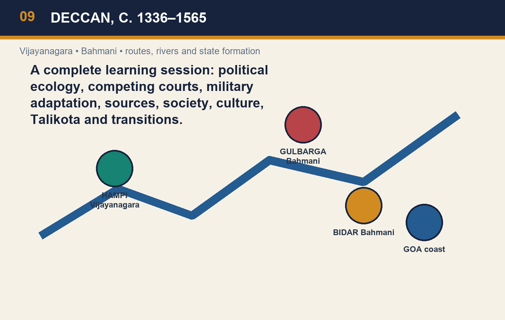

> **Subject:** Medieval Indian History | **GS Paper:** GS-I | **Export date:** 2026-08-16  
> **Approval:** false — awaiting explicit user approval.  
> **Evidence tags:** [FACT] source-grounded; [ANALYSIS] evidence-led synthesis; [LIMIT] scope or evidentiary qualification.

## BASIC LEARNING SESSION

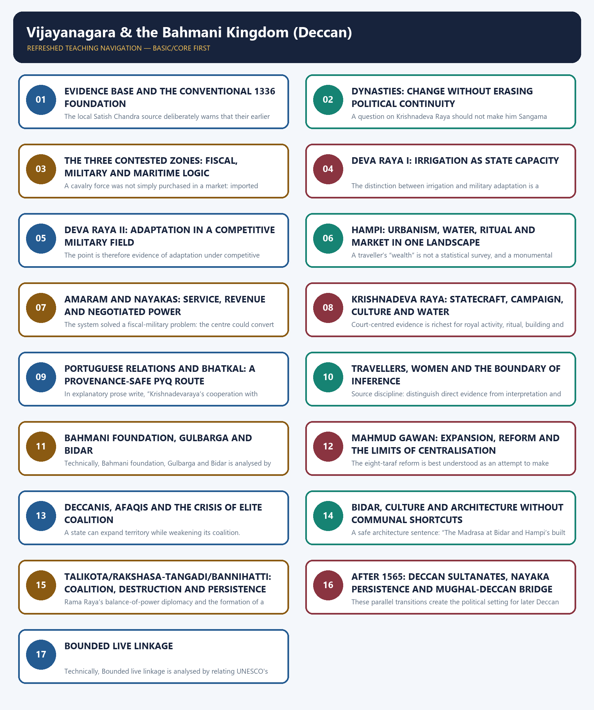

*Distinct embedded teaching-navigation image. The separate continuous Cārvāka-style flowchart package remains an independent at-a-glance artifact.*

#### Package scope, source order and evidence discipline

- This is a complete Guided-Tutor-style multi-subtopic learning session, not a revision substitute. It contains 18 teaching sections, 16 original learning MCQs, all three locally routed topic PYQs, 40 original broad MCQs, 12 original remedial MCQs, and 8 solved original Mains answers.
- **Source order used:** repository Topic 09 basic and advanced Markdown → `00_Master-Chronology.md`, PYQ ledgers, official local question/key files and the Medieval answer-worthiness audit → OCR-searchable local Satish Chandra PDFs for a corroborative source spine → one bounded live official UNESCO Hampi property-page anchor. Qdrant was not needed.
- The primary static spine is `basic/09_Vijayanagara-and-Bahmani.md` and `advanced/09_Vijayanagara-and-Bahmani.md`. The package does not convert uncertain founder narratives, traveller impressions, monument evidence or Portuguese testimony into unqualified facts.
- The live heritage anchor is intentionally limited. UNESCO’s Group of Monuments at Hampi page was checked on 2026-08-16 for surviving urban, royal, sacred and water features. It does not displace the static political-history evidence. An ASI homepage retrieval was unavailable, so no ASI claim is made.
- **PYQ verification rule:** 2024 Q56 is officially verified from a local Series-A key. The local 2021 and 2023 papers are readable, but their official keys are absent; those answers are prominently labelled inferred.
- Visual set: 27 original topic-specific PNGs including the cover. All image paths are repository-relative. Geographical drawings state “SCHEMATIC — NOT TO SCALE.”

#### Guided Tutor roadmap and retrieval strategy

| Move | Retrieval question | Evidence to deploy | UPSC output |
|---|---|---|---|
| Frame | Why do two courts fight repeatedly? | three contested zones | strategic-geography thesis |
| Qualify | How certain is the foundation story? | conventional date + source tree | historiography-safe opening |
| Compare | How did capacity work? | irrigation, cavalry, amaram, taraf | comparative institution paragraph |
| Read evidence | What can sources establish? | travellers, Hampi, Bidar, Portuguese testimony | claim with limit |
| Explain rupture | What changed in 1565? | coalition, capital destruction, Aravidu persistence | turning point, not extinction |
| Bridge | Why does this matter later? | successor states and nayakas | Mughal-Deccan transition |


*Topic 09 cover — Deccan political field; a schematic study map, not a literal historical map.*

#### How to use this session

Read each section in the sequence **visual → fact → mechanism → qualification → question**. The visual is a retrieval device, not a substitute for historical evidence. For every answer, use the evidence spine: **claim → named ruler/site/source → analysis of what it proves → limitation → verdict**. This package intentionally corrects three common errors: reducing the Deccan to a communal binary, treating Talikota as instant extinction, and treating a traveller or monument as a complete social census.

### 01. Roadmap: read the Deccan as a connected political field

#### Pre-teach evidence check

- **Book context:** queried — local Topic 09 basic/advanced Markdown and Satish Chandra source spine.
- **CA / heritage anchor:** no dynamic claim required; UNESCO Hampi property page checked only for bounded site evidence.
- **Source discipline:** distinguish direct evidence from interpretation and state what the source cannot prove.

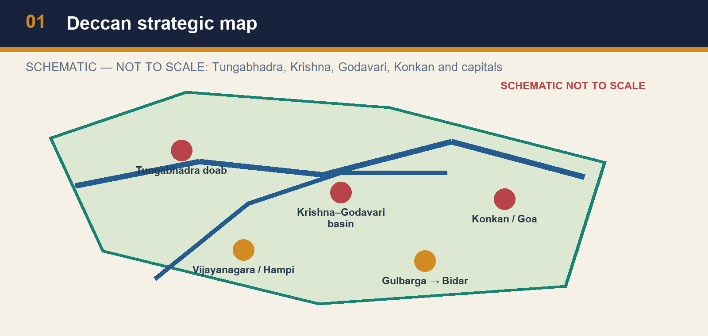

*Deccan strategic map*

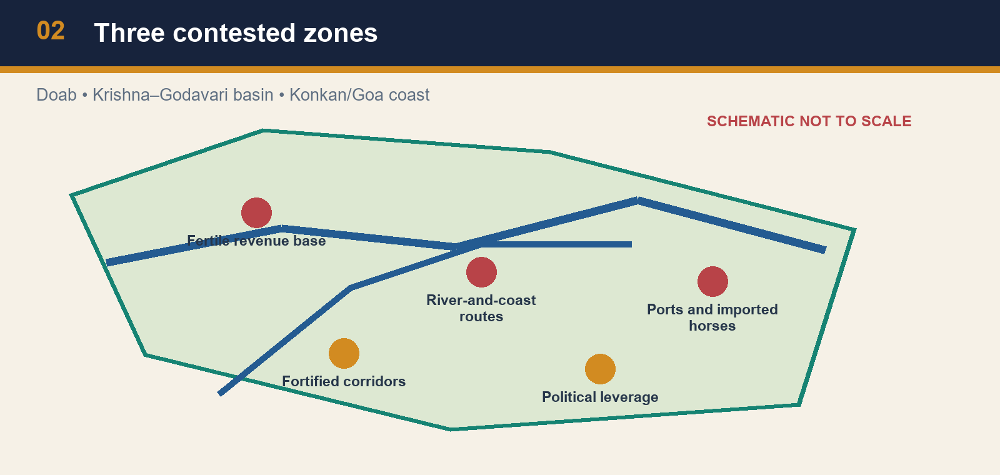

*Three contested zones*

[FACT] Vijayanagara and the Bahmani kingdom emerged in the fourteenth-century Deccan and remained major powers for more than two centuries. Their recurrent warfare is easiest to understand through political geography. The fertile Tungabhadra doab was a revenue-bearing frontier; the Krishna–Godavari basin combined cultivation with routes and ports; and the Konkan–Goa coast connected the interior to imported horses and maritime commerce. These stakes did not remove ideology or ritual from politics, but they rule out a one-dimensional “Hindu versus Muslim” explanation.

[ANALYSIS] Treat the Deccan as a field of corridors and resource chains. A court required grain and taxable cultivation, forts and commanders to hold routes, cavalry to compete in war, and merchant connections to obtain high-value inputs. Each object of conflict therefore had more than one function. The doab could feed armies and secure a frontier. A basin could connect agrarian surplus to coastal circulation. A port could yield customs and, critically, connect a ruler to the West Asian horse trade. An answer that says only “territory” misses the mechanism.

[LIMIT] “Strategic” does not mean that all strategic choices were rational or successful. Dynastic rivalries, elite factions, local alliances, natural terrain and incomplete information shaped outcomes. Nor should geographical labels be treated as modern fixed borders. The value of the map is to ask what a zone enabled—revenue, mobility, access or leverage—and then to connect that capability to a named ruler or institution.

#### Analytical drill

Use a three-step retrieval rule. First name the zone. Second identify the resource or route it controlled. Third give the political consequence: the Tungabhadra doab produced a recurring frontier; the Krishna–Godavari basin joined agrarian and commercial interests; the Konkan coast made Goa and related ports valuable in a cavalry age. This method also prevents an avoidable communal binary. Deva Raya II recruited Muslim cavalrymen and archers, while alliances and negotiations crossed formal religious labels. Conflict and cultural interaction ran together.

### SESSION 1 — EVIDENCE BASE AND THE CONVENTIONAL 1336 FOUNDATION

#### DEFINITION / WHAT THIS IS CALLED

**Plain-language definition:** The conventional date for Vijayanagara’s foundation is c.

**Technical definition:** The local Satish Chandra source deliberately warns that their earlier affiliations and the foundation narrative are disputed.

#### ANSWER-GRABBING OPENING — WRITE/ADAPT IN THE EXAM

> The conventional date for Vijayanagara’s foundation is c.

#### MUST-WRITE KEYWORDS

- **Evidence base**
- **the conventional 1336 foundation**
- **CA / heritage anchor**
- **Source discipline**
- **The conventional date for Vijayanagara’s foundation**
- **Vijayanagara’s**

**How to use them:** Frame the answer through Evidence base; define the conventional 1336 foundation, connect CA / heritage anchor with Source discipline to explain the mechanism, and use The conventional date for Vijayanagara’s foundation for the decisive comparison or qualification.

#### Pre-teach evidence check

- **Book context:** queried — local Topic 09 basic/advanced Markdown and Satish Chandra source spine.
- **CA / heritage anchor:** no dynamic claim required; UNESCO Hampi property page checked only for bounded site evidence.
- **Source discipline:** distinguish direct evidence from interpretation and state what the source cannot prove.


*Foundation debate and source tree*


*Source criticism ladder*

[FACT] The conventional date for Vijayanagara’s foundation is c. 1336 and its founders are conventionally identified as the brothers Harihara and Bukka. The local Satish Chandra source deliberately warns that their earlier affiliations and the foundation narrative are disputed. This is not an invitation to discard the date in every exam answer. It is an instruction to distinguish a convenient chronological anchor from a fully settled origin story.

[ANALYSIS] The popular account in which the brothers were linked in a simple, linear way to Kampili, conversion, Vidyaranya and a civilisational mission is a synthesis of later traditions, literary memories and political retellings. A historian should separate four questions: when a new centre became politically visible; who exercised authority; which sources narrate origins; and what later communities needed the story to mean. The first question can have a useful conventional answer even when the other three remain debated.

[LIMIT] Avoid replacing one certainty with another. It is unsafe to say that the founders’ precise biography is “proved” by a single later narrative; it is equally unsafe to imply that uncertainty about origins means no political formation occurred. Archaeology, inscriptions, court traditions and later historiography have different evidentiary reach. In a Mains answer, mark the foundation narrative as debated and move quickly to the measurable evidence of state formation—capital, dynastic sequence, military rivalry and agrarian expansion.

#### Analytical drill

A source-critical sentence earns marks because it narrows a claim rather than making it vague: “c. 1336 is a conventional political anchor; Harihara–Bukka origin narratives are contested and should not be converted into a simple civilisational origin myth.” Then support the next paragraph with better-attested institutions. This is a method point, not a denial of Vijayanagara’s importance.

#### CLOSING RECALL FLOW — EVIDENCE BASE AND THE CONVENTIONAL 1336 FOUNDATION

```text
START / CONCEPT: Evidence base and the conventional 1336 foundation
        |
        v
EXACT TERMS: Evidence base · the conventional 1336 foundation · CA / heritage anchor · Source discipline · The conventional date for Vijayanagara’s foundation · Vijayanagara’s
        |
        v
MECHANISM / ARGUMENT: It is unsafe to say that the founders’ precise biography is “proved” by a single later narrative; it is equally unsafe to imply that uncertainty about origins means no political formation occurred.
        |
        v
CONSEQUENCE / CONTRAST: 1336 is a conventional political anchor; Harihara–Bukka origin narratives are contested and should not be converted into a simple civilisational origin myth.” Then support the next paragraph with better-attested institutions.
        |
        v
UPSC TRAP / ANSWER-USE: This is a method point, not a denial of Vijayanagara’s importance.
        |
        v
ANSWER-GRABBING FORMULATION: The conventional date for Vijayanagara’s foundation is c.
```
### SESSION 2 — DYNASTIES: CHANGE WITHOUT ERASING POLITICAL CONTINUITY

#### DEFINITION / WHAT THIS IS CALLED

**Plain-language definition:** Dynasties: change without erasing political continuity comprises Dynasties, change without erasing political continuity and CA / heritage anchor as its core connected dimensions.

**Technical definition:** A question on Krishnadeva Raya should not make him Sangama merely because he ruled “Vijayanagara.” Write the dynasty and then explain what continuity—imperial centre, military claims and regional networks—survived the change.

#### ANSWER-GRABBING OPENING — WRITE/ADAPT IN THE EXAM

> A question on Krishnadeva Raya should not make him Sangama merely because he ruled “Vijayanagara.” Write the dynasty and then explain what continuity—imperial centre, military claims and regional networks—survived the change.

#### MUST-WRITE KEYWORDS

- **Dynasties**
- **change without erasing political continuity**
- **CA / heritage anchor**
- **Source discipline**
- **Vijayanagara’s dynastic sequence**
- **1509–29**

**How to use them:** Frame the answer through Dynasties; define change without erasing political continuity, connect CA / heritage anchor with Source discipline to explain the mechanism, and use Vijayanagara’s dynastic sequence for the decisive comparison or qualification.

#### Pre-teach evidence check

- **Book context:** queried — local Topic 09 basic/advanced Markdown and Satish Chandra source spine.
- **CA / heritage anchor:** no dynamic claim required; UNESCO Hampi property page checked only for bounded site evidence.
- **Source discipline:** distinguish direct evidence from interpretation and state what the source cannot prove.


*Chronology as argument*


*Vijayanagara dynastic transitions*

[FACT] Vijayanagara’s dynastic sequence is Sangama, Saluva, Tuluva and Aravidu. The Tuluva phase includes Krishnadeva Raya, conventionally dated 1509–29 in the repository chronology. The Aravidu line continued after the 1565 catastrophe. A Prelims answer needs the sequence; a Mains answer must add the historical point that dynastic replacement did not automatically dissolve the political formation.

[ANALYSIS] Dynastic change is a sign of elite reconfiguration. It may arise from military intervention, a succession crisis, court factions or the inability of a ruling line to control provincial commanders. But a new line can retain the capital’s prestige, revenue arrangements, temples, military personnel, territorial ambitions and diplomatic vocabulary. Thus Sangama-to-Saluva-to-Tuluva is not a set of unrelated kingdoms. It is a long political project in which authority was repeatedly reassembled. The same distinction helps explain why the Aravidus’ survival matters after Talikota.

[LIMIT] Continuity should not be overstated. A changing dynasty could alter the balance between the centre and nayaks, the scale of campaigns or the pattern of coastal diplomacy. “Vijayanagara state” is a useful analytical shorthand, not a claim that every ruler governed with the same resources. When a question asks about Krishnadeva Raya, attach him to the Tuluva dynasty; when it asks about 1565, state that Aravidu persistence qualifies an extinction narrative.

#### Analytical drill

Chronology is most useful when it stops an analytical mistake. A question on Talikota should not end with “the empire ceased in 1565”: that ignores Aravidu continuation. A question on Krishnadeva Raya should not make him Sangama merely because he ruled “Vijayanagara.” Write the dynasty and then explain what continuity—imperial centre, military claims and regional networks—survived the change.

#### CLOSING RECALL FLOW — DYNASTIES: CHANGE WITHOUT ERASING POLITICAL CONTINUITY

```text
START / CONCEPT: Dynasties: change without erasing political continuity
        |
        v
EXACT TERMS: Dynasties · change without erasing political continuity · CA / heritage anchor · Source discipline · Vijayanagara’s dynastic sequence · 1509–29
        |
        v
MECHANISM / ARGUMENT: A Prelims answer needs the sequence; a Mains answer must add the historical point that dynastic replacement did not automatically dissolve the political formation.
        |
        v
CONSEQUENCE / CONTRAST: But a new line can retain the capital’s prestige, revenue arrangements, temples, military personnel, territorial ambitions and diplomatic vocabulary.
        |
        v
UPSC TRAP / ANSWER-USE: “Vijayanagara state” is a useful analytical shorthand, not a claim that every ruler governed with the same resources.
        |
        v
ANSWER-GRABBING FORMULATION: A question on Krishnadeva Raya should not make him Sangama merely because he ruled “Vijayanagara.” Write the dynasty and then explain what continuity—imperial centre, military claims and regional networks—survived the change.
```
### SESSION 3 — THE THREE CONTESTED ZONES: FISCAL, MILITARY AND MARITIME LOGIC

#### DEFINITION / WHAT THIS IS CALLED

**Plain-language definition:** Holding a doab was useful for revenue and a forward military position; controlling a coast could secure customs, maritime relations and horse supply; influence in the Krishna–Godavari zone could connect riverine and littoral resources.

**Technical definition:** A cavalry force was not simply purchased in a market: imported horses needed merchants, ports, safe movement, payment and a military organisation capable of maintaining them.

#### ANSWER-GRABBING OPENING — WRITE/ADAPT IN THE EXAM

> A cavalry force was not simply purchased in a market: imported horses needed merchants, ports, safe movement, payment and a military organisation capable of maintaining them.

#### MUST-WRITE KEYWORDS

- **The three contested zones**
- **fiscal**
- **military**
- **maritime logic**
- **CA / heritage anchor**
- **Source discipline**

**How to use them:** Frame the answer through The three contested zones; define fiscal, connect military with maritime logic to explain the mechanism, and use CA / heritage anchor for the decisive comparison or qualification.

#### Pre-teach evidence check

- **Book context:** queried — local Topic 09 basic/advanced Markdown and Satish Chandra source spine.
- **CA / heritage anchor:** no dynamic claim required; UNESCO Hampi property page checked only for bounded site evidence.
- **Source discipline:** distinguish direct evidence from interpretation and state what the source cannot prove.


*Three contested zones*


*Horse–port–military chain*

[FACT] The local source identifies three principal zones of conflict: the Tungabhadra doab, the Krishna–Godavari basin and the Konkan/Goa coast. The doab was fertile and strategically placed. The basin offered fertile land and ports tied to regional foreign trade. The Konkan coast mattered because horses from Iran and Iraq were important for south Indian armies. These are the fixed evidence units around which an answer can be built.

[ANALYSIS] The zones were linked rather than interchangeable. Holding a doab was useful for revenue and a forward military position; controlling a coast could secure customs, maritime relations and horse supply; influence in the Krishna–Godavari zone could connect riverine and littoral resources. A cavalry force was not simply purchased in a market: imported horses needed merchants, ports, safe movement, payment and a military organisation capable of maintaining them. Hence a conflict over Goa could have consequences far beyond a shoreline.

[LIMIT] Do not invent prices, customs rates or horse numbers when the source does not supply them. Nor should imported horses be made the sole explanation of warfare. Infantry, fortification, local support, artillery, commanders and seasonal logistics also mattered. The defensible proposition is comparative: access to high-quality imported mounts created a strategic premium for ports and coastal routes, intensifying competition between Deccan powers.

#### Analytical drill

For a 10-marker, make each zone a causal sentence: “Tungabhadra doab—revenue and frontier; Krishna–Godavari—agrarian-commercial basin; Konkan/Goa—ports and horse supply.” Add the Deva Raya II adaptation as evidence that military competition encouraged borrowing. Finish by saying this multidimensional geography explains why the rivalry cannot be reduced to religion alone.

#### CLOSING RECALL FLOW — THE THREE CONTESTED ZONES: FISCAL, MILITARY AND MARITIME LOGIC

```text
START / CONCEPT: The three contested zones: fiscal, military and maritime logic
        |
        v
EXACT TERMS: The three contested zones · fiscal · military · maritime logic · CA / heritage anchor · Source discipline
        |
        v
MECHANISM / ARGUMENT: Holding a doab was useful for revenue and a forward military position; controlling a coast could secure customs, maritime relations and horse supply; influence in the Krishna–Godavari zone could connect riverine and littoral resources.
        |
        v
CONSEQUENCE / CONTRAST: Do not invent prices, customs rates or horse numbers when the source does not supply them.
        |
        v
UPSC TRAP / ANSWER-USE: Source discipline: distinguish direct evidence from interpretation and state what the source cannot prove.
        |
        v
ANSWER-GRABBING FORMULATION: A cavalry force was not simply purchased in a market: imported horses needed merchants, ports, safe movement, payment and a military organisation capable of maintaining them.
```
### SESSION 4 — DEVA RAYA I: IRRIGATION AS STATE CAPACITY

#### DEFINITION / WHAT THIS IS CALLED

**Plain-language definition:** The correct way to use irrigation in Mains is: claim that water control enlarged state capacity; name Deva Raya I’s Tungabhadra dam and canal; explain cultivation, revenue and capital provisioning; qualify that the work does not alone measure social welfare.

**Technical definition:** The distinction between irrigation and military adaptation is a high-value elimination rule.

#### ANSWER-GRABBING OPENING — WRITE/ADAPT IN THE EXAM

> The correct way to use irrigation in Mains is: claim that water control enlarged state capacity; name Deva Raya I’s Tungabhadra dam and canal; explain cultivation, revenue and capital provisioning; qualify that the work does not alone measure social welfare.

#### MUST-WRITE KEYWORDS

- **Deva Raya I**
- **irrigation as state capacity**
- **CA / heritage anchor**
- **Source discipline**
- **Irrigation works**
- **Irrigation**

**How to use them:** Frame the answer through Deva Raya I; define irrigation as state capacity, connect CA / heritage anchor with Source discipline to explain the mechanism, and use Irrigation works for the decisive comparison or qualification.

#### Pre-teach evidence check

- **Book context:** queried — local Topic 09 basic/advanced Markdown and Satish Chandra source spine.
- **CA / heritage anchor:** no dynamic claim required; UNESCO Hampi property page checked only for bounded site evidence.
- **Source discipline:** distinguish direct evidence from interpretation and state what the source cannot prove.


*Tungabhadra irrigation*

[FACT] Deva Raya I ruled from 1404 to 1422 in the repository’s chronology. The source associates him with a dam across the Tungabhadra and canals that increased cultivation and revenue. UPSC Prelims 2023 Q48 specifically asked which Vijayanagara ruler constructed a large dam across the Tungabhadra and a canal-cum-aqueduct several kilometres long from the river to the capital city. The locally readable question paper preserves the option order and names Devaraya I as option (a).

[ANALYSIS] Irrigation works are an answer-engine, not an ornament. A dam and canal can redistribute water, improve the reliability of cultivation, support crops and population, and make an urban centre more provisionable. The fiscal result is conditional: better production must still be assessed, collected and protected. But the institutional chain—water management to agrarian surplus to revenue and provisioning—explains why hydraulic works can be part of a ruler’s political capacity.

[LIMIT] It would be careless to infer that every cultivator benefitted equally or that a single canal explains imperial prosperity. Engineering survives as material evidence, while its distributional consequences need more evidence. Do not confuse this ruler with Deva Raya II, whose signature in the source is army reorganisation. The distinction between irrigation and military adaptation is a high-value elimination rule.

#### Analytical drill

The correct way to use irrigation in Mains is: claim that water control enlarged state capacity; name Deva Raya I’s Tungabhadra dam and canal; explain cultivation, revenue and capital provisioning; qualify that the work does not alone measure social welfare. That sequence turns a familiar fact into analysis and also trains the 2023 PYQ route.

#### CLOSING RECALL FLOW — DEVA RAYA I: IRRIGATION AS STATE CAPACITY

```text
START / CONCEPT: Deva Raya I: irrigation as state capacity
        |
        v
EXACT TERMS: Deva Raya I · irrigation as state capacity · CA / heritage anchor · Source discipline · Irrigation works · Irrigation
        |
        v
MECHANISM / ARGUMENT: The fiscal result is conditional: better production must still be assessed, collected and protected.
        |
        v
CONSEQUENCE / CONTRAST: Do not confuse this ruler with Deva Raya II, whose signature in the source is army reorganisation.
        |
        v
UPSC TRAP / ANSWER-USE: Irrigation works are an answer-engine, not an ornament.
        |
        v
ANSWER-GRABBING FORMULATION: The correct way to use irrigation in Mains is: claim that water control enlarged state capacity; name Deva Raya I’s Tungabhadra dam and canal; explain cultivation, revenue and capital provisioning; qualify that the work does not alone measure social welfare.
```
### SESSION 5 — DEVA RAYA II: ADAPTATION IN A COMPETITIVE MILITARY FIELD

#### DEFINITION / WHAT THIS IS CALLED

**Plain-language definition:** Deva Raya II ruled from 1425 to 1446 and is associated with army reorganisation and a period of prosperity.

**Technical definition:** The point is therefore evidence of adaptation under competitive pressure.

#### ANSWER-GRABBING OPENING — WRITE/ADAPT IN THE EXAM

> Deva Raya II ruled from 1425 to 1446 and is associated with army reorganisation and a period of prosperity.

#### MUST-WRITE KEYWORDS

- **Deva Raya II**
- **adaptation in a competitive military field**
- **CA / heritage anchor**
- **Source discipline**
- **It**
- **Bahmani**

**How to use them:** Frame the answer through Deva Raya II; define adaptation in a competitive military field, connect CA / heritage anchor with Source discipline to explain the mechanism, and use It for the decisive comparison or qualification.

#### Pre-teach evidence check

- **Book context:** queried — local Topic 09 basic/advanced Markdown and Satish Chandra source spine.
- **CA / heritage anchor:** no dynamic claim required; UNESCO Hampi property page checked only for bounded site evidence.
- **Source discipline:** distinguish direct evidence from interpretation and state what the source cannot prove.


*Deva Raya II's military adaptation*

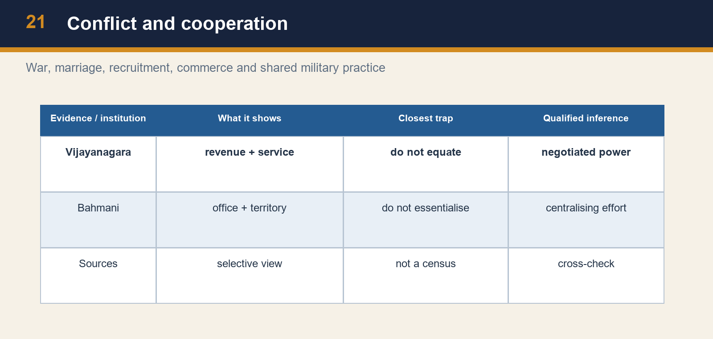

*Conflict and cooperation*

[FACT] Deva Raya II ruled from 1425 to 1446 and is associated with army reorganisation and a period of prosperity. The source says that he employed Muslim cavalrymen and archers and learned from Sultanate military methods. It treats this as a response to the Bahmani advantage in horses and mounted archery. The point is therefore evidence of adaptation under competitive pressure.

[ANALYSIS] Recruitment across political and religious boundaries demonstrates a practical military logic. Mounted archery, cavalry command and access to trained personnel mattered in contests where imported horses were scarce and expensive. A ruler could borrow a method, recruit a specialist and still retain a distinct courtly idiom. This is a strong counter to arguments that make the two states sealed civilisational blocks. Military rivalry generated learning as well as fighting.

[LIMIT] Do not overgeneralise from a court army to the entire social order. The evidence concerns military organisation and ruling strategy, not a guarantee of permanent harmony. Nor should adaptation be written as passive imitation: rulers selected, financed and embedded techniques in local institutions. A nuanced comparison says that Vijayanagara emphasised military adaptation under Deva Raya II while the later Bahmani court under Mahmud Gawan pursued administrative centralisation—two responses to a common competitive environment.

#### Analytical drill

Remember a paired contrast. Deva Raya I = irrigation; Deva Raya II = cavalry and archers; Mahmud Gawan = eight tarafs and centralising reforms. This three-part contrast supports both Prelims elimination and a 15-mark comparison without forcing Vijayanagara and Bahmani institutions into false equivalents.

#### CLOSING RECALL FLOW — DEVA RAYA II: ADAPTATION IN A COMPETITIVE MILITARY FIELD

```text
START / CONCEPT: Deva Raya II: adaptation in a competitive military field
        |
        v
EXACT TERMS: Deva Raya II · adaptation in a competitive military field · CA / heritage anchor · Source discipline · It · Bahmani
        |
        v
MECHANISM / ARGUMENT: The point is therefore evidence of adaptation under competitive pressure.
        |
        v
CONSEQUENCE / CONTRAST: Do not overgeneralise from a court army to the entire social order.
        |
        v
UPSC TRAP / ANSWER-USE: Do not miss this limiting distinction: recruitment across political and religious boundaries demonstrates a practical military logic.
        |
        v
ANSWER-GRABBING FORMULATION: Deva Raya II ruled from 1425 to 1446 and is associated with army reorganisation and a period of prosperity.
```
### SESSION 6 — HAMPI: URBANISM, WATER, RITUAL AND MARKET IN ONE LANDSCAPE

#### DEFINITION / WHAT THIS IS CALLED

**Plain-language definition:** The live UNESCO World Heritage Centre page for the Group of Monuments at Hampi, checked for this package, identifies Hampi as the capital city of Vijayanagara in the Tungabhadra basin and describes more than 1,600 surviving remains, including forts, riverside features, royal and sacred complexes, water structures, check posts, bazaars and suburban settlements.

**Technical definition:** A traveller’s “wealth” is not a statistical survey, and a monumental landscape cannot by itself prove a uniformly prosperous society.

#### ANSWER-GRABBING OPENING — WRITE/ADAPT IN THE EXAM

> A traveller’s “wealth” is not a statistical survey, and a monumental landscape cannot by itself prove a uniformly prosperous society.

#### MUST-WRITE KEYWORDS

- **Hampi**
- **urbanism**
- **water**
- **ritual**
- **market in one landscape**
- **CA / heritage anchor**

**How to use them:** Frame the answer through Hampi; define urbanism, connect water with ritual to explain the mechanism, and use market in one landscape for the decisive comparison or qualification.

#### Pre-teach evidence check

- **Book context:** queried — local Topic 09 basic/advanced Markdown and Satish Chandra source spine.
- **CA / heritage anchor:** no dynamic claim required; UNESCO Hampi property page checked only for bounded site evidence.
- **Source discipline:** distinguish direct evidence from interpretation and state what the source cannot prove.


*Hampi urban system*

[FACT] Abdur Razzaq’s description is commonly used for Vijayanagara’s seven enclosures, bazaars, canals and wealth; Nicolo Conti, Domingo Paes, Barbosa and Nuniz are also important witnesses. The live UNESCO World Heritage Centre page for the Group of Monuments at Hampi, checked for this package, identifies Hampi as the capital city of Vijayanagara in the Tungabhadra basin and describes more than 1,600 surviving remains, including forts, riverside features, royal and sacred complexes, water structures, check posts, bazaars and suburban settlements.

[ANALYSIS] Hampi should be read as an integrated city-region. Enclosures and fortifications organised protection; royal and sacred complexes made authority visible; market streets and mandapas connected ritual circulation to commerce; tanks, channels and the Tungabhadra landscape supported water management. The analytical value lies in the relationship between elements. A temple is not only a religious structure, a bazaar is not only a commercial structure, and a canal is not only an engineering work: together they reveal how authority, provisioning, mobility and legitimacy were spatially coordinated.

[LIMIT] A traveller’s “wealth” is not a statistical survey, and a monumental landscape cannot by itself prove a uniformly prosperous society. The UNESCO description is an official heritage synthesis, not a substitute for fourteenth- or fifteenth-century documents. Use it as a bounded material anchor for urban systems and preservation, while grounding state history in the local source spine.

#### Analytical drill

The heritage anchor is deliberately bounded. The UNESCO page supports the existence and integrated character of surviving complexes and water features at Hampi. It must not be used to invent excavation finds, annual visitor figures or conservation claims not present on the official page. In an answer, name Hampi’s Tungabhadra setting, then connect water, defence, sacred space and markets.

#### CLOSING RECALL FLOW — HAMPI: URBANISM, WATER, RITUAL AND MARKET IN ONE LANDSCAPE

```text
START / CONCEPT: Hampi: urbanism, water, ritual and market in one landscape
        |
        v
EXACT TERMS: Hampi · urbanism · water · ritual · market in one landscape · CA / heritage anchor
        |
        v
MECHANISM / ARGUMENT: The live UNESCO World Heritage Centre page for the Group of Monuments at Hampi, checked for this package, identifies Hampi as the capital city of Vijayanagara in the Tungabhadra basin and describes more than 1,600 surviving remains, including forts, riverside features, royal and sacred complexes, water structures, check posts, bazaars and suburban settlements.
        |
        v
CONSEQUENCE / CONTRAST: A temple is not only a religious structure, a bazaar is not only a commercial structure, and a canal is not only an engineering work: together they reveal how authority, provisioning, mobility and legitimacy were spatially coordinated.
        |
        v
UPSC TRAP / ANSWER-USE: The UNESCO description is an official heritage synthesis, not a substitute for fourteenth- or fifteenth-century documents.
        |
        v
ANSWER-GRABBING FORMULATION: A traveller’s “wealth” is not a statistical survey, and a monumental landscape cannot by itself prove a uniformly prosperous society.
```
### SESSION 7 — AMARAM AND NAYAKAS: SERVICE, REVENUE AND NEGOTIATED POWER

#### DEFINITION / WHAT THIS IS CALLED

**Plain-language definition:** The source describes the amaram system as territorial revenue assignments to hereditary nayakas in return for troops and service.

**Technical definition:** The system solved a fiscal-military problem: the centre could convert local revenue into military service without directly administering every locality.

#### ANSWER-GRABBING OPENING — WRITE/ADAPT IN THE EXAM

> The source describes the amaram system as territorial revenue assignments to hereditary nayakas in return for troops and service.

#### MUST-WRITE KEYWORDS

- **Amaram**
- **nayakas**
- **service**
- **revenue**
- **negotiated power**
- **CA / heritage anchor**

**How to use them:** Frame the answer through Amaram; define nayakas, connect service with revenue to explain the mechanism, and use negotiated power for the decisive comparison or qualification.

#### Pre-teach evidence check

- **Book context:** queried — local Topic 09 basic/advanced Markdown and Satish Chandra source spine.
- **CA / heritage anchor:** no dynamic claim required; UNESCO Hampi property page checked only for bounded site evidence.
- **Source discipline:** distinguish direct evidence from interpretation and state what the source cannot prove.

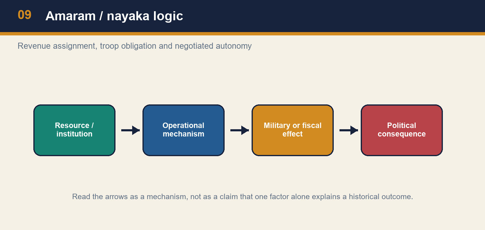

*Amaram / nayaka logic*


*Comparative fiscal-military systems*

[FACT] The source describes the amaram system as territorial revenue assignments to hereditary nayakas in return for troops and service. It explicitly cautions against equating amaram with the transferable Sultanate iqta. Nayakas could administer their amaram territories and their hereditary position gave them a social and political base distinct from a routinely transferable revenue assignee.

[ANALYSIS] The system solved a fiscal-military problem: the centre could convert local revenue into military service without directly administering every locality. A nayaka’s ability to mobilise troops and manage revenue strengthened the state when interests aligned. Yet the same arrangement generated a structural tension. Hereditary local power could make the centre dependent on intermediaries, especially during succession crises or after military defeat. This is not proof that Vijayanagara was simply decentralised; it is evidence of central ambitions exercised through negotiated territorial service.

[LIMIT] Avoid crude analogies. “Amaram = iqta” loses differences in heredity, transferability and political context. “Nayakas = independent kings” loses the service relationship and central claims. A strong answer uses a two-sided formulation: amaram enabled imperial mobilisation, but its local hereditary basis placed limits on centralisation and helped regional autonomy expand under later stress.

#### Analytical drill

Comparison sentence: “Unlike a transferable iqta ideal, amaram was tied to hereditary nayaka service and therefore combined military utility with a stronger local stake.” Then attach the post-1565 qualification: the persistence and growing autonomy of regional nayaka formations help explain why capital destruction did not erase all political capacity, but did weaken imperial concentration.

#### CLOSING RECALL FLOW — AMARAM AND NAYAKAS: SERVICE, REVENUE AND NEGOTIATED POWER

```text
START / CONCEPT: Amaram and nayakas: service, revenue and negotiated power
        |
        v
EXACT TERMS: Amaram · nayakas · service · revenue · negotiated power · CA / heritage anchor
        |
        v
MECHANISM / ARGUMENT: The system solved a fiscal-military problem: the centre could convert local revenue into military service without directly administering every locality.
        |
        v
CONSEQUENCE / CONTRAST: Comparison sentence: “Unlike a transferable iqta ideal, amaram was tied to hereditary nayaka service and therefore combined military utility with a stronger local stake.” Then attach the post-1565 qualification: the persistence and growing autonomy of regional nayaka formations help explain why capital destruction did not erase all political capacity, but did weaken imperial concentration.
        |
        v
UPSC TRAP / ANSWER-USE: This is not proof that Vijayanagara was simply decentralised; it is evidence of central ambitions exercised through negotiated territorial service.
        |
        v
ANSWER-GRABBING FORMULATION: The source describes the amaram system as territorial revenue assignments to hereditary nayakas in return for troops and service.
```
### SESSION 8 — KRISHNADEVA RAYA: STATECRAFT, CAMPAIGN, CULTURE AND WATER

#### DEFINITION / WHAT THIS IS CALLED

**Plain-language definition:** These are evidence units for statecraft, not a licence for undifferentiated praise.

**Technical definition:** Court-centred evidence is richest for royal activity, ritual, building and elite culture.

#### ANSWER-GRABBING OPENING — WRITE/ADAPT IN THE EXAM

> These are evidence units for statecraft, not a licence for undifferentiated praise.

#### MUST-WRITE KEYWORDS

- **Krishnadeva Raya**
- **statecraft**
- **campaign**
- **culture**
- **water**
- **CA / heritage anchor**

**How to use them:** Frame the answer through Krishnadeva Raya; define statecraft, connect campaign with culture to explain the mechanism, and use water for the decisive comparison or qualification.

#### Pre-teach evidence check

- **Book context:** queried — local Topic 09 basic/advanced Markdown and Satish Chandra source spine.
- **CA / heritage anchor:** no dynamic claim required; UNESCO Hampi property page checked only for bounded site evidence.
- **Source discipline:** distinguish direct evidence from interpretation and state what the source cannot prove.

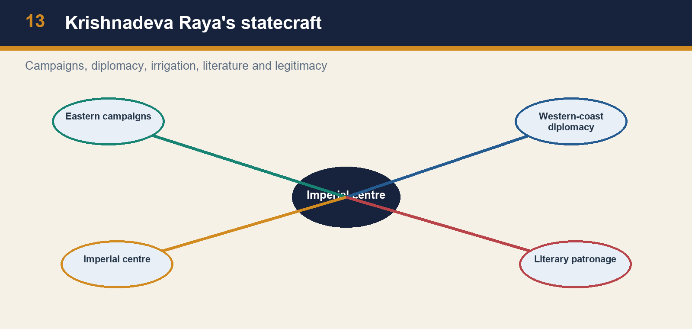

*Krishnadeva Raya's statecraft*

[FACT] Krishnadeva Raya of the Tuluva dynasty ruled 1509–29 in the repository chronology. The local source treats him as a ruler who restored internal order, defeated rivals, patronised literature and built tanks and towns. The UNESCO Hampi page describes the reign as the city’s apogee and notes the Raya Gopura as a landmark associated with Raja Krishna Deva Raya. These are evidence units for statecraft, not a licence for undifferentiated praise.

[ANALYSIS] Krishnadeva Raya’s importance lies in combination. Military campaigns could reassert claims over contested regions; irrigation and town building could support agrarian and urban capacity; literary patronage could stage sovereignty in courtly and regional idioms; and Portuguese relations addressed the changing west-coast environment. A Mains answer should keep these as connected but distinct dimensions. A victorious campaign is not the same as durable administration, and cultural patronage is not proof that warfare disappeared.

[LIMIT] Do not transform “golden age” language into a social totality. Court-centred evidence is richest for royal activity, ritual, building and elite culture. It is safer to say that the reign represented a high point of imperial assertion and urban-cultural patronage, while retaining the structural constraints of nayaka power, regional rivals and shifting maritime politics.

#### Analytical drill

A useful answer spine is four verbs: **reasserted**, **provisioned**, **patronised**, **negotiated**. Reasserted power through campaigns; provisioned centre and countryside through water works; patronised literature and architecture; negotiated a pragmatic relationship with Portuguese actors. This is more analytical than a ruler’s achievement list.

#### CLOSING RECALL FLOW — KRISHNADEVA RAYA: STATECRAFT, CAMPAIGN, CULTURE AND WATER

```text
START / CONCEPT: Krishnadeva Raya: statecraft, campaign, culture and water
        |
        v
EXACT TERMS: Krishnadeva Raya · statecraft · campaign · culture · water · CA / heritage anchor
        |
        v
MECHANISM / ARGUMENT: Military campaigns could reassert claims over contested regions; irrigation and town building could support agrarian and urban capacity; literary patronage could stage sovereignty in courtly and regional idioms; and Portuguese relations addressed the changing west-coast environment.
        |
        v
CONSEQUENCE / CONTRAST: A victorious campaign is not the same as durable administration, and cultural patronage is not proof that warfare disappeared.
        |
        v
UPSC TRAP / ANSWER-USE: A Mains answer should keep these as connected but distinct dimensions.
        |
        v
ANSWER-GRABBING FORMULATION: These are evidence units for statecraft, not a licence for undifferentiated praise.
```
### SESSION 9 — PORTUGUESE RELATIONS AND BHATKAL: A PROVENANCE-SAFE PYQ ROUTE

#### DEFINITION / WHAT THIS IS CALLED

**Plain-language definition:** The safe historical inference is that Vijayanagara engaged Portuguese power pragmatically in a coast where ports, commercial links and horse supply had strategic value.

**Technical definition:** In explanatory prose write, “Krishnadevaraya’s cooperation with Portuguese actors is source-grounded, while the Bhatkal-fort wording is primarily preserved through Portuguese testimony.” This is safer than either denying the official answer or presenting the testimony as a neutral state archive.

#### ANSWER-GRABBING OPENING — WRITE/ADAPT IN THE EXAM

> The local history source also states that Krishnadevaraya’s relations with the Portuguese were broadly cooperative but cautions that the exact Bhatkal-fort formulation rests mainly on Portuguese accounts such as Barbosa and Paes.

#### MUST-WRITE KEYWORDS

- **Portuguese relations**
- **Bhatkal**
- **a provenance-safe PYQ route**
- **CA / heritage anchor**
- **Source discipline**
- **UPSC Prelims GS-I**

**How to use them:** Frame the answer through Portuguese relations; define Bhatkal, connect a provenance-safe PYQ route with CA / heritage anchor to explain the mechanism, and use Source discipline for the decisive comparison or qualification.

#### Pre-teach evidence check

- **Book context:** queried — local Topic 09 basic/advanced Markdown and Satish Chandra source spine.
- **CA / heritage anchor:** no dynamic claim required; UNESCO Hampi property page checked only for bounded site evidence.
- **Source discipline:** distinguish direct evidence from interpretation and state what the source cannot prove.


*Bhatkal: evidence provenance*


*Goa–Dabhol trade*

[FACT] UPSC Prelims GS-I 2024 Q56 locally reads: “Who of the following rulers of medieval India gave permission to the Portuguese to build a fort at Bhatkal?” Its official Series-A answer-key file is present locally and gives Q56 = A. The preserved options are (a) Krishnadevaraya, (b) Narasimha Saluva, (c) Muhammad Shah III and (d) Yusuf Adil Shah. Therefore the official answer is Krishnadevaraya. The local history source also states that Krishnadevaraya’s relations with the Portuguese were broadly cooperative but cautions that the exact Bhatkal-fort formulation rests mainly on Portuguese accounts such as Barbosa and Paes.

[ANALYSIS] This is not a contradiction. An official exam key settles the examination option; it does not erase provenance questions about how a particular claim reached later historical writing. The safe historical inference is that Vijayanagara engaged Portuguese power pragmatically in a coast where ports, commercial links and horse supply had strategic value. The Bhatkal detail should be stated precisely, not inflated into a claim that the Portuguese controlled Vijayanagara’s policy or created its military power.

[LIMIT] Do not add a treaty date, a fort plan or a grant formula unless an identified source supplies it. Do not treat all Portuguese observers as disinterested administrators. A high-quality answer names the official 2024 result, gives the cooperation-and-horse-trade context, and marks Portuguese narration as evidence with genre and interest.

#### Analytical drill

PYQ discipline: preserve the 2024 options and official A key exactly; exclude this PYQ from original-MCQ rotation. In explanatory prose write, “Krishnadevaraya’s cooperation with Portuguese actors is source-grounded, while the Bhatkal-fort wording is primarily preserved through Portuguese testimony.” This is safer than either denying the official answer or presenting the testimony as a neutral state archive.

#### CLOSING RECALL FLOW — PORTUGUESE RELATIONS AND BHATKAL: A PROVENANCE-SAFE PYQ ROUTE

```text
START / CONCEPT: Portuguese relations and Bhatkal: a provenance-safe PYQ route
        |
        v
EXACT TERMS: Portuguese relations · Bhatkal · a provenance-safe PYQ route · CA / heritage anchor · Source discipline · UPSC Prelims GS-I
        |
        v
MECHANISM / ARGUMENT: In explanatory prose write, “Krishnadevaraya’s cooperation with Portuguese actors is source-grounded, while the Bhatkal-fort wording is primarily preserved through Portuguese testimony.” This is safer than either denying the official answer or presenting the testimony as a neutral state archive.
        |
        v
CONSEQUENCE / CONTRAST: The Bhatkal detail should be stated precisely, not inflated into a claim that the Portuguese controlled Vijayanagara’s policy or created its military power.
        |
        v
UPSC TRAP / ANSWER-USE: Do not treat all Portuguese observers as disinterested administrators.
        |
        v
ANSWER-GRABBING FORMULATION: The local history source also states that Krishnadevaraya’s relations with the Portuguese were broadly cooperative but cautions that the exact Bhatkal-fort formulation rests mainly on Portuguese accounts such as Barbosa and Paes.
```
### SESSION 10 — TRAVELLERS, WOMEN AND THE BOUNDARY OF INFERENCE

#### DEFINITION / WHAT THIS IS CALLED

**Plain-language definition:** A source boundary is not a weakness.

**Technical definition:** Source discipline: distinguish direct evidence from interpretation and state what the source cannot prove.

#### ANSWER-GRABBING OPENING — WRITE/ADAPT IN THE EXAM

> A source boundary is not a weakness.

#### MUST-WRITE KEYWORDS

- **Travellers**
- **women**
- **the boundary of inference**
- **CA / heritage anchor**
- **Source discipline**
- **Nicolo Conti**

**How to use them:** Frame the answer through Travellers; define women, connect the boundary of inference with CA / heritage anchor to explain the mechanism, and use Source discipline for the decisive comparison or qualification.

#### Pre-teach evidence check

- **Book context:** queried — local Topic 09 basic/advanced Markdown and Satish Chandra source spine.
- **CA / heritage anchor:** no dynamic claim required; UNESCO Hampi property page checked only for bounded site evidence.
- **Source discipline:** distinguish direct evidence from interpretation and state what the source cannot prove.


*Traveller source matrix*

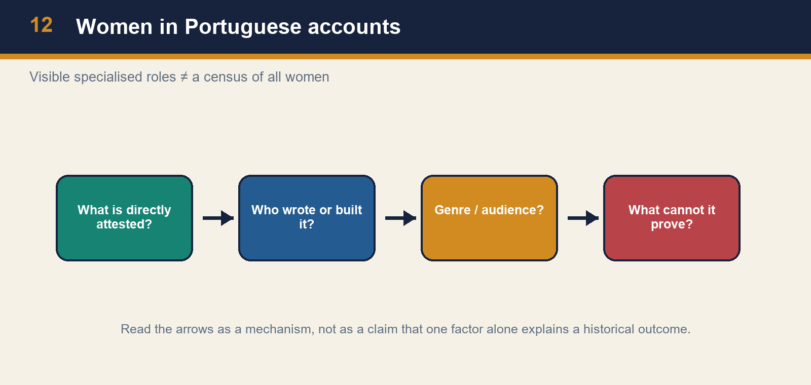

*Women in Portuguese accounts*

[FACT] Traveller accounts provide valuable but selective evidence. Nicolo Conti and Abdur Razzaq described the scale and prosperity of Vijayanagara; Paes, Barbosa and Nuniz are used for the sixteenth-century city and courtly society. UPSC Prelims 2021 Q35, preserved in the local paper, asks: according to Portuguese writer Nuniz, women in Vijayanagara were expert in wrestling, astrology, accounting and soothsaying. The original options are preserved; no official 2021 key is held locally.

[ANALYSIS] The strongest inference is narrow. The account makes visible specialised roles and expertise attributed to women in a courtly/urban context. It can enrich an answer that otherwise treats Vijayanagara only as a dynasty and army. But it cannot establish the status, occupations or freedom of all women across the empire. Travel writing is mediated by an outsider’s language, audience, curiosity and the social spaces to which the writer had access.

[LIMIT] The basic source file attributes the list to Domingo Paes, whereas the locally preserved UPSC question names Nuniz. This package preserves the exact exam wording and does not silently harmonise the discrepancy. For the PYQ, the defensible answer is an inference from the four listed activities and the local source spine, prominently marked as not officially verified. For Mains, cite “Portuguese accounts” unless a specific attribution has been independently checked.

#### Analytical drill

A source boundary is not a weakness. Write: “Nuniz’s reported list indicates visible specialised female roles in the social world he observed; it does not function as a social census.” This sentence uses evidence and immediately prevents an overclaim. It also protects against the trap of treating a traveller’s observation as a universal legal or economic statement.

#### CLOSING RECALL FLOW — TRAVELLERS, WOMEN AND THE BOUNDARY OF INFERENCE

```text
START / CONCEPT: Travellers, women and the boundary of inference
        |
        v
EXACT TERMS: Travellers · women · the boundary of inference · CA / heritage anchor · Source discipline · Nicolo Conti
        |
        v
MECHANISM / ARGUMENT: Travel writing is mediated by an outsider’s language, audience, curiosity and the social spaces to which the writer had access.
        |
        v
CONSEQUENCE / CONTRAST: This package preserves the exact exam wording and does not silently harmonise the discrepancy.
        |
        v
UPSC TRAP / ANSWER-USE: For the PYQ, the defensible answer is an inference from the four listed activities and the local source spine, prominently marked as not officially verified.
        |
        v
ANSWER-GRABBING FORMULATION: A source boundary is not a weakness.
```
### SESSION 11 — BAHMANI FOUNDATION, GULBARGA AND BIDAR

#### DEFINITION / WHAT THIS IS CALLED

**Plain-language definition:** The Bahmani kingdom was founded in 1347 by Hasan Gangu/Alauddin Bahman Shah and is conventionally described as the first independent Deccan Muslim state.

**Technical definition:** Technically, Bahmani foundation, Gulbarga and Bidar is analysed by relating Bahmani foundation to Gulbarga, then testing the relationship through Bidar and CA / heritage anchor.

#### ANSWER-GRABBING OPENING — WRITE/ADAPT IN THE EXAM

> Use the chronology safely: 1347 Bahmani foundation; Gulbarga early capital; Bidar under Ahmad Shah; Mahmud Gawan’s ministerial prominence 1463–82; execution in 1482; subsequent disintegration.

#### MUST-WRITE KEYWORDS

- **Bahmani foundation**
- **Gulbarga**
- **Bidar**
- **CA / heritage anchor**
- **Source discipline**
- **1463–82**

**How to use them:** Frame the answer through Bahmani foundation; define Gulbarga, connect Bidar with CA / heritage anchor to explain the mechanism, and use Source discipline for the decisive comparison or qualification.

#### Pre-teach evidence check

- **Book context:** queried — local Topic 09 basic/advanced Markdown and Satish Chandra source spine.
- **CA / heritage anchor:** no dynamic claim required; UNESCO Hampi property page checked only for bounded site evidence.
- **Source discipline:** distinguish direct evidence from interpretation and state what the source cannot prove.

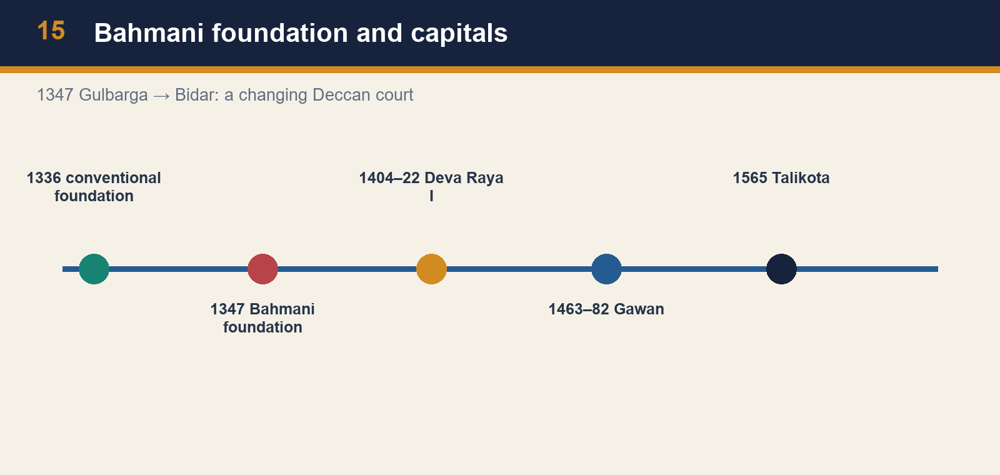

*Bahmani foundation and capitals*

[FACT] The Bahmani kingdom was founded in 1347 by Hasan Gangu/Alauddin Bahman Shah and is conventionally described as the first independent Deccan Muslim state. Gulbarga was an early capital. Ahmad Shah shifted the capital to Bidar. The change of capital is a chronological fact, but it is also a clue to changing political geography, court culture and administration.

[ANALYSIS] A capital concentrates several state functions: ruler and household, office holders, ceremonial display, fortification, markets, learning and diplomatic reception. A capital shift can therefore express a reorientation of political advantage rather than a mere relocation. Bahmani authority was never simply “north Indian” transplanted into the Deccan; it developed through Deccan elites, immigrants, local resources and long-distance connections. Its interaction with Vijayanagara was rivalry within a shared regional field.

[LIMIT] Do not turn a capital’s architecture into a simple index of the religious identity of a whole population. Nor should the word “Bahmani” make the polity appear internally uniform. Later factional divisions demonstrate that elite composition and access to office were contested. In Prelims, remember the foundation date and capital sequence; in Mains, link capital, frontier, elite coalition and the wider Deccan political economy.

#### Analytical drill

Use the chronology safely: 1347 Bahmani foundation; Gulbarga early capital; Bidar under Ahmad Shah; Mahmud Gawan’s ministerial prominence 1463–82; execution in 1482; subsequent disintegration. Dates must be paired with a process—formation, reorientation, reform, factional rupture and successor-state formation.

#### CLOSING RECALL FLOW — BAHMANI FOUNDATION, GULBARGA AND BIDAR

```text
START / CONCEPT: Bahmani foundation, Gulbarga and Bidar
        |
        v
EXACT TERMS: Bahmani foundation · Gulbarga · Bidar · CA / heritage anchor · Source discipline · 1463–82
        |
        v
MECHANISM / ARGUMENT: The Bahmani kingdom was founded in 1347 by Hasan Gangu/Alauddin Bahman Shah and is conventionally described as the first independent Deccan Muslim state.
        |
        v
CONSEQUENCE / CONTRAST: The change of capital is a chronological fact, but it is also a clue to changing political geography, court culture and administration.
        |
        v
UPSC TRAP / ANSWER-USE: A capital shift can therefore express a reorientation of political advantage rather than a mere relocation.
        |
        v
ANSWER-GRABBING FORMULATION: Use the chronology safely: 1347 Bahmani foundation; Gulbarga early capital; Bidar under Ahmad Shah; Mahmud Gawan’s ministerial prominence 1463–82; execution in 1482; subsequent disintegration.
```
### SESSION 12 — MAHMUD GAWAN: EXPANSION, REFORM AND THE LIMITS OF CENTRALISATION

#### DEFINITION / WHAT THIS IS CALLED

**Plain-language definition:** Mains comparison: Gawan’s reform is not a Bahmani version of amaram.

**Technical definition:** The eight-taraf reform is best understood as an attempt to make noble power legible and controllable.

#### ANSWER-GRABBING OPENING — WRITE/ADAPT IN THE EXAM

> Mains comparison: Gawan’s reform is not a Bahmani version of amaram.

#### MUST-WRITE KEYWORDS

- **Mahmud Gawan**
- **reform**
- **the limits of centralisation**
- **CA / heritage anchor**
- **Source discipline**
- **Bahmani**

**How to use them:** Frame the answer through Mahmud Gawan; define reform, connect the limits of centralisation with CA / heritage anchor to explain the mechanism, and use Source discipline for the decisive comparison or qualification.

#### Pre-teach evidence check

- **Book context:** queried — local Topic 09 basic/advanced Markdown and Satish Chandra source spine.
- **CA / heritage anchor:** no dynamic claim required; UNESCO Hampi property page checked only for bounded site evidence.
- **Source discipline:** distinguish direct evidence from interpretation and state what the source cannot prove.

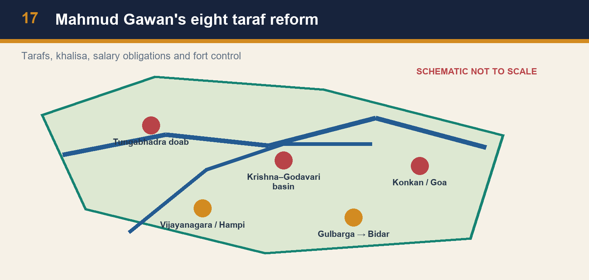

*Mahmud Gawan's eight taraf reform*


*Bidar and Mahmud Gawan Madrasa*

[FACT] Mahmud Gawan was Bahmani prime minister or wakil-i-sultanat from 1463 to 1482. The source links him to expansion towards western coastal areas including Goa and Dabhol, to a famous madrasa at Bidar, and to reforms that divided the kingdom into eight tarafs. It also notes efforts to fix nobles’ salaries and obligations, reserve khalisa lands for the sultan, introduce land measurement, and keep fort governors under stronger central control.

[ANALYSIS] The eight-taraf reform is best understood as an attempt to make noble power legible and controllable. Territorial division, assessed obligations, salary arrangements, khalisa resources and oversight of forts could reduce the gap between a sovereign’s claim and a noble’s private military capacity. The reform did not abolish elites; it sought to discipline their relationship to the centre. Gawan’s coastal successes also show that administrative and commercial strategy could interact: ports mattered for trade and for the horse circuits that structured Deccan warfare.

[LIMIT] Centralising measures should not be described as a completed bureaucracy. Gawan’s execution in 1482 demonstrates that reform depended on vulnerable court politics. Nor should the madrasa be treated as evidence that all learning was centred only at Bidar. It is material evidence of a patron’s institution, transregional connections and courtly projection. State capacity was aspirational, contested and uneven.

#### Analytical drill

Mains comparison: Gawan’s reform is not a Bahmani version of amaram. The former foregrounded taraf division, khalisa, salaries and fort control; Vijayanagara’s amaram used hereditary nayaka service assignments. Both addressed fiscal-military mobilisation, but their institutional forms and political tensions differed. This is a precise comparison, not an identity claim.

#### CLOSING RECALL FLOW — MAHMUD GAWAN: EXPANSION, REFORM AND THE LIMITS OF CENTRALISATION

```text
START / CONCEPT: Mahmud Gawan: expansion, reform and the limits of centralisation
        |
        v
EXACT TERMS: Mahmud Gawan · reform · the limits of centralisation · CA / heritage anchor · Source discipline · Bahmani
        |
        v
MECHANISM / ARGUMENT: Mahmud Gawan was Bahmani prime minister or wakil-i-sultanat from 1463 to 1482.
        |
        v
CONSEQUENCE / CONTRAST: Centralising measures should not be described as a completed bureaucracy.
        |
        v
UPSC TRAP / ANSWER-USE: This is a precise comparison, not an identity claim.
        |
        v
ANSWER-GRABBING FORMULATION: Mains comparison: Gawan’s reform is not a Bahmani version of amaram.
```
### SESSION 13 — DECCANIS, AFAQIS AND THE CRISIS OF ELITE COALITION

#### DEFINITION / WHAT THIS IS CALLED

**Plain-language definition:** Equally, it is misleading to treat Deccani and Afaqi as two uniform blocks with permanent interests.

**Technical definition:** A state can expand territory while weakening its coalition.

#### ANSWER-GRABBING OPENING — WRITE/ADAPT IN THE EXAM

> Equally, it is misleading to treat Deccani and Afaqi as two uniform blocks with permanent interests.

#### MUST-WRITE KEYWORDS

- **Deccanis**
- **Afaqis**
- **the crisis of elite coalition**
- **CA / heritage anchor**
- **Source discipline**
- **This**

**How to use them:** Frame the answer through Deccanis; define Afaqis, connect the crisis of elite coalition with CA / heritage anchor to explain the mechanism, and use Source discipline for the decisive comparison or qualification.

#### Pre-teach evidence check

- **Book context:** queried — local Topic 09 basic/advanced Markdown and Satish Chandra source spine.
- **CA / heritage anchor:** no dynamic claim required; UNESCO Hampi property page checked only for bounded site evidence.
- **Source discipline:** distinguish direct evidence from interpretation and state what the source cannot prove.


*Deccani–Afaqi factional structure*

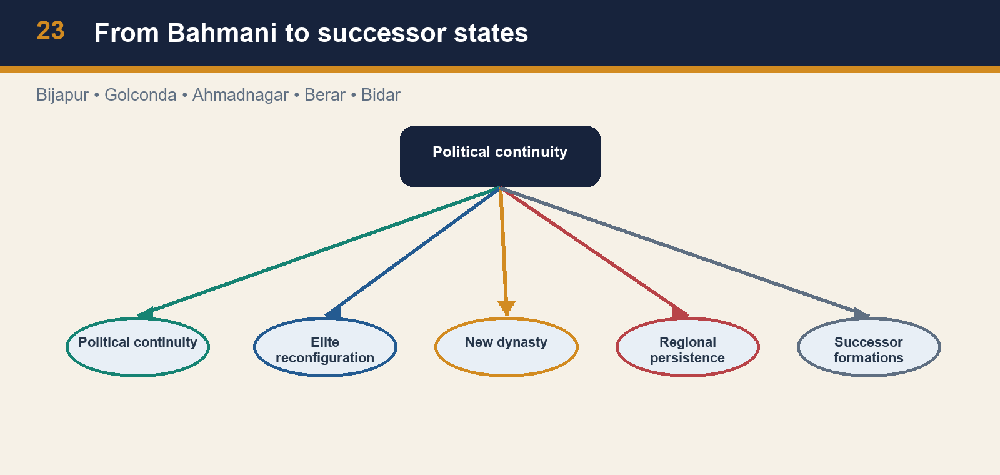

*From Bahmani to successor states*

[FACT] Bahmani court politics saw conflict between Deccanis—often understood as established local or earlier-settled elements—and Afaqis or gharibs, later arrivals associated with transregional Persianate networks. This terminology should be used as a political description of faction and access to office, not as a timeless ethnic essence. The source identifies factional strife as crucial to Gawan’s execution and Bahmani disintegration.

[ANALYSIS] A state can expand territory while weakening its coalition. Offices, forts, revenues and royal confidence are scarce resources; factional contests are therefore institutional as well as cultural. Forged accusations against a powerful minister become politically effective when rival groups fear the redistribution of influence. The execution of Gawan removed a centralising figure and intensified a pattern in which provincial and military centres could act with growing autonomy.

[LIMIT] It is inaccurate to make every later Deccan development a direct consequence of only one execution. Economic pressures, regional ambitions, military leadership and local alliances also mattered. Equally, it is misleading to treat Deccani and Afaqi as two uniform blocks with permanent interests. The safer conclusion is that factional competition placed a high cost on administrative reform and accelerated an already fragile political order.

#### Analytical drill

The successor-state tree must be exact: Ahmadnagar, Bijapur, Golconda, Berar and Bidar emerged from the Bahmani breakup. Use it as a transition to early modern Deccan politics. The tree is not a claim that every territory changed hands at one instant or that the Bahmani court disappeared from all political relevance immediately.

#### CLOSING RECALL FLOW — DECCANIS, AFAQIS AND THE CRISIS OF ELITE COALITION

```text
START / CONCEPT: Deccanis, Afaqis and the crisis of elite coalition
        |
        v
EXACT TERMS: Deccanis · Afaqis · the crisis of elite coalition · CA / heritage anchor · Source discipline · This
        |
        v
MECHANISM / ARGUMENT: Source discipline: distinguish direct evidence from interpretation and state what the source cannot prove.
        |
        v
CONSEQUENCE / CONTRAST: This terminology should be used as a political description of faction and access to office, not as a timeless ethnic essence.
        |
        v
UPSC TRAP / ANSWER-USE: A state can expand territory while weakening its coalition.
        |
        v
ANSWER-GRABBING FORMULATION: Equally, it is misleading to treat Deccani and Afaqi as two uniform blocks with permanent interests.
```
### SESSION 14 — BIDAR, CULTURE AND ARCHITECTURE WITHOUT COMMUNAL SHORTCUTS

#### DEFINITION / WHAT THIS IS CALLED

**Plain-language definition:** The analytical achievement is to acknowledge both political conflict and forms of interaction without making either the only story.

**Technical definition:** A safe architecture sentence: “The Madrasa at Bidar and Hampi’s built landscape reveal different institutional and urban projects; they cannot by themselves establish the beliefs or material condition of every resident.” This turns a site into evidence and also states its limit—exactly the source discipline UPSC rewards.

#### ANSWER-GRABBING OPENING — WRITE/ADAPT IN THE EXAM

> The analytical achievement is to acknowledge both political conflict and forms of interaction without making either the only story.

#### MUST-WRITE KEYWORDS

- **Bidar**
- **culture**
- **architecture without communal shortcuts**
- **CA / heritage anchor**
- **Source discipline**
- **Mahmud Gawan**

**How to use them:** Frame the answer through Bidar; define culture, connect architecture without communal shortcuts with CA / heritage anchor to explain the mechanism, and use Source discipline for the decisive comparison or qualification.

#### Pre-teach evidence check

- **Book context:** queried — local Topic 09 basic/advanced Markdown and Satish Chandra source spine.
- **CA / heritage anchor:** no dynamic claim required; UNESCO Hampi property page checked only for bounded site evidence.
- **Source discipline:** distinguish direct evidence from interpretation and state what the source cannot prove.


*Bidar and Mahmud Gawan Madrasa*


*Conflict and cooperation*

[FACT] Mahmud Gawan built a celebrated three-storeyed madrasa at Bidar, described in the source as decorated with coloured tiles and providing for scholars and students. At Hampi, monumental religious, royal and civic remains coexist in an urban landscape. These examples demonstrate patronage, technical skill, institutional investment and the political use of built form.

[ANALYSIS] Architecture can make a court visible and connect it to learning, ritual, labour and transregional style. Bidar’s madrasa is evidence of a scholarly institution and a courtly claim to patronage. Hampi’s temples, bazaars, water structures and enclosures are evidence of an integrated capital region. Neither site should be reduced to a civilisational slogan. The same Deccan saw war, political marriages, recruitment across religious boundaries, commercial exchange and artistic adaptation.

[LIMIT] Do not claim total “syncretism” from a single building, or total antagonism from a battle. A monument is not a census of social attitudes. It needs to be combined with dates, patronage, urban context and texts. The analytical achievement is to acknowledge both political conflict and forms of interaction without making either the only story.

#### Analytical drill

A safe architecture sentence: “The Madrasa at Bidar and Hampi’s built landscape reveal different institutional and urban projects; they cannot by themselves establish the beliefs or material condition of every resident.” This turns a site into evidence and also states its limit—exactly the source discipline UPSC rewards.

#### CLOSING RECALL FLOW — BIDAR, CULTURE AND ARCHITECTURE WITHOUT COMMUNAL SHORTCUTS

```text
START / CONCEPT: Bidar, culture and architecture without communal shortcuts
        |
        v
EXACT TERMS: Bidar · culture · architecture without communal shortcuts · CA / heritage anchor · Source discipline · Mahmud Gawan
        |
        v
MECHANISM / ARGUMENT: A safe architecture sentence: “The Madrasa at Bidar and Hampi’s built landscape reveal different institutional and urban projects; they cannot by themselves establish the beliefs or material condition of every resident.” This turns a site into evidence and also states its limit—exactly the source discipline UPSC rewards.
        |
        v
CONSEQUENCE / CONTRAST: Do not claim total “syncretism” from a single building, or total antagonism from a battle.
        |
        v
UPSC TRAP / ANSWER-USE: Do not miss this limiting distinction: mahmud Gawan built a celebrated three-storeyed madrasa at Bidar, described in the source as...
        |
        v
ANSWER-GRABBING FORMULATION: The analytical achievement is to acknowledge both political conflict and forms of interaction without making either the only story.
```
### SESSION 15 — TALIKOTA/RAKSHASA-TANGADI/BANNIHATTI: COALITION, DESTRUCTION AND PERSISTENCE

#### DEFINITION / WHAT THIS IS CALLED

**Plain-language definition:** The battle of 1565 is variously associated with Talikota, Rakshasa-Tangadi and Bannihatti.

**Technical definition:** Rama Raya’s balance-of-power diplomacy and the formation of a coalition form part of the context, but they do not exhaust the military, factional and logistical causes of defeat.

#### ANSWER-GRABBING OPENING — WRITE/ADAPT IN THE EXAM

> The battle of 1565 is variously associated with Talikota, Rakshasa-Tangadi and Bannihatti.

#### MUST-WRITE KEYWORDS

- **Talikota/Rakshasa-Tangadi/Bannihatti**
- **coalition**
- **destruction**
- **persistence**
- **CA / heritage anchor**
- **Source discipline**

**How to use them:** Frame the answer through Talikota/Rakshasa-Tangadi/Bannihatti; define coalition, connect destruction with persistence to explain the mechanism, and use CA / heritage anchor for the decisive comparison or qualification.

#### Pre-teach evidence check

- **Book context:** queried — local Topic 09 basic/advanced Markdown and Satish Chandra source spine.
- **CA / heritage anchor:** no dynamic claim required; UNESCO Hampi property page checked only for bounded site evidence.
- **Source discipline:** distinguish direct evidence from interpretation and state what the source cannot prove.


*Talikota and aftermath*

[FACT] The battle of 1565 is variously associated with Talikota, Rakshasa-Tangadi and Bannihatti. A Deccan-sultanate coalition defeated Vijayanagara; Rama Raya was executed and the capital was looted. The live UNESCO Hampi page states that Talikota led to massive destruction of the city’s physical fabric. The local source and chronology insist on a necessary qualification: the polity did not instantly vanish, and the Aravidu dynasty continued with reduced territory.

[ANALYSIS] Talikota was a turning point because it altered the balance between imperial centre and regional power. The loss of a capital and its provisioning, ceremonial and military infrastructure was more than a battlefield defeat. Yet the continued capacity of Aravidu rulers and nayaka formations shows that a state is not identical to one urban site. Political networks, commanders, revenue claims and regional centres can persist after a capital’s devastation.

[LIMIT] Avoid single-cause tales. Rama Raya’s balance-of-power diplomacy and the formation of a coalition form part of the context, but they do not exhaust the military, factional and logistical causes of defeat. Avoid calling 1565 “the end of South India” or, conversely, minimising its destructiveness. The graded verdict is: a catastrophic turning point that ended Vijayanagara’s great-power phase and urban apex, not an instantaneous extinction of all political continuities.

#### Analytical drill

Use all three battle labels carefully: “Talikota (also Rakshasa-Tangadi/Bannihatti), 1565.” Then write a two-clause conclusion: “capital and great-power status were shattered; Aravidu and regional formations persisted.” This directly answers the common UPSC trap and gives the examiner a qualified judgement rather than a date-only ending.

#### CLOSING RECALL FLOW — TALIKOTA/RAKSHASA-TANGADI/BANNIHATTI: COALITION, DESTRUCTION AND PERSISTENCE

```text
START / CONCEPT: Talikota/Rakshasa-Tangadi/Bannihatti: coalition, destruction and persistence
        |
        v
EXACT TERMS: Talikota/Rakshasa-Tangadi/Bannihatti · coalition · destruction · persistence · CA / heritage anchor · Source discipline
        |
        v
MECHANISM / ARGUMENT: Rama Raya’s balance-of-power diplomacy and the formation of a coalition form part of the context, but they do not exhaust the military, factional and logistical causes of defeat.
        |
        v
CONSEQUENCE / CONTRAST: Yet the continued capacity of Aravidu rulers and nayaka formations shows that a state is not identical to one urban site.
        |
        v
UPSC TRAP / ANSWER-USE: The graded verdict is: a catastrophic turning point that ended Vijayanagara’s great-power phase and urban apex, not an instantaneous extinction of all political continuities.
        |
        v
ANSWER-GRABBING FORMULATION: The battle of 1565 is variously associated with Talikota, Rakshasa-Tangadi and Bannihatti.
```
### SESSION 16 — AFTER 1565: DECCAN SULTANATES, NAYAKA PERSISTENCE AND MUGHAL-DECCAN BRIDGE

#### DEFINITION / WHAT THIS IS CALLED

**Plain-language definition:** The value of this topic is to give a chronological bridge from regional state formation to early modern contest, not to compress two centuries into a single decline narrative.

**Technical definition:** These parallel transitions create the political setting for later Deccan Sultanate rivalries and, eventually, Mughal-Deccan politics.

#### ANSWER-GRABBING OPENING — WRITE/ADAPT IN THE EXAM

> Vijayanagara continued under the Aravidu dynasty after 1565, while regional nayaka powers became increasingly consequential.

#### MUST-WRITE KEYWORDS

- **After 1565**
- **Deccan Sultanates**
- **nayaka persistence**
- **Mughal-Deccan bridge**
- **CA / heritage anchor**
- **Source discipline**

**How to use them:** Frame the answer through After 1565; define Deccan Sultanates, connect nayaka persistence with Mughal-Deccan bridge to explain the mechanism, and use CA / heritage anchor for the decisive comparison or qualification.

#### Pre-teach evidence check

- **Book context:** queried — local Topic 09 basic/advanced Markdown and Satish Chandra source spine.
- **CA / heritage anchor:** no dynamic claim required; UNESCO Hampi property page checked only for bounded site evidence.
- **Source discipline:** distinguish direct evidence from interpretation and state what the source cannot prove.


*From Bahmani to successor states*


*Comparative fiscal-military systems*

[FACT] The Bahmani kingdom fragmented into Ahmadnagar, Bijapur, Golconda, Berar and Bidar. Vijayanagara continued under the Aravidu dynasty after 1565, while regional nayaka powers became increasingly consequential. These parallel transitions create the political setting for later Deccan Sultanate rivalries and, eventually, Mughal-Deccan politics.

[ANALYSIS] The correct transition is not “Bahmani and Vijayanagara ended, then the Mughals arrived.” Instead, the breakup produced several capable courts and regional military-fiscal centres. Bijapur and Golconda, among others, inherited and reshaped Deccan political resources. Nayaka polities demonstrate how earlier service networks could support regional power when the imperial centre weakened. Later Mughal expansion therefore confronted negotiated, competitive and locally embedded powers, not a vacuum.

[LIMIT] Do not retroject later Mughal institutions into the fifteenth century, or call each successor state a direct continuation of every Bahmani policy. Continuity is selective: personnel, territories, cultures and strategic problems can persist while institutions and alignments change. The value of this topic is to give a chronological bridge from regional state formation to early modern contest, not to compress two centuries into a single decline narrative.

#### Analytical drill

Transition line for a conclusion: “The Deccan’s later political complexity was not born from a vacuum: Bahmani successor states, Aravidu survival and nayaka autonomy carried forward the region’s fiscal-military and cultural resources into the Mughal-Deccan encounter.” It is chronological, comparative and cautious.

#### CLOSING RECALL FLOW — AFTER 1565: DECCAN SULTANATES, NAYAKA PERSISTENCE AND MUGHAL-DECCAN BRIDGE

```text
START / CONCEPT: After 1565: Deccan Sultanates, nayaka persistence and Mughal-Deccan bridge
        |
        v
EXACT TERMS: After 1565 · Deccan Sultanates · nayaka persistence · Mughal-Deccan bridge · CA / heritage anchor · Source discipline
        |
        v
MECHANISM / ARGUMENT: These parallel transitions create the political setting for later Deccan Sultanate rivalries and, eventually, Mughal-Deccan politics.
        |
        v
CONSEQUENCE / CONTRAST: Transition line for a conclusion: “The Deccan’s later political complexity was not born from a vacuum: Bahmani successor states, Aravidu survival and nayaka autonomy carried forward the region’s fiscal-military and cultural resources into the Mughal-Deccan encounter.” It is chronological, comparative and cautious.
        |
        v
UPSC TRAP / ANSWER-USE: The value of this topic is to give a chronological bridge from regional state formation to early modern contest, not to compress two centuries into a single decline narrative.
        |
        v
ANSWER-GRABBING FORMULATION: Vijayanagara continued under the Aravidu dynasty after 1565, while regional nayaka powers became increasingly consequential.
```
### 18. Comparative answer framework: state formation, evidence and qualification

#### Pre-teach evidence check

- **Book context:** queried — local Topic 09 basic/advanced Markdown and Satish Chandra source spine.
- **CA / heritage anchor:** no dynamic claim required; UNESCO Hampi property page checked only for bounded site evidence.
- **Source discipline:** distinguish direct evidence from interpretation and state what the source cannot prove.


*Mains answer spine*

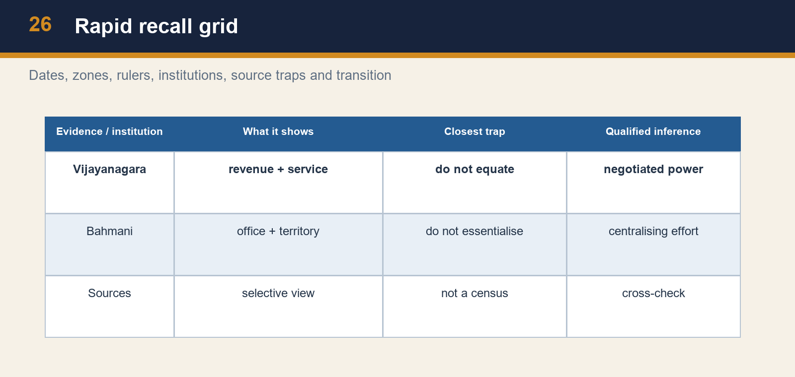

*Rapid recall grid*

[ANALYSIS] The highest-yield comparison is not “Hindu kingdom versus Muslim kingdom.” Compare how two Deccan powers addressed fiscal-military mobilisation. Vijayanagara used an imperial centre, irrigation and a service relationship with hereditary nayakas through amaram. The Bahmani state relied on territorial offices and, under Mahmud Gawan, an attempted tightening through eight tarafs, khalisa, salaries and fort control. Both needed cavalry, routes, revenue and elite cooperation; both faced limits imposed by intermediary power and faction.

[FACT] Named evidence should do analytical work: Deva Raya I’s dam connects water to provision; Deva Raya II’s cavalry recruitment connects rivalry to adaptation; Hampi’s enclosures and water structures connect city to state; Gawan’s reforms connect provincial administration to centralisation; Gawan’s execution connects faction to institutional fragility; Talikota connects coalition warfare to a transformed political landscape.

[LIMIT] Every source has a boundary. A traveller’s description gives an observer’s view of urban life. A monument gives evidence of patronage and material form. An official heritage page describes a managed property. A conventional foundation date organises chronology but does not settle every origin narrative. A good answer does not merely add a “however”; it specifies what the evidence cannot establish.

#### Analytical drill

Final Mains rule: begin with a direct thesis; make each paragraph **claim → named evidence → what it proves → qualification**; end with a calibrated verdict. This structure prevents three common failures—fact lists, communal binaries and dramatic but inaccurate “instant end” conclusions.

### SESSION 17 — BOUNDED LIVE LINKAGE

#### DEFINITION / WHAT THIS IS CALLED

**Plain-language definition:** The live page is a teaching bridge only.

**Technical definition:** Technically, Bounded live linkage is analysed by relating UNESCO's Group to Monuments, then testing the relationship through Hampi and It.

#### ANSWER-GRABBING OPENING — WRITE/ADAPT IN THE EXAM

> The live page is a teaching bridge only.

#### MUST-WRITE KEYWORDS

- **Bounded live linkage**
- **UNESCO's Group**
- **Monuments**
- **Hampi**
- **It**
- **Tungabhadra**

**How to use them:** Frame the answer through Bounded live linkage; define UNESCO's Group, connect Monuments with Hampi to explain the mechanism, and use It for the decisive comparison or qualification.

UNESCO's Group of Monuments at Hampi property page was rechecked on 30 August 2026. It supports a bounded material-history bridge: the Tungabhadra setting, more than 1,600 surviving remains, integrated royal, sacred, market, defensive and hydraulic systems, and the destruction of the capital's physical fabric after Talikota. It does not independently prove every traveller claim, dynastic narrative or estimate of prosperity, and its conservation language must not be projected backwards as a medieval administrative record.

The live page is a teaching bridge only. Historical chronology, causation and institutional claims remain controlled by repository Markdown, OCR-searchable books and source criticism.

#### CLOSING RECALL FLOW — BOUNDED LIVE LINKAGE

```text
START / CONCEPT: Bounded live linkage
        |
        v
EXACT TERMS: Bounded live linkage · UNESCO's Group · Monuments · Hampi · It · Tungabhadra
        |
        v
MECHANISM / ARGUMENT: It supports a bounded material-history bridge: the Tungabhadra setting, more than 1,600 surviving remains, integrated royal, sacred, market, defensive and hydraulic systems, and the destruction of the capital's physical fabric after Talikota.
        |
        v
CONSEQUENCE / CONTRAST: It does not independently prove every traveller claim, dynastic narrative or estimate of prosperity, and its conservation language must not be projected backwards as a medieval administrative record.
        |
        v
UPSC TRAP / ANSWER-USE: Do not miss this limiting distinction: uNESCO's Group of Monuments at Hampi property page was rechecked on 30 August 2026.
        |
        v
ANSWER-GRABBING FORMULATION: The live page is a teaching bridge only.
```
## BASIC MCQS / REMEDIATION

#### Learning MCQ 01

Which formulation best explains the Vijayanagara–Bahmani rivalry?

- A. Competition for revenue-bearing zones, strategic routes, ports and horse supply alongside political and cultural claims.

- B. A peaceful commercial partnership without recurrent military competition.

- C. A purely religious war in which trade and military resources were irrelevant.

- D. A contest confined to a single fort with no coastal dimension.


**Answer: A.**

**Explanation:** The correct answer identifies the three-zone political economy; the closest distractor is the religious-only explanation, which ignores doab, basin and coastal evidence.

#### Learning MCQ 02

Which is the safest statement about the 1336 foundation?

- A. It means Vijayanagara had no prehistory or contested origins.

- B. It is a conventional political anchor, while Harihara–Bukka origin narratives require source caution.

- C. It dates the Bahmani kingdom rather than Vijayanagara.

- D. It proves every detail of a single later foundation story.


**Answer: B.**

**Explanation:** The correct answer balances chronology and historiography; the closest distractor is the full-proof claim, which confuses a conventional date with a settled biography.

#### Learning MCQ 03

Which succession list is correct for Vijayanagara?

- A. Tuluva → Sangama → Bahmani → Aravidu.

- B. Saluva → Lodi → Tuluva → Qutb Shahi.

- C. Sangama → Saluva → Tuluva → Aravidu.

- D. Aravidu → Sangama → Tuluva → Bahmani.


**Answer: C.**

**Explanation:** The correct sequence distinguishes dynasty from rival state; the closest distractor is the first alternative because it uses real names but reverses the historical order.

#### Learning MCQ 04

Why did Goa and the Konkan coast matter before Portuguese conquest?

- A. They were the location of the Tungabhadra dam.

- B. They mattered only for temple pilgrimage.

- C. They had no connection to inland political rivalry.

- D. They were nodes in commerce and the imported-horse supply essential to Deccan cavalry.


**Answer: D.**

**Explanation:** The coast linked trade and cavalry; the closest distractor is the inland-rivalry denial because it misses the horse–port chain.

#### Learning MCQ 05

Which ruler is associated with a dam across the Tungabhadra and a canal-cum-aqueduct to the capital?

- A. Deva Raya I.

- B. Rama Raya.

- C. Mahmud Gawan.

- D. Deva Raya II.


**Answer: A.**

**Explanation:** Deva Raya I is tied to irrigation; Deva Raya II is the closest distractor because he is also a major Vijayanagara ruler, but his source signature is military adaptation.

#### Learning MCQ 06

Which ruler is most closely associated with military recruitment and adaptation involving cavalrymen and archers?

- A. Deva Raya I.

- B. Deva Raya II.

- C. Mahmud Gawan.

- D. Ahmad Shah Bahmani.


**Answer: B.**

**Explanation:** Deva Raya II is the source-grounded answer; Deva Raya I is the closest distractor because both ruled Vijayanagara, but he is associated with irrigation.

#### Learning MCQ 07

What can Hampi’s enclosures, bazaars and water works most securely demonstrate?

- A. That every resident shared the same wealth and legal status.

- B. That the Bahmani capital was located inside Hampi.

- C. An integrated urban landscape in which defence, market, ritual and water management were coordinated.

- D. That travellers supplied exact population statistics.


**Answer: C.**

**Explanation:** The correct inference concerns urban organisation; the closest distractor is universal prosperity, an overclaim from real monumental evidence.

#### Learning MCQ 08

Which statement most accurately distinguishes amaram from an iqta comparison?

- A. Amaram was a Portuguese customs concession at Bhatkal.

- B. Amaram eliminated all local military intermediaries.

- C. Amaram was a standard Bahmani taraf office appointed for a fixed salary.

- D. Amaram linked hereditary nayaka service and territorial revenue; it should not be treated as a replica of a transferable iqta.


**Answer: D.**

**Explanation:** The correct statement preserves heredity and service; the closest distractor is the taraf option because both are territorial-fiscal terms, but they belong to different institutional settings.

#### Learning MCQ 09

Which combination best captures Krishnadeva Raya’s statecraft?

- A. Campaigns, water and town building, literary patronage and pragmatic coastal diplomacy.

- B. A withdrawal from all western-coast contact after 1509.

- C. A rejection of all urban and cultural patronage in favour of warfare alone.

- D. An eight-taraf reform that abolished nayaka service.


**Answer: A.**

**Explanation:** The correct answer integrates the main dimensions of the Tuluva ruler’s reign. The closest distractor is warfare-alone language because campaigns mattered but did not displace infrastructure, patronage or diplomacy.

#### Learning MCQ 10

How should the Bhatkal fact be handled in an answer?

- A. Assign the permission to Yusuf Adil Shah because Goa was coastal.

- B. Use the official 2024 answer for Krishnadevaraya and note that the exact fort claim is preserved mainly through Portuguese testimony.

- C. Claim a detailed treaty formula without a cited source.

- D. Reject the official key because travel accounts have limits.


**Answer: B.**

**Explanation:** The correct method combines exam verification and provenance caution; the closest distractor is automatic rejection, which mistakes source limitation for the absence of usable evidence.

#### Learning MCQ 11

Which evidence best supports a cautious statement about women in Vijayanagara?

- A. A single account replaces all local evidence.

- B. The list proves universal occupational equality across the empire.

- C. A Portuguese account lists specialised activities, indicating visible roles in the observer’s courtly or urban field rather than all women’s status.

- D. Women’s expertise can be inferred only from the Bahmani eight-taraf reform.


**Answer: C.**

**Explanation:** The correct reading uses the observation without making it a census; the closest distractor is universal equality because it overextends a real observation.

#### Learning MCQ 12

Which statement is correct about Bahmani formation and capital history?

- A. Mahmud Gawan founded Vijayanagara at Hampi.

- B. The kingdom was founded in 1565 after Talikota.

- C. Bidar was the first capital of the Sangama dynasty.

- D. The kingdom was founded in 1347; Gulbarga was an early capital and Ahmad Shah shifted the court to Bidar.


**Answer: D.**

**Explanation:** The correct statement preserves foundation, early capital and later shift. The closest distractor is the post-Talikota claim because it confuses a much later Vijayanagara rupture with Bahmani formation.

#### Learning MCQ 13

What was central to Mahmud Gawan’s administrative programme?

- A. Division into eight tarafs, khalisa resources, fixed obligations and tighter fort oversight.

- B. A shift of Vijayanagara’s capital to Hampi.

- C. Replacement of every commander with hereditary nayakas.

- D. A ban on coastal trade with Iran and Iraq.


**Answer: A.**

**Explanation:** Gawan’s reforms sought more legible noble obligations; the closest distractor is hereditary nayakas, a plausible fiscal-military term but a Vijayanagara institution.

#### Learning MCQ 14

Why did Deccani–Afaqi conflict matter?

- A. It abolished all provincial territorial administration at once.

- B. Competition over office and influence weakened elite coalition and contributed to the setting of Gawan’s execution.

- C. It proves the Bahmani court had no Deccan roots.

- D. It was a battle name for Talikota.


**Answer: B.**

**Explanation:** The correct answer treats faction as political competition; the closest distractor is the no-Deccan-roots claim, an essentialist misuse of the labels.

#### Learning MCQ 15

Why is the Bidar madrasa valuable evidence?

- A. It was a Vijayanagara irrigation dam.

- B. It proves all Bahmani revenues came from one institution.

- C. It records courtly patronage of learning and material skill, while not proving the experience of every subject.

- D. It establishes a complete absence of political faction.


**Answer: C.**

**Explanation:** The correct answer uses architecture with a limit; the closest distractor is the revenue claim, which overreads a genuine institutional monument.

#### Learning MCQ 16

What makes Talikota in 1565 a historically careful turning point?

- A. It occurred before the Bahmani foundation of 1347.

- B. It was simply a border raid with no urban consequence.

- C. It immediately removed every Vijayanagara claimant and nayaka formation.

- D. It destroyed the capital’s great-power position, while Aravidu and regional political continuities persisted.


**Answer: D.**

**Explanation:** The correct answer states destruction and persistence; the closest distractor is instant extinction, which overlooks Aravidu continuation.

### Part V — Original broad-coverage MCQs (40; strict A → B → C → D rotation)

#### Q1. Which combination best identifies the three recurrent strategic zones of Vijayanagara–Bahmani competition?

- A. Tungabhadra doab, Krishna–Godavari basin, and Konkan/Goa coast.

- B. Kaveri delta, Punjab plain, and Kabul corridor.

- C. Ganga–Yamuna doab, Kashmir valley, and Bengal delta.

- D. Malwa plateau, Gujarat coast, and Mewar hills.


**Answer: A.**

**Explanation:** The correct combination follows the local source spine. The closest distractor is the Malwa–Gujarat set because it contains real medieval strategic regions, but not this Deccan triad.

#### Q2. What is the most methodologically careful use of c. 1336?

- A. Use it to prove an unbroken and fully documented founder biography.

- B. Use it as the conventional Vijayanagara foundation anchor while qualifying contested Harihara–Bukka origins.

- C. Replace all Vijayanagara chronology with an undated legend.

- D. Treat it as the exact date of Mahmud Gawan’s execution.


**Answer: B.**

**Explanation:** The correct answer separates chronology from origin narrative. The closest distractor is the fully documented biography because a foundation tradition is real but not an exhaustive proof.

#### Q3. Which item is attached most securely to Deva Raya I?

- A. Employment of Muslim cavalrymen and archers as the signature reform.

- B. The execution of Rama Raya at Talikota.

- C. A Tungabhadra dam and canal works connected to cultivation and revenue.

- D. The eight-taraf reform of Bahmani administration.


**Answer: C.**

**Explanation:** The correct association is irrigation. The closest distractor is cavalry reform because that belongs to another Deva Raya, Deva Raya II.

#### Q4. Which statement best describes Deva Raya II’s military policy?

- A. He founded the Bahmani kingdom at Gulbarga.

- B. He abolished cavalry in favour of temple guards.

- C. He created five Deccan Sultanates after 1527.

- D. He adapted to competitive warfare by employing Muslim cavalrymen and archers.


**Answer: D.**

**Explanation:** The correct answer identifies adaptation under military pressure. The closest distractor is cavalry abolition because it deliberately reverses the source’s emphasis on mounted capability.

#### Q5. Why was the Tungabhadra doab politically valuable?

- A. Its fertility and frontier position made it a revenue and strategic zone.

- B. It was solely a Portuguese shipping station.

- C. It was outside all Vijayanagara–Bahmani military interaction.

- D. It contained the Bahmani madrasa at Bidar.


**Answer: A.**

**Explanation:** The correct answer joins agrarian and military value. The closest distractor is the shipping-station claim because coast and port logic is relevant elsewhere, not to the doab.

#### Q6. What gave the Krishna–Godavari basin a distinctive stake in rivalry?

- A. It was merely a ceremonial capital without cultivation.

- B. It combined fertile land with ports tied to regional foreign trade.

- C. It ended the need for imported horses.

- D. It was the original name for the Bidar madrasa.


**Answer: B.**

**Explanation:** The correct answer connects agrarian and commercial features. The closest distractor is ceremonial-capital language, plausible for a court city but inaccurate for the basin mechanism.

#### Q7. Which chain best explains the strategic value of the Konkan coast?

- A. Coastal temples eliminated the need for markets and merchants.

- B. River dams made the coast independent of sea routes.

- C. Ports connected trade and imported horses to the cavalry needs of inland states.

- D. The coast was politically irrelevant until the nineteenth century.


**Answer: C.**

**Explanation:** The correct chain is port → commerce/horse supply → military capacity. The closest distractor is river-dam independence because it confuses inland water works with maritime access.

#### Q8. What does a cautious comparison of amaram and iqta require?

- A. Treating amaram as a Bahmani word for eight tarafs.

- B. Calling both terms exactly identical because both involved revenue.

- C. Describing iqta as a Portuguese fort privilege.

- D. Attention to hereditary nayaka service and the non-transferable local stake of amaram.


**Answer: D.**

**Explanation:** The correct answer explains why a simple equation fails. The closest distractor is identity-by-revenue because both are fiscal terms but differ in tenure and political context.

#### Q9. Which is a reasonable inference from hereditary nayaka control of amaram territories?

- A. It could support mobilisation yet create limits on centralisation in crises.

- B. It prevented any regional power after 1565.

- C. It removed all local military authority from the empire.

- D. It made Vijayanagara a directly ruled Portuguese colony.


**Answer: A.**

**Explanation:** The correct inference recognises both service and autonomy. The closest distractor is the removal-of-local-authority claim, the opposite of the hereditary intermediary logic.

#### Q10. Which traveller is specifically associated in the source base with seven enclosures, bazaars and canals?

- A. Hasan Gangu.

- B. Abdur Razzaq.

- C. Mahmud Gawan.

- D. Firuz Shah Bahmani.


**Answer: B.**

**Explanation:** Razzaq is used for the urban image of Vijayanagara. The closest distractor is Firuz Shah Bahmani because he is a contemporary Deccan ruler, not a traveller source.

#### Q11. How should traveller descriptions of wealth be handled?

- A. As official revenue registers issued by the court.

- B. As proof that every household had identical consumption.

- C. As valuable observer evidence to be cross-checked, not as exact statistical surveys.

- D. As reasons to ignore archaeology and inscriptions.


**Answer: C.**

**Explanation:** The correct answer specifies genre and limit. The closest distractor is official-register language because it mistakes a traveller’s narrative for an administrative record.

#### Q12. What is the safest interpretation of Portuguese observations about women’s expertise?

- A. They replace the need to identify author and genre.

- B. They prove all women across the empire held the same occupations.

- C. They prove women were absent from accounting and writing.

- D. They indicate visible specialised roles in the observed social world but not universal conditions.


**Answer: D.**

**Explanation:** The correct answer preserves the evidence and its boundary. The closest distractor is universal-condition language because it overgeneralises a real list.

#### Q13. Which relation is best supported for Krishnadeva Raya and Portuguese actors?

- A. Generally cooperative relations shaped by west-coast and horse-trade pragmatism.

- B. Complete Portuguese command over Vijayanagara administration.

- C. No contact because inland courts never used ports.

- D. A Bahmani eight-taraf settlement at Bhatkal.


**Answer: A.**

**Explanation:** The correct answer is bounded cooperation. The closest distractor is no-contact language because it ignores the maritime links central to the topic.

#### Q14. What is the official local status of UPSC Prelims 2024 Q56?

- A. Official Set-A key unavailable locally.

- B. Official Set-A key: option A, Krishnadevaraya.

- C. A reconstructed question with no preserved options.

- D. Official Set-A key: option B, Narasimha Saluva.


**Answer: B.**

**Explanation:** The local Series-A key gives Q56 = A. The closest distractor is Narasimha Saluva because it is a real Vijayanagara dynastic name listed in the question.

#### Q15. What was the Bahmani kingdom’s foundation date and founder association?

- A. 1336; Harihara and Bukka.

- B. 1463; Mahmud Gawan.

- C. 1347; Hasan Gangu/Alauddin Bahman Shah.

- D. 1565; Rama Raya.


**Answer: C.**

**Explanation:** The correct pairing distinguishes Bahmani formation from Vijayanagara’s conventional anchor. The closest distractor is 1336 with Harihara–Bukka because it is the parallel Vijayanagara fact.

#### Q16. Which capital sequence is correct for the Bahmani kingdom?

- A. Goa followed by Dabhol under Krishnadeva Raya.

- B. Mandu followed by Ahmedabad under Mahmud Gawan.

- C. Bidar followed by Hampi under Deva Raya I.

- D. Gulbarga followed by Bidar under Ahmad Shah.


**Answer: D.**

**Explanation:** The correct sequence is Bahmani. The closest distractor is Mandu–Ahmedabad because both are real regional capitals, but not Bahmani.

#### Q17. Which office most accurately describes Mahmud Gawan?

- A. Wakil-i-sultanat or Bahmani prime minister.

- B. Founder of the Sangama dynasty.

- C. Hereditary nayaka of the Tungabhadra doab.

- D. Portuguese captain at Goa.


**Answer: A.**

**Explanation:** The correct answer identifies Gawan’s central ministerial role. The closest distractor is nayaka because both relate to military-fiscal power but belong to distinct courts.

#### Q18. What was the administrative number linked to Mahmud Gawan’s reform?

- A. Seven traveller enclosures.

- B. Eight tarafs.

- C. Five amaram districts.

- D. Four Portuguese captaincies.


**Answer: B.**

**Explanation:** The source expressly identifies eight tarafs. The closest distractor is seven enclosures because it is a real Vijayanagara urban number but not an administrative reform.

#### Q19. What was khalisa in the context of Gawan’s programme?

- A. A name for the Tungabhadra canal.

- B. A Portuguese warehouse at Bhatkal.

- C. Land or resources reserved for the sultan’s direct fiscal base.

- D. A hereditary nayaka title.


**Answer: C.**

**Explanation:** The correct answer identifies a central fiscal resource. The closest distractor is hereditary nayaka because both concern power over revenue but operate differently.

#### Q20. Why did Gawan’s execution matter analytically?

- A. It restored Vijayanagara’s capital after Talikota.

- B. It immediately created the Sangama dynasty.

- C. It ended all horse trade through west-coast ports.

- D. It exposed how factional politics could undo a vulnerable centralising programme.


**Answer: D.**

**Explanation:** The correct answer links an event to institutional fragility. The closest distractor is a restored-capital claim because it uses a real later crisis but reverses chronology.

#### Q21. Which pair correctly identifies the main Bahmani elite factions?

- A. Deccanis and Afaqis/gharibs.

- B. Mamluks and Cholas.

- C. Sangamas and Tuluvas.

- D. Sharqis and Lodis.


**Answer: A.**

**Explanation:** The correct pair is the Bahmani factional vocabulary. The closest distractor is Sangamas–Tuluvas because they are real Vijayanagara dynasties.

#### Q22. What should not be inferred from the terms Deccani and Afaqi?

- A. That factional rivalry affected court politics.

- B. That each was an unchanging, uniform ethnic bloc with a single permanent interest.

- C. That office and access to influence could be politically contested.

- D. That Gawan’s enemies could exploit elite divisions.


**Answer: B.**

**Explanation:** The unsafe inference essentialises political labels. The closest distractor is office competition, which is exactly the historically useful way to interpret factions.

#### Q23. What did Gawan’s coastal expansion towards Goa and Dabhol demonstrate?

- A. That Vijayanagara abandoned all cavalry interests.

- B. That coastal routes mattered only after the Mughal conquest.

- C. That western ports had both commercial and strategic significance.

- D. That Gulbarga was a Portuguese possession.


**Answer: C.**

**Explanation:** The correct answer connects port control to trade and military supply. The closest distractor is cavalry abandonment because it reverses the horse-supply mechanism.

#### Q24. What is the evidence value of the Mahmud Gawan Madrasa?

- A. It proves every Bahmani subject was a scholar.

- B. It proves Bidar was Vijayanagara’s first capital.

- C. It is a source for the exact volume of every tax.

- D. It is material evidence of courtly educational patronage and artistic skill at Bidar.


**Answer: D.**

**Explanation:** The correct answer is institutionally precise. The closest distractor is universal scholarship, an overclaim from a real learning institution.

#### Q25. Which five successor states emerged from Bahmani disintegration?

- A. Ahmadnagar, Bijapur, Golconda, Berar and Bidar.

- B. Hampi, Madurai, Kanchipuram, Thanjavur and Srirangam.

- C. Delhi, Agra, Lahore, Kabul and Ajmer.

- D. Gujarat, Malwa, Bengal, Jaunpur and Kashmir.


**Answer: A.**

**Explanation:** The correct list is the standard Deccan successor set. The closest distractor is the regional-kingdom list, which is medieval but belongs to another topic field.

#### Q26. Which statement gives the best interpretation of Talikota?

- A. It was a Bahmani victory in 1347 before Vijayanagara formed.

- B. It was a coalition victory that shattered Vijayanagara’s capital and great-power phase without instant political extinction.

- C. It was a Portuguese naval battle at Bhatkal.

- D. It permanently united all Deccan states under one dynasty.


**Answer: B.**

**Explanation:** The correct answer combines consequence with qualification. The closest distractor is permanent union because coalition success did not produce a single lasting unified state.

#### Q27. Which individual was executed in the coalition context of 1565?

- A. Harihara I.

- B. Hasan Gangu.

- C. Rama Raya.

- D. Mahmud Gawan.


**Answer: C.**

**Explanation:** Rama Raya is tied to Talikota. The closest distractor is Gawan because he too was executed in a major Deccan political crisis, but in 1482.

#### Q28. What remained after the 1565 destruction?

- A. A restored Bahmani kingdom at Gulbarga.

- B. No Vijayanagara-connected authority anywhere in the south.

- C. The immediate Mughal annexation of all southern territories.

- D. Aravidu rule and regional nayaka political capacity in altered form.


**Answer: D.**

**Explanation:** The correct answer rejects instant extinction. The closest distractor is restored Bahmani rule because both are false return-to-earlier-order narratives.

#### Q29. Which official live heritage source was used as a bounded current anchor?

- A. UNESCO World Heritage Centre’s Group of Monuments at Hampi property page.

- B. A later fictional chronicle.

- C. An unverified social-media map of medieval battlefields.

- D. A coaching claim about visitor statistics.


**Answer: A.**

**Explanation:** The correct source is official and bounded to Hampi’s property description. The closest distractor is a coaching claim because it might mention Hampi but lacks authoritative provenance.

#### Q30. What does the UNESCO Hampi page securely support for this package?

- A. A full account of every fifteenth-century court office.

- B. The integrated survival of fortifications, water structures, royal and sacred complexes, markets and landscape at the capital site.

- C. Exact medieval population totals for Hampi.

- D. An official verdict on the founders’ disputed origin story.


**Answer: B.**

**Explanation:** The correct answer stays within heritage evidence. The closest distractor is office history because important state questions require texts and other sources, not a heritage page alone.

#### Q31. Why is the phrase “Hindu bulwark” insufficient as a complete analysis of Vijayanagara?

- A. It is a precise label for Mahmud Gawan’s reforms.

- B. It shows why travel accounts need no criticism.

- C. It obscures contested origin stories, pragmatic recruitment, political geography and regional interaction.

- D. It accurately explains all cavalry recruitment and port politics.


**Answer: C.**

**Explanation:** The correct answer identifies what the phrase hides. The closest distractor is the all-cavalry-and-port claim because it exposes the problem: the phrase cannot explain those mechanisms.

#### Q32. What does the 1367 Mudkal/Tungabhadra conflict add to a mature answer?

- A. It marks the formal start of Portuguese rule at Goa.

- B. It proves the final breakup into five Sultanates.

- C. It establishes the Aravidu dynasty after 1565.

- D. It shows recurrent conflict and a reported agreement against slaughter of helpless civilians.


**Answer: D.**

**Explanation:** The correct answer adds a bounded norm to war history. The closest distractor is successor-state breakup because both concern political conflict but are chronologically distinct.

#### Q33. Which comparison is most defensible?

- A. Vijayanagara military adaptation under Deva Raya II and Bahmani centralising reform under Gawan were different responses to competition.

- B. Gawan’s reform was a Vijayanagara temple programme.

- C. Both states had identical transferable iqta systems.

- D. Neither court used territorial revenue for military purposes.


**Answer: A.**

**Explanation:** The correct comparison notes shared pressure and different institutions. The closest distractor is identical-iqta language because it mistakes a broad functional comparison for an institutional identity.

#### Q34. Which link best explains why markets belong in a political history of Hampi?

- A. Markets had no relation to water or road systems.

- B. Markets connected urban consumption, ritual circulation, merchants and the capital’s provisioning.

- C. Markets were identical to eight Bahmani tarafs.

- D. Markets prove every commodity was imported from Portugal.


**Answer: B.**

**Explanation:** The correct answer treats markets as urban infrastructure. The closest distractor is import-only language because commerce included local and regional production as well as external links.

#### Q35. What is a valid source-critical reading of a monument?

- A. It supplies a complete census without textual support.

- B. It settles all disputed dynastic origin narratives.

- C. It can reveal patronage, material practice and spatial organisation, but not every resident’s belief or welfare.

- D. It is useless because it does not speak.


**Answer: C.**

**Explanation:** The correct answer specifies evidence and limit. The closest distractor is a complete census, an attractive but unsupported extension from material remains.

#### Q36. Which topic bridge is historically sound?

- A. Talikota made all Deccan courts disappear before Mughal expansion.

- B. Deccan politics ended once coastal horses were imported.

- C. The Mughals inherited an unchanging Bahmani bureaucracy directly in 1347.

- D. Bahmani successor states and changed Vijayanagara/nayaka politics form part of the setting for later Mughal–Deccan contests.


**Answer: D.**

**Explanation:** The correct bridge preserves a competitive field. The closest distractor is direct unchanging inheritance, which ignores fragmentation, adaptation and later change.

#### Q37. What is the safest conclusion about Krishnadeva Raya’s cultural patronage?

- A. It was an instrument of courtly legitimacy alongside campaigns, irrigation and diplomacy.

- B. It proves all literary production was identical in language and audience.

- C. It ended the importance of nayakas.

- D. It made administrative and military institutions irrelevant.


**Answer: A.**

**Explanation:** The correct answer locates patronage among other state practices. The closest distractor is all-literature-identical language because patronage need not erase regional diversity.

#### Q38. What does political marriage in the Deccan warn an analyst against?

- A. Treating marriage as an eight-taraf reform.

- B. Assuming that recurrent rivals had no diplomatic or social interactions.

- C. Dating the Bahmani foundation to 1565.

- D. Concluding that all warfare was fictional.


**Answer: B.**

**Explanation:** The correct answer qualifies a war-only model. The closest distractor is warfare-fiction because interaction and conflict can coexist.

#### Q39. Which fact most clearly separates a capital shift from a state’s origin?

- A. Vijayanagara was founded only when the Aravidu dynasty took power after 1565.

- B. Bidar was the original Portuguese fort at Bhatkal.

- C. The Bahmani kingdom was founded in 1347, while Ahmad Shah later shifted its capital from Gulbarga to Bidar.

- D. Mahmud Gawan shifted Vijayanagara from Hampi to Gulbarga.


**Answer: C.**

**Explanation:** The correct statement separates state formation from a later capital reorientation. The closest distractor is the Aravidu claim because it uses a real later dynasty but collapses centuries of chronology.

#### Q40. Which answer best links source criticism to a Prelims option-elimination method?

- A. Ignore author and genre whenever a traveller’s detail is memorable.

- B. Replace original options with a generic ruler label to make the question easier.

- C. Treat an unavailable official key as officially confirmed if an online explanation agrees.

- D. Preserve official option order for a verified PYQ, then test each ruler against chronology and evidence provenance.


**Answer: D.**

**Explanation:** The correct method keeps the official paper intact and distinguishes verified from inferred answers. The closest distractor is the online-explanation shortcut because it may be useful for discovery but cannot substitute for the locally unavailable official key.


**Independent answer-rotation audit — Part V — Original broad-coverage MCQs (40; strict A → B → C → D rotation):** `A B C D A B C D A B C D A B C D A B C D A B C D A B C D A B C D A B C D A B C D`

### Part VI — Remedial trap MCQs (12; strict A → B → C → D rotation)

#### Q1. Identify the unsafe statement about Vijayanagara’s foundation.

- A. The conventional 1336 date proves every detail of Harihara and Bukka’s origin story.

- B. The foundation narrative contains disputed elements requiring source caution.

- C. A conventional date can remain useful for chronology.

- D. State formation can be studied through later institutions and evidence.


**Answer: A.**

**Explanation:** The unsafe statement converts a chronological anchor into a complete biography. The closest distractor is the useful-date statement, which is correct but limited.

#### Q2. Identify the unsafe ruler association.

- A. Deva Raya II is associated with military adaptation.

- B. Deva Raya II is the ruler identified with the Tungabhadra dam and canal-cum-aqueduct.

- C. Mahmud Gawan is associated with eight tarafs.

- D. Deva Raya I is associated with irrigation works.


**Answer: B.**

**Explanation:** The unsafe statement swaps the two Deva Rayas. The closest distractor is Deva Raya II’s military association because it is a real but different fact.

#### Q3. Identify the unsafe institutional equation.

- A. Amaram involved hereditary nayaka service and territorial revenue.

- B. A comparison must attend to transferability and local political stakes.

- C. Amaram was simply a transferable Sultanate iqta under another name.

- D. Fiscal-military systems can be functionally compared without being identical.


**Answer: C.**

**Explanation:** The unsafe statement erases the source’s explicit caution. The closest distractor is functional comparison because it is allowed only when institutional difference is retained.

#### Q4. Identify the unsafe Talikota conclusion.

- A. The capital suffered severe destruction after the coalition victory.

- B. Aravidu rule persisted in a reduced political setting.

- C. The battle ended Vijayanagara’s great-power phase.

- D. The 1565 battle instantly ended every Aravidu and nayaka political continuity.


**Answer: D.**

**Explanation:** The unsafe statement is an instant-extinction error. The closest distractor is great-power-phase language because it is strong yet qualified.

#### Q5. Identify the unsafe reading of a Portuguese account.

- A. A list of women’s specialised skills establishes the social condition of all women in the empire.

- B. The question’s precise author attribution should be preserved.

- C. Travel writing has genre and access limits.

- D. The list makes visible roles in the observer’s field of vision.


**Answer: A.**

**Explanation:** The unsafe statement turns an observation into a census. The closest distractor is the visible-roles statement, which is the proper narrow inference.

#### Q6. Identify the unsafe statement about Bhatkal.

- A. The exact fort wording is mainly preserved through Portuguese accounts.

- B. Because the 2024 official key is A, no provenance caution about Portuguese testimony is needed.

- C. Exam verification and source criticism can be stated together.

- D. The local official Series-A key gives Q56 as A, Krishnadevaraya.


**Answer: B.**

**Explanation:** The unsafe statement falsely opposes examination verification and source analysis. The closest distractor is the official-key statement, correct but not exhaustive.

#### Q7. Identify the unsafe statement about Bahmani factions.

- A. They are useful labels for contested access to office and influence.

- B. Court coalitions could be politically unstable.

- C. Deccanis and Afaqis were timeless homogeneous peoples whose political interests never changed.

- D. Factional conflict helped make Gawan’s reforms vulnerable.


**Answer: C.**

**Explanation:** The unsafe statement essentialises faction labels. The closest distractor is the office-access reading because it explains their political relevance without reifying them.

#### Q8. Identify the unsafe statement about architecture.

- A. A monument does not replace social evidence from other sources.

- B. It provides evidence of patronage and an educational institution.

- C. Material form should be read with patron and urban context.

- D. The Bidar madrasa proves that every Bahmani subject received identical education and status.


**Answer: D.**

**Explanation:** The unsafe statement turns one institution into a social census. The closest distractor is the patronage statement, a secure inference from the building.

#### Q9. Identify the unsafe statement about coast and cavalry.

- A. Konkan and Goa mattered only after Portuguese conquest and had no earlier horse-trade relevance.

- B. Imported horses made access to west-coast ports strategically valuable.

- C. Ports had commercial and military significance.

- D. Coastal competition connected interior states to external circuits.


**Answer: A.**

**Explanation:** The unsafe statement deletes the pre-Portuguese horse-port logic. The closest distractor is Portuguese-era relevance, which is true but incomplete.

#### Q10. Identify the unsafe statement about the Hampi heritage anchor.

- A. The page describes surviving urban, sacred, royal and water structures.

- B. UNESCO’s property page supplies exact medieval population and revenue totals for the city.

- C. The page is a bounded heritage source rather than a full political archive.

- D. Traveller accounts and local history sources provide different evidence.


**Answer: B.**

**Explanation:** The unsafe statement overreads the official heritage page. The closest distractor is the described-surviving-structures statement, which is what the page securely supports.

#### Q11. Identify the unsafe statement about successor states.

- A. Fragmentation did not make the region politically empty.

- B. Successor courts carried some Deccan political resources into later rivalry.

- C. The Bahmani breakup produced Ahmadnagar, Bijapur, Golconda, Berar and Bidar.

- D. The breakup produced Delhi, Agra, Lahore, Kabul and Ajmer.


**Answer: C.**

**Explanation:** The unsafe statement is the Delhi–Mughal city list, not the Deccan successor set. The closest distractor is later rivalry, a correct consequence of fragmentation.

#### Q12. Identify the unsafe comparative conclusion.

- A. Revenue zones and horse-port chains shaped strategic choices.

- B. The two courts competed and interacted in a shared Deccan field.

- C. Institutional comparisons require a source-based qualification.

- D. Vijayanagara and Bahmani politics can be fully explained without geography, trade, cavalry or elite institutions.


**Answer: D.**

**Explanation:** The unsafe conclusion removes the mechanisms that make the comparison historical. The closest distractor is shared-field language, which acknowledges rivalry without an essentialist binary.


**Independent answer-rotation audit — Part VI — Remedial trap MCQs (12; strict A → B → C → D rotation):** `A B C D A B C D A B C D`

## PYQS AND ANSWER PRACTICE

### Part III — Solved locally routed UPSC Prelims PYQs

#### PYQ 1 — UPSC Prelims GS-I 2024 Q56: Bhatkal fort

**Exact locally preserved question:** Who of the following rulers of medieval India gave permission to the Portuguese to build a fort at Bhatkal?

A. Krishnadevaraya  
B. Narasimha Saluva  
C. Muhammad Shah III  
D. Yusuf Adil Shah

**OFFICIALLY VERIFIED — local UPSC CSP-2024 Series-A answer key:** **A. Krishnadevaraya.** The local `Ans-2024-GS1.txt` key records Q56 = A. The historical route is pragmatic cooperation with Portuguese actors in a coast shaped by trade and horse supply. **Provenance qualification:** the precise Bhatkal-fort claim is mainly transmitted through Portuguese testimony; preserve that boundary instead of inventing a grant text, date or fort specification.

**Why the alternatives fail:** Narasimha Saluva is a real Vijayanagara dynastic name but not the keyed ruler; Muhammad Shah III belongs to Bahmani chronology; Yusuf Adil Shah belongs to the Bijapur successor-state setting. The question is designed to test chronology across related Deccan polities.

#### PYQ 2 — UPSC Prelims GS-I 2021 Q35: women’s expertise in Nuniz

**Exact locally preserved question:** According to Portuguese writer Nuniz, the women in Vijayanagara Empire were expert in which of the following areas?

1. Wrestling  
2. Astrology  
3. Accounting  
4. Soothsaying

Select the correct answer using the code given below.

A. 1, 2 and 3 only  
B. 1, 3 and 4 only  
C. 2 and 4 only  
D. 1, 2, 3 and 4

**INFERRED ANSWER — NOT OFFICIALLY VERIFIED. Confidence: high.** **D. 1, 2, 3 and 4.** The locally held official question paper is readable, but no official 2021 key is locally available. The local knowledge spine records the same four activities in connection with Portuguese travel writing. Eliminate A, B and C because each omits one activity explicitly included by the question’s evidence route.

**Source boundary:** the basic topic file attributes the list to Domingo Paes whereas the official-paper wording names Nuniz. This package preserves the paper’s exact wording and does not pretend the local source conflict has been independently settled. Use the PYQ for option elimination; use “Portuguese accounts” in a Mains answer unless author attribution is separately verified.

#### PYQ 3 — UPSC Prelims GS-I 2023 Q48: Tungabhadra dam and canal

**Exact locally preserved question:** Who among the following rulers of Vijayanagara Empire constructed a large dam across Tungabhadra River and a canal-cum-aqueduct several kilometres long from the river to the capital city?

A. Devaraya I  
B. Mallikarjuna  
C. Vira Vijaya  
D. Virupaksha

**INFERRED ANSWER — NOT OFFICIALLY VERIFIED. Confidence: high.** **A. Devaraya I.** The locally held 2023 paper preserves the exact option order; no official 2023 key is locally held. The repository’s source spine associates Deva Raya I with dam/canal works and Deva Raya II with cavalry and archer reorganisation. This makes A the defensible inference; the other rulers are historically plausible Vijayanagara distractors but do not carry this irrigation association in the source base.

**Learning route:** do not merely memorise A. Build the causal chain: Tungabhadra water work → cultivation reliability → revenue/provisioning → capital capacity. This also separates a hydraulic fact from Deva Raya II’s military-adaptation fact.

### Part IV — Original examiner-grade solved Mains practice

#### M1. Analyse how political geography, rather than a communal binary, explains the Vijayanagara–Bahmani conflict. (10 marks, 150 words)

**Demand decoded:** explain a causal mechanism and reject an insufficient frame.

**Model solution**

**Claim.** The rivalry was organised around fiscal and strategic geography; religious idioms existed, but do not explain the recurring objects of contest by themselves.

**Named evidence → analysis.** The fertile Tungabhadra doab offered revenue and a frontier position. The Krishna–Godavari basin joined cultivation to ports and regional overseas trade. Konkan/Goa mattered because imported horses from Iran and Iraq were crucial for cavalry. These three zones connect land, routes and military supply. Deva Raya II’s recruitment of Muslim cavalrymen and archers further shows pragmatic learning across political-religious labels.

**Qualification and verdict.** Geography did not mechanically determine outcomes: dynastic ambition, elite factions, artillery, local alliances and legitimacy claims mattered. Yet the resource-and-route framework explains why wars recurred in particular spaces and why coastal politics affected inland armies. The conflict was therefore a Deccan struggle for capacity, not a simple communal duel.

**Why this earns marks:** It answers “analyse,” uses four named evidence points, states the limit of the argument and ends with a direct verdict.

#### M2. Examine Deva Raya I’s irrigation works as an instrument of Vijayanagara state capacity. (10 marks, 150 words)

**Demand decoded:** explain institutional significance, not merely identify a work.

**Model solution**

**Claim.** Deva Raya I’s Tungabhadra dam and canal works were instruments of state capacity because water control could connect cultivation to revenue and capital provisioning.

**Named evidence → analysis.** The local source associates Deva Raya I with a dam across the Tungabhadra and canals; UPSC 2023 Q48 tests the dam-and-canal association. Water diverted towards fields and the capital could improve cultivation reliability, sustain food supply and enlarge the fiscal resources that supported a court and army. The location also matters: Hampi’s urban landscape combined river, water structures, markets and defended space, showing that infrastructure formed part of a city-region rather than an isolated engineering project.

**Qualification and verdict.** A canal does not prove equal benefit for cultivators or automatically explain imperial prosperity; assessment, labour, administration and security remained necessary. Nevertheless, the work shows how ecological management could become a political resource in a competitive Deccan.

**Why this earns marks:** It uses the named ruler, the material mechanism and a social-evidence qualification rather than treating irrigation as a decorative achievement.

#### M3. Compare Vijayanagara’s amaram–nayaka arrangement with Mahmud Gawan’s Bahmani reforms. (15 marks, 200 words)

**Demand decoded:** compare institutional forms, their shared problem and their different limits.

**Model solution**

**Claim.** Both systems addressed fiscal-military mobilisation, but amaram rested on hereditary service intermediaries while Gawan’s reforms sought to render territorial nobility more controllable from the centre.

**Named evidence → analysis.** In Vijayanagara, amaram assigned territorial revenue to hereditary nayakas for troops and service. This enabled mobilisation through local power, but heredity gave nayakas an independent social base; it should not be equated with transferable iqta. In the Bahmani kingdom, Gawan’s eight tarafs, fixed salaries and troop obligations, khalisa resources, land-measurement effort and fort-governor control aimed to limit noble autonomy and protect a central fiscal base. Both show that armies depended on revenue and intermediaries, not only royal command.

**Qualification.** Neither system was a completed, uniform bureaucracy. Vijayanagara’s centre could be strong despite nayaka limits; Gawan’s programme depended on fragile court support and his execution in 1482 exposed factional constraints.

**Verdict.** The comparison reveals two distinct institutional answers to the same Deccan problem—turning land and elite service into military power—rather than two identical “feudal” systems.

**Why this earns marks:** It has six precise evidence points, makes a true comparison, avoids the amaram–iqta trap and gives a qualified conclusion.

#### M4. Discuss Krishnadeva Raya’s statecraft through the relationship between warfare, culture, water and maritime diplomacy. (15 marks, 200 words)

**Demand decoded:** integrate four dimensions without turning them into an achievement list.

**Model solution**

**Claim.** Krishnadeva Raya’s reign was a high point of imperial assertion because campaigns, provisioning, patronage and coastal diplomacy reinforced one another.

**Named evidence → analysis.** The Tuluva ruler, dated 1509–29 in the repository chronology, restored internal order and defeated rivals, demonstrating military reassertion. The source also associates his reign with tanks and towns: water works and urban investment could support cultivation, provisioning and durable authority. Literary patronage and architectural activity, including the Hampi/Raya Gopura association on the UNESCO page, made sovereignty visible in courtly and sacred landscapes. Portuguese relations were broadly cooperative; the 2024 Bhatkal PYQ’s official answer is Krishnadevaraya, while the exact fort wording must be attributed cautiously to Portuguese testimony. This coastal engagement is intelligible because port access and imported horses affected Deccan strategy.

**Qualification and verdict.** Courtly cultural evidence does not prove universal prosperity, and campaign success did not erase nayaka or factional constraints. Still, the combination of force, infrastructure, legitimacy and diplomacy explains why the reign is more than a list of victories.

**Why this earns marks:** It obeys the multidimensional demand, names evidence in each dimension and handles the Bhatkal source boundary accurately.

#### M5. Evaluate foreign travellers as sources for Vijayanagara’s urban and social history. (15 marks, 200 words)

**Demand decoded:** assess utility and limitation with named observers and types of claim.

**Model solution**

**Claim.** Travellers are indispensable for the texture of Vijayanagara’s city and courtly life, but their observations require genre-aware cross-checking with material evidence and local sources.

**Named evidence → analysis.** Abdur Razzaq’s image of seven enclosures, bazaars, canals and wealth helps reconstruct an urban system rather than a palace alone. Nicolo Conti adds to the perception of scale and prosperity. Paes, Barbosa and Nuniz help pose questions about markets, court culture and social visibility. The 2021 Nuniz PYQ’s list of women’s expertise—wrestling, astrology, accounting and soothsaying—can indicate specialised roles in an observed elite or urban milieu. UNESCO’s Hampi description of forts, royal and sacred complexes, bazaars, water structures and suburban settlements provides a material cross-check for an integrated capital landscape.

**Qualification.** A traveller may exaggerate, misunderstand terms, privilege spectacular spaces or lack access to ordinary households. The women list is not a social census, and “wealth” is not an exact revenue estimate. The repository also preserves an author-attribution discrepancy, so it must not be concealed.

**Verdict.** Used comparatively and with limits, travellers turn Hampi from a monument list into a social-urban question; used alone, they invite overclaim.

**Why this earns marks:** It evaluates evidence rather than merely quoting it, names multiple sources and turns each limitation into a method point.

#### M6. Assess Mahmud Gawan as a centraliser whose reforms were constrained by factional politics. (20 marks, 250 words)

**Demand decoded:** give a balanced judgement on reform, institutional mechanism and political failure.

**Model solution**

**Claim.** Mahmud Gawan was a major centralising statesman because he tried to align territory, revenue, nobles and forts with the sultanate; his fate shows that reform without a stable elite coalition remains fragile.

**Named evidence → analysis.** As wakil-i-sultanat from 1463 to 1482, Gawan expanded Bahmani influence towards Goa and Dabhol, connecting frontier policy with trade and horse circuits. His division into eight tarafs sought clearer provincial organisation. Fixed salaries and troop obligations aimed to prevent commanders from treating state resources as private entitlement. Khalisa land reserved a fiscal base for the sultan; land-measurement effort and tighter fort-governor control further targeted provincial autonomy. The three-storeyed madrasa at Bidar, with its scholarly function and coloured tiles, illustrates a court that combined administration, expansion and cultural patronage.

**Qualification.** Centralisation was neither complete nor socially neutral. It depended on cooperation from competing Deccani and Afaqi/gharib elite networks. These labels should be read as factional-political categories, not permanent ethnic blocs. Gawan’s execution in 1482, amid factional hostility, removed a reforming minister and accelerated disintegration, but no single event alone explains the later successor states.

**Verdict.** Gawan’s achievement was to make central control more imaginable and administratively practicable; his failure was structural as much as personal. The subsequent Ahmadnagar, Bijapur, Golconda, Berar and Bidar formation demonstrates the cost of an unresolved coalition problem.

**Why this earns marks:** It gives seven named evidence units, explains how each reform worked, rejects essentialism and reaches a calibrated evaluation.

#### M7. “Talikota was a transformation of the Vijayanagara political order, not a simple end-date.” Discuss. (20 marks, 250 words)

**Demand decoded:** assess a turning point, preserve destruction and demonstrate continuity.

**Model solution**

**Claim.** Talikota/Rakshasa-Tangadi/Bannihatti in 1565 was catastrophic because it destroyed the capital’s great-power infrastructure, but it did not erase every dynasty, regional network or service polity associated with Vijayanagara.

**Named evidence → analysis.** A coalition of Deccan Sultanates defeated Vijayanagara and Rama Raya was executed. The capital was looted; UNESCO’s Hampi property page records massive destruction of its physical fabric after the battle. This mattered because Hampi was not merely a royal residence: its enclosures, markets, sacred complexes, water works and landscape coordination concentrated defence, provisioning and legitimacy. The loss therefore weakened imperial capacity far beyond a battle casualty count.

**Continuity and qualification.** The Aravidu dynasty persisted with reduced territory, and nayaka formations retained or expanded regional importance. This shows that capital destruction is not the same as social or political disappearance. Conversely, persistence must not minimise the rupture: the great urban centre and imperial balance were profoundly altered. Rama Raya’s diplomatic balancing and the coalition context are explanatory factors, but they should not be made a single-cause story.

**Verdict.** Talikota marks the end of Vijayanagara’s metropolitan and great-power phase, while opening a reconfigured southern political landscape. It is best written as a transformation in the relationship between centre, regions and successor powers.

**Why this earns marks:** It directly tests the quotation, supplies material, dynastic and regional evidence, and avoids both instant-extinction and minimisation traps.

#### M8. Compare the political legacies of Vijayanagara and the Bahmani kingdom for later Deccan history. (20 marks, 250 words)

**Demand decoded:** compare selective legacies and connect them to a later field without retrojection.

**Model solution**

**Claim.** Vijayanagara and the Bahmani kingdom left distinct but intersecting legacies: both developed fiscal-military responses to Deccan geography, and their fragmentation produced the competitive environment of later Sultanate and Mughal-Deccan politics.

**Named evidence → analysis.** Vijayanagara’s Hampi centre coordinated water, markets, sacred authority and defence; Deva Raya I’s irrigation and Deva Raya II’s cavalry adaptation show environmental and military responses. The amaram–nayaka arrangement converted territorial revenue into service while leaving enduring local power. Bahmani statecraft under Gawan attempted a different route: eight tarafs, khalisa, fixed obligations and fort control sought to make provincial authority more centralised. Its coastal interest in Goa and Dabhol reflects the shared importance of trade and horses. Bahmani factional conflict and Gawan’s execution contributed to the emergence of Ahmadnagar, Bijapur, Golconda, Berar and Bidar. Vijayanagara’s Talikota defeat shattered Hampi’s great-power role, yet Aravidu and nayaka continuity remained.

**Qualification.** Later states did not mechanically inherit a uniform earlier system. Institutions, alliances and territorial scales changed, and Mughal policies should not be projected backward. What persisted were strategic problems—ports, cavalry, fortified routes, elite service and regional legitimacy.

**Verdict.** The enduring legacy was a plural Deccan political field: successor Sultanates, regional nayaka power and residual imperial claims shaped the terrain that later Mughal expansion had to negotiate, confront and incorporate.

**Why this earns marks:** It compares, supplies eight named examples, maintains chronology and produces a forward-looking but non-teleological conclusion.

## OPTIONAL ADVANCED DEPTH — NOT REQUIRED FOR A CORE ANSWER

### Vijayanagara & the Bahmani Kingdom (Deccan) — ADVANCED

> **Subject:** History (Medieval India) · **Tier:** Advanced (deeper understanding) · **GS Paper:** GS-I (also Prelims).
> **Grounded in:** Satish Chandra, *Medieval India: From Sultanat to the Mughals — Part I (Delhi Sultanat, 1206–1526)* — chapter "Politics, State, Society and the Economy in South India."
> ✅ = from source book · ⚠️ = inference / standard knowledge · 📰 = current affairs.
> *Companion: `basic/09_Vijayanagara-and-Bahmani.md`. Chronology spine: `00_Master-Chronology.md`.*

---

### Mini-timeline

| Date | Event |
|---|---|
| ✅ c. 1336 | Conventional Vijayanagara foundation date; Chandra notes disagreement over the brothers' origins and foundation narrative |
| ✅ 1347 | Bahmani kingdom founded by Hasan Gangu/Alauddin Bahman Shah |
| ✅ 1367 | Mudkal/Tungabhadra war; agreement to avoid slaughter of helpless civilians |
| ✅ 1377–1404 | Harihara II expands towards eastern sea coast |
| ✅ 1404–22 | Deva Raya I; political marriage with Firuz Shah Bahmani; irrigation works |
| ✅ 1425–46 | Deva Raya II; army reorganisation and peak prosperity |
| ✅ 1463–82 | Mahmud Gawan as Bahmani prime minister; expansion and reforms |
| ✅ 1509–29 | Krishnadeva Raya (chronology spine) |
| ✅ 1565 | Bannihatti/Talikota/Rakshasa-Tangadi; Rama Raja executed; Vijayanagara looted |

### 1. Snapshot & core idea

**Deeper — state formation through conflict and borrowing.**

✅ Satish Chandra underlines that Vijayanagara and Bahmani power was shaped by continuous rivalry, but that rivalry also produced military and administrative adaptation. Vijayanagara adopted Sultanate-style cavalry/archery practices; Bahmani politics drew in Gujarat, Malwa, Orissa and the Coromandel world.
- ✅ Deva Raya II's army reform was a response to Bahmani superiority in horses and mounted archers.
- ✅ The 1367 conflict is important not merely for violence but for the treaty idea that helpless and unarmed inhabitants should not be slaughtered in future wars.
- ✅ Travellers (Conti, Abdur Razzaq, Paes, Barbosa, Nuniz) are crucial for Vijayanagara's urban, economic and administrative image.
- ✅ Chandra rejects both extremes in the state debate: Vijayanagara had central revenue and military ambitions, but hereditary nayaks administered *amaram* territories and could not be transferred like Sultanate muqtis.

**Deeper — Mahmud Gawan and the limits of centralisation.**

✅ Mahmud Gawan expanded Bahmani frontiers east and west; his major military success was over western coastal areas including Dabhol and Goa, which hurt Vijayanagara and expanded overseas trade with Iran and Iraq.
- ✅ His reforms divided the kingdom into **eight tarafs**, fixed nobles' salaries/obligations, reserved khalisa land for the sultan, and attempted land measurement.
- ✅ He built the famous three-storeyed madrasa at Bidar with coloured tiles and facilities for scholars/students.
- ✅ Yet Deccani-Afaqi factional strife led to his execution in 1482 and accelerated Bahmani disintegration into five successor states.

### 2. Key classification / data

| Issue | Advanced takeaway |
|---|---|
| ✅ Nature of conflict | Strategic/commercial: doab, ports, horses, Krishna-Godavari trade |
| ✅ Vijayanagara state | Centralised in revenue/army, but with many nayaks and local powers |
| ✅ Amaram debate | Hereditary nayak service-grants, not a replica of transferable iqta |
| ✅ Religious policy | Krishnadeva Raya's reign noted for broad freedom by Barbosa |
| ✅ Bahmani reform | Eight tarafs, fort governors under sultan, salaries/contingents fixed |
| ✅ Noble factions | Deccanis (old-comers) vs Afaqis/gharibs (new-comers) |
| ✅ Long-term result | Bahmani culture became a bridge between north and south and shaped Deccan sultanates/Mughal culture |

### 3. Study links

> **Study link:** ✅ Compare Mahmud Gawan's centralising reforms with Alauddin Khalji's and Sher Shah's revenue-administrative measures.
> **Study link:** ⚠️ Link Talikota to later Deccan Sultanates and the Mughal-Deccan problem.

### 4. Must-Know Facts (Prelims)

- ✅ 1367 war: first noted use of artillery by both sides in the Vijayanagara-Bahmani conflict.
- ✅ Deva Raya I built dams/canals; Deva Raya II militarily reorganised the state.
- ✅ Abdur Razzaq praised Vijayanagara's seven enclosures, bazaars, canals and wealth.
- ✅ Firuz Shah Bahmani encouraged sciences and languages; Ahmad Shah shifted capital from Gulbarga to Bidar.
- ✅ Mahmud Gawan = wakil-i-sultanat/prime minister; Goa-Dabhol; eight tarafs; Bidar madrasa; executed 1482.
- ✅ Bahmani split into **Golconda, Bijapur, Ahmadnagar, Berar and Bidar**.

### 5. UPSC Traps

> 🔑 Trap: Do not read Deccan politics through communal binaries; Satish Chandra explicitly highlights political, strategic and commercial causes.

- ❌ Vijayanagara was a purely decentralised nayak state. → Source notes nayaks, but also calls it a **centralised state despite limitations**.
- ❌ Mahmud Gawan was only a conqueror. → He was also a major **administrator and patron of learning**.
- ❌ Portuguese power was irrelevant to Vijayanagara. → Krishnadeva faced a rising Portuguese coastal power and horse-trade diplomacy.
- ❌ Talikota was caused by one sudden battle. → It followed Rama Raja's balance-of-power diplomacy and Deccan sultanate coalition.

### 6. 📰 Current link

📰 **Current linkage (verify live before use):** Conservation and visitor management at Hampi, Bidar or Mahmud Gawan's madrasa can connect Deccan politics with heritage governance. Verify any adoption agreement and its duration from ASI.

### 7. Mains angles

- ⚠️ "The Deccan was integrated by conflict as much as by culture." Discuss with Vijayanagara-Bahmani interactions.
- ⚠️ Assess Mahmud Gawan as a centraliser whose reforms could not survive factional politics.
- ⚠️ Evaluate foreign travellers as sources for Vijayanagara's economy, urbanism and political culture.

### ➕ Concept: Horses and state power

⚠️ In the Deccan, access to imported horses shaped military power; therefore ports such as Goa and Dabhol were strategic assets, not merely commercial centres.

## CONSOLIDATED REGISTER NOTES

### Final consolidated register notes — Topic 09 (LAST SECTION)

#### 1. Frame, map and chronology

- **Frame:** Vijayanagara–Bahmani rivalry was a contest for fiscal-military capacity in a connected Deccan field; do not reduce it to a communal binary.
- **Conventional anchors:** c. 1336 Vijayanagara; 1347 Bahmani; 1367 Mudkal/Tungabhadra conflict; 1404–22 Deva Raya I; 1425–46 Deva Raya II; 1463–82 Mahmud Gawan; 1509–29 Krishnadeva Raya; 1565 Talikota.
- **Three zones:** Tungabhadra doab = fertile frontier; Krishna–Godavari = cultivation + ports; Konkan/Goa = commerce + imported horses.
- **Battle labels:** Talikota = Rakshasa-Tangadi = Bannihatti in UPSC usage; write all three once, then use Talikota.

#### 2. Foundation and dynasty discipline

- 1336 is a useful conventional political anchor; Harihara–Bukka affiliation and foundation stories require historiographical caution.
- Dynasties: **Sangama → Saluva → Tuluva → Aravidu**. Political continuity is not erased by dynastic replacement.
- Krishnadeva Raya = Tuluva; 1509–29. Aravidu continuation qualifies the “1565 ended everything” trap.

#### 3. Vijayanagara capacity

- Deva Raya I: Tungabhadra dam/canals → cultivation → revenue/provisioning; 2023 Q48 route.
- Deva Raya II: Muslim cavalrymen/archers and military adaptation → cross-boundary pragmatic recruitment.
- Hampi: defence + royal/sacred complexes + markets + water system + terrain; monument proves patronage/organisation, not uniform wealth.
- **Amaram:** territorial revenue for hereditary nayaka troops/service. Not simply transferable iqta. Strength = mobilisation; limit = local hereditary stake.
- Krishnadeva: campaigns, tanks/towns, literature, courtly architecture and pragmatic Portuguese relations.

#### 4. Portuguese and traveller source guardrails

- 2024 Q56 Bhatkal: official local Series-A key = **A Krishnadevaraya**; exact fort claim mainly from Portuguese testimony—do not invent a grant text.
- 2021 Q35: exact paper asks Nuniz and lists wrestling, astrology, accounting, soothsaying. Local official key absent: inferred **D all four**, high confidence; preserve author-attribution discrepancy with basic file.
- Travellers: Conti, Razzaq, Paes, Barbosa, Nuniz. Ask author, access, genre, audience and corroboration before generalising.

#### 5. Bahmani retrieval

- 1347: Hasan Gangu/Alauddin Bahman Shah. Early capital Gulbarga; Ahmad Shah shifts to Bidar.
- Gawan (1463–82): wakil-i-sultanat; Goa/Dabhol, eight tarafs, salaries/obligations, khalisa, land measure, fort control, Bidar madrasa.
- Deccani–Afaqi/gharib: factional political labels, not timeless essences. Gawan executed 1482; reform fragility accelerates breakup.
- Successors: **Ahmadnagar, Bijapur, Golconda, Berar, Bidar.**

#### 6. Talikota and transition

- 1565 coalition defeats Vijayanagara; Rama Raya executed; Hampi devastated. Great-power phase ends.
- Not instant extinction: Aravidu rule and nayaka power persist in altered form.
- Later bridge: successor Sultanates + Aravidu/nayaka politics create a competitive Deccan faced later by Mughal expansion.

#### 7. Source-critical Mains answer spine

- **Intro thesis:** “The Deccan contest was a struggle for revenue, routes, cavalry supply and elite control, expressed through but not exhausted by political-religious idioms.”
- **Evidence bank:** three zones; Deva Raya I canal; Deva Raya II adaptation; Hampi urban landscape; amaram; Gawan’s eight tarafs; Bidar madrasa; faction/execution; Talikota/Aravidu.
- **Qualification bank:** conventional date ≠ settled origin; traveller ≠ census; monument ≠ social totality; official key ≠ full provenance proof; Talikota ≠ instant extinction.
- **Conclusion:** state change was selective—institutions, cities and coalitions transformed while strategic problems and regional capacities persisted.

#### 8. Rapid recall

> **Memory hook:** **“Doab–delta–coast; dam–cavalry–nayaka; taraf–khalisa–faction; Talikota–Aravidu–successors.”**

### COMPLETE TOPIC ASCII MASTER FLOW DIAGRAM

**High-yield use:** Follow the panels as one topic-specific conceptual atlas: root question, classifications, processes or arguments, comparisons, objections and a final answer-writing spine. This text-native master is separate from both graphical flowchart artifacts.

#### ASCII MASTER FLOW — PANEL 1/12: Deccan political chronology

```ascii-master
c. 1336 -> conventional Vijayanagara foundation anchor
1347 -> Bahmani kingdom established under Alauddin Hasan Bahman Shah
1420s-40s -> Deva Raya II strengthens Vijayanagara military adaptation
1425 -> Bahmani capital shifts from Gulbarga to Bidar
1509-29 -> Krishnadeva Raya and Tuluva apogee
1565 -> Talikota destroys the capital fabric; Aravidu power continues.
```

#### ASCII MASTER FLOW — PANEL 2/12: Three contested zones

```ascii-master
TUNGABHADRA DOAB -> fertile frontier, forts and recurring campaigns
KRISHNA-GODAVARI -> agrarian basin, routes and eastern-coast connections
KONKAN-GOA -> ports, customs, horse imports and western maritime access
                    |
          REVENUE + CAVALRY + LOGISTICS + PRESTIGE
RULE: political geography explains more than a Hindu-Muslim binary.
```

#### ASCII MASTER FLOW — PANEL 3/12: Foundation and evidence ladder

```ascii-master
INSCRIPTIONS -> rulers, grants and dated claims | selective formulae
ARCHAEOLOGY -> settlement, water and buildings | cannot recover every motive
TRAVELLERS -> observed city and court | perspective, genre and exaggeration
LATER TRADITIONS -> remembered origins | chronology and political use require care
SAFE OPENING -> c. 1336 is conventional; founder biographies remain debated.
```

#### ASCII MASTER FLOW — PANEL 4/12: Vijayanagara dynastic sequence

```ascii-master
SANGAMA -> early consolidation and Deccan rivalry
       |
SALUVA -> military intervention amid succession pressure
       |
TULUVA -> Krishnadeva Raya, campaigns and cultural patronage
       |
ARAVIDU -> continuation after the 1565 capital catastrophe
LESSON: dynastic replacement did not automatically erase the state.
```

#### ASCII MASTER FLOW — PANEL 5/12: Water, capital and agrarian capacity

```ascii-master
TUNGABHADRA LANDSCAPE + TANKS + CANALS
                    |
cultivation + urban supply + ritual water + military provisioning
                    |
taxable surplus + metropolitan density + resilience
                    |
STATE CAPACITY, but benefits and control remained socially unequal
UNESCO bridge: hydraulic remains support integration, not a welfare census.
```

#### ASCII MASTER FLOW — PANEL 6/12: Amaram and nayaka bargain

```ascii-master
RULER ASSIGNS REVENUE CLAIM / TERRITORIAL COMMAND
                    |
NAYAKA maintains troops, remits obligations and governs locally
                    |
service produces military reach but also entrenches regional power
                    |
weak centre -> hereditary drift, bargaining and later nayaka polities
CAUTION: comparison with iqta is functional, not an equation.
```

#### ASCII MASTER FLOW — PANEL 7/12: Horse-port-military chain

```ascii-master
WEST ASIAN HORSE SUPPLY -> PORTS / MERCHANTS / CUSTOMS
                              |
GOA / BHATKAL / KONKAN ROUTES -> inland movement and payment
                              |
cavalry recruitment + archery + commanders + fodder and remounts
                              |
competitive adaptation by Vijayanagara and Deccan states
RULE: imported horses mattered, but did not alone decide wars.
```

#### ASCII MASTER FLOW — PANEL 8/12: Hampi urban system

```ascii-master
LANDSCAPE -> river, boulders, plains and defended approaches
SACRED -> temples, processions, tanks and continuing ritual
ROYAL -> enclosures, audience spaces, stables and elite display
COMMERCIAL -> bazaars, craft production and suburban settlements
HYDRAULIC -> channels, wells, tanks and agricultural support
VERDICT: capital, market, ritual and ecology formed one system.
```

#### ASCII MASTER FLOW — PANEL 9/12: Bahmani state and capital shift

```ascii-master
1347 GULBARGA -> foundation, frontier command and early consolidation
       |
1425 BIDAR -> revised strategic centre and courtly-cultural investment
       |
TARAFS -> provincial command, revenue and military resources
       |
late 15th c. -> stronger factions and successor-state formation
TRAP: capital shift is not the same event as dynastic foundation.
```

#### ASCII MASTER FLOW — PANEL 10/12: Mahmud Gawan reform logic

```ascii-master
LARGE TARAFLANDS + POWERFUL GOVERNORS + ELITE RIVALRY
                    |
more provinces + forts under tighter control + khalisa enlargement
                    |
measurement, cash expectations and central checks
                    |
greater intended control -> factional resistance -> Gawan's execution
LESSON: sound design can fail without a durable governing coalition.
```

#### ASCII MASTER FLOW — PANEL 11/12: Deccani-Afaqi coalition problem

```ascii-master
DECCANIS -> longer-settled regional Muslim elites and allies
AFAQIS -> newer western and Central Asian migrants and networks
COMPETITION -> office, patronage, military command and court access
CROSS-CUTTING TIES -> marriage, language, service and local alliance
OUTCOME -> factional labels structure politics but are not racial absolutes
TRAP: do not turn elite rivalry into a timeless communal conflict.
```

#### ASCII MASTER FLOW — PANEL 12/12: Topic 09 answer spine

```ascii-master
OPEN -> connected Deccan field organised by resources and routes
VIJAYANAGARA -> water + capital + amaram + cavalry + maritime diplomacy
BAHMANI -> capitals + tarafs + Gawan reform + factional coalition
EVIDENCE -> inscriptions + archaeology + travellers + monuments
TURNING POINT -> 1565 destroys Hampi fabric, not every political network
CLOSE -> rivalry and exchange jointly shaped later Deccan formations.
```
