# Sher Shah Sur & the Sur Empire - Complete Topic Package

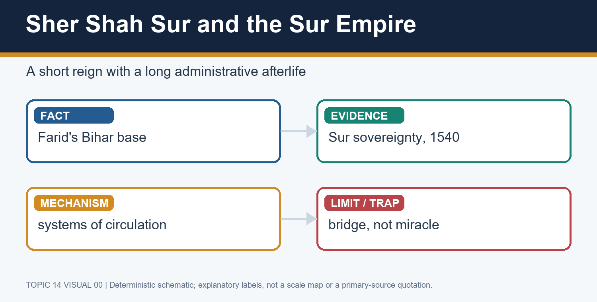

> **Subject:** Medieval Indian History | **Topic:** 14 | **Export date:** 2026-08-18
>
> **Approval:** false - awaiting explicit user approval.
>
> **Tags:** [FACT] repository/local OCR grounded; [ANALYSIS] evidence-led synthesis; [LIMIT] qualification; [SOURCE CAUTION] evidentiary boundary.

## BASIC LEARNING SESSION

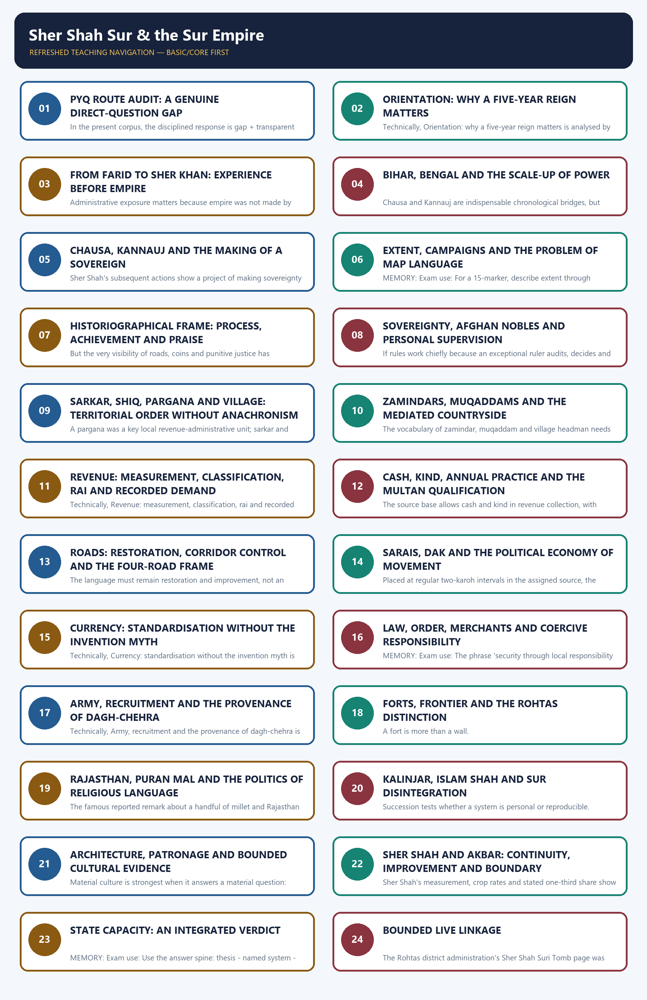

*Distinct embedded teaching-navigation image. The separate continuous Cārvāka-style flowchart package remains an independent at-a-glance artifact.*

#### Package provenance, scope and transparent limits

- **Source order applied:** Topic 14 basic -> Topic 14 advanced -> Topic 13 Humayun/Afghans, Topic 07 administration/economy/source method, Topic 16 Akbar government, master chronology, answer-worthiness audit and PYQ ledgers -> local OCR-searchable Satish Chandra material. Qdrant was not needed and no current-affairs link is forced.
- **Coverage:** Farid's rise; Bihar-Bengal scale-up; bounded Chausa/Kannauj bridge; extent; source method; state structure; revenue; circulation; currency; order; army; forts; religion/politics; succession; architecture; Akbar comparison; state capacity; practice and final register notes.
- **Visual coverage:** 44 original deterministic PNG assets, including cover. Any map-like asset is labelled **SCHEMATIC - NOT TO SCALE**.
- **PYQ honesty:** The audited local routing records contain no direct verified CSE 2018-2025 Topic 14 question. A search of local official/OCR/ledger material found no exact trustworthy adjacent official wording on Sher Shah, rupee, GT Road, patta/qabuliyat, Sur polity or Sur architecture that can be reproduced safely. Therefore there is no fabricated PYQ, reconstructed key or inferred official answer.

### SESSION 1 — PYQ ROUTE AUDIT: A GENUINE DIRECT-QUESTION GAP

#### DEFINITION / WHAT THIS IS CALLED

**Plain-language definition:** The Topic 16 ledger's neutral route on the pargana-sarkar-suba hierarchy is administratively adjacent, but it is not an exact Sher Shah question and the local official key is unavailable.

**Technical definition:** In the present corpus, the disciplined response is gap + transparent adjacent routes + original practice.

#### ANSWER-GRABBING OPENING — WRITE/ADAPT IN THE EXAM

> The Topic 16 ledger's neutral route on the pargana-sarkar-suba hierarchy is administratively adjacent, but it is not an exact Sher Shah question and the local official key is unavailable.

#### MUST-WRITE KEYWORDS

- **PYQ route audit**
- **a genuine direct-question gap**
- **INFERRED ANSWER - NOT OFFICIALLY VERIFIED**
- **2018-2023**
- **2024-2025**
- **2018-2025**

**How to use them:** Frame the answer through PYQ route audit; define a genuine direct-question gap, connect INFERRED ANSWER - NOT OFFICIALLY VERIFIED with 2018-2023 to explain the mechanism, and use 2024-2025 for the decisive comparison or qualification.

[FACT] The local 2018-2023 Prelims routing ledger, 2024-2025 integration ledger, 2026 ledger and Mains routing ledgers were searched for Topic 14 ownership and exact wording. They do not yield a direct verified CSE 2018-2025 question owned by this topic. The Topic 16 ledger's neutral route on the pargana-sarkar-suba hierarchy is administratively adjacent, but it is not an exact Sher Shah question and the local official key is unavailable. It is not reproduced as a fabricated official question.

[ANALYSIS] A PYQ gap is not a licence to lower standards. The topic's exam routes remain highly reusable: statement elimination on road restoration, rupee standardisation, dagh-chehra provenance, revenue terminology, the Rohtas distinction and sarkar/pargana; and GS-I answers on state capacity, agrarian mediation, continuity and source method.

[LIMIT] If a future exact paper/key becomes available, label an answer **INFERRED ANSWER - NOT OFFICIALLY VERIFIED** until it can be checked against an official key. In the present corpus, the disciplined response is gap + transparent adjacent routes + original practice.

#### CLOSING RECALL FLOW — PYQ ROUTE AUDIT: A GENUINE DIRECT-QUESTION GAP

```text
START / CONCEPT: PYQ route audit: a genuine direct-question gap
        |
        v
EXACT TERMS: PYQ route audit · a genuine direct-question gap · INFERRED ANSWER - NOT OFFICIALLY VERIFIED · 2018-2023 · 2024-2025 · 2018-2025
        |
        v
MECHANISM / ARGUMENT: They do not yield a direct verified CSE 2018-2025 question owned by this topic.
        |
        v
CONSEQUENCE / CONTRAST: If a future exact paper/key becomes available, label an answer INFERRED ANSWER - NOT OFFICIALLY VERIFIED until it can be checked against an official key.
        |
        v
UPSC TRAP / ANSWER-USE: A PYQ gap is not a licence to lower standards.
        |
        v
ANSWER-GRABBING FORMULATION: The Topic 16 ledger's neutral route on the pargana-sarkar-suba hierarchy is administratively adjacent, but it is not an exact Sher Shah question and the local official key is unavailable.
```
### SESSION 2 — ORIENTATION: WHY A FIVE-YEAR REIGN MATTERS

#### DEFINITION / WHAT THIS IS CALLED

**Plain-language definition:** A short reign prevents the conclusion that every measure was uniform, fully institutionalised or entirely new.

**Technical definition:** Technically, Orientation: why a five-year reign matters is analysed by relating Orientation to why a five-year reign matters, then testing the relationship through The useful question and Sher Shah.

#### ANSWER-GRABBING OPENING — WRITE/ADAPT IN THE EXAM

> A short reign prevents the conclusion that every measure was uniform, fully institutionalised or entirely new.

#### MUST-WRITE KEYWORDS

- **Orientation**
- **why a five-year reign matters**
- **The useful question**
- **Sher Shah**
- **It**
- **Afghan**

**How to use them:** Frame the answer through Orientation; define why a five-year reign matters, connect The useful question with Sher Shah to explain the mechanism, and use It for the decisive comparison or qualification.

[FACT] Sher Shah's reign ran from 1540 to 1545, but the Sur phase lasted until Humayun's return in 1555. The basic and advanced topic files place him after the Bihar-Bengal rise of Sher Khan and before Akbar's longer consolidation. His realm ran broadly from Bengal to the Indus, excluded Kashmir, and extended through Malwa and much of Rajasthan. This makes the Sur episode a short but unusually dense field for studying military victory, fiscal practice, circulation, territorial control and succession.

[ANALYSIS] The useful question is therefore not whether Sher Shah was simply 'great'. It is how a ruler could turn a regional Afghan base into an empire and make its revenue, roads, currency, information and coercive routines mutually supportive. Measurement made claims legible; coin standards eased payments; roads carried armies, merchants and news; sarais provided nodal support; and policing made those routes usable. These were interlocking capacities rather than a list of unrelated reforms.

[LIMIT] A short reign prevents the conclusion that every measure was uniform, fully institutionalised or entirely new. The safest verdict is systematisation and practical implementation within a long Sultanate-to-Mughal process. Do not call the Sur polity a modern bureaucratic nation-state, or treat later Mughal arrangements as photographic copies of Sher Shah's order.

> MEMORY: **Exam use:** Use the phrase 'bridge, not rupture': it keeps both achievement and historical continuity visible in a GS-I answer.

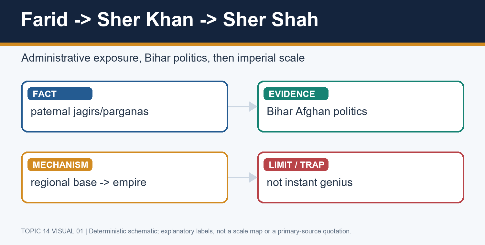


#### CLOSING RECALL FLOW — ORIENTATION: WHY A FIVE-YEAR REIGN MATTERS

```text
START / CONCEPT: Orientation: why a five-year reign matters
        |
        v
EXACT TERMS: Orientation · why a five-year reign matters · The useful question · Sher Shah · It · Afghan
        |
        v
MECHANISM / ARGUMENT: The useful question is therefore not whether Sher Shah was simply 'great'.
        |
        v
CONSEQUENCE / CONTRAST: Do not call the Sur polity a modern bureaucratic nation-state, or treat later Mughal arrangements as photographic copies of Sher Shah's order.
        |
        v
UPSC TRAP / ANSWER-USE: MEMORY: Exam use: Use the phrase 'bridge, not rupture': it keeps both achievement and historical continuity visible in a GS-I answer.
        |
        v
ANSWER-GRABBING FORMULATION: A short reign prevents the conclusion that every measure was uniform, fully institutionalised or entirely new.
```
### SESSION 3 — FROM FARID TO SHER KHAN: EXPERIENCE BEFORE EMPIRE

#### DEFINITION / WHAT THIS IS CALLED

**Plain-language definition:** Farid, later Sher Shah, was associated with the Sur family and acquired practical exposure in his father's jagirs and parganas around Sasaram.

**Technical definition:** Administrative exposure matters because empire was not made by battlefield talent alone.

#### ANSWER-GRABBING OPENING — WRITE/ADAPT IN THE EXAM

> The title Sher Khan belongs to his rise before the imperial title Sher Shah; explanations of its tiger-killing or service origin should be kept cautious when a source does not settle the story.

#### MUST-WRITE KEYWORDS

- **From Farid to Sher Khan**
- **experience before empire**
- **Farid**
- **Sher Shah**
- **Sur**
- **Sasaram**

**How to use them:** Frame the answer through From Farid to Sher Khan; define experience before empire, connect Farid with Sher Shah to explain the mechanism, and use Sur for the decisive comparison or qualification.

[FACT] Farid, later Sher Shah, was associated with the Sur family and acquired practical exposure in his father's jagirs and parganas around Sasaram. The assigned materials stress administrative experience rather than a fable of instant genius. Bihar's Afghan politics gave a capable officer access to landed resources, local alliances, revenue knowledge and the strategic value of forts. The title Sher Khan belongs to his rise before the imperial title Sher Shah; explanations of its tiger-killing or service origin should be kept cautious when a source does not settle the story.

[ANALYSIS] Administrative exposure matters because empire was not made by battlefield talent alone. Knowing the revenue potential of a pargana, the behaviour of village intermediaries, the working of assignments, the value of a route and the tempo of local negotiation offered a ruler a practical repertoire. Farid's trajectory shows a mobile political society in which a relatively small noble could enlarge authority by combining service, calculated alliance, force and resource mobilisation.

[LIMIT] Neither 'Afghan tribalism' nor individual brilliance exhausts the explanation. Afghan chiefs had expectations of dignity, shares and counsel; they could be rallied but were not passive bureaucrats. Farid's later authority emerged from Bihar's political field, not from a pre-existing national Afghan state. Avoid importing a modern ethnic unity into sixteenth-century coalition politics.

> MEMORY: **Exam use:** In a rise/process answer, begin with pargana-level experience and Bihar politics, then move to Surajgarh, Bengal and the Mughal contest.


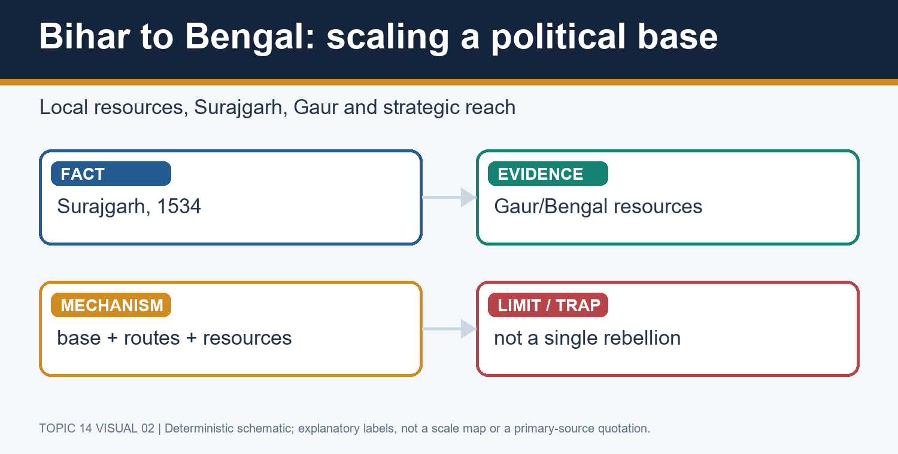

#### CLOSING RECALL FLOW — FROM FARID TO SHER KHAN: EXPERIENCE BEFORE EMPIRE

```text
START / CONCEPT: From Farid to Sher Khan: experience before empire
        |
        v
EXACT TERMS: From Farid to Sher Khan · experience before empire · Farid · Sher Shah · Sur · Sasaram
        |
        v
MECHANISM / ARGUMENT: Administrative exposure matters because empire was not made by battlefield talent alone.
        |
        v
CONSEQUENCE / CONTRAST: Farid's later authority emerged from Bihar's political field, not from a pre-existing national Afghan state.
        |
        v
UPSC TRAP / ANSWER-USE: Do not miss this limiting distinction: farid, later Sher Shah, was associated with the Sur family and acquired practical exposure...
        |
        v
ANSWER-GRABBING FORMULATION: The title Sher Khan belongs to his rise before the imperial title Sher Shah; explanations of its tiger-killing or service origin should be kept cautious when a source does not settle the story.
```
### SESSION 4 — BIHAR, BENGAL AND THE SCALE-UP OF POWER

#### DEFINITION / WHAT THIS IS CALLED

**Plain-language definition:** Surajgarh and the Bengal turn are best read as scale-up rather than as isolated victories.

**Technical definition:** Chausa and Kannauj are indispensable chronological bridges, but their tactical reconstruction and Humayun's Bengal crisis are owned by Topic 13.

#### ANSWER-GRABBING OPENING — WRITE/ADAPT IN THE EXAM

> Surajgarh and the Bengal turn are best read as scale-up rather than as isolated victories.

#### MUST-WRITE KEYWORDS

- **Bihar**
- **Bengal**
- **the scale-up of power**
- **Sher Khan**
- **Surajgarh**
- **Gaur**

**How to use them:** Frame the answer through Bihar; define Bengal, connect the scale-up of power with Sher Khan to explain the mechanism, and use Surajgarh for the decisive comparison or qualification.

[FACT] Sher Khan became increasingly important in Bihar after 1526. The repository chronology records his defeat of Bengal at Surajgarh in 1534 and the capture of Gaur by his son in 1537; the Topic 13 bridge explains the Bengal contest more fully. These developments made Bengal's resources, the Bihar base and movement along the eastern corridor available to an increasingly autonomous Afghan project. They also changed Humayun's calculation: a former accommodated noble now possessed regional depth.

[ANALYSIS] Surajgarh and the Bengal turn are best read as scale-up rather than as isolated victories. A base becomes imperial when it can recruit, provision, store wealth, coordinate forts, protect a rear and negotiate with regional elites while contesting a larger centre. Bengal supplied political and fiscal stakes; Bihar supplied a connected base; the Ganga corridor made communications central. This is why Humayun's eastern expedition became a contest over route control and state capacity, not only a duel of personalities.

[LIMIT] Do not retell Topic 13 battle detail here. Chausa and Kannauj are indispensable chronological bridges, but their tactical reconstruction and Humayun's Bengal crisis are owned by Topic 13. Topic 14 begins from the institutional consequences of the Sur victory. A bounded bridge prevents an answer from losing its focus in a long battlefield narrative.

> MEMORY: **Exam use:** A diagram can show Bihar base -> Bengal resources -> route control -> confrontation with the Mughal core.


#### CLOSING RECALL FLOW — BIHAR, BENGAL AND THE SCALE-UP OF POWER

```text
START / CONCEPT: Bihar, Bengal and the scale-up of power
        |
        v
EXACT TERMS: Bihar · Bengal · the scale-up of power · Sher Khan · Surajgarh · Gaur
        |
        v
MECHANISM / ARGUMENT: The repository chronology records his defeat of Bengal at Surajgarh in 1534 and the capture of Gaur by his son in 1537; the Topic 13 bridge explains the Bengal contest more fully.
        |
        v
CONSEQUENCE / CONTRAST: Chausa and Kannauj are indispensable chronological bridges, but their tactical reconstruction and Humayun's Bengal crisis are owned by Topic 13.
        |
        v
UPSC TRAP / ANSWER-USE: Do not miss this limiting distinction: a diagram can show Bihar base - Bengal resources - route control - confrontation...
        |
        v
ANSWER-GRABBING FORMULATION: Surajgarh and the Bengal turn are best read as scale-up rather than as isolated victories.
```
### SESSION 5 — CHAUSA, KANNAUJ AND THE MAKING OF A SOVEREIGN

#### DEFINITION / WHAT THIS IS CALLED

**Plain-language definition:** MEMORY: Exam use: Use Chausa 1539 - Kannauj 1540 - Sur sovereignty as a chronology spine, then pivot immediately to state-building.

**Technical definition:** Sher Shah's subsequent actions show a project of making sovereignty felt in the countryside and on the road as well as at the court.

#### ANSWER-GRABBING OPENING — WRITE/ADAPT IN THE EXAM

> Sher Shah's subsequent actions show a project of making sovereignty felt in the countryside and on the road as well as at the court.

#### MUST-WRITE KEYWORDS

- **Chausa**
- **Kannauj**
- **the making of a sovereign**
- **This**
- **1540-45**
- **1510-1555**

**How to use them:** Frame the answer through Chausa; define Kannauj, connect the making of a sovereign with This to explain the mechanism, and use 1540-45 for the decisive comparison or qualification.

[FACT] Sher Khan defeated Humayun at Chausa in 1539 and at Kannauj/Bilgram in 1540. The latter defeat removed Humayun from north India and opened the formal Sur sovereignty of Sher Shah. The master chronology places the reign at 1540-45. This package keeps tactical detail deliberately bounded because the preceding Topic 13 session treats the Bengal campaign, communications crisis and the two battles as its core field.

[ANALYSIS] The political importance of these victories was not simply that a Mughal lost. They altered the allocation of forts, revenue centres, routes and elite expectations. A victor who could turn battlefield disruption into predictable collection, circulation and enforcement could hold a far larger space than a raider. Sher Shah's subsequent actions show a project of making sovereignty felt in the countryside and on the road as well as at the court.

[LIMIT] Victory did not erase Mughal claims, regional rulers or Afghan factional dynamics. It is misleading to say that 1540 produced a settled empire overnight. The empire had to be campaigned through, negotiated with, measured and watched. The return of Humayun in 1555 later demonstrates that military displacement and durable political settlement are different achievements.

> MEMORY: **Exam use:** Use Chausa 1539 -> Kannauj 1540 -> Sur sovereignty as a chronology spine, then pivot immediately to state-building.


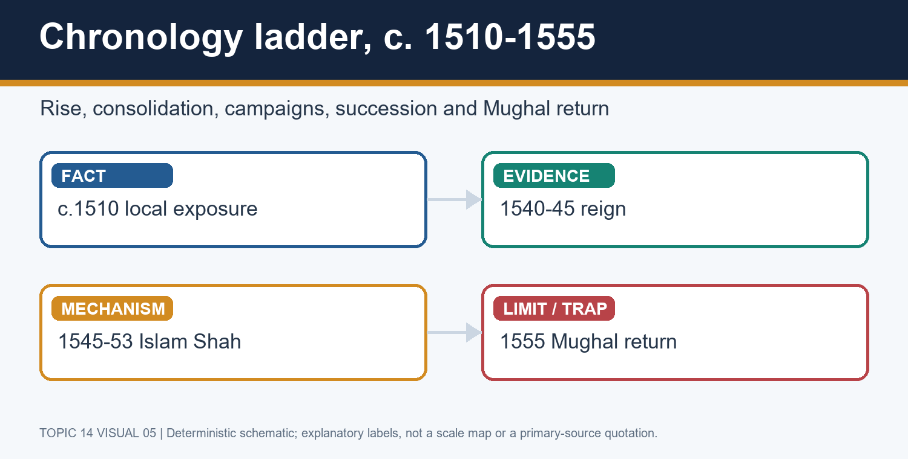

#### CLOSING RECALL FLOW — CHAUSA, KANNAUJ AND THE MAKING OF A SOVEREIGN

```text
START / CONCEPT: Chausa, Kannauj and the making of a sovereign
        |
        v
EXACT TERMS: Chausa · Kannauj · the making of a sovereign · This · 1540-45 · 1510-1555
        |
        v
MECHANISM / ARGUMENT: This package keeps tactical detail deliberately bounded because the preceding Topic 13 session treats the Bengal campaign, communications crisis and the two battles as its core field.
        |
        v
CONSEQUENCE / CONTRAST: MEMORY: Exam use: Use Chausa 1539 - Kannauj 1540 - Sur sovereignty as a chronology spine, then pivot immediately to state-building.
        |
        v
UPSC TRAP / ANSWER-USE: The political importance of these victories was not simply that a Mughal lost.
        |
        v
ANSWER-GRABBING FORMULATION: Sher Shah's subsequent actions show a project of making sovereignty felt in the countryside and on the road as well as at the court.
```
### SESSION 6 — EXTENT, CAMPAIGNS AND THE PROBLEM OF MAP LANGUAGE

#### DEFINITION / WHAT THIS IS CALLED

**Plain-language definition:** These are campaign fields, not evidence for modern provincial boundaries or a uniformly administered rectangle.

**Technical definition:** MEMORY: Exam use: For a 15-marker, describe extent through corridors and campaign fields, then qualify it through uneven control and short duration.

#### ANSWER-GRABBING OPENING — WRITE/ADAPT IN THE EXAM

> Bengal-to-Indus is a useful large-scale claim because it captures the reach of the regime; the Rajasthan campaigns show the coercive and negotiated edge of that reach.

#### MUST-WRITE KEYWORDS

- **Extent**
- **campaigns**
- **the problem of map language**
- **The basic file**
- **Sur**
- **1543-44**

**How to use them:** Frame the answer through Extent; define campaigns, connect the problem of map language with The basic file to explain the mechanism, and use Sur for the decisive comparison or qualification.

[FACT] The basic file describes the Sur empire as extending from Bengal to the Indus, excluding Kashmir, with Malwa and almost all Rajasthan in the west. The advanced file records Malwa's conquest in 1542, operations in Multan/upper Sindh and Rajasthan in 1543-44, Samel in 1544 and Sher Shah's death in 1545. These are campaign fields, not evidence for modern provincial boundaries or a uniformly administered rectangle.

[ANALYSIS] Map language should express layered control. Imperial cities, revenue tracts, forts, road corridors and the loyalty of local chiefs did not all have the same density of control. Bengal-to-Indus is a useful large-scale claim because it captures the reach of the regime; the Rajasthan campaigns show the coercive and negotiated edge of that reach. A map marked 'schematic - not to scale' is more honest than a modern outline that suggests precise borders and homogeneous rule.

[LIMIT] Kashmir's exclusion matters because it guards against the easy formula 'all northern India'. Multan and upper Sindh should be stated only where the source base supports them. Do not conflate the northwest frontier with a settled modern international boundary; equally, do not use the later phrase Grand Trunk Road to impose a single modern highway alignment on sixteenth-century routes.

> MEMORY: **Exam use:** For a 15-marker, describe extent through corridors and campaign fields, then qualify it through uneven control and short duration.


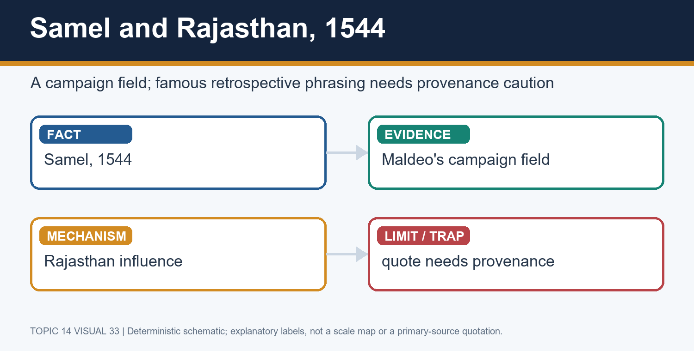

#### CLOSING RECALL FLOW — EXTENT, CAMPAIGNS AND THE PROBLEM OF MAP LANGUAGE

```text
START / CONCEPT: Extent, campaigns and the problem of map language
        |
        v
EXACT TERMS: Extent · campaigns · the problem of map language · The basic file · Sur · 1543-44
        |
        v
MECHANISM / ARGUMENT: MEMORY: Exam use: For a 15-marker, describe extent through corridors and campaign fields, then qualify it through uneven control and short duration.
        |
        v
CONSEQUENCE / CONTRAST: These are campaign fields, not evidence for modern provincial boundaries or a uniformly administered rectangle.
        |
        v
UPSC TRAP / ANSWER-USE: Imperial cities, revenue tracts, forts, road corridors and the loyalty of local chiefs did not all have the same density of control.
        |
        v
ANSWER-GRABBING FORMULATION: Bengal-to-Indus is a useful large-scale claim because it captures the reach of the regime; the Rajasthan campaigns show the coercive and negotiated edge of that reach.
```
### SESSION 7 — HISTORIOGRAPHICAL FRAME: PROCESS, ACHIEVEMENT AND PRAISE

#### DEFINITION / WHAT THIS IS CALLED

**Plain-language definition:** Sher Shah made inherited tools work together at speed, and that implementation is a genuine achievement.

**Technical definition:** But the very visibility of roads, coins and punitive justice has encouraged later nationalist and administrative narratives to personalise a complex process.

#### ANSWER-GRABBING OPENING — WRITE/ADAPT IN THE EXAM

> Sher Shah made inherited tools work together at speed, and that implementation is a genuine achievement.

#### MUST-WRITE KEYWORDS

- **Historiographical frame**
- **achievement**
- **praise**
- **Abbas Khan Sarwani**
- **Sur**
- **Afghan-memory**

**How to use them:** Frame the answer through Historiographical frame; define achievement, connect praise with Abbas Khan Sarwani to explain the mechanism, and use Sur for the decisive comparison or qualification.

[FACT] Satish Chandra's treatment cautions against uncritical adulation. The assigned advanced file explicitly locates north Indian unification in processes begun under Sikandar Lodi, Babur, Humayun and Sher Khan's own Bihar-Bengal successes. Abbas Khan Sarwani is valuable for the Sur period, but a retrospective chronicle with courtly and Afghan-memory investments cannot be treated as a neutral administrative audit. Coins, routes, forts, sarais and buildings offer different kinds of evidence.

[ANALYSIS] A historian can acknowledge effectiveness without turning it into a miracle story. Sher Shah made inherited tools work together at speed, and that implementation is a genuine achievement. But the very visibility of roads, coins and punitive justice has encouraged later nationalist and administrative narratives to personalise a complex process. The strongest interpretation distinguishes a chronicler's admiration from what independent material and institutional evidence can securely show.

[LIMIT] Source criticism does not mean that Sarwani is useless or that material remains explain every administrative procedure. A chronicle can illuminate ideals, claims, sequence and remembered practice; it needs comparison with other genres. Avoid long quotations, especially famous lines about Rajasthan, unless provenance, wording and context are independently secure.

> MEMORY: **Exam use:** A source-method paragraph can earn marks by pairing Sarwani's reach with its genre limit, then adding coins/monuments/road remains as differently limited checks.


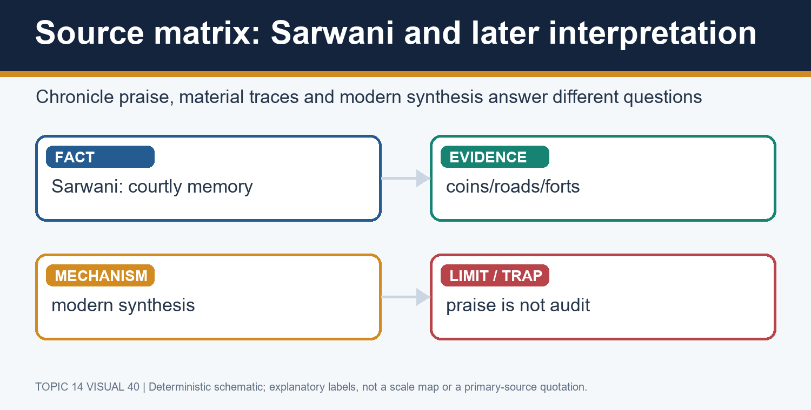

#### CLOSING RECALL FLOW — HISTORIOGRAPHICAL FRAME: PROCESS, ACHIEVEMENT AND PRAISE

```text
START / CONCEPT: Historiographical frame: process, achievement and praise
        |
        v
EXACT TERMS: Historiographical frame · achievement · praise · Abbas Khan Sarwani · Sur · Afghan-memory
        |
        v
MECHANISM / ARGUMENT: MEMORY: Exam use: A source-method paragraph can earn marks by pairing Sarwani's reach with its genre limit, then adding coins/monuments/road remains as differently limited checks.
        |
        v
CONSEQUENCE / CONTRAST: Abbas Khan Sarwani is valuable for the Sur period, but a retrospective chronicle with courtly and Afghan-memory investments cannot be treated as a neutral administrative audit.
        |
        v
UPSC TRAP / ANSWER-USE: But the very visibility of roads, coins and punitive justice has encouraged later nationalist and administrative narratives to personalise a complex process.
        |
        v
ANSWER-GRABBING FORMULATION: Sher Shah made inherited tools work together at speed, and that implementation is a genuine achievement.
```
### SESSION 8 — SOVEREIGNTY, AFGHAN NOBLES AND PERSONAL SUPERVISION

#### DEFINITION / WHAT THIS IS CALLED

**Plain-language definition:** The productive phrase is 'monarchical assertion within an Afghan political field'.

**Technical definition:** If rules work chiefly because an exceptional ruler audits, decides and punishes, successors must either reproduce that authority or bargain more openly with powerful nobles.

#### ANSWER-GRABBING OPENING — WRITE/ADAPT IN THE EXAM

> The productive phrase is 'monarchical assertion within an Afghan political field'.

#### MUST-WRITE KEYWORDS

- **Sovereignty**
- **Afghan nobles**
- **personal supervision**
- **Sher Shah**
- **Personal**
- **It**

**How to use them:** Frame the answer through Sovereignty; define Afghan nobles, connect personal supervision with Sher Shah to explain the mechanism, and use Personal for the decisive comparison or qualification.

[FACT] Sher Shah exercised strong personal supervision. Yet Afghan nobles continued to carry expectations shaped by iqta/jagir assignments, military service, honour and consultation. The assigned files warn against presenting Sur rule as a direct bureaucratic state. Sher Shah maintained central machinery in broad continuity with prior practice, but the available evidence is stronger for practical control and selected institutions than for a fully documented, uniform central blueprint.

[ANALYSIS] Personal supervision could increase capacity quickly: it disciplined officers, connected fiscal demands to military needs, and signalled that local disorder could reach the sovereign's notice. It also had a built-in fragility. If rules work chiefly because an exceptional ruler audits, decides and punishes, successors must either reproduce that authority or bargain more openly with powerful nobles. Islam Shah's later centralising stance makes this tension visible.

[LIMIT] Calling Sher Shah an absolute despot conceals bargaining and assignment-based expectations; calling him a first among equals conceals the real coercive superiority of the throne. The productive phrase is 'monarchical assertion within an Afghan political field'. It captures both centralising ambition and the social limits of impersonal administration.

> MEMORY: **Exam use:** Connect personal rule to later Sur fragility rather than treating it merely as a character trait.


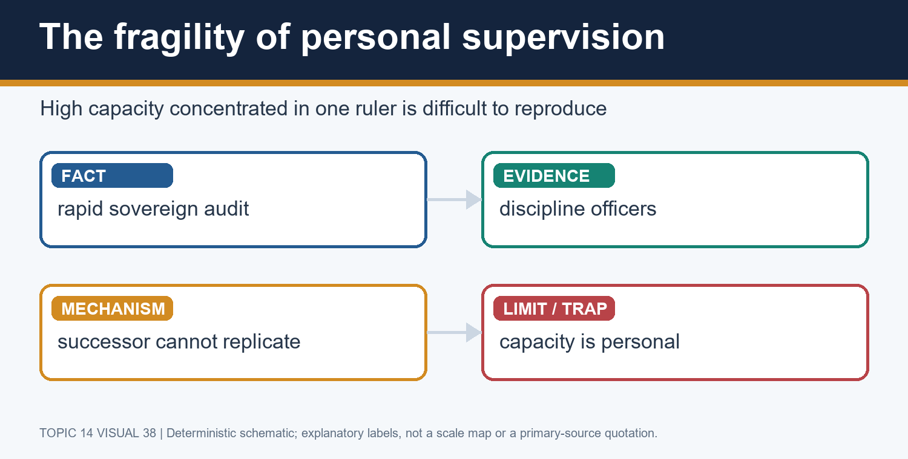

#### CLOSING RECALL FLOW — SOVEREIGNTY, AFGHAN NOBLES AND PERSONAL SUPERVISION

```text
START / CONCEPT: Sovereignty, Afghan nobles and personal supervision
        |
        v
EXACT TERMS: Sovereignty · Afghan nobles · personal supervision · Sher Shah · Personal · It
        |
        v
MECHANISM / ARGUMENT: If rules work chiefly because an exceptional ruler audits, decides and punishes, successors must either reproduce that authority or bargain more openly with powerful nobles.
        |
        v
CONSEQUENCE / CONTRAST: Sher Shah maintained central machinery in broad continuity with prior practice, but the available evidence is stronger for practical control and selected institutions than for a fully documented, uniform central blueprint.
        |
        v
UPSC TRAP / ANSWER-USE: Do not miss this limiting distinction: personal supervision could increase capacity quickly.
        |
        v
ANSWER-GRABBING FORMULATION: The productive phrase is 'monarchical assertion within an Afghan political field'.
```
### SESSION 9 — SARKAR, SHIQ, PARGANA AND VILLAGE: TERRITORIAL ORDER WITHOUT ANACHRONISM

#### DEFINITION / WHAT THIS IS CALLED

**Plain-language definition:** The exam-safe contrast is clear: Sher Shah worked through sarkar/shiq, pargana and village mediation; Akbar later developed a more articulated suba-level framework.

**Technical definition:** A pargana was a key local revenue-administrative unit; sarkar and shiq terminology should be handled cautiously because sources and administrative evolution do not always map onto one simple, universal hierarchy.

#### ANSWER-GRABBING OPENING — WRITE/ADAPT IN THE EXAM

> The exam-safe contrast is clear: Sher Shah worked through sarkar/shiq, pargana and village mediation; Akbar later developed a more articulated suba-level framework.

#### MUST-WRITE KEYWORDS

- **Sarkar**
- **shiq**
- **pargana**
- **village**
- **territorial order without anachronism**
- **This**

**How to use them:** Frame the answer through Sarkar; define shiq, connect pargana with village to explain the mechanism, and use territorial order without anachronism for the decisive comparison or qualification.

[FACT] The core materials identify sarkars/shiqs and parganas as important territorial units under Sher Shah, with village headmen and zamindars remaining central to local working. A pargana was a key local revenue-administrative unit; sarkar and shiq terminology should be handled cautiously because sources and administrative evolution do not always map onto one simple, universal hierarchy. This was not Akbar's later suba structure.

[ANALYSIS] Territorial administration mattered because a court's orders had to be translated into assessment, registers, policing, supply and intelligence. Officials, collectors, record-keepers, military agents and local notables formed a chain rather than a single modern department. Paired or overlapping roles could check fraud, but they also relied on local knowledge and on the cooperation—or coerced compliance—of rural intermediaries.

[LIMIT] Do not write 'province' as a neutral substitute for every medieval territorial unit. Nor should a student give a rigid office list where the source does not justify it. The exam-safe contrast is clear: Sher Shah worked through sarkar/shiq, pargana and village mediation; Akbar later developed a more articulated suba-level framework. This is continuity with elaboration, not an empty institutional gap.

> MEMORY: **Exam use:** A hierarchy visual should end at village mediation, not at an imaginary direct state-peasant line.


#### CLOSING RECALL FLOW — SARKAR, SHIQ, PARGANA AND VILLAGE: TERRITORIAL ORDER WITHOUT ANACHRONISM

```text
START / CONCEPT: Sarkar, shiq, pargana and village: territorial order without anachronism
        |
        v
EXACT TERMS: Sarkar · shiq · pargana · village · territorial order without anachronism · This
        |
        v
MECHANISM / ARGUMENT: A pargana was a key local revenue-administrative unit; sarkar and shiq terminology should be handled cautiously because sources and administrative evolution do not always map onto one simple, universal hierarchy.
        |
        v
CONSEQUENCE / CONTRAST: MEMORY: Exam use: A hierarchy visual should end at village mediation, not at an imaginary direct state-peasant line.
        |
        v
UPSC TRAP / ANSWER-USE: Do not write 'province' as a neutral substitute for every medieval territorial unit.
        |
        v
ANSWER-GRABBING FORMULATION: The exam-safe contrast is clear: Sher Shah worked through sarkar/shiq, pargana and village mediation; Akbar later developed a more articulated suba-level framework.
```
### SESSION 10 — ZAMINDARS, MUQADDAMS AND THE MEDIATED COUNTRYSIDE

#### DEFINITION / WHAT THIS IS CALLED

**Plain-language definition:** The advanced source is explicit that local headmen and zamindars remained involved in assessment and collection.

**Technical definition:** The vocabulary of zamindar, muqaddam and village headman needs contextual use: these positions connected cultivators, local power, information, collection and order in different ways.

#### ANSWER-GRABBING OPENING — WRITE/ADAPT IN THE EXAM

> The advanced source is explicit that local headmen and zamindars remained involved in assessment and collection.

#### MUST-WRITE KEYWORDS

- **Zamindars**
- **muqaddams**
- **the mediated countryside**
- **The advanced source**
- **This**
- **Sur**

**How to use them:** Frame the answer through Zamindars; define muqaddams, connect the mediated countryside with The advanced source to explain the mechanism, and use This for the decisive comparison or qualification.

[FACT] The advanced source is explicit that local headmen and zamindars remained involved in assessment and collection. Sher Shah controlled recalcitrant zamindars and made local village leadership answerable in policing, but he did not abolish the rural elite. The vocabulary of zamindar, muqaddam and village headman needs contextual use: these positions connected cultivators, local power, information, collection and order in different ways.

[ANALYSIS] This mediation explains both the reach and the limit of the Sur state. A ruler could create rates and issue records, yet needed people who knew cultivation, boundaries, harvests, local credit and the identity of offenders. The same intermediaries could help reduce arbitrary exactions or conceal resources and resist demand. State capacity therefore combined record-making with negotiation and coercion rather than bypassing society.

[LIMIT] The common analogy to British ryotwari is wrong. A modern direct settlement imagines a different legal, cadastral and bureaucratic world. Patta should not be inflated into proof that each cultivator stood alone before an impersonal state. Use it as evidence of a claim toward recorded assessment, while keeping village intermediaries inside the picture.

> MEMORY: **Exam use:** The contrast 'recorded demand + mediated collection' gives a balanced answer on agrarian administration.


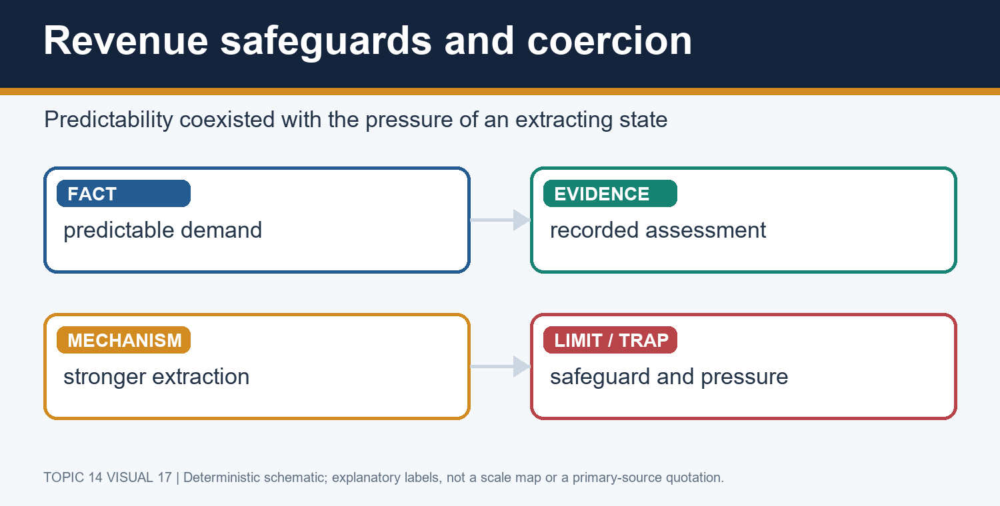

#### CLOSING RECALL FLOW — ZAMINDARS, MUQADDAMS AND THE MEDIATED COUNTRYSIDE

```text
START / CONCEPT: Zamindars, muqaddams and the mediated countryside
        |
        v
EXACT TERMS: Zamindars · muqaddams · the mediated countryside · The advanced source · This · Sur
        |
        v
MECHANISM / ARGUMENT: The vocabulary of zamindar, muqaddam and village headman needs contextual use: these positions connected cultivators, local power, information, collection and order in different ways.
        |
        v
CONSEQUENCE / CONTRAST: MEMORY: Exam use: The contrast 'recorded demand + mediated collection' gives a balanced answer on agrarian administration.
        |
        v
UPSC TRAP / ANSWER-USE: This mediation explains both the reach and the limit of the Sur state.
        |
        v
ANSWER-GRABBING FORMULATION: The advanced source is explicit that local headmen and zamindars remained involved in assessment and collection.
```
### SESSION 11 — REVENUE: MEASUREMENT, CLASSIFICATION, RAI AND RECORDED DEMAND

#### DEFINITION / WHAT THIS IS CALLED

**Plain-language definition:** For cultivators, a stated demand could in principle restrain arbitrary multiplication of claims.

**Technical definition:** Technically, Revenue: measurement, classification, rai and recorded demand is analysed by relating Revenue to measurement, then testing the relationship through rai and recorded demand.

#### ANSWER-GRABBING OPENING — WRITE/ADAPT IN THE EXAM

> For cultivators, a stated demand could in principle restrain arbitrary multiplication of claims.

#### MUST-WRITE KEYWORDS

- **Revenue**
- **measurement**
- **rai**
- **recorded demand**
- **Where patta and qabuliyat**
- **Where**

**How to use them:** Frame the answer through Revenue; define measurement, connect rai with recorded demand to explain the mechanism, and use Where patta and qabuliyat for the decisive comparison or qualification.

[FACT] Sher Shah's revenue system measured sown land, classified land as good, middling and bad, computed an average yield and used crop rates called rai. The state share was generally stated as one-third of average produce. The basic file says a patta recorded the area, crop and amount due. Where patta and qabuliyat are discussed, they must be described cautiously as records and acceptance within an assessment relationship, not as proof of a fully modern contractual settlement.

[ANALYSIS] The logic runs from visibility to predictability. Measurement narrowed uncertainty about area; classification sought a normal rather than exceptional yield; the rai converted crop knowledge into an assessable schedule; a record made the claimed demand more knowable. For the state, this improved fiscal calculation. For cultivators, a stated demand could in principle restrain arbitrary multiplication of claims. The same chain also made extraction more systematic.

[LIMIT] One-third is a general source-grounded formulation, not a universal crop-by-crop figure that can be mechanically applied to every place. Neither classification nor a patta proves that every parcel was freshly and perfectly measured every year. The Multan exception and the role of local mediation are safeguards against claims of total uniformity.

> MEMORY: **Exam use:** Use the chain rather than a list: sown land -> classification -> average -> rai -> one-third claim -> patta/acceptance -> collection.

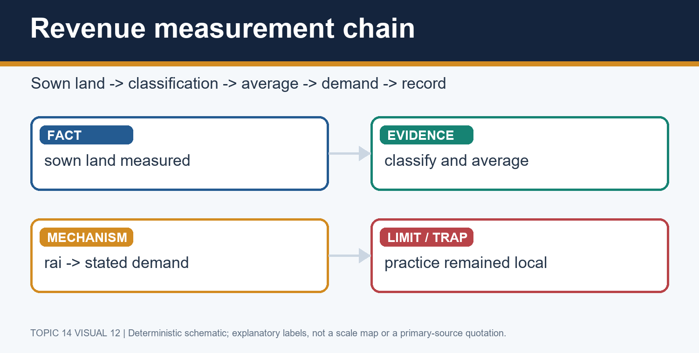


#### CLOSING RECALL FLOW — REVENUE: MEASUREMENT, CLASSIFICATION, RAI AND RECORDED DEMAND

```text
START / CONCEPT: Revenue: measurement, classification, rai and recorded demand
        |
        v
EXACT TERMS: Revenue · measurement · rai · recorded demand · Where patta and qabuliyat · Where
        |
        v
MECHANISM / ARGUMENT: The state share was generally stated as one-third of average produce.
        |
        v
CONSEQUENCE / CONTRAST: Where patta and qabuliyat are discussed, they must be described cautiously as records and acceptance within an assessment relationship, not as proof of a fully modern contractual settlement.
        |
        v
UPSC TRAP / ANSWER-USE: One-third is a general source-grounded formulation, not a universal crop-by-crop figure that can be mechanically applied to every place.
        |
        v
ANSWER-GRABBING FORMULATION: For cultivators, a stated demand could in principle restrain arbitrary multiplication of claims.
```
### SESSION 12 — CASH, KIND, ANNUAL PRACTICE AND THE MULTAN QUALIFICATION

#### DEFINITION / WHAT THIS IS CALLED

**Plain-language definition:** MEMORY: Exam use: The qualification 'annual measurement, with Multan noted as an exception' is a high-value factual safeguard in a statement question.

**Technical definition:** The source base allows cash and kind in revenue collection, with annual measurement as the stated practice and Multan identified as an exception in the advanced file.

#### ANSWER-GRABBING OPENING — WRITE/ADAPT IN THE EXAM

> The source base allows cash and kind in revenue collection, with annual measurement as the stated practice and Multan identified as an exception in the advanced file.

#### MUST-WRITE KEYWORDS

- **Cash**
- **kind**
- **annual practice**
- **the Multan qualification**
- **Multan**
- **Crop-sharing**

**How to use them:** Frame the answer through Cash; define kind, connect annual practice with the Multan qualification to explain the mechanism, and use Multan for the decisive comparison or qualification.

[FACT] The source base allows cash and kind in revenue collection, with annual measurement as the stated practice and Multan identified as an exception in the advanced file. The mechanisms of commutation, local price and collection cannot be made identical in every tract from a short general statement. Crop-sharing, division at field or threshing floor, and cash calculation are different operational paths, each requiring local knowledge and enforcement.

[ANALYSIS] Cash and kind were not merely technical alternatives. Cash demands connected fiscal extraction to coin circulation, markets and price conditions; kind collection connected it more directly to harvest, storage and transport. An administration able to use more than one path could adapt to crop, region and administrative capacity. That flexibility partly explains why a statement of one-third should be read as a revenue principle embedded in practice, not an unchanging spreadsheet.

[LIMIT] Do not invent conversion rates, crop prices or regional yields. The historical two-karoh wording for sarais and the Multan exception show why false modern precision is dangerous. A good answer names the mechanism, admits unevenness and avoids presenting medieval assessment as a single nationwide settlement contract.

> MEMORY: **Exam use:** The qualification 'annual measurement, with Multan noted as an exception' is a high-value factual safeguard in a statement question.

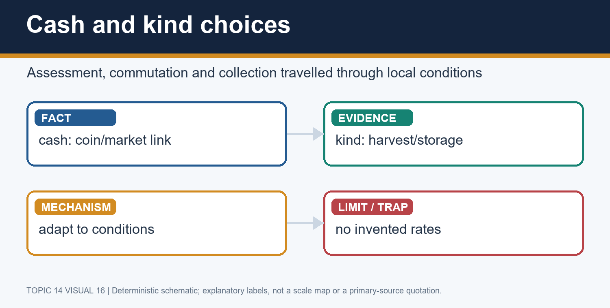


#### CLOSING RECALL FLOW — CASH, KIND, ANNUAL PRACTICE AND THE MULTAN QUALIFICATION

```text
START / CONCEPT: Cash, kind, annual practice and the Multan qualification
        |
        v
EXACT TERMS: Cash · kind · annual practice · the Multan qualification · Multan · Crop-sharing
        |
        v
MECHANISM / ARGUMENT: MEMORY: Exam use: The qualification 'annual measurement, with Multan noted as an exception' is a high-value factual safeguard in a statement question.
        |
        v
CONSEQUENCE / CONTRAST: Cash and kind were not merely technical alternatives.
        |
        v
UPSC TRAP / ANSWER-USE: That flexibility partly explains why a statement of one-third should be read as a revenue principle embedded in practice, not an unchanging spreadsheet.
        |
        v
ANSWER-GRABBING FORMULATION: The source base allows cash and kind in revenue collection, with annual measurement as the stated practice and Multan identified as an exception in the advanced file.
```
### SESSION 13 — ROADS: RESTORATION, CORRIDOR CONTROL AND THE FOUR-ROAD FRAME

#### DEFINITION / WHAT THIS IS CALLED

**Plain-language definition:** MEMORY: Exam use: The best formulation is 'roads served trade, military logistics, information and surveillance simultaneously'.

**Technical definition:** The language must remain restoration and improvement, not an invention of the GT Road from nothing.

#### ANSWER-GRABBING OPENING — WRITE/ADAPT IN THE EXAM

> The language must remain restoration and improvement, not an invention of the GT Road from nothing.

#### MUST-WRITE KEYWORDS

- **Roads**
- **restoration**
- **corridor control**
- **the four-road frame**
- **GT Road**
- **Exam**

**How to use them:** Frame the answer through Roads; define restoration, connect corridor control with the four-road frame to explain the mechanism, and use GT Road for the decisive comparison or qualification.

[FACT] Sher Shah restored and improved the old imperial route from the Indus to Sonargaon, later commonly called the Grand Trunk Road. The assigned materials also associate his regime with roads from Agra to Jodhpur/Chittor, Lahore to Multan, and Agra to Burhanpur where source-grounded. The language must remain restoration and improvement, not an invention of the GT Road from nothing. Roads linked established political and commercial geographies.

[ANALYSIS] A road was a capacity corridor. It moved troops before a frontier hardened, allowed merchants to calculate travel risk, carried reports, supplied forts and made a ruler's threat or promise more credible. A route network therefore turns territory from a map claim into a sequence of accessible nodes. The four-road matrix also shows that rule was oriented east-west and north-south, not confined to one ceremonial imperial highway.

[LIMIT] Do not convert historic two-karoh or four-mile wording into fake exact kilometres, and do not project modern road alignments or highway numbers backward. A source-supported road proves an intention to maintain movement and connectivity; it does not show that every stretch was equally paved, policed or administratively identical.

> MEMORY: **Exam use:** The best formulation is 'roads served trade, military logistics, information and surveillance simultaneously'.


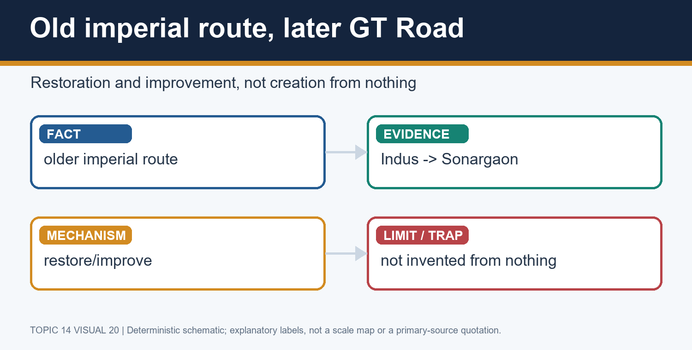

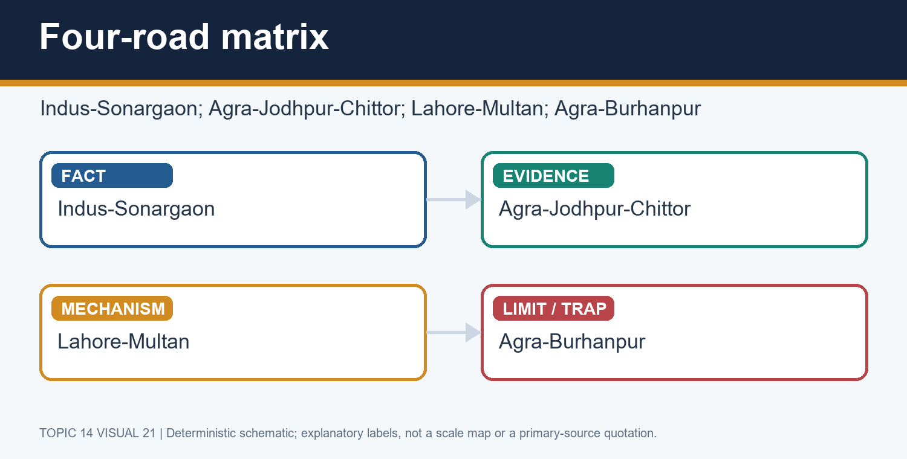

#### CLOSING RECALL FLOW — ROADS: RESTORATION, CORRIDOR CONTROL AND THE FOUR-ROAD FRAME

```text
START / CONCEPT: Roads: restoration, corridor control and the four-road frame
        |
        v
EXACT TERMS: Roads · restoration · corridor control · the four-road frame · GT Road · Exam
        |
        v
MECHANISM / ARGUMENT: Do not convert historic two-karoh or four-mile wording into fake exact kilometres, and do not project modern road alignments or highway numbers backward.
        |
        v
CONSEQUENCE / CONTRAST: The four-road matrix also shows that rule was oriented east-west and north-south, not confined to one ceremonial imperial highway.
        |
        v
UPSC TRAP / ANSWER-USE: A source-supported road proves an intention to maintain movement and connectivity; it does not show that every stretch was equally paved, policed or administratively identical.
        |
        v
ANSWER-GRABBING FORMULATION: The language must remain restoration and improvement, not an invention of the GT Road from nothing.
```
### SESSION 14 — SARAIS, DAK AND THE POLITICAL ECONOMY OF MOVEMENT

#### DEFINITION / WHAT THIS IS CALLED

**Plain-language definition:** Sher Shah's sarais were fortified route stations that combined lodging, local exchange, relay services, information movement and surveillance.

**Technical definition:** Placed at regular two-karoh intervals in the assigned source, the sarai-dak network converted roads into nodal infrastructure for merchants, officials, news carriers and military movement.

#### ANSWER-GRABBING OPENING — WRITE/ADAPT IN THE EXAM

> A road acquires administrative value through its nodes, and Sher Shah's sarais linked mobility, markets, intelligence and political supervision across imperial corridors.

#### MUST-WRITE KEYWORDS

- **sarais**
- **dak**
- **two karohs**
- **relay**
- **markets**
- **surveillance**

**How to use them:** Define the sarai as a multifunctional route station, connect it to the dak relay and road system, then analyse both commercial support and coercive supervision.

[FACT] The materials associate sarais with regular spacing of two karohs, glossed in the assigned Part II wording as four miles. They provided lodging, and the basic note mentions separate arrangements for Hindus and Muslims where the source says so. Sarais also became markets and stages for the news service. Customs were simplified through duties at entry and sale; no fabricated rates should be attached to this statement.

[ANALYSIS] A sarai was not a welfare-only shelter. It was an infrastructure node where travellers, animals, supplies, guards, market activity and messages could be observed and supported. Through dak or news relays, the state compressed the time between an event and the court's knowledge of it. Simplified customs reduced the multiplication of arbitrary exactions along movement corridors, helping trade while also making taxable flows more visible to authority.

[LIMIT] Do not claim every sarai had an identical social layout, or use a remembered total number as settled fact without checking the source's wording. 'Merchant-friendly' is insufficient if it hides surveillance, military utility and fiscal control. Security was produced by institutional support plus the credible threat of punishment.

> MEMORY: **Exam use:** Pair sarai functions with customs and dak to demonstrate an integrated circulation system rather than three isolated reforms.


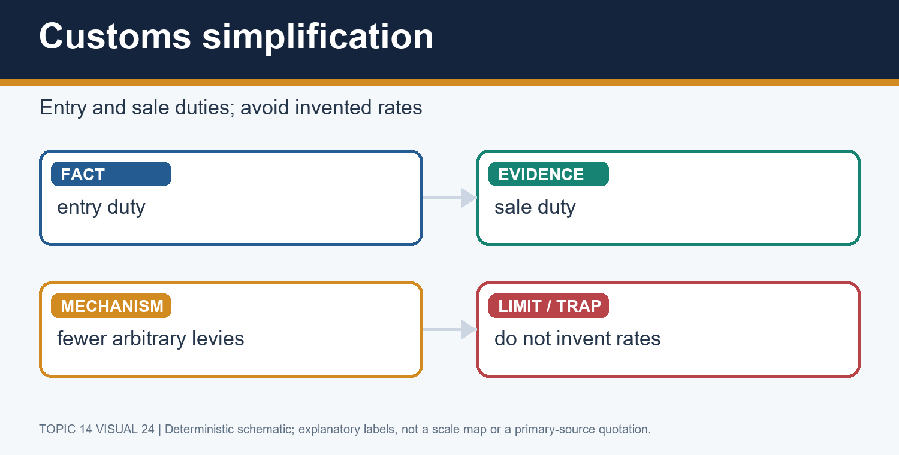

#### CLOSING RECALL FLOW — SARAIS, DAK AND THE POLITICAL ECONOMY OF MOVEMENT

```text
START / CONCEPT: Sarais, dak and the political economy of movement
        |
        v
EXACT TERMS: sarais · dak · two karohs · relay · markets · surveillance
        |
        v
MECHANISM / ARGUMENT: Regular stations supplied rest, exchange, animals, information and official presence, allowing messages, travellers, troops and revenue-related movement to pass through a monitored corridor.
        |
        v
CONSEQUENCE / CONTRAST: The network strengthened state reach and commercial confidence while also making movement more visible to officials and embedding surveillance in transport infrastructure.
        |
        v
UPSC TRAP / ANSWER-USE: Do not reduce sarais to welfare shelters, convert two karohs into a universal modern distance or claim that every surviving caravanserai belonged to Sher Shah's programme.
        |
        v
ANSWER-GRABBING FORMULATION: A road acquires administrative value through its nodes, and Sher Shah's sarais linked mobility, markets, intelligence and political supervision across imperial corridors.
```
### SESSION 15 — CURRENCY: STANDARDISATION WITHOUT THE INVENTION MYTH

#### DEFINITION / WHAT THIS IS CALLED

**Plain-language definition:** Earlier silver coins existed; the historically defensible claim is standardisation of a durable rupee form, not the invention of money or of silver coinage from nothing.

**Technical definition:** Technically, Currency: standardisation without the invention myth is analysed by relating Currency to standardisation without the invention myth, then testing the relationship through Sher Shah's coinage and Sher Shah's.

#### ANSWER-GRABBING OPENING — WRITE/ADAPT IN THE EXAM

> Earlier silver coins existed; the historically defensible claim is standardisation of a durable rupee form, not the invention of money or of silver coinage from nothing.

#### MUST-WRITE KEYWORDS

- **Currency**
- **standardisation without the invention myth**
- **Sher Shah's coinage**
- **Sher Shah's**
- **Earlier silver coins existed; the historically defensible claim**
- **Earlier**

**How to use them:** Frame the answer through Currency; define standardisation without the invention myth, connect Sher Shah's coinage with Sher Shah's to explain the mechanism, and use Earlier silver coins existed; the historically defensible claim for the decisive comparison or qualification.

[FACT] Sher Shah's coinage is associated with a standardised fine silver rupee that became a long-lived standard. The source also speaks of gold, silver and copper coins, so a trimetallic framework is safer than a story of one coin replacing all money. Earlier silver coins existed; the historically defensible claim is standardisation of a durable rupee form, not the invention of money or of silver coinage from nothing.

[ANALYSIS] A more dependable coin standard could reduce uncertainty in revenue payments, market exchange, military salary and interregional trade. It made the fiscal and commercial sides of the state-capacity system more mutually reinforcing: recorded demands could be commuted or paid with a recognised medium, and movement corridors became more useful when payments were more intelligible across local settings.

[LIMIT] Standard coinage did not abolish barter, local credit, price variation, older currency or the cost of transport. Avoid giving a specific weight or fineness unless the cited source supplies it. Nor should the later longevity of the rupee be made proof that every Sur market was instantly monetised to the same degree.

> MEMORY: **Exam use:** Use 'standardised fine silver rupee; earlier silver coinage existed' as the two-part anti-trap formula.

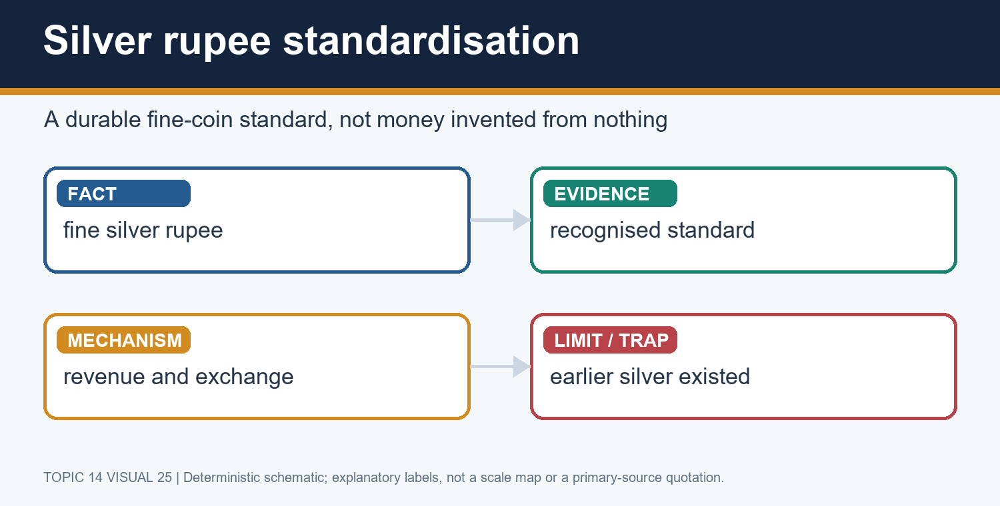

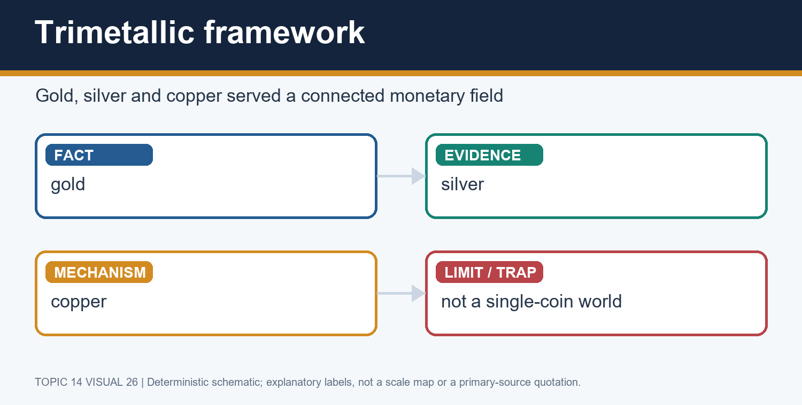

#### CLOSING RECALL FLOW — CURRENCY: STANDARDISATION WITHOUT THE INVENTION MYTH

```text
START / CONCEPT: Currency: standardisation without the invention myth
        |
        v
EXACT TERMS: Currency · standardisation without the invention myth · Sher Shah's coinage · Sher Shah's · Earlier silver coins existed; the historically defensible claim · Earlier
        |
        v
MECHANISM / ARGUMENT: Sher Shah's coinage is associated with a standardised fine silver rupee that became a long-lived standard.
        |
        v
CONSEQUENCE / CONTRAST: MEMORY: Exam use: Use 'standardised fine silver rupee; earlier silver coinage existed' as the two-part anti-trap formula.
        |
        v
UPSC TRAP / ANSWER-USE: Do not miss this limiting distinction: the source also speaks of gold, silver and copper coins, so a trimetallic framework...
        |
        v
ANSWER-GRABBING FORMULATION: Earlier silver coins existed; the historically defensible claim is standardisation of a durable rupee form, not the invention of money or of silver coinage from nothing.
```
### SESSION 16 — LAW, ORDER, MERCHANTS AND COERCIVE RESPONSIBILITY

#### DEFINITION / WHAT THIS IS CALLED

**Plain-language definition:** Merchant safety was a political outcome, not a sentimental policy.

**Technical definition:** MEMORY: Exam use: The phrase 'security through local responsibility backed by coercion' gives both mechanism and qualification.

#### ANSWER-GRABBING OPENING — WRITE/ADAPT IN THE EXAM

> Merchant safety was a political outcome, not a sentimental policy.

#### MUST-WRITE KEYWORDS

- **Law**
- **order**
- **merchants**
- **coercive responsibility**
- **It**
- **Sarwani's picturesque safety language**

**How to use them:** Frame the answer through Law; define order, connect merchants with coercive responsibility to explain the mechanism, and use It for the decisive comparison or qualification.

[FACT] The core material credits Sher Shah with stern action against robbers, dacoits and disobedient zamindars, and with making routes safer for merchants. It also says local village headmen and zamindars were made responsible in policing. Sarwani's picturesque safety language is evidence of an ideal and a reputation; it should not be treated as an unqualified statistical report of crime-free roads.

[ANALYSIS] Merchant safety was a political outcome, not a sentimental policy. If local intermediaries faced responsibility for unsolved robbery and the centre could punish them, they had incentives to identify offenders, patrol routes and share information. That could make trade and revenue more predictable. But collective responsibility can also shift the cost of state failure onto local communities and create harsh coercion against people who did not personally commit an offence.

[LIMIT] A 'benevolent-state-only' story erases the coercive underside; an 'only terror' story misses the real benefits of safer movement and reduced arbitrary tolls. The balanced reading holds welfare, revenue, surveillance and punitive force together. Do not claim that every merchant or traveller was secure everywhere.

> MEMORY: **Exam use:** The phrase 'security through local responsibility backed by coercion' gives both mechanism and qualification.

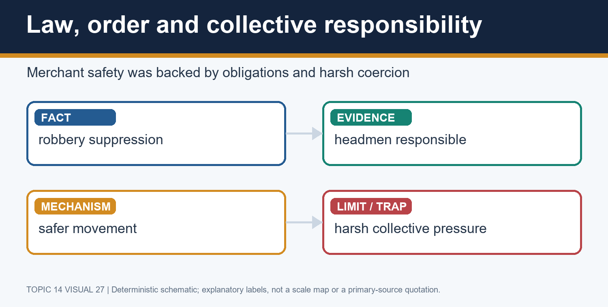

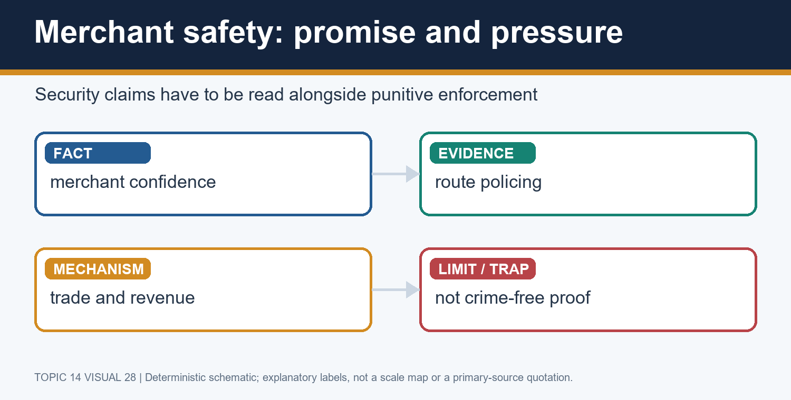

#### CLOSING RECALL FLOW — LAW, ORDER, MERCHANTS AND COERCIVE RESPONSIBILITY

```text
START / CONCEPT: Law, order, merchants and coercive responsibility
        |
        v
EXACT TERMS: Law · order · merchants · coercive responsibility · It · Sarwani's picturesque safety language
        |
        v
MECHANISM / ARGUMENT: MEMORY: Exam use: The phrase 'security through local responsibility backed by coercion' gives both mechanism and qualification.
        |
        v
CONSEQUENCE / CONTRAST: But collective responsibility can also shift the cost of state failure onto local communities and create harsh coercion against people who did not personally commit an offence.
        |
        v
UPSC TRAP / ANSWER-USE: Do not claim that every merchant or traveller was secure everywhere.
        |
        v
ANSWER-GRABBING FORMULATION: Merchant safety was a political outcome, not a sentimental policy.
```
### SESSION 17 — ARMY, RECRUITMENT AND THE PROVENANCE OF DAGH-CHEHRA

#### DEFINITION / WHAT THIS IS CALLED

**Plain-language definition:** Army, recruitment and the provenance of dagh-chehra comprises Army, recruitment and the provenance of dagh-chehra as its core connected dimensions.

**Technical definition:** Technically, Army, recruitment and the provenance of dagh-chehra is analysed by relating Army to recruitment, then testing the relationship through the provenance of dagh-chehra and The Topic.

#### ANSWER-GRABBING OPENING — WRITE/ADAPT IN THE EXAM

> Army, recruitment and the provenance of dagh-chehra comprises Army, recruitment and the provenance of dagh-chehra as its core connected dimensions.

#### MUST-WRITE KEYWORDS

- **Army**
- **recruitment**
- **the provenance of dagh-chehra**
- **The Topic**
- **Alauddin Khalji**
- **Sultanate**

**How to use them:** Frame the answer through Army; define recruitment, connect the provenance of dagh-chehra with The Topic to explain the mechanism, and use Alauddin Khalji for the decisive comparison or qualification.

[FACT] Sher Shah maintained a strong army and used direct recruitment/inspection controls associated with chehra, the descriptive roll of soldiers, and dagh, horse branding. The Topic 07 audit supplies the essential chronology: Alauddin Khalji introduced or used these controls in the Sultanate; Sher Shah revived and adapted them; Akbar later systematised them within the mansab framework. A claim that either Sher Shah or Akbar invented them is factually unsafe.

[ANALYSIS] The common logic is verification. A ruler who pays cavalry needs to know whether an officer presents real men and serviceable horses rather than fictitious musters. Descriptive rolls and branding reduce an information problem between ruler, commander and soldier. Under Sher Shah, these controls fitted a wider project of personal supervision; under Akbar, they were integrated into a more elaborate ranking and jagir system.

[LIMIT] Continuity does not mean identity. The scale, personnel framework and institutional setting changed across Alauddin, Sher Shah and Akbar. Avoid simply stacking three names as if a practice automatically functioned in the same way for three centuries. State the common administrative problem, then identify the different system in which each ruler used the solution.

> MEMORY: **Exam use:** A three-stage arrow - Alauddin -> Sher Shah -> Akbar - is a high-return Prelims and Mains value addition.

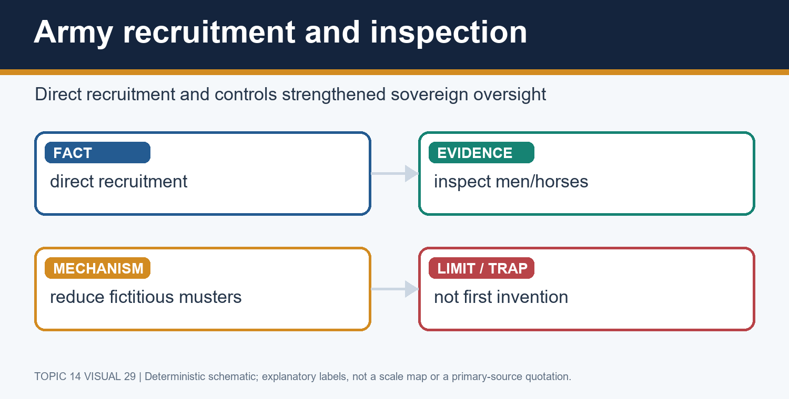

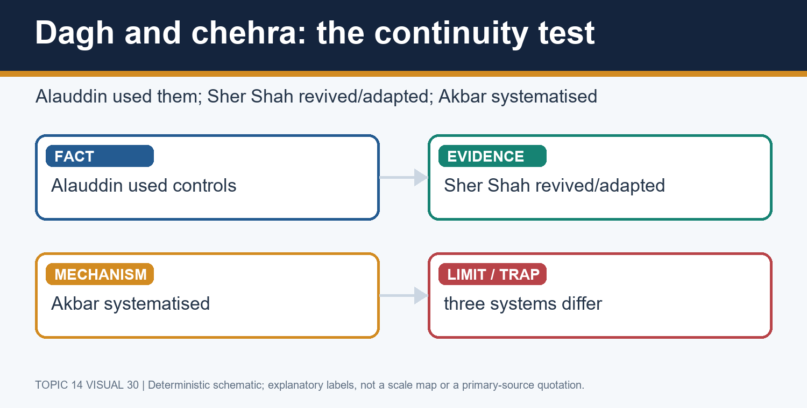

#### CLOSING RECALL FLOW — ARMY, RECRUITMENT AND THE PROVENANCE OF DAGH-CHEHRA

```text
START / CONCEPT: Army, recruitment and the provenance of dagh-chehra
        |
        v
EXACT TERMS: Army · recruitment · the provenance of dagh-chehra · The Topic · Alauddin Khalji · Sultanate
        |
        v
MECHANISM / ARGUMENT: The Topic 07 audit supplies the essential chronology: Alauddin Khalji introduced or used these controls in the Sultanate; Sher Shah revived and adapted them; Akbar later systematised them within the mansab framework.
        |
        v
CONSEQUENCE / CONTRAST: A ruler who pays cavalry needs to know whether an officer presents real men and serviceable horses rather than fictitious musters.
        |
        v
UPSC TRAP / ANSWER-USE: Do not miss this limiting distinction: under Sher Shah, these controls fitted a wider project of personal supervision.
        |
        v
ANSWER-GRABBING FORMULATION: Army, recruitment and the provenance of dagh-chehra comprises Army, recruitment and the provenance of dagh-chehra as its core connected dimensions.
```
### SESSION 18 — FORTS, FRONTIER AND THE ROHTAS DISTINCTION

#### DEFINITION / WHAT THIS IS CALLED

**Plain-language definition:** Forts, frontier and the Rohtas distinction comprises Forts, frontier and the Rohtas distinction as its core connected dimensions.

**Technical definition:** A fort is more than a wall.

#### ANSWER-GRABBING OPENING — WRITE/ADAPT IN THE EXAM

> Do not merge Rohtas, Rohtasgarh and every 'Rohtas' reference into one place.

#### MUST-WRITE KEYWORDS

- **Forts**
- **frontier**
- **the Rohtas distinction**
- **Rohtas**
- **Pakistan**
- **Rohtasgarh**

**How to use them:** Frame the answer through Forts; define frontier, connect the Rohtas distinction with Rohtas to explain the mechanism, and use Pakistan for the decisive comparison or qualification.

[FACT] The advanced note identifies Sher Shah's Rohtas fort in the northwest as intended to control the Gakhhars and check a possible Mughal incursion; it associates Todar Mal Khatri with completing it where source-grounded. Rohtas in present-day Pakistan must be distinguished from Rohtasgarh in Bihar. Topic 13 also contains an earlier Rohtas episode in the eastern political field; the name should never be used without location.

[ANALYSIS] A fort is more than a wall. It can secure a frontier corridor, protect families and stores, provide a base for garrison movement, watch a politically resistant zone and deter an adversary's return. In this sense forts complemented roads: the road moves force and information; the fort anchors it at a strategic node. This is why frontier policy cannot be reduced to a list of architectural sites.

[LIMIT] Do not merge Rohtas, Rohtasgarh and every 'Rohtas' reference into one place. Nor should a fort be read as proof that the whole surrounding countryside was permanently subdued. It indicates strategic concern and a projected capacity, whose actual effectiveness depended on garrisons, supplies, allies and time.

> MEMORY: **Exam use:** Name the present-day regional distinction in a map answer; it prevents a common geographic error.


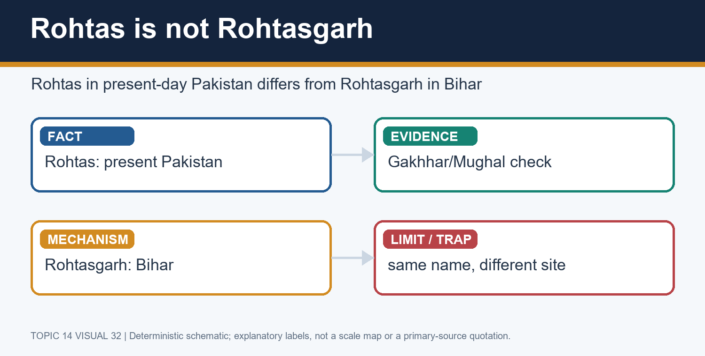

#### CLOSING RECALL FLOW — FORTS, FRONTIER AND THE ROHTAS DISTINCTION

```text
START / CONCEPT: Forts, frontier and the Rohtas distinction
        |
        v
EXACT TERMS: Forts · frontier · the Rohtas distinction · Rohtas · Pakistan · Rohtasgarh
        |
        v
MECHANISM / ARGUMENT: In this sense forts complemented roads: the road moves force and information; the fort anchors it at a strategic node.
        |
        v
CONSEQUENCE / CONTRAST: Rohtas in present-day Pakistan must be distinguished from Rohtasgarh in Bihar.
        |
        v
UPSC TRAP / ANSWER-USE: Topic 13 also contains an earlier Rohtas episode in the eastern political field; the name should never be used without location.
        |
        v
ANSWER-GRABBING FORMULATION: Do not merge Rohtas, Rohtasgarh and every 'Rohtas' reference into one place.
```
### SESSION 19 — RAJASTHAN, PURAN MAL AND THE POLITICS OF RELIGIOUS LANGUAGE

#### DEFINITION / WHAT THIS IS CALLED

**Plain-language definition:** The Puran Mal episode is analytically valuable precisely because it resists a clean exoneration and a sweeping generalisation.

**Technical definition:** The famous reported remark about a handful of millet and Rajasthan is often repeated as if it were a courtroom transcript.

#### ANSWER-GRABBING OPENING — WRITE/ADAPT IN THE EXAM

> The assigned source treats the Puran Mal/Raisen episode as political action given a religious gloss, while acknowledging the treacherous violence reported after an oath.

#### MUST-WRITE KEYWORDS

- **Rajasthan**
- **Puran Mal**
- **the politics of religious language**
- **Raisen**
- **It**
- **Sher Shah**

**How to use them:** Frame the answer through Rajasthan; define Puran Mal, connect the politics of religious language with Raisen to explain the mechanism, and use It for the decisive comparison or qualification.

[FACT] At Samel in 1544, Sher Shah faced the Rajasthan field associated with Maldeo's forces; the outcome strengthened Sur influence in Rajasthan. The assigned source treats the Puran Mal/Raisen episode as political action given a religious gloss, while acknowledging the treacherous violence reported after an oath. It also characterises Sher Shah as orthodox but not generally bigoted and does not present temple destruction as a uniform policy.

[ANALYSIS] Religion and politics should not be separated by pretending they never interacted, nor fused into a single timeless communal explanation. A ruler could use Islamic legal or moral language, respond to courtly pressure, calculate fort security and punish a regional adversary at once. The Puran Mal episode is analytically valuable precisely because it resists a clean exoneration and a sweeping generalisation. It requires evidence, chronology and a scaled verdict.

[LIMIT] The famous reported remark about a handful of millet and Rajasthan is often repeated as if it were a courtroom transcript. Without secure provenance, wording and context, use it only as a cautioned later attribution or omit it. One violent episode cannot establish uniform rule; equally, an administrative reputation cannot erase the episode's violence.

> MEMORY: **Exam use:** Write: 'orthodox, but not uniformly bigoted; Raisen needs a political-religious reading and an ethical acknowledgement of violence.'


#### CLOSING RECALL FLOW — RAJASTHAN, PURAN MAL AND THE POLITICS OF RELIGIOUS LANGUAGE

```text
START / CONCEPT: Rajasthan, Puran Mal and the politics of religious language
        |
        v
EXACT TERMS: Rajasthan · Puran Mal · the politics of religious language · Raisen · It · Sher Shah
        |
        v
MECHANISM / ARGUMENT: The Puran Mal episode is analytically valuable precisely because it resists a clean exoneration and a sweeping generalisation.
        |
        v
CONSEQUENCE / CONTRAST: Religion and politics should not be separated by pretending they never interacted, nor fused into a single timeless communal explanation.
        |
        v
UPSC TRAP / ANSWER-USE: It also characterises Sher Shah as orthodox but not generally bigoted and does not present temple destruction as a uniform policy.
        |
        v
ANSWER-GRABBING FORMULATION: The assigned source treats the Puran Mal/Raisen episode as political action given a religious gloss, while acknowledging the treacherous violence reported after an oath.
```
### SESSION 20 — KALINJAR, ISLAM SHAH AND SUR DISINTEGRATION

#### DEFINITION / WHAT THIS IS CALLED

**Plain-language definition:** Islam Shah's centralisation showed awareness of that problem, but it could also intensify resentment when nobles expected consultation and shares.

**Technical definition:** Succession tests whether a system is personal or reproducible.

#### ANSWER-GRABBING OPENING — WRITE/ADAPT IN THE EXAM

> Islam Shah's centralisation showed awareness of that problem, but it could also intensify resentment when nobles expected consultation and shares.

#### MUST-WRITE KEYWORDS

- **Kalinjar**
- **Islam Shah**
- **Sur disintegration**
- **Succession tests whether a system**
- **Succession**
- **Sher Shah's**

**How to use them:** Frame the answer through Kalinjar; define Islam Shah, connect Sur disintegration with Succession tests whether a system to explain the mechanism, and use Succession for the decisive comparison or qualification.

[FACT] Sher Shah died in 1545 during the siege of Kalinjar, after being severely injured in the siege operation. Islam Shah succeeded him and tried to assert monarchy over Afghan nobles while continuing important administrative arrangements. The advanced chronology gives Islam Shah's death in 1553; succession struggles and factional fragmentation then accelerated. Humayun returned to Delhi and Agra in 1555.

[ANALYSIS] Succession tests whether a system is personal or reproducible. Sher Shah's death removed the person who had combined campaign command, fiscal supervision and authority over competing Afghan elites. Islam Shah's centralisation showed awareness of that problem, but it could also intensify resentment when nobles expected consultation and shares. After his death, fragmentation lowered the coordinated capacity needed to resist a recovering Mughal claimant.

[LIMIT] It is too simple to blame every later failure on 'Afghan tribalism'. Succession, elite interests, military command, regional power and the absence of a stabilising sovereign interacted. It is equally misleading to call Sur administration a complete failure: its influence and practices mattered even though the dynasty could not secure a durable succession.

> MEMORY: **Exam use:** End a polity answer with the contrast between administrative legacy and dynastic durability.

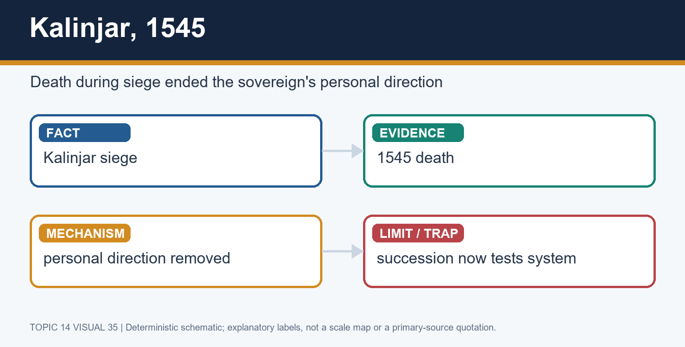


#### CLOSING RECALL FLOW — KALINJAR, ISLAM SHAH AND SUR DISINTEGRATION

```text
START / CONCEPT: Kalinjar, Islam Shah and Sur disintegration
        |
        v
EXACT TERMS: Kalinjar · Islam Shah · Sur disintegration · Succession tests whether a system · Succession · Sher Shah's
        |
        v
MECHANISM / ARGUMENT: Sher Shah's death removed the person who had combined campaign command, fiscal supervision and authority over competing Afghan elites.
        |
        v
CONSEQUENCE / CONTRAST: It is equally misleading to call Sur administration a complete failure: its influence and practices mattered even though the dynasty could not secure a durable succession.
        |
        v
UPSC TRAP / ANSWER-USE: Do not miss this limiting distinction: end a polity answer with the contrast between administrative legacy and dynastic durability.
        |
        v
ANSWER-GRABBING FORMULATION: Islam Shah's centralisation showed awareness of that problem, but it could also intensify resentment when nobles expected consultation and shares.
```
### SESSION 21 — ARCHITECTURE, PATRONAGE AND BOUNDED CULTURAL EVIDENCE

#### DEFINITION / WHAT THIS IS CALLED

**Plain-language definition:** Sher Shah's tomb at Sasaram is the clearest bounded architectural anchor in this topic.

**Technical definition:** Material culture is strongest when it answers a material question: what did patronage seek to make visible, and what can a surviving structure tell us that a praise chronicle cannot?

#### ANSWER-GRABBING OPENING — WRITE/ADAPT IN THE EXAM

> Sher Shah's tomb at Sasaram is the clearest bounded architectural anchor in this topic.

#### MUST-WRITE KEYWORDS

- **Architecture**
- **patronage**
- **bounded cultural evidence**
- **Sher Shah's tomb at Sasaram**
- **Sher Shah's**
- **Sasaram**

**How to use them:** Frame the answer through Architecture; define patronage, connect bounded cultural evidence with Sher Shah's tomb at Sasaram to explain the mechanism, and use Sher Shah's for the decisive comparison or qualification.

[FACT] Sher Shah's tomb at Sasaram is the clearest bounded architectural anchor in this topic. Qila-i-Kuhna mosque/Purana Qila and other Sur-era building activity may be used only to the extent the source supports attribution and context. The relevant use is not a full Art and Culture survey; it is the relationship among royal patronage, form, memory and legitimacy in an empire that needed to display sovereignty.

[ANALYSIS] Architecture makes authority visible in a durable material form. A tomb can project piety, royal status and a claim to remembered rule; a mosque or fort can join ritual, courtly and strategic space. These forms should be read alongside coins and chronicles as evidence of how rule represented itself, not as photographs of the everyday life of every subject.

[LIMIT] Do not use a monument to prove a campaign date, a revenue regulation or a uniform social policy. Avoid unverified stylistic labels or construction details. Material culture is strongest when it answers a material question: what did patronage seek to make visible, and what can a surviving structure tell us that a praise chronicle cannot?

> MEMORY: **Exam use:** A short Sasaram reference can add evidence to a legitimacy answer without derailing it into monument description.

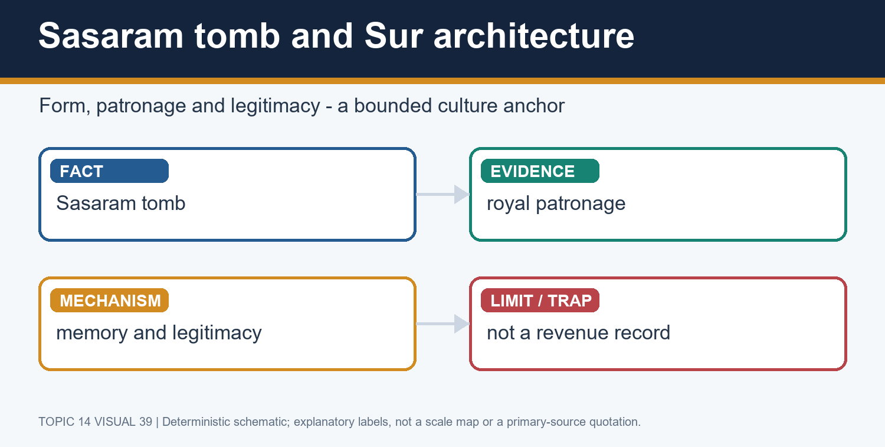


#### CLOSING RECALL FLOW — ARCHITECTURE, PATRONAGE AND BOUNDED CULTURAL EVIDENCE

```text
START / CONCEPT: Architecture, patronage and bounded cultural evidence
        |
        v
EXACT TERMS: Architecture · patronage · bounded cultural evidence · Sher Shah's tomb at Sasaram · Sher Shah's · Sasaram
        |
        v
MECHANISM / ARGUMENT: The relevant use is not a full Art and Culture survey; it is the relationship among royal patronage, form, memory and legitimacy in an empire that needed to display sovereignty.
        |
        v
CONSEQUENCE / CONTRAST: These forms should be read alongside coins and chronicles as evidence of how rule represented itself, not as photographs of the everyday life of every subject.
        |
        v
UPSC TRAP / ANSWER-USE: Do not use a monument to prove a campaign date, a revenue regulation or a uniform social policy.
        |
        v
ANSWER-GRABBING FORMULATION: Sher Shah's tomb at Sasaram is the clearest bounded architectural anchor in this topic.
```
### SESSION 22 — SHER SHAH AND AKBAR: CONTINUITY, IMPROVEMENT AND BOUNDARY

#### DEFINITION / WHAT THIS IS CALLED

**Plain-language definition:** The phrase 'continuity with systematisation, scale and adaptation' is more accurate than either rupture or imitation.

**Technical definition:** Sher Shah's measurement, crop rates and stated one-third share show a precursor logic of fiscal visibility; Akbar's dahsala gave it a more elaborated averaging procedure and wider imperial framework.

#### ANSWER-GRABBING OPENING — WRITE/ADAPT IN THE EXAM

> Do not write 'Akbar copied everything from Sher Shah', because it hides Sultanate precedents, Akbar's innovation and regional variation.

#### MUST-WRITE KEYWORDS

- **Sher Shah**
- **Akbar**
- **continuity**
- **improvement**
- **boundary**
- **Sher Shah's**

**How to use them:** Frame the answer through Sher Shah; define Akbar, connect continuity with improvement to explain the mechanism, and use boundary for the decisive comparison or qualification.

[FACT] Akbar adopted and improved elements of the measured revenue approach but developed a different and longer-lived administrative setting. The Topic 16 material identifies dahsala in 1580 as a ten-year average of produce and prices, later suba organisation, mansabdari and a broader apparatus of checks. It also preserves continuity in dagh-chehra without calling either ruler the inventor. Sher Shah's currency and road legacy likewise belongs in a sequence, not a copying claim.

[ANALYSIS] Comparison works on axes. Sher Shah's measurement, crop rates and stated one-third share show a precursor logic of fiscal visibility; Akbar's dahsala gave it a more elaborated averaging procedure and wider imperial framework. Sher Shah's sarkar/pargana milieu differs from Akbar's suba-level governance. Both used circulation and verification, but Akbar's composite ruling class and long reign enabled a different institutional scale.

[LIMIT] Do not write 'Akbar copied everything from Sher Shah', because it hides Sultanate precedents, Akbar's innovation and regional variation. Do not write the opposite either, because it hides the Sur bridge. The phrase 'continuity with systematisation, scale and adaptation' is more accurate than either rupture or imitation.

> MEMORY: **Exam use:** A five-axis comparison—revenue, currency, roads, army checks, territorial/ruling-class structure—produces a disciplined 20-marker.


#### CLOSING RECALL FLOW — SHER SHAH AND AKBAR: CONTINUITY, IMPROVEMENT AND BOUNDARY

```text
START / CONCEPT: Sher Shah and Akbar: continuity, improvement and boundary
        |
        v
EXACT TERMS: Sher Shah · Akbar · continuity · improvement · boundary · Sher Shah's
        |
        v
MECHANISM / ARGUMENT: Do not write the opposite either, because it hides the Sur bridge.
        |
        v
CONSEQUENCE / CONTRAST: Akbar adopted and improved elements of the measured revenue approach but developed a different and longer-lived administrative setting.
        |
        v
UPSC TRAP / ANSWER-USE: Both used circulation and verification, but Akbar's composite ruling class and long reign enabled a different institutional scale.
        |
        v
ANSWER-GRABBING FORMULATION: Do not write 'Akbar copied everything from Sher Shah', because it hides Sultanate precedents, Akbar's innovation and regional variation.
```
### SESSION 23 — STATE CAPACITY: AN INTEGRATED VERDICT

#### DEFINITION / WHAT THIS IS CALLED

**Plain-language definition:** Capacity is neither all-powerful nor morally neutral.

**Technical definition:** MEMORY: Exam use: Use the answer spine: thesis - named system - mechanism - local/temporal qualification - graded verdict.

#### ANSWER-GRABBING OPENING — WRITE/ADAPT IN THE EXAM

> The final judgement should therefore be graded: Sher Shah made a major, practical contribution to north Indian imperial governance, but did not build a fully impersonal state able to survive succession without strain.

#### MUST-WRITE KEYWORDS

- **an integrated verdict**
- **Sher Shah's**
- **The system**
- **Its**
- **Capacity**
- **It**

**How to use them:** Frame the answer through an integrated verdict; define Sher Shah's, connect The system with Its to explain the mechanism, and use Capacity for the decisive comparison or qualification.

[FACT] The verified components of Sher Shah's rule include measurement-based revenue, crop rates, a generally one-third claim, roads and sarais, a news service, customs simplification, standardised silver currency, merchant security, punishment of robbery, military inspection and frontier fortification. The materials also identify personal over-centralisation, local mediation, Afghan elite expectations, short reign and succession as limits.

[ANALYSIS] These components reinforce one another. Revenue pays troops and officials; coin helps convert and move fiscal resources; roads and sarais carry armies, merchants and reports; intelligence permits response; forts and coercion secure corridors; secure corridors enlarge trade and revenue. The system is therefore not a list of reforms but a feedback loop. Its weakness was that personal direction stood at the centre of several links.

[LIMIT] Capacity is neither all-powerful nor morally neutral. It could reduce arbitrary levies and make movement safer while intensifying fiscal visibility and coercive responsibility. The final judgement should therefore be graded: Sher Shah made a major, practical contribution to north Indian imperial governance, but did not build a fully impersonal state able to survive succession without strain.

> MEMORY: **Exam use:** Use the answer spine: thesis -> named system -> mechanism -> local/temporal qualification -> graded verdict.


#### CLOSING RECALL FLOW — STATE CAPACITY: AN INTEGRATED VERDICT

```text
START / CONCEPT: State capacity: an integrated verdict
        |
        v
EXACT TERMS: an integrated verdict · Sher Shah's · The system · Its · Capacity · It
        |
        v
MECHANISM / ARGUMENT: MEMORY: Exam use: Use the answer spine: thesis - named system - mechanism - local/temporal qualification - graded verdict.
        |
        v
CONSEQUENCE / CONTRAST: The system is therefore not a list of reforms but a feedback loop.
        |
        v
UPSC TRAP / ANSWER-USE: It could reduce arbitrary levies and make movement safer while intensifying fiscal visibility and coercive responsibility.
        |
        v
ANSWER-GRABBING FORMULATION: The final judgement should therefore be graded: Sher Shah made a major, practical contribution to north Indian imperial governance, but did not build a fully impersonal state able to survive succession without strain.
```
### SESSION 24 — BOUNDED LIVE LINKAGE

#### DEFINITION / WHAT THIS IS CALLED

**Plain-language definition:** The live page is a heritage and source-method bridge only.

**Technical definition:** The Rohtas district administration's Sher Shah Suri Tomb page was rechecked through the official government listing on 30 August 2026.

#### ANSWER-GRABBING OPENING — WRITE/ADAPT IN THE EXAM

> The live page is a heritage and source-method bridge only.

#### MUST-WRITE KEYWORDS

- **Bounded live linkage**
- **The Rohtas**
- **Sher Shah Suri Tomb**
- **The live page**

**How to use them:** Frame the answer through Bounded live linkage; define The Rohtas, connect Sher Shah Suri Tomb with The live page to explain the mechanism, and close with the decisive comparison or qualification.

The Rohtas district administration's Sher Shah Suri Tomb page was rechecked through the official government listing on 30 August 2026. It supports a bounded material-history bridge to the protected octagonal lake tomb at Sasaram and to Sher Shah's continuing public memory. The modern tourism description cannot authenticate every administrative claim, quotation or causal judgement; those remain controlled by repository Markdown, OCR books, coins, monuments and source criticism.

The live page is a heritage and source-method bridge only. Historical chronology, causation, attribution and institutional claims remain controlled by repository Markdown, OCR-searchable books and explicit source criticism.

#### CLOSING RECALL FLOW — BOUNDED LIVE LINKAGE

```text
START / CONCEPT: Bounded live linkage
        |
        v
EXACT TERMS: Bounded live linkage · The Rohtas · Sher Shah Suri Tomb · The live page
        |
        v
MECHANISM / ARGUMENT: The Rohtas district administration's Sher Shah Suri Tomb page was rechecked through the official government listing on 30 August 2026.
        |
        v
CONSEQUENCE / CONTRAST: The resulting consequence is that the live page is a heritage and source-method bridge only.
        |
        v
UPSC TRAP / ANSWER-USE: Do not miss this limiting distinction: the live page is a heritage and source-method bridge only.
        |
        v
ANSWER-GRABBING FORMULATION: The live page is a heritage and source-method bridge only.
```
## BASIC MCQS / REMEDIATION

### PART I. Learning MCQ loops: 18 questions

Correct-option audit: **ABCDABCDABCDABCDAB**.

#### Q1. The safest description of Farid's early political formation is that he:

- A. gained administrative exposure in his father's jagirs and parganas before rising in Bihar politics.
- B. was born as the hereditary emperor of a settled Sur state.
- C. entered India only after the Battle of Panipat II.
- D. was appointed the first Mughal subedar of Bengal by Akbar.

**Answer: A.**
**Explanation:** Farid's experience in local assignments explains why revenue, local intermediaries and Bihar politics matter in his later rise. The closest distractor is B: it turns a mobile noble's career into hereditary imperial succession.

#### Q2. Surajgarh is most useful in this topic because it marks:

- A. Humayun's restoration to Delhi in 1555.
- B. the scaling-up of Sher Khan's Bihar-centred power against Bengal in 1534.
- C. the permanent annexation of Kashmir by Sher Shah.
- D. Akbar's introduction of dahsala in 1580.

**Answer: B.**
**Explanation:** Surajgarh belongs to the Bihar-Bengal scale-up that preceded Sur sovereignty. The nearest error is C: Humayun's restoration occurred much later and has no connection with this 1534 encounter.

#### Q3. Which sequence is chronologically sound?

- A. Kalinjar -> Chausa -> Babur's Panipat.
- B. Samel -> Chausa -> Sikandar Lodi's death.
- C. Chausa -> Kannauj -> Sher Shah's formal sovereignty.
- D. Humayun's return -> Chausa -> Islam Shah's accession.

**Answer: C.**
**Explanation:** Chausa (1539) preceded Kannauj (1540), after which Sher Shah ruled north India. The closest distractor is D, which reverses the Sur-Mughal chronology by placing the 1555 return first.

#### Q4. A map of the Sur empire should explicitly qualify that:

- A. only Bihar and Bengal were ruled.
- B. Kashmir was the Sur capital.
- C. the empire was an exact modern provincial rectangle.
- D. Kashmir was excluded even though the realm broadly ran from Bengal to the Indus.

**Answer: D.**
**Explanation:** The source's Bengal-to-Indus formulation is qualified by the exclusion of Kashmir. The closest distractor is A, which imports modern boundary precision into a medieval campaign-and-corridor empire.

#### Q5. Satish Chandra's caution about Sher Shah's reputation chiefly requires us to:

- A. treat him as part of a longer process of north Indian unification, while recognising implementation.
- B. call Akbar the first user of revenue measurement.
- C. accept every praise passage in Sarwani as an audit report.
- D. deny that any Sur institution functioned.

**Answer: A.**
**Explanation:** The point is neither dismissal nor hero worship: Sher Shah systematised within a longer process. The closest distractor is C, which ignores the genre and retrospective limits of courtly praise.

#### Q6. Why is it unsafe to call Sher Shah's realm a modern direct bureaucratic state?

- A. It possessed elected legislatures.
- B. It depended on personal supervision, assignments and local intermediaries.
- C. It had no roads or coins.
- D. It abolished all military service.

**Answer: B.**
**Explanation:** Sur rule worked through a strong sovereign and mediated local structures, not a modern impersonal bureaucracy. The closest distractor is A because roads and coinage were precisely among the visible Sur measures.

#### Q7. Which is the best territorial-administration formulation?

- A. Sher Shah divided the empire into twelve subas in 1540.
- B. Each village was a modern district directly ruled from Delhi.
- C. Sarkar/shiq, pargana and village mediation were important; avoid projecting Akbar's subas backward.
- D. Pargana was a synonym for the whole empire.

**Answer: C.**
**Explanation:** This preserves both territorial vocabulary and the Akbar boundary. The closest distractor is A: the twelve-subas reference belongs to Akbar's later system.

#### Q8. The position of zamindars and village headmen under Sher Shah is best described as:

- A. entirely abolished by patta.
- B. identical to British collectors.
- C. outside all revenue activity.
- D. central to mediation, assessment and policing, though subject to control and punishment.

**Answer: D.**
**Explanation:** Intermediaries remained indispensable even when the state sought record and discipline. The closest distractor is A, which mistakes a revenue record for elimination of local power.

#### Q9. Sher Shah's revenue chain begins most accurately with:

- A. measurement of sown land followed by classification and average yield calculation.
- B. a fixed modern cadastral survey.
- C. a permanent ten-year cash settlement.
- D. automatic confiscation of all village land.

**Answer: A.**
**Explanation:** The source sequence moves from sown-land measurement to good/middling/bad classification and an average. The closest distractor is A: ten-year averaging is associated with Akbar's dahsala, not a Sur permanent settlement.

#### Q10. In the Sur revenue discussion, rai refers most safely to:

- A. a category of permanently fallow land.
- B. crop rates used in calculating an assessable demand.
- C. a cavalry branding mark.
- D. a modern elected village council.

**Answer: B.**
**Explanation:** Rai is the crop-rate element in the assessment logic. The closest distractor is D: dagh, not rai, concerns the verification of horses.

#### Q11. A patta in this topic is evidence of:

- A. the abolition of all local headmen.
- B. a religious decree against merchants.
- C. a recorded statement of area, crop and amount due, not a modern ryotwari system.
- D. a fort built near the Indus.

**Answer: C.**
**Explanation:** The patta makes demand more knowable but does not dissolve local mediation or create a colonial-era settlement. The closest distractor is B, which overreads documentation as social transformation.

#### Q12. Which revenue qualification is source-safe?

- A. Multan was Sher Shah's capital.
- B. Assessment did not use any local knowledge.
- C. Every crop in every place paid the same verified rate.
- D. The one-third share was generally stated, while practice remained mediated and the Multan exception cautions against uniformity.

**Answer: D.**
**Explanation:** One-third is a general principle, not a universal spreadsheet; the Multan exception blocks totalising claims. The closest distractor is A, which manufactures precision absent from the evidence.

#### Q13. Sher Shah's chief road contribution is best phrased as:

- A. restoring and improving an older Indus-Sonargaon imperial route later called the GT Road.
- B. replacing every road with river transport.
- C. building only a Delhi-Agra ceremonial avenue.
- D. inventing all roads in north India from nothing.

**Answer: A.**
**Explanation:** The historical claim is restoration/improvement of an older route. The closest distractor is A, the standard invention myth that ignores prior imperial corridors.

#### Q14. Why should two-karoh/four-mile wording be retained cautiously?

- A. It proves a 2,000-kilometre road.
- B. It is a historical spacing description and should not be converted into fake exact kilometres.
- C. It means every sarai had two armies.
- D. It names a tax rate.

**Answer: B.**
**Explanation:** The wording tells us about regular interval planning, not a modern survey conversion. The closest distractor is A, which converts a local interval into an impossible total-road claim.

#### Q15. Sarais are most analytically significant as:

- A. welfare shelters with no fiscal or political role.
- B. modern railway stations.
- C. nodes of lodging, markets, relay, military movement, trade and surveillance.
- D. single-purpose religious buildings.

**Answer: C.**
**Explanation:** A sarai concentrated travellers, goods, news and oversight, making it a circulation node. The closest distractor is A, which erases the military and surveillance dimensions.

#### Q16. Customs simplification under Sher Shah should be stated as:

- A. a fixed 10 per cent tariff in every town.
- B. abolition of every tax in the empire.
- C. a system applied only in Kashmir.
- D. duties at entry and sale with simplified levies, without inventing rates.

**Answer: D.**
**Explanation:** The source supports a simplification claim, not fabricated numerical tariffs. The closest distractor is C, which supplies an unsupported rate and falsely universalises it.

#### Q17. The silver rupee claim is safest when it says:

- A. Sher Shah standardised a fine silver rupee; earlier silver coins existed.
- B. gold coinage vanished immediately.
- C. the rupee had no effect beyond his camp.
- D. Sher Shah invented money.

**Answer: A.**
**Explanation:** Standardisation is the achievement; earlier silver currency prevents an invention myth. The closest distractor is A, which confuses a coin standard with the origin of money.

#### Q18. Which statement correctly traces dagh and chehra?

- A. Sher Shah abolished all horse inspection.
- B. Alauddin used them, Sher Shah revived/adapted them, and Akbar systematised them.
- C. They were a road-tax system.
- D. Akbar invented both before Alauddin's reign.

**Answer: B.**
**Explanation:** The three-stage provenance is the key discriminator. The closest distractor is A because it deletes the Sultanate precedent that Topic 07 explicitly preserves.

### PART II. Broad practice: 40 questions

Correct-option audit: **ABCD** x **10**.

#### Q1. Rohtas in the northwest is associated with

- A. the Bihar hill-fort Rohtasgarh.
- B. collecting customs at Sonargaon.
- C. controlling Gakhhars and checking a possible Mughal incursion.
- D. the later Mughal suba headquarters at Agra.

**Answer: C.**
**Explanation:** Rohtas in the north-west is a Gakhhar/Mughal-check fort; Rohtasgarh is the closest trap because its similar name places it in Bihar.

#### Q2. Rohtasgarh should not be conflated with

- A. the north-western Rohtas associated with Gakhhars.
- B. Kalinjar in Bundelkhand.
- C. Chunar near the Bihar approach.
- D. Rohtas in present-day Pakistan.

**Answer: D.**
**Explanation:** The geographic discriminator is decisive: Rohtasgarh is a Bihar fort, whereas north-western Rohtas is the Sur frontier work.

#### Q3. Samel (1544) belongs to

- A. the Rajasthan campaign field associated with Maldeo's forces.
- B. Humayun's restoration campaign in Punjab.
- C. the siege in which Sher Shah died at Kalinjar.
- D. Akbar's Gujarat campaign.

**Answer: A.**
**Explanation:** Samel belongs to the Rajasthan campaign and is linked to Maldeo's field, not to a later Mughal recovery or Kalinjar.

#### Q4. Puran Mal/Raisen should be read as

- A. a complete record of uniform Sur religious law.
- B. a violent political act with religious gloss, not evidence of uniform policy.
- C. a routine revenue settlement with cultivators.
- D. proof that no violence occurred in Sur expansion.

**Answer: B.**
**Explanation:** The evidence requires both political calculation and acknowledged violence; the uniform-policy option overgeneralises one episode.

#### Q5. Sher Shah died during

- A. Humayun's return to Delhi in 1555.
- B. the Chausa battle in 1539.
- C. the siege of Kalinjar in 1545.
- D. the Samel campaign in 1544.

**Answer: C.**
**Explanation:** Kalinjar, not Chausa or Samel, is the 1545 siege in which Sher Shah died.

#### Q6. Islam Shah's centralisation illustrates

- A. Akbar's later mansabdari ranking.
- B. the abandonment of monarchical supervision.
- C. a permanent reconciliation of every Afghan chief.
- D. monarchical assertion that could heighten Afghan noble resentment.

**Answer: D.**
**Explanation:** Islam Shah's policy asserted monarchy over nobles; the nearest trap is a supposed reconciliation, which reverses the resentment problem.

#### Q7. Sur fragmentation accelerated after

- A. Islam Shah's death in 1553.
- B. Babur's death in 1530.
- C. the first Battle of Panipat in 1526.
- D. Sher Shah's accession in 1540.

**Answer: A.**
**Explanation:** The acceleration follows Islam Shah's 1553 death; the other dates belong to the formation of the earlier political field.

#### Q8. Humayun recovered Delhi and Agra in

- A. 1540 after Kannauj.
- B. 1555.
- C. 1545 after Kalinjar.
- D. 1556 after Panipat II.

**Answer: B.**
**Explanation:** Humayun's recovery was in 1555; 1556 marks the next transition, not the recovery itself.

#### Q9. Sasaram tomb is useful chiefly as

- A. a proof that every Sur revenue office is known.
- B. an exact map of military campaigns.
- C. a bounded example of Sur patronage, legitimacy and material memory.
- D. a full survey of Mughal mansabs.

**Answer: C.**
**Explanation:** The Sasaram tomb is material evidence of patronage and royal memory; it cannot establish every administrative detail.

#### Q10. Sarwani needs caution because

- A. a coin catalogue with no narrative purpose.
- B. an official Akbar-era revenue manual.
- C. a contemporary statistical register of highway crime.
- D. a retrospective courtly chronicle can praise and order events selectively.

**Answer: D.**
**Explanation:** Sarwani can preserve remembered ideals and claims, but courtly retrospective narration is not the same as a statistical audit.

#### Q11. State capacity is better understood as

- A. a feedback loop among revenue, coin, routes, information and coercion.
- B. a single tax imposed on every village.
- C. a list of unrelated royal charities.
- D. a purely architectural style.

**Answer: A.**
**Explanation:** State capacity here is relational: fiscal resources, money, circulation, information and force strengthen one another.

#### Q12. A fort complements a road because

- A. it converts all taxes into cash automatically.
- B. it anchors garrison, storage and frontier control at a strategic node.
- C. it eliminates the need for garrisons.
- D. it serves only as a royal tomb.

**Answer: B.**
**Explanation:** A fort anchors a corridor by holding troops, stores and a defensible node; a road alone cannot do that.

#### Q13. Cash assessment can strengthen

- A. the abolition of crop rates.
- B. the ceremonial legitimacy of Din Panah.
- C. the link between revenue demand, markets and recognised coin.
- D. the division of land into Mughal subas.

**Answer: C.**
**Explanation:** Cash can connect recorded dues and markets through a recognised medium; it does not itself create territorial administration.

#### Q14. Kind collection can require

- A. the use of horse branding.
- B. the construction of a north-west fort.
- C. the distribution of religious endowments.
- D. harvest knowledge, storage and transport rather than a simple cash formula.

**Answer: D.**
**Explanation:** Kind collection is tied to crop, harvest, storage and transport; this distinguishes it from monetary or military mechanisms.

#### Q15. The Multan note is valuable because

- A. it demonstrates that annual measurement was not identical everywhere.
- B. all revenue was collected only in copper.
- C. Sher Shah never measured any land.
- D. Multan was outside the Sur realm.

**Answer: A.**
**Explanation:** The Multan exception qualifies uniform annual practice; it is not evidence that assessment disappeared or that Multan lay outside the realm.

#### Q16. A patta does not prove

- A. the use of crop rates called rai.
- B. a British-style direct ryotwari settlement.
- C. the possibility of cash or kind collection.
- D. the survival of village intermediaries.

**Answer: B.**
**Explanation:** The direct-state conclusion is the error: patta records a claim, while the other three propositions remain part of the actual revenue setting.

#### Q17. The term jagir/iqta in a Sur answer should signal

- A. a modern land-title registry.
- B. hereditary private ownership without service.
- C. assignment and elite expectation, not automatic ownership of land.
- D. the abolition of noble military obligations.

**Answer: C.**
**Explanation:** Assignment vocabulary directs attention to revenue and service obligations; ownership and modern title are the closest anachronisms.

#### Q18. A map claim of Bengal to Indus should be qualified by

- A. the uniform paving of every route.
- B. the immediate abolition of regional chiefs.
- C. Kashmir's inclusion in an exact national boundary.
- D. uneven control, corridor logic and the exclusion of Kashmir.

**Answer: D.**
**Explanation:** The correct map language preserves Bengal-Indus reach while acknowledging uneven corridors and Kashmir's exclusion.

#### Q19. Road policy served commerce but also

- A. military logistics, intelligence and surveillance.
- B. a decorative display of royal wealth.
- C. a replacement of every fort by a market.
- D. only the comfort of pilgrims.

**Answer: A.**
**Explanation:** Roads moved troops and reports as well as merchandise, making military logistics and surveillance the nearest missing dimension.

#### Q20. Merchant safety was backed by

- A. the removal of village headmen from policing.
- B. local responsibility and the threat of punishment.
- C. the end of customs duties.
- D. a declaration that robbery was no longer punishable.

**Answer: B.**
**Explanation:** Local responsibility and punishment underpinned safety; no-punishment or no-headman claims invert the mechanism.

#### Q21. Collective responsibility is analytically important because

- A. a system of coin minting.
- B. an egalitarian benefit with no costs.
- C. it may improve information while imposing coercive burdens on communities.
- D. a rule that made the emperor legally responsible for every theft.

**Answer: C.**
**Explanation:** Collective responsibility can generate local information but can also impose burdens on non-offenders; that double effect is the core analysis.

#### Q22. The Sur rupee's later durability indicates

- A. the abolition of market credit.
- B. the absence of older currencies.
- C. a uniform price of grain across the empire.
- D. the importance of standardisation, not an instant universal monetisation.

**Answer: D.**
**Explanation:** A lasting standard helps transactions but does not prove instant monetisation, price uniformity or disappearance of credit.

#### Q23. Gold, silver and copper in the source support

- A. a trimetallic monetary framework.
- B. a refusal to use silver in revenue.
- C. a gold-only currency system.
- D. the first European-style paper currency.

**Answer: A.**
**Explanation:** Gold, silver and copper point to a multiple-metal field; the gold-only option is the closest contradiction.

#### Q24. A sarkar-pargana description should avoid

- A. calling a pargana a Mughal mansab.
- B. calling every unit a modern province.
- C. treating a village headman as a modern district magistrate.
- D. equating a sarai with a provincial capital.

**Answer: B.**
**Explanation:** The warning is against modern provincial language; the other terms are likewise category errors rather than medieval territorial analysis.

#### Q25. The Afghan political field included

- A. a permanent ban on noble counsel.
- B. a democratic election of the sovereign.
- C. noble expectations of honour, service and shares alongside royal assertion.
- D. the absence of revenue assignments.

**Answer: C.**
**Explanation:** Afghan elite politics involved dignity, service and shares within royal assertion; democracy and no-elite claims are anachronistic.

#### Q26. Personal supervision can be strong because

- A. it makes currency irrelevant.
- B. it guarantees a stable succession by law.
- C. it removes the need for local information.
- D. it allows rapid auditing and decision, but is difficult for successors to reproduce.

**Answer: D.**
**Explanation:** Rapid auditing is personal supervision's strength; its succession fragility, not automatic stability, is the critical counterpoint.

#### Q27. Sher Shah's achievement in a longer process was

- A. systematisation and implementation of interconnected measures.
- B. the first use of any road in India.
- C. the destruction of all Sultanate institutions.
- D. the creation of British-style district administration.

**Answer: A.**
**Explanation:** Systematisation joins known elements into workable practice; invention-from-nothing and total rupture are the intended traps.

#### Q28. A comparison with Akbar should state

- A. that Akbar rejected measurement altogether.
- B. continuity with later scale, adaptation and institutional elaboration.
- C. that only coins matter in state-building.
- D. that each ruler used an identical office structure.

**Answer: B.**
**Explanation:** Continuity must be paired with scale and adaptation; identical structures would erase Akbar's later administrative setting.

#### Q29. Akbar's dahsala differs from the Sur framework because

- A. a permanent settlement fixed for ten years.
- B. a Sur crop-rate schedule without averaging.
- C. it used a later ten-year average of produce and prices within a broader order.
- D. a system that never used cash.

**Answer: C.**
**Explanation:** Dahsala's distinction is ten-year averaging of produce and prices; permanent settlement is the closest familiar but false analogy.

#### Q30. Chehra is best defined as

- A. a customs duty at entry.
- B. a road relay messenger.
- C. a classification of good/middling/bad land.
- D. a descriptive roll used for verification of soldiers.

**Answer: D.**
**Explanation:** Chehra records soldiers, while the other options belong to revenue, customs and communications.

#### Q31. Dagh is best defined as

- A. horse branding used to check military musters.
- B. a silver coin standard.
- C. a descriptive roll of cavalrymen.
- D. a crop-rate register.

**Answer: A.**
**Explanation:** Dagh marks horses, not persons, coins or crops; chehra is the person-record counterpart.

#### Q32. The old imperial road terminology warns against

- A. that every route had the same modern highway number.
- B. presenting the GT Road as built from nothing by Sher Shah.
- C. that customs had been abolished.
- D. the need to distinguish Rohtas from Rohtasgarh.

**Answer: B.**
**Explanation:** The older-route point corrects the invention myth; the named-fort and customs assertions are separate facts, not its core meaning.

#### Q33. Separate sarai arrangements, where attested, show

- A. that all travellers were taxed at arbitrary rates.
- B. that sarais had no market or relay role.
- C. provisioning for travellers rather than evidence of a secular modern hotel.
- D. that Hindus and Muslims had no distinct accommodation where attested.

**Answer: C.**
**Explanation:** Separate arrangements are a source-bounded lodging fact; they neither establish a modern hotel nor erase market, dak and control functions.

#### Q34. Customs simplification should not be turned into

- A. the abolition of entry and sale duties.
- B. the sale of forts to merchants.
- C. a fixed empire-wide percentage rate.
- D. a claim that all commerce was tax-free.

**Answer: D.**
**Explanation:** Simplification regulates where duties are taken; it does not make trade tax-free or supply an unsupported rate.

#### Q35. A historical source matrix should compare

- A. chronicle praise, coins, roads/sarais, forts and monuments by evidentiary reach.
- B. a statement that every peasant accepted cash payments.
- C. a direct proof of Kashmiri conquest.
- D. a coins-only source with no social purpose.

**Answer: A.**
**Explanation:** A source matrix compares what genres can establish; it rejects both chronicle monopoly and naïve material proof.

#### Q36. A famous quotation about Rajasthan without clear provenance should be

- A. treated as a verified contemporary dispatch.
- B. used only with caution or omitted.
- C. used as a currency weight table.
- D. used to date the Multan exception.

**Answer: B.**
**Explanation:** Without provenance, a famous saying cannot carry a precise historical claim; treating it as a dispatch is the closest misuse.

#### Q37. Sher Shah's religion may be described as

- A. a policy of forced conversion documented everywhere.
- B. a refusal to use any Islamic idiom in court.
- C. orthodox without assuming uniform bigotry.
- D. a guarantee that no political violence occurred.

**Answer: C.**
**Explanation:** Orthodoxy can coexist with non-uniform practice; the all-or-none religious options erase the source's careful qualification.

#### Q38. The Raisen episode cannot be used to

- A. show that forts had no strategic value.
- B. make roads irrelevant to politics.
- C. prove that Sarwani's praise is false in every respect.
- D. erase violence or prove a timeless uniform policy.

**Answer: D.**
**Explanation:** A single episode cannot decide uniform policy, but it also cannot be discarded; the other options evade the actual evidence.

#### Q39. Sur succession weakness reveals

- A. the difference between administrative achievement and dynastic durability.
- B. that Islam Shah's rule preceded Sher Shah's.
- C. that roads and revenue had no legacy.
- D. that Humayun never returned to India.

**Answer: A.**
**Explanation:** Dynastic collapse and institutional influence operate on different time scales; this is the topic's central distinction.

#### Q40. The best one-line verdict is

- A. Sher Shah invented a modern bureaucracy in five years.
- B. Sher Shah was a major bridge in state formation, not a fully modern state-builder.
- C. Akbar created every relevant administrative technique without precedent.
- D. Sur rule was historically irrelevant because it was short.

**Answer: B.**
**Explanation:** The bridge verdict preserves achievement and limits; each alternative collapses the subject into a false origin story.

### PART III. Remedial practice: 12 questions

Correct-option audit: **ABCD** x **3**.

#### Q1. The statement 'Sher Shah invented dagh and chehra' is

- A. correct because Akbar had no cavalry records.
- B. uncertain because medieval armies never inspected horses.
- C. incorrect because Alauddin used the controls earlier.
- D. correct because Sher Shah first used them after 1540.

**Answer: C.**
**Explanation:** Alauddin's Sultanate precedent is decisive; claiming Sher Shah-first destroys the continuous administrative chronology.

#### Q2. The statement 'Akbar copied every Sur institution unchanged' is

- A. uncertain because roads had no administrative role.
- B. correct because Akbar abolished revenue measurement.
- C. correct because all Sur offices became Mughal offices unchanged.
- D. incorrect because he adapted and systematised within a different scale.

**Answer: D.**
**Explanation:** Akbar inherited usable precedents but expanded, adapted and systematised them in a different imperial framework.

#### Q3. The statement 'patta created modern ryotwari' is

- A. incorrect because intermediaries remained central.
- B. uncertain because land was never measured.
- C. correct because patta abolished zamindars.
- D. correct because cash was the only collection mode.

**Answer: A.**
**Explanation:** Patta records demand; it does not displace local mediators or prove cash-only, perfectly measured direct settlement.

#### Q4. The statement 'the GT Road began from nothing under Sher Shah' is

- A. correct because no imperial route existed before 1540.
- B. incorrect because he restored/improved an older route.
- C. correct because the road connected only Agra and Delhi.
- D. uncertain because roads did not affect trade.

**Answer: B.**
**Explanation:** The old-route language means restoration/improvement; the other claims ignore the Indus-Sonargaon corridor and its commercial purpose.

#### Q5. The statement 'sarais were welfare-only buildings' is

- A. uncertain because markets could not exist near roads.
- B. correct because dak began only under the British.
- C. incorrect because they linked lodging, markets, news, trade and control.
- D. correct because sarais housed travellers only.

**Answer: C.**
**Explanation:** Sarais combined lodging with markets, relay, security and state observation; the welfare-only label strips away their political economy.

#### Q6. The statement 'one-third proves identical practice everywhere' is

- A. uncertain because local headmen were excluded.
- B. correct because Multan was never assessed.
- C. correct because rai fixed every local crop identically.
- D. incorrect because local mediation and the Multan exception qualify it.

**Answer: D.**
**Explanation:** The one-third formulation is qualified by local practice and the Multan exception; uniformity is the precise mistake.

#### Q7. The statement 'the rupee was the first silver coin in India' is

- A. incorrect because earlier silver coinage existed.
- B. uncertain because standards never affect exchange.
- C. correct because only copper circulated in the Sur empire.
- D. correct because silver was unknown before Sher Shah.

**Answer: A.**
**Explanation:** The correction is standardisation, not invention: earlier silver coinage and a trimetallic setting are essential context.

#### Q8. The statement 'Rohtas and Rohtasgarh are the same fort' is

- A. correct because both guarded the Gakhhar frontier.
- B. incorrect because one is in present-day Pakistan and the other in Bihar.
- C. uncertain because place-names do not matter in history.
- D. correct because both lie in Bengal.

**Answer: B.**
**Explanation:** The names mask different locations and functions: north-west Rohtas and Bihar's Rohtasgarh must be separated.

#### Q9. The statement 'Puran Mal proves uniform Sur persecution' is

- A. correct because every Sur policy targeted one religious community.
- B. uncertain because political calculation never uses religious language.
- C. incorrect because the episode needs a political-religious reading.
- D. correct because the episode contained no violence.

**Answer: C.**
**Explanation:** The episode is politically and religiously entangled; neither a uniform-policy inference nor erasure of violence is defensible.

#### Q10. The statement 'Sher Shah created Akbar's subas' is

- A. uncertain because territorial terms cannot be studied.
- B. correct because Akbar's twelve subas existed from 1540.
- C. correct because pargana meant a modern state capital.
- D. incorrect because Sur sarkar/shiq-pargana terms require their own setting.

**Answer: D.**
**Explanation:** Sur sarkar/shiq-pargana vocabulary belongs to its own setting; importing Akbar's later subas is the periodisation error.

#### Q11. The statement 'Sarwani's praise proves crime vanished' is

- A. incorrect because rhetoric and coercive mechanisms must be assessed together.
- B. uncertain because merchants never travelled by road.
- C. correct because coercive policing was absent.
- D. correct because a court chronicle is a crime census.

**Answer: A.**
**Explanation:** Sarwani's rhetoric must be read with the mechanisms of responsibility and punishment, not treated as literal universal measurement.

#### Q12. The statement 'Sur collapse makes all Sur reforms meaningless' is

- A. uncertain because succession never affects governance.
- B. incorrect because legacy and dynastic durability are separate questions.
- C. correct because Akbar had no administrative predecessors.
- D. correct because only dynasties, not institutions, matter.

**Answer: B.**
**Explanation:** Sur failure in succession does not erase roads, revenue or monetary legacy; it reveals their limited durability under personal rule.

## PYQS AND ANSWER PRACTICE

### PART IV. Original Mains practice: 10 examiner-grade solved answers

#### Mains 1. Trace Farid/Sher Khan's rise from local administrative exposure to the creation of Sur sovereignty.

**10 marks | 150 words**

**Model solution**

**Claim / thesis:** Farid's route to sovereignty was a process of administrative learning, regional resource mobilisation and strategic scale-up, not a sudden personal miracle.

**Named evidence and analysis:**
- Exposure in his father's jagirs/parganas supplied practical knowledge of assessment and intermediaries. **What it proves:** The sequence shows that local administrative knowledge and a connected Bihar-Bengal field made military victory governable.
- Bihar politics gave a regional Afghan base; Surajgarh (1534) and Bengal/Gaur expanded resources. **What it proves:** The sequence shows that local administrative knowledge and a connected Bihar-Bengal field made military victory governable.
- Chausa (1539) and Kannauj (1540) converted regional capacity into the displacement of Humayun. **What it proves:** The sequence shows that local administrative knowledge and a connected Bihar-Bengal field made military victory governable.

**Qualification:** Battle detail should remain bounded; Afghan politics were coalition-based rather than a timeless ethnic bloc.

**Verdict:** Sher Shah's rise demonstrates how regional capacity could become imperial sovereignty when linked to route, resource and elite control.

**Why this earns marks:** A high-scoring response does not begin at Chausa. It makes the administrative apprenticeship and Bihar resource base causal, then uses Surajgarh, Bengal/Gaur and the two battles as a scale sequence. This prevents a generic 'brave commander' biography.

#### Mains 2. Assess Sher Shah's state capacity as an interlocking system rather than a list of reforms.

**15 marks | 200 words**

**Model solution**

**Claim / thesis:** Sher Shah's distinctive contribution was to make fiscal, monetary, communicative and coercive measures reinforce one another.

**Named evidence and analysis:**
- Measurement, classification, rai and a generally one-third claim made revenue more legible. **What it proves:** Revenue could fund force; force and information secured roads; roads enlarged trade and taxable circulation.
- The standardised silver rupee supported payments and market confidence. **What it proves:** Revenue could fund force; force and information secured roads; roads enlarged trade and taxable circulation.
- The restored Indus-Sonargaon route, other roads, sarais and dak joined movement to information. **What it proves:** Revenue could fund force; force and information secured roads; roads enlarged trade and taxable circulation.
- Merchant security and collective local responsibility made routes administratively usable. **What it proves:** Revenue could fund force; force and information secured roads; roads enlarged trade and taxable circulation.

**Qualification:** Capacity remained mediated by local elites and dependent on personal supervision; it was not a modern direct state.

**Verdict:** The Sur system was an unusually coherent practical feedback loop, but one with personal and local limits.

**Why this earns marks:** Marks come from connecting, rather than listing, revenue, money, routes, news and coercion. The feedback-loop formulation demonstrates causation. A top answer also says why concentrated direction makes this capacity difficult to reproduce after 1545.

#### Mains 3. Examine Sher Shah's revenue system. Did it protect the peasant from arbitrary demand?

**15 marks | 200 words**

**Model solution**

**Claim / thesis:** The revenue programme increased predictability through measurement and records, but it also made extraction more systematic and remained locally mediated.

**Named evidence and analysis:**
- Sown land was measured and classified as good, middling and bad. **What it proves:** Records could make a demand knowable to both collector and cultivator, reducing room for arbitrary multiplication, while simultaneously improving the state's fiscal grip.
- Average yield and crop rates (rai) informed a generally one-third state claim. **What it proves:** Records could make a demand knowable to both collector and cultivator, reducing room for arbitrary multiplication, while simultaneously improving the state's fiscal grip.
- Patta recorded area, crop and demand; local headmen and zamindars still mattered. **What it proves:** Records could make a demand knowable to both collector and cultivator, reducing room for arbitrary multiplication, while simultaneously improving the state's fiscal grip.
- Cash/kind paths and the Multan exception show uneven operational practice. **What it proves:** Records could make a demand knowable to both collector and cultivator, reducing room for arbitrary multiplication, while simultaneously improving the state's fiscal grip.

**Qualification:** It is wrong to call it modern ryotwari or to make one-third universal in every place and crop.

**Verdict:** Sher Shah advanced fiscal legibility and some predictability, not a direct peasant-state settlement.

**Why this earns marks:** The examiner should see two sides of the same record: a known demand may restrain local arbitrariness, while measurement strengthens the fiscal claim. The answer earns balance only if it retains headmen/zamindars, cash/kind variation and the Multan qualification.

#### Mains 4. How did roads, sarais and customs measures combine commerce with imperial control under Sher Shah?

**20 marks | 250 words**

**Model solution**

**Claim / thesis:** The Sur circulation system supported commerce precisely because it also made people, goods and information more visible and movable for the state.

**Named evidence and analysis:**
- Sher Shah restored/improved the older Indus-Sonargaon route and maintained other strategic roads. **What it proves:** A corridor becomes commercially useful when risk and transaction barriers fall; the same corridor moves soldiers, carries reports, supplies forts and permits surveillance.
- Sarais at the stated two-karoh interval offered lodging, markets and relay support. **What it proves:** A corridor becomes commercially useful when risk and transaction barriers fall; the same corridor moves soldiers, carries reports, supplies forts and permits surveillance.
- Dak/news arrangements shortened informational distance. **What it proves:** A corridor becomes commercially useful when risk and transaction barriers fall; the same corridor moves soldiers, carries reports, supplies forts and permits surveillance.
- Customs simplification at entry and sale reduced proliferating levies without abolishing fiscal claims. **What it proves:** A corridor becomes commercially useful when risk and transaction barriers fall; the same corridor moves soldiers, carries reports, supplies forts and permits surveillance.
- Merchant safety relied on local responsibility backed by punishment. **What it proves:** A corridor becomes commercially useful when risk and transaction barriers fall; the same corridor moves soldiers, carries reports, supplies forts and permits surveillance.

**Qualification:** Do not invent rates, kilometre conversions or a welfare-only story. Network reach and quality were not uniform.

**Verdict:** Road policy was a political economy of circulation: trade was fostered, but also rendered governable.

**Why this earns marks:** A good answer starts with circulation, not charity. It links route restoration, sarais, dak, customs and policing to both lower transaction friction and greater state visibility. It loses marks if it supplies invented tariff rates or modern kilometre conversions.

#### Mains 5. Why is Sher Shah's silver rupee best understood as standardisation rather than invention?

**10 marks | 150 words**

**Model solution**

**Claim / thesis:** Sher Shah's monetary importance lies in a durable standard of fine silver currency, not in the first appearance of silver money.

**Named evidence and analysis:**
- The source associates him with a standardised fine silver rupee. **What it proves:** A recognised standard reduced uncertainty in revenue payment, salary and exchange across routes, complementing roads and assessment.
- Gold, silver and copper indicate a connected trimetallic field. **What it proves:** A recognised standard reduced uncertainty in revenue payment, salary and exchange across routes, complementing roads and assessment.
- Earlier silver coins existed, so chronological overclaim is false. **What it proves:** A recognised standard reduced uncertainty in revenue payment, salary and exchange across routes, complementing roads and assessment.

**Qualification:** It did not eliminate local credit, older monies, barter or regional price differences; exact weight/fineness should not be invented.

**Verdict:** The rupee's significance is institutional reliability and later durability, not monetary creation ex nihilo.

**Why this earns marks:** The essential discriminator is chronological modesty. State standardisation, name the trimetallic context and explain the fiscal-commercial mechanism. Avoid numerical fineness claims unless supplied by a cited source and reject the slogan that the rupee was money's first appearance.

#### Mains 6. Discuss Sher Shah's law-and-order policy without romanticising it.

**15 marks | 200 words**

**Model solution**

**Claim / thesis:** Sher Shah's reputation for safe roads rested on a real administrative logic of local responsibility and stern enforcement, but its coercive costs must be retained.

**Named evidence and analysis:**
- Sources credit action against robbers, dacoits and recalcitrant zamindars. **What it proves:** Responsibility could mobilise local knowledge and deter concealment, making merchants more willing to travel and pay. Yet collective liability may punish communities for offences they did not personally commit.
- Village headmen and zamindars were made responsible in policing. **What it proves:** Responsibility could mobilise local knowledge and deter concealment, making merchants more willing to travel and pay. Yet collective liability may punish communities for offences they did not personally commit.
- Sarwani's old-woman safety image records a celebrated ideal and reputation. **What it proves:** Responsibility could mobilise local knowledge and deter concealment, making merchants more willing to travel and pay. Yet collective liability may punish communities for offences they did not personally commit.
- Roads, sarais and customs policy gave security an economic setting. **What it proves:** Responsibility could mobilise local knowledge and deter concealment, making merchants more willing to travel and pay. Yet collective liability may punish communities for offences they did not personally commit.

**Qualification:** Courtly praise is not a crime statistic, and security was not equally experienced by all groups or places.

**Verdict:** The policy fused commercial benefit with surveillance and coercion rather than embodying benevolence alone.

**Why this earns marks:** The answer must neither quote Sarwani as literal proof nor dismiss security as rhetoric. It should show how responsibility produced information and deterrence, then make collective punishment an ethical and administrative qualification.

#### Mains 7. Place Sher Shah's dagh and chehra measures in their correct institutional chronology.

**10 marks | 150 words**

**Model solution**

**Claim / thesis:** Sher Shah revived and adapted earlier cavalry-verification controls; he should be placed between Sultanate precedent and Mughal systematisation.

**Named evidence and analysis:**
- Alauddin Khalji introduced or used dagh and chehra in the Sultanate. **What it proves:** Branding and descriptive rolls addressed the recurring information problem of fictitious musters and unreliable cavalry claims.
- Sher Shah used direct recruitment and inspection within personal supervision. **What it proves:** Branding and descriptive rolls addressed the recurring information problem of fictitious musters and unreliable cavalry claims.
- Akbar later systematised such controls within mansabdari and jagir arrangements. **What it proves:** Branding and descriptive rolls addressed the recurring information problem of fictitious musters and unreliable cavalry claims.

**Qualification:** Continuity is not sameness: each ruler used controls within a different fiscal, elite and administrative framework.

**Verdict:** The correct verdict rejects both the Sher Shah-first and Akbar-first myths while explaining a durable state problem.

**Why this earns marks:** Chronology is the value addition: Alauddin, then Sher Shah, then Akbar. The answer must explain the shared verification problem and briefly state why the later mansab setting differs from a Sur army under personal supervision.

#### Mains 8. Evaluate the tension between Afghan noble expectations and Sher Shah's personal despotism.

**20 marks | 250 words**

**Model solution**

**Claim / thesis:** Sur rule combined strong monarchical assertion with an Afghan political field in which nobles retained expectations of assignment, honour and participation.

**Named evidence and analysis:**
- Sher Shah's personal supervision made revenue, army and justice responsive to the sovereign. **What it proves:** Personal direction can rapidly coordinate a new empire, but it makes continuity dependent on a ruler's capacity and the willingness of powerful men to accept constraint.
- Iqta/jagir-like expectations linked elite service to revenue and status. **What it proves:** Personal direction can rapidly coordinate a new empire, but it makes continuity dependent on a ruler's capacity and the willingness of powerful men to accept constraint.
- Islam Shah's effort to assert monarchy over nobles continued centralisation but sharpened resentment. **What it proves:** Personal direction can rapidly coordinate a new empire, but it makes continuity dependent on a ruler's capacity and the willingness of powerful men to accept constraint.
- Fragmentation after Islam Shah's death in 1553 exposed the limits of concentrated authority. **What it proves:** Personal direction can rapidly coordinate a new empire, but it makes continuity dependent on a ruler's capacity and the willingness of powerful men to accept constraint.

**Qualification:** Do not reduce this to 'tribal equality' or deny the throne's coercive power. Faction, succession, regional resources and military command all mattered.

**Verdict:** Sher Shah achieved a formidable but personally weighted balance; the succession crisis showed why administrative efficiency and dynastic durability were different tests.

**Why this earns marks:** This needs an institutional, not ethnic, explanation. Strong answers balance monarchical coercion, assignments, noble expectations, Islam Shah's centralisation and post-1553 faction. A simplistic 'Afghan tribalism caused collapse' line is specifically inadequate.

#### Mains 9. Examine the Puran Mal/Raisen episode as a problem of religion and politics in Sur rule.

**15 marks | 200 words**

**Model solution**

**Claim / thesis:** The Raisen episode demands an ethical acknowledgement of violence and a historically specific reading of political calculation and religious language.

**Named evidence and analysis:**
- Sher Shah is described as orthodox but not generally bigoted in the assigned source. **What it proves:** Religious idiom could legitimise or intensify political action; political security and elite pressure could shape its application. Analysis must not dissolve either dimension.
- Puran Mal held a powerful fort and the episode followed political confrontation. **What it proves:** Religious idiom could legitimise or intensify political action; political security and elite pressure could shape its application. Analysis must not dissolve either dimension.
- The source treats the act as political with religious gloss and records treacherous violence after an oath. **What it proves:** Religious idiom could legitimise or intensify political action; political security and elite pressure could shape its application. Analysis must not dissolve either dimension.
- No general pattern of temple destruction is supplied by this evidence. **What it proves:** Religious idiom could legitimise or intensify political action; political security and elite pressure could shape its application. Analysis must not dissolve either dimension.

**Qualification:** One episode cannot prove a uniform policy, but administrative admiration cannot excuse or erase the violence. Famous quotation traditions require provenance caution.

**Verdict:** The best conclusion is neither blanket exoneration nor blanket communal generalisation, but a sourced, qualified political-religious judgement.

**Why this earns marks:** The directive demands an interpretive answer. It should keep political calculation and religious language in the same frame, use Raisen specifically, acknowledge the reported betrayal/violence and reject both uniform-persecution and pure-administrative-exoneration stories.

#### Mains 10. Compare Sher Shah and Akbar as state-builders. Was Akbar merely an imitator?

**20 marks | 250 words**

**Model solution**

**Claim / thesis:** Akbar inherited and adapted important Sur precedents, but his longer reign, larger framework and institutional elaboration make mere imitation untenable.

**Named evidence and analysis:**
- Sher Shah used measurement, rai, patta and a generally one-third claim; Akbar's 1580 dahsala used ten-year averages of produce and prices. **What it proves:** Comparison on these axes reveals evolution: common problems of verification and revenue were solved through increasingly articulated institutions, not copied unchanged.
- Sher Shah's standardised rupee and route/sarai system aided circulation; Akbar worked within a larger imperial structure. **What it proves:** Comparison on these axes reveals evolution: common problems of verification and revenue were solved through increasingly articulated institutions, not copied unchanged.
- Dagh-chehra show Alauddin -> Sher Shah -> Akbar continuity rather than Akbar-first invention. **What it proves:** Comparison on these axes reveals evolution: common problems of verification and revenue were solved through increasingly articulated institutions, not copied unchanged.
- Sher Shah's sarkar/pargana milieu differs from Akbar's suba and mansab-jagir order. **What it proves:** Comparison on these axes reveals evolution: common problems of verification and revenue were solved through increasingly articulated institutions, not copied unchanged.
- Sur personal supervision and Afghan elite tension contrast with Akbar's longer composite ruling-class strategy. **What it proves:** Comparison on these axes reveals evolution: common problems of verification and revenue were solved through increasingly articulated institutions, not copied unchanged.

**Qualification:** Neither rupture nor hero-worship works. Zabt was not universally identical even under Akbar, and Sur practices were not an impersonal modern bureaucracy.

**Verdict:** Sher Shah was a crucial bridge and precursor; Akbar's achievement was adaptation, scale and durable systematisation, not passive imitation.

**Why this earns marks:** A comparison earns marks by using axes rather than a two-column fact dump. Revenue method, territorial scale, cavalry checks and ruling-class organisation should each support the central verdict: precursor and adaptation, not copy or rupture.

#### Evidence, comparison and source drills

1. **Evidence clinic.** [ANALYSIS] When a claim concerns an institution, first name the practice, then identify who carried it out, what information it produced, and what social or temporal condition limited it. For Sher Shah, this prevents roads becoming mere construction, patta becoming a colonial settlement, or safety becoming benevolent rhetoric.
2. **Comparison drill.** [ANALYSIS] Ask a comparison question on an axis rather than by ruler-list: revenue calculation, territorial vocabulary, currency, transport, military verification, ruling class and succession. Then distinguish precedent, adaptation and scale. This method protects the answer from both the innovation myth and the copying myth.
3. **Source drill.** [ANALYSIS] A chronicle can preserve a ruler's ideal, sequence and remembered practice; a coin can show a monetary standard; a fort or sarai can show material investment; none alone measures uniform implementation. Write what each source can establish before drawing a wider inference.

## OPTIONAL ADVANCED DEPTH — NOT REQUIRED FOR A CORE ANSWER

### Sher Shah Sur & the Sur Empire — ADVANCED

> **Subject:** History (Medieval India) · **Tier:** Advanced (deeper understanding) · **GS Paper:** GS-I (also Prelims).
> **Grounded in:** Satish Chandra, *Medieval India: From Sultanat to the Mughals — Part II (Mughal Empire)* — chapter "The Establishment of the North Indian Empire — The Surs".
> ✅ = from source book · ⚠️ = inference / standard knowledge · 📰 = current affairs.
> *Companion: `basic/14_Sher-Shah-and-the-Sur-Empire.md`. Chronology spine: `00_Master-Chronology.md`.*

---

### Mini-timeline

| Date | Event |
|---|---|
| ✅ c. 1510 | Hasan Sur receives Sahsaram/Khawaspur-Tanda iqta; Farid gains administrative exposure |
| ✅ 1526 | Sher Khan becomes important in Bihar politics after Panipat |
| ✅ 1534 | Sher Khan defeats Bengal at Surajgarh |
| ✅ 1537 | Sher Khan's son captures Gaur |
| ✅ 1539 | Chausa |
| ✅ 1540 | Kanauj; Sher Shah formally crowned |
| ✅ 1542 | Malwa conquered |
| ✅ 1543-44 | Multan/upper Sindh and Rajasthan campaigns |
| ✅ May 1545 | Sher Shah dies at Kalinjar |
| ✅ 1553 | Islam Shah dies; Sur disintegration accelerates |

### 1. Snapshot & core idea

**Deeper — Sher Shah was part of a historical process, not an isolated genius.**

- ✅ Part II cautions against uncritical adulation: Sher Shah's north Indian empire emerged from processes begun under Sikandar Lodi, Babur and Humayun.
- ✅ The old balance of power had already been broken by Babur's victories, Humayun's Malwa-Gujarat campaigns, and Sher Khan's Bengal/Bihar successes.
- ✅ Sher Shah's rise from a small noble shows a fluid political society where bold, sometimes unscrupulous, men could advance rapidly.
- ⚠️ His achievement lay in turning opportunity into a functioning empire.

**Deeper — Sur administration had both strength and limits.**

- ✅ Sher Shah emphasised safe roads, sarais, customs simplification, uniform coinage, measurement-based revenue and justice.
- ✅ His *zabt* measured sown land, classified land into good/middling/bad, computed average yield, and set state share generally at one-third.
- ✅ Local headmen and zamindars remained involved in assessment and collection; the medieval state did not create a modern direct ryotwari system.
- ✅ His personal over-centralisation was a weakness; after a masterful sovereign disappeared, the system strained.
- ✅ Part II locates sarais at two *karohs* (four miles), not at a universal modern kilometre equivalent; retain the historical unit where precision matters.

### 2. Key classification / data

| Advanced issue | Part II nuance | Exam trap avoided |
|---|---|---|
| ✅ Empire-building | Sher Shah continued a half-century process of north Indian unification | Avoid "one-man miracle" |
| ✅ Afghan state | Despotic king, but nobles retained iqta/jagir expectations | Not pure Turkish monarchy |
| ✅ Revenue | Measurement + rai + patta; local elites still crucial | Not British ryotwari |
| ✅ Roads | Military movement + trade + control of countryside | Not only welfare |
| ✅ Sarais | Fortified inns, markets, dak-chowkis | Communications network |
| ✅ Religion | Orthodox but not generally bigoted; Puran Mal episode political with religious gloss | Avoid simplistic communal label |
| ✅ Weakness | Excessive personal supervision | Fragility after Sher Shah/Islam Shah |

### 3. Study links

> **Study link:** ✅ Sher Shah's *dagh/chehra* → Akbar's mansabdari controls (`advanced/16`).
> **Study link:** ⚠️ Rohtas fort/Todar Mal → revenue and frontier control.
> **Study link:** ⚠️ Afghan nobility and Islam Shah → why Akbar's composite ruling class mattered.

### 4. Must-Know Facts (Prelims)

- ✅ Farid gained practical administrative training in his father's parganas before rising in Bihar.
- ✅ Sher Shah's Rohtas fort in the northwest was intended to control Gakhhars and check possible Mughal incursion; Todar Mal Khatri was entrusted with completing it.
- ✅ Sher Shah built/maintained roads including Indus-Sonargaon, Agra-Jodhpur-Chittor, Lahore-Multan and Agra-Burhanpur.
- ✅ Sarais were placed at intervals of two *karohs* (about four miles in Part II wording).
- ✅ The revenue system used annual measurement; Multan was treated as an exception in the source.
- ✅ Islam Shah tried to assert monarchy over Afghan nobles, contributing to resentment after his death.

### 5. UPSC Traps

> 🔑 Trap: Sher Shah's state was effective but not modern; it worked through existing zamindars, muqaddams and jagir/iqta structures.

- ❌ Sher Shah created provinces like Akbar. → Part II says provincial governments evolved under the Mughals; under Sher Shah, sarkars/shiqs remained key.
- ❌ He ended jagirs/iqtas. → Nobles and soldiers continued to be paid through assignments.
- ❌ Patta means direct modern peasant-state settlement. → Local headmen and zamindars remained central to assessment and collection.
- ❌ Puran Mal proves uniform religious persecution. → The source treats it as a political act given a religious gloss; temple destruction is not a general pattern.

### 6. 📰 Current link

📰 **Current linkage (verify live before use):** Tourism infrastructure near Rohtas/Rohtasgarh can connect fort heritage with safety and conservation. Verify which fort is involved—Rohtas in present-day Pakistan and Rohtasgarh in Bihar are distinct sites.

### 7. Mains angles

- ⚠️ Assess Sher Shah's reforms as a bridge between Sultanate and Mughal governance.
- ⚠️ Discuss how roads, sarais and customs reforms fostered both commerce and coercive reach.
- ⚠️ Evaluate the limitations of personal despotism in sustaining an empire after Sher Shah.

### ➕ Historiography note (PYQ-gap)

⚠️ Abbas Khan Sarwani is valuable but often romanticises Sher Shah. Use Satish Chandra's caution: admire administrative results without ignoring political duplicity and structural limits.

## CONSOLIDATED REGISTER NOTES

### FINAL CONSOLIDATED REGISTER NOTES - LAST SECTION

#### Rise and chronology

- Farid's exposure in paternal jagirs/parganas -> Bihar politics -> Surajgarh (1534) -> Bengal/Gaur scale-up -> Chausa (1539) -> Kannauj (1540) -> Sher Shah's sovereignty.
- Reign: 1540-45. Samel/Rajasthan: 1544. Kalinjar death: 1545. Islam Shah: 1545-53. Fragmentation after 1553; Humayun returns in 1555.
- Empire: broadly Bengal to Indus; Kashmir excluded; Malwa and much of Rajasthan in the western campaign field. Draw maps as **SCHEMATIC - NOT TO SCALE**.

#### The central interpretation

- Not a one-man miracle: Sikandar Lodi, Babur, Humayun and Bihar-Bengal processes formed the field.
- Achievement: practical systematisation and implementation of revenue, coin, routes, information, force and justice.
- Limit: short reign, mediated countryside, Afghan elite expectations and personal supervision reduced institutional durability.
- Formula: **revenue -> coin -> roads/sarais -> information -> coercion -> safer circulation -> revenue**.

#### State, territory and local society

- Do not call Sur units modern provinces. Use sarkar/shiq, pargana and village, with terminology caution.
- Sovereign asserted personal oversight; Afghan nobles still expected assignments, honour and participation.
- Zamindars/muqaddams/headmen remained central to assessment, collection, intelligence and policing.
- Patta means recorded area/crop/demand in the source frame; it does **not** create British ryotwari.

#### Revenue recall chain

- Sown land -> good/middling/bad classification -> average yield -> rai (crop rate) -> generally one-third state share -> patta/acceptance -> collection.
- Cash and kind both matter. Annual measurement is stated; **Multan exception** blocks uniformity claims.
- Safeguard: knowable demand could restrain arbitrary exaction. Coercion: the same record improved extraction.

#### Movement, markets and money

- Restore/improve the old Indus-Sonargaon route; do **not** say Sher Shah invented GT Road from nothing.
- Other source-grounded routes: Agra-Jodhpur/Chittor; Lahore-Multan; Agra-Burhanpur.
- Sarais: historical two-karoh/four-mile wording; lodging, market, relay, trade, military movement and surveillance. Do not invent exact kilometres.
- Customs: simplified duties at entry and sale; do not invent rates.
- Rupee: standardised fine silver and long standard; earlier silver coinage existed. Gold-silver-copper framework, not a single-coin story.

#### Order, army and frontier

- Merchant safety: roads plus local responsibility plus stern punishment; not welfare-only and not crime-free proof.
- Dagh/chehra: **Alauddin used -> Sher Shah revived/adapted -> Akbar systematised**.
- Rohtas northwest: Gakhhar/Mughal-check logic; distinguish it from **Rohtasgarh, Bihar**.
- Forts anchor routes, stores, garrisons and frontier coercion.

#### Politics, religion, culture and sources

- Samel/Rajasthan: use campaign logic; famous quotation only with provenance caution.
- Puran Mal/Raisen: orthodox ruler, not uniformly bigoted; political act with religious gloss; acknowledge violence; never generalise one episode into total policy.
- Sasaram tomb: bounded evidence of patronage, legitimacy and material memory; not a proof of revenue/campaign facts.
- Sarwani: retrospective courtly/Afghan-memory praise; compare genre with coins, roads, sarais, forts and monuments. Praise is evidence of ideal and reputation, not a statistical audit.

#### Sur to Mughal comparison and PYQ route

- Akbar did not merely copy Sher Shah. Compare revenue, currency, roads, army checks, territory and ruling class.
- Akbar's dahsala (1580) used ten-year averages; suba and mansab-jagir institutions demonstrate scale and adaptation.
- Direct CSE 2018-2025 Topic 14 PYQ: **none located in audited local routing ledgers**. No exact trustworthy adjacent official wording/key on this topic was found locally; use original practice, not reconstructed PYQs.
- Answer spine: **claim -> named evidence -> mechanism -> qualification -> verdict**.

### COMPLETE TOPIC ASCII MASTER FLOW DIAGRAM

**High-yield use:** Follow the panels as one topic-specific conceptual atlas: root question, classifications, processes or arguments, comparisons, objections and a final answer-writing spine. This text-native master is separate from both graphical flowchart artifacts.

#### ASCII MASTER FLOW — PANEL 1/12: From Farid to Sher Shah

```ascii-master
FARID -> practical exposure in family parganas around Sasaram
BIHAR POLITICS -> service, alliances, revenue knowledge and fort strategy
SHER KHAN -> enlarges an Afghan regional base after Panipat
SURAJGARH / GAUR -> Bengal resources and corridor depth
CHAUSA 1539 + KANNAUJ 1540 -> Mughal displacement and Sur sovereignty
VERDICT: administrative experience and opportunity precede imperial scale.
```

#### ASCII MASTER FLOW — PANEL 2/12: Sur chronology c.1510-1555

```ascii-master
c.1510 -> Farid gains pargana-level experience
1534 -> Surajgarh | 1537 -> Gaur captured by Sher Khan's side
1539 -> Chausa | 1540 -> Kannauj and formal sovereignty
1542 -> Malwa | 1543-44 -> Multan, upper Sindh and Rajasthan fields
1544 -> Samel | May 1545 -> death during Kalinjar siege
1545-53 -> Islam Shah | 1555 -> Humayun returns after fragmentation.
```

#### ASCII MASTER FLOW — PANEL 3/12: Bihar-Bengal scale-up to sovereignty

```ascii-master
LOCAL BASE -> land knowledge + Afghan followers + forts + revenue
BENGAL CONTEST -> Surajgarh and Gaur enlarge resources and reputation
ROUTE CONTROL -> Gangetic communications expose Humayun's eastern campaign
MILITARY VICTORY -> Chausa and Kannauj redistribute forts and elite loyalty
POLITICAL TASK -> battlefield success must become collection and enforcement
OUTCOME: Sher Khan becomes Sher Shah by converting scale into sovereignty.
```

#### ASCII MASTER FLOW — PANEL 4/12: Empire and campaign fields

```ascii-master
BENGAL TO INDUS -> useful claim for the broad reach of the Sur realm
KASHMIR -> explicitly excluded from the standard extent formula
MALWA 1542 -> western-central expansion
MULTAN / UPPER SINDH -> north-western campaign and corridor field
RAJASTHAN / SAMEL -> coercion, negotiation and uneven control
RULE: map corridors, forts and campaigns; do not draw a modern solid border.
```

#### ASCII MASTER FLOW — PANEL 5/12: Afghan monarchy and personal supervision

```ascii-master
AFGHAN NOBLES -> expectations of dignity, counsel and assignments
SHER SHAH -> forceful monarchy, direct scrutiny and rapid decision
STRENGTH -> coordination can be concentrated under a masterful sovereign
LIMIT -> jagir/iqta expectations and coalition politics do not disappear
SUCCESSION -> Islam Shah asserts monarchy but deepens noble resentment
FRAGILITY -> high personal capacity is difficult to reproduce after the ruler.
```

#### ASCII MASTER FLOW — PANEL 6/12: Territory and mediated countryside

```ascii-master
SOVEREIGN CENTRE
 -> SARKAR / SHIQ: territorial command and overlapping officials
 -> PARGANA: assessment, records, policing and local information
 -> VILLAGE: cultivators, muqaddams and other intermediaries
ZAMINDARS -> controlled, punished or negotiated with; not abolished
TRAP: this was neither Akbar's mature suba system nor modern ryotwari.
```

#### ASCII MASTER FLOW — PANEL 7/12: Revenue measurement and record chain

```ascii-master
SOWN LAND -> measurement
 -> good / middling / bad classification
 -> average yield and crop-rate schedule (rai)
 -> general one-third state demand
 -> patta records area, crop and amount due
QUALIFY -> cash/kind, local mediation, annual practice and Multan exception.
```

#### ASCII MASTER FLOW — PANEL 8/12: Road-sarai-customs-dak circulation system

```ascii-master
ROADS -> old imperial corridors restored and improved
FOUR-ROAD FRAME -> Indus-Sonargaon; Agra-Rajasthan; Lahore-Multan; Burhanpur
SARAIS -> lodging + markets + relay + surveillance at two-karoh intervals
DAK / NEWS -> information and orders move through nodal stations
CUSTOMS -> duties simplified around entry and sale
RESULT -> commerce, army movement and coercive reach reinforce one another.
```

#### ASCII MASTER FLOW — PANEL 9/12: Money, order and military controls

```ascii-master
RUPEE -> fine silver standard with durable later influence, not first coin
TRIMETALLIC FIELD -> gold, silver and copper support exchange and payments
LAW AND ORDER -> merchant safety backed by harsh collective responsibility
CHEHRA -> descriptive roll of soldiers | DAGH -> branding of horses
CONTINUITY -> Alauddin precedent; Sher Shah revival; Akbar systematisation
RULE: administrative effectiveness is not the same as modern legality.
```

#### ASCII MASTER FLOW — PANEL 10/12: Forts, religion and succession limits

```ascii-master
ROHTAS, NORTHWEST -> frontier control and Mughal-return check
ROHTASGARH, BIHAR -> distinct site; never conflate the two forts
RAISEN / PURAN MAL -> violence with political and religious readings
KALINJAR 1545 -> siege death ends Sher Shah's personal direction
ISLAM SHAH -> continuity plus sharper conflict with Afghan nobles
SUR COLLAPSE -> succession and faction reopen the field to Humayun.
```

#### ASCII MASTER FLOW — PANEL 11/12: Continuity, source method and Akbar

```ascii-master
SULTANATE -> measurement, assignments, dagh-chehra and road precedents
SUR -> practical revival, standardisation and fast integrated implementation
AKBAR -> wider scale, longer duration, mansabdari and refined revenue systems
SARWANI -> valuable retrospective Afghan memory; praise needs corroboration
SASARAM TOMB -> material evidence for patronage and legitimacy, not every reform
VERDICT: Sher Shah was a bridge and systematiser, not Akbar's full blueprint.
```

#### ASCII MASTER FLOW — PANEL 12/12: Topic 14 answer spine

```ascii-master
OPEN -> short reign, dense state-building and a longer Sur phase
RISE -> pargana experience + Bihar-Bengal base + Mughal displacement
CAPACITY -> revenue + money + roads + information + order + military controls
MEDIATION -> zamindars and local officials remain inside the system
LIMITS -> uneven reach, harsh coercion, personal supervision and succession
CLOSE -> achievement lay in integration and execution within a longer process.
```
