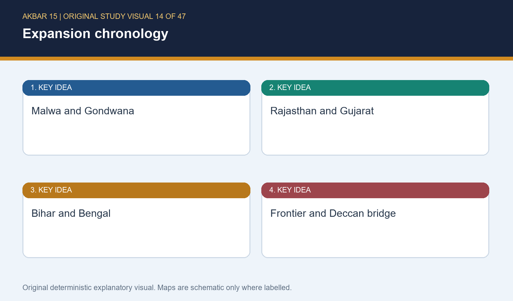
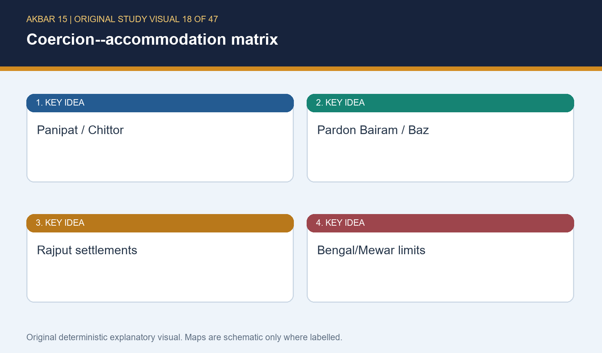

# Akbar: Consolidation & Expansion of the Empire - Complete Topic Package

## BASIC MCQS / REMEDIATION

### Part 15: Learning MCQ loop (18 original questions)

**Correct-option sequence (audited): ABCDABCDABCDABCDAB.** Every item is ORIGINAL, topic-specific and has an individualised explanation.

#### Q1. Which condition most directly makes 1556 a fragile accession?

- A. Hemu held Agra and Delhi while Afghan and Kabul uncertainties persisted
- B. Akbar had uniform subas
- C. Gujarat was permanently quiet
- D. Mewar had already submitted

**Answer: A.** The correct combination is a rival in the core, surviving Afghan alternatives and a vulnerable north-west; mature administration and prior settlements would remove the very fragility being tested.

#### Q2. Hemu is best understood as

- A. a Portuguese Gujarat governor
- B. a commander rising within a competitive Afghan political setting
- C. a purely Hindu restoration leader
- D. a Mewar ruler

**Answer: B.** His career under Adil Shah and an Afghan-heavy force are the discriminators. The communal frame ignores the political field; Mewar and Portuguese Gujarat are plausible settings but not Hemu's base.

#### Q3. Why was Panipat II contingent?

- A. both sides lacked artillery
- B. a naval blockade settled Delhi
- C. Mughal wings were disordered before Hemu's wounding disrupted command
- D. Rana Pratap led the centre

**Answer: C.** The source sequence joins recovered guns, pressure on Mughal wings and Hemu's wound. A naval blockade and Haldighati personnel belong to different theatres.

#### Q4. Which statement qualifies Panipat II?

- A. It abolished every Afghan network.
- B. It conquered Mewar.
- C. It transferred Cambay ports.
- D. It restored Mughal advantage near Delhi but did not end Afghan resistance in the east.

**Answer: D.** The key distinction is battlefield recovery versus final pacification. Bihar-Bengal resistance, Mewar and Gujarat all follow separate trajectories.

#### Q5. Bairam Khan's office is best described as

- A. a powerful wakil/guardian acting through Akbar's legitimacy
- B. an elected Rajput confederate
- C. hereditary Bengal ruler
- D. Safavid Qandahar governor

**Answer: A.** Bairam's authority was delegated in a minority. A provincial ruler can be powerful, but Bairam's legitimacy derived from acting for Akbar.

#### Q6. Why is a sect-only account of Bairam's fall unsound?

- A. Rana Pratap removed him.
- B. It ignores faction, noble jealousy, authority tensions and Akbar's personal-rule aim.
- C. It followed 1580-81.
- D. Sect never mattered in court.

**Answer: B.** Perception of sect could exist without carrying the full explanation. Haldighati and the 1580 crisis are chronologically unrelated.

#### Q7. What does Bairam's post-rebellion pardon show?

- A. He remained wakil to 1605.
- B. Every rebel was executed.
- C. Pardon and pilgrimage permission could affirm sovereign authority.
- D. Patan was a Daud Khan battle.

**Answer: C.** Dismissal, revolt, forgiveness and later death at Patan form a calibrated-exit sequence; universal execution and lifelong office erase it.

#### Q8. The Adham Khan episode shows that

- A. Maham formally ruled.
- B. Rajput alliance depended on Adham.
- C. fosterage was irrelevant.
- D. household proximity could not override Akbar after Atka Khan's murder.

**Answer: D.** It illuminates foster-household power and its limit. Maham was not sovereign, yet household access remained politically consequential.

#### Q9. The 1567 Uzbek defeat mattered because it

- A. reduced internal alternatives before systematic expansion.
- B. ended Mewar conflict
- C. gave a Cambay navy
- D. created Din-i Ilahi

**Answer: A.** The 1567 event secures the political centre. Religious policy, Mewar stalemate and maritime power are not consequences of noble defeat.

#### Q10. In Topic 15 centralisation means

- A. overnight replacement of every ruler
- B. curbing autonomous noble alternatives in favour of imperial command.
- C. abolition of regional service
- D. full zat/sawar mechanics

**Answer: B.** This topic owns political control over noble autonomy. Detailed ranking belongs to Topic 16 and absolutist claims overstate reach.

#### Q11. Which pairing captures Malwa's sequence?

- A. Muzaffar's Panipat victory
- B. Mewar's pre-Chittor surrender
- C. Baz Bahadur's defeat, Adham Khan's misconduct and later incorporation
- D. Rani's naval victory

**Answer: C.** Malwa combines conquest, correction of a commander and selective incorporation; every distractor scrambles other regions or dates.

#### Q12. Garh-Katanga matters because it

- A. ended Karrani rule
- B. proves all integration consensual
- C. was Kalanaur
- D. shows Rani Durgavati's resistance, Asaf Khan's campaign and coercive plunder.

**Answer: D.** It is counter-evidence to benevolent-only integration. Kalanaur and Daud Khan belong to entirely different chronological arcs.

#### Q13. What prevents a marriage-only Rajput policy?

- A. Surjan Hada's settlement and service without a marriage link
- B. Gujarat rapid march
- C. Chittor massacre
- D. Amber alone

**Answer: A.** Surjan Hada is the decisive counterexample. Amber is important but can be misread as supporting the reduction; the others test force and strategy.

#### Q14. Watan jagirs matter here because they

- A. meant Bengal river transport
- B. linked local standing with service without requiring full mansab detail.
- C. were Ibadat Khana
- D. ended Mewar autonomy

**Answer: B.** The bounded point is political integration. Mewar did not automatically submit; religious debate and river logistics are unrelated.

#### Q15. Why was Rajasthan strategic?

- A. it supplied a religious title
- B. it was isolated
- C. Forts and corridors linked the Ganga basin with Malwa and Gujarat routes.
- D. It had sea access

**Answer: C.** Rajasthan was a fort-and-corridor landscape, not coastline. Geography complemented political settlement.

#### Q16. Which Chittor statement is defensible?

- A. It was a peaceful marriage pact.
- B. Sources make inquiry impossible.
- C. It ended all Rajput resistance.
- D. Its fall gained strategy but massacre qualifies benevolent-only integration.

**Answer: D.** Chittor demonstrates coercion; source caution is not silence, and later Mewar resistance disproves finality.

#### Q17. Which Gujarat description fits 1572-73?

- A. Commercially valuable conquest tested by revolt and Akbar's rapid return.
- B. A one-day symbolic visit.
- C. Daud ruled it.
- D. Humayun retained it easily.

**Answer: A.** Gujarat's crafts, ports and trade mattered, but retention required response to revolt; the Humayun comparison runs in the opposite direction.

#### Q18. Why was Bengal not instantly pacified in 1576?

- A. Bengal lacked value.
- B. Riverine terrain, distance and continuing networks made retention difficult.
- C. Daud became emperor.
- D. Haldighati was in its delta.

**Answer: B.** Terrain and logistics supply the qualification. Daud did not become emperor and Haldighati belongs to Mewar.

### Part 16: Broad topic MCQs (40 original questions)

**Correct-option sequence (audited): ABCDABCDABCDABCDABCDABCDABCDABCDABCDABCD.** Every item is ORIGINAL, topic-specific and has an individualised explanation.

#### Q1. Why call the early programme consolidation before expansion?

- A. Gujarat and Bengal were inherited quiet.
- B. He never left Delhi.
- C. He confronted Hemu, regency tensions and noble resistance before wider campaigns.
- D. He abolished all alliances.

**Answer: C.** The chronology -- Panipat, personal rule, Uzbek defeat, then sustained campaigns -- proves sequencing, while each alternative deletes a central fact.

#### Q2. Which actor is tied to the eastern Afghan challenge?

- A. Mirza Hakim
- B. Surjan Hada
- C. Atka Khan
- D. Daud Khan Karrani

**Answer: D.** Daud belongs to Bengal-Bihar. Surjan Hada is Rajput settlement, Atka is household politics and Mirza Hakim is the Kabul threat.

#### Q3. What did Tukaroi demonstrate?

- A. A settlement stage preceded Daud's final 1576 defeat.
- B. Bengal was fully peaceful first.
- C. Gujarat ended through sea power.
- D. Pratap submitted.

**Answer: A.** Tukaroi belongs to a process, not a final endpoint. The options relocate Mewar and Gujarat issues into the eastern campaign.

#### Q4. At Haldighati the Mughal force was led by

- A. Bairam Khan
- B. Man Singh
- C. Hakim Khan Sur
- D. Rana Pratap

**Answer: B.** Man Singh's command is essential to rejecting communal simplification. Hakim Khan Sur fought with Pratap; Bairam died before 1576.

#### Q5. Which participant proves Pratap's coalition was mixed?

- A. Munim Khan
- B. Muzaffar Shah III
- C. Hakim Khan Sur
- D. Adham Khan

**Answer: C.** Hakim Khan Sur supplies the Afghan component. The other figures belong to Gujarat, Bengal and early personal-rule politics.

#### Q6. The limited result of Haldighati is best stated as

- A. all Rajputs left service.
- B. Hemu recovered Delhi.
- C. Mewar ended immediately.
- D. Mughal plains/forts coexisted with continued Mewar resistance.

**Answer: D.** Holding key spaces did not end a hill-country conflict. Hemu is 1556 and Rajput service persisted.

#### Q7. Why is Chavand relevant?

- A. It is associated with Rana Pratap's later resistant court.
- B. Bairam's death site
- C. Akbar's coronation site
- D. Daud's capital

**Answer: A.** Chavand substantiates post-Haldighati continuity. Kalanaur, Bengal and Patan are distinct places and stories.

#### Q8. What is safest about the 1580-81 rebellion?

- A. It expelled Mughals permanently.
- B. It linked eastern discontent with Mirza Hakim/Kabul pressure.
- C. It was Bairam's revolt.
- D. It was only Ibadat Khana debate.

**Answer: B.** The event was multi-centred and strategic, not only religious policy; neither permanent expulsion nor chronological collapse is defensible.

#### Q9. Mirza Hakim matters chiefly as

- A. Malwa campaign leader
- B. author of Akbarnama
- C. a Kabul-based dynastic and strategic threat.
- D. Haldighati ruler

**Answer: C.** His relevance is the north-west corridor. Malwa, Haldighati and authorship belong to different persons.

#### Q10. What is the bounded use of Qandahar here?

- A. A full Topic 19 survey.
- B. Proof Bengal was pacified.
- C. A Rajput watan.
- D. A frontier chronology marker in Central Asian/Safavid context.

**Answer: D.** It signals frontier complexity but cannot substitute for foreign policy. Bengal and Rajput integration are unrelated.

#### Q11. Which development is only a bridge in Topic 15?

- A. Khandesh, Berar, Ahmadnagar and Asirgarh.
- B. Bairam's regency
- C. Panipat II
- D. Hemu's career

**Answer: A.** The Deccan is intentionally bounded and expanded in Topic 18. The others are core early-reign content.

#### Q12. A composite ruling class included

- A. only Rajputs
- B. Rajputs, Turanis, Iranis, Indian Muslims and usable Afghans.
- C. only Turanis
- D. only Kabul-born officers

**Answer: B.** The formulation rejects one-bloc empire narratives without pretending equality or absence of faction.

#### Q13. Why is Baz Bahadur's later service useful?

- A. Malwa was never conquered.
- B. Hemu was Rajput.
- C. It shows defeat could be followed by calibrated incorporation.
- D. Gondwana was nonviolent.

**Answer: C.** It complicates conquest-or-extermination logic but cannot erase Malwa's defeat or Gondwana's coercion.

#### Q14. Which case represents pardon after internal conflict?

- A. Pratap's refusal
- B. Muzaffar's position
- C. Daud's Bengal rise
- D. Bairam's permitted pilgrimage after forgiveness.

**Answer: D.** Bairam's exact trajectory gives dismissal, revolt, pardon and departure; the alternatives are regional conflicts rather than a pardon.

#### Q15. Personal kingship means

- A. Akbar became final arbiter over regent, household and noble networks.
- B. there were no commanders.
- C. religious policy ceased.
- D. He used no advisers.

**Answer: A.** It is not solitary rule; it identifies the apex of authority and leaves advisers, commanders and other policies in place.

#### Q16. Which best qualifies celebratory Rajput policy?

- A. Cambay sighting
- B. The Chittor massacre after the fort fell.
- C. Bhara Mal alone
- D. Patan location

**Answer: B.** Chittor is direct coercive counterweight. The other facts are true adjacent material, not a test of benevolent integration.

#### Q17. Why are Rajasthan forts central?

- A. they became irrelevant after Panipat.
- B. They controlled Bengal delta.
- C. They shaped routes, defence, communication and submission terms.
- D. they ended alliances.

**Answer: C.** Fort landscapes shaped political geography; distant Bengal and the continuing need for bargains refute the distractors.

#### Q18. What explains Mewar resistance?

- A. Portuguese routes
- B. Bairam's office
- C. Uniform religious armies
- D. Submission, autonomy, Chittor's legacy and difficult terrain.

**Answer: D.** Mixed forces rule out the first shortcut; sea routes and Bairam's regency are irrelevant to Mewar's political calculation.

#### Q19. The economic case for Gujarat includes

- A. crafts, fertile resources, cities, ports and exchange.
- B. no route logic
- C. only pilgrimage
- D. only sea sighting

**Answer: A.** A multi-factor economic-geographic case beats a picturesque anecdote and retains strategic corridors.

#### Q20. What does the rapid Gujarat march prove?

- A. Humayun never entered Gujarat.
- B. Initial conquest had to be reinforced after revolt exposed weak retention.
- C. Speed ended local politics.
- D. Bengal was annexed then.

**Answer: B.** The march responds to reversal, not a frictionless province; Humayun's earlier entry and Bengal's separate sequence remain facts.

#### Q21. Humayun-Akbar Gujarat comparison?

- A. Humayun never campaigned.
- B. Akbar faced no revolt.
- C. Akbar held authority more effectively through response and stronger consolidation, not effortless conquest.
- D. outcomes identical.

**Answer: C.** The comparison is qualified: Akbar returned against revolt; neither claim of absence of campaign/revolt is defensible.

#### Q22. Why does Bengal need logistical qualification?

- A. No Afghans existed.
- B. Karranis were Amber clients.
- C. movement was identical to Malwa.
- D. Rivers, seasonality and long communications complicated control.

**Answer: D.** Environment is causal; the options deny Afghan resilience, flatten geography or invent a Rajput relation.

#### Q23. Panipat II's historical function?

- A. A contingent reconquest of the north-Indian core.
- B. naval victory
- C. Final pan-Indian administration
- D. Rajput ceremony

**Answer: A.** It restores a contested core, whereas administration, Gujarat sea power and alliance ritual are separate issues.

#### Q24. Least safe transparent fact window?

- A. contextual coin
- B. Court chronicle under imperial patronage.
- C. Contextual inscription
- D. fort fabric

**Answer: B.** Court patronage makes teleology a risk. Material sources also need interpretation but their limitation is not identical.

#### Q25. Abu'l Fazl's main risk?

- A. being archaeology
- B. Rajput bardic hostility.
- C. Imperial teleology portraying policy as inevitable sovereign wisdom.
- D. No court proximity.

**Answer: C.** Court proximity is strength and patronage risk. Bardic tradition and archaeology are different source types.

#### Q26. Badauni is best used as

- A. neutral revenue manual
- B. UNESCO assessment
- C. Haldighati commander
- D. dissenting, morally/sectarianly inflected evidence to compare.

**Answer: D.** He exposes tension but is not automatic neutrality; every alternative changes genre or role.

#### Q27. What can Chittor fort best show?

- A. Spatial defence, water, routes and a siege setting.
- B. complete casualty total
- C. modern ideology
- D. Every commander's thoughts

**Answer: A.** Material remains offer spatial evidence, not immediate mental states or exact totals.

#### Q28. Proper heritage statement?

- A. ASI gives casualties.
- B. UNESCO status confirms present recognition, not every medieval motive.
- C. Status proves chronicles.
- D. listing erases memory

**Answer: B.** Conservation record and sixteenth-century event evidence answer different questions.

#### Q29. Why is public memory delicate?

- A. they are irrelevant.
- B. same-year events
- C. Hemu, Chittor and Haldighati invite communal/nationalist simplification.
- D. No sources survive.

**Answer: C.** They are historically central, source-rich in different ways, and separated in chronology; that is why method matters.

#### Q30. Sound sequence?

- A. Gujarat -> Hemu
- B. Chittor -> Panipat
- C. Haldighati -> Panipat
- D. Panipat II -> Bairam dismissal -> Uzbek defeat -> Chittor -> Gujarat.

**Answer: D.** The correct order follows 1556, 1560, 1567, 1568, 1572-73; each distractor reverses the early architecture.

#### Q31. Final regency-break marker?

- A. Adham Khan-Atka Khan crisis and Akbar's response.
- B. Daud's defeat
- C. Ranthambhor siege
- D. Deccan entry

**Answer: A.** The household crisis belongs to personal-rule assertion. Bengal, Rajasthan and Deccan are later regional theatres.

#### Q32. Why not erase Afghans from imperial politics?

- A. Panipat made all powerless.
- B. They remained adversaries and could be incorporated when useful.
- C. All became Rajputs.
- D. only Central Asia had Afghans

**Answer: B.** Eastern resistance and individual incorporation demonstrate continuing relevance; identity and geography claims are absurd simplifications.

#### Q33. Irresponsible Topic 15 move?

- A. Cross-link Topic 16.
- B. Analyse noble control
- C. Explain full dahsala as main cause of Panipat II.
- D. Mention service politically.

**Answer: C.** Full revenue detail belongs elsewhere and cannot explain an earlier battle; the other moves respect ownership.

#### Q34. Irresponsible Topic 15 move?

- A. Keep alliance political.
- B. Use mixed forces
- C. Route to Topic 17.
- D. Use full Din-i Ilahi exposition to explain Rajput alliances.

**Answer: D.** Religious-policy detail is not a substitute for phased political integration and its military evidence.

#### Q35. How should a state-building 20-marker end?

- A. A graded verdict joining consolidation, inclusion, force and limits.
- B. Aurangzeb survey
- C. Uniform empire claim
- D. date list

**Answer: A.** A conclusion must weigh achievement against revolt, frontier uncertainty and unequal control; fact dumping and another reign fail.

#### Q36. Conquest versus retention?

- A. same as revenue assessment
- B. Retention needs continuing command, cooperation and response to revolt.
- C. retention automatic.
- D. Conquest never uses force.

**Answer: B.** Gujarat and Bengal show victory opens a holding problem. It never resolves all politics automatically.

#### Q37. Coercion pair?

- A. Bairam/Baz
- B. Kabul/Cambay
- C. Chittor massacre and Garh-Katanga plunder.
- D. Amber/Surjan

**Answer: C.** Both cases require critical analysis of violence; other pairs list accommodation or strategic geography.

#### Q38. Accommodation pair?

- A. Panipat/Chittor
- B. Haldighati/1580
- C. Rani/Daud
- D. Bairam's pardon and Baz Bahadur's incorporation.

**Answer: D.** The correct pair lowers the cost of rule after conflict; the options foreground battles and resistance.

#### Q39. Best expansion thesis?

- A. A secured core, elite bargains, strategic geography and coercive capacity.
- B. religious wars
- C. One marriage
- D. personal courage alone

**Answer: A.** The multi-causal thesis can be tested by cases; monocausal frames cannot explain varied regional outcomes.

#### Q40. Why retain Mewar in Rajput-policy answer?

- A. it explains delta.
- B. It shows integration was negotiated and not universal.
- C. Chittor irrelevant
- D. No Rajput served.

**Answer: B.** Mewar qualifies broad alliance; it does not deny Rajput service or replace Bengal/Chittor's distinct relevance.

### Part 17: Remedial MCQs -- recurrent traps (12 original questions)

**Correct-option sequence (audited): ABCDABCDABCD.** Every item is ORIGINAL, topic-specific and has an individualised explanation.

#### Q1. A student calls Hemu's campaign only Hindu-Muslim war. Best correction?

- A. religion never mattered.
- B. all commanders were Rajput.
- C. His Afghan setting and Afghan-heavy force, alongside mixed coalitions, rule out simplification.
- D. Hemu never fought Delhi.

**Answer: C.** The correction is evidentiary, not an opposite absolute: Hemu did fight for Delhi, but career and force composition defeat the communal shortcut.

#### Q2. “Panipat II finished the Afghan problem.” Best repair?

- A. Akbar's birth
- B. Bairam's title
- C. Fatehpur architecture
- D. Later eastern Afghan resilience under Daud Khan Karrani.

**Answer: D.** Daud's eastern sequence directly disproves finality; birthplace, architecture and title are adjacent facts without explanatory force.

#### Q3. “Bairam fell only due to sect.” Replace with?

- A. Authority, faction, noble rivalry and Akbar's personal-rule assertion.
- B. Sect never existed.
- C. full dahsala
- D. Haldighati narrative

**Answer: A.** The remedy retains possible perception while making causation multi-dimensional; the other options either deny context or spill into unrelated topics.

#### Q4. “Rajput policy means marriages.” Missing evidence?

- A. Ibadat Khana
- B. Surjan Hada's non-marital settlement plus service, honour and integration.
- C. 1580 rebellion
- D. Tukaroi

**Answer: B.** Surjan Hada directly refutes a marriage-only formula; the other items do not explain the political instrument at issue.

#### Q5. “Haldighati was decisive conquest/religious war.” Correct?

- A. Mughals held no forts.
- B. Pratap submitted.
- C. Mixed forces and a field advantage that did not end Mewar resistance.
- D. pre-Panipat date

**Answer: C.** The two corrections must stay together: coalitions were mixed, and resistance continued despite Mughal leverage over plains and forts.

#### Q6. “Akbar was only benevolent.” Repair?

- A. Marriage list
- B. Kalanaur date
- C. Cambay sighting
- D. Chittor massacre and Garh-Katanga plunder alongside pacts and incorporation.

**Answer: D.** The paired evidence makes coercion visible while preserving accommodation; decorative fact lists cannot correct a moral caricature.

#### Q7. “Daud's defeat made Bengal calm.” Missing dimension?

- A. Riverine terrain, communications and continuing local/Afghan difficulty.
- B. Deccan states
- C. Mansab ranks
- D. Badauni's views

**Answer: A.** Bengal needs logistical explanation; ranks, a chronicler's religious lens and Deccan catalogue are spillover, not a repair.

#### Q8. Panipat answer becomes revenue essay. Boundary repair?

- A. ignore jagirs
- B. Move dahsala/zabti/rank mechanics to Topic 16; retain noble-control politics.
- C. Move Panipat to 17.
- D. replace with Din-i Ilahi.

**Answer: B.** Political control remains relevant, technical apparatus is Topic 16; neither religious diversion nor denial of jagir politics works.

#### Q9. Rajput answer becomes religious-policy essay. Boundary repair?

- A. discard sources.
- B. start Aurangzeb
- C. Route Ibadat Khana, mahzar and Din-i Ilahi to Topic 17; keep integration political.
- D. Make Chittor theology.

**Answer: C.** The correct repair respects syllabus ownership while retaining strategic/coercive analysis and source method.

#### Q10. Abu'l Fazl proves all policy wise. Historian responds?

- A. UNESCO eyewitness
- B. Reject all Persian texts.
- C. bardic memory exact.
- D. Test imperial teleology against Badauni, material evidence and genre comparison.

**Answer: D.** Triangulation is the method: neither blanket rejection nor another uncritical source solves patronage bias.

#### Q11. Akbar invented everything. Best qualification?

- A. He adapted Mughal and Sur precedents through sequencing, coalition and supervision.
- B. Humayun/Sher irrelevant.
- C. every device unchanged.
- D. no force used

**Answer: A.** The balanced view avoids invention myth and copying myth while retaining political innovation in assembly and scale.

#### Q12. Every conclusion says “Akbar was great.” Better verdict?

- A. contextless quote
- B. Durable consolidation joined force, bargains and mobility but stayed uneven and contested.
- C. Mewar/Bengal fully pacified
- D. Date list

**Answer: B.** A graded conclusion answers analysis and retains revolt, frontier and person-dependence limits.

## PYQS AND ANSWER PRACTICE

### Part 18: Ten examiner-grade solved Mains answers

#### Mains 1. Explain how Akbar’s fragile inheritance in 1556 and Panipat II shaped the first consolidation phase.

**Demand:** 10 marks | 150 words. Direct thesis; claim -> named evidence -> analysis -> qualification.

**Model answer**

The accession was fragile because Humayun’s restoration had not displaced Afghan and Timurid alternatives. Panipat was a reconquest of the core, not the birth of effortless empire.

**Claim -- fractured start.** At Kalanaur, Sikandar Sur remained active, Kabul was uncertain and Hemu held Agra and Delhi. These pressures show why dynastic legitimacy alone was insufficient.

**Named evidence -- Panipat II.** On 5 November 1556, recovered artillery, disaffection, Hemu’s elephants and his arrow wound shaped an uncertain field battle. The wound mattered by breaking visible command, not by magic.

**Qualification.** Afghan resistance persisted in the east; “final end of Afghans” confuses a battle outcome with political pacification.

**Conclusion / verdict.** Thus reconquest secured a core from which later regency, noble control and regional integration could proceed.

**Why this earns marks:** It meets the directive with chronology, named pressures and the essential Panipat-versus-pacification distinction.

#### Mains 2. Assess Bairam Khan’s regency as both a stabilising device and a source of tension.

**Demand:** 10 marks | 150 words. Direct thesis; claim -> named evidence -> analysis -> qualification.

**Model answer**

Bairam made minority kingship governable, but a successful regency itself raised the question of when delegated authority should yield to personal rule.

**Stabilisation.** As wakil mutlaq and guardian, Bairam rallied forces after Humayun’s death and helped secure the position tested at Panipat. His authority worked through Akbar’s legitimacy.

**Tension.** Noble jealousy, factions and concentrated authority made his dominance controversial. Sectarian perceptions could matter, but they do not displace authority and autonomy as causes.

**Resolution.** Dismissal in 1560, rebellion, forgiveness and pilgrimage permission before Patan show both firm sovereignty and a calibrated exit.

**Conclusion / verdict.** The regency was indispensable in 1556 but could not become a substitute for a maturing sovereign.

**Why this earns marks:** It balances achievement and tension, adds precise sequence and refuses the sect-only trap.

#### Mains 3. Analyse Uzbek and old-noble rebellions as a precondition for systematic expansion.

**Demand:** 15 marks | 200 words. Direct thesis; claim -> named evidence -> analysis -> qualification.

**Model answer**

The Uzbek challenge proves that the main obstacle to empire could sit inside the ruling coalition; expansion required reduced scope for autonomous noble alternatives.

**Internal sovereignty.** Khan-i-Zaman and old Turani/Uzbek networks had expectations around command and jagir. Their resistance shows service was contested, not automatic.

**Evidence.** The 1567 defeat broke a major internal alternative. It did not abolish faction, but it altered the calculation of commanders and strengthened Akbar’s personal rule.

**Sequence.** Malwa, Rajasthan and Gujarat required commanders, supply and a secure core. Campaigning with a hostile noble bloc at the centre multiplies risk.

**Boundary.** Centralisation here means political control, not a full mansab/dahsala account; Topic 16 owns that mechanism.

**Conclusion / verdict.** Internal consolidation was an enabling condition for expansion, not a decorative prelude.

**Why this earns marks:** It creates a causal argument, names Khan-i-Zaman and 1567, and maintains the Topic 16 boundary.

#### Mains 4. Discuss Rajput policy as phased political integration rather than a marriage policy.

**Demand:** 15 marks | 200 words. Direct thesis; claim -> named evidence -> analysis -> qualification.

**Model answer**

Akbar converted selected regional rulers into partners through honour, service and negotiated status; marriage was one device, never the whole policy.

**Early alliance.** Bhara Mal, Bhagwant Das and Man Singh of Amber link local authority to imperial careers and military usefulness.

**Beyond marriage.** Surjan Hada’s Ranthambhor settlement is the key counterexample: service could be secured without a marriage connection. Watan and office joined local standing to imperial service.

**Strategic phase.** Rajasthan’s forts connected the Ganga basin with Malwa/Gujarat corridors; Rajputs became campaign allies and then partners in a composite elite.

**Qualification.** Chittor and Mewar show unequal power, coercion and non-universal acceptance.

**Conclusion / verdict.** The policy was political engineering through elite bargains, durable but never frictionless or egalitarian.

**Why this earns marks:** It explicitly overturns the marriage-only frame with Surjan Hada and supplies geography plus limitation.

#### Mains 5. “Chittor exposes the coercive underside of Akbar’s integration.” Examine.

**Demand:** 15 marks | 200 words. Direct thesis; claim -> named evidence -> analysis -> qualification.

**Model answer**

Chittor confirms that accommodation was backed by force; it should neither erase alliances nor be absorbed into benevolent imperial rhetoric.

**Strategic claim.** Chittor’s fort and corridor position made it militarily and politically significant in 1567-68.

**Coercive evidence.** The fall was followed by massacre. This cannot be marginalised if integration is being evaluated.

**Source method.** Jaimal and Patta traditions matter to Rajput memory, but imperial chronicle, bardic account and fort materiality have different reach.

**Qualification.** Amber, Surjan Hada and later Rajput service show force did not exhaust policy.

**Conclusion / verdict.** Chittor qualifies rather than cancels integration: imperial rule made both service and refusal politically consequential.

**Why this earns marks:** It directly examines the proposition, gives strategic and coercive evidence, then shows source criticism and balance.

#### Mains 6. Evaluate Gujarat 1572-73 as a test of converting conquest into durable control.

**Demand:** 20 marks | 250 words. Direct thesis; claim -> named evidence -> analysis -> qualification.

**Model answer**

Gujarat’s attraction was commercial and strategic, but revolt after conquest proves holding territory required mobility, supervision and retention politics.

**Motive.** Fertile resources, crafts, cities, ports and overseas exchange are stronger explanations than the isolated Cambay sea-sighting anecdote.

**Sequence.** Muzaffar Shah III’s displacement brought initial conquest; revolt exposed the gap between entry and control. Akbar’s rapid return mattered because it reasserted authority at reversal.

**Comparison.** Humayun had captured Gujarat but not held it securely. Akbar’s stronger base, coalition and response explain a difference without suggesting effortless rule.

**Boundary.** Detailed provincial/revenue management belongs to Topic 16; this answer tests political retention.

**Conclusion / verdict.** Gujarat is consolidation-in-action: the achievement was capacity to return and retain, not merely first entry.

**Why this earns marks:** It moves from motive to sequence to comparison, uses revolt analytically and preserves topic ownership.

#### Mains 7. Why did Afghan resistance in Bihar and Bengal remain difficult despite Daud Khan Karrani’s defeat in 1576?

**Demand:** 20 marks | 250 words. Direct thesis; claim -> named evidence -> analysis -> qualification.

**Model answer**

Daud’s defeat ended a major Afghan kingdom in the standard account, but eastern control remained difficult because victory entered a riverine, distant and networked region.

**Afghan resilience.** Daud represents continuing Afghan power after Panipat; Munim Khan and Tukaroi demonstrate a sequence before final defeat.

**Terrain.** Rivers, seasonality and long communications altered movement, supply and pursuit, increasing reliance on local cooperation.

**Outcome versus pacification.** Final defeat in 1576 was significant but did not dissolve every Afghan or local network.

**Comparison.** Gujarat also required response after revolt; Bengal’s riverine environment makes its retention problem distinctive.

**Conclusion / verdict.** The cartographic end of a kingdom was not the end of the political work of rule.

**Why this earns marks:** It names Daud, Munim and Tukaroi, makes environment causal, and avoids the instant-pacification fallacy.

#### Mains 8. Separate mythic and strategic meanings of Haldighati (1576).

**Demand:** 15 marks | 200 words. Direct thesis; claim -> named evidence -> analysis -> qualification.

**Model answer**

Haldighati gave a Mughal field advantage, but neither a final conquest of Mewar nor a simple religious war.

**Coalition evidence.** Man Singh led the Mughal force; Rana Pratap’s side included Hakim Khan Sur and Bhil participation. Political objectives explain more than religious labels.

**Outcome.** Mughals gained leverage over plains and forts, but Pratap’s hill resistance continued; later recovery and Chavand disprove a neat finish.

**Memory qualification.** Nationalist/communal afterlives must be tested against force composition and long-run control, not simply dismissed.

**Conclusion / verdict.** Its result was partial and contested: imperial pressure increased, but Mewar was not closed by one battle.

**Why this earns marks:** It distinguishes coalition, battle result and political outcome while treating public memory responsibly.

#### Mains 9. Assess the coercion-accommodation matrix as an explanation of state-building.

**Demand:** 20 marks | 250 words. Direct thesis; claim -> named evidence -> analysis -> qualification.

**Model answer**

Akbar’s durable empire was made neither by benevolent inclusion alone nor naked force alone; it combined field coercion, selective pardon, elite bargains and mobility.

**Coercion.** Panipat restored a core; Chittor’s massacre and Garh-Katanga plunder reveal available violence.

**Accommodation.** Bairam’s pardon, Baz Bahadur’s later incorporation and Amber/Surjan Hada settlements widened the ruling coalition without making it egalitarian.

**State-building logic.** Uzbek defeat secured the centre; Gujarat rapid march demonstrates retention; Bengal shows force alone could not govern a distant riverine region.

**Limits.** Mewar stalemate, 1580-81, frontier uncertainty and dependence on personal supervision show continuous rather than completed consolidation.

**Conclusion / verdict.** The matrix explains durability because force made bargains credible, yet limits prevent imperial hagiography.

**Why this earns marks:** It evaluates the framework across regions, uses named evidence and ends in a genuinely graded verdict.

#### Mains 10. How should historians use sources to study composite empire and contested public memory?

**Demand:** 20 marks | 250 words. Direct thesis; claim -> named evidence -> analysis -> qualification.

**Model answer**

Composite rule requires comparison of sources with different purposes; imperial celebration, hostile dissent and later memory cannot singly monopolise the past.

**Courtly record.** Abu’l Fazl gives detail and imperial self-representation, but patronage/teleology can present policy as inevitable wisdom.

**Dissent.** Badauni records disagreement, but his moral and sectarian lens requires scrutiny rather than automatic trust.

**Other evidence.** Bardic traditions preserve honour; inscriptions, coins, forts and architecture test material setting. UNESCO/ASI records establish present conservation, not medieval motive.

**Memory method.** Hemu, Chittor and Haldighati require mixed-army evidence, political objectives and outcome-versus-memory distinction.

**Conclusion / verdict.** Responsible history is plural in evidence and explicit about limits, preserving violence, dissent and contested honour.

**Why this earns marks:** It names source classes, identifies reach and limitation, and makes method answer the substantive question.

*Figure 14. Expansion chronology: campaigns in political sequence*

*Figure 18. Coercion and accommodation comparison matrix*
