# Akbar's Religious Views: Ibadat Khana & Din-i-Ilahi - Complete Topic Package

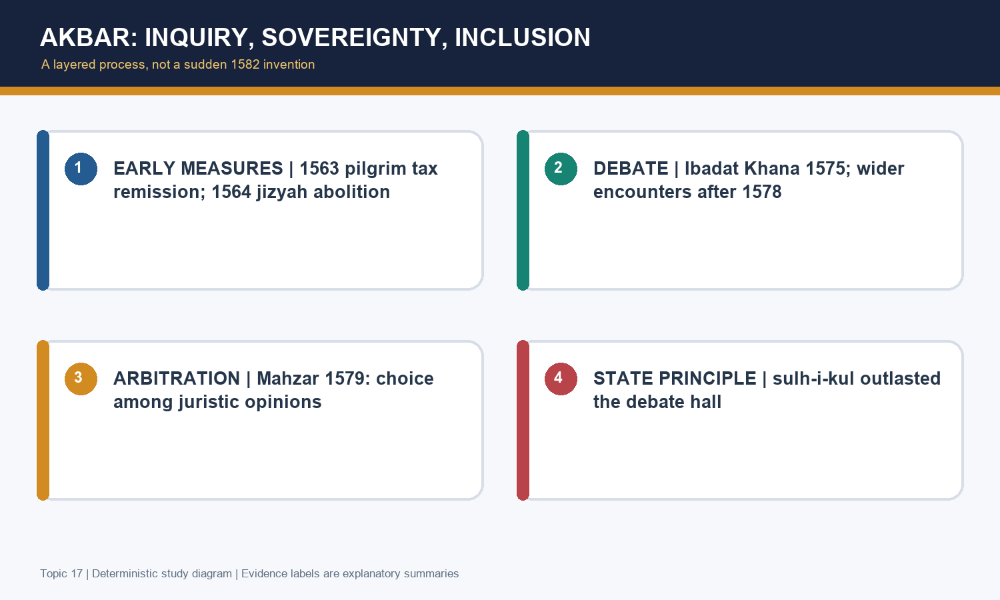

> **Subject:** Medieval Indian History | **GS-I + Prelims** | **Export date:** 18 August 2026
>
> **Learning purpose:** a complete foundation-to-advanced session on Akbar's evolving religious policy, evidence method, PYQ application, MCQs and examiner-grade writing.
>
> **Evidence tags:** FACT = grounded in owner Markdown/local OCR/live official page; ANALYSIS = bounded interpretation. No source is treated as transparent.

### Source base, verification and current-affairs check

**Repository source order used:** the Topic 17 basic and advanced Markdown owners; `00_Master-Chronology.md`; `ANSWER-WORTHINESS-AUDIT.md`; Topic 15, 16, 20, 22 and 24 boundary files; local OCR of Satish Chandra, *Medieval India: From Sultanat to the Mughals, Part II*; local 2025 GS-I OCR and PYQ routing ledgers. Abu'l Fazl, Badauni, Jesuit and other encounter evidence are used through these sources with genre and patronage cautions rather than as transparent transcripts.

**Live-source check, 18 August 2026:** an official ASI Agra Circle page and UNESCO's Fatehpur Sikri World Heritage page were checked. They verify Fatehpur Sikri's protected World Heritage / planned-city context, but no dated, materially linked official update in the preceding six months on Ibadat Khana conservation or interpretation was independently retrievable. **No material recent current-affairs anchor found; heritage/static relevance retained.** The package therefore does not force a generic cultural-pluralism analogy or claim a settled archaeological identification.

| Evidence family | Strongest use | Cannot by itself establish |
|---|---|---|
| Abu'l Fazl | imperial language, policy aspiration, kingship | unmediated social reception or neutral motive |
| Badauni | dissent, anxiety, factional perception | every dramatic ritual charge as settled fact |
| Jesuit reports | encounter, texts, missionary expectation | conversion of Akbar or a Christian state |
| Jain / Sanskrit / Persian evidence | interlocutors, translation and petitions | equal attendance at every debate |
| Farmans / orders | a specified policy act | uniform enforcement across society |
| Architecture / ASI / UNESCO | Fatehpur Sikri's material setting | exact Ibadat Khana structure without proof |

## BASIC LEARNING SESSION

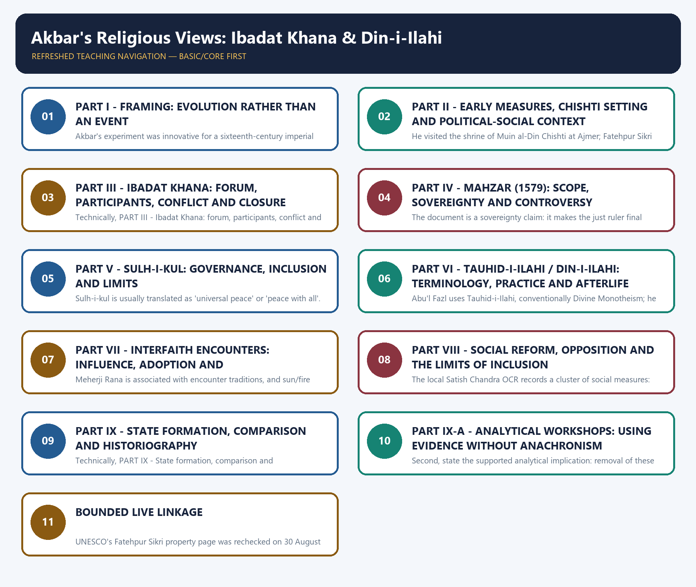

*Distinct embedded teaching-navigation image. The separate continuous Cārvāka-style flowchart package remains an independent at-a-glance artifact.*

### SESSION 1 — PART I - FRAMING: EVOLUTION RATHER THAN AN EVENT

#### DEFINITION / WHAT THIS IS CALLED

**Plain-language definition:** PART I - Framing: evolution rather than an event comprises PART I - Framing, evolution rather than an event and sequence as its core connected dimensions.

**Technical definition:** Akbar's experiment was innovative for a sixteenth-century imperial context because it gave non-sectarian justice an unusually explicit political vocabulary.

#### ANSWER-GRABBING OPENING — WRITE/ADAPT IN THE EXAM

> It then records concrete early measures - pilgrim-tax remission in 1563 and jizyah abolition in 1564 - more than a decade before the Hall of Prayer and almost two decades before the late discipleship phase.

#### MUST-WRITE KEYWORDS

- **PART I - Framing**
- **evolution rather than an event**
- **sequence**
- **Akbar's religious policy**
- **Akbar's**
- **It**

**How to use them:** Frame the answer through PART I - Framing; define evolution rather than an event, connect sequence with Akbar's religious policy to explain the mechanism, and use Akbar's for the decisive comparison or qualification.

Akbar's religious policy is often reduced to a picturesque episode: a ruler founded a strange faith in 1582. That reduction misses the chronology, the political setting and the uneven relationship between personal belief and state action. The locally held Satish Chandra material begins the story with a Turko-Mughal inheritance of pragmatic accommodation, a Chishti/Sufi environment, and an intensely inquisitive sovereign. It then records concrete early measures - pilgrim-tax remission in 1563 and jizyah abolition in 1564 - more than a decade before the Hall of Prayer and almost two decades before the late discipleship phase. The first analytical rule is therefore to keep **sequence** visible.

A second rule is to separate layers that overlap without becoming identical. Akbar could pray, visit Chishti shrines and search for spiritual truth; he could also remove a fiscal disability, arbitrate a legal disagreement, reward a noble or regulate a court ritual. The first set concerns personal spirituality; the later sets concern governance and social order. A strong answer does not insist that all policy was sincere private faith, nor does it turn every idea into cynical manipulation. Personal inquiry furnished a language and impetus; the needs of sovereignty, public order and elite integration gave policy a different scale.

The empire to which this policy belonged was plural, ranked and expansionist. Rajput alliances and a composite nobility made accommodation politically useful, but detailed conquest belongs to Topic 15 and mansab/revenue mechanics to Topic 16. Equally, the Chittor massacre reminds us that inclusion did not abolish coercion. Akbar's experiment was innovative for a sixteenth-century imperial context because it gave non-sectarian justice an unusually explicit political vocabulary. It was not democratic equality, modern constitutional secularism or a state neutral in every religious matter. The emperor remained the centre that defined accommodation.
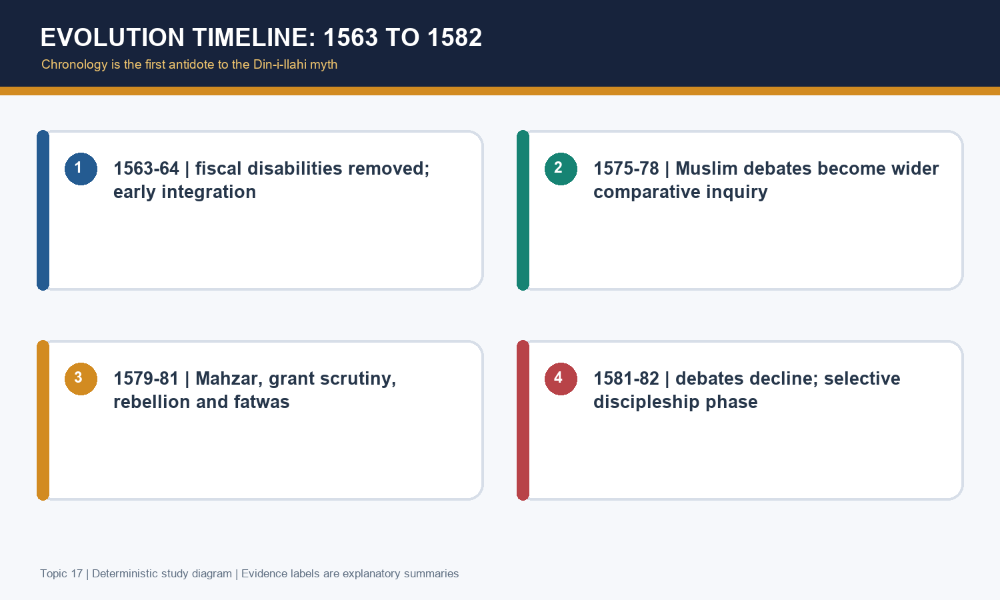

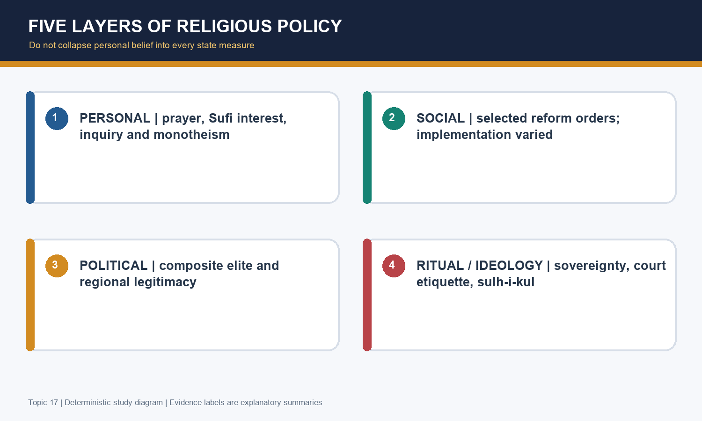

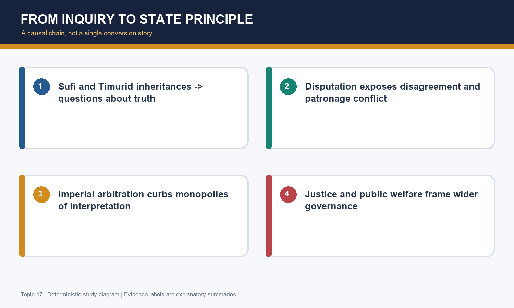

#### CLOSING RECALL FLOW — PART I - FRAMING: EVOLUTION RATHER THAN AN EVENT

```text
START / CONCEPT: PART I - Framing: evolution rather than an event
        |
        v
EXACT TERMS: PART I - Framing · evolution rather than an event · sequence · Akbar's religious policy · Akbar's · It
        |
        v
MECHANISM / ARGUMENT: Akbar's experiment was innovative for a sixteenth-century imperial context because it gave non-sectarian justice an unusually explicit political vocabulary.
        |
        v
CONSEQUENCE / CONTRAST: The first analytical rule is therefore to keep sequence visible.
        |
        v
UPSC TRAP / ANSWER-USE: A strong answer does not insist that all policy was sincere private faith, nor does it turn every idea into cynical manipulation.
        |
        v
ANSWER-GRABBING FORMULATION: It then records concrete early measures - pilgrim-tax remission in 1563 and jizyah abolition in 1564 - more than a decade before the Hall of Prayer and almost two decades before the late discipleship phase.
```
### SESSION 2 — PART II - EARLY MEASURES, CHISHTI SETTING AND POLITICAL-SOCIAL CONTEXT

#### DEFINITION / WHAT THIS IS CALLED

**Plain-language definition:** The same caution governs measures on marriage, sati, widow remarriage and alcohol: an imperial prescription can signal moral-political aspiration without demonstrating uniform implementation in a vast and unequal society.

**Technical definition:** He visited the shrine of Muin al-Din Chishti at Ajmer; Fatehpur Sikri was associated with Shaikh Salim Chishti, whose blessing tradition was linked to the birth of Prince Salim.

#### ANSWER-GRABBING OPENING — WRITE/ADAPT IN THE EXAM

> The same caution governs measures on marriage, sati, widow remarriage and alcohol: an imperial prescription can signal moral-political aspiration without demonstrating uniform implementation in a vast and unequal society.

#### MUST-WRITE KEYWORDS

- **PART II - Early measures**
- **Chishti setting**
- **political-social context**
- **Hindu**
- **Their**
- **The policy's symbolic effect**

**How to use them:** Frame the answer through PART II - Early measures; define Chishti setting, connect political-social context with Hindu to explain the mechanism, and use Their for the decisive comparison or qualification.

The 1563 remission of pilgrim tax and the 1564 abolition of jizyah are the firm chronology anchors. The pilgrim tax was charged at Hindu sacred places; jizyah was a poll tax with religious differentiation. Their removal reduced selected formal disabilities and conveyed that Hindu subjects who served the empire were not merely tolerated outsiders. The policy's symbolic effect is easier to establish than any precise revenue consequence: no fiscal total should be invented. Abu'l Fazl justifies jizyah abolition in a courtly idiom of loyal service and criticises the contempt implicit in discriminatory treatment. That rhetoric is evidence of policy language as well as a legitimising intervention.

The local OCR also reports that Akbar had forbidden enslavement of wives and children of rebellious villagers before the tax changes. This should be reported with its exact source basis and kept distinct from a claim that slavery disappeared. Later social regulations included restrictions on sale and purchase of slaves, but household and elite service practices persisted. The same caution governs measures on marriage, sati, widow remarriage and alcohol: an imperial prescription can signal moral-political aspiration without demonstrating uniform implementation in a vast and unequal society.

Akbar's Chishti connections supplied a setting for spiritual search. He visited the shrine of Muin al-Din Chishti at Ajmer; Fatehpur Sikri was associated with Shaikh Salim Chishti, whose blessing tradition was linked to the birth of Prince Salim. Sufi vocabulary of tawhid, meditation and the guide-disciple relation mattered later. Yet a shrine connection does not prove direct transmission of a fixed doctrine. Chishti reverence, Timurid pragmatic traditions, Bhakti-Sufi proximity and Akbar's personal inquiry form a background, not a single blueprint.

Shaikh Mubarak and his sons Abu'l Fazl and Faizi appear in the intellectual environment in which imperial authority and religious inquiry were debated. Their influence must not be imagined as an omnipotent anti-ulama party. The court ulama themselves were not one uniform social or intellectual block. Abdullah Sultanpuri (Makhdum-ul-Mulk) and Shaikh Abdun Nabi were influential figures in the early period; material in the local book records disputes over learning, grants and persecution. Such named evidence is useful because it shows why authority, patronage and legal interpretation could be politically charged, not because it validates every hostile epithet about them.

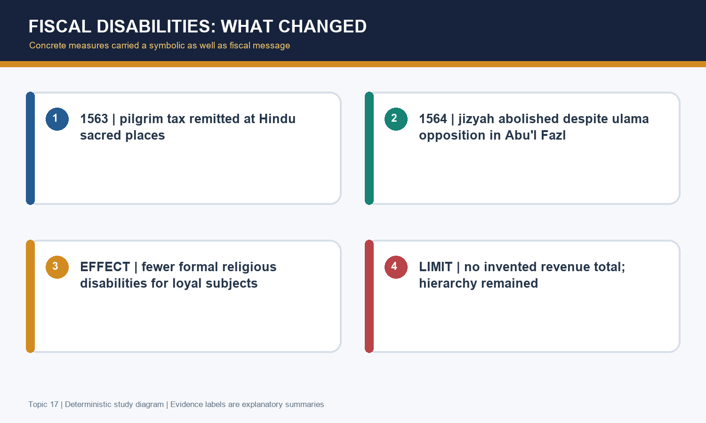

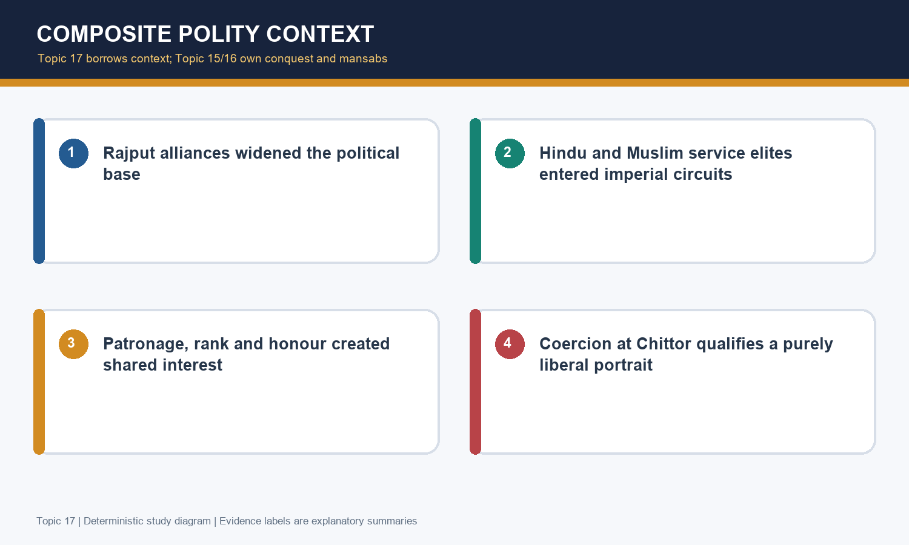

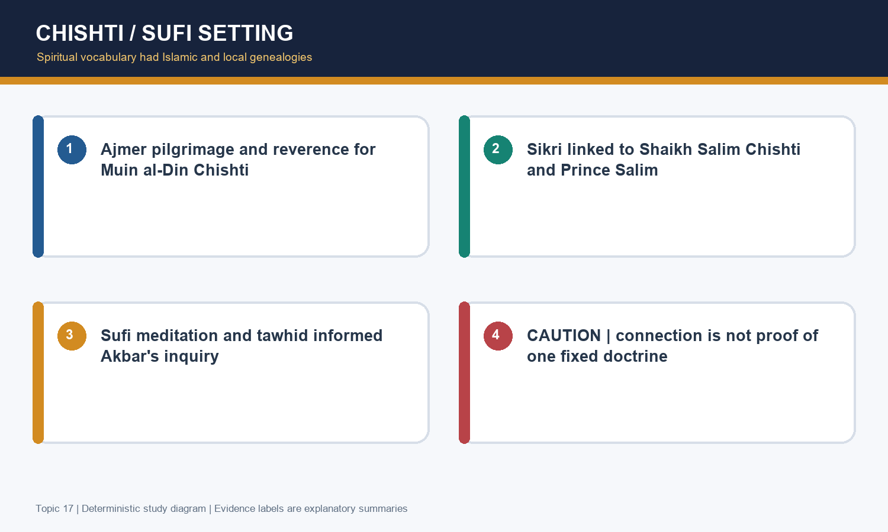

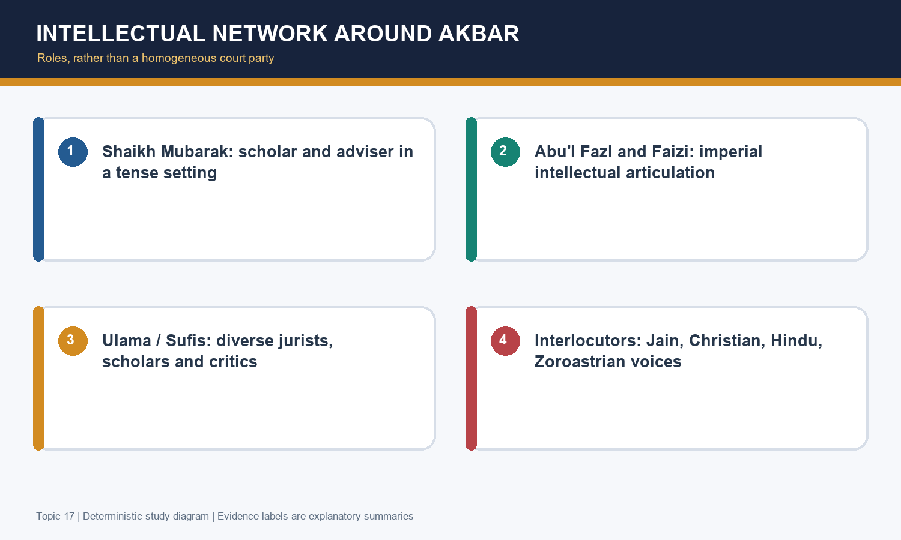

#### CLOSING RECALL FLOW — PART II - EARLY MEASURES, CHISHTI SETTING AND POLITICAL-SOCIAL CONTEXT

```text
START / CONCEPT: PART II - Early measures, Chishti setting and political-social context
        |
        v
EXACT TERMS: PART II - Early measures · Chishti setting · political-social context · Hindu · Their · The policy's symbolic effect
        |
        v
MECHANISM / ARGUMENT: Such named evidence is useful because it shows why authority, patronage and legal interpretation could be politically charged, not because it validates every hostile epithet about them.
        |
        v
CONSEQUENCE / CONTRAST: Their removal reduced selected formal disabilities and conveyed that Hindu subjects who served the empire were not merely tolerated outsiders.
        |
        v
UPSC TRAP / ANSWER-USE: Do not miss this limiting distinction: the policy's symbolic effect is easier to establish than any precise revenue consequence.
        |
        v
ANSWER-GRABBING FORMULATION: The same caution governs measures on marriage, sati, widow remarriage and alcohol: an imperial prescription can signal moral-political aspiration without demonstrating uniform implementation in a vast and unequal society.
```
### SESSION 3 — PART III - IBADAT KHANA: FORUM, PARTICIPANTS, CONFLICT AND CLOSURE

#### DEFINITION / WHAT THIS IS CALLED

**Plain-language definition:** Closure means that the formal public forum ended; it does not mean that Akbar ceased speaking privately with religious figures, receiving visitors, commissioning translations or reflecting on plural claims.

**Technical definition:** Technically, PART III - Ibadat Khana: forum, participants, conflict and closure is analysed by relating PART III - Ibadat Khana to forum, then testing the relationship through participants and conflict.

#### ANSWER-GRABBING OPENING — WRITE/ADAPT IN THE EXAM

> Closure means that the formal public forum ended; it does not mean that Akbar ceased speaking privately with religious figures, receiving visitors, commissioning translations or reflecting on plural claims.

#### MUST-WRITE KEYWORDS

- **PART III - Ibadat Khana**
- **forum**
- **participants**
- **conflict**
- **closure**
- **The Ibadat Khana**

**How to use them:** Frame the answer through PART III - Ibadat Khana; define forum, connect participants with conflict to explain the mechanism, and use closure for the decisive comparison or qualification.

The Ibadat Khana, or Hall of Prayer, was built at Fatehpur Sikri in 1575. In the local Satish Chandra OCR it is described as a large rectangular building around the cell of Shaikh Abdullah Niyazi, not far from the imperial palace and near Anup Talao. This is rich textual topography, but it is not a licence to label a particular surviving monument as conclusively 'the' Ibadat Khana. The archaeological identification of the exact structure/remains remains debated. The safe formulation is: **textually associated with the court zone, Niyazi's cell and Anup Talao; exact material identification uncertain**.

At first, the discussions were open to Muslims: Sufi shaikhs, ulama, learned men and some of the emperor's companions and attendants. Akbar attended after state business on Thursday nights. The book describes groupings and a lively theological circle; when participant numbers were high, discussions could use the Anup Talao courtyard. This is not evidence that every Muslim participant thought alike. Jurists, mystics, scholars and office-holders brought different intellectual positions and different stakes in court status. Debates about legal matters, including marriage, revealed competing interpretations rather than a single authoritative jurisprudence.

The contentiousness of these early exchanges disappointed Akbar. The local source says theologians tried to establish superiority, browbeat opponents and lost self-control. That description is partly shaped by Abu'l Fazl's polemic against court clerics, so a better inference is not 'all ulama were corrupt' but that courtly disputation fused doctrinal disagreement with status competition. The event exposed a structural limit: a public arena under royal gaze rewarded winning the ruler rather than jointly seeking a minimal common truth.

After a reported mystical experience in 1578, Akbar opened the discussion to Hindu interlocutors, Jains, Christians, Zoroastrians and others. Secure names and traditions must be used carefully. Purushottam and Devi occur in the book's account of private discussion; Hiravijaya Suri is central to Jain contact; Jesuit missions from Goa are well documented; Meherji Rana appears in Parsi/Zoroastrian encounter traditions. These names do not prove that they all sat in the same meeting, spoke with equal institutional authority or created a representative parliament of India. They show widening access to a court that wanted comparative knowledge.

The questions now included revelation, the prophethood of Muhammad, resurrection, divine unity and the relation of ethics to ritual. Such inquiry did not create instant harmony. It could make doctrinal conflict more acute, particularly when participants viewed the court as a place to defend the superiority of their own tradition. The debates practically declined in 1581 and are commonly said to have finally closed in 1582. Closure means that the formal public forum ended; it does not mean that Akbar ceased speaking privately with religious figures, receiving visitors, commissioning translations or reflecting on plural claims.

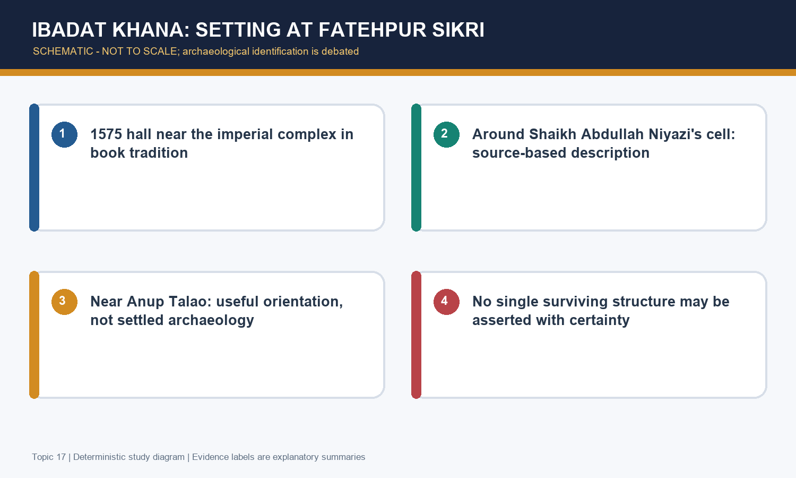


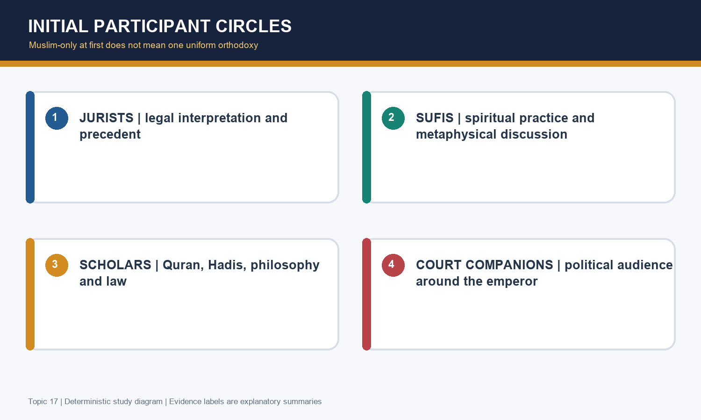

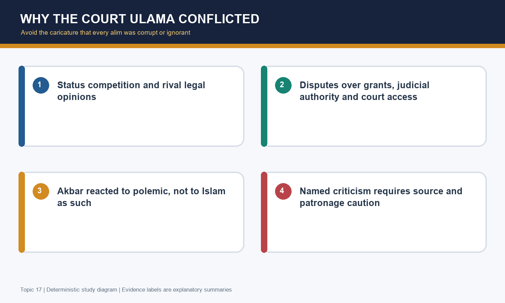

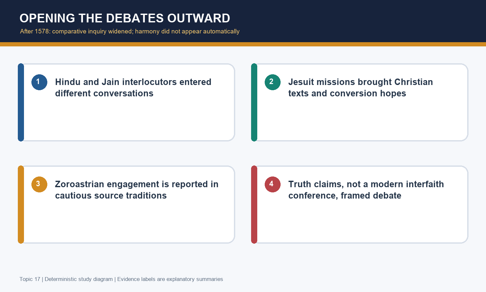

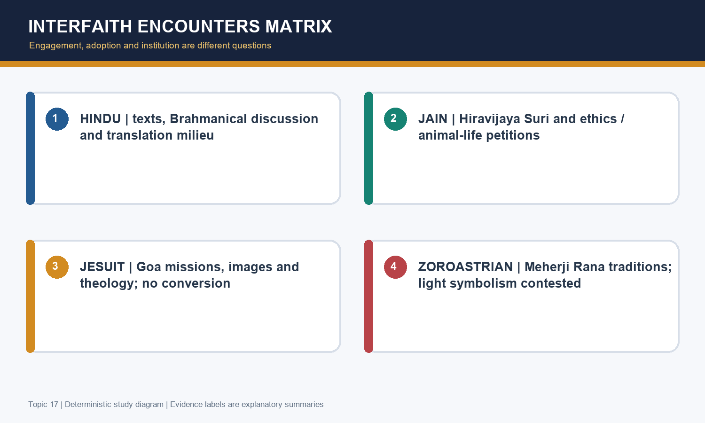

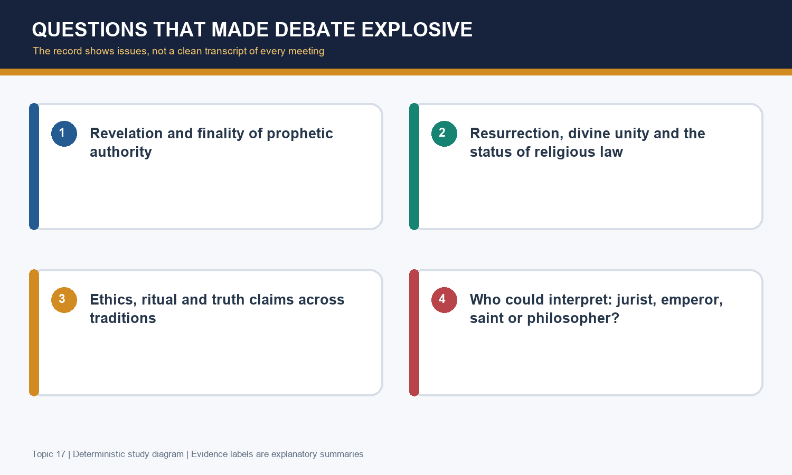

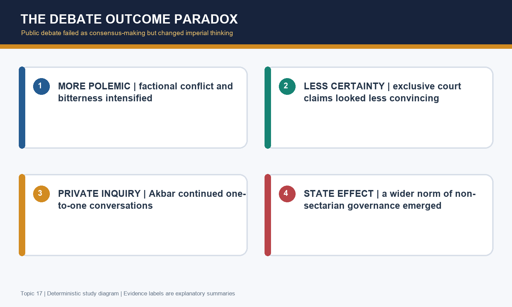

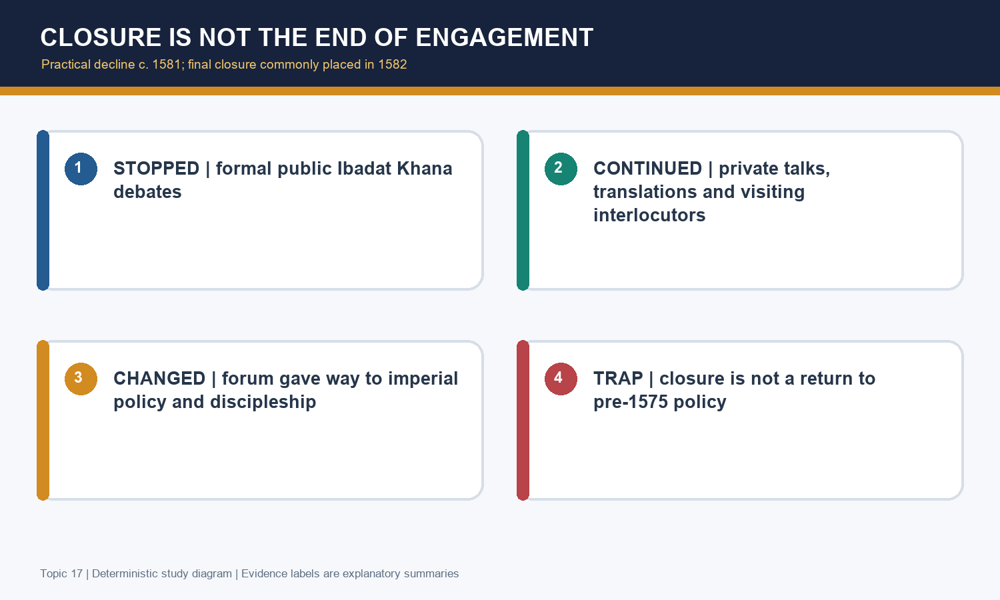

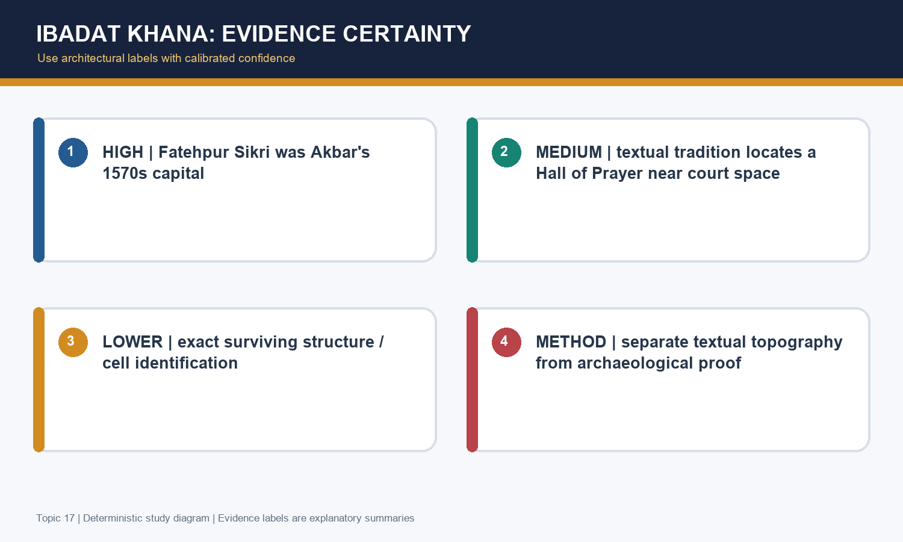

#### CLOSING RECALL FLOW — PART III - IBADAT KHANA: FORUM, PARTICIPANTS, CONFLICT AND CLOSURE

```text
START / CONCEPT: PART III - Ibadat Khana: forum, participants, conflict and closure
        |
        v
EXACT TERMS: PART III - Ibadat Khana · forum · participants · conflict · closure · The Ibadat Khana
        |
        v
MECHANISM / ARGUMENT: It could make doctrinal conflict more acute, particularly when participants viewed the court as a place to defend the superiority of their own tradition.
        |
        v
CONSEQUENCE / CONTRAST: This is rich textual topography, but it is not a licence to label a particular surviving monument as conclusively 'the' Ibadat Khana.
        |
        v
UPSC TRAP / ANSWER-USE: This is not evidence that every Muslim participant thought alike.
        |
        v
ANSWER-GRABBING FORMULATION: Closure means that the formal public forum ended; it does not mean that Akbar ceased speaking privately with religious figures, receiving visitors, commissioning translations or reflecting on plural claims.
```
### SESSION 4 — PART IV - MAHZAR (1579): SCOPE, SOVEREIGNTY AND CONTROVERSY

#### DEFINITION / WHAT THIS IS CALLED

**Plain-language definition:** The balanced conclusion is that the Mahzar reduced clerical monopoly and enhanced sovereignty while working in an Islamic legal-political vocabulary.

**Technical definition:** The document is a sovereignty claim: it makes the just ruler final arbiter when legal specialists disagree, thereby preventing juristic conflict from paralysing administration.

#### ANSWER-GRABBING OPENING — WRITE/ADAPT IN THE EXAM

> The balanced conclusion is that the Mahzar reduced clerical monopoly and enhanced sovereignty while working in an Islamic legal-political vocabulary.

#### MUST-WRITE KEYWORDS

- **PART IV - Mahzar (1579)**
- **scope**
- **sovereignty**
- **controversy**
- **limited interpretive-arbitral authority**
- **The Mahzar**

**How to use them:** Frame the answer through PART IV - Mahzar (1579); define scope, connect sovereignty with controversy to explain the mechanism, and use limited interpretive-arbitral authority for the decisive comparison or qualification.

The Mahzar was an attested declaration issued in 1579 and signed by leading ulama, including Shaikh Abdun Nabi, Abdullah Sultanpuri and Shaikh Mubarak. It has often been called the 'Decree of Infallibility'. That label is a trap because it imports a papal analogy and makes the document sound like a declaration that Akbar could never err. The actual issue was more precise: when qualified jurists held conflicting opinions on a religious question, the emperor could choose among them for the welfare of mankind and proper administration. Its stated language also tied a royal decree to the Quran, Hadis/nass and benefit, although historians debate how practice later stretched this frame.

This wording matters for two reasons. First, it is not a statement that Akbar was a prophet or recipient of new revelation. Second, it is not an unlimited power to create whatever law he wished. The document is a sovereignty claim: it makes the just ruler final arbiter when legal specialists disagree, thereby preventing juristic conflict from paralysing administration. The scope/limit distinction should appear in every answer. Call it an assertion of **limited interpretive-arbitral authority**, not an unqualified religious infallibility.

The setting explains why this claim was consequential. The Ibadat Khana had revealed disagreements among court theologians. Disputes over madadd-i-maash (revenue-free grants) involved patronage and the authority of the sadr. The local text describes an inquiry and the removal of influential clerical figures, but it also warns against treating this simply as a war on Islam. In 1580, the eastern rebellion and fatwas associated with Mulla Muhammad Yazdi and the Bengal qazi sharpened the link between political rebellion, grants and religious authority. Campaign narration belongs elsewhere; the topic here is how conflict made final imperial arbitration politically urgent.

Interpretations diverge because sources do. Abu'l Fazl's intellectual project makes Akbar a just, spiritually capable king. Badauni depicts troubling apostasy and coercive pressure. Modern historians such as Satish Chandra emphasise political integration and the creation of a new state policy; S.A.A. Rizvi's formulation of a first effective declaration of sulh-i-kul is a useful interpretation, not a quotation to use as a substitute for analysis. The balanced conclusion is that the Mahzar reduced clerical monopoly and enhanced sovereignty while working in an Islamic legal-political vocabulary. It was neither an anti-Islamic manifesto nor a harmless technical memo.

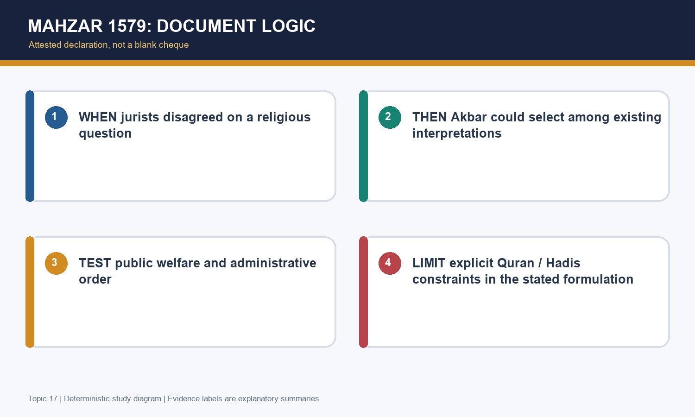

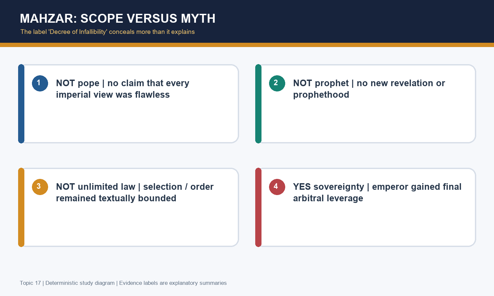

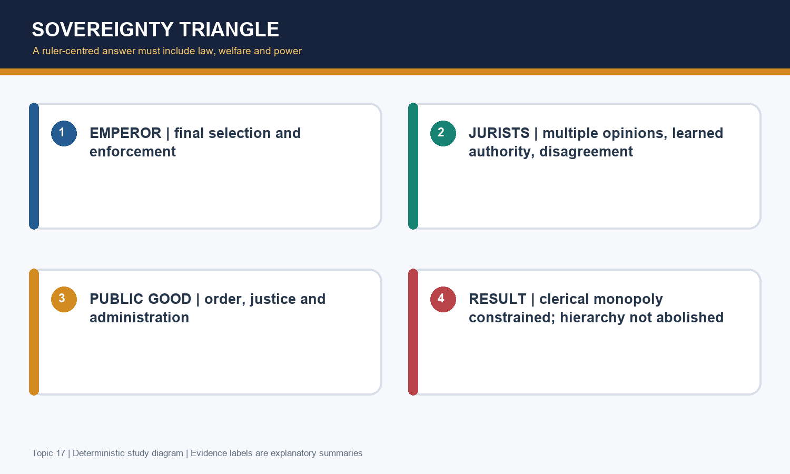

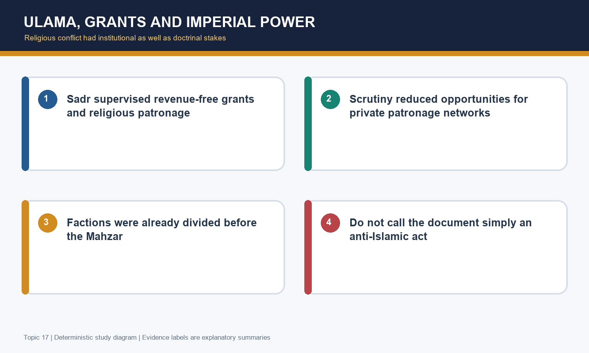

#### CLOSING RECALL FLOW — PART IV - MAHZAR (1579): SCOPE, SOVEREIGNTY AND CONTROVERSY

```text
START / CONCEPT: PART IV - Mahzar (1579): scope, sovereignty and controversy
        |
        v
EXACT TERMS: PART IV - Mahzar (1579) · scope · sovereignty · controversy · limited interpretive-arbitral authority · The Mahzar
        |
        v
MECHANISM / ARGUMENT: The Mahzar was an attested declaration issued in 1579 and signed by leading ulama, including Shaikh Abdun Nabi, Abdullah Sultanpuri and Shaikh Mubarak.
        |
        v
CONSEQUENCE / CONTRAST: The scope/limit distinction should appear in every answer.
        |
        v
UPSC TRAP / ANSWER-USE: First, it is not a statement that Akbar was a prophet or recipient of new revelation.
        |
        v
ANSWER-GRABBING FORMULATION: The balanced conclusion is that the Mahzar reduced clerical monopoly and enhanced sovereignty while working in an Islamic legal-political vocabulary.
```
### SESSION 5 — PART V - SULH-I-KUL: GOVERNANCE, INCLUSION AND LIMITS

#### DEFINITION / WHAT THIS IS CALLED

**Plain-language definition:** Syncretism can refer to selected interaction or borrowing; sulh-i-kul is a governance principle.

**Technical definition:** Sulh-i-kul is usually translated as 'universal peace' or 'peace with all'.

#### ANSWER-GRABBING OPENING — WRITE/ADAPT IN THE EXAM

> Syncretism can refer to selected interaction or borrowing; sulh-i-kul is a governance principle.

#### MUST-WRITE KEYWORDS

- **PART V - Sulh-i-kul**
- **governance**
- **inclusion**
- **limits**
- **Sulh-i-kul**
- **In Abu'l Fazl's**

**How to use them:** Frame the answer through PART V - Sulh-i-kul; define governance, connect inclusion with limits to explain the mechanism, and use Sulh-i-kul for the decisive comparison or qualification.

Sulh-i-kul is usually translated as 'universal peace' or 'peace with all'. The phrase must be unpacked. It pointed to a state ethic of justice, public welfare, non-sectarian treatment and accommodation of different creeds under an imperial order. In Abu'l Fazl's language, a ruler's paternal love and rational inquiry should restrain fanatical conflict and make the empire a place of security. It did not require everyone to accept the same theology. In fact, it became more useful precisely because the Ibadat Khana had shown that theological merger was not obtainable.

As state formation, sulh-i-kul gave an ideological framework to practices that ranged from tax relief and a broader distribution of patronage to recruitment of diverse elites. Rajput service and other non-Muslim participation did not arise from the doctrine alone; they also followed conquest, negotiation, rank and mutual interest. Still, the language mattered because it legitimised participation as more than a temporary expedient. It said that justice and service could cross confessional lines. Detailed mansab mechanics remain Topic 16, but the integrative political meaning belongs here.

Sulh-i-kul is not a synonym for syncretism. Syncretism can refer to selected interaction or borrowing; sulh-i-kul is a governance principle. Nor is it indifference to religion: the Mughal state patronised institutions, evaluated claims and used sacred language. Nor is it modern secularism: there was no constitutional equality, universal citizenship, electoral accountability or institutional separation of state and religion. The principle was vertically bestowed by a ruler whose authority remained hierarchical.

It was more durable than the Ibadat Khana's public debates and more consequential than the small Tauhid discipleship circle because it could shape ordinary practices of government and legitimacy. Yet its durability should not be exaggerated. It depended on imperial interpretation and could be reframed by successors. Jahangir broadly continued Akbar's inclusive inheritance, while later policy under Aurangzeb involved different choices, including jizyah reimposition in 1679. The contrast reveals personality and politics, not an automatic civilisational fall from tolerance to bigotry.


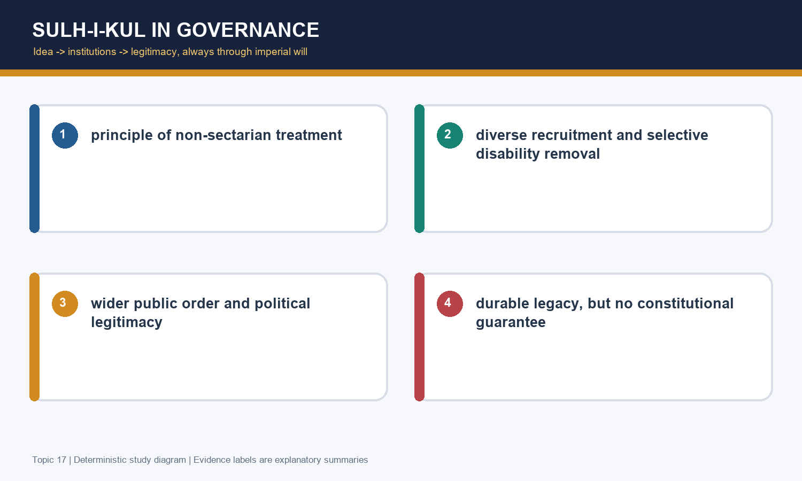

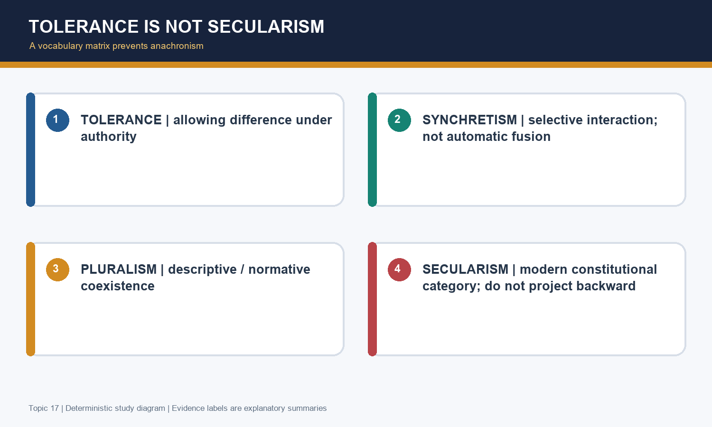

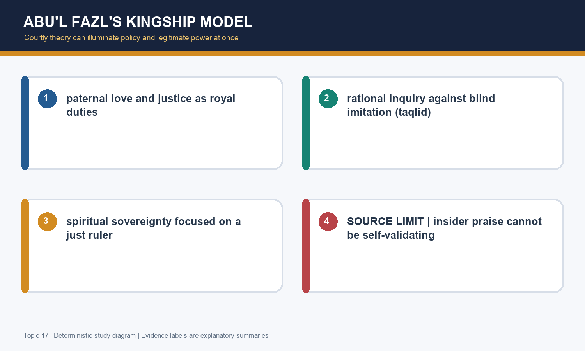

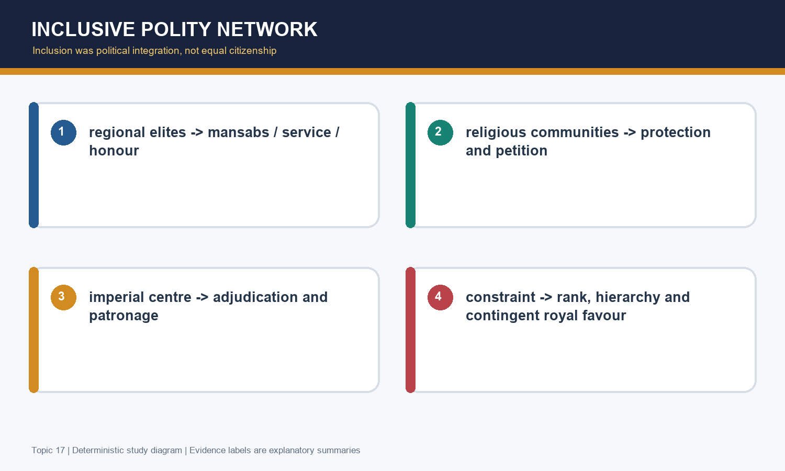

#### CLOSING RECALL FLOW — PART V - SULH-I-KUL: GOVERNANCE, INCLUSION AND LIMITS

```text
START / CONCEPT: PART V - Sulh-i-kul: governance, inclusion and limits
        |
        v
EXACT TERMS: PART V - Sulh-i-kul · governance · inclusion · limits · Sulh-i-kul · In Abu'l Fazl's
        |
        v
MECHANISM / ARGUMENT: In fact, it became more useful precisely because the Ibadat Khana had shown that theological merger was not obtainable.
        |
        v
CONSEQUENCE / CONTRAST: Sulh-i-kul is not a synonym for syncretism.
        |
        v
UPSC TRAP / ANSWER-USE: Rajput service and other non-Muslim participation did not arise from the doctrine alone; they also followed conquest, negotiation, rank and mutual interest.
        |
        v
ANSWER-GRABBING FORMULATION: Syncretism can refer to selected interaction or borrowing; sulh-i-kul is a governance principle.
```
### SESSION 6 — PART VI - TAUHID-I-ILAHI / DIN-I-ILAHI: TERMINOLOGY, PRACTICE AND AFTERLIFE

#### DEFINITION / WHAT THIS IS CALLED

**Plain-language definition:** The terminology itself is historical evidence.

**Technical definition:** Abu'l Fazl uses Tauhid-i-Ilahi, conventionally Divine Monotheism; he does not primarily present a fully institutionalised Din-i-Ilahi.

#### ANSWER-GRABBING OPENING — WRITE/ADAPT IN THE EXAM

> Abu'l Fazl uses Tauhid-i-Ilahi, conventionally Divine Monotheism; he does not primarily present a fully institutionalised Din-i-Ilahi.

#### MUST-WRITE KEYWORDS

- **PART VI - Tauhid-i-Ilahi / Din-i-Ilahi**
- **terminology**
- **practice**
- **afterlife**
- **Tauhid-i-Ilahi**
- **1580-81**

**How to use them:** Frame the answer through PART VI - Tauhid-i-Ilahi / Din-i-Ilahi; define terminology, connect practice with afterlife to explain the mechanism, and use Tauhid-i-Ilahi for the decisive comparison or qualification.

The terminology itself is historical evidence. Abu'l Fazl uses **Tauhid-i-Ilahi**, conventionally Divine Monotheism; he does not primarily present a fully institutionalised Din-i-Ilahi. Badauni uses both expressions, and Jesuit/later traditions helped attach 'Din-i-Ilahi' to a story of apostasy or a new religion. A careful answer need not police vocabulary by banning the latter term. Instead, it should say why different labels arose and why later labels may make a fluid court practice appear more coherent, formal and universal than it was.

The strongest negative evidence against a mass new religion is institutional. The group had no separate scripture, priesthood, public congregational place of worship, missionary machinery, coercive conversion or large following. We do not possess a reliable date on which a universal faith was formally founded. A claim that Akbar ordered all subjects to join has no source support. Membership was limited to an elite circle. Birbal is commonly identified as its prominent Hindu member; Blochmann's list of eighteen highest-grade nobles is a scholarly reconstruction, not a census and not proof that only eighteen persons ever had any association.

The opposite error is also serious. The local OCR records initiation-related conduct: Sunday initiation, a novice placing the head at the emperor's feet, the shast, greeting formulas such as Allah-o-Akbar and Jall Jalalhu, birthday alms/feast practices and restraint from meat in the birth month. Badauni speaks of four degrees of devotion - property, life, honour and religion. These reports show that a limited fellowship and an idiom of personal attachment existed. They must, however, be read with genre caution. Court etiquette, imperial symbolism, religious discipline and hostile accusation can overlap; a long sensational ritual list is not the same as a settled creed.

The pir-murid analogy is illuminating because Sufi traditions made guide-disciple relations and sacrifice language intelligible. It is incomplete because an emperor also distributed rank, honour and punishment. The political meaning of discipleship was therefore acute: during the rebellions and threats of 1580-81, a heterogeneous high nobility could be bound to the throne by a language of ethical loyalty and spiritual guidance. Satish Chandra's political-device interpretation catches this without denying personal search. Tauhid was neither mere eccentricity nor a conventional new religion nor a pure secular policy.

Its weak afterlife is revealing. It did not survive Akbar as a separate sect. Jahangir did not maintain the same initiation/shast practice, even if the language of imperial discipleship persisted in other forms. The policy legacy that lasted better was sulh-i-kul: a broad idiom of justice, inclusion and non-sectarian statecraft. This does not prove that the discipleship phase was unimportant; it shows that an elite, ruler-centred fellowship depended more heavily on the founder than a governing norm embedded in patronage and service.


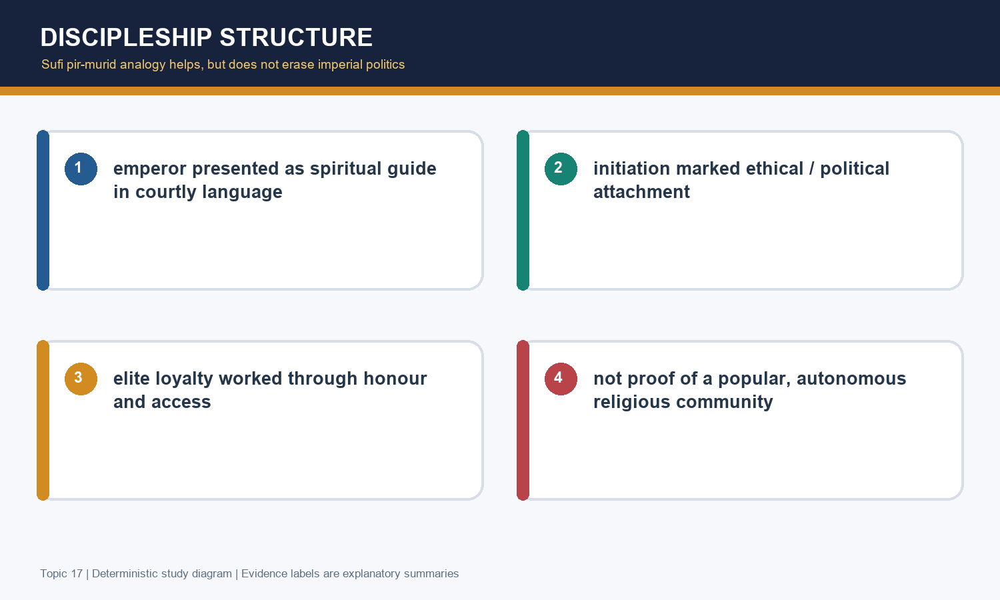

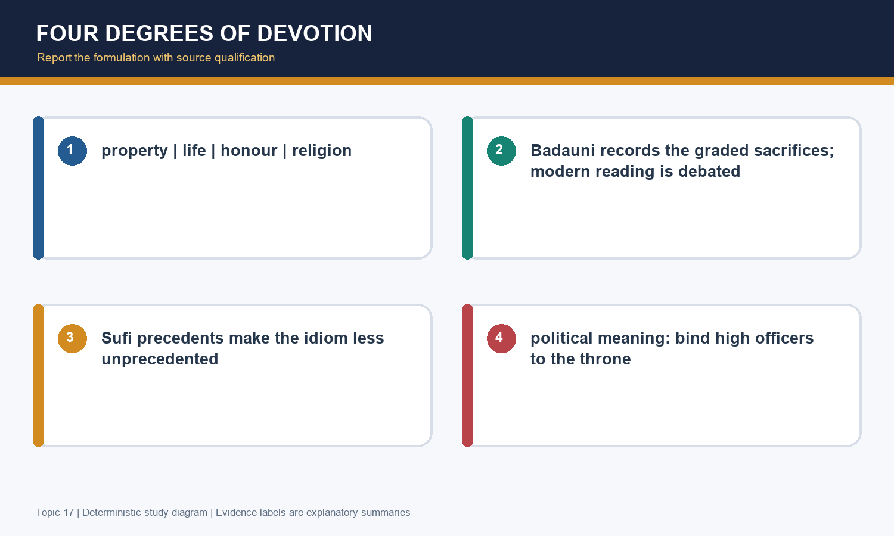

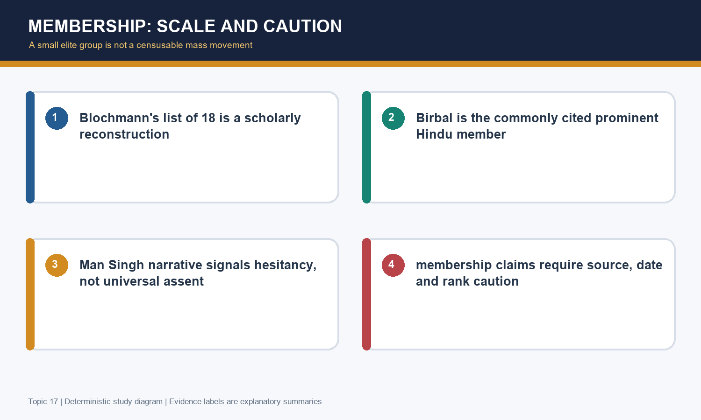

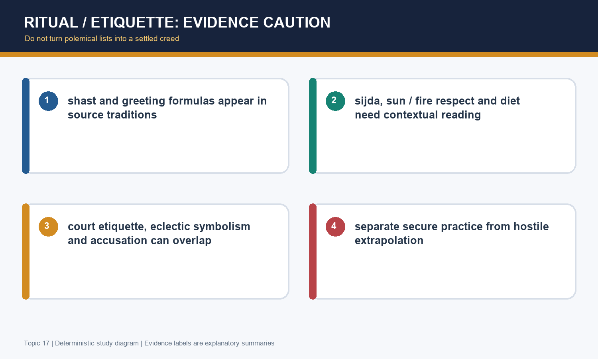

#### CLOSING RECALL FLOW — PART VI - TAUHID-I-ILAHI / DIN-I-ILAHI: TERMINOLOGY, PRACTICE AND AFTERLIFE

```text
START / CONCEPT: PART VI - Tauhid-i-Ilahi / Din-i-Ilahi: terminology, practice and afterlife
        |
        v
EXACT TERMS: PART VI - Tauhid-i-Ilahi / Din-i-Ilahi · terminology · practice · afterlife · Tauhid-i-Ilahi · 1580-81
        |
        v
MECHANISM / ARGUMENT: The political meaning of discipleship was therefore acute: during the rebellions and threats of 1580-81, a heterogeneous high nobility could be bound to the throne by a language of ethical loyalty and spiritual guidance.
        |
        v
CONSEQUENCE / CONTRAST: We do not possess a reliable date on which a universal faith was formally founded.
        |
        v
UPSC TRAP / ANSWER-USE: Birbal is commonly identified as its prominent Hindu member; Blochmann's list of eighteen highest-grade nobles is a scholarly reconstruction, not a census and not proof that only eighteen persons ever had any association.
        |
        v
ANSWER-GRABBING FORMULATION: Abu'l Fazl uses Tauhid-i-Ilahi, conventionally Divine Monotheism; he does not primarily present a fully institutionalised Din-i-Ilahi.
```
### SESSION 7 — PART VII - INTERFAITH ENCOUNTERS: INFLUENCE, ADOPTION AND INSTITUTIONALISATION

#### DEFINITION / WHAT THIS IS CALLED

**Plain-language definition:** PART VII - Interfaith encounters: influence, adoption and institutionalisation comprises PART VII - Interfaith encounters, influence and adoption as its core connected dimensions.

**Technical definition:** Meherji Rana is associated with encounter traditions, and sun/fire reverence has been linked to Zoroastrian ideas.

#### ANSWER-GRABBING OPENING — WRITE/ADAPT IN THE EXAM

> This is an ideal place to demonstrate the difference between influence and adoption.

#### MUST-WRITE KEYWORDS

- **PART VII - Interfaith encounters**
- **influence**
- **adoption**
- **institutionalisation**
- **Was**
- **It**

**How to use them:** Frame the answer through PART VII - Interfaith encounters; define influence, connect adoption with institutionalisation to explain the mechanism, and use Was for the decisive comparison or qualification.

A useful analytical matrix asks four questions of every alleged influence: Was a tradition heard or discussed? Was a particular idea or practice selectively adopted? Was it institutionalised as a policy or durable court form? What is not established? This prevents an answer from turning a list of names into a story of conversion. It also guards against the opposite misconception that engagement was irrelevant because Akbar did not formally join another faith.

Hindu engagement included Brahmanical discussion and a translation milieu in which Sanskrit works became available in Persian. Purushottam and Devi appear in the local source as interlocutors in private conversation. The translation bureau and later projects belong partly to Topic 24, but here they show a politics of comparative knowledge and an attack on blind following. These encounters do not prove that Akbar became Hindu, accepted every doctrine or fused traditions into a single religion. They reveal an imperial court using intellectual traffic to question exclusive authority.

Jain contact deserves similar precision. Hiravijaya Suri is a securely relevant figure, and Jain ethics of ahimsa are often connected to selected restraints on animal slaughter or other petitions. The exact order, dates, territories and duration must be verified before an answer converts this into an empire-wide permanent prohibition. Jain encounter could shape courtly sensitivity and specific orders, but social implementation varied. This is an ideal place to demonstrate the difference between influence and adoption.

Jesuit missions from Goa brought Christian theology, texts and images to the court. The fathers' letters and reports record serious engagement, but their missionary purpose made them prone to treat courtesy as evidence of imminent conversion. Akbar did not become Christian; the empire did not adopt Christianity. The reports nevertheless matter because they preserve questions asked, translations commissioned and the perception of imperial curiosity. A historian should compare them with Persian court narratives rather than treating either source as self-sufficient.

Zoroastrian/Parsi influence requires the most cautious language. Meherji Rana is associated with encounter traditions, and sun/fire reverence has been linked to Zoroastrian ideas. Yet light (nur) also appears in Islamic philosophical, Sufi and other traditions. The source question is not 'which religion owns a symbol?' but how an imperial court gave old symbols new meaning. The Islamic and Sufi roots of Akbar's monotheism, meditation and critique of taqlid remain central. A pick-and-mix caricature erases the conceptual frameworks through which engagement took place.

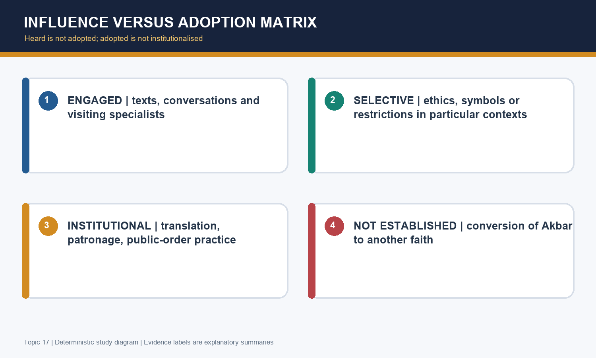

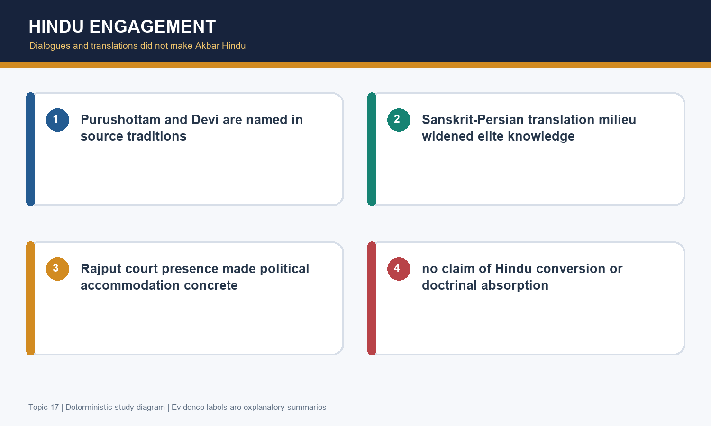

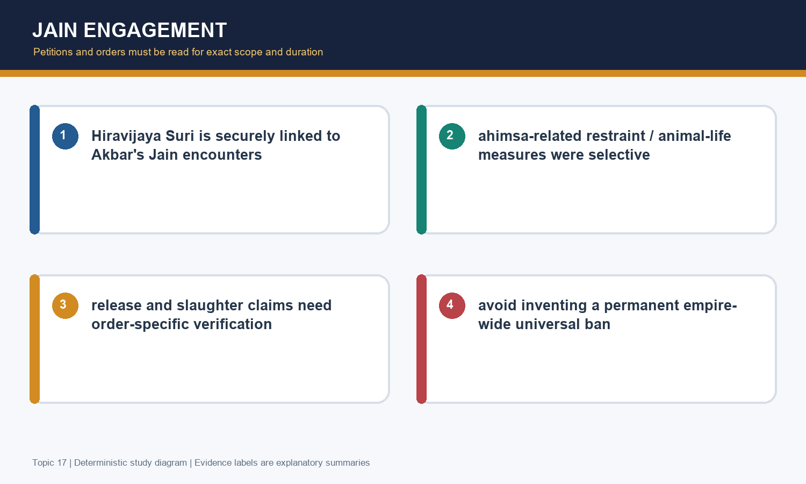

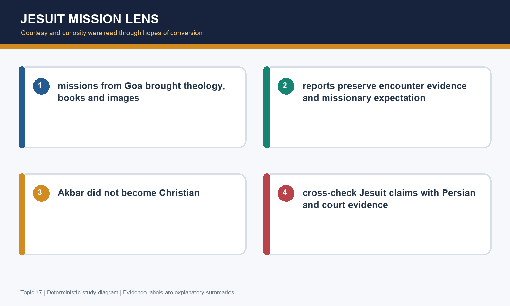

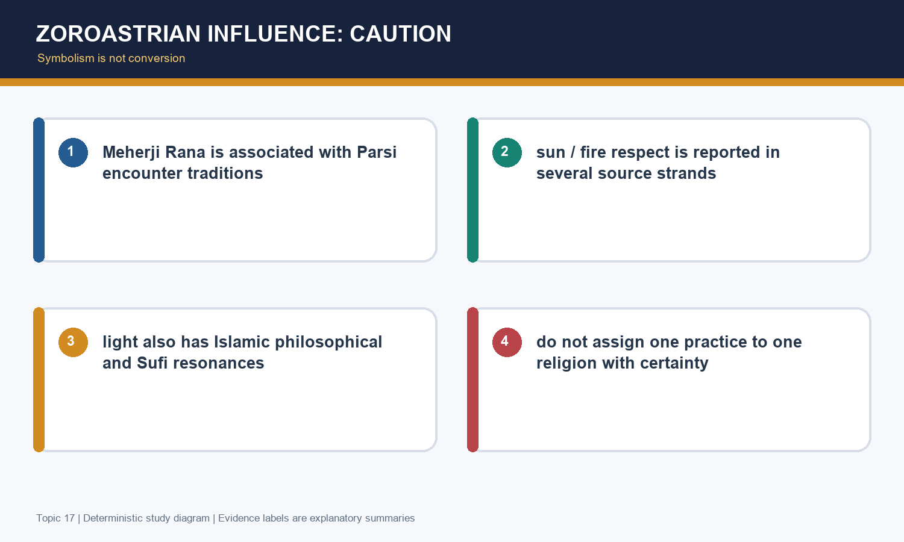

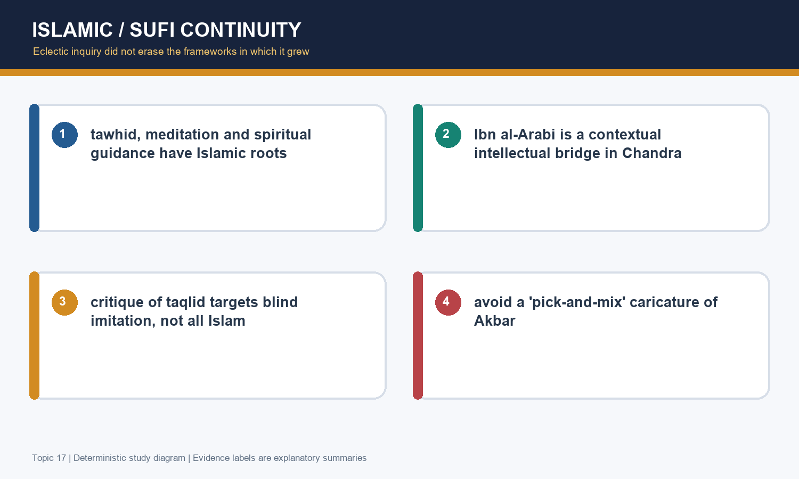

#### CLOSING RECALL FLOW — PART VII - INTERFAITH ENCOUNTERS: INFLUENCE, ADOPTION AND INSTITUTIONALISATION

```text
START / CONCEPT: PART VII - Interfaith encounters: influence, adoption and institutionalisation
        |
        v
EXACT TERMS: PART VII - Interfaith encounters · influence · adoption · institutionalisation · Was · It
        |
        v
MECHANISM / ARGUMENT: It also guards against the opposite misconception that engagement was irrelevant because Akbar did not formally join another faith.
        |
        v
CONSEQUENCE / CONTRAST: These encounters do not prove that Akbar became Hindu, accepted every doctrine or fused traditions into a single religion.
        |
        v
UPSC TRAP / ANSWER-USE: Jain encounter could shape courtly sensitivity and specific orders, but social implementation varied.
        |
        v
ANSWER-GRABBING FORMULATION: This is an ideal place to demonstrate the difference between influence and adoption.
```
### SESSION 8 — PART VIII - SOCIAL REFORM, OPPOSITION AND THE LIMITS OF INCLUSION

#### DEFINITION / WHAT THIS IS CALLED

**Plain-language definition:** Dissent, patronage conflict and imperial coercion are part of Akbar's policy story, not inconveniences to be omitted from a tolerant-ruler narrative.

**Technical definition:** The local Satish Chandra OCR records a cluster of social measures: regulation of prostitution and wine, rules touching marriage age and consent, widow remarriage, a restriction on sati except with the woman's consent, bans on some marriage forms, and a bureau for marriage registration.

#### ANSWER-GRABBING OPENING — WRITE/ADAPT IN THE EXAM

> Dissent, patronage conflict and imperial coercion are part of Akbar's policy story, not inconveniences to be omitted from a tolerant-ruler narrative.

#### MUST-WRITE KEYWORDS

- **PART VIII - Social reform**
- **opposition**
- **the limits of inclusion**
- **record of imperial prescription**
- **Satish Chandra OCR**
- **1580-81**

**How to use them:** Frame the answer through PART VIII - Social reform; define opposition, connect the limits of inclusion with record of imperial prescription to explain the mechanism, and use Satish Chandra OCR for the decisive comparison or qualification.

The local Satish Chandra OCR records a cluster of social measures: regulation of prostitution and wine, rules touching marriage age and consent, widow remarriage, a restriction on sati except with the woman's consent, bans on some marriage forms, and a bureau for marriage registration. It also describes restriction on the sale and purchase of slaves, permission for a forced convert to return to an original religion, and rules about circumcision and burial. These measures should be reported as a **record of imperial prescription**, never as proof that all households followed them or that Akbar remade gender relations. The book itself states that the extent of implementation is not known.

This limitation is analytical, not evasive. Mughal society was graded by gender, household, caste, class and region. Court regulations could touch urban or elite practice more readily than dispersed village life. An age rule does not demonstrate universal consent; a sati regulation does not demonstrate modern female autonomy; a ban related to slavery does not demonstrate the disappearance of dependent service. The best answer credits ethical and administrative aspiration while naming uneven capacity and enduring hierarchy.

Opposition must be analysed with equal nuance. Akbar's break with leading court ulama involved disagreement over interpretation, the scrutiny of grants, status and judicial authority. It was not an instance in which all Muslim subjects opposed an emperor and all Hindus applauded him. In the 1580-81 context, parts of the Bengal-Bihar revolt, the Mirza Hakim threat and fatwas by particular figures made political loyalty appear as a religious question. The state responded forcefully. This can be called an assertion of sovereignty without claiming that all action derived from hostility to Islam.

Badauni is crucial precisely here. His hostility records how court innovation felt to a conservative critic, and it alerts us to perceived violations of accepted norms. But his account is not an unbiased list of facts. Similarly, Abu'l Fazl's portrait of a just, rational king has court-sponsored teleology. The historian's task is not to neutralise the disagreement by averaging it; it is to ask what each source can demonstrate. Dissent, patronage conflict and imperial coercion are part of Akbar's policy story, not inconveniences to be omitted from a tolerant-ruler narrative.

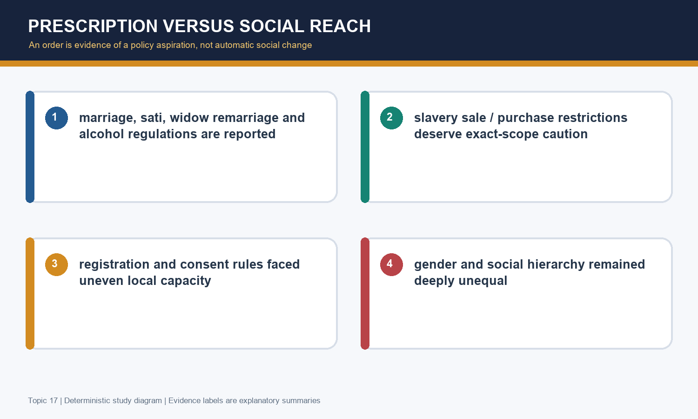

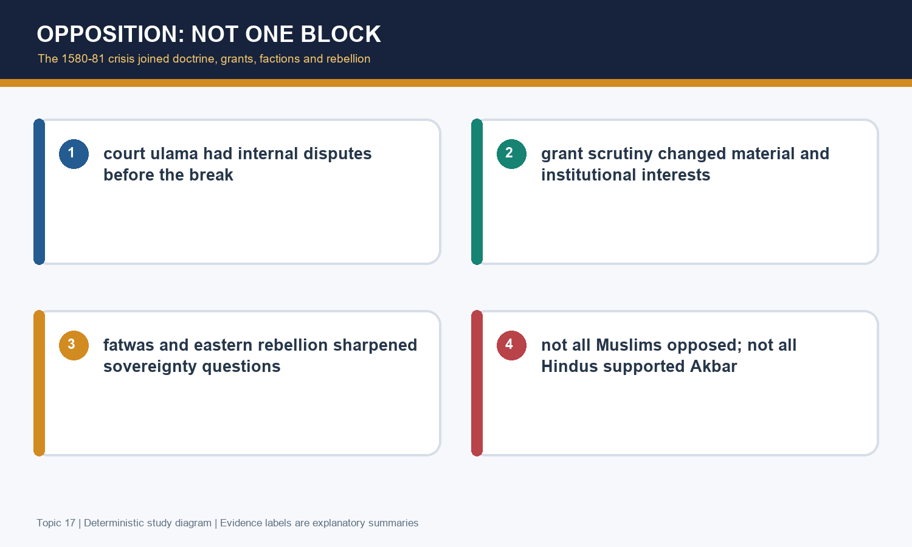

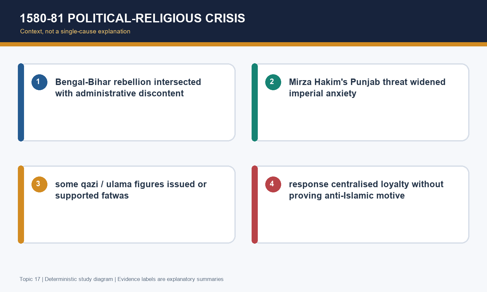

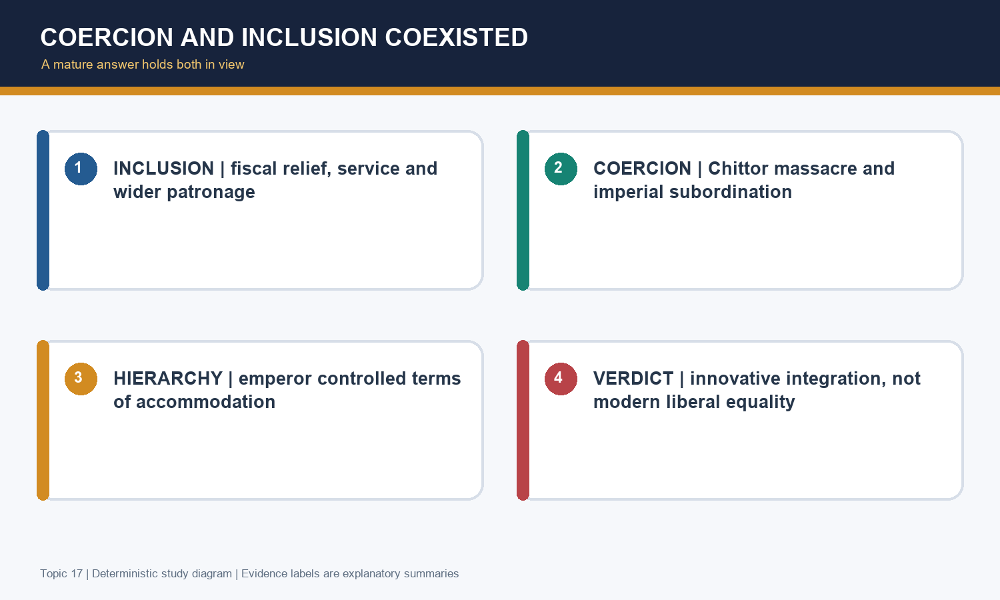

#### CLOSING RECALL FLOW — PART VIII - SOCIAL REFORM, OPPOSITION AND THE LIMITS OF INCLUSION

```text
START / CONCEPT: PART VIII - Social reform, opposition and the limits of inclusion
        |
        v
EXACT TERMS: PART VIII - Social reform · opposition · the limits of inclusion · record of imperial prescription · Satish Chandra OCR · 1580-81
        |
        v
MECHANISM / ARGUMENT: It also describes restriction on the sale and purchase of slaves, permission for a forced convert to return to an original religion, and rules about circumcision and burial.
        |
        v
CONSEQUENCE / CONTRAST: The book itself states that the extent of implementation is not known.
        |
        v
UPSC TRAP / ANSWER-USE: An age rule does not demonstrate universal consent; a sati regulation does not demonstrate modern female autonomy; a ban related to slavery does not demonstrate the disappearance of dependent service.
        |
        v
ANSWER-GRABBING FORMULATION: Dissent, patronage conflict and imperial coercion are part of Akbar's policy story, not inconveniences to be omitted from a tolerant-ruler narrative.
```
### SESSION 9 — PART IX - STATE FORMATION, COMPARISON AND HISTORIOGRAPHY

#### DEFINITION / WHAT THIS IS CALLED

**Plain-language definition:** Chittor is a necessary qualification to any simple liberal portrait.

**Technical definition:** Technically, PART IX - State formation, comparison and historiography is analysed by relating PART IX - State formation to comparison, then testing the relationship through historiography and It.

#### ANSWER-GRABBING OPENING — WRITE/ADAPT IN THE EXAM

> Chittor is a necessary qualification to any simple liberal portrait.

#### MUST-WRITE KEYWORDS

- **PART IX - State formation**
- **comparison**
- **historiography**
- **It**
- **Chittor**
- **Earlier Sultanate**

**How to use them:** Frame the answer through PART IX - State formation; define comparison, connect historiography with It to explain the mechanism, and use Chittor for the decisive comparison or qualification.

Akbar's religious policy helped convert a conquering dynasty into an all-India imperial order. A large empire could not be held by force alone; it required regional elites, service networks, fiscal legitimacy and a language for governing people with different religious affiliations. The policy logic of fiscal relief, broader service and sulh-i-kul made accommodation intelligible as imperial justice. But integration was not equality. It occurred within a hierarchy in which the emperor awarded honour and could use violence. Chittor is a necessary qualification to any simple liberal portrait.

Comparison sharpens rather than replaces analysis. Earlier Sultanate and Sur rulers could display political pragmatism, offer grants or recruit beyond a narrow group. Akbar's distinctive contribution was a more explicit articulation of non-sectarian justice together with a composite imperial elite. Jahangir broadly continued the inherited inclusiveness, although he did not preserve every ritual form of Tauhid discipleship. Aurangzeb's later jizyah reimposition and changed religious policies invite comparison, but the full context belongs to Topic 22. A binary 'tolerant Akbar / bigoted Aurangzeb' answer loses political circumstances, internal diversity and continuities.

The source method is integral to this judgement. Abu'l Fazl is an insider with exceptional knowledge of imperial language, office and ideology; he is also a legitimiser of Akbar's spiritual kingship. Badauni is a hostile dissenting contemporary whose polemic records anxiety and conflict. Jesuit accounts are encounter evidence saturated with conversion hopes. Jain, Sanskrit and Persian materials broaden the archive; farmans establish particular orders; translation texts show intellectual circulation; paintings and architecture reveal courtly settings and symbolism. None alone can prove every motive or social effect.

Material evidence requires its own scale of certainty. ASI and UNESCO information securely contextualise Fatehpur Sikri as a protected planned Mughal city of the late sixteenth century. That supports discussion of the imperial site and its mixed administrative, residential and religious architecture. It cannot conclusively identify one standing building as the Ibadat Khana or convert a popular monument label into archaeological fact. The best historiographical verdict is therefore layered: Akbar's policy was innovative statecraft and real intellectual inquiry, mediated through interested sources, limited by hierarchy and dependent on a sovereign individual rather than an impersonal constitutional order.

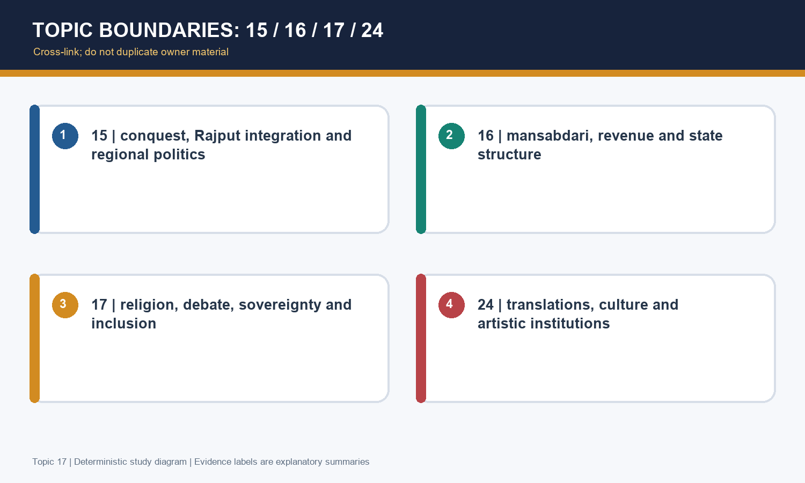

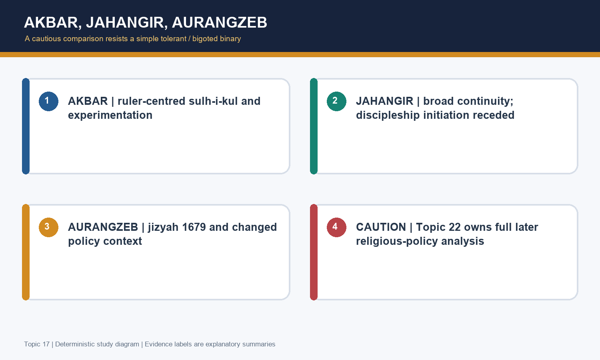

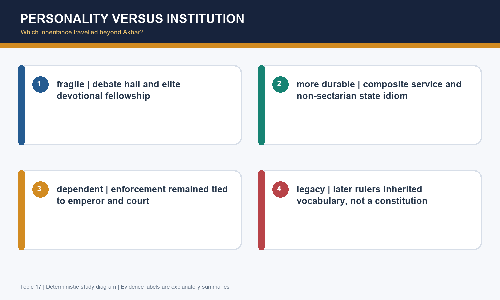


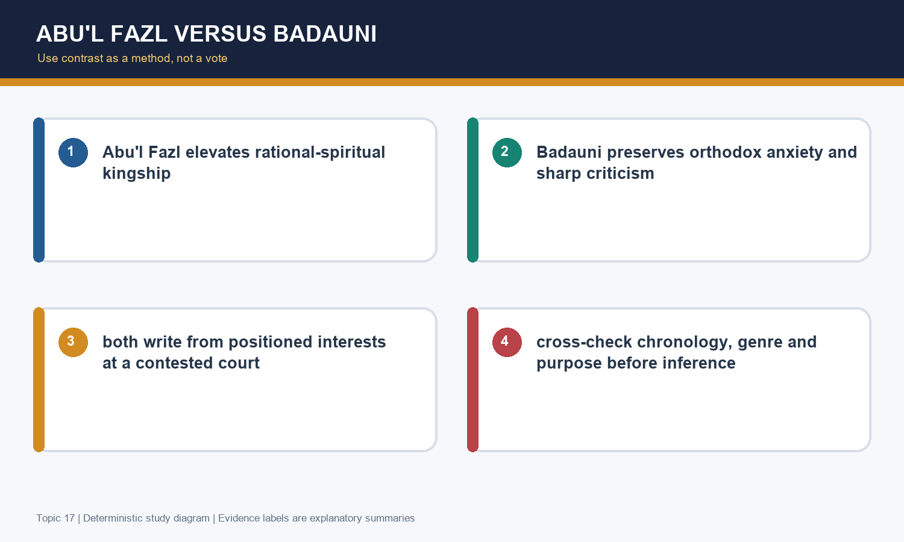

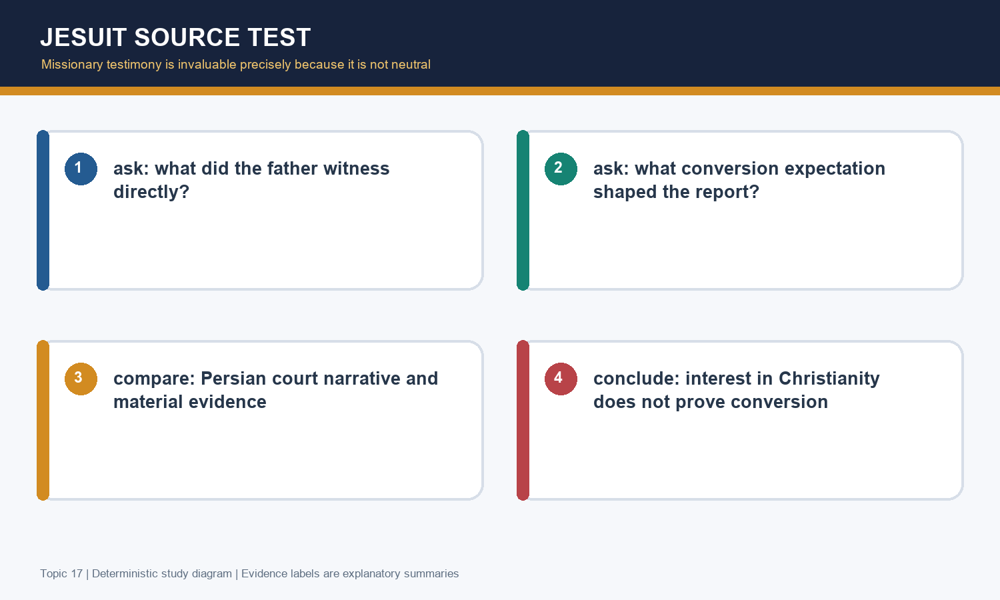

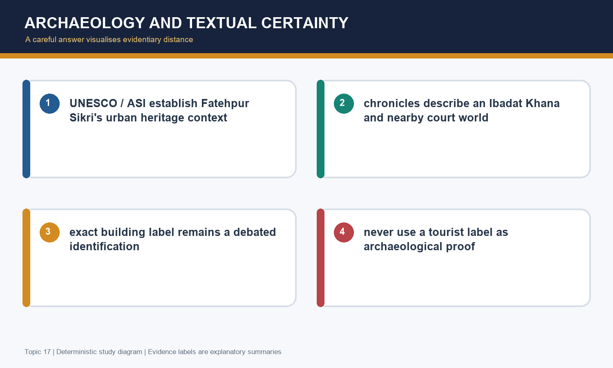

#### CLOSING RECALL FLOW — PART IX - STATE FORMATION, COMPARISON AND HISTORIOGRAPHY

```text
START / CONCEPT: PART IX - State formation, comparison and historiography
        |
        v
EXACT TERMS: PART IX - State formation · comparison · historiography · It · Chittor · Earlier Sultanate
        |
        v
MECHANISM / ARGUMENT: A large empire could not be held by force alone; it required regional elites, service networks, fiscal legitimacy and a language for governing people with different religious affiliations.
        |
        v
CONSEQUENCE / CONTRAST: The best historiographical verdict is therefore layered: Akbar's policy was innovative statecraft and real intellectual inquiry, mediated through interested sources, limited by hierarchy and dependent on a sovereign individual rather than an impersonal constitutional order.
        |
        v
UPSC TRAP / ANSWER-USE: Do not miss this limiting distinction: none alone can prove every motive or social effect.
        |
        v
ANSWER-GRABBING FORMULATION: Chittor is a necessary qualification to any simple liberal portrait.
```
### SESSION 10 — PART IX-A - ANALYTICAL WORKSHOPS: USING EVIDENCE WITHOUT ANACHRONISM

#### DEFINITION / WHAT THIS IS CALLED

**Plain-language definition:** PART IX-A - Analytical workshops: using evidence without anachronism comprises PART IX-A - Analytical workshops, using evidence without anachronism and Condition as its core connected dimensions.

**Technical definition:** Second, state the supported analytical implication: removal of these visible fiscal disabilities conveyed that non-Muslim subjects could serve a sovereign whose political claim was wider than a narrow confessional constituency.

#### ANSWER-GRABBING OPENING — WRITE/ADAPT IN THE EXAM

> It is the distinction that lets a historian credit an imperial aspiration to reason and welfare without declaring a social revolution that the evidence cannot sustain.

#### MUST-WRITE KEYWORDS

- **PART IX-A - Analytical workshops**
- **using evidence without anachronism**
- **Condition**
- **Authority**
- **Choice set**
- **Test**

**How to use them:** Frame the answer through PART IX-A - Analytical workshops; define using evidence without anachronism, connect Condition with Authority to explain the mechanism, and use Choice set for the decisive comparison or qualification.

#### Chronology as argument, not decoration

The most important corrective to a careless narrative is chronological. The remission of pilgrim tax in 1563 and abolition of jizyah in 1564 come before the Ibadat Khana was built in 1575, before debates opened outward after 1578 and before the Tauhid-i-Ilahi phase conventionally attached to 1582. These dates demonstrate that Akbar had already made selected state changes while his personal practice in the source material could still look conventionally Muslim and orthodox court figures retained influence. A question about religious syncretism must not therefore begin and end with a late 'new religion.'

Chronology also makes change visible without manufacturing one conversion event. The debates created a public field for conflict; the Mahzar reallocated authority in 1579; the 1580-81 crisis made loyalty more urgent; the formal debate hall closed around 1581-82 while private contact continued. Each item has a different institutional form. A good answer turns that sequence into an argument: early accommodation was followed by comparative inquiry, then an imperial arbitration rule, then a governing vocabulary more durable than the forum that helped generate it.

#### A claim ladder for fiscal and social measures

Use three rungs when writing about early measures. First, state the fact: pilgrim tax was remitted in 1563 and jizyah was abolished in 1564. Second, state the supported analytical implication: removal of these visible fiscal disabilities conveyed that non-Muslim subjects could serve a sovereign whose political claim was wider than a narrow confessional constituency. Third, state the limit: this package does not establish a precise revenue loss, equal citizenship or the disappearance of hierarchy. The ladder produces evidence, interpretation and qualification in three sentences.

Apply the same discipline to the source-grounded ban on enslaving wives and children of rebellious villagers. It permits a claim about restraint in a particular punitive setting; it does not show the disappearance of enslavement in households or every campaign. Later regulation of sale and purchase of slaves, marriage, sati and alcohol should similarly be called imperial prescription. The local book itself cautions that implementation is unknown. A candidate should never trade exact scope for a heroic slogan.

#### Chishti context without a simple lineage

Akbar's reverence for Muin al-Din Chishti at Ajmer and the association of Sikri with Shaikh Salim Chishti make a Chishti setting historically relevant. Sufi traditions furnish useful vocabulary: tawhid, meditation, spiritual guidance and a relationship of master and disciple. These help explain why personal search and imperial ritual could be expressed in a language familiar to an Islamic court. The setting also locates Fatehpur Sikri in more than a military or architectural history.

But association is not proof of direct doctrinal descent. The evidence also includes Timurid precedent, broader Bhakti-Sufi encounters, political integration and Akbar's own inquiry. The safe formulation is that Chishti and wider Sufi idioms offered resources for spiritual thinking, which Akbar adapted in a changing imperial setting. The unsafe formulation is that one shrine or saint 'created' a later doctrine. Historical explanation needs bridges, not monocausal pedigrees.

#### The Ibadat Khana as a court institution

The Hall of Prayer should be studied as a court institution with incentives, not as a timeless symbol. It brought scholars to an emperor after state business on Thursday nights. Initial participant circles included jurists, Sufis, learned men and companions, all of whom could seek prestige and access as well as truth. Under such conditions, disagreement about revelation, law or marriage could become a contest for interpretive authority. The source's report of accusations and harsh exchanges is plausible as evidence of factional court culture, even if Abu'l Fazl's anti-clerical rhetoric must not be universalised to every alim.

This institutional reading explains both failure and consequence. The hall was poorly suited to make people holding incompatible truth claims agree before the source of patronage. Public debate could generate bitterness; private conversations and translations were more flexible forms of engagement. The lesson that emerged was not that religion should disappear but that an empire could not rely on one courtly group to settle all religious questions. Sulh-i-kul became more workable than a permanent disputation chamber.

#### Participants: use names with a limited proposition

Named interlocutors strengthen an answer only when the claim attached to each is narrow. Purushottam and Devi occur in the local narrative of Hindu learned discussion; Hiravijaya Suri anchors Jain court contact; Jesuits from Goa anchor Christian encounter and missionary documentation; Meherji Rana belongs to cautious Parsi/Zoroastrian encounter tradition. These references establish widening intellectual access. They do not demonstrate that each person attended the same Thursday meeting, represented every adherent or spoke from an equal institutional position.

This is not needless hedging. The archive is episodic and court-centred. A phrase such as 'interlocutors from Hindu, Jain, Christian and Zoroastrian traditions entered the wider courtly discussion' is more defensible than a theatrical list of simultaneous delegates. The same rule guards against negative assertions: a source's silence about one person on one evening cannot prove exclusion. In UPSC writing, calibrated language displays command of evidence rather than uncertainty about the topic.

#### Mahzar as a decision rule

The Mahzar can be remembered as a decision rule. **Condition:** qualified jurists differ. **Authority:** the emperor selects. **Choice set:** existing interpretations. **Test:** public welfare and proper administration, within the declaration's textual-religious frame. **Effect:** no single courtly religious network can claim an unchecked veto over imperial policy. This form answers a Prelims statement and gives a Mains answer conceptual clarity at the same time.

It also prevents two contrary mistakes. The first is the 'Decree of Infallibility' label, which turns an arbitral power into a claim of papal perfection, prophecy and unbounded legislation. The second is to describe the document as insignificant because it remained in Islamic legal vocabulary. It mattered precisely because adjudication decides which voice has force in government. A balanced conclusion says the Mahzar enlarged imperial leverage while retaining stated limits that historians can assess rather than ignore.

#### Why grants belong to a religious-policy answer

Madadd-i-maash grants show that religious authority had institutional and material dimensions. The sadr's supervision of revenue-free grants linked piety, scholarship, office and patronage. When grants were reviewed or reduced, it could affect networks of dependence and the social weight of groups that claimed learned authority. This does not mean doctrine was a disguise for money. It means that in a courtly state, doctrine, legal office, honour and revenue could not be separated into modern compartments.

That context sharpens the 1580-81 crisis. Rebellion, fatwas, discontent over administrative control and tension around grant holders could reinforce one another. A sound answer notes the intersection and refuses totalising labels: not every critic was driven by material interest, not every imperial action was anti-Islamic, and not all Muslims or Hindus stood on one side. The sovereignty question was real because power over legal interpretation had consequences for patronage and political loyalty.

#### Three false translations of sulh-i-kul

First false translation: sulh-i-kul means that all religions were merged. It did not require doctrinal agreement. Second: it means the state was indifferent to religion. The Mughal court still used religious language, accepted petitions and distributed patronage. Third: it means modern constitutional secularism. A sixteenth-century empire had neither equal citizenship nor an impersonal constitutional restraint on the sovereign. The proper working translation is universal peace or peace with all, deployed as a ruler-centred norm of justice, welfare and non-sectarian accommodation.

The principle was politically effective because it gave a heterogeneous service elite and subject population a language in which loyalty and public order could cross religious affiliation. It had a real institutional expression in selected fiscal changes, recruitment and patronage, even though detailed mansab mechanics belong to Topic 16. Its main limitation was verticality: protection flowed from the emperor, not from enforceable rights. This explains why it was durable as an imperial idiom yet vulnerable to changing rulers and policies.

#### Three columns for Tauhid-i-Ilahi

Column one is terminology. Abu'l Fazl's Tauhid-i-Ilahi foregrounds Divine Monotheism, while Badauni and Jesuit/later traditions make Din-i-Ilahi a more formal and polemical label. Column two is institution: no scripture, clergy, congregational centre, missionary body or coerced mass following. Column three is practice: sources report initiation, the shast, greeting formulas, ethical conduct and four degrees of devotion. Keeping these columns separate blocks the slide from a later label to a fictional empire-wide church.

Purpose forms a fourth column. Personal discipline, ethical self-fashioning, spiritual kingship, elite loyalty and political integration can coexist. The Sufi pir-murid analogy helps explain sacrifice and guidance, but the imperial context changes its stakes: the guide was also a sovereign distributing rank and seeking loyalty during crisis. The best conclusion is a limited spiritual-political fellowship. It was not a conventional new religion; it was not nothing; it was not a secular club.

#### Influence is not adoption

For every alleged influence, ask four questions: what was heard; what was selectively adopted; what became institutionalised; and what remains unproven. Hindu interlocutors and translation projects establish intellectual exchange, not Hindu conversion. Jain encounters can illuminate particular animal-life measures, but an empire-wide permanent slaughter ban cannot be invented. Jesuit missions establish Christian texts, images and debate, but missionary hopes do not establish baptism. Zoroastrian encounter can contextualise sun/fire respect, yet light also has Islamic philosophical and Sufi genealogies.

The matrix does not minimise contact. It reveals the actual achievement: comparative engagement widened the court's intellectual horizon and enabled a policy of non-sectarian governance without requiring a single blended creed. It also restores Islamic and Sufi roots to the story. Akbar's critique of blind imitation and interest in tawhid did not make him a person outside every Islamic framework. The 'pick-and-mix' caricature is inaccurate precisely because it mistakes selective conversation for total adoption.

#### Reform reach and social hierarchy

Social-reform evidence should be written in two movements. Name the reported measure: rules involving marriage, consent, widow remarriage, sati, slavery, alcohol or registration. Then qualify its reach: family authority, caste and class practice, local institutions and uneven state capacity made implementation variable. This is not a retreat from judgment. It is the distinction that lets a historian credit an imperial aspiration to reason and welfare without declaring a social revolution that the evidence cannot sustain.

The hierarchy test also applies to religious policy. A tax change can remove a disability while retaining rank and unequal power. Broader elite recruitment can integrate selected communities while most subjects stay outside high office. A court's respect for plural traditions can coexist with coercive conquest, as Chittor requires us to remember. Akbar's importance lies in reshaping the policy vocabulary and selected state practices, not in creating feminist equality or a classless society.

#### Turn source conflict into evidence

Abu'l Fazl, Badauni and Jesuit observers should not be forced into an artificial consensus. Abu'l Fazl is indispensable for imperial ideology, justice, rational inquiry and spiritual kingship; his courtly teleology constrains claims about motives and reception. Badauni is indispensable for orthodox anxiety, court dissent and how innovation was perceived; his hostility constrains sweeping ritual claims. Jesuits document encounter and Christian expectation; their conversion hopes constrain their conclusions about Akbar's faith. Their disagreement itself proves that policy was contested.

Triangulation is the method. Use a particular order for a particular act, chronicles for language and response, visitor reports for encounters, and material evidence for setting. Fatehpur Sikri's ASI/UNESCO status securely grounds the late-sixteenth-century imperial city; it cannot settle an exact Ibadat Khana building. This hierarchy of confidence yields a stronger final verdict than either court praise or polemic alone: Akbar's inquiry and statecraft were real, but their precise rituals, locations and motives require graduated claims.

#### Comparison and legacy without a moral cartoon

A mature comparison asks one question of each reign. Under Akbar, how did layered reform, inquiry, arbitration and sulh-i-kul widen the imperial basis? Under Jahangir, what did broad continuity mean when the distinctive initiation practice no longer had the same place? Under Aurangzeb, how did changed policy choices, including jizyah reimposition in 1679, alter the political signal of the state? The answer should then send the fuller narratives to Topics 20 and 22 rather than pretending this topic owns every later conflict.

The legacy judgement follows from form. The Ibadat Khana as a public forum closed; Tauhid discipleship did not survive as a separate sect; sulh-i-kul and composite statecraft proved more portable because they could guide service, patronage and public order. Yet even this legacy depended on royal interpretation, not a constitutional guarantee. Akbar therefore left an influential repertoire of imperial inclusion and sovereignty, not a permanent system beyond the will of successors.

#### Capstone - assembling a 20-mark answer without padding

An examiner-grade long answer should be designed as a sequence of claims, rather than a chronology with adjectives. Begin with a one-sentence thesis: Akbar's religious policy was a layered programme of inquiry, limited legal arbitration and political integration, innovative in its context but ruler-centred. The first body paragraph can show the early material base: pilgrim-tax remission in 1563 and jizyah abolition in 1564 reduced selected fiscal disabilities. Its analysis is that loyalty and service could be imagined across religious affiliation; its qualification is that no exact revenue total or equal citizenship follows. This is a complete claim unit.

The next paragraph can use the Ibadat Khana as a mechanism rather than a monument. State that it was built in 1575, began with Muslim scholarly circles and opened wider after 1578. Analyse the paradox: it produced polemic and closed around 1581-82, yet it exposed the weakness of monopoly claims and broadened imperial inquiry. Add source caution: Abu'l Fazl's presentation of court ulama is positioned, and the exact archaeology of the hall is uncertain. This makes the discussion vivid without turning a contested location into a false fact.

The third paragraph should state Mahzar scope precisely. It allowed selection among conflicting opinions in a public-good / administrative frame; it did not make Akbar pope, prophet or unlimited legislator. Explain why the shift mattered during grant scrutiny and the 1580-81 political-religious crisis: final arbitration became a form of sovereignty. The fourth paragraph moves from mechanism to state principle. Sulh-i-kul turned justice, welfare and non-sectarian accommodation into a more usable norm of legitimacy. Briefly link composite service, then route rank mechanics to Topic 16 instead of losing the topic in administration.

The final body paragraph introduces Tauhid-i-Ilahi as a limit case. Explain terminology, absence of mass institutions, and source-reported elite initiation. This refutes both myths: it was neither a mass replacement religion nor a completely empty invention. Close by judging legacy: its small discipleship did not survive as a sect; sulh-i-kul mattered more as a governing repertoire. Then name the decisive qualifications - hierarchy, coercion exemplified by Chittor, personality dependence, and conflicting sources. Such an answer proves command because every paragraph contains fact, function and limit.

#### Capstone - quick diagnostic before submitting

Ask six questions. **Have I used dates to show evolution?** If the answer begins in 1582, revise. **Have I distinguished the Ibadat Khana from sulh-i-kul?** One is a forum; the other is a state principle. **Have I described the Mahzar's decision rule?** If the answer says only 'infallibility', revise. **Have I prevented Din-i-Ilahi from becoming either a mass church or a non-event?** Add both lack of institutions and limited practice. **Have I marked source reach?** Abu'l Fazl, Badauni and Jesuits cannot all be used as neutral transcripts. **Have I retained hierarchy and coercion?** Without this, a historical analysis becomes modern praise.

This diagnostic is also a Prelims safeguard. It keeps chronology, terminology and scope distinct: 1563 pilgrim tax; 1564 jizyah; 1575 Ibadat Khana; 1579 Mahzar; 1581-82 closure; Tauhid/Din label debate; sulh-i-kul as universal peace. Statement questions often distort exactly one of these dimensions. A candidate who knows the relation among them can eliminate a plausible option that places a measure in the wrong year, makes a limited group universal, or converts a source interpretation into a literal fact.

#### Capstone - a source-confidence ladder

Not every statement in this topic carries the same evidentiary weight. At the highest level of confidence are the chronology of early measures, the building of the Ibadat Khana at Fatehpur Sikri, the existence of wider debates, the 1579 Mahzar, the later closure of the public forum, and the absence of mass religious institutions for the Tauhid circle. These points recur across the owner material and local book evidence. At a middle level are the detailed setting near Anup Talao, named interlocutors in particular private discussions, and particular initiation practices; use source-attributed phrasing. At the lowest level are sweeping ritual lists, precise membership totals treated as census, and exact archaeological labels for standing buildings. The correct response is not to omit the lower levels, but to label them as reported, debated or not securely established.

This ladder helps reconcile intellectual honesty with answer writing. A 150-word response should privilege high-confidence anchors. A 250-word response can add contested detail as a qualification. In neither case should a student hide uncertainty behind a dramatic statement. The mature historical skill is proportional confidence: the strength of the language should match the strength of the evidence.

#### Capstone - final revision drill

Read the topic once as four verbs: **remove, inquire, arbitrate, accommodate**. Remove refers to selected fiscal disabilities in 1563-64. Inquire refers to the Ibadat Khana's changing circles and private conversations. Arbitrate refers to the Mahzar's bounded choice among juristic opinions. Accommodate refers to sulh-i-kul's ruler-centred ethic of justice across creeds. Add a fifth verb, **bind**, for the limited discipleship idiom around Tauhid-i-Ilahi. Then add two brakes: **hierarchy** and **source caution**. This small conceptual chain prevents a long answer from becoming a random catalogue of religions and rituals.

#### CLOSING RECALL FLOW — PART IX-A - ANALYTICAL WORKSHOPS: USING EVIDENCE WITHOUT ANACHRONISM

```text
START / CONCEPT: PART IX-A - Analytical workshops: using evidence without anachronism
        |
        v
EXACT TERMS: PART IX-A - Analytical workshops · using evidence without anachronism · Condition · Authority · Choice set · Test
        |
        v
MECHANISM / ARGUMENT: A good answer turns that sequence into an argument: early accommodation was followed by comparative inquiry, then an imperial arbitration rule, then a governing vocabulary more durable than the forum that helped generate it.
        |
        v
CONSEQUENCE / CONTRAST: The debates created a public field for conflict; the Mahzar reallocated authority in 1579; the 1580-81 crisis made loyalty more urgent; the formal debate hall closed around 1581-82 while private contact continued.
        |
        v
UPSC TRAP / ANSWER-USE: These dates demonstrate that Akbar had already made selected state changes while his personal practice in the source material could still look conventionally Muslim and orthodox court figures retained influence.
        |
        v
ANSWER-GRABBING FORMULATION: It is the distinction that lets a historian credit an imperial aspiration to reason and welfare without declaring a social revolution that the evidence cannot sustain.
```
### SESSION 11 — BOUNDED LIVE LINKAGE

#### DEFINITION / WHAT THIS IS CALLED

**Plain-language definition:** The live page is a heritage and source-method bridge only.

**Technical definition:** UNESCO's Fatehpur Sikri property page was rechecked on 30 August 2026.

#### ANSWER-GRABBING OPENING — WRITE/ADAPT IN THE EXAM

> The live page is a heritage and source-method bridge only.

#### MUST-WRITE KEYWORDS

- **Bounded live linkage**
- **UNESCO's Fatehpur Sikri**
- **It**
- **Ibadat Khana**
- **Markdown**
- **OCR**

**How to use them:** Frame the answer through Bounded live linkage; define UNESCO's Fatehpur Sikri, connect It with Ibadat Khana to explain the mechanism, and use Markdown for the decisive comparison or qualification.

UNESCO's Fatehpur Sikri property page was rechecked on 30 August 2026. It supports a bounded material-history bridge: Akbar made the planned city his capital, its administrative and religious ensemble expresses a late sixteenth-century imperial centre, and ASI manages its conservation. It does not identify a surviving structure as the Ibadat Khana with final archaeological certainty or prove the content, participants, motives or effects of court debates; those remain controlled by repository Markdown, OCR books and source criticism.

The live page is a heritage and source-method bridge only. Historical chronology, causation, attribution and institutional claims remain controlled by repository Markdown, OCR-searchable books and explicit source criticism.

#### CLOSING RECALL FLOW — BOUNDED LIVE LINKAGE

```text
START / CONCEPT: Bounded live linkage
        |
        v
EXACT TERMS: Bounded live linkage · UNESCO's Fatehpur Sikri · It · Ibadat Khana · Markdown · OCR
        |
        v
MECHANISM / ARGUMENT: It does not identify a surviving structure as the Ibadat Khana with final archaeological certainty or prove the content, participants, motives or effects of court debates; those remain controlled by repository Markdown, OCR books and source criticism.
        |
        v
CONSEQUENCE / CONTRAST: UNESCO's Fatehpur Sikri property page was rechecked on 30 August 2026.
        |
        v
UPSC TRAP / ANSWER-USE: Do not miss this limiting distinction: it does not identify a surviving structure as the Ibadat Khana with final archaeological...
        |
        v
ANSWER-GRABBING FORMULATION: The live page is a heritage and source-method bridge only.
```
## BASIC MCQS / REMEDIATION

### Learning MCQ loop - 18 questions

> **Answer rotation:** `ABCDABCDABCDABCDAB`. The correct content is physically placed under the rotating label, not merely announced after the question.

#### Q1. Which sequence is chronologically sound for Akbar's early religious measures and Ibadat Khana?

- A. Pilgrim-tax remission (1563), jizyah abolition (1564), Ibadat Khana (1575)
- B. Pilgrim-tax remission (1564), Ibadat Khana (1575), jizyah abolition (1582)
- C. Ibadat Khana (1563), pilgrim-tax remission (1575), jizyah abolition (1579)
- D. Jizyah abolition (1563), pilgrim-tax remission (1564), Ibadat Khana (1579)

**Answer: A.**
**Explanation:** The sequence separates early fiscal policy from later inquiry; it disproves the sudden-1582 story. In this question, **Jizyah abolition (1563), pilgrim-tax remission (1564), Ibadat Khana (1579)** is tempting only if one overlooks that the tested proposition is specifically **Pilgrim-tax remission (1563), jizyah abolition (1564), Ibadat Khana (1575)**.

#### Q2. The safest description of the Ibadat Khana's initial format is that it

- A. was designed from its first meeting as a parliament of equal religious representatives
- B. began with Muslim scholars, Sufis, learned men and court companions in Thursday-night discussion
- C. was a Jesuit chapel supplied from Goa
- D. was a public mosque for a new congregational faith

**Answer: B.**
**Explanation:** The initial participants were Muslim circles, while later opening to other traditions is a distinct phase. In this question, **was designed from its first meeting as a parliament of equal religious representatives** is tempting only if one overlooks that the tested proposition is specifically **began with Muslim scholars, Sufis, learned men and court companions in Thursday-night discussion**.

#### Q3. Why is the label 'Decree of Infallibility' misleading for the Mahzar?

- A. It correctly means Akbar became a prophet
- B. It shows every qazi lost all legal function
- C. It obscures the stated power to choose among conflicting juristic opinions for public welfare
- D. It proves the emperor could reject the Quran without limit

**Answer: C.**
**Explanation:** The document asserted arbitration within a stated framework; it did not turn Akbar into pope, prophet or unlimited legislator. In this question, **It correctly means Akbar became a prophet** is tempting only if one overlooks that the tested proposition is specifically **It obscures the stated power to choose among conflicting juristic opinions for public welfare**.

#### Q4. Sulh-i-kul is best used in an answer as

- A. a modern constitutional guarantee of equal citizenship
- B. proof that the Mughal state had no relation to religion
- C. a complete theological merger of all Indian religions
- D. a ruler-centred principle of universal peace, justice and non-sectarian governance

**Answer: D.**
**Explanation:** It was an imperial governing norm, not religious indifference or modern secularism. In this question, **a complete theological merger of all Indian religions** is tempting only if one overlooks that the tested proposition is specifically **a ruler-centred principle of universal peace, justice and non-sectarian governance**.

#### Q5. Which statement most accurately qualifies Tauhid-i-Ilahi / Din-i-Ilahi?

- A. It was a small elite discipleship practice without scripture, priesthood or mass organisation
- B. It was a formal replacement for Islam with a public church
- C. It had no practices or personal attachments at all
- D. It was a compulsory empire-wide conversion programme

**Answer: A.**
**Explanation:** The absence of mass institutions matters, but initiation and loyalty practices mean 'nothing existed' is also wrong. In this question, **It was a compulsory empire-wide conversion programme** is tempting only if one overlooks that the tested proposition is specifically **It was a small elite discipleship practice without scripture, priesthood or mass organisation**.

#### Q6. The strongest source-method use of Badauni is to treat him as

- A. an objective stenographer who settles every disputed ritual
- B. a valuable dissenting witness whose polemical hostility requires cross-checking
- C. a source to discard because he criticised Akbar
- D. a neutral official author of the Ain-i Akbari

**Answer: B.**
**Explanation:** Badauni preserves contemporaneous dissent, but his polemical stake affects how broad claims should be used. In this question, **an objective stenographer who settles every disputed ritual** is tempting only if one overlooks that the tested proposition is specifically **a valuable dissenting witness whose polemical hostility requires cross-checking**.

#### Q7. Jesuit reports of Akbar's interest in Christianity should lead a student to conclude that

- A. Christianity became the Mughal state religion
- B. Jesuit letters have no value as encounter evidence
- C. court curiosity and missionary hopes coexisted, but Akbar did not become Christian
- D. Akbar accepted baptism after the first mission

**Answer: C.**
**Explanation:** Missionary expectation explains over-reading; their observations still help reconstruct debate and courtly exchange. In this question, **Akbar accepted baptism after the first mission** is tempting only if one overlooks that the tested proposition is specifically **court curiosity and missionary hopes coexisted, but Akbar did not become Christian**.

#### Q8. The debated location of the Ibadat Khana should be described as

- A. unknown even at the level of city or ruler
- B. a structure in Agra Fort built after Akbar's death
- C. securely identified as the Diwan-i-Khas by excavation
- D. textually associated with the court zone near Anup Talao and Abdullah Niyazi's cell, while exact archaeological identification remains uncertain

**Answer: D.**
**Explanation:** Textual proximity is not equivalent to a settled identification of one standing building. In this question, **securely identified as the Diwan-i-Khas by excavation** is tempting only if one overlooks that the tested proposition is specifically **textually associated with the court zone near Anup Talao and Abdullah Niyazi's cell, while exact archaeological identification remains uncertain**.

#### Q9. The political setting of the 1579 Mahzar included

- A. juristic disagreement, contest over grants and the need to arbitrate within an expanding empire
- B. only an abstract desire to copy the Roman papacy
- C. a decision by foreign Jesuit authorities
- D. a completed Muslim-Hindu constitutional compact

**Answer: A.**
**Explanation:** It was not reducible to one motive: legal conflict and state formation intersected. In this question, **only an abstract desire to copy the Roman papacy** is tempting only if one overlooks that the tested proposition is specifically **juristic disagreement, contest over grants and the need to arbitrate within an expanding empire**.

#### Q10. Which claim best avoids overstatement about Jain influence?

- A. all reported restrictions are necessarily fictional
- B. Jain encounters could inform selective animal-life restrictions, but every order needs its own scope and duration checked
- C. Jain monks never met the court
- D. Akbar imposed permanent vegetarianism on the whole empire

**Answer: B.**
**Explanation:** The historical issue is exact order and reach, not a cartoon of universal prohibition. In this question, **Akbar imposed permanent vegetarianism on the whole empire** is tempting only if one overlooks that the tested proposition is specifically **Jain encounters could inform selective animal-life restrictions, but every order needs its own scope and duration checked**.

#### Q11. The four degrees of devotion are most safely read as

- A. a universally observed Hindu caste hierarchy
- B. a definitive creed proved by one neutral transcript
- C. a graded language of property, life, honour and religion with Sufi analogies and political implications
- D. a legal tax scale fixed for all subjects

**Answer: C.**
**Explanation:** The formulation is source-bound and the analogy to discipleship helps explain elite loyalty without making it a mass dogma. In this question, **a universally observed Hindu caste hierarchy** is tempting only if one overlooks that the tested proposition is specifically **a graded language of property, life, honour and religion with Sufi analogies and political implications**.

#### Q12. Which contrast correctly separates Ibadat Khana from sulh-i-kul?

- A. The former ended all interfaith contact; the latter began only under Aurangzeb
- B. The former was a taxation system; the latter a military office
- C. Both were names for a new congregational religion
- D. The former was a volatile forum of debate; the latter was a more durable state principle of accommodation

**Answer: D.**
**Explanation:** The failure of public discussion did not prevent its policy consequences from developing. In this question, **The former was a taxation system; the latter a military office** is tempting only if one overlooks that the tested proposition is specifically **The former was a volatile forum of debate; the latter was a more durable state principle of accommodation**.

#### Q13. A balanced account of Akbar and the ulama should say that

- A. court jurists were internally diverse and conflict involved interpretation, patronage and status as well as theology
- B. no jurist ever supported Akbar
- C. all ulama were uniformly corrupt and ignorant
- D. all Muslim opposition was only a revenue dispute

**Answer: A.**
**Explanation:** The record contains faction, learning and polemic; a totalising label erases the political institutions at stake. In this question, **all ulama were uniformly corrupt and ignorant** is tempting only if one overlooks that the tested proposition is specifically **court jurists were internally diverse and conflict involved interpretation, patronage and status as well as theology**.

#### Q14. Why are Rajput alliances relevant to Topic 17 but not its main administrative detail?

- A. They make religious policy irrelevant to state formation
- B. They supplied the political context for inclusion, while conquests and mansab mechanics belong chiefly to Topics 15 and 16
- C. They replace the need to discuss fiscal measures
- D. They show Din-i-Ilahi was a Rajput religion

**Answer: B.**
**Explanation:** The link is state integration; ownership boundaries prevent an answer from becoming a generic Akbar narrative. In this question, **They show Din-i-Ilahi was a Rajput religion** is tempting only if one overlooks that the tested proposition is specifically **They supplied the political context for inclusion, while conquests and mansab mechanics belong chiefly to Topics 15 and 16**.

#### Q15. Akbar's social-reform orders are best evaluated as

- A. proof of modern feminist equality across the empire
- B. evidence that no hierarchy existed in Mughal society
- C. imperial prescriptions whose practical reach was uneven and did not end gender or social hierarchy
- D. irrelevant because no regulations were ever issued

**Answer: C.**
**Explanation:** Policy aspiration, enforcement capacity and lived social practice must be kept analytically distinct. In this question, **proof of modern feminist equality across the empire** is tempting only if one overlooks that the tested proposition is specifically **imperial prescriptions whose practical reach was uneven and did not end gender or social hierarchy**.

#### Q16. The most defensible comparison with Aurangzeb is that

- A. Akbar had no coercive policies while Aurangzeb had only religious motives
- B. Jahangir immediately erased all of Akbar's inclusiveness
- C. all Rajputs stopped Mughal service after 1679
- D. later jizyah reimposition in 1679 highlights a changed policy context without making every reign a simple tolerant-versus-bigoted binary

**Answer: D.**
**Explanation:** Comparison needs chronology and political context; total moral binaries conceal continuity and variation. In this question, **Akbar had no coercive policies while Aurangzeb had only religious motives** is tempting only if one overlooks that the tested proposition is specifically **later jizyah reimposition in 1679 highlights a changed policy context without making every reign a simple tolerant-versus-bigoted binary**.

#### Q17. What is the central source limitation of Abu'l Fazl for this topic?

- A. His insider detail is shaped by a courtly project that legitimises Akbar's rational-spiritual kingship
- B. He knew nothing of imperial policy
- C. He wrote only about archaeological ruins
- D. He was a Jesuit missionary

**Answer: A.**
**Explanation:** Court sponsorship does not make the text useless; it makes corroboration and rhetorical reading essential. In this question, **He knew nothing of imperial policy** is tempting only if one overlooks that the tested proposition is specifically **His insider detail is shaped by a courtly project that legitimises Akbar's rational-spiritual kingship**.

#### Q18. The best final verdict on Akbar's religious policy is that it

- A. was merely a cynical fraud with no intellectual content
- B. joined inquiry, sovereignty and integration in an innovative but ruler-centred and personality-dependent imperial project
- C. created modern secular democracy
- D. was only an eccentric private faith unrelated to politics

**Answer: B.**
**Explanation:** A multi-causal verdict recognises both spiritual search and state formation, then retains hierarchy and coercion as limits. In this question, **created modern secular democracy** is tempting only if one overlooks that the tested proposition is specifically **joined inquiry, sovereignty and integration in an innovative but ruler-centred and personality-dependent imperial project**.

### Broad MCQ bank - 40 questions

> **Answer rotation:** `ABCDABCDABCDABCDABCDABCDABCDABCDABCDABCD`. The correct content is physically placed under the rotating label, not merely announced after the question.

#### Q1. A 1563 measure associated with Akbar removed

- A. the provincial diwan
- B. jizyah from all imperial subjects
- C. the pilgrim tax at Hindu sacred places
- D. the mansab rank system

**Answer: C.**
**Explanation:** Pilgrim tax is the 1563 measure; jizyah follows in 1564. In this question, **jizyah from all imperial subjects** is tempting only if one overlooks that the tested proposition is specifically **the pilgrim tax at Hindu sacred places**.

#### Q2. Jizyah abolition is dated in the owner chronology to

- A. 1556
- B. 1575
- C. 1582
- D. 1564

**Answer: D.**
**Explanation:** 1564 follows the 1563 pilgrim-tax remission and precedes the Ibadat Khana. In this question, **1556** is tempting only if one overlooks that the tested proposition is specifically **1564**.

#### Q3. The Ibadat Khana was built at

- A. Fatehpur Sikri in 1575
- B. Delhi in 1582
- C. Lahore in 1579
- D. Agra in 1563

**Answer: A.**
**Explanation:** Fatehpur Sikri and 1575 are paired anchor facts. In this question, **Agra in 1563** is tempting only if one overlooks that the tested proposition is specifically **Fatehpur Sikri in 1575**.

#### Q4. In the first phase of Ibadat Khana debates, participants were chiefly

- A. only Portuguese priests
- B. Muslim scholars, Sufis, ulama and court companions
- C. all South Asian communities in equal delegations
- D. only Rajput rulers

**Answer: B.**
**Explanation:** Wider participation was later, not original. In this question, **only Portuguese priests** is tempting only if one overlooks that the tested proposition is specifically **Muslim scholars, Sufis, ulama and court companions**.

#### Q5. The normal evening associated with the debates was

- A. Friday noon
- B. Sunday dawn
- C. Thursday night
- D. Tuesday afternoon

**Answer: C.**
**Explanation:** The Thursday-night rhythm is a source-based detail, not a claim of weekly perfect regularity. In this question, **Friday noon** is tempting only if one overlooks that the tested proposition is specifically **Thursday night**.

#### Q6. After 1578 the debates widened to include, among others,

- A. only Shia jurists
- B. only village tax collectors
- C. only military officers from Central Asia
- D. Hindu, Jain, Christian and Zoroastrian interlocutors

**Answer: D.**
**Explanation:** The wider spectrum is central, while attendance at one identical sitting must not be invented. In this question, **only military officers from Central Asia** is tempting only if one overlooks that the tested proposition is specifically **Hindu, Jain, Christian and Zoroastrian interlocutors**.

#### Q7. One question reported as troubling the debates concerned

- A. revelation, prophethood, resurrection and divine unity
- B. the European discovery of Australia
- C. the British parliamentary system
- D. the design of the mansab salary table

**Answer: A.**
**Explanation:** The debates are religious-philosophical, though politics shaped their setting. In this question, **the design of the mansab salary table** is tempting only if one overlooks that the tested proposition is specifically **revelation, prophethood, resurrection and divine unity**.

#### Q8. Public debate in the Ibadat Khana produced

- A. a uniform new scripture
- B. disagreement and bitterness as well as wider intellectual exposure
- C. instant interfaith harmony
- D. a new elected assembly

**Answer: B.**
**Explanation:** The paradox is exam-relevant: dialogue changed horizons without resolving truth claims. In this question, **instant interfaith harmony** is tempting only if one overlooks that the tested proposition is specifically **disagreement and bitterness as well as wider intellectual exposure**.

#### Q9. The most cautious closure chronology is

- A. closure in 1575 before debates began
- B. permanent continuation until 1707
- C. practical decline around 1581 and final closure commonly placed in 1582
- D. destruction by the British in 1605

**Answer: C.**
**Explanation:** The distinction avoids pretending the forum ended in one uncontested instant. In this question, **closure in 1575 before debates began** is tempting only if one overlooks that the tested proposition is specifically **practical decline around 1581 and final closure commonly placed in 1582**.

#### Q10. The Mahzar was

- A. a revenue village survey
- B. a new sacred scripture
- C. a Jesuit mission report
- D. an attested statement signed by leading ulama

**Answer: D.**
**Explanation:** Its documentary form matters before any interpretation. In this question, **a new sacred scripture** is tempting only if one overlooks that the tested proposition is specifically **an attested statement signed by leading ulama**.

#### Q11. Under the Mahzar, Akbar could

- A. choose among differing juristic opinions when conditions stated in the declaration applied
- B. abolish all courts
- C. appoint himself a prophet
- D. announce any creed without textual limit

**Answer: A.**
**Explanation:** Selection among opinions is narrower than unlimited lawmaking. In this question, **announce any creed without textual limit** is tempting only if one overlooks that the tested proposition is specifically **choose among differing juristic opinions when conditions stated in the declaration applied**.

#### Q12. The stated standard tied to Mahzar choices included

- A. hereditary Rajput veto
- B. public welfare and proper administration
- C. European canon law
- D. election by all subjects

**Answer: B.**
**Explanation:** Public good and order frame the decision, not modern representation. In this question, **election by all subjects** is tempting only if one overlooks that the tested proposition is specifically **public welfare and proper administration**.

#### Q13. A fair statement about the Mahzar is that it

- A. made the emperor religiously infallible in every domain
- B. ended all Islamic legal discourse
- C. enhanced imperial arbitral authority over a clerical monopoly
- D. removed every ulama office

**Answer: C.**
**Explanation:** Sovereignty grew, but the famous 'infallibility' label overstates scope. In this question, **made the emperor religiously infallible in every domain** is tempting only if one overlooks that the tested proposition is specifically **enhanced imperial arbitral authority over a clerical monopoly**.

#### Q14. Sulh-i-kul is conventionally translated as

- A. a form of hereditary grant
- B. a ten-year revenue average
- C. holy war
- D. universal peace or peace with all

**Answer: D.**
**Explanation:** Use the phrase with governance content rather than as a slogan alone. In this question, **holy war** is tempting only if one overlooks that the tested proposition is specifically **universal peace or peace with all**.

#### Q15. Abu'l Fazl's political language connects sulh-i-kul most closely with

- A. justice, paternal care, inquiry and imperial sovereignty
- B. popular elections and party competition
- C. a ban on all religious debate
- D. withdrawal of all state patronage

**Answer: A.**
**Explanation:** His ideal is ruler-centred and ethical, not democratic. In this question, **popular elections and party competition** is tempting only if one overlooks that the tested proposition is specifically **justice, paternal care, inquiry and imperial sovereignty**.

#### Q16. A durable expression of sulh-i-kul was

- A. end of all revenue collection
- B. non-sectarian recruitment and accommodation in imperial governance
- C. mass conversion to one cult
- D. abolition of imperial hierarchy

**Answer: B.**
**Explanation:** Inclusion works through service and patronage, not equal citizenship. In this question, **mass conversion to one cult** is tempting only if one overlooks that the tested proposition is specifically **non-sectarian recruitment and accommodation in imperial governance**.

#### Q17. Tauhid-i-Ilahi literally foregrounds

- A. a Rajput marriage alliance
- B. a Christian sacrament
- C. Divine Monotheism
- D. taxation on pilgrims

**Answer: C.**
**Explanation:** The term is associated with Abu'l Fazl's vocabulary. In this question, **taxation on pilgrims** is tempting only if one overlooks that the tested proposition is specifically **Divine Monotheism**.

#### Q18. Din-i-Ilahi is most closely associated in the source debate with

- A. an ASI archaeological label
- B. the revenue department
- C. a universally accepted official title in every court source
- D. Badauni, Jesuit-associated and later naming traditions

**Answer: D.**
**Explanation:** A safe answer explains term divergence instead of pretending one label never existed. In this question, **a universally accepted official title in every court source** is tempting only if one overlooks that the tested proposition is specifically **Badauni, Jesuit-associated and later naming traditions**.

#### Q19. Which institution was absent from the small Tauhid-i-Ilahi circle?

- A. a separate priesthood and congregational worship structure
- B. elite association with Akbar
- C. reported initiation practices
- D. language of discipline and loyalty

**Answer: A.**
**Explanation:** Lack of religious institution disproves the mass-religion claim, not the existence of all practice. In this question, **elite association with Akbar** is tempting only if one overlooks that the tested proposition is specifically **a separate priesthood and congregational worship structure**.

#### Q20. The four degrees of devotion invoked readiness to sacrifice

- A. prayer, fasting, pilgrimage and alms
- B. property, life, honour and religion
- C. land, cavalry, cattle and coin
- D. grain, water, labour and tax

**Answer: B.**
**Explanation:** The source formulation is political-spiritual vocabulary, not fiscal assessment. In this question, **land, cavalry, cattle and coin** is tempting only if one overlooks that the tested proposition is specifically **property, life, honour and religion**.

#### Q21. The safest statement on membership is that

- A. all Rajputs were initiated
- B. membership can be counted exactly from a census
- C. the circle was very small; Birbal is commonly named as its prominent Hindu member
- D. every mansabdar joined

**Answer: C.**
**Explanation:** Blochmann's eighteen is a scholarly reconstruction, not an empire-wide census. In this question, **every mansabdar joined** is tempting only if one overlooks that the tested proposition is specifically **the circle was very small; Birbal is commonly named as its prominent Hindu member**.

#### Q22. Shast is best described with caution as

- A. a European military decoration
- B. a standard provincial revenue record
- C. the universal scripture of a mass faith
- D. an initiation-related object or token in reported discipleship practice

**Answer: D.**
**Explanation:** Securely reported initiation does not turn the circle into a formal church. In this question, **a standard provincial revenue record** is tempting only if one overlooks that the tested proposition is specifically **an initiation-related object or token in reported discipleship practice**.

#### Q23. Allah-o-Akbar and Jall Jalalhu appear in sources as

- A. reported greeting or formula traditions around the discipleship context
- B. names of Rajput provinces
- C. proof of Akbar's Christian baptism
- D. the titles of two revenue manuals

**Answer: A.**
**Explanation:** Reported formulas need separation from claims of a settled doctrinal code. In this question, **the titles of two revenue manuals** is tempting only if one overlooks that the tested proposition is specifically **reported greeting or formula traditions around the discipleship context**.

#### Q24. The Sufi pir-murid comparison is useful because it

- A. shows every subject was a murid
- B. explains a relationship of guide and disciple while flagging elite loyalty
- C. proves Akbar was a Sufi saint outside politics
- D. eliminates court ritual

**Answer: B.**
**Explanation:** Analogy clarifies form but should not erase imperial power. In this question, **proves Akbar was a Sufi saint outside politics** is tempting only if one overlooks that the tested proposition is specifically **explains a relationship of guide and disciple while flagging elite loyalty**.

#### Q25. Hiravijaya Suri is relevant chiefly to

- A. Jesuit governance of Goa
- B. the first battle of Panipat
- C. Jain engagement with Akbar's court
- D. the Ottoman caliphate

**Answer: C.**
**Explanation:** He is a securely named Jain figure; exact orders need separate verification. In this question, **the Ottoman caliphate** is tempting only if one overlooks that the tested proposition is specifically **Jain engagement with Akbar's court**.

#### Q26. Jesuit missions at Akbar's court came from

- A. London
- B. Samarkand
- C. Mecca
- D. Goa

**Answer: D.**
**Explanation:** Goa is the relevant colonial-ecclesiastical base for the missions. In this question, **London** is tempting only if one overlooks that the tested proposition is specifically **Goa**.

#### Q27. The main interpretive caution for Jesuit accounts is

- A. missionary hopes could turn curiosity into apparent willingness to convert
- B. they had no interest in religion
- C. they were written in Sanskrit by Jain monks
- D. they describe only tax registers

**Answer: A.**
**Explanation:** The reports are evidence, but their conversion lens needs identification. In this question, **they were written in Sanskrit by Jain monks** is tempting only if one overlooks that the tested proposition is specifically **missionary hopes could turn curiosity into apparent willingness to convert**.

#### Q28. Meherji Rana is cautiously associated with

- A. the early Afghan rebellions
- B. Zoroastrian / Parsi encounters in Akbar's religious world
- C. the Mahzar's signatories
- D. Alauddin's market system

**Answer: B.**
**Explanation:** Use association and source caution, not a claim that one meeting determined doctrine. In this question, **the Mahzar's signatories** is tempting only if one overlooks that the tested proposition is specifically **Zoroastrian / Parsi encounters in Akbar's religious world**.

#### Q29. Respect for sun or fire cannot automatically prove Zoroastrian conversion because

- A. sun symbolism existed only in Europe
- B. no source ever mentions ritual
- C. light also has Islamic philosophical and Sufi resonances
- D. Akbar did not know any Persian

**Answer: C.**
**Explanation:** Multiple intellectual genealogies require a non-exclusive inference. In this question, **Akbar did not know any Persian** is tempting only if one overlooks that the tested proposition is specifically **light also has Islamic philosophical and Sufi resonances**.

#### Q30. The central Islamic continuity in Akbar's later thinking includes

- A. a ban on all Sufi language
- B. a rejection of any divine unity
- C. a hereditary church hierarchy
- D. tawhid, meditation and critique of blind imitation

**Answer: D.**
**Explanation:** Eclecticism developed within, not outside, Islamic and Sufi idioms. In this question, **a rejection of any divine unity** is tempting only if one overlooks that the tested proposition is specifically **tawhid, meditation and critique of blind imitation**.

#### Q31. A social-reform answer should distinguish

- A. an imperial ordinance from its uneven enforcement in society
- B. personal curiosity from a source
- C. every regulation from modern constitutional law
- D. a date from a term

**Answer: A.**
**Explanation:** State capacity, family practices and hierarchy limit claims of social transformation. In this question, **every regulation from modern constitutional law** is tempting only if one overlooks that the tested proposition is specifically **an imperial ordinance from its uneven enforcement in society**.

#### Q32. The 1580 rebellion context matters because

- A. it ended the Mughal Empire
- B. fatwas and political revolt sharpened questions of loyalty and sovereignty
- C. it was caused by a Jain monk
- D. it proves all rebels rejected Islam

**Answer: B.**
**Explanation:** The crisis connects political and religious authority without reducing either to the other. In this question, **it proves all rebels rejected Islam** is tempting only if one overlooks that the tested proposition is specifically **fatwas and political revolt sharpened questions of loyalty and sovereignty**.

#### Q33. Mirza Hakim is relevant here as

- A. a Jesuit visitor
- B. a Jain acharya
- C. a political threat during the 1580-81 crisis context
- D. the architect of Fatehpur Sikri

**Answer: C.**
**Explanation:** Use him for sovereignty context rather than campaign narration. In this question, **the architect of Fatehpur Sikri** is tempting only if one overlooks that the tested proposition is specifically **a political threat during the 1580-81 crisis context**.

#### Q34. The correct balance on Akbar's politics is

- A. all expansion was peaceful
- B. religion had no political dimension
- C. all subjects had equal rights
- D. inclusion coexisted with coercion and imperial hierarchy

**Answer: D.**
**Explanation:** Chittor and ranked service qualify a purely liberal image. In this question, **all expansion was peaceful** is tempting only if one overlooks that the tested proposition is specifically **inclusion coexisted with coercion and imperial hierarchy**.

#### Q35. The cleanest topic boundary is that

- A. Topic 15 owns detailed conquest while Topic 17 owns religious policy and ideological integration
- B. Topic 16 owns all cultural translations
- C. Topic 15 owns no Rajput context
- D. Topic 17 owns every Mughal event

**Answer: A.**
**Explanation:** Cross-links are useful only when ownership stays clear. In this question, **Topic 17 owns every Mughal event** is tempting only if one overlooks that the tested proposition is specifically **Topic 15 owns detailed conquest while Topic 17 owns religious policy and ideological integration**.

#### Q36. Jahangir's relation to Akbar's religious legacy is best described as

- A. immediate reimposition of jizyah
- B. broad continuity in inclusive governance, while formal discipleship initiation did not continue in the same way
- C. total abandonment of all Akbari practice in 1605
- D. a mass spread of Din-i-Ilahi

**Answer: B.**
**Explanation:** Continuity should not be confused with an unchanged ritual fellowship. In this question, **total abandonment of all Akbari practice in 1605** is tempting only if one overlooks that the tested proposition is specifically **broad continuity in inclusive governance, while formal discipleship initiation did not continue in the same way**.

#### Q37. Aurangzeb's 1679 jizyah is relevant as

- A. proof Akbar never abolished jizyah
- B. a date in the Ibadat Khana timeline
- C. a later contrast that must not replace analysis of Akbar's own policy
- D. a Jain dietary ordinance

**Answer: C.**
**Explanation:** It marks a changed later fiscal-religious policy, owned in Topic 22. In this question, **proof Akbar never abolished jizyah** is tempting only if one overlooks that the tested proposition is specifically **a later contrast that must not replace analysis of Akbar's own policy**.

#### Q38. Abu'l Fazl's source limitation is primarily

- A. Jesuit missionary prejudice
- B. lack of Persian prose
- C. illiteracy about Mughal affairs
- D. courtly teleology and a legitimising imperial project

**Answer: D.**
**Explanation:** Insider access and political purpose coexist. In this question, **illiteracy about Mughal affairs** is tempting only if one overlooks that the tested proposition is specifically **courtly teleology and a legitimising imperial project**.

#### Q39. Badauni's distinctive value is that he

- A. records a hostile contemporary perception of court change
- B. is a neutral archaeological report
- C. provides an official constitutional text
- D. wrote the Mahzar itself

**Answer: A.**
**Explanation:** His dissent makes him indispensable, while polemic limits direct acceptance. In this question, **provides an official constitutional text** is tempting only if one overlooks that the tested proposition is specifically **records a hostile contemporary perception of court change**.

#### Q40. Architecture helps this topic by

- A. proving all reported conversations occurred in one room
- B. locating the imperial setting but not conclusively identifying every named debate building
- C. showing Akbar converted to Christianity
- D. replacing textual sources entirely

**Answer: B.**
**Explanation:** Material remains give context; they do not settle every textual claim. In this question, **proving all reported conversations occurred in one room** is tempting only if one overlooks that the tested proposition is specifically **locating the imperial setting but not conclusively identifying every named debate building**.

### Remedial MCQ bank - 12 questions

> **Answer rotation:** `ABCDABCDABCD`. The correct content is physically placed under the rotating label, not merely announced after the question.

#### Q1. Which proposition is a myth rather than a sound chronology?

- A. Discipleship belongs to a later phase
- B. Debates developed over years
- C. Akbar invented all religious policy suddenly in 1582
- D. Early fiscal reforms preceded the Ibadat Khana

**Answer: C.**
**Explanation:** The 1563-64 measures make a sudden-1582 origin impossible. In this question, **Early fiscal reforms preceded the Ibadat Khana** is tempting only if one overlooks that the tested proposition is specifically **Akbar invented all religious policy suddenly in 1582**.

#### Q2. What is the most accurate result of the Ibadat Khana debates?

- A. They created a democratic council
- B. They ended all private discussion
- C. They immediately reconciled every faith
- D. They produced polemic as well as a broader intellectual horizon

**Answer: D.**
**Explanation:** The key correction is that failed public harmony can still have ideological consequences. In this question, **They immediately reconciled every faith** is tempting only if one overlooks that the tested proposition is specifically **They produced polemic as well as a broader intellectual horizon**.

#### Q3. Which reading of the Mahzar is wrong?

- A. It made Akbar infallible in every religious and secular matter
- B. It addressed conflicting opinions
- C. It strengthened final imperial arbitration
- D. It invoked public welfare

**Answer: A.**
**Explanation:** The misleading label removes declared limits and turns an arbitral document into a papal claim. In this question, **It strengthened final imperial arbitration** is tempting only if one overlooks that the tested proposition is specifically **It made Akbar infallible in every religious and secular matter**.

#### Q4. Which equation should be rejected?

- A. Sulh-i-kul includes justice
- B. Sulh-i-kul = modern constitutional secularism
- C. Sulh-i-kul = ruler-centred accommodation
- D. Sulh-i-kul did not erase hierarchy

**Answer: B.**
**Explanation:** Modern secularism requires categories of citizenship and constitutional restraint absent from the Mughal setting. In this question, **Sulh-i-kul = ruler-centred accommodation** is tempting only if one overlooks that the tested proposition is specifically **Sulh-i-kul = modern constitutional secularism**.

#### Q5. Which pair avoids two opposite Din-i-Ilahi errors?

- A. It was compulsory for all subjects
- B. It had a universal priesthood
- C. Small elite practices existed; it was not a mass religion
- D. It had absolutely no practices

**Answer: C.**
**Explanation:** The correct pair retains initiation while rejecting mass institutional religion. In this question, **It was compulsory for all subjects** is tempting only if one overlooks that the tested proposition is specifically **Small elite practices existed; it was not a mass religion**.

#### Q6. How should Abu'l Fazl and Badauni be used together?

- A. As identical neutral witnesses
- B. By accepting only Abu'l Fazl
- C. By accepting only Badauni
- D. As positioned, contrasting sources to be cross-checked

**Answer: D.**
**Explanation:** Their disagreement is evidence about contested court politics, not a reason to discard one voice. In this question, **As identical neutral witnesses** is tempting only if one overlooks that the tested proposition is specifically **As positioned, contrasting sources to be cross-checked**.

#### Q7. What does Jesuit courtesy most securely establish?

- A. Akbar permitted engagement and was curious enough to hear Christian claims
- B. Every courtier became a missionary
- C. Akbar converted to Christianity
- D. A Mughal church replaced mosques

**Answer: A.**
**Explanation:** Courtesy and theological discussion do not establish conversion. In this question, **Akbar converted to Christianity** is tempting only if one overlooks that the tested proposition is specifically **Akbar permitted engagement and was curious enough to hear Christian claims**.

#### Q8. Which generalisation is unsafe?

- A. Political interests intersected with doctrine
- B. All ulama opposed and all Hindus supported Akbar
- C. Inclusion was selective
- D. Court factions were diverse

**Answer: B.**
**Explanation:** The polarity suppresses variation among both Muslims and Hindus. In this question, **Court factions were diverse** is tempting only if one overlooks that the tested proposition is specifically **All ulama opposed and all Hindus supported Akbar**.

#### Q9. How should ritual lists be handled?

- A. Call every symbol a conversion
- B. Ignore all court ritual evidence
- C. Separate secure reported practice from polemical or overextended claims
- D. Treat every hostile list as settled doctrine

**Answer: C.**
**Explanation:** Source genre and corroboration determine how much can be claimed. In this question, **Treat every hostile list as settled doctrine** is tempting only if one overlooks that the tested proposition is specifically **Separate secure reported practice from polemical or overextended claims**.

#### Q10. What is the right inference from social-reform regulations?

- A. They prove modern equality
- B. They prove no social change was intended
- C. They ended hierarchy in one decree
- D. They show policy intent but not uniform social implementation

**Answer: D.**
**Explanation:** Implementation needs evidence about enforcement and social reach. In this question, **They prove modern equality** is tempting only if one overlooks that the tested proposition is specifically **They show policy intent but not uniform social implementation**.

#### Q11. Why is personal curiosity not a sufficient explanation?

- A. Policy also served sovereignty, public order and integration in a plural empire
- B. Only Rajput marriage explains debate
- C. All policy was merely revenue collection
- D. Curiosity never mattered at all

**Answer: A.**
**Explanation:** A layered explanation is better than either private-faith or cynical-politics reductionism. In this question, **Curiosity never mattered at all** is tempting only if one overlooks that the tested proposition is specifically **Policy also served sovereignty, public order and integration in a plural empire**.

#### Q12. Which answer respects topic boundaries?

- A. Retell every conquest in detail
- B. Use Rajput and mansab context briefly, then analyse religion, debate and sovereignty
- C. Explain dahsala instead of sulh-i-kul
- D. Omit state formation entirely

**Answer: B.**
**Explanation:** Context should illuminate Topic 17, not swallow it. In this question, **Retell every conquest in detail** is tempting only if one overlooks that the tested proposition is specifically **Use Rajput and mansab context briefly, then analyse religion, debate and sovereignty**.

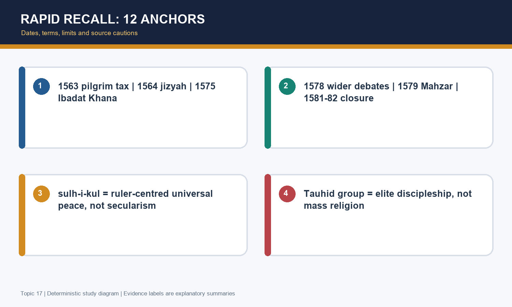

## PYQS AND ANSWER PRACTICE

### PART X - Exact direct PYQ, answer map and practice

#### Direct CSE Mains PYQ - verified local official/OCR route

**2025 GS-I, Q2 - Direct/owned**

> “Examine the main aspects of Akbar's religious syncretism. (Answer in 150 words)”

**Provenance:** local OCR `knowledge-export/Mains PYQ/UPSC Mains 2025 GS Paper 1.md` (Question 2) and the 2024-25 GS-I routing ledger. It is descriptive; no answer key is required. A 2018-25 local-ledger search found **no additional exact direct CSE question** on Ibadat Khana, Mahzar, Din-i-Ilahi, jizyah or Akbar's religious policy. Topic 16's 2021 hierarchy Prelims question and Topic 15's political questions are adjacent only; they are not relabelled as Topic 17 direct PYQs.


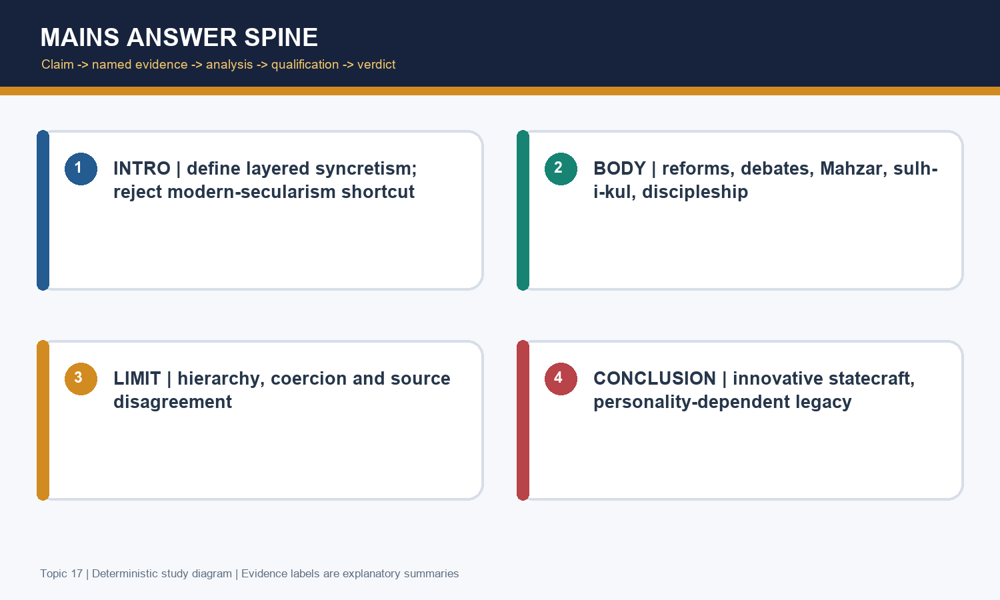

### Examiner-grade solved Mains practice - 10 answers

> **Method:** Each model follows claim -> named evidence -> analysis -> qualification -> verdict. The direct 2025 response preserves the printed 150-word demand.

#### 2025 GS-I Q2 - Direct PYQ

**Question:** Examine the main aspects of Akbar's religious syncretism. (Answer in 150 words)

**Format:** 10 marks | 150 words

**Model solution**

Akbar's syncretism was a graduated imperial policy, not the sudden creation of a mass faith. First, he removed visible disabilities by remitting pilgrim tax in 1563 and abolishing jizyah in 1564, signalling that loyal Hindu subjects could serve the crown without these fiscal markers. Secondly, the Ibadat Khana at Fatehpur Sikri opened inquiry from Muslim scholars to Hindu, Jain, Christian and Zoroastrian interlocutors; its quarrels widened Akbar's horizon rather than producing harmony. Thirdly, the Mahzar (1579) strengthened his limited authority to choose among conflicting juristic opinions for public welfare, not papal infallibility. Fourthly, sulh-i-kul made justice and non-sectarian treatment a governing principle, reinforced by a composite nobility and translations. Finally, Tauhid-i-Ilahi/Din-i-Ilahi expressed selective elite discipleship and loyalty; it had no scripture, priesthood or mass following. Thus, syncretism integrated a plural empire, but remained ruler-centred, hierarchical and dependent on Akbar's authority, and did not confer constitutional equality upon all subjects.

**Why this earns marks:** It directly answers 'aspects' through six compressed dimensions: fiscal change, inquiry, Mahzar, sulh-i-kul, composite setting and limited discipleship. Each has named evidence and the conclusion rejects both a mass-religion claim and modern-secularism anachronism.

#### Original 10-marker

**Question:** Trace the evolution of Akbar's religious policy from early reform to sulh-i-kul. (Answer in 150 words)

**Format:** 10 marks | 150 words

**Model solution**

Akbar's policy evolved through connected, not identical, stages. The early phase made concrete adjustments: pilgrim tax was remitted in 1563, jizyah abolished in 1564, and the enslavement of wives and children of rebellious villagers was forbidden in the source narrative. These measures reduced selected disabilities while Rajput alliances widened the political base. From 1575, the Ibadat Khana turned personal Sufi-inflected inquiry into public dispute; its opening to non-Muslim interlocutors after 1578 exposed both truth claims and the limits of courtly consensus. The Mahzar (1579) gave the emperor a limited arbitral role among conflicting legal opinions, linked to welfare and administration. In the 1580-81 crisis, loyalty and public order became urgent. Sulh-i-kul then supplied the more durable state idiom: justice and non-sectarian accommodation across communities. This was innovative imperial integration, not equal citizenship or religious neutrality.

**Why this earns marks:** The answer obeys 'trace' by using chronology, then converts dates into a causal explanation. It includes three precise evidence points and limits the conclusion.

#### Original 10-marker

**Question:** Why did the Ibadat Khana debates fail as dialogue yet matter for Mughal statecraft? (Answer in 150 words)

**Format:** 10 marks | 150 words

**Model solution**

The Ibadat Khana, built at Fatehpur Sikri in 1575, failed to create the concord that a modern reader may expect, but it mattered politically and intellectually. Initially, Thursday-night discussions among ulama, Sufis, scholars and court companions became contests over precedence, legal interpretation and truth. After 1578, Hindu, Jain, Christian and Zoroastrian interlocutors widened questions about revelation, prophethood, resurrection and divine unity. That widening did not dissolve certainty; it intensified bitterness and the public forum declined around 1581-82. Yet the debates demonstrated to Akbar the plurality of religious claims and the factional limits of courtly juristic monopoly. Private conversations and translations continued after closure. Their chief legacy was therefore not an interfaith institution or new religion, but the intellectual passage toward sulh-i-kul and a more ruler-centred policy of justice and accommodation. The result was consequential, though neither harmonious nor modern pluralism.

**Why this earns marks:** The response answers both halves of 'why': mechanism of failure and mechanism of significance. It uses chronology, participant groups and a qualified statecraft conclusion.

#### Original 15-marker

**Question:** Assess the Mahzar of 1579 as an assertion of imperial sovereignty. (Answer in 250 words)

**Format:** 15 marks | 250 words

**Model solution**

The Mahzar of 1579 was an assertion of imperial sovereignty, but its authority must be described more narrowly than the familiar 'Decree of Infallibility' label permits. It was an attested declaration signed by leading ulama. Where qualified jurists differed on a religious issue, it authorised Akbar to select one existing opinion with reference to public welfare and orderly administration; its language also invoked consistency with the Quran and benefit. Thus it did not make him a prophet, a pope, or an unlimited maker of sacred law.

Its political force was nonetheless considerable. The Ibadat Khana had exposed sharp disagreements among court theologians, while disputes over madadd-i-maash grants and status made religious authority an institutional question. Akbar's decision to arbitrate reduced the possibility that a single clerical network could veto imperial policy. The subsequent eastern rebellion and fatwas of 1580-81 sharpened the practical issue of final loyalty within an expanding empire. In this sense the Mahzar helped move authority from competing court jurists toward the emperor as guardian of order.

However, it should not be presented as an anti-Islamic rupture. The document worked through juristic disagreement and Islamic political vocabulary. Abu'l Fazl's courtly reading emphasises justice and sovereignty; Badauni's hostility reveals how threatening this redistribution of authority appeared. The best verdict is that the Mahzar enlarged imperial arbitration within a stated legal-moral frame, making it a major bridge to sulh-i-kul rather than a charter of personal infallibility.

**Why this earns marks:** It defines scope before evaluating consequence, brings grants and rebellion into the analysis, and uses court/hostile-source contrast as a qualification.

#### Original 15-marker

**Question:** Explain sulh-i-kul as a principle of state formation, not merely personal tolerance. (Answer in 250 words)

**Format:** 15 marks | 250 words

**Model solution**

Sulh-i-kul, conventionally rendered as universal peace or peace with all, was more than Akbar's private liking for religious discussion. In Abu'l Fazl's idiom, a just ruler owed paternal care, inquiry and protection from sectarian conflict to a heterogeneous population. The principle therefore connected ethical kingship to the practical problem of converting a conquering Timurid dynasty into a broad Indian imperial order.

Its institutional expression lay in selected removal of religious disabilities, wider recruitment and calibrated patronage. Pilgrim-tax remission in 1563 and jizyah abolition in 1564 removed visible fiscal distinctions. Rajput and other non-Muslim elites could receive rank, honour and imperial service; the administrative mechanics belong to Topic 16, but their political implication belongs here. After the Ibadat Khana's disputes, non-sectarian treatment was preferable to enforcing theological agreement. Translation projects and permission for varied communities to petition the court extended this elite language, though neither was a universal social transformation.

Sulh-i-kul was not syncretic merger, indifference to religion, democracy or modern secularism. It remained ruler-centred: the emperor determined protection, rank and limits. Nor did inclusion eliminate coercion, as the Chittor massacre and imperial hierarchy show. Yet it was more durable than the volatile debate hall or Tauhid discipleship because it supplied a workable rule of public order and legitimacy. Its legacy was real but contingent: later policy depended on imperial interpretation rather than constitutional rights.

**Why this earns marks:** This answer defines the term, proves its institutional relevance and then limits it with hierarchy, coercion and personality dependence.

#### Original 15-marker

**Question:** Was Tauhid-i-Ilahi a new religion? Discuss with source caution. (Answer in 250 words)

**Format:** 15 marks | 250 words

**Model solution**

Tauhid-i-Ilahi should not be described simply as a new religion. Terminology itself is contested: Abu'l Fazl uses Tauhid-i-Ilahi, or Divine Monotheism, whereas Din-i-Ilahi is strongly associated with Badauni, Jesuit-associated and later narratives. The labels point to a late-Akbar court practice of spiritual-political discipleship, but they do not prove a settled, mass creed.

The negative evidence is important. There was no separate scripture, priesthood, public congregational institution, missionary organisation or coercive conversion programme. The circle was small; Birbal is commonly identified as its prominent Hindu member, and Blochmann's eighteen high-grade names are a scholarly reconstruction rather than a census. These facts rule out the image of a rival religion imposed upon the empire.

But the contrary error is to say that nothing existed. Sources report initiation, the shast, greeting formulas, and four degrees of devotion involving property, life, honour and religion. These resemble Sufi pir-murid idioms and carried a political meaning: elite attachment to a sovereign claiming spiritual guidance. Reported sun/fire respect or dietary practice must be separated from court etiquette, selective borrowing and hostile polemic.

Therefore Tauhid-i-Ilahi is best seen as a limited ethical and loyalist fellowship, rooted in Islamic-Sufi vocabulary while open to comparative inquiry. It failed as a surviving sect after Akbar, but its importance lies in the experiment in spiritual kingship and elite integration, not in a fiction of mass conversion.

**Why this earns marks:** It answers the binary directly, weighs absence of institutions against reported practice, and makes terminology and source genre part of the evidence.

#### Original 20-marker

**Question:** Analyse Akbar's interfaith encounters. How far can influence be distinguished from adoption? (Answer in 250 words)

**Format:** 20 marks | 250 words

**Model solution**

Akbar's interfaith encounters are best analysed as a graded process of hearing, selective adaptation and limited institutional translation, rather than as a catalogue of borrowed rituals. The Ibadat Khana became open after 1578 to Hindu, Jain, Christian and Zoroastrian interlocutors, while private conversations continued beyond the public debates. The resulting questions concerned revelation, prophethood, resurrection, unity and ethics; they did not constitute an equal modern parliament of faiths.

Hindu engagement included Brahmanical interlocutors such as Purushottam and Devi in source traditions and a Sanskrit-Persian translation milieu. This widened court knowledge but does not show that Akbar became Hindu. Jain contact, particularly with Hiravijaya Suri, is relevant to petitions and selected concern for animal life. Yet a claim about slaughter restraint, release or prohibition must specify the order, territory and duration; no universal permanent ban should be invented. Jesuits from Goa supplied Christian books, images and theological challenge. Their letters are precious encounter evidence, but missionary expectation led them to interpret attention as possible conversion; Akbar did not become Christian. Meherji Rana and respect for sun/fire are linked with Parsi traditions, but light also has Islamic philosophical and Sufi meanings, so one symbol cannot establish Zoroastrian adoption.

What became institutionalised was not a combined doctrine but translation, broader court access and sulh-i-kul's non-sectarian governing idiom. Tauhid discipleship remained elite and ambiguous. Thus influence was real as intellectual exchange and selective symbolism; adoption was restricted, and conversion narratives are source-driven exaggerations.

**Why this earns marks:** The answer uses a four-way comparison, distinguishes encounter from adoption, and makes each community-specific claim carry an evidentiary limit.

#### Original 20-marker

**Question:** Evaluate Akbar's religious policy as an instrument of state formation in a plural empire. (Answer in 250 words)

**Format:** 20 marks | 250 words

**Model solution**

Akbar's religious policy assisted state formation because it widened legitimacy and reduced some barriers to service in a heterogeneous empire; it was not, however, a neutral withdrawal of power from religion. The early remission of pilgrim tax (1563) and abolition of jizyah (1564) made a visible statement that loyal non-Muslim subjects could participate without those fiscal marks. Rajput alliances and a composite nobility translated that message into political integration, although conquest and administrative detail must be located in Topics 15 and 16.

The Ibadat Khana (1575) exposed the limits of relying on a single clerical monopoly. Its Muslim debates and later comparative encounters did not produce harmony, but they sharpened Akbar's awareness of conflicting claims. The Mahzar (1579) then allowed him, within its stated public-good and textual framework, to choose among conflicting juristic opinions. This helped secure the emperor's final arbitral authority at a time of grant scrutiny, factional tension and the 1580-81 rebellion/fatwa context. Sulh-i-kul transformed the lesson into a governing idiom of justice, welfare and non-sectarian treatment.

The limits are central to the evaluation. Inclusion was selective, hierarchical and dependent on royal patronage; Chittor demonstrates that coercion accompanied accommodation. Tauhid-i-Ilahi created no mass fraternity and did not survive Akbar as a sect. Abu'l Fazl's teleology can overstate harmony, while Badauni's polemic can overstate apostasy. The balanced verdict is that religious policy was a sophisticated instrument of integration and sovereignty, innovative for its setting but not modern pluralist equality.

**Why this earns marks:** It uses reforms, debates, sovereignty and state principle as linked mechanisms; coercion and source critique prevent an unqualified celebratory conclusion.

#### Original 20-marker

**Question:** Discuss Akbar's social reforms and their limits in the context of his religious policy. (Answer in 250 words)

**Format:** 20 marks | 250 words

**Model solution**

Akbar's social regulations belonged to a wider claim that custom should be tested by justice and reason, but they should not be inflated into a modern programme of social equality. The local Satish Chandra source reports measures concerning marriage age, consent, widow remarriage, sati, regulation of prostitution and alcohol, and restriction on sale and purchase of slaves. It also records an earlier ban on enslaving wives and children of rebellious villagers. Such evidence shows an imperial aspiration to check selected harms and to curb practices treated as irrational or oppressive.

Religious policy supplied part of the context. Pilgrim-tax remission, jizyah abolition and permission for forced converts to revert in the source narrative widened the idea of religious freedom. Jain encounters are relevant to selected animal-life restraint, and translation activity to a critique of blind imitation. Yet each claim must be bounded: an order on slaughter or social custom needs its exact scope; an imperial rule did not automatically transform village, caste, household or gender relations.

The enforcement problem is not a minor footnote. Mughal capacity varied across region and social domain, while elite and patriarchal hierarchy remained entrenched. Sati regulations, marriage rules and slavery restrictions cannot demonstrate feminist equality, universal consent or the disappearance of servitude. Badauni's hostile description of 'new' practices is itself evidence of controversy, not a neutral implementation report.

Therefore the reforms deepen the social meaning of Akbar's policy, but their best interpretation is selective imperial prescription. They make his statecraft more than revenue and conquest, while leaving a strongly hierarchical society and ruler-centred enforcement intact.

**Why this earns marks:** It keeps exact measures source-bound, explains their policy context and evaluates reach rather than treating edicts as social outcomes.

#### Original 20-marker

**Question:** How should historians use Abu'l Fazl, Badauni, Jesuit reports and material evidence to study Akbar's religious views? (Answer in 250 words)

**Format:** 20 marks | 250 words

**Model solution**

Akbar's religious views cannot be recovered by choosing one 'true' chronicle; they require a source matrix that matches claim to genre, purpose and reach. Abu'l Fazl, author of the Akbarnama and Ain-i Akbari, is indispensable for court policy, sulh-i-kul and spiritual kingship. His access is exceptional, yet his language makes Akbar the rational, just guide of a new polity. It can establish imperial ideology and administrative aspiration more securely than spontaneous social reception.

Badauni supplies the vital counter-voice. His hostile account preserves conflict over the Ibadat Khana, Mahzar, rituals and elite discipleship. But polemic, orthodox anxiety and selective narration mean that a sensational claim - for example, a complete abandonment of Islam - needs corroboration. Jesuit letters and reports document missions from Goa, Christian texts and court discussion. Their conversion hopes make them prone to read courtesy as imminent baptism, but that very expectation illuminates the encounter. Jain, Sanskrit and Persian translation evidence broadens the archive beyond two Muslim court authors; farmans can anchor a specific order but not automatically prove universal implementation.

Material evidence works differently. Fatehpur Sikri, protected by ASI and inscribed by UNESCO, securely establishes a planned late-sixteenth-century imperial setting. It cannot by itself settle the exact surviving location of the Ibadat Khana, whose identification remains debated. Architecture, paintings and court ritual likewise require textual context.

Thus historians should triangulate chronology, language, patronage and material survival. The result is a layered Akbar: neither Abu'l Fazl's flawless sage nor Badauni's apostate, but a ruler whose inquiry and sovereignty reshaped imperial policy.

**Why this earns marks:** This answer makes method the argument: each source is assigned a positive use and a limit, then material evidence is prevented from proving more than it can.

## OPTIONAL ADVANCED DEPTH — NOT REQUIRED FOR A CORE ANSWER

### Akbar's Religious Views: Ibadat Khana & Din-i-Ilahi — ADVANCED

> **Subject:** History (Medieval India) · **Tier:** Advanced (deeper understanding) · **GS Paper:** GS-I (also Prelims).
> **Grounded in:** Satish Chandra, *Medieval India: From Sultanat to the Mughals — Part II (Mughal Empire)* — chapter on "Towards Integration" / Akbar's religious ideas, Ibadat Khana, Mahzar and Din-i-Ilahi.
> ✅ = from source book · ⚠️ = inference / standard knowledge · 📰 = current affairs.
> *Companion: `basic/17_Akbar-Religious-Views-Din-i-Ilahi.md`. Chronology spine: `00_Master-Chronology.md`.*

---

### Mini-timeline

| Date | Event |
|---|---|
| ✅ 1575 | Ibadat Khana built at Fatehpur Sikri, around the cell of Shaikh Abdullah Niyazi |
| ✅ 1578 | After a mystical experience, Akbar opened debates to non-Muslim participants |
| ✅ 1579 | **Mahzar** signed by leading ulama; Akbar asserted a limited interpretive role for public good |
| ✅ 1580 | Eastern rebellion and orthodox fatwas sharpened Akbar's break with the ulama |
| ✅ 1581–82 | Ibadat Khana practically/finally closed |
| ✅ 1582 | Council/discipleship phase associated by later writers with "Din-i-Ilahi" |
| ✅ 1580s–1605 | Tauhid-i-Ilahi and sulh-i-kul used to bind a heterogeneous nobility to the throne |

### 1. Snapshot & core idea

**Deeper — the debates were a transition from theological contest to imperial ideology.**

✅ Part II places the Ibadat Khana in a wider Islamic and Timurid tradition of public disputation, but stresses that Akbar's experiment became politically transformative.
- ✅ The debates were held on Thursday nights; participants included sufi shaikhs, ulama, learned men and Akbar's companions.
- ✅ After 1578, Hindus, Jains, Christians and Zoroastrians entered the debates; issues such as revelation, prophethood, resurrection and divine unity were questioned.
- ✅ Satish Chandra concludes that the debates had two key consequences: they convinced Akbar that all religions contained truth, and they exposed the narrowness and arrogance of the court ulama.
- ✅ This led to the evolution of **sulh-i-kul**, which became the ideological basis of a liberal, tolerant state.

**Deeper — Din-i-Ilahi was not a "religion" in the conventional sense.**

✅ Satish Chandra rejects the charge, made by Jesuits and Badayuni, that Akbar simply renounced Islam and founded a new mass religion.
- ✅ Abul Fazl used **Tauhid-i-Ilahi** (Divine Monotheism), not primarily "Din-i-Ilahi"; Badayuni used both terms.
- ✅ Modern research notes that Din-i-Ilahi had **no separate scripture, priesthood, place of worship or mass congregational organisation**; it nevertheless had an elite initiation/discipleship ethic and associated forms of conduct.
- ✅ The four degrees of devotion — sacrifice of property, life, honour and religion — resembled Sufi forms of discipleship and had political meaning.
- ✅ Satish Chandra calls Tauhid-i-Ilahi basically a **political device** for fashioning a new state and nobility around justice, liberalism and equal treatment of faiths.

### 2. Key classification / data

| Advanced issue | Source-based detail | Historiographical value |
|---|---|---|
| ✅ Ibadat Khana location | Fatehpur Sikri, near Anup Talao, around Shaikh Abdullah Niyazi's cell | Not just a vague "debate hall" |
| ✅ Mahzar meaning | Akbar could choose among conflicting juristic views for welfare and order | Wrongly called infallibility |
| ✅ Breach with ulama | Corruption, bigotry and rebellion-linked fatwas widened the gulf | Political, not anti-Islamic |
| ✅ Sulh-i-kul | Justice + public welfare + sectarian peace | Core of new polity |
| ✅ Tauhid-i-Ilahi | Spiritual-political monotheism; Akbar as guide | Elite integration device |
| ✅ Membership | Blochmann listed only about 18 nobles in the highest degrees; Birbal the only Hindu among them | Not a mass sect |

### ➕ Exact PYQ application (2025 GS-I)

> **Verbatim:** “Examine the main aspects of Akbar's religious syncretism. (Answer in 150 words)”

| Aspect | Evidence to use | Analytical value |
|---|---|---|
| ✅ Interfaith inquiry | Ibadat Khana debates opened to Hindu, Jain, Christian and Zoroastrian participants after 1578 | Syncretism began as inquiry, not a ready-made creed |
| ✅ Sovereignty and interpretation | Mahzar (1579) allowed Akbar to choose among conflicting juristic opinions for public welfare | Limited clerical monopoly; not papal-style infallibility |
| ✅ Governing principle | *Sulh-i-kul* joined justice, welfare and sectarian peace | Religious accommodation became an imperial policy |
| ✅ Elite discipleship | *Tauhid-i-Ilahi* linked spiritual kingship, ethical conduct and loyalty | Political-integrative device, not a mass religion |
| ✅ Cultural-administrative setting | Composite nobility and equal treatment of faiths widened the policy beyond personal curiosity | Connect belief to state formation |
| ⚠️ Limits | Small elite following; hostile and courtly sources are ideologically charged | Do not claim either a new universal religion or modern secularism |

**150-word thesis:** ⚠️ Akbar's syncretism was a layered programme of interfaith inquiry, *sulh-i-kul*, limited juristic sovereignty and elite spiritual-political discipleship; its importance lay more in governing a plural empire than in founding a new religion.

### 3. Study links

> **Study link:** ✅ Akbar's mansabdari and composite nobility → `advanced/16`; Jahangir's continuation of sulh-i-kul → `advanced/20`.
> **Study link:** ⚠️ Compare Akbar's use of spiritual kingship with later Mughal problems of succession and nobility.

### 4. Must-Know Facts (Prelims)

- ✅ Ibadat Khana was built in **1575** and finally closed in **1582**.
- ✅ **Mahzar (1579)** was an attested statement, not a blanket claim to papal-style infallibility.
- ✅ **Tauhid-i-Ilahi** = Abul Fazl's phrase for Divine Monotheism; **Din-i-Ilahi** is more associated with Badayuni/Jesuit criticism.
- ✅ Initiation involved **shast** and formulas such as **Allah-o-Akbar** / **Jall Jalalhu**.
- ✅ The reform sequence matters: pilgrim tax was remitted in **1563** and jizyah abolished in **1564**, well before the Ibadat Khana debates.
- ✅ Discipleship aimed to overcome sectarian quarrels and bind nobles to the emperor.
- ✅ Satish Chandra's interpretation: Tauhid-i-Ilahi = political device for a liberal composite polity.

### 5. UPSC Traps

> 🔑 Trap: Do not reproduce Badayuni/Jesuit polemic as fact; distinguish hostile source claims from modern historical assessment.

- ❌ Din-i-Ilahi had scripture and clergy. → It had **no book, priesthood or formal ritual system**.
- ❌ Akbar's Mahzar abolished Islam in the empire. → It operated within disputes of interpretation and public good.
- ❌ The Ibadat Khana failed completely. → The debates failed as dialogue but succeeded in shaping **sulh-i-kul**.
- ❌ Akbar's religious policy was only personal eccentricity. → It was tied to **imperial integration** and elite loyalty.

### 6. 📰 Current link

📰 **Current linkage (verify live before use):** *Sulh-i-kul* may illuminate the historical governance of plurality, but it was not modern constitutional secularism. Verify any current constitutional case or debate independently and avoid anachronistic equivalence.

### 7. Mains angles

- ⚠️ "Tauhid-i-Ilahi was a political device rather than a new religion." Discuss with reference to Satish Chandra.
- ⚠️ The Mahzar marks the assertion of imperial sovereignty over clerical monopoly, but not a claim to unlimited religious infallibility.
- ⚠️ Akbar's religious policy should be linked to **state formation**, **composite nobility**, and **all-India sovereignty**.

### ➕ Historiography note (PYQ-gap)

⚠️ Sources are ideologically charged: **Abul Fazl** legitimises Akbar, **Badayuni** attacks him, and Jesuit accounts misread his courtesy as openness to conversion. Use them critically.

## CONSOLIDATED REGISTER NOTES

### Final consolidated register notes - revise last

#### 1. Chronology that prevents the sudden-1582 myth

- **1563:** pilgrim tax remitted at Hindu sacred places in the local book narrative. It is a fiscal-symbolic reform, not proof that all discrimination ended.
- **1564:** jizyah abolished. Abu'l Fazl presents opposition from sections of the ulama; do not invent an exact fiscal total.
- **Before 1575:** early policy also includes a source-grounded prohibition on enslavement of wives and children of rebellious villagers. State prescription and wider social practice must be separated.
- **1575:** Ibadat Khana built at Fatehpur Sikri. The textual description associates it with Shaikh Abdullah Niyazi's cell and the court zone near Anup Talao; its exact archaeological identification is not settled.
- **1578:** debates open beyond initial Muslim participants to broader Hindu, Jain, Christian and Zoroastrian interlocutors. This is opening of inquiry, not an equal modern conference.
- **1579:** Mahzar. Attested statement; choose among differing juristic opinions in the declared welfare/order framework.
- **1580-81:** eastern rebellion, fatwas and Mirza Hakim threat make loyalty and sovereignty more urgent. Do not narrate campaigns here; Topic 15 owns that detail.
- **1581-82:** public debates practically decline / close. Private exchange and cultural engagement continue.
- **Later 1580s:** Tauhid-i-Ilahi / Din-i-Ilahi denotes a tiny elite discipleship context, not mass conversion.

#### 2. Five-layer explanation of religious policy

| Layer | Evidence / mechanism | Exam-safe qualification |
|---|---|---|
| Personal spirituality | Chishti setting, Sufi inquiry, tawhid, critique of taqlid | Personal belief did not mechanically determine policy |
| Social reform | selected orders on marriage, sati, slavery, alcohol, slaughter | Exact scope and enforcement are uneven |
| Political integration | Rajput context, composite service, broader patronage | Topic 15/16 own conquests and mansabs |
| Sovereignty | Mahzar, grant scrutiny, arbitration during conflict | not pope, prophet or unlimited legislator |
| State ideology | sulh-i-kul: justice, welfare, non-sectarian treatment | ruler-centred and hierarchical, not secular citizenship |

#### 3. Ibadat Khana answer bank

- **Setting:** Fatehpur Sikri, 1575; Thursday-night discussions after state business.
- **Initial field:** ulama, Sufis, learned men and court companions. Never call them a uniform 'orthodox bloc'.
- **Wider field:** Hindu/Brahmanical interlocutors; Jain figures such as Hiravijaya Suri; Jesuit missions from Goa; Zoroastrian/Parsi traditions including Meherji Rana. Do not fabricate equal attendance in one session.
- **Questions:** revelation, prophethood, resurrection, divine unity, legal authority and ethical life.
- **Why it soured:** status conflict, competing claims, factional animosity and desire to win the emperor, not merely find truth.
- **Outcome:** bitterness and closure; nevertheless, inquiry challenged exclusive truth claims and helped generate sulh-i-kul.
- **Archaeology trap:** textual proximity to Anup Talao does not settle the exact surviving building.

#### 4. Mahzar: write scope before significance

1. **What:** attested declaration signed by leading ulama in 1579.
2. **Trigger:** conflicting juristic opinions and political conflict over authority, grants and punishment.
3. **Rule:** Akbar could choose among existing opinions when jurists differed, tied in the declaration to public welfare / administration and textual constraints.
4. **Significance:** final arbitral authority shifts toward the emperor; clerical monopoly is weakened.
5. **Not:** a decree of universal infallibility; no prophecy; no unrestricted lawmaking; no abolition of Islam.
6. **Historiography:** Abu'l Fazl's imperial theory and Badauni's dissent must both be read as positioned accounts.

#### 5. Sulh-i-kul: the durable principle

- Literal working translation: **universal peace / peace with all**.
- Content: justice, public welfare, respect/accommodation across creeds and avoidance of sectarian state preference.
- Political expression: diverse recruitment, removal of selected disabilities, patronage and public order.
- Abu'l Fazl's grammar: paternal love, rational inquiry, spiritual sovereignty and a just king.
- **Not theological merger:** it does not require every subject to agree in doctrine.
- **Not indifference:** religion and patronage still mattered at court.
- **Not modern secularism:** no equal constitutional citizenship, democratic representation or neutral public/private division.
- Why more durable than Ibadat Khana or Tauhid: it was usable as a state principle; it still depended on imperial will.

#### 6. Tauhid-i-Ilahi / Din-i-Ilahi: precision card

| Question | Safe response |
|---|---|
| Which term? | Abu'l Fazl uses Tauhid-i-Ilahi; Din-i-Ilahi is attached to Badauni/Jesuit/later labels. Explain divergence; do not declare one forbidden. |
| New religion? | No mass religion: no scripture, priesthood, congregational centre, missionaries or coercive conversions. |
| Nothing at all? | Also wrong: elite initiation/discipleship, ethical-liberal claims and loyalty practices are reported. |
| Four degrees? | Property, life, honour, religion; use Badauni/source qualification and Sufi pir-murid analogy. |
| Membership? | Very small circle; Birbal is commonly named; Blochmann's 18 is reconstruction, not census. |
| Ritual? | Shast, formulas, sijda, sun/fire and dietary claims need context. Separate court etiquette, borrowing and polemic. |
| Afterlife? | Failed as a sect after Akbar; sulh-i-kul and composite governance were the more durable inheritances. |

#### 7. Interfaith matrix - influence is not adoption

- **Hindu:** dialogue and translations; no claim that Akbar became Hindu.
- **Jain:** Hiravijaya Suri and selective ahimsa-related petitions/orders; never assert a permanent universal slaughter ban without a specific order.
- **Jesuit:** missions from Goa, texts and images; missionary reports over-read courtesy as conversion; Akbar did not become Christian.
- **Zoroastrian:** Meherji Rana and light/fire traditions need caution because light also has Islamic philosophical/Sufi resonances.
- **Sufi/Islamic roots:** tawhid, meditation and spiritual-guide vocabulary remain central. Avoid the 'pick-and-mix' caricature.

#### 8. Social reform and state-formation limits

- Source reports on sati, marriage, widow remarriage, consent, age, alcohol, slavery and customs are **orders/prescriptions**, not proof of universal enforcement.
- Gender, caste, household and service hierarchies remained.
- Inclusion and coercion coexisted: fiscal relief and elite recruitment must be read beside Chittor and imperial hierarchy.
- Political integration: a conquering dynasty sought legitimacy across regions and creeds; that does not turn it into a modern liberal state.
- Comparison: earlier Sultanate/Sher Shah pragmatism has limited relevance; Jahangir broadly continued Akbar's inclusive inheritance; Aurangzeb's 1679 jizyah is a later contrast, not an excuse for binary moral history.

#### 9. Source method in 30 seconds

- **Abu'l Fazl:** insider, detailed, imperial teleology -> proves official language more than neutral motive.
- **Badauni:** dissenting, hostile, polemical -> proves anxiety/perception, needs corroboration.
- **Jesuits:** encounter detail, conversion lens -> no inference of baptism.
- **Jain/Sanskrit/Persian/Farmans:** complementary, each has a restricted reach.
- **Architecture/paintings:** material setting and ritual imagery -> do not over-identify buildings or ideas.

#### 10. PYQ and answer spine

- **Direct 2025 GS-I Q2 (10 marks, 150 words):** “Examine the main aspects of Akbar's religious syncretism. (Answer in 150 words)”
- Use six compressed moves: fiscal reforms -> Ibadat inquiry -> Mahzar limits -> sulh-i-kul -> composite setting -> Tauhid qualification.
- Finish: **innovative integration for its setting, but ruler-centred, hierarchical and not modern secularism.**
- Every 15/20-marker needs claim -> named evidence -> analysis -> qualification -> verdict. Avoid a mere list of 'Hindu, Jain, Christian and Parsi influences'.

#### 11. Rapid recall traps

1. 1563 / 1564 come before 1575 / 1582.
2. Ibadat Khana did not produce instant harmony.
3. Mahzar is not infallibility.
4. Sulh-i-kul is not secularism.
5. Din-i-Ilahi is not mass religion, but not an empty fiction either.
6. Abu'l Fazl and Badauni are positioned sources.
7. Jesuit courtesy is not conversion.
8. Do not say all ulama opposed or all Hindus supported Akbar.
9. Do not compile ritual lists as settled creed.
10. Prescription is not implementation.
11. Personal curiosity and state formation both matter.
12. Cross-link Topics 15, 16, 20, 22 and 24 without duplicating their owner material.

#### 12. Ninety-second answer rehearsal

**Prompt:** “Was Akbar's religious policy personal experimentation or statecraft?”  
**Thesis:** It was both, but the link was historical rather than automatic: inquiry supplied language, while sovereignty and integration supplied institutional force.  
**Three evidence moves:** (1) 1563/1564 fiscal changes show policy before the late fellowship; (2) Ibadat Khana debate and the 1579 Mahzar show inquiry becoming an authority question; (3) sulh-i-kul and composite service show a governing consequence.  
**Two qualifications:** (1) coercion, hierarchy and uneven social reach remained; (2) Abu'l Fazl, Badauni and Jesuit accounts are positioned sources.  
**Verdict sentence:** Akbar fashioned an unusually capacious imperial idiom for a plural polity, but it depended on the emperor's will rather than equal rights.

#### 13. Last-page fact-to-argument grid

| Fact anchor | Do not write | Better analytical use |
|---|---|---|
| 1563 / 1564 | “Tolerance began only in 1582” | Reform preceded late discipleship |
| 1575 / 1578 | “Ibadat produced harmony” | Debate exposed limits of courtly consensus |
| 1579 Mahzar | “Akbar became infallible” | Limited arbitration strengthened sovereignty |
| Tauhid circle | “Mass religion” / “nothing existed” | Small ethical-loyalist fellowship |
| sulh-i-kul | “Modern secularism” | Ruler-centred accommodation and justice |

### COMPLETE TOPIC ASCII MASTER FLOW DIAGRAM

**High-yield use:** Follow the panels as one topic-specific conceptual atlas: root question, classifications, processes or arguments, comparisons, objections and a final answer-writing spine. This text-native master is separate from both graphical flowchart artifacts.

#### ASCII MASTER FLOW — PANEL 1/12: Evolution, not a sudden creed

```ascii-master
1563 -> pilgrim tax remitted | 1564 -> jizyah abolished
1575 -> Ibadat Khana built at Fatehpur Sikri
1578 -> debates widened beyond Muslim participants
1579 -> Mahzar gives Akbar a bounded arbitral role
1580-81 -> rebellion and orthodox opposition sharpen the sovereignty issue
1581-82 -> public debates close; Tauhid-i-Ilahi discipleship phase emerges.
```

#### ASCII MASTER FLOW — PANEL 2/12: Five layers of Akbar's religious policy

```ascii-master
PERSONAL -> Chishti links, inquiry, prayer and spiritual search
FISCAL -> selected religious disabilities removed in 1563-64
INTELLECTUAL -> Ibadat Khana, translations and comparative encounter
SOVEREIGN -> Mahzar and final imperial arbitration
GOVERNING -> sulh-i-kul, justice and non-sectarian accommodation
DISCIPLESHIP -> small Tauhid-i-Ilahi circle around the sovereign.
```

#### ASCII MASTER FLOW — PANEL 3/12: Ibadat Khana debate cycle

```ascii-master
BUILD 1575 -> court-linked prayer and disputation forum
FIRST PHASE -> ulama, Sufis, scholars and companions
CONFLICT -> doctrine, precedence and court status become entangled
WIDENING -> Hindu, Jain, Christian and Zoroastrian interlocutors
PARADOX -> more voices, but no shared theological settlement
CLOSURE -> public forum ends; private inquiry and translation continue.
```

#### ASCII MASTER FLOW — PANEL 4/12: Interfaith encounter: influence is not conversion

```ascii-master
HINDU -> interlocutors and translation | not Akbar becoming Hindu
JAIN -> petitions and animal-life concerns | not a universal permanent ban
JESUIT -> books, images and theology | courtesy is not Christian conversion
ZOROASTRIAN -> Meherji Rana and light symbols | symbolism is not adoption
SUFI-ISLAMIC -> tawhid and pir-murid idiom remain central continuities
RULE: state the encounter, evidence, bounded influence and non-equivalence.
```

#### ASCII MASTER FLOW — PANEL 5/12: The debate paradox

```ascii-master
ROYAL FORUM -> participants compete before the emperor
DOCTRINAL CERTAINTY -> argument hardens rather than dissolves
COURT STATUS -> theological dispute also becomes political rivalry
AKBAR'S LESSON -> no one clerical network can secure plural order
POLICY SHIFT -> theological concord yields to non-sectarian governance
VERDICT: dialogue failed as consensus but mattered for statecraft.
```

#### ASCII MASTER FLOW — PANEL 6/12: Mahzar: scope before significance

```ascii-master
MYTH -> Akbar became pope, prophet or an infallible lawgiver
RULE -> after jurists disagree, he selects an existing opinion for public welfare
SIGNIFICANCE -> clerical monopoly narrows as imperial arbitration grows
LIMIT -> bounded juristic choice is not unlimited sacred legislation.
```

#### ASCII MASTER FLOW — PANEL 7/12: Sulh-i-kul as a governing principle

```ascii-master
PROBLEM -> a plural, ranked empire needs order beyond theological agreement
MECHANISM -> justice, tax reform, wider service and calibrated patronage
LIMIT -> the emperor still defines inclusion, protection and coercion
VERDICT: durable imperial idiom, not modern constitutional secularism.
```

#### ASCII MASTER FLOW — PANEL 8/12: Tauhid-i-Ilahi: neither mass religion nor nothing

```ascii-master
ABSENT -> scripture, priesthood, congregation and mass mission
PRESENT -> initiation, conduct, greetings and graded devotion language
SCALE / IDIOM -> small elite circle; Birbal; Sufi-like guide-disciple bond
VERDICT: loyalist spiritual fellowship, not a new universal religion.
```

#### ASCII MASTER FLOW — PANEL 9/12: Inclusion and coercion in one empire

```ascii-master
INCLUSION -> tax relief, service, dialogue and non-sectarian justice
HIERARCHY / COERCION -> rank, conquest and punishment remain sovereign tools
SOCIAL LIMIT -> orders are uneven; policy depends on the ruler
RULE: praise innovation without inventing equality or neutrality.
```

#### ASCII MASTER FLOW — PANEL 10/12: Source triangle and evidentiary limits

```ascii-master
ABUL FAZL -> policy and kingship | courtly legitimation
BADAUNI / JESUITS -> dissent and encounter | polemic and conversion hopes
ORDERS / ARCHITECTURE -> policy acts and setting | uneven reach, no transcript
METHOD: state what each source proves, cannot prove and needs checked.
```

#### ASCII MASTER FLOW — PANEL 11/12: 2025 GS-I syncretism answer map

```ascii-master
OPEN -> layered state-building programme, not a sudden mass faith
EARLY -> 1563-64 fiscal change; Ibadat Khana inquiry and widening
STATE -> Mahzar arbitration; sulh-i-kul and composite legitimacy
CLOSE -> Tauhid fellowship was small and policy remained ruler-centred.
```

#### ASCII MASTER FLOW — PANEL 12/12: Topic 17 final answer spine

```ascii-master
DEFINE -> separate belief, debate, sovereignty, governance and fellowship
TRACE -> 1563-64 -> 1575 -> 1578 -> 1579 -> 1581-82
PROVE -> taxes, Ibadat Khana, Mahzar, sulh-i-kul and Tauhid evidence
ANALYSE -> plural empire, elite integration and public order
QUALIFY -> source bias, coercion, hierarchy and limited implementation
VERDICT -> innovative state formation, not modern secularism or mass religion.
```
