# Mughal Society, Economy & Culture - Complete Topic Package

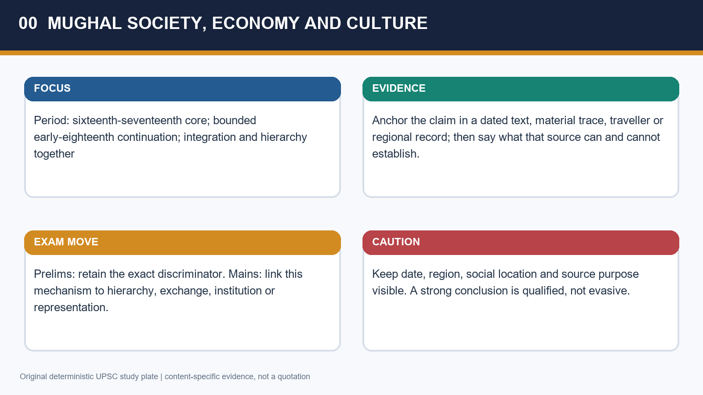

> Subject: Medieval Indian History | GS-I + Prelims | Date: 2026-08-19 | Full learning-session export.

### Roadmap and evidence contract

This session develops the complete topic from source method and social structure through agrarian/urban economy, commercial institutions, technology and culture. It then solves exact routed PYQs, runs three independent MCQ sets, supplies twelve examiner-grade Mains models, and ends with consolidated register notes. Facts are source-grounded; analysis is explicitly qualified.

## BASIC LEARNING SESSION

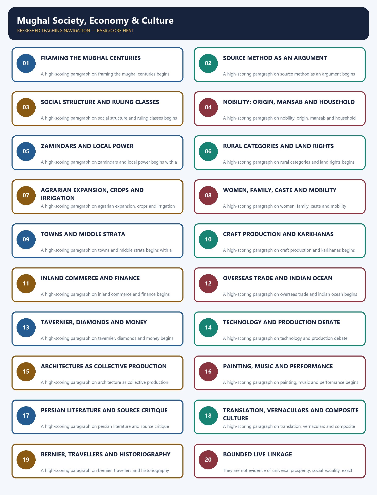

*Distinct embedded teaching-navigation image. The separate continuous Cārvāka-style flowchart package remains an independent at-a-glance artifact.*

### Foundation dossier: society, economy, culture and answer architecture

#### Foundation dossier: society, economy, culture and answer architecture
> **Subject:** History (Medieval India) - **Tier:** Must-Do (foundation) - **GS Paper:** GS-I (also Prelims).
> **Grounded in:** Satish Chandra, *History of Medieval India* - chapters on Mughal economy, trade, society, cultural/religious developments, architecture, painting, music and literature.
>  = from source book -  = inference / standard knowledge -  = current affairs.
> *Companion: `advanced/24_Mughal-Society-Economy-Culture.md`. Chronology spine: `00_Master-Chronology.md`.*

---

#### Mini-timeline

| Date | Event |
|---|---|
|  1556-1605 | Akbar consolidates Mughal administration and cultural patronage |
|  c. 1567 | Akbar orders illustrated **Hamza Nama** project; painting becomes an imperial karkhana |
|  1573 | Buland Darwaza begun to commemorate Gujarat victory |
|  1605-27 | Jahangir's reign: portrait, animal and naturalistic painting flourish |
|  1628-58 | Shah Jahan's reign: marble architecture and Taj Mahal phase |
|  1650s-1700s | Seventeenth century = high point of trade, textiles and Indo-Mughal culture |
|  1719-48 | Muhammad Shah later patronises music strongly in the eighteenth century |

#### 1. Snapshot & core idea

**Foundation - society and economy expanded under Mughal peace.**

 Satish Chandra links Mughal political integration with roads, sarais, stable silver currency, urban life, trade and handicraft growth.
-  Trade and manufacture expanded in the seventeenth century; India was known as a major textile producer for Asian and wider markets.
-  Nobles, merchants and royal family members participated in trade; some owned ships or invested in commercial ventures. Merchants such as **Virji Vohra** of Surat and the ship-owner **Abdul Ghaffur** show the scale of Indian private commercial wealth.
-  Rural society centred on peasants, zamindars and land revenue. Zamindars had armed strength, local caste/clan ties, and were too important for the state to ignore.
-  Rural society was internally stratified: privileged resident **khud-kasht/riyayati** cultivators, ordinary **raiyati/muzarian**, outsider **pahi-kasht**, tenants, village servants and labouring groups had unequal rights and revenue burdens.
-  European travellers such as **Tavernier** and **Bernier** are valuable external sources, but their commercial and social judgments need source criticism.

**Foundation - culture was composite and creative.**

 Mughal architecture developed from Akbar's experimental Fatehpur Sikri to Shah Jahan's marble style, culminating in the **Taj Mahal**; it combined arched and trabeate forms, Indian craftsmanship and Turko-Iranian devices.
-  Mughal painting became an imperial **karkhana** under Akbar; Hindus and Muslims worked together, and Jahangir's reign marked a high point in portrait/animal studies.
-  Persian, Sanskrit and regional languages flourished; Bhakti and Sufi currents helped cultural contact, while orthodox elements continued.
-  Music was not simply "buried" under Aurangzeb; singing was banished from court, but instruments and patronage by nobles/queens continued.
-  Women participated in agriculture, spinning, embroidery and elite patronage, but property, marriage, purdah and labour conditions varied sharply by class, caste and region.

#### 2. Key classification / data

| Field | Must-know features |
|---|---|
|  Rural society | Peasants, zamindars, village headmen; zamindars often armed and locally rooted |
|  Cultivator categories | Khud-kasht/riyayati, raiyati/muzarian, pahi-kasht; unequal dues and privileges |
|  Trade | Textiles, spices, indigo, sugar/raw silk, horses, bullion inflow |
|  Trade institutions / actors | **Aurang** (warehouse), **banian** broker, merchant houses such as **Virji Vohra** and **Abdul Ghaffur** |
|  Nobility | High mansabdars had opulent lifestyles; patronised arts; some engaged in trade |
|  Land-right term | **Mirasidar** = hereditary occupancy-right holder, especially in south India |
|  Architecture | Fatehpur Sikri, Buland Darwaza, Itimad-ud-Daula, Taj Mahal, Red Fort, Jama Masjid |
|  Painting | Akbar's karkhana; Hamza Nama; Jahangir = portrait/animal/natural studies |
|  Literature / sources | Persian prose/poetry; translations; regional languages; Tulsidas, Rahim, Eknath, Tukaram; Tavernier and Bernier as external observers |
|  Culture | Composite, not mechanically "Hindu + Muslim" in separate compartments |

#### 3. Study links

> **Study link:**  Mughal administration/revenue -> Akbar and mansabdari files; decline and jagirdari stress -> `basic/25_Decline-of-the-Mughal-Empire.md`.
> **Study link:**  Persian-chronicle/source-methodology bank -> `basic/07_Sultanate-Administration-Economy-Society.md` 9.
> **Study link:**  Culture links to Bhakti-Sufi movements and Art & Culture (GS-I).

#### 4. Must-Know Facts (Prelims)

-  **Hamza Nama** was illustrated under Akbar; painting was organised as an imperial **karkhana**.
-  **Abul Fazl** says Akbar encouraged painting; many named painters were Hindus, including lower-caste artists such as Daswant.
-  **Itimad-ud-Daula** used marble and pietra dura before the Taj Mahal.
-  **Taj Mahal** under Shah Jahan is presented as a culmination of earlier Mughal architectural forms.
-  Jahangir's period is associated with **portrait painting, animals, birds and flowers**; Mansur is important.
-  **Jean-Baptiste Tavernier** (French jeweller-traveller; six visits c. 1631-1668) described Indian **diamond mines** and the **Golconda/Kollur** trade in detail.
-  **Aurang** = warehouse/depot for goods, especially textiles awaiting trade or export.
-  **Banian / Banyan / Bania** = Indian merchant-broker who handled local purchases, credit and market access for European traders.
-  **Mirasidar** = hereditary occupancy-right holder in land, especially in south India, based on long-standing cultivation rights rather than revenue assignment.
-  Mughal nobles and royal family members were not allergic to commerce; many invested in trade/ships.

#### 5. UPSC Traps

>  Trap: Mughal culture was a living synthesis; do not label every architectural or artistic element as exclusively "Hindu" or "Islamic."

-  Aurangzeb abolished music completely. -> Correct: he banished singing from court, but instruments and patronage continued.
-  Taj Mahal was an isolated foreign design. -> Correct: Chandra presents it as the culmination of Mughal-Indian architectural evolution.
-  Zamindars were just tax clerks. -> Correct: they had armed power, local roots and social authority.
-  **Aurang** was a military rank and **banian** a caste label only. -> Correct: **aurang** was a warehouse/depot; **banian** was a merchant-broker/intermediary.
-  Bernier's critique that Mughal India lacked all private property can be accepted literally. -> Correct: it reflected a European mercantilist lens and is contested by evidence of zamindars, mirasidars and large merchant wealth.
-  Mughal elite ignored trade. -> Correct: nobles, princes and royal women invested in trade and shipping.

#### 6.  Current link

 **Current linkage (verify live before use):** Handloom and craft policy can connect historical textile production with living artisan economies. Verify scheme, GI and export claims from official textile/ministry data.

#### 7. Mains angles

-  "The seventeenth century was a second classical age of Indian cultural creativity." Discuss with architecture, painting and literature.
-  Explain how Mughal political integration encouraged trade, currency circulation and urban growth.
-  Analyse the role of zamindars as both collaborators and constraints in the Mughal rural order.

---

#### 8. Answer Architecture (Future-Question Support)

#### 8.1 Thesis options

| Directive family | Qualified thesis |
|---|---|
| Discuss cultural creativity | "The seventeenth century was a creative apex: Taj Mahal, Mughal miniature painting, Persian and regional literature, music patronage and composite urban culture - funded by imperial revenue and a vibrant trade economy." |
| Examine trade and economy | "Mughal political unification created the conditions for trade expansion - standard silver currency, safe roads, sarais and a wealthy consuming elite - making 17th-century India a major node in Asian and global textile trade." |
| Analyse agrarian structure | "Mughal agrarian order rested on intense revenue extraction mediated by zamindars and stratified cultivator groups; its productivity was real, but so were hierarchy, negotiation and periodic stress." |
| Analyse zamindars and society | "Zamindars were simultaneously revenue intermediaries, local military powers and social leaders - they collaborated with the Mughal system when patronised and resisted when squeezed, making them both pillars and constraints of imperial rule." |
| Evaluate travel/source debates | "European observers such as Tavernier and Bernier are indispensable for Mughal trade and society, but their testimony must be filtered through commercial interest, comparison with Persian chronicles and awareness of European bias." |

#### 8.2 Demand-family evidence banks

##### A. Society

| # | Evidence | Claim it supports | Analytical function | Limitation |
|---|---|---|---|---|
| 1 |  Zamindars possessed armed retainers, caste/clan authority and local roots | Mughal society was not a simple centre-vs-peasant binary | Shows layered rural power and social leadership | Zamindars varied enormously by region and scale |
| 2 |  Cultivator categories: **khud-kasht/riyayati**, **raiyati/muzarian**, **pahi-kasht** | Rural society was internally stratified | Prevents treating peasants as one homogeneous class | Labels were ideal types; local usage varied |
| 3 |  Women worked in agriculture, spinning, embroidery and elite patronage | Women's roles were economically significant though unequal by class | Adds gender to social-history answers | Elite visibility should not be mistaken for general female autonomy |
| 4 |  Nobles and wealthy merchants lived opulently while peasants, labourers and artisans bore insecurity | Mughal prosperity was socially uneven | Balances "golden age" narratives with hierarchy | Source emphasis often comes from elite observers |
| 5 |  Expanding towns, bazaars, karkhanas and sarais created vibrant urban life | Urban society was commercially and culturally active | Links imperial peace with urban growth | Urban prosperity depended on continued fiscal extraction from countryside |

##### B. Agrarian structure

| # | Evidence | Claim it supports | Analytical function | Limitation |
|---|---|---|---|---|
| 1 |  Measurement, cash demand and one-third state share under zabt/dahsala (see Topic 16) | Agrarian extraction was increasingly codified | Connects Mughal revenue with village-level pressure and predictability | Application varied by crop, terrain and province |
| 2 |  Zamindar-peasant relations combined mediation, protection and coercion | Revenue collection required negotiation through local power holders | Explains why zamindars were both collaborators and rebels | Formal categories hide many local bargains |
| 3 |  **Khud-kasht** cultivators had stronger occupancy position than **pahi-kasht** outsiders | Agrarian rights were unequal and historically rooted | Useful for Prelims distinction and Mains social analysis | Rights could still erode under pressure or indebtedness |
| 4 |  Seasonal/cash-crop pattern included wheat, rice, sugarcane, cotton, indigo and oilseeds | Mughal agriculture was diversified and commercially linked | Supports answers on market-oriented agrarian expansion | Commercial crops could deepen peasant vulnerability in bad years |
| 5 |  Revenue remissions existed for crop failure, yet peasant flight, local disorder and later jagirdari stress indicate agrarian strain | Productivity coexisted with crisis indicators | Prevents romanticising agrarian abundance | Evidence of crisis is uneven and stronger for the later Mughal phase |
| 6 |  Franois Bernier argued that insecure assignment and lack of private landed property weakened economic incentives;  this conclusion is contested by historians such as Irfan Habib and Satish Chandra, who note strong merchant wealth and layered landed claims | European critique of Mughal agrarian order needs contextual reading | Turns Bernier into a historiographical debate rather than a ready-made truth | Bernier viewed India through a European mercantilist lens |

##### C. Trade / economy

| # | Evidence | Claim it supports | Analytical function | Limitation |
|---|---|---|---|---|
| 1 |  Indian textiles moved to the Red Sea, Persian Gulf, Southeast Asia and beyond | Mughal India was a major manufacturing exporter | Establishes India's place in 17th-century global trade | Export gains were unevenly distributed socially |
| 2 |  India imported large quantities of bullion while exporting manufactures | Trade was structurally favourable to India in specie terms | Shows why silver currency remained strong | Bullion inflow did not eliminate rural poverty |
| 3 |  European companies expanded coastal trade but initially operated within a still-dominant Indian merchant world | Europeans were entrants into, not founders of, Indian Ocean commerce | Corrects Eurocentric narratives | Their military-commercial power would grow later |
| 4 |  **Virji Vohra** of Surat and **Abdul Ghaffur** as major ship-owner show the scale of Indian merchant capital | Private Indian commerce remained powerful alongside European companies | Demonstrates indigenous capitalist capacity | Merchant wealth was regionally concentrated |
| 5 |  **Jean-Baptiste Tavernier** described the **Golconda/Kollur** diamond mines and trade circuits in detail | European traveller evidence illuminates high-value commerce | Supplies named travel evidence for trade questions | Traveller focus privileges luxury trade over ordinary production |
| 6 |  **Aurang** as warehouse/depot and **banian** as broker/intermediary | Commercial infrastructure and middlemen linked production to export | Gives statement-level clarity for institutional terms | Terms varied across regions and commercial communities |

##### D. Literature / sources

| # | Evidence | Claim it supports | Analytical function | Limitation |
|---|---|---|---|---|
| 1 |  Persian chronicles and memoirs - *Akbarnama*, *Ain-i Akbari*, *Muntakhab-ut-Tawarikh*, *Tuzuk-i Jahangiri* - remain the main textual spine (see Topic 07 9) | Mughal society/culture is best studied through multiple Persian genres, not one court text | Provides source-method depth for 15/20 markers | Courtly bias requires cross-checking with other evidence |
| 2 |  Regional literary florescence: **Tulsidas**, **Rahim**, **Eknath**, **Tukaram** and others | Cultural creativity moved beyond Persian court culture into vernaculars | Shows linguistic democratisation alongside imperial patronage | Regional traditions differed in theology and audience |
| 4 |  **Gulbadan Begum**, **Badauni** and European travellers offer alternative angles to official praise | Cross-verification reveals internal disagreement and social texture | Helps source-criticism answers avoid single-text dependence | Each alternative source has its own bias and partiality |

##### E. Visual culture

| # | Evidence | Claim it supports | Analytical function | Limitation |
|---|---|---|---|---|
| 1 |  **Taj Mahal**, **Red Fort** and **Jama Masjid** represent the mature Shahjahani synthesis of scale, symmetry, marble and inlay | Architecture expressed imperial confidence and composite craftsmanship | Supplies named monuments for culture answers | Monumentality depended on extraction and court patronage |
| 2 |  Akbar's imperial **karkhana** and the illustrated **Hamza Nama** institutionalised painting | Mughal painting was a state-supported collaborative art | Shows organised artistic production, not isolated genius | Court sponsorship also shaped themes and hierarchy |
| 3 |  Under Jahangir, naturalistic painting, portraiture and artists like **Mansur** reached a high point | Mughal aesthetics included close observation of flora/fauna | Distinguishes Jahangiri taste from Akbar's narrative scale | Still largely elite and courtly in audience |
| 4 |  Music survived even under Aurangzeb through instruments and patronage by nobles and women; later centres continued the tradition | Cultural continuity did not depend on a single emperor's taste | Corrects the simplistic "Aurangzeb killed music" narrative | Much later growth occurred in provincial rather than central courts |

#### 8.3 Counterpoints

-  "Composite culture" should not erase hierarchy: elite Persianate culture and popular vernacular culture did not operate identically.
-  Trade prosperity coexisted with peasant hardship - monetisation and revenue pressure could impoverish producers even as commerce boomed.
-  Bernier is valuable as an observer, but his generalisations on private property and decline cannot be accepted without checking Indian evidence.
-  Women's roles varied sharply by class, caste and region: elite patronage and peasant labour should not be conflated.

#### 8.4 Verdict scaffolding

- **10-mark (trade/economy):** Use sub-bank C with textiles + bullion + one institutional term (aurang/banian) or Tavernier.
- **15-mark (agrarian/society):** Use sub-bank B plus one or two units from A; conclude: productive but stratified and pressured.
- **15-mark (culture/sources):** Use D + E; add Topic 07 9 cross-link for Persian-source methodology.
- **20-mark:** Combine the most relevant sub-banks rather than narrating everything; close with a graded verdict on prosperity, hierarchy and cultural synthesis.

<!-- BEGIN GENERATED PYQ INTEGRATION: 2018-2023 -->

#### Historical PYQ Integration (2018-2023)

> **Status:** Question-level PYQ demand is integrated into this owner.
> **Provenance:** Audited local official-paper routing ledgers: `_PYQ-ROUTING-PRELIMS-2018-2023.md`.
> **Answer-key rule:** The official 2018-2023 Prelims/CSAT keys are not held locally; no option or answer has been inferred.

- **Years represented:** 2018, 2019, 2020, 2022
- **Paper(s):** Prelims GS-I
- **Routed question demands:** 4

| Year | Paper | Q | PYQ demand (neutral rendering) | Directive / format | Source status | Owner requirement |
|---:|---|---:|---|---|---|---|
| 2018 | Prelims GS-I | 73 | Foreign traveler who discussed diamonds and diamond mines India | Objective question; official key unavailable locally | Routed; key unavailable locally | Cover the named fact/concept and its likely statement-level distinctions. |
| 2019 | Prelims GS-I | 1 | Jagirdar and Zamindar differences in Mughal India | Objective question; official key unavailable locally | Routed; key unavailable locally | Cover the named fact/concept and its likely statement-level distinctions. |
| 2020 | Prelims GS-I | 21 | Mughal era terms Aurang Banian Mirasidar roles | Objective question; official key unavailable locally | Routed; key unavailable locally | Cover the named fact/concept and its likely statement-level distinctions. |

#### What this owner must now support

- Foreign traveler who discussed diamonds and diamond mines India
- Jagirdar and Zamindar differences in Mughal India
- Mughal era terms Aurang Banian Mirasidar roles

> The table integrates the examinable demand and paper metadata. It does not turn an unkeyed objective question into a solved answer, and it does not claim that lexical presence alone proves full conceptual sufficiency.
<!-- END GENERATED PYQ INTEGRATION: 2018-2023 -->

### PART I - Guided teaching: core to advanced

### SESSION 1 — FRAMING THE MUGHAL CENTURIES

#### DEFINITION / WHAT THIS IS CALLED

**Plain-language definition:** The core frame is the sixteenth and seventeenth imperial centuries, with a bounded early-eighteenth-century continuation where cultural and commercial networks persisted.

**Technical definition:** A high-scoring paragraph on framing the mughal centuries begins with a qualified claim, links evidence to process, and closes with its limit.

#### ANSWER-GRABBING OPENING — WRITE/ADAPT IN THE EXAM

> For framing the mughal centuries, identify what a court record, traveller, material trace and vernacular account can respectively show.

#### MUST-WRITE KEYWORDS

- **Framing the Mughal centuries**
- **The core frame**
- **A defensible thesis**
- **Court prosperity**
- **Court**
- **For**

**How to use them:** Frame the answer through Framing the Mughal centuries; define The core frame, connect A defensible thesis with Court prosperity to explain the mechanism, and use Court for the decisive comparison or qualification.

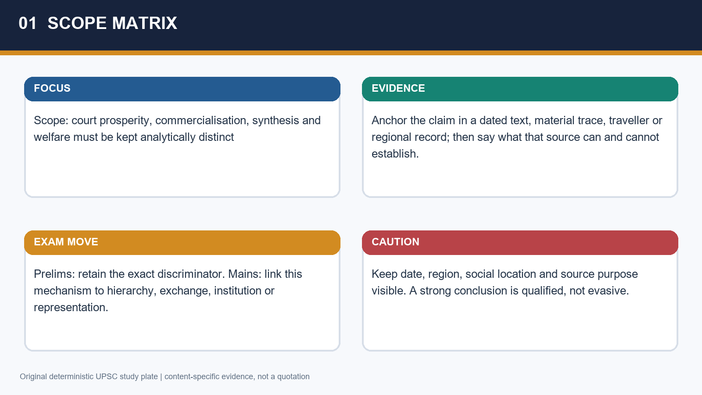

*Visual 1: SCOPE MATRIX. Original deterministic study visual; schematic maps are NOT TO SCALE.*

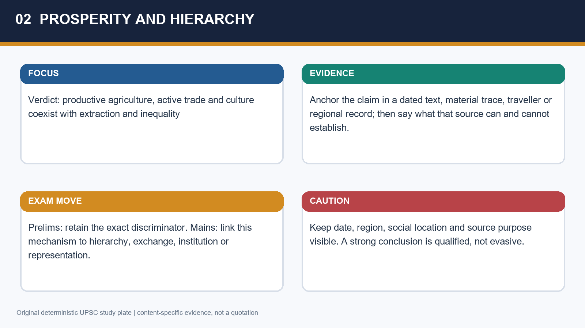

*Visual 2: PROSPERITY AND HIERARCHY. Original deterministic study visual; schematic maps are NOT TO SCALE.*


*Visual 3: SOURCE METHOD WHEEL. Original deterministic study visual; schematic maps are NOT TO SCALE.*

#### Concept and evidence

The core frame is the sixteenth and seventeenth imperial centuries, with a bounded early-eighteenth-century continuation where cultural and commercial networks persisted. Political integration made roads, cash demand, court consumption and cultural patronage more consequential, but did not make a vast subcontinent uniform. A defensible thesis is: commercially and culturally dynamic, agrarianly productive and institutionally integrated, yet hierarchical, extractive, technologically uneven and regionally diverse. Court prosperity is not welfare; commercialisation is not industrialisation; cultural synthesis is not equality.

#### Source-method checkpoint

For **framing the mughal centuries**, identify what a court record, traveller, material trace and vernacular account can respectively show. Do not treat one category as a transparent total picture. Convert the proposition into an answer by naming a mechanism, giving a source-grounded example, and adding a regional, social or chronological qualification. The nearest UPSC trap is a sweeping statement that removes this qualification.

#### Mains articulation

A high-scoring paragraph on **framing the mughal centuries** begins with a qualified claim, links evidence to process, and closes with its limit. Cross-link rather than duplicate: Topic 07 for Persian-source method, Topic 10 for Bhakti/Sufi theology, Topic 11 for Sultanate antecedents, Topic 16 for full revenue, Topic 17 for translation, Topic 21 for ruling class, Topic 23 for jagirdari crisis and Topic 25 for transition.

#### CLOSING RECALL FLOW — FRAMING THE MUGHAL CENTURIES

```text
START / CONCEPT: Framing the Mughal centuries
        |
        v
EXACT TERMS: Framing the Mughal centuries · The core frame · A defensible thesis · Court prosperity · Court · For
        |
        v
MECHANISM / ARGUMENT: A high-scoring paragraph on framing the mughal centuries begins with a qualified claim, links evidence to process, and closes with its limit.
        |
        v
CONSEQUENCE / CONTRAST: Court prosperity is not welfare; commercialisation is not industrialisation; cultural synthesis is not equality.
        |
        v
UPSC TRAP / ANSWER-USE: Do not treat one category as a transparent total picture.
        |
        v
ANSWER-GRABBING FORMULATION: For framing the mughal centuries, identify what a court record, traveller, material trace and vernacular account can respectively show.
```
### SESSION 2 — SOURCE METHOD AS AN ARGUMENT

#### DEFINITION / WHAT THIS IS CALLED

**Plain-language definition:** For source method as an argument, identify what a court record, traveller, material trace and vernacular account can respectively show.

**Technical definition:** A high-scoring paragraph on source method as an argument begins with a qualified claim, links evidence to process, and closes with its limit.

#### ANSWER-GRABBING OPENING — WRITE/ADAPT IN THE EXAM

> For source method as an argument, identify what a court record, traveller, material trace and vernacular account can respectively show.

#### MUST-WRITE KEYWORDS

- **Source method as an argument**
- **Ain-i-Akbari**
- **Akbarnama**
- **Tuzuk-i-Jahangiri**
- **Padshahnama**
- **Maasir-i-Alamgiri**

**How to use them:** Frame the answer through Source method as an argument; define Ain-i-Akbari, connect Akbarnama with Tuzuk-i-Jahangiri to explain the mechanism, and use Padshahnama for the decisive comparison or qualification.


*Visual 4: LAYERED SOCIAL STRUCTURE. Original deterministic study visual; schematic maps are NOT TO SCALE.*

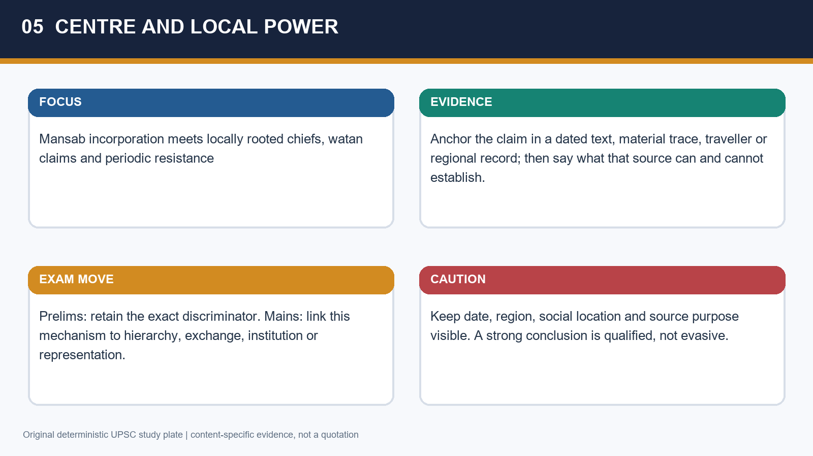

*Visual 5: CENTRE AND LOCAL POWER. Original deterministic study visual; schematic maps are NOT TO SCALE.*


*Visual 6: NOBILITY COMPOSITION. Original deterministic study visual; schematic maps are NOT TO SCALE.*

#### Concept and evidence

Ain-i-Akbari and farmans classify administration and revenue; Akbarnama, Tuzuk-i-Jahangiri, Padshahnama and Maasir-i-Alamgiri show courtly representation and changing official horizons. Vernacular literature, paintings, architecture, coins, inscriptions, port/factory records and archaeology answer different questions. Bernier compares property and political economy; Tavernier sees luxury commerce; Pelsaert notices urban poverty; Roe and Hawkins record diplomacy; Manucci is anecdotal; Mundy and Thevenot have route-bound observations. State genre, audience, observation/hearsay and chronology before using a source.

#### Source-method checkpoint

For **source method as an argument**, identify what a court record, traveller, material trace and vernacular account can respectively show. Do not treat one category as a transparent total picture. Convert the proposition into an answer by naming a mechanism, giving a source-grounded example, and adding a regional, social or chronological qualification. The nearest UPSC trap is a sweeping statement that removes this qualification.

#### Mains articulation

A high-scoring paragraph on **source method as an argument** begins with a qualified claim, links evidence to process, and closes with its limit. Cross-link rather than duplicate: Topic 07 for Persian-source method, Topic 10 for Bhakti/Sufi theology, Topic 11 for Sultanate antecedents, Topic 16 for full revenue, Topic 17 for translation, Topic 21 for ruling class, Topic 23 for jagirdari crisis and Topic 25 for transition.

#### CLOSING RECALL FLOW — SOURCE METHOD AS AN ARGUMENT

```text
START / CONCEPT: Source method as an argument
        |
        v
EXACT TERMS: Source method as an argument · Ain-i-Akbari · Akbarnama · Tuzuk-i-Jahangiri · Padshahnama · Maasir-i-Alamgiri
        |
        v
MECHANISM / ARGUMENT: A high-scoring paragraph on source method as an argument begins with a qualified claim, links evidence to process, and closes with its limit.
        |
        v
CONSEQUENCE / CONTRAST: Do not treat one category as a transparent total picture.
        |
        v
UPSC TRAP / ANSWER-USE: Do not miss this limiting distinction: ain-i-Akbari and farmans classify administration and revenue.
        |
        v
ANSWER-GRABBING FORMULATION: For source method as an argument, identify what a court record, traveller, material trace and vernacular account can respectively show.
```
### SESSION 3 — SOCIAL STRUCTURE AND RULING CLASSES

#### DEFINITION / WHAT THIS IS CALLED

**Plain-language definition:** For social structure and ruling classes, identify what a court record, traveller, material trace and vernacular account can respectively show.

**Technical definition:** A high-scoring paragraph on social structure and ruling classes begins with a qualified claim, links evidence to process, and closes with its limit.

#### ANSWER-GRABBING OPENING — WRITE/ADAPT IN THE EXAM

> For social structure and ruling classes, identify what a court record, traveller, material trace and vernacular account can respectively show.

#### MUST-WRITE KEYWORDS

- **Social structure**
- **ruling classes**
- **social structure and ruling classes**
- **Both**
- **For**
- **The nearest UPSC trap**

**How to use them:** Frame the answer through Social structure; define ruling classes, connect social structure and ruling classes with Both to explain the mechanism, and use For for the decisive comparison or qualification.


*Visual 7: FOREIGN-BORN CLAIM CAUTION. Original deterministic study visual; schematic maps are NOT TO SCALE.*

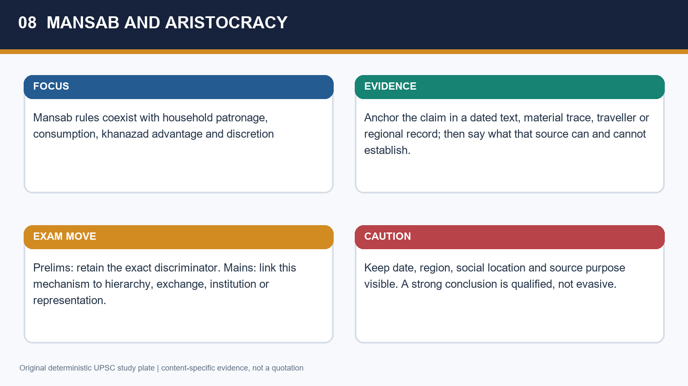

*Visual 8: MANSAB AND ARISTOCRACY. Original deterministic study visual; schematic maps are NOT TO SCALE.*


*Visual 9: ZAMINDAR SPECTRUM. Original deterministic study visual; schematic maps are NOT TO SCALE.*

#### Concept and evidence

Use a layered rather than fixed pyramid: emperor and household; mansabdars; chiefs/zamindars; merchants/professionals; artisans/service groups; cultivators/labourers; forest, pastoral and mobile communities. Mobility through service, trade, military recruitment and migration existed, but caste, gender, resource and patronage constraints endured. Nobility embodied central authority while local chiefs and zamindars represented local power; incorporation blurred the divide. Both extracted agrarian surplus, yet neither had an identical relation to village society.

#### Source-method checkpoint

For **social structure and ruling classes**, identify what a court record, traveller, material trace and vernacular account can respectively show. Do not treat one category as a transparent total picture. Convert the proposition into an answer by naming a mechanism, giving a source-grounded example, and adding a regional, social or chronological qualification. The nearest UPSC trap is a sweeping statement that removes this qualification.

#### Mains articulation

A high-scoring paragraph on **social structure and ruling classes** begins with a qualified claim, links evidence to process, and closes with its limit. Cross-link rather than duplicate: Topic 07 for Persian-source method, Topic 10 for Bhakti/Sufi theology, Topic 11 for Sultanate antecedents, Topic 16 for full revenue, Topic 17 for translation, Topic 21 for ruling class, Topic 23 for jagirdari crisis and Topic 25 for transition.

#### CLOSING RECALL FLOW — SOCIAL STRUCTURE AND RULING CLASSES

```text
START / CONCEPT: Social structure and ruling classes
        |
        v
EXACT TERMS: Social structure · ruling classes · social structure and ruling classes · Both · For · The nearest UPSC trap
        |
        v
MECHANISM / ARGUMENT: A high-scoring paragraph on social structure and ruling classes begins with a qualified claim, links evidence to process, and closes with its limit.
        |
        v
CONSEQUENCE / CONTRAST: Do not treat one category as a transparent total picture.
        |
        v
UPSC TRAP / ANSWER-USE: Use a layered rather than fixed pyramid: emperor and household; mansabdars; chiefs/zamindars; merchants/professionals; artisans/service groups; cultivators/labourers; forest, pastoral and mobile communities.
        |
        v
ANSWER-GRABBING FORMULATION: For social structure and ruling classes, identify what a court record, traveller, material trace and vernacular account can respectively show.
```
### SESSION 4 — NOBILITY: ORIGIN, MANSAB AND HOUSEHOLD

#### DEFINITION / WHAT THIS IS CALLED

**Plain-language definition:** For nobility: origin, mansab and household, identify what a court record, traveller, material trace and vernacular account can respectively show.

**Technical definition:** A high-scoring paragraph on nobility: origin, mansab and household begins with a qualified claim, links evidence to process, and closes with its limit.

#### ANSWER-GRABBING OPENING — WRITE/ADAPT IN THE EXAM

> For nobility: origin, mansab and household, identify what a court record, traveller, material trace and vernacular account can respectively show.

#### MUST-WRITE KEYWORDS

- **Nobility**
- **origin**
- **mansab**
- **household**
- **nobility: origin, mansab and household**
- **1679-1707**

**How to use them:** Frame the answer through Nobility; define origin, connect mansab with household to explain the mechanism, and use nobility: origin, mansab and household for the decisive comparison or qualification.


*Visual 10: RURAL CULTIVATOR CATEGORIES. Original deterministic study visual; schematic maps are NOT TO SCALE.*


*Visual 11: LAYERED LAND RIGHTS. Original deterministic study visual; schematic maps are NOT TO SCALE.*

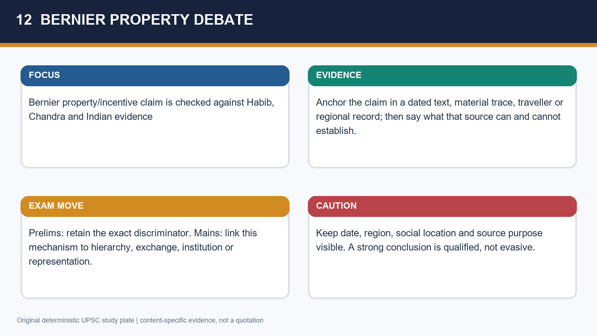

*Visual 12: BERNIER PROPERTY DEBATE. Original deterministic study visual; schematic maps are NOT TO SCALE.*

#### Concept and evidence

Mansab bureaucratised rank, salary and service but did not remove aristocratic household, patronage and consumption. Turani, Irani, Hindustani Muslim, Rajput, Afghan and Deccani/Maratha entrants appear across the imperial story. For 1679-1707, Iranis and Turanis were 40 percent of nobles holding 1000 zat and above, but less than a quarter of that group was born outside India: foreign-born therefore were under 10 percent of that dated, ranked total. This corrects Bernier without erasing ancestry prestige. Formal non-heredity coexisted with khanazad family advantage and social reproduction.

#### Source-method checkpoint

For **nobility: origin, mansab and household**, identify what a court record, traveller, material trace and vernacular account can respectively show. Do not treat one category as a transparent total picture. Convert the proposition into an answer by naming a mechanism, giving a source-grounded example, and adding a regional, social or chronological qualification. The nearest UPSC trap is a sweeping statement that removes this qualification.

#### Mains articulation

A high-scoring paragraph on **nobility: origin, mansab and household** begins with a qualified claim, links evidence to process, and closes with its limit. Cross-link rather than duplicate: Topic 07 for Persian-source method, Topic 10 for Bhakti/Sufi theology, Topic 11 for Sultanate antecedents, Topic 16 for full revenue, Topic 17 for translation, Topic 21 for ruling class, Topic 23 for jagirdari crisis and Topic 25 for transition.

#### CLOSING RECALL FLOW — NOBILITY: ORIGIN, MANSAB AND HOUSEHOLD

```text
START / CONCEPT: Nobility: origin, mansab and household
        |
        v
EXACT TERMS: Nobility · origin · mansab · household · nobility: origin, mansab and household · 1679-1707
        |
        v
MECHANISM / ARGUMENT: A high-scoring paragraph on nobility: origin, mansab and household begins with a qualified claim, links evidence to process, and closes with its limit.
        |
        v
CONSEQUENCE / CONTRAST: For 1679-1707, Iranis and Turanis were 40 percent of nobles holding 1000 zat and above, but less than a quarter of that group was born outside India: foreign-born therefore were under 10 percent of that dated, ranked total.
        |
        v
UPSC TRAP / ANSWER-USE: Do not treat one category as a transparent total picture.
        |
        v
ANSWER-GRABBING FORMULATION: For nobility: origin, mansab and household, identify what a court record, traveller, material trace and vernacular account can respectively show.
```
### SESSION 5 — ZAMINDARS AND LOCAL POWER

#### DEFINITION / WHAT THIS IS CALLED

**Plain-language definition:** Zamindar is a flexible Mughal category, spanning revenue claimant, village leader, deshmukh, patil, nayak, chief and raja.

**Technical definition:** A high-scoring paragraph on zamindars and local power begins with a qualified claim, links evidence to process, and closes with its limit.

#### ANSWER-GRABBING OPENING — WRITE/ADAPT IN THE EXAM

> For zamindars and local power, identify what a court record, traveller, material trace and vernacular account can respectively show.

#### MUST-WRITE KEYWORDS

- **Zamindars**
- **local power**
- **zamindars and local power**
- **Zamindar**
- **Mughal**
- **Rights**

**How to use them:** Frame the answer through Zamindars; define local power, connect zamindars and local power with Zamindar to explain the mechanism, and use Mughal for the decisive comparison or qualification.

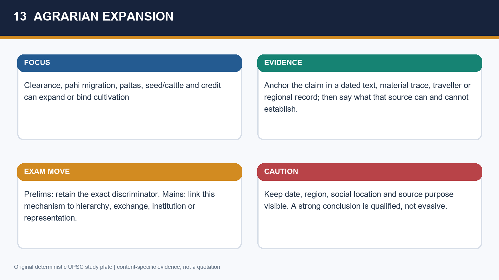

*Visual 13: AGRARIAN EXPANSION. Original deterministic study visual; schematic maps are NOT TO SCALE.*

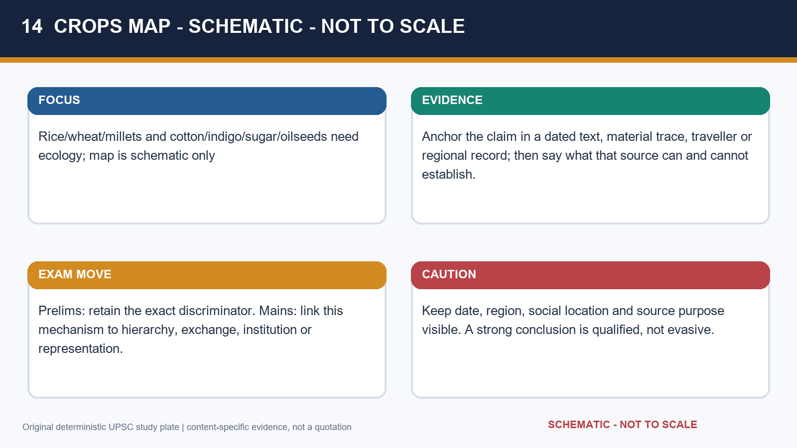

*Visual 14: CROPS MAP - SCHEMATIC - NOT TO SCALE. Original deterministic study visual; schematic maps are NOT TO SCALE.*


*Visual 15: IRRIGATION SYSTEMS. Original deterministic study visual; schematic maps are NOT TO SCALE.*

#### Concept and evidence

Zamindar is a flexible Mughal category, spanning revenue claimant, village leader, deshmukh, patil, nayak, chief and raja. It cannot be made a British landlord stereotype or a mere state clerk. Rights could be hereditary, divisible and saleable; power could include produce claim, cesses, garhi/arms, caste-clan ties and local information. The centre sought incorporation, assessment and revenue control, while chiefs sought legitimacy and room for autonomy. Watan arrangements and resistance must be locally bounded rather than presented as one universal policy.

#### Source-method checkpoint

For **zamindars and local power**, identify what a court record, traveller, material trace and vernacular account can respectively show. Do not treat one category as a transparent total picture. Convert the proposition into an answer by naming a mechanism, giving a source-grounded example, and adding a regional, social or chronological qualification. The nearest UPSC trap is a sweeping statement that removes this qualification.

#### Mains articulation

A high-scoring paragraph on **zamindars and local power** begins with a qualified claim, links evidence to process, and closes with its limit. Cross-link rather than duplicate: Topic 07 for Persian-source method, Topic 10 for Bhakti/Sufi theology, Topic 11 for Sultanate antecedents, Topic 16 for full revenue, Topic 17 for translation, Topic 21 for ruling class, Topic 23 for jagirdari crisis and Topic 25 for transition.

#### CLOSING RECALL FLOW — ZAMINDARS AND LOCAL POWER

```text
START / CONCEPT: Zamindars and local power
        |
        v
EXACT TERMS: Zamindars · local power · zamindars and local power · Zamindar · Mughal · Rights
        |
        v
MECHANISM / ARGUMENT: Rights could be hereditary, divisible and saleable; power could include produce claim, cesses, garhi/arms, caste-clan ties and local information.
        |
        v
CONSEQUENCE / CONTRAST: A high-scoring paragraph on zamindars and local power begins with a qualified claim, links evidence to process, and closes with its limit.
        |
        v
UPSC TRAP / ANSWER-USE: Do not treat one category as a transparent total picture.
        |
        v
ANSWER-GRABBING FORMULATION: For zamindars and local power, identify what a court record, traveller, material trace and vernacular account can respectively show.
```
### SESSION 6 — RURAL CATEGORIES AND LAND RIGHTS

#### DEFINITION / WHAT THIS IS CALLED

**Plain-language definition:** Raiyati/muzarian covers ordinary cultivators with variable ownership or tenancy; pahi-kasht denotes an incoming settler on surplus, new or abandoned land, sometimes with a concession.

**Technical definition:** A high-scoring paragraph on rural categories and land rights begins with a qualified claim, links evidence to process, and closes with its limit.

#### ANSWER-GRABBING OPENING — WRITE/ADAPT IN THE EXAM

> For rural categories and land rights, identify what a court record, traveller, material trace and vernacular account can respectively show.

#### MUST-WRITE KEYWORDS

- **Rural categories**
- **land rights**
- **rural categories and land rights**
- **Raiyati**
- **Patil**
- **Land**

**How to use them:** Frame the answer through Rural categories; define land rights, connect rural categories and land rights with Raiyati to explain the mechanism, and use Patil for the decisive comparison or qualification.


*Visual 16: AGRARIAN MARKET LOOP. Original deterministic study visual; schematic maps are NOT TO SCALE.*


*Visual 17: WOMEN LABOUR MATRIX. Original deterministic study visual; schematic maps are NOT TO SCALE.*

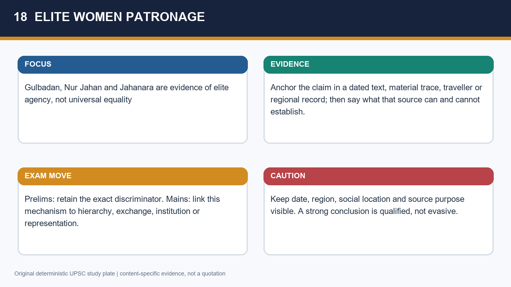

*Visual 18: ELITE WOMEN PATRONAGE. Original deterministic study visual; schematic maps are NOT TO SCALE.*

#### Concept and evidence

Khud-kasht marks resident owner-cultivation, normally associated with stronger occupancy, cattle/credit and social status. Raiyati/muzarian covers ordinary cultivators with variable ownership or tenancy; pahi-kasht denotes an incoming settler on surplus, new or abandoned land, sometimes with a concession. Terms varied regionally. Patil, muqaddam, chaudhuri, qanungo, patwari and deshmukh should be used with regional caution. Land rights were layered: cultivation, occupancy, revenue demand, produce share, customary access and office could rest with different people; neither total state ownership nor modern private property captures this.

#### Source-method checkpoint

For **rural categories and land rights**, identify what a court record, traveller, material trace and vernacular account can respectively show. Do not treat one category as a transparent total picture. Convert the proposition into an answer by naming a mechanism, giving a source-grounded example, and adding a regional, social or chronological qualification. The nearest UPSC trap is a sweeping statement that removes this qualification.

#### Mains articulation

A high-scoring paragraph on **rural categories and land rights** begins with a qualified claim, links evidence to process, and closes with its limit. Cross-link rather than duplicate: Topic 07 for Persian-source method, Topic 10 for Bhakti/Sufi theology, Topic 11 for Sultanate antecedents, Topic 16 for full revenue, Topic 17 for translation, Topic 21 for ruling class, Topic 23 for jagirdari crisis and Topic 25 for transition.

#### CLOSING RECALL FLOW — RURAL CATEGORIES AND LAND RIGHTS

```text
START / CONCEPT: Rural categories and land rights
        |
        v
EXACT TERMS: Rural categories · land rights · rural categories and land rights · Raiyati · Patil · Land
        |
        v
MECHANISM / ARGUMENT: A high-scoring paragraph on rural categories and land rights begins with a qualified claim, links evidence to process, and closes with its limit.
        |
        v
CONSEQUENCE / CONTRAST: Do not treat one category as a transparent total picture.
        |
        v
UPSC TRAP / ANSWER-USE: Do not miss this limiting distinction: cultivation, occupancy, revenue demand, produce share, customary access and office could rest with different...
        |
        v
ANSWER-GRABBING FORMULATION: For rural categories and land rights, identify what a court record, traveller, material trace and vernacular account can respectively show.
```
### SESSION 7 — AGRARIAN EXPANSION, CROPS AND IRRIGATION

#### DEFINITION / WHAT THIS IS CALLED

**Plain-language definition:** For agrarian expansion, crops and irrigation, identify what a court record, traveller, material trace and vernacular account can respectively show.

**Technical definition:** A high-scoring paragraph on agrarian expansion, crops and irrigation begins with a qualified claim, links evidence to process, and closes with its limit.

#### ANSWER-GRABBING OPENING — WRITE/ADAPT IN THE EXAM

> For agrarian expansion, crops and irrigation, identify what a court record, traveller, material trace and vernacular account can respectively show.

#### MUST-WRITE KEYWORDS

- **Agrarian expansion**
- **crops**
- **irrigation**
- **agrarian expansion, crops and irrigation**
- **Pattas**
- **Rice**

**How to use them:** Frame the answer through Agrarian expansion; define crops, connect irrigation with agrarian expansion, crops and irrigation to explain the mechanism, and use Pattas for the decisive comparison or qualification.


*Visual 19: GENDER HIERARCHY. Original deterministic study visual; schematic maps are NOT TO SCALE.*


*Visual 20: CASTE AND MOBILITY. Original deterministic study visual; schematic maps are NOT TO SCALE.*


*Visual 21: URBAN TYPOLOGY. Original deterministic study visual; schematic maps are NOT TO SCALE.*

#### Concept and evidence

Forest clearance, migration, new settlements and pahi resettlement enlarged cultivation. Pattas, delayed demand, seed, bullocks, wells and credit could enable expansion, while debt and elite control could turn the same means into dependence. Rice, wheat, millets and pulses retained different ecological bases; cotton, indigo, sugarcane and oilseeds linked particular regions to markets. Tobacco and maize require exact chronology and locality. Wells, Persian wheels, tanks, canals and local water systems reveal regional capacity, not universal state irrigation. One-third revenue is a theoretical reference, not every collection outcome.

#### Source-method checkpoint

For **agrarian expansion, crops and irrigation**, identify what a court record, traveller, material trace and vernacular account can respectively show. Do not treat one category as a transparent total picture. Convert the proposition into an answer by naming a mechanism, giving a source-grounded example, and adding a regional, social or chronological qualification. The nearest UPSC trap is a sweeping statement that removes this qualification.

#### Mains articulation

A high-scoring paragraph on **agrarian expansion, crops and irrigation** begins with a qualified claim, links evidence to process, and closes with its limit. Cross-link rather than duplicate: Topic 07 for Persian-source method, Topic 10 for Bhakti/Sufi theology, Topic 11 for Sultanate antecedents, Topic 16 for full revenue, Topic 17 for translation, Topic 21 for ruling class, Topic 23 for jagirdari crisis and Topic 25 for transition.

#### CLOSING RECALL FLOW — AGRARIAN EXPANSION, CROPS AND IRRIGATION

```text
START / CONCEPT: Agrarian expansion, crops and irrigation
        |
        v
EXACT TERMS: Agrarian expansion · crops · irrigation · agrarian expansion, crops and irrigation · Pattas · Rice
        |
        v
MECHANISM / ARGUMENT: A high-scoring paragraph on agrarian expansion, crops and irrigation begins with a qualified claim, links evidence to process, and closes with its limit.
        |
        v
CONSEQUENCE / CONTRAST: Pattas, delayed demand, seed, bullocks, wells and credit could enable expansion, while debt and elite control could turn the same means into dependence.
        |
        v
UPSC TRAP / ANSWER-USE: One-third revenue is a theoretical reference, not every collection outcome.
        |
        v
ANSWER-GRABBING FORMULATION: For agrarian expansion, crops and irrigation, identify what a court record, traveller, material trace and vernacular account can respectively show.
```
### SESSION 8 — WOMEN, FAMILY, CASTE AND MOBILITY

#### DEFINITION / WHAT THIS IS CALLED

**Plain-language definition:** Women worked in agriculture, spinning, embroidery, domestic production and sometimes markets; elite patronage is visible in records.

**Technical definition:** A high-scoring paragraph on women, family, caste and mobility begins with a qualified claim, links evidence to process, and closes with its limit.

#### ANSWER-GRABBING OPENING — WRITE/ADAPT IN THE EXAM

> For women, family, caste and mobility, identify what a court record, traveller, material trace and vernacular account can respectively show.

#### MUST-WRITE KEYWORDS

- **Women**
- **family**
- **caste**
- **mobility**
- **women, family, caste and mobility**
- **Gulbadan Begum**

**How to use them:** Frame the answer through Women; define family, connect caste with mobility to explain the mechanism, and use women, family, caste and mobility for the decisive comparison or qualification.

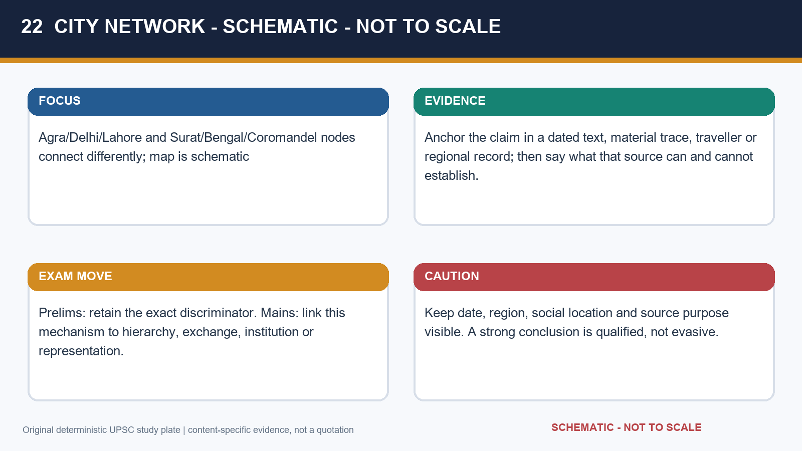

*Visual 22: CITY NETWORK - SCHEMATIC - NOT TO SCALE. Original deterministic study visual; schematic maps are NOT TO SCALE.*

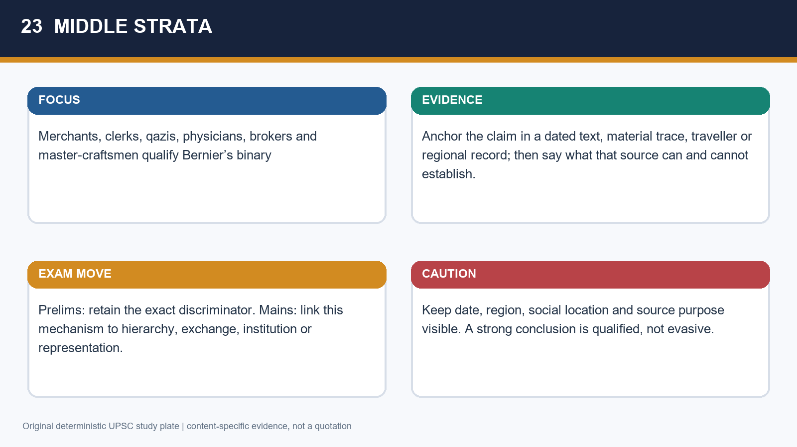

*Visual 23: MIDDLE STRATA. Original deterministic study visual; schematic maps are NOT TO SCALE.*

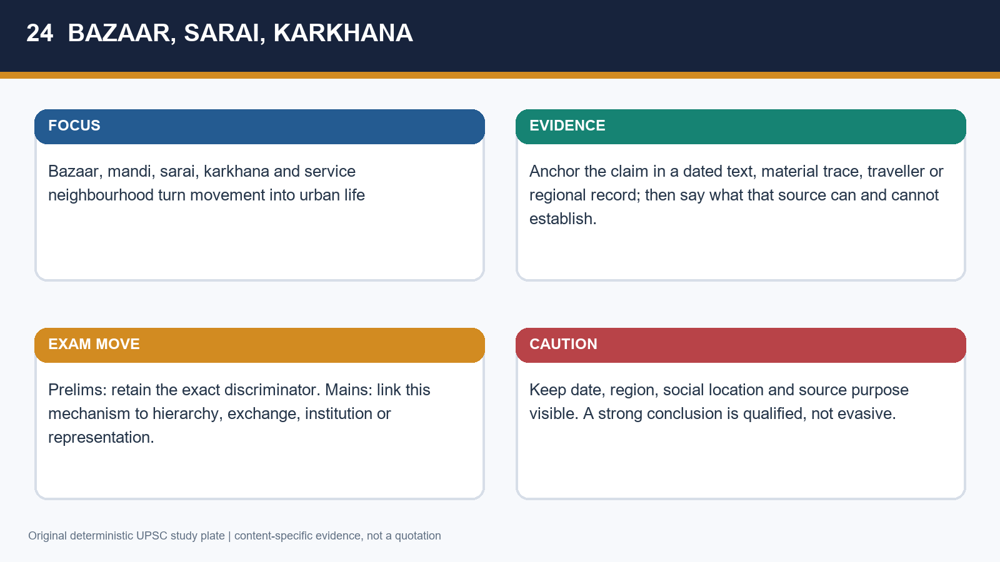

*Visual 24: BAZAAR, SARAI, KARKHANA. Original deterministic study visual; schematic maps are NOT TO SCALE.*

#### Concept and evidence

Women worked in agriculture, spinning, embroidery, domestic production and sometimes markets; elite patronage is visible in records. Gulbadan Begum, Nur Jahan, Jahanara and Zeb-un-Nissa must each be used only where secure, as courtly cases rather than a general emancipation story. Purdah, marriage, widowhood, inheritance and sati varied by class, caste, region and community; orders require implementation evidence. Jati structured occupations and untouchability constrained lives. Service, trade, military work and migration opened limited routes, but did not dissolve hierarchy. Domestic servitude and eunuch institutions require source, not sensationalism.

#### Source-method checkpoint

For **women, family, caste and mobility**, identify what a court record, traveller, material trace and vernacular account can respectively show. Do not treat one category as a transparent total picture. Convert the proposition into an answer by naming a mechanism, giving a source-grounded example, and adding a regional, social or chronological qualification. The nearest UPSC trap is a sweeping statement that removes this qualification.

#### Mains articulation

A high-scoring paragraph on **women, family, caste and mobility** begins with a qualified claim, links evidence to process, and closes with its limit. Cross-link rather than duplicate: Topic 07 for Persian-source method, Topic 10 for Bhakti/Sufi theology, Topic 11 for Sultanate antecedents, Topic 16 for full revenue, Topic 17 for translation, Topic 21 for ruling class, Topic 23 for jagirdari crisis and Topic 25 for transition.

#### CLOSING RECALL FLOW — WOMEN, FAMILY, CASTE AND MOBILITY

```text
START / CONCEPT: Women, family, caste and mobility
        |
        v
EXACT TERMS: Women · family · caste · mobility · women, family, caste and mobility · Gulbadan Begum
        |
        v
MECHANISM / ARGUMENT: A high-scoring paragraph on women, family, caste and mobility begins with a qualified claim, links evidence to process, and closes with its limit.
        |
        v
CONSEQUENCE / CONTRAST: Do not treat one category as a transparent total picture.
        |
        v
UPSC TRAP / ANSWER-USE: Do not miss this limiting distinction: women worked in agriculture, spinning, embroidery, domestic production and sometimes markets.
        |
        v
ANSWER-GRABBING FORMULATION: For women, family, caste and mobility, identify what a court record, traveller, material trace and vernacular account can respectively show.
```
### SESSION 9 — TOWNS AND MIDDLE STRATA

#### DEFINITION / WHAT THIS IS CALLED

**Plain-language definition:** Towns and middle strata comprises Towns, middle strata and Imperial as its core connected dimensions.

**Technical definition:** A high-scoring paragraph on towns and middle strata begins with a qualified claim, links evidence to process, and closes with its limit.

#### ANSWER-GRABBING OPENING — WRITE/ADAPT IN THE EXAM

> For towns and middle strata, identify what a court record, traveller, material trace and vernacular account can respectively show.

#### MUST-WRITE KEYWORDS

- **Towns**
- **middle strata**
- **towns and middle strata**
- **Imperial**
- **Agra**
- **Lahore**

**How to use them:** Frame the answer through Towns; define middle strata, connect towns and middle strata with Imperial to explain the mechanism, and use Agra for the decisive comparison or qualification.


*Visual 25: CRAFT SECTORS. Original deterministic study visual; schematic maps are NOT TO SCALE.*


*Visual 26: TEXTILE CHAIN. Original deterministic study visual; schematic maps are NOT TO SCALE.*

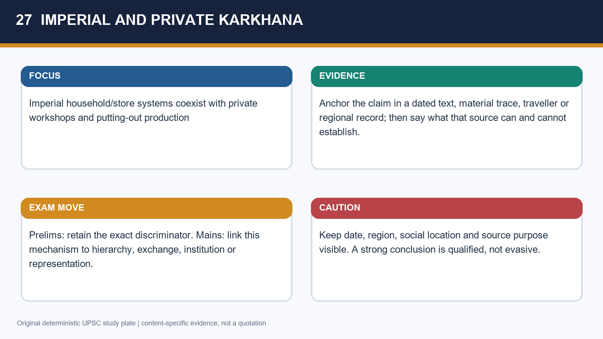

*Visual 27: IMPERIAL AND PRIVATE KARKHANA. Original deterministic study visual; schematic maps are NOT TO SCALE.*

#### Concept and evidence

Imperial/administrative cities included Agra, Lahore and Shahjahanabad; ports included Surat, Hugli and Masulipatnam; Ahmedabad, Patna, Dhaka, Burhanpur, pilgrimage/production centres and qasbas had distinct functions. Court demand, agrarian surplus, routes, sarais, bazaars, mandis, karkhanas and service populations made urban life possible, while political shifts could redirect prosperity. Chandra challenges Bernier's no-middle-state claim through merchants, shopkeepers, clerks, revenue officials, qazis, physicians, teachers, brokers and master-craftsmen. This is evidence against a binary, not a claim of a modern middle class.

#### Source-method checkpoint

For **towns and middle strata**, identify what a court record, traveller, material trace and vernacular account can respectively show. Do not treat one category as a transparent total picture. Convert the proposition into an answer by naming a mechanism, giving a source-grounded example, and adding a regional, social or chronological qualification. The nearest UPSC trap is a sweeping statement that removes this qualification.

#### Mains articulation

A high-scoring paragraph on **towns and middle strata** begins with a qualified claim, links evidence to process, and closes with its limit. Cross-link rather than duplicate: Topic 07 for Persian-source method, Topic 10 for Bhakti/Sufi theology, Topic 11 for Sultanate antecedents, Topic 16 for full revenue, Topic 17 for translation, Topic 21 for ruling class, Topic 23 for jagirdari crisis and Topic 25 for transition.

#### CLOSING RECALL FLOW — TOWNS AND MIDDLE STRATA

```text
START / CONCEPT: Towns and middle strata
        |
        v
EXACT TERMS: Towns · middle strata · towns and middle strata · Imperial · Agra · Lahore
        |
        v
MECHANISM / ARGUMENT: A high-scoring paragraph on towns and middle strata begins with a qualified claim, links evidence to process, and closes with its limit.
        |
        v
CONSEQUENCE / CONTRAST: This is evidence against a binary, not a claim of a modern middle class.
        |
        v
UPSC TRAP / ANSWER-USE: Court demand, agrarian surplus, routes, sarais, bazaars, mandis, karkhanas and service populations made urban life possible, while political shifts could redirect prosperity.
        |
        v
ANSWER-GRABBING FORMULATION: For towns and middle strata, identify what a court record, traveller, material trace and vernacular account can respectively show.
```
### SESSION 10 — CRAFT PRODUCTION AND KARKHANAS

#### DEFINITION / WHAT THIS IS CALLED

**Plain-language definition:** For craft production and karkhanas, identify what a court record, traveller, material trace and vernacular account can respectively show.

**Technical definition:** A high-scoring paragraph on craft production and karkhanas begins with a qualified claim, links evidence to process, and closes with its limit.

#### ANSWER-GRABBING OPENING — WRITE/ADAPT IN THE EXAM

> For craft production and karkhanas, identify what a court record, traveller, material trace and vernacular account can respectively show.

#### MUST-WRITE KEYWORDS

- **Craft production**
- **karkhanas**
- **craft production and karkhanas**
- **Cotton**
- **Name**
- **Bengal**

**How to use them:** Frame the answer through Craft production; define karkhanas, connect craft production and karkhanas with Cotton to explain the mechanism, and use Name for the decisive comparison or qualification.

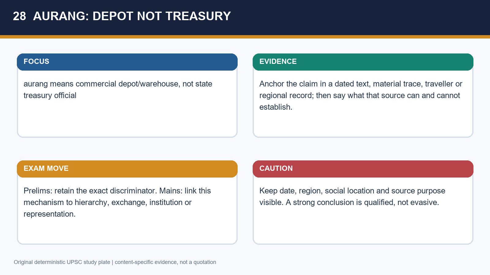

*Visual 28: AURANG: DEPOT NOT TREASURY. Original deterministic study visual; schematic maps are NOT TO SCALE.*

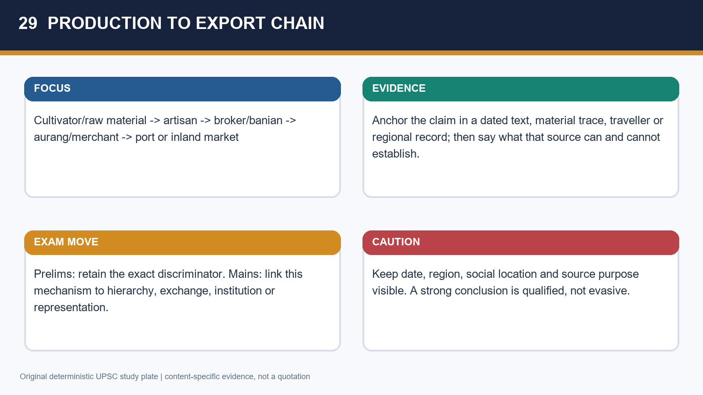

*Visual 29: PRODUCTION TO EXPORT CHAIN. Original deterministic study visual; schematic maps are NOT TO SCALE.*


*Visual 30: ROADS, RIVERS AND BANJARAS. Original deterministic study visual; schematic maps are NOT TO SCALE.*

#### Concept and evidence

Cotton and silk textiles, muslin, calico/chintz, carpets, shawls, indigo, saltpetre, sugar, metalwork, paper, leather, jewellery, arms and shipbuilding show broad craft production. Name regional specialisation only with a source: Bengal silk/muslin, Gujarat textile circuits, Coromandel cloth and Kashmir luxuries are usable examples. Imperial karkhanas were household/workshop/store systems; the Diwan-i-Bayutat's sphere does not make all manufacture state-owned. Private production, merchant advances and putting-out coexisted. Distinguish tool ownership, raw material, credit and sale before claiming wage labour or coercion.

#### Source-method checkpoint

For **craft production and karkhanas**, identify what a court record, traveller, material trace and vernacular account can respectively show. Do not treat one category as a transparent total picture. Convert the proposition into an answer by naming a mechanism, giving a source-grounded example, and adding a regional, social or chronological qualification. The nearest UPSC trap is a sweeping statement that removes this qualification.

#### Mains articulation

A high-scoring paragraph on **craft production and karkhanas** begins with a qualified claim, links evidence to process, and closes with its limit. Cross-link rather than duplicate: Topic 07 for Persian-source method, Topic 10 for Bhakti/Sufi theology, Topic 11 for Sultanate antecedents, Topic 16 for full revenue, Topic 17 for translation, Topic 21 for ruling class, Topic 23 for jagirdari crisis and Topic 25 for transition.

#### CLOSING RECALL FLOW — CRAFT PRODUCTION AND KARKHANAS

```text
START / CONCEPT: Craft production and karkhanas
        |
        v
EXACT TERMS: Craft production · karkhanas · craft production and karkhanas · Cotton · Name · Bengal
        |
        v
MECHANISM / ARGUMENT: A high-scoring paragraph on craft production and karkhanas begins with a qualified claim, links evidence to process, and closes with its limit.
        |
        v
CONSEQUENCE / CONTRAST: Imperial karkhanas were household/workshop/store systems; the Diwan-i-Bayutat's sphere does not make all manufacture state-owned.
        |
        v
UPSC TRAP / ANSWER-USE: Do not miss this limiting distinction: cotton and silk textiles, muslin, calico/chintz, carpets, shawls, indigo, saltpetre, sugar, metalwork, paper, leather...
        |
        v
ANSWER-GRABBING FORMULATION: For craft production and karkhanas, identify what a court record, traveller, material trace and vernacular account can respectively show.
```
### SESSION 11 — INLAND COMMERCE AND FINANCE

#### DEFINITION / WHAT THIS IS CALLED

**Plain-language definition:** For inland commerce and finance, identify what a court record, traveller, material trace and vernacular account can respectively show.

**Technical definition:** A high-scoring paragraph on inland commerce and finance begins with a qualified claim, links evidence to process, and closes with its limit.

#### ANSWER-GRABBING OPENING — WRITE/ADAPT IN THE EXAM

> For inland commerce and finance, identify what a court record, traveller, material trace and vernacular account can respectively show.

#### MUST-WRITE KEYWORDS

- **Inland commerce**
- **finance**
- **inland commerce and finance**
- **Hundi**
- **These**
- **Banian**

**How to use them:** Frame the answer through Inland commerce; define finance, connect inland commerce and finance with Hundi to explain the mechanism, and use These for the decisive comparison or qualification.


*Visual 31: HUNDI, SARRAF AND CREDIT. Original deterministic study visual; schematic maps are NOT TO SCALE.*

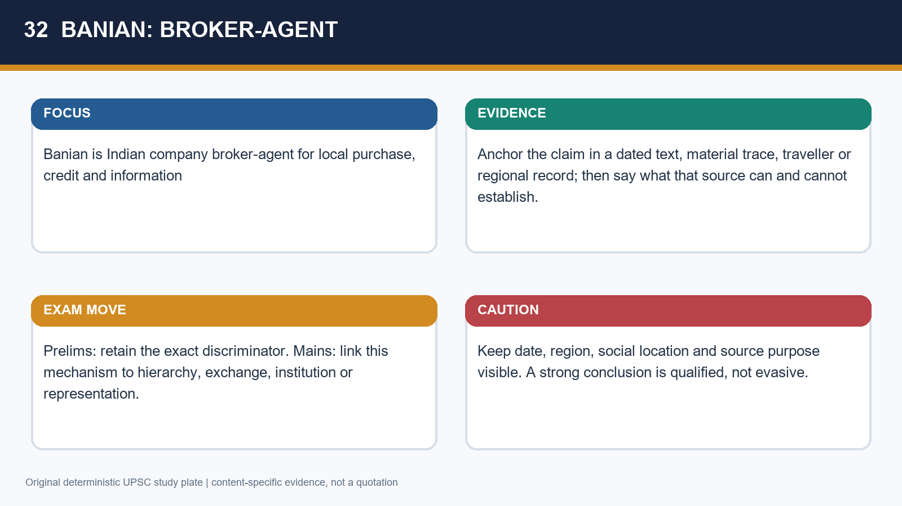

*Visual 32: BANIAN: BROKER-AGENT. Original deterministic study visual; schematic maps are NOT TO SCALE.*


*Visual 33: MIRASIDAR: LOCAL RIGHT. Original deterministic study visual; schematic maps are NOT TO SCALE.*

#### Concept and evidence

Roads, sarais, rivers, pack animals, carts and banjaras moved different goods. Banjaras carried bulk foodstuffs with oxen; rivers and coastal movement reduced bulky-goods cost. Hundi was a credit instrument payable across distance/time; sarrafs/shroffs changed money, handled hundis, held deposits and lent. Bima-hundi could include route-risk. These instruments show sophisticated commerce, not a modern regulated banking system. Banian was an Indian broker/agent, particularly for company purchase, credit and information. Aurang was a warehouse/depot, not a treasury office. Mirasidar must retain its local-right context and the 2020 exam frame.

#### Source-method checkpoint

For **inland commerce and finance**, identify what a court record, traveller, material trace and vernacular account can respectively show. Do not treat one category as a transparent total picture. Convert the proposition into an answer by naming a mechanism, giving a source-grounded example, and adding a regional, social or chronological qualification. The nearest UPSC trap is a sweeping statement that removes this qualification.

#### Mains articulation

A high-scoring paragraph on **inland commerce and finance** begins with a qualified claim, links evidence to process, and closes with its limit. Cross-link rather than duplicate: Topic 07 for Persian-source method, Topic 10 for Bhakti/Sufi theology, Topic 11 for Sultanate antecedents, Topic 16 for full revenue, Topic 17 for translation, Topic 21 for ruling class, Topic 23 for jagirdari crisis and Topic 25 for transition.

#### CLOSING RECALL FLOW — INLAND COMMERCE AND FINANCE

```text
START / CONCEPT: Inland commerce and finance
        |
        v
EXACT TERMS: Inland commerce · finance · inland commerce and finance · Hundi · These · Banian
        |
        v
MECHANISM / ARGUMENT: A high-scoring paragraph on inland commerce and finance begins with a qualified claim, links evidence to process, and closes with its limit.
        |
        v
CONSEQUENCE / CONTRAST: These instruments show sophisticated commerce, not a modern regulated banking system.
        |
        v
UPSC TRAP / ANSWER-USE: Do not treat one category as a transparent total picture.
        |
        v
ANSWER-GRABBING FORMULATION: For inland commerce and finance, identify what a court record, traveller, material trace and vernacular account can respectively show.
```
### SESSION 12 — OVERSEAS TRADE AND INDIAN OCEAN

#### DEFINITION / WHAT THIS IS CALLED

**Plain-language definition:** For overseas trade and indian ocean, identify what a court record, traveller, material trace and vernacular account can respectively show.

**Technical definition:** A high-scoring paragraph on overseas trade and indian ocean begins with a qualified claim, links evidence to process, and closes with its limit.

#### ANSWER-GRABBING OPENING — WRITE/ADAPT IN THE EXAM

> For overseas trade and indian ocean, identify what a court record, traveller, material trace and vernacular account can respectively show.

#### MUST-WRITE KEYWORDS

- **Overseas trade**
- **Indian Ocean**
- **overseas trade and indian ocean**
- **Surat**
- **Cambay**
- **Hugli**

**How to use them:** Frame the answer through Overseas trade; define Indian Ocean, connect overseas trade and indian ocean with Surat to explain the mechanism, and use Cambay for the decisive comparison or qualification.


*Visual 34: MERCHANT COMMUNITIES. Original deterministic study visual; schematic maps are NOT TO SCALE.*

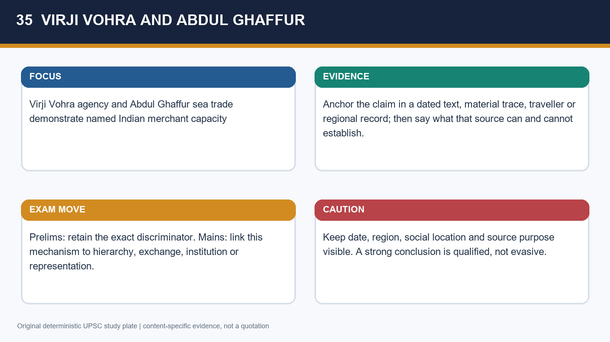

*Visual 35: VIRJI VOHRA AND ABDUL GHAFFUR. Original deterministic study visual; schematic maps are NOT TO SCALE.*

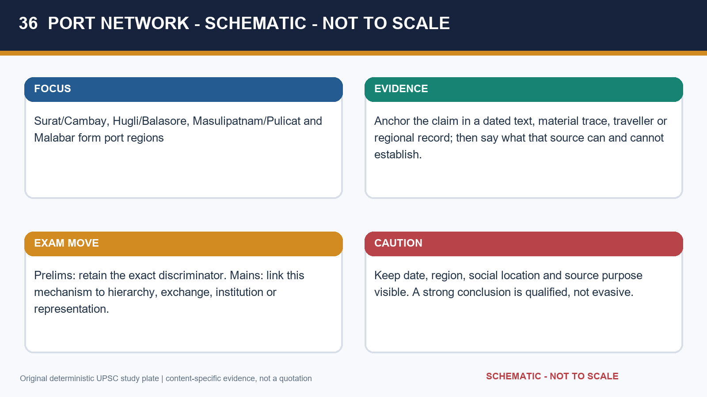

*Visual 36: PORT NETWORK - SCHEMATIC - NOT TO SCALE. Original deterministic study visual; schematic maps are NOT TO SCALE.*

#### Concept and evidence

Surat/Cambay, Hugli/Balasore, Masulipatnam/Pulicat and Malabar formed differentiated port regions. Exports included textiles, raw silk, rice/grain, sugar, indigo and saltpetre; imports included horses, metals and luxury goods. Bullion inflow supported silver currency but did not prove universal prosperity. Indian ships and merchants remained central in seventeenth-century circuits; European companies entered existing networks with chartered capital and naval coercion. Factories could be land-vulnerable and faced seizure, while maritime leverage grew. Mughal port policy was generally commerce-protecting and wary of fortification, not a modern free-trade doctrine.

#### Source-method checkpoint

For **overseas trade and indian ocean**, identify what a court record, traveller, material trace and vernacular account can respectively show. Do not treat one category as a transparent total picture. Convert the proposition into an answer by naming a mechanism, giving a source-grounded example, and adding a regional, social or chronological qualification. The nearest UPSC trap is a sweeping statement that removes this qualification.

#### Mains articulation

A high-scoring paragraph on **overseas trade and indian ocean** begins with a qualified claim, links evidence to process, and closes with its limit. Cross-link rather than duplicate: Topic 07 for Persian-source method, Topic 10 for Bhakti/Sufi theology, Topic 11 for Sultanate antecedents, Topic 16 for full revenue, Topic 17 for translation, Topic 21 for ruling class, Topic 23 for jagirdari crisis and Topic 25 for transition.

#### CLOSING RECALL FLOW — OVERSEAS TRADE AND INDIAN OCEAN

```text
START / CONCEPT: Overseas trade and Indian Ocean
        |
        v
EXACT TERMS: Overseas trade · Indian Ocean · overseas trade and indian ocean · Surat · Cambay · Hugli
        |
        v
MECHANISM / ARGUMENT: A high-scoring paragraph on overseas trade and indian ocean begins with a qualified claim, links evidence to process, and closes with its limit.
        |
        v
CONSEQUENCE / CONTRAST: Bullion inflow supported silver currency but did not prove universal prosperity.
        |
        v
UPSC TRAP / ANSWER-USE: Factories could be land-vulnerable and faced seizure, while maritime leverage grew.
        |
        v
ANSWER-GRABBING FORMULATION: For overseas trade and indian ocean, identify what a court record, traveller, material trace and vernacular account can respectively show.
```
### SESSION 13 — TAVERNIER, DIAMONDS AND MONEY

#### DEFINITION / WHAT THIS IS CALLED

**Plain-language definition:** For tavernier, diamonds and money, identify what a court record, traveller, material trace and vernacular account can respectively show.

**Technical definition:** A high-scoring paragraph on tavernier, diamonds and money begins with a qualified claim, links evidence to process, and closes with its limit.

#### ANSWER-GRABBING OPENING — WRITE/ADAPT IN THE EXAM

> For tavernier, diamonds and money, identify what a court record, traveller, material trace and vernacular account can respectively show.

#### MUST-WRITE KEYWORDS

- **Tavernier**
- **diamonds**
- **money**
- **tavernier, diamonds and money**
- **Jean-Baptiste Tavernier**
- **French**

**How to use them:** Frame the answer through Tavernier; define diamonds, connect money with tavernier, diamonds and money to explain the mechanism, and use Jean-Baptiste Tavernier for the decisive comparison or qualification.


*Visual 37: INDIAN OCEAN ROUTES - SCHEMATIC - NOT TO SCALE. Original deterministic study visual; schematic maps are NOT TO SCALE.*


*Visual 38: EXPORTS, IMPORTS AND BULLION. Original deterministic study visual; schematic maps are NOT TO SCALE.*


*Visual 39: INDIAN AND EUROPEAN MERCHANTS. Original deterministic study visual; schematic maps are NOT TO SCALE.*

#### Concept and evidence

Jean-Baptiste Tavernier was a French jeweller-merchant traveller who elaborately discussed diamonds and diamond mines, especially Golconda/Kollur contexts. His commercial expertise makes him strong evidence for luxury circuits and the 2018 Prelims demand, but his lens cannot represent ordinary life. Silver rupee, copper dam and gold mohur connected mint, revenue and market. Monetisation remained uneven: kind payments and barter persisted. Claims of price revolution, stability or debasement need locality and date; never import a European model mechanically.

#### Source-method checkpoint

For **tavernier, diamonds and money**, identify what a court record, traveller, material trace and vernacular account can respectively show. Do not treat one category as a transparent total picture. Convert the proposition into an answer by naming a mechanism, giving a source-grounded example, and adding a regional, social or chronological qualification. The nearest UPSC trap is a sweeping statement that removes this qualification.

#### Mains articulation

A high-scoring paragraph on **tavernier, diamonds and money** begins with a qualified claim, links evidence to process, and closes with its limit. Cross-link rather than duplicate: Topic 07 for Persian-source method, Topic 10 for Bhakti/Sufi theology, Topic 11 for Sultanate antecedents, Topic 16 for full revenue, Topic 17 for translation, Topic 21 for ruling class, Topic 23 for jagirdari crisis and Topic 25 for transition.

#### CLOSING RECALL FLOW — TAVERNIER, DIAMONDS AND MONEY

```text
START / CONCEPT: Tavernier, diamonds and money
        |
        v
EXACT TERMS: Tavernier · diamonds · money · tavernier, diamonds and money · Jean-Baptiste Tavernier · French
        |
        v
MECHANISM / ARGUMENT: A high-scoring paragraph on tavernier, diamonds and money begins with a qualified claim, links evidence to process, and closes with its limit.
        |
        v
CONSEQUENCE / CONTRAST: Jean-Baptiste Tavernier was a French jeweller-merchant traveller who elaborately discussed diamonds and diamond mines, especially Golconda/Kollur contexts.
        |
        v
UPSC TRAP / ANSWER-USE: Do not treat one category as a transparent total picture.
        |
        v
ANSWER-GRABBING FORMULATION: For tavernier, diamonds and money, identify what a court record, traveller, material trace and vernacular account can respectively show.
```
### SESSION 14 — TECHNOLOGY AND PRODUCTION DEBATE

#### DEFINITION / WHAT THIS IS CALLED

**Plain-language definition:** For technology and production debate, identify what a court record, traveller, material trace and vernacular account can respectively show.

**Technical definition:** A high-scoring paragraph on technology and production debate begins with a qualified claim, links evidence to process, and closes with its limit.

#### ANSWER-GRABBING OPENING — WRITE/ADAPT IN THE EXAM

> For technology and production debate, identify what a court record, traveller, material trace and vernacular account can respectively show.

#### MUST-WRITE KEYWORDS

- **Technology**
- **production debate**
- **technology and production debate**
- **Weaving**
- **Selective**
- **Printing**

**How to use them:** Frame the answer through Technology; define production debate, connect technology and production debate with Weaving to explain the mechanism, and use Selective for the decisive comparison or qualification.

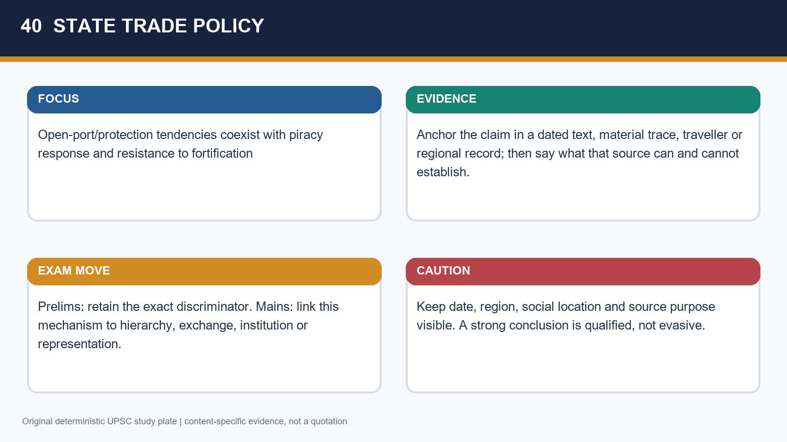

*Visual 40: STATE TRADE POLICY. Original deterministic study visual; schematic maps are NOT TO SCALE.*


*Visual 41: TAVERNIER DIAMOND ROUTE. Original deterministic study visual; schematic maps are NOT TO SCALE.*


*Visual 42: TRAVELLER LUXURY BIAS. Original deterministic study visual; schematic maps are NOT TO SCALE.*

#### Concept and evidence

Technology is sectoral. Weaving, dyeing and shipbuilding displayed high artisanal skill, while water pumps, large furnace/bellows, cannon casting, screws/springs, precision instruments and telescopic observation had uneven uptake. Selective adoption may relate to labour abundance, cost, merchant advances without tool investment and weak links between elite/scientific knowledge and workshop production. Printing needs nuance: textile block printing, knowledge of presses, missionary/regional printing and limited court uptake are distinct. Avoid both "no printing" and automatic mass press. Commercial dynamism did not compel mechanised industrial transition.

#### Source-method checkpoint

For **technology and production debate**, identify what a court record, traveller, material trace and vernacular account can respectively show. Do not treat one category as a transparent total picture. Convert the proposition into an answer by naming a mechanism, giving a source-grounded example, and adding a regional, social or chronological qualification. The nearest UPSC trap is a sweeping statement that removes this qualification.

#### Mains articulation

A high-scoring paragraph on **technology and production debate** begins with a qualified claim, links evidence to process, and closes with its limit. Cross-link rather than duplicate: Topic 07 for Persian-source method, Topic 10 for Bhakti/Sufi theology, Topic 11 for Sultanate antecedents, Topic 16 for full revenue, Topic 17 for translation, Topic 21 for ruling class, Topic 23 for jagirdari crisis and Topic 25 for transition.

#### CLOSING RECALL FLOW — TECHNOLOGY AND PRODUCTION DEBATE

```text
START / CONCEPT: Technology and production debate
        |
        v
EXACT TERMS: Technology · production debate · technology and production debate · Weaving · Selective · Printing
        |
        v
MECHANISM / ARGUMENT: A high-scoring paragraph on technology and production debate begins with a qualified claim, links evidence to process, and closes with its limit.
        |
        v
CONSEQUENCE / CONTRAST: Weaving, dyeing and shipbuilding displayed high artisanal skill, while water pumps, large furnace/bellows, cannon casting, screws/springs, precision instruments and telescopic observation had uneven uptake.
        |
        v
UPSC TRAP / ANSWER-USE: Do not treat one category as a transparent total picture.
        |
        v
ANSWER-GRABBING FORMULATION: For technology and production debate, identify what a court record, traveller, material trace and vernacular account can respectively show.
```
### SESSION 15 — ARCHITECTURE AS COLLECTIVE PRODUCTION

#### DEFINITION / WHAT THIS IS CALLED

**Plain-language definition:** For architecture as collective production, identify what a court record, traveller, material trace and vernacular account can respectively show.

**Technical definition:** A high-scoring paragraph on architecture as collective production begins with a qualified claim, links evidence to process, and closes with its limit.

#### ANSWER-GRABBING OPENING — WRITE/ADAPT IN THE EXAM

> For architecture as collective production, identify what a court record, traveller, material trace and vernacular account can respectively show.

#### MUST-WRITE KEYWORDS

- **Architecture as collective production**
- **Shah Jahan's Taj Mahal**
- **Red Fort**
- **Jama Masjid**
- **Patron**
- **Bibi**

**How to use them:** Frame the answer through Architecture as collective production; define Shah Jahan's Taj Mahal, connect Red Fort with Jama Masjid to explain the mechanism, and use Patron for the decisive comparison or qualification.


*Visual 43: CURRENCY AND MONETISATION. Original deterministic study visual; schematic maps are NOT TO SCALE.*

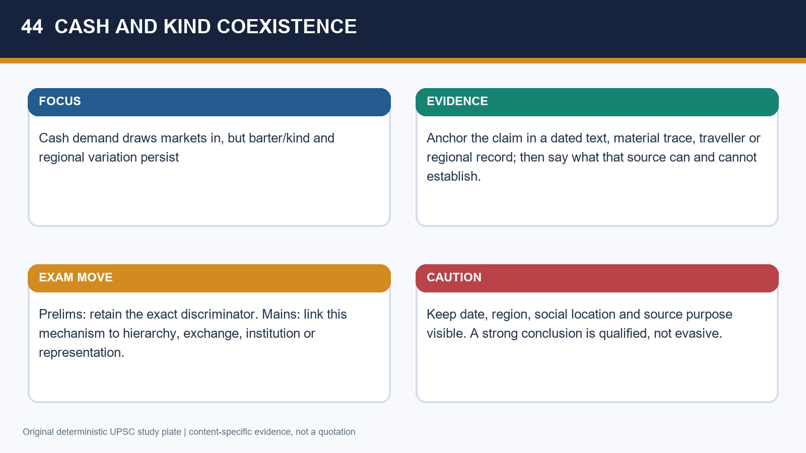

*Visual 44: CASH AND KIND COEXISTENCE. Original deterministic study visual; schematic maps are NOT TO SCALE.*


*Visual 45: TECHNOLOGY SECTORS. Original deterministic study visual; schematic maps are NOT TO SCALE.*

#### Concept and evidence

Humayun's Tomb gives charbagh and a Timurid-Persian bridge. Akbar's Agra Fort, Fatehpur Sikri and Buland Darwaza combine red sandstone, trabeate-arcuate experiment and sovereignty; Buland Darwaza began in 1573 for Gujarat victory. Jahangir's Itimad-ud-Daulah develops marble/pietra dura. Shah Jahan's Taj Mahal, Red Fort and Jama Masjid show symmetry, inlay and formal court expression. Patron, master builder, artisan, quarry, transport, karkhana and labour are the institutional frame. Bibi ka Maqbara needs accurate, attribution-qualified use. Monumentality neither proves social harmony nor universal prosperity.

#### Source-method checkpoint

For **architecture as collective production**, identify what a court record, traveller, material trace and vernacular account can respectively show. Do not treat one category as a transparent total picture. Convert the proposition into an answer by naming a mechanism, giving a source-grounded example, and adding a regional, social or chronological qualification. The nearest UPSC trap is a sweeping statement that removes this qualification.

#### Mains articulation

A high-scoring paragraph on **architecture as collective production** begins with a qualified claim, links evidence to process, and closes with its limit. Cross-link rather than duplicate: Topic 07 for Persian-source method, Topic 10 for Bhakti/Sufi theology, Topic 11 for Sultanate antecedents, Topic 16 for full revenue, Topic 17 for translation, Topic 21 for ruling class, Topic 23 for jagirdari crisis and Topic 25 for transition.

#### CLOSING RECALL FLOW — ARCHITECTURE AS COLLECTIVE PRODUCTION

```text
START / CONCEPT: Architecture as collective production
        |
        v
EXACT TERMS: Architecture as collective production · Shah Jahan's Taj Mahal · Red Fort · Jama Masjid · Patron · Bibi
        |
        v
MECHANISM / ARGUMENT: A high-scoring paragraph on architecture as collective production begins with a qualified claim, links evidence to process, and closes with its limit.
        |
        v
CONSEQUENCE / CONTRAST: Do not treat one category as a transparent total picture.
        |
        v
UPSC TRAP / ANSWER-USE: Do not miss this limiting distinction: shah Jahan's Taj Mahal, Red Fort and Jama Masjid show symmetry, inlay and formal...
        |
        v
ANSWER-GRABBING FORMULATION: For architecture as collective production, identify what a court record, traveller, material trace and vernacular account can respectively show.
```
### SESSION 16 — PAINTING, MUSIC AND PERFORMANCE

#### DEFINITION / WHAT THIS IS CALLED

**Plain-language definition:** Aurangzeb banished singers after early patronage, but instrumental music, noble/household patronage and music writing continued; funeral-of-music is satire, not literal proof.

**Technical definition:** A high-scoring paragraph on painting, music and performance begins with a qualified claim, links evidence to process, and closes with its limit.

#### ANSWER-GRABBING OPENING — WRITE/ADAPT IN THE EXAM

> For painting, music and performance, identify what a court record, traveller, material trace and vernacular account can respectively show.

#### MUST-WRITE KEYWORDS

- **Painting**
- **music**
- **performance**
- **painting, music and performance**
- **Humayun's Persian links**
- **Humayun's Persian**

**How to use them:** Frame the answer through Painting; define music, connect performance with painting, music and performance to explain the mechanism, and use Humayun's Persian links for the decisive comparison or qualification.


*Visual 46: PRINTING NUANCE. Original deterministic study visual; schematic maps are NOT TO SCALE.*

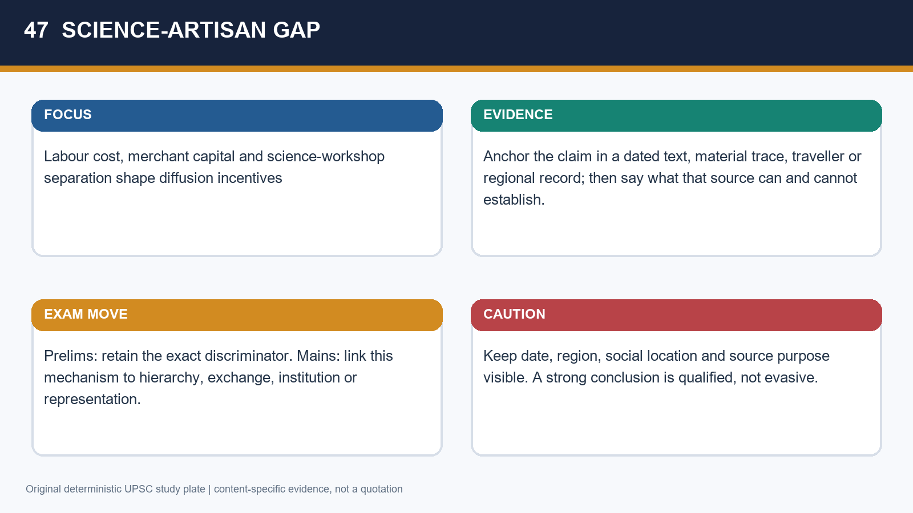

*Visual 47: SCIENCE-ARTISAN GAP. Original deterministic study visual; schematic maps are NOT TO SCALE.*

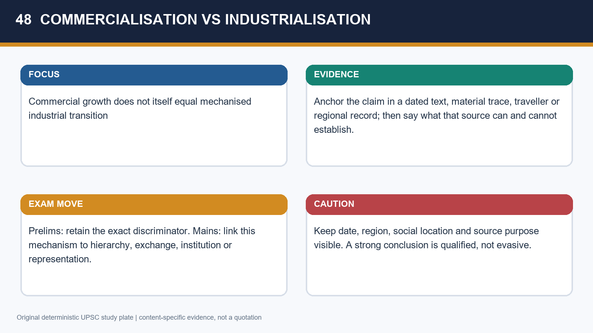

*Visual 48: COMMERCIALISATION VS INDUSTRIALISATION. Original deterministic study visual; schematic maps are NOT TO SCALE.*

#### Concept and evidence

Humayun's Persian links are antecedent; Akbar's kitabkhana/karkhana made Hamzanama collaborative illustrated production. Akbar favoured narrative illustration; Jahangir developed portraiture, albums/muraqqa and natural studies, with Mansur securely associated with flora/fauna; Shah Jahan formalised court image. Aurangzeb's reduced interest encouraged artist dispersal to Rajasthan/Pahari courts, a transformation rather than a death. Tansen and dhrupad anchor Akbar. Aurangzeb banished singers after early patronage, but instrumental music, noble/household patronage and music writing continued; funeral-of-music is satire, not literal proof.

#### Source-method checkpoint

For **painting, music and performance**, identify what a court record, traveller, material trace and vernacular account can respectively show. Do not treat one category as a transparent total picture. Convert the proposition into an answer by naming a mechanism, giving a source-grounded example, and adding a regional, social or chronological qualification. The nearest UPSC trap is a sweeping statement that removes this qualification.

#### Mains articulation

A high-scoring paragraph on **painting, music and performance** begins with a qualified claim, links evidence to process, and closes with its limit. Cross-link rather than duplicate: Topic 07 for Persian-source method, Topic 10 for Bhakti/Sufi theology, Topic 11 for Sultanate antecedents, Topic 16 for full revenue, Topic 17 for translation, Topic 21 for ruling class, Topic 23 for jagirdari crisis and Topic 25 for transition.

#### CLOSING RECALL FLOW — PAINTING, MUSIC AND PERFORMANCE

```text
START / CONCEPT: Painting, music and performance
        |
        v
EXACT TERMS: Painting · music · performance · painting, music and performance · Humayun's Persian links · Humayun's Persian
        |
        v
MECHANISM / ARGUMENT: A high-scoring paragraph on painting, music and performance begins with a qualified claim, links evidence to process, and closes with its limit.
        |
        v
CONSEQUENCE / CONTRAST: Aurangzeb banished singers after early patronage, but instrumental music, noble/household patronage and music writing continued; funeral-of-music is satire, not literal proof.
        |
        v
UPSC TRAP / ANSWER-USE: Do not treat one category as a transparent total picture.
        |
        v
ANSWER-GRABBING FORMULATION: For painting, music and performance, identify what a court record, traveller, material trace and vernacular account can respectively show.
```
### SESSION 17 — PERSIAN LITERATURE AND SOURCE CRITIQUE

#### DEFINITION / WHAT THIS IS CALLED

**Plain-language definition:** For persian literature and source critique, identify what a court record, traveller, material trace and vernacular account can respectively show.

**Technical definition:** A high-scoring paragraph on persian literature and source critique begins with a qualified claim, links evidence to process, and closes with its limit.

#### ANSWER-GRABBING OPENING — WRITE/ADAPT IN THE EXAM

> For persian literature and source critique, identify what a court record, traveller, material trace and vernacular account can respectively show.

#### MUST-WRITE KEYWORDS

- **Persian literature**
- **source critique**
- **persian literature and source critique**
- **Court**
- **Barani**
- **Amir Khusrau**

**How to use them:** Frame the answer through Persian literature; define source critique, connect persian literature and source critique with Court to explain the mechanism, and use Barani for the decisive comparison or qualification.

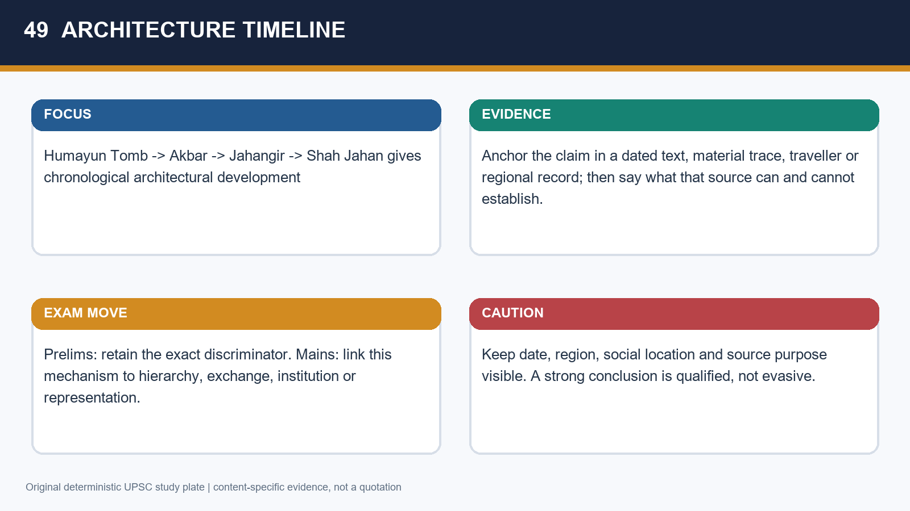

*Visual 49: ARCHITECTURE TIMELINE. Original deterministic study visual; schematic maps are NOT TO SCALE.*

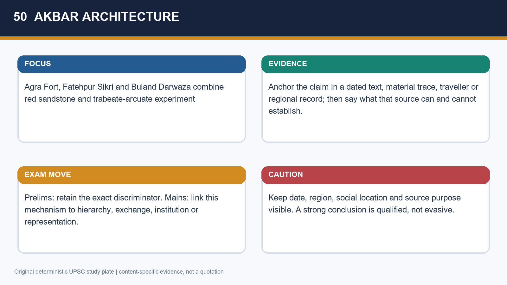

*Visual 50: AKBAR ARCHITECTURE. Original deterministic study visual; schematic maps are NOT TO SCALE.*


*Visual 51: JAHANGIR TRANSITION. Original deterministic study visual; schematic maps are NOT TO SCALE.*

#### Concept and evidence

Court chronicles (Barani, Amir Khusrau, Abul Fazl, Badauni, Padshahnama, Maasir), memoirs (Baburnama, Humayun-nama, Tuzuk), Ain, normative texts, Sufi malfuzat such as Fawaid-ul-Fuad, letters and biographies have distinct purposes. The 2020 Mains word "reflect" must be qualified to "refract": these sources reveal sovereignty, hierarchy, religion, administration, literary aesthetics and dissent, but also privilege elites and silence many peasants, women, oral and non-court worlds. Corroborate with vernacular texts, coins, inscriptions, architecture, archaeology, paintings and travellers.

#### Source-method checkpoint

For **persian literature and source critique**, identify what a court record, traveller, material trace and vernacular account can respectively show. Do not treat one category as a transparent total picture. Convert the proposition into an answer by naming a mechanism, giving a source-grounded example, and adding a regional, social or chronological qualification. The nearest UPSC trap is a sweeping statement that removes this qualification.

#### Mains articulation

A high-scoring paragraph on **persian literature and source critique** begins with a qualified claim, links evidence to process, and closes with its limit. Cross-link rather than duplicate: Topic 07 for Persian-source method, Topic 10 for Bhakti/Sufi theology, Topic 11 for Sultanate antecedents, Topic 16 for full revenue, Topic 17 for translation, Topic 21 for ruling class, Topic 23 for jagirdari crisis and Topic 25 for transition.

#### CLOSING RECALL FLOW — PERSIAN LITERATURE AND SOURCE CRITIQUE

```text
START / CONCEPT: Persian literature and source critique
        |
        v
EXACT TERMS: Persian literature · source critique · persian literature and source critique · Court · Barani · Amir Khusrau
        |
        v
MECHANISM / ARGUMENT: A high-scoring paragraph on persian literature and source critique begins with a qualified claim, links evidence to process, and closes with its limit.
        |
        v
CONSEQUENCE / CONTRAST: The 2020 Mains word "reflect" must be qualified to "refract": these sources reveal sovereignty, hierarchy, religion, administration, literary aesthetics and dissent, but also privilege elites and silence many peasants, women, oral and non-court worlds.
        |
        v
UPSC TRAP / ANSWER-USE: Do not treat one category as a transparent total picture.
        |
        v
ANSWER-GRABBING FORMULATION: For persian literature and source critique, identify what a court record, traveller, material trace and vernacular account can respectively show.
```
### SESSION 18 — TRANSLATION, VERNACULARS AND COMPOSITE CULTURE

#### DEFINITION / WHAT THIS IS CALLED

**Plain-language definition:** Composite culture means mechanism-based interaction, not equality or no conflict.

**Technical definition:** A high-scoring paragraph on translation, vernaculars and composite culture begins with a qualified claim, links evidence to process, and closes with its limit.

#### ANSWER-GRABBING OPENING — WRITE/ADAPT IN THE EXAM

> For translation, vernaculars and composite culture, identify what a court record, traveller, material trace and vernacular account can respectively show.

#### MUST-WRITE KEYWORDS

- **Translation**
- **vernaculars**
- **composite culture**
- **translation, vernaculars and composite culture**
- **Critical**
- **Nizamuddin Panipati's Persian Yogavasistha**

**How to use them:** Frame the answer through Translation; define vernaculars, connect composite culture with translation, vernaculars and composite culture to explain the mechanism, and use Critical for the decisive comparison or qualification.

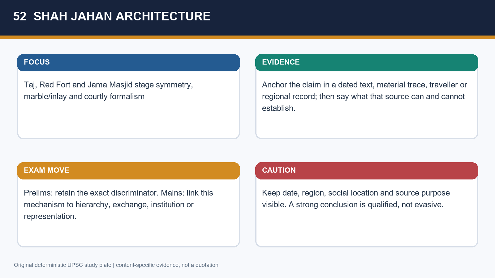

*Visual 52: SHAH JAHAN ARCHITECTURE. Original deterministic study visual; schematic maps are NOT TO SCALE.*


*Visual 53: ARCHITECTURE POLITICAL ECONOMY. Original deterministic study visual; schematic maps are NOT TO SCALE.*


*Visual 54: PAINTING EVOLUTION. Original deterministic study visual; schematic maps are NOT TO SCALE.*

#### Concept and evidence

Akbar's Maktab Khana fostered Sanskrit-Persian translation, including Razmnama/Mahabharata and Ramayana projects. Critical correction: Nizamuddin Panipati's Persian Yogavasistha/Jug Basis belongs to Akbar's reign, conventionally late sixteenth century; Dara Shukoh has distinct Majma-ul-Bahrain and Sirr-i-Akbar/Upanishad work. Hindi/Braj/Avadhi writers Tulsidas, Surdas, Rahim, Raskhan and Keshavdas; Marathi Eknath, Tukaram and Ramdas; Sikh Guru traditions/Adi Granth and other regional literatures show expansion beside Persian, not replacement. Composite culture means mechanism-based interaction, not equality or no conflict.

#### Source-method checkpoint

For **translation, vernaculars and composite culture**, identify what a court record, traveller, material trace and vernacular account can respectively show. Do not treat one category as a transparent total picture. Convert the proposition into an answer by naming a mechanism, giving a source-grounded example, and adding a regional, social or chronological qualification. The nearest UPSC trap is a sweeping statement that removes this qualification.

#### Mains articulation

A high-scoring paragraph on **translation, vernaculars and composite culture** begins with a qualified claim, links evidence to process, and closes with its limit. Cross-link rather than duplicate: Topic 07 for Persian-source method, Topic 10 for Bhakti/Sufi theology, Topic 11 for Sultanate antecedents, Topic 16 for full revenue, Topic 17 for translation, Topic 21 for ruling class, Topic 23 for jagirdari crisis and Topic 25 for transition.

#### CLOSING RECALL FLOW — TRANSLATION, VERNACULARS AND COMPOSITE CULTURE

```text
START / CONCEPT: Translation, vernaculars and composite culture
        |
        v
EXACT TERMS: Translation · vernaculars · composite culture · translation, vernaculars and composite culture · Critical · Nizamuddin Panipati's Persian Yogavasistha
        |
        v
MECHANISM / ARGUMENT: A high-scoring paragraph on translation, vernaculars and composite culture begins with a qualified claim, links evidence to process, and closes with its limit.
        |
        v
CONSEQUENCE / CONTRAST: Composite culture means mechanism-based interaction, not equality or no conflict.
        |
        v
UPSC TRAP / ANSWER-USE: Hindi/Braj/Avadhi writers Tulsidas, Surdas, Rahim, Raskhan and Keshavdas; Marathi Eknath, Tukaram and Ramdas; Sikh Guru traditions/Adi Granth and other regional literatures show expansion beside Persian, not replacement.
        |
        v
ANSWER-GRABBING FORMULATION: For translation, vernaculars and composite culture, identify what a court record, traveller, material trace and vernacular account can respectively show.
```
### SESSION 19 — BERNIER, TRAVELLERS AND HISTORIOGRAPHY

#### DEFINITION / WHAT THIS IS CALLED

**Plain-language definition:** For bernier, travellers and historiography, identify what a court record, traveller, material trace and vernacular account can respectively show.

**Technical definition:** A high-scoring paragraph on bernier, travellers and historiography begins with a qualified claim, links evidence to process, and closes with its limit.

#### ANSWER-GRABBING OPENING — WRITE/ADAPT IN THE EXAM

> For bernier, travellers and historiography, identify what a court record, traveller, material trace and vernacular account can respectively show.

#### MUST-WRITE KEYWORDS

- **Bernier**
- **travellers**
- **historiography**
- **bernier, travellers and historiography**
- **Habib**
- **Chandra**

**How to use them:** Frame the answer through Bernier; define travellers, connect historiography with bernier, travellers and historiography to explain the mechanism, and use Habib for the decisive comparison or qualification.


*Visual 55: HAMZANAMA WORKSHOP. Original deterministic study visual; schematic maps are NOT TO SCALE.*


*Visual 56: JAHANGIR NATURALISM. Original deterministic study visual; schematic maps are NOT TO SCALE.*


*Visual 57: ARTIST DISPERSAL. Original deterministic study visual; schematic maps are NOT TO SCALE.*

#### Concept and evidence

Bernier observed inequality and insecurity but framed property/jagir argument through a European comparative lens. Habib and Chandra qualify him with layered rights, zamindari claims, merchant wealth, professions and agrarian response; this is not a denial of distress. Tavernier's luxury lens, Pelsaert's urban observations, Roe/Hawkins diplomacy, Manucci's anecdotes and Mundy/Thevenot routes need separate treatment. Modern debates over agrarian system, commercial capitalism/proto-industrialisation, technology divergence and composite culture reject single causes. Quantitative claims require source, date and denominator.

#### Source-method checkpoint

For **bernier, travellers and historiography**, identify what a court record, traveller, material trace and vernacular account can respectively show. Do not treat one category as a transparent total picture. Convert the proposition into an answer by naming a mechanism, giving a source-grounded example, and adding a regional, social or chronological qualification. The nearest UPSC trap is a sweeping statement that removes this qualification.

#### Mains articulation

A high-scoring paragraph on **bernier, travellers and historiography** begins with a qualified claim, links evidence to process, and closes with its limit. Cross-link rather than duplicate: Topic 07 for Persian-source method, Topic 10 for Bhakti/Sufi theology, Topic 11 for Sultanate antecedents, Topic 16 for full revenue, Topic 17 for translation, Topic 21 for ruling class, Topic 23 for jagirdari crisis and Topic 25 for transition.

#### CLOSING RECALL FLOW — BERNIER, TRAVELLERS AND HISTORIOGRAPHY

```text
START / CONCEPT: Bernier, travellers and historiography
        |
        v
EXACT TERMS: Bernier · travellers · historiography · bernier, travellers and historiography · Habib · Chandra
        |
        v
MECHANISM / ARGUMENT: A high-scoring paragraph on bernier, travellers and historiography begins with a qualified claim, links evidence to process, and closes with its limit.
        |
        v
CONSEQUENCE / CONTRAST: Habib and Chandra qualify him with layered rights, zamindari claims, merchant wealth, professions and agrarian response; this is not a denial of distress.
        |
        v
UPSC TRAP / ANSWER-USE: Do not treat one category as a transparent total picture.
        |
        v
ANSWER-GRABBING FORMULATION: For bernier, travellers and historiography, identify what a court record, traveller, material trace and vernacular account can respectively show.
```
### 20. Current linkage, boundaries and risk ledger


*Visual 58: PAINTING AS SOURCE. Original deterministic study visual; schematic maps are NOT TO SCALE.*


*Visual 59: MUSIC CONTINUITY. Original deterministic study visual; schematic maps are NOT TO SCALE.*

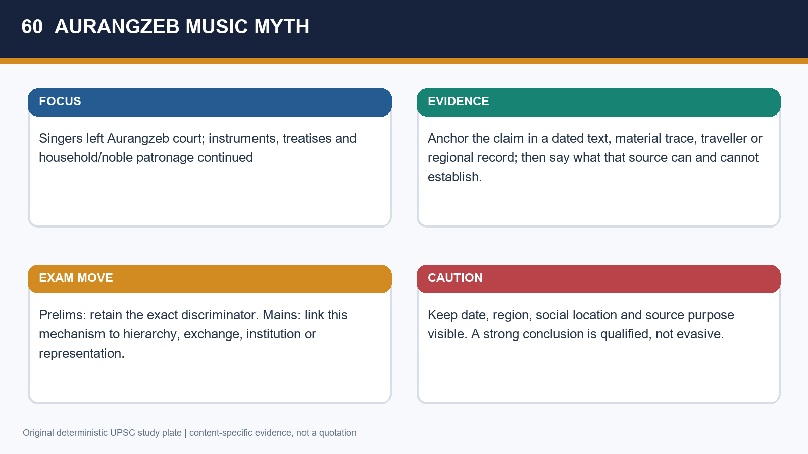

*Visual 60: AURANGZEB MUSIC MYTH. Original deterministic study visual; schematic maps are NOT TO SCALE.*

#### Concept and evidence

Official searches/fetches for the six months before 2026-08-19 covered PIB, Ministry of Textiles queries and Ministry of Culture/ASI/UNESCO queries. PIB was 403, Textiles host fetch did not resolve, Ministry of Culture stated its broad conservation mandate, and no qualifying verified India-specific anchor was found. Therefore: No material recent official current-affairs anchor found; static heritage and craft relevance retained. Topic 07 owns Persian-source method depth, 10 Bhakti/Sufi theology, 11 Sultanate culture, 16 full revenue, 17 translation, 21 ruling class, 23 jagirdari crisis and 25 transition. Risk flags: foreign-born denominator, aurang/mirasidar context, Yogavasistha correction, printing nuance, music myth and monument dates.

#### Source-method checkpoint

For **current linkage, boundaries and risk ledger**, identify what a court record, traveller, material trace and vernacular account can respectively show. Do not treat one category as a transparent total picture. Convert the proposition into an answer by naming a mechanism, giving a source-grounded example, and adding a regional, social or chronological qualification. The nearest UPSC trap is a sweeping statement that removes this qualification.

#### Mains articulation

A high-scoring paragraph on **current linkage, boundaries and risk ledger** begins with a qualified claim, links evidence to process, and closes with its limit. Cross-link rather than duplicate: Topic 07 for Persian-source method, Topic 10 for Bhakti/Sufi theology, Topic 11 for Sultanate antecedents, Topic 16 for full revenue, Topic 17 for translation, Topic 21 for ruling class, Topic 23 for jagirdari crisis and Topic 25 for transition.

### SESSION 20 — BOUNDED LIVE LINKAGE

#### DEFINITION / WHAT THIS IS CALLED

**Plain-language definition:** The live page is a heritage and source-method bridge only.

**Technical definition:** They are not evidence of universal prosperity, social equality, exact GDP, private landownership, or the reach of imperial policy.

#### ANSWER-GRABBING OPENING — WRITE/ADAPT IN THE EXAM

> The live page is a heritage and source-method bridge only.

#### MUST-WRITE KEYWORDS

- **Bounded live linkage**
- **They**
- **GDP**
- **No**
- **The live page**

**How to use them:** Frame the answer through Bounded live linkage; define They, connect GDP with No to explain the mechanism, and use The live page for the decisive comparison or qualification.

Rechecked on 30 August 2026. The ASI mandate and UNESCO Taj Mahal and Red Fort pages support monument conservation, skilled and artisanal production, composite architectural traditions, material setting and patronage. They are not evidence of universal prosperity, social equality, exact GDP, private landownership, or the reach of imperial policy. No genuinely topic-specific new official event was found in the preceding six months, so static relevance is retained.

The live page is a heritage and source-method bridge only. Historical chronology, causation, attribution and institutional claims remain controlled by repository Markdown, OCR-searchable books and explicit source criticism.

#### CLOSING RECALL FLOW — BOUNDED LIVE LINKAGE

```text
START / CONCEPT: Bounded live linkage
        |
        v
EXACT TERMS: Bounded live linkage · They · GDP · No · The live page
        |
        v
MECHANISM / ARGUMENT: They are not evidence of universal prosperity, social equality, exact GDP, private landownership, or the reach of imperial policy.
        |
        v
CONSEQUENCE / CONTRAST: No genuinely topic-specific new official event was found in the preceding six months, so static relevance is retained.
        |
        v
UPSC TRAP / ANSWER-USE: Do not miss this limiting distinction: they are not evidence of universal prosperity, social equality, exact GDP, private landownership, or...
        |
        v
ANSWER-GRABBING FORMULATION: The live page is a heritage and source-method bridge only.
```
## BASIC MCQS / REMEDIATION

### PART III - Independent practice and remedies

### Learning MCQ loop (24; keys A-B-C-D x6)

Original learning practice. Correct positions rotate A -> B -> C -> D without changing the underlying answer.
#### Q1. Which description best avoids a uniform-society error?

- A. A layered Mughal order whose hierarchy and mobility varied by region
- B. A rigid all-India legal pyramid
- C. A society without occupational difference
- D. A court-versus-peasant binary

**Answer: A.**
**Explanation:** The answer retains hierarchy and variation; the binary distractor suppresses merchants, professionals, artisans and local chiefs.

#### Q2. Which late-Aurangzeb foreign-born statement is careful?

- A. Ancestry had no elite importance
- B. Under 10 percent of 1000-zat-and-above nobles were foreign-born in 1679-1707
- C. Foreign-born nobles were always a majority
- D. All Iranis/Turanis were foreign-born

**Answer: B.**
**Explanation:** Date and denominator control the claim. Iranis/Turanis are not identical to foreign-born persons.

#### Q3. Mansab is best described as

- A. A port customs office
- B. A hereditary European title
- C. A service-rank system bureaucratising an aristocratic patronage world
- D. A village revenue tax

**Answer: C.**
**Explanation:** Mansab regulates service and rank without abolishing elite household power; hereditary title reverses the formal rule.

#### Q4. A zamindar should not be reduced to

- A. A category with variable scale
- B. An actor sometimes linked to force and clan
- C. A locally rooted claimant with varied rights
- D. A British landlord or a mere tax clerk

**Answer: D.**
**Explanation:** The correct answer blocks both anachronisms. Local claimant is true but too partial as a definition.

#### Q5. Khud-kasht most carefully denotes

- A. A resident owner-cultivator with stronger resource and status position
- B. Only landless seasonal labour
- C. A transferable jagir holder
- D. Every village resident

**Answer: A.**
**Explanation:** Residence alone is insufficient: cultivation, ownership and resource position matter.

#### Q6. Pahi-kasht were often

- A. Treasury officials
- B. Incoming cultivators settling new, surplus or abandoned land on possible concessions
- C. Non-cultivating nomads only
- D. A synonym for all khud-kasht

**Answer: B.**
**Explanation:** Pahi concerns entrant settlement. Khud-kasht reverses the resident/entrant distinction.

#### Q7. Layered Mughal land rights mean

- A. Modern private ownership was complete
- B. Every zamindar owned every field
- C. Cultivation, occupancy, revenue claim and customary access could be separated
- D. State alone held every right

**Answer: C.**
**Explanation:** Layering defeats both simple state ownership and modern property assumptions.

#### Q8. Bernier is best treated as

- A. A total census of property
- B. A source to discard because European
- C. Proof that agriculture never grew
- D. A situated observer whose property argument needs comparison with Indian evidence

**Answer: D.**
**Explanation:** His observed inequality matters; the mistake is converting comparison into a complete theory.

#### Q9. A sound inference about women is

- A. Labour and elite patronage show agency without proving general equality
- B. Women had no productive role
- C. Elite women prove equality for all
- D. Every inheritance practice was identical

**Answer: A.**
**Explanation:** Elite visibility is the closest false leap because archives privilege courtly women.

#### Q10. Mughal urbanisation included

- A. Only army camps
- B. Imperial cities, ports, production/pilgrimage centres and qasbas
- C. Only coast cities
- D. One craft in every city

**Answer: B.**
**Explanation:** Functional diversity, not a single urban form, is the evidence-based approach.

#### Q11. Chandra's middle-strata argument names

- A. No urban occupations
- B. A modern democratic middle class
- C. Merchants, clerks, professionals, brokers and master-craftsmen
- D. Only company employees

**Answer: C.**
**Explanation:** The listed groups refute Bernier's binary but should not be relabelled a modern middle class.

#### Q12. Imperial karkhanas were

- A. Agrarian assignments
- B. All Mughal manufacture
- C. Only barracks
- D. Household/workshop/store systems alongside private production

**Answer: D.**
**Explanation:** Coexistence with private workshops and putting-out is the discriminator.

#### Q13. Aurang in the 2020 pair was not

- A. The in-charge of the state treasury
- B. A warehouse/depot term
- C. A trade-infrastructure word
- D. Commercial storage

**Answer: A.**
**Explanation:** Aurang is a depot/warehouse. Treasury office is the specific mismatch.

#### Q14. Banian in company trade meant

- A. Any foreign merchant
- B. An Indian broker-agent connecting purchase, credit and information
- C. Hereditary military rank
- D. Treasury officer

**Answer: B.**
**Explanation:** Generic merchant is too broad; the intermediary function is decisive.

#### Q15. Mirasidar is safest as

- A. A sea captain
- B. A mansabdar
- C. A hereditary/local right-holder, contextually a designated revenue payer in 2020
- D. A factory resident

**Answer: C.**
**Explanation:** Local-right context prevents confusing it with service rank.

#### Q16. A hundi was

- A. A fortification permit
- B. A fixed silver coin
- C. A noble title
- D. A credit instrument transmitting value across distance/time

**Answer: D.**
**Explanation:** Hundi reduces risky cash movement; a coin is financial but not the instrument.

#### Q17. Banjaras are associated with

- A. Moving bulk goods overland, often with oxen caravans
- B. Issuing coin
- C. Painting albums
- D. Holding mansabs

**Answer: A.**
**Explanation:** Transport of grain and bulk supply, not minting, is the function.

#### Q18. European companies were

- A. Mughal departments
- B. Entrants into existing networks with growing naval-coercive capacity
- C. Irrelevant everywhere
- D. Instant masters of all trade

**Answer: B.**
**Explanation:** The answer avoids instant dominance and irrelevance alike.

#### Q19. Tavernier is especially relevant because he

- A. Created mansab
- B. Wrote Ain-i-Akbari
- C. Elaborately discussed Indian diamonds and diamond mines
- D. Translated Yogavasistha

**Answer: C.**
**Explanation:** Jeweller-merchant expertise explains the diamond route; Nizamuddin, not Tavernier, is the translator.

#### Q20. Monetisation is best described as

- A. End of regional mints
- B. A universal cash-only economy
- C. Automatic rural welfare
- D. Important cash/revenue linkage while kind and barter persisted unevenly

**Answer: D.**
**Explanation:** Cash circulation does not abolish kind exchange or distribute welfare equally.

#### Q21. Technology is best judged as

- A. High artisanal skill with selective adoption and uneven science-production linkage
- B. No technical craft skill
- C. Completed industrialisation
- D. Uniform inferiority

**Answer: A.**
**Explanation:** Sectoral comparison avoids a civilisational stereotype and an industrial anachronism.

#### Q22. Printing requires the distinction between

- A. Mass printing in every court
- B. Textile blocks, knowledge of presses and uneven institutional uptake
- C. Universal literacy
- D. No printing in India

**Answer: B.**
**Explanation:** The no-printing absolute is the central trap; medium and institution matter.

#### Q23. Aurangzeb and music: the careful claim is

- A. No regional court continued music
- B. He invented dhrupad
- C. Singers left court but instruments, treatises and patronage continued
- D. All music ceased in India

**Answer: C.**
**Explanation:** Court restriction is not social extinction; the funeral anecdote is satirical.

#### Q24. Yogavasistha/Jug Basis matches

- A. Bernier and Shah Jahan
- B. Tavernier and Jahangir
- C. Dara Shukoh and Aurangzeb
- D. Nizamuddin Panipati and Akbar's reign

**Answer: D.**
**Explanation:** This corrects the owner-risk: Dara's distinct works are Majma-ul-Bahrain and Sirr-i-Akbar.

### Broad MCQ bank (48; keys A-B-C-D x12)

Original broad practice. Correct positions rotate A -> B -> C -> D without changing the underlying answer.
#### Q1. In a source-disciplined reading, Which description best avoids a uniform-society error?

- A. A layered Mughal order whose hierarchy and mobility varied by region
- B. A society without occupational difference
- C. A court-versus-peasant binary
- D. A rigid all-India legal pyramid

**Answer: A.**
**Explanation:** The answer retains hierarchy and variation; the binary distractor suppresses merchants, professionals, artisans and local chiefs.

#### Q2. When testing a common overclaim, Which late-Aurangzeb foreign-born statement is careful?

- A. All Iranis/Turanis were foreign-born
- B. Under 10 percent of 1000-zat-and-above nobles were foreign-born in 1679-1707
- C. Foreign-born nobles were always a majority
- D. Ancestry had no elite importance

**Answer: B.**
**Explanation:** Date and denominator control the claim. Iranis/Turanis are not identical to foreign-born persons.

#### Q3. For a period-and-region qualified answer, Mansab is best described as

- A. A village revenue tax
- B. A hereditary European title
- C. A service-rank system bureaucratising an aristocratic patronage world
- D. A port customs office

**Answer: C.**
**Explanation:** Mansab regulates service and rank without abolishing elite household power; hereditary title reverses the formal rule.

#### Q4. In a mechanism-based comparison, A zamindar should not be reduced to

- A. A locally rooted claimant with varied rights
- B. An actor sometimes linked to force and clan
- C. A category with variable scale
- D. A British landlord or a mere tax clerk

**Answer: D.**
**Explanation:** The correct answer blocks both anachronisms. Local claimant is true but too partial as a definition.

#### Q5. When an option removes a social boundary, Khud-kasht most carefully denotes

- A. A resident owner-cultivator with stronger resource and status position
- B. Only landless seasonal labour
- C. Every village resident
- D. A transferable jagir holder

**Answer: A.**
**Explanation:** Residence alone is insufficient: cultivation, ownership and resource position matter.

#### Q6. For a term-versus-inference distinction, Pahi-kasht were often

- A. A synonym for all khud-kasht
- B. Incoming cultivators settling new, surplus or abandoned land on possible concessions
- C. Non-cultivating nomads only
- D. Treasury officials

**Answer: B.**
**Explanation:** Pahi concerns entrant settlement. Khud-kasht reverses the resident/entrant distinction.

#### Q7. When court and locality are compared, Layered Mughal land rights mean

- A. State alone held every right
- B. Every zamindar owned every field
- C. Cultivation, occupancy, revenue claim and customary access could be separated
- D. Modern private ownership was complete

**Answer: C.**
**Explanation:** Layering defeats both simple state ownership and modern property assumptions.

#### Q8. In a claim-and-counterclaim frame, Bernier is best treated as

- A. Proof that agriculture never grew
- B. A source to discard because European
- C. A total census of property
- D. A situated observer whose property argument needs comparison with Indian evidence

**Answer: D.**
**Explanation:** His observed inequality matters; the mistake is converting comparison into a complete theory.

#### Q9. In a source-disciplined reading, A sound inference about women is

- A. Labour and elite patronage show agency without proving general equality
- B. Elite women prove equality for all
- C. Women had no productive role
- D. Every inheritance practice was identical

**Answer: A.**
**Explanation:** Elite visibility is the closest false leap because archives privilege courtly women.

#### Q10. When testing a common overclaim, Mughal urbanisation included

- A. Only coast cities
- B. Imperial cities, ports, production/pilgrimage centres and qasbas
- C. Only army camps
- D. One craft in every city

**Answer: B.**
**Explanation:** Functional diversity, not a single urban form, is the evidence-based approach.

#### Q11. For a period-and-region qualified answer, Chandra's middle-strata argument names

- A. No urban occupations
- B. Only company employees
- C. Merchants, clerks, professionals, brokers and master-craftsmen
- D. A modern democratic middle class

**Answer: C.**
**Explanation:** The listed groups refute Bernier's binary but should not be relabelled a modern middle class.

#### Q12. In a mechanism-based comparison, Imperial karkhanas were

- A. Agrarian assignments
- B. Only barracks
- C. All Mughal manufacture
- D. Household/workshop/store systems alongside private production

**Answer: D.**
**Explanation:** Coexistence with private workshops and putting-out is the discriminator.

#### Q13. When an option removes a social boundary, Aurang in the 2020 pair was not

- A. The in-charge of the state treasury
- B. A trade-infrastructure word
- C. Commercial storage
- D. A warehouse/depot term

**Answer: A.**
**Explanation:** Aurang is a depot/warehouse. Treasury office is the specific mismatch.

#### Q14. For a term-versus-inference distinction, Banian in company trade meant

- A. Treasury officer
- B. An Indian broker-agent connecting purchase, credit and information
- C. Hereditary military rank
- D. Any foreign merchant

**Answer: B.**
**Explanation:** Generic merchant is too broad; the intermediary function is decisive.

#### Q15. When court and locality are compared, Mirasidar is safest as

- A. A mansabdar
- B. A factory resident
- C. A hereditary/local right-holder, contextually a designated revenue payer in 2020
- D. A sea captain

**Answer: C.**
**Explanation:** Local-right context prevents confusing it with service rank.

#### Q16. In a claim-and-counterclaim frame, A hundi was

- A. A fixed silver coin
- B. A noble title
- C. A fortification permit
- D. A credit instrument transmitting value across distance/time

**Answer: D.**
**Explanation:** Hundi reduces risky cash movement; a coin is financial but not the instrument.

#### Q17. In a source-disciplined reading, Banjaras are associated with

- A. Moving bulk goods overland, often with oxen caravans
- B. Issuing coin
- C. Holding mansabs
- D. Painting albums

**Answer: A.**
**Explanation:** Transport of grain and bulk supply, not minting, is the function.

#### Q18. When testing a common overclaim, European companies were

- A. Instant masters of all trade
- B. Entrants into existing networks with growing naval-coercive capacity
- C. Irrelevant everywhere
- D. Mughal departments

**Answer: B.**
**Explanation:** The answer avoids instant dominance and irrelevance alike.

#### Q19. For a period-and-region qualified answer, Tavernier is especially relevant because he

- A. Wrote Ain-i-Akbari
- B. Created mansab
- C. Elaborately discussed Indian diamonds and diamond mines
- D. Translated Yogavasistha

**Answer: C.**
**Explanation:** Jeweller-merchant expertise explains the diamond route; Nizamuddin, not Tavernier, is the translator.

#### Q20. In a mechanism-based comparison, Monetisation is best described as

- A. A universal cash-only economy
- B. Automatic rural welfare
- C. End of regional mints
- D. Important cash/revenue linkage while kind and barter persisted unevenly

**Answer: D.**
**Explanation:** Cash circulation does not abolish kind exchange or distribute welfare equally.

#### Q21. When an option removes a social boundary, Technology is best judged as

- A. High artisanal skill with selective adoption and uneven science-production linkage
- B. Completed industrialisation
- C. No technical craft skill
- D. Uniform inferiority

**Answer: A.**
**Explanation:** Sectoral comparison avoids a civilisational stereotype and an industrial anachronism.

#### Q22. For a term-versus-inference distinction, Printing requires the distinction between

- A. Universal literacy
- B. Textile blocks, knowledge of presses and uneven institutional uptake
- C. No printing in India
- D. Mass printing in every court

**Answer: B.**
**Explanation:** The no-printing absolute is the central trap; medium and institution matter.

#### Q23. When court and locality are compared, Aurangzeb and music: the careful claim is

- A. He invented dhrupad
- B. All music ceased in India
- C. Singers left court but instruments, treatises and patronage continued
- D. No regional court continued music

**Answer: C.**
**Explanation:** Court restriction is not social extinction; the funeral anecdote is satirical.

#### Q24. In a claim-and-counterclaim frame, Yogavasistha/Jug Basis matches

- A. Bernier and Shah Jahan
- B. Dara Shukoh and Aurangzeb
- C. Tavernier and Jahangir
- D. Nizamuddin Panipati and Akbar's reign

**Answer: D.**
**Explanation:** This corrects the owner-risk: Dara's distinct works are Majma-ul-Bahrain and Sirr-i-Akbar.

#### Q25. In a source-disciplined reading, In a high-level UPSC elimination, which description best avoids a uniform-society error?

- A. A layered Mughal order whose hierarchy and mobility varied by region
- B. A court-versus-peasant binary
- C. A society without occupational difference
- D. A rigid all-India legal pyramid

**Answer: A.**
**Explanation:** A second route to the answer: The answer retains hierarchy and variation; the binary distractor suppresses merchants, professionals, artisans and local chiefs.

#### Q26. When testing a common overclaim, In a high-level UPSC elimination, which late-Aurangzeb foreign-born statement is careful?

- A. All Iranis/Turanis were foreign-born
- B. Under 10 percent of 1000-zat-and-above nobles were foreign-born in 1679-1707
- C. Ancestry had no elite importance
- D. Foreign-born nobles were always a majority

**Answer: B.**
**Explanation:** A second route to the answer: Date and denominator control the claim. Iranis/Turanis are not identical to foreign-born persons.

#### Q27. For a period-and-region qualified answer, In a high-level UPSC elimination, mansab is best described as

- A. A village revenue tax
- B. A hereditary European title
- C. A service-rank system bureaucratising an aristocratic patronage world
- D. A port customs office

**Answer: C.**
**Explanation:** A second route to the answer: Mansab regulates service and rank without abolishing elite household power; hereditary title reverses the formal rule.

#### Q28. In a mechanism-based comparison, In a high-level UPSC elimination, a zamindar should not be reduced to

- A. A category with variable scale
- B. A locally rooted claimant with varied rights
- C. An actor sometimes linked to force and clan
- D. A British landlord or a mere tax clerk

**Answer: D.**
**Explanation:** A second route to the answer: The correct answer blocks both anachronisms. Local claimant is true but too partial as a definition.

#### Q29. When an option removes a social boundary, In a high-level UPSC elimination, khud-kasht most carefully denotes

- A. A resident owner-cultivator with stronger resource and status position
- B. Every village resident
- C. A transferable jagir holder
- D. Only landless seasonal labour

**Answer: A.**
**Explanation:** A second route to the answer: Residence alone is insufficient: cultivation, ownership and resource position matter.

#### Q30. For a term-versus-inference distinction, In a high-level UPSC elimination, pahi-kasht were often

- A. Treasury officials
- B. Incoming cultivators settling new, surplus or abandoned land on possible concessions
- C. Non-cultivating nomads only
- D. A synonym for all khud-kasht

**Answer: B.**
**Explanation:** A second route to the answer: Pahi concerns entrant settlement. Khud-kasht reverses the resident/entrant distinction.

#### Q31. When court and locality are compared, In a high-level UPSC elimination, layered Mughal land rights mean

- A. Modern private ownership was complete
- B. State alone held every right
- C. Cultivation, occupancy, revenue claim and customary access could be separated
- D. Every zamindar owned every field

**Answer: C.**
**Explanation:** A second route to the answer: Layering defeats both simple state ownership and modern property assumptions.

#### Q32. In a claim-and-counterclaim frame, In a high-level UPSC elimination, bernier is best treated as

- A. A source to discard because European
- B. A total census of property
- C. Proof that agriculture never grew
- D. A situated observer whose property argument needs comparison with Indian evidence

**Answer: D.**
**Explanation:** A second route to the answer: His observed inequality matters; the mistake is converting comparison into a complete theory.

#### Q33. In a source-disciplined reading, In a high-level UPSC elimination, a sound inference about women is

- A. Labour and elite patronage show agency without proving general equality
- B. Elite women prove equality for all
- C. Women had no productive role
- D. Every inheritance practice was identical

**Answer: A.**
**Explanation:** A second route to the answer: Elite visibility is the closest false leap because archives privilege courtly women.

#### Q34. When testing a common overclaim, In a high-level UPSC elimination, mughal urbanisation included

- A. One craft in every city
- B. Imperial cities, ports, production/pilgrimage centres and qasbas
- C. Only army camps
- D. Only coast cities

**Answer: B.**
**Explanation:** A second route to the answer: Functional diversity, not a single urban form, is the evidence-based approach.

#### Q35. For a period-and-region qualified answer, In a high-level UPSC elimination, chandra's middle-strata argument names

- A. Only company employees
- B. No urban occupations
- C. Merchants, clerks, professionals, brokers and master-craftsmen
- D. A modern democratic middle class

**Answer: C.**
**Explanation:** A second route to the answer: The listed groups refute Bernier's binary but should not be relabelled a modern middle class.

#### Q36. In a mechanism-based comparison, In a high-level UPSC elimination, imperial karkhanas were

- A. All Mughal manufacture
- B. Only barracks
- C. Agrarian assignments
- D. Household/workshop/store systems alongside private production

**Answer: D.**
**Explanation:** A second route to the answer: Coexistence with private workshops and putting-out is the discriminator.

#### Q37. When an option removes a social boundary, In a high-level UPSC elimination, aurang in the 2020 pair was not

- A. The in-charge of the state treasury
- B. A trade-infrastructure word
- C. A warehouse/depot term
- D. Commercial storage

**Answer: A.**
**Explanation:** A second route to the answer: Aurang is a depot/warehouse. Treasury office is the specific mismatch.

#### Q38. For a term-versus-inference distinction, In a high-level UPSC elimination, banian in company trade meant

- A. Any foreign merchant
- B. An Indian broker-agent connecting purchase, credit and information
- C. Treasury officer
- D. Hereditary military rank

**Answer: B.**
**Explanation:** A second route to the answer: Generic merchant is too broad; the intermediary function is decisive.

#### Q39. When court and locality are compared, In a high-level UPSC elimination, mirasidar is safest as

- A. A sea captain
- B. A mansabdar
- C. A hereditary/local right-holder, contextually a designated revenue payer in 2020
- D. A factory resident

**Answer: C.**
**Explanation:** A second route to the answer: Local-right context prevents confusing it with service rank.

#### Q40. In a claim-and-counterclaim frame, In a high-level UPSC elimination, a hundi was

- A. A noble title
- B. A fortification permit
- C. A fixed silver coin
- D. A credit instrument transmitting value across distance/time

**Answer: D.**
**Explanation:** A second route to the answer: Hundi reduces risky cash movement; a coin is financial but not the instrument.

#### Q41. In a source-disciplined reading, In a high-level UPSC elimination, banjaras are associated with

- A. Moving bulk goods overland, often with oxen caravans
- B. Issuing coin
- C. Painting albums
- D. Holding mansabs

**Answer: A.**
**Explanation:** A second route to the answer: Transport of grain and bulk supply, not minting, is the function.

#### Q42. When testing a common overclaim, In a high-level UPSC elimination, european companies were

- A. Mughal departments
- B. Entrants into existing networks with growing naval-coercive capacity
- C. Irrelevant everywhere
- D. Instant masters of all trade

**Answer: B.**
**Explanation:** A second route to the answer: The answer avoids instant dominance and irrelevance alike.

#### Q43. For a period-and-region qualified answer, In a high-level UPSC elimination, tavernier is especially relevant because he

- A. Created mansab
- B. Wrote Ain-i-Akbari
- C. Elaborately discussed Indian diamonds and diamond mines
- D. Translated Yogavasistha

**Answer: C.**
**Explanation:** A second route to the answer: Jeweller-merchant expertise explains the diamond route; Nizamuddin, not Tavernier, is the translator.

#### Q44. In a mechanism-based comparison, In a high-level UPSC elimination, monetisation is best described as

- A. End of regional mints
- B. Automatic rural welfare
- C. A universal cash-only economy
- D. Important cash/revenue linkage while kind and barter persisted unevenly

**Answer: D.**
**Explanation:** A second route to the answer: Cash circulation does not abolish kind exchange or distribute welfare equally.

#### Q45. When an option removes a social boundary, In a high-level UPSC elimination, technology is best judged as

- A. High artisanal skill with selective adoption and uneven science-production linkage
- B. Completed industrialisation
- C. No technical craft skill
- D. Uniform inferiority

**Answer: A.**
**Explanation:** A second route to the answer: Sectoral comparison avoids a civilisational stereotype and an industrial anachronism.

#### Q46. For a term-versus-inference distinction, In a high-level UPSC elimination, printing requires the distinction between

- A. No printing in India
- B. Textile blocks, knowledge of presses and uneven institutional uptake
- C. Universal literacy
- D. Mass printing in every court

**Answer: B.**
**Explanation:** A second route to the answer: The no-printing absolute is the central trap; medium and institution matter.

#### Q47. When court and locality are compared, In a high-level UPSC elimination, aurangzeb and music: the careful claim is

- A. He invented dhrupad
- B. All music ceased in India
- C. Singers left court but instruments, treatises and patronage continued
- D. No regional court continued music

**Answer: C.**
**Explanation:** A second route to the answer: Court restriction is not social extinction; the funeral anecdote is satirical.

#### Q48. In a claim-and-counterclaim frame, In a high-level UPSC elimination, yogavasistha/Jug Basis matches

- A. Bernier and Shah Jahan
- B. Dara Shukoh and Aurangzeb
- C. Tavernier and Jahangir
- D. Nizamuddin Panipati and Akbar's reign

**Answer: D.**
**Explanation:** A second route to the answer: This corrects the owner-risk: Dara's distinct works are Majma-ul-Bahrain and Sirr-i-Akbar.

### Remedial MCQ bank (8; application-based, keys A-B-C-D x2)

These questions repair common reasoning errors without repeating the learning loop.

#### Q73. A pargana has a high assessed jama, but warfare and resistance sharply reduce actual collection. What is the safest inference?

- A. The jama-hasil gap is wide, so the paper assessment cannot be treated as realised resources.

- B. The jagirdar privately owns the pargana.

- C. Monetisation has eliminated payment in kind.

- D. The high jama proves universal rural prosperity.

**Answer: A.**
**Explanation:** Jama is the assessed claim, while hasil is realised collection. A large gap warns against converting an administrative estimate into evidence of output, welfare or usable state income.

#### Q74. A court painting depicts women spinning and preparing textiles. How should it be used?

- A. As proof that domestic production had disappeared.

- B. As evidence of possible gendered work, checked against textual and material sources and differentiated by class and region.

- C. As a complete occupational census for all Mughal women.

- D. As proof that elite and non-elite women enjoyed equal autonomy.

**Answer: B.**
**Explanation:** The image can support a bounded claim about work, but genre, patronage and social visibility limit representativeness. Corroboration prevents an illustrative scene from becoming a universal statistic.

#### Q75. A present-day conservation page describes the Taj Mahal's craftsmanship and material setting. Which historical use is methodologically valid?

- A. It demonstrates private ownership of all cultivated land.

- B. It establishes the empire's exact share of world GDP.

- C. It supports bounded discussion of surviving techniques, materials and patronage, not universal social or economic conclusions.

- D. It proves that every Mughal artisan was prosperous.

**Answer: C.**
**Explanation:** Heritage records are useful for the surviving monument and its material features. They do not measure empire-wide wages, equality, output or property relations.

#### Q76. Large textile exports and bullion inflows are best combined with which conclusion?

- A. Bullion inflow automatically raised real wages for all groups.

- B. Every region experienced identical commercial growth.

- C. European companies already controlled the entire Indian economy.

- D. Commercial dynamism could coexist with hierarchy, uneven bargaining power and regional variation.

**Answer: D.**
**Explanation:** Trade indicators establish circulation and demand, not equal distribution. A strong answer keeps commercial expansion separate from universal welfare.

#### Q77. Which pairing correctly distinguishes Dara Shukoh's two works?

- A. Majma-ul-Bahrain compared mystical traditions; Sirr-i-Akbar was associated with Persian translations of the Upanishads.

- B. Majma-ul-Bahrain was the Persian Yogavasistha; Sirr-i-Akbar was Akbar's revenue manual.

- C. Both titles refer to the same illustrated manuscript.

- D. Both were composed by Nizamuddin Panipati.

**Answer: A.**
**Explanation:** The titles belong to distinct intellectual projects. Conflating them also obscures Nizamuddin Panipati's separate Yogavasistha translation under Akbar.

#### Q78. Which statement best separates imperial karkhanas from the wider craft economy?

- A. Karkhanas were the only sites of production in the empire.

- B. They were court-linked stores and workshops within a larger field of household, market and merchant-organised production.

- C. They consisted entirely of unpaid agricultural labour.

- D. Their records provide a complete measure of all artisan welfare.

**Answer: B.**
**Explanation:** Imperial workshops mattered for court consumption and specialised production, but private workshops, household manufacture and merchant advances also organised craft labour.

#### Q79. What analytical link between banjaras and hundis is strongest?

- A. Both were forms of monumental patronage.

- B. Both were hereditary Mughal ranks.

- C. Banjaras moved bulk goods while hundis helped move credit and value, jointly linking distant markets.

- D. Both made roads, rivers and brokers unnecessary.

**Answer: C.**
**Explanation:** Physical carriage and financial instruments solved different circulation problems. Their interaction is more informative than treating either as the whole trade system.

#### Q80. Why should a Persian chronicle be said to reflect and refract the spirit of its age?

- A. Court patronage makes all its claims false.

- B. Its literary form has no bearing on historical use.

- C. It records every social group in equal detail.

- D. It reveals institutions and values through a genre, patron and audience that also shape silences and emphasis.

**Answer: D.**
**Explanation:** A source can preserve real evidence while selecting and framing it. Genre and patronage require corroboration, not wholesale acceptance or rejection.

## PYQS AND ANSWER PRACTICE

### PART II - Exact PYQs and direct routes

### Exact routed UPSC PYQs: wording, option order and answer status

#### 2018 Prelims GS-I Q73
**Which one of the following foreign travellers elaborately discussed about diamonds and diamond mines of India?**

A. Francois Bernier  
B. Jean-Baptiste Tavernier  
C. Jean de Thevenot  
D. Abbe Barthelemy Carre

**INFERRED ANSWER - NOT OFFICIALLY VERIFIED: B. Jean-Baptiste Tavernier (high confidence).** A local official key is not held. Tavernier was a French jeweller-merchant whose account is specialised in diamonds/mines. Bernier is the property debate traveller; Thevenot and Carre are not the specialised diamond source. Original option order retained.

#### 2019 Prelims GS-I Q1
**With reference to Mughal India, what is/are the difference/differences between Jagirdar and Zamindar?**

1. Jagirdars were holders of land assignments in lieu of judicial and police duties, whereas Zamindars were holders of revenue rights without obligation to perform any duty other than revenue collection.  
2. Land assignments to Jagirdars were hereditary and revenue rights of Zamindars were not hereditary.

Select the correct answer using the code given below:

A. 1 only  
B. 2 only  
C. Both 1 and 2  
D. Neither 1 nor 2

**INFERRED ANSWER - NOT OFFICIALLY VERIFIED: D. Neither 1 nor 2 (high confidence).** Jagirdari was a transferable revenue assignment, not hereditary land assignment in the asserted contrast. Zamindars could have hereditary rights and were not limited to bare collection. Original option order retained.

#### 2020 Prelims GS-I Q21
**With reference to the history of India, consider the following pairs:**

1. Aurang : In-charge of treasury of the State  
2. Banian : Indian agent of the East India Company  
3. Mirasidar : Designated revenue payer to the State

Which of the pairs given above is/are correctly matched?

A. 1 and 2 only  
B. 2 and 3 only  
C. 3 only  
D. 1, 2 and 3

**INFERRED ANSWER - NOT OFFICIALLY VERIFIED: B. 2 and 3 only (high confidence).** Aurang is warehouse/depot, so Pair 1 fails. Banian fits company agent/broker and Mirasidar the exam's revenue-payer frame. Original option order retained.

#### 2022 Prelims GS-I Q94
**"Yogavasistha" was translated into Persian by Nizamuddin Panipati during the reign of:**

A. Akbar  
B. Humayun  
C. Shahjahan  
D. Aurangzeb

**INFERRED ANSWER - NOT OFFICIALLY VERIFIED: A. Akbar (high confidence).** Nizamuddin Panipati's Persian Yogavasistha/Jug Basis belongs to Akbar's reign. Dara Shukoh's Majma-ul-Bahrain and Sirr-i-Akbar are distinct. Original option order retained.

#### 2020 GS-I Q12
**Persian literary sources of medieval India reflect the spirit of the age. Comment. (250 words, 15 marks)**

The direct ~250-word examiner-grade answer appears as Mains 1 below. It treats "reflect" as qualified "refract," uses named genres and evidence, and ends with corroboration.

### Twelve examiner-grade solved Mains questions

Each answer follows claim -> named evidence -> analysis -> qualification -> verdict.
#### Mains 1. 2020 GS-I Q12 (15 marks, 250 words): Persian literary sources of medieval India reflect the spirit of the age. Comment.

**Model solution**

Persian literary sources are indispensable to medieval India, but "reflect" requires qualification. Court chronicles such as Barani's Tarikh-i-Firuz Shahi and Abul Fazl's Akbarnama disclose ideas of sovereignty, hierarchy and legitimate rule; Ain-i-Akbari turns revenue categories, offices and courtly order into an imperial knowledge project. Memoirs such as Baburnama and Tuzuk-i-Jahangiri offer more personal registers, while Sufi malfuzat such as Fawaid-ul-Fuad reveal devotional language and urban religious worlds. Translation projects such as Razmnama show scholarly contact across Sanskrit and Persian fields.

These sources reveal political vocabulary, literary aesthetics, patronage, religious debate and administrative aspiration. Badauni's dissenting tone itself prevents their reduction to unbroken official praise. Yet genre is a limit: chronicles seek legitimacy, compendia classify for rule, and memoirs centre privileged observers. Peasants, many women, oral communities and non-court regions remain unevenly visible; silence is not absence.

Persian letters, biographies and regional chronicles further register networks of service, learning and memory that a single imperial chronicle cannot exhaust. They also remind us that Persian was a working language of administration and literary exchange, not merely a royal ornament. Their evidence must still be located in patronage and circulation before it is made representative.

Persian literary sources therefore refract rather than mechanically mirror the spirit of the age. A reliable reconstruction reads them with vernacular literature, inscriptions, coins, paintings, buildings, archaeology and travellers. Their partiality is historically productive because it identifies the priorities and exclusions through which medieval power represented itself.

**Why this earns marks:** It directly answers the directive, uses named genres/texts, explains reach and silence, and ends with corroboration.

#### Mains 2. Discuss social hierarchy and mobility in Mughal India. (15 marks, 250 words)

**Model solution**

Mughal society was layered, not frozen. Emperor and household, mansabdars, local chiefs/zamindars, merchants, professionals, artisans, cultivators and labourers held different claims on office, income and status. Mansab made service rank legible, yet khanazad advantage shows social reproduction despite formal non-heredity. The dated 1679-1707 evidence that foreign-born nobles were under 10 percent of 1000-zat-and-above total corrects Bernier's foreigner generalisation without erasing ancestry prestige.

Local power complicates a court-only account. Zamindars combined revenue claims, clan/caste links, armed following and local information; their scale ranged from village gentry to rajas. Mobility came through service, military employment, trade, migration and settlement. Pahi cultivators could enter new land on concession, while Virji Vohra's agency network shows commercial mobility. Yet caste, gender, access to cattle/credit and patronage constrained outcomes. Gulbadan or Jahanara illuminate elite female agency, not general equality.

The correct verdict is hierarchy with channelled movement, not either a rigid caste prison or equal opportunity.

**Why this earns marks:** It defines structure, gives mansab/zamindar/pahi/merchant evidence and distinguishes mobility from equality.

#### Mains 3. Examine the agrarian structure of Mughal India. (20 marks, 250 words)

**Model solution**

Mughal agrarian structure combined productive expansion with differentiated rights and fiscal pressure. Khud-kasht were resident owner-cultivators with stronger resource position; raiyati/muzarian categories covered varied owners and tenants; pahi-kasht entered new or abandoned land, often on concession. These are local social categories, not a uniform all-India caste schedule.

Rights were layered: cultivators held labour/occupancy claims, zamindars revenue and social claims, and the state assessment. Patil, muqaddam, chaudhuri, qanungo, patwari and deshmukh mediated with regional variation. Clearance, migration and resettlement extended cultivation; pattas, seed and cattle could enable it, while debt could bind it. Wells, Persian wheels, tanks and canals served different ecological settings.

Cash demand and cotton, indigo, sugarcane and oilseeds connected some regions to markets, but food crops and kind exchange remained important. Bernier observed extraction; his claim that transferable jagirs prevented improvement is qualified by layered rights and expansion evidence. Thus the order was productive and integrated but negotiated, unequal and insecure.

**Why this earns marks:** It connects categories, rights, ecology, market and source debate instead of reciting revenue formulae.

#### Mains 4. Analyse zamindars in the Mughal rural order. (10 marks, 150 words)

**Model solution**

Zamindars were local power-holders rather than mere collectors. The term covered a range from village-linked claimants to chiefs and rajas, often with armed retainers, garhis, caste-clan ties and local knowledge. Zamindari rights could be hereditary, divisible and saleable, and joined revenue share to prestige.

The state needed these actors for collection, order and cultivation but also tried to regulate dues and incorporate chiefs. This created cooperation, mansab links and resistance. A zamindar could assist pahi settlement and improvement while also making exactions.

They were therefore both bridge and constraint between centre and countryside. Scale is the required qualification: a small rural holder cannot be equated with an autonomous raja.

**Why this earns marks:** It defines, gives mechanisms and ends with regional/scale qualification appropriate to ten marks.

#### Mains 5. Assess women's work and agency in Mughal society. (15 marks, 250 words)

**Model solution**

Women's history must begin with labour as well as elite visibility. Agriculture, spinning, embroidery and domestic production linked women to rural and craft economies, even when courtly records understate them. Paintings may suggest work and material practice, but cannot be read as an occupational census.

Elite evidence establishes particular agency. Gulbadan Begum's Humayun-nama provides a courtly female voice; Nur Jahan's visibility and Jahanara's patronage show that imperial women could command resources and cultural authority. Such evidence is strong precisely because its courtly setting is named, and weak when made a measure of all women's condition.

Purdah, marriage, widowhood, inheritance and sati varied by class, caste, region and community. Access to cattle, credit, market and household protection altered actual options. Caste hierarchy and domestic servitude constrained many lives. The sound conclusion is differentiated agency inside a strongly unequal social order.

**Why this earns marks:** It includes productive work, named elite evidence, source caution and intersectional qualification.

#### Mains 6. Discuss Indian merchants and overseas trade in seventeenth-century Mughal India. (15 marks, 250 words)

**Model solution**

Seventeenth-century India was a major Indian Ocean participant without being a European monopoly. Surat/Cambay, Hugli/Balasore, Masulipatnam/Pulicat and Malabar joined different hinterlands to Red Sea, Gulf, Southeast Asian and European circuits. Textiles, silk, grain, sugar, indigo and saltpetre moved outward; horses, metals and luxury goods came in. Bullion helped silver circulation but was not a welfare index.

Indian agency appears in Virji Vohra's commercial network and Abdul Ghaffur's maritime activity. Hundi, sarraf, broker, gumashta and banian practices linked credit and information; banjaras and rivers connected inland supply. Companies entered an already developed system with chartered capital and coercive naval capacity. Factories remained dependent on farmans and were land-vulnerable, while maritime leverage grew.

The best verdict is commercial dynamism with Indian merchant centrality, regional differentiation and a gradual coercive-company challenge.

**Why this earns marks:** It combines ports, commodities, named merchants and institutions without unsupported trade totals.

#### Mains 7. Critically evaluate Bernier as a source for Mughal society and economy. (15 marks, 250 words)

**Model solution**

Bernier is valuable for courtly inequality, political economy and peasant insecurity, and he raised questions about jagirs and property that historians still test. His observation of elite consumption and extraction should not be discarded because he was European.

Yet he compared Mughal arrangements with European landed assumptions. His claim that transferable jagirs and absence of private property destroyed improvement is qualified by occupancy, zamindari, settlement and commercial evidence. His "no middle state" is challenged by merchants, shops, clerks, qazis, physicians, brokers and master-craftsmen. This does not turn the countryside into a secure idyll: debt, cesses, flight and coercion remain real possibilities.

Bernier is a situated witness, strong for visible inequality and weak as a total theory. Read him with Ain, regional records, vernacular material and other travellers.

**Why this earns marks:** It preserves observation, explains the comparison lens, supplies counter-evidence and avoids blanket dismissal.

#### Mains 8. Evaluate technology and production in Mughal India without teleology. (20 marks, 250 words)

**Model solution**

Mughal India combined craft excellence with uneven technical diffusion, so a straight road-to-industrial-Britain comparison misleads. Textiles, dyes, jewellery and shipbuilding display skilled production; Indian cloth was globally competitive. Yet water pumps, furnace/bellows scale, cannon casting, screws/springs, glass and telescopic observation show constraints in specified sectors.

Printing requires a three-way distinction: textile block printing, encounter with presses and uneven institutional uptake in Persian/vernacular worlds. "No printing" is therefore false. Possible explanations for selective adoption include abundant low-cost skilled labour, merchant advances without tool investment, and weak linkage between elite/scientific knowledge and productive improvement. Caste inheritance may shape training but cannot be the single cause because new trades recruited entrants.

Commercialisation did not automatically produce mechanisation. The appropriate conclusion is sectoral and institutional, rejecting both stagnation stereotype and premature industrialisation.

**Why this earns marks:** It balances strengths/limits, corrects printing, and uses multi-causal analysis rather than civilisational judgement.

#### Mains 9. Explain Mughal architecture and painting as institutional productions. (20 marks, 250 words)

**Model solution**

Architecture and painting were collective institutions, not emperor-alone creations. Humayun's Tomb joins charbagh and Timurid-Persian bridge; Akbar's Agra Fort and Fatehpur Sikri mobilise red sandstone and trabeate-arcuate forms; Itimad-ud-Daulah anticipates marble/inlay; Taj Mahal, Red Fort and Jama Masjid stage Shahjahani formality. Patron, master builder, artisan, quarry, transport and labour form the production chain.

Akbar's kitabkhana/karkhana organised collaborative painting; Hamzanama is its key example. Jahangir's portrait/albums and Mansur's natural studies show court taste and representation. Later artist dispersal assisted Rajasthan and Pahari transformation rather than ending art.

These media expressed sovereignty and composite craftsmanship, but not universal harmony or welfare. Paintings can illuminate costume and ideology yet are not photographs. Institutional history restores makers, material and political economy to a ruler-by-ruler list.

**Why this earns marks:** It couples named monuments/artwork systems to makers, evidence limits and social context.

#### Mains 10. Discuss literature and translation as cultural interaction under the Mughals. (15 marks, 250 words)

**Model solution**

Cultural interaction was institutional and linguistic, not a simple fusion. Persian was imperial language of administration and high literature, while Akbar's Maktab Khana sponsored Sanskrit-Persian dialogue through Razmnama and Ramayana projects. Precision is decisive: Nizamuddin Panipati's Persian Yogavasistha/Jug Basis belongs to Akbar, whereas Dara Shukoh's secure associations are Majma-ul-Bahrain and Sirr-i-Akbar.

Vernacular production widened cultural fields. Tulsidas, Surdas, Rahim, Raskhan and Keshavdas; Eknath, Tukaram and Ramdas; Sikh Guru traditions/Adi Granth demonstrate varied language, patronage and audience. Persian and regional languages coexisted rather than cancelling each other.

Translation and literature reveal elite dialogue, vernacularisation and plural cultural publics. They do not prove caste hierarchy, gender inequality, orthodoxy or political coercion vanished.

**Why this earns marks:** It uses exact correction, named texts/authors and distinguishes coexistence from equality.

#### Mains 11. "Composite culture was real, but not socially egalitarian." Discuss. (10 marks, 150 words)

**Model solution**

Composite culture is observable through collaborative workshops, translation, architecture, painting, music and regional patronage. Maktab Khana translations, Akbar's painting workshop and artist movement into Rajasthan/Pahari courts show mechanisms of interaction rather than vague harmony. Persian and vernacular literary fields coexisted.

But cultural contact did not equal distribution of power. Caste hierarchy, gendered restrictions, elite patronage, orthodoxy and coercion persisted. Translation remained largely elite; court art represented sovereignty; elite women's visibility did not prove ordinary autonomy.

The verdict is relational: forms were made through contact and adaptation inside an unequal social order.

**Why this earns marks:** It defines the claim through concrete institutions, then separates interaction from equality.

#### Mains 12. Assess the Mughal economy: prosperity, integration and limits. (20 marks, 250 words)

**Model solution**

The Mughal economy combined agrarian productivity, commercial integration and cultural consumption, but gains were uneven and technical transition incomplete. Silver currency, revenue demand, roads, sarais, rivers, hundis and merchant networks linked many regions. Textiles, indigo, sugar, saltpetre and foodstuffs moved through Surat, Hugli and Masulipatnam; Virji Vohra and Abdul Ghaffur show merchant agency.

Expansion used clearance, pahi settlement and investment in cattle, seed and water, while khud-kasht, raiyati/muzarian, pahi, service and labour groups held unequal resources. Zamindars mediated revenue/local power; credit and cesses could turn growth into insecurity. Bullion and court demand cannot be universal welfare.

Craft skill coexisted with selective technology adoption. The best judgement is dynamic, integrated and productive within a hierarchical agrarian order-neither golden-age abundance nor stagnant isolation.

**Why this earns marks:** It synthesises agriculture, trade, finance, class and technology with named evidence and a graded verdict.

## OPTIONAL ADVANCED DEPTH — NOT REQUIRED FOR A CORE ANSWER

### SOURCE DOSSIER - ADVANCED OWNER

> **Subject:** History (Medieval India) - **Tier:** Advanced (deeper understanding) - **GS Paper:** GS-I (also Prelims).
> **Grounded in:** Satish Chandra, *Medieval India: From Sultanat to the Mughals - Part II (Mughal Empire)* - chapters on society-structure and growth, trade and commerce, technology, architecture, painting, literature and cultural integration.
>  = from source book -  = inference / standard knowledge -  = current affairs.
> *Companion: `basic/24_Mughal-Society-Economy-Culture.md`. Chronology spine: `00_Master-Chronology.md`.*

---

### Mini-timeline

| Date | Event |
|---|---|
|  1556-1605 | Akbar's empire creates administrative and cultural integration |
|  c. 1567-82 | Akbar's illustrated Hamza Nama project trains a large painting workshop |
|  1573 | Buland Darwaza begun at Fatehpur Sikri |
|  1605-27 | Jahangir's reign: Mughal painting reaches high naturalistic refinement |
|  1628-58 | Shah Jahan's reign: architecture reaches marble/pietra dura climax |
|  1679-1707 | Late Aurangzeb period: Deccan stress, but northern trade/industry remain vigorous |
|  1719-48 | Muhammad Shah's court becomes important for music in the eighteenth century |

### 1. Snapshot & core idea

**Deeper - Mughal society: hierarchy, mobility and local power.**

 Part II divides the ruling classes into the **nobility** representing central authority and **local rulers/chiefs/zamindars** representing local power; the distinction blurred as chiefs were incorporated into mansabdari.
-  Bernier's claim that Mughal nobles were simply foreigners is criticised: by Aurangzeb's later reign, less than 10% of nobles of 1000 zat and above were born outside India, and immigrants assimilated into Indo-Mughal culture.
-  The nobility was bureaucratised through mansab rules, yet aristocratic and top-heavy; high nobles spent on mansions, retainers, stables, jewels and patronage.
-  Zamindars had forts/garhis, armed followings and local caste-clan links; the state tried both to discipline and use them for revenue and cultivation.
-  Rural hierarchy included resident owner-cultivators (*khud-kasht*), ordinary *raiyati/muzarian* and incoming *pahi-kasht* cultivators; mobility and concessions existed, but caste, residence and access to cattle/credit structured inequality.

**Deeper - economy and culture: expansion with structural limits.**

 Chandra rejects the view that European companies immediately displaced Indian traders. Indian shipping and merchants remained central in the seventeenth-century Indian Ocean; Gujarat, Coromandel and Bengal were major zones.
-  India's exports included textiles, rice, pulses, wheat, oil, ghee, sugar, raw silk, cotton, pepper, indigo and tobacco; horses and some luxury goods were major imports, while bullion flowed in because of favourable trade balances.
-  Mughal state policy generally kept trade free, ports open, customs low, and prevented European fortified settlements while using land power against coercion.
-  Cultural production was institutional: painting as **karkhana**, architecture as collective craftsmanship, literature through Persian-regional exchange; yet technology lagged because elite science and artisanal production remained weakly connected.
-  Chandra rejects Bernier's claim that India lacked middle strata: merchants, shopkeepers, clerks, revenue officials, professionals and prosperous master-craftsmen occupied varied positions between great nobles and labouring poor.

### 2. Key classification / data

| Category | Advanced data/argument | Exam use |
|---|---|---|
|  Nobility | Iranis/Turanis still large group, but most were India-born by late Aurangzeb | Refutes simplistic "foreign ruling class" claim |
|  Bernier | Useful but often criticised by Chandra on nobility/land arguments | Source criticism |
|  Zamindars | Armed, locally rooted, sometimes autonomous rajas/deshmukhs/patils/nayaks | Rural state capacity |
|  Cultivators | Khud-kasht, raiyati/muzarian, pahi-kasht | Residence, property and caste shaped dues |
|  Middle strata | Merchants, clerks, professionals, master-craftsmen | Corrects Bernier's binary picture |
|  Merchants | Abdul Ghaffur of Surat, Virji Vohra, Chettis, overseas agents | Indian commercial sophistication |
|  Trade balance | Bullion inflow; textiles central; West Asian/Southeast Asian routes | Early modern economy |
|  Karkhana | Imperial painting workshop under Akbar; multi-religious artisan base | Composite culture |
|  Technology | Skilled labour high, but mechanisation/science-technology linkage weak | Long-term divergence debate |

### 3. Study links

> **Study link:**  Jagirdari crisis and agrarian pressure -> `advanced/23_Marathas-Shivaji-and-Deccan.md` and `advanced/25_Decline-of-the-Mughal-Empire.md`.
> **Study link:**  For Art & Culture, connect Mughal architecture/painting with regional schools after artists dispersed under Aurangzeb.

### 4. Must-Know Facts (Prelims)

-  **Abdul Ghaffur of Surat** is cited as a major late-seventeenth/early-eighteenth-century sea merchant.
-  Surat had an annual turnover estimate in which European share was only a fraction, according to modern research cited by Chandra.
-  The Mughals generally opposed European fortification inside their territories and retaliated against Dutch/English coercion by seizing factories/agents on land.
-  **Karkhana** under Akbar organised painting; Hamza Nama involved a large group of painters.
-  Mughal painting: Akbar = institution-building; Jahangir = portrait/natural studies; Aurangzeb's lack of interest dispersed artists to Rajasthan/Pahari centres.
-  Technology limits: cannon casting, water pumps, screws/springs, telescopes and printing are discussed as areas of lag/selective adoption.

### 5. UPSC Traps

>  Trap: Do not equate commercial expansion with modern industrialisation; Chandra shows trade grew but technology and production structures remained limited.

-  European companies dominated Indian Ocean trade immediately. -> Correct: Indian merchants/shipping remained central until colonial power changed conditions.
-  Bernier is always reliable. -> Correct: Chandra critiques Bernier on nobles, foreigners and jagir/private property arguments.
-  Mughal state was anti-commerce. -> Correct: it protected trade, kept routes open and often encouraged merchants.
-  Artistic synthesis means equal visual quotas of Hindu/Muslim elements. -> Correct: artisans used whatever forms were useful and aesthetically pleasing.

### 6.  Current link

 **Current linkage (verify live before use):** Contemporary handloom policy is a useful but limited bridge to Mughal artisan and merchant networks. Verify scheme data officially and avoid projecting modern labour categories backward.

### 7. Mains angles

-  Evaluate Mughal India as a commercially dynamic but technologically conservative economy.
-  Discuss Chandra's critique of Bernier and what it teaches about using European travellers as historical sources.
-  "Mughal culture was an imperial synthesis sustained by institutions, artisans and patronage." Analyse.

### Concept - Composite culture without romanticism

 Chandra's composite-culture frame recognises synthesis in architecture, painting, literature and music, but also notes social hierarchy, caste, gender limits, orthodoxy and uneven access to power.

<!-- BEGIN GENERATED PYQ INTEGRATION: 2018-2023 -->

### Historical PYQ Integration (2018-2023)

> **Status:** Question-level PYQ demand is integrated into this owner.
> **Provenance:** Audited local official-paper routing ledgers: `_PYQ-ROUTING-MAINS-GS1-GS2-ESSAY-2018-2023.md`.

- **Years represented:** 2020
- **Paper(s):** GS-I
- **Routed question demands:** 1

| Year | Paper | Q | PYQ demand (neutral rendering) | Directive / format | Source status | Owner requirement |
|---:|---|---:|---|---|---|---|
| 2020 | GS-I | 12 | Persian literary sources of medieval India and the spirit of the age | Comment - 15 marks - 250 words | Routed to owning topic | Prepare context, core dimensions, evidence/examples, counterpoint and a concise conclusion. |

#### What this owner must now support

- Persian literary sources of medieval India and the spirit of the age

> The table integrates the examinable demand and paper metadata. It does not turn an unkeyed objective question into a solved answer, and it does not claim that lexical presence alone proves full conceptual sufficiency.
<!-- END GENERATED PYQ INTEGRATION: 2018-2023 -->

**Correction governing this export:** Yogavasistha/Jug Basis is Nizamuddin Panipati in Akbar's reign; Dara Shukoh's distinct works are Majma-ul-Bahrain and Sirr-i-Akbar. The owner files are preserved unchanged.

### Deep evidence-to-answer labs

These twenty-four independent labs extend the teaching into source discrimination, answer construction and revision repair. Each gives evidence, inference and a boundary; they are substantive practice, not a substitute for owner topics.
#### Lab 1: Foreign-born noble claim

**Evidence focus.** Use Chandra's 1679-1707 rank-specific evidence: Iranis/Turanis are 40 percent at 1000 zat+, and fewer than one quarter of them were born outside India.

**Analytical inference.** The calculation corrects Bernier's image of an overwhelmingly foreign nobility without erasing ancestry as a status resource.

**Boundary and trap.** Do not state "less than ten percent" without period, rank threshold and denominator; never turn birthplace into a racial category.

**Timed-answer move.** In a 10- or 15-mark response, use the evidence above as a named anchor, then explain the causal or institutional link in one sentence. The final sentence must retain the stated boundary. This converts factual recall into a claim that can survive source scrutiny and prevents an attractive but over-wide conclusion.

#### Lab 2: Mansab and household

**Evidence focus.** Mansab records rank and service, while khanazad status, retainers, mansions and patronage reveal social reproduction and aristocratic consumption.

**Analytical inference.** The state made service legible but did not create impersonal bureaucratic equality; rule and household worked together.

**Boundary and trap.** Do not call mansab hereditary or claim that formal non-heredity eliminated family advantage.

**Timed-answer move.** In a 10- or 15-mark response, use the evidence above as a named anchor, then explain the causal or institutional link in one sentence. The final sentence must retain the stated boundary. This converts factual recall into a claim that can survive source scrutiny and prevents an attractive but over-wide conclusion.

#### Lab 3: Zamindar spectrum

**Evidence focus.** Read zamindar beside deshmukh, patil, nayak, chief and raja; add garhi, armed following, caste-clan ties and revenue claim where evidence supports them.

**Analytical inference.** Local power made revenue collection and cultivation dependent on negotiation, not just orders from court.

**Boundary and trap.** Do not substitute the nineteenth-century British landlord model or imagine every zamindar had the same territory.

**Timed-answer move.** In a 10- or 15-mark response, use the evidence above as a named anchor, then explain the causal or institutional link in one sentence. The final sentence must retain the stated boundary. This converts factual recall into a claim that can survive source scrutiny and prevents an attractive but over-wide conclusion.

#### Lab 4: Cultivator categories

**Evidence focus.** Compare khud-kasht resident ownership/resource position, raiyati-muzarian variability, and pahi entrant settlement with pattas/concessions.

**Analytical inference.** The categories show a rural society differentiated by residence, cattle, credit and office, rather than a single peasant mass.

**Boundary and trap.** Do not make pahi a temporary non-cultivator; settlers could acquire durable local standing.

**Timed-answer move.** In a 10- or 15-mark response, use the evidence above as a named anchor, then explain the causal or institutional link in one sentence. The final sentence must retain the stated boundary. This converts factual recall into a claim that can survive source scrutiny and prevents an attractive but over-wide conclusion.

#### Lab 5: Rights and Bernier

**Evidence focus.** Put Bernier's jagir/property argument beside occupancy, zamindari, produce share and customary-access claims.

**Analytical inference.** Layered rights make both total state ownership and simple modern private property inadequate; they also make source disagreement analytically useful.

**Boundary and trap.** Do not deny observed hardship simply because Bernier's generalisation is overbroad.

**Timed-answer move.** In a 10- or 15-mark response, use the evidence above as a named anchor, then explain the causal or institutional link in one sentence. The final sentence must retain the stated boundary. This converts factual recall into a claim that can survive source scrutiny and prevents an attractive but over-wide conclusion.

#### Lab 6: Expansion and insecurity

**Evidence focus.** Use clearance, migration, resettlement, seed/bullock advances, water access and commercial crops as expansion mechanisms.

**Analytical inference.** The same credit and revenue connections that expanded cultivation could create cesses, debt, flight and differentiated vulnerability.

**Boundary and trap.** Do not make new crops or irrigation an all-India automatic prosperity map.

**Timed-answer move.** In a 10- or 15-mark response, use the evidence above as a named anchor, then explain the causal or institutional link in one sentence. The final sentence must retain the stated boundary. This converts factual recall into a claim that can survive source scrutiny and prevents an attractive but over-wide conclusion.

#### Lab 7: Women's labour

**Evidence focus.** Start with agriculture, spinning, embroidery and domestic production; then place Gulbadan, Nur Jahan or Jahanara in an explicitly elite archive.

**Analytical inference.** Women were economically present and some courtly women exercised agency, but record survival is socially selective.

**Boundary and trap.** Do not infer equality from elite visibility or infer economic absence from courtly seclusion norms.

**Timed-answer move.** In a 10- or 15-mark response, use the evidence above as a named anchor, then explain the causal or institutional link in one sentence. The final sentence must retain the stated boundary. This converts factual recall into a claim that can survive source scrutiny and prevents an attractive but over-wide conclusion.

#### Lab 8: Urban middle strata

**Evidence focus.** List merchants, shopkeepers, clerks, revenue officials, qazis, physicians, teachers, brokers and master-craftsmen; relate them to bazaars, sarais and craft circulation.

**Analytical inference.** These roles undermine Bernier's simple rich-versus-poor urban schema and explain mediation between court, market and producer.

**Boundary and trap.** Do not rename them a modern middle class with citizenship, wage structure or politics they did not possess.

**Timed-answer move.** In a 10- or 15-mark response, use the evidence above as a named anchor, then explain the causal or institutional link in one sentence. The final sentence must retain the stated boundary. This converts factual recall into a claim that can survive source scrutiny and prevents an attractive but over-wide conclusion.

#### Lab 9: Karkhana and craft

**Evidence focus.** Separate imperial household/store/workshop establishments from private masters, households, merchant advances and putting-out.

**Analytical inference.** Production relations turn on tools, raw material, credit and sale, not the loose word "factory".

**Boundary and trap.** Do not claim all manufacturing was state-owned because imperial karkhanas existed.

**Timed-answer move.** In a 10- or 15-mark response, use the evidence above as a named anchor, then explain the causal or institutional link in one sentence. The final sentence must retain the stated boundary. This converts factual recall into a claim that can survive source scrutiny and prevents an attractive but over-wide conclusion.

#### Lab 10: Hundi and commercial terms

**Evidence focus.** Pair hundi with sarraf/shroff, insurance/risk and agency houses; distinguish aurang storage, banian brokerage and mirasidar local-revenue context.

**Analytical inference.** Commerce relied on information, credit and intermediaries that connected inland production to markets.

**Boundary and trap.** Do not turn aurang into treasury or banian into every merchant; terms are functional and contextual.

**Timed-answer move.** In a 10- or 15-mark response, use the evidence above as a named anchor, then explain the causal or institutional link in one sentence. The final sentence must retain the stated boundary. This converts factual recall into a claim that can survive source scrutiny and prevents an attractive but over-wide conclusion.

#### Lab 11: Ports and companies

**Evidence focus.** Set Surat/Cambay, Bengal, Coromandel and Malabar within different hinterlands; then place companies in pre-existing Asian networks.

**Analytical inference.** Indian merchant/shipping centrality and European chartered/naval power are simultaneous facts, explaining gradual bargaining change.

**Boundary and trap.** Do not choose either Europe-already-dominant or Europe-irrelevant extreme.

**Timed-answer move.** In a 10- or 15-mark response, use the evidence above as a named anchor, then explain the causal or institutional link in one sentence. The final sentence must retain the stated boundary. This converts factual recall into a claim that can survive source scrutiny and prevents an attractive but over-wide conclusion.

#### Lab 12: Tavernier and bullion

**Evidence focus.** Use Tavernier's jeweller-merchant profile for diamond/luxury evidence and connect bullion to silver currency/payment circuits.

**Analytical inference.** Specialist observation is strongest where it is narrow; favourable specie balance is not a social welfare statistic.

**Boundary and trap.** Do not use a luxury account to estimate all production or a bullion flow to erase agrarian inequality.

**Timed-answer move.** In a 10- or 15-mark response, use the evidence above as a named anchor, then explain the causal or institutional link in one sentence. The final sentence must retain the stated boundary. This converts factual recall into a claim that can survive source scrutiny and prevents an attractive but over-wide conclusion.

#### Lab 13: Technology debate

**Evidence focus.** Contrast weaving/dyeing/shipbuilding skill with pumps, furnace scale, screws, clocks, telescopes and print uptake; assess incentives and institutions.

**Analytical inference.** Selective adoption can arise from labour cost, capital strategy and science-workshop disconnection, not civilisational incapacity.

**Boundary and trap.** Do not write "no printing" or blame one caste rule as a total explanation.

**Timed-answer move.** In a 10- or 15-mark response, use the evidence above as a named anchor, then explain the causal or institutional link in one sentence. The final sentence must retain the stated boundary. This converts factual recall into a claim that can survive source scrutiny and prevents an attractive but over-wide conclusion.

#### Lab 14: Architecture institutions

**Evidence focus.** Move from Humayun Tomb through Akbar, Jahangir and Shah Jahan, but add master builders, artisans, quarries, transport and labour.

**Analytical inference.** Monuments were material organisations that staged sovereignty and consumed specialised work, not emperor-alone aesthetic acts.

**Boundary and trap.** Do not read Taj/Red Fort/Jama Masjid as proof of universal prosperity or harmony.

**Timed-answer move.** In a 10- or 15-mark response, use the evidence above as a named anchor, then explain the causal or institutional link in one sentence. The final sentence must retain the stated boundary. This converts factual recall into a claim that can survive source scrutiny and prevents an attractive but over-wide conclusion.

#### Lab 15: Painting and music

**Evidence focus.** Use Hamzanama workshop, Jahangir/Mansur natural studies, later artist movement, Tansen/dhrupad and Aurangzeb-era music writing.

**Analytical inference.** Court preference matters, but artistic and musical practice travels through nobles, households, regions and workshops.

**Boundary and trap.** Do not treat painting as photograph or the funeral-of-music story as literal cultural extinction.

**Timed-answer move.** In a 10- or 15-mark response, use the evidence above as a named anchor, then explain the causal or institutional link in one sentence. The final sentence must retain the stated boundary. This converts factual recall into a claim that can survive source scrutiny and prevents an attractive but over-wide conclusion.

#### Lab 16: Persian genres

**Evidence focus.** Classify chronicle, memoir, Ain, malfuzat, political text, letter and biography before extracting a fact.

**Analytical inference.** Genre/patronage makes Persian literature a powerful record of sovereignty, aesthetics and debate while revealing silences.

**Boundary and trap.** Do not answer the 2020 Mains question by author-list alone or treat "reflect" as full transparency.

**Timed-answer move.** In a 10- or 15-mark response, use the evidence above as a named anchor, then explain the causal or institutional link in one sentence. The final sentence must retain the stated boundary. This converts factual recall into a claim that can survive source scrutiny and prevents an attractive but over-wide conclusion.

#### Lab 17: Translation correction

**Evidence focus.** Separate Akbar's Maktab Khana, Razmnama and Nizamuddin Panipati's Yogavasistha/Jug Basis from Dara's Majma-ul-Bahrain and Sirr-i-Akbar.

**Analytical inference.** Precision shows that intellectual exchange had distinct patrons, dates and purposes instead of one undifferentiated syncretism.

**Boundary and trap.** Do not automatically attach every Sanskrit-Persian translation to Dara Shukoh.

**Timed-answer move.** In a 10- or 15-mark response, use the evidence above as a named anchor, then explain the causal or institutional link in one sentence. The final sentence must retain the stated boundary. This converts factual recall into a claim that can survive source scrutiny and prevents an attractive but over-wide conclusion.

#### Lab 18: Vernacular coexistence

**Evidence focus.** Place Tulsidas, Surdas, Rahim/Raskhan, Eknath/Tukaram/Ramdas and Sikh traditions alongside Persian imperial usage.

**Analytical inference.** Multiple literary languages created distinct audiences and patronages while remaining connected through translation/contact.

**Boundary and trap.** Do not write a zero-sum Persian-versus-vernacular narrative or duplicate Topic 10 theology.

**Timed-answer move.** In a 10- or 15-mark response, use the evidence above as a named anchor, then explain the causal or institutional link in one sentence. The final sentence must retain the stated boundary. This converts factual recall into a claim that can survive source scrutiny and prevents an attractive but over-wide conclusion.

#### Lab 19: Composite culture limits

**Evidence focus.** Identify workshop collaboration, translation, regional patronage, architecture and music as concrete interaction mechanisms.

**Analytical inference.** Composite forms are historical processes, not a moral scorecard; hierarchy, gender inequality, orthodoxy and coercion endured.

**Boundary and trap.** Do not use "syncretic" as a synonym for social equality or absence of conflict.

**Timed-answer move.** In a 10- or 15-mark response, use the evidence above as a named anchor, then explain the causal or institutional link in one sentence. The final sentence must retain the stated boundary. This converts factual recall into a claim that can survive source scrutiny and prevents an attractive but over-wide conclusion.

#### Lab 20: Traveller triangulation

**Evidence focus.** Compare Bernier's political economy, Tavernier's gems/trade, Pelsaert's urban observation, Roe/Hawkins diplomacy, Manucci's anecdotes and Mundy/Thevenot routes.

**Analytical inference.** Different lenses create complementary and competing evidence; disagreement can expose purpose rather than simply error.

**Boundary and trap.** Do not elevate one European visitor into a total archive or discard all travellers as biased.

**Timed-answer move.** In a 10- or 15-mark response, use the evidence above as a named anchor, then explain the causal or institutional link in one sentence. The final sentence must retain the stated boundary. This converts factual recall into a claim that can survive source scrutiny and prevents an attractive but over-wide conclusion.

#### Lab 21: PYQ terms

**Evidence focus.** Keep the original 2018/2019/2020/2022 option order, then solve from Tavernier, jagir-zamindar distinction, aurang-banian-mirasidar and Akbar-Nizamuddin facts.

**Analytical inference.** Prelims rewards exact discriminator control: profession, institution, heredity, and reign.

**Boundary and trap.** Do not call inferred answers official when local official keys are absent.

**Timed-answer move.** In a 10- or 15-mark response, use the evidence above as a named anchor, then explain the causal or institutional link in one sentence. The final sentence must retain the stated boundary. This converts factual recall into a claim that can survive source scrutiny and prevents an attractive but over-wide conclusion.

#### Lab 22: Mains answer craft

**Evidence focus.** For any demand, write a qualified thesis, select named evidence, show mechanism, add a limitation and return to the directive.

**Analytical inference.** This structure converts accumulated facts into an examiner-readable argument and prevents decorative listing.

**Boundary and trap.** Do not import a memorised answer family when the directive asks source critique, assessment or comparison.

**Timed-answer move.** In a 10- or 15-mark response, use the evidence above as a named anchor, then explain the causal or institutional link in one sentence. The final sentence must retain the stated boundary. This converts factual recall into a claim that can survive source scrutiny and prevents an attractive but over-wide conclusion.

#### Lab 23: Current-static boundary

**Evidence focus.** The official search gap itself is evidence discipline: no verified India-specific last-six-month anchor was found, while Culture ministry mandate supports a general heritage context.

**Analytical inference.** A modern handloom/heritage comparison may motivate study but cannot supply Mughal wages, ownership or welfare data.

**Boundary and trap.** Do not force a scheme headline or beneficiary number into a static medieval answer.

**Timed-answer move.** In a 10- or 15-mark response, use the evidence above as a named anchor, then explain the causal or institutional link in one sentence. The final sentence must retain the stated boundary. This converts factual recall into a claim that can survive source scrutiny and prevents an attractive but over-wide conclusion.

#### Lab 24: Fact-risk ledger

**Evidence focus.** Audit date/denominator, source type, term context, chronology and material claim before finalising a note or option.

**Analytical inference.** This prevents foreign-born percentage misuse, Yogavasistha patronage error, printing absolute, music myth and unsupported trade totals.

**Boundary and trap.** Do not turn a confident mnemonic into a historical fact without its source boundary.

**Timed-answer move.** In a 10- or 15-mark response, use the evidence above as a named anchor, then explain the causal or institutional link in one sentence. The final sentence must retain the stated boundary. This converts factual recall into a claim that can survive source scrutiny and prevents an attractive but over-wide conclusion.

### Comparative evidence cards

These cards strengthen conceptual discrimination across the whole topic. They are designed for revision and answer-writing, with a different historical operation in every card.
#### Card 1: Court and household

**Observation.** Read mansab records with household consumption, patronage and retainers.

**What it establishes.** Administrative rules discipline rank, but elite reproduction uses family and clientage.

**Control.** Never infer an impersonal bureaucracy from record-keeping alone.

**Examiner test.** A strong answer does not merely cite this point. It explicitly ties the observation to the question's directive-discuss, examine, assess or comment-and makes clear whether the evidence is administrative, literary, material or traveller-based. This is how a precise fact becomes a defensible historical inference rather than a recall fragment.

#### Card 2: Foreign origin and assimilation

**Observation.** Separate ancestry, birthplace, service recruitment and cultural assimilation.

**What it establishes.** An immigrant family can become India-based while ancestry retains status meaning.

**Control.** Never substitute culture label for birthplace.

**Examiner test.** A strong answer does not merely cite this point. It explicitly ties the observation to the question's directive-discuss, examine, assess or comment-and makes clear whether the evidence is administrative, literary, material or traveller-based. This is how a precise fact becomes a defensible historical inference rather than a recall fragment.

#### Card 3: Chief and revenue intermediary

**Observation.** Ask whether the source refers to chief, local raja, village-holder or collector.

**What it establishes.** One label can aggregate relationships of very different autonomy and force.

**Control.** Never use a single revenue formula for every zamindar.

**Examiner test.** A strong answer does not merely cite this point. It explicitly ties the observation to the question's directive-discuss, examine, assess or comment-and makes clear whether the evidence is administrative, literary, material or traveller-based. This is how a precise fact becomes a defensible historical inference rather than a recall fragment.

#### Card 4: Patta and settlement

**Observation.** Treat a patta as evidence of terms, not a guarantee of welfare.

**What it establishes.** Concessions can attract cultivators while preserving future extraction.

**Control.** Never treat a concession as permanent ownership.

**Examiner test.** A strong answer does not merely cite this point. It explicitly ties the observation to the question's directive-discuss, examine, assess or comment-and makes clear whether the evidence is administrative, literary, material or traveller-based. This is how a precise fact becomes a defensible historical inference rather than a recall fragment.

#### Card 5: Cattle and credit

**Observation.** Use oxen, seed and implements as evidence of differentiated productive capacity.

**What it establishes.** Access to means of cultivation links social status to output and debt.

**Control.** Never call all cultivators equally endowed.

**Examiner test.** A strong answer does not merely cite this point. It explicitly ties the observation to the question's directive-discuss, examine, assess or comment-and makes clear whether the evidence is administrative, literary, material or traveller-based. This is how a precise fact becomes a defensible historical inference rather than a recall fragment.

#### Card 6: Cash crop and food crop

**Observation.** Connect cotton/indigo/sugarcane to market, water and labour; retain rice/wheat/millet diversity.

**What it establishes.** Commercial cultivation may raise opportunity and exposure together.

**Control.** Never make a cash crop a universal all-India landscape.

**Examiner test.** A strong answer does not merely cite this point. It explicitly ties the observation to the question's directive-discuss, examine, assess or comment-and makes clear whether the evidence is administrative, literary, material or traveller-based. This is how a precise fact becomes a defensible historical inference rather than a recall fragment.

#### Card 7: Irrigation and ecology

**Observation.** Specify wells, Persian wheel, tank, canal or local practice with a region.

**What it establishes.** Water technology depends on ecology, maintenance and investment.

**Control.** Never credit all irrigation to central state works.

**Examiner test.** A strong answer does not merely cite this point. It explicitly ties the observation to the question's directive-discuss, examine, assess or comment-and makes clear whether the evidence is administrative, literary, material or traveller-based. This is how a precise fact becomes a defensible historical inference rather than a recall fragment.

#### Card 8: Elite women and archive

**Observation.** Name a woman, work or patronage act, then identify the courtly archive that preserves it.

**What it establishes.** Visibility is evidence of particular agency and archival selection.

**Control.** Never transform a palace record into a social average.

**Examiner test.** A strong answer does not merely cite this point. It explicitly ties the observation to the question's directive-discuss, examine, assess or comment-and makes clear whether the evidence is administrative, literary, material or traveller-based. This is how a precise fact becomes a defensible historical inference rather than a recall fragment.

#### Card 9: Caste and occupation

**Observation.** Link jati to occupational organisation and hierarchy while noting service/trade/migration routes.

**What it establishes.** Social reproduction and limited movement can coexist.

**Control.** Never call mobility abolition of caste.

**Examiner test.** A strong answer does not merely cite this point. It explicitly ties the observation to the question's directive-discuss, examine, assess or comment-and makes clear whether the evidence is administrative, literary, material or traveller-based. This is how a precise fact becomes a defensible historical inference rather than a recall fragment.

#### Card 10: City and hinterland

**Observation.** Pair a city with court demand, port link, craft zone or river/road route.

**What it establishes.** Urban vitality rests on several connections rather than one ruler's presence.

**Control.** Never use a city name without its economic function.

**Examiner test.** A strong answer does not merely cite this point. It explicitly ties the observation to the question's directive-discuss, examine, assess or comment-and makes clear whether the evidence is administrative, literary, material or traveller-based. This is how a precise fact becomes a defensible historical inference rather than a recall fragment.

#### Card 11: Sarais and security

**Observation.** Treat sarais as nodes of lodging, information and circulation; add route risk.

**What it establishes.** Infrastructure can reduce friction without ending coercion or seasonal constraint.

**Control.** Never call roads uniformly safe.

**Examiner test.** A strong answer does not merely cite this point. It explicitly ties the observation to the question's directive-discuss, examine, assess or comment-and makes clear whether the evidence is administrative, literary, material or traveller-based. This is how a precise fact becomes a defensible historical inference rather than a recall fragment.

#### Card 12: Merchant community

**Observation.** Use community name as network evidence, then avoid occupational essentialism.

**What it establishes.** Trust, credit and migration can scale trade without fixing religious identity to one job.

**Control.** Never write that a community exclusively controlled a commodity.

**Examiner test.** A strong answer does not merely cite this point. It explicitly ties the observation to the question's directive-discuss, examine, assess or comment-and makes clear whether the evidence is administrative, literary, material or traveller-based. This is how a precise fact becomes a defensible historical inference rather than a recall fragment.

#### Card 13: Factory and farman

**Observation.** A factory needs political permission, local purchase and protection as well as maritime shipping.

**What it establishes.** Company power is contingent on land authority and sea force.

**Control.** Never portray early factory as sovereign territory.

**Examiner test.** A strong answer does not merely cite this point. It explicitly ties the observation to the question's directive-discuss, examine, assess or comment-and makes clear whether the evidence is administrative, literary, material or traveller-based. This is how a precise fact becomes a defensible historical inference rather than a recall fragment.

#### Card 14: Bullion and distribution

**Observation.** Trace bullion to currency and payments, then ask who had access to cash and credit.

**What it establishes.** Macro trade gain can coexist with rural inequality and kind payment.

**Control.** Never equate trade surplus with common prosperity.

**Examiner test.** A strong answer does not merely cite this point. It explicitly ties the observation to the question's directive-discuss, examine, assess or comment-and makes clear whether the evidence is administrative, literary, material or traveller-based. This is how a precise fact becomes a defensible historical inference rather than a recall fragment.

#### Card 15: Diamond and mine

**Observation.** Use Tavernier's profession and route to establish specialised expertise.

**What it establishes.** A narrow commercial witness can be excellent on a narrow commodity world.

**Control.** Never inflate it into a census of mining labour.

**Examiner test.** A strong answer does not merely cite this point. It explicitly ties the observation to the question's directive-discuss, examine, assess or comment-and makes clear whether the evidence is administrative, literary, material or traveller-based. This is how a precise fact becomes a defensible historical inference rather than a recall fragment.

#### Card 16: Coin and price

**Observation.** Name rupee, dam and mohur as a framework before claiming value trend.

**What it establishes.** Money forms, mints and purchasing power must be time/place specific.

**Control.** Never import European inflation narratives by analogy alone.

**Examiner test.** A strong answer does not merely cite this point. It explicitly ties the observation to the question's directive-discuss, examine, assess or comment-and makes clear whether the evidence is administrative, literary, material or traveller-based. This is how a precise fact becomes a defensible historical inference rather than a recall fragment.

#### Card 17: Shipbuilding and naval power

**Observation.** Separate hull/workmanship from gunnery, navigation, command and state strategy.

**What it establishes.** A strong craft sector does not guarantee military parity at sea.

**Control.** Never use one ship as proof of total naval equality.

**Examiner test.** A strong answer does not merely cite this point. It explicitly ties the observation to the question's directive-discuss, examine, assess or comment-and makes clear whether the evidence is administrative, literary, material or traveller-based. This is how a precise fact becomes a defensible historical inference rather than a recall fragment.

#### Card 18: Tool and technique

**Observation.** Ask whether a tool was known, adopted, diffused and linked to production.

**What it establishes.** Technical encounter is not technical transformation.

**Control.** Never confuse awareness of a novelty with economy-wide use.

**Examiner test.** A strong answer does not merely cite this point. It explicitly ties the observation to the question's directive-discuss, examine, assess or comment-and makes clear whether the evidence is administrative, literary, material or traveller-based. This is how a precise fact becomes a defensible historical inference rather than a recall fragment.

#### Card 19: Architecture and labour

**Observation.** Move from style to material supply, quarry, artisan and transport networks.

**What it establishes.** A monument is a political-economic organisation as well as art.

**Control.** Never credit its creation to an emperor alone.

**Examiner test.** A strong answer does not merely cite this point. It explicitly ties the observation to the question's directive-discuss, examine, assess or comment-and makes clear whether the evidence is administrative, literary, material or traveller-based. This is how a precise fact becomes a defensible historical inference rather than a recall fragment.

#### Card 20: Painting and representation

**Observation.** Identify workshop, patron, subject and intended audience before using a painting.

**What it establishes.** Image selection reveals ideology as much as observed appearance.

**Control.** Never treat court image as photograph.

**Examiner test.** A strong answer does not merely cite this point. It explicitly ties the observation to the question's directive-discuss, examine, assess or comment-and makes clear whether the evidence is administrative, literary, material or traveller-based. This is how a precise fact becomes a defensible historical inference rather than a recall fragment.

#### Card 21: Music and patronage

**Observation.** Separate emperor's personal taste, court regulation, instrument, treatise and regional patronage.

**What it establishes.** Practice can continue outside the restricted central setting.

**Control.** Never turn one court ban into cultural extinction.

**Examiner test.** A strong answer does not merely cite this point. It explicitly ties the observation to the question's directive-discuss, examine, assess or comment-and makes clear whether the evidence is administrative, literary, material or traveller-based. This is how a precise fact becomes a defensible historical inference rather than a recall fragment.

#### Card 22: Chronicle and dissent

**Observation.** Set panegyric chronicle alongside Badauni or a differently placed genre.

**What it establishes.** Disagreement can reveal faction, faith and patronage rather than simple falsity.

**Control.** Never homogenise Persian authors.

**Examiner test.** A strong answer does not merely cite this point. It explicitly ties the observation to the question's directive-discuss, examine, assess or comment-and makes clear whether the evidence is administrative, literary, material or traveller-based. This is how a precise fact becomes a defensible historical inference rather than a recall fragment.

#### Card 23: Translation and politics

**Observation.** Ask who commissioned a translation, which languages met, and for which learned audience.

**What it establishes.** Translation may be intellectual, administrative and symbolic at once.

**Control.** Never call it evidence that boundaries vanished.

**Examiner test.** A strong answer does not merely cite this point. It explicitly ties the observation to the question's directive-discuss, examine, assess or comment-and makes clear whether the evidence is administrative, literary, material or traveller-based. This is how a precise fact becomes a defensible historical inference rather than a recall fragment.

#### Card 24: Vernacular audience

**Observation.** Name author/work/language and resist a single popular-public claim.

**What it establishes.** Regional literature has distinct patrons, theology and circulation.

**Control.** Never assume every text reached every social group.

**Examiner test.** A strong answer does not merely cite this point. It explicitly ties the observation to the question's directive-discuss, examine, assess or comment-and makes clear whether the evidence is administrative, literary, material or traveller-based. This is how a precise fact becomes a defensible historical inference rather than a recall fragment.

#### Card 25: Composite form and conflict

**Observation.** Identify a concrete form-workshop, garden, language, music or translation-then retain hierarchy.

**What it establishes.** Contact can coexist with coercion and unequal access to patronage.

**Control.** Never write harmony as the absence of politics.

**Examiner test.** A strong answer does not merely cite this point. It explicitly ties the observation to the question's directive-discuss, examine, assess or comment-and makes clear whether the evidence is administrative, literary, material or traveller-based. This is how a precise fact becomes a defensible historical inference rather than a recall fragment.

#### Card 26: Traveller and hearsay

**Observation.** Mark whether a statement is direct observation, report, comparison or retrospective anecdote.

**What it establishes.** The source's travel route and purpose shape its factual reach.

**Control.** Never quote a traveller without a provenance clause.

**Examiner test.** A strong answer does not merely cite this point. It explicitly ties the observation to the question's directive-discuss, examine, assess or comment-and makes clear whether the evidence is administrative, literary, material or traveller-based. This is how a precise fact becomes a defensible historical inference rather than a recall fragment.

#### Card 27: Quantitative discipline

**Observation.** Attach source, date, unit and denominator to any percentage, price, fleet or population number.

**What it establishes.** Numbers persuade only when their scale and context are inspectable.

**Control.** Never use a bare statistic as decoration.

**Examiner test.** A strong answer does not merely cite this point. It explicitly ties the observation to the question's directive-discuss, examine, assess or comment-and makes clear whether the evidence is administrative, literary, material or traveller-based. This is how a precise fact becomes a defensible historical inference rather than a recall fragment.

#### Card 28: Revision synthesis

**Observation.** Use dynamic-integrated-unequal-diverse as a memory frame, then unpack it with evidence.

**What it establishes.** A synthesis is useful only when it contains mechanisms and limits.

**Control.** Never let a mnemonic replace historical explanation.

**Examiner test.** A strong answer does not merely cite this point. It explicitly ties the observation to the question's directive-discuss, examine, assess or comment-and makes clear whether the evidence is administrative, literary, material or traveller-based. This is how a precise fact becomes a defensible historical inference rather than a recall fragment.

### Sources and historiography synthesis

#### Persian court and administrative evidence
Ain-i-Akbari, Akbarnama, Tuzuk-i-Jahangiri, Padshahnama and Maasir-i-Alamgiri must be separated by genre, reign, authorial relation to authority and intended audience. Administrative detail can be exceptionally rich without becoming a neutral social survey. The Ain's classifications illuminate how the state wished to know land, office, revenue, communities and production; they do not automatically describe every local practice. Panegyric language can reveal the political grammar of legitimacy. A disagreement such as Badauni's is not an inconvenient exception: it shows that Persian literary culture contained debate, hierarchy and differentiated placement at court.

#### Material, vernacular and commercial archives
Architecture, paintings, coins, inscriptions, farmans, port/factory papers, workshops and archaeological/material remains check claims that textual elites make about themselves. Material evidence is also selective: a monument documents resources, patronage and form more readily than labourers' consent; a painting frames idealised courtly vision. Vernacular literary worlds offer linguistic, devotional and regional audiences often marginal to Persian court narratives, though authorship and circulation must still be established. Commercial records can illuminate price, credit, shipment and dispute, but a company's account is also an institutional interest. The method is not to crown one archive but to ask what combination can sustain a claim.

#### Agrarian and commercial debates
The agrarian debate should not be reduced to a contest between a despotic-state formula and a prosperous-market formula. Bernier's insecurity argument points to transfer, exaction and visible poverty. Habib's attention to surplus, class and rural rights, and Chandra's attention to local complexity, merchant wealth and intermediate groups, force attention to layered claims and mechanisms. Commercial-capitalism or proto-industrialisation questions ask about credit, advances, market reach, tool ownership, labour and reinvestment; export success alone does not settle them. Technology-divergence explanations need sector, incentive and institution rather than retrospective blame.

#### Composite culture as a historical problem
Composite culture should be written as processes of translation, workshop collaboration, circulation, patronage, adaptation and regional reception. A Persian translation can express intellectual contact, a painted manuscript collaboration, a monument's craft synthesis or a music patronage network. None has the same audience or political meaning. The same society could sustain interaction and exclusion, elite dialogue and caste hierarchy, patronage and coercion. This analytic language improves on both romantic harmony and a conflict-only account, because it asks how a cultural form was made and who could enter its institutions.

#### Final fact-risk audit
Before a final answer, check foreign-born percentage against 1679-1707 and 1000 zat+ denominator; distinguish aurang depot from treasury office and mirasidar's exam-specific frame from broader local right; match Yogavasistha to Nizamuddin Panipati and Akbar rather than Dara; separate press knowledge from widespread uptake; call the Aurangzeb music anecdote satire rather than total evidence; and date monuments/translation projects precisely. Refuse unverified fleet totals, universal crop maps, trade shares, wages, population figures and price trends. These controls make the synthesis more, not less, exam-ready.


#### Integrated answer design: making breadth defensible
A twenty-marker on Mughal society, economy and culture should not become a catalogue of monuments, ports and terms. Start with a period-bound verdict: imperial integration enabled expansion and exchange, while hierarchy, extraction, regional diversity and uneven technique qualified the result. Choose one rural mechanism (khud-kasht/pahi settlement, layered rights or zamindar mediation), one urban-commercial mechanism (hundi, banian, port network or merchant agency), one cultural institution (karkhana, Maktab Khana or patronage), and one source-critical qualification (Bernier, Ain, painting or traveller purpose). Explain the connection between these examples: revenue and market demand sustained urban/court consumption; workshops and translation converted patronage into cultural production; local rights and social hierarchy limited the distribution of gains. End by returning to the directive rather than claiming that all evidence proves a golden age or a stagnant despotism. In Prelims revision, keep the same synthesis but isolate the exact discriminator: Tavernier-diamonds; aurang-depot; banian-agent; mirasidar-context; Nizamuddin-Akbar; Persian source=refract. This two-level design makes factual recall serve an analytical answer.

### Visual synthesis atlas

The following content-rich plates consolidate cross-topic comparisons before the practice phase. They are included as compact visual revision, with each plate retaining claim, evidence, exam use and boundary.


*Visual 61: PERSIAN GENRE LADDER. Original deterministic study visual; schematic maps are NOT TO SCALE.*

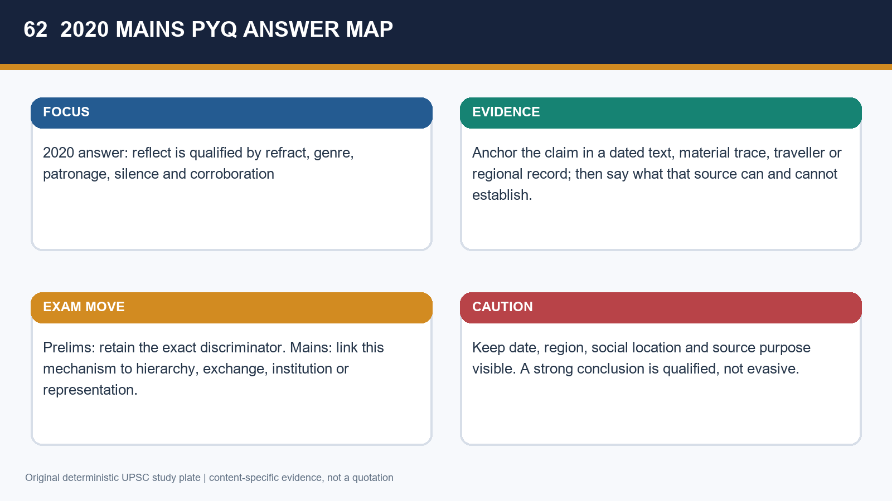

*Visual 62: 2020 MAINS PYQ ANSWER MAP. Original deterministic study visual; schematic maps are NOT TO SCALE.*


*Visual 63: REFLECT OR REFRACT. Original deterministic study visual; schematic maps are NOT TO SCALE.*


*Visual 64: SOURCE CORROBORATION. Original deterministic study visual; schematic maps are NOT TO SCALE.*


*Visual 65: TRANSLATION BUREAU. Original deterministic study visual; schematic maps are NOT TO SCALE.*


*Visual 66: YOGAVASISTHA CORRECTION. Original deterministic study visual; schematic maps are NOT TO SCALE.*


*Visual 67: DARA SHUKOH DISTINCT WORKS. Original deterministic study visual; schematic maps are NOT TO SCALE.*

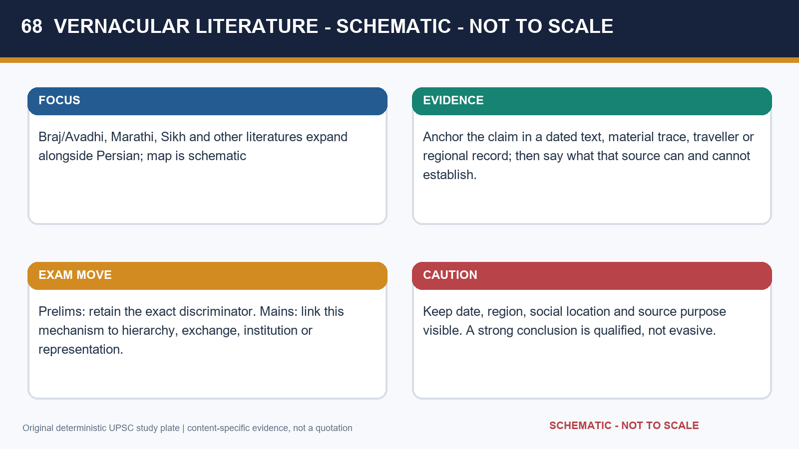

*Visual 68: VERNACULAR LITERATURE - SCHEMATIC - NOT TO SCALE. Original deterministic study visual; schematic maps are NOT TO SCALE.*


*Visual 69: LANGUAGE COEXISTENCE. Original deterministic study visual; schematic maps are NOT TO SCALE.*

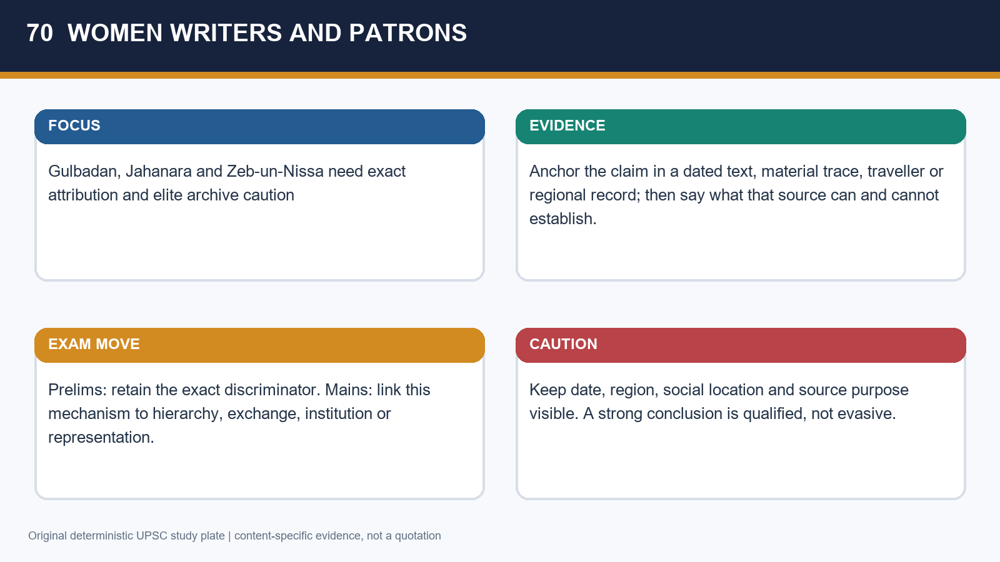

*Visual 70: WOMEN WRITERS AND PATRONS. Original deterministic study visual; schematic maps are NOT TO SCALE.*


*Visual 71: COMPOSITE CULTURE MATRIX. Original deterministic study visual; schematic maps are NOT TO SCALE.*

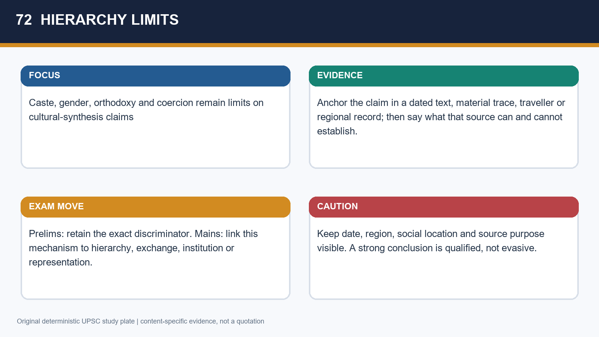

*Visual 72: HIERARCHY LIMITS. Original deterministic study visual; schematic maps are NOT TO SCALE.*


*Visual 73: BERNIER CLAIM AND CRITIQUE. Original deterministic study visual; schematic maps are NOT TO SCALE.*


*Visual 74: TRAVELLER COMPARISON. Original deterministic study visual; schematic maps are NOT TO SCALE.*


*Visual 75: 2018 PRELIMS PYQ MAP. Original deterministic study visual; schematic maps are NOT TO SCALE.*


*Visual 76: 2019 PRELIMS PYQ MAP. Original deterministic study visual; schematic maps are NOT TO SCALE.*


*Visual 77: 2020 PRELIMS TERMS MAP. Original deterministic study visual; schematic maps are NOT TO SCALE.*


*Visual 78: 2022 PRELIMS YOGAVASISTHA MAP. Original deterministic study visual; schematic maps are NOT TO SCALE.*


*Visual 79: SOURCE REACH MATRIX. Original deterministic study visual; schematic maps are NOT TO SCALE.*


*Visual 80: FACT-RISK LEDGER. Original deterministic study visual; schematic maps are NOT TO SCALE.*

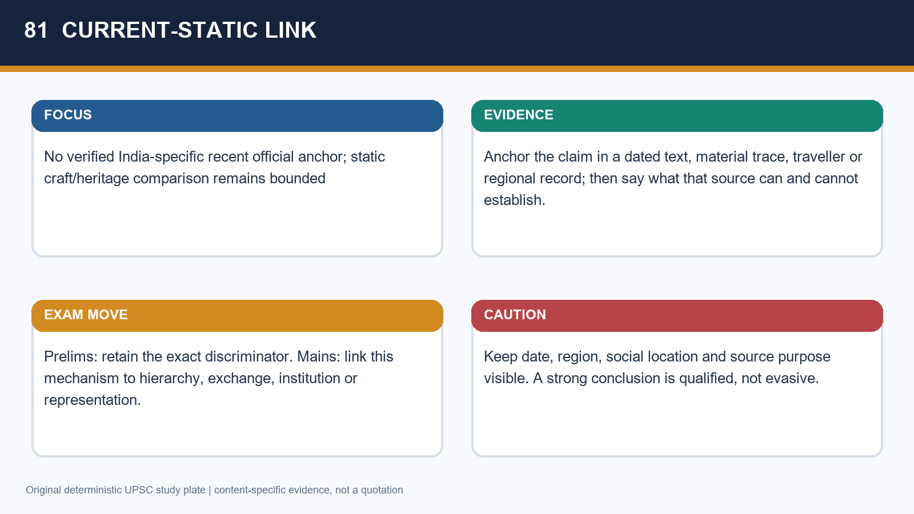

*Visual 81: CURRENT-STATIC LINK. Original deterministic study visual; schematic maps are NOT TO SCALE.*

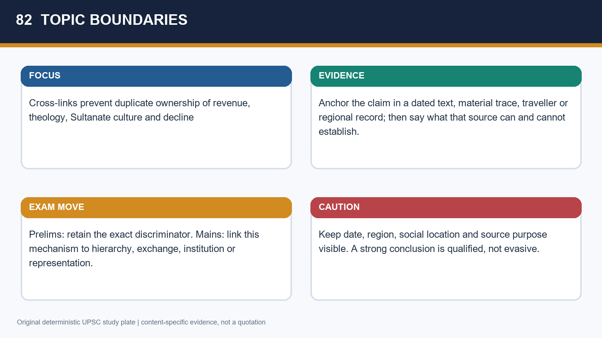

*Visual 82: TOPIC BOUNDARIES. Original deterministic study visual; schematic maps are NOT TO SCALE.*


*Visual 83: MAINS ANSWER SPINE. Original deterministic study visual; schematic maps are NOT TO SCALE.*

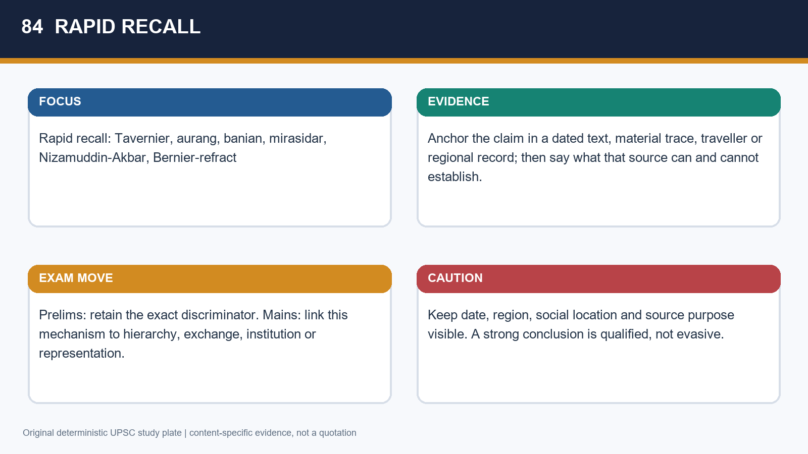

*Visual 84: RAPID RECALL. Original deterministic study visual; schematic maps are NOT TO SCALE.*

### Terminology and claim-verification clinic

#### Aurang, banian and mirasidar: why the 2020 question is difficult

The three-pair question compresses three different institutional worlds into one test. **Aurang** belongs to commercial storage: warehouse/depot is the working sense; it is not a state-treasury officer. **Banian** is relational rather than merely occupational: it identifies an Indian broker/agent who helps a European company make local purchases, arrange credit and interpret markets. **Mirasidar** needs two levels of answer. In broader regional usage it concerns hereditary/local proprietary or occupancy-related right; in the question's official frame it is "designated revenue payer to the State." A good note retains both, then chooses the exam frame when matching the pair. This method prevents a true but overbroad definition from becoming a wrong answer.

#### Jagir and zamindari: distinguish assignment from local claim

A jagir was a revenue assignment associated with service and transfer; it was not a hereditary landed estate in the asserted 2019 contrast. A zamindari was a layered rural right, and could be hereditary, divisible and saleable in documented cases. The difference, however, must not imply that jagirdars had only money and zamindars had no duties beyond collection. Jagirdars worked through local officials and forces in an administrative-fiscal setting; zamindars could mobilise force, kinship, office and cultivation as well as revenue. The Prelims solution "neither" follows from detecting the two overdrawn contrasts, not from memorising a single slogan.

#### Translation chronology: accuracy before synthesis

The Akbar/Dara correction is a model for all cultural-history revision. Akbar's Maktab Khana and the Razmnama demonstrate organised Sanskrit-Persian translation. Nizamuddin Panipati's Persian Yogavasistha/Jug Basis is associated with Akbar's reign. Dara Shukoh's Majma-ul-Bahrain and Sirr-i-Akbar are separately important: they show a later prince's intellectual engagement and Upanishad-related translation work. Combining these names under a generic label of "syncretism" erases chronology, patronage and textual purpose. A strong Mains answer can connect them as related forms of dialogue only after keeping their projects distinct.

#### Traveller verification protocol

Before using a traveller, make four quick checks: Who is speaking? What trade, diplomatic or personal purpose shaped observation? Was the statement direct observation or reported information? What independent source can test its scale? Tavernier is exceptionally useful for diamonds because jeweller-merchant expertise meets the question; Bernier is useful for a comparative argument about property, inequality and court dependence; Pelsaert, Roe, Hawkins, Manucci, Mundy and Thevenot should not be blended into one European voice. The protocol protects against both a naive acceptance and a lazy dismissal of traveller evidence.

#### Final rapid answer matrix

For a 10-marker, write one sentence defining the institution, two named examples, one qualification and a verdict. For a 15-marker, add source method or regional contrast. For a 20-marker, connect rural hierarchy, urban-commercial circulation and cultural institution through a causal bridge: agrarian surplus/revenue and market circulation help sustain courtly and urban demand; workshops, translation and patronage convert resources into culture; rights, caste, gender and local power limit the social distribution of these gains. This matrix is not a substitute for evidence; it is a way to organise evidence without turning it into a list.

### Mughal Society, Economy & Culture — ADVANCED

> **Subject:** History (Medieval India) · **Tier:** Advanced (deeper understanding) · **GS Paper:** GS-I (also Prelims).
> **Grounded in:** Satish Chandra, *Medieval India: From Sultanat to the Mughals — Part II (Mughal Empire)* — chapters on society-structure and growth, trade and commerce, technology, architecture, painting, literature and cultural integration.
> ✅ = from source book · ⚠️ = inference / standard knowledge · 📰 = current affairs.
> *Companion: `basic/24_Mughal-Society-Economy-Culture.md`. Chronology spine: `00_Master-Chronology.md`.*

---

### Mini-timeline

| Date | Event |
|---|---|
| ✅ 1556–1605 | Akbar's empire creates administrative and cultural integration |
| ✅ c. 1567–82 | Akbar's illustrated Hamza Nama project trains a large painting workshop |
| ✅ 1573 | Buland Darwaza begun at Fatehpur Sikri |
| ✅ 1605–27 | Jahangir's reign: Mughal painting reaches high naturalistic refinement |
| ✅ 1628–58 | Shah Jahan's reign: architecture reaches marble/pietra dura climax |
| ✅ 1679–1707 | Late Aurangzeb period: Deccan stress, but northern trade/industry remain vigorous |
| ✅ 1719–48 | Muhammad Shah's court becomes important for music in the eighteenth century |

### 1. Snapshot & core idea

**Deeper — Mughal society: hierarchy, mobility and local power.**

✅ Part II divides the ruling classes into the **nobility** representing central authority and **local rulers/chiefs/zamindars** representing local power; the distinction blurred as chiefs were incorporated into mansabdari.
- ✅ Bernier's claim that Mughal nobles were simply foreigners is criticised: by Aurangzeb's later reign, less than 10% of nobles of 1000 zat and above were born outside India, and immigrants assimilated into Indo-Mughal culture.
- ✅ The nobility was bureaucratised through mansab rules, yet aristocratic and top-heavy; high nobles spent on mansions, retainers, stables, jewels and patronage.
- ✅ Zamindars had forts/garhis, armed followings and local caste-clan links; the state tried both to discipline and use them for revenue and cultivation.
- ✅ Rural hierarchy included resident owner-cultivators (*khud-kasht*), ordinary *raiyati/muzarian* and incoming *pahi-kasht* cultivators; mobility and concessions existed, but caste, residence and access to cattle/credit structured inequality.

**Deeper — economy and culture: expansion with structural limits.**

✅ Chandra rejects the view that European companies immediately displaced Indian traders. Indian shipping and merchants remained central in the seventeenth-century Indian Ocean; Gujarat, Coromandel and Bengal were major zones.
- ✅ India's exports included textiles, rice, pulses, wheat, oil, ghee, sugar, raw silk, cotton, pepper, indigo and tobacco; horses and some luxury goods were major imports, while bullion flowed in because of favourable trade balances.
- ✅ Mughal state policy generally kept trade free, ports open, customs low, and prevented European fortified settlements while using land power against coercion.
- ✅ Cultural production was institutional: painting as **karkhana**, architecture as collective craftsmanship, literature through Persian-regional exchange; yet technology lagged because elite science and artisanal production remained weakly connected.
- ✅ Chandra rejects Bernier's claim that India lacked middle strata: merchants, shopkeepers, clerks, revenue officials, professionals and prosperous master-craftsmen occupied varied positions between great nobles and labouring poor.

### 2. Key classification / data

| Category | Advanced data/argument | Exam use |
|---|---|---|
| ✅ Nobility | Iranis/Turanis still large group, but most were India-born by late Aurangzeb | Refutes simplistic "foreign ruling class" claim |
| ✅ Bernier | Useful but often criticised by Chandra on nobility/land arguments | Source criticism |
| ✅ Zamindars | Armed, locally rooted, sometimes autonomous rajas/deshmukhs/patils/nayaks | Rural state capacity |
| ✅ Cultivators | Khud-kasht, raiyati/muzarian, pahi-kasht | Residence, property and caste shaped dues |
| ✅ Middle strata | Merchants, clerks, professionals, master-craftsmen | Corrects Bernier's binary picture |
| ✅ Merchants | Abdul Ghaffur of Surat, Virji Vohra, Chettis, overseas agents | Indian commercial sophistication |
| ✅ Trade balance | Bullion inflow; textiles central; West Asian/Southeast Asian routes | Early modern economy |
| ✅ Karkhana | Imperial painting workshop under Akbar; multi-religious artisan base | Composite culture |
| ⚠️ Technology | Skilled labour high, but mechanisation/science-technology linkage weak | Long-term divergence debate |

### 3. Study links

> **Study link:** ✅ Jagirdari crisis and agrarian pressure → `advanced/23_Marathas-Shivaji-and-Deccan.md` and `advanced/25_Decline-of-the-Mughal-Empire.md`.
> **Study link:** ⚠️ For Art & Culture, connect Mughal architecture/painting with regional schools after artists dispersed under Aurangzeb.

### 4. Must-Know Facts (Prelims)

- ✅ **Abdul Ghaffur of Surat** is cited as a major late-seventeenth/early-eighteenth-century sea merchant.
- ✅ Surat had an annual turnover estimate in which European share was only a fraction, according to modern research cited by Chandra.
- ✅ The Mughals generally opposed European fortification inside their territories and retaliated against Dutch/English coercion by seizing factories/agents on land.
- ✅ **Karkhana** under Akbar organised painting; Hamza Nama involved a large group of painters.
- ✅ Mughal painting: Akbar = institution-building; Jahangir = portrait/natural studies; Aurangzeb's lack of interest dispersed artists to Rajasthan/Pahari centres.
- ✅ Technology limits: cannon casting, water pumps, screws/springs, telescopes and printing are discussed as areas of lag/selective adoption.

### 5. UPSC Traps

> 🔑 Trap: Do not equate commercial expansion with modern industrialisation; Chandra shows trade grew but technology and production structures remained limited.

- ❌ European companies dominated Indian Ocean trade immediately. → Correct: Indian merchants/shipping remained central until colonial power changed conditions.
- ❌ Bernier is always reliable. → Correct: Chandra critiques Bernier on nobles, foreigners and jagir/private property arguments.
- ❌ Mughal state was anti-commerce. → Correct: it protected trade, kept routes open and often encouraged merchants.
- ❌ Artistic synthesis means equal visual quotas of Hindu/Muslim elements. → Correct: artisans used whatever forms were useful and aesthetically pleasing.

### 6. 📰 Current link

📰 **Current linkage (verify live before use):** Contemporary handloom policy is a useful but limited bridge to Mughal artisan and merchant networks. Verify scheme data officially and avoid projecting modern labour categories backward.

### 7. Mains angles

- ⚠️ Evaluate Mughal India as a commercially dynamic but technologically conservative economy.
- ⚠️ Discuss Chandra's critique of Bernier and what it teaches about using European travellers as historical sources.
- ⚠️ "Mughal culture was an imperial synthesis sustained by institutions, artisans and patronage." Analyse.

### ➕ Concept — Composite culture without romanticism

⚠️ Chandra's composite-culture frame recognises synthesis in architecture, painting, literature and music, but also notes social hierarchy, caste, gender limits, orthodoxy and uneven access to power.

<!-- BEGIN GENERATED PYQ INTEGRATION: 2018-2023 -->
### Historical PYQ Integration (2018-2023)

> **Status:** Question-level PYQ demand is integrated into this owner.
> **Provenance:** Audited local official-paper routing ledgers: `_PYQ-ROUTING-MAINS-GS1-GS2-ESSAY-2018-2023.md`.

- **Years represented:** 2020
- **Paper(s):** GS-I
- **Routed question demands:** 1

| Year | Paper | Q | PYQ demand (neutral rendering) | Directive / format | Source status | Owner requirement |
|---:|---|---:|---|---|---|---|
| 2020 | GS-I | 12 | Persian literary sources of medieval India and the spirit of the age | Comment · 15 marks · 250 words | Routed to owning topic | Prepare context, core dimensions, evidence/examples, counterpoint and a concise conclusion. |

#### What this owner must now support

- Persian literary sources of medieval India and the spirit of the age

> The table integrates the examinable demand and paper metadata. It does not turn an unkeyed objective question into a solved answer, and it does not claim that lexical presence alone proves full conceptual sufficiency.
<!-- END GENERATED PYQ INTEGRATION: 2018-2023 -->

## CONSOLIDATED REGISTER NOTES

### Final consolidated register notes: Mughal society, economy and culture

#### Thesis and evidence
- Core: sixteenth-seventeenth centuries; early eighteenth century only bounded.
- Verdict: dynamic/integrated/productive yet extractive/hierarchical/uneven/diverse.
- Court record = ideology/administration; traveller = situated encounter; material = form/production; vernacular = wider language/public.
- Triangulate genre, purpose, date, route, audience and silence.

#### Society and countryside
- Emperor/household; mansabdars; chiefs/zamindars; merchants/professionals; artisans/service groups; cultivators/labourers/mobile communities.
- Mansab bureaucratised aristocracy; khanazad shows social reproduction.
- Foreign-born figure: under 10% of 1000 zat+ total, 1679-1707 only.
- Zamindar: layered rural right/local force, not British landlord or mere clerk.
- Khud-kasht resident owner; raiyati/muzarian varied ordinary cultivator; pahi entrant settler.
- Rights layered: cultivation, occupancy, revenue, customary access, office.
- Expansion: settlement/credit/water/crops; debt, cesses, failure and flight qualify growth.
- Women's work + elite cases; never turn visibility into equality. Caste/gender constrain mobility.

#### Towns, craft, trade
- City types: imperial, port, qasba, production/pilgrimage. Middle strata refute Bernier binary.
- Karkhana imperial household/store/workshop; private/putting-out coexists.
- Aurang = depot, NOT treasury. Banian = broker-agent. Mirasidar = local right; 2020 frame payer.
- Hundi credit, sarraf finance, banjara bulk transport.
- Ports: Surat/Cambay; Hugli/Balasore; Masulipatnam/Pulicat; Malabar.
- Textiles/silk/grain/sugar/indigo/saltpetre; horses/metals/luxuries; bullion is not welfare.
- Companies enter existing networks; gradual coercive leverage, no instant dominance.

#### Culture, sources, traps
- Architecture: Humayun Tomb -> Akbar/Fatehpur -> Itimad -> Taj/Red Fort/Jama Masjid; collective makers.
- Painting: Akbar/Hamzanama; Jahangir/Mansur; dispersal transforms regional schools.
- Music: court singers banned under Aurangzeb, not music extinguished.
- Persian sources reflect AND refract: chronicle/memoir/Ain/malfuzat; corroborate.
- Translation: Akbar/Maktab Khana/Razmnama; Yogavasistha=Nizamuddin Panipati, Akbar; Dara=Majma/Sirr.
- Persian and vernacular coexist; composite culture does not erase hierarchy.
- 2018 Tavernier B; 2019 neither D; 2020 pairs 2+3 B; 2022 Akbar A: all inferred/unofficial locally.
- Mains spine: qualified thesis -> named evidence -> mechanism -> limitation -> verdict.

### COMPLETE TOPIC ASCII MASTER FLOW DIAGRAM

**High-yield use:** Follow the panels as one topic-specific conceptual atlas: root question, classifications, processes or arguments, comparisons, objections and a final answer-writing spine. This text-native master is separate from both graphical flowchart artifacts.

#### ASCII MASTER FLOW — PANEL 1/12: Layered society, not a court-peasant binary

```ascii-master
EMPEROR / HOUSEHOLD -> sovereignty, patronage and concentrated consumption
MANSABDARS / CHIEFS -> service rank, local power and armed followings
MERCHANTS / PROFESSIONALS -> credit, brokerage, law, medicine and records
ARTISANS / SERVICE GROUPS -> skilled and ordinary production
CULTIVATORS / LABOURERS -> unequal land, cattle, credit and customary claims
RULE -> hierarchy was real, but region, occupation and mobility varied.
```

#### ASCII MASTER FLOW — PANEL 2/12: Nobility: mansab, household and reproduction

```ascii-master
MANSAB -> appointed zat status-pay plus sawar cavalry obligation
HOUSEHOLD -> kin, clients, retainers, scribes, soldiers and dependants
COMPOSITE ELITE -> Turani, Irani, Hindustani, Rajput, Afghan and Deccani labels
FORMAL RULE -> rank is not automatically hereditary
SOCIAL FACT -> khanazad advantage, patronage and training reproduce position
TRAP -> ancestry labels do not prove every noble was foreign-born.
```

#### ASCII MASTER FLOW — PANEL 3/12: Zamindars across a spectrum

```ascii-master
VILLAGE END -> locally rooted claimant with information and customary dues
MIDDLE -> armed lineage, garhi, caste-clan following and several villages
RAJA END -> substantial territorial chief incorporated or negotiated with
STATE NEED -> collection, order, settlement and local mediation
CONFLICT -> regulation, resistance and mansab incorporation can coexist
TRAP -> neither mere tax clerk nor uniform British-style landlord.
```

#### ASCII MASTER FLOW — PANEL 4/12: Cultivators and layered rights

```ascii-master
KHUD-KASHT -> resident cultivator, often with stronger local resources
PAHI-KASHT -> incoming or non-resident cultivator, often drawn by concession
RAIYATI / MUZARIAN -> varied ordinary cultivator or tenant contexts
RIGHTS -> labour, occupancy, inheritance, revenue and customary access overlap
MEDIATORS -> patil, muqaddam, qanungo, patwari and deshmukh vary by region
TRAP -> layered claims are not simple modern private landownership.
```

#### ASCII MASTER FLOW — PANEL 5/12: Women, work and source silence

```ascii-master
WORK -> agriculture, spinning, embroidery and domestic production
ELITE EVIDENCE -> Gulbadan, Nur Jahan and Jahanara show particular agency
ARCHIVE BIAS -> court texts record elite women more readily than ordinary labour
MATERIAL / IMAGE -> can suggest practice but cannot serve as an occupation census
CONSTRAINTS -> caste, class, marriage, purdah, property and credit vary
VERDICT -> differentiated agency within a strongly unequal gender order.
```

#### ASCII MASTER FLOW — PANEL 6/12: Towns and the middle strata

```ascii-master
IMPERIAL CITY -> court, garrison, workshops and consumption
PORT CITY -> customs, shipping, brokers and overseas exchange
QASBA -> administration, learning, market and countryside link
PRODUCTION / PILGRIMAGE CENTRE -> specialised craft or religious demand
MIDDLE STRATA -> clerks, qazis, physicians, shopkeepers and master-craftsmen
RESULT -> urban diversity corrects Bernier's noble-versus-poor binary.
```

#### ASCII MASTER FLOW — PANEL 7/12: Karkhana and craft production

```ascii-master
INPUTS -> cotton, silk, dyes, metals, stone, timber and skilled labour
KARKHANA -> imperial household store and workshop, not every private workshop
ORGANISATION -> masters, artisans, wage/service ties and quality control
PRIVATE FIELD -> household craft, merchant advance and putting-out coexist
OUTPUT -> textiles, arms, jewellery, ships, books, paintings and monuments
LIMIT -> court production cannot measure all craft labour or welfare.
```

#### ASCII MASTER FLOW — PANEL 8/12: Inland trade, hundi and banjara

```ascii-master
ROAD / RIVER / SARAI -> movement, rest, information and state oversight
BANJARA -> bulk overland carriage, especially grain and army supply
HUNDI -> credit instrument moving value across distance and time
SARRAF -> money changing, testing and finance | BROKER -> market access
AURANG -> warehouse or depot | BANIAN -> company-linked Indian agent-broker
RESULT -> goods, credit and information connect town, port and countryside.
```

#### ASCII MASTER FLOW — PANEL 9/12: Overseas trade, companies and bullion

```ascii-master
PORTS -> Surat / Cambay, Hugli / Balasore, Masulipatnam / Pulicat
EXPORTS -> textiles, silk, indigo, sugar, grain and saltpetre vary by region
IMPORTS -> horses, metals and luxuries; bullion helps settle trade balances
INDIAN AGENCY -> Virji Vohra, Abdul Ghaffur and merchant communities
COMPANIES -> enter existing networks while naval-coercive capacity grows
TRAP -> bullion is not welfare; company presence is not instant dominance.
```

#### ASCII MASTER FLOW — PANEL 10/12: Technology without stagnation or industrial teleology

```ascii-master
STRENGTH -> textiles, dyes, jewellery, shipbuilding and craft precision
SELECTIVE LIMIT -> pumps, furnaces, screws, optics and some machine linkages
PRINT DISTINCTION -> textile blocks, known presses and uneven institutional uptake
POSSIBLE CAUSES -> labour cost, investment choice and weak science-craft linkage
METHOD -> compare sector, institution, date and diffusion
VERDICT -> high skill with uneven adoption; neither no technology nor industry.
```

#### ASCII MASTER FLOW — PANEL 11/12: Culture as institutional and composite production

```ascii-master
ARCHITECTURE -> Humayun's Tomb -> Fatehpur -> Taj -> Red Fort
PAINTING -> Akbar's workshop / Hamzanama -> Jahangir / Mansur -> dispersion
LITERATURE -> Persian chronicles, memoirs, malfuzat and vernacular fields
TRANSLATION -> Razmnama; Nizamuddin Panipati's Yogavasistha under Akbar
DARA -> Majma-ul-Bahrain and Sirr-i-Akbar are distinct works
QUALIFY -> cultural interaction did not erase caste, gender or coercion.
```

#### ASCII MASTER FLOW — PANEL 12/12: Topic 24 final answer spine

```ascii-master
OPEN -> productive and connected, yet hierarchical and regionally uneven
SOCIETY -> mansab household + zamindar spectrum + layered cultivator rights
ECONOMY -> agrarian surplus -> towns / craft -> credit -> inland / ocean trade
CULTURE -> patronage and workshops convert resources into material forms
METHOD -> named source or monument -> claim -> reach -> silence / limitation
CLOSE -> dynamism was real; prosperity, equality and industrialisation were not universal.
```
