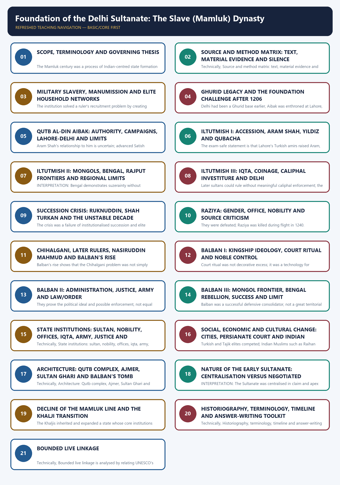

# Foundation of the Delhi Sultanate: The Slave (Mamluk) Dynasty - Complete Topic Package

> **Subject:** Medieval Indian History | **Paper:** Prelims GS-I + GS-I cultural support | **Topic:** 03 | **Date:** 13 August 2026
>
> **Evidence key:** FACT = directly supported by a named text, inscription, coin, monument or securely routed event; TEXTUAL REPORT = what a named author says; MATERIAL EVIDENCE = inscription, coin, building or site; INTERPRETATION = evidence-led analysis; INFERENCE = bounded reconstruction; LIMIT = what the evidence cannot establish.
>
> **Approval state:** generated, **approved=false**. Status remains yellow until the user explicitly approves all three deliverables.

## BASIC LEARNING SESSION

### DEEP-REVIEW LEARNING CONTRACT

| Control | Binding rule for this package |
|---|---|
| Syllabus boundary | Complete Medieval History Core is taught before optional enrichment. |
| Evidence method | Claim → named site/text/inscription/coin/example → analysis → qualification. |
| Source hierarchy | Archaeology, textual testimony, inscriptions, coins and scholarly interpretation remain visibly distinct. |
| Contested issues | Competing interpretations are attributed, evidenced and bounded; certainty is not manufactured. |
| Practice contract | Every solved item has demand decoding, an examiner-grade model, an executable answer/compression plan, marks rationale and answer-specific improvement. |
| Approval | This immutable successor remains `approved: false` pending explicit approval. |

**Canonical Basic/Core owner:** `upsc-ai-kit\knowledge\Medieval-Indian-History\basic\03_Slave-Mamluk-Dynasty.md`  
**Canonical topic owner:** `upsc-ai-kit\knowledge\Medieval-Indian-History\basic\03_Slave-Mamluk-Dynasty.md`  
**Optional Advanced owner:** `upsc-ai-kit\knowledge\Medieval-Indian-History\advanced\03_Slave-Mamluk-Dynasty.md`  
**Official syllabus mapping:** `upsc-ai-kit\knowledge\Medieval-Indian-History\OFFICIAL-UPSC-SYLLABUS-MAPPING.md`

### EVIDENCE, PYQ AND CURRENT-STATUS CONTROL

- **Archaeological inference:** material context supports bounded reconstruction; absence is not automatic proof of non-existence.
- **Textual testimony:** genre, authorship, redaction, patronage and temporal distance control what a text can prove.
- **Inscription and coin evidence:** contemporary names, titles, claims and circulation are powerful but do not by themselves map uniform territorial control.
- **Scholarly interpretation:** historian labels are arguments to test, not facts to memorise without evidence.
- **PYQ discipline:** repository ledgers and locally held official papers control wording and metadata; reconstructed wording and unavailable official keys must be labelled.
- **Current-status note, rechecked 2026-08-30:** UNESCO's Qutb Minar and its Monuments record was rechecked on 30 August 2026. It identifies the Aibak-Iltutmish building sequence, Iltutmish's tomb, the complex's early Sultanate architectural value and continuing ASI management. This heritage record supports bounded attribution and conservation context; it does not prove uniform territorial control or remove the need for textual, numismatic and epigraphic source criticism.

**Live/primary context sources recorded by the predecessor generation:**

- `https://whc.unesco.org/en/list/233/`
- `https://culture.gov.in/qutb-minar-and-its-monuments`




*Distinct embedded teaching-navigation image. The separate continuous Cārvāka-style flowchart package remains an independent at-a-glance artifact.*

#### Package practice counts

| Component | Count |
|---|---:|
| Verified/routed PYQs | 3 |
| Hard MCQs with explanations | 48 |
| Remedial MCQs with explanations | 12 |
| Original solved 10-mark Mains | 3 |
| Original solved 15-mark Mains | 3 |
| Original solved 20-mark Mains | 3 |
| Final register modules | 15; placed last |

#### Sources actually used

| Source class | Exact source | Use and caveat |
|---|---|---|
| Repository knowledge | Topic 03 basic/advanced; README; Master Chronology; Revision Chart; official syllabus/PYQ routing; Answer-Worthiness Audit; bounded Topics 02, 04, 07 and 11. | Controls chronology, boundaries, terminology, answer architecture, institutional comparison, Persian-source cautions and Khalji transition. |
| Local book | Satish Chandra, *History of Medieval India*, chapter on the Delhi Sultanate I, searchable OCR around printed pp. 76-102. | Foundation for Aibak, Iltutmish, Raziya, Balban, Mongols, territorial limits and the Khalji transition; dated or simplified formulations are qualified. |
| Local book | Satish Chandra, *Medieval India: From Sultanat to the Mughals, Part I*, chapters on establishment, centralised monarchy, Mongols, state and architecture, searchable OCR around printed pp. 37-68, 232-35 and 265-71. | Deeper control for manumission, elite networks, Chihalgani, Raziya, Balban, caliphate, state character and architecture. |
| Named primary traditions | Hasan Nizami, *Taj-ul-Ma'asir*; Minhaj-us-Siraj, *Tabaqat-i Nasiri*; Fakhr-i Mudabbir; later Ziauddin Barani, *Tarikh-i Firuz Shahi* and *Fatawa-i Jahandari*. | Used through source-critical synthesis. Genre, patronage, chronology, elite gaze and silence are explicit; no uncertain quotation is fabricated. |
| Material archive | Qutb-complex inscriptions and architecture; Aibak/Iltutmish coinage and titles; Quwwat-ul-Islam, Qutb Minar, Adhai Din ka Jhonpra, Sultan Ghari, Iltutmish's tomb and Balban's tomb. | Supports patronage, titulature, technical change and conquest/reuse; material survival does not prove uniform political control or one simple cultural meaning. |
| Verified PYQ routing | Repository 2019 Prelims revenue-administration route; 2022 Prelims Mongol route; verified 2020 GS-I Persian-sources question. | Prelims keys are labelled inferred because a locally readable official key is unavailable; no direct Mamluk-only GS Mains PYQ is invented. |
| Authoritative heritage links | ASI Qutb page; UNESCO Qutb listing; Ministry of Culture Qutb page; Incredible India Adhai Din ka Jhonpra page. | Bounded monument, inscription, material-reuse and conservation context only; they do not replace medieval evidence or force current affairs. |

#### Bounded authoritative links

- Archaeological Survey of India, Qutb Minar and its monuments: https://asi.nic.in/pages/WorldHeritageQutbMinar
- UNESCO World Heritage Centre, Qutb Minar and its Monuments: https://whc.unesco.org/en/list/233/
- Ministry of Culture, Qutb Minar and its Monuments: https://culture.gov.in/qutb-minar-and-its-monuments
- Incredible India, Adhai Din ka Jhonpra: https://www.incredibleindia.gov.in/en/rajasthan/ajmer/adhai-din-ka-jhonpra

No current-affairs item was forced. Qdrant was not used because repository Markdown, OCR-searchable local books and bounded authoritative heritage pages were sufficient.

### SESSION 1 — SCOPE, TERMINOLOGY AND GOVERNING THESIS

#### DEFINITION / WHAT THIS IS CALLED

**Plain-language definition:** Scope, terminology and governing thesis comprises Scope, terminology and governing thesis as its core connected dimensions.

**Technical definition:** The Mamluk century was a process of Indian-centred state formation under pressure.

#### ANSWER-GRABBING OPENING — WRITE/ADAPT IN THE EXAM

> Scope, terminology and governing thesis comprises Scope, terminology and governing thesis as its core connected dimensions.

#### MUST-WRITE KEYWORDS

- **Scope**
- **terminology**
- **governing thesis**
- **Indian-centred state formation under pressure**
- **1192-1206**
- **1206-1290**

**How to use them:** Frame the answer through Scope; define terminology, connect governing thesis with Indian-centred state formation under pressure to explain the mechanism, and use 1192-1206 for the decisive comparison or qualification.

#### Compact visual

```text
GHURID OPENING                  MAMLUK CONSOLIDATION                  KHALJI TRANSITION
1192-1206                      1206-1290                              from 1290
battles + garrisons            survival + institutions               wider elite base
Muizz al-Din / Aibak           Iltutmish -> Raziya -> Balban         Jalaluddin Khalji

Conquest is not consolidation.  Delhi did not command one uniform territory overnight.
```

#### Core teaching

- FACT: The label "Slave dynasty" refers to several founders and senior commanders who had entered elite military service as purchased mamluks, were trained in a ruler's household, and were later manumitted. It does not describe plantation slavery, a permanently enslaved population, or every subject of the dynasty.
- FACT: *Mamluk* means "owned"; in this context it identifies imported military slaves selected for training, patronage and service. Islamic legal-political theory required a sovereign to be free, so Aibak and Iltutmish's manumission mattered.
- LIMIT: The rulers from 1206 to 1290 were not one simple hereditary bloodline. Aibak's connection to Iltutmish was partly household and marital; the successors after Iltutmish were selected, displaced or killed through noble politics; Balban founded a short-lived house within the same broad period.
- INTERPRETATION: "Mamluk dynasty" is therefore a convenient dynastic-period label, while "military-slave institution and elite household networks" is the more accurate analytical phrase.
- FACT: The Ghurid victories at Tarain and Chandawar created political openings and garrison points. Aibak's independence in 1206 and Iltutmish's later survival against rivals, rebels and Mongol pressure converted those openings into a Delhi-centred state.
- LIMIT: Even at the end of the thirteenth century, Bengal could detach, western Punjab was exposed, Ranthambhor remained difficult, and local rulers or revenue intermediaries retained power. "Foundation" means a durable political core, not instant homogenisation.

#### Exam-safe governing thesis

The Mamluk century was a process of **Indian-centred state formation under pressure**. Aibak preserved a Ghurid inheritance; Iltutmish secured sovereignty, territory, Delhi and fiscal-military routines; Raziya exposed the gendered politics of office and noble consent; Balban raised royal authority and frontier vigilance. Their achievement was real but regionally uneven and dependent on negotiation, coercion and elite networks.

#### Must-know distinctions

- Aibak began independent rule; Iltutmish was the principal consolidator.
- Iqta was a fiscal-military revenue assignment, not hereditary feudal ownership.
- Chihalgani was a later label for elite slave officers, not exactly forty ministers or a modern cabinet.
- "Blood and iron" is a later shorthand for Balban's coercive practice, not a quotation to repeat without context.
- The Qutb complex records conquest, reused material, local craft and technical experimentation; no one-word formula explains all of it.

#### CLOSING RECALL FLOW — SCOPE, TERMINOLOGY AND GOVERNING THESIS

```text
START / CONCEPT: Scope, terminology and governing thesis
        |
        v
EXACT TERMS: Scope · terminology · governing thesis · Indian-centred state formation under pressure · 1192-1206 · 1206-1290
        |
        v
MECHANISM / ARGUMENT: Aibak's connection to Iltutmish was partly household and marital; the successors after Iltutmish were selected, displaced or killed through noble politics; Balban founded a short-lived house within the same broad period.
        |
        v
CONSEQUENCE / CONTRAST: The rulers from 1206 to 1290 were not one simple hereditary bloodline.
        |
        v
UPSC TRAP / ANSWER-USE: INTERPRETATION: "Mamluk dynasty" is therefore a convenient dynastic-period label, while "military-slave institution and elite household networks" is the more accurate analytical phrase.
        |
        v
ANSWER-GRABBING FORMULATION: Scope, terminology and governing thesis comprises Scope, terminology and governing thesis as its core connected dimensions.
```
### SESSION 2 — SOURCE AND METHOD MATRIX: TEXT, MATERIAL EVIDENCE AND SILENCE

#### DEFINITION / WHAT THIS IS CALLED

**Plain-language definition:** Source and method matrix: text, material evidence and silence comprises method matrix, text and material evidence as its core connected dimensions.

**Technical definition:** Technically, Source and method matrix: text, material evidence and silence is analysed by relating method matrix to text, then testing the relationship through material evidence and silence.

#### ANSWER-GRABBING OPENING — WRITE/ADAPT IN THE EXAM

> Source and method matrix: text, material evidence and silence comprises method matrix, text and material evidence as its core connected dimensions.

#### MUST-WRITE KEYWORDS

- **method matrix**
- **text**
- **material evidence**
- **silence**
- **Hasan Nizami, Taj-ul-Ma'asir**
- **Minhaj-us-Siraj, Tabaqat-i Nasiri**

**How to use them:** Frame the answer through method matrix; define text, connect material evidence with silence to explain the mechanism, and use Hasan Nizami, Taj-ul-Ma'asir for the decisive comparison or qualification.

#### Evidence matrix

| Source | Genre / position | What it supports | Necessary limit |
|---|---|---|---|
| Hasan Nizami, *Taj-ul-Ma'asir* | Ornate early Indo-Persian conquest chronicle linked to Aibak's court world | Ghurid-Aibak campaigns, occupation, court legitimation and early political vocabulary | Panegyric, selective chronology, elite conquest gaze and difficult ornate style |
| Minhaj-us-Siraj, *Tabaqat-i Nasiri* | Universal/dynastic history completed c. 1260 under Delhi patronage; author lived through Raziya and early Balban politics | Ghurid genealogy, Aibak-Iltutmish sequence, Raziya, Bakhtiyar, offices and elite faction | Court and clerical viewpoint; moral framing; silence on much non-elite and regional life |
| Fakhr-i Mudabbir | Early-thirteenth-century political-military advice and court writing | Ideals of army, hierarchy, office and Persianate kingship | Prescriptive advice is not proof of uniform practice |
| Ziauddin Barani | Fourteenth-century political history and advice literature, writing decades after Balban | Chihalgani label, Balban's rituals, noble hierarchy, royal awe, spies and justice | Later chronology, aristocratic and normative bias, hostility to "low-born" advancement; details need corroboration |
| Inscriptions and coins | Contemporary titulature, patrons, dates, mints and public claims | Aibak/Iltutmish sovereignty, Qutb chronology, monetary circulation, caliphal language | A claim on a coin or inscription is not a map of effective control; survival is selective |
| Architecture and archaeology | Quwwat-ul-Islam, Qutb Minar, Ajmer, Sultan Ghari, tombs and fort landscapes | Patronage, reuse, technical change, craft interaction and urban claims | Buildings have repair phases; attribution and cultural meaning cannot be read mechanically |

#### Method rules

- METHOD: First identify date, genre, patron and distance from the event. "Barani says" is not the same as "Balban certainly said."
- METHOD: Convert every answer claim into four moves: named evidence -> what it shows -> why it matters -> what it cannot prove.
- METHOD: Court texts illuminate rulers, offices, campaigns and elite values best. They are weaker on cultivators, women outside court, artisan agency, regional society and implementation below the capital.
- METHOD: Minhaj's praise of Raziya's sovereign qualities and his gendered closing judgement are both evidence: the first for recognised capacity, the second for the limits of his social world.
- METHOD: Barani's "Forty" is useful for a remembered corporate elite, but his later political theory and high-born prejudice prevent literal use of every number, speech or motive.
- METHOD: Coins can reveal title, mint and monetary claim; architecture can reveal patronage and technical practice. Neither automatically proves secure countryside control.
- METHOD: Silence is not absence. Sparse local narratives may reflect loss, genre or patronage rather than a lack of resistance, accommodation or social change.

#### Source-use formula

```text
CLAIM
  -> name the chronicle / inscription / coin / monument / event
  -> state the evidentiary significance
  -> add genre, chronology, regional or implementation limit
  -> deliver a graded verdict
```

#### UPSC traps

- A contemporary source is not automatically neutral.
- A later source is not automatically useless; it must be used for the period and questions it can genuinely illuminate.
- Monumental inscriptions communicate authority but may exaggerate accomplishment.
- A single court narrative should never carry a romantic story, precise army number and political verdict simultaneously.

#### CLOSING RECALL FLOW — SOURCE AND METHOD MATRIX: TEXT, MATERIAL EVIDENCE AND SILENCE

```text
START / CONCEPT: Source and method matrix: text, material evidence and silence
        |
        v
EXACT TERMS: method matrix · text · material evidence · silence · Hasan Nizami, Taj-ul-Ma'asir · Minhaj-us-Siraj, Tabaqat-i Nasiri
        |
        v
MECHANISM / ARGUMENT: They are weaker on cultivators, women outside court, artisan agency, regional society and implementation below the capital.
        |
        v
CONSEQUENCE / CONTRAST: Barani's "Forty" is useful for a remembered corporate elite, but his later political theory and high-born prejudice prevent literal use of every number, speech or motive.
        |
        v
UPSC TRAP / ANSWER-USE: A later source is not automatically useless; it must be used for the period and questions it can genuinely illuminate.
        |
        v
ANSWER-GRABBING FORMULATION: Source and method matrix: text, material evidence and silence comprises method matrix, text and material evidence as its core connected dimensions.
```
### SESSION 3 — MILITARY SLAVERY, MANUMISSION AND ELITE HOUSEHOLD NETWORKS

#### DEFINITION / WHAT THIS IS CALLED

**Plain-language definition:** Elite military slavery was a recruitment and socialisation institution used across parts of the Islamic world.

**Technical definition:** The institution solved a ruler's recruitment problem by creating trained dependants, yet generated a succession problem once those dependants became powerful household heads.

#### ANSWER-GRABBING OPENING — WRITE/ADAPT IN THE EXAM

> Domestic and productive slavery continued in medieval society, but it should not be conflated with the specific political institution of military household slavery.

#### MUST-WRITE KEYWORDS

- **Military slavery**
- **manumission**
- **elite household networks**
- **Elite**
- **Islamic**
- **Selected**

**How to use them:** Frame the answer through Military slavery; define manumission, connect elite household networks with Elite to explain the mechanism, and use Islamic for the decisive comparison or qualification.

#### Compact institution map

```text
purchase / capture in Eurasian slave markets
                  |
household training, Islamisation, horsemanship, arms, etiquette
                  |
personal patronage and advancement by sultan or great amir
                  |
manumission + office / iqta / marriage ties
                  |
commander, governor, kingmaker or sovereign

DEPENDENCE created opportunity; it did not guarantee permanent loyalty.
```

#### Core teaching

- FACT: Elite military slavery was a recruitment and socialisation institution used across parts of the Islamic world. Selected youths could be trained closely with a ruler's household, giving the patron a cadre whose first political identity depended on service rather than an established local lineage.
- FACT: Aibak was a mamluk and favoured commander of Muizz al-Din. Iltutmish was purchased, trained and later connected to Aibak through marriage. Balban was bought by Iltutmish and rose through office.
- FACT: Manumission changed legal status. The advanced Satish Chandra source stresses that Aibak received a deed of manumission and royal insignia, and that Iltutmish could present proof of freedom when his eligibility was questioned.
- INTERPRETATION: Household ties could be stronger than blood ties in the first generation, but success created new ambitions. Qubacha, Yildiz, Aibak and Iltutmish all emerged from service worlds and then competed for sovereign space.
- FACT: The institution also crossed ethnic and functional lines: Turkish warriors, Persian-speaking Tajik administrators, Indian Muslim intermediaries, local Hindu chiefs and artisans all entered the state in different ways. The court was never a sealed military barracks.
- LIMIT: "Slave loyalty" is a myth when treated as automatic. Elite mamluks commanded troops, held revenue assignments, created marriage networks and could rebel. The very training that made them useful also made them capable of autonomous power.
- LIMIT: Domestic and productive slavery continued in medieval society, but it should not be conflated with the specific political institution of military household slavery.

#### Analytical payoff

The institution solved a ruler's recruitment problem by creating trained dependants, yet generated a succession problem once those dependants became powerful household heads. This explains both the early dynamism of Aibak and Iltutmish and the later monarchy-nobility struggle.

#### Memory hook

> **MAMLUK = trained household service -> manumission -> office -> possible sovereignty; not plantation slavery and not permanent legal bondage.**

#### CLOSING RECALL FLOW — MILITARY SLAVERY, MANUMISSION AND ELITE HOUSEHOLD NETWORKS

```text
START / CONCEPT: Military slavery, manumission and elite household networks
        |
        v
EXACT TERMS: Military slavery · manumission · elite household networks · Elite · Islamic · Selected
        |
        v
MECHANISM / ARGUMENT: Elite military slavery was a recruitment and socialisation institution used across parts of the Islamic world.
        |
        v
CONSEQUENCE / CONTRAST: INTERPRETATION: Household ties could be stronger than blood ties in the first generation, but success created new ambitions.
        |
        v
UPSC TRAP / ANSWER-USE: Do not miss this limiting distinction: elite mamluks commanded troops, held revenue assignments, created marriage networks and could rebel.
        |
        v
ANSWER-GRABBING FORMULATION: Domestic and productive slavery continued in medieval society, but it should not be conflated with the specific political institution of military household slavery.
```
### SESSION 4 — GHURID LEGACY AND THE FOUNDATION CHALLENGE AFTER 1206

#### DEFINITION / WHAT THIS IS CALLED

**Plain-language definition:** Aibak inherited commanders, garrisons, forts and tributary arrangements created after Tarain and Chandawar.

**Technical definition:** Delhi had been a Ghurid base earlier, Aibak was enthroned at Lahore, and the territorial and institutional state emerged over decades.

#### ANSWER-GRABBING OPENING — WRITE/ADAPT IN THE EXAM

> Aibak inherited commanders, garrisons, forts and tributary arrangements created after Tarain and Chandawar.

#### MUST-WRITE KEYWORDS

- **Ghurid legacy**
- **the foundation challenge after 1206**
- **Rival Ghurid successors**
- **Diplomacy, warfare, manumission and royal symbols**
- **Sovereignty still required military enforcement**
- **Sparse garrisons**

**How to use them:** Frame the answer through Ghurid legacy; define the foundation challenge after 1206, connect Rival Ghurid successors with Diplomacy, warfare, manumission and royal symbols to explain the mechanism, and use Sovereignty still required military enforcement for the decisive comparison or qualification.

#### Succession problem map

```text
Muizz al-Din dies, 1206
        |
Ghurid political space fragments
        |
Yildiz at Ghazni ---- Qubacha at Multan/Uch ---- Aibak at Lahore/Delhi
        \_________________ rival claims ____________________/
                              |
                 local rebellions + Rajput recovery
                              |
                 Mongol-Khwarazm upheaval after 1218
```

#### What the new rulers inherited

- FACT: Aibak inherited commanders, garrisons, forts and tributary arrangements created after Tarain and Chandawar. Delhi, Ajmer, Hansi, Bayana, Gwalior and the doab were strategic nodes, not a continuous bureaucratic grid.
- FACT: The Ghurid imperial centre remained outside India before 1206. Muizz al-Din's death therefore removed a source of senior legitimacy while releasing Indian commanders from effective external supervision.
- INTERPRETATION: The break was both danger and opportunity. It exposed Aibak to Yildiz and Qubacha, but it also prevented the Indian territories from remaining an appendage of shifting Central Asian struggles.
- FACT: Rajput rulers and chiefs recovered or contested Kalinjar, Gwalior, Bayana, Ranthambhor and other positions whenever the Turkish centre weakened. Bengal's Khalji commanders acted with substantial autonomy.
- FACT: The Khwarazmian collapse and Mongol advance transformed the northwest after 1218. Delhi lost the possibility of easy Central Asian reinforcement and had to become institutionally more self-reliant.
- LIMIT: "Delhi Sultanate began in 1206" is a chronological convenience. Delhi had been a Ghurid base earlier, Aibak was enthroned at Lahore, and the territorial and institutional state emerged over decades.

#### Foundation challenge

| Problem | Early response | Limit |
|---|---|---|
| Rival Ghurid successors | Diplomacy, warfare, manumission and royal symbols | Sovereignty still required military enforcement |
| Sparse garrisons | Forts, tribute, local chiefs and delegated commanders | Countryside allegiance fluctuated |
| Fiscal support | Iqtas, khalisa revenue and existing local collection channels | Audit and remittance varied |
| Elite cohesion | Household ties, marriage and distribution of office | Faction and equality claims persisted |
| Frontier threat | Cautious diplomacy plus fort defence | Punjab repeatedly slipped from Delhi |

#### Governing inference

The key transformation was not foreign conquest becoming instantly "Indian", but a ruling network compelled to find revenue, legitimacy, personnel and strategic depth inside the subcontinent.

#### CLOSING RECALL FLOW — GHURID LEGACY AND THE FOUNDATION CHALLENGE AFTER 1206

```text
START / CONCEPT: Ghurid legacy and the foundation challenge after 1206
        |
        v
EXACT TERMS: Ghurid legacy · the foundation challenge after 1206 · Rival Ghurid successors · Diplomacy, warfare, manumission and royal symbols · Sovereignty still required military enforcement · Sparse garrisons
        |
        v
MECHANISM / ARGUMENT: Delhi had been a Ghurid base earlier, Aibak was enthroned at Lahore, and the territorial and institutional state emerged over decades.
        |
        v
CONSEQUENCE / CONTRAST: Delhi, Ajmer, Hansi, Bayana, Gwalior and the doab were strategic nodes, not a continuous bureaucratic grid.
        |
        v
UPSC TRAP / ANSWER-USE: The key transformation was not foreign conquest becoming instantly "Indian", but a ruling network compelled to find revenue, legitimacy, personnel and strategic depth inside the subcontinent.
        |
        v
ANSWER-GRABBING FORMULATION: Aibak inherited commanders, garrisons, forts and tributary arrangements created after Tarain and Chandawar.
```
### SESSION 5 — QUTB AL-DIN AIBAK: AUTHORITY, CAMPAIGNS, LAHORE-DELHI AND LIMITS

#### DEFINITION / WHAT THIS IS CALLED

**Plain-language definition:** Aibak's political centre is best described as Lahore-Delhi rather than forced into one modern capital label.

**Technical definition:** Aram Shah's relationship to him is uncertain; advanced Satish Chandra notes that Aibak may have had no son.

#### ANSWER-GRABBING OPENING — WRITE/ADAPT IN THE EXAM

> Aibak's political centre is best described as Lahore-Delhi rather than forced into one modern capital label.

#### MUST-WRITE KEYWORDS

- **Qutb al-Din Aibak**
- **authority**
- **campaigns**
- **Lahore-Delhi**
- **limits**
- **political separation and continuity**

**How to use them:** Frame the answer through Qutb al-Din Aibak; define authority, connect campaigns with Lahore-Delhi to explain the mechanism, and use limits for the decisive comparison or qualification.

#### Evidence-led profile

| Dimension | Evidence | Significance | Limit |
|---|---|---|---|
| Service career | Favoured mamluk and commander of Muizz al-Din; major role after Tarain | Links Ghurid conquest to Sultanate foundation | Command before 1206 was delegated Ghurid authority, not independent sovereignty |
| Accession | Enthroned at Lahore in 1206 with support of local notables and amirs | Shows regional coalition and military standing | No secure proof that Muizz al-Din formally nominated him universal successor |
| Legal status | Manumission deed and royal canopy/insignia from the Ghurid successor | Removed legal obstacle of slave status and weakened Ghazni's claim | Symbolic recognition still depended on power in India |
| Territorial work | Delhi-Ajmer management, fort operations, doab expansion and recognition of commanders | Preserved the Ghurid political opening | Short reign prevented comprehensive consolidation |
| Monuments | Quwwat-ul-Islam phase, Qutb Minar first storey/foundation; Ajmer mosque conversion | Public claim, congregational space and craft mobilisation | Much work began before 1206; later rulers enlarged and repaired it |

#### Core teaching

- FACT: Aibak's political centre is best described as Lahore-Delhi rather than forced into one modern capital label. He was enthroned at Lahore, while Delhi remained the principal Ghurid base in the upper Gangetic system and the site of major building.
- FACT: His campaigns before 1206 helped occupy Delhi, confront Ajmer rebellions, take or pressure forts and extend Turkish power through commanders. Those were Ghurid victories executed by Aibak, not achievements of an already independent Sultanate.
- FACT: His reign as sovereign lasted only from 1206 to 1210. He died after a fall while playing *changan* at Lahore.
- TEXTUAL REPORT: Contemporary praise remembered liberality and military gallantry; later tradition's "lakh-bakhsh" image belongs to courtly moral memory and should not replace institutional assessment.
- INTERPRETATION: Aibak's greatest independent contribution was strategic continuity. He prevented the Indian conquests from being absorbed by Yildiz's Ghazni claim and maintained the commander network until a stronger consolidator emerged.
- LIMIT: He did not create a settled succession. Aram Shah's relationship to him is uncertain; advanced Satish Chandra notes that Aibak may have had no son. Aram was raised by Lahore's amirs and was defeated by Iltutmish.

#### Answer verdict

Aibak was founder in the sense of **political separation and continuity**, not founder in the stronger sense of territorial, fiscal and dynastic consolidation. That second achievement belongs principally to Iltutmish.

#### CLOSING RECALL FLOW — QUTB AL-DIN AIBAK: AUTHORITY, CAMPAIGNS, LAHORE-DELHI AND LIMITS

```text
START / CONCEPT: Qutb al-Din Aibak: authority, campaigns, Lahore-Delhi and limits
        |
        v
EXACT TERMS: Qutb al-Din Aibak · authority · campaigns · Lahore-Delhi · limits · political separation and continuity
        |
        v
MECHANISM / ARGUMENT: Those were Ghurid victories executed by Aibak, not achievements of an already independent Sultanate.
        |
        v
CONSEQUENCE / CONTRAST: Aibak was founder in the sense of political separation and continuity, not founder in the stronger sense of territorial, fiscal and dynastic consolidation.
        |
        v
UPSC TRAP / ANSWER-USE: He was enthroned at Lahore, while Delhi remained the principal Ghurid base in the upper Gangetic system and the site of major building.
        |
        v
ANSWER-GRABBING FORMULATION: Aibak's political centre is best described as Lahore-Delhi rather than forced into one modern capital label.
```
### SESSION 6 — ILTUTMISH I: ACCESSION, ARAM SHAH, YILDIZ AND QUBACHA

#### DEFINITION / WHAT THIS IS CALLED

**Plain-language definition:** Aram Shah is often called Aibak's son in older summaries, but the advanced source explicitly questions that relationship.

**Technical definition:** The exam-safe statement is that Lahore's Turkish amirs raised Aram, whose authority Iltutmish defeated.

#### ANSWER-GRABBING OPENING — WRITE/ADAPT IN THE EXAM

> His accession was not automatic hereditary succession; Delhi's political-military supporters invited or accepted him against Aram Shah.

#### MUST-WRITE KEYWORDS

- **Iltutmish I**
- **accession**
- **Aram Shah**
- **Yildiz**
- **Qubacha**
- **1215-16**

**How to use them:** Frame the answer through Iltutmish I; define accession, connect Aram Shah with Yildiz to explain the mechanism, and use Qubacha for the decisive comparison or qualification.

#### Rival-elimination flow

```text
Aram Shah at Lahore
       -> defeated near Delhi / Tarain -> Iltutmish secures capital core

Yildiz claims Ghurid seniority from Ghazni
       -> expelled from Ghazni -> defeated by Iltutmish c.1215-16

Qubacha holds Multan, Uch and Sind
       -> long caution -> Uch siege, 1228 -> Bhakkar flight and death
```

#### Core teaching

- FACT: Iltutmish had been Aibak's mamluk, son-in-law and governor of Badaun. His accession was not automatic hereditary succession; Delhi's political-military supporters invited or accepted him against Aram Shah.
- LIMIT: Aram Shah is often called Aibak's son in older summaries, but the advanced source explicitly questions that relationship. The exam-safe statement is that Lahore's Turkish amirs raised Aram, whose authority Iltutmish defeated.
- FACT: Some Turkish officers near Delhi also resisted Iltutmish. Minhaj attributes repeated victory to divine help; a historical reading emphasises careful management, force and coalition building.
- FACT: Yildiz claimed a superior position as a successor at Ghazni. Iltutmish initially accepted symbols from him while weak, then defeated him after Yildiz lost Ghazni and entered Punjab.
- INTERPRETATION: This sequence displays Iltutmish's strategic patience. He accepted an inconvenient symbolic hierarchy until circumstances allowed military resolution.
- FACT: Qubacha controlled Multan, Uch, Siwistan and parts of Sind, and competed for Lahore. Iltutmish did not rush into simultaneous war; he secured Delhi and waited through the Khwarazm-Mongol disruption.
- FACT: In 1228 Iltutmish captured Uch after siege; Qubacha fled toward Bhakkar and died in the Indus. Delhi's authority then reached Multan and Sind toward the sea, though later control remained variable.

#### Why this was consolidation

The defeat of Aram, Yildiz and Qubacha removed three different threats: a rival at the capital, an external claim of Ghurid seniority and an autonomous Indus state. No single battle achieved this; timing and sequencing were the institution-building achievement.

#### Caution

Do not turn Iltutmish into a creator from nothing. Aibak left bases and personnel; iqta and Persianate state practices had West Asian and Ghurid antecedents; local collection and fort networks pre-dated him. His achievement was to adapt, discipline and connect them.

#### CLOSING RECALL FLOW — ILTUTMISH I: ACCESSION, ARAM SHAH, YILDIZ AND QUBACHA

```text
START / CONCEPT: Iltutmish I: accession, Aram Shah, Yildiz and Qubacha
        |
        v
EXACT TERMS: Iltutmish I · accession · Aram Shah · Yildiz · Qubacha · 1215-16
        |
        v
MECHANISM / ARGUMENT: Aram Shah is often called Aibak's son in older summaries, but the advanced source explicitly questions that relationship.
        |
        v
CONSEQUENCE / CONTRAST: Do not turn Iltutmish into a creator from nothing.
        |
        v
UPSC TRAP / ANSWER-USE: Do not miss this limiting distinction: the exam-safe statement is that Lahore's Turkish amirs raised Aram, whose authority Iltutmish defeated.
        |
        v
ANSWER-GRABBING FORMULATION: His accession was not automatic hereditary succession; Delhi's political-military supporters invited or accepted him against Aram Shah.
```
### SESSION 7 — ILTUTMISH II: MONGOLS, BENGAL, RAJPUT FRONTIERS AND REGIONAL LIMITS

#### DEFINITION / WHAT THIS IS CALLED

**Plain-language definition:** The policy is best read as survival diplomacy by a still-fragile state, not as a battlefield victory over the Mongols.

**Technical definition:** INTERPRETATION: Bengal demonstrates suzerainty without continuous administration.

#### ANSWER-GRABBING OPENING — WRITE/ADAPT IN THE EXAM

> The policy is best read as survival diplomacy by a still-fragile state, not as a battlefield victory over the Mongols.

#### MUST-WRITE KEYWORDS

- **Iltutmish II**
- **Mongols**
- **Bengal**
- **Rajput frontiers**
- **regional limits**
- **defensible core and hierarchy of claims**

**How to use them:** Frame the answer through Iltutmish II; define Mongols, connect Bengal with Rajput frontiers to explain the mechanism, and use regional limits for the decisive comparison or qualification.

#### Map in text

```text
NORTH-WEST:  Lahore -> Multan -> Uch -> lower Sind / Indus
CORE:        Delhi -> Badaun -> Awadh -> Banaras / upper doab
EAST:        Bihar -> Lakhnauti; allegiance repeatedly breaks
SOUTH-WEST: Ajmer -> Ranthambhor -> Jalor; Gujarat/Malwa resist
SOUTH:       Bayana -> Gwalior -> Bundelkhand raid zone

Control density declined with distance, terrain and autonomous commanders.
```

#### Mongol-Khwarazm context

- FACT: In 1221 Jalaluddin Mangbarani crossed the Indus while pursued by Chinggis Khan, allied with Khokhars and sought Iltutmish's support.
- FACT: Iltutmish declined the alliance and avoided a direct anti-Mongol commitment. The policy is best read as survival diplomacy by a still-fragile state, not as a battlefield victory over the Mongols.
- LIMIT: Exact asylum language varies in retelling. The secure point is refusal to be drawn into Mangbarani's war and a cautious posture until Chinggis's death.

#### Bengal and Bihar

- FACT: Khalji rulers at Lakhnauti repeatedly acted independently. Iltutmish marched in 1225; Iwaz temporarily submitted, then rebelled. Iltutmish's son Nasiruddin Mahmud defeated and killed Iwaz in 1226-27; Iltutmish intervened again around 1230.
- INTERPRETATION: Bengal demonstrates suzerainty without continuous administration. Local governors, river geography, distance and neighbouring rulers in Orissa, Assam and south Bengal limited Delhi.

#### Rajput and central Indian fronts

- FACT: Iltutmish recovered or compelled submission at Bayana, Gwalior and Ranthambhor in phases; Ajmer and Nagaur remained important. Ranthambhor could be returned to Chauhan feudatory control because direct holding was costly.
- FACT: His Gujarat attack failed; Malwa operations produced raids and plunder rather than durable annexation. Ujjain was attacked, but a campaign event is not evidence of a stable province.
- LIMIT: "Recovered north India" is therefore too broad. The core strengthened while concentric zones remained tributary, contested or autonomous.

#### Frontier strategy

| Theatre | Policy | What it proves |
|---|---|---|
| Northwest | Delay, diplomacy, then decisive action | Strategic sequencing |
| Bengal | Repeated expeditions and delegated governors | Distance weakened direct rule |
| Rajasthan | Fort recovery, suzerainty and selective return | Negotiated control economised manpower |
| Gujarat/Malwa | Raids and failed expansion | Operational reach exceeded administration |

#### Verdict

Iltutmish consolidated a **defensible core and hierarchy of claims**, not a uniformly governed territorial state.

#### CLOSING RECALL FLOW — ILTUTMISH II: MONGOLS, BENGAL, RAJPUT FRONTIERS AND REGIONAL LIMITS

```text
START / CONCEPT: Iltutmish II: Mongols, Bengal, Rajput frontiers and regional limits
        |
        v
EXACT TERMS: Iltutmish II · Mongols · Bengal · Rajput frontiers · regional limits · defensible core and hierarchy of claims
        |
        v
MECHANISM / ARGUMENT: Ranthambhor could be returned to Chauhan feudatory control because direct holding was costly.
        |
        v
CONSEQUENCE / CONTRAST: Ujjain was attacked, but a campaign event is not evidence of a stable province.
        |
        v
UPSC TRAP / ANSWER-USE: Do not miss this limiting distinction: "Recovered north India" is therefore too broad.
        |
        v
ANSWER-GRABBING FORMULATION: The policy is best read as survival diplomacy by a still-fragile state, not as a battlefield victory over the Mongols.
```
### SESSION 8 — ILTUTMISH III: IQTA, COINAGE, CALIPHAL INVESTITURE AND DELHI

#### DEFINITION / WHAT THIS IS CALLED

**Plain-language definition:** MATERIAL EVIDENCE: Iltutmish is associated with strengthening a stable silver tanka and copper jital currency system, with coin legends and mints expressing sovereign authority.

**Technical definition:** Later sultans could rule without meaningful caliphal enforcement; the relationship was symbolic-moral more than administrative subordination.

#### ANSWER-GRABBING OPENING — WRITE/ADAPT IN THE EXAM

> MATERIAL EVIDENCE: Iltutmish is associated with strengthening a stable silver tanka and copper jital currency system, with coin legends and mints expressing sovereign authority.

#### MUST-WRITE KEYWORDS

- **Iltutmish III**
- **iqta**
- **coinage**
- **caliphal investiture**
- **Delhi**
- **INTERPRETATION**

**How to use them:** Frame the answer through Iltutmish III; define iqta, connect coinage with caliphal investiture to explain the mechanism, and use Delhi for the decisive comparison or qualification.

#### Institution flow: iqta is not land ownership

```text
SULTAN claims state revenue
          |
assigns an IQTA to a muqti / wali for service and administration
          |
muqti collects authorised revenue -> maintains troops / order / expenses
          |
accounts and surplus are in principle due to the centre
          |
transfer, audit or recall limits local entrenchment

Variation was large; weak sultans could not enforce every rule.
```

#### Iqta

- FACT: Revenue assignments existed in West and Central Asia before Iltutmish. He did not invent the iqta.
- FACT: Under the Sultanate, an iqta conveyed a claim to collect state revenue and often administrative-military responsibility. It did not grant absolute ownership of soil, peasants or a hereditary principality.
- INTERPRETATION: Transfer and audit could convert agrarian surplus into cavalry service while limiting a governor's local roots. Practice varied by distance and the ruler's strength.
- LIMIT: The mature procedures known from later Sultanate evidence should not be projected unchanged into every year of Iltutmish's reign.

#### Currency

- MATERIAL EVIDENCE: Iltutmish is associated with strengthening a stable silver *tanka* and copper *jital* currency system, with coin legends and mints expressing sovereign authority.
- INTERPRETATION: Coinage linked taxation, military payment, markets and public titulature. It helped Delhi's autonomy become visible beyond court ceremony.
- LIMIT: Standardisation was a process; coin circulation does not prove uniform monetisation or uncontested political control in every region.

#### Caliphal investiture

- FACT: An Abbasid caliphal letter and robes reached Iltutmish in 1229.
- INTERPRETATION: The investiture recognised an accomplished political fact and enhanced standing within the Islamic world. It did not create Iltutmish's army, territory or fiscal base, nor make the caliph an effective ruler of India.
- LIMIT: Later sultans could rule without meaningful caliphal enforcement; the relationship was symbolic-moral more than administrative subordination.

#### Delhi as political-cultural centre

- FACT: Iltutmish's sustained presence, building patronage and reception of migrants made Delhi the principal political, administrative and cultural centre of Turkish rule.
- FACT: Mongol upheaval brought nobles, administrators, scholars, poets and religious figures from Central Asia and Khurasan. Delhi's Persianate culture therefore grew partly from displacement.
- MATERIAL EVIDENCE: He completed major Qutb Minar stages, built Hauz Shamsi, a madrasa context and royal tomb architecture.
- LIMIT: Lahore, Multan, Badaun, Ajmer and Lakhnauti remained important regional nodes; "capital" did not erase a networked state.

#### Consolidation formula

**Rivals removed + frontier caution + regional expeditions + iqta discipline + credible currency + symbolic investiture + Delhi centre = Iltutmish's real-founder claim, qualified by loose provincial reach.**

#### CLOSING RECALL FLOW — ILTUTMISH III: IQTA, COINAGE, CALIPHAL INVESTITURE AND DELHI

```text
START / CONCEPT: Iltutmish III: iqta, coinage, caliphal investiture and Delhi
        |
        v
EXACT TERMS: Iltutmish III · iqta · coinage · caliphal investiture · Delhi · INTERPRETATION
        |
        v
MECHANISM / ARGUMENT: INTERPRETATION: Transfer and audit could convert agrarian surplus into cavalry service while limiting a governor's local roots.
        |
        v
CONSEQUENCE / CONTRAST: The mature procedures known from later Sultanate evidence should not be projected unchanged into every year of Iltutmish's reign.
        |
        v
UPSC TRAP / ANSWER-USE: Standardisation was a process; coin circulation does not prove uniform monetisation or uncontested political control in every region.
        |
        v
ANSWER-GRABBING FORMULATION: MATERIAL EVIDENCE: Iltutmish is associated with strengthening a stable silver tanka and copper jital currency system, with coin legends and mints expressing sovereign authority.
```
### SESSION 9 — SUCCESSION CRISIS: RUKNUDDIN, SHAH TURKAN AND THE UNSTABLE DECADE

#### DEFINITION / WHAT THIS IS CALLED

**Plain-language definition:** Ruknuddin became unpopular as court affairs were associated with his mother Shah Turkan's revenge politics and his own neglect.

**Technical definition:** The crisis was a failure of institutionalised succession and elite power-sharing, not proof that the Sultanate itself disappeared.

#### ANSWER-GRABBING OPENING — WRITE/ADAPT IN THE EXAM

> The crisis was a failure of institutionalised succession and elite power-sharing, not proof that the Sultanate itself disappeared.

#### MUST-WRITE KEYWORDS

- **Succession crisis**
- **Ruknuddin**
- **Shah Turkan**
- **the unstable decade**
- **institutionalised succession and elite power-sharing**
- **1236-1240**

**How to use them:** Frame the answer through Succession crisis; define Ruknuddin, connect Shah Turkan with the unstable decade to explain the mechanism, and use institutionalised succession and elite power-sharing for the decisive comparison or qualification.

#### Succession tree

```text
Iltutmish
  |
  +-- Ruknuddin Firuz, 1236 ----- displaced amid Shah Turkan's politics
  +-- Raziya, 1236-1240 -------- direct rule challenged by noble factions
  +-- Bahram Shah, 1240-1242 --- crown-peers conflict
  +-- Masud Shah, 1242-1246 ---- deposed
  `-- descendants / grandson line
          `-- Nasiruddin Mahmud, 1246-1266
                  `-- Balban dominant as naib for much, not all, of reign
```

#### Core teaching

- FACT: Iltutmish's personal authority had held together competing Turkish slave officers, free Turks, Tajik administrators and provincial commanders. His death removed the arbiter before succession rules were institutionalised.
- FACT: Ruknuddin became unpopular as court affairs were associated with his mother Shah Turkan's revenge politics and his own neglect. Provincial governors rebelled.
- FACT: Raziya appealed in Delhi's congregational setting and gained urban support while Ruknuddin was away. Her accession therefore involved popular mobilisation at the capital as well as elite defection.
- FACT: After Raziya, Bahram and Masud faced noble efforts to make the sultan reign while senior officers ruled. In one phase the naib, wazir and *mustaufi* acted as a governing combination.
- LIMIT: This was not a constitutional cabinet. It was an unstable balance among offices and factions whose members competed with one another.
- INTERPRETATION: The decade 1236-46 was not simply a sequence of "weak rulers." It was a structural contest over whether sovereign authority, collective noble privilege or one dominant kingmaker would control offices, iqtas and armed followings.
- FACT: Four descendants of Iltutmish were elevated and removed or killed in a short span. Hereditary legitimacy remained useful, but it did not determine effective power.

#### Causal chain

```text
personal monarchy under Iltutmish
        -> no settled succession mechanism
        -> governors and household officers mobilise factions
        -> ruler depends on noble coalition
        -> coalition fragments over office / iqta / precedence
        -> repeated deposition
        -> demand for stronger monarchy ultimately benefits Balban
```

#### Exam conclusion

The crisis was a failure of **institutionalised succession and elite power-sharing**, not proof that the Sultanate itself disappeared.

#### CLOSING RECALL FLOW — SUCCESSION CRISIS: RUKNUDDIN, SHAH TURKAN AND THE UNSTABLE DECADE

```text
START / CONCEPT: Succession crisis: Ruknuddin, Shah Turkan and the unstable decade
        |
        v
EXACT TERMS: Succession crisis · Ruknuddin · Shah Turkan · the unstable decade · institutionalised succession and elite power-sharing · 1236-1240
        |
        v
MECHANISM / ARGUMENT: Ruknuddin became unpopular as court affairs were associated with his mother Shah Turkan's revenge politics and his own neglect.
        |
        v
CONSEQUENCE / CONTRAST: Raziya appealed in Delhi's congregational setting and gained urban support while Ruknuddin was away.
        |
        v
UPSC TRAP / ANSWER-USE: INTERPRETATION: The decade 1236-46 was not simply a sequence of "weak rulers." It was a structural contest over whether sovereign authority, collective noble privilege or one dominant kingmaker would control offices, iqtas and armed followings.
        |
        v
ANSWER-GRABBING FORMULATION: The crisis was a failure of institutionalised succession and elite power-sharing, not proof that the Sultanate itself disappeared.
```
### SESSION 10 — RAZIYA: GENDER, OFFICE, NOBILITY AND SOURCE CRITICISM

#### DEFINITION / WHAT THIS IS CALLED

**Plain-language definition:** Raziya: gender, office, nobility and source criticism comprises Raziya, gender and office as its core connected dimensions.

**Technical definition:** They were defeated; Raziya was killed during flight in 1240.

#### ANSWER-GRABBING OPENING — WRITE/ADAPT IN THE EXAM

> The office of amir-i-akhur controlled royal stables, horses and access; Yaqut's elevation therefore had institutional importance beyond ethnicity.

#### MUST-WRITE KEYWORDS

- **Raziya**
- **gender**
- **office**
- **nobility**
- **source criticism**
- **Office and access**

**How to use them:** Frame the answer through Raziya; define gender, connect office with nobility to explain the mechanism, and use source criticism for the decisive comparison or qualification.

#### Raziya factor table

| Factor | Named evidence | Significance | Limit |
|---|---|---|---|
| Dynastic choice | Iltutmish nominated her over surviving sons | Capacity could outweigh male primogeniture | Nomination did not bind nobles after his death |
| Urban support | Appeal at Delhi's congregational mosque and popular action | Capital population mattered in succession politics | Delhi support did not command provincial governors |
| Public sovereignty | Unveiled court appearance, male-style tunic/headgear, army leadership | She performed the visible functions of kingship | Sources frame conduct through gender norms |
| Noble conflict | Lahore and Tabarhinda governors rebelled; faction coordinated at Delhi | Provincial office-holders feared direct royal control | Noble opposition was not one permanently united bloc |
| Yaqut | Abyssinian *amir-i-akhur*, a strategic royal-stable office | Turkish monopoly over access and high office was challenged | No contemporary proof of romance or a systematic non-Turkish party |
| Minhaj | Praises prudence, justice, beneficence and warfare, then invokes her sex | Reveals recognised competence and gendered source horizon | Court-clerical judgement is not neutral causation |

#### Core teaching

- FACT: Raziya ruled from 1236 to 1240. The concise source prints 1236-39 in places; standard regnal chronology extends to 1240.
- FACT: She defeated or divided an initial coalition, restored order and sought direct contact with administration. Her public visibility was a political technique of sovereign presence.
- FACT: The office of *amir-i-akhur* controlled royal stables, horses and access; Yaqut's elevation therefore had institutional importance beyond ethnicity.
- LIMIT: There is no contemporary evidence for the later romance that Yaqut physically assisted her onto a horse or was her lover. Minhaj does not make that claim; Raziya's public procession was associated with an elephant.
- FACT: Kabir Khan at Lahore submitted after her campaign; Altunia at Tabarhinda then rebelled within a wider conspiracy. Yaqut was killed and Raziya imprisoned.
- FACT: Her later marriage to Altunia and march on Delhi could not rebuild the necessary army and coalition. They were defeated; Raziya was killed during flight in 1240.

#### Balanced explanation of failure

1. **Gender:** A woman claiming unmediated military kingship confronted entrenched expectations and gave opponents a language of delegitimation.
2. **Office and access:** Her attempt to govern directly threatened provincial and court elites.
3. **Faction:** She lacked a durable household bloc equal to Iltutmish's leading officers.
4. **Ethnicity/status:** Yaqut's promotion challenged Turkish claims to monopolise strategic office.
5. **Political miscalculation:** Favoured governors still rebelled; her coalition management did not survive coordinated action.

#### Verdict

Gender was structural but not sufficient. Raziya fell because gendered legitimacy, noble corporate interest, strategic office and provincial military power converged. Reducing the outcome to romance or individual temperament loses the state-formation issue.

#### CLOSING RECALL FLOW — RAZIYA: GENDER, OFFICE, NOBILITY AND SOURCE CRITICISM

```text
START / CONCEPT: Raziya: gender, office, nobility and source criticism
        |
        v
EXACT TERMS: Raziya · gender · office · nobility · source criticism · Office and access
        |
        v
MECHANISM / ARGUMENT: They were defeated; Raziya was killed during flight in 1240.
        |
        v
CONSEQUENCE / CONTRAST: Gender was structural but not sufficient.
        |
        v
UPSC TRAP / ANSWER-USE: Minhaj does not make that claim; Raziya's public procession was associated with an elephant.
        |
        v
ANSWER-GRABBING FORMULATION: The office of amir-i-akhur controlled royal stables, horses and access; Yaqut's elevation therefore had institutional importance beyond ethnicity.
```
### SESSION 11 — CHIHALGANI, LATER RULERS, NASIRUDDIN MAHMUD AND BALBAN'S RISE

#### DEFINITION / WHAT THIS IS CALLED

**Plain-language definition:** Barani, writing later, called Iltutmish's elite slave officers the Chihalgani or "Corps of Forty." The advanced source notes that fewer than twenty-five can be identified in surviving lists and that the precise number is not the point.

**Technical definition:** Balban's rise shows that the Chihalgani problem was not simply "nobles versus king." It was also one noble versus peer equality, followed by that victor's attempt to transform personal supremacy into a theory of monarchy.

#### ANSWER-GRABBING OPENING — WRITE/ADAPT IN THE EXAM

> Balban's rise shows that the Chihalgani problem was not simply "nobles versus king." It was also one noble versus peer equality, followed by that victor's attempt to transform personal supremacy into a theory of monarchy.

#### MUST-WRITE KEYWORDS

- **Chihalgani**
- **later rulers**
- **Nasiruddin Mahmud**
- **Balban's rise**
- **one noble versus peer equality**
- **Barani**

**How to use them:** Frame the answer through Chihalgani; define later rulers, connect Nasiruddin Mahmud with Balban's rise to explain the mechanism, and use one noble versus peer equality for the decisive comparison or qualification.

#### Terminology caution

- FACT: Barani, writing later, called Iltutmish's elite slave officers the *Chihalgani* or "Corps of Forty."
- FACT: The advanced source notes that fewer than twenty-five can be identified in surviving lists and that the precise number is not the point.
- FACT: These men sought comparable shares of iqtas, commands, offices and honour, but they did not always act as a unified corporation.
- LIMIT: Do not call the Chihalgani a forty-member cabinet, parliament or permanent council. It was a remembered cluster of powerful household-service nobles and their networks.

#### Monarchy-nobility causal diagram

```text
Iltutmish promotes elite slave officers
        |
officers gain iqtas, troops, marriage and provincial bases
        |
after 1236 they defend equality against one dominant peer or ruler
        |
factional coalitions enthrone and depose descendants
        |
Balban uses the same network to rise
        |
as naib and sultan he breaks peer equality and exalts monarchy
```

#### Nasiruddin Mahmud

- FACT: Nasiruddin Mahmud, a grandson/descendant in Iltutmish's line, was raised to the throne in 1246 with Balban's decisive support.
- TEXTUAL REPORT: Later moralising accounts portray Nasiruddin as absorbed in prayer, copying the Quran or sewing caps while Balban governed.
- LIMIT: That pious image should not be read literally as proof of twenty years of complete political absence. Royal acts continued, Balban was removed in 1253, and competing nobles influenced policy.
- FACT: Balban became *naib*, married his daughter into the royal household and concentrated army-administrative power. His relatives and supporters gained important positions and iqtas.
- FACT: Opposition removed him in 1253 and advanced Imaduddin Raihan, an Indian Muslim/Hindustani eunuch, while another noble held the wazirate. Balban rebuilt alliances and returned by 1255.
- SOURCE CAVEAT: Minhaj had lost office under Raihan and blamed him heavily; personal institutional interest colours the narrative.
- FACT: Balban then neutralised rivals, assumed royal insignia and dominated the remaining reign. Allegations that he poisoned Nasiruddin or eliminated princes are reported as suspicions, not securely demonstrable fact.

#### Analytical payoff

Balban's rise shows that the Chihalgani problem was not simply "nobles versus king." It was also **one noble versus peer equality**, followed by that victor's attempt to transform personal supremacy into a theory of monarchy.

#### CLOSING RECALL FLOW — CHIHALGANI, LATER RULERS, NASIRUDDIN MAHMUD AND BALBAN'S RISE

```text
START / CONCEPT: Chihalgani, later rulers, Nasiruddin Mahmud and Balban's rise
        |
        v
EXACT TERMS: Chihalgani · later rulers · Nasiruddin Mahmud · Balban's rise · one noble versus peer equality · Barani
        |
        v
MECHANISM / ARGUMENT: Nasiruddin Mahmud, a grandson/descendant in Iltutmish's line, was raised to the throne in 1246 with Balban's decisive support.
        |
        v
CONSEQUENCE / CONTRAST: Barani, writing later, called Iltutmish's elite slave officers the Chihalgani or "Corps of Forty." The advanced source notes that fewer than twenty-five can be identified in surviving lists and that the precise number is not the point.
        |
        v
UPSC TRAP / ANSWER-USE: Do not call the Chihalgani a forty-member cabinet, parliament or permanent council.
        |
        v
ANSWER-GRABBING FORMULATION: Balban's rise shows that the Chihalgani problem was not simply "nobles versus king." It was also one noble versus peer equality, followed by that victor's attempt to transform personal supremacy into a theory of monarchy.
```
### SESSION 12 — BALBAN I: KINGSHIP IDEOLOGY, COURT RITUAL AND NOBLE CONTROL

#### DEFINITION / WHAT THIS IS CALLED

**Plain-language definition:** The phrase is a modern textbook shorthand for coercive enforcement, not a secure quotation from Balban.

**Technical definition:** Court ritual was not decorative excess; it was a technology for converting distance and ceremony into authority.

#### ANSWER-GRABBING OPENING — WRITE/ADAPT IN THE EXAM

> Court ritual was not decorative excess; it was a technology for converting distance and ceremony into authority.

#### MUST-WRITE KEYWORDS

- **Balban I**
- **kingship ideology**
- **court ritual**
- **noble control**
- **performative, coercive and administrative**
- **Zil-i-allah**

**How to use them:** Frame the answer through Balban I; define kingship ideology, connect court ritual with noble control to explain the mechanism, and use performative, coercive and administrative for the decisive comparison or qualification.

#### Kingship architecture

| Instrument | Evidence / practice | Political function | Caveat |
|---|---|---|---|
| *Zil-i-allah* | Sultan presented as "shadow of God" | Raised ruler above noble peers | Persianate-Islamic political idiom, not divinity in a modern literal sense |
| *Sijda* and *paibos* | Prostration and kissing the ruler's feet | Staged hierarchy and obedience | Theologians could regard such ritual as objectionable |
| Court splendour | Ordered ranks, armed guards, silence, dress and procession | Made awe visible to elites, envoys and subjects | Barani's dramatic account is later and normative |
| Noble ancestry | Claimed link to Afrasiyab; preferred high-born service | Turned social hierarchy into political control | Actual appointments show exceptions and pressure on Turkish monopoly |
| No convivial equality | Restricted laughter, drinking and familiarity | Prevented nobles treating the sultan as first among peers | Court performance cannot alone measure provincial power |

#### Core teaching

- FACT: Balban became sultan in 1266 after roughly two decades as the dominant figure under Nasiruddin Mahmud.
- INTERPRETATION: His theory of kingship responded to the remembered instability after Iltutmish. Court ritual was not decorative excess; it was a technology for converting distance and ceremony into authority.
- FACT: Balban rejected the idea that powerful Turkish nobles were his equals. He removed, intimidated or secretly eliminated rivals, including members of his own network.
- TEXTUAL REPORT: Barani depicts Balban as refusing high office to men of low or obscure birth and as claiming noble Iranian descent.
- LIMIT: Barani shared the prejudice he describes. Yaqut, Raihan, Tajik administrators, Indian converts and later recruitment show that practice could not maintain a perfect Turkish high-born monopoly.
- FACT: Balban defended the dignity of the broader Turkish elite while denying its members corporate equality with the throne. This apparent contradiction was central to his strategy.

#### "Blood and iron" contextualised

- The phrase is a modern textbook shorthand for coercive enforcement, not a secure quotation from Balban.
- It should refer to specific measures: suppression around Delhi, forest clearance, thanas, exemplary punishment, spy surveillance and stern action against rebellion.
- It should not imply that every policy was indiscriminate violence. Sources also report revenue moderation advice, protection of camp followers and punishment of oppressive governors.

#### Verdict

Balban's kingship was **performative, coercive and administrative**. It strengthened the centre after oligarchic disorder, but its narrow social theory and dependence on one ruler limited dynastic durability.

#### CLOSING RECALL FLOW — BALBAN I: KINGSHIP IDEOLOGY, COURT RITUAL AND NOBLE CONTROL

```text
START / CONCEPT: Balban I: kingship ideology, court ritual and noble control
        |
        v
EXACT TERMS: Balban I · kingship ideology · court ritual · noble control · performative, coercive and administrative · Zil-i-allah
        |
        v
MECHANISM / ARGUMENT: Yaqut, Raihan, Tajik administrators, Indian converts and later recruitment show that practice could not maintain a perfect Turkish high-born monopoly.
        |
        v
CONSEQUENCE / CONTRAST: The phrase is a modern textbook shorthand for coercive enforcement, not a secure quotation from Balban.
        |
        v
UPSC TRAP / ANSWER-USE: It should not imply that every policy was indiscriminate violence.
        |
        v
ANSWER-GRABBING FORMULATION: Court ritual was not decorative excess; it was a technology for converting distance and ceremony into authority.
```
### SESSION 13 — BALBAN II: ADMINISTRATION, JUSTICE, ARMY AND LAW/ORDER

#### DEFINITION / WHAT THIS IS CALLED

**Plain-language definition:** TEXTUAL REPORT: Barani narrates punishments of Malik Bakbak of Badaun and Haibat Khan of Awadh to demonstrate impartial royal justice.

**Technical definition:** They prove the political ideal and possible enforcement, not equal access to justice for every subject.

#### ANSWER-GRABBING OPENING — WRITE/ADAPT IN THE EXAM

> They prove the political ideal and possible enforcement, not equal access to justice for every subject.

#### MUST-WRITE KEYWORDS

- **Balban II**
- **administration**
- **justice**
- **army**
- **law/order**
- **Intelligence**

**How to use them:** Frame the answer through Balban II; define administration, connect justice with army to explain the mechanism, and use law/order for the decisive comparison or qualification.

#### Policy matrix

| Area | Measure | Evidence-led significance | Limit / cost |
|---|---|---|---|
| Intelligence | *Barids* in cities, districts and iqtas | Gave the centre information on governors and oppression | Fear and personal reporting could distort information |
| Justice | Punishment of powerful governors for killing servants | Royal justice asserted supremacy over noble privilege | Barani's exemplary stories are moral narratives and not a full judicial record |
| Army | Attention to *diwan-i-arz*, new cavalry, alert hunting exercises | Improved readiness and direct royal force | Exact army size unknown; nobles still recruited contingents |
| Old assignments | Inquiry into ageing soldiers holding villages | Attempted to align revenue assignments with service | Political opposition forced partial retreat |
| Delhi-Mewat | Forest clearance, fort/outposts, Afghan settlement | Protected capital, routes and water points | Accounts record severe killing and displacement |
| Doab-Katehar | Strong commanders, road clearance, punitive expeditions | Reopened communications and supported merchants | Coercion was destructive; regional resistance persisted |

#### Core teaching

- FACT: Balban's spy system sought reports independent of provincial office-holders. In answer writing, link it to iqta supervision and royal justice rather than listing it as court trivia.
- TEXTUAL REPORT: Barani narrates punishments of Malik Bakbak of Badaun and Haibat Khan of Awadh to demonstrate impartial royal justice.
- LIMIT: These are exemplary stories selected to teach kingship. They prove the political ideal and possible enforcement, not equal access to justice for every subject.
- FACT: Balban attempted to strengthen troops directly under the sultan, appoint experienced commanders and keep forces alert through sudden hunting mobilisations.
- FACT: He examined old Turkish soldiers who retained village assignments despite being unfit for service. The attempted reform encountered resistance and was moderated.
- FACT: Around Delhi the Meos used forest cover and disrupted roads, houses and access to Hauz Shamsi. Balban used forest clearance, military posts and Afghan settlements.
- FACT: In the doab and Katehar, punitive measures were extremely harsh. Roads and caravan movement improved, but the social cost must not be hidden behind "law and order."

#### Balanced assessment

Royal security supported trade, communication and revenue, yet it was produced through organised violence and settlement policy. A high-mark answer must show both **state capacity and coercive cost**.

#### Answer chain

```text
disorder blocks road / revenue
   -> intelligence identifies challenge
   -> royal army + forts + settlement
   -> communication and remittance improve
   -> centre gains prestige
   -> harshness and exclusion create resentment / future fragility
```

#### CLOSING RECALL FLOW — BALBAN II: ADMINISTRATION, JUSTICE, ARMY AND LAW/ORDER

```text
START / CONCEPT: Balban II: administration, justice, army and law/order
        |
        v
EXACT TERMS: Balban II · administration · justice · army · law/order · Intelligence
        |
        v
MECHANISM / ARGUMENT: Royal security supported trade, communication and revenue, yet it was produced through organised violence and settlement policy.
        |
        v
CONSEQUENCE / CONTRAST: Roads and caravan movement improved, but the social cost must not be hidden behind "law and order.".
        |
        v
UPSC TRAP / ANSWER-USE: Do not miss this limiting distinction: barani narrates punishments of Malik Bakbak of Badaun and Haibat Khan of Awadh to...
        |
        v
ANSWER-GRABBING FORMULATION: They prove the political ideal and possible enforcement, not equal access to justice for every subject.
```
### SESSION 14 — BALBAN III: MONGOL FRONTIER, BENGAL REBELLION, SUCCESS AND LIMIT

#### DEFINITION / WHAT THIS IS CALLED

**Plain-language definition:** Barani's claim that Mongols no longer dared cross the Beas is too absolute.

**Technical definition:** Balban was a successful defensive consolidator, not a great territorial conqueror.

#### ANSWER-GRABBING OPENING — WRITE/ADAPT IN THE EXAM

> Balban was a successful defensive consolidator, not a great territorial conqueror.

#### MUST-WRITE KEYWORDS

- **Balban III**
- **Mongol frontier**
- **Bengal rebellion**
- **success**
- **defensive consolidator**
- **Balban saved the core**

**How to use them:** Frame the answer through Balban III; define Mongol frontier, connect Bengal rebellion with success to explain the mechanism, and use defensive consolidator for the decisive comparison or qualification.

#### Frontier strategy

```text
MONGOL PRESSURE WEST OF LAHORE
          |
Beas-oriented defensive line
          |
Tabarhinda -- Sunam -- Samana -- Multan / Dipalpur
          |
fort repair + strong commands + royal reserve at Delhi
          |
diplomatic contact with Hulegu's Ilkhanate

Goal: prevent a march on Delhi, not reconquer all Afghanistan.
```

#### Mongol defence

- FACT: The Mongols sacked Lahore in 1241 and repeatedly pressured Punjab, Multan and Sind. Delhi's effective frontier receded; western Punjab was not securely held.
- FACT: Balban had fought Mongols before becoming sultan. As ruler he repaired or strengthened frontier positions, kept senior princes and commanders in the marches and avoided distant expansion.
- FACT: A diplomatic exchange with Hulegu's Ilkhanate helped define a practical accommodation, while local Mongol commanders still posed danger.
- FACT: Prince Muhammad, Balban's chosen heir and Multan-frontier commander, died in a Mongol encounter in 1285.
- LIMIT: Barani's claim that Mongols no longer dared cross the Beas is too absolute. Raids continued, Delhi could not recover all territory beyond Lahore, and wider Mongol priorities in Iran and West Asia reduced the pressure.

#### Bengal and Tughril

- FACT: Bengal's governors repeatedly oscillated between formal allegiance and independence. Tughril accumulated wealth and elephants, assumed royal symbols and withheld submission.
- FACT: Two Delhi expeditions failed or lost men to Tughril. Balban then led the campaign personally, pursued him through Bengal with local intelligence and killed him.
- FACT: Punishment at Lakhnauti was exemplary and severe. Balban appointed his son Bughra Khan to Bengal.
- LIMIT: The campaign took years and exposed the weakness of remote command. After Balban's death, Bughra Khan preferred independent Bengal rather than Delhi's throne.

#### Success-limit matrix

| Claim | Evidence | Qualification |
|---|---|---|
| Balban saved the core | Delhi was not conquered; roads and frontier forts strengthened | External Mongol priorities also mattered |
| Balban restored monarchy | Court, spies, army and iqta supervision raised central authority | No deep local-administrative reconstruction is securely evidenced |
| Balban controlled Bengal | Tughril defeated and Bughra appointed | Bengal soon detached |
| Balban built durable dynasty | Chosen heir trained on frontier | Prince Muhammad died; house collapsed within years |

#### Verdict

Balban was a successful **defensive consolidator**, not a great territorial conqueror. His methods created the security platform later Khaljis used, but his frontier compromise, Bengal's autonomy and failed succession reveal the ceiling of his achievement.

#### CLOSING RECALL FLOW — BALBAN III: MONGOL FRONTIER, BENGAL REBELLION, SUCCESS AND LIMIT

```text
START / CONCEPT: Balban III: Mongol frontier, Bengal rebellion, success and limit
        |
        v
EXACT TERMS: Balban III · Mongol frontier · Bengal rebellion · success · defensive consolidator · Balban saved the core
        |
        v
MECHANISM / ARGUMENT: His methods created the security platform later Khaljis used, but his frontier compromise, Bengal's autonomy and failed succession reveal the ceiling of his achievement.
        |
        v
CONSEQUENCE / CONTRAST: Delhi's effective frontier receded; western Punjab was not securely held.
        |
        v
UPSC TRAP / ANSWER-USE: Raids continued, Delhi could not recover all territory beyond Lahore, and wider Mongol priorities in Iran and West Asia reduced the pressure.
        |
        v
ANSWER-GRABBING FORMULATION: Balban was a successful defensive consolidator, not a great territorial conqueror.
```
### SESSION 15 — STATE INSTITUTIONS: SULTAN, NOBILITY, OFFICES, IQTA, ARMY, JUSTICE AND COMMUNICATION

#### DEFINITION / WHAT THIS IS CALLED

**Plain-language definition:** State institutions: sultan, nobility, offices, iqta, army, justice and communication comprises sultan, nobility and offices as its core connected dimensions.

**Technical definition:** Technically, State institutions: sultan, nobility, offices, iqta, army, justice and communication is analysed by relating sultan to nobility, then testing the relationship through offices and iqta.

#### ANSWER-GRABBING OPENING — WRITE/ADAPT IN THE EXAM

> Balban's campaigns show that communication was an outcome of coercive security, not a permanent given.

#### MUST-WRITE KEYWORDS

- **sultan**
- **nobility**
- **offices**
- **iqta**
- **army**
- **justice**

**How to use them:** Frame the answer through sultan; define nobility, connect offices with iqta to explain the mechanism, and use army for the decisive comparison or qualification.

#### Bounded institution matrix

| Institution | Core function | Evidence-safe caution |
|---|---|---|
| Sultan | Supreme military-political authority, distributor of office and iqta, source of royal justice | Actual reach depended on nobles, governors, towns and local intermediaries |
| Wazir / *diwan-i-wizarat* | Finance, income-expenditure and central fiscal supervision | Office evolved; functions should not be assumed identical in every reign |
| *Diwan-i-arz* / ariz | Muster, equipment, recruitment and military administration | Sultan remained commander-in-chief; later elaborate procedures developed unevenly |
| *Diwan-i-insha* | State correspondence and chancery work | Documentary survival is limited |
| *Risalat*, sadr, qazi | Religious grants, legal and judicial functions in modern reconstruction | Exact departmental division is debated; non-Muslim communities also used local law and authority |
| Barid | Intelligence and reporting | Reports served the sovereign and could be selective |
| Muqti / wali | Provincial iqta holder, military-administrative charge | Not owner of land; autonomy increased with distance and weak centre |
| Kotwal | Urban order and policing | Best evidenced for major towns, not all settlements |

#### Fiscal-military logic

- Revenue from khalisa supported the royal household and central force more directly.
- Iqta revenue supported provincial administration and troop obligations while in principle preserving the sultan's superior claim.
- Local khuts, muqaddams, chaudhuris, zamindars, village accountants and chiefs remained essential to assessment, collection, policing and mobilisation.
- INTERPRETATION: The Sultanate was centralised at the apex but negotiated below. A royal order needed local knowledge, transport, armed support and compliance.

#### Army

- FACT: Cavalry remained strategically central; elephants, infantry, archers and fort garrisons supplemented it.
- FACT: Horse supply was affected by Mongol disruption; Indian horses, imported animals through trade and regional recruitment all mattered.
- LIMIT: Chronicle troop numbers are rhetorical. Use organisation, command, remounts and finance rather than unsupported totals.

#### Justice and communication

- Qazis and religious jurists served formal Islamic law for Muslims, while local custom, caste/community bodies and political authority shaped many disputes.
- Road security, thanas, forts, messengers and chancery correspondence linked Delhi to provincial nodes.
- Balban's campaigns show that communication was an outcome of coercive security, not a permanent given.

#### State formula

```text
CENTRAL APEX: sultan + household + differentiated offices + royal force
         |
PROVINCIAL LAYER: muqtis / walis + garrisons + iqta revenue
         |
LOCAL LAYER: chiefs + revenue intermediaries + villages + towns + customary authority

Result = hierarchical network, neither loose anarchy nor modern unitary bureaucracy.
```

#### CLOSING RECALL FLOW — STATE INSTITUTIONS: SULTAN, NOBILITY, OFFICES, IQTA, ARMY, JUSTICE AND COMMUNICATION

```text
START / CONCEPT: State institutions: sultan, nobility, offices, iqta, army, justice and communication
        |
        v
EXACT TERMS: sultan · nobility · offices · iqta · army · justice
        |
        v
MECHANISM / ARGUMENT: Horse supply was affected by Mongol disruption; Indian horses, imported animals through trade and regional recruitment all mattered.
        |
        v
CONSEQUENCE / CONTRAST: INTERPRETATION: The Sultanate was centralised at the apex but negotiated below.
        |
        v
UPSC TRAP / ANSWER-USE: Use organisation, command, remounts and finance rather than unsupported totals.
        |
        v
ANSWER-GRABBING FORMULATION: Balban's campaigns show that communication was an outcome of coercive security, not a permanent given.
```
### SESSION 16 — SOCIAL, ECONOMIC AND CULTURAL CHANGE: CITIES, PERSIANATE COURT AND INDIAN INTERMEDIARIES

#### DEFINITION / WHAT THIS IS CALLED

**Plain-language definition:** "Persianate" describes a transregional language and court culture, not an ethnic identity or absence of Indian participation.

**Technical definition:** Turkish and Tajik elites competed; Indian Muslims such as Raihan could rise; Hindu chiefs, accountants, soldiers and rural intermediaries remained necessary.

#### ANSWER-GRABBING OPENING — WRITE/ADAPT IN THE EXAM

> "Persianate" describes a transregional language and court culture, not an ethnic identity or absence of Indian participation.

#### MUST-WRITE KEYWORDS

- **Social**
- **economic**
- **cultural change**
- **cities**
- **Persianate court**
- **Indian intermediaries**

**How to use them:** Frame the answer through Social; define economic, connect cultural change with cities to explain the mechanism, and use Persianate court for the decisive comparison or qualification.

#### Urban-network table

| Node | Political-economic role | Cultural significance | Limit |
|---|---|---|---|
| Delhi | Capital court, garrison, mint, market and construction centre | Persianate administration, scholarship, Sufi presence and monumental patronage | Capital evidence can overshadow countryside |
| Lahore | Aibak's enthronement and frontier city | Older Persian-Arabic literary link and route to Central Asia | Repeated Mongol sack and contested control |
| Multan-Uch | Indus frontier, trade and military gateway | Sufi and scholarly networks | Recurrent autonomy and external pressure |
| Badaun-Awadh | Iqta and military-administrative bases | Links Delhi to doab and east | Forests and local powers constrained travel |
| Lakhnauti | Bengal governor's base and regional court | Persianate polity within Bengali environment | Often autonomous from Delhi |
| Ajmer-Mehrauli | Conquest centres and monumental landscapes | Reuse, craft interaction and public religious architecture | Buildings record elite patronage better than daily society |

#### Core teaching

- FACT: The Sultanate intensified the movement of military men, scholars, administrators, merchants, artisans, Sufis and captives across north India.
- FACT: Mongol upheaval pushed migrants from Central Asia and Khurasan toward Delhi. Persian became the language of court administration and elite historical writing.
- INTERPRETATION: Persianisation was not simple cultural replacement. Documents and court etiquette met Indian fiscal terms, local intermediaries, regional languages, established craft skills and older urban networks.
- FACT: Indian stone-cutters, masons and carvers executed early monumental programmes. Architecture therefore reveals labour and technical interaction even when patron inscriptions celebrate conquest.
- FACT: Turkish and Tajik elites competed; Indian Muslims such as Raihan could rise; Hindu chiefs, accountants, soldiers and rural intermediaries remained necessary.
- LIMIT: Inclusion was unequal. Balban's high-born ideology, court hierarchy, slavery, war captivity and extraction reveal sharp social boundaries.
- ECONOMIC INFERENCE: Secure routes, mints, military demand and expanding towns could stimulate trade and artisanal production. Yet warfare, forest clearance, punitive campaigns and unstable provincial remittance imposed costs.
- LIMIT: A silver tanka or urban monument should not be used to claim a fully monetised economy. Agrarian production and local exchange remained diverse.

#### Cultural change without slogans

- "Persianate" describes a transregional language and court culture, not an ethnic identity or absence of Indian participation.
- "Synthesis" is useful only when a specific form, material, motif, language or craft process is named.
- Conflict, appropriation, accommodation and innovation could occur in the same site or reign.

#### Mains angle

The early Sultanate transformed networks of power and urban culture more quickly than it transformed all rural society. That asymmetry explains both its visible monuments and its limited territorial depth.

#### CLOSING RECALL FLOW — SOCIAL, ECONOMIC AND CULTURAL CHANGE: CITIES, PERSIANATE COURT AND INDIAN INTERMEDIARIES

```text
START / CONCEPT: Social, economic and cultural change: cities, Persianate court and Indian intermediaries
        |
        v
EXACT TERMS: Social · economic · cultural change · cities · Persianate court · Indian intermediaries
        |
        v
MECHANISM / ARGUMENT: Turkish and Tajik elites competed; Indian Muslims such as Raihan could rise; Hindu chiefs, accountants, soldiers and rural intermediaries remained necessary.
        |
        v
CONSEQUENCE / CONTRAST: INTERPRETATION: Persianisation was not simple cultural replacement.
        |
        v
UPSC TRAP / ANSWER-USE: Do not miss this limiting distinction: architecture therefore reveals labour and technical interaction even when patron inscriptions celebrate conquest.
        |
        v
ANSWER-GRABBING FORMULATION: "Persianate" describes a transregional language and court culture, not an ethnic identity or absence of Indian participation.
```
### SESSION 17 — ARCHITECTURE: QUTB COMPLEX, AJMER, SULTAN GHARI AND BALBAN'S TOMB

#### DEFINITION / WHAT THIS IS CALLED

**Plain-language definition:** UNESCO and ASI describe Qutb as a protected ensemble whose authenticity includes form, material, inscription and repair history.

**Technical definition:** Technically, Architecture: Qutb complex, Ajmer, Sultan Ghari and Balban's tomb is analysed by relating Architecture to Qutb complex, then testing the relationship through Ajmer and Sultan Ghari.

#### ANSWER-GRABBING OPENING — WRITE/ADAPT IN THE EXAM

> UNESCO and ASI describe Qutb as a protected ensemble whose authenticity includes form, material, inscription and repair history.

#### MUST-WRITE KEYWORDS

- **Architecture**
- **Qutb complex**
- **Ajmer**
- **Sultan Ghari**
- **Balban's tomb**
- **Quwwat-ul-Islam mosque**

**How to use them:** Frame the answer through Architecture; define Qutb complex, connect Ajmer with Sultan Ghari to explain the mechanism, and use Balban's tomb for the decisive comparison or qualification.

#### Architecture comparison

| Monument | Patronage / phase | What the evidence shows | Caveat |
|---|---|---|---|
| Quwwat-ul-Islam mosque | Begun under Aibak in 1198; expanded by Iltutmish and Alauddin | Congregational claim, arcaded court, inscriptional victory language, reused carved temple/Jain members | Reuse records conquest and expediency; later repair and additions complicate one-date readings |
| Qutb Minar | Foundation/first storey under Aibak from 1199; three more under Iltutmish; later repairs | Monumental vertical claim, calligraphy, fluting, patron sequence and craft skill | Function and symbolic association were multiple; later name traditions should not override inscriptions |
| Adhai Din ka Jhonpra, Ajmer | Mosque conversion/building under Aibak with later screen phase | Earlier Sanskrit-college/temple context, reused Hindu-Jain elements, early arched screen and local carving | Tourism legends about "two and a half days" are not secure construction chronology |
| Sultan Ghari | Iltutmish's tomb for his son Nasiruddin Mahmud, early 1230s | Early royal funerary patronage and fortified subterranean/mausoleum form | "First tomb in India" is too broad; safest is earliest major surviving Islamic mausoleum in Delhi tradition |
| Iltutmish's tomb | 1235 at Qutb complex | Dense inscription, geometric/arabesque carving and Indian motifs; square-to-dome experimentation | Original dome status and construction sequence require architectural caution |
| Balban's tomb | Late thirteenth-century Mehrauli | Assigned source identifies first surviving true arch; dome has not survived | "First arch ever in India" is wrong; claim is about surviving scientifically constructed true arch in this Sultanate sequence |

#### Spolia and temple material: fact before polemic

- MATERIAL EVIDENCE: ASI records that the Quwwat-ul-Islam cloisters used carved columns and members from twenty-seven Hindu and Jaina temples, citing the entrance inscription.
- FACT: Early rulers also converted or reused structures at Ajmer. Conquest, desecration, appropriation of prestigious material, speed, available skilled labour and public claims all belong in the explanation.
- LIMIT: Reuse does not prove either harmonious synthesis alone or destruction as the sole history of the buildings.
- INTERPRETATION: Indian craftsmen worked within new congregational plans and inscriptional programmes. Local motifs and corbelled methods coexisted with attempts at arcuate construction.

#### Technical sequence

```text
reused pillars + corbelled / trabeate habits
          -> monumental screens and experiments
          -> square-to-dome problems at Iltutmish's tomb
          -> surviving true arch at Balban's tomb (source claim)
          -> mature radiating arch and dome at Alai Darwaza
```

#### Heritage link

UNESCO and ASI describe Qutb as a protected ensemble whose authenticity includes form, material, inscription and repair history. Conservation is a modern management layer; it should not be confused with medieval chronology.

#### CLOSING RECALL FLOW — ARCHITECTURE: QUTB COMPLEX, AJMER, SULTAN GHARI AND BALBAN'S TOMB

```text
START / CONCEPT: Architecture: Qutb complex, Ajmer, Sultan Ghari and Balban's tomb
        |
        v
EXACT TERMS: Architecture · Qutb complex · Ajmer · Sultan Ghari · Balban's tomb · Quwwat-ul-Islam mosque
        |
        v
MECHANISM / ARGUMENT: Reuse does not prove either harmonious synthesis alone or destruction as the sole history of the buildings.
        |
        v
CONSEQUENCE / CONTRAST: Conservation is a modern management layer; it should not be confused with medieval chronology.
        |
        v
UPSC TRAP / ANSWER-USE: Do not miss this limiting distinction: reuse does not prove either harmonious synthesis alone or destruction as the sole history...
        |
        v
ANSWER-GRABBING FORMULATION: UNESCO and ASI describe Qutb as a protected ensemble whose authenticity includes form, material, inscription and repair history.
```
### SESSION 18 — NATURE OF THE EARLY SULTANATE: CENTRALISATION VERSUS NEGOTIATED NETWORK RULE

#### DEFINITION / WHAT THIS IS CALLED

**Plain-language definition:** The early Sultanate was a military-fiscal, Persianate and negotiated monarchy.

**Technical definition:** INTERPRETATION: The Sultanate was centralised in claim and apex design, but networked in operation.

#### ANSWER-GRABBING OPENING — WRITE/ADAPT IN THE EXAM

> INTERPRETATION: The Sultanate was centralised in claim and apex design, but networked in operation.

#### MUST-WRITE KEYWORDS

- **Nature of the early Sultanate**
- **centralisation versus negotiated network rule**
- **claim and apex design**
- **operation**
- **military-fiscal, Persianate and negotiated monarchy**
- **Centralised military monarchy**

**How to use them:** Frame the answer through Nature of the early Sultanate; define centralisation versus negotiated network rule, connect claim and apex design with operation to explain the mechanism, and use military-fiscal, Persianate and negotiated monarchy for the decisive comparison or qualification.

#### Debate matrix

| Model | Evidence supporting it | Evidence against overstatement |
|---|---|---|
| Centralised military monarchy | Sultan distributed office/iqta; Delhi court, currency, spies, army and ritual; Balban asserted supremacy | Enforcement weakened with distance; Bengal and Punjab repeatedly escaped |
| Loose conquest network | Commanders, tributary rulers, forts and local collection channels retained autonomy | Iltutmish and Balban did create durable central routines and remove rivals |
| "Foreign" state | Early nobles were heavily Turkic/Tajik and court culture Persianate; conquest violence was real | State depended on Indian revenue intermediaries, soldiers, chiefs, artisans and urban populations |
| Feudal state | Revenue assignments and military service created territorial aristocracies | Iqta was transferable state revenue, not hereditary property identical to European fief |
| Islamic state | Caliphal idiom, khutba, coin legends, ulema and mosque patronage mattered | Sultans acted pragmatically; caliph had little enforcement; non-Muslim majority retained social institutions and local authority |

#### Best synthesis

- INTERPRETATION: The Sultanate was centralised in **claim and apex design**, but networked in **operation**.
- FACT: Iltutmish could defeat Yildiz and Qubacha, mint credible coin and gain investiture, yet Bengal required repeated campaigns and Gujarat repelled him.
- FACT: Balban could discipline nobles, secure roads and contain the frontier, yet Bughra Khan detached Bengal and western Punjab remained compromised.
- FACT: The state used Persianate-Islamic language while relying on Indian agrarian surplus, local intermediaries, craftsmen and soldiers.
- LIMIT: Terms such as "despotism", "feudalism" and "theocracy" carry modern comparative baggage. They can be used only after defining the specific institutional feature.

#### Centre-periphery model

```text
CORE: Delhi + upper doab + nearby forts = denser royal extraction and response
INNER RING: Badaun, Awadh, Ajmer, Bayana, Gwalior = governors + local chiefs
OUTER RING: Punjab frontier, Sind, Bengal, Rajasthan/Malwa margins = episodic suzerainty

The rings shifted by ruler, season, rebellion and external threat.
```

#### Answer verdict

The early Sultanate was a **military-fiscal, Persianate and negotiated monarchy**. Iltutmish made it independent and viable; Balban pushed it toward stronger royal centralisation. Neither produced a modern territorial bureaucracy.

#### CLOSING RECALL FLOW — NATURE OF THE EARLY SULTANATE: CENTRALISATION VERSUS NEGOTIATED NETWORK RULE

```text
START / CONCEPT: Nature of the early Sultanate: centralisation versus negotiated network rule
        |
        v
EXACT TERMS: Nature of the early Sultanate · centralisation versus negotiated network rule · claim and apex design · operation · military-fiscal, Persianate and negotiated monarchy · Centralised military monarchy
        |
        v
MECHANISM / ARGUMENT: The early Sultanate was a military-fiscal, Persianate and negotiated monarchy.
        |
        v
CONSEQUENCE / CONTRAST: Iltutmish could defeat Yildiz and Qubacha, mint credible coin and gain investiture, yet Bengal required repeated campaigns and Gujarat repelled him.
        |
        v
UPSC TRAP / ANSWER-USE: Do not miss this limiting distinction: balban could discipline nobles, secure roads and contain the frontier, yet Bughra Khan detached...
        |
        v
ANSWER-GRABBING FORMULATION: INTERPRETATION: The Sultanate was centralised in claim and apex design, but networked in operation.
```
### SESSION 19 — DECLINE OF THE MAMLUK LINE AND THE KHALJI TRANSITION

#### DEFINITION / WHAT THIS IS CALLED

**Plain-language definition:** INTERPRETATION: The transition was not simply "weak successor after strong king." Balban's narrow elite base, elimination of peers, failed succession and the growing importance of Khalji, Indian Muslim and other non-monopoly groups shaped the outcome.

**Technical definition:** The Khaljis inherited and expanded a state whose core institutions had been created through Mamluk consolidation.

#### ANSWER-GRABBING OPENING — WRITE/ADAPT IN THE EXAM

> INTERPRETATION: The transition was not simply "weak successor after strong king." Balban's narrow elite base, elimination of peers, failed succession and the growing importance of Khalji, Indian Muslim and other non-monopoly groups shaped the outcome.

#### MUST-WRITE KEYWORDS

- **Decline of the Mamluk line**
- **the Khalji transition**
- **Prince Muhammad dies on Mongol frontier**
- **Balban loses trained heir**
- **Succession design collapses**
- **1287-90**

**How to use them:** Frame the answer through Decline of the Mamluk line; define the Khalji transition, connect Prince Muhammad dies on Mongol frontier with Balban loses trained heir to explain the mechanism, and use Succession design collapses for the decisive comparison or qualification.

#### Transition timeline

| Date / phase | Development | Historical meaning |
|---|---|---|
| 1285 | Prince Muhammad dies on Mongol frontier | Balban loses trained heir |
| 1287 | Balban dies; Bughra Khan remains in Bengal | Succession design collapses |
| 1287-90 | Kaiqubad's court faction, illness and administrative breakdown | Personal monarchy lacks durable transfer mechanism |
| 1290 | Jalaluddin Khalji seizes power | End of Mamluk period and Turkish high-office monopoly |

#### Core teaching

- FACT: Balban's preferred successor Prince Muhammad died fighting the Mongols. His son Bughra Khan preferred Bengal and did not take Delhi.
- FACT: Kaiqubad, a young grandson, became sultan. Court management passed heavily to Nizamuddin; factional killings and illness weakened authority.
- FACT: Jalaluddin Khalji had experience as a frontier commander against Mongols and possessed military support. He displaced Balban's successors in 1290.
- INTERPRETATION: The transition was not simply "weak successor after strong king." Balban's narrow elite base, elimination of peers, failed succession and the growing importance of Khalji, Indian Muslim and other non-monopoly groups shaped the outcome.
- FACT: Khaljis had long served in frontier and eastern regions but were not accepted as equal by the old Turkish elite. Their accession broadened the political field, though it did not abolish hierarchy or violence.
- LIMIT: "Khalji revolution" should mean a major change in ruling-elite composition and political access, not a social revolution of the population.
- INTERPRETATION: The Mamluk century succeeded institutionally: it preserved Delhi, established fiscal-military routines and created a platform for expansion. It failed dynastically: no stable succession or inclusive ruling coalition survived Balban.

#### Continuity and change

```text
CONTINUITY: Delhi, iqta, Persian chancery, cavalry state, Mongol defence
CHANGE: wider elite recruitment, stronger expansion, Alauddin's military-fiscal controls
```

#### Verdict

The dynasty ended, but the Sultanate did not. The Khaljis inherited and expanded a state whose core institutions had been created through Mamluk consolidation.

#### CLOSING RECALL FLOW — DECLINE OF THE MAMLUK LINE AND THE KHALJI TRANSITION

```text
START / CONCEPT: Decline of the Mamluk line and the Khalji transition
        |
        v
EXACT TERMS: Decline of the Mamluk line · the Khalji transition · Prince Muhammad dies on Mongol frontier · Balban loses trained heir · Succession design collapses · 1287-90
        |
        v
MECHANISM / ARGUMENT: The Khaljis inherited and expanded a state whose core institutions had been created through Mamluk consolidation.
        |
        v
CONSEQUENCE / CONTRAST: Khaljis had long served in frontier and eastern regions but were not accepted as equal by the old Turkish elite.
        |
        v
UPSC TRAP / ANSWER-USE: "Khalji revolution" should mean a major change in ruling-elite composition and political access, not a social revolution of the population.
        |
        v
ANSWER-GRABBING FORMULATION: INTERPRETATION: The transition was not simply "weak successor after strong king." Balban's narrow elite base, elimination of peers, failed succession and the growing importance of Khalji, Indian Muslim and other non-monopoly groups shaped the outcome.
```
### SESSION 20 — HISTORIOGRAPHY, TERMINOLOGY, TIMELINE AND ANSWER-WRITING TOOLKIT

#### DEFINITION / WHAT THIS IS CALLED

**Plain-language definition:** A-I-R-B: Aibak opens, Iltutmish integrates, Raziya reveals noble-gender conflict, Balban buttresses monarchy.

**Technical definition:** Technically, Historiography, terminology, timeline and answer-writing toolkit is analysed by relating Historiography to terminology, then testing the relationship through timeline and writing toolkit.

#### ANSWER-GRABBING OPENING — WRITE/ADAPT IN THE EXAM

> A-I-R-B: Aibak opens, Iltutmish integrates, Raziya reveals noble-gender conflict, Balban buttresses monarchy.

#### MUST-WRITE KEYWORDS

- **Historiography**
- **terminology**
- **timeline**
- **writing toolkit**
- **A-I-R-B**
- **Iltutmish 7D**

**How to use them:** Frame the answer through Historiography; define terminology, connect timeline with writing toolkit to explain the mechanism, and use A-I-R-B for the decisive comparison or qualification.

#### Historiographical lenses

| Lens | Contribution | Risk |
|---|---|---|
| Early colonial dynastic narrative | Fixed chronology and translated Persian texts | "Slave dynasty", Oriental despotism and civilisational rupture treated too literally |
| Nationalist synthesis | Recovered state-building, Indian continuity and resistance | Can replace one heroic ruler-centred story with another |
| Institutional/material analysis | Iqta, currency, urbanisation, army, class and revenue | May understate gender, symbolism, violence and source rhetoric |
| Persianate/network approach | Connects court culture, migration, household service and transregional practice | Must not erase local society or conquest |
| Gender/source-critical reading | Reframes Raziya and exposes chronicle assumptions | Sparse evidence requires disciplined inference |
| Architectural/archaeological reading | Adds inscriptions, craft, reuse and technical sequence | Monuments are elite survivals and have later repair histories |

#### Timeline ladder

```text
1206 Aibak independent at Lahore
1210 Aibak dies; Aram Shah episode
1210/11-1236 Iltutmish
c.1215-16 Yildiz defeated
1221 Mangbarani / Chinggis crisis
1228 Qubacha eliminated; Indus-Sind claim
1229 caliphal investiture
1236-1240 Raziya
1240-1246 Bahram / Masud instability
1246-1266 Nasiruddin Mahmud; Balban's contested dominance
1266-1287 Balban as sultan
1270s-1280 Bengal / frontier crises
1285 Prince Muhammad killed
1290 Khalji accession
```

#### Terminology bank

- *Mamluk*: "owned" military slave; elite service institution, usually followed by manumission before sovereignty.
- *Iqta*: transferable fiscal-military revenue assignment; not proprietary land ownership.
- *Muqti / wali*: holder/governor of an iqta or province.
- *Khalisa*: revenue reserved for more direct crown collection.
- *Chihalgani / Turkan-i Chihilgani*: later term for Iltutmish's elite slave-officer network; not literal fixed forty-member cabinet.
- *Amir-i-akhur*: superintendent of royal stables, a strategic office close to the sovereign.
- *Naib*: deputy or vice-regent; power depended on political context.
- *Sijda / paibos*: prostration and foot-kissing court rituals associated with Balban's hierarchy.
- *Barid*: intelligence/reporting agent.
- *Tanka / jital*: silver and copper monetary units associated with Sultanate currency.

#### Memory hooks and traps

- **A-I-R-B:** Aibak opens, Iltutmish integrates, Raziya reveals noble-gender conflict, Balban buttresses monarchy.
- **Iltutmish 7D:** Delhi, Defeat rivals, Diplomacy with Mongols, Distant Bengal control, Dinars/tanka-jital currency, Delegated iqta, Diploma from caliph. Use "currency" rather than falsely calling every coin a dinar.
- **Balban 5A:** Awe, Aristocracy, Agents (barids), Army, Approaches/frontier.
- Trap: caliphal investiture recognises; it does not create sovereignty.
- Trap: Raziya's failure is institutional and gendered; not a romance.
- Trap: Balban's tomb = first surviving true arch in assigned sequence, not invention of arches in India.
- Trap: Mamluk consolidation created a core; Khalji expansion widened it.

#### Universal answer spine

```text
DIRECT THESIS
  -> chronology and concept distinction
  -> 4-8 claim-evidence-significance-limit chains
  -> one regional / source / social qualification
  -> graded verdict answering the directive
```

#### CLOSING RECALL FLOW — HISTORIOGRAPHY, TERMINOLOGY, TIMELINE AND ANSWER-WRITING TOOLKIT

```text
START / CONCEPT: Historiography, terminology, timeline and answer-writing toolkit
        |
        v
EXACT TERMS: Historiography · terminology · timeline · writing toolkit · A-I-R-B · Iltutmish 7D
        |
        v
MECHANISM / ARGUMENT: Mamluk: "owned" military slave; elite service institution, usually followed by manumission before sovereignty.
        |
        v
CONSEQUENCE / CONTRAST: Use "currency" rather than falsely calling every coin a dinar.
        |
        v
UPSC TRAP / ANSWER-USE: Do not miss this limiting distinction: aibak opens, Iltutmish integrates, Raziya reveals noble-gender conflict, Balban buttresses monarchy.
        |
        v
ANSWER-GRABBING FORMULATION: A-I-R-B: Aibak opens, Iltutmish integrates, Raziya reveals noble-gender conflict, Balban buttresses monarchy.
```
### SESSION 21 — BOUNDED LIVE LINKAGE

#### DEFINITION / WHAT THIS IS CALLED

**Plain-language definition:** The live material is a teaching bridge only.

**Technical definition:** Technically, Bounded live linkage is analysed by relating UNESCO's Qutb Minar to Monuments, then testing the relationship through This and The live material.

#### ANSWER-GRABBING OPENING — WRITE/ADAPT IN THE EXAM

> This heritage record supports bounded attribution and conservation context; it does not prove uniform territorial control or remove the need for textual, numismatic and epigraphic source criticism.

#### MUST-WRITE KEYWORDS

- **Bounded live linkage**
- **UNESCO's Qutb Minar**
- **Monuments**
- **This**
- **The live material**

**How to use them:** Frame the answer through Bounded live linkage; define UNESCO's Qutb Minar, connect Monuments with This to explain the mechanism, and use The live material for the decisive comparison or qualification.

UNESCO's Qutb Minar and its Monuments record was rechecked on 30 August 2026. It identifies the Aibak-Iltutmish building sequence, Iltutmish's tomb, the complex's early Sultanate architectural value and continuing ASI management. This heritage record supports bounded attribution and conservation context; it does not prove uniform territorial control or remove the need for textual, numismatic and epigraphic source criticism.

The live material is a teaching bridge only. Historical chronology, causation and institutional claims remain controlled by repository Markdown, OCR-searchable books and source criticism.

#### CLOSING RECALL FLOW — BOUNDED LIVE LINKAGE

```text
START / CONCEPT: Bounded live linkage
        |
        v
EXACT TERMS: Bounded live linkage · UNESCO's Qutb Minar · Monuments · This · The live material
        |
        v
MECHANISM / ARGUMENT: UNESCO's Qutb Minar and its Monuments record was rechecked on 30 August 2026.
        |
        v
CONSEQUENCE / CONTRAST: The live material is a teaching bridge only.
        |
        v
UPSC TRAP / ANSWER-USE: Do not miss this limiting distinction: this heritage record supports bounded attribution and conservation context.
        |
        v
ANSWER-GRABBING FORMULATION: This heritage record supports bounded attribution and conservation context; it does not prove uniform territorial control or remove the need for textual, numismatic and epigraphic source criticism.
```
### MEDIEVAL DEEP-REVIEW CORE CONTROL

- **Must remember:** Core reign order is Aibak (1206-10), Iltutmish (1211-36), Raziya (1236-40) and Balban (1266-87).
- **Close distinction:** The iqta was a revenue-service assignment; the Chahalgani was an elite grouping, not a representative parliament.
- **Evidence / interpretation limit:** Court chronicles illuminate kingship and conflict but must be checked for patronage, gender and retrospective bias.

## BASIC MCQS / REMEDIATION

### Hard MCQ 01

**Question:** Which description of the Mamluk institution is most accurate?

- A. A trained military-household recruitment system in which elite slaves could be manumitted and rise to command or sovereignty.
- B. A hereditary caste in which no member could change legal status.
- C. A plantation labour system imposed on all Sultanate peasants.
- D. A modern cabinet of forty ministers.

**Answer: A** - A trained military-household recruitment system in which elite slaves could be manumitted and rise to command or sovereignty.

**Explanation:** It combined legal dependence, household training, patronage and mobility; manumission was necessary before sovereign rule.

**Why the distractors fail:** Each wrong option confuses chronology, institution, source status, territorial reach or a necessary qualification.

### Hard MCQ 02

**Question:** What most clearly separates conquest after Tarain from consolidation of the Sultanate?

- A. The existence of a mosque at Delhi.
- B. Repeated control of forts, revenue, succession, frontiers and provincial obedience after the battlefield opening.
- C. The use of cavalry in 1192 alone.
- D. The death of every Rajput chief after one battle.

**Answer: B** - Repeated control of forts, revenue, succession, frontiers and provincial obedience after the battlefield opening.

**Explanation:** A battle opened territory; consolidation required institutions and repeated enforcement.

**Why the distractors fail:** Each wrong option confuses chronology, institution, source status, territorial reach or a necessary qualification.

### Hard MCQ 03

**Question:** Which source is closest in time to Raziya and the early Balban period?

- A. Abul Fazl's Ain-i Akbari.
- B. Barani's Fatawa-i Jahandari.
- C. Minhaj-us-Siraj's Tabaqat-i Nasiri.
- D. Ferishta's later history.

**Answer: C** - Minhaj-us-Siraj's Tabaqat-i Nasiri.

**Explanation:** Minhaj completed his work around 1260 and lived within the political world he described.

**Why the distractors fail:** Each wrong option confuses chronology, institution, source status, territorial reach or a necessary qualification.

### Hard MCQ 04

**Question:** Why must Barani's account of Balban be used cautiously?

- A. His work contains no discussion of nobles.
- B. He wrote before Aibak and knew nothing of Delhi.
- C. He was an archaeological excavator rather than a writer.
- D. He wrote later and combined political history with aristocratic, normative judgements about hierarchy and kingship.

**Answer: D** - He wrote later and combined political history with aristocratic, normative judgements about hierarchy and kingship.

**Explanation:** Barani is indispensable but chronologically later and ideologically invested.

**Why the distractors fail:** Each wrong option confuses chronology, institution, source status, territorial reach or a necessary qualification.

### Hard MCQ 05

**Question:** What was Aibak's strongest independent contribution?

- A. He preserved political continuity and separation from Ghazni after 1206.
- B. He conquered the whole Deccan.
- C. He permanently subdued Bengal and Gujarat.
- D. He created the mansabdari system.

**Answer: A** - He preserved political continuity and separation from Ghazni after 1206.

**Explanation:** His short reign secured continuity; comprehensive consolidation came under Iltutmish.

**Why the distractors fail:** Each wrong option confuses chronology, institution, source status, territorial reach or a necessary qualification.

### Hard MCQ 06

**Question:** Which statement about Aram Shah is safest?

- A. He defeated Iltutmish and ruled for decades.
- B. He was raised by Lahore's amirs, his relationship to Aibak is uncertain, and Iltutmish defeated him.
- C. He was a Khalji governor of Bengal.
- D. He was certainly Aibak's eldest biological son and uncontested heir.

**Answer: B** - He was raised by Lahore's amirs, his relationship to Aibak is uncertain, and Iltutmish defeated him.

**Explanation:** The advanced source questions the common son-of-Aibak claim.

**Why the distractors fail:** Each wrong option confuses chronology, institution, source status, territorial reach or a necessary qualification.

### Hard MCQ 07

**Question:** Iltutmish's victory over Yildiz chiefly removed which problem?

- A. A Chola naval attack.
- B. A Portuguese blockade.
- C. A rival claim that Ghazni's Ghurid successor possessed senior authority over the Indian conquests.
- D. A Bengal peasant rebellion.

**Answer: C** - A rival claim that Ghazni's Ghurid successor possessed senior authority over the Indian conquests.

**Explanation:** Yildiz's claim was about Ghurid succession and Punjab-Delhi hierarchy.

**Why the distractors fail:** Each wrong option confuses chronology, institution, source status, territorial reach or a necessary qualification.

### Hard MCQ 08

**Question:** Why did Iltutmish delay decisive action against Qubacha?

- A. Qubacha ruled from Bengal.
- B. He recognised Qubacha as caliph.
- C. He lacked any interest in the Indus.
- D. He sequenced threats and waited until Delhi, Punjab conditions and the Mongol-Khwarazm crisis made action safer.

**Answer: D** - He sequenced threats and waited until Delhi, Punjab conditions and the Mongol-Khwarazm crisis made action safer.

**Explanation:** Strategic patience is central to Iltutmish's consolidation.

**Why the distractors fail:** Each wrong option confuses chronology, institution, source status, territorial reach or a necessary qualification.

### Hard MCQ 09

**Question:** What was Iltutmish's response to Jalaluddin Mangbarani in 1221?

- A. He avoided an alliance that could draw Delhi into direct war with Chinggis Khan.
- B. He surrendered Delhi to the Khwarazmians.
- C. He joined Mangbarani and defeated Chinggis near Delhi.
- D. He marched to conquer Mongolia.

**Answer: A** - He avoided an alliance that could draw Delhi into direct war with Chinggis Khan.

**Explanation:** The choice was survival diplomacy, not a military victory.

**Why the distractors fail:** Each wrong option confuses chronology, institution, source status, territorial reach or a necessary qualification.

### Hard MCQ 10

**Question:** Which is the best interpretation of Iltutmish's Bengal policy?

- A. Bengal was governed directly by Yildiz.
- B. Repeated expeditions produced intermittent suzerainty, while distance and autonomous governors prevented continuous control.
- C. Bengal became a fully audited Delhi province after one battle.
- D. Delhi never claimed Bengal at all.

**Answer: B** - Repeated expeditions produced intermittent suzerainty, while distance and autonomous governors prevented continuous control.

**Explanation:** Iwaz's submission, rebellion and later interventions show fluctuating authority.

**Why the distractors fail:** Each wrong option confuses chronology, institution, source status, territorial reach or a necessary qualification.

### Hard MCQ 11

**Question:** What did caliphal investiture in 1229 do?

- A. It made Baghdad administer Delhi's revenue.
- B. It abolished all noble opposition.
- C. It enhanced Iltutmish's symbolic legitimacy by recognising an accomplished fact.
- D. It supplied the army that defeated Yildiz.

**Answer: C** - It enhanced Iltutmish's symbolic legitimacy by recognising an accomplished fact.

**Explanation:** Investiture mattered morally and diplomatically, not as operational sovereignty.

**Why the distractors fail:** Each wrong option confuses chronology, institution, source status, territorial reach or a necessary qualification.

### Hard MCQ 12

**Question:** Which statement about Iltutmish and iqta is correct?

- A. He made all iqtas permanently hereditary.
- B. He replaced every iqta with private freehold.
- C. He introduced Mughal mansabs.
- D. He adapted and regularised an older revenue-service institution; he did not invent it or convert it into hereditary property.

**Answer: D** - He adapted and regularised an older revenue-service institution; he did not invent it or convert it into hereditary property.

**Explanation:** Iqta had West Asian antecedents and remained a state assignment in principle.

**Why the distractors fail:** Each wrong option confuses chronology, institution, source status, territorial reach or a necessary qualification.

### Hard MCQ 13

**Question:** What did the silver tanka and copper jital most directly support?

- A. Sovereign titulature, taxation, payment and market exchange within an increasingly Delhi-centred system.
- B. The abolition of barter across India.
- C. Caliphal taxation from Baghdad.
- D. Universal cash wages for every cultivator.

**Answer: A** - Sovereign titulature, taxation, payment and market exchange within an increasingly Delhi-centred system.

**Explanation:** Currency strengthened state and market routines, but monetisation remained uneven.

**Why the distractors fail:** Each wrong option confuses chronology, institution, source status, territorial reach or a necessary qualification.

### Hard MCQ 14

**Question:** Why is Delhi's rise under Iltutmish more than a capital-change fact?

- A. It meant Lahore and Multan ceased to exist.
- B. It joined sustained royal presence, administration, migration, building, minting and scholarly-religious networks.
- C. It ended Mongol pressure permanently.
- D. It proved the countryside was uniformly governed.

**Answer: B** - It joined sustained royal presence, administration, migration, building, minting and scholarly-religious networks.

**Explanation:** Delhi became a dense node within a larger network.

**Why the distractors fail:** Each wrong option confuses chronology, institution, source status, territorial reach or a necessary qualification.

### Hard MCQ 15

**Question:** What caused the post-1236 succession crisis most fundamentally?

- A. A Portuguese invasion.
- B. The abolition of cavalry.
- C. No settled succession mechanism and a struggle over whether crown or noble factions controlled office, iqta and force.
- D. The end of Persian as court language.

**Answer: C** - No settled succession mechanism and a struggle over whether crown or noble factions controlled office, iqta and force.

**Explanation:** Personal authority had not become a durable transfer rule.

**Why the distractors fail:** Each wrong option confuses chronology, institution, source status, territorial reach or a necessary qualification.

### Hard MCQ 16

**Question:** What is the safest description of the Chihalgani?

- A. Raziya's group of forty women guards.
- B. A peasant assembly of forty villages.
- C. A Mughal artillery department.
- D. A later label for Iltutmish's powerful elite slave-officer network, not a literal fixed cabinet of forty.

**Answer: D** - A later label for Iltutmish's powerful elite slave-officer network, not a literal fixed cabinet of forty.

**Explanation:** Barani's number is not a reliable organisational roster.

**Why the distractors fail:** Each wrong option confuses chronology, institution, source status, territorial reach or a necessary qualification.

### Hard MCQ 17

**Question:** How did Raziya initially strengthen her accession?

- A. She combined Iltutmish's nomination with urban support in Delhi and division of the opposing elite.
- B. She inherited an uncontested male primogeniture rule.
- C. She received a papal decree.
- D. She conquered Ghazni before entering Delhi.

**Answer: A** - She combined Iltutmish's nomination with urban support in Delhi and division of the opposing elite.

**Explanation:** Her rise required both dynastic claim and political mobilisation.

**Why the distractors fail:** Each wrong option confuses chronology, institution, source status, territorial reach or a necessary qualification.

### Hard MCQ 18

**Question:** Why was Yaqut's office politically sensitive?

- A. He commanded the Portuguese navy.
- B. As amir-i-akhur he controlled royal stables and proximity to the sovereign, challenging Turkish monopoly over strategic access.
- C. He collected all Bengal land revenue.
- D. He was caliph of Baghdad.

**Answer: B** - As amir-i-akhur he controlled royal stables and proximity to the sovereign, challenging Turkish monopoly over strategic access.

**Explanation:** The institutional office matters more than romance.

**Why the distractors fail:** Each wrong option confuses chronology, institution, source status, territorial reach or a necessary qualification.

### Hard MCQ 19

**Question:** Which claim about Raziya and Yaqut lacks contemporary support?

- A. That Turkish nobles resented his elevation.
- B. That he held the royal-stable office.
- C. That a romantic intimacy was the decisive cause of her fall.
- D. That he was killed during the rebellion.

**Answer: C** - That a romantic intimacy was the decisive cause of her fall.

**Explanation:** Later romance should not replace office, faction and gender analysis.

**Why the distractors fail:** Each wrong option confuses chronology, institution, source status, territorial reach or a necessary qualification.

### Hard MCQ 20

**Question:** Which factor best completes a balanced explanation of Raziya's fall?

- A. Yaqut alone controlled all policy.
- B. Gender alone explains every event.
- C. Delhi's population unanimously opposed her from the start.
- D. Gendered legitimacy interacted with noble faction, provincial force, strategic office and coalition failure.

**Answer: D** - Gendered legitimacy interacted with noble faction, provincial force, strategic office and coalition failure.

**Explanation:** A multi-causal institutional explanation is required.

**Why the distractors fail:** Each wrong option confuses chronology, institution, source status, territorial reach or a necessary qualification.

### Hard MCQ 21

**Question:** What did the repeated deposition of rulers after Raziya show?

- A. Hereditary legitimacy remained useful, but effective monarchy depended on control of nobles, offices and troops.
- B. The caliph directly selected every sultan.
- C. All provinces became independent permanently.
- D. Delhi had no political institutions.

**Answer: A** - Hereditary legitimacy remained useful, but effective monarchy depended on control of nobles, offices and troops.

**Explanation:** Dynastic title and operational power diverged.

**Why the distractors fail:** Each wrong option confuses chronology, institution, source status, territorial reach or a necessary qualification.

### Hard MCQ 22

**Question:** Which statement about Nasiruddin Mahmud is most defensible?

- A. He never issued or approved a royal act.
- B. Pious withdrawal is a strong literary image, but Balban's dominance was real, contested and not uninterrupted.
- C. He personally created Alauddin's market system.
- D. He ruled only one year.

**Answer: B** - Pious withdrawal is a strong literary image, but Balban's dominance was real, contested and not uninterrupted.

**Explanation:** Balban was removed in 1253, proving that court politics remained active.

**Why the distractors fail:** Each wrong option confuses chronology, institution, source status, territorial reach or a necessary qualification.

### Hard MCQ 23

**Question:** Why is Minhaj's hostility to Raihan source-critically important?

- A. Minhaj was Raihan's son.
- B. Raihan wrote the Tabaqat.
- C. Minhaj lost office under Raihan, so institutional self-interest may shape blame.
- D. Minhaj lived two centuries before Raihan.

**Answer: C** - Minhaj lost office under Raihan, so institutional self-interest may shape blame.

**Explanation:** Authorial position must be assessed before accepting motive.

**Why the distractors fail:** Each wrong option confuses chronology, institution, source status, territorial reach or a necessary qualification.

### Hard MCQ 24

**Question:** What was Balban's position before 1266?

- A. Portuguese governor of Goa.
- B. Caliph at Baghdad.
- C. Independent ruler of Bengal.
- D. A powerful naib and kingmaker whose supremacy was periodically challenged by other nobles.

**Answer: D** - A powerful naib and kingmaker whose supremacy was periodically challenged by other nobles.

**Explanation:** His age begins politically before his formal accession.

**Why the distractors fail:** Each wrong option confuses chronology, institution, source status, territorial reach or a necessary qualification.

### Hard MCQ 25

**Question:** What political function did Balban's court splendour serve?

- A. It transformed hierarchy and royal distance into visible awe over noble peers and visitors.
- B. It proved all Barani stories literal.
- C. It replaced the army entirely.
- D. It guaranteed hereditary succession.

**Answer: A** - It transformed hierarchy and royal distance into visible awe over noble peers and visitors.

**Explanation:** Ceremony was a mode of rule, not mere decoration.

**Why the distractors fail:** Each wrong option confuses chronology, institution, source status, territorial reach or a necessary qualification.

### Hard MCQ 26

**Question:** How should zil-i-allah be interpreted?

- A. As abolition of Islam.
- B. As a Persianate-Islamic claim that exalted the sultan's delegated sacred prestige above nobles, not literal godhood.
- C. As a revenue tax.
- D. As election by a modern parliament.

**Answer: B** - As a Persianate-Islamic claim that exalted the sultan's delegated sacred prestige above nobles, not literal godhood.

**Explanation:** Political theology must be read in its medieval idiom.

**Why the distractors fail:** Each wrong option confuses chronology, institution, source status, territorial reach or a necessary qualification.

### Hard MCQ 27

**Question:** Why were sijda and paibos controversial?

- A. They were silver coins.
- B. They were names of Mongol forts.
- C. They dramatised royal subordination but could conflict with theologians' view that prostration belonged to God.
- D. They were Rajput land taxes.

**Answer: C** - They dramatised royal subordination but could conflict with theologians' view that prostration belonged to God.

**Explanation:** The rituals joined political effect to religious debate.

**Why the distractors fail:** Each wrong option confuses chronology, institution, source status, territorial reach or a necessary qualification.

### Hard MCQ 28

**Question:** What is wrong with quoting "blood and iron" as Balban's own slogan?

- A. It referred only to architecture.
- B. It was written on every Balban coin.
- C. It described Raziya's clothing.
- D. It is a later shorthand and must be tied to specific coercive policies rather than presented as a verified quotation.

**Answer: D** - It is a later shorthand and must be tied to specific coercive policies rather than presented as a verified quotation.

**Explanation:** Evidence discipline separates later labels from primary wording.

**Why the distractors fail:** Each wrong option confuses chronology, institution, source status, territorial reach or a necessary qualification.

### Hard MCQ 29

**Question:** What was the main purpose of Balban's barids?

- A. Independent intelligence on officials, provincial events and oppression.
- B. Translation of Sanskrit texts.
- C. Management of royal stables.
- D. Collection of sea customs in Gujarat.

**Answer: A** - Independent intelligence on officials, provincial events and oppression.

**Explanation:** Information reduced the centre's dependence on governors' reports.

**Why the distractors fail:** Each wrong option confuses chronology, institution, source status, territorial reach or a necessary qualification.

### Hard MCQ 30

**Question:** Why are Barani's justice stories useful but limited?

- A. They prove abolition of slavery.
- B. They illustrate an ideal and possible exemplary enforcement, not a complete record of equal justice.
- C. They are modern court judgements.
- D. They contain no named officials.

**Answer: B** - They illustrate an ideal and possible exemplary enforcement, not a complete record of equal justice.

**Explanation:** Narrative selection and moral purpose shape the evidence.

**Why the distractors fail:** Each wrong option confuses chronology, institution, source status, territorial reach or a necessary qualification.

### Hard MCQ 31

**Question:** What did Balban's inquiry into old soldiers' village assignments attempt?

- A. To abolish the diwan-i-arz.
- B. To transfer every soldier to Bengal.
- C. To reconnect revenue assignment with actual military service and reduce unearned retention.
- D. To create hereditary zamindari.

**Answer: C** - To reconnect revenue assignment with actual military service and reduce unearned retention.

**Explanation:** The reform shows fiscal-military accountability and political resistance.

**Why the distractors fail:** Each wrong option confuses chronology, institution, source status, territorial reach or a necessary qualification.

### Hard MCQ 32

**Question:** Which is the most balanced view of Balban's Mewat policy?

- A. It was a naval campaign.
- B. It permanently ended all regional resistance without coercion.
- C. It was a peaceful irrigation project only.
- D. It restored capital-route security through forest clearance, posts and settlement, but involved severe violence and displacement.

**Answer: D** - It restored capital-route security through forest clearance, posts and settlement, but involved severe violence and displacement.

**Explanation:** State capacity and social cost must both be stated.

**Why the distractors fail:** Each wrong option confuses chronology, institution, source status, territorial reach or a necessary qualification.

### Hard MCQ 33

**Question:** Why did Balban avoid distant conquest?

- A. Mongol pressure required a royal reserve near Delhi and sustained frontier vigilance.
- B. He had no army.
- C. The caliph prohibited all campaigns.
- D. He was unaware of Malwa and Gujarat.

**Answer: A** - Mongol pressure required a royal reserve near Delhi and sustained frontier vigilance.

**Explanation:** Defensive consolidation ranked above expansion.

**Why the distractors fail:** Each wrong option confuses chronology, institution, source status, territorial reach or a necessary qualification.

### Hard MCQ 34

**Question:** What was the practical frontier under much of Balban's period?

- A. The Oxus River under complete Delhi rule.
- B. A defensive zone focused around the Beas and forts such as Tabarhinda, Sunam and Samana, with Multan under pressure.
- C. The Narmada as a Mongol frontier.
- D. The Bay of Bengal coast.

**Answer: B** - A defensive zone focused around the Beas and forts such as Tabarhinda, Sunam and Samana, with Multan under pressure.

**Explanation:** Delhi did not securely recover all western Punjab.

**Why the distractors fail:** Each wrong option confuses chronology, institution, source status, territorial reach or a necessary qualification.

### Hard MCQ 35

**Question:** What is the correct assessment of Hulegu-Balban diplomacy?

- A. It made Balban Hulegu's governor.
- B. It ended every Mongol incursion forever.
- C. It helped manage a frontier status quo while wider Mongol priorities and local raids continued.
- D. It transferred Baghdad to Delhi.

**Answer: C** - It helped manage a frontier status quo while wider Mongol priorities and local raids continued.

**Explanation:** Diplomacy complemented defence; it did not erase the threat.

**Why the distractors fail:** Each wrong option confuses chronology, institution, source status, territorial reach or a necessary qualification.

### Hard MCQ 36

**Question:** Why was Prince Muhammad's death in 1285 especially important?

- A. It founded the Khalji dynasty immediately.
- B. It created the Qutb Minar.
- C. It ended Bengal's autonomy.
- D. It removed Balban's trained heir and exposed the succession weakness of his personal monarchy.

**Answer: D** - It removed Balban's trained heir and exposed the succession weakness of his personal monarchy.

**Explanation:** Frontier defence and dynastic failure converged.

**Why the distractors fail:** Each wrong option confuses chronology, institution, source status, territorial reach or a necessary qualification.

### Hard MCQ 37

**Question:** What does Tughril's Bengal rebellion reveal?

- A. Remote governors could turn revenue, elephants, troops and distance into a rival sovereignty.
- B. Bengal was always directly audited.
- C. Balban never campaigned outside Delhi.
- D. The Mongols governed Lakhnauti.

**Answer: A** - Remote governors could turn revenue, elephants, troops and distance into a rival sovereignty.

**Explanation:** The rebellion demonstrates the limits of network control.

**Why the distractors fail:** Each wrong option confuses chronology, institution, source status, territorial reach or a necessary qualification.

### Hard MCQ 38

**Question:** Why does Balban's final Bengal victory not prove permanent integration?

- A. The victory occurred under Akbar.
- B. Bughra Khan later preferred an autonomous Bengal and Delhi's command again weakened.
- C. Tughril became sultan of Delhi.
- D. Bengal disappeared as a region.

**Answer: B** - Bughra Khan later preferred an autonomous Bengal and Delhi's command again weakened.

**Explanation:** A campaign could restore submission without durable administration.

**Why the distractors fail:** Each wrong option confuses chronology, institution, source status, territorial reach or a necessary qualification.

### Hard MCQ 39

**Question:** Which statement best defines iqta?

- A. A tax-free temple grant only.
- B. A modern district elected council.
- C. A transferable claim to collect state revenue for service and administration, subject in principle to audit and recall.
- D. Private hereditary ownership of land and peasants.

**Answer: C** - A transferable claim to collect state revenue for service and administration, subject in principle to audit and recall.

**Explanation:** Revenue assignment is not proprietary title.

**Why the distractors fail:** Each wrong option confuses chronology, institution, source status, territorial reach or a necessary qualification.

### Hard MCQ 40

**Question:** How did local intermediaries affect Sultanate centralisation?

- A. They were abolished in 1206.
- B. They had no role outside trade.
- C. They existed only in Baghdad.
- D. They supplied knowledge, collection and coercive links, making central claims dependent on negotiated local power.

**Answer: D** - They supplied knowledge, collection and coercive links, making central claims dependent on negotiated local power.

**Explanation:** The apex could be centralised while implementation remained layered.

**Why the distractors fail:** Each wrong option confuses chronology, institution, source status, territorial reach or a necessary qualification.

### Hard MCQ 41

**Question:** Which office handled state correspondence?

- A. Diwan-i-insha.
- B. Diwan-i-Kohi under Iltutmish.
- C. Amir-i-akhur.
- D. Mir Bakshi.

**Answer: A** - Diwan-i-insha.

**Explanation:** The insha was the chancery/correspondence department.

**Why the distractors fail:** Each wrong option confuses chronology, institution, source status, territorial reach or a necessary qualification.

### Hard MCQ 42

**Question:** Which office is associated with military administration under the Sultanate?

- A. Sadr as cavalry commander.
- B. Diwan-i-arz under the ariz, while the sultan remained commander-in-chief.
- C. Kotwal as caliph.
- D. Mir Bakshi under Aibak.

**Answer: B** - Diwan-i-arz under the ariz, while the sultan remained commander-in-chief.

**Explanation:** Do not project the Mughal Mir Bakshi backward.

**Why the distractors fail:** Each wrong option confuses chronology, institution, source status, territorial reach or a necessary qualification.

### Hard MCQ 43

**Question:** What is the safest meaning of "Persianate"?

- A. A synonym for Shia state.
- B. A biological Persian race ruling without Indian participation.
- C. A transregional Persian-language court and administrative culture that could include people of varied origins.
- D. A style limited to poetry.

**Answer: C** - A transregional Persian-language court and administrative culture that could include people of varied origins.

**Explanation:** Culture, language and political practice should not be reduced to ethnicity.

**Why the distractors fail:** Each wrong option confuses chronology, institution, source status, territorial reach or a necessary qualification.

### Hard MCQ 44

**Question:** Which monument began under Aibak before his independent reign?

- A. Balban's tomb.
- B. Alai Darwaza.
- C. Tughlaqabad.
- D. Quwwat-ul-Islam mosque, begun in 1198 within the Ghurid conquest phase.

**Answer: D** - Quwwat-ul-Islam mosque, begun in 1198 within the Ghurid conquest phase.

**Explanation:** Chronology distinguishes Ghurid delegated patronage from post-1206 sovereignty.

**Why the distractors fail:** Each wrong option confuses chronology, institution, source status, territorial reach or a necessary qualification.

### Hard MCQ 45

**Question:** What is the correct patronage sequence for Qutb Minar?

- A. Aibak laid the foundation and raised the first storey; Iltutmish added three; later rulers repaired or altered it.
- B. Raziya built all storeys in 1236.
- C. Alauddin completed it before Tarain.
- D. Balban built it after 1287.

**Answer: A** - Aibak laid the foundation and raised the first storey; Iltutmish added three; later rulers repaired or altered it.

**Explanation:** ASI inscriptions support a multi-ruler sequence.

**Why the distractors fail:** Each wrong option confuses chronology, institution, source status, territorial reach or a necessary qualification.

### Hard MCQ 46

**Question:** How should temple material at Quwwat-ul-Islam be treated?

- A. As proof that no temple material was used.
- B. As evidence of conquest-era demolition/reuse, expediency, public claims and local craft, without reducing the whole monument to one slogan.
- C. As evidence that Aibak invented stone carving.
- D. As proof of purely harmonious borrowing.

**Answer: B** - As evidence of conquest-era demolition/reuse, expediency, public claims and local craft, without reducing the whole monument to one slogan.

**Explanation:** Facts of reuse and multiple historical meanings can coexist.

**Why the distractors fail:** Each wrong option confuses chronology, institution, source status, territorial reach or a necessary qualification.

### Hard MCQ 47

**Question:** What is the safe claim for Balban's tomb?

- A. It was built by Iltutmish for Nasiruddin.
- B. It is India's first structure of any kind.
- C. The assigned source identifies its surviving arch as the first true arch in the Sultanate sequence; broader invention claims are unsafe.
- D. Its original dome survives intact.

**Answer: C** - The assigned source identifies its surviving arch as the first true arch in the Sultanate sequence; broader invention claims are unsafe.

**Explanation:** The claim concerns a surviving structural milestone, not the first awareness of arches.

**Why the distractors fail:** Each wrong option confuses chronology, institution, source status, territorial reach or a necessary qualification.

### Hard MCQ 48

**Question:** What best describes Sultan Ghari?

- A. A palace built for Raziya.
- B. A Mongol fort at Multan.
- C. A Khalji market.
- D. An early royal mausoleum built by Iltutmish for his son Nasiruddin Mahmud, important in Delhi's funerary tradition.

**Answer: D** - An early royal mausoleum built by Iltutmish for his son Nasiruddin Mahmud, important in Delhi's funerary tradition.

**Explanation:** It marks early tomb patronage and should not be confused with Sultan Nasiruddin's later reign.

**Why the distractors fail:** Each wrong option confuses chronology, institution, source status, territorial reach or a necessary qualification.

### Remedial MCQ 49

**Question:** Which formula corrects the "Aibak founded everything" error?

- A. Aibak preserved independent continuity; Iltutmish carried out the principal multi-front consolidation.
- B. Iltutmish ruled before Tarain.
- C. Aibak and Iltutmish were one ruler.
- D. Aibak completed Bengal, Sind and Mongol defence.

**Answer: A** - Aibak preserved independent continuity; Iltutmish carried out the principal multi-front consolidation.

**Explanation:** Separate start from consolidation.

**Why the distractors fail:** Each wrong option confuses chronology, institution, source status, territorial reach or a necessary qualification.

**Remedial target:** Correct the named misconception before returning to the comparative and source-based questions.

### Remedial MCQ 50

**Question:** Which statement corrects the "iqta equals feudal estate" error?

- A. Iqta conveyed absolute hereditary ownership.
- B. Iqta was a revocable revenue-service assignment whose enforcement and transfer varied.
- C. Iqta abolished the state's revenue claim.
- D. Iqta was a village council.

**Answer: B** - Iqta was a revocable revenue-service assignment whose enforcement and transfer varied.

**Explanation:** Assignment is not property.

**Why the distractors fail:** Each wrong option confuses chronology, institution, source status, territorial reach or a necessary qualification.

**Remedial target:** Correct the named misconception before returning to the comparative and source-based questions.

### Remedial MCQ 51

**Question:** Which statement corrects the "Forty equals forty ministers" error?

- A. It was Raziya's women's council.
- B. It was a tax of forty tankas.
- C. Chihalgani was Barani's later label for an elite network; exact membership and unity were fluid.
- D. Exactly forty names and portfolios survive.

**Answer: C** - Chihalgani was Barani's later label for an elite network; exact membership and unity were fluid.

**Explanation:** Treat the term cautiously.

**Why the distractors fail:** Each wrong option confuses chronology, institution, source status, territorial reach or a necessary qualification.

**Remedial target:** Correct the named misconception before returning to the comparative and source-based questions.

### Remedial MCQ 52

**Question:** Which statement corrects the Raziya romance error?

- A. Minhaj accused her of a proven affair.
- B. She never led an army.
- C. Yaqut alone caused every rebellion.
- D. Her fall arose from gendered legitimacy, office, provincial military power and noble faction; romance is unsupported.

**Answer: D** - Her fall arose from gendered legitimacy, office, provincial military power and noble faction; romance is unsupported.

**Explanation:** Institutions and source criticism replace legend.

**Why the distractors fail:** Each wrong option confuses chronology, institution, source status, territorial reach or a necessary qualification.

**Remedial target:** Correct the named misconception before returning to the comparative and source-based questions.

### Remedial MCQ 53

**Question:** Which statement corrects the caliphate error?

- A. Investiture enhanced legitimacy after consolidation but gave Baghdad no effective administration over Delhi.
- B. The investiture defeated Qubacha militarily.
- C. Iltutmish became a provincial governor of Baghdad.
- D. The caliph appointed every muqti.

**Answer: A** - Investiture enhanced legitimacy after consolidation but gave Baghdad no effective administration over Delhi.

**Explanation:** Recognition is not operational rule.

**Why the distractors fail:** Each wrong option confuses chronology, institution, source status, territorial reach or a necessary qualification.

**Remedial target:** Correct the named misconception before returning to the comparative and source-based questions.

### Remedial MCQ 54

**Question:** Which statement corrects the "blood and iron quotation" error?

- A. Apply it only to court architecture.
- B. Use it only as modern shorthand for named coercive measures and state-security policy.
- C. Use it to describe Iltutmish's coins.
- D. Print it as Balban's verified slogan.

**Answer: B** - Use it only as modern shorthand for named coercive measures and state-security policy.

**Explanation:** Do not invent quotations.

**Why the distractors fail:** Each wrong option confuses chronology, institution, source status, territorial reach or a necessary qualification.

**Remedial target:** Correct the named misconception before returning to the comparative and source-based questions.

### Remedial MCQ 55

**Question:** Which statement corrects the Mongol-defence error?

- A. The frontier was always the Indus under Delhi.
- B. No Mongol reached Lahore before Alauddin.
- C. Balban contained danger to the core but did not permanently recover all western Punjab.
- D. Balban conquered Mongolia.

**Answer: C** - Balban contained danger to the core but did not permanently recover all western Punjab.

**Explanation:** Success was defensive and qualified.

**Why the distractors fail:** Each wrong option confuses chronology, institution, source status, territorial reach or a necessary qualification.

**Remedial target:** Correct the named misconception before returning to the comparative and source-based questions.

### Remedial MCQ 56

**Question:** Which statement corrects the Bengal error?

- A. No Lakhnauti governor rebelled.
- B. Bengal was continuously direct khalisa land.
- C. Bughra Khan became a loyal Delhi bureaucrat.
- D. Delhi's authority was intermittent; repeated governors and Balban's victory did not prevent later autonomy.

**Answer: D** - Delhi's authority was intermittent; repeated governors and Balban's victory did not prevent later autonomy.

**Explanation:** Distance and regional resources mattered.

**Why the distractors fail:** Each wrong option confuses chronology, institution, source status, territorial reach or a necessary qualification.

**Remedial target:** Correct the named misconception before returning to the comparative and source-based questions.

### Remedial MCQ 57

**Question:** Which statement corrects the architecture "pure synthesis" error?

- A. Early monuments combine conquest, spolia, Indian labour, new plans and technical experimentation.
- B. There was no destruction or appropriation.
- C. Every arch was scientifically true from 1198.
- D. There was no local craft contribution.

**Answer: A** - Early monuments combine conquest, spolia, Indian labour, new plans and technical experimentation.

**Explanation:** Name the process rather than use a celebratory label.

**Why the distractors fail:** Each wrong option confuses chronology, institution, source status, territorial reach or a necessary qualification.

**Remedial target:** Correct the named misconception before returning to the comparative and source-based questions.

### Remedial MCQ 58

**Question:** Which statement corrects the true-arch error?

- A. Quwwat used only mature true arches.
- B. Arches were known earlier; Balban's tomb is important for the first surviving true arch claimed in the assigned Sultanate sequence.
- C. Alai Darwaza predates Aibak.
- D. Balban invented the arch globally.

**Answer: B** - Arches were known earlier; Balban's tomb is important for the first surviving true arch claimed in the assigned Sultanate sequence.

**Explanation:** Distinguish knowledge, survival and mature technique.

**Why the distractors fail:** Each wrong option confuses chronology, institution, source status, territorial reach or a necessary qualification.

**Remedial target:** Correct the named misconception before returning to the comparative and source-based questions.

### Remedial MCQ 59

**Question:** Which statement corrects the state-character error?

- A. It had no central institutions.
- B. It was a modern unitary bureaucracy.
- C. The Sultanate was centralised at the apex but relied on provincial and local networks for implementation.
- D. Every village was governed directly from Delhi.

**Answer: C** - The Sultanate was centralised at the apex but relied on provincial and local networks for implementation.

**Explanation:** Centre and negotiated periphery coexisted.

**Why the distractors fail:** Each wrong option confuses chronology, institution, source status, territorial reach or a necessary qualification.

**Remedial target:** Correct the named misconception before returning to the comparative and source-based questions.

### Remedial MCQ 60

**Question:** Which statement corrects the dynastic-decline error?

- A. The Khaljis abolished iqta and Persian administration immediately.
- B. The Delhi Sultanate ended permanently in 1290.
- C. Balban founded the Mughal Empire.
- D. The Mamluk line ended in 1290, but its Delhi-centred institutions continued and enabled Khalji expansion.

**Answer: D** - The Mamluk line ended in 1290, but its Delhi-centred institutions continued and enabled Khalji expansion.

**Explanation:** Dynastic change was not state disappearance.

**Why the distractors fail:** Each wrong option confuses chronology, institution, source status, territorial reach or a necessary qualification.

**Remedial target:** Correct the named misconception before returning to the comparative and source-based questions.

## PYQS AND ANSWER PRACTICE

### PYQ 01 - 2019 Prelims GS-I Q12: revenue administration
**Verified question:** Consider the following statements:

1. In the revenue administration of Delhi Sultanate, the in-charge of revenue collection was known as "Amil".
2. The Iqta system of Sultans of Delhi was an ancient indigenous institution.
3. The office of "Mir Bakshi" came into existence during the reign of Khalji Sultans of Delhi.

Which of the statements given above is/are correct?

- A. 1 only
- B. 1 and 2 only
- C. 3 only
- D. 1, 2 and 3

**INFERRED ANSWER - NOT OFFICIALLY VERIFIED LOCALLY:** A, 1 only. Confidence: high.

#### Solved explanation

- Statement 1 is correct: *amil* was a revenue-collection official.
- Statement 2 is incorrect: iqta had West and Central Asian antecedents. Under Delhi it became an adapted fiscal-military assignment; it was not an ancient indigenous institution.
- Statement 3 is incorrect: *Mir Bakshi* belongs to the Mughal administrative order. The Sultanate military department was associated with the *ariz* and *diwan-i-arz*.
- Topic significance: The question tests whether institutions are placed in the correct polity and whether iqta is mistaken for an indigenous hereditary land system.

**Why this earns marks:** It evaluates every statement independently, distinguishes institutional origin from Indian adaptation and avoids projecting a Mughal office backward.

**Demand decoding:** Treat “PYQ 01 - 2019 Prelims GS-I Q12: revenue administration” as a source-and-elimination problem: verify each statement independently, preserve the official wording where available, and separate an inferred key from an official key.

**Detailed examiner-grade model status:** The solved analysis above is the executable content base. Preserve its named evidence, causal logic, counterpoint and qualification rather than replacing it with a generic narrative.

**Executable exam-length answer / compression plan:** Identify the tested chronology, site, text, inscription or institution; eliminate each option with one named fact; then state the evidence limit or key-verification status.

**How to improve this answer:** For “PYQ 01 - 2019 Prelims GS-I Q12: revenue administration”, add one explicit sentence explaining why the closest distractor fails on chronology, geography, source class or degree of certainty.

### PYQ 02 - 2022 Prelims GS-I Q57: Mongol invasions
**Verified question:** With reference to Indian history, consider the following statements:

1. The first Mongol invasion of India happened during the reign of Jalal-ud-din Khalji.
2. During the reign of Ala-ud-din Khalji, one Mongol assault marched up to Delhi and besieged the city.
3. Muhammad-bin-Tughlaq temporarily lost portions of north-west of his kingdom to Mongols.

Which of the statements given above is/are correct?

- A. 1 and 2
- B. 2 only
- C. 1 and 3
- D. 3 only

**INFERRED ANSWER - NOT OFFICIALLY VERIFIED LOCALLY:** B, 2 only. Confidence: high.

#### Solved explanation

- Statement 1 is incorrect: Mongol pressure reached the Indus in Iltutmish's reign in 1221 with Chinggis Khan's pursuit of Jalaluddin Mangbarani; Lahore was sacked in 1241, well before Jalaluddin Khalji.
- Statement 2 is correct: major Mongol assaults reached Delhi in Alauddin Khalji's reign, including the 1303 crisis associated with Siri.
- Statement 3 is incorrect in the wording used: Muhammad bin Tughlaq faced Mongol diplomacy and frontier issues, but the stated temporary loss is not the standard event.
- Topic significance: The Mamluk period established the strategic problem and the Beas-frontier response later inherited by the Khaljis.

**Why this earns marks:** It anchors each statement to ruler and date, separates first pressure from later siege and avoids letting a familiar Tughlaq name validate an unsupported statement.

**Demand decoding:** Treat “PYQ 02 - 2022 Prelims GS-I Q57: Mongol invasions” as a source-and-elimination problem: verify each statement independently, preserve the official wording where available, and separate an inferred key from an official key.

**Detailed examiner-grade model status:** The solved analysis above is the executable content base. Preserve its named evidence, causal logic, counterpoint and qualification rather than replacing it with a generic narrative.

**Executable exam-length answer / compression plan:** Identify the tested chronology, site, text, inscription or institution; eliminate each option with one named fact; then state the evidence limit or key-verification status.

**How to improve this answer:** For “PYQ 02 - 2022 Prelims GS-I Q57: Mongol invasions”, add one explicit sentence explaining why the closest distractor fails on chronology, geography, source class or degree of certainty.

### PYQ 03 - 2020 GS-I Mains: Persian literary sources
**Verified question:** "Persian literary sources of medieval India reflect the spirit of the age." Comment. (15 marks, 250 words)

#### Model answer

- **Direct thesis:** Persian works reflect the age because their genres record conquest, court hierarchy, political ethics, urban culture and administrative aspiration; yet they reflect an elite courtly age more fully than the whole population.
- **Early conquest and legitimacy:** Hasan Nizami's *Taj-ul-Ma'asir* celebrates Ghurid-Aibak success in ornate panegyric. Its language reveals the ideology of victory and new court patronage, although literary display and selective chronology limit factual extraction.
- **Dynastic and institutional world:** Minhaj-us-Siraj's *Tabaqat-i Nasiri* preserves the Ghurid-Mamluk sequence, Bakhtiyar's career, Iltutmish's consolidation and Raziya's politics. Minhaj's praise of Raziya's qualities followed by a gendered judgement exposes both the possibility of female sovereignty and clerical-patriarchal assumptions.
- **Kingship and aristocracy:** Barani's later *Tarikh-i Firuz Shahi* depicts the Chihalgani, Balban's court ritual, noble exclusivity, intelligence and justice. His *Fatawa-i Jahandari* reveals an aristocratic normative order, but his hostility to low-born advancement and chronological distance require corroboration.
- **Military-political advice:** Fakhr-i Mudabbir's writing illuminates ideals of army, hierarchy and Persianate statecraft. Prescriptive ideals cannot be equated with uniform practice.
- **Silences and checks:** These texts privilege male elites, capitals, war and office. Coins, inscriptions, Qutb architecture, local traditions and regional evidence are needed for currency, patronage, craft, non-elite life and implementation.
- **Conclusion:** Persian literary sources do reflect the spirit of medieval court and state formation, but only a source-critical, comparative reading converts that spirit into social history.

**Why this earns marks:** It comments rather than lists, uses four named authors and works, links evidence to political, gender and social meaning, and explicitly qualifies patronage and silence.

**Demand decoding:** The directive **answer** requires a direct position on “PYQ 03 - 2020 GS-I Mains: Persian literary sources”, coverage of every clause, evidence-led analysis and a qualified verdict.

**Detailed examiner-grade model status:** The solved analysis above is the executable content base. Preserve its named evidence, causal logic, counterpoint and qualification rather than replacing it with a generic narrative.

**Executable exam-length answer / compression plan:** For a 15-mark answer, open with a two-sentence thesis; organise five named evidence units as claim → evidence → inference → qualification; reserve the final lines for a graded conclusion.

**How to improve this answer:** For “PYQ 03 - 2020 GS-I Mains: Persian literary sources”, replace the weakest generalisation with one additional named site, text, inscription, coin, ruler or scholarly position and state exactly what that evidence cannot prove.

#### PYQ search conclusion

- No direct standalone GS Mains question devoted only to Aibak, Iltutmish, Raziya or Balban was located in the bounded repository 2018-2025 paper/routing set.
- The package uses two verified Prelims routes and one verified Mains source question with genuine topic ownership; no coaching prompt is relabelled as a UPSC PYQ.

### Mains 10M-1 - Meaning of the Mamluk institution

**Question:** Explain why the term Slave or Mamluk dynasty requires careful use. (10 marks, 150 words)

#### Model answer

- Direct thesis: The label is useful for a thirteenth-century ruling phase whose leading figures emerged from elite military slavery, but it becomes misleading if it suggests plantation slavery, permanent legal bondage or a single hereditary line.
- Claim -> evidence -> significance -> limit: Aibak was Muizz al-Din's trained mamluk commander and received manumission before sovereign recognition. This shows social mobility through household service, although royal favour did not remove later rivalry.
- Claim -> evidence -> significance -> limit: Iltutmish had been Aibak's mamluk and son-in-law; Balban was bought by Iltutmish and rose through office. Household ties supplied trained cadres, yet these men built autonomous followings and dynasties.
- Claim -> evidence -> significance -> limit: Islamic political theory required a sovereign to be free. Manumission therefore changed legal status; "slave king" is not a description of a reigning ruler's continuing bondage.
- Claim -> evidence -> significance -> limit: Succession passed through Aram Shah, Iltutmish's descendants and Balban's house, not one bloodline. "Dynasty" is a chronological convenience.
- Conclusion: The safest phrase is an early Delhi Sultanate shaped by military-slave household networks, manumission and service mobility.

**Why this earns marks:** It defines the contested term, uses three ruler-based evidence chains, distinguishes legal status from institutional origin and ends with an exam-safe formulation.

**Demand decoding:** The directive **explain** requires a direct position on “Explain why the term Slave or Mamluk dynasty requires careful use. (10 marks, 150 words)”, coverage of every clause, evidence-led analysis and a qualified verdict.

**Detailed examiner-grade model status:** The solved analysis above is the executable content base. Preserve its named evidence, causal logic, counterpoint and qualification rather than replacing it with a generic narrative.

**Executable exam-length answer / compression plan:** For a 10-mark answer, open with a two-sentence thesis; organise three named evidence units as claim → evidence → inference → qualification; reserve the final lines for a graded conclusion.

**How to improve this answer:** For “Explain why the term Slave or Mamluk dynasty requires careful use. (10 marks, 150 words)”, replace the weakest generalisation with one additional named site, text, inscription, coin, ruler or scholarly position and state exactly what that evidence cannot prove.

### Mains 10M-2 - Iltutmish as consolidator

**Question:** Why is Iltutmish regarded as the principal consolidator of the Delhi Sultanate? (10 marks, 150 words)

#### Model answer

- Direct thesis: Iltutmish converted Aibak's fragile Ghurid inheritance into an independent, defensible and Delhi-centred polity through sequenced military, fiscal and symbolic measures.
- Claim -> evidence -> significance -> limit: He defeated Aram Shah and resistant Turkish officers, securing the capital core. This settled immediate succession, though noble faction survived.
- Claim -> evidence -> significance -> limit: He eliminated Yildiz's senior claim and Qubacha's Multan-Uch-Sind state by 1228. Delhi gained strategic autonomy, but later Punjab control remained exposed.
- Claim -> evidence -> significance -> limit: In 1221 he avoided alliance with Mangbarani against Chinggis Khan. Prudence preserved the weak state; it was not a military victory.
- Claim -> evidence -> significance -> limit: Repeated Bengal campaigns and fort recovery at Bayana, Gwalior and Ranthambhor widened suzerainty. Gujarat failure and Bengal rebellion show uneven reach.
- Claim -> evidence -> significance -> limit: Iqta discipline, tanka-jital currency, Delhi patronage and 1229 caliphal investiture strengthened institutions and legitimacy without being invented from nothing.
- Conclusion: He was "real founder" in consolidation, not creator of uniform rule.

**Why this earns marks:** It covers territorial, diplomatic, fiscal, monetary, capital and legitimacy dimensions with precise qualifications proportional to ten marks.

**Demand decoding:** The directive **answer** requires a direct position on “Why is Iltutmish regarded as the principal consolidator of the Delhi Sultanate? (10 marks,…”, coverage of every clause, evidence-led analysis and a qualified verdict.

**Detailed examiner-grade model status:** The solved analysis above is the executable content base. Preserve its named evidence, causal logic, counterpoint and qualification rather than replacing it with a generic narrative.

**Executable exam-length answer / compression plan:** For a 10-mark answer, open with a two-sentence thesis; organise three named evidence units as claim → evidence → inference → qualification; reserve the final lines for a graded conclusion.

**How to improve this answer:** For “Why is Iltutmish regarded as the principal consolidator of the Delhi Sultanate? (10 marks,…”, replace the weakest generalisation with one additional named site, text, inscription, coin, ruler or scholarly position and state exactly what that evidence cannot prove.

### Mains 10M-3 - Raziya's fall

**Question:** Raziya's fall cannot be explained by gender alone. Explain. (10 marks, 150 words)

#### Model answer

- Direct thesis: Gender structured Raziya's vulnerability, but her fall resulted from the interaction of gendered legitimacy, noble corporate interests, strategic office and provincial military power.
- Claim -> evidence -> significance -> limit: Iltutmish nominated her over surviving sons and Minhaj praised her prudence, justice and warfare. Ability was recognised, but nomination did not bind the nobles.
- Claim -> evidence -> significance -> limit: She appeared unveiled, held court and led armies. Visible sovereignty challenged gender expectations; it also expressed direct monarchy.
- Claim -> evidence -> significance -> limit: Yaqut's appointment as amir-i-akhur threatened Turkish monopoly over a strategic office close to the ruler. Contemporary evidence does not support a romance.
- Claim -> evidence -> significance -> limit: Lahore and Tabarhinda governors rebelled within a wider Delhi faction. Her coalition lacked the durable armed household needed to survive coordinated opposition.
- Conclusion: Gender gave opponents a language of exclusion, while office, faction and military resources turned prejudice into deposition.

**Why this earns marks:** It answers the "not alone" demand, uses Iltutmish, Minhaj, Yaqut and provincial rebellions as evidence, and rejects unsupported romance.

**Demand decoding:** The directive **explain** requires a direct position on “Raziya's fall cannot be explained by gender alone. Explain. (10 marks, 150 words)”, coverage of every clause, evidence-led analysis and a qualified verdict.

**Detailed examiner-grade model status:** The solved analysis above is the executable content base. Preserve its named evidence, causal logic, counterpoint and qualification rather than replacing it with a generic narrative.

**Executable exam-length answer / compression plan:** For a 10-mark answer, open with a two-sentence thesis; organise three named evidence units as claim → evidence → inference → qualification; reserve the final lines for a graded conclusion.

**How to improve this answer:** For “Raziya's fall cannot be explained by gender alone. Explain. (10 marks, 150 words)”, replace the weakest generalisation with one additional named site, text, inscription, coin, ruler or scholarly position and state exactly what that evidence cannot prove.

### Mains 15M-1 - Crown and Chihalgani

**Question:** Examine the monarchy-nobility struggle under the Mamluks with reference to the Chihalgani. (15 marks, 250 words)

#### Model answer

- Direct thesis: The Chihalgani symbolises the paradox of military-slave state formation: Iltutmish's household officers strengthened the monarchy, but their accumulated iqtas, commands and equality claims destabilised succession and enabled one of them, Balban, to destroy peer rule.
- Formation: Iltutmish promoted trained slave officers within a wider elite of free Turks and Tajik administrators. Household dependence supplied loyal service during consolidation. Yet office, marriage and provincial command created independent resources.
- Source caution: Barani later called them the "Corps of Forty." The advanced source identifies fewer than twenty-five and notes that they were not consistently united. The term denotes a prestige network, not a literal cabinet.
- Succession crisis: After 1236 governors and court officers enthroned or removed Ruknuddin, Raziya, Bahram and Masud. A naib-wazir-mustaufi combination briefly reduced the ruler, but factional conflict prevented stable oligarchy.
- Raziya: Her attempt at direct rule and Yaqut's elevation threatened Turkish strategic-office monopoly. Gender was instrumentalised within the larger crown-peer contest.
- Balban as naib: He rose from the same network, was removed in 1253, rebuilt alliances and returned. This proves that no corporate body possessed settled constitutional control.
- Balban as sultan: Court ritual, barids, punishment and elimination of rivals ended the claim that nobles were royal equals. However, narrow high-born ideology and personal coercion did not create durable succession.
- Conclusion: The struggle ended institutionally in favour of a stronger sultan, but dynastically remained unresolved, preparing both Balban's centralisation and the Khalji transition.

**Why this earns marks:** It defines the term cautiously, follows the struggle across four phases, links office and iqta to power, and balances institutional victory with dynastic failure.

**Demand decoding:** The directive **examine** requires a direct position on “Examine the monarchy-nobility struggle under the Mamluks with reference to the Chihalgani.…”, coverage of every clause, evidence-led analysis and a qualified verdict.

**Detailed examiner-grade model status:** The solved analysis above is the executable content base. Preserve its named evidence, causal logic, counterpoint and qualification rather than replacing it with a generic narrative.

**Executable exam-length answer / compression plan:** For a 15-mark answer, open with a two-sentence thesis; organise five named evidence units as claim → evidence → inference → qualification; reserve the final lines for a graded conclusion.

**How to improve this answer:** For “Examine the monarchy-nobility struggle under the Mamluks with reference to the Chihalgani.…”, replace the weakest generalisation with one additional named site, text, inscription, coin, ruler or scholarly position and state exactly what that evidence cannot prove.

### Mains 15M-2 - Iqta as fiscal-military institution

**Question:** Discuss the iqta system under the early Delhi Sultanate and explain why it should not be equated with hereditary feudal property. (15 marks, 250 words)

#### Model answer

- Direct thesis: Iqta was a transferable assignment of state revenue linked to service and administration. It could create powerful territorial officers, but it did not legally grant private ownership of land, cultivators or a hereditary principality.
- Origin and adaptation: Iqta had West and Central Asian antecedents before Iltutmish. The Delhi rulers adapted it to Indian agrarian and local-revenue realities; calling it ancient indigenous or an invention of one sultan is inaccurate.
- Mechanism: The sultan assigned a tract to a muqti or wali, who collected authorised revenue, maintained troops and order, met expenses and in principle remitted surplus. Khalisa revenue remained more directly available to the crown.
- Centralising logic: Transfer, audit and recall prevented permanent local roots and converted surplus into cavalry. Iltutmish used assignments to support consolidation; Balban's barids and inquiry into old soldier grants show the continuing concern with service-accountability.
- Limits in practice: Distance, weak rulers and armed followings let governors retain revenue or act independently. Qubacha's rival state, Bengal governors and Tughril demonstrate that a fiscal assignment could become a sovereignty base.
- Why not feudal property: Legal title remained with the state; assignment was conditional and transferable. European "feudalism" and later zamindari carry different property and juridical histories.
- Qualification: Procedures evolved, and evidence from later Sultanate administration cannot be projected unchanged onto the early thirteenth century.
- Conclusion: Iqta was simultaneously an instrument of central mobilisation and a recurrent source of provincial autonomy.

**Why this earns marks:** It explains origin, mechanism, centralising function, rebellion risk and comparative caution, with named Iltutmish-Balban-Bengal evidence.

**Demand decoding:** The directive **discuss** requires a direct position on “Discuss the iqta system under the early Delhi Sultanate and explain why it should not be…”, coverage of every clause, evidence-led analysis and a qualified verdict.

**Detailed examiner-grade model status:** The solved analysis above is the executable content base. Preserve its named evidence, causal logic, counterpoint and qualification rather than replacing it with a generic narrative.

**Executable exam-length answer / compression plan:** For a 15-mark answer, open with a two-sentence thesis; organise five named evidence units as claim → evidence → inference → qualification; reserve the final lines for a graded conclusion.

**How to improve this answer:** For “Discuss the iqta system under the early Delhi Sultanate and explain why it should not be…”, replace the weakest generalisation with one additional named site, text, inscription, coin, ruler or scholarly position and state exactly what that evidence cannot prove.

### Mains 15M-3 - Early Sultanate architecture

**Question:** Early Sultanate architecture was produced through conquest, reuse and technical adaptation rather than a simple story of either destruction or synthesis. Discuss. (15 marks, 250 words)

#### Model answer

- Direct thesis: The Qutb-Ajmer monuments record coercive appropriation and temple-material reuse, while also documenting Indian craft labour, new congregational forms and gradual mastery of arcuate construction. Both rupture and adaptation must be retained.
- Conquest and reuse: ASI records that Quwwat-ul-Islam's cloisters incorporated members from twenty-seven Hindu and Jaina temples, as stated in its entrance inscription. Adhai Din ka Jhonpra likewise occupies an earlier Sanskrit-college/temple context. This is evidence of conquest and appropriation, not neutral recycling.
- Expediency and claim: Reused pillars supplied material and skilled carving for rapid monumental assertion. Victory inscriptions and congregational plans transformed the political meaning of components; expediency does not erase ideology.
- Craft and form: Indian masons and stone-carvers executed the buildings. Local trabeate/corbelled methods and motifs coexisted with West Asian arch, screen, calligraphy and mosque planning. "Synthesis" is meaningful only when these specific processes are named.
- Technical sequence: Aibak began Qutb Minar and Iltutmish added major storeys. Iltutmish's tomb shows square-to-dome experimentation; Balban's tomb contains the first surviving true arch identified by the assigned source; Alai Darwaza later shows mature technique.
- Limits: Buildings have additions and repair phases; monuments represent elite patronage more than ordinary social experience. "First arch in India" is an overclaim because arches were known earlier.
- Conclusion: Early Sultanate architecture is best read as a conflict-laden laboratory where reused material, local skill and new political-religious forms produced a changing architectural language.

**Why this earns marks:** It names four monuments, uses ASI inscriptional evidence, distinguishes ideology from expediency and traces technical development with a precise true-arch caveat.

**Demand decoding:** The directive **answer** requires a direct position on “Early Sultanate architecture was produced through conquest, reuse and technical adaptation…”, coverage of every clause, evidence-led analysis and a qualified verdict.

**Detailed examiner-grade model status:** The solved analysis above is the executable content base. Preserve its named evidence, causal logic, counterpoint and qualification rather than replacing it with a generic narrative.

**Executable exam-length answer / compression plan:** For a 15-mark answer, open with a two-sentence thesis; organise five named evidence units as claim → evidence → inference → qualification; reserve the final lines for a graded conclusion.

**How to improve this answer:** For “Early Sultanate architecture was produced through conquest, reuse and technical adaptation…”, replace the weakest generalisation with one additional named site, text, inscription, coin, ruler or scholarly position and state exactly what that evidence cannot prove.

### Mains 20M-1 - Nature of the early Sultanate

**Question:** Was the early Delhi Sultanate a centralised territorial state or a negotiated network of military power? Analyse. (20 marks, 300 words)

#### Model answer

- Direct thesis: It was centralised in sovereign claim, capital institutions and fiscal-military aspiration, but negotiated and uneven in operation. The apparent alternatives describe different levels of the same state.
- Central apex: Aibak's separation from Ghazni and Iltutmish's defeat of Aram, Yildiz and Qubacha established independent sovereignty. The sultan distributed office and iqta, commanded the army, minted currency and claimed royal justice. Delhi's court, chancery and monumental programme made the apex visible.
- Institutional density: Wazir, ariz, insha, qazi-sadr functions, barids, khalisa and iqta differentiated central tasks. Iltutmish's tanka-jital and 1229 investiture strengthened fiscal and symbolic authority. The exact departmental form evolved and cannot be treated as a modern bureaucracy.
- Negotiated implementation: Muqtis, fort commanders, tributary rulers and local khuts, muqaddams, chiefs and accountants translated orders into revenue and force. An iqta was transferable in principle, but distance and armed followings enabled autonomy.
- Regional evidence: Bengal repeatedly submitted and rebelled; Iltutmish's Gujarat venture failed; Ranthambhor could be held indirectly; western Punjab was exposed to Mongols. Balban killed Tughril but Bughra Khan later detached Bengal.
- Social composition: The ruling elite was initially Turkic-Tajik and Persianate, yet the state relied on Indian Muslim officers, Hindu chiefs, soldiers, artisans and agrarian intermediaries. It was an institutional form of conquest, but not socially self-contained.
- Centralising turn: Balban's court ritual, spies, direct force, road security and iqta supervision increased royal capacity. His dependence on personal coercion, narrow high-born ideology and failed succession reveals the limit.
- Conceptual qualification: It was neither a modern unitary territorial state nor a formless confederacy. "Feudal" and "theocratic" labels require precise definitions.
- Conclusion: The best model is a hierarchical military-fiscal network: dense at Delhi and the upper doab, thinner and more negotiated toward Punjab, Bengal and Rajasthan.

**Why this earns marks:** It resolves the binary through level-of-analysis, uses institutions plus four regional tests, includes social composition and ends with a spatially graded verdict.

**Demand decoding:** The directive **analyse** requires a direct position on “Was the early Delhi Sultanate a centralised territorial state or a negotiated network of…”, coverage of every clause, evidence-led analysis and a qualified verdict.

**Detailed examiner-grade model status:** The solved analysis above is the executable content base. Preserve its named evidence, causal logic, counterpoint and qualification rather than replacing it with a generic narrative.

**Executable exam-length answer / compression plan:** For a 20-mark answer, open with a two-sentence thesis; organise six to eight named evidence units as claim → evidence → inference → qualification; reserve the final lines for a graded conclusion.

**How to improve this answer:** For “Was the early Delhi Sultanate a centralised territorial state or a negotiated network of…”, replace the weakest generalisation with one additional named site, text, inscription, coin, ruler or scholarly position and state exactly what that evidence cannot prove.

### Mains 20M-2 - Balban's statecraft

**Question:** Critically evaluate Balban's kingship, internal policy and frontier strategy. (20 marks, 300 words)

#### Model answer

- Direct thesis: Balban restored royal authority and protected the Delhi core through ceremony, intelligence, coercive order and frontier caution; his success was defensive and institutional, while exclusion, brutality and failed succession limited durability.
- Kingship: As zil-i-allah, Balban placed the sultan above noble peers. Sijda, paibos, ordered ranks, guards and austere conduct turned court performance into political hierarchy. Barani's later dramatic account conveys ideology but cannot be quoted uncritically.
- Nobility: Balban broke Chihalgani equality, removed rivals and denied power-sharing even to kin. He defended high-born Turkish status while monopolising authority. Barani's prejudice shapes the reported exclusion of low-born groups, and actual exceptions show incomplete enforcement.
- Justice and intelligence: Barids reported on governors; exemplary punishment of Bakbak and Haibat Khan asserted royal justice above noble privilege. These selected stories demonstrate an ideal and possible practice, not a universal judicial record.
- Law and order: Forest clearance, thanas and Afghan settlement around Delhi, the doab and Katehar reopened routes and strengthened revenue. The same operations involved massacre, enslavement and displacement; "blood and iron" is therefore a later shorthand for specific coercion.
- Army: Attention to the diwan-i-arz, new cavalry, alert exercises and inquiry into old assignments linked revenue to readiness. Political opposition forced compromises, and exact strength is unknown.
- Frontier: He fortified the Beas-oriented line, used princes at Multan-Sunam-Samana and exchanged embassies with Hulegu. Delhi survived, but western Punjab was not fully recovered and wider Mongol priorities helped.
- Bengal: Personal defeat of Tughril restored obedience only temporarily; Bughra Khan later ruled independently.
- Succession and verdict: Prince Muhammad's death destroyed Balban's design; Kaiqubad's collapse and the Khalji accession followed. Balban created a stronger monarchy and security platform, not a stable dynasty or fully centralised empire.

**Why this earns marks:** It evaluates ideology, source, nobility, justice, army, internal coercion, Mongols, Bengal and succession with success-limit balance throughout.

**Demand decoding:** The directive **evaluate** requires a direct position on “Critically evaluate Balban's kingship, internal policy and frontier strategy. (20 marks,…”, coverage of every clause, evidence-led analysis and a qualified verdict.

**Detailed examiner-grade model status:** The solved analysis above is the executable content base. Preserve its named evidence, causal logic, counterpoint and qualification rather than replacing it with a generic narrative.

**Executable exam-length answer / compression plan:** For a 20-mark answer, open with a two-sentence thesis; organise six to eight named evidence units as claim → evidence → inference → qualification; reserve the final lines for a graded conclusion.

**How to improve this answer:** For “Critically evaluate Balban's kingship, internal policy and frontier strategy. (20 marks,…”, replace the weakest generalisation with one additional named site, text, inscription, coin, ruler or scholarly position and state exactly what that evidence cannot prove.

### Mains 20M-3 - Sources and historiography of the Mamluk century

**Question:** Evaluate the textual and material sources for the Mamluk period and show how they shape modern interpretations. (20 marks, 300 words)

#### Model answer

- Direct thesis: The Mamluk century is reconstructed from Persian court texts, advice literature, coins, inscriptions and monuments. Their combined strength is institutional and political detail; their shared weakness is elite selection, uneven chronology and silence on much of society.
- Hasan Nizami: Taj-ul-Ma'asir offers an early Ghurid-Aibak conquest narrative and language of legitimation. Ornate panegyric, selective chronology and court dependence require separation of report from rhetoric.
- Minhaj-us-Siraj: Tabaqat-i Nasiri is indispensable for Ghurid genealogy, Bakhtiyar, Iltutmish, Raziya and the early Balban world. Minhaj's contemporary position improves access, but clerical values, patronage and office interests shape his account; his judgement on Raziya exposes gender bias.
- Fakhr-i Mudabbir: Political-military advice illuminates ideals of army, hierarchy and literate administration. Prescriptive norms cannot prove implementation.
- Barani: Writing decades later, he supplies the Chihalgani label, Balban's ceremonies, noble exclusivity, barids and justice. His high-born prejudice and normative theory make literal numbers, speeches and motives unsafe without corroboration.
- Coins and inscriptions: Aibak-Iltutmish titulature, mints, tanka-jital circulation, caliphal formulas and Qutb inscriptions offer more contemporary public claims. Circulation and titulature do not map uniform power.
- Architecture: Quwwat-ul-Islam, Qutb Minar, Ajmer, Sultan Ghari, Iltutmish's and Balban's tombs reveal patronage, spolia, craft and technical sequence. Repair phases and elite survival complicate reading.
- Silence and social history: Court texts marginalise cultivators, artisans, women outside the palace and regional voices. Local intermediaries and craft agency must be inferred cautiously from institutions and material practice.
- Historiography: Colonial "Slave dynasty/despotism" labels over-literalised status and rupture; institutional studies recovered iqta and state formation; Persianate-network, gender and architectural readings add mobility, source position and material complexity.
- Conclusion: Strong interpretation comes from triangulation: every claim should name evidence, state significance and expose what the archive cannot prove.

**Why this earns marks:** It evaluates five source classes, names works and monuments, links bias to specific interpretations and ends with a reusable historical method.

**Demand decoding:** The directive **evaluate** requires a direct position on “Evaluate the textual and material sources for the Mamluk period and show how they shape…”, coverage of every clause, evidence-led analysis and a qualified verdict.

**Detailed examiner-grade model status:** The solved analysis above is the executable content base. Preserve its named evidence, causal logic, counterpoint and qualification rather than replacing it with a generic narrative.

**Executable exam-length answer / compression plan:** For a 20-mark answer, open with a two-sentence thesis; organise six to eight named evidence units as claim → evidence → inference → qualification; reserve the final lines for a graded conclusion.

**How to improve this answer:** For “Evaluate the textual and material sources for the Mamluk period and show how they shape…”, replace the weakest generalisation with one additional named site, text, inscription, coin, ruler or scholarly position and state exactly what that evidence cannot prove.

## OPTIONAL ADVANCED DEPTH — NOT REQUIRED FOR A CORE ANSWER

### Foundation of the Delhi Sultanate: The Slave (Mamluk) Dynasty — ADVANCED

> **Subject:** History (Medieval India) · **Tier:** Advanced (deeper understanding) · **GS Paper:** GS-I (also Prelims).
> **Grounded in:** Satish Chandra, *Medieval India: From Sultanat to the Mughals — Part I (Delhi Sultanat, 1206–1526)* — chapters on the establishment and territorial consolidation of the Delhi Sultanate and the struggle for centralised monarchy.
> ✅ = from source book · ⚠️ = inference / standard knowledge · 📰 = current affairs.
> *Companion: `basic/03_Slave-Mamluk-Dynasty.md`. Chronology spine: `00_Master-Chronology.md`.*

---

### Mini-timeline

| Date | Event |
|---|---|
| ✅ 1206–10 | Aibak ruled after receiving recognition and manumission; died while playing *changan* |
| ✅ 1210–36 | Iltutmish built a compact Sultanate and made Delhi the political-cultural centre |
| ✅ 1221 | Jalaluddin Mangbarani crossed the Indus; Iltutmish refused anti-Mongol alliance |
| ✅ 1228 | Iltutmish's control reached the Indus; Multan and Sindh came under him |
| ✅ 1236–40 | Raziya's rule and fall amid noble factional politics; the concise volume prints 1236–39 |
| ✅ 1246–66 | Balban dominated as *naib* under Nasiruddin Mahmud |
| ✅ 1266–87 | Balban as Sultan: strong monarchy, *zil-i-allah*, *sijada*, frontier vigilance |
| ✅ 1287 | Death of Balban; succession crisis eventually led to Khalji takeover |

### 1. Snapshot & core idea

**Deeper — the Sultanate had to become Indian after the Ghurid link broke.**

- ✅ After Muizzuddin's death, the Ghurid empire broke up: Yalduz at Ghazni, Qubacha in Multan/Uchch, and Aibak at Lahore/Delhi.
- ✅ Aibak's recognition and manumission ended the legal claim of Ghazni over Turkish conquests in Hindustan.
- ✅ The Mongol disruption of Central Asia deprived Delhi of Ghurid backing but saved it from Central Asian entanglements; Turkish rulers had to develop institutions suited to India.
- ✅ Iltutmish defeated Yalduz and Qubacha, handled Jalaluddin Mangbarani cautiously, and by 1228 controlled Multan and Sindh up to the sea.

**Deeper — nobility versus monarchy is the Mamluk core theme.**

- ✅ Iltutmish's slave officers formed an elite group later called the Chihalgani or "Forty" by Barani, though the exact number is not literal.
- ✅ Raziya depended on political skill because she lacked a stable noble bloc; opposition grew when she attempted direct rule and elevated Jamaluddin Yaqut, but reducing her fall to either gender or one appointment is inadequate.
- ✅ Balban's project was to break noble equality and exalt kingship: he used court ritual, *barids*, justice, army reform and harsh suppression of disorder.
- ✅ His narrow high-born Turkish ideal strengthened monarchy but also excluded many groups and created future tensions.

### 2. Key classification / data

| Theme | ✅ Evidence from Satish Chandra | Analytical use |
|---|---|---|
| Legal sovereignty | Aibak received manumission and *chatr* | Slave could become sovereign only after legal freedom |
| Consolidation | Iltutmish defeated Aram Shah, Yalduz, Qubacha; handled Bengal | Founder in substance |
| Caliphal investiture | Envoy of Caliph came to Delhi with investiture | Legitimacy after fact, not real control |
| Delhi as centre | Refuge for nobles, scholars, Sufis; Qutb Minar completed | Political + cultural capital |
| Chihalgani | Slave officers sought equality in iqtas/offices | Noble oligarchy problem |
| Balban's kingship | *Zil-i-allah*, *sijada*, *paibos*, splendid court | Monarchy over peers |
| Law and order | Meos, doab robbers, Katehar rebels suppressed | Coercive state capacity |
| Frontier | Forts at Tabarhinda, Sunam, Samana; Beas line | Mongol defence priority |

### 3. Study links

> **Study link:** ✅ Ghurid political inheritance → `advanced/02_Ghaznavids-and-Ghurian-Invasions.md`.
> **Study link:** ⚠️ Later centralisation under Alauddin → `advanced/04_Khaljis-Alauddin.md`; chronology spine → `00_Master-Chronology.md`.

### 4. Must-Know Facts (Prelims)

- ✅ Aibak rose by personal merit and received legal manumission because a slave could not be sovereign.
- ✅ Iltutmish's consolidation had phases: Delhi dependencies, Punjab-Sindh, Bengal-Bihar, Rajput forts.
- ✅ The 1221 Mongol crisis involved Jalaluddin Mangbarani and Chingez Khan near the Indus.
- ✅ Iltutmish completed the Qutb Minar begun by Qutbuddin and built Hauz Shamsi and a madrasah.
- ✅ Raziya abandoned the veil in public politics and rode out with face uncovered; contemporary Minhaj praised her qualities but noted gender prejudice.
- ✅ Balban reorganised the *diwan-i-arz*, appointed spies, and used *sijada*/*paibos* to raise royal prestige.
- ✅ Balban did not pursue distant expansion because of the Mongol danger.

### 5. UPSC Traps

> 🔑 Trap: The Mamluk story is about state formation under pressure — not just a list of rulers.

- ❌ Caliphal investiture created Iltutmish's power. → It recognised an accomplished fact; his power came from conquest and consolidation.
- ❌ Chihalgani means exactly forty named nobles. → Barani's label indicates an elite corps; the exact number is not the point.
- ❌ Balban's pro-Turkish nobility policy was perfectly implemented. → Satish Chandra notes exceptions like Yakut/Raihan and stresses the Turkish monopoly was under stress.
- ❌ Blood-and-iron applied only to enemies at the frontier. → It also described internal law-and-order repression around Delhi, doab and Katehar.

### 6. 📰 Current link

📰 **Current linkage (verify live before use):** Balban's tomb is a useful conservation hook because its surviving arch is central to the history of the true arch in India. Verify any restoration phase or agency claim from ASI before citing it.

### 7. Mains angles

- ⚠️ "Iltutmish transformed conquest into a Sultanate." Discuss with sovereignty, territory, Delhi and legitimacy.
- ⚠️ Evaluate Raziya's fall as a case of gendered politics and noble oligarchy.
- ⚠️ Balban's theory of kingship: how court ritual, justice, spies and army reform served centralisation.

### ➕ Concept — Monarchy vs oligarchy

⚠️ Frame Mamluk politics as a three-way tension: Sultan's authority, Turkish slave-noble oligarchy, and external Mongol pressure.

## CONSOLIDATED REGISTER NOTES

### FINAL REGISTER - Ghurid legacy

#### Compressed revision notes

- 1206 was a break in overlordship, not a blank beginning.
- Aibak inherited forts, commanders, tribute relations and Delhi-Ajmer-doab nodes.
- Conquest -> garrison/claim; consolidation -> revenue, succession, frontier and repeated obedience.
- State remained uneven: Bengal, Punjab and Rajasthan tested every ruler.

**Mains/PYQ use:** Claim -> named chronicle, inscription, coin, monument or event -> significance -> limit -> graded verdict.

### FINAL REGISTER - Sources

#### Compressed revision notes

- Hasan Nizami = early ornate conquest panegyric; Minhaj = c.1260 dynastic narrative and near-contemporary court view.
- Barani = later, crucial for Chihalgani and Balban, but aristocratic, normative and chronologically distant.
- Coins/inscriptions = title, mint, patron and claim; monuments = craft, reuse and technical sequence.
- Method: source -> report -> significance -> limit; silence is not absence.

**Mains/PYQ use:** Claim -> named chronicle, inscription, coin, monument or event -> significance -> limit -> graded verdict.

### FINAL REGISTER - Mamluk institution

#### Compressed revision notes

- Elite military slavery meant household training and patronage, not plantation slavery.
- Manumission was required before sovereignty; dependence could become command and autonomy.
- Aibak, Iltutmish and Balban rose through different household networks.
- Mamluk period was not one simple hereditary dynasty.

**Mains/PYQ use:** Claim -> named chronicle, inscription, coin, monument or event -> significance -> limit -> graded verdict.

### FINAL REGISTER - Aibak

#### Compressed revision notes

- Favoured Ghurid commander; enthroned at Lahore in 1206.
- Manumission and royal insignia ended the legal slave obstacle and weakened Ghazni's claim.
- Lahore-Delhi network, Quwwat phase and Qutb first storey/foundation.
- Short reign: continuity founder, not full consolidator; Aram Shah relation uncertain.

**Mains/PYQ use:** Claim -> named chronicle, inscription, coin, monument or event -> significance -> limit -> graded verdict.

### FINAL REGISTER - Iltutmish / consolidation

#### Compressed revision notes

- Defeated Aram, Yildiz and Qubacha; sequenced threats patiently.
- 1221 Mangbarani crisis = diplomatic restraint; 1228 Uch/Sind phase.
- Bengal required repeated expeditions; Gujarat/Malwa and Rajput fronts show limits.
- Real-founder thesis = sovereignty + core + institutions, not creation from nothing.

**Mains/PYQ use:** Claim -> named chronicle, inscription, coin, monument or event -> significance -> limit -> graded verdict.

### FINAL REGISTER - Iqta / coin / caliphate

#### Compressed revision notes

- Iqta = transferable fiscal-military assignment, not hereditary land title.
- Muqti met service/expenses and in principle remitted surplus; enforcement varied.
- Silver tanka + copper jital strengthened payment, markets and titulature, not universal monetisation.
- 1229 investiture recognised an accomplished fact; Baghdad did not administer Delhi.

**Mains/PYQ use:** Claim -> named chronicle, inscription, coin, monument or event -> significance -> limit -> graded verdict.

### FINAL REGISTER - Succession / Raziya

#### Compressed revision notes

- 1236-46 = crown-peers struggle over office, iqta and force.
- Raziya used nomination + Delhi support + visible military kingship.
- Yaqut's amir-i-akhur office challenged Turkish monopoly; romance unsupported.
- Failure = gender + faction + provincial force + coalition weakness.

**Mains/PYQ use:** Claim -> named chronicle, inscription, coin, monument or event -> significance -> limit -> graded verdict.

### FINAL REGISTER - Chihalgani

#### Compressed revision notes

- Barani's later term for Iltutmish's elite slave-officer network.
- Not exact forty; fewer identifiable; not permanently united.
- Peer equality claims destabilised succession.
- Balban rose through the group, then destroyed equality as sultan.

**Mains/PYQ use:** Claim -> named chronicle, inscription, coin, monument or event -> significance -> limit -> graded verdict.

### FINAL REGISTER - Balban kingship

#### Compressed revision notes

- Zil-i-allah, sijda, paibos, ordered court and distance = royal awe.
- Ceremony was political technology; Barani evidence needs caution.
- High-born Turkish ideology coexisted with practical exceptions.
- Blood-and-iron = later shorthand, not verified quote.

**Mains/PYQ use:** Claim -> named chronicle, inscription, coin, monument or event -> significance -> limit -> graded verdict.

### FINAL REGISTER - Frontier / Mongols

#### Compressed revision notes

- 1221 first great pressure; 1241 Lahore sack; western Punjab contested.
- Balban: Beas-oriented line, Tabarhinda-Sunam-Samana, princes and diplomacy.
- Prince Muhammad killed 1285; frontier vigilance shaped succession.
- Containment of Delhi core != recovery of all Punjab.

**Mains/PYQ use:** Claim -> named chronicle, inscription, coin, monument or event -> significance -> limit -> graded verdict.

### FINAL REGISTER - Administration / society

#### Compressed revision notes

- Sultan + wazir/ariz/insha + barid + iqta formed central apex.
- Local chiefs, khuts, muqaddams and village systems made implementation negotiated.
- Delhi, Lahore, Multan, Badaun, Ajmer and Lakhnauti formed an urban-political network.
- Persianate culture included migrants and Indian intermediaries; hierarchy and coercion persisted.

**Mains/PYQ use:** Claim -> named chronicle, inscription, coin, monument or event -> significance -> limit -> graded verdict.

### FINAL REGISTER - Architecture

#### Compressed revision notes

- Quwwat 1198; Qutb first Aibak, three Iltutmish; multi-phase ensemble.
- Spolia = conquest/reuse + expediency + local craft; reject single slogan.
- Sultan Ghari = early royal mausoleum for Iltutmish's son.
- Balban tomb = first surviving true arch in assigned sequence; Alai Darwaza = later mature technique.

**Mains/PYQ use:** Claim -> named chronicle, inscription, coin, monument or event -> significance -> limit -> graded verdict.

### FINAL REGISTER - State debate

#### Compressed revision notes

- Centralised in claim/apex; negotiated in provincial/local operation.
- Dense core around Delhi-upper doab; thinner rings toward Punjab, Bengal and Rajasthan.
- Iqta is not European fief; Islamic idiom is not proof of effective theocracy.
- Best term: hierarchical military-fiscal Persianate network.

**Mains/PYQ use:** Claim -> named chronicle, inscription, coin, monument or event -> significance -> limit -> graded verdict.

### FINAL REGISTER - Decline / transition

#### Compressed revision notes

- 1285 heir dies; 1287 Balban dies; Bughra prefers Bengal.
- Kaiqubad faction and weak succession expose personal-monarchy limit.
- 1290 Jalaluddin Khalji ends old Turkish monopoly.
- Dynasty ended; Delhi institutions and frontier experience continued.

**Mains/PYQ use:** Claim -> named chronicle, inscription, coin, monument or event -> significance -> limit -> graded verdict.

### FINAL REGISTER - PYQ spine

#### Compressed revision notes

- Verified routes: 2019 revenue institutions; 2022 Mongols; 2020 Persian literary sources.
- Prelims keys labelled inferred where local official key unavailable.
- Likely answer families: Iltutmish, Raziya, Chihalgani, iqta, Balban, state nature, architecture and sources.
- Use claim -> named evidence -> significance -> limit; 10M 2-3 clusters, 15M 4-6, 20M 5-8.

**Mains/PYQ use:** Claim -> named chronicle, inscription, coin, monument or event -> significance -> limit -> graded verdict.

### COMPLETE TOPIC ASCII MASTER FLOW DIAGRAM

#### ASCII MASTER FLOW — PANEL 1/12: Mamluk century chronology

```ascii-master
1206 Aibak -> 1210 succession rupture -> 1211 Iltutmish
1221 Mongol-Khwarazm crisis -> 1229 caliphal investiture
1236 Raziya struggle -> 1246 Nasiruddin Mahmud
1266 Balban -> 1287 succession crisis -> 1290 Khalji transition
RULE: foundation was a repeated process of survival, consolidation and repair.
MUST REMEMBER: Core reign order is Aibak (1206-10), Iltutmish (1211-36), Raziya (1236-40) and
  Balban (1266-87).
```

#### ASCII MASTER FLOW — PANEL 2/12: Military slavery and household power

```ascii-master
PURCHASE / CAPTURE -> household training -> patronage and command
                    -> manumission -> office, iqta and marriage ties
                    -> governor, kingmaker or sovereign
MAMLUK = trained military-household status, not plantation labour
LIMIT: the 1206-1290 rulers were not one simple hereditary bloodline.
```

#### ASCII MASTER FLOW — PANEL 3/12: Evidence and source discipline

```ascii-master
HASAN NIZAMI -> Aibak conquest world | panegyric and selectivity
MINHAJ -> Iltutmish, Raziya, offices | court-clerical and gendered lens
BARANI -> Balban and nobility | later, aristocratic and normative
COINS / INSCRIPTIONS -> titles, mints, patrons | claims are not border maps
MONUMENTS -> patronage and technique | repair phases and reuse need caution.
```

#### ASCII MASTER FLOW — PANEL 4/12: Conquest to consolidation

```ascii-master
GHURID VICTORIES -> forts, garrisons and delegated commanders
AIBAK -> continuity after 1206, Lahore-Delhi axis, limited independent reign
ILTUTMISH -> defeats rivals + restores provinces + secures revenue and Delhi
RESULT -> an Indian-centred Sultanate able to survive the Ghurid rupture
VERDICT: Aibak founded continuity; Iltutmish consolidated sovereignty.
```

#### ASCII MASTER FLOW — PANEL 5/12: Iltutmish and the rival-frontier problem

```ascii-master
YILDIZ / GHAZNI <- NORTH-WEST -> QUBACHA / MULTAN-SIND
                           |
                     DELHI CORE
                           |
        BENGAL-BIHAR detachments + RAJPUT frontier resistance
1221: deny Jalaluddin Mangbarani a risky alliance as Chinggis approaches
METHOD: selective war, delay, recognition and provincial reassertion.
```

#### ASCII MASTER FLOW — PANEL 6/12: Iltutmish's institutional bundle

```ascii-master
IQTA -> assigned revenue for service; not full land ownership
TANKA / JITAL -> monetary claim and wider circulation
1229 INVESTITURE -> symbolic legitimacy, not political dependence
DELHI -> court, mint, patronage and dynastic centre
SULTAN GHARI / QUTB WORKS -> material statement of durable rule
SYNTHESIS: fiscal, monetary, symbolic and urban consolidation reinforced each other.
```

#### ASCII MASTER FLOW — PANEL 7/12: Succession and Raziya

```ascii-master
ILtutmish's death -> weak succession rules + court faction
RUKNUDDIN / SHAH TURKAN -> rapid crisis
RAZIYA -> recognised ability + sovereign presentation + wider appointments
                 |
gendered expectations + elite resistance + provincial military conflict
VERDICT: gender mattered through institutions; it was not the only cause.
```

#### ASCII MASTER FLOW — PANEL 8/12: Crown and Chihalgani

```ascii-master
ELITE SLAVE OFFICERS              SULTANATE CROWN
household loyalty networks         appointment and removal claims
iqtas and provincial commands      revenue and central office
collective bargaining power        need for obedience and succession
CHIHILGANI: remembered corporate elite, not exactly forty cabinet ministers
TENSION: the same network that built the state could constrain the monarch.
```

#### ASCII MASTER FLOW — PANEL 9/12: Balban's kingship architecture

```ascii-master
DIVINE SHADOW / MAJESTY
          |
sijda and paibos + court distance + high-born nobility
          |
spies, justice, army review and punishment
          |
royal awe intended to discipline faction and rebellion
CAUTION: Barani's later normative account must not be read as a transcript.
```

#### ASCII MASTER FLOW — PANEL 10/12: Balban's security state

```ascii-master
MEWAT / DOAB disorder -> roads, policing, forts and coercion
MONGOL pressure -> frontier commands, garrisons and prince Muhammad
BENGAL / TUGHRIL rebellion -> direct punitive expedition
SUCCESS -> stronger centre and defended approaches
LIMIT -> succession remained fragile; territorial depth stayed uneven.
CLOSE DISTINCTION: The iqta was a revenue-service assignment; the Chahalgani was an elite
  grouping, not a representative parliament.
```

#### ASCII MASTER FLOW — PANEL 11/12: Architecture as political evidence

```ascii-master
AIBAK -> Quwwat-ul-Islam, Ajmer work, Qutb Minar beginning
ILTUTMISH -> Qutb completion phases, Sultan Ghari, royal tomb
BALBAN -> tomb conventionally linked to an early surviving true arch
MATERIAL STORY -> reuse + local carving + imported forms + experimentation
RULE: monument, inscription and repair phase must be read together.
EVIDENCE LIMIT: Court chronicles illuminate kingship and conflict but must be checked for
  patronage, gender and retrospective bias.
```

#### ASCII MASTER FLOW — PANEL 12/12: Topic 03 answer spine

```ascii-master
OPEN -> foundation was post-conquest state formation, not one event
INSTITUTION -> military households, iqta, coinage and Delhi
POLITICS -> Aibak continuity, Iltutmish consolidation, Raziya's test
MONARCHY -> Chihalgani tension and Balban's coercive repair
LIMITS -> Mongols, Bengal, succession and negotiated regional control
CLOSE -> durable core, uneven reach, major institutional legacy.
```
