# The Tughlaqs: Muhammad bin Tughlaq & Firuz Shah - Complete Topic Package

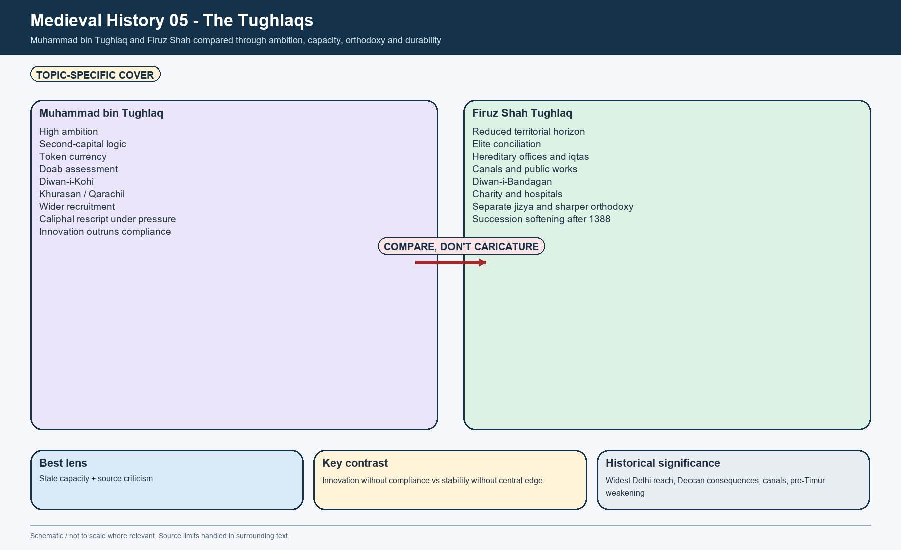

> **Subject:** Medieval Indian History | **Topic:** 05 | **Export date:** 2026-08-16
>
> **Approval:** false - awaiting explicit user approval.
>
> **Source order:** repository Markdown -> local OCR-searchable Satish Chandra core and Part I Sultanate chapters -> local material-evidence excerpts on Ashokan pillars and Tughlaq architecture -> no forced live current-affairs claim -> Qdrant not used.
>
> **Tag rule:** [FACT] source-grounded statement; [ANALYSIS] evidence-led synthesis; [DEBATE] historiographical disagreement or conceptual caution; [LIMIT] evidentiary, chronological, geographical or source-genre qualification.

## BASIC LEARNING SESSION

### DEEP-REVIEW LEARNING CONTRACT

| Control | Binding rule for this package |
|---|---|
| Syllabus boundary | Complete Medieval History Core is taught before optional enrichment. |
| Evidence method | Claim → named site/text/inscription/coin/example → analysis → qualification. |
| Source hierarchy | Archaeology, textual testimony, inscriptions, coins and scholarly interpretation remain visibly distinct. |
| Contested issues | Competing interpretations are attributed, evidenced and bounded; certainty is not manufactured. |
| Practice contract | Every solved item has demand decoding, an examiner-grade model, an executable answer/compression plan, marks rationale and answer-specific improvement. |
| Approval | This immutable successor remains `approved: false` pending explicit approval. |

**Canonical Basic/Core owner:** `upsc-ai-kit\knowledge\Medieval-Indian-History\basic\05_Tughlaqs.md`  
**Canonical topic owner:** `upsc-ai-kit\knowledge\Medieval-Indian-History\basic\05_Tughlaqs.md`  
**Optional Advanced owner:** `upsc-ai-kit\knowledge\Medieval-Indian-History\advanced\05_Tughlaqs.md`  
**Official syllabus mapping:** `upsc-ai-kit\knowledge\Medieval-Indian-History\OFFICIAL-UPSC-SYLLABUS-MAPPING.md`

### EVIDENCE, PYQ AND CURRENT-STATUS CONTROL

- **Archaeological inference:** material context supports bounded reconstruction; absence is not automatic proof of non-existence.
- **Textual testimony:** genre, authorship, redaction, patronage and temporal distance control what a text can prove.
- **Inscription and coin evidence:** contemporary names, titles, claims and circulation are powerful but do not by themselves map uniform territorial control.
- **Scholarly interpretation:** historian labels are arguments to test, not facts to memorise without evidence.
- **PYQ discipline:** repository ledgers and locally held official papers control wording and metadata; reconstructed wording and unavailable official keys must be labelled.
- **Current-status note, rechecked 2026-08-30:** The Archaeological Survey of India's Qutb Minar page was rechecked on 30 August 2026. It states that inscriptions record repairs to the minar by Firuz Shah Tughlaq after its earlier Aibak-Iltutmish construction phases. This official material link helps teach repair, reuse and dynastic appropriation; it does not validate every literary claim about Firuz's public works or wider political programme.

**Live/primary context sources recorded by the predecessor generation:**

- `https://asi.nic.in/pages/WorldHeritageQutbMinar`


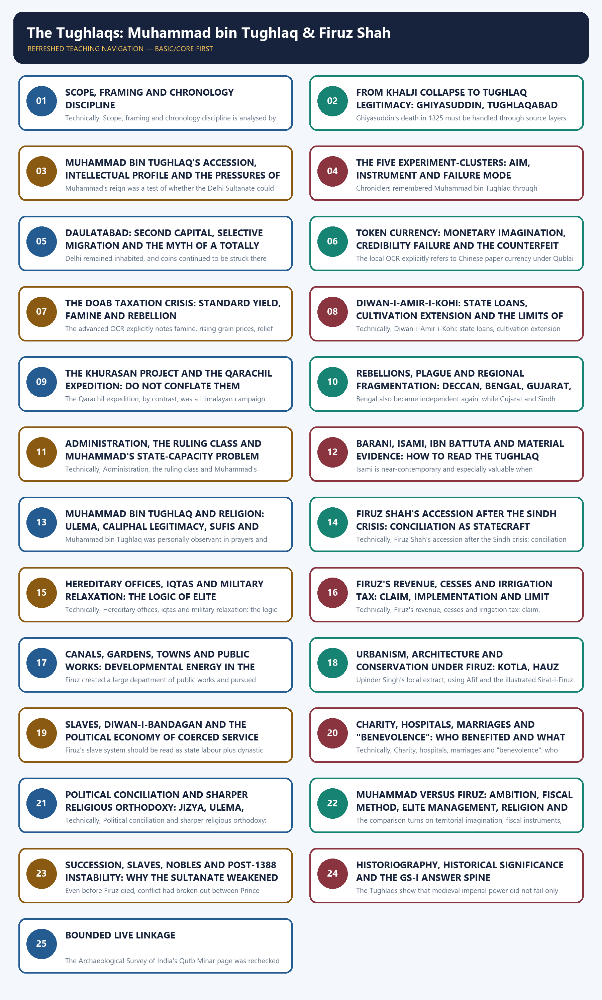

*Distinct embedded teaching-navigation image. The separate continuous Cārvāka-style flowchart package remains an independent at-a-glance artifact.*

#### Package counts, provenance and honest limitations

- Learning sections: 24; learning MCQ loops: 16.
- Workbook content: 4 verified or honestly-adjacent PYQs; 40 original broad-coverage MCQs; 12 remedial MCQs; 6 original solved Mains questions; final register modules: 10.
- Original PNG visuals: 26 total - 25 body visuals plus 1 topic-specific cover visual. All maps and route diagrams are schematic and not to scale.
- Repository sources used most heavily: Topic 05 basic and advanced owners; bounded Topics 04, 06, 07, 08, 09 and 11; `README.md`; `00_Master-Chronology.md`; `REVISION-CHART_Ages-Eras-and-Distinctive-Features.md`; local PYQ routing ledgers; validated question wording preserved in earlier repository packages.
- OCR evidence used most heavily from Satish Chandra's *History of Medieval India* chapters on Muhammad Tughlaq's experiments, Firuz and the decline of the Sultanate, and from *Medieval India: From Sultanat to the Mughals, Part I* chapters "Problems of a Centralised All-India-State" and "Reassertion of a State Based on Benevolence," plus the state and architecture chapters.
- Material-evidence support used where needed from the local Upinder Singh export on the later life of Ashokan pillars, especially the Topra and Meerut pillar transport accounts associated with Firuz Shah.
- [LIMIT] The Tughlaq archive is heavily mediated by elite Persian chronicles. Barani is indispensable but later, moralising, aristocratic and hostile to "low-born" advancement; Isami writes from displacement; Ibn Battuta writes as a traveller-court insider attracted to the dramatic; Firuz's *Futuhat* is self-presentation rather than neutral audit.
- [LIMIT] Direct locally verified UPSC ownership is narrow: one routed 2021 Prelims question clearly touches Muhammad-bin-Tughlaq by name; a 2022 routed Prelims question tests Mongol chronology including Muhammad; the most useful Mains questions are adjacent source-and-technology questions rather than direct Tughlaq prompts.
- [LIMIT] No fabricated percentages, tax rates, troop strengths, slave totals, coin denominations, canal routes or attribution sequences are used here. When chroniclers provide numbers, they are marked as **reported** and kept separate from secure inference.
- [LIMIT] Topic 05 owns the Tughlaq transition, Muhammad's experiments, Firuz's benevolence/public works, source criticism around the two reigns, and the immediate structural road to post-1388 fragmentation. Topic 04 owns Khalji institutions and late Khalji collapse in depth; Topic 09 owns Vijayanagara-Bahmani development beyond the Delhi-overstretch frame; Topic 06 owns Timur, Sayyids and Lodis as the main narrative after Firuz.

#### Sources actually used

| Source class | Exact source | Use and caveat |
|---|---|---|
| Repository knowledge | Topic 05 basic and advanced owners; bounded Topics 04, 06, 07, 08, 09 and 11; `00_Master-Chronology.md`; `REVISION-CHART_Ages-Eras-and-Distinctive-Features.md`; Medieval `README.md`; PYQ routing ledgers and verified question wording preserved inside earlier packages. | Controlled chronology, owner boundaries, institutional vocabulary, architectural caution, source warnings and PYQ provenance. |
| Local book | Satish Chandra, *History of Medieval India*, searchable OCR around printed pp. 106-127 and related Sultanate economy/state pages. | Foundation for Muhammad's experiments, Daulatabad, token currency, doab crisis, Firuz's canals and the succession decline. |
| Local book | Satish Chandra, *Medieval India: From Sultanat to the Mughals, Part I*, searchable OCR around printed pp. 97-127, 135-146 and 232-235. | Deeper control for Ghiyasuddin's moderation, source criticism, Khurasan/Qarachil, Firuz's fiscal-benevolent model, state theory and Tughlaq architecture. |
| Material archive | Local Upinder Singh export on Ashokan pillars and their medieval afterlives. | Used narrowly for the Topra/Meerut pillar transport sequence and later inscriptional afterlife; not used to inflate broader Tughlaq political claims. |
| Named primary traditions through source-critical synthesis | Ziauddin Barani (*Tarikh-i Firuz Shahi*, *Fatawa-i Jahandari*), Isami, Ibn Battuta, Shams Siraj Afif, *Futuhat-i Firuz Shahi*, coins, inscriptions, canals and surviving monuments. | Used with explicit genre caution: report, advice, travel narrative, ruler self-fashioning and material survival are separated from inference. |
| Live official or heritage source | None required for this export. | Repository Markdown and OCR-searchable books were sufficient; no decorative current-affairs hook was forced into a historical topic. |

#### Original visual asset index

- `notes/Medieval-Indian-History/assets/05_The-Tughlaqs-Muhammad-bin-Tughlaq-Firuz-Shah/00_tughlaq_comparative_cover.png`
- `notes/Medieval-Indian-History/assets/05_The-Tughlaqs-Muhammad-bin-Tughlaq-Firuz-Shah/01_tughlaq_chronology_evidence_spine.png`
- `notes/Medieval-Indian-History/assets/05_The-Tughlaqs-Muhammad-bin-Tughlaq-Firuz-Shah/02_ghiyas_transition_death_source_layers.png`
- `notes/Medieval-Indian-History/assets/05_The-Tughlaqs-Muhammad-bin-Tughlaq-Firuz-Shah/03_muhammad_empire_pressures_map.png`
- `notes/Medieval-Indian-History/assets/05_The-Tughlaqs-Muhammad-bin-Tughlaq-Firuz-Shah/04_five_experiments_overview.png`
- `notes/Medieval-Indian-History/assets/05_The-Tughlaqs-Muhammad-bin-Tughlaq-Firuz-Shah/05_delhi_daulatabad_phases_myths.png`
- `notes/Medieval-Indian-History/assets/05_The-Tughlaqs-Muhammad-bin-Tughlaq-Firuz-Shah/06_token_currency_trust_flow.png`
- `notes/Medieval-Indian-History/assets/05_The-Tughlaqs-Muhammad-bin-Tughlaq-Firuz-Shah/07_doab_tax_famine_rebellion_chain.png`
- `notes/Medieval-Indian-History/assets/05_The-Tughlaqs-Muhammad-bin-Tughlaq-Firuz-Shah/08_diwan_i_kohi_agricultural_model.png`
- `notes/Medieval-Indian-History/assets/05_The-Tughlaqs-Muhammad-bin-Tughlaq-Firuz-Shah/09_khurasan_qarachil_comparison.png`
- `notes/Medieval-Indian-History/assets/05_The-Tughlaqs-Muhammad-bin-Tughlaq-Firuz-Shah/10_rebellions_fragmentation_timeline.png`
- `notes/Medieval-Indian-History/assets/05_The-Tughlaqs-Muhammad-bin-Tughlaq-Firuz-Shah/11_muhammad_state_capacity_diagnostic.png`
- `notes/Medieval-Indian-History/assets/05_The-Tughlaqs-Muhammad-bin-Tughlaq-Firuz-Shah/12_source_matrix_barani_isami_ibn_battuta.png`
- `notes/Medieval-Indian-History/assets/05_The-Tughlaqs-Muhammad-bin-Tughlaq-Firuz-Shah/13_firuz_accession_political_bargain.png`
- `notes/Medieval-Indian-History/assets/05_The-Tughlaqs-Muhammad-bin-Tughlaq-Firuz-Shah/14_hereditary_iqta_offices_flow.png`
- `notes/Medieval-Indian-History/assets/05_The-Tughlaqs-Muhammad-bin-Tughlaq-Firuz-Shah/15_revenue_cess_irrigation_policy_matrix.png`
- `notes/Medieval-Indian-History/assets/05_The-Tughlaqs-Muhammad-bin-Tughlaq-Firuz-Shah/16_canal_public_works_network.png`
- `notes/Medieval-Indian-History/assets/05_The-Tughlaqs-Muhammad-bin-Tughlaq-Firuz-Shah/17_firuz_urban_architecture_matrix.png`
- `notes/Medieval-Indian-History/assets/05_The-Tughlaqs-Muhammad-bin-Tughlaq-Firuz-Shah/18_ashokan_pillar_transport_process.png`
- `notes/Medieval-Indian-History/assets/05_The-Tughlaqs-Muhammad-bin-Tughlaq-Firuz-Shah/19_diwan_i_bandagan_ecosystem.png`
- `notes/Medieval-Indian-History/assets/05_The-Tughlaqs-Muhammad-bin-Tughlaq-Firuz-Shah/20_welfare_departments_matrix.png`
- `notes/Medieval-Indian-History/assets/05_The-Tughlaqs-Muhammad-bin-Tughlaq-Firuz-Shah/21_conciliation_vs_orthodoxy_comparison.png`
- `notes/Medieval-Indian-History/assets/05_The-Tughlaqs-Muhammad-bin-Tughlaq-Firuz-Shah/22_muhammad_vs_firuz_structural_matrix.png`
- `notes/Medieval-Indian-History/assets/05_The-Tughlaqs-Muhammad-bin-Tughlaq-Firuz-Shah/23_succession_breakdown_causal_web.png`
- `notes/Medieval-Indian-History/assets/05_The-Tughlaqs-Muhammad-bin-Tughlaq-Firuz-Shah/24_historiography_comparison.png`
- `notes/Medieval-Indian-History/assets/05_The-Tughlaqs-Muhammad-bin-Tughlaq-Firuz-Shah/25_gs1_answer_spine.png`

### SESSION 1 — SCOPE, FRAMING AND CHRONOLOGY DISCIPLINE

#### DEFINITION / WHAT THIS IS CALLED

**Plain-language definition:** The strongest framing is source criticism plus state-capacity comparison.

**Technical definition:** Technically, Scope, framing and chronology discipline is analysed by relating Scope to framing, then testing the relationship through chronology discipline and source criticism plus state-capacity comparison.

#### ANSWER-GRABBING OPENING — WRITE/ADAPT IN THE EXAM

> The strongest framing is source criticism plus state-capacity comparison.

#### MUST-WRITE KEYWORDS

- **Scope**
- **framing**
- **chronology discipline**
- **source criticism plus state-capacity comparison**
- **objective**
- **administrative instrument**

**How to use them:** Frame the answer through Scope; define framing, connect chronology discipline with source criticism plus state-capacity comparison to explain the mechanism, and use objective for the decisive comparison or qualification.

[FACT] Topic 05 owns the Tughlaq arc from **1320**, when Ghiyasuddin Tughlaq displaced Khusrau Khan, to **1388**, when Firuz Shah died and the succession order unravelled. It uses late Khalji collapse only as inherited context and treats Timur's invasion and the Sayyid-Lodi aftermath as the main subject of Topic 06.

[ANALYSIS] The strongest framing is **source criticism plus state-capacity comparison**. Muhammad bin Tughlaq should not be flattened into the schoolbook caricature of a "wise fool"; Firuz Shah should not be romanticised as a simply benevolent welfare ruler. The real contrast is between two different ways of holding together a very large Sultanate: one through high ambition, uniformity and risky innovation, the other through conciliation, heredity and developmental works.

[DEBATE] The source families themselves force caution. Barani moralises from an aristocratic angle; Isami remembers from displacement; Ibn Battuta records wonder, gifts, punishments and urban travel; Firuz's own *Futuhat* stages self-justification; coins, canals, forts and pillars show material claims but not the total lived experience of the empire.

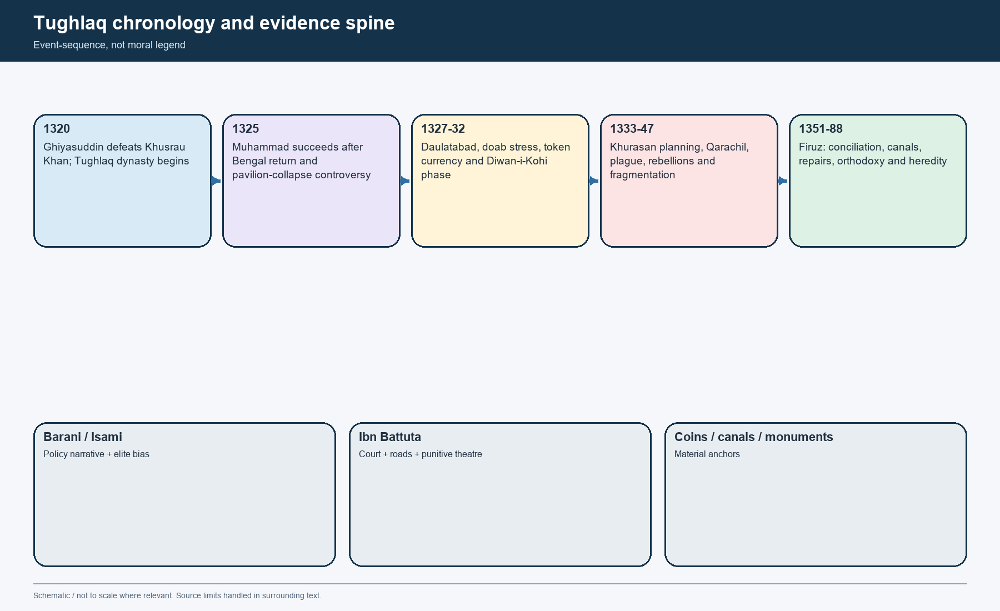

*Chronology visual. Rulers, experiments, rebellions and evidence families are separated so that event, reputation and later memory are never collapsed into one line of story.*

#### Topic ownership firewall

| Owner | What stays primarily there | What Topic 05 legitimately uses |
|---|---|---|
| Topic 04 - Khaljis | Alauddin's integrated military-fiscal system, Siri, market controls, Mongol pressure and the fall of the Khaljis | Only the immediate handoff into the Ghiyasuddin takeover and a few institutional comparison points |
| Topic 06 - Decline / Timur / Sayyids / Lodis | Timur's invasion, the Sayyids, Lodis and fifteenth-century north-Indian balance of power | Only the post-1388 causal bridge showing why Delhi weakened before Timur |
| Topic 07 - Sultanate administration, economy and society | General offices, revenue structure, town life, trade and social groups in long duration | Only Tughlaq-specific reversals, experiments and capacity stress |
| Topic 09 - Vijayanagara and Bahmani | Full Deccan state formation after Delhi's overstretch | Only the Delhi-side conditions that allowed southern breakaways |
| Topic 11 - Art, architecture and culture | Full Sultanate architectural and cultural survey | Only bounded political meaning of Tughlaqabad, Kotla Firoz Shah, Hauz Khas repairs and pillar transport |

#### Governing thesis

- [ANALYSIS] Muhammad bin Tughlaq expanded direct rule and tried to standardise the empire faster than the available instruments of information, trust and enforcement could sustain.
- [ANALYSIS] Firuz Shah reduced punitive intensity, invested in canals and urban works, and stabilised the elite through heredity - but this traded short-term order for long-term central weakening.
- [LIMIT] Neither ruler can be judged only by intention or only by outcome. For UPSC, the mark-winning move is to distinguish **objective**, **administrative instrument**, **social cost** and **durability**.

#### CLOSING RECALL FLOW — SCOPE, FRAMING AND CHRONOLOGY DISCIPLINE

```text
START / CONCEPT: Scope, framing and chronology discipline
        |
        v
EXACT TERMS: Scope · framing · chronology discipline · source criticism plus state-capacity comparison · objective · administrative instrument
        |
        v
MECHANISM / ARGUMENT: For UPSC, the mark-winning move is to distinguish objective, administrative instrument, social cost and durability.
        |
        v
CONSEQUENCE / CONTRAST: Muhammad bin Tughlaq should not be flattened into the schoolbook caricature of a "wise fool"; Firuz Shah should not be romanticised as a simply benevolent welfare ruler.
        |
        v
UPSC TRAP / ANSWER-USE: Do not miss this limiting distinction: the real contrast is between two different ways of holding together a very large...
        |
        v
ANSWER-GRABBING FORMULATION: The strongest framing is source criticism plus state-capacity comparison.
```
### SESSION 2 — FROM KHALJI COLLAPSE TO TUGHLAQ LEGITIMACY: GHIYASUDDIN, TUGHLAQABAD AND THE DEATH CONTROVERSY

#### DEFINITION / WHAT THIS IS CALLED

**Plain-language definition:** The sharpest contrast is not Ghiyasuddin versus Firuz but Ghiyasuddin's moderated restoration versus Muhammad's high-speed uniformity project.

**Technical definition:** Ghiyasuddin's death in 1325 must be handled through source layers.

#### ANSWER-GRABBING OPENING — WRITE/ADAPT IN THE EXAM

> The sharpest contrast is not Ghiyasuddin versus Firuz but Ghiyasuddin's moderated restoration versus Muhammad's high-speed uniformity project.

#### MUST-WRITE KEYWORDS

- **From Khalji collapse to Tughlaq legitimacy**
- **Ghiyasuddin**
- **Tughlaqabad**
- **the death controversy**
- **moderation**
- **not**

**How to use them:** Frame the answer through From Khalji collapse to Tughlaq legitimacy; define Ghiyasuddin, connect Tughlaqabad with the death controversy to explain the mechanism, and use moderation for the decisive comparison or qualification.

[FACT] Ghiyasuddin Tughlaq, the former frontier commander and warden of the marches, led a coalition of officers against Khusrau Khan in **1320**. In a hard-fought battle outside Delhi, Khusrau was defeated and killed, ending the late Khalji crisis.

[FACT] Ghiyasuddin's brief reign was devoted to restoration and consolidation. The advanced OCR explicitly praises his policy of **moderation**: taxation should not ruin the countryside, agriculture and crafts should expand, and the people should neither become so rich as to rebel nor so poor as to cease cultivation.

[FACT] He restored some neglected noble families to office, audited extraordinary gifts of the previous regime, reduced some long-held revenue-free grants, sent Ulugh Khan (the future Muhammad bin Tughlaq) to restore the imperial position in Warangal, and personally marched to Bengal, where the campaign succeeded.

[FACT] The palace-fortress complex of **Tughlaqabad**, together with Ghiyasuddin's elevated domed tomb, proclaimed a new dynastic style: fortified austerity, sloping battered walls and a preference for strength over ornament.

[LIMIT] Ghiyasuddin's death in **1325** must be handled through source layers. A pavilion erected by Ulugh Khan to welcome him after the Bengal campaign collapsed during the parade of captured elephants. Contemporary suspicion, later conspiracy stories and the Nizamuddin-Auliya curse legend all survive; the advanced OCR, however, states that modern research does **not** support the idea of a deliberate murderous conspiracy.

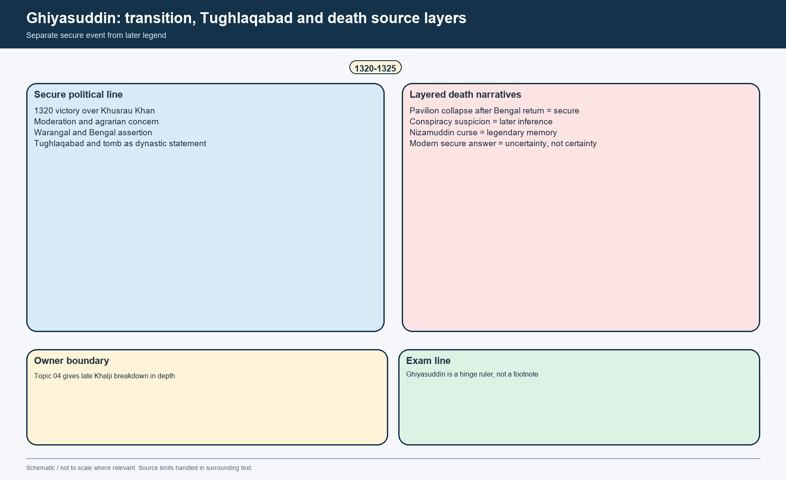

*Transition visual. Secure political sequence, dynastic architecture and the death controversy are separated into evidence, report and legend.*

#### Secure event versus layered interpretation

| Dimension | Secure minimum statement | Why caution is necessary |
|---|---|---|
| Rise to power | Ghiyasuddin defeated Khusrau Khan in 1320 and founded the Tughlaq dynasty | The moral language of chroniclers should not be mistaken for complete political sociology |
| Policy | Moderation, agrarian concern, restoration of order and renewed southern/eastern assertion | The reign was too brief to convert every intention into stable institution |
| Bengal campaign | Successful enough for the ruler to return in triumph | The campaign is often remembered only as the prelude to his death |
| Death | Pavilion collapse while welcoming the Sultan after Bengal | Conspiracy certainty, saintly curse and elephant accident belong to different source layers |

#### Why Ghiyasuddin matters here

- [ANALYSIS] Topic 05 should not begin with Muhammad as though he inherited a blank slate. He inherited Ghiyasuddin's partially restored authority, direct-ruled Deccan ambitions and a fresh dynastic legitimacy still being built.
- [ANALYSIS] The sharpest contrast is not Ghiyasuddin versus Firuz but Ghiyasuddin's **moderated restoration** versus Muhammad's **high-speed uniformity project**.

#### CLOSING RECALL FLOW — FROM KHALJI COLLAPSE TO TUGHLAQ LEGITIMACY: GHIYASUDDIN, TUGHLAQABAD AND THE DEATH CONTROVERSY

```text
START / CONCEPT: From Khalji collapse to Tughlaq legitimacy: Ghiyasuddin, Tughlaqabad and the death controversy
        |
        v
EXACT TERMS: From Khalji collapse to Tughlaq legitimacy · Ghiyasuddin · Tughlaqabad · the death controversy · moderation · not
        |
        v
MECHANISM / ARGUMENT: Ghiyasuddin's death in 1325 must be handled through source layers.
        |
        v
CONSEQUENCE / CONTRAST: The advanced OCR explicitly praises his policy of moderation: taxation should not ruin the countryside, agriculture and crafts should expand, and the people should neither become so rich as to rebel nor so poor as to cease cultivation.
        |
        v
UPSC TRAP / ANSWER-USE: Contemporary suspicion, later conspiracy stories and the Nizamuddin-Auliya curse legend all survive; the advanced OCR, however, states that modern research does not support the idea of a deliberate murderous conspiracy.
        |
        v
ANSWER-GRABBING FORMULATION: The sharpest contrast is not Ghiyasuddin versus Firuz but Ghiyasuddin's moderated restoration versus Muhammad's high-speed uniformity project.
```
### SESSION 3 — MUHAMMAD BIN TUGHLAQ'S ACCESSION, INTELLECTUAL PROFILE AND THE PRESSURES OF SCALE

#### DEFINITION / WHAT THIS IS CALLED

**Plain-language definition:** Barani's charge that Muhammad was a "rationalist" is valuable evidence, not merely abuse.

**Technical definition:** Muhammad's reign was a test of whether the Delhi Sultanate could move from a conquest-plus-tribute order to a more uniformly supervised all-India state.

#### ANSWER-GRABBING OPENING — WRITE/ADAPT IN THE EXAM

> Barani's charge that Muhammad was a "rationalist" is valuable evidence, not merely abuse.

#### MUST-WRITE KEYWORDS

- **Muhammad bin Tughlaq's accession**
- **intellectual profile**
- **the pressures of scale**
- **Jinaprabha Suri**
- **scale**
- **uniformly supervised all-India state**

**How to use them:** Frame the answer through Muhammad bin Tughlaq's accession; define intellectual profile, connect the pressures of scale with Jinaprabha Suri to explain the mechanism, and use scale for the decisive comparison or qualification.

[FACT] Muhammad bin Tughlaq came to power in 1325 with an unusual intellectual profile for a medieval ruler. The local OCR describes him as deeply read in religion, philosophy, mathematics and medicine, interested in Persian and Hindi poetry, and willing to converse not only with Muslim mystics but also with Hindu yogis and Jain saints such as **Jinaprabha Suri**.

[FACT] Barani's charge that Muhammad was a "rationalist" is valuable evidence, not merely abuse. It shows that the Sultan would not accept many claims merely on inherited religious authority and that his relationship with orthodox theologians was tense from the start.

[FACT] He also inherited the widest directly ruled Delhi Sultanate yet attempted: the old north-Indian core, Gujarat, Malwa, the Deccan, Warangal and the farther southern belt up to the Madurai horizon. This was an empire of long roads, delayed communication, high military transport costs and regionally varied loyalties.

[ANALYSIS] The experiments of the reign become intelligible only when we place them under the pressure of **scale**. The problem was not simply "a ruler with strange ideas"; it was a ruler trying to make distant annexations administratively legible and fiscally usable.


*Schematic pressure map. It is not a territorial border map; it shows the problem-zones that shaped Muhammad's decisions.*

#### Pressure grid

| Pressure zone | Core problem | Why it mattered to Muhammad |
|---|---|---|
| North-west frontier | Mongol threat, Ghazni-Afghanistan question, Punjab vigilance | A purely defensive frontier left Delhi reactive |
| Doab and Delhi provisioning belt | Grain, revenue, transport and price credibility | Delhi's army and court could not function without a dependable agrarian core |
| Deccan and far south | Distance, tribute enforcement, direct-rule burden and local resentment | Annexation without local administrative depth became fragile |
| Elite coalition | Old nobles, foreigners, Indian converts and "new men" | Recruitment widened talent but weakened cohesion |
| Legitimacy and religious authority | Conflict with ulema, saintly networks and symbolic caliphal idiom | Every controversial policy also had a reputational cost |

#### Safe interpretive line

- [ANALYSIS] Muhammad's reign was a test of whether the Delhi Sultanate could move from a conquest-plus-tribute order to a more **uniformly supervised all-India state**. The answer was mixed: imagination outran coordination.

#### CLOSING RECALL FLOW — MUHAMMAD BIN TUGHLAQ'S ACCESSION, INTELLECTUAL PROFILE AND THE PRESSURES OF SCALE

```text
START / CONCEPT: Muhammad bin Tughlaq's accession, intellectual profile and the pressures of scale
        |
        v
EXACT TERMS: Muhammad bin Tughlaq's accession · intellectual profile · the pressures of scale · Jinaprabha Suri · scale · uniformly supervised all-India state
        |
        v
MECHANISM / ARGUMENT: Muhammad's reign was a test of whether the Delhi Sultanate could move from a conquest-plus-tribute order to a more uniformly supervised all-India state.
        |
        v
CONSEQUENCE / CONTRAST: It shows that the Sultan would not accept many claims merely on inherited religious authority and that his relationship with orthodox theologians was tense from the start.
        |
        v
UPSC TRAP / ANSWER-USE: The problem was not simply "a ruler with strange ideas"; it was a ruler trying to make distant annexations administratively legible and fiscally usable.
        |
        v
ANSWER-GRABBING FORMULATION: Barani's charge that Muhammad was a "rationalist" is valuable evidence, not merely abuse.
```
### SESSION 4 — THE FIVE EXPERIMENT-CLUSTERS: AIM, INSTRUMENT AND FAILURE MODE

#### DEFINITION / WHAT THIS IS CALLED

**Plain-language definition:** The exam-safe move is not to rehearse a failure-list but to ask what each measure was trying to solve, what instrument it required, and where that instrument broke.

**Technical definition:** Chroniclers remembered Muhammad bin Tughlaq through "experiments" because they were visible moments when intention, instrument and administrative reality collided.

#### ANSWER-GRABBING OPENING — WRITE/ADAPT IN THE EXAM

> The exam-safe move is not to rehearse a failure-list but to ask what each measure was trying to solve, what instrument it required, and where that instrument broke.

#### MUST-WRITE KEYWORDS

- **The five experiment-clusters**
- **aim**
- **instrument**
- **failure mode**
- **not**
- **Daulatabad second capital**

**How to use them:** Frame the answer through The five experiment-clusters; define aim, connect instrument with failure mode to explain the mechanism, and use not for the decisive comparison or qualification.

[ANALYSIS] Chroniclers remembered Muhammad bin Tughlaq through "experiments" because they were visible moments when intention, instrument and administrative reality collided. The exam-safe move is not to rehearse a failure-list but to ask what each measure was trying to solve, what instrument it required, and where that instrument broke.


*Overview visual. The experiments are grouped by administrative problem, not by legend.*

| Experiment cluster | Immediate objective | Administrative instrument required | Principal failure mode |
|---|---|---|---|
| Daulatabad second capital | Better southern supervision and more central imperial positioning | Managed migration, communication, local buy-in, dual-capital logistics | Distance, coercive pressure, southern losses and homesickness |
| Token currency | Expand usable money and fiscal flexibility without dependence on silver supply | Mint control, verification, counter-forgery regime, public trust | Weak monopoly over coin authentication and widespread imitation |
| Doab fiscal reset | Raise dependable state demand from the core agrarian zone | Fair assessment, locally monitored collection, famine resilience | Standard-yield rigidity, official oppression and climatic stress |
| Diwan-i-Amir-i-Kohi | Extend cultivation and improve crop quality | Honest local officials, credit discipline, agronomic knowledge | Corruption, weak supervision and over-optimistic scale |
| Frontier military projects | Push defence outward and secure the north-west / Himalayas | Sustained logistics, reliable intelligence, terrain knowledge, finance | Strategic overreach and poor environmental fit |

#### Two big cautions

- [LIMIT] "Bold experiment" does **not** mean "modern policy laboratory." These were coercive medieval state measures operating through grain extraction, iqta assignments, military command and court authority.
- [LIMIT] Failure did **not** erase significance. Several ideas - agricultural loans, developmental cultivation, second-capital logic, fiscal-monetary experimentation - had a long afterlife even when the immediate version failed.

#### CLOSING RECALL FLOW — THE FIVE EXPERIMENT-CLUSTERS: AIM, INSTRUMENT AND FAILURE MODE

```text
START / CONCEPT: The five experiment-clusters: aim, instrument and failure mode
        |
        v
EXACT TERMS: The five experiment-clusters · aim · instrument · failure mode · not · Daulatabad second capital
        |
        v
MECHANISM / ARGUMENT: Chroniclers remembered Muhammad bin Tughlaq through "experiments" because they were visible moments when intention, instrument and administrative reality collided.
        |
        v
CONSEQUENCE / CONTRAST: "Bold experiment" does not mean "modern policy laboratory." These were coercive medieval state measures operating through grain extraction, iqta assignments, military command and court authority.
        |
        v
UPSC TRAP / ANSWER-USE: Do not miss this limiting distinction: several ideas - agricultural loans, developmental cultivation, second-capital logic, fiscal-monetary experimentation - had a...
        |
        v
ANSWER-GRABBING FORMULATION: The exam-safe move is not to rehearse a failure-list but to ask what each measure was trying to solve, what instrument it required, and where that instrument broke.
```
### SESSION 5 — DAULATABAD: SECOND CAPITAL, SELECTIVE MIGRATION AND THE MYTH OF A TOTALLY EMPTIED DELHI

#### DEFINITION / WHAT THIS IS CALLED

**Plain-language definition:** The motive most safely attributed to Muhammad is the desire for a second capital better placed for southern oversight and more central to the enlarged empire.

**Technical definition:** Delhi remained inhabited, and coins continued to be struck there while the Sultan was at Daulatabad.

#### ANSWER-GRABBING OPENING — WRITE/ADAPT IN THE EXAM

> Delhi remained inhabited, and coins continued to be struck there while the Sultan was at Daulatabad.

#### MUST-WRITE KEYWORDS

- **Daulatabad**
- **second capital**
- **selective migration**
- **the myth of a totally emptied Delhi**
- **entire**
- **Muhammad shifted the entire population of Delhi**

**How to use them:** Frame the answer through Daulatabad; define second capital, connect selective migration with the myth of a totally emptied Delhi to explain the mechanism, and use entire for the decisive comparison or qualification.

[FACT] Devagiri/Deogir was already central to Delhi's southern strategy before Muhammad's accession. Alauddin had raided it, later Delhi had used it as a base, and Muhammad himself had spent significant time there as prince and military commander. Renaming it **Daulatabad** was therefore politically meaningful, not whimsical.

[FACT] The advanced OCR is explicit that **no mass exodus of the whole population of Delhi** was ordered. Pressure fell mainly on officers, their followers, nobles, leading men, Sufis, ulema and grandees. Delhi remained inhabited, and coins continued to be struck there while the Sultan was at Daulatabad.

[FACT] Preparations were serious: the road was organised with halting stations and facilities, the city was divided into wards (*mohallas*), and grants, houses and boarding arrangements were made for migrants. These details matter because they show that the move was planned, not impulsively improvised.

[ANALYSIS] The motive most safely attributed to Muhammad is the desire for a **second capital** better placed for southern oversight and more central to the enlarged empire. Popular textbook language about a "capital transfer" becomes misleading if it implies permanent abandonment of Delhi.

[LIMIT] The journey was still punishing. It was long, undertaken in severe heat, and accompanied by coercive inspection of houses and substantial discontent. Once the southern direct-rule project faltered in the mid-1330s, the political logic of Daulatabad weakened, and people were allowed to return.

[ANALYSIS] The long-term consequence was real even though the policy failed. Roads improved, north-south contact intensified, and many migrants - especially learned and religious figures - stayed back, helping Daulatabad become a Deccan centre of Islamic learning later useful to the Bahmani world.

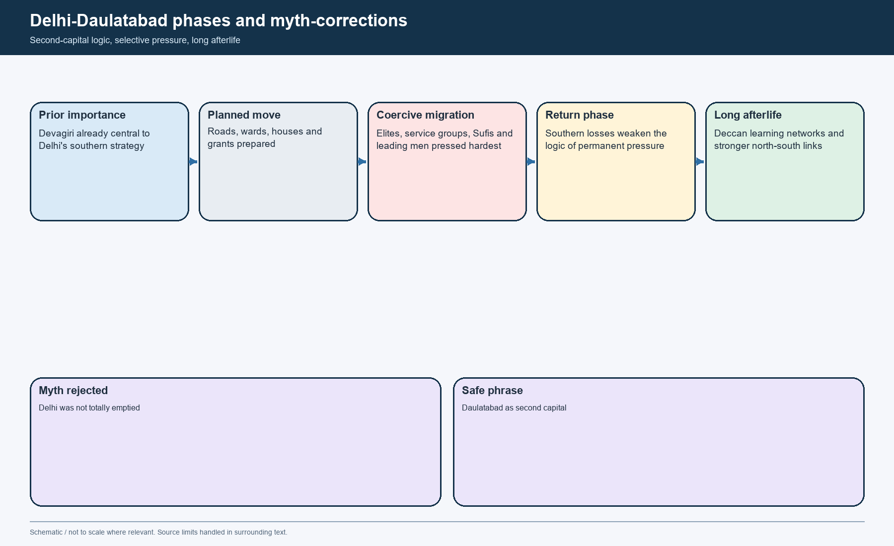

*Phases visual. Planning, pressure, migration, return and long-run cultural consequences are separated from exaggerated myth.*

#### Myth-correction table

| Common simplification | Secure correction |
|---|---|
| Muhammad shifted the **entire** population of Delhi | The pressure was severe, but it chiefly targeted officers, grandees, Sufis, ulema and associated groups |
| Delhi ceased to function | Delhi remained inhabited and continued mint activity |
| Daulatabad was chosen randomly | It was already a strategic Deccan base and more central to the enlarged empire |
| The move had no long-term effect | It intensified north-south communication and helped seed Deccan Islamic learning |

#### CLOSING RECALL FLOW — DAULATABAD: SECOND CAPITAL, SELECTIVE MIGRATION AND THE MYTH OF A TOTALLY EMPTIED DELHI

```text
START / CONCEPT: Daulatabad: second capital, selective migration and the myth of a totally emptied Delhi
        |
        v
EXACT TERMS: Daulatabad · second capital · selective migration · the myth of a totally emptied Delhi · entire · Muhammad shifted the entire population of Delhi
        |
        v
MECHANISM / ARGUMENT: These details matter because they show that the move was planned, not impulsively improvised.
        |
        v
CONSEQUENCE / CONTRAST: Renaming it Daulatabad was therefore politically meaningful, not whimsical.
        |
        v
UPSC TRAP / ANSWER-USE: Do not miss this limiting distinction: the motive most safely attributed to Muhammad is the desire for a second capital...
        |
        v
ANSWER-GRABBING FORMULATION: Delhi remained inhabited, and coins continued to be struck there while the Sultan was at Daulatabad.
```
### SESSION 6 — TOKEN CURRENCY: MONETARY IMAGINATION, CREDIBILITY FAILURE AND THE COUNTERFEIT PROBLEM

#### DEFINITION / WHAT THIS IS CALLED

**Plain-language definition:** The experiment is therefore better interpreted as a problem of state credibility and enforcement, not of civilisational ignorance.

**Technical definition:** The local OCR explicitly refers to Chinese paper currency under Qublai Khan and to earlier Iranian experimentation.

#### ANSWER-GRABBING OPENING — WRITE/ADAPT IN THE EXAM

> The experiment is therefore better interpreted as a problem of state credibility and enforcement, not of civilisational ignorance.

#### MUST-WRITE KEYWORDS

- **Token currency**
- **monetary imagination**
- **credibility failure**
- **the counterfeit problem**
- **copper and brass**
- **control imitation and authenticate issue**

**How to use them:** Frame the answer through Token currency; define monetary imagination, connect credibility failure with the counterfeit problem to explain the mechanism, and use copper and brass for the decisive comparison or qualification.

[FACT] Muhammad bin Tughlaq issued **copper and brass** coins intended to circulate at the value of the silver *tanka*. This was a token-currency experiment, but it must not be falsely described as "paper currency."

[FACT] The idea itself was not unprecedented in the wider world. The local OCR explicitly refers to Chinese paper currency under Qublai Khan and to earlier Iranian experimentation. The experiment is therefore better interpreted as a problem of **state credibility and enforcement**, not of civilisational ignorance.

[DEBATE] Barani links the move to military ambition and treasury pressure; modern inference can also connect it to a wider silver shortage and the desire to enlarge monetary circulation. But motive should be stated cautiously because Barani also contradicts himself on whether the treasury had already been drained.

[FACT] The decisive failure lay in the inability of the state to **control imitation and authenticate issue**. Barani's famous line that every Hindu house became a mint is rhetorical, but it securely conveys the point that unofficial fabrication spread widely enough to destroy trust.

[FACT] Muhammad eventually withdrew the experiment and agreed to exchange precious metal for acceptable token pieces. Rejected forgeries accumulated in heaps outside the fort. Surviving specimens prove issue and design; they do not prove uniform success in circulation.

[ANALYSIS] The best verdict is not "an absurd idea," but "a financially and conceptually intelligible idea without the institutional monopoly required to make token value credible."


*Monetary-flow visual. The real fault line was credibility, not mere novelty.*

#### Evidence and caution table

| Claim | Support in local sources | Necessary caution |
|---|---|---|
| Copper and brass pieces were issued at silver value | Clear in concise and advanced OCR | Do not add unsupported denominations or numerical ratios |
| Wider precedents existed | China and Iranian references appear in OCR | A precedent elsewhere did not automatically solve Indian enforcement problems |
| Forgery ruined confidence | Central claim in Barani-derived narrative | The dramatic phrasing is rhetorical; the institutional lesson is the key point |
| Withdrawal required redemption in precious metal | Clear in the narrative | Do not assume every forged coin was accepted; rejected pieces remained outside the fort |

#### CLOSING RECALL FLOW — TOKEN CURRENCY: MONETARY IMAGINATION, CREDIBILITY FAILURE AND THE COUNTERFEIT PROBLEM

```text
START / CONCEPT: Token currency: monetary imagination, credibility failure and the counterfeit problem
        |
        v
EXACT TERMS: Token currency · monetary imagination · credibility failure · the counterfeit problem · copper and brass · control imitation and authenticate issue
        |
        v
MECHANISM / ARGUMENT: [DEBATE] Barani links the move to military ambition and treasury pressure; modern inference can also connect it to a wider silver shortage and the desire to enlarge monetary circulation.
        |
        v
CONSEQUENCE / CONTRAST: This was a token-currency experiment, but it must not be falsely described as "paper currency.".
        |
        v
UPSC TRAP / ANSWER-USE: The best verdict is not "an absurd idea," but "a financially and conceptually intelligible idea without the institutional monopoly required to make token value credible.".
        |
        v
ANSWER-GRABBING FORMULATION: The experiment is therefore better interpreted as a problem of state credibility and enforcement, not of civilisational ignorance.
```
### SESSION 7 — THE DOAB TAXATION CRISIS: STANDARD YIELD, FAMINE AND REBELLION

#### DEFINITION / WHAT THIS IS CALLED

**Plain-language definition:** Even if the rhetoric is exaggerated, the reality of a major doab agrarian upheaval is difficult to deny.

**Technical definition:** The advanced OCR explicitly notes famine, rising grain prices, relief camps at Delhi, grain brought from Awadh and Muhammad's move to Swargadwari because the atmosphere of Delhi had become pestilential.

#### ANSWER-GRABBING OPENING — WRITE/ADAPT IN THE EXAM

> The share demanded may still have been notionally half, but the effective burden under famine and oppressive collection could rise sharply.

#### MUST-WRITE KEYWORDS

- **The doab taxation crisis**
- **standard yield**
- **famine**
- **rebellion**
- **ghari**
- **charai**

**How to use them:** Frame the answer through The doab taxation crisis; define standard yield, connect famine with rebellion to explain the mechanism, and use ghari for the decisive comparison or qualification.

[FACT] Early in Muhammad's reign, the Gangetic doab saw a serious agrarian crisis and rebellion. The crucial point in the advanced OCR is that the problem was not simply "higher taxes" in the abstract. The assessment used **standard yield** rather than actual produce, and official prices rather than actual market prices when converting the state's share into cash.

[FACT] The old cesses - notably **ghari** (house tax) and **charai** (grazing tax) - were rigorously collected, cattle were branded and houses counted. The share demanded may still have been notionally half, but the *effective* burden under famine and oppressive collection could rise sharply.

[FACT] Barani reports that peasants burnt grain-heaps, drove away cattle and abandoned cultivation, and that the area from Kannauj to Dalmau was devastated by suppression. Even if the rhetoric is exaggerated, the reality of a major doab agrarian upheaval is difficult to deny.

[FACT] Climatic failure worsened everything. The advanced OCR explicitly notes famine, rising grain prices, relief camps at Delhi, grain brought from Awadh and Muhammad's move to **Swargadwari** because the atmosphere of Delhi had become pestilential.

[ANALYSIS] The best comparison with Alauddin is subtle. Alauddin had also demanded heavily, yet Muhammad faced sharper rebellion because the combination of standard-yield rigidity, local official excess and environmental stress proved politically explosive.

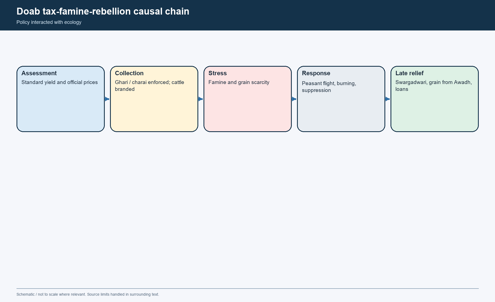

*Causal-chain visual. Policy, official behaviour and climate interacted; none alone fully explains the crisis.*

#### Chronology caution

| Stage | Secure content | Why not overstate |
|---|---|---|
| Assessment reset | Standard yield and official prices sharpened burden | Exact percentage escalation is not securely recoverable from rhetoric alone |
| Agrarian distress | Peasant flight, destruction and suppression in the doab | Spread beyond the doab is less securely supported |
| Famine | Grain scarcity, high prices, relief measures, move to Swargadwari | Climatic failure complicates pure "bad policy" explanations |
| Historical lesson | Core-zone extraction without flexible information destroys credibility | Avoid treating the crisis as proof that the entire empire became ungovernable at once |

#### CLOSING RECALL FLOW — THE DOAB TAXATION CRISIS: STANDARD YIELD, FAMINE AND REBELLION

```text
START / CONCEPT: The doab taxation crisis: standard yield, famine and rebellion
        |
        v
EXACT TERMS: The doab taxation crisis · standard yield · famine · rebellion · ghari · charai
        |
        v
MECHANISM / ARGUMENT: The advanced OCR explicitly notes famine, rising grain prices, relief camps at Delhi, grain brought from Awadh and Muhammad's move to Swargadwari because the atmosphere of Delhi had become pestilential.
        |
        v
CONSEQUENCE / CONTRAST: The crucial point in the advanced OCR is that the problem was not simply "higher taxes" in the abstract.
        |
        v
UPSC TRAP / ANSWER-USE: Do not miss this limiting distinction: alauddin had also demanded heavily, yet Muhammad faced sharper rebellion because the combination of...
        |
        v
ANSWER-GRABBING FORMULATION: The share demanded may still have been notionally half, but the effective burden under famine and oppressive collection could rise sharply.
```
### SESSION 8 — DIWAN-I-AMIR-I-KOHI: STATE LOANS, CULTIVATION EXTENSION AND THE LIMITS OF AGRARIAN ENGINEERING

#### DEFINITION / WHAT THIS IS CALLED

**Plain-language definition:** Money intended as loans was consumed for personal use, the new land was not adequately brought under cultivation, and recovery collapsed.

**Technical definition:** Technically, Diwan-i-Amir-i-Kohi: state loans, cultivation extension and the limits of agrarian engineering is analysed by relating Diwan-i-Amir-i-Kohi to cultivation extension, then testing the relationship through the limits of agrarian engineering and banjar.

#### ANSWER-GRABBING OPENING — WRITE/ADAPT IN THE EXAM

> Money intended as loans was consumed for personal use, the new land was not adequately brought under cultivation, and recovery collapsed.

#### MUST-WRITE KEYWORDS

- **Diwan-i-Amir-i-Kohi**
- **cultivation extension**
- **the limits of agrarian engineering**
- **banjar**
- **30 kroh by 30 kroh**
- **100 shiqdars**

**How to use them:** Frame the answer through Diwan-i-Amir-i-Kohi; define cultivation extension, connect the limits of agrarian engineering with banjar to explain the mechanism, and use 30 kroh by 30 kroh for the decisive comparison or qualification.

[FACT] After the doab famine phase, Muhammad bin Tughlaq tried to reverse direction and promote agrarian development. A special department called the **Diwan-i-Amir-i-Kohi** was created to supervise a tract of about **30 kroh by 30 kroh**.

[FACT] The objective had two parts: bring more land under cultivation and improve crop quality. Barani's own phrasing, preserved in the advanced OCR, imagines a graded shift from barley to wheat, from wheat to sugarcane, and then to higher-value crops such as grapes and dates.

[FACT] Around **100 shiqdars** were appointed, given honour, horses and large sums for agricultural loans (*sondhar*). Reported figures such as seventy lakh tankas or even two crores in later recollection must be handled as reported, not audited certainty.

[LIMIT] The advanced OCR argues that the scheme aimed to bring **banjar** or barren land under cultivation, not genuinely uncultivable *usar* land, despite Barani's sharper wording. This distinction matters because it changes the policy from impossible fantasy to risky agricultural extension.

[FACT] The scheme failed because the chosen personnel were inexperienced, corrupt or both. Money intended as loans was consumed for personal use, the new land was not adequately brought under cultivation, and recovery collapsed.

[ANALYSIS] Yet the historical significance is large. State-supported agricultural loans and planned cultivation improvement survived the immediate failure and reappeared later under Firuz and more systematically under the Mughals.

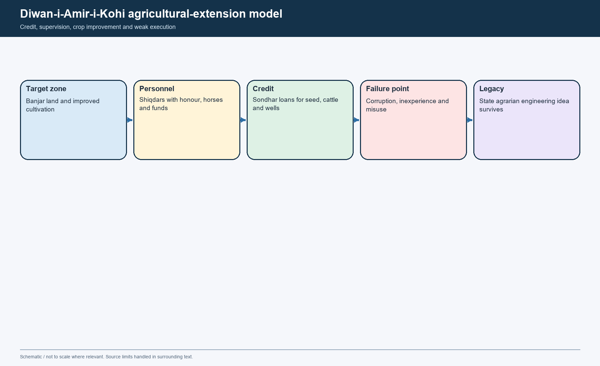

*Agricultural-extension visual. It separates objective, instrument, failure point and long-run policy legacy.*

#### Safe verdict

- [ANALYSIS] Diwan-i-Kohi was **not** proof of modern developmental bureaucracy, but it was more than absurd overreach. It shows a state thinking in terms of credit, crop improvement and revenue through agrarian expansion.
- [LIMIT] Scale claims belong to reported narrative, not precise administrative statistics.

#### CLOSING RECALL FLOW — DIWAN-I-AMIR-I-KOHI: STATE LOANS, CULTIVATION EXTENSION AND THE LIMITS OF AGRARIAN ENGINEERING

```text
START / CONCEPT: Diwan-i-Amir-i-Kohi: state loans, cultivation extension and the limits of agrarian engineering
        |
        v
EXACT TERMS: Diwan-i-Amir-i-Kohi · cultivation extension · the limits of agrarian engineering · banjar · 30 kroh by 30 kroh · 100 shiqdars
        |
        v
MECHANISM / ARGUMENT: It shows a state thinking in terms of credit, crop improvement and revenue through agrarian expansion.
        |
        v
CONSEQUENCE / CONTRAST: The advanced OCR argues that the scheme aimed to bring banjar or barren land under cultivation, not genuinely uncultivable usar land, despite Barani's sharper wording.
        |
        v
UPSC TRAP / ANSWER-USE: Reported figures such as seventy lakh tankas or even two crores in later recollection must be handled as reported, not audited certainty.
        |
        v
ANSWER-GRABBING FORMULATION: Money intended as loans was consumed for personal use, the new land was not adequately brought under cultivation, and recovery collapsed.
```
### SESSION 9 — THE KHURASAN PROJECT AND THE QARACHIL EXPEDITION: DO NOT CONFLATE THEM

#### DEFINITION / WHAT THIS IS CALLED

**Plain-language definition:** The safer conclusion is that the project aimed at an outward strategic frontier and prestige offensive, not necessarily at a coherent transcontinental conquest plan.

**Technical definition:** The Qarachil expedition, by contrast, was a Himalayan campaign.

#### ANSWER-GRABBING OPENING — WRITE/ADAPT IN THE EXAM

> The safer conclusion is that the project aimed at an outward strategic frontier and prestige offensive, not necessarily at a coherent transcontinental conquest plan.

#### MUST-WRITE KEYWORDS

- **The Khurasan project**
- **the Qarachil expedition**
- **do not conflate them**
- **Khurasan project**
- **reported**
- **Qarachil**

**How to use them:** Frame the answer through The Khurasan project; define the Qarachil expedition, connect do not conflate them with Khurasan project to explain the mechanism, and use reported for the decisive comparison or qualification.

[FACT] The **Khurasan project** arose from north-western strategic anxiety. After the Tarmashirin episode and the fluid politics of Transoxiana, Iran, Ghazni and Afghanistan, Muhammad bin Tughlaq considered a forward move that could secure the frontier more aggressively. The advanced OCR suggests that even a limited aim - Kabul/Ghazni/Afghanistan - is more defensible than fantasies of global conquest.

[FACT] To support this, he reportedly entertained exiles and grandees from those regions and raised a very large army, commonly given in the sources as **370,000**. The scale must be labelled as **reported**.

[LIMIT] Barani's wording sometimes expands the aim to Khurasan, Iraq and even beyond. The safer conclusion is that the project aimed at an outward strategic frontier and prestige offensive, not necessarily at a coherent transcontinental conquest plan.

[FACT] The **Qarachil** expedition, by contrast, was a Himalayan campaign. The advanced OCR places it in the Kulu-Kangra / Kumaon-Kashmir horizon and explicitly rejects the later claim that it was an expedition to conquer China.

[FACT] The Qarachil force suffered disastrous environmental defeat after moving too far into inhospitable terrain. The famous line that only **10 of 10,000** returned is again a reported chronicler figure. Yet the same source tradition says a local ruler later accepted Delhi's overlordship.

[ANALYSIS] Put differently: Khurasan was a frontier-strategy problem; Qarachil was a terrain-and-logistics problem. Joining them into a single tale of irrationality destroys the history.


*Comparison visual. Objective, geography, preparation and result differ sharply between the two enterprises.*

#### Comparison table

| Dimension | Khurasan project | Qarachil expedition |
|---|---|---|
| Strategic setting | Central Asian / Afghan frontier politics | Himalayan mountain corridor |
| Aim | Forward security / possible reassertion toward Ghazni-Afghanistan and beyond | Control of a hill region and/or route-security objective |
| Instrument | Large army recruitment and political invitations to exiles | Field expedition in difficult terrain |
| Principal problem | Sustaining cost and purpose | Terrain, climate and over-extension |
| Exam trap | "World conquest madness" | "China campaign" |

#### CLOSING RECALL FLOW — THE KHURASAN PROJECT AND THE QARACHIL EXPEDITION: DO NOT CONFLATE THEM

```text
START / CONCEPT: The Khurasan project and the Qarachil expedition: do not conflate them
        |
        v
EXACT TERMS: The Khurasan project · the Qarachil expedition · do not conflate them · Khurasan project · reported · Qarachil
        |
        v
MECHANISM / ARGUMENT: The Qarachil expedition, by contrast, was a Himalayan campaign.
        |
        v
CONSEQUENCE / CONTRAST: Put differently: Khurasan was a frontier-strategy problem; Qarachil was a terrain-and-logistics problem.
        |
        v
UPSC TRAP / ANSWER-USE: Do not miss this limiting distinction: the advanced OCR places it in the Kulu-Kangra / Kumaon-Kashmir horizon and explicitly rejects...
        |
        v
ANSWER-GRABBING FORMULATION: The safer conclusion is that the project aimed at an outward strategic frontier and prestige offensive, not necessarily at a coherent transcontinental conquest plan.
```
### SESSION 10 — REBELLIONS, PLAGUE AND REGIONAL FRAGMENTATION: DECCAN, BENGAL, GUJARAT, SINDH AND THE LIMITS OF DIRECT RULE

#### DEFINITION / WHAT THIS IS CALLED

**Plain-language definition:** Muhammad was still strong enough to suppress some western and central rebellions, which is why his total unpopularity should not be exaggerated.

**Technical definition:** Bengal also became independent again, while Gujarat and Sindh required severe effort.

#### ANSWER-GRABBING OPENING — WRITE/ADAPT IN THE EXAM

> Bengal also became independent again, while Gujarat and Sindh required severe effort.

#### MUST-WRITE KEYWORDS

- **Rebellions**
- **plague**
- **regional fragmentation**
- **Deccan**
- **Bengal**
- **Gujarat**

**How to use them:** Frame the answer through Rebellions; define plague, connect regional fragmentation with Deccan to explain the mechanism, and use Bengal for the decisive comparison or qualification.

[FACT] The advanced OCR usefully divides Muhammad's reign into phases. The first decade after accession was largely about consolidation, with rebellions in places like Multan, Lakhnauti and Sindh checked. The second decade became much more difficult as famine, southern revolts and epidemic weakened the state's striking power.

[FACT] The rebellions came in sequence across **Bengal, Mabar, Warangal, Kampili, Awadh, Gujarat and Sindh**. Muhammad repeatedly moved personally from one theatre to another, wearing down his army and limiting the formation of stable delegated trust.

[FACT] The southern turning point was disastrous. The Mabar campaign coincided with plague in the army; the concise OCR says two-thirds of the army perished. Shortly afterwards, **Harihara and Bukka** established the principality that grew into Vijayanagara, while foreign nobles near Daulatabad launched the Bahmani state.

[ANALYSIS] Topic 05 uses Vijayanagara and Bahmani only as signs of Delhi's overreach and broken southern control. Their own institutions, politics and cultural worlds belong primarily to Topic 09.

[FACT] Bengal also became independent again, while Gujarat and Sindh required severe effort. Muhammad was still strong enough to suppress some western and central rebellions, which is why his total unpopularity should not be exaggerated.

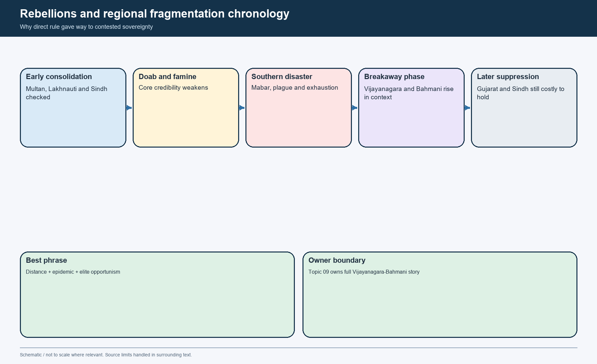

*Fragmentation timeline. It distinguishes direct revolt, military overstretch, epidemic shock and the rise of successor states.*

#### Region-by-region language

| Region | What Topic 05 should say safely |
|---|---|
| Bengal | Recurrent centrifugal zone; independence regained; Delhi could not hold it durably |
| Deccan / Daulatabad | Direct-rule burden, noble rebellion and southern communications crisis |
| Vijayanagara | Emerged in the context of Delhi's southern overstretch; full treatment belongs elsewhere |
| Bahmani | Grew from Deccan breakaway near Daulatabad; full state development belongs elsewhere |
| Gujarat and Sindh | Rebellion suppressed with great effort, revealing Delhi's continuing but costly reach |

#### Best synthesis

- [ANALYSIS] Muhammad's empire did not collapse because one policy failed; it fragmented because **distance + fiscal pressure + elite opportunism + epidemic + repeated campaigning** outpaced the centre's ability to restore credible control.

#### CLOSING RECALL FLOW — REBELLIONS, PLAGUE AND REGIONAL FRAGMENTATION: DECCAN, BENGAL, GUJARAT, SINDH AND THE LIMITS OF DIRECT RULE

```text
START / CONCEPT: Rebellions, plague and regional fragmentation: Deccan, Bengal, Gujarat, Sindh and the limits of direct rule
        |
        v
EXACT TERMS: Rebellions · plague · regional fragmentation · Deccan · Bengal · Gujarat
        |
        v
MECHANISM / ARGUMENT: The first decade after accession was largely about consolidation, with rebellions in places like Multan, Lakhnauti and Sindh checked.
        |
        v
CONSEQUENCE / CONTRAST: Muhammad was still strong enough to suppress some western and central rebellions, which is why his total unpopularity should not be exaggerated.
        |
        v
UPSC TRAP / ANSWER-USE: Do not miss this limiting distinction: the second decade became much more difficult as famine, southern revolts and epidemic weakened...
        |
        v
ANSWER-GRABBING FORMULATION: Bengal also became independent again, while Gujarat and Sindh required severe effort.
```
### SESSION 11 — ADMINISTRATION, THE RULING CLASS AND MUHAMMAD'S STATE-CAPACITY PROBLEM

#### DEFINITION / WHAT THIS IS CALLED

**Plain-language definition:** Muhammad's reign is the Sultanate's clearest demonstration that administrative imagination without durable compliance mechanisms becomes self-defeating.

**Technical definition:** Technically, Administration, the ruling class and Muhammad's state-capacity problem is analysed by relating Administration to the ruling class, then testing the relationship through Muhammad's state-capacity problem and Ambition.

#### ANSWER-GRABBING OPENING — WRITE/ADAPT IN THE EXAM

> Muhammad's reign is the Sultanate's clearest demonstration that administrative imagination without durable compliance mechanisms becomes self-defeating.

#### MUST-WRITE KEYWORDS

- **Administration**
- **the ruling class**
- **Muhammad's state-capacity problem**
- **Ambition**
- **Goals multiplied faster than institution-building**
- **Information**

**How to use them:** Frame the answer through Administration; define the ruling class, connect Muhammad's state-capacity problem with Ambition to explain the mechanism, and use Goals multiplied faster than institution-building for the decisive comparison or qualification.

[FACT] Muhammad bin Tughlaq pushed administrative centralisation further than his predecessors. When provinces were annexed, revenue officials followed; according to Barani, the accounts of distant provinces were audited in the wazir's office in the same detailed fashion as villages in the doab.

[FACT] He also widened elite recruitment. The concise OCR states that he appointed people who did not belong to old noble families, including men from occupational backgrounds such as barbers, cooks, weavers and wine-makers, alongside foreigners and a few Hindus. Barani's fury at such appointments tells us as much about aristocratic prejudice as about the appointments themselves.

[ANALYSIS] The recruitment of "new men" was not random social chaos. It was a way of reducing dependence on closed old-noble circles and of staffing a larger empire through talent and loyalty outside inherited aristocratic networks.

[LIMIT] The political cost was high. The nobility now contained foreigners, Indian converts, older elite families and court favourites without a single cohesive identity. Such a coalition could staff a wide empire, but it was also prone to fracture.

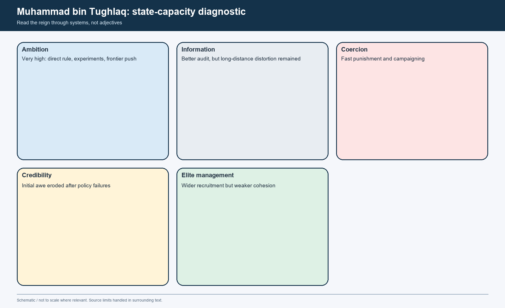

*Diagnostic visual. It reads the reign through ambition, information, credibility, coercion and geographic stretch rather than through personality labels alone.*

#### Capacity diagnosis

| Dimension | Strength under Muhammad | Limiting problem |
|---|---|---|
| Ambition | Very high - uniform rule, direct annexation, frontier push, agrarian engineering | Goals multiplied faster than institution-building |
| Information | Improved through audit, officials and court intelligence | Distant provinces still generated severe delay and distortion |
| Coercion | Strong capacity for punishment and rapid campaigning | Excess coercion damaged trust and encouraged rebellion |
| Credibility | High at first - Ibn Battuta still saw the Delhi ruler as one of the great rulers of the world | Daulatabad, token currency and doab crisis weakened faith in command |
| Elite management | Wider recruitment opened talent | Cohesion and inherited legitimacy became fragile |

#### One-line UPSC takeaway

- [ANALYSIS] Muhammad's reign is the Sultanate's clearest demonstration that **administrative imagination without durable compliance mechanisms becomes self-defeating**.

#### CLOSING RECALL FLOW — ADMINISTRATION, THE RULING CLASS AND MUHAMMAD'S STATE-CAPACITY PROBLEM

```text
START / CONCEPT: Administration, the ruling class and Muhammad's state-capacity problem
        |
        v
EXACT TERMS: Administration · the ruling class · Muhammad's state-capacity problem · Ambition · Goals multiplied faster than institution-building · Information
        |
        v
MECHANISM / ARGUMENT: It was a way of reducing dependence on closed old-noble circles and of staffing a larger empire through talent and loyalty outside inherited aristocratic networks.
        |
        v
CONSEQUENCE / CONTRAST: The recruitment of "new men" was not random social chaos.
        |
        v
UPSC TRAP / ANSWER-USE: Such a coalition could staff a wide empire, but it was also prone to fracture.
        |
        v
ANSWER-GRABBING FORMULATION: Muhammad's reign is the Sultanate's clearest demonstration that administrative imagination without durable compliance mechanisms becomes self-defeating.
```
### SESSION 12 — BARANI, ISAMI, IBN BATTUTA AND MATERIAL EVIDENCE: HOW TO READ THE TUGHLAQ ARCHIVE

#### DEFINITION / WHAT THIS IS CALLED

**Plain-language definition:** Barani is indispensable for Muhammad's experiments and elite ideology, but he wrote later, moralises strongly, uses rhetorical scaling and deeply resents low-born advancement.

**Technical definition:** Isami is near-contemporary and especially valuable when Delhi-Deccan relations are at stake, but he writes from displacement and retrospective memory.

#### ANSWER-GRABBING OPENING — WRITE/ADAPT IN THE EXAM

> Barani is indispensable for Muhammad's experiments and elite ideology, but he wrote later, moralises strongly, uses rhetorical scaling and deeply resents low-born advancement.

#### MUST-WRITE KEYWORDS

- **Barani**
- **Isami**
- **Ibn Battuta**
- **material evidence**
- **how to read the Tughlaq archive**
- **minimum secure statement**

**How to use them:** Frame the answer through Barani; define Isami, connect Ibn Battuta with material evidence to explain the mechanism, and use how to read the Tughlaq archive for the decisive comparison or qualification.

[FACT] The Tughlaq period cannot be taught safely through a single chronicler. Barani, Isami, Ibn Battuta, Afif, *Futuhat-i Firuz Shahi*, coins and buildings each record a different slice of reality.

[FACT] **Barani** is indispensable for Muhammad's experiments and elite ideology, but he wrote later, moralises strongly, uses rhetorical scaling and deeply resents low-born advancement. He is crucial and dangerous at the same time.

[FACT] **Isami** is near-contemporary and especially valuable when Delhi-Deccan relations are at stake, but he writes from displacement and retrospective memory. He is not a neutral field report.

[FACT] **Ibn Battuta**, from Tangier, lived for years at Muhammad's court, held judicial office and travelled widely. He is especially useful for court ceremony, gifts, punishments, roads, products, urban scale and the atmosphere of power. The concise OCR also notes that he was more interested in the court than in the lives of ordinary people.

[FACT] **Material evidence** checks literary claims. Delhi mint continuity, Tughlaqabad, Ghiyasuddin's tomb, Kotla Firoz Shah, repaired monuments, canals and Ashokan-pillar movement all confirm activity; none by itself proves uniform administrative success.


*Source-matrix visual. Use it to separate report, witness, moral judgement and physical trace.*

#### Source-criticism matrix

| Source | Best use | Main bias or limit | Safe classroom use |
|---|---|---|---|
| Barani | Policy sequence, elite ideology, doab, Daulatabad, token currency | Later, didactic, anti-low-born, rhetorical | Use as report + political mentality; do not quote every number or speech literally |
| Isami | Alternative lens on Deccan and Delhi overreach | Retrospective, displacement memory | Use to cross-check tone and consequence, not as raw field log |
| Ibn Battuta | Court, gift-punishment theatre, roads, city life, products | Traveller genre, wonder orientation, court-centred | Best for atmosphere and practice, not for total empire statistics |
| Afif / Futuhat | Firuz's later memory, benevolence claims, public works | Late court framing and ruler self-justification | Use with explicit claim-versus-implementation distinction |
| Coins / buildings / canals | Durable physical action and patronage | Selective survival; material claim != full control | Anchor literary claims in the material record |

#### Method rule

- [ANALYSIS] When sources disagree, prefer the **minimum secure statement** that survives across more than one evidence family. This is the correct answer to both textbook caricature and ideological over-reading.

#### CLOSING RECALL FLOW — BARANI, ISAMI, IBN BATTUTA AND MATERIAL EVIDENCE: HOW TO READ THE TUGHLAQ ARCHIVE

```text
START / CONCEPT: Barani, Isami, Ibn Battuta and material evidence: how to read the Tughlaq archive
        |
        v
EXACT TERMS: Barani · Isami · Ibn Battuta · material evidence · how to read the Tughlaq archive · minimum secure statement
        |
        v
MECHANISM / ARGUMENT: Delhi mint continuity, Tughlaqabad, Ghiyasuddin's tomb, Kotla Firoz Shah, repaired monuments, canals and Ashokan-pillar movement all confirm activity; none by itself proves uniform administrative success.
        |
        v
CONSEQUENCE / CONTRAST: Isami is near-contemporary and especially valuable when Delhi-Deccan relations are at stake, but he writes from displacement and retrospective memory.
        |
        v
UPSC TRAP / ANSWER-USE: He is not a neutral field report.
        |
        v
ANSWER-GRABBING FORMULATION: Barani is indispensable for Muhammad's experiments and elite ideology, but he wrote later, moralises strongly, uses rhetorical scaling and deeply resents low-born advancement.
```
### SESSION 13 — MUHAMMAD BIN TUGHLAQ AND RELIGION: ULEMA, CALIPHAL LEGITIMACY, SUFIS AND JUSTICE

#### DEFINITION / WHAT THIS IS CALLED

**Plain-language definition:** He associated with yogis and Jain saints, respected major Sufi tombs and is said to have connected himself at times with Hindu festivals such as Holi.

**Technical definition:** Muhammad bin Tughlaq was personally observant in prayers and fasting, yet the advanced OCR also presents him as a ruler who would not accept many things merely on faith.

#### ANSWER-GRABBING OPENING — WRITE/ADAPT IN THE EXAM

> Muhammad bin Tughlaq was personally observant in prayers and fasting, yet the advanced OCR also presents him as a ruler who would not accept many things merely on faith.

#### MUST-WRITE KEYWORDS

- **Muhammad bin Tughlaq**
- **religion**
- **ulema**
- **caliphal legitimacy**
- **Sufis**
- **justice**

**How to use them:** Frame the answer through Muhammad bin Tughlaq; define religion, connect ulema with caliphal legitimacy to explain the mechanism, and use Sufis for the decisive comparison or qualification.

[FACT] Muhammad bin Tughlaq was personally observant in prayers and fasting, yet the advanced OCR also presents him as a ruler who would not accept many things merely on faith. He associated with yogis and Jain saints, respected major Sufi tombs and is said to have connected himself at times with Hindu festivals such as Holi.

[FACT] This openness helped trigger hostility from sections of the orthodox. The advanced OCR reports that, because of his association with yogis and related practices, qazis issued a *fatwa* making rebellion against the Sultan legally possible.

[FACT] To answer this, Muhammad sought symbolic **caliphal legitimisation** from the Cairo-based Abbasid line. The local OCR says he first substituted the Caliph's name on coins and later received a formal *manshur* or rescript. The gesture did not fundamentally improve his standing with orthodox opponents.

[ANALYSIS] The best line is to reject modern shorthand from both sides. Muhammad was neither a secular-liberal moderniser nor a simple anti-religious tyrant. He was a Muslim ruler of strong reason-of-state instincts, willing to supplement *shara* with *zawabit*, open to multiple intellectual worlds, and also capable of extreme punitive violence.

[LIMIT] Brutality is part of the record. Chroniclers and Ibn Battuta alike emphasise his capacity for lavish rewards and drastic punishments. A balanced answer therefore links intellectual range with coercive intensity instead of substituting one for the other.

#### Safe verdict

- [ANALYSIS] Muhammad's religious politics were about **contested authority**, not about a neat binary between belief and unbelief. He broadened the court's intellectual contact-zone while failing to persuade orthodox intermediaries that his style of rule was legitimate.

#### CLOSING RECALL FLOW — MUHAMMAD BIN TUGHLAQ AND RELIGION: ULEMA, CALIPHAL LEGITIMACY, SUFIS AND JUSTICE

```text
START / CONCEPT: Muhammad bin Tughlaq and religion: ulema, caliphal legitimacy, Sufis and justice
        |
        v
EXACT TERMS: Muhammad bin Tughlaq · religion · ulema · caliphal legitimacy · Sufis · justice
        |
        v
MECHANISM / ARGUMENT: He associated with yogis and Jain saints, respected major Sufi tombs and is said to have connected himself at times with Hindu festivals such as Holi.
        |
        v
CONSEQUENCE / CONTRAST: A balanced answer therefore links intellectual range with coercive intensity instead of substituting one for the other.
        |
        v
UPSC TRAP / ANSWER-USE: Muhammad's religious politics were about contested authority, not about a neat binary between belief and unbelief.
        |
        v
ANSWER-GRABBING FORMULATION: Muhammad bin Tughlaq was personally observant in prayers and fasting, yet the advanced OCR also presents him as a ruler who would not accept many things merely on faith.
```
### SESSION 14 — FIRUZ SHAH'S ACCESSION AFTER THE SINDH CRISIS: CONCILIATION AS STATECRAFT

#### DEFINITION / WHAT THIS IS CALLED

**Plain-language definition:** The concise OCR is clear about his governing choice: he would appease the nobles, the army and the theologians, and would assert authority only over areas that could be administered from the centre without impossible strain.

**Technical definition:** Technically, Firuz Shah's accession after the Sindh crisis: conciliation as statecraft is analysed by relating Firuz Shah's accession after the Sindh crisis to conciliation as statecraft, then testing the relationship through Nobles and High salaries, heredity, softer audit.

#### ANSWER-GRABBING OPENING — WRITE/ADAPT IN THE EXAM

> The concise OCR is clear about his governing choice: he would appease the nobles, the army and the theologians, and would assert authority only over areas that could be administered from the centre without impossible strain.

#### MUST-WRITE KEYWORDS

- **Firuz Shah's accession after the Sindh crisis**
- **conciliation as statecraft**
- **Nobles**
- **High salaries, heredity, softer audit**
- **Stronger oligarchic claims**
- **Army**

**How to use them:** Frame the answer through Firuz Shah's accession after the Sindh crisis; define conciliation as statecraft, connect Nobles with High salaries, heredity, softer audit to explain the mechanism, and use Stronger oligarchic claims for the decisive comparison or qualification.

[FACT] Firuz Shah Tughlaq came to power in **1351** after Muhammad's death during the Sindh/Thatta phase. He inherited a shrinking but still large north-Indian Sultanate, with the south already gone, Bengal independent and nobles, soldiers and theologians all in need of reassurance.

[FACT] The concise OCR is clear about his governing choice: he would appease the nobles, the army and the theologians, and would assert authority only over areas that could be administered from the centre without impossible strain.

[FACT] He made no serious attempt to recover the south or reimpose direct rule over the Deccan. Two Bengal campaigns failed; raids into Jajnagar (Orissa) and Nagarkot produced plunder or acknowledgment but no enduring extension; the long Thatta campaign became a lesson in the cost of military overreach.

[ANALYSIS] Firuz's accession therefore marks a political bargain. If Muhammad tried to make the empire uniform, Firuz tried to make the remaining Sultanate governable by lowering coercive temperature and accepting a smaller horizon of ambition.

[FACT] He also sought caliphal investiture and robes of honour, but the advanced OCR treats this as symbolic prestige rather than the foundation of power.


*Accession visual. Firuz's strength lay less in conquest than in redefining what the centre would now try to hold and whom it would placate.*

#### Bargain table

| Constituency | Firuz's offer | Long-term cost |
|---|---|---|
| Nobles | High salaries, heredity, softer audit | Stronger oligarchic claims |
| Army | Village assignments, heredity, relaxed inspection | Lower discipline and central readiness |
| Ulema | Symbolic orthodoxy and concessions | Narrower ideological climate |
| Urban/core society | Public works, charity, hospitals, lower punitive terror | Concentration of benefits in core regions and favoured groups |

#### CLOSING RECALL FLOW — FIRUZ SHAH'S ACCESSION AFTER THE SINDH CRISIS: CONCILIATION AS STATECRAFT

```text
START / CONCEPT: Firuz Shah's accession after the Sindh crisis: conciliation as statecraft
        |
        v
EXACT TERMS: Firuz Shah's accession after the Sindh crisis · conciliation as statecraft · Nobles · High salaries, heredity, softer audit · Stronger oligarchic claims · Army
        |
        v
MECHANISM / ARGUMENT: Two Bengal campaigns failed; raids into Jajnagar (Orissa) and Nagarkot produced plunder or acknowledgment but no enduring extension; the long Thatta campaign became a lesson in the cost of military overreach.
        |
        v
CONSEQUENCE / CONTRAST: He also sought caliphal investiture and robes of honour, but the advanced OCR treats this as symbolic prestige rather than the foundation of power.
        |
        v
UPSC TRAP / ANSWER-USE: Do not miss this limiting distinction: raids into Jajnagar (Orissa) and Nagarkot produced plunder or acknowledgment but no enduring extension.
        |
        v
ANSWER-GRABBING FORMULATION: The concise OCR is clear about his governing choice: he would appease the nobles, the army and the theologians, and would assert authority only over areas that could be administered from the centre without impossible strain.
```
### SESSION 15 — HEREDITARY OFFICES, IQTAS AND MILITARY RELAXATION: THE LOGIC OF ELITE CONCILIATION

#### DEFINITION / WHAT THIS IS CALLED

**Plain-language definition:** Firuz decreed that when a noble died, his office and often his iqta should pass to his son, son-in-law or, failing them, even a slave.

**Technical definition:** Technically, Hereditary offices, iqtas and military relaxation: the logic of elite conciliation is analysed by relating Hereditary offices to iqtas, then testing the relationship through military relaxation and the logic of elite conciliation.

#### ANSWER-GRABBING OPENING — WRITE/ADAPT IN THE EXAM

> Firuz decreed that when a noble died, his office and often his iqta should pass to his son, son-in-law or, failing them, even a slave.

#### MUST-WRITE KEYWORDS

- **Hereditary offices**
- **iqtas**
- **military relaxation**
- **the logic of elite conciliation**
- **iqta**
- **Noble peace and predictability**

**How to use them:** Frame the answer through Hereditary offices; define iqtas, connect military relaxation with the logic of elite conciliation to explain the mechanism, and use iqta for the decisive comparison or qualification.

[FACT] Firuz decreed that when a noble died, his office and often his **iqta** should pass to his son, son-in-law or, failing them, even a slave. He also stopped the earlier practice of torturing nobles or their agents when account deficits were found during audit.

[FACT] A new revenue valuation was made early in the reign, but the *jama* was not revised later. As cultivation expanded, the holders of grants and offices often benefited automatically.

[FACT] Firuz extended the hereditary principle to the army. Old soldiers could send sons, sons-in-law or slaves in their place; large parts of the army were paid by assignments on village revenue (*wajh*) rather than cash.

[FACT] The advanced OCR also preserves the telling detail that horse-branding discipline weakened. Firuz repeatedly extended deadlines and even, in a famous anecdote, gave a soldier a gold tanka so that he could bribe the clerk to pass a deficient horse.

[ANALYSIS] This system worked as political insurance in the short run. It reduced noble rebellion, tied military families to rural income and lowered fear of audit. But it also narrowed recruitment, softened discipline and made the centre dependent on entrenched office-holding circles.

[LIMIT] Avoid the lazy formula "Firuz feudalised the state" unless you immediately explain the debate. The safer language is **heredity, localisation of claims and weakening of central audit-control**.


*Consequence-flow visual. The same policy that stabilised the elite also hollowed out merit and discipline.*

#### Structured judgement

| Short-term gain | Long-term weakness |
|---|---|
| Noble peace and predictability | Oligarchic closure |
| Soldier family attachment to service | Reduced muster quality |
| Lower audit terror | Fiscal slack and patronage leakage |
| Fewer internal rebellions in reign | Fragile succession after the ruler's death |

#### CLOSING RECALL FLOW — HEREDITARY OFFICES, IQTAS AND MILITARY RELAXATION: THE LOGIC OF ELITE CONCILIATION

```text
START / CONCEPT: Hereditary offices, iqtas and military relaxation: the logic of elite conciliation
        |
        v
EXACT TERMS: Hereditary offices · iqtas · military relaxation · the logic of elite conciliation · iqta · Noble peace and predictability
        |
        v
MECHANISM / ARGUMENT: Old soldiers could send sons, sons-in-law or slaves in their place; large parts of the army were paid by assignments on village revenue (wajh) rather than cash.
        |
        v
CONSEQUENCE / CONTRAST: A new revenue valuation was made early in the reign, but the jama was not revised later.
        |
        v
UPSC TRAP / ANSWER-USE: Do not miss this limiting distinction: he also stopped the earlier practice of torturing nobles or their agents when account...
        |
        v
ANSWER-GRABBING FORMULATION: Firuz decreed that when a noble died, his office and often his iqta should pass to his son, son-in-law or, failing them, even a slave.
```
### SESSION 16 — FIRUZ'S REVENUE, CESSES AND IRRIGATION TAX: CLAIM, IMPLEMENTATION AND LIMIT

#### DEFINITION / WHAT THIS IS CALLED

**Plain-language definition:** The four-tax formula commonly linked to Futuhat-i Firuz Shahi must be treated as a claim of correct order, not as proof that every locality actually lived under a perfectly simplified tax regime.

**Technical definition:** Technically, Firuz's revenue, cesses and irrigation tax: claim, implementation and limit is analysed by relating Firuz's revenue to cesses, then testing the relationship through irrigation tax and claim.

#### ANSWER-GRABBING OPENING — WRITE/ADAPT IN THE EXAM

> The four-tax formula commonly linked to Futuhat-i Firuz Shahi must be treated as a claim of correct order, not as proof that every locality actually lived under a perfectly simplified tax regime.

#### MUST-WRITE KEYWORDS

- **Firuz's revenue**
- **cesses**
- **irrigation tax**
- **claim**
- **implementation**
- **twenty-one cesses**

**How to use them:** Frame the answer through Firuz's revenue; define cesses, connect irrigation tax with claim to explain the mechanism, and use implementation for the decisive comparison or qualification.

[FACT] Firuz Shah wanted to align taxation more closely with what he and his juristic advisers considered *shara*-sanctioned. Contemporary and later accounts say that he abolished **twenty-one cesses**, among them charges linked to markets and earlier levies such as *ghari*.

[FACT] The advanced OCR says that the fresh valuation by Khwaja Hisamuddin Junaid was made on inspection and that the basis of assessment was **sharing**, not rigid measurement. That distinction matters because it helps explain why Firuz's regime presented itself as more accommodative than Muhammad's doab policy.

[FACT] Canal irrigation generated an additional **haqq-i-sharb** of ten per cent from benefited villages. This formed part of the Sultan's personal income. The ordinary land revenue of new villages in irrigated zones also strengthened the crown.

[FACT] Firuz also made **jizya** a separate tax and extended it to Brahmans, ending their practical exemption. This was part of the same effort to describe the tax order as juristically purified, even while many mundane compromises remained.

[LIMIT] The four-tax formula commonly linked to *Futuhat-i Firuz Shahi* must be treated as a claim of correct order, not as proof that every locality actually lived under a perfectly simplified tax regime.


*Policy-matrix visual. It separates what Firuz claimed, what he built and what the evidence can securely show.*

#### Best formulation

- [ANALYSIS] Firuz's fiscal policy was not anti-revenue. It was an attempt to make revenue extraction **socially softer in method, developmental in the core, and more legible to orthodox juristic language**.
- [LIMIT] Because benefits concentrated in the core north-Indian belt and among office-holders, the policy cannot be read as a universal peasant charter.

#### CLOSING RECALL FLOW — FIRUZ'S REVENUE, CESSES AND IRRIGATION TAX: CLAIM, IMPLEMENTATION AND LIMIT

```text
START / CONCEPT: Firuz's revenue, cesses and irrigation tax: claim, implementation and limit
        |
        v
EXACT TERMS: Firuz's revenue · cesses · irrigation tax · claim · implementation · twenty-one cesses
        |
        v
MECHANISM / ARGUMENT: That distinction matters because it helps explain why Firuz's regime presented itself as more accommodative than Muhammad's doab policy.
        |
        v
CONSEQUENCE / CONTRAST: Firuz's fiscal policy was not anti-revenue.
        |
        v
UPSC TRAP / ANSWER-USE: The advanced OCR says that the fresh valuation by Khwaja Hisamuddin Junaid was made on inspection and that the basis of assessment was sharing, not rigid measurement.
        |
        v
ANSWER-GRABBING FORMULATION: The four-tax formula commonly linked to Futuhat-i Firuz Shahi must be treated as a claim of correct order, not as proof that every locality actually lived under a perfectly simplified tax regime.
```
### SESSION 17 — CANALS, GARDENS, TOWNS AND PUBLIC WORKS: DEVELOPMENTAL ENERGY IN THE NORTH-INDIAN CORE

#### DEFINITION / WHAT THIS IS CALLED

**Plain-language definition:** Firuz's public works were concentrated in the core northern tract where the Sultanate still had the will and means to shape landscapes directly.

**Technical definition:** Firuz created a large department of public works and pursued irrigation aggressively.

#### ANSWER-GRABBING OPENING — WRITE/ADAPT IN THE EXAM

> Firuz built dams, planted orchards and is said to have created large numbers of gardens around Delhi.

#### MUST-WRITE KEYWORDS

- **Canals**
- **gardens**
- **towns**
- **public works**
- **developmental energy in the north-Indian core**
- **Sutlej**

**How to use them:** Frame the answer through Canals; define gardens, connect towns with public works to explain the mechanism, and use developmental energy in the north-Indian core for the decisive comparison or qualification.

[FACT] Firuz created a large department of public works and pursued irrigation aggressively. The advanced OCR records a long canal from the **Sutlej** toward **Hansi/Hisar**, another from the **Yamuna**, and additional canals in the Haryana-Delhi tract. These were meant both for irrigation and for supplying water to new settlements.

[FACT] The same source connects these canals to the founding of **Hissar-Firuza/Hisar** and to wider agrarian expansion. The text also notes that later Mughal and British repair-and-extension gave some of these works a much longer institutional afterlife.

[FACT] Firuz built dams, planted orchards and is said to have created large numbers of gardens around Delhi. The reported income from orchards appears in the chronicles as part of the regime's developmental self-image.

[ANALYSIS] The real importance is spatial. Firuz's public works were concentrated in the **core northern tract** where the Sultanate still had the will and means to shape landscapes directly. They are evidence of state-building, but of a geographically narrower state than Muhammad had sought to command.


*Public-works schematic. Routes are indicative and explicitly not to scale; the point is the concentration of works in the northern core.*

#### Why this matters

| Developmental move | Political meaning |
|---|---|
| Canal irrigation | State investment tied to revenue growth and agrarian recovery |
| New towns | Market nodes, control points and prestige markers |
| Orchards and gardens | Productive revenue plus courtly display |
| Dams and repairs | The state as custodian-builder, not only tax collector |

#### CLOSING RECALL FLOW — CANALS, GARDENS, TOWNS AND PUBLIC WORKS: DEVELOPMENTAL ENERGY IN THE NORTH-INDIAN CORE

```text
START / CONCEPT: Canals, gardens, towns and public works: developmental energy in the north-Indian core
        |
        v
EXACT TERMS: Canals · gardens · towns · public works · developmental energy in the north-Indian core · Sutlej
        |
        v
MECHANISM / ARGUMENT: Firuz created a large department of public works and pursued irrigation aggressively.
        |
        v
CONSEQUENCE / CONTRAST: Firuz's public works were concentrated in the core northern tract where the Sultanate still had the will and means to shape landscapes directly.
        |
        v
UPSC TRAP / ANSWER-USE: They are evidence of state-building, but of a geographically narrower state than Muhammad had sought to command.
        |
        v
ANSWER-GRABBING FORMULATION: Firuz built dams, planted orchards and is said to have created large numbers of gardens around Delhi.
```
### SESSION 18 — URBANISM, ARCHITECTURE AND CONSERVATION UNDER FIRUZ: KOTLA, HAUZ KHAS, OLD MONUMENTS AND ASHOKAN PILLARS

#### DEFINITION / WHAT THIS IS CALLED

**Plain-language definition:** Urbanism, architecture and conservation under Firuz: Kotla, Hauz Khas, old monuments and Ashokan pillars comprises Urbanism, architecture and conservation under Firuz as its core connected dimensions.

**Technical definition:** Upinder Singh's local extract, using Afif and the illustrated Sirat-i-Firuz Shahi, provides unusually vivid evidence for the transport of the Topra and Meerut Ashokan pillars to Delhi.

#### ANSWER-GRABBING OPENING — WRITE/ADAPT IN THE EXAM

> This is one reason his reign matters for medieval conservation history.

#### MUST-WRITE KEYWORDS

- **Urbanism**
- **architecture**
- **conservation under Firuz**
- **Kotla**
- **Hauz Khas**
- **old monuments**

**How to use them:** Frame the answer through Urbanism; define architecture, connect conservation under Firuz with Kotla to explain the mechanism, and use Hauz Khas for the decisive comparison or qualification.

[FACT] Tughlaq architecture carried forward the dynasty's austere idiom: battered walls, high platforms, grey stone and an effort to combine arch-principles with lintel-beam traditions. Ghiyasuddin's tomb and Tughlaqabad had already begun this visual language.

[FACT] Firuz founded or renewed urban spaces including **Firozabad** on the Yamuna, with the surviving fort now called **Kotla Firoz Shah**. The advanced OCR also associates him with Hissar-Firuza and with building or renovating Jaunpur, but this should be phrased cautiously because later regional histories add their own layers of attribution.

[FACT] Firuz repaired many earlier monuments: the advanced OCR explicitly mentions repairs to the **Qutb Minar**, old mosques and tombs, and the **Hauz Khas** complex. This is one reason his reign matters for medieval conservation history.

[FACT] Upinder Singh's local extract, using Afif and the illustrated *Sirat-i-Firuz Shahi*, provides unusually vivid evidence for the transport of the **Topra** and **Meerut** Ashokan pillars to Delhi. Tools, silk-cotton cushioning, a forty-two-wheeled carriage, river transport and palace re-erection together show both technical competence and ideological appropriation.

[ANALYSIS] Firuz's monument policy had three layers: practical repair, dynastic display and appropriation of prestigious older artefacts into a new political centre. It was not "heritage conservation" in the modern civic sense, but it was certainly a medieval politics of preservation, reuse and inscriptional prestige.

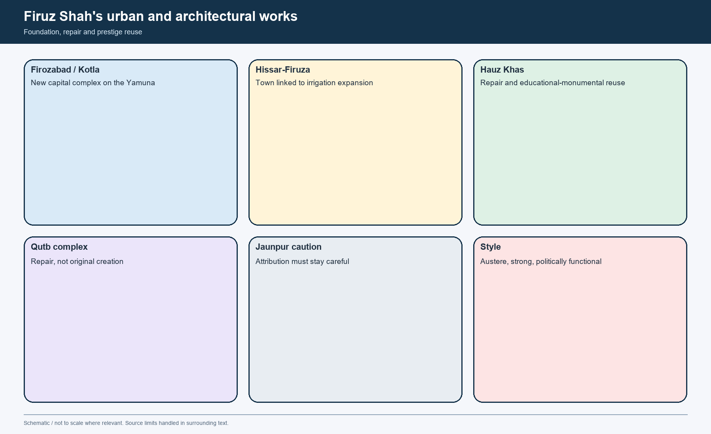

*Urban-works matrix. It distinguishes new foundation, repair and prestige appropriation.*


*Transport-process visual. The movement of the Topra pillar is both a technical and an ideological event.*

#### Attribution caution

| Claim | Safe wording |
|---|---|
| Firozabad | Firuz founded a new capital on the Yamuna; Kotla survives as the clearest remnant |
| Jaunpur | Firuz is associated in the advanced OCR with building or renovating it; later Sharqi development must be kept separate |
| Qutb repair | Firuz repaired/rebuilt damaged upper portions; do not credit him with the whole monument |
| Pillars | He transported the Topra and Meerut Ashokan pillars to Delhi; the later inscriptions and meanings remained layered |

#### CLOSING RECALL FLOW — URBANISM, ARCHITECTURE AND CONSERVATION UNDER FIRUZ: KOTLA, HAUZ KHAS, OLD MONUMENTS AND ASHOKAN PILLARS

```text
START / CONCEPT: Urbanism, architecture and conservation under Firuz: Kotla, Hauz Khas, old monuments and Ashokan pillars
        |
        v
EXACT TERMS: Urbanism · architecture · conservation under Firuz · Kotla · Hauz Khas · old monuments
        |
        v
MECHANISM / ARGUMENT: The advanced OCR also associates him with Hissar-Firuza and with building or renovating Jaunpur, but this should be phrased cautiously because later regional histories add their own layers of attribution.
        |
        v
CONSEQUENCE / CONTRAST: It was not "heritage conservation" in the modern civic sense, but it was certainly a medieval politics of preservation, reuse and inscriptional prestige.
        |
        v
UPSC TRAP / ANSWER-USE: Do not miss this limiting distinction: upinder Singh's local extract, using Afif and the illustrated Sirat-i-Firuz Shahi, provides unusually vivid...
        |
        v
ANSWER-GRABBING FORMULATION: This is one reason his reign matters for medieval conservation history.
```
### SESSION 19 — SLAVES, DIWAN-I-BANDAGAN AND THE POLITICAL ECONOMY OF COERCED SERVICE

#### DEFINITION / WHAT THIS IS CALLED

**Plain-language definition:** Slaves, Diwan-i-Bandagan and the political economy of coerced service comprises Slaves, Diwan-i-Bandagan and the political economy of coerced service as its core connected dimensions.

**Technical definition:** Firuz's slave system should be read as state labour plus dynastic politics, not as welfare, nor as a simple copy of early mamluk practice.

#### ANSWER-GRABBING OPENING — WRITE/ADAPT IN THE EXAM

> Firuz's slave system should be read as state labour plus dynastic politics, not as welfare, nor as a simple copy of early mamluk practice.

#### MUST-WRITE KEYWORDS

- **Slaves**
- **Diwan-i-Bandagan**
- **the political economy of coerced service**
- **These**
- **This**
- **It**

**How to use them:** Frame the answer through Slaves; define Diwan-i-Bandagan, connect the political economy of coerced service with These to explain the mechanism, and use This for the decisive comparison or qualification.

[FACT] Firuz ordered officials and victorious commanders to send selected boys and youths to him as slaves. The reported total reaches about **180,000**, with **12,000** trained as artisans. These are reported chronicle numbers and must remain labelled as such.

[FACT] The slaves served multiple functions: work in royal workshops (*karkhanas*), household and palace service, and an armed corps personally dependent on the ruler. A separate treasury, muster structure and administrative department existed for them.

[ANALYSIS] This was not a benevolent shelter-home. It was a system of coerced labour, political counterweight and court service that widened the ruler's direct dependants outside the regular nobility.

[LIMIT] The policy cut against Firuz's own stated aim of stable noble heredity. Instead of unifying the state, it created a second organised interest-group whose intervention became dangerous after the ruler's death.


*Institution-ecosystem visual. Intake, training, labour, military use and political side-effects are shown together.*

#### Exam-safe conclusion

- [ANALYSIS] Firuz's slave system should be read as **state labour plus dynastic politics**, not as welfare, nor as a simple copy of early mamluk practice.

#### CLOSING RECALL FLOW — SLAVES, DIWAN-I-BANDAGAN AND THE POLITICAL ECONOMY OF COERCED SERVICE

```text
START / CONCEPT: Slaves, Diwan-i-Bandagan and the political economy of coerced service
        |
        v
EXACT TERMS: Slaves · Diwan-i-Bandagan · the political economy of coerced service · These · This · It
        |
        v
MECHANISM / ARGUMENT: It was a system of coerced labour, political counterweight and court service that widened the ruler's direct dependants outside the regular nobility.
        |
        v
CONSEQUENCE / CONTRAST: This was not a benevolent shelter-home.
        |
        v
UPSC TRAP / ANSWER-USE: Do not miss this limiting distinction: these are reported chronicle numbers and must remain labelled as such.
        |
        v
ANSWER-GRABBING FORMULATION: Firuz's slave system should be read as state labour plus dynastic politics, not as welfare, nor as a simple copy of early mamluk practice.
```
### SESSION 20 — CHARITY, HOSPITALS, MARRIAGES AND "BENEVOLENCE": WHO BENEFITED AND WHAT WERE THE LIMITS?

#### DEFINITION / WHAT THIS IS CALLED

**Plain-language definition:** Even with those limits, Firuz's assertion that the state should not only punish and collect taxes but should also provide benevolent support marks a genuine ideological shift from the hard punitive reputation of the previous reign.

**Technical definition:** Technically, Charity, hospitals, marriages and "benevolence": who benefited and what were the limits? is analysed by relating Charity to hospitals, then testing the relationship through marriages and "benevolence".

#### ANSWER-GRABBING OPENING — WRITE/ADAPT IN THE EXAM

> Even with those limits, Firuz's assertion that the state should not only punish and collect taxes but should also provide benevolent support marks a genuine ideological shift from the hard punitive reputation of the previous reign.

#### MUST-WRITE KEYWORDS

- **Charity**
- **hospitals**
- **marriages**
- **"benevolence"**
- **who benefited**
- **beneficiaries**

**How to use them:** Frame the answer through Charity; define hospitals, connect marriages with "benevolence" to explain the mechanism, and use who benefited for the decisive comparison or qualification.

[FACT] Firuz banned a range of mutilatory punishments in political and financial contexts, opened hospitals for free treatment, asked kotwals to prepare lists of the unemployed, arranged marriage assistance for poor girls and supported widows, orphans and the physically weak.

[FACT] He restored or increased many grants to theologians, scholars, shrines and associated dependants. These measures appear across chroniclers and within Firuz's own self-presentation.

[ANALYSIS] The key interpretive caution is about **beneficiaries**. The advanced OCR itself suggests that much of this help was intended above all for Muslims of respectable family status who had fallen on hard times, particularly around the capital. This is not the language of a universal welfare state.

[FACT] Even with those limits, Firuz's assertion that the state should not only punish and collect taxes but should also provide benevolent support marks a genuine ideological shift from the hard punitive reputation of the previous reign.

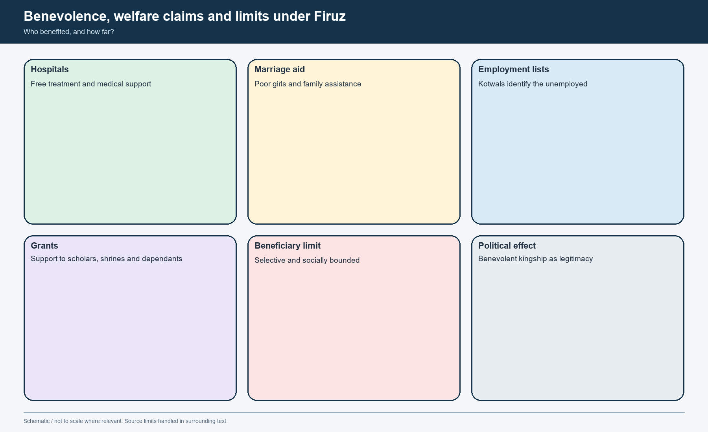

*Benevolence matrix. Claims are matched with likely beneficiary groups and historical limits.*

#### Best wording

- [ANALYSIS] Firuz was not a modern social-welfare ruler; he was a medieval ruler who expanded the **language and some practice of benevolent kingship** while keeping it socially selective and politically useful.

#### CLOSING RECALL FLOW — CHARITY, HOSPITALS, MARRIAGES AND "BENEVOLENCE": WHO BENEFITED AND WHAT WERE THE LIMITS?

```text
START / CONCEPT: Charity, hospitals, marriages and "benevolence": who benefited and what were the limits?
        |
        v
EXACT TERMS: Charity · hospitals · marriages · "benevolence" · who benefited · beneficiaries
        |
        v
MECHANISM / ARGUMENT: These measures appear across chroniclers and within Firuz's own self-presentation.
        |
        v
CONSEQUENCE / CONTRAST: This is not the language of a universal welfare state.
        |
        v
UPSC TRAP / ANSWER-USE: Firuz was not a modern social-welfare ruler; he was a medieval ruler who expanded the language and some practice of benevolent kingship while keeping it socially selective and politically useful.
        |
        v
ANSWER-GRABBING FORMULATION: Even with those limits, Firuz's assertion that the state should not only punish and collect taxes but should also provide benevolent support marks a genuine ideological shift from the hard punitive reputation of the previous reign.
```
### SESSION 21 — POLITICAL CONCILIATION AND SHARPER RELIGIOUS ORTHODOXY: JIZYA, ULEMA, TEMPLES AND TRANSLATIONS

#### DEFINITION / WHAT THIS IS CALLED

**Plain-language definition:** The right contrast is not "tolerant versus intolerant" in the abstract, but political conciliation with elites and core society alongside sharper juristic marking of religious hierarchy.

**Technical definition:** Technically, Political conciliation and sharper religious orthodoxy: jizya, ulema, temples and translations is analysed by relating Political conciliation to sharper religious orthodoxy, then testing the relationship through jizya and ulema.

#### ANSWER-GRABBING OPENING — WRITE/ADAPT IN THE EXAM

> Do not turn translation patronage into proof that orthodoxy was absent; do not turn jizya and temple action into proof that every aspect of rule was defined only by religious hostility.

#### MUST-WRITE KEYWORDS

- **Political conciliation**
- **sharper religious orthodoxy**
- **jizya**
- **ulema**
- **temples**
- **translations**

**How to use them:** Frame the answer through Political conciliation; define sharper religious orthodoxy, connect jizya with ulema to explain the mechanism, and use temples for the decisive comparison or qualification.

[FACT] Firuz tried to please the theologians by presenting himself as a properly Islamic ruler. He banned some practices they considered un-Islamic, persecuted some Muslim sects seen as heretical, and made **jizya** a separate tax while refusing to exempt Brahmans.

[FACT] The advanced and concise OCRs preserve severe episodes: the public burning of a Brahman accused of preaching and conversion, the destruction of some newly built temples or festival-sites near Delhi, and restrictions on Muslim women's visits to saintly shrines.

[FACT] At the same time, Firuz patronised translations of Sanskrit works on **medicine, music and mathematics** into Persian and treated some Hindu chiefs with respect at court. This combination is why a one-word label is misleading.

[ANALYSIS] The right contrast is not "tolerant versus intolerant" in the abstract, but **political conciliation with elites and core society alongside sharper juristic marking of religious hierarchy**.

[LIMIT] Do not turn translation patronage into proof that orthodoxy was absent; do not turn jizya and temple action into proof that every aspect of rule was defined only by religious hostility.


*Comparison visual. Firuz's regime reduced one kind of coercion while sharpening another symbolic and juristic boundary.*

#### Safe conclusion

- [ANALYSIS] Firuz's state widened the discourse of benevolence but also strengthened orthodox authority. This tension is the key to the reign.

#### CLOSING RECALL FLOW — POLITICAL CONCILIATION AND SHARPER RELIGIOUS ORTHODOXY: JIZYA, ULEMA, TEMPLES AND TRANSLATIONS

```text
START / CONCEPT: Political conciliation and sharper religious orthodoxy: jizya, ulema, temples and translations
        |
        v
EXACT TERMS: Political conciliation · sharper religious orthodoxy · jizya · ulema · temples · translations
        |
        v
MECHANISM / ARGUMENT: The right contrast is not "tolerant versus intolerant" in the abstract, but political conciliation with elites and core society alongside sharper juristic marking of religious hierarchy.
        |
        v
CONSEQUENCE / CONTRAST: Firuz's state widened the discourse of benevolence but also strengthened orthodox authority.
        |
        v
UPSC TRAP / ANSWER-USE: Do not miss this limiting distinction: the advanced and concise OCRs preserve severe episodes.
        |
        v
ANSWER-GRABBING FORMULATION: Do not turn translation patronage into proof that orthodoxy was absent; do not turn jizya and temple action into proof that every aspect of rule was defined only by religious hostility.
```
### SESSION 22 — MUHAMMAD VERSUS FIRUZ: AMBITION, FISCAL METHOD, ELITE MANAGEMENT, RELIGION AND DURABILITY

#### DEFINITION / WHAT THIS IS CALLED

**Plain-language definition:** Muhammad bin Tughlaq and Firuz Shah used contrasting strategies to govern the Sultanate, one stressing ambitious direct control and the other stressing conciliation and hereditary stability.

**Technical definition:** The comparison turns on territorial imagination, fiscal instruments, elite recruitment, religious politics and durability rather than on a simple contrast between irrationality and benevolence.

#### ANSWER-GRABBING OPENING — WRITE/ADAPT IN THE EXAM

> The two reigns reveal alternative responses to the same Sultanate problem of aligning territorial reach, agrarian revenue, elite compliance and administrative capacity.

#### MUST-WRITE KEYWORDS

- **Muhammad bin Tughlaq**
- **Firuz Shah**
- **fiscal strategy**
- **elite management**
- **durability**

**How to use them:** Compare Muhammad bin Tughlaq and Firuz Shah through state capacity, fiscal strategy, elite management, religious politics and durability before giving a qualified verdict.

[ANALYSIS] The strongest comparison is structural. Muhammad tried to hold together a nearly pan-subcontinental empire by experimentation, direct supervision and uniformising pressure. Firuz accepted a smaller effective horizon and traded central sharpness for social peace in the north-Indian core.

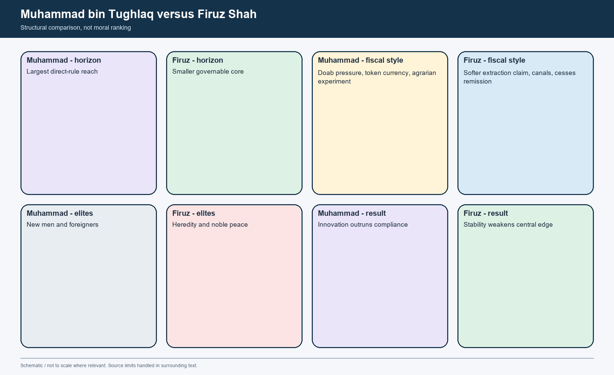

*Comparative visual. The contrast is not rationality versus irrationality or kindness versus cruelty; it is two different state strategies under pressure.*

#### Comparison matrix

| Dimension | Muhammad bin Tughlaq | Firuz Shah Tughlaq |
|---|---|---|
| Territorial imagination | Direct-rule expansion to the south and frontier offensives | Acceptance of a reduced but governable northern Sultanate |
| Fiscal strategy | Heavy assessment, monetisation experiment, developmental loans | Softer extraction claims, irrigation works, heredity-linked grant benefits |
| Elite management | Wider and riskier recruitment, including "new men" and foreigners | Conciliation, heredity, high salaries and audit relaxation |
| Religious politics | Observant yet intellectually open; conflict with orthodox ulema; caliphal rescript sought late | More demonstrative orthodoxy; jizya separate; ulema concessions alongside translations |
| Durability | Great ambition, weak credibility after failures | Long peace, but deeper institutional softening for the future |

#### Best thesis sentence

- [ANALYSIS] Muhammad stressed **innovation without secure compliance**; Firuz stressed **stability without secure central discipline**.

#### CLOSING RECALL FLOW — MUHAMMAD VERSUS FIRUZ: AMBITION, FISCAL METHOD, ELITE MANAGEMENT, RELIGION AND DURABILITY

```text
START / CONCEPT: Muhammad versus Firuz: ambition, fiscal method, elite management, religion and durability
        |
        v
EXACT TERMS: Muhammad bin Tughlaq · Firuz Shah · fiscal strategy · elite management · durability
        |
        v
MECHANISM / ARGUMENT: Muhammad pursued wider direct supervision through experiments and heterogeneous recruitment, while Firuz reduced coercive intensity through elite concessions, heredity and public works.
        |
        v
CONSEQUENCE / CONTRAST: Muhammad's failures damaged trust and accelerated fragmentation, whereas Firuz achieved longer peace at the cost of weaker audit, military and succession controls.
        |
        v
UPSC TRAP / ANSWER-USE: Do not reduce the comparison to mad ruler versus kind ruler or treat either short-term stability or ambitious intention as proof of durable administrative success.
        |
        v
ANSWER-GRABBING FORMULATION: The two reigns reveal alternative responses to the same Sultanate problem of aligning territorial reach, agrarian revenue, elite compliance and administrative capacity.
```
### SESSION 23 — SUCCESSION, SLAVES, NOBLES AND POST-1388 INSTABILITY: WHY THE SULTANATE WEAKENED BEFORE TIMUR

#### DEFINITION / WHAT THIS IS CALLED

**Plain-language definition:** The groundwork had already been laid by hereditary office, military slackness, factional duality between nobles and slave corps, and unresolved succession.

**Technical definition:** Even before Firuz died, conflict had broken out between Prince Muhammad and the wazir Khan-i-Jahan II.

#### ANSWER-GRABBING OPENING — WRITE/ADAPT IN THE EXAM

> The groundwork had already been laid by hereditary office, military slackness, factional duality between nobles and slave corps, and unresolved succession.

#### MUST-WRITE KEYWORDS

- **Succession**
- **slaves**
- **nobles**
- **post-1388 instability**
- **why the Sultanate weakened before Timur**
- **completing shock**

**How to use them:** Frame the answer through Succession; define slaves, connect nobles with post-1388 instability to explain the mechanism, and use why the Sultanate weakened before Timur for the decisive comparison or qualification.

[FACT] Even before Firuz died, conflict had broken out between Prince Muhammad and the wazir Khan-i-Jahan II. The slave corps intervened, princely alignments shifted, and joint-sovereignty experiments failed to stabilise succession.

[FACT] After Firuz's death in **1388**, repeated struggles among sons and grandsons followed. The slaves tried to play king-maker and failed; provincial governors in Gujarat, Malwa, Khandesh and Jaunpur asserted autonomy; local chiefs withheld revenue; Delhi's practical zone contracted.

[ANALYSIS] Timur's sack of Delhi in 1398-99 was therefore a **completing shock**, not the single creator of decline. The groundwork had already been laid by hereditary office, military slackness, factional duality between nobles and slave corps, and unresolved succession.


*Breakdown visual. The aim is to show cumulative fragility, not one-cause collapse.*

#### Handoff to Topic 06

- [FACT] Topic 05 stops with the causal web of weakening.
- [FACT] Topic 06 owns the full narrative of Timur, the Sayyids, Lodis and the fifteenth-century north-Indian balance of power.

#### CLOSING RECALL FLOW — SUCCESSION, SLAVES, NOBLES AND POST-1388 INSTABILITY: WHY THE SULTANATE WEAKENED BEFORE TIMUR

```text
START / CONCEPT: Succession, slaves, nobles and post-1388 instability: why the Sultanate weakened before Timur
        |
        v
EXACT TERMS: Succession · slaves · nobles · post-1388 instability · why the Sultanate weakened before Timur · completing shock
        |
        v
MECHANISM / ARGUMENT: Even before Firuz died, conflict had broken out between Prince Muhammad and the wazir Khan-i-Jahan II.
        |
        v
CONSEQUENCE / CONTRAST: Timur's sack of Delhi in 1398-99 was therefore a completing shock, not the single creator of decline.
        |
        v
UPSC TRAP / ANSWER-USE: Do not miss this limiting distinction: after Firuz's death in 1388, repeated struggles among sons and grandsons followed.
        |
        v
ANSWER-GRABBING FORMULATION: The groundwork had already been laid by hereditary office, military slackness, factional duality between nobles and slave corps, and unresolved succession.
```
### SESSION 24 — HISTORIOGRAPHY, HISTORICAL SIGNIFICANCE AND THE GS-I ANSWER SPINE

#### DEFINITION / WHAT THIS IS CALLED

**Plain-language definition:** [DEBATE] Older moralising narratives pushed Muhammad bin Tughlaq toward the labels "genius," "visionary" or "madman." The more defensible line, supported by the local sources, is a state-capacity reading: many policies had a rational objective, but they demanded trust, information and coordinated enforcement that the Sultanate could not reliably supply across that scale.

**Technical definition:** The Tughlaqs show that medieval imperial power did not fail only because rulers were virtuous or vicious; it succeeded or failed according to how far objectives, coercion, information, elite bargains and agrarian credibility could be aligned.

#### ANSWER-GRABBING OPENING — WRITE/ADAPT IN THE EXAM

> The Tughlaqs show that medieval imperial power did not fail only because rulers were virtuous or vicious; it succeeded or failed according to how far objectives, coercion, information, elite bargains and agrarian credibility could be aligned.

#### MUST-WRITE KEYWORDS

- **Historiography**
- **historical significance**
- **the GS-I answer spine**
- **widest reach of the Delhi Sultanate**
- **objectives, coercion, information, elite bargains and agrarian credibility**
- **DEBATE**

**How to use them:** Frame the answer through Historiography; define historical significance, connect the GS-I answer spine with widest reach of the Delhi Sultanate to explain the mechanism, and use objectives, coercion, information, elite bargains and agrarian credibility for the decisive comparison or qualification.

[DEBATE] Older moralising narratives pushed Muhammad bin Tughlaq toward the labels "genius," "visionary" or "madman." The more defensible line, supported by the local sources, is a **state-capacity reading**: many policies had a rational objective, but they demanded trust, information and coordinated enforcement that the Sultanate could not reliably supply across that scale.

[DEBATE] Firuz has often been remembered as a welfare monarch. The local archive supports the public-works and benevolence side, but it also strongly supports the view that his conciliation strengthened oligarchy, relaxed audit, sharpened orthodoxy and weakened the army's quality.

[FACT] Historically, the Tughlaq phase matters because it marks the **widest reach of the Delhi Sultanate**, the clearest demonstration of pre-Mughal administrative overstretch, the transmission of north-Indian political culture into the Deccan, the most visible medieval canal-development effort in the north-Indian core, and the institutional road to post-1388 fragmentation before Timur's intervention.


*Historiography visual. It shows how to move from loaded adjectives to analyzable categories.*

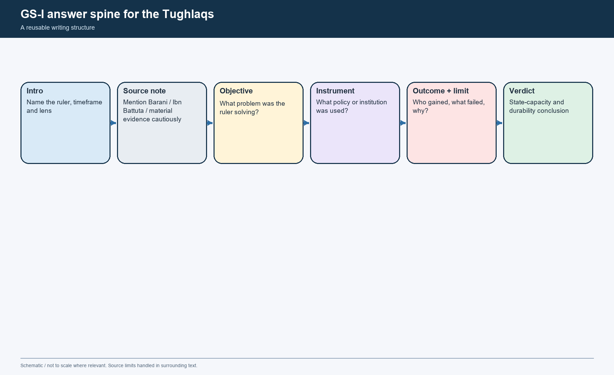

*Answer-spine visual. Use it to structure a 10-, 15- or 20-mark response without collapsing policy, source and significance.*

#### Final thematic verdict

- [ANALYSIS] The Tughlaqs show that medieval imperial power did not fail only because rulers were virtuous or vicious; it succeeded or failed according to how far **objectives, coercion, information, elite bargains and agrarian credibility** could be aligned.

#### CLOSING RECALL FLOW — HISTORIOGRAPHY, HISTORICAL SIGNIFICANCE AND THE GS-I ANSWER SPINE

```text
START / CONCEPT: Historiography, historical significance and the GS-I answer spine
        |
        v
EXACT TERMS: Historiography · historical significance · the GS-I answer spine · widest reach of the Delhi Sultanate · objectives, coercion, information, elite bargains and agrarian credibility · DEBATE
        |
        v
MECHANISM / ARGUMENT: [DEBATE] Older moralising narratives pushed Muhammad bin Tughlaq toward the labels "genius," "visionary" or "madman." The more defensible line, supported by the local sources, is a state-capacity reading: many policies had a rational objective, but they demanded trust, information and coordinated enforcement that the Sultanate could not reliably supply across that scale.
        |
        v
CONSEQUENCE / CONTRAST: [DEBATE] Firuz has often been remembered as a welfare monarch.
        |
        v
UPSC TRAP / ANSWER-USE: Do not miss this limiting distinction: the Tughlaqs show that medieval imperial power did not fail only because rulers were...
        |
        v
ANSWER-GRABBING FORMULATION: The Tughlaqs show that medieval imperial power did not fail only because rulers were virtuous or vicious; it succeeded or failed according to how far objectives, coercion, information, elite bargains and agrarian credibility could be aligned.
```
### SESSION 25 — BOUNDED LIVE LINKAGE

#### DEFINITION / WHAT THIS IS CALLED

**Plain-language definition:** The live page is a teaching bridge only.

**Technical definition:** The Archaeological Survey of India's Qutb Minar page was rechecked on 30 August 2026.

#### ANSWER-GRABBING OPENING — WRITE/ADAPT IN THE EXAM

> The live page is a teaching bridge only.

#### MUST-WRITE KEYWORDS

- **Bounded live linkage**
- **The Archaeological Survey**
- **India's Qutb Minar**
- **This**
- **Firuz's**
- **The live page**

**How to use them:** Frame the answer through Bounded live linkage; define The Archaeological Survey, connect India's Qutb Minar with This to explain the mechanism, and use Firuz's for the decisive comparison or qualification.

The Archaeological Survey of India's Qutb Minar page was rechecked on 30 August 2026. It states that inscriptions record repairs to the minar by Firuz Shah Tughlaq after its earlier Aibak-Iltutmish construction phases. This official material link helps teach repair, reuse and dynastic appropriation; it does not validate every literary claim about Firuz's public works or wider political programme.

The live page is a teaching bridge only. Historical chronology, causation and institutional claims remain controlled by repository Markdown, OCR-searchable books and source criticism.

#### CLOSING RECALL FLOW — BOUNDED LIVE LINKAGE

```text
START / CONCEPT: Bounded live linkage
        |
        v
EXACT TERMS: Bounded live linkage · The Archaeological Survey · India's Qutb Minar · This · Firuz's · The live page
        |
        v
MECHANISM / ARGUMENT: The Archaeological Survey of India's Qutb Minar page was rechecked on 30 August 2026.
        |
        v
CONSEQUENCE / CONTRAST: This official material link helps teach repair, reuse and dynastic appropriation; it does not validate every literary claim about Firuz's public works or wider political programme.
        |
        v
UPSC TRAP / ANSWER-USE: Do not miss this limiting distinction: this official material link helps teach repair, reuse and dynastic appropriation.
        |
        v
ANSWER-GRABBING FORMULATION: The live page is a teaching bridge only.
```
### MEDIEVAL DEEP-REVIEW CORE CONTROL

- **Must remember:** Daulatabad transfer, token currency and Doab taxation were separate experiments with different aims and outcomes.
- **Close distinction:** Failure must not be reduced to a timeless 'mad king' label; design, enforcement, ecology and source hostility matter.
- **Evidence / interpretation limit:** Firuz Shah's canals, charities, slavery and religious policy require a combined fiscal, social and political reading.

## BASIC MCQS / REMEDIATION

> **Rotation check rule:** Every original sequence in this export rotates correct options **A -> B -> C -> D**. This section begins that cycle.

##### Learning MCQ 01

**Question:** Which statement best captures the significance of Ghiyasuddin Tughlaq's accession for Topic 05?

- A. It restored dynastic authority after late Khalji collapse and created the immediate institutional handoff into Muhammad's reign.
- B. It ended the need for any further Deccan campaigning by Delhi.
- C. It made Delhi's nobles permanently loyal to the new dynasty.
- D. It replaced all earlier administrative practices with a purely tribal order.

**Answer: A.**

**Explanation:** Ghiyasuddin's reign matters because it restored order after Khusrau Khan, revived consolidation and created the political platform inherited by Muhammad bin Tughlaq.

##### Learning MCQ 02

**Question:** Which statement about the Daulatabad move is the safest according to the local evidence used in this package?

- A. The move was a purely religious pilgrimage strategy.
- B. Daulatabad functioned as a second-capital project, with heavy pressure mainly on elites and service groups rather than the total population of Delhi.
- C. Delhi was fully depopulated and ceased to function.
- D. The policy had no long-term effect on the Deccan.

**Answer: B.**

**Explanation:** The source-backed line is that Daulatabad was a second-capital experiment. Pressure was coercive, but the total-emptying myth is not sustainable.

##### Learning MCQ 03

**Question:** Muhammad bin Tughlaq's token-currency experiment is best described as:

- A. a barter-reform policy replacing coinage with grain notes.
- B. a temple-donation currency used only in the Deccan.
- C. a copper-and-brass fiduciary coinage that failed because state control over authentication and counterfeiting was weak.
- D. an early paper-currency scheme copied from Europe.

**Answer: C.**

**Explanation:** The experiment used metal token coinage, not paper. Its key fault line was credibility and forgery control.

##### Learning MCQ 04

**Question:** The doab crisis under Muhammad bin Tughlaq is most convincingly explained by which combination?

- A. Purely peasant dislike of monetisation, without any climatic stress.
- B. A deliberate abolition of agriculture by the court.
- C. Peaceful refusal to migrate to Daulatabad.
- D. Rigid assessment, oppressive collection and famine-like environmental stress interacting with each other.

**Answer: D.**

**Explanation:** The best explanation combines policy, collection practices and climate. No one-cause story is sufficient.

##### Learning MCQ 05

**Question:** The Diwan-i-Amir-i-Kohi is most accurately associated with:

- A. state-backed cultivation extension, agricultural loans and attempts at crop improvement.
- B. organising the Topra pillar transport.
- C. creating a naval department for Gujarat.
- D. replacing the iqta system with village republics.

**Answer: A.**

**Explanation:** The department targeted agrarian extension and improvement through loans and supervision, though implementation failed badly.

##### Learning MCQ 06

**Question:** Which statement correctly distinguishes the Khurasan project from the Qarachil expedition?

- A. Khurasan succeeded fully while Qarachil never began.
- B. The Khurasan project concerned the north-western strategic frontier, whereas Qarachil was a Himalayan campaign shaped by terrain and logistics.
- C. Khurasan was a Bengal tax reform and Qarachil a canal.
- D. Both were attempts to conquer China.

**Answer: B.**

**Explanation:** The package stresses that the two enterprises must not be conflated. One is a frontier-strategy question; the other is a mountain-expedition problem.

##### Learning MCQ 07

**Question:** Barani's hostility to Muhammad bin Tughlaq's "low-born" or non-traditional appointees is most useful as evidence for:

- A. a democratic revolution in the Delhi Sultanate.
- B. the total absence of talent among those officials.
- C. aristocratic prejudice within the chronicler's own political world.
- D. the end of all provincial administration.

**Answer: C.**

**Explanation:** Barani's language reveals elite bias. It cannot simply be taken as proof that every such appointment was incompetent.

##### Learning MCQ 08

**Question:** Ibn Battuta is most valuable for Topic 05 when the historian wants to study:

- A. exact all-India revenue statistics over multiple decades.
- B. the architecture of Mauryan stupas.
- C. a neutral village-by-village survey of agrarian life.
- D. court ritual, roads, travel conditions, gift-punishment culture and the atmosphere of Muhammad bin Tughlaq's rule.

**Answer: D.**

**Explanation:** Ibn Battuta's strength lies in witnessed courtly practice and travel experience, not comprehensive structural statistics.

##### Learning MCQ 09

**Question:** Muhammad bin Tughlaq's religious politics are best understood as:

- A. observant but intellectually open kingship that still clashed with orthodox intermediaries and resorted to harsh coercion.
- B. pure saintly tolerance without punitive action.
- C. complete rejection of Islam in favour of a new state creed.
- D. total ulema domination from the beginning of the reign.

**Answer: A.**

**Explanation:** The local evidence shows observance, debate with multiple traditions, caliphal symbolism and sharp conflict with orthodox critics.

##### Learning MCQ 10

**Question:** Firuz Shah's accession strategy is best summarised as:

- A. ending all iqta assignments immediately.
- B. stabilising a smaller governable Sultanate through conciliation of nobles, soldiers and theologians.
- C. reconquering the entire south before consolidating Delhi.
- D. abolishing public works in favour of frontier war.

**Answer: B.**

**Explanation:** Firuz reduced horizon and emphasised conciliation rather than recreating Muhammad's scale of ambition.

##### Learning MCQ 11

**Question:** The hereditary transfer of offices and iqtas under Firuz Shah most directly encouraged:

- A. tighter central audit over nobles.
- B. meritocratic widening of recruitment.
- C. oligarchic closure and long-run weakening of central discipline.
- D. the abolition of village revenue assignments.

**Answer: C.**

**Explanation:** The policy reduced fear and rebellion in the short run, but it entrenched hereditary office-holding and weakened discipline.

##### Learning MCQ 12

**Question:** In the fiscal language of Firuz Shah's reign, **haqq-i-sharb** referred to:

- A. a customs duty on imported horses.
- B. a minting charge on copper coins.
- C. a war indemnity paid by Bengal.
- D. an irrigation-related water due collected from villages benefiting from canals.

**Answer: D.**

**Explanation:** The package uses the advanced OCR's clear identification of *haqq-i-sharb* as a water due tied to canal benefit.

##### Learning MCQ 13

**Question:** Firuz Shah's transport of Ashokan pillars to Delhi is historically significant primarily because it shows:

- A. technical skill, dynastic appropriation of older prestige and a politics of repair/reuse.
- B. the first printing press in the Sultanate.
- C. abandonment of urban building in favour of pilgrimage.
- D. the destruction of all pre-Islamic monuments in north India.

**Answer: A.**

**Explanation:** The pillar episode combines engineering, display and appropriation; it does not fit either pure vandalism or modern conservation.

##### Learning MCQ 14

**Question:** The Diwan-i-Bandagan under Firuz Shah is best interpreted as:

- A. a merchants' guild of Multan.
- B. an organised system of slave labour, training and political dependence attached to the court.
- C. a voluntary labour union.
- D. a frontier cavalry school for Mongol recruits only.

**Answer: B.**

**Explanation:** The slave institution supported workshops, palace service and armed dependence; it was not a welfare body.

##### Learning MCQ 15

**Question:** Which statement best captures Firuz Shah's religious policy?

- A. It completely ignored the ulema and abolished jizya.
- B. It replaced Islamic symbols with Persian royal ritual only.
- C. It combined political conciliation and benevolence with sharper juristic orthodoxy, including separate jizya and denial of Brahman exemption.
- D. It made all temple destruction narratives impossible by definition.

**Answer: C.**

**Explanation:** Firuz's reign reduced one kind of coercion while sharpening orthodox marking; that combination is the key.

##### Learning MCQ 16

**Question:** Which comparison between Muhammad bin Tughlaq and Firuz Shah Tughlaq is the most defensible?

- A. Muhammad failed because he had no coherent aims, while Firuz succeeded because he had none either.
- B. Muhammad and Firuz used identical instruments but got different luck.
- C. Muhammad was purely secular and Firuz purely religious.
- D. Muhammad pushed innovation and direct control beyond durable compliance, whereas Firuz purchased stability through conciliation that weakened long-run central power.

**Answer: D.**

**Explanation:** This package's central comparison rests on different state strategies, not on shallow moral labels.

### Original broad-coverage MCQs

> **Rotation check rule:** This second original sequence restarts at **A** and rotates strictly through **B, C, D**.

##### Broad MCQ 01

**Question:** Why does Topic 05 begin with Ghiyasuddin Tughlaq rather than only with Muhammad bin Tughlaq?

- A. Because Ghiyasuddin created the dynastic legitimacy and immediate political platform inherited by Muhammad.
- B. Because Firuz Shah belonged to the same branch of Rajputs.
- C. Because no Khalji ruler ever existed before him.
- D. Because Ghiyasuddin founded Vijayanagara.

**Answer: A.**

**Explanation:** The Tughlaq story begins with the 1320 takeover and Ghiyasuddin's consolidation, not only with Muhammad's experiments.

##### Broad MCQ 02

**Question:** Tughlaqabad is best understood as:

- A. a pleasure garden with no political meaning.
- B. a fortified dynastic statement of military austerity and new legitimacy.
- C. a Portuguese warehouse.
- D. a Mughal observatory.

**Answer: B.**

**Explanation:** Tughlaqabad proclaimed a new regime through a fortified, sloping-wall architectural idiom.

##### Broad MCQ 03

**Question:** Which is the safest statement regarding Ghiyasuddin Tughlaq's death?

- A. It is fully proved as a saintly curse.
- B. It is fully proved as a deliberate murder by Muhammad bin Tughlaq.
- C. The secure event is the pavilion collapse; conspiracy and curse narratives belong to layered and disputed source traditions.
- D. There is no source at all about the event.

**Answer: C.**

**Explanation:** The package separates secure event, suspicion and legend instead of choosing certainty where the evidence does not.

##### Broad MCQ 04

**Question:** Why are Muhammad bin Tughlaq's policies better read through a state-capacity lens than a personality caricature?

- A. Because his reign had no relation to geography.
- B. Because every policy succeeded once correctly explained.
- C. Because he never faced military problems.
- D. Because many policies had intelligible aims but demanded coordination, trust and information that the Sultanate could not reliably supply.

**Answer: D.**

**Explanation:** The state-capacity lens explains why rational aims could yield coercive failure.

##### Broad MCQ 05

**Question:** The choice of Daulatabad was politically meaningful chiefly because:

- A. Devagiri was already a strategic Deccan base and more central to the enlarged imperial space.
- B. it lay closest to Tibet.
- C. it had no settled population.
- D. it had never been touched by Delhi before.

**Answer: A.**

**Explanation:** Daulatabad was chosen from an existing strategic logic, not at random.

##### Broad MCQ 06

**Question:** Which statement corrects the standard textbook exaggeration about the Daulatabad move?

- A. The move affected only Bengal.
- B. Pressure fell especially on elites and service groups, while Delhi remained inhabited and continued to function.
- C. Coins ceased to be struck in Delhi forever.
- D. No one moved at all.

**Answer: B.**

**Explanation:** The secure correction is against total depopulation, not against all coercion.

##### Broad MCQ 07

**Question:** Muhammad bin Tughlaq's token-currency experiment should NOT be described as:

- A. fiduciary coinage.
- B. a policy undermined by forgery.
- C. paper currency.
- D. a monetary experiment tied to credibility.

**Answer: C.**

**Explanation:** The package explicitly rejects the common but incorrect label "paper currency."

##### Broad MCQ 08

**Question:** What most directly ruined the token-currency experiment?

- A. A total absence of military expenditure.
- B. Refusal of all nobles to accept any metal coin.
- C. The closing of all mints by order of Firuz Shah.
- D. Failure to maintain trust by controlling authentication and counterfeiting.

**Answer: D.**

**Explanation:** The issue was not novelty alone but the state's weak monopoly over verification.

##### Broad MCQ 09

**Question:** Which feature of the doab policy most sharply increased the effective burden on cultivators?

- A. Assessment by standard yield and official prices rather than actual output and market reality.
- B. Replacing officials with village assemblies only.
- C. Complete abolition of revenue demand.
- D. Free canal irrigation for all India.

**Answer: A.**

**Explanation:** Standard-yield rigidity under stress was central to the crisis.

##### Broad MCQ 10

**Question:** Muhammad bin Tughlaq's move to Swargadwari in the famine phase indicates:

- A. his conversion into a forest ascetic.
- B. the severity of scarcity and pestilential conditions around Delhi during the agrarian crisis.
- C. permanent abandonment of Delhi for Bengal.
- D. the start of the Bahmani kingdom.

**Answer: B.**

**Explanation:** Swargadwari belongs to the relief-and-crisis sequence linked to the doab distress and famine.

##### Broad MCQ 11

**Question:** The most careful interpretation of Diwan-i-Amir-i-Kohi is that it aimed to:

- A. create a seaborne customs network.
- B. destroy cultivated land in the doab.
- C. extend cultivation onto banjar land while improving crops through loans and supervision.
- D. replace nobles with village priests.

**Answer: C.**

**Explanation:** The advanced OCR encourages the more precise reading of agricultural extension rather than impossible cultivation of unusable soil.

##### Broad MCQ 12

**Question:** What is the safest caution when discussing the Khurasan project?

- A. It had no relation to the north-west frontier.
- B. It was identical to the Qarachil expedition.
- C. It certainly conquered Iraq.
- D. Chroniclers inflate its scale and aim, so it should be treated as a strategic frontier project rather than automatic proof of world-conquest fantasy.

**Answer: D.**

**Explanation:** The package keeps the project within a strategic frontier frame and marks exaggerated chronicler claims.

##### Broad MCQ 13

**Question:** The Qarachil expedition is best described as:

- A. a Himalayan campaign wrecked by terrain and over-extension.
- B. a purely maritime expedition to Arabia.
- C. the founding of Firozabad.
- D. the abolition of jizya.

**Answer: A.**

**Explanation:** Qarachil belongs to mountain logistics, not to China or overseas war.

##### Broad MCQ 14

**Question:** Which statement best connects Muhammad bin Tughlaq's southern losses to later regional states?

- A. Delhi's southern failures automatically created a stable pan-Indian federation.
- B. Plague, distance and repeated rebellion weakened Delhi's direct rule, creating the setting for successor powers such as Vijayanagara and Bahmani.
- C. The south remained completely unaffected by Delhi's crises.
- D. Bengal created the Bahmani state.

**Answer: B.**

**Explanation:** Topic 05 treats Vijayanagara and Bahmani as outcomes of Delhi overstretch, while full state histories remain elsewhere.

##### Broad MCQ 15

**Question:** Barani's complaints about Muhammad bin Tughlaq appointing "mean and ignoble" men are most valuable because they reveal:

- A. that all service castes ruled the empire successfully.
- B. that no such officials ever existed.
- C. elite resentment at widened recruitment and changing access to office.
- D. the end of Persian as a court language.

**Answer: C.**

**Explanation:** The phrase is evidence about aristocratic ideology as much as about administration.

##### Broad MCQ 16

**Question:** What is the chief limitation of Ibn Battuta for reconstructing the Tughlaq state?

- A. He never visited India.
- B. He served only Firuz Shah.
- C. He wrote only about Gupta temples.
- D. He is strongest on courtly and travel experience, not on comprehensive village-level structural data.

**Answer: D.**

**Explanation:** Ibn Battuta is vivid and valuable, but his genre and location limit the scope of his evidence.

##### Broad MCQ 17

**Question:** Muhammad bin Tughlaq's turn toward caliphal investiture and the Caliph's name on coins is best explained as:

- A. an attempt to answer orthodox hostility by reinforcing symbolic legitimacy.
- B. a rejection of all Islamic political language.
- C. a sign that Bengal had become the capital.
- D. a revenue measure to fund canal digging under Firuz.

**Answer: A.**

**Explanation:** Caliphal symbolism was used to answer critics, though it did not fully solve the legitimacy problem.

##### Broad MCQ 18

**Question:** Firuz Shah's accession differed from Muhammad bin Tughlaq's imperial style because Firuz:

- A. ended all concern for revenue.
- B. accepted a smaller, more governable horizon and sought stability through conciliation.
- C. immediately reconquered the deep south.
- D. abandoned urban building.

**Answer: B.**

**Explanation:** Firuz's political bargain rested on governability, not on renewed all-India direct-rule ambition.

##### Broad MCQ 19

**Question:** The hereditary transfer of offices and iqtas under Firuz Shah most clearly encouraged:

- A. stronger meritocracy.
- B. permanent elimination of noble privilege.
- C. entrenchment of office-holding families and weakening of central discipline.
- D. the disappearance of rural revenue assignments.

**Answer: C.**

**Explanation:** Heredity reduced rebellion in the short run but deepened long-run oligarchic weakness.

##### Broad MCQ 20

**Question:** Why is Firuz Shah's jizya policy important for Topic 05?

- A. It proves that all other taxes vanished overnight.
- B. It had no relation to orthodoxy.
- C. It shows that Brahmans became army commanders by right.
- D. It illustrates Firuz's sharper juristic ordering of rule, including denial of the earlier practical Brahman exemption.

**Answer: D.**

**Explanation:** The jizya issue is central to understanding Firuz's combination of benevolence and orthodoxy.

##### Broad MCQ 21

**Question:** Under Firuz Shah, many soldiers of the central army were paid through:

- A. village-revenue assignments known as *wajh*.
- B. a fully salaried navy based at Cambay.
- C. temple management rights in Odisha.
- D. only imported Venetian silver.

**Answer: A.**

**Explanation:** The advanced OCR explicitly notes payment through village assignments, reinforcing heredity and localisation.

##### Broad MCQ 22

**Question:** In Topic 05, *haqq-i-sharb* is best understood as:

- A. the salary of Ibn Battuta.
- B. a water due or irrigation tax linked to canal benefit.
- C. a slave-market cess.
- D. a tax on paper manuscripts.

**Answer: B.**

**Explanation:** It refers to an irrigation-related levy, not to a general trade or market tax.

##### Broad MCQ 23

**Question:** Which statement about Firuz Shah's architectural and urban activity is the safest?

- A. He had no connection at all with Hauz Khas or Kotla.
- B. Every later city in north India was entirely his foundation.
- C. He founded or renewed important urban sites, repaired earlier monuments and must be discussed with careful attribution rather than inflated total credit.
- D. He destroyed all older monuments and built only new ones.

**Answer: C.**

**Explanation:** Attribution must be precise: Firuz was a major builder and repairer, but not the sole creator of every later urban centre.

##### Broad MCQ 24

**Question:** The movement of the Topra and Meerut Ashokan pillars to Delhi is most important because it demonstrates:

- A. Firuz Shah's rejection of older political symbols.
- B. that Tughlaq rulers lacked engineering knowledge.
- C. the end of all inscriptional culture.
- D. a fusion of technical transport skill, prestige appropriation and dynastic self-display.

**Answer: D.**

**Explanation:** The pillar episode is both a technological feat and an ideological act.

##### Broad MCQ 25

**Question:** The Diwan-i-Bandagan is best described as:

- A. an organised apparatus managing a large body of slaves for labour, service and political dependence.
- B. a voluntary marriage bureau.
- C. a mint-control office for token currency.
- D. a literary academy founded by Ibn Battuta.

**Answer: A.**

**Explanation:** The institution tied slave labour, palace service and power politics together.

##### Broad MCQ 26

**Question:** What is the sharpest limitation in calling Firuz Shah a "welfare monarch"?

- A. He ruled only in the Deccan.
- B. Much of the benevolence was selective, politically useful and concentrated among favoured or respectable groups rather than universally distributed.
- C. He never undertook any charitable measure.
- D. He abolished all hospitals.

**Answer: B.**

**Explanation:** The welfare label needs qualification because beneficiaries and motives were selective.

##### Broad MCQ 27

**Question:** Firuz Shah's patronage of translations from Sanskrit into Persian should lead to which conclusion?

- A. Orthodoxy disappeared from the reign.
- B. Jizya lost all significance.
- C. Cultural interest and orthodox state-marking could coexist in the same reign.
- D. The ulema had no role in politics.

**Answer: C.**

**Explanation:** Translation patronage does not cancel the evidence for sharper juristic orthodoxy.

##### Broad MCQ 28

**Question:** Firuz Shah's claim to have reduced mutilatory punishment should be read as:

- A. a meaningless invention unsupported by any source tradition.
- B. proof that coercion vanished from the Sultanate.
- C. evidence that no rebellion occurred after 1351.
- D. part of a benevolent self-presentation that reduced one style of punishment without eliminating power or coercion.

**Answer: D.**

**Explanation:** The package treats the claim as meaningful but not as proof of a non-coercive state.

##### Broad MCQ 29

**Question:** Which summary of Firuz Shah's military career is the safest?

- A. Mixed campaigns in Bengal, Jajnagar, Nagarkot and Sindh, combined with refusal to attempt southern reconquest.
- B. Complete military inactivity.
- C. Total reconquest of the south and Bengal alike.
- D. Exclusive focus on sea-borne warfare.

**Answer: A.**

**Explanation:** Firuz campaigned, but with limited durable results and no return to Muhammad's southern ambition.

##### Broad MCQ 30

**Question:** Firuz Shah's repeated search for caliphal investiture is best interpreted as:

- A. a sign that Firuz abandoned Islam.
- B. a symbolic reinforcement of legitimacy rather than a source of real executive power.
- C. evidence that Bengal had accepted his suzerainty permanently.
- D. proof that the Caliph directly governed Delhi.

**Answer: B.**

**Explanation:** By Firuz's time, caliphal prestige remained useful symbolically even though practical power lay elsewhere.

##### Broad MCQ 31

**Question:** Why must the *Futuhat-i Firuz Shahi* be read carefully?

- A. Because it deals only with Portuguese trade.
- B. Because it contains no political material.
- C. Because it is a ruler's self-presentation and must be checked against other narrative and material evidence.
- D. Because it was written by Chengiz Khan.

**Answer: C.**

**Explanation:** The *Futuhat* is valuable precisely because it reveals how Firuz wanted to be remembered.

##### Broad MCQ 32

**Question:** Which comparison most clearly distinguishes Muhammad bin Tughlaq from Firuz Shah?

- A. Muhammad and Firuz both relied only on saints.
- B. Muhammad ruled a smaller territory than Firuz.
- C. Muhammad disliked administration while Firuz invented it.
- D. Muhammad pursued high-risk innovation and direct supervision, whereas Firuz sought durable calm through conciliation and heredity.

**Answer: D.**

**Explanation:** This contrast captures the package's core comparative framework.

##### Broad MCQ 33

**Question:** Which factor most directly worsened post-1388 instability?

- A. Interaction of hereditary office, factional nobles, ambitious princes and the slave corps.
- B. Immediate reconquest of Madurai by Delhi.
- C. Elimination of all provincial governors.
- D. Permanent unity between princes and wazirs.

**Answer: A.**

**Explanation:** Succession weakness was cumulative and involved more than one courtly constituency.

##### Broad MCQ 34

**Question:** Timur's later invasion should be connected to Topic 05 in which way?

- A. As proof that Firuz recovered the Deccan.
- B. As a culminating shock that struck a Sultanate already weakened by earlier structural and succession problems.
- C. As the single original cause of Tughlaq decline.
- D. As an event of Muhammad bin Tughlaq's youth.

**Answer: B.**

**Explanation:** Topic 05 builds the preconditions; Topic 06 owns the full Timur narrative.

##### Broad MCQ 35

**Question:** Why is the Tughlaq phase historically significant in the larger Sultanate story?

- A. It ended all north-south political contact.
- B. It eliminated regional states permanently.
- C. It combined the widest Delhi reach, dramatic over-stretch, Deccan political consequences and important northern irrigation-public-works initiatives.
- D. It introduced no notable administrative or political shift.

**Answer: C.**

**Explanation:** The Tughlaq age is historically important both for expansion and for the visible limits of such expansion.

##### Broad MCQ 36

**Question:** The most defensible historiographical line on Muhammad bin Tughlaq is that he was:

- A. a saintly planner betrayed only by fate.
- B. a ruler whose every policy was modern and democratic.
- C. simply insane and therefore beyond analysis.
- D. an ambitious ruler with many rational aims whose sequencing, coercion and compliance mechanisms repeatedly failed.

**Answer: D.**

**Explanation:** This avoids both caricature and romantic rescue.

##### Broad MCQ 37

**Question:** The most defensible historiographical line on Firuz Shah is that he was:

- A. a benevolent developmental ruler whose public works coexisted with heredity, orthodoxy and long-run central weakening.
- B. a ruler about whom only European evidence exists.
- C. uninterested in agriculture or towns.
- D. identical in method to Muhammad bin Tughlaq.

**Answer: A.**

**Explanation:** Firuz's reputation must include both developmental initiatives and institutional softening.

##### Broad MCQ 38

**Question:** Which architectural feature is most closely associated with Tughlaq style in this package?

- A. Neo-classical porticoes.
- B. Battered or sloping walls combined with an austere fortified idiom.
- C. Extensive marble pietra dura panels.
- D. Circular Buddhist railings.

**Answer: B.**

**Explanation:** The package repeatedly uses the sloping-wall fortified style as a Tughlaq marker.

##### Broad MCQ 39

**Question:** Why are coins, canals, forts and pillars important alongside chronicles in Topic 05?

- A. They matter only for ancient history.
- B. They prove that every chronicle number is exact.
- C. They anchor claims in material action while reminding us that physical survival does not automatically equal full administrative control.
- D. They replace all written sources completely.

**Answer: C.**

**Explanation:** Material evidence is a corrective, not an omniscient substitute.

##### Broad MCQ 40

**Question:** Which one-line conclusion best sums up this workbook's argument?

- A. Policy failure proves absence of purpose.
- B. Benevolence alone guarantees stability.
- C. Medieval rule can be explained entirely through morality tales.
- D. The Tughlaq story is best read through the fit - or misfit - between ambition, information, coercion, revenue and elite management.

**Answer: D.**

**Explanation:** This is the package's master analytical sentence.

#### Remedial MCQs - trap-correction set

> **Rotation check rule:** This third original sequence restarts at **A** and rotates strictly through **B, C, D**.

##### Remedial MCQ 01

**Question:** Which correction best defeats the trap "Muhammad emptied Delhi completely"?

- A. He imposed severe movement pressure, but mainly on elites and associated groups; Delhi remained inhabited and functioning.
- B. Daulatabad never existed.
- C. No movement occurred at all.
- D. Only Bengal was moved.

**Answer: A.**

**Explanation:** The right correction is against total depopulation, not against coercion itself.

##### Remedial MCQ 02

**Question:** Which correction best defeats the trap "Muhammad introduced paper currency"?

- A. Firuz Shah introduced it after 1351.
- B. The experiment used copper-and-brass token coinage, not paper currency.
- C. The policy abolished coinage.
- D. The currency was only ceremonial gold.

**Answer: B.**

**Explanation:** This is one of the most common textbook mistakes and must be removed immediately.

##### Remedial MCQ 03

**Question:** Which correction best defeats the trap "Muhammad bin Tughlaq was simply mad"?

- A. Every policy succeeded perfectly.
- B. He never planned anything at all.
- C. Many policies had rational aims, but their sequencing and enforcement outran the state's capacity.
- D. Chroniclers never criticised him.

**Answer: C.**

**Explanation:** The state-capacity lens beats both caricature and romantic overcorrection.

##### Remedial MCQ 04

**Question:** Which correction best defeats the trap "Qarachil was an expedition to conquer China"?

- A. Qarachil was a canal.
- B. Qarachil was a Portuguese embassy.
- C. Qarachil took place in Bengal.
- D. Qarachil was a Himalayan campaign whose later "China" label is historically misleading.

**Answer: D.**

**Explanation:** The package explicitly separates the mountain-campaign reality from later exaggeration.

##### Remedial MCQ 05

**Question:** Which correction best defeats the trap "Diwan-i-Kohi proves absurd farming of impossible desert land only"?

- A. The more careful reading is agricultural extension onto banjar land with loans and supervision, though badly implemented.
- B. It was actually a minting reform.
- C. It belonged to Firuz Shah's hospitals.
- D. It had no relation to cultivation.

**Answer: A.**

**Explanation:** The objective was risky but intelligible; the failure lay in execution.

##### Remedial MCQ 06

**Question:** Which correction best defeats the trap "Firuz Shah created a modern welfare state"?

- A. He hated public works.
- B. His benevolence was real but selective, politically useful and embedded in a medieval social hierarchy.
- C. No chronicler mentions charity under him.
- D. He ruled only temple priests.

**Answer: B.**

**Explanation:** Social selectivity is essential to any accurate description of Firuz's benevolence.

##### Remedial MCQ 07

**Question:** Which correction best defeats the trap "hereditary iqtas were an unqualified administrative success"?

- A. Heredity instantly revived the Deccan.
- B. Heredity ended all faction.
- C. The policy purchased short-term calm but weakened merit, discipline and central control in the long run.
- D. The policy abolished all noble privilege.

**Answer: C.**

**Explanation:** This is the central limitation of Firuz's conciliation strategy.

##### Remedial MCQ 08

**Question:** Which correction best defeats the trap "translation patronage proves Firuz Shah was not orthodox"?

- A. Jizya disappeared after translations began.
- B. Translation and orthodoxy can never coexist.
- C. Firuz did not patronise any translation at all.
- D. Translation patronage coexisted with sharper juristic ordering, jizya enforcement and temple-related coercion.

**Answer: D.**

**Explanation:** The reign must be read as a combination, not as a one-word identity.

##### Remedial MCQ 09

**Question:** Which correction best defeats the trap "the slave department was mainly a welfare institution"?

- A. It organised coerced labour, service and political dependence rather than universal social protection.
- B. It was a merchants' port trust.
- C. It built Tughlaqabad before 1320.
- D. It regulated Brahman taxes only.

**Answer: A.**

**Explanation:** The slave institution was part of court power and labour control.

##### Remedial MCQ 10

**Question:** Which correction best defeats the trap "Firuz's canals transformed every corner of the old Delhi empire equally"?

- A. The canals were built by Timur.
- B. The works were concentrated in the north-Indian core and should not be inflated into empire-wide equal development.
- C. There were no canals at all.
- D. All canals were in Bengal only.

**Answer: B.**

**Explanation:** Spatial concentration is essential to understanding Firuz's developmental model.

##### Remedial MCQ 11

**Question:** Which correction best defeats the trap "Barani's dramatic numbers and moral language can be taken literally throughout"?

- A. His account was written by Ibn Battuta.
- B. Barani is useless and should be ignored.
- C. Barani is indispensable but rhetorical, later and aristocratic, so his claims require cross-checking and minimum-secure phrasing.
- D. Material evidence can never check narrative.

**Answer: C.**

**Explanation:** The correct method is critical use, not blind faith or total rejection.

##### Remedial MCQ 12

**Question:** Which correction best defeats the trap "Timur alone caused the fall of the Tughlaqs"?

- A. Firuz's succession arrangements had already solved instability.
- B. No decline had begun before 1398.
- C. Timur restored the Tughlaqs.
- D. Timur struck a Sultanate already weakened by heredity, faction, provincial assertion and succession crises.

**Answer: D.**

**Explanation:** The package places Timur as a culminating shock, not as the sole originating cause.

## PYQS AND ANSWER PRACTICE

### PYQ verification ledger and scope honesty

- **PYQ 01 - UPSC Prelims GS-I 2021 (directly relevant; statement wording verified locally; option row partially garbled in OCR, reconstructed only where secure).**
- **PYQ 02 - UPSC Prelims GS-I 2022 (adjacent but directly useful for Tughlaq-era Mongol chronology; wording verified locally).**
- **PYQ 03 - UPSC GS-I 2020 (adjacent source-criticism Mains question; wording preserved verbatim in repository and prior validated packages).**
- **PYQ 04 - UPSC GS-I 2023 (adjacent broader Sultanate-technology question; wording preserved verbatim in repository and prior validated packages).**
- [LIMIT] Official Prelims answer keys for the locally used paper copies are not bundled with the evidence read in this export. Where the repository already uses a high-confidence inferred answer, that status is preserved explicitly as **inferred**, not falsely upgraded.

### Verified and honestly-adjacent PYQs

##### PYQ 01 - UPSC Prelims GS-I 2021 (direct routed relevance; statement wording verified locally; option row partly garbled in local OCR)

**Question as securely verified from the local paper OCR:** Consider the following statements:

1. It was during the reign of Iltutmish that Chengiz Khan reached the Indus in pursuit of the fugitive Khwarezm prince.  
2. It was during the reign of Muhammad bin Tughluq that Taimur occupied Multan and crossed the Indus.  
3. It was during the reign of Deva Raya II of Vijayanagara Empire that Vasco da Gama reached the coast of Kerala.

**Option row status:** The local OCR preserves the options imperfectly, but the repository's earlier validated usage supports the standard combination row containing **1 only**, **1 and 2**, **3 only**, and **2 and 3**.

**INFERRED ANSWER - NOT OFFICIALLY VERIFIED LOCALLY:** **1 only**. Confidence: high.

**Model explanation:** Statement 1 is correct: Chengiz Khan reached the Indus while pursuing Jalal al-Din Mangburni during Iltutmish's reign. Statement 2 is incorrect because Timur's invasion belongs to the post-Firuz, post-Tughlaq-weakening phase and culminates in 1398-99, long after Muhammad bin Tughlaq. Statement 3 is incorrect because Vasco da Gama reached Kerala in 1498, during the age of a much later Vijayanagara ruler, not Deva Raya II.  

**Why this earns marks:** It secures chronology by dynastic phase and stops the common trap of mechanically pairing "Muhammad bin Tughlaq" with every major north-western episode.

**Demand decoding:** Treat “PYQ 01 - UPSC Prelims GS-I 2021 (direct routed relevance; statement wording verified…” as a source-and-elimination problem: verify each statement independently, preserve the official wording where available, and separate an inferred key from an official key.

**Detailed examiner-grade model status:** The solved analysis above is the executable content base. Preserve its named evidence, causal logic, counterpoint and qualification rather than replacing it with a generic narrative.

**Executable exam-length answer / compression plan:** Identify the tested chronology, site, text, inscription or institution; eliminate each option with one named fact; then state the evidence limit or key-verification status.

**How to improve this answer:** For “PYQ 01 - UPSC Prelims GS-I 2021 (direct routed relevance; statement wording verified…”, add one explicit sentence explaining why the closest distractor fails on chronology, geography, source class or degree of certainty.

##### PYQ 02 - UPSC Prelims GS-I 2022 (adjacent frontier chronology question; exact wording verified locally)

**Question:** With reference to Indian history, consider the following statements:

1. The first Mongol invasion of India happened during the reign of Jalal-ud-din Khalji.  
2. During the reign of Ala-ud-din Khalji, one Mongol assault marched up to Delhi and besieged the city.  
3. Muhammad-bin-Tughlaq temporarily lost portions of north-west of his kingdom to Mongols.

Which of the statements given above is/are correct?

(a) 1 and 2  
(b) 2 only  
(c) 1 and 3  
(d) 3 only

**INFERRED ANSWER - NOT OFFICIALLY VERIFIED LOCALLY:** **(b) 2 only**. Confidence: high.

**Model explanation:** Statement 1 is incorrect because Mongol pressure predates Jalaluddin Khalji and belongs to an older north-western frontier chronology. Statement 2 is correct because the 1303 Targhi crisis brought Mongol pressure up to Delhi during Alauddin's reign. Statement 3 is unsafe as phrased and is not supported by the secure event-line used in this repository for Muhammad's frontier troubles.  

**Why this earns marks:** It separates general Mongol pressure from specific Delhi-siege events and refuses to validate a statement merely because a familiar Tughlaq ruler is named.

**Demand decoding:** Treat “With reference to Indian history, consider the following statements: 1. The first Mongol…” as a source-and-elimination problem: verify each statement independently, preserve the official wording where available, and separate an inferred key from an official key.

**Detailed examiner-grade model status:** The solved analysis above is the executable content base. Preserve its named evidence, causal logic, counterpoint and qualification rather than replacing it with a generic narrative.

**Executable exam-length answer / compression plan:** Identify the tested chronology, site, text, inscription or institution; eliminate each option with one named fact; then state the evidence limit or key-verification status.

**How to improve this answer:** For “With reference to Indian history, consider the following statements: 1. The first Mongol…”, add one explicit sentence explaining why the closest distractor fails on chronology, geography, source class or degree of certainty.

##### PYQ 03 - UPSC GS-I 2020 (adjacent but highly useful source-criticism question; wording preserved in repository)

**Question:** Persian literary sources of medieval India reflect the spirit of the age. Comment. (Answer in 250 words)

**Model answer:**

Persian literary sources are indispensable for the Delhi Sultanate because they preserve the political language, moral anxieties and courtly horizons of the age. Yet they reflect the spirit of the age only when read with **genre, patronage and author-position caution**.  

Topic 05 offers an ideal demonstration. **Barani** is central for Muhammad bin Tughlaq's token currency, Daulatabad, doab crisis and elite theory. But he was a later aristocratic moralist with open prejudice against the "low and ignoble"; his accounts often magnify exemplary success or failure to teach political lessons. **Isami** is useful for Deccan dislocation and Delhi overreach, but he writes from displacement and retrospective memory. **Ibn Battuta** gives vivid evidence on court ritual, punishments, gifts, roads and city-life under Muhammad, yet his traveller's gaze highlights the remarkable rather than the statistically normal. Under Firuz, **Afif** and the *Futuhat-i Firuz Shahi* show public works, benevolence and orthodoxy, but they also stage the ruler's preferred self-image.  

These texts therefore reflect not a neutral mirror-image of society, but the **refracted political culture** of their age: ideas of just rule, elite resentment, religious legitimacy, expansion, urbanity and fear. When paired with coins, canals, monuments and inscriptions, they become even more powerful.  

Hence Persian literary sources do reflect the spirit of the age, but the spirit they reveal is courtly, argumentative and mediated - never transparent fact.

**Why this earns marks:** It uses Topic 05's source bank directly, names authors, explains what each source proves, and converts "reflect" into a method question rather than a slogan.

**Demand decoding:** The directive **comment** requires a direct position on “Persian literary sources of medieval India reflect the spirit of the age. Comment. (Answer…”, coverage of every clause, evidence-led analysis and a qualified verdict.

**Detailed examiner-grade model status:** The solved analysis above is the executable content base. Preserve its named evidence, causal logic, counterpoint and qualification rather than replacing it with a generic narrative.

**Executable exam-length answer / compression plan:** For a 15-mark answer, open with a two-sentence thesis; organise five named evidence units as claim → evidence → inference → qualification; reserve the final lines for a graded conclusion.

**How to improve this answer:** For “Persian literary sources of medieval India reflect the spirit of the age. Comment. (Answer…”, replace the weakest generalisation with one additional named site, text, inscription, coin, ruler or scholarly position and state exactly what that evidence cannot prove.

##### PYQ 04 - UPSC GS-I 2023 (adjacent broader Sultanate question; wording preserved in repository)

**Question:** What were the major technological changes introduced during the Sultanate period? How did those technological changes influence the Indian society? (Answer in 250 words)

**Model answer:**

The Sultanate period mattered technologically not because it created an entirely new civilisation, but because it accelerated the diffusion and combination of techniques in construction, military administration, irrigation and craft production. Their influence was strongest in **state capacity, urban growth and social differentiation**.  

In construction, the stronger use of the **true arch, dome and lime mortar** enlarged the scale of buildings and changed the skyline of power. Topic 05's Tughlaq phase reveals a further turn toward battered defensive walls, elevated platforms and large repair projects under Firuz. In irrigation, canals associated with Firuz Shah show technology as agrarian development and revenue policy, not merely engineering. Their impact lay in settlement growth, cultivation expansion and the strengthening of the north-Indian core.  

Administrative technology also mattered. Horse-branding, descriptive rolls and revenue audit systems show that information itself was a technology of rule. Even Muhammad bin Tughlaq's token-currency scheme, though it failed, belonged to the same world of technical experimentation tied to fiscal governance.  

The social effect was uneven. These changes empowered states, towns, merchants, military systems and courtly centres more than they democratised society. Monumental architecture, canals and money policies deepened stratification even while widening circulation and urban connection.  

Thus Sultanate technological change shaped Indian society by linking technique to power, production and urban order.

**Why this earns marks:** It answers both parts, uses Tughlaq-era examples rather than generic listing, and converts technology into social consequence.

### Original solved Mains practice

**Demand decoding:** The directive **answer** requires a direct position on “What were the major technological changes introduced during the Sultanate period? How did…”, coverage of every clause, evidence-led analysis and a qualified verdict.

**Detailed examiner-grade model status:** The solved analysis above is the executable content base. Preserve its named evidence, causal logic, counterpoint and qualification rather than replacing it with a generic narrative.

**Executable exam-length answer / compression plan:** For a 15-mark answer, open with a two-sentence thesis; organise five named evidence units as claim → evidence → inference → qualification; reserve the final lines for a graded conclusion.

**How to improve this answer:** For “What were the major technological changes introduced during the Sultanate period? How did…”, replace the weakest generalisation with one additional named site, text, inscription, coin, ruler or scholarly position and state exactly what that evidence cannot prove.

##### Original Mains 01 - 10 marks - 150 words

**Question:** Assess the importance of Ghiyasuddin Tughlaq's short reign for understanding the wider Tughlaq age.

**Model answer:**

Ghiyasuddin Tughlaq matters less for duration than for **transition**. He ended the Khusrau Khan crisis in 1320 and restored dynastic legitimacy after the late Khalji collapse. His reign also established the tone from which Muhammad bin Tughlaq later departed.  

First, the local OCR stresses Ghiyasuddin's **moderation**: taxation should sustain agriculture and crafts rather than destroy them. This is important because Topic 05 later contrasts it with Muhammad's harder and more uniform fiscal push in the doab.  

Second, Ghiyasuddin renewed imperial assertion. Warangal was re-secured through Ulugh Khan and Bengal was campaigned against successfully. Thus Muhammad did not inherit a broken shell; he inherited an energised but still consolidating state.  

Third, Tughlaqabad and Ghiyasuddin's tomb announced a new dynastic style - fortified, austere and authority-centred.  

Finally, his death after the Bengal return is itself a lesson in source criticism: pavilion collapse is secure, conspiracy certainty is not.  

Hence Ghiyasuddin's brief reign is the hinge between Khalji breakdown and the larger Tughlaq experiment in empire.

**Why this earns marks:** It shows transition, policy tone, imperial handoff and source criticism in one compact structure.

**Demand decoding:** The directive **assess** requires a direct position on “Assess the importance of Ghiyasuddin Tughlaq's short reign for understanding the wider…”, coverage of every clause, evidence-led analysis and a qualified verdict.

**Detailed examiner-grade model status:** The solved analysis above is the executable content base. Preserve its named evidence, causal logic, counterpoint and qualification rather than replacing it with a generic narrative.

**Executable exam-length answer / compression plan:** For a 10-mark answer, open with a two-sentence thesis; organise three named evidence units as claim → evidence → inference → qualification; reserve the final lines for a graded conclusion.

**How to improve this answer:** For “Assess the importance of Ghiyasuddin Tughlaq's short reign for understanding the wider…”, replace the weakest generalisation with one additional named site, text, inscription, coin, ruler or scholarly position and state exactly what that evidence cannot prove.

##### Original Mains 02 - 10 marks - 150 words

**Question:** Why should the Daulatabad and token-currency measures of Muhammad bin Tughlaq be analysed as problems of administrative credibility rather than as mere eccentricity?

**Model answer:**

Both Daulatabad and token currency had intelligible aims, but both required a level of **credible compliance** that the Sultanate could not sustain.  

Daulatabad was not random whim. Devagiri was already a strategic Deccan base, and a second-capital model could have improved supervision over the south. The policy failed because migration was coercive, distance was punishing, and the southern direct-rule project itself weakened. The centre could not make the burden appear legitimate for long enough.  

Token currency likewise was not absurd in conception. Fiduciary money had wider precedents. The failure came because the state could not monopolise authentication; unofficial imitation spread and trust collapsed.  

In both cases, the question is not whether the ruler "had an idea," but whether roads, local cooperation, mint control, public trust and follow-through existed. They did not exist in sufficient strength.  

Therefore, these measures are best treated as credibility failures of a high-ambition state, not as evidence of random madness.

**Why this earns marks:** It links two famous policies through one analytical thread - credibility - and moves beyond stock storytelling.

**Demand decoding:** The directive **answer** requires a direct position on “Why should the Daulatabad and token-currency measures of Muhammad bin Tughlaq be analysed…”, coverage of every clause, evidence-led analysis and a qualified verdict.

**Detailed examiner-grade model status:** The solved analysis above is the executable content base. Preserve its named evidence, causal logic, counterpoint and qualification rather than replacing it with a generic narrative.

**Executable exam-length answer / compression plan:** For a 10-mark answer, open with a two-sentence thesis; organise three named evidence units as claim → evidence → inference → qualification; reserve the final lines for a graded conclusion.

**How to improve this answer:** For “Why should the Daulatabad and token-currency measures of Muhammad bin Tughlaq be analysed…”, replace the weakest generalisation with one additional named site, text, inscription, coin, ruler or scholarly position and state exactly what that evidence cannot prove.

##### Original Mains 03 - 15 marks - 250 words

**Question:** Examine how the doab crisis, Diwan-i-Amir-i-Kohi and the Khurasan/Qarachil episodes reveal the limits of Muhammad bin Tughlaq's state capacity.

**Model answer:**

Muhammad bin Tughlaq's reign reveals a ruler trying to make a vast empire fiscally legible and strategically secure. The doab crisis, Diwan-i-Amir-i-Kohi and the Khurasan/Qarachil episodes show that his **objectives were often rational, but his instruments were too brittle**.  

In the **doab**, the state relied on standard yield and official prices rather than actual local conditions. Under famine-like stress and harsh collection, the effective burden became explosive. This shows an information problem: the centre could demand, but it could not adapt quickly enough to ecological and local realities.  

The **Diwan-i-Amir-i-Kohi** shows another limit. The objective - extend cultivation and improve crops through loans - was developmental. Yet honest local supervision, agronomic knowledge and recovery discipline were weak. Funds were misused, and the measure failed administratively.  

The **Khurasan project** and **Qarachil expedition** display the military side of the same problem. A strategic forward move toward the north-west required sustainable finance and dependable purpose; a mountain campaign required terrain-sensitive logistics. Neither requirement was adequately met.  

Across all three cases, the pattern is clear: the Sultanate could imagine larger scales of extraction, improvement and frontier control than it could enforce credibly.  

Thus Muhammad's failure was not absence of thought, but a mismatch between imperial ambition and operational capacity.

**Why this earns marks:** It answers through a common concept - state capacity - and integrates fiscal, developmental and military evidence.

**Demand decoding:** The directive **examine** requires a direct position on “Examine how the doab crisis, Diwan-i-Amir-i-Kohi and the Khurasan/Qarachil episodes reveal…”, coverage of every clause, evidence-led analysis and a qualified verdict.

**Detailed examiner-grade model status:** The solved analysis above is the executable content base. Preserve its named evidence, causal logic, counterpoint and qualification rather than replacing it with a generic narrative.

**Executable exam-length answer / compression plan:** For a 15-mark answer, open with a two-sentence thesis; organise five named evidence units as claim → evidence → inference → qualification; reserve the final lines for a graded conclusion.

**How to improve this answer:** For “Examine how the doab crisis, Diwan-i-Amir-i-Kohi and the Khurasan/Qarachil episodes reveal…”, replace the weakest generalisation with one additional named site, text, inscription, coin, ruler or scholarly position and state exactly what that evidence cannot prove.

##### Original Mains 04 - 15 marks - 250 words

**Question:** Discuss Firuz Shah Tughlaq's public works and benevolence. To what extent did they strengthen, and to what extent did they soften, the Delhi Sultanate?

**Model answer:**

Firuz Shah strengthened the Sultanate in the short run by reorienting rule toward **public works, agrarian recovery and elite reassurance**, but he softened key institutions whose weakness became visible after his death.  

On the strengthening side, Firuz built canals from the Sutlej and Yamuna systems into the Haryana-Delhi tract, encouraged new cultivation, founded or renewed towns such as Firozabad and Hissar-Firuza, repaired monuments, built hospitals and organised charity. These measures improved the core north-Indian zone economically and ideologically. They helped present the state as beneficent rather than merely punitive.  

Yet the same reign softened the Sultanate structurally. Nobles gained heredity in office and iqta. Soldiers increasingly held revenue assignments and service became hereditary. Audit terror receded, but so did discipline. The slave corps, meant as a pool of dependent manpower, became another political bloc.  

Religious legitimacy also came at a cost. Firuz's sharper orthodoxy, separate jizya and temple-related coercion pleased sections of the ulema but narrowed the ideological coalition of rule.  

Therefore, Firuz strengthened the **core landscape and immediate legitimacy** of the Sultanate, but softened the **central coercive and administrative edge** on which long-run durability depended.

**Why this earns marks:** It gives a balanced verdict and measures success in two time-scales - immediate and long-term.

**Demand decoding:** The directive **discuss** requires a direct position on “Discuss Firuz Shah Tughlaq's public works and benevolence. To what extent did they…”, coverage of every clause, evidence-led analysis and a qualified verdict.

**Detailed examiner-grade model status:** The solved analysis above is the executable content base. Preserve its named evidence, causal logic, counterpoint and qualification rather than replacing it with a generic narrative.

**Executable exam-length answer / compression plan:** For a 15-mark answer, open with a two-sentence thesis; organise five named evidence units as claim → evidence → inference → qualification; reserve the final lines for a graded conclusion.

**How to improve this answer:** For “Discuss Firuz Shah Tughlaq's public works and benevolence. To what extent did they…”, replace the weakest generalisation with one additional named site, text, inscription, coin, ruler or scholarly position and state exactly what that evidence cannot prove.

##### Original Mains 05 - 20 marks - 250 words

**Question:** Compare Muhammad bin Tughlaq and Firuz Shah Tughlaq in terms of ambition, fiscal strategy, elite management and durability of rule.

**Model answer:**

Muhammad bin Tughlaq and Firuz Shah Tughlaq represent two sharply different responses to the same Delhi-Sultanate problem: how to hold together a large and diverse empire from a northern core.  

In **ambition**, Muhammad was maximalist. He tried to retain the Deccan under direct rule, experiment with a second capital, push fiscal extraction in the doab, attempt fiduciary coinage and contemplate forward frontier strategy. Firuz was minimalist by comparison: he accepted the loss of the south, did not seek full reconquest and concentrated on a governable northern heartland.  

In **fiscal strategy**, Muhammad relied on heavy assessment, standardisation and a bold monetary measure that required strong credibility. Firuz relied more on softer collection, irrigation-led expansion, cesses-remission claims and benefits that often flowed through hereditary office-holders.  

In **elite management**, Muhammad widened recruitment, bringing in foreigners and "new men," but this reduced aristocratic cohesion and fed chronicler resentment. Firuz preferred conciliation: high salaries, heredity in office and reduced audit pressure. This bought peace but encouraged oligarchic closure.  

In **durability**, Muhammad's innovations collapsed quickly when trust, climate and compliance failed. Firuz's peace lasted longer, but the institutions underneath became softer: the army lost sharpness, nobles entrenched themselves, and succession became fragile.  

Thus Muhammad over-strained the Sultanate's capacity, while Firuz undercut its central edge. One failed through overreach; the other through over-accommodation.

**Why this earns marks:** It compares ruler to ruler across four specified dimensions and gives a nuanced final contrast instead of a moral ranking.

**Demand decoding:** The directive **compare** requires a direct position on “Compare Muhammad bin Tughlaq and Firuz Shah Tughlaq in terms of ambition, fiscal strategy,…”, coverage of every clause, evidence-led analysis and a qualified verdict.

**Detailed examiner-grade model status:** The solved analysis above is the executable content base. Preserve its named evidence, causal logic, counterpoint and qualification rather than replacing it with a generic narrative.

**Executable exam-length answer / compression plan:** For a 20-mark answer, open with a two-sentence thesis; organise six to eight named evidence units as claim → evidence → inference → qualification; reserve the final lines for a graded conclusion.

**How to improve this answer:** For “Compare Muhammad bin Tughlaq and Firuz Shah Tughlaq in terms of ambition, fiscal strategy,…”, replace the weakest generalisation with one additional named site, text, inscription, coin, ruler or scholarly position and state exactly what that evidence cannot prove.

##### Original Mains 06 - 20 marks - 250 words

**Question:** Historiography often contrasts Muhammad bin Tughlaq as a "visionary failure" and Firuz Shah as a "welfare ruler." Critically examine both labels.

**Model answer:**

Both labels contain a fragment of truth but become misleading when used without institutional analysis.  

Muhammad bin Tughlaq can be called **visionary** only in the limited sense that several of his policies had rational and far-reaching objectives: a more central imperial capital pattern, wider monetary circulation, developmental cultivation and a forward strategic frontier. But "failure" must be explained, not moralised. The failure lay in weak compliance mechanisms - coercive migration without durable consent, token currency without mint control, agrarian development without honest local supervision and strategic projects without stable logistics. The label is useful only if converted into a **state-capacity diagnosis**.  

Firuz Shah can be called a **welfare ruler** because he invested in canals, hospitals, marriage assistance, charity, gardens, repairs and urban works. Yet the label becomes romantic if it hides selectivity, political utility and exclusion. Much benevolence favoured core-region and respectable beneficiaries, while the same reign deepened heredity in office, empowered the slave corps, tightened juristic hierarchy and made jizya a sharper marker.  

Therefore, neither label should be discarded entirely, but both must be disciplined. Muhammad was not a mad eccentric; Firuz was not a universally benevolent developmental king. Each ruler's reputation becomes historically meaningful only when linked to **who benefited, who obeyed, what instrument was used and what endured**.

**Why this earns marks:** It turns two familiar labels into a critical historiography answer anchored in evidence and qualification.

**Demand decoding:** The directive **critically examine** requires a direct position on “Historiography often contrasts Muhammad bin Tughlaq as a "visionary failure" and Firuz Shah…”, coverage of every clause, evidence-led analysis and a qualified verdict.

**Detailed examiner-grade model status:** The solved analysis above is the executable content base. Preserve its named evidence, causal logic, counterpoint and qualification rather than replacing it with a generic narrative.

**Executable exam-length answer / compression plan:** For a 20-mark answer, open with a two-sentence thesis; organise six to eight named evidence units as claim → evidence → inference → qualification; reserve the final lines for a graded conclusion.

**How to improve this answer:** For “Historiography often contrasts Muhammad bin Tughlaq as a "visionary failure" and Firuz Shah…”, replace the weakest generalisation with one additional named site, text, inscription, coin, ruler or scholarly position and state exactly what that evidence cannot prove.

## OPTIONAL ADVANCED DEPTH — NOT REQUIRED FOR A CORE ANSWER

### The Tughlaqs: Muhammad bin Tughlaq & Firuz Shah — ADVANCED

> **Subject:** History (Medieval India) · **Tier:** Advanced (deeper understanding) · **GS Paper:** GS-I (also Prelims).
> **Grounded in:** Satish Chandra, *Medieval India: From Sultanat to the Mughals — Part I (Delhi Sultanat, 1206–1526)* — chapters "Problems of a Centralised All-India-State: Ghiyasuddin and Muhammad bin Tughlaq" and "Reassertion of a State Based on Benevolence."
> ✅ = from source book · ⚠️ = inference / standard knowledge · 📰 = current affairs.
> *Companion: `basic/05_Tughlaqs.md`. Chronology spine: `00_Master-Chronology.md`.*

---

### Mini-timeline

| Date | Event |
|---|---|
| ✅ 1320–25 | Ghiyasuddin Tughlaq stresses moderation, cultivation and administrative recovery |
| ✅ 1325–51 | Muhammad bin Tughlaq tries to centralise and standardise an all-India state |
| ✅ 1328–29 | Pressure on officials, Sufis and leading groups to move to Daulatabad |
| ✅ 1329–33 | Token currency experiment; copper/brass coins at par with silver/gold, later withdrawn |
| ✅ 1334–37 | South slips away after plague and rebellion; Daulatabad project loses purpose |
| ✅ c. 1334–41 | Doab famine and peasant rebellion; Swargadwari camp; Diwan-i-amir-i-Kohi scheme |
| ✅ 1351–88 | Firuz Shah Tughlaq reasserts benevolence, conciliation and public works |
| ✅ 1388 | Firuz dies; heredity, slave corps and noble power intensify succession crisis |

### 1. Snapshot & core idea

**Deeper — Muhammad bin Tughlaq and the problem of an all-India state.**

✅ Satish Chandra frames Muhammad bin Tughlaq's reign as a problem of centralising a vast empire, not merely a catalogue of eccentric failures. He wanted uniform administration, issued many regulations, and tried to bring distant regions into a common political system.
- ✅ The **exodus to Deogiri/Daulatabad** was not a total emptying of Delhi. It mainly involved the royal household, nobles, officials, Sufis, ulema, merchants and artisans; Delhi continued to mint coins and remained populated.
- ✅ Daulatabad was chosen because it was central to the empire and useful for southern control; the scheme failed after Mabar, Warangal and the south broke away, but it helped Daulatabad become a Deccan centre of Islamic learning.
- ✅ The **Khurasan project** and large recruited army were tied to frontier strategy after Mongol weakness, not necessarily a world-conquest fantasy; the **Qarachil** expedition was aimed at the Himalayan region, not China.
- ✅ Token currency had precedents outside India and could have enlarged the money supply, but failed because the state neither monopolised minting effectively nor created a reliable verification-and-redemption system; a silver shortage is a possible context, not a sufficient explanation.
- ✅ His doab policy used standard yields and official prices rather than actual produce/prices; coupled with harsh officials and famine, this produced an agrarian uprising.

**Deeper — Firuz: benevolence, conciliation and administrative contradiction.**

✅ Firuz Shah's reign is called a watershed: he tried to revive a benevolent state, reconcile alienated groups, and turn the state towards development and welfare after Muhammad's coercive centralisation.
- ✅ His Bengal, Jajnagar/Nagarkot and Thatta campaigns show limited military ambition and mixed results; after Thatta he avoided further campaigns and focused on peace.
- ✅ He created a stable but narrow elite bargain: high salaries in iqtas, low audits, heredity in offices/iqtas and soldiers' village grants (**wajh**).
- ✅ His canal system around Hissar-Firuzah and Haryana extended cultivation; he levied **haqq-i-sharb** (10% water charge) from benefiting villages.
- ✅ His 1,80,000 slaves, separate slave department and armed corps were meant as a counterweight and service group, but created an alternative faction and failed as a Janissary-type corps.
- ✅ Firuz's orthodoxy — jizyah as separate tax and denial of Brahman exemption — coexisted with translations of Sanskrit works and welfare/public works.

### 2. Key classification / data

| Theme | Muhammad bin Tughlaq | Firuz Shah Tughlaq |
|---|---|---|
| ✅ State vision | Uniform, centralised all-India administration | Conciliation, benevolence, elite stability |
| ✅ Capital policy | Daulatabad as second capital; selective pressured migration | New towns and public works, not capital transfer |
| ✅ Coinage | Copper/brass token currency at par with precious metals | No comparable monetary experiment |
| ✅ Agrarian policy | Standard yield/prices; sondhar loans; Diwan-i-amir-i-Kohi | Canals, sharing basis, haqq-i-sharb, cultivation expansion |
| ✅ Nobility | Heterogeneous: foreigners, Hindustanis, artisans, low-born appointees | Respectable lineage; high salaries; hereditary claims |
| ✅ Army | Large Khurasan army, later disbanded | Wajh grants; heredity; dagh weakened |
| ✅ Religious policy | Rationalist reputation; contact with Jains/yogis/Sufis; conflict with ulema | Orthodoxy plus public welfare and translations |
| ✅ Long-term impact | Experiments foreshadow later revenue/development policy | Peace but decentralisation and weaker army |

### 3. Study links

> **Study link:** ✅ Alauddin's measurement and market control → `advanced/04_Khaljis-Alauddin.md`.
> **Study link:** ✅ Decline after Firuz → `advanced/06_Decline-Sayyids-Lodis-Timur.md`.
> **Study link:** ⚠️ Compare Firuz's canal/water charge with later Mughal irrigation and colonial canal revenue.

### 4. Must-Know Facts (Prelims)

- ✅ Barani calls Muhammad bin Tughlaq a "rationalist" because he would not accept claims merely on faith.
- ✅ Daulatabad migration was selective and pressured; it was not a total deportation of Delhi's entire population.
- ✅ Token currency included copper/brass coins; forged coins lay in heaps after redemption.
- ✅ Doab rebellion followed harsh revenue demand, standard-yield assessment, official prices and famine.
- ✅ **Diwan-i-amir-i-Kohi** aimed at extending cultivation and improving crops with **sondhar** loans.
- ✅ Firuz gave nobles iqtas with high salaries and did not revise the jama during his reign.
- ✅ Firuz's canal policy included a **10% water charge (haqq-i-sharb)**.
- ✅ Firuz's slave corps numbered about **1,80,000**, with 12,000 trained as artisans.

### 5. UPSC Traps

> 🔑 Trap: Do not reduce the Tughlaqs to "failure vs welfare"; both rulers reveal different models and limits of Sultanate state capacity.

- ❌ Muhammad's projects were irrational fantasies. → Many had rational strategic/economic aims but failed through enforcement, timing and capacity gaps.
- ❌ Qarachil was an invasion of China. → Satish Chandra rejects this; it was a Himalayan/Kumaon-Kangra related expedition.
- ❌ Firuz's heredity policy strengthened administration. → It stabilised elites but weakened merit, audits and military efficiency.
- ❌ Firuz was purely orthodox and anti-cultural. → He was orthodox, yet promoted translations, public works and welfare.

### 6. 📰 Current link

📰 **Current linkage (verify live before use):** Firoz Shah Kotla and its transported Ashokan pillar connect Tughlaq public works with present heritage interpretation. Verify any walk, restoration or access claim before use.

### 7. Mains angles

- ⚠️ Muhammad bin Tughlaq's reign is a case study in ambitious reform without adequate administrative instruments.
- ⚠️ Firuz Shah's benevolence should be balanced against elite appeasement, weakened audits and hereditary military decay.
- ⚠️ The Tughlaq experience shows why all-India centralisation before the Mughals was fragile: distance, revenue extraction, nobility and regional identities.

### ➕ Concept: "Second capital," not "capital transfer"

⚠️ For Prelims statements, frame Daulatabad carefully: the source stresses a **second capital** and selective exodus, not the complete removal of Delhi's population or permanent abandonment of Delhi.

## CONSOLIDATED REGISTER NOTES

### Final consolidated register notes

#### 01. Scope and framing

- Topic 05 runs from **1320 to 1388**, from Ghiyasuddin's takeover to Firuz's death and the succession crisis.
- Use **source criticism + state capacity + owner boundaries**, not moral caricatures.
- Topic 04 owns Khalji institutions in depth; Topic 06 owns Timur/Sayyids/Lodis; Topic 09 owns Vijayanagara-Bahmani in depth; Topic 11 owns full architecture survey.

#### 02. Ghiyasuddin transition

- Ghiyasuddin Tughlaq defeated Khusrau Khan in 1320 and restored dynastic order.
- Key tone = **moderation**, agrarian protection, restoration of noble households and renewed campaigning.
- Tughlaqabad and Ghiyasuddin's tomb announce a fortified-austere dynastic style.
- Death after Bengal return = secure pavilion collapse, disputed conspiracy, legendary curse layer.

#### 03. Muhammad's profile and inherited pressures

- Learned ruler: religion, philosophy, mathematics, medicine, Persian/Hindi poetry.
- Associated with Sufis, yogis and Jain scholars; Barani's "rationalist" phrase matters.
- Inherited widest directly ruled Delhi empire yet attempted: north core + Gujarat + Malwa + Deccan + Warangal + far south.
- Core problem = **scale without reliable compliance**.

#### 04. Muhammad's key experiments

- Daulatabad = **second-capital logic**, not total-empty Delhi story.
- Token currency = **copper/brass fiduciary coinage**, not paper currency.
- Doab = standard yield + official prices + hard collection + famine = agrarian rebellion.
- Diwan-i-Amir-i-Kohi = agrarian extension and loans; objective rational, execution weak.
- Khurasan and Qarachil must be kept separate.

#### 05. Rebellion and fragmentation

- Bengal, Mabar, Warangal, Gujarat, Sindh and others reveal cumulative overstretch.
- Plague and distance matter; so do elite opportunism and coercive fatigue.
- Vijayanagara and Bahmani emerge in this context, but their full story belongs elsewhere.
- Best phrase = **direct rule gave way to contested sovereignty**.

#### 06. Muhammad's archive and religious politics

- Barani = indispensable but later, aristocratic, rhetorical and hostile to "low-born" rise.
- Isami = alternative Deccan-facing narrative with displacement bias.
- Ibn Battuta = strong for court, roads, punishments, gifts and urban experience; limited for village-wide statistics.
- Muhammad sought caliphal legitimacy after ulema hostility but remained a ruler of mixed openness and harsh coercion.

#### 07. Firuz's accession and elite bargain

- Firuz came to power in 1351 after the Sindh crisis, with the south already lost.
- Strategy = **appease nobles + soldiers + theologians**, govern a smaller core.
- No major southern reconquest; Bengal campaigns failed; Jajnagar/Nagarkot/Thatta gave mixed results.
- Caliphal investiture under Firuz = symbolic legitimacy, not real delegated sovereignty.

#### 08. Firuz's institutions and public works

- Hereditary offices and iqtas brought short-term calm, long-term oligarchic weakness.
- Army service also tended toward heredity; *wajh* village assignments and relaxed branding weakened discipline.
- Canals, towns, gardens, dams, hospitals and repairs mattered, especially in the north-Indian core.
- *haqq-i-sharb* = irrigation-related levy on canal beneficiaries.

#### 09. Firuz's limits: slaves, orthodoxy and succession

- Diwan-i-Bandagan = slave labour/service/political dependence, not welfare.
- Benevolence was real but selective; not a modern welfare state.
- Separate jizya, denial of Brahman exemption, temple-related coercion and sectarian action show sharper orthodoxy.
- Succession after 1388 was weakened by princes, nobles and slave-corp interventions.

#### 10. Comparative verdict and PYQ routes

- Muhammad = innovation + direct control + weak compliance.
- Firuz = conciliation + development + weak long-run central discipline.
- Historical significance = widest Delhi reach, clearest over-stretch, Deccan political consequences, canal/public-works core, pre-Timur weakening.
- PYQ routes used here: 2021 Prelims chronology (direct), 2022 Mongol chronology (adjacent), 2020 Persian sources (adjacent), 2023 Sultanate technology (adjacent).

### COMPLETE TOPIC ASCII MASTER FLOW DIAGRAM

#### ASCII MASTER FLOW — PANEL 1/12: Tughlaq chronology and evidence spine

```ascii-master
1320 Ghiyasuddin -> 1325 Muhammad bin Tughlaq
1327-35 Daulatabad phases -> c.1329-33 token currency
1330s doab crisis, cultivation scheme and regional rebellions
1351 Firuz succeeds during Sindh campaign -> 1388 Firuz dies
EVIDENCE: Barani + Isami + Ibn Battuta + Afif + coins + canals + monuments
RULE: separate secure event, chronicler judgement and later legend.
MUST REMEMBER: Daulatabad transfer, token currency and Doab taxation were separate experiments
  with different aims and outcomes.
```

#### ASCII MASTER FLOW — PANEL 2/12: Three Tughlaq state strategies

```ascii-master
GHIYASUDDIN -> moderated restoration, cultivation and frontier authority
MUHAMMAD -> scale, uniformity, experimentation and direct supervision
FIRUZ -> conciliation, heredity, public works and reduced military horizon
SHORT RUN -> restoration | high-risk mobilisation | negotiated stability
LONG RUN -> unfinished consolidation | fragmentation | weaker central checks
VERDICT: compare objectives, instruments, costs and durability.
```

#### ASCII MASTER FLOW — PANEL 3/12: Muhammad's problem of imperial scale

```ascii-master
NORTH-WEST -> frontier risk and strategic ambition
DELHI-DOAB -> grain, revenue, money and army provisioning
DECCAN -> distance, direct rule, Daulatabad and local resistance
BENGAL / GUJARAT / SINDH -> governors, routes and delayed communication
ELITES -> old nobles + foreigners + Indian converts + new appointees
DIAGNOSIS: ambition outran information, trust and enforcement capacity.
```

#### ASCII MASTER FLOW — PANEL 4/12: Five experiment clusters

```ascii-master
DAULATABAD -> southern supervision | migration and dual-capital logistics
TOKEN MONEY -> monetary flexibility | authentication and redemption
DOAB RESET -> higher dependable revenue | assessment and famine resilience
DIWAN-I-AMIR-I-KOHI -> cultivation | credit and honest supervision
KHURASAN / QARACHIL -> frontier initiative | finance, terrain and intelligence
TEST EACH: rational aim -> required instrument -> implementation failure.
```

#### ASCII MASTER FLOW — PANEL 5/12: Daulatabad without the empty-Delhi myth

```ascii-master
DEOGIR / DAULATABAD chosen for central and Deccan position
                |
court, officials, leading groups and some religious-commercial networks moved
                |
Delhi continued to live and mint; coercion and hardship were still real
                |
southern breakaways reduced the project's strategic purpose
VERDICT: second-capital experiment, not total permanent evacuation.
```

#### ASCII MASTER FLOW — PANEL 6/12: Token currency credibility chain

```ascii-master
STATE ASSIGNS COPPER / BRASS A HIGHER FACE VALUE
                |
success requires mint control + recognisable standard + tax acceptance
                |
weak verification -> private imitation and counterfeit expansion
                |
trust collapses -> redemption burden -> withdrawal
LESSON: monetary design failed through enforcement and credibility gaps.
```

#### ASCII MASTER FLOW — PANEL 7/12: Doab crisis and agrarian repair

```ascii-master
STANDARD YIELD / OFFICIAL PRICE + HIGH DEMAND
                |
harsh collection + famine stress -> flight, resistance and rebellion
                |
SONDHAR loans + DIWAN-I-AMIR-I-KOHI cultivation programme
                |
corruption, weak monitoring and over-ambitious scale limit recovery
RULE: separate fiscal objective, collector behaviour and climate.
```

#### ASCII MASTER FLOW — PANEL 8/12: Khurasan and Qarachil separated

```ascii-master
KHURASAN PROJECT                 QARACHIL EXPEDITION
north-west strategic opening       Himalayan frontier campaign
large recruited force              terrain and supply problem
changed external conditions        severe operational losses
not simply world conquest          not an invasion of China
COMMON LIMIT: strategic ambition exceeded sustainable logistics.
```

#### ASCII MASTER FLOW — PANEL 9/12: Reading the Tughlaq archive

```ascii-master
BARANI -> policy detail and elite criticism | later, moralising, aristocratic
ISAMI -> displacement and Deccan memory | hostile political location
IBN BATTUTA -> witnessed court and travel | dramatic, selective, personal
AFIF / FUTUHAT -> Firuz institutions | praise and ruler self-fashioning
COINS / CANALS / MONUMENTS -> material claims | survival is uneven
METHOD: corroborate genre, date, patronage, silence and material trace.
```

#### ASCII MASTER FLOW — PANEL 10/12: Firuz's conciliation bargain

```ascii-master
SMALLER GOVERNABLE HORIZON
          |
noble salaries and lighter audits + hereditary offices and iqtas
          |
soldier wajh claims + ulema support + reduced punitive intensity
          |
short-term peace and elite compliance
          |
long-term oligarchic closure, localised army and weaker central discipline.
CLOSE DISTINCTION: Failure must not be reduced to a timeless 'mad king' label; design,
  enforcement, ecology and source hostility matter.
```

#### ASCII MASTER FLOW — PANEL 11/12: Works, welfare, slavery and orthodoxy

```ascii-master
CANALS / HAQQ-I-SHARB -> cultivation and revenue in the northern core
TOWNS / KOTLA / REPAIRS -> urban patronage and dynastic display
DIWAN-I-KHAIRAT / DAR-UL-SHIFA -> bounded charity and care
DIWAN-I-BANDAGAN -> trained coerced service and a political faction
JIZYA / ULEMA -> sharper juristic orthodoxy beside translation and repair
VERDICT: developmental energy coexisted with hierarchy and coercion.
EVIDENCE LIMIT: Firuz Shah's canals, charities, slavery and religious policy require a
  combined fiscal, social and political reading.
```

#### ASCII MASTER FLOW — PANEL 12/12: Topic 05 answer spine

```ascii-master
OPEN -> Tughlaq history is a test of state capacity, not eccentricity alone
CONTEXT -> Ghiyasuddin's restoration and an unusually large inherited empire
MUHAMMAD -> aim, instrument, failure mode and uneven afterlife of each project
FIRUZ -> conciliation, works and welfare balanced against heredity and orthodoxy
SOURCES -> compare chroniclers with coins, canals, inscriptions and monuments
CLOSE -> over-centralisation and negotiated devolution produced different fragilities.
```
