# Struggle for Empire: Afghans, Rajputs & Humayun - Complete Topic Package


> **Subject:** Medieval Indian History | **Topic:** 13 | **Export date:** 2026-08-18
>
> **Approval:** false — awaiting explicit user approval.
>
> **Tags:** [FACT] repository/local-OCR or official-heritage grounded; [ANALYSIS] evidence-led synthesis; [LIMIT] qualification; [SOURCE CAUTION] provenance limit.

## BASIC LEARNING SESSION

### DEEP-REVIEW LEARNING CONTRACT

| Control | Binding rule for this package |
|---|---|
| Syllabus boundary | Complete Medieval History Core is taught before optional enrichment. |
| Evidence method | Claim → named site/text/inscription/coin/example → analysis → qualification. |
| Source hierarchy | Archaeology, textual testimony, inscriptions, coins and scholarly interpretation remain visibly distinct. |
| Contested issues | Competing interpretations are attributed, evidenced and bounded; certainty is not manufactured. |
| Practice contract | Every solved item has demand decoding, an examiner-grade model, an executable answer/compression plan, marks rationale and answer-specific improvement. |
| Approval | This immutable successor remains `approved: false` pending explicit approval. |

**Canonical Basic/Core owner:** `upsc-ai-kit\knowledge\Medieval-Indian-History\basic\13_Struggle-for-Empire-Humayun-Afghans.md`  
**Canonical topic owner:** `upsc-ai-kit\knowledge\Medieval-Indian-History\basic\13_Struggle-for-Empire-Humayun-Afghans.md`  
**Optional Advanced owner:** `upsc-ai-kit\knowledge\Medieval-Indian-History\advanced\13_Struggle-for-Empire-Humayun-Afghans.md`  
**Official syllabus mapping:** `upsc-ai-kit\knowledge\Medieval-Indian-History\OFFICIAL-UPSC-SYLLABUS-MAPPING.md`

### EVIDENCE, PYQ AND CURRENT-STATUS CONTROL

- **Archaeological inference:** material context supports bounded reconstruction; absence is not automatic proof of non-existence.
- **Textual testimony:** genre, authorship, redaction, patronage and temporal distance control what a text can prove.
- **Inscription and coin evidence:** contemporary names, titles, claims and circulation are powerful but do not by themselves map uniform territorial control.
- **Scholarly interpretation:** historian labels are arguments to test, not facts to memorise without evidence.
- **PYQ discipline:** repository ledgers and locally held official papers control wording and metadata; reconstructed wording and unavailable official keys must be labelled.
- **Current-status note, rechecked 2026-08-30:** UNESCO's Humayun's Tomb property page was rechecked on 30 August 2026. It supports a bounded dynastic-memory and source-method bridge: the tomb was built in the 1560s under Akbar's patronage, combines Persian and Indian craftsmanship, and remains the subject of archaeology-led conservation. It does not prove Humayun's campaign chronology, motives, battlefield decisions or the Karnavati tradition; those remain controlled by repository Markdown, OCR books and source criticism.

**Live/primary context sources recorded by the predecessor generation:**

- `https://whc.unesco.org/en/list/232/`


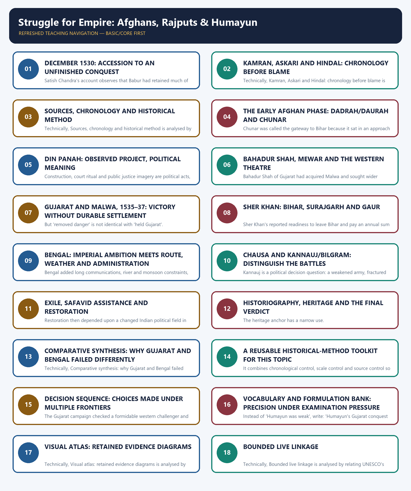

*Distinct embedded teaching-navigation image. The separate continuous Cārvāka-style flowchart package remains an independent at-a-glance artifact.*

#### Package provenance, coverage and limits

- **Source order applied:** Topic 13 basic → Topic 13 advanced → Topic 12, Topic 08, Topic 14 boundary, master chronology, audit and PYQ ledgers → searchable local Satish Chandra Part II pages → bounded official UNESCO Humayun's Tomb anchor → Qdrant not needed.
- **Coverage:** unfinished inheritance; brothers; source method; Dadrah/Daurah/Chunar; Din Panah; Gujarat–Mewar–Mughal field; legend caution; Gujarat campaign; Sher Khan; Bengal; Chausa; Kannauj; exile; Safavid assistance; restoration; historiography; practice; final register notes.
- **Visual coverage:** 34 original PNG assets, including the cover. All map-like graphics are marked **SCHEMATIC — NOT TO SCALE**.
- **PYQ honesty:** no direct verified 2018–2025 Topic 13 CSE PYQ is present in the audited local routing corpus. Adjacent routes are explicitly labelled and no official key is fabricated.
- **Heritage limit:** UNESCO's Humayun's Tomb description is used only for later dynastic memory, architecture and conservation; it is not used to prove sixteenth-century campaign events.

### 01. Scope, source order and the central problem

[FACT] This package follows the Topic 13 basic and advanced files first; then Topic 12 on Babur, Topic 08 on Gujarat–Malwa–Mewar, Topic 14's forward boundary, the master chronology, the answer-worthiness audit and the local PYQ routing ledgers. It then uses searchable pages from Satish Chandra, *Medieval India: From Sultanat to the Mughals, Part II*, chapter on Humayun and the Afghans. The local-text page references are used as a source base, not copied as an authority beyond their reach.

[ANALYSIS] The topic asks why a dynasty that won Panipat and Khanwa could lose north India within a decade, and why it could return in 1555. The productive answer is not a biography of a supposedly feckless emperor. It is a political problem: imperial reach was asserted faster than revenue, administration, noble commitment and communications could sustain it, while Afghan and regional competitors retained real capacity.

[LIMIT] This does not make decline automatic. Humayun exercised choices; Sher Khan made choices; Gujarat, Mewar, Bengal, the brothers and the imperial centre were distinct fields. A careful answer balances structure with agency and does not turn a later monument, popular legend or a compressed chronicle into proof of every event.


### SESSION 1 — DECEMBER 1530: ACCESSION TO AN UNFINISHED CONQUEST

#### DEFINITION / WHAT THIS IS CALLED

**Plain-language definition:** 'Unfinished conquest' is more precise than 'weak empire'.

**Technical definition:** Satish Chandra's account observes that Babur had retained much of the prior administrative system, relied heavily on begs holding large assignments, and faced financial pressure after the Lodi treasure had been spent.

#### ANSWER-GRABBING OPENING — WRITE/ADAPT IN THE EXAM

> 'Unfinished conquest' is more precise than 'weak empire'.

#### MUST-WRITE KEYWORDS

- **December 1530**
- **accession to an unfinished conquest**
- **Finance**
- **Stretched treasury after earlier expenditures and large assignments**
- **Administration**
- **Begs held broad assignments**

**How to use them:** Frame the answer through December 1530; define accession to an unfinished conquest, connect Finance with Stretched treasury after earlier expenditures and large assignments to explain the mechanism, and use Administration for the decisive comparison or qualification.

[FACT] Humayun succeeded Babur in December 1530. The repository source identifies weak finances, an unsettled administration, unsubdued Afghans, ambitious begs, active Timurid princes and Bahadur Shah of Gujarat as the major field of difficulty. Satish Chandra's account observes that Babur had retained much of the prior administrative system, relied heavily on begs holding large assignments, and faced financial pressure after the Lodi treasure had been spent.

[ANALYSIS] 'Unfinished conquest' is more precise than 'weak empire'. Babur's victories created a core and a claim; they did not automatically deliver a routine revenue flow, an impersonal bureaucracy, locally rooted loyalists or the neutralisation of rival political traditions. An early imperial state can conquer a city faster than it can persuade officers to remain, collect revenue predictably, secure routes and turn regional elites into stable partners.

| Inherited dimension | Evidence base | Why it mattered |
|---|---|---|
| Finance | Stretched treasury after earlier expenditures and large assignments | Campaign, reward and defence all required cash and reliable collection |
| Administration | Begs held broad assignments | Delegation mobilised force but weakened direct oversight |
| Eastern competition | Afghan activity from east U.P. to Bihar | Panipat did not end Afghan political ambitions |
| Western competition | Bahadur Shah's Gujarat–Malwa power | A rival could threaten through Malwa and Rajasthan |
| Dynasty | Timurid princely-share expectations | Territorial unity required continuing negotiation |

[LIMIT] It would be false to call the inheritance void. Humayun possessed a prestigious centre, command resources and a field in which vigorous campaigns were possible. The question is why those assets did not yet amount to durable institutional depth.

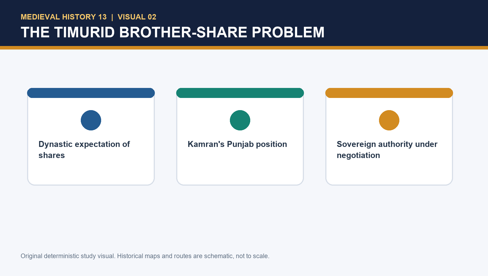

#### CLOSING RECALL FLOW — DECEMBER 1530: ACCESSION TO AN UNFINISHED CONQUEST

```text
START / CONCEPT: December 1530: accession to an unfinished conquest
        |
        v
EXACT TERMS: December 1530 · accession to an unfinished conquest · Finance · Stretched treasury after earlier expenditures and large assignments · Administration · Begs held broad assignments
        |
        v
MECHANISM / ARGUMENT: Satish Chandra's account observes that Babur had retained much of the prior administrative system, relied heavily on begs holding large assignments, and faced financial pressure after the Lodi treasure had been spent.
        |
        v
CONSEQUENCE / CONTRAST: Babur's victories created a core and a claim; they did not automatically deliver a routine revenue flow, an impersonal bureaucracy, locally rooted loyalists or the neutralisation of rival political traditions.
        |
        v
UPSC TRAP / ANSWER-USE: The question is why those assets did not yet amount to durable institutional depth.
        |
        v
ANSWER-GRABBING FORMULATION: 'Unfinished conquest' is more precise than 'weak empire'.
```
### SESSION 2 — KAMRAN, ASKARI AND HINDAL: CHRONOLOGY BEFORE BLAME

#### DEFINITION / WHAT THIS IS CALLED

**Plain-language definition:** Kamran, Askari and Hindal: chronology before blame comprises Kamran, Askari and Hindal as its core connected dimensions.

**Technical definition:** Technically, Kamran, Askari and Hindal: chronology before blame is analysed by relating Kamran to Askari, then testing the relationship through Hindal and chronology before blame.

#### ANSWER-GRABBING OPENING — WRITE/ADAPT IN THE EXAM

> Kamran, Askari and Hindal: chronology before blame comprises Kamran, Askari and Hindal as its core connected dimensions.

#### MUST-WRITE KEYWORDS

- **Kamran**
- **Askari**
- **Hindal**
- **chronology before blame**
- **K-A-H**
- **amran's Punjab hinge;**

**How to use them:** Frame the answer through Kamran; define Askari, connect Hindal with chronology before blame to explain the mechanism, and use K-A-H for the decisive comparison or qualification.

[FACT] Kamran already held Kabul and Qandahar at Babur's death. He then occupied Lahore and held Punjab up to the Sutlej, seeking confirmation from Humayun. Humayun accepted his possession while Afghan activity and Bahadur Shah's ambitions demanded attention elsewhere; khutba and sikka continued in Humayun's name. Askari and Hindal held assigned territories. The source warns that the brothers were broadly loyal until the Bengal episode; Hindal's independent move at Agra and elite defections belong to the later crisis. After Chausa, Kamran's 10,000 hardened troops were not placed under Humayun's command.

[ANALYSIS] Kamran's control represented a de facto partition but not an explanation that can be retrofitted onto every event. It had a double effect. It narrowed Humayun's direct reach and later denied him a crucial reinforcement; it also spared him some immediate north-western burdens when Qandahar faced Iranian pressure. This is exactly why an answer must name its time period.

Askari's role similarly changes: he was entrusted with Gujarat, and the inability of his command to create cohesion is evidence of an elite-administration problem, not merely personal betrayal. Hindal's later action at Agra mattered because a Bengal expedition had already stretched the rear. The brothers' choices interacted with state capacity, battlefield confidence and noble calculation.

> MEMORY: **K-A-H** = **K**amran's Punjab hinge; **A**skari's Gujarat test; **H**indal's Bengal-period rear crisis. Do not turn the mnemonic into a timeless guilt list.

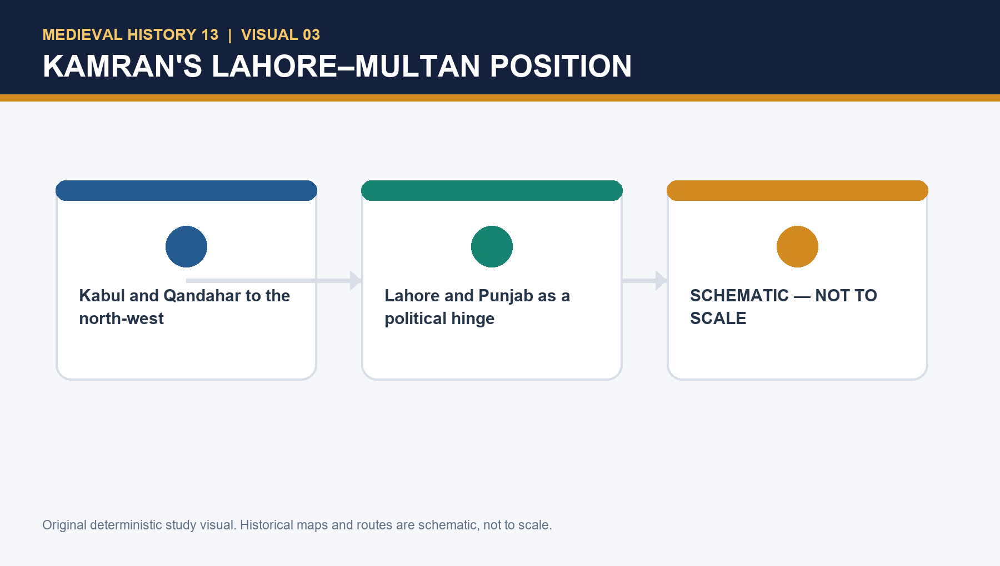

#### CLOSING RECALL FLOW — KAMRAN, ASKARI AND HINDAL: CHRONOLOGY BEFORE BLAME

```text
START / CONCEPT: Kamran, Askari and Hindal: chronology before blame
        |
        v
EXACT TERMS: Kamran · Askari · Hindal · chronology before blame · K-A-H · amran's Punjab hinge;
        |
        v
MECHANISM / ARGUMENT: The source warns that the brothers were broadly loyal until the Bengal episode; Hindal's independent move at Agra and elite defections belong to the later crisis.
        |
        v
CONSEQUENCE / CONTRAST: Kamran's control represented a de facto partition but not an explanation that can be retrofitted onto every event.
        |
        v
UPSC TRAP / ANSWER-USE: Askari's role similarly changes: he was entrusted with Gujarat, and the inability of his command to create cohesion is evidence of an elite-administration problem, not merely personal betrayal.
        |
        v
ANSWER-GRABBING FORMULATION: Kamran, Askari and Hindal: chronology before blame comprises Kamran, Askari and Hindal as its core connected dimensions.
```
### SESSION 3 — SOURCES, CHRONOLOGY AND HISTORICAL METHOD

#### DEFINITION / WHAT THIS IS CALLED

**Plain-language definition:** Abul Fazl's later Akbarnama is fuller and uses collected memoir material; Nizamuddin's Tabaqat-i-Akbari is briefer and has chronological deficiencies according to the source discussion.

**Technical definition:** Technically, Sources, chronology and historical method is analysed by relating Sources to chronology, then testing the relationship through historical method and Nizamuddin Ahmad.

#### ANSWER-GRABBING OPENING — WRITE/ADAPT IN THE EXAM

> Abul Fazl's later Akbarnama is fuller and uses collected memoir material; Nizamuddin's Tabaqat-i-Akbari is briefer and has chronological deficiencies according to the source discussion.

#### MUST-WRITE KEYWORDS

- **Sources**
- **chronology**
- **historical method**
- **Nizamuddin Ahmad**
- **Alternative chronology and compressed narrative**
- **Omissions and weak chronological detail**

**How to use them:** Frame the answer through Sources; define chronology, connect historical method with Nizamuddin Ahmad to explain the mechanism, and use Alternative chronology and compressed narrative for the decisive comparison or qualification.

[FACT] The assigned advanced file highlights a chronology issue. Nizamuddin Ahmad places Dadrah/Daurah in the first regnal year (1531) and does not mention Chunar in the same sequence. The reconstruction adopted in Satish Chandra's narrative places the major Afghan encounter late in 1532 after the Chunar arrangement. Abul Fazl's later Akbarnama is fuller and uses collected memoir material; Nizamuddin's *Tabaqat-i-Akbari* is briefer and has chronological deficiencies according to the source discussion.

[ANALYSIS] The appropriate conclusion is modest. Exact sequence and dates are less secure than the strategic interpretation: Humayun moved against eastern Afghan resistance, reached accommodation at Chunar rather than opening a Bihar war, and sought first to consolidate existing dominions. This is a model for all medieval evidence: a later dynastic chronicle can preserve detail but carry retrospective order; a brief account can avoid embroidery but omit links; a popular tradition may show memory yet fail as direct political proof.

| Source form | What it can illuminate | Principal limit |
|---|---|---|
| Nizamuddin Ahmad | Alternative chronology and compressed narrative | Omissions and weak chronological detail |
| Abul Fazl / Akbarnama | Fuller courtly reconstruction and later collected memories | Dynastic framing and retrospective coherence |
| Mirza Haider, *Tarikh-i-Rashidi* | A critical voice on Humayun's habits | One testimony cannot explain an entire reign |
| Later regional tradition | Memory and later political imagination | Cannot replace contemporary corroboration |
| Monument / UNESCO description | Dynastic memory, architecture and conservation | Not proof of campaign-event chronology |

[LIMIT] Source caution must not become source paralysis. A student should still make a ranked claim, mark the limit, and explain the secure political mechanism.

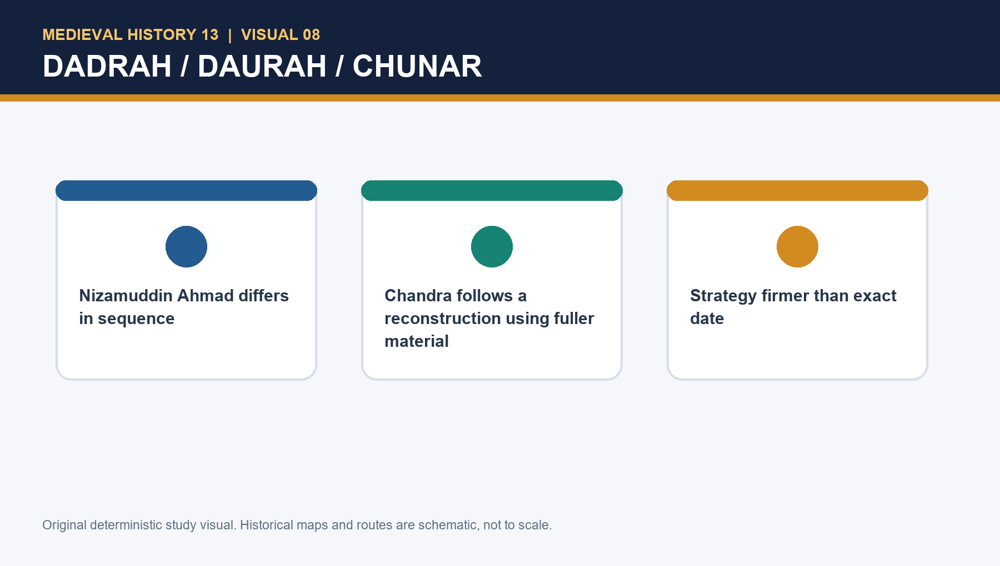

#### CLOSING RECALL FLOW — SOURCES, CHRONOLOGY AND HISTORICAL METHOD

```text
START / CONCEPT: Sources, chronology and historical method
        |
        v
EXACT TERMS: Sources · chronology · historical method · Nizamuddin Ahmad · Alternative chronology and compressed narrative · Omissions and weak chronological detail
        |
        v
MECHANISM / ARGUMENT: A student should still make a ranked claim, mark the limit, and explain the secure political mechanism.
        |
        v
CONSEQUENCE / CONTRAST: Nizamuddin Ahmad places Dadrah/Daurah in the first regnal year (1531) and does not mention Chunar in the same sequence.
        |
        v
UPSC TRAP / ANSWER-USE: Source caution must not become source paralysis.
        |
        v
ANSWER-GRABBING FORMULATION: Abul Fazl's later Akbarnama is fuller and uses collected memoir material; Nizamuddin's Tabaqat-i-Akbari is briefer and has chronological deficiencies according to the source discussion.
```
### SESSION 4 — THE EARLY AFGHAN PHASE: DADRAH/DAURAH AND CHUNAR

#### DEFINITION / WHAT THIS IS CALLED

**Plain-language definition:** At Dadrah on the Gomti, Humayun defeated Afghan forces led in the eastern field; the strategic core is consolidation against east-U.P. resistance.

**Technical definition:** Chunar was called the gateway to Bihar because it sat in an approach system—not because one fort controlled the entire east by itself.

#### ANSWER-GRABBING OPENING — WRITE/ADAPT IN THE EXAM

> At Dadrah on the Gomti, Humayun defeated Afghan forces led in the eastern field; the strategic core is consolidation against east-U.P. resistance.

#### MUST-WRITE KEYWORDS

- **The early Afghan phase**
- **Dadrah/Daurah**
- **Chunar**
- **In**
- **Humayun**
- **1531–32**

**How to use them:** Frame the answer through The early Afghan phase; define Dadrah/Daurah, connect Chunar with In to explain the mechanism, and use Humayun for the decisive comparison or qualification.

[FACT] In the source sequence, Humayun besieged Kalinjar, then moved against Chunar after learning that Sher Khan had acquired it. Sher Khan was absent, and a settlement followed: service under his son, a contingent and payment were offered. Humayun accepted because he did not then contemplate an attack on Bihar and did not regard Sher Khan as the central danger. At Dadrah on the Gomti, Humayun defeated Afghan forces led in the eastern field; the strategic core is consolidation against east-U.P. resistance.

[ANALYSIS] Chunar was called the gateway to Bihar because it sat in an approach system—not because one fort controlled the entire east by itself. A fort could affect land movement, river-side communications, provisioning and the security of a force moving from the Gangetic core toward Bihar and Bengal. The first settlement was therefore not absurd: Humayun had several fronts and an immediate interest in keeping Sher Khan apart from other Afghan rebels. Its later failure became visible only when Sher Khan's regional power increased.

[LIMIT] Retrospective knowledge makes every compromise look foolish. A fair answer says the calculation underestimated a future rival, but avoids claiming that the complete later Sher Shah was already obvious in 1531–32. That distinction is especially important in a source field with a disputed chronology.

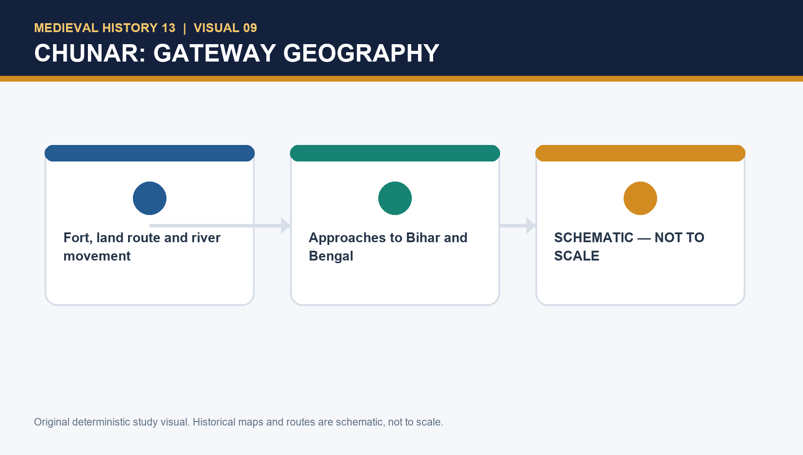

#### CLOSING RECALL FLOW — THE EARLY AFGHAN PHASE: DADRAH/DAURAH AND CHUNAR

```text
START / CONCEPT: The early Afghan phase: Dadrah/Daurah and Chunar
        |
        v
EXACT TERMS: The early Afghan phase · Dadrah/Daurah · Chunar · In · Humayun · 1531–32
        |
        v
MECHANISM / ARGUMENT: Chunar was called the gateway to Bihar because it sat in an approach system—not because one fort controlled the entire east by itself.
        |
        v
CONSEQUENCE / CONTRAST: The first settlement was therefore not absurd: Humayun had several fronts and an immediate interest in keeping Sher Khan apart from other Afghan rebels.
        |
        v
UPSC TRAP / ANSWER-USE: A fair answer says the calculation underestimated a future rival, but avoids claiming that the complete later Sher Shah was already obvious in 1531–32.
        |
        v
ANSWER-GRABBING FORMULATION: At Dadrah on the Gomti, Humayun defeated Afghan forces led in the eastern field; the strategic core is consolidation against east-U.P. resistance.
```
### SESSION 5 — DIN PANAH: OBSERVED PROJECT, POLITICAL MEANING

#### DEFINITION / WHAT THIS IS CALLED

**Plain-language definition:** The project did not by itself create revenue or noble loyalty, but its political logic is intelligible.

**Technical definition:** Construction, court ritual and public justice imagery are political acts, yet their effect depends on the material capacity and alliances that give them force.

#### ANSWER-GRABBING OPENING — WRITE/ADAPT IN THE EXAM

> The project did not by itself create revenue or noble loyalty, but its political logic is intelligible.

#### MUST-WRITE KEYWORDS

- **Din Panah**
- **observed project**
- **political meaning**
- **Humayun**
- **Delhi**
- **1533–34**

**How to use them:** Frame the answer through Din Panah; define observed project, connect political meaning with Humayun to explain the mechanism, and use Delhi for the decisive comparison or qualification.

[FACT] Humayun built Din Panah at Delhi on the Yamuna in 1533–34. The local source rejects the view that the capital must be the product of a 'fevered imagination': Delhi had long carried prestige as a seat of imperial power, while Agra was closely associated with an Afghan predecessor. The account also notes initiatives such as court classifications, honours, a drum of justice and reported relief/remission measures, but cautions that time was needed for their effects.

[ANALYSIS] Din Panah can be read as a legitimacy project in three linked senses. It placed the new dynasty in a city saturated with imperial associations; it offered a courtly and administrative centre through which a Timurid sovereign could stage authority; and it signalled an intention to be more than a transient conqueror. The project did not by itself create revenue or noble loyalty, but its political logic is intelligible.

[LIMIT] Do not project later Mughal Delhi onto the 1530s. Nor should a building programme be dismissed because the state remained fragile. Construction, court ritual and public justice imagery are political acts, yet their effect depends on the material capacity and alliances that give them force.

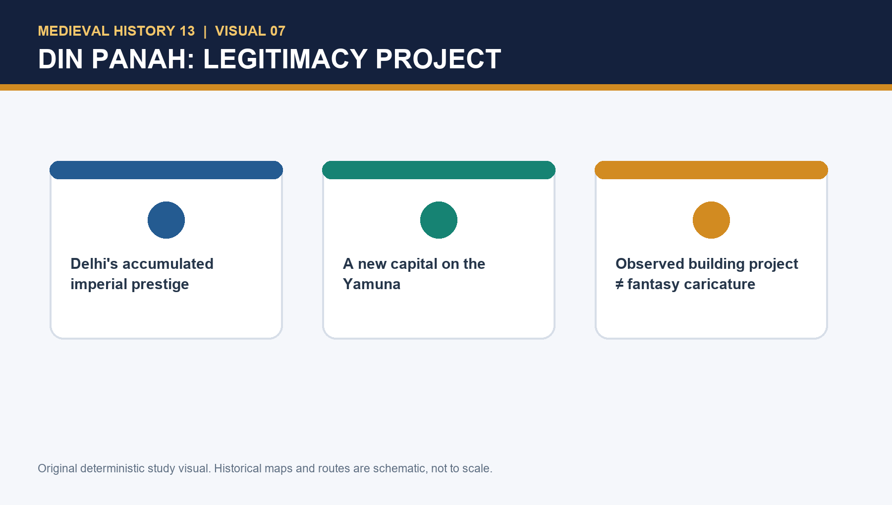

#### CLOSING RECALL FLOW — DIN PANAH: OBSERVED PROJECT, POLITICAL MEANING

```text
START / CONCEPT: Din Panah: observed project, political meaning
        |
        v
EXACT TERMS: Din Panah · observed project · political meaning · Humayun · Delhi · 1533–34
        |
        v
MECHANISM / ARGUMENT: Construction, court ritual and public justice imagery are political acts, yet their effect depends on the material capacity and alliances that give them force.
        |
        v
CONSEQUENCE / CONTRAST: Do not project later Mughal Delhi onto the 1530s.
        |
        v
UPSC TRAP / ANSWER-USE: The local source rejects the view that the capital must be the product of a 'fevered imagination': Delhi had long carried prestige as a seat of imperial power, while Agra was closely associated with an Afghan predecessor.
        |
        v
ANSWER-GRABBING FORMULATION: The project did not by itself create revenue or noble loyalty, but its political logic is intelligible.
```
### SESSION 6 — BAHADUR SHAH, MEWAR AND THE WESTERN THEATRE

#### DEFINITION / WHAT THIS IS CALLED

**Plain-language definition:** Topic 08 provides the bounded context of Gujarat's wealth and ports, including the later Portuguese/Diu pressure around Bahadur Shah; it is background, not a substitute for analysing inland power.

**Technical definition:** Bahadur Shah of Gujarat had acquired Malwa and sought wider influence in Rajasthan.

#### ANSWER-GRABBING OPENING — WRITE/ADAPT IN THE EXAM

> Topic 08 provides the bounded context of Gujarat's wealth and ports, including the later Portuguese/Diu pressure around Bahadur Shah; it is background, not a substitute for analysing inland power.

#### MUST-WRITE KEYWORDS

- **Bahadur Shah**
- **Mewar**
- **the western theatre**
- **Gujarat**
- **Malwa**
- **Rajasthan**

**How to use them:** Frame the answer through Bahadur Shah; define Mewar, connect the western theatre with Gujarat to explain the mechanism, and use Malwa for the decisive comparison or qualification.

[FACT] Bahadur Shah of Gujarat had acquired Malwa and sought wider influence in Rajasthan. Chittor was besieged in this regional field. The source describes Humayun's movement to Gwalior as a warning: control of eastern Rajasthan by Gujarat could threaten the Agra–Delhi position. Bahadur Shah's court also contained Afghan and Timurid refugees, and his artillery resources added to his confidence. Topic 08 provides the bounded context of Gujarat's wealth and ports, including the later Portuguese/Diu pressure around Bahadur Shah; it is background, not a substitute for analysing inland power.

[ANALYSIS] The correct map is triangular: Mewar's Chittor, Gujarat–Malwa's regional expansion, and the Mughal core around Delhi–Agra. Rajputs in this field were not a permanent homogeneous bloc. Relations shifted according to forts, Malwa, Rajasthan, Gujarat and the survival of particular rulers. A good answer shows how regional politics and Mughal security overlapped, rather than adding 'Rajputs' as a title token.

[SOURCE CAUTION] A mid-seventeenth-century Rajasthani account reports that Rani Karnavati sent a bracelet as rakhi to Humayun. The assigned source says contemporary accounts do not mention it. It may be examined as later historiographical memory; it cannot be used as settled proof that Humayun entered a permanent alliance or that the story caused his move. The verified Chittor setting does not depend on that legend.

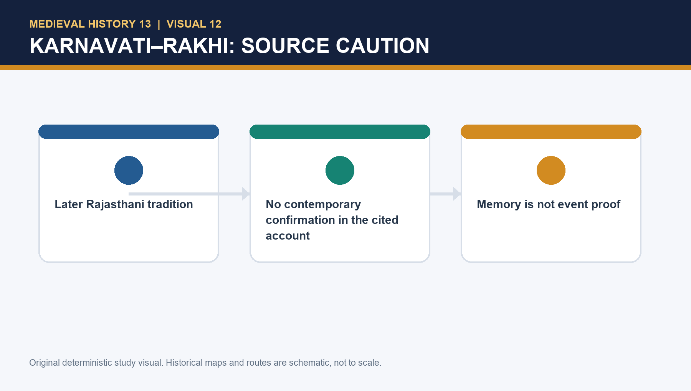

#### CLOSING RECALL FLOW — BAHADUR SHAH, MEWAR AND THE WESTERN THEATRE

```text
START / CONCEPT: Bahadur Shah, Mewar and the western theatre
        |
        v
EXACT TERMS: Bahadur Shah · Mewar · the western theatre · Gujarat · Malwa · Rajasthan
        |
        v
MECHANISM / ARGUMENT: Bahadur Shah of Gujarat had acquired Malwa and sought wider influence in Rajasthan.
        |
        v
CONSEQUENCE / CONTRAST: Rajputs in this field were not a permanent homogeneous bloc.
        |
        v
UPSC TRAP / ANSWER-USE: The assigned source says contemporary accounts do not mention it.
        |
        v
ANSWER-GRABBING FORMULATION: Topic 08 provides the bounded context of Gujarat's wealth and ports, including the later Portuguese/Diu pressure around Bahadur Shah; it is background, not a substitute for analysing inland power.
```
### SESSION 7 — GUJARAT AND MALWA, 1535–37: VICTORY WITHOUT DURABLE SETTLEMENT

#### DEFINITION / WHAT THIS IS CALLED

**Plain-language definition:** The Gujarat episode is a laboratory in the difference between campaign and administration.

**Technical definition:** But 'removed danger' is not identical with 'held Gujarat'.

#### ANSWER-GRABBING OPENING — WRITE/ADAPT IN THE EXAM

> The Gujarat episode is a laboratory in the difference between campaign and administration.

#### MUST-WRITE KEYWORDS

- **Gujarat**
- **Malwa**
- **victory without durable settlement**
- **Supply pressure at Mandsor avoided an artillery trap**
- **Mandu and Champaner showed operational reach**
- **Ahmedabad demonstrated a ten-month campaign's momentum**

**How to use them:** Frame the answer through Gujarat; define Malwa, connect victory without durable settlement with Supply pressure at Mandsor avoided an artillery trap to explain the mechanism, and use Mandu and Champaner showed operational reach for the decisive comparison or qualification.

[FACT] Humayun marched from Agra in early 1535, moved through eastern Malwa and held a strategically advantageous position near Ujjain/Mandsor rather than directly attacking the Chittor siege. Bahadur Shah's defended camp used carts, ditches and artillery; Humayun avoided a frontal attack and cut supplies. Bahadur Shah withdrew; Mandu fell, then Champaner and Ahmedabad. The campaign was rapid and displayed real drive. Yet after assigning Askari overall responsibility and dividing Gujarat among nobles, Mughal authority collapsed. Bahadur Shah recovered, Askari withdrew, and Malwa too was lost by February 1537.

[ANALYSIS] The Gujarat episode is a laboratory in the difference between campaign and administration. A commander can defeat an opponent, seize fortresses and distribute treasure; none of these actions creates a revenue system, local coalition or co-ordinated hierarchy. Many Mughal nobles had relocated to the Delhi–Agra area and did not wish to reside in Gujarat, which they treated as foreign. Askari's capacity, mutual suspicion, regional reassertion and Humayun's slow intervention combined. The failure is multi-causal, not a no-effort story.

| Military success | Administrative failure |
|---|---|
| Supply pressure at Mandsor avoided an artillery trap | Revenue was not gathered in time and command lacked cohesion |
| Mandu and Champaner showed operational reach | Begs did not acquire a stake in long-term settlement |
| Ahmedabad demonstrated a ten-month campaign's momentum | Regional reassertion and Bahadur Shah's return undid the arrangement |

[LIMIT] The campaign was not a total waste. It destroyed an immediate western threat; Bahadur Shah's later death in a Portuguese-related fracas further removed that danger. But 'removed danger' is not identical with 'held Gujarat'.

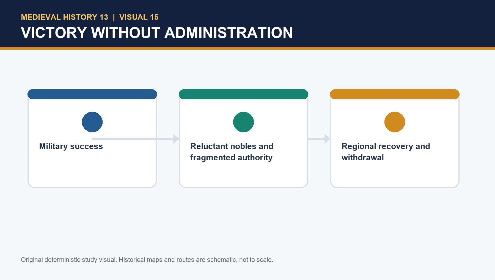

#### CLOSING RECALL FLOW — GUJARAT AND MALWA, 1535–37: VICTORY WITHOUT DURABLE SETTLEMENT

```text
START / CONCEPT: Gujarat and Malwa, 1535–37: victory without durable settlement
        |
        v
EXACT TERMS: Gujarat · Malwa · victory without durable settlement · Supply pressure at Mandsor avoided an artillery trap · Mandu and Champaner showed operational reach · Ahmedabad demonstrated a ten-month campaign's momentum
        |
        v
MECHANISM / ARGUMENT: Bahadur Shah recovered, Askari withdrew, and Malwa too was lost by February 1537.
        |
        v
CONSEQUENCE / CONTRAST: Many Mughal nobles had relocated to the Delhi–Agra area and did not wish to reside in Gujarat, which they treated as foreign.
        |
        v
UPSC TRAP / ANSWER-USE: But 'removed danger' is not identical with 'held Gujarat'.
        |
        v
ANSWER-GRABBING FORMULATION: The Gujarat episode is a laboratory in the difference between campaign and administration.
```
### SESSION 8 — SHER KHAN: BIHAR, SURAJGARH AND GAUR

#### DEFINITION / WHAT THIS IS CALLED

**Plain-language definition:** Sher Khan's position developed through Bihar, not through a single act of rebellion.

**Technical definition:** Sher Khan's reported readiness to leave Bihar and pay an annual sum if Bengal were confirmed to him should be read as a negotiation over political order.

#### ANSWER-GRABBING OPENING — WRITE/ADAPT IN THE EXAM

> Sher Khan's position developed through Bihar, not through a single act of rebellion.

#### MUST-WRITE KEYWORDS

- **Sher Khan**
- **Bihar**
- **Surajgarh**
- **Gaur**
- **Sher Khan's**
- **He**

**How to use them:** Frame the answer through Sher Khan; define Bihar, connect Surajgarh with Gaur to explain the mechanism, and use Sher Khan's for the decisive comparison or qualification.

[FACT] Sher Khan's position developed through Bihar, not through a single act of rebellion. He had virtual control there, defeated a Bengal force at Surajgarh in 1534, and was increasingly styled at a higher political register. By 1538 he had captured Gaur, Bengal's capital. His earlier Chunar settlement with Humayun had no power to keep him permanently subordinate; his son left Mughal service when the political relationship changed.

[ANALYSIS] This is Afghan state-building capacity. Regional roots supplied intelligence, recruits, sanctuary and access to resources; able leadership linked these assets to a coalition; Gaur enlarged wealth and political scale. The outcome cannot be explained by a tribal stereotype. Afghan leaders were not a single timeless mass, and not all had identical interests. The point is that under a capable leader their networks could become a credible alternative to the mobile, not-yet-rooted Mughal ruling class.

Sher Khan's reported readiness to leave Bihar and pay an annual sum if Bengal were confirmed to him should be read as a negotiation over political order. Humayun's Bengal objective and Sher Khan's Bengal claim made the issue larger than a personal quarrel or one fort.

[BOUNDARY] Detailed Sur reforms—revenue, roads, sarais and later administration—belong to Topic 14. This topic establishes the political-military emergence that makes those reforms historically possible.

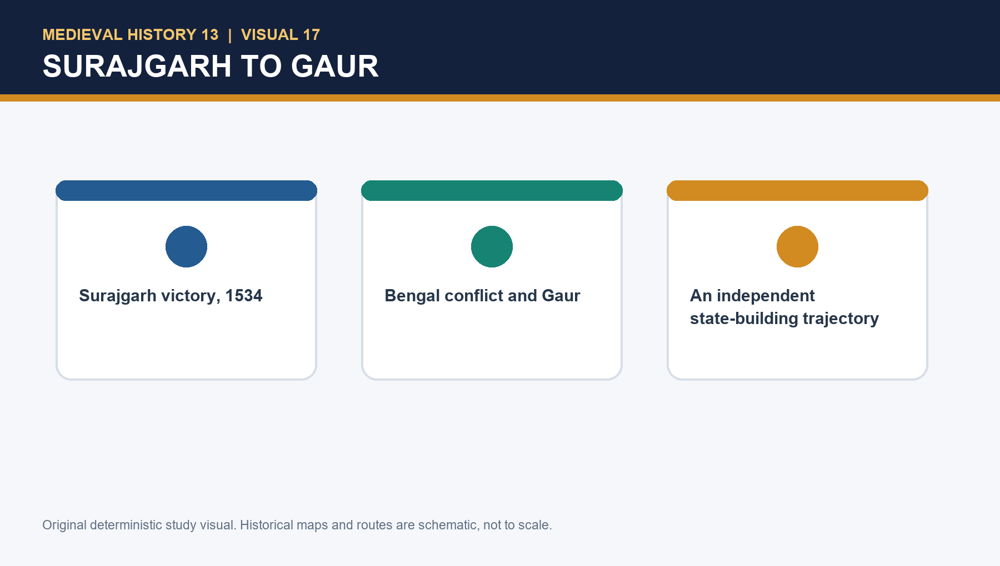

#### CLOSING RECALL FLOW — SHER KHAN: BIHAR, SURAJGARH AND GAUR

```text
START / CONCEPT: Sher Khan: Bihar, Surajgarh and Gaur
        |
        v
EXACT TERMS: Sher Khan · Bihar · Surajgarh · Gaur · Sher Khan's · He
        |
        v
MECHANISM / ARGUMENT: Sher Khan's reported readiness to leave Bihar and pay an annual sum if Bengal were confirmed to him should be read as a negotiation over political order.
        |
        v
CONSEQUENCE / CONTRAST: The point is that under a capable leader their networks could become a credible alternative to the mobile, not-yet-rooted Mughal ruling class.
        |
        v
UPSC TRAP / ANSWER-USE: Afghan leaders were not a single timeless mass, and not all had identical interests.
        |
        v
ANSWER-GRABBING FORMULATION: Sher Khan's position developed through Bihar, not through a single act of rebellion.
```
### SESSION 9 — BENGAL: IMPERIAL AMBITION MEETS ROUTE, WEATHER AND ADMINISTRATION

#### DEFINITION / WHAT THIS IS CALLED

**Plain-language definition:** His appeal was an additional factor, but the source reads Humayun's main objective as Bengal itself: a rich, strategically large province in a vision of north-Indian imperial unity.

**Technical definition:** Bengal added long communications, river and monsoon constraints, horse losses, an uncertain governor, noble reluctance and a rival capable of cutting the rear.

#### ANSWER-GRABBING OPENING — WRITE/ADAPT IN THE EXAM

> His appeal was an additional factor, but the source reads Humayun's main objective as Bengal itself: a rich, strategically large province in a vision of north-Indian imperial unity.

#### MUST-WRITE KEYWORDS

- **Bengal**
- **imperial ambition meets route**
- **weather**
- **administration**
- **He**
- **Chunar**

**How to use them:** Frame the answer through Bengal; define imperial ambition meets route, connect weather with administration to explain the mechanism, and use He for the decisive comparison or qualification.

[FACT] Humayun left Agra for the east in July 1537, during the rainy season. He invested Chunar because leaving it hostile could threaten communications; the siege lasted until June 1538. In the meantime Sher Khan captured Gaur. Humayun reached Gaur after the rains and left early in 1539 according to the source's likely reconstruction. While he was in Bengal, Sher Khan pressed westward against key links and disrupted communication with Agra.

[ANALYSIS] Bengal was not merely a rescue operation for Mahmud Shah. His appeal was an additional factor, but the source reads Humayun's main objective as Bengal itself: a rich, strategically large province in a vision of north-Indian imperial unity. The ambition was intelligible; the capacity was insufficient. Gujarat had already shown the problem of administering a distant space. Bengal added long communications, river and monsoon constraints, horse losses, an uncertain governor, noble reluctance and a rival capable of cutting the rear.

[LIMIT] Avoid saying that monsoon or river geography 'caused' defeat. Geography becomes politically decisive only through supply, route security, intelligence, speed and command. Nor was Humayun inert at Gaur: he received envoys and attempted to address the Hindal crisis. The analytical verdict is that occupation did not solve the administration-and-communications problem it revealed.

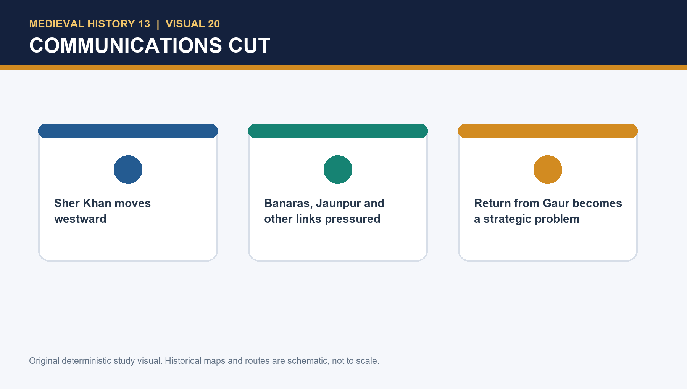

#### CLOSING RECALL FLOW — BENGAL: IMPERIAL AMBITION MEETS ROUTE, WEATHER AND ADMINISTRATION

```text
START / CONCEPT: Bengal: imperial ambition meets route, weather and administration
        |
        v
EXACT TERMS: Bengal · imperial ambition meets route · weather · administration · He · Chunar
        |
        v
MECHANISM / ARGUMENT: He invested Chunar because leaving it hostile could threaten communications; the siege lasted until June 1538.
        |
        v
CONSEQUENCE / CONTRAST: While he was in Bengal, Sher Khan pressed westward against key links and disrupted communication with Agra.
        |
        v
UPSC TRAP / ANSWER-USE: Bengal was not merely a rescue operation for Mahmud Shah.
        |
        v
ANSWER-GRABBING FORMULATION: His appeal was an additional factor, but the source reads Humayun's main objective as Bengal itself: a rich, strategically large province in a vision of north-Indian imperial unity.
```
### SESSION 10 — CHAUSA AND KANNAUJ/BILGRAM: DISTINGUISH THE BATTLES

#### DEFINITION / WHAT THIS IS CALLED

**Plain-language definition:** Chausa is a causation question: terrain behind the force limited retreat, surprise exposed command weakness, and the larger campaign had already strained communications and morale.

**Technical definition:** Kannauj is a political decision question: a weakened army, fractured co-operation and Sher Khan's command converted prior shock into displacement.

#### ANSWER-GRABBING OPENING — WRITE/ADAPT IN THE EXAM

> Chausa is a causation question: terrain behind the force limited retreat, surprise exposed command weakness, and the larger campaign had already strained communications and morale.

#### MUST-WRITE KEYWORDS

- **Chausa**
- **Kannauj/Bilgram**
- **Immediate form**
- **Surprise and exposed position near the Karmnasa**
- **Decisive renewed battle**
- **Campaign context**

**How to use them:** Frame the answer through Chausa; define Kannauj/Bilgram, connect Immediate form with Surprise and exposed position near the Karmnasa to explain the mechanism, and use Decisive renewed battle for the decisive comparison or qualification.

[FACT] At Chausa on 26 June 1539, Humayun faced Sher Khan after a difficult return from the Bengal theatre. The source criticises the Mughal placement of the river Karmnasa behind the position, poor deployment and the failure to prevent surprise. Humayun escaped. At Kannauj/Bilgram on 17 May 1540, a hastily assembled Mughal force faced the Afghans after Kamran had refused to place his hardened troops under Humayun's command. The result was decisive defeat and the loss of north India.

[ANALYSIS] Chausa is a causation question: terrain behind the force limited retreat, surprise exposed command weakness, and the larger campaign had already strained communications and morale. Kannauj is a political decision question: a weakened army, fractured co-operation and Sher Khan's command converted prior shock into displacement. The difference stops a common Prelims/Mains error: Chausa did not itself end all Mughal power, while Kannauj did not occur in a vacuum.

| Dimension | Chausa, 1539 | Kannauj/Bilgram, 1540 |
|---|---|---|
| Immediate form | Surprise and exposed position near the Karmnasa | Decisive renewed battle |
| Campaign context | Return from Bengal with strained communications | Post-Chausa political and military fragmentation |
| Brothers | Not an excuse for poor position | Kamran's hardened troops unavailable |
| Political effect | Humayun survived but lost confidence and initiative | Mughal loss of north India |

[LIMIT] Avoid decorative escape anecdotes unless precisely sourced. A battle answer earns more by explaining position, logistics, command and opponent capacity than by repeating a dramatic story.

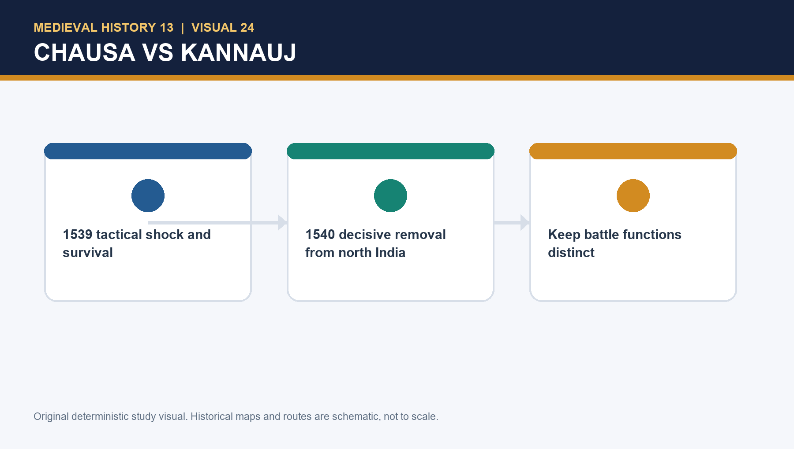

#### CLOSING RECALL FLOW — CHAUSA AND KANNAUJ/BILGRAM: DISTINGUISH THE BATTLES

```text
START / CONCEPT: Chausa and Kannauj/Bilgram: distinguish the battles
        |
        v
EXACT TERMS: Chausa · Kannauj/Bilgram · Immediate form · Surprise and exposed position near the Karmnasa · Decisive renewed battle · Campaign context
        |
        v
MECHANISM / ARGUMENT: At Kannauj/Bilgram on 17 May 1540, a hastily assembled Mughal force faced the Afghans after Kamran had refused to place his hardened troops under Humayun's command.
        |
        v
CONSEQUENCE / CONTRAST: Kannauj is a political decision question: a weakened army, fractured co-operation and Sher Khan's command converted prior shock into displacement.
        |
        v
UPSC TRAP / ANSWER-USE: Do not miss this limiting distinction: the result was decisive defeat and the loss of north India.
        |
        v
ANSWER-GRABBING FORMULATION: Chausa is a causation question: terrain behind the force limited retreat, surprise exposed command weakness, and the larger campaign had already strained communications and morale.
```
### SESSION 11 — EXILE, SAFAVID ASSISTANCE AND RESTORATION

#### DEFINITION / WHAT THIS IS CALLED

**Plain-language definition:** The secure formulation is: Shah Tahmasp's assistance helped Humayun recover Qandahar and Kabul; any particular condition must be tied to a named, precise source.

**Technical definition:** Restoration then depended upon a changed Indian political field in which the Sur order had fragmented.

#### ANSWER-GRABBING OPENING — WRITE/ADAPT IN THE EXAM

> Exile reveals that dynastic legitimacy without resources could not command regional support.

#### MUST-WRITE KEYWORDS

- **Exile**
- **Safavid assistance**
- **restoration**
- **Sindh**
- **Marwar**
- **Indian**

**How to use them:** Frame the answer through Exile; define Safavid assistance, connect restoration with Sindh to explain the mechanism, and use Marwar for the decisive comparison or qualification.

[FACT] After defeat, Humayun spent roughly two and a half years in the Sindh–regional theatre; local rulers and Maldeo of Marwar did not provide the durable support he sought. He later took refuge with Shah Tahmasp of Iran. With Iranian help he recovered Qandahar and Kabul in 1545. In 1555, amid Sur fragmentation, he recovered Delhi. He died in 1556, leaving the transition to Akbar.

[ANALYSIS] Exile reveals that dynastic legitimacy without resources could not command regional support. Sindh and Marwar calculated their own risk; their caution was a political fact, not a moral footnote. Safavid aid rebuilt a territorial platform at the north-western hinge. Qandahar and Kabul therefore matter as bases of recovery and diplomacy, not only as points on a route. Restoration then depended upon a changed Indian political field in which the Sur order had fragmented.

[SOURCE CAUTION] The Safavid relationship included political and religious dimensions, but this package does not turn it into a simplistic, source-free statement of permanently forced conversion. The secure formulation is: Shah Tahmasp's assistance helped Humayun recover Qandahar and Kabul; any particular condition must be tied to a named, precise source.

[LIMIT] Delhi recovery does not erase the earlier collapse. Conversely, the earlier collapse does not make restoration trivial. A graded judgement calls 1555 dynastic rehabilitation through regained capacity and opportunity, while recognising that a more durable consolidation awaited Akbar.

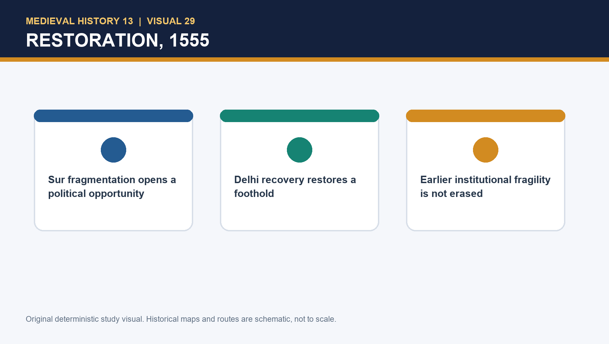

#### CLOSING RECALL FLOW — EXILE, SAFAVID ASSISTANCE AND RESTORATION

```text
START / CONCEPT: Exile, Safavid assistance and restoration
        |
        v
EXACT TERMS: Exile · Safavid assistance · restoration · Sindh · Marwar · Indian
        |
        v
MECHANISM / ARGUMENT: Restoration then depended upon a changed Indian political field in which the Sur order had fragmented.
        |
        v
CONSEQUENCE / CONTRAST: [SOURCE CAUTION] The Safavid relationship included political and religious dimensions, but this package does not turn it into a simplistic, source-free statement of permanently forced conversion.
        |
        v
UPSC TRAP / ANSWER-USE: Sindh and Marwar calculated their own risk; their caution was a political fact, not a moral footnote.
        |
        v
ANSWER-GRABBING FORMULATION: Exile reveals that dynastic legitimacy without resources could not command regional support.
```
### SESSION 12 — HISTORIOGRAPHY, HERITAGE AND THE FINAL VERDICT

#### DEFINITION / WHAT THIS IS CALLED

**Plain-language definition:** [VERDICT] Humayun put north-Indian imperial unity on the agenda before his ruling class could carry it.

**Technical definition:** The heritage anchor has a narrow use.

#### ANSWER-GRABBING OPENING — WRITE/ADAPT IN THE EXAM

> [VERDICT] Humayun put north-Indian imperial unity on the agenda before his ruling class could carry it.

#### MUST-WRITE KEYWORDS

- **Historiography**
- **heritage**
- **the final verdict**
- **F-A-N-G-B**
- **inance and fragile administration;**
- **fghan alternative;**

**How to use them:** Frame the answer through Historiography; define heritage, connect the final verdict with F-A-N-G-B to explain the mechanism, and use inance and fragile administration; for the decisive comparison or qualification.

[FACT] The local source challenges older moralising portraits that treat opium or indolence as a total explanation. It notes sustained campaigns, including Gujarat, while also documenting spells of pleasure, poor coordination and specific strategic failures. UNESCO's Humayun's Tomb page describes a grand garden-tomb built in the 1560s under Akbar's patronage, a charbagh design and a later dynastic memorial complex.

[ANALYSIS] The best rehabilitation is evidence-led, not celebratory. Humayun showed military drive at Gujarat and resilience in recovery; he also underestimated Sher Khan, failed to convert victory into administration, permitted the Bengal communications problem to grow, and adopted a bad position at Chausa. Sher Khan's leadership was not an external background condition; Afghan political-military capacity was a rival causal force.

The heritage anchor has a narrow use. It can introduce dynastic memory, architecture, conservation and the later representation of Humayun as part of Mughal continuity. It cannot prove the rakhi tradition, the date of Dadrah, a battlefield escape or the political motives of the 1530s.

> MEMORY: **F-A-N-G-B** — **F**inance and fragile administration; **A**fghan alternative; **N**obles and brothers; **G**ujarat/Bengal governance gap; **B**attle sequence Chausa → Kannauj. Add restoration as the qualified final turn.

[VERDICT] Humayun put north-Indian imperial unity on the agenda before his ruling class could carry it. The state failed not because one man was fated to fail, but because decision sequence and personal judgement met weak institutional depth, mobile nobles, brothers, regional competitors, difficult communications and an Afghan leader who could organise the available alternative.

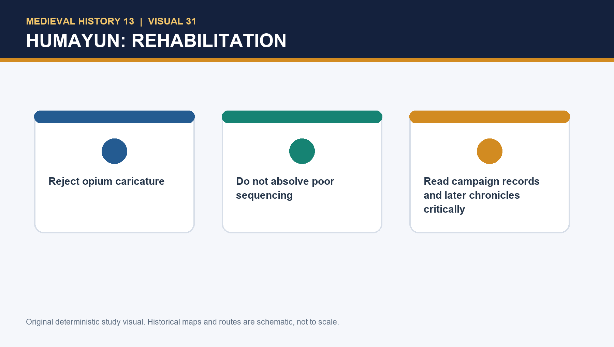

#### CLOSING RECALL FLOW — HISTORIOGRAPHY, HERITAGE AND THE FINAL VERDICT

```text
START / CONCEPT: Historiography, heritage and the final verdict
        |
        v
EXACT TERMS: Historiography · heritage · the final verdict · F-A-N-G-B · inance and fragile administration; · fghan alternative;
        |
        v
MECHANISM / ARGUMENT: The state failed not because one man was fated to fail, but because decision sequence and personal judgement met weak institutional depth, mobile nobles, brothers, regional competitors, difficult communications and an Afghan leader who could organise the available alternative.
        |
        v
CONSEQUENCE / CONTRAST: Sher Khan's leadership was not an external background condition; Afghan political-military capacity was a rival causal force.
        |
        v
UPSC TRAP / ANSWER-USE: The best rehabilitation is evidence-led, not celebratory.
        |
        v
ANSWER-GRABBING FORMULATION: [VERDICT] Humayun put north-Indian imperial unity on the agenda before his ruling class could carry it.
```
### SESSION 13 — COMPARATIVE SYNTHESIS: WHY GUJARAT AND BENGAL FAILED DIFFERENTLY

#### DEFINITION / WHAT THIS IS CALLED

**Plain-language definition:** Gujarat and Bengal are linked by the same basic weakness—territorial conquest did not generate an administrative apparatus that officers would willingly inhabit—but they should not be collapsed into one story.

**Technical definition:** Technically, Comparative synthesis: why Gujarat and Bengal failed differently is analysed by relating Comparative synthesis to why Gujarat, then testing the relationship through Bengal failed differently and Immediate rival.

#### ANSWER-GRABBING OPENING — WRITE/ADAPT IN THE EXAM

> Gujarat and Bengal are linked by the same basic weakness—territorial conquest did not generate an administrative apparatus that officers would willingly inhabit—but they should not be collapsed into one story.

#### MUST-WRITE KEYWORDS

- **Comparative synthesis**
- **why Gujarat**
- **Bengal failed differently**
- **Immediate rival**
- **Bahadur Shah's Gujarat–Malwa state**
- **Sher Khan's Bihar–Bengal Afghan project**

**How to use them:** Frame the answer through Comparative synthesis; define why Gujarat, connect Bengal failed differently with Immediate rival to explain the mechanism, and use Bahadur Shah's Gujarat–Malwa state for the decisive comparison or qualification.

[ANALYSIS] Gujarat and Bengal are linked by the same basic weakness—territorial conquest did not generate an administrative apparatus that officers would willingly inhabit—but they should not be collapsed into one story. Gujarat was a western campaign against Bahadur Shah, a ruler whose regional power had identifiable centres in Malwa and Gujarat. Humayun's field success was quick: supply pressure at Mandsor, the fall of Mandu, the capture of Champaner and Ahmedabad. The failure followed the choice of direct rule without a settled chain of revenue, co-ordination and local partnership. It was a problem of holding a recently conquered western polity after a substantial opponent had been driven out.

Bengal began with a different relation of forces. Sher Khan was not a defeated regional ruler being administered after a conventional victory; he was building an Afghan alternative from Bihar while contesting Bengal. Humayun's six-month Chunar siege, movement into Gaur and prolonged eastern stay allowed that rival to affect the route back toward Agra. The main constraint was therefore not only personnel reluctance but the union of distant occupation, communications vulnerability and a mobile enemy operating behind the apparent front.

| Comparative lens | Gujarat | Bengal |
|---|---|---|
| Immediate rival | Bahadur Shah's Gujarat–Malwa state | Sher Khan's Bihar–Bengal Afghan project |
| Strongest Mughal achievement | Rapid operational conquest, 1535 | Entry into Gaur after the Chunar siege |
| Core holding weakness | Fractured command and unwilling direct administration | Communications cut, horse/logistics strain and uncommitted distant administration |
| Political consequence | Malwa/Gujarat recover; western threat is later reduced | Chausa and Kannauj lead to loss of north India |

[LIMIT] This comparison is not an acquittal of Humayun in Gujarat or a claim that Bengal was doomed by distance. In both theatres, decisions mattered: appointing and supervising personnel, sequencing frontiers, estimating a rival and maintaining communications were choices. The comparative payoff is that it explains why a single phrase such as 'lack of consolidation' has different concrete meanings in different regions.

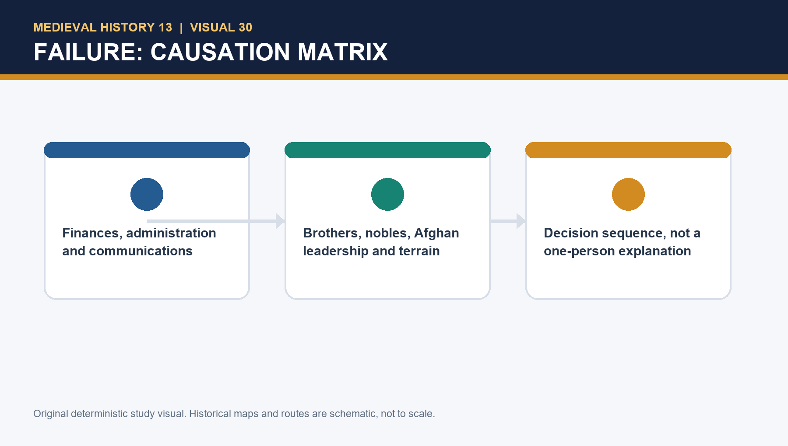

#### CLOSING RECALL FLOW — COMPARATIVE SYNTHESIS: WHY GUJARAT AND BENGAL FAILED DIFFERENTLY

```text
START / CONCEPT: Comparative synthesis: why Gujarat and Bengal failed differently
        |
        v
EXACT TERMS: Comparative synthesis · why Gujarat · Bengal failed differently · Immediate rival · Bahadur Shah's Gujarat–Malwa state · Sher Khan's Bihar–Bengal Afghan project
        |
        v
MECHANISM / ARGUMENT: This comparison is not an acquittal of Humayun in Gujarat or a claim that Bengal was doomed by distance.
        |
        v
CONSEQUENCE / CONTRAST: Sher Khan was not a defeated regional ruler being administered after a conventional victory; he was building an Afghan alternative from Bihar while contesting Bengal.
        |
        v
UPSC TRAP / ANSWER-USE: The main constraint was therefore not only personnel reluctance but the union of distant occupation, communications vulnerability and a mobile enemy operating behind the apparent front.
        |
        v
ANSWER-GRABBING FORMULATION: Gujarat and Bengal are linked by the same basic weakness—territorial conquest did not generate an administrative apparatus that officers would willingly inhabit—but they should not be collapsed into one story.
```
### SESSION 14 — A REUSABLE HISTORICAL-METHOD TOOLKIT FOR THIS TOPIC

#### DEFINITION / WHAT THIS IS CALLED

**Plain-language definition:** This toolkit turns disputed chronology, regional scale and mixed evidence into a disciplined sequence of claim, named evidence, mechanism, qualification and graded conclusion.

**Technical definition:** It combines chronological control, scale control and source control so that forts, routes, courts, campaigns, chronicles, traditions and monuments are assigned distinct evidentiary functions.

#### ANSWER-GRABBING OPENING — WRITE/ADAPT IN THE EXAM

> Humayun's struggle is also a method lesson: a defensible answer must preserve chronology, distinguish levels of causation and rank evidence instead of collecting anecdotes.

#### MUST-WRITE KEYWORDS

- **chronological control**
- **scale control**
- **source control**
- **named evidence**
- **qualification**

**How to use them:** State a narrow claim, name a dated or located evidence unit, explain its mechanism, add the source or scale limit, and return to the question with a qualified judgement.

[ANALYSIS] This topic is unusually valuable because it trains three methods at once. First, **chronological control**: distinguish the early eastern phase, western campaign, eastern imperial campaign, battle sequence, exile and restoration. A date list is insufficient, but a causal answer without dates can blur Chausa into Kannauj or make Hindal's later move the cause of the entire reign. Second, **scale control**: connect a fort, a route, a regional kingdom, a court faction and a north-Indian imperial claim without pretending they are identical levels of explanation. Third, **source control**: rank evidence rather than merely collecting stories.

Use the following answer discipline:

1. State a contestable claim narrowly: for example, 'Din Panah was a legitimacy project, though it could not substitute for fiscal depth.'
2. Name one evidence unit: Delhi's prestige, the 1533–34 building, a chronicle's interpretation, or a dated campaign event.
3. Explain a mechanism: how the evidence bears on legitimacy, logistics, command or administration.
4. Add a limit: construction does not prove public acceptance; a later chronicle may arrange chronology; a tradition may preserve memory rather than direct proof.
5. Return to the question with a graded conclusion.

[SOURCE CAUTION] The same discipline prevents common errors. The Karmnasa position is battlefield evidence, not an invitation to invent an escape anecdote. UNESCO's later tomb description is a heritage source, not a campaign dispatch. The Karnavati tradition is evidence of later memory, not sufficient proof of a 1530s policy. Nizamuddin's chronology is an alternative account, not a reason to abandon all secure strategic inference.

[LIMIT] Method should not drain history of content. Named places—Chunar, Mandu, Champaner, Gaur, Chausa, Kannauj, Sindh, Qandahar, Kabul and Delhi—are not decoration. They anchor the mechanisms through which political capacity was tested.

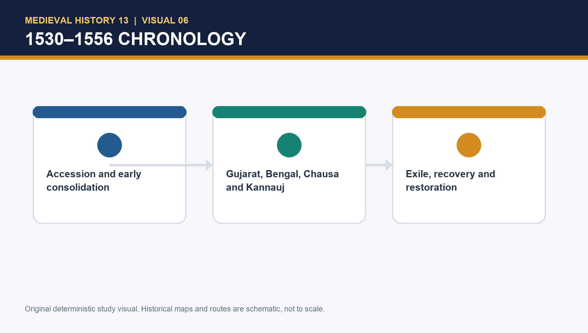

#### CLOSING RECALL FLOW — A REUSABLE HISTORICAL-METHOD TOOLKIT FOR THIS TOPIC

```text
START / CONCEPT: A reusable historical-method toolkit for this topic
        |
        v
EXACT TERMS: chronological control · scale control · source control · named evidence · qualification
        |
        v
MECHANISM / ARGUMENT: Chronology separates phases, scale links local forts and routes to regional and imperial contests, and source ranking prevents later memory or heritage description from replacing event evidence.
        |
        v
CONSEQUENCE / CONTRAST: The answer remains analytical without flattening Chausa into Kannauj, treating one monument as a campaign source or allowing one brother, legend or character judgement to explain the entire reign.
        |
        v
UPSC TRAP / ANSWER-USE: Do not mistake a list of places for analysis, use source caution as an excuse for indecision or let a later tradition carry more evidentiary weight than dated political and military evidence.
        |
        v
ANSWER-GRABBING FORMULATION: Humayun's struggle is also a method lesson: a defensible answer must preserve chronology, distinguish levels of causation and rank evidence instead of collecting anecdotes.
```
### SESSION 15 — DECISION SEQUENCE: CHOICES MADE UNDER MULTIPLE FRONTIERS

#### DEFINITION / WHAT THIS IS CALLED

**Plain-language definition:** Decision sequence: choices made under multiple frontiers comprises Decision sequence, choices made under multiple frontiers and Confirm Kamran as its core connected dimensions.

**Technical definition:** The Gujarat campaign checked a formidable western challenger and succeeded militarily, but the subsequent choice for direct administration without a settled personnel-and-revenue base was costly.

#### ANSWER-GRABBING OPENING — WRITE/ADAPT IN THE EXAM

> The Gujarat campaign checked a formidable western challenger and succeeded militarily, but the subsequent choice for direct administration without a settled personnel-and-revenue base was costly.

#### MUST-WRITE KEYWORDS

- **Decision sequence**
- **choices made under multiple frontiers**
- **Confirm Kamran**
- **Punjab power later reduced unity**
- **Political calculation, not pure generosity or cowardice**
- **Settle at Chunar**

**How to use them:** Frame the answer through Decision sequence; define choices made under multiple frontiers, connect Confirm Kamran with Punjab power later reduced unity to explain the mechanism, and use Political calculation, not pure generosity or cowardice for the decisive comparison or qualification.

[ANALYSIS] A chronological narrative gains explanatory force only when it identifies the choices available at a particular moment. Humayun did not select policy from a blank slate; he faced overlapping but non-identical fronts. The early confirmation of Kamran's Punjab position avoided an immediate civil conflict while risking de facto partition. The Chunar accommodation avoided a premature Bihar war while leaving a rising leader room to consolidate. The Gujarat campaign checked a formidable western challenger and succeeded militarily, but the subsequent choice for direct administration without a settled personnel-and-revenue base was costly. The Bengal expedition pursued a large imperial prize, but it took place after Gujarat had already exposed the limits of holding distant territory.

This sequence refines the conventional charge that Humayun 'moved in the wrong order.' It is too crude to say that any one campaign should simply have been omitted. A ruler of the Delhi–Agra core could not ignore Bahadur Shah's Malwa–Rajasthan pressure, and a hostile Chunar could not safely be ignored during a Bengal move. The stronger criticism is conditional: after Gujarat, a period of administrative settlement and political incorporation might have reduced the number of unresolved fronts; after Gaur, a communications-first calculation was needed before confidence in a battle could replace control of the rear.

| Decision | Immediate rationale | Later cost or limit | Safe historical judgement |
|---|---|---|---|
| Confirm Kamran | Avoid civil war while east/west threats were active | Punjab power later reduced unity | Political calculation, not pure generosity or cowardice |
| Settle at Chunar | No immediate Bihar invasion planned | Sher Khan's capacity grows later | Underestimation becomes clear retrospectively |
| Pursue Gujarat | Bahadur Shah's regional expansion threatened the core | Conquest not translated into administration | Military success, state-capacity failure |
| Pursue Bengal | Bengal was an imperial prize and Sher Khan's rise mattered | Long route, Chunar delay, communications exposure | Ambition outran logistical and personnel depth |
| Stand at Chausa | Humayun sought to defeat Sher Khan rather than withdraw | Bad Karmnasa position and surprise | Concrete operational failure |

[LIMIT] Counterfactuals must not become certainty. We cannot prove that a longer Gujarat settlement would have prevented Chausa or that a different route would have dissolved Afghan opposition. Their value is diagnostic: they identify the capacity a state would need to pursue its ambition safely—reliable officers, secure supply, route intelligence, money and political co-operation.

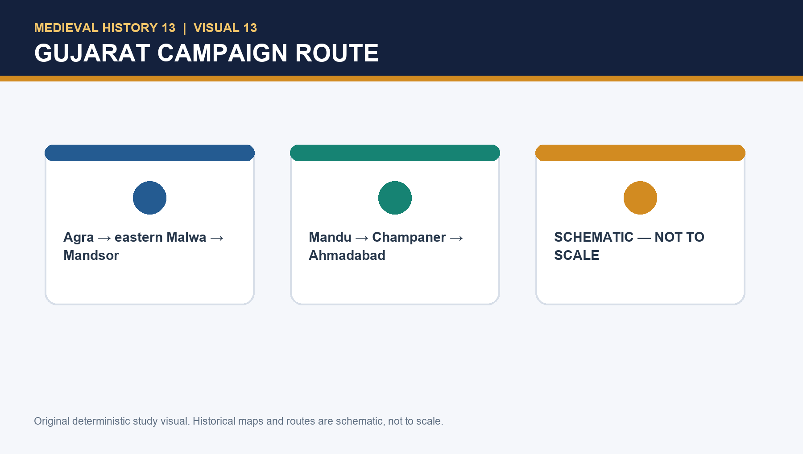

#### CLOSING RECALL FLOW — DECISION SEQUENCE: CHOICES MADE UNDER MULTIPLE FRONTIERS

```text
START / CONCEPT: Decision sequence: choices made under multiple frontiers
        |
        v
EXACT TERMS: Decision sequence · choices made under multiple frontiers · Confirm Kamran · Punjab power later reduced unity · Political calculation, not pure generosity or cowardice · Settle at Chunar
        |
        v
MECHANISM / ARGUMENT: A ruler of the Delhi–Agra core could not ignore Bahadur Shah's Malwa–Rajasthan pressure, and a hostile Chunar could not safely be ignored during a Bengal move.
        |
        v
CONSEQUENCE / CONTRAST: The Bengal expedition pursued a large imperial prize, but it took place after Gujarat had already exposed the limits of holding distant territory.
        |
        v
UPSC TRAP / ANSWER-USE: This sequence refines the conventional charge that Humayun 'moved in the wrong order.' It is too crude to say that any one campaign should simply have been omitted.
        |
        v
ANSWER-GRABBING FORMULATION: The Gujarat campaign checked a formidable western challenger and succeeded militarily, but the subsequent choice for direct administration without a settled personnel-and-revenue base was costly.
```
### SESSION 16 — VOCABULARY AND FORMULATION BANK: PRECISION UNDER EXAMINATION PRESSURE

#### DEFINITION / WHAT THIS IS CALLED

**Plain-language definition:** Vocabulary and formulation bank: precision under examination pressure comprises Vocabulary, formulation bank and precision under examination pressure as its core connected dimensions.

**Technical definition:** Instead of 'Humayun was weak', write: 'Humayun's Gujarat conquest did not secure revenue administration because officers were reluctant to settle and command fragmented.' Instead of 'Sher Shah was strong', write: 'Sher Khan converted Bihar resources, Afghan networks, Surajgarh and Gaur into a political-military coalition that could exploit Mughal communications.' Such sentences make facts do analytical work.

#### ANSWER-GRABBING OPENING — WRITE/ADAPT IN THE EXAM

> Vocabulary and formulation bank: precision under examination pressure comprises Vocabulary, formulation bank and precision under examination pressure as its core connected dimensions.

#### MUST-WRITE KEYWORDS

- **Vocabulary**
- **formulation bank**
- **precision under examination pressure**
- **Unfinished conquest**
- **De facto partition**
- **Gateway to Bihar**

**How to use them:** Frame the answer through Vocabulary; define formulation bank, connect precision under examination pressure with Unfinished conquest to explain the mechanism, and use De facto partition for the decisive comparison or qualification.

[FACT] Medieval-history answers often lose accuracy through compressed labels. The following vocabulary bank keeps important distinctions visible.

| Term or phrase | Use it to mean | Do not make it mean |
|---|---|---|
| **Unfinished conquest** | Territorial success lacking settled finance, administration and loyal depth | No Mughal core or no ability to campaign |
| **De facto partition** | Kamran's practical control alongside formal acknowledgement of Humayun | Formal destruction of every imperial claim |
| **Gateway to Bihar** | Chunar's role in a land-and-river communications system | A single fort mechanically controlling all Bengal |
| **Legitimacy project** | Din Panah's use of Delhi, court and sovereignty symbols | A building that automatically creates obedience |
| **Regional reassertion** | Gujarat's recovery through political and elite dynamics | A uniform popular nationalist revolt |
| **Afghan alternative** | Coalition, leadership, regional roots and state-building capacity | An ethnic or timeless military stereotype |
| **Communications cut** | Routes and links to Agra made insecure by rival movement | A literal isolated line with no local agency |
| **Restoration** | 1555 recovery of Delhi in a changed Sur field | Retroactive proof that 1540 was not a collapse |

[ANALYSIS] This vocabulary directly improves Prelims elimination. An option claiming that Humayun 'never took action against Sher Khan' is false because Chunar and eastern operations existed. One claiming that Chausa 'alone ended Mughal power' confuses its tactical shock with Kannauj's decisive political outcome. One describing the Karnavati narrative as 'contemporary proof' fails provenance. One describing Safavid aid as 'a simple permanently forced conversion' exceeds the source precision established here.

For Mains, substitute mechanisms for adjectives. Instead of 'Humayun was weak', write: 'Humayun's Gujarat conquest did not secure revenue administration because officers were reluctant to settle and command fragmented.' Instead of 'Sher Shah was strong', write: 'Sher Khan converted Bihar resources, Afghan networks, Surajgarh and Gaur into a political-military coalition that could exploit Mughal communications.' Such sentences make facts do analytical work.

[LIMIT] Precision is not pedantry. It permits a historian to recognise real error without relying on caricature, and real rival capacity without turning political organisation into an essentialised identity.


#### CLOSING RECALL FLOW — VOCABULARY AND FORMULATION BANK: PRECISION UNDER EXAMINATION PRESSURE

```text
START / CONCEPT: Vocabulary and formulation bank: precision under examination pressure
        |
        v
EXACT TERMS: Vocabulary · formulation bank · precision under examination pressure · Unfinished conquest · De facto partition · Gateway to Bihar
        |
        v
MECHANISM / ARGUMENT: Instead of 'Humayun was weak', write: 'Humayun's Gujarat conquest did not secure revenue administration because officers were reluctant to settle and command fragmented.' Instead of 'Sher Shah was strong', write: 'Sher Khan converted Bihar resources, Afghan networks, Surajgarh and Gaur into a political-military coalition that could exploit Mughal communications.' Such sentences make facts do analytical work.
        |
        v
CONSEQUENCE / CONTRAST: One claiming that Chausa 'alone ended Mughal power' confuses its tactical shock with Kannauj's decisive political outcome.
        |
        v
UPSC TRAP / ANSWER-USE: Do not miss this limiting distinction: instead of 'Humayun was weak', write.
        |
        v
ANSWER-GRABBING FORMULATION: Vocabulary and formulation bank: precision under examination pressure comprises Vocabulary, formulation bank and precision under examination pressure as its core connected dimensions.
```
### SESSION 17 — VISUAL ATLAS: RETAINED EVIDENCE DIAGRAMS

#### DEFINITION / WHAT THIS IS CALLED

**Plain-language definition:** These retained diagrams are not decorative pages.

**Technical definition:** Technically, Visual atlas: retained evidence diagrams is analysed by relating Visual atlas to retained evidence diagrams, then testing the relationship through These retained diagrams and These.

#### ANSWER-GRABBING OPENING — WRITE/ADAPT IN THE EXAM

> These retained diagrams are not decorative pages.

#### MUST-WRITE KEYWORDS

- **Visual atlas**
- **retained evidence diagrams**
- **These retained diagrams**
- **These**
- **If the answer**
- **If**

**How to use them:** Frame the answer through Visual atlas; define retained evidence diagrams, connect These retained diagrams with These to explain the mechanism, and use If the answer for the decisive comparison or qualification.

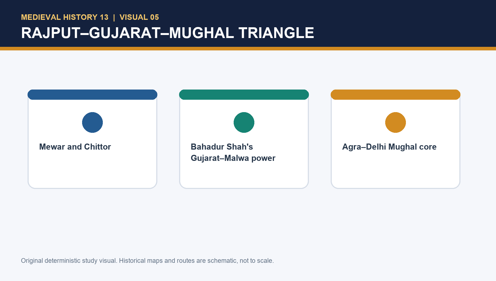

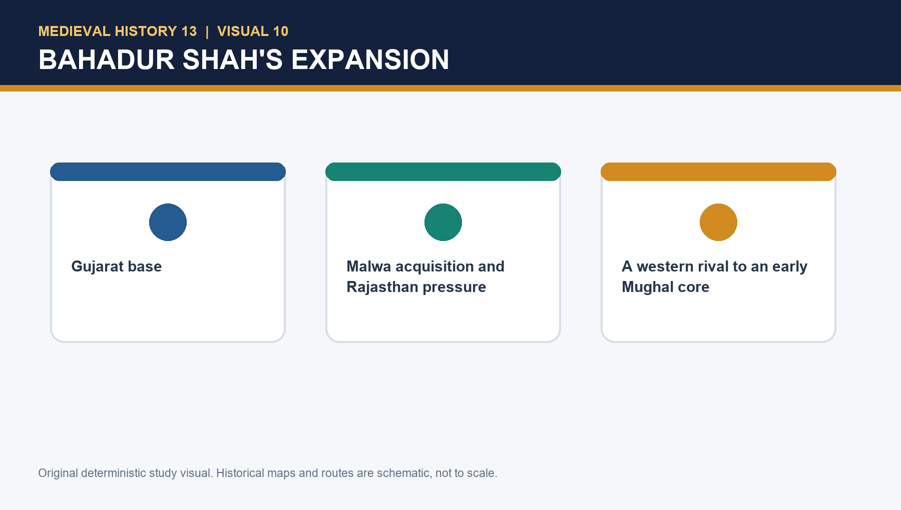

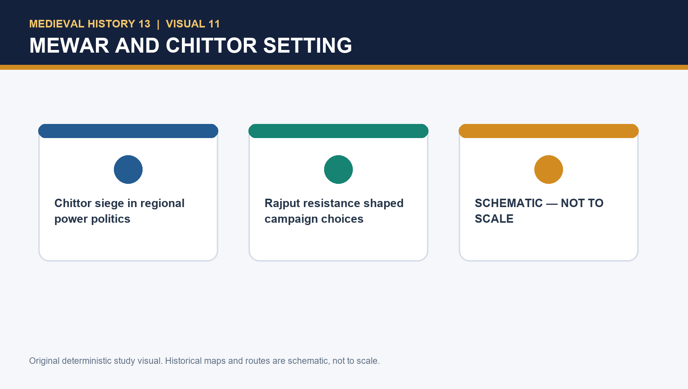


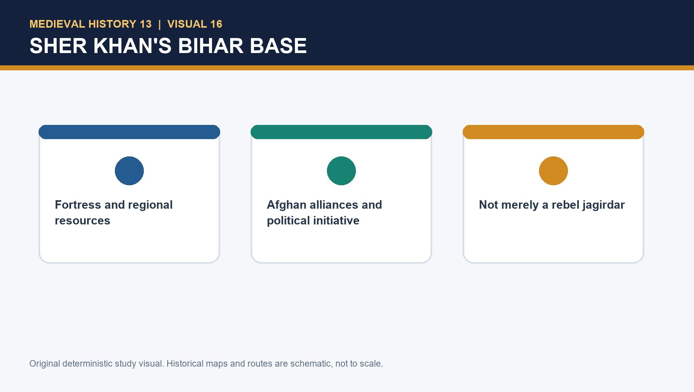

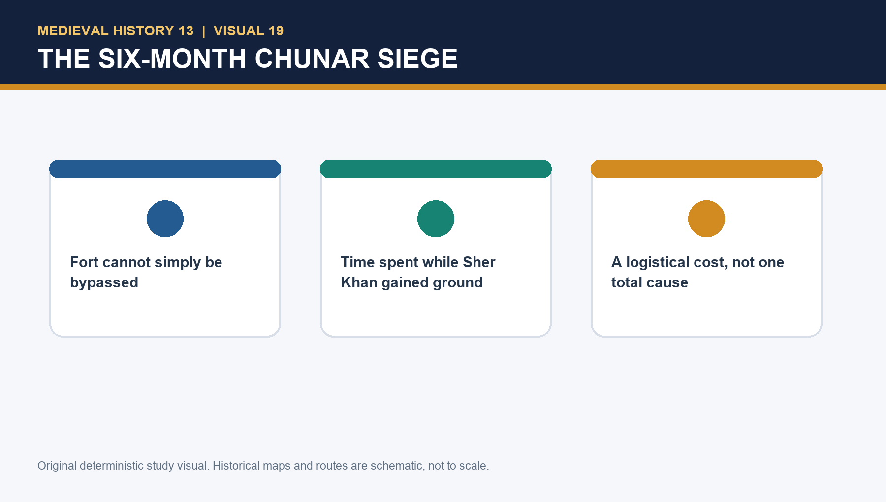

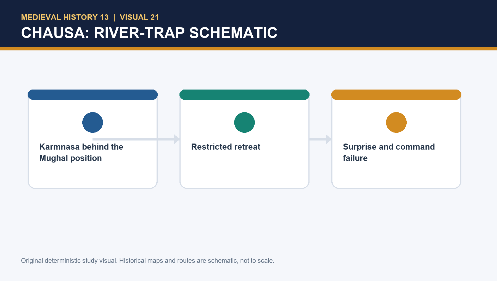

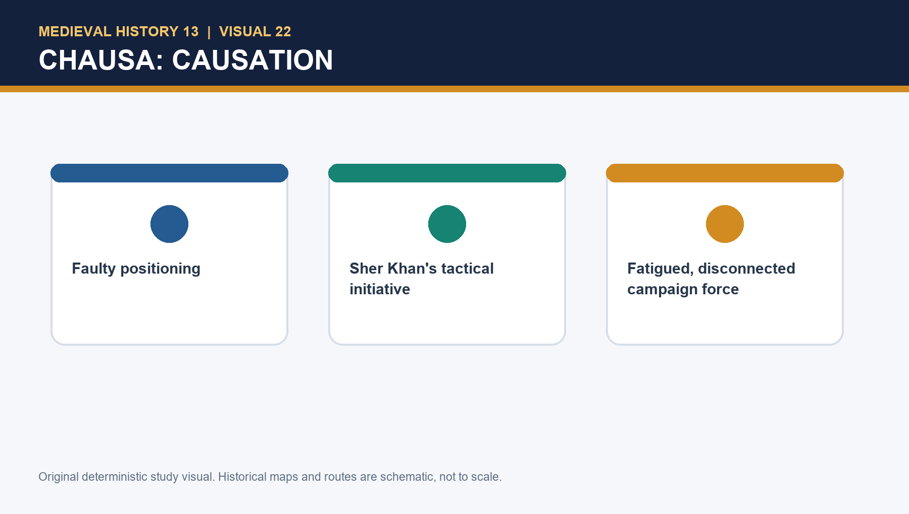

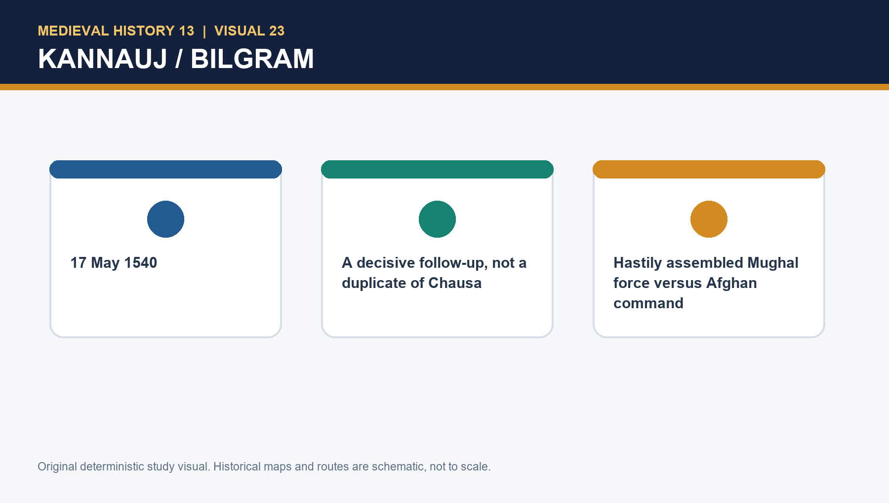

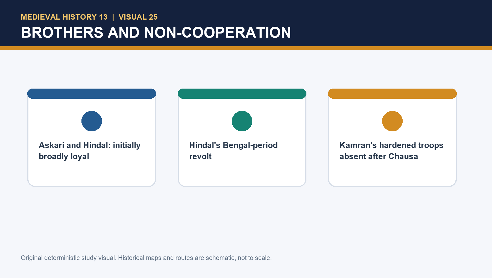

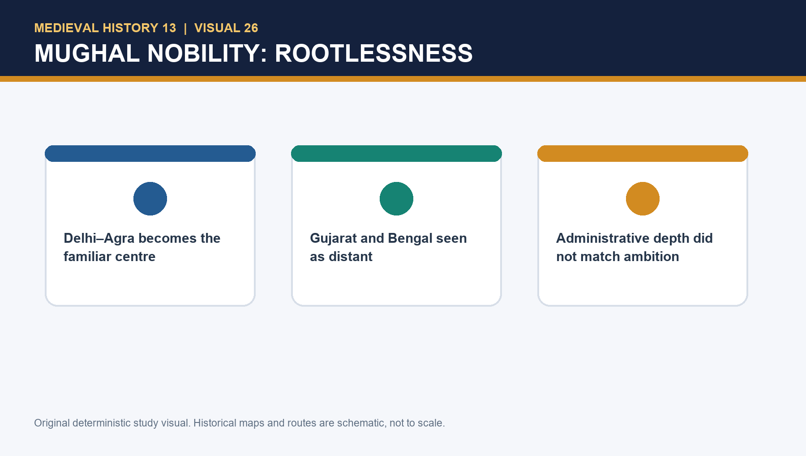

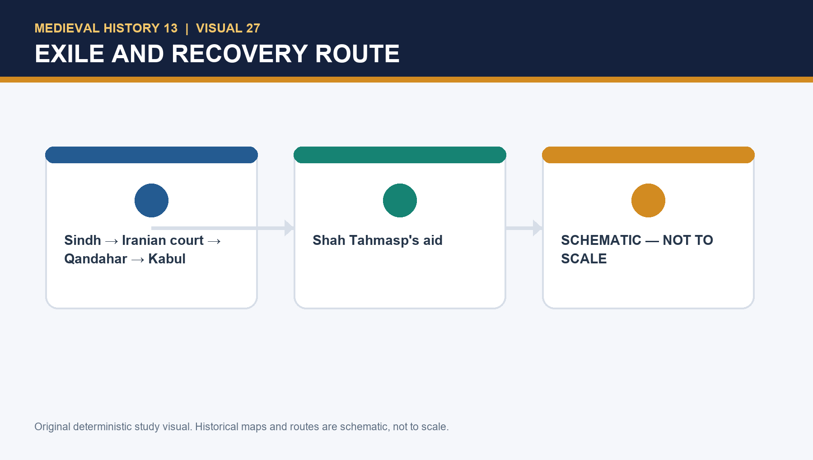

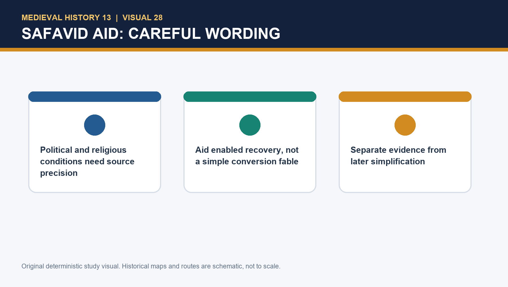

#### Visual-atlas synthesis

[ANALYSIS] These retained diagrams are not decorative pages. Read them as a sequence of tests: regional competition frames the Gujarat campaign; route and fortress constraints make logistics visible; battlefield diagrams separate the Chausa shock from the Kannauj decision; the brother and noble cards locate political co-operation in time; and the exile cards connect recovery to a changed regional and diplomatic field.

For revision, cover the captions and name the mechanism shown by each image. If the answer is only a person or a date, add the missing mechanism: revenue settlement, communications, command, regional roots, source provenance or succession politics. If the answer is only a mechanism, restore the named evidence—Chunar, Mandu, Gaur, Karmnasa, Kannauj, Shah Tahmasp or Delhi. This prevents visual recall from becoming a substitute for historical reasoning.

#### CLOSING RECALL FLOW — VISUAL ATLAS: RETAINED EVIDENCE DIAGRAMS

```text
START / CONCEPT: Visual atlas: retained evidence diagrams
        |
        v
EXACT TERMS: Visual atlas · retained evidence diagrams · These retained diagrams · These · If the answer · If
        |
        v
MECHANISM / ARGUMENT: If the answer is only a person or a date, add the missing mechanism: revenue settlement, communications, command, regional roots, source provenance or succession politics.
        |
        v
CONSEQUENCE / CONTRAST: If the answer is only a mechanism, restore the named evidence—Chunar, Mandu, Gaur, Karmnasa, Kannauj, Shah Tahmasp or Delhi.
        |
        v
UPSC TRAP / ANSWER-USE: Do not miss this limiting distinction: these retained diagrams are not decorative pages.
        |
        v
ANSWER-GRABBING FORMULATION: These retained diagrams are not decorative pages.
```
### SESSION 18 — BOUNDED LIVE LINKAGE

#### DEFINITION / WHAT THIS IS CALLED

**Plain-language definition:** The live page is a heritage and source-method bridge only.

**Technical definition:** Technically, Bounded live linkage is analysed by relating UNESCO's Humayun's Tomb to It, then testing the relationship through Akbar's and Persian.

#### ANSWER-GRABBING OPENING — WRITE/ADAPT IN THE EXAM

> The live page is a heritage and source-method bridge only.

#### MUST-WRITE KEYWORDS

- **Bounded live linkage**
- **UNESCO's Humayun's Tomb**
- **It**
- **Akbar's**
- **Persian**
- **Indian**

**How to use them:** Frame the answer through Bounded live linkage; define UNESCO's Humayun's Tomb, connect It with Akbar's to explain the mechanism, and use Persian for the decisive comparison or qualification.

UNESCO's Humayun's Tomb property page was rechecked on 30 August 2026. It supports a bounded dynastic-memory and source-method bridge: the tomb was built in the 1560s under Akbar's patronage, combines Persian and Indian craftsmanship, and remains the subject of archaeology-led conservation. It does not prove Humayun's campaign chronology, motives, battlefield decisions or the Karnavati tradition; those remain controlled by repository Markdown, OCR books and source criticism.

The live page is a heritage and source-method bridge only. Historical chronology, causation, attribution and institutional claims remain controlled by repository Markdown, OCR-searchable books and explicit source criticism.

#### CLOSING RECALL FLOW — BOUNDED LIVE LINKAGE

```text
START / CONCEPT: Bounded live linkage
        |
        v
EXACT TERMS: Bounded live linkage · UNESCO's Humayun's Tomb · It · Akbar's · Persian · Indian
        |
        v
MECHANISM / ARGUMENT: It does not prove Humayun's campaign chronology, motives, battlefield decisions or the Karnavati tradition; those remain controlled by repository Markdown, OCR books and source criticism.
        |
        v
CONSEQUENCE / CONTRAST: It supports a bounded dynastic-memory and source-method bridge: the tomb was built in the 1560s under Akbar's patronage, combines Persian and Indian craftsmanship, and remains the subject of archaeology-led conservation.
        |
        v
UPSC TRAP / ANSWER-USE: Do not miss this limiting distinction: uNESCO's Humayun's Tomb property page was rechecked on 30 August 2026.
        |
        v
ANSWER-GRABBING FORMULATION: The live page is a heritage and source-method bridge only.
```
### MEDIEVAL DEEP-REVIEW CORE CONTROL

- **Must remember:** Humayun's Gujarat, Afghan and Rajput theatres form one struggle for empire rather than isolated anecdotes.
- **Close distinction:** Chausa (1539) preceded Kannauj/Bilgram (1540); restoration followed in 1555.
- **Evidence / interpretation limit:** Defeat cannot be explained only by personality: resources, alliances, Afghan resilience and imperial overstretch matter.

## BASIC MCQS / REMEDIATION

### PART II. Learning MCQ loops: 18 questions

The correct-option sequence is printed for audit: **ABCDABCDABCDABCDAB**.

#### Q1. What best describes the empire Humayun received in December 1530?

- A. A conquest with weak finances, shallow administration, active Afghan resistance and mobile nobles.
- B. A polity where Timurid princes had abandoned all claims to separate shares.
- C. A kingdom whose eastern and western frontiers were already permanently secured.
- D. A settled revenue state with a uniformly loyal service elite.

**Answer: A.**
**Explanation:** Babur's conquest opened Delhi–Agra but did not create an entrenched Indian ruling apparatus; the inherited constraints were fiscal, administrative, political and regional. The closest distractor is **B**; A settled revenue state with a uniformly loyal service elite. does not survive the source-based distinction in the stem.

#### Q2. Why is Kamran's early position not best described as an immediate explanation of every later Mughal defeat?

- A. He never held territory outside Kabul.
- B. He held Kabul–Qandahar and then Lahore–Punjab, but the early eastern and Gujarat episodes also had independent strategic causes.
- C. He submitted all troops to Humayun after 1530.
- D. He commanded Sher Khan's forces at Chausa.

**Answer: B.**
**Explanation:** Kamran's de facto partition mattered, yet the evidence warns against making fraternal rivalry a universal explanation before the Bengal crisis and Chausa. The closest distractor is **A**; He never held territory outside Kabul. does not survive the source-based distinction in the stem.

#### Q3. What is the safest treatment of Dadrah/Daurah and Chunar chronology?

- A. Their day and month are fixed by every chronicle.
- B. Nizamuddin Ahmad describes both in exactly the same sequence as Abul Fazl.
- C. Nizamuddin's different dating/sequence means precise reconstruction is qualified, while the consolidation logic remains clear.
- D. The discrepancy proves that no Afghan threat existed.

**Answer: C.**
**Explanation:** The source issue affects tight chronology, not the broader reading that Humayun sought to secure eastern Uttar Pradesh without yet invading Bihar. The closest distractor is **B**; Nizamuddin Ahmad describes both in exactly the same sequence as Abul Fazl. does not survive the source-based distinction in the stem.

#### Q4. Chunar was strategically important chiefly because it:

- A. was the only route between Delhi and Bengal.
- B. was a ceremonial capital of Gujarat.
- C. automatically controlled every Bengal river crossing.
- D. sat at a key approach toward Bihar and Bengal, linking fort, land movement and river-side communications.

**Answer: D.**
**Explanation:** A powerful fort could threaten a campaign's communications, but it was one node within a wider logistical landscape, not a magical single-cause bottleneck. The closest distractor is **C**; automatically controlled every Bengal river crossing. does not survive the source-based distinction in the stem.

#### Q5. Din Panah is best read as:

- A. a Delhi-centred legitimacy and political project whose full institutional effect could not be immediate.
- B. a Safavid military camp in Kabul.
- C. a monument built after Humayun's death by Akbar.
- D. proof that Humayun had permanently abandoned Agra.

**Answer: A.**
**Explanation:** Delhi's accumulated imperial prestige made a new capital intelligible; the project should neither be romanticised nor dismissed as fantasy. The closest distractor is **B**; proof that Humayun had permanently abandoned Agra. does not survive the source-based distinction in the stem.

#### Q6. Which statement captures the Karnavati–rakhi story responsibly?

- A. It is fully confirmed by a contemporary Mughal dispatch.
- B. A later Rajasthani account records a bracelet tradition, but the cited contemporary evidence is silent; it is historiographical memory, not event proof.
- C. It proves Humayun captured Chittor in 1532.
- D. It establishes a permanent Mughal–Rajput alliance.

**Answer: B.**
**Explanation:** The issue is provenance: a later tradition can illuminate memory, but silence in contemporary sources prevents treating it as settled political fact. The closest distractor is **D**; It proves Humayun captured Chittor in 1532. does not survive the source-based distinction in the stem.

#### Q7. Humayun's 1535 Gujarat campaign shows that:

- A. Humayun was incapable of rapid campaigning.
- B. Gujarat lacked any military capacity.
- C. military drive brought Mandu, Champaner and Ahmedabad, but conquest was not converted into durable administration.
- D. Bahadur Shah had no connection with Malwa or Chittor.

**Answer: C.**
**Explanation:** The campaign demonstrates real operational ability; its failure lay in settlement, coordination and willingness to administer, rather than in a denial of the victories. The closest distractor is **A**; Gujarat lacked any military capacity. does not survive the source-based distinction in the stem.

#### Q8. Why did Gujarat slip from Mughal control after the campaign?

- A. Humayun never appointed anyone in Gujarat.
- B. A single local popular uprising expelled every Mughal force.
- C. Portuguese troops occupied all of Malwa.
- D. Disunited command, reluctant nobles, weak revenue settlement, regional reassertion and Bahadur Shah's recovery worked together.

**Answer: D.**
**Explanation:** Askari received charge and divisions were assigned, but the arrangements did not generate stable co-operation or locally rooted rule. The closest distractor is **B**; Humayun never appointed anyone in Gujarat. does not survive the source-based distinction in the stem.

#### Q9. Sher Khan's rise must be understood as:

- A. a Bihar-centred Afghan state-building challenge with regional resources, alliances and growing independence.
- B. a Portuguese governor at Diu.
- C. a minor court rebel with no territorial base.
- D. a Mughal officer permanently bound by the first Chunar agreement.

**Answer: A.**
**Explanation:** Surajgarh, Bihar and Gaur reveal an autonomous political trajectory; the earlier accommodation did not freeze Sher Khan in a subordinate role. The closest distractor is **D**; a Mughal officer permanently bound by the first Chunar agreement. does not survive the source-based distinction in the stem.

#### Q10. The Bengal campaign was not merely an attempt to rescue a displaced Bengal ruler because:

- A. Sher Khan offered Humayun all of Gujarat.
- B. the source presents Bengal itself—wealth, strategic extent and an imperial north-Indian vision—as the central prize.
- C. Humayun had no contact with Bengal politics.
- D. Gaur lay west of Agra.

**Answer: B.**
**Explanation:** Mahmud Shah's appeal was an additional reason in the narrative; it cannot displace the broader contest over Bengal and imperial reach. The closest distractor is **A**; Humayun had no contact with Bengal politics. does not survive the source-based distinction in the stem.

#### Q11. The six-month 1537–38 siege of Chunar mattered because it:

- A. made river movement irrelevant thereafter.
- B. immediately destroyed Sher Khan's Bihar base.
- C. consumed time while Sher Khan captured Gaur and reconfigured the eastern contest.
- D. proved Bengal had been annexed before the siege.

**Answer: C.**
**Explanation:** The fort had operational importance, but its fall did not dissolve Sher Khan's wider coalition or prevent his Bengal advance. The closest distractor is **A**; immediately destroyed Sher Khan's Bihar base. does not survive the source-based distinction in the stem.

#### Q12. What made Humayun's occupation of Gaur strategically hazardous?

- A. Mewar's army surrounded Gaur.
- B. Humayun had no army in Bengal.
- C. the city had no river links.
- D. Sher Khan could press the lines back toward Agra while nobles lacked commitment to govern a distant region.

**Answer: D.**
**Explanation:** The problem was not a vacant army but communications, horses, distance, administrative reluctance and a rival who exploited the western corridor. The closest distractor is **C**; Humayun had no army in Bengal. does not survive the source-based distinction in the stem.

#### Q13. At Chausa on 26 June 1539, the clearest source-grounded operational criticism is that Humayun:

- A. kept the Karmnasa at his back, deployed poorly and was surprised by Sher Khan.
- B. was defeated at Delhi by Bahadur Shah.
- C. lost because all Rajputs switched sides.
- D. had no knowledge that Sher Khan existed.

**Answer: A.**
**Explanation:** The battle is explained through position, surprise and command within a fatigued campaign, not by pretending the Afghan challenge had been invisible for years. The closest distractor is **B**; had no knowledge that Sher Khan existed. does not survive the source-based distinction in the stem.

#### Q14. Kannauj/Bilgram, 17 May 1540, differs from Chausa because it:

- A. occurred before Humayun's accession.
- B. was the decisive battle after Chausa that removed Humayun from north India, fought with a hastily assembled force without Kamran's hardened troops.
- C. was an unimportant skirmish won by the Mughals.
- D. was a Gujarat siege.

**Answer: B.**
**Explanation:** Chausa exposed vulnerability; Kannauj converted it into political displacement. Kamran's non-cooperation mattered acutely after Chausa. The closest distractor is **D**; was an unimportant skirmish won by the Mughals. does not survive the source-based distinction in the stem.

#### Q15. Which assessment of Askari and Hindal is historically balanced?

- A. They were Afghan chiefs under Sher Khan.
- B. They controlled the Safavid court.
- C. They broadly served Humayun until the Bengal phase, after which Hindal's independent bid and elite defections sharpened the crisis.
- D. They opposed Humayun from the first month of his reign.

**Answer: C.**
**Explanation:** The source expressly cautions that their opposition has been overextended backward; chronology matters to causal explanation. The closest distractor is **A**; They opposed Humayun from the first month of his reign. does not survive the source-based distinction in the stem.

#### Q16. Humayun's recourse to Shah Tahmasp should be described as:

- A. a wholly cost-free rescue that ended all frontier problems.
- B. a forced religious conversion established by an uncontested source.
- C. proof that Qandahar never mattered to the Mughals.
- D. a political alliance and aid relationship requiring careful treatment of its conditions, enabling recovery of Qandahar and Kabul in 1545.

**Answer: D.**
**Explanation:** The secure point is assistance and recovery; over-simple conversion tales exceed the precision allowed by the assigned evidence. The closest distractor is **C**; a forced religious conversion established by an uncontested source. does not survive the source-based distinction in the stem.

#### Q17. The 1555 restoration is best explained by:

- A. Humayun's return through a field opened by Sur fragmentation, followed by recovery of Delhi—not by retroactively erasing 1540.
- B. an Ottoman conquest of north India.
- C. Sher Shah's personal surrender in 1555.
- D. a direct continuation of Gujarat administration from 1535.

**Answer: A.**
**Explanation:** Restoration demonstrates resilience and opportunity, but it does not turn the earlier loss of state capacity into a fiction. The closest distractor is **C**; a direct continuation of Gujarat administration from 1535. does not survive the source-based distinction in the stem.

#### Q18. A defensible final judgement on Humayun is that:

- A. Afghan success was caused by a timeless tribal trait.
- B. his imperial aims outran fiscal, administrative and logistical depth, while Sher Khan's leadership and Afghan regional capacity made the gap decisive.
- C. personal weakness alone explains everything.
- D. he never showed military energy in any theatre.

**Answer: B.**
**Explanation:** The evidence supports neither caricature nor exoneration: decision sequencing and character matter within an inherited structural and competitive political field. The closest distractor is **A**; personal weakness alone explains everything. does not survive the source-based distinction in the stem.

### PART IV. Premium broad-coverage MCQs: 40 original questions

The correct-option sequence is printed for audit: **ABCDABCDABCDABCDABCDABCDABCDABCDABCDABCD**.

#### Q1. The most accurate meaning of 'unfinished conquest' in this topic is:

- A. A completed Bengal revenue survey.
- B. A permanent settlement with every Afghan chief.
- C. A political gain without fully rooted fiscal-administrative control.
- D. A dynasty with no territorial centre at all.

**Answer: C.**
**Explanation:** It denotes fragility after conquest, not the absence of a Delhi–Agra core. The closest distractor is **D**; A permanent settlement with every Afghan chief. does not survive the source-based distinction in the stem.

#### Q2. Babur's late fiscal difficulty matters to Humayun because it:

- A. gave Gujarat to Bahadur Shah.
- B. made Chunar inaccessible by river.
- C. ended the need to pay begs.
- D. left an already stretched treasury beside a large military-political task.

**Answer: D.**
**Explanation:** The fiscal inheritance conditioned capacity; it did not make every campaign impossible. The closest distractor is **D**; ended the need to pay begs. does not survive the source-based distinction in the stem.

#### Q3. A Timurid partition norm most directly complicated sovereignty by:

- A. making princely shares politically plausible even when the sovereign expected loyalty.
- B. placing Sher Khan in charge of Kabul.
- C. requiring every province to be formally independent.
- D. abolishing all royal claims.

**Answer: A.**
**Explanation:** Share expectations did not eliminate kingship; they put pressure on its exclusive territorial form. The closest distractor is **A**; abolishing all royal claims. does not survive the source-based distinction in the stem.

#### Q4. Kamran's retention of khutba and sikka in Humayun's name initially indicates:

- A. a completed union of all Mughal territory.
- B. formal acknowledgement alongside a de facto regional power position.
- C. a Safavid conquest of Punjab.
- D. a Rajput treaty at Chittor.

**Answer: B.**
**Explanation:** Outer forms of sovereignty coexisted with Kamran's practical territorial autonomy. The closest distractor is **B**; a completed union of all Mughal territory. does not survive the source-based distinction in the stem.

#### Q5. The main value of the Dadrah/Daurah discrepancy for an answer is to:

- A. replace all evidence with a popular legend.
- B. make Nizamuddin Ahmad a contemporary eyewitness to every event.
- C. teach source method and date caution without abandoning the strategic narrative.
- D. deny that Humayun fought Afghans.

**Answer: C.**
**Explanation:** It disciplines claims about sequence; it does not nullify the conflict. The closest distractor is **C**; make Nizamuddin Ahmad a contemporary eyewitness to every event. does not survive the source-based distinction in the stem.

#### Q6. Kalinjar belongs to the early phase because it:

- A. marked restoration in 1555.
- B. was captured by Sher Khan after Gaur.
- C. was a port on the Gujarat coast.
- D. formed part of a southern defensive-fort setting around Agra and preceded the Chunar episode.

**Answer: D.**
**Explanation:** The fort setting explains a consolidation move before the main east-west struggle. The closest distractor is **D**; marked restoration in 1555. does not survive the source-based distinction in the stem.

#### Q7. At the first Chunar accommodation, Humayun's calculation was that:

- A. Sher Khan was not yet a sufficient danger to require a Bihar campaign, and an accommodation held tactical value.
- B. Chunar no longer mattered at all.
- C. Bahadur Shah would govern Bihar for him.
- D. the Mughal empire had already conquered Bengal.

**Answer: A.**
**Explanation:** The compromise was a contemporary calculation, not proof of ignorance about all eastern politics. The closest distractor is **A**; Bahadur Shah would govern Bihar for him. does not survive the source-based distinction in the stem.

#### Q8. Din Panah's location and timing most strongly support the view that it:

- A. was a Portuguese coastal enclave.
- B. used Delhi's prestige to frame a dynastic political project.
- C. was a private library unrelated to politics.
- D. replaced every previous Mughal centre overnight.

**Answer: B.**
**Explanation:** Building at Delhi carried legitimacy, even though a capital project alone could not solve state depth. The closest distractor is **B**; replaced every previous Mughal centre overnight. does not survive the source-based distinction in the stem.

#### Q9. Bahadur Shah's power rested on:

- A. the dismantling of all Gujarati ports.
- B. only a small Afghan jagir near Jaunpur.
- C. Gujarat, Malwa acquisition, pressure toward Rajasthan and artillery resources in a western regional state.
- D. direct control of Kabul under Humayun.

**Answer: C.**
**Explanation:** This was a substantial regional challenge, not a peripheral rebellion. The closest distractor is **B**; only a small Afghan jagir near Jaunpur. does not survive the source-based distinction in the stem.

#### Q10. A sound explanation for Humayun's stance near Chittor avoids:

- A. placing Malwa–Mewar–Gujarat in a strategic field.
- B. recognising Rajput resistance.
- C. linking eastern Rajasthan to the Agra–Delhi position.
- D. reducing the episode solely to a romanticised rakhi anecdote.

**Answer: D.**
**Explanation:** The later legend cannot substitute for the documented regional power calculus. The closest distractor is **A**; placing Malwa–Mewar–Gujarat in a strategic field. does not survive the source-based distinction in the stem.

#### Q11. At Mandsor, Humayun's response to Bahadur Shah's defended camp was to:

- A. avoid a frontal assault and squeeze supplies, exposing the limits of the camp's defensive plan.
- B. leave Malwa for Bengal immediately.
- C. attack blindly because artillery did not exist.
- D. appoint Sher Khan governor of Gujarat.

**Answer: A.**
**Explanation:** This is evidence of operational judgement rather than a blanket incompetence thesis. The closest distractor is **A**; attack blindly because artillery did not exist. does not survive the source-based distinction in the stem.

#### Q12. The capture of Champaner demonstrates:

- A. the immediate creation of a stable Gujarat bureaucracy.
- B. a significant military success whose treasure could not substitute for political settlement.
- C. the automatic loyalty of every Gujarati noble.
- D. the end of Portuguese interest at Diu.

**Answer: B.**
**Explanation:** Fort capture and treasure acquisition did not build an administrative coalition. The closest distractor is **C**; the automatic loyalty of every Gujarati noble. does not survive the source-based distinction in the stem.

#### Q13. Askari's Gujarat assignment is important because it:

- A. makes Bengal a Mughal province.
- B. proves Askari never held any command.
- C. shows a formal attempt at direct administration that did not generate co-ordinated authority.
- D. defeated Sher Khan at Chausa.

**Answer: C.**
**Explanation:** The issue is failed implementation and elite cohesion, not a complete absence of planning. The closest distractor is **B**; proves Askari never held any command. does not survive the source-based distinction in the stem.

#### Q14. The phrase 'rootlessness of Mughal nobles' means:

- A. they were all born in Central Asia.
- B. they had no families anywhere.
- C. they had no military resources.
- D. their stronger attachment to the Delhi–Agra zone made distant Gujarat and Bengal administration unattractive.

**Answer: D.**
**Explanation:** It is a political-administrative observation, not a literal statement about birthplace. The closest distractor is **C**; they were all born in Central Asia. does not survive the source-based distinction in the stem.

#### Q15. Surajgarh belongs in Sher Khan's rise because it:

- A. helped Sher Khan break Bengal's pressure on Bihar and marked a higher political standing.
- B. occurred after Humayun's death.
- C. was a battle won by Humayun in Malwa.
- D. was a Portuguese naval action.

**Answer: A.**
**Explanation:** The 1534 victory contributes to the move from local sardar to regional contender. The closest distractor is **A**; was a battle won by Humayun in Malwa. does not survive the source-based distinction in the stem.

#### Q16. The best reading of Gaur in 1538 is:

- A. an Afghan camp with no Bengal context.
- B. Bengal's capital, whose seizure gave Sher Khan resources and changed the scale of the contest.
- C. a fort built by Humayun after 1555.
- D. a city without strategic or symbolic value.

**Answer: B.**
**Explanation:** Gaur made the struggle a contest for a large eastern polity, not only a fort dispute. The closest distractor is **A**; a city without strategic or symbolic value. does not survive the source-based distinction in the stem.

#### Q17. Why did Humayun not simply bypass Chunar in 1537?

- A. Kamran demanded it as his residence.
- B. it stood in Rajasthan between Chittor and Mandu.
- C. A hostile fort could threaten communications during a Bengal advance.
- D. Bengal had already become loyal.

**Answer: C.**
**Explanation:** The route-function is the point; a key fort posed a communications risk. The closest distractor is **B**; it stood in Rajasthan between Chittor and Mandu. does not survive the source-based distinction in the stem.

#### Q18. Sher Khan's offer regarding Bihar and Bengal demonstrates:

- A. that Humayun had already lost Kabul.
- B. his continued acceptance of a Mughal jagir only.
- C. the end of Afghan state-building.
- D. a negotiation between actors each imagining a wider political order, with Bengal as a central issue.

**Answer: D.**
**Explanation:** The terms illustrate independent political ambition, even though reports of negotiations require source caution. The closest distractor is **A**; his continued acceptance of a Mughal jagir only. does not survive the source-based distinction in the stem.

#### Q19. Humayun's stay at Gaur could not solve the Bengal problem because:

- A. officers' lack of commitment, horse losses, distance and broken communications undermined administration.
- B. Bengal lacked any local population.
- C. Chittor remained unconquered.
- D. no one could travel by river.

**Answer: A.**
**Explanation:** The occupation encountered a capacity problem rather than merely a missing ceremony of annexation. The closest distractor is **A**; Bengal lacked any local population. does not survive the source-based distinction in the stem.

#### Q20. Hindal's move at Agra during the Bengal phase shows:

- A. that Kamran was never politically active.
- B. how elite defections and a princely bid compounded a campaign already stretched eastward.
- C. the earliest cause of the 1530 inheritance.
- D. a Portuguese intervention in the north.

**Answer: B.**
**Explanation:** Its timing matters: it intensified a later crisis, rather than explaining all prior episodes. The closest distractor is **B**; that Kamran was never politically active. does not survive the source-based distinction in the stem.

#### Q21. Chausa should be analysed as:

- A. a proof that no Mughal force reached Bihar.
- B. a decisive 1540 restoration victory.
- C. a battle where position, surprise, command and campaign exhaustion converged.
- D. a naval battle at Diu.

**Answer: C.**
**Explanation:** The Karmnasa-back position and surprise explain the disaster better than a single moral trait. The closest distractor is **D**; a proof that no Mughal force reached Bihar. does not survive the source-based distinction in the stem.

#### Q22. The distinct significance of Kannauj/Bilgram is that it:

- A. settled Gujarat's administration.
- B. was fought before Chausa.
- C. brought Shah Tahmasp to Delhi.
- D. converted the prior shock into a decisive Afghan victory that displaced Humayun from north India.

**Answer: D.**
**Explanation:** It must be separated from Chausa by date, force condition and political result. The closest distractor is **D**; brought Shah Tahmasp to Delhi. does not survive the source-based distinction in the stem.

#### Q23. Kamran's hardened troops matter especially because:

- A. their non-availability after Chausa deprived Humayun of a significant reinforcement in the decisive phase.
- B. they were stationed at Gaur under Hindal.
- C. they supplied Humayun at Chausa without conditions.
- D. they fought for Bahadur Shah at Mandu.

**Answer: A.**
**Explanation:** The source assigns their importance to the post-Chausa turning point, not to every earlier campaign. The closest distractor is **A**; they supplied Humayun at Chausa without conditions. does not survive the source-based distinction in the stem.

#### Q24. A fair reading of the brothers is:

- A. their conduct has no relation to state structure.
- B. their roles changed across time; rivalry interacted with campaign stress, legitimacy and noble calculation.
- C. they determined Bahadur Shah's Portuguese policy.
- D. all were either heroes or traitors throughout.

**Answer: B.**
**Explanation:** Chronology resists a static family-villain narrative. The closest distractor is **A**; all were either heroes or traitors throughout. does not survive the source-based distinction in the stem.

#### Q25. The exile in Sindh underscores that:

- A. Humayun controlled every regional ruler.
- B. Sher Shah granted Humayun Bengal.
- C. regional rulers such as Sindh's authorities and Maldeo did not automatically risk themselves for a fallen Mughal.
- D. Iran was irrelevant to recovery.

**Answer: C.**
**Explanation:** Loss of the north Indian core exposed the limits of dynastic prestige without usable resources. The closest distractor is **B**; Humayun controlled every regional ruler. does not survive the source-based distinction in the stem.

#### Q26. Safavid help under Shah Tahmasp should be presented as:

- A. a literary legend with no recovery outcome.
- B. an entirely religious crusade with no frontier politics.
- C. a direct annexation of Delhi by Iran.
- D. a consequential political alliance whose terms and sectarian dimensions require precise sourcing.

**Answer: D.**
**Explanation:** The safe historical result is aid in the recovery of Qandahar and Kabul; reductionism is unsafe. The closest distractor is **C**; a direct annexation of Delhi by Iran. does not survive the source-based distinction in the stem.

#### Q27. The 1545 recovery of Qandahar and Kabul provided:

- A. a north-western base from which a later return became possible.
- B. the elimination of Sur factions in Delhi.
- C. a restoration of Gujarat through Askari.
- D. instant control of all north India.

**Answer: A.**
**Explanation:** It rebuilt a territorial platform, but the Delhi–Agra recovery came only later. The closest distractor is **B**; instant control of all north India. does not survive the source-based distinction in the stem.

#### Q28. Sur fragmentation matters in 1555 because it:

- A. was caused by the 1535 Champaner siege.
- B. created openings that Humayun could exploit in regaining Delhi.
- C. proves Sher Shah never had a state.
- D. made Afghanistan irrelevant.

**Answer: B.**
**Explanation:** A strong ruler's earlier success and a successor regime's fragmentation are not contradictory. The closest distractor is **A**; proves Sher Shah never had a state. does not survive the source-based distinction in the stem.

#### Q29. Humayun's death in 1556 is historically significant because:

- A. it took place before Chausa.
- B. it ended the Mughal line.
- C. the restored dynasty passed into Akbar's accession crisis rather than becoming a settled personal rule.
- D. it transferred Delhi to Bahadur Shah.

**Answer: C.**
**Explanation:** The succession point connects restoration to the next phase without claiming smooth stability. The closest distractor is **C**; it ended the Mughal line. does not survive the source-based distinction in the stem.

#### Q30. Which formulation rejects the opium caricature without exonerating Humayun?

- A. He made no serious error.
- B. His private habits mechanically decided every battle.
- C. Sher Khan had no role in the outcome.
- D. Campaign energy in Gujarat coexisted with poor sequencing, administrative limits and serious misjudgement of Sher Khan.

**Answer: D.**
**Explanation:** Historical judgement should compare demonstrated capacity with demonstrable decisions and opposition. The closest distractor is **D**; Sher Khan had no role in the outcome. does not survive the source-based distinction in the stem.

#### Q31. A source-critical hierarchy would treat:

- A. Nizamuddin's compressed chronology, later Mughal narratives and regional traditions as sources with different reach and limits.
- B. a later popular legend as superior to all contemporary evidence.
- C. a monument as direct proof of every sixteenth-century political event.
- D. all Mughal chronicles as identical.

**Answer: A.**
**Explanation:** Different genres answer different questions; source criticism prevents chronology and memory from being flattened. The closest distractor is **B**; all Mughal chronicles as identical. does not survive the source-based distinction in the stem.

#### Q32. UNESCO's Humayun's Tomb description is useful in this package only as:

- A. proof that Karnavati sent a rakhi.
- B. a bounded modern heritage anchor for dynastic memory, garden-tomb form and conservation.
- C. evidence for the troop position at Chausa.
- D. a replacement for early Mughal chronicles.

**Answer: B.**
**Explanation:** A later monument can illuminate memorialisation and architecture, not establish contested campaign events. The closest distractor is **A**; proof that Karnavati sent a rakhi. does not survive the source-based distinction in the stem.

#### Q33. The Rajput dimension of this struggle is best framed as:

- A. evidence that every conflict was religiously binary.
- B. a unified army permanently allied to either side.
- C. variable relations among Mewar, Gujarat and Mughal power, not a permanent homogeneous Rajput bloc.
- D. irrelevant to Malwa and Chittor.

**Answer: C.**
**Explanation:** Mewar and Chittor belong to a shifting regional field rather than title-tokenism. The closest distractor is **D**; evidence that every conflict was religiously binary. does not survive the source-based distinction in the stem.

#### Q34. The Portuguese/Diu context belongs here because:

- A. it proves a Portuguese victory at Kannauj.
- B. Portugal controlled Gaur.
- C. Humayun built Diu.
- D. Bahadur Shah's coastal pressures and Diu context intersected with Gujarat politics; the detail remains bounded to Topic 08's larger frame.

**Answer: D.**
**Explanation:** It provides west-coast context without becoming the topic's main explanation. The closest distractor is **A**; it proves a Portuguese victory at Kannauj. does not survive the source-based distinction in the stem.

#### Q35. Which causal ordering is strongest for Gujarat?

- A. Military success → weak settlement and elite coordination → regional reassertion and Mughal withdrawal.
- B. Chausa → capture of Mandu.
- C. Treasure → automatic allegiance → permanent administration.
- D. Bahadur Shah's death → no need for a campaign.

**Answer: A.**
**Explanation:** The chain keeps operational success and political failure in the correct order. The closest distractor is **A**; Treasure → automatic allegiance → permanent administration. does not survive the source-based distinction in the stem.

#### Q36. Which causal ordering is strongest for Bengal?

- A. Kabul recovery → Surajgarh.
- B. Long siege and eastward advance → Gaur occupation amid administrative weakness → communications pressure → Chausa.
- C. Karnavati legend → Chunar falls.
- D. Gaur occupation → completed Mughal administration → Sher Khan disappears.

**Answer: B.**
**Explanation:** This sequence connects choices, logistics and rival action without reducing the outcome to weather or personality. The closest distractor is **B**; Karnavati legend → Chunar falls. does not survive the source-based distinction in the stem.

#### Q37. The Afghan alternative should not be stereotyped because:

- A. they were incapable of administration.
- B. every Afghan chief supported Sher Khan from the beginning.
- C. its effectiveness rested on identifiable regional roots, military networks, leadership and political organisation.
- D. Afghans possessed a fixed timeless military essence.

**Answer: C.**
**Explanation:** The explanatory variables are coalition, resources, terrain and leadership, not essentialised identity. The closest distractor is **B**; Afghans possessed a fixed timeless military essence. does not survive the source-based distinction in the stem.

#### Q38. A strong 20-marker on Humayun should:

- A. list every date without an argument.
- B. treat restoration as proof that there was no failure.
- C. omit Sher Khan to focus on personality.
- D. link inheritance, campaign sequencing, rival capacity, brothers/nobles, logistics and a qualified verdict.

**Answer: D.**
**Explanation:** A multidimensional argument explains both collapse and recovery. The closest distractor is **D**; omit Sher Khan to focus on personality. does not survive the source-based distinction in the stem.

#### Q39. The forward link to Topic 14 should be:

- A. Sher Shah's rise creates the next topic; detailed Sur reforms remain there.
- B. a claim that all Akbar's institutions were copied unchanged.
- C. detailed Sur revenue administration as if it occurred before Chausa.
- D. a denial that the Sur interregnum mattered.

**Answer: A.**
**Explanation:** The boundary keeps this topic's political-military struggle distinct from the subsequent administrative study. The closest distractor is **B**; a claim that all Akbar's institutions were copied unchanged. does not survive the source-based distinction in the stem.

#### Q40. The forward link to Akbar should be:

- A. the 1555 recovery ended all succession risks.
- B. Humayun's restoration supplied a dynastic opening, while Akbar's later consolidation addressed a still-fragile inheritance.
- C. Akbar immediately ruled from Gaur.
- D. Akbar's later era had no relationship to Humayun's experience.

**Answer: B.**
**Explanation:** This relates phases without projecting Akbar's institutions backward. The closest distractor is **A**; Akbar's later era had no relationship to Humayun's experience. does not survive the source-based distinction in the stem.

### PART V. Remedial MCQs: 12 targeted misconception checks

The correct-option sequence is printed for audit: **ABCDABCDABCD**.

#### Q1. Which date-event pair is secure?

- A. Kannauj — December 1530
- B. Chausa — 17 May 1540
- C. Chausa — 26 June 1539
- D. Delhi recovery — 1540

**Answer: C.**
**Explanation:** Chausa is dated 26 June 1539; 17 May 1540 belongs to Kannauj/Bilgram. The closest distractor is **B**; Chausa — 17 May 1540 does not survive the source-based distinction in the stem.

#### Q2. Which battle finally displaced Humayun from north India?

- A. Dadrah/Daurah
- B. Mandsor
- C. Surajgarh
- D. Kannauj/Bilgram

**Answer: D.**
**Explanation:** Kannauj/Bilgram was the decisive 1540 defeat; Dadrah/Daurah was an earlier success against eastern Afghans. The closest distractor is **A**; Dadrah/Daurah does not survive the source-based distinction in the stem.

#### Q3. Which statement about the Karnavati tradition is safe?

- A. It is a later tradition requiring provenance caution.
- B. It establishes a permanent Rajput bloc.
- C. It proves Humayun occupied Chittor.
- D. It is a fully corroborated contemporary dispatch.

**Answer: A.**
**Explanation:** The source warning is about later provenance and contemporary silence, not about a settled event. The closest distractor is **A**; It is a fully corroborated contemporary dispatch. does not survive the source-based distinction in the stem.

#### Q4. What does the Chunar siege best show?

- A. Humayun had no artillery.
- B. A strategic communications problem could consume time while the eastern contest changed.
- C. Sher Khan was already defeated permanently.
- D. One fort alone caused the Mughal collapse.

**Answer: B.**
**Explanation:** Chunar mattered operationally but cannot bear an exclusive causal claim. The closest distractor is **A**; One fort alone caused the Mughal collapse. does not survive the source-based distinction in the stem.

#### Q5. Which brother's hardened troops particularly mattered after Chausa?

- A. Askari's
- B. Sulaiman Mirza's
- C. Kamran's
- D. Hindal's

**Answer: C.**
**Explanation:** The source links Kamran's 10,000 hardened troops and refusal of unified command to the post-Chausa crisis. The closest distractor is **B**; Askari's does not survive the source-based distinction in the stem.

#### Q6. Din Panah was:

- A. a Gujarat fort taken in 1535.
- B. a Bengal port under Sher Khan.
- C. a Safavid city captured in 1545.
- D. a Delhi capital project tied to legitimacy and prestige.

**Answer: D.**
**Explanation:** Din Panah was built at Delhi; it should be interpreted politically rather than as a campaign fort. The closest distractor is **A**; a Gujarat fort taken in 1535. does not survive the source-based distinction in the stem.

#### Q7. Sher Khan's offer over Bengal demonstrates:

- A. Bengal, not merely a personal feud, was central to the contest.
- B. Gujarat had already been restored.
- C. Humayun had accepted his sovereignty permanently.
- D. he had ceased all political ambition.

**Answer: A.**
**Explanation:** The offer makes Bengal a disputed imperial prize; no final settlement followed. The closest distractor is **B**; Humayun had accepted his sovereignty permanently. does not survive the source-based distinction in the stem.

#### Q8. The heritage anchor for Humayun's Tomb is used to discuss:

- A. a source for Chausa deployment.
- B. dynastic memory and conservation, not sixteenth-century political-event proof.
- C. direct evidence of Dadrah's date.
- D. proof of a rakhi exchange.

**Answer: B.**
**Explanation:** UNESCO describes the later monument and its architecture; it cannot decide contested campaign narratives. The closest distractor is **A**; a source for Chausa deployment. does not survive the source-based distinction in the stem.

#### Q9. Which interpretation of Gujarat is fair?

- A. Bahadur Shah had no regional power.
- B. It was an unbroken Mughal provincial success.
- C. It was a major military achievement but failed as durable direct administration.
- D. Humayun never reached Mandu.

**Answer: C.**
**Explanation:** The campaign's temporal military success and administrative reversal must be held together. The closest distractor is **B**; It was an unbroken Mughal provincial success. does not survive the source-based distinction in the stem.

#### Q10. Why did Gaur not become a secure Mughal gain?

- A. The city did not exist.
- B. Kamran surrendered all Punjab troops.
- C. Chittor was unconquered.
- D. Distant administration, weak noble commitment and cut communications undermined occupation.

**Answer: D.**
**Explanation:** The eastern occupation's weakness came from capacity and communication, not from the unrelated Chittor front. The closest distractor is **D**; Chittor was unconquered. does not survive the source-based distinction in the stem.

#### Q11. Which statement avoids an Afghan stereotype?

- A. Sher Khan mobilised regional networks, resources, leadership and home-terrain advantages.
- B. Afghan success needed no strategy.
- C. All Afghans acted identically.
- D. Afghan capacity had no territorial basis.

**Answer: A.**
**Explanation:** The account explains political-military organisation rather than attributing success to an essential trait. The closest distractor is **A**; All Afghans acted identically. does not survive the source-based distinction in the stem.

#### Q12. What did the restoration of 1555 not mean?

- A. The Mughal dynasty gained a platform for Akbar's accession.
- B. The earlier failure was automatically erased.
- C. The 1540 collapse can be ignored.
- D. Humayun regained Delhi amid Sur fragmentation.

**Answer: B.**
**Explanation:** Return is not retrospective cancellation; a good verdict keeps collapse, recovery and continuing fragility together. The closest distractor is **C**; The 1540 collapse can be ignored. does not survive the source-based distinction in the stem.

## PYQS AND ANSWER PRACTICE

### PART III. PYQ route audit, direct gap and adjacent-route discipline

#### Direct-PYQ result

[FACT] The repository's 2018–2023 Prelims routing ledger, 2024–2025 integration audit and 2026 audit were checked for this Topic 13 ownership. They contain **no direct verified CSE 2018–2025 question owned by Medieval History Topic 13 on Humayun, Sher Khan, Chausa, Kannauj/Bilgram, Din Panah, or Humayun's restoration**. This is a genuine direct-PYQ gap; no question or answer key is invented to fill it.

[FACT] A trustworthy **adjacent** route exists in the 2023 Prelims GS-I routing ledger: the neutral, verified ledger label is **“Medieval Gujarat rulers Portuguese and Diu surrender”**, owned by Topic 08, not Topic 13. The ledger explicitly says that the answer key is unavailable locally. This package does not reproduce a reconstructed exact paper wording, does not assign a letter, and does not call it a Humayun PYQ.

| Category | Status | Safe use in this package |
|---|---|---|
| Direct CSE 2018–2025 Topic 13 PYQ | None located in audited routing records | State the gap; use original practice |
| Exact adjacent official wording on Humayun/Chausa/Kannauj/Sher Khan | None located with trustworthy local wording/provenance | Do not manufacture a quotation |
| Topic 08 Gujarat–Portuguese/Diu route | Adjacent 2023 ledger route; key unavailable locally | Link as context for Bahadur Shah, with ownership retained by Topic 08 |
| Inferred answer | Not needed here | If ever used, label **INFERRED ANSWER — NOT OFFICIALLY VERIFIED** with evidence and elimination |

#### Transparent adjacent study routes

- **Topic 12:** Babur's foundational but fragile conquest and the preceding Afghan/Lodi setting.
- **Topic 08:** Gujarat, Malwa, Mewar and the bounded Portuguese/Diu context.
- **Topic 14:** Sher Shah and Sur institutions after the political-military rise explained here.
- **Topic 15:** Akbar's difficult accession and later consolidation after Humayun's 1555–56 transition.

[ANALYSIS] A PYQ gap does not make the topic minor. Its demand families—state capacity, campaign logistics, historical source criticism, regional power, battle comparison and qualified causation—are reusable in GS-I answers and Prelims statement elimination.

### PART VI. Original Mains practice and examiner-grade model solutions

Every model follows claim → named evidence/example → analysis → qualification → conclusion. These are original UPSC-style prompts, not official questions.

**Demand decoding:** The directive **answer** requires a direct position on “Direct-PYQ result”, coverage of every clause, evidence-led analysis and a qualified verdict.

**Detailed examiner-grade model status:** The solved analysis above is the executable content base. Preserve its named evidence, causal logic, counterpoint and qualification rather than replacing it with a generic narrative.

**Executable exam-length answer / compression plan:** For a 15-mark answer, open with a two-sentence thesis; organise five named evidence units as claim → evidence → inference → qualification; reserve the final lines for a graded conclusion.

**Why this earns marks:** The answer follows the directive, links precise evidence to analysis, acknowledges source or regional limits and closes with a reasoned verdict.

**How to improve this answer:** For “Direct-PYQ result”, replace the weakest generalisation with one additional named site, text, inscription, coin, ruler or scholarly position and state exactly what that evidence cannot prove.

#### Mains 1. Examine the proposition that Humayun inherited an unfinished conquest.

**10 marks | 150 words | Original UPSC-style practice**

**Model solution**

**Claim.** Humayun inherited a conquest rather than a settled empire. Babur's victories had created a Delhi–Agra core, but the state that passed in December 1530 remained financially and administratively thin.

**Named evidence and analysis.** First, the local Satish Chandra account notes stretched finances after Babur had exhausted the Lodi treasure and sought a share from assigned revenues. That evidence matters because war, rewards and office-holding required a dependable fiscal base; a victory treasury was not a routine revenue system. Second, the administration relied heavily on begs holding large assignments. Such delegation could mobilise men, yet it also made local authority and collection dependent on followers whose interests were not automatically identical with the centre. Third, eastern Afghans remained politically active from east Uttar Pradesh to Bihar, while Sher Khan had access to Chunar. This shows that Panipat and Ghaghra had not dissolved Afghan political capacity.

**Qualification.** The inheritance was not empty. Humayun had Delhi–Agra prestige, military resources and scope for action, as Dadrah and Gujarat later show. Nor should Kamran's position be presented as an instant terminal fracture: it relieved Humayun of some north-western burdens before becoming acute in the later crisis.

**Conclusion.** The phrase 'unfinished conquest' therefore means a mismatch between territorial claim and institutional depth. It explains vulnerability without denying agency: Humayun still had to choose priorities, and Sher Khan still had to build an alternative coalition.

**Why this earns marks:** It defines the proposition, deploys fiscal, administrative and Afghan evidence, and ends with a qualified causal verdict rather than a personality label.

**Demand decoding:** The directive **examine** requires a direct position on “Mains 1. Examine the proposition that Humayun inherited an unfinished conquest.”, coverage of every clause, evidence-led analysis and a qualified verdict.

**Detailed examiner-grade model status:** The solved analysis above is the executable content base. Preserve its named evidence, causal logic, counterpoint and qualification rather than replacing it with a generic narrative.

**Executable exam-length answer / compression plan:** For a 15-mark answer, open with a two-sentence thesis; organise five named evidence units as claim → evidence → inference → qualification; reserve the final lines for a graded conclusion.

**How to improve this answer:** For “Mains 1. Examine the proposition that Humayun inherited an unfinished conquest.”, replace the weakest generalisation with one additional named site, text, inscription, coin, ruler or scholarly position and state exactly what that evidence cannot prove.

#### Mains 2. Assess structural and personal factors in Humayun's failure.

**15 marks | 200 words | Original UPSC-style practice**

**Model solution**

**Claim.** Humayun's fall cannot be explained either by a private moral defect or by structures that made choices irrelevant. Structural fragility set the field; sequencing and judgement shaped how he lost it.

**Structural field.** Babur's stretched finances, large beg assignments and shallow local roots restricted the administrative reach of the new Mughal regime. Kamran's Lahore–Punjab position represented a de facto partition inside a Timurid political culture of princely shares. In the east, Sher Khan possessed a Bihar base, Afghan networks and later Bengal resources. These conditions meant that a ruler could not safely assume that a military advance would yield settled authority.

**Personal and strategic choices.** Humayun nevertheless displayed ability: at Mandsor he avoided a frontal assault on Bahadur Shah's defended camp and used a supply squeeze; he took Mandu, Champaner and Ahmedabad. The failure followed when victory was treated as equivalent to administration. Askari's Gujarat charge lacked co-ordination and noble commitment. In Bengal, the six-month Chunar siege and long stay at Gaur gave Sher Khan time to threaten communications. At Chausa, placing the Karmnasa behind his position and permitting surprise were concrete operational errors.

**Qualification.** The old 'opium' caricature is inadequate. Mirza Haider's observation is a source, not a total explanation; the record also shows sustained campaigning. Equally, rehabilitation cannot make Chausa or the Bengal sequence disappear.

**Conclusion.** Humayun's ambition outran the fiscal, logistical and administrative capacity available to enforce it. Personal error made an inherited vulnerability exploitable by a capable opponent.

**Why this earns marks:** The answer weighs both levels, uses named episodes, challenges a caricature through source method, and gives a graded conclusion.

**Demand decoding:** The directive **assess** requires a direct position on “Mains 2. Assess structural and personal factors in Humayun's failure.”, coverage of every clause, evidence-led analysis and a qualified verdict.

**Detailed examiner-grade model status:** The solved analysis above is the executable content base. Preserve its named evidence, causal logic, counterpoint and qualification rather than replacing it with a generic narrative.

**Executable exam-length answer / compression plan:** For a 15-mark answer, open with a two-sentence thesis; organise five named evidence units as claim → evidence → inference → qualification; reserve the final lines for a graded conclusion.

**How to improve this answer:** For “Mains 2. Assess structural and personal factors in Humayun's failure.”, replace the weakest generalisation with one additional named site, text, inscription, coin, ruler or scholarly position and state exactly what that evidence cannot prove.

#### Mains 3. Discuss the Afghan challenge under Sher Khan as a political-military alternative.

**15 marks | 200 words | Original UPSC-style practice**

**Model solution**

**Claim.** Sher Khan was not simply a rebellious jagirdar who happened to defeat an emperor. By the late 1530s he represented an alternative north-Indian political project, built from a Bihar base, Afghan networks, Bengal resources and superior strategic adaptation.

**Evidence and mechanism.** Chunar gave Sher Khan a strong eastern position, while the Afghan field extended across east Uttar Pradesh and Bihar. The earlier Mughal–Afghan contest had already shown that these regions contained mobile leaders and sanctuaries. Sher Khan's victory at Surajgarh in 1534 against Bengal pressure strengthened his Bihar position; the subsequent seizure of Gaur enlarged his resource and symbolic reach. The reported offer to leave Bihar and remit revenue if Bengal were confirmed to him is analytically revealing: it treats Bengal as a sovereign-scale prize, not as an office held at imperial pleasure.

At Chausa, Sher Khan exploited Humayun's exposed posture; at Kannauj/Bilgram he led the force that decisively expelled the Mughals from north India. These were not accidents of ethnic identity. They joined leadership, regional roots, intelligence, movement, terrain and an ability to gather Afghan support under a credible command.

**Qualification.** Afghan politics were not permanently uniform: chiefs had differing interests, and no timeless 'tribal' essence explains success. Mughal errors—especially the Bengal communications problem and later fractured command—enlarged the opportunity. Detailed Sur administrative reforms belong to the following topic and should not be pre-dated here.

**Conclusion.** Sher Khan's strength lay in converting a regional Afghan social-military field into a state-building coalition at the exact moment Mughal expansion exceeded its administrative base.

**Why this earns marks:** It replaces a stereotype with concrete evidence, distinguishes political scale from office-holding, and respects the Topic 14 boundary.

**Demand decoding:** The directive **discuss** requires a direct position on “Mains 3. Discuss the Afghan challenge under Sher Khan as a political-military alternative.”, coverage of every clause, evidence-led analysis and a qualified verdict.

**Detailed examiner-grade model status:** The solved analysis above is the executable content base. Preserve its named evidence, causal logic, counterpoint and qualification rather than replacing it with a generic narrative.

**Executable exam-length answer / compression plan:** For a 15-mark answer, open with a two-sentence thesis; organise five named evidence units as claim → evidence → inference → qualification; reserve the final lines for a graded conclusion.

**How to improve this answer:** For “Mains 3. Discuss the Afghan challenge under Sher Khan as a political-military alternative.”, replace the weakest generalisation with one additional named site, text, inscription, coin, ruler or scholarly position and state exactly what that evidence cannot prove.

#### Mains 4. Evaluate Humayun's Gujarat campaign.

**10 marks | 150 words | Original UPSC-style practice**

**Model solution**

**Claim.** The Gujarat campaign was a serious military achievement but an administrative failure; either half of that judgement is inadequate.

**Evidence and analysis.** Bahadur Shah's Gujarat–Malwa power and pressure around Chittor made the western theatre strategically relevant to Delhi–Agra. In 1535 Humayun moved through eastern Malwa, held a position near Ujjain/Mandsor, and avoided the frontal attack that Bahadur Shah's artillery-backed camp invited. By cutting supplies, he compelled withdrawal; Mandu, Champaner and later Ahmedabad fell. These named stages demonstrate drive, operational patience and personal courage, not passivity.

The holding problem was different. Humayun gave Askari overall responsibility and divided Gujarat among nobles, yet no durable revenue or co-ordination system emerged. Begs who regarded the Delhi–Agra region as home were reluctant to remain in Gujarat; suspicions between Askari and commanders deepened the failure. Bahadur Shah's recovery and regional reassertion followed. Humayun's own slow intervention from Mandu and later fear about Askari compounded the breakdown.

**Qualification.** The loss should not be described as a simple popular revolt or as proof that the campaign achieved nothing. It removed Bahadur Shah as an immediate northern threat; his subsequent death in a Portuguese-related fracas further reduced that danger.

**Conclusion.** Gujarat shows the central lesson of the topic: battle success without administrative settlement becomes a temporary occupation.

**Why this earns marks:** It separates campaign from governance, supplies named military evidence, and qualifies both the failure and the achievement.

**Demand decoding:** The directive **evaluate** requires a direct position on “Mains 4. Evaluate Humayun's Gujarat campaign.”, coverage of every clause, evidence-led analysis and a qualified verdict.

**Detailed examiner-grade model status:** The solved analysis above is the executable content base. Preserve its named evidence, causal logic, counterpoint and qualification rather than replacing it with a generic narrative.

**Executable exam-length answer / compression plan:** For a 15-mark answer, open with a two-sentence thesis; organise five named evidence units as claim → evidence → inference → qualification; reserve the final lines for a graded conclusion.

**How to improve this answer:** For “Mains 4. Evaluate Humayun's Gujarat campaign.”, replace the weakest generalisation with one additional named site, text, inscription, coin, ruler or scholarly position and state exactly what that evidence cannot prove.

#### Mains 5. Analyse the Bengal campaign as a test of logistics and imperial ambition.

**20 marks | 250 words | Original UPSC-style practice**

**Model solution**

**Claim.** Humayun's Bengal expedition was not a narrow punitive march against Sher Khan. It tested an expansive claim to northern imperial unity against the actual logistical and administrative capacity of the early Mughal regime.

**Imperial aim.** The local Part II discussion treats Bengal as the principal prize. Mahmud Shah's appeal after Gaur fell was an additional reason, but Bengal's wealth, strategic extent and place in a Delhi-Sultanate-scale imagination made it central. Sher Khan's own stance—after Surajgarh and the capture of Gaur—confirms that the issue was a political order under Mughal or Afghan leadership.

**Logistics and geography.** Humayun left Agra in the rainy season of 1537 and invested Chunar because a powerful hostile fort could threaten communications toward Bengal. Its six-month capture consumed time while Sher Khan took Gaur. The fort was strategically relevant, but not an all-purpose explanation: it operated with land routes, river movement, supply and the political choices of both sides. At Gaur, horse losses, distance and a return route vulnerable to Sher Khan's westward moves increased the burden.

**Administrative capacity.** The Gujarat precedent reappeared more sharply. Mughal officers did not want to settle a distant territory they saw as foreign; a reluctant governor was not an accidental detail but evidence of the regime's limited local rooting. Sher Khan's moves against links toward Agra turned occupation into isolation. Hindal's independent bid at Agra made the campaign's domestic rear equally unstable.

**Qualification.** Humayun was not wholly inactive or incompetent: he reached Gaur and brought much of the army back toward Chausa despite harassment. Monsoon, rivers and climate affected operations, but geography does not independently decide politics.

**Conclusion.** Bengal exposed the mismatch between a vision of all-north-Indian sovereignty and a state unable to staff, supply and communicate across that vision. The failure was therefore logistical, administrative and strategic at once.

**Why this earns marks:** It answers the directive at two scales, embeds Chunar/Gaur/Agra evidence, treats geography as a mechanism, and avoids both weather determinism and moral caricature.

**Demand decoding:** The directive **analyse** requires a direct position on “Mains 5. Analyse the Bengal campaign as a test of logistics and imperial ambition.”, coverage of every clause, evidence-led analysis and a qualified verdict.

**Detailed examiner-grade model status:** The solved analysis above is the executable content base. Preserve its named evidence, causal logic, counterpoint and qualification rather than replacing it with a generic narrative.

**Executable exam-length answer / compression plan:** For a 15-mark answer, open with a two-sentence thesis; organise five named evidence units as claim → evidence → inference → qualification; reserve the final lines for a graded conclusion.

**How to improve this answer:** For “Mains 5. Analyse the Bengal campaign as a test of logistics and imperial ambition.”, replace the weakest generalisation with one additional named site, text, inscription, coin, ruler or scholarly position and state exactly what that evidence cannot prove.

#### Mains 6. Compare Chausa and Kannauj/Bilgram in the collapse of Humayun's first reign.

**15 marks | 200 words | Original UPSC-style practice**

**Model solution**

**Claim.** Chausa and Kannauj/Bilgram form a sequence, not duplicate names for one defeat: the first exposed operational weakness and shattered confidence; the second made Mughal displacement from north India decisive.

**Chausa, 26 June 1539.** Humayun had returned from Bengal through a field in which Sher Khan had pressed communications back toward Agra. At Chausa he kept the Karmnasa at his back, deployed badly and allowed surprise. The named river position matters because it restricted retreat; Sher Khan's initiative matters because a poor position alone does not win a battle for the opponent. Humayun escaped, so Chausa did not itself finish Mughal rule.

**Kannauj/Bilgram, 17 May 1540.** The later battle was fought after morale, time and command had deteriorated. Kamran had 10,000 hardened troops but would not put them under Humayun's command after Chausa, and then withdrew toward Lahore. Humayun's force was hastily assembled; Sher Khan was the better-prepared Afghan commander. The result was decisive expulsion from north India.

**Comparison.** Both battles belong to the Bengal–Afghan strategic crisis and reveal the effect of fractured Mughal co-operation. Yet Chausa should not be narrated as Kannauj in advance: it was a tactical disaster with survival; Kannauj was the political decision.

**Qualification.** It is wrong to make Kamran the cause of Chausa, since the operational error and Sher Khan's command were already present. It is equally wrong to omit Kamran from the final phase, where the unavailable hardened troops mattered materially.

**Conclusion.** The pair shows how tactical error, rival capacity and post-defeat political fragmentation can turn a reversible shock into regime collapse.

**Why this earns marks:** It uses dates, battlefield mechanism and force condition, then makes a true comparison rather than two disconnected mini-narratives.

**Demand decoding:** The directive **compare** requires a direct position on “Mains 6. Compare Chausa and Kannauj/Bilgram in the collapse of Humayun's first reign.”, coverage of every clause, evidence-led analysis and a qualified verdict.

**Detailed examiner-grade model status:** The solved analysis above is the executable content base. Preserve its named evidence, causal logic, counterpoint and qualification rather than replacing it with a generic narrative.

**Executable exam-length answer / compression plan:** For a 15-mark answer, open with a two-sentence thesis; organise five named evidence units as claim → evidence → inference → qualification; reserve the final lines for a graded conclusion.

**How to improve this answer:** For “Mains 6. Compare Chausa and Kannauj/Bilgram in the collapse of Humayun's first reign.”, replace the weakest generalisation with one additional named site, text, inscription, coin, ruler or scholarly position and state exactly what that evidence cannot prove.

#### Mains 7. Examine brothers and nobility in Humayun's loss of power.

**10 marks | 150 words | Original UPSC-style practice**

**Model solution**

**Claim.** Fraternal and noble politics weakened Humayun, but their causal force changed across the reign. A chronology-sensitive answer avoids treating them as a pre-written explanation for every failure.

**Evidence and analysis.** Kamran's seizure of Lahore and control across Punjab created a de facto partition. Humayun confirmed the position while facing Afghan activity in the east and Bahadur Shah in the west. The decision reflected an immediate political calculation, though it weakened central authority and encouraged wider princely claims. Askari's and Hindal's early roles were not uniformly hostile: they broadly served Humayun until the Bengal crisis. Askari was entrusted with Gujarat; Hindal's independent move at Agra occurred when Humayun was stretched in Bengal and dissatisfied nobles joined him.

Noble rootlessness linked family politics to administration. Gujarat and Bengal were distant from the Delhi–Agra region in which many Mughal chiefs had settled; they resisted prolonged service and did not create stable local coalitions. After Chausa, Kamran's refusal to place his hardened troops under Humayun's command sharply worsened the military balance before Kannauj.

**Qualification.** Brothers did not cause Humayun's early victory loss at Gujarat by themselves, nor did nobles make Sher Khan's leadership irrelevant. The state confronted real Afghan and regional competitors.

**Conclusion.** Dynastic partition norms and factional nobles amplified a structural crisis; they became most destructive after battlefield confidence had already collapsed.

**Why this earns marks:** It names Kamran, Askari and Hindal separately, ties elite behaviour to administration, and refuses one-cause family blame.

**Demand decoding:** The directive **examine** requires a direct position on “Mains 7. Examine brothers and nobility in Humayun's loss of power.”, coverage of every clause, evidence-led analysis and a qualified verdict.

**Detailed examiner-grade model status:** The solved analysis above is the executable content base. Preserve its named evidence, causal logic, counterpoint and qualification rather than replacing it with a generic narrative.

**Executable exam-length answer / compression plan:** For a 15-mark answer, open with a two-sentence thesis; organise five named evidence units as claim → evidence → inference → qualification; reserve the final lines for a graded conclusion.

**How to improve this answer:** For “Mains 7. Examine brothers and nobility in Humayun's loss of power.”, replace the weakest generalisation with one additional named site, text, inscription, coin, ruler or scholarly position and state exactly what that evidence cannot prove.

#### Mains 8. Discuss the Rajput–Gujarat–Mughal triangle, with special reference to source caution on the Karnavati tradition.

**15 marks | 200 words | Original UPSC-style practice**

**Model solution**

**Claim.** The Rajput dimension in Humayun's reign is best understood through a changing regional triangle of Mewar, Gujarat–Malwa and the Mughal core, not through a permanent Rajput bloc or a single sentimental anecdote.

**Regional field.** Bahadur Shah of Gujarat had expanded into Malwa and sought influence in Rajasthan. Chittor's siege and Mewar's resistance mattered because eastern Rajasthan connected the Gujarat–Malwa theatre with the Agra–Delhi zone. Humayun's movement toward Gwalior and later his 1535 campaign therefore belong to strategic geography: control or pressure in Malwa and Rajasthan affected the security of the northern imperial core. Bahadur Shah's Diu/Portuguese context is relevant only as bounded Topic 08 background to a Gujarat ruler operating under multiple pressures; it should not displace the inland political field.

**Source caution.** A mid-seventeenth-century Rajasthani account reports that Rani Karnavati sent a bracelet as rakhi and Humayun responded. The assigned source observes that contemporary records do not mention the episode. A careful answer may call it later historiographical memory, not evidence that decisively caused Humayun's action or proved a permanent Mughal–Rajput alliance. It cannot establish that Humayun captured Chittor.

**Qualification.** Source silence does not make regional politics empty: the Chittor context, Bahadur Shah's campaigns and Humayun's strategic responses are independently analysable. Nor should Rajputs be treated as mere props; Mewar's resistance materially affected the field.

**Conclusion.** The triangle demonstrates plural regional politics. Good source method protects that complexity from both romantic legend and communal simplification.

**Why this earns marks:** It integrates geography, campaign logic and provenance criticism while keeping the Portuguese reference in its proper bounded role.

**Demand decoding:** The directive **discuss** requires a direct position on “Mains 8. Discuss the Rajput–Gujarat–Mughal triangle, with special reference to source…”, coverage of every clause, evidence-led analysis and a qualified verdict.

**Detailed examiner-grade model status:** The solved analysis above is the executable content base. Preserve its named evidence, causal logic, counterpoint and qualification rather than replacing it with a generic narrative.

**Executable exam-length answer / compression plan:** For a 15-mark answer, open with a two-sentence thesis; organise five named evidence units as claim → evidence → inference → qualification; reserve the final lines for a graded conclusion.

**How to improve this answer:** For “Mains 8. Discuss the Rajput–Gujarat–Mughal triangle, with special reference to source…”, replace the weakest generalisation with one additional named site, text, inscription, coin, ruler or scholarly position and state exactly what that evidence cannot prove.

#### Mains 9. Assess Humayun's exile and Safavid assistance as a phase of political recovery.

**20 marks | 250 words | Original UPSC-style practice**

**Model solution**

**Claim.** Exile after 1540 exposed the limits of Mughal prestige without a territorial base, while Safavid assistance showed how frontier diplomacy could rebuild that base. Neither episode should be reduced to an adventure story or a simple religious conversion narrative.

**Loss and regional difficulty.** After Kannauj, Humayun and his brothers could not agree on a strategy. Kamran prioritised Kabul; Humayun moved toward Sindh and explored a Gujarat route. The local source records years of wandering in which the rulers of Sindh and Maldeo of Marwar were unwilling to stake themselves on a fallen claimant with limited resources. This is political evidence: regional rulers calculated risk, capacity and survival rather than responding automatically to Timurid status.

**Safavid connection and recovery.** Humayun eventually took shelter with Shah Tahmasp of Iran. Safavid support enabled the recapture of Qandahar and then Kabul in 1545. Qandahar and Kabul mattered not merely as refuges: together they provided a north-western political and military base, a connection to Iranian–Central Asian diplomacy, and a platform from which later recovery could be imagined.

**Source and religious caution.** Political and religious conditions attached to the Safavid relationship must be stated only with source precision. The evidence safely supports a consequential alliance and aid; an unqualified assertion of a simple, permanently forced conversion flattens complex court and diplomatic circumstances. Similarly, later Mughal chronicles have dynastic purposes and should be read alongside their chronology limits.

**Qualification.** External help did not by itself restore Delhi. The recovery of 1555 depended also on fragmentation within the Sur order. Conversely, Sur fragmentation does not make the Safavid bridge irrelevant: without the Kabul–Qandahar base, a return remained far harder.

**Conclusion.** Exile transformed Humayun from a dispossessed claimant into a ruler rebuilding resources through diplomacy and frontier recovery. It is a political recovery phase, not a narrative interlude.

**Why this earns marks:** It uses Sindh, Maldeo, Shah Tahmasp, Qandahar and Kabul as evidence, addresses religious caution directly, and links aid to the later restoration without monocausality.

**Demand decoding:** The directive **assess** requires a direct position on “Mains 9. Assess Humayun's exile and Safavid assistance as a phase of political recovery.”, coverage of every clause, evidence-led analysis and a qualified verdict.

**Detailed examiner-grade model status:** The solved analysis above is the executable content base. Preserve its named evidence, causal logic, counterpoint and qualification rather than replacing it with a generic narrative.

**Executable exam-length answer / compression plan:** For a 15-mark answer, open with a two-sentence thesis; organise five named evidence units as claim → evidence → inference → qualification; reserve the final lines for a graded conclusion.

**How to improve this answer:** For “Mains 9. Assess Humayun's exile and Safavid assistance as a phase of political recovery.”, replace the weakest generalisation with one additional named site, text, inscription, coin, ruler or scholarly position and state exactly what that evidence cannot prove.

#### Mains 10. Explain the significance and limits of Humayun's restoration in 1555.

**20 marks | 250 words | Original UPSC-style practice**

**Model solution**

**Claim.** Humayun's recovery of Delhi in 1555 was historically significant because it restored the Mughal dynastic foothold, but it was enabled by Sur fragmentation and did not cancel the earlier evidence of institutional fragility.

**Why restoration was possible.** The Sur order that had displaced Humayun after Kannauj did not remain politically unified. This fragmentation opened a field that Humayun, now backed by the Kabul–Qandahar base recovered after Safavid assistance, could exploit. Delhi recovery therefore depended on a convergence of external recovery, opponent fragmentation and renewed Mughal agency. It was not a simple replay of the 1530 inheritance.

**Why it mattered.** Delhi carried accumulated imperial prestige; its recovery restored a political centre and made the Mughal line viable at the moment before Akbar's accession. The later architectural memory of Humayun's Tomb—UNESCO describes a grand 1560s garden-tomb patronised by Akbar—can be used only to illustrate dynastic memorialisation and a restored imperial language. It is not evidence that the first reign's campaigns had been successful.

**Limits and continuity.** The period 1530–40 had revealed weak finances, unrooted nobles, insecure communications, Timurid fraternal competition and the force of an Afghan alternative under Sher Khan. A Delhi recovery did not retrospectively solve those problems. Humayun died in 1556, leaving Akbar an opening rather than a completed institutional achievement. Akbar consolidated a restored foundation; later Mughal capacities did not already exist in 1555.

**Qualification.** Restoration nevertheless refutes a terminal-failure thesis. Humayun showed resilience, diplomatic adaptability and an ability to regain a centre after a profound defeat. The historical verdict must therefore hold collapse and recovery together.

**Conclusion.** 1555 marks dynastic rehabilitation, not the erasure of 1540. Its significance lies precisely in preserving a fragile opening through which a later, more durable Mughal consolidation became possible.

**Why this earns marks:** It treats restoration causally, bounds heritage evidence and transitions to Akbar.

**Demand decoding:** The directive **explain** requires a direct position on “Mains 10. Explain the significance and limits of Humayun's restoration in 1555.”, coverage of every clause, evidence-led analysis and a qualified verdict.

**Detailed examiner-grade model status:** The solved analysis above is the executable content base. Preserve its named evidence, causal logic, counterpoint and qualification rather than replacing it with a generic narrative.

**Executable exam-length answer / compression plan:** For a 15-mark answer, open with a two-sentence thesis; organise five named evidence units as claim → evidence → inference → qualification; reserve the final lines for a graded conclusion.

**How to improve this answer:** For “Mains 10. Explain the significance and limits of Humayun's restoration in 1555.”, replace the weakest generalisation with one additional named site, text, inscription, coin, ruler or scholarly position and state exactly what that evidence cannot prove.

## OPTIONAL ADVANCED DEPTH — NOT REQUIRED FOR A CORE ANSWER

### Struggle for Empire: Afghans, Rajputs & Humayun — ADVANCED

> **Subject:** History (Medieval India) · **Tier:** Advanced (deeper understanding) · **GS Paper:** GS-I (also Prelims).
> **Grounded in:** Satish Chandra, *Medieval India: From Sultanat to the Mughals — Part II (Mughal Empire)* — chapter "Humayun and the Afghans".
> ✅ = from source book · ⚠️ = inference / standard knowledge · 📰 = current affairs.
> *Companion: `basic/13_Struggle-for-Empire-Humayun-Afghans.md`. Chronology spine: `00_Master-Chronology.md`.*

---

### Mini-timeline

| Date | Event |
|---|---|
| ✅ 30 Dec. 1530 | Humayun's accession |
| ⚠️ 1531–32 | Kalinjar/Chunar/Dadrah-Daurah phase; contemporary chronologies differ |
| ✅ 1533-34 | Humayun builds Din Panah at Delhi |
| ✅ 1535 | Malwa-Gujarat campaign; Mandu, Champaner and Ahmadabad taken |
| ✅ 1537-38 | Chunar siege and eastern campaign |
| ✅ Oct. 1538-Jan. 1539 | Humayun at Gaur/Bengal |
| ✅ 26 June 1539 | Chausa defeat |
| ✅ 17 May 1540 | Kanauj defeat |
| ✅ 1555 | Humayun recaptures Delhi |
| ✅ 1556 | Humayun dies; Akbar succeeds |

### 1. Snapshot & core idea

**Deeper — Humayun's programme was imperial but premature.**

- ✅ Part II argues that Humayun's eastern campaign was driven not simply by punishing Sher Khan but by the larger ambition to bring **Bengal** under a north Indian imperial aegis.
- ✅ The Gujarat and Bengal failures reveal the same structural weakness: Mughal nobles saw distant regions as foreign and were not ready to administer them steadily from Delhi-Agra.
- ✅ Humayun's Din Panah was not just fantasy; Delhi's prestige and legitimacy made a new capital politically intelligible.
- ⚠️ Humayun was trying to revive a Delhi-Sultanate scale of empire before the Mughal ruling class had acquired local roots.

**Deeper — Sher Khan represented a real Afghan alternative.**

- ✅ Sher Khan had virtual control of Bihar, had defeated Bengal at Surajgarh, and captured Gaur; he was no longer a mere subordinate sardar.
- ✅ Part II stresses Humayun's underestimation of the Afghan challenge: scattered Afghan tribes and sardars could still unite under a capable leader.
- ✅ Part II explicitly flags a source problem: Nizamuddin Ahmad dates Dadrah/Daurah to 1531 and omits Chunar from that sequence, whereas the reconstruction used by Chandra places the decisive Afghan encounter late in 1532.
- ✅ Chausa exposed poor generalship: Humayun placed the river Karmnasa at his back and allowed Sher Khan to surprise him.
- ✅ Kanauj was bitterly fought, but without Kamran's hardened troops, Humayun's hastily assembled army was no match.

### 2. Key classification / data

| Issue | Part II interpretation | UPSC use |
|---|---|---|
| ✅ Gujarat | Humayun showed drive but failed to settle administration | Expansion vs consolidation |
| ✅ Bengal | Main prize, not merely a rescue of Bengal's ruler | Ambition of north Indian unity |
| ✅ Sher Khan | Independent Afghan leader with Bihar-Bengal base | Afghan alternative to Mughals |
| ✅ Brothers | Serious after Chausa; not the only early cause | Avoid character-based answers |
| ✅ Nobility | Fractious; unwilling to serve far from Agra-Delhi | Ruling class limitation |
| ✅ Chausa/Kanauj | Tactical defeat + structural weakness | Military and political synthesis |

### 3. Study links

> **Study link:** ✅ Afghan politics from Babur's Ghagra settlement → Sher Khan's rise.
> **Study link:** ⚠️ Gujarat/Malwa campaigns → Akbar's more careful expansion (`advanced/15`).
> **Study link:** ⚠️ Humayun's restoration → Bairam Khan and Panipat II.

### 4. Must-Know Facts (Prelims)

- ✅ Humayun founded **Din Panah** at Delhi.
- ✅ At Chausa, Sher Khan's victory came on **26 June 1539**.
- ✅ At Kanauj, Sher Khan defeated Humayun on **17 May 1540**.
- ✅ Sher Khan offered at one stage to leave Bihar and pay tribute if Bengal was confirmed to him; Humayun's Bengal ambition made compromise unlikely.
- ✅ Humayun received help from **Shah Tahmasp** of Iran to recover Qandhar and Kabul.
- ✅ Humayun's death marked the end of one phase and the beginning of Akbar's.

### 5. UPSC Traps

> 🔑 Trap: Part II rejects simplistic "opium/laziness/brothers" explanations for Humayun's fall.

- ❌ Humayun failed because he was incapable throughout. → He showed drive in Gujarat and competence until facing Sher Khan.
- ❌ Sher Khan was just a rebel jagirdar. → By Bengal, he behaved as an independent ruler.
- ❌ Gujarat and Bengal failed for identical local revolts. → Gujarat saw regional reassertion; Bengal's problem was Mughal administrative unwillingness and communications.
- ❌ Kamran caused the entire failure from the start. → His decisive non-cooperation mattered especially after Chausa.

### 6. 📰 Current link

📰 **Current linkage (verify live before use):** Incidents near Humayun's Tomb must be reported with precise site boundaries and protection status. Use ASI's latest clarification rather than conflating the protected tomb with adjacent structures.

### 7. Mains angles

- ⚠️ "Humayun put north Indian empire on the agenda, but Sher Khan executed it better." Discuss.
- ⚠️ Compare Gujarat and Bengal as tests of early Mughal administrative capacity.
- ⚠️ Examine the Afghan challenge as rooted in social-military networks and regional politics.

### ➕ Historiography note (PYQ-gap)

⚠️ Part II rehabilitates Humayun from moralising accounts: faults existed, but the decisive explanation is the mismatch between imperial ambition and Mughal institutional depth.

## CONSOLIDATED REGISTER NOTES

### PART VII. Consolidated topic-specific register notes — revise last


#### A. The governing problem: conquest versus capacity

- **Accession:** Humayun succeeds in **December 1530**. Treat age or day details only if tied to a verified source.
- **Unfinished inheritance:** fiscal strain; beg-centred assignments; shallow administration; active Afghans; Gujarat–Malwa competitor; Timurid share expectations.
- **Core thesis:** imperial claim outran logistics and institutional depth. This is a structural explanation, not a denial of individual choices.
- **Evidence sentence:** Babur's post-conquest treasury and broad beg assignments show why an apparent territorial core was not yet a routine state.

#### B. Brothers and nobles: use chronology

| Actor | Secure role | Safe qualification |
|---|---|---|
| Kamran | Kabul–Qandahar; Lahore/Punjab; hardened troops unavailable after Chausa | Do not blame him for every early campaign |
| Askari | Gujarat charge | Administrative failure involved cohesion, not Askari alone |
| Hindal | Initially serves; later independent bid during Bengal crisis | His rebellion is a rear-crisis accelerator, not the original inheritance |
| Begs/nobles | Mobile; Delhi–Agra attachment; reluctant in Gujarat/Bengal | 'Rootless' describes administrative commitment, not a biological category |

#### C. East before Bengal: evidence and source caution

- **Dadrah/Daurah:** Afghan defeat in east-U.P. consolidation; **Nizamuddin Ahmad** differs in dating/sequence.
- **Chunar:** gateway toward Bihar/Bengal; fort + land/river access + communications. Never write 'one fort caused the fall'.
- **First Chunar accommodation:** a calculated decision while Bihar was not the immediate target; later hindsight is not a source.
- **Source formula:** 'Exact sequence is disputed; the strategic motive—secure existing dominions before a Bihar war—is firmer.'


#### D. Delhi, Din Panah and western regional power

- **Din Panah, 1533–34:** Delhi legitimacy project; political intelligibility, not fantasy caricature.
- **Bahadur Shah:** Gujarat base; Malwa expansion; Chittor/Mewar pressure; western challenge to Mughal core.
- **Karnavati rakhi:** later regional tradition; contemporary silence in assigned account; use as historiographical memory, never event proof.
- **Rajput rule:** Mewar/Gujarat/Mughal relations were changing regional politics, not a permanent homogeneous bloc.
- **Portuguese/Diu:** bounded Topic 08 context for Bahadur Shah; never use as a substitute for Gujarat–Malwa politics.

#### E. Gujarat campaign: write both halves

- **1535 drive:** strategic movement through Malwa; Mandsor supply pressure; **Mandu**, **Champaner**, **Ahmedabad**.
- **Achievement:** avoids blanket incompetence; real operational ability and courage.
- **Failure chain:** incomplete revenue settlement → reluctant nobles → Askari/co-ordination problem → regional recovery → Mughal withdrawal.
- **Verdict:** military success, temporary political gain, failed direct administration.

#### F. Sher Khan and the Bengal turn

- **Sher Khan:** Bihar base; Chunar; **Surajgarh 1534**; **Gaur 1538**; Afghan coalition and state-building capacity.
- **No stereotype:** leadership + networks + regional roots + terrain + resources, not an essential 'tribal' quality.
- **Bengal motive:** imperial ambition as well as the Mahmud Shah appeal; Bengal is the prize.
- **Six-month Chunar siege:** communications risk makes it rational; time cost lets Sher Khan take Gaur.
- **At Gaur:** distant government, horses, reluctant officers, westward Afghan pressure and Hindal's rear crisis.


#### G. Battle ladder: do not collapse the distinction

| Battle | Date | Immediate mechanism | Political function |
|---|---:|---|---|
| Chausa | **26 June 1539** | Karmnasa at rear; poor placement; surprise; campaign strain | Tactical disaster; Humayun escapes |
| Kannauj/Bilgram | **17 May 1540** | Hastily assembled force; Kamran's hardened troops unavailable; Afghan command | Decisive loss of north India |

- **Trap:** Chausa weakens and disorganises; Kannauj decides displacement.
- **Battle explanation:** position + command + logistics + rival capacity + post-defeat co-operation. Never write one moral adjective.

#### H. Exile, recovery and significance

- **Sindh/Marwar:** regional rulers did not automatically rescue a dispossessed claimant.
- **Shah Tahmasp:** assistance supports recovery of **Qandahar and Kabul, 1545**; religious/political conditions need precise sourcing.
- **1555:** Sur fragmentation + recovered north-west base + Mughal agency → Delhi recovery.
- **1556:** Humayun dies; restoration is a platform for Akbar, not proof that previous fragility vanished.
- **Heritage anchor:** UNESCO's Humayun's Tomb account supports dynastic memory/conservation and garden-tomb discussion only.

#### I. PYQ route and answer spines

- **Direct owned CSE 2018–2025:** none verified in the repository routing corpus for Topic 13.
- **Exact adjacent route:** 2023 Prelims GS-I routing ledger has a Gujarat–Portuguese/Diu demand owned by Topic 08; use it as an adjacent route, not a Humayun PYQ.
- **10-marker:** definition of unfinished conquest → fiscal/beg/Afghan evidence → one campaign → qualification.
- **15-marker:** add Gujarat/Bengal comparison or Chausa/Kannauj distinction and a source caution.
- **20-marker:** inheritance → rival field → campaigns/logistics → brothers/nobles → restoration → graded verdict.

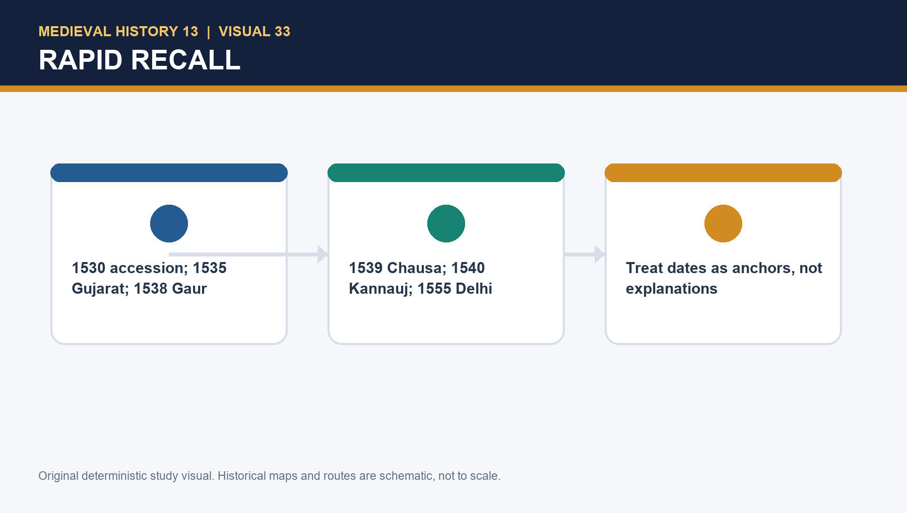

#### J. Last 60-second recall

1. **1530:** accession; unfinished conquest.
2. **Chunar/Dadrah:** source caution; eastern consolidation, no early Bihar-war certainty.
3. **Din Panah:** Delhi legitimacy project.
4. **1535–37:** Gujarat military achievement, administrative reversal.
5. **Surajgarh/Gaur:** Sher Khan's political scale-up.
6. **1537–39:** Bengal ambition, Chunar time-cost, communications cut.
7. **1539 → 1540:** Chausa → Kannauj, tactical shock → decisive expulsion.
8. **1545 → 1555:** Kabul/Qandahar recovery → Delhi restoration.
9. **One-line verdict:** Humayun's aims were larger than his institution and logistics; Sher Khan's Afghan alternative made the gap decisive, while later recovery preserved a dynastic opening.

### COMPLETE TOPIC ASCII MASTER FLOW DIAGRAM

#### ASCII MASTER FLOW — PANEL 1/12: The central problem: conquest without consolidation

```ascii-master
BABUR'S VICTORIES -> a core, prestige and a dynastic claim
HUMAYUN'S INHERITANCE -> weak finance + thin administration + rival elites
COMPETING FIELDS -> Afghans in the east + Gujarat-Malwa + Rajput powers
IMPERIAL AMBITION -> Delhi, Gujarat and Bengal pursued before deep rooting
RESULT -> military reach repeatedly outruns revenue, routes and noble commitment
VERDICT: Humayun's fall joins structural weakness to avoidable choices.
MUST REMEMBER: Humayun's Gujarat, Afghan and Rajput theatres form one struggle for empire
  rather than isolated anecdotes.
```

#### ASCII MASTER FLOW — PANEL 2/12: Humayun chronology 1530-1556

```ascii-master
30 Dec 1530 -> accession | 1533-34 -> Din Panah
1535 -> Mandu, Champaner and Gujarat campaign successes
1537-38 -> six-month Chunar siege and eastern advance
1538-39 -> Gaur occupation and communications crisis
26 Jun 1539 -> Chausa | 17 May 1540 -> Kannauj/Bilgram
1545 -> Qandahar and Kabul recovered | 1555 Delhi | 1556 death.
```

#### ASCII MASTER FLOW — PANEL 3/12: Inherited balance sheet

```ascii-master
ASSET -> Delhi-Agra core, Timurid prestige and campaign capability
FINANCE -> stretched treasury and large assignments to begs
ADMINISTRATION -> conquest not converted into routine territorial control
EAST -> Afghan chiefs and Sher Khan retain regional depth
WEST -> Bahadur Shah links Gujarat, Malwa and Rajasthan
DYNASTY -> princely-share expectations complicate unified sovereignty.
```

#### ASCII MASTER FLOW — PANEL 4/12: Brothers: chronology before blame

```ascii-master
KAMRAN -> Kabul/Qandahar, then Lahore-Multan and the Punjab hinge
EARLY PHASE -> khutba and sikka remain in Humayun's name
ASKARI -> Gujarat command becomes an administrative cohesion test
HINDAL -> Agra move matters during the stretched Bengal campaign
AFTER CHAUSA -> Kamran withholds hardened troops from Humayun
RULE: fraternal politics changes by time and theatre; avoid timeless guilt.
```

#### ASCII MASTER FLOW — PANEL 5/12: Rajput-Gujarat-Mughal western triangle

```ascii-master
GUJARAT-MALWA -> Bahadur Shah's wealth, artillery and regional expansion
MEWAR / CHITTOR -> Rajput power inside the western strategic field
DELHI-AGRA -> Mughal core threatened through eastern Rajasthan and Malwa
HUMAYUN -> supply pressure at Mandsor, then Mandu and Champaner
KARNAVATI STORY -> later memory; contemporary corroboration is absent
TRAP: Rajputs were not one permanent bloc and legend is not event proof.
```

#### ASCII MASTER FLOW — PANEL 6/12: Gujarat: victory without settlement

```ascii-master
CAMPAIGN -> Mandsor pressure -> Mandu -> Champaner -> Ahmedabad
MILITARY RESULT -> real operational success and territorial seizure
ADMINISTRATIVE GAP -> thin revenue, weak local coalition and divided command
NOBLE PROBLEM -> many begs resist durable residence far from Delhi-Agra
REGIONAL RESPONSE -> Bahadur Shah returns; Askari withdraws; Malwa is lost
LESSON: winning forts is not the same as building a provincial regime.
```

#### ASCII MASTER FLOW — PANEL 7/12: Sher Khan's Bihar-Bengal scale-up

```ascii-master
BIHAR BASE -> forts, revenue, Afghan networks and local knowledge
SURAJGARH 1534 -> Bengal checked and Sher Khan's standing enlarged
GAUR 1537-38 -> Bengal resources and strategic depth enter the contest
HUMAYUN AT CHUNAR -> six months spent before the Bengal advance
SHER KHAN MOVES WEST -> route nodes and communications threatened
OUTCOME: a regional Afghan project becomes an imperial alternative.
```

#### ASCII MASTER FLOW — PANEL 8/12: Chunar-Gaur communications trap

```ascii-master
AGRA-DELHI CORE -> eastern movement depends on a long communication line
CHUNAR -> gateway fort affects land-river movement, supply and rear security
GAUR -> symbolic Bengal occupation but no durable administrative bridge
MONSOON + DISTANCE + NOBLE STRAIN -> Mughal position becomes brittle
SHER KHAN -> controls crossings and pressures the route back west
FORMULA: ambition + delayed logistics + severed communications = isolation.
```

#### ASCII MASTER FLOW — PANEL 9/12: Chausa and Kannauj: do not collapse the battles

```ascii-master
CHAUSA, 26 JUN 1539 -> river at Humayun's rear + surprise + near escape
EFFECT -> army shattered, confidence falls, but the contest is not yet closed
KANNAUJ, 17 MAY 1540 -> set battle against a stronger Afghan position
MUGHAL LIMIT -> hastily assembled force lacks Kamran's hardened troops
EFFECT -> Humayun loses north India and Sher Shah's sovereignty opens
TRAP: Chausa weakens; Kannauj decides the first-reign struggle.
```

#### ASCII MASTER FLOW — PANEL 10/12: Exile, Safavid bargain and restoration

```ascii-master
1540 DEFEAT -> Sindh and a prolonged search for a viable base
SHAH TAHMASP -> assistance is strategic and politically conditioned
1545 -> Qandahar and Kabul recovery rebuilds a north-western platform
SUR FIELD -> succession conflict and fragmentation after Islam Shah
1555 -> Delhi-Agra recovered through restored capacity and opponent weakness
LIMIT: restoration proves resilience, not that the earlier collapse was trivial.
CLOSE DISTINCTION: Chausa (1539) preceded Kannauj/Bilgram (1540); restoration followed in
  1555.
```

#### ASCII MASTER FLOW — PANEL 11/12: Evidence, rehabilitation and heritage

```ascii-master
NIZAMUDDIN AHMAD -> alternate chronology; compression and omissions
ABUL FAZL -> fuller reconstruction; later dynastic framing
MIRZA HAIDER -> critical testimony; one voice cannot explain a reign
KARNAVATI TRADITION -> later memory requiring corroboration
HUMAYUN'S TOMB -> later Akbar-era dynastic memory and conservation evidence
METHOD -> replace caricature with ranked evidence, agency and qualification.
EVIDENCE LIMIT: Defeat cannot be explained only by personality: resources, alliances, Afghan
  resilience and imperial overstretch matter.
```

#### ASCII MASTER FLOW — PANEL 12/12: Topic 13 answer spine

```ascii-master
OPEN -> Babur left a prestigious but unfinished conquest
STRUCTURE -> finance + brothers + unrooted nobles + competing regional powers
AGENCY -> Gujarat overreach, Bengal logistics and Sher Khan's superior timing
BATTLES -> Chausa operational shock; Kannauj decisive political displacement
RECOVERY -> Safavid-backed base + Sur fragmentation + 1555 return
CLOSE -> Humayun failed seriously, but not through a one-word moral defect.
```
