# State & Government under Akbar (Mansabdari, Dahsala) - Complete Topic Package

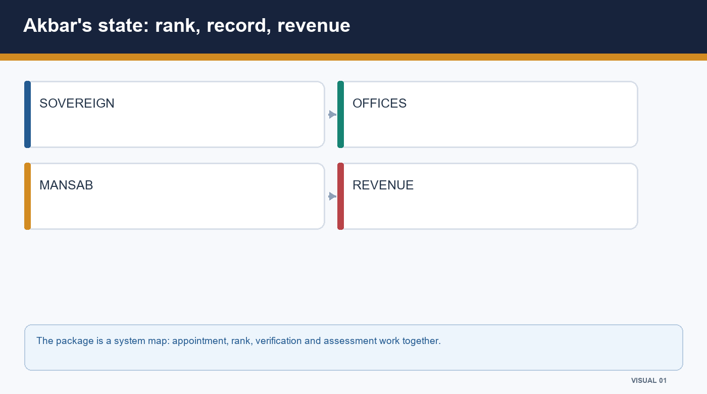

> **Subject:** Medieval Indian History | **GS Paper:** GS-I + Prelims | **Level:** Foundation to advanced

> **Package date:** 18 August 2026 | **Learning arc:** institutions -> provincial reach -> mansab -> revenue -> sources -> practice

> **Source and method note:** Primary teaching foundation: `basic/16_State-and-Government-under-Akbar.md` and
> `advanced/16_State-and-Government-under-Akbar.md`; chronology: `00_Master-Chronology.md`; answer-quality and
> historiographical guardrails: `ANSWER-WORTHINESS-AUDIT.md`; continuity links: Topics 07, 14, 15, 17, 21 and 25.
> Book corroboration used: local OCR text of Satish Chandra, *Medieval India: From Sultanat to the Mughals, Part II*.
> No current-affairs analogy is forced. FACT marks direct repository/book grounding; ANALYSIS marks a bounded inference.

## BASIC LEARNING SESSION

### DEEP-REVIEW LEARNING CONTRACT

| Control | Binding rule for this package |
|---|---|
| Syllabus boundary | Complete Medieval History Core is taught before optional enrichment. |
| Evidence method | Claim → named site/text/inscription/coin/example → analysis → qualification. |
| Source hierarchy | Archaeology, textual testimony, inscriptions, coins and scholarly interpretation remain visibly distinct. |
| Contested issues | Competing interpretations are attributed, evidenced and bounded; certainty is not manufactured. |
| Practice contract | Every solved item has demand decoding, an examiner-grade model, an executable answer/compression plan, marks rationale and answer-specific improvement. |
| Approval | This immutable successor remains `approved: false` pending explicit approval. |

**Canonical Basic/Core owner:** `upsc-ai-kit\knowledge\Medieval-Indian-History\basic\16_State-and-Government-under-Akbar.md`  
**Canonical topic owner:** `upsc-ai-kit\knowledge\Medieval-Indian-History\basic\16_State-and-Government-under-Akbar.md`  
**Optional Advanced owner:** `upsc-ai-kit\knowledge\Medieval-Indian-History\advanced\16_State-and-Government-under-Akbar.md`  
**Official syllabus mapping:** `upsc-ai-kit\knowledge\Medieval-Indian-History\OFFICIAL-UPSC-SYLLABUS-MAPPING.md`

### EVIDENCE, PYQ AND CURRENT-STATUS CONTROL

- **Archaeological inference:** material context supports bounded reconstruction; absence is not automatic proof of non-existence.
- **Textual testimony:** genre, authorship, redaction, patronage and temporal distance control what a text can prove.
- **Inscription and coin evidence:** contemporary names, titles, claims and circulation are powerful but do not by themselves map uniform territorial control.
- **Scholarly interpretation:** historian labels are arguments to test, not facts to memorise without evidence.
- **PYQ discipline:** repository ledgers and locally held official papers control wording and metadata; reconstructed wording and unavailable official keys must be labelled.
- **Current-status note, rechecked 2026-08-30:** The Department of Land Resources' DILRMP page was rechecked on 30 August 2026. It supports only a bounded administrative analogy: modern land-record management emphasises accurate updated records, public access, integration and adaptation to diverse state contexts. It must not be equated with Mughal assessment, proprietary title or peasant-state relations; Akbar's zabt, dahsala and local mediation remain controlled by repository Markdown, OCR books and historical source criticism.

**Live/primary context sources recorded by the predecessor generation:**

- `https://dolr.gov.in/en/programmes-schemes/dilrmp-2/`


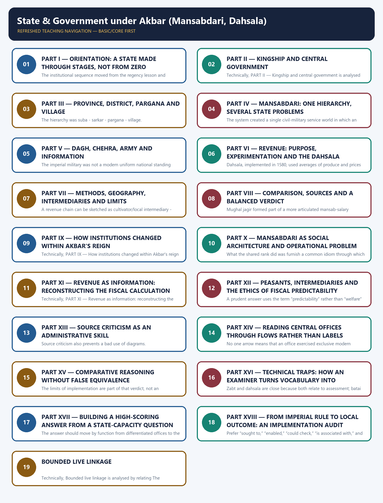

*Distinct embedded teaching-navigation image. The separate continuous Cārvāka-style flowchart package remains an independent at-a-glance artifact.*

### Roadmap


1. Evolution and kingship  2. Central and provincial administration  3. Mansabdari and verification  4. Dahsala and alternative revenue methods  5. Sources, comparisons and limits  6. PYQ, MCQs and Mains answers  7. Consolidated register notes.


> **PRE-TEACH CHECKLIST**  
> **Book context:** queried from repository Topic 16 files and local Satish Chandra Part II OCR.  
> **CA search:** deliberately not forced; no live claim is needed for this static historical module.  
> **CA found:** none used; modern land-record analogies are bounded functionally and never equated with Mughal title.

### SESSION 1 — PART I — ORIENTATION: A STATE MADE THROUGH STAGES, NOT FROM ZERO

#### DEFINITION / WHAT THIS IS CALLED

**Plain-language definition:** Akbar's government evolved in stages from Sultanate and Sur precedents, connecting ruler-centred authority, differentiated offices, ranked service, verification and revenue records without becoming a modern bureaucracy.

**Technical definition:** The institutional sequence moved from the regency lesson and stronger fiscal specialisation to numerical mansabs, dagh, twelve subas, dahsala and the late zat-sawar distinction, with each device serving a distinct administrative problem.

#### ANSWER-GRABBING OPENING — WRITE/ADAPT IN THE EXAM

> Akbar did not create a finished administration at accession; he progressively coordinated inherited offices, rank, records and revenue practices into a larger but still personal and uneven imperial system.

#### MUST-WRITE KEYWORDS

- **institutional stages**
- **ruler-centred authority**
- **administrative precedents**
- **numerical mansab**
- **dahsala**
- **zat-sawar**

**How to use them:** Define the institutional stages through administrative precedents; then show how ruler-centred authority coordinated numerical mansab, dahsala and zat-sawar before qualifying hierarchy, mediation and uneven reach.

**Learning objective.** Explain why Akbar's government is best read as a ruler-centred,
evolving system of rank, record and revenue rather than as an invention-from-zero or a
modern bureaucracy. The package follows the repository's basic and advanced Topic 16
files, Satish Chandra Part II OCR evidence, and the cross-links to Topics 07, 14, 15,
17, 21 and 25. It deliberately does not import the later jagirdari crisis as if it were
already complete in Akbar's lifetime.

**Core thesis.** Akbar inherited administrative languages and techniques from the Delhi
Sultanate and the Sur interregnum, then reorganised, specialised, replicated and
systematised them for an expanding empire. A mansab linked status, remuneration and
service. A revenue system converted knowledge of fields, yields and prices into a fiscal
claim. Provincial duplication and centrally appointed officers made the court more
informed. None of those arrangements dissolved hierarchy, local negotiation, coercion
or dependence on the emperor's supervision.

The chronology matters. In 1556 Bairam Khan's powerful *wakil* showed the political
danger of a regent who could overshadow a young sovereign. The diwan's fiscal importance
strengthened from the 1560s; a numerical mansab hierarchy is generally associated with
1567; Akbar's Mughal-frame *dagh* measure dates to his eighteenth regnal year, 1573-74;
revenue experiments culminated in the 1580 adoption of dahsala and division into twelve
subas; and the explicit *zat-sawar* distinction arrived only in 1595-96. This sequence
forbids the tempting but wrong answer that every component appeared in a finished form at
accession.

> **FACT:** A chronological explanation earns more than a static list: it can show
> response to regency, expansion, fiscal experimentation and the need to verify noble
> service.

| Claim | Evidence anchor | Qualification |
|---|---|---|
| Akbar built on precedents | Sultanate iqta practice; Sur measurement and controls | Precedent is not proof of institutional sameness |
| He systematised offices | Separate diwan, mir bakhshi and provincial counterparts | Separation remained accountable to the ruler |
| He extended information | records, musters, revenue returns and news | Records register norms as well as practice |

**Bounded modern analogy.** A cadastral survey, payroll audit or personnel grade can
clarify one function—measurement, verification or ranking. It must stop there. Mughal
revenue assessment did not create modern registered property title; mansabs were not a
meritocratic civil service; subas were not federal provinces; and the court lacked
democratic accountability.

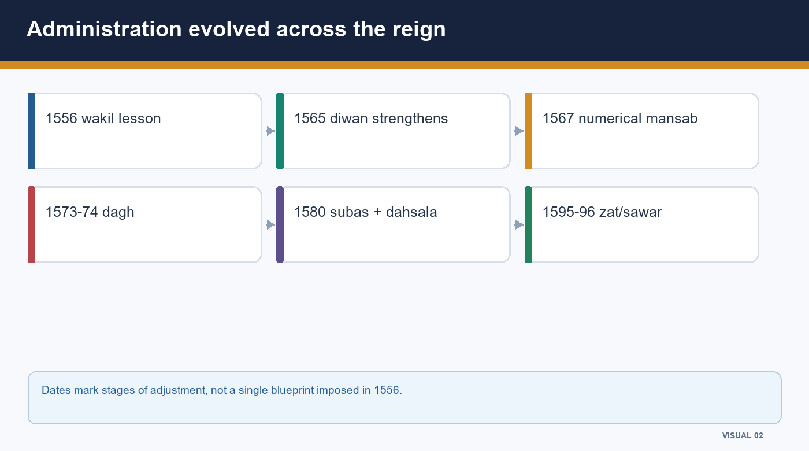

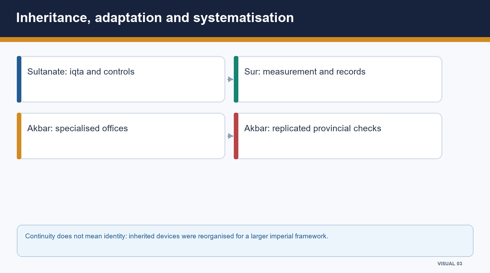

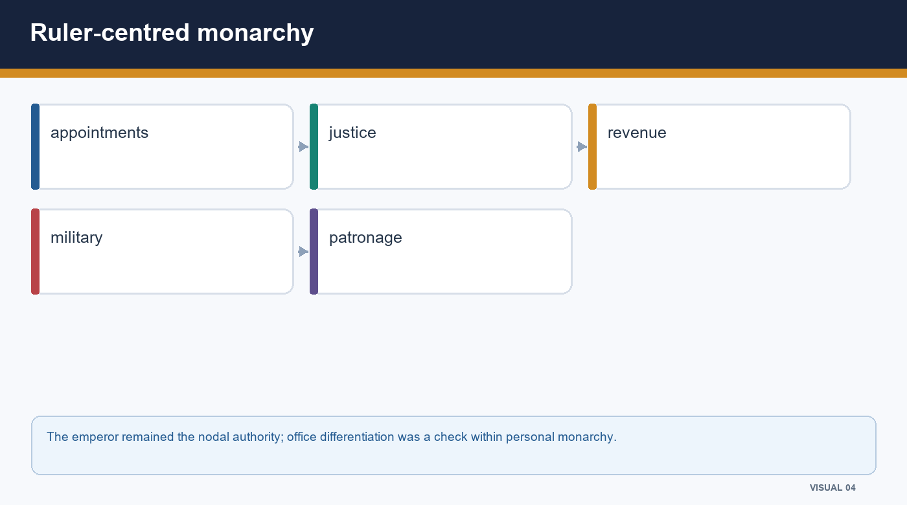

#### CLOSING RECALL FLOW — PART I — ORIENTATION: A STATE MADE THROUGH STAGES, NOT FROM ZERO

```text
START / CONCEPT: PART I — Orientation: a state made through stages, not from zero
        |
        v
EXACT TERMS: institutional stages · ruler-centred authority · administrative precedents · numerical mansab · dahsala · zat-sawar
        |
        v
MECHANISM / ARGUMENT: Differentiated offices generated parallel information, graded service organised the elite, verification tested military claims, and measured or estimated revenue supplied the fiscal basis for remuneration and expansion.
        |
        v
CONSEQUENCE / CONTRAST: Imperial capacity increased because more officers, resources and claims became classifiable and reportable to the centre, although implementation still depended on personal supervision and local intermediaries.
        |
        v
UPSC TRAP / ANSWER-USE: Do not place every institution in 1556, translate the system into a modern bureaucracy or describe inherited Sultanate and Sur devices as unchanged Mughal copies.
        |
        v
ANSWER-GRABBING FORMULATION: Akbar did not create a finished administration at accession; he progressively coordinated inherited offices, rank, records and revenue practices into a larger but still personal and uneven imperial system.
```
### SESSION 2 — PART II — KINGSHIP AND CENTRAL GOVERNMENT

#### DEFINITION / WHAT THIS IS CALLED

**Plain-language definition:** PART II — Kingship and central government comprises PART II, Kingship and central government as its core connected dimensions.

**Technical definition:** Technically, PART II — Kingship and central government is analysed by relating PART II to Kingship, then testing the relationship through central government and Wakil.

#### ANSWER-GRABBING OPENING — WRITE/ADAPT IN THE EXAM

> PART II — Kingship and central government comprises PART II, Kingship and central government as its core connected dimensions.

#### MUST-WRITE KEYWORDS

- **PART II**
- **Kingship**
- **central government**
- **Wakil**
- **prestige, residual coordinating role**
- **reduced after the regency lesson**

**How to use them:** Frame the answer through PART II; define Kingship, connect central government with Wakil to explain the mechanism, and use prestige, residual coordinating role for the decisive comparison or qualification.

Akbar was the sovereign source of appointment, justice, revenue, military command and
patronage. Courtly routines—darbar, access, petitions and, where securely grounded,
jharoka darshan—could make authority visible. Their political value was personal
communication and display, not a written constitution. The fuller discussion of
religious ideology, *sulh-i-kul* and the Ibadat Khana belongs to Topic 17; here the
relevant point is that imperial authority authorised offices and resolved conflicts among
them.

The *wakil* illustrates this ruler-centred correction. Bairam Khan acted as a powerful
regent in Akbar's early reign. Later, the office kept ceremonial prestige but was
prevented from becoming a permanent all-powerful wazir. This was not a separation-of-
powers doctrine. It was a monarch's lesson that one officer should not monopolise access,
decision and patronage.

The diwan or diwan-i-ala headed financial administration: income and expenditure,
accounts, scrutiny of khalisa, jagir and inam flows, and supervision of revenue
paperwork. It is misleading to write “Todar Mal invented revenue administration.”
Muzaffar Khan Turbati, Todar Mal and Shah Mansur represent a team of fiscal expertise;
their changing roles also reveal that policy was tested and revised. The diwan was not a
finance minister in a cabinet answerable to a legislature. It was a specialist office
whose competence increased the emperor's capacity to audit.

The mir bakhshi connected the emperor to the service elite. He handled presentation and
recommendations of mansabdars, muster-related records and military payment machinery; in
the source tradition he is also associated with intelligence/news and high appointments.
The safe formulation is functional: he was a nodal officer for rank, military personnel
and records. Calling him a modern defence minister falsely implies a separate department
with autonomous command.

The mir saman or khan-i-saman directed the imperial household and karkhanas. Stores,
workshops and supply were not decorative palace details: they supported the movable
material world of court, campaign and gift. The sadr-us-sudur dealt with grants and
connected religious/charitable functions; qazi-ul-quzat represented the highest judicial
office. Their functions could overlap with political authority and grants, and the
concentration of sadr power was curbed. Avoid presenting either as an independent modern
welfare ministry or judiciary.

| Office | Primary working field | Check or limit |
|---|---|---|
| Wakil | prestige, residual coordinating role | reduced after the regency lesson |
| Diwan | accounts, revenue, fiscal scrutiny | ruler and parallel officers remained decisive |
| Mir bakhshi | mansabs, presentation, muster records | actual contingents still needed inspection |
| Mir saman | household, karkhanas, stores | served imperial rather than public-private separation |
| Sadr/qazi | grants and judicial-religious functions | authority was not constitutionally autonomous |

> **TRAP:** “Checks and balances” is usable only with the qualifier *ruler-centred*.
> It meant office differentiation, central appointment and cross-reporting—not modern
> separation of powers.

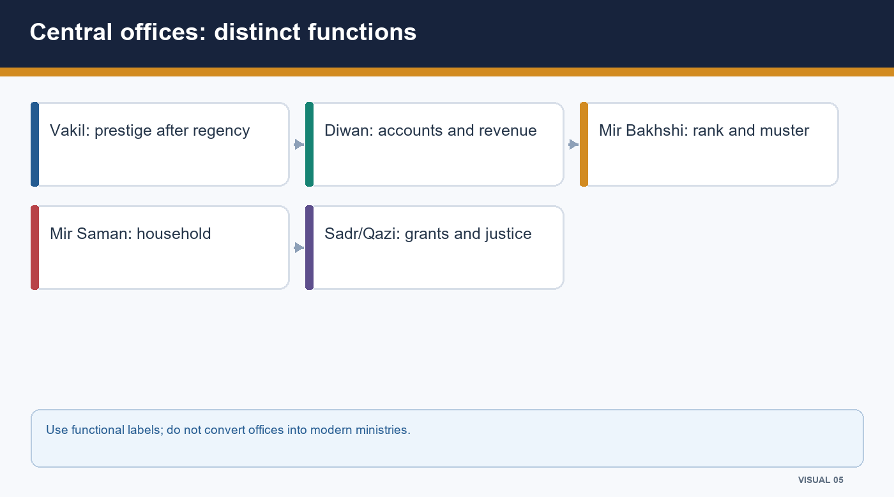

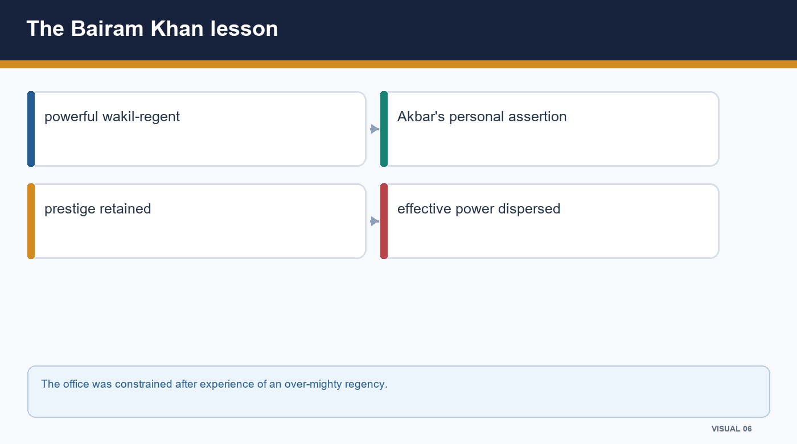


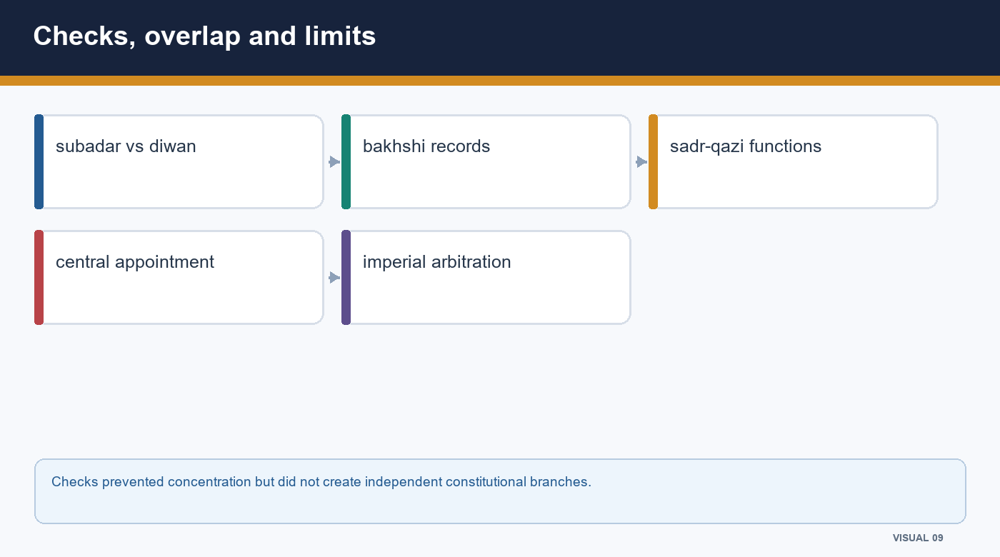

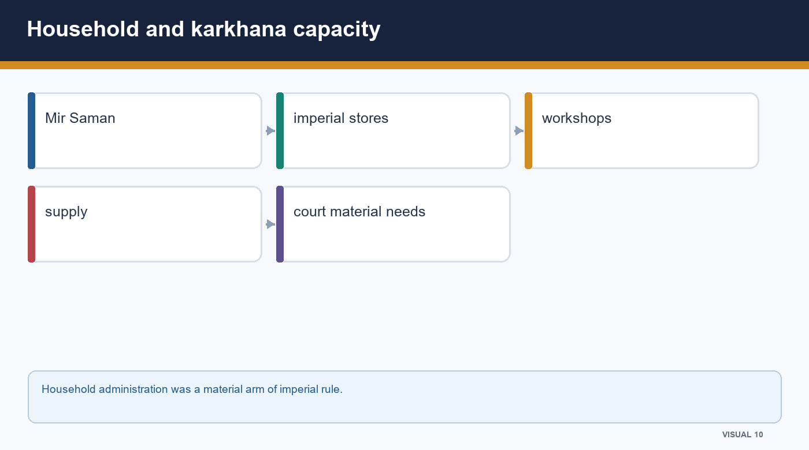

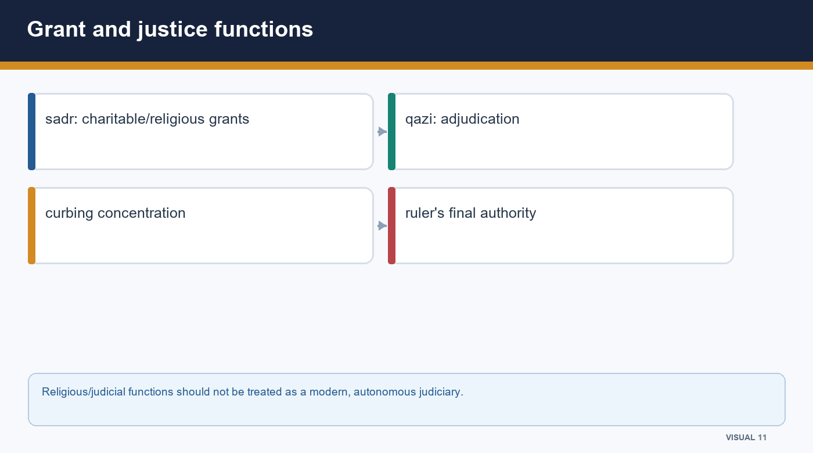

#### CLOSING RECALL FLOW — PART II — KINGSHIP AND CENTRAL GOVERNMENT

```text
START / CONCEPT: PART II — Kingship and central government
        |
        v
EXACT TERMS: PART II · Kingship · central government · Wakil · prestige, residual coordinating role · reduced after the regency lesson
        |
        v
MECHANISM / ARGUMENT: Akbar was the sovereign source of appointment, justice, revenue, military command and patronage.
        |
        v
CONSEQUENCE / CONTRAST: Later, the office kept ceremonial prestige but was prevented from becoming a permanent all-powerful wazir.
        |
        v
UPSC TRAP / ANSWER-USE: Do not miss this limiting distinction: “Checks and balances” is usable only with the qualifier ruler-centred.
        |
        v
ANSWER-GRABBING FORMULATION: PART II — Kingship and central government comprises PART II, Kingship and central government as its core connected dimensions.
```
### SESSION 3 — PART III — PROVINCE, DISTRICT, PARGANA AND VILLAGE

#### DEFINITION / WHAT THIS IS CALLED

**Plain-language definition:** The territorial ladder is pargana, then sarkar, then suba.

**Technical definition:** The hierarchy was suba - sarkar - pargana - village.

#### ANSWER-GRABBING OPENING — WRITE/ADAPT IN THE EXAM

> The hierarchy was suba - sarkar - pargana - village.

#### MUST-WRITE KEYWORDS

- **PART III**
- **Province**
- **district**
- **pargana**
- **village**
- **suba - sarkar - pargana - village**

**How to use them:** Frame the answer through PART III; define Province, connect district with pargana to explain the mechanism, and use village for the decisive comparison or qualification.

In 1580 the empire was divided into twelve subas. At the provincial level a subadar
(also described in relevant contexts as sipahsalar) was joined by a provincial diwan,
bakhshi, sadr-qazi and reporting personnel. The design mattered: a governor did not
independently own the fiscal apparatus, while the fiscal officer was not a military
sovereign. Centrally appointed offices and separate reports were meant to restrain
provincial consolidation. The practical strength of a subadar could nevertheless exceed
a formal diagram; distance, local alliances and campaign conditions qualified the check.

The hierarchy was **suba -> sarkar -> pargana -> village**. It is a territorial scale,
not a single chain of command in which every office did the same work. At a sarkar,
faujdar and amil-guzar/amalguzar conventions need careful use: the former relates to
coercive/military order, the latter to revenue work. A faujdar's jurisdiction was not
always coterminous with a sarkar; terminology and reach could vary. At pargana level,
shiqdar, amil, qanungo, potdar/treasurer and karkun/clerk appear in the record cluster.
Their work made local assessment, memory, accounts and custody administratively visible.

Village government retained intermediaries. Muqaddams or patels, patwaris, chaudhuris,
zamindars and customary bodies could mediate between cultivators and the fiscal machine.
Panchayat and customary autonomy should therefore be stated as context-specific and
source-grounded, not as a claim that the Mughal state was absent. Conversely, the claim
that the state directly reached every cultivator in identical fashion is equally false.
State demand travelled through records, local knowledge and unequal bargaining power.

**Assignments are not ownership.** Khalisa referred to revenues reserved for the crown;
jagir to a state revenue assignment often used to meet a mansabdar's remuneration; and
madad-i-maash/inam to grant arrangements. A jagir did not normally confer ownership of
land, a hereditary feudal estate, or a sovereign province. A jagirdar and a zamindar
occupied different positions: the former was commonly a transferable imperial assignee;
the latter had local landed claims, social standing, often armed following, and a
mediating role in collection.

#### Direct/owned PYQ — 2021 CSE Prelims GS-I, Q45

**Exact wording verified from local UPSC question paper
`books/more_previous_papers/QP-CSP-21-GeneralStudiesPaper-I-121021.pdf`:**

*“With reference to medieval India, which one of the following is the correct sequence
in ascending order in terms of size?”*

(a) Paragana-Sarkar-Suba  
(b) Sarkar-Paragana-Suba  
(c) Suba-Sarkar-Paragana  
(d) Paragana-Suba-Sarkar

**INFERRED ANSWER — NOT OFFICIALLY VERIFIED: (a), confidence high.** The territorial
ladder is pargana, then sarkar, then suba. Eliminate (b) because it reverses the first
two units; (c) descends rather than ascends; and (d) puts suba below sarkar. The local
official paper establishes the wording and original option order, but no official answer
key is held locally, so the answer is deliberately not called official.

> **PYQ routing boundary:** The 2019 Prelims jagirdar-zamindar question is owned by
> Topic 24 (Mughal Society, Economy and Culture). It is an adjacent conceptual link,
> not seized as a Topic 16 direct PYQ. The 2025 question on religious syncretism belongs
> to Topic 17. Searches of local 2018-25 CSE routing ledgers found no other direct,
> exact Topic 16 question to reproduce.

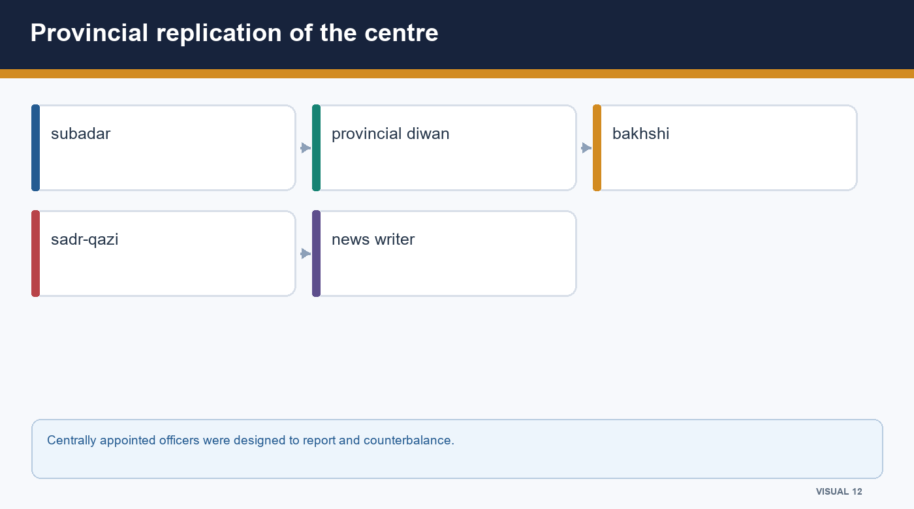

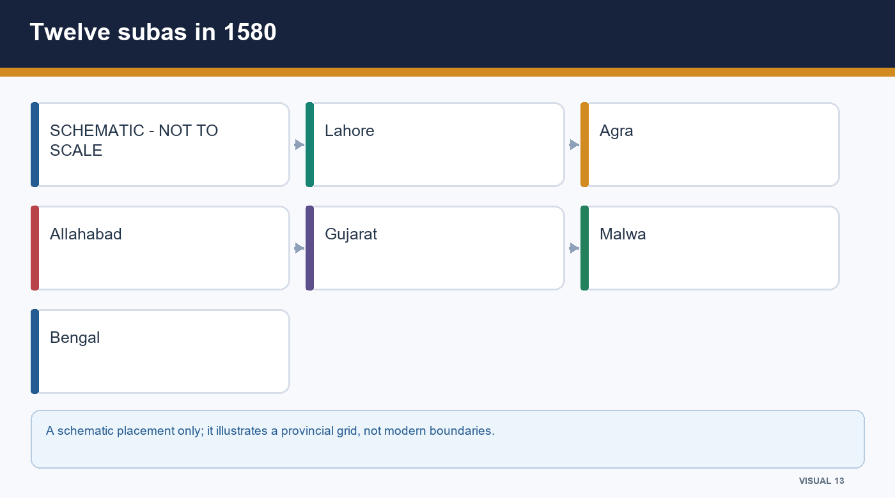


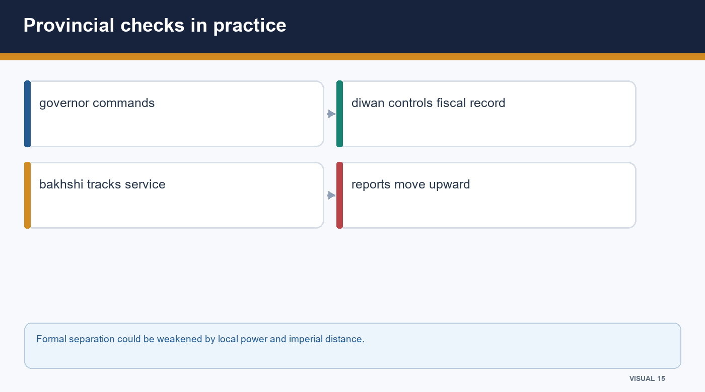

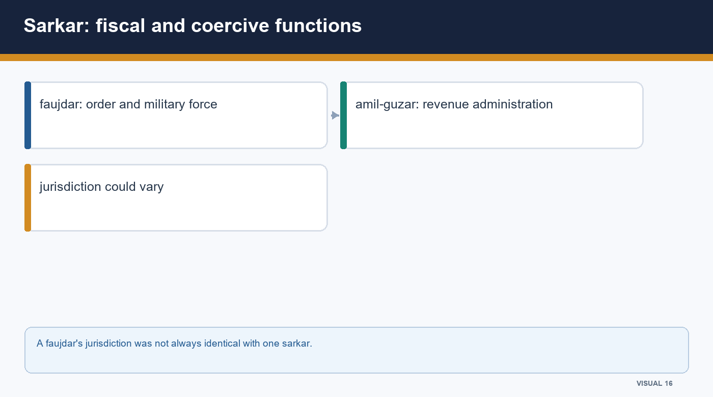


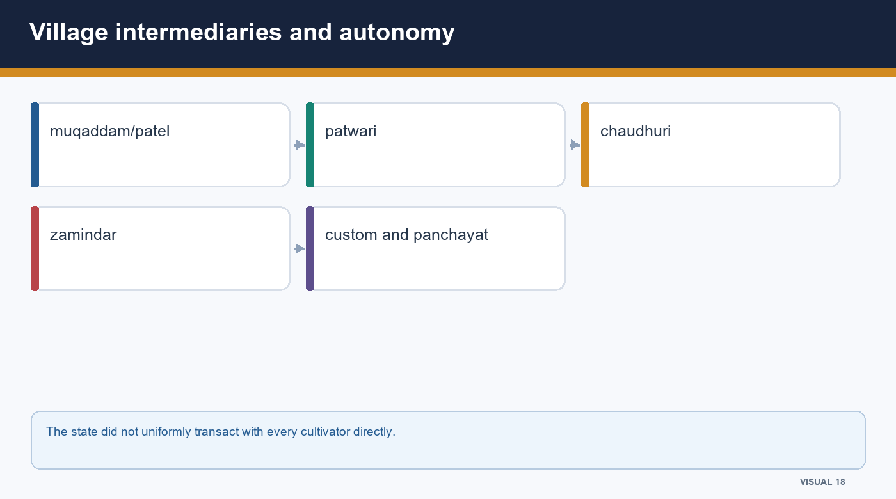

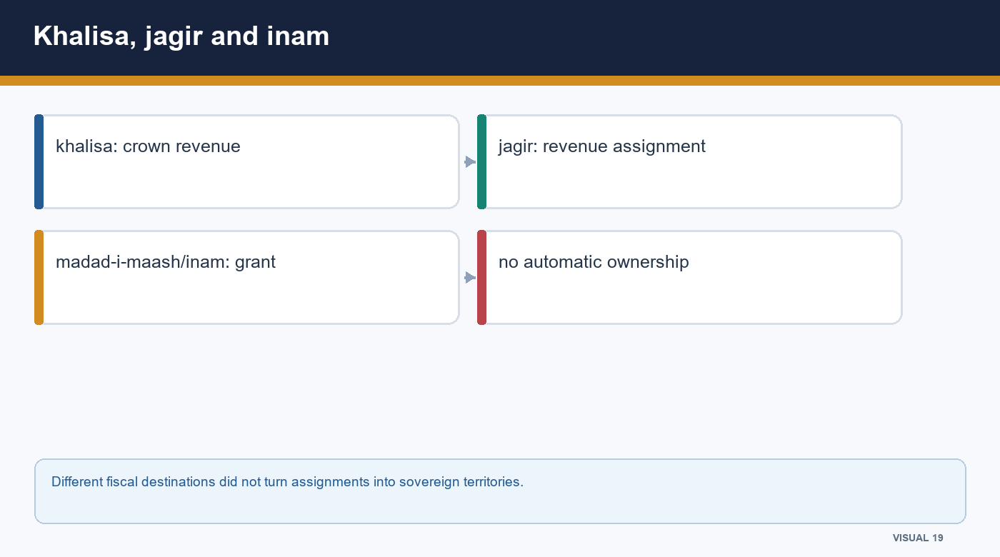

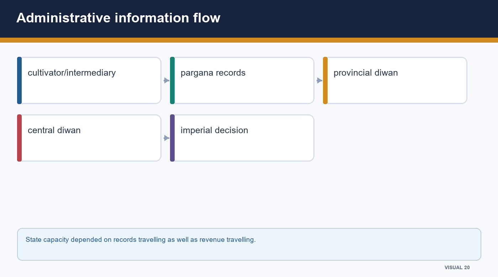

#### CLOSING RECALL FLOW — PART III — PROVINCE, DISTRICT, PARGANA AND VILLAGE

```text
START / CONCEPT: PART III — Province, district, pargana and village
        |
        v
EXACT TERMS: PART III · Province · district · pargana · village · suba - sarkar - pargana - village
        |
        v
MECHANISM / ARGUMENT: (also described in relevant contexts as sipahsalar) was joined by a provincial diwan, bakhshi, sadr-qazi and reporting personnel.
        |
        v
CONSEQUENCE / CONTRAST: The design mattered: a governor did not independently own the fiscal apparatus, while the fiscal officer was not a military sovereign.
        |
        v
UPSC TRAP / ANSWER-USE: It is a territorial scale, not a single chain of command in which every office did the same work.
        |
        v
ANSWER-GRABBING FORMULATION: The hierarchy was suba - sarkar - pargana - village.
```
### SESSION 4 — PART IV — MANSABDARI: ONE HIERARCHY, SEVERAL STATE PROBLEMS

#### DEFINITION / WHAT THIS IS CALLED

**Plain-language definition:** PART IV — Mansabdari: one hierarchy, several state problems comprises PART IV, Mansabdari and one hierarchy as its core connected dimensions.

**Technical definition:** The system created a single civil-military service world in which an officer's place in the courtly hierarchy, entitlement and expected usefulness were linked.

#### ANSWER-GRABBING OPENING — WRITE/ADAPT IN THE EXAM

> This does not erase social hierarchy, family advantage or faction.

#### MUST-WRITE KEYWORDS

- **PART IV**
- **Mansabdari**
- **one hierarchy**
- **several state problems**
- **Why one institution solved multiple problems**
- **1595-96**

**How to use them:** Frame the answer through PART IV; define Mansabdari, connect one hierarchy with several state problems to explain the mechanism, and use Why one institution solved multiple problems for the decisive comparison or qualification.

A *mansab* was a graded imperial rank. It conveyed status, salary/remuneration and
service obligation; it did not describe merely a cavalry quota. The system created a
single civil-military service world in which an officer's place in the courtly hierarchy,
entitlement and expected usefulness were linked. Ranks began at 10. High ranks of 5000
and, exceptionally under Akbar, 7000 must be handled as markers of elevation rather than
evidence of one fixed table operating unchanged across the reign.

Mansabdari also helped incorporate a composite ruling class: Turani, Irani, Indian
Muslim, Rajput, Afghan and other elements could be placed in a common ranked framework.
It supplied a language of imperial honour and a channel for promotion, demotion,
patronage and surveillance. This does not erase social hierarchy, family advantage or
faction. It is therefore wrong both to call every mansab a hereditary feudal title and to
call the system a modern, impersonal meritocracy.

The explicit two-part rank came late, in Akbar's fortieth regnal year (1595-96). *Zat*
indicated personal rank, status and related pay; *sawar* indicated the cavalry obligation
associated with the rank. This distinction was introduced to clarify dimensions of
service and should not be projected unchanged to the early 1560s. Classifications of
first, second and third class mansabdars are technical and have source-specific
interpretations; an answer should explain the basic distinction before using such labels.

Payment could be cash or, often, a jagir assignment. The assessment figure (*jama*) and,
where source-supported, dami valuation helped calculate an assignment; actual receipt
(*hasil*) could fall below the paper figure. The jagir did not turn the assignee into the
owner of every field or into a provincial sovereign. Transfers, review, promotion and
dependency on imperial appointment discouraged a durable territorial base, but short
tenure could encourage quick extraction. That tension is a seed of later problems, not a
licence to narrate the full seventeenth-century jagirdari crisis here.

**Why one institution solved multiple problems:** a rank made diverse nobles comparable;
a salary/service link attached privilege to obligation; jagir or cash payment enabled
remuneration; and musters offered a way to test a claimed military resource. This is the
integrative insight a Mains answer should foreground.

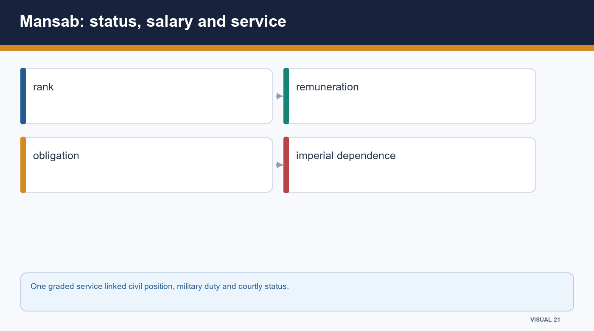


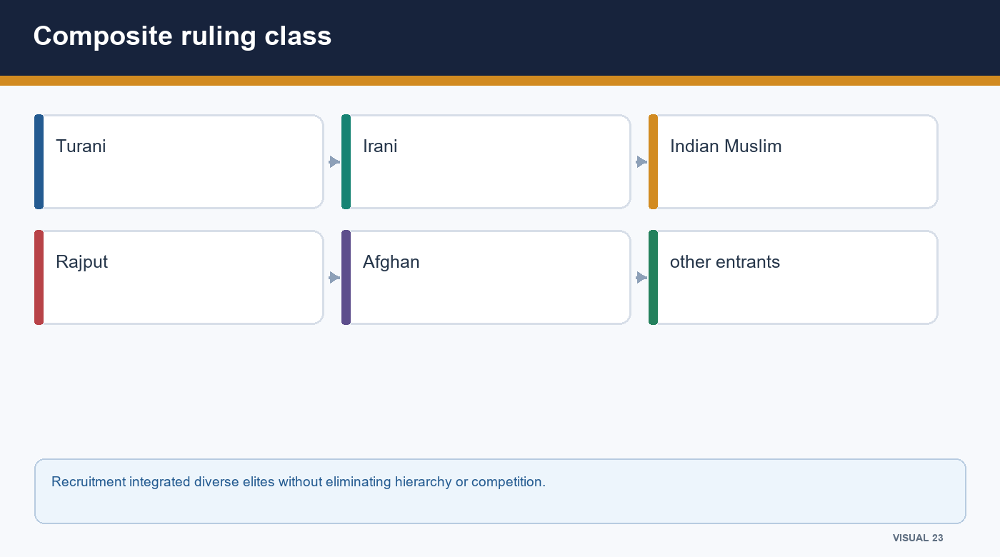

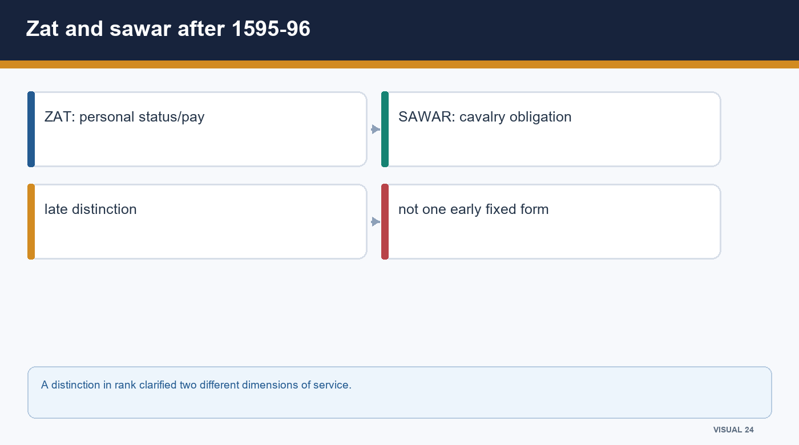

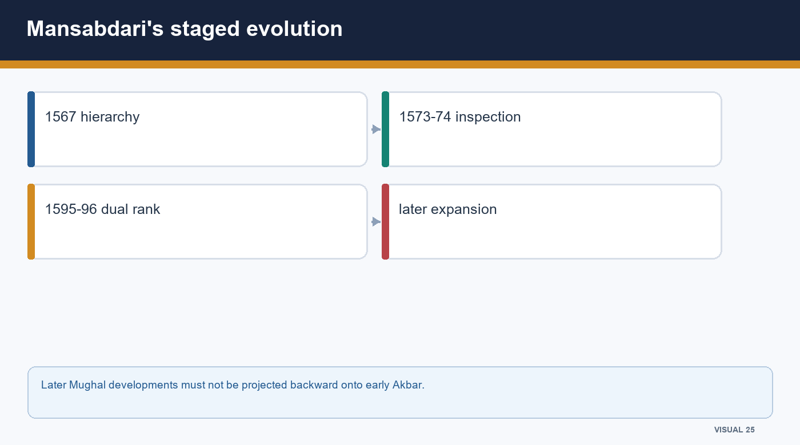


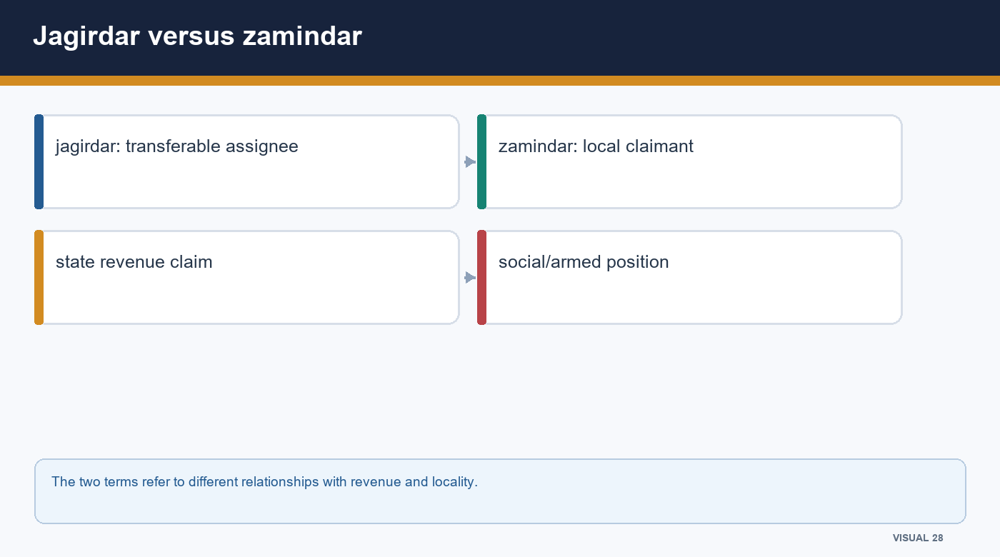


#### CLOSING RECALL FLOW — PART IV — MANSABDARI: ONE HIERARCHY, SEVERAL STATE PROBLEMS

```text
START / CONCEPT: PART IV — Mansabdari: one hierarchy, several state problems
        |
        v
EXACT TERMS: PART IV · Mansabdari · one hierarchy · several state problems · Why one institution solved multiple problems · 1595-96
        |
        v
MECHANISM / ARGUMENT: Mansabdari also helped incorporate a composite ruling class: Turani, Irani, Indian Muslim, Rajput, Afghan and other elements could be placed in a common ranked framework.
        |
        v
CONSEQUENCE / CONTRAST: That tension is a seed of later problems, not a licence to narrate the full seventeenth-century jagirdari crisis here.
        |
        v
UPSC TRAP / ANSWER-USE: It is therefore wrong both to call every mansab a hereditary feudal title and to call the system a modern, impersonal meritocracy.
        |
        v
ANSWER-GRABBING FORMULATION: This does not erase social hierarchy, family advantage or faction.
```
### SESSION 5 — PART V — DAGH, CHEHRA, ARMY AND INFORMATION

#### DEFINITION / WHAT THIS IS CALLED

**Plain-language definition:** Dagh was horse branding and chehra a descriptive roll of soldiers.

**Technical definition:** The imperial military was not a modern uniform national standing army.

#### ANSWER-GRABBING OPENING — WRITE/ADAPT IN THE EXAM

> The imperial military was not a modern uniform national standing army.

#### MUST-WRITE KEYWORDS

- **PART V**
- **Dagh**
- **chehra**
- **army**
- **information**
- **1573-74**

**How to use them:** Frame the answer through PART V; define Dagh, connect chehra with army to explain the mechanism, and use information for the decisive comparison or qualification.

*Dagh* was horse branding and *chehra* a descriptive roll of soldiers. Their provenance
is a high-value factual trap. Alauddin Khalji introduced/used these forms of control;
Sher Shah revived or adapted them; Akbar systematised or reintroduced them within the
Mughal framework. Akbar did not invent them from nothing. The owner source places the
Akbar-era introduction of dagh in the eighteenth regnal year, 1573-74. Its purpose was
to narrow the gap between paper claims and actual horses/men, deter substitution and give
the court a record for inspection.

Inspection had costs and effects. Nobles could resist a device that made their claims more
visible; officers could harass those being verified; evasion and imperfect compliance
persisted. Thus dagh and chehra demonstrate both administrative intent and the limits of
enforcing paperwork. Writing that they “completely eliminated corruption” is as wrong as
calling them irrelevant.

The imperial military was not a modern uniform national standing army. It combined
mansabdar contingents with ahadis and, where source-grounded, artillery, infantry,
elephants and centrally maintained elements. Cavalry remained central. The mir bakhshi's
records linked rank and military personnel, but direct imperial control was mediated by
officers, supply, review and local conditions.

News writers such as waqia-navis, and relevant sawanih/secret reporting terminology when
context permits, indicate that information was an administrative resource. The safe
connection is that the court sought reports and the mir bakhshi's field included
intelligence/news in the source account. Avoid inventing a single modern intelligence
agency with uniform reach. Justice and policing likewise mixed emperor, qazi, faujdar,
kotwal and local institutions; they did not deliver uniform rule of law in the modern
sense. Coercion, hierarchy, discretion and local mediation qualify any simple
centralisation narrative.

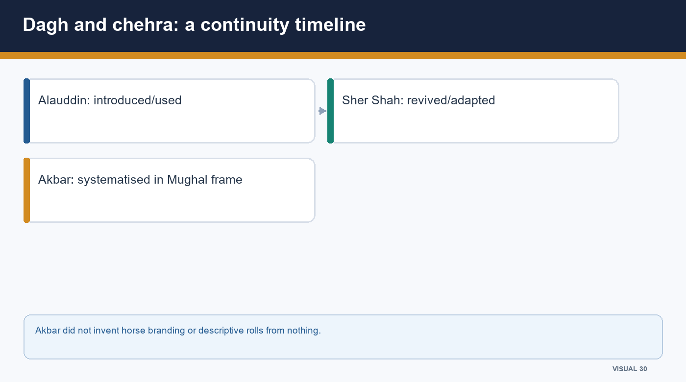

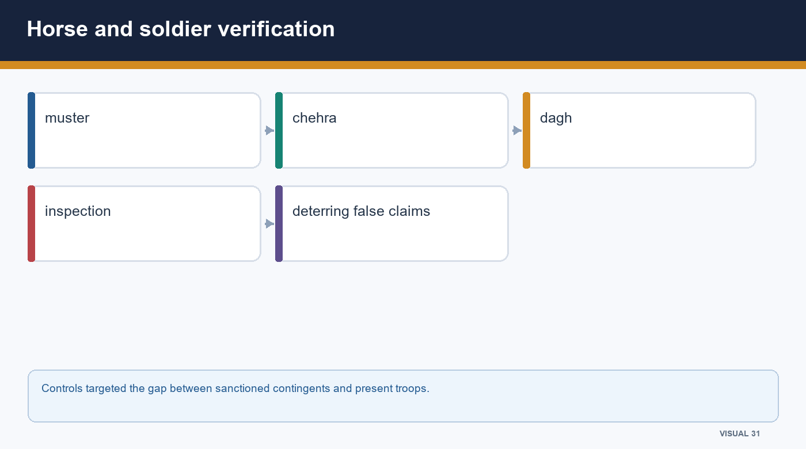

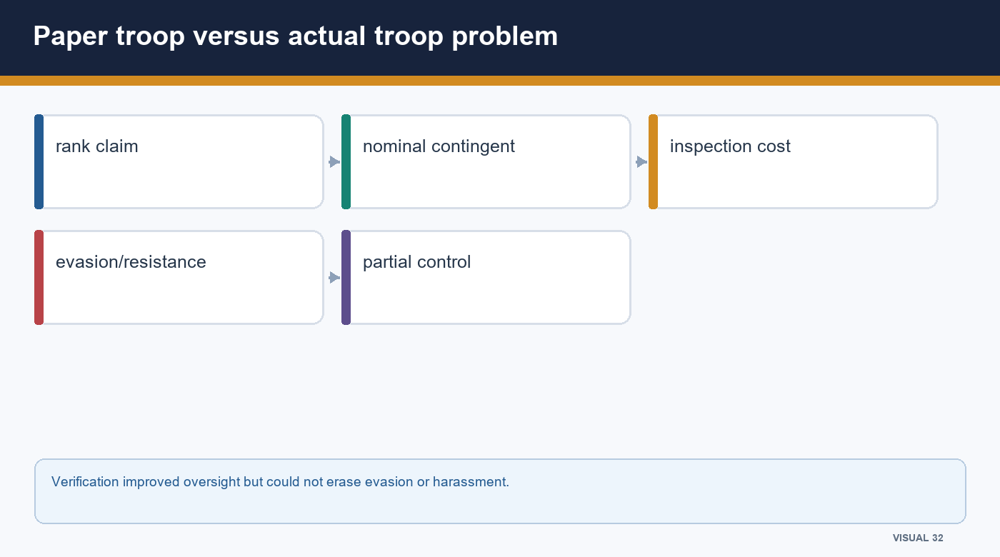

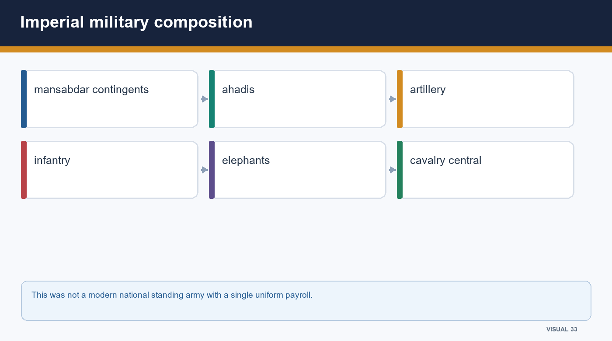


#### CLOSING RECALL FLOW — PART V — DAGH, CHEHRA, ARMY AND INFORMATION

```text
START / CONCEPT: PART V — Dagh, chehra, army and information
        |
        v
EXACT TERMS: PART V · Dagh · chehra · army · information · 1573-74
        |
        v
MECHANISM / ARGUMENT: Dagh was horse branding and chehra a descriptive roll of soldiers.
        |
        v
CONSEQUENCE / CONTRAST: Thus dagh and chehra demonstrate both administrative intent and the limits of enforcing paperwork.
        |
        v
UPSC TRAP / ANSWER-USE: The mir bakhshi's records linked rank and military personnel, but direct imperial control was mediated by officers, supply, review and local conditions.
        |
        v
ANSWER-GRABBING FORMULATION: The imperial military was not a modern uniform national standing army.
```
### SESSION 6 — PART VI — REVENUE: PURPOSE, EXPERIMENTATION AND THE DAHSALA MECHANISM

#### DEFINITION / WHAT THIS IS CALLED

**Plain-language definition:** The terms overlap in a revenue discussion but are not synonyms.

**Technical definition:** Dahsala, implemented in 1580, used averages of produce and prices over ten years to inform assessment; the theoretical state share is often expressed as one-third of average produce, converted into cash.

#### ANSWER-GRABBING OPENING — WRITE/ADAPT IN THE EXAM

> The terms overlap in a revenue discussion but are not synonyms.

#### MUST-WRITE KEYWORDS

- **PART VI**
- **Revenue**
- **purpose**
- **experimentation**
- **the dahsala mechanism**
- **Zabti**

**How to use them:** Frame the answer through PART VI; define Revenue, connect purpose with experimentation to explain the mechanism, and use the dahsala mechanism for the decisive comparison or qualification.

Akbar's fiscal objective was predictable imperial claim: financing court, campaigns,
remuneration and household; learning about cultivation; and controlling officials and
intermediaries. It was not a peasant-welfare scheme alone. A better formulation is that
predictability could reduce arbitrary assessment while still serving extraction. Crops,
transport, local prices, cesses, official coercion and risk affected the burden faced by
cultivators.

Sher Shah's precedents supplied measurement, record and control lessons. Akbar's
administration tried central price schedules but encountered a problem: court-centred
prices could be delayed or ill suited to regional productivity and market conditions.
The reforms moved towards local price/productivity circles and more usable assessment.
Muzaffar Khan Turbati, Todar Mal and Shah Mansur must be named as a team, not reduced to
a “Todar Mal-only genius” story.

**Zabti** is measurement-based assessment. **Dahsala**, implemented in 1580, used
averages of produce and prices over ten years to inform assessment; the theoretical state
share is often expressed as one-third of average produce, converted into cash. The terms
overlap in a revenue discussion but are not synonyms. Dahsala is not a permanent
ten-year settlement: the ten years describe the averaging data, not an immutable tenure
granted to a peasant or village. Cash payment was encouraged/required in the zabt
framework, yet kind arrangements and other methods remained in use.

Measurement used a *jarib*, often described as bamboo linked with iron rings, to reduce
stretching. It is a useful evidence point for standardisation, not a warrant to assign
one universal modern area value to every historical bigha. Crop rates (*dastur*) and
locally framed practice turned measured area and estimated yield into a demand. Do not
mix categories from different systems merely because both concern land.

The land labels polaj, parati/parauti, chachar and banjar refer broadly to cultivation
frequency and fallow history. They are not simply a four-step fertility scale. Good,
middling and bad yield classifications should be used only in their correct analytical
setting; do not merge them with these cultivation labels as if all are identical.

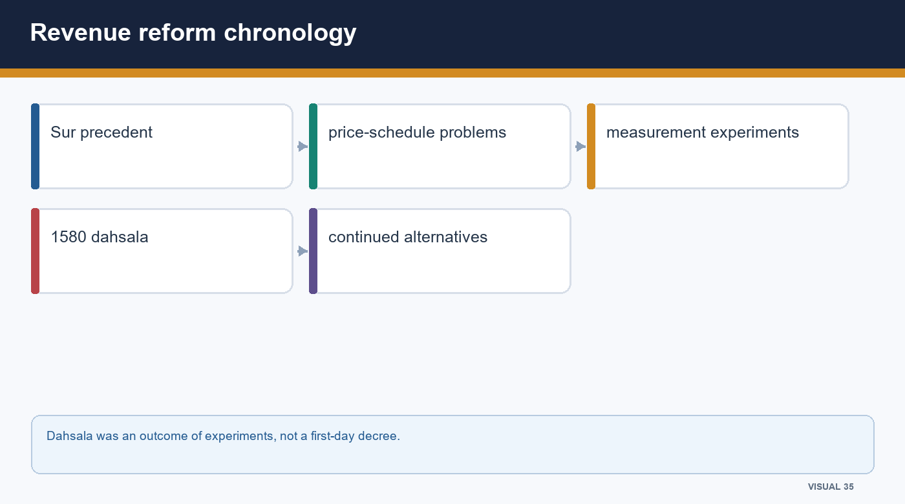

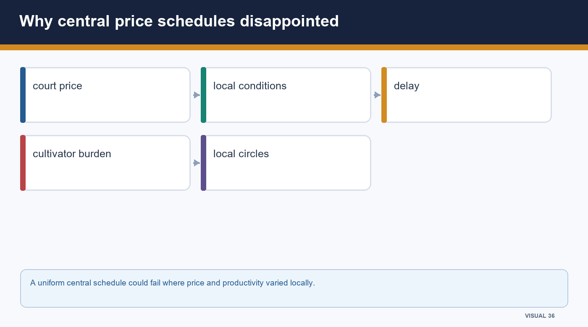

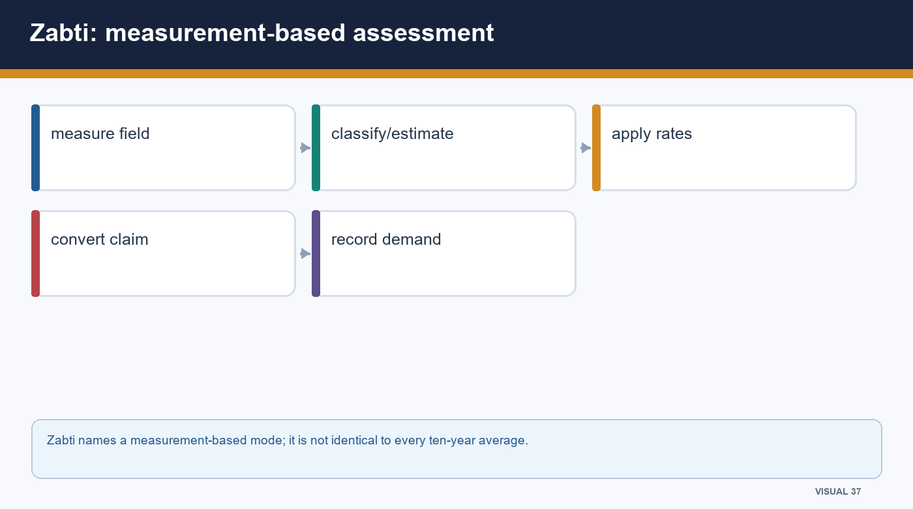

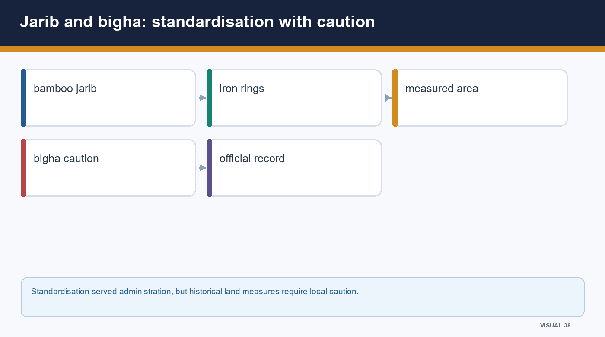

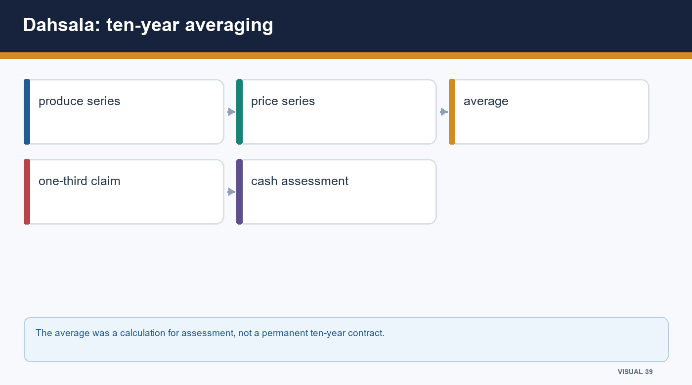

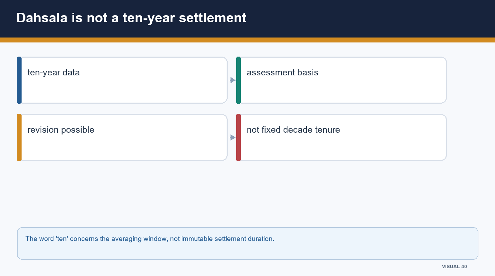

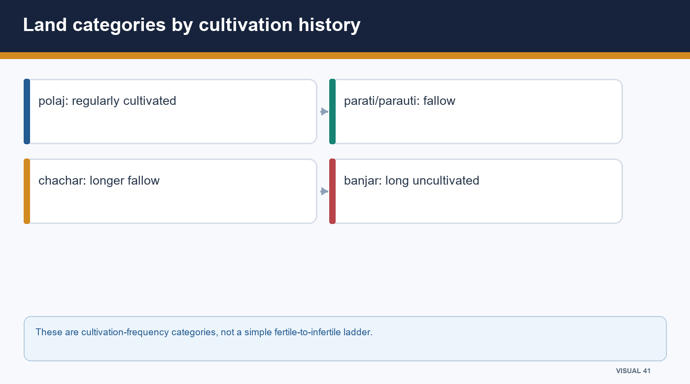

#### CLOSING RECALL FLOW — PART VI — REVENUE: PURPOSE, EXPERIMENTATION AND THE DAHSALA MECHANISM

```text
START / CONCEPT: PART VI — Revenue: purpose, experimentation and the dahsala mechanism
        |
        v
EXACT TERMS: PART VI · Revenue · purpose · experimentation · the dahsala mechanism · Zabti
        |
        v
MECHANISM / ARGUMENT: Dahsala, implemented in 1580, used averages of produce and prices over ten years to inform assessment; the theoretical state share is often expressed as one-third of average produce, converted into cash.
        |
        v
CONSEQUENCE / CONTRAST: Dahsala is not a permanent ten-year settlement: the ten years describe the averaging data, not an immutable tenure granted to a peasant or village.
        |
        v
UPSC TRAP / ANSWER-USE: A better formulation is that predictability could reduce arbitrary assessment while still serving extraction.
        |
        v
ANSWER-GRABBING FORMULATION: The terms overlap in a revenue discussion but are not synonyms.
```
### SESSION 7 — PART VII — METHODS, GEOGRAPHY, INTERMEDIARIES AND LIMITS

#### DEFINITION / WHAT THIS IS CALLED

**Plain-language definition:** PART VII — Methods, geography, intermediaries and limits comprises PART VII, Methods and geography as its core connected dimensions.

**Technical definition:** A revenue chain can be sketched as cultivator/local intermediary - amil and record personnel - provincial diwan - central diwan.

#### ANSWER-GRABBING OPENING — WRITE/ADAPT IN THE EXAM

> It must not become “all India” or “every field.” Bengal, Sindh, Kashmir and difficult tracts require care: where measurement and standardisation were difficult, alternatives and limits mattered.

#### MUST-WRITE KEYWORDS

- **PART VII**
- **Methods**
- **geography**
- **intermediaries**
- **limits**
- **Akbar**

**How to use them:** Frame the answer through PART VII; define Methods, connect geography with intermediaries to explain the mechanism, and use limits for the decisive comparison or qualification.

The revenue repertoire explains why “Akbar imposed universal zabt everywhere” is wrong.
Batai or ghalla-bakhshi was crop sharing in a fixed proportion; it could fit situations
where output rather than a cash schedule was the workable base, but entailed division and
supervision. Kankut combined measurement with inspection/appraisal of the standing crop;
it is not merely a crop-share label. Nasaq relied substantially on previous assessment or
payment and estimate, avoiding a full fresh measurement. Terrain, crop, records, staff
and local conditions affected which mode was usable.

The basic source's safe geographic formulation places zabt/dahsala from Lahore to
Allahabad and in Malwa and Gujarat. It must not become “all India” or “every field.”
Bengal, Sindh, Kashmir and difficult tracts require care: where measurement and
standardisation were difficult, alternatives and limits mattered. The very persistence of
batai, kankut and nasaq is evidence of uneven capacity.

A revenue chain can be sketched as cultivator/local intermediary -> amil and record
personnel -> provincial diwan -> central diwan. It was never a frictionless pipe. The
difference between *jama* (assessed demand) and *hasil* (realised receipt) is crucial:
a high paper assignment might not yield its nominal revenue. Zamindars were local
landholders/claimants and mediators with social and at times armed power. They were not
simply British-era landlords, nor were they eliminated by Mughal measurement.

Cash assessment joined revenue demand to currency, markets and circulation of agrarian
surplus. It supports a discussion of monetisation, but regional unevenness prevents the
claim of complete commercialisation. Remission for crop loss and, where securely
grounded, taccavi assistance show that a fiscal state needed cultivation to continue.
They do not prove a benevolent system: actual burdens could be intensified by price risk,
officials, cesses and coercive collection.

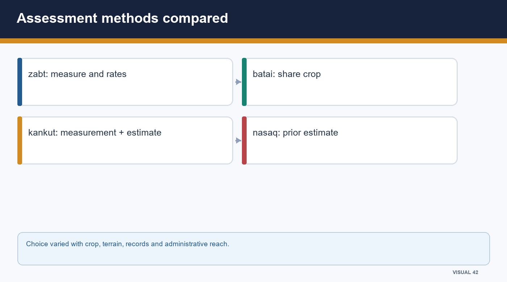

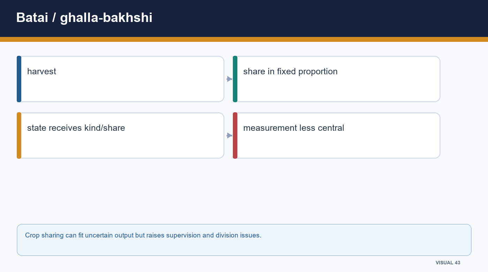

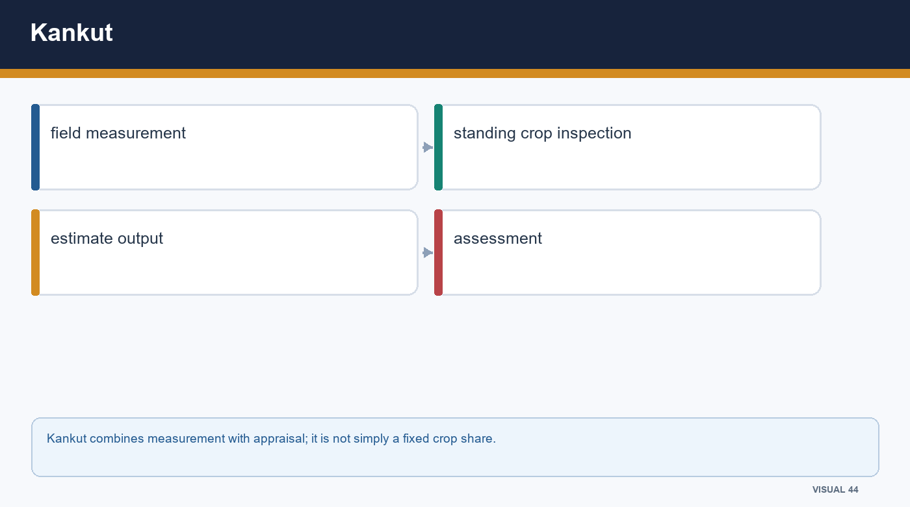

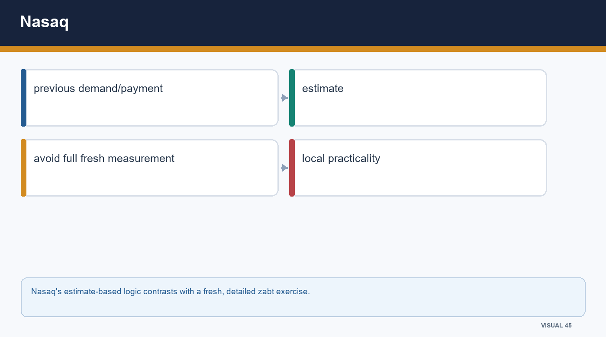

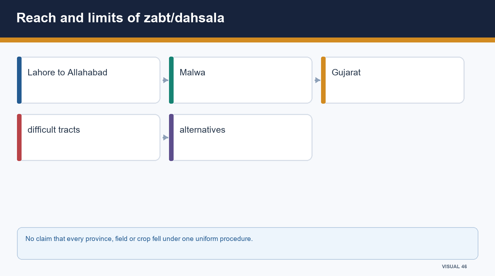

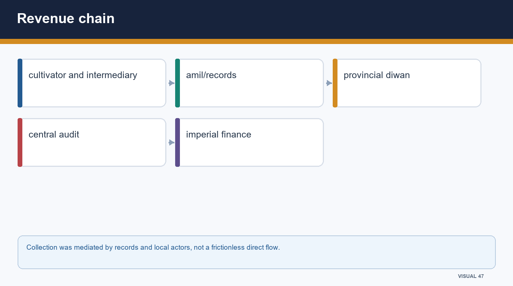

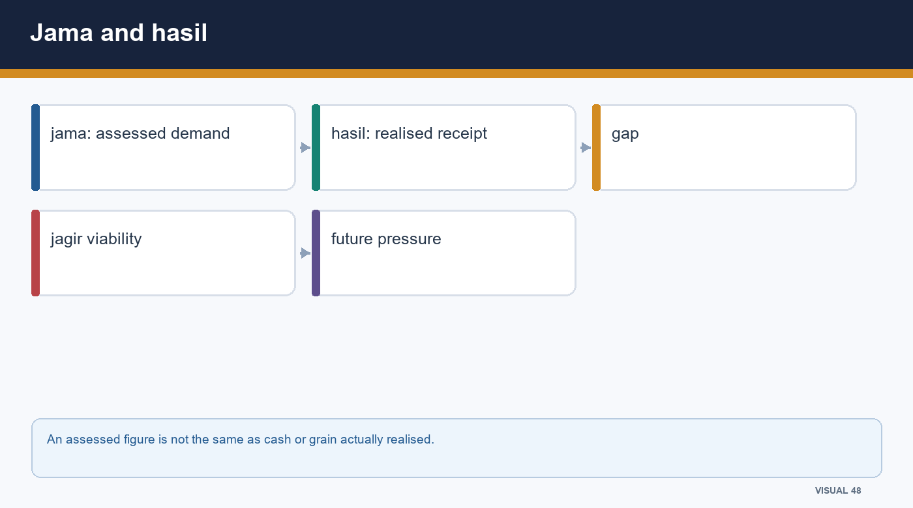

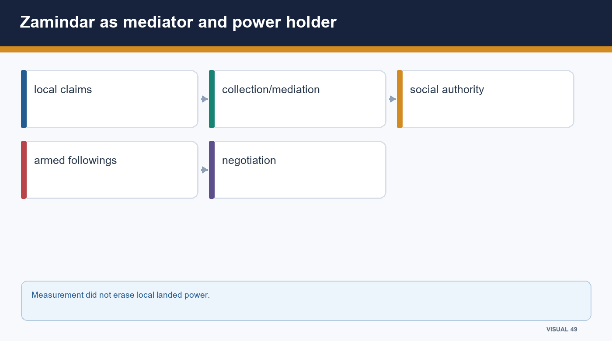


#### CLOSING RECALL FLOW — PART VII — METHODS, GEOGRAPHY, INTERMEDIARIES AND LIMITS

```text
START / CONCEPT: PART VII — Methods, geography, intermediaries and limits
        |
        v
EXACT TERMS: PART VII · Methods · geography · intermediaries · limits · Akbar
        |
        v
MECHANISM / ARGUMENT: They were not simply British-era landlords, nor were they eliminated by Mughal measurement.
        |
        v
CONSEQUENCE / CONTRAST: Batai or ghalla-bakhshi was crop sharing in a fixed proportion; it could fit situations where output rather than a cash schedule was the workable base, but entailed division and supervision.
        |
        v
UPSC TRAP / ANSWER-USE: Kankut combined measurement with inspection/appraisal of the standing crop; it is not merely a crop-share label.
        |
        v
ANSWER-GRABBING FORMULATION: It must not become “all India” or “every field.” Bengal, Sindh, Kashmir and difficult tracts require care: where measurement and standardisation were difficult, alternatives and limits mattered.
```
### SESSION 8 — PART VIII — COMPARISON, SOURCES AND A BALANCED VERDICT

#### DEFINITION / WHAT THIS IS CALLED

**Plain-language definition:** The Ain-i-Akbari, within the Akbarnama project, is central but requires source criticism.

**Technical definition:** Mughal jagir formed part of a more articulated mansab-salary hierarchy and a larger record system; this does not erase earlier Sultanate techniques.

#### ANSWER-GRABBING OPENING — WRITE/ADAPT IN THE EXAM

> The Ain-i-Akbari, within the Akbarnama project, is central but requires source criticism.

#### MUST-WRITE KEYWORDS

- **PART VIII**
- **Comparison**
- **sources**
- **a balanced verdict**
- **Ain-i-Akbari**
- **administrative categories, official norms, compiled fiscal vision**

**How to use them:** Frame the answer through PART VIII; define Comparison, connect sources with a balanced verdict to explain the mechanism, and use Ain-i-Akbari for the decisive comparison or qualification.

Comparing Sultanate iqta with Mughal jagir is an exercise in controlled similarity.
Both involved assignment of revenue connected with service, but a strong answer examines
tenure, transfer, fiscal base, audit, scale and degree of integration rather than
announcing identity. Mughal jagir formed part of a more articulated mansab-salary
hierarchy and a larger record system; this does not erase earlier Sultanate techniques.
Topic 07 is the owner for the wider Sultanate administration and source-method module.

Sher Shah and Akbar likewise show continuity plus refinement. Sher Shah's measurement,
roads, coins and control practices gave precedents; Akbar's team developed local rates,
data averaging, fiscal offices and a larger imperial framework. Dagh/chehra must carry
the correct Alauddin -> Sher Shah -> Akbar lineage. Akbar did not mechanically copy, and
he did not begin every device.

The *Ain-i-Akbari*, within the Akbarnama project, is central but requires source
criticism. It is an administrative compendium, a repository of figures and an account of
ideal imperial order. Abu'l Fazl's patronage and praise make it extraordinarily useful
for vocabulary, claimed regulations and the state's self-presentation, but not a
census-like database or transparent report of every locality. Badauni provides a more
hostile and sectarian perspective particularly where court/religious disagreement is
relevant; hostility is not a shortcut to truth. Farmans, revenue records, coins,
inscriptions and later historians can test different kinds of claim, each with its own
archive and survival limits.

| Source | Can help establish | Cannot alone establish |
|---|---|---|
| Ain-i-Akbari | administrative categories, official norms, compiled fiscal vision | universal implementation or precise modern-style census totals |
| Abu'l Fazl | imperial ideology and courtly justification | an unfiltered critical account of policy effects |
| Badauni | dissenting courtly/religious reaction | a neutral social survey |
| Farmans/records/coins | particular orders, transactions, circulation and claims | total lived experience without contextual reading |

**Overall verdict.** Akbar's government was a high-capacity early modern imperial system
because it linked office specialisation, rank, records, inspection, provincial replication
and fiscal knowledge. Its checks were personal and hierarchical; its reach was uneven;
local intermediaries, corruption, paper-versus-actual troops, cash-price risks and jagir
incentives remained. The most accurate conclusion is neither “perfect centralisation”
nor “mere medieval disorder,” but ambitious systematisation constrained by the conditions
it sought to govern.


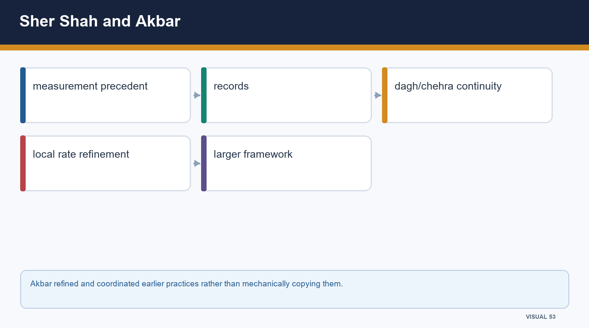

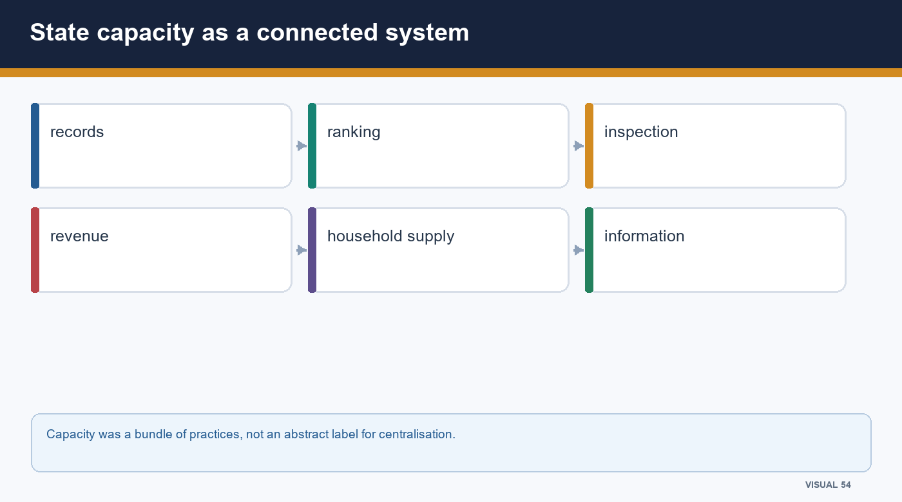

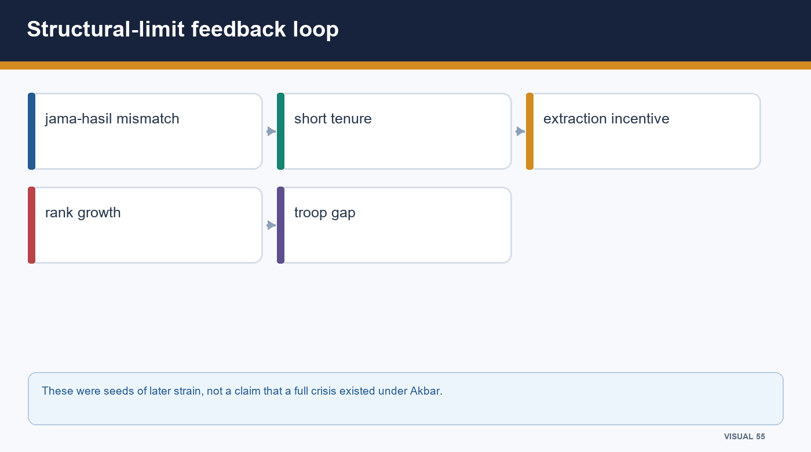

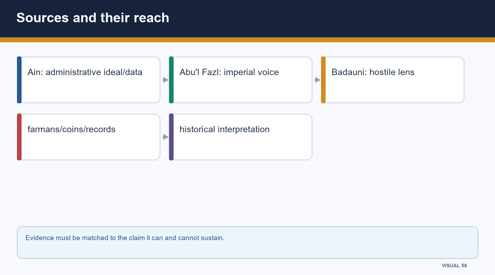

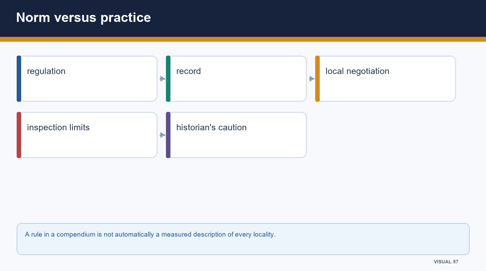


#### CLOSING RECALL FLOW — PART VIII — COMPARISON, SOURCES AND A BALANCED VERDICT

```text
START / CONCEPT: PART VIII — Comparison, sources and a balanced verdict
        |
        v
EXACT TERMS: PART VIII · Comparison · sources · a balanced verdict · Ain-i-Akbari · administrative categories, official norms, compiled fiscal vision
        |
        v
MECHANISM / ARGUMENT: Akbar's government was a high-capacity early modern imperial system because it linked office specialisation, rank, records, inspection, provincial replication and fiscal knowledge.
        |
        v
CONSEQUENCE / CONTRAST: Mughal jagir formed part of a more articulated mansab-salary hierarchy and a larger record system; this does not erase earlier Sultanate techniques.
        |
        v
UPSC TRAP / ANSWER-USE: Badauni provides a more hostile and sectarian perspective particularly where court/religious disagreement is relevant; hostility is not a shortcut to truth.
        |
        v
ANSWER-GRABBING FORMULATION: The Ain-i-Akbari, within the Akbarnama project, is central but requires source criticism.
```
### SESSION 9 — PART IX — HOW INSTITUTIONS CHANGED WITHIN AKBAR'S REIGN

#### DEFINITION / WHAT THIS IS CALLED

**Plain-language definition:** A chronology is not decoration in this topic; it is the protection against teleology.

**Technical definition:** Technically, PART IX — How institutions changed within Akbar's reign is analysed by relating PART IX to How institutions changed within Akbar's reign, then testing the relationship through problem - administrative response - gain - limit and A chronology.

#### ANSWER-GRABBING OPENING — WRITE/ADAPT IN THE EXAM

> A chronology is not decoration in this topic; it is the protection against teleology.

#### MUST-WRITE KEYWORDS

- **PART IX**
- **How institutions changed within Akbar's reign**
- **problem - administrative response - gain - limit**
- **A chronology**
- **1573-74**
- **1595-96**

**How to use them:** Frame the answer through PART IX; define How institutions changed within Akbar's reign, connect problem - administrative response - gain - limit with A chronology to explain the mechanism, and use 1573-74 for the decisive comparison or qualification.

A chronology is not decoration in this topic; it is the protection against teleology.
Akbar did not receive a readymade “Mughal administrative system” in 1556 and merely
activate it. At accession the powerful Bairam Khan regency made the *wakil* politically
central. The later decision to curb the office's effective power is therefore a response
to experience, not an abstract preference for a modern cabinet. From the mid-1560s, the
diwan's position was strengthened as imperial income, expenditure, assignments and
provincial reports demanded specialised fiscal attention. The careers of Muzaffar Khan
Turbati, Todar Mal and Shah Mansur should be used as evidence of expertise circulating
through offices, not as a list of isolated “great men.”

The numerical mansab hierarchy is generally associated with 1567, but a rank system only
becomes a more effective service instrument when the court can connect it to payment,
presentation and verification. Dagh in 1573-74 and the later zat-sawar distinction in
1595-96 are thus not loose additions. They show efforts to specify the resource behind
rank: first, a capacity to test horses and soldiers; later, a way to distinguish
personal courtly standing from cavalry obligation. A high-quality answer makes this
sequence causal: enlargement of the elite and army exposed ambiguity and evasion, which
prompted refinements.

Revenue reform follows the same pattern. Sher Shah's practices were useful precedents,
yet early central price schedules created problems when local price and productivity did
not fit a courtly schedule. The move to circles, measurement and averaged data reflects
an information problem. The 1580 dahsala and suba reorganisation should consequently be
read together: a larger territorial grid and a more intelligible assessment rule enabled
better accounting, but neither guaranteed uniform implementation. The survival of batai,
kankut and nasaq is evidence of adaptation, not a footnote that cancels the reform.

A useful answer skeleton is **problem -> administrative response -> gain -> limit**.
Bairam Khan's dominance -> curbed wakil -> less concentrated ministerial power -> no
constitutional separation. Nominal cavalry claims -> dagh/chehra -> better inspection ->
resistance, cost and evasion. Variable yields/prices -> measurement and dahsala -> more
predictable fiscal claim -> uneven reach and cash risk. This method turns chronology into
analysis instead of merely reciting dates.

> **ANALYSIS:** Later maturity must be kept separate from early experimentation. Do not
> say that zat-sawar existed in fixed form from 1556, or that every province received
> identical zabt after 1580.

#### CLOSING RECALL FLOW — PART IX — HOW INSTITUTIONS CHANGED WITHIN AKBAR'S REIGN

```text
START / CONCEPT: PART IX — How institutions changed within Akbar's reign
        |
        v
EXACT TERMS: PART IX · How institutions changed within Akbar's reign · problem - administrative response - gain - limit · A chronology · 1573-74 · 1595-96
        |
        v
MECHANISM / ARGUMENT: The careers of Muzaffar Khan Turbati, Todar Mal and Shah Mansur should be used as evidence of expertise circulating through offices, not as a list of isolated “great men.”.
        |
        v
CONSEQUENCE / CONTRAST: A useful answer skeleton is problem - administrative response - gain - limit.
        |
        v
UPSC TRAP / ANSWER-USE: The later decision to curb the office's effective power is therefore a response to experience, not an abstract preference for a modern cabinet.
        |
        v
ANSWER-GRABBING FORMULATION: A chronology is not decoration in this topic; it is the protection against teleology.
```
### SESSION 10 — PART X — MANSABDARI AS SOCIAL ARCHITECTURE AND OPERATIONAL PROBLEM

#### DEFINITION / WHAT THIS IS CALLED

**Plain-language definition:** Yet it created a different operational problem.

**Technical definition:** What the shared rank did was furnish a common idiom through which imperial favour could be distributed and rivalry administratively processed.

#### ANSWER-GRABBING OPENING — WRITE/ADAPT IN THE EXAM

> Yet it created a different operational problem.

#### MUST-WRITE KEYWORDS

- **PART X**
- **Mansabdari as social architecture**
- **operational problem**
- **paper-versus-actual**
- **Elite integration**
- **common graded language of favour and service**

**How to use them:** Frame the answer through PART X; define Mansabdari as social architecture, connect operational problem with paper-versus-actual to explain the mechanism, and use Elite integration for the decisive comparison or qualification.

Mansabdari arranged a courtly social universe as much as it organised military service.
A mansab expressed comparative proximity to the emperor: it located an officer within a
visible hierarchy of precedence, honour, pay and expected usefulness. That function
helped make a composite ruling class governable. Turanis, Iranis, Indian Muslims,
Rajputs, Afghans and other entrants did not become socially identical; their histories,
networks and political resources remained significant. What the shared rank did was
furnish a common idiom through which imperial favour could be distributed and rivalry
administratively processed.

This helps explain why “civil” and “military” should not be separated with modern labels.
A mansabdar could be used in administration and was also assessed in terms of service
resources. The rank was an imperial relationship, not a job title confined to a ministry.
Conversely, do not turn every holder into a professional officer selected through open
competitive examination. Recruitment through patronage, kinship, political accommodation
and imperial confidence mattered. An anti-feudal answer must still acknowledge elite
family advantage; a pro-centralisation answer must still acknowledge personal dependence
and hierarchy.

Jagir payment converted a fiscal claim into a way of supporting this ranked service.
Because state revenue rather than land title was assigned, reassignment could follow the
mansabdar's career. Transfer was a political technology: it reduced the chance that one
noble would make a permanent local base synonymous with his office. Yet it created a
different operational problem. An assignee with uncertain tenure could value rapid
realisation over long-term local improvement. If nominal jama exceeded obtainable hasil,
the mismatch was not simply an accounting detail; it pressed on relationships with
cultivators and intermediaries. This is the correct way to identify later-crisis seeds
while respecting the Topic 21/25 ownership boundary for the seventeenth-century crisis.

Verification did not solve this entirely. Dagh and chehra sought to translate a military
promise into inspectable horses and persons. A muster record can expose some
misrepresentation, but it consumes time and administrative effort, and can generate
avoidance or harassment. The **paper-versus-actual** gap is therefore an analytic theme:
it appears in cavalry contingents and has a revenue counterpart in jama-versus-hasil.
In both cases the state used records to make resources legible, but records were not the
same as realised capacity.

| Dimension | What mansabdari supplied | What it could not eliminate |
|---|---|---|
| Elite integration | common graded language of favour and service | faction, kinship, regional identity |
| Military claim | cavalry obligation and muster record | nominal/actual troop divergence |
| Remuneration | cash or jagir-linked support | jama-hasil shortfall |
| Central control | transfer, promotion, demotion | local extraction incentives |

#### CLOSING RECALL FLOW — PART X — MANSABDARI AS SOCIAL ARCHITECTURE AND OPERATIONAL PROBLEM

```text
START / CONCEPT: PART X — Mansabdari as social architecture and operational problem
        |
        v
EXACT TERMS: PART X · Mansabdari as social architecture · operational problem · paper-versus-actual · Elite integration · common graded language of favour and service
        |
        v
MECHANISM / ARGUMENT: What the shared rank did was furnish a common idiom through which imperial favour could be distributed and rivalry administratively processed.
        |
        v
CONSEQUENCE / CONTRAST: The paper-versus-actual gap is therefore an analytic theme it appears in cavalry contingents and has a revenue counterpart in jama-versus-hasil.
        |
        v
UPSC TRAP / ANSWER-USE: This helps explain why “civil” and “military” should not be separated with modern labels.
        |
        v
ANSWER-GRABBING FORMULATION: Yet it created a different operational problem.
```
### SESSION 11 — PART XI — REVENUE AS INFORMATION: RECONSTRUCTING THE FISCAL CALCULATION

#### DEFINITION / WHAT THIS IS CALLED

**Plain-language definition:** The best way to understand dahsala is as an attempt to transform scattered agrarian realities into an administratively usable claim.

**Technical definition:** Technically, PART XI — Revenue as information: reconstructing the fiscal calculation is analysed by relating PART XI to Revenue as information, then testing the relationship through reconstructing the fiscal calculation and The best way to understand dahsala.

#### ANSWER-GRABBING OPENING — WRITE/ADAPT IN THE EXAM

> The best way to understand dahsala is as an attempt to transform scattered agrarian realities into an administratively usable claim.

#### MUST-WRITE KEYWORDS

- **PART XI**
- **Revenue as information**
- **reconstructing the fiscal calculation**
- **The best way to understand dahsala**
- **Each**
- **That**

**How to use them:** Frame the answer through PART XI; define Revenue as information, connect reconstructing the fiscal calculation with The best way to understand dahsala to explain the mechanism, and use Each for the decisive comparison or qualification.

The best way to understand dahsala is as an attempt to transform scattered agrarian
realities into an administratively usable claim. The state needed a chain of knowledge:
area had to be measured or otherwise estimated; crop conditions had to be understood;
rates had to relate assessment to local productivity and prices; a demand had to be
entered; and the return had to travel through pargana and provincial records to the
central diwan. Each stage could fail, be negotiated or be distorted. That is why a
textbook definition must become a process explanation in a Mains answer.

**Step one: establish a base.** Under zabti, the jarib and its anti-stretching
association with bamboo and iron rings signify an effort to standardise measurement.
Standardising the instrument is not proof that every bigha was identical in every region;
historical measures must retain local caution. Land labels polaj, parati/parauti, chachar
and banjar orient the official to cultivation/fallow history. They do not themselves
deliver a universal yield number or a simple fertility ranking.

**Step two: translate agrarian output into a fiscal rate.** Dahsala used a ten-year
average of produce and prices. The analytical point is smoothing: a single exceptional
season or price may be less decisive than a series. The theoretical one-third claim,
commonly stated in cash after conversion, made revenue portable for imperial finance.
Yet it also linked the payer to price and market conditions. A cash demand could be
predictable in a record, while still difficult when local realisation, transport or
prices did not cooperate.

**Step three: recognise method choice.** Where full measurement and a cash-rate schedule
were unsuitable, batai shared crop, kankut combined measurement with crop appraisal, and
nasaq drew heavily on previous assessment/payment. These alternatives should not be
written as accidental deviations from a pure model. They reveal a fiscal administration
that made choices under constraints of terrain, crop, staff, information and political
bargaining.

**Step four: distinguish a claim from a receipt.** Jama is the sanctioned assessment;
hasil is the realised return. This distinction makes the revenue chain dynamic. An amil,
qanungo, local intermediary or jagirdar could confront harvest uncertainty, resistance,
inadequate records or a high paper estimate. The central state did not “see” a field
directly merely because a schedule existed.

> **MEMORY:** Measure -> know/estimate -> set rate -> enter jama -> realise hasil ->
> audit/revise. The arrows contain negotiation and risk at every point.

#### CLOSING RECALL FLOW — PART XI — REVENUE AS INFORMATION: RECONSTRUCTING THE FISCAL CALCULATION

```text
START / CONCEPT: PART XI — Revenue as information: reconstructing the fiscal calculation
        |
        v
EXACT TERMS: PART XI · Revenue as information · reconstructing the fiscal calculation · The best way to understand dahsala · Each · That
        |
        v
MECHANISM / ARGUMENT: The state needed a chain of knowledge area had to be measured or otherwise estimated; crop conditions had to be understood; rates had to relate assessment to local productivity and prices; a demand had to be entered; and the return had to travel through pargana and provincial records to the central diwan.
        |
        v
CONSEQUENCE / CONTRAST: Standardising the instrument is not proof that every bigha was identical in every region; historical measures must retain local caution.
        |
        v
UPSC TRAP / ANSWER-USE: They do not themselves deliver a universal yield number or a simple fertility ranking.
        |
        v
ANSWER-GRABBING FORMULATION: The best way to understand dahsala is as an attempt to transform scattered agrarian realities into an administratively usable claim.
```
### SESSION 12 — PART XII — PEASANTS, INTERMEDIARIES AND THE ETHICS OF FISCAL PREDICTABILITY

#### DEFINITION / WHAT THIS IS CALLED

**Plain-language definition:** Predictable procedures could reduce an official's scope for arbitrary reassessment and could tell cultivators and intermediaries more clearly what was claimed.

**Technical definition:** A prudent answer uses the term “predictability” rather than “welfare” as the primary policy objective.

#### ANSWER-GRABBING OPENING — WRITE/ADAPT IN THE EXAM

> But a rational fiscal technique still aims at extraction.

#### MUST-WRITE KEYWORDS

- **PART XII**
- **Peasants**
- **intermediaries**
- **the ethics of fiscal predictability**
- **Balanced Mains line**
- **It**

**How to use them:** Frame the answer through PART XII; define Peasants, connect intermediaries with the ethics of fiscal predictability to explain the mechanism, and use Balanced Mains line for the decisive comparison or qualification.

It is tempting to cast revenue reform as either benevolent modernisation or unrelieved
oppression. Both shortcuts fail. Predictable procedures could reduce an official's scope
for arbitrary reassessment and could tell cultivators and intermediaries more clearly what
was claimed. Measurement, recorded rates and a ten-year average could supply a language
for contestation as well as collection. Remission after crop failure, and assistance
described in source-grounded contexts, indicate that the regime had an interest in
restoring cultivation rather than destroying its own revenue base.

But a rational fiscal technique still aims at extraction. The court required resources for
military service, household, patronage and administration. A theoretical share stated in
cash did not automatically equal the social burden in a locality. Cesses, costs of
transport, price fluctuation, access to markets, pressure from collectors and unequal
bargaining power could alter the experienced burden. A prudent answer uses the term
“predictability” rather than “welfare” as the primary policy objective.

Local intermediaries make this ethical and political complexity visible. A patwari or
qanungo could retain local knowledge essential to a record; a muqaddam, chaudhuri or
zamindar could mediate demand, mobilise people or resist it. Their agency means the
imperial state did not simply stand outside village society, but it also means a
cultivator did not meet an abstract rational state alone. Social power and local armed
capacity shaped how a formal demand was realised.

The same caution disciplines modern analogies. Today’s land-record systems may be used to
clarify measurement, map-making or audit as a problem of state capacity. They cannot make
Mughal assessment equivalent to a legally conclusive property title, an elected
government's welfare delivery, or an accountable tax administration. The relevant
comparison is narrow and functional: both need information; their legal worlds and
accountability structures are radically different.

**Balanced Mains line:** “Dahsala increased the legibility and predictability of the
imperial claim, but did not dissolve the coercion, market risk and layered mediation
through which that claim reached cultivators.” This answers fiscal capacity and peasant
experience without inventing a universal welfare outcome.

#### CLOSING RECALL FLOW — PART XII — PEASANTS, INTERMEDIARIES AND THE ETHICS OF FISCAL PREDICTABILITY

```text
START / CONCEPT: PART XII — Peasants, intermediaries and the ethics of fiscal predictability
        |
        v
EXACT TERMS: PART XII · Peasants · intermediaries · the ethics of fiscal predictability · Balanced Mains line · It
        |
        v
MECHANISM / ARGUMENT: Predictable procedures could reduce an official's scope for arbitrary reassessment and could tell cultivators and intermediaries more clearly what was claimed.
        |
        v
CONSEQUENCE / CONTRAST: Their agency means the imperial state did not simply stand outside village society, but it also means a cultivator did not meet an abstract rational state alone.
        |
        v
UPSC TRAP / ANSWER-USE: A prudent answer uses the term “predictability” rather than “welfare” as the primary policy objective.
        |
        v
ANSWER-GRABBING FORMULATION: But a rational fiscal technique still aims at extraction.
```
### SESSION 13 — PART XIII — SOURCE CRITICISM AS AN ADMINISTRATIVE SKILL

#### DEFINITION / WHAT THIS IS CALLED

**Plain-language definition:** Administrative history is unusually vulnerable to over-reading official texts.

**Technical definition:** Source criticism also prevents a bad use of diagrams.

#### ANSWER-GRABBING OPENING — WRITE/ADAPT IN THE EXAM

> Administrative history is unusually vulnerable to over-reading official texts.

#### MUST-WRITE KEYWORDS

- **PART XIII**
- **Source criticism as an administrative skill**
- **Administrative history**
- **Administrative**
- **The Ain-i-Akbari**
- **Praise**

**How to use them:** Frame the answer through PART XIII; define Source criticism as an administrative skill, connect Administrative history with Administrative to explain the mechanism, and use The Ain-i-Akbari for the decisive comparison or qualification.

Administrative history is unusually vulnerable to over-reading official texts. An
orderly table of ranks or revenues looks modern to a reader, and its numerical detail
can create a false sense of total coverage. The Ain-i-Akbari is valuable precisely
because it gives a rich official language of offices, provincial units, categories,
resources and fiscal aspiration. It permits historians to ask what the court wanted to
count, rank and regulate. It cannot by itself establish that every recorded norm reached
every locality with equal precision.

Abu'l Fazl's place in an imperial literary project matters. Praise of Akbar and an ideal
of ordered sovereignty do not render the work false; they define its genre and purpose.
A statement about the organisation of a department is strong evidence for the state's
stated repertoire. A universal claim about peasant outcomes or actual troop strength
needs corroboration. The move from a norm to a practice is an inference, and should be
flagged as such.

Badauni is a useful counter-voice where courtly and religious disagreement is relevant,
but the corrective is not automatic. His hostility and sectarian position make him
evidence of dissenting perception, not a neutral equivalent of a spreadsheet. Farmans can
establish particular commands or grants; revenue records can illuminate a surviving
transaction or procedure; coins can indicate circulation and sovereignty; inscriptions
can identify claims or patronage. Each source is partial, geographically uneven and
survives by accident as well as design.

Source criticism also prevents a bad use of diagrams. A visual of suba -> sarkar ->
pargana -> village captures an official territorial logic. It does not prove that the
same officers operated with identical capacity in Bengal, Kashmir, a forest tract and an
irrigated plain. A visual of dagh/chehra captures intended verification; it does not
measure compliance. The historian must repeatedly ask: **what can this source prove,
what does it merely claim, and what independent trace could qualify it?**

**Final historiographical verdict.** Akbar's state capacity is best assessed as
evidence-backed ambition with genuine institutional effects and non-trivial limits. This
protects against both imperial eulogy and a scepticism that treats all records as empty
rhetoric.

#### CLOSING RECALL FLOW — PART XIII — SOURCE CRITICISM AS AN ADMINISTRATIVE SKILL

```text
START / CONCEPT: PART XIII — Source criticism as an administrative skill
        |
        v
EXACT TERMS: PART XIII · Source criticism as an administrative skill · Administrative history · Administrative · The Ain-i-Akbari · Praise
        |
        v
MECHANISM / ARGUMENT: The Ain-i-Akbari is valuable precisely because it gives a rich official language of offices, provincial units, categories, resources and fiscal aspiration.
        |
        v
CONSEQUENCE / CONTRAST: Praise of Akbar and an ideal of ordered sovereignty do not render the work false; they define its genre and purpose.
        |
        v
UPSC TRAP / ANSWER-USE: Badauni is a useful counter-voice where courtly and religious disagreement is relevant, but the corrective is not automatic.
        |
        v
ANSWER-GRABBING FORMULATION: Administrative history is unusually vulnerable to over-reading official texts.
```
### SESSION 14 — PART XIV — READING CENTRAL OFFICES THROUGH FLOWS RATHER THAN LABELS

#### DEFINITION / WHAT THIS IS CALLED

**Plain-language definition:** Rather, the point of specialised offices is that a decision leaves more than one administrative trace.

**Technical definition:** No one arrow means that an office exercised exclusive modern departmental jurisdiction.

#### ANSWER-GRABBING OPENING — WRITE/ADAPT IN THE EXAM

> Rather, the point of specialised offices is that a decision leaves more than one administrative trace.

#### MUST-WRITE KEYWORDS

- **PART XIV**
- **Reading central offices through flows rather than labels**
- **functional differentiation without institutional autonomy**
- **EXAM TEST**
- **No one arrow**
- **No**

**How to use them:** Frame the answer through PART XIV; define Reading central offices through flows rather than labels, connect functional differentiation without institutional autonomy with EXAM TEST to explain the mechanism, and use No one arrow for the decisive comparison or qualification.

An office-list answer becomes analytical only when it follows a flow. Consider a proposed
mansab. The sovereign's patronage makes appointment possible; the mir bakhshi handles
presentation and the personnel/muster side; rank generates a remuneration claim; the
diwan must see its fiscal implications; payment may be cash or a jagir assignment; and
later record, inspection and report can expose a discrepancy. No one arrow means that an
office exercised exclusive modern departmental jurisdiction. Rather, the point of
specialised offices is that a decision leaves more than one administrative trace.

A revenue example works similarly. Information from village and pargana record personnel
reaches fiscal officials; the amil's collection function encounters cultivators and
intermediaries; provincial and central diwan scrutiny links assessment to larger
expenditure and assignment decisions. The subadar's political/military position cannot
simply absorb the diwan's ledger without defeating the intended design. Thus a province
is not a scaled-down modern state with a governor and cabinet. It is an imperial field in
which centrally appointed officers carry partly distinct claims to information and
authority.

The mir saman's household and karkhana function is particularly useful for escaping an
overly narrow “administration equals tax” story. Imperial rule required stores, workshops,
transport, gifts, clothing, weapons and courtly consumption. A large court's material
infrastructure became a source of patronage and command. It should not be romanticised
as evidence of welfare administration, but it demonstrates that state capacity included
logistics and material coordination.

Sadr and qazi functions require equal care. Grants and judicial-religious work rested
within an imperial political order; later curbing of concentration in sadr power is
evidence that grants had real political consequences. Yet neither “church-state
separation” nor an independent judiciary describes the arrangement. The emperor's
appointment, patronage and ultimate authority shape the field. A precise answer says
**functional differentiation without institutional autonomy**.

This approach also clarifies overlap. The diwan's financial scrutiny could bear on jagirs
supporting mansabdars; the mir bakhshi's records could bear on who claimed salary and
service; central reporting could be used to supervise provincial officers. Overlap is not
necessarily confusion. It can be an intentional way for a ruler to avoid dependence on a
single official's version of revenue, troops or local politics. Its weakness is that
coordination remains personal and may be slow, selective or vulnerable to court
faction.

> **EXAM TEST:** If a question asks “Was Akbar centralised?”, write one sentence on the
> emperor, one on specialised flows, one on provincial replication, then one on local
> mediation and uneven practice. That sequence produces a verdict instead of a slogan.

#### CLOSING RECALL FLOW — PART XIV — READING CENTRAL OFFICES THROUGH FLOWS RATHER THAN LABELS

```text
START / CONCEPT: PART XIV — Reading central offices through flows rather than labels
        |
        v
EXACT TERMS: PART XIV · Reading central offices through flows rather than labels · functional differentiation without institutional autonomy · EXAM TEST · No one arrow · No
        |
        v
MECHANISM / ARGUMENT: No one arrow means that an office exercised exclusive modern departmental jurisdiction.
        |
        v
CONSEQUENCE / CONTRAST: Thus a province is not a scaled-down modern state with a governor and cabinet.
        |
        v
UPSC TRAP / ANSWER-USE: It should not be romanticised as evidence of welfare administration, but it demonstrates that state capacity included logistics and material coordination.
        |
        v
ANSWER-GRABBING FORMULATION: Rather, the point of specialised offices is that a decision leaves more than one administrative trace.
```
### SESSION 15 — PART XV — COMPARATIVE REASONING WITHOUT FALSE EQUIVALENCE

#### DEFINITION / WHAT THIS IS CALLED

**Plain-language definition:** These boundaries are not pedantry: they protect causal reasoning from anachronism.

**Technical definition:** The limits of implementation are part of that verdict, not an afterthought.

#### ANSWER-GRABBING OPENING — WRITE/ADAPT IN THE EXAM

> These boundaries are not pedantry: they protect causal reasoning from anachronism.

#### MUST-WRITE KEYWORDS

- **PART XV**
- **Comparative reasoning without false equivalence**
- **Comparative verdict**
- **With**
- **Sultanate**
- **Mughal**

**How to use them:** Frame the answer through PART XV; define Comparative reasoning without false equivalence, connect Comparative verdict with With to explain the mechanism, and use Sultanate for the decisive comparison or qualification.

Comparisons in medieval administration often fail because they seek a winner or a first
inventor. A more reliable method fixes comparison columns: **resource assigned, office
relationship, tenure/transfer, audit/record, military link, and local mediation.** With
those columns, Sultanate iqta and Mughal jagir can be treated as related revenue-service
arrangements while retaining different temporal settings, scale and systematisation. A
response should avoid saying “iqta equals jagir” as readily as “Akbar created the first
revenue assignment in India.”

In an iqta discussion, Topic 07 remains the detailed owner for Sultanate administration.
Topic 16's legitimate contribution is the later Mughal mechanism: jagir could meet a
mansabdar's remuneration; it was checked by a diwan-oriented fiscal order and tied to a
graded court service; transfer helped sustain imperial dependence. The comparison is
strongest when it asks how a revenue claim was made governable, not when it replaces
historical categories with “feudal” shorthand.

Sher Shah and Akbar require the same discipline. Sher Shah's measurement and record
practices, road/sarai network and coin association form a Sur background. Akbar's
administration shifted from experiments with central price schedules toward locally
usable rates, a ten-year averaging procedure and a more elaborate provincial-fiscal
framework. This is refinement and coordination. It is not a claim that one ruler simply
copied the other, because policy responded to changing imperial extent, personnel and
information needs.

Dagh and chehra are the test case for causal precision. “Alauddin introduced/used ->
Sher Shah revived/adapted -> Akbar systematised within the Mughal framework” contains
both continuity and change. It has a historical sequence, a technical function and a
qualification: enforcement could be resisted and imperfect. A line such as “Akbar first
introduced branding” loses marks because it confuses systematisation with invention.

Comparisons with modern institutions should be even more bounded. A rank can be compared
to a personnel grade only to illuminate relative status and remuneration; it is not a
transparent modern HR system. A jarib can be compared to a surveying instrument only to
illuminate measurement; it is not a title registry. A provincial grid can be compared to
administrative geography only to illuminate scale; it is not federalism. These
boundaries are not pedantry: they protect causal reasoning from anachronism.

**Comparative verdict:** Akbar's achievement was less the appearance of isolated
“new” devices than the more integrated coordination of inherited techniques through
offices, rank, records and imperial supervision. The limits of implementation are part
of that verdict, not an afterthought.

#### CLOSING RECALL FLOW — PART XV — COMPARATIVE REASONING WITHOUT FALSE EQUIVALENCE

```text
START / CONCEPT: PART XV — Comparative reasoning without false equivalence
        |
        v
EXACT TERMS: PART XV · Comparative reasoning without false equivalence · Comparative verdict · With · Sultanate · Mughal
        |
        v
MECHANISM / ARGUMENT: Comparative verdict: Akbar's achievement was less the appearance of isolated “new” devices than the more integrated coordination of inherited techniques through offices, rank, records and imperial supervision.
        |
        v
CONSEQUENCE / CONTRAST: With those columns, Sultanate iqta and Mughal jagir can be treated as related revenue-service arrangements while retaining different temporal settings, scale and systematisation.
        |
        v
UPSC TRAP / ANSWER-USE: The limits of implementation are part of that verdict, not an afterthought.
        |
        v
ANSWER-GRABBING FORMULATION: These boundaries are not pedantry: they protect causal reasoning from anachronism.
```
### SESSION 16 — PART XVI — TECHNICAL TRAPS: HOW AN EXAMINER TURNS VOCABULARY INTO ELIMINATION

#### DEFINITION / WHAT THIS IS CALLED

**Plain-language definition:** The first defence is to sort terms into baskets.

**Technical definition:** Zabt and dahsala are close because both relate to assessment; batai and kankut are close because both engage crop/output; jagirdar and zamindar are close because both appear in revenue relations; diwan and mir bakhshi are close because service requires money and military personnel.

#### ANSWER-GRABBING OPENING — WRITE/ADAPT IN THE EXAM

> The first defence is to sort terms into baskets.

#### MUST-WRITE KEYWORDS

- **PART XVI**
- **Technical traps**
- **how an examiner turns vocabulary into elimination**
- **Territory**
- **Rank/service**
- **Revenue assignment and accounting**

**How to use them:** Frame the answer through PART XVI; define Technical traps, connect how an examiner turns vocabulary into elimination with Territory to explain the mechanism, and use Rank/service for the decisive comparison or qualification.

Prelims questions on administration frequently pair two correct-sounding technical words
and ask whether the candidate knows their level, function or chronology. The first
defence is to sort terms into baskets. **Territory:** suba, sarkar, pargana, village.
**Rank/service:** mansab, zat, sawar. **Revenue assignment and accounting:** khalisa,
jagir, inam/madad-i-maash, jama, hasil. **Assessment methods:** zabti, dahsala, batai,
kankut, nasaq. **Verification:** dagh, chehra. **Local actors:** amil, qanungo,
muqaddam, patwari, zamindar. A statement crossing baskets wrongly is often eliminable.

The second defence is a date rule. If a question claims that zat-sawar came fully formed
at the beginning of Akbar's reign, reject it: the explicit distinction is placed in
1595-96. If it names dagh as a 1580 revenue device, reject it: Akbar's owner-source date
is 1573-74, and its function is military verification. If it calls dahsala an unchanging
ten-year land settlement, reject it: 1580 marks implementation, while ten years describes
an averaging technique. Chronology anchors concept.

The third defence is a verb rule. Jagir is **assigned**, not necessarily owned; jama is
**assessed**, not realised; hasil is **realised**, not merely scheduled; a sawar quota is
**obligated**, not automatically maintained in reality; the Ain **describes/claims**
official order, not automatically proves universal practice. Verbs force the answer away
from overly broad nouns.

The fourth defence is a scale rule. Pargana cannot be larger than suba, and a faujdar's
active jurisdiction should not automatically be assumed identical to one named sarkar.
An official at provincial level is not thereby a modern minister. A village intermediary
does not automatically become an independent sovereign. Scale and function must be read
together.

Finally, keep the closest distractor in view. The examiner rarely sets “unrelated”
choices. Zabt and dahsala are close because both relate to assessment; batai and kankut
are close because both engage crop/output; jagirdar and zamindar are close because both
appear in revenue relations; diwan and mir bakhshi are close because service requires
money and military personnel. State the one discriminator in a sentence and eliminate.

> **RAPID GRID:** zabti measures; dahsala averages; batai shares; kankut appraises;
> nasaq estimates. Zat ranks; sawar obliges. Dagh brands; chehra describes. Jama claims;
> hasil receives.

#### CLOSING RECALL FLOW — PART XVI — TECHNICAL TRAPS: HOW AN EXAMINER TURNS VOCABULARY INTO ELIMINATION

```text
START / CONCEPT: PART XVI — Technical traps: how an examiner turns vocabulary into elimination
        |
        v
EXACT TERMS: PART XVI · Technical traps · how an examiner turns vocabulary into elimination · Territory · Rank/service · Revenue assignment and accounting
        |
        v
MECHANISM / ARGUMENT: Zabt and dahsala are close because both relate to assessment; batai and kankut are close because both engage crop/output; jagirdar and zamindar are close because both appear in revenue relations; diwan and mir bakhshi are close because service requires money and military personnel.
        |
        v
CONSEQUENCE / CONTRAST: If it calls dahsala an unchanging ten-year land settlement, reject it: 1580 marks implementation, while ten years describes an averaging technique.
        |
        v
UPSC TRAP / ANSWER-USE: Jagir is assigned, not necessarily owned; jama is assessed, not realised; hasil is realised, not merely scheduled; a sawar quota is obligated, not automatically maintained in reality; the Ain describes/claims official order, not automatically proves universal practice.
        |
        v
ANSWER-GRABBING FORMULATION: The first defence is to sort terms into baskets.
```
### SESSION 17 — PART XVII — BUILDING A HIGH-SCORING ANSWER FROM A STATE-CAPACITY QUESTION

#### DEFINITION / WHAT THIS IS CALLED

**Plain-language definition:** A high-scoring state-capacity answer defines ruler-centred systematisation, then connects central offices, mansabdari, verification, revenue calculation, local mediation and source limits through claim, mechanism and qualification.

**Technical definition:** The answer should move by function from differentiated offices to the rank-salary-service-verification chain and the measure-rate-record-realisation chain before testing imperial norms against local outcomes.

#### ANSWER-GRABBING OPENING — WRITE/ADAPT IN THE EXAM

> A high-scoring answer to a state-capacity question should present Akbar's offices, mansabdari and dahsala as an integrated system whose enlarged reach remained personal, hierarchical and uneven.

#### MUST-WRITE KEYWORDS

- **ruler-centred systematisation**
- **rank-salary-service**
- **revenue calculation**
- **local mediation**
- **qualified verdict**

**How to use them:** Frame state capacity as ruler-centred systematisation; use the rank-salary-service chain and revenue calculation; then test local mediation before giving a qualified verdict.

Questions on Akbar's administration reward a clear scale of analysis. Start with a thesis
that defines the state as **ruler-centred systematisation**, not as a modern bureaucracy.
A strong opening can say: “Akbar increased imperial capacity by joining differentiated
offices, a graded service elite, verifiable military claims and more legible fiscal
assessment; the same system remained personal, uneven and mediated by local power.” This
sentence already creates the answer's argumentative map.

Then select evidence by function. For the central-government paragraph, use Bairam Khan
and the curtailed wakil to establish why unchecked ministerial concentration was avoided.
Add the diwan and mir bakhshi to show fiscal and personnel/military differentiation, plus
the mir saman if material supply or household capacity is relevant. Do not pile up offices
without explaining that distinct records and appointment streams gave the emperor more
than one view of resources. For a provincial paragraph, use the twelve subas of 1580,
the subadar alongside diwan/bakhshi/sadr-qazi, and then immediately qualify the diagram
through distance and local power.

For mansabdari, move in an explicit chain: **rank -> salary/assignment -> service ->
verification -> dependence/limit**. Name composite recruitment to establish integration;
use the late 1595-96 zat-sawar distinction to establish refinement; use dagh/chehra to
establish verification; use transfer and jama-hasil tension to qualify control. This
sequence demonstrates why mansabdari was simultaneously social hierarchy, payment
mechanism and military management. It also prevents a generic answer that merely defines
“rank.”

For revenue, use a different chain: **measure/estimate -> rate/average -> cash claim ->
record -> realisation -> local variation**. Mention the reform team rather than Todar Mal
alone; distinguish zabti from dahsala; explain the ten-year produce-price average and
theoretical one-third cash conversion; then bring in batai, kankut and nasaq to refute
universal application. Finish with jama versus hasil and zamindar mediation to show that
assessment is not equal to collection. This is more analytical than a definition list.

Source criticism should serve the argument rather than form an isolated appendix. For
example, after citing the Ain-i-Akbari for categories or compiled order, write that Abu'l
Fazl's patronage and idealising project require a norm-practice qualification. Bring in
Badauni only where a contrasting courtly/religious perception matters, and name farmans,
records, coins or inscriptions as sources for particular claims rather than universal
lived experience. Such source discipline converts a textbook point into historiography.

Finally, make the conclusion answer the directive with a graded verdict. “The state was
centralising” is incomplete. Better: “Its records, rank and provincial replication
materially enlarged the emperor's reach, yet their efficacy depended on intermediaries,
actual rather than paper contingents, local methods and personal supervision.” This
preserves achievement and limitation in one defensible conclusion. It is especially
valuable in a 20-marker because it prevents a false choice between perfect centralisation
and administrative failure.

| Answer demand | Best evidence combination | Qualification that adds marks |
|---|---|---|
| Checks and balances | Bairam wakil + diwan/mir bakhshi + provincial pairing | no constitutional separation |
| Mansabdari | composite elite + zat/sawar + dagh/chehra | patronage, paper-actual gap |
| Dahsala | reform team + jarib + ten-year averages | not uniform/permanent; cash risk |
| State capacity | Ain + offices + records + subas | norms versus practice, intermediaries |

> **WHY THIS METHOD EARNS MARKS:** It fulfils the directive, gives named evidence,
> explains a mechanism, qualifies claims and finishes with a reasoned verdict—rather than
> using “centralisation” as an unsupported label.

#### CLOSING RECALL FLOW — PART XVII — BUILDING A HIGH-SCORING ANSWER FROM A STATE-CAPACITY QUESTION

```text
START / CONCEPT: PART XVII — Building a high-scoring answer from a state-capacity question
        |
        v
EXACT TERMS: ruler-centred systematisation · rank-salary-service · revenue calculation · local mediation · qualified verdict
        |
        v
MECHANISM / ARGUMENT: Central and provincial offices give multiple views of resources, mansabdari joins rank to remuneration and verified service, and revenue records convert fields and prices into claims whose realisation still requires local mediation.
        |
        v
CONSEQUENCE / CONTRAST: The structure avoids a vocabulary list and demonstrates how institutions interacted, why they increased imperial reach and where paper design diverged from actual contingents, receipts and village outcomes.
        |
        v
UPSC TRAP / ANSWER-USE: Do not equate checks with separation of powers, mansab with only troop numbers, dahsala with permanent settlement or assessed jama with realised hasil.
        |
        v
ANSWER-GRABBING FORMULATION: A high-scoring answer to a state-capacity question should present Akbar's offices, mansabdari and dahsala as an integrated system whose enlarged reach remained personal, hierarchical and uneven.
```
### SESSION 18 — PART XVIII — FROM IMPERIAL RULE TO LOCAL OUTCOME: AN IMPLEMENTATION AUDIT

#### DEFINITION / WHAT THIS IS CALLED

**Plain-language definition:** The final conceptual formula is therefore: imperial authority + differentiated offices ranked elite + revenue information + verification + local mediation = substantial but uneven early modern state capacity.

**Technical definition:** Prefer “sought to,” “enabled,” “could check,” “is associated with,” and “was limited by” where sources describe a rule or institutional intention.

#### ANSWER-GRABBING OPENING — WRITE/ADAPT IN THE EXAM

> The final conceptual formula is therefore: imperial authority + differentiated offices ranked elite + revenue information + verification + local mediation = substantial but uneven early modern state capacity.

#### MUST-WRITE KEYWORDS

- **PART XVIII**
- **From imperial rule to local outcome**
- **an implementation audit**
- **“was limited by”**
- **“universally ensured,” “completely eliminated,” “everywhere applied,”**
- **“automatically produced”**

**How to use them:** Frame the answer through PART XVIII; define From imperial rule to local outcome, connect an implementation audit with “was limited by” to explain the mechanism, and use “universally ensured,” “completely eliminated,” “everywhere applied,” for the decisive comparison or qualification.

A complete account of Akbar's government must distinguish an institution's intended
design from its operating conditions. Design begins at the court: the emperor appoints
and ranks officials; offices receive differentiated fields; manuals and record systems
make resources visible; provincial counterparts reproduce a pattern. Operation begins
where a decision meets distance, climate, crop, local knowledge, military pressure and
the interests of men who collect, record or command. This distinction is central to every
limitation in the topic.

Take provincial administration. A centrally appointed subadar, diwan and bakhshi embody
a deliberate refusal to put all civil, fiscal and military leverage in one pair of hands.
But appointments travel through patronage, a provincial governor might have campaign
experience and local connections, and reporting depended on the willingness and capacity
of subordinates. Formal parallelism did not guarantee equal leverage. The right claim is
that the arrangement created channels for supervision and rivalry, not that it produced
automatic compliance.

Take fiscal assessment. The jarib, crop-rate practice and ten-year averaging represent a
serious attempt to make fields and claims legible. Yet land could be difficult to measure,
productivity could vary, prices could move, and cultivation could be interrupted. The
persistence of batai, kankut and nasaq gives concrete form to that problem. Alternatives
were not necessarily evidence that officials ignored policy; they could be rational
responses to information and terrain. Nevertheless, alternative methods could also leave
more scope for negotiation, discretionary estimation and unequal pressure.

Take military service. Dagh and chehra show that the court knew a number in a mansab
record was not a sufficient indicator of fighting capacity. Branding and descriptive rolls
sought a test. The very need for a test tells the historian that nominal and actual
strength could diverge. Inspection cannot be assessed simply as “success” or “failure”:
it raises the cost of deception, produces records for punishment or correction, but also
creates compliance costs, official opportunities for harassment and incentives to evade.

Take village society. Pargana staff, patwaris, chaudhuris, muqaddams and zamindars
provided the state with information and routes of collection. Their inclusion made
imperial reach possible; their position also made direct uniform state contact unlikely.
A cultivator's encounter with revenue may have been shaped by the local intermediary,
harvest and market as much as by a norm in the Ain. One must not write either that Mughal
administration bypassed villages or that villages sat outside the imperial system.

This implementation audit also controls language. Prefer **“sought to,” “enabled,”
“could check,” “is associated with,”** and **“was limited by”** where sources describe a
rule or institutional intention. Reserve **“universally ensured,” “completely eliminated,”
“everywhere applied,”** and **“automatically produced”** for claims supported by evidence
that this topic does not provide. Such verbs are a practical source-critical safeguard.

| Designed instrument | Intended administrative gain | Operating qualification |
|---|---|---|
| differentiated offices | cross-checking and specialised knowledge | ruler still depends on personnel and reports |
| jagir transfer | reduce stable territorial roots | short-term extraction incentive |
| dagh/chehra | test service claim | resistance, cost and evasion |
| zabti/dahsala | predictable assessment | uneven coverage, cash/price risk |
| local record chain | make demand legible | intermediaries mediate and negotiate |

**Implementation verdict.** The Mughal state under Akbar was powerful because it built
administrative techniques for precisely these operating problems. Its limitations do not
reduce it to a fiction; they identify the social and material conditions under which
early modern centralisation worked.

#### A layered case study: what one revenue order had to pass through

Imagine the logic—not a fabricated individual case—of a revenue demand moving from
imperial calculation to local result. At the centre, fiscal policy requires a revenue
estimate intelligible enough to support salaries, household expenditure and campaign.
The diwan's world is therefore one of totals, assignments, expenditures and comparison of
returns. In an assessed zone, measurement, crop knowledge and a rate schedule make a
**jama** possible. The use of a ten-year produce-price average in dahsala seeks to avoid
letting one exceptional year dominate the calculation. This is a genuine gain in fiscal
intelligibility.

At the provincial level, that claim has to become a monitored demand. A provincial diwan
and subordinate record staff make the assessment part of a chain of accounts. The
subadar's wider political-military authority gives the state coercive presence, but the
separation of offices means that fiscal language does not originate only in the governor's
command. If a jagir supports a mansabdar, the chain also connects the apparent value of an
assignment to the wider salary and service hierarchy. A high figure on paper may support
a high claim; it remains necessary to ask what can actually be received.

At pargana and village levels, the requirement meets the archive of local knowledge:
field histories, crop conditions, people who know boundaries, prior payments and social
obligations. Qanungos, patwaris, amils, chaudhuris, muqaddams and zamindars do not all
perform identical tasks, but together they make the fiscal process socially embedded.
Their involvement can prevent a distant office from working blindly; it can also make
collection dependent on unequal local power. A state whose record needs intermediaries
cannot be reduced to direct bureaucracy.

At realisation, harvest, price, transport and bargaining determine whether the scheduled
**jama** becomes **hasil**. Crop sharing through batai may be more workable in one setting;
kankut or nasaq may lower the cost of a full fresh measurement elsewhere. A remission in
crop failure can be fiscally rational because abandoned cultivation harms future returns.
But fiscal rationality does not settle the distributive question for cultivators. The
burden can still be sharpened by cesses, monetisation pressure, local exactions or
coercion. This is why a well-written conclusion says that predictability may coexist with
extraction.

At the point of feedback, reports and accounts return upward. They can reveal a shortfall,
justify adjustment, expose an official or leave a problem concealed. The same feedback
logic applies to mansab: a rank, a listed salary and a supposed contingent acquire value
only when record, muster and inspection relate them to actual people and resources. Thus
revenue administration, nobility management and military control are connected by a
broader state practice: the court repeatedly turns social resources into ranked,
recorded and reviewable claims.

This layered case study supplies a compact answer to the question, “How did Akbar's state
reach the countryside?” It did so neither by direct contact with every peasant nor by
surrendering authority to local society. It created procedures and offices that worked
through intermediaries, then attempted to supervise the result. The quality of that
supervision varied; its aspiration and institutional traces are nevertheless historically
significant.

#### A historian's checklist before accepting a strong claim

When a source gives a precise total, first identify the unit. Is it a mansab rank, an
assessed jama, a realised hasil, a suba count, a category of land, or a description of
horses? Numbers travel badly across categories. A high mansab is not automatically an
actual number of fighting men after zat-sawar; a jama is not a cash balance after hasil;
a territorial hierarchy does not establish a faujdar's identical jurisdiction everywhere.
Defining the unit is often the difference between using evidence and merely displaying it.

Next identify the temporal layer. The 1567 numerical hierarchy, 1573-74 dagh, 1580
dahsala/subas and 1595-96 zat-sawar do not describe one simultaneous institutional
moment. A source compiled late in the reign may give a mature pattern, while a question
may ask about an early practice. This is why an answer should use dates as arguments:
“The later distinction clarifies an earlier ambiguity” is stronger than “the system was
always dual-ranked.”

Then identify the geographic layer. A rate or method in an identified zabt zone cannot
automatically become an all-India rule. Claims about Lahore-to-Allahabad, Malwa and
Gujarat need the companion observation that methods varied elsewhere. The map of a state
is not the map of equal administrative depth. Forested, hilly, frontier and regionally
distinct areas can preserve different relations of measurement, crop sharing, estimate
and local authority.

Finally identify the voice. Abu'l Fazl's account can be especially informative about
imperial categories and justifications because it participates in the court's
administrative-literary project. It must be read against the possibility of idealisation.
Badauni's criticism can reveal resistance or disagreement, but it must be read against
his own position. A farman establishes a command, not necessarily the final local result;
a coin indicates a circulation or claim, not the entire agrarian structure. Triangulation
is not an optional “source criticism” sentence appended at the end—it is how claims about
capacity remain proportionate to evidence.

**Use this final test before writing:** Have I named the institution? Have I stated its
mechanism? Have I dated it correctly? Have I specified the scale? Have I separated norm
from practice? Have I admitted one concrete limit? If all six answers are yes, the
response is likely both fact-safe and analytical.

#### Synthesis: why the pieces belong in one topic

Mansabdari and dahsala are often revised as separate chapters because one appears
military and the other agrarian. Akbar's state made them interdependent. A graded service
elite needed dependable remuneration; remuneration required a fiscal claim; a fiscal
claim depended on records and local mediation; and the capacity to use a service elite in
war depended on knowing whether paper cavalry existed in fact. Diwan, mir bakhshi,
provincial officers, record personnel and household supply should therefore be seen as
connecting nodes rather than isolated facts.

This synthesis also explains the central position of the emperor. He was not merely the
ceremonial summit above self-running departments. Appointment, promotion, transfer,
grant, audit and dispute settlement acquired force through sovereign patronage. That
personal centre could coordinate a diverse empire, but it meant the system relied on
supervision, information and court politics rather than an impersonal constitutional
routine. “Centralisation” in this context is a process of making resources reportable to
the centre, not the disappearance of regional variation.

The final conceptual formula is therefore: **imperial authority + differentiated offices
+ ranked elite + revenue information + verification + local mediation = substantial but
uneven early modern state capacity.** Every term after the plus sign also carries a limit:
officers can compete, rank can be nominal, assessments can exceed receipts, inspections
can be evaded, and intermediaries can bargain. A conclusion that preserves this double
movement is more accurate than a celebration of administrative “perfection.”

#### CLOSING RECALL FLOW — PART XVIII — FROM IMPERIAL RULE TO LOCAL OUTCOME: AN IMPLEMENTATION AUDIT

```text
START / CONCEPT: PART XVIII — From imperial rule to local outcome: an implementation audit
        |
        v
EXACT TERMS: PART XVIII · From imperial rule to local outcome · an implementation audit · “was limited by” · “universally ensured,” “completely eliminated,” “everywhere applied,” · “automatically produced”
        |
        v
MECHANISM / ARGUMENT: Prefer “sought to,” “enabled,” “could check,” “is associated with,” and “was limited by” where sources describe a rule or institutional intention.
        |
        v
CONSEQUENCE / CONTRAST: But appointments travel through patronage, a provincial governor might have campaign experience and local connections, and reporting depended on the willingness and capacity of subordinates.
        |
        v
UPSC TRAP / ANSWER-USE: One must not write either that Mughal administration bypassed villages or that villages sat outside the imperial system.
        |
        v
ANSWER-GRABBING FORMULATION: The final conceptual formula is therefore: imperial authority + differentiated offices ranked elite + revenue information + verification + local mediation = substantial but uneven early modern state capacity.
```
### SESSION 19 — BOUNDED LIVE LINKAGE

#### DEFINITION / WHAT THIS IS CALLED

**Plain-language definition:** The live page is a heritage and source-method bridge only.

**Technical definition:** Technically, Bounded live linkage is analysed by relating The Department to Land Resources' DILRMP, then testing the relationship through It and Mughal.

#### ANSWER-GRABBING OPENING — WRITE/ADAPT IN THE EXAM

> The live page is a heritage and source-method bridge only.

#### MUST-WRITE KEYWORDS

- **Bounded live linkage**
- **The Department**
- **Land Resources' DILRMP**
- **It**
- **Mughal**
- **Akbar's**

**How to use them:** Frame the answer through Bounded live linkage; define The Department, connect Land Resources' DILRMP with It to explain the mechanism, and use Mughal for the decisive comparison or qualification.

The Department of Land Resources' DILRMP page was rechecked on 30 August 2026. It supports only a bounded administrative analogy: modern land-record management emphasises accurate updated records, public access, integration and adaptation to diverse state contexts. It must not be equated with Mughal assessment, proprietary title or peasant-state relations; Akbar's zabt, dahsala and local mediation remain controlled by repository Markdown, OCR books and historical source criticism.

The live page is a heritage and source-method bridge only. Historical chronology, causation, attribution and institutional claims remain controlled by repository Markdown, OCR-searchable books and explicit source criticism.

#### CLOSING RECALL FLOW — BOUNDED LIVE LINKAGE

```text
START / CONCEPT: Bounded live linkage
        |
        v
EXACT TERMS: Bounded live linkage · The Department · Land Resources' DILRMP · It · Mughal · Akbar's
        |
        v
MECHANISM / ARGUMENT: It must not be equated with Mughal assessment, proprietary title or peasant-state relations; Akbar's zabt, dahsala and local mediation remain controlled by repository Markdown, OCR books and historical source criticism.
        |
        v
CONSEQUENCE / CONTRAST: The Department of Land Resources' DILRMP page was rechecked on 30 August 2026.
        |
        v
UPSC TRAP / ANSWER-USE: Do not miss this limiting distinction: it must not be equated with Mughal assessment, proprietary title or peasant-state relations.
        |
        v
ANSWER-GRABBING FORMULATION: The live page is a heritage and source-method bridge only.
```
### MEDIEVAL DEEP-REVIEW CORE CONTROL

- **Must remember:** Mansab ranked service through zat and sawar; jagir assigned revenue and did not confer private ownership of land.
- **Close distinction:** Zabt and dahsala depended on measurement, prices and assessment but were not uniformly applicable everywhere.
- **Evidence / interpretation limit:** Imperial regulations must be distinguished from local practice, crop variation and later administrative adjustment.

## BASIC MCQS / REMEDIATION

### Learning MCQ loop — 20 questions (A -> B -> C -> D repeated five times)

#### Q1. Which statement best captures the relationship between zabti and dahsala?
- A. Zabti is measurement-based assessment; dahsala uses ten-year produce and price averages in assessment.
- B. Zabti was a crop-sharing method.
- C. Dahsala was a permanent ten-year settlement.
- D. Both terms mean a hereditary revenue grant.
**Answer: A.**
**Explanation:** The discriminator is that zabti names a measurement-based mode while dahsala names an averaging method. The closest distractor makes dahsala a fixed-tenure settlement, confusing data window with settlement duration.

#### Q2. The principal political lesson Akbar drew from Bairam Khan's early regency was to
- A. separate religion from all administration.
- B. prevent the wakil from becoming a permanently over-mighty centre of effective power.
- C. abolish all provincial governors.
- D. make the diwan a hereditary office.
**Answer: B.**
**Explanation:** The answer follows the reduced effective power of the wakil after Bairam Khan. The plausible but wrong fiscal alternative mistakes a regency lesson for a rule about the diwan.

#### Q3. Which officer is most closely connected with mansab recommendations, presentation and muster records?
- A. Diwan
- B. Sadr-us-sudur
- C. Mir bakhshi
- D. Mir saman
**Answer: C.**
**Explanation:** Mir bakhshi is the rank-and-muster node. Diwan is the closest distractor because finance could overlap with payment, but he was not the primary officer for presentation and military record.

#### Q4. In Akbar's provincial design, the strongest evidence of a ruler-centred check is that
- A. the subadar owned all land in the suba.
- B. village institutions were abolished.
- C. each suba was a federal province.
- D. provincial officers were centrally appointed and their functions were differentiated.
**Answer: D.**
**Explanation:** Central appointment plus separate functions is the check. A federal-province analogy fails because authority derived from imperial appointment, not constitutional autonomy.

#### Q5. The correct ascending sequence of territorial units is
- A. pargana -> sarkar -> suba.
- B. sarkar -> pargana -> suba.
- C. village -> suba -> pargana.
- D. suba -> sarkar -> pargana.
**Answer: A.**
**Explanation:** Pargana is below sarkar and suba is larger. The closest wrong choice reverses pargana and sarkar while keeping suba at the top.

#### Q6. A jagir in the mansabdari context was primarily
- A. a hereditary sovereign province.
- B. an assignment of state revenue used to meet remuneration.
- C. a village panchayat treasury.
- D. a grant of absolute ownership in all village land.
**Answer: B.**
**Explanation:** A revenue assignment is the key discriminator. The ownership distractor is tempting because revenue rights are substantial, but they are not private title.

#### Q7. The late distinction between zat and sawar separated
- A. religious grant from judicial office.
- B. a suba from a sarkar.
- C. personal rank/status from cavalry obligation.
- D. cash revenue from crop share.
**Answer: C.**
**Explanation:** Zat relates to personal status/pay and sawar to cavalry obligation. The cash/crop option is a revenue-method distinction, not a mansab distinction.

#### Q8. Which provenance chain for dagh and chehra is safest?
- A. Akbar invented both without precedent.
- B. They were a British innovation.
- C. Sher Shah abolished them before Akbar.
- D. Alauddin Khalji introduced/used them; Sher Shah revived/adapted; Akbar systematised them in a Mughal framework.
**Answer: D.**
**Explanation:** Continuity through Alauddin, Sher Shah and Akbar is the required correction. The closest distractor erases precedent by assigning invention solely to Akbar.

#### Q9. The central purpose of horse branding and descriptive rolls was to
- A. test claimed cavalry resources against actual horses and personnel.
- B. fix village boundaries permanently.
- C. replace all cash payments with grain.
- D. convert jagirs into property titles.
**Answer: A.**
**Explanation:** Dagh and chehra target fictitious musters and substitution. The jagir distractor imports a property issue unrelated to verification.

#### Q10. Which formulation best describes the imperial army under Akbar?
- A. A fully national conscript army under one payroll.
- B. A cavalry-centred mix of mansabdar contingents, ahadis and other arms, not a modern uniform standing army.
- C. Only Rajput cavalry with no artillery.
- D. A force independent of mansab ranks.
**Answer: B.**
**Explanation:** The mixed composition and centrality of cavalry are the key. The modern national-army option fails because service and contingents were mediated through mansabdars.

#### Q11. Dahsala's ten years refer to
- A. the tenure of every jagir.
- B. a ten-year ban on crop sharing.
- C. the averaging of produce and prices used in assessment.
- D. a guaranteed ten-year tenure for each cultivator.
**Answer: C.**
**Explanation:** The word 'dahsala' points to the averaging calculation. The plausible wrong option converts a fiscal technique into permanent land tenure.

#### Q12. The jarib described in the revenue system principally served to
- A. divide crop shares at harvest.
- B. record soldiers' features.
- C. brand cavalry horses.
- D. measure land for assessment, with standardising devices such as bamboo linked by iron rings.
**Answer: D.**
**Explanation:** Jarib is a measuring instrument. Horse branding and descriptive roll are deliberately close technical distractors from the military system.

#### Q13. Polaj, parati/parauti, chachar and banjar are best treated as
- A. categories linked to cultivation and fallow history.
- B. the four ranks of mansabdars.
- C. four kinds of judicial court.
- D. a simple hierarchy of caste status.
**Answer: A.**
**Explanation:** Cultivation frequency is the discriminator. Calling them a fertility-only ladder overstates what the labels convey.

#### Q14. Batai or ghalla-bakhshi is
- A. an estimate based chiefly on past payment.
- B. crop sharing in a fixed proportion.
- C. measurement plus standing-crop appraisal.
- D. a ten-year price average.
**Answer: B.**
**Explanation:** Batai is the crop-share method. Kankut is the closest distractor because it concerns crop assessment, but it combines measurement and appraisal rather than direct division.

#### Q15. Kankut is most accurately described as
- A. a permanent cash settlement.
- B. a religious grant.
- C. measurement combined with inspection or appraisal of the standing crop.
- D. the separation of zat and sawar.
**Answer: C.**
**Explanation:** The method combines measurement with estimate. The cash-settlement option misreads all revenue methods as zabt.

#### Q16. Nasaq differed from a fresh detailed zabt exercise because it relied substantially on
- A. horse branding records.
- B. the emperor's personal rank.
- C. only division of harvested crop.
- D. previous assessment/payment and estimate.
**Answer: D.**
**Explanation:** Nasaq's estimated, previous-demand logic is decisive. Crop division is batai, the closest revenue-method distractor.

#### Q17. The safest statement on geographic reach is that
- A. zabt/dahsala had identified zones such as Lahore to Allahabad, Malwa and Gujarat, while alternatives persisted elsewhere.
- B. dahsala covered every field in all of India.
- C. only Bengal used measurement.
- D. no revenue method operated outside Agra.
**Answer: A.**
**Explanation:** The source-bound geographic zones and uneven reach are correct. The universal-zabt claim is the intended trap.

#### Q18. Jama and hasil should be distinguished because
- A. both are exact synonyms for jagir.
- B. jama is assessed demand whereas hasil is realised receipt.
- C. jama is cavalry rank whereas hasil is horse branding.
- D. jama is a village council whereas hasil is a suba.
**Answer: B.**
**Explanation:** Assessment versus realisation is the fiscal distinction. Treating the terms as synonyms hides the paper-versus-receipt gap.

#### Q19. A zamindar is best understood as
- A. simply a transferable imperial revenue assignee.
- B. a modern registered property owner.
- C. a local claimant and intermediary with social and sometimes armed power.
- D. the same office as mir bakhshi.
**Answer: C.**
**Explanation:** Local claims and mediation distinguish zamindar from jagirdar. The transferable-assignee option is the closest because it describes the latter, not the former.

#### Q20. The most defensible conclusion on Akbar's checks is that
- A. each office was an autonomous branch of government.
- B. the emperor was constitutionally powerless.
- C. the system had modern judicial review.
- D. separate offices and reports restrained concentration, but final authority remained ruler-centred.
**Answer: D.**
**Explanation:** The answer preserves both differentiation and monarchical primacy. Autonomous-branch language is a misleading modern analogy.

### Broad practice — 44 questions (A -> C -> A -> D repeated eleven times)

#### Q1. After Bairam Khan, the wakil most accurately retained
- A. prestige without the earlier monopoly of effective regency power.
- B. a hereditary right to appoint all diwans.
- C. control over every provincial treasury.
- D. an independent constitutional veto.
**Answer: A.**
**Explanation:** The post-regency change curtailed effective concentration, not the office's existence. The veto option imports constitutional language alien to the arrangement.

#### Q2. A diwan's scrutiny of khalisa, jagir and inam chiefly shows responsibility for
- A. criminal policing in every village.
- B. fiscal accounts and the allocation of revenue claims.
- C. the personal rank of all qazis.
- D. horse branding at muster.
**Answer: B.**
**Explanation:** Accounts and fiscal destinations lie in the diwan's field. Horse branding belongs to dagh, the deliberately nearby military distractor.

#### Q3. Why should mir bakhshi not be translated simply as 'defence minister'?
- A. He had no connection with military personnel.
- B. He was a village revenue officer.
- C. His rank, presentation, muster and record functions operated inside personal imperial authority.
- D. He only maintained karkhanas.
**Answer: C.**
**Explanation:** The issue is anachronistic equivalence, not absence of military work. Karkhanas belong to the mir saman's field.

#### Q4. The mir saman/khan-i-saman is most useful in an answer on
- A. ten-year revenue averaging.
- B. judicial independence from the emperor.
- C. suba boundaries.
- D. household, workshops, stores and material imperial capacity.
**Answer: D.**
**Explanation:** Household logistics and karkhanas are the defining connection. Revenue averaging belongs to dahsala, not this office.

#### Q5. The cautious statement on sadr and qazi is that they
- A. handled grant and judicial-religious functions within imperial political authority.
- B. formed a modern independent supreme court.
- C. replaced the diwan in fiscal audit.
- D. were elected provincial representatives.
**Answer: A.**
**Explanation:** The functions are real but institutionally dependent. The modern-court option mistakes judicial activity for constitutional autonomy.

#### Q6. Which provincial arrangement most directly limited a subadar's monopoly?
- A. Abolishing reporting to the centre.
- B. A provincial diwan separately handling fiscal records and accounts.
- C. Making every village a suba.
- D. Giving the subadar permanent ownership of jagirs.
**Answer: B.**
**Explanation:** A distinct diwan created a parallel fiscal channel. Permanent ownership would intensify rather than restrain local concentration.

#### Q7. The 2021 hierarchy PYQ tests the fact that a pargana is
- A. a type of revenue grant.
- B. a unit above suba.
- C. smaller than a sarkar and larger than no listed higher unit in the sequence.
- D. a rank above a mansab.
**Answer: C.**
**Explanation:** Pargana is the first ascending unit in pargana-sarkar-suba. The rank and grant choices deliberately cross technical baskets.

#### Q8. A safe qualification about a faujdar is that
- A. he had no relation to order or force.
- B. he always assessed dahsala averages.
- C. he was identical with a patwari.
- D. his coercive jurisdiction was not always exactly coterminous with one sarkar.
**Answer: D.**
**Explanation:** Variation in jurisdiction is the point. The patwari alternative confuses a local record role with a coercive office.

#### Q9. The qanungo is most plausibly placed in a discussion of
- A. pargana-level local records and revenue knowledge.
- B. cavalry branding.
- C. imperial household workshops.
- D. the sovereign's daily darbar.
**Answer: A.**
**Explanation:** Qanungo belongs to the record cluster supporting assessment. Branding is dagh, an intentionally technical but wrong alternative.

#### Q10. Which actor best represents village-level fiscal mediation?
- A. A provincial sadr issuing grants.
- B. A muqaddam/patel working amid local records and custom.
- C. A mir bakhshi presenting mansabdars.
- D. A high-zat court noble only.
**Answer: B.**
**Explanation:** Muqaddam or patel reflects local mediation. The other options operate at court or provincial scale.

#### Q11. Khalisa revenues were distinguished because they were
- A. the private landed property of every mansabdar.
- B. a cavalry category.
- C. reserved for the crown rather than assigned as a jagir.
- D. a synonym for madad-i-maash.
**Answer: C.**
**Explanation:** Crown revenue is the discriminator. A jagir is an assignment, while a madad-i-maash/inam is a different grant form.

#### Q12. Madad-i-maash/inam is best placed under
- A. horse and soldier verification.
- B. the suba-sarkar territorial ladder.
- C. the crop-share method.
- D. grant arrangements, distinct from routine jagir remuneration.
**Answer: D.**
**Explanation:** The terms belong to grants. Crop share describes batai, which is a revenue-assessment method rather than a grant.

#### Q13. Why is a mansab more than a military quota?
- A. It simultaneously expressed rank, remuneration and service obligation.
- B. It fixed a village's crop type.
- C. It permanently transferred land title.
- D. It was only a religious donation.
**Answer: A.**
**Explanation:** The three-part service relationship is essential. Land title is the standard jagir misconception, not the meaning of mansab.

#### Q14. A statement that all Akbar-era ranks followed one unchanging table is weak because
- A. mansab applied only to peasants.
- B. the system developed in stages and high ranks marked changing imperial elevation.
- C. no rank was ever linked to pay.
- D. ranks began only after 1707.
**Answer: B.**
**Explanation:** Development over the reign is the correction. The 1707 and peasant options contradict the system's basic setting.

#### Q15. Composite recruitment mattered because it
- A. removed the emperor from appointments.
- B. made all offices hereditary.
- C. placed varied elite backgrounds within a common imperial hierarchy of service and favour.
- D. abolished every group identity immediately.
**Answer: C.**
**Explanation:** Integration is not social erasure. The hereditary option reverses the role of imperial appointment and transfer.

#### Q16. The late zat-sawar division made it possible to distinguish
- A. a crop rate from a price average.
- B. a village from a pargana.
- C. a qazi from a sadr.
- D. courtly personal standing from the cavalry resource a holder owed.
**Answer: D.**
**Explanation:** The distinction is within mansab. The revenue and territorial pairs are close-sounding but belong to different systems.

#### Q17. An assignment based on a high jama could disappoint a mansabdar because
- A. actual hasil might fall short of assessed paper demand.
- B. jagir automatically meant ownership.
- C. jama was a horse-branding register.
- D. hasil was always a rank above zat.
**Answer: A.**
**Explanation:** Jama versus hasil is assessment versus receipt. The closest distractor repeats the ownership error that the distinction is meant to prevent.

#### Q18. Transfer of jagirs most directly served the centre by
- A. making every assignment hereditary.
- B. keeping an assignee's position dependent on imperial reassignment.
- C. turning provinces into federations.
- D. ending all local intermediaries.
**Answer: B.**
**Explanation:** Transfer can curb durable local roots. Hereditary and federal alternatives reverse the logic of imperial dependence.

#### Q19. Akbar's 1573-74 dagh measure is most directly connected to
- A. classification of fallow land.
- B. the appointment of a qazi.
- C. inspection of horses claimed for service.
- D. a ten-year price average.
**Answer: C.**
**Explanation:** Dagh is horse branding. Fallow categories and price averaging are revenue concepts placed as technical traps.

#### Q20. Chehra was valuable because it
- A. measured a field with bamboo rings.
- B. converted produce into cash rates.
- C. assigned crown revenue to khalisa.
- D. made soldiers individually describable for muster-related scrutiny.
**Answer: D.**
**Explanation:** Descriptive rolls make personnel more legible. The jarib and cash-rate choices belong to revenue assessment.

#### Q21. Ahadis help qualify a statement that the army consisted only of
- A. mansabdar contingents, since centrally associated elements also existed.
- B. crop shares, because ahadis were batai.
- C. village councils, because ahadis were panchayats.
- D. revenue clerks, because ahadis were accountants.
**Answer: A.**
**Explanation:** Ahadis are relevant to imperial military composition. The other choices deliberately replace military vocabulary with civil or fiscal vocabulary.

#### Q22. The cautious role of news writers is to show that
- A. every village was directly ruled by mir bakhshi.
- B. information and reports supported central oversight without proving one uniform modern intelligence service.
- C. all reports were false by definition.
- D. the diwan ceased fiscal work.
**Answer: B.**
**Explanation:** Reports indicate an oversight aspiration and practice. The modern-agency claim is the close anachronistic overstatement.

#### Q23. Why did central price schedules create a revenue problem?
- A. They made all measurements unnecessary.
- B. They abolished currency.
- C. Court-centred prices could be delayed or ill suited to local conditions.
- D. They turned jagirs into titles.
**Answer: C.**
**Explanation:** Regional variation and delay are the mechanism. The other options confuse price policy with land measurement or legal title.

#### Q24. A statement that revenue reform was 'peasant welfare only' is inadequate because
- A. peasants never cultivated under Akbar.
- B. revenue had no relation to records.
- C. only religious grants funded the empire.
- D. predictable assessment also served imperial finance, control and military remuneration.
**Answer: D.**
**Explanation:** Fiscal extraction and capacity are central objectives. The welfare-only claim misses why the court needed assessment.

#### Q25. The iron-linked bamboo jarib is evidence for
- A. an effort to reduce manipulation in measurement.
- B. a device for listing soldiers.
- C. a symbol of a permanent settlement.
- D. a method of crop sharing.
**Answer: A.**
**Explanation:** Anti-stretching standardisation is the point. Soldier listing is chehra, while crop share is batai.

#### Q26. Dastur is most safely invoked as
- A. a village judicial body.
- B. a crop-rate/rate-setting element in assessment practice.
- C. a rank above 5000.
- D. a branded horse.
**Answer: B.**
**Explanation:** Dastur belongs to rate formation. The rank and horse choices test whether vocabulary has been put in the wrong basket.

#### Q27. The land categories are analytically useful because they
- A. fix a cash salary.
- B. name three provincial offices.
- C. track regular cultivation and lengths of fallow, not caste hierarchy.
- D. measure the number of cavalrymen.
**Answer: C.**
**Explanation:** Cultivation history is the discriminating idea. Cavalry and salary relate to mansabdari rather than land-use categories.

#### Q28. Polaj should not be defined simply as
- A. a revenue-relevant land-use description.
- B. land regularly cultivated.
- C. a category used with other fallow labels.
- D. the most fertile land in every context, because the categories concern cultivation frequency.
**Answer: D.**
**Explanation:** The exclusion is the fertility-only simplification. Regular cultivation is the safer description.

#### Q29. A collector using a fixed share of the harvested crop is closest to
- A. batai or ghalla-bakhshi.
- B. chehra.
- C. dahsala.
- D. nasaq.
**Answer: A.**
**Explanation:** Crop division identifies batai. Nasaq relies on estimate from prior demand, while chehra records soldiers.

#### Q30. A field measured and then assessed through appraisal of standing crop illustrates
- A. sawar.
- B. kankut.
- C. inam.
- D. khalisa.
**Answer: B.**
**Explanation:** Measurement plus estimate is the exact kankut discriminator. Khalisa and inam are fiscal destinations/grants, not assessment techniques.

#### Q31. An estimate based substantially on earlier demand rather than fresh full survey illustrates
- A. pargana.
- B. dagh.
- C. nasaq.
- D. zabti.
**Answer: C.**
**Explanation:** Nasaq uses earlier assessment/payment as an important base. Zabt foregrounds measurement, and dagh concerns horses.

#### Q32. Which formulation best states the geographic limit of zabt?
- A. It was applied identically throughout all India.
- B. It operated only inside imperial karkhanas.
- C. It excluded Malwa and Gujarat by definition.
- D. It had identified core zones but did not erase alternative methods in difficult or varied regions.
**Answer: D.**
**Explanation:** Uneven extension is the source-grounded conclusion. The all-India option is the standard universal-zabt trap.

#### Q33. Cash assessment should be interpreted as
- A. a stimulus to monetisation and market linkage, qualified by regional unevenness.
- B. a definition of village autonomy.
- C. proof that grain arrangements vanished.
- D. proof that all agrarian exchange became commercial.
**Answer: A.**
**Explanation:** The trend is real but not total. The complete-commercialisation option converts a tendency into an unsupported universal conclusion.

#### Q34. Why do historians separate jama from hasil?
- A. It separates two kinds of horse brand.
- B. The distinction tests whether an assessed fiscal claim was actually realised.
- C. It separates two courts of law.
- D. It separates two types of cavalry.
**Answer: B.**
**Explanation:** The terms let an answer see fiscal shortfall. Military, court and branding alternatives misplace a fiscal distinction.

#### Q35. A zamindar's significance for state capacity lies partly in
- A. his identity as a central diwan.
- B. his exemption from every revenue claim.
- C. local mediation, claims and social/armed resources that could assist or constrain collection.
- D. his automatic right to a mansab.
**Answer: C.**
**Explanation:** Mediation makes zamindars both resource and limit. The diwan and automatic-mansab options collapse local and central roles.

#### Q36. The most precise iqta-jagir comparison begins by noting
- A. both were identical private property titles.
- B. Akbar invented the first of them.
- C. neither had any fiscal connection.
- D. both linked revenue assignments to service while differing in context, audit, tenure and systematisation.
**Answer: D.**
**Explanation:** Controlled similarity is correct. Identity and first-invention claims both discard historical differentiation.

#### Q37. Sher Shah's relevance to Akbar's revenue history is that
- A. his precedents informed later refinement without making Akbar's system a mere copy.
- B. he created zat-sawar in 1595-96.
- C. he wrote Ain-i-Akbari.
- D. he abolished measurement permanently.
**Answer: A.**
**Explanation:** Precedent plus adaptation is the point. Zat-sawar and Ain belong to Akbar's later system and Abu'l Fazl's project.

#### Q38. Which is a structural limitation rather than a denial of Akbar's capacity?
- A. The use of all records.
- B. The gap between nominal contingents and actual musters.
- C. The existence of any rank hierarchy.
- D. The division into subas.
**Answer: B.**
**Explanation:** Paper-versus-actual capacity qualifies inspection. The other options are core instruments of systematisation, not limits in themselves.

#### Q39. Ain-i-Akbari is strongest when used for
- A. a complete modern census of every locality.
- B. an official UPSC answer key.
- C. administrative categories, official norms and the imperial vision of order.
- D. an unmediated peasant diary.
**Answer: C.**
**Explanation:** Genre makes the Ain rich for official repertoire and weak for universal practice. The census claim is the closest over-reading.

#### Q40. Abu'l Fazl's praise most directly requires the historian to
- A. ignore farmans and records.
- B. treat Badauni as automatically neutral.
- C. discard every administrative category he reports.
- D. separate imperial ideology from an automatic proof of implementation.
**Answer: D.**
**Explanation:** Patronage calls for qualification, not wholesale rejection. Badauni also has a positional lens and cannot be automatic correction.

#### Q41. Badauni is most responsibly used as
- A. a situated, often hostile courtly voice that can illuminate dissent but needs criticism.
- B. the author of the Ain-i-Akbari.
- C. a proof that all regulations failed.
- D. a statistically complete fiscal survey.
**Answer: A.**
**Explanation:** A hostile voice offers a different perspective, not a universal verdict. The authorship option confuses him with Abu'l Fazl.

#### Q42. Why are farmans, coins and records valuable alongside chronicles?
- A. They make local variation irrelevant.
- B. They can corroborate particular orders, transactions or claims through distinct evidentiary traces.
- C. They prove every norm was universally enforced.
- D. They eliminate all source bias.
**Answer: B.**
**Explanation:** Complementary genres can test specific claims, but none removes context or proves universal implementation.

#### Q43. Which modern comparison stays within a safe boundary?
- A. Calling mansab an open competitive civil-service exam.
- B. Calling suba a constitutionally sovereign state.
- C. Using an audit analogy for verification while denying equivalence to modern democratic accountability.
- D. Calling jagir a digital property title.
**Answer: C.**
**Explanation:** A narrow functional analogy is allowed. The other choices import legal and political equivalences that the evidence does not support.

#### Q44. The strongest overall verdict on Akbar's state capacity is that it
- A. was either perfectly centralised or wholly fictitious.
- B. operated without coercion or market risk.
- C. abolished local power completely.
- D. systematised rank, records, revenue and oversight while remaining personal, hierarchical and uneven in reach.
**Answer: D.**
**Explanation:** The balanced verdict holds achievement and limit together. The perfect-or-fictitious choice creates the false binary the topic rejects.

### Remedial MCQs — 16 questions (A -> C -> B -> D repeated four times)

#### Q1. A learner says, “Dahsala and zabt are identical.” What is the best correction?
- A. Zabt is measurement-based assessment; dahsala is an averaging device used in assessment.
- B. Dahsala is only a horse-inspection measure.
- C. Zabt means a permanent ten-year tenure.
- D. Both are names for crop sharing.
**Answer: A.**
**Explanation:** The two terms are connected but not identical. The nearest error is treating ten-year averaging as an immutable settlement.

#### Q2. What does the 'ten' in dahsala most safely indicate?
- A. A ten-year transfer ban on jagirdars.
- B. A ten-year data average of produce and prices.
- C. Ten fixed annual crop shares.
- D. Ten ranks within mansabdari.
**Answer: B.**
**Explanation:** The correct choice identifies the calculation. The transfer-ban distractor mistakes a fiscal data period for personnel policy.

#### Q3. Which pairing is correct?
- A. Zat—crop share; sawar—cash rate.
- B. Zat—provincial governor; sawar—diwan.
- C. Zat—personal status/pay; sawar—cavalry obligation.
- D. Zat—horse brand; sawar—soldier roll.
**Answer: C.**
**Explanation:** The pair separates two dimensions of mansab. Horse brand and soldier roll describe dagh and chehra, not zat and sawar.

#### Q4. Why is “jagir equals land ownership” unsound?
- A. Jagirs were judicial courts.
- B. Jagirs were always cash salaries only.
- C. Jagirs were village panchayats.
- D. It mistakes a state revenue assignment for private title.
**Answer: D.**
**Explanation:** The revenue-right/title distinction is decisive. Cash salary is a related payment mode, but it does not define jagir.

#### Q5. Which contrast best distinguishes jagirdar from zamindar?
- A. Jagirdar was generally a transferable imperial assignee; zamindar held local claims and mediation power.
- B. Zamindar was a rank above 7000.
- C. They were identical labels for mir bakhshi.
- D. Jagirdar was always a peasant; zamindar always an emperor.
**Answer: A.**
**Explanation:** The distinction is relationship to revenue and locality. Both had power, but not the same institutional position.

#### Q6. Which ascending order prevents the common hierarchy error?
- A. village -> suba -> sarkar.
- B. pargana -> sarkar -> suba.
- C. sarkar -> suba -> pargana.
- D. suba -> pargana -> sarkar.
**Answer: B.**
**Explanation:** Pargana, sarkar and suba are the progressively larger units. The closest error moves pargana above sarkar.

#### Q7. Which statement prevents a diwan/mir bakhshi mix-up?
- A. Diwan was only a village clerk.
- B. Diwan branded horses and mir bakhshi measured fields.
- C. Diwan handled fiscal accounts; mir bakhshi handled rank, presentation and muster records.
- D. Mir bakhshi was a hereditary zamindar.
**Answer: C.**
**Explanation:** Functional specialisation is the discriminator. Branding and measuring are techniques, not the core division of these offices.

#### Q8. Why is 'Todar Mal alone created dahsala' weak?
- A. No records were used in the system.
- B. Only Bairam Khan set rates.
- C. Todar Mal never worked in revenue.
- D. Revenue reform involved Muzaffar Khan Turbati, Todar Mal and Shah Mansur, alongside evolving experiments.
**Answer: D.**
**Explanation:** The correction is collective institutional work, not erasing Todar Mal. The Bairam option wrongly turns a regent into fiscal architect.

#### Q9. What refutes a universal-zabt claim?
- A. Batai, kankut and nasaq remained alternatives where terrain, crop or records made fresh measurement unsuitable.
- B. Zabt applied only to military camps.
- C. Dahsala prohibited local estimation.
- D. All alternatives were religious grants.
**Answer: A.**
**Explanation:** Multiple methods reveal uneven capacity. The closest wrong option imagines dahsala legally barred estimation.

#### Q10. Which sequence correctly maps the cultivation categories from more regular to long uncultivated use?
- A. banjar -> chachar -> polaj -> parati.
- B. polaj -> parati/parauti -> chachar -> banjar.
- C. polaj -> chachar -> parati -> banjar.
- D. parati -> polaj -> banjar -> chachar.
**Answer: B.**
**Explanation:** The discriminator is cultivation/fallow history. The close distractor swaps parati and chachar, confusing shorter and longer fallow.

#### Q11. Which trio is correctly matched?
- A. Batai—ten-year average; kankut—cash title; nasaq—suba.
- B. Batai—horse brand; kankut—soldier roll; nasaq—jagir.
- C. Batai—crop share; kankut—measurement plus estimate; nasaq—previous-demand estimate.
- D. Batai—provincial check; kankut—rank; nasaq—grant.
**Answer: C.**
**Explanation:** All three are revenue methods with distinct techniques. The second option mixes revenue terms with military and territorial vocabulary.

#### Q12. Which statement preserves the dagh/chehra lineage?
- A. The controls first appeared after Aurangzeb.
- B. Sher Shah replaced them with land categories.
- C. Akbar invented both without precedent.
- D. Alauddin used the controls, Sher Shah revived/adapted them, and Akbar systematised them in Mughal practice.
**Answer: D.**
**Explanation:** Continuity with adaptation is the key. The invention option removes the Sultanate/Sur background.

#### Q13. Which analogy is acceptable only with an explicit boundary?
- A. A payroll audit can clarify verification, but mansabdari was not a modern merit civil service.
- B. A qazi was an elected constitutional judge.
- C. A suba was exactly a federal state.
- D. A jagir was exactly a digital property title.
**Answer: A.**
**Explanation:** The limited functional analogy is valid; the other three project modern legal-political categories into a ruler-centred empire.

#### Q14. What does 'ruler-centred checks' mean?
- A. Courts could depose the emperor through judicial review.
- B. Offices checked concentration through differentiated roles while the emperor retained appointment and final authority.
- C. The diwan was elected by villages.
- D. Subas had constitutionally guaranteed autonomy.
**Answer: B.**
**Explanation:** The phrase combines differentiation with monarchical primacy. Judicial review and elected office are modern imports.

#### Q15. Which statement best handles cash in the revenue system?
- A. Currency had no relation to markets.
- B. Cash demand abolished local intermediaries.
- C. Cash assessment encouraged monetisation, but regional variation and kind arrangements qualify claims of complete commercialisation.
- D. Every peasant everywhere paid only coin.
**Answer: C.**
**Explanation:** The answer holds trend and limitation together. The all-coin option turns an uneven fiscal tendency into a universal fact.

#### Q16. Why is Ain-i-Akbari not a modern census?
- A. It is an official answer key.
- B. It was written by Badauni as a hostile memoir.
- C. It contains no administrative information.
- D. It records administrative ideals and compiled figures within an imperial project, requiring norm-versus-practice caution.
**Answer: D.**
**Explanation:** Its value is real but bounded by genre and patronage. The Badauni option confuses contrasting source voices.

## PYQS AND ANSWER PRACTICE

**Demand decoding:** The directive **answer** requires a direct position on “Q7. The 2021 hierarchy PYQ tests the fact that a pargana is”, coverage of every clause, evidence-led analysis and a qualified verdict.

**Detailed examiner-grade model status:** The solved analysis above is the executable content base. Preserve its named evidence, causal logic, counterpoint and qualification rather than replacing it with a generic narrative.

**Executable exam-length answer / compression plan:** For a 15-mark answer, open with a two-sentence thesis; organise five named evidence units as claim → evidence → inference → qualification; reserve the final lines for a graded conclusion.

**Why this earns marks:** The answer follows the directive, links precise evidence to analysis, acknowledges source or regional limits and closes with a reasoned verdict.

**How to improve this answer:** For “Q7. The 2021 hierarchy PYQ tests the fact that a pargana is”, replace the weakest generalisation with one additional named site, text, inscription, coin, ruler or scholarly position and state exactly what that evidence cannot prove.

### Examiner-grade solved Mains practice — 10 answers

#### Mains 1. [10 marks | 150 words] Explain the nature of checks and balances in Akbar's central administration.
**Directive alignment:** Explain the mechanism, not a modern constitutional doctrine.

**Introduction.** Akbar differentiated offices to prevent concentration of effective power, but
the arrangement remained a personal monarchy in which appointment and final arbitration lay
with the emperor.

**Claim—evidence—analysis.** The Bairam Khan regency supplied the key political lesson:
after a powerful *wakil* had overshadowed the young ruler, the office retained prestige but
was reduced in effective power. This prevented a permanent all-powerful wazir. Fiscal and
military functions were then differentiated. The **diwan** scrutinised income, expenditure,
khalisa, jagir and inam accounts, while the **mir bakhshi** dealt with mansab presentation,
muster-related records and personnel. Their different information streams made unilateral
capture harder. The **mir saman** managed household/karkhana resources, and sadr-qazi
functions covered grants and justice, adding specialised rather than undifferentiated
authority.

**Qualification.** These were not autonomous ministries, an elected cabinet or judicial
review. Overlap, patronage and imperial intervention remained normal; expertise amplified the
sovereign rather than limiting him constitutionally.

**Conclusion.** Akbar's checks were therefore administrative and ruler-centred: they
disciplined office-holders and improved information while preserving personal monarchy.

**Why this earns marks:** It defines the limited sense of “checks,” uses Bairam Khan plus
named offices as evidence, explains their mechanism, and explicitly rejects anachronism.

**Demand decoding:** The directive **explain** requires a direct position on “Mains 1. [10 marks | 150 words] Explain the nature of checks and balances in Akbar's…”, coverage of every clause, evidence-led analysis and a qualified verdict.

**Detailed examiner-grade model status:** The solved analysis above is the executable content base. Preserve its named evidence, causal logic, counterpoint and qualification rather than replacing it with a generic narrative.

**Executable exam-length answer / compression plan:** For a 10-mark answer, open with a two-sentence thesis; organise three named evidence units as claim → evidence → inference → qualification; reserve the final lines for a graded conclusion.

**How to improve this answer:** For “Mains 1. [10 marks | 150 words] Explain the nature of checks and balances in Akbar's…”, replace the weakest generalisation with one additional named site, text, inscription, coin, ruler or scholarly position and state exactly what that evidence cannot prove.

#### Mains 2. [15 marks | 200 words] Discuss the central and provincial government under Akbar. How far did its structure restrain provincial autonomy?
**Directive alignment:** Cover both levels and assess—not merely list—the restraint.

**Introduction.** Akbar combined central specialisation with provincial replication, seeking
reliable revenue, service and information across an expanding empire.

**Central design.** The emperor remained the source of appointment, justice, military command
and patronage. The diwan's accounts and the mir bakhshi's mansab/muster records separated
fiscal from personnel-military information; the mir saman's household-karkhana charge made
material supply visible; sadr-qazi functions connected grants and adjudication. The reduced
post-Bairam *wakil* illustrates deliberate avoidance of one over-mighty coordinator.

**Provincial design.** In **1580**, the twelve-subas arrangement placed a **subadar** beside
a provincial diwan, bakhshi, sadr-qazi and reporting personnel. The same principle operated
below: suba -> sarkar -> pargana -> village. Amils, qanungos, treasurers and clerks supplied
fiscal records; faujdars served coercive/order functions but their jurisdiction was not
mechanically coterminous with every sarkar.

**Assessment.** Central appointment, differentiated functions and cross-reporting restrained
a governor from monopolising revenue and force. Yet distance, campaign conditions, local
alliances and the subadar's practical strength could weaken paper checks. Village and
zamindari intermediaries also mediated reach.

**Conclusion.** The structure limited provincial autonomy more effectively than a single
governor-centred chain, but it did so by imperial supervision, not federal or constitutional
decentralisation.

**Why this earns marks:** It joins the two scales, dates the twelve-subas reform, names
institutions and produces a qualified judgment about real rather than diagrammatic control.

**Demand decoding:** The directive **discuss** requires a direct position on “Mains 2. [15 marks | 200 words] Discuss the central and provincial government under Akbar.…”, coverage of every clause, evidence-led analysis and a qualified verdict.

**Detailed examiner-grade model status:** The solved analysis above is the executable content base. Preserve its named evidence, causal logic, counterpoint and qualification rather than replacing it with a generic narrative.

**Executable exam-length answer / compression plan:** For a 15-mark answer, open with a two-sentence thesis; organise five named evidence units as claim → evidence → inference → qualification; reserve the final lines for a graded conclusion.

**How to improve this answer:** For “Mains 2. [15 marks | 200 words] Discuss the central and provincial government under Akbar.…”, replace the weakest generalisation with one additional named site, text, inscription, coin, ruler or scholarly position and state exactly what that evidence cannot prove.

#### Mains 3. [15 marks | 200 words] Examine mansabdari as both an elite-integration device and a military organisation.
**Directive alignment:** Treat both functions as mutually connected, not two separate lists.

**Introduction.** Mansabdari was a graded imperial service hierarchy in which a mansab fixed
relative status, remuneration and service expectation; its strength was to make political
incorporation and military obligation speak the same language.

**Elite integration.** Ranks beginning at 10 and reaching high grades such as 5000 (with
exceptional 7000 ranks under Akbar) ordered a composite elite of Turanis, Iranis, Indian
Muslims, Rajputs, Afghans and other entrants. Promotion, demotion, court honour, cash and
jagir remuneration connected privilege to the emperor. This reduced the need to treat each
aristocratic group as an autonomous territorial power, while family advantage and hierarchy
remained.

**Military organisation.** A mansab was not only ceremonial. The later **zat-sawar**
distinction (1595-96) separated personal status/pay from cavalry obligation, and the mir
bakhshi's presentation and muster records tied rank to personnel. Dagh and chehra helped
test horses and men against paper claims. Jagir assignments could finance service without
converting the assignee into landowner.

**Qualification.** Actual contingents could fall short, inspections invited resistance or
harassment, and jagir transfer encouraged dependence while creating short-term incentives.
The system was neither hereditary feudalism nor a modern merit service.

**Conclusion.** Mansabdari integrated elites precisely because its honour, pay and military
claims were interlocked under imperial review.

**Why this earns marks:** It answers both halves through one causal mechanism and anchors
analysis in composite recruitment, 1595-96, dagh/chehra and jagir qualification.

**Demand decoding:** The directive **examine** requires a direct position on “Mains 3. [15 marks | 200 words] Examine mansabdari as both an elite-integration device and…”, coverage of every clause, evidence-led analysis and a qualified verdict.

**Detailed examiner-grade model status:** The solved analysis above is the executable content base. Preserve its named evidence, causal logic, counterpoint and qualification rather than replacing it with a generic narrative.

**Executable exam-length answer / compression plan:** For a 15-mark answer, open with a two-sentence thesis; organise five named evidence units as claim → evidence → inference → qualification; reserve the final lines for a graded conclusion.

**How to improve this answer:** For “Mains 3. [15 marks | 200 words] Examine mansabdari as both an elite-integration device and…”, replace the weakest generalisation with one additional named site, text, inscription, coin, ruler or scholarly position and state exactly what that evidence cannot prove.

#### Mains 4. [10 marks | 150 words] Explain the significance and limits of the zat-sawar distinction and verification devices under Akbar.
**Directive alignment:** Explain late rank refinement and assess verification, not merely
define terms.

**Introduction.** The dual rank emerged in Akbar's fortieth regnal year, **1595-96**, showing
that mansabdari evolved through clarification rather than beginning as a finished blueprint.

**Significance.** **Zat** denoted personal rank, courtly status and related pay; **sawar**
identified cavalry obligation. Separating them made it easier to express a noble's precedence
without assuming that personal eminence exactly equalled contingent size. The mir bakhshi's
presentation and muster role linked the formula to record-making.

**Verification.** Dagh (horse branding) and chehra (descriptive rolls) sought to expose
fictitious horses, substituted mounts and nominal soldiers. Their line of provenance matters:
Alauddin Khalji used such controls, Sher Shah revived/adapted them, and Akbar systematised
them in the Mughal framework; Akbar's dagh measure is placed in 1573-74.

**Limits.** Inspection was costly, nobles resisted intrusive checking, officials could
harass, and a paper rank never guaranteed a full actual contingent. Technical “class”
labels should not replace the basic distinction.

**Conclusion.** Together they sharpened imperial knowledge of service, but supplied partial
control rather than a modern audited army.

**Why this earns marks:** It gets chronology and provenance right, connects terminology to
institutional purpose, and names operational limits.

**Demand decoding:** The directive **explain** requires a direct position on “Mains 4. [10 marks | 150 words] Explain the significance and limits of the zat-sawar…”, coverage of every clause, evidence-led analysis and a qualified verdict.

**Detailed examiner-grade model status:** The solved analysis above is the executable content base. Preserve its named evidence, causal logic, counterpoint and qualification rather than replacing it with a generic narrative.

**Executable exam-length answer / compression plan:** For a 10-mark answer, open with a two-sentence thesis; organise three named evidence units as claim → evidence → inference → qualification; reserve the final lines for a graded conclusion.

**How to improve this answer:** For “Mains 4. [10 marks | 150 words] Explain the significance and limits of the zat-sawar…”, replace the weakest generalisation with one additional named site, text, inscription, coin, ruler or scholarly position and state exactly what that evidence cannot prove.

#### Mains 5. [15 marks | 200 words] Analyse the relationship between mansab, jagir and imperial dependence under Akbar.
**Directive alignment:** Explain a relationship and its tension; do not reduce jagir to
ownership.

**Introduction.** A mansab set rank, remuneration and obligation; a jagir was often the
revenue assignment through which the state met that remuneration. The connection bound
service to imperial fiscal resources.

**Mechanism.** A graded mansab established a noble's salary claim and expected service. Cash
payment was possible, but a jagir commonly assigned the right to collect specified state
revenue. The diwan's scrutiny of khalisa, jagir and inam accounts and the language of
**jama** versus **hasil** matter because a nominal assessment was not identical with actual
receipt. Thus the assignment was calculated fiscal support, not a free-standing landed estate.

**Dependence.** Appointment, transfer, promotion, demotion and reassignment kept the
mansabdar dependent on imperial favour and curtailed stable territorial roots. The contrast
with a **zamindar** is essential: a jagirdar was generally a transferable assignee; a
zamindar had local claims, mediation capacity and social/armed power.

**Tension.** Transfers could inhibit provincial independence yet make quick extraction
attractive, especially if jama exceeded hasil. These are structural seeds later magnified in
seventeenth-century pressure; they should not be inflated into an Akbar-era collapse.

**Conclusion.** Mansab-jagir linkage was an ingenious salary-and-control arrangement whose
very flexibility produced a recurrent tension between central dependence and local extraction.

**Why this earns marks:** It distinguishes ownership from assignment, uses jama/hasil and
jagirdar/zamindar precisely, then projects later consequences only with a time boundary.

**Demand decoding:** The directive **analyse** requires a direct position on “Mains 5. [15 marks | 200 words] Analyse the relationship between mansab, jagir and imperial…”, coverage of every clause, evidence-led analysis and a qualified verdict.

**Detailed examiner-grade model status:** The solved analysis above is the executable content base. Preserve its named evidence, causal logic, counterpoint and qualification rather than replacing it with a generic narrative.

**Executable exam-length answer / compression plan:** For a 15-mark answer, open with a two-sentence thesis; organise five named evidence units as claim → evidence → inference → qualification; reserve the final lines for a graded conclusion.

**How to improve this answer:** For “Mains 5. [15 marks | 200 words] Analyse the relationship between mansab, jagir and imperial…”, replace the weakest generalisation with one additional named site, text, inscription, coin, ruler or scholarly position and state exactly what that evidence cannot prove.

#### Mains 6. [20 marks | 250 words] Explain the working of the dahsala system. Was it a uniform and permanent settlement?
**Directive alignment:** Explain process, then test two false assumptions—uniformity and
permanence.

**Introduction.** Dahsala, implemented in **1580**, was a fiscal technique that used a
ten-year average of produce and prices to make assessment more predictable; it was neither
synonymous with every zabt operation nor a permanent ten-year settlement.

**Working.** Akbar's revenue experiments followed Sur precedents but found central price
schedules too blunt for local variation. The team of **Muzaffar Khan Turbati, Todar Mal and
Shah Mansur** developed more usable local productivity/price circles. Under measurement-based
**zabti**, fields could be measured with a jarib described as bamboo linked by iron rings.
Dastur/crop-rate machinery combined area, yield and price knowledge. Dahsala averaged a
decade's produce and prices; the theoretical state share was one-third of average produce,
converted into cash. It gave both official and payer a more intelligible claim, while serving
military and household finance.

**Why not permanent.** “Ten” identifies the data series, not a fixed decade-long tenure or
unalterable demand. Crop failure, price conditions and later revision make a permanent-
settlement analogy false. Remission and, where available, assistance could support
cultivation, but they did not abolish pressure, cesses, transport costs or coercive
collection.

**Why not uniform.** Zabti/dahsala is safely associated with zones from Lahore to Allahabad
and with Malwa and Gujarat; it should not be made pan-Indian. Batai/ghalla-bakhshi,
kankut and nasaq persisted where crop, terrain, staff and records made other methods more
practical. Bengal, Sindh, Kashmir and difficult tracts require this capacity qualification.

**Conclusion.** Dahsala was sophisticated fiscal information technology—measurement,
averaging, price conversion and record—not a universal, permanent or peasant-welfare-only
settlement.

**Why this earns marks:** It gives a full mechanism, names the reform team and instrument,
distinguishes terms, and directly disposes of both misconceptions with geographic evidence.

**Demand decoding:** The directive **explain** requires a direct position on “Mains 6. [20 marks | 250 words] Explain the working of the dahsala system. Was it a uniform…”, coverage of every clause, evidence-led analysis and a qualified verdict.

**Detailed examiner-grade model status:** The solved analysis above is the executable content base. Preserve its named evidence, causal logic, counterpoint and qualification rather than replacing it with a generic narrative.

**Executable exam-length answer / compression plan:** For a 20-mark answer, open with a two-sentence thesis; organise six to eight named evidence units as claim → evidence → inference → qualification; reserve the final lines for a graded conclusion.

**How to improve this answer:** For “Mains 6. [20 marks | 250 words] Explain the working of the dahsala system. Was it a uniform…”, replace the weakest generalisation with one additional named site, text, inscription, coin, ruler or scholarly position and state exactly what that evidence cannot prove.

#### Mains 7. [20 marks | 250 words] Compare Akbar's revenue methods and assess their fiscal reach and limits.
**Directive alignment:** Compare methods by technique and suitability, then judge reach.

**Introduction.** Akbar's revenue administration was a repertoire rather than a single
formula: its methods balanced information, local conditions and fiscal demand with uneven
success.

**Methods.** **Zabti** used measured area and rates; when combined with the **dahsala**
average of produce and prices, it supported cash assessment. **Batai/ghalla-bakhshi** divided
crop in a fixed proportion, fitting circumstances where realised output mattered but requiring
supervision and division. **Kankut** combined field measurement with inspection/appraisal of
standing crop, while **nasaq** substantially relied on prior payment/assessment and estimate,
avoiding a full fresh survey. Polaj, parati/parauti, chachar and banjar helped classify
cultivation/fallow history; they should not be confused with a simple fertility scale.

**Fiscal reach.** Measurement, jarib standardisation, local dastur and provincial/central
diwan records increased the state's ability to formulate a predictable claim. Cash demand
connected assessment to coin and markets, and the system is associated with Lahore-to-
Allahabad, Malwa and Gujarat. It financed court, campaign, service and household and checked
officials through documentation.

**Limits.** A paper **jama** could differ from realised **hasil**. Zabt was not universal:
difficult tracts, regional price/productivity variation and administrative capacity kept
alternatives alive. Zamindars and village intermediaries mediated local reach; cesses, price
risks, transport and coercive collection complicate welfare claims. Remission did not erase
extraction.

**Conclusion.** The multiplicity of methods is not evidence of failure; it is evidence of
pragmatic adaptation. It also marks the boundary of a state whose record capacity remained
uneven.

**Why this earns marks:** It compares all four methods accurately, uses land categories and
jama/hasil, and converts variation into an analytical judgment rather than a fact list.

**Demand decoding:** The directive **compare** requires a direct position on “Mains 7. [20 marks | 250 words] Compare Akbar's revenue methods and assess their fiscal…”, coverage of every clause, evidence-led analysis and a qualified verdict.

**Detailed examiner-grade model status:** The solved analysis above is the executable content base. Preserve its named evidence, causal logic, counterpoint and qualification rather than replacing it with a generic narrative.

**Executable exam-length answer / compression plan:** For a 20-mark answer, open with a two-sentence thesis; organise six to eight named evidence units as claim → evidence → inference → qualification; reserve the final lines for a graded conclusion.

**How to improve this answer:** For “Mains 7. [20 marks | 250 words] Compare Akbar's revenue methods and assess their fiscal…”, replace the weakest generalisation with one additional named site, text, inscription, coin, ruler or scholarly position and state exactly what that evidence cannot prove.

#### Mains 8. [15 marks | 200 words] Assess the place of zamindars and local intermediaries in Akbar's revenue administration.
**Directive alignment:** Assess agency and constraint; avoid both disappearance and
autonomy myths.

**Introduction.** Akbar's fiscal system increased official measurement and record-making, but
it worked through rather than around local intermediaries.

**Roles.** At village and pargana levels, muqaddams/patels, patwaris, chaudhuris, qanungos,
amils, treasurers and clerks supplied local knowledge, custody and records. Zamindars were
local landed claimants and mediators in collection, with social authority and at times armed
following. Their location between cultivator and state made them indispensable for
information, mobilisation and negotiation.

**Official framework.** Zabti measurement, jarib, dastur and the provincial diwan sought to
make the claim more legible to the centre. The chain—cultivator/local intermediary -> amil
and records -> provincial diwan -> central diwan—shows a layered rather than direct
relationship. The difference between jama and hasil also reveals why nominal official demand
depended on practical realisation.

**Qualification.** A zamindar was not simply a British landlord projected backward, nor the
same as a transferable jagirdar. Nor should customary autonomy be romanticised: state demand,
coercion and officials mattered. In some contexts local bargaining could constrain
implementation; in others official pressure was acute.

**Conclusion.** Local intermediaries were a constitutive part of Mughal state capacity and a
limit upon its uniformity, not a residue outside the state.

**Why this earns marks:** It locates actors in a revenue chain, distinguishes zamindar from
jagirdar, and presents intermediary power as both resource and limit.

**Demand decoding:** The directive **assess** requires a direct position on “Mains 8. [15 marks | 200 words] Assess the place of zamindars and local intermediaries in…”, coverage of every clause, evidence-led analysis and a qualified verdict.

**Detailed examiner-grade model status:** The solved analysis above is the executable content base. Preserve its named evidence, causal logic, counterpoint and qualification rather than replacing it with a generic narrative.

**Executable exam-length answer / compression plan:** For a 15-mark answer, open with a two-sentence thesis; organise five named evidence units as claim → evidence → inference → qualification; reserve the final lines for a graded conclusion.

**How to improve this answer:** For “Mains 8. [15 marks | 200 words] Assess the place of zamindars and local intermediaries in…”, replace the weakest generalisation with one additional named site, text, inscription, coin, ruler or scholarly position and state exactly what that evidence cannot prove.

#### Mains 9. [20 marks | 250 words] Trace continuity and change from Sultanate and Sur practices to Akbar's administration.
**Directive alignment:** Trace a process across periods while avoiding “first invention” and
mechanical-copy claims.

**Introduction.** Akbar's state was an exercise in selective inheritance: Sultanate and Sur
techniques supplied administrative repertoires, while imperial expansion required greater
specialisation, ranking and fiscal coordination.

**Continuities.** The Sultanate had revenue assignment through iqta and military/fiscal
controls; the Sur regime is associated with measurement, roads, coins and administrative
experimentation. Dagh and chehra offer the clearest continuity line: **Alauddin Khalji**
introduced/used horse branding and descriptive rolls; **Sher Shah** revived/adapted them;
**Akbar** systematised/reintroduced them in a Mughal framework. This evidence defeats an
Akbar-first claim.

**Changes under Akbar.** The post-Bairam reduction of wakil power, stronger diwan
specialisation and mir bakhshi's mansab/muster role created a more articulated central
arrangement. In 1580, twelve subas replicated differentiated offices and central appointment.
Mansabdari made status, remuneration and service part of one graded hierarchy and integrated
Turani, Irani, Indian Muslim, Rajput, Afghan and other elites. Revenue experiments developed
into measurement-based zabti and dahsala's ten-year produce-price averaging, associated with
Muzaffar Khan, Todar Mal and Shah Mansur.

**Qualification.** Iqta and jagir were both revenue assignments linked to service but not
interchangeable: compare tenure, audit, scale and their relation to rank. Akbar's system did
not erase local intermediaries or make assessment universal. Batai, kankut and nasaq stayed
necessary.

**Conclusion.** Continuity supplied techniques; Akbar's distinctive achievement was their
coordinated use in ruler-centred systems of office, information, rank and fiscal calculation.

**Why this earns marks:** It traces rather than lists, gives the exact dagh/chehra provenance,
compares iqta/jagir cautiously and explains what systematisation changed.

**Demand decoding:** The directive **trace** requires a direct position on “Mains 9. [20 marks | 250 words] Trace continuity and change from Sultanate and Sur…”, coverage of every clause, evidence-led analysis and a qualified verdict.

**Detailed examiner-grade model status:** The solved analysis above is the executable content base. Preserve its named evidence, causal logic, counterpoint and qualification rather than replacing it with a generic narrative.

**Executable exam-length answer / compression plan:** For a 20-mark answer, open with a two-sentence thesis; organise six to eight named evidence units as claim → evidence → inference → qualification; reserve the final lines for a graded conclusion.

**How to improve this answer:** For “Mains 9. [20 marks | 250 words] Trace continuity and change from Sultanate and Sur…”, replace the weakest generalisation with one additional named site, text, inscription, coin, ruler or scholarly position and state exactly what that evidence cannot prove.

#### Mains 10. [20 marks | 250 words] How should Ain-i-Akbari be used to evaluate Akbar's state capacity? Give a balanced verdict.
**Directive alignment:** Evaluate a source as evidence and use it to reach—not assume—a
verdict on state capacity.

**Introduction.** The *Ain-i-Akbari*, part of Abu'l Fazl's Akbarnama project, is indispensable
for administrative vocabulary, norms and compiled data, but it is an imperial compendium and
cannot be read as a modern census or a transparent record of universal practice.

**What it reveals.** Its categories illuminate the state imagined and claimed by Akbar's
court: mansab rank, office, suba organisation, revenue terminology, household resources and
fiscal order. Read alongside details such as the diwan's accounts, mir bakhshi's personnel
records, dahsala calculation and provincial differentiation, it supports an argument for
considerable early modern state capacity: rulers sought legible fields, ranked service,
inspected horses and collected reports.

**Source criticism.** Abu'l Fazl wrote within a patronage relationship and presented an ideal
imperial order; precision of figures does not by itself prove implementation in every village.
Norm must be distinguished from practice, and administrative efficiency from justice.
**Badauni** can reveal hostile/sectarian courtly reaction when relevant, but his opposition
is not a neutral social survey. Farmans, surviving revenue records, coins, inscriptions and
later historians can corroborate particular orders, transactions, circulation or local
variation, each with survival and genre limits.

**Balanced state-capacity verdict.** Akbar's system linked records, specialised offices,
mansab, inspection, provincial replication and fiscal calculation more systematically than a
loose personal retinue. Yet reach was uneven: alternatives to zabt, local zamindars,
jama-hasil gaps, inspection evasion and coercive collection demonstrate limits. Capacity was
real precisely because the court tried to manage these problems, not because its normative
text made them disappear.

**Conclusion.** Use the Ain as a rich map of imperial administrative aspiration and
repertoire, triangulated against other evidence; then a qualified, not triumphalist, account
of Mughal state capacity follows.

**Why this earns marks:** It makes source criticism operational, names complementary evidence,
and turns “capacity” into mechanisms and limitations rather than praise of figures.


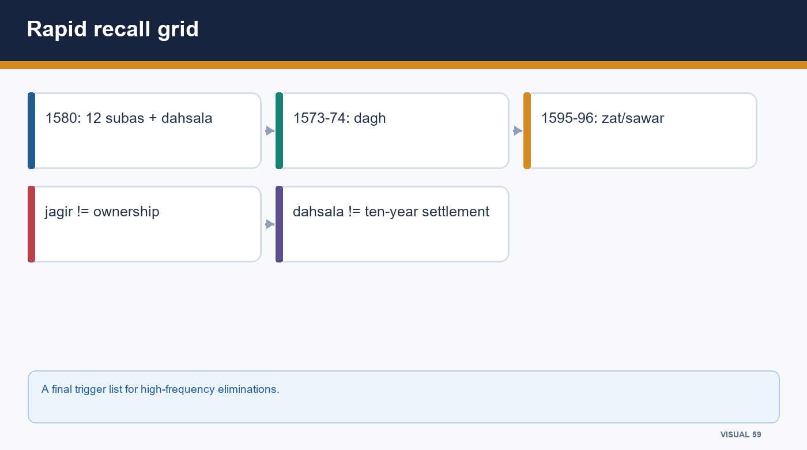

**Demand decoding:** The directive **evaluate** requires a direct position on “Mains 10. [20 marks | 250 words] How should Ain-i-Akbari be used to evaluate Akbar's state…”, coverage of every clause, evidence-led analysis and a qualified verdict.

**Detailed examiner-grade model status:** The solved analysis above is the executable content base. Preserve its named evidence, causal logic, counterpoint and qualification rather than replacing it with a generic narrative.

**Executable exam-length answer / compression plan:** For a 20-mark answer, open with a two-sentence thesis; organise six to eight named evidence units as claim → evidence → inference → qualification; reserve the final lines for a graded conclusion.

**How to improve this answer:** For “Mains 10. [20 marks | 250 words] How should Ain-i-Akbari be used to evaluate Akbar's state…”, replace the weakest generalisation with one additional named site, text, inscription, coin, ruler or scholarly position and state exactly what that evidence cannot prove.

## OPTIONAL ADVANCED DEPTH — NOT REQUIRED FOR A CORE ANSWER

### State & Government under Akbar (Mansabdari, Dahsala) — ADVANCED

> **Subject:** History (Medieval India) · **Tier:** Advanced (deeper understanding) · **GS Paper:** GS-I (also Prelims).
> **Grounded in:** Satish Chandra, *Medieval India: From Sultanat to the Mughals — Part II (Mughal Empire)* — chapter "State and Government Under Akbar".
> ✅ = from source book · ⚠️ = inference / standard knowledge · 📰 = current affairs.
> *Companion: `basic/16_State-and-Government-under-Akbar.md`. Chronology spine: `00_Master-Chronology.md`.*

---

### Mini-timeline

| Date | Event |
|---|---|
| ✅ 1565 | Muzaffar Khan Turbati becomes diwan; revenue department strengthens |
| ✅ 1567 | Numerical mansab hierarchy generally associated with Akbar's 11th regnal year |
| ✅ 1573-74 | Dagh system introduced in the 18th regnal year |
| ✅ 1575 | Todar Mal made mushrif-i-diwan; revenue expertise consolidated |
| ✅ 1580 | Empire divided into twelve subas; dahsala implemented |
| ✅ 1581 | Shah Mansur executed during Mirza Hakim crisis context |
| ✅ 1595-96 | Dual zat-sawar rank introduced in the 40th regnal year |
| ✅ 1605 | Akbar dies; administrative framework continues |

### 1. Snapshot & core idea

**Deeper — Akbar's state used checks, balances and expertise.**

- ✅ Part II argues that Akbar inherited Sultanate structures but reorganised departments so their functions did not encroach on each other and yet balanced one another.
- ✅ The all-powerful *vakil* was reduced: Bairam Khan's dominance convinced Akbar not to allow a second over-mighty minister.
- ✅ The *diwan* became a specialist in income/expenditure and revenue; the *mir bakhshi* handled mansabs, military presentation, intelligence and high appointments.
- ✅ Provincial government repeated the centre's checks: subah governor, diwan, bakhshi, sadr-qazi and news-writer were appointed from the centre.

**Deeper — dahsala and mansabdari were evolving systems.**

- ✅ The dahsala was implemented by a team including Muzaffar Khan, Todar Mal and Shah Mansur; popular memory over-associates it with Todar Mal alone.
- ✅ Mansabdari was unique because it made a graded single service combining civil and military responsibilities; rank fixed status, salary and retainers.
- ✅ The dagh system was introduced to reduce the gap between paper cavalry and actual mustered troops, but it caused noble resistance and administrative harassment.
- ✅ The dual **zat-sawar** rank was introduced late to distinguish personal status/pay from actual cavalry obligation.
- ✅ Chandra, citing later research, cautions that *zabt* probably did not cover the whole land of any province; crop-sharing, appraisement and estimate remained part of the working system.

### 2. Key classification / data

| Institution | Advanced detail | Why it matters |
|---|---|---|
| ✅ Vakil | Show of prestige retained; real power reduced after Bairam | Anti-factional monarchy |
| ✅ Diwan | Financial head; checked accounts, khalisa, jagir and inam | Fiscal bureaucracy |
| ✅ Mir Bakhshi | Presented mansabdars, managed musters, intelligence reports | Nobility + army control |
| ✅ Sadr | Grants and religious/judicial functions; powers later curbed | Limits ulama patronage |
| ✅ Suba | 12 in 1580; central pattern reproduced in provinces | Bureaucratic integration |
| ✅ Dahsala | Ten-year averages; local productivity/prices grouped into circles | Predictability and cash demand |
| ✅ Mansab | 10-5000/7000 noble hierarchy; single service | Composite ruling class |
| ✅ Zat-sawar | Personal rank vs horsemen obligation after 1595-96 | Solves earlier ambiguity |

### 3. Study links

> **Study link:** ✅ Sher Shah's measurement/dagh precedents → `advanced/14`.
> **Study link:** ⚠️ Akbar's composite ruling class → Rajput policy (`advanced/15`) and sulh-i-kul.
> **Study link:** ⚠️ Jagir assignment and jama-dami → later Mughal fiscal crisis.

### 4. Must-Know Facts (Prelims)

- ✅ Muzaffar Khan Turbati, Todar Mal and Shah Mansur were central to revenue reform.
- ✅ Mansabs formed a hierarchy from **10 to 5000**; later Man Singh and Aziz Koka reached **7000** under Akbar.
- ✅ The **dagh** system was introduced in the **18th regnal year (1573-74)**.
- ✅ **Zat-sawar** dual rank emerged in the **40th regnal year (1595-96)**.
- ✅ A 5000 zat mansabdar was required to maintain specified horses, elephants, camels, mules and carts in Part II's description.
- ✅ The jharoka darshan was Akbar's innovation for a daily personal bond with subjects.
- ✅ District units: **sarkar** and **pargana**; officers included faujdar, amalguzar/amil, qanungo and clerks.

### 5. UPSC Traps

> 🔑 Trap: Akbar's administration was not a static blueprint; it evolved through experiments, resistance and corrections.

- ❌ Vakil remained the all-powerful wazir. → Akbar stripped the office of real power after Bairam.
- ❌ Mansabdars always maintained the full number of troops on paper. → Dagh was introduced because paper numbers and real musters diverged.
- ❌ Jagirs should have been replaced by cash salaries. → Part II stresses jagirs matched social realities and revenue collection difficulties.
- ❌ Akbar's state was modern egalitarian. → Abul Fazl's ideology was liberal for its age but hierarchical.

### 6. 📰 Current link

📰 **Current linkage (verify live before use):** A modern land-record survey can illustrate state capacity, but comparison must stop at measurement and record-making. Verify names, coverage and results from the responsible ministry.

### 7. Mains angles

- ⚠️ Assess Akbar's administration as a system of checks and balances centred on the ruler.
- ⚠️ Explain mansabdari as both military organisation and elite management.
- ⚠️ Analyse dahsala as a fiscal technology: measurement, averages, cash conversion and local variation.

### ➕ Concept note (PYQ-gap)

⚠️ **Dahsala ≠ zabt ≠ batai.** Dahsala is the ten-year average method within revenue assessment; zabt is measurement-based assessment; batai is crop-sharing. UPSC often tests the distinction indirectly.

## CONSOLIDATED REGISTER NOTES

### FINAL CONSOLIDATED REGISTER NOTES — State & Government under Akbar

#### 1. Chronology that prevents static answers
- **1556:** accession; Bairam Khan's powerful wakil-regency is the warning against an over-mighty coordinator.
- **1565:** diwan strengthens; fiscal work is a team and department story, not a single-hero story.
- **c. 1567:** numerical mansab hierarchy associated with the eleventh regnal year.
- **1573-74 (18th regnal year):** Akbar's Mughal-frame dagh measure; not first invention of dagh/chehra.
- **1580:** twelve subas and dahsala implementation; do not make either a finished all-India blueprint.
- **1595-96 (40th regnal year):** explicit zat-sawar distinction; do not project it unchanged backward.

#### 2. State form: centralised, personal, differentiated
- Emperor: appointment, justice, revenue, military command and patronage remain concentrated at the centre.
- Vakil: Bairam Khan lesson -> prestige survives; effective monopoly is curbed.
- Diwan/diwan-i-ala: income-expenditure, accounts, khalisa-jagir-inam scrutiny; name **Muzaffar Khan Turbati + Todar Mal + Shah Mansur**.
- Mir bakhshi: mansab presentation/recommendation, muster/personnel record, associated news/intelligence; not a modern defence minister.
- Mir saman/khan-i-saman: household, stores and karkhanas = material state capacity.
- Sadr-us-sudur/qazi-ul-quzat: grants and judicial-religious functions; no modern autonomous welfare/judicial analogy.
- Formula: **office differentiation + central appointment + cross-reporting -> ruler-centred check**, not separation of powers.

#### 3. Administrative ladder and local mediation
- **Suba -> sarkar -> pargana -> village**; ascending territorial size = **pargana -> sarkar -> suba**.
- 1580: twelve subas; provincial subadar, diwan, bakhshi, sadr-qazi and reporting apparatus balance one another.
- Sarkar: distinguish faujdar's coercive/order field from amil-guzar/amalguzar revenue work; jurisdiction may vary.
- Pargana: shiqdar, amil, qanungo, potdar and karkun form a record/collection cluster.
- Village: muqaddam/patel, patwari, chaudhuri, zamindar and custom; neither direct-uniform state reach nor romantic autonomy.
- Khalisa = crown revenue; jagir = assigned state revenue; madad-i-maash/inam = grant. **Jagir != ownership.**
- Jagirdar = generally transferable assignee; zamindar = local claimant/intermediary with social/armed resource.

#### 4. Mansabdari: remember the triad
- **Mansab = rank + remuneration + service obligation**, a single civil-military imperial service.
- Ranks begin at 10; high 5000 and exceptional 7000 under Akbar; no single rigid all-reign table.
- Composite elite: Turani, Irani, Indian Muslim, Rajput, Afghan and others; integration does not equal equality.
- **Zat = personal rank/status/pay; sawar = cavalry obligation**, explicit in 1595-96.
- Cash and jagir payment coexist; jama/dami valuation is not equivalent to realised hasil.
- Transfer, promotion, demotion and assignment create dependence; elite family advantage and hierarchy persist.
- **Not hereditary feudal title; not modern merit civil service.**

#### 5. Dagh, chehra, army and information
- Provenance mnemonic: **Alauddin used -> Sher Shah renewed -> Akbar systematised**.
- Dagh = brand horse; chehra = describe soldier; goal = reduce fictitious muster/substitution.
- Limit: resistance, harassment, inspection cost and paper-versus-actual troop gap.
- Army: mansabdar contingents + ahadis + artillery/infantry/elephants where relevant; cavalry central; not modern standing army.
- News writers and records improve oversight, but no claim of one uniform modern intelligence agency.

#### 6. Revenue logic and terminology
- Objective: predictable fiscal claim, military/court/household finance, knowledge of cultivation, control of officials/intermediaries; **not welfare-only**.
- Sher Shah precedent -> Akbar experiments -> local circles/records -> 1580 dahsala.
- **Zabti = measurement-based assessment. Dahsala = ten-year produce-price averaging.**
- Dahsala: theoretical one-third of average produce in cash; **not a permanent ten-year settlement**.
- Jarib with bamboo/iron rings = standardising measurement evidence; do not assign universal modern bigha equivalence.
- Polaj/parati(ch)/chachar/banjar = cultivation/fallow history, not fertility-only ladder.
- Batai = crop share; kankut = measurement + standing crop estimate; nasaq = previous-demand estimate.
- Safe reach: Lahore to Allahabad, Malwa, Gujarat. Alternatives prove zabt was not universal.
- Jama = assessed demand; hasil = realised receipt. Cash nexus is uneven, not complete commercialisation.
- Remission/taccavi may support cultivation; cesses, transport, price risk and coercion qualify benevolence.

#### 7. Comparisons and limits
- Iqta vs jagir: both revenue-service assignments; compare tenure, audit, scale and rank relation—avoid identity/invention claims.
- Sher Shah vs Akbar: continuity plus refinement; not mere copying, not Akbar-first.
- Capacity = rank + record + inspection + revenue + provincial replication + household supply + news.
- Limits = local intermediaries, uneven reach, corruption, nominal contingents, cash-price risk, coercion, jama-hasil gaps, transfer incentive.
- Later jagirdari crisis belongs chiefly to Topics 21/25; here identify only structural seeds.

#### 8. Source discipline and PYQ route
- Ain-i-Akbari: administrative compendium/data/ideal order in Akbarnama project; useful for categories/norms, not census-like proof of universal practice.
- Abu'l Fazl: imperial ideology/praise; Badauni: hostile/sectarian lens; triangulate with farmans, records, coins, inscriptions and historians.
- 2021 Prelims GS-I Q45 direct/owned: exact local-paper wording and option order reproduced above; **(a) inferred, high confidence, not officially verified**.
- 2019 jagirdar-zamindar is Topic 24 adjacent; 2025 religious syncretism is Topic 17 adjacent.

#### 9. Twenty-second recall
1. 1580 = twelve subas + dahsala.
2. 1573-74 = Akbar's dagh; 1595-96 = zat-sawar.
3. Pargana -> sarkar -> suba.
4. Jagir is revenue assignment, not land title.
5. Zabt measures; dahsala averages.
6. One-third is theoretical claim; realised burden can differ.
7. Team, not Todar Mal alone.
8. Ruler-centred checks, not constitutional separation.
9. Ain gives norms/ideal order; test practice.
10. Best verdict: systematised but uneven early modern imperial capacity.

#### 10. Last-minute answer compression
- For an **administration** question, use: Bairam-wakil correction -> diwan/mir bakhshi functions -> twelve subas -> ruler-centred qualification.
- For a **mansabdari** question, use: rank-salary-service -> composite elite -> 1595-96 zat/sawar -> dagh/chehra -> jagir-transfer tension.
- For a **revenue** question, use: Sur precedent/team -> zabti versus dahsala -> jarib/rates -> alternatives -> jama-hasil/local mediation.
- For a **sources** question, use: Ain category/norm -> Abu'l Fazl patronage -> Badauni's situated dissent -> corroborating traces -> norm-practice verdict.
- Never write “Akbar invented dagh/chehra,” “dahsala was a permanent ten-year settlement,” “jagir was land ownership,” “zabt was universal,” or “subas were federal provinces.”
- Named evidence should perform a job: 1580 dates reorganisation; 1595-96 dates refinement; jarib shows measurement; jama-hasil shows fiscal gap; a zamindar shows mediated reach.

#### 11. Three one-line verdicts
- **State:** “Centralisation was a ruler-centred increase in reportability, not the creation of impersonal constitutional administration.”
- **Mansab:** “The mansab joined honour, remuneration and military obligation, making elite integration an instrument of command.”
- **Dahsala:** “The ten-year average made a fiscal claim more legible, while alternative methods and local risk marked the boundary of uniform implementation.”

#### 12. Final caution
- State capacity is not a synonym for a modern state. In this topic it means the court's enlarged
  ability to classify, rank, record, inspect, assign and collect through people whose cooperation
  and local knowledge it could never fully replace.

### COMPLETE TOPIC ASCII MASTER FLOW DIAGRAM

#### ASCII MASTER FLOW — PANEL 1/12: State capacity as an integrated architecture

```ascii-master
RULER-CENTRED AUTHORITY -> appointment, transfer, promotion and judgement
OFFICES -> differentiated finance, military, household and grant functions
MANSABDARI -> ranks elite status, remuneration and service obligation
REVENUE -> measurement, averages, records and local mediation fund the state
VERIFICATION -> dagh, chehra, accounts and news test paper claims
VERDICT: substantial capacity remained personal, hierarchical and uneven.
MUST REMEMBER: Mansab ranked service through zat and sawar; jagir assigned revenue and did not
  confer private ownership of land.
MUST REMEMBER: Mansab ranked service through zat and sawar; jagir assigned revenue and did not
  confer private ownership of land.
```

#### ASCII MASTER FLOW — PANEL 2/12: Administrative evolution 1556-1605

```ascii-master
1556 -> Bairam Khan as powerful wakil during minority
1565 -> Muzaffar Khan Turbati strengthens the diwan's fiscal role
1567 -> numerical mansab hierarchy associated with the 11th regnal year
1573-74 -> dagh introduced | 1575 -> Todar Mal as mushrif-i-diwan
1580 -> dahsala and twelve subas
1595-96 -> zat-sawar distinction in the 40th regnal year.
```

#### ASCII MASTER FLOW — PANEL 3/12: Central offices and ruler-centred checks

```ascii-master
EMPEROR -> final authority and coordinator
WAKIL -> prestige retained; over-mighty regency power reduced
DIWAN -> income, expenditure, khalisa, jagir, inam and fiscal audit
MIR BAKHSHI -> mansab presentation, musters, personnel and intelligence
MIR SAMAN -> household, stores and karkhanas | SADR-QAZI -> grants and justice
RULE: differentiated functions checked concentration, not the monarch.
```

#### ASCII MASTER FLOW — PANEL 4/12: Province to village: hierarchy and counterweights

```ascii-master
CENTRE -> appoints provincial officers and receives reports
SUBA -> subadar + separate diwan, bakhshi, sadr-qazi and news channels
SARKAR -> faujdar and fiscal/coercive work; jurisdictions may vary
PARGANA -> amil/amalguzar, qanungo and clerical record structure
VILLAGE -> cultivators, muqaddam/patel, patwari and local custom
TRAP: pargana -> sarkar -> suba, but not a modern federal hierarchy.
```

#### ASCII MASTER FLOW — PANEL 5/12: Mansabdari: rank, remuneration and obligation

```ascii-master
MANSAB -> graded imperial rank, not one military headcount
STATUS -> court position and place in the service elite
SALARY -> cash calculation, often met through a transferable jagir
SERVICE -> civil command and cavalry obligation inside one hierarchy
RECRUITMENT -> Turani, Irani, Rajput, Indian Muslim and other elites integrated
LIMIT -> hierarchy creates competition and remains dependent on imperial favour.
```

#### ASCII MASTER FLOW — PANEL 6/12: Zat, sawar and jagir logic

```ascii-master
ZAT -> personal status and salary dimension
SAWAR -> cavalry obligation; introduced as a separate late distinction
JAGIR -> assignment of state revenue, not private ownership of land
KHALISA -> revenue reserved for the crown
TRANSFER -> restrains territorial rooting but can encourage short-term extraction
JAMA / HASIL -> paper assessment may exceed actual receipt.
```

#### ASCII MASTER FLOW — PANEL 7/12: Dagh, chehra and the verification problem

```ascii-master
SANCTIONED CONTINGENT -> a mansabdar claims horses and personnel
CHEHRA -> descriptive roll records the soldier
DAGH -> branding identifies the inspected horse
MUSTER -> officials compare paper obligation with actual resources
INFORMATION -> mir bakhshi and news channels support oversight
QUALIFY -> Alauddin precedent, Sher Shah revival, Akbar systematisation.
```

#### ASCII MASTER FLOW — PANEL 8/12: Revenue reform as experiment

```ascii-master
SHER SHAH PRECEDENT -> measurement and crop-rate practices
EARLY AKBAR -> central price schedule creates delay and local-price distortion
1573 ONWARD -> closer imperial attention after Gujarat
TEAM -> Muzaffar Khan, Todar Mal, Shah Mansur and record officials
1580 DAHSALA -> ten-year produce and price averages structure demand
RULE: reform evolved through correction; it was not a first-day blueprint.
```

#### ASCII MASTER FLOW — PANEL 9/12: Zabt-dahsala calculation chain

```ascii-master
JARIB -> bamboo linked by iron rings standardises measurement
LAND -> polaj, parati, chachar and banjar track cultivation history
PRODUCE -> ten-year average | PRICES -> ten-year local average
DEMAND -> generally one-third of average produce, converted into cash
PATTA / RECORD -> assessed liability becomes legible
TRAP: ten-year data window is not a permanent ten-year settlement.
```

#### ASCII MASTER FLOW — PANEL 10/12: Methods, geography and mediation

```ascii-master
ZABT -> measurement-based assessment in suitable record-rich zones
BATAI -> crop divided in an agreed proportion
KANKUT -> measurement combined with standing-crop appraisal
NASAQ -> estimate relying substantially on previous demand or payment
ZAMINDAR / LOCAL STAFF -> information, bargaining and collection remain necessary
LIMIT -> no method covered every field, crop, terrain or province uniformly.
CLOSE DISTINCTION: Zabt and dahsala depended on measurement, prices and assessment but were
  not uniformly applicable everywhere.
CLOSE DISTINCTION: Zabt and dahsala depended on measurement, prices and assessment but were
  not uniformly applicable everywhere.
```

#### ASCII MASTER FLOW — PANEL 11/12: Continuity, evidence and structural limits

```ascii-master
SULTANATE / SUR -> assignments, measurement and verification precedents
AKBAR -> coordination at larger scale and over longer duration
AIN-I-AKBARI -> normative detail and imperial knowledge; not every local outcome
DILRMP ANALOGY -> records matter, but modern title systems are not Mughal zabt
LIMITS -> jagir incentives, uneven hasil, evasion, coercion and local bargaining
VERDICT: refinement and integration mattered more than invention from zero.
EVIDENCE LIMIT: Imperial regulations must be distinguished from local practice, crop variation
  and later administrative adjustment.
EVIDENCE LIMIT: Imperial regulations must be distinguished from local practice, crop variation
  and later administrative adjustment.
```

#### ASCII MASTER FLOW — PANEL 12/12: Topic 16 answer spine

```ascii-master
OPEN -> Akbar coordinated inherited devices into a larger imperial system
CENTRE -> differentiated offices under final ruler-centred authority
ELITE -> mansab + zat/sawar + jagir + verification
FISCAL -> measurement + averages + alternative methods + local mediation
CHECKS -> reports and parallel officers constrain but do not constitutionalise power
CLOSE -> rational capacity increased without becoming uniform or modern.
```
