# Aurangzeb: Religious Policy, North India & the Rajputs - Complete Topic Package


> Subject: Medieval Indian History | GS-I | Prelims | Date: 2026-08-18.

> Source order followed: Topic 22 basic/advanced Markdown; master chronology and answer-worthiness audit; local OCR/official-paper and routing search; bounded Topic 17/21/23/24/25 cross-links; local Satish Chandra Part II OCR extraction; then an official heritage/archive/court live-source search. FACT = source-grounded; ANALYSIS = qualified inference.

### Learning roadmap

1. Frame and chronology  2. Law and sovereignty  3. Policy phases  4. Jizyah  5. Temple evidence  6. Composite nobility  7. Sikhs  8. Jats/Satnamis  9. Rajput alliance  10. Marwar  11. Mewar/Prince Akbar  12. Deccan bridge  13. Historiography  14. PYQ audit/practice  15. Mains  16. Final register notes.

### PRE-TEACH CHECKLIST

**Book context:** Topic 22 basic/advanced notes, master chronology, audit, and local searchable Satish Chandra Part II extraction were checked. Exact rates, totals and any contested narrative detail are omitted unless the source base establishes them.

**CA Search:** official ASI / Ministry of Culture / National Archives / Supreme Court / High Court heritage-source search for 18 February–18 August 2026.

**CA Found:** No material recent official current-affairs anchor suitable for historical use was found; static relevance retained. Modern litigation is not used as proof of medieval events.

## BASIC LEARNING SESSION

### DEEP-REVIEW LEARNING CONTRACT

| Control | Binding rule for this package |
|---|---|
| Syllabus boundary | Complete Medieval History Core is taught before optional enrichment. |
| Evidence method | Claim → named site/text/inscription/coin/example → analysis → qualification. |
| Source hierarchy | Archaeology, textual testimony, inscriptions, coins and scholarly interpretation remain visibly distinct. |
| Contested issues | Competing interpretations are attributed, evidenced and bounded; certainty is not manufactured. |
| Practice contract | Every solved item has demand decoding, an examiner-grade model, an executable answer/compression plan, marks rationale and answer-specific improvement. |
| Approval | This immutable successor remains `approved: false` pending explicit approval. |

**Canonical Basic/Core owner:** `upsc-ai-kit\knowledge\Medieval-Indian-History\basic\22_Aurangzeb-Religious-Policy-Rajputs.md`  
**Canonical topic owner:** `upsc-ai-kit\knowledge\Medieval-Indian-History\basic\22_Aurangzeb-Religious-Policy-Rajputs.md`  
**Optional Advanced owner:** `upsc-ai-kit\knowledge\Medieval-Indian-History\advanced\22_Aurangzeb-Religious-Policy-Rajputs.md`  
**Official syllabus mapping:** `upsc-ai-kit\knowledge\Medieval-Indian-History\OFFICIAL-UPSC-SYLLABUS-MAPPING.md`

### EVIDENCE, PYQ AND CURRENT-STATUS CONTROL

- **Archaeological inference:** material context supports bounded reconstruction; absence is not automatic proof of non-existence.
- **Textual testimony:** genre, authorship, redaction, patronage and temporal distance control what a text can prove.
- **Inscription and coin evidence:** contemporary names, titles, claims and circulation are powerful but do not by themselves map uniform territorial control.
- **Scholarly interpretation:** historian labels are arguments to test, not facts to memorise without evidence.
- **PYQ discipline:** repository ledgers and locally held official papers control wording and metadata; reconstructed wording and unavailable official keys must be labelled.
- **Current-status note, rechecked 2026-08-30:** Official heritage, archive and court-source searches were rechecked on 30 August 2026 for the preceding six months. No material recent official current-affairs anchor suitable for historical use was found, so static relevance is retained. Modern litigation, political claims and contemporary site disputes are not used as proof of a medieval event. Claims about jizyah, temple action, Sikh history, local rebellions and Rajput relations remain controlled by dated repository evidence, OCR books and explicit source criticism.

**Live/primary context sources recorded by the predecessor generation:**

- No live source is required for a static claim in this topic.


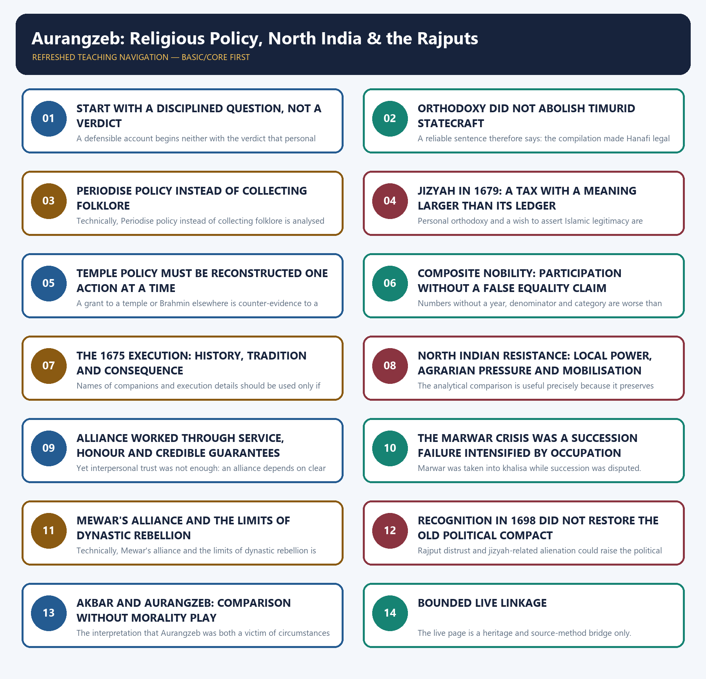

*Distinct embedded teaching-navigation image. The separate continuous Cārvāka-style flowchart package remains an independent at-a-glance artifact.*

### PART I - FRAME, CHRONOLOGY AND METHOD

### SESSION 1 — START WITH A DISCIPLINED QUESTION, NOT A VERDICT

#### DEFINITION / WHAT THIS IS CALLED

**Plain-language definition:** The treaty with Shivaji in 1665, Jai Singh's death in 1667, the 1669 Jat disturbance and temple-order context, the Satnami rising of 1672, Guru Tegh Bahadur's execution in 1675, Jaswant Singh's death in 1678, jizyah and the Rajput war in 1679, Prince Akbar's revolt in 1681, Ajit's recognition in 1698, the Khalsa in 1699 and Aurangzeb's death in 1707 are not a single causal line.

**Technical definition:** A defensible account begins neither with the verdict that personal bigotry alone caused imperial weakness nor with the counter-claim that religion was irrelevant because political calculation existed.

#### ANSWER-GRABBING OPENING — WRITE/ADAPT IN THE EXAM

> A court-centred prohibition is not automatically a village practice; a farman is not a census of compliance; a Rajput succession conflict is not identical with a general religious policy.

#### MUST-WRITE KEYWORDS

- **Start with a disciplined question**
- **not a verdict**
- **EXAM CAUTION**
- **The historical problem**
- **Islamic**
- **Timurid**

**How to use them:** Frame the answer through Start with a disciplined question; define not a verdict, connect EXAM CAUTION with The historical problem to explain the mechanism, and use Islamic for the decisive comparison or qualification.

Aurangzeb/Alamgir ruled from 1658 to 1707. A defensible account begins neither with the verdict that personal bigotry alone caused imperial weakness nor with the counter-claim that religion was irrelevant because political calculation existed. The historical problem is how personal orthodoxy, an Islamic legal idiom, Timurid sovereignty, fiscal-military circumstances, local administration and changing coalitions worked together. The same emperor could favour a legal-symbolic measure, retain a Hindu commander, issue a grant in one locality and authorise coercion in another. The task is to explain the scale and context of each action rather than convert selected evidence into a total description of subjects or institutions.

The chronological spine prevents anachronism. Accession in 1658 follows the succession settlement treated in Topic 21. The treaty with Shivaji in 1665, Jai Singh's death in 1667, the 1669 Jat disturbance and temple-order context, the Satnami rising of 1672, Guru Tegh Bahadur's execution in 1675, Jaswant Singh's death in 1678, jizyah and the Rajput war in 1679, Prince Akbar's revolt in 1681, Ajit's recognition in 1698, the Khalsa in 1699 and Aurangzeb's death in 1707 are not a single causal line. They mark different institutions, regions and kinds of political pressure.

A good answer locates a claim in time and scale. A court-centred prohibition is not automatically a village practice; a farman is not a census of compliance; a Rajput succession conflict is not identical with a general religious policy. Conversely, uneven enforcement is not a reason to pretend that an announced differentiation had no political meaning. The examiner-friendly move is to state the proposition, name the action and date, identify the source type, explain mechanism, then state its limit.

Use the phrase “differentiated rule under pressure” as an organising device. It keeps agency visible while preventing hindsight: the later decline of the Mughal Empire belongs principally to Topic 25, and the Deccan-Maratha campaign belongs principally to Topic 23. This topic explains how north Indian legitimacy, alliance and local resistance were affected before and alongside those larger pressures.

> **EXAM CAUTION:** Keep the scale of a claim equal to the scale of its evidence. A court chronicle, local record, grant, tradition and modern allegation do not have identical reach.


*Visual 1: Aurangzeb: policy, power and north Indian responses. Original topic-specific study visual; schematic maps are explicitly NOT TO SCALE.*

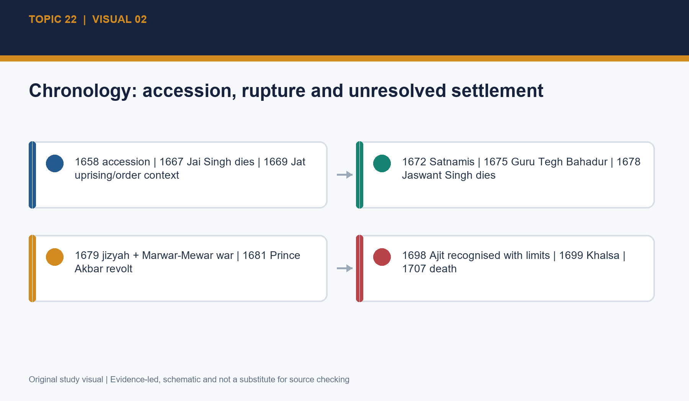

*Visual 2: Chronology: accession, rupture and unresolved settlement. Original topic-specific study visual; schematic maps are explicitly NOT TO SCALE.*


*Visual 3: Six-lens analytical framework. Original topic-specific study visual; schematic maps are explicitly NOT TO SCALE.*

#### CLOSING RECALL FLOW — START WITH A DISCIPLINED QUESTION, NOT A VERDICT

```text
START / CONCEPT: Start with a disciplined question, not a verdict
        |
        v
EXACT TERMS: Start with a disciplined question · not a verdict · EXAM CAUTION · The historical problem · Islamic · Timurid
        |
        v
MECHANISM / ARGUMENT: A defensible account begins neither with the verdict that personal bigotry alone caused imperial weakness nor with the counter-claim that religion was irrelevant because political calculation existed.
        |
        v
CONSEQUENCE / CONTRAST: The treaty with Shivaji in 1665, Jai Singh's death in 1667, the 1669 Jat disturbance and temple-order context, the Satnami rising of 1672, Guru Tegh Bahadur's execution in 1675, Jaswant Singh's death in 1678, jizyah and the Rajput war in 1679, Prince Akbar's revolt in 1681, Ajit's recognition in 1698, the Khalsa in 1699 and Aurangzeb's death in 1707 are not a single causal line.
        |
        v
UPSC TRAP / ANSWER-USE: Conversely, uneven enforcement is not a reason to pretend that an announced differentiation had no political meaning.
        |
        v
ANSWER-GRABBING FORMULATION: A court-centred prohibition is not automatically a village practice; a farman is not a census of compliance; a Rajput succession conflict is not identical with a general religious policy.
```
### PART II - WORLDVIEW, LAW AND SOVEREIGNTY

### SESSION 2 — ORTHODOXY DID NOT ABOLISH TIMURID STATECRAFT

#### DEFINITION / WHAT THIS IS CALLED

**Plain-language definition:** A high-quality Mains paragraph can write: “Orthodoxy supplied preference and legitimacy, whereas sovereignty supplied selection and enforcement.” Then test it against jizyah, temple cases, recruitment and the Marwar settlement.

**Technical definition:** A reliable sentence therefore says: the compilation made Hanafi legal learning politically salient, while its administrative reach must be established case by case.

#### ANSWER-GRABBING OPENING — WRITE/ADAPT IN THE EXAM

> A high-quality Mains paragraph can write: “Orthodoxy supplied preference and legitimacy, whereas sovereignty supplied selection and enforcement.” Then test it against jizyah, temple cases, recruitment and the Marwar settlement.

#### MUST-WRITE KEYWORDS

- **Orthodoxy did not abolish Timurid statecraft**
- **EXAM CAUTION**
- **Aurangzeb's personal piety and Hanafi orientation**
- **Aurangzeb's**
- **Hanafi**
- **Courtly**

**How to use them:** Frame the answer through Orthodoxy did not abolish Timurid statecraft; define EXAM CAUTION, connect Aurangzeb's personal piety and Hanafi orientation with Aurangzeb's to explain the mechanism, and use Hanafi for the decisive comparison or qualification.

Aurangzeb's personal piety and Hanafi orientation are historically relevant. Courtly and chronicle materials present a ruler concerned to align public rule more closely with sharia, and Satish Chandra treats his outlook as orthodox. But it is a category error to turn this into a picture of an ulema-run theocracy. The Mughal emperor remained the sovereign appointing officials, directing war, allocating revenue and issuing regulations. His state also used zawabit: ruler-made administrative regulations justified by order, necessity and imperial practice. Legal learning could shape the idiom of a decision without mechanically dictating every decision.

The Fatawa-i-Alamgiri is best handled as an imperially patronised collective Hanafi legal compendium. Its compilation and courtly patronage show a serious investment in jurisprudence and learned authority. It is not a modern constitution, a uniform criminal code automatically administered in every district, or proof that every official read and enforced its propositions. A reliable sentence therefore says: the compilation made Hanafi legal learning politically salient, while its administrative reach must be established case by case.

Appointments of qazis, sadrs and other religious specialists mattered, but the ulama were neither a homogeneous loyal bloc nor a parallel cabinet. Their positions depended on patronage, locality, doctrine and personal interest; ordinary administrators, mansabdars, zamindars and armed followers also shaped outcomes. Where rulers chose among opinions or made a regulation in state interest, the useful vocabulary is discretion within a legal-political field. Do not impose the modern binary of secular state versus sacred state on a seventeenth-century imperial formation.

A high-quality Mains paragraph can write: “Orthodoxy supplied preference and legitimacy, whereas sovereignty supplied selection and enforcement.” Then test it against jizyah, temple cases, recruitment and the Marwar settlement. This formulation accepts the reality of religious discrimination without wrongly erasing political calculation or local administrative agency.

> **EXAM CAUTION:** Keep the scale of a claim equal to the scale of its evidence. A court chronicle, local record, grant, tradition and modern allegation do not have identical reach.

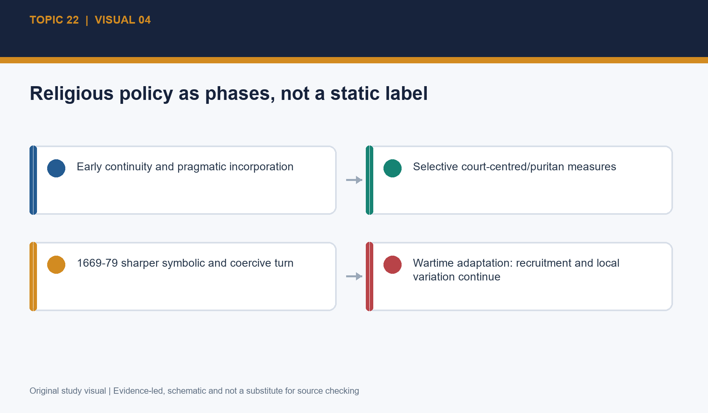

*Visual 4: Religious policy as phases, not a static label. Original topic-specific study visual; schematic maps are explicitly NOT TO SCALE.*

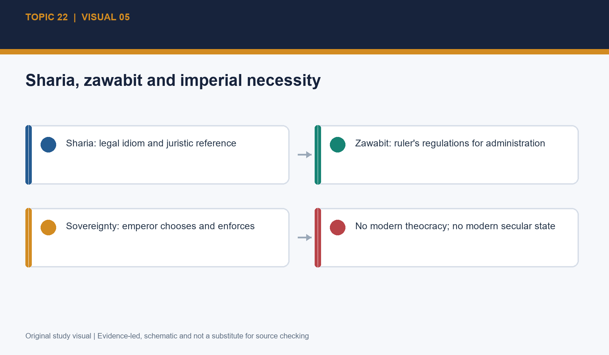

*Visual 5: Sharia, zawabit and imperial necessity. Original topic-specific study visual; schematic maps are explicitly NOT TO SCALE.*


*Visual 6: Fatawa-i-Alamgiri: use with caution. Original topic-specific study visual; schematic maps are explicitly NOT TO SCALE.*

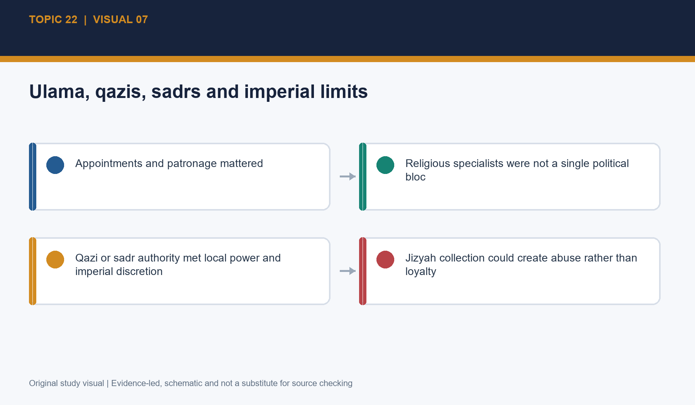

*Visual 7: Ulama, qazis, sadrs and imperial limits. Original topic-specific study visual; schematic maps are explicitly NOT TO SCALE.*

#### CLOSING RECALL FLOW — ORTHODOXY DID NOT ABOLISH TIMURID STATECRAFT

```text
START / CONCEPT: Orthodoxy did not abolish Timurid statecraft
        |
        v
EXACT TERMS: Orthodoxy did not abolish Timurid statecraft · EXAM CAUTION · Aurangzeb's personal piety and Hanafi orientation · Aurangzeb's · Hanafi · Courtly
        |
        v
MECHANISM / ARGUMENT: A reliable sentence therefore says: the compilation made Hanafi legal learning politically salient, while its administrative reach must be established case by case.
        |
        v
CONSEQUENCE / CONTRAST: But it is a category error to turn this into a picture of an ulema-run theocracy.
        |
        v
UPSC TRAP / ANSWER-USE: It is not a modern constitution, a uniform criminal code automatically administered in every district, or proof that every official read and enforced its propositions.
        |
        v
ANSWER-GRABBING FORMULATION: A high-quality Mains paragraph can write: “Orthodoxy supplied preference and legitimacy, whereas sovereignty supplied selection and enforcement.” Then test it against jizyah, temple cases, recruitment and the Marwar settlement.
```
### PART III - PHASES, COURT SYMBOLISM AND IMPLEMENTATION

### SESSION 3 — PERIODISE POLICY INSTEAD OF COLLECTING FOLKLORE

#### DEFINITION / WHAT THIS IS CALLED

**Plain-language definition:** Periodise policy instead of collecting folklore comprises EXAM CAUTION, Aurangzeb's and This as its core connected dimensions.

**Technical definition:** Technically, Periodise policy instead of collecting folklore is analysed by relating EXAM CAUTION to Aurangzeb's, then testing the relationship through This and Each.

#### ANSWER-GRABBING OPENING — WRITE/ADAPT IN THE EXAM

> This periodisation does not make earlier rule liberal or later rule uniformly coercive; it merely prevents a static label from doing the historian's work.

#### MUST-WRITE KEYWORDS

- **Periodise policy instead of collecting folklore**
- **EXAM CAUTION**
- **Aurangzeb's**
- **This**
- **Each**
- **For**

**How to use them:** Frame the answer through Periodise policy instead of collecting folklore; define EXAM CAUTION, connect Aurangzeb's with This to explain the mechanism, and use Each for the decisive comparison or qualification.

Aurangzeb's reign should be divided analytically. The early years show continuity with inherited institutions and pragmatic incorporation. A second phase includes selective puritan and court-centred measures. A sharper phase around 1669 and 1679 combines important symbolic decisions, jizyah, and coercive action in several northern contexts. The later wartime phase still contained recruitment, negotiated exceptions and uneven local administration. This periodisation does not make earlier rule liberal or later rule uniformly coercive; it merely prevents a static label from doing the historian's work.

Popular lists often merge jharoka darshan, weighing ceremonies, the kalima on coins, Nauroz, music, intoxicants, prostitution, muhtasibs, dress and custom into one empire-wide prohibition list. That is methodologically unsafe. Each reported measure needs a date, a form, a source and an implementation claim. For example, withdrawal of a court ceremony has a different reach from a policing order, and a chronicle's moral approval is not a register of village compliance. In this package, an item is used only as a court-symbolic or moral-regulation example when the underlying source and scope can be named.

The distinction matters politically. Symbolic acts at court can be highly visible and can revise the public idiom of sovereignty even when they do not transform every locality. Conversely, one cannot infer empire-wide social transformation from a court order. The right formulation is “court-centred symbolism and uneven practice,” not “nothing changed” or “everything was instantly enforced.” This is especially important where contemporary polemic has converted a limited action into an unverifiable all-India claim.

In a Prelims explanation, match the measure to its scale. In a Mains answer, compare a symbolic restriction, a fiscal measure and a locally attested punitive act. That three-part distinction shows control over evidence and prevents the familiar Akbar-tolerant/Aurangzeb-intolerant binary from replacing historical analysis.

> **EXAM CAUTION:** Keep the scale of a claim equal to the scale of its evidence. A court chronicle, local record, grant, tradition and modern allegation do not have identical reach.

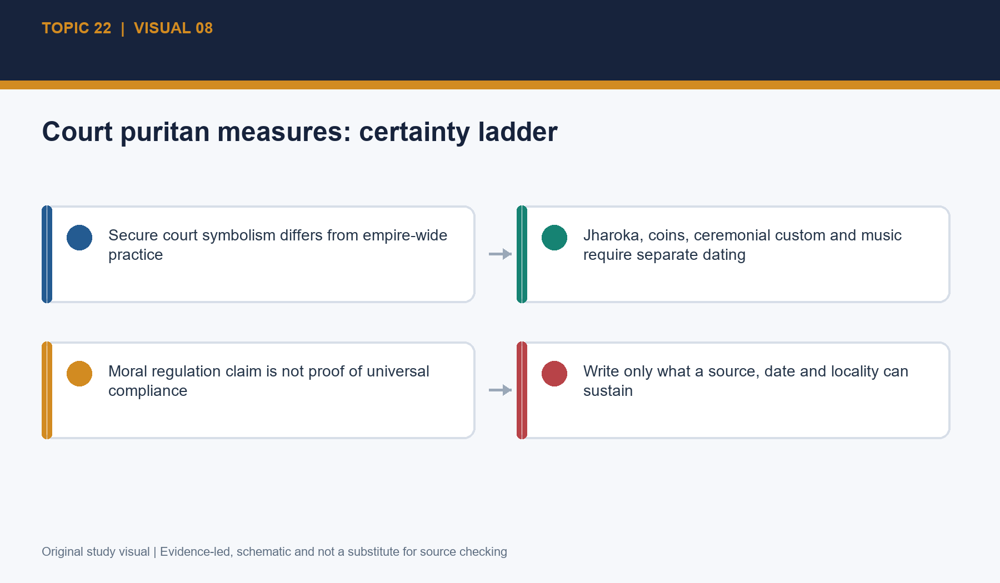

*Visual 8: Court puritan measures: certainty ladder. Original topic-specific study visual; schematic maps are explicitly NOT TO SCALE.*


*Visual 9: Jizyah: a distinct poll tax mechanism. Original topic-specific study visual; schematic maps are explicitly NOT TO SCALE.*

#### CLOSING RECALL FLOW — PERIODISE POLICY INSTEAD OF COLLECTING FOLKLORE

```text
START / CONCEPT: Periodise policy instead of collecting folklore
        |
        v
EXACT TERMS: Periodise policy instead of collecting folklore · EXAM CAUTION · Aurangzeb's · This · Each · For
        |
        v
MECHANISM / ARGUMENT: Each reported measure needs a date, a form, a source and an implementation claim.
        |
        v
CONSEQUENCE / CONTRAST: For example, withdrawal of a court ceremony has a different reach from a policing order, and a chronicle's moral approval is not a register of village compliance.
        |
        v
UPSC TRAP / ANSWER-USE: The right formulation is “court-centred symbolism and uneven practice,” not “nothing changed” or “everything was instantly enforced.” This is especially important where contemporary polemic has converted a limited action into an unverifiable all-India claim.
        |
        v
ANSWER-GRABBING FORMULATION: This periodisation does not make earlier rule liberal or later rule uniformly coercive; it merely prevents a static label from doing the historian's work.
```
### PART IV - JIZYAH: LAW, COLLECTION AND POLITICAL SIGNAL

### SESSION 4 — JIZYAH IN 1679: A TAX WITH A MEANING LARGER THAN ITS LEDGER

#### DEFINITION / WHAT THIS IS CALLED

**Plain-language definition:** The first safeguard is conceptual: jizyah is not land revenue and is not a customs duty.

**Technical definition:** Personal orthodoxy and a wish to assert Islamic legitimacy are relevant; so are relations with learned religious opinion, the political value of a public signal, and a fiscal-military context in which rulers sought revenue.

#### ANSWER-GRABBING OPENING — WRITE/ADAPT IN THE EXAM

> Personal orthodoxy and a wish to assert Islamic legitimacy are relevant; so are relations with learned religious opinion, the political value of a public signal, and a fiscal-military context in which rulers sought revenue.

#### MUST-WRITE KEYWORDS

- **Jizyah in 1679**
- **EXAM CAUTION**
- **The first safeguard**
- **It**
- **Several**
- **Personal**

**How to use them:** Frame the answer through Jizyah in 1679; define EXAM CAUTION, connect The first safeguard with It to explain the mechanism, and use Several for the decisive comparison or qualification.

Aurangzeb reimposed jizyah in 1679. The first safeguard is conceptual: jizyah is not land revenue and is not a customs duty. It is a poll tax framed in a classical legal idiom of differentiated subject status. Reimposition therefore reversed an important Akbar-era fiscal-symbolic position. It is historically defensible to call it both a fiscal instrument and a religious-political signal; it is not defensible to announce an exact empire-wide yield, coverage or rate without a dated fiscal record and a defined locality.

Several motives can be discussed without pretending to read a single private intention. Personal orthodoxy and a wish to assert Islamic legitimacy are relevant; so are relations with learned religious opinion, the political value of a public signal, and a fiscal-military context in which rulers sought revenue. Yet no secure evidence makes one motive exclusive. Satish Chandra's reading is especially useful for consequences: collectors and qazis could engage in corruption or grasping conduct; collection was not frictionless; the measure did not effectively rally Muslims or cure deeper state problems.

The policy's significance cannot be reduced to receipts. A tax collected through local officials creates encounters, possibilities of harassment and a public message about relative status. Its effect could be uneven because implementation varied, but unevenness does not make the differentiated message imaginary. Politically it alienated sections of Hindu subjects and could reinforce groups already unhappy with Mughal authority. It was not the sole cause of any revolt, nor the sole cause of decline. A claim that it “caused the fall” cannot explain continued service by many Hindu elites or the distinct structural burdens of the Deccan.

Write a three-column answer: fiscal measure / religious symbol / political signal. Place legal idiom and collection in the first column, reversal of Akbar in the second, and alienation plus inability to consolidate support in the third. Add the qualification that post-1707 changes require separately verified regulations; do not casually attach an abolition date without a direct source.

> **EXAM CAUTION:** Keep the scale of a claim equal to the scale of its evidence. A court chronicle, local record, grant, tradition and modern allegation do not have identical reach.

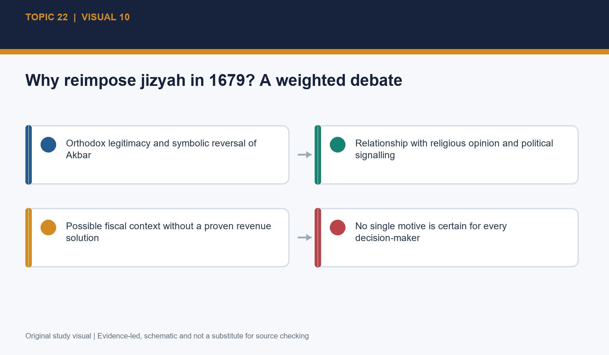

*Visual 10: Why reimpose jizyah in 1679? A weighted debate. Original topic-specific study visual; schematic maps are explicitly NOT TO SCALE.*

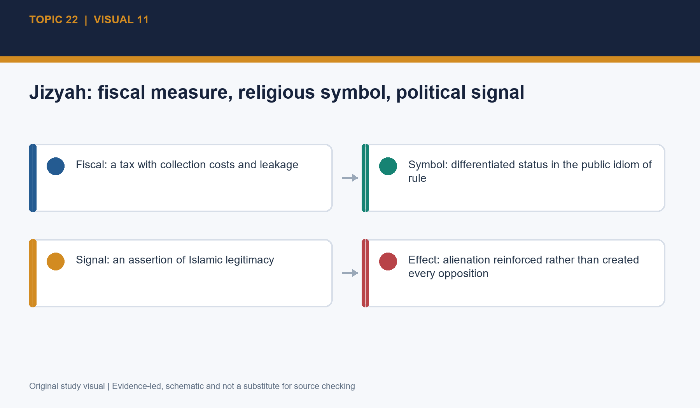

*Visual 11: Jizyah: fiscal measure, religious symbol, political signal. Original topic-specific study visual; schematic maps are explicitly NOT TO SCALE.*

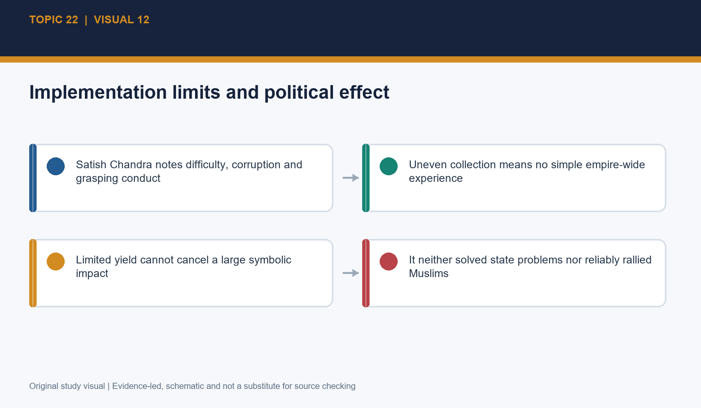

*Visual 12: Implementation limits and political effect. Original topic-specific study visual; schematic maps are explicitly NOT TO SCALE.*

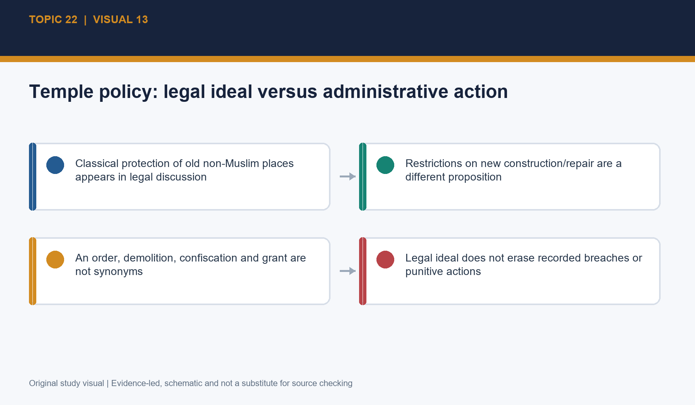

*Visual 13: Temple policy: legal ideal versus administrative action. Original topic-specific study visual; schematic maps are explicitly NOT TO SCALE.*

#### CLOSING RECALL FLOW — JIZYAH IN 1679: A TAX WITH A MEANING LARGER THAN ITS LEDGER

```text
START / CONCEPT: Jizyah in 1679: a tax with a meaning larger than its ledger
        |
        v
EXACT TERMS: Jizyah in 1679 · EXAM CAUTION · The first safeguard · It · Several · Personal
        |
        v
MECHANISM / ARGUMENT: A tax collected through local officials creates encounters, possibilities of harassment and a public message about relative status.
        |
        v
CONSEQUENCE / CONTRAST: The first safeguard is conceptual: jizyah is not land revenue and is not a customs duty.
        |
        v
UPSC TRAP / ANSWER-USE: It is historically defensible to call it both a fiscal instrument and a religious-political signal; it is not defensible to announce an exact empire-wide yield, coverage or rate without a dated fiscal record and a defined locality.
        |
        v
ANSWER-GRABBING FORMULATION: Personal orthodoxy and a wish to assert Islamic legitimacy are relevant; so are relations with learned religious opinion, the political value of a public signal, and a fiscal-military context in which rulers sought revenue.
```
### PART V - TEMPLE POLICY: CLAIMS, CASES AND EVIDENCE

### SESSION 5 — TEMPLE POLICY MUST BE RECONSTRUCTED ONE ACTION AT A TIME

#### DEFINITION / WHAT THIS IS CALLED

**Plain-language definition:** Satish Chandra highlights the contradiction between formal protection of old temples and documented destruction of old-standing temples; that contradiction is historical evidence, not a reason to choose an exculpatory or universalising slogan.

**Technical definition:** A grant to a temple or Brahmin elsewhere is counter-evidence to a universal-destruction thesis, not proof that no destruction occurred.

#### ANSWER-GRABBING OPENING — WRITE/ADAPT IN THE EXAM

> Satish Chandra highlights the contradiction between formal protection of old temples and documented destruction of old-standing temples; that contradiction is historical evidence, not a reason to choose an exculpatory or universalising slogan.

#### MUST-WRITE KEYWORDS

- **temple policy**
- **1669 order**
- **Kashi Vishwanath**
- **Mathura Keshava Rai**
- **action taxonomy**
- **source corroboration**
- **local context**
- **universal-destruction claim**

**How to use them:** Frame the answer through temple policy; define 1669 order, connect Kashi Vishwanath with Mathura Keshava Rai to explain the mechanism, and use action taxonomy for the decisive comparison or qualification.

The strongest method begins with a legal and administrative distinction. Juristic discussion could recognise protection for existing places associated with non-Muslim subjects while placing restrictions on new construction or repair; the formulation and application are not identical in every setting. It follows neither that all older temples were invariably safe nor that every temple everywhere was a permitted target. A legal ideal, an imperial order, a local demolition, a conversion, a confiscation, a closure, a restriction and a revenue grant are different propositions requiring different evidence.

The 1669 order concerning schools and temples appears in a court-chronicle context and must be read with its genre, vocabulary and named follow-through in mind. Kashi Vishwanath and Mathura's Keshava Rai/Keshav Dev are important, well-known cases commonly connected to the 1669-70 sequence, but they should not become an undifferentiated catalogue. Marwar and Mewar also need a local occupation and administrative context. Satish Chandra highlights the contradiction between formal protection of old temples and documented destruction of old-standing temples; that contradiction is historical evidence, not a reason to choose an exculpatory or universalising slogan.

Motives could overlap: religious orthodoxy, punishment after rebellion, a sovereignty display, local complaint, strategic occupation and administrative action. The appropriate unit is a case: What was the site? What is the date? What action can actually be demonstrated? Which source reports it? Is there corroboration by farman, inscription, local record or archaeological record? A grant to a temple or Brahmin elsewhere is counter-evidence to a universal-destruction thesis, not proof that no destruction occurred. Conversely a confirmed destruction is not a licence to assert a universal programme.

Use an evidence ladder: secure dated case; probable local action; contested later tradition; unsupported list. Present current religious-site litigation, if encountered, only as a modern legal process whose pleadings do not prove a medieval event. The official-source search for the six months before 18 August 2026 found no material recent official current-affairs anchor suitable for historical use; static relevance is retained.

> **EXAM CAUTION:** Keep the scale of a claim equal to the scale of its evidence. A court chronicle, local record, grant, tradition and modern allegation do not have identical reach.

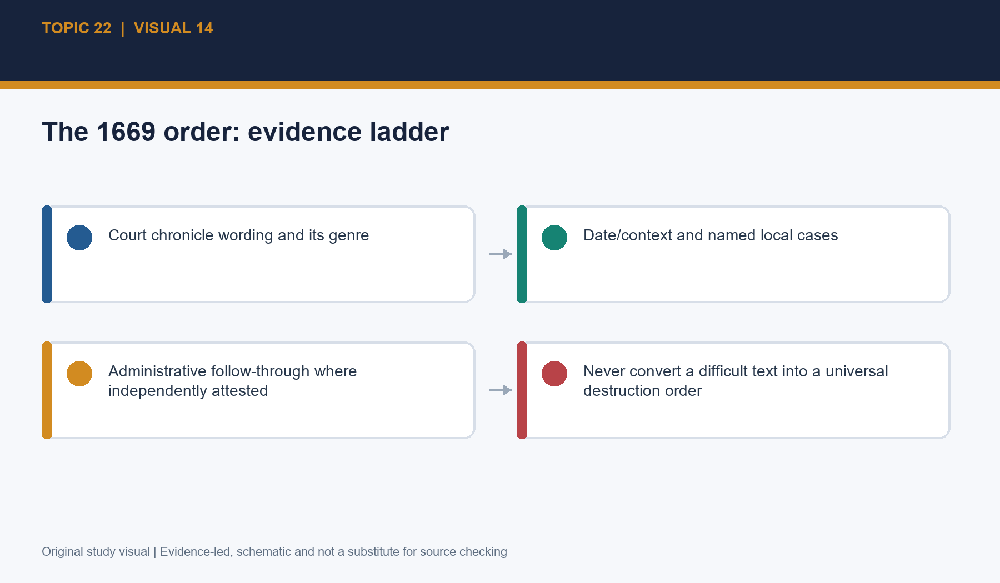

*Visual 14: The 1669 order: evidence ladder. Original topic-specific study visual; schematic maps are explicitly NOT TO SCALE.*

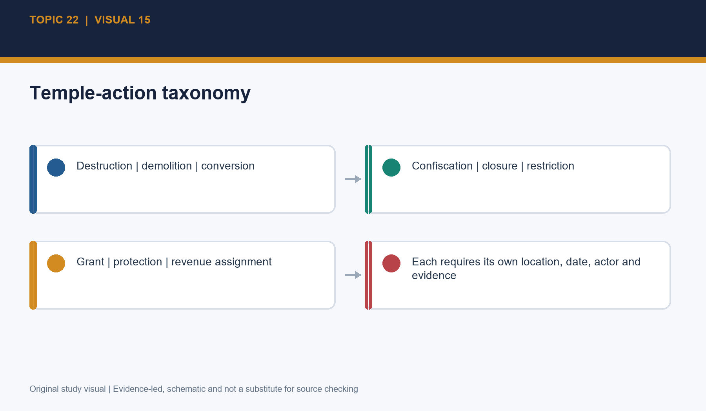

*Visual 15: Temple-action taxonomy. Original topic-specific study visual; schematic maps are explicitly NOT TO SCALE.*


*Visual 16: Selected temple cases: case-by-case method. Original topic-specific study visual; schematic maps are explicitly NOT TO SCALE.*

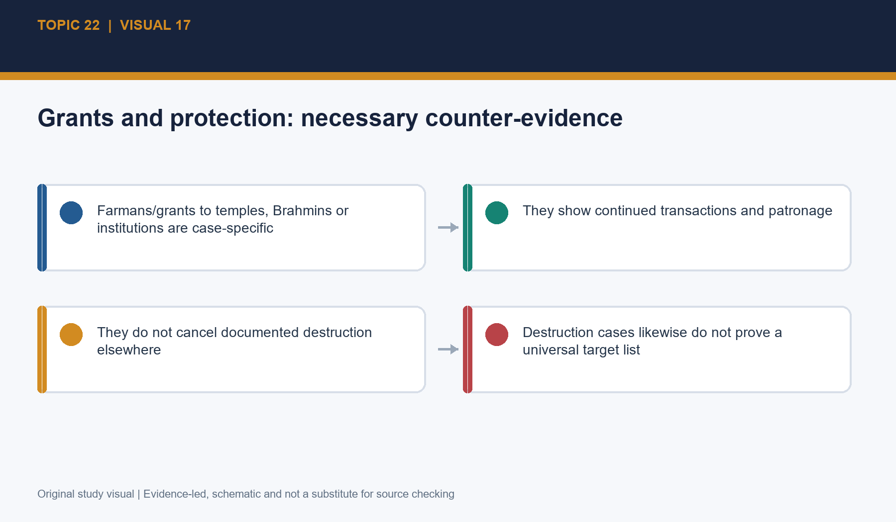

*Visual 17: Grants and protection: necessary counter-evidence. Original topic-specific study visual; schematic maps are explicitly NOT TO SCALE.*

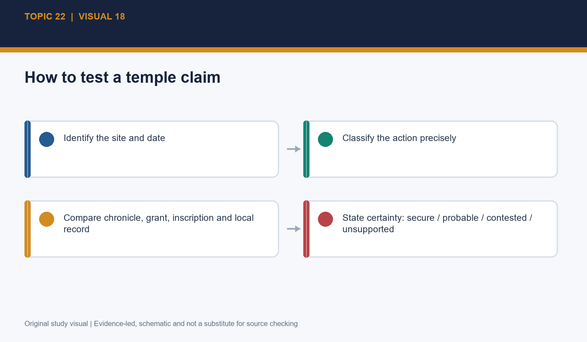

*Visual 18: How to test a temple claim. Original topic-specific study visual; schematic maps are explicitly NOT TO SCALE.*

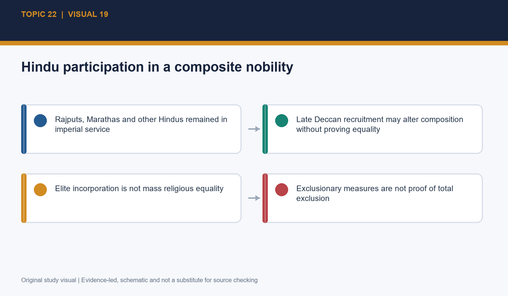

*Visual 19: Hindu participation in a composite nobility. Original topic-specific study visual; schematic maps are explicitly NOT TO SCALE.*

#### CLOSING RECALL FLOW — TEMPLE POLICY MUST BE RECONSTRUCTED ONE ACTION AT A TIME

```text
START / CONCEPT: Temple policy must be reconstructed one action at a time
        |
        v
EXACT TERMS: temple policy · 1669 order · Kashi Vishwanath · Mathura Keshava Rai · action taxonomy · source corroboration · local context · universal-destruction claim
        |
        v
MECHANISM / ARGUMENT: The 1669 order concerning schools and temples appears in a court-chronicle context and must be read with its genre, vocabulary and named follow-through in mind.
        |
        v
CONSEQUENCE / CONTRAST: A grant to a temple or Brahmin elsewhere is counter-evidence to a universal-destruction thesis, not proof that no destruction occurred.
        |
        v
UPSC TRAP / ANSWER-USE: Kashi Vishwanath and Mathura's Keshava Rai/Keshav Dev are important, well-known cases commonly connected to the 1669-70 sequence, but they should not become an undifferentiated catalogue.
        |
        v
ANSWER-GRABBING FORMULATION: Satish Chandra highlights the contradiction between formal protection of old temples and documented destruction of old-standing temples; that contradiction is historical evidence, not a reason to choose an exculpatory or universalising slogan.
```
### PART VI - ELITE INCORPORATION AND ITS LIMITS

### SESSION 6 — COMPOSITE NOBILITY: PARTICIPATION WITHOUT A FALSE EQUALITY CLAIM

#### DEFINITION / WHAT THIS IS CALLED

**Plain-language definition:** A sound statement is directional and source-bound: “participation continued and in some late contexts recruitment broadened,” followed by examples of Rajput houses or Maratha entrants only where the source supports them.

**Technical definition:** Numbers without a year, denominator and category are worse than no number in a UPSC answer.

#### ANSWER-GRABBING OPENING — WRITE/ADAPT IN THE EXAM

> A nuanced answer can show both: continued Hindu recruitment made the empire institutionally composite, while particular policies made the public idiom more discriminatory and injured trust.

#### MUST-WRITE KEYWORDS

- **Composite nobility**
- **participation without a false equality claim**
- **EXAM CAUTION**
- **This**
- **Hindu**
- **Rajput**

**How to use them:** Frame the answer through Composite nobility; define participation without a false equality claim, connect EXAM CAUTION with This to explain the mechanism, and use Hindu for the decisive comparison or qualification.

A large number of Rajputs and other Hindus continued in Mughal service during Aurangzeb's reign; later Deccan recruitment also made Maratha entry into the nobility important. This is a necessary corrective to the statement that every Hindu elite was expelled or that every Rajput severed ties after 1679. It is not evidence of equal subject status, nor a reason to deny jizyah or documented temple actions. Service was an elite bargain of rank, jagir, command, household access and political survival; it did not settle how all subjects encountered fiscal or religious differentiation.

The inherited Rajput partnership predated Aurangzeb. Akbar, Jahangir and Shah Jahan had developed multiple, unequal but durable arrangements with particular houses. Aurangzeb initially restored Jaswant Singh's mansab, used Jai Singh and rewarded Rajput service. The later breach with Marwar and Mewar is therefore more intelligible as a serious rupture within an existing political language of honour, watan and guarantee than as an inevitable consequence of a ruler who always intended to eliminate Rajput power.

The conceptual distinction is inclusion versus equality. Inclusion asks whether a person or house could enter office, receive rank, command troops or hold a revenue assignment. Equality asks whether fiscal, legal and symbolic distinctions applied to subjects. A nuanced answer can show both: continued Hindu recruitment made the empire institutionally composite, while particular policies made the public idiom more discriminatory and injured trust. Neither observation cancels the other.

Avoid unfounded percentages. A sound statement is directional and source-bound: “participation continued and in some late contexts recruitment broadened,” followed by examples of Rajput houses or Maratha entrants only where the source supports them. Numbers without a year, denominator and category are worse than no number in a UPSC answer.

> **EXAM CAUTION:** Keep the scale of a claim equal to the scale of its evidence. A court chronicle, local record, grant, tradition and modern allegation do not have identical reach.

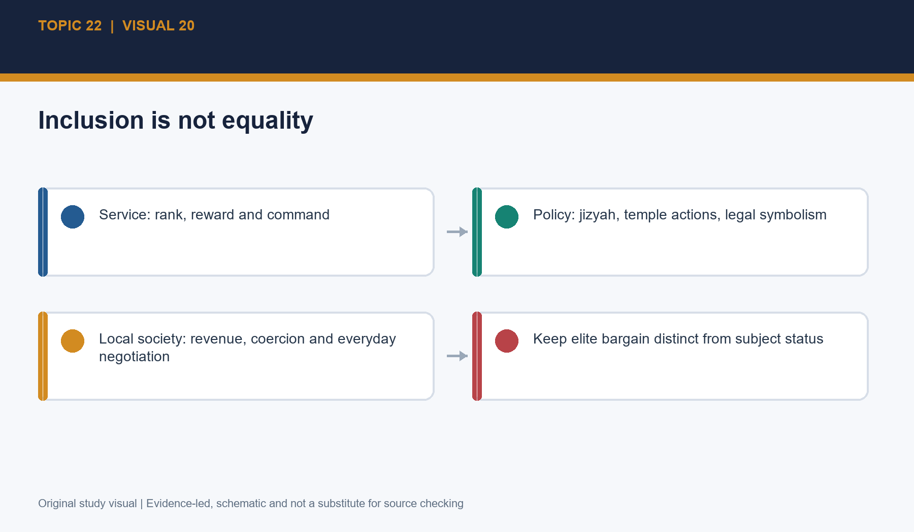

*Visual 20: Inclusion is not equality. Original topic-specific study visual; schematic maps are explicitly NOT TO SCALE.*

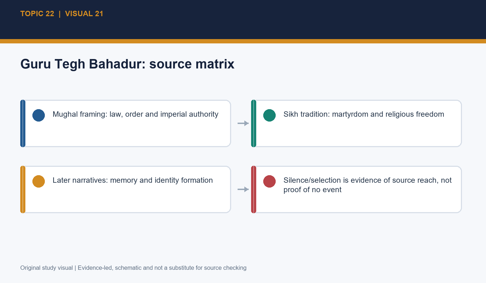

*Visual 21: Guru Tegh Bahadur: source matrix. Original topic-specific study visual; schematic maps are explicitly NOT TO SCALE.*

#### CLOSING RECALL FLOW — COMPOSITE NOBILITY: PARTICIPATION WITHOUT A FALSE EQUALITY CLAIM

```text
START / CONCEPT: Composite nobility: participation without a false equality claim
        |
        v
EXACT TERMS: Composite nobility · participation without a false equality claim · EXAM CAUTION · This · Hindu · Rajput
        |
        v
MECHANISM / ARGUMENT: A sound statement is directional and source-bound: “participation continued and in some late contexts recruitment broadened,” followed by examples of Rajput houses or Maratha entrants only where the source supports them.
        |
        v
CONSEQUENCE / CONTRAST: It is not evidence of equal subject status, nor a reason to deny jizyah or documented temple actions.
        |
        v
UPSC TRAP / ANSWER-USE: Service was an elite bargain of rank, jagir, command, household access and political survival; it did not settle how all subjects encountered fiscal or religious differentiation.
        |
        v
ANSWER-GRABBING FORMULATION: A nuanced answer can show both: continued Hindu recruitment made the empire institutionally composite, while particular policies made the public idiom more discriminatory and injured trust.
```
### PART VII - GURU TEGH BAHADUR, MEMORY AND SIKH POLITICS

### SESSION 7 — THE 1675 EXECUTION: HISTORY, TRADITION AND CONSEQUENCE

#### DEFINITION / WHAT THIS IS CALLED

**Plain-language definition:** Guru Tegh Bahadur's execution in 1675 is a turning point in Sikh historical memory and in the political sharpening of the community, but it is methodologically wrong to treat one narrative as the only uncontested motive.

**Technical definition:** Names of companions and execution details should be used only if they are directly required and securely sourced, not as an ornamental recital.

#### ANSWER-GRABBING OPENING — WRITE/ADAPT IN THE EXAM

> It can state that uncertainty about an exclusive immediate motive does not make the execution politically neutral or erase its religious meaning in Sikh tradition.

#### MUST-WRITE KEYWORDS

- **The 1675 execution**
- **history**
- **tradition**
- **consequence**
- **EXAM CAUTION**
- **Guru Tegh Bahadur's execution in 1675**

**How to use them:** Frame the answer through The 1675 execution; define history, connect tradition with consequence to explain the mechanism, and use EXAM CAUTION for the decisive comparison or qualification.

Guru Tegh Bahadur's execution in 1675 is a turning point in Sikh historical memory and in the political sharpening of the community, but it is methodologically wrong to treat one narrative as the only uncontested motive. Mughal framing placed the affair within law, order and imperial authority. Sikh traditions, including the association with Kashmiri Pandits, preserve a martyrdom account with explicit religious meaning. Satish Chandra records the imperial law-and-order framing while judging the action unjustified and emphasising its larger religious repercussions.

The evidence question is not solved by ignoring silence in a court chronicle or treating later memory as useless. Court texts have official priorities and selective silence; Sikh traditions were shaped by community memory, devotional meaning and later political experience. Each can answer different questions. A source matrix should name what the source can establish: official framing, remembered motive, identity consequence, or later narrative amplification. Names of companions and execution details should be used only if they are directly required and securely sourced, not as an ornamental recital.

The consequence needs equally careful phrasing. The execution intensified martyr memory and helped sharpen Sikh identity; Guru Gobind Singh's establishment of the Khalsa in 1699 gave a distinct organisational and martial form. It does not follow that the execution alone “created” the Khalsa or that Sikh-Mughal conflict had been purely religious from its beginning. Leadership, community discipline, hill-chief politics, local conflict and imperial action all mattered. Topic 20 supplies the bounded Guru Arjan bridge; a full later Sikh regional-state story lies beyond this topic.

A high-scoring response writes both source qualification and moral-political consequence. It can state that uncertainty about an exclusive immediate motive does not make the execution politically neutral or erase its religious meaning in Sikh tradition. That is not false balance; it is an evidence-sensitive explanation of how state action and memory can generate durable collective effects.

> **EXAM CAUTION:** Keep the scale of a claim equal to the scale of its evidence. A court chronicle, local record, grant, tradition and modern allegation do not have identical reach.


*Visual 22: 1675 execution: competing explanations. Original topic-specific study visual; schematic maps are explicitly NOT TO SCALE.*


*Visual 23: Sikh development: bounded timeline. Original topic-specific study visual; schematic maps are explicitly NOT TO SCALE.*

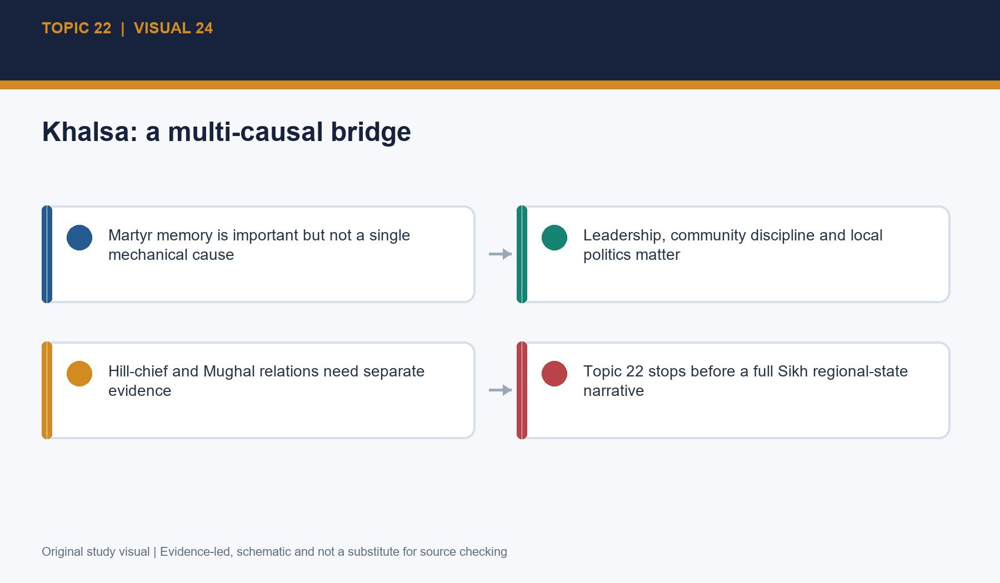

*Visual 24: Khalsa: a multi-causal bridge. Original topic-specific study visual; schematic maps are explicitly NOT TO SCALE.*


*Visual 25: Jat revolt geography: Mathura corridor. Original topic-specific study visual; schematic maps are explicitly NOT TO SCALE.*

#### CLOSING RECALL FLOW — THE 1675 EXECUTION: HISTORY, TRADITION AND CONSEQUENCE

```text
START / CONCEPT: The 1675 execution: history, tradition and consequence
        |
        v
EXACT TERMS: The 1675 execution · history · tradition · consequence · EXAM CAUTION · Guru Tegh Bahadur's execution in 1675
        |
        v
MECHANISM / ARGUMENT: Court texts have official priorities and selective silence; Sikh traditions were shaped by community memory, devotional meaning and later political experience.
        |
        v
CONSEQUENCE / CONTRAST: Guru Tegh Bahadur's execution in 1675 is a turning point in Sikh historical memory and in the political sharpening of the community, but it is methodologically wrong to treat one narrative as the only uncontested motive.
        |
        v
UPSC TRAP / ANSWER-USE: Do not miss this limiting distinction: a source matrix should name what the source can establish.
        |
        v
ANSWER-GRABBING FORMULATION: It can state that uncertainty about an exclusive immediate motive does not make the execution politically neutral or erase its religious meaning in Sikh tradition.
```
### PART VIII - JATS, SATNAMIS AND LOCAL COERCION

### SESSION 8 — NORTH INDIAN RESISTANCE: LOCAL POWER, AGRARIAN PRESSURE AND MOBILISATION

#### DEFINITION / WHAT THIS IS CALLED

**Plain-language definition:** The chronology matters: rebellion, suppression, renewed local mobilisation and later state formation are distinct stages.

**Technical definition:** The analytical comparison is useful precisely because it preserves difference: agrarian-zamindari conflict, sect/community mobilisation, institutional religious memory and elite succession politics are not interchangeable.

#### ANSWER-GRABBING OPENING — WRITE/ADAPT IN THE EXAM

> Later phases associated with Rajaram and, after Aurangzeb's death, Churaman show persistence and transformation of Jat local power.

#### MUST-WRITE KEYWORDS

- **North Indian resistance**
- **local power**
- **agrarian pressure**
- **mobilisation**
- **EXAM CAUTION**
- **The Jat**

**How to use them:** Frame the answer through North Indian resistance; define local power, connect agrarian pressure with mobilisation to explain the mechanism, and use EXAM CAUTION for the decisive comparison or qualification.

The Jat uprising around Mathura under Gokula, conventionally placed around 1669, must be read in its local geography. The Mathura-Agra-Delhi corridor joined cultivation, settlement, traffic and imperial visibility. Zamindar power, revenue pressure, official oppression, access to arms and community mobilisation interacted. Religious and cultural insult can be relevant where a specific source connects it to an incident; it should not be used to erase the agrarian and local-political setting. The rising was neither an uncomplicated peasant class revolution nor merely a temple reaction.

Later phases associated with Rajaram and, after Aurangzeb's death, Churaman show persistence and transformation of Jat local power. They do not mean that a sovereign Bharatpur state sprang immediately from Gokula's rising. The chronology matters: rebellion, suppression, renewed local mobilisation and later state formation are distinct stages. Mughal suppression shows continued coercive capacity, while recurrence shows that force alone did not settle the relationship between state revenue and local authority.

The Satnami revolt of 1672 in the Narnaul region offers a different but comparable case. A clash involving a local official or soldier escalated; the community's sectarian identity and social composition shaped mobilisation; the imperial response suppressed it rapidly. Calling it a minor irrational disturbance misses local coercion and group capacity. Calling it proof that the empire had already collapsed misses the rapid suppression. The correct inference is narrower: local encounters could turn fiscal, social and religious identities into an armed challenge.

Do not merge Jats, Satnamis, Sikhs and Rajputs into one coordinated anti-Mughal national movement. They had different leaders, claims, social bases, terrains and chronologies. The analytical comparison is useful precisely because it preserves difference: agrarian-zamindari conflict, sect/community mobilisation, institutional religious memory and elite succession politics are not interchangeable.

> **EXAM CAUTION:** Keep the scale of a claim equal to the scale of its evidence. A court chronicle, local record, grant, tradition and modern allegation do not have identical reach.

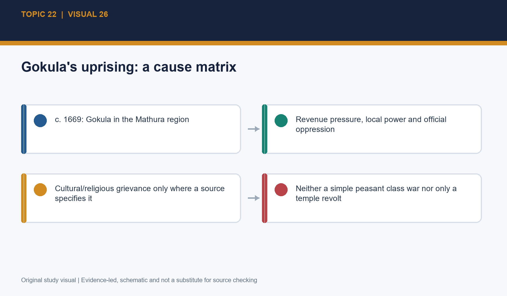

*Visual 26: Gokula's uprising: a cause matrix. Original topic-specific study visual; schematic maps are explicitly NOT TO SCALE.*


*Visual 27: From Gokula to Rajaram and Churaman. Original topic-specific study visual; schematic maps are explicitly NOT TO SCALE.*


*Visual 28: Agrarian, local and religious dimensions. Original topic-specific study visual; schematic maps are explicitly NOT TO SCALE.*

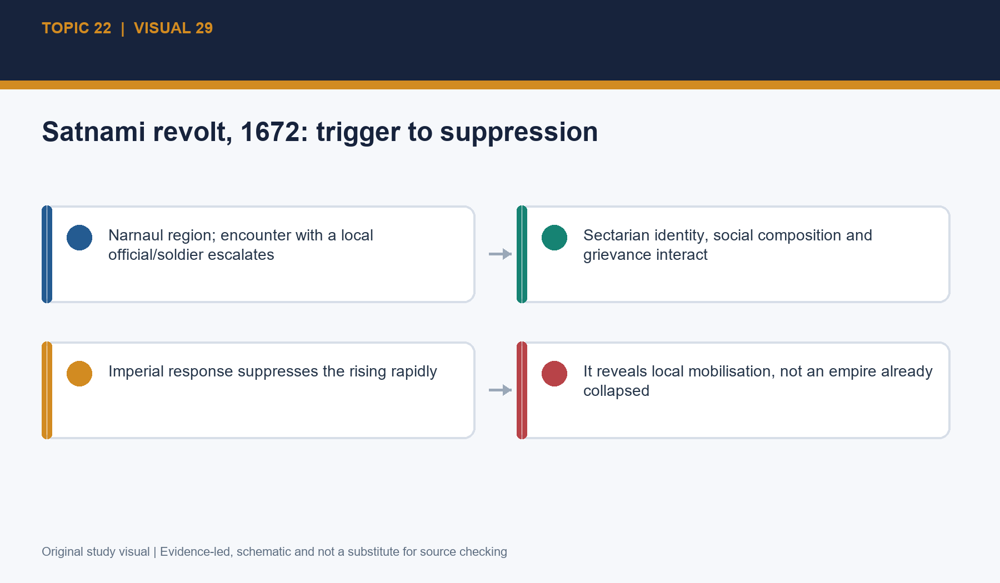

*Visual 29: Satnami revolt, 1672: trigger to suppression. Original topic-specific study visual; schematic maps are explicitly NOT TO SCALE.*


*Visual 30: Compare local rebellions without flattening them. Original topic-specific study visual; schematic maps are explicitly NOT TO SCALE.*

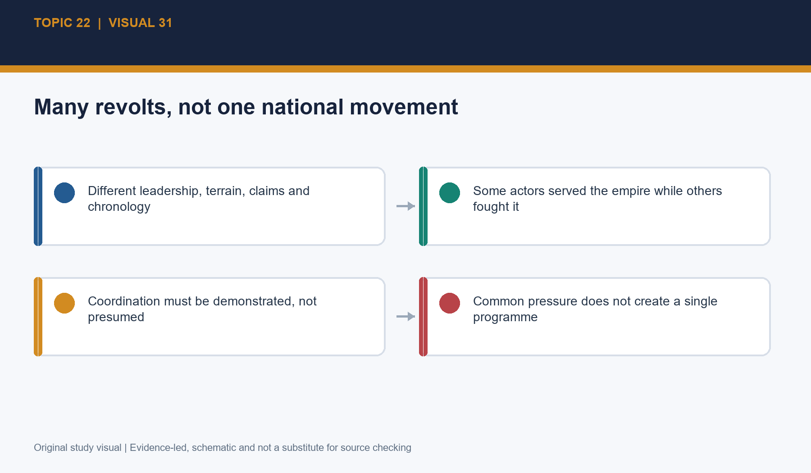

*Visual 31: Many revolts, not one national movement. Original topic-specific study visual; schematic maps are explicitly NOT TO SCALE.*

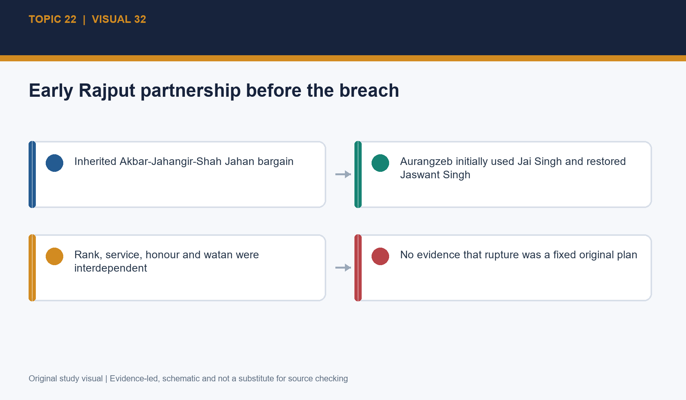

*Visual 32: Early Rajput partnership before the breach. Original topic-specific study visual; schematic maps are explicitly NOT TO SCALE.*

#### CLOSING RECALL FLOW — NORTH INDIAN RESISTANCE: LOCAL POWER, AGRARIAN PRESSURE AND MOBILISATION

```text
START / CONCEPT: North Indian resistance: local power, agrarian pressure and mobilisation
        |
        v
EXACT TERMS: North Indian resistance · local power · agrarian pressure · mobilisation · EXAM CAUTION · The Jat
        |
        v
MECHANISM / ARGUMENT: The analytical comparison is useful precisely because it preserves difference: agrarian-zamindari conflict, sect/community mobilisation, institutional religious memory and elite succession politics are not interchangeable.
        |
        v
CONSEQUENCE / CONTRAST: Religious and cultural insult can be relevant where a specific source connects it to an incident; it should not be used to erase the agrarian and local-political setting.
        |
        v
UPSC TRAP / ANSWER-USE: Mughal suppression shows continued coercive capacity, while recurrence shows that force alone did not settle the relationship between state revenue and local authority.
        |
        v
ANSWER-GRABBING FORMULATION: Later phases associated with Rajaram and, after Aurangzeb's death, Churaman show persistence and transformation of Jat local power.
```
### PART IX - THE RAJPUT ALLIANCE BEFORE 1678

### SESSION 9 — ALLIANCE WORKED THROUGH SERVICE, HONOUR AND CREDIBLE GUARANTEES

#### DEFINITION / WHAT THIS IS CALLED

**Plain-language definition:** The issue is not only religion; it is a breach in the grammar through which Mughal and Rajput interests had been coordinated.

**Technical definition:** Yet interpersonal trust was not enough: an alliance depends on clear succession arrangements, reliable honour and credible limits to imperial intervention.

#### ANSWER-GRABBING OPENING — WRITE/ADAPT IN THE EXAM

> Yet interpersonal trust was not enough: an alliance depends on clear succession arrangements, reliable honour and credible limits to imperial intervention.

#### MUST-WRITE KEYWORDS

- **Alliance worked through service**
- **honour**
- **credible guarantees**
- **EXAM CAUTION**
- **The Rajput**
- **Hindu-Muslim**

**How to use them:** Frame the answer through Alliance worked through service; define honour, connect credible guarantees with EXAM CAUTION to explain the mechanism, and use The Rajput for the decisive comparison or qualification.

The Rajput alliance was never a timeless Hindu-Muslim harmony. It was a layered political partnership involving specific houses, rank, marriage and kinship links, watan interests, military service, imperial reward and unequal power. Its strength lay in reciprocity: Rajput rulers received recognition, authority and opportunities; the empire received commanders, local knowledge and a language of partnership. This inherited arrangement was available to Aurangzeb in the first decades of his reign.

Jai Singh of Amber was used by Aurangzeb and had played a major earlier role in the 1665 agreement with Shivaji; he died in 1667. Jaswant Singh of Marwar was also a high-ranking imperial servant and was posted in the northwest. Their roles show that an early anti-Rajput design is historically implausible. Yet interpersonal trust was not enough: an alliance depends on clear succession arrangements, reliable honour and credible limits to imperial intervention.

Watan refers to hereditary homeland and authority, not simply a transferable office. Mansab and jagir are discussed in more depth in Topics 16 and 21; here they matter because service and local sovereignty had to be held together. The moment an imperial action appears to undermine a house's hereditary legitimacy or treats a watan as a prize for court allocation, political calculation changes. The issue is not only religion; it is a breach in the grammar through which Mughal and Rajput interests had been coordinated.

Use the sequence: inherited alliance -> early confidence -> succession shock -> credibility loss. That sequence prevents two errors: saying Aurangzeb always planned Rajput destruction, and saying the later breach was insignificant because some houses continued to serve.

> **EXAM CAUTION:** Keep the scale of a claim equal to the scale of its evidence. A court chronicle, local record, grant, tradition and modern allegation do not have identical reach.

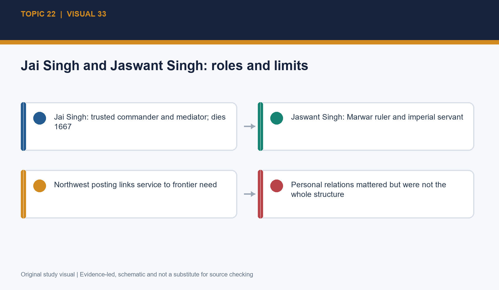

*Visual 33: Jai Singh and Jaswant Singh: roles and limits. Original topic-specific study visual; schematic maps are explicitly NOT TO SCALE.*


*Visual 34: Rajput honour, watan and imperial service. Original topic-specific study visual; schematic maps are explicitly NOT TO SCALE.*

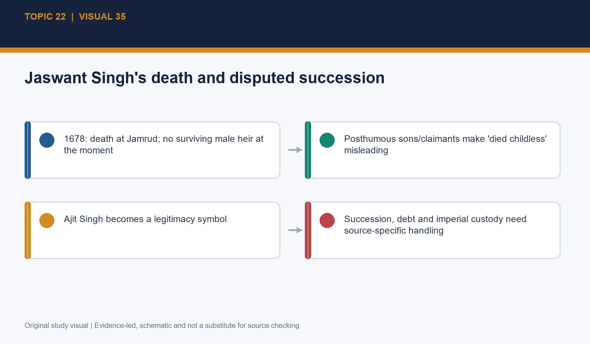

*Visual 35: Jaswant Singh's death and disputed succession. Original topic-specific study visual; schematic maps are explicitly NOT TO SCALE.*

#### CLOSING RECALL FLOW — ALLIANCE WORKED THROUGH SERVICE, HONOUR AND CREDIBLE GUARANTEES

```text
START / CONCEPT: Alliance worked through service, honour and credible guarantees
        |
        v
EXACT TERMS: Alliance worked through service · honour · credible guarantees · EXAM CAUTION · The Rajput · Hindu-Muslim
        |
        v
MECHANISM / ARGUMENT: Mansab and jagir are discussed in more depth in Topics 16 and 21; here they matter because service and local sovereignty had to be held together.
        |
        v
CONSEQUENCE / CONTRAST: The issue is not only religion; it is a breach in the grammar through which Mughal and Rajput interests had been coordinated.
        |
        v
UPSC TRAP / ANSWER-USE: Watan refers to hereditary homeland and authority, not simply a transferable office.
        |
        v
ANSWER-GRABBING FORMULATION: Yet interpersonal trust was not enough: an alliance depends on clear succession arrangements, reliable honour and credible limits to imperial intervention.
```
### PART X - MARWAR: SUCCESSION, KHALISA AND RESISTANCE

### SESSION 10 — THE MARWAR CRISIS WAS A SUCCESSION FAILURE INTENSIFIED BY OCCUPATION

#### DEFINITION / WHAT THIS IS CALLED

**Plain-language definition:** Satish Chandra's use of Waqa-i-Ajmer and Jodhpur Hukumat-ri-Bahi is important because those records illuminate disputed succession, alleged debt, local administrative action and precedent.

**Technical definition:** Marwar was taken into khalisa while succession was disputed.

#### ANSWER-GRABBING OPENING — WRITE/ADAPT IN THE EXAM

> Marwar was taken into khalisa while succession was disputed.

#### MUST-WRITE KEYWORDS

- **EXAM CAUTION**
- **The safe formulation**
- **Ajit Singh**
- **Rathor**
- **Marwar**
- **Khalisa**

**How to use them:** Frame the answer through EXAM CAUTION; define The safe formulation, connect Ajit Singh with Rathor to explain the mechanism, and use Marwar for the decisive comparison or qualification.

Jaswant Singh died at Jamrud in 1678. The safe formulation is that he had no surviving male heir at the moment of death; posthumous sons and competing claims followed, making the shorthand “he died childless” misleading. Ajit Singh became the crucial claimant and a symbol of Rathor hereditary legitimacy. Marwar was taken into khalisa while succession was disputed. Khalisa signifies crown-revenue administration; it does not by itself prove a settled policy of permanent annexation.

Satish Chandra's use of Waqa-i-Ajmer and Jodhpur Hukumat-ri-Bahi is important because those records illuminate disputed succession, alleged debt, local administrative action and precedent. They complicate an older explanation that treats the move as pure strategic annexation or pure religious conspiracy. At the same time, a formal precedent did not determine how people experienced it. Mughal officials searched property, occupied spaces and, according to the authored source base, bricked up or demolished many temples. Conduct that resembled conquest made a temporary administrative claim politically explosive.

Aurangzeb's favour toward Inder Singh and proposals concerning Ajit created a contest over authority. Reports of court custody, division and conversion should be version-labelled: the secure point is that such proposals and memories intensified distrust, not that every later narrative detail can be presented as a settled court fact. Rathor sardars, notably Durgadas, rejected the settlement and protected Ajit. The escape/rescue story has multiple versions; its stable historical core is the conversion of a succession claimant into the centre of organised resistance.

A Mains answer should explain why compromise failed: honour, fear of custody, occupation, factional incentives, property searches, imperial centralising logic and policy rigidity interacted. Temple actions could deepen the insult, but reducing the entire crisis to a single religious motive removes the succession and watan question that gave it durable political force.

> **EXAM CAUTION:** Keep the scale of a claim equal to the scale of its evidence. A court chronicle, local record, grant, tradition and modern allegation do not have identical reach.

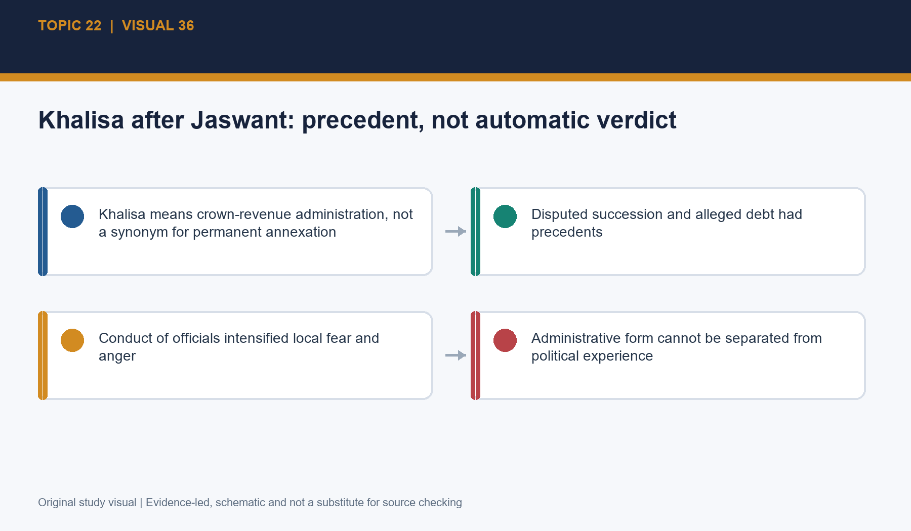

*Visual 36: Khalisa after Jaswant: precedent, not automatic verdict. Original topic-specific study visual; schematic maps are explicitly NOT TO SCALE.*

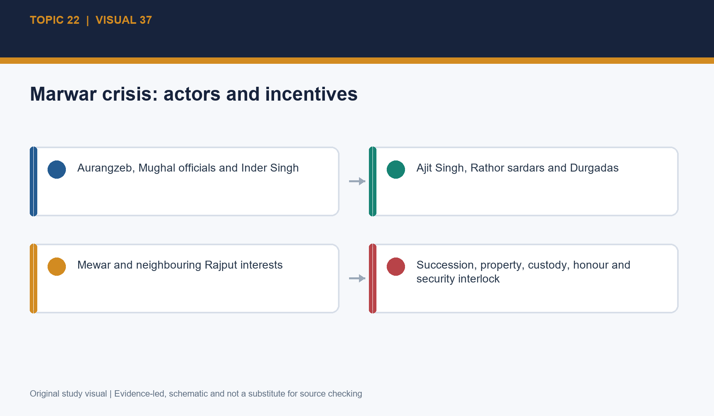

*Visual 37: Marwar crisis: actors and incentives. Original topic-specific study visual; schematic maps are explicitly NOT TO SCALE.*


*Visual 38: Inder Singh, Ajit and the contested tika. Original topic-specific study visual; schematic maps are explicitly NOT TO SCALE.*

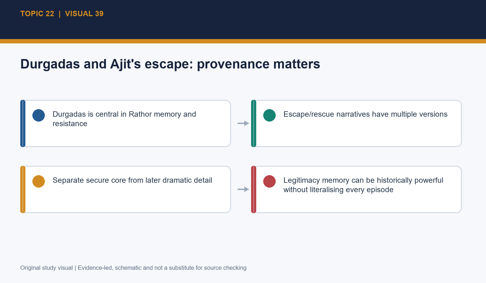

*Visual 39: Durgadas and Ajit's escape: provenance matters. Original topic-specific study visual; schematic maps are explicitly NOT TO SCALE.*

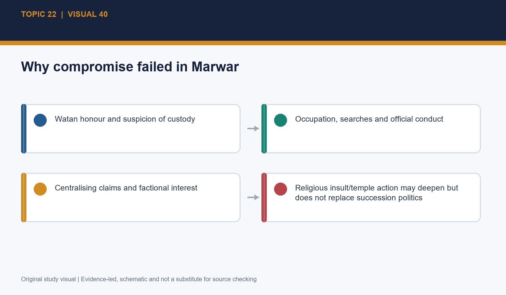

*Visual 40: Why compromise failed in Marwar. Original topic-specific study visual; schematic maps are explicitly NOT TO SCALE.*

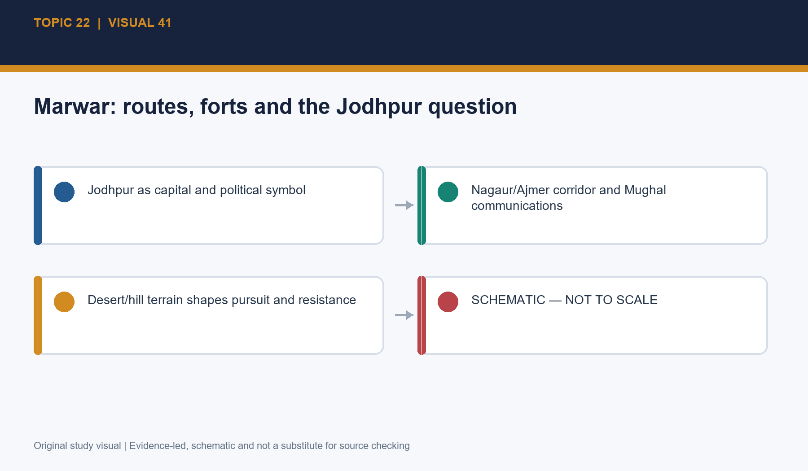

*Visual 41: Marwar: routes, forts and the Jodhpur question. Original topic-specific study visual; schematic maps are explicitly NOT TO SCALE.*

#### CLOSING RECALL FLOW — THE MARWAR CRISIS WAS A SUCCESSION FAILURE INTENSIFIED BY OCCUPATION

```text
START / CONCEPT: The Marwar crisis was a succession failure intensified by occupation
        |
        v
EXACT TERMS: EXAM CAUTION · The safe formulation · Ajit Singh · Rathor · Marwar · Khalisa
        |
        v
MECHANISM / ARGUMENT: Satish Chandra's use of Waqa-i-Ajmer and Jodhpur Hukumat-ri-Bahi is important because those records illuminate disputed succession, alleged debt, local administrative action and precedent.
        |
        v
CONSEQUENCE / CONTRAST: Temple actions could deepen the insult, but reducing the entire crisis to a single religious motive removes the succession and watan question that gave it durable political force.
        |
        v
UPSC TRAP / ANSWER-USE: Reports of court custody, division and conversion should be version-labelled: the secure point is that such proposals and memories intensified distrust, not that every later narrative detail can be presented as a settled court fact.
        |
        v
ANSWER-GRABBING FORMULATION: Marwar was taken into khalisa while succession was disputed.
```
### PART XI - MEWAR AND PRINCE AKBAR'S REVOLT

### SESSION 11 — MEWAR'S ALLIANCE AND THE LIMITS OF DYNASTIC REBELLION

#### DEFINITION / WHAT THIS IS CALLED

**Plain-language definition:** Rana Raj Singh's death and the later settlement with his successor, Jai Singh of Mewar, should be dated only with the relevant record; the key analytical point is that settlement was qualified and did not return an uncomplicated pre-crisis alliance.

**Technical definition:** Technically, Mewar's alliance and the limits of dynastic rebellion is analysed by relating Mewar's alliance to the limits of dynastic rebellion, then testing the relationship through EXAM CAUTION and Kinship.

#### ANSWER-GRABBING OPENING — WRITE/ADAPT IN THE EXAM

> Do not write that all Rajputs joined a rebellion, and do not turn a contingent 1681 coalition into an early national movement.

#### MUST-WRITE KEYWORDS

- **Mewar's alliance**
- **the limits of dynastic rebellion**
- **EXAM CAUTION**
- **Kinship**
- **Rajput**
- **Mughal**

**How to use them:** Frame the answer through Mewar's alliance; define the limits of dynastic rebellion, connect EXAM CAUTION with Kinship to explain the mechanism, and use Rajput for the decisive comparison or qualification.

Rana Raj Singh's support for Marwar needs several motives, not a single jizyah explanation. Kinship and concern about a neighbouring Rajput succession mattered; Mughal interference in Rajput internal affairs and occupation of Marwar created a security problem; autonomy, territory and political balance were at stake. Jizyah was an important contemporary signal and may have enlarged distrust, but it does not replace these linked political reasons.

The Aravalli setting shaped warfare. Hills, passes and local knowledge complicated an occupying army's pursuit and supply, while imperial presence could impose harsh costs on local society. Reports of temple action during occupation need the same source-specific test used elsewhere. Rana Raj Singh's death and the later settlement with his successor, Jai Singh of Mewar, should be dated only with the relevant record; the key analytical point is that settlement was qualified and did not return an uncomplicated pre-crisis alliance.

Prince Akbar's revolt in 1681 brought a dynastic alternative into the Rajput conflict. Rathor and Mewar support, Durgadas's role in the resistance network and a declaration of legitimacy created a serious challenge. It failed because the coalition was contingent and because the imperial response exploited that fragility. The familiar forged-letter episode is often repeated as fact; treat it as a provenance-sensitive report rather than an independently settled explanation. After collapse, Prince Akbar moved toward the Deccan and later Persia, but failure did not restore Rajput confidence.

The right verdict separates immediate military outcome from political effect. The revolt failed as a bid for the throne. Rajput resistance continued; Mughal prestige and trust in imperial guarantees were injured. Do not write that all Rajputs joined a rebellion, and do not turn a contingent 1681 coalition into an early national movement.

> **EXAM CAUTION:** Keep the scale of a claim equal to the scale of its evidence. A court chronicle, local record, grant, tradition and modern allegation do not have identical reach.

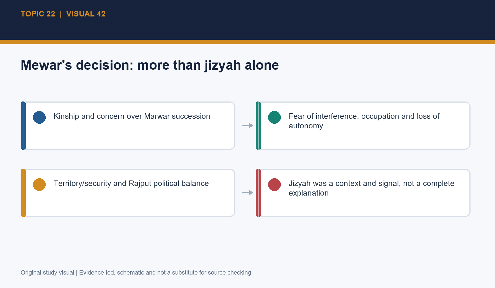

*Visual 42: Mewar's decision: more than jizyah alone. Original topic-specific study visual; schematic maps are explicitly NOT TO SCALE.*

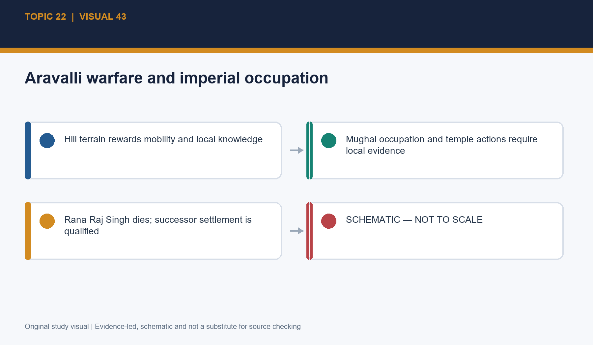

*Visual 43: Aravalli warfare and imperial occupation. Original topic-specific study visual; schematic maps are explicitly NOT TO SCALE.*

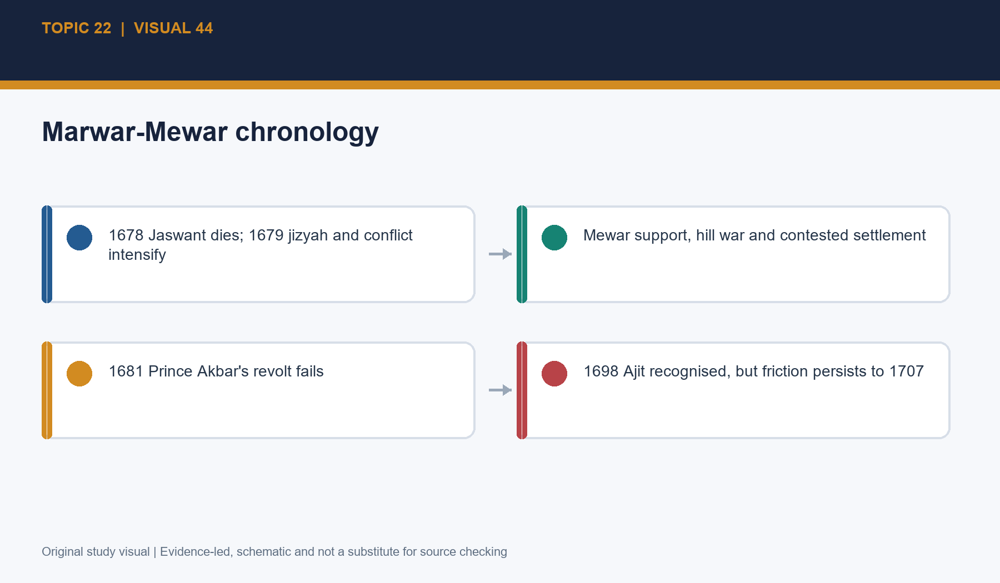

*Visual 44: Marwar-Mewar chronology. Original topic-specific study visual; schematic maps are explicitly NOT TO SCALE.*

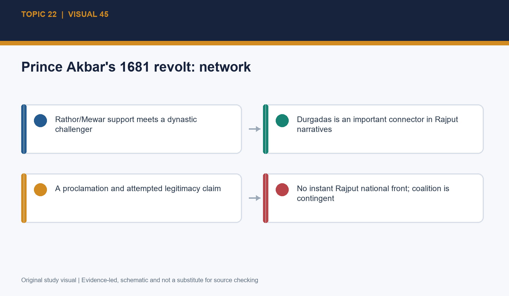

*Visual 45: Prince Akbar's 1681 revolt: network. Original topic-specific study visual; schematic maps are explicitly NOT TO SCALE.*

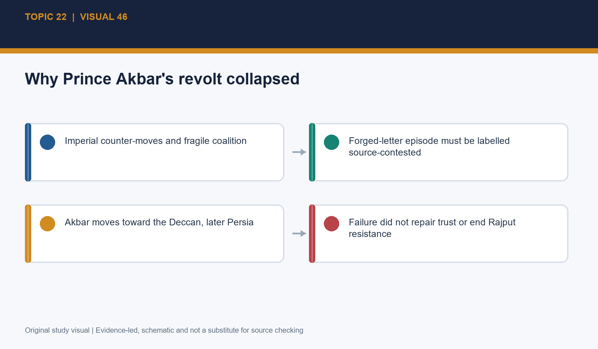

*Visual 46: Why Prince Akbar's revolt collapsed. Original topic-specific study visual; schematic maps are explicitly NOT TO SCALE.*

#### CLOSING RECALL FLOW — MEWAR'S ALLIANCE AND THE LIMITS OF DYNASTIC REBELLION

```text
START / CONCEPT: Mewar's alliance and the limits of dynastic rebellion
        |
        v
EXACT TERMS: Mewar's alliance · the limits of dynastic rebellion · EXAM CAUTION · Kinship · Rajput · Mughal
        |
        v
MECHANISM / ARGUMENT: It failed because the coalition was contingent and because the imperial response exploited that fragility.
        |
        v
CONSEQUENCE / CONTRAST: Rana Raj Singh's death and the later settlement with his successor, Jai Singh of Mewar, should be dated only with the relevant record; the key analytical point is that settlement was qualified and did not return an uncomplicated pre-crisis alliance.
        |
        v
UPSC TRAP / ANSWER-USE: Jizyah was an important contemporary signal and may have enlarged distrust, but it does not replace these linked political reasons.
        |
        v
ANSWER-GRABBING FORMULATION: Do not write that all Rajputs joined a rebellion, and do not turn a contingent 1681 coalition into an early national movement.
```
### PART XII - LATER SETTLEMENT, DECCAN TIMING AND COST

### SESSION 12 — RECOGNITION IN 1698 DID NOT RESTORE THE OLD POLITICAL COMPACT

#### DEFINITION / WHAT THIS IS CALLED

**Plain-language definition:** From 1681 southern commitments became central and the need for dependable commanders, supplies and political cooperation increased.

**Technical definition:** Rajput distrust and jizyah-related alienation could raise the political cost of governance at precisely such a time.

#### ANSWER-GRABBING OPENING — WRITE/ADAPT IN THE EXAM

> From 1681 southern commitments became central and the need for dependable commanders, supplies and political cooperation increased.

#### MUST-WRITE KEYWORDS

- **EXAM CAUTION**
- **Ajit Singh**
- **Marwar**
- **Mughal**
- **Jodhpur**
- **It**

**How to use them:** Frame the answer through EXAM CAUTION; define Ajit Singh, connect Marwar with Mughal to explain the mechanism, and use Jodhpur for the decisive comparison or qualification.

Ajit Singh was recognised as ruler of Marwar in 1698, yet Mughal control over Jodhpur and continued dissatisfaction limited the settlement. It is therefore inaccurate to describe 1698 as either total Mughal victory or full restoration of Rathor autonomy. Desultory conflict and mistrust continued into Aurangzeb's final years. The immediate military burden after 1681 could be limited in troop terms, but a narrow troop-count lens misses the cost to prestige and bargaining.

The breach was serious without being universal. Hada, Kachhwaha and other Rajput contingents remained in Mughal service. That continued service is evidence of differentiated house-by-house calculation, not proof that Marwar and Mewar had ceased to matter. Satish Chandra's judgement that the policy was clumsy and blundering rests on the absence of a compensating gain and the doubts created about imperial support to old allies.

The Deccan link should be bounded. From 1681 southern commitments became central and the need for dependable commanders, supplies and political cooperation increased. Rajput distrust and jizyah-related alienation could raise the political cost of governance at precisely such a time. Do not invent a budget transfer from Rajasthan to the Deccan or claim a simple one-way resource drain. The mechanism is legitimacy-resource feedback: coercion reduces trust; lower trust raises enforcement and bargaining costs; wider war makes reliable alliances more valuable.

Connect this topic to the jagirdari and elite-competition discussions of Topics 23 and 25 only as a bridge. A strong conclusion says the Rajput rupture worsened the empire's political environment but neither caused immediate collapse nor substitutes for the prolonged Deccan conflict and later structural disintegration.

> **EXAM CAUTION:** Keep the scale of a claim equal to the scale of its evidence. A court chronicle, local record, grant, tradition and modern allegation do not have identical reach.

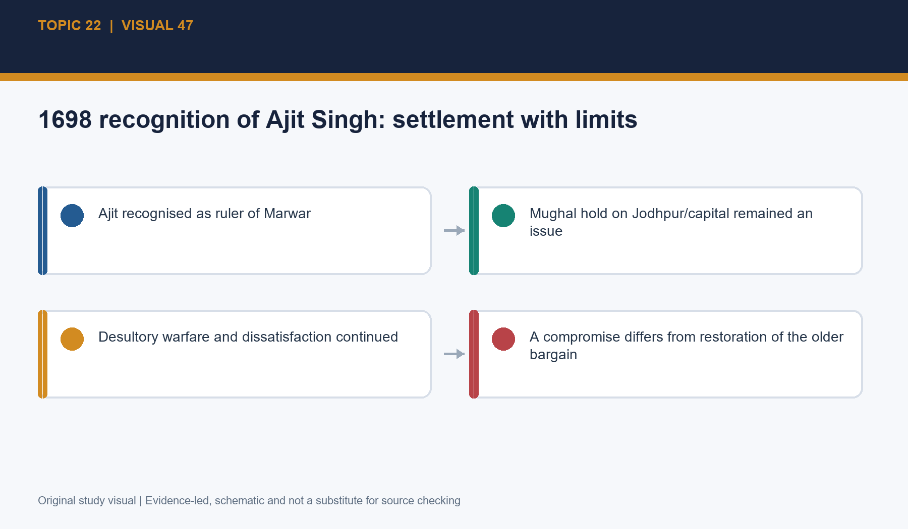

*Visual 47: 1698 recognition of Ajit Singh: settlement with limits. Original topic-specific study visual; schematic maps are explicitly NOT TO SCALE.*

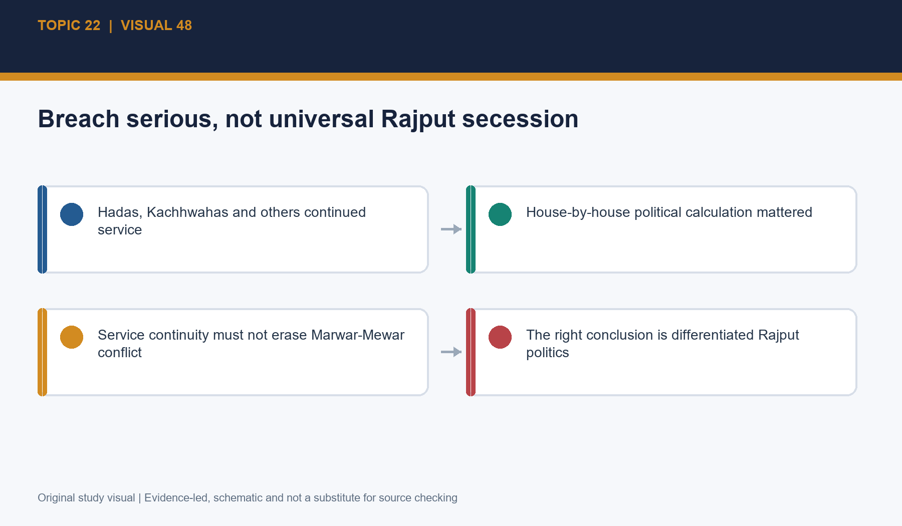

*Visual 48: Breach serious, not universal Rajput secession. Original topic-specific study visual; schematic maps are explicitly NOT TO SCALE.*

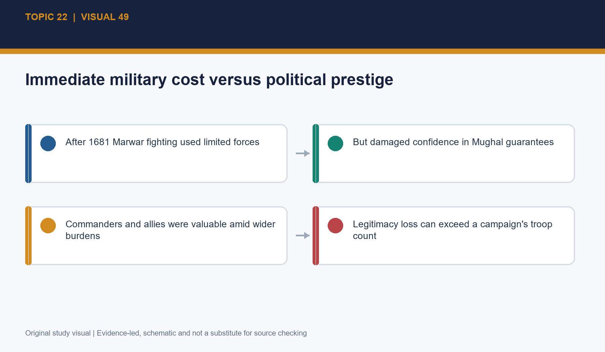

*Visual 49: Immediate military cost versus political prestige. Original topic-specific study visual; schematic maps are explicitly NOT TO SCALE.*

#### CLOSING RECALL FLOW — RECOGNITION IN 1698 DID NOT RESTORE THE OLD POLITICAL COMPACT

```text
START / CONCEPT: Recognition in 1698 did not restore the old political compact
        |
        v
EXACT TERMS: EXAM CAUTION · Ajit Singh · Marwar · Mughal · Jodhpur · It
        |
        v
MECHANISM / ARGUMENT: That continued service is evidence of differentiated house-by-house calculation, not proof that Marwar and Mewar had ceased to matter.
        |
        v
CONSEQUENCE / CONTRAST: It is therefore inaccurate to describe 1698 as either total Mughal victory or full restoration of Rathor autonomy.
        |
        v
UPSC TRAP / ANSWER-USE: The immediate military burden after 1681 could be limited in troop terms, but a narrow troop-count lens misses the cost to prestige and bargaining.
        |
        v
ANSWER-GRABBING FORMULATION: From 1681 southern commitments became central and the need for dependable commanders, supplies and political cooperation increased.
```
### PART XIII - COMPARISON, HISTORIOGRAPHY AND CAUSATION

### SESSION 13 — AKBAR AND AURANGZEB: COMPARISON WITHOUT MORALITY PLAY

#### DEFINITION / WHAT THIS IS CALLED

**Plain-language definition:** The comparison with Akbar is useful when it compares governing principles, fiscal differentiation, temple cases, elite bargains and political contexts.

**Technical definition:** The interpretation that Aurangzeb was both a victim of circumstances and a maker of circumstances is productive when evidence is supplied on both sides.

#### ANSWER-GRABBING OPENING — WRITE/ADAPT IN THE EXAM

> The comparison with Akbar is useful when it compares governing principles, fiscal differentiation, temple cases, elite bargains and political contexts.

#### MUST-WRITE KEYWORDS

- **Akbar**
- **Aurangzeb**
- **comparison without morality play**
- **EXAM CAUTION**
- **The comparison with Akbar**
- **Yet**

**How to use them:** Frame the answer through Akbar; define Aurangzeb, connect comparison without morality play with EXAM CAUTION to explain the mechanism, and use The comparison with Akbar for the decisive comparison or qualification.

The comparison with Akbar is useful when it compares governing principles, fiscal differentiation, temple cases, elite bargains and political contexts. Akbar's sulh-i-kul supplied an inclusive imperial idiom and helped make Rajput participation a durable form of statecraft. Aurangzeb's sharper emphasis on Hanafi legal idiom, jizyah and selective temple actions changed the symbolic environment. Yet both emperors used sovereignty, force, patronage and political calculation; neither can be reduced to a modern hero or villain.

The interpretation that Aurangzeb was both a victim of circumstances and a maker of circumstances is productive when evidence is supplied on both sides. Circumstances include a large empire, inherited elite competition, local challenges and growing warfare. Making circumstances includes choices: the reimposition of jizyah, rigid handling of Marwar and coercive signals that weakened trust. To call policy “only circumstances” excuses agency; to call it “only personality” erases institutional constraints.

Historiography needs source criticism, not false equivalence. Maasir-i-Alamgiri and other court chronicles provide official chronology and ideology but may omit or frame inconvenient facts. Waqa-i-Ajmer and Jodhpur Hukumat-ri-Bahi offer local administrative and succession detail but carry local perspective and record limits. Farmans, temple grants, inscriptions and revenue records are strong for particular actions, weak for empire-wide generalisation. Sikh tradition, Rajput bardic memory, European accounts and later nationalist, communal or secular histories must be read for provenance and purpose.

State a claim-certainty ladder in sensitive answers: secure, probable, contested, unsupported. Historical disagreement is not permission to say every account is equally sound. Weight specificity, contemporaneity, genre, corroboration and the exact reach of the evidence. This lets an answer acknowledge real violence and discrimination without turning modern allegation, tradition or selective list into a substitute for historical proof.

> **EXAM CAUTION:** Keep the scale of a claim equal to the scale of its evidence. A court chronicle, local record, grant, tradition and modern allegation do not have identical reach.

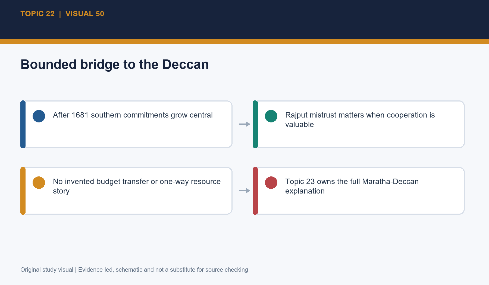

*Visual 50: Bounded bridge to the Deccan. Original topic-specific study visual; schematic maps are explicitly NOT TO SCALE.*

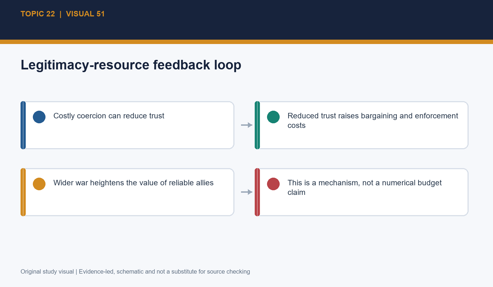

*Visual 51: Legitimacy-resource feedback loop. Original topic-specific study visual; schematic maps are explicitly NOT TO SCALE.*

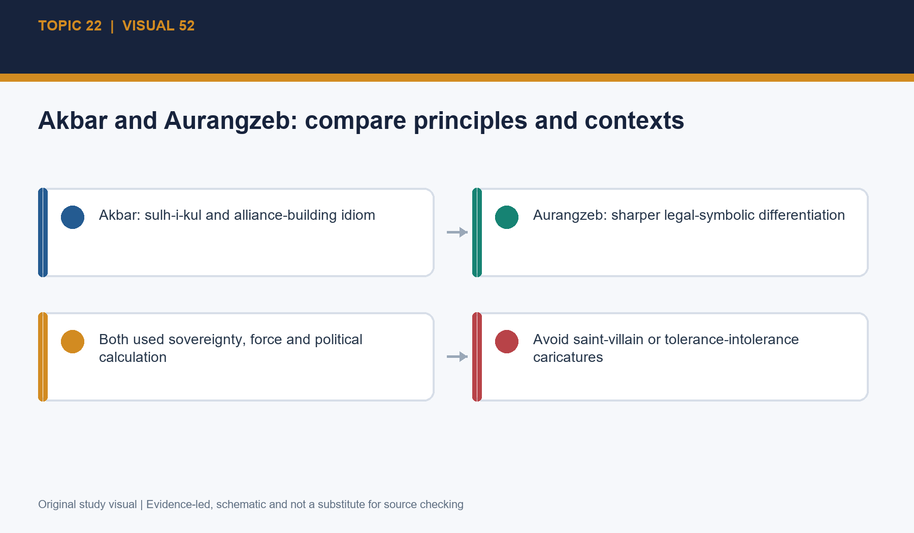

*Visual 52: Akbar and Aurangzeb: compare principles and contexts. Original topic-specific study visual; schematic maps are explicitly NOT TO SCALE.*

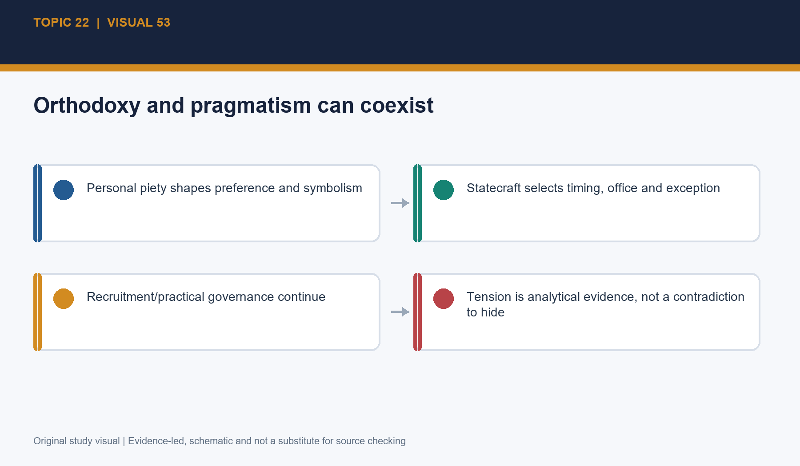

*Visual 53: Orthodoxy and pragmatism can coexist. Original topic-specific study visual; schematic maps are explicitly NOT TO SCALE.*

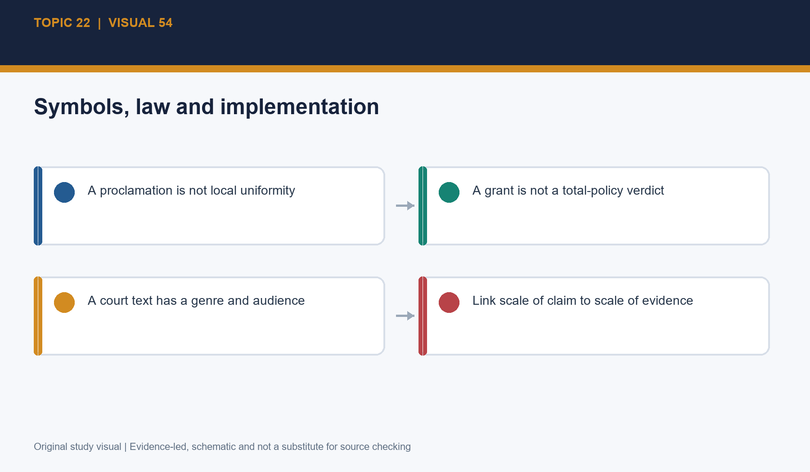

*Visual 54: Symbols, law and implementation. Original topic-specific study visual; schematic maps are explicitly NOT TO SCALE.*

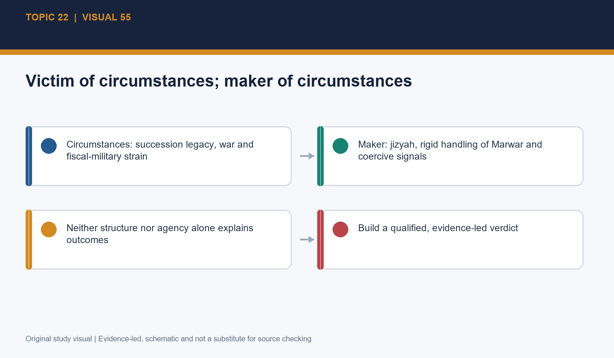

*Visual 55: Victim of circumstances; maker of circumstances. Original topic-specific study visual; schematic maps are explicitly NOT TO SCALE.*

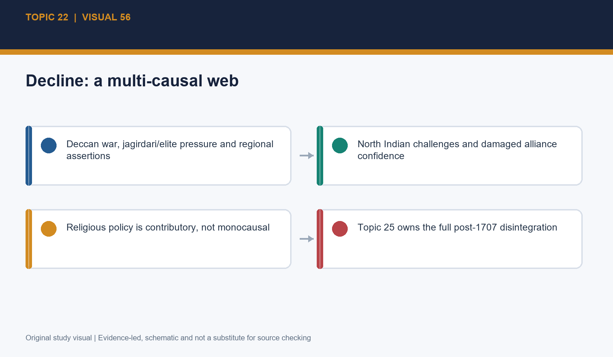

*Visual 56: Decline: a multi-causal web. Original topic-specific study visual; schematic maps are explicitly NOT TO SCALE.*


*Visual 57: Source-reach matrix. Original topic-specific study visual; schematic maps are explicitly NOT TO SCALE.*

#### CLOSING RECALL FLOW — AKBAR AND AURANGZEB: COMPARISON WITHOUT MORALITY PLAY

```text
START / CONCEPT: Akbar and Aurangzeb: comparison without morality play
        |
        v
EXACT TERMS: Akbar · Aurangzeb · comparison without morality play · EXAM CAUTION · The comparison with Akbar · Yet
        |
        v
MECHANISM / ARGUMENT: The interpretation that Aurangzeb was both a victim of circumstances and a maker of circumstances is productive when evidence is supplied on both sides.
        |
        v
CONSEQUENCE / CONTRAST: Historical disagreement is not permission to say every account is equally sound.
        |
        v
UPSC TRAP / ANSWER-USE: A court chronicle, local record, grant, tradition and modern allegation do not have identical reach.
        |
        v
ANSWER-GRABBING FORMULATION: The comparison with Akbar is useful when it compares governing principles, fiscal differentiation, temple cases, elite bargains and political contexts.
```
### SESSION 14 — BOUNDED LIVE LINKAGE

#### DEFINITION / WHAT THIS IS CALLED

**Plain-language definition:** The live page is a heritage and source-method bridge only.

**Technical definition:** The live page is a heritage and source-method bridge only.

#### ANSWER-GRABBING OPENING — WRITE/ADAPT IN THE EXAM

> The live page is a heritage and source-method bridge only.

#### MUST-WRITE KEYWORDS

- **Bounded live linkage**
- **The live page**
- **Bounded live**
- **live linkage**

**How to use them:** Frame the answer through Bounded live linkage; define The live page, connect Bounded live with live linkage to explain the mechanism, and close with the decisive comparison or qualification.

Official heritage, archive and court-source searches were rechecked on 30 August 2026 for the preceding six months. No material recent official current-affairs anchor suitable for historical use was found, so static relevance is retained. Modern litigation, political claims and contemporary site disputes are not used as proof of a medieval event. Claims about jizyah, temple action, Sikh history, local rebellions and Rajput relations remain controlled by dated repository evidence, OCR books and explicit source criticism.

The live page is a heritage and source-method bridge only. Historical chronology, causation, attribution and institutional claims remain controlled by repository Markdown, OCR-searchable books and explicit source criticism.

#### CLOSING RECALL FLOW — BOUNDED LIVE LINKAGE

```text
START / CONCEPT: Bounded live linkage
        |
        v
EXACT TERMS: Bounded live linkage · The live page · Bounded live · live linkage
        |
        v
MECHANISM / ARGUMENT: The operative mechanism is that the live page is a heritage and source-method bridge only.
        |
        v
CONSEQUENCE / CONTRAST: The resulting consequence is that the live page is a heritage and source-method bridge only.
        |
        v
UPSC TRAP / ANSWER-USE: Do not miss this limiting distinction: the live page is a heritage and source-method bridge only.
        |
        v
ANSWER-GRABBING FORMULATION: The live page is a heritage and source-method bridge only.
```
### MEDIEVAL DEEP-REVIEW CORE CONTROL

- **Must remember:** Aurangzeb's jizya restoration (1679), temple actions and Rajput conflicts require chronological and political context.
- **Close distinction:** Temple destruction was selective and variable, not a timeless universal programme; grants and protection also need evidence.
- **Evidence / interpretation limit:** Marwar and Mewar followed different trajectories, so 'the Rajputs' cannot be treated as one undifferentiated bloc.

## BASIC MCQS / REMEDIATION

### Learning MCQs — original (correct options A-B-C-D x5)

*Original practice. Correct options rotate A -> B -> C -> D independently in this set; no item is presented as a verified CSE PYQ.*

#### Learning MCQs 1
Which formulation best captures Aurangzeb's reign for historical analysis?
- A. Personal orthodoxy, legal idiom, sovereignty, politics and uneven administration interacted.
- B. Politics alone makes religious policy irrelevant.
- C. Religion alone explains every policy and rebellion.
- D. The ulama replaced the emperor as sovereign.

**Answer: A.**
**Explanation:** It preserves both agency and institution; the closest distractor, 'politics alone', wrongly removes the documented legal-symbolic dimension.

#### Learning MCQs 2
Which pair is correctly matched?
- A. Ajit Singh — recognition in 1679.
- B. Aurangzeb — reign from 1658 to 1707.
- C. Jai Singh — death in 1658.
- D. Jaswant Singh — death in 1667.

**Answer: B.**
**Explanation:** 1658-1707 is the secure reign span; the closest distractor reverses the dated roles of Jai Singh and Jaswant Singh.

#### Learning MCQs 3
Why is the Fatawa-i-Alamgiri not safely described as a modern constitution?
- A. It abolished imperial regulations.
- B. It was written after Aurangzeb's death.
- C. It was a collective Hanafi legal compendium whose uniform enforcement cannot be presumed.
- D. It was a village revenue register.

**Answer: C.**
**Explanation:** The discriminator is compendium versus statute; the 'abolished regulations' option ignores zawabit and imperial discretion.

#### Learning MCQs 4
What does zawabit most usefully indicate in this context?
- A. A hereditary Rajput homeland.
- B. A jizyah collection category.
- C. A Sikh initiation rite.
- D. Ruler-made administrative regulations alongside legal idiom.

**Answer: D.**
**Explanation:** Zawabit concerns imperial regulation; the closest distractor confuses it with watan, a distinct Rajput political vocabulary.

#### Learning MCQs 5
Which inference is safest about court puritan measures?
- A. A court-centred measure needs separate evidence before being made an empire-wide social claim.
- B. All reports are mere folklore.
- C. Every reported measure was uniformly enforced.
- D. No symbolic measure had political meaning.

**Answer: A.**
**Explanation:** Scale is the discriminator: court action can matter without proving universal compliance; 'no meaning' is the opposite overcorrection.

#### Learning MCQs 6
Jizyah should be distinguished most directly from:
- A. A policy with symbolic effects.
- B. Land revenue and customs duties.
- C. A poll tax in legal-political idiom.
- D. A measure reimposed in 1679.

**Answer: B.**
**Explanation:** Jizyah is not kharaj/land revenue or customs; the closest distractor states a true but non-distinguishing feature.

#### Learning MCQs 7
Which is a defensible account of motives for jizyah in 1679?
- A. Only private piety explains it.
- B. Only a proven revenue crisis explains it.
- C. Orthodoxy, legitimacy, political signalling and fiscal context can be weighed without assigning one exclusive motive.
- D. It had no political meaning because collection varied.

**Answer: C.**
**Explanation:** The correct answer keeps motive plural and qualified; 'only private piety' mistakes one relevant factor for a complete proof.

#### Learning MCQs 8
What is the safest conclusion about jizyah's effects?
- A. It instantly ended Hindu elite service.
- B. It uniformly reached every non-Muslim subject.
- C. It solved the empire's fiscal problems.
- D. Its uneven collection did not prevent a substantial symbolic and alienating effect.

**Answer: D.**
**Explanation:** Uneven implementation is not political insignificance; the closest distractor overstates universal collection.

#### Learning MCQs 9
Which distinction is essential in temple-policy analysis?
- A. Demolition, conversion, confiscation, restriction and grant are separate actions.
- B. Every temple case proves a universal order.
- C. A court text proves identical village practice.
- D. A grant proves no destruction elsewhere.

**Answer: A.**
**Explanation:** Action taxonomy is the discriminator; the closest distractor wrongly lets one type of evidence settle the whole empire.

#### Learning MCQs 10
How should the 1669 temple/schools order be used?
- A. As an undated universal destruction order.
- B. As a chronicle-context claim whose wording, cases and follow-through must be assessed.
- C. As a modern court finding.
- D. As proof no old temple was ever harmed.

**Answer: B.**
**Explanation:** Chronicle genre and precise reach matter; the universal-order option converts a difficult text into a claim it cannot bear alone.

#### Learning MCQs 11
What does a documented temple grant most directly establish?
- A. That no punitive temple action occurred elsewhere.
- B. That all temples were legally equal.
- C. A particular transaction or protection in its stated context.
- D. That court chronicles are useless.

**Answer: C.**
**Explanation:** Case-specific reach is the discriminator; the closest distractor mistakes counter-evidence to a universal claim for total exoneration.

#### Learning MCQs 12
Which statement best handles Hindu participation in Mughal service?
- A. It proves all religious differentiation disappeared.
- B. It proves no Rajput resisted.
- C. It makes jizyah economically impossible.
- D. Continued service shows elite incorporation but does not demonstrate mass religious equality.

**Answer: D.**
**Explanation:** Inclusion and equality are different questions; the closest distractor converts an elite pattern into a total social conclusion.

#### Learning MCQs 13
Why are precise late-reign nobility percentages risky without a citation?
- A. A percentage needs a date, denominator and defined category.
- B. Recruitment ended after 1679.
- C. Only Rajputs could hold mansabs.
- D. Percentages are never useful in history.

**Answer: A.**
**Explanation:** Quantification is valid only when specified; the closest distractor falsely claims recruitment stopped.

#### Learning MCQs 14
What is the most evidence-sensitive account of Guru Tegh Bahadur's execution?
- A. It had no religious consequence.
- B. Imperial law-and-order framing and Sikh martyr-memory accounts must both be located and assessed.
- C. One source can settle every motive beyond dispute.
- D. It alone mechanically created the Khalsa.

**Answer: B.**
**Explanation:** The key is source reach and consequence; the closest distractor mistakes a profound antecedent for a sole cause of 1699.

#### Learning MCQs 15
Which date pair is correctly matched?
- A. Satnami revolt — 1669; Khalsa — 1681.
- B. Jaswant Singh's death — 1699; Khalsa — 1707.
- C. Guru Tegh Bahadur's execution — 1675; Khalsa — 1699.
- D. Jizyah — 1675; Khalsa — 1679.

**Answer: C.**
**Explanation:** 1675 and 1699 are the secure anchors; the closest distractor interchanges the jizyah and execution dates.

#### Learning MCQs 16
Why should the Khalsa not be explained by one event alone?
- A. Only hill chiefs caused Sikh change.
- B. The 1675 execution had no importance.
- C. The Khalsa had no relation to earlier Sikh history.
- D. Organisation, leadership, memory and local political conflict also shaped Sikh militarisation.

**Answer: D.**
**Explanation:** Multi-causality is the discriminator; the closest distractor denies the execution's consequence rather than resisting monocausality.

#### Learning MCQs 17
What is the strongest frame for Gokula's Jat uprising?
- A. Local power, agrarian pressure, official coercion and community mobilisation interacted.
- B. It was already the Bharatpur state.
- C. It was a coordinated all-India rebellion.
- D. A single temple issue fully explains it.

**Answer: A.**
**Explanation:** The correct answer preserves the Mathura-region complexity; the closest distractor converts later political formation into an immediate outcome.

#### Learning MCQs 18
What does the Satnami revolt of 1672 most clearly illustrate?
- A. All local rebellions shared one programme.
- B. A local confrontation could escalate through sect/community mobilisation and be rapidly suppressed.
- C. Satnamis controlled Mewar.
- D. The Mughal Empire had already collapsed.

**Answer: B.**
**Explanation:** Rapid suppression and escalation belong together; the closest distractor mistakes a local rising for proof of total collapse.

#### Learning MCQs 19
Which proposition about Rajput policy before 1678 is best supported?
- A. He planned Rajput destruction from accession.
- B. The Marwar crisis began with Akbar's revolt.
- C. Aurangzeb initially used and valued leading Rajput service, including Jai Singh and Jaswant Singh.
- D. All Rajputs were excluded from mansabs.

**Answer: C.**
**Explanation:** Early partnership is the key chronological control; the closest distractor reverses the later 1681 revolt and 1678 succession crisis.

#### Learning MCQs 20
What did watan mean most centrally in the Marwar conflict?
- A. An imperial legal compendium.
- B. A Deccan military grant.
- C. A temporary jizyah exemption.
- D. Hereditary homeland and authority whose recognition affected honour and service.

**Answer: D.**
**Explanation:** Watan denotes hereditary territorial-political stake; the closest distractor confuses it with jagir-like revenue assignment.

### Broad MCQs — original (correct options A-B-C-D x11)

*Original practice. Correct options rotate A -> B -> C -> D independently in this set; no item is presented as a verified CSE PYQ.*

#### Broad MCQs 1
Which formulation about Jaswant Singh's death is accurate?
- A. He died at Jamrud in 1678 without a surviving male heir at that moment; posthumous claims followed.
- B. He was killed in the 1681 revolt.
- C. He died in Jodhpur after Ajit's recognition.
- D. He died childless in 1679 and left no claimant.

**Answer: A.**
**Explanation:** The qualification about posthumous claimants prevents the misleading 'childless' shorthand; the closest distractor erases Ajit's legitimacy.

#### Broad MCQs 2
What did taking Marwar into khalisa automatically mean?
- A. It legally ended all Rathor hereditary claims.
- B. It meant crown-revenue administration, not automatically permanent annexation.
- C. It made Inder Singh emperor.
- D. It abolished Rajput service elsewhere.

**Answer: B.**
**Explanation:** Khalisa is an administrative category; the closest distractor mistakes temporary imperial control for a final political verdict.

#### Broad MCQs 3
Why are Waqa-i-Ajmer and Jodhpur Hukumat-ri-Bahi valuable?
- A. They replace all court chronicles.
- B. They prove every later bardic episode literally.
- C. They add local detail on succession, debt and administrative context.
- D. They are neutral complete archives of all India.

**Answer: C.**
**Explanation:** Their local specificity is the strength and limit; the closest distractor turns a valuable source into a total archive.

#### Broad MCQs 4
What is the secure core of Durgadas's role?
- A. Every escape-story detail is independently verified.
- B. He permanently expelled the Mughals in 1679.
- C. He led the Satnami revolt.
- D. He became central to Rathor resistance and protection of Ajit's claim.

**Answer: D.**
**Explanation:** The stable political role matters more than embellishment; the closest distractor treats varying rescue narratives as uniformly proven.

#### Broad MCQs 5
Which factor did NOT by itself explain failure of compromise in Marwar?
- A. A single, uncomplicated religious motive.
- B. Factional and centralising pressures.
- C. Honour and distrust over custody.
- D. Occupation and official conduct.

**Answer: A.**
**Explanation:** The Marwar crisis is multi-causal; the closest distractor ignores succession and watan politics.

#### Broad MCQs 6
Why did Mewar support Marwar?
- A. All Mewar elites joined Prince Akbar in 1678.
- B. Kinship, concern about imperial interference, security and Rajput autonomy mattered alongside jizyah's signal.
- C. Jizyah alone mechanically determined the decision.
- D. Mewar had no interest in Marwar's succession.

**Answer: B.**
**Explanation:** The correct answer has multiple motives; the closest distractor reduces a political decision to one tax.

#### Broad MCQs 7
What terrain lesson follows from the Mewar war?
- A. Mewar lay on the Bengal delta.
- B. Rajput warfare had no logistical dimension.
- C. Aravalli hill conditions increased the value of mobility, passes and local knowledge.
- D. Terrain made all Mughal occupation impossible.

**Answer: C.**
**Explanation:** Terrain shapes rather than predetermines outcomes; the closest distractor turns a strategic advantage into impossibility.

#### Broad MCQs 8
How should the forged-letter episode in Prince Akbar's revolt be presented?
- A. As a jizyah regulation.
- B. As an event before Jaswant's death.
- C. As conclusive proof of every Rajput motive.
- D. As a provenance-sensitive account, not an independently settled explanatory fact.

**Answer: D.**
**Explanation:** The relevant discriminator is source status; the closest distractor asks the episode to carry far more causal weight than its provenance permits.

#### Broad MCQs 9
Which outcome of the 1681 revolt is accurate?
- A. The dynastic challenge failed, but it did not restore trust or end Rajput resistance.
- B. All Rajput houses left Mughal service.
- C. Ajit was fully restored in 1681.
- D. Prince Akbar immediately became emperor.

**Answer: A.**
**Explanation:** Failure of a revolt is not repair of a political breach; the closest distractor confuses later 1698 recognition with 1681.

#### Broad MCQs 10
What is the safest account of Ajit's 1698 recognition?
- A. It fully restored the pre-1678 compact.
- B. It was a limited settlement; Mughal control over Jodhpur remained an issue.
- C. It permanently ended all conflict by 1698.
- D. It preceded Jaswant Singh's death.

**Answer: B.**
**Explanation:** Recognition with limits is the key; the closest distractor converts a compromise into complete restoration.

#### Broad MCQs 11
Why does continued Hada/Kachhwaha service matter?
- A. It makes all temple evidence false.
- B. It makes jizyah a land tax.
- C. It shows differentiated Rajput politics rather than universal secession.
- D. It proves Marwar-Mewar suffered no political cost.

**Answer: C.**
**Explanation:** Continued service qualifies a universal claim; the closest distractor wrongly uses it to erase the serious breach.

#### Broad MCQs 12
What is meant by the political cost exceeding immediate military cost?
- A. The Rajputs defeated every Mughal army.
- B. No military resources were used.
- C. The empire fell immediately in 1681.
- D. Prestige and confidence in Mughal guarantees could be damaged even when later fighting used limited forces.

**Answer: D.**
**Explanation:** Legitimacy can have strategic value; the closest distractor turns a qualified cost argument into an impossible absolute.

#### Broad MCQs 13
How should Topic 22 connect to the Deccan?
- A. As a bounded timing and cooperation problem; Topic 23 owns the full Deccan narrative.
- B. By inventing precise Rajasthan-to-Deccan budgets.
- C. By ignoring the Deccan after 1681.
- D. By explaining every Rajput event as a Maratha event.

**Answer: A.**
**Explanation:** The bridge is political-resource interaction; the closest distractor supplies unsupported budgets.

#### Broad MCQs 14
Which comparison of Akbar and Aurangzeb is most defensible?
- A. Akbar never used force.
- B. Compare inclusive idiom, fiscal differentiation, elite bargains and political contexts, not moral caricatures.
- C. Aurangzeb never recruited Hindus.
- D. Their policies were identical in every respect.

**Answer: B.**
**Explanation:** A common yardstick is needed; the closest distractor makes an absolute claim contradicted by continued composite service.

#### Broad MCQs 15
What does 'victim and maker of circumstances' invite?
- A. Excuse every decision as inevitable.
- B. Treat personality as the sole cause.
- C. Weigh inherited constraints with Aurangzeb's own policy choices.
- D. Avoid evidence because motives are complex.

**Answer: C.**
**Explanation:** Structure and agency must be jointly analysed; the closest distractor turns context into exoneration.

#### Broad MCQs 16
Which source has the strongest direct reach for a particular grant?
- A. A later undated internet list.
- B. A general modern polemic.
- C. An unrelated traveller's anecdote.
- D. The dated farman or record of that grant.

**Answer: D.**
**Explanation:** Specificity and provenance matter; the closest distractor replaces a case record with a general claim.

#### Broad MCQs 17
What can a court chronicle most reliably contribute?
- A. Official chronology and ideology, with attention to selection and silence.
- B. A guarantee of uniform implementation.
- C. An automatically neutral local record.
- D. A complete social census.

**Answer: A.**
**Explanation:** Genre is the discriminator; the closest distractor overextends official narrative into a social census.

#### Broad MCQs 18
Why is modern litigation not proof of a medieval event?
- A. A claim needs no medieval provenance.
- B. Pleadings and modern adjudication answer present legal questions, not automatically historical proof.
- C. Courts can never examine archives.
- D. All historical sources are equally weak.

**Answer: B.**
**Explanation:** The boundary is evidentiary reach; the closest distractor mistakes a current claim for a dated historical source.

#### Broad MCQs 19
What is the final causal verdict on religious policy and decline?
- A. It produced immediate empire-wide collapse in 1679.
- B. It explains every Deccan outcome.
- C. It was contributory to weakened legitimacy, not a monocausal explanation of decline.
- D. It had no political effect.

**Answer: C.**
**Explanation:** A contributory mechanism fits the evidence; the closest distractor asserts immediate collapse despite continued imperial capacity.

#### Broad MCQs 20
Which formulation best captures Aurangzeb's reign for historical analysis?
- A. The ulama replaced the emperor as sovereign.
- B. Religion alone explains every policy and rebellion.
- C. Politics alone makes religious policy irrelevant.
- D. Personal orthodoxy, legal idiom, sovereignty, politics and uneven administration interacted.

**Answer: D.**
**Explanation:** It preserves both agency and institution; the closest distractor, 'politics alone', wrongly removes the documented legal-symbolic dimension.

#### Broad MCQs 21
Which pair is correctly matched?
- A. Aurangzeb — reign from 1658 to 1707.
- B. Ajit Singh — recognition in 1679.
- C. Jaswant Singh — death in 1667.
- D. Jai Singh — death in 1658.

**Answer: A.**
**Explanation:** 1658-1707 is the secure reign span; the closest distractor reverses the dated roles of Jai Singh and Jaswant Singh.

#### Broad MCQs 22
Why is the Fatawa-i-Alamgiri not safely described as a modern constitution?
- A. It was a village revenue register.
- B. It was a collective Hanafi legal compendium whose uniform enforcement cannot be presumed.
- C. It abolished imperial regulations.
- D. It was written after Aurangzeb's death.

**Answer: B.**
**Explanation:** The discriminator is compendium versus statute; the 'abolished regulations' option ignores zawabit and imperial discretion.

#### Broad MCQs 23
What does zawabit most usefully indicate in this context?
- A. A hereditary Rajput homeland.
- B. A Sikh initiation rite.
- C. Ruler-made administrative regulations alongside legal idiom.
- D. A jizyah collection category.

**Answer: C.**
**Explanation:** Zawabit concerns imperial regulation; the closest distractor confuses it with watan, a distinct Rajput political vocabulary.

#### Broad MCQs 24
Which inference is safest about court puritan measures?
- A. No symbolic measure had political meaning.
- B. Every reported measure was uniformly enforced.
- C. All reports are mere folklore.
- D. A court-centred measure needs separate evidence before being made an empire-wide social claim.

**Answer: D.**
**Explanation:** Scale is the discriminator: court action can matter without proving universal compliance; 'no meaning' is the opposite overcorrection.

#### Broad MCQs 25
Jizyah should be distinguished most directly from:
- A. Land revenue and customs duties.
- B. A policy with symbolic effects.
- C. A measure reimposed in 1679.
- D. A poll tax in legal-political idiom.

**Answer: A.**
**Explanation:** Jizyah is not kharaj/land revenue or customs; the closest distractor states a true but non-distinguishing feature.

#### Broad MCQs 26
Which is a defensible account of motives for jizyah in 1679?
- A. It had no political meaning because collection varied.
- B. Orthodoxy, legitimacy, political signalling and fiscal context can be weighed without assigning one exclusive motive.
- C. Only a proven revenue crisis explains it.
- D. Only private piety explains it.

**Answer: B.**
**Explanation:** The correct answer keeps motive plural and qualified; 'only private piety' mistakes one relevant factor for a complete proof.

#### Broad MCQs 27
What is the safest conclusion about jizyah's effects?
- A. It solved the empire's fiscal problems.
- B. It uniformly reached every non-Muslim subject.
- C. Its uneven collection did not prevent a substantial symbolic and alienating effect.
- D. It instantly ended Hindu elite service.

**Answer: C.**
**Explanation:** Uneven implementation is not political insignificance; the closest distractor overstates universal collection.

#### Broad MCQs 28
Which distinction is essential in temple-policy analysis?
- A. Every temple case proves a universal order.
- B. A court text proves identical village practice.
- C. A grant proves no destruction elsewhere.
- D. Demolition, conversion, confiscation, restriction and grant are separate actions.

**Answer: D.**
**Explanation:** Action taxonomy is the discriminator; the closest distractor wrongly lets one type of evidence settle the whole empire.

#### Broad MCQs 29
How should the 1669 temple/schools order be used?
- A. As a chronicle-context claim whose wording, cases and follow-through must be assessed.
- B. As an undated universal destruction order.
- C. As a modern court finding.
- D. As proof no old temple was ever harmed.

**Answer: A.**
**Explanation:** Chronicle genre and precise reach matter; the universal-order option converts a difficult text into a claim it cannot bear alone.

#### Broad MCQs 30
What does a documented temple grant most directly establish?
- A. That no punitive temple action occurred elsewhere.
- B. A particular transaction or protection in its stated context.
- C. That all temples were legally equal.
- D. That court chronicles are useless.

**Answer: B.**
**Explanation:** Case-specific reach is the discriminator; the closest distractor mistakes counter-evidence to a universal claim for total exoneration.

#### Broad MCQs 31
Which statement best handles Hindu participation in Mughal service?
- A. It proves all religious differentiation disappeared.
- B. It proves no Rajput resisted.
- C. Continued service shows elite incorporation but does not demonstrate mass religious equality.
- D. It makes jizyah economically impossible.

**Answer: C.**
**Explanation:** Inclusion and equality are different questions; the closest distractor converts an elite pattern into a total social conclusion.

#### Broad MCQs 32
Why are precise late-reign nobility percentages risky without a citation?
- A. Only Rajputs could hold mansabs.
- B. Recruitment ended after 1679.
- C. Percentages are never useful in history.
- D. A percentage needs a date, denominator and defined category.

**Answer: D.**
**Explanation:** Quantification is valid only when specified; the closest distractor falsely claims recruitment stopped.

#### Broad MCQs 33
What is the most evidence-sensitive account of Guru Tegh Bahadur's execution?
- A. Imperial law-and-order framing and Sikh martyr-memory accounts must both be located and assessed.
- B. One source can settle every motive beyond dispute.
- C. It had no religious consequence.
- D. It alone mechanically created the Khalsa.

**Answer: A.**
**Explanation:** The key is source reach and consequence; the closest distractor mistakes a profound antecedent for a sole cause of 1699.

#### Broad MCQs 34
Which date pair is correctly matched?
- A. Jaswant Singh's death — 1699; Khalsa — 1707.
- B. Guru Tegh Bahadur's execution — 1675; Khalsa — 1699.
- C. Jizyah — 1675; Khalsa — 1679.
- D. Satnami revolt — 1669; Khalsa — 1681.

**Answer: B.**
**Explanation:** 1675 and 1699 are the secure anchors; the closest distractor interchanges the jizyah and execution dates.

#### Broad MCQs 35
Why should the Khalsa not be explained by one event alone?
- A. The Khalsa had no relation to earlier Sikh history.
- B. Only hill chiefs caused Sikh change.
- C. Organisation, leadership, memory and local political conflict also shaped Sikh militarisation.
- D. The 1675 execution had no importance.

**Answer: C.**
**Explanation:** Multi-causality is the discriminator; the closest distractor denies the execution's consequence rather than resisting monocausality.

#### Broad MCQs 36
What is the strongest frame for Gokula's Jat uprising?
- A. It was already the Bharatpur state.
- B. It was a coordinated all-India rebellion.
- C. A single temple issue fully explains it.
- D. Local power, agrarian pressure, official coercion and community mobilisation interacted.

**Answer: D.**
**Explanation:** The correct answer preserves the Mathura-region complexity; the closest distractor converts later political formation into an immediate outcome.

#### Broad MCQs 37
What does the Satnami revolt of 1672 most clearly illustrate?
- A. A local confrontation could escalate through sect/community mobilisation and be rapidly suppressed.
- B. The Mughal Empire had already collapsed.
- C. All local rebellions shared one programme.
- D. Satnamis controlled Mewar.

**Answer: A.**
**Explanation:** Rapid suppression and escalation belong together; the closest distractor mistakes a local rising for proof of total collapse.

#### Broad MCQs 38
Which proposition about Rajput policy before 1678 is best supported?
- A. The Marwar crisis began with Akbar's revolt.
- B. Aurangzeb initially used and valued leading Rajput service, including Jai Singh and Jaswant Singh.
- C. All Rajputs were excluded from mansabs.
- D. He planned Rajput destruction from accession.

**Answer: B.**
**Explanation:** Early partnership is the key chronological control; the closest distractor reverses the later 1681 revolt and 1678 succession crisis.

#### Broad MCQs 39
What did watan mean most centrally in the Marwar conflict?
- A. A Deccan military grant.
- B. An imperial legal compendium.
- C. Hereditary homeland and authority whose recognition affected honour and service.
- D. A temporary jizyah exemption.

**Answer: C.**
**Explanation:** Watan denotes hereditary territorial-political stake; the closest distractor confuses it with jagir-like revenue assignment.

#### Broad MCQs 40
Which formulation about Jaswant Singh's death is accurate?
- A. He died in Jodhpur after Ajit's recognition.
- B. He was killed in the 1681 revolt.
- C. He died childless in 1679 and left no claimant.
- D. He died at Jamrud in 1678 without a surviving male heir at that moment; posthumous claims followed.

**Answer: D.**
**Explanation:** The qualification about posthumous claimants prevents the misleading 'childless' shorthand; the closest distractor erases Ajit's legitimacy.

#### Broad MCQs 41
What did taking Marwar into khalisa automatically mean?
- A. It meant crown-revenue administration, not automatically permanent annexation.
- B. It made Inder Singh emperor.
- C. It abolished Rajput service elsewhere.
- D. It legally ended all Rathor hereditary claims.

**Answer: A.**
**Explanation:** Khalisa is an administrative category; the closest distractor mistakes temporary imperial control for a final political verdict.

#### Broad MCQs 42
Why are Waqa-i-Ajmer and Jodhpur Hukumat-ri-Bahi valuable?
- A. They prove every later bardic episode literally.
- B. They add local detail on succession, debt and administrative context.
- C. They are neutral complete archives of all India.
- D. They replace all court chronicles.

**Answer: B.**
**Explanation:** Their local specificity is the strength and limit; the closest distractor turns a valuable source into a total archive.

#### Broad MCQs 43
What is the secure core of Durgadas's role?
- A. Every escape-story detail is independently verified.
- B. He led the Satnami revolt.
- C. He became central to Rathor resistance and protection of Ajit's claim.
- D. He permanently expelled the Mughals in 1679.

**Answer: C.**
**Explanation:** The stable political role matters more than embellishment; the closest distractor treats varying rescue narratives as uniformly proven.

#### Broad MCQs 44
Which factor did NOT by itself explain failure of compromise in Marwar?
- A. Honour and distrust over custody.
- B. Occupation and official conduct.
- C. Factional and centralising pressures.
- D. A single, uncomplicated religious motive.

**Answer: D.**
**Explanation:** The Marwar crisis is multi-causal; the closest distractor ignores succession and watan politics.

### Remedial MCQs — original (correct options A-B-C-D x4)

*Original practice. Correct options rotate A -> B -> C -> D independently in this set; no item is presented as a verified CSE PYQ.*

#### Remedial MCQs 1
Which inference is safest about court puritan measures?
- A. A court-centred measure needs separate evidence before being made an empire-wide social claim.
- B. No symbolic measure had political meaning.
- C. All reports are mere folklore.
- D. Every reported measure was uniformly enforced.

**Answer: A.**
**Explanation:** Scale is the discriminator: court action can matter without proving universal compliance; 'no meaning' is the opposite overcorrection.

#### Remedial MCQs 2
Jizyah should be distinguished most directly from:
- A. A poll tax in legal-political idiom.
- B. Land revenue and customs duties.
- C. A measure reimposed in 1679.
- D. A policy with symbolic effects.

**Answer: B.**
**Explanation:** Jizyah is not kharaj/land revenue or customs; the closest distractor states a true but non-distinguishing feature.

#### Remedial MCQs 3
Which is a defensible account of motives for jizyah in 1679?
- A. It had no political meaning because collection varied.
- B. Only private piety explains it.
- C. Orthodoxy, legitimacy, political signalling and fiscal context can be weighed without assigning one exclusive motive.
- D. Only a proven revenue crisis explains it.

**Answer: C.**
**Explanation:** The correct answer keeps motive plural and qualified; 'only private piety' mistakes one relevant factor for a complete proof.

#### Remedial MCQs 4
What is the safest conclusion about jizyah's effects?
- A. It solved the empire's fiscal problems.
- B. It instantly ended Hindu elite service.
- C. It uniformly reached every non-Muslim subject.
- D. Its uneven collection did not prevent a substantial symbolic and alienating effect.

**Answer: D.**
**Explanation:** Uneven implementation is not political insignificance; the closest distractor overstates universal collection.

#### Remedial MCQs 5
Which distinction is essential in temple-policy analysis?
- A. Demolition, conversion, confiscation, restriction and grant are separate actions.
- B. A court text proves identical village practice.
- C. A grant proves no destruction elsewhere.
- D. Every temple case proves a universal order.

**Answer: A.**
**Explanation:** Action taxonomy is the discriminator; the closest distractor wrongly lets one type of evidence settle the whole empire.

#### Remedial MCQs 6
How should the 1669 temple/schools order be used?
- A. As an undated universal destruction order.
- B. As a chronicle-context claim whose wording, cases and follow-through must be assessed.
- C. As proof no old temple was ever harmed.
- D. As a modern court finding.

**Answer: B.**
**Explanation:** Chronicle genre and precise reach matter; the universal-order option converts a difficult text into a claim it cannot bear alone.

#### Remedial MCQs 7
What does a documented temple grant most directly establish?
- A. That all temples were legally equal.
- B. That court chronicles are useless.
- C. A particular transaction or protection in its stated context.
- D. That no punitive temple action occurred elsewhere.

**Answer: C.**
**Explanation:** Case-specific reach is the discriminator; the closest distractor mistakes counter-evidence to a universal claim for total exoneration.

#### Remedial MCQs 8
Which statement best handles Hindu participation in Mughal service?
- A. It proves all religious differentiation disappeared.
- B. It proves no Rajput resisted.
- C. It makes jizyah economically impossible.
- D. Continued service shows elite incorporation but does not demonstrate mass religious equality.

**Answer: D.**
**Explanation:** Inclusion and equality are different questions; the closest distractor converts an elite pattern into a total social conclusion.

#### Remedial MCQs 9
Why are precise late-reign nobility percentages risky without a citation?
- A. A percentage needs a date, denominator and defined category.
- B. Percentages are never useful in history.
- C. Only Rajputs could hold mansabs.
- D. Recruitment ended after 1679.

**Answer: A.**
**Explanation:** Quantification is valid only when specified; the closest distractor falsely claims recruitment stopped.

#### Remedial MCQs 10
What is the most evidence-sensitive account of Guru Tegh Bahadur's execution?
- A. It alone mechanically created the Khalsa.
- B. Imperial law-and-order framing and Sikh martyr-memory accounts must both be located and assessed.
- C. One source can settle every motive beyond dispute.
- D. It had no religious consequence.

**Answer: B.**
**Explanation:** The key is source reach and consequence; the closest distractor mistakes a profound antecedent for a sole cause of 1699.

#### Remedial MCQs 11
Which date pair is correctly matched?
- A. Jizyah — 1675; Khalsa — 1679.
- B. Satnami revolt — 1669; Khalsa — 1681.
- C. Guru Tegh Bahadur's execution — 1675; Khalsa — 1699.
- D. Jaswant Singh's death — 1699; Khalsa — 1707.

**Answer: C.**
**Explanation:** 1675 and 1699 are the secure anchors; the closest distractor interchanges the jizyah and execution dates.

#### Remedial MCQs 12
Why should the Khalsa not be explained by one event alone?
- A. The Khalsa had no relation to earlier Sikh history.
- B. Only hill chiefs caused Sikh change.
- C. The 1675 execution had no importance.
- D. Organisation, leadership, memory and local political conflict also shaped Sikh militarisation.

**Answer: D.**
**Explanation:** Multi-causality is the discriminator; the closest distractor denies the execution's consequence rather than resisting monocausality.

#### Remedial MCQs 13
What is the strongest frame for Gokula's Jat uprising?
- A. Local power, agrarian pressure, official coercion and community mobilisation interacted.
- B. A single temple issue fully explains it.
- C. It was already the Bharatpur state.
- D. It was a coordinated all-India rebellion.

**Answer: A.**
**Explanation:** The correct answer preserves the Mathura-region complexity; the closest distractor converts later political formation into an immediate outcome.

#### Remedial MCQs 14
What does the Satnami revolt of 1672 most clearly illustrate?
- A. All local rebellions shared one programme.
- B. A local confrontation could escalate through sect/community mobilisation and be rapidly suppressed.
- C. Satnamis controlled Mewar.
- D. The Mughal Empire had already collapsed.

**Answer: B.**
**Explanation:** Rapid suppression and escalation belong together; the closest distractor mistakes a local rising for proof of total collapse.

#### Remedial MCQs 15
Which proposition about Rajput policy before 1678 is best supported?
- A. He planned Rajput destruction from accession.
- B. The Marwar crisis began with Akbar's revolt.
- C. Aurangzeb initially used and valued leading Rajput service, including Jai Singh and Jaswant Singh.
- D. All Rajputs were excluded from mansabs.

**Answer: C.**
**Explanation:** Early partnership is the key chronological control; the closest distractor reverses the later 1681 revolt and 1678 succession crisis.

#### Remedial MCQs 16
What did watan mean most centrally in the Marwar conflict?
- A. A Deccan military grant.
- B. A temporary jizyah exemption.
- C. An imperial legal compendium.
- D. Hereditary homeland and authority whose recognition affected honour and service.

**Answer: D.**
**Explanation:** Watan denotes hereditary territorial-political stake; the closest distractor confuses it with jagir-like revenue assignment.

## PYQS AND ANSWER PRACTICE

### PART XIV - PYQ AUDIT, PRACTICE AND ANSWER WRITING

### 14. PYQ ownership audit and the discipline of original practice

A search of the local official/OCR 2018-2025 CSE Prelims and GS-I material, together with available routing material, found no exact direct CSE question owned by this Topic 22 cluster on Aurangzeb's religious policy, jizyah, temple cases, Guru Tegh Bahadur, Jats, Satnamis, Marwar-Mewar, Durgadas, Prince Akbar or Rajput relations. An OCR hit containing Aurangzeb was an adjacent ruler-identification option, not a Topic 22 question. Generic Sikh, Bhakti, Maratha/Deccan or art questions are not misrouted here. Therefore this workbook does not pretend that an original question is a verified PYQ.

The honest direct-PYQ status is a gap, not an invitation to manufacture wording or answer keys. Useful adjacent material can be flagged only when its full wording and source are available. No official key is claimed where no relevant official question exists. The practice below is original and tests distinctions the topic makes examinable: scale of evidence, jizyah versus land revenue, law versus enforcement, inclusion versus equality, succession versus annexation, and religious meaning versus one-cause explanation.

For Mains, directive fidelity matters more than a memorised list. “Assess” calls for a weighed verdict; “examine” asks for mechanism and qualification; “compare” requires an explicit common yardstick; “discuss” requires scope rather than a one-sided prosecution or defence. The reusable answer spine is claim -> named evidence -> analysis -> qualification. A map or small matrix improves an answer only if it clarifies chronology, terrain or competing explanation.

The current-affairs audit is deliberately restrained. Official heritage, archive and court-source searches for the six months preceding 18 August 2026 did not yield a material safe official anchor specific to this historical topic. No pending litigation or political claim is used as medieval proof. The correct session statement is: “No material recent official current-affairs anchor suitable for historical use was found; static relevance retained.”

> **EXAM CAUTION:** Keep the scale of a claim equal to the scale of its evidence. A court chronicle, local record, grant, tradition and modern allegation do not have identical reach.

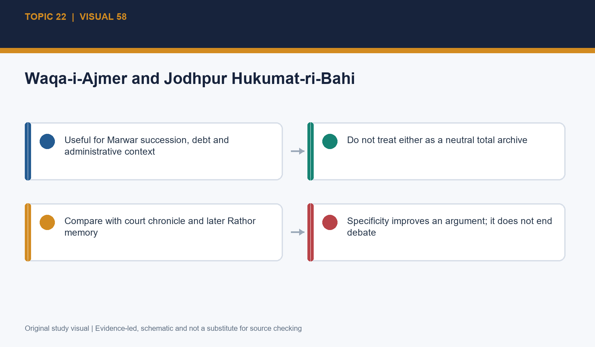

*Visual 58: Waqa-i-Ajmer and Jodhpur Hukumat-ri-Bahi. Original topic-specific study visual; schematic maps are explicitly NOT TO SCALE.*

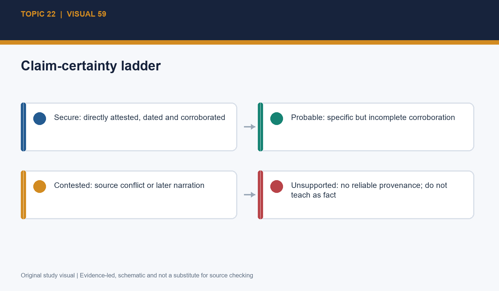

*Visual 59: Claim-certainty ladder. Original topic-specific study visual; schematic maps are explicitly NOT TO SCALE.*

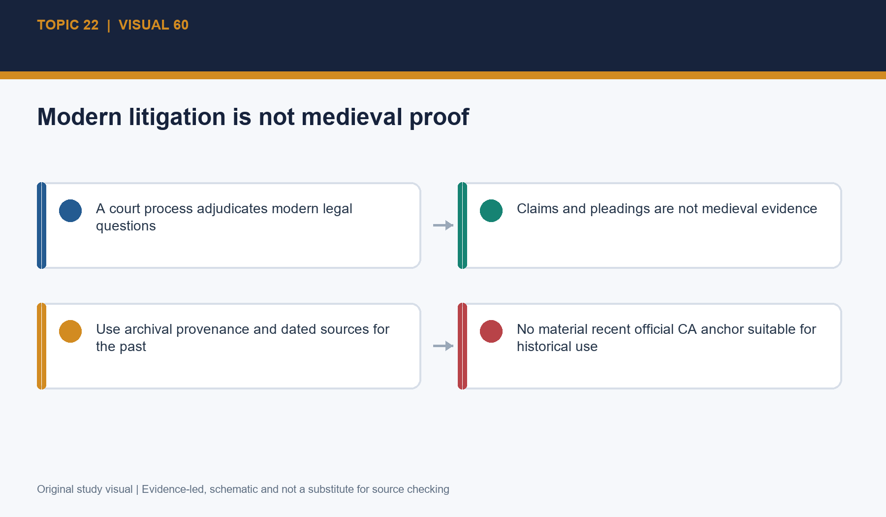

*Visual 60: Modern litigation is not medieval proof. Original topic-specific study visual; schematic maps are explicitly NOT TO SCALE.*

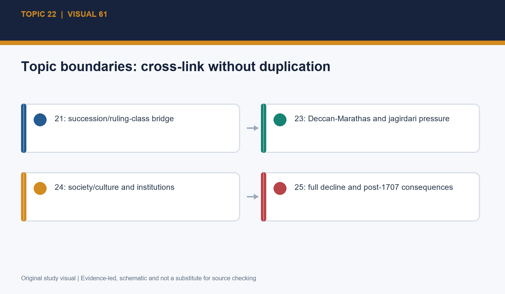

*Visual 61: Topic boundaries: cross-link without duplication. Original topic-specific study visual; schematic maps are explicitly NOT TO SCALE.*


*Visual 62: Mains answer spine. Original topic-specific study visual; schematic maps are explicitly NOT TO SCALE.*

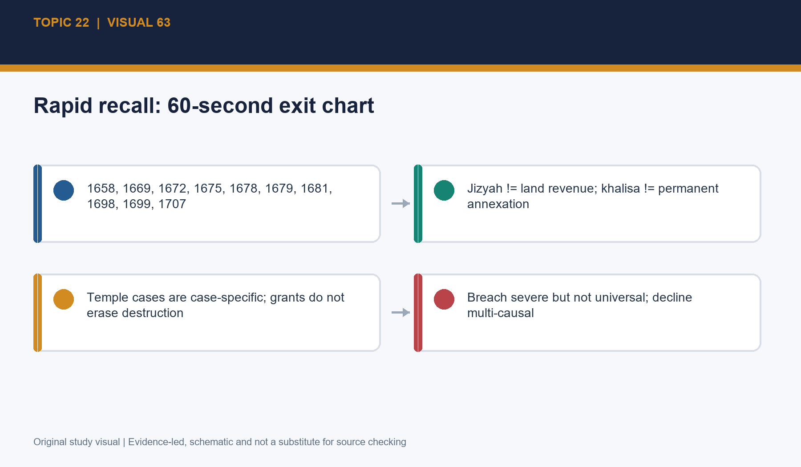

*Visual 63: Rapid recall: 60-second exit chart. Original topic-specific study visual; schematic maps are explicitly NOT TO SCALE.*

### PART XV - PYQ AUDIT AND ORIGINAL PRACTICE

### Direct PYQ status and routing decision

Local official/OCR CSE 2018–2025 Prelims and GS-I material plus available routing ledgers were searched for direct questions on the owner cluster. **No exact direct verified CSE PYQ owned by this Topic 22 cluster was found.** The one OCR occurrence of “Aurangzeb” is a ruler-identification option, not a question on this topic. Generic Bhakti/Sikh, Maratha/Deccan or art questions are adjacent and are not misrouted. Thus no exact wording, option order or official key is invented. The following 80 items are original practice.

### PART XVI - EXAMINER-GRADE MAINS PRACTICE WITH SOLUTIONS

Each model follows directive fidelity, direct thesis, claim -> named evidence -> analysis -> qualification, and a bounded conclusion.

**Demand decoding:** The directive **answer** requires a direct position on “Direct PYQ status and routing decision”, coverage of every clause, evidence-led analysis and a qualified verdict.

**Detailed examiner-grade model status:** The solved analysis above is the executable content base. Preserve its named evidence, causal logic, counterpoint and qualification rather than replacing it with a generic narrative.

**Executable exam-length answer / compression plan:** For a 15-mark answer, open with a two-sentence thesis; organise five named evidence units as claim → evidence → inference → qualification; reserve the final lines for a graded conclusion.

**Why this earns marks:** The answer follows the directive, links precise evidence to analysis, acknowledges source or regional limits and closes with a reasoned verdict.

**How to improve this answer:** For “Direct PYQ status and routing decision”, replace the weakest generalisation with one additional named site, text, inscription, coin, ruler or scholarly position and state exactly what that evidence cannot prove.

### Mains 1 — 10 marks
**Question:** Examine Aurangzeb's religious policy through the relationship between orthodoxy and statecraft. Answer in 150 words.

**Model solution**
Aurangzeb's policy cannot be read as either private belief mechanically governing every act or value-free statecraft. Orthodoxy shaped the legal-symbolic idiom: the preference for Hanafi jurisprudence, patronage of the Fatawa-i-Alamgiri and jizyah in 1679 are named evidence. The emperor nevertheless remained a Timurid sovereign using zawabit, office, recruitment and political discretion. Continued Hindu and Rajput/Maratha service shows that state incorporation did not end. The mechanism is therefore differentiated rule: religious preference changed public signals and selected policies, while imperial necessity still shaped timing and implementation. The qualification is crucial: uneven implementation does not erase discrimination or documented coercion. A balanced verdict is that orthodoxy and statecraft were mutually entangled, with political choices giving religious idiom concrete consequences.

**Why this earns marks:** It answers the directive directly, uses named evidence rather than a slogan, explains a mechanism, and keeps a source/causal qualification visible. For 10 marks, reproduce the thesis, two to six precise evidence units as appropriate, and the final bounded verdict rather than adding an unverified statistic.

**Demand decoding:** The directive **examine** requires a direct position on “Examine Aurangzeb's religious policy through the relationship between orthodoxy and…”, coverage of every clause, evidence-led analysis and a qualified verdict.

**Detailed examiner-grade model status:** The solved analysis above is the executable content base. Preserve its named evidence, causal logic, counterpoint and qualification rather than replacing it with a generic narrative.

**Executable exam-length answer / compression plan:** For a 10-mark answer, open with a two-sentence thesis; organise three named evidence units as claim → evidence → inference → qualification; reserve the final lines for a graded conclusion.

**How to improve this answer:** For “Examine Aurangzeb's religious policy through the relationship between orthodoxy and…”, replace the weakest generalisation with one additional named site, text, inscription, coin, ruler or scholarly position and state exactly what that evidence cannot prove.

### Mains 2 — 15 marks
**Question:** Assess whether jizyah was more fiscal, religious or political in significance. Answer in 250 words.

**Model solution**
Jizyah, reimposed in 1679, was formally a poll tax and must be separated from land revenue and customs. Its fiscal character is real because collection machinery and officials were involved; however, no uncited empire-wide yield should be asserted. Its religious significance lay in the classical legal idiom of differentiated subject status and in reversal of an Akbar-era position. Its political significance was larger still: a visible signal could alienate sections of Hindu subjects, offer legitimacy to a particular idiom of rule and create local opportunities for harassment. Satish Chandra's stress on uneven collection, corruption and failure to rally Muslims prevents a simple revenue-success story. Conversely, uneven collection is not evidence that the signal had no effect. The best verdict is layered: fiscal in form, religious in status language and political in consequence. It reinforced existing tensions but did not independently explain every revolt or Mughal decline.

**Why this earns marks:** It answers the directive directly, uses named evidence rather than a slogan, explains a mechanism, and keeps a source/causal qualification visible. For 15 marks, reproduce the thesis, two to six precise evidence units as appropriate, and the final bounded verdict rather than adding an unverified statistic.

**Demand decoding:** The directive **assess** requires a direct position on “Assess whether jizyah was more fiscal, religious or political in significance. Answer in…”, coverage of every clause, evidence-led analysis and a qualified verdict.

**Detailed examiner-grade model status:** The solved analysis above is the executable content base. Preserve its named evidence, causal logic, counterpoint and qualification rather than replacing it with a generic narrative.

**Executable exam-length answer / compression plan:** For a 15-mark answer, open with a two-sentence thesis; organise five named evidence units as claim → evidence → inference → qualification; reserve the final lines for a graded conclusion.

**How to improve this answer:** For “Assess whether jizyah was more fiscal, religious or political in significance. Answer in…”, replace the weakest generalisation with one additional named site, text, inscription, coin, ruler or scholarly position and state exactly what that evidence cannot prove.

### Mains 3 — 15 marks
**Question:** Discuss Aurangzeb's temple policy without reducing it to either blanket destruction or blanket protection. Answer in 250 words.

**Model solution**
Temple policy requires case-by-case reconstruction. Legal discussion around old places, new construction and repair provides one normative frame; it cannot substitute for evidence of what particular officials did. The 1669 order in chronicle context and the cases of Kashi Vishwanath and Mathura Keshava Rai show that punitive and symbolic action occurred. Marwar/Mewar actions must additionally be placed in occupation and local administrative settings. Motives may combine orthodoxy, rebellion, sovereignty display, complaint and strategy. Equally, farmans or grants to temples, Brahmins and institutions show continuing transactions and protection in particular cases. They qualify a universal-destruction thesis but do not erase destruction. An examiner-grade conclusion classifies the action precisely—demolition, conversion, confiscation, closure, restriction or grant—and rates source certainty. This approach acknowledges real violence and discrimination while refusing sensational lists or unsupported modern allegations.

**Why this earns marks:** It answers the directive directly, uses named evidence rather than a slogan, explains a mechanism, and keeps a source/causal qualification visible. For 15 marks, reproduce the thesis, two to six precise evidence units as appropriate, and the final bounded verdict rather than adding an unverified statistic.

**Demand decoding:** The directive **discuss** requires a direct position on “Discuss Aurangzeb's temple policy without reducing it to either blanket destruction or…”, coverage of every clause, evidence-led analysis and a qualified verdict.

**Detailed examiner-grade model status:** The solved analysis above is the executable content base. Preserve its named evidence, causal logic, counterpoint and qualification rather than replacing it with a generic narrative.

**Executable exam-length answer / compression plan:** For a 15-mark answer, open with a two-sentence thesis; organise five named evidence units as claim → evidence → inference → qualification; reserve the final lines for a graded conclusion.

**How to improve this answer:** For “Discuss Aurangzeb's temple policy without reducing it to either blanket destruction or…”, replace the weakest generalisation with one additional named site, text, inscription, coin, ruler or scholarly position and state exactly what that evidence cannot prove.

### Mains 4 — 10 marks
**Question:** Evaluate the consequences of Guru Tegh Bahadur's execution for Sikh political development. Answer in 150 words.

**Model solution**
Guru Tegh Bahadur's execution in 1675 was consequential because it became a powerful focus of Sikh martyr memory and sharpened the community's relationship to imperial power. Mughal framing in terms of law and order and Sikh traditions, including religious-freedom memory, need not be collapsed into a single uncontested motive. Satish Chandra records the official framing but judges the act unjustified and notes its wider religious repercussions. The named later evidence is Guru Gobind Singh's establishment of the Khalsa in 1699. The analytical link is not mechanical: memory, leadership, organisation, hill politics and later conflicts mediate between 1675 and 1699. Thus the execution was a major accelerant in political-military transformation, not the solitary cause of Khalsa formation or proof that all Sikh-Mughal relations began as purely religious conflict.

**Why this earns marks:** It answers the directive directly, uses named evidence rather than a slogan, explains a mechanism, and keeps a source/causal qualification visible. For 10 marks, reproduce the thesis, two to six precise evidence units as appropriate, and the final bounded verdict rather than adding an unverified statistic.

**Demand decoding:** The directive **evaluate** requires a direct position on “Evaluate the consequences of Guru Tegh Bahadur's execution for Sikh political development.…”, coverage of every clause, evidence-led analysis and a qualified verdict.

**Detailed examiner-grade model status:** The solved analysis above is the executable content base. Preserve its named evidence, causal logic, counterpoint and qualification rather than replacing it with a generic narrative.

**Executable exam-length answer / compression plan:** For a 10-mark answer, open with a two-sentence thesis; organise three named evidence units as claim → evidence → inference → qualification; reserve the final lines for a graded conclusion.

**How to improve this answer:** For “Evaluate the consequences of Guru Tegh Bahadur's execution for Sikh political development.…”, replace the weakest generalisation with one additional named site, text, inscription, coin, ruler or scholarly position and state exactly what that evidence cannot prove.

### Mains 5 — 15 marks
**Question:** Analyse Jat and Satnami resistance as evidence of local stress and mobilisation. Answer in 250 words.

**Model solution**
The Mathura-region Jat rising around Gokula and the Satnami revolt at Narnaul in 1672 reveal how local encounters could become armed challenges. In the Jat case, cultivation, zamindari power, revenue pressure, official coercion, routes linking Mathura-Agra-Delhi and community mobilisation must be held together. Religious grievance should be added only where a specific source makes that connection. In the Satnami case, a local confrontation escalated through a sect/community setting and was rapidly suppressed by imperial force. The comparison shows that neither event was a simple class revolution, mere religious disturbance or proof of general collapse. They differed in geography, leadership and social composition. Recurrence under later Jat figures such as Rajaram, and then Churaman after Aurangzeb, helps trace a longer regional process without prematurely creating Bharatpur in 1669. The conclusion: coercive capacity endured, but local legitimacy and extraction could remain unstable.

**Why this earns marks:** It answers the directive directly, uses named evidence rather than a slogan, explains a mechanism, and keeps a source/causal qualification visible. For 15 marks, reproduce the thesis, two to six precise evidence units as appropriate, and the final bounded verdict rather than adding an unverified statistic.

**Demand decoding:** The directive **analyse** requires a direct position on “Analyse Jat and Satnami resistance as evidence of local stress and mobilisation. Answer in…”, coverage of every clause, evidence-led analysis and a qualified verdict.

**Detailed examiner-grade model status:** The solved analysis above is the executable content base. Preserve its named evidence, causal logic, counterpoint and qualification rather than replacing it with a generic narrative.

**Executable exam-length answer / compression plan:** For a 15-mark answer, open with a two-sentence thesis; organise five named evidence units as claim → evidence → inference → qualification; reserve the final lines for a graded conclusion.

**How to improve this answer:** For “Analyse Jat and Satnami resistance as evidence of local stress and mobilisation. Answer in…”, replace the weakest generalisation with one additional named site, text, inscription, coin, ruler or scholarly position and state exactly what that evidence cannot prove.

### Mains 6 — 15 marks
**Question:** Examine the Marwar succession crisis as a failure of Mughal statecraft. Answer in 250 words.

**Model solution**
Jaswant Singh's 1678 death at Jamrud produced a disputed succession; he had no surviving male heir at the moment, but posthumous claimants made Ajit Singh central. The first analytical error is to say he simply died childless; the second is to equate khalisa with permanent annexation. Crown-revenue control had precedents in disputed succession and alleged debt, as local materials such as Waqa-i-Ajmer and Jodhpur Hukumat-ri-Bahi help illuminate. Yet formal precedent could not neutralise political experience. Searches, occupation, official conduct, favour to Inder Singh and uncertainty about Ajit's custody or settlement converted administrative intervention into an honour-and-watan crisis. Durgadas's role in protecting Ajit's claim gave resistance a durable symbol. Temple actions could intensify the sense of insult, but they do not remove the succession and sovereignty issue. The verdict is statecraft failure: a potentially manageable succession was handled in a manner that exhausted trust and yielded no equivalent gain.

**Why this earns marks:** It answers the directive directly, uses named evidence rather than a slogan, explains a mechanism, and keeps a source/causal qualification visible. For 15 marks, reproduce the thesis, two to six precise evidence units as appropriate, and the final bounded verdict rather than adding an unverified statistic.

**Demand decoding:** The directive **examine** requires a direct position on “Examine the Marwar succession crisis as a failure of Mughal statecraft. Answer in 250 words.”, coverage of every clause, evidence-led analysis and a qualified verdict.

**Detailed examiner-grade model status:** The solved analysis above is the executable content base. Preserve its named evidence, causal logic, counterpoint and qualification rather than replacing it with a generic narrative.

**Executable exam-length answer / compression plan:** For a 15-mark answer, open with a two-sentence thesis; organise five named evidence units as claim → evidence → inference → qualification; reserve the final lines for a graded conclusion.

**How to improve this answer:** For “Examine the Marwar succession crisis as a failure of Mughal statecraft. Answer in 250 words.”, replace the weakest generalisation with one additional named site, text, inscription, coin, ruler or scholarly position and state exactly what that evidence cannot prove.

### Mains 7 — 10 marks
**Question:** Discuss Mewar's role and Prince Akbar's revolt in the Rajput crisis. Answer in 150 words.

**Model solution**
Mewar's intervention reflected kinship with Rajput concerns, fear of Mughal interference in Marwar, territorial-security interests and defence of autonomy; jizyah was a signal but not a sufficient explanation. Aravalli terrain increased the value of local mobility and made occupation costly. Prince Akbar's 1681 revolt created a dynastic alternative with Rathor and Mewar support; Durgadas formed an important link in resistance memory. It failed because coalition and legitimacy were fragile and imperial counter-moves were effective. The forged-letter episode should be labelled source-sensitive rather than repeated as settled fact. The revolt's military failure did not repair the alliance: resistance and distrust survived. It is therefore best read as a failed immediate challenge that exposed a deeper prestige and guarantee problem.

**Why this earns marks:** It answers the directive directly, uses named evidence rather than a slogan, explains a mechanism, and keeps a source/causal qualification visible. For 10 marks, reproduce the thesis, two to six precise evidence units as appropriate, and the final bounded verdict rather than adding an unverified statistic.

**Demand decoding:** The directive **discuss** requires a direct position on “Discuss Mewar's role and Prince Akbar's revolt in the Rajput crisis. Answer in 150 words.”, coverage of every clause, evidence-led analysis and a qualified verdict.

**Detailed examiner-grade model status:** The solved analysis above is the executable content base. Preserve its named evidence, causal logic, counterpoint and qualification rather than replacing it with a generic narrative.

**Executable exam-length answer / compression plan:** For a 10-mark answer, open with a two-sentence thesis; organise three named evidence units as claim → evidence → inference → qualification; reserve the final lines for a graded conclusion.

**How to improve this answer:** For “Discuss Mewar's role and Prince Akbar's revolt in the Rajput crisis. Answer in 150 words.”, replace the weakest generalisation with one additional named site, text, inscription, coin, ruler or scholarly position and state exactly what that evidence cannot prove.

### Mains 8 — 20 marks
**Question:** Assess the political cost of the Rajput rupture to the Mughal Empire. Answer in 250 words.

**Model solution**
The breach with Marwar and Mewar was politically more damaging than its later narrow troop figures suggest. Earlier Mughal-Rajput partnership supplied commanders, local knowledge and a language of reciprocal honour. Aurangzeb initially used Jai Singh and Jaswant Singh, making the later rupture a loss of confidence within a living alliance rather than a foreordained religious war. The Marwar succession handling, jizyah in 1679 and contested temple/occupation actions together made imperial guarantees appear less reliable. Chandra's judgement that the policy was clumsy and blundering rests on this absence of compensating advantage. Continued Hada and Kachhwaha service is a necessary qualification: there was no universal Rajput secession. Nor did the empire collapse in 1681. Yet differentiated service cannot remove the political mechanism: distrust raises bargaining and enforcement costs, while wider Deccan commitments increase the value of dependable allies. The best verdict is a serious legitimacy loss that compounded, but did not replace, fiscal-military pressures and the Deccan war.

**Why this earns marks:** It answers the directive directly, uses named evidence rather than a slogan, explains a mechanism, and keeps a source/causal qualification visible. For 20 marks, reproduce the thesis, two to six precise evidence units as appropriate, and the final bounded verdict rather than adding an unverified statistic.

**Demand decoding:** The directive **assess** requires a direct position on “Assess the political cost of the Rajput rupture to the Mughal Empire. Answer in 250 words.”, coverage of every clause, evidence-led analysis and a qualified verdict.

**Detailed examiner-grade model status:** The solved analysis above is the executable content base. Preserve its named evidence, causal logic, counterpoint and qualification rather than replacing it with a generic narrative.

**Executable exam-length answer / compression plan:** For a 20-mark answer, open with a two-sentence thesis; organise six to eight named evidence units as claim → evidence → inference → qualification; reserve the final lines for a graded conclusion.

**How to improve this answer:** For “Assess the political cost of the Rajput rupture to the Mughal Empire. Answer in 250 words.”, replace the weakest generalisation with one additional named site, text, inscription, coin, ruler or scholarly position and state exactly what that evidence cannot prove.

### Mains 9 — 20 marks
**Question:** Compare Akbar's and Aurangzeb's approaches to religious policy and elite bargain. Answer in 250 words.

**Model solution**
Akbar's sulh-i-kul provided an inclusive imperial idiom and helped turn Rajput partnership into a durable state practice. It did not make the Mughal state a modern secular democracy, nor did it eliminate hierarchy and force. Aurangzeb's policy placed greater public stress on Hanafi legal idiom, supported the Fatawa-i-Alamgiri, reimposed jizyah and authorised or permitted important temple actions in particular contexts. These measures altered the fiscal-symbolic environment and damaged trust, especially when joined to the Marwar crisis. Yet Aurangzeb also retained sovereign discretion, zawabit and composite recruitment; continued Hindu service means the contrast cannot be rendered as total inclusion versus total exclusion. The proper comparative axes are legal idiom, fiscal differentiation, case-specific temple policy, office/recruitment and credibility of alliance. The conclusion is not a tolerance-intolerance morality play: Akbar's bargain invested more in a shared public language, whereas Aurangzeb's choices made political incorporation coexist with sharper differentiation and more fragile legitimacy.

**Why this earns marks:** It answers the directive directly, uses named evidence rather than a slogan, explains a mechanism, and keeps a source/causal qualification visible. For 20 marks, reproduce the thesis, two to six precise evidence units as appropriate, and the final bounded verdict rather than adding an unverified statistic.

**Demand decoding:** The directive **compare** requires a direct position on “Compare Akbar's and Aurangzeb's approaches to religious policy and elite bargain. Answer in…”, coverage of every clause, evidence-led analysis and a qualified verdict.

**Detailed examiner-grade model status:** The solved analysis above is the executable content base. Preserve its named evidence, causal logic, counterpoint and qualification rather than replacing it with a generic narrative.

**Executable exam-length answer / compression plan:** For a 20-mark answer, open with a two-sentence thesis; organise six to eight named evidence units as claim → evidence → inference → qualification; reserve the final lines for a graded conclusion.

**How to improve this answer:** For “Compare Akbar's and Aurangzeb's approaches to religious policy and elite bargain. Answer in…”, replace the weakest generalisation with one additional named site, text, inscription, coin, ruler or scholarly position and state exactly what that evidence cannot prove.

### Mains 10 — 20 marks
**Question:** Using source criticism, evaluate religious policy as a factor in Mughal weakening. Answer in 250 words.

**Model solution**
Religious policy contributed to weakening by changing legitimacy signals, alienating sections of subjects and aggravating particular local conflicts; it is not a monocausal explanation. Jizyah in 1679, the documented Kashi/Mathura sequence, Guru Tegh Bahadur's execution and Marwar-Mewar mistrust are named evidence for concrete political consequences. But their reach must be assessed through source type. Court chronicles such as Maasir-i-Alamgiri give official chronology and ideology; Waqa-i-Ajmer and Jodhpur Hukumat-ri-Bahi add local succession and administrative context; farmans and inscriptions prove particular grants or actions rather than an empire-wide rule; Sikh and Rajput traditions preserve memory but require provenance analysis. Continued service by many Hindu elites qualifies universal exclusion. Deccan war, elite/jagirdari pressures and regional assertion qualify a one-cause decline story. Thus historical disagreement should be resolved by specificity and corroboration, not false balance. Aurangzeb was both constrained by circumstances and a maker of circumstances: his choices worsened a multi-causal imperial problem.

**Why this earns marks:** It answers the directive directly, uses named evidence rather than a slogan, explains a mechanism, and keeps a source/causal qualification visible. For 20 marks, reproduce the thesis, two to six precise evidence units as appropriate, and the final bounded verdict rather than adding an unverified statistic.

### Final solved-answer self-audit

Before reproducing any model answer, test whether it actually answers the directive. A response on jizyah should distinguish poll tax from land revenue, name 1679, analyse fiscal form and religious-political signal, and avoid an invented yield. A temple-policy response should classify the action, name the source type and refuse both a universal-destruction assertion and a grant-as-alibi assertion. A Rajput response should distinguish watan, khalisa and succession from a simple religious explanation, while still acknowledging that jizyah and temple action could deepen distrust. A Sikh answer should separate immediate framing from long-term martyr memory and the 1699 Khalsa. Finally, an empire-wide verdict must state why religious policy was consequential without treating it as a replacement for the Deccan war, elite pressure and regional assertion. If the answer cannot state one limitation that changes its scale, it is probably reciting rather than analysing.

**Solved-practice completion check:** Every answer should end with a bounded verdict, not a slogan: a dated case can support a wider qualified inference, but it cannot bear a claim about every locality, subject or motive.

**Demand decoding:** The directive **evaluate** requires a direct position on “Using source criticism, evaluate religious policy as a factor in Mughal weakening. Answer…”, coverage of every clause, evidence-led analysis and a qualified verdict.

**Detailed examiner-grade model status:** The solved analysis above is the executable content base. Preserve its named evidence, causal logic, counterpoint and qualification rather than replacing it with a generic narrative.

**Executable exam-length answer / compression plan:** For a 20-mark answer, open with a two-sentence thesis; organise six to eight named evidence units as claim → evidence → inference → qualification; reserve the final lines for a graded conclusion.

**How to improve this answer:** For “Using source criticism, evaluate religious policy as a factor in Mughal weakening. Answer…”, replace the weakest generalisation with one additional named site, text, inscription, coin, ruler or scholarly position and state exactly what that evidence cannot prove.

## OPTIONAL ADVANCED DEPTH — NOT REQUIRED FOR A CORE ANSWER

### PART XIV - DEEPENING WORKSHOPS: EVIDENCE, SCALE AND CAUSATION

These workshops make the source method executable. They add analysis rather than a second summary.

### Workshop 1 — Chronology as causal discipline

A date sequence should separate coexistence from causation. The 1669 Jat disturbance and temple-order context, the 1672 Satnami revolt, the 1675 execution, the 1678-79 Marwar rupture, and the 1681 revolt arose in different arenas. Their closeness in time is a reason to ask how policy signals travelled, not proof that one central instruction mechanically produced all of them.

Use the 1658-1707 ladder to identify the institutional arena—court, revenue apparatus, local official, religious community, Rajput house or dynastic faction—before supplying a motive. This prevents a familiar essay from treating a tax, a succession dispute and a local clash as interchangeable evidence.

The important qualification is that chronology alone cannot settle motive. It can rule out careless claims, such as making the 1681 revolt the origin of the 1678 succession crisis, but it must be joined to source reach, locality and political mechanism.

In an answer, add a five-date micro-timeline beside the opening thesis. It makes the causal argument visible without wasting words on a ruler-by-ruler narrative.

> **WORKED CHECK:** State one proposition, name the evidence unit, explain what it can establish, and write one limitation. If the limitation changes the proposition's scale, revise the proposition rather than adding a decorative caveat.

### Workshop 2 — Law, compendium and administration

A legal text has at least three possible reaches: it may reveal juristic opinion, inform courtly legitimacy and be invoked by an official. It does not automatically demonstrate a uniform rule in a village or district. The Fatawa-i-Alamgiri is particularly useful for demonstrating imperially valued Hanafi learning, not for proving that every branch of governance became a codified legal bureaucracy.

Pair the compendium with the category of zawabit. A Timurid emperor could sponsor scholarship, appoint qazis and use a legal idiom while also issuing administrative regulations, making political exceptions and selecting between authorities. The object of explanation is the imperial decision and its execution, not a false institutional choice between law and politics.

A caution follows for the ulama. Religious specialists had appointments, interests and local settings; they were not a single machine that replaced sovereign power. A qazi's role in collection or adjudication may create a particular local effect without defining all religious specialists or every district.

In a 10-marker, define sharia and zawabit in one line, then test the distinction through jizyah or a temple case. This earns marks because it turns terminology into an explanatory tool.

> **WORKED CHECK:** State one proposition, name the evidence unit, explain what it can establish, and write one limitation. If the limitation changes the proposition's scale, revise the proposition rather than adding a decorative caveat.

### Workshop 3 — Jizyah as a contact point

Jizyah should be imagined not only as a column in an imperial ledger but as a contact point between legal status, collector, payer and local authority. That makes a discussion of collection machinery historically important even where exact totals are unavailable. An administrative system can produce delays, exemptions, discretion, corruption or harassment; it can also be uneven across regions.

Satish Chandra's observation that jizyah did not rally Muslims or resolve state problems is a better conclusion than an invented revenue figure. The measure had fiscal form, but the public act of reimposition after Akbar carried a symbolic reversal. These two propositions are compatible: a tax can yield uncertain revenue while changing how subjects read the state.

The caution is symmetrical. One should not announce universal oppression from a legal category, and one should not make collection difficulty proof of harmlessness. Evidence must show locality, actor and result. Where the record is silent, write that the effect is likely differentiated rather than filling the gap with a total claim.

For Mains, draw the fiscal-symbol-signal matrix and end by stating that jizyah reinforced rather than created every conflict. This blocks both the 'only fiscal' and 'only religious' traps.

> **WORKED CHECK:** State one proposition, name the evidence unit, explain what it can establish, and write one limitation. If the limitation changes the proposition's scale, revise the proposition rather than adding a decorative caveat.

### Workshop 4 — Temple claims as source tests

A sensitive temple claim should be dismantled into answerable questions. What precise site is named? When is the action dated? Does the source describe demolition, conversion, seizure, closure, restriction or a grant? Is the source a court chronicle, a local record, a farman, an inscription, a tradition or a modern retelling? This procedure is not evasive; it is how a claim becomes historical evidence.

The Kashi and Mathura cases are useful because their names and the 1669-70 context allow a focused discussion. They do not license a total list, nor does a later temple grant elsewhere undo them. A source-grounded paragraph may explain a legal ideal concerning older places, a documented departure in a named case, and the risk of universalising either proposition.

The key qualification is that uncertainty varies. A securely dated, corroborated action is stronger than a later local story; a local story is not worthless merely because it is not a court text. It must be labelled according to its provenance and corroboration. Modern litigation is a separate legal process and cannot fill the evidentiary gap for the medieval past.

In an answer, use the verbs exactly. 'Destroyed' is not interchangeable with 'converted' or 'confiscated'; this precision is a substantive argument about motive, aftermath and reach.

> **WORKED CHECK:** State one proposition, name the evidence unit, explain what it can establish, and write one limitation. If the limitation changes the proposition's scale, revise the proposition rather than adding a decorative caveat.

### Workshop 5 — Guru Tegh Bahadur: consequence without simplification

The 1675 execution can be examined through two linked but distinct questions: what explanations contemporaries and traditions provide for the act, and what political-religious consequences it acquired. Mughal law-and-order framing answers the first question from an official perspective. Sikh martyr tradition answers it from a community memory and ethical perspective. Neither source should be made to disappear.

The consequence is historically large even where an exclusive immediate motive cannot be settled. Chandra's judgement that the action was unjustified, and the later centrality of martyr memory, explain why it mattered for Sikh identity. The Khalsa in 1699 then provides a dated organisational landmark, but a responsible answer adds leadership, discipline, local politics and continuing conflict as mediating factors.

The qualification is not a denial of religious persecution or of Sikh tradition. It is a refusal to claim that one execution mechanically produced every later development or that all early Sikh-Mughal interaction had the same character. A source matrix makes the distinction clear.

For a 15-marker, put 'immediate framing' and 'long-term meaning' in separate headings. It satisfies directive fidelity and prevents a simple chronicle of martyrdom from replacing analysis.

> **WORKED CHECK:** State one proposition, name the evidence unit, explain what it can establish, and write one limitation. If the limitation changes the proposition's scale, revise the proposition rather than adding a decorative caveat.

### Workshop 6 — Jats and Satnamis: compare mechanisms, not labels

The Jat rising around Gokula and the Satnami revolt should be compared through mechanism. In the Mathura corridor, agrarian production, zamindar power, routes and official coercion gave a local conflict wider significance. At Narnaul, a triggering clash could become a community mobilisation in a sectarian setting. Both cases show that the imperial state encountered local societies through intermediaries, force and revenue rather than only at court.

Their differences are as important as their similarities. Jat recurrence under Rajaram and later Churaman points toward a longer regional political process; it does not retrospectively create a sovereign Bharatpur state at the moment of Gokula's uprising. The Satnami revolt was quickly suppressed; that shows continued imperial capacity while leaving intact the evidence of grievance and mobilisation.

The qualification is aimed at two opposite errors: calling every episode religious ignores agrarian/local power, while calling every episode class conflict ignores community identities and cultural claims where sources supply them. A named local official, revenue demand or sacred grievance should be used only at the scope the source permits.

In an answer, use a compact comparison table—region, social base, trigger, response, result—and conclude that multiple conflicts were not a coordinated national programme.

> **WORKED CHECK:** State one proposition, name the evidence unit, explain what it can establish, and write one limitation. If the limitation changes the proposition's scale, revise the proposition rather than adding a decorative caveat.

### Workshop 7 — Marwar: administration becomes legitimacy crisis

The analytical gain from Waqa-i-Ajmer and Jodhpur Hukumat-ri-Bahi is not that they deliver one final motive, but that they show why administrative form and political experience must be read together. Khalisa control after a disputed succession had precedents and may have been connected with debt. That fact blocks a simple annexation claim. It does not make the actual occupation benign or politically neutral.

Jaswant Singh's death left no surviving male heir at that moment, while posthumous claimants made Ajit's title central. Favour to Inder Singh, property searches, military occupation and uncertainty about custody or division made a technical succession management appear to threaten a watan. Durgadas and Rathor sardars could therefore turn a claimant into a rallying symbol.

The qualification concerns narrative detail. The various escape and conversion/custody stories should be version-labelled. A strong answer keeps the secure political core—resistance coalesced around Ajit and Durgadas—without treating every later dramatic episode as an archive-certified transcript.

For Mains, explain why a policy with precedent could still fail: precedent is not trust, and a succession rule without credible honour and local restraint can produce the resistance it is designed to prevent.

> **WORKED CHECK:** State one proposition, name the evidence unit, explain what it can establish, and write one limitation. If the limitation changes the proposition's scale, revise the proposition rather than adding a decorative caveat.

### Workshop 8 — Mewar and the 1681 dynastic opening

Mewar's role makes clear that the Rajput conflict was not only an internal Marwar succession. Rana Raj Singh could see imperial occupation and succession interference as a threat to regional balance, kinship ties, security and autonomy. Jizyah supplied a broader signal of differentiation but cannot be assigned the whole causal burden. The Aravalli setting also turned a political dispute into a logistical and territorial problem.

Prince Akbar's 1681 revolt introduced a dynastic alternative. Support from parts of the Rathor/Mewar political world and Durgadas's role made it more than a local raid, yet the coalition was contingent rather than universal. The collapse demonstrates the limits of a claim to the throne built on a fragile alliance. It should not be retold as a story of all Rajputs acting as one nation.

The forged-letter episode is an excellent test of provenance discipline. It may be important to later explanation, but a source-sensitive answer labels its evidentiary standing rather than building an entire causal account on a famous anecdote. The documented political result is clearer: failure did not restore trust.

Use the contrast 'failed rebellion / enduring breach' in a conclusion. It gives a precise answer to questions about military outcome and political prestige.

> **WORKED CHECK:** State one proposition, name the evidence unit, explain what it can establish, and write one limitation. If the limitation changes the proposition's scale, revise the proposition rather than adding a decorative caveat.

### Workshop 9 — Causation and the multi-causal verdict

Religious policy contributed to imperial weakening by altering public legitimacy, creating differentiated fiscal status, intensifying selected disputes and making some alliance bargains less credible. This proposition has named evidence in jizyah, temple cases, Guru Tegh Bahadur's execution and the Rajput breach. It should not be inflated into the single explanation for an empire that still possessed armies, offices, revenue claims and a composite elite.

The wider context includes Deccan warfare, competition over jagirs and rank, regional assertions, local rebellion and the difficulty of imperial communication. Topic 23 and Topic 25 supply the fuller account. Topic 22's distinct contribution is to show that north Indian policy choices could worsen the conditions under which those structural pressures operated.

The final qualification resists false balance. It would be wrong to say documented discrimination was irrelevant because other factors existed, just as it would be wrong to attribute every later failure to religion. Causal weight is assessed by mechanism, timing, reach and comparison with alternative pressures—not by a moral preference for one grand explanation.

In a 20-marker, close with “contributory but not monocausal,” then name the mechanisms: legitimacy loss, alliance mistrust, local coercion and higher bargaining/enforcement cost.

> **WORKED CHECK:** State one proposition, name the evidence unit, explain what it can establish, and write one limitation. If the limitation changes the proposition's scale, revise the proposition rather than adding a decorative caveat.

### PART XIV-B - ADVANCED ESSAY CLINICS

The clinics deepen the argument without adding unsupported facts or duplicating the register notes.

### Clinic 1 — From legal language to state action

A frequent weak answer quotes sharia or the Fatawa-i-Alamgiri and then announces that all administration became the enforcement of sacred law. The repair is to create a chain of proof. First identify the legal text or courtly idiom. Second identify the sovereign or office that made an administrative choice. Third identify a dated locality in which the choice was implemented. Fourth ask whether another source shows exception, negotiation or non-enforcement. The chain does not diminish legal commitment; it identifies where commitment became policy. This is particularly valuable for Aurangzeb because personal piety, juristic patronage and political discretion are all documented parts of the picture. A legal proposition may have normative force and still not predict every appointment, revenue demand or local outcome. Conversely, a regulation may be politically calculated and still communicate a sharp religious differentiation. The answer should explain that the distinction is evidence of how the Mughal state worked, not an attempt to neutralise a contentious policy.

**Takeaway:** A useful miniature conclusion is: law informed the imperial idiom, sovereignty selected policy, and administration determined reach. This turns terminology into causal explanation.

### Clinic 2 — Reading negative and positive temple evidence together

Temple grants and temple actions are often placed in opposed camps as though one document can silence the other. A more rigorous reading asks whether the records concern the same site, date, officer and action. A grant for one institution demonstrates a particular relationship of protection, revenue assignment or patronage. It is evidence against a claim that every temple was always targeted, but it cannot disprove a dated demolition elsewhere. Similarly, a well-attested demolition gives strong evidence for that place and occasion but does not establish an empire-wide numerical total. The strongest history therefore has two columns: case-specific coercion and case-specific continuity. It then explains why multiple motives may coexist—orthodox preference, punishment, sovereignty, local complaint or strategic occupation—rather than requiring every case to share a single motive. Such comparison also makes the answer resilient against selective lists that omit dates, primary provenance and action taxonomy.

**Takeaway:** The operational rule is simple: never let a grant become an alibi or a demolition become a universal statistic.

### Clinic 3 — Source reach and the problem of silence

Court chronicles can be silent about a local event because it was unimportant to the author, inconvenient to official ideology, outside the writer's information or simply absent from the surviving text. Silence therefore cannot automatically prove that an event did not happen. It can, however, limit what an official narrative alone can establish. Sikh traditions and Rajput bardic memories face an inverse problem: they may preserve community experience and political meaning with details shaped by later retelling. Their value is neither automatic literal certainty nor automatic dismissal. The historian asks when the tradition was recorded, what it seeks to remember, whether its core is corroborated and which claims it can support. Waqa-i-Ajmer and Jodhpur Hukumat-ri-Bahi demonstrate the gain from local administrative sources: they can clarify succession and property questions obscured by court-centred history. Yet they too have perspective and archival limits. This layered method enables a student to write about disagreement without asserting that all evidence is equal.

**Takeaway:** The answer-writing payoff is to name the source genre and its reach in the same sentence as the evidence; that small habit prevents both credulity and false scepticism.

### Clinic 4 — Alliance as an institution of credible commitment

The Mughal-Rajput relationship can be analysed as a credible-commitment problem. Military service, mansab, jagir and court access gave Rajput houses incentives to cooperate, but a durable bargain also required assurance that hereditary honour and succession would not be casually overridden. Watan therefore carries more than sentiment: it linked a house's local authority to its capacity to provide service. The Marwar crisis shows why an action with administrative precedent could still be politically disastrous. Khalisa control might be justified during uncertainty, but official searches, occupation, the Inder Singh preference and ambiguity around Ajit made the central guarantee look unreliable. Mewar's reaction is intelligible in this institutional setting, not only as a response to a religious tax. Continued service by other houses makes the conclusion stronger rather than weaker: a breach was differentiated, but all partners could update their assessment of imperial reliability. In a time of wider warfare, that reputational cost could affect bargaining beyond the desert campaign.

**Takeaway:** Use “credible guarantee, not sentimental harmony” as a mnemonic. It gives a precise political mechanism for the Rajput rupture.

### Clinic 5 — Building a non-monocausal decline answer

A mature verdict does not turn multi-causality into a vague list. It assigns mechanisms and relative reach. Religious policy affected legitimacy through jizyah and legal-symbolic differentiation; selected temple actions affected local and wider political memory; Guru Tegh Bahadur's execution carried major Sikh consequences; the Marwar-Mewar breach damaged trust in imperial guarantees. These are concrete pathways. Alongside them were the long Deccan war, competition over jagirs and elite rewards, regional assertions, problems of communication and varied local resistance. The task is not to pick a single winner. It is to show interaction: coercive and symbolic choices could make recruitment, bargaining and enforcement harder when military commitments already strained the empire. This is why the phrase “victim of circumstances and maker of circumstances” has analytical value only when followed by named evidence on each side. Agency explains decisions; structure explains their setting, opportunities and unintended effects.

**Takeaway:** A final sentence should be bounded: religious policy was a consequential contributor to a wider imperial weakening, neither a decorative side issue nor a complete explanation.

### Clinic 6 — The vocabulary test for contentious claims

Technical vocabulary is not cosmetic. It prevents a student from silently changing the claim under examination. Jizyah is not land revenue; khalisa is not a synonym for permanent annexation; watan is not merely a jagir; zawabit are not evidence that legal idiom vanished; a legal compendium is not a modern constitution. Likewise, destruction, demolition, conversion, confiscation, restriction and grant describe different actions. Before accepting a dramatic statement, define its key noun and ask whether the cited source uses the same category. Many false assertions survive because a familiar word is allowed to carry an undefined conclusion. In the Marwar case, a student who distinguishes khalisa from permanent annexation can still explain why crown control threatened political honour. In temple discussion, a student who distinguishes a grant from a universal policy can acknowledge both continuity and coercion. Precision therefore makes a more honest answer, not a less critical one.

**Takeaway:** Spend ten seconds defining the disputed term in a Prelims elimination or Mains introduction; it often removes the closest distractor.

### Clinic 7 — Maps, locality and the scale of political action

Spatial reasoning helps prevent court-centred history from becoming abstract. Mathura's proximity to the Agra-Delhi corridor helps explain why local Jat mobilisation mattered to an empire of routes and revenue. Narnaul locates the Satnami rising in a different local setting. Marwar's Jodhpur-Ajmer-Nagaur communications and Mewar's Aravalli terrain show why succession, occupation, pursuit and supply became practical questions. A schematic map is not a quantitative military map and must be marked NOT TO SCALE, but it can clarify why the same imperial language produced different outcomes in different regions. Geography does not determine politics: Rajput allies, local officials, merchants, cultivators and armed groups made choices. It provides the constraints and opportunities within which policy was encountered. This is especially useful against the idea that a proclamation at court automatically had identical meaning and enforcement in a hill corridor, a desert capital and a pilgrimage-commercial region.

**Takeaway:** When using a map, label one route, one terrain feature and one political consequence. That keeps visual value addition tied to an argument.

### Clinic 8 — Negative claims and the burden of proof

Claims of totality require evidence of totality. “All temples were destroyed,” “all Hindus were excluded,” “all Rajputs rebelled,” “religion was irrelevant,” and “one policy caused decline” are all too large for the ordinary evidence units available to this topic. The remedy is not to avoid judgement but to resize it. A named temple action can prove a named action; continued Hada or Kachhwaha service can disprove universal Rajput secession; jizyah can demonstrate differentiated fiscal-symbolic status; the Marwar crisis can demonstrate damaged alliance credibility. From these one can build a strong qualified conclusion. The burden of proof increases with geographical scope, social coverage and causal exclusivity. This principle also disciplines counter-claims: grants do not show that violence never occurred, and local conflict does not show that the whole empire had failed. Students should make the proposition no larger than the source can bear, then explain why the evidence is still significant.

**Takeaway:** Use the formula “case-specific evidence, broader qualified inference” to keep a conclusion both critical and defensible.

### Clinic 9 — How to write a date without manufacturing certainty

Dates make chronology useful, but false precision creates a fragile answer. Use a fully specified date only when the source being relied on clearly supplies it and when the day or month changes the explanation. For this topic, the high-value anchors are the reign 1658-1707; the reimposition of jizyah in 1679; Guru Tegh Bahadur's execution in 1675; Jaswant Singh's death at Jamrud in 1678; Prince Akbar's revolt in 1681; Ajit's recognition in 1698; and the Khalsa in 1699. A careful answer can write “the 1669 order context” or “the later 1670 Mathura sequence” when it is not establishing an exact day from a primary text. Similarly, use “c.1669” for Gokula when the chronology in the consulted account supports approximation. This practice is not timid: it prevents a student from making an unverified day-date the foundation of a causal argument. It also helps distinguish contemporaneous action from later memory, later settlement and post-1707 consequence.

**Takeaway:** Prefer an accurate year and a clear source label to a decorative day-date. UPSC rewards the argument supported by a reliable chronology, not spurious precision.

### Aurangzeb: Religious Policy, North India & the Rajputs — ADVANCED

> **Subject:** History (Medieval India) · **Tier:** Advanced (deeper understanding) · **GS Paper:** GS-I (also Prelims).
> **Grounded in:** Satish Chandra, *Medieval India: From Sultanat to the Mughals — Part II (Mughal Empire)* — chapters on Aurangzeb's religious policy, Jats/Sikhs/Rajputs, and the breach with Marwar and Mewar.
> ✅ = from source book · ⚠️ = inference / standard knowledge · 📰 = current affairs.
> *Companion: `basic/22_Aurangzeb-Religious-Policy-Rajputs.md`. Chronology spine: `00_Master-Chronology.md`.*

---

### Mini-timeline

| Date | Event |
|---|---|
| ✅ 1658 | Aurangzeb defeats Dara at Samugarh and secures the throne |
| ✅ 1667 | Jai Singh dies; a key Rajput adviser and Deccan strategist disappears |
| ✅ 1675 | Guru Tegh Bahadur executed; later Sikh militarisation accelerates |
| ✅ 1678 | Jaswant Singh of Marwar dies at Jamrud without a surviving male heir |
| ✅ 1679 | Jizyah reimposed; Marwar crisis escalates; Mewar war begins |
| ✅ Jan. 1681 | Prince Akbar rebels in alliance with Durgadas and Rathors |
| ✅ 1698 | Ajit Singh recognised as ruler of Marwar, but capital not fully restored |
| ✅ 1707 | Aurangzeb dies; jizyah is later scrapped within a few years |

### 1. Snapshot & core idea

**Deeper — Chandra's balanced frame: orthodoxy plus statecraft failure.**

✅ Satish Chandra explicitly treats Aurangzeb's character as **complex**: an orthodox ruler who wanted to remain within Islamic law, but also a Timurid sovereign who could use secular decrees (*zawabit*) and choose between legal opinions when raison d'etat required it.
- ✅ His puritanical measures — bans on intoxicants, closer association with ulama, reimposition of **jizyah**, and restrictions affecting temples — failed to rally Muslims or create deeper loyalty to an Islamic-law state.
- ✅ Chandra highlights a contradiction: Aurangzeb formally accepted the *sharai* principle protecting old temples of *zimmis*, yet permitted destruction of many old-standing temples before 1687. Neither blanket exoneration nor a claim of uniform empire-wide destruction fits the evidence.
- ✅ Chandra notes corruption and grasping behaviour among some ulama/qazis appointed in the jizyah apparatus, weakening the political utility of this policy.
- ✅ The reimposition of jizyah alienated sections of Hindus and strengthened groups already opposed to the empire, but Chandra also says religion by itself was not the point at issue in the empire's decline.

**Deeper — Marwar-Mewar as a succession crisis mishandled by empire.**

✅ Part II uses newly available sources such as **Waqa-i-Ajmer** and **Jodhpur Hukumat-ri-Bahi** to revise older explanations. Taking Marwar into **khalisa** after Jaswant Singh's death had precedents when succession was disputed and debts were owed.
- ✅ The crisis escalated because Mughal officials behaved as conquerors, because Aurangzeb awarded the tika to **Inder Singh**, and because the Rathor sardars rejected the proposed division/settlement involving Ajit Singh.
- ✅ Rana Raj Singh of Mewar was alienated by Mughal interference in Rajput internal affairs and the military occupation of Marwar.
- ✅ Chandra's conclusion is sharp: Aurangzeb's Marwar-Mewar policy was **clumsy and blundering**, yielded no advantage, damaged prestige, and created doubts about Mughal support to old allies.

### 2. Key classification / data

| Dimension | Advanced point from Part II | Why it matters |
|---|---|---|
| ✅ Legal idiom | Sharia was invoked, but *zawabit* and political necessity remained | Aurangzeb was orthodox, not politically irrational |
| ✅ Ulama | Given concessions; some qazis became powerful/corrupt | Religious policy did not create a reliable support base |
| ✅ Jizyah | Reimposed 1679; scrapped within a few years of his death | Symbolic cost; limited institutional durability |
| ✅ Marwar khalisa | Had administrative precedents in disputed succession | Not simple annexation thesis |
| ✅ Waqa-i-Ajmer / Hukumat-ri-Bahi | Sources illuminate succession/debt/local disorder | Historiography matters for UPSC optional-style answers |
| ✅ Rajput alliance | Breach with Marwar-Mewar weakened confidence in Mughal guarantees | Political legitimacy cost at crucial Deccan moment |

### 3. Study links

> **Study link:** ✅ Read with `advanced/23_Marathas-Shivaji-and-Deccan.md` for how Rajput rupture coincided with the Deccan-Maratha crisis.
> **Study link:** ⚠️ Compare with Akbar's *sulh-i-kul* and Rajput partnership; contrast with eighteenth-century revival of broader tolerance.

### 4. Must-Know Facts (Prelims)

- ✅ Aurangzeb reimposed **jizyah in 1679**; it was abolished again soon after his death.
- ✅ **Jaswant Singh** died in 1678; **Ajit Singh** was his posthumous claimant; **Durgadas Rathor** led resistance.
- ✅ **Inder Singh** was initially favoured by Aurangzeb for the Jodhpur tika.
- ✅ Mewar's Rana Raj Singh objected to Mughal interference and occupation of Marwar.
- ✅ Prince **Akbar** rebelled in 1681 with Rathor support but failed.
- ✅ Chandra rejects both a pure strategic-annexation view and a pure religious-conspiracy view of Marwar.

### 5. UPSC Traps

> 🔑 Trap: Do not confuse **religious orthodoxy** with a monocausal explanation of all rebellions and decline.

- ❌ Aurangzeb simply abandoned all Timurid/secular statecraft. → Correct: he still used political discretion and *zawabit*.
- ❌ Taking Marwar into khalisa automatically meant final annexation. → Correct: khalisa control had precedents in disputed successions.
- ❌ Jizyah successfully rallied Muslims behind the empire. → Correct: Chandra says it neither rallied Muslims effectively nor checked decline.
- ❌ Rajput rupture caused immediate military collapse. → Correct: military effect was limited after 1681, but prestige and trust suffered deeply.

### 6. 📰 Current link

📰 **Current linkage (verify live before use):** Religious-site litigation illustrates why provenance, chronology and legal status must be kept distinct. Verify the latest Supreme Court order before citing it and avoid converting litigation allegations into historical facts.

### 7. Mains angles

- ⚠️ Assess Satish Chandra's view that Aurangzeb was both **a victim of circumstances** and a maker of the circumstances that trapped him.
- ⚠️ Explain how Marwar-Mewar exposed the limits of Mughal centralisation in dealing with **watan, succession and honour**.
- ⚠️ Was jizyah more a fiscal measure, religious symbol, or political signal? Discuss with Chandra's evidence.

### ➕ Historiography note (PYQ-gap)

⚠️ Older narratives (e.g., pure religious annexation thesis) should be balanced with Chandra's use of **Waqa-i-Ajmer** and **Hukumat-ri-Bahi**, which foreground succession, debt, khalisa precedents and political miscalculation.

## CONSOLIDATED REGISTER NOTES

### FINAL CONSOLIDATED REGISTER NOTES — READ LAST

### 1. Frame and chronology

- **Reign:** Aurangzeb/Alamgir, **1658–1707**. Do not begin with “bigot caused decline” or “religion irrelevant”.
- **Working frame:** personal orthodoxy + Hanafi legal idiom + Timurid sovereignty + **zawabit** + political calculation + local administration + fiscal/military context + uneven implementation.
- **Chronology:** 1658 accession; 1665 Shivaji treaty boundary; 1667 Jai Singh dies; c.1669 Gokula/Jat rising and temple-order context; 1672 Satnamis; 1675 Guru Tegh Bahadur; 1678 Jaswant Singh; 1679 jizyah/Marwar-Mewar escalation; 1681 Prince Akbar; 1698 Ajit recognition; 1699 Khalsa; 1707 death.
- **Owner boundaries:** Topic 21 owns the succession/ruling-class bridge; Topic 23 owns the full Deccan-Maratha narrative; Topic 24 owns society/culture; Topic 25 owns full decline.

### 2. Law, sovereignty and symbolism

- **Sharia:** legal and moral idiom; **zawabit:** ruler-made administrative regulation. Neither word alone describes the whole state.
- Aurangzeb was personally orthodox; the emperor remained sovereign. Do not call the state ulema rule or a modern secular state.
- **Fatawa-i-Alamgiri:** sponsored collective Hanafi compendium; not a modern constitution and not proof of automatic universal enforcement.
- Ulama/qazis/sadrs received patronage but were not a uniform bloc. Local officials and powerholders shaped outcomes.
- Court measure checklist: **date + form + source + scale + implementation**. Court symbolism is not automatically village practice.

### 3. Jizyah

- Reimposed **1679**; **not land revenue, not customs**; a poll tax in legal-political idiom.
- Motive matrix: orthodoxy | Islamic legitimacy | political signal | fiscal context. Never assert one exclusive motive without direct evidence.
- Do not invent categories, rates, coverage or yield. Satish Chandra supports collection difficulty and corruption/harassment risks.
- Effects: alienated sections of subjects; reinforced existing opposition; did not rally Muslims or solve state problems. **Contributory, not sole cause of decline.**
- Post-1707 abolition/suspension date: state only with direct verified regulation; do not memorise an unsupported date.

### 4. Temple evidence protocol

- Separate: **destruction / demolition / conversion / confiscation / closure / restriction / grant**.
- 1669 order: chronicle text/context; do not turn it into an undifferentiated empire-wide order.
- Kashi Vishwanath and Mathura Keshava Rai/Keshav Dev: use dated, contextual cases; Marwar/Mewar actions need occupation/local-record context.
- Old-temple protection in legal ideal does not erase departures; grants/protection do not erase documented destruction.
- Claim ladder: **secure** (dated/corroborated) → probable → contested → unsupported.
- Modern litigation/political allegation is not medieval proof.

### 5. Inclusion, equality and Sikh history

- Continued Hindu/Rajput/Maratha service = **elite incorporation**; it does not prove equal subject status or negate jizyah/temple cases.
- Avoid uncited percentages: every number needs date, denominator, category.
- **Guru Tegh Bahadur, 1675:** Mughal law-order framing; Sikh martyr-memory/tradition; Chandra calls action unjustified and consequential.
- **Khalsa, 1699:** martyr memory + leadership + organisation + local politics. Do not say one execution alone created it.

### 6. Jats and Satnamis

- **Gokula/Jats, c.1669, Mathura:** zamindari/local power + agrarian/revenue pressure + official coercion + mobilisation; religion only where sourced.
- Rajaram and later Churaman = recurrence/bridge, not immediate Bharatpur state in 1669.
- **Satnamis, 1672, Narnaul:** local clash escalates through community/sect context; rapidly suppressed. Not a collapse proof, not “mere fanaticism”.
- No single coordinated anti-Mughal national movement: Jats, Satnamis, Sikhs and Rajputs differ in base, terrain and chronology.

### 7. Rajputs and Marwar-Mewar

- Early alliance continued: Jai Singh and Jaswant Singh were valued servants; Jai Singh dies 1667.
- **Watan** = hereditary homeland/authority; service requires rank, reward, honour and credible succession guarantee.
- **Jaswant, 1678 at Jamrud:** no surviving male heir at death; posthumous claimants mean **do not write “died childless”**.
- **Khalisa** = crown-revenue administration; **not automatically permanent annexation**. Local sources: Waqa-i-Ajmer and Jodhpur Hukumat-ri-Bahi; valuable but not complete/neutral.
- Inder Singh/Ajit contest, official conduct, occupation/property searches, suspicion over custody, and Durgadas's resistance explain escalation.
- Durgadas escape stories have versions: use secure core, not untested drama.
- Mewar: kinship, interference fear, territorial/security and autonomy; **not jizyah alone**.
- Prince Akbar revolt, **1681:** Rathor/Mewar support; failed; forged-letter tale needs provenance caution; failure did not restore trust.
- **Ajit recognised 1698**, with limits; Jodhpur remained an issue. Hadas/Kachhwahas continued service: serious breach, not universal secession.

### 8. Verdict and answer spine

- Rajput political cost exceeded immediate post-1681 military cost: prestige and confidence in Mughal guarantees suffered.
- Deccan is a bounded bridge: wider war made reliable allies valuable; do not invent budget transfers.
- Akbar comparison: sulh-i-kul/inclusive idiom vs sharper differentiation; both used sovereignty and force. Avoid hero-villain binary.
- Aurangzeb: **victim of circumstances and maker of circumstances**. State both inherited strain and policy choice.
- **Answer spine:** direct thesis → claim → named source/event → mechanism → qualification → bounded conclusion.
- **PYQ audit:** no direct verified CSE 2018–2025 Topic 22 owner question found in searched local corpus. Do not misroute adjacent Sikh/Maratha/art questions.

### COMPLETE TOPIC ASCII MASTER FLOW DIAGRAM

#### ASCII MASTER FLOW — PANEL 1/12: Differentiated rule under pressure

```ascii-master
PERSONAL ORTHODOXY -> preference and public legitimacy matter
SOVEREIGNTY -> emperor still selects officials, policy, war and regulation
LOCAL ADMINISTRATION -> orders acquire uneven reach through officials and powerholders
POLITICAL FIELD -> Rajputs, Sikhs, zamindars and sect communities act independently
VERDICT -> religion is consequential but cannot explain every conflict alone.
MUST REMEMBER: Aurangzeb's jizya restoration (1679), temple actions and Rajput conflicts
  require chronological and political context.
```

#### ASCII MASTER FLOW — PANEL 2/12: Aurangzeb chronology, 1658-1707

```ascii-master
1658 -> accession | 1665 -> Shivaji treaty boundary
1667 -> Jai Singh dies | c.1669 -> Jat rising and temple-order context
1672 -> Satnami revolt | 1675 -> Guru Tegh Bahadur executed
1678 -> Jaswant Singh dies | 1679 -> jizyah and Rajput war
1681 -> Prince Akbar rebels | 1698 -> Ajit receives recognition
1699 -> Khalsa established | 1707 -> unresolved reign ends.
```

#### ASCII MASTER FLOW — PANEL 3/12: Sharia, zawabit and imperial choice

```ascii-master
SHARIA -> legal-moral idiom and learned authority
ZAWABIT -> ruler-made administrative regulations for order and necessity
SOVEREIGNTY -> emperor chooses, patronises, appoints and enforces
FATAWA-I-ALAMGIRI -> Hanafi compendium, not a modern constitution
ULAMA / QAZIS / SADRS -> influential specialists, not a replacement cabinet
RULE -> law informs policy; administration determines reach.
```

#### ASCII MASTER FLOW — PANEL 4/12: Jizyah, 1679: fiscal form and political signal

```ascii-master
FISCAL FORM -> poll tax; neither land revenue nor customs duty
RELIGIOUS STATUS -> classical idiom of differentiated subjecthood
POLITICAL SIGNAL -> visible reversal of an Akbar-era position
IMPLEMENTATION -> collectors, exemptions, corruption and uneven local contact
EFFECT -> alienation and mistrust; no proof of a single revolt or total decline
SAFE VERDICT -> fiscal in form, religious in idiom, political in consequence.
```

#### ASCII MASTER FLOW — PANEL 5/12: Temple policy: test one action at a time

```ascii-master
1 SECURE -> dated and corroborated site-specific action
2 PROBABLE -> source-supported local action with limited corroboration
3 CONTESTED -> later tradition or disputed attribution
4 UNSUPPORTED -> list without date, action or provenance
CLASSIFY -> demolition, conversion, confiscation, closure, restriction or grant
RULE -> protection evidence and destruction evidence must both retain scope.
```

#### ASCII MASTER FLOW — PANEL 6/12: Composite nobility: inclusion is not equality

```ascii-master
INCLUSION -> Hindu, Rajput and later Maratha elites can hold rank and command
EQUALITY -> asks whether fiscal, legal and symbolic distinctions still operate
EARLY RAJPUT SERVICE -> Jai Singh and Jaswant Singh show inherited partnership
LATER RUPTURE -> particular houses resist while others remain in imperial service
VERDICT -> composite recruitment coexists with discriminatory public policy.
```

#### ASCII MASTER FLOW — PANEL 7/12: Guru Tegh Bahadur: source and consequence

```ascii-master
MUGHAL FRAME -> law, order and imperial authority
SIKH TRADITION -> martyrdom and defence of religious freedom
HISTORIAN'S TASK -> compare genre, silence, memory and later amplification
1675 CONSEQUENCE -> martyr memory sharpens community-state relations
1699 KHALSA -> leadership, organisation and politics mediate the later outcome
TRAP -> one execution did not mechanically create every later development.
```

#### ASCII MASTER FLOW — PANEL 8/12: Jats and Satnamis: compare mechanisms

```ascii-master
JATS c.1669 -> Mathura corridor; zamindari, agrarian and local coercive setting
RECURRENCE -> Rajaram and later Churaman mark a longer regional process
SATNAMIS 1672 -> Narnaul clash escalates through community mobilisation
IMPERIAL RESPONSE -> rapid suppression shows coercive capacity still exists
RULE -> neither episode is purely class, purely religious or national revolt
VERDICT -> local state-society contact can turn grievance into armed challenge.
```

#### ASCII MASTER FLOW — PANEL 9/12: Marwar: succession becomes legitimacy crisis

```ascii-master
1678 -> Jaswant Singh dies without a surviving male heir at that moment
POSTHUMOUS CLAIM -> Ajit Singh becomes the Rathor legitimacy focus
KHALISA -> crown administration during dispute, not automatic permanent annexation
OCCUPATION -> searches, force and temple actions destroy confidence
DURGADAS / RATHORS -> claimant protection turns dispute into organised resistance
VERDICT -> precedent without credible honour becomes statecraft failure.
```

#### ASCII MASTER FLOW — PANEL 10/12: Mewar and Prince Akbar, 1681

```ascii-master
MEWAR MOTIVES -> kinship, security, autonomy and fear of Marwar occupation
TERRAIN -> Aravalli passes raise pursuit, supply and occupation costs
PRINCE AKBAR -> dynastic alternative attracts a contingent Rajput coalition
FAILURE -> fragile trust and imperial counter-moves defeat the immediate challenge
AFTERMATH -> military failure does not restore alliance credibility
CAUTION -> famous forged-letter story requires provenance labelling.
CLOSE DISTINCTION: Temple destruction was selective and variable, not a timeless universal
  programme; grants and protection also need evidence.
```

#### ASCII MASTER FLOW — PANEL 11/12: Religious policy and Mughal weakening

```ascii-master
CONTRIBUTION -> legitimacy loss, alliance mistrust and higher enforcement cost
NAMED EVIDENCE -> jizyah, temple cases, 1675 execution and Rajput breach
COUNTER-EVIDENCE -> composite recruitment and functioning coercive institutions
OTHER PRESSURES -> Deccan war, jagir-rank competition and regional assertion
METHOD -> weigh mechanism, timing, reach and source type
VERDICT -> consequential and contributory, never a complete monocausal theory.
EVIDENCE LIMIT: Marwar and Mewar followed different trajectories, so 'the Rajputs' cannot be
  treated as one undifferentiated bloc.
```

#### ASCII MASTER FLOW — PANEL 12/12: Topic 22 final answer spine

```ascii-master
OPEN -> orthodoxy and statecraft operate together under pressure
TRACE -> policy phases -> jizyah / temple cases -> local and Rajput conflicts
PROVE -> dated case, action type, source reach and political mechanism
COMPARE -> inclusion versus equality; succession versus annexation
QUALIFY -> no communal monocause, blanket denial or universal-destruction list
VERDICT -> policy choices worsened a multi-causal imperial problem.
```
