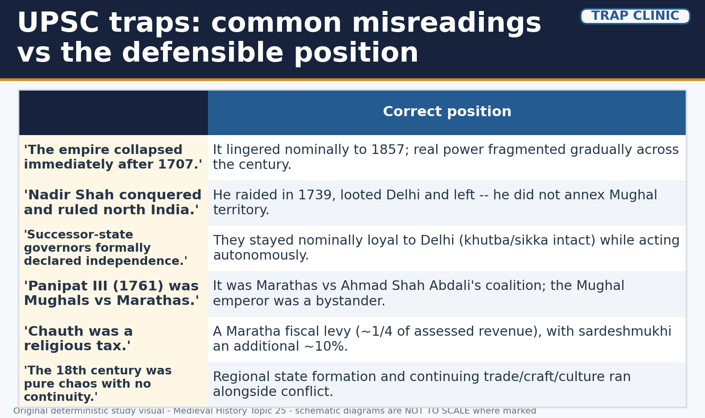
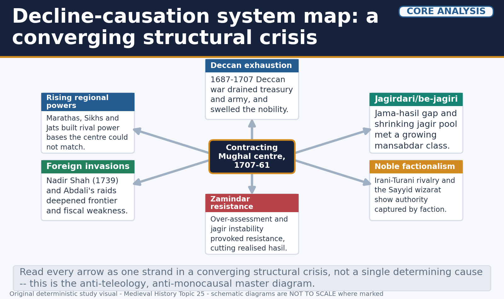
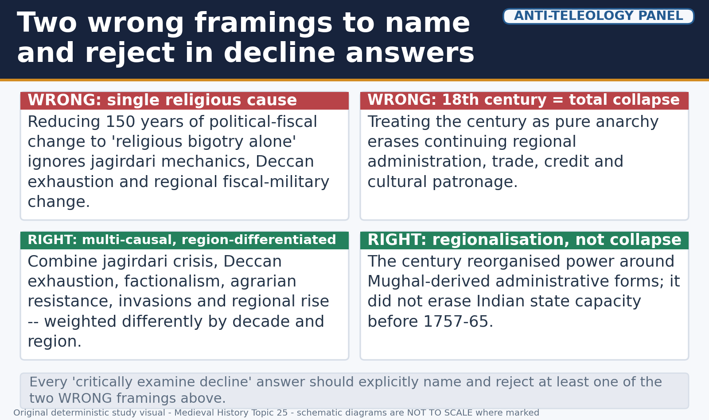
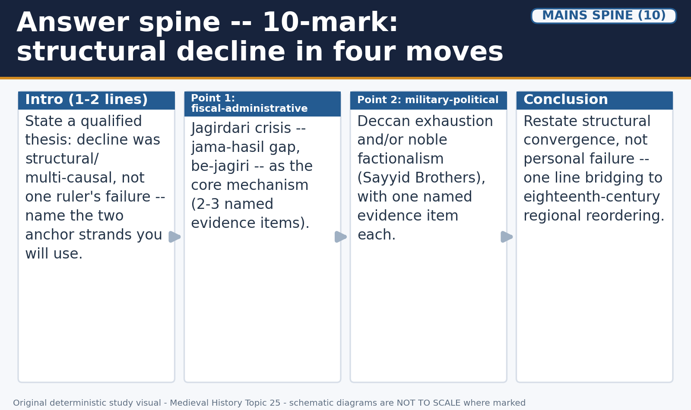
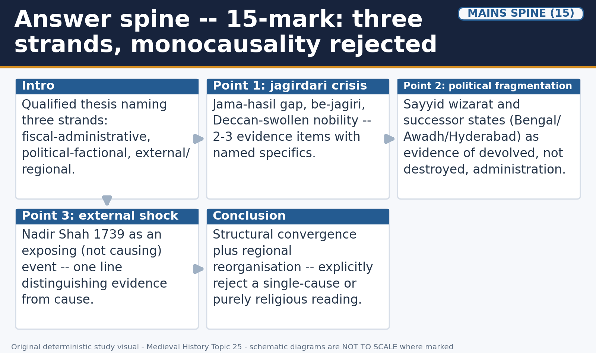
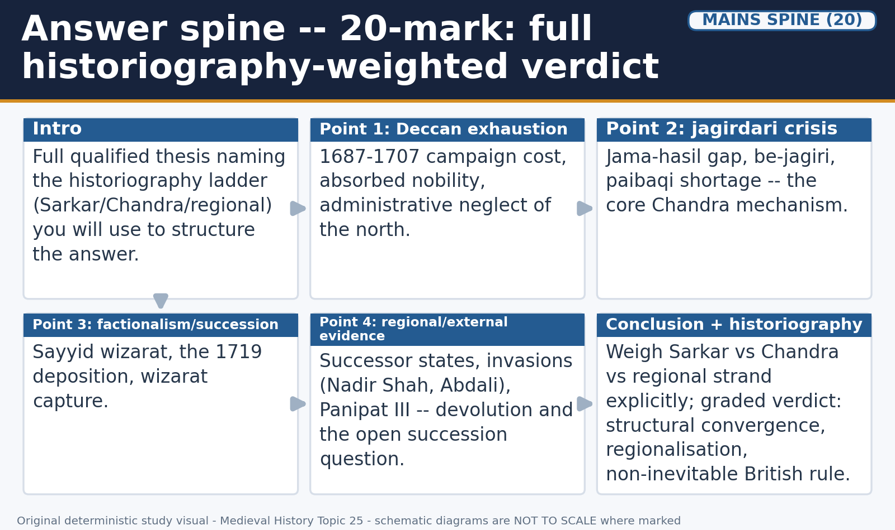

# Decline of the Mughal Empire & the Eighteenth Century — Solved Practice Workbook

## BASIC MCQS / REMEDIATION

### Learning MCQs (20; key rotation A -> B -> C -> D repeated five times)

Correct options are deliberately rotated by actual option placement, not by relabeling: A -> B -> C -> D through the full set. Read the explanation after attempting each item.

*Visual 34: UPSC traps -- common misreadings vs the defensible position. Original deterministic study visual; schematic maps are NOT TO SCALE where marked.*

#### Q1. What is this topic's own core chronological window?

- A. 1707 to 1761.

- B. 1761 to 1857.

- C. 1526 to 1707.

- D. 1600 to 1657.

**Answer: A.**
**Explanation:** The topic's core window runs from Aurangzeb's death to the Third Battle of Panipat; earlier and later periods are named only as bounded inheritance or hand-off.

#### Q2. Aurangzeb's Deccan campaigns (1687-1707) are treated in this topic as:

- A. Evidence that decline began only after 1761.

- B. An inherited fiscal-administrative legacy feeding be-jagiri, owned in military detail by Topics 22-23.

- C. Irrelevant background with no bearing on the jagirdari crisis.

- D. This topic's central battle-by-battle content.

**Answer: B.**
**Explanation:** This topic summarises the Deccan wars only as a structural input; their full military narrative belongs to Topics 22-23.

#### Q3. Jadunath Sarkar's historiographical strand is chiefly associated with:

- A. A regional/agrarian-continuity account questioning the decline label.

- B. A jama-hasil administrative-fiscal framework.

- C. An early account emphasising Aurangzeb's personal responsibility and religious policy.

- D. A revenue-farming account of Bengal.

**Answer: C.**
**Explanation:** Sarkar's early-twentieth-century account is one strand among three on the historiography ladder, not a settled final verdict.

#### Q4. Satish Chandra's explanatory framework for Mughal decline is best summarised as:

- A. An account centred on the Third Battle of Panipat alone.

- B. A colonial-era teleological account read backward from British success.

- C. A purely religious-policy account.

- D. An administrative-fiscal account built substantially on jama-hasil and jagir-transfer evidence.

**Answer: D.**
**Explanation:** Chandra's framework is this topic's central explanatory thread, evidenced through revenue and jagir-transfer records rather than a moral verdict on any ruler.

#### Q5. Bahadur Shah I's policy toward Rajputs and Shahu's Marathas after 1707 is best described as:

- A. Broadly conciliatory.

- B. Uniformly confrontational.

- C. Identical to his conflict with Banda Bahadur's Sikh rebellion.

- D. Focused solely on the Deccan.

**Answer: A.**
**Explanation:** Bahadur Shah I pursued conciliation with Rajput rulers and Shahu, in contrast with his more difficult conflict with Banda Bahadur.

#### Q6. Farrukhsiyar's 1719 deposition and killing is the clearest documented evidence for:

- A. Nadir Shah's intervention in Mughal succession.

- B. Noble kingmaking, since the same Sayyid Brothers who elevated him in 1713 removed him in 1719.

- C. A stable, undivided royal authority after 1707.

- D. Direct Maratha capture of Delhi.

**Answer: B.**
**Explanation:** Farrukhsiyar's rise and fall at Sayyid hands is this topic's strongest single case of noble control over the throne.

#### Q7. The Sayyid-dominated administration abolished jizyah in:

- A. 1707.

- B. 1761.

- C. 1713.

- D. 1739.

**Answer: C.**
**Explanation:** Jizyah's abolition in 1713 shows the post-1707 administration actively revising, not merely continuing, Aurangzeb's policy.

#### Q8. Muhammad Shah's long reign (1719-1748) is best characterised as a period when:

- A. The empire had already formally dissolved.

- B. Jizyah was reimposed empire-wide.

- C. Central authority was fully restored and regional autonomy reversed.

- D. Continuing factional competition and growing regional autonomy (including the Nizam's Deccan withdrawal) coexisted with a nominally intact imperial centre.

**Answer: D.**
**Explanation:** Muhammad Shah's reign illustrates devolution proceeding under, not instead of, continuing nominal Mughal authority.

#### Q9. In jagirdari terminology, jama refers to:

- A. The assessed or paper revenue of a territorial unit.

- B. Revenue actually collected in a given year.

- C. Crown land held in reserve.

- D. The condition of a mansabdar without a suitable jagir.

**Answer: A.**
**Explanation:** Jama is the administrative assessment figure, distinct from hasil, the amount actually realised.

#### Q10. In jagirdari terminology, hasil refers to:

- A. Crown land held in reserve.

- B. Revenue actually collected in a given year, which could fall short of the jama.

- C. The reserve pool for new jagir grants.

- D. A mansabdar's sanctioned rank.

**Answer: B.**
**Explanation:** The jama-hasil gap, not either figure alone, is the measurable core of the jagirdari crisis.

#### Q11. In jagirdari terminology, paibaqi refers to:

- A. A mansabdar's shortage of a suitable jagir.

- B. The gap between assessed and collected revenue.

- C. Crown land held in reserve, not currently assigned as jagir to any mansabdar.

- D. A regional ruler's fiscal claim layered over Mughal revenue.

**Answer: C.**
**Explanation:** Paibaqi is the pool from which new or transferred jagir assignments were meant to be made; its shrinkage is a specific bottleneck, not a general "land shortage."

#### Q12. In jagirdari terminology, be-jagiri refers to:

- A. A fiscal claim layered over Mughal revenue.

- B. A reserve land pool.

- C. A revenue-farming settlement.

- D. The condition of a mansabdar being without a suitable, revenue-adequate jagir.

**Answer: D.**
**Explanation:** Be-jagiri is the symptom that names the whole crisis: too many claimants relative to the available paibaqi pool.

#### Q13. The absorption of Deccani and Maratha nobles into the Mughal mansabdari system after the Deccan campaigns had the structural effect of:

- A. Increasing claimants for a shrinking pool of productive, assignable jagir land.

- B. Eliminating the need for jagir transfers.

- C. Ending noble factionalism at court.

- D. Reducing the number of jagir claimants.

**Answer: A.**
**Explanation:** More claimants chasing a smaller effective paibaqi pool is the precise mechanism linking Deccan exhaustion to be-jagiri.

#### Q14. Zamindar and peasant resistance to jagirdar extraction is best analysed as:

- A. Evidence exclusive to Bengal alone.

- B. A structural response to extraction pressure created by the jagirdari feedback loop.

- C. Simple lawlessness unconnected to fiscal pressure.

- D. Proof that no central authority existed anywhere in India.

**Answer: B.**
**Explanation:** Reading resistance only as disorder erases its structural origin in short-tenure, high-extraction jagir administration.

#### Q15. The centre-region spectrum described in this topic is best used to:

- A. Replace the historiography ladder entirely.

- B. Force a binary choice between "the empire still ruled" and "the empire had ended."

- C. Place a given province between close central control and merely symbolic Mughal legitimacy, justified by a specific administrative or fiscal fact.

- D. Describe only Bengal.

**Answer: C.**
**Explanation:** The spectrum framing avoids the false binary and requires a specific justifying fact for any placement.

#### Q16. Murshid Quli Khan's principal contribution to Bengal's eighteenth-century autonomy was:

- A. Winning the Third Battle of Panipat.

- B. Founding the Sikh misls.

- C. Abolishing jizyah empire-wide.

- D. A revenue-farming (ijaradari) settlement that reduced disruptive jagir turnover.

**Answer: D.**
**Explanation:** This fiscal mechanism, distinct from a standard jagir assignment, is Bengal's specific route to stabilised autonomy.

#### Q17. Saadat Khan (Burhan-ul-Mulk) built Awadh's autonomous base chiefly through:

- A. Accommodation with local zamindars and taluqdars.

- B. An alliance with Nadir Shah.

- C. A revenue-farming settlement identical to Bengal's.

- D. Direct military conquest of Delhi.

**Answer: A.**
**Explanation:** Awadh's mechanism is accommodation with existing landed power, distinct from Bengal's revenue-farming overhaul.

#### Q18. Nizam-ul-Mulk (Asaf Jah) secured effective Deccan autonomy after defeating a rival governor at:

- A. Panipat, in 1761.

- B. Shakar Kheda, in 1724.

- C. Plassey, in 1757.

- D. Karnal, in 1739.

**Answer: B.**
**Explanation:** The 1724 victory at Shakar Kheda is the specific, datable turning point after which Hyderabad's autonomy went effectively unchallenged from Delhi.

#### Q19. Nadir Shah's 1739 invasion is best described as:

- A. A joint operation with Ahmad Shah Abdali.

- B. An event with no lasting consequence for Mughal finances.

- C. A raid for plunder and prestige that withdrew the same year, leaving a severe fiscal shock.

- D. A permanent annexation of Delhi and its surrounding territory.

**Answer: C.**
**Explanation:** Nadir Shah plundered Delhi and left in 1739; he did not attempt to hold or annex Mughal territory.

#### Q20. The Third Battle of Panipat was fought on:

- A. 23 June 1757.

- B. 14 January 1757.

- C. 22 October 1739.

- D. 14 January 1761.

**Answer: D.**
**Explanation:** Panipat III, fought on 14 January 1761 between Abdali's coalition and Sadashivrao Bhau's Maratha army, is this topic's closing event.

### Broad MCQs (44; key rotation A -> A -> C -> D repeated eleven times)

Correct options are deliberately rotated by actual option placement, not by relabeling: A -> A -> C -> D through the full set. Read the explanation after attempting each item.

*Visual 5 repeat: decline-causation system map, previewed before broad practice. Original deterministic study visual; schematic maps are NOT TO SCALE where marked.*

#### Q21. Jahandar Shah's brief reign (1712-13) was chiefly dominated by:

- A. His noble patron Zulfiqar Khan.

- B. A stable, factionalism-free court.

- C. Direct Maratha administration.

- D. Nadir Shah's regency.

**Answer: A.**
**Explanation:** Jahandar Shah's short, patron-dominated reign is further evidence of noble control over the throne before Farrukhsiyar's overthrow of him in 1713.

#### Q22. The 1719 Sayyid-Maratha settlement is best described as:

- A. A purely religious concordat.

- B. A settlement recognising Shahu's chauth and sardeshmukhi claims in the Deccan in exchange for military support against Farrukhsiyar.

- C. A treaty ending all Maratha claims in the Deccan.

- D. An agreement signed after Panipat III.

**Answer: B.**
**Explanation:** This 1719 bargain is the clearest formal evidence of the imperial centre institutionalising a regional power's fiscal claim.

#### Q23. Rafi-ud-Darajat and Rafi-ud-Daulah (Shah Jahan II), installed by the Sayyid Brothers in 1719, are significant chiefly because:

- A. They abolished chauth.

- B. They led the empire's recovery after Nadir Shah's invasion.

- C. Their brief, short-lived reigns illustrate how completely the Sayyid Brothers controlled succession in 1719.

- D. They each reigned for several decades.

**Answer: C.**
**Explanation:** Two puppet emperors installed and lost within the same year is strong evidence of noble-controlled kingmaking at its peak.

#### Q24. The Sayyid Brothers' wizarat ended in 1720 when:

- A. Aurangzeb returned to power.

- B. Nadir Shah annexed Delhi.

- C. Shah Alam II was blinded.

- D. A wider noble coalition, including Nizam-ul-Mulk, overthrew them and installed Muhammad Shah.

**Answer: D.**
**Explanation:** The Sayyids were removed by a rival coalition, not by a restoration of undivided royal authority - factionalism replaced factionalism.

#### Q25. The decline-causation system map used in this topic frames Mughal decline as:

- A. A converging structural crisis across fiscal, political, military, social and external strands, rather than one dominant cause.

- B. Entirely explained by Aurangzeb's religious policy.

- C. A sudden single-year collapse.

- D. Entirely explained by Nadir Shah's invasion.

**Answer: A.**
**Explanation:** The system-map framing explicitly rejects both monocausal and single-date readings of decline.

#### Q26. In the jagirdari feedback loop, short-tenure extraction leads next to:

- A. Increased long-term investment in jagir land.

- B. Under-investment in the jagir's long-term productivity.

- C. Immediate abolition of the mansabdari system.

- D. Automatic promotion to wazir.

**Answer: B.**
**Explanation:** Short expected tenure removes the incentive to invest in irrigation or protect cultivators from over-assessment, the loop's second stage.

#### Q27. Frequent jagir transfers primarily discouraged mansabdars from:

- A. Extracting revenue quickly.

- B. Seeking new assignments.

- C. Investing in the long-term productivity of any single jagir.

- D. Competing for scarce good jagirs.

**Answer: C.**
**Explanation:** An assignee with no guarantee of holding the same jagir for long had every incentive to extract rather than invest.

#### Q28. Deccan exhaustion is best treated in a decline answer as:

- A. Irrelevant to the jagirdari crisis.

- B. Proof of Aurangzeb's personal religious motives alone.

- C. The sole and sufficient cause of Mughal decline.

- D. A serious contributing input feeding directly into be-jagiri and factionalism, not a sufficient standalone explanation.

**Answer: D.**
**Explanation:** Treating Deccan exhaustion as one structural input among several avoids both erasing it and overstating it as the single cause.

#### Q29. Rival noble blocs contesting the wizarat after 1707 included:

- A. Turani, Irani, Hindustani/Afghan and Barha-Sayyid groupings.

- B. Only a single unified noble class.

- C. Only Rajput clans.

- D. Exclusively European trading-company factions.

**Answer: A.**
**Explanation:** These identifiable rival blocs built competing coalitions inside the court, repeatedly determining who held the throne.

#### Q30. The zamindar-resistance spectrum described in this topic ranges from:

- A. Only legal petitions to Delhi.

- B. Passive non-compliance and revenue arrears to organised regional assertion of autonomy.

- C. Only violent rebellion.

- D. Total submission to total independence with nothing in between.

**Answer: B.**
**Explanation:** The spectrum captures graded, locally variable responses to extraction pressure, not a single uniform type of resistance.

#### Q31. On the centre-region spectrum, Bengal, Awadh and Hyderabad are best placed:

- A. At the closely-controlled, frequently-rotated-governor end.

- B. Entirely outside any Mughal-derived legitimacy framework.

- C. At the middle-to-far end, retaining formal deference while exercising substantial real autonomy.

- D. At a point identical in mechanism to each other.

**Answer: C.**
**Explanation:** All three continued to seek nominal Mughal confirmation while running their own administration, revenue and military affairs.

#### Q32. What single feature unites Bengal, Awadh and Hyderabad as "successor states" despite their different mechanisms?

- A. All three abolished jizyah independently.

- B. All three fought at Panipat III.

- C. All three were founded through open armed rebellion against Mughal forces.

- D. Each converted real administrative and fiscal control into durable regional power while retaining formal Mughal legitimacy for as long as useful.

**Answer: D.**
**Explanation:** This shared outcome, achieved through different specific mechanisms, is what makes "successor state" the accurate term rather than "rebel state."

#### Q33. Which of the following successor-state founders is correctly matched with his province?

- A. Murshid Quli Khan - Bengal.

- B. Saadat Khan - Hyderabad.

- C. Nizam-ul-Mulk - Awadh.

- D. Alivardi Khan - Awadh.

**Answer: A.**
**Explanation:** Murshid Quli Khan is Bengal's founding Nawab-Diwan figure; the other pairings mismatch province and founder.

#### Q34. Alivardi Khan's Bengal faced repeated incursions in the 1740s from:

- A. Ahmad Shah Abdali's forces.

- B. Maratha (bargi) raiders.

- C. Sikh misls.

- D. Nadir Shah's army.

**Answer: B.**
**Explanation:** Alivardi Khan substantially contained repeated Maratha bargi incursions through negotiation and military resistance without losing Bengal.

#### Q35. Awadh's autonomy under Saadat Khan rested chiefly on:

- A. A revenue-farming settlement copied directly from Bengal.

- B. Direct annexation of Mughal crown land.

- C. Negotiated accommodation with local zamindars and taluqdars.

- D. Naval control of the Ganga.

**Answer: C.**
**Explanation:** Accommodation, not revenue-farming, is Awadh's distinguishing mechanism relative to Bengal.

#### Q36. Awadh's Nawab Shuja-ud-Daulah is directly linked to this topic's narrative through his:

- A. Founding of the Sikh misls.

- B. Abolition of jizyah.

- C. Victory at Shakar Kheda.

- D. Role fighting alongside Abdali's coalition at the Third Battle of Panipat, 1761.

**Answer: D.**
**Explanation:** Shuja-ud-Daulah's frontier alignment with Abdali at Panipat directly connects Awadh's history to this topic's closing event.

#### Q37. Nizam-ul-Mulk (Chin Qilich Khan, later Asaf Jah) held which senior Mughal office before his Deccan withdrawal?

- A. Wazir under Muhammad Shah.

- B. Commander at Panipat.

- C. Diwan of Bengal.

- D. Subedar of Awadh.

**Answer: A.**
**Explanation:** His prior standing as a top-ranking central noble and wazir is directly relevant to Part IV's factionalism analysis before his Deccan withdrawal.

#### Q38. Succession disputes among Asaf Jah's sons after his death eventually drew in:

- A. The Sikh misls directly.

- B. French and British trading companies through the Carnatic Wars.

- C. Nadir Shah's forces.

- D. The Jat state of Bharatpur.

**Answer: B.**
**Explanation:** This development belongs to Modern History and is named here only as a bounded forward pointer, not analysed in depth.

#### Q39. Suraj Mal's Bharatpur state was built on which social base?

- A. A Sikh confederacy (misl) base.

- B. A maritime trading base.

- C. An agrarian, peasant-rooted Jat zamindari base around Agra-Mathura.

- D. A Deccani-Persianate courtly base.

**Answer: C.**
**Explanation:** The Jat formation's base is agrarian and locally rooted, distinct from the Sikh misls' confederacy structure or Hyderabad's courtly base.

#### Q40. Banda Bahadur's armed rebellion against Mughal authority lasted approximately:

- A. 1719-1720.

- B. 1761-1770.

- C. 1739-1748.

- D. 1708-1715, ending with his capture and execution in 1716.

**Answer: D.**
**Explanation:** Banda Bahadur's rebellion and its suppression is the first major Sikh armed challenge in this topic's window, preceding the later rise of the misls.

#### Q41. The Sikh misls that consolidated power across Punjab in the mid-eighteenth century were best described as:

- A. Armed confederacies.

- B. A single unified monarchy from the outset.

- C. A department of the Mughal wizarat.

- D. A revenue-farming arrangement.

**Answer: A.**
**Explanation:** The misls' confederate structure, later consolidated by Ranjit Singh in the early nineteenth century, is outside this topic's own bounded window.

#### Q42. Maratha chauth and sardeshmukhi claims over Mughal-assessed revenue are best described as:

- A. Exclusively confined to Bengal.

- B. Fiscal claims layered over a continuing Mughal-derived revenue assessment.

- C. A one-time payment with no recurring basis.

- D. A complete replacement of Mughal administration.

**Answer: B.**
**Explanation:** "Layered claim," not "replacement," is the precise description this topic requires for chauth and sardeshmukhi.

#### Q43. By the mid-eighteenth century, Maratha fiscal and military reach extended as far as:

- A. Only Punjab.

- B. Only the immediate Deccan.

- C. Bengal (the 1740s bargi raids), Malwa, Gujarat and the Gangetic north.

- D. Only Hyderabad's territory.

**Answer: C.**
**Explanation:** This wide reach explains how the Marathas came into direct confrontation with Abdali's coalition at Panipat in 1761.

#### Q44. At the Battle of Karnal (1739), Muhammad Shah's army:

- A. Did not engage Nadir Shah at all.

- B. Was smaller than Nadir Shah's force but won.

- C. Was commanded personally by the Nizam.

- D. Was considerably larger than Nadir Shah's force yet was decisively defeated.

**Answer: D.**
**Explanation:** A larger force's defeat at Karnal is stronger evidence of military hollowness than a bare comparison of army sizes.

#### Q45. Treasure traditionally said to have been carried off by Nadir Shah in 1739 includes:

- A. The Peacock Throne and the Koh-i-Noor diamond.

- B. The Jagat Seth ledgers.

- C. The Ashtapradhan records.

- D. The Hazarduari Palace collection.

**Answer: A.**
**Explanation:** These are the traditionally cited items of plunder; a precise answer avoids asserting an exact, unverified total value for the wider indemnity.

#### Q46. Nadir Shah's 1739 occupation of Delhi should be distinguished from annexation because:

- A. He formally merged the Mughal and Persian thrones.

- B. He withdrew to Persia the same year without attempting to hold Mughal territory.

- C. He installed a permanent Persian governor at Delhi.

- D. He remained in India until 1748.

**Answer: B.**
**Explanation:** The raid-versus-conquest distinction is essential; Nadir Shah plundered and left, unlike a would-be annexing power.

#### Q47. Ahmad Shah Abdali (Durrani) had earlier served as:

- A. A Mughal wazir.

- B. Bengal's Diwan.

- C. A commander under Nadir Shah before founding his own Afghan kingdom.

- D. A Maratha sardar.

**Answer: C.**
**Explanation:** Abdali's prior service under Nadir Shah connects the two external-shock episodes in this topic's Part VII.

#### Q48. Abdali's invasions into north-western India recurred across approximately which span?

- A. 1707-1713.

- B. 1757-1765.

- C. 1719-1724.

- D. 1748-1761.

**Answer: D.**
**Explanation:** This roughly thirteen-year span of repeated invasions shows a persistently contested, not a passively vacant, frontier.

#### Q49. At the Third Battle of Panipat, the Maratha army was commanded by:

- A. Sadashivrao Bhau, accompanied by the Peshwa's heir Vishwasrao.

- B. Suraj Mal.

- C. Madhavrao I.

- D. Najib-ud-Daulah.

**Answer: A.**
**Explanation:** Both were prominent casualties of the battle, making the defeat a dynastic as well as military crisis.

#### Q50. On Abdali's side at the Third Battle of Panipat fought:

- A. The Sikh misls.

- B. Najib-ud-Daulah's Rohilla Afghans and Awadh's Shuja-ud-Daulah.

- C. Alivardi Khan and the Bengal Nawabi.

- D. Suraj Mal's Jat forces.

**Answer: B.**
**Explanation:** Panipat III was a multi-actor coalition contest, not simply "Marathas versus Afghans."

#### Q51. The Maratha confederacy's wider power after the 1761 defeat at Panipat was:

- A. Never seriously affected at all.

- B. Restored immediately through a renewed advance into the Punjab.

- C. Substantially restored within about a decade under Peshwa Madhavrao I.

- D. Permanently ended.

**Answer: C.**
**Explanation:** The recovery was chiefly Deccan-, Malwa- and central-India-centred, not a return to the same Punjab position as before.

#### Q52. This topic's central thesis about the eighteenth century is that:

- A. Political fragmentation caused total, uniform economic and cultural collapse.

- B. No political fragmentation occurred at all.

- C. Economic and cultural life collapsed before political fragmentation began.

- D. Political fragmentation and considerable economic-cultural continuity ran side by side.

**Answer: D.**
**Explanation:** This qualified, non-uniform thesis is drawn from the source material's own historiography ladder and evidenced in subtopics 21-22.

#### Q53. Which institution is most frequently cited as evidence of continuing eighteenth-century banking and credit activity?

- A. The Jagat Seth firm in Bengal.

- B. The Sayyid wizarat.

- C. The Ashtapradhan.

- D. The Nizamat treasury alone.

**Answer: A.**
**Explanation:** Jagat Seth's continued, expanding operation through political fragmentation is a specific, citable continuity example.

#### Q54. Continuity evidence for the eighteenth-century economy, beyond banking, includes:

- A. Total abandonment of maritime trade.

- B. Continuing craft production and urban centres under regional-court patronage.

- C. Complete cessation of all trade networks.

- D. Uniform collapse of all regional urban centres.

**Answer: B.**
**Explanation:** Regional courts sustained craft and urban economic activity even as central Mughal political authority fragmented.

#### Q55. Which regional centre is cited in this topic as a major example of continuing eighteenth-century cultural patronage?

- A. Karnal.

- B. Shakar Kheda.

- C. Awadh's Lucknow establishment.

- D. Kala Amb.

**Answer: C.**
**Explanation:** Lucknow's literary, architectural and artistic patronage is the topic's specific named example of regional-court cultural continuity.

#### Q56. Alongside Awadh's Lucknow establishment, this topic names which other court as a centre of continuing regional cultural patronage?

- A. Bharatpur's Jat court.

- B. The Sikh misls' court.

- C. The Sayyid Brothers' household.

- D. Hyderabad's Deccani court.

**Answer: D.**
**Explanation:** Hyderabad's Deccani court is the topic's second named example, alongside Lucknow, of regional cultural continuity.

#### Q57. The non-inevitability argument in this topic holds that:

- A. Mughal fragmentation created a genuinely open, multi-polar order with more than one plausible regional outcome.

- B. Only the Marathas could plausibly have succeeded the Mughals.

- C. No successor power was ever strong enough to matter.

- D. British rule was clearly destined from 1707 onward.

**Answer: A.**
**Explanation:** This is the specific, qualified claim this topic makes about non-inevitability, avoiding both teleology and understating British contingency.

#### Q58. The specific institutional and military innovations that produced British paramountcy are:

- A. Irrelevant to any discussion of non-inevitability.

- B. Owned in detail by Modern History Topics 01, 02 and 05, and only named here as a bounded bridge.

- C. Identical to the Mughal jagirdari system.

- D. Fully explained within this topic's own 1707-1761 evidence.

**Answer: B.**
**Explanation:** Respecting this ownership boundary is what keeps this topic's non-inevitability argument honest rather than overreaching into material it does not teach in depth.

#### Q59. "Teleological framing," as this topic uses the term, refers to:

- A. A purely chronological list of dates.

- B. A historiography strand based on jama-hasil evidence.

- C. Presenting events as steps toward a foreordained outcome already known from hindsight.

- D. A visual showing successor-state comparison.

**Answer: C.**
**Explanation:** This topic explicitly names and rejects teleological framing as one of two wrong framings in decline answers.

#### Q60. This topic explicitly rejects monocausal-religious framing because:

- A. Aurangzeb's reign is outside this topic's scope entirely.

- B. Religious policy is entirely irrelevant to Mughal history.

- C. Jizyah was never reimposed.

- D. A converging, multi-strand structural crisis cannot be reduced to one ruler's personal religious policy as a sufficient explanation.

**Answer: D.**
**Explanation:** The fiscal-administrative, political and external-shock evidence across Parts II-VII does not support a religious-policy-only account.

#### Q61. Detailed institutional treatment of the Mughal provincial hierarchy (Suba-Sarkar-Pargana) is owned by:

- A. Medieval Topic 16.

- B. Modern History Topic 02.

- C. Modern History Topic 05.

- D. Medieval Topic 24.

**Answer: A.**
**Explanation:** Topic 16 (State and Government under Akbar) owns this administrative-hierarchy material; this topic only references the hierarchy where its own argument requires it.

#### Q62. The Mughal empire's own economy, society and cultural patronage at its institutional peak is owned in full depth by:

- A. Modern History Topic 05.

- B. Medieval Topic 24.

- C. Modern History Topic 01.

- D. Medieval Topic 16.

**Answer: B.**
**Explanation:** This topic summarises only eighteenth-century continuity evidence (subtopics 21-22); Topic 24 owns the empire's peak-era economy and culture in depth.

#### Q63. "Indian States and Society" on the eve of colonialism, examined from a forward-looking Modern History vantage, is owned by:

- A. Modern History Topic 05.

- B. Medieval Topic 22.

- C. Modern History Topic 02.

- D. Medieval Topic 23.

**Answer: C.**
**Explanation:** Topic 02 examines the same successor-state material this topic teaches, but from Modern History's own forward-looking vantage.

#### Q64. The military-fiscal explanation for East India Company victories over larger Indian armies is owned in detail by:

- A. Medieval Topic 23.

- B. Modern History Topic 02.

- C. Medieval Topic 16.

- D. Modern History Topic 05.

**Answer: D.**
**Explanation:** Topic 05 (British Territorial Expansion) owns this explanation in depth; this topic names it only as a forward bridge for the non-inevitability theme.

### Remedial MCQs (16; key rotation A -> C -> B -> D repeated four times)

Correct options are deliberately rotated by actual option placement, not by relabeling: A -> C -> B -> D through the full set. Read the explanation after attempting each item.

*Visual 28 repeat: two wrong framings, previewed before remedial practice. Original deterministic study visual; schematic maps are NOT TO SCALE where marked.*

#### Q65. Which statement correctly avoids the "instant collapse" trap?

- A. The empire's real power devolved unevenly across 1707-1761 while a recognised emperor still sat at Delhi until 1857.

- B. There was no meaningful change in Mughal authority between 1707 and 1761.

- C. The Mughal empire legally ended the day Aurangzeb died in 1707.

- D. Decline happened entirely in a single year, 1739.

**Answer: A.**
**Explanation:** Compressing 150 years into one dramatic moment is a periodisation error this topic explicitly corrects.

#### Q66. Which statement correctly avoids the "monocausal religious" trap?

- A. Aurangzeb's religious policy alone fully explains Mughal decline.

- B. Decline resulted from a converging fiscal, political, military, social and external crisis, of which religious policy is not treated as the sufficient explanation.

- C. Religious policy is entirely absent from any credible account of this period.

- D. Jizyah's reimposition alone caused the empire's fall.

**Answer: B.**
**Explanation:** A single-cause religious account cannot support the fiscal-administrative and political evidence examined across Parts II-IV.

#### Q67. Which statement correctly distinguishes jama from hasil?

- A. Jama and hasil are interchangeable terms for the same figure.

- B. Jama refers only to Bengal's revenue-farming settlement.

- C. Jama is the assessed/paper revenue figure, while hasil is the revenue actually collected, which could fall short of it.

- D. Hasil is always larger than jama.

**Answer: C.**
**Explanation:** Confusing these two terms undermines any attempt to explain the jagirdari crisis mechanically.

#### Q68. Which statement correctly describes Maratha chauth and sardeshmukhi claims?

- A. They abolished all Mughal revenue assessment in the Deccan.

- B. They were purely religious donations.

- C. They applied only after 1761.

- D. They were fiscal claims layered over a continuing Mughal-derived revenue base, not a wholesale replacement of Mughal administration.

**Answer: D.**
**Explanation:** "Marathas replaced the Mughals in the Deccan" overstates a layered fiscal-claim relationship as a total administrative takeover.

#### Q69. Which statement correctly frames zamindar and peasant resistance to extraction?

- A. It is best read as a structural response to extraction pressure created by the jagirdari feedback loop.

- B. It is simply lawlessness with no connection to fiscal pressure.

- C. It occurred only in Bengal.

- D. It disproves the existence of any jagirdari crisis.

**Answer: A.**
**Explanation:** Labelling this resistance mere "lawlessness" erases its documented structural origin.

#### Q70. Which statement correctly describes Nadir Shah's 1739 invasion?

- A. It was launched jointly with Ahmad Shah Abdali.

- B. It was a raid for plunder and prestige, with withdrawal to Persia the same year.

- C. It merged the Persian and Mughal thrones.

- D. It was an attempted permanent annexation of Mughal territory.

**Answer: B.**
**Explanation:** Treating the invasion as a conquest attempt confuses a raid's severe fiscal shock with an intent to annex and hold territory.

#### Q71. Which statement correctly frames the Third Battle of Panipat's long-term significance for the Marathas?

- A. It ended Maratha power permanently.

- B. It transferred Maratha power directly to the British.

- C. It was a serious check with heavy losses, after which wider Maratha power was substantially restored within about a decade under Madhavrao I.

- D. It had no lasting effect of any kind on Maratha power.

**Answer: C.**
**Explanation:** "Panipat ended the Marathas" is a common overstatement corrected by the documented post-1761 recovery.

#### Q72. Which statement correctly reconciles Mughal nominal survival to 1857 with the "decline" argument?

- A. The empire's formal survival means all provinces remained centrally administered until 1857.

- B. Nominal survival to 1857 proves decline never really happened.

- C. Nominal survival is proof that Nadir Shah's invasion had no consequences.

- D. Formal survival (khutba, sikka, a recognised emperor) coexisted with substantially devolved real administrative and fiscal power - the two are not contradictory.

**Answer: D.**
**Explanation:** Treating nominal 1857 survival as disproving "decline" ignores the symbolic-versus-real authority distinction this topic establishes.

#### Q73. Which statement correctly distinguishes Bengal's mechanism from Awadh's?

- A. Bengal rested on revenue-farming (ijaradari) under Murshid Quli Khan, while Awadh rested on accommodation with zamindars and taluqdars under Saadat Khan - two distinct mechanisms producing broadly comparable autonomy.

- B. Bengal and Awadh used an identical revenue-farming mechanism.

- C. Awadh's mechanism was militarily imposed annexation of Bengal.

- D. Neither state achieved any real autonomy from Delhi.

**Answer: A.**
**Explanation:** Conflating the two provinces' mechanisms loses the comparative point this topic's Part V is built to demonstrate.

#### Q74. Which statement correctly frames the non-inevitability of British rule?

- A. No regional power besides the British could ever have consolidated power in this period.

- B. Mughal fragmentation created an open, multi-polar regional order; British paramountcy required its own contingent institutional and military sequence, owned by Modern History.

- C. Mughal fragmentation alone predetermined British paramountcy with no other possible outcome.

- D. British rule began immediately in 1707.

**Answer: B.**
**Explanation:** Assuming automatic inevitability is the teleological trap this topic's subtopic 23 explicitly rejects.

#### Q75. Which statement correctly reflects this topic's PYQ-ownership discipline?

- A. PYQ ownership does not matter as long as the content is thematically close.

- B. Any PYQ mentioning the eighteenth century may be freely claimed as "this topic's own," regardless of the repository's routing ledgers.

- C. A PYQ correctly routed to another topic by the repository's ledgers should be used here, if at all, only as a clearly disclaimed adjacent/bridge item naming its true owner.

- D. This topic should invent a plausible-sounding PYQ if none is verified.

**Answer: C.**
**Explanation:** Misrouting a PYQ to the wrong "owner" topic violates the source-discipline this package is built on.

#### Q76. Which statement correctly reflects this topic's answer-key discipline?

- A. An unverified answer should simply be omitted rather than attempted.

- B. Official answer keys may be approximated from memory without verification.

- C. Any plausible-sounding answer may be presented as officially confirmed.

- D. An answer not confirmed by a locally verified official key must be labelled INFERRED ANSWER - NOT OFFICIALLY VERIFIED, with confidence and elimination reasoning given.

**Answer: D.**
**Explanation:** Inventing or silently guessing an official key would violate this package's explicit verification mandate.

#### Q77. Which statement correctly frames eighteenth-century economic and cultural continuity evidence?

- A. Continuity evidence (banking, trade, regional-court patronage) shows fragmentation and continuity ran side by side; it does not mean political decline "never happened."

- B. Continuity evidence applies only to Delhi itself.

- C. Continuity evidence contradicts the jagirdari-crisis argument and should replace it.

- D. Continuity evidence proves that no political fragmentation occurred anywhere in this period.

**Answer: A.**
**Explanation:** Overreading continuity evidence to deny any decline at all is as imprecise as ignoring it altogether.

#### Q78. Which statement correctly balances the Sayyid Brothers' historical role?

- A. They had no role in Farrukhsiyar's rise or fall.

- B. Alongside their kingmaking and Farrukhsiyar's killing, they also abolished jizyah in 1713 and negotiated the constructive 1719 Maratha settlement - a mixed record, not a simple villain narrative.

- C. They should be presented only as villains who destabilised the empire, with no constructive acts.

- D. They ruled as emperors in their own name.

**Answer: B.**
**Explanation:** A one-sided "villain" framing of the Sayyid Brothers omits documented constructive administrative acts.

#### Q79. Which statement correctly bounds this topic's treatment of the Marathas?

- A. This topic should ignore the Marathas entirely since Topic 23 owns them.

- B. This topic should describe the Maratha confederacy's Peshwa-led structure in full institutional depth.

- C. This topic gives only a bounded eighteenth-century political snapshot (fiscal claims, geographic reach, Panipat), leaving Shivaji-era institutional detail to Topic 23.

- D. This topic should re-teach Shivaji's Ashtapradhan and full institutional structure in detail, since Marathas are central to the eighteenth century.

**Answer: C.**
**Explanation:** Re-teaching Topic 23's owned material would blur this topic's own analytical boundary.

#### Q80. Which statement correctly bounds this topic's own chronological scope?

- A. This topic's narrative should extend in full analytical depth through Buxar (1764) and the Diwani (1765).

- B. This topic's scope is identical to Modern History Topic 05's scope.

- C. This topic's scope begins only after 1761.

- D. This topic ends its own narrative at the Third Battle of Panipat (1761), naming Buxar and the Diwani only as a bounded forward hand-off to Modern History.

**Answer: D.**
**Explanation:** Extending this topic's own depth of analysis past 1761 would encroach on Modern History's owned material.

## PYQS AND ANSWER PRACTICE

**Demand decoding:** The directive **answer** requires a direct position on “Q75. Which statement correctly reflects this topic's PYQ-ownership discipline?”, coverage of every clause, evidence-led analysis and a qualified verdict.

**Detailed examiner-grade model status:** The solved analysis above is the executable content base. Preserve its named evidence, causal logic, counterpoint and qualification rather than replacing it with a generic narrative.

**Executable exam-length answer / compression plan:** For a 15-mark answer, open with a two-sentence thesis; organise five named evidence units as claim → evidence → inference → qualification; reserve the final lines for a graded conclusion.

**Why this earns marks:** The answer follows the directive, links precise evidence to analysis, acknowledges source or regional limits and closes with a reasoned verdict.

**How to improve this answer:** For “Q75. Which statement correctly reflects this topic's PYQ-ownership discipline?”, replace the weakest generalisation with one additional named site, text, inscription, coin, ruler or scholarly position and state exactly what that evidence cannot prove.

### PART X - SOURCES, PYQ AUDIT AND PRACTICE

### Transparent PYQ audit and route decision

**Audit scope:** every Prelims and Mains GS-I/GS-II/Essay routing ledger and integration audit currently in the repository covering 2018 through 2026 was checked line by line for any question mentioning the post-1707 succession, the Sayyid wizarat, the jagirdari crisis, jama/hasil/paibaqi/be-jagiri, Bengal/Awadh/Hyderabad, Jats/Sikhs/Marathas in their eighteenth-century political form, Nadir Shah, Abdali, or the Third Battle of Panipat.

**Audit result:** `PYQ-INTEGRATION-AUDIT-2018-2023.md`, `PYQ-INTEGRATION-AUDIT-2024-2025.md` and `PYQ-INTEGRATION-AUDIT-2026.md` each explicitly list Medieval Topic 25 basic and advanced files as owning no routed question across their respective windows. No Prelims or Mains question in any checked ledger is routed to Topic 25.

**Workbook/session policy consequence:** because this topic owns zero verified PYQs, this package does not fabricate a "Topic 25 PYQ list." Instead, three thematically adjacent items - each verified for exact wording against reliable sources, and each explicitly routed elsewhere by this repository's own ledgers - are presented below strictly as bounded bridge illustrations. Their solved treatment appears later in this Part, clearly labelled with true ownership in every instance.

**Adjacent evidence is not substitution:** an adjacent PYQ illustrates a related concept; it is never claimed as "this topic's own question," and a candidate should not cite it in an answer as if Topic 25 were its subject. The three items are:

1. **2021 Prelims** (local ledger numbering) - ascending-size sequence of Paragana-Sarkar-Suba - routed to **Medieval Topic 16** (State and Government under Akbar). Used here only as a one-line boundary reminder that provincial-administrative-hierarchy questions belong to Topic 16, not Topic 25.
2. **2021 Prelims** (local ledger numbering; the same question is indexed elsewhere under a different set/booklet numbering, confirmed identical by content match) - statements on the Nizamat of Arcot, the Mysore Kingdom and Rohilkhand - routed to **Modern History Topic 02** (Indian States and Society, 18th Century). Used here as the best available bounded-bridge illustration, since its subject matter (successor/regional states) is precisely what Topic 25 teaches, even though the routing ledger places the question itself under Modern History's forward-looking treatment.
3. **2022 Mains GS-I**, 10 marks/150 words - why Company armies staffed mainly by Indian soldiers consistently defeated larger, better-equipped Indian armies - routed to **Modern History Topic 05** (British Territorial Expansion). Used here only as a forward "bridge" illustration for the non-inevitability theme (subtopic 23), not as this topic's own Mains question.

No further PYQ is claimed for this topic. Where this package's own original MCQs and Mains questions appear below, they are clearly original practice material, not represented as previous UPSC questions.

### Examiner-grade solved Mains practice (12 answers)

*Visual 31: answer spine -- 10-mark: structural decline in four moves. Original deterministic study visual; schematic maps are NOT TO SCALE where marked.*

#### Mains 1 - 10 marks | 150 words

**ADJACENT VERIFIED PYQ - not owned by Topic 25:** this is the repository's routing ledgers' own record of 2022 Mains GS-I Q2, owned by Modern History Topic 05 (British Territorial Expansion). It is reproduced here, with exact verified wording, only as a bounded forward-bridge illustration for this topic's non-inevitability theme; the solved answer below is original practice by this package, not an official UPSC model answer.

**Question:** Why did the armies of the British East India company - mostly comprising of Indian soldiers - win consistently against the more numerous and better equipped armies of the then Indian rulers? Give reasons.

**Directive alignment:** Give reasons for a consistent pattern, without retelling any single battle narrative.

**Introduction:** By the mid-to-late eighteenth century, Company armies staffed mainly by Indian sepoys repeatedly defeated larger, well-equipped forces of Indian successor states - a pattern this topic's own evidence helps explain only in its preconditions, since the specific military-fiscal mechanism is Modern History Topic 05's material.

**Claim - evidence - analysis:** First, the successor states this topic examines (Bengal, Awadh, Hyderabad) and the Maratha confederacy were regionally strong but mutually rivalrous, not a unified front - the multi-cornered frontier contest traced in Part VII (Nadir Shah, Abdali, Panipat) shows how thoroughly Indian powers were already contesting each other before the Company became a major land power. Second, standing local rivalries gave the Company openings to ally with one regional power against another, a diplomatic-military opportunity structure that Topic 25's own successor-state fragmentation (Part V) had already created.

**Qualification:** The Company's specific disciplined-infantry drill, artillery integration and revenue-funded standing army - the actual decisive military-fiscal mechanism - belongs to Modern History Topic 05 and is not re-derived here.

**Verdict:** This topic's contribution is precondition, not mechanism: eighteenth-century regional fragmentation created the rivalrous, multi-polar landscape the Company could exploit; the winning military-fiscal method itself is Topic 05's material.

**Why this earns marks:** It answers the "give reasons" directive from this topic's own bounded vantage, cites the precondition it can defensibly supply, and explicitly hands off the mechanism to its correct owner rather than overreaching.

**Demand decoding:** The directive **answer** requires a direct position on “Why did the armies of the British East India company - mostly comprising of Indian soldiers…”, coverage of every clause, evidence-led analysis and a qualified verdict.

**Detailed examiner-grade model status:** The solved analysis above is the executable content base. Preserve its named evidence, causal logic, counterpoint and qualification rather than replacing it with a generic narrative.

**Executable exam-length answer / compression plan:** For a 10-mark answer, open with a two-sentence thesis; organise three named evidence units as claim → evidence → inference → qualification; reserve the final lines for a graded conclusion.

**How to improve this answer:** For “Why did the armies of the British East India company - mostly comprising of Indian soldiers…”, replace the weakest generalisation with one additional named site, text, inscription, coin, ruler or scholarly position and state exactly what that evidence cannot prove.

#### Mains 2 - 10 marks | 150 words

**Question:** Explain the jama-hasil gap and its structural role in the eighteenth-century jagirdari crisis.

**Directive alignment:** Explain a mechanism precisely, using defined terms, not a general narrative of "decline."

**Introduction:** The jagirdari crisis is best explained as a measurable fiscal mismatch, not a story about individual noble failings.

**Claim - evidence - analysis:** Jama, the assessed revenue figure, frequently ran ahead of hasil, the revenue actually realised, because of local resistance, poor harvests, or an assignee's weak control. This gap widened as the Deccan campaigns swelled the mansabdari ranks with new claimants while damaging the very Deccan lands that might otherwise have supplied fresh paibaqi (reserve, assignable land). Facing be-jagiri, mansabdars extracted aggressively from short-tenure jagirs, discouraging investment and provoking the zamindar resistance that further widened the jama-hasil gap - a self-reinforcing feedback loop, not a one-off shortfall.

**Qualification:** This is a structural-administrative account; it should be presented alongside, not as a replacement for, the political (noble factionalism) and external-shock (Nadir Shah, Abdali) strands that fed the same crisis.

**Verdict:** The jama-hasil gap is the crisis's measurable core, and the feedback loop is what made it self-sustaining rather than self-correcting.

**Why this earns marks:** It defines every technical term before using it, states the feedback mechanism explicitly, and avoids collapsing a structural argument into a moral one.

**Demand decoding:** The directive **explain** requires a direct position on “Explain the jama-hasil gap and its structural role in the eighteenth-century jagirdari…”, coverage of every clause, evidence-led analysis and a qualified verdict.

**Detailed examiner-grade model status:** The solved analysis above is the executable content base. Preserve its named evidence, causal logic, counterpoint and qualification rather than replacing it with a generic narrative.

**Executable exam-length answer / compression plan:** For a 10-mark answer, open with a two-sentence thesis; organise three named evidence units as claim → evidence → inference → qualification; reserve the final lines for a graded conclusion.

**How to improve this answer:** For “Explain the jama-hasil gap and its structural role in the eighteenth-century jagirdari…”, replace the weakest generalisation with one additional named site, text, inscription, coin, ruler or scholarly position and state exactly what that evidence cannot prove.

#### Mains 3 - 10 marks | 150 words

**Question:** In what ways was Nadir Shah's 1739 invasion an accelerant of Mughal decline rather than its origin?

**Directive alignment:** Distinguish "accelerant" from "origin" explicitly, rather than treating 1739 as decline's starting point.

**Introduction:** By 1739 the jagirdari crisis and noble factionalism examined in Parts III-IV were already well advanced; Nadir Shah's raid intensified rather than initiated this structural weakness.

**Claim - evidence - analysis:** Nadir Shah's defeat of a considerably larger Mughal force at Karnal exposed a military hollowness that had built up over three decades of post-1707 factional competition for scarce resources, not a sudden new failure. His plunder of Delhi's treasury and the indemnity extracted created a severe, lasting fiscal shock that deepened the existing be-jagiri crisis by further reducing the resources available for jagir assignment, directly intensifying the very feedback loop described in subtopic 6.

**Qualification:** Describing Nadir Shah's raid as decline's "cause" would wrongly compress thirty years of prior structural erosion into a single 1739 event; his invasion is best read as a stress test that revealed and worsened an existing condition.

**Verdict:** Nadir Shah's invasion accelerated and exposed a structural crisis already in motion; it was a severe shock to an already-weakened system, not the system's origin.

**Why this earns marks:** It uses the Karnal evidence precisely, names the specific fiscal mechanism by which the raid worsened an existing crisis, and avoids the trap of treating 1739 as decline's starting point.

*Visual 32: answer spine -- 15-mark: three strands, monocausality rejected. Original deterministic study visual; schematic maps are NOT TO SCALE where marked.*

**Demand decoding:** The directive **answer** requires a direct position on “In what ways was Nadir Shah's 1739 invasion an accelerant of Mughal decline rather than its…”, coverage of every clause, evidence-led analysis and a qualified verdict.

**Detailed examiner-grade model status:** The solved analysis above is the executable content base. Preserve its named evidence, causal logic, counterpoint and qualification rather than replacing it with a generic narrative.

**Executable exam-length answer / compression plan:** For a 10-mark answer, open with a two-sentence thesis; organise three named evidence units as claim → evidence → inference → qualification; reserve the final lines for a graded conclusion.

**How to improve this answer:** For “In what ways was Nadir Shah's 1739 invasion an accelerant of Mughal decline rather than its…”, replace the weakest generalisation with one additional named site, text, inscription, coin, ruler or scholarly position and state exactly what that evidence cannot prove.

#### Mains 4 - 15 marks | 250 words

**Question:** Examine the historiographical debate on the decline of the Mughal empire, distinguishing Jadunath Sarkar's, Satish Chandra's and regional/agrarian-focused perspectives.

**Directive alignment:** Examine means weighing each strand's evidentiary basis and limits, not simply listing three names.

**Introduction:** Mughal decline has been read through at least three overlapping historiographical strands, each resting on a distinct evidence type rather than a single agreed narrative.

**The Sarkar strand:** Jadunath Sarkar's early-twentieth-century account emphasised Aurangzeb's personal responsibility, overextension and religious policy, drawing chiefly on court-chronicle and character-focused reading. Its strength is a detailed narrative account; its limit is an over-reliance on one ruler's personality to explain a multi-decade structural process.

**The Chandra strand:** Satish Chandra's administrative-fiscal account, built from jama-hasil and jagir-transfer evidence, explains the jagirdari crisis - be-jagiri, short-tenure extraction, and the feedback loop connecting fiscal shortage to noble factionalism - as a structural mechanism independent of any one ruler's character. This is the source material's own central explanatory thread.

**The regional/agrarian strand:** More recent historians (named in the source material as Alam and Subrahmanyam) draw on trade, credit and regional-court patronage evidence to argue that regional economies and cultures often continued or reorganised, cautioning against reading the eighteenth century only as uniform imperial collapse.

**Qualification:** These strands should be read as overlapping emphases on a shared evidence base, not a ladder in which each later view simply cancels the one before it; a defensible answer names each strand's evidence type rather than picking one "winner."

**Verdict:** A complete historiographical account uses Sarkar's narrative detail, Chandra's structural-fiscal mechanism, and the regional strand's continuity evidence together, each qualified by its own evidentiary basis.

**Why this earns marks:** It names each strand's evidence type explicitly, avoids treating any strand as the sole truth, and ends with an integrative rather than a partisan verdict.

**Demand decoding:** The directive **examine** requires a direct position on “Examine the historiographical debate on the decline of the Mughal empire, distinguishing…”, coverage of every clause, evidence-led analysis and a qualified verdict.

**Detailed examiner-grade model status:** The solved analysis above is the executable content base. Preserve its named evidence, causal logic, counterpoint and qualification rather than replacing it with a generic narrative.

**Executable exam-length answer / compression plan:** For a 15-mark answer, open with a two-sentence thesis; organise five named evidence units as claim → evidence → inference → qualification; reserve the final lines for a graded conclusion.

**How to improve this answer:** For “Examine the historiographical debate on the decline of the Mughal empire, distinguishing…”, replace the weakest generalisation with one additional named site, text, inscription, coin, ruler or scholarly position and state exactly what that evidence cannot prove.

#### Mains 5 - 15 marks | 250 words

**Question:** Discuss the mechanisms through which Bengal, Awadh and Hyderabad each achieved substantial autonomy from Mughal central authority in the eighteenth century.

**Directive alignment:** Discuss requires naming each state's distinct mechanism, not asserting "all three became independent" without specifying how.

**Introduction:** Bengal, Awadh and Hyderabad each evolved from a Mughal provincial governorship into a substantially autonomous successor state, but through three genuinely different mechanisms.

**Bengal's mechanism:** Murshid Quli Khan's revenue-farming (ijaradari) settlement replaced disruptive jagir turnover with a more stable fiscal arrangement, and his successors, including Alivardi Khan, sustained this administration while containing external pressure such as the 1740s Maratha bargi raids.

**Awadh's mechanism:** Saadat Khan (Burhan-ul-Mulk) built autonomy through negotiated accommodation with existing zamindars and taluqdars rather than a fiscal overhaul, a base his successors, including Shuja-ud-Daulah, used while also taking on an exposed frontier military role.

**Hyderabad's mechanism:** Nizam-ul-Mulk (Asaf Jah), a senior central noble and former wazir, converted personal military strength into Deccan autonomy after his 1724 victory at Shakar Kheda, while continuing to hold Mughal-derived titles.

**Qualification:** All three retained formal deference to Delhi - seeking confirmation of title and maintaining ceremonial recognition - for a considerable period even while exercising real autonomy, which is why "successor state" is the accurate term rather than "rebel" or "breakaway" state.

**Verdict:** A shared outcome (durable regional autonomy with continued formal Mughal legitimacy) was reached by three distinct routes - revenue-farming, zamindar-accommodation, and personal-military conversion - and a strong answer must name all three mechanisms, not merely the shared outcome.

**Why this earns marks:** It names each state's specific mechanism with a founding figure and a dated or specific event, and closes with the shared-outcome-versus-distinct-mechanism distinction this topic's comparative method requires.

**Demand decoding:** The directive **discuss** requires a direct position on “Discuss the mechanisms through which Bengal, Awadh and Hyderabad each achieved substantial…”, coverage of every clause, evidence-led analysis and a qualified verdict.

**Detailed examiner-grade model status:** The solved analysis above is the executable content base. Preserve its named evidence, causal logic, counterpoint and qualification rather than replacing it with a generic narrative.

**Executable exam-length answer / compression plan:** For a 15-mark answer, open with a two-sentence thesis; organise five named evidence units as claim → evidence → inference → qualification; reserve the final lines for a graded conclusion.

**How to improve this answer:** For “Discuss the mechanisms through which Bengal, Awadh and Hyderabad each achieved substantial…”, replace the weakest generalisation with one additional named site, text, inscription, coin, ruler or scholarly position and state exactly what that evidence cannot prove.

#### Mains 6 - 15 marks | 250 words

**Question:** Assess the significance of the Third Battle of Panipat (1761) for Maratha power and for the wider eighteenth-century political order.

**Directive alignment:** Assess requires weighing both the battle's severity and its limits, not a one-sided verdict.

**Introduction:** Panipat III, fought on 14 January 1761 between Sadashivrao Bhau's Maratha army and Ahmad Shah Abdali's coalition, was a major military and dynastic event whose significance is best assessed as serious but bounded.

**Immediate severity:** The battle inflicted very heavy Maratha casualties, including the deaths of the Peshwa's heir Vishwasrao and the commanding general Sadashivrao Bhau, and halted further Maratha expansion into the Punjab and the north for a period.

**Coalition character:** The battle was fought between two broad alignments - Abdali's Afghan force joined by Najib-ud-Daulah's Rohillas and Awadh's Shuja-ud-Daulah, against the Maratha confederacy - showing it as a multi-actor contest for control of the frontier, not a simple two-power duel.

**Limits of the defeat:** Within about a decade, the confederacy's wider power was substantially restored under Peshwa Madhavrao I, chiefly through consolidation in the Deccan, Malwa and central India, showing that the defeat reshaped rather than terminated Maratha power.

**Qualification:** Reading Panipat as clearing the way for British paramountcy overstates one battle's causal reach; the later, contingent Company-driven sequence in Bengal and the Gangetic north (Modern History's material) is what actually proved decisive for the empire's fate.

**Verdict:** Panipat III was a severe check to Maratha northward ambition and a serious dynastic loss, but not a terminal collapse of Maratha power, and its wider political significance should not be overstated into inevitability.

**Why this earns marks:** It balances severity against recovery with named evidence for both, and explicitly rejects the overreach of treating the battle as decisive for British rule.

**Demand decoding:** The directive **assess** requires a direct position on “Assess the significance of the Third Battle of Panipat (1761) for Maratha power and for the…”, coverage of every clause, evidence-led analysis and a qualified verdict.

**Detailed examiner-grade model status:** The solved analysis above is the executable content base. Preserve its named evidence, causal logic, counterpoint and qualification rather than replacing it with a generic narrative.

**Executable exam-length answer / compression plan:** For a 15-mark answer, open with a two-sentence thesis; organise five named evidence units as claim → evidence → inference → qualification; reserve the final lines for a graded conclusion.

**How to improve this answer:** For “Assess the significance of the Third Battle of Panipat (1761) for Maratha power and for the…”, replace the weakest generalisation with one additional named site, text, inscription, coin, ruler or scholarly position and state exactly what that evidence cannot prove.

#### Mains 7 - 15 marks | 250 words

**Question:** "Eighteenth-century India witnessed political fragmentation but not economic or cultural collapse." Examine this statement with reference to specific evidence.

**Directive alignment:** Examine a two-part claim, providing distinct evidence for both its fragmentation half and its continuity half.

**Introduction:** This topic's central thesis holds that political fragmentation and considerable economic-cultural continuity ran side by side in the eighteenth century, rather than the first causing a uniform collapse of the second.

**Evidence for political fragmentation:** The post-1707 succession crisis, the Sayyid wizarat's kingmaking, the jagirdari feedback loop, and the rise of Bengal, Awadh, Hyderabad, and Jat, Sikh and Maratha power together document real and substantial devolution of central political authority.

**Evidence for economic continuity:** Banking and credit houses, of which Bengal's Jagat Seth firm is the most cited example, continued and in some respects expanded their operations through this same period; trade networks and craft production persisted under regional-court patronage rather than uniformly collapsing.

**Evidence for cultural continuity:** Regional courts, particularly Awadh's Lucknow establishment and Hyderabad's Deccani court, took up literary, architectural and artistic patronage as central Mughal patronage contracted, sustaining rather than abandoning cultural production.

**Qualification:** This is a claim about decoupled trajectories, not a claim that nothing was lost or that regional courts perfectly replaced the imperial centre's economic and cultural role unchanged.

**Verdict:** The evidence supports the statement in a qualified form: political authority fragmented substantially, while economic and cultural life reorganised around new regional centres rather than collapsing uniformly alongside it.

**Why this earns marks:** It treats the statement's two halves separately with distinct named evidence for each, and qualifies the continuity claim rather than overstating it into "no decline occurred."

**Demand decoding:** The directive **examine** requires a direct position on “"Eighteenth-century India witnessed political fragmentation but not economic or cultural…”, coverage of every clause, evidence-led analysis and a qualified verdict.

**Detailed examiner-grade model status:** The solved analysis above is the executable content base. Preserve its named evidence, causal logic, counterpoint and qualification rather than replacing it with a generic narrative.

**Executable exam-length answer / compression plan:** For a 15-mark answer, open with a two-sentence thesis; organise five named evidence units as claim → evidence → inference → qualification; reserve the final lines for a graded conclusion.

**How to improve this answer:** For “"Eighteenth-century India witnessed political fragmentation but not economic or cultural…”, replace the weakest generalisation with one additional named site, text, inscription, coin, ruler or scholarly position and state exactly what that evidence cannot prove.

#### Mains 8 - 15 marks | 250 words

**Question:** Examine the post-1707 Mughal succession crisis and the role of the Sayyid Brothers' wizarat in it.

**Directive alignment:** Examine a sequence of events and an institutional role together, not a bare king-list.

**Introduction:** The four decades following Aurangzeb's death in 1707 saw repeated contested successions in which noble coalitions, rather than settled hereditary procedure, determined who held the throne.

**The succession sequence:** Bahadur Shah I (1707-12) prevailed in an initial war of succession; Jahandar Shah (1712-13), dominated by his patron Zulfiqar Khan, was overthrown by Farrukhsiyar, whose own 1713 rise depended on the military backing of the Sayyid Brothers.

**The Sayyid wizarat:** Abdullah Khan and Hussain Ali Khan Barha controlled the empire's highest offices from 1713, abolished jizyah in 1713, and negotiated the 1719 settlement recognising Shahu's Maratha chauth and sardeshmukhi claims in exchange for military support - before deposing and killing Farrukhsiyar in 1719 when he tried to act independently, then briefly installing and losing two further emperors the same year.

**The 1720 turn:** A wider noble coalition, including Nizam-ul-Mulk, overthrew the Sayyid Brothers in 1720 and installed Muhammad Shah, itself a further instance of factional kingmaking rather than a restoration of undivided royal authority.

**Qualification:** The Sayyid period was not uniformly destructive; its jizyah abolition and Maratha settlement were substantive administrative acts, alongside its more disruptive kingmaking.

**Verdict:** The 1707-1720 succession sequence is the clearest documented evidence that the Mughal throne had become a prize contested by noble coalitions, with the Sayyid wizarat as its most concentrated expression.

**Why this earns marks:** It sequences the succession crisis precisely with named actors and dates, treats the Sayyid Brothers' record in a balanced rather than one-sided way, and reaches a verdict tied directly to the evidence presented.

*Visual 33: answer spine -- 20-mark: full historiography-weighted verdict. Original deterministic study visual; schematic maps are NOT TO SCALE where marked.*

**Demand decoding:** The directive **examine** requires a direct position on “Examine the post-1707 Mughal succession crisis and the role of the Sayyid Brothers' wizarat…”, coverage of every clause, evidence-led analysis and a qualified verdict.

**Detailed examiner-grade model status:** The solved analysis above is the executable content base. Preserve its named evidence, causal logic, counterpoint and qualification rather than replacing it with a generic narrative.

**Executable exam-length answer / compression plan:** For a 15-mark answer, open with a two-sentence thesis; organise five named evidence units as claim → evidence → inference → qualification; reserve the final lines for a graded conclusion.

**How to improve this answer:** For “Examine the post-1707 Mughal succession crisis and the role of the Sayyid Brothers' wizarat…”, replace the weakest generalisation with one additional named site, text, inscription, coin, ruler or scholarly position and state exactly what that evidence cannot prove.

#### Mains 9 - 20 marks | 250 words

**Question:** Critically analyse the jagirdari crisis as a structural explanation for Mughal decline, without reducing the process to any single cause.

**Directive alignment:** Critically analyse a structural mechanism and its limits, explicitly rejecting monocausal readings on both sides.

**Introduction:** The jagirdari crisis is the source material's central structural-fiscal explanation for post-1707 Mughal decline, but it operates as one converging strand among several, not as a sufficient standalone cause.

**The mechanism:** Prolonged Deccan campaigning swelled the mansabdari ranks with newly absorbed Deccani and Maratha nobles while damaging the Deccan's productive capacity, shrinking the paibaqi (reserve land) pool relative to a growing claimant base. The resulting be-jagiri drove short-tenure jagir holders toward aggressive extraction, discouraging investment, provoking zamindar resistance, and further reducing hasil relative to jama - a self-reinforcing feedback loop rather than a one-time shortfall.

**Feeding into the political strand:** This fiscal shortage directly intensified noble factionalism, since scarce productive jagirs and the wazir's patronage power became objects of intensified competition, helping to explain the succession contests and Sayyid kingmaking examined elsewhere in this topic.

**Its limits as a sole explanation:** The jagirdari crisis alone does not explain the timing or severity of external shocks like Nadir Shah's invasion or Abdali's repeated raids, nor does it fully account for why some successor states (Bengal's revenue-farming, for instance) found administrative solutions that reduced the crisis's local severity.

**Qualification against the opposite error:** Rejecting jagirdari-crisis explanation entirely in favour of a purely religious or purely military account would be equally reductive; the structural-fiscal mechanism is necessary but not sufficient on its own.

**Verdict:** The jagirdari crisis is the single most important structural mechanism in this topic's causation map, but a complete account requires it to be read alongside political, military and external strands as a converging system, not a stand-alone final cause.

**Why this earns marks:** It gives the mechanism in full causal sequence, connects it explicitly to a second strand (factionalism), states its explanatory limits honestly, and closes with an integrative rather than reductive verdict.

**Demand decoding:** The directive **analyse** requires a direct position on “Critically analyse the jagirdari crisis as a structural explanation for Mughal decline,…”, coverage of every clause, evidence-led analysis and a qualified verdict.

**Detailed examiner-grade model status:** The solved analysis above is the executable content base. Preserve its named evidence, causal logic, counterpoint and qualification rather than replacing it with a generic narrative.

**Executable exam-length answer / compression plan:** For a 20-mark answer, open with a two-sentence thesis; organise six to eight named evidence units as claim → evidence → inference → qualification; reserve the final lines for a graded conclusion.

**How to improve this answer:** For “Critically analyse the jagirdari crisis as a structural explanation for Mughal decline,…”, replace the weakest generalisation with one additional named site, text, inscription, coin, ruler or scholarly position and state exactly what that evidence cannot prove.

#### Mains 10 - 20 marks | 250 words

**Question:** "The rise of Jats, Sikhs and Marathas in the eighteenth century represented not a collapse of order but a redistribution of political power." Discuss.

**Directive alignment:** Discuss a reframing claim, testing it against each of the three named cases individually.

**Introduction:** Read through this topic's zamindar-resistance and centre-region-spectrum framework, the rise of the Jats, Sikhs and Marathas is better described as a redistribution of political power along existing social fault lines than as a simple collapse into disorder.

**The Jat case:** Consolidated under leaders including Churaman, Badan Singh and Suraj Mal around Agra-Mathura, the Jat state grew from an agrarian, peasant-rooted zamindari base resisting extraction, hardening over time into Bharatpur's organised regional power - redistribution from imperial to local-agrarian control, not anarchy.

**The Sikh case:** Passing through Banda Bahadur's armed rebellion (1708-1715, suppressed by 1716) and later re-emerging as the mid-century Sikh misls, this trajectory shows redistribution of power to a religious-military confederacy structure in Punjab, distinct in form from the Jat case but following the same underlying pattern of local resistance consolidating into durable regional power.

**The Maratha case:** Already an established regional state by 1707, the Marathas layered chauth and sardeshmukhi fiscal claims over the continuing Mughal revenue base (formalised in the 1719 Sayyid settlement) and projected power as far as Bengal and the Punjab, redistributing fiscal sovereignty across a wide geography while the underlying agrarian-fiscal base persisted.

**Qualification:** These three formations differed sharply in social base and mechanism and should not be collapsed into one undifferentiated "resistance" category; each requires its own named evidence.

**Verdict:** In all three cases, the evidence supports "redistribution" over "collapse": political authority moved to new, locally rooted centres of power operating over a continuing agrarian-fiscal base, rather than dissolving into an absence of order.

**Why this earns marks:** It tests the reframing claim against three distinct, individually evidenced cases rather than asserting it in general terms, and explicitly guards against collapsing distinct formations into one category.

**Demand decoding:** The directive **discuss** requires a direct position on “"The rise of Jats, Sikhs and Marathas in the eighteenth century represented not a collapse…”, coverage of every clause, evidence-led analysis and a qualified verdict.

**Detailed examiner-grade model status:** The solved analysis above is the executable content base. Preserve its named evidence, causal logic, counterpoint and qualification rather than replacing it with a generic narrative.

**Executable exam-length answer / compression plan:** For a 20-mark answer, open with a two-sentence thesis; organise six to eight named evidence units as claim → evidence → inference → qualification; reserve the final lines for a graded conclusion.

**How to improve this answer:** For “"The rise of Jats, Sikhs and Marathas in the eighteenth century represented not a collapse…”, replace the weakest generalisation with one additional named site, text, inscription, coin, ruler or scholarly position and state exactly what that evidence cannot prove.

#### Mains 11 - 20 marks | 250 words

**Question:** "The decline of the Mughal empire made British colonial rule in India inevitable." Critically examine this proposition.

**Directive alignment:** Critically examine a strong inevitability claim, weighing supporting and opposing evidence before a qualified verdict.

**Introduction:** This proposition claims a direct, necessary causal line from Mughal fragmentation to British paramountcy; this topic's own evidence supports a more qualified position.

**Evidence that could support the proposition:** Mughal fragmentation - the jagirdari crisis, noble factionalism, and the rise of autonomous successor states and regional powers examined across Parts II-VII - did create a genuinely weakened, multi-polar political landscape in which no single Indian power held unchallenged paramountcy, an environment an ambitious external actor could exploit.

**Evidence against inevitability:** This same fragmented landscape contained several substantial regional powers - Bengal's Nawabi, Awadh, Hyderabad, the Maratha confederacy, and Jat and Sikh formations - any of which represented a plausible alternative regional trajectory; nothing in this topic's own 1707-1761 evidence uniquely predicts British success over, say, a Maratha-led or Bengal-centred outcome. British paramountcy additionally required its own specific, contingent institutional innovations - a disciplined sepoy-based standing army, a subsidiary-alliance diplomatic method, and a distinctive Bengal revenue-extraction model built after 1757-1765 - which belong to Modern History Topics 01, 02 and 05 and are not derivable from Mughal fragmentation alone.

**Qualification:** Denying any connection at all would also be wrong; fragmentation is a necessary permissive condition without which the Company's later gains would have been far harder, even though it is not a sufficient cause by itself.

**Verdict:** Mughal decline created the open, contested conditions under which British paramountcy became possible, but the proposition's claim of inevitability overreaches; the specific outcome required Modern History's own contingent sequence of events and institutions, not a predetermined path from a single starting condition.

**Why this earns marks:** It weighs both directions of the argument with specific named evidence, correctly separates "permissive condition" from "sufficient cause," and reaches a critical, non-teleological verdict rather than simply agreeing or disagreeing.

**Demand decoding:** The directive **critically examine** requires a direct position on “"The decline of the Mughal empire made British colonial rule in India inevitable."…”, coverage of every clause, evidence-led analysis and a qualified verdict.

**Detailed examiner-grade model status:** The solved analysis above is the executable content base. Preserve its named evidence, causal logic, counterpoint and qualification rather than replacing it with a generic narrative.

**Executable exam-length answer / compression plan:** For a 20-mark answer, open with a two-sentence thesis; organise six to eight named evidence units as claim → evidence → inference → qualification; reserve the final lines for a graded conclusion.

**How to improve this answer:** For “"The decline of the Mughal empire made British colonial rule in India inevitable."…”, replace the weakest generalisation with one additional named site, text, inscription, coin, ruler or scholarly position and state exactly what that evidence cannot prove.

#### Mains 12 - 20 marks | 250 words

**Question:** Discuss the nature of centre-region relations in eighteenth-century India, and examine whether "successor state" is a more defensible description than "independent kingdom" for Bengal, Awadh and Hyderabad.

**Directive alignment:** Discuss a general framework, then examine a specific terminological choice against named evidence.

**Introduction:** Eighteenth-century centre-region relations are best understood as a spectrum rather than a binary, and this framework directly determines which terminology - "successor state" or "independent kingdom" - is defensible for Bengal, Awadh and Hyderabad.

**The centre-region spectrum:** At one end lay provinces under close central control with rotated, supervised governors; in the middle, provinces where a governor built a durable local base while still seeking Delhi's confirmation of title; at the far end, regions where Mughal authority survived mainly as legitimating formality - the khutba and sikka - while real power was locally determined.

**Testing "successor state" against the evidence:** Bengal, Awadh and Hyderabad each occupy the middle-to-far zone: Murshid Quli Khan's Bengal, Saadat Khan's Awadh, and Asaf Jah's Hyderabad each built real administrative, fiscal and military autonomy while continuing, for a considerable period, to hold or seek Mughal-derived titles and formal recognition - Hyderabad's Nizams continuing to use Mughal-derived titulature long after 1724 is the clearest single illustration.

**Why "independent kingdom" is less defensible:** That term implies a clean severance from Mughal legitimacy that the evidence does not support; all three continued to derive symbolic value from Mughal recognition even at their most autonomous, which "successor state" captures and "independent kingdom" erases.

**Qualification:** The degree of real deference did decline over time and varied by state, so "successor state" should be understood as naming a spectrum position, not a static or identical condition across all three.

**Verdict:** "Successor state" is the more defensible term because it captures both the real devolution of power and the continued, evidenced use of Mughal legitimacy, which "independent kingdom" would misrepresent as a complete break.

**Why this earns marks:** It builds the general spectrum framework first, then tests the specific terminological question against three named pieces of evidence, and reaches a verdict that explains why the rejected term specifically fails.

**Demand decoding:** The directive **discuss** requires a direct position on “Discuss the nature of centre-region relations in eighteenth-century India, and examine…”, coverage of every clause, evidence-led analysis and a qualified verdict.

**Detailed examiner-grade model status:** The solved analysis above is the executable content base. Preserve its named evidence, causal logic, counterpoint and qualification rather than replacing it with a generic narrative.

**Executable exam-length answer / compression plan:** For a 20-mark answer, open with a two-sentence thesis; organise six to eight named evidence units as claim → evidence → inference → qualification; reserve the final lines for a graded conclusion.

**How to improve this answer:** For “Discuss the nature of centre-region relations in eighteenth-century India, and examine…”, replace the weakest generalisation with one additional named site, text, inscription, coin, ruler or scholarly position and state exactly what that evidence cannot prove.
