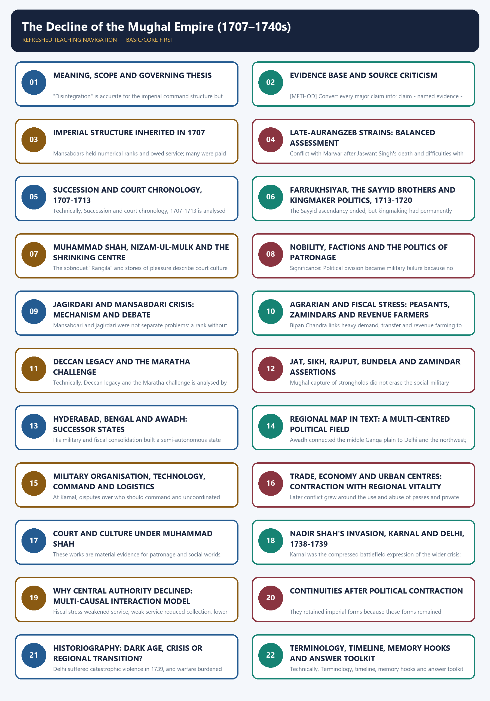

# The Decline of the Mughal Empire (1707–1740s) — Learner-v2 Complete Learning Session

> **Subject:** Modern Indian History | **Paper:** Prelims GS-I + GS-I analytical foundation | **Topic:** 01 | **Regenerated:** 13 August 2026
>
> **Evidence key:** FACT = supported by a named source/event/institution; INTERPRETATION = evidence-led analytical position; LIMIT = what the evidence cannot establish; METHOD = source-use rule; BOUNDARY = context deliberately kept outside the core period.
>
> **Approval state:** generated, **approved=false**. Status remains yellow until the user explicitly approves all three deliverables.

## BASIC LEARNING SESSION



*Distinct embedded teaching-navigation image. The separate continuous Cārvāka-style flowchart package remains an independent at-a-glance artifact.*

#### Source audit and syllabus boundary

Markdown-first assembly uses the canonical package plus the paired Basic and Advanced owners. OCR sources are listed in the manifest for deeper checking; no live source is used except bounded heritage linkage. Verified local PYQs retain their provenance; unavailable keys remain labelled inferred, and no direct UPSC question is invented.

#### Package practice counts

| Component | Count |
|---|---:|
| Verified/routed PYQs | 3; two Prelims keys explicitly inferred, one verified adjacent GS-I Mains |
| Hard MCQs with explanations | 48 |
| Remedial MCQs with explanations | 12 |
| Original solved 10-mark Mains | 3 |
| Original solved 15-mark Mains | 3 |
| Original solved 20-mark Mains | 3 |
| Final register modules | 15; placed last |

#### Sources actually used

| Source class | Exact source | Use and caveat |
|---|---|---|
| Repository knowledge | Modern History Topic 01 basic/advanced; README; Master Chronology; Revision Chart; PYQ routing; Answer-Worthiness Audit; bounded Topic 02. | Controls scope, chronology, answer architecture, successor-state comparison, terminology and existing answer-worthiness upgrades. |
| Repository bridge | Medieval History Topic 25 basic/advanced. | Supplies late-Aurangzeb, jagirdari, Sayyid, Maratha and eighteenth-century continuity; later Panipat material is kept outside the core. |
| Local OCR book | Bipan Chandra, *Modern India*, Chapter I and bounded Chapter II. | Foundation for ruler sequence, multi-causal decline, nobility, agrarian stress, Nadir Shah and successor states; older generalisations are qualified. |
| Local OCR book | Satish Chandra, *Medieval India: From Sultanat to the Mughals, Part II*, sections on Aurangzeb, northern India and the Marathas. | Detailed control for jagir debate, Sayyid policies, Nizam, regional states, Nadir diplomacy and the caution against overstating economic collapse. |
| Local OCR book | Sekhar Bandyopadhyay, *From Plassey to Partition*, Chapter 1. | Historiographical bridge between conventional decline and revisionist regionalisation; quantitative claims are not repeated as timeless facts. |
| Named primary traditions | Khafi Khan; Dargah Quli Khan; Mirza Mahdi Khan Astarabadi; farmans, sanads, letters, Company records and regional traditions. | Used through source-critical synthesis; no uncertain quotation, casualty total or invitation story is asserted. |
| Material/official heritage | ASI and UNESCO Red Fort pages; National Museum manuscript collection; IGNCA/Rampur Mughal-Persian manuscript catalogue. | Bounded evidence for material continuity, the Peacock Throne setting, manuscript survival and conservation; no current-affairs item is forced. |
| Verified PYQ routing | Repository 2021 Prelims Q45/Q48 and 2022 GS-I Q2 route. | Questions are included; unavailable local official Prelims keys are marked inferred. |

### Bounded authoritative links

- Archaeological Survey of India, Red Fort: https://asi.nic.in/pages/WorldHeritageRedFort
- UNESCO World Heritage Centre, Red Fort Complex: https://whc.unesco.org/en/list/231/
- National Museum, manuscript collection: https://www.nationalmuseumindia.gov.in/en/collections/index/11
- IGNCA, *Mughal and Persian Paintings and Illustrated Manuscripts*: https://ignca.gov.in/divisionss/kalakosa/kalasamalocana/mughal-and-persian-paintings-and-illustrated-manuscripts/

No current-affairs item was forced. Qdrant was not used because repository Markdown, OCR-searchable local books and bounded official heritage sources were sufficient.

#### PART I - COMPLETE LEARNING SESSION

#### REGISTER 01 - Scope and key terms

- Core window: 1707-1740s; late-Aurangzeb background only where causal; post-1748 developments only as bounded consequence.
- Decline = loss of enforceable central fiscal-military authority.
- Decentralisation = powers and revenues move from Delhi to provinces/localities.
- Regionalisation = local elite, military, zamindari, banking and cultural networks become durable political orders.
- Transition = Mughal forms survive while the location and social basis of force changes.
- One-line thesis: central command declined faster than Mughal legitimacy and institutions.

#### REGISTER 02 - Sources and evidence discipline

- Khafi Khan, *Muntakhab al-Lubab*: court and noble politics; elite/moralising limit.
- Dargah Quli Khan, *Muraqqa-i Dehli*: Muhammad Shah's urban-cultural Delhi; Delhi-centred limit.
- Mirza Mahdi Khan Astarabadi, *Tarikh-i Jahangusha-yi Nadiri*: Nadir's campaign; triumphalist patronage limit.
- Farmans/sanads: 1717 Company privilege; 1718-19 Maratha settlement; claim is not implementation.
- Company records: precise trade disputes; commercial bias and inland limits.
- Coins/khutba/seals/architecture: symbolic legitimacy and patronage; not direct territorial control.
- Never fix legendary army, plunder or casualty numbers without source qualification.

#### REGISTER 03 - Structural inheritance in 1707

- Emperor allocated mansab, jagir, title and office.
- Jagir = transferable revenue assignment; khalisa = crown revenue.
- Jama = assessed; hasil = realised; gap = fiscal credibility problem.
- Administrative order: village -> pargana -> sarkar -> subah.
- Subahdar and diwan were intended executive/revenue checks.
- Zamindars combined local rights, knowledge, forts and armed following.
- Strength: flexible imperial network. Vulnerability: delegated office could become hereditary power.

#### REGISTER 04 - Succession and court chronology

- 1707 Jajau: Bahadur Shah defeats Azam.
- 1709 Kam Bakhsh defeated.
- Bahadur Shah: able conciliator; partial Maratha settlement; Sikh campaign; finances worsen.
- 1712 Jahandar Shah/Zulfiqar Khan: strong-wazir experiment, conciliation, ijara risk.
- 1713 Farrukhsiyar installed by Sayyids.
- 1719 Farrukhsiyar deposed; Rafi-ud-Darajat, Shah Jahan II, Muhammad Shah.
- 1720 Sayyids overthrown; monarchy restored in form, not repaired in capacity.

#### REGISTER 05 - Nobility and the Sayyid Brothers

- Faction labels: Turani, Irani, Afghan, Hindustani/Baraha, Deccani; fluid coalitions.
- Competition: wizarat, mir bakhshi, governorship, jagir, seal and access.
- Sayyids: Abdullah Khan + Husain Ali; kingmakers, not emperors.
- Policies: jizya/pilgrim-tax abolition, Rajput/Jat accommodation, Maratha settlement.
- Structural symptom: emperor already depended on armed coalitions.
- Accelerant: deposition/killing of Farrukhsiyar damaged dynastic awe.
- Best verdict: capable administrators trapped in and deepening factional politics.

#### REGISTER 06 - Jagirdari and fiscal debate

- Be-jagiri = inadequate/delayed suitable assignment.
- Mechanism: more claims -> competition for productive jagirs -> short extraction -> rural resistance -> less remittance -> fewer troops.
- Frequent transfer prevented entrenchment but discouraged improvement.
- Khalisa grants placated nobles but weakened central cash.
- Ijara inserted revenue farmers with profit-driven extraction.
- Satish Chandra: structural jagirdari crisis.
- Irfan Habib: agrarian crisis and peasant/zamindar resistance.
- Richards: allocation and Deccan khalisa complicate real-versus-artificial shortage.
- Regionalists: resources also shifted into expanding local networks.

#### REGISTER 07 - Regional assertions

- Jats: Churaman, Agra-Mathura, fortified zamindari and peasant base.
- Sikhs: Banda Bahadur, Lohgarh, Punjab mobilisation; misls are later.
- Rajputs: Jai Singh/Ajit Singh combined mansab and regional demands; no single bloc.
- Bundelas: Chhatrasal; accommodation and assertion.
- Zamindars: intermediary, armed local leader and potential ruler.
- Rule: identity mattered, but land, revenue, forts, leadership and opportunity made resistance durable.

#### REGISTER 08 - Marathas and Deccan

- Late Aurangzeb: mobile resistance survives fort campaigns.
- Shahu versus Tarabai complicates Mughal bargaining.
- Bahadur Shah: sardeshmukhi concession, no full chauth settlement.
- 1718-19: swarajya + chauth/sardeshmukhi recognition linked to Sayyid alliance.
- Chauth approximately quarter claim; sardeshmukhi additional ten-per-cent claim.
- Baji Rao from 1720: offensive reach into Malwa/Gujarat/north.
- Maratha-Mughal relations included war, service, negotiation and factional alliance.

#### REGISTER 09 - Successor states

- Formula: provincial office + regional army/resources + zamindar/finance coalition + nominal Mughal sanction.
- Bengal: Murshid Quli Khan, 1717; survey, big zamindars, bankers, dynastic succession.
- Awadh: Saadat Khan, 1722; local chiefs, middle-Ganga base, continuing court ambition.
- Hyderabad: Nizam-ul-Mulk, 1724; Deccan force, war/treaty autonomy, coins/khutba continuity.
- Continuity in form, autonomy in substance.
- Not identical: Bengal commercial-fiscal; Awadh strategic agrarian; Hyderabad contested Deccan.

#### REGISTER 10 - Military and economy

- Army = noble contingents + artillery + cavalry + infantry + allies.
- Paper mansab did not equal deployable force.
- Core military problems: arrears, incomplete contingents, divided command, logistics and frontier response.
- Nadir's edge: unified command, mobility, fire discipline and flexible artillery; not firearm monopoly.
- Economy: imperial remittance declined while regional treasuries and markets could grow.
- Bengal trade, Indian bankers and merchants show vitality.
- 1717 Company farman = commercial privilege, not sovereignty.
- Delhi recovered after 1739; reject immediate all-India economic collapse.

#### REGISTER 11 - Nadir Shah, 1739

- Motives: Persian war finance + Indian wealth + Mughal frontier weakness; refugee dispute as pretext.
- Route: Qandahar -> Kabul -> Peshawar -> Lahore -> Karnal -> Delhi.
- Karnal: 24 February 1739; divided Mughal command versus integrated Persian force.
- Delhi: massacre after violence against Persian soldiers; casualty totals disputed.
- Took treasury, Peacock Throne and Koh-i-Noor; territories west of Indus ceded.
- Did not establish Persian rule over Delhi/Ganga plain.
- Effects: prestige collapse, frontier opening, fiscal shock, regional encouragement.
- Caveat: decline and autonomy predated 1739; economy and legitimacy persisted.

#### REGISTER 12 - Multi-causal interaction model

- Deccan overstretch raised cost and claimant pressure.
- Succession wars weakened arbitration and killed experienced personnel.
- Jagir/agrarian stress reduced revenue and troop maintenance.
- Factions converted scarcity into court warfare.
- Zamindars, Marathas, Jats and Sikhs reduced remittance and built alternatives.
- Bengal, Awadh and Hyderabad retained provincial resources.
- Military-command weakness exposed frontier.
- Nadir accelerated timing and visibility.
- Ranking: structural core -> political transmission -> regional feedback -> external shock.

#### REGISTER 13 - Continuities

- Mughal dynasty and Timurid legitimacy survived.
- Coins and khutba retained emperor's name in successor states.
- Mansab, jagir, diwan, subah and Persian chancery vocabulary continued.
- Farman/sanad remained politically useful to Marathas and Company.
- Delhi remained symbolic; controlling imperial sanction mattered.
- Music, painting, manuscripts, architecture and Persianate etiquette continued and regionalised.
- Memory line: **form survived, force shifted**.

#### REGISTER 14 - Historiography and source limits

- Sarkar: Aurangzeb/personality/moral-political decline; valuable chronology, reduction risk.
- Satish Chandra: jagirdari-Deccan-administrative mechanism.
- Habib: agrarian extraction and resistance.
- Athar Ali: nobility and continuing imperial structure.
- Richards: policy and allocation qualification.
- Alam/Bayly: regional politics, commerce, credit and redistributed power.
- Best synthesis: central decline + regional transformation + uneven social costs.
- Always attach school to evidence; never list names decoratively.

#### REGISTER 15 - PYQ and answer spine

- 2021 Prelims: Arcot/Hyderabad, Mysore/Vijayanagara, Rohilkhand/Durrani; inferred key B, official local key unavailable.
- 2021 Prelims: pargana -> sarkar -> subah; inferred key A.
- 2022 GS-I Company armies: bounded later consequence; Company advantage was organisation-credit-revenue, not ethnicity.
- 10 marks: 2-3 named units + one qualification.
- 15 marks: 4-6 units + counter-evidence.
- 20 marks: 5-8 units + causal ranking + historiography/regional variation.
- Universal formula: define level -> claim -> named evidence -> significance -> limit -> graded verdict.
- Final verdict: Mughal central authority declined; regional power and Mughal political culture continued in transformed form.

### SESSION 1 — MEANING, SCOPE AND GOVERNING THESIS

#### DEFINITION / WHAT THIS IS CALLED

**Plain-language definition:** Nadir Shah accelerated and advertised the crisis; he did not originate it. [THESIS] Aurangzeb's choices mattered, especially the long Deccan commitment and difficulties with Marathas and some Rajput houses, but neither personal blame nor communal causation can explain the subsequent politics of jagirs, zamindars, successor states and noble coalitions. [SCOPE] Background before 1707 is included only where it explains inherited structures and strains.

**Technical definition:** "Disintegration" is accurate for the imperial command structure but misleading if used to imply that administration, trade, urban life, culture or legitimacy vanished everywhere. [THESIS] The best explanation is interactive: unresolved succession + competitive nobility + jagirdari and agrarian pressures + Deccan over-extension + regional military-fiscal mobilisation + weak command adaptation + frontier exposure.

#### ANSWER-GRABBING OPENING — WRITE/ADAPT IN THE EXAM

> Nadir Shah accelerated and advertised the crisis; he did not originate it. [THESIS] Aurangzeb's choices mattered, especially the long Deccan commitment and difficulties with Marathas and some Rajput houses, but neither personal blame nor communal causation can explain the subsequent politics of jagirs, zamindars, successor states and noble coalitions. [SCOPE] Background before 1707 is included only where it explains inherited structures and strains.

#### MUST-WRITE KEYWORDS

- **Meaning**
- **scope**
- **governing thesis**
- **Decline**
- **Decentralisation**
- **Regionalisation**

**How to use them:** Frame the answer through Meaning; define scope, connect governing thesis with Decline to explain the mechanism, and use Decentralisation for the decisive comparison or qualification.

#### Compact scope visual

```text
NECESSARY BACKGROUND                  CORE ANALYTICAL WINDOW                   BOUNDED CONSEQUENCE
late seventeenth century              1707 to the 1740s                        after 1740
Deccan war, jagir pressure     ->     succession, factions, regions     ->     Durrani pressure and
agrarian and frontier strain          and Nadir Shah, 1739                     later Company opportunity

The subject is the decline of imperial central authority, not the instant death of Mughal India.
```

#### Core teaching

- [FACT] The Mughal dynasty did not disappear in 1707. What contracted was the centre's capacity to appoint, transfer, tax, discipline and defend across the empire. Mughal emperors, titles, revenue vocabulary, coins, farmans and symbolic sovereignty survived far longer.
- [CONCEPT] **Decline** means loss of effective central fiscal-military authority. **Decentralisation** means power moving from Delhi to provinces and local intermediaries. **Regionalisation** means provincial, zamindari and military networks becoming durable political formations. **Eighteenth-century transition** combines central contraction with new regional orders.
- [LIMIT] "Disintegration" is accurate for the imperial command structure but misleading if used to imply that administration, trade, urban life, culture or legitimacy vanished everywhere.
- [THESIS] The best explanation is interactive: unresolved succession + competitive nobility + jagirdari and agrarian pressures + Deccan over-extension + regional military-fiscal mobilisation + weak command adaptation + frontier exposure. Nadir Shah accelerated and advertised the crisis; he did not originate it.
- [THESIS] Aurangzeb's choices mattered, especially the long Deccan commitment and difficulties with Marathas and some Rajput houses, but neither personal blame nor communal causation can explain the subsequent politics of jagirs, zamindars, successor states and noble coalitions.
- [SCOPE] Background before 1707 is included only where it explains inherited structures and strains. Developments after Muhammad Shah's death in 1748 are used only to show bounded consequences, not to turn this package into a survey of the whole eighteenth century.

#### Decline versus transition matrix

| Analytical term | Correct use | Evidence | Unsafe overstatement |
|---|---|---|---|
| Decline | Loss of enforceable authority at the imperial centre | succession wars, provincial remittance failure, Karnal | "Everything in India declined" |
| Decentralisation | Delegated office and revenue moved toward provincial control | Bengal, Awadh, Hyderabad | "A complete political vacuum appeared" |
| Regionalisation | Local elites, financiers, zamindars and armies made new political arenas | Bengal revenue order, Awadh chiefs, Maratha networks | "All regions followed one identical path" |
| Transition | Old Mughal forms survived while the location and social basis of power changed | coin, khutba, mansab, Persian chancery, hereditary autonomy | "The old order ended in one event" |

#### Exam-safe governing thesis

The Mughal crisis of 1707-1740s was a **decline of central imperial capacity inside a continuing Mughal political culture**. The centre lost resources and obedience faster than it lost legitimacy; provinces and armed regional groups appropriated imperial techniques; and the external shock of 1739 exposed a system already weakened by interacting fiscal, agrarian, military and political pressures.

#### CLOSING RECALL FLOW — MEANING, SCOPE AND GOVERNING THESIS

```text
START / CONCEPT: Meaning, scope and governing thesis
        |
        v
EXACT TERMS: Meaning · scope · governing thesis · Decline · Decentralisation · Regionalisation
        |
        v
MECHANISM / ARGUMENT: Mughal emperors, titles, revenue vocabulary, coins, farmans and symbolic sovereignty survived far longer. [CONCEPT] Decline means loss of effective central fiscal-military authority.
        |
        v
CONSEQUENCE / CONTRAST: "Disintegration" is accurate for the imperial command structure but misleading if used to imply that administration, trade, urban life, culture or legitimacy vanished everywhere. [THESIS] The best explanation is interactive: unresolved succession + competitive nobility + jagirdari and agrarian pressures + Deccan over-extension + regional military-fiscal mobilisation + weak command adaptation + frontier exposure.
        |
        v
UPSC TRAP / ANSWER-USE: Developments after Muhammad Shah's death in 1748 are used only to show bounded consequences, not to turn this package into a survey of the whole eighteenth century.
        |
        v
ANSWER-GRABBING FORMULATION: Nadir Shah accelerated and advertised the crisis; he did not originate it. [THESIS] Aurangzeb's choices mattered, especially the long Deccan commitment and difficulties with Marathas and some Rajput houses, but neither personal blame nor communal causation can explain the subsequent politics of jagirs, zamindars, successor states and noble coalitions. [SCOPE] Background before 1707 is included only where it explains inherited structures and strains.
```
### SESSION 2 — EVIDENCE BASE AND SOURCE CRITICISM

#### DEFINITION / WHAT THIS IS CALLED

**Plain-language definition:** Their continuation under a successor state proves retained Mughal legitimacy, not direct daily control from Delhi. [METHOD] Court chronicles are strongest on offices, noble alliances, ceremonial precedence and war.

**Technical definition:** [METHOD] Convert every major claim into: claim - named evidence - significance - limit. [METHOD] A farman or sanad reveals what an authority wanted recognised.

#### ANSWER-GRABBING OPENING — WRITE/ADAPT IN THE EXAM

> Their continuation under a successor state proves retained Mughal legitimacy, not direct daily control from Delhi. [METHOD] Court chronicles are strongest on offices, noble alliances, ceremonial precedence and war.

#### MUST-WRITE KEYWORDS

- **Evidence base**
- **source criticism**
- **claim - named evidence - significance - limit**
- **Persian court chronicles**
- **succession, offices, factions, jagirs, policy and court language**
- **Eyewitness and urban writing**

**How to use them:** Frame the answer through Evidence base; define source criticism, connect claim - named evidence - significance - limit with Persian court chronicles to explain the mechanism, and use succession, offices, factions, jagirs, policy and court language for the decisive comparison or qualification.

#### Source matrix

| Source family | Named examples | What it can establish | Genre or bias limit |
|---|---|---|---|
| Persian court chronicles | Khafi Khan, *Muntakhab al-Lubab*; later court histories used by Satish Chandra | succession, offices, factions, jagirs, policy and court language | elite and moralising gaze; access and patronage shape emphasis |
| Eyewitness and urban writing | Dargah Quli Khan, *Muraqqa-i Dehli*; Anand Ram Mukhlis's account of 1739 | courtly culture, urban life, invasion experience and elite networks | Delhi-centred, selective and socially narrow |
| Persian conqueror's chronicle | Mirza Mahdi Khan Astarabadi, *Tarikh-i Jahangusha-yi Nadiri* | Nadir's campaigns, diplomacy and imperial self-presentation | triumphalist patronage text; numbers and motives need corroboration |
| Farmans, sanads and letters | Farrukhsiyar's 1717 Company farman; Maratha grants associated with the 1718-19 settlement; diplomatic correspondence with Nadir | legal claims, privileges, bargaining and intended hierarchy | an order proves a claim, not uniform implementation |
| Company records | English factory consultations, letters and commercial accounts from Bengal, Madras and Surat | trade privileges, remittances, urban markets and political risk | corporate and commercial bias; limited knowledge of inland society |
| Regional records | Maratha bakhars and correspondence; Rajput records; Sikh and Jat traditions | mobilisation, local political memory and regional claims | retrospective heroisation, lineage and sectarian framing |
| Material evidence | coins, seals, inscriptions, forts, palaces, tombs, urban fabric and the Red Fort | titulature, mint claim, patronage, continuity and spatial power | survival is selective; symbolic claim is not territorial control |

#### Method rules

- [METHOD] Convert every major claim into: **claim -> named evidence -> significance -> limit**.
- [METHOD] A farman or sanad reveals what an authority wanted recognised. It does not by itself prove that customs officials, zamindars or Maratha commanders obeyed it.
- [METHOD] Coinage and the khutba are strong evidence of symbolic hierarchy. Their continuation under a successor state proves retained Mughal legitimacy, not direct daily control from Delhi.
- [METHOD] Court chronicles are strongest on offices, noble alliances, ceremonial precedence and war. Their silence is weakest evidence for peasant welfare, women's work, artisan agency or village-level implementation.
- [METHOD] Company records are precise about goods, customs and corporate disputes but cannot be treated as neutral descriptions of Indian politics.
- [METHOD] Invasion narratives tend to magnify armies, booty and casualties. This package therefore avoids a fixed casualty total for Delhi and treats famous booty estimates as contested.
- [METHOD] Material continuity matters: the Red Fort's Diwan-i-Khas and its former Peacock Throne setting, surviving coins and late-Mughal painting show that cultural production and symbolic sovereignty outlived the centre's military reach.

#### Source-use flow

```text
QUESTION
   |
define the level: centre / province / locality / economy / culture
   |
name the source: chronicle / farman / letter / coin / building / account
   |
state what it proves
   |
add genre, implementation, regional or numerical limit
   |
give a graded verdict
```

#### UPSC traps

- A contemporary source is not automatically neutral.
- A later regional memory is not useless, but its political purpose must be stated.
- A coin in the emperor's name proves a legitimacy claim, not direct imperial taxation.
- A story about court luxury cannot substitute for evidence on jagirs, army payment or provincial remittance.

#### CLOSING RECALL FLOW — EVIDENCE BASE AND SOURCE CRITICISM

```text
START / CONCEPT: Evidence base and source criticism
        |
        v
EXACT TERMS: Evidence base · source criticism · claim - named evidence - significance - limit · Persian court chronicles · succession, offices, factions, jagirs, policy and court language · Eyewitness and urban writing
        |
        v
MECHANISM / ARGUMENT: [METHOD] Convert every major claim into: claim - named evidence - significance - limit. [METHOD] A farman or sanad reveals what an authority wanted recognised.
        |
        v
CONSEQUENCE / CONTRAST: The resulting consequence is that their continuation under a successor state proves retained Mughal legitimacy, not direct daily control...
        |
        v
UPSC TRAP / ANSWER-USE: A later regional memory is not useless, but its political purpose must be stated.
        |
        v
ANSWER-GRABBING FORMULATION: Their continuation under a successor state proves retained Mughal legitimacy, not direct daily control from Delhi. [METHOD] Court chronicles are strongest on offices, noble alliances, ceremonial precedence and war.
```
### SESSION 3 — IMPERIAL STRUCTURE INHERITED IN 1707

#### DEFINITION / WHAT THIS IS CALLED

**Plain-language definition:** Imperial structure inherited in 1707 comprises Khalisa, subah - sarkar - pargana - village and Timurid legitimacy as its core connected dimensions.

**Technical definition:** Mansabdars held numerical ranks and owed service; many were paid through transferable revenue assignments called jagirs rather than ownership of land.

#### ANSWER-GRABBING OPENING — WRITE/ADAPT IN THE EXAM

> The system could govern diversity without uniform bureaucracy because it nested imperial authority within provincial and local intermediaries.

#### MUST-WRITE KEYWORDS

- **Imperial structure inherited in 1707**
- **Khalisa**
- **subah - sarkar - pargana - village**
- **Timurid legitimacy**
- **dynasty arbitrated elite rank and succession**
- **repeated succession wars made arbitration itself a prize**

**How to use them:** Frame the answer through Imperial structure inherited in 1707; define Khalisa, connect subah - sarkar - pargana - village with Timurid legitimacy to explain the mechanism, and use dynasty arbitrated elite rank and succession for the decisive comparison or qualification.

#### Institutional map

```text
EMPEROR
  |-- mansab and office allocation
  |-- jagir assignment / transfer
  |-- khalisa revenue and imperial treasury
  |-- farman, title, robe, seal and symbolic arbitration
  |
SUBAH: subahdar (executive/military) + provincial diwan (revenue check)
  |
SARKAR -> PARGANA -> village and revenue intermediaries
  |
ZAMINDARS, qanungos, chaudhuris, cultivators, bankers and local armed followings

The system depended on circulation, audit, remittance and credible imperial arbitration.
```

#### Core teaching

- [FACT] The emperor stood at the apex of appointment and patronage. Mansabdars held numerical ranks and owed service; many were paid through transferable revenue assignments called jagirs rather than ownership of land.
- [FACT] **Khalisa** lands sent revenue more directly to the imperial treasury. Converting too much khalisa into jagir reduced the centre's cash flexibility, while withholding productive jagirs alienated nobles.
- [FACT] The official hierarchy ran broadly from **subah -> sarkar -> pargana -> village**. The 2021 Prelims hierarchy question tests this inherited scale.
- [FACT] A provincial subahdar exercised executive and military power, while the provincial diwan represented an intended fiscal check. In practice, strong governors could bring both political and revenue networks under personal control.
- [FACT] Zamindars were not merely tax collectors. They possessed local rights, forts, armed retainers, clan or caste connections and knowledge of cultivation; imperial administration required their cooperation.
- [FACT] The mansab-jagir mechanism was both a military establishment and a political contract. It tied a mobile nobility to the emperor so long as assignments were credible and service was enforceable.
- [ANALYSIS] The system could govern diversity without uniform bureaucracy because it nested imperial authority within provincial and local intermediaries. Its strength was flexibility; its danger was that office-holders could appropriate delegated power when transfers and sanctions lost credibility.

#### Inherited strength and vulnerability

| Strength in 1707 | Why it had worked | Vulnerability after 1707 |
|---|---|---|
| Timurid legitimacy | dynasty arbitrated elite rank and succession | repeated succession wars made arbitration itself a prize |
| Transferable jagirs | prevented permanent local entrenchment | short tenure encouraged extraction; enforcement weakened |
| Composite nobility | drew talent from several regions and lineages | competition hardened when good assignments became scarce |
| Provincial delegation | extended rule over a vast empire | governors could convert office into hereditary autonomy |
| Gunpowder army | artillery, cavalry and fort war supported expansion | contingent shortfalls and divided command reduced effectiveness |
| Revenue depth | agrarian surplus financed court and army | high demand, jama-hasil gaps and rural resistance reduced remittance |

#### Answer insight

Mughal decline was not the collapse of an institutionless court. It was the failure of a sophisticated but relationship-dependent system to reproduce obedience, revenue and military service after expansion slowed and central arbitration weakened.

#### CLOSING RECALL FLOW — IMPERIAL STRUCTURE INHERITED IN 1707

```text
START / CONCEPT: Imperial structure inherited in 1707
        |
        v
EXACT TERMS: Imperial structure inherited in 1707 · Khalisa · subah - sarkar - pargana - village · Timurid legitimacy · dynasty arbitrated elite rank and succession · repeated succession wars made arbitration itself a prize
        |
        v
MECHANISM / ARGUMENT: Mansabdars held numerical ranks and owed service; many were paid through transferable revenue assignments called jagirs rather than ownership of land.
        |
        v
CONSEQUENCE / CONTRAST: Mughal decline was not the collapse of an institutionless court.
        |
        v
UPSC TRAP / ANSWER-USE: It was the failure of a sophisticated but relationship-dependent system to reproduce obedience, revenue and military service after expansion slowed and central arbitration weakened.
        |
        v
ANSWER-GRABBING FORMULATION: The system could govern diversity without uniform bureaucracy because it nested imperial authority within provincial and local intermediaries.
```
### SESSION 4 — LATE-AURANGZEB STRAINS: BALANCED ASSESSMENT

#### DEFINITION / WHAT THIS IS CALLED

**Plain-language definition:** The long Deccan phase tied the emperor and large forces to southern warfare, added Bijapur and Golconda, and failed to extinguish mobile Maratha resistance.

**Technical definition:** Conflict with Marwar after Jaswant Singh's death and difficulties with other Rajput houses weakened an alliance that had supplied military and political support, although Rajput-Mughal cooperation was later renewed.

#### ANSWER-GRABBING OPENING — WRITE/ADAPT IN THE EXAM

> The long Deccan phase tied the emperor and large forces to southern warfare, added Bijapur and Golconda, and failed to extinguish mobile Maratha resistance.

#### MUST-WRITE KEYWORDS

- **Late-Aurangzeb strains**
- **balanced assessment**
- **Deccan**
- **prolonged war, fiscal strain and administrative absence**
- **Maratha resilience and Deccan political geography mattered independently**
- **Jagirs**

**How to use them:** Frame the answer through Late-Aurangzeb strains; define balanced assessment, connect Deccan with prolonged war, fiscal strain and administrative absence to explain the mechanism, and use Maratha resilience and Deccan political geography mattered independently for the decisive comparison or qualification.

#### Causal background

```text
Deccan annexations and prolonged campaigning
      + unresolved Maratha resistance
      + incorporation of new Deccani and Maratha claimants
      + emperor's long absence from north India
      + Rajput, Jat, Satnami and Sikh tensions
                         |
                         v
more military cost + more claims on jagirs + weaker supervision
                         |
                         v
serious inheritance in 1707, but not an inevitable collapse
```

#### Core teaching

- [FACT] Aurangzeb left an empire still formidable in army, administration and prestige. Bipan Chandra explicitly notes that the system remained efficient enough in 1707 for recovery to be conceivable.
- [FACT] The long Deccan phase tied the emperor and large forces to southern warfare, added Bijapur and Golconda, and failed to extinguish mobile Maratha resistance.
- [ANALYSIS] Expansion widened obligations faster than reliable collection. New Deccani and Maratha entrants sought mansabs and jagirs, while contested territories did not always yield the assessed revenue on paper.
- [FACT] Conflict with Marwar after Jaswant Singh's death and difficulties with other Rajput houses weakened an alliance that had supplied military and political support, although Rajput-Mughal cooperation was later renewed.
- [FACT] Jat, Satnami and Sikh assertions involved local power and agrarian grievances as well as religious identities. Peasants and zamindars supplied the social base of several movements.
- [LIMIT] Religious measures, including the restoration of jizya, could alienate and symbolically narrow the imperial coalition. Yet later rulers and the Sayyids reversed such measures, while Hindu and Muslim elites repeatedly formed cross-religious alliances for power and revenue.
- [VERDICT] Aurangzeb's policies created or aggravated constraints; they do not alone explain why later nobles fought over the wizarat, why provincial governors built successor states, or why revenue assignments lost credibility.

#### Balanced responsibility table

| Dimension | Aurangzeb-linked contribution | Qualification |
|---|---|---|
| Deccan | prolonged war, fiscal strain and administrative absence | Maratha resilience and Deccan political geography mattered independently |
| Jagirs | more entrants and assignments under wartime pressure | the crisis developed through later grants, transfers, corruption and remittance failure |
| Rajputs | Marwar conflict weakened an older alliance | many Rajput nobles later returned to high office |
| Religion | jizya and temple actions harmed coalition-building in places | political and class interests cannot be reduced to Hindu-Muslim blocs |
| Frontier | northwest received less attention during southern concentration | post-1707 courts also failed to rebuild diplomacy and defence |

#### Memory hook

**AURANGZEB = accelerator and inheritor of strain, not a communal single-cause explanation and not a complete answer.**

#### CLOSING RECALL FLOW — LATE-AURANGZEB STRAINS: BALANCED ASSESSMENT

```text
START / CONCEPT: Late-Aurangzeb strains: balanced assessment
        |
        v
EXACT TERMS: Late-Aurangzeb strains · balanced assessment · Deccan · prolonged war, fiscal strain and administrative absence · Maratha resilience and Deccan political geography mattered independently · Jagirs
        |
        v
MECHANISM / ARGUMENT: The operative mechanism is that the long Deccan phase tied the emperor and large forces to southern warfare, added...
        |
        v
CONSEQUENCE / CONTRAST: Conflict with Marwar after Jaswant Singh's death and difficulties with other Rajput houses weakened an alliance that had supplied military and political support, although Rajput-Mughal cooperation was later renewed.
        |
        v
UPSC TRAP / ANSWER-USE: Do not miss this limiting distinction: religious measures, including the restoration of jizya, could alienate and symbolically narrow the imperial...
        |
        v
ANSWER-GRABBING FORMULATION: The long Deccan phase tied the emperor and large forces to southern warfare, added Bijapur and Golconda, and failed to extinguish mobile Maratha resistance.
```
### SESSION 5 — SUCCESSION AND COURT CHRONOLOGY, 1707-1713

#### DEFINITION / WHAT THIS IS CALLED

**Plain-language definition:** Succession and court chronology, 1707-1713 comprises Succession, court chronology and sardeshmukhi as its core connected dimensions.

**Technical definition:** Technically, Succession and court chronology, 1707-1713 is analysed by relating Succession to court chronology, then testing the relationship through sardeshmukhi and chauth.

#### ANSWER-GRABBING OPENING — WRITE/ADAPT IN THE EXAM

> Bahadur Shah shows that a capable ruler could slow decline but could not simultaneously solve succession, Sikh resistance, Maratha bargaining, Rajput interests and the fiscal cost of elite accommodation.

#### MUST-WRITE KEYWORDS

- **Succession**
- **court chronology**
- **sardeshmukhi**
- **chauth**
- **ijara**
- **1707-1713**

**How to use them:** Frame the answer through Succession; define court chronology, connect sardeshmukhi with chauth to explain the mechanism, and use ijara for the decisive comparison or qualification.

#### Succession tree

```text
Aurangzeb dies, 1707
   |
   +-- Muazzam -> Bahadur Shah I, victorious at Jajau
   +-- Azam Shah -> defeated and killed
   +-- Kam Bakhsh -> defeated in the Deccan, 1709

Bahadur Shah I dies, 1712
   |
   +-- Jahandar Shah, supported by Zulfiqar Khan
          |
          +-- defeated in 1713 by Farrukhsiyar
              backed by Abdullah Khan and Husain Ali, the Sayyid Brothers
```

#### Bahadur Shah I, 1707-1712

- [FACT] Bahadur Shah was experienced, learned and conciliatory, not a caricature of immediate incompetence. He attempted accommodation with Rajputs, Marathas, Bundelas and Jats while campaigning against Banda Bahadur's Sikh movement.
- [FACT] He recognised Maratha **sardeshmukhi** in the Deccan but did not fully settle **chauth** or the Shahu-Tarabai conflict. Conciliation without a stable enforcement formula left the Deccan unsettled.
- [FACT] Chhatrasal Bundela and Churaman Jat could be incorporated tactically; Banda's movement, however, remained a major Punjab challenge despite Mughal campaigning.
- [FACT] State finances worsened through promotions and jagir grants. Satish Chandra cites contemporary anxiety that armies required money that was no longer readily visible.
- [ANALYSIS] Bahadur Shah shows that a capable ruler could slow decline but could not simultaneously solve succession, Sikh resistance, Maratha bargaining, Rajput interests and the fiscal cost of elite accommodation.

#### Jahandar Shah and Zulfiqar Khan, 1712-1713

- [FACT] Jahandar Shah's short reign depended heavily on the experienced wazir Zulfiqar Khan. The political problem was not simply royal frivolity; it was whether a powerful minister could govern without frightening emperor and rival nobles.
- [FACT] Zulfiqar pursued an inclusionist policy, abolished jizya, conciliated Rajputs, confirmed arrangements with Shahu and sought to restrain reckless jagir growth and enforce mansab contingents.
- [FACT] Revenue farming or **ijara** spread, transferring collection to contractors who promised a fixed sum and then pressed cultivators for profit.
- [ANALYSIS] A strong wazir offered administrative capacity but also created a coalition problem: the emperor feared replacement, old nobles feared exclusion and rivals organised alternative blocs.
- [FACT] Farrukhsiyar defeated Jahandar Shah in January 1713 with decisive Sayyid support. Throne-making now visibly depended on armed noble coalitions.

#### Chronology table

| Date | Ruler or event | Analytical significance |
|---|---|---|
| 1707 | Jajau and Bahadur Shah's accession | succession consumed military and political capital |
| 1709 | defeat of Kam Bakhsh | last major phase of Aurangzeb's sons' contest |
| 1710-12 | Banda Bahadur challenge | Punjab resistance remained unresolved |
| 1712 | Bahadur Shah dies; Jahandar Shah succeeds | no institutional rule of succession |
| Jan 1713 | Farrukhsiyar triumphs | Sayyid military-political leverage becomes decisive |

#### CLOSING RECALL FLOW — SUCCESSION AND COURT CHRONOLOGY, 1707-1713

```text
START / CONCEPT: Succession and court chronology, 1707-1713
        |
        v
EXACT TERMS: Succession · court chronology · sardeshmukhi · chauth · ijara · 1707-1713
        |
        v
MECHANISM / ARGUMENT: Bahadur Shah was experienced, learned and conciliatory, not a caricature of immediate incompetence.
        |
        v
CONSEQUENCE / CONTRAST: Chhatrasal Bundela and Churaman Jat could be incorporated tactically; Banda's movement, however, remained a major Punjab challenge despite Mughal campaigning.
        |
        v
UPSC TRAP / ANSWER-USE: The political problem was not simply royal frivolity; it was whether a powerful minister could govern without frightening emperor and rival nobles.
        |
        v
ANSWER-GRABBING FORMULATION: Bahadur Shah shows that a capable ruler could slow decline but could not simultaneously solve succession, Sikh resistance, Maratha bargaining, Rajput interests and the fiscal cost of elite accommodation.
```
### SESSION 6 — FARRUKHSIYAR, THE SAYYID BROTHERS AND KINGMAKER POLITICS, 1713-1720

#### DEFINITION / WHAT THIS IS CALLED

**Plain-language definition:** Abdullah Khan and Husain Ali Baraha had raised Farrukhsiyar to the throne.

**Technical definition:** The Sayyid ascendancy ended, but kingmaking had permanently damaged the aura of unchallengeable monarchy.

#### ANSWER-GRABBING OPENING — WRITE/ADAPT IN THE EXAM

> The Sayyid ascendancy ended, but kingmaking had permanently damaged the aura of unchallengeable monarchy.

#### MUST-WRITE KEYWORDS

- **Farrukhsiyar**
- **the Sayyid Brothers**
- **kingmaker politics**
- **emperors already needed noble military coalitions**
- **jagir scarcity encouraged blocs**
- **1713-1720**

**How to use them:** Frame the answer through Farrukhsiyar; define the Sayyid Brothers, connect kingmaker politics with emperors already needed noble military coalitions to explain the mechanism, and use jagir scarcity encouraged blocs for the decisive comparison or qualification.

#### Faction and office map

```text
EMPEROR FARRUKHSIYAR
      | wants personal control through favourites and the imperial seal
      |
      X conflict over appointments, jagirs, army and provincial resources
      |
SAYYID ABDULLAH KHAN (wazir) ----- SAYYID HUSAIN ALI (mir bakhshi / Deccan)
      |                                  |
Rajput, Jat and Hindustani links         Maratha negotiation and Deccan force
      \__________________________________/
                 kingmaker coalition
```

#### Core teaching

- [FACT] Abdullah Khan and Husain Ali Baraha had raised Farrukhsiyar to the throne. Their subsequent struggle was over the substance of sovereignty: who controlled appointments, the imperial seal, jagirs, the army and provincial resources.
- [FACT] The Sayyids pursued religious conciliation. Jizya and several pilgrim taxes were abolished; Rajput rulers received high ranks; Churaman Jat was accommodated; negotiation with Shahu produced Maratha grants.
- [FACT] In the 1718 settlement, formalised through imperial grants in 1719, Shahu's side gained recognition of swarajya and rights connected with chauth and sardeshmukhi in the Deccan in return for service and political support.
- [FACT] Farrukhsiyar's favourites attempted to bypass the wazir's office in appointments and seal business. Satish Chandra uses Khafi Khan to show the clash between an empowered ministry and personal royal rule.
- [FACT] The crisis aggravated jagir competition: court parties promised ranks and assignments to recruit armed followers, converting institutional scarcity into immediate factional mobilisation.
- [FACT] Farrukhsiyar was deposed and killed in 1719. Rafi-ud-Darajat and Shah Jahan II followed briefly before Muhammad Shah was installed. Counting Farrukhsiyar, four emperors occupied the throne during that calendar year.
- [FACT] Husain Ali was assassinated in 1720; Abdullah Khan's resistance was defeated. The Sayyid ascendancy ended, but kingmaking had permanently damaged the aura of unchallengeable monarchy.

#### Interpretation: symptom and agent

| As symptom | As agent |
|---|---|
| emperors already needed noble military coalitions | deposition and killing of an emperor further reduced dynastic awe |
| jagir scarcity encouraged blocs | patronage promises intensified assignment competition |
| provincial resources mattered more than court title alone | Deccan and Maratha alliances shifted the balance at Delhi |
| composite politics continued | opponents weaponised race, religion and Timurid loyalty against them |

#### Balanced verdict

The Sayyids were not merely villains who "destroyed" the empire. They attempted conciliation and administration under severe constraints, but their use of deposition and puppet succession made the emperor visibly dependent on armed patrons. They reveal how structural scarcity and personal distrust turned the court into a battlefield.

#### CLOSING RECALL FLOW — FARRUKHSIYAR, THE SAYYID BROTHERS AND KINGMAKER POLITICS, 1713-1720

```text
START / CONCEPT: Farrukhsiyar, the Sayyid Brothers and kingmaker politics, 1713-1720
        |
        v
EXACT TERMS: Farrukhsiyar · the Sayyid Brothers · kingmaker politics · emperors already needed noble military coalitions · jagir scarcity encouraged blocs · 1713-1720
        |
        v
MECHANISM / ARGUMENT: Abdullah Khan and Husain Ali Baraha had raised Farrukhsiyar to the throne.
        |
        v
CONSEQUENCE / CONTRAST: The Sayyids were not merely villains who "destroyed" the empire.
        |
        v
UPSC TRAP / ANSWER-USE: They attempted conciliation and administration under severe constraints, but their use of deposition and puppet succession made the emperor visibly dependent on armed patrons.
        |
        v
ANSWER-GRABBING FORMULATION: The Sayyid ascendancy ended, but kingmaking had permanently damaged the aura of unchallengeable monarchy.
```
### SESSION 7 — MUHAMMAD SHAH, NIZAM-UL-MULK AND THE SHRINKING CENTRE

#### DEFINITION / WHAT THIS IS CALLED

**Plain-language definition:** Muhammad Shah, Nizam-ul-Mulk and the shrinking centre comprises Muhammad Shah, Nizam-ul-Mulk and the shrinking centre as its core connected dimensions.

**Technical definition:** The sobriquet "Rangila" and stories of pleasure describe court culture but do not explain the fiscal-military crisis.

#### ANSWER-GRABBING OPENING — WRITE/ADAPT IN THE EXAM

> The sobriquet "Rangila" and stories of pleasure describe court culture but do not explain the fiscal-military crisis.

#### MUST-WRITE KEYWORDS

- **Muhammad Shah**
- **Nizam-ul-Mulk**
- **the shrinking centre**
- **Nizam leaves the centre; provinces retain revenue**
- **appointments become factional and monetised**
- **late-Mughal painting develops intimate court and urban themes**

**How to use them:** Frame the answer through Muhammad Shah; define Nizam-ul-Mulk, connect the shrinking centre with Nizam leaves the centre; provinces retain revenue to explain the mechanism, and use appointments become factional and monetised for the decisive comparison or qualification.

#### Political sequence

```text
1719 Muhammad Shah installed
      |
1720 Sayyid power broken
      |
1722 Nizam-ul-Mulk becomes wazir and proposes restraint/reform
      |
1723-24 court resistance + Maratha pressure + Deccan opportunity
      |
1724 Nizam defeats Mubariz Khan and consolidates Hyderabad
      |
1730s regional autonomy deepens while Delhi retains symbolic primacy
```

#### Core teaching

- [FACT] Muhammad Shah's reign, 1719-1748, brought chronological stability after rapid enthronements. Mughal prestige, artillery and administration still possessed recoverable strength in the early 1720s.
- [FACT] Nizam-ul-Mulk represented an able noble seeking to restore discipline: review jagirs, resume some khalisa, restrain revenue farming and reduce corrupt appointment practices.
- [LIMIT] His reform programme also protected old noble interests and included a proposed revival of jizya that contemporaries, including allied nobles, considered politically inopportune. Reform was itself factional.
- [FACT] Nizam left the wizarat, moved south and defeated Mubariz Khan at Shakar Kheda in 1724. Hyderabad thereafter exercised practical autonomy while retaining imperial forms.
- [ANALYSIS] Nizam's departure was not a formal declaration of independence. It was the conversion of high imperial office, Deccan networks and military capacity into a regional state.
- [FACT] Muhammad Shah's court continued to appoint, title and symbolically validate powerful nobles. Yet it lacked reliable cash, disciplined contingents and provincial obedience.
- [LIMIT] The sobriquet "Rangila" and stories of pleasure describe court culture but do not explain the fiscal-military crisis. A serious answer must distinguish patronage of music and painting from administrative failure.

#### Muhammad Shah: decline and cultural vitality

| Political contraction | Cultural continuity and change |
|---|---|
| Nizam leaves the centre; provinces retain revenue | Delhi remains a major courtly and urban centre |
| appointments become factional and monetised | late-Mughal painting develops intimate court and urban themes |
| army pay and contingent enforcement weaken | khayal receives important court patronage associated with Sadarang |
| Nadir defeats the imperial host in 1739 | Persianate etiquette, poetry, music and manuscript culture continue |

#### Answer insight

Muhammad Shah's period embodies the central distinction of the topic: **the state at Delhi weakened, while the court and city remained culturally productive and symbolically consequential**.

#### CLOSING RECALL FLOW — MUHAMMAD SHAH, NIZAM-UL-MULK AND THE SHRINKING CENTRE

```text
START / CONCEPT: Muhammad Shah, Nizam-ul-Mulk and the shrinking centre
        |
        v
EXACT TERMS: Muhammad Shah · Nizam-ul-Mulk · the shrinking centre · Nizam leaves the centre; provinces retain revenue · appointments become factional and monetised · late-Mughal painting develops intimate court and urban themes
        |
        v
MECHANISM / ARGUMENT: It was the conversion of high imperial office, Deccan networks and military capacity into a regional state.
        |
        v
CONSEQUENCE / CONTRAST: Nizam's departure was not a formal declaration of independence.
        |
        v
UPSC TRAP / ANSWER-USE: A serious answer must distinguish patronage of music and painting from administrative failure.
        |
        v
ANSWER-GRABBING FORMULATION: The sobriquet "Rangila" and stories of pleasure describe court culture but do not explain the fiscal-military crisis.
```
### SESSION 8 — NOBILITY, FACTIONS AND THE POLITICS OF PATRONAGE

#### DEFINITION / WHAT THIS IS CALLED

**Plain-language definition:** Limit: Factions were produced partly by jagir and office scarcity, so they cannot be treated as an isolated moral cause.

**Technical definition:** Significance: Political division became military failure because no accepted authority could coordinate the host.

#### ANSWER-GRABBING OPENING — WRITE/ADAPT IN THE EXAM

> Limit: Factions were produced partly by jagir and office scarcity, so they cannot be treated as an isolated moral cause.

#### MUST-WRITE KEYWORDS

- **Nobility**
- **ions**
- **the politics of patronage**
- **Claim**
- **Significance**
- **Mughal nobles**

**How to use them:** Frame the answer through Nobility; define ions, connect the politics of patronage with Claim to explain the mechanism, and use Significance for the decisive comparison or qualification.

#### Faction map

```text
TURANI       IRANI       AFGHAN       HINDUSTANI / BARAHA       DECCANI / MARATHA entrants
   \           |           |                |                         /
    \__________|___________|________________|________________________/
                         competition for
                mansab + jagir + office + provincial base
                                  |
                      coalitions were fluid, not fixed
```

#### Core teaching

- [FACT] Mughal nobles are commonly described as Turani, Irani, Afghan, Hindustani and Deccani groupings. These labels indicate origin, kinship and recruitment networks; they were not permanent modern political parties.
- [FACT] Competition centred on the wizarat, mir bakhshi's office, provincial governorships, productive jagirs, access to the emperor and control of armed followers.
- [ANALYSIS] Ethnic vocabulary could organise trust, but coalitions crossed origin and religion when office required it. Nizam's anti-Sayyid coalition invoked Timurid monarchy, "old nobility" and religion together.
- [FACT] Able figures were abundant: Zulfiqar Khan, the Sayyids, Nizam-ul-Mulk, Saadat Khan, Murshid Quli Khan, Jai Singh and others. The problem was not an absolute disappearance of talent.
- [ANALYSIS] Bandyopadhyay uses this evidence against a simple "incompetent personalities" thesis: capable nobles invested their ability in regional power or factional survival because the imperial reward system no longer aligned private ambition with central service.
- [FACT] Mansabdars facing inadequate yields often failed to maintain their full sanctioned contingents. A nominally large rank therefore did not guarantee soldiers ready for battle.
- [LIMIT] Moral language about luxury and corruption appears frequently in chronicles. It is evidence of elite anxiety, but administrative mechanisms - assignment scarcity, arrears, sale of office and weak audit - explain more than private vice.

#### Claim-evidence-significance-limit example

- **Claim:** Factionalism weakened the empire.
- **Evidence:** Farrukhsiyar and the Sayyids competed over seal, appointment and Deccan resources; in 1739 leading nobles could not agree on command at Karnal.
- **Significance:** Political division became military failure because no accepted authority could coordinate the host.
- **Limit:** Factions were produced partly by jagir and office scarcity, so they cannot be treated as an isolated moral cause.

#### CLOSING RECALL FLOW — NOBILITY, FACTIONS AND THE POLITICS OF PATRONAGE

```text
START / CONCEPT: Nobility, factions and the politics of patronage
        |
        v
EXACT TERMS: Nobility · ions · the politics of patronage · Claim · Significance · Mughal nobles
        |
        v
MECHANISM / ARGUMENT: Significance: Political division became military failure because no accepted authority could coordinate the host.
        |
        v
CONSEQUENCE / CONTRAST: Ethnic vocabulary could organise trust, but coalitions crossed origin and religion when office required it.
        |
        v
UPSC TRAP / ANSWER-USE: These labels indicate origin, kinship and recruitment networks; they were not permanent modern political parties.
        |
        v
ANSWER-GRABBING FORMULATION: Limit: Factions were produced partly by jagir and office scarcity, so they cannot be treated as an isolated moral cause.
```
### SESSION 9 — JAGIRDARI AND MANSABDARI CRISIS: MECHANISM AND DEBATE

#### DEFINITION / WHAT THIS IS CALLED

**Plain-language definition:** The jagirdari crisis is strongest as a mechanism connecting elite competition, rural extraction and military underperformance.

**Technical definition:** Mansabdari and jagirdari were not separate problems: a rank without adequate assignment produced arrears; an assignment without audit weakened troops; a weakened army reduced collection.

#### ANSWER-GRABBING OPENING — WRITE/ADAPT IN THE EXAM

> Mansabdari and jagirdari were not separate problems: a rank without adequate assignment produced arrears; an assignment without audit weakened troops; a weakened army reduced collection.

#### MUST-WRITE KEYWORDS

- **Jagirdari**
- **mansabdari crisis**
- **debate**
- **Mansab**
- **numerical rank and service status**
- **not itself ownership of land**

**How to use them:** Frame the answer through Jagirdari; define mansabdari crisis, connect debate with Mansab to explain the mechanism, and use numerical rank and service status for the decisive comparison or qualification.

#### Jagirdari causal flow

```text
expansion slows + wartime entrants and promotions increase
                         |
paper salary claims exceed dependable revenue assignments
                         |
be-jagiri / delayed assignment + competition for productive jagirs
                         |
short tenure and jama-hasil gap encourage rapid extraction
                         |
peasants and zamindars resist / remit less
                         |
nobles cut contingents; centre loses cash and coercive reach
                         |
factional court + hereditary provincial power
```

#### Terminology

| Term | Meaning | Exam caution |
|---|---|---|
| Mansab | numerical rank and service status | not itself ownership of land |
| Jagir | assigned revenue claim used to meet salary/service obligations | transferable in principle; yields varied |
| Khalisa | revenue reserved more directly for the crown | shrinking khalisa weakened central cash |
| Jama | assessed revenue demand | paper assessment could exceed real collection |
| Hasil | revenue actually realised | jama-hasil gap reveals fiscal credibility problem |
| Be-jagiri | lack or delay of a suitable jagir for a claimant | structural scarcity, not a synonym for ordinary corruption |
| Ijara | revenue farming to a contractor | spread pressure and reduced direct administrative control |

#### Satish Chandra's structural thesis

- [INTERPRETATION] Satish Chandra locates a central mechanism in the mismatch between a growing body of claimants and dependable revenue-yielding jagirs. Competition for assignments fed noble faction and short-term extraction.
- [FACT] Frequent transfer was designed to prevent local entrenchment, but it discouraged long-term improvement and encouraged a jagirdar to maximise collection before transfer.
- [FACT] Granting khalisa land as jagir could temporarily placate nobles while depriving the central treasury of cash needed for transport, artillery, salaries and frontier defence.
- [FACT] The crisis became visible in court programmes to review ranks, resume assignments, check promotion and prohibit farming of crown lands.
- [ANALYSIS] Mansabdari and jagirdari were not separate problems: a rank without adequate assignment produced arrears; an assignment without audit weakened troops; a weakened army reduced collection.

#### Debate and qualification

| Interpretation | Core claim | Evidence used | Limitation |
|---|---|---|---|
| Satish Chandra | real structural shortage and low-yield assignments | be-jagiri, faction, transfers, depleted paibaqi | conditions varied by province and moment |
| Irfan Habib | agrarian crisis beneath elite fiscal crisis | heavy demand, peasant flight, zamindar-led resistance | resistance also arose from local opportunity and expansion |
| John F. Richards | parts of the crisis were policy-made; Deccan khalisa choices mattered | revenue existed but allocation and war finance distorted access | actual Deccan realisation and security remained uncertain |
| Revisionist regional view | resources did not simply vanish; they moved into regional networks | Bengal growth, bankers, revenue entrepreneurs, local agrarian expansion | regional vitality did not restore imperial coordination or protect all peasants |

#### Verdict

The jagirdari crisis is strongest as a **mechanism connecting elite competition, rural extraction and military underperformance**. It should not be presented as a uniform quantified shortage across every province or as the only cause.

#### CLOSING RECALL FLOW — JAGIRDARI AND MANSABDARI CRISIS: MECHANISM AND DEBATE

```text
START / CONCEPT: Jagirdari and mansabdari crisis: mechanism and debate
        |
        v
EXACT TERMS: Jagirdari · mansabdari crisis · debate · Mansab · numerical rank and service status · not itself ownership of land
        |
        v
MECHANISM / ARGUMENT: The jagirdari crisis is strongest as a mechanism connecting elite competition, rural extraction and military underperformance.
        |
        v
CONSEQUENCE / CONTRAST: Frequent transfer was designed to prevent local entrenchment, but it discouraged long-term improvement and encouraged a jagirdar to maximise collection before transfer.
        |
        v
UPSC TRAP / ANSWER-USE: Granting khalisa land as jagir could temporarily placate nobles while depriving the central treasury of cash needed for transport, artillery, salaries and frontier defence.
        |
        v
ANSWER-GRABBING FORMULATION: Mansabdari and jagirdari were not separate problems: a rank without adequate assignment produced arrears; an assignment without audit weakened troops; a weakened army reduced collection.
```
### SESSION 10 — AGRARIAN AND FISCAL STRESS: PEASANTS, ZAMINDARS AND REVENUE FARMERS

#### DEFINITION / WHAT THIS IS CALLED

**Plain-language definition:** Zamindars could withhold revenue, fortify positions and mobilise cultivators through locality, clan, caste or religious networks.

**Technical definition:** Bipan Chandra links heavy demand, transfer and revenue farming to peasant impoverishment, flight and uprisings associated with Satnamis, Jats and Sikhs.

#### ANSWER-GRABBING OPENING — WRITE/ADAPT IN THE EXAM

> "Agrarian crisis" must therefore be spatially differentiated: extraction and insecurity were severe, but production and commercialisation did not collapse uniformly.

#### MUST-WRITE KEYWORDS

- **Agrarian**
- **fiscal stress**
- **peasants**
- **zamindars**
- **revenue farmers**
- **zamindars resist transfer or payment**

**How to use them:** Frame the answer through Agrarian; define fiscal stress, connect peasants with zamindars to explain the mechanism, and use revenue farmers for the decisive comparison or qualification.

#### Rural power chain

```text
imperial demand -> jagirdar / khalisa official / revenue farmer
                         |
                  zamindar and local staff
                         |
               cultivator, artisan and village credit

If demand rose while tenure shortened:
extraction -> flight / concealment / arrears -> armed zamindar resistance -> lower remittance
```

#### Core teaching

- [FACT] Land revenue financed the imperial court and army. A weakening centre often responded by granting more assignments or demanding remittance, shifting pressure downward rather than solving the resource problem.
- [FACT] Ijara expanded in the early eighteenth century. Revenue farmers combined cash, local knowledge and coercive power; their profit depended on collecting above the contracted payment.
- [FACT] Bipan Chandra links heavy demand, transfer and revenue farming to peasant impoverishment, flight and uprisings associated with Satnamis, Jats and Sikhs.
- [FACT] Zamindars could withhold revenue, fortify positions and mobilise cultivators through locality, clan, caste or religious networks. They were both intermediaries of empire and possible leaders against it.
- [ANALYSIS] Peasant movements were not spontaneous class wars alone, nor merely religious rebellions. They often joined agrarian grievance to leadership by landed or warrior groups capable of sustained armed action.
- [REVISIONIST EVIDENCE] Bandyopadhyay notes that some regions experienced agricultural expansion, monetisation and stronger local lineages. New resources could empower regional actors even while the centre called their autonomy "rebellion".
- [LIMIT] "Agrarian crisis" must therefore be spatially differentiated: extraction and insecurity were severe, but production and commercialisation did not collapse uniformly.

#### Agrarian interpretation matrix

| Observation | Decline reading | Regionalisation reading | Combined answer |
|---|---|---|---|
| zamindars resist transfer or payment | breakdown of imperial discipline | local rights and armed capacity strengthen | weakening centre converts intermediaries into rulers |
| revenue farmers rise | predatory extraction and administrative decay | cash-rich entrepreneurs enter politics | commercial power and coercion combine |
| peasant participation | subsistence pressure and oppression | local solidarity and leadership matter | grievance needs organisation to become durable revolt |
| new cultivation in some areas | contradicts universal economic collapse | expands regional resource base | growth can coexist with conflict and unequal extraction |

#### UPSC trap

Do not write "the peasantry overthrew the Mughals." Rural resistance eroded collection and supplied regional movements, but leadership, weapons, forts, credit and political opportunity shaped outcomes.

#### CLOSING RECALL FLOW — AGRARIAN AND FISCAL STRESS: PEASANTS, ZAMINDARS AND REVENUE FARMERS

```text
START / CONCEPT: Agrarian and fiscal stress: peasants, zamindars and revenue farmers
        |
        v
EXACT TERMS: Agrarian · fiscal stress · peasants · zamindars · revenue farmers · zamindars resist transfer or payment
        |
        v
MECHANISM / ARGUMENT: Zamindars could withhold revenue, fortify positions and mobilise cultivators through locality, clan, caste or religious networks.
        |
        v
CONSEQUENCE / CONTRAST: Peasant movements were not spontaneous class wars alone, nor merely religious rebellions.
        |
        v
UPSC TRAP / ANSWER-USE: New resources could empower regional actors even while the centre called their autonomy "rebellion".
        |
        v
ANSWER-GRABBING FORMULATION: "Agrarian crisis" must therefore be spatially differentiated: extraction and insecurity were severe, but production and commercialisation did not collapse uniformly.
```
### SESSION 11 — DECCAN LEGACY AND THE MARATHA CHALLENGE

#### DEFINITION / WHAT THIS IS CALLED

**Plain-language definition:** "Marathas versus Mughals" is too simple.

**Technical definition:** Technically, Deccan legacy and the Maratha challenge is analysed by relating Deccan legacy to the Maratha challenge, then testing the relationship through Chauth and Sardeshmukhi.

#### ANSWER-GRABBING OPENING — WRITE/ADAPT IN THE EXAM

> "Marathas versus Mughals" is too simple.

#### MUST-WRITE KEYWORDS

- **Deccan legacy**
- **the Maratha challenge**
- **Chauth**
- **Sardeshmukhi**
- **additional claim conventionally represented as ten per cent**
- **asserted superior hereditary or regional fiscal right**

**How to use them:** Frame the answer through Deccan legacy; define the Maratha challenge, connect Chauth with Sardeshmukhi to explain the mechanism, and use additional claim conventionally represented as ten per cent for the decisive comparison or qualification.

#### Chauth and sardeshmukhi

| Claim | Working meaning | Political significance | Caution |
|---|---|---|---|
| Chauth | conventionally one-fourth of assessed revenue claimed from a territory | paid in return for recognition or restraint from Maratha exaction | not an ordinary village land tax and not always collected uniformly |
| Sardeshmukhi | additional claim conventionally represented as ten per cent | asserted superior hereditary or regional fiscal right | legal claim and realised collection could differ |
| Swarajya | core dominion associated with Shivaji's state | dynastic and territorial recognition for Shahu | contested by rival Maratha houses and local chiefs |

#### Core teaching

- [FACT] Aurangzeb's campaigns did not destroy Maratha military capacity. Fort networks, mobile cavalry, local revenue knowledge and dispersed sardars allowed resistance to survive the fall of individual centres.
- [FACT] After 1707, Shahu and Tarabai represented rival Maratha legitimacies. Mughal policy attempted to manage this division rather than recognise one uncontested sovereign.
- [FACT] Bahadur Shah conceded sardeshmukhi but not a full settlement of chauth. Zulfiqar Khan and later the Sayyids moved further toward negotiated recognition.
- [FACT] The 1718-19 settlement associated with Husain Ali and Balaji Vishwanath linked Shahu's recognition and Deccan fiscal claims to military support for the Sayyids.
- [ANALYSIS] This was not simply Mughal surrender. It was an attempt to turn Maratha extraction into a regulated partnership; weak enforcement and competing commanders made the compromise unstable.
- [FACT] Under Baji Rao I from 1720, Maratha strategy shifted decisively toward Malwa, Gujarat and north Indian influence. Mobility allowed revenue claims to precede durable territorial administration.
- [LIMIT] "Marathas versus Mughals" is too simple. Maratha forces served Mughal factions; Maratha sardars competed among themselves; the Nizam bargained and fought with different Maratha interests.

#### Deccan interaction model

```text
Mughal campaign cannot eliminate dispersed Maratha power
                    |
court offers fiscal recognition for service
                    |
Maratha chiefs gain legal and revenue leverage
                    |
Nizam builds Hyderabad while bargaining/fighting with Marathas
                    |
Deccan becomes a multi-centred political field, not a clean secession
```

#### Regional limit

Maratha expansion strained Mughal and successor-state finances, yet reach did not equal uniform rule. Collection rights depended on negotiation, military presence and the cooperation of local elites.

#### CLOSING RECALL FLOW — DECCAN LEGACY AND THE MARATHA CHALLENGE

```text
START / CONCEPT: Deccan legacy and the Maratha challenge
        |
        v
EXACT TERMS: Deccan legacy · the Maratha challenge · Chauth · Sardeshmukhi · additional claim conventionally represented as ten per cent · asserted superior hereditary or regional fiscal right
        |
        v
MECHANISM / ARGUMENT: It was an attempt to turn Maratha extraction into a regulated partnership; weak enforcement and competing commanders made the compromise unstable.
        |
        v
CONSEQUENCE / CONTRAST: This was not simply Mughal surrender.
        |
        v
UPSC TRAP / ANSWER-USE: Do not miss this limiting distinction: this was not simply Mughal surrender.
        |
        v
ANSWER-GRABBING FORMULATION: "Marathas versus Mughals" is too simple.
```
### SESSION 12 — JAT, SIKH, RAJPUT, BUNDELA AND ZAMINDAR ASSERTIONS

#### DEFINITION / WHAT THIS IS CALLED

**Plain-language definition:** J-S-R-B-Z: Jats, Sikhs, Rajputs, Bundelas and Zamindars turned local rights into bargaining power; none alone replaced the empire.

**Technical definition:** Mughal capture of strongholds did not erase the social-military networks from which later Sikh power emerged.

#### ANSWER-GRABBING OPENING — WRITE/ADAPT IN THE EXAM

> J-S-R-B-Z: Jats, Sikhs, Rajputs, Bundelas and Zamindars turned local rights into bargaining power; none alone replaced the empire.

#### MUST-WRITE KEYWORDS

- **Jat**
- **Sikh**
- **Rajput**
- **Bundela**
- **zamindar assertions**
- **Jats of Agra-Mathura**

**How to use them:** Frame the answer through Jat; define Sikh, connect Rajput with Bundela to explain the mechanism, and use zamindar assertions for the decisive comparison or qualification.

#### Regional assertion table

| Power or region | Named evidence within scope | Basis of assertion | Relation to Mughal order | Limit |
|---|---|---|---|---|
| Jats of Agra-Mathura | Churaman; fortified countryside and highway influence | zamindari, peasant support and local armed power | alternated between resistance, office and negotiated concession | later Bharatpur consolidation extends beyond the early window |
| Sikhs in Punjab | Banda Bahadur, Lohgarh and agrarian mobilisation | religious community, peasant support and armed organisation | Bahadur Shah first conciliated Guru Gobind Singh, then campaigned against Banda | misl and Ranjit Singh phases are later |
| Rajputs | Ajit Singh of Marwar, Jai Singh of Amber, Mewar diplomacy | dynastic states, mansabs and regional armies | high imperial office coexisted with demands for provincial control | Rajputs were not one united anti-Mughal bloc |
| Bundelas | Chhatrasal and Bundelkhand networks | local warrior-landed power | accommodation and autonomy could coexist | alliances changed with Mughal and Maratha pressure |
| Rohillas and Afghan chiefs | emerging Rohilkhand networks | military labour, settlement and local revenue | grew from weakened Mughal territories, not Durrani-created territory | major consolidation belongs partly to the later eighteenth century |

#### Core teaching

- [FACT] Jat mobilisation around Agra-Mathura drew strength from fortified villages, zamindari authority and peasant participation. Churaman could be both negotiated with and treated as a rebel.
- [FACT] Banda Bahadur's movement challenged Mughal authority across parts of Punjab after Guru Gobind Singh's death. Mughal capture of strongholds did not erase the social-military networks from which later Sikh power emerged.
- [FACT] Jai Singh and Ajit Singh sought mansabs, governorships and regional concessions. Their politics demonstrates that autonomy often operated through imperial office rather than formal separation.
- [FACT] Chhatrasal Bundela built substantial regional power while entering shifting accommodations. His career resists a simple loyalist/rebel binary.
- [ANALYSIS] These movements weakened the centre by withholding revenue, demanding office, controlling forts and forcing military expenditure. They also created institutions and elites later absorbed into regional states.
- [LIMIT] Religious identity shaped solidarity, but political economy - land, revenue, fortification, office and armed labour - explains why mobilisation became durable.
- [LIMIT] They did not jointly fight for a nation-state. Alliances frequently crossed faith and regional lines, and each pursued its own territorial and fiscal interests.

#### Memory hook

**J-S-R-B-Z: Jats, Sikhs, Rajputs, Bundelas and Zamindars turned local rights into bargaining power; none alone replaced the empire.**

#### CLOSING RECALL FLOW — JAT, SIKH, RAJPUT, BUNDELA AND ZAMINDAR ASSERTIONS

```text
START / CONCEPT: Jat, Sikh, Rajput, Bundela and zamindar assertions
        |
        v
EXACT TERMS: Jat · Sikh · Rajput · Bundela · zamindar assertions · Jats of Agra-Mathura
        |
        v
MECHANISM / ARGUMENT: Their politics demonstrates that autonomy often operated through imperial office rather than formal separation.
        |
        v
CONSEQUENCE / CONTRAST: Mughal capture of strongholds did not erase the social-military networks from which later Sikh power emerged.
        |
        v
UPSC TRAP / ANSWER-USE: Chhatrasal Bundela built substantial regional power while entering shifting accommodations.
        |
        v
ANSWER-GRABBING FORMULATION: J-S-R-B-Z: Jats, Sikhs, Rajputs, Bundelas and Zamindars turned local rights into bargaining power; none alone replaced the empire.
```
### SESSION 13 — HYDERABAD, BENGAL AND AWADH: SUCCESSOR STATES

#### DEFINITION / WHAT THIS IS CALLED

**Plain-language definition:** Successor states were continuities in administrative form and transformations in the location of sovereignty.

**Technical definition:** His military and fiscal consolidation built a semi-autonomous state without renouncing Mughal sovereignty.

#### ANSWER-GRABBING OPENING — WRITE/ADAPT IN THE EXAM

> Successor states were continuities in administrative form and transformations in the location of sovereignty.

#### MUST-WRITE KEYWORDS

- **Hyderabad**
- **Bengal**
- **Awadh**
- **successor states**
- **Murshid Quli Khan; governorship confirmed 1717**
- **Persian administration, imperial titles, remittance and formal sanction**

**How to use them:** Frame the answer through Hyderabad; define Bengal, connect Awadh with successor states to explain the mechanism, and use Murshid Quli Khan; governorship confirmed 1717 for the decisive comparison or qualification.

#### Successor-state matrix

| State | Foundational figure and date | Mughal continuity | Practical autonomy | Distinctive base |
|---|---|---|---|---|
| Bengal | Murshid Quli Khan; governorship confirmed 1717 | Persian administration, imperial titles, remittance and formal sanction | appointments, revenue survey, transfer of jagirs, dynastic succession | rich agrarian-commercial zone; zamindars and bankers |
| Awadh | Saadat Khan Burhan-ul-Mulk appointed 1722 | imperial governorship and continued court ambition | subdued chiefs, expanded subah and reduced effective financial dependence | middle Ganga revenue, local rajas and strategic location |
| Hyderabad | Nizam-ul-Mulk Asaf Jah; decisive consolidation 1724 | coins, khutba, mansabs and nominal Mughal suzerainty | war, treaty, appointment and Deccan revenue controlled regionally | Deccan military aristocracy, revenue intermediaries and merchants |

#### Bengal

- [FACT] Murshid Quli Khan moved from diwan to governor and built a tight revenue order. Survey, punctual payment and reliance on large zamindars increased the provincial state's extractive capacity.
- [FACT] Bankers and merchants became indispensable to remittance and credit. The Jagat Seth house later gained strategic importance in provincial finance and the mint.
- [FACT] Formal ties to Delhi continued, including remittance, yet dynastic succession and provincial appointments increasingly occurred without effective central direction.
- [LIMIT] Strong collection could mean regional stability and commercial confidence for elites while increasing pressure on smaller zamindars and cultivators.

#### Awadh

- [FACT] Saadat Khan received Awadh in 1722 and confronted local rajas and zamindars. His military and fiscal consolidation built a semi-autonomous state without renouncing Mughal sovereignty.
- [FACT] He continued to seek imperial office, showing that provincial and central ambition were complementary, not mutually exclusive.
- [FACT] Safdar Jung's succession was accepted through gifts and imperial confirmation after 1739-40, combining regional bargaining with Timurid legitimacy.
- [LIMIT] Awadh's later role as wazirate and buffer expands after the core period; this package stops at the formation logic.

#### Hyderabad

- [FACT] Nizam-ul-Mulk converted the Deccan viceroyalty and his own military following into a durable state after 1724.
- [FACT] Mughal institutions survived but changed content: some jagirs became more hereditary, revenue intermediaries gained latitude and regional patronage displaced transfer from Delhi.
- [FACT] Coins and khutba continued in the emperor's name. This was not empty theatre; Mughal sanction remained a political asset among nobles and neighbouring powers.
- [LIMIT] Hyderabad did not control the Deccan uncontested. Marathas, Mysore, the Carnatic and local chiefs constrained its reach.

#### Nature of successor states

```text
MUGHAL PROVINCIAL OFFICE
        +
regional military following
        +
zamindar / banker / merchant support
        +
declining transfer and audit from Delhi
        =
HEREDITARY AUTONOMY WITH IMPERIAL LEGITIMACY
```

#### Verdict

Successor states were **continuities in administrative form and transformations in the location of sovereignty**. They did not produce a power vacuum; they produced a layered order in which Delhi remained the language of legitimacy but not the daily source of command.

#### CLOSING RECALL FLOW — HYDERABAD, BENGAL AND AWADH: SUCCESSOR STATES

```text
START / CONCEPT: Hyderabad, Bengal and Awadh: successor states
        |
        v
EXACT TERMS: Hyderabad · Bengal · Awadh · successor states · Murshid Quli Khan; governorship confirmed 1717 · Persian administration, imperial titles, remittance and formal sanction
        |
        v
MECHANISM / ARGUMENT: Safdar Jung's succession was accepted through gifts and imperial confirmation after 1739-40, combining regional bargaining with Timurid legitimacy.
        |
        v
CONSEQUENCE / CONTRAST: Strong collection could mean regional stability and commercial confidence for elites while increasing pressure on smaller zamindars and cultivators.
        |
        v
UPSC TRAP / ANSWER-USE: He continued to seek imperial office, showing that provincial and central ambition were complementary, not mutually exclusive.
        |
        v
ANSWER-GRABBING FORMULATION: Successor states were continuities in administrative form and transformations in the location of sovereignty.
```
### SESSION 14 — REGIONAL MAP IN TEXT: A MULTI-CENTRED POLITICAL FIELD

#### DEFINITION / WHAT THIS IS CALLED

**Plain-language definition:** Delhi retained titles, ceremonial authority and a strategic upper-Ganga core, but each corridor required cooperation from regional powers.

**Technical definition:** Awadh connected the middle Ganga plain to Delhi and the northwest; its rulers could be provincial governors, regional sovereigns and imperial office-seekers at once.

#### ANSWER-GRABBING OPENING — WRITE/ADAPT IN THE EXAM

> Delhi retained titles, ceremonial authority and a strategic upper-Ganga core, but each corridor required cooperation from regional powers.

#### MUST-WRITE KEYWORDS

- **Regional map in text**
- **a multi-centred political field**
- **Jat countryside**
- **Delhi**
- **Ganga**
- **Agra-Mathura**

**How to use them:** Frame the answer through Regional map in text; define a multi-centred political field, connect Jat countryside with Delhi to explain the mechanism, and use Ganga for the decisive comparison or qualification.

#### Map

```text
                         KABUL / QANDAHAR
                               |
               Punjab: Sikh assertion + frontier exposure
                               |
      Rajputana ---- DELHI / AGRA ---- Rohilla-Afghan zones
          |          Jat countryside           |
          |                 \                   |
       Malwa <---------- Bundelkhand -------- AWADH
          ^                                      |
          |                                      |
  Maratha movement --------------------------- BENGAL
          |
     HYDERABAD / DECCAN ---- Carnatic
          |
      Mysore and southern polities (bounded context)
```

#### How to read the map

- Delhi retained titles, ceremonial authority and a strategic upper-Ganga core, but each corridor required cooperation from regional powers.
- Punjab combined imperial frontier defence, Sikh mobilisation and the route later used by Nadir Shah and Ahmad Shah Durrani.
- Agra-Mathura was not merely a road from Delhi; Jat fortification and zamindari power could disrupt communications.
- Malwa connected north India to the Deccan and became a major arena of Maratha expansion and Nizam-Maratha competition.
- Bengal's distance, revenue surplus and commercial networks made effective autonomy possible while symbolic Mughal links remained useful.
- Awadh connected the middle Ganga plain to Delhi and the northwest; its rulers could be provincial governors, regional sovereigns and imperial office-seekers at once.
- The map shows why "fragmentation" did not produce isolated boxes. Revenue, troops, bankers, pilgrims, merchants and diplomatic letters continued to move across political boundaries.

#### UPSC map use

In a Mains answer, draw a simple north-centre-east-Deccan arrow map to show that the crisis was spatial: frontier shock in the northwest, regional fiscal consolidation in the east, agrarian-zamindari assertion around the core and Maratha pressure from the Deccan.

#### CLOSING RECALL FLOW — REGIONAL MAP IN TEXT: A MULTI-CENTRED POLITICAL FIELD

```text
START / CONCEPT: Regional map in text: a multi-centred political field
        |
        v
EXACT TERMS: Regional map in text · a multi-centred political field · Jat countryside · Delhi · Ganga · Agra-Mathura
        |
        v
MECHANISM / ARGUMENT: The map shows why "fragmentation" did not produce isolated boxes.
        |
        v
CONSEQUENCE / CONTRAST: Agra-Mathura was not merely a road from Delhi; Jat fortification and zamindari power could disrupt communications.
        |
        v
UPSC TRAP / ANSWER-USE: Bengal's distance, revenue surplus and commercial networks made effective autonomy possible while symbolic Mughal links remained useful.
        |
        v
ANSWER-GRABBING FORMULATION: Delhi retained titles, ceremonial authority and a strategic upper-Ganga core, but each corridor required cooperation from regional powers.
```
### SESSION 15 — MILITARY ORGANISATION, TECHNOLOGY, COMMAND AND LOGISTICS

#### DEFINITION / WHAT THIS IS CALLED

**Plain-language definition:** Military "technological backwardness" is too broad for 1739.

**Technical definition:** At Karnal, disputes over who should command and uncoordinated action by leading nobles allowed defeat in detail.

#### ANSWER-GRABBING OPENING — WRITE/ADAPT IN THE EXAM

> Technology mattered, but organisation, pay, mobility, intelligence and coalition discipline determined whether technology could be used.

#### MUST-WRITE KEYWORDS

- **Military organisation**
- **technology**
- **command**
- **logistics**
- **fiscal-command crisis expressed on the battlefield**
- **Cavalry**

**How to use them:** Frame the answer through Military organisation; define technology, connect command with logistics to explain the mechanism, and use fiscal-command crisis expressed on the battlefield for the decisive comparison or qualification.

#### Comparative military matrix

| Dimension | Mughal strength inherited | Early eighteenth-century limit | Comparative implication |
|---|---|---|---|
| Cavalry | large mansab-based mounted establishment | paper ranks, arrears and incomplete contingents | numerical claims overstated field-ready force |
| Artillery | prestigious heavy guns and experienced gunners | slow movement and divided command | hardware without coordination could not decide battle |
| Infantry and firearms | musketeers and fort garrisons existed | no consistent integrated drill across noble contingents | avoid "Mughals had no guns" explanations |
| Command | emperor and great nobles could mobilise major hosts | precedence disputes and factional distrust | Karnal was an organisational as well as tactical defeat |
| Logistics | agrarian revenue, transport staff and road networks | cash shortage, forage and fragmented remittance | prolonged campaigning became harder |
| Frontier system | Kabul-Peshawar-Lahore chain, diplomacy and tribal subsidies | neglect, delayed intelligence and weak reinforcement | Nadir advanced before coherent defence formed |

#### Core teaching

- [FACT] The Mughal army was not a single standing national army. Imperial forces combined household troops, noble contingents, artillery, infantry, local levies and allied rulers.
- [FACT] Mansabdars were required to maintain troops according to rank, but fiscal strain and weak inspection encouraged shortfalls.
- [ANALYSIS] Heavy artillery and large camps were not inherently obsolete; they became liabilities when command was divided, movement slow and battlefield initiative uncoordinated.
- [FACT] Nadir's force possessed an advantage in unified command, mobility, disciplined fire and flexible light artillery. The contrast was organisational integration, not a simple firearm/no-firearm divide.
- [FACT] At Karnal, disputes over who should command and uncoordinated action by leading nobles allowed defeat in detail. Khan-i-Dauran was mortally wounded; Saadat Khan and Nizam-ul-Mulk were captured or compelled into submission.
- [LIMIT] Military "technological backwardness" is too broad for 1739. Mughal India had artillery, skilled metalwork and arms production; the problem was converting resources into a coherent, paid and responsive field force.
- [BOUNDARY] European companies were present as armed commercial corporations with fortified settlements and maritime support, but before the 1740s they were not yet the paramount explanation for Mughal decline.

#### Military-fiscal loop

```text
unreliable jagir yield -> incomplete contingents -> weaker collection
          ^                                      |
          |                                      v
     more arrears <- less remittance <- local resistance
```

#### Answer verdict

The military crisis was a **fiscal-command crisis expressed on the battlefield**. Technology mattered, but organisation, pay, mobility, intelligence and coalition discipline determined whether technology could be used.

#### CLOSING RECALL FLOW — MILITARY ORGANISATION, TECHNOLOGY, COMMAND AND LOGISTICS

```text
START / CONCEPT: Military organisation, technology, command and logistics
        |
        v
EXACT TERMS: Military organisation · technology · command · logistics · fiscal-command crisis expressed on the battlefield · Cavalry
        |
        v
MECHANISM / ARGUMENT: At Karnal, disputes over who should command and uncoordinated action by leading nobles allowed defeat in detail.
        |
        v
CONSEQUENCE / CONTRAST: Heavy artillery and large camps were not inherently obsolete; they became liabilities when command was divided, movement slow and battlefield initiative uncoordinated.
        |
        v
UPSC TRAP / ANSWER-USE: The Mughal army was not a single standing national army.
        |
        v
ANSWER-GRABBING FORMULATION: Technology mattered, but organisation, pay, mobility, intelligence and coalition discipline determined whether technology could be used.
```
### SESSION 16 — TRADE, ECONOMY AND URBAN CENTRES: CONTRACTION WITH REGIONAL VITALITY

#### DEFINITION / WHAT THIS IS CALLED

**Plain-language definition:** The safest economic conclusion is uneven redistribution: some imperial circuits and war zones declined, while regional agrarian, banking, artisanal and commercial centres remained vigorous.

**Technical definition:** Later conflict grew around the use and abuse of passes and private trade; the farman was not a grant of territorial sovereignty.

#### ANSWER-GRABBING OPENING — WRITE/ADAPT IN THE EXAM

> The safest economic conclusion is uneven redistribution: some imperial circuits and war zones declined, while regional agrarian, banking, artisanal and commercial centres remained vigorous.

#### MUST-WRITE KEYWORDS

- **Trade**
- **economy**
- **urban centres**
- **contraction with regional vitality**
- **uneven redistribution**
- **warfare damaged routes and cultivation in contested zones**

**How to use them:** Frame the answer through Trade; define economy, connect urban centres with contraction with regional vitality to explain the mechanism, and use uneven redistribution for the decisive comparison or qualification.

#### Economy balance sheet

| Evidence of disruption | Evidence of continuity or vitality |
|---|---|
| warfare damaged routes and cultivation in contested zones | Bengal's agrarian and textile economy supported strong provincial finance |
| revenue farming and short-term extraction burdened cultivators | bankers and merchants financed remittance and regional courts |
| Delhi's treasury and northern circuits suffered in 1739 | Satish Chandra notes Delhi remained a trade, craft and finance centre after the invasion |
| Deccan war harmed local production and transport | ports, inland markets and merchant networks continued across political boundaries |
| provincial remittance to Delhi declined | resources were often retained and reinvested regionally rather than disappearing |

#### Core teaching

- [FACT] Mughal political integration had supported roads, markets, mints, urban demand and large craft industries. Central decline disturbed some of these circuits but did not erase them.
- [FACT] Bengal's revenue and commerce allowed Murshid Quli Khan's regime to combine strong collection with merchant-bankers and a growing provincial capital.
- [FACT] Indian merchants remained important in inland and maritime trade. Company records reveal commercial competition and negotiation, not an already complete European monopoly.
- [FACT] Farrukhsiyar's 1717 farman granted the English Company important Bengal trade privileges. Later conflict grew around the use and abuse of passes and private trade; the farman was not a grant of territorial sovereignty.
- [ANALYSIS] Less remittance to Delhi could appear as imperial fiscal decline while simultaneously strengthening regional courts, zamindars and financiers.
- [FACT] Nadir's invasion removed treasury wealth and disrupted Delhi, yet Satish Chandra warns that the economic effect of famous booty totals is often overstated; the city remained an important centre afterwards.
- [LIMIT] Revisionist vitality does not mean a regional golden age. War, exaction and credit dependence could enrich large intermediaries while exposing peasants, artisans and small traders to insecurity.

#### Company presence: bounded context

```text
commercial privilege (1717 farman)
          |
factories + private trade + fortified settlements
          |
political bargaining with regional states
          |
later military-fiscal expansion after the core period

Opportunity was created by a competitive multi-state field; conquest was not automatic in 1707.
```

#### Verdict

The safest economic conclusion is **uneven redistribution**: some imperial circuits and war zones declined, while regional agrarian, banking, artisanal and commercial centres remained vigorous.

#### CLOSING RECALL FLOW — TRADE, ECONOMY AND URBAN CENTRES: CONTRACTION WITH REGIONAL VITALITY

```text
START / CONCEPT: Trade, economy and urban centres: contraction with regional vitality
        |
        v
EXACT TERMS: Trade · economy · urban centres · contraction with regional vitality · uneven redistribution · warfare damaged routes and cultivation in contested zones
        |
        v
MECHANISM / ARGUMENT: Later conflict grew around the use and abuse of passes and private trade; the farman was not a grant of territorial sovereignty.
        |
        v
CONSEQUENCE / CONTRAST: Revisionist vitality does not mean a regional golden age.
        |
        v
UPSC TRAP / ANSWER-USE: Less remittance to Delhi could appear as imperial fiscal decline while simultaneously strengthening regional courts, zamindars and financiers.
        |
        v
ANSWER-GRABBING FORMULATION: The safest economic conclusion is uneven redistribution: some imperial circuits and war zones declined, while regional agrarian, banking, artisanal and commercial centres remained vigorous.
```
### SESSION 17 — COURT AND CULTURE UNDER MUHAMMAD SHAH

#### DEFINITION / WHAT THIS IS CALLED

**Plain-language definition:** Muhammad Shah's court is associated with important patronage of music, including the development of khayal through musicians such as Niyamat Khan "Sadarang".

**Technical definition:** These works are material evidence for patronage and social worlds, not proof of good government. [SOURCE] Dargah Quli Khan's Muraqqa-i Dehli depicts a lively city of nobles, performers, shrines and markets during the Muhammad Shah period.

#### ANSWER-GRABBING OPENING — WRITE/ADAPT IN THE EXAM

> Muhammad Shah's court is associated with important patronage of music, including the development of khayal through musicians such as Niyamat Khan "Sadarang".

#### MUST-WRITE KEYWORDS

- **Court**
- **culture under Muhammad Shah**
- **music and painting patronage**
- **cultural production continued despite contraction**
- **pleasure caused imperial collapse**
- **urban chronicle**

**How to use them:** Frame the answer through Court; define culture under Muhammad Shah, connect music and painting patronage with cultural production continued despite contraction to explain the mechanism, and use pleasure caused imperial collapse for the decisive comparison or qualification.

#### Culture-state distinction

```text
weaker provincial obedience != absence of cultural production

court patronage -> music, painting, poetry, etiquette and manuscripts
urban networks  -> performers, ateliers, merchants and connoisseurs
regional courts -> dispersal and adaptation of Mughal forms
```

#### Core teaching

- [FACT] Muhammad Shah's court is associated with important patronage of music, including the development of khayal through musicians such as Niyamat Khan "Sadarang".
- [FACT] Late-Mughal painting shifted toward intimate court scenes, portraits, festivals, leisure and urban life. These works are material evidence for patronage and social worlds, not proof of good government.
- [SOURCE] Dargah Quli Khan's *Muraqqa-i Dehli* depicts a lively city of nobles, performers, shrines and markets during the Muhammad Shah period.
- [FACT] Persian remained central to administration and elite literary culture, while regional courts and vernacular traditions expanded.
- [ANALYSIS] Provincial autonomy redistributed patronage. Artists, scribes, musicians and administrators could move to Awadh, Bengal, Hyderabad and other centres, carrying Mughal forms into regional idioms.
- [MATERIAL LINK] The Red Fort remained a powerful spatial symbol. ASI identifies the Diwan-i-Khas as the setting of the Peacock Throne later carried away by Nadir Shah; UNESCO treats the complex as a layered symbol of power and later political change.
- [LIMIT] The label "decadent court" converts aesthetic preference into a causal theory. Luxury may appear in moralising sources, but culture cannot explain jagir scarcity, rural resistance or frontier failure.

#### Evidence and inference

| Evidence | Safe inference | Unsafe inference |
|---|---|---|
| music and painting patronage | cultural production continued despite contraction | pleasure caused imperial collapse |
| urban chronicle | Delhi retained social and commercial vitality | every social group prospered |
| regional spread of artists | patronage decentralised | Mughal culture disappeared from Delhi |
| Red Fort and throne memory | symbolic sovereignty remained legible | monumental splendour guaranteed military power |

#### CLOSING RECALL FLOW — COURT AND CULTURE UNDER MUHAMMAD SHAH

```text
START / CONCEPT: Court and culture under Muhammad Shah
        |
        v
EXACT TERMS: Court · culture under Muhammad Shah · music and painting patronage · cultural production continued despite contraction · pleasure caused imperial collapse · urban chronicle
        |
        v
MECHANISM / ARGUMENT: The label "decadent court" converts aesthetic preference into a causal theory.
        |
        v
CONSEQUENCE / CONTRAST: These works are material evidence for patronage and social worlds, not proof of good government. [SOURCE] Dargah Quli Khan's Muraqqa-i Dehli depicts a lively city of nobles, performers, shrines and markets during the Muhammad Shah period.
        |
        v
UPSC TRAP / ANSWER-USE: Luxury may appear in moralising sources, but culture cannot explain jagir scarcity, rural resistance or frontier failure.
        |
        v
ANSWER-GRABBING FORMULATION: Muhammad Shah's court is associated with important patronage of music, including the development of khayal through musicians such as Niyamat Khan "Sadarang".
```
### SESSION 18 — NADIR SHAH'S INVASION, KARNAL AND DELHI, 1738-1739

#### DEFINITION / WHAT THIS IS CALLED

**Plain-language definition:** After violence against Persian soldiers amid a rumour that Nadir had been killed, Nadir ordered a massacre. [DISCIPLINE] No fixed casualty number is used here because contemporary and later estimates vary widely and are shaped by the rhetoric of catastrophe.

**Technical definition:** Karnal was the compressed battlefield expression of the wider crisis: paper strength without coordination, noble precedence without common command and a frontier system without timely response.

#### ANSWER-GRABBING OPENING — WRITE/ADAPT IN THE EXAM

> Stories that Nizam-ul-Mulk or Saadat Khan invited Nadir lack documentary proof in Satish Chandra's assessment and should not be stated as fact.

#### MUST-WRITE KEYWORDS

- **Nadir Shah's invasion**
- **Karnal**
- **Delhi**
- **Prestige**
- **1738-1739**
- **24 February 1739**

**How to use them:** Frame the answer through Nadir Shah's invasion; define Karnal, connect Delhi with Prestige to explain the mechanism, and use 1738-1739 for the decisive comparison or qualification.

#### Campaign route

```text
Safavid collapse and Nadir's rise
          |
Qandahar captured, 1738
          |
Kabul -> Peshawar -> Lahore
          |
Karnal, 24 February 1739
          |
Muhammad Shah submits; march to Delhi
          |
violence, massacre and negotiated plunder
          |
withdrawal with booty and territories west of the Indus
```

#### Why Nadir invaded

- [FACT] Nadir had rebuilt Persian power through prolonged war and required resources to sustain a large military establishment.
- [FACT] He cited Afghan fugitives and Mughal failure to seal the frontier in diplomatic exchanges. Satish Chandra treats these complaints as a pretext rather than a sufficient cause.
- [FACT] Qandahar, Kabul and the northwest gateway had lost effective Mughal reinforcement. Delhi failed to respond coherently to repeated embassies and warnings.
- [FACT] India's accumulated treasury wealth and visible political weakness made invasion attractive.
- [LIMIT] Stories that Nizam-ul-Mulk or Saadat Khan invited Nadir lack documentary proof in Satish Chandra's assessment and should not be stated as fact.

#### Karnal

- [FACT] The conventional modern date of the battle is **24 February 1739**. The Mughal camp included Muhammad Shah, Nizam-ul-Mulk, Saadat Khan and Khan-i-Dauran.
- [FACT] Mughal nobles disagreed over command and plan. Saadat Khan engaged without an integrated strategy; Khan-i-Dauran moved to support him and was mortally wounded.
- [FACT] Nadir's unified command, mobile firepower and tactical control defeated a larger but fragmented imperial host.
- [ANALYSIS] Karnal was the compressed battlefield expression of the wider crisis: paper strength without coordination, noble precedence without common command and a frontier system without timely response.
- [LIMIT] Avoid legendary army totals and claims that the battle alone destroyed the empire.

#### Delhi

- [FACT] Muhammad Shah submitted and accompanied Nadir to Delhi. After violence against Persian soldiers amid a rumour that Nadir had been killed, Nadir ordered a massacre.
- [DISCIPLINE] No fixed casualty number is used here because contemporary and later estimates vary widely and are shaped by the rhetoric of catastrophe.
- [FACT] Nadir seized the imperial treasury, levied contributions and took celebrated objects including the Peacock Throne and Koh-i-Noor.
- [FACT] Muhammad Shah retained the throne, while territories west of the Indus and frontier possessions including Thatta passed to Nadir's control.
- [FACT] Nadir withdrew; he did not establish Persian government over Delhi or the Gangetic plain.

#### Consequence matrix

| Dimension | Consequence | Qualification |
|---|---|---|
| Prestige | emperor and capital visibly subordinated | Mughal legitimacy still remained useful afterwards |
| Frontier | loss west of Indus opened the route to later Afghan pressure | Durrani invasions began after Nadir's death, outside the main window |
| Finance | treasury and elite wealth were removed; fiscal confidence weakened | exact booty totals are contested; regional economy did not uniformly collapse |
| Court | Khan-i-Dauran and Saadat Khan died; old alignments were disrupted | new factions formed instead of institutional recovery |
| Regions | zamindars and provincial rulers saw central weakness | regional autonomy was already advanced before 1739 |
| Companies | foreign merchants observed the loss of imperial coercive capacity | Company conquest required later wars, alliances and Bengal revenue |

#### Bounded post-1740 consequence

Nadir's assassination in 1747 enabled Ahmad Shah Durrani to build Afghan power. His first invasion in 1748 was checked near Sirhind, showing that Mughal resistance had not vanished; repeated later invasions nevertheless exploited the frontier opened in 1739. Those later events are consequences, not causes within this package's core period.

#### CLOSING RECALL FLOW — NADIR SHAH'S INVASION, KARNAL AND DELHI, 1738-1739

```text
START / CONCEPT: Nadir Shah's invasion, Karnal and Delhi, 1738-1739
        |
        v
EXACT TERMS: Nadir Shah's invasion · Karnal · Delhi · Prestige · 1738-1739 · 24 February 1739
        |
        v
MECHANISM / ARGUMENT: Nadir had rebuilt Persian power through prolonged war and required resources to sustain a large military establishment.
        |
        v
CONSEQUENCE / CONTRAST: His first invasion in 1748 was checked near Sirhind, showing that Mughal resistance had not vanished; repeated later invasions nevertheless exploited the frontier opened in 1739.
        |
        v
UPSC TRAP / ANSWER-USE: Nadir's unified command, mobile firepower and tactical control defeated a larger but fragmented imperial host.
        |
        v
ANSWER-GRABBING FORMULATION: Stories that Nizam-ul-Mulk or Saadat Khan invited Nadir lack documentary proof in Satish Chandra's assessment and should not be stated as fact.
```
### SESSION 19 — WHY CENTRAL AUTHORITY DECLINED: MULTI-CAUSAL INTERACTION MODEL

#### DEFINITION / WHAT THIS IS CALLED

**Plain-language definition:** Why central authority declined: multi-causal interaction model comprises Why central authority declined, multi-causal interaction model and Structural fiscal-military core as its core connected dimensions.

**Technical definition:** Fiscal stress weakened service; weak service reduced collection; lower collection intensified jagir competition; factional conflict encouraged provincial autonomy; autonomy deprived the centre of resources; and the diminished centre could neither control regional powers nor defend the frontier.

#### ANSWER-GRABBING OPENING — WRITE/ADAPT IN THE EXAM

> Structural fiscal-military core: the mansab-jagir contract became less credible because dependable assignments, actual collection and service obligations diverged.

#### MUST-WRITE KEYWORDS

- **Why central authority declined**
- **multi-causal interaction model**
- **Structural fiscal-military core**
- **Political transmission mechanism**
- **Rural and regional feedback**
- **Deccan and Maratha pressure**

**How to use them:** Frame the answer through Why central authority declined; define multi-causal interaction model, connect Structural fiscal-military core with Political transmission mechanism to explain the mechanism, and use Rural and regional feedback for the decisive comparison or qualification.

#### Interaction diagram

```text
DECCAN OVERSTRETCH -----------\
                               \
SUCCESSION WITHOUT A RULE ------> weak arbitration at the centre
                                 /             |
JAGIR / REVENUE PRESSURE -------/              v
                                      noble factions recruit armies
AGRARIAN + ZAMINDAR RESISTANCE -----------|     |
                                           v     v
REGIONAL GOVERNORS KEEP REVENUE ------> provincial autonomy
                                           |
MARATHA / JAT / SIKH ASSERTION ------------|
                                           v
MILITARY PAY + COMMAND FAILURE ------> frontier exposure
                                           |
                                           v
                                  KARNAL AND DELHI, 1739
```

#### Weighted causal hierarchy

1. **Structural fiscal-military core:** the mansab-jagir contract became less credible because dependable assignments, actual collection and service obligations diverged.
2. **Political transmission mechanism:** succession wars and factional control of office prevented the emperor from arbitrating elite competition.
3. **Rural and regional feedback:** extraction and weak supervision strengthened zamindars, peasants, regional governors and armed entrepreneurs.
4. **Deccan and Maratha pressure:** prolonged war consumed resources and then converted Maratha forces into autonomous collectors and imperial brokers.
5. **Military-organisational failure:** contingent shortfalls, arrears, slow logistics and divided command reduced the usable strength of the army.
6. **External shock:** Nadir Shah exploited and publicised the weakness, further reducing prestige and frontier security.

#### Why single-cause explanations fail

| Single cause | What it correctly notices | What it misses |
|---|---|---|
| weak successors | succession and royal judgement mattered | capable nobles and deep institutional pressures |
| Aurangzeb's religion | coalition and legitimacy could be damaged | post-1707 reversal, cross-religious alliances and fiscal mechanisms |
| noble corruption | appointments, bribery and self-interest weakened service | why incentives changed and resources became contested |
| peasant revolts | revenue pressure reduced collection | elite leadership, regional growth and political opportunity |
| Maratha attacks | mobile fiscal-military competition drained provinces | Mughal-Maratha bargaining and internal imperial crisis |
| Nadir Shah | invasion devastated prestige and frontier security | decline and regional autonomy already preceded 1739 |
| European superiority | later companies possessed maritime-financial advantages | Company territorial rule was not the cause of the 1707-1739 crisis |

#### Synthesis

The decline was a **self-reinforcing loop**. Fiscal stress weakened service; weak service reduced collection; lower collection intensified jagir competition; factional conflict encouraged provincial autonomy; autonomy deprived the centre of resources; and the diminished centre could neither control regional powers nor defend the frontier.

#### CLOSING RECALL FLOW — WHY CENTRAL AUTHORITY DECLINED: MULTI-CAUSAL INTERACTION MODEL

```text
START / CONCEPT: Why central authority declined: multi-causal interaction model
        |
        v
EXACT TERMS: Why central authority declined · multi-causal interaction model · Structural fiscal-military core · Political transmission mechanism · Rural and regional feedback · Deccan and Maratha pressure
        |
        v
MECHANISM / ARGUMENT: Fiscal stress weakened service; weak service reduced collection; lower collection intensified jagir competition; factional conflict encouraged provincial autonomy; autonomy deprived the centre of resources; and the diminished centre could neither control regional powers nor defend the frontier.
        |
        v
CONSEQUENCE / CONTRAST: The decline was a self-reinforcing loop.
        |
        v
UPSC TRAP / ANSWER-USE: Do not miss this limiting distinction: the mansab-jagir contract became less credible because dependable assignments, actual collection and service obligations...
        |
        v
ANSWER-GRABBING FORMULATION: Structural fiscal-military core: the mansab-jagir contract became less credible because dependable assignments, actual collection and service obligations diverged.
```
### SESSION 20 — CONTINUITIES AFTER POLITICAL CONTRACTION

#### DEFINITION / WHAT THIS IS CALLED

**Plain-language definition:** Continuities after political contraction comprises FORM SURVIVED, FORCE SHIFTED, Timurid emperor and legitimacy reduced the cost of claiming rule as its core connected dimensions.

**Technical definition:** They retained imperial forms because those forms remained intelligible to nobles, zamindars, merchants and neighbouring rulers.

#### ANSWER-GRABBING OPENING — WRITE/ADAPT IN THE EXAM

> This gap explains why the dynasty survived as a political symbol long after Delhi ceased to command the empire.

#### MUST-WRITE KEYWORDS

- **Continuities after political contraction**
- **FORM SURVIVED, FORCE SHIFTED**
- **Timurid emperor**
- **legitimacy reduced the cost of claiming rule**
- **Coin and khutba**
- **sovereignty remained layered rather than abruptly national**

**How to use them:** Frame the answer through Continuities after political contraction; define FORM SURVIVED, FORCE SHIFTED, connect Timurid emperor with legitimacy reduced the cost of claiming rule to explain the mechanism, and use Coin and khutba for the decisive comparison or qualification.

#### Continuity map

| Surviving Mughal element | Evidence in the transition | Why it mattered |
|---|---|---|
| Timurid emperor | rival nobles and provinces still sought titles and confirmation | legitimacy reduced the cost of claiming rule |
| Coin and khutba | successor states retained the emperor's name | sovereignty remained layered rather than abruptly national |
| Mansab and office vocabulary | Nizam, Awadh and Bengal used imperial ranks and posts | administrative personnel and expectations remained portable |
| Revenue institutions | jagir, khalisa, zamindar, diwan and Persian records continued | regional states inherited a working fiscal language |
| Farman and sanad | Company and Maratha rights were framed through imperial grants | legal memory shaped later disputes |
| Persianate culture | chronicles, painting, music, etiquette and chancery practice continued | regional courts localised rather than discarded Mughal forms |
| Delhi as symbol | control of emperor and capital remained politically valuable | later Marathas and Company used Mughal sanction |

#### Core teaching

- [FACT] Bengal, Awadh and Hyderabad did not initially declare modern sovereignty. They retained imperial forms because those forms remained intelligible to nobles, zamindars, merchants and neighbouring rulers.
- [FACT] Regional rulers sought confirmation, titles and succession approval through gifts and court diplomacy even while withholding effective obedience.
- [FACT] Maratha leaders sought formal sanads for fiscal rights. Imperial recognition could convert repeated exaction into a claim of lawful collection.
- [FACT] The Company relied on Farrukhsiyar's farman and later Mughal grants in its legal-political arguments. A weakening emperor could still issue documents with consequences.
- [ANALYSIS] Symbolic sovereignty was not the opposite of real power. It was a resource that regional powers used to stabilise new authority.
- [CULTURE] Administrative Persian, courtly forms, music, painting and architecture moved into regional capitals. The political centre fragmented more quickly than the cultural-administrative ecumene.
- [VERDICT] Mughal power declined before Mughal legitimacy. This gap explains why the dynasty survived as a political symbol long after Delhi ceased to command the empire.

#### Memory hook

**FORM SURVIVED, FORCE SHIFTED:** titles, coins, khutba, revenue language and Persianate culture remained; enforceable command and remittance moved to regions.

#### CLOSING RECALL FLOW — CONTINUITIES AFTER POLITICAL CONTRACTION

```text
START / CONCEPT: Continuities after political contraction
        |
        v
EXACT TERMS: Continuities after political contraction · FORM SURVIVED, FORCE SHIFTED · Timurid emperor · legitimacy reduced the cost of claiming rule · Coin and khutba · sovereignty remained layered rather than abruptly national
        |
        v
MECHANISM / ARGUMENT: They retained imperial forms because those forms remained intelligible to nobles, zamindars, merchants and neighbouring rulers.
        |
        v
CONSEQUENCE / CONTRAST: Symbolic sovereignty was not the opposite of real power.
        |
        v
UPSC TRAP / ANSWER-USE: Do not miss this limiting distinction: imperial recognition could convert repeated exaction into a claim of lawful collection.
        |
        v
ANSWER-GRABBING FORMULATION: This gap explains why the dynasty survived as a political symbol long after Delhi ceased to command the empire.
```
### SESSION 21 — HISTORIOGRAPHY: DARK AGE, CRISIS OR REGIONAL TRANSITION?

#### DEFINITION / WHAT THIS IS CALLED

**Plain-language definition:** Historiography improves the answer when each interpretation is tied to its evidence.

**Technical definition:** Delhi suffered catastrophic violence in 1739, and warfare burdened cultivators and trade routes. [ARGUMENT AGAINST UNIVERSAL DECLINE] Bengal and other regions retained commercial vitality; local agrarian expansion and banking networks financed successor states; Delhi's cultural and economic life recovered; Mughal institutions remained productive outside the centre. [BEST VERDICT] "Dark age" is too total, while "regional vitality" is too celebratory.

#### ANSWER-GRABBING OPENING — WRITE/ADAPT IN THE EXAM

> Delhi suffered catastrophic violence in 1739, and warfare burdened cultivators and trade routes. [ARGUMENT AGAINST UNIVERSAL DECLINE] Bengal and other regions retained commercial vitality; local agrarian expansion and banking networks financed successor states; Delhi's cultural and economic life recovered; Mughal institutions remained productive outside the centre. [BEST VERDICT] "Dark age" is too total, while "regional vitality" is too celebratory.

#### MUST-WRITE KEYWORDS

- **Historiography**
- **dark age**
- **Jadunath Sarkar and older imperial narratives**
- **Aurangzeb, weak successors, moral and military decline**
- **ruler-centred chronology and political narrative**
- **risks communal, moralising and teleological explanation**

**How to use them:** Frame the answer through Historiography; define dark age, connect Jadunath Sarkar and older imperial narratives with Aurangzeb, weak successors, moral and military decline to explain the mechanism, and use ruler-centred chronology and political narrative for the decisive comparison or qualification.

#### Historiographical debate

| Historian or school | Main emphasis | Evidence contribution | Limitation or reply |
|---|---|---|---|
| Jadunath Sarkar and older imperial narratives | Aurangzeb, weak successors, moral and military decline | ruler-centred chronology and political narrative | risks communal, moralising and teleological explanation |
| Satish Chandra | jagirdari crisis, Deccan strain, factions and administrative-social mechanism | links elite assignment to rural and military effects | should not be universalised without regional variation |
| Irfan Habib / Aligarh materialist approach | agrarian crisis and surplus extraction | places peasants, zamindars and revenue relations beneath court politics | resistance did not always mean falling production |
| M. Athar Ali | composition and politics of Mughal nobility; critique of over-decentralised readings | explains elite structure and continuing imperial cohesion | court evidence can overshadow local networks |
| John F. Richards | allocation choices and Deccan khalisa complicate a simple shortage thesis | asks whether crisis was policy-made as well as resource-made | actual realisation, insecurity and service obligations still constrained the system |
| Muzaffar Alam | regional politics and continuing Mughal idiom in Awadh and Punjab | shows decentralisation without instant institutional rupture | regional formation involved conflict and unequal social costs |
| C.A. Bayly | commercial, credit and "portfolio" resources of local groups | reveals bankers, merchants and local elites as political actors | commercial vitality cannot erase imperial military decline |
| Revisionist synthesis | eighteenth century as transition and regionalisation | explains Bengal, Awadh, Hyderabad and urban-cultural vitality | can understate war, peasant pressure and the centre's real collapse |

#### Dark-age debate

- [ARGUMENT FOR DECLINE] The imperial treasury, army discipline, frontier and provincial remittance deteriorated. Delhi suffered catastrophic violence in 1739, and warfare burdened cultivators and trade routes.
- [ARGUMENT AGAINST UNIVERSAL DECLINE] Bengal and other regions retained commercial vitality; local agrarian expansion and banking networks financed successor states; Delhi's cultural and economic life recovered; Mughal institutions remained productive outside the centre.
- [BEST VERDICT] "Dark age" is too total, while "regional vitality" is too celebratory. The period combined central fiscal-military collapse, regional state formation, continuing commerce and culture, and uneven social suffering.

#### Historiographical answer flow

```text
define the level of decline
   -> older ruler-centred explanation
   -> structural jagirdari and agrarian explanation
   -> revisionist regional evidence
   -> source and regional limits
   -> two-level verdict: centre declined, regions reorganised unevenly
```

#### Source-critical verdict

Historiography improves the answer when each interpretation is tied to its evidence. Do not merely list historians. Use Sarkar for the older political thesis, Chandra and Habib for mechanisms, Richards for qualification, and Alam/Bayly for regional redistribution.

#### CLOSING RECALL FLOW — HISTORIOGRAPHY: DARK AGE, CRISIS OR REGIONAL TRANSITION?

```text
START / CONCEPT: Historiography: dark age, crisis or regional transition?
        |
        v
EXACT TERMS: Historiography · dark age · Jadunath Sarkar and older imperial narratives · Aurangzeb, weak successors, moral and military decline · ruler-centred chronology and political narrative · risks communal, moralising and teleological explanation
        |
        v
MECHANISM / ARGUMENT: Historiography improves the answer when each interpretation is tied to its evidence.
        |
        v
CONSEQUENCE / CONTRAST: Use Sarkar for the older political thesis, Chandra and Habib for mechanisms, Richards for qualification, and Alam/Bayly for regional redistribution.
        |
        v
UPSC TRAP / ANSWER-USE: Do not miss this limiting distinction: delhi suffered catastrophic violence in 1739.
        |
        v
ANSWER-GRABBING FORMULATION: Delhi suffered catastrophic violence in 1739, and warfare burdened cultivators and trade routes. [ARGUMENT AGAINST UNIVERSAL DECLINE] Bengal and other regions retained commercial vitality; local agrarian expansion and banking networks financed successor states; Delhi's cultural and economic life recovered; Mughal institutions remained productive outside the centre. [BEST VERDICT] "Dark age" is too total, while "regional vitality" is too celebratory.
```
### SESSION 22 — TERMINOLOGY, TIMELINE, MEMORY HOOKS AND ANSWER TOOLKIT

#### DEFINITION / WHAT THIS IS CALLED

**Plain-language definition:** Terminology, timeline, memory hooks and answer toolkit comprises Terminology, timeline and memory hooks as its core connected dimensions.

**Technical definition:** Technically, Terminology, timeline, memory hooks and answer toolkit is analysed by relating Terminology to timeline, then testing the relationship through memory hooks and toolkit.

#### ANSWER-GRABBING OPENING — WRITE/ADAPT IN THE EXAM

> Terminology, timeline, memory hooks and answer toolkit comprises Terminology, timeline and memory hooks as its core connected dimensions.

#### MUST-WRITE KEYWORDS

- **Terminology**
- **timeline**
- **memory hooks**
- **toolkit**
- **Mansab**
- **Jagir**

**How to use them:** Frame the answer through Terminology; define timeline, connect memory hooks with toolkit to explain the mechanism, and use Mansab for the decisive comparison or qualification.

#### Timeline ladder

| Date | Event | One-line significance |
|---|---|---|
| 1680s-1707 | final Deccan phase under Aurangzeb | military-fiscal over-extension and unresolved Maratha resistance |
| 1707 | Aurangzeb dies; Jajau | succession reopens elite competition |
| 1709 | Kam Bakhsh defeated | succession among Aurangzeb's sons ends |
| 1712 | Bahadur Shah dies | rapid court instability follows |
| 1713 | Farrukhsiyar installed | Sayyid kingmaker power becomes decisive |
| 1717 | Bengal governorship of Murshid Quli; Company farman | regional autonomy and commercial privilege deepen |
| 1718-19 | Sayyid-Maratha settlement and sanads | Maratha fiscal claims enter imperial bargaining |
| 1719 | Farrukhsiyar deposed; rapid emperors; Muhammad Shah installed | monarchy visibly dependent on noble coalitions |
| 1720 | Sayyid power overthrown | Turani-led counter-coalition restores but cannot repair the centre |
| 1722 | Nizam becomes wazir; Saadat Khan appointed Awadh | reform at Delhi and state formation in the province |
| 1724 | Nizam consolidates Hyderabad | office becomes hereditary regional power |
| 1730s | Maratha expansion in Malwa and Gujarat | Deccan challenge becomes north Indian fiscal pressure |
| 1739 | Karnal and Delhi | external shock exposes the hollowed fiscal-military core |
| 1740 | Alivardi Khan takes Bengal | bounded marker of stronger regional autonomy |
| 1747-48 | Nadir dies; first Durrani invasion; Muhammad Shah dies | post-1740 frontier consequence, not core cause |

#### Terminology bank

- **Mansab:** numerical rank defining status and service obligation.
- **Jagir:** transferable revenue assignment used to meet salary and service.
- **Khalisa:** land revenue more directly reserved for the crown.
- **Be-jagiri:** absence or delay of a suitable jagir for a claimant.
- **Jama / hasil:** assessed demand / revenue actually realised.
- **Ijara:** revenue farming to a contractor.
- **Subah / sarkar / pargana:** descending territorial-administrative units.
- **Wazir:** chief minister and central coordinator, especially of finance and administration.
- **Mir bakhshi:** high military-pay and mansab office.
- **Chauth / sardeshmukhi:** Maratha fiscal claims conventionally represented as one-fourth and an additional ten per cent.
- **Khutba:** Friday sermon in a ruler's name, a marker of acknowledged sovereignty.
- **Farman / sanad:** imperial order / documentary grant or confirmation.
- **Successor state:** a Mughal province converted into hereditary practical autonomy while retaining imperial forms.

#### Memory hooks

- **S-J-A-M-N:** Succession -> Jagir pressure -> Agrarian resistance -> Military weakness -> Nadir.
- **B-A-H:** Bengal, Awadh, Hyderabad = provincial office + regional resources + nominal homage.
- **FORM/FORCE:** Mughal form survived; coercive force shifted.
- **1739 is an X-ray, not the disease:** Karnal exposed structures already weakened.
- **Centre versus region:** political contraction at Delhi can coexist with commercial and cultural vitality elsewhere.

#### High-frequency traps

- The empire did not end in 1707.
- Sayyid Brothers were kingmakers, not emperors.
- Nizam-ul-Mulk did not proclaim a modern independent nation-state in 1724.
- Chauth was not a religious tax.
- Bengal, Awadh and Hyderabad were not identical.
- Nadir Shah did not annex and govern the Gangetic plain.
- Do not quote a Delhi massacre casualty total as settled fact.
- Do not call the eighteenth century uniformly stagnant.
- Do not treat Mughal artillery as absent; coordination and logistics were the issue.
- Do not project later British paramountcy backward as inevitable.

#### Mark-scaled answer architecture

| Marks | Structure | Evidence density |
|---:|---|---|
| 10 | direct thesis + three causal/evidentiary blocks + one qualification + verdict | 2-3 named units |
| 15 | thesis + structural mechanism + political/rural interaction + counter-evidence + verdict | 4-6 named units |
| 20 | define level + weighted causal hierarchy + regional variation + historiography/source criticism + graded verdict | 5-8 named units |

#### Universal answer spine

```text
DIRECT THESIS
  -> define decline at the correct level
  -> claim + named evidence + significance + limit
  -> repeat across structural, political, regional and external dimensions
  -> include counter-evidence on continuity/vitality
  -> conclude with a weighted, two-level verdict
```

#### CLOSING RECALL FLOW — TERMINOLOGY, TIMELINE, MEMORY HOOKS AND ANSWER TOOLKIT

```text
START / CONCEPT: Terminology, timeline, memory hooks and answer toolkit
        |
        v
EXACT TERMS: Terminology · timeline · memory hooks · toolkit · Mansab · Jagir
        |
        v
MECHANISM / ARGUMENT: Centre versus region: political contraction at Delhi can coexist with commercial and cultural vitality elsewhere.
        |
        v
CONSEQUENCE / CONTRAST: Do not treat Mughal artillery as absent; coordination and logistics were the issue.
        |
        v
UPSC TRAP / ANSWER-USE: Sayyid Brothers were kingmakers, not emperors.
        |
        v
ANSWER-GRABBING FORMULATION: Terminology, timeline, memory hooks and answer toolkit comprises Terminology, timeline and memory hooks as its core connected dimensions.
```
## BASIC MCQS / REMEDIATION

### Q1. Which formulation best defines Mughal decline in this package?

Which formulation best defines Mughal decline in this package?

A. Loss of enforceable central fiscal-military authority amid continuing institutions and legitimacy
B. Replacement of Persian administration by Company rule in 1719
C. Immediate disappearance of the dynasty in 1707
D. Uniform collapse of every regional economy

**Answer: A.**

**Explanation:** Decline is level-specific: central command contracted while the dynasty, revenue idiom and cultural order persisted.

**Trap logic:** Do not equate imperial contraction with instant civilisational collapse.

### Q2. Which sequence correctly describes the administrative scale from smaller to larger?

Which sequence correctly describes the administrative scale from smaller to larger?

A. Pargana -> subah -> sarkar
B. Pargana -> sarkar -> subah
C. Subah -> pargana -> sarkar
D. Sarkar -> subah -> pargana

**Answer: B.**

**Explanation:** A pargana grouped villages, a sarkar grouped parganas and a subah was the larger province.

**Trap logic:** UPSC often reverses the middle and upper units.

### Q3. Canonical concept check 3

Be-jagiri most precisely referred to:

A. Permanent hereditary ownership of crown land
B. A Maratha levy on Mughal provinces
C. Lack or delay of a suitable jagir for a claimant
D. Confiscation of all zamindari rights

**Answer: C.**

**Explanation:** Be-jagiri identifies assignment scarcity or delay within the mansab-jagir system.

**Trap logic:** It is not a general word for corruption.

### Q4. Which is the strongest qualification to a single-cause 'weak successors' thesis?

Which is the strongest qualification to a single-cause 'weak successors' thesis?

A. Succession ceased to matter after Bahadur Shah
B. Provincial governors possessed no independent revenue base
C. Every post-1707 emperor was militarily stronger than Aurangzeb
D. Capable nobles existed, but incentives directed their capacity into factional and regional power

**Answer: D.**

**Explanation:** Zulfiqar Khan, the Sayyids, Nizam-ul-Mulk and Murshid Quli Khan show that talent survived while institutional alignment failed.

**Trap logic:** Do not replace a ruler-only thesis with a nobles-only thesis.

### Q5. Canonical concept check 5

Bahadur Shah I's Deccan policy is best described as:

A. Partial conciliation that recognised sardeshmukhi but failed to settle chauth and Maratha succession
B. Total military destruction of Maratha power
C. Transfer of Hyderabad to the English Company
D. Full recognition of Tarabai as sole Maratha ruler

**Answer: A.**

**Explanation:** His policy tried accommodation but left Shahu-Tarabai rivalry and fiscal claims unresolved.

**Trap logic:** Partial concessions are not the same as a durable settlement.

### Q6. Canonical concept check 6

Zulfiqar Khan's importance lies primarily in:

A. Defeating Nadir Shah at Karnal
B. Showing both the administrative potential and coalition danger of a powerful wazir
C. Founding the state of Bengal
D. Abolishing the mansabdari system

**Answer: B.**

**Explanation:** He pursued conciliation and fiscal restraint, but emperor and nobles feared an over-mighty minister.

**Trap logic:** Avoid reducing his career to Jahandar Shah's court anecdotes.

### Q7. Canonical concept check 7

The Sayyid Brothers' conflict with Farrukhsiyar centred most directly on:

A. A doctrinal dispute over Sufi orders alone
B. Company annexation of Bengal
C. Control of appointments, seal, jagirs, army and provincial resources
D. Whether Persian should replace Turkish

**Answer: C.**

**Explanation:** The struggle concerned the operational levers of sovereignty.

**Trap logic:** Religious slogans used later by opponents do not define the original institutional dispute.

### Q8. Which statement about the Sayyid Brothers is incorrect?

Which statement about the Sayyid Brothers is incorrect?

A. They helped place Farrukhsiyar on the throne
B. Their deposition of Farrukhsiyar damaged monarchical prestige
C. They pursued conciliation with Rajputs, Jats and Marathas
D. They formally abolished the Mughal dynasty and founded their own royal house

**Answer: D.**

**Explanation:** They remained kingmakers within the Timurid framework and never founded a Sayyid imperial dynasty.

**Trap logic:** Kingmaker does not mean emperor.

### Q9. Canonical concept check 9

The 1718-19 Maratha settlement associated with the Sayyids sought to:

A. Exchange recognition of Shahu's claims and fiscal rights for service and political support
B. Transfer Bengal customs to the Marathas
C. Make Nizam-ul-Mulk Peshwa
D. End all Maratha collection outside the swarajya

**Answer: A.**

**Explanation:** The settlement tried to convert conflict into regulated fiscal-military partnership.

**Trap logic:** Legal recognition did not guarantee uniform implementation.

### Q10. Why was Muhammad Shah's early reign still a possible recovery moment?

Why was Muhammad Shah's early reign still a possible recovery moment?

A. The jagirdari system had already been abolished
B. Chronological stability, continuing prestige and surviving military-administrative resources remained
C. Nadir Shah had become a Mughal ally
D. All provinces resumed full remittance

**Answer: B.**

**Explanation:** The early 1720s retained resources that a coherent centre might have mobilised.

**Trap logic:** Recovery was possible, not assured.

### Q11. Canonical concept check 11

Nizam-ul-Mulk's move to the Deccan in 1724 is best understood as:

A. A nationalist declaration against all Mughal culture
B. A complete rejection of coins and khutba in the emperor's name
C. Conversion of imperial office and military networks into practical regional autonomy
D. An English-sponsored conquest of Hyderabad

**Answer: C.**

**Explanation:** Hyderabad retained imperial forms while command and revenue became regional.

**Trap logic:** Autonomy is not identical to formal modern independence.

### Q12. Which pairing is correctly matched?

Which pairing is correctly matched?

A. Churaman - foundation of the Nizamat of Arcot
B. Nizam-ul-Mulk - foundation of Bengal
C. Murshid Quli Khan - foundation of Hyderabad
D. Saadat Khan - foundation of autonomous Awadh

**Answer: D.**

**Explanation:** Saadat Khan was appointed to Awadh in 1722 and built its semi-autonomous order.

**Trap logic:** Successor-state founders are a frequent attribution trap.

### Q13. Canonical concept check 13

Turani, Irani, Afghan and Hindustani labels should be treated as:

A. Recruitment and affinity networks within fluid coalitions
B. Fixed modern political parties with permanent manifestos
C. Revenue units below the pargana
D. Religious sects with no connection to office

**Answer: A.**

**Explanation:** Origin and kinship mattered, but alliances shifted around office, jagirs and survival.

**Trap logic:** Do not harden flexible court blocs into permanent ethnic parties.

### Q14. Which mechanism most directly links jagir pressure to military weakness?

Which mechanism most directly links jagir pressure to military weakness?

A. Jagirdars were legally forbidden to employ cavalry
B. Inadequate yields and arrears encouraged mansabdars to maintain fewer troops than sanctioned
C. Khalisa revenue automatically went to Maratha forts
D. All artillery was owned by zamindars

**Answer: B.**

**Explanation:** The service bargain failed when paper rank and real fiscal support diverged.

**Trap logic:** A large mansab did not guarantee a field-ready contingent.

### Q15. Canonical concept check 15

The jama-hasil gap refers to the difference between:

A. Chauth and sardeshmukhi
B. Imperial coin and provincial coin
C. Assessed revenue and revenue actually realised
D. Cavalry rank and infantry rank

**Answer: C.**

**Explanation:** Paper assessment could exceed collection because of resistance, devastation or administrative weakness.

**Trap logic:** Do not confuse assessment with cash available to the army.

### Q16. Canonical concept check 16

John F. Richards's qualification to a simple jagir-shortage thesis stresses that:

A. No jagirdari problem existed anywhere
B. Only religious policy mattered
C. Bengal had ceased cultivation by 1700
D. Allocation choices and the treatment of Deccan khalisa could make the crisis partly policy-produced

**Answer: D.**

**Explanation:** Resources, allocation and realisation must be distinguished.

**Trap logic:** A qualification is not a total rejection of fiscal crisis.

### Q17. Ijara created which recurring risk?

Ijara created which recurring risk?

A. A contractor's incentive to extract above the fixed payment promised to government
B. A ban on cash revenue
C. Permanent restoration of village autonomy
D. Automatic conversion of peasants into mansabdars

**Answer: A.**

**Explanation:** Revenue farming inserted cash-rich intermediaries whose profit could intensify pressure.

**Trap logic:** It could coexist with commercial sophistication and coercion.

### Q18. Which statement best captures zamindars in the Mughal order?

Which statement best captures zamindars in the Mughal order?

A. They were identical to European freehold landlords
B. They were local right-holders and armed intermediaries whose cooperation or resistance shaped collection
C. They had no role in peasant mobilisation
D. They were salaried clerks without local ties

**Answer: B.**

**Explanation:** Zamindars linked the state to locality and could convert that position into rebellion or rule.

**Trap logic:** Avoid both 'mere collector' and 'absolute owner'.

### Q19. Canonical concept check 19

The most balanced reading of peasant participation in Jat or Sikh assertion is:

A. Religion alone explains every participant
B. Peasants acted without any intermediaries
C. Agrarian grievance became durable through local leadership, identity, forts and armed organisation
D. Revenue pressure played no role

**Answer: C.**

**Explanation:** Material grievance and political organisation worked together.

**Trap logic:** Do not erase either agrarian structure or identity.

### Q20. Which claim about eighteenth-century agriculture is safest?

Which claim about eighteenth-century agriculture is safest?

A. Only European capital financed agriculture
B. Cultivation stopped throughout India after 1707
C. Every region experienced equal prosperity
D. Severe extraction and resistance coexisted with expansion and monetisation in some regions

**Answer: D.**

**Explanation:** Regional variation is essential to the decline-versus-transition debate.

**Trap logic:** Do not convert a regional example into an all-India total.

### Q21. Canonical concept check 21

Chauth is best described as:

A. A Maratha claim conventionally represented as one-fourth of assessed revenue
B. A ten per cent imperial customs duty
C. A Mughal tax on non-Muslims
D. The salary rank of a mansabdar

**Answer: A.**

**Explanation:** Chauth was a fiscal-political claim imposed or negotiated in territories beyond the core swarajya.

**Trap logic:** It was not simply a village land-revenue rate.

### Q22. Canonical concept check 22

Sardeshmukhi is conventionally distinguished from chauth as:

A. A Sikh levy in Punjab
B. An additional ten per cent claim linked to superior regional right
C. A synonym for imperial khalisa
D. A European sea customs pass

**Answer: B.**

**Explanation:** The two Maratha claims had distinct conventional bases even when bargained together.

**Trap logic:** Do not reverse the quarter and ten-per-cent associations.

### Q23. Why did the 1718-19 Maratha settlement not end Deccan conflict?

Why did the 1718-19 Maratha settlement not end Deccan conflict?

A. The Deccan had no local forts or sardars
B. The settlement contained no fiscal provisions
C. Competing Maratha, Mughal and Nizam interests made legal recognition difficult to enforce
D. Shahu immediately abolished the Peshwa's office

**Answer: C.**

**Explanation:** A sanad could frame rights but not eliminate rival collectors and political centres.

**Trap logic:** Documentary grant is not uniform implementation.

### Q24. Canonical concept check 24

Baji Rao I's wider significance within this topic is:

A. He founded Awadh in 1722
B. He restored Mughal control over Punjab
C. He led Nadir Shah's Persian army
D. He shifted Maratha strategy toward sustained expansion into Malwa, Gujarat and north Indian politics

**Answer: D.**

**Explanation:** Maratha pressure moved from Deccan survival to wider fiscal and political reach.

**Trap logic:** Reach should not be equated with uniform territorial administration.

### Q25. Canonical concept check 25

Churaman is associated with:

A. Jat power in the Agra-Mathura region
B. Persian victory at Karnal
C. Sikh mobilisation at Lohgarh
D. Hyderabad's foundation

**Answer: A.**

**Explanation:** Churaman's networks illustrate fortified zamindari and negotiated resistance.

**Trap logic:** Do not confuse Jat and Sikh leaders.

### Q26. Canonical concept check 26

Banda Bahadur's movement is important because it:

A. Served as Nadir Shah's frontier army
B. Combined Sikh political-religious mobilisation with a major challenge to Mughal authority in Punjab
C. Created the twelve misls after 1765 within this period
D. Established Bengal's revenue administration

**Answer: B.**

**Explanation:** The movement survived the limits of Bahadur Shah's campaigning even though later Sikh phases lay beyond the core period.

**Trap logic:** Do not begin Sikh political history with Ranjit Singh.

### Q27. Which statement about Rajput politics is most accurate?

Which statement about Rajput politics is most accurate?

A. Their conflicts were purely religious
B. Rajputs ceased receiving mansabs after 1707
C. Rajput rulers could seek high Mughal office while bargaining for regional autonomy
D. All Rajput houses formed one permanent anti-Mughal coalition

**Answer: C.**

**Explanation:** Jai Singh and Ajit Singh demonstrate simultaneous imperial participation and regional assertion.

**Trap logic:** Avoid binary loyalist/rebel labels.

### Q28. Canonical concept check 28

The strongest common feature of Bengal, Awadh and Hyderabad was:

A. Direct creation by Ahmad Shah Durrani
B. Formal republican constitutions
C. Complete abolition of Persian administration
D. Provincial office converted into hereditary autonomy while Mughal legitimacy was retained

**Answer: D.**

**Explanation:** All three were successor states, but each rested on a distinct regional base.

**Trap logic:** Common origin does not make their later institutions identical.

### Q29. Canonical concept check 29

Murshid Quli Khan's Bengal order depended significantly on:

A. Tight revenue collection, major zamindars and merchant-bankers
B. Maratha control of the Bengal mint
C. Direct annual election by village councils
D. Abolition of land revenue

**Answer: A.**

**Explanation:** Provincial fiscal capacity rested on collaboration with landed and financial elites.

**Trap logic:** Efficient collection could still be socially coercive.

### Q30. Canonical concept check 30

The Jagat Seth house illustrates:

A. A Sikh misl in Punjab
B. The political importance of credit, remittance and mint-linked finance in Bengal
C. The disappearance of Indian bankers before Plassey
D. A Mughal artillery corps

**Answer: B.**

**Explanation:** Bankers were not decorative merchants; they connected revenue, government and political coalition.

**Trap logic:** Commercial vitality did not guarantee political neutrality.

### Q31. Which best describes Saadat Khan's relation to Delhi?

Which best describes Saadat Khan's relation to Delhi?

A. He immediately rejected every Mughal title
B. He became Peshwa after Baji Rao
C. He built Awadh autonomy while continuing to seek imperial office and confirmation
D. He ruled Bengal as Murshid Quli's deputy

**Answer: C.**

**Explanation:** Provincial state-building and court ambition remained intertwined.

**Trap logic:** Do not project later complete separation backward.

### Q32. Canonical concept check 32

Hyderabad's continued use of the emperor's name on coins and in khutba indicates:

A. Absence of any regional autonomy
B. Direct daily taxation by Delhi
C. Conversion of Hyderabad into a European colony
D. Layered sovereignty and the continuing value of Mughal legitimacy

**Answer: D.**

**Explanation:** Symbolic recognition coexisted with practical independence in war, appointment and revenue.

**Trap logic:** Symbols are politically real but not proof of direct control.

### Q33. Which statement correctly distinguishes the three successor states?

Which statement correctly distinguishes the three successor states?

A. Bengal was strongly commercial-fiscal, Awadh a Ganga-plain military-revenue state, Hyderabad a contested Deccan polity
B. They had identical elite coalitions and geography
C. All three were founded after Nadir Shah's death
D. Only Awadh retained Mughal forms

**Answer: A.**

**Explanation:** Common Mughal ancestry produced different regional trajectories.

**Trap logic:** A matrix answer earns more than a generic list.

### Q34. Why is the phrase 'political vacuum' inadequate?

Why is the phrase 'political vacuum' inadequate?

A. No territory changed political hands
B. Regional states, zamindars, Marathas and financiers exercised organised power as Delhi weakened
C. European companies withdrew from India
D. The emperor maintained full coercive control

**Answer: B.**

**Explanation:** Power was redistributed, not removed from society.

**Trap logic:** Rejecting 'vacuum' does not deny violent instability.

### Q35. Which was a central military weakness of the later Mughal host?

Which was a central military weakness of the later Mughal host?

A. Legal prohibition on cavalry
B. Dependence solely on European infantry
C. Composite contingents and factional commanders lacked reliable unified coordination
D. Complete absence of artillery

**Answer: C.**

**Explanation:** Karnal shows how divided leadership nullified considerable resources.

**Trap logic:** Do not use a crude technology-only explanation.

### Q36. Canonical concept check 36

A high mansab in 1739 did not necessarily reveal:

A. The holder's nominal rank
B. A recognised service status
C. A claim on imperial patronage
D. The number of paid, equipped and deployable soldiers actually present

**Answer: D.**

**Explanation:** Fiscal shortfalls and inspection weakness separated paper strength from battlefield strength.

**Trap logic:** Nominal figures should not be treated as headcounts.

### Q37. Canonical concept check 37

Nadir Shah's comparative military advantage is best stated as:

A. Unified command, mobility, disciplined fire and flexible use of artillery
B. Naval blockade of Delhi
C. Exclusive possession of all gunpowder technology
D. Support from a united Mughal nobility

**Answer: A.**

**Explanation:** The Mughals had guns; Nadir integrated force and decision more effectively.

**Trap logic:** Avoid 'modern guns versus medieval swords'.

### Q38. Canonical concept check 38

The northwest frontier failed before Karnal mainly because:

A. Nadir approached through Bengal
B. Warnings, diplomacy, reinforcement and command were not converted into a coherent defensive system
C. Kabul had never been connected to Mughal strategy
D. The Marathas controlled Qandahar

**Answer: B.**

**Explanation:** The court received embassies and reports but lacked timely institutional response.

**Trap logic:** Information alone is not preparedness.

### Q39. Canonical concept check 39

Farrukhsiyar's 1717 farman to the English Company primarily concerned:

A. Transfer of Bengal sovereignty to the Company
B. Military conquest of Hyderabad
C. Commercial privileges in Bengal, later contested through passes and private trade
D. Appointment of a Company governor of Awadh

**Answer: C.**

**Explanation:** The farman was a legal-commercial privilege with later political consequences.

**Trap logic:** Do not convert trade privilege into territorial grant.

### Q40. Which economic statement is most defensible?

Which economic statement is most defensible?

A. Bengal trade ended in 1717
B. Delhi had no commerce after 1739
C. Every rupee not sent to Delhi disappeared from circulation
D. Decline in imperial remittance could coexist with stronger regional treasuries and markets

**Answer: D.**

**Explanation:** Resources were redistributed toward regions, though social costs and war remained.

**Trap logic:** Centre and region must be analysed separately.

### Q41. Canonical concept check 41

Satish Chandra's caution about Nadir Shah's booty is used to show that:

A. Famous totals should not be treated as proof of immediate all-India economic collapse
B. The Peacock Throne remained in the Diwan-i-Khas
C. The invasion had no fiscal effect
D. No treasure was removed from Delhi

**Answer: A.**

**Explanation:** Plunder was severe, but the scale and long-term economic interpretation require qualification.

**Trap logic:** Avoid both exaggeration and minimisation.

### Q42. Canonical concept check 42

Muhammad Shah's patronage of music and painting demonstrates:

A. Cultural patronage automatically restored provincial remittance
B. Cultural vitality could coexist with political and military contraction
C. Court music caused the jagirdari crisis
D. Regional courts stopped supporting artists

**Answer: B.**

**Explanation:** Culture is an independent evidentiary dimension, not a proxy for governance.

**Trap logic:** Do not moralise aesthetic life into causation.

### Q43. Canonical concept check 43

Dargah Quli Khan's Muraqqa-i Dehli is especially useful for:

A. Exact all-India peasant income statistics
B. Official Persian casualty totals at Karnal
C. Urban and courtly life in Muhammad Shah's Delhi
D. The legal text of the 1717 farman

**Answer: C.**

**Explanation:** It supplies an urban social view that complements political chronicles.

**Trap logic:** Delhi-centred observation cannot represent every region.

### Q44. Which was a plausible motive for Nadir Shah's invasion?

Which was a plausible motive for Nadir Shah's invasion?

A. A plan to establish permanent Persian rule over Bengal
B. A Sikh request to conquer Delhi
C. A verified invitation from Nizam and Saadat Khan
D. Resources for a war-making Persian state combined with Mughal frontier weakness

**Answer: D.**

**Explanation:** Fiscal-military motive, wealth and opportunity explain more than unsupported invitation stories.

**Trap logic:** Satish Chandra notes no documentary proof of the invitation claim.

### Q45. Canonical concept check 45

The conventional modern date of the Battle of Karnal is:

A. 24 February 1739
B. 24 February 1748
C. 13 March 1757
D. 13 January 1719

**Answer: A.**

**Explanation:** Modern reference works conventionally date Karnal to 24 February 1739.

**Trap logic:** Do not confuse Karnal with the first Durrani invasion in 1748.

### Q46. Canonical concept check 46

Karnal is best interpreted as:

A. The origin of every Mughal problem
B. An external battlefield test that exposed pre-existing fiscal and command weakness
C. A Maratha victory over Nadir Shah
D. The formal end of the Mughal dynasty

**Answer: B.**

**Explanation:** The invasion accelerated and publicised decline already visible in factions and regions.

**Trap logic:** Event and structural cause must be separated.

### Q47. Which claim about the Delhi massacre is methodologically safest?

Which claim about the Delhi massacre is methodologically safest?

A. The event was invented by Company records
B. Every chronicle gives the same number
C. The massacre occurred, but a single precise casualty total should not be asserted as settled
D. No civilian violence occurred

**Answer: C.**

**Explanation:** Catastrophe is certain; totals vary across rhetorical and retrospective sources.

**Trap logic:** Numerical restraint is evidence discipline, not denial.

### Q48. Nadir Shah's settlement with Muhammad Shah did which of the following?

Nadir Shah's settlement with Muhammad Shah did which of the following?

A. Installed the Sayyid Brothers as rulers
B. Abolished the Mughal dynasty
C. Annexed the whole Gangetic plain to Persia
D. Left Muhammad Shah on the throne while transferring wealth and frontier territories west of the Indus

**Answer: D.**

**Explanation:** Nadir extracted and withdrew rather than constructing Persian government over north India.

**Trap logic:** Plunder and annexation west of the Indus are distinct from ruling Delhi.

### Q49. Which was not a consequence of 1739?

Which was not a consequence of 1739?

A. Immediate uniform destruction of all Indian trade and urban life
B. Greater frontier exposure
C. Encouragement to provincial and local assertion
D. Severe loss of imperial prestige

**Answer: A.**

**Explanation:** Delhi and regional commerce showed resilience even after a severe political-fiscal shock.

**Trap logic:** Do not infer all-India collapse from capital-city catastrophe.

**Remedial target:** Correct the named misconception before returning to the comparative and source-based questions.

### Q50. Canonical concept check 50

The first Durrani invasion in 1748 is used here only to show:

A. The root cause of the 1707 succession war
B. A bounded frontier consequence after Nadir's death and the continued possibility of Mughal resistance
C. The end of Maratha power in the Deccan
D. The creation of Rohilkhand

**Answer: B.**

**Explanation:** It lies at the edge of scope and should not displace the 1707-1739 explanation.

**Trap logic:** Keep later Afghan history bounded.

**Remedial target:** Correct the named misconception before returning to the comparative and source-based questions.

### Q51. Which causal ordering is strongest?

Which causal ordering is strongest?

A. Culture declined, therefore jagirs disappeared
B. Company trade ended, therefore Bengal became rich
C. Fiscal strain weakened service; weak service reduced collection; lower collection intensified faction and autonomy
D. Nadir invaded, therefore Aurangzeb fought in the Deccan

**Answer: C.**

**Explanation:** The decline operated through a self-reinforcing fiscal-political loop.

**Trap logic:** Good answers explain mechanisms, not just list factors.

**Remedial target:** Correct the named misconception before returning to the comparative and source-based questions.

### Q52. Which statement best captures Mughal continuity?

Which statement best captures Mughal continuity?

A. Every successor state abolished mansabs immediately
B. The khutba lost all political meaning
C. Persian ceased to be used after 1707
D. Regional powers appropriated imperial titles, documents and revenue practices even as Delhi lost command

**Answer: D.**

**Explanation:** Continuity lowered the legitimacy cost of regional state formation.

**Trap logic:** Institutional survival does not mean unchanged operation.

**Remedial target:** Correct the named misconception before returning to the comparative and source-based questions.

### Q53. Canonical concept check 53

Muzaffar Alam and C.A. Bayly are most useful for arguing that:

A. The eighteenth century involved regional reordering, commercial networks and redistributed power
B. The Mughal centre remained fully sovereign
C. Nadir Shah created Bengal's banking system
D. Agrarian pressure never existed

**Answer: A.**

**Explanation:** Revisionist work corrects a total-dark-age narrative.

**Trap logic:** It must be balanced against warfare and unequal social costs.

**Remedial target:** Correct the named misconception before returning to the comparative and source-based questions.

### Q54. Canonical concept check 54

Jadunath Sarkar's older interpretation is most often associated with:

A. The claim that jagirs never existed
B. Aurangzeb-centred, personality, moral and political decline
C. A denial that emperors mattered
D. The portfolio-capital thesis

**Answer: B.**

**Explanation:** The older view supplies political narrative but risks moral and communal reduction.

**Trap logic:** Name the interpretation and then qualify it.

**Remedial target:** Correct the named misconception before returning to the comparative and source-based questions.

### Q55. Which is the best historiographical synthesis?

Which is the best historiographical synthesis?

A. Every region followed the same agrarian trajectory
B. No meaningful decline occurred at any level
C. Central fiscal-military decline plus uneven regional state formation and continuing economic-cultural vitality
D. Only moral decay mattered

**Answer: C.**

**Explanation:** A two-level, regionally qualified verdict incorporates the strongest evidence.

**Trap logic:** Balance does not mean treating every thesis as equally explanatory.

**Remedial target:** Correct the named misconception before returning to the comparative and source-based questions.

### Q56. Canonical concept check 56

A coin in Muhammad Shah's name issued within a successor state most directly proves:

A. Absence of regional taxation
B. The emperor's personal presence at the mint
C. Daily administrative control by Delhi
D. A public claim to Mughal legitimacy

**Answer: D.**

**Explanation:** Numismatic titulature reveals acknowledged sovereignty and political language.

**Trap logic:** Material symbols require an implementation limit.

**Remedial target:** Correct the named misconception before returning to the comparative and source-based questions.

### Q57. Why could Mughal legitimacy survive military contraction?

Why could Mughal legitimacy survive military contraction?

A. It remained a recognised language for title, succession, revenue rights and arbitration
B. The emperor controlled every provincial treasury
C. European companies prohibited local coins
D. Regional rulers had no armies

**Answer: A.**

**Explanation:** Existing institutions made imperial sanction useful even to autonomous powers.

**Trap logic:** Symbolic power can have practical political value.

**Remedial target:** Correct the named misconception before returning to the comparative and source-based questions.

### Q58. Which answer line is strongest for Aurangzeb's responsibility?

Which answer line is strongest for Aurangzeb's responsibility?

A. His empire had already ceased to exist before his death
B. His Deccan and coalition choices aggravated structural strain, but post-1707 institutions and actors determined the trajectory
C. He had no role because he died in 1707
D. He alone caused every event through religious policy

**Answer: B.**

**Explanation:** Balanced causation distinguishes inherited strain from later mechanisms.

**Trap logic:** Avoid both exoneration and total blame.

**Remedial target:** Correct the named misconception before returning to the comparative and source-based questions.

### Q59. Which statement about 'dark age' is most defensible?

Which statement about 'dark age' is most defensible?

A. It is fully refuted by one prosperous merchant
B. It proves culture disappeared
C. It captures real imperial and social disruption but fails as an all-region description
D. It is a precise statistical category

**Answer: C.**

**Explanation:** The period was neither uniform collapse nor uncomplicated regional prosperity.

**Trap logic:** Use levels, regions and social groups.

**Remedial target:** Correct the named misconception before returning to the comparative and source-based questions.

### Q60. Canonical concept check 60

The most useful final verdict on Nadir Shah is:

A. Founder of a permanent Persian Mughal dynasty
B. The sole structural cause
C. Economically irrelevant
D. Decisive in timing and prestige, secondary to deeper causes of decline

**Answer: D.**

**Explanation:** His invasion transformed perception and frontier security but depended on prior weakness.

**Trap logic:** Accelerant and revealer are not euphemisms for no impact.

**Remedial target:** Correct the named misconception before returning to the comparative and source-based questions.

### Q61. Which distinction best captures Mughal decline after 1707?

A. Central enforcement weakened while dynastic legitimacy and administrative vocabulary persisted.
B. Trade ceased across India.
C. All regional states rejected Mughal forms.
D. The dynasty vanished immediately.

**Answer: A.**
**Explanation:** Central enforcement weakened while dynastic legitimacy and administrative vocabulary persisted.


### Q62. What did the Sayyid Brothers' kingmaking primarily demonstrate?

A. A fixed law of primogeniture worked.
B. Court coalitions could control accession without becoming emperors themselves.
C. Nadir Shah ruled Delhi.
D. Jagirs became private estates.

**Answer: B.**
**Explanation:** Court coalitions could control accession without becoming emperors themselves.


### Q63. Why is a high jama not proof of a strong imperial treasury?

A. It abolished local intermediaries.
B. It recorded military victories.
C. Jama was an assessed claim that could exceed realised hasil.
D. It measured coinage only.

**Answer: C.**
**Explanation:** Jama was an assessed claim that could exceed realised hasil.


### Q64. How should Aurangzeb's Deccan wars be used in explanation?

A. As an event after Nadir Shah.
B. As proof that provinces had no agency.
C. As the sole cause of all later decline.
D. As an inherited fiscal-military strain within a wider causal interaction.

**Answer: D.**
**Explanation:** As an inherited fiscal-military strain within a wider causal interaction.


### Q65. Which inference from provincial autonomy is safest?

A. Governors could retain Mughal symbols while controlling practical revenue and patronage.
B. Every province became a modern nation-state.
C. Coinage proves direct Delhi taxation.
D. All governors stopped using imperial titles.

**Answer: A.**
**Explanation:** Governors could retain Mughal symbols while controlling practical revenue and patronage.


### Q66. What does Nadir Shah's victory at Karnal most directly reveal?

A. Mughal legitimacy disappeared that day.
B. Fragmented Mughal command was vulnerable to a coordinated invading force.
C. The invasion caused every earlier fiscal strain.
D. Persia annexed the Gangetic plain.

**Answer: B.**
**Explanation:** Fragmented Mughal command was vulnerable to a coordinated invading force.


### Q67. Which actor belongs to the agrarian-regional feedback rather than only court politics?

A. Only foreign merchants.
B. A single chronicler's adjective.
C. Zamindars negotiating, resisting or withholding cooperation.
D. The Peacock Throne as an object.

**Answer: C.**
**Explanation:** Zamindars negotiating, resisting or withholding cooperation.


### Q68. Which claim should be rejected in a core answer?

A. Jagirdari pressure affected service ties.
B. Succession wars weakened arbitration.
C. Regional assertion had varied routes.
D. Aurangzeb alone explains the post-1707 imperial crisis.

**Answer: D.**
**Explanation:** Aurangzeb alone explains the post-1707 imperial crisis.


### Q69. What is be-jagiri?

A. A shortage of sufficiently productive and usable jagirs for claimants.
B. A title for the provincial diwan.
C. A category of private freehold.
D. A Persian invasion route.

**Answer: A.**
**Explanation:** A shortage of sufficiently productive and usable jagirs for claimants.


### Q70. Why should the core chronology stop in the 1740s?

A. Nadir Shah became Mughal emperor.
B. Later Durrani invasions and Panipat are consequences or bridges, not this topic's core causal field.
C. Mughal institutions ended in 1740.
D. Nothing happened after 1740.

**Answer: B.**
**Explanation:** Later Durrani invasions and Panipat are consequences or bridges, not this topic's core causal field.


### Q71. What is the best use of coin and khutba evidence?

A. It makes farmans unnecessary.
B. It proves universal prosperity.
C. It can show a claim to Mughal legitimacy but not daily administrative obedience.
D. It proves a modern national border.

**Answer: C.**
**Explanation:** It can show a claim to Mughal legitimacy but not daily administrative obedience.


### Q72. Which answer structure is most defensible?

A. List only emperor nicknames.
B. Equate all regions with Delhi.
C. Treat invasion as the lone origin.
D. Weigh succession, faction, fiscal-military strain, regional assertion and Nadir's shock together.

**Answer: D.**
**Explanation:** Weigh succession, faction, fiscal-military strain, regional assertion and Nadir's shock together.


### Q73. Why did short jagir tenure create pressure?

A. It could reward rapid extraction over durable local cooperation.
B. It made all zamindars royal officials.
C. It abolished mansab service.
D. It guaranteed higher hasil.

**Answer: A.**
**Explanation:** It could reward rapid extraction over durable local cooperation.


### Q74. What continuity qualified the image of total collapse?

A. Delhi no longer mattered symbolically.
B. Regional rulers continued to use Persianate offices, grants and legitimacy idioms.
C. All cultural production stopped.
D. No rulers maintained armies.

**Answer: B.**
**Explanation:** Regional rulers continued to use Persianate offices, grants and legitimacy idioms.


### Q75. Which wording is safest about 1739 Delhi?

A. It erased all regional economies.
B. It permits a fixed casualty total without sources.
C. It was a severe prestige and fiscal shock with contested numerical estimates.
D. It established permanent Persian rule.

**Answer: C.**
**Explanation:** It was a severe prestige and fiscal shock with contested numerical estimates.


### Q76. What separates faction from ethnicity in this context?

A. Only one group held office.
B. Every noble acted only by birthplace.
C. Faction ended in 1720.
D. Patronage coalitions shifted and cannot be read as permanent ethnic voting blocs.

**Answer: D.**
**Explanation:** Patronage coalitions shifted and cannot be read as permanent ethnic voting blocs.


### Q77. Which factor is an external shock rather than an original internal mechanism?

A. Nadir Shah's 1739 invasion.
B. Provincial retention of resources.
C. Jagir-realisation mismatch.
D. Succession conflict.

**Answer: A.**
**Explanation:** Nadir Shah's 1739 invasion.


### Q78. What did regional assertion do to imperial capacity?

A. It instantly ended symbolic sovereignty.
B. It reduced reliable remittance and made central enforcement more difficult.
C. It removed all local diversity.
D. It guaranteed Company conquest.

**Answer: B.**
**Explanation:** It reduced reliable remittance and made central enforcement more difficult.


### Q79. Which conclusion reflects institutional continuity?

A. Administrative terms vanished in 1707.
B. Decline ended all record-keeping.
C. Mughal political grammar outlasted Mughal capacity to command it.
D. Autonomy required abandoning titles.

**Answer: C.**
**Explanation:** Mughal political grammar outlasted Mughal capacity to command it.


### Q80. What is the final qualified verdict?

A. The century was uniformly empty of order.
B. Only personalities explain history.
C. The century was uniformly prosperous.
D. The 1707-1740s saw declining central capacity and uneven regional reorganisation, not one monocausal collapse.

**Answer: D.**
**Explanation:** The 1707-1740s saw declining central capacity and uneven regional reorganisation, not one monocausal collapse.


## PYQS AND ANSWER PRACTICE

### PART II - VERIFIED/ROUTED PYQS WITH SOLUTIONS

### PYQ 01 - 2021 Prelims GS-I Q48: eighteenth-century successor states

**Verified question:** With reference to Indian history, which of the following statements is/are correct?

1. The Nizamat of Arcot emerged out of Hyderabad State.
2. The Mysore Kingdom emerged out of Vijayanagara Empire.
3. Rohilkhand Kingdom was formed out of the territories occupied by Ahmad Shah Durrani.

- A. 1 only
- B. 1 and 2 only
- C. 2 and 3 only
- D. 3 only

**INFERRED ANSWER - NOT OFFICIALLY VERIFIED LOCALLY:** B, 1 and 2 only. Confidence: high. The repository routing verifies the question, but a locally readable UPSC key is unavailable.

### Solved explanation

- Statement 1 is correct in the conventional successor-state genealogy: Arcot or the Carnatic operated under the Deccan/Hyderabad subordination before its nawabs acquired practical autonomy.
- Statement 2 is correct: the Wodeyar kingdom of Mysore emerged from the political field of the Vijayanagara order.
- Statement 3 is incorrect: Rohilla power in Rohilkhand grew from Afghan military settlement and weakening Mughal authority before Ahmad Shah Durrani's major Indian interventions; Durrani did not create it from his occupied territories.
- Topic significance: the question tests whether eighteenth-century states are traced to their correct imperial or regional predecessor and whether later Afghan intervention is projected backward.

**Why this earns marks:** It evaluates each statement independently, supplies the political genealogy and marks the unavailable official key rather than presenting an inference as official.

### PYQ 02 - 2021 Prelims GS-I Q45: Mughal administrative hierarchy

**Verified question:** With reference to medieval India, which one of the following is the correct sequence in ascending order in terms of size?

- A. Paragana - Sarkar - Suba
- B. Sarkar - Paragana - Suba
- C. Suba - Sarkar - Paragana
- D. Paragana - Suba - Sarkar

**INFERRED ANSWER - NOT OFFICIALLY VERIFIED LOCALLY:** A, Paragana - Sarkar - Suba. Confidence: high.

### Solved explanation

- A pargana grouped villages and formed the smaller revenue-administrative unit in this sequence.
- A sarkar grouped parganas.
- A subah was the larger province containing sarkars.
- Topic significance: the hierarchy is the territorial skeleton inherited in 1707. Decline occurred when provincial and local officers appropriated power inside this structure, not because the hierarchy instantly disappeared.

**Why this earns marks:** It gives the exact ascending order and links the fact to the mechanism of provincial autonomy rather than treating it as isolated recall.

### PYQ 03 - 2022 GS-I Mains Q2: Company armies and Indian rulers

**Verified adjacent question:** Why did the armies of the British East India Company - mostly comprising Indian soldiers - win consistently against the more numerous and better equipped armies of the then Indian rulers? Give reasons. (10 marks, 150 words)

**Routing note:** The direct owner is Modern History Topic 05. It is included here only as a verified bounded consequence because the 1707-1740s transition created a competitive multi-state field; it did not itself make Company victory inevitable.

### Model answer

The Company's victories arose less from the ethnicity of its soldiers than from the organisation that converted them into a reliable fiscal-military force. Indian rulers inherited capable cavalry, artillery and revenue systems, but their armies were often composite contingents tied to chiefs. The Mughal experience at **Karnal (1739)** shows how divided command could neutralise numerical strength; Maratha confederate chiefs and successor states later faced similar coordination problems, though in different forms.

By contrast, the Company combined regular drill, standardised infantry-artillery coordination and promotion within a single command. Its coastal bases and British naval network sustained supply, while London and Indian merchant credit financed long campaigns. Political intelligence, diplomacy and alliances divided opponents. After **Plassey (1757)** and especially the **Diwani (1765)**, Bengal revenue increasingly funded further war.

Yet victory was contingent: Mysore, Marathas and Sikhs repeatedly imposed serious reverses. The decisive advantage was a cumulative organisation-credit-revenue system, not inherent European bravery or Indian military incapacity.

**Why this earns marks:** It answers "why" through six mechanisms, uses Karnal only as bounded background, names Plassey and Diwani as later fiscal turning points, and qualifies inevitability with Indian resistance.

### PYQ coverage conclusion

The audited repository routes one directly relevant eighteenth-century successor-state Prelims question and one administrative-inheritance question. No direct GS-I Mains question confined to Mughal decline in 1707-1740s appears in the audited 2018-2025 route; the verified 2022 Company-armies question is therefore included only as an explicitly bounded bridge. No History Optional question is invented.

### PART IV - ORIGINAL SOLVED MAINS PRACTICE

### Mains 10M-1 - Distinguish between decline, decentralisation and regionalisation in the Mughal context after 1707.

**Directive and limit:** Answer in approximately 150 words. Use a direct thesis, evidence-linked analysis, one qualification and a reasoned verdict.

### Model answer

The terms identify different levels of the same transition. **Decline** refers to the loss of enforceable authority at Delhi: repeated succession struggles, the Sayyids' deposition of Farrukhsiyar in 1719 and divided command at Karnal in 1739 show that the emperor could no longer arbitrate elites or defend the frontier.

**Decentralisation** describes the movement of revenue and appointment power from the centre to provinces. Murshid Quli Khan in Bengal, Saadat Khan in Awadh and Nizam-ul-Mulk in Hyderabad retained Mughal offices but made collection, military command and succession increasingly regional.

**Regionalisation** goes further: provincial governors, zamindars, bankers and military groups formed durable political arenas. Bengal's large zamindars and Jagat Seth finance, Maratha chauth networks, and Jat-Sikh mobilisation reveal new coalitions below Delhi.

The processes overlapped but were not identical. Coin, khutba, Persian chancery and imperial confirmation survived, so political force shifted before Mughal legitimacy disappeared. The period was therefore decline at the centre, decentralisation of functions and uneven regionalisation of power.

**Why this earns marks:** It defines all three terms, supplies three distinct evidence clusters, shows overlap without collapsing categories and ends with a precise two-level verdict.

### Mains 10M-2 - Were the Sayyid Brothers merely destroyers of Mughal authority? Examine.

**Directive and limit:** Answer in approximately 150 words. Use a direct thesis, evidence-linked analysis, one qualification and a reasoned verdict.

### Model answer

The Sayyid Brothers were both products and accelerants of the Mughal crisis, not merely destroyers. Abdullah Khan and Husain Ali raised Farrukhsiyar in 1713 because succession already depended on armed noble coalitions. Their conflict with him concerned the imperial seal, appointments, jagirs and Deccan resources - the substance of sovereignty.

They also attempted repair. Satish Chandra records their abolition of jizya and pilgrim taxes, conciliation of Jai Singh, Ajit Singh and Churaman, and the 1718-19 settlement that exchanged recognition of Shahu's fiscal claims for Maratha support. These were efforts to widen the ruling coalition.

Yet their deposition and killing of Farrukhsiyar in 1719 made Timurid monarchy visibly dependent on kingmakers. Rapid enthronements and patronage promises intensified jagir factionalism; opponents could then rally around dynasty, old nobility and religion. Husain Ali's assassination and Abdullah's defeat in 1720 ended their power, not the underlying crisis.

Thus the Sayyids administered creatively under structural pressure, but their coercive kingmaking deepened the loss of monarchical authority.

**Why this earns marks:** It directly tests the word 'merely', balances policies against consequences, names offices, rulers and settlements, and distinguishes symptom from agency.

### Mains 10M-3 - Explain why the invasion of Nadir Shah was an exposure rather than the origin of Mughal decline.

**Directive and limit:** Answer in approximately 150 words. Use a direct thesis, evidence-linked analysis, one qualification and a reasoned verdict.

### Model answer

Nadir Shah's invasion was possible because the imperial system had already weakened. Before 1739, Farrukhsiyar had been deposed by noble kingmakers; Nizam-ul-Mulk had converted Deccan office into Hyderabad autonomy in 1724; Bengal and Awadh retained revenue; and mansabdars often failed to maintain full contingents because jagir yields and cash were unreliable.

The frontier reproduced this failure. Delhi did not turn Nadir's repeated embassies or the fall of Qandahar and Kabul into timely reinforcement. At **Karnal, 24 February 1739**, Muhammad Shah's leading nobles disputed command. Saadat Khan engaged without an integrated plan, Khan-i-Dauran was mortally wounded, and Nadir's unified mobile force prevailed.

The invasion nevertheless accelerated decline. Delhi suffered massacre and plunder; the emperor ceded territories west of the Indus; prestige collapsed; and regional actors saw that the centre could not protect itself. But Muhammad Shah remained emperor, Delhi recovered commercial life and Mughal legitimacy survived.

Karnal was therefore an X-ray of a prior fiscal-command crisis and a severe new blow, not its original disease.

**Why this earns marks:** It proves pre-existing weakness with four named units, explains Karnal's mechanism, gives real consequences and avoids minimising the invasion.

### Mains 15M-1 - Critically examine the jagirdari-agrarian crisis as an explanation of Mughal decline.

**Directive and limit:** Answer in approximately 250 words. Use a direct thesis, evidence-linked analysis, one qualification and a reasoned verdict.

### Model answer

The jagirdari-agrarian thesis is powerful because it links elite politics, rural extraction and military weakness, but it must be regionally qualified.

**Institutional mechanism:** Satish Chandra argues that mansab and salary claims outgrew dependable assignments. *Be-jagiri*, competition for productive jagirs and the diversion of khalisa weakened the centre's cash. The **jama-hasil** gap meant that paper assessment did not equal realised revenue.

**Rural transmission:** Frequent transfer encouraged short-term extraction. Bipan Chandra notes the spread of **ijara**, under which contractors promised a fixed sum and sought profit from cultivators. Irfan Habib connects high surplus demand to peasant flight, arrears and zamindar-led Jat, Sikh and other resistance.

**Military consequence:** Nobles with inadequate income did not maintain full contingents. Thus fiscal weakness reduced coercion; weaker coercion further reduced collection. Court parties then recruited followers by promising ranks and jagirs, as in the Farrukhsiyar-Sayyid conflict.

**Qualifications:** John F. Richards asks whether Deccan revenues and khalisa choices made part of the scarcity policy-produced. Muzaffar Alam and C.A. Bayly point to agrarian growth, monetisation, bankers and regional states, showing that resources were redistributed rather than universally destroyed. Bengal's strong collection under Murshid Quli Khan is counter-evidence to an all-India production collapse, although it could burden smaller zamindars and peasants.

Therefore the crisis is best treated as a variable mechanism: assignment, extraction and service diverged, but the degree and social outcome differed across regions.

**Why this earns marks:** It defines the mechanism, uses Chandra, Habib, Richards and revisionist counter-evidence, connects fiscal and military outcomes and gives a qualified rather than absolute verdict.

### Mains 15M-2 - The Mughal successor states represented continuity in form and autonomy in substance. Discuss with reference to Bengal, Awadh and Hyderabad.

**Directive and limit:** Answer in approximately 250 words. Use a direct thesis, evidence-linked analysis, one qualification and a reasoned verdict.

### Model answer

Bengal, Awadh and Hyderabad did not emerge through one clean declaration of independence. They converted Mughal provincial office into hereditary regional authority while preserving the imperial idiom.

**Bengal:** Murshid Quli Khan, confirmed governor in 1717, tightened survey and collection through powerful zamindars, transferred troublesome jagirdars and relied on merchant-bankers. Remittance and formal allegiance initially continued, but appointments and dynastic succession became provincial. The Jagat Seth house's later role in treasury and mint shows a regional fiscal coalition.

**Awadh:** Saadat Khan, appointed in 1722, subdued local rajas and expanded provincial command. Yet he still sought imperial office. Safdar Jung's succession after 1739-40 required gifts and confirmation, proving that autonomy and Timurid sanction reinforced each other.

**Hyderabad:** Nizam-ul-Mulk left the wizarat and defeated Mubariz Khan in 1724. He conducted war, appointment and revenue regionally, while coins, khutba and mansab vocabulary retained Muhammad Shah's sovereignty. Deccan merchants, revenue intermediaries and military elites gave the state its distinct base.

The states also differed: Bengal was a rich agrarian-commercial province, Awadh a middle-Ganga military-revenue arena and Hyderabad a multi-centred Deccan polity constrained by Marathas and local chiefs.

Thus Mughal administrative forms reduced the cost of regional state-building, while control over revenue and force moved decisively away from Delhi.

**Why this earns marks:** It compares three states through the same analytical headings, supplies named fiscal and legitimacy evidence, states regional differences and answers both continuity and autonomy.

### Mains 15M-3 - How far was Aurangzeb responsible for the decline of the Mughal Empire?

**Directive and limit:** Answer in approximately 250 words. Use a direct thesis, evidence-linked analysis, one qualification and a reasoned verdict.

### Model answer

Aurangzeb was substantially responsible for intensifying the empire's constraints, but he cannot be made the single cause of a decline worked out after 1707.

**Real responsibility:** The long Deccan commitment absorbed treasury and troops, added difficult territories and failed to extinguish Maratha mobility. Incorporating Deccani and Maratha entrants increased claims on mansabs and jagirs. The emperor's prolonged southern presence weakened supervision of the north and northwest. Conflict over Marwar damaged a Rajput alliance central to Mughal power; jizya and some temple policies narrowed legitimacy in places.

**Necessary qualification:** Bipan Chandra notes that administration, army and dynastic prestige remained substantial at Aurangzeb's death. Religious measures were reversed: Bahadur Shah and later the Sayyids restored broad accommodation, while Hindu and Muslim nobles repeatedly allied across faith for office and revenue.

**Post-1707 mechanisms:** Succession wars killed commanders and made noble coalitions decisive. The Sayyids deposed Farrukhsiyar; Nizam-ul-Mulk regionalised Deccan power; jagir and agrarian pressures weakened contingents; Bengal and Awadh retained revenue; and Muhammad Shah's nobles failed to coordinate at Karnal.

Jadunath Sarkar's ruler-centred reading therefore identifies important agency but becomes inadequate when communal or moral blame replaces institutional evidence. Satish Chandra's jagirdari-Deccan synthesis better explains transmission.

Aurangzeb aggravated the inheritance; later fiscal, political and regional choices converted strain into systemic decline.

**Why this earns marks:** It answers 'how far' with concession, qualification and ranking; uses Deccan, Rajput, jizya, Sayyids, successor states and Karnal; and attributes historiography accurately.

### Mains 20M-1 - Why did Mughal central authority decline between 1707 and the 1740s? Present a weighted multi-causal explanation.

**Directive and limit:** Answer in approximately 350 words. Use a direct thesis, evidence-linked analysis, one qualification and a reasoned verdict.

### Model answer

Mughal central authority declined because the fiscal-military contract that joined emperor, nobility, province and countryside ceased to reproduce revenue, service and obedience. Weak rulers and invasion mattered, but they operated through a deeper interactive crisis.

**1. Inherited over-extension:** Aurangzeb left a formidable empire, yet the long Deccan war had tied down forces, complicated jagir allocation and failed to eliminate Maratha mobility. Rajput and Punjab difficulties and weakened northwest attention added strain. This was a difficult inheritance, not inevitable collapse.

**2. Succession and arbitration:** With no fixed succession rule, Jajau in 1707 and the contests after Bahadur Shah's death consumed soldiers and made the throne dependent on noble coalitions. Farrukhsiyar's deposition in 1719 showed that kingmakers could control monarchy; rapid enthronements weakened dynastic awe.

**3. Jagirdari-fiscal mechanism:** Satish Chandra's *be-jagiri* thesis links a growing body of claimants to inadequate or low-yield assignments. Jama exceeded hasil, khalisa was granted away and frequent transfer promoted short-term extraction. Under ijara, contractors pressed cultivators for profit. Nobles in arrears maintained incomplete contingents.

**4. Agrarian and regional feedback:** Irfan Habib connects extraction to peasant and zamindar resistance. Jats, Sikhs, Bundelas and local chiefs withheld revenue and fortified power. Revisionist evidence adds that agrarian growth, bankers and monetisation could strengthen regions: Murshid Quli Khan's Bengal was fiscally vigorous even as Delhi lost remittance.

**5. Provincial and Maratha reordering:** Saadat Khan's Awadh and Nizam-ul-Mulk's Hyderabad converted office into autonomy while retaining imperial legitimacy. Maratha chauth and sardeshmukhi moved from contested exaction to imperial bargaining in 1718-19 and wider expansion under Baji Rao.

**6. Military-command failure:** The army retained artillery and numbers, but paper mansabs, arrears, slow logistics and factional command reduced usable strength. At Karnal in 1739, divided Mughal action faced Nadir's integrated mobility and fire discipline.

**7. External shock:** Nadir's victory, the Delhi massacre, plunder and loss west of the Indus devastated prestige and frontier security. Yet regional autonomy and fiscal weakness clearly predated him.

The causal order is therefore weighted: fiscal-military and political structures formed the core; rural and regional movements amplified them; military underperformance transmitted them; Nadir determined the dramatic timing and visibility of collapse. Mughal legitimacy and institutions survived, so the outcome was central decline with uneven regional transition, not instant disappearance.

**Why this earns marks:** It gives a ranked mechanism rather than a list, uses more than eight named evidence units, separates inherited strain from post-1707 transmission, integrates revisionist counter-evidence and ends with a level-specific verdict.

### Mains 20M-2 - Was the eighteenth century in India a 'dark age' of decline or an age of regional transformation? Critically discuss with reference to 1707-1740s.

**Directive and limit:** Answer in approximately 350 words. Use a direct thesis, evidence-linked analysis, one qualification and a reasoned verdict.

### Model answer

Neither label is sufficient alone. The period was a darkening of Mughal central fiscal-military capacity and, simultaneously, an uneven transformation of political and economic power toward regions.

**Evidence for decline:** Succession contests after 1707 destroyed continuity and empowered factions. Farrukhsiyar's deposition by the Sayyids in 1719 eroded monarchical prestige. Jagir competition, jama-hasil gaps and ijara shifted pressure toward cultivators; Jat, Sikh and zamindar resistance disrupted revenue. Provincial remittance weakened, mansabdars under-maintained contingents and Nadir Shah's victory at Karnal in 1739 culminated in massacre, plunder and frontier loss.

Older narratives associated with Jadunath Sarkar read these developments through Aurangzeb, weak successors and moral-political decay. They preserve chronology and agency but risk treating court conduct and religious policy as complete causation.

**Evidence for transformation:** Bengal under Murshid Quli Khan created a strong revenue order supported by large zamindars and bankers. Saadat Khan's Awadh and Nizam-ul-Mulk's Hyderabad retained Mughal titles, coins, khutba and administration while regionalising force and revenue. Maratha networks converted chauth and sardeshmukhi into a wide political system; Jats and Sikhs built durable local mobilisation.

Muzaffar Alam and C.A. Bayly therefore stress decentralisation, regional politics, credit and "portfolio" resources. Cultural evidence strengthens the case: Dargah Quli Khan's Delhi, Muhammad Shah's music and painting, and the movement of Persianate forms to regional courts contradict total civilisational collapse. Satish Chandra even cautions that the famous economic effect of Nadir's booty is often overstated.

**Social and regional qualification:** Regional vitality could rest on coercive collection. Murshid Quli's efficient Bengal disadvantaged smaller zamindars; warfare and revenue farming exposed peasants and artisans. Delhi's recovery cannot represent every devastated corridor.

The best synthesis is a two-level history: the imperial centre declined catastrophically, while political authority, commerce and culture were reorganised through regions with unequal benefits and costs. "Transition" is the broader category; "decline" remains indispensable for Delhi's lost capacity.

**Why this earns marks:** It constructs and tests both sides with political, fiscal, regional, economic and cultural evidence; names historiographical positions; adds social costs; and delivers a non-evasive critical verdict.

### Mains 20M-3 - Analyse the relationship between military weakness, regional autonomy and the survival of Mughal legitimacy in the early eighteenth century.

**Directive and limit:** Answer in approximately 350 words. Use a direct thesis, evidence-linked analysis, one qualification and a reasoned verdict.

### Model answer

The apparent paradox of the early eighteenth century is that Mughal military enforcement contracted while Mughal legitimacy remained the preferred language of new power. The two developments were connected.

**Military weakness:** The mansab system mobilised composite noble contingents, not one uniformly drilled standing army. Jagir arrears and weak inspection meant that sanctioned rank exceeded deployable troops. Heavy artillery, large camps and capable cavalry remained, but factional commanders disputed precedence and plan. At Karnal in 1739, Saadat Khan's uncoordinated engagement, Khan-i-Dauran's fatal intervention and Nizam-ul-Mulk's constrained role allowed Nadir Shah's unified mobile force to defeat a larger host.

**Regional autonomy as response:** Where Delhi could not guarantee assignment, protection or arbitration, powerful office-holders internalised resources. Murshid Quli Khan made Bengal's revenue administration provincial; Saadat Khan subdued Awadh's chiefs; Nizam-ul-Mulk transformed the Deccan viceroyalty into Hyderabad after 1724. Marathas extracted chauth and sardeshmukhi, while Jats, Sikhs and zamindars built armed local networks. Military labour and finance followed reliable regional patrons.

**Why legitimacy survived:** None of these actors operated in an institutional vacuum. The Timurid emperor could still grant mansabs, titles, farmans and sanads that rival claimants recognised. Hyderabad retained coin and khutba in the emperor's name; Safdar Jung sought confirmation in Awadh; Maratha leaders sought imperial documentary recognition; the English Company relied on Farrukhsiyar's 1717 farman.

**Significance:** Mughal forms reduced the legitimacy cost of decentralisation. A governor could exercise independent war and taxation while presenting succession as lawful continuity. Control of the emperor therefore remained valuable even after he lost provincial command.

**Limit:** Symbols were not mere fiction, but neither did they restore cash or battlefield coordination. Their practical effect depended on recognition by nobles, zamindars, merchants and rival states.

Thus military weakness shifted protection and patronage to regions, while the shared Mughal administrative-cultural order enabled that shift to occur without an immediate formal rupture. Force regionalised faster than legitimacy.

**Why this earns marks:** It answers the relationship rather than three separate themes, uses Karnal, three successor states, Marathas and documentary/numismatic evidence, and distinguishes practical symbolic power from direct control.

## OPTIONAL ADVANCED DEPTH — NOT REQUIRED FOR A CORE ANSWER

### The Decline of the Mughal Empire (1707–1740s) — ADVANCED

> **Subject:** History (Modern India) · **Tier:** Advanced (deeper understanding) · **GS Paper:** GS-I (also Prelims).
> **Grounded in:** Bipan Chandra, *Modern India* (Ch. I), cross-checked against Sekhar Bandyopadhyay, *From Plassey to Partition* — with the historiographical debate on eighteenth-century decline.
> ✅ = from source book · ⚠️ = inference / standard knowledge · 📰 = current affairs.
> *Companion: `basic/01_Decline-of-the-Mughal-Empire.md`. Chronology spine: `00_Master-Chronology.md`.*

---

### Mini-timeline

| Date | Event |
|---|---|
| ✅ 1707 | Aurangzeb dies at Ahmadnagar; succession war among his sons |
| ✅ 1707–12 | Bahadur Shah I (Shah Alam I) — conciliation with Rajputs/Marathas/Sikhs |
| ✅ 1713–19 | Farrukhsiyar; Sayyid Brothers dominate; **1717 farman** to the English Company |
| ✅ 1719 | Four puppet emperors in one year; Muhammad Shah enthroned |
| ✅ 1724 | Nizam-ul-Mulk quits the wazirat → founds **Hyderabad**; provinces autonomous |
| ✅ 1739 | **Karnal**; Nadir Shah sacks Delhi (Peacock Throne, Kohinoor) |
| ✅ 1748–61 | Abdali's invasions; Mughal power reduced to Delhi environs |

### 1. Snapshot & core idea

**Deeper — the debate over *why* the empire declined.**

- ✅ Bipin Chandra frames decline as **structural**, not merely a matter of "bad kings": the **jagirdari and agrarian crisis** was central. The number of nobles (mansabdars) and their claims outran the supply of revenue-yielding **jagirs**, producing a scramble (*be-jagiri*) that turned the nobility inward against itself and against the peasantry.
- ⚠️ Historiography (context to know): **Satish Chandra** located the crisis in the jagirdari–agrarian system; **Irfan Habib** stressed the **agrarian crisis** (over-exploitation of peasants driving revolts); the **Aligarh school** emphasised systemic economic strain, while a **regional/"revisionist" view** (Muzaffar Alam, C.A. Bayly) reframed 18th-century "decline" as a **shift of power and prosperity to the regions**, not universal collapse.
- ✅ The nobility split into **ethnic-factional blocs** — Turani, Irani, Afghan and Hindustani (Indian-born) — whose rivalries paralysed the centre; the **Sayyid Brothers** (Hindustani faction) epitomised how nobles, not emperors, now decided the throne.

**Deeper — Aurangzeb's Deccan and the fiscal over-stretch.**

- ✅ Aurangzeb's prolonged **Deccan campaigns** over-extended the empire militarily and financially and failed to extinguish Maratha resistance. ⚠️ The relative importance of Rajput conflict and religious policy remains debated and should not be used as a single-cause explanation.
- ✅ Under weak successors the **provincial governors** (Bengal under Murshid Quli Khan, Awadh under Saadat Khan, Hyderabad under the Nizam) founded effectively **hereditary, autonomous states** while still coining money and reading the *khutba* in the emperor's name — a legal fiction of unity over a real fragmentation.

### 2. Key classification / data

| Interpretation | Emphasis | Associated with |
|---|---|---|
| ✅ Jagirdari crisis | Nobles > available jagirs (*be-jagiri*); factionalism | Satish Chandra / Bipin Chandra |
| ⚠️ Agrarian crisis | Over-taxation → zamindar/peasant revolts | Irfan Habib (Aligarh) |
| ⚠️ Cultural/personal decline thesis | Courtly morality, rulers' character or religious policy | Older interpretation; insufficient without fiscal, agrarian and regional evidence |
| ⚠️ Regional "revisionist" view | 18th c. = redistribution of power to regions, not collapse | Muzaffar Alam, C.A. Bayly |
| ✅ Personal/successor factor | Weak rulers, wars of succession, king-making nobles | Bipin Chandra |

### 3. Study links

> **Study link:** ✅ Successor states (Bengal, Awadh, Hyderabad, Marathas, Sikhs, Jats) → `advanced/02`.
> **Study link:** ⚠️ The **1717 farman** to the English Company → `advanced/03` (European settlements) & `advanced/04` (Bengal conquest).
> **Study link:** ⚠️ Compare jagirdari crisis with the **Medieval** analysis → `Medieval-Indian-History/advanced/25`.

### 4. Must-Know Facts (Prelims)

- ✅ **1717 farman** (Farrukhsiyar) gave the English Company duty-free trade in Bengal — a major cause of later friction.
- ✅ **Murshid Quli Khan** (Bengal), **Saadat Khan/Burhan-ul-Mulk** (Awadh), **Nizam-ul-Mulk Asaf Jah** (Hyderabad, 1724) founded autonomous provincial dynasties.
- ✅ **Karnal (1739)** — Nadir Shah's victory; Delhi sacked; **Peacock Throne & Kohinoor** taken.
- ✅ **Sayyid Brothers** = Abdullah Khan & Husain Ali (the "king-makers").
- ⚠️ Historiographic labels to deploy: **jagirdari crisis** (Satish Chandra), **agrarian crisis** (Irfan Habib), **regional revisionism** (Alam/Bayly).

### 5. UPSC Traps

> 🔑 Trap: Distinguish **"decline of the empire"** (central authority) from **"decline of the economy/regions."** The revisionist point is that many *regions prospered* even as the *centre* collapsed.

- ❌ 18th-century India was uniformly decadent and stagnant. → Regional economies and states (Bengal, Awadh, Marathas) were often **vibrant**; "decline" was of the *centre*.
- ❌ The jagirdari crisis was simply corruption. → It was a **structural mismatch** between the number of claimants and revenue-yielding assignments.
- ❌ Provincial governors declared full independence. → They kept the **legal fiction** of Mughal sovereignty (coins/khutba in the emperor's name).
- ❌ Nadir Shah's and Abdali's invasions *caused* the decline. → They **accelerated and exposed** a decline that was already structural.

### 6. 📰 Current link

- ⚠️ **Cultural repatriation & the Kohinoor debate.** The Kohinoor (looted by Nadir Shah in 1739, later British crown jewel) and the Peacock Throne recur in India's periodic demands for the return of looted heritage. Relevance: an 18th-century plunder story that feeds present GS-2 cultural-diplomacy and GS-1 art-&-culture debates. *(Escalate to 📰 when tied to a specific verified news peg.)*

### 7. Mains angles

- ⚠️ "The eighteenth century was less a 'dark age' of decline than an age of political decentralisation and regional reordering." Critically discuss with reference to the historiographical debate.
- ⚠️ Examine the **jagirdari–agrarian crisis** as the structural core of Mughal decline, distinguishing it from personal and external factors.
- ⚠️ How did the autonomy of the successor states create both the opportunity and the instruments for **British expansion**?

### ➕ Historiography note (PYQ-gap)

⚠️ UPSC (GS-1 & History optional) repeatedly probes the **"eighteenth-century debate."** Be ready to name and contrast: **Jadunath Sarkar** (moral/character decline, "Aurangzeb's religious policy"), **Satish Chandra** (jagirdari crisis), **Irfan Habib** (agrarian crisis), and the **revisionists Muzaffar Alam & C.A. Bayly** (regional continuity/prosperity). This "why did the Mughal Empire decline?" framework is a high-yield analytical template.

## CONSOLIDATED REGISTER NOTES

### FINAL CONSOLIDATED REGISTER NOTES - PLACED LAST

### COMPLETE TOPIC ASCII MASTER FLOW DIAGRAM

**High-yield use:** Follow the panels as one topic-specific conceptual atlas: root question, classifications, processes or arguments, comparisons, objections and a final answer-writing spine. This text-native master is separate from both graphical flowchart artifacts.

#### ASCII MASTER FLOW — PANEL 1/12: Scope: decline of command, not disappearance

```ascii-master
1707 -> imperial command weakens; dynasty, titles and Persianate grammar endure
CORE WINDOW -> succession, factions, jagirs, regions and Nadir Shah to the 1740s
NOT THE CLAIM -> instant 1707 collapse, universal Indian decline or Company inevitability
ANSWER RULE -> distinguish enforceable authority from symbolic legitimacy.
```

#### ASCII MASTER FLOW — PANEL 2/12: Chronology from Aurangzeb to the 1740s

```ascii-master
1707 Aurangzeb dies -> Bahadur Shah I 1707-12 -> Jahandar Shah 1712-13
1713 Farrukhsiyar rises with Sayyid support -> 1719 deposition and enthronements
1720 Sayyids fall -> 1724 Nizam's Hyderabad autonomy -> 1739 Karnal and Delhi
1740s -> regional bargaining and frontier pressure; later Durrani/Panipat stay bounded.
```

#### ASCII MASTER FLOW — PANEL 3/12: Succession instability: throne becomes a prize

```ascii-master
NO FIXED PRIMOGENITURE -> princes mobilise households and noble clients
SUCCESSION WAR -> victory reallocates mansab, jagir and office
REPEATED CONTEST -> emperor cannot credibly arbitrate elite competition
RESULT -> political transmission fails; it is a mechanism, not a lone cause.
```

#### ASCII MASTER FLOW — PANEL 4/12: Factions and the Sayyid moment

```ascii-master
TURANI / IRANI / AFGHAN / HINDUSTANI -> shifting patronage formations
FARRUKHSIYAR 1713 -> Sayyid Brothers supply military-political support
1719 -> kingmaking exposes the throne's dependence on coalition control
1720 -> Sayyids removed; factional politics survives the two individuals.
```

#### ASCII MASTER FLOW — PANEL 5/12: Jagirdari vocabulary prevents category errors

```ascii-master
JAGIR -> transferable revenue assignment, not private landownership
JAMA -> assessed claim | HASIL -> realised collection
PAIBAQI -> reserve assignable pool | BE-JAGIRI -> usable jagir shortage
TRAP -> nominal assessment never automatically measures treasury cash or welfare.
```

#### ASCII MASTER FLOW — PANEL 6/12: Fiscal-military feedback loop

```ascii-master
MORE CLAIMANTS + WEAK PAIBAQI -> scramble for productive jagirs
SHORT TENURE / EXTRACTION -> resistance, evasion, flight or negotiation
LOWER HASIL -> unpaid contingents and weaker imperial service
WEAKER CONTROL -> regional retention of revenue -> still lower central capacity.
```

#### ASCII MASTER FLOW — PANEL 7/12: Aurangzeb's legacy: a weighted background

```ascii-master
DECCAN WAR -> garrisons, transport, remounts and unresolved Maratha challenge
ANNEXATIONS -> territory and claims grow faster than reliable realisation
NORTH ABSENCE -> strains of supervision and arbitration
QUALIFY -> legacy mattered, but Aurangzeb alone cannot explain post-1707 factions or regions.
```

#### ASCII MASTER FLOW — PANEL 8/12: Agrarian and regional assertion

```ascii-master
REVENUE PRESSURE -> zamindars, peasants and intermediaries bargain or resist
GOVERNORS + BANKERS + ARMED FOLLOWINGS -> provincial resource control
MARATHA / SIKH / JAT mobilisation -> distinct political routes, not one rebellion
RESULT -> Delhi's weakening and regional state-making reinforce each other.
```

#### ASCII MASTER FLOW — PANEL 9/12: Successor-state spectrum

```ascii-master
BENGAL -> Murshid Quli Khan | AWADH -> Saadat Khan | HYDERABAD -> Nizam-ul-Mulk
IMPERIAL OFFICE -> local revenue, army and patronage become durable
COIN / KHUTBA / TITLE -> formal Mughal legitimacy may remain useful
TRAP -> autonomy in substance does not require a modern declaration of independence.
```

#### ASCII MASTER FLOW — PANEL 10/12: Nadir Shah: shock exposes a prior crisis

```ascii-master
FRONTIER WEAKNESS + Persian military capacity -> invasion opportunity
KARNAL, 24 FEBRUARY 1739 -> fragmented command loses to unified command
DELHI -> sack, treasury loss and prestige shock; Muhammad Shah remains emperor
VERDICT -> accelerant and revealer, not the original cause of decline.
```

#### ASCII MASTER FLOW — PANEL 11/12: Institutional continuity after contraction

```ascii-master
EMPEROR / FARMAN / SANAD -> symbolic arbitration and legal vocabulary
COIN + KHUTBA -> layered legitimacy | PERSIAN CHANCERY -> portable administration
MANSAB / DIWAN / ZAMINDAR -> institutions repurposed in regional arenas
RULE -> continuity of form coexists with change in who commands resources.
```

#### ASCII MASTER FLOW — PANEL 12/12: Topic 01 answer spine

```ascii-master
OPEN -> central fiscal-military command declined inside a continuing political culture
EXPLAIN -> succession + faction + jagir-agrarian strain + regional assertion
WEIGH -> Deccan legacy matters; reject Aurangzeb-only monocausality
TEST -> Nadir 1739 exposes weakness; continuity and regional variation qualify conclusion
CLOSE -> stop core chronology in the 1740s.
```
