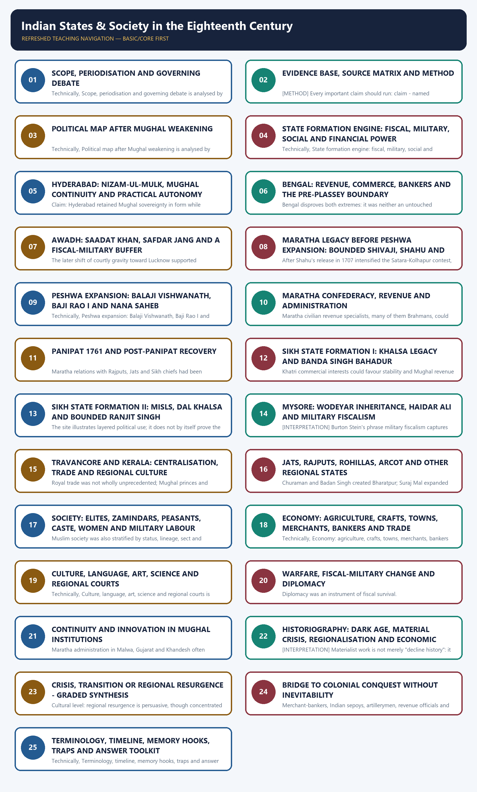

# Indian States & Society in the Eighteenth Century — Learner-v2 Complete Learning Session

> **Subject:** Modern Indian History | **Paper:** Prelims GS-I + GS-I analytical foundation | **Topic:** 02 | **Regenerated:** 14 August 2026
>
> **Evidence key:** FACT = supported by a named source, ruler, institution, event or material trace; INTERPRETATION = an evidence-led analytical position; LIMIT = what the evidence cannot establish; METHOD = source-use rule; BOUNDARY = context deliberately kept outside the core topic.
>
> **Approval state:** generated, **approved=false**. Status remains yellow until the user explicitly approves the main PDF, solved workbook and reusable Markdown.

## BASIC LEARNING SESSION



*Distinct embedded teaching-navigation image. The separate continuous Cārvāka-style flowchart package remains an independent at-a-glance artifact.*

#### Source audit and syllabus boundary

Markdown-first assembly uses the canonical package plus the paired Basic and Advanced owners. OCR sources are listed in the manifest for deeper checking; no live source is used except bounded heritage linkage. Verified local PYQs retain their provenance; unavailable keys remain labelled inferred, and no direct UPSC question is invented.

#### Package practice counts

| Component | Count |
|---|---:|
| Verified/routed PYQs | 3; two Prelims keys explicitly inferred, one verified adjacent GS-I Mains |
| Hard MCQs with explanations | 48 |
| Remedial MCQs with explanations | 12 |
| Original solved 10-mark Mains | 3 |
| Original solved 15-mark Mains | 3 |
| Original solved 20-mark Mains | 3 |
| Final register modules | 17; placed last |

#### Sources actually used

| Source class | Exact source | Use and caveat |
|---|---|---|
| Repository knowledge | Modern History Topic 02 basic/advanced; README; Master Chronology; Revision Chart; PYQ routing; Answer-Worthiness Audit. | Controls scope, classification, chronology, answer architecture, factual-risk rules and PYQ provenance. |
| Repository bridge | Rebuilt Modern Topic 01; bounded Modern Topics 03-05; Medieval Topics 23-25 basic/advanced. | Supplies Mughal institutional inheritance, Shivaji legacy, European-company context, conquest boundary, society/economy continuity and Panipat cautions without duplicating later topics. |
| Local OCR book | Bipan Chandra, *Modern India*, Chapter II. | Foundation survey for successor states, Marathas, Sikhs, Mysore, Travancore, society, economy and culture; broad decline language is regionally qualified. |
| Local OCR book | Satish Chandra, *Medieval India: From Sultanat to the Mughals, Part II*, especially the Maratha bid for supremacy and eighteenth-century transition. | Detailed control for Peshwa policy, Palkhed, chauth/sardeshmukhi, regional power and Mughal continuity; rhetorical speeches and exact casualty/treasure totals are not repeated. |
| Local OCR book | Sekhar Bandyopadhyay, *From Plassey to Partition*, Chapter 1. | Main interpretive check for regionalisation, Bengal finance, Hyderabad and Awadh institutions, Sikh social base, military fiscalism, trade and historiography. Quantitative claims are not generalised beyond their region. |
| Named documentary/material traditions | Farmans, sanads, coins, khutba, seals, revenue records, Persian chronicles, Company factory records, regional correspondence and built heritage. | Used as source families; no uncertain quotation, aggregate income, troop total or casualty figure is asserted. |
| Official heritage | UNESCO Maratha Military Landscapes; UNESCO Jantar Mantar Jaipur; District Amritsar Gobindgarh Fort; ASI conservation framework. | Bounded material-evidence and conservation links only. Heritage recognition is not treated as proof of a political claim. |
| Verified PYQ routing | Repository 2021 Prelims Q48/Q45 and 2022 GS-I Q2 route. | Questions are included; locally unavailable official Prelims keys are prominently marked inferred. |

### Bounded authoritative links

- UNESCO, Maratha Military Landscapes of India: https://whc.unesco.org/en/list/1739/
- UNESCO, Jantar Mantar, Jaipur: https://whc.unesco.org/en/list/1338/
- District Amritsar, Gobindgarh Fort: https://amritsar.nic.in/tourist-place/gobindgarh-fort/
- Archaeological Survey of India, Conservation and Preservation: https://asi.nic.in/pages/Conservation-&-Preservation

No current-affairs story was forced. The 2025 UNESCO inscription of the Maratha Military Landscapes is used only as a material-heritage bridge. Qdrant was not used because repository Markdown and OCR-searchable local books were sufficient.

#### PART I - COMPLETE LEARNING SESSION

#### REGISTER 01 - Scope and debate

- Core field: c.1707 to early 1800s; Shivaji/Khalsa are bounded legacies and Company conquest is a bounded consequence.
- Governing line: central Mughal decline + regional state formation + institutional continuity + uneven economic/social outcomes.
- Crisis best fits imperial command and war corridors; transition fits institutions; regional resurgence fits selected states, markets and courts.
- Never infer all-India prosperity from Bengal or all-India collapse from Delhi.
- Answer opener: "The eighteenth century changed the location and coalition of power more uniformly than it changed social welfare."

#### REGISTER 02 - Sources

- Persian chronicles: offices, factions and campaigns; elite/moralising limit.
- Farman/sanad: legal claim, not proof of implementation.
- Coin/khutba/seal: symbolic sovereignty; pair with revenue, appointments and war.
- Revenue/banking records: fiscal capacity, hundi, ijara, mint and surety; uneven survival.
- Company records: precise on goods/privilege, corporate bias.
- Regional traditions: mobilisation and memory, retrospective legitimation.
- Material heritage: forts, observatories, paintings and coins show capacity/patronage, not a complete polity.

#### REGISTER 03 - Hyderabad

- Founder: Nizam-ul-Mulk Asaf Jah I; conventional autonomy date 1724 after defeating Mubariz Khan.
- Continuity: emperor on coin/khutba; Persian, mansab, jagir and peshkash vocabulary.
- Autonomy: wars, treaties, appointments and mansabs made locally.
- Coalition: local chiefs, traders, moneylenders, military aristocrats and revenue farmers.
- Change: jagirs more hereditary; Mughal forms retained but regulatory content weakened.
- Limit: power widely diffused; succession conflict after 1748.
- One-line verdict: formal hierarchy survived while regional command shifted to Hyderabad.

#### REGISTER 04 - Bengal

- Murshid Quli Khan: nazim + diwan in 1717; survey, punctual revenue, larger zamindars.
- Shuja-ud-din: dynastic succession with imperial endorsement.
- Alivardi Khan, 1740-56: local appointments, practical autonomy, Afghan and Maratha challenges.
- Jagat Seth: provincial treasury/mint/remittance link; Umi Chand and Khoja Wajid show merchant scale.
- Economy: textiles, bullion and oceanic trade; overland disruption under Maratha raids.
- 1751: Orissa/chauth settlement; avoid damage totals.
- Boundary: stop at Siraj's 1756 accession; Plassey/Buxar/Diwani belong Topic 04.

#### REGISTER 05 - Awadh

- Saadat Khan appointed 1722; title Burhan-ul-Mulk; fresh revenue settlement.
- Zamindars subdued but usually confirmed after agreeing to pay: controlled accommodation.
- Fiscal establishment detached from effective Delhi supervision; local gentry and mixed elite coalition.
- Safdar Jang: successor, imperial wazir from 1748, used Maratha and Jat aid against Afghan rivals.
- Strategic base: fertile middle Ganga plain, trade, mobile military labour.
- Limit: refractory chiefs and later Company pressure; no direct peasant-welfare generalisation.

#### REGISTER 06 - Marathas

- Legacy: Shivaji's forts/revenue/coronation bounded; post-1707 Shahu versus Tarabai.
- Peshwa line: Balaji Vishwanath -> Baji Rao I -> Nana Saheb -> Madhav Rao I.
- 1719: Mughal sanads recognise swarajya and Deccan chauth/sardeshmukhi with obligations.
- Palkhed 1728; Malwa/Gujarat expansion; Poona effective centre after Shahu, 1749.
- Houses: Gaekwad, Holkar, Scindia, Bhonsle; personal armies and fiscal bases.
- Chauth = one-fourth claim; sardeshmukhi = additional one-tenth; neither automatically means direct rule.
- Panipat 1761 = grave setback; recovery shown by Shah Alam II's restoration in 1771.
- Trap: confederacy, not homogeneous modern nation or mere raiding force.

#### REGISTER 07 - Sikhs

- 1699 Khalsa: initiation, visible discipline and armed identity; not all Sikhs immediately Khalsa.
- Guru Gobind Singh dies 1708; authority in Panth/Granth traditions.
- Banda: Jat peasant/small-zamindar support; faujdars, diwan, kardars, coin and seal; captured 1715, executed 1716.
- Social caution: Khatri and Jat interests varied; no unanimous bloc.
- Misls: territorial shares/pattis; twelve major misls is a conventional classification, not timeless exactness.
- Dal Khalsa: collective action above misls, without permanent unitary command.
- Ranjit Singh captures Lahore 1799: bounded transition to monarchy, not starting point.

#### REGISTER 08 - Mysore and Travancore

- Mysore genealogy: post-Vijayanagara Wodeyar kingdom; not a Mughal successor.
- Haidar: Dindigul arsenal 1755, effective control 1761, French-trained infantry/artillery, poligar control.
- Military fiscalism: survey/cash revenue -> central army; intermediary reduction selective, not total.
- Tipu bounded: stronger coin/khutba sovereignty, state trade and wars belong later.
- Travancore: Martanda Varma after 1729; army reform, feudatory suppression, Dutch check, pepper monopoly, roads/canals.
- Comparison: both centralised; Mysore more land-army oriented, Travancore more coastal-trade oriented.

#### REGISTER 09 - Other states

- Jats: Churaman/Badan Singh -> Suraj Mal (1756-63); peasant-zamindar origin but hierarchical state.
- Suraj Mal used Mughal-style revenue and reduced some kinsmen; state declined after him.
- Rajputs: autonomy plus clan rivalry; no united nationalist bloc.
- Sawai Jai Singh II: Jaipur 1727, observatories and Zij; scientific vitality with court limit.
- Rohilkhand: Ali Muhammad Khan and Afghan military settlement; not created by Durrani.
- Farrukhabad: Ahmad Khan Bangash.
- Arcot/Carnatic: emerged from Hyderabad-Deccan hierarchy; European succession intervention belongs Topic 03.

#### REGISTER 10 - Fiscal-military systems

- Formula: revenue + credit -> army/supply -> coercion/protection -> new revenue.
- Ijara: collection farmed to highest/contracted bidder; quick cash, extraction risk.
- Peshkash: tribute acknowledging superior authority.
- Hundi: mobile credit/remittance instrument.
- Military labour: Afghans, Rajputs, Marathas, infantry, gunners and Europeans moved among courts.
- Indian adaptation: Mysore arsenal, Ibrahim Khan Gardi, later Sikh modernisation.
- Company distinction later: integrated command + maritime supply + corporate/Indian credit + Bengal revenue.

#### REGISTER 11 - Society

- Ruling elites varied; austerity and luxury both existed - reject universal moral decadence.
- Zamindars/deshmukhs/poligars: revenue, fort, arms and community authority; scale varied.
- Peasants: differentiated by rights/resources; could support state, zamindar or revolt.
- Caste and status remained strong; service enabled selective mobility (Holkar).
- Muslim society also stratified by lineage, sect, occupation and status.
- Women: Tarabai/Ahilyabai elite agency; peasant/craft labour; purdah, sati and widow rules varied.
- Source limit: elite women and spectacular customs are over-recorded.

#### REGISTER 12 - Economy and merchants

- Agriculture remained revenue base; output growth can coexist with worsening welfare.
- Regional surplus: Bengal, Awadh-Banaras, selected southern zones; no national aggregate.
- Crafts: cotton/silk textiles, saltpetre, indigo, arms, metalwork, shipbuilding.
- Urban redistribution: some old centres plundered; Murshidabad, Lucknow, Poona, Jaipur, Hyderabad gained.
- Bankers: Jagat Seth; surety, treasury, mint, remittance and political leverage.
- Trade: inland routes uneven; oceanic European bullion/demand expanded.
- Triangle: banker <-> state <-> company; alignment followed security and repayment, not fixed loyalty.

#### REGISTER 13 - Culture

- Patronage shifted from exclusive Delhi dominance to regional courts.
- Languages: Persian administration plus Urdu, Marathi, Punjabi, Bengali, Braj and Malayalam worlds.
- Centres: Lucknow handicrafts/literature; Hyderabad/Arcot Deccani culture; Travancore scholarship; Jaipur astronomy/planning.
- Painting/music moved and regionalised; court vitality does not equal mass welfare.
- Composite culture: cross-religious service and shared practices; qualify with caste, sect and elite literacy.
- Heritage: UNESCO Maratha forts and Jantar Mantar, Gobindgarh restoration; material survival, not total historical proof.

#### REGISTER 14 - Continuity and innovation

- Continuity: subah, nazim, diwan, mansab, jagir, Persian chancery, coin, khutba, zamindar mediation.
- Innovation: Bengal office concentration; Hyderabad patron-client change; Maratha confederate fiscal spheres; misl shares; Mysore direct revenue.
- Core distinction: same institutional name can carry changed content.
- Symbolism test: coin/khutba = legitimacy; appointments/revenue/war = practical autonomy.
- Best phrase: "continuity of grammar, change of authorship."

#### REGISTER 15 - Colonial bridge

- Openings: succession disputes, interstate rivalry, bankers, mobile troops and fortified factories.
- Companies entered as merchants, creditors and military contractors inside Indian politics.
- Turning sequence: Carnatic intervention -> Plassey 1757 -> Buxar 1764 -> Diwani 1765.
- Company edge: unified command, regular pay, naval/coastal supply, credit and territorial revenue.
- Anti-inevitability: Haidar's victories/Mangalore; Salbai; Ranjit Singh's independence; Maratha recovery.
- Verdict: regionalisation created opportunity; conquest required later contingent victories and Indian collaboration.

#### REGISTER 16 - Historiography and source limits

- Dark-age/imperial: central crisis, invasion, faction; overgeneralises and may moralise.
- Aligarh/materialist: Irfan Habib and Satish Chandra - jagirdari/agrarian/fiscal contradiction; regional variation caveat.
- Regional/Cambridge-inflected: C.A. Bayly, Muzaffar Alam and regional studies - local elites, portfolio capital, networks; coercion caveat.
- Economic revision: trade/credit/production resilience in selected zones; no all-India golden age.
- Scale rule: Delhi chronicle, provincial account and village evidence answer different questions.
- Final line: crisis of centre + regional state formation + uneven social cost.

#### REGISTER 17 - PYQ spine

- 2021 Prelims Q48: Arcot from Hyderabad = correct; Mysore from Vijayanagara = correct; Rohilkhand from Durrani territory = incorrect. Inferred B; official local key unavailable.
- 2021 Prelims Q45: ascending unit = pargana -> sarkar -> subah. Inferred A; official local key unavailable.
- 2022 GS-I Q2: Company armies won through command, credit, supply, alliance and later Bengal revenue - not ethnicity.
- 10M route: thesis + three named states/events + qualification.
- 15M route: common criteria comparison - legitimacy, revenue, coalition, military and weakness.
- 20M route: typology -> fiscal-military/social/economic evidence -> regional variation -> historiography -> colonial bridge -> graded verdict.
- Universal spine: claim -> named evidence -> significance -> limitation -> conclusion.

### SESSION 1 — SCOPE, PERIODISATION AND GOVERNING DEBATE

#### DEFINITION / WHAT THIS IS CALLED

**Plain-language definition:** Scope, periodisation and governing debate comprises Scope, periodisation and governing debate as its core connected dimensions.

**Technical definition:** Technically, Scope, periodisation and governing debate is analysed by relating Scope to periodisation, then testing the relationship through governing debate and Political fragmentation.

#### ANSWER-GRABBING OPENING — WRITE/ADAPT IN THE EXAM

> It did not produce an empty political space. [CONCEPT] Political fragmentation describes divided sovereignty and interstate competition.

#### MUST-WRITE KEYWORDS

- **Scope**
- **periodisation**
- **governing debate**
- **Political fragmentation**
- **Regionalisation**
- **1707-1720**

**How to use them:** Frame the answer through Scope; define periodisation, connect governing debate with Political fragmentation to explain the mechanism, and use Regionalisation for the decisive comparison or qualification.

#### Compact scope visual

```text
NECESSARY BACKGROUND             CORE FIELD, c. 1707-early 1800s          BOUNDED CONSEQUENCE
late-Mughal institutions         successor and regional states            Company conquest after
Shivaji and Khalsa legacies  ->  society, economy, culture, war       ->  Plassey/Buxar and later wars

Unit of analysis: centre, province, locality, social group and commercial network.
Never treat "India" as one undifferentiated aggregate.
```

#### Governing thesis

- [FACT] The eighteenth century saw the contraction of Mughal enforceable authority and the multiplication of regional centres. It did not produce an empty political space.
- [CONCEPT] **Political fragmentation** describes divided sovereignty and interstate competition. **Regionalisation** describes the relocation of resources, offices and patronage into durable provincial arenas. **State formation** describes the effort to turn revenue rights, local alliances, military labour and legitimacy into governable territory.
- [THESIS] The most defensible synthesis is: **central imperial decline + regionally varied state-building + continuing Mughal institutional language + uneven economic and social outcomes**.
- [LIMIT] "Dark age" is too total because Bengal commerce, Maratha expansion, Sikh mobilisation, Mysore centralisation, Jaipur science and regional courts show vitality. "Prosperous continuity" is equally unsafe because warfare, revenue farming, Maratha raids, coercive extraction and insecure cultivation imposed serious costs.
- [BOUNDARY] Shivaji and Guru Gobind Singh appear as institutional legacies, not as substitutes for the eighteenth-century story. Ranjit Singh, Tipu Sultan and Company wars are used only where they complete a trajectory.

#### Periodisation ladder

| Phase | Political signature | Exam use |
|---|---|---|
| 1707-1720 | Mughal succession, Shahu-Tarabai conflict, Banda Singh Bahadur, Sayyid politics | inherited crisis and opening |
| 1720s-1740s | Hyderabad, Bengal and Awadh consolidate; Baji Rao expands; Jaipur and Travancore strengthen | regional state formation |
| 1740s-1761 | Alivardi's Bengal, Maratha northern bid, Sikh recovery, Afghan pressure | intense interstate competition |
| 1761-1770s | Panipat setback, Maratha recovery, misl power, Mysore consolidation | no decisive all-India successor |
| late 18th century | Company becomes a fiscal-military contender; Ranjit Singh and Tipu bounded | bridge, not inevitable destination |

#### Exam-safe verdict

The eighteenth century was a **transition in the location and social basis of power**, not a uniform transition from order to chaos. Its history must be written region by region and then synthesised, with political crisis separated from commercial, agrarian, social and cultural evidence.

#### CLOSING RECALL FLOW — SCOPE, PERIODISATION AND GOVERNING DEBATE

```text
START / CONCEPT: Scope, periodisation and governing debate
        |
        v
EXACT TERMS: Scope · periodisation · governing debate · Political fragmentation · Regionalisation · 1707-1720
        |
        v
MECHANISM / ARGUMENT: "Dark age" is too total because Bengal commerce, Maratha expansion, Sikh mobilisation, Mysore centralisation, Jaipur science and regional courts show vitality.
        |
        v
CONSEQUENCE / CONTRAST: "Prosperous continuity" is equally unsafe because warfare, revenue farming, Maratha raids, coercive extraction and insecure cultivation imposed serious costs. [BOUNDARY] Shivaji and Guru Gobind Singh appear as institutional legacies, not as substitutes for the eighteenth-century story.
        |
        v
UPSC TRAP / ANSWER-USE: The eighteenth century was a transition in the location and social basis of power, not a uniform transition from order to chaos.
        |
        v
ANSWER-GRABBING FORMULATION: It did not produce an empty political space. [CONCEPT] Political fragmentation describes divided sovereignty and interstate competition.
```
### SESSION 2 — EVIDENCE BASE, SOURCE MATRIX AND METHOD

#### DEFINITION / WHAT THIS IS CALLED

**Plain-language definition:** Social claims therefore require cautious language and regional variation. [METHOD] Company records are unusually detailed on prices, goods and privileges but are interested documents, not neutral descriptions. [METHOD] Do not move from one prosperous province to a national growth rate, or from one war-torn corridor to an all-India collapse.

**Technical definition:** [METHOD] Every important claim should run: claim - named ruler/institution/event/source/region - significance - limitation. [METHOD] A coin or khutba in the emperor's name indicates retained Mughal legitimacy.

#### ANSWER-GRABBING OPENING — WRITE/ADAPT IN THE EXAM

> It does not prove revenue remittance, military obedience or effective provincial supervision. [METHOD] A farman for chauth or an appointment as subahdar identifies a legal relationship; actual collection and political independence depended on force and negotiation. [METHOD] Court records illuminate elites better than women, labourers, artisans and peasants.

#### MUST-WRITE KEYWORDS

- **Evidence base**
- **source matrix**
- **method**
- **twelve Sikh misls**
- **Persian chronicles and court histories**
- **Khafi Khan and successor-state court writing**

**How to use them:** Frame the answer through Evidence base; define source matrix, connect method with twelve Sikh misls to explain the mechanism, and use Persian chronicles and court histories for the decisive comparison or qualification.

#### Source matrix

| Source family | Named examples or forms | What it can establish | Main limit |
|---|---|---|---|
| Persian chronicles and court histories | Khafi Khan and successor-state court writing | offices, campaigns, factions, ceremony and elite judgement | court-centred, moralising and patronage-shaped |
| Farmans, sanads and appointment records | 1719 Maratha grants; provincial appointments | intended hierarchy, fiscal claims and recognised office | a grant proves a legal claim, not uniform collection |
| Coins, seals and khutba | emperor's name on coin/Friday sermon; Banda's coin and seal | symbolic sovereignty and public authority | symbol does not measure daily administrative reach |
| Revenue and banking records | jama, hasil, ijara, peshkash, hundi, mint and treasury relations | fiscal capacity, credit and intermediaries | uneven survival and elite/accounting bias |
| Company factory records | Bengal, Coromandel and western-coast correspondence | customs disputes, goods, credit, fortification and political risk | corporate perspective and weak inland knowledge |
| Regional correspondence and memory | Maratha letters/bakhars; Sikh traditions; local genealogies | mobilisation, claims, diplomacy and political memory | retrospective legitimation and heroic compression |
| Built and material evidence | forts, observatories, palaces, paintings, textiles, coins, manuscripts | spatial power, technical capacity, patronage and continuity | survival and conservation are selective |

#### Method rules

- [METHOD] Every important claim should run: **claim -> named ruler/institution/event/source/region -> significance -> limitation**.
- [METHOD] A coin or khutba in the emperor's name indicates retained Mughal legitimacy. It does not prove revenue remittance, military obedience or effective provincial supervision.
- [METHOD] A farman for chauth or an appointment as subahdar identifies a legal relationship; actual collection and political independence depended on force and negotiation.
- [METHOD] Court records illuminate elites better than women, labourers, artisans and peasants. Social claims therefore require cautious language and regional variation.
- [METHOD] Company records are unusually detailed on prices, goods and privileges but are interested documents, not neutral descriptions.
- [METHOD] Do not move from one prosperous province to a national growth rate, or from one war-torn corridor to an all-India collapse.

#### Source-use flow

```text
DEFINE LEVEL -> NAME EVIDENCE -> STATE WHAT IT PROVES -> ADD REGION/GENRE LIMIT -> GRADED VERDICT
centre/province   ruler, record,     mechanism or         no aggregate claim       crisis +
locality/group    coin, site, event  comparison                                     resilience
```

#### Factual-risk cautions

- The canonical **twelve Sikh misls** are a later organising shorthand; the number and boundaries of armed-territorial bands were fluid in contemporary evidence.
- Do not quote a fixed Panipat casualty total, Bengal revenue aggregate or Maratha collection total.
- Do not infer women's condition from elite memoirs alone.
- Do not label every successor-state act "independence"; specify formal symbolism and practical autonomy separately.

#### CLOSING RECALL FLOW — EVIDENCE BASE, SOURCE MATRIX AND METHOD

```text
START / CONCEPT: Evidence base, source matrix and method
        |
        v
EXACT TERMS: Evidence base · source matrix · method · twelve Sikh misls · Persian chronicles and court histories · Khafi Khan and successor-state court writing
        |
        v
MECHANISM / ARGUMENT: Social claims therefore require cautious language and regional variation. [METHOD] Company records are unusually detailed on prices, goods and privileges but are interested documents, not neutral descriptions. [METHOD] Do not move from one prosperous province to a national growth rate, or from one war-torn corridor to an all-India collapse.
        |
        v
CONSEQUENCE / CONTRAST: Do not quote a fixed Panipat casualty total, Bengal revenue aggregate or Maratha collection total.
        |
        v
UPSC TRAP / ANSWER-USE: Do not label every successor-state act "independence"; specify formal symbolism and practical autonomy separately.
        |
        v
ANSWER-GRABBING FORMULATION: It does not prove revenue remittance, military obedience or effective provincial supervision. [METHOD] A farman for chauth or an appointment as subahdar identifies a legal relationship; actual collection and political independence depended on force and negotiation. [METHOD] Court records illuminate elites better than women, labourers, artisans and peasants.
```
### SESSION 3 — POLITICAL MAP AFTER MUGHAL WEAKENING

#### DEFINITION / WHAT THIS IS CALLED

**Plain-language definition:** A Maratha right to collect chauth, Mughal appointment, zamindari right and local chief's authority could overlap.

**Technical definition:** Technically, Political map after Mughal weakening is analysed by relating Successor states to Resistance/rebel and confederate states, then testing the relationship through Older autonomous or independent regional kingdoms and S-C-I.

#### ANSWER-GRABBING OPENING — WRITE/ADAPT IN THE EXAM

> A Maratha right to collect chauth, Mughal appointment, zamindari right and local chief's authority could overlap.

#### MUST-WRITE KEYWORDS

- **Political map after Mughal weakening**
- **Successor states**
- **Resistance/rebel and confederate states**
- **Older autonomous or independent regional kingdoms**
- **S-C-I**
- **Mughal successor**

**How to use them:** Frame the answer through Political map after Mughal weakening; define Successor states, connect Resistance/rebel and confederate states with Older autonomous or independent regional kingdoms to explain the mechanism, and use S-C-I for the decisive comparison or qualification.

#### Political map in text

```text
                            PUNJAB
                Sikh bands -> misls -> Dal Khalsa
                          | Afghan pressure
RAJASTHAN / DELHI --------+-------- AWADH / BANARAS -------- BENGAL
Rajputs, Jats, Rohillas             Saadat-Safdar Jang       Murshid Quli-Alivardi
       |                                     |                   | European companies
       +----------- MALWA / BUNDELKHAND -----+-------------------+
                           Maratha advance
                                  |
GUJARAT / KONKAN ---- POONA / SATARA ---- HYDERABAD / CARNATIC
Gaekwad, ports        Peshwa and houses     Nizam, Arcot, French-English rivalry
                                  |
                          MYSORE ---- TRAVANCORE
                          Haidar      Martanda Varma
```

#### How to read the map

- [FACT] **Successor states** - Bengal, Awadh and Hyderabad - converted Mughal provincial office into hereditary or dynastic autonomy without an immediate formal break.
- [FACT] **Resistance/rebel and confederate states** - Marathas, Sikhs, Jats and Rohillas - grew through armed mobilisation, revenue claims, local solidarities and military labour markets.
- [FACT] **Older autonomous or independent regional kingdoms** - Mysore, Travancore and major Rajput houses - strengthened central authority within pre-existing political fields.
- [ANALYSIS] Categories explain origin and legitimacy, not a fixed hierarchy of success. Mysore could innovate more sharply than a successor state; Bengal could mobilise more commercial wealth than many "independent" kingdoms.
- [LIMIT] Regional boundaries were zones of layered claims, not modern borders. A Maratha right to collect chauth, Mughal appointment, zamindari right and local chief's authority could overlap.

#### State comparison matrix

| State type | Legitimacy route | Resource route | Structural tension |
|---|---|---|---|
| Mughal successor | imperial office, title, coin and khutba | provincial revenue, zamindars, bankers | autonomy in practice but borrowed symbolism |
| Confederacy | negotiated leadership among armed houses | tribute, chauth, sardeshmukhi, local collections | reach versus central command |
| Misl network | Khalsa identity, conquest shares, collective action | land shares, protection and local revenue | horizontal solidarity versus chiefly consolidation |
| Centralising regional kingdom | dynasty, conquest, court and ritual | direct assessment, monopoly trade, disciplined army | centralisation versus local elites |

#### Memory hook

**S-C-I:** Successor states inherited office; Confederate powers shared power; Independent/regional kingdoms centralised selectively.

#### CLOSING RECALL FLOW — POLITICAL MAP AFTER MUGHAL WEAKENING

```text
START / CONCEPT: Political map after Mughal weakening
        |
        v
EXACT TERMS: Political map after Mughal weakening · Successor states · Resistance/rebel and confederate states · Older autonomous or independent regional kingdoms · S-C-I · Mughal successor
        |
        v
MECHANISM / ARGUMENT: Categories explain origin and legitimacy, not a fixed hierarchy of success.
        |
        v
CONSEQUENCE / CONTRAST: Regional boundaries were zones of layered claims, not modern borders.
        |
        v
UPSC TRAP / ANSWER-USE: Do not miss this limiting distinction: mysore could innovate more sharply than a successor state.
        |
        v
ANSWER-GRABBING FORMULATION: A Maratha right to collect chauth, Mughal appointment, zamindari right and local chief's authority could overlap.
```
### SESSION 4 — STATE FORMATION ENGINE: FISCAL, MILITARY, SOCIAL AND FINANCIAL POWER

#### DEFINITION / WHAT THIS IS CALLED

**Plain-language definition:** State formation engine: fiscal, military, social and financial power comprises fiscal, military and social as its core connected dimensions.

**Technical definition:** Technically, State formation engine: fiscal, military, social and financial power is analysed by relating fiscal to military, then testing the relationship through social and financial power.

#### ANSWER-GRABBING OPENING — WRITE/ADAPT IN THE EXAM

> State formation was therefore not "ruler versus society"; it was a negotiated coalition in which rulers tried to centralise without losing the intermediaries who made rule possible.

#### MUST-WRITE KEYWORDS

- **fiscal**
- **military**
- **social**
- **financial power**
- **Local elites**
- **Revenue farming**

**How to use them:** Frame the answer through fiscal; define military, connect social with financial power to explain the mechanism, and use Local elites for the decisive comparison or qualification.

#### State-formation flow

```text
Mughal supervision weakens
      + local elites retain land, fort and caste/community influence
      + warfare raises demand for cash, cavalry, infantry and artillery
      + merchants/bankers move revenue and extend credit
                            |
                            v
ruler bargains with zamindars + appoints revenue managers + recruits military labour
                            |
                            v
treasury/credit funds army -> army enforces revenue -> revenue rewards clients
                            |
                            v
regional court, identity and institutions become durable
```

#### Core mechanisms

- [FACT] **Local elites:** zamindars, deshmukhs, poligars, clan chiefs and landed magnates supplied revenue knowledge, armed retainers and social legitimacy. Few rulers could simply abolish them.
- [FACT] **Revenue farming:** ijara transferred collection to contractors who promised a fixed sum. It produced quick cash but could intensify pressure and strengthen financier-collectors.
- [FACT] **Banking and credit:** hundis, sureties, treasury management and mint access connected land revenue to mobile armies and long-distance trade.
- [FACT] **Military labour:** Afghans, Rajputs, Marathas, Arabs, north Indian infantrymen, European-trained gunners and locally recruited peasant-soldiers moved across courts. Loyalty often followed pay, patronage and command.
- [ANALYSIS] State formation was therefore not "ruler versus society"; it was a negotiated coalition in which rulers tried to centralise without losing the intermediaries who made rule possible.

#### Banker-state-company triangle

```text
                     BANKER / MERCHANT
                credit, remittance, bullion
                 /                                 security, mint access       contracts, trade privilege
               /                                        REGIONAL STATE -------- EUROPEAN COMPANY
           customs, revenue          ships, factories, armed force

The triangle could finance a state, constrain it, or help a company enter politics.
```

#### Limitation

Merchant support did not mechanically transfer from Mughals to regions or from regions to the Company. Banking houses pursued security, repayment and access; their choices differed by moment and faction.

#### CLOSING RECALL FLOW — STATE FORMATION ENGINE: FISCAL, MILITARY, SOCIAL AND FINANCIAL POWER

```text
START / CONCEPT: State formation engine: fiscal, military, social and financial power
        |
        v
EXACT TERMS: fiscal · military · social · financial power · Local elites · Revenue farming
        |
        v
MECHANISM / ARGUMENT: It produced quick cash but could intensify pressure and strengthen financier-collectors.
        |
        v
CONSEQUENCE / CONTRAST: Few rulers could simply abolish them.
        |
        v
UPSC TRAP / ANSWER-USE: Do not miss this limiting distinction: loyalty often followed pay, patronage and command.
        |
        v
ANSWER-GRABBING FORMULATION: State formation was therefore not "ruler versus society"; it was a negotiated coalition in which rulers tried to centralise without losing the intermediaries who made rule possible.
```
### SESSION 5 — HYDERABAD: NIZAM-UL-MULK, MUGHAL CONTINUITY AND PRACTICAL AUTONOMY

#### DEFINITION / WHAT THIS IS CALLED

**Plain-language definition:** Hyderabad: Nizam-ul-Mulk, Mughal continuity and practical autonomy comprises Hyderabad, Nizam-ul-Mulk and Mughal continuity as its core connected dimensions.

**Technical definition:** Claim: Hyderabad retained Mughal sovereignty in form while exercising regional sovereignty in substance.

#### ANSWER-GRABBING OPENING — WRITE/ADAPT IN THE EXAM

> Claim: Hyderabad retained Mughal sovereignty in form while exercising regional sovereignty in substance.

#### MUST-WRITE KEYWORDS

- **Hyderabad**
- **Nizam-ul-Mulk**
- **Mughal continuity**
- **practical autonomy**
- **Claim**
- **Significance**

**How to use them:** Frame the answer through Hyderabad; define Nizam-ul-Mulk, connect Mughal continuity with practical autonomy to explain the mechanism, and use Claim for the decisive comparison or qualification.

#### Formation and chronology

| Date/phase | Named evidence | Significance |
|---|---|---|
| 1722-24 | Nizam-ul-Mulk served as wazir, then returned to the Deccan | court frustration redirected an imperial noble toward a regional base |
| 1724 | defeat of Mubariz Khan and consolidation as Asaf Jah I | autonomous Hyderabad conventionally dated from this political victory |
| 1720s-1748 | wars, treaties, appointments and mansabs made locally | practical sovereignty expanded |
| after 1748 | succession conflict and French intervention | autonomy did not eliminate internal or external vulnerability |

#### Continuity and autonomy matrix

| Mughal continuity | Practical autonomy | Analytical meaning |
|---|---|---|
| coins in emperor's name | Nizam conducted wars and treaties | legitimacy outlived command |
| emperor named in khutba | major appointments made without reference | ceremonial hierarchy coexisted with regional government |
| mansab, jagir and Persian chancery vocabulary | hereditary/durable provincial elite | inherited forms changed social content |
| peshkash and imperial titles | revenue and army served Hyderabad priorities | remittance and obedience became selective |

#### Institutions and social coalition

- [FACT] Nizam-ul-Mulk subdued refractory zamindars but generally incorporated local rulers and tribute-paying chiefs rather than destroying every indigenous power structure.
- [FACT] Traders, moneylenders, military aristocrats and revenue specialists supplied finance and service. Bandyopadhyay stresses that new men with fiscal expertise rose alongside older military elites.
- [FACT] Revenue farming expanded, jagirs became more hereditary and mansabdari retained only part of its older regulatory content.
- [ANALYSIS] Hyderabad was not a miniature centralised Mughal Empire. It was a patron-client order in which power remained widely diffused beneath the Nizam's supremacy.
- [BOUNDARY] Arcot/Carnatic developed from the Deccan-Hyderabad political hierarchy and then acquired practical autonomy. French-English intervention belongs mainly to Topic 03.

#### Claim-evidence-significance-limit

**Claim:** Hyderabad retained Mughal sovereignty in form while exercising regional sovereignty in substance. **Evidence:** coin and khutba symbolism continued, but Asaf Jah made war, treaties, appointments and mansabs independently. **Significance:** this distinguishes legitimacy from enforcement. **Limit:** Hyderabad's post-1748 succession struggles show that practical autonomy was not the same as administrative unity.

#### CLOSING RECALL FLOW — HYDERABAD: NIZAM-UL-MULK, MUGHAL CONTINUITY AND PRACTICAL AUTONOMY

```text
START / CONCEPT: Hyderabad: Nizam-ul-Mulk, Mughal continuity and practical autonomy
        |
        v
EXACT TERMS: Hyderabad · Nizam-ul-Mulk · Mughal continuity · practical autonomy · Claim · Significance
        |
        v
MECHANISM / ARGUMENT: It was a patron-client order in which power remained widely diffused beneath the Nizam's supremacy. [BOUNDARY] Arcot/Carnatic developed from the Deccan-Hyderabad political hierarchy and then acquired practical autonomy.
        |
        v
CONSEQUENCE / CONTRAST: Limit: Hyderabad's post-1748 succession struggles show that practical autonomy was not the same as administrative unity.
        |
        v
UPSC TRAP / ANSWER-USE: Hyderabad was not a miniature centralised Mughal Empire.
        |
        v
ANSWER-GRABBING FORMULATION: Claim: Hyderabad retained Mughal sovereignty in form while exercising regional sovereignty in substance.
```
### SESSION 6 — BENGAL: REVENUE, COMMERCE, BANKERS AND THE PRE-PLASSEY BOUNDARY

#### DEFINITION / WHAT THIS IS CALLED

**Plain-language definition:** The Bengal state was a coalition of Nawab, zamindars, officials, merchants and bankers.

**Technical definition:** Bengal disproves both extremes: it was neither an untouched commercial paradise nor a province already doomed to Company conquest.

#### ANSWER-GRABBING OPENING — WRITE/ADAPT IN THE EXAM

> The Bengal state was a coalition of Nawab, zamindars, officials, merchants and bankers.

#### MUST-WRITE KEYWORDS

- **Bengal**
- **revenue**
- **commerce**
- **bankers**
- **the pre-Plassey boundary**
- **Jagat Seth**

**How to use them:** Frame the answer through Bengal; define revenue, connect commerce with bankers to explain the mechanism, and use the pre-Plassey boundary for the decisive comparison or qualification.

#### Political sequence

| Ruler/phase | Named evidence | State-formation significance |
|---|---|---|
| Murshid Quli Khan | combined nazim and diwan authority in 1717; revenue survey and strong zamindars | provincial checks weakened; revenue became the base of autonomy |
| Shuja-ud-din | succession endorsed by Muhammad Shah; cooperation with regional elites | dynastic transfer within continuing imperial sanction |
| Sarfaraz Khan | displaced by Alivardi with support from military, banking and landed interests | the Nawab depended on a coalition, not office alone |
| Alivardi Khan, 1740-56 | appointments made locally; Maratha and Afghan challenges; European trade recovery | practical break deepened without a formal declaration |

#### Revenue-commerce-finance system

- [FACT] Murshid Quli Khan enforced punctual revenue through powerful intermediary zamindars, punished refractory holders and converted some jagirs to khalisa. The result was concentration in a smaller number of large landed magnates.
- [FACT] Bengal's cotton and silk textiles, sugar, oil and other goods moved through inland and oceanic routes. European companies brought bullion to purchase Bengal goods, while Indian Hindu, Muslim and Armenian merchants remained important.
- [FACT] Umi Chand and Khoja Wajid illustrate major merchant influence. The house of **Jagat Seth** became provincial treasurer in 1730 and gained strategic connection with the mint and remittance system.
- [ANALYSIS] The Bengal state was a coalition of Nawab, zamindars, officials, merchants and bankers. Its fiscal strength created autonomy, but coalition dependence also gave elites leverage over succession.

#### Maratha raids and recovery

- [FACT] Repeated Maratha incursions during Alivardi Khan's reign disrupted life, overland trade and revenue, especially in western Bengal and Orissa.
- [FACT] The 1751 settlement involved the surrender of Orissa and a chauth arrangement. Avoid a single numerical summary of damage or prosperity.
- [ANALYSIS] Recovery through expanding European corporate and private trade shows resilience, but the same expansion increased the companies' political and commercial leverage.

#### Pre-Plassey boundary

The topic ends with Siraj-ud-Daula's accession in 1756 and the destabilising factional field around the young Nawab. The 1717 farman, dastak abuse, fortification, Plassey, Buxar and Diwani are fully owned by Topics 03-04.

#### Balanced verdict

Bengal disproves both extremes: it was neither an untouched commercial paradise nor a province already doomed to Company conquest. Its productive and financial networks strengthened regional autonomy, while elite coalition politics and company privilege created contingent vulnerabilities.

#### CLOSING RECALL FLOW — BENGAL: REVENUE, COMMERCE, BANKERS AND THE PRE-PLASSEY BOUNDARY

```text
START / CONCEPT: Bengal: revenue, commerce, bankers and the pre-Plassey boundary
        |
        v
EXACT TERMS: Bengal · revenue · commerce · bankers · the pre-Plassey boundary · Jagat Seth
        |
        v
MECHANISM / ARGUMENT: The result was concentration in a smaller number of large landed magnates.
        |
        v
CONSEQUENCE / CONTRAST: Its fiscal strength created autonomy, but coalition dependence also gave elites leverage over succession.
        |
        v
UPSC TRAP / ANSWER-USE: Recovery through expanding European corporate and private trade shows resilience, but the same expansion increased the companies' political and commercial leverage.
        |
        v
ANSWER-GRABBING FORMULATION: The Bengal state was a coalition of Nawab, zamindars, officials, merchants and bankers.
```
### SESSION 7 — AWADH: SAADAT KHAN, SAFDAR JANG AND A FISCAL-MILITARY BUFFER

#### DEFINITION / WHAT THIS IS CALLED

**Plain-language definition:** Awadh demonstrates controlled accommodation: the Nawab centralised revenue and military command but governed through landed chiefs, fiscal officials and mobile allies.

**Technical definition:** The later shift of courtly gravity toward Lucknow supported handicrafts, literature and a distinctive composite culture; the city became the capital only after the immediate formation phase.

#### ANSWER-GRABBING OPENING — WRITE/ADAPT IN THE EXAM

> Awadh demonstrates controlled accommodation: the Nawab centralised revenue and military command but governed through landed chiefs, fiscal officials and mobile allies.

#### MUST-WRITE KEYWORDS

- **Awadh**
- **Saadat Khan**
- **Safdar Jang**
- **a fiscal-military buffer**
- **controlled accommodation**
- **Saadat Khan appointed governor; later titled Burhan-ul-Mulk**

**How to use them:** Frame the answer through Awadh; define Saadat Khan, connect Safdar Jang with a fiscal-military buffer to explain the mechanism, and use controlled accommodation for the decisive comparison or qualification.

#### Formation sequence

| Phase | Named evidence | Significance |
|---|---|---|
| 1722 | Saadat Khan appointed governor; later titled Burhan-ul-Mulk | imperial office became the platform for regional power |
| 1723 onward | fresh revenue settlement and campaigns against refractory zamindars | treasury and military authority reinforced each other |
| dynastic consolidation | Safdar Jang recognised as deputy/successor | office moved toward hereditary control |
| 1748-53 | Safdar Jang also served as imperial wazir | Awadh power and Mughal office remained intertwined |

#### Fiscal and elite structure

- [FACT] Saadat Khan defeated major zamindars but usually confirmed submitted chiefs in their estates after securing regular payment. This preserved local capacity while asserting Nawabi supremacy.
- [FACT] Bandyopadhyay notes that the provincial diwan and revenue flow were detached from effective imperial supervision, while local gentry received jagirs and a new elite of Indian Muslims, Afghans and Hindus supported the regime.
- [FACT] Awadh's fertile middle-Ganga location, trade and access to north Indian military labour made it a major fiscal-military state and strategic buffer.
- [FACT] Safdar Jang used Maratha and Jat military assistance against Bangash and Rohilla opponents. Alliance followed need, not religious blocs.

#### Court, culture and limits

- [FACT] The later shift of courtly gravity toward Lucknow supported handicrafts, literature and a distinctive composite culture; the city became the capital only after the immediate formation phase.
- [LIMIT] Heavy or increased assessment cannot be converted into a province-wide peasant-welfare verdict. Zamindars remained capable of rebellion whenever military pressure weakened.
- [BOUNDARY] Shuja-ud-Daula, Panipat and Buxar appear only to show Awadh's later strategic position; Company subordination and annexation belong to later topics.

#### Answer verdict

Awadh demonstrates **controlled accommodation**: the Nawab centralised revenue and military command but governed through landed chiefs, fiscal officials and mobile allies. It remained formally inside Mughal sovereignty while becoming a self-directed regional power.

#### CLOSING RECALL FLOW — AWADH: SAADAT KHAN, SAFDAR JANG AND A FISCAL-MILITARY BUFFER

```text
START / CONCEPT: Awadh: Saadat Khan, Safdar Jang and a fiscal-military buffer
        |
        v
EXACT TERMS: Awadh · Saadat Khan · Safdar Jang · a fiscal-military buffer · controlled accommodation · Saadat Khan appointed governor; later titled Burhan-ul-Mulk
        |
        v
MECHANISM / ARGUMENT: Zamindars remained capable of rebellion whenever military pressure weakened. [BOUNDARY] Shuja-ud-Daula, Panipat and Buxar appear only to show Awadh's later strategic position; Company subordination and annexation belong to later topics.
        |
        v
CONSEQUENCE / CONTRAST: Bandyopadhyay notes that the provincial diwan and revenue flow were detached from effective imperial supervision, while local gentry received jagirs and a new elite of Indian Muslims, Afghans and Hindus supported the regime.
        |
        v
UPSC TRAP / ANSWER-USE: Alliance followed need, not religious blocs.
        |
        v
ANSWER-GRABBING FORMULATION: Awadh demonstrates controlled accommodation: the Nawab centralised revenue and military command but governed through landed chiefs, fiscal officials and mobile allies.
```
### SESSION 8 — MARATHA LEGACY BEFORE PESHWA EXPANSION: BOUNDED SHIVAJI, SHAHU AND TARABAI

#### DEFINITION / WHAT THIS IS CALLED

**Plain-language definition:** The early eighteenth-century Maratha inheritance combined Shivaji's forts, mobile warfare, revenue practices and sovereignty symbols with continuing bargaining among rival claimants and sardars.

**Technical definition:** After Shahu's release in 1707 intensified the Satara-Kolhapur contest, Balaji Vishwanath used negotiated sardar allegiance to strengthen Peshwa coordination without creating a unitary bureaucracy.

#### ANSWER-GRABBING OPENING — WRITE/ADAPT IN THE EXAM

> Maratha expansion under the Peshwas grew from a contested post-Shivaji political field in which military resources, hereditary rights and allegiance had to be repeatedly negotiated.

#### MUST-WRITE KEYWORDS

- **Shivaji's legacy**
- **Shahu**
- **Tarabai**
- **Satara and Kolhapur**
- **Balaji Vishwanath**
- **negotiated coalition**

**How to use them:** Use Shivaji's legacy as the inheritance, compare Shahu and Tarabai across Satara and Kolhapur, then explain how Balaji Vishwanath built a negotiated coalition before qualifying the polity's social and institutional unity.

#### Legacy map

```text
Shivaji's legacy
forts + mobile war + measured revenue + cash-paid core + coronation + chauth claim
                          |
                          v
post-1680 war and dispersed sardars
                          |
      Tarabai at Kolhapur <-> Shahu at Satara after release in 1707
                          |
                          v
Balaji Vishwanath builds a negotiated coalition and strengthens the Peshwaship
```

#### Bounded legacy

- [FACT] Shivaji's forts, coastal strategy, disciplined mobile forces, coronation at Raigad and administrative practices provided symbols and techniques. They did not predetermine an eighteenth-century centralised empire.
- [FACT] After Rajaram's death, Tarabai led resistance in the name of Shivaji II. Shahu's release in 1707 produced a prolonged contest between Satara and Kolhapur.
- [FACT] Sardars bargained among rival claimants and the Mughals. Their personal followings, watan rights and military resources made them partners, not obedient bureaucrats.
- [FACT] Balaji Vishwanath, appointed Peshwa in 1713, won important sardars to Shahu and increasingly made the Peshwa the functional centre of policy.

#### Identity caution

- [LIMIT] "Maratha" identified a changing political and social field, not a homogeneous modern nation. Brahman administrators, Maratha warriors, local deshmukhs, peasants, Muslims, artillery specialists and regional houses occupied unequal positions.
- [LIMIT] Religious language and memories of swarajya mattered, but expansion, revenue, patronage and rivalry explain actual alliances better than a single Hindu-versus-Muslim frame.

#### Transition insight

The post-Shivaji order converted a founder-centred kingdom into a negotiated system of **Peshwa authority + royal legitimacy + autonomous sardars + local hereditary rights**.

#### CLOSING RECALL FLOW — MARATHA LEGACY BEFORE PESHWA EXPANSION: BOUNDED SHIVAJI, SHAHU AND TARABAI

```text
START / CONCEPT: Maratha legacy before Peshwa expansion: bounded Shivaji, Shahu and Tarabai
        |
        v
EXACT TERMS: Shivaji's legacy · Shahu · Tarabai · Satara and Kolhapur · Balaji Vishwanath · negotiated coalition
        |
        v
MECHANISM / ARGUMENT: Rival courts competed for sardars whose personal followings, watan rights and military resources made negotiated allegiance essential, allowing the Peshwa to become a coordinating centre through coalition rather than bureaucratic command.
        |
        v
CONSEQUENCE / CONTRAST: The settlement strengthened Shahu's position and the Peshwaship while preserving powerful regional intermediaries whose autonomy later shaped the confederate character and coordination limits of Maratha power.
        |
        v
UPSC TRAP / ANSWER-USE: Do not project a homogeneous modern nation or unitary state backward, reduce alliances to religion, or treat Shivaji's institutions as an unchanged blueprint for later Peshwa expansion.
        |
        v
ANSWER-GRABBING FORMULATION: Maratha expansion under the Peshwas grew from a contested post-Shivaji political field in which military resources, hereditary rights and allegiance had to be repeatedly negotiated.
```
### SESSION 9 — PESHWA EXPANSION: BALAJI VISHWANATH, BAJI RAO I AND NANA SAHEB

#### DEFINITION / WHAT THIS IS CALLED

**Plain-language definition:** After Shahu's death in 1749, the Peshwa became the effective head and Poona the working capital.

**Technical definition:** Technically, Peshwa expansion: Balaji Vishwanath, Baji Rao I and Nana Saheb is analysed by relating Peshwa expansion to Balaji Vishwanath, then testing the relationship through Baji Rao I and Nana Saheb.

#### ANSWER-GRABBING OPENING — WRITE/ADAPT IN THE EXAM

> After Shahu's death in 1749, the Peshwa became the effective head and Poona the working capital.

#### MUST-WRITE KEYWORDS

- **Peshwa expansion**
- **Balaji Vishwanath**
- **Baji Rao I**
- **Nana Saheb**
- **Palkhed (1728)**
- **Balaji Vishwanath, 1713-20**

**How to use them:** Frame the answer through Peshwa expansion; define Balaji Vishwanath, connect Baji Rao I with Nana Saheb to explain the mechanism, and use Palkhed (1728) for the decisive comparison or qualification.

#### Three-Peshwa chronology

| Peshwa | Main political work | Named evidence |
|---|---|---|
| Balaji Vishwanath, 1713-20 | consolidated Shahu; converted Mughal crisis into recognised fiscal claims | 1719 imperial sanads; Delhi expedition with Sayyids |
| Baji Rao I, 1720-40 | shifted from defence toward systematic expansion | Palkhed 1728; Malwa and Gujarat; Delhi raid 1737; Bhopal settlement |
| Balaji Baji Rao/Nana Saheb, 1740-61 | widened reach and made Poona the effective centre after Shahu | Bengal raids; 1752 imperial protection; Udgir 1760; Panipat 1761 |

#### Balaji Vishwanath and the 1719 settlement

- [FACT] The Mughal grants recognised Shahu's swarajya and claims to chauth and sardeshmukhi in six Deccan provinces, alongside obligations of service and tribute.
- [ANALYSIS] The settlement used imperial legality to legitimise Maratha extraction. It was neither full Mughal submission nor a modern declaration of independence.
- [FACT] Collection responsibility was distributed among sardars who retained much of the proceeds for troops and expenses. This expanded power quickly but reduced direct central control.

#### Baji Rao I

- [FACT] Baji Rao made the hereditary Peshwaship the focal point of the political system through battlefield success and patronage.
- [FACT] At **Palkhed (1728)** he forced Nizam-ul-Mulk to reaffirm Shahu's Deccan claims; the settlement did not establish permanent Maratha mastery over all southern politics.
- [FACT] Malwa and Gujarat offered resources and strategic depth against Hyderabad and Delhi. Maratha claims moved from tribute to spheres of influence and, in some zones, territorial administration.
- [LIMIT] Rhetorical speeches attributed to Baji Rao in later accounts cannot be treated as verbatim policy documents.

#### Nana Saheb

- [FACT] After Shahu's death in 1749, the Peshwa became the effective head and Poona the working capital.
- [FACT] Expansion reached Bengal, the Deccan, Rajasthan, Delhi and Punjab, but durable administration was strongest in selected areas such as parts of Malwa, Gujarat and Khandesh.
- [ANALYSIS] Wide military reach exceeded institutional integration. That gap is central to understanding Panipat and later confederate politics.

#### CLOSING RECALL FLOW — PESHWA EXPANSION: BALAJI VISHWANATH, BAJI RAO I AND NANA SAHEB

```text
START / CONCEPT: Peshwa expansion: Balaji Vishwanath, Baji Rao I and Nana Saheb
        |
        v
EXACT TERMS: Peshwa expansion · Balaji Vishwanath · Baji Rao I · Nana Saheb · Palkhed (1728) · Balaji Vishwanath, 1713-20
        |
        v
MECHANISM / ARGUMENT: It was neither full Mughal submission nor a modern declaration of independence.
        |
        v
CONSEQUENCE / CONTRAST: Expansion reached Bengal, the Deccan, Rajasthan, Delhi and Punjab, but durable administration was strongest in selected areas such as parts of Malwa, Gujarat and Khandesh.
        |
        v
UPSC TRAP / ANSWER-USE: Do not miss this limiting distinction: collection responsibility was distributed among sardars who retained much of the proceeds for troops...
        |
        v
ANSWER-GRABBING FORMULATION: After Shahu's death in 1749, the Peshwa became the effective head and Poona the working capital.
```
### SESSION 10 — MARATHA CONFEDERACY, REVENUE AND ADMINISTRATION

#### DEFINITION / WHAT THIS IS CALLED

**Plain-language definition:** In core territories, the Peshwas developed a more regular civilian revenue administration.

**Technical definition:** Maratha civilian revenue specialists, many of them Brahmans, could remain distinct from military command, unlike the more unified Mughal civilian-military mansab structure.

#### ANSWER-GRABBING OPENING — WRITE/ADAPT IN THE EXAM

> Confederacy was not simply "weakness": it reduced the cost of rapid expansion and permitted regional entrepreneurship.

#### MUST-WRITE KEYWORDS

- **Maratha confederacy**
- **revenue**
- **administration**
- **chauth**
- **sardeshmukhi**
- **not another word for chauth**

**How to use them:** Frame the answer through Maratha confederacy; define revenue, connect administration with chauth to explain the mechanism, and use sardeshmukhi for the decisive comparison or qualification.

#### Confederacy diagram

```text
                     CHHATRAPATI AT SATARA
                       dynastic legitimacy
                              |
                     PESHWASHIP AT POONA
                coordination, patronage, diplomacy
         _____________|______________|______________
        |              |              |              |
   Gaekwad         Holkar         Scindia         Bhonsle
   Gujarat         Indore/Malwa    Gwalior/north   Nagpur/east
        \______________ autonomous armies and fiscal bases ______/

Not a unitary state: authority overlapped with local zamindars, vatandars and tribute payers.
```

#### Fiscal terminology

| Term | Exam-safe meaning | Trap |
|---|---|---|
| chauth | claim commonly framed as one-fourth of assessed revenue from territory outside the core | not an ordinary village land tax and not automatic sovereignty |
| sardeshmukhi | additional one-tenth claim based on asserted superior deshmukh right | not another word for chauth |
| watan | hereditary local office/right and its emoluments | could survive centralising rulers |
| saranjam | assignment supporting military service, comparable in some ways to jagir | not private property in the modern sense |
| kamavisdar/mamlatdar | civilian revenue functionaries in expanding Maratha administration | terminology and practice varied by region |

#### Administrative structure

- [FACT] In core territories, the Peshwas developed a more regular civilian revenue administration. Outside the core, tribute collection and negotiated rights often preceded direct administration.
- [FACT] Maratha civilian revenue specialists, many of them Brahmans, could remain distinct from military command, unlike the more unified Mughal civilian-military mansab structure.
- [FACT] Sardars used personal armies and fiscal spheres. The same arrangement rewarded initiative and enabled Gaekwad, Holkar, Scindia and Bhonsle houses to consolidate regional bases.
- [ANALYSIS] Confederacy was not simply "weakness": it reduced the cost of rapid expansion and permitted regional entrepreneurship. Its cost was strategic rivalry, uneven remittance and limited unified command.

#### Maratha-state debate

- [INTERPRETATION] Irfan Habib highlights a zamindar/agrarian revolt dimension; Satish Chandra stresses regional power and Deccan supremacy; Andre Wink emphasises Maratha operation within a broader Mughal idiom of layered rights.
- [VERDICT] The Maratha order combined rebellion, Mughal legal language, regional identity and new confederate power. No one label exhausts it.

#### CLOSING RECALL FLOW — MARATHA CONFEDERACY, REVENUE AND ADMINISTRATION

```text
START / CONCEPT: Maratha confederacy, revenue and administration
        |
        v
EXACT TERMS: Maratha confederacy · revenue · administration · chauth · sardeshmukhi · not another word for chauth
        |
        v
MECHANISM / ARGUMENT: In core territories, the Peshwas developed a more regular civilian revenue administration.
        |
        v
CONSEQUENCE / CONTRAST: Maratha civilian revenue specialists, many of them Brahmans, could remain distinct from military command, unlike the more unified Mughal civilian-military mansab structure.
        |
        v
UPSC TRAP / ANSWER-USE: Do not miss this limiting distinction: the same arrangement rewarded initiative and enabled Gaekwad, Holkar, Scindia and Bhonsle houses to...
        |
        v
ANSWER-GRABBING FORMULATION: Confederacy was not simply "weakness": it reduced the cost of rapid expansion and permitted regional entrepreneurship.
```
### SESSION 11 — PANIPAT 1761 AND POST-PANIPAT RECOVERY

#### DEFINITION / WHAT THIS IS CALLED

**Plain-language definition:** Panipat was a severe strategic and demographic shock, not a civilisational verdict or terminal date.

**Technical definition:** Maratha relations with Rajputs, Jats and Sikh chiefs had been damaged by tribute demands and interference.

#### ANSWER-GRABBING OPENING — WRITE/ADAPT IN THE EXAM

> Panipat was a severe strategic and demographic shock, not a civilisational verdict or terminal date.

#### MUST-WRITE KEYWORDS

- **Panipat 1761**
- **post-Panipat recovery**
- **strategic and demographic shock**
- **end Maratha power everywhere**
- **check the immediate bid for north Indian supremacy**
- **make British conquest automatic**

**How to use them:** Frame the answer through Panipat 1761; define post-Panipat recovery, connect strategic and demographic shock with end Maratha power everywhere to explain the mechanism, and use check the immediate bid for north Indian supremacy for the decisive comparison or qualification.

#### Road to Panipat

```text
Maratha protection of Mughal court and advance into Punjab
       + Ahmad Shah Abdali's repeated intervention
       + Rohilla support and Shuja-ud-Daula's strategic choice
       + Maratha alienation of Rajput, Jat and some Sikh allies
       + long supply line and divided command
                               |
                               v
                   Third Battle of Panipat
                       14 January 1761
```

#### Battlefield and political explanation

- [FACT] Sadashiv Rao Bhau held actual command; Vishwas Rao represented the Peshwa's house; Ibrahim Khan Gardi commanded European-trained infantry and artillery.
- [FACT] Abdali allied with Najib-ud-Daula and gained Shuja-ud-Daula's support. Maratha relations with Rajputs, Jats and Sikh chiefs had been damaged by tribute demands and interference.
- [ANALYSIS] Defeat arose from diplomacy, supply, coalition management and command as much as battlefield technique. It does not prove that Indian armies were inherently incapable of disciplined infantry or artillery.
- [LIMIT] Avoid fixed casualty figures. Sources and later narratives vary, and exam value lies in political consequences.

#### What Panipat did and did not do

| It did | It did not |
|---|---|
| destroy an experienced northern expeditionary force and damage Peshwa prestige | end Maratha power everywhere |
| check the immediate bid for north Indian supremacy | create stable Afghan rule in India |
| expose the cost of thin alliances and long logistics | make British conquest automatic |
| create room for other powers, including the Company, to consolidate | erase later Maratha recovery |

#### Recovery

- [FACT] Peshwa Madhav Rao I (1761-72) defeated the Nizam, pressured Haidar Ali and restored influence in north India.
- [FACT] In 1771 Maratha forces restored Shah Alam II to Delhi, demonstrating recovered reach.
- [BOUNDARY] Mahadji Scindia and Nana Fadnavis later sustained Maratha power, but the Anglo-Maratha wars belong to Topic 05.

#### Verdict

Panipat was a severe **strategic and demographic shock**, not a civilisational verdict or terminal date. Its deepest lesson is that territorial reach without a trusted coalition and secure logistics could not produce stable paramountcy.

#### CLOSING RECALL FLOW — PANIPAT 1761 AND POST-PANIPAT RECOVERY

```text
START / CONCEPT: Panipat 1761 and post-Panipat recovery
        |
        v
EXACT TERMS: Panipat 1761 · post-Panipat recovery · strategic and demographic shock · end Maratha power everywhere · check the immediate bid for north Indian supremacy · make British conquest automatic
        |
        v
MECHANISM / ARGUMENT: Maratha relations with Rajputs, Jats and Sikh chiefs had been damaged by tribute demands and interference.
        |
        v
CONSEQUENCE / CONTRAST: It does not prove that Indian armies were inherently incapable of disciplined infantry or artillery.
        |
        v
UPSC TRAP / ANSWER-USE: Its deepest lesson is that territorial reach without a trusted coalition and secure logistics could not produce stable paramountcy.
        |
        v
ANSWER-GRABBING FORMULATION: Panipat was a severe strategic and demographic shock, not a civilisational verdict or terminal date.
```
### SESSION 12 — SIKH STATE FORMATION I: KHALSA LEGACY AND BANDA SINGH BAHADUR

#### DEFINITION / WHAT THIS IS CALLED

**Plain-language definition:** Not all Sikhs immediately became Khalsa, and the community included Jat peasants, Khatri traders, artisans and other groups with different interests.

**Technical definition:** Khatri commercial interests could favour stability and Mughal revenue farming, while oppressive ijaradars could drive other groups toward Banda.

#### ANSWER-GRABBING OPENING — WRITE/ADAPT IN THE EXAM

> Not all Sikhs immediately became Khalsa, and the community included Jat peasants, Khatri traders, artisans and other groups with different interests.

#### MUST-WRITE KEYWORDS

- **Sikh state formation I**
- **Khalsa legacy**
- **Banda Singh Bahadur**
- **visible discipline, initiation and armed community**
- **end of personal Guruship**
- **1709-15**

**How to use them:** Frame the answer through Sikh state formation I; define Khalsa legacy, connect Banda Singh Bahadur with visible discipline, initiation and armed community to explain the mechanism, and use end of personal Guruship for the decisive comparison or qualification.

#### Chronology and social base

| Phase | Named evidence | Significance |
|---|---|---|
| 1699 | Guru Gobind Singh establishes the Khalsa | visible discipline, initiation and armed community |
| 1708 | Guru's death; authority vested in Panth and Granth traditions | end of personal Guruship |
| 1709-15 | Banda Singh Bahadur mobilises in Punjab | revolt becomes territorial and administrative |
| 1715-16 | capture and execution | centralised phase defeated, not the community |

#### Khalsa legacy

- [FACT] The Khalsa strengthened a distinctive collective identity through initiation, the five visible symbols and the legitimacy of armed defence.
- [LIMIT] Not all Sikhs immediately became Khalsa, and the community included Jat peasants, Khatri traders, artisans and other groups with different interests.
- [ANALYSIS] Political identity emerged through institution, ritual, agrarian conflict and warfare; it should not be reduced to persecution alone.

#### Banda Singh Bahadur

- [FACT] Banda's main support included Jat peasants and smaller zamindars under severe fiscal pressure, though support was never uniform.
- [FACT] In territories under his influence he appointed faujdars, a diwan and kardars, used a seal and minted coin. These are state-making acts, not only rebellion.
- [FACT] Khatri commercial interests could favour stability and Mughal revenue farming, while oppressive ijaradars could drive other groups toward Banda. Sikh society was internally differentiated.
- [ANALYSIS] The movement linked social challenge to political sovereignty, but its administrative reach and duration were limited by Mughal military pressure and internal division.

#### Source and chronology caution

Later heroic traditions preserve indispensable memory but may compress motives, numbers and unanimity. The safest answer names the institutions Banda created and then qualifies the uneven social coalition.

#### CLOSING RECALL FLOW — SIKH STATE FORMATION I: KHALSA LEGACY AND BANDA SINGH BAHADUR

```text
START / CONCEPT: Sikh state formation I: Khalsa legacy and Banda Singh Bahadur
        |
        v
EXACT TERMS: Sikh state formation I · Khalsa legacy · Banda Singh Bahadur · visible discipline, initiation and armed community · end of personal Guruship · 1709-15
        |
        v
MECHANISM / ARGUMENT: Khatri commercial interests could favour stability and Mughal revenue farming, while oppressive ijaradars could drive other groups toward Banda.
        |
        v
CONSEQUENCE / CONTRAST: Political identity emerged through institution, ritual, agrarian conflict and warfare; it should not be reduced to persecution alone.
        |
        v
UPSC TRAP / ANSWER-USE: The movement linked social challenge to political sovereignty, but its administrative reach and duration were limited by Mughal military pressure and internal division.
        |
        v
ANSWER-GRABBING FORMULATION: Not all Sikhs immediately became Khalsa, and the community included Jat peasants, Khatri traders, artisans and other groups with different interests.
```
### SESSION 13 — SIKH STATE FORMATION II: MISLS, DAL KHALSA AND BOUNDED RANJIT SINGH

#### DEFINITION / WHAT THIS IS CALLED

**Plain-language definition:** Territory captured by a misl could be distributed among members according to contribution, giving even lower-ranking soldiers a patti or share.

**Technical definition:** The site illustrates layered political use; it does not by itself prove the structure of every misl.

#### ANSWER-GRABBING OPENING — WRITE/ADAPT IN THE EXAM

> The site illustrates layered political use; it does not by itself prove the structure of every misl.

#### MUST-WRITE KEYWORDS

- **Sikh state formation II**
- **misls**
- **Dal Khalsa**
- **bounded Ranjit Singh**
- **twelve major misls**
- **Territory**

**How to use them:** Frame the answer through Sikh state formation II; define misls, connect Dal Khalsa with bounded Ranjit Singh to explain the mechanism, and use twelve major misls for the decisive comparison or qualification.

#### Misl network visual

```text
local fighting bands and territorial shares
          | kinship, comradeship, conquest contribution
          v
   MISLS with chiefs and pattis
      \       |       /
       \ collective need /
         DAL KHALSA
   joint mobilisation against major threats
          |
   recurrent assembly / collective resolution
          |
late-century pressure toward chiefly and monarchical consolidation
```

#### Organisation

- [FACT] After Banda's execution, Sikh bands survived persecution and used the disruption caused by Nadir Shah and Ahmad Shah Abdali to expand.
- [FACT] Territory captured by a misl could be distributed among members according to contribution, giving even lower-ranking soldiers a patti or share.
- [FACT] The **Dal Khalsa** supplied a level of collective mobilisation above individual misls. Collective assemblies and resolutions did not eliminate chiefly autonomy.
- [SOURCE CAUTION] Textbooks often list **twelve major misls**; Bandyopadhyay notes a much more fluid field of territorial combinations in the 1770s. Write "twelve major misls in the conventional classification" rather than treating the map as timeless.
- [ANALYSIS] The misl order combined horizontal co-sharing with an emerging hierarchy of powerful chiefs. Equality was an organising ideal, not a permanent description of property and command.

#### Bounded Ranjit Singh

- [FACT] Ranjit Singh of the Sukerchakia misl captured Lahore in 1799 and represents the later shift toward a more centralised Punjab kingdom.
- [BOUNDARY] His European-trained army, 1809 Treaty of Amritsar and later conquests belong mainly to Topic 05. Here he appears only as the outcome of late-century consolidation.
- [MATERIAL LINK] District Amritsar identifies Gobindgarh Fort's sequence from Bhangi Misl to Ranjit Singh, Company and Indian Army. The site illustrates layered political use; it does not by itself prove the structure of every misl.

#### Verdict

Sikh state formation moved from **Khalsa discipline -> Banda's territorial administration -> decentralised misl sovereignty -> selective collective action -> late monarchical consolidation**. The path was neither linear nor socially homogeneous.

#### CLOSING RECALL FLOW — SIKH STATE FORMATION II: MISLS, DAL KHALSA AND BOUNDED RANJIT SINGH

```text
START / CONCEPT: Sikh state formation II: misls, Dal Khalsa and bounded Ranjit Singh
        |
        v
EXACT TERMS: Sikh state formation II · misls · Dal Khalsa · bounded Ranjit Singh · twelve major misls · Territory
        |
        v
MECHANISM / ARGUMENT: Territory captured by a misl could be distributed among members according to contribution, giving even lower-ranking soldiers a patti or share.
        |
        v
CONSEQUENCE / CONTRAST: Equality was an organising ideal, not a permanent description of property and command.
        |
        v
UPSC TRAP / ANSWER-USE: Do not miss this limiting distinction: the path was neither linear nor socially homogeneous.
        |
        v
ANSWER-GRABBING FORMULATION: The site illustrates layered political use; it does not by itself prove the structure of every misl.
```
### SESSION 14 — MYSORE: WODEYAR INHERITANCE, HAIDAR ALI AND MILITARY FISCALISM

#### DEFINITION / WHAT THIS IS CALLED

**Plain-language definition:** Mysore emerged from the political field of Vijayanagara and retained a Wodeyar king even when ministers and later Haidar Ali exercised effective power.

**Technical definition:** [INTERPRETATION] Burton Stein's phrase military fiscalism captures the direct connection between resource mobilisation and a large central army.

#### ANSWER-GRABBING OPENING — WRITE/ADAPT IN THE EXAM

> Mysore had less need to borrow Mughal provincial legitimacy and therefore experimented more openly with direct taxation, military organisation and, under Tipu, symbols of sovereignty.

#### MUST-WRITE KEYWORDS

- **Mysore**
- **Wodeyar inheritance**
- **Haidar Ali**
- **military fiscalism**
- **Vijayanagara**
- **Wodeyar**

**How to use them:** Frame the answer through Mysore; define Wodeyar inheritance, connect Haidar Ali with military fiscalism to explain the mechanism, and use Vijayanagara for the decisive comparison or qualification.

#### Political genealogy

- [FACT] Mysore emerged from the political field of Vijayanagara and retained a Wodeyar king even when ministers and later Haidar Ali exercised effective power.
- [FACT] Haidar rose through the army, established a modern arsenal at Dindigul in 1755 with French assistance and took effective control in 1761.
- [FACT] He subordinated poligars, expanded territory and organised more disciplined infantry and artillery while continuing to use cavalry and local structures.

#### Military-fiscal system

```text
survey and classification of land
         -> cash/direct collection through salaried officials
         -> reduced intermediary share in selected zones
         -> larger treasury
         -> infantry, artillery, arsenals and long war
         -> pressure for still more revenue
```

- [INTERPRETATION] Burton Stein's phrase **military fiscalism** captures the direct connection between resource mobilisation and a large central army.
- [FACT] Mysore did not abolish every jagir or local right, but it tried more systematically than many states to reduce the independent power of hereditary intermediaries.
- [BOUNDARY] Tipu Sultan's coinage, khutba, state trading corporation, sericulture, navy and wars show the later extension of this project. His detailed conflict with the Company belongs to Topic 05.

#### Comparison with successor states

Mysore had less need to borrow Mughal provincial legitimacy and therefore experimented more openly with direct taxation, military organisation and, under Tipu, symbols of sovereignty. Yet it remained an early-modern state constrained by war, technology, local elites and limited resources.

#### CLOSING RECALL FLOW — MYSORE: WODEYAR INHERITANCE, HAIDAR ALI AND MILITARY FISCALISM

```text
START / CONCEPT: Mysore: Wodeyar inheritance, Haidar Ali and military fiscalism
        |
        v
EXACT TERMS: Mysore · Wodeyar inheritance · Haidar Ali · military fiscalism · Vijayanagara · Wodeyar
        |
        v
MECHANISM / ARGUMENT: Mysore emerged from the political field of Vijayanagara and retained a Wodeyar king even when ministers and later Haidar Ali exercised effective power.
        |
        v
CONSEQUENCE / CONTRAST: Mysore did not abolish every jagir or local right, but it tried more systematically than many states to reduce the independent power of hereditary intermediaries. [BOUNDARY] Tipu Sultan's coinage, khutba, state trading corporation, sericulture, navy and wars show the later extension of this project.
        |
        v
UPSC TRAP / ANSWER-USE: He subordinated poligars, expanded territory and organised more disciplined infantry and artillery while continuing to use cavalry and local structures.
        |
        v
ANSWER-GRABBING FORMULATION: Mysore had less need to borrow Mughal provincial legitimacy and therefore experimented more openly with direct taxation, military organisation and, under Tipu, symbols of sovereignty.
```
### SESSION 15 — TRAVANCORE AND KERALA: CENTRALISATION, TRADE AND REGIONAL CULTURE

#### DEFINITION / WHAT THIS IS CALLED

**Plain-language definition:** By the 1760s the Kerala political field was increasingly dominated by Travancore, Cochin and Calicut before Mysorean intervention in the north.

**Technical definition:** Royal trade was not wholly unprecedented; Mughal princes and nobles had long participated in commerce.

#### ANSWER-GRABBING OPENING — WRITE/ADAPT IN THE EXAM

> Royal trade was not wholly unprecedented; Mughal princes and nobles had long participated in commerce.

#### MUST-WRITE KEYWORDS

- **Travancore**
- **Kerala**
- **centralisation**
- **trade**
- **regional culture**
- **military centralisation**

**How to use them:** Frame the answer through Travancore; define Kerala, connect centralisation with trade to explain the mechanism, and use regional culture for the decisive comparison or qualification.

#### State-building under Martanda Varma

| Instrument | Named evidence | Significance |
|---|---|---|
| military centralisation | western-trained army and modern weapons | subordinated feudatories and rival principalities |
| territorial expansion | Quilon and neighbouring territories; Dutch power checked | created a larger southern kingdom |
| commercial policy | royal monopoly over pepper and wider coastal trade | trade revenue strengthened the state |
| public works | irrigation, roads and canals | linked fiscal power with communication and cultivation |

- [FACT] Travancore rose after 1729 under Martanda Varma, suppressed major local chiefs and defeated Dutch political power in Kerala.
- [FACT] By the 1760s the Kerala political field was increasingly dominated by Travancore, Cochin and Calicut before Mysorean intervention in the north.
- [ANALYSIS] Royal trade was not wholly unprecedented; Mughal princes and nobles had long participated in commerce. Travancore's distinctiveness lay in the scale and systematic use of monopoly revenue for central power.
- [FACT] Trivandrum became a centre of Sanskrit scholarship, music and Malayalam literary revival under Martanda Varma and Rama Varma.
- [LIMIT] Court-centred literary vitality does not establish broad literacy or equal access. Nair dominance and regional social hierarchy remained important.

#### Exam comparison

Travancore resembles Mysore in army building and intermediary control, but differs in its stronger dependence on pepper and coastal commerce and in its location outside formal Mughal provincial succession.

#### CLOSING RECALL FLOW — TRAVANCORE AND KERALA: CENTRALISATION, TRADE AND REGIONAL CULTURE

```text
START / CONCEPT: Travancore and Kerala: centralisation, trade and regional culture
        |
        v
EXACT TERMS: Travancore · Kerala · centralisation · trade · regional culture · military centralisation
        |
        v
MECHANISM / ARGUMENT: By the 1760s the Kerala political field was increasingly dominated by Travancore, Cochin and Calicut before Mysorean intervention in the north.
        |
        v
CONSEQUENCE / CONTRAST: Court-centred literary vitality does not establish broad literacy or equal access.
        |
        v
UPSC TRAP / ANSWER-USE: Do not miss this limiting distinction: travancore's distinctiveness lay in the scale and systematic use of monopoly revenue for central...
        |
        v
ANSWER-GRABBING FORMULATION: Royal trade was not wholly unprecedented; Mughal princes and nobles had long participated in commerce.
```
### SESSION 16 — JATS, RAJPUTS, ROHILLAS, ARCOT AND OTHER REGIONAL STATES

#### DEFINITION / WHAT THIS IS CALLED

**Plain-language definition:** Jats, Rajputs, Rohillas, Arcot and other regional states comprises Jats, Rajputs and Rohillas as its core connected dimensions.

**Technical definition:** Churaman and Badan Singh created Bharatpur; Suraj Mal expanded and centralised it.

#### ANSWER-GRABBING OPENING — WRITE/ADAPT IN THE EXAM

> Jats, Rajputs, Rohillas, Arcot and other regional states comprises Jats, Rajputs and Rohillas as its core connected dimensions.

#### MUST-WRITE KEYWORDS

- **Jats**
- **Rajputs**
- **Rohillas**
- **Arcot**
- **other regional states**
- **Jats of Bharatpur**

**How to use them:** Frame the answer through Jats; define Rajputs, connect Rohillas with Arcot to explain the mechanism, and use other regional states for the decisive comparison or qualification.

#### Comparative matrix

| Power | Formation logic | Named evidence | Limit |
|---|---|---|---|
| Jats of Bharatpur | peasant-zamindar mobilisation into a kingdom | Churaman, Badan Singh, Suraj Mal (1756-63) | state retained strong zamindari and fiscal hierarchy |
| Rajput states | older clan polities loosened Mughal ties | Sawai Jai Singh II; Jaipur; provincial governorships | rivalry prevented a single Rajput bloc |
| Rohillas | Afghan military settlement and north Indian labour market | Ali Muhammad Khan; Rohilkhand | pressured by Awadh, Marathas and later Company |
| Farrukhabad | Afghan military household | Ahmad Khan Bangash | limited territorial depth |
| Arcot/Carnatic | Deccan subordination followed by Nawabi autonomy | Nizamat of Arcot emerged from Hyderabad field | succession wars opened European intervention |

#### Jats

- [FACT] Jat mobilisation around Mathura and Agra began through agrarian and zamindari resistance. Churaman and Badan Singh created Bharatpur; Suraj Mal expanded and centralised it.
- [FACT] Suraj Mal used Mughal-style revenue practices and tried to reduce dependence on overmighty kinsmen. Peasant origin did not make the state socially egalitarian.

#### Rajputs and science

- [FACT] Rajput houses gained provincial office and autonomy but continued inter-house and lineage rivalry. They were not a united nationalist front.
- [FACT] Sawai Jai Singh II founded Jaipur in 1727 and built observatories. UNESCO describes Jantar Mantar as an early-eighteenth-century meeting point of scientific cultures and royal authority.
- [LIMIT] One scholarly ruler does not prove a general scientific revolution; it does disprove an undifferentiated claim of cultural sterility.

#### Rohillas and the military labour market

- [FACT] Afghan soldiers and commanders moved through north India's military labour market. Rohilkhand and Farrukhabad were products of migration, service and Mughal weakening.
- [ANALYSIS] Their careers show that ethnicity could organise military networks without creating a stable modern nation-state.

#### CLOSING RECALL FLOW — JATS, RAJPUTS, ROHILLAS, ARCOT AND OTHER REGIONAL STATES

```text
START / CONCEPT: Jats, Rajputs, Rohillas, Arcot and other regional states
        |
        v
EXACT TERMS: Jats · Rajputs · Rohillas · Arcot · other regional states · Jats of Bharatpur
        |
        v
MECHANISM / ARGUMENT: Churaman and Badan Singh created Bharatpur; Suraj Mal expanded and centralised it.
        |
        v
CONSEQUENCE / CONTRAST: They were not a united nationalist front.
        |
        v
UPSC TRAP / ANSWER-USE: Do not miss this limiting distinction: sawai Jai Singh II founded Jaipur in 1727 and built observatories.
        |
        v
ANSWER-GRABBING FORMULATION: Jats, Rajputs, Rohillas, Arcot and other regional states comprises Jats, Rajputs and Rohillas as its core connected dimensions.
```
### SESSION 17 — SOCIETY: ELITES, ZAMINDARS, PEASANTS, CASTE, WOMEN AND MILITARY LABOUR

#### DEFINITION / WHAT THIS IS CALLED

**Plain-language definition:** Elite women could exercise dynastic, financial and patronage influence; Tarabai and Ahilyabai Holkar are visible examples.

**Technical definition:** Muslim society was also stratified by status, lineage, sect and occupation.

#### ANSWER-GRABBING OPENING — WRITE/ADAPT IN THE EXAM

> Elite women could exercise dynastic, financial and patronage influence; Tarabai and Ahilyabai Holkar are visible examples.

#### MUST-WRITE KEYWORDS

- **Society**
- **elites**
- **zamindars**
- **peasants**
- **caste**
- **women**

**How to use them:** Frame the answer through Society; define elites, connect zamindars with peasants to explain the mechanism, and use caste for the decisive comparison or qualification.

#### Society matrix

| Group | Role in the political economy | Evidence-safe qualification |
|---|---|---|
| ruling elites | courts, jagirs, military households, patronage | luxury and austerity both existed; avoid a universal decadence claim |
| zamindars/deshmukhs/poligars | revenue mediation, forts, armed followings, caste/clan leadership | ranged from small intermediaries to major rajas |
| peasants | cultivation, revenue base, recruitment and revolt | internally differentiated; costs varied by crop, tenure and war zone |
| merchants/bankers | credit, remittance, mint, treasury and supply | could support rulers, factions or companies according to interest |
| artisans | textiles, arms, shipbuilding, luxury and everyday goods | fortunes depended on region, market and patronage |
| military labour | cavalry, infantry, artillery and retainers across courts | identity and loyalty were shaped by pay, kin and patronage |

#### Social hierarchy and mobility

- [FACT] Caste and jati remained powerful, with regional rules over marriage, dining, occupation and honour. Political service could nevertheless raise individuals and lineages, as illustrated by the Holkar family's ascent.
- [FACT] Muslim society was also stratified by status, lineage, sect and occupation. Political alliances rarely followed a simple Hindu-Muslim divide.
- [ANALYSIS] Eighteenth-century state formation created mobility for military and fiscal specialists while reproducing hierarchy for most cultivators and labourers.

#### Women: evidence and limits

- [FACT] Elite women could exercise dynastic, financial and patronage influence; Tarabai and Ahilyabai Holkar are visible examples. Peasant and poorer women worked in cultivation, craft and household production.
- [FACT] Purdah, early marriage, restrictions on widow remarriage and sati varied sharply by class, caste and region. Kerala's matrilineal practices and more common widow remarriage among some non-elite groups prevent a single model.
- [LIMIT] Court and colonial observers disproportionately record elite women and spectacular customs. Silence about ordinary work is not proof of inactivity; visibility is not proof of equality.

#### Balanced verdict

Society combined rigid status structures with selective mobility. Political fragmentation opened careers for soldiers, bankers and local elites but did not amount to broad social emancipation.

#### CLOSING RECALL FLOW — SOCIETY: ELITES, ZAMINDARS, PEASANTS, CASTE, WOMEN AND MILITARY LABOUR

```text
START / CONCEPT: Society: elites, zamindars, peasants, caste, women and military labour
        |
        v
EXACT TERMS: Society · elites · zamindars · peasants · caste · women
        |
        v
MECHANISM / ARGUMENT: Muslim society was also stratified by status, lineage, sect and occupation.
        |
        v
CONSEQUENCE / CONTRAST: Eighteenth-century state formation created mobility for military and fiscal specialists while reproducing hierarchy for most cultivators and labourers.
        |
        v
UPSC TRAP / ANSWER-USE: Silence about ordinary work is not proof of inactivity; visibility is not proof of equality.
        |
        v
ANSWER-GRABBING FORMULATION: Elite women could exercise dynastic, financial and patronage influence; Tarabai and Ahilyabai Holkar are visible examples.
```
### SESSION 18 — ECONOMY: AGRICULTURE, CRAFTS, TOWNS, MERCHANTS, BANKERS AND TRADE

#### DEFINITION / WHAT THIS IS CALLED

**Plain-language definition:** The economy was resilient, commercialised and regionally unequal, while political-military competition could be predatory.

**Technical definition:** Technically, Economy: agriculture, crafts, towns, merchants, bankers and trade is analysed by relating Economy to agriculture, then testing the relationship through crafts and towns.

#### ANSWER-GRABBING OPENING — WRITE/ADAPT IN THE EXAM

> Do not convert Bengal's favourable trade balance or one banker's political role into a claim that all merchants welcomed Company power.

#### MUST-WRITE KEYWORDS

- **Economy**
- **agriculture**
- **crafts**
- **towns**
- **merchants**
- **bankers**

**How to use them:** Frame the answer through Economy; define agriculture, connect crafts with towns to explain the mechanism, and use merchants for the decisive comparison or qualification.

#### Regional economy table

| Sector | Evidence of vitality | Evidence of crisis/limit |
|---|---|---|
| agriculture | reclamation and surplus in parts of Bengal, Awadh-Banaras and the south | revenue pressure, war, flight and unequal tenure |
| textiles/crafts | Dacca, Murshidabad, Patna, Surat, Ahmedabad, Banaras, Lucknow, Masulipatnam and other centres | court decline and warfare damaged particular towns and artisan groups |
| inland trade | hundis, caravans, merchant networks and regional markets | extra customs posts, robbery and contested routes |
| oceanic trade | European bullion and demand for textiles; Indian, Armenian and Muslim merchants | companies gained coercive privilege and political leverage |
| finance | Jagat Seth, treasury management, surety and credit | financier influence could narrow a ruler's room for action |

#### Agriculture and revenue

- [FACT] Agriculture remained the main source of state income. Zamindars, jagirdars, ijaradars and state officials competed over surplus, and the burden ultimately fell heavily on cultivators.
- [ANALYSIS] Older accounts stress technical stagnation; revisionist studies stress monetisation, reclamation and regional surplus. The correct answer separates productivity from welfare: output could grow while the cultivator's security worsened.

#### Crafts and towns

- [FACT] Cotton and silk textiles, saltpetre, indigo, sugar, arms, metalwork, shipbuilding and luxury crafts remained important. Indian ships and artisans continued to serve Asian and European demand.
- [FACT] Delhi, Lahore, Mathura, Surat and other centres suffered episodes of plunder, but Murshidabad, Lucknow, Banaras, Hyderabad, Poona, Jaipur and southern centres gained new patronage or commercial roles.
- [VERDICT] Urban change was a **redistribution of patronage and risk**, not one national curve.

#### Merchants, bankers and companies

- [FACT] Indigenous bankers transferred credit through hundis and guaranteed revenue contracts. Banking houses did not merely lend; they connected treasuries, mints, merchants and armies.
- [FACT] European companies entered existing Indian Ocean and inland commercial systems. Their ships, fortified factories and state-backed violence later gave them unusual coercive leverage.
- [LIMIT] Do not convert Bengal's favourable trade balance or one banker's political role into a claim that all merchants welcomed Company power.

#### Economy verdict

The economy was **resilient, commercialised and regionally unequal**, while political-military competition could be predatory. Neither aggregate collapse nor aggregate prosperity is supported by the surviving evidence.

#### CLOSING RECALL FLOW — ECONOMY: AGRICULTURE, CRAFTS, TOWNS, MERCHANTS, BANKERS AND TRADE

```text
START / CONCEPT: Economy: agriculture, crafts, towns, merchants, bankers and trade
        |
        v
EXACT TERMS: Economy · agriculture · crafts · towns · merchants · bankers
        |
        v
MECHANISM / ARGUMENT: Neither aggregate collapse nor aggregate prosperity is supported by the surviving evidence.
        |
        v
CONSEQUENCE / CONTRAST: The economy was resilient, commercialised and regionally unequal, while political-military competition could be predatory.
        |
        v
UPSC TRAP / ANSWER-USE: The correct answer separates productivity from welfare: output could grow while the cultivator's security worsened.
        |
        v
ANSWER-GRABBING FORMULATION: Do not convert Bengal's favourable trade balance or one banker's political role into a claim that all merchants welcomed Company power.
```
### SESSION 19 — CULTURE, LANGUAGE, ART, SCIENCE AND REGIONAL COURTS

#### DEFINITION / WHAT THIS IS CALLED

**Plain-language definition:** "Composite culture" should not erase caste, sectarian tension, elite control of literacy or unequal access to patronage.

**Technical definition:** Technically, Culture, language, art, science and regional courts is analysed by relating Culture to language, then testing the relationship through art and science.

#### ANSWER-GRABBING OPENING — WRITE/ADAPT IN THE EXAM

> "Composite culture" should not erase caste, sectarian tension, elite control of literacy or unequal access to patronage.

#### MUST-WRITE KEYWORDS

- **Culture**
- **language**
- **art**
- **science**
- **regional courts**
- **Kangra**

**How to use them:** Frame the answer through Culture; define language, connect art with science to explain the mechanism, and use regional courts for the decisive comparison or qualification.

#### Patronage shift

```text
contraction of Delhi's exclusive dominance
            |
            v
artists, scholars, soldiers and administrators move
            |
Murshidabad - Lucknow - Hyderabad/Arcot - Jaipur - Poona - Punjab - Travancore
            |
            v
new regional styles within continuing Persianate and vernacular worlds
```

#### Cultural evidence

- [FACT] Urdu poetry and prose expanded in north Indian urban settings; Persian remained important in administration and elite culture; Marathi, Punjabi, Bengali, Braj and Malayalam traditions continued in distinct regional contexts.
- [FACT] Mughal painters and musicians moved toward regional courts. Kangra and other Rajput painting traditions developed vitality; music flourished under Muhammad Shah and later patrons.
- [FACT] Lucknow's court supported literature, performance and handicrafts; Hyderabad and Arcot sustained Deccani-Persianate and Sufi traditions; Travancore supported Malayalam and Sanskrit scholarship.
- [FACT] Jaipur's planned city and Jantar Mantar demonstrate interaction between political authority, urban design and astronomy.

#### Composite culture with qualification

- [FACT] Hindu and Muslim elites frequently served the same rulers, participated in shared linguistic worlds and formed cross-religious alliances. Firangi Mahal in Lucknow, Vaishnava patronage in Bengal and the Sringeri relationship with Tipu illustrate diverse court-religion relations.
- [LIMIT] "Composite culture" should not erase caste, sectarian tension, elite control of literacy or unequal access to patronage.
- [LIMIT] Cultural vitality at court cannot be used as a direct proxy for mass welfare.

#### Heritage bridge

The UNESCO Maratha forts, Jantar Mantar and restored Gobindgarh Fort help students visualise defence networks, scientific patronage and layered reuse. Conservation evidence proves survival and present management, not the full historical meaning of the sites.

#### CLOSING RECALL FLOW — CULTURE, LANGUAGE, ART, SCIENCE AND REGIONAL COURTS

```text
START / CONCEPT: Culture, language, art, science and regional courts
        |
        v
EXACT TERMS: Culture · language · art · science · regional courts · Kangra
        |
        v
MECHANISM / ARGUMENT: Kangra and other Rajput painting traditions developed vitality; music flourished under Muhammad Shah and later patrons.
        |
        v
CONSEQUENCE / CONTRAST: Conservation evidence proves survival and present management, not the full historical meaning of the sites.
        |
        v
UPSC TRAP / ANSWER-USE: Do not miss this limiting distinction: hindu and Muslim elites frequently served the same rulers, participated in shared linguistic worlds...
        |
        v
ANSWER-GRABBING FORMULATION: "Composite culture" should not erase caste, sectarian tension, elite control of literacy or unequal access to patronage.
```
### SESSION 20 — WARFARE, FISCAL-MILITARY CHANGE AND DIPLOMACY

#### DEFINITION / WHAT THIS IS CALLED

**Plain-language definition:** Warfare, fiscal-military change and diplomacy comprises Warfare, fiscal-military change and diplomacy as its core connected dimensions.

**Technical definition:** Diplomacy was an instrument of fiscal survival.

#### ANSWER-GRABBING OPENING — WRITE/ADAPT IN THE EXAM

> It was competition among different fiscal-military coalitions, one of which - the Company - gradually combined oceanic supply, corporate credit and territorial revenue more consistently.

#### MUST-WRITE KEYWORDS

- **Warfare**
- **fiscal-military change**
- **diplomacy**
- **Hyderabad**
- **Deccan cavalry, mansabdari remnants, client chiefs**
- **land revenue, peshkash, financiers**

**How to use them:** Frame the answer through Warfare; define fiscal-military change, connect diplomacy with Hyderabad to explain the mechanism, and use Deccan cavalry, mansabdari remnants, client chiefs for the decisive comparison or qualification.

#### Fiscal-military loop

```text
revenue + credit + tribute
          |
          v
cavalry / infantry / artillery / forts / supply
          |
          v
conquest or protection -> new revenue rights
          |
          v
stronger army OR overextension, debt and rebellious intermediaries
```

#### Military comparison

| Power | Military signature | Financial base | Main constraint |
|---|---|---|---|
| Hyderabad | Deccan cavalry, mansabdari remnants, client chiefs | land revenue, peshkash, financiers | diffused power and succession |
| Bengal | limited standing force relative to fiscal wealth | rich revenue, commerce and bankers | underinvestment in coercive capacity and company fortification |
| Awadh | cavalry, artillery, zamindari and hired allies | fertile revenue and trade | refractory chiefs and multi-front pressure |
| Marathas | mobile cavalry plus growing infantry/artillery | chauth, sardeshmukhi, tribute and regional bases | confederate rivalry and long logistics |
| Sikh misls | mobile bands, fort and territorial shares | local land, protection and conquest shares | decentralised command |
| Mysore | drilled infantry, artillery, arsenal and direct revenue | survey, cash collection and state trade | continuous coalition war |

#### Diplomacy

- [FACT] Alliances cut across religion: Safdar Jang hired Maratha and Jat aid; the Nizam alternately fought and bargained with Marathas; Abdali allied with Rohillas and Awadh; Indian rulers used French and English forces.
- [ANALYSIS] Diplomacy was an instrument of fiscal survival. A ruler sought an ally not only for battle but to secure revenue districts, trade routes and legitimacy.
- [FACT] European-trained units were not an exclusively European possession: Ibrahim Khan Gardi and Mysore's forces show Indian adaptation. The Company's later advantage lay in cumulative finance, supply, naval support and integrated command.
- [LIMIT] "Military modernisation" was uneven. Importing drill or officers did not create a domestic industrial base or remove factional politics.

#### Answer insight

Eighteenth-century war was not simply cavalry raiding versus European science. It was competition among different fiscal-military coalitions, one of which - the Company - gradually combined oceanic supply, corporate credit and territorial revenue more consistently.

#### CLOSING RECALL FLOW — WARFARE, FISCAL-MILITARY CHANGE AND DIPLOMACY

```text
START / CONCEPT: Warfare, fiscal-military change and diplomacy
        |
        v
EXACT TERMS: Warfare · fiscal-military change · diplomacy · Hyderabad · Deccan cavalry, mansabdari remnants, client chiefs · land revenue, peshkash, financiers
        |
        v
MECHANISM / ARGUMENT: Diplomacy was an instrument of fiscal survival.
        |
        v
CONSEQUENCE / CONTRAST: European-trained units were not an exclusively European possession: Ibrahim Khan Gardi and Mysore's forces show Indian adaptation.
        |
        v
UPSC TRAP / ANSWER-USE: Importing drill or officers did not create a domestic industrial base or remove factional politics.
        |
        v
ANSWER-GRABBING FORMULATION: It was competition among different fiscal-military coalitions, one of which - the Company - gradually combined oceanic supply, corporate credit and territorial revenue more consistently.
```
### SESSION 21 — CONTINUITY AND INNOVATION IN MUGHAL INSTITUTIONS

#### DEFINITION / WHAT THIS IS CALLED

**Plain-language definition:** The century's institutional signature was continuity of grammar, change of authorship.

**Technical definition:** Maratha administration in Malwa, Gujarat and Khandesh often retained Mughal terminology and local intermediaries.

#### ANSWER-GRABBING OPENING — WRITE/ADAPT IN THE EXAM

> The century's institutional signature was continuity of grammar, change of authorship.

#### MUST-WRITE KEYWORDS

- **Continuity**
- **innovation in Mughal institutions**
- **who controlled an old form**
- **continuity of grammar, change of authorship**
- **emperor's name on coin**
- **ruler sought Mughal legitimacy**

**How to use them:** Frame the answer through Continuity; define innovation in Mughal institutions, connect who controlled an old form with continuity of grammar, change of authorship to explain the mechanism, and use emperor's name on coin for the decisive comparison or qualification.

#### Mughal-continuity flow

```text
MUGHAL FORM                         REGIONAL ADAPTATION
subah / nazim / diwan        ->     offices combined or made hereditary
mansab / jagir               ->     localised, hereditary or selectively retained
Persian chancery             ->     regional court administration
coin and khutba              ->     symbolic legitimacy despite autonomy
zamindar mediation           ->     stronger landed magnates and negotiated rule
revenue remittance           ->     provincial treasury, banker and army priority
```

#### Continuities

- [FACT] Bengal, Awadh and Hyderabad retained Persian administrative vocabulary, land-revenue practices, elite service and imperial symbols.
- [FACT] Maratha administration in Malwa, Gujarat and Khandesh often retained Mughal terminology and local intermediaries.
- [FACT] Sikh and Mysore administrations also used inherited territorial and revenue practices where useful, even while changing political identity.

#### Innovations

- [FACT] Combining nazim and diwan in Bengal concentrated provincial power; Hyderabad expanded hereditary patron-client relations; Maratha confederacy distributed fiscal-military spheres; Sikh misls institutionalised conquest shares; Mysore pushed more direct cash assessment and disciplined units.
- [ANALYSIS] Innovation usually altered **who controlled an old form**, not always the vocabulary of the form itself.
- [LIMIT] The survival of an institution's name does not prove unchanged function. A hereditary Hyderabad jagir and a transferable high-Mughal jagir were not identical.

#### Symbolism test

| Evidence | Strong conclusion | Unsafe conclusion |
|---|---|---|
| emperor's name on coin | ruler sought Mughal legitimacy | Delhi controlled local revenue |
| khutba in emperor's name | public ceremonial hierarchy continued | province lacked practical autonomy |
| imperial sanad | claim received legal recognition | claim was collected everywhere |
| local appointment without reference | effective autonomy expanded | modern national sovereignty existed |

#### Verdict

The century's institutional signature was **continuity of grammar, change of authorship**.

#### CLOSING RECALL FLOW — CONTINUITY AND INNOVATION IN MUGHAL INSTITUTIONS

```text
START / CONCEPT: Continuity and innovation in Mughal institutions
        |
        v
EXACT TERMS: Continuity · innovation in Mughal institutions · who controlled an old form · continuity of grammar, change of authorship · emperor's name on coin · ruler sought Mughal legitimacy
        |
        v
MECHANISM / ARGUMENT: Maratha administration in Malwa, Gujarat and Khandesh often retained Mughal terminology and local intermediaries.
        |
        v
CONSEQUENCE / CONTRAST: The survival of an institution's name does not prove unchanged function.
        |
        v
UPSC TRAP / ANSWER-USE: A hereditary Hyderabad jagir and a transferable high-Mughal jagir were not identical.
        |
        v
ANSWER-GRABBING FORMULATION: The century's institutional signature was continuity of grammar, change of authorship.
```
### SESSION 22 — HISTORIOGRAPHY: DARK AGE, MATERIAL CRISIS, REGIONALISATION AND ECONOMIC REVISION

#### DEFINITION / WHAT THIS IS CALLED

**Plain-language definition:** "The eighteenth century was a crisis of Mughal centralisation, a transition in fiscal and political authority, and a period of selective regional resurgence; none of these descriptions is sufficient alone.".

**Technical definition:** [INTERPRETATION] Materialist work is not merely "decline history": it explains why revenue pressure and intermediary conflict could destabilise an empire. [INTERPRETATION] Regional revision is not a "golden age" claim: it demonstrates local growth, commercialisation and state formation while accepting coercion and uneven welfare. [INTERPRETATION] Cambridge-style attention to elites and networks should not erase peasants, artisans or violence; agrarian crisis should not erase merchant credit and regional prosperity.

#### ANSWER-GRABBING OPENING — WRITE/ADAPT IN THE EXAM

> [INTERPRETATION] Materialist work is not merely "decline history": it explains why revenue pressure and intermediary conflict could destabilise an empire. [INTERPRETATION] Regional revision is not a "golden age" claim: it demonstrates local growth, commercialisation and state formation while accepting coercion and uneven welfare. [INTERPRETATION] Cambridge-style attention to elites and networks should not erase peasants, artisans or violence; agrarian crisis should not erase merchant credit and regional prosperity.

#### MUST-WRITE KEYWORDS

- **Historiography**
- **dark age**
- **material crisis**
- **regionalisation**
- **economic revision**
- **scale**

**How to use them:** Frame the answer through Historiography; define dark age, connect material crisis with regionalisation to explain the mechanism, and use economic revision for the decisive comparison or qualification.

#### Historiographical debate

| Approach | Main proposition | Named scholars/lineage | What it explains | Main criticism |
|---|---|---|---|---|
| imperial decline/dark age | weak rulers, faction, invasion and moral/political disorder produced anarchy | older imperial and nationalist narratives; Jadunath Sarkar often associated with ruler-policy emphasis | central collapse, war and court failure | generalises Delhi's crisis to all regions and can moralise |
| Aligarh/materialist | jagirdari-agrarian contradiction, surplus pressure, peasant-zamindar resistance and fiscal crisis | Irfan Habib; Satish Chandra's jagirdari and structural work | links political failure to revenue and social relations | crisis evidence and mechanism varied by region |
| regional/Cambridge-inflected | local elites, portfolio capital, commercial networks and provincial coalitions shifted power outward | C.A. Bayly; Muzaffar Alam; Richard Barnett; regional studies | explains why provinces could be dynamic as centre weakened | can understate imperial cohesion, coercion and agrarian cost |
| revisionist economic | production, trade, credit and urban networks remained resilient in many zones | regional economic histories; Bayly and others | corrects blanket stagnation and identifies new wealth | regional evidence cannot prove all-India prosperity |
| institutional synthesis | Mughal forms persisted while content and social coalitions changed | Sekhar Bandyopadhyay's balanced synthesis; Richard Eaton and others regionally | joins continuity, innovation and culture | requires careful state-by-state evidence |

#### Fair representation

- [INTERPRETATION] Materialist work is not merely "decline history": it explains why revenue pressure and intermediary conflict could destabilise an empire.
- [INTERPRETATION] Regional revision is not a "golden age" claim: it demonstrates local growth, commercialisation and state formation while accepting coercion and uneven welfare.
- [INTERPRETATION] Cambridge-style attention to elites and networks should not erase peasants, artisans or violence; agrarian crisis should not erase merchant credit and regional prosperity.

#### Source-critical synthesis

The debate is partly about **scale**. Delhi chronicles reveal imperial contraction; provincial revenue and commercial records reveal regional resources; village-level evidence reveals unequal social costs. Different sources can all be true at different levels.

#### Best UPSC line

"The eighteenth century was a crisis of Mughal centralisation, a transition in fiscal and political authority, and a period of selective regional resurgence; none of these descriptions is sufficient alone."

#### CLOSING RECALL FLOW — HISTORIOGRAPHY: DARK AGE, MATERIAL CRISIS, REGIONALISATION AND ECONOMIC REVISION

```text
START / CONCEPT: Historiography: dark age, material crisis, regionalisation and economic revision
        |
        v
EXACT TERMS: Historiography · dark age · material crisis · regionalisation · economic revision · scale
        |
        v
MECHANISM / ARGUMENT: "The eighteenth century was a crisis of Mughal centralisation, a transition in fiscal and political authority, and a period of selective regional resurgence; none of these descriptions is sufficient alone.".
        |
        v
CONSEQUENCE / CONTRAST: Delhi chronicles reveal imperial contraction; provincial revenue and commercial records reveal regional resources; village-level evidence reveals unequal social costs.
        |
        v
UPSC TRAP / ANSWER-USE: Do not miss this limiting distinction: the debate is partly about scale.
        |
        v
ANSWER-GRABBING FORMULATION: [INTERPRETATION] Materialist work is not merely "decline history": it explains why revenue pressure and intermediary conflict could destabilise an empire. [INTERPRETATION] Regional revision is not a "golden age" claim: it demonstrates local growth, commercialisation and state formation while accepting coercion and uneven welfare. [INTERPRETATION] Cambridge-style attention to elites and networks should not erase peasants, artisans or violence; agrarian crisis should not erase merchant credit and regional prosperity.
```
### SESSION 23 — CRISIS, TRANSITION OR REGIONAL RESURGENCE - GRADED SYNTHESIS

#### DEFINITION / WHAT THIS IS CALLED

**Plain-language definition:** "Crisis" best describes imperial command and war-affected corridors; "transition" best describes institutions; "regional resurgence" best describes selected states, markets and cultures.

**Technical definition:** Cultural level: regional resurgence is persuasive, though concentrated around courts, towns and literate networks.

#### ANSWER-GRABBING OPENING — WRITE/ADAPT IN THE EXAM

> Cultural level: regional resurgence is persuasive, though concentrated around courts, towns and literate networks.

#### MUST-WRITE KEYWORDS

- **Crisis**
- **transition or regional resurgence - graded synthesis**
- **Political level**
- **Institutional level**
- **Economic level**
- **Social level**

**How to use them:** Frame the answer through Crisis; define transition or regional resurgence - graded synthesis, connect Political level with Institutional level to explain the mechanism, and use Economic level for the decisive comparison or qualification.

#### Three-verdict matrix

| Label | Evidence for it | Evidence against using it alone |
|---|---|---|
| crisis | war, raids, revenue pressure, Delhi's weakness, route insecurity, peasant burdens | Bengal, Awadh, Mysore, Jaipur and regional courts retained capacity |
| transition | Mughal forms survived while offices, revenue and armies became regional | "transition" can sound painless and hide coercion |
| regional resurgence | new courts, armies, commercial networks and identities flourished | resurgence was socially unequal and not universal |

#### Weighted synthesis

- **Political level:** crisis and fragmentation are strongest. No regional power created uncontested all-India paramountcy.
- **Institutional level:** transition is strongest. Mughal offices, fiscal vocabulary, Persian culture and symbolic sovereignty were repurposed.
- **Economic level:** regional variation is strongest. Some commercial and agrarian zones expanded; war corridors and taxed cultivators suffered.
- **Social level:** continuity of hierarchy dominates, with selective mobility for soldiers, officials, bankers and new ruling houses.
- **Cultural level:** regional resurgence is persuasive, though concentrated around courts, towns and literate networks.

#### Answer framework

```text
DEFINE the label and scale
   -> POLITICAL evidence
   -> ECONOMIC/SOCIAL counter-evidence
   -> REGIONAL comparison
   -> SOURCE/HISTORIOGRAPHY limit
   -> GRADED verdict
```

#### Final verdict

The century was **not one national experience**. "Crisis" best describes imperial command and war-affected corridors; "transition" best describes institutions; "regional resurgence" best describes selected states, markets and cultures. A high-scoring answer combines all three and states where each applies.

#### CLOSING RECALL FLOW — CRISIS, TRANSITION OR REGIONAL RESURGENCE - GRADED SYNTHESIS

```text
START / CONCEPT: Crisis, transition or regional resurgence - graded synthesis
        |
        v
EXACT TERMS: Crisis · transition or regional resurgence - graded synthesis · Political level · Institutional level · Economic level · Social level
        |
        v
MECHANISM / ARGUMENT: "Crisis" best describes imperial command and war-affected corridors; "transition" best describes institutions; "regional resurgence" best describes selected states, markets and cultures.
        |
        v
CONSEQUENCE / CONTRAST: The century was not one national experience.
        |
        v
UPSC TRAP / ANSWER-USE: Do not miss this limiting distinction: political level: crisis and fragmentation are strongest.
        |
        v
ANSWER-GRABBING FORMULATION: Cultural level: regional resurgence is persuasive, though concentrated around courts, towns and literate networks.
```
### SESSION 24 — BRIDGE TO COLONIAL CONQUEST WITHOUT INEVITABILITY

#### DEFINITION / WHAT THIS IS CALLED

**Plain-language definition:** Carnatic and Hyderabad succession disputes enabled French and English intervention.

**Technical definition:** Merchant-bankers, Indian sepoys, artillerymen, revenue officials and local allies were indispensable to Company expansion.

#### ANSWER-GRABBING OPENING — WRITE/ADAPT IN THE EXAM

> Eighteenth-century fragmentation created opportunity, not destiny.

#### MUST-WRITE KEYWORDS

- **Bridge to colonial conquest without inevitability**
- **opportunity**
- **European companies participate in regional succession and war**
- **Plassey gives political leverage in Bengal**
- **1740s-60s**
- **1764-65**

**How to use them:** Frame the answer through Bridge to colonial conquest without inevitability; define opportunity, connect European companies participate in regional succession and war with Plassey gives political leverage in Bengal to explain the mechanism, and use 1740s-60s for the decisive comparison or qualification.

#### Opportunity structure

```text
interstate rivalry + succession disputes + mobile military labour
                   + banker/merchant credit
                   + European fortified factories and navies
                                  |
                                  v
companies can sell troops, finance factions and demand privileges
                                  |
Bengal revenue after 1765 + integrated command + maritime supply
                                  |
                                  v
Company becomes a territorial fiscal-military state
```

#### How regional politics created openings

- [FACT] Carnatic and Hyderabad succession disputes enabled French and English intervention. Bengal's commercial privileges and fortifications brought a company into conflict with a Nawab.
- [FACT] Rulers and elites used companies as allies, creditors or military contractors; companies did not initially stand outside Indian politics.
- [FACT] Merchant-bankers, Indian sepoys, artillerymen, revenue officials and local allies were indispensable to Company expansion.
- [ANALYSIS] The Company differed not because it lacked Indian dependence, but because it linked Indian resources to a corporate command, oceanic supply and British state power.

#### Why conquest was not inevitable

- Mysore defeated Company forces and forced the Treaty of Mangalore in a later phase.
- The First Anglo-Maratha War ended in the negotiated Treaty of Salbai.
- Ranjit Singh's Punjab remained independent during his lifetime.
- Panipat did not immediately produce British supremacy outside Bengal.

#### Bounded timeline

| Date | Bridge significance |
|---|---|
| 1740s-60s | European companies participate in regional succession and war |
| 1757 | Plassey gives political leverage in Bengal |
| 1764-65 | Buxar and Diwani create a durable revenue base |
| later 18th century | Company wars use revenue, alliance and credit against Indian states |

#### Verdict

Eighteenth-century fragmentation created **opportunity**, not destiny. Colonial conquest required later victories, Bengal's revenue, corporate-military integration, Indian collaboration and repeated failures of anti-Company coalition.

#### CLOSING RECALL FLOW — BRIDGE TO COLONIAL CONQUEST WITHOUT INEVITABILITY

```text
START / CONCEPT: Bridge to colonial conquest without inevitability
        |
        v
EXACT TERMS: Bridge to colonial conquest without inevitability · opportunity · European companies participate in regional succession and war · Plassey gives political leverage in Bengal · 1740s-60s · 1764-65
        |
        v
MECHANISM / ARGUMENT: Carnatic and Hyderabad succession disputes enabled French and English intervention.
        |
        v
CONSEQUENCE / CONTRAST: Merchant-bankers, Indian sepoys, artillerymen, revenue officials and local allies were indispensable to Company expansion.
        |
        v
UPSC TRAP / ANSWER-USE: Do not miss this limiting distinction: the First Anglo-Maratha War ended in the negotiated Treaty of Salbai.
        |
        v
ANSWER-GRABBING FORMULATION: Eighteenth-century fragmentation created opportunity, not destiny.
```
### SESSION 25 — TERMINOLOGY, TIMELINE, MEMORY HOOKS, TRAPS AND ANSWER TOOLKIT

#### DEFINITION / WHAT THIS IS CALLED

**Plain-language definition:** H-B-A: Hyderabad = hierarchy retained, Bengal = bankers and revenue, Awadh = accommodation with zamindars.

**Technical definition:** Technically, Terminology, timeline, memory hooks, traps and answer toolkit is analysed by relating Terminology to timeline, then testing the relationship through memory hooks and traps.

#### ANSWER-GRABBING OPENING — WRITE/ADAPT IN THE EXAM

> H-B-A: Hyderabad = hierarchy retained, Bengal = bankers and revenue, Awadh = accommodation with zamindars.

#### MUST-WRITE KEYWORDS

- **Terminology**
- **timeline**
- **memory hooks**
- **traps**
- **toolkit**
- **H-B-A**

**How to use them:** Frame the answer through Terminology; define timeline, connect memory hooks with traps to explain the mechanism, and use toolkit for the decisive comparison or qualification.

#### Timeline ladder

| Date | Event | Recall value |
|---|---|---|
| 1699 | Khalsa founded | Sikh institutional legacy |
| 1707 | Aurangzeb dies; Shahu released | imperial and Maratha transition |
| 1708 | Guru Gobind Singh dies | Banda phase follows |
| 1713 | Balaji Vishwanath becomes Peshwa | Peshwa consolidation |
| 1715-16 | Banda captured and executed | centralised Sikh revolt checked |
| 1717 | Murshid Quli Khan combines Bengal offices | successor-state consolidation |
| 1719 | Maratha sanads and Delhi intervention | Mughal legality + Maratha power |
| 1722 | Saadat Khan in Awadh | Awadh formation |
| 1724 | Hyderabad under Asaf Jah I | Deccan successor state |
| 1728 | Palkhed | Baji Rao defeats Nizam's strategy |
| 1729 onward | Martanda Varma | Travancore centralisation |
| 1740 | Baji Rao dies; Alivardi takes Bengal | shift in two regions |
| 1749 | Shahu dies | Peshwa becomes effective head |
| 1751 | Bengal-Maratha settlement | Orissa/chauth context |
| 1752 | Maratha protection of Mughal court | northern reach |
| 1761 | Panipat; Haidar's effective Mysore control | setback and southern consolidation |
| 1771 | Shah Alam II restored to Delhi by Marathas | post-Panipat recovery |
| 1799 | Ranjit Singh captures Lahore; Tipu dies | later boundary |

#### Terminology bank

| Term | One-line definition |
|---|---|
| nazim/subahdar | provincial executive-military governor |
| diwan | revenue and fiscal officer/department |
| peshkash | tribute/payment acknowledging superior authority |
| ijara/ijaradari | revenue-farming contract |
| hundi | credit/remittance instrument |
| chauth | Maratha one-fourth fiscal claim, usually outside the core |
| sardeshmukhi | additional one-tenth Maratha claim |
| watan | hereditary local office/right |
| saranjam | revenue assignment supporting service |
| misl | Sikh armed-territorial association/confederate unit |
| Dal Khalsa | collective Sikh military-political formation above individual misls |
| fiscal-military state | polity that converts revenue and credit into sustained military capacity |

#### Memory hooks

- **H-B-A:** Hyderabad = hierarchy retained, Bengal = bankers and revenue, Awadh = accommodation with zamindars.
- **B-B-N-M:** Balaji Vishwanath -> Baji Rao -> Nana Saheb -> Madhav Rao.
- **K-B-M-R:** Khalsa -> Banda -> misls -> Ranjit Singh.
- **C-T-R:** Crisis at centre -> transition of institutions -> regional resurgence in selected zones.

#### High-frequency traps

- Do not call Bengal, Awadh and Hyderabad formally sovereign nation-states.
- Do not describe chauth and sardeshmukhi as the same tax or as automatic territorial rule.
- Do not end Maratha history at Panipat.
- Do not begin Sikh political history with Ranjit Singh.
- Do not call Mysore a Mughal successor state.
- Do not turn one region's prosperity or devastation into an all-India aggregate.
- Do not make eighteenth-century alliances communal by default.
- Do not make Company conquest inevitable from Mughal decline.

#### Mark-scaled answer architecture

| Marks | Structure | Evidence density |
|---:|---|---|
| 10 | direct thesis -> 3 analytical units -> one qualification -> verdict | 2-3 precise examples |
| 15 | thesis -> classification/mechanism -> comparison -> society/economy or source limit -> verdict | 4-6 examples |
| 20 | thesis -> state typology -> fiscal-military/social/economic analysis -> regional comparison -> historiography -> colonial bridge -> graded verdict | 5-8 examples |

#### Universal answer spine

**Claim -> named ruler/institution/revenue measure/banker/event/region/source -> what it proves -> limitation -> reasoned conclusion.**

#### CLOSING RECALL FLOW — TERMINOLOGY, TIMELINE, MEMORY HOOKS, TRAPS AND ANSWER TOOLKIT

```text
START / CONCEPT: Terminology, timeline, memory hooks, traps and answer toolkit
        |
        v
EXACT TERMS: Terminology · timeline · memory hooks · traps · toolkit · H-B-A
        |
        v
MECHANISM / ARGUMENT: Do not make eighteenth-century alliances communal by default.
        |
        v
CONSEQUENCE / CONTRAST: Do not describe chauth and sardeshmukhi as the same tax or as automatic territorial rule.
        |
        v
UPSC TRAP / ANSWER-USE: Do not turn one region's prosperity or devastation into an all-India aggregate.
        |
        v
ANSWER-GRABBING FORMULATION: H-B-A: Hyderabad = hierarchy retained, Bengal = bankers and revenue, Awadh = accommodation with zamindars.
```
## BASIC MCQS / REMEDIATION

### Q1. Question: Which classification best describes Bengal, Awadh and Hyderabad in the eighteenth century?

**Question:** Which classification best describes Bengal, Awadh and Hyderabad in the eighteenth century?

A. Mughal successor states formed from provincial office
B. Independent kingdoms outside Mughal institutions
C. Uniform peasant republics
D. European client states from inception

**Answer: A.**

**Explanation:** Their founders converted Mughal governorship and revenue office into practical autonomy while retaining imperial forms.

**Trap logic:** Check the category, chronology, source scale and difference between legal claim, symbolic legitimacy and practical control before selecting an option.

### Q2. Question: Which evidence most directly shows practical autonomy without a formal break in Hyderabad?

**Question:** Which evidence most directly shows practical autonomy without a formal break in Hyderabad?

A. A ban on Persian administration
B. Independent war and appointments alongside coin and khutba in the emperor's name
C. A modern written constitution
D. A permanent end to Mughal titles

**Answer: B.**

**Explanation:** The contrast between autonomous action and retained symbolism is the defining evidence.

**Trap logic:** Check the category, chronology, source scale and difference between legal claim, symbolic legitimacy and practical control before selecting an option.

### Q3. Question: The Nizamat of Arcot is best placed in which political genealogy?

**Question:** The Nizamat of Arcot is best placed in which political genealogy?

A. A Rohilla state created by Durrani
B. A direct Portuguese province
C. A Carnatic formation emerging from the Hyderabad-Deccan hierarchy
D. A Sikh misl on the Coromandel

**Answer: C.**

**Explanation:** Arcot belonged to the Carnatic political field under Hyderabad before gaining practical autonomy.

**Trap logic:** Check the category, chronology, source scale and difference between legal claim, symbolic legitimacy and practical control before selecting an option.

### Q4. Question: What does the emperor's name on a regional ruler's coin safely establish?

**Question:** What does the emperor's name on a regional ruler's coin safely establish?

A. Daily fiscal control from Delhi
B. Modern federal subordination
C. Absence of a regional army
D. A claim to Mughal legitimacy

**Answer: D.**

**Explanation:** Coin legend is strong symbolic evidence but cannot by itself prove effective administration or remittance.

**Trap logic:** Check the category, chronology, source scale and difference between legal claim, symbolic legitimacy and practical control before selecting an option.

### Q5. Question: Who founded the autonomous Asaf Jahi line conventionally dated from 1724?

**Question:** Who founded the autonomous Asaf Jahi line conventionally dated from 1724?

A. Nizam-ul-Mulk Asaf Jah I
B. Murshid Quli Khan
C. Saadat Khan Burhan-ul-Mulk
D. Alivardi Khan

**Answer: A.**

**Explanation:** Nizam-ul-Mulk defeated Mubariz Khan and consolidated Hyderabad in 1724.

**Trap logic:** Check the category, chronology, source scale and difference between legal claim, symbolic legitimacy and practical control before selecting an option.

### Q6. Question: What was institutionally unusual about Murshid Quli Khan's position in Bengal in 1717?

**Question:** What was institutionally unusual about Murshid Quli Khan's position in Bengal in 1717?

A. He abolished land revenue
B. He combined the offices of nazim and diwan
C. He transferred Bengal to Awadh
D. He became Mughal emperor

**Answer: B.**

**Explanation:** Combining executive and fiscal office weakened the older provincial check and strengthened autonomy.

**Trap logic:** Check the category, chronology, source scale and difference between legal claim, symbolic legitimacy and practical control before selecting an option.

### Q7. Question: Why was the house of Jagat Seth politically important in Bengal?

**Question:** Why was the house of Jagat Seth politically important in Bengal?

A. It founded the Wodeyar dynasty
B. It administered the Sikh misls
C. It linked treasury, remittance, credit and mint influence
D. It commanded the Maratha confederacy

**Answer: C.**

**Explanation:** Banking power supported revenue remittance and coalition politics and later influenced succession.

**Trap logic:** Check the category, chronology, source scale and difference between legal claim, symbolic legitimacy and practical control before selecting an option.

### Q8. Question: Which sequence correctly describes Bengal before Plassey?

**Question:** Which sequence correctly describes Bengal before Plassey?

A. Nizam-ul-Mulk - Sarfaraz Khan - Shuja-ud-Daula - Siraj
B. Saadat Khan - Safdar Jang - Alivardi Khan - Mir Qasim
C. Alivardi Khan - Murshid Quli Khan - Saadat Khan - Siraj
D. Murshid Quli Khan - Shuja-ud-din - Alivardi Khan - Siraj-ud-Daula

**Answer: D.**

**Explanation:** The sequence keeps Bengal's dynastic and military transitions distinct from Awadh and Hyderabad.

**Trap logic:** Check the category, chronology, source scale and difference between legal claim, symbolic legitimacy and practical control before selecting an option.

### Q9. Question: Who founded Awadh's autonomous provincial line after appointment as governor in 1722?

**Question:** Who founded Awadh's autonomous provincial line after appointment as governor in 1722?

A. Saadat Khan Burhan-ul-Mulk
B. Shuja-ud-Daula
C. Najib-ud-Daula
D. Safdar Jang

**Answer: A.**

**Explanation:** Safdar Jang was Saadat Khan's successor and later imperial wazir.

**Trap logic:** Check the category, chronology, source scale and difference between legal claim, symbolic legitimacy and practical control before selecting an option.

### Q10. Question: Which description best captures Awadh's treatment of major zamindars under Saadat Khan?

**Question:** Which description best captures Awadh's treatment of major zamindars under Saadat Khan?

A. Complete zamindar independence
B. Military submission followed by confirmation when dues were accepted
C. Replacement by European collectors
D. Universal dispossession and direct peasant ownership

**Answer: B.**

**Explanation:** Awadh centralised through controlled accommodation, not total abolition of local landed power.

**Trap logic:** Check the category, chronology, source scale and difference between legal claim, symbolic legitimacy and practical control before selecting an option.

### Q11. Canonical concept check 11

**Question:** In Maratha fiscal language, chauth was primarily

A. a village irrigation cess
B. a ten-percent superior deshmukh claim
C. a one-fourth claim on assessed revenue, often outside the core territory
D. a fixed salary to the Peshwa

**Answer: C.**

**Explanation:** Chauth and sardeshmukhi were distinct claims and did not automatically equal direct sovereignty.

**Trap logic:** Check the category, chronology, source scale and difference between legal claim, symbolic legitimacy and practical control before selecting an option.

### Q12. Canonical concept check 12

**Question:** Sardeshmukhi is best distinguished from chauth as

A. a Sikh protection payment
B. the Mughal land survey
C. a European customs pass
D. an additional one-tenth claim based on asserted superior deshmukh right

**Answer: D.**

**Explanation:** The one-tenth sardeshmukhi claim was additional to the one-fourth chauth claim.

**Trap logic:** Check the category, chronology, source scale and difference between legal claim, symbolic legitimacy and practical control before selecting an option.

### Q13. Question: What was the main significance of the 1719 Mughal-Maratha arrangement?

**Question:** What was the main significance of the 1719 Mughal-Maratha arrangement?

A. It used imperial sanction to recognise Shahu's swarajya and fiscal claims
B. It ended Maratha expansion permanently
C. It abolished the Peshwaship
D. It transferred Delhi to Hyderabad

**Answer: A.**

**Explanation:** The arrangement joined Mughal legal form to expanding Maratha power and obligations.

**Trap logic:** Check the category, chronology, source scale and difference between legal claim, symbolic legitimacy and practical control before selecting an option.

### Q14. Canonical concept check 14

**Question:** The Battle of Palkhed (1728) is associated with

A. Haidar Ali defeating the Dutch
B. Baji Rao I compelling Nizam-ul-Mulk to reaffirm Shahu's Deccan claims
C. Alivardi defeating the Company
D. Abdali defeating the Marathas

**Answer: B.**

**Explanation:** Palkhed strengthened Baji Rao and Shahu but did not settle all Deccan rivalry.

**Trap logic:** Check the category, chronology, source scale and difference between legal claim, symbolic legitimacy and practical control before selecting an option.

### Q15. Question: Which pairing of Maratha house and regional base is correct?

**Question:** Which pairing of Maratha house and regional base is correct?

A. Bhonsle - Arcot
B. Holkar - Bengal
C. Gaekwad - Baroda/Gujarat
D. Scindia - Travancore

**Answer: C.**

**Explanation:** Holkar centred on Indore/Malwa, Scindia on Gwalior/north India and Bhonsle on Nagpur/eastward expansion.

**Trap logic:** Check the category, chronology, source scale and difference between legal claim, symbolic legitimacy and practical control before selecting an option.

### Q16. Canonical concept check 16

**Question:** Baji Rao I's expansion into Malwa and Gujarat was strategically important because it

A. removed all local zamindars
B. ended the need for revenue collection
C. created a unitary national state
D. provided resources and placed pressure between Hyderabad and Delhi

**Answer: D.**

**Explanation:** The provinces offered wealth, routes and strategic depth; local rights and negotiation remained.

**Trap logic:** Check the category, chronology, source scale and difference between legal claim, symbolic legitimacy and practical control before selecting an option.

### Q17. Question: Which power was an important ally of Ahmad Shah Abdali at Panipat?

**Question:** Which power was an important ally of Ahmad Shah Abdali at Panipat?

A. Najib-ud-Daula of Rohilkhand
B. Suraj Mal as a committed Maratha commander
C. Murshid Quli Khan
D. Martanda Varma

**Answer: A.**

**Explanation:** Abdali's coalition included Rohilla support and Shuja-ud-Daula; Maratha relations with likely northern allies had deteriorated.

**Trap logic:** Check the category, chronology, source scale and difference between legal claim, symbolic legitimacy and practical control before selecting an option.

### Q18. Canonical concept check 18

**Question:** The most accurate assessment of Panipat (1761) is that it

A. immediately established Company rule across India
B. severely damaged Maratha northern power but did not end Maratha recovery
C. created permanent Afghan rule in India
D. abolished the Peshwaship

**Answer: B.**

**Explanation:** Madhav Rao restored power and Marathas returned Shah Alam II to Delhi in 1771.

**Trap logic:** Check the category, chronology, source scale and difference between legal claim, symbolic legitimacy and practical control before selecting an option.

### Q19. Question: Which event best demonstrates post-Panipat Maratha recovery?

**Question:** Which event best demonstrates post-Panipat Maratha recovery?

A. The founding of Jaipur in 1727
B. The execution of Banda in 1716
C. Restoration of Shah Alam II to Delhi in 1771
D. The 1717 Bengal appointment

**Answer: C.**

**Explanation:** The 1771 action shows renewed northern reach under the recovered confederacy.

**Trap logic:** Check the category, chronology, source scale and difference between legal claim, symbolic legitimacy and practical control before selecting an option.

### Q20. Question: Why is the Shahu-Tarabai contest important?

**Question:** Why is the Shahu-Tarabai contest important?

A. It ended local hereditary rights
B. It was a British annexation dispute
C. It created the Khalsa
D. It enabled sardars and the Peshwa to bargain and reshape Maratha authority

**Answer: D.**

**Explanation:** The contest weakened simple dynastic command and helped produce a negotiated Peshwa-centred order.

**Trap logic:** Check the category, chronology, source scale and difference between legal claim, symbolic legitimacy and practical control before selecting an option.

### Q21. Canonical concept check 21

**Question:** The Khalsa was established by Guru Gobind Singh in

A. 1699
B. 1719
C. 1707
D. 1761

**Answer: A.**

**Explanation:** The 1699 foundation is the institutional legacy for eighteenth-century Sikh mobilisation.

**Trap logic:** Check the category, chronology, source scale and difference between legal claim, symbolic legitimacy and practical control before selecting an option.

### Q22. Question: Which act most clearly shows Banda Singh Bahadur moving from revolt toward state formation?

**Question:** Which act most clearly shows Banda Singh Bahadur moving from revolt toward state formation?

A. Founding Hyderabad
B. Appointing officials and using coin and seal
C. Joining the English Company
D. Accepting the Peshwaship

**Answer: B.**

**Explanation:** Faujdars, diwan, kardars, coin and seal are administrative and sovereign practices.

**Trap logic:** Check the category, chronology, source scale and difference between legal claim, symbolic legitimacy and practical control before selecting an option.

### Q23. Question: Which statement about Banda Singh Bahadur's social base is most accurate?

**Question:** Which statement about Banda Singh Bahadur's social base is most accurate?

A. Every Khatri merchant supported him
B. It had no agrarian dimension
C. It included Jat peasants and smaller zamindars but was not socially unanimous
D. Only Mughal nobles supported him

**Answer: C.**

**Explanation:** Peasant, zamindar and commercial interests varied, and some groups aligned with the Mughals.

**Trap logic:** Check the category, chronology, source scale and difference between legal claim, symbolic legitimacy and practical control before selecting an option.

### Q24. Question: How should the number of Sikh misls be written in an evidence-disciplined answer?

**Question:** How should the number of Sikh misls be written in an evidence-disciplined answer?

A. Exactly twelve unchanging units from 1699
B. All bands were provinces of Awadh
C. No misls existed before 1809
D. Twelve major misls in conventional classification, with fluid contemporary groupings

**Answer: D.**

**Explanation:** The textbook twelve is useful, but boundaries and the count of territorial combinations changed over time.

**Trap logic:** Check the category, chronology, source scale and difference between legal claim, symbolic legitimacy and practical control before selecting an option.

### Q25. Canonical concept check 25

**Question:** The Dal Khalsa represented

A. collective Sikh mobilisation above individual misls
B. the Maratha royal council
C. the Bengal treasury
D. the Mughal revenue ministry

**Answer: A.**

**Explanation:** It allowed joint action without eliminating misl autonomy.

**Trap logic:** Check the category, chronology, source scale and difference between legal claim, symbolic legitimacy and practical control before selecting an option.

### Q26. Question: Why is Ranjit Singh bounded in this topic?

**Question:** Why is Ranjit Singh bounded in this topic?

A. He fought at Panipat in 1761
B. He represents late-century consolidation after the misl phase
C. He created Rohilkhand
D. He founded the Khalsa in 1699

**Answer: B.**

**Explanation:** His capture of Lahore in 1799 completes a trajectory; his mature state and Anglo-Sikh context belong later.

**Trap logic:** Check the category, chronology, source scale and difference between legal claim, symbolic legitimacy and practical control before selecting an option.

### Q27. Canonical concept check 27

**Question:** The Mysore kingdom's historical genealogy is most closely linked to

A. the Sikh misls
B. the Durrani Empire
C. the Vijayanagara political order
D. the Portuguese Estado da India

**Answer: C.**

**Explanation:** The Wodeyar kingdom emerged from the post-Vijayanagara regional field.

**Trap logic:** Check the category, chronology, source scale and difference between legal claim, symbolic legitimacy and practical control before selecting an option.

### Q28. Question: Which reform is associated with Haidar Ali's military consolidation?

**Question:** Which reform is associated with Haidar Ali's military consolidation?

A. The 1719 Maratha sanad
B. Abolition of all land taxes
C. Creation of the Jagat Seth bank
D. A modern arsenal at Dindigul with French assistance

**Answer: D.**

**Explanation:** The Dindigul arsenal and trained units strengthened Mysore's military capability.

**Trap logic:** Check the category, chronology, source scale and difference between legal claim, symbolic legitimacy and practical control before selecting an option.

### Q29. Canonical concept check 29

**Question:** Tipu Sultan's later use of his own name in coinage and khutba most strongly indicates

A. a sharper assertion of sovereignty than most successor states
B. membership in the Dal Khalsa
C. submission to the Peshwa
D. direct Mughal control

**Answer: A.**

**Explanation:** The symbolism marked a more explicit claim, though even Tipu used Mughal authority pragmatically when useful.

**Trap logic:** Check the category, chronology, source scale and difference between legal claim, symbolic legitimacy and practical control before selecting an option.

### Q30. Canonical concept check 30

**Question:** Martanda Varma strengthened Travancore mainly through

A. Company Diwani
B. military centralisation, trade monopoly and public works
C. Mughal mansabdari alone
D. Sikh conquest shares

**Answer: B.**

**Explanation:** Army reform, suppression of feudatories, pepper revenue and communication works reinforced the state.

**Trap logic:** Check the category, chronology, source scale and difference between legal claim, symbolic legitimacy and practical control before selecting an option.

### Q31. Question: Who consolidated the Jat kingdom of Bharatpur at its eighteenth-century height?

**Question:** Who consolidated the Jat kingdom of Bharatpur at its eighteenth-century height?

A. Najib-ud-Daula
B. Churaman alone
C. Suraj Mal
D. Nizam Ali Khan

**Answer: C.**

**Explanation:** Churaman and Badan Singh built the state; Suraj Mal expanded and centralised it.

**Trap logic:** Check the category, chronology, source scale and difference between legal claim, symbolic legitimacy and practical control before selecting an option.

### Q32. Canonical concept check 32

**Question:** Sawai Jai Singh II is correctly associated with

A. the Bhangi misl
B. the Treaty of Mangalore
C. Murshidabad's mint
D. Jaipur and monumental astronomical observatories

**Answer: D.**

**Explanation:** Jaipur and Jantar Mantar provide a counter-example to blanket cultural or scientific sterility.

**Trap logic:** Check the category, chronology, source scale and difference between legal claim, symbolic legitimacy and practical control before selecting an option.

### Q33. Canonical concept check 33

**Question:** Rohilkhand emerged primarily from

A. Afghan military settlement amid Mughal weakening
B. territory occupied and granted by Durrani
C. a Portuguese coastal factory
D. a Travancore succession

**Answer: A.**

**Explanation:** Durrani later allied with Rohillas; he did not found their state.

**Trap logic:** Check the category, chronology, source scale and difference between legal claim, symbolic legitimacy and practical control before selecting an option.

### Q34. Canonical concept check 34

**Question:** The phrase military labour market refers to

A. European troops alone
B. mobile soldiers and commanders offering service across competing courts
C. unpaid village police
D. a permanent caste with one ruler only

**Answer: B.**

**Explanation:** Afghans, Rajputs, Marathas, artillerymen and others moved through service networks shaped by pay and patronage.

**Trap logic:** Check the category, chronology, source scale and difference between legal claim, symbolic legitimacy and practical control before selecting an option.

### Q35. Canonical concept check 35

**Question:** Ijara or ijaradari was

A. a Sikh initiation rite
B. a Mughal coin legend
C. revenue farming to a contractor for a fixed promised sum
D. a Maratha fort category

**Answer: C.**

**Explanation:** It supplied quick cash but could intensify extraction and empower financier-collectors.

**Trap logic:** Check the category, chronology, source scale and difference between legal claim, symbolic legitimacy and practical control before selecting an option.

### Q36. Canonical concept check 36

**Question:** Peshkash most commonly denoted

A. a village share of chauth
B. an artillery drill
C. a European sea pass
D. tribute or payment acknowledging a superior authority

**Answer: D.**

**Explanation:** Peshkash could preserve a hierarchical relationship without direct daily administration.

**Trap logic:** Check the category, chronology, source scale and difference between legal claim, symbolic legitimacy and practical control before selecting an option.

### Q37. Question: What is the most accurate description of the banker-state-company relationship?

**Question:** What is the most accurate description of the banker-state-company relationship?

A. A shifting triangle of credit, security, trade privilege and political leverage
B. States did not need credit
C. Bankers always served the Company
D. Companies had no Indian partners

**Answer: A.**

**Explanation:** Bankers pursued repayment and access; their alignments varied by region and political moment.

**Trap logic:** Check the category, chronology, source scale and difference between legal claim, symbolic legitimacy and practical control before selecting an option.

### Q38. Canonical concept check 38

**Question:** A hundi was important because it

A. abolished customs
B. transferred credit and remittance across commercial networks
C. defined a Sikh misl
D. served as a fort cannon

**Answer: B.**

**Explanation:** Hundis helped move revenue, settle accounts and finance trade and war.

**Trap logic:** Check the category, chronology, source scale and difference between legal claim, symbolic legitimacy and practical control before selecting an option.

### Q39. Question: Which set contains important eighteenth-century textile or craft centres?

**Question:** Which set contains important eighteenth-century textile or craft centres?

A. Lahore fort, Raigad, Arcot and Rohilkhand only
B. Anandpur, Satara, Kabul and Mangalore only
C. Dacca, Murshidabad, Banaras and Masulipatnam
D. Panipat battlefield, Palkhed, Karnal and Plassey

**Answer: C.**

**Explanation:** Manufacturing centres were distributed across several commercial regions.

**Trap logic:** Check the category, chronology, source scale and difference between legal claim, symbolic legitimacy and practical control before selecting an option.

### Q40. Question: What happened to Bengal's trade under Maratha pressure and European expansion?

**Question:** What happened to Bengal's trade under Maratha pressure and European expansion?

A. Only inland trade grew
B. European companies withdrew
C. All trade ended permanently
D. Some overland trade suffered while oceanic European trade expanded

**Answer: D.**

**Explanation:** The divergent routes illustrate why one aggregate decline claim is unsafe.

**Trap logic:** Check the category, chronology, source scale and difference between legal claim, symbolic legitimacy and practical control before selecting an option.

### Q41. Question: Which statement best captures caste and mobility in the century?

**Question:** Which statement best captures caste and mobility in the century?

A. Hierarchy remained strong, but service could raise selected individuals and lineages
B. Caste disappeared under regional states
C. Political power always followed ritual rank
D. No social mobility existed

**Answer: A.**

**Explanation:** The rise of houses such as Holkar shows mobility within, not abolition of, hierarchy.

**Trap logic:** Check the category, chronology, source scale and difference between legal claim, symbolic legitimacy and practical control before selecting an option.

### Q42. Question: Why must women's history be written with explicit source limits?

**Question:** Why must women's history be written with explicit source limits?

A. Court chronicles provide full village data
B. Elite and spectacular practices are over-recorded relative to ordinary labour
C. All regions followed one matrilineal system
D. Women left no historical evidence at all

**Answer: B.**

**Explanation:** Tarabai and Ahilyabai are visible, but ordinary agricultural and craft work is less fully documented.

**Trap logic:** Check the category, chronology, source scale and difference between legal claim, symbolic legitimacy and practical control before selecting an option.

### Q43. Question: Which statement about eighteenth-century political alliances is most accurate?

**Question:** Which statement about eighteenth-century political alliances is most accurate?

A. All wars were religious
B. Only Europeans crossed religious lines
C. Revenue, strategy and faction usually mattered more than communal blocs
D. Hindus and Muslims never allied

**Answer: C.**

**Explanation:** Awadh-Maratha-Jat cooperation and Abdali's alliance with Rohillas and Awadh demonstrate cross-religious strategy.

**Trap logic:** Check the category, chronology, source scale and difference between legal claim, symbolic legitimacy and practical control before selecting an option.

### Q44. Question: The migration of artists from Delhi to regional courts best supports which argument?

**Question:** The migration of artists from Delhi to regional courts best supports which argument?

A. All Mughal art ended in 1707
B. Only European art survived
C. Regional culture had no Persianate influence
D. Patronage was redistributed rather than uniformly extinguished

**Answer: D.**

**Explanation:** Regional schools and courts gained talent as the imperial centre lost exclusivity.

**Trap logic:** Check the category, chronology, source scale and difference between legal claim, symbolic legitimacy and practical control before selecting an option.

### Q45. Question: Which phrase best describes institutional change in successor states?

**Question:** Which phrase best describes institutional change in successor states?

A. Continuity of grammar, change of authorship
B. Unchanged direct rule from Delhi
C. Complete administrative invention
D. Modern federalism

**Answer: A.**

**Explanation:** Old vocabulary and forms survived while regional rulers, elites and financiers controlled them.

**Trap logic:** Check the category, chronology, source scale and difference between legal claim, symbolic legitimacy and practical control before selecting an option.

### Q46. Question: Which is a genuine institutional innovation of the century?

**Question:** Which is a genuine institutional innovation of the century?

A. Abolition of all intermediaries everywhere
B. Misl conquest shares and selective direct revenue systems in Mysore
C. The disappearance of coinage
D. Uniform parliamentary government

**Answer: B.**

**Explanation:** Regional states adapted old systems and introduced new coalition or collection mechanisms.

**Trap logic:** Check the category, chronology, source scale and difference between legal claim, symbolic legitimacy and practical control before selecting an option.

### Q47. Canonical concept check 47

**Question:** A fiscal-military state is one that

A. separates taxation from war completely
B. depends only on ritual authority
C. turns revenue and credit into sustained military capacity
D. has no merchants or officials

**Answer: C.**

**Explanation:** The revenue-army-revenue loop is central to Mysore, Awadh, Maratha and Company power.

**Trap logic:** Check the category, chronology, source scale and difference between legal claim, symbolic legitimacy and practical control before selecting an option.

### Q48. Question: Which factor most clearly distinguished the Company's later fiscal-military system?

**Question:** Which factor most clearly distinguished the Company's later fiscal-military system?

A. No reliance on alliances
B. Absence of Indian bankers
C. Exclusive use of European soldiers
D. Integration of territorial revenue, corporate credit, unified command and maritime supply

**Answer: D.**

**Explanation:** The Company relied heavily on Indian sepoys, credit and allies but integrated them through a durable corporate-state structure.

**Trap logic:** Check the category, chronology, source scale and difference between legal claim, symbolic legitimacy and practical control before selecting an option.

### Q49. Question: Which statement about Panipat is the correct remedial rule?

**Question:** Which statement about Panipat is the correct remedial rule?

A. It checked a northern bid but Maratha power recovered
B. It made Abdali emperor of India
C. It immediately gave the Company the Deccan
D. It ended all Maratha states

**Answer: A.**

**Explanation:** Never use Panipat as the terminal date of Maratha political power.

**Trap logic:** Check the category, chronology, source scale and difference between legal claim, symbolic legitimacy and practical control before selecting an option.

### Q50. Question: Which statement about successor-state sovereignty is correct?

**Question:** Which statement about successor-state sovereignty is correct?

A. Every governor issued a declaration of national independence
B. Practical independence could coexist with Mughal coin, khutba and titles
C. All successor states abolished Persian
D. Mughal symbols prove full Delhi control

**Answer: B.**

**Explanation:** Separate formal symbolism from effective appointments, revenue and war.

**Trap logic:** Check the category, chronology, source scale and difference between legal claim, symbolic legitimacy and practical control before selecting an option.

### Q51. Question: Which is the correct chauth trap correction?

**Question:** Which is the correct chauth trap correction?

A. It was a Sikh protection tax
B. It was identical to sardeshmukhi
C. It was a fiscal claim, not ordinary direct land tax or automatic territorial rule
D. It was paid only by Maratha peasants

**Answer: C.**

**Explanation:** The nature and collection of the claim varied and often preceded administration.

**Trap logic:** Check the category, chronology, source scale and difference between legal claim, symbolic legitimacy and practical control before selecting an option.

### Q52. Question: Which sequence corrects the common Sikh chronology trap?

**Question:** Which sequence corrects the common Sikh chronology trap?

A. Ranjit Singh - Khalsa - Banda - misls
B. Misls - Khalsa - Banda - Guru Gobind Singh
C. Banda - Guru Nanak - Ranjit - Khalsa
D. Khalsa - Banda Singh Bahadur - misls - Ranjit Singh

**Answer: D.**

**Explanation:** Do not begin Sikh political history with Ranjit Singh.

**Trap logic:** Check the category, chronology, source scale and difference between legal claim, symbolic legitimacy and practical control before selecting an option.

### Q53. Question: Which classification correction is essential for Mysore?

**Question:** Which classification correction is essential for Mysore?

A. It was an older southern regional kingdom, not a Mughal successor province
B. It was created by the Company
C. It emerged from Rohilkhand
D. It was a Maratha house

**Answer: A.**

**Explanation:** Mysore's genealogy runs through Vijayanagara and the Wodeyars.

**Trap logic:** Check the category, chronology, source scale and difference between legal claim, symbolic legitimacy and practical control before selecting an option.

### Q54. Question: Can Bengal's commercial strength prove all-India prosperity?

**Question:** Can Bengal's commercial strength prove all-India prosperity?

A. No; because Bengal had no trade
B. No; regional evidence requires regional conclusions
C. Yes; war therefore had no cost
D. Yes; one surplus province fixes the national trend

**Answer: B.**

**Explanation:** The correct method is regional comparison, not aggregate projection.

**Trap logic:** Check the category, chronology, source scale and difference between legal claim, symbolic legitimacy and practical control before selecting an option.

### Q55. Question: Which statement about Jagat Seth is safest?

**Question:** Which statement about Jagat Seth is safest?

A. It had no relation to the Bengal treasury
B. It commanded Abdali's army
C. The banking house served regional fiscal power and pursued its interests; it was not a timeless Company agent
D. It founded the East India Company

**Answer: C.**

**Explanation:** Banking alignments changed with security, repayment and factional politics.

**Trap logic:** Check the category, chronology, source scale and difference between legal claim, symbolic legitimacy and practical control before selecting an option.

### Q56. Question: What is the correct coin-and-khutba inference?

**Question:** What is the correct coin-and-khutba inference?

A. They give exact revenue totals
B. They prove a ruler had no army
C. They prove national sovereignty
D. They show legitimacy claims, not the full reach of administration

**Answer: D.**

**Explanation:** Symbolic evidence must be paired with appointments, remittance, war and treaties.

**Trap logic:** Check the category, chronology, source scale and difference between legal claim, symbolic legitimacy and practical control before selecting an option.

### Q57. Question: Which statement corrects the 'Maratha nation' overstatement?

**Question:** Which statement corrects the 'Maratha nation' overstatement?

A. Maratha power was socially and regionally diverse and confederate
B. Local watan rights disappeared
C. Religion alone determined alliances
D. Every chief obeyed one central bureaucracy

**Answer: A.**

**Explanation:** Use polity, confederacy and regional mobilisation rather than modern national homogeneity.

**Trap logic:** Check the category, chronology, source scale and difference between legal claim, symbolic legitimacy and practical control before selecting an option.

### Q58. Question: Which statement corrects a uniform claim about women?

**Question:** Which statement corrects a uniform claim about women?

A. Purdah was identical across India
B. Class, caste, labour and region produced sharply different experiences
C. Elite rulers represent all women
D. All widows could remarry

**Answer: B.**

**Explanation:** State the source base and distinguish elite visibility from ordinary work.

**Trap logic:** Check the category, chronology, source scale and difference between legal claim, symbolic legitimacy and practical control before selecting an option.

### Q59. Question: Which statement corrects the 'trade collapse' trap?

**Question:** Which statement corrects the 'trade collapse' trap?

A. Only Delhi mattered
B. No artisan centre survived
C. Routes and towns experienced different decline, recovery and growth
D. All internal and external trade stopped

**Answer: C.**

**Explanation:** War hurt some corridors while oceanic trade and regional centres expanded elsewhere.

**Trap logic:** Check the category, chronology, source scale and difference between legal claim, symbolic legitimacy and practical control before selecting an option.

### Q60. Question: Which statement corrects the inevitability trap?

**Question:** Which statement corrects the inevitability trap?

A. Panipat transferred sovereignty to Britain
B. Indian rulers never defeated Company forces
C. Mughal decline automatically caused British rule
D. Fragmentation created openings, but Company victory required later revenue, credit, alliances and war

**Answer: D.**

**Explanation:** Opportunity is not destiny; the sequence from commerce to fiscal-military state must be demonstrated.

**Trap logic:** Check the category, chronology, source scale and difference between legal claim, symbolic legitimacy and practical control before selecting an option.

### Q61. What distinguishes a successor state from a new mobilised state?

A. A successor state converted Mughal provincial office into autonomy, while a mobilised state grew through other armed-local routes.
B. Both were modern republics.
C. New states never used legitimacy.
D. Successor states had no revenue systems.

**Answer: A.**
**Explanation:** A successor state converted Mughal provincial office into autonomy, while a mobilised state grew through other armed-local routes.


### Q62. Which is the safest description of Hyderabad after 1724?

A. It rejected every imperial title immediately.
B. It combined the Nizam's provincial-military power with retained Mughal political forms.
C. It had no Deccan context.
D. It was a Sikh misl.

**Answer: B.**
**Explanation:** It combined the Nizam's provincial-military power with retained Mughal political forms.


### Q63. What did Awadh's state formation especially require?

A. A unitary Maratha command.
B. The abolition of revenue collection.
C. Accommodation with local chiefs, zamindars and imperial office.
D. Direct control by Persian invaders.

**Answer: C.**
**Explanation:** Accommodation with local chiefs, zamindars and imperial office.


### Q64. Why is Bengal's commercial wealth not a welfare statistic?

A. Artisans own all land.
B. Bankers replace all rulers.
C. Commerce makes war impossible.
D. Trade and revenue strength can coexist with unequal social and agrarian outcomes.

**Answer: D.**
**Explanation:** Trade and revenue strength can coexist with unequal social and agrarian outcomes.


### Q65. Which label fits the Maratha polity best?

A. A fiscal-military confederacy with negotiated leadership and regional houses.
B. A permanent Delhi province.
C. A uniform central bureaucracy.
D. A movement without diplomacy.

**Answer: A.**
**Explanation:** A fiscal-military confederacy with negotiated leadership and regional houses.


### Q66. What is a necessary caution about Sikh misls?

A. They were Mughal revenue districts.
B. They were fluid armed-territorial formations rather than a timeless fixed map.
C. They lacked any political role.
D. They existed only after British rule.

**Answer: B.**
**Explanation:** They were fluid armed-territorial formations rather than a timeless fixed map.


### Q67. How should Mysore be included here?

A. As a successor province of Bengal.
B. As proof every state was identical.
C. As a bounded case of regional centralisation, without turning the topic into later Anglo-Mysore wars.
D. As a reason to omit the Marathas.

**Answer: C.**
**Explanation:** As a bounded case of regional centralisation, without turning the topic into later Anglo-Mysore wars.


### Q68. What makes Jat state formation analytically distinct?

A. It ended all Mughal symbols everywhere.
B. It lacked local social bases.
C. It was a direct copy of Hyderabad.
D. Agrarian-zamindari mobilisation and regional consolidation shaped its route.

**Answer: D.**
**Explanation:** Agrarian-zamindari mobilisation and regional consolidation shaped its route.


### Q69. What did merchant-bankers contribute?

A. Credit, remittance and brokerage linking rulers, markets and military finance.
B. Only religious authority.
C. An automatic end to peasant production.
D. A replacement for all armies.

**Answer: A.**
**Explanation:** Credit, remittance and brokerage linking rulers, markets and military finance.


### Q70. What does a hundi primarily illustrate?

A. A caste census.
B. The movement of credit and value across distance.
C. A fortification type.
D. A cavalry rank.

**Answer: B.**
**Explanation:** The movement of credit and value across distance.


### Q71. Which statement on artisans is most defensible?

A. All artisans became court officials.
B. Production disappeared outside Europe.
C. Skilled production and commercial links persisted, but outcomes differed by region and group.
D. Craft evidence proves universal prosperity.

**Answer: C.**
**Explanation:** Skilled production and commercial links persisted, but outcomes differed by region and group.


### Q72. How should gender evidence be handled?

A. Only royal women worked.
B. Gender had no relation to class.
C. One memoir is a social census.
D. Elite records show particular agency but cannot stand for all women's work or autonomy.

**Answer: D.**
**Explanation:** Elite records show particular agency but cannot stand for all women's work or autonomy.


### Q73. What social condition best qualifies regional resurgence?

A. Caste, class, credit and warfare produced unequal costs and opportunities.
B. Political change erased hierarchy.
C. Every group gained equally.
D. Agriculture ceased to matter.

**Answer: A.**
**Explanation:** Caste, class, credit and warfare produced unequal costs and opportunities.


### Q74. What does cultural continuity mean here?

A. Only Delhi could sponsor culture.
B. Patronage, languages and Persianate administrative forms adapted to regional courts.
C. Political conflict erased all artistic work.
D. Culture was frozen unchanged.

**Answer: B.**
**Explanation:** Patronage, languages and Persianate administrative forms adapted to regional courts.


### Q75. Which approach avoids the 'dark age' trap?

A. Generalise Bengal's commerce to all groups.
B. Ignore warfare entirely.
C. Separate imperial crisis from varied regional political, economic and cultural evidence.
D. Generalise Delhi's disorder to all India.

**Answer: C.**
**Explanation:** Separate imperial crisis from varied regional political, economic and cultural evidence.


### Q76. What did revenue systems and armies have in common?

A. They prevented all interstate conflict.
B. They made legitimacy irrelevant.
C. They operated without cultivators.
D. They formed a reciprocal fiscal-military mechanism mediated by local alliances and credit.

**Answer: D.**
**Explanation:** They formed a reciprocal fiscal-military mechanism mediated by local alliances and credit.


### Q77. Why retain Rajput states in the comparison?

A. They show older regional political fields with their own courtly, tributary and diplomatic logics.
B. They make chronology unnecessary.
C. They had no relation to Mughal politics.
D. They were all successor states.

**Answer: A.**
**Explanation:** They show older regional political fields with their own courtly, tributary and diplomatic logics.


### Q78. What is the correct Company bridge?

A. Companies were absent from Indian networks.
B. Regional rivalry created openings, but conquest required later Company finance, alliances and military organisation.
C. Panipat immediately gave Britain India.
D. Regional states automatically caused conquest.

**Answer: B.**
**Explanation:** Regional rivalry created openings, but conquest required later Company finance, alliances and military organisation.


### Q79. Which evidence best supports a layered sovereignty claim?

A. A battle removes all institutions.
B. A title proves daily obedience.
C. A ruler may retain Mughal titles while independently directing regional revenue and armies.
D. A court painting fixes a border.

**Answer: C.**
**Explanation:** A ruler may retain Mughal titles while independently directing regional revenue and armies.


### Q80. What is the most balanced final verdict?

A. It had no institutional inheritance.
B. It was only anarchy.
C. It was universal prosperity.
D. The century combined state formation and commercial-cultural continuity with war, extraction and uneven social outcomes.

**Answer: D.**
**Explanation:** The century combined state formation and commercial-cultural continuity with war, extraction and uneven social outcomes.


## PYQS AND ANSWER PRACTICE

### PART II - VERIFIED/ROUTED PYQS WITH SOLUTIONS

### PYQ 01 - 2021 Prelims GS-I Q48: eighteenth-century successor states

**Verified question:** With reference to Indian history, which of the following statements is/are correct?

1. The Nizamat of Arcot emerged out of Hyderabad State.
2. The Mysore Kingdom emerged out of Vijayanagara Empire.
3. Rohilkhand Kingdom was formed out of the territories occupied by Ahmad Shah Durrani.

- A. 1 only
- B. 1 and 2 only
- C. 2 and 3 only
- D. 3 only

**INFERRED ANSWER - NOT OFFICIALLY VERIFIED LOCALLY:** B, 1 and 2 only. **Confidence:** high.

### Solved explanation

- Statement 1 is correct in the conventional political genealogy: the Carnatic or Nizamat of Arcot developed within the Deccan-Hyderabad hierarchy before its Nawabs gained practical autonomy.
- Statement 2 is correct: the Wodeyar kingdom of Mysore grew from the political field of the Vijayanagara Empire.
- Statement 3 is incorrect: Rohilkhand grew from Afghan military settlement and weakening Mughal authority; Ahmad Shah Durrani later allied with Rohilla power but did not create the state from occupied territory.
- The question tests origin, not merely chronology. It distinguishes successor/subordinate formations from a later invader's sphere.

**Why this earns marks:** It tests each statement independently, names the predecessor polity, corrects the backward projection of Durrani and labels the answer as inferred because the local official key is unavailable.

### PYQ 02 - 2021 Prelims GS-I Q45: Mughal administrative hierarchy

**Verified question:** With reference to medieval India, which one of the following is the correct sequence in ascending order in terms of size?

- A. Pargana - Sarkar - Suba
- B. Sarkar - Pargana - Suba
- C. Suba - Sarkar - Pargana
- D. Pargana - Suba - Sarkar

**INFERRED ANSWER - NOT OFFICIALLY VERIFIED LOCALLY:** A, Pargana - Sarkar - Suba. **Confidence:** high.

### Solved explanation

- A pargana grouped villages and was the smaller revenue-administrative unit in this sequence.
- A sarkar grouped parganas.
- A subah was the larger province containing sarkars.
- The hierarchy matters for Topic 02 because regional states usually appropriated Mughal territorial and fiscal machinery rather than creating administration from nothing.

**Why this earns marks:** It gives the exact ascending sequence and links the recall fact to institutional continuity, the analytical core of successor-state formation.

### PYQ 03 - 2022 GS-I Mains Q2: Company armies and Indian rulers

**Verified adjacent question:** Why did the armies of the British East India Company - mostly comprising Indian soldiers - win consistently against the more numerous and better equipped armies of the then Indian rulers? Give reasons. (10 marks, 150 words)

**Routing note:** The direct owner is Modern History Topic 05. It is included here because Topic 02 explains the multi-state fiscal-military field from which the Company emerged. The answer must not treat fragmentation as automatic defeat.

### Model answer

The Company's advantage lay less in the ethnicity of its soldiers than in the organisation that made them a reliable fiscal-military force. Indian states possessed capable cavalry, artillery and revenue systems: Mysore created French-trained infantry, Ibrahim Khan Gardi served the Marathas, and Ranjit Singh later built a disciplined army. The issue was consistency.

The Company combined regular drill, infantry-artillery coordination, unified command and reliable payment. Coastal bases and the British naval network sustained supply. London credit and Indian bankers financed long campaigns, while diplomacy isolated opponents: Mysore, Maratha and Sikh forces were usually fought in separate wars with Indian allies on the Company side. After **Plassey (1757)** and especially the **Diwani (1765)**, Bengal revenue funded troops and further conquest.

Yet victory was contingent: Haidar Ali reached Madras, the Treaty of Mangalore was negotiated, the First Anglo-Maratha War ended at Salbai, and Punjab remained independent under Ranjit Singh. The decisive edge was the cumulative integration of command, credit, revenue, supply and alliance, not inherent European superiority.

**Why this earns marks:** It answers "why" through linked mechanisms, uses named counter-evidence, distinguishes capability from identity and ends with a qualified causal verdict.

### PYQ coverage conclusion

The audited repository routes one directly relevant successor-state Prelims question and one administrative-inheritance question. No direct GS-I Mains question confined to eighteenth-century regional states appears in the audited 2018-2025 route. The verified 2022 Company-armies question is therefore included only as an explicitly bounded bridge. No History Optional or unofficial coaching question is presented as a UPSC PYQ.

### PART IV - ORIGINAL SOLVED MAINS PRACTICE

### Mains 10M-1 - Classify the major eighteenth-century Indian states and explain why the classification matters. (150 words)

### Model answer

Eighteenth-century states are best classified by **origin and legitimacy**, not by a simple strong/weak scale.

**Mughal successor states** - Bengal under Murshid Quli Khan, Awadh under Saadat Khan and Hyderabad under Nizam-ul-Mulk - converted provincial office into hereditary autonomy. They retained Mughal titles, Persian administration and often coin/khutba symbolism, but controlled appointments, revenue and war locally.

**Resistance or confederate states** - Marathas, Sikhs, Jats and Rohillas - grew through armed mobilisation, local landed groups and new fiscal claims. The 1719 Maratha sanads legalised chauth/sardeshmukhi, while Banda Singh Bahadur's officials, coin and seal and the later Sikh misls reveal different routes from resistance to rule.

**Older autonomous regional kingdoms** - Mysore, Travancore and major Rajput states - strengthened pre-existing polities. Haidar Ali's arsenal and Martanda Varma's army and pepper monopoly show more explicit centralisation.

The classification matters because origin shaped political resources and weaknesses: successor states borrowed imperial legitimacy, confederacies traded unity for reach, and older kingdoms could innovate but still had to bargain with local elites. It therefore explains both regional vitality and the absence of one uncontested Mughal replacement.

**Why this earns marks:** It defines the classification criterion, names three evidence-rich categories, analyses why origin mattered and avoids equating autonomy with modern nation-state sovereignty.

### Mains 10M-2 - Hyderabad represented continuity in form and autonomy in substance. Examine. (150 words)

### Model answer

Hyderabad under **Nizam-ul-Mulk Asaf Jah I** illustrates how Mughal political grammar survived after imperial command weakened.

**Continuity in form** remained visible in coins struck in the emperor's name, the emperor's place in the khutba, Persian chancery practice and the continued use of mansab, jagir and peshkash. These forms gave a former imperial noble recognised legitimacy among Deccan chiefs and service elites.

**Autonomy in substance** followed the defeat of Mubariz Khan and consolidation in **1724**. Asaf Jah conducted wars and treaties, conferred mansabs and made major appointments without seeking effective approval from Delhi. Revenue served the Hyderabad treasury and army; local rulers paid tribute to the Nizam.

Yet the state was not fully centralised. Bandyopadhyay notes that traders, moneylenders, military aristocrats and revenue farmers remained powerful; jagirs became more hereditary and power stayed widely diffused. Post-1748 succession conflict further exposed this limitation.

Thus Hyderabad was neither a loyal province nor a modern sovereign nation-state. It was a regional patron-client order that used Mughal symbolism to legitimise practical independence.

**Why this earns marks:** It answers both halves of the formulation, uses coin/khutba and independent appointments as paired evidence, and qualifies autonomy with the state's diffused internal structure.

### Mains 10M-3 - The Third Battle of Panipat was a grave Maratha setback, not the end of Maratha power. Explain. (150 words)

### Model answer

Panipat on **14 January 1761** destroyed a major Maratha expeditionary force and sharply reduced Peshwa prestige, but it did not terminate Maratha power.

The setback was strategic. **Sadashiv Rao Bhau**, Vishwas Rao and many experienced commanders were lost; long supply lines, factional command and damaged relations with Rajputs, Jats and Sikh chiefs left the army isolated. **Ahmad Shah Abdali**, by contrast, secured Rohilla support and Shuja-ud-Daula's alliance. The defeat therefore exposed coalition and logistics failure rather than the absence of trained infantry: **Ibrahim Khan Gardi** commanded a European-style force.

Its limits are equally clear. Abdali did not establish durable Indian rule. Under **Madhav Rao I (1761-72)** the Marathas defeated the Nizam, pressured Haidar Ali and recovered north Indian influence. In **1771** they restored Shah Alam II to Delhi. Later Scindia power again dominated imperial politics.

Panipat ended the immediate bid for northern paramountcy and created openings for rivals, including the Company. It did not abolish the confederacy; the decisive British-Maratha struggle still lay ahead.

**Why this earns marks:** It separates battlefield loss, political consequence and later recovery, names commanders and the 1771 evidence, and rejects both terminal and inevitability claims.

### Mains 15M-1 - Compare state formation in Bengal, Awadh and Hyderabad. (250 words)

### Model answer

Bengal, Awadh and Hyderabad were all Mughal successor states, but they converted provincial office into autonomy through different coalitions and regional constraints.

**Common inheritance:** Each founder was an imperial servant. Murshid Quli Khan in Bengal, Saadat Khan in Awadh and Nizam-ul-Mulk in Hyderabad retained Persian administration, titles and Mughal legitimacy. None began with a modern declaration of independence. Their common mechanism was to redirect provincial revenue, appointments and military force from Delhi toward a regional treasury and dynasty.

**Bengal - fiscal-commercial coalition:** Murshid Quli combined nazim and diwan authority in 1717, enforced revenue through large zamindars and sustained remittance. Commerce in textiles and oceanic trade elevated merchants and bankers; the **Jagat Seth** house became provincial treasurer in 1730. Alivardi Khan's rise with landed and banking support shows both strength and coalition dependence. Maratha raids and growing European privilege were the major vulnerabilities.

**Awadh - landed-military accommodation:** Saadat Khan subdued rebellious zamindars but usually confirmed them after securing payment. A provincial fiscal establishment detached revenue from Delhi, while Indian Muslim, Afghan and Hindu elites and a rich military labour market supported the state. Safdar Jang's use of Maratha and Jat allies shows pragmatic coalition-building. Refractory chiefs remained a recurring constraint.

**Hyderabad - patron-client Deccan order:** Asaf Jah's victory in 1724 created practical autonomy while coin and khutba retained the emperor. Local chiefs paid peshkash; traders, moneylenders, revenue farmers and military aristocrats remained co-sharers. Diffused authority and post-1748 succession conflict limited centralisation.

Therefore the three shared Mughal institutional grammar but differed in social base: Bengal was most commercially financed, Awadh most dependent on landed-military accommodation, and Hyderabad most visibly a diffused Deccan patron-client system.

**Why this earns marks:** It compares through common criteria - legitimacy, revenue, elite coalition and weakness - rather than narrating three states separately, and uses named institutions and bankers.

### Mains 15M-2 - Assess the Maratha polity under the Peshwas as a fiscal-military confederacy. (250 words)

### Model answer

Under the Peshwas the Maratha polity became a far-reaching fiscal-military confederacy: its decentralisation enabled expansion but obstructed stable paramountcy.

**Fiscal foundation:** The **1719 sanads** recognised Shahu's swarajya and claims to **chauth** and **sardeshmukhi** in the Deccan. Balaji Vishwanath distributed collection spheres among sardars, who retained large shares to maintain troops. This converted military initiative into recurring fiscal claims, but also made the Raja and Peshwa dependent on autonomous collectors.

**Political centre:** **Baji Rao I (1720-40)** made the Peshwaship hereditary in practice and the focal point of patronage. Palkhed (1728) checked Nizam-ul-Mulk, while expansion into Malwa and Gujarat added resources and strategic depth. After Shahu's death in 1749, Nana Saheb shifted effective government to Poona.

**Confederate structure:** Gaekwad, Holkar, Scindia and Bhonsle houses built personal armies and regional fiscal bases. In core areas civilian revenue officers developed more regular administration; elsewhere tribute and negotiated rights preceded direct governance. Watan and deshmukh rights survived, while saranjams rewarded service.

**Strength:** The system mobilised cavalry and local entrepreneurship over a vast area at relatively low central cost. It adapted Mughal legal vocabulary and employed trained infantry and artillery, as shown by Ibrahim Khan Gardi.

**Weakness:** Rival houses, uneven remittance, thin administration and poor coalition management undermined unified strategy at Panipat. Yet Madhav Rao's recovery and the restoration of Shah Alam II in 1771 show that confederacy was not simple collapse.

The Maratha order was therefore neither a unitary empire nor mere raiding. It was an effective expansion system whose fiscal decentralisation outpaced political integration.

**Why this earns marks:** It connects revenue measures to armies and houses, balances efficiency with strategic cost, and uses 1719, Palkhed, Panipat and 1771 as a causal sequence.

### Mains 15M-3 - Trace Sikh political transformation from the Khalsa to the misls. (250 words)

### Model answer

Sikh political transformation in the eighteenth century was a non-linear movement from disciplined community to territorial revolt and then to decentralised confederate power.

**Khalsa foundation:** In **1699**, Guru Gobind Singh established the Khalsa, using initiation and visible discipline to strengthen a distinctive armed community. After his death in 1708, authority was located in the Panth and Granth traditions rather than another personal Guru. Not all Sikhs were Khalsa, and Jat peasants, Khatri traders and other groups had different interests.

**Banda Singh Bahadur:** Banda mobilised many Jat peasants and smaller zamindars under severe fiscal pressure. His movement crossed the line from rebellion toward state formation: he appointed faujdars, a diwan and kardars, issued orders under a seal and minted coin. Yet support was uneven. Some Jat zamindars and Khatri commercial-revenue interests sided with Mughal authority. Mughal pressure and internal division culminated in his capture in 1715 and execution in 1716.

**Misl phase:** Sikh bands survived persecution and expanded amid the disruption caused by Nadir Shah and Ahmad Shah Abdali. Territorial gains were distributed in pattis according to contribution. The later conventional classification identifies twelve major misls, but contemporary combinations were fluid. The **Dal Khalsa** enabled collective action above individual misls without abolishing chiefly autonomy.

**Direction of change:** The order mixed an egalitarian co-sharing ideal with the growing power of chiefs. This decentralised structure resisted Afghan control but could not produce permanent unified command. Ranjit Singh's capture of Lahore in 1799 therefore marks a later turn toward monarchy, not the starting point of Sikh politics.

**Why this earns marks:** It traces institutions and social bases rather than a ruler list, reconciles the twelve-misl shorthand with source fluidity, and keeps Ranjit Singh within a clear boundary.

### Mains 20M-1 - Was the eighteenth century a dark age, a transition or an age of regional resurgence? Critically discuss. (250 words)

### Model answer

No single label fits the eighteenth century because political, economic, social and cultural change moved at different speeds and varied sharply by region.

**Why "dark age" has force:** Mughal central command contracted; Nadir Shah and Abdali exposed frontier weakness; Panipat destroyed an experienced Maratha force; Bengal faced repeated Maratha raids; revenue farming and armies increased pressure on cultivators. Delhi, Lahore, Mathura, Surat and other centres suffered episodes of plunder. Older imperial histories rightly identify real war, fiscal stress and insecurity.

**Why it is insufficient:** Regional states retained capacity. Murshid Quli Khan's Bengal maintained a powerful revenue-commercial coalition; Saadat Khan and Safdar Jang consolidated Awadh; Asaf Jah made Hyderabad autonomous; Haidar Ali built an arsenal and disciplined army; Martanda Varma combined military reform with pepper revenue and public works. Jaipur's planned city and Jantar Mantar and the shift of artists to Lucknow, Hyderabad and other courts show cultural vitality.

**Transition in institutions:** Mughal forms survived even where Mughal control did not. Coin and khutba, Persian chancery, nazim-diwan offices, jagir, zamindar and revenue vocabulary continued, but regional rulers, bankers and local elites controlled them. Maratha chauth/sardeshmukhi, Sikh misls and Mysore's direct revenue experiments also changed the content of state power.

**Regional resurgence with social limits:** Trade, textiles, hundi finance and oceanic commerce remained vigorous in several zones. Yet a prosperous Bengal merchant or Mysore cultivator cannot stand for all India. Peasants, artisans and women experienced outcomes according to war corridor, caste, tenure and patronage.

**Historiography:** Materialist interpretations explain agrarian and jagirdari stress; regional and revisionist work by Muzaffar Alam, C.A. Bayly and others explains new provincial wealth and coalitions. Each is strongest at a different scale.

The graded verdict is therefore: **crisis of imperial centralisation, transition of institutions, and selective regional resurgence under unequal social conditions**.

**Why this earns marks:** It tests all three labels across dimensions, uses eight named regional examples, represents competing historiographies fairly and gives a scale-specific verdict rather than an artificial compromise.

### Mains 20M-2 - Examine society and economy in eighteenth-century India with attention to regional variation. (250 words)

### Model answer

Eighteenth-century society and economy combined commercial resilience with fiscal coercion and durable hierarchy; regional evidence does not support either nationwide collapse or nationwide prosperity.

**Agriculture and revenue:** Cultivation remained the chief revenue base. In Bengal, Awadh-Banaras and parts of the south, reclamation, monetisation and surplus supported states. Yet zamindars, jagirdars, revenue farmers and officials competed over the cultivator's surplus. War, ijara and irregular exactions could worsen insecurity even where output grew. Productivity and peasant welfare must therefore be separated.

**Crafts and towns:** Cotton and silk textiles, saltpetre, indigo, arms, metalwork and shipbuilding remained significant. Dacca, Murshidabad, Patna, Banaras, Lucknow, Masulipatnam and southern centres continued production. Some older cities and routes suffered plunder, while new regional capitals such as Lucknow, Poona, Jaipur and Hyderabad attracted artisans and officials. Urban change was redistribution, not a single decline curve.

**Trade and finance:** European companies imported bullion for Indian goods and expanded oceanic commerce, while Hindu, Muslim and Armenian merchants remained important. The Jagat Seth house linked Bengal's treasury, mint and remittance; hundis moved credit across regions. But European fortified factories and privilege gave commerce an increasingly coercive political edge.

**Social structure:** Zamindars ranged from local intermediaries to rajas; peasants were differentiated by rights and resources. Caste remained strong, though military and fiscal service enabled mobility, as the Holkar rise shows. Muslim society also had status, sect and occupational hierarchy. Tarabai and Ahilyabai reveal elite female agency, while peasant women worked in fields and crafts; neither evidence justifies a uniform gender claim.

**Culture and community:** Cross-religious service and shared Persianate-vernacular worlds continued, but "composite culture" did not erase caste or elite control.

Thus the economy was regionally resilient and socially unequal: state formation created markets and careers while often transferring its fiscal cost downward.

**Why this earns marks:** It integrates agriculture, crafts, finance, towns, caste and gender; names regional evidence; and repeatedly qualifies aggregate claims and source visibility.

### Mains 20M-3 - How did eighteenth-century state formation prepare the ground for Company expansion without making conquest inevitable? (250 words)

### Model answer

Eighteenth-century state formation created a competitive fiscal-military field into which European companies could enter, but Company conquest required later, contingent advantages.

**Openings created by regional politics:** Succession disputes in Hyderabad and the Carnatic allowed French and English companies to sell troops and install clients. Bengal's Nawabs confronted fortified factories and the abuse of the 1717 trade privilege. Maratha, Awadh, Rohilla and Rajput rivalries produced repeated alliance markets. Mobile sepoys, gunners and commanders and Indian bankers made military intervention possible.

**Financial connection:** Regional states depended on credit, remittance and revenue contractors. The Jagat Seths in Bengal and hundi networks demonstrate the centrality of finance. Companies entered this world as merchants and creditors, then combined contracts with armed force.

**Company differentiation:** Its later advantage was cumulative integration: unified command, regular payment, artillery-infantry drill, coastal supply, British naval protection, London and Indian credit, and diplomacy that isolated opponents. After Plassey and especially the **Diwani of 1765**, Bengal revenue financed purchases and new wars, turning a company into a territorial fiscal-military state.

**Why defeat was not predetermined:** Indian states adapted. Haidar Ali created a modern arsenal and defeated Company forces; the Second Anglo-Mysore War ended at the Treaty of Mangalore. The First Anglo-Maratha War ended in the negotiated Treaty of Salbai, and Punjab remained independent under Ranjit Singh. Panipat did not transfer India to Britain.

**Structural weakness without teleology:** Confederacies faced coordination problems, successor states depended on elite coalitions, and no stable all-India alliance emerged. Yet these were vulnerabilities, not a timetable for conquest.

Therefore regionalisation supplied opportunities and Indian resources, while British supremacy resulted from specific victories, Bengal finance, corporate-state organisation and Indian collaboration. The bridge was real; inevitability was not.

**Why this earns marks:** It answers both the enabling and anti-inevitability halves, names succession, banking, Diwani and Indian counter-successes, and explains mechanism rather than moralising about unity.

## OPTIONAL ADVANCED DEPTH — NOT REQUIRED FOR A CORE ANSWER

### Indian States & Society in the Eighteenth Century — ADVANCED

> **Subject:** History (Modern India) · **Tier:** Advanced (deeper understanding) · **GS Paper:** GS-I (also Prelims).
> **Grounded in:** Bipan Chandra, *Modern India* (Ch. II), cross-checked against Sekhar Bandyopadhyay, *From Plassey to Partition* — with historiography on eighteenth-century regional state formation.
> ✅ = from source book · ⚠️ = inference / standard knowledge · 📰 = current affairs.
> *Companion: `basic/02_Indian-States-and-Society-18th-Century.md`. Chronology spine: `00_Master-Chronology.md`.*

---

### Mini-timeline

| Date | Event |
|---|---|
| ✅ 1708–16 | Banda Bahadur's Sikh uprising challenges Mughal power in Punjab |
| ✅ 1724 | Nizam-ul-Mulk Asaf Jah establishes Hyderabad as an autonomous Deccan successor state |
| ✅ 1739 | Nadir Shah's sack of Delhi weakens the Mughal centre and strengthens provincial bargaining |
| ✅ 1740–56 | Alivardi Khan governs Bengal before Siraj-ud-Daula's accession |
| ✅ 1748–54 | Safdar Jang of Awadh combines provincial power with imperial office as wazir |
| ✅ 1761 | Panipat III checks Maratha northward expansion but leaves the confederacy politically important |
| ⚠️ Late 18th c. | Ranjit Singh later welds Sikh misls into a stronger Punjab kingdom |

### 1. Snapshot & core idea

**Deeper — regional states were not a single category.**

- ✅ Bipin Chandra's basic classification is essential: **successor states** inherited Mughal provinces; **new/rebel states** emerged from resistance and local militarisation; **independent kingdoms** consolidated outside the direct Mughal provincial pattern.
- ✅ **Bengal**, **Awadh** and **Hyderabad** retained Mughal administrative idioms while making revenue, appointments and diplomacy effectively local.
- ✅ **Marathas**, **Sikhs**, **Jats** and **Rohillas** were products of social-military mobilisation; their authority rested on chieftaincy, cavalry power, revenue claims and local solidarities.
- ✅ **Mysore** under Haidar Ali and Tipu Sultan and **Travancore** under Martanda Varma showed stronger experiments in centralisation, military improvement and diplomatic adaptation.

**Deeper — society and economy show continuity, not a blank "dark age".**

- ✅ Village agriculture remained the base of production, but rural production was connected to credit, revenue and commodity networks; peasant surplus financed rulers, armies, nobles, merchants and religious establishments.
- ✅ Trade and towns remained significant; merchant-bankers, revenue farmers and officials became crucial brokers between rulers and markets.
- ✅ Religious tolerance and composite culture continued in courtly and popular life; political conflict did not automatically mean communal polarisation.
- ⚠️ The limitation was technological: Indian production remained skilled but did not generate the same scientific-industrial breakthrough that transformed Europe.
- ⚠️ The same decentralisation that energised regions also created openings for Company diplomacy, subsidies, private trade and military intervention.

### 2. Key classification / data

| Category | Political logic | Examples & leaders | UPSC inference |
|---|---|---|---|
| ✅ Successor states | Former Mughal provinces converted delegated authority into hereditary autonomy | Bengal: Murshid Quli Khan, Alivardi Khan, Siraj-ud-Daula; Awadh: Saadat Khan, Safdar Jang; Hyderabad: Nizam-ul-Mulk Asaf Jah (1724) | ⚠️ Continuity in form, autonomy in substance |
| ✅ New/rebel states | Built from resistance, local militarisation or chieftain confederacies | Marathas; Sikhs; Jats; Rohillas/Afghans | ⚠️ Political society was mobile, not static |
| ✅ Independent kingdoms | Stronger local dynasties outside direct Mughal provincial succession | Mysore: Haidar Ali, Tipu Sultan; Rajputs; Travancore: Martanda Varma | ⚠️ Southern politics had its own state-building logic |
| ✅ Merchant-financier role | Revenue and credit connected rulers to commercial groups | Jagat Seths in Bengal; banking houses across north India | ⚠️ Company conquest used Indian financial networks |
| ⚠️ Cultural pattern | Persianate court culture plus regional languages and devotional traditions | Urdu, Braj, Marathi, Punjabi, Malayalam spheres | ⚠️ Composite culture survived political fragmentation |

### 3. Study links

> **Study link:** ✅ The Mughal centre's weakness explains why successor states emerged → `advanced/01_Decline-of-the-Mughal-Empire.md`.
> **Study link:** ✅ Bengal's wealth and semi-autonomy become the immediate background to Plassey/Buxar → `advanced/04_British-Conquest-of-Bengal.md`.
> **Study link:** ⚠️ Maratha, Mysore and Sikh resistance later structure British territorial expansion → `advanced/05_British-Territorial-Expansion.md`.

### 4. Must-Know Facts (Prelims)

- ✅ **Nizam-ul-Mulk Asaf Jah** founded Hyderabad's autonomous line in **1724**.
- ✅ **Murshid Quli Khan** shifted Bengal towards autonomy; **Alivardi Khan** preceded **Siraj-ud-Daula**.
- ✅ **Saadat Khan Burhan-ul-Mulk** founded Awadh's autonomous dynasty; **Safdar Jang** was its major successor.
- ✅ Maratha chiefs: **Gaekwad** (Baroda), **Holkar** (Indore), **Scindia** (Gwalior), **Bhonsle** (Nagpur), under the Peshwa's loose leadership at Poona.
- ✅ Sikh sequence: **Banda Bahadur** → **12 misls** → **Ranjit Singh**.
- ✅ Jat leaders: **Churaman** and **Suraj Mal of Bharatpur**.
- ✅ Independent southern examples: **Haidar Ali**, **Tipu Sultan**, **Martanda Varma**.
- ⚠️ Key phrase for Mains: **"regional state formation"** is more accurate than simple "anarchy".

### 5. UPSC Traps

> 🔑 Trap: Regional autonomy did not mean modern sovereignty; many rulers kept Mughal legitimacy while exercising real local power.

- ❌ Successor states represented a nationalist break from the Mughals. → They were **early-modern regional polities**, not modern national states.
- ❌ Bengal, Awadh and Hyderabad were identical. → Bengal was commercially rich, Awadh was a strategic buffer, and Hyderabad controlled a Deccan political field.
- ❌ The Marathas were only raiders. → They also built revenue systems, diplomacy and a confederate political order.
- ❌ The 18th century was only predatory warfare. → It also saw state-building, banking, trade and cultural adaptation.
- ❌ Religious identity explains all conflict. → Power, revenue, military labour and local alliances were usually more decisive.

### 6. 📰 Current link

- ⚠️ **Heritage, federal memory and regional identity.** Conservation of 18th-century sites such as Bharatpur Fort, Mysore/Srirangapatna, Hyderabad's Deccan heritage and Sikh sites in Punjab keeps the regional-state debate relevant to GS-1 culture and GS-2 federal identity. *(Escalate to 📰 when pegged to a verified news item.)*

### 7. Mains angles

- ⚠️ Analyse whether the 18th century should be seen as "decline" or **regional reordering**.
- ⚠️ Compare successor states with new/rebel states in terms of legitimacy, revenue and military organisation.
- ⚠️ Explain how Indian merchant-bankers and revenue intermediaries linked regional states to the later Company state.
- ⚠️ Discuss why composite culture survived despite political fragmentation and warfare.

### ➕ Historiography note (PYQ-gap)

⚠️ The advanced debate contrasts older "anarchy/decline" views with revisionist interpretations. **Muzaffar Alam** and **C.A. Bayly** stress that the 18th century involved regionalisation of power, commercial networks and new political formations, not total collapse. The counter-view notes that war-making, revenue extraction and military fiscalism could be predatory for peasants. For UPSC, the balanced line is: **central Mughal decline + regional state-building + uneven social costs**.

## CONSOLIDATED REGISTER NOTES

### FINAL CONSOLIDATED REGISTER NOTES - PLACED LAST

### COMPLETE TOPIC ASCII MASTER FLOW DIAGRAM

**High-yield use:** Follow the panels as one topic-specific conceptual atlas: root question, classifications, processes or arguments, comparisons, objections and a final answer-writing spine. This text-native master is separate from both graphical flowchart artifacts.

#### ASCII MASTER FLOW — PANEL 1/12: Eighteenth-century frame: crisis and reordering

```ascii-master
MUGHAL CENTRE CONTRACTS -> provincial, confederate and local arenas gain leverage
CORE QUESTION -> how revenue, armed labour, credit and legitimacy form regional states
TWO ERRORS -> pure chaos / universal prosperity
VERDICT -> uneven state formation, commercial continuity and social cost coexist.
```

#### ASCII MASTER FLOW — PANEL 2/12: Three state types, not one hierarchy

```ascii-master
SUCCESSOR -> Bengal, Awadh, Hyderabad: Mughal office becomes practical autonomy
AUTONOMOUS / REGIONAL -> Mysore, Travancore, Rajput houses: older fields centralise selectively
NEW / MOBILISED -> Marathas, Sikhs, Jats, Rohillas: armed networks and local solidarities
RULE -> origin category does not predetermine capacity or welfare.
```

#### ASCII MASTER FLOW — PANEL 3/12: Regional chronology and bounded sequence

```ascii-master
1707-20 -> succession, Shahu-Tarabai conflict and Banda Bahadur
1720s-40s -> Hyderabad, Awadh, Bengal consolidate; Baji Rao expands
1740s-61 -> Alivardi, Maratha northern bid, Sikh recovery and Afghan pressure
POST-1761 -> later Mysore, Ranjit Singh and Company only as bounded trajectory.
```

#### ASCII MASTER FLOW — PANEL 4/12: Hyderabad, Awadh and Bengal compared

```ascii-master
HYDERABAD -> Nizam-ul-Mulk turns subedari and military authority into autonomy
AWADH -> Saadat Khan / Safdar Jang work through chiefs, taluqdars and imperial office
BENGAL -> Murshid Quli Khan and successors concentrate revenue and banking links
SHARED -> Mughal forms survive | DIFFERENCE -> alliance, finance and local control vary.
```

#### ASCII MASTER FLOW — PANEL 5/12: Maratha confederacy: reach and coordination

```ascii-master
SATARA / POONA -> chhatrapati, Peshwa and negotiated leadership
CHAUTH + SARDESHMUKHI -> fiscal claims interact with local collection
SCINDIA / HOLKAR / GAEKWAD / BHONSLE -> expanding houses and regional bases
TRAP -> neither a unitary nation-state nor only raiding; coordination had limits.
```

#### ASCII MASTER FLOW — PANEL 6/12: Sikhs: community, mobilisation and misls

```ascii-master
KHALSA LEGACY -> persecution, mobilisation and armed community formation
BANDA BAHADUR -> early challenge; later repression changes the field
DAL KHALSA / MISLS -> fluid armed-territorial networks in Punjab
BOUNDARY -> Ranjit Singh belongs only as a later consolidating bridge.
```

#### ASCII MASTER FLOW — PANEL 7/12: Mysore, Rajputs and Jats: bounded comparisons

```ascii-master
MYSORE -> Haidar Ali / Tipu: military and administrative centralisation, later bounded
RAJPUT STATES -> court, tribute, diplomacy and selective autonomy
JATS -> agrarian-zamindari mobilisation around Bharatpur and Suraj Mal
RULE -> compare resource route and legitimacy; avoid a single 'rebel state' label.
```

#### ASCII MASTER FLOW — PANEL 8/12: State-formation engine

```ascii-master
REVENUE ASSESSMENT + INTERMEDIARIES -> treasury and credit
CREDIT / BANKERS -> advances, remittance and military payment
ARMY -> enforces revenue and rewards clients -> court and patronage become durable
LIMIT -> warfare and extraction can strengthen rulers while burdening cultivators.
```

#### ASCII MASTER FLOW — PANEL 9/12: Society: hierarchy with differentiated agency

```ascii-master
CASTE / CLASS / REGION -> condition access to land, work, honour and mobility
WOMEN -> elite sources show particular agency; ordinary labour needs cautious reconstruction
PEASANTS -> production base facing varied rents, dues, credit and war disruption
SOLDIERS / OFFICIALS -> selective mobility without dissolving hierarchy.
```

#### ASCII MASTER FLOW — PANEL 10/12: Commercialisation links town and countryside

```ascii-master
PEASANT SURPLUS -> markets, revenue and military supply
ARTISANS -> textiles, arms and specialised work | MERCHANTS -> brokerage and trade
BANKERS / HUNDIS -> credit and long-distance remittance
QUALIFY -> commercial dynamism does not prove equal prosperity or secure cultivation.
```

#### ASCII MASTER FLOW — PANEL 11/12: Culture and institutional continuity

```ascii-master
PERSIANATE COURTS + regional languages -> administrative and literary continuity
COURTS / TOWNS -> art, architecture, music and patronage shift regionally
MUGHAL SYMBOLS -> titles, coin, khutba and records remain politically usable
VERDICT -> cultural production persists amid war, hierarchy and changing patrons.
```

#### ASCII MASTER FLOW — PANEL 12/12: Topic 02 answer spine

```ascii-master
CLASSIFY -> successor / autonomous-regional / newly mobilised states
COMPARE -> Hyderabad, Awadh, Bengal, Marathas, Sikhs, Mysore, Rajputs and Jats
EXPLAIN -> administration, revenue, army, credit and local alliances
INTEGRATE -> caste, gender, peasants, artisans and commercial networks
CLOSE -> neither chaos nor prosperity was universal; give a region-and-group verdict.
```
