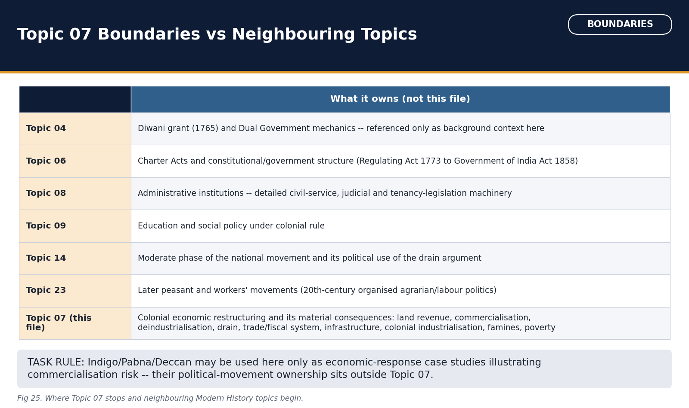

# Economic Impact of British Rule (Drain, Deindustrialisation, Land Revenue, Famines) — Solved Practice Workbook

## BASIC MCQS / REMEDIATION

### Q1. Which of the following correctly states this topic's own three-phase periodisation of British economic impact?

A. Early conquest-period plunder and revenue extraction; nineteenth-century free-trade-driven deindustrialisation and commercialisation; late-colonial railway/infrastructure-led integration with limited industrialisation
B. A single, unchanging extraction pattern from 1757 to 1947 with no internal phase distinction
C. An initial beneficial-development phase followed by a later extractive phase only after 1857
D. A purely twentieth-century phenomenon with no eighteenth or nineteenth-century roots

**Answer: A.**
**Explanation:** Naming these three phases and their distinct dominant mechanisms is this topic's own opening organising claim; the other options either flatten the periodisation into one phase or misplace its chronology.

### Q2. This topic's own pre-colonial/early-colonial baseline is best summarised as which of the following?

A. A claim that India had no significant textile production before colonial rule
B. A specific, narrow, comparative claim: Indian cotton textiles were a leading global export commodity, supported by a developed merchant and artisan production system, without a broader claim about universal pre-colonial prosperity
C. A claim that India's agrarian economy was entirely self-sufficient with no market exchange at all
D. A generalised "golden age" of universal prosperity and social equality across all of India

**Answer: B.**
**Explanation:** This topic deliberately states the baseline narrowly and comparatively (an export-sector claim), rejecting both an idealised golden-age reading and a claim of pre-colonial economic absence.

### Q3. The Permanent Settlement of 1793 was introduced by which Governor-General, in which regions, on which core principle?

A. Lord William Bentinck; the Central Provinces; an individually negotiated demand with each cultivator
B. Lord Wellesley; Madras and Bombay; a periodically revised demand
C. Lord Cornwallis; Bengal, Bihar and Orissa; a state revenue demand fixed in perpetuity, with zamindars recognised as property-holders
D. Warren Hastings; Punjab and the North-Western Provinces; a village-based collective demand

**Answer: C.**
**Explanation:** This triad -- Cornwallis, Bengal-Bihar-Orissa, permanently fixed demand with zamindar proprietorship -- is this topic's opening land-revenue fact and its most heavily tested element.

### Q4. What was the specific consequence, under the Permanent Settlement, of a zamindar's failure to pay the fixed revenue demand by the specified date?

A. The state reduced the following year's demand automatically
B. The zamindari was transferred permanently to the cultivating ryots
C. The zamindar was granted an automatic one-year grace period with no penalty
D. The zamindari estate itself became liable to sale (the Sunset Law mechanism), potentially transferring the proprietary right to a new purchaser

**Answer: D.**
**Explanation:** This is the exact mechanism tested in the 2024 Prelims Q57 statement about Cornwallis's settlement, and must be stated at this precision, without inventing an auction percentage or a specific numeric frequency.

### Q5. The Ryotwari settlement is associated with which administrator-figures and which regions?

A. Thomas Munro and Alexander Read; chiefly Madras and Bombay presidencies
B. Warren Hastings; the whole of British India uniformly
C. Lord Cornwallis; Bengal and Bihar
D. Holt Mackenzie and R.M. Bird; the North-Western Provinces

**Answer: A.**
**Explanation:** This is this topic's own opening architect-and-region fact for Ryotwari; the other options each misassign either the administrators or the region to a different land-revenue system.

### Q6. This topic's own caution about describing the Ryotwari cultivator is best stated as which of the following?

A. The ryot's revenue demand, once set, was never revised for the rest of the colonial period
B. The ryot held a registered right of occupancy conditional on regular payment and subject to periodic revision of the demand, not an unconditional or absolute proprietorship
C. The ryot held no cultivation right of any kind and worked purely as a wage labourer for the state
D. The ryot held an unconditional freehold, entirely free of state revenue obligations

**Answer: B.**
**Explanation:** This exact qualification is what the 2024 Prelims Q57's first statement (an automatic bad-harvest exemption) tests and fails on; Ryotwari's periodic revision kept the state's demand-setting power very much alive.

### Q7. The Mahalwari system's foundational framework is associated with which of the following?

A. Cornwallis's 1793 regulations
B. Thomas Munro's Madras minute
C. Holt Mackenzie's 1822 framework, subsequently implemented and revised in practice chiefly under R.M. Bird
D. The Charter Act of 1833

**Answer: C.**
**Explanation:** This precise architect sequence -- framework by Holt Mackenzie, implementation/revision associated with R.M. Bird -- is Mahalwari's own defining feature; conflating it with either Ryotwari's or the Permanent Settlement's architects is a commonly tested error.

### Q8. The Mahalwari settlement's basic revenue-assessment unit was which of the following?

A. The individual cultivator (ryot), as in Ryotwari
B. The zamindari estate as a permanently fixed unit, as in the Permanent Settlement
C. The British administrative district as a whole
D. The village or mahal (estate/group of villages), with joint/collective responsibility for the assessed demand, subject to periodic revision

**Answer: D.**
**Explanation:** This village/mahal joint-responsibility unit, geographically concentrated chiefly in the North-Western Provinces, Punjab and parts of the Central Provinces, is Mahalwari's structurally distinguishing feature relative to both other systems.

### Q9. The two principal methods of indigo cultivation organised under colonial-era planter control were which of the following?

A. The nij system (planters cultivating on land under their own direct management) and the ryoti (or asami) system (cultivators growing indigo on their own land under advance/contract obligations to the planter)
B. A purely voluntary open-market system with no advance or contractual obligation of any kind
C. A system confined entirely to Madras and Bombay, with no presence in Bengal
D. Only a single, uniform government-owned plantation system with no private planter involvement

**Answer: A.**
**Explanation:** This nij/ryoti distinction is this topic's own core commercialisation mechanism and the direct background to the Indigo disturbances.

### Q10. The Indigo disturbances of 1859-60 in Bengal are best characterised, on this topic's own evidence, as which of the following?

A. An organised political movement led by the Indian National Congress
B. A largely collective cultivator refusal to continue sowing indigo under coercive planter terms, targeting European planters specifically, distinct in target and repertoire from the Pabna and Deccan episodes
C. A movement demanding the abolition of the Permanent Settlement itself
D. A tribal forest-rights movement unrelated to commercial cultivation

**Answer: B.**
**Explanation:** This topic bounds the Indigo episode strictly as an economic-response case study, distinguished from Pabna's target (zamindars, via leagues/litigation) and the Deccan's target (moneylenders, via debt-bond destruction).

### Q11. The Pabna agrarian league movement, from 1873, in eastern Bengal, was primarily directed against which of the following, and by which method?

A. The colonial state's forest department, through petition
B. Moneylenders, through the physical destruction of debt bonds
C. Zamindars attempting rent enhancement beyond legally recognised limits, resisted chiefly through collective leagues and litigation rather than violent confrontation
D. European indigo planters, through crop refusal

**Answer: C.**
**Explanation:** Naming the target (zamindars) and the specific repertoire (leagues/litigation) is what distinguishes Pabna from the Indigo and Deccan episodes.

### Q12. The Deccan riots of 1875 in Maharashtra were primarily directed against which of the following, and by which method?

A. Zamindars, through litigation
B. European planters, through crop refusal
C. The colonial forest department, through law-defiance
D. Moneylenders (sahukars), targeted through direct action including the seizure and destruction of debt bonds and account books

**Answer: D.**
**Explanation:** This is the third distinct target-repertoire pair in this topic's comparison; conflating the Deccan riots with either the Indigo or Pabna episode's target or method is a commonly tested confusion this topic explicitly guards against.

### Q13. Which of the following correctly names the tariff/trade-policy asymmetry central to this topic's deindustrialisation argument?

A. British manufactured imports entered India under a substantially freer-trade regime while comparable Indian goods faced restrictive tariffs or duties in the British market, a one-way asymmetry rather than a mutually symmetric free-trade arrangement
B. India imposed high protective tariffs on British goods throughout the nineteenth century
C. Both countries maintained identical, symmetric tariff regimes throughout the colonial period
D. Tariff policy played no role at all in deindustrialisation, which was driven solely by climate

**Answer: A.**
**Explanation:** This named tariff asymmetry, combined with machine-manufactured import competition and lost court patronage, is this topic's own causal web, not a single-cause account.

### Q14. This topic's own treatment of the exact 2024 GS-I PYQ ("How far was the Industrial Revolution in England responsible for the decline of handicrafts and cottage industries in India?") requires which balanced structure?

A. Treating the question as answerable with only a list of affected craft sectors and no causal analysis
B. Crediting English mechanisation as a necessary background condition (falling unit costs, competitive imports) while separately crediting specific colonial-policy variables (tariff asymmetry, lost court patronage, later railway penetration, absence of protective policy) as the variables that determined the scale and shape of India's decline
C. Denying that the Industrial Revolution had any relevance to India's handicraft decline
D. Attributing the decline entirely to the Industrial Revolution's mechanisation alone, with no role for colonial policy

**Answer: B.**
**Explanation:** This two-part necessary-condition/sufficient-condition structure is exactly what the word "how far" in this previously asked question demands.

### Q15. This topic's own definition of the "drain of wealth" is best stated as which of the following?

A. Any and all revenue collected by the colonial state from Indian taxpayers
B. The total value of all British private investment inside India
C. A unilateral transfer of resources from India to Britain for which India received no direct economic equivalent in return, distinguished from ordinary taxation (which at least in principle funds domestic administration/services)
D. The general decline of Indian handicraft industries due to competition

**Answer: C.**
**Explanation:** The "no equivalent return" qualifier is the precise conceptual core of drain theory, distinguishing it from a simple description of colonial taxation or private investment.

### Q16. Dadabhai Naoroji's foundational articulation of drain theory is most closely associated with which named work?

A. Discovery of India (Jawaharlal Nehru)
B. Hind Swaraj (M.K. Gandhi)
C. Economic History of India (R.C. Dutt)
D. Poverty and Un-British Rule in India

**Answer: D.**
**Explanation:** This topic requires this exact author-title pairing; Dutt's own distinct work (Economic History of India) must not be attributed to Naoroji, or vice versa.

### Q17. The colonial-era railway "Guarantee System" is best described, on this topic's own sourced evidence, as which of the following, without asserting a specific guaranteed rate of return?

A. An arrangement under which private British companies built and operated Indian railway lines while the colonial government guaranteed their investors a minimum return, substantially insulating private capital from commercial risk at the state's (and ultimately Indian taxpayers') expense
B. A purely private commercial venture carrying no government guarantee or involvement whatsoever
C. A scheme funded entirely by voluntary Indian public subscription
D. A system in which the Indian government owned and directly operated all lines from the outset with no private company involvement

**Answer: A.**
**Explanation:** This topic states the guarantee mechanism and its risk-transfer logic precisely while explicitly withholding any specific guaranteed percentage rate, since that figure is not held with source-level precision here.

### Q18. Modern factory industry that did develop in colonial India was structurally shaped by which of the following features?

A. Complete absence of any Indian entrepreneurial participation
B. A managing-agency system substantially weighted toward European (chiefly British and Scottish) capital and control in eastern-India industries such as jute, alongside genuine but comparatively later and smaller-scale Indian entrepreneurial capital, notably in Bombay's cotton-textile sector
C. Total state ownership of all factories with no private capital at all
D. Uniform, evenly distributed industrial growth across all regions of India

**Answer: B.**
**Explanation:** Naming both the European-managing-agency weighting and the genuine, if later and unevenly distributed, Indian entrepreneurial presence avoids the trap of claiming either total foreign control or total Indian absence.

### Q19. Which of the following correctly orders a portion of this topic's own verified famine case sequence along with the relevant Commission?

A. The 1876-78 famine, followed by the 1943 Bengal famine, followed by the Strachey Commission of 1880 (a chronologically impossible ordering)
B. The Strachey Commission preceded and caused the 1860-61 famine
C. The 1876-78 famine (widespread, multi-region) was followed by the Strachey Commission's report in 1880, and later by the further 1896-1900 famine
D. No famine commission of any kind was constituted during the colonial period

**Answer: C.**
**Explanation:** This is the correct, source-verified sequence; note option A's internal ordering is chronologically incoherent and option B inverts cause and effect.

### Q20. Morris D. Morris's revisionist quantitative position, as named in this topic's historiography section, is best summarised as which of the following?

A. A claim that British rule was purely beneficial to Indian industry in every respect
B. Full agreement with Naoroji's exact drain quantum estimates
C. A claim that no deindustrialisation debate exists at all
D. A quantitative, census/output-based questioning of the scale (not the mere existence) of deindustrialisation, prompting a genuine ongoing measurement debate that this topic represents fairly without using it to deny structural extraction altogether

**Answer: D.**
**Explanation:** This topic's explicit historiographical-balance instruction is that the revisionist debate concerns magnitude, not whether deindustrialisation and the drain occurred at all.

### Q21. Which option correctly distinguishes Company plunder, systemic drain and structural underdevelopment?

A. Plunder was early direct extraction; drain was continuing institutional transfer; underdevelopment was the long-run structural outcome.
B. All three terms describe only the initial seizure of Bengal's treasury.
C. Plunder and drain are identical, and neither changed India's economic structure.
D. Drain means domestic taxation, while underdevelopment means a single famine.

**Answer: A.**
**Explanation:** Plunder was early direct extraction; drain was continuing institutional transfer; underdevelopment was the long-run structural outcome.

### Q22. This topic's caution about the pre-colonial/early-colonial baseline is best used to reject which of the following specific claims in an answer?

A. That Indian cotton textiles were exported before colonial industrial competition intensified
B. That pre-colonial India was a uniformly prosperous, harmonious "golden age" society with no internal inequality, providing an implicit, unstated baseline against which "decline" is measured without evidentiary basis
C. That agrarian production existed prior to colonial commercialisation
D. That an artisan and merchant production system existed prior to large-scale British deindustrialisation

**Answer: B.**
**Explanation:** Options A, C and D restate this topic's own narrow, evidenced baseline claims; only option B represents the romanticised, unevidenced "golden age" framing this topic explicitly warns against.

### Q23. This topic's account of the Permanent Settlement's own stated colonial-era rationale is best summarised as which of the following?

A. To transfer full ownership of land to actual cultivating peasants directly
B. To directly maximise short-term annual revenue through continuous reassessment
C. To create a stable, propertied, revenue-paying intermediary class (zamindars) with a fixed, predictable state demand, intended to encourage long-term investment in land improvement, while in practice often producing zamindar financial distress, absentee tendencies in some cases, and continued pressure passed down onto tenant-cultivators
D. To eliminate zamindars entirely and replace them with a purely state-administered ryot settlement

**Answer: C.**
**Explanation:** Naming both the stated rationale (stability/predictability/incentive for improvement) and the qualified actual outcome (financial distress, absentee tendencies, downward pressure on tenants) avoids a one-sided "purely beneficial" or "purely exploitative" account.

### Q24. With reference to cultivator/tenant rights under the Permanent Settlement, which of the following is best supported by this topic's own sourced material?

A. Tenant rights were uniformly and effectively enforced across all of Bengal from 1793 onward
B. Cultivators automatically became full legal proprietors of the land they tilled
C. Cultivators had no rights of any kind, recognised or unrecognised, under the settlement
D. The settlement fixed the state's demand on the zamindar, but cultivator/tenant occupancy rights remained a distinct, only partially and unevenly protected question, addressed later and incompletely through separate tenancy legislation

**Answer: D.**
**Explanation:** This topic distinguishes the zamindar's fixed proprietary obligation to the state from the separate, less securely protected question of the actual cultivator's occupancy rights, avoiding the common error of treating "settlement" and "tenant security" as the same thing.

### Q25. Which of the following correctly names a documented practical difficulty of the Ryotwari system, on this topic's own evidence?

A. Periodic measurement and revision of the revenue demand created recurring uncertainty for cultivators and, in practice, sustained pressure toward high assessment levels
B. The system provided complete revenue certainty to cultivators for the entire colonial period with no revision ever occurring
C. The system was confined exclusively to Bengal
D. The system had no direct settlement with the cultivator at all, operating solely through zamindars

**Answer: A.**
**Explanation:** This measurement/revision-driven uncertainty is the specific practical difficulty this topic names for Ryotwari, distinguishing it from the Permanent Settlement's fixed-forever demand.

### Q26. The "joint/collective responsibility" feature of the Mahalwari system means which of the following?

A. The colonial state itself bore full financial liability for any shortfall
B. The village or mahal as a whole was held responsible for the aggregate assessed demand, so that default by some cultivators could increase pressure on others within the same revenue unit
C. Each individual cultivator's revenue liability was entirely independent of every other cultivator in the village
D. Liability was assigned solely to a single hereditary headman with no reference to the wider village

**Answer: B.**
**Explanation:** This collective-liability mechanism is Mahalwari's structurally distinguishing internal-pressure dynamic, absent from both the individual-ryot logic of Ryotwari and the single-zamindar logic of the Permanent Settlement.

### Q27. Matching the correct legal unit of assessment to each land-revenue system, which of the following is correctly paired?

A. Permanent Settlement -- individual ryot; Ryotwari -- village/mahal; Mahalwari -- zamindari estate
B. All three systems used the same legal unit -- the individual ryot
C. Permanent Settlement -- zamindari estate (fixed forever); Ryotwari -- individual ryot (periodically revised); Mahalwari -- village/mahal (periodically revised, joint liability)
D. Permanent Settlement -- village/mahal; Ryotwari -- zamindari estate; Mahalwari -- individual ryot

**Answer: C.**
**Explanation:** This exact matching is this topic's own comparative-synthesis table and the single most commonly tested land-revenue distinction.

### Q28. Which of the following correctly distinguishes the three land-revenue systems by revision frequency and principal geography?

A. Ryotwari and Mahalwari were confined solely to Bengal, while the Permanent Settlement operated across all of British India
B. All three systems shared identical revision schedules and an identical all-India geography
C. Only the Permanent Settlement was ever revised, while Ryotwari and Mahalwari demands were fixed forever
D. The Permanent Settlement's demand was fixed in perpetuity (chiefly Bengal, Bihar, Orissa); Ryotwari's and Mahalwari's demands were both subject to periodic revision, with Ryotwari concentrated chiefly in Madras and Bombay and Mahalwari chiefly in the North-Western Provinces, Punjab and parts of the Central Provinces

**Answer: D.**
**Explanation:** This revision-frequency-and-geography pairing is this topic's own comparative point, directly relevant to any "compare the land-revenue systems" Mains question.

### Q29. This topic's own caution about the "incentive claim" made for each land-revenue system is best summarised as which of the following?

A. Each system's designers claimed their approach would encourage agricultural improvement or investment, but this topic records that actual effects varied by region and often diverged from the stated design intention, rather than uniformly confirming the designers' own claims
B. No land-revenue system in colonial India ever made any claim about incentivising improvement
C. All three systems' designers made identical claims and all three achieved identical, fully successful outcomes
D. Only the Permanent Settlement's designers made any improvement-related claim

**Answer: A.**
**Explanation:** Separating a system's stated design rationale from its actual, regionally variable effect is the precise analytical discipline this topic requires for a strong comparative Mains answer.

### Q30. In this topic's own elimination-reasoning treatment of the 2024 Prelims GS-I Q57 statements, which outcome is correctly recorded?

A. Both statements are false, and the official key confirms answer (d)
B. Statement 1 (an automatic bad-harvest exemption under Ryotwari) is false and statement 2 (a zamindari liable to sale/removal on non-payment under the Permanent Settlement) is true on this topic's own content-level reasoning, but the question's official key itself records it as "X" -- officially dropped, and this topic does not override that disposition with its own inferred elimination
C. Both statements are true, and the official key confirms answer (c)
D. The question has no recorded official key status of any kind

**Answer: B.**
**Explanation:** This topic explicitly separates its own content-level elimination reasoning from the officially verified "dropped" disposition, refusing to present inferred reasoning as an official answer.

### Q31. This topic's account of commercial-crop cultivation under colonial conditions makes which of the following balanced claims?

A. Commercial cultivation was inherently and uniformly harmful in every instance, with no cultivator ever benefiting from market access
B. Commercial cultivation carried no risk of any kind for cultivators once advances were accepted
C. Commercialisation itself was not inherently harmful, since it connected cultivators to wider markets, but colonial-era terms (coercive advances, planter/trader-set prices, concentrated exposure to global price swings) skewed production and price risk onto the cultivator rather than distributing it more evenly
D. Commercialisation was confined exclusively to food-grain crops, with no involvement of indigo, cotton, opium, jute or tea

**Answer: C.**
**Explanation:** This "not inherently harmful, but skewed in its colonial-era terms" formulation is this topic's own carefully balanced central claim, avoiding both an anti-market and a naively pro-market simplification.

### Q32. Which of the following is a correctly bounded, sourced claim about colonial-era commercial crops, consistent with this topic's own material?

A. Tea plantations were entirely Indian-owned and Indian-managed from their nineteenth-century origin
B. Cotton cultivation had no connection whatsoever to the global market or to Lancashire's mills
C. Opium cultivation and export had no connection to colonial-era fiscal or trade policy
D. Several commercial crops (including indigo, cotton, opium and jute) connected Indian cultivators to global-market price movements over which they had no control, a dependence this topic names as a structural risk rather than attaching an unsupported export-share percentage to it

**Answer: D.**
**Explanation:** Naming global-market dependence as a structural risk, without an invented export-share figure, is exactly the fabrication-avoidance discipline this topic applies throughout its commercialisation material.

### Q33. Which of the following statements correctly compares all three named agrarian economic-response case studies in this topic?

A. The Indigo disturbances (1859-60) targeted European planters through collective crop refusal; the Pabna agrarian league (from 1873) targeted zamindars through leagues and litigation; the Deccan riots (1875) targeted moneylenders through direct debt-bond destruction -- three distinct targets and repertoires
B. All three movements targeted the same group (zamindars) using an identical repertoire (litigation)
C. None of the three movements had any connection to agrarian economic pressure
D. All three movements were led by the same organisation across all three regions

**Answer: A.**
**Explanation:** This three-way target/repertoire distinction is exactly what this topic requires an answer to state, rather than treating "agrarian unrest" as one undifferentiated category.

### Q34. This topic's treatment of the Indigo, Pabna and Deccan episodes is bounded in which specific way relative to Topic 23?

A. Both topics claim identical, fully overlapping ownership with no distinction at all
B. This topic uses all three strictly as economic-response case studies illustrating causal mechanisms, while their fuller political-movement history (organisation, leadership, longer-run political consequence) belongs to Topic 23's ownership of later peasant/worker movements
C. Topic 23 has no connection to any of these three episodes
D. This topic owns their complete political-history narrative, while Topic 23 owns only their economic background

**Answer: B.**
**Explanation:** This exact boundary statement is one of this topic's explicit, non-negotiable scope limits, repeated in its topic-boundary map.

### Q35. The "advance" (or dadon-type) mechanism referenced in this topic's commercialisation material functioned in which of the following ways?

A. It applied only to cultivators who owned no land at all
B. It was a voluntary, no-obligation cash gift from planters/traders to cultivators with no expectation of a crop in return
C. It provided cultivators an upfront payment or input in exchange for a binding commitment to grow and deliver a specified commercial crop on largely trader/planter-favourable terms, deepening dependence in subsequent seasons if the cultivator could not fully discharge the obligation
D. It was abolished by law before the Indigo disturbances of 1859-60

**Answer: C.**
**Explanation:** This advance/dependence mechanism is the specific credit-based coercion logic underlying both the Indigo and Deccan episodes.

### Q36. The "loss of court patronage" mechanism named among the causes of deindustrialisation refers to which of the following?

A. A reduction in colonial judicial appointments
B. The abolition of the Permanent Settlement's zamindari courts
C. The loss of British parliamentary patronage for Company administrators
D. The political displacement or reduced spending power of Indian royal and aristocratic courts, which had earlier provided a major domestic market for fine handicrafts, textiles and luxury manufactures

**Answer: D.**
**Explanation:** This specific demand-side mechanism (declining princely/aristocratic patronage) works alongside, and is analytically distinct from, the supply-side tariff-asymmetry and machine-import mechanisms this topic also names.

### Q37. This topic's own analytical distinction within deindustrialisation requires separating which of the following?

A. Decline in craft output, decline in craft employment, and the physical/occupational displacement of individual artisans into agriculture or other work, as three related but analytically separate effects
B. A single undifferentiated concept requiring no further distinction
C. Only export volumes, with no reference to output or employment at all
D. Only population growth, unrelated to any craft-sector variable

**Answer: A.**
**Explanation:** This output/employment/displacement distinction is exactly what a nuanced deindustrialisation answer must maintain, since these three effects need not move together in every region or period.

### Q38. The railway network's relationship to deindustrialisation, on this topic's own account, is best described as which of the following?

A. Railways caused deindustrialisation entirely on their own, independent of tariff policy or machine-import competition
B. Railway expansion, as it penetrated further inland from the mid-nineteenth century onward, extended and deepened market integration, in the process also widening the reach of machine-made import competition into interior craft markets that had previously been more insulated by transport cost
C. Railways reduced machine-made imports' competitive reach into the interior
D. Railways had no measurable relationship to deindustrialisation of any kind

**Answer: B.**
**Explanation:** This is the specific dual-effect link between infrastructure and deindustrialisation this topic draws, without claiming railways as a sole or independent cause.

### Q39. This topic's caution about regional and sectoral variation in deindustrialisation is best stated as which of the following?

A. Deindustrialisation affected only export-oriented crafts, never crafts serving purely domestic demand
B. Deindustrialisation proceeded at an identical pace and to an identical degree in every Indian region and every craft sector
C. The scale, timing and severity of craft decline varied by region and by sector, and a strong answer should avoid treating "deindustrialisation" as one uniform, undifferentiated, all-India process
D. Deindustrialisation affected only Bengal, with no other region experiencing any craft decline

**Answer: C.**
**Explanation:** This variation caution directly supports this topic's own historiographical-balance point, where regional-variation scholarship is named as a fourth distinct position.

### Q40. On this topic's own guidance for the exact 2024 GS-I PYQ, which of the following would be a weak or incomplete answering strategy?

A. Naming both English mechanisation and specific colonial-policy variables
B. Distinguishing output decline, employment decline and artisan displacement as separate effects
C. Naming regional and sectoral variation rather than treating decline as uniform
D. Writing only a general narrative of "the British destroyed Indian industry" without naming the Industrial Revolution's own mechanisation logic or any specific colonial-policy variable

**Answer: D.**
**Explanation:** Option D is precisely the generic, undifferentiated answer this topic's own treatment of the "how far" question warns against; a strong answer requires the two-part necessary/sufficient-condition structure this topic names.

### Q41. Which of the following correctly lists channels through which the "drain of wealth" is understood to have operated, on this topic's own sourced material?

A. Home charges, official salaries and pensions remitted to Britain, profits and interest on British capital invested in India, purchase of stores in Britain for Indian administrative/military use, and military/imperial expenditure charged to Indian revenues
B. Only private remittances by Indian merchants investing abroad
C. Only ordinary land-revenue collection used for domestic Indian administration
D. Only the cost of maintaining Indian princely states

**Answer: A.**
**Explanation:** Naming this specific channel-list is this topic's own core drain content and the correct way to answer any question on drain "mechanisms," instead of an invented aggregate percentage.

### Q42. This topic's distinction between early "plunder" and the later "systemic drain" is best captured by which of the following?

A. "Drain" describes only military expenditure, while "plunder" describes only civil administrative salaries
B. "Plunder" describes concentrated, largely conquest-period extraction following the Diwani grant, while "systemic drain" describes an ongoing, institutionalised transfer operating through named administrative and financial channels across the colonial period as a whole
C. Neither term has any documented basis in this topic's own sourced material
D. Both terms describe an identical mechanism operating at an identical intensity throughout the colonial period

**Answer: B.**
**Explanation:** This early-plunder/continuing-drain distinction is precisely the periodisation discipline this topic introduces at the outset and develops in channel-level detail in its drain material.

### Q43. This topic's account of the "drain" requires holding which two aspects together?

A. Only its economic-mechanism content, with no connection to nationalist political argument
B. Neither an economic mechanism nor a political argument, but purely a later historians' invention
C. Both its character as a specifically named economic transfer mechanism (a set of channels moving resources out of India without equivalent return) and its historical role as a central nationalist political argument (associated with Naoroji, R.C. Dutt and, on industrial policy, Ranade, later carried into the Moderate political programme owned by Topic 14)
D. Only its use as a political slogan, with no economic-mechanism content

**Answer: C.**
**Explanation:** This "economic mechanism AND nationalist argument, held together" framing is this topic's own explicit dual characterisation, directly linking the drain material to the historiography section and to Topic 14's boundary hand-off.

### Q44. This topic's explicit policy on quantifying the drain, reinforced in the historiography section, is which of the following?

A. The drain's exact percentage of national income is a settled, uncontroversial figure that may be freely cited
B. Only Naoroji's own nineteenth-century estimate should be treated as the final, authoritative figure
C. The drain should never be discussed at all, even in qualitative or mechanism terms
D. The exact quantum of the drain is genuinely disputed among historians and is deliberately not quantified in this topic's own material; the analytically important claims are the channels through which it operated and its structural/political significance, not an invented percentage or sum

**Answer: D.**
**Explanation:** This is this topic's own explicit, repeatedly enforced fabrication-avoidance rule for drain figures, distinguishing "the mechanism is real and important" from "a specific quantum may be safely asserted."

### Q45. M.G. Ranade's contribution, as bounded within this topic, is best described as which of the following?

A. An economic critique of colonial industrial and tariff policy, situated within the broader Moderate nationalist tradition whose fuller political-organisational history belongs to Topic 14
B. The original formulation of drain theory, predating Naoroji's own work
C. The authorship of Economic History of India
D. A purely twentieth-century, post-independence economic theorist with no colonial-era relevance

**Answer: A.**
**Explanation:** This topic names Ranade specifically for his economic-policy critique while explicitly deferring his fuller political role and the Moderate movement's organisational history to Topic 14's ownership.

### Q46. This topic's account of India's colonial-era trade and fiscal position makes which of the following claims, without asserting an unsupported numeric figure?

A. India's trade was entirely balanced, with exports and imports always equal
B. India generally ran an export surplus in merchandise trade, but this surplus was substantially absorbed into financing home charges and remittances (via mechanisms including Council Bills) rather than returning to India as bullion or reinvested capital
C. India ran a persistent trade deficit throughout the colonial period, requiring bullion imports
D. Council Bills were a form of Indian government borrowing from Indian private banks only

**Answer: B.**
**Explanation:** Naming the export-surplus-without-bullion-return mechanism, and the Council Bills channel, without citing an unsupported numeric magnitude, is exactly the bounded-precision approach this topic requires.

### Q47. This topic's bounded treatment of colonial public debt and taxation composition avoids which of the following?

A. Naming that some military and imperial expenditure was charged to Indian revenues
B. Naming that public debt and taxation existed and had a fiscal role in colonial administration
C. Asserting precise, unsupported figures for total public debt, detailed tax-head composition, or their exact share of government income
D. Connecting fiscal policy to the drain's institutional channels

**Answer: C.**
**Explanation:** This topic deliberately keeps fiscal-system discussion at a bounded, mechanism level (option C is what is avoided), consistent with its wider fabrication-avoidance discipline for revenue-rate and output-estimate figures.

### Q48. This topic's treatment of the rupee-sterling exchange question and the Hilton-Young Commission is bounded in which way?

A. It denies that any exchange-rate question existed in the late-colonial period
B. It asserts a commonly cited "1s 6d" figure as the Commission's verified rate
C. It asserts the Commission's precisely adopted exchange rate as a settled figure
D. It states only the qualitative remittance-facilitation mechanism and the separately verified 1930 nationalist demand for a 1s 4d rate, explicitly declining to assert any adopted Hilton-Young rate as unattested in locally held sources

**Answer: D.**
**Explanation:** This topic explicitly names the commonly cited "1s 6d" figure as unattested and therefore withheld, retaining only the verified 1s 4d nationalist demand and the general mechanism.

### Q49. This topic's "dual effect" account of railway construction requires naming which two elements together?

A. The colonial administration's own designed purposes (troop movement, raw-material evacuation to ports, distribution of manufactured imports, administrative control) together with unintended consequences (market integration, a more connected national economic space, and infrastructural facilitation of later nationalist political mobilisation)
B. Only the unintended integrative consequences, with no reference to imperial design
C. Only the designed imperial purposes, with no unintended consequence of any kind
D. A claim that railways had no economic or political significance of any kind

**Answer: A.**
**Explanation:** This "design purpose AND unintended consequence, both stated" structure is exactly what this topic requires for a balanced railway answer.

### Q50. This topic's treatment of infrastructure beyond railways covers which of the following, while withholding any unsupported specific guarantee-rate figure?

A. A claim that the telegraph had no administrative or military function
B. Ports, roads, telegraph and canals alongside railways, each linked to the same combination of imperial administrative/commercial design purpose and incidental integrative effect, without asserting a numeric railway-guarantee rate this topic does not hold with precision
C. Only railways, with no reference to ports, roads, telegraph or canals
D. A claim that canals were built solely for recreational purposes

**Answer: B.**
**Explanation:** This broader infrastructure list, held to the same imperial-purpose/unintended-consequence analytical structure and the same guarantee-rate caution, is this topic's own complete infrastructure scope.

### Q51. This topic's account of uneven regional industrial growth is best illustrated by which of the following?

A. Industrial growth confined solely to Madras presidency
B. Uniform, evenly spread factory development across every Indian province by the early twentieth century
C. Concentrated growth in specific regional clusters -- for example jute manufacturing concentrated around Calcutta/Bengal and cotton-textile manufacturing concentrated around Bombay and Ahmedabad -- rather than a spatially even national industrial pattern
D. Total absence of factory industry anywhere in colonial India

**Answer: C.**
**Explanation:** Naming specific regional industrial clusters, rather than a generic "India industrialised" or "India did not industrialise" claim, is the precision this topic requires.

### Q52. Which of the following correctly names a constraint on early Indian-owned industrial enterprise, on this topic's own sourced material?

A. State industrial policy actively subsidised Indian-owned enterprise ahead of European-owned firms throughout the colonial period
B. Technology and machinery were always freely and equally available to Indian and European-owned firms alike with no cost or access difference
C. Indian entrepreneurs faced no constraint of any kind relative to European managing agencies
D. Indian-owned enterprise generally faced comparatively later entry, narrower access to organised banking/managing-agency capital networks, and technology dependent on imported machinery, constraints not equally faced by longer-established European managing agencies

**Answer: D.**
**Explanation:** Naming this specific capital-access and later-entry constraint, rather than an undifferentiated "Indian industry was held back" claim, is what a precise answer requires.

### Q53. This topic's account of famine causation requires holding which of the following together?

A. A genuine climatic harvest shock as the immediate trigger, combined with named colonial-era structural amplifiers (rigid cash revenue demand, commercialisation/export exposure, transport serving price-signals rather than need, and a laissez-faire relief ideology and administrative delay), producing an entitlement/purchasing-power and governance failure rather than a simple food-availability collapse alone
B. Only a climatic shock, with no reference to any policy or governance variable
C. A claim that famines had no connection whatsoever to climate or rainfall
D. Only colonial export policy, with no reference to any climatic trigger

**Answer: A.**
**Explanation:** This combined climatic-trigger-plus-named-amplifiers structure is exactly the entitlement/governance causal web this topic requires, and is the correct structure for solving the 2022 GS-I "spurt in famines" PYQ.

### Q54. The "transport paradox" named in this topic's famine material refers to which of the following?

A. A complete absence of any transport infrastructure during famine periods
B. Railway and transport capacity that could, in principle, have moved food toward famine-affected areas instead often carried grain away from deficit areas toward areas offering higher prices or toward export, since transport responded to price signals rather than to local subsistence need
C. A claim that railways only ever moved troops, never any agricultural produce
D. Transport infrastructure that functioned identically regardless of price signals

**Answer: B.**
**Explanation:** This price-signal-versus-need distinction is the precise mechanism behind the "transport paradox," directly relevant to the export-exposure element of the 2022 PYQ's causal web.

### Q55. Which of the following correctly names the verified famine commission referenced in this topic's material?

A. The Linlithgow Commission of 1943
B. The Simon Commission of 1928
C. The Strachey Commission, reporting in 1880, following the widespread famine of 1876-78
D. The Hunter Commission of 1857

**Answer: C.**
**Explanation:** This topic verifies only the Strachey Commission (1880) by name; no other famine-specific commission is asserted here without separate verification.

### Q56. This topic's treatment of the 1943 Bengal famine is bounded in which specific way?

A. It is asserted to have had a single, exclusively climatic cause
B. It is treated as analytically identical in every respect to the nineteenth-century famine sequence, with no distinguishing feature
C. It is entirely excluded from this topic and belongs solely to a different topic
D. It is named only as a later culmination, carrying an additional wartime causal layer (war-time administrative, military-logistics and price-control conditions) distinct from, though related to, the structural amplifiers named for the nineteenth-century case sequence

**Answer: D.**
**Explanation:** This "later culmination, additional wartime layer" framing is this topic's own explicit bounding of the 1943 case, avoiding both an anachronistic full merger with the nineteenth-century sequence and an unwarranted exclusion.

### Q57. The Bengal famine of 1770 is treated in this topic in which specific way?

A. It is explicitly bounded to Topic 04's own ownership, referenced here (if at all) only as background context, not as a fully analysed case within this topic's own famine sequence
B. It is asserted to be causally identical to the 1943 Bengal famine
C. It is this topic's own primary, most fully analysed famine case
D. It is the only famine case this topic addresses in any depth

**Answer: A.**
**Explanation:** This explicit boundary hand-off to Topic 04 is repeated in this topic's famine material and again in its topic-boundary map, and must not be blurred by presenting 1770 as this topic's own worked case.

### Q58. This topic's account of rural indebtedness and land alienation describes which of the following mechanisms, without asserting a specific debt total or population-share percentage?

A. A mechanism confined solely to zamindars, with no relevance to ordinary cultivators
B. A self-reinforcing cycle in which indebtedness led to the pledging of land or crop, deepening dependence on the same credit relationship, connected directly to the fixed/rigid revenue demand and the coercive-advance mechanisms named earlier in this topic
C. A mechanism entirely unconnected to the land-revenue and commercialisation material elsewhere in this topic
D. A mechanism that reversed entirely by the mid-nineteenth century with no further growth thereafter

**Answer: B.**
**Explanation:** Naming this connected, self-reinforcing debt-and-land-alienation cycle (without an invented debt total) links this topic's social-consequence material directly back to the revenue-rigidity and commercialisation-risk material discussed earlier.

### Q59. Which of the following correctly distinguishes the nationalist historiographical position from the structural/dependent-development position, as named in this topic?

A. The nationalist position denies any drain occurred, while the structural position affirms it
B. Both positions are identical in every respect, with no meaningful distinction
C. The nationalist position (Naoroji, Dutt, and on industrial policy Ranade) centred the drain and deindustrialisation as the core explanation of Indian poverty within a primarily political-economic argument, while the structural/dependent-development position frames colonial economic policy as a coherent systemic integration of India into world capitalism as a subordinate, dependent economy, a broader systemic framing associated in this topic with Bipan Chandra's own account
D. The structural position rejects deindustrialisation entirely

**Answer: C.**
**Explanation:** This is the precise distinction this topic draws between a directly evidence/argument-centred nationalist position and a broader systemic/structural framing, both of which affirm real extraction while differing in analytical framing.

### Q60. The fourth historiographical position this topic names, associated with Sekhar Bandyopadhyay's supplementary treatment, emphasises which of the following?

A. That colonial economic impact was identical across every Indian region and social group
B. That no regional variation of any kind is worth studying
C. That only the nationalist position has any evidentiary merit
D. That agrarian outcomes, social impact and protest varied considerably by region and social group, cautioning against treating colonial economic impact as one uniform, undifferentiated all-India pattern

**Answer: D.**
**Explanation:** This regional/social-variation caution is the fourth named historiographical position and directly supports the "not to scale"/regionally variable framing used throughout this topic's visuals and prose.

### Q61. This topic's synthesis of "extraction versus transformation" requires which of the following?

A. Holding both a persistent unrequited surplus transfer (the drain) and genuine structural transformation (in agrarian property relations, craft-versus-factory production, and infrastructure) as simultaneously true, rather than resolving the tension by choosing only one side
B. Denying that any extraction occurred, since transformation was the only real process
C. Denying that any transformation occurred, since extraction was the only real process
D. Treating extraction and transformation as entirely unrelated processes with no shared causal connection

**Answer: A.**
**Explanation:** This "both simultaneously true" framing is the precise synthesis move this topic requires for a comprehensive assess-the-impact question.

### Q62. The "colonial modernisation paradox," as this topic's own final synthesis point, is best stated as which of the following?

A. British rule's modernisation was entirely and unconditionally beneficial to Indian economic development, without qualification
B. British rule introduced genuinely modern elements (railways, telegraph, canals, a unified currency/administrative-fiscal system, limited factory industry) while simultaneously blocking the autonomous industrial, technical-education and capital-formation policies that would have converted this modernisation into Indian-led development
C. Modernisation and colonial extraction are mutually exclusive processes that could never coexist
D. British rule introduced no modern element of any kind into the Indian economy

**Answer: B.**
**Explanation:** This precise paradox statement -- modern instruments without an autonomous development "engine" -- is this topic's single most exam-efficient synthesis sentence.

### Q63. This topic's boundary with Topic 04 is best stated as which of the following?

A. This topic and Topic 04 claim fully overlapping, undifferentiated ownership of the same material
B. This topic re-derives the full Diwani grant and Dual Government mechanics (1765-72) in detail
C. Topic 04 owns the Diwani grant and Dual Government mechanics in full; this topic uses that episode only as the historical trigger for the land-revenue system and the drain's own origin, without re-deriving its detailed mechanics
D. Topic 04 has no relevance to this topic whatsoever

**Answer: C.**
**Explanation:** This exact hand-off (trigger reference only, no re-derivation) is this topic's explicit boundary statement relative to Topic 04, repeated at its opening and again in its topic-boundary map.

### Q64. This topic's boundary with Topic 14 is best stated as which of the following?

A. Topic 14 has no connection to this topic's drain material at all
B. This topic fully narrates the Moderate movement's political-organisational history
C. Topic 14 and this topic are simply identical in scope
D. Topic 14 owns the Moderate phase of nationalist politics and the political deployment of the drain argument as an organised programme; this topic names Naoroji, Dutt and Ranade only for their economic arguments, deferring the fuller political-organisational history to Topic 14

**Answer: D.**
**Explanation:** This hand-off (economic argument named here; political-organisational history deferred to Topic 14) is repeated in this topic's drain material and again in its topic-boundary map.

### Q65. A student writes: "Under the Ryotwari system, the cultivator became an absolute, unconditional owner of the land, entirely free of any state revenue obligation." What is the correct remedial statement?

A. The Ryotwari cultivator held a registered right of occupancy conditional on regular revenue payment and subject to periodic reassessment, not an unconditional freehold -- precisely why the 2024 Prelims Q57 statement claiming an automatic bad-harvest exemption is false on this topic's own evidence
B. Ryotwari cultivators paid no revenue at all
C. Ryotwari applied only to zamindars, not to individual cultivators
D. The statement is entirely correct as written

**Answer: A.**
**Explanation:** Conflating "direct settlement with the state" with "unconditional ownership" is one of this topic's most heavily tested specific errors.

### Q66. A student writes: "The Permanent Settlement of 1793 gave ownership of the land directly to the peasants who cultivated it." What is the correct remedial statement?

A. The Permanent Settlement applied only in Madras
B. The Permanent Settlement recognised zamindars, not the actual cultivating peasants, as the property-holders responsible for the fixed revenue demand; cultivator/tenant occupancy rights remained a separate, less securely protected question
C. The Permanent Settlement abolished all zamindars
D. The statement is correct as written

**Answer: B.**
**Explanation:** This zamindar-versus-cultivator conflation is a very common specific error; the settlement's proprietary recognition ran to the zamindar, not the tiller.

### Q67. A student writes: "Deindustrialisation means Indian handicraft and textile production disappeared completely and no craft production survived into the twentieth century." What is the correct remedial statement?

A. Deindustrialisation only affected crafts producing for export markets
B. The statement is correct; no craft production of any kind survived
C. Deindustrialisation refers to substantial, if regionally and sectorally uneven, decline in output/employment and displacement of many artisans into agriculture; it does not mean complete disappearance of every craft, and this topic explicitly warns against overstating it as total extinction
D. Deindustrialisation refers only to the disappearance of agriculture, not craft production

**Answer: C.**
**Explanation:** This topic's own explicit caution is to state substantial, uneven decline and displacement, never total extinction of Indian craft production.

### Q68. A student writes: "The drain of wealth is a settled figure, precisely known to be a specific fixed percentage of India's national income every year." What is the correct remedial statement?

A. The drain refers only to military expenditure
B. The drain's exact percentage is universally agreed among all historians
C. The drain has never been estimated by any historian
D. The exact quantum of the drain is genuinely disputed among historians and is deliberately not quantified in this topic's own material; the analytically important claims are its named channels and its structural/political significance, not an invented percentage

**Answer: D.**
**Explanation:** This is this topic's central, repeatedly enforced fabrication-avoidance rule regarding drain quantification.

### Q69. A student writes: "Railways were built purely for India's own economic benefit, with no imperial administrative or commercial design purpose behind their construction." What is the correct remedial statement?

A. Railway construction was designed chiefly to serve imperial purposes (troop movement, raw-material evacuation to ports, distribution of manufactured imports, administrative control), while also producing unintended integrative consequences; it was not designed purely, or even primarily, for India's own developmental benefit
B. Railways were built entirely by Indian private capital with no state guarantee involved
C. The statement is correct as written
D. Railways served no purpose at all, imperial or otherwise

**Answer: A.**
**Explanation:** This "purely beneficial" reading omits the imperial design purpose this topic names first, before the unintended integrative consequence.

### Q70. A student writes: "Railways served no purpose except imperial exploitation, and had no unintended positive consequence of any kind for India." What is the correct remedial statement?

A. The statement is correct; railways had no unintended consequence of any kind
B. Alongside their imperial design purpose, railway construction also produced genuine unintended consequences -- market integration, a more connected national economic space, and infrastructural facilitation of later nationalist political mobilisation -- and this topic's synthesis states both the imperial design and the unintended consequence together, described as "modernisation without autonomous development," not a purely one-sided exploitation account
C. Railways had no connection whatsoever to market integration
D. Railways caused every famine directly and exclusively

**Answer: B.**
**Explanation:** This is the mirror-image error to Q69; a synthesis answer must state both the imperial design purpose and the unintended integrative consequence together, not collapse into either a purely benevolent or purely exploitative single-sided account.

### Q71. A student writes: "Colonial-era famines were caused solely by grain exports draining away the food supply, with no role for climate or governance at all." What is the correct remedial statement?

A. Famines had no connection to export policy of any kind
B. The statement is correct; only exports mattered
C. Famine causation combined a genuine climatic harvest-shock trigger with named colonial-era structural amplifiers (rigid revenue demand, commercialisation/export exposure, transport-by-price-signal, laissez-faire relief ideology, administrative delay); this topic explicitly warns against a monocausal export-only account
D. Famines were caused solely by population growth

**Answer: C.**
**Explanation:** This topic's own explicit instruction (also the basis for the 2022 PYQ solution) is to avoid a monocausal export (or monocausal climate) account in favour of the full entitlement/governance causal web.

### Q72. A student writes: "Colonial-era famines were caused purely by natural drought and monsoon failure, with colonial policy playing no causal role at all." What is the correct remedial statement?

A. Climate had no role in any colonial-era famine
B. Colonial policy alone caused every famine, with no climatic trigger ever present
C. The statement is correct; only climate mattered
D. A genuine climatic harvest shock was typically the immediate trigger, but this topic names specific colonial-era structural amplifiers (revenue rigidity, commercialisation/export exposure, transport-by-price-signal, laissez-faire relief ideology, administrative delay) that converted a climatic shock into a large-scale entitlement and governance failure; a purely climatic account omits this vulnerability layer

**Answer: D.**
**Explanation:** This is the mirror-image error to Q71; both a monocausal export account and a monocausal climate account are incomplete without the other half of the causal web.

### Q73. A student writes: "The Indigo disturbances, the Pabna agrarian league and the Deccan riots were essentially the same movement, targeting the same group with the same methods, just in different regions." What is the correct remedial statement?

A. Each targeted a different group through a different repertoire -- Indigo (1859-60) targeted European planters through collective crop refusal; Pabna (from 1873) targeted zamindars through leagues and litigation; the Deccan riots (1875) targeted moneylenders through direct debt-bond destruction -- and must not be treated as one undifferentiated movement
B. Only the Deccan riots involved any economic grievance
C. The statement is correct; all three were identical
D. Only the Indigo disturbances are historically verified to have occurred

**Answer: A.**
**Explanation:** This three-way conflation is a specifically tested error this topic guards against by requiring the exact target-repertoire pairing for each case.

### Q74. A student writes: "R.C. Dutt wrote Poverty and Un-British Rule in India, and Naoroji wrote Economic History of India." What is the correct remedial statement?

A. Ranade, not Naoroji or Dutt, wrote both books
B. The authorship is reversed: Dadabhai Naoroji wrote Poverty and Un-British Rule in India, while Romesh Chunder Dutt wrote Economic History of India; Ranade is named separately for his economic-policy critique within the Moderate tradition
C. The statement is correct as written
D. Neither Naoroji nor Dutt wrote any book on Indian economic history

**Answer: B.**
**Explanation:** This exact author-title reversal is a commonly tested specific error this topic's drills explicitly guard against.

### Q75. A student writes: "The Mahalwari system settled revenue directly and individually with each cultivator, exactly like the Ryotwari system." What is the correct remedial statement?

A. Mahalwari settled revenue with the zamindari estate, exactly like the Permanent Settlement
B. The statement is correct; both systems used an identical unit
C. Mahalwari's assessment unit was the village or mahal, with joint/collective liability, not the individual cultivator; Ryotwari alone settled directly and individually with each ryot
D. Neither system had any defined assessment unit

**Answer: C.**
**Explanation:** Confusing Mahalwari's village/mahal joint-liability unit with Ryotwari's individual-ryot unit is a specifically tested error this topic's comparative table guards against.

### Q76. A student writes: "The Permanent Settlement was introduced by Thomas Munro in Madras in the early nineteenth century." What is the correct remedial statement?

A. The Permanent Settlement was introduced by Holt Mackenzie in the North-Western Provinces
B. The Permanent Settlement was introduced by R.M. Bird in Punjab
C. The statement is correct as written
D. The Permanent Settlement was introduced by Lord Cornwallis in 1793, chiefly in Bengal, Bihar and Orissa; Thomas Munro is instead associated with the Ryotwari system in Madras

**Answer: D.**
**Explanation:** This architect/region/system conflation (assigning Munro's Ryotwari-Madras association to the Permanent Settlement) is a specifically tested error this topic's drills guard against.

### Q77. A student writes: "This topic's own material should fully re-derive the detailed mechanics of the 1765 Diwani grant and the Dual Government, since they are essential background to land revenue." What is the correct remedial statement?

A. Topic 04 owns the Diwani grant and Dual Government mechanics in full; this topic (07) uses that episode only as the historical trigger for the land-revenue system and the drain's own origin, without re-deriving its detailed mechanics -- a student should consult Topic 04 for that detail, not expect it repeated here
B. This topic should repeat Topic 04's full content in detail
C. The Diwani grant has no connection to this topic at all
D. Topic 04 and this topic have no defined boundary

**Answer: A.**
**Explanation:** This is this topic's own explicit topic-boundary discipline, which a student must respect rather than expecting duplicated content.

### Q78. A student writes: "This topic should fully narrate the Moderate nationalist movement's political organisation and campaigns built around the drain argument." What is the correct remedial statement?

A. The statement is correct; this topic owns that full political history
B. This topic names Naoroji, R.C. Dutt and Ranade only for their economic arguments (the drain mechanism and industrial-policy critique); the fuller political-organisational history of the Moderate movement and its political deployment of the drain argument is bounded to Topic 14's ownership
C. This topic and Topic 14 are entirely unrelated with no boundary hand-off needed
D. Topic 14 has no connection whatsoever to the drain argument

**Answer: B.**
**Explanation:** This economic-argument/political-organisation boundary hand-off is explicitly stated in this topic's drain material and topic-boundary map, and must not be blurred.

### Q79. A student writes: "This topic's own famine case sequence begins with a detailed causal analysis of the Bengal famine of 1770." What is the correct remedial statement?

A. The statement is correct; 1770 is this topic's own primary case
B. This topic's famine sequence begins only with 1943
C. The Bengal famine of 1770 is explicitly bounded to Topic 04's ownership; this topic's own famine case sequence covers the 1860s/Orissa, 1876-78, 1896-1900 and 1943 as a later bounded culmination, referencing 1770 only as background, not as a fully analysed case here
D. The Bengal famine of 1770 never occurred

**Answer: C.**
**Explanation:** This specific chronological-boundary error (treating 1770 as this topic's own worked case) is explicitly guarded against in both this topic's famine material and its topic-boundary map.

### Q80. A student writes: "Since Morris D. Morris's revisionist, quantitative scholarship exists, this topic should conclude that no meaningful deindustrialisation or drain actually occurred in colonial India." What is the correct remedial statement?

A. Only the nationalist position should be taught, with no reference to revisionist scholarship
B. The statement is correct; revisionist scholarship fully disproves both processes
C. Revisionist scholarship should be excluded from this topic entirely
D. Revisionist/quantitative scholarship (Morris D. Morris; Daniel Thorner on census evidence) genuinely questions the precise scale and measurement of deindustrialisation, a real and fairly represented historiographical debate about magnitude; this topic explicitly states that this debate must not be used to deny that structural extraction and real (if regionally uneven) deindustrialisation occurred at all -- the dispute concerns "how much," not "whether"

**Answer: D.**
**Explanation:** This is this topic's own explicit historiographical-balance instruction, guarding against using a legitimate measurement debate to deny structural extraction altogether.

## PYQS AND ANSWER PRACTICE

#### Transparent PYQ audit and route decision

**Audit scope:** every Prelims and Mains GS-I routing ledger and integration-audit file currently in the repository (`_PYQ-ROUTING-PRELIMS-2018-2023.md`, `_PYQ-ROUTING-PRELIMS-2024-2025.md`, `_PYQ-ROUTING-PRELIMS-2026.md`, `_PYQ-ROUTING-MAINS-GS1-GS2-ESSAY-2018-2023.md`, `_PYQ-ROUTING-MAINS-GS1-GS2-ESSAY-2024-2025.md`) was checked line by line, together with the PYQ-integration blocks already carried inside `Modern-Indian-History/basic/07_Economic-Impact-of-British-Rule.md` and `advanced/07_Economic-Impact-of-British-Rule.md`, for any question touching drain of wealth, deindustrialisation, land revenue, commercialisation, famine, infrastructure, colonial industrialisation, or the Santhal/tribal-administration theme.

**Audit result -- this topic owns, in full or in bounded form, the following verified items.** Two Mains PYQs are owned and solved as full model answers in "Mains practice" below, clearly labelled Direct PYQ: **2022 GS-I, Q3** (spurt in famines since the mid-eighteenth century; 10 marks/150 words) and **2024 GS-I, Q13** (Industrial Revolution and the decline of Indian handicrafts; 15 marks/250 words). One Mains PYQ is cross-cutting and used only as a bounded bridge, not as a fully owned solved answer: **2018 GS-I, Q13** (indentured labour export and diaspora cultural identity; 15 marks/250 words), which this topic's own advanced file marks "cross-cutting; colonial labour and migration both linked," genuinely shared with Geography's own indentured-labour/diaspora coverage. Two Prelims objective PYQs are solved in full immediately below with exact wording and options: **2024 Prelims GS-I, Q57** (revenue collection under Cornwallis) and, as a bonus item beyond the user's core requirement, **2026 Prelims GS-I, Q2** (Hilton-Young Commission). Five further Prelims items are confirmed as routed to this topic by the ledgers and by `basic/07`'s own PYQ-integration blocks, but their exact official statement-level wording and option order are **not held in any locally available official question-paper file** for 2018 or 2020 (only 2024, 2025 and 2026 official Prelims papers are held locally) -- these five are therefore named and audited, but deliberately **not** reconstructed as full worked questions, to avoid inventing statement-level text that cannot be verified against a locally held official source: **2018 Prelims GS-I, Q51** (colonial government measures after the Santhal uprising subsided), **2018 Prelims GS-I, Q52** (economic results of British rule in nineteenth-century India), **2018 Prelims GS-I, Q68** (East India Company export commodities from Bengal, mid-century), **2020 Prelims GS-I, Q23** (Industrial Revolution's impact on India in the nineteenth century), and **2020 Prelims GS-I, Q33** (decline of indigo cultivation in the early twentieth century). No other PYQ is claimed for this topic, and no official key is invented for any item above where one is not held locally.

#### Evidence and answer-writing drills

*Visual 26 (repeat): Topic-boundaries map, previewed before the drills below. Original deterministic study visual; schematic charts are NOT TO SCALE where marked.*

##### Drill 1 -- Separate Company plunder, systemic drain and structural underdevelopment

**Claim:** Name early conquest-period plunder (Topic 04's trigger), the ongoing institutional drain (home charges, salaries/pensions, capital profits/interest, stores, military-imperial expenditure), and long-run structural underdevelopment (deindustrialisation, revenue order, unprotected commercialisation, imperially designed infrastructure) as three distinct, sequential ideas.

**Exam move:** A question asking "assess the economic impact of British rule" earns marks for naming all three separately and showing the causal sequence between them, not for treating "extraction" as one undifferentiated idea.

##### Drill 2 -- State the pre-colonial baseline narrowly, not as a golden age

**Claim:** Name the pre-colonial textile-export baseline (cotton textiles as the leading export, with silk, indigo, saltpetre, opium, sugar, rice, spices and precious metal inflows) as the specific, narrow evidentiary basis for calling the reversal "deindustrialisation."

**Exam move:** Reject any answer that generalises this baseline into a claim about universal pre-colonial prosperity or equality; the examinable claim is sectoral and comparative only.

##### Drill 3 -- Match every land-revenue system to its architect, region and unit precisely

**Claim:** Name Permanent Settlement (Cornwallis, 1793, Bengal-Bihar-Orissa, zamindar-proprietor, fixed forever), Ryotwari (Read/Munro, Madras-Bombay, individual ryot, periodically revised) and Mahalwari (Holt Mackenzie 1822/R.M. Bird, NW Provinces-Punjab-parts of Central India, village/mahal, periodically revised) as an exact triad.

**Exam move:** A statement-based question testing this triad is answered by checking architect, region and unit independently against each option, rather than by a single vague impression of "British land settlements."

##### Drill 4 -- Never call Ryotwari cultivators absolute, unconditional proprietors

**Claim:** State that Ryotwari gave a registered occupancy right conditional on regular payment and periodic revision, not an unconditional freehold, and that this is exactly why the 2024 Prelims Q57 statement about automatic bad-harvest exemption is false on this topic's own evidence.

**Exam move:** Reject any option or answer describing Ryotwari cultivators as free of state revenue pressure or as full, unconditional owners.

##### Drill 5 -- Distinguish Indigo, Pabna and Deccan by target and repertoire

**Claim:** Name European planters/collective refusal (Indigo, 1859-60), zamindars/leagues-litigation (Pabna, from 1873) and moneylenders/debt-bond destruction (Deccan, 1875) as three distinct target-repertoire pairs, all bounded here as economic-response case studies only.

**Exam move:** A question naming any one of these three movements is answered by its specific target and repertoire, never by a generic "agrarian unrest against British rule" description.

##### Drill 6 -- Distribute responsibility on the exact 2024 "how far" demand

**Claim:** Credit English mechanisation (necessary condition: falling unit costs, raw-material/market demand) and separately credit colonial policy (sufficient-condition variables: tariff asymmetry, lost court patronage, later railway penetration, absence of protective policy) as two distinct halves of one shared verdict.

**Exam move:** An answer naming only "the Industrial Revolution" without at least two named colonial-policy variables will not satisfy the word "how far" in this exact, previously-asked question.

##### Drill 7 -- Keep deindustrialisation and de-urbanisation as two different words

**Claim:** State deindustrialisation as the decline of craft output/employment and de-urbanisation as the displaced population's movement into villages/agriculture, feeding back into land pressure and indebtedness.

**Exam move:** Reject any answer using the two terms interchangeably; a synthesis question rewards naming the feedback loop between them explicitly.

##### Drill 8 -- Name the drain's channels, never its amount

**Claim:** Name home charges, official salaries/pensions, capital profits/interest, stores purchased in Britain, and military/imperial expenditure as the drain's channels; state explicitly that this topic withholds any percentage or sum.

**Exam move:** A "quantify the drain" instinct must be redirected to "name the channels and the political effect instead" every time.

##### Drill 9 -- Do not swap Naoroji's and Dutt's books

**Claim:** Name *Poverty and Un-British Rule in India* as Naoroji's work and *Economic History of India* as R.C. Dutt's, with Ranade named separately for industrial-policy critique within the Moderate tradition (Topic 14's fuller ownership).

**Exam move:** A question naming either book title in isolation is answered by matching it to its correct author before answering anything else about the passage.

##### Drill 10 -- State the Council Bill/export-surplus mechanism without inventing a Hilton-Young rate

**Claim:** Name India's export surplus as substantially absorbed into home-charge/remittance financing (via the Council Bills mechanism) rather than returned as bullion, and name the verified 1930 nationalist demand for a 1s 4d rupee-sterling rate; do not state any Hilton-Young Commission adopted rate.

**Exam move:** Where a question turns on the exact exchange ratio, answer with "set above the nationalist movement's own 1s 4d demand" rather than naming any specific adopted figure.

##### Drill 11 -- State railway purpose and railway consequence as two separate answers

**Claim:** Name troop movement, export evacuation, import distribution and administrative control as the designed purposes, and market integration, political mobility and nationalist organisational use as the unintended consequences -- both halves in the same answer.

**Exam move:** A "development or exploitation" question on railways is answered by stating both halves together as "modernisation without autonomous development," never by picking one side alone.

##### Drill 12 -- Do not claim Indian industry disappeared

**Claim:** Name cotton textiles, jute, coal and, from the early twentieth century, steel as genuine, if foreign-capital-weighted and regionally uneven, modern industrial developments existing alongside deindustrialisation.

**Exam move:** Reject any answer implying total absence of Indian industrialisation; name the specific sectors and the specific ownership constraint (managing agencies, bank credit access) instead.

##### Drill 13 -- Solve the 2022 famine "spurt" PYQ with four named mechanisms, not one

**Claim:** Name rigid cash revenue, commercialisation/export exposure, railway-enabled transport-by-price-signal (not by need), and laissez-faire relief doctrine as the four colonial-era amplifiers layered onto a genuine climatic trigger.

**Exam move:** An answer naming only "exports caused famines" or only "bad rainfall caused famines" fails to engage the full entitlement-and-governance mechanism this topic requires.

##### Drill 14 -- Keep the famine case sequence and the Strachey Commission dates exact

**Claim:** Name 1770 (bounded to Topic 04), 1860-61 (western UP), 1865-66 (Orissa), 1876-78, 1896-1900 and 1943 (bounded later culmination) as the case sequence, and 1880 as the Strachey Commission's report year, with no mortality figure attached to any of them.

**Exam move:** A question on colonial famine policy is answered with this exact sequence and the Strachey Commission by name, never with an invented mortality total or an unverified later commission's name.

##### Drill 15 -- Never invent a PYQ, an official key, or a topic boundary

**Claim:** This topic owns two solved Mains PYQs (2022 Q3; 2024 Q13), one bounded-bridge Mains PYQ (2018 Q13), two solved Prelims PYQs (2024 Q57, officially dropped; 2026 Q2, provisional key only) and five further audited-but-unsolved Prelims items (2018 Q51/Q52/Q68; 2020 Q23/Q33) whose exact official wording is not locally verifiable.

**Exam move:** Never present the 2024 Q57 elimination reasoning as an official answer, never present the 2026 Q2 provisional key as final, and never claim a PYQ or a topic boundary this package's own audit does not itself show.

#### Mains practice: solved model answers

Word limits scale with marks in this package's own convention: 10 marks = 150 words, 15 marks = 250 words, 20 marks = 300 words. The "Directive alignment" and "Why this earns marks" notes are examiner-craft scaffolding around the answer, not part of the counted word limit. Two of the twelve answers below are Direct PYQs, explicitly labelled and solved to their own exact, locally verified wording and marks; a further bounded bridge note on 2018 GS-I Q13 follows the twelve as an explicitly partial, non-core addendum.

*Visual 26: Answer spine, 10 marks -- the climatic-trigger-plus-four-amplifiers structure for the famine "spurt" question. Original deterministic study visual; schematic charts are NOT TO SCALE where marked.*

##### Mains 1 -- 10 marks | 150 words | DIRECT PYQ -- UPSC 2022 GS-I, Q3

**Question (exact, locally verified):** "Why was there a sudden spurt in famines in colonial India since the mid-eighteenth century? Give reasons. (Answer in 150 words)"

**Directive alignment:** "Give reasons" requires naming specific causal mechanisms, not a general narrative of colonial-era hardship.

**Introduction:** The spurt is best explained as a genuine climatic trigger converted into a mass entitlement and governance failure by named colonial-era mechanisms layered on top of it.

**Answer:** A climatic harvest shock (drought or monsoon failure) was usually the immediate trigger, but colonial-era conditions converted it into large-scale disaster. First, a rigid, cash-calendar revenue demand under the Permanent Settlement and Ryotwari left cultivators unable to defer payment even in a bad year, forcing distress sales of grain reserves. Second, commercialisation exposed wider areas to cash-crop and export-market dependence, reducing local food buffers and concentrating price risk on cultivators. Third, a transport paradox meant railway capacity, responding to price signals rather than subsistence need, often carried grain toward higher-price or export markets rather than deficit areas. Fourth, a laissez-faire relief ideology and administrative delay compounded distress before the Strachey Commission's 1880 reforms. These amplifiers, not climate alone, explain the documented spurt.

**Qualification:** This does not claim colonial rule invented famine in India, nor that climate was irrelevant; it claims specific colonial-era mechanisms measurably worsened famine frequency and severity relative to a purely climatic account.

**Verdict:** The "spurt" is best read as recurring climatic shocks combined with a colonial-era policy regime that removed several buffers that might otherwise have absorbed them.

**Why this earns marks:** Full marks require naming at least three of the four amplifiers (revenue rigidity, commercialisation/export exposure, transport-by-price-signal, relief-ideology/administrative delay) rather than a single-cause account.

##### Mains 2 -- 10 marks | 150 words

**Question:** Examine the specific institutional mechanism through which the Permanent Settlement of 1793 combined a fixed, secure revenue demand for the state with genuine financial risk for the zamindar.

**Directive alignment:** "Examine" requires naming the precise mechanism, not simply describing the settlement's existence.

**Introduction:** The Permanent Settlement's own internal contradiction -- security for the state, risk for the zamindar -- operated through one specific rule: the Sunset Law.

**Answer:** Cornwallis's 1793 settlement fixed Bengal, Bihar and Orissa's state revenue demand in perpetuity, converting zamindars into recognised property-holders in exchange for this permanently fixed obligation. The state's security was absolute: the demand could never be revised upward regardless of a zamindar's improved income. The corresponding risk fell on the zamindar through the Sunset Law: failure to pay the fixed demand by the specified date exposed the zamindari estate itself to sale, potentially transferring the proprietary right to an entirely new purchaser. This mechanism explains why many original zamindari families lost estates within decades, and why absentee tendencies and intermediary rent-collecting agents grew in some areas. Cultivator/tenant occupancy rights remained a separate, less securely protected question, addressed only later and incompletely.

**Qualification:** This does not mean the settlement served no one; the fixed demand gave some improving zamindars real long-run security, alongside real dispossession risk for others.

**Verdict:** The Sunset Law is the precise mechanism converting a stability-oriented design into an evidenced dispossession risk.

**Why this earns marks:** Naming the Sunset Law explicitly, and distinguishing zamindar proprietorship from tenant/cultivator rights, is exactly the precision this topic's land-revenue material and the 2024 Prelims Q57 both require.

##### Mains 3 -- 10 marks | 150 words

**Question:** Distinguish the target and method of collective resistance in the Indigo disturbances of 1859-60 from those of the Pabna agrarian league movement from 1873.

**Directive alignment:** "Distinguish" requires a precise, paired comparison of target and method, not a general description of either episode.

**Introduction:** These two episodes, both agrarian economic-response case studies bounded within this topic, differ completely in whom they confronted and how.

**Answer:** The Indigo disturbances of 1859-60 in Bengal targeted European indigo planters directly, taking the form of a largely collective cultivator refusal to continue sowing indigo under the coercive nij and ryoti cultivation arrangements and their associated advance-based obligations. The Pabna agrarian league movement, from 1873 in eastern Bengal, targeted zamindars attempting rent enhancement beyond legally recognised limits, and its repertoire was organisational and legal -- collective leagues and litigation -- rather than a direct crop boycott. The difference in target (European planters versus Bengali zamindars) and method (crop refusal versus leagues/litigation) reflects the different economic relationship each cultivator group had with its adversary: a contractual cultivation obligation in one case, a landlord-tenant rent relationship in the other.

**Qualification:** Both episodes remain bounded here strictly as economic-response case studies; their fuller political-movement history belongs to Topic 23.

**Verdict:** Target and method, not a single undifferentiated "agrarian unrest" label, are what a precise comparative answer must state.

**Why this earns marks:** Naming both the specific target and the specific repertoire for each case, while correctly bounding fuller ownership to Topic 23, is what this topic's comparison requires.

*Visual 27: Answer spine, 15 marks -- the necessary-condition/sufficient-condition structure for the 2024 "how far" question. Original deterministic study visual; schematic charts are NOT TO SCALE where marked.*

##### Mains 4 -- 15 marks | 250 words | DIRECT PYQ -- UPSC 2024 GS-I, Q13

**Question (exact, locally verified):** "How far was the Industrial Revolution in England responsible for the decline of handicrafts and cottage industries in India? (Answer in 250 words)"

**Directive alignment:** "How far" requires an explicit apportionment of responsibility, not a single-cause account naming only the Industrial Revolution.

**Introduction:** England's Industrial Revolution created the necessary competitive precondition for India's craft decline, but the scale, timing and severity of that decline were substantially shaped by specific colonial-policy choices layered on top of it.

**Answer:** England's mechanised textile production sharply reduced unit costs from the late eighteenth century, enabling machine-made cloth to undercut India's hand-spun and hand-woven textiles on price -- the necessary background condition the question's premise correctly identifies. This competitive pressure alone, however, does not explain the scale of India's decline; specific colonial-policy variables determined how far it went. A one-way tariff and trade-policy asymmetry meant British manufactured imports entered India under a substantially freer-trade regime while comparable Indian goods faced restrictive duties in the British market. The political displacement and reduced spending power of Indian royal and aristocratic courts removed a major domestic market for fine handicrafts and luxury manufactures, a demand-side mechanism independent of English competition. From the mid-nineteenth century, expanding railway penetration deepened market integration, widening machine-made imports' reach into interior craft markets previously insulated by transport cost. No comparable protective industrial policy shielded Indian producers. The decline itself varied by region, sector, and across output, employment and individual artisan displacement into agriculture, rather than proceeding uniformly. The Industrial Revolution therefore supplied the competitive shock; colonial policy determined how far, how fast and how unevenly it translated into decline.

**Qualification:** This does not claim India's crafts vanished entirely, nor that the Industrial Revolution was irrelevant; it apportions responsibility between a necessary external condition and specific, named colonial-policy variables.

**Verdict:** "How far" is best answered as: substantially, but only in combination with specific colonial-policy choices, not by English mechanisation alone.

**Why this earns marks:** Full marks require the two-part necessary/sufficient-condition structure -- naming English mechanisation and at least two specific colonial-policy variables together.

##### Mains 5 -- 15 marks | 250 words

**Question:** Compare the Permanent Settlement, Ryotwari and Mahalwari systems with reference to their legal unit of assessment, revision frequency, intermediary structure and actual regional effects.

**Directive alignment:** "Compare... with reference to" requires a structured, criterion-by-criterion comparison, not three separate descriptions.

**Introduction:** These three systems shared one revenue-extracting purpose but differed sharply in unit, revision and intermediary structure, producing distinct regional effects.

**Answer:** The Permanent Settlement (Cornwallis, 1793; Bengal, Bihar, Orissa) assessed revenue against the zamindari estate as its legal unit, fixed the demand in perpetuity with no revision, and made the zamindar the recognised proprietary intermediary between cultivator and state -- its actual effect included zamindar financial distress and dispossession under the Sunset Law alongside long-run state revenue predictability. Ryotwari (Read and Munro; Madras and Bombay) assessed revenue directly against the individual ryot, with periodic measurement and revision and no intermediary landlord class -- its actual effect was recurring assessment uncertainty and high-demand pressure on cultivators. Mahalwari (Holt Mackenzie's 1822 framework, implemented and revised chiefly under R.M. Bird; North-Western Provinces, Punjab, parts of the Central Provinces) assessed revenue against the village or mahal as a joint unit, with periodic revision and collective village responsibility -- its actual effect included internal pressure where some cultivators' default increased the burden on others. Each system's designers claimed their structure would encourage improvement, but actual regional effects varied and often diverged from that stated intention.

**Qualification:** None of the three should be described in absolute terms -- neither the Ryotwari ryot nor the Mahalwari cultivator held unconditional proprietorship, and the Permanent Settlement's zamindar proprietorship coexisted with a separate, less secure tenant-rights question.

**Verdict:** Unit, revision and intermediary structure, not a single undifferentiated label, distinguish these three systems and their regional effects.

**Why this earns marks:** A top answer names the exact architect, unit, revision status and intermediary for all three, and states the actual, not merely intended, regional effect of each.

##### Mains 6 -- 15 marks | 250 words

**Question:** Examine the channels through which the "drain of wealth" is understood to have operated in colonial India, and assess its dual significance as both an economic mechanism and a nationalist political argument.

**Directive alignment:** "Examine... and assess" requires both the mechanism's content and an evaluative statement of its dual significance.

**Introduction:** The drain names a specific, channel-based transfer of resources without equivalent return, and its significance rests equally on its economic reality and its political use.

**Answer:** This topic names five channels through which the drain operated: home charges, official salaries and pensions of British personnel remitted home, profits and interest on British capital invested in India, the purchase of stores in Britain for Indian administrative/military use, and military/imperial expenditure charged to Indian revenues. Together, these channels distinguish the drain from ordinary taxation, since taxation at least in principle funds domestic administration, whereas the drain moved resources out of India without a matching economic return. As an economic mechanism, the drain represents a genuine, if disputed-in-exact-quantum, structural feature of colonial fiscal arrangements. As a nationalist political argument, the drain became the central evidentiary basis of Dadabhai Naoroji's *Poverty and Un-British Rule in India* and R.C. Dutt's *Economic History of India*, reinforced by M.G. Ranade's industrial-policy critique, supplying the Moderate movement (owned by Topic 14) its most durable economic indictment of colonial rule.

**Qualification:** The exact quantum of the drain remains genuinely disputed among historians and is not asserted here as a specific percentage or sum.

**Verdict:** The drain's importance lies in its channels and its political-argumentative power together, not in an invented precise figure.

**Why this earns marks:** Naming the specific channels, the correct author-title pairings, and the fabrication-avoidance caveat together is what this topic's drain material requires.

##### Mains 7 -- 15 marks | 250 words

**Question:** Assess the "dual effect" of railway construction in colonial India, distinguishing its imperial design purpose from its unintended consequences.

**Directive alignment:** "Assess... distinguishing" requires both halves of the dual effect stated and evaluated together, not a one-sided account.

**Introduction:** Railway construction is this topic's clearest example of the "colonial modernisation paradox": genuinely modern infrastructure, imperially designed, that also produced unintended, India-wide integrative consequences.

**Answer:** The colonial administration's designed purposes for railway construction centred on troop movement for internal security and frontier defence, evacuation of raw materials and cash crops to ports for export, distribution of British manufactured imports into the interior, and tighter administrative control across previously less accessible regions. The financing structure -- the Guarantee System, under which private British companies built and operated lines while the colonial government guaranteed investors a minimum return -- substantially insulated private capital from commercial risk at the state's, and ultimately Indian taxpayers', expense, without this answer asserting a specific guaranteed percentage rate that is not held here with source-level precision. Alongside this imperial design, railway construction also produced unintended consequences: deepening market integration and widening the reach of machine-made import competition into the interior (reinforcing deindustrialisation), creating a more connected national economic space, and later providing infrastructure that facilitated nationalist political mobilisation across regions. Both halves are simultaneously true.

**Qualification:** Stating the unintended integrative consequence does not amount to claiming railways were built for developmental reasons; design purpose and unintended consequence are analytically distinct.

**Verdict:** Railways exemplify "modernisation without autonomous development" -- genuinely modern infrastructure serving imperial design while incidentally integrating India in unintended ways.

**Why this earns marks:** A top answer names both the specific imperial design purposes and the specific unintended consequences, without asserting an unsupported numeric guarantee rate.

##### Mains 8 -- 15 marks | 250 words

**Question:** Critically examine the causes of deindustrialisation in colonial India, distinguishing decline in output, decline in employment, and the displacement of individual artisans.

**Directive alignment:** "Critically examine... distinguishing" requires naming multiple causal mechanisms while maintaining the output/employment/displacement distinction throughout.

**Introduction:** Deindustrialisation names a causal web of several distinct mechanisms, and a precise answer must not collapse output decline, employment decline and artisan displacement into one undifferentiated idea.

**Answer:** This topic names several mechanisms operating together: a one-way tariff and trade-policy asymmetry letting British manufactured imports enter India under freer-trade conditions while Indian goods faced restrictive duties in Britain; machine-manufactured import competition following England's own industrial mechanisation; the political displacement and reduced spending power of Indian royal and aristocratic courts, which had earlier sustained demand for fine handicrafts and luxury manufactures; and, from the mid-nineteenth century, expanding railway penetration deepening market integration and widening machine-made imports' reach into previously insulated interior craft markets. These mechanisms affected output, employment and individual artisans differently: output of specific craft goods declined as machine-made substitutes captured markets; employment in affected crafts fell as demand contracted; and many individually displaced artisans moved into agriculture or other work, feeding into demographic and land-pressure consequences addressed elsewhere in this topic. Scale, timing and severity varied considerably by region and craft sector.

**Qualification:** This account does not claim deindustrialisation was the sole force shaping colonial India's economy, nor that every craft or region declined identically or to extinction.

**Verdict:** Deindustrialisation is best explained as a multi-mechanism causal web producing regionally uneven output, employment and displacement effects, not a single-cause, uniform process.

**Why this earns marks:** Naming at least three distinct mechanisms, keeping output/employment/displacement analytically separate, and stating regional/sectoral variation together are what this topic's deindustrialisation material requires.

*Visual 28: Answer spine, 20 marks -- the plunder/drain/underdevelopment three-strand structure for comprehensive-assessment questions. Original deterministic study visual; schematic charts are NOT TO SCALE where marked.*

##### Mains 9 -- 20 marks | 300 words

**Question:** Trace the causal web of famine in colonial India, distinguishing the climatic trigger from colonial-era structural amplifiers, and outline the verified famine case sequence and the Strachey Commission's place within it.

**Directive alignment:** "Trace... and outline" requires both a mechanism-level causal account and a chronological sequence with the named Commission correctly placed.

**Introduction:** Colonial-era famine is best understood as a genuine climatic trigger converted into a mass entitlement and governance failure by four named structural amplifiers, unfolding across a specific, verified case sequence.

**The climatic trigger:** A harvest shock -- drought, monsoon failure, or other climatic disruption -- was typically the immediate precipitating event in each named famine of this topic's case sequence; this topic does not deny the reality of this climatic layer.

**The four structural amplifiers:** First, a rigid, cash-calendar revenue demand under the Permanent Settlement and Ryotwari left cultivators unable to defer payment even in a bad harvest year, forcing distress sales of grain reserves that would otherwise have buffered a shock. Second, commercialisation exposed larger areas of cultivation to cash-crop and export-market dependence, reducing local food-grain buffers. Third, a transport paradox meant railway capacity, responding to price signals rather than local subsistence need, often carried grain toward higher-price or export markets rather than deficit areas. Fourth, a laissez-faire relief ideology limited early state intervention, and administrative delay compounded distress, a pattern the Strachey Commission's 1880 report (following the widespread 1876-78 famine) was constituted to examine.

**The verified case sequence:** This topic's own sourced sequence runs from the 1860s (western UP, 1860-61) and Orissa (1865-66) famines, through the widespread 1876-78 famine and the Strachey Commission's 1880 report, to the further 1896-1900 famine, with the 1943 Bengal famine named only as a later culmination carrying an additional wartime causal layer. The Bengal famine of 1770 is explicitly excluded from this sequence, bounded instead to Topic 04's own ownership.

**Qualification:** This causal web does not support a monocausal export-only or monocausal climate-only account; nor does it assert any specific mortality total, which this topic withholds throughout.

**Verdict:** Famine causation in colonial India is best understood as climatic trigger plus a named, four-part structural amplification, evidenced across a specific, bounded case sequence.

**Why this earns marks:** Full marks require naming all four amplifiers, correctly placing the Strachey Commission after 1876-78 and before 1896-1900, correctly excluding 1770, and avoiding any invented mortality figure.

##### Mains 10 -- 20 marks | 300 words

**Question:** Evaluate the historiographical debate on the scale of deindustrialisation and the drain of wealth in colonial India, naming at least three distinct scholarly positions.

**Directive alignment:** "Evaluate... naming" requires identifying multiple named positions and weighing them against each other, not simply asserting one view as correct.

**Introduction:** This topic names four historiographical positions engaging the same evidentiary base differently, and a strong evaluation must state what each position is best used to support.

**The nationalist position:** Associated with Dadabhai Naoroji's *Poverty and Un-British Rule in India*, R.C. Dutt's *Economic History of India*, and, on industrial policy, M.G. Ranade, this position centred the drain and deindustrialisation as the core, connected explanation of Indian poverty and economic subordination, later carried into the Moderate political programme owned by Topic 14.

**The structural/dependent-development position:** Broadly aligned with Bipan Chandra's own systemic framing and a Marxist emphasis on colonialism integrating India into world capitalism as a dependent economy, this position treats colonial economic policy as a coherent system of subordination rather than a set of separate grievances.

**The revisionist/quantitative position:** Associated with Morris D. Morris and, on census evidence, Daniel Thorner, this position uses quantitative output and census evidence to question the scale, and in some readings the extent, of large-scale deindustrialisation, prompting a genuine, ongoing measurement debate.

**The regional/social-variation position:** Associated in this topic with Sekhar Bandyopadhyay's supplementary treatment, this position stresses that agrarian outcomes, protest and social impact varied considerably by region and social group rather than following one uniform, all-India pattern.

**Weighing the positions:** This topic's own explicit balance is that the revisionist debate concerns the scale and precise measurement of deindustrialisation and the drain, not whether structural extraction and real, if regionally uneven, deindustrialisation occurred; the regional-variation position refines rather than contradicts this.

**Qualification:** This evaluation does not resolve the exact quantum debate with an invented figure; it states the structural-direction consensus while representing the magnitude debate fairly.

**Verdict:** A mature historiographical answer holds all four positions together rather than adopting only one.

**Why this earns marks:** Full marks require naming all four positions with their associated scholars, and explicitly stating that the revisionist debate concerns magnitude, not existence, of structural extraction.

##### Mains 11 -- 20 marks | 300 words

**Question:** "British rule brought genuine modernisation to India while simultaneously blocking autonomous economic development." Critically evaluate this statement with reference to land revenue, infrastructure and industrialisation.

**Directive alignment:** "Critically evaluate... with reference to" requires testing the "modernisation without autonomous development" claim against named evidence from all three named domains, not a general essay.

**Introduction:** This topic's own final synthesis point -- the "colonial modernisation paradox" -- is precisely this statement, and it holds up when tested against land revenue, infrastructure and industrialisation in turn.

**Land revenue:** The Permanent Settlement, Ryotwari and Mahalwari systems each introduced a genuinely new, codified property-and-revenue order in place of pre-colonial arrangements -- a modernising administrative achievement in legal codification and record-keeping. Yet each system's actual effect (zamindar financial distress and dispossession under the Sunset Law; Ryotwari's recurring high-demand uncertainty; Mahalwari's collective-liability pressure) prioritised secure state revenue extraction over cultivator welfare or agricultural investment.

**Infrastructure:** Railways, telegraph, ports, roads and canals were genuinely modern additions to India's physical infrastructure, financed partly through the Guarantee System's private-capital-with-state-backing model. Yet their designed purposes -- troop movement, raw-material evacuation to ports, distribution of manufactured imports, administrative control -- served imperial rather than autonomous Indian developmental priorities, even as they incidentally produced market integration and later nationalist mobilisation as unintended consequences.

**Industrialisation:** Modern factory industry (cotton textiles, jute, coal, and later steel) did develop, concentrated in specific regional clusters such as Bombay and Calcutta, showing industrialisation was not entirely absent. Yet this development was structurally shaped by a managing-agency system weighted toward European capital, with Indian-owned enterprise facing comparatively later entry and narrower access to organised capital.

**Qualification:** This evaluation does not claim British rule introduced no modern element, nor that Indian agency was entirely absent (Indian entrepreneurial capital in Bombay's cotton-textile sector being a genuine counter-example); it claims the overall structure prioritised imperial extraction and control over autonomous Indian development.

**Verdict:** The statement holds across all three domains: genuine modern instruments were introduced, but the policies needed to convert modernisation into autonomous Indian-led development were consistently absent or blocked.

**Why this earns marks:** Full marks require testing the paradox claim against specific, named evidence in all three domains, not asserting it as a general conclusion without domain-specific support.

##### Mains 12 -- 20 marks | 300 words

**Question:** Assess the economic impact of British rule on India, distinguishing early conquest-period extraction, systemic drain, and long-run structural underdevelopment as three separate strands of analysis.

**Directive alignment:** "Assess... distinguishing" requires a comprehensive, multi-strand answer that keeps the three named strands analytically separate rather than treating "British economic impact" as one undifferentiated idea.

**Introduction:** This topic's own opening frame supplies the answer's structure directly: early plunder, continuing drain and structural underdevelopment are three distinct, sequential mechanisms, each requiring separate evidence.

**Early conquest-period extraction:** Following the 1765 Diwani grant (fully owned by Topic 04), the earliest colonial-era extraction was direct and concentrated, prior to any settled revenue-administrative system, and is referenced here only as this topic's own historical starting trigger.

**Systemic drain:** Across the colonial period as a whole, an ongoing institutional transfer operated through named channels -- home charges, official salaries and pensions, profits and interest on British capital, stores purchased in Britain, and military/imperial expenditure charged to Indian revenues -- moving resources out of India without equivalent return, central to Naoroji's, Dutt's and Ranade's nationalist critique, while its exact quantum remains genuinely disputed.

**Structural underdevelopment:** Long-run consequences followed from the land-revenue order's revenue-extraction priority, from a one-way tariff asymmetry and lost court patronage driving regionally uneven deindustrialisation, from commercial-crop cultivation whose colonial-era terms concentrated risk on cultivators, and from imperially designed infrastructure that integrated India's market space while serving colonial priorities rather than autonomous development. Limited factory industrialisation occurred, but structurally constrained by European-dominated managing agencies. Famine frequency and severity were amplified by revenue rigidity, commercialisation exposure, transport-by-price-signal and relief-ideology delay layered onto genuine climatic shocks.

**Weighing the three strands:** Historiographical positions differ on emphasis -- nationalist, structural/dependent-development, revisionist/quantitative and regional-variation readings all engage this same evidence differently -- but this topic's own balance retains the structural direction of extraction and uneven deindustrialisation as real, even where exact magnitudes remain disputed.

**Qualification:** This assessment does not claim total absence of modernisation or industrial development; it claims modern instruments were introduced without the autonomous-development policies that would have converted them into Indian-led growth.

**Verdict:** British economic impact is best assessed as three distinct, cumulative strands rather than one undifferentiated colonial-exploitation narrative.

**Why this earns marks:** Full marks require keeping all three strands analytically distinct, naming specific channels/mechanisms for each, and closing with the colonial-modernisation-paradox qualification rather than a one-sided verdict.

##### Bounded bridge note -- 2018 GS-I, Q13 (indentured labour; not one of the twelve core Mains answers above)

**PYQ as routed:** 2018 GS-I, Q13 asked candidates to examine the indentured-labour system of migration and assess its impact on India's identity in the world (15 marks/250 words); this topic's own advanced file marks it explicitly cross-cutting, since indentured emigration is genuinely shared between this topic's economic-restructuring material and Geography's own diaspora/migration coverage.

**Bounded economic-dimension bridge (not a full model answer):** Where this topic's material bears on the question at all, the bridge is narrow: indentured emigration from the mid-nineteenth century onward drew substantially on the same rural distress -- land alienation, indebtedness, and the displacement of artisans and cultivators discussed in Parts II-III and Part IX -- that this topic documents as a domestic consequence of colonial economic restructuring; overseas indentured migration can be read as one further, externally directed outlet for that same distress.

**Disclaimer:** this bridge is deliberately partial. A candidate answering the full 2018 PYQ should draw on this bounded rural-distress strand only as one contributing element, alongside the fuller labour-migration recruitment mechanics and diaspora cultural-identity material this topic does not itself own and does not reconstruct here.
