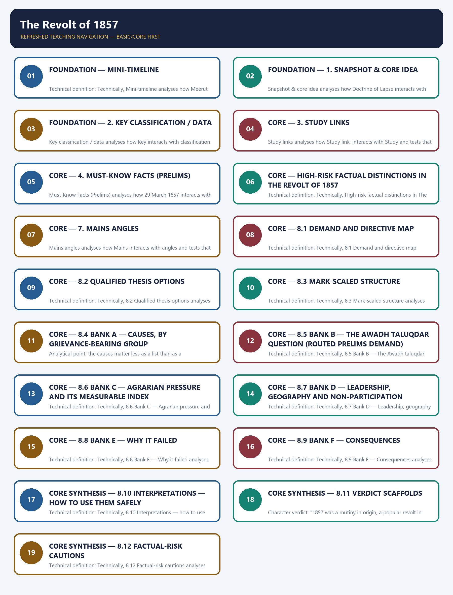

# The Revolt of 1857 - Learner-v2 Complete Learning Session

### SOURCE, PROGRESSION AND CURRENT-LINKAGE AUDIT

- **Repository owners queried:** Basic and Advanced Markdown for this topic, the master chronology, syllabus map and linked Modern History owners.
- **OCR book evidence queried:** OCR checks located Bipan Chandra's Revolt chapter around PDF page 135 and India's Struggle for Independence around page 24. Sekhar Bandyopadhyay supports the Awadh-taluqdar restoration chain around PDF page 87.
- **Qdrant:** not used; Markdown plus searchable local PDFs were sufficient.
- **PYQ integrity:** The verified 2019 GS-I recurrent-rebellions demand is solved. The 2026 Awadh-taluqdar objective demand is integrated as a source-backed demand card while its provisional answer key is not converted into an answer letter.
- **Bounded live linkage:** A 2026 search found no sufficiently specific official memorial update to force into the historical narrative. The Haryana archaeology gateway is used only as a bounded public-history method link; no disputed claim about the revolt's starting point or memorial scale is imported.
- **Fact/inference rule:** historical claims are source-backed; analytical judgements are explicitly framed as interpretation and do not invent figures.

## BASIC LEARNING SESSION



*Distinct embedded teaching-navigation image. The separate continuous Cārvāka-style flowchart package remains an independent at-a-glance artifact.*

### SESSION 1 — FOUNDATION — MINI-TIMELINE

#### DEFINITION / WHAT THIS IS CALLED

**Plain-language definition:** Plain definition: Mini-timeline is a learner's map within The Revolt of 1857 that groups Meerut, Bahadur Shah Zafar and Mini-timeline.

**Technical definition:** Technical definition: Technically, Mini-timeline analyses how Meerut interacts with Bahadur Shah Zafar and tests that relationship through Mini-timeline and context.

#### ANSWER-GRABBING OPENING — WRITE/ADAPT IN THE EXAM

> Plain definition: Mini-timeline is a learner's map within The Revolt of 1857 that groups Meerut, Bahadur Shah Zafar and Mini-timeline.

#### MUST-WRITE KEYWORDS

- **FOUNDATION**
- **Mini-timeline**
- **Plain definition**
- **Technical definition**
- **Meerut**
- **Bahadur Shah Zafar**

**How to use them:** Frame the answer through FOUNDATION; define Mini-timeline, connect Plain definition with Technical definition to explain the mechanism, and use Meerut for the decisive comparison or qualification.

##### VISUAL FIRST

```text
MINI-TIMELINE
Meerut -> Bahadur Shah Zafar -> Mini-timeline
context -> evidence -> mechanism -> qualification -> UPSC judgement
```

*The visual fixes the subtopic's evidence-to-judgement sequence before detail.*

##### CONCEPT DEFINITIONS

- **Plain definition:** Mini-timeline is a learner's map within The Revolt of 1857 that groups Meerut, Bahadur Shah Zafar and Mini-timeline.
- **Technical definition:** Technically, Mini-timeline analyses how Meerut interacts with Bahadur Shah Zafar and tests that relationship through Mini-timeline and context.

| Date | Event |
|---|---|
| ✅ 29 March 1857 | Mangal Pandey incident at Barrackpore |
| ✅ 10 May 1857 | Sepoys at **Meerut** revolted and moved to Delhi |
| ✅ May 1857 | **Bahadur Shah Zafar** proclaimed emperor at Delhi |
| ✅ September 1857 | British recaptured Delhi after heavy fighting |
| ✅ 1857–58 | Major centres: Delhi, Kanpur, Lucknow, Jhansi, Bareilly, Bihar/Arrah |
| ✅ 1858 | Revolt suppressed; Company rule ended by the Government of India Act |

##### EXAM LINK

- **Prelims:** preserve the exact actor-date-institution match and eliminate category errors.
- **Mains:** connect evidence to mechanism, add one limitation and end with a graded verdict.

##### MINI RECAP

- Retain the distinction expressed by **Mini-timeline**; do not reduce it to an isolated fact.

#### CLOSING RECALL FLOW — FOUNDATION — MINI-TIMELINE

```text
START / CONCEPT: FOUNDATION — Mini-timeline
        |
        v
EXACT TERMS: FOUNDATION · Mini-timeline · Plain definition · Technical definition · Meerut · Bahadur Shah Zafar
        |
        v
MECHANISM / ARGUMENT: Technical definition: Technically, Mini-timeline analyses how Meerut interacts with Bahadur Shah Zafar and tests that relationship through Mini-timeline and context.
        |
        v
CONSEQUENCE / CONTRAST: Retain the distinction expressed by Mini-timeline; do not reduce it to an isolated fact.
        |
        v
UPSC TRAP / ANSWER-USE: Do not miss this limiting distinction: retain the distinction expressed by Mini-timeline.
        |
        v
ANSWER-GRABBING FORMULATION: Plain definition: Mini-timeline is a learner's map within The Revolt of 1857 that groups Meerut, Bahadur Shah Zafar and Mini-timeline.
```
### SESSION 2 — FOUNDATION — 1. SNAPSHOT & CORE IDEA

#### DEFINITION / WHAT THIS IS CALLED

**Plain-language definition:** Snapshot & core idea is a learner's map within The Revolt of 1857 that groups Doctrine of Lapse, Awadh in 1856 and General Service Enlistment Act (1856).

**Technical definition:** Snapshot & core idea analyses how Doctrine of Lapse interacts with Awadh in 1856 and tests that relationship through General Service Enlistment Act (1856) and Enfield rifle cartridge.

#### ANSWER-GRABBING OPENING — WRITE/ADAPT IN THE EXAM

> Snapshot & core idea is a learner's map within The Revolt of 1857 that groups Doctrine of Lapse, Awadh in 1856 and General Service Enlistment Act (1856).

#### MUST-WRITE KEYWORDS

- **FOUNDATION**
- **Plain definition**
- **Technical definition**
- **Doctrine of Lapse**
- **Awadh in 1856**
- **1. Snapshot & core idea**

**How to use them:** Frame the answer through FOUNDATION; define Plain definition, connect Technical definition with Doctrine of Lapse to explain the mechanism, and use Awadh in 1856 for the decisive comparison or qualification.

##### VISUAL FIRST

```text
1. SNAPSHOT & CORE IDEA
Doctrine of Lapse -> Awadh in 1856 -> General Service Enlistment Act (1856) -> Enfield rifle cartridge
context -> evidence -> mechanism -> qualification -> UPSC judgement
```

*The visual fixes the subtopic's evidence-to-judgement sequence before detail.*

##### CONCEPT DEFINITIONS

- **Plain definition:** 1. Snapshot & core idea is a learner's map within The Revolt of 1857 that groups Doctrine of Lapse, Awadh in 1856 and General Service Enlistment Act (1856).
- **Technical definition:** Technically, 1. Snapshot & core idea analyses how Doctrine of Lapse interacts with Awadh in 1856 and tests that relationship through General Service Enlistment Act (1856) and Enfield rifle cartridge.

**Foundation — the revolt grew from many causes, not only cartridges.**

- ✅ Political causes included the **Doctrine of Lapse**, annexations, the annexation of **Awadh in 1856**, and disrespect shown to old Mughal and Peshwa lines.
- ✅ Economic causes included ruin of artisans, pressure on peasants, heavy revenue demands and the wider disruption produced by colonial rule.
- ✅ Social-religious causes included fear of conversion, missionary activity, anxieties about social laws and the belief that the state threatened traditional religion.
- ✅ Military causes included sepoy grievances, discriminatory service conditions and the **General Service Enlistment Act (1856)**.
- ✅ The immediate cause was the **Enfield rifle cartridge** rumoured to be greased with cow and pig fat.
- ✅ 1857 had a long prehistory of local resistance: the **Sanyasi and Chuar rebellions**, southern poligar and other civil rebellions, and tribal uprisings such as the **Kol** and **Santhal Hool (1855–56)** arose from dispossession, revenue pressure, outsider penetration and attacks on customary authority.

**Foundation — it was a major but regionally uneven uprising.**

- ✅ The revolt began at Meerut on **10 May 1857**, moved to Delhi and placed Bahadur Shah Zafar as a symbolic emperor.
- ✅ Major leaders included **Bakht Khan** at Delhi, **Nana Saheb**, **Tantia Tope** and **Azimullah Khan** at Kanpur, **Begum Hazrat Mahal** in Awadh, **Rani Lakshmibai** in Jhansi, **Khan Bahadur Khan** at Bareilly and **Kunwar Singh** in Bihar.
- ✅ The revolt failed because of limited spread, lack of unified leadership and ideology, many loyal rulers, weak resources and superior British military communications.

##### EXAM LINK

- **Prelims:** preserve the exact actor-date-institution match and eliminate category errors.
- **Mains:** connect evidence to mechanism, add one limitation and end with a graded verdict.

##### MINI RECAP

- Retain the distinction expressed by **1. Snapshot & core idea**; do not reduce it to an isolated fact.

#### CLOSING RECALL FLOW — FOUNDATION — 1. SNAPSHOT & CORE IDEA

```text
START / CONCEPT: FOUNDATION — 1. Snapshot & core idea
        |
        v
EXACT TERMS: FOUNDATION · Plain definition · Technical definition · Doctrine of Lapse · Awadh in 1856 · 1. Snapshot & core idea
        |
        v
MECHANISM / ARGUMENT: Snapshot & core idea analyses how Doctrine of Lapse interacts with Awadh in 1856 and tests that relationship through General Service Enlistment Act (1856) and Enfield rifle cartridge.
        |
        v
CONSEQUENCE / CONTRAST: Snapshot & core idea; do not reduce it to an isolated fact.
        |
        v
UPSC TRAP / ANSWER-USE: Foundation — it was a major but regionally uneven uprising.
        |
        v
ANSWER-GRABBING FORMULATION: Snapshot & core idea is a learner's map within The Revolt of 1857 that groups Doctrine of Lapse, Awadh in 1856 and General Service Enlistment Act (1856).
```
### SESSION 3 — FOUNDATION — 2. KEY CLASSIFICATION / DATA

#### DEFINITION / WHAT THIS IS CALLED

**Plain-language definition:** Key classification / data is a learner's map within The Revolt of 1857 that groups Key, classification and data.

**Technical definition:** Key classification / data analyses how Key interacts with classification and tests that relationship through data and context.

#### ANSWER-GRABBING OPENING — WRITE/ADAPT IN THE EXAM

> Key classification / data is a learner's map within The Revolt of 1857 that groups Key, classification and data.

#### MUST-WRITE KEYWORDS

- **FOUNDATION**
- **Plain definition**
- **Technical definition**
- **✅ Political causes**
- **✅ Economic causes**
- **2. Key classification / data**

**How to use them:** Frame the answer through FOUNDATION; define Plain definition, connect Technical definition with ✅ Political causes to explain the mechanism, and use ✅ Economic causes for the decisive comparison or qualification.

##### VISUAL FIRST

```text
2. KEY CLASSIFICATION / DATA
Key -> classification -> data
context -> evidence -> mechanism -> qualification -> UPSC judgement
```

*The visual fixes the subtopic's evidence-to-judgement sequence before detail.*

##### CONCEPT DEFINITIONS

- **Plain definition:** 2. Key classification / data is a learner's map within The Revolt of 1857 that groups Key, classification and data.
- **Technical definition:** Technically, 2. Key classification / data analyses how Key interacts with classification and tests that relationship through data and context.

| Dimension | Examples / facts |
|---|---|
| ✅ Political causes | Doctrine of Lapse, Awadh annexation, disregard for Mughal/Peshwa dignity |
| ✅ Economic causes | Peasant distress, artisan ruin, revenue pressure |
| ✅ Social-religious causes | Missionary fear, social legislation anxiety, threat to customs |
| ✅ Military causes | Service grievances, pay/status issues, General Service Enlistment Act |
| ✅ Immediate trigger | Enfield cartridges allegedly greased with cow and pig fat |
| ✅ Pre-1857 resistance | Sanyasi/Chuar and other civil rebellions; Kol and Santhal tribal uprisings—local, recurrent and not one coordinated national movement |
| ✅ Major centres | Delhi, Kanpur, Lucknow, Jhansi, Bareilly, Arrah/Bihar, Faizabad |
| ✅ Consequence | End of Company rule; Crown rule under Government of India Act 1858 |

##### EXAM LINK

- **Prelims:** preserve the exact actor-date-institution match and eliminate category errors.
- **Mains:** connect evidence to mechanism, add one limitation and end with a graded verdict.

##### MINI RECAP

- Retain the distinction expressed by **2. Key classification / data**; do not reduce it to an isolated fact.

#### CLOSING RECALL FLOW — FOUNDATION — 2. KEY CLASSIFICATION / DATA

```text
START / CONCEPT: FOUNDATION — 2. Key classification / data
        |
        v
EXACT TERMS: FOUNDATION · Plain definition · Technical definition · ✅ Political causes · ✅ Economic causes · 2. Key classification / data
        |
        v
MECHANISM / ARGUMENT: Key classification / data analyses how Key interacts with classification and tests that relationship through data and context.
        |
        v
CONSEQUENCE / CONTRAST: Key classification / data; do not reduce it to an isolated fact.
        |
        v
UPSC TRAP / ANSWER-USE: Do not miss this limiting distinction: do not reduce it to an isolated fact.
        |
        v
ANSWER-GRABBING FORMULATION: Key classification / data is a learner's map within The Revolt of 1857 that groups Key, classification and data.
```
### SESSION 4 — CORE — 3. STUDY LINKS

#### DEFINITION / WHAT THIS IS CALLED

**Plain-language definition:** Study links is a learner's map within The Revolt of 1857 that groups Study link:, Study and links.

**Technical definition:** Study links analyses how Study link: interacts with Study and tests that relationship through links and context.

#### ANSWER-GRABBING OPENING — WRITE/ADAPT IN THE EXAM

> Study links is a learner's map within The Revolt of 1857 that groups Study link:, Study and links.

#### MUST-WRITE KEYWORDS

- **Plain definition**
- **Technical definition**
- **Study link**
- **Study links**
- **Study**
- **3. Study links**

**How to use them:** Frame the answer through Plain definition; define Technical definition, connect Study link with Study links to explain the mechanism, and use Study for the decisive comparison or qualification.

##### VISUAL FIRST

```text
3. STUDY LINKS
Study link: -> Study -> links
context -> evidence -> mechanism -> qualification -> UPSC judgement
```

*The visual fixes the subtopic's evidence-to-judgement sequence before detail.*

##### CONCEPT DEFINITIONS

- **Plain definition:** 3. Study links is a learner's map within The Revolt of 1857 that groups Study link:, Study and links.
- **Technical definition:** Technically, 3. Study links analyses how Study link: interacts with Study and tests that relationship through links and context.

> **Study link:** ✅ Earlier expansion and annexation policies → `basic/05_British-Territorial-Expansion.md`.
> **Study link:** ✅ Social-cultural policy and missionary fears → `basic/09_Social-and-Cultural-Policy-Education-Press.md`.
> **Study link:** ✅ Crown rule and constitutional change after suppression → `basic/12_Administrative-Changes-After-1858.md`.

##### EXAM LINK

- **Prelims:** preserve the exact actor-date-institution match and eliminate category errors.
- **Mains:** connect evidence to mechanism, add one limitation and end with a graded verdict.

##### MINI RECAP

- Retain the distinction expressed by **3. Study links**; do not reduce it to an isolated fact.

#### CLOSING RECALL FLOW — CORE — 3. STUDY LINKS

```text
START / CONCEPT: CORE — 3. Study links
        |
        v
EXACT TERMS: Plain definition · Technical definition · Study link · Study links · Study · 3. Study links
        |
        v
MECHANISM / ARGUMENT: Study links analyses how Study link: interacts with Study and tests that relationship through links and context.
        |
        v
CONSEQUENCE / CONTRAST: Study links; do not reduce it to an isolated fact.
        |
        v
UPSC TRAP / ANSWER-USE: Do not miss this limiting distinction: do not reduce it to an isolated fact.
        |
        v
ANSWER-GRABBING FORMULATION: Study links is a learner's map within The Revolt of 1857 that groups Study link:, Study and links.
```
### SESSION 5 — CORE — 4. MUST-KNOW FACTS (PRELIMS)

#### DEFINITION / WHAT THIS IS CALLED

**Plain-language definition:** Must-Know Facts (Prelims) is a learner's map within The Revolt of 1857 that groups 29 March 1857, 10 May 1857 and Delhi.

**Technical definition:** Must-Know Facts (Prelims) analyses how 29 March 1857 interacts with 10 May 1857 and tests that relationship through Delhi and Kanpur.

#### ANSWER-GRABBING OPENING — WRITE/ADAPT IN THE EXAM

> Must-Know Facts (Prelims) is a learner's map within The Revolt of 1857 that groups 29 March 1857, 10 May 1857 and Delhi.

#### MUST-WRITE KEYWORDS

- **Plain definition**
- **Technical definition**
- **Delhi**
- **4. Must-Know Facts (Prelims)**
- **29 March 1857**
- **10 May 1857**

**How to use them:** Frame the answer through Plain definition; define Technical definition, connect Delhi with 4. Must-Know Facts (Prelims) to explain the mechanism, and use 29 March 1857 for the decisive comparison or qualification.

##### VISUAL FIRST

```text
4. MUST-KNOW FACTS (PRELIMS)
29 March 1857 -> 10 May 1857 -> Delhi -> Kanpur
context -> evidence -> mechanism -> qualification -> UPSC judgement
```

*The visual fixes the subtopic's evidence-to-judgement sequence before detail.*

##### CONCEPT DEFINITIONS

- **Plain definition:** 4. Must-Know Facts (Prelims) is a learner's map within The Revolt of 1857 that groups 29 March 1857, 10 May 1857 and Delhi.
- **Technical definition:** Technically, 4. Must-Know Facts (Prelims) analyses how 29 March 1857 interacts with 10 May 1857 and tests that relationship through Delhi and Kanpur.

- ✅ **29 March 1857** = Mangal Pandey at Barrackpore; **10 May 1857** = revolt at Meerut.
- ✅ **Delhi**: Bahadur Shah Zafar as symbolic emperor; Bakht Khan associated with rebel leadership.
- ✅ **Kanpur**: Nana Saheb, Tantia Tope and Azimullah Khan.
- ✅ **Lucknow/Awadh**: Begum Hazrat Mahal; **Jhansi**: Rani Lakshmibai; **Bihar/Arrah**: Kunwar Singh.
- ✅ **Government of India Act 1858** ended Company rule and transferred authority to the British Crown.
- ✅ **Santhal Hool (1855–56)** under Sidhu and Kanhu immediately preceded 1857 but was a distinct tribal uprising, not a stage of the sepoy revolt.
- ⚠️ The revolt was wider than a sepoy mutiny but not a fully modern nationalist movement.

##### EXAM LINK

- **Prelims:** preserve the exact actor-date-institution match and eliminate category errors.
- **Mains:** connect evidence to mechanism, add one limitation and end with a graded verdict.

##### MINI RECAP

- Retain the distinction expressed by **4. Must-Know Facts (Prelims)**; do not reduce it to an isolated fact.

#### CLOSING RECALL FLOW — CORE — 4. MUST-KNOW FACTS (PRELIMS)

```text
START / CONCEPT: CORE — 4. Must-Know Facts (Prelims)
        |
        v
EXACT TERMS: Plain definition · Technical definition · Delhi · 4. Must-Know Facts (Prelims) · 29 March 1857 · 10 May 1857
        |
        v
MECHANISM / ARGUMENT: Must-Know Facts (Prelims) analyses how 29 March 1857 interacts with 10 May 1857 and tests that relationship through Delhi and Kanpur.
        |
        v
CONSEQUENCE / CONTRAST: Must-Know Facts (Prelims); do not reduce it to an isolated fact.
        |
        v
UPSC TRAP / ANSWER-USE: ✅ Delhi: Bahadur Shah Zafar as symbolic emperor; Bakht Khan associated with rebel leadership. ✅ Kanpur: Nana Saheb, Tantia Tope and Azimullah Khan. ✅ Lucknow/Awadh: Begum Hazrat Mahal; Jhansi: Rani Lakshmibai; Bihar/Arrah: Kunwar Singh. ✅ Government of India Act 1858 ended Company rule and transferred authority to the British Crown. ✅ Santhal Hool (1855–56) under Sidhu and Kanhu immediately preceded 1857 but was a distinct tribal uprising, not a stage of the sepoy revolt. ⚠️ The revolt was wider than a sepoy mutiny but not a fully modern nationalist movement.
        |
        v
ANSWER-GRABBING FORMULATION: Must-Know Facts (Prelims) is a learner's map within The Revolt of 1857 that groups 29 March 1857, 10 May 1857 and Delhi.
```
### SESSION 6 — CORE — HIGH-RISK FACTUAL DISTINCTIONS IN THE REVOLT OF 1857

#### DEFINITION / WHAT THIS IS CALLED

**Plain-language definition:** Plain definition: High-risk factual distinctions in The Revolt of 1857 is a learner's map within The Revolt of 1857 that groups Barrackpore incident (29 March), Meerut outbreak (10 May) and Meerut.

**Technical definition:** Technical definition: Technically, High-risk factual distinctions in The Revolt of 1857 analyses how Barrackpore incident (29 March) interacts with Meerut outbreak (10 May) and tests that relationship through Meerut and immediate trigger.

#### ANSWER-GRABBING OPENING — WRITE/ADAPT IN THE EXAM

> Plain definition: High-risk factual distinctions in The Revolt of 1857 is a learner's map within The Revolt of 1857 that groups Barrackpore incident (29 March), Meerut outbreak (10 May) and Meerut.

#### MUST-WRITE KEYWORDS

- **High-risk factual distinctions in The Revolt of 1857**
- **Plain definition**
- **Technical definition**
- **Barrackpore incident (29 March)**
- **Meerut outbreak (10 May)**
- **Meerut**

**How to use them:** Frame the answer through High-risk factual distinctions in The Revolt of 1857; define Plain definition, connect Technical definition with Barrackpore incident (29 March) to explain the mechanism, and use Meerut outbreak (10 May) for the decisive comparison or qualification.

##### VISUAL FIRST

```text
HIGH-RISK FACTUAL DISTINCTIONS IN THE REVOLT OF 1857
Barrackpore incident (29 March) -> Meerut outbreak (10 May) -> Meerut -> immediate trigger
context -> evidence -> mechanism -> qualification -> UPSC judgement
```

*The visual fixes the subtopic's evidence-to-judgement sequence before detail.*

##### CONCEPT DEFINITIONS

- **Plain definition:** High-risk factual distinctions in The Revolt of 1857 is a learner's map within The Revolt of 1857 that groups Barrackpore incident (29 March), Meerut outbreak (10 May) and Meerut.
- **Technical definition:** Technically, High-risk factual distinctions in The Revolt of 1857 analyses how Barrackpore incident (29 March) interacts with Meerut outbreak (10 May) and tests that relationship through Meerut and immediate trigger.

> 🔑 Trap: Distinguish the **Barrackpore incident (29 March)** from the **Meerut outbreak (10 May)**.

- ❌ The revolt began in Delhi. → It began at **Meerut** and then moved to Delhi.
- ❌ The cartridge issue was the only cause. → It was the **immediate trigger**, not the full cause.
- ❌ The revolt spread uniformly across India. → South India, much of Punjab and many western areas remained largely quiet or loyal.
- ❌ All Indian rulers supported the rebels. → Many princes and elites supported the British or stayed neutral.

##### EXAM LINK

- **Prelims:** preserve the exact actor-date-institution match and eliminate category errors.
- **Mains:** connect evidence to mechanism, add one limitation and end with a graded verdict.

##### MINI RECAP

- Retain the distinction expressed by **High-risk factual distinctions in The Revolt of 1857**; do not reduce it to an isolated fact.

#### CLOSING RECALL FLOW — CORE — HIGH-RISK FACTUAL DISTINCTIONS IN THE REVOLT OF 1857

```text
START / CONCEPT: CORE — High-risk factual distinctions in The Revolt of 1857
        |
        v
EXACT TERMS: High-risk factual distinctions in The Revolt of 1857 · Plain definition · Technical definition · Barrackpore incident (29 March) · Meerut outbreak (10 May) · Meerut
        |
        v
MECHANISM / ARGUMENT: Technical definition: Technically, High-risk factual distinctions in The Revolt of 1857 analyses how Barrackpore incident (29 March) interacts with Meerut outbreak (10 May) and tests that relationship through Meerut and immediate trigger.
        |
        v
CONSEQUENCE / CONTRAST: Retain the distinction expressed by High-risk factual distinctions in The Revolt of 1857; do not reduce it to an isolated fact.
        |
        v
UPSC TRAP / ANSWER-USE: ❌ The revolt began in Delhi. → It began at Meerut and then moved to Delhi. ❌ The cartridge issue was the only cause. → It was the immediate trigger, not the full cause. ❌ The revolt spread uniformly across India. → South India, much of Punjab and many western areas remained largely quiet or loyal. ❌ All Indian rulers supported the rebels. → Many princes and elites supported the British or stayed neutral.
        |
        v
ANSWER-GRABBING FORMULATION: Plain definition: High-risk factual distinctions in The Revolt of 1857 is a learner's map within The Revolt of 1857 that groups Barrackpore incident (29 March), Meerut outbreak (10 May) and Meerut.
```
### CORE — 6. 📰 Current link

##### VISUAL FIRST

```text
6. 📰 CURRENT LINK
Current -> link
context -> evidence -> mechanism -> qualification -> UPSC judgement
```

*The visual fixes the subtopic's evidence-to-judgement sequence before detail.*

##### CONCEPT DEFINITIONS

- **Plain definition:** 6. 📰 Current link is a learner's map within The Revolt of 1857 that groups Current, link and context.
- **Technical definition:** Technically, 6. 📰 Current link analyses how Current interacts with link and tests that relationship through context and evidence.

- ⚠️ **Public memory, monuments and museum narratives around 1857.** The revolt remains a recurring reference point in debates on national memory, colonial violence and heritage interpretation. *(Escalate to 📰 when pegged to a verified news item.)*

##### EXAM LINK

- **Prelims:** preserve the exact actor-date-institution match and eliminate category errors.
- **Mains:** connect evidence to mechanism, add one limitation and end with a graded verdict.

##### MINI RECAP

- Retain the distinction expressed by **6. 📰 Current link**; do not reduce it to an isolated fact.
### SESSION 7 — CORE — 7. MAINS ANGLES

#### DEFINITION / WHAT THIS IS CALLED

**Plain-language definition:** Mains angles is a learner's map within The Revolt of 1857 that groups Mains, angles and context.

**Technical definition:** Mains angles analyses how Mains interacts with angles and tests that relationship through context and evidence.

#### ANSWER-GRABBING OPENING — WRITE/ADAPT IN THE EXAM

> Mains angles is a learner's map within The Revolt of 1857 that groups Mains, angles and context.

#### MUST-WRITE KEYWORDS

- **Plain definition**
- **Technical definition**
- **Mains angles**
- **The Revolt**
- **GS**
- **7. Mains angles**

**How to use them:** Frame the answer through Plain definition; define Technical definition, connect Mains angles with The Revolt to explain the mechanism, and use GS for the decisive comparison or qualification.

##### VISUAL FIRST

```text
7. MAINS ANGLES
Mains -> angles
context -> evidence -> mechanism -> qualification -> UPSC judgement
```

*The visual fixes the subtopic's evidence-to-judgement sequence before detail.*

##### CONCEPT DEFINITIONS

- **Plain definition:** 7. Mains angles is a learner's map within The Revolt of 1857 that groups Mains, angles and context.
- **Technical definition:** Technically, 7. Mains angles analyses how Mains interacts with angles and tests that relationship through context and evidence.

- ⚠️ GS-1: Examine the causes of the Revolt of 1857, distinguishing long-term grievances from the immediate trigger.
- ⚠️ GS-1: Was the Revolt of 1857 merely a sepoy mutiny or a wider anti-colonial uprising? Discuss.
- ⚠️ GS-1: Analyse why the Revolt of 1857 failed despite mass participation in several regions.

##### EXAM LINK

- **Prelims:** preserve the exact actor-date-institution match and eliminate category errors.
- **Mains:** connect evidence to mechanism, add one limitation and end with a graded verdict.

##### MINI RECAP

- Retain the distinction expressed by **7. Mains angles**; do not reduce it to an isolated fact.

#### CLOSING RECALL FLOW — CORE — 7. MAINS ANGLES

```text
START / CONCEPT: CORE — 7. Mains angles
        |
        v
EXACT TERMS: Plain definition · Technical definition · Mains angles · The Revolt · GS · 7. Mains angles
        |
        v
MECHANISM / ARGUMENT: Mains angles analyses how Mains interacts with angles and tests that relationship through context and evidence.
        |
        v
CONSEQUENCE / CONTRAST: Mains angles; do not reduce it to an isolated fact.
        |
        v
UPSC TRAP / ANSWER-USE: Do not miss this limiting distinction: examine the causes of the Revolt of 1857, distinguishing long-term grievances from the immediate...
        |
        v
ANSWER-GRABBING FORMULATION: Mains angles is a learner's map within The Revolt of 1857 that groups Mains, angles and context.
```
### CORE — Answer architecture overview

##### VISUAL FIRST

```text
ANSWER ARCHITECTURE OVERVIEW
Answer -> architecture -> overview
context -> evidence -> mechanism -> qualification -> UPSC judgement
```

*The visual fixes the subtopic's evidence-to-judgement sequence before detail.*

##### CONCEPT DEFINITIONS

- **Plain definition:** Answer architecture overview is a learner's map within The Revolt of 1857 that groups Answer, architecture and overview.
- **Technical definition:** Technically, Answer architecture overview analyses how Answer interacts with architecture and tests that relationship through overview and context.

> Purpose: 1857 is the folder's most label-sensitive topic. This section supplies the evidence to answer **causation, character, geography, participation, failure, consequence and interpretation** demands separately, so that no answer collapses into a single label.

##### EXAM LINK

- **Prelims:** preserve the exact actor-date-institution match and eliminate category errors.
- **Mains:** connect evidence to mechanism, add one limitation and end with a graded verdict.

##### MINI RECAP

- Retain the distinction expressed by **Answer architecture overview**; do not reduce it to an isolated fact.
### SESSION 8 — CORE — 8.1 DEMAND AND DIRECTIVE MAP

#### DEFINITION / WHAT THIS IS CALLED

**Plain-language definition:** Plain definition: 8.1 Demand and directive map is a learner's map within The Revolt of 1857 that groups Demand, and and directive.

**Technical definition:** Technical definition: Technically, 8.1 Demand and directive map analyses how Demand interacts with and and tests that relationship through directive and map.

#### ANSWER-GRABBING OPENING — WRITE/ADAPT IN THE EXAM

> Plain definition: 8.1 Demand and directive map is a learner's map within The Revolt of 1857 that groups Demand, and and directive.

#### MUST-WRITE KEYWORDS

- **directive map**
- **Plain definition**
- **Technical definition**
- **Causation**
- **8.1 Demand**
- **8.1 Demand and directive map**

**How to use them:** Frame the answer through directive map; define Plain definition, connect Technical definition with Causation to explain the mechanism, and use 8.1 Demand for the decisive comparison or qualification.

##### VISUAL FIRST

```text
8.1 DEMAND AND DIRECTIVE MAP
Demand -> and -> directive -> map
context -> evidence -> mechanism -> qualification -> UPSC judgement
```

*The visual fixes the subtopic's evidence-to-judgement sequence before detail.*

##### CONCEPT DEFINITIONS

- **Plain definition:** 8.1 Demand and directive map is a learner's map within The Revolt of 1857 that groups Demand, and and directive.
- **Technical definition:** Technically, 8.1 Demand and directive map analyses how Demand interacts with and and tests that relationship through directive and map.

| Demand family | Typical directive signals | Answer spine to use |
|---|---|---|
| Causation | "Examine the causes", "long-term versus immediate" | Structural grievance by group → convergence → trigger |
| Character/nature | "Mutiny or war of independence?", "Assess the nature" | Reject single label → dimension-wise assessment → qualified composite verdict |
| Geography/participation | "Why did it spread unevenly?" | Where and why yes → where and why no → what the pattern proves |
| Explaining failure | "Why did it fail?" | Rebel-side deficits → British-side advantages → structural asymmetry |
| Consequences | "Impact of 1857 on British policy" | Constitutional → army → princes/landlords → social and racial policy |
| Historiography | "How have historians interpreted 1857?" | Contemporary label → nationalist reading → social-history reading → caution |
| Group-specific | "Role of peasants / taluqdars / women / rulers" | Group's specific grievance → action → limit of that action |

##### EXAM LINK

- **Prelims:** preserve the exact actor-date-institution match and eliminate category errors.
- **Mains:** connect evidence to mechanism, add one limitation and end with a graded verdict.

##### MINI RECAP

- Retain the distinction expressed by **8.1 Demand and directive map**; do not reduce it to an isolated fact.

#### CLOSING RECALL FLOW — CORE — 8.1 DEMAND AND DIRECTIVE MAP

```text
START / CONCEPT: CORE — 8.1 Demand and directive map
        |
        v
EXACT TERMS: directive map · Plain definition · Technical definition · Causation · 8.1 Demand · 8.1 Demand and directive map
        |
        v
MECHANISM / ARGUMENT: Technical definition: Technically, 8.1 Demand and directive map analyses how Demand interacts with and and tests that relationship through directive and map.
        |
        v
CONSEQUENCE / CONTRAST: Retain the distinction expressed by 8.1 Demand and directive map; do not reduce it to an isolated fact.
        |
        v
UPSC TRAP / ANSWER-USE: Do not miss this limiting distinction: retain the distinction expressed by 8.1 Demand and directive map.
        |
        v
ANSWER-GRABBING FORMULATION: Plain definition: 8.1 Demand and directive map is a learner's map within The Revolt of 1857 that groups Demand, and and directive.
```
### SESSION 9 — CORE — 8.2 QUALIFIED THESIS OPTIONS

#### DEFINITION / WHAT THIS IS CALLED

**Plain-language definition:** Plain definition: 8.2 Qualified thesis options is a learner's map within The Revolt of 1857 that groups Composite-revolt thesis:, Failure thesis: and Watershed thesis:.

**Technical definition:** Technical definition: Technically, 8.2 Qualified thesis options analyses how Composite-revolt thesis: interacts with Failure thesis: and tests that relationship through Watershed thesis: and context.

#### ANSWER-GRABBING OPENING — WRITE/ADAPT IN THE EXAM

> Plain definition: 8.2 Qualified thesis options is a learner's map within The Revolt of 1857 that groups Composite-revolt thesis:, Failure thesis: and Watershed thesis:.

#### MUST-WRITE KEYWORDS

- **Plain definition**
- **Technical definition**
- **Composite-revolt thesis**
- **Dispossession thesis (strongest evidence-backed line)**
- **Failure thesis**
- **8.2 Qualified thesis options**

**How to use them:** Frame the answer through Plain definition; define Technical definition, connect Composite-revolt thesis with Dispossession thesis (strongest evidence-backed line) to explain the mechanism, and use Failure thesis for the decisive comparison or qualification.

##### VISUAL FIRST

```text
8.2 QUALIFIED THESIS OPTIONS
Composite-revolt thesis: -> Failure thesis: -> Watershed thesis:
context -> evidence -> mechanism -> qualification -> UPSC judgement
```

*The visual fixes the subtopic's evidence-to-judgement sequence before detail.*

##### CONCEPT DEFINITIONS

- **Plain definition:** 8.2 Qualified thesis options is a learner's map within The Revolt of 1857 that groups Composite-revolt thesis:, Failure thesis: and Watershed thesis:.
- **Technical definition:** Technically, 8.2 Qualified thesis options analyses how Composite-revolt thesis: interacts with Failure thesis: and tests that relationship through Watershed thesis: and context.

- **Composite-revolt thesis:** *1857 was neither a simple sepoy mutiny nor a national war of independence: it began as a military mutiny, acquired the character of a popular revolt in Awadh and the upper Doab where agrarian dispossession had already occurred, and remained restricted by region, class and political imagination.*
- **Dispossession thesis (strongest evidence-backed line):** *The revolt was most powerful precisely where colonial land settlement had recently destroyed existing landed authority — the coincidence of taluqdar loss and peasant over-assessment produced a rare vertical alliance against a common enemy.*
- **Failure thesis:** *The rebellion failed less from military weakness than from the absence of a shared political programme: rebels could agree on what they were destroying and not on what they were building.*
- **Watershed thesis:** *1857's importance lies in what it produced — Crown rule, an engineered army, a conciliated landed and princely order, and an explicitly racial administrative doctrine; the empire that survived 1857 was different from the one that entered it.*

##### EXAM LINK

- **Prelims:** preserve the exact actor-date-institution match and eliminate category errors.
- **Mains:** connect evidence to mechanism, add one limitation and end with a graded verdict.

##### MINI RECAP

- Retain the distinction expressed by **8.2 Qualified thesis options**; do not reduce it to an isolated fact.

#### CLOSING RECALL FLOW — CORE — 8.2 QUALIFIED THESIS OPTIONS

```text
START / CONCEPT: CORE — 8.2 Qualified thesis options
        |
        v
EXACT TERMS: Plain definition · Technical definition · Composite-revolt thesis · Dispossession thesis (strongest evidence-backed line) · Failure thesis · 8.2 Qualified thesis options
        |
        v
MECHANISM / ARGUMENT: Technical definition: Technically, 8.2 Qualified thesis options analyses how Composite-revolt thesis: interacts with Failure thesis: and tests that relationship through Watershed thesis: and context.
        |
        v
CONSEQUENCE / CONTRAST: Retain the distinction expressed by 8.2 Qualified thesis options; do not reduce it to an isolated fact.
        |
        v
UPSC TRAP / ANSWER-USE: Failure thesis: The rebellion failed less from military weakness than from the absence of a shared political programme: rebels could agree on what they were destroying and not on what they were building.
        |
        v
ANSWER-GRABBING FORMULATION: Plain definition: 8.2 Qualified thesis options is a learner's map within The Revolt of 1857 that groups Composite-revolt thesis:, Failure thesis: and Watershed thesis:.
```
### SESSION 10 — CORE — 8.3 MARK-SCALED STRUCTURE

#### DEFINITION / WHAT THIS IS CALLED

**Plain-language definition:** Plain definition: 8.3 Mark-scaled structure is a learner's map within The Revolt of 1857 that groups Mark-scaled, structure and context.

**Technical definition:** Technical definition: Technically, 8.3 Mark-scaled structure analyses how Mark-scaled interacts with structure and tests that relationship through context and evidence.

#### ANSWER-GRABBING OPENING — WRITE/ADAPT IN THE EXAM

> Plain definition: 8.3 Mark-scaled structure is a learner's map within The Revolt of 1857 that groups Mark-scaled, structure and context.

#### MUST-WRITE KEYWORDS

- **Plain definition**
- **Technical definition**
- **Thesis → causal blocks → trigger → one qualification → verdict**
- **Plain definition: 8.3 Mark-scaled structure**
- **8.3 Mark-scaled structure**
- **3 causal categories with a named instance each**

**How to use them:** Frame the answer through Plain definition; define Technical definition, connect Thesis → causal blocks → trigger → one qualification → verdict with Plain definition: 8.3 Mark-scaled structure to explain the mechanism, and use 8.3 Mark-scaled structure for the decisive comparison or qualification.

##### VISUAL FIRST

```text
8.3 MARK-SCALED STRUCTURE
Mark-scaled -> structure
context -> evidence -> mechanism -> qualification -> UPSC judgement
```

*The visual fixes the subtopic's evidence-to-judgement sequence before detail.*

##### CONCEPT DEFINITIONS

- **Plain definition:** 8.3 Mark-scaled structure is a learner's map within The Revolt of 1857 that groups Mark-scaled, structure and context.
- **Technical definition:** Technically, 8.3 Mark-scaled structure analyses how Mark-scaled interacts with structure and tests that relationship through context and evidence.

| Marks | Recommended architecture | Evidence load |
|---:|---|---|
| 10 | Thesis → causal blocks → trigger → one qualification → verdict | 3 causal categories with a named instance each |
| 15 | Thesis → causes → character assessed dimension-wise → reasons for failure → verdict | 5–6 units including one region and one social group |
| 20 | Thesis → causes → geography of participation and non-participation → leadership → failure → consequences → historiographical caution → graded verdict | 6–8 units across military, agrarian, princely and regional evidence |

##### EXAM LINK

- **Prelims:** preserve the exact actor-date-institution match and eliminate category errors.
- **Mains:** connect evidence to mechanism, add one limitation and end with a graded verdict.

##### MINI RECAP

- Retain the distinction expressed by **8.3 Mark-scaled structure**; do not reduce it to an isolated fact.

#### CLOSING RECALL FLOW — CORE — 8.3 MARK-SCALED STRUCTURE

```text
START / CONCEPT: CORE — 8.3 Mark-scaled structure
        |
        v
EXACT TERMS: Plain definition · Technical definition · Thesis → causal blocks → trigger → one qualification → verdict · Plain definition: 8.3 Mark-scaled structure · 8.3 Mark-scaled structure · 3 causal categories with a named instance each
        |
        v
MECHANISM / ARGUMENT: Technical definition: Technically, 8.3 Mark-scaled structure analyses how Mark-scaled interacts with structure and tests that relationship through context and evidence.
        |
        v
CONSEQUENCE / CONTRAST: Retain the distinction expressed by 8.3 Mark-scaled structure; do not reduce it to an isolated fact.
        |
        v
UPSC TRAP / ANSWER-USE: Do not miss this limiting distinction: retain the distinction expressed by 8.3 Mark-scaled structure.
        |
        v
ANSWER-GRABBING FORMULATION: Plain definition: 8.3 Mark-scaled structure is a learner's map within The Revolt of 1857 that groups Mark-scaled, structure and context.
```
### SESSION 11 — CORE — 8.4 BANK A — CAUSES, BY GRIEVANCE-BEARING GROUP

#### DEFINITION / WHAT THIS IS CALLED

**Plain-language definition:** Plain definition: 8.4 Bank A — Causes, by grievance-bearing group is a learner's map within The Revolt of 1857 that groups General Service Enlistment Act (1856), Enfield cartridge and Awadh annexed 1856.

**Technical definition:** Analytical point: the causes matter less as a list than as a demonstration that different groups had different reasons — which is exactly why the coalition was wide in some districts and absent in others.

#### ANSWER-GRABBING OPENING — WRITE/ADAPT IN THE EXAM

> Plain definition: 8.4 Bank A — Causes, by grievance-bearing group is a learner's map within The Revolt of 1857 that groups General Service Enlistment Act (1856), Enfield cartridge and Awadh annexed 1856.

#### MUST-WRITE KEYWORDS

- **Causes**
- **by grievance-bearing group**
- **Plain definition**
- **Technical definition**
- **General Service Enlistment Act (1856)**
- **8.4 Bank A**

**How to use them:** Frame the answer through Causes; define by grievance-bearing group, connect Plain definition with Technical definition to explain the mechanism, and use General Service Enlistment Act (1856) for the decisive comparison or qualification.

##### VISUAL FIRST

```text
8.4 BANK A — CAUSES, BY GRIEVANCE-BEARING GROUP
General Service Enlistment Act (1856) -> Enfield cartridge -> Awadh annexed 1856 -> Analytical point:
context -> evidence -> mechanism -> qualification -> UPSC judgement
```

*The visual fixes the subtopic's evidence-to-judgement sequence before detail.*

##### CONCEPT DEFINITIONS

- **Plain definition:** 8.4 Bank A — Causes, by grievance-bearing group is a learner's map within The Revolt of 1857 that groups General Service Enlistment Act (1856), Enfield cartridge and Awadh annexed 1856.
- **Technical definition:** Technically, 8.4 Bank A — Causes, by grievance-bearing group analyses how General Service Enlistment Act (1856) interacts with Enfield cartridge and tests that relationship through Awadh annexed 1856 and Analytical point:.

| Group | Specific grievance | Evidence |
|---|---|---|
| ✅ Sepoys | Service conditions, pay/status, overseas-service obligation | **General Service Enlistment Act (1856)**; the **Enfield cartridge** rumour as trigger |
| ✅ Dispossessed rulers | Annexation and denial of adoption | Doctrine of Lapse annexations; **Awadh annexed 1856**; slights to Mughal and Peshwa lines |
| ✅ Landed magnates | Loss of estates and legal status under new settlements | Awadh taluqdars (see Bank B); North-Western Provinces dispossession |
| ✅ Peasants | Over-assessment, debt, auction of landed rights | Owner-cultivators bore over-assessment most severely; moneylenders became targets |
| ✅ Artisans | Craft decline and loss of patronage | Links to the deindustrialisation argument in `basic/07` |
| ✅ Religious opinion | Missionary activity, social legislation, fear of conversion | Belief that the state threatened custom and religion |

- **Analytical point:** the causes matter less as a list than as a demonstration that *different groups had different reasons* — which is exactly why the coalition was wide in some districts and absent in others.

##### EXAM LINK

- **Prelims:** preserve the exact actor-date-institution match and eliminate category errors.
- **Mains:** connect evidence to mechanism, add one limitation and end with a graded verdict.

##### MINI RECAP

- Retain the distinction expressed by **8.4 Bank A — Causes, by grievance-bearing group**; do not reduce it to an isolated fact.

#### CLOSING RECALL FLOW — CORE — 8.4 BANK A — CAUSES, BY GRIEVANCE-BEARING GROUP

```text
START / CONCEPT: CORE — 8.4 Bank A — Causes, by grievance-bearing group
        |
        v
EXACT TERMS: Causes · by grievance-bearing group · Plain definition · Technical definition · General Service Enlistment Act (1856) · 8.4 Bank A
        |
        v
MECHANISM / ARGUMENT: Technical definition: Technically, 8.4 Bank A — Causes, by grievance-bearing group analyses how General Service Enlistment Act (1856) interacts with Enfield cartridge and tests that relationship through Awadh annexed 1856 and Analytical point:.
        |
        v
CONSEQUENCE / CONTRAST: Retain the distinction expressed by 8.4 Bank A — Causes, by grievance-bearing group; do not reduce it to an isolated fact.
        |
        v
UPSC TRAP / ANSWER-USE: Do not miss this limiting distinction: the causes matter less as a list than as a demonstration that different groups...
        |
        v
ANSWER-GRABBING FORMULATION: Plain definition: 8.4 Bank A — Causes, by grievance-bearing group is a learner's map within The Revolt of 1857 that groups General Service Enlistment Act (1856), Enfield cartridge and Awadh annexed 1856.
```
### SESSION 12 — CORE — 8.5 BANK B — THE AWADH TALUQDAR QUESTION (ROUTED PRELIMS DEMAND)

#### DEFINITION / WHAT THIS IS CALLED

**Plain-language definition:** Plain definition: 8.5 Bank B — The Awadh taluqdar question (routed Prelims demand) is a learner's map within The Revolt of 1857 that groups Claim:, Evidence (before the revolt): and Evidence (during the revolt):.

**Technical definition:** Technical definition: Technically, 8.5 Bank B — The Awadh taluqdar question (routed Prelims demand) analyses how Claim: interacts with Evidence (before the revolt): and tests that relationship through Evidence (during the revolt): and Thomas Metcalf.

#### ANSWER-GRABBING OPENING — WRITE/ADAPT IN THE EXAM

> Plain definition: 8.5 Bank B — The Awadh taluqdar question (routed Prelims demand) is a learner's map within The Revolt of 1857 that groups Claim:, Evidence (before the revolt): and Evidence (during the revolt):.

#### MUST-WRITE KEYWORDS

- **The Awadh taluqdar question (routed Prelims demand)**
- **Plain definition**
- **Technical definition**
- **Claim**
- **Evidence (before the revolt)**
- **8.5 Bank B**

**How to use them:** Frame the answer through The Awadh taluqdar question (routed Prelims demand); define Plain definition, connect Technical definition with Claim to explain the mechanism, and use Evidence (before the revolt) for the decisive comparison or qualification.

##### VISUAL FIRST

```text
8.5 BANK B — THE AWADH TALUQDAR QUESTION (ROUTED PRELIMS DEMAND)
Claim: -> Evidence (before the revolt): -> Evidence (during the revolt): -> Thomas Metcalf
context -> evidence -> mechanism -> qualification -> UPSC judgement
```

*The visual fixes the subtopic's evidence-to-judgement sequence before detail.*

##### CONCEPT DEFINITIONS

- **Plain definition:** 8.5 Bank B — The Awadh taluqdar question (routed Prelims demand) is a learner's map within The Revolt of 1857 that groups Claim:, Evidence (before the revolt): and Evidence (during the revolt):.
- **Technical definition:** Technically, 8.5 Bank B — The Awadh taluqdar question (routed Prelims demand) analyses how Claim: interacts with Evidence (before the revolt): and tests that relationship through Evidence (during the revolt): and Thomas Metcalf.

- **Claim:** Colonial revenue policy toward the Awadh taluqdars is the clearest documented mechanism converting administrative reform into armed revolt, and then into a policy reversal.
- **Evidence (before the revolt):** ✅ After the 1856 annexation the summary settlement demolished taluqdari authority so that, as Bandyopadhyay puts it, **in the eyes of the law they were now no different from the humblest of their tenants** — a loss of status and power in local society that made Awadh, and the North-Western Provinces where many taluqdars had lately been dispossessed, hotbeds of aristocratic discontent.
- **Evidence (during the revolt):** ✅ As the revolt began, **these taluqdars quickly moved back into the villages they had recently lost and faced no resistance from their erstwhile tenants**; ⚠️ **Thomas Metcalf** argued that ties of kinship and feudal loyalty led villagers to acknowledge their lords' claims and join against a common enemy. In Awadh the overall revenue assessment had been reduced but pockets of over-assessment remained, producing what the literature calls a **"taluqdar–peasant complementarity" of interests**.
- **Evidence (after the revolt):** ✅ After the revolt the Awadh taluqdars **were restored to their former positions of authority** — the decisive proof that the British had identified landed magnates as indispensable collaborators.
- **Significance:** This single chain answers three different demands — a cause of 1857, an explanation of its social depth in one region, and the logic of post-1858 conciliation policy in `basic/12`.
- **Limit/caution:** ⚠️ Restoration is best described as reinstatement of position and authority; do not specify the instruments or numbers of estates restored. The complementarity was regional — it does not license a general claim of landlord–peasant alliance across India.

##### EXAM LINK

- **Prelims:** preserve the exact actor-date-institution match and eliminate category errors.
- **Mains:** connect evidence to mechanism, add one limitation and end with a graded verdict.

##### MINI RECAP

- Retain the distinction expressed by **8.5 Bank B — The Awadh taluqdar question (routed Prelims demand)**; do not reduce it to an isolated fact.

#### CLOSING RECALL FLOW — CORE — 8.5 BANK B — THE AWADH TALUQDAR QUESTION (ROUTED PRELIMS DEMAND)

```text
START / CONCEPT: CORE — 8.5 Bank B — The Awadh taluqdar question (routed Prelims demand)
        |
        v
EXACT TERMS: The Awadh taluqdar question (routed Prelims demand) · Plain definition · Technical definition · Claim · Evidence (before the revolt) · 8.5 Bank B
        |
        v
MECHANISM / ARGUMENT: Technical definition: Technically, 8.5 Bank B — The Awadh taluqdar question (routed Prelims demand) analyses how Claim: interacts with Evidence (before the revolt): and tests that relationship through Evidence (during the revolt): and Thomas Metcalf.
        |
        v
CONSEQUENCE / CONTRAST: Retain the distinction expressed by 8.5 Bank B — The Awadh taluqdar question (routed Prelims demand); do not reduce it to an isolated fact.
        |
        v
UPSC TRAP / ANSWER-USE: In Awadh the overall revenue assessment had been reduced but pockets of over-assessment remained, producing what the literature calls a "taluqdar–peasant complementarity" of interests.
        |
        v
ANSWER-GRABBING FORMULATION: Plain definition: 8.5 Bank B — The Awadh taluqdar question (routed Prelims demand) is a learner's map within The Revolt of 1857 that groups Claim:, Evidence (before the revolt): and Evidence (during the revolt):.
```
### SESSION 13 — CORE — 8.6 BANK C — AGRARIAN PRESSURE AND ITS MEASURABLE INDEX

#### DEFINITION / WHAT THIS IS CALLED

**Plain-language definition:** Plain definition: 8.6 Bank C — Agrarian pressure and its measurable index is a learner's map within The Revolt of 1857 that groups Claim:, Evidence: and S.B.

**Technical definition:** Technical definition: Technically, 8.6 Bank C — Agrarian pressure and its measurable index analyses how Claim: interacts with Evidence: and tests that relationship through S.B.

#### ANSWER-GRABBING OPENING — WRITE/ADAPT IN THE EXAM

> Plain definition: 8.6 Bank C — Agrarian pressure and its measurable index is a learner's map within The Revolt of 1857 that groups Claim:, Evidence: and S.B.

#### MUST-WRITE KEYWORDS

- **Agrarian pressure**
- **its measurable index**
- **Plain definition**
- **Technical definition**
- **Claim**
- **8.6 Bank C**

**How to use them:** Frame the answer through Agrarian pressure; define its measurable index, connect Plain definition with Technical definition to explain the mechanism, and use Claim for the decisive comparison or qualification.

##### VISUAL FIRST

```text
8.6 BANK C — AGRARIAN PRESSURE AND ITS MEASURABLE INDEX
Claim: -> Evidence: -> S.B. Chaudhuri -> Significance:
context -> evidence -> mechanism -> qualification -> UPSC judgement
```

*The visual fixes the subtopic's evidence-to-judgement sequence before detail.*

##### CONCEPT DEFINITIONS

- **Plain definition:** 8.6 Bank C — Agrarian pressure and its measurable index is a learner's map within The Revolt of 1857 that groups Claim:, Evidence: and S.B. Chaudhuri.
- **Technical definition:** Technically, 8.6 Bank C — Agrarian pressure and its measurable index analyses how Claim: interacts with Evidence: and tests that relationship through S.B. Chaudhuri and Significance:.

- **Claim:** Land alienation, not only revenue rates, radicalised the countryside.
- **Evidence:** ✅ High demand where agriculture was insecure drove peasants into debt and dispossession, with the new civil courts and legal system assisting the process; ✅ **in 1853, in the North-Western Provinces alone, 110,000 acres of land were sold at auction** — the index of that pressure; when the revolt began, the **baniya and mahajan and their property became natural targets** of rioting peasants. ⚠️ **S.B. Chaudhuri** summarised that the sale of land uprooted both ordinary cultivators and the gentry, uniting both as victims of British civil law.
- **Significance:** Explains the *targets* rebels chose — revenue records, courts and moneylenders' bonds — which is strong evidence that this was more than a barracks revolt.
- **Limit/caution:** The 110,000-acre figure is province- and year-specific (NWP, 1853); do not generalise it to all India or to the whole decade.

##### EXAM LINK

- **Prelims:** preserve the exact actor-date-institution match and eliminate category errors.
- **Mains:** connect evidence to mechanism, add one limitation and end with a graded verdict.

##### MINI RECAP

- Retain the distinction expressed by **8.6 Bank C — Agrarian pressure and its measurable index**; do not reduce it to an isolated fact.

#### CLOSING RECALL FLOW — CORE — 8.6 BANK C — AGRARIAN PRESSURE AND ITS MEASURABLE INDEX

```text
START / CONCEPT: CORE — 8.6 Bank C — Agrarian pressure and its measurable index
        |
        v
EXACT TERMS: Agrarian pressure · its measurable index · Plain definition · Technical definition · Claim · 8.6 Bank C
        |
        v
MECHANISM / ARGUMENT: Technical definition: Technically, 8.6 Bank C — Agrarian pressure and its measurable index analyses how Claim: interacts with Evidence: and tests that relationship through S.B.
        |
        v
CONSEQUENCE / CONTRAST: Retain the distinction expressed by 8.6 Bank C — Agrarian pressure and its measurable index; do not reduce it to an isolated fact.
        |
        v
UPSC TRAP / ANSWER-USE: Limit/caution: The 110,000-acre figure is province- and year-specific (NWP, 1853); do not generalise it to all India or to the whole decade.
        |
        v
ANSWER-GRABBING FORMULATION: Plain definition: 8.6 Bank C — Agrarian pressure and its measurable index is a learner's map within The Revolt of 1857 that groups Claim:, Evidence: and S.B.
```
### SESSION 14 — CORE — 8.7 BANK D — LEADERSHIP, GEOGRAPHY AND NON-PARTICIPATION

#### DEFINITION / WHAT THIS IS CALLED

**Plain-language definition:** Plain definition: 8.7 Bank D — Leadership, geography and non-participation is a learner's map within The Revolt of 1857 that groups Leaders to name with place:, Bahadur Shah Zafar and Bakht Khan.

**Technical definition:** Technical definition: Technically, 8.7 Bank D — Leadership, geography and non-participation analyses how Leaders to name with place: interacts with Bahadur Shah Zafar and tests that relationship through Bakht Khan and Nana Saheb.

#### ANSWER-GRABBING OPENING — WRITE/ADAPT IN THE EXAM

> Plain definition: 8.7 Bank D — Leadership, geography and non-participation is a learner's map within The Revolt of 1857 that groups Leaders to name with place:, Bahadur Shah Zafar and Bakht Khan.

#### MUST-WRITE KEYWORDS

- **Leadership**
- **geography**
- **non-participation**
- **Plain definition**
- **Technical definition**
- **8.7 Bank D**

**How to use them:** Frame the answer through Leadership; define geography, connect non-participation with Plain definition to explain the mechanism, and use Technical definition for the decisive comparison or qualification.

##### VISUAL FIRST

```text
8.7 BANK D — LEADERSHIP, GEOGRAPHY AND NON-PARTICIPATION
Leaders to name with place: -> Bahadur Shah Zafar -> Bakht Khan -> Nana Saheb
context -> evidence -> mechanism -> qualification -> UPSC judgement
```

*The visual fixes the subtopic's evidence-to-judgement sequence before detail.*

##### CONCEPT DEFINITIONS

- **Plain definition:** 8.7 Bank D — Leadership, geography and non-participation is a learner's map within The Revolt of 1857 that groups Leaders to name with place:, Bahadur Shah Zafar and Bakht Khan.
- **Technical definition:** Technically, 8.7 Bank D — Leadership, geography and non-participation analyses how Leaders to name with place: interacts with Bahadur Shah Zafar and tests that relationship through Bakht Khan and Nana Saheb.

- **Leaders to name with place:** ✅ **Bahadur Shah Zafar** proclaimed at Delhi with **Bakht Khan** in rebel command; **Nana Saheb**, **Tantia Tope** and **Azimullah Khan** at Kanpur; **Begum Hazrat Mahal** in Awadh; **Rani Lakshmibai** at Jhansi; **Khan Bahadur Khan** at Bareilly; **Kunwar Singh** in Bihar.
- **Geography of participation:** ✅ concentrated in Delhi, the upper Doab, Awadh, Rohilkhand, Bundelkhand and parts of Bihar.
- **Non-participation — the analytically decisive half:** ✅ south India, much of Punjab and many western areas remained largely quiet; ✅ many princes and elites supported the British or stayed neutral; ⚠️ the presidency armies of Madras and Bombay did not rise, and the newer commercial and Western-educated classes stayed aloof.
- **Significance:** The map of the revolt tracks the map of recent dispossession and of Bengal-army recruitment; it does not track "India". This is the strongest single argument against the "first war of independence" label as a complete description.
###### Non-participation in the southern and western presidencies
  - ⚠️ **Different army.** The revolt was a Bengal-army event. The Madras and Bombay presidency armies had a different recruitment composition and did not share the Bengal sepoy's specific grievances over caste status, allowances and the **General Service Enlistment Act (1856)**.
  - ✅ **Different land settlement, and therefore no dispossessed magnate class.** In Awadh and the North-Western Provinces colonial settlement had recently **destroyed** taluqdari authority (Bank B). In the south and west the opposite had happened: Bandyopadhyay records that imperial authority "could function well in conjunction with the local elites of Indian rural society — the **zamindars in Bengal and the mirasidars in Madras** — whose power was therefore **buttressed** by both the Cornwallis system and the Munro system". Where the settlement had confirmed the local elite's position, that elite had nothing to recover by rebellion.
  - ⚠️ **Different annexation history.** The Doctrine of Lapse annexations and the 1856 Awadh annexation were concentrated in the north and centre; the presidencies had been under direct rule far longer and had no comparable cohort of recently displaced ruling houses.
  - ⚠️ **Different timing of colonial contact.** Bombay and Madras had older commercial, professional and educated classes whose interests were tied to the colonial order rather than against it.
  - **Analytical payoff:** the four variables together — army composition, land settlement, annexation history and the age of colonial contact — convert "the revolt did not spread" from a fact into an explanation, and they simultaneously explain *why* it was so intense where it did occur.
- **Limit/caution:** Non-participation was not always loyalty; caution, calculation and local rivalry all operated. Do not read silence as support for the British, and do not extend the four-variable explanation into a claim about regional character.

##### EXAM LINK

- **Prelims:** preserve the exact actor-date-institution match and eliminate category errors.
- **Mains:** connect evidence to mechanism, add one limitation and end with a graded verdict.

##### MINI RECAP

- Retain the distinction expressed by **8.7 Bank D — Leadership, geography and non-participation**; do not reduce it to an isolated fact.

#### CLOSING RECALL FLOW — CORE — 8.7 BANK D — LEADERSHIP, GEOGRAPHY AND NON-PARTICIPATION

```text
START / CONCEPT: CORE — 8.7 Bank D — Leadership, geography and non-participation
        |
        v
EXACT TERMS: Leadership · geography · non-participation · Plain definition · Technical definition · 8.7 Bank D
        |
        v
MECHANISM / ARGUMENT: Technical definition: Technically, 8.7 Bank D — Leadership, geography and non-participation analyses how Leaders to name with place: interacts with Bahadur Shah Zafar and tests that relationship through Bakht Khan and Nana Saheb.
        |
        v
CONSEQUENCE / CONTRAST: Retain the distinction expressed by 8.7 Bank D — Leadership, geography and non-participation; do not reduce it to an isolated fact.
        |
        v
UPSC TRAP / ANSWER-USE: Limit/caution: Non-participation was not always loyalty; caution, calculation and local rivalry all operated.
        |
        v
ANSWER-GRABBING FORMULATION: Plain definition: 8.7 Bank D — Leadership, geography and non-participation is a learner's map within The Revolt of 1857 that groups Leaders to name with place:, Bahadur Shah Zafar and Bakht Khan.
```
### SESSION 15 — CORE — 8.8 BANK E — WHY IT FAILED

#### DEFINITION / WHAT THIS IS CALLED

**Plain-language definition:** Plain definition: 8.8 Bank E — Why it failed is a learner's map within The Revolt of 1857 that groups Bank, Why and it.

**Technical definition:** Technical definition: Technically, 8.8 Bank E — Why it failed analyses how Bank interacts with Why and tests that relationship through it and failed.

#### ANSWER-GRABBING OPENING — WRITE/ADAPT IN THE EXAM

> Plain definition: 8.8 Bank E — Why it failed is a learner's map within The Revolt of 1857 that groups Bank, Why and it.

#### MUST-WRITE KEYWORDS

- **Why it failed**
- **Plain definition**
- **Technical definition**
- **✅ Regionally bounded; leaders defended their own territories**
- **8.8 Bank E**
- **8.8 Bank E — Why it failed**

**How to use them:** Frame the answer through Why it failed; define Plain definition, connect Technical definition with ✅ Regionally bounded; leaders defended their own territories to explain the mechanism, and use 8.8 Bank E for the decisive comparison or qualification.

##### VISUAL FIRST

```text
8.8 BANK E — WHY IT FAILED
Bank -> Why -> it -> failed
context -> evidence -> mechanism -> qualification -> UPSC judgement
```

*The visual fixes the subtopic's evidence-to-judgement sequence before detail.*

##### CONCEPT DEFINITIONS

- **Plain definition:** 8.8 Bank E — Why it failed is a learner's map within The Revolt of 1857 that groups Bank, Why and it.
- **Technical definition:** Technically, 8.8 Bank E — Why it failed analyses how Bank interacts with Why and tests that relationship through it and failed.

| Rebel-side deficit | British-side advantage |
|---|---|
| ✅ No unified command or common programme beyond expelling the British | ✅ Interior lines, railway and telegraph communication, disciplined reinforcement |
| ✅ Restoration-oriented politics (Mughal, Peshwa, taluqdari) rather than a new political order | ✅ Loyal Indian troops, especially newly recruited units, and Punjab's manpower |
| ✅ Regionally bounded; leaders defended their own territories | ✅ Support or neutrality of most princes and the commercial classes |
| ✅ Resource and armament inferiority; no financial system | ✅ Global imperial resources and naval reinforcement |

##### EXAM LINK

- **Prelims:** preserve the exact actor-date-institution match and eliminate category errors.
- **Mains:** connect evidence to mechanism, add one limitation and end with a graded verdict.

##### MINI RECAP

- Retain the distinction expressed by **8.8 Bank E — Why it failed**; do not reduce it to an isolated fact.

#### CLOSING RECALL FLOW — CORE — 8.8 BANK E — WHY IT FAILED

```text
START / CONCEPT: CORE — 8.8 Bank E — Why it failed
        |
        v
EXACT TERMS: Why it failed · Plain definition · Technical definition · ✅ Regionally bounded; leaders defended their own territories · 8.8 Bank E · 8.8 Bank E — Why it failed
        |
        v
MECHANISM / ARGUMENT: Technical definition: Technically, 8.8 Bank E — Why it failed analyses how Bank interacts with Why and tests that relationship through it and failed.
        |
        v
CONSEQUENCE / CONTRAST: Retain the distinction expressed by 8.8 Bank E — Why it failed; do not reduce it to an isolated fact.
        |
        v
UPSC TRAP / ANSWER-USE: Do not miss this limiting distinction: retain the distinction expressed by 8.8 Bank E — Why it failed.
        |
        v
ANSWER-GRABBING FORMULATION: Plain definition: 8.8 Bank E — Why it failed is a learner's map within The Revolt of 1857 that groups Bank, Why and it.
```
### SESSION 16 — CORE — 8.9 BANK F — CONSEQUENCES

#### DEFINITION / WHAT THIS IS CALLED

**Plain-language definition:** Plain definition: 8.9 Bank F — Consequences is a learner's map within The Revolt of 1857 that groups Constitutional:, Government of India Act 1858 and Military:.

**Technical definition:** Technical definition: Technically, 8.9 Bank F — Consequences analyses how Constitutional: interacts with Government of India Act 1858 and tests that relationship through Military: and Social alliance:.

#### ANSWER-GRABBING OPENING — WRITE/ADAPT IN THE EXAM

> Plain definition: 8.9 Bank F — Consequences is a learner's map within The Revolt of 1857 that groups Constitutional:, Government of India Act 1858 and Military:.

#### MUST-WRITE KEYWORDS

- **Consequences**
- **Plain definition**
- **Technical definition**
- **Constitutional**
- **Government of India Act 1858**
- **8.9 Bank F**

**How to use them:** Frame the answer through Consequences; define Plain definition, connect Technical definition with Constitutional to explain the mechanism, and use Government of India Act 1858 for the decisive comparison or qualification.

##### VISUAL FIRST

```text
8.9 BANK F — CONSEQUENCES
Constitutional: -> Government of India Act 1858 -> Military: -> Social alliance:
context -> evidence -> mechanism -> qualification -> UPSC judgement
```

*The visual fixes the subtopic's evidence-to-judgement sequence before detail.*

##### CONCEPT DEFINITIONS

- **Plain definition:** 8.9 Bank F — Consequences is a learner's map within The Revolt of 1857 that groups Constitutional:, Government of India Act 1858 and Military:.
- **Technical definition:** Technically, 8.9 Bank F — Consequences analyses how Constitutional: interacts with Government of India Act 1858 and tests that relationship through Military: and Social alliance:.

- ✅ **Constitutional:** Company rule ended; the **Government of India Act 1858** transferred power to the Crown (developed in `basic/12`).
- ✅ **Military:** the army was recomposed with a higher European ratio, artillery kept in European hands, and recruitment reorganised along caste/region/religion lines (see `basic/08`).
- ✅ **Social alliance:** princes and landed magnates — including the restored Awadh taluqdars — were converted into the regime's collaborators rather than its victims.
- ⚠️ **Ideological:** a deepened racial distance between rulers and ruled, and an official doctrine of non-interference in religion that constrained later social legislation.

##### EXAM LINK

- **Prelims:** preserve the exact actor-date-institution match and eliminate category errors.
- **Mains:** connect evidence to mechanism, add one limitation and end with a graded verdict.

##### MINI RECAP

- Retain the distinction expressed by **8.9 Bank F — Consequences**; do not reduce it to an isolated fact.

#### CLOSING RECALL FLOW — CORE — 8.9 BANK F — CONSEQUENCES

```text
START / CONCEPT: CORE — 8.9 Bank F — Consequences
        |
        v
EXACT TERMS: Consequences · Plain definition · Technical definition · Constitutional · Government of India Act 1858 · 8.9 Bank F
        |
        v
MECHANISM / ARGUMENT: Technical definition: Technically, 8.9 Bank F — Consequences analyses how Constitutional: interacts with Government of India Act 1858 and tests that relationship through Military: and Social alliance:.
        |
        v
CONSEQUENCE / CONTRAST: Retain the distinction expressed by 8.9 Bank F — Consequences; do not reduce it to an isolated fact.
        |
        v
UPSC TRAP / ANSWER-USE: ✅ Constitutional: Company rule ended; the Government of India Act 1858 transferred power to the Crown (developed in basic/12). ✅ Military: the army was recomposed with a higher European ratio, artillery kept in European hands, and recruitment reorganised along caste/region/religion lines (see basic/08). ✅ Social alliance: princes and landed magnates — including the restored Awadh taluqdars — were converted into the regime's collaborators rather than its victims. ⚠️ Ideological: a deepened racial distance between rulers and ruled, and an official doctrine of non-interference in religion that constrained later social legislation.
        |
        v
ANSWER-GRABBING FORMULATION: Plain definition: 8.9 Bank F — Consequences is a learner's map within The Revolt of 1857 that groups Constitutional:, Government of India Act 1858 and Military:.
```
### SESSION 17 — CORE SYNTHESIS — 8.10 INTERPRETATIONS — HOW TO USE THEM SAFELY

#### DEFINITION / WHAT THIS IS CALLED

**Plain-language definition:** Plain definition: 8.10 Interpretations — how to use them safely is a learner's map within The Revolt of 1857 that groups 10, Interpretations and how.

**Technical definition:** Technical definition: Technically, 8.10 Interpretations — how to use them safely analyses how 10 interacts with Interpretations and tests that relationship through how and to.

#### ANSWER-GRABBING OPENING — WRITE/ADAPT IN THE EXAM

> Plain definition: 8.10 Interpretations — how to use them safely is a learner's map within The Revolt of 1857 that groups 10, Interpretations and how.

#### MUST-WRITE KEYWORDS

- **CORE SYNTHESIS**
- **how to use them safely**
- **Plain definition**
- **Technical definition**
- **⚠️ Contemporary British**
- **8.10 Interpretations**

**How to use them:** Frame the answer through CORE SYNTHESIS; define how to use them safely, connect Plain definition with Technical definition to explain the mechanism, and use ⚠️ Contemporary British for the decisive comparison or qualification.

##### VISUAL FIRST

```text
8.10 INTERPRETATIONS — HOW TO USE THEM SAFELY
10 -> Interpretations -> how -> to
context -> evidence -> mechanism -> qualification -> UPSC judgement
```

*The visual fixes the subtopic's evidence-to-judgement sequence before detail.*

##### CONCEPT DEFINITIONS

- **Plain definition:** 8.10 Interpretations — how to use them safely is a learner's map within The Revolt of 1857 that groups 10, Interpretations and how.
- **Technical definition:** Technically, 8.10 Interpretations — how to use them safely analyses how 10 interacts with Interpretations and tests that relationship through how and to.

| Reading | Claim | Safe use |
|---|---|---|
| ⚠️ Contemporary British | A "sepoy mutiny" — military indiscipline | Cite as the official framing whose purpose was to deny political content |
| ⚠️ Nationalist | A "first war of independence" | Cite as a politically important later reading; note it overstates unity and programme |
| ⚠️ Social-history / agrarian | A convergence of dispossessed landed and peasant interests in specific regions | Best supported by the taluqdar, over-assessment and land-auction evidence above |
| ⚠️ Restorationist reading | A backward-looking revolt of displaced elites | Useful for balance; note it undervalues genuine popular participation |

> Do not attribute the phrase "first war of independence" to a specific author in an answer unless the source is certain; describe it as a later nationalist characterisation.

##### EXAM LINK

- **Prelims:** preserve the exact actor-date-institution match and eliminate category errors.
- **Mains:** connect evidence to mechanism, add one limitation and end with a graded verdict.

##### MINI RECAP

- Retain the distinction expressed by **8.10 Interpretations — how to use them safely**; do not reduce it to an isolated fact.

#### CLOSING RECALL FLOW — CORE SYNTHESIS — 8.10 INTERPRETATIONS — HOW TO USE THEM SAFELY

```text
START / CONCEPT: CORE SYNTHESIS — 8.10 Interpretations — how to use them safely
        |
        v
EXACT TERMS: CORE SYNTHESIS · how to use them safely · Plain definition · Technical definition · ⚠️ Contemporary British · 8.10 Interpretations
        |
        v
MECHANISM / ARGUMENT: Technical definition: Technically, 8.10 Interpretations — how to use them safely analyses how 10 interacts with Interpretations and tests that relationship through how and to.
        |
        v
CONSEQUENCE / CONTRAST: Retain the distinction expressed by 8.10 Interpretations — how to use them safely; do not reduce it to an isolated fact.
        |
        v
UPSC TRAP / ANSWER-USE: Do not attribute the phrase "first war of independence" to a specific author in an answer unless the source is certain; describe it as a later nationalist characterisation.
        |
        v
ANSWER-GRABBING FORMULATION: Plain definition: 8.10 Interpretations — how to use them safely is a learner's map within The Revolt of 1857 that groups 10, Interpretations and how.
```
### SESSION 18 — CORE SYNTHESIS — 8.11 VERDICT SCAFFOLDS

#### DEFINITION / WHAT THIS IS CALLED

**Plain-language definition:** Plain definition: 8.11 Verdict scaffolds is a learner's map within The Revolt of 1857 that groups Character verdict:, Failure verdict: and Consequence verdict:.

**Technical definition:** Character verdict: "1857 was a mutiny in origin, a popular revolt in Awadh and the Doab, and a national war nowhere — the accurate answer is the composite, not any one of the three." Failure verdict: "The rebels were defeated by an empire that could move faster than they could co-ordinate, and by a political imagination that could not offer more than restoration." Consequence verdict: "The revolt failed and still changed everything: it ended the Company, remade the army and converted the landed aristocracy from enemies of the Raj into its most reliable partners.".

#### ANSWER-GRABBING OPENING — WRITE/ADAPT IN THE EXAM

> Plain definition: 8.11 Verdict scaffolds is a learner's map within The Revolt of 1857 that groups Character verdict:, Failure verdict: and Consequence verdict:.

#### MUST-WRITE KEYWORDS

- **CORE SYNTHESIS**
- **Plain definition**
- **Technical definition**
- **Character verdict**
- **Failure verdict**
- **8.11 Verdict scaffolds**

**How to use them:** Frame the answer through CORE SYNTHESIS; define Plain definition, connect Technical definition with Character verdict to explain the mechanism, and use Failure verdict for the decisive comparison or qualification.

##### VISUAL FIRST

```text
8.11 VERDICT SCAFFOLDS
Character verdict: -> Failure verdict: -> Consequence verdict:
context -> evidence -> mechanism -> qualification -> UPSC judgement
```

*The visual fixes the subtopic's evidence-to-judgement sequence before detail.*

##### CONCEPT DEFINITIONS

- **Plain definition:** 8.11 Verdict scaffolds is a learner's map within The Revolt of 1857 that groups Character verdict:, Failure verdict: and Consequence verdict:.
- **Technical definition:** Technically, 8.11 Verdict scaffolds analyses how Character verdict: interacts with Failure verdict: and tests that relationship through Consequence verdict: and context.

- **Character verdict:** "1857 was a mutiny in origin, a popular revolt in Awadh and the Doab, and a national war nowhere — the accurate answer is the composite, not any one of the three."
- **Failure verdict:** "The rebels were defeated by an empire that could move faster than they could co-ordinate, and by a political imagination that could not offer more than restoration."
- **Consequence verdict:** "The revolt failed and still changed everything: it ended the Company, remade the army and converted the landed aristocracy from enemies of the Raj into its most reliable partners."

##### EXAM LINK

- **Prelims:** preserve the exact actor-date-institution match and eliminate category errors.
- **Mains:** connect evidence to mechanism, add one limitation and end with a graded verdict.

##### MINI RECAP

- Retain the distinction expressed by **8.11 Verdict scaffolds**; do not reduce it to an isolated fact.

#### CLOSING RECALL FLOW — CORE SYNTHESIS — 8.11 VERDICT SCAFFOLDS

```text
START / CONCEPT: CORE SYNTHESIS — 8.11 Verdict scaffolds
        |
        v
EXACT TERMS: CORE SYNTHESIS · Plain definition · Technical definition · Character verdict · Failure verdict · 8.11 Verdict scaffolds
        |
        v
MECHANISM / ARGUMENT: Technical definition: Technically, 8.11 Verdict scaffolds analyses how Character verdict: interacts with Failure verdict: and tests that relationship through Consequence verdict: and context.
        |
        v
CONSEQUENCE / CONTRAST: Retain the distinction expressed by 8.11 Verdict scaffolds; do not reduce it to an isolated fact.
        |
        v
UPSC TRAP / ANSWER-USE: Character verdict: "1857 was a mutiny in origin, a popular revolt in Awadh and the Doab, and a national war nowhere — the accurate answer is the composite, not any one of the three." Failure verdict: "The rebels were defeated by an empire that could move faster than they could co-ordinate, and by a political imagination that could not offer more than restoration." Consequence verdict: "The revolt failed and still changed everything: it ended the Company, remade the army and converted the landed aristocracy from enemies of the Raj into its most reliable partners.".
        |
        v
ANSWER-GRABBING FORMULATION: Plain definition: 8.11 Verdict scaffolds is a learner's map within The Revolt of 1857 that groups Character verdict:, Failure verdict: and Consequence verdict:.
```
### SESSION 19 — CORE SYNTHESIS — 8.12 FACTUAL-RISK CAUTIONS

#### DEFINITION / WHAT THIS IS CALLED

**Plain-language definition:** Plain definition: 8.12 Factual-risk cautions is a learner's map within The Revolt of 1857 that groups 29 March 1857, 10 May 1857 and not.

**Technical definition:** Technical definition: Technically, 8.12 Factual-risk cautions analyses how 29 March 1857 interacts with 10 May 1857 and tests that relationship through not and immediate trigger.

#### ANSWER-GRABBING OPENING — WRITE/ADAPT IN THE EXAM

> Plain definition: 8.12 Factual-risk cautions is a learner's map within The Revolt of 1857 that groups 29 March 1857, 10 May 1857 and not.

#### MUST-WRITE KEYWORDS

- **CORE SYNTHESIS**
- **Plain definition**
- **Technical definition**
- **8.12 Factual-risk cautions**
- **29 March 1857**
- **10 May 1857**

**How to use them:** Frame the answer through CORE SYNTHESIS; define Plain definition, connect Technical definition with 8.12 Factual-risk cautions to explain the mechanism, and use 29 March 1857 for the decisive comparison or qualification.

##### VISUAL FIRST

```text
8.12 FACTUAL-RISK CAUTIONS
29 March 1857 -> 10 May 1857 -> not -> immediate trigger
context -> evidence -> mechanism -> qualification -> UPSC judgement
```

*The visual fixes the subtopic's evidence-to-judgement sequence before detail.*

##### CONCEPT DEFINITIONS

- **Plain definition:** 8.12 Factual-risk cautions is a learner's map within The Revolt of 1857 that groups 29 March 1857, 10 May 1857 and not.
- **Technical definition:** Technically, 8.12 Factual-risk cautions analyses how 29 March 1857 interacts with 10 May 1857 and tests that relationship through not and immediate trigger.

- Barrackpore (Mangal Pandey) = **29 March 1857**; Meerut outbreak = **10 May 1857**; the revolt did **not** begin in Delhi.
- The cartridge was the **immediate trigger**, never the cause.
- The **Santhal Hool (1855–56)** under Sidhu and Kanhu preceded 1857 and was a **distinct tribal uprising**, not a stage of it; the same applies to Sanyasi, Chuar, poligar and Kol risings.
- Awadh was annexed in **1856** on alleged misgovernance, not by Doctrine of Lapse.
- Do not give casualty figures or the number of rebel-held districts.
- The 110,000-acre auction figure belongs specifically to the **North-Western Provinces in 1853**.
- Bahadur Shah Zafar was a **symbolic** head; do not present him as directing operations.

<!-- BEGIN GENERATED PYQ INTEGRATION: 2026 -->

##### EXAM LINK

- **Prelims:** preserve the exact actor-date-institution match and eliminate category errors.
- **Mains:** connect evidence to mechanism, add one limitation and end with a graded verdict.

##### MINI RECAP

- Retain the distinction expressed by **8.12 Factual-risk cautions**; do not reduce it to an isolated fact.

#### CLOSING RECALL FLOW — CORE SYNTHESIS — 8.12 FACTUAL-RISK CAUTIONS

```text
START / CONCEPT: CORE SYNTHESIS — 8.12 Factual-risk cautions
        |
        v
EXACT TERMS: CORE SYNTHESIS · Plain definition · Technical definition · 8.12 Factual-risk cautions · 29 March 1857 · 10 May 1857
        |
        v
MECHANISM / ARGUMENT: Technical definition: Technically, 8.12 Factual-risk cautions analyses how 29 March 1857 interacts with 10 May 1857 and tests that relationship through not and immediate trigger.
        |
        v
CONSEQUENCE / CONTRAST: Retain the distinction expressed by 8.12 Factual-risk cautions; do not reduce it to an isolated fact.
        |
        v
UPSC TRAP / ANSWER-USE: The Santhal Hool (1855–56) under Sidhu and Kanhu preceded 1857 and was a distinct tribal uprising, not a stage of it; the same applies to Sanyasi, Chuar, poligar and Kol risings.
        |
        v
ANSWER-GRABBING FORMULATION: Plain definition: 8.12 Factual-risk cautions is a learner's map within The Revolt of 1857 that groups 29 March 1857, 10 May 1857 and not.
```
## BASIC MCQS / REMEDIATION

### Q1. Which statement correctly identifies Pre-1857 civil rebellions?

A. Sanyasi, Chuar, poligar and other civil rebellions show recurrent local resistance before 1857 without forming one national conspiracy.
B. The Santhal Hool of 1855-56 under Sidhu and Kanhu was a distinct anti-diku and anti-colonial uprising.
C. Dalhousie's Doctrine of Lapse dispossessed ruling houses and deepened political hostility before 1857.
D. Awadh was annexed in 1856 on alleged misgovernment, not through the Doctrine of Lapse.

**Answer: A.**
**Explanation:** Sanyasi, Chuar, poligar and other civil rebellions show recurrent local resistance before 1857 without forming one national conspiracy. This distinction preserves the source-backed chronology and prevents cross-matching errors in UPSC elimination.

### Q2. Which chronology card should be filed under Pre-1857 civil rebellions?

A. Awadh was annexed in 1856 on alleged misgovernment, not through the Doctrine of Lapse.
B. Sanyasi, Chuar, poligar and other civil rebellions show recurrent local resistance before 1857 without forming one national conspiracy.
C. Dalhousie's Doctrine of Lapse dispossessed ruling houses and deepened political hostility before 1857.
D. The General Service Enlistment Act of 1856 intensified sepoy anxiety over overseas service and caste practice.

**Answer: B.**
**Explanation:** Sanyasi, Chuar, poligar and other civil rebellions show recurrent local resistance before 1857 without forming one national conspiracy. This distinction preserves the source-backed chronology and prevents cross-matching errors in UPSC elimination.

### Q3. Which option should a candidate retain when revising Pre-1857 civil rebellions?

A. The greased-cartridge rumour was the immediate trigger of 1857 rather than its complete cause.
B. Awadh was annexed in 1856 on alleged misgovernment, not through the Doctrine of Lapse.
C. Sanyasi, Chuar, poligar and other civil rebellions show recurrent local resistance before 1857 without forming one national conspiracy.
D. The General Service Enlistment Act of 1856 intensified sepoy anxiety over overseas service and caste practice.

**Answer: C.**
**Explanation:** Sanyasi, Chuar, poligar and other civil rebellions show recurrent local resistance before 1857 without forming one national conspiracy. This distinction preserves the source-backed chronology and prevents cross-matching errors in UPSC elimination.

### Q4. Which statement avoids a common matching trap about Pre-1857 civil rebellions?

A. Mangal Pandey's Barrackpore episode occurred on 29 March 1857 before the main outbreak.
B. The greased-cartridge rumour was the immediate trigger of 1857 rather than its complete cause.
C. The General Service Enlistment Act of 1856 intensified sepoy anxiety over overseas service and caste practice.
D. Sanyasi, Chuar, poligar and other civil rebellions show recurrent local resistance before 1857 without forming one national conspiracy.

**Answer: D.**
**Explanation:** Sanyasi, Chuar, poligar and other civil rebellions show recurrent local resistance before 1857 without forming one national conspiracy. This distinction preserves the source-backed chronology and prevents cross-matching errors in UPSC elimination.

### Q5. Which statement correctly identifies Santhal Hool?

A. The Santhal Hool of 1855-56 under Sidhu and Kanhu was a distinct anti-diku and anti-colonial uprising.
B. Awadh was annexed in 1856 on alleged misgovernment, not through the Doctrine of Lapse.
C. The General Service Enlistment Act of 1856 intensified sepoy anxiety over overseas service and caste practice.
D. Dalhousie's Doctrine of Lapse dispossessed ruling houses and deepened political hostility before 1857.

**Answer: A.**
**Explanation:** The Santhal Hool of 1855-56 under Sidhu and Kanhu was a distinct anti-diku and anti-colonial uprising. This distinction preserves the source-backed chronology and prevents cross-matching errors in UPSC elimination.

### Q6. Which chronology card should be filed under Santhal Hool?

A. The General Service Enlistment Act of 1856 intensified sepoy anxiety over overseas service and caste practice.
B. The Santhal Hool of 1855-56 under Sidhu and Kanhu was a distinct anti-diku and anti-colonial uprising.
C. The greased-cartridge rumour was the immediate trigger of 1857 rather than its complete cause.
D. Awadh was annexed in 1856 on alleged misgovernment, not through the Doctrine of Lapse.

**Answer: B.**
**Explanation:** The Santhal Hool of 1855-56 under Sidhu and Kanhu was a distinct anti-diku and anti-colonial uprising. This distinction preserves the source-backed chronology and prevents cross-matching errors in UPSC elimination.

### Q7. Which option should a candidate retain when revising Santhal Hool?

A. Mangal Pandey's Barrackpore episode occurred on 29 March 1857 before the main outbreak.
B. The General Service Enlistment Act of 1856 intensified sepoy anxiety over overseas service and caste practice.
C. The Santhal Hool of 1855-56 under Sidhu and Kanhu was a distinct anti-diku and anti-colonial uprising.
D. The greased-cartridge rumour was the immediate trigger of 1857 rather than its complete cause.

**Answer: C.**
**Explanation:** The Santhal Hool of 1855-56 under Sidhu and Kanhu was a distinct anti-diku and anti-colonial uprising. This distinction preserves the source-backed chronology and prevents cross-matching errors in UPSC elimination.

### Q8. Which statement avoids a common matching trap about Santhal Hool?

A. The main revolt began at Meerut on 10 May 1857 and the sepoys then moved to Delhi.
B. Mangal Pandey's Barrackpore episode occurred on 29 March 1857 before the main outbreak.
C. The greased-cartridge rumour was the immediate trigger of 1857 rather than its complete cause.
D. The Santhal Hool of 1855-56 under Sidhu and Kanhu was a distinct anti-diku and anti-colonial uprising.

**Answer: D.**
**Explanation:** The Santhal Hool of 1855-56 under Sidhu and Kanhu was a distinct anti-diku and anti-colonial uprising. This distinction preserves the source-backed chronology and prevents cross-matching errors in UPSC elimination.

### Q9. Which statement correctly identifies Doctrine of Lapse?

A. Dalhousie's Doctrine of Lapse dispossessed ruling houses and deepened political hostility before 1857.
B. Awadh was annexed in 1856 on alleged misgovernment, not through the Doctrine of Lapse.
C. The greased-cartridge rumour was the immediate trigger of 1857 rather than its complete cause.
D. The General Service Enlistment Act of 1856 intensified sepoy anxiety over overseas service and caste practice.

**Answer: A.**
**Explanation:** Dalhousie's Doctrine of Lapse dispossessed ruling houses and deepened political hostility before 1857. This distinction preserves the source-backed chronology and prevents cross-matching errors in UPSC elimination.

### Q10. Which chronology card should be filed under Doctrine of Lapse?

A. The greased-cartridge rumour was the immediate trigger of 1857 rather than its complete cause.
B. Dalhousie's Doctrine of Lapse dispossessed ruling houses and deepened political hostility before 1857.
C. Mangal Pandey's Barrackpore episode occurred on 29 March 1857 before the main outbreak.
D. The General Service Enlistment Act of 1856 intensified sepoy anxiety over overseas service and caste practice.

**Answer: B.**
**Explanation:** Dalhousie's Doctrine of Lapse dispossessed ruling houses and deepened political hostility before 1857. This distinction preserves the source-backed chronology and prevents cross-matching errors in UPSC elimination.

### Q11. Which option should a candidate retain when revising Doctrine of Lapse?

A. Mangal Pandey's Barrackpore episode occurred on 29 March 1857 before the main outbreak.
B. The greased-cartridge rumour was the immediate trigger of 1857 rather than its complete cause.
C. Dalhousie's Doctrine of Lapse dispossessed ruling houses and deepened political hostility before 1857.
D. The main revolt began at Meerut on 10 May 1857 and the sepoys then moved to Delhi.

**Answer: C.**
**Explanation:** Dalhousie's Doctrine of Lapse dispossessed ruling houses and deepened political hostility before 1857. This distinction preserves the source-backed chronology and prevents cross-matching errors in UPSC elimination.

### Q12. Which statement avoids a common matching trap about Doctrine of Lapse?

A. Mangal Pandey's Barrackpore episode occurred on 29 March 1857 before the main outbreak.
B. The main revolt began at Meerut on 10 May 1857 and the sepoys then moved to Delhi.
C. Bahadur Shah Zafar became the symbolic emperor at Delhi, while Bakht Khan was associated with rebel command.
D. Dalhousie's Doctrine of Lapse dispossessed ruling houses and deepened political hostility before 1857.

**Answer: D.**
**Explanation:** Dalhousie's Doctrine of Lapse dispossessed ruling houses and deepened political hostility before 1857. This distinction preserves the source-backed chronology and prevents cross-matching errors in UPSC elimination.

### Q13. Which statement correctly identifies Annexation of Awadh?

A. Awadh was annexed in 1856 on alleged misgovernment, not through the Doctrine of Lapse.
B. The greased-cartridge rumour was the immediate trigger of 1857 rather than its complete cause.
C. The General Service Enlistment Act of 1856 intensified sepoy anxiety over overseas service and caste practice.
D. Mangal Pandey's Barrackpore episode occurred on 29 March 1857 before the main outbreak.

**Answer: A.**
**Explanation:** Awadh was annexed in 1856 on alleged misgovernment, not through the Doctrine of Lapse. This distinction preserves the source-backed chronology and prevents cross-matching errors in UPSC elimination.

### Q14. Which chronology card should be filed under Annexation of Awadh?

A. The main revolt began at Meerut on 10 May 1857 and the sepoys then moved to Delhi.
B. Awadh was annexed in 1856 on alleged misgovernment, not through the Doctrine of Lapse.
C. Mangal Pandey's Barrackpore episode occurred on 29 March 1857 before the main outbreak.
D. The greased-cartridge rumour was the immediate trigger of 1857 rather than its complete cause.

**Answer: B.**
**Explanation:** Awadh was annexed in 1856 on alleged misgovernment, not through the Doctrine of Lapse. This distinction preserves the source-backed chronology and prevents cross-matching errors in UPSC elimination.

### Q15. Which option should a candidate retain when revising Annexation of Awadh?

A. Bahadur Shah Zafar became the symbolic emperor at Delhi, while Bakht Khan was associated with rebel command.
B. The main revolt began at Meerut on 10 May 1857 and the sepoys then moved to Delhi.
C. Awadh was annexed in 1856 on alleged misgovernment, not through the Doctrine of Lapse.
D. Mangal Pandey's Barrackpore episode occurred on 29 March 1857 before the main outbreak.

**Answer: C.**
**Explanation:** Awadh was annexed in 1856 on alleged misgovernment, not through the Doctrine of Lapse. This distinction preserves the source-backed chronology and prevents cross-matching errors in UPSC elimination.

### Q16. Which statement avoids a common matching trap about Annexation of Awadh?

A. The main revolt began at Meerut on 10 May 1857 and the sepoys then moved to Delhi.
B. Nana Saheb, Tantia Tope and Azimullah Khan are associated with the Kanpur centre.
C. Bahadur Shah Zafar became the symbolic emperor at Delhi, while Bakht Khan was associated with rebel command.
D. Awadh was annexed in 1856 on alleged misgovernment, not through the Doctrine of Lapse.

**Answer: D.**
**Explanation:** Awadh was annexed in 1856 on alleged misgovernment, not through the Doctrine of Lapse. This distinction preserves the source-backed chronology and prevents cross-matching errors in UPSC elimination.

### Q17. Which statement correctly identifies General Service Enlistment Act?

A. The General Service Enlistment Act of 1856 intensified sepoy anxiety over overseas service and caste practice.
B. The main revolt began at Meerut on 10 May 1857 and the sepoys then moved to Delhi.
C. Mangal Pandey's Barrackpore episode occurred on 29 March 1857 before the main outbreak.
D. The greased-cartridge rumour was the immediate trigger of 1857 rather than its complete cause.

**Answer: A.**
**Explanation:** The General Service Enlistment Act of 1856 intensified sepoy anxiety over overseas service and caste practice. This distinction preserves the source-backed chronology and prevents cross-matching errors in UPSC elimination.

### Q18. Which chronology card should be filed under General Service Enlistment Act?

A. Mangal Pandey's Barrackpore episode occurred on 29 March 1857 before the main outbreak.
B. The General Service Enlistment Act of 1856 intensified sepoy anxiety over overseas service and caste practice.
C. Bahadur Shah Zafar became the symbolic emperor at Delhi, while Bakht Khan was associated with rebel command.
D. The main revolt began at Meerut on 10 May 1857 and the sepoys then moved to Delhi.

**Answer: B.**
**Explanation:** The General Service Enlistment Act of 1856 intensified sepoy anxiety over overseas service and caste practice. This distinction preserves the source-backed chronology and prevents cross-matching errors in UPSC elimination.

### Q19. Which option should a candidate retain when revising General Service Enlistment Act?

A. The main revolt began at Meerut on 10 May 1857 and the sepoys then moved to Delhi.
B. Nana Saheb, Tantia Tope and Azimullah Khan are associated with the Kanpur centre.
C. The General Service Enlistment Act of 1856 intensified sepoy anxiety over overseas service and caste practice.
D. Bahadur Shah Zafar became the symbolic emperor at Delhi, while Bakht Khan was associated with rebel command.

**Answer: C.**
**Explanation:** The General Service Enlistment Act of 1856 intensified sepoy anxiety over overseas service and caste practice. This distinction preserves the source-backed chronology and prevents cross-matching errors in UPSC elimination.

### Q20. Which statement avoids a common matching trap about General Service Enlistment Act?

A. Nana Saheb, Tantia Tope and Azimullah Khan are associated with the Kanpur centre.
B. Bahadur Shah Zafar became the symbolic emperor at Delhi, while Bakht Khan was associated with rebel command.
C. Begum Hazrat Mahal became a major political leader of resistance in Awadh.
D. The General Service Enlistment Act of 1856 intensified sepoy anxiety over overseas service and caste practice.

**Answer: D.**
**Explanation:** The General Service Enlistment Act of 1856 intensified sepoy anxiety over overseas service and caste practice. This distinction preserves the source-backed chronology and prevents cross-matching errors in UPSC elimination.

### Q21. Which statement correctly identifies Enfield cartridge?

A. The greased-cartridge rumour was the immediate trigger of 1857 rather than its complete cause.
B. Bahadur Shah Zafar became the symbolic emperor at Delhi, while Bakht Khan was associated with rebel command.
C. The main revolt began at Meerut on 10 May 1857 and the sepoys then moved to Delhi.
D. Mangal Pandey's Barrackpore episode occurred on 29 March 1857 before the main outbreak.

**Answer: A.**
**Explanation:** The greased-cartridge rumour was the immediate trigger of 1857 rather than its complete cause. This distinction preserves the source-backed chronology and prevents cross-matching errors in UPSC elimination.

### Q22. Which chronology card should be filed under Enfield cartridge?

A. The main revolt began at Meerut on 10 May 1857 and the sepoys then moved to Delhi.
B. The greased-cartridge rumour was the immediate trigger of 1857 rather than its complete cause.
C. Nana Saheb, Tantia Tope and Azimullah Khan are associated with the Kanpur centre.
D. Bahadur Shah Zafar became the symbolic emperor at Delhi, while Bakht Khan was associated with rebel command.

**Answer: B.**
**Explanation:** The greased-cartridge rumour was the immediate trigger of 1857 rather than its complete cause. This distinction preserves the source-backed chronology and prevents cross-matching errors in UPSC elimination.

### Q23. Which option should a candidate retain when revising Enfield cartridge?

A. Begum Hazrat Mahal became a major political leader of resistance in Awadh.
B. Bahadur Shah Zafar became the symbolic emperor at Delhi, while Bakht Khan was associated with rebel command.
C. The greased-cartridge rumour was the immediate trigger of 1857 rather than its complete cause.
D. Nana Saheb, Tantia Tope and Azimullah Khan are associated with the Kanpur centre.

**Answer: C.**
**Explanation:** The greased-cartridge rumour was the immediate trigger of 1857 rather than its complete cause. This distinction preserves the source-backed chronology and prevents cross-matching errors in UPSC elimination.

### Q24. Which statement avoids a common matching trap about Enfield cartridge?

A. Rani Lakshmibai led resistance at Jhansi and became a central memory of 1857.
B. Nana Saheb, Tantia Tope and Azimullah Khan are associated with the Kanpur centre.
C. Begum Hazrat Mahal became a major political leader of resistance in Awadh.
D. The greased-cartridge rumour was the immediate trigger of 1857 rather than its complete cause.

**Answer: D.**
**Explanation:** The greased-cartridge rumour was the immediate trigger of 1857 rather than its complete cause. This distinction preserves the source-backed chronology and prevents cross-matching errors in UPSC elimination.

### Q25. Which statement correctly identifies Barrackpore?

A. Mangal Pandey's Barrackpore episode occurred on 29 March 1857 before the main outbreak.
B. Nana Saheb, Tantia Tope and Azimullah Khan are associated with the Kanpur centre.
C. The main revolt began at Meerut on 10 May 1857 and the sepoys then moved to Delhi.
D. Bahadur Shah Zafar became the symbolic emperor at Delhi, while Bakht Khan was associated with rebel command.

**Answer: A.**
**Explanation:** Mangal Pandey's Barrackpore episode occurred on 29 March 1857 before the main outbreak. This distinction preserves the source-backed chronology and prevents cross-matching errors in UPSC elimination.

### Q26. Which chronology card should be filed under Barrackpore?

A. Nana Saheb, Tantia Tope and Azimullah Khan are associated with the Kanpur centre.
B. Mangal Pandey's Barrackpore episode occurred on 29 March 1857 before the main outbreak.
C. Bahadur Shah Zafar became the symbolic emperor at Delhi, while Bakht Khan was associated with rebel command.
D. Begum Hazrat Mahal became a major political leader of resistance in Awadh.

**Answer: B.**
**Explanation:** Mangal Pandey's Barrackpore episode occurred on 29 March 1857 before the main outbreak. This distinction preserves the source-backed chronology and prevents cross-matching errors in UPSC elimination.

### Q27. Which option should a candidate retain when revising Barrackpore?

A. Rani Lakshmibai led resistance at Jhansi and became a central memory of 1857.
B. Nana Saheb, Tantia Tope and Azimullah Khan are associated with the Kanpur centre.
C. Mangal Pandey's Barrackpore episode occurred on 29 March 1857 before the main outbreak.
D. Begum Hazrat Mahal became a major political leader of resistance in Awadh.

**Answer: C.**
**Explanation:** Mangal Pandey's Barrackpore episode occurred on 29 March 1857 before the main outbreak. This distinction preserves the source-backed chronology and prevents cross-matching errors in UPSC elimination.

### Q28. Which statement avoids a common matching trap about Barrackpore?

A. Kunwar Singh led the revolt in Bihar despite his advanced age.
B. Rani Lakshmibai led resistance at Jhansi and became a central memory of 1857.
C. Begum Hazrat Mahal became a major political leader of resistance in Awadh.
D. Mangal Pandey's Barrackpore episode occurred on 29 March 1857 before the main outbreak.

**Answer: D.**
**Explanation:** Mangal Pandey's Barrackpore episode occurred on 29 March 1857 before the main outbreak. This distinction preserves the source-backed chronology and prevents cross-matching errors in UPSC elimination.

### Q29. Which statement correctly identifies Meerut outbreak?

A. The main revolt began at Meerut on 10 May 1857 and the sepoys then moved to Delhi.
B. Nana Saheb, Tantia Tope and Azimullah Khan are associated with the Kanpur centre.
C. Begum Hazrat Mahal became a major political leader of resistance in Awadh.
D. Bahadur Shah Zafar became the symbolic emperor at Delhi, while Bakht Khan was associated with rebel command.

**Answer: A.**
**Explanation:** The main revolt began at Meerut on 10 May 1857 and the sepoys then moved to Delhi. This distinction preserves the source-backed chronology and prevents cross-matching errors in UPSC elimination.

### Q30. Which chronology card should be filed under Meerut outbreak?

A. Nana Saheb, Tantia Tope and Azimullah Khan are associated with the Kanpur centre.
B. The main revolt began at Meerut on 10 May 1857 and the sepoys then moved to Delhi.
C. Begum Hazrat Mahal became a major political leader of resistance in Awadh.
D. Rani Lakshmibai led resistance at Jhansi and became a central memory of 1857.

**Answer: B.**
**Explanation:** The main revolt began at Meerut on 10 May 1857 and the sepoys then moved to Delhi. This distinction preserves the source-backed chronology and prevents cross-matching errors in UPSC elimination.

### Q31. Which option should a candidate retain when revising Meerut outbreak?

A. Rani Lakshmibai led resistance at Jhansi and became a central memory of 1857.
B. Begum Hazrat Mahal became a major political leader of resistance in Awadh.
C. The main revolt began at Meerut on 10 May 1857 and the sepoys then moved to Delhi.
D. Kunwar Singh led the revolt in Bihar despite his advanced age.

**Answer: C.**
**Explanation:** The main revolt began at Meerut on 10 May 1857 and the sepoys then moved to Delhi. This distinction preserves the source-backed chronology and prevents cross-matching errors in UPSC elimination.

### Q32. Which statement avoids a common matching trap about Meerut outbreak?

A. Khan Bahadur Khan is associated with rebel leadership at Bareilly.
B. Kunwar Singh led the revolt in Bihar despite his advanced age.
C. Rani Lakshmibai led resistance at Jhansi and became a central memory of 1857.
D. The main revolt began at Meerut on 10 May 1857 and the sepoys then moved to Delhi.

**Answer: D.**
**Explanation:** The main revolt began at Meerut on 10 May 1857 and the sepoys then moved to Delhi. This distinction preserves the source-backed chronology and prevents cross-matching errors in UPSC elimination.

### Q33. Which statement correctly identifies Delhi centre?

A. Bahadur Shah Zafar became the symbolic emperor at Delhi, while Bakht Khan was associated with rebel command.
B. Nana Saheb, Tantia Tope and Azimullah Khan are associated with the Kanpur centre.
C. Begum Hazrat Mahal became a major political leader of resistance in Awadh.
D. Rani Lakshmibai led resistance at Jhansi and became a central memory of 1857.

**Answer: A.**
**Explanation:** Bahadur Shah Zafar became the symbolic emperor at Delhi, while Bakht Khan was associated with rebel command. This distinction preserves the source-backed chronology and prevents cross-matching errors in UPSC elimination.

### Q34. Which chronology card should be filed under Delhi centre?

A. Kunwar Singh led the revolt in Bihar despite his advanced age.
B. Bahadur Shah Zafar became the symbolic emperor at Delhi, while Bakht Khan was associated with rebel command.
C. Rani Lakshmibai led resistance at Jhansi and became a central memory of 1857.
D. Begum Hazrat Mahal became a major political leader of resistance in Awadh.

**Answer: B.**
**Explanation:** Bahadur Shah Zafar became the symbolic emperor at Delhi, while Bakht Khan was associated with rebel command. This distinction preserves the source-backed chronology and prevents cross-matching errors in UPSC elimination.

### Q35. Which option should a candidate retain when revising Delhi centre?

A. Rani Lakshmibai led resistance at Jhansi and became a central memory of 1857.
B. Khan Bahadur Khan is associated with rebel leadership at Bareilly.
C. Bahadur Shah Zafar became the symbolic emperor at Delhi, while Bakht Khan was associated with rebel command.
D. Kunwar Singh led the revolt in Bihar despite his advanced age.

**Answer: C.**
**Explanation:** Bahadur Shah Zafar became the symbolic emperor at Delhi, while Bakht Khan was associated with rebel command. This distinction preserves the source-backed chronology and prevents cross-matching errors in UPSC elimination.

### Q36. Which statement avoids a common matching trap about Delhi centre?

A. Khan Bahadur Khan is associated with rebel leadership at Bareilly.
B. British settlement displaced Awadh taluqdars before the revolt, and the post-revolt state restored their authority to secure collaboration.
C. Kunwar Singh led the revolt in Bihar despite his advanced age.
D. Bahadur Shah Zafar became the symbolic emperor at Delhi, while Bakht Khan was associated with rebel command.

**Answer: D.**
**Explanation:** Bahadur Shah Zafar became the symbolic emperor at Delhi, while Bakht Khan was associated with rebel command. This distinction preserves the source-backed chronology and prevents cross-matching errors in UPSC elimination.

### Q37. Which statement correctly identifies Kanpur leadership?

A. Nana Saheb, Tantia Tope and Azimullah Khan are associated with the Kanpur centre.
B. Begum Hazrat Mahal became a major political leader of resistance in Awadh.
C. Kunwar Singh led the revolt in Bihar despite his advanced age.
D. Rani Lakshmibai led resistance at Jhansi and became a central memory of 1857.

**Answer: A.**
**Explanation:** Nana Saheb, Tantia Tope and Azimullah Khan are associated with the Kanpur centre. This distinction preserves the source-backed chronology and prevents cross-matching errors in UPSC elimination.

### Q38. Which chronology card should be filed under Kanpur leadership?

A. Khan Bahadur Khan is associated with rebel leadership at Bareilly.
B. Nana Saheb, Tantia Tope and Azimullah Khan are associated with the Kanpur centre.
C. Kunwar Singh led the revolt in Bihar despite his advanced age.
D. Rani Lakshmibai led resistance at Jhansi and became a central memory of 1857.

**Answer: B.**
**Explanation:** Nana Saheb, Tantia Tope and Azimullah Khan are associated with the Kanpur centre. This distinction preserves the source-backed chronology and prevents cross-matching errors in UPSC elimination.

### Q39. Which option should a candidate retain when revising Kanpur leadership?

A. Khan Bahadur Khan is associated with rebel leadership at Bareilly.
B. British settlement displaced Awadh taluqdars before the revolt, and the post-revolt state restored their authority to secure collaboration.
C. Nana Saheb, Tantia Tope and Azimullah Khan are associated with the Kanpur centre.
D. Kunwar Singh led the revolt in Bihar despite his advanced age.

**Answer: C.**
**Explanation:** Nana Saheb, Tantia Tope and Azimullah Khan are associated with the Kanpur centre. This distinction preserves the source-backed chronology and prevents cross-matching errors in UPSC elimination.

### Q40. Which statement avoids a common matching trap about Kanpur leadership?

A. British settlement displaced Awadh taluqdars before the revolt, and the post-revolt state restored their authority to secure collaboration.
B. Khan Bahadur Khan is associated with rebel leadership at Bareilly.
C. The source records 110,000 acres auctioned in the North-Western Provinces in 1853 as a bounded index of agrarian dispossession.
D. Nana Saheb, Tantia Tope and Azimullah Khan are associated with the Kanpur centre.

**Answer: D.**
**Explanation:** Nana Saheb, Tantia Tope and Azimullah Khan are associated with the Kanpur centre. This distinction preserves the source-backed chronology and prevents cross-matching errors in UPSC elimination.

### Q41. Which statement correctly identifies Awadh leadership?

A. Begum Hazrat Mahal became a major political leader of resistance in Awadh.
B. Kunwar Singh led the revolt in Bihar despite his advanced age.
C. Khan Bahadur Khan is associated with rebel leadership at Bareilly.
D. Rani Lakshmibai led resistance at Jhansi and became a central memory of 1857.

**Answer: A.**
**Explanation:** Begum Hazrat Mahal became a major political leader of resistance in Awadh. This distinction preserves the source-backed chronology and prevents cross-matching errors in UPSC elimination.

### Q42. Which chronology card should be filed under Awadh leadership?

A. British settlement displaced Awadh taluqdars before the revolt, and the post-revolt state restored their authority to secure collaboration.
B. Begum Hazrat Mahal became a major political leader of resistance in Awadh.
C. Kunwar Singh led the revolt in Bihar despite his advanced age.
D. Khan Bahadur Khan is associated with rebel leadership at Bareilly.

**Answer: B.**
**Explanation:** Begum Hazrat Mahal became a major political leader of resistance in Awadh. This distinction preserves the source-backed chronology and prevents cross-matching errors in UPSC elimination.

### Q43. Which option should a candidate retain when revising Awadh leadership?

A. British settlement displaced Awadh taluqdars before the revolt, and the post-revolt state restored their authority to secure collaboration.
B. The source records 110,000 acres auctioned in the North-Western Provinces in 1853 as a bounded index of agrarian dispossession.
C. Begum Hazrat Mahal became a major political leader of resistance in Awadh.
D. Khan Bahadur Khan is associated with rebel leadership at Bareilly.

**Answer: C.**
**Explanation:** Begum Hazrat Mahal became a major political leader of resistance in Awadh. This distinction preserves the source-backed chronology and prevents cross-matching errors in UPSC elimination.

### Q44. Which statement avoids a common matching trap about Awadh leadership?

A. British settlement displaced Awadh taluqdars before the revolt, and the post-revolt state restored their authority to secure collaboration.
B. The source records 110,000 acres auctioned in the North-Western Provinces in 1853 as a bounded index of agrarian dispossession.
C. The revolt concentrated in north and central India while south India, much of Punjab and many western regions did not join.
D. Begum Hazrat Mahal became a major political leader of resistance in Awadh.

**Answer: D.**
**Explanation:** Begum Hazrat Mahal became a major political leader of resistance in Awadh. This distinction preserves the source-backed chronology and prevents cross-matching errors in UPSC elimination.

### Q45. Which statement correctly identifies Jhansi leadership?

A. Rani Lakshmibai led resistance at Jhansi and became a central memory of 1857.
B. Khan Bahadur Khan is associated with rebel leadership at Bareilly.
C. British settlement displaced Awadh taluqdars before the revolt, and the post-revolt state restored their authority to secure collaboration.
D. Kunwar Singh led the revolt in Bihar despite his advanced age.

**Answer: A.**
**Explanation:** Rani Lakshmibai led resistance at Jhansi and became a central memory of 1857. This distinction preserves the source-backed chronology and prevents cross-matching errors in UPSC elimination.

### Q46. Which chronology card should be filed under Jhansi leadership?

A. Khan Bahadur Khan is associated with rebel leadership at Bareilly.
B. Rani Lakshmibai led resistance at Jhansi and became a central memory of 1857.
C. The source records 110,000 acres auctioned in the North-Western Provinces in 1853 as a bounded index of agrarian dispossession.
D. British settlement displaced Awadh taluqdars before the revolt, and the post-revolt state restored their authority to secure collaboration.

**Answer: B.**
**Explanation:** Rani Lakshmibai led resistance at Jhansi and became a central memory of 1857. This distinction preserves the source-backed chronology and prevents cross-matching errors in UPSC elimination.

### Q47. Which option should a candidate retain when revising Jhansi leadership?

A. The revolt concentrated in north and central India while south India, much of Punjab and many western regions did not join.
B. British settlement displaced Awadh taluqdars before the revolt, and the post-revolt state restored their authority to secure collaboration.
C. Rani Lakshmibai led resistance at Jhansi and became a central memory of 1857.
D. The source records 110,000 acres auctioned in the North-Western Provinces in 1853 as a bounded index of agrarian dispossession.

**Answer: C.**
**Explanation:** Rani Lakshmibai led resistance at Jhansi and became a central memory of 1857. This distinction preserves the source-backed chronology and prevents cross-matching errors in UPSC elimination.

### Q48. Which statement avoids a common matching trap about Jhansi leadership?

A. The revolt concentrated in north and central India while south India, much of Punjab and many western regions did not join.
B. British communications, reinforcements, resources, loyal rulers and loyal Indian troops outweighed fragmented rebel command.
C. The source records 110,000 acres auctioned in the North-Western Provinces in 1853 as a bounded index of agrarian dispossession.
D. Rani Lakshmibai led resistance at Jhansi and became a central memory of 1857.

**Answer: D.**
**Explanation:** Rani Lakshmibai led resistance at Jhansi and became a central memory of 1857. This distinction preserves the source-backed chronology and prevents cross-matching errors in UPSC elimination.

### Q49. Which statement correctly identifies Bihar leadership?

A. Kunwar Singh led the revolt in Bihar despite his advanced age.
B. Khan Bahadur Khan is associated with rebel leadership at Bareilly.
C. British settlement displaced Awadh taluqdars before the revolt, and the post-revolt state restored their authority to secure collaboration.
D. The source records 110,000 acres auctioned in the North-Western Provinces in 1853 as a bounded index of agrarian dispossession.

**Answer: A.**
**Explanation:** Kunwar Singh led the revolt in Bihar despite his advanced age. This distinction preserves the source-backed chronology and prevents cross-matching errors in UPSC elimination.

### Q50. Which chronology card should be filed under Bihar leadership?

A. British settlement displaced Awadh taluqdars before the revolt, and the post-revolt state restored their authority to secure collaboration.
B. Kunwar Singh led the revolt in Bihar despite his advanced age.
C. The source records 110,000 acres auctioned in the North-Western Provinces in 1853 as a bounded index of agrarian dispossession.
D. The revolt concentrated in north and central India while south India, much of Punjab and many western regions did not join.

**Answer: B.**
**Explanation:** Kunwar Singh led the revolt in Bihar despite his advanced age. This distinction preserves the source-backed chronology and prevents cross-matching errors in UPSC elimination.

### Q51. Which option should a candidate retain when revising Bihar leadership?

A. The revolt concentrated in north and central India while south India, much of Punjab and many western regions did not join.
B. British communications, reinforcements, resources, loyal rulers and loyal Indian troops outweighed fragmented rebel command.
C. Kunwar Singh led the revolt in Bihar despite his advanced age.
D. The source records 110,000 acres auctioned in the North-Western Provinces in 1853 as a bounded index of agrarian dispossession.

**Answer: C.**
**Explanation:** Kunwar Singh led the revolt in Bihar despite his advanced age. This distinction preserves the source-backed chronology and prevents cross-matching errors in UPSC elimination.

### Q52. Which statement avoids a common matching trap about Bihar leadership?

A. The revolt concentrated in north and central India while south India, much of Punjab and many western regions did not join.
B. The most defensible description is a sepoy mutiny in origin that became a wider civil and popular revolt in several regions.
C. British communications, reinforcements, resources, loyal rulers and loyal Indian troops outweighed fragmented rebel command.
D. Kunwar Singh led the revolt in Bihar despite his advanced age.

**Answer: D.**
**Explanation:** Kunwar Singh led the revolt in Bihar despite his advanced age. This distinction preserves the source-backed chronology and prevents cross-matching errors in UPSC elimination.

### Q53. Which statement correctly identifies Bareilly leadership?

A. Khan Bahadur Khan is associated with rebel leadership at Bareilly.
B. British settlement displaced Awadh taluqdars before the revolt, and the post-revolt state restored their authority to secure collaboration.
C. The source records 110,000 acres auctioned in the North-Western Provinces in 1853 as a bounded index of agrarian dispossession.
D. The revolt concentrated in north and central India while south India, much of Punjab and many western regions did not join.

**Answer: A.**
**Explanation:** Khan Bahadur Khan is associated with rebel leadership at Bareilly. This distinction preserves the source-backed chronology and prevents cross-matching errors in UPSC elimination.

### Q54. Which chronology card should be filed under Bareilly leadership?

A. The revolt concentrated in north and central India while south India, much of Punjab and many western regions did not join.
B. Khan Bahadur Khan is associated with rebel leadership at Bareilly.
C. British communications, reinforcements, resources, loyal rulers and loyal Indian troops outweighed fragmented rebel command.
D. The source records 110,000 acres auctioned in the North-Western Provinces in 1853 as a bounded index of agrarian dispossession.

**Answer: B.**
**Explanation:** Khan Bahadur Khan is associated with rebel leadership at Bareilly. This distinction preserves the source-backed chronology and prevents cross-matching errors in UPSC elimination.

### Q55. Which option should a candidate retain when revising Bareilly leadership?

A. The revolt concentrated in north and central India while south India, much of Punjab and many western regions did not join.
B. British communications, reinforcements, resources, loyal rulers and loyal Indian troops outweighed fragmented rebel command.
C. Khan Bahadur Khan is associated with rebel leadership at Bareilly.
D. The most defensible description is a sepoy mutiny in origin that became a wider civil and popular revolt in several regions.

**Answer: C.**
**Explanation:** Khan Bahadur Khan is associated with rebel leadership at Bareilly. This distinction preserves the source-backed chronology and prevents cross-matching errors in UPSC elimination.

### Q56. Which statement avoids a common matching trap about Bareilly leadership?

A. The most defensible description is a sepoy mutiny in origin that became a wider civil and popular revolt in several regions.
B. British communications, reinforcements, resources, loyal rulers and loyal Indian troops outweighed fragmented rebel command.
C. The Government of India Act 1858 ended Company rule and transferred authority directly to the Crown.
D. Khan Bahadur Khan is associated with rebel leadership at Bareilly.

**Answer: D.**
**Explanation:** Khan Bahadur Khan is associated with rebel leadership at Bareilly. This distinction preserves the source-backed chronology and prevents cross-matching errors in UPSC elimination.

### Q57. Which statement correctly identifies Awadh taluqdars?

A. British settlement displaced Awadh taluqdars before the revolt, and the post-revolt state restored their authority to secure collaboration.
B. British communications, reinforcements, resources, loyal rulers and loyal Indian troops outweighed fragmented rebel command.
C. The source records 110,000 acres auctioned in the North-Western Provinces in 1853 as a bounded index of agrarian dispossession.
D. The revolt concentrated in north and central India while south India, much of Punjab and many western regions did not join.

**Answer: A.**
**Explanation:** British settlement displaced Awadh taluqdars before the revolt, and the post-revolt state restored their authority to secure collaboration. This distinction preserves the source-backed chronology and prevents cross-matching errors in UPSC elimination.

### Q58. Which chronology card should be filed under Awadh taluqdars?

A. The revolt concentrated in north and central India while south India, much of Punjab and many western regions did not join.
B. British settlement displaced Awadh taluqdars before the revolt, and the post-revolt state restored their authority to secure collaboration.
C. British communications, reinforcements, resources, loyal rulers and loyal Indian troops outweighed fragmented rebel command.
D. The most defensible description is a sepoy mutiny in origin that became a wider civil and popular revolt in several regions.

**Answer: B.**
**Explanation:** British settlement displaced Awadh taluqdars before the revolt, and the post-revolt state restored their authority to secure collaboration. This distinction preserves the source-backed chronology and prevents cross-matching errors in UPSC elimination.

### Q59. Which option should a candidate retain when revising Awadh taluqdars?

A. British communications, reinforcements, resources, loyal rulers and loyal Indian troops outweighed fragmented rebel command.
B. The most defensible description is a sepoy mutiny in origin that became a wider civil and popular revolt in several regions.
C. British settlement displaced Awadh taluqdars before the revolt, and the post-revolt state restored their authority to secure collaboration.
D. The Government of India Act 1858 ended Company rule and transferred authority directly to the Crown.

**Answer: C.**
**Explanation:** British settlement displaced Awadh taluqdars before the revolt, and the post-revolt state restored their authority to secure collaboration. This distinction preserves the source-backed chronology and prevents cross-matching errors in UPSC elimination.

### Q60. Which statement avoids a common matching trap about Awadh taluqdars?

A. Sanyasi, Chuar, poligar and other civil rebellions show recurrent local resistance before 1857 without forming one national conspiracy.
B. The Government of India Act 1858 ended Company rule and transferred authority directly to the Crown.
C. The most defensible description is a sepoy mutiny in origin that became a wider civil and popular revolt in several regions.
D. British settlement displaced Awadh taluqdars before the revolt, and the post-revolt state restored their authority to secure collaboration.

**Answer: D.**
**Explanation:** British settlement displaced Awadh taluqdars before the revolt, and the post-revolt state restored their authority to secure collaboration. This distinction preserves the source-backed chronology and prevents cross-matching errors in UPSC elimination.

### Q61. Which statement correctly identifies North-Western Provinces auctions?

A. The source records 110,000 acres auctioned in the North-Western Provinces in 1853 as a bounded index of agrarian dispossession.
B. The revolt concentrated in north and central India while south India, much of Punjab and many western regions did not join.
C. British communications, reinforcements, resources, loyal rulers and loyal Indian troops outweighed fragmented rebel command.
D. The most defensible description is a sepoy mutiny in origin that became a wider civil and popular revolt in several regions.

**Answer: A.**
**Explanation:** The source records 110,000 acres auctioned in the North-Western Provinces in 1853 as a bounded index of agrarian dispossession. This distinction preserves the source-backed chronology and prevents cross-matching errors in UPSC elimination.

### Q62. Which chronology card should be filed under North-Western Provinces auctions?

A. British communications, reinforcements, resources, loyal rulers and loyal Indian troops outweighed fragmented rebel command.
B. The source records 110,000 acres auctioned in the North-Western Provinces in 1853 as a bounded index of agrarian dispossession.
C. The most defensible description is a sepoy mutiny in origin that became a wider civil and popular revolt in several regions.
D. The Government of India Act 1858 ended Company rule and transferred authority directly to the Crown.

**Answer: B.**
**Explanation:** The source records 110,000 acres auctioned in the North-Western Provinces in 1853 as a bounded index of agrarian dispossession. This distinction preserves the source-backed chronology and prevents cross-matching errors in UPSC elimination.

### Q63. Which option should a candidate retain when revising North-Western Provinces auctions?

A. Sanyasi, Chuar, poligar and other civil rebellions show recurrent local resistance before 1857 without forming one national conspiracy.
B. The most defensible description is a sepoy mutiny in origin that became a wider civil and popular revolt in several regions.
C. The source records 110,000 acres auctioned in the North-Western Provinces in 1853 as a bounded index of agrarian dispossession.
D. The Government of India Act 1858 ended Company rule and transferred authority directly to the Crown.

**Answer: C.**
**Explanation:** The source records 110,000 acres auctioned in the North-Western Provinces in 1853 as a bounded index of agrarian dispossession. This distinction preserves the source-backed chronology and prevents cross-matching errors in UPSC elimination.

### Q64. Which statement avoids a common matching trap about North-Western Provinces auctions?

A. The Santhal Hool of 1855-56 under Sidhu and Kanhu was a distinct anti-diku and anti-colonial uprising.
B. Sanyasi, Chuar, poligar and other civil rebellions show recurrent local resistance before 1857 without forming one national conspiracy.
C. The Government of India Act 1858 ended Company rule and transferred authority directly to the Crown.
D. The source records 110,000 acres auctioned in the North-Western Provinces in 1853 as a bounded index of agrarian dispossession.

**Answer: D.**
**Explanation:** The source records 110,000 acres auctioned in the North-Western Provinces in 1853 as a bounded index of agrarian dispossession. This distinction preserves the source-backed chronology and prevents cross-matching errors in UPSC elimination.

### Q65. Which statement correctly identifies Uneven geography?

A. The revolt concentrated in north and central India while south India, much of Punjab and many western regions did not join.
B. British communications, reinforcements, resources, loyal rulers and loyal Indian troops outweighed fragmented rebel command.
C. The most defensible description is a sepoy mutiny in origin that became a wider civil and popular revolt in several regions.
D. The Government of India Act 1858 ended Company rule and transferred authority directly to the Crown.

**Answer: A.**
**Explanation:** The revolt concentrated in north and central India while south India, much of Punjab and many western regions did not join. This distinction preserves the source-backed chronology and prevents cross-matching errors in UPSC elimination.

### Q66. Which chronology card should be filed under Uneven geography?

A. Sanyasi, Chuar, poligar and other civil rebellions show recurrent local resistance before 1857 without forming one national conspiracy.
B. The revolt concentrated in north and central India while south India, much of Punjab and many western regions did not join.
C. The Government of India Act 1858 ended Company rule and transferred authority directly to the Crown.
D. The most defensible description is a sepoy mutiny in origin that became a wider civil and popular revolt in several regions.

**Answer: B.**
**Explanation:** The revolt concentrated in north and central India while south India, much of Punjab and many western regions did not join. This distinction preserves the source-backed chronology and prevents cross-matching errors in UPSC elimination.

### Q67. Which option should a candidate retain when revising Uneven geography?

A. The Government of India Act 1858 ended Company rule and transferred authority directly to the Crown.
B. The Santhal Hool of 1855-56 under Sidhu and Kanhu was a distinct anti-diku and anti-colonial uprising.
C. The revolt concentrated in north and central India while south India, much of Punjab and many western regions did not join.
D. Sanyasi, Chuar, poligar and other civil rebellions show recurrent local resistance before 1857 without forming one national conspiracy.

**Answer: C.**
**Explanation:** The revolt concentrated in north and central India while south India, much of Punjab and many western regions did not join. This distinction preserves the source-backed chronology and prevents cross-matching errors in UPSC elimination.

### Q68. Which statement avoids a common matching trap about Uneven geography?

A. Sanyasi, Chuar, poligar and other civil rebellions show recurrent local resistance before 1857 without forming one national conspiracy.
B. The Santhal Hool of 1855-56 under Sidhu and Kanhu was a distinct anti-diku and anti-colonial uprising.
C. Dalhousie's Doctrine of Lapse dispossessed ruling houses and deepened political hostility before 1857.
D. The revolt concentrated in north and central India while south India, much of Punjab and many western regions did not join.

**Answer: D.**
**Explanation:** The revolt concentrated in north and central India while south India, much of Punjab and many western regions did not join. This distinction preserves the source-backed chronology and prevents cross-matching errors in UPSC elimination.

### Q69. Which statement correctly identifies British advantages?

A. British communications, reinforcements, resources, loyal rulers and loyal Indian troops outweighed fragmented rebel command.
B. Sanyasi, Chuar, poligar and other civil rebellions show recurrent local resistance before 1857 without forming one national conspiracy.
C. The most defensible description is a sepoy mutiny in origin that became a wider civil and popular revolt in several regions.
D. The Government of India Act 1858 ended Company rule and transferred authority directly to the Crown.

**Answer: A.**
**Explanation:** British communications, reinforcements, resources, loyal rulers and loyal Indian troops outweighed fragmented rebel command. This distinction preserves the source-backed chronology and prevents cross-matching errors in UPSC elimination.

### Q70. Which chronology card should be filed under British advantages?

A. Sanyasi, Chuar, poligar and other civil rebellions show recurrent local resistance before 1857 without forming one national conspiracy.
B. British communications, reinforcements, resources, loyal rulers and loyal Indian troops outweighed fragmented rebel command.
C. The Government of India Act 1858 ended Company rule and transferred authority directly to the Crown.
D. The Santhal Hool of 1855-56 under Sidhu and Kanhu was a distinct anti-diku and anti-colonial uprising.

**Answer: B.**
**Explanation:** British communications, reinforcements, resources, loyal rulers and loyal Indian troops outweighed fragmented rebel command. This distinction preserves the source-backed chronology and prevents cross-matching errors in UPSC elimination.

### Q71. Which option should a candidate retain when revising British advantages?

A. The Santhal Hool of 1855-56 under Sidhu and Kanhu was a distinct anti-diku and anti-colonial uprising.
B. Dalhousie's Doctrine of Lapse dispossessed ruling houses and deepened political hostility before 1857.
C. British communications, reinforcements, resources, loyal rulers and loyal Indian troops outweighed fragmented rebel command.
D. Sanyasi, Chuar, poligar and other civil rebellions show recurrent local resistance before 1857 without forming one national conspiracy.

**Answer: C.**
**Explanation:** British communications, reinforcements, resources, loyal rulers and loyal Indian troops outweighed fragmented rebel command. This distinction preserves the source-backed chronology and prevents cross-matching errors in UPSC elimination.

### Q72. Which statement avoids a common matching trap about British advantages?

A. The Santhal Hool of 1855-56 under Sidhu and Kanhu was a distinct anti-diku and anti-colonial uprising.
B. Dalhousie's Doctrine of Lapse dispossessed ruling houses and deepened political hostility before 1857.
C. Awadh was annexed in 1856 on alleged misgovernment, not through the Doctrine of Lapse.
D. British communications, reinforcements, resources, loyal rulers and loyal Indian troops outweighed fragmented rebel command.

**Answer: D.**
**Explanation:** British communications, reinforcements, resources, loyal rulers and loyal Indian troops outweighed fragmented rebel command. This distinction preserves the source-backed chronology and prevents cross-matching errors in UPSC elimination.

### Q73. Which statement correctly identifies Composite character?

A. The most defensible description is a sepoy mutiny in origin that became a wider civil and popular revolt in several regions.
B. The Santhal Hool of 1855-56 under Sidhu and Kanhu was a distinct anti-diku and anti-colonial uprising.
C. Sanyasi, Chuar, poligar and other civil rebellions show recurrent local resistance before 1857 without forming one national conspiracy.
D. The Government of India Act 1858 ended Company rule and transferred authority directly to the Crown.

**Answer: A.**
**Explanation:** The most defensible description is a sepoy mutiny in origin that became a wider civil and popular revolt in several regions. This distinction preserves the source-backed chronology and prevents cross-matching errors in UPSC elimination.

### Q74. Which chronology card should be filed under Composite character?

A. The Santhal Hool of 1855-56 under Sidhu and Kanhu was a distinct anti-diku and anti-colonial uprising.
B. The most defensible description is a sepoy mutiny in origin that became a wider civil and popular revolt in several regions.
C. Dalhousie's Doctrine of Lapse dispossessed ruling houses and deepened political hostility before 1857.
D. Sanyasi, Chuar, poligar and other civil rebellions show recurrent local resistance before 1857 without forming one national conspiracy.

**Answer: B.**
**Explanation:** The most defensible description is a sepoy mutiny in origin that became a wider civil and popular revolt in several regions. This distinction preserves the source-backed chronology and prevents cross-matching errors in UPSC elimination.

### Q75. Which option should a candidate retain when revising Composite character?

A. The Santhal Hool of 1855-56 under Sidhu and Kanhu was a distinct anti-diku and anti-colonial uprising.
B. Awadh was annexed in 1856 on alleged misgovernment, not through the Doctrine of Lapse.
C. The most defensible description is a sepoy mutiny in origin that became a wider civil and popular revolt in several regions.
D. Dalhousie's Doctrine of Lapse dispossessed ruling houses and deepened political hostility before 1857.

**Answer: C.**
**Explanation:** The most defensible description is a sepoy mutiny in origin that became a wider civil and popular revolt in several regions. This distinction preserves the source-backed chronology and prevents cross-matching errors in UPSC elimination.

### Q76. Which statement avoids a common matching trap about Composite character?

A. The General Service Enlistment Act of 1856 intensified sepoy anxiety over overseas service and caste practice.
B. Dalhousie's Doctrine of Lapse dispossessed ruling houses and deepened political hostility before 1857.
C. Awadh was annexed in 1856 on alleged misgovernment, not through the Doctrine of Lapse.
D. The most defensible description is a sepoy mutiny in origin that became a wider civil and popular revolt in several regions.

**Answer: D.**
**Explanation:** The most defensible description is a sepoy mutiny in origin that became a wider civil and popular revolt in several regions. This distinction preserves the source-backed chronology and prevents cross-matching errors in UPSC elimination.

### Q77. Which statement correctly identifies Government of India Act 1858?

A. The Government of India Act 1858 ended Company rule and transferred authority directly to the Crown.
B. The Santhal Hool of 1855-56 under Sidhu and Kanhu was a distinct anti-diku and anti-colonial uprising.
C. Sanyasi, Chuar, poligar and other civil rebellions show recurrent local resistance before 1857 without forming one national conspiracy.
D. Dalhousie's Doctrine of Lapse dispossessed ruling houses and deepened political hostility before 1857.

**Answer: A.**
**Explanation:** The Government of India Act 1858 ended Company rule and transferred authority directly to the Crown. This distinction preserves the source-backed chronology and prevents cross-matching errors in UPSC elimination.

### Q78. Which chronology card should be filed under Government of India Act 1858?

A. The Santhal Hool of 1855-56 under Sidhu and Kanhu was a distinct anti-diku and anti-colonial uprising.
B. The Government of India Act 1858 ended Company rule and transferred authority directly to the Crown.
C. Dalhousie's Doctrine of Lapse dispossessed ruling houses and deepened political hostility before 1857.
D. Awadh was annexed in 1856 on alleged misgovernment, not through the Doctrine of Lapse.

**Answer: B.**
**Explanation:** The Government of India Act 1858 ended Company rule and transferred authority directly to the Crown. This distinction preserves the source-backed chronology and prevents cross-matching errors in UPSC elimination.

### Q79. Which option should a candidate retain when revising Government of India Act 1858?

A. Awadh was annexed in 1856 on alleged misgovernment, not through the Doctrine of Lapse.
B. Dalhousie's Doctrine of Lapse dispossessed ruling houses and deepened political hostility before 1857.
C. The Government of India Act 1858 ended Company rule and transferred authority directly to the Crown.
D. The General Service Enlistment Act of 1856 intensified sepoy anxiety over overseas service and caste practice.

**Answer: C.**
**Explanation:** The Government of India Act 1858 ended Company rule and transferred authority directly to the Crown. This distinction preserves the source-backed chronology and prevents cross-matching errors in UPSC elimination.

### Q80. Which statement avoids a common matching trap about Government of India Act 1858?

A. The greased-cartridge rumour was the immediate trigger of 1857 rather than its complete cause.
B. Awadh was annexed in 1856 on alleged misgovernment, not through the Doctrine of Lapse.
C. The General Service Enlistment Act of 1856 intensified sepoy anxiety over overseas service and caste practice.
D. The Government of India Act 1858 ended Company rule and transferred authority directly to the Crown.

**Answer: D.**
**Explanation:** The Government of India Act 1858 ended Company rule and transferred authority directly to the Crown. This distinction preserves the source-backed chronology and prevents cross-matching errors in UPSC elimination.

## PYQS AND ANSWER PRACTICE

#### 2026 PYQ Integration

> **Status:** 2026 question-level PYQ demand is integrated into this owner.
> **Provenance:** Audited local official-paper routing ledgers: `_PYQ-ROUTING-PRELIMS-2026.md`.
> **Answer-key rule:** The 2026 Prelims and CSAT Set-A keys held locally are **provisional**; no option or answer is recorded or inferred in this integration.

- **Year represented:** 2026
- **Paper(s):** Prelims GS-I
- **Routed question demands:** 1

| Year | Paper | Q | PYQ demand (neutral rendering) | Directive / format | Source status | Owner requirement |
|---:|---|---|---|---|---|---|
| 2026 | Prelims GS-I | 17 | British revenue policy towards Awadh taluqdars after annexation | Objective question; provisional 2026 Set-A key present locally, answer not inferred | Provisional 2026 Set-A key present locally (`Ans-2026-GS1-Provisional`); key is provisional - no answer letter recorded or inferred here | Cover the named fact/concept and its likely statement-level distinctions. |

##### What this owner must now support

- British revenue policy towards Awadh taluqdars after annexation

> This block integrates the 2026 examinable demand and paper metadata. It is kept separate from the 2018-2023 and 2024-2025 blocks and does not convert a provisionally-keyed, answer-free objective question into a solved answer.
<!-- END GENERATED PYQ INTEGRATION: 2026 -->

#### Historical PYQ Integration (2018-2023)

> **Status:** Question-level PYQ demand is integrated into this owner.
> **Provenance:** Audited local official-paper routing ledgers: `_PYQ-ROUTING-MAINS-GS1-GS2-ESSAY-2018-2023.md`.

- **Years represented:** 2019
- **Paper(s):** GS-I
- **Routed question demands:** 1

| Year | Paper | Q | PYQ demand (neutral rendering) | Directive / format | Source status | Owner requirement |
|---:|---|---:|---|---|---|---|
| 2019 | GS-I | 2 | 1857 Uprising as culmination of earlier recurrent rebellions | Elucidate · 10 marks · 150 words | Routed to owning topic | Prepare context, core dimensions, evidence/examples, counterpoint and a concise conclusion. |

##### What this owner must now support

- 1857 Uprising as culmination of earlier recurrent rebellions

> The table integrates the examinable demand and paper metadata. It does not turn an unkeyed objective question into a solved answer, and it does not claim that lexical presence alone proves full conceptual sufficiency.
<!-- END GENERATED PYQ INTEGRATION: 2018-2023 -->

### PYQ DEMAND CARD 1 - 2019 GS-I

**Demand:** 1857 as the culmination of earlier recurrent rebellions

**Status:** model-solution

**Model solution / safe handling:** Earlier civil and tribal risings established a pattern of resistance to revenue pressure, dispossession and outsider penetration. They remained local and uncoordinated, but 1857 joined sepoy networks with wider civil grievances across a larger north Indian theatre. It was a culmination in scale and convergence, not one continuous conspiracy.

### PYQ DEMAND CARD 2 - 2026 Prelims GS-I

**Demand:** British revenue policy toward Awadh taluqdars after annexation

**Status:** solved-demand-card

**Model solution / safe handling:** After the 1856 settlement many taluqdars lost status and estates, helping create aristocratic resistance. Their wartime return often met peasant support, and the post-revolt Raj restored their authority as part of a new alliance. No provisional answer letter is inferred.

### ORIGINAL MAINS 1 - 10 MARKS

**Question:** Why did Awadh become the deepest social theatre of the Revolt of 1857? Answer in about 150 words.

**Model thesis:** Annexation joined sepoy recruitment, taluqdar dispossession, peasant pressure and court decline in one region.

**Evidence spine:**

- Awadh was annexed in 1856 on alleged misgovernment, not through the Doctrine of Lapse.
- Begum Hazrat Mahal became a major political leader of resistance in Awadh.
- British settlement displaced Awadh taluqdars before the revolt, and the post-revolt state restored their authority to secure collaboration.
- The source records 110,000 acres auctioned in the North-Western Provinces in 1853 as a bounded index of agrarian dispossession.

**Balance:** Distinguish intention from outcome, identify regional or social variation, and avoid treating a formal measure as complete implementation.

**Conclusion:** Annexation joined sepoy recruitment, taluqdar dispossession, peasant pressure and court decline in one region.

### ORIGINAL MAINS 2 - 10 MARKS

**Question:** Explain why the cartridge issue cannot by itself explain the Revolt of 1857. Answer in about 150 words.

**Model thesis:** The cartridge activated accumulated political, agrarian, military and religious anxieties; it did not create them.

**Evidence spine:**

- Dalhousie's Doctrine of Lapse dispossessed ruling houses and deepened political hostility before 1857.
- Awadh was annexed in 1856 on alleged misgovernment, not through the Doctrine of Lapse.
- The General Service Enlistment Act of 1856 intensified sepoy anxiety over overseas service and caste practice.
- The greased-cartridge rumour was the immediate trigger of 1857 rather than its complete cause.

**Balance:** Distinguish intention from outcome, identify regional or social variation, and avoid treating a formal measure as complete implementation.

**Conclusion:** The cartridge activated accumulated political, agrarian, military and religious anxieties; it did not create them.

### ORIGINAL MAINS 3 - 15 MARKS

**Question:** Was the Revolt of 1857 a sepoy mutiny or a popular rebellion? Answer in about 250 words.

**Model thesis:** It was military in origin, regionally popular in development and not a modern all-India national movement.

**Evidence spine:**

- The main revolt began at Meerut on 10 May 1857 and the sepoys then moved to Delhi.
- Bahadur Shah Zafar became the symbolic emperor at Delhi, while Bakht Khan was associated with rebel command.
- Nana Saheb, Tantia Tope and Azimullah Khan are associated with the Kanpur centre.
- Begum Hazrat Mahal became a major political leader of resistance in Awadh.
- British settlement displaced Awadh taluqdars before the revolt, and the post-revolt state restored their authority to secure collaboration.
- The revolt concentrated in north and central India while south India, much of Punjab and many western regions did not join.
- The most defensible description is a sepoy mutiny in origin that became a wider civil and popular revolt in several regions.

**Balance:** Distinguish intention from outcome, identify regional or social variation, and avoid treating a formal measure as complete implementation.

**Conclusion:** It was military in origin, regionally popular in development and not a modern all-India national movement.

### ORIGINAL MAINS 4 - 15 MARKS

**Question:** Analyse the reasons for the failure of the Revolt of 1857. Answer in about 250 words.

**Model thesis:** Fragmented leadership and regional objectives faced a globally resourced empire with superior communications and Indian allies.

**Evidence spine:**

- The revolt concentrated in north and central India while south India, much of Punjab and many western regions did not join.
- British communications, reinforcements, resources, loyal rulers and loyal Indian troops outweighed fragmented rebel command.
- The most defensible description is a sepoy mutiny in origin that became a wider civil and popular revolt in several regions.

**Balance:** Distinguish intention from outcome, identify regional or social variation, and avoid treating a formal measure as complete implementation.

**Conclusion:** Fragmented leadership and regional objectives faced a globally resourced empire with superior communications and Indian allies.

### ORIGINAL MAINS 5 - 20 MARKS

**Question:** Examine the causes, social composition, geography and consequences of the Revolt of 1857. Answer in about 300 words.

**Model thesis:** The revolt resulted from converging group grievances, acquired different regional social bases and remade colonial governance despite military defeat.

**Evidence spine:**

- Sanyasi, Chuar, poligar and other civil rebellions show recurrent local resistance before 1857 without forming one national conspiracy.
- Dalhousie's Doctrine of Lapse dispossessed ruling houses and deepened political hostility before 1857.
- Awadh was annexed in 1856 on alleged misgovernment, not through the Doctrine of Lapse.
- The General Service Enlistment Act of 1856 intensified sepoy anxiety over overseas service and caste practice.
- The greased-cartridge rumour was the immediate trigger of 1857 rather than its complete cause.
- British settlement displaced Awadh taluqdars before the revolt, and the post-revolt state restored their authority to secure collaboration.
- The revolt concentrated in north and central India while south India, much of Punjab and many western regions did not join.
- The Government of India Act 1858 ended Company rule and transferred authority directly to the Crown.

**Balance:** Distinguish intention from outcome, identify regional or social variation, and avoid treating a formal measure as complete implementation.

**Conclusion:** The revolt resulted from converging group grievances, acquired different regional social bases and remade colonial governance despite military defeat.

### ORIGINAL MAINS 6 - 20 MARKS

**Question:** Discuss the historiographical interpretations of 1857 and offer a reasoned verdict. Answer in about 300 words.

**Model thesis:** Official, nationalist, restorationist and social-history readings each capture one dimension; a composite anti-colonial revolt is the best conclusion.

**Evidence spine:**

- Sanyasi, Chuar, poligar and other civil rebellions show recurrent local resistance before 1857 without forming one national conspiracy.
- British settlement displaced Awadh taluqdars before the revolt, and the post-revolt state restored their authority to secure collaboration.
- The revolt concentrated in north and central India while south India, much of Punjab and many western regions did not join.
- The most defensible description is a sepoy mutiny in origin that became a wider civil and popular revolt in several regions.
- The Government of India Act 1858 ended Company rule and transferred authority directly to the Crown.

**Balance:** Distinguish intention from outcome, identify regional or social variation, and avoid treating a formal measure as complete implementation.

**Conclusion:** Official, nationalist, restorationist and social-history readings each capture one dimension; a composite anti-colonial revolt is the best conclusion.

## OPTIONAL ADVANCED DEPTH — NOT REQUIRED FOR A CORE ANSWER

#### Mini-timeline

| Date | Event |
|---|---|
| ✅ 1856 | Awadh annexed; General Service Enlistment Act deepened sepoy anxieties |
| ✅ 29 March 1857 | Mangal Pandey episode at Barrackpore |
| ✅ 10 May 1857 | Meerut sepoys rebelled; movement spread to Delhi |
| ✅ May 1857 | Bahadur Shah Zafar proclaimed emperor; Delhi became symbolic centre |
| ✅ September 1857 | Delhi recaptured by the British |
| ✅ 1858 | Revolt suppressed; Government of India Act transferred power to the Crown |

#### 1. Snapshot & core idea

**Deeper — 1857 was a layered uprising with multiple social meanings.**

- ✅ Bipin Chandra presents 1857 as more than a military mutiny: sepoy anger connected with peasant, zamindar, dispossessed prince and urban artisan grievances in north and central India.
- ✅ The revolt's political idiom often looked backward to Mughal legitimacy, old rulers and local rights, but its target was the new colonial order created by annexation, revenue extraction and social intrusion.
- ✅ Awadh was central because annexation in 1856 hurt the taluqdars, court dependants, soldiers and peasants; many Bengal Army sepoys also came from this region.
- ⚠️ The movement lacked a modern national programme, but it created a powerful memory of anti-colonial resistance later used by nationalists.
- ✅ Chandra's prehistory matters: recurrent **civil rebellions** and **tribal uprisings** before 1857 shared conditions of dispossession and intrusive rule but remained local and isolated. Their existence disproves "passive acceptance" without turning them into one continuous national conspiracy.

**Deeper — the nature debate matters for UPSC answers.**

- ✅ British official writers and Seeley-type interpretations called it a **sepoy mutiny**, stressing military origins and limited spread.
- ⚠️ V.D. Savarkar described it as the **First War of Independence**, stressing Hindu-Muslim unity and patriotic anti-British purpose.
- ⚠️ R.C. Majumdar was sceptical of calling it a national war because of regional limits and absence of modern nationalism.
- ⚠️ S.B. Chaudhuri and Eric Stokes-type readings highlight civil rebellion, peasant participation and local social structures behind the uprising.

#### 2. Key classification / data

| Interpretation / lens | Emphasis | Limitation |
|---|---|---|
| ✅ Official British / Seeley | Sepoy mutiny caused by military indiscipline | Underplays civil participation and colonial grievances |
| ⚠️ Savarkar | First War of Independence with patriotic unity | Can overstate modern national consciousness |
| ⚠️ R.C. Majumdar | Not national; regional and feudal-restorative | Can understate anti-colonial content |
| ⚠️ S.B. Chaudhuri | Civil rebellion alongside sepoy revolt | Needs region-wise evidence |
| ⚠️ Eric Stokes / subaltern lens | Peasant and local society shaped the revolt | Not every region followed the same pattern |
| ✅ Bipin Chandra synthesis | Sepoy revolt plus popular discontent; not fully nationalist | Best balanced GS-1 framing |
| ✅ Prehistory lens | Sanyasi/Chuar, Kol, Santhal and other uprisings reveal recurring resistance | Common colonial pressures did not create common organisation or ideology |

#### 3. Study links

> **Study link:** ✅ Annexation, Doctrine of Lapse and Awadh background → `advanced/05_British-Territorial-Expansion.md`.
> **Study link:** ✅ Colonial education/social policy and missionary anxieties → `advanced/09_Social-and-Cultural-Policy-Education-Press.md`.
> **Study link:** ✅ Post-1858 Crown state and army reorganisation → `advanced/12_Administrative-Changes-After-1858.md`.

#### 4. Must-Know Facts (Prelims)

- ✅ **Awadh annexation (1856)** was a major political and social cause of revolt.
- ✅ **General Service Enlistment Act (1856)** increased sepoy fear about overseas service and caste/religion.
- ✅ **Meerut (10 May 1857)** was the main outbreak; **Delhi** became the symbolic centre under Bahadur Shah Zafar.
- ✅ **Delhi — Bakht Khan; Kanpur — Nana Saheb/Tantia Tope; Awadh — Begum Hazrat Mahal; Jhansi — Rani Lakshmibai; Bihar — Kunwar Singh**.
- ✅ **Government of India Act 1858** abolished Company rule and began direct Crown rule.
- ✅ **Santhal Hool (1855–56)** was a massive anti-*diku* and anti-colonial tribal uprising under Sidhu and Kanhu; it must be distinguished from 1857.
- ⚠️ Use the phrase **"sepoy revolt with wide civil rebellion in several regions"** for balanced answers.

#### 5. UPSC Traps

> 🔑 Trap: The nature of 1857 is not a one-word answer; UPSC rewards a **balanced historiographical position**.

- ❌ 1857 was purely a nationalist war like 1920 or 1942. → It lacked modern all-India nationalism and common ideology.
- ❌ 1857 was only a sepoy mutiny. → Civil rebellion, peasants, taluqdars and dispossessed rulers participated in many centres.
- ❌ Hindu-Muslim unity was absent. → Many centres showed cooperation under shared symbols, though unity was uneven and not programmatic.
- ❌ British victory was due only to bravery. → Superior resources, loyal allies, communications, leadership and rebel disunity mattered.

#### 6. 📰 Current link

- ⚠️ **Memory politics around 1857, colonial statues and local heroes.** The revolt remains central to debates on decolonising public spaces and recognising regional freedom fighters. *(Escalate to 📰 when pegged to a verified news item.)*

#### 7. Mains angles

- ⚠️ GS-1: Critically evaluate the historiographical debate on whether 1857 was a sepoy mutiny, a civil rebellion or the First War of Independence.
- ⚠️ GS-1: Explain why Awadh became a major theatre of the Revolt of 1857.
- ⚠️ GS-1: Analyse the reasons for failure of the revolt in terms of leadership, geography, resources and ideology.
- ⚠️ GS-1: Discuss the consequences of 1857 for British policy, army organisation and colonial governance.

## CONSOLIDATED REGISTER NOTES

### COMPLETE TOPIC ASCII MASTER FLOW DIAGRAM

**High-yield use:** Follow the panels as one topic-specific conceptual atlas: root question, classifications, processes or arguments, comparisons, objections and a final answer-writing spine. This text-native master is separate from both graphical flowchart artifacts.

#### ASCII MASTER FLOW — PANEL 1/12: Pre-1857 civil rebellions in the 1857 revolt

```ascii-master
FOCUS -> Pre-1857 civil rebellions
EVIDENCE -> Sanyasi, Chuar, poligar and other civil rebellions show recurrent local resistance
            before 1857 without forming one national conspiracy.
EXAM USE -> use Pre-1857 civil rebellions to match actor, date, mechanism and limit.
LIMIT -> do not transfer Pre-1857 civil rebellions to another institution or theatre.
```

#### ASCII MASTER FLOW — PANEL 2/12: Santhal Hool in the 1857 revolt

```ascii-master
FOCUS -> Santhal Hool
EVIDENCE -> The Santhal Hool of 1855-56 under Sidhu and Kanhu was a distinct anti-diku and
            anti-colonial uprising.
EXAM USE -> use Santhal Hool to match actor, date, mechanism and limit.
LIMIT -> do not transfer Santhal Hool to another institution or theatre.
```

#### ASCII MASTER FLOW — PANEL 3/12: Doctrine of Lapse in the 1857 revolt

```ascii-master
FOCUS -> Doctrine of Lapse
EVIDENCE -> Dalhousie's Doctrine of Lapse dispossessed ruling houses and deepened political
            hostility before 1857.
EXAM USE -> use Doctrine of Lapse to match actor, date, mechanism and limit.
LIMIT -> do not transfer Doctrine of Lapse to another institution or theatre.
```

#### ASCII MASTER FLOW — PANEL 4/12: Annexation of Awadh in the 1857 revolt

```ascii-master
FOCUS -> Annexation of Awadh
EVIDENCE -> Awadh was annexed in 1856 on alleged misgovernment, not through the Doctrine of
            Lapse.
EXAM USE -> use Annexation of Awadh to match actor, date, mechanism and limit.
LIMIT -> do not transfer Annexation of Awadh to another institution or theatre.
```

#### ASCII MASTER FLOW — PANEL 5/12: General Service Enlistment Act in the 1857 revolt

```ascii-master
FOCUS -> General Service Enlistment Act
EVIDENCE -> The General Service Enlistment Act of 1856 intensified sepoy anxiety over overseas
            service and caste practice.
EXAM USE -> use General Service Enlistment Act to match actor, date, mechanism and limit.
LIMIT -> do not transfer General Service Enlistment Act to another institution or theatre.
```

#### ASCII MASTER FLOW — PANEL 6/12: Enfield cartridge in the 1857 revolt

```ascii-master
FOCUS -> Enfield cartridge
EVIDENCE -> The greased-cartridge rumour was the immediate trigger of 1857 rather than its
            complete cause.
EXAM USE -> use Enfield cartridge to match actor, date, mechanism and limit.
LIMIT -> do not transfer Enfield cartridge to another institution or theatre.
```

#### ASCII MASTER FLOW — PANEL 7/12: Barrackpore in the 1857 revolt

```ascii-master
FOCUS -> Barrackpore
EVIDENCE -> Mangal Pandey's Barrackpore episode occurred on 29 March 1857 before the main
            outbreak.
EXAM USE -> use Barrackpore to match actor, date, mechanism and limit.
LIMIT -> do not transfer Barrackpore to another institution or theatre.
```

#### ASCII MASTER FLOW — PANEL 8/12: Meerut outbreak in the 1857 revolt

```ascii-master
FOCUS -> Meerut outbreak
EVIDENCE -> The main revolt began at Meerut on 10 May 1857 and the sepoys then moved to Delhi.
EXAM USE -> use Meerut outbreak to match actor, date, mechanism and limit.
LIMIT -> do not transfer Meerut outbreak to another institution or theatre.
```

#### ASCII MASTER FLOW — PANEL 9/12: Delhi centre in the 1857 revolt

```ascii-master
FOCUS -> Delhi centre
EVIDENCE -> Bahadur Shah Zafar became the symbolic emperor at Delhi, while Bakht Khan was
            associated with rebel command.
EXAM USE -> use Delhi centre to match actor, date, mechanism and limit.
LIMIT -> do not transfer Delhi centre to another institution or theatre.
```

#### ASCII MASTER FLOW — PANEL 10/12: Kanpur leadership in the 1857 revolt

```ascii-master
FOCUS -> Kanpur leadership
EVIDENCE -> Nana Saheb, Tantia Tope and Azimullah Khan are associated with the Kanpur centre.
EXAM USE -> use Kanpur leadership to match actor, date, mechanism and limit.
LIMIT -> do not transfer Kanpur leadership to another institution or theatre.
```

#### ASCII MASTER FLOW — PANEL 11/12: Awadh leadership in the 1857 revolt

```ascii-master
FOCUS -> Awadh leadership
EVIDENCE -> Begum Hazrat Mahal became a major political leader of resistance in Awadh.
EXAM USE -> use Awadh leadership to match actor, date, mechanism and limit.
LIMIT -> do not transfer Awadh leadership to another institution or theatre.
```

#### ASCII MASTER FLOW — PANEL 12/12: Jhansi leadership in the 1857 revolt

```ascii-master
FOCUS -> Jhansi leadership
EVIDENCE -> Rani Lakshmibai led resistance at Jhansi and became a central memory of 1857.
EXAM USE -> use Jhansi leadership to match actor, date, mechanism and limit.
LIMIT -> do not transfer Jhansi leadership to another institution or theatre.
```
