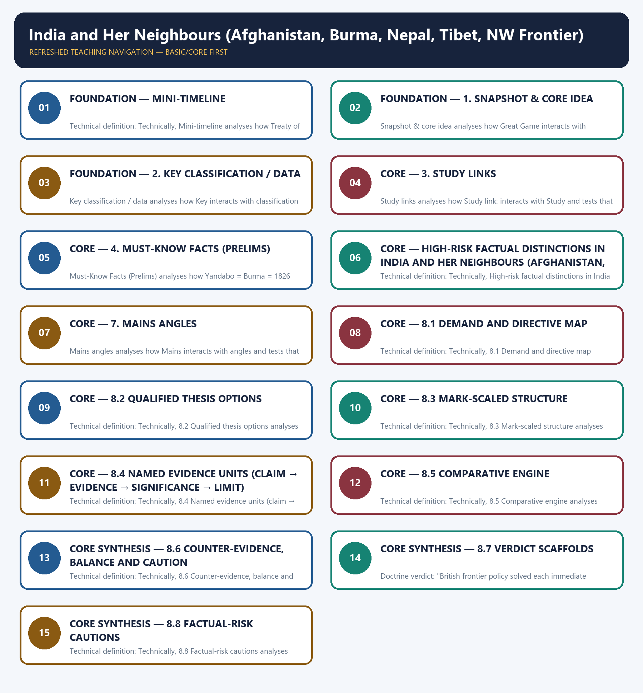

# India and Her Neighbours (Afghanistan, Burma, Nepal, Tibet, NW Frontier) - Learner-v2 Complete Learning Session

### SOURCE, PROGRESSION AND CURRENT-LINKAGE AUDIT

- **Repository owners queried:** Basic and Advanced Markdown for this topic, the master chronology, syllabus map and linked Modern History owners.
- **OCR book evidence queried:** OCR checks located the Treaty of Yandabo around PDF page 172, Gandamak around page 180 and Tibet/Younghusband around pages 180-183 of Bipan Chandra. These are cross-checked against the repository owner.
- **Qdrant:** not used; Markdown plus searchable local PDFs were sufficient.
- **PYQ integrity:** Repository routing audits assign no direct Modern-History PYQ to Topic 13. Geography and International Relations questions on current neighbours remain outside this owner's historical frontier-policy scope.
- **Bounded live linkage:** PIB's record of the July 2026 India-Myanmar national-level meeting is used only as a contemporary border-security and connectivity bridge. It is not evidence for nineteenth-century annexation, treaties or boundaries.
- **Fact/inference rule:** historical claims are source-backed; analytical judgements are explicitly framed as interpretation and do not invent figures.

## BASIC LEARNING SESSION



*Distinct embedded teaching-navigation image. The separate continuous Cārvāka-style flowchart package remains an independent at-a-glance artifact.*

### SESSION 1 — FOUNDATION — MINI-TIMELINE

#### DEFINITION / WHAT THIS IS CALLED

**Plain-language definition:** Plain definition: Mini-timeline is a learner's map within India and Her Neighbours (Afghanistan, Burma, Nepal, Tibet, NW Frontier) that groups Treaty of Sagauli, Treaty of Yandabo and Treaty of Gandamak.

**Technical definition:** Technical definition: Technically, Mini-timeline analyses how Treaty of Sagauli interacts with Treaty of Yandabo and tests that relationship through Treaty of Gandamak and Durand Line.

#### ANSWER-GRABBING OPENING — WRITE/ADAPT IN THE EXAM

> Plain definition: Mini-timeline is a learner's map within India and Her Neighbours (Afghanistan, Burma, Nepal, Tibet, NW Frontier) that groups Treaty of Sagauli, Treaty of Yandabo and Treaty of Gandamak.

#### MUST-WRITE KEYWORDS

- **FOUNDATION**
- **Mini-timeline**
- **Plain definition**
- **Technical definition**
- **Treaty of Sagauli**
- **Treaty of Yandabo**

**How to use them:** Frame the answer through FOUNDATION; define Mini-timeline, connect Plain definition with Technical definition to explain the mechanism, and use Treaty of Sagauli for the decisive comparison or qualification.

##### VISUAL FIRST

```text
MINI-TIMELINE
Treaty of Sagauli -> Treaty of Yandabo -> Treaty of Gandamak -> Durand Line
context -> evidence -> mechanism -> qualification -> UPSC judgement
```

*The visual fixes the subtopic's evidence-to-judgement sequence before detail.*

##### CONCEPT DEFINITIONS

- **Plain definition:** Mini-timeline is a learner's map within India and Her Neighbours (Afghanistan, Burma, Nepal, Tibet, NW Frontier) that groups Treaty of Sagauli, Treaty of Yandabo and Treaty of Gandamak.
- **Technical definition:** Technically, Mini-timeline analyses how Treaty of Sagauli interacts with Treaty of Yandabo and tests that relationship through Treaty of Gandamak and Durand Line.

| Date | Event |
|---|---|
| ✅ 1814–16 | Anglo-Nepalese War; **Treaty of Sagauli** |
| ✅ 1824–26 | First Anglo-Burmese War; **Treaty of Yandabo** |
| ✅ 1839–42 | First Anglo-Afghan War; retreat from Kabul exposed frontier disaster |
| ✅ 1852 | Second Anglo-Burmese War; Lower Burma annexed under Dalhousie |
| ✅ 1878–80 | Second Anglo-Afghan War; **Treaty of Gandamak** |
| ✅ 1885 | Third Anglo-Burmese War; Upper Burma annexed under Dufferin |
| ✅ 1893 | **Durand Line** agreement fixed Afghan frontier sphere |
| ✅ 1901 | **NWFP** created under Curzon |
| ✅ 1904 | Younghusband Mission reached Tibet; Lhasa Convention followed |

##### EXAM LINK

- **Prelims:** preserve the exact actor-date-institution match and eliminate category errors.
- **Mains:** connect evidence to mechanism, add one limitation and end with a graded verdict.

##### MINI RECAP

- Retain the distinction expressed by **Mini-timeline**; do not reduce it to an isolated fact.

#### CLOSING RECALL FLOW — FOUNDATION — MINI-TIMELINE

```text
START / CONCEPT: FOUNDATION — Mini-timeline
        |
        v
EXACT TERMS: FOUNDATION · Mini-timeline · Plain definition · Technical definition · Treaty of Sagauli · Treaty of Yandabo
        |
        v
MECHANISM / ARGUMENT: Technical definition: Technically, Mini-timeline analyses how Treaty of Sagauli interacts with Treaty of Yandabo and tests that relationship through Treaty of Gandamak and Durand Line.
        |
        v
CONSEQUENCE / CONTRAST: Retain the distinction expressed by Mini-timeline; do not reduce it to an isolated fact.
        |
        v
UPSC TRAP / ANSWER-USE: Do not miss this limiting distinction: retain the distinction expressed by Mini-timeline.
        |
        v
ANSWER-GRABBING FORMULATION: Plain definition: Mini-timeline is a learner's map within India and Her Neighbours (Afghanistan, Burma, Nepal, Tibet, NW Frontier) that groups Treaty of Sagauli, Treaty of Yandabo and Treaty of Gandamak.
```
### SESSION 2 — FOUNDATION — 1. SNAPSHOT & CORE IDEA

#### DEFINITION / WHAT THIS IS CALLED

**Plain-language definition:** Snapshot & core idea is a learner's map within India and Her Neighbours (Afghanistan, Burma, Nepal, Tibet, NW Frontier) that groups Great Game, close-border policy and forward policy.

**Technical definition:** Snapshot & core idea analyses how Great Game interacts with close-border policy and tests that relationship through forward policy and 1824–26.

#### ANSWER-GRABBING OPENING — WRITE/ADAPT IN THE EXAM

> Snapshot & core idea is a learner's map within India and Her Neighbours (Afghanistan, Burma, Nepal, Tibet, NW Frontier) that groups Great Game, close-border policy and forward policy.

#### MUST-WRITE KEYWORDS

- **FOUNDATION**
- **Plain definition**
- **Technical definition**
- **Great Game**
- **close-border policy**
- **1. Snapshot & core idea**

**How to use them:** Frame the answer through FOUNDATION; define Plain definition, connect Technical definition with Great Game to explain the mechanism, and use close-border policy for the decisive comparison or qualification.

##### VISUAL FIRST

```text
1. SNAPSHOT & CORE IDEA
Great Game -> close-border policy -> forward policy -> 1824–26
context -> evidence -> mechanism -> qualification -> UPSC judgement
```

*The visual fixes the subtopic's evidence-to-judgement sequence before detail.*

##### CONCEPT DEFINITIONS

- **Plain definition:** 1. Snapshot & core idea is a learner's map within India and Her Neighbours (Afghanistan, Burma, Nepal, Tibet, NW Frontier) that groups Great Game, close-border policy and forward policy.
- **Technical definition:** Technically, 1. Snapshot & core idea analyses how Great Game interacts with close-border policy and tests that relationship through forward policy and 1824–26.

**Foundation — frontier policy aimed at security, buffers and imperial prestige.**

- ✅ British rulers treated India's neighbours as part of a defensive ring around the empire.
- ✅ Afghanistan became central because of fear of Russian advance in Central Asia, often called the **Great Game**.
- ✅ The British alternated between **close-border policy** and **forward policy** on the north-west frontier.
- ✅ Buffer states and treaties were used to keep rival European power away from India's land frontiers.

**Foundation — Burma, Nepal and Tibet were tied to imperial strategy.**

- ✅ In Burma, the British fought three wars: **1824–26**, **1852** and **1885**, annexing territory in stages until Upper Burma was absorbed.
- ✅ In Nepal, the **Treaty of Sagauli (1816)** followed the Anglo-Nepalese War and led to a British Residency and Gurkha recruitment.
- ✅ In Tibet, Curzon sent the **Younghusband Mission (1904)**, producing the Lhasa Convention.
- ⚠️ Frontier policy also shaped later boundary problems and strategic anxieties after 1947.

##### EXAM LINK

- **Prelims:** preserve the exact actor-date-institution match and eliminate category errors.
- **Mains:** connect evidence to mechanism, add one limitation and end with a graded verdict.

##### MINI RECAP

- Retain the distinction expressed by **1. Snapshot & core idea**; do not reduce it to an isolated fact.

#### CLOSING RECALL FLOW — FOUNDATION — 1. SNAPSHOT & CORE IDEA

```text
START / CONCEPT: FOUNDATION — 1. Snapshot & core idea
        |
        v
EXACT TERMS: FOUNDATION · Plain definition · Technical definition · Great Game · close-border policy · 1. Snapshot & core idea
        |
        v
MECHANISM / ARGUMENT: Snapshot & core idea analyses how Great Game interacts with close-border policy and tests that relationship through forward policy and 1824–26.
        |
        v
CONSEQUENCE / CONTRAST: Snapshot & core idea; do not reduce it to an isolated fact.
        |
        v
UPSC TRAP / ANSWER-USE: Do not miss this limiting distinction: foundation — Burma, Nepal and Tibet were tied to imperial strategy.
        |
        v
ANSWER-GRABBING FORMULATION: Snapshot & core idea is a learner's map within India and Her Neighbours (Afghanistan, Burma, Nepal, Tibet, NW Frontier) that groups Great Game, close-border policy and forward policy.
```
### SESSION 3 — FOUNDATION — 2. KEY CLASSIFICATION / DATA

#### DEFINITION / WHAT THIS IS CALLED

**Plain-language definition:** Key classification / data is a learner's map within India and Her Neighbours (Afghanistan, Burma, Nepal, Tibet, NW Frontier) that groups Key, classification and data.

**Technical definition:** Key classification / data analyses how Key interacts with classification and tests that relationship through data and context.

#### ANSWER-GRABBING OPENING — WRITE/ADAPT IN THE EXAM

> Key classification / data is a learner's map within India and Her Neighbours (Afghanistan, Burma, Nepal, Tibet, NW Frontier) that groups Key, classification and data.

#### MUST-WRITE KEYWORDS

- **FOUNDATION**
- **Plain definition**
- **Technical definition**
- **✅ Afghanistan**
- **Great Game, buffer policy, forward policy**
- **2. Key classification / data**

**How to use them:** Frame the answer through FOUNDATION; define Plain definition, connect Technical definition with ✅ Afghanistan to explain the mechanism, and use Great Game, buffer policy, forward policy for the decisive comparison or qualification.

##### VISUAL FIRST

```text
2. KEY CLASSIFICATION / DATA
Key -> classification -> data
context -> evidence -> mechanism -> qualification -> UPSC judgement
```

*The visual fixes the subtopic's evidence-to-judgement sequence before detail.*

##### CONCEPT DEFINITIONS

- **Plain definition:** 2. Key classification / data is a learner's map within India and Her Neighbours (Afghanistan, Burma, Nepal, Tibet, NW Frontier) that groups Key, classification and data.
- **Technical definition:** Technically, 2. Key classification / data analyses how Key interacts with classification and tests that relationship through data and context.

| Region | Event / treaty | UPSC hook |
|---|---|---|
| ✅ Afghanistan | First Anglo-Afghan War 1839–42; Second 1878–80; Treaty of Gandamak | Great Game, buffer policy, forward policy |
| ✅ North-West Frontier | Close-border vs forward policy; NWFP 1901 | Tribal frontier management under Curzon |
| ✅ Burma | Yandabo 1826; Lower Burma 1852; Upper Burma 1885 | Burma part of India until 1937 |
| ✅ Nepal | Anglo-Nepalese War 1814–16; Treaty of Sagauli | Gurkha recruitment and Residency |
| ✅ Tibet | Younghusband Mission 1904; Lhasa Convention | Curzon's frontier activism |
| ✅ Sikkim & Bhutan | Treaties and protectorate-style influence | Himalayan buffer strategy |
| ⚠️ Princely states | Paramountcy | Internal buffer and indirect control |

##### EXAM LINK

- **Prelims:** preserve the exact actor-date-institution match and eliminate category errors.
- **Mains:** connect evidence to mechanism, add one limitation and end with a graded verdict.

##### MINI RECAP

- Retain the distinction expressed by **2. Key classification / data**; do not reduce it to an isolated fact.

#### CLOSING RECALL FLOW — FOUNDATION — 2. KEY CLASSIFICATION / DATA

```text
START / CONCEPT: FOUNDATION — 2. Key classification / data
        |
        v
EXACT TERMS: FOUNDATION · Plain definition · Technical definition · ✅ Afghanistan · Great Game, buffer policy, forward policy · 2. Key classification / data
        |
        v
MECHANISM / ARGUMENT: Key classification / data analyses how Key interacts with classification and tests that relationship through data and context.
        |
        v
CONSEQUENCE / CONTRAST: Key classification / data; do not reduce it to an isolated fact.
        |
        v
UPSC TRAP / ANSWER-USE: Do not miss this limiting distinction: do not reduce it to an isolated fact.
        |
        v
ANSWER-GRABBING FORMULATION: Key classification / data is a learner's map within India and Her Neighbours (Afghanistan, Burma, Nepal, Tibet, NW Frontier) that groups Key, classification and data.
```
### SESSION 4 — CORE — 3. STUDY LINKS

#### DEFINITION / WHAT THIS IS CALLED

**Plain-language definition:** Study links is a learner's map within India and Her Neighbours (Afghanistan, Burma, Nepal, Tibet, NW Frontier) that groups Study link:, Study and links.

**Technical definition:** Study links analyses how Study link: interacts with Study and tests that relationship through links and context.

#### ANSWER-GRABBING OPENING — WRITE/ADAPT IN THE EXAM

> Study links is a learner's map within India and Her Neighbours (Afghanistan, Burma, Nepal, Tibet, NW Frontier) that groups Study link:, Study and links.

#### MUST-WRITE KEYWORDS

- **Plain definition**
- **Technical definition**
- **Study link**
- **Study links**
- **Study**
- **3. Study links**

**How to use them:** Frame the answer through Plain definition; define Technical definition, connect Study link with Study links to explain the mechanism, and use Study for the decisive comparison or qualification.

##### VISUAL FIRST

```text
3. STUDY LINKS
Study link: -> Study -> links
context -> evidence -> mechanism -> qualification -> UPSC judgement
```

*The visual fixes the subtopic's evidence-to-judgement sequence before detail.*

##### CONCEPT DEFINITIONS

- **Plain definition:** 3. Study links is a learner's map within India and Her Neighbours (Afghanistan, Burma, Nepal, Tibet, NW Frontier) that groups Study link:, Study and links.
- **Technical definition:** Technically, 3. Study links analyses how Study link: interacts with Study and tests that relationship through links and context.

> **Study link:** ✅ British expansion methods and annexations → `basic/05_British-Territorial-Expansion.md`.
> **Study link:** ✅ Crown-era administration and Curzon's imperial state → `basic/12_Administrative-Changes-After-1858.md`.
> **Study link:** ⚠️ Later international borders and integration issues → `basic/28_Integration-of-Princely-States.md`.

##### EXAM LINK

- **Prelims:** preserve the exact actor-date-institution match and eliminate category errors.
- **Mains:** connect evidence to mechanism, add one limitation and end with a graded verdict.

##### MINI RECAP

- Retain the distinction expressed by **3. Study links**; do not reduce it to an isolated fact.

#### CLOSING RECALL FLOW — CORE — 3. STUDY LINKS

```text
START / CONCEPT: CORE — 3. Study links
        |
        v
EXACT TERMS: Plain definition · Technical definition · Study link · Study links · Study · 3. Study links
        |
        v
MECHANISM / ARGUMENT: Study links analyses how Study link: interacts with Study and tests that relationship through links and context.
        |
        v
CONSEQUENCE / CONTRAST: Study links; do not reduce it to an isolated fact.
        |
        v
UPSC TRAP / ANSWER-USE: Do not miss this limiting distinction: do not reduce it to an isolated fact.
        |
        v
ANSWER-GRABBING FORMULATION: Study links is a learner's map within India and Her Neighbours (Afghanistan, Burma, Nepal, Tibet, NW Frontier) that groups Study link:, Study and links.
```
### SESSION 5 — CORE — 4. MUST-KNOW FACTS (PRELIMS)

#### DEFINITION / WHAT THIS IS CALLED

**Plain-language definition:** Must-Know Facts (Prelims) is a learner's map within India and Her Neighbours (Afghanistan, Burma, Nepal, Tibet, NW Frontier) that groups Yandabo = Burma = 1826, Sagauli = Nepal = 1816 and Gandamak = Afghanistan = 1879.

**Technical definition:** Must-Know Facts (Prelims) analyses how Yandabo = Burma = 1826 interacts with Sagauli = Nepal = 1816 and tests that relationship through Gandamak = Afghanistan = 1879 and Durand Line = 1893.

#### ANSWER-GRABBING OPENING — WRITE/ADAPT IN THE EXAM

> Must-Know Facts (Prelims) is a learner's map within India and Her Neighbours (Afghanistan, Burma, Nepal, Tibet, NW Frontier) that groups Yandabo = Burma = 1826, Sagauli = Nepal = 1816 and Gandamak = Afghanistan = 1879.

#### MUST-WRITE KEYWORDS

- **Plain definition**
- **Technical definition**
- **Yandabo = Burma = 1826**
- **Sagauli = Nepal = 1816**
- **Gandamak = Afghanistan = 1879**
- **4. Must-Know Facts (Prelims)**

**How to use them:** Frame the answer through Plain definition; define Technical definition, connect Yandabo = Burma = 1826 with Sagauli = Nepal = 1816 to explain the mechanism, and use Gandamak = Afghanistan = 1879 for the decisive comparison or qualification.

##### VISUAL FIRST

```text
4. MUST-KNOW FACTS (PRELIMS)
Yandabo = Burma = 1826 -> Sagauli = Nepal = 1816 -> Gandamak = Afghanistan = 1879 -> Durand Line = 1893
context -> evidence -> mechanism -> qualification -> UPSC judgement
```

*The visual fixes the subtopic's evidence-to-judgement sequence before detail.*

##### CONCEPT DEFINITIONS

- **Plain definition:** 4. Must-Know Facts (Prelims) is a learner's map within India and Her Neighbours (Afghanistan, Burma, Nepal, Tibet, NW Frontier) that groups Yandabo = Burma = 1826, Sagauli = Nepal = 1816 and Gandamak = Afghanistan = 1879.
- **Technical definition:** Technically, 4. Must-Know Facts (Prelims) analyses how Yandabo = Burma = 1826 interacts with Sagauli = Nepal = 1816 and tests that relationship through Gandamak = Afghanistan = 1879 and Durand Line = 1893.

- ✅ **Yandabo = Burma = 1826**; do not confuse it with Nepal or Afghanistan.
- ✅ **Sagauli = Nepal = 1816**; it followed the Anglo-Nepalese War.
- ✅ **Gandamak = Afghanistan = 1879**; it followed the Second Anglo-Afghan War.
- ✅ **Durand Line = 1893**; linked to the Afghan frontier.
- ✅ **NWFP = 1901 = Curzon**.
- ✅ **Burma was administered as part of India until 1937**.
- ✅ **Younghusband Mission = Tibet = 1904 = Curzon**.

##### EXAM LINK

- **Prelims:** preserve the exact actor-date-institution match and eliminate category errors.
- **Mains:** connect evidence to mechanism, add one limitation and end with a graded verdict.

##### MINI RECAP

- Retain the distinction expressed by **4. Must-Know Facts (Prelims)**; do not reduce it to an isolated fact.

#### CLOSING RECALL FLOW — CORE — 4. MUST-KNOW FACTS (PRELIMS)

```text
START / CONCEPT: CORE — 4. Must-Know Facts (Prelims)
        |
        v
EXACT TERMS: Plain definition · Technical definition · Yandabo = Burma = 1826 · Sagauli = Nepal = 1816 · Gandamak = Afghanistan = 1879 · 4. Must-Know Facts (Prelims)
        |
        v
MECHANISM / ARGUMENT: Must-Know Facts (Prelims) analyses how Yandabo = Burma = 1826 interacts with Sagauli = Nepal = 1816 and tests that relationship through Gandamak = Afghanistan = 1879 and Durand Line = 1893.
        |
        v
CONSEQUENCE / CONTRAST: Must-Know Facts (Prelims); do not reduce it to an isolated fact.
        |
        v
UPSC TRAP / ANSWER-USE: ✅ Yandabo = Burma = 1826; do not confuse it with Nepal or Afghanistan. ✅ Sagauli = Nepal = 1816; it followed the Anglo-Nepalese War. ✅ Gandamak = Afghanistan = 1879; it followed the Second Anglo-Afghan War. ✅ Durand Line = 1893; linked to the Afghan frontier. ✅ NWFP = 1901 = Curzon. ✅ Burma was administered as part of India until 1937. ✅ Younghusband Mission = Tibet = 1904 = Curzon.
        |
        v
ANSWER-GRABBING FORMULATION: Must-Know Facts (Prelims) is a learner's map within India and Her Neighbours (Afghanistan, Burma, Nepal, Tibet, NW Frontier) that groups Yandabo = Burma = 1826, Sagauli = Nepal = 1816 and Gandamak = Afghanistan = 1879.
```
### SESSION 6 — CORE — HIGH-RISK FACTUAL DISTINCTIONS IN INDIA AND HER NEIGHBOURS (AFGHANISTAN, BURMA, NEPAL, TIBET, NW FRONTIER)

#### DEFINITION / WHAT THIS IS CALLED

**Plain-language definition:** Plain definition: High-risk factual distinctions in India and Her Neighbours (Afghanistan, Burma, Nepal, Tibet, NW Frontier) is a learner's map within India and Her Neighbours (Afghanistan, Burma, Nepal, Tibet, NW Frontier) that groups war → treaty → region → date, Burma and Nepal.

**Technical definition:** Technical definition: Technically, High-risk factual distinctions in India and Her Neighbours (Afghanistan, Burma, Nepal, Tibet, NW Frontier) analyses how war → treaty → region → date interacts with Burma and tests that relationship through Nepal and Afghanistan.

#### ANSWER-GRABBING OPENING — WRITE/ADAPT IN THE EXAM

> Retain the distinction expressed by High-risk factual distinctions in India and Her Neighbours (Afghanistan, Burma, Nepal, Tibet, NW Frontier); do not reduce it to an isolated fact.

#### MUST-WRITE KEYWORDS

- **High-risk factual distinctions in India**
- **Her Neighbours (Afghanistan**
- **Burma**
- **Nepal**
- **Tibet**
- **NW Frontier)**

**How to use them:** Frame the answer through High-risk factual distinctions in India; define Her Neighbours (Afghanistan, connect Burma with Nepal to explain the mechanism, and use Tibet for the decisive comparison or qualification.

##### VISUAL FIRST

```text
HIGH-RISK FACTUAL DISTINCTIONS IN INDIA AND HER NEIGHBOURS (AFGHANISTAN, BURMA, NEPAL, TIBET, NW FRONTIER)
war → treaty → region → date -> Burma -> Nepal -> Afghanistan
context -> evidence -> mechanism -> qualification -> UPSC judgement
```

*The visual fixes the subtopic's evidence-to-judgement sequence before detail.*

##### CONCEPT DEFINITIONS

- **Plain definition:** High-risk factual distinctions in India and Her Neighbours (Afghanistan, Burma, Nepal, Tibet, NW Frontier) is a learner's map within India and Her Neighbours (Afghanistan, Burma, Nepal, Tibet, NW Frontier) that groups war → treaty → region → date, Burma and Nepal.
- **Technical definition:** Technically, High-risk factual distinctions in India and Her Neighbours (Afghanistan, Burma, Nepal, Tibet, NW Frontier) analyses how war → treaty → region → date interacts with Burma and tests that relationship through Nepal and Afghanistan.

> 🔑 Trap: Match **war → treaty → region → date**; frontier questions are often date-and-treaty traps.

- ❌ Treaty of Yandabo belongs to Nepal. → It belongs to **Burma**.
- ❌ Treaty of Sagauli belongs to Afghanistan. → It belongs to **Nepal**.
- ❌ Treaty of Gandamak belongs to Burma. → It belongs to **Afghanistan**.
- ❌ Burma was always separate from British India. → It was administered as part of India until **1937**.

##### EXAM LINK

- **Prelims:** preserve the exact actor-date-institution match and eliminate category errors.
- **Mains:** connect evidence to mechanism, add one limitation and end with a graded verdict.

##### MINI RECAP

- Retain the distinction expressed by **High-risk factual distinctions in India and Her Neighbours (Afghanistan, Burma, Nepal, Tibet, NW Frontier)**; do not reduce it to an isolated fact.

#### CLOSING RECALL FLOW — CORE — HIGH-RISK FACTUAL DISTINCTIONS IN INDIA AND HER NEIGHBOURS (AFGHANISTAN, BURMA, NEPAL, TIBET, NW FRONTIER)

```text
START / CONCEPT: CORE — High-risk factual distinctions in India and Her Neighbours (Afghanistan, Burma, Nepal, Tibet, NW Frontier)
        |
        v
EXACT TERMS: High-risk factual distinctions in India · Her Neighbours (Afghanistan · Burma · Nepal · Tibet · NW Frontier)
        |
        v
MECHANISM / ARGUMENT: Technical definition: Technically, High-risk factual distinctions in India and Her Neighbours (Afghanistan, Burma, Nepal, Tibet, NW Frontier) analyses how war → treaty → region → date interacts with Burma and tests that relationship through Nepal and Afghanistan.
        |
        v
CONSEQUENCE / CONTRAST: Plain definition: High-risk factual distinctions in India and Her Neighbours (Afghanistan, Burma, Nepal, Tibet, NW Frontier) is a learner's map within India and Her Neighbours (Afghanistan, Burma, Nepal, Tibet, NW Frontier) that groups war → treaty → region → date, Burma and Nepal.
        |
        v
UPSC TRAP / ANSWER-USE: Do not miss this limiting distinction: ❌ Treaty of Yandabo belongs to Nepal. → It belongs to Burma. ❌ Treaty...
        |
        v
ANSWER-GRABBING FORMULATION: Retain the distinction expressed by High-risk factual distinctions in India and Her Neighbours (Afghanistan, Burma, Nepal, Tibet, NW Frontier); do not reduce it to an isolated fact.
```
### CORE — 6. 📰 Current link

##### VISUAL FIRST

```text
6. 📰 CURRENT LINK
Current -> link
context -> evidence -> mechanism -> qualification -> UPSC judgement
```

*The visual fixes the subtopic's evidence-to-judgement sequence before detail.*

##### CONCEPT DEFINITIONS

- **Plain definition:** 6. 📰 Current link is a learner's map within India and Her Neighbours (Afghanistan, Burma, Nepal, Tibet, NW Frontier) that groups Current, link and context.
- **Technical definition:** Technically, 6. 📰 Current link analyses how Current interacts with link and tests that relationship through context and evidence.

- ⚠️ **Border management and neighbourhood-policy debates.** Colonial frontier lines and buffer policies remain useful background for modern discussions on Afghanistan, Myanmar and Himalayan borders. *(Escalate to 📰 when pegged to a verified news item.)*

##### EXAM LINK

- **Prelims:** preserve the exact actor-date-institution match and eliminate category errors.
- **Mains:** connect evidence to mechanism, add one limitation and end with a graded verdict.

##### MINI RECAP

- Retain the distinction expressed by **6. 📰 Current link**; do not reduce it to an isolated fact.
### SESSION 7 — CORE — 7. MAINS ANGLES

#### DEFINITION / WHAT THIS IS CALLED

**Plain-language definition:** Mains angles is a learner's map within India and Her Neighbours (Afghanistan, Burma, Nepal, Tibet, NW Frontier) that groups Mains, angles and context.

**Technical definition:** Mains angles analyses how Mains interacts with angles and tests that relationship through context and evidence.

#### ANSWER-GRABBING OPENING — WRITE/ADAPT IN THE EXAM

> Mains angles is a learner's map within India and Her Neighbours (Afghanistan, Burma, Nepal, Tibet, NW Frontier) that groups Mains, angles and context.

#### MUST-WRITE KEYWORDS

- **Plain definition**
- **Technical definition**
- **Mains angles**
- **India**
- **Her Neighbours**
- **7. Mains angles**

**How to use them:** Frame the answer through Plain definition; define Technical definition, connect Mains angles with India to explain the mechanism, and use Her Neighbours for the decisive comparison or qualification.

##### VISUAL FIRST

```text
7. MAINS ANGLES
Mains -> angles
context -> evidence -> mechanism -> qualification -> UPSC judgement
```

*The visual fixes the subtopic's evidence-to-judgement sequence before detail.*

##### CONCEPT DEFINITIONS

- **Plain definition:** 7. Mains angles is a learner's map within India and Her Neighbours (Afghanistan, Burma, Nepal, Tibet, NW Frontier) that groups Mains, angles and context.
- **Technical definition:** Technically, 7. Mains angles analyses how Mains interacts with angles and tests that relationship through context and evidence.

- ⚠️ GS-1: Explain how British frontier policy combined fear of Russia, buffer states and forward policy.
- ⚠️ GS-1: Compare British policy towards Afghanistan and Burma in terms of security and expansion.
- ⚠️ GS-1: Assess the long-term legacy of colonial frontier-making for India's post-1947 neighbourhood.

##### EXAM LINK

- **Prelims:** preserve the exact actor-date-institution match and eliminate category errors.
- **Mains:** connect evidence to mechanism, add one limitation and end with a graded verdict.

##### MINI RECAP

- Retain the distinction expressed by **7. Mains angles**; do not reduce it to an isolated fact.

#### CLOSING RECALL FLOW — CORE — 7. MAINS ANGLES

```text
START / CONCEPT: CORE — 7. Mains angles
        |
        v
EXACT TERMS: Plain definition · Technical definition · Mains angles · India · Her Neighbours · 7. Mains angles
        |
        v
MECHANISM / ARGUMENT: Mains angles analyses how Mains interacts with angles and tests that relationship through context and evidence.
        |
        v
CONSEQUENCE / CONTRAST: Mains angles; do not reduce it to an isolated fact.
        |
        v
UPSC TRAP / ANSWER-USE: Do not miss this limiting distinction: explain how British frontier policy combined fear of Russia, buffer states and forward policy....
        |
        v
ANSWER-GRABBING FORMULATION: Mains angles is a learner's map within India and Her Neighbours (Afghanistan, Burma, Nepal, Tibet, NW Frontier) that groups Mains, angles and context.
```
### CORE — Answer architecture overview

##### VISUAL FIRST

```text
ANSWER ARCHITECTURE OVERVIEW
Answer -> architecture -> overview
context -> evidence -> mechanism -> qualification -> UPSC judgement
```

*The visual fixes the subtopic's evidence-to-judgement sequence before detail.*

##### CONCEPT DEFINITIONS

- **Plain definition:** Answer architecture overview is a learner's map within India and Her Neighbours (Afghanistan, Burma, Nepal, Tibet, NW Frontier) that groups Answer, architecture and overview.
- **Technical definition:** Technically, Answer architecture overview analyses how Answer interacts with architecture and tests that relationship through overview and context.

> Purpose: convert treaty-and-date material into answers on **strategic doctrine, comparison and legacy**, since this owner is examined more often through "why" and "with what consequence" than through narrative.

##### EXAM LINK

- **Prelims:** preserve the exact actor-date-institution match and eliminate category errors.
- **Mains:** connect evidence to mechanism, add one limitation and end with a graded verdict.

##### MINI RECAP

- Retain the distinction expressed by **Answer architecture overview**; do not reduce it to an isolated fact.
### SESSION 8 — CORE — 8.1 DEMAND AND DIRECTIVE MAP

#### DEFINITION / WHAT THIS IS CALLED

**Plain-language definition:** Plain definition: 8.1 Demand and directive map is a learner's map within India and Her Neighbours (Afghanistan, Burma, Nepal, Tibet, NW Frontier) that groups Demand, and and directive.

**Technical definition:** Technical definition: Technically, 8.1 Demand and directive map analyses how Demand interacts with and and tests that relationship through directive and map.

#### ANSWER-GRABBING OPENING — WRITE/ADAPT IN THE EXAM

> Plain definition: 8.1 Demand and directive map is a learner's map within India and Her Neighbours (Afghanistan, Burma, Nepal, Tibet, NW Frontier) that groups Demand, and and directive.

#### MUST-WRITE KEYWORDS

- **directive map**
- **Plain definition**
- **Technical definition**
- **Doctrine analysis**
- **8.1 Demand**
- **8.1 Demand and directive map**

**How to use them:** Frame the answer through directive map; define Plain definition, connect Technical definition with Doctrine analysis to explain the mechanism, and use 8.1 Demand for the decisive comparison or qualification.

##### VISUAL FIRST

```text
8.1 DEMAND AND DIRECTIVE MAP
Demand -> and -> directive -> map
context -> evidence -> mechanism -> qualification -> UPSC judgement
```

*The visual fixes the subtopic's evidence-to-judgement sequence before detail.*

##### CONCEPT DEFINITIONS

- **Plain definition:** 8.1 Demand and directive map is a learner's map within India and Her Neighbours (Afghanistan, Burma, Nepal, Tibet, NW Frontier) that groups Demand, and and directive.
- **Technical definition:** Technically, 8.1 Demand and directive map analyses how Demand interacts with and and tests that relationship through directive and map.

| Demand family | Typical directive signals | Answer spine to use |
|---|---|---|
| Doctrine analysis | "Explain British frontier policy" | Threat perception → doctrinal choice → instrument → cost |
| Comparison | "Compare policy toward Afghanistan and Burma" | Objective (buffer vs annexation) → method → outcome → why they differed |
| Legacy | "Assess colonial frontier-making for India after 1947" | Line drawn → state inherited → dispute generated → present significance |
| Cost/critique | "Was the forward policy justified?" | Security rationale → military and fiscal cost → Indian revenue burden |
| Economic motive | "Was frontier expansion strategic or commercial?" | Security argument → commercial argument (Burma) → weighting |
| Buffer logic | "Role of buffer states in imperial defence" | Ring of dependencies → paramountcy → limits |

##### EXAM LINK

- **Prelims:** preserve the exact actor-date-institution match and eliminate category errors.
- **Mains:** connect evidence to mechanism, add one limitation and end with a graded verdict.

##### MINI RECAP

- Retain the distinction expressed by **8.1 Demand and directive map**; do not reduce it to an isolated fact.

#### CLOSING RECALL FLOW — CORE — 8.1 DEMAND AND DIRECTIVE MAP

```text
START / CONCEPT: CORE — 8.1 Demand and directive map
        |
        v
EXACT TERMS: directive map · Plain definition · Technical definition · Doctrine analysis · 8.1 Demand · 8.1 Demand and directive map
        |
        v
MECHANISM / ARGUMENT: Technical definition: Technically, 8.1 Demand and directive map analyses how Demand interacts with and and tests that relationship through directive and map.
        |
        v
CONSEQUENCE / CONTRAST: Retain the distinction expressed by 8.1 Demand and directive map; do not reduce it to an isolated fact.
        |
        v
UPSC TRAP / ANSWER-USE: Do not miss this limiting distinction: retain the distinction expressed by 8.1 Demand and directive map.
        |
        v
ANSWER-GRABBING FORMULATION: Plain definition: 8.1 Demand and directive map is a learner's map within India and Her Neighbours (Afghanistan, Burma, Nepal, Tibet, NW Frontier) that groups Demand, and and directive.
```
### SESSION 9 — CORE — 8.2 QUALIFIED THESIS OPTIONS

#### DEFINITION / WHAT THIS IS CALLED

**Plain-language definition:** Plain definition: 8.2 Qualified thesis options is a learner's map within India and Her Neighbours (Afghanistan, Burma, Nepal, Tibet, NW Frontier) that groups Threat-driven thesis:, Differentiated-objective thesis: and Cost thesis:.

**Technical definition:** Technical definition: Technically, 8.2 Qualified thesis options analyses how Threat-driven thesis: interacts with Differentiated-objective thesis: and tests that relationship through Cost thesis: and Legacy thesis:.

#### ANSWER-GRABBING OPENING — WRITE/ADAPT IN THE EXAM

> Plain definition: 8.2 Qualified thesis options is a learner's map within India and Her Neighbours (Afghanistan, Burma, Nepal, Tibet, NW Frontier) that groups Threat-driven thesis:, Differentiated-objective thesis: and Cost thesis:.

#### MUST-WRITE KEYWORDS

- **Plain definition**
- **Technical definition**
- **Threat-driven thesis**
- **Differentiated-objective thesis**
- **Cost thesis**
- **8.2 Qualified thesis options**

**How to use them:** Frame the answer through Plain definition; define Technical definition, connect Threat-driven thesis with Differentiated-objective thesis to explain the mechanism, and use Cost thesis for the decisive comparison or qualification.

##### VISUAL FIRST

```text
8.2 QUALIFIED THESIS OPTIONS
Threat-driven thesis: -> Differentiated-objective thesis: -> Cost thesis: -> Legacy thesis:
context -> evidence -> mechanism -> qualification -> UPSC judgement
```

*The visual fixes the subtopic's evidence-to-judgement sequence before detail.*

##### CONCEPT DEFINITIONS

- **Plain definition:** 8.2 Qualified thesis options is a learner's map within India and Her Neighbours (Afghanistan, Burma, Nepal, Tibet, NW Frontier) that groups Threat-driven thesis:, Differentiated-objective thesis: and Cost thesis:.
- **Technical definition:** Technically, 8.2 Qualified thesis options analyses how Threat-driven thesis: interacts with Differentiated-objective thesis: and tests that relationship through Cost thesis: and Legacy thesis:.

- **Threat-driven thesis:** *British frontier policy was defensive in conception and expansionist in effect: each measure taken to secure an existing border created a new frontier requiring further securing.*
- **Differentiated-objective thesis:** *The Raj did not have one neighbourhood policy but two — buffer management where a rival great power was involved (Afghanistan, Tibet, Nepal) and outright annexation where none was (Burma).*
- **Cost thesis:** *Frontier defence was paid for from Indian revenue for British imperial purposes, which is why "home charges plus frontier wars" became a standing item in the nationalist economic critique.*
- **Legacy thesis:** *Colonial frontier-making bequeathed independent India lines drawn for imperial convenience rather than for Indian security or ethnography, and the resulting boundary questions long outlived the empire that created them.*

##### EXAM LINK

- **Prelims:** preserve the exact actor-date-institution match and eliminate category errors.
- **Mains:** connect evidence to mechanism, add one limitation and end with a graded verdict.

##### MINI RECAP

- Retain the distinction expressed by **8.2 Qualified thesis options**; do not reduce it to an isolated fact.

#### CLOSING RECALL FLOW — CORE — 8.2 QUALIFIED THESIS OPTIONS

```text
START / CONCEPT: CORE — 8.2 Qualified thesis options
        |
        v
EXACT TERMS: Plain definition · Technical definition · Threat-driven thesis · Differentiated-objective thesis · Cost thesis · 8.2 Qualified thesis options
        |
        v
MECHANISM / ARGUMENT: Technical definition: Technically, 8.2 Qualified thesis options analyses how Threat-driven thesis: interacts with Differentiated-objective thesis: and tests that relationship through Cost thesis: and Legacy thesis:.
        |
        v
CONSEQUENCE / CONTRAST: Retain the distinction expressed by 8.2 Qualified thesis options; do not reduce it to an isolated fact.
        |
        v
UPSC TRAP / ANSWER-USE: Do not miss this limiting distinction: british frontier policy was defensive in conception and expansionist in effect.
        |
        v
ANSWER-GRABBING FORMULATION: Plain definition: 8.2 Qualified thesis options is a learner's map within India and Her Neighbours (Afghanistan, Burma, Nepal, Tibet, NW Frontier) that groups Threat-driven thesis:, Differentiated-objective thesis: and Cost thesis:.
```
### SESSION 10 — CORE — 8.3 MARK-SCALED STRUCTURE

#### DEFINITION / WHAT THIS IS CALLED

**Plain-language definition:** Plain definition: 8.3 Mark-scaled structure is a learner's map within India and Her Neighbours (Afghanistan, Burma, Nepal, Tibet, NW Frontier) that groups Mark-scaled, structure and context.

**Technical definition:** Technical definition: Technically, 8.3 Mark-scaled structure analyses how Mark-scaled interacts with structure and tests that relationship through context and evidence.

#### ANSWER-GRABBING OPENING — WRITE/ADAPT IN THE EXAM

> Plain definition: 8.3 Mark-scaled structure is a learner's map within India and Her Neighbours (Afghanistan, Burma, Nepal, Tibet, NW Frontier) that groups Mark-scaled, structure and context.

#### MUST-WRITE KEYWORDS

- **Plain definition**
- **Technical definition**
- **Thesis → doctrine → two theatres → one cost → verdict**
- **8.3 Mark-scaled structure**
- **3 treaties/lines with dates**
- **5–6 units across three theatres**

**How to use them:** Frame the answer through Plain definition; define Technical definition, connect Thesis → doctrine → two theatres → one cost → verdict with 8.3 Mark-scaled structure to explain the mechanism, and use 3 treaties/lines with dates for the decisive comparison or qualification.

##### VISUAL FIRST

```text
8.3 MARK-SCALED STRUCTURE
Mark-scaled -> structure
context -> evidence -> mechanism -> qualification -> UPSC judgement
```

*The visual fixes the subtopic's evidence-to-judgement sequence before detail.*

##### CONCEPT DEFINITIONS

- **Plain definition:** 8.3 Mark-scaled structure is a learner's map within India and Her Neighbours (Afghanistan, Burma, Nepal, Tibet, NW Frontier) that groups Mark-scaled, structure and context.
- **Technical definition:** Technically, 8.3 Mark-scaled structure analyses how Mark-scaled interacts with structure and tests that relationship through context and evidence.

| Marks | Recommended architecture | Evidence load |
|---:|---|---|
| 10 | Thesis → doctrine → two theatres → one cost → verdict | 3 treaties/lines with dates |
| 15 | Thesis → Great Game logic → Afghanistan → Burma → Himalayan belt → costs → verdict | 5–6 units across three theatres |
| 20 | Thesis → doctrine and its oscillation → four theatres → economic and political costs → nationalist critique → post-1947 legacy → graded verdict | 6–8 units including administrative arrangements, not only wars |

##### EXAM LINK

- **Prelims:** preserve the exact actor-date-institution match and eliminate category errors.
- **Mains:** connect evidence to mechanism, add one limitation and end with a graded verdict.

##### MINI RECAP

- Retain the distinction expressed by **8.3 Mark-scaled structure**; do not reduce it to an isolated fact.

#### CLOSING RECALL FLOW — CORE — 8.3 MARK-SCALED STRUCTURE

```text
START / CONCEPT: CORE — 8.3 Mark-scaled structure
        |
        v
EXACT TERMS: Plain definition · Technical definition · Thesis → doctrine → two theatres → one cost → verdict · 8.3 Mark-scaled structure · 3 treaties/lines with dates · 5–6 units across three theatres
        |
        v
MECHANISM / ARGUMENT: Technical definition: Technically, 8.3 Mark-scaled structure analyses how Mark-scaled interacts with structure and tests that relationship through context and evidence.
        |
        v
CONSEQUENCE / CONTRAST: Retain the distinction expressed by 8.3 Mark-scaled structure; do not reduce it to an isolated fact.
        |
        v
UPSC TRAP / ANSWER-USE: Do not miss this limiting distinction: retain the distinction expressed by 8.3 Mark-scaled structure.
        |
        v
ANSWER-GRABBING FORMULATION: Plain definition: 8.3 Mark-scaled structure is a learner's map within India and Her Neighbours (Afghanistan, Burma, Nepal, Tibet, NW Frontier) that groups Mark-scaled, structure and context.
```
### SESSION 11 — CORE — 8.4 NAMED EVIDENCE UNITS (CLAIM → EVIDENCE → SIGNIFICANCE → LIMIT)

#### DEFINITION / WHAT THIS IS CALLED

**Plain-language definition:** Plain definition: 8.4 Named evidence units (claim → evidence → significance → limit) is a learner's map within India and Her Neighbours (Afghanistan, Burma, Nepal, Tibet, NW Frontier) that groups Claim:, Evidence: and close-border.

**Technical definition:** Technical definition: Technically, 8.4 Named evidence units (claim → evidence → significance → limit) analyses how Claim: interacts with Evidence: and tests that relationship through close-border and forward.

#### ANSWER-GRABBING OPENING — WRITE/ADAPT IN THE EXAM

> Plain definition: 8.4 Named evidence units (claim → evidence → significance → limit) is a learner's map within India and Her Neighbours (Afghanistan, Burma, Nepal, Tibet, NW Frontier) that groups Claim:, Evidence: and close-border.

#### MUST-WRITE KEYWORDS

- **Plain definition**
- **Technical definition**
- **A. The Great Game and doctrinal oscillation**
- **Claim**
- **close-border**
- **8.4 Named evidence units (claim → evidence → significance → limit)**

**How to use them:** Frame the answer through Plain definition; define Technical definition, connect A. The Great Game and doctrinal oscillation with Claim to explain the mechanism, and use close-border for the decisive comparison or qualification.

##### VISUAL FIRST

```text
8.4 NAMED EVIDENCE UNITS (CLAIM → EVIDENCE → SIGNIFICANCE → LIMIT)
Claim: -> Evidence: -> close-border -> forward
context -> evidence -> mechanism -> qualification -> UPSC judgement
```

*The visual fixes the subtopic's evidence-to-judgement sequence before detail.*

##### CONCEPT DEFINITIONS

- **Plain definition:** 8.4 Named evidence units (claim → evidence → significance → limit) is a learner's map within India and Her Neighbours (Afghanistan, Burma, Nepal, Tibet, NW Frontier) that groups Claim:, Evidence: and close-border.
- **Technical definition:** Technically, 8.4 Named evidence units (claim → evidence → significance → limit) analyses how Claim: interacts with Evidence: and tests that relationship through close-border and forward.

**A. The Great Game and doctrinal oscillation**
- **Claim:** Policy alternated because neither doctrine solved the underlying problem.
- **Evidence:** ✅ Fear of Russian advance in Central Asia drove Afghan policy; the British alternated between **close-border** and **forward** policy on the north-west frontier; ✅ **NWFP was created in 1901 under Curzon** as an administrative answer to tribal frontier management.
- **Significance:** The oscillation is the analytical content — a close border was cheap and left influence to rivals, a forward policy bought influence at the price of permanent tribal warfare.
- **Limit/caution:** Do not present the Russian threat as proven; it was a perception that shaped policy, and its realism was contested at the time.

**B. Afghanistan — the buffer that had to be fought for**
- **Claim:** Afghanistan was valued as a buffer, and each attempt to control it directly failed.
- **Evidence:** ✅ **First Anglo-Afghan War (1839–42)** ended in the disastrous retreat from Kabul; the **Second (1878–80)** produced the **Treaty of Gandamak (1879)**; the **Durand Line (1893)** fixed the frontier sphere.
- **Significance:** The pattern — intervention, reverse, negotiated buffer, boundary line — is the strongest evidence for the "defensive in conception, expansionist in effect" thesis.
- **Limit/caution:** Gandamak followed the **Second** war; do not attach it to the first or to the Durand agreement.

**C. Burma — annexation, not buffering**
- **Claim:** Where no European rival was engaged, security language gave way to commercial and territorial acquisition.
- **Evidence:** ✅ Three wars — **1824–26** (Treaty of **Yandabo**, 1826), **1852** (Lower Burma annexed under Dalhousie) and **1885** (Upper Burma annexed under Dufferin); ✅ **Burma was administered as part of India until 1937**.
- **Significance:** The staged, generation-by-generation absorption of a neighbouring kingdom is the clearest counter-case to the purely defensive reading of frontier policy, and Burma's administrative attachment explains later Indian migration, commerce and the 1937 separation.
- **Limit/caution:** Do not treat the 1937 separation as decolonisation; Burma remained a British possession.

**D. The Himalayan belt — Nepal, Tibet, Sikkim, Bhutan**
- **Claim:** The northern frontier was managed by treaty dependence rather than conquest.
- **Evidence:** ✅ The **Anglo-Nepalese War (1814–16)** and the **Treaty of Sagauli (1816)** brought a British Residency and **Gurkha recruitment**; ✅ Curzon's **Younghusband Mission (1904)** produced the **Lhasa Convention**; ✅ Sikkim and Bhutan were drawn into treaty and protectorate-style relationships.
- **Significance:** Gurkha recruitment converted a defeated adversary into a manpower source for the Indian Army — the most economically consequential outcome of the whole Himalayan policy — while the Tibet mission set precedents for boundary and status questions inherited in 1947.
- **Limit/caution:** Do not carry the Younghusband Mission's outcomes forward into modern boundary claims; note only that colonial-era arrangements framed later questions.

**E. Cost and the nationalist critique**
- **Claim:** Frontier policy is a bridge between this owner and colonial-economy arguments.
- **Evidence:** ⚠️ Frontier wars, the standing frontier garrison and the associated military expenditure were charged to **Indian revenue**, while the strategic benefit was imperial.
- **Significance:** Supplies the balance and critique paragraph — the analytical point that India paid for a defence perimeter defined by British rather than Indian interests.
- **Limit/caution:** Do not quantify military expenditure or its share of the budget; argue incidence, not amounts.

##### EXAM LINK

- **Prelims:** preserve the exact actor-date-institution match and eliminate category errors.
- **Mains:** connect evidence to mechanism, add one limitation and end with a graded verdict.

##### MINI RECAP

- Retain the distinction expressed by **8.4 Named evidence units (claim → evidence → significance → limit)**; do not reduce it to an isolated fact.

#### CLOSING RECALL FLOW — CORE — 8.4 NAMED EVIDENCE UNITS (CLAIM → EVIDENCE → SIGNIFICANCE → LIMIT)

```text
START / CONCEPT: CORE — 8.4 Named evidence units (claim → evidence → significance → limit)
        |
        v
EXACT TERMS: Plain definition · Technical definition · A. The Great Game and doctrinal oscillation · Claim · close-border · 8.4 Named evidence units (claim → evidence → significance → limit)
        |
        v
MECHANISM / ARGUMENT: Technical definition: Technically, 8.4 Named evidence units (claim → evidence → significance → limit) analyses how Claim: interacts with Evidence: and tests that relationship through close-border and forward.
        |
        v
CONSEQUENCE / CONTRAST: Retain the distinction expressed by 8.4 Named evidence units (claim → evidence → significance → limit); do not reduce it to an isolated fact.
        |
        v
UPSC TRAP / ANSWER-USE: Limit/caution: Do not carry the Younghusband Mission's outcomes forward into modern boundary claims; note only that colonial-era arrangements framed later questions.
        |
        v
ANSWER-GRABBING FORMULATION: Plain definition: 8.4 Named evidence units (claim → evidence → significance → limit) is a learner's map within India and Her Neighbours (Afghanistan, Burma, Nepal, Tibet, NW Frontier) that groups Claim:, Evidence: and close-border.
```
### SESSION 12 — CORE — 8.5 COMPARATIVE ENGINE

#### DEFINITION / WHAT THIS IS CALLED

**Plain-language definition:** Plain definition: 8.5 Comparative engine is a learner's map within India and Her Neighbours (Afghanistan, Burma, Nepal, Tibet, NW Frontier) that groups Comparative, engine and context.

**Technical definition:** Technical definition: Technically, 8.5 Comparative engine analyses how Comparative interacts with engine and tests that relationship through context and evidence.

#### ANSWER-GRABBING OPENING — WRITE/ADAPT IN THE EXAM

> Plain definition: 8.5 Comparative engine is a learner's map within India and Her Neighbours (Afghanistan, Burma, Nepal, Tibet, NW Frontier) that groups Comparative, engine and context.

#### MUST-WRITE KEYWORDS

- **Plain definition**
- **Technical definition**
- **Afghanistan**
- **Russian advance**
- **War, then buffer + boundary line**
- **8.5 Comparative engine**

**How to use them:** Frame the answer through Plain definition; define Technical definition, connect Afghanistan with Russian advance to explain the mechanism, and use War, then buffer + boundary line for the decisive comparison or qualification.

##### VISUAL FIRST

```text
8.5 COMPARATIVE ENGINE
Comparative -> engine
context -> evidence -> mechanism -> qualification -> UPSC judgement
```

*The visual fixes the subtopic's evidence-to-judgement sequence before detail.*

##### CONCEPT DEFINITIONS

- **Plain definition:** 8.5 Comparative engine is a learner's map within India and Her Neighbours (Afghanistan, Burma, Nepal, Tibet, NW Frontier) that groups Comparative, engine and context.
- **Technical definition:** Technically, 8.5 Comparative engine analyses how Comparative interacts with engine and tests that relationship through context and evidence.

| Theatre | Perceived threat | Instrument chosen | Outcome | Long shadow |
|---|---|---|---|---|
| Afghanistan | Russian advance | War, then buffer + boundary line | Independent buffer, Durand Line 1893 | Frontier boundary questions |
| North-West Frontier | Tribal autonomy, porous border | Alternating close-border/forward policy; NWFP 1901 | Permanent garrison and administrative exception | Frontier governance model |
| Burma | Commercial access, regional rivalry | Three wars and staged annexation | Full absorption, then 1937 separation | Migration, commerce, later boundary |
| Nepal | Post-war settlement | Treaty of Sagauli, Residency, recruitment | Treaty dependence with manpower gain | Enduring recruitment relationship |
| Tibet | Rival influence in Lhasa | Armed mission, convention | Temporary influence | Status and boundary questions |

##### EXAM LINK

- **Prelims:** preserve the exact actor-date-institution match and eliminate category errors.
- **Mains:** connect evidence to mechanism, add one limitation and end with a graded verdict.

##### MINI RECAP

- Retain the distinction expressed by **8.5 Comparative engine**; do not reduce it to an isolated fact.

#### CLOSING RECALL FLOW — CORE — 8.5 COMPARATIVE ENGINE

```text
START / CONCEPT: CORE — 8.5 Comparative engine
        |
        v
EXACT TERMS: Plain definition · Technical definition · Afghanistan · Russian advance · War, then buffer + boundary line · 8.5 Comparative engine
        |
        v
MECHANISM / ARGUMENT: Technical definition: Technically, 8.5 Comparative engine analyses how Comparative interacts with engine and tests that relationship through context and evidence.
        |
        v
CONSEQUENCE / CONTRAST: Retain the distinction expressed by 8.5 Comparative engine; do not reduce it to an isolated fact.
        |
        v
UPSC TRAP / ANSWER-USE: Do not miss this limiting distinction: retain the distinction expressed by 8.5 Comparative engine.
        |
        v
ANSWER-GRABBING FORMULATION: Plain definition: 8.5 Comparative engine is a learner's map within India and Her Neighbours (Afghanistan, Burma, Nepal, Tibet, NW Frontier) that groups Comparative, engine and context.
```
### SESSION 13 — CORE SYNTHESIS — 8.6 COUNTER-EVIDENCE, BALANCE AND CAUTION

#### DEFINITION / WHAT THIS IS CALLED

**Plain-language definition:** Plain definition: 8.6 Counter-evidence, balance and caution is a learner's map within India and Her Neighbours (Afghanistan, Burma, Nepal, Tibet, NW Frontier) that groups Against pure aggression:, Against pure defence: and Regional variation:.

**Technical definition:** Technical definition: Technically, 8.6 Counter-evidence, balance and caution analyses how Against pure aggression: interacts with Against pure defence: and tests that relationship through Regional variation: and context.

#### ANSWER-GRABBING OPENING — WRITE/ADAPT IN THE EXAM

> Plain definition: 8.6 Counter-evidence, balance and caution is a learner's map within India and Her Neighbours (Afghanistan, Burma, Nepal, Tibet, NW Frontier) that groups Against pure aggression:, Against pure defence: and Regional variation:.

#### MUST-WRITE KEYWORDS

- **CORE SYNTHESIS**
- **balance**
- **caution**
- **Plain definition**
- **Technical definition**
- **8.6 Counter-evidence**

**How to use them:** Frame the answer through CORE SYNTHESIS; define balance, connect caution with Plain definition to explain the mechanism, and use Technical definition for the decisive comparison or qualification.

##### VISUAL FIRST

```text
8.6 COUNTER-EVIDENCE, BALANCE AND CAUTION
Against pure aggression: -> Against pure defence: -> Regional variation:
context -> evidence -> mechanism -> qualification -> UPSC judgement
```

*The visual fixes the subtopic's evidence-to-judgement sequence before detail.*

##### CONCEPT DEFINITIONS

- **Plain definition:** 8.6 Counter-evidence, balance and caution is a learner's map within India and Her Neighbours (Afghanistan, Burma, Nepal, Tibet, NW Frontier) that groups Against pure aggression:, Against pure defence: and Regional variation:.
- **Technical definition:** Technically, 8.6 Counter-evidence, balance and caution analyses how Against pure aggression: interacts with Against pure defence: and tests that relationship through Regional variation: and context.

- **Against pure aggression:** several frontier arrangements were genuinely stabilising, and buffer policy avoided the far greater cost of occupying Afghanistan.
- **Against pure defence:** Burma's annexation and the forward policy periods show acquisitive motives operating under security language.
- **Regional variation:** the north-west was militarised, the north-east and Himalayan belt treaty-managed, and the eastern theatre annexed — one label does not cover all three.
- ⚠️ Treat "Great Game" as a conventional historical label rather than a contemporary official policy name.

##### EXAM LINK

- **Prelims:** preserve the exact actor-date-institution match and eliminate category errors.
- **Mains:** connect evidence to mechanism, add one limitation and end with a graded verdict.

##### MINI RECAP

- Retain the distinction expressed by **8.6 Counter-evidence, balance and caution**; do not reduce it to an isolated fact.

#### CLOSING RECALL FLOW — CORE SYNTHESIS — 8.6 COUNTER-EVIDENCE, BALANCE AND CAUTION

```text
START / CONCEPT: CORE SYNTHESIS — 8.6 Counter-evidence, balance and caution
        |
        v
EXACT TERMS: CORE SYNTHESIS · balance · caution · Plain definition · Technical definition · 8.6 Counter-evidence
        |
        v
MECHANISM / ARGUMENT: Technical definition: Technically, 8.6 Counter-evidence, balance and caution analyses how Against pure aggression: interacts with Against pure defence: and tests that relationship through Regional variation: and context.
        |
        v
CONSEQUENCE / CONTRAST: Retain the distinction expressed by 8.6 Counter-evidence, balance and caution; do not reduce it to an isolated fact.
        |
        v
UPSC TRAP / ANSWER-USE: Regional variation: the north-west was militarised, the north-east and Himalayan belt treaty-managed, and the eastern theatre annexed — one label does not cover all three. ⚠️ Treat "Great Game" as a conventional historical label rather than a contemporary official policy name.
        |
        v
ANSWER-GRABBING FORMULATION: Plain definition: 8.6 Counter-evidence, balance and caution is a learner's map within India and Her Neighbours (Afghanistan, Burma, Nepal, Tibet, NW Frontier) that groups Against pure aggression:, Against pure defence: and Regional variation:.
```
### SESSION 14 — CORE SYNTHESIS — 8.7 VERDICT SCAFFOLDS

#### DEFINITION / WHAT THIS IS CALLED

**Plain-language definition:** Plain definition: 8.7 Verdict scaffolds is a learner's map within India and Her Neighbours (Afghanistan, Burma, Nepal, Tibet, NW Frontier) that groups Doctrine verdict:, Comparative verdict: and Legacy verdict:.

**Technical definition:** Doctrine verdict: "British frontier policy solved each immediate problem by creating the next one, which is why a defensive doctrine produced a century of expansion." Comparative verdict: "Where Britain faced a great power it built buffers; where it faced a kingdom it built provinces — the difference in method reveals the real hierarchy of motives." Legacy verdict: "Independent India inherited borders drawn to protect an empire, and had to defend them as a nation — the mismatch is the enduring cost of colonial frontier-making.".

#### ANSWER-GRABBING OPENING — WRITE/ADAPT IN THE EXAM

> Plain definition: 8.7 Verdict scaffolds is a learner's map within India and Her Neighbours (Afghanistan, Burma, Nepal, Tibet, NW Frontier) that groups Doctrine verdict:, Comparative verdict: and Legacy verdict:.

#### MUST-WRITE KEYWORDS

- **CORE SYNTHESIS**
- **Plain definition**
- **Technical definition**
- **Doctrine verdict**
- **Comparative verdict**
- **8.7 Verdict scaffolds**

**How to use them:** Frame the answer through CORE SYNTHESIS; define Plain definition, connect Technical definition with Doctrine verdict to explain the mechanism, and use Comparative verdict for the decisive comparison or qualification.

##### VISUAL FIRST

```text
8.7 VERDICT SCAFFOLDS
Doctrine verdict: -> Comparative verdict: -> Legacy verdict:
context -> evidence -> mechanism -> qualification -> UPSC judgement
```

*The visual fixes the subtopic's evidence-to-judgement sequence before detail.*

##### CONCEPT DEFINITIONS

- **Plain definition:** 8.7 Verdict scaffolds is a learner's map within India and Her Neighbours (Afghanistan, Burma, Nepal, Tibet, NW Frontier) that groups Doctrine verdict:, Comparative verdict: and Legacy verdict:.
- **Technical definition:** Technically, 8.7 Verdict scaffolds analyses how Doctrine verdict: interacts with Comparative verdict: and tests that relationship through Legacy verdict: and context.

- **Doctrine verdict:** "British frontier policy solved each immediate problem by creating the next one, which is why a defensive doctrine produced a century of expansion."
- **Comparative verdict:** "Where Britain faced a great power it built buffers; where it faced a kingdom it built provinces — the difference in method reveals the real hierarchy of motives."
- **Legacy verdict:** "Independent India inherited borders drawn to protect an empire, and had to defend them as a nation — the mismatch is the enduring cost of colonial frontier-making."

##### EXAM LINK

- **Prelims:** preserve the exact actor-date-institution match and eliminate category errors.
- **Mains:** connect evidence to mechanism, add one limitation and end with a graded verdict.

##### MINI RECAP

- Retain the distinction expressed by **8.7 Verdict scaffolds**; do not reduce it to an isolated fact.

#### CLOSING RECALL FLOW — CORE SYNTHESIS — 8.7 VERDICT SCAFFOLDS

```text
START / CONCEPT: CORE SYNTHESIS — 8.7 Verdict scaffolds
        |
        v
EXACT TERMS: CORE SYNTHESIS · Plain definition · Technical definition · Doctrine verdict · Comparative verdict · 8.7 Verdict scaffolds
        |
        v
MECHANISM / ARGUMENT: Technical definition: Technically, 8.7 Verdict scaffolds analyses how Doctrine verdict: interacts with Comparative verdict: and tests that relationship through Legacy verdict: and context.
        |
        v
CONSEQUENCE / CONTRAST: Retain the distinction expressed by 8.7 Verdict scaffolds; do not reduce it to an isolated fact.
        |
        v
UPSC TRAP / ANSWER-USE: Do not miss this limiting distinction: "British frontier policy solved each immediate problem by creating the next one, which is...
        |
        v
ANSWER-GRABBING FORMULATION: Plain definition: 8.7 Verdict scaffolds is a learner's map within India and Her Neighbours (Afghanistan, Burma, Nepal, Tibet, NW Frontier) that groups Doctrine verdict:, Comparative verdict: and Legacy verdict:.
```
### SESSION 15 — CORE SYNTHESIS — 8.8 FACTUAL-RISK CAUTIONS

#### DEFINITION / WHAT THIS IS CALLED

**Plain-language definition:** Plain definition: 8.8 Factual-risk cautions is a learner's map within India and Her Neighbours (Afghanistan, Burma, Nepal, Tibet, NW Frontier) that groups Yandabo (1826) = Burma, Sagauli (1816) = Nepal and Gandamak (1879) = Afghanistan.

**Technical definition:** Technical definition: Technically, 8.8 Factual-risk cautions analyses how Yandabo (1826) = Burma interacts with Sagauli (1816) = Nepal and tests that relationship through Gandamak (1879) = Afghanistan and 1893.

#### ANSWER-GRABBING OPENING — WRITE/ADAPT IN THE EXAM

> Plain definition: 8.8 Factual-risk cautions is a learner's map within India and Her Neighbours (Afghanistan, Burma, Nepal, Tibet, NW Frontier) that groups Yandabo (1826) = Burma, Sagauli (1816) = Nepal and Gandamak (1879) = Afghanistan.

#### MUST-WRITE KEYWORDS

- **CORE SYNTHESIS**
- **Plain definition**
- **Technical definition**
- **Yandabo (1826) = Burma**
- **Sagauli (1816) = Nepal**
- **8.8 Factual-risk cautions**

**How to use them:** Frame the answer through CORE SYNTHESIS; define Plain definition, connect Technical definition with Yandabo (1826) = Burma to explain the mechanism, and use Sagauli (1816) = Nepal for the decisive comparison or qualification.

##### VISUAL FIRST

```text
8.8 FACTUAL-RISK CAUTIONS
Yandabo (1826) = Burma -> Sagauli (1816) = Nepal -> Gandamak (1879) = Afghanistan -> 1893
context -> evidence -> mechanism -> qualification -> UPSC judgement
```

*The visual fixes the subtopic's evidence-to-judgement sequence before detail.*

##### CONCEPT DEFINITIONS

- **Plain definition:** 8.8 Factual-risk cautions is a learner's map within India and Her Neighbours (Afghanistan, Burma, Nepal, Tibet, NW Frontier) that groups Yandabo (1826) = Burma, Sagauli (1816) = Nepal and Gandamak (1879) = Afghanistan.
- **Technical definition:** Technically, 8.8 Factual-risk cautions analyses how Yandabo (1826) = Burma interacts with Sagauli (1816) = Nepal and tests that relationship through Gandamak (1879) = Afghanistan and 1893.

- **Yandabo (1826) = Burma**, **Sagauli (1816) = Nepal**, **Gandamak (1879) = Afghanistan** — the standard treaty-region trap.
- Durand Line = **1893**; NWFP = **1901** (Curzon); Younghusband Mission = **1904** (Curzon).
- Lower Burma was annexed in **1852** (Dalhousie) and Upper Burma in **1885** (Dufferin).
- Burma remained part of British India until **1937**.
- Do not assert the modern legal status of any colonial-era boundary line; confine claims to the historical agreement and its date.

##### EXAM LINK

- **Prelims:** preserve the exact actor-date-institution match and eliminate category errors.
- **Mains:** connect evidence to mechanism, add one limitation and end with a graded verdict.

##### MINI RECAP

- Retain the distinction expressed by **8.8 Factual-risk cautions**; do not reduce it to an isolated fact.

#### CLOSING RECALL FLOW — CORE SYNTHESIS — 8.8 FACTUAL-RISK CAUTIONS

```text
START / CONCEPT: CORE SYNTHESIS — 8.8 Factual-risk cautions
        |
        v
EXACT TERMS: CORE SYNTHESIS · Plain definition · Technical definition · Yandabo (1826) = Burma · Sagauli (1816) = Nepal · 8.8 Factual-risk cautions
        |
        v
MECHANISM / ARGUMENT: Technical definition: Technically, 8.8 Factual-risk cautions analyses how Yandabo (1826) = Burma interacts with Sagauli (1816) = Nepal and tests that relationship through Gandamak (1879) = Afghanistan and 1893.
        |
        v
CONSEQUENCE / CONTRAST: Retain the distinction expressed by 8.8 Factual-risk cautions; do not reduce it to an isolated fact.
        |
        v
UPSC TRAP / ANSWER-USE: Do not assert the modern legal status of any colonial-era boundary line; confine claims to the historical agreement and its date.
        |
        v
ANSWER-GRABBING FORMULATION: Plain definition: 8.8 Factual-risk cautions is a learner's map within India and Her Neighbours (Afghanistan, Burma, Nepal, Tibet, NW Frontier) that groups Yandabo (1826) = Burma, Sagauli (1816) = Nepal and Gandamak (1879) = Afghanistan.
```
## BASIC MCQS / REMEDIATION

### Q1. Which statement correctly identifies Imperial defensive ring?

A. British India treated neighbouring states and frontier zones as a strategic ring around the Indian empire.
B. The Great Game describes Anglo-Russian rivalry in Central Asia that shaped British policy toward Afghanistan.
C. Close-border policy sought to defend settled limits without permanent advance into tribal or Afghan territory.
D. Forward policy used missions, posts, subsidies, war and political control to pre-empt perceived rival influence.

**Answer: A.**
**Explanation:** British India treated neighbouring states and frontier zones as a strategic ring around the Indian empire. This distinction preserves the source-backed chronology and prevents cross-matching errors in UPSC elimination.

### Q2. Which chronology card should be filed under Imperial defensive ring?

A. Close-border policy sought to defend settled limits without permanent advance into tribal or Afghan territory.
B. British India treated neighbouring states and frontier zones as a strategic ring around the Indian empire.
C. The First Anglo-Afghan War of 1839-42 ended in a disastrous British retreat from Kabul.
D. Forward policy used missions, posts, subsidies, war and political control to pre-empt perceived rival influence.

**Answer: B.**
**Explanation:** British India treated neighbouring states and frontier zones as a strategic ring around the Indian empire. This distinction preserves the source-backed chronology and prevents cross-matching errors in UPSC elimination.

### Q3. Which option should a candidate retain when revising Imperial defensive ring?

A. The Second Anglo-Afghan War of 1878-80 reflected Lytton's forward policy.
B. The First Anglo-Afghan War of 1839-42 ended in a disastrous British retreat from Kabul.
C. British India treated neighbouring states and frontier zones as a strategic ring around the Indian empire.
D. Forward policy used missions, posts, subsidies, war and political control to pre-empt perceived rival influence.

**Answer: C.**
**Explanation:** British India treated neighbouring states and frontier zones as a strategic ring around the Indian empire. This distinction preserves the source-backed chronology and prevents cross-matching errors in UPSC elimination.

### Q4. Which statement avoids a common matching trap about Imperial defensive ring?

A. The Second Anglo-Afghan War of 1878-80 reflected Lytton's forward policy.
B. The First Anglo-Afghan War of 1839-42 ended in a disastrous British retreat from Kabul.
C. The Treaty of Gandamak of 1879 followed the Second Anglo-Afghan War and expanded British influence over Afghan external affairs.
D. British India treated neighbouring states and frontier zones as a strategic ring around the Indian empire.

**Answer: D.**
**Explanation:** British India treated neighbouring states and frontier zones as a strategic ring around the Indian empire. This distinction preserves the source-backed chronology and prevents cross-matching errors in UPSC elimination.

### Q5. Which statement correctly identifies Great Game?

A. The Great Game describes Anglo-Russian rivalry in Central Asia that shaped British policy toward Afghanistan.
B. Forward policy used missions, posts, subsidies, war and political control to pre-empt perceived rival influence.
C. The First Anglo-Afghan War of 1839-42 ended in a disastrous British retreat from Kabul.
D. Close-border policy sought to defend settled limits without permanent advance into tribal or Afghan territory.

**Answer: A.**
**Explanation:** The Great Game describes Anglo-Russian rivalry in Central Asia that shaped British policy toward Afghanistan. This distinction preserves the source-backed chronology and prevents cross-matching errors in UPSC elimination.

### Q6. Which chronology card should be filed under Great Game?

A. The First Anglo-Afghan War of 1839-42 ended in a disastrous British retreat from Kabul.
B. The Great Game describes Anglo-Russian rivalry in Central Asia that shaped British policy toward Afghanistan.
C. The Second Anglo-Afghan War of 1878-80 reflected Lytton's forward policy.
D. Forward policy used missions, posts, subsidies, war and political control to pre-empt perceived rival influence.

**Answer: B.**
**Explanation:** The Great Game describes Anglo-Russian rivalry in Central Asia that shaped British policy toward Afghanistan. This distinction preserves the source-backed chronology and prevents cross-matching errors in UPSC elimination.

### Q7. Which option should a candidate retain when revising Great Game?

A. The First Anglo-Afghan War of 1839-42 ended in a disastrous British retreat from Kabul.
B. The Second Anglo-Afghan War of 1878-80 reflected Lytton's forward policy.
C. The Great Game describes Anglo-Russian rivalry in Central Asia that shaped British policy toward Afghanistan.
D. The Treaty of Gandamak of 1879 followed the Second Anglo-Afghan War and expanded British influence over Afghan external affairs.

**Answer: C.**
**Explanation:** The Great Game describes Anglo-Russian rivalry in Central Asia that shaped British policy toward Afghanistan. This distinction preserves the source-backed chronology and prevents cross-matching errors in UPSC elimination.

### Q8. Which statement avoids a common matching trap about Great Game?

A. The Treaty of Gandamak of 1879 followed the Second Anglo-Afghan War and expanded British influence over Afghan external affairs.
B. The Second Anglo-Afghan War of 1878-80 reflected Lytton's forward policy.
C. The Durand agreement of 1893 marked the Afghan frontier sphere under colonial strategic pressure.
D. The Great Game describes Anglo-Russian rivalry in Central Asia that shaped British policy toward Afghanistan.

**Answer: D.**
**Explanation:** The Great Game describes Anglo-Russian rivalry in Central Asia that shaped British policy toward Afghanistan. This distinction preserves the source-backed chronology and prevents cross-matching errors in UPSC elimination.

### Q9. Which statement correctly identifies Close-border policy?

A. Close-border policy sought to defend settled limits without permanent advance into tribal or Afghan territory.
B. Forward policy used missions, posts, subsidies, war and political control to pre-empt perceived rival influence.
C. The First Anglo-Afghan War of 1839-42 ended in a disastrous British retreat from Kabul.
D. The Second Anglo-Afghan War of 1878-80 reflected Lytton's forward policy.

**Answer: A.**
**Explanation:** Close-border policy sought to defend settled limits without permanent advance into tribal or Afghan territory. This distinction preserves the source-backed chronology and prevents cross-matching errors in UPSC elimination.

### Q10. Which chronology card should be filed under Close-border policy?

A. The Treaty of Gandamak of 1879 followed the Second Anglo-Afghan War and expanded British influence over Afghan external affairs.
B. Close-border policy sought to defend settled limits without permanent advance into tribal or Afghan territory.
C. The Second Anglo-Afghan War of 1878-80 reflected Lytton's forward policy.
D. The First Anglo-Afghan War of 1839-42 ended in a disastrous British retreat from Kabul.

**Answer: B.**
**Explanation:** Close-border policy sought to defend settled limits without permanent advance into tribal or Afghan territory. This distinction preserves the source-backed chronology and prevents cross-matching errors in UPSC elimination.

### Q11. Which option should a candidate retain when revising Close-border policy?

A. The Treaty of Gandamak of 1879 followed the Second Anglo-Afghan War and expanded British influence over Afghan external affairs.
B. The Second Anglo-Afghan War of 1878-80 reflected Lytton's forward policy.
C. Close-border policy sought to defend settled limits without permanent advance into tribal or Afghan territory.
D. The Durand agreement of 1893 marked the Afghan frontier sphere under colonial strategic pressure.

**Answer: C.**
**Explanation:** Close-border policy sought to defend settled limits without permanent advance into tribal or Afghan territory. This distinction preserves the source-backed chronology and prevents cross-matching errors in UPSC elimination.

### Q12. Which statement avoids a common matching trap about Close-border policy?

A. The Durand agreement of 1893 marked the Afghan frontier sphere under colonial strategic pressure.
B. Curzon created the North-West Frontier Province in 1901 as a special frontier administration.
C. The Treaty of Gandamak of 1879 followed the Second Anglo-Afghan War and expanded British influence over Afghan external affairs.
D. Close-border policy sought to defend settled limits without permanent advance into tribal or Afghan territory.

**Answer: D.**
**Explanation:** Close-border policy sought to defend settled limits without permanent advance into tribal or Afghan territory. This distinction preserves the source-backed chronology and prevents cross-matching errors in UPSC elimination.

### Q13. Which statement correctly identifies Forward policy?

A. Forward policy used missions, posts, subsidies, war and political control to pre-empt perceived rival influence.
B. The Second Anglo-Afghan War of 1878-80 reflected Lytton's forward policy.
C. The Treaty of Gandamak of 1879 followed the Second Anglo-Afghan War and expanded British influence over Afghan external affairs.
D. The First Anglo-Afghan War of 1839-42 ended in a disastrous British retreat from Kabul.

**Answer: A.**
**Explanation:** Forward policy used missions, posts, subsidies, war and political control to pre-empt perceived rival influence. This distinction preserves the source-backed chronology and prevents cross-matching errors in UPSC elimination.

### Q14. Which chronology card should be filed under Forward policy?

A. The Second Anglo-Afghan War of 1878-80 reflected Lytton's forward policy.
B. Forward policy used missions, posts, subsidies, war and political control to pre-empt perceived rival influence.
C. The Treaty of Gandamak of 1879 followed the Second Anglo-Afghan War and expanded British influence over Afghan external affairs.
D. The Durand agreement of 1893 marked the Afghan frontier sphere under colonial strategic pressure.

**Answer: B.**
**Explanation:** Forward policy used missions, posts, subsidies, war and political control to pre-empt perceived rival influence. This distinction preserves the source-backed chronology and prevents cross-matching errors in UPSC elimination.

### Q15. Which option should a candidate retain when revising Forward policy?

A. The Treaty of Gandamak of 1879 followed the Second Anglo-Afghan War and expanded British influence over Afghan external affairs.
B. Curzon created the North-West Frontier Province in 1901 as a special frontier administration.
C. Forward policy used missions, posts, subsidies, war and political control to pre-empt perceived rival influence.
D. The Durand agreement of 1893 marked the Afghan frontier sphere under colonial strategic pressure.

**Answer: C.**
**Explanation:** Forward policy used missions, posts, subsidies, war and political control to pre-empt perceived rival influence. This distinction preserves the source-backed chronology and prevents cross-matching errors in UPSC elimination.

### Q16. Which statement avoids a common matching trap about Forward policy?

A. The Durand agreement of 1893 marked the Afghan frontier sphere under colonial strategic pressure.
B. Curzon created the North-West Frontier Province in 1901 as a special frontier administration.
C. The First Anglo-Burmese War of 1824-26 ended with the Treaty of Yandabo.
D. Forward policy used missions, posts, subsidies, war and political control to pre-empt perceived rival influence.

**Answer: D.**
**Explanation:** Forward policy used missions, posts, subsidies, war and political control to pre-empt perceived rival influence. This distinction preserves the source-backed chronology and prevents cross-matching errors in UPSC elimination.

### Q17. Which statement correctly identifies First Anglo-Afghan War?

A. The First Anglo-Afghan War of 1839-42 ended in a disastrous British retreat from Kabul.
B. The Treaty of Gandamak of 1879 followed the Second Anglo-Afghan War and expanded British influence over Afghan external affairs.
C. The Durand agreement of 1893 marked the Afghan frontier sphere under colonial strategic pressure.
D. The Second Anglo-Afghan War of 1878-80 reflected Lytton's forward policy.

**Answer: A.**
**Explanation:** The First Anglo-Afghan War of 1839-42 ended in a disastrous British retreat from Kabul. This distinction preserves the source-backed chronology and prevents cross-matching errors in UPSC elimination.

### Q18. Which chronology card should be filed under First Anglo-Afghan War?

A. Curzon created the North-West Frontier Province in 1901 as a special frontier administration.
B. The First Anglo-Afghan War of 1839-42 ended in a disastrous British retreat from Kabul.
C. The Treaty of Gandamak of 1879 followed the Second Anglo-Afghan War and expanded British influence over Afghan external affairs.
D. The Durand agreement of 1893 marked the Afghan frontier sphere under colonial strategic pressure.

**Answer: B.**
**Explanation:** The First Anglo-Afghan War of 1839-42 ended in a disastrous British retreat from Kabul. This distinction preserves the source-backed chronology and prevents cross-matching errors in UPSC elimination.

### Q19. Which option should a candidate retain when revising First Anglo-Afghan War?

A. The First Anglo-Burmese War of 1824-26 ended with the Treaty of Yandabo.
B. The Durand agreement of 1893 marked the Afghan frontier sphere under colonial strategic pressure.
C. The First Anglo-Afghan War of 1839-42 ended in a disastrous British retreat from Kabul.
D. Curzon created the North-West Frontier Province in 1901 as a special frontier administration.

**Answer: C.**
**Explanation:** The First Anglo-Afghan War of 1839-42 ended in a disastrous British retreat from Kabul. This distinction preserves the source-backed chronology and prevents cross-matching errors in UPSC elimination.

### Q20. Which statement avoids a common matching trap about First Anglo-Afghan War?

A. The First Anglo-Burmese War of 1824-26 ended with the Treaty of Yandabo.
B. Curzon created the North-West Frontier Province in 1901 as a special frontier administration.
C. The Second Anglo-Burmese War of 1852 led to the annexation of Lower Burma under Dalhousie.
D. The First Anglo-Afghan War of 1839-42 ended in a disastrous British retreat from Kabul.

**Answer: D.**
**Explanation:** The First Anglo-Afghan War of 1839-42 ended in a disastrous British retreat from Kabul. This distinction preserves the source-backed chronology and prevents cross-matching errors in UPSC elimination.

### Q21. Which statement correctly identifies Second Anglo-Afghan War?

A. The Second Anglo-Afghan War of 1878-80 reflected Lytton's forward policy.
B. The Durand agreement of 1893 marked the Afghan frontier sphere under colonial strategic pressure.
C. Curzon created the North-West Frontier Province in 1901 as a special frontier administration.
D. The Treaty of Gandamak of 1879 followed the Second Anglo-Afghan War and expanded British influence over Afghan external affairs.

**Answer: A.**
**Explanation:** The Second Anglo-Afghan War of 1878-80 reflected Lytton's forward policy. This distinction preserves the source-backed chronology and prevents cross-matching errors in UPSC elimination.

### Q22. Which chronology card should be filed under Second Anglo-Afghan War?

A. The Durand agreement of 1893 marked the Afghan frontier sphere under colonial strategic pressure.
B. The Second Anglo-Afghan War of 1878-80 reflected Lytton's forward policy.
C. Curzon created the North-West Frontier Province in 1901 as a special frontier administration.
D. The First Anglo-Burmese War of 1824-26 ended with the Treaty of Yandabo.

**Answer: B.**
**Explanation:** The Second Anglo-Afghan War of 1878-80 reflected Lytton's forward policy. This distinction preserves the source-backed chronology and prevents cross-matching errors in UPSC elimination.

### Q23. Which option should a candidate retain when revising Second Anglo-Afghan War?

A. The Second Anglo-Burmese War of 1852 led to the annexation of Lower Burma under Dalhousie.
B. Curzon created the North-West Frontier Province in 1901 as a special frontier administration.
C. The Second Anglo-Afghan War of 1878-80 reflected Lytton's forward policy.
D. The First Anglo-Burmese War of 1824-26 ended with the Treaty of Yandabo.

**Answer: C.**
**Explanation:** The Second Anglo-Afghan War of 1878-80 reflected Lytton's forward policy. This distinction preserves the source-backed chronology and prevents cross-matching errors in UPSC elimination.

### Q24. Which statement avoids a common matching trap about Second Anglo-Afghan War?

A. The First Anglo-Burmese War of 1824-26 ended with the Treaty of Yandabo.
B. The Second Anglo-Burmese War of 1852 led to the annexation of Lower Burma under Dalhousie.
C. The Third Anglo-Burmese War of 1885 led to the annexation of Upper Burma under Dufferin.
D. The Second Anglo-Afghan War of 1878-80 reflected Lytton's forward policy.

**Answer: D.**
**Explanation:** The Second Anglo-Afghan War of 1878-80 reflected Lytton's forward policy. This distinction preserves the source-backed chronology and prevents cross-matching errors in UPSC elimination.

### Q25. Which statement correctly identifies Treaty of Gandamak?

A. The Treaty of Gandamak of 1879 followed the Second Anglo-Afghan War and expanded British influence over Afghan external affairs.
B. The First Anglo-Burmese War of 1824-26 ended with the Treaty of Yandabo.
C. The Durand agreement of 1893 marked the Afghan frontier sphere under colonial strategic pressure.
D. Curzon created the North-West Frontier Province in 1901 as a special frontier administration.

**Answer: A.**
**Explanation:** The Treaty of Gandamak of 1879 followed the Second Anglo-Afghan War and expanded British influence over Afghan external affairs. This distinction preserves the source-backed chronology and prevents cross-matching errors in UPSC elimination.

### Q26. Which chronology card should be filed under Treaty of Gandamak?

A. The Second Anglo-Burmese War of 1852 led to the annexation of Lower Burma under Dalhousie.
B. The Treaty of Gandamak of 1879 followed the Second Anglo-Afghan War and expanded British influence over Afghan external affairs.
C. The First Anglo-Burmese War of 1824-26 ended with the Treaty of Yandabo.
D. Curzon created the North-West Frontier Province in 1901 as a special frontier administration.

**Answer: B.**
**Explanation:** The Treaty of Gandamak of 1879 followed the Second Anglo-Afghan War and expanded British influence over Afghan external affairs. This distinction preserves the source-backed chronology and prevents cross-matching errors in UPSC elimination.

### Q27. Which option should a candidate retain when revising Treaty of Gandamak?

A. The First Anglo-Burmese War of 1824-26 ended with the Treaty of Yandabo.
B. The Second Anglo-Burmese War of 1852 led to the annexation of Lower Burma under Dalhousie.
C. The Treaty of Gandamak of 1879 followed the Second Anglo-Afghan War and expanded British influence over Afghan external affairs.
D. The Third Anglo-Burmese War of 1885 led to the annexation of Upper Burma under Dufferin.

**Answer: C.**
**Explanation:** The Treaty of Gandamak of 1879 followed the Second Anglo-Afghan War and expanded British influence over Afghan external affairs. This distinction preserves the source-backed chronology and prevents cross-matching errors in UPSC elimination.

### Q28. Which statement avoids a common matching trap about Treaty of Gandamak?

A. The Third Anglo-Burmese War of 1885 led to the annexation of Upper Burma under Dufferin.
B. Burma remained administratively part of British India until its separation in 1937.
C. The Second Anglo-Burmese War of 1852 led to the annexation of Lower Burma under Dalhousie.
D. The Treaty of Gandamak of 1879 followed the Second Anglo-Afghan War and expanded British influence over Afghan external affairs.

**Answer: D.**
**Explanation:** The Treaty of Gandamak of 1879 followed the Second Anglo-Afghan War and expanded British influence over Afghan external affairs. This distinction preserves the source-backed chronology and prevents cross-matching errors in UPSC elimination.

### Q29. Which statement correctly identifies Durand Line?

A. The Durand agreement of 1893 marked the Afghan frontier sphere under colonial strategic pressure.
B. The First Anglo-Burmese War of 1824-26 ended with the Treaty of Yandabo.
C. The Second Anglo-Burmese War of 1852 led to the annexation of Lower Burma under Dalhousie.
D. Curzon created the North-West Frontier Province in 1901 as a special frontier administration.

**Answer: A.**
**Explanation:** The Durand agreement of 1893 marked the Afghan frontier sphere under colonial strategic pressure. This distinction preserves the source-backed chronology and prevents cross-matching errors in UPSC elimination.

### Q30. Which chronology card should be filed under Durand Line?

A. The First Anglo-Burmese War of 1824-26 ended with the Treaty of Yandabo.
B. The Durand agreement of 1893 marked the Afghan frontier sphere under colonial strategic pressure.
C. The Second Anglo-Burmese War of 1852 led to the annexation of Lower Burma under Dalhousie.
D. The Third Anglo-Burmese War of 1885 led to the annexation of Upper Burma under Dufferin.

**Answer: B.**
**Explanation:** The Durand agreement of 1893 marked the Afghan frontier sphere under colonial strategic pressure. This distinction preserves the source-backed chronology and prevents cross-matching errors in UPSC elimination.

### Q31. Which option should a candidate retain when revising Durand Line?

A. Burma remained administratively part of British India until its separation in 1937.
B. The Third Anglo-Burmese War of 1885 led to the annexation of Upper Burma under Dufferin.
C. The Durand agreement of 1893 marked the Afghan frontier sphere under colonial strategic pressure.
D. The Second Anglo-Burmese War of 1852 led to the annexation of Lower Burma under Dalhousie.

**Answer: C.**
**Explanation:** The Durand agreement of 1893 marked the Afghan frontier sphere under colonial strategic pressure. This distinction preserves the source-backed chronology and prevents cross-matching errors in UPSC elimination.

### Q32. Which statement avoids a common matching trap about Durand Line?

A. The Anglo-Nepalese War of 1814-16 ended with the Treaty of Sagauli.
B. Burma remained administratively part of British India until its separation in 1937.
C. The Third Anglo-Burmese War of 1885 led to the annexation of Upper Burma under Dufferin.
D. The Durand agreement of 1893 marked the Afghan frontier sphere under colonial strategic pressure.

**Answer: D.**
**Explanation:** The Durand agreement of 1893 marked the Afghan frontier sphere under colonial strategic pressure. This distinction preserves the source-backed chronology and prevents cross-matching errors in UPSC elimination.

### Q33. Which statement correctly identifies North-West Frontier Province?

A. Curzon created the North-West Frontier Province in 1901 as a special frontier administration.
B. The Second Anglo-Burmese War of 1852 led to the annexation of Lower Burma under Dalhousie.
C. The Third Anglo-Burmese War of 1885 led to the annexation of Upper Burma under Dufferin.
D. The First Anglo-Burmese War of 1824-26 ended with the Treaty of Yandabo.

**Answer: A.**
**Explanation:** Curzon created the North-West Frontier Province in 1901 as a special frontier administration. This distinction preserves the source-backed chronology and prevents cross-matching errors in UPSC elimination.

### Q34. Which chronology card should be filed under North-West Frontier Province?

A. Burma remained administratively part of British India until its separation in 1937.
B. Curzon created the North-West Frontier Province in 1901 as a special frontier administration.
C. The Third Anglo-Burmese War of 1885 led to the annexation of Upper Burma under Dufferin.
D. The Second Anglo-Burmese War of 1852 led to the annexation of Lower Burma under Dalhousie.

**Answer: B.**
**Explanation:** Curzon created the North-West Frontier Province in 1901 as a special frontier administration. This distinction preserves the source-backed chronology and prevents cross-matching errors in UPSC elimination.

### Q35. Which option should a candidate retain when revising North-West Frontier Province?

A. The Anglo-Nepalese War of 1814-16 ended with the Treaty of Sagauli.
B. The Third Anglo-Burmese War of 1885 led to the annexation of Upper Burma under Dufferin.
C. Curzon created the North-West Frontier Province in 1901 as a special frontier administration.
D. Burma remained administratively part of British India until its separation in 1937.

**Answer: C.**
**Explanation:** Curzon created the North-West Frontier Province in 1901 as a special frontier administration. This distinction preserves the source-backed chronology and prevents cross-matching errors in UPSC elimination.

### Q36. Which statement avoids a common matching trap about North-West Frontier Province?

A. The Nepal settlement combined a British Residency, buffer-state influence and Gurkha recruitment without annexation.
B. Burma remained administratively part of British India until its separation in 1937.
C. The Anglo-Nepalese War of 1814-16 ended with the Treaty of Sagauli.
D. Curzon created the North-West Frontier Province in 1901 as a special frontier administration.

**Answer: D.**
**Explanation:** Curzon created the North-West Frontier Province in 1901 as a special frontier administration. This distinction preserves the source-backed chronology and prevents cross-matching errors in UPSC elimination.

### Q37. Which statement correctly identifies First Anglo-Burmese War?

A. The First Anglo-Burmese War of 1824-26 ended with the Treaty of Yandabo.
B. The Third Anglo-Burmese War of 1885 led to the annexation of Upper Burma under Dufferin.
C. The Second Anglo-Burmese War of 1852 led to the annexation of Lower Burma under Dalhousie.
D. Burma remained administratively part of British India until its separation in 1937.

**Answer: A.**
**Explanation:** The First Anglo-Burmese War of 1824-26 ended with the Treaty of Yandabo. This distinction preserves the source-backed chronology and prevents cross-matching errors in UPSC elimination.

### Q38. Which chronology card should be filed under First Anglo-Burmese War?

A. Burma remained administratively part of British India until its separation in 1937.
B. The First Anglo-Burmese War of 1824-26 ended with the Treaty of Yandabo.
C. The Anglo-Nepalese War of 1814-16 ended with the Treaty of Sagauli.
D. The Third Anglo-Burmese War of 1885 led to the annexation of Upper Burma under Dufferin.

**Answer: B.**
**Explanation:** The First Anglo-Burmese War of 1824-26 ended with the Treaty of Yandabo. This distinction preserves the source-backed chronology and prevents cross-matching errors in UPSC elimination.

### Q39. Which option should a candidate retain when revising First Anglo-Burmese War?

A. Burma remained administratively part of British India until its separation in 1937.
B. The Nepal settlement combined a British Residency, buffer-state influence and Gurkha recruitment without annexation.
C. The First Anglo-Burmese War of 1824-26 ended with the Treaty of Yandabo.
D. The Anglo-Nepalese War of 1814-16 ended with the Treaty of Sagauli.

**Answer: C.**
**Explanation:** The First Anglo-Burmese War of 1824-26 ended with the Treaty of Yandabo. This distinction preserves the source-backed chronology and prevents cross-matching errors in UPSC elimination.

### Q40. Which statement avoids a common matching trap about First Anglo-Burmese War?

A. The Nepal settlement combined a British Residency, buffer-state influence and Gurkha recruitment without annexation.
B. The Anglo-Nepalese War of 1814-16 ended with the Treaty of Sagauli.
C. Curzon's Younghusband Mission entered Tibet in 1904 and produced the Lhasa Convention.
D. The First Anglo-Burmese War of 1824-26 ended with the Treaty of Yandabo.

**Answer: D.**
**Explanation:** The First Anglo-Burmese War of 1824-26 ended with the Treaty of Yandabo. This distinction preserves the source-backed chronology and prevents cross-matching errors in UPSC elimination.

### Q41. Which statement correctly identifies Second Anglo-Burmese War?

A. The Second Anglo-Burmese War of 1852 led to the annexation of Lower Burma under Dalhousie.
B. Burma remained administratively part of British India until its separation in 1937.
C. The Third Anglo-Burmese War of 1885 led to the annexation of Upper Burma under Dufferin.
D. The Anglo-Nepalese War of 1814-16 ended with the Treaty of Sagauli.

**Answer: A.**
**Explanation:** The Second Anglo-Burmese War of 1852 led to the annexation of Lower Burma under Dalhousie. This distinction preserves the source-backed chronology and prevents cross-matching errors in UPSC elimination.

### Q42. Which chronology card should be filed under Second Anglo-Burmese War?

A. The Anglo-Nepalese War of 1814-16 ended with the Treaty of Sagauli.
B. The Second Anglo-Burmese War of 1852 led to the annexation of Lower Burma under Dalhousie.
C. The Nepal settlement combined a British Residency, buffer-state influence and Gurkha recruitment without annexation.
D. Burma remained administratively part of British India until its separation in 1937.

**Answer: B.**
**Explanation:** The Second Anglo-Burmese War of 1852 led to the annexation of Lower Burma under Dalhousie. This distinction preserves the source-backed chronology and prevents cross-matching errors in UPSC elimination.

### Q43. Which option should a candidate retain when revising Second Anglo-Burmese War?

A. The Nepal settlement combined a British Residency, buffer-state influence and Gurkha recruitment without annexation.
B. Curzon's Younghusband Mission entered Tibet in 1904 and produced the Lhasa Convention.
C. The Second Anglo-Burmese War of 1852 led to the annexation of Lower Burma under Dalhousie.
D. The Anglo-Nepalese War of 1814-16 ended with the Treaty of Sagauli.

**Answer: C.**
**Explanation:** The Second Anglo-Burmese War of 1852 led to the annexation of Lower Burma under Dalhousie. This distinction preserves the source-backed chronology and prevents cross-matching errors in UPSC elimination.

### Q44. Which statement avoids a common matching trap about Second Anglo-Burmese War?

A. The Nepal settlement combined a British Residency, buffer-state influence and Gurkha recruitment without annexation.
B. Curzon's Younghusband Mission entered Tibet in 1904 and produced the Lhasa Convention.
C. Treaties and protectorate-style influence drew Sikkim and Bhutan into the Himalayan buffer system.
D. The Second Anglo-Burmese War of 1852 led to the annexation of Lower Burma under Dalhousie.

**Answer: D.**
**Explanation:** The Second Anglo-Burmese War of 1852 led to the annexation of Lower Burma under Dalhousie. This distinction preserves the source-backed chronology and prevents cross-matching errors in UPSC elimination.

### Q45. Which statement correctly identifies Third Anglo-Burmese War?

A. The Third Anglo-Burmese War of 1885 led to the annexation of Upper Burma under Dufferin.
B. The Anglo-Nepalese War of 1814-16 ended with the Treaty of Sagauli.
C. Burma remained administratively part of British India until its separation in 1937.
D. The Nepal settlement combined a British Residency, buffer-state influence and Gurkha recruitment without annexation.

**Answer: A.**
**Explanation:** The Third Anglo-Burmese War of 1885 led to the annexation of Upper Burma under Dufferin. This distinction preserves the source-backed chronology and prevents cross-matching errors in UPSC elimination.

### Q46. Which chronology card should be filed under Third Anglo-Burmese War?

A. Curzon's Younghusband Mission entered Tibet in 1904 and produced the Lhasa Convention.
B. The Third Anglo-Burmese War of 1885 led to the annexation of Upper Burma under Dufferin.
C. The Nepal settlement combined a British Residency, buffer-state influence and Gurkha recruitment without annexation.
D. The Anglo-Nepalese War of 1814-16 ended with the Treaty of Sagauli.

**Answer: B.**
**Explanation:** The Third Anglo-Burmese War of 1885 led to the annexation of Upper Burma under Dufferin. This distinction preserves the source-backed chronology and prevents cross-matching errors in UPSC elimination.

### Q47. Which option should a candidate retain when revising Third Anglo-Burmese War?

A. Curzon's Younghusband Mission entered Tibet in 1904 and produced the Lhasa Convention.
B. Treaties and protectorate-style influence drew Sikkim and Bhutan into the Himalayan buffer system.
C. The Third Anglo-Burmese War of 1885 led to the annexation of Upper Burma under Dufferin.
D. The Nepal settlement combined a British Residency, buffer-state influence and Gurkha recruitment without annexation.

**Answer: C.**
**Explanation:** The Third Anglo-Burmese War of 1885 led to the annexation of Upper Burma under Dufferin. This distinction preserves the source-backed chronology and prevents cross-matching errors in UPSC elimination.

### Q48. Which statement avoids a common matching trap about Third Anglo-Burmese War?

A. Afghanistan and Nepal were managed mainly as buffers, whereas Burma was conquered and annexed in stages.
B. Curzon's Younghusband Mission entered Tibet in 1904 and produced the Lhasa Convention.
C. Treaties and protectorate-style influence drew Sikkim and Bhutan into the Himalayan buffer system.
D. The Third Anglo-Burmese War of 1885 led to the annexation of Upper Burma under Dufferin.

**Answer: D.**
**Explanation:** The Third Anglo-Burmese War of 1885 led to the annexation of Upper Burma under Dufferin. This distinction preserves the source-backed chronology and prevents cross-matching errors in UPSC elimination.

### Q49. Which statement correctly identifies Burma and British India?

A. Burma remained administratively part of British India until its separation in 1937.
B. The Nepal settlement combined a British Residency, buffer-state influence and Gurkha recruitment without annexation.
C. Curzon's Younghusband Mission entered Tibet in 1904 and produced the Lhasa Convention.
D. The Anglo-Nepalese War of 1814-16 ended with the Treaty of Sagauli.

**Answer: A.**
**Explanation:** Burma remained administratively part of British India until its separation in 1937. This distinction preserves the source-backed chronology and prevents cross-matching errors in UPSC elimination.

### Q50. Which chronology card should be filed under Burma and British India?

A. Curzon's Younghusband Mission entered Tibet in 1904 and produced the Lhasa Convention.
B. Burma remained administratively part of British India until its separation in 1937.
C. The Nepal settlement combined a British Residency, buffer-state influence and Gurkha recruitment without annexation.
D. Treaties and protectorate-style influence drew Sikkim and Bhutan into the Himalayan buffer system.

**Answer: B.**
**Explanation:** Burma remained administratively part of British India until its separation in 1937. This distinction preserves the source-backed chronology and prevents cross-matching errors in UPSC elimination.

### Q51. Which option should a candidate retain when revising Burma and British India?

A. Curzon's Younghusband Mission entered Tibet in 1904 and produced the Lhasa Convention.
B. Afghanistan and Nepal were managed mainly as buffers, whereas Burma was conquered and annexed in stages.
C. Burma remained administratively part of British India until its separation in 1937.
D. Treaties and protectorate-style influence drew Sikkim and Bhutan into the Himalayan buffer system.

**Answer: C.**
**Explanation:** Burma remained administratively part of British India until its separation in 1937. This distinction preserves the source-backed chronology and prevents cross-matching errors in UPSC elimination.

### Q52. Which statement avoids a common matching trap about Burma and British India?

A. Treaties and protectorate-style influence drew Sikkim and Bhutan into the Himalayan buffer system.
B. Afghanistan and Nepal were managed mainly as buffers, whereas Burma was conquered and annexed in stages.
C. Frontier wars and garrisons were charged to Indian revenue even when their strategic purpose was imperial.
D. Burma remained administratively part of British India until its separation in 1937.

**Answer: D.**
**Explanation:** Burma remained administratively part of British India until its separation in 1937. This distinction preserves the source-backed chronology and prevents cross-matching errors in UPSC elimination.

### Q53. Which statement correctly identifies Anglo-Nepalese War?

A. The Anglo-Nepalese War of 1814-16 ended with the Treaty of Sagauli.
B. Treaties and protectorate-style influence drew Sikkim and Bhutan into the Himalayan buffer system.
C. Curzon's Younghusband Mission entered Tibet in 1904 and produced the Lhasa Convention.
D. The Nepal settlement combined a British Residency, buffer-state influence and Gurkha recruitment without annexation.

**Answer: A.**
**Explanation:** The Anglo-Nepalese War of 1814-16 ended with the Treaty of Sagauli. This distinction preserves the source-backed chronology and prevents cross-matching errors in UPSC elimination.

### Q54. Which chronology card should be filed under Anglo-Nepalese War?

A. Afghanistan and Nepal were managed mainly as buffers, whereas Burma was conquered and annexed in stages.
B. The Anglo-Nepalese War of 1814-16 ended with the Treaty of Sagauli.
C. Treaties and protectorate-style influence drew Sikkim and Bhutan into the Himalayan buffer system.
D. Curzon's Younghusband Mission entered Tibet in 1904 and produced the Lhasa Convention.

**Answer: B.**
**Explanation:** The Anglo-Nepalese War of 1814-16 ended with the Treaty of Sagauli. This distinction preserves the source-backed chronology and prevents cross-matching errors in UPSC elimination.

### Q55. Which option should a candidate retain when revising Anglo-Nepalese War?

A. Treaties and protectorate-style influence drew Sikkim and Bhutan into the Himalayan buffer system.
B. Frontier wars and garrisons were charged to Indian revenue even when their strategic purpose was imperial.
C. The Anglo-Nepalese War of 1814-16 ended with the Treaty of Sagauli.
D. Afghanistan and Nepal were managed mainly as buffers, whereas Burma was conquered and annexed in stages.

**Answer: C.**
**Explanation:** The Anglo-Nepalese War of 1814-16 ended with the Treaty of Sagauli. This distinction preserves the source-backed chronology and prevents cross-matching errors in UPSC elimination.

### Q56. Which statement avoids a common matching trap about Anglo-Nepalese War?

A. Frontier wars and garrisons were charged to Indian revenue even when their strategic purpose was imperial.
B. Independent India inherited frontier lines and administrative habits designed for empire rather than national democratic consent.
C. Afghanistan and Nepal were managed mainly as buffers, whereas Burma was conquered and annexed in stages.
D. The Anglo-Nepalese War of 1814-16 ended with the Treaty of Sagauli.

**Answer: D.**
**Explanation:** The Anglo-Nepalese War of 1814-16 ended with the Treaty of Sagauli. This distinction preserves the source-backed chronology and prevents cross-matching errors in UPSC elimination.

### Q57. Which statement correctly identifies Nepal settlement?

A. The Nepal settlement combined a British Residency, buffer-state influence and Gurkha recruitment without annexation.
B. Treaties and protectorate-style influence drew Sikkim and Bhutan into the Himalayan buffer system.
C. Curzon's Younghusband Mission entered Tibet in 1904 and produced the Lhasa Convention.
D. Afghanistan and Nepal were managed mainly as buffers, whereas Burma was conquered and annexed in stages.

**Answer: A.**
**Explanation:** The Nepal settlement combined a British Residency, buffer-state influence and Gurkha recruitment without annexation. This distinction preserves the source-backed chronology and prevents cross-matching errors in UPSC elimination.

### Q58. Which chronology card should be filed under Nepal settlement?

A. Frontier wars and garrisons were charged to Indian revenue even when their strategic purpose was imperial.
B. The Nepal settlement combined a British Residency, buffer-state influence and Gurkha recruitment without annexation.
C. Treaties and protectorate-style influence drew Sikkim and Bhutan into the Himalayan buffer system.
D. Afghanistan and Nepal were managed mainly as buffers, whereas Burma was conquered and annexed in stages.

**Answer: B.**
**Explanation:** The Nepal settlement combined a British Residency, buffer-state influence and Gurkha recruitment without annexation. This distinction preserves the source-backed chronology and prevents cross-matching errors in UPSC elimination.

### Q59. Which option should a candidate retain when revising Nepal settlement?

A. Afghanistan and Nepal were managed mainly as buffers, whereas Burma was conquered and annexed in stages.
B. Frontier wars and garrisons were charged to Indian revenue even when their strategic purpose was imperial.
C. The Nepal settlement combined a British Residency, buffer-state influence and Gurkha recruitment without annexation.
D. Independent India inherited frontier lines and administrative habits designed for empire rather than national democratic consent.

**Answer: C.**
**Explanation:** The Nepal settlement combined a British Residency, buffer-state influence and Gurkha recruitment without annexation. This distinction preserves the source-backed chronology and prevents cross-matching errors in UPSC elimination.

### Q60. Which statement avoids a common matching trap about Nepal settlement?

A. Independent India inherited frontier lines and administrative habits designed for empire rather than national democratic consent.
B. British India treated neighbouring states and frontier zones as a strategic ring around the Indian empire.
C. Frontier wars and garrisons were charged to Indian revenue even when their strategic purpose was imperial.
D. The Nepal settlement combined a British Residency, buffer-state influence and Gurkha recruitment without annexation.

**Answer: D.**
**Explanation:** The Nepal settlement combined a British Residency, buffer-state influence and Gurkha recruitment without annexation. This distinction preserves the source-backed chronology and prevents cross-matching errors in UPSC elimination.

### Q61. Which statement correctly identifies Younghusband Mission?

A. Curzon's Younghusband Mission entered Tibet in 1904 and produced the Lhasa Convention.
B. Afghanistan and Nepal were managed mainly as buffers, whereas Burma was conquered and annexed in stages.
C. Frontier wars and garrisons were charged to Indian revenue even when their strategic purpose was imperial.
D. Treaties and protectorate-style influence drew Sikkim and Bhutan into the Himalayan buffer system.

**Answer: A.**
**Explanation:** Curzon's Younghusband Mission entered Tibet in 1904 and produced the Lhasa Convention. This distinction preserves the source-backed chronology and prevents cross-matching errors in UPSC elimination.

### Q62. Which chronology card should be filed under Younghusband Mission?

A. Afghanistan and Nepal were managed mainly as buffers, whereas Burma was conquered and annexed in stages.
B. Curzon's Younghusband Mission entered Tibet in 1904 and produced the Lhasa Convention.
C. Frontier wars and garrisons were charged to Indian revenue even when their strategic purpose was imperial.
D. Independent India inherited frontier lines and administrative habits designed for empire rather than national democratic consent.

**Answer: B.**
**Explanation:** Curzon's Younghusband Mission entered Tibet in 1904 and produced the Lhasa Convention. This distinction preserves the source-backed chronology and prevents cross-matching errors in UPSC elimination.

### Q63. Which option should a candidate retain when revising Younghusband Mission?

A. British India treated neighbouring states and frontier zones as a strategic ring around the Indian empire.
B. Independent India inherited frontier lines and administrative habits designed for empire rather than national democratic consent.
C. Curzon's Younghusband Mission entered Tibet in 1904 and produced the Lhasa Convention.
D. Frontier wars and garrisons were charged to Indian revenue even when their strategic purpose was imperial.

**Answer: C.**
**Explanation:** Curzon's Younghusband Mission entered Tibet in 1904 and produced the Lhasa Convention. This distinction preserves the source-backed chronology and prevents cross-matching errors in UPSC elimination.

### Q64. Which statement avoids a common matching trap about Younghusband Mission?

A. British India treated neighbouring states and frontier zones as a strategic ring around the Indian empire.
B. Independent India inherited frontier lines and administrative habits designed for empire rather than national democratic consent.
C. The Great Game describes Anglo-Russian rivalry in Central Asia that shaped British policy toward Afghanistan.
D. Curzon's Younghusband Mission entered Tibet in 1904 and produced the Lhasa Convention.

**Answer: D.**
**Explanation:** Curzon's Younghusband Mission entered Tibet in 1904 and produced the Lhasa Convention. This distinction preserves the source-backed chronology and prevents cross-matching errors in UPSC elimination.

### Q65. Which statement correctly identifies Sikkim and Bhutan?

A. Treaties and protectorate-style influence drew Sikkim and Bhutan into the Himalayan buffer system.
B. Independent India inherited frontier lines and administrative habits designed for empire rather than national democratic consent.
C. Frontier wars and garrisons were charged to Indian revenue even when their strategic purpose was imperial.
D. Afghanistan and Nepal were managed mainly as buffers, whereas Burma was conquered and annexed in stages.

**Answer: A.**
**Explanation:** Treaties and protectorate-style influence drew Sikkim and Bhutan into the Himalayan buffer system. This distinction preserves the source-backed chronology and prevents cross-matching errors in UPSC elimination.

### Q66. Which chronology card should be filed under Sikkim and Bhutan?

A. Independent India inherited frontier lines and administrative habits designed for empire rather than national democratic consent.
B. Treaties and protectorate-style influence drew Sikkim and Bhutan into the Himalayan buffer system.
C. British India treated neighbouring states and frontier zones as a strategic ring around the Indian empire.
D. Frontier wars and garrisons were charged to Indian revenue even when their strategic purpose was imperial.

**Answer: B.**
**Explanation:** Treaties and protectorate-style influence drew Sikkim and Bhutan into the Himalayan buffer system. This distinction preserves the source-backed chronology and prevents cross-matching errors in UPSC elimination.

### Q67. Which option should a candidate retain when revising Sikkim and Bhutan?

A. The Great Game describes Anglo-Russian rivalry in Central Asia that shaped British policy toward Afghanistan.
B. Independent India inherited frontier lines and administrative habits designed for empire rather than national democratic consent.
C. Treaties and protectorate-style influence drew Sikkim and Bhutan into the Himalayan buffer system.
D. British India treated neighbouring states and frontier zones as a strategic ring around the Indian empire.

**Answer: C.**
**Explanation:** Treaties and protectorate-style influence drew Sikkim and Bhutan into the Himalayan buffer system. This distinction preserves the source-backed chronology and prevents cross-matching errors in UPSC elimination.

### Q68. Which statement avoids a common matching trap about Sikkim and Bhutan?

A. The Great Game describes Anglo-Russian rivalry in Central Asia that shaped British policy toward Afghanistan.
B. Close-border policy sought to defend settled limits without permanent advance into tribal or Afghan territory.
C. British India treated neighbouring states and frontier zones as a strategic ring around the Indian empire.
D. Treaties and protectorate-style influence drew Sikkim and Bhutan into the Himalayan buffer system.

**Answer: D.**
**Explanation:** Treaties and protectorate-style influence drew Sikkim and Bhutan into the Himalayan buffer system. This distinction preserves the source-backed chronology and prevents cross-matching errors in UPSC elimination.

### Q69. Which statement correctly identifies Buffer versus annexation?

A. Afghanistan and Nepal were managed mainly as buffers, whereas Burma was conquered and annexed in stages.
B. British India treated neighbouring states and frontier zones as a strategic ring around the Indian empire.
C. Independent India inherited frontier lines and administrative habits designed for empire rather than national democratic consent.
D. Frontier wars and garrisons were charged to Indian revenue even when their strategic purpose was imperial.

**Answer: A.**
**Explanation:** Afghanistan and Nepal were managed mainly as buffers, whereas Burma was conquered and annexed in stages. This distinction preserves the source-backed chronology and prevents cross-matching errors in UPSC elimination.

### Q70. Which chronology card should be filed under Buffer versus annexation?

A. British India treated neighbouring states and frontier zones as a strategic ring around the Indian empire.
B. Afghanistan and Nepal were managed mainly as buffers, whereas Burma was conquered and annexed in stages.
C. The Great Game describes Anglo-Russian rivalry in Central Asia that shaped British policy toward Afghanistan.
D. Independent India inherited frontier lines and administrative habits designed for empire rather than national democratic consent.

**Answer: B.**
**Explanation:** Afghanistan and Nepal were managed mainly as buffers, whereas Burma was conquered and annexed in stages. This distinction preserves the source-backed chronology and prevents cross-matching errors in UPSC elimination.

### Q71. Which option should a candidate retain when revising Buffer versus annexation?

A. The Great Game describes Anglo-Russian rivalry in Central Asia that shaped British policy toward Afghanistan.
B. British India treated neighbouring states and frontier zones as a strategic ring around the Indian empire.
C. Afghanistan and Nepal were managed mainly as buffers, whereas Burma was conquered and annexed in stages.
D. Close-border policy sought to defend settled limits without permanent advance into tribal or Afghan territory.

**Answer: C.**
**Explanation:** Afghanistan and Nepal were managed mainly as buffers, whereas Burma was conquered and annexed in stages. This distinction preserves the source-backed chronology and prevents cross-matching errors in UPSC elimination.

### Q72. Which statement avoids a common matching trap about Buffer versus annexation?

A. Close-border policy sought to defend settled limits without permanent advance into tribal or Afghan territory.
B. Forward policy used missions, posts, subsidies, war and political control to pre-empt perceived rival influence.
C. The Great Game describes Anglo-Russian rivalry in Central Asia that shaped British policy toward Afghanistan.
D. Afghanistan and Nepal were managed mainly as buffers, whereas Burma was conquered and annexed in stages.

**Answer: D.**
**Explanation:** Afghanistan and Nepal were managed mainly as buffers, whereas Burma was conquered and annexed in stages. This distinction preserves the source-backed chronology and prevents cross-matching errors in UPSC elimination.

### Q73. Which statement correctly identifies Indian revenue burden?

A. Frontier wars and garrisons were charged to Indian revenue even when their strategic purpose was imperial.
B. The Great Game describes Anglo-Russian rivalry in Central Asia that shaped British policy toward Afghanistan.
C. British India treated neighbouring states and frontier zones as a strategic ring around the Indian empire.
D. Independent India inherited frontier lines and administrative habits designed for empire rather than national democratic consent.

**Answer: A.**
**Explanation:** Frontier wars and garrisons were charged to Indian revenue even when their strategic purpose was imperial. This distinction preserves the source-backed chronology and prevents cross-matching errors in UPSC elimination.

### Q74. Which chronology card should be filed under Indian revenue burden?

A. The Great Game describes Anglo-Russian rivalry in Central Asia that shaped British policy toward Afghanistan.
B. Frontier wars and garrisons were charged to Indian revenue even when their strategic purpose was imperial.
C. Close-border policy sought to defend settled limits without permanent advance into tribal or Afghan territory.
D. British India treated neighbouring states and frontier zones as a strategic ring around the Indian empire.

**Answer: B.**
**Explanation:** Frontier wars and garrisons were charged to Indian revenue even when their strategic purpose was imperial. This distinction preserves the source-backed chronology and prevents cross-matching errors in UPSC elimination.

### Q75. Which option should a candidate retain when revising Indian revenue burden?

A. Close-border policy sought to defend settled limits without permanent advance into tribal or Afghan territory.
B. Forward policy used missions, posts, subsidies, war and political control to pre-empt perceived rival influence.
C. Frontier wars and garrisons were charged to Indian revenue even when their strategic purpose was imperial.
D. The Great Game describes Anglo-Russian rivalry in Central Asia that shaped British policy toward Afghanistan.

**Answer: C.**
**Explanation:** Frontier wars and garrisons were charged to Indian revenue even when their strategic purpose was imperial. This distinction preserves the source-backed chronology and prevents cross-matching errors in UPSC elimination.

### Q76. Which statement avoids a common matching trap about Indian revenue burden?

A. Forward policy used missions, posts, subsidies, war and political control to pre-empt perceived rival influence.
B. The First Anglo-Afghan War of 1839-42 ended in a disastrous British retreat from Kabul.
C. Close-border policy sought to defend settled limits without permanent advance into tribal or Afghan territory.
D. Frontier wars and garrisons were charged to Indian revenue even when their strategic purpose was imperial.

**Answer: D.**
**Explanation:** Frontier wars and garrisons were charged to Indian revenue even when their strategic purpose was imperial. This distinction preserves the source-backed chronology and prevents cross-matching errors in UPSC elimination.

### Q77. Which statement correctly identifies Boundary legacy?

A. Independent India inherited frontier lines and administrative habits designed for empire rather than national democratic consent.
B. Close-border policy sought to defend settled limits without permanent advance into tribal or Afghan territory.
C. British India treated neighbouring states and frontier zones as a strategic ring around the Indian empire.
D. The Great Game describes Anglo-Russian rivalry in Central Asia that shaped British policy toward Afghanistan.

**Answer: A.**
**Explanation:** Independent India inherited frontier lines and administrative habits designed for empire rather than national democratic consent. This distinction preserves the source-backed chronology and prevents cross-matching errors in UPSC elimination.

### Q78. Which chronology card should be filed under Boundary legacy?

A. The Great Game describes Anglo-Russian rivalry in Central Asia that shaped British policy toward Afghanistan.
B. Independent India inherited frontier lines and administrative habits designed for empire rather than national democratic consent.
C. Forward policy used missions, posts, subsidies, war and political control to pre-empt perceived rival influence.
D. Close-border policy sought to defend settled limits without permanent advance into tribal or Afghan territory.

**Answer: B.**
**Explanation:** Independent India inherited frontier lines and administrative habits designed for empire rather than national democratic consent. This distinction preserves the source-backed chronology and prevents cross-matching errors in UPSC elimination.

### Q79. Which option should a candidate retain when revising Boundary legacy?

A. Forward policy used missions, posts, subsidies, war and political control to pre-empt perceived rival influence.
B. Close-border policy sought to defend settled limits without permanent advance into tribal or Afghan territory.
C. Independent India inherited frontier lines and administrative habits designed for empire rather than national democratic consent.
D. The First Anglo-Afghan War of 1839-42 ended in a disastrous British retreat from Kabul.

**Answer: C.**
**Explanation:** Independent India inherited frontier lines and administrative habits designed for empire rather than national democratic consent. This distinction preserves the source-backed chronology and prevents cross-matching errors in UPSC elimination.

### Q80. Which statement avoids a common matching trap about Boundary legacy?

A. The First Anglo-Afghan War of 1839-42 ended in a disastrous British retreat from Kabul.
B. Forward policy used missions, posts, subsidies, war and political control to pre-empt perceived rival influence.
C. The Second Anglo-Afghan War of 1878-80 reflected Lytton's forward policy.
D. Independent India inherited frontier lines and administrative habits designed for empire rather than national democratic consent.

**Answer: D.**
**Explanation:** Independent India inherited frontier lines and administrative habits designed for empire rather than national democratic consent. This distinction preserves the source-backed chronology and prevents cross-matching errors in UPSC elimination.

## PYQS AND ANSWER PRACTICE

### TRANSPARENT ZERO-DIRECT-PYQ AUDIT

Repository routing audits assign no direct Modern-History PYQ to Topic 13. Geography and International Relations questions on current neighbours remain outside this owner's historical frontier-policy scope.

No adjacent Geography, International Relations, Governance or Polity question is relabelled as a direct Modern History PYQ.

### ORIGINAL MAINS 1 - 10 MARKS

**Question:** Why did British frontier policy oscillate between close-border and forward approaches? Answer in about 150 words.

**Model thesis:** Neither low-cost restraint nor expensive advance fully resolved rivalry, tribal autonomy and the problem of buffer control.

**Evidence spine:**

- The Great Game describes Anglo-Russian rivalry in Central Asia that shaped British policy toward Afghanistan.
- Close-border policy sought to defend settled limits without permanent advance into tribal or Afghan territory.
- Forward policy used missions, posts, subsidies, war and political control to pre-empt perceived rival influence.
- Curzon created the North-West Frontier Province in 1901 as a special frontier administration.

**Balance:** Distinguish intention from outcome, identify regional or social variation, and avoid treating a formal measure as complete implementation.

**Conclusion:** Neither low-cost restraint nor expensive advance fully resolved rivalry, tribal autonomy and the problem of buffer control.

### ORIGINAL MAINS 2 - 10 MARKS

**Question:** Distinguish the Treaty of Yandabo, Treaty of Sagauli and Treaty of Gandamak. Answer in about 150 words.

**Model thesis:** The three treaties belong to different theatres, wars and strategic outcomes and should be learned as a comparison set.

**Evidence spine:**

- The Treaty of Gandamak of 1879 followed the Second Anglo-Afghan War and expanded British influence over Afghan external affairs.
- The First Anglo-Burmese War of 1824-26 ended with the Treaty of Yandabo.
- The Anglo-Nepalese War of 1814-16 ended with the Treaty of Sagauli.

**Balance:** Distinguish intention from outcome, identify regional or social variation, and avoid treating a formal measure as complete implementation.

**Conclusion:** The three treaties belong to different theatres, wars and strategic outcomes and should be learned as a comparison set.

### ORIGINAL MAINS 3 - 15 MARKS

**Question:** Compare British policy toward Afghanistan and Burma. Answer in about 250 words.

**Model thesis:** Afghanistan was preserved as a controlled buffer against a great-power threat, while Burma was annexed where commercial and strategic expansion faced no equivalent rival.

**Evidence spine:**

- The Great Game describes Anglo-Russian rivalry in Central Asia that shaped British policy toward Afghanistan.
- The First Anglo-Afghan War of 1839-42 ended in a disastrous British retreat from Kabul.
- The Second Anglo-Afghan War of 1878-80 reflected Lytton's forward policy.
- The Treaty of Gandamak of 1879 followed the Second Anglo-Afghan War and expanded British influence over Afghan external affairs.
- The First Anglo-Burmese War of 1824-26 ended with the Treaty of Yandabo.
- The Second Anglo-Burmese War of 1852 led to the annexation of Lower Burma under Dalhousie.
- The Third Anglo-Burmese War of 1885 led to the annexation of Upper Burma under Dufferin.
- Afghanistan and Nepal were managed mainly as buffers, whereas Burma was conquered and annexed in stages.

**Balance:** Distinguish intention from outcome, identify regional or social variation, and avoid treating a formal measure as complete implementation.

**Conclusion:** Afghanistan was preserved as a controlled buffer against a great-power threat, while Burma was annexed where commercial and strategic expansion faced no equivalent rival.

### ORIGINAL MAINS 4 - 15 MARKS

**Question:** Assess Nepal's place in the British Indian frontier system. Answer in about 250 words.

**Model thesis:** Nepal combined defeat, treaty dependence, diplomatic influence and military recruitment without loss of formal statehood.

**Evidence spine:**

- The Anglo-Nepalese War of 1814-16 ended with the Treaty of Sagauli.
- The Nepal settlement combined a British Residency, buffer-state influence and Gurkha recruitment without annexation.
- Afghanistan and Nepal were managed mainly as buffers, whereas Burma was conquered and annexed in stages.

**Balance:** Distinguish intention from outcome, identify regional or social variation, and avoid treating a formal measure as complete implementation.

**Conclusion:** Nepal combined defeat, treaty dependence, diplomatic influence and military recruitment without loss of formal statehood.

### ORIGINAL MAINS 5 - 20 MARKS

**Question:** Analyse the strategic, commercial and fiscal dimensions of British frontier policy. Answer in about 300 words.

**Model thesis:** Security language joined rival-power fear, commercial expansion and costs imposed on Indian revenue across distinct frontier theatres.

**Evidence spine:**

- British India treated neighbouring states and frontier zones as a strategic ring around the Indian empire.
- The Great Game describes Anglo-Russian rivalry in Central Asia that shaped British policy toward Afghanistan.
- Forward policy used missions, posts, subsidies, war and political control to pre-empt perceived rival influence.
- The First Anglo-Burmese War of 1824-26 ended with the Treaty of Yandabo.
- The Second Anglo-Burmese War of 1852 led to the annexation of Lower Burma under Dalhousie.
- The Third Anglo-Burmese War of 1885 led to the annexation of Upper Burma under Dufferin.
- Curzon's Younghusband Mission entered Tibet in 1904 and produced the Lhasa Convention.
- Frontier wars and garrisons were charged to Indian revenue even when their strategic purpose was imperial.

**Balance:** Distinguish intention from outcome, identify regional or social variation, and avoid treating a formal measure as complete implementation.

**Conclusion:** Security language joined rival-power fear, commercial expansion and costs imposed on Indian revenue across distinct frontier theatres.

### ORIGINAL MAINS 6 - 20 MARKS

**Question:** Evaluate the post-colonial legacy of colonial frontier-making in South Asia. Answer in about 300 words.

**Model thesis:** The empire left boundaries and exceptional frontier institutions shaped by imperial security, requiring independent states to manage inherited mismatches.

**Evidence spine:**

- The Durand agreement of 1893 marked the Afghan frontier sphere under colonial strategic pressure.
- Curzon created the North-West Frontier Province in 1901 as a special frontier administration.
- Burma remained administratively part of British India until its separation in 1937.
- Curzon's Younghusband Mission entered Tibet in 1904 and produced the Lhasa Convention.
- Treaties and protectorate-style influence drew Sikkim and Bhutan into the Himalayan buffer system.
- Independent India inherited frontier lines and administrative habits designed for empire rather than national democratic consent.

**Balance:** Distinguish intention from outcome, identify regional or social variation, and avoid treating a formal measure as complete implementation.

**Conclusion:** The empire left boundaries and exceptional frontier institutions shaped by imperial security, requiring independent states to manage inherited mismatches.

## OPTIONAL ADVANCED DEPTH — NOT REQUIRED FOR A CORE ANSWER

#### Mini-timeline

| Date | Event |
|---|---|
| ✅ 1814–16 | Anglo-Nepalese War ended with **Treaty of Sagauli** |
| ✅ 1824–26 | First Anglo-Burmese War ended with **Treaty of Yandabo** |
| ✅ 1839–42 | First Anglo-Afghan War ended in disastrous retreat from Kabul |
| ✅ 1878–80 | Second Anglo-Afghan War under Lytton; **Treaty of Gandamak** |
| ✅ 1885 | Third Anglo-Burmese War annexed Upper Burma under Dufferin |
| ✅ 1893 | **Durand Line** agreement marked the Afghan frontier sphere |
| ✅ 1901 | Curzon created the **North-West Frontier Province** |
| ✅ 1904 | Younghusband Mission entered Tibet; Lhasa Convention followed |

#### 1. Snapshot & core idea

**Deeper — frontier policy was the external face of the Indian empire.**

- ✅ British India treated Afghanistan, Burma, Nepal, Tibet, Sikkim and Bhutan not as distant foreign-policy questions but as security extensions of the Indian empire.
- ✅ The north-west frontier was dominated by fear of Russia, known as the **Great Game**, and by the debate between close-border and forward policies.
- ✅ The First Anglo-Afghan War (1839–42) showed the danger of aggressive intervention; the Second Anglo-Afghan War (1878–80) produced the Treaty of Gandamak and reinforced British control over Afghan external relations.
- ⚠️ The frontier was both a military zone and an ideological zone where imperial rulers claimed to defend India by controlling neighbours.

**Deeper — eastern and Himalayan frontiers mixed trade, security and annexation.**

- ✅ Burma was conquered in stages through three wars; after the Third Anglo-Burmese War (1885), Upper Burma was annexed and Burma remained tied administratively to India until 1937.
- ✅ Nepal was not annexed after the Treaty of Sagauli; it became a buffer with a Residency and a source of Gurkha recruitment.
- ✅ Tibet drew Curzon's attention because of fears about Russian influence; the Younghusband Mission of 1904 reflected forward frontier activism.
- ⚠️ These policies left boundary legacies, strategic habits and frontier zones that continued to matter after independence.

#### 2. Key classification / data

| Frontier model | Region | Advanced significance |
|---|---|---|
| ✅ Buffer-state model | Afghanistan, Nepal, Bhutan, Sikkim | Security through controlled autonomy and treaty influence |
| ✅ Forward policy | Afghanistan, NW Frontier, Tibet under Curzon | Active advance to pre-empt rival influence |
| ✅ Close-border policy | North-West Frontier debate | Avoid costly occupation beyond settled borders |
| ✅ Annexation model | Burma | Strategic and commercial expansion eastward |
| ✅ Treaty frontier | Sagauli, Yandabo, Gandamak, Durand Line | Treaties translated war into boundary and influence systems |
| ⚠️ Paramountcy logic | Princely states and border polities | Indirect control without formal annexation |
| ⚠️ Post-1947 legacy | Durand Line, Myanmar border, Himalayan frontier | Colonial boundaries outlived the empire |

#### 3. Study links

> **Study link:** ✅ Expansionist instruments under Wellesley and Dalhousie → `advanced/05_British-Territorial-Expansion.md`.
> **Study link:** ✅ Crown-era imperial bureaucracy and Curzon's administrative style → `advanced/12_Administrative-Changes-After-1858.md`.
> **Study link:** ⚠️ Post-1947 integration and boundary challenges → `advanced/28_Integration-of-Princely-States.md`.

#### 4. Must-Know Facts (Prelims)

- ✅ **First Anglo-Afghan War (1839–42)** is associated with Auckland and the disastrous Kabul retreat.
- ✅ **Second Anglo-Afghan War (1878–80)** is associated with Lytton and the **Treaty of Gandamak**.
- ✅ **Durand Line (1893)** concerns Afghanistan, not Tibet or Burma.
- ✅ **First Anglo-Burmese War (1824–26)** ended with **Treaty of Yandabo**.
- ✅ **Third Anglo-Burmese War (1885)** annexed Upper Burma under Dufferin.
- ✅ **Treaty of Sagauli (1816)** followed the Anglo-Nepalese War and enabled Gurkha recruitment.
- ✅ **Younghusband Mission (1904)** is linked to Tibet and Curzon.

#### 5. UPSC Traps

> 🔑 Trap: Frontier policy is not only military history; connect it to **imperial geopolitics, buffer states and boundary legacies**.

- ❌ The Great Game was mainly about Burma. → It chiefly concerned Russian-British rivalry in Central Asia and Afghanistan.
- ❌ Forward policy always meant annexation. → It could mean influence, missions, subsidies, frontier posts or control of external relations.
- ❌ Nepal was annexed like Burma. → Nepal remained a buffer state after Sagauli.
- ❌ The McMahon Line belongs to this same early Afghan frontier context. → It is a later Tibetan frontier issue; do not mix it with the **Durand Line (1893)**.

#### 6. 📰 Current link

- ⚠️ **Afghanistan instability, Myanmar border issues and Himalayan strategic debates.** Colonial frontier-making helps explain the historical depth of India's neighbourhood security concerns. *(Escalate to 📰 when pegged to a verified news item.)*

#### 7. Mains angles

- ⚠️ GS-1: Analyse the Great Game as the geopolitical background to British policy towards Afghanistan.
- ⚠️ GS-1: Compare annexation in Burma with buffer-state policy in Nepal and Afghanistan.
- ⚠️ GS-1: Discuss how frontier policies combined commercial motives, military security and imperial prestige.
- ⚠️ GS-1: Evaluate the post-colonial legacy of colonial boundary-making in South Asia.

## CONSOLIDATED REGISTER NOTES

### COMPLETE TOPIC ASCII MASTER FLOW DIAGRAM

**High-yield use:** Follow the panels as one topic-specific conceptual atlas: root question, classifications, processes or arguments, comparisons, objections and a final answer-writing spine. This text-native master is separate from both graphical flowchart artifacts.

#### ASCII MASTER FLOW — PANEL 1/12: Imperial defensive ring in colonial frontier policy

```ascii-master
FOCUS -> Imperial defensive ring
EVIDENCE -> British India treated neighbouring states and frontier zones as a strategic ring
            around the Indian empire.
EXAM USE -> use Imperial defensive ring to match actor, date, mechanism and limit.
LIMIT -> do not transfer Imperial defensive ring to another institution or theatre.
```

#### ASCII MASTER FLOW — PANEL 2/12: Great Game in colonial frontier policy

```ascii-master
FOCUS -> Great Game
EVIDENCE -> The Great Game describes Anglo-Russian rivalry in Central Asia that shaped British
            policy toward Afghanistan.
EXAM USE -> use Great Game to match actor, date, mechanism and limit.
LIMIT -> do not transfer Great Game to another institution or theatre.
```

#### ASCII MASTER FLOW — PANEL 3/12: Close-border policy in colonial frontier policy

```ascii-master
FOCUS -> Close-border policy
EVIDENCE -> Close-border policy sought to defend settled limits without permanent advance into
            tribal or Afghan territory.
EXAM USE -> use Close-border policy to match actor, date, mechanism and limit.
LIMIT -> do not transfer Close-border policy to another institution or theatre.
```

#### ASCII MASTER FLOW — PANEL 4/12: Forward policy in colonial frontier policy

```ascii-master
FOCUS -> Forward policy
EVIDENCE -> Forward policy used missions, posts, subsidies, war and political control to pre-
            empt perceived rival influence.
EXAM USE -> use Forward policy to match actor, date, mechanism and limit.
LIMIT -> do not transfer Forward policy to another institution or theatre.
```

#### ASCII MASTER FLOW — PANEL 5/12: First Anglo-Afghan War in colonial frontier policy

```ascii-master
FOCUS -> First Anglo-Afghan War
EVIDENCE -> The First Anglo-Afghan War of 1839-42 ended in a disastrous British retreat from
            Kabul.
EXAM USE -> use First Anglo-Afghan War to match actor, date, mechanism and limit.
LIMIT -> do not transfer First Anglo-Afghan War to another institution or theatre.
```

#### ASCII MASTER FLOW — PANEL 6/12: Second Anglo-Afghan War in colonial frontier policy

```ascii-master
FOCUS -> Second Anglo-Afghan War
EVIDENCE -> The Second Anglo-Afghan War of 1878-80 reflected Lytton's forward policy.
EXAM USE -> use Second Anglo-Afghan War to match actor, date, mechanism and limit.
LIMIT -> do not transfer Second Anglo-Afghan War to another institution or theatre.
```

#### ASCII MASTER FLOW — PANEL 7/12: Treaty of Gandamak in colonial frontier policy

```ascii-master
FOCUS -> Treaty of Gandamak
EVIDENCE -> The Treaty of Gandamak of 1879 followed the Second Anglo-Afghan War and expanded
            British influence over Afghan external affairs.
EXAM USE -> use Treaty of Gandamak to match actor, date, mechanism and limit.
LIMIT -> do not transfer Treaty of Gandamak to another institution or theatre.
```

#### ASCII MASTER FLOW — PANEL 8/12: Durand Line in colonial frontier policy

```ascii-master
FOCUS -> Durand Line
EVIDENCE -> The Durand agreement of 1893 marked the Afghan frontier sphere under colonial
            strategic pressure.
EXAM USE -> use Durand Line to match actor, date, mechanism and limit.
LIMIT -> do not transfer Durand Line to another institution or theatre.
```

#### ASCII MASTER FLOW — PANEL 9/12: North-West Frontier Province in colonial frontier policy

```ascii-master
FOCUS -> North-West Frontier Province
EVIDENCE -> Curzon created the North-West Frontier Province in 1901 as a special frontier
            administration.
EXAM USE -> use North-West Frontier Province to match actor, date, mechanism and limit.
LIMIT -> do not transfer North-West Frontier Province to another institution or theatre.
```

#### ASCII MASTER FLOW — PANEL 10/12: First Anglo-Burmese War in colonial frontier policy

```ascii-master
FOCUS -> First Anglo-Burmese War
EVIDENCE -> The First Anglo-Burmese War of 1824-26 ended with the Treaty of Yandabo.
EXAM USE -> use First Anglo-Burmese War to match actor, date, mechanism and limit.
LIMIT -> do not transfer First Anglo-Burmese War to another institution or theatre.
```

#### ASCII MASTER FLOW — PANEL 11/12: Second Anglo-Burmese War in colonial frontier policy

```ascii-master
FOCUS -> Second Anglo-Burmese War
EVIDENCE -> The Second Anglo-Burmese War of 1852 led to the annexation of Lower Burma under
            Dalhousie.
EXAM USE -> use Second Anglo-Burmese War to match actor, date, mechanism and limit.
LIMIT -> do not transfer Second Anglo-Burmese War to another institution or theatre.
```

#### ASCII MASTER FLOW — PANEL 12/12: Third Anglo-Burmese War in colonial frontier policy

```ascii-master
FOCUS -> Third Anglo-Burmese War
EVIDENCE -> The Third Anglo-Burmese War of 1885 led to the annexation of Upper Burma under
            Dufferin.
EXAM USE -> use Third Anglo-Burmese War to match actor, date, mechanism and limit.
LIMIT -> do not transfer Third Anglo-Burmese War to another institution or theatre.
```
