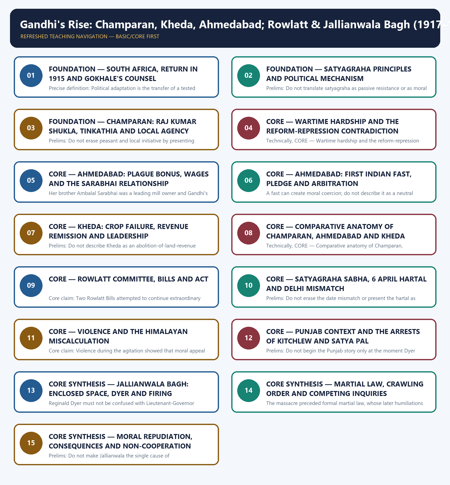

# Gandhi's Rise: Champaran, Kheda, Ahmedabad; Rowlatt & Jallianwala Bagh (1917–1919) - Learner-v2 Complete Learning Session

### SOURCE, PROGRESSION AND CURRENT-LINKAGE AUDIT

- **Repository owners queried:** Basic and Advanced Markdown for this topic, the master chronology, syllabus map and linked Modern History owners.
- **OCR book evidence queried:** OCR checks use Bipan Chandra's India's Struggle for Independence around the Champaran, Ahmedabad, Kheda and Rowlatt chapters and Modern India for the 1919 transition. Sekhar Bandyopadhyay supplies wartime distress, the Ahmedabad relationship and wider political qualification. Gandhi's autobiography, the Rowlatt proceedings, Hunter report and Congress Punjab Inquiry are retained as primary or official documentary anchors.
- **Qdrant:** not used; Markdown plus searchable local PDFs were sufficient.
- **PYQ integrity:** Routed demands include 2018 Prelims Q69 on Champaran, 2019 Prelims Q14 on Gandhi-linked events, 2020 Prelims Q14 on Gandhism and Marxism, 2018 GS-I on Gandhi's thought, 2019 GS-I on many voices in the Gandhian phase and 2023 GS-I on Gandhi and Tagore. Missing Prelims keys are not inferred.
- **Bounded live linkage:** The Prime Minister's 13 April 2026 official homage is retained only as a public-memory bridge for Jallianwala Bagh, liberty, justice and dignity. It does not replace historical evidence or supply disputed casualty totals.
- **Fact/inference rule:** historical claims are source-backed; analytical judgements are explicitly framed as interpretation and do not invent figures.

## BASIC LEARNING SESSION



*Distinct embedded teaching-navigation image. The separate continuous Cārvāka-style flowchart package remains an independent at-a-glance artifact.*

### SESSION 1 — FOUNDATION — SOUTH AFRICA, RETURN IN 1915 AND GOKHALE'S COUNSEL

#### DEFINITION / WHAT THIS IS CALLED

**Plain-language definition:** Prelims: Do not narrate South Africa as identical in constituency, law or scale to India.

**Technical definition:** Precise definition: Political adaptation is the transfer of a tested method into a new setting after observing its different laws, constituencies and grievances.

#### ANSWER-GRABBING OPENING — WRITE/ADAPT IN THE EXAM

> Do not narrate South Africa as identical in constituency, law or scale to India.

#### MUST-WRITE KEYWORDS

- **FOUNDATION**
- **South Africa**
- **return in 1915**
- **Gokhale's counsel**
- **Precise definition**
- **Topic boundary**

**How to use them:** Frame the answer through FOUNDATION; define South Africa, connect return in 1915 with Gokhale's counsel to explain the mechanism, and use Precise definition for the decisive comparison or qualification.

##### VISUAL FIRST

```text
SOUTH AFRICA, RETURN IN 1915 AND GOKHALE'S COUNSEL
1893-1914 SOUTH AFRICA -> tested satyagraha repertoire
1915 RETURN -> GOKHALE'S COUNSEL -> travel / observe / learn
INDIAN ADAPTATION -> local grievance + local leadership + disciplined action
```

*The visual fixes this subtopic's chronology, mechanism or comparison before the evidence.*

##### CONCEPT DEFINITIONS

- **Precise definition:** Political adaptation is the transfer of a tested method into a new setting after observing its different laws, constituencies and grievances.
- **Topic boundary:** Apply this definition only within Gandhi's Rise: Champaran, Kheda, Ahmedabad; Rowlatt & Jallianwala Bagh (1917–1919); preserve the named actors, date and institutional setting.

##### CORE EXPLANATION

Gandhi entered Indian politics with a tested South African method but deliberately studied Indian conditions after returning in 1915.

##### EVIDENCE AND MECHANISM

- South Africa supplied experience of racial law, association, negotiation and disciplined resistance.
- Gokhale advised Gandhi to travel and understand India before initiating large campaigns.
- The Indian setting required adaptation rather than mechanical transfer.

##### EXAMINER CAUTION

- Do not narrate South Africa as identical in constituency, law or scale to India.

##### EXAM LINK

- **Prelims:** Do not narrate South Africa as identical in constituency, law or scale to India.
- **Mains:** Use it as bounded formation, followed by observation and adaptation.

##### MINI RECAP

- **Core claim:** Gandhi entered Indian politics with a tested South African method but deliberately studied Indian conditions after returning in 1915.
- **Use:** Use it as bounded formation, followed by observation and adaptation.

#### CLOSING RECALL FLOW — FOUNDATION — SOUTH AFRICA, RETURN IN 1915 AND GOKHALE'S COUNSEL

```text
START / CONCEPT: FOUNDATION — South Africa, return in 1915 and Gokhale's counsel
        |
        v
EXACT TERMS: FOUNDATION · South Africa · return in 1915 · Gokhale's counsel · Precise definition · Topic boundary
        |
        v
MECHANISM / ARGUMENT: Mains: Use it as bounded formation, followed by observation and adaptation.
        |
        v
CONSEQUENCE / CONTRAST: Precise definition: Political adaptation is the transfer of a tested method into a new setting after observing its different laws, constituencies and grievances.
        |
        v
UPSC TRAP / ANSWER-USE: Do not miss this limiting distinction: do not narrate South Africa as identical in constituency, law or scale to India.
        |
        v
ANSWER-GRABBING FORMULATION: Do not narrate South Africa as identical in constituency, law or scale to India.
```
### SESSION 2 — FOUNDATION — SATYAGRAHA PRINCIPLES AND POLITICAL MECHANISM

#### DEFINITION / WHAT THIS IS CALLED

**Plain-language definition:** Precise definition: Satyagraha is open, disciplined non-violent resistance grounded in truth and voluntary acceptance of suffering.

**Technical definition:** Prelims: Do not translate satyagraha as passive resistance or as moral feeling without organisation.

#### ANSWER-GRABBING OPENING — WRITE/ADAPT IN THE EXAM

> Precise definition: Satyagraha is open, disciplined non-violent resistance grounded in truth and voluntary acceptance of suffering.

#### MUST-WRITE KEYWORDS

- **FOUNDATION**
- **Satyagraha principles**
- **political mechanism**
- **Precise definition**
- **Topic boundary**
- **Core claim**

**How to use them:** Frame the answer through FOUNDATION; define Satyagraha principles, connect political mechanism with Precise definition to explain the mechanism, and use Topic boundary for the decisive comparison or qualification.

##### VISUAL FIRST

```text
SATYAGRAHA PRINCIPLES AND POLITICAL MECHANISM
TRUTH + OPENNESS + NON-VIOLENCE + SELF-SUFFERING
                         |
                  DISCIPLINED REFUSAL
                         |
PUBLIC LEGITIMACY -> COST OF REPRESSION -> NEGOTIATION
```

*The visual fixes this subtopic's chronology, mechanism or comparison before the evidence.*

##### CONCEPT DEFINITIONS

- **Precise definition:** Satyagraha is open, disciplined non-violent resistance grounded in truth and voluntary acceptance of suffering.
- **Topic boundary:** Apply this definition only within Gandhi's Rise: Champaran, Kheda, Ahmedabad; Rowlatt & Jallianwala Bagh (1917–1919); preserve the named actors, date and institutional setting.

##### CORE EXPLANATION

Satyagraha made truthful, open and non-violent law-breaking effective through discipline, voluntary suffering and an appeal to public legitimacy.

##### EVIDENCE AND MECHANISM

- The satyagrahi accepted punishment rather than coercing an opponent through violence.
- Investigation and negotiation preceded escalation in Gandhi's early Indian campaigns.
- Non-violence required organisation and restraint; it was not mere passivity.

##### EXAMINER CAUTION

- Do not translate satyagraha as passive resistance or as moral feeling without organisation.

##### EXAM LINK

- **Prelims:** Do not translate satyagraha as passive resistance or as moral feeling without organisation.
- **Mains:** Explain the mechanism linking self-suffering, legitimacy, participation and bargaining pressure.

##### MINI RECAP

- **Core claim:** Satyagraha made truthful, open and non-violent law-breaking effective through discipline, voluntary suffering and an appeal to public legitimacy.
- **Use:** Explain the mechanism linking self-suffering, legitimacy, participation and bargaining pressure.

#### CLOSING RECALL FLOW — FOUNDATION — SATYAGRAHA PRINCIPLES AND POLITICAL MECHANISM

```text
START / CONCEPT: FOUNDATION — Satyagraha principles and political mechanism
        |
        v
EXACT TERMS: FOUNDATION · Satyagraha principles · political mechanism · Precise definition · Topic boundary · Core claim
        |
        v
MECHANISM / ARGUMENT: Mains: Explain the mechanism linking self-suffering, legitimacy, participation and bargaining pressure.
        |
        v
CONSEQUENCE / CONTRAST: Do not translate satyagraha as passive resistance or as moral feeling without organisation.
        |
        v
UPSC TRAP / ANSWER-USE: Non-violence required organisation and restraint; it was not mere passivity.
        |
        v
ANSWER-GRABBING FORMULATION: Precise definition: Satyagraha is open, disciplined non-violent resistance grounded in truth and voluntary acceptance of suffering.
```
### SESSION 3 — FOUNDATION — CHAMPARAN: RAJ KUMAR SHUKLA, TINKATHIA AND LOCAL AGENCY

#### DEFINITION / WHAT THIS IS CALLED

**Plain-language definition:** FOUNDATION — Champaran: Raj Kumar Shukla, tinkathia and local agency comprises FOUNDATION, Champaran and Raj Kumar Shukla as its core connected dimensions.

**Technical definition:** Prelims: Do not erase peasant and local initiative by presenting Gandhi as the source of the grievance.

#### ANSWER-GRABBING OPENING — WRITE/ADAPT IN THE EXAM

> Do not erase peasant and local initiative by presenting Gandhi as the source of the grievance.

#### MUST-WRITE KEYWORDS

- **FOUNDATION**
- **Champaran**
- **Raj Kumar Shukla**
- **tinkathia**
- **local agency**
- **Precise definition**

**How to use them:** Frame the answer through FOUNDATION; define Champaran, connect Raj Kumar Shukla with tinkathia to explain the mechanism, and use local agency for the decisive comparison or qualification.

##### VISUAL FIRST

```text
CHAMPARAN: RAJ KUMAR SHUKLA, TINKATHIA AND LOCAL AGENCY
LOCAL GRIEVANCE -> TINKATHIA = 3/20 OF HOLDING
LOCAL AGENT -> RAJ KUMAR SHUKLA
                         |
GANDHI INVITED -> OPEN DEFIANCE -> ABOUT 8,000 STATEMENTS
                         |
OFFICIAL INQUIRY -> 25% REFUND -> LATER TINKATHIA ABOLITION
```

*The visual fixes this subtopic's chronology, mechanism or comparison before the evidence.*

##### CONCEPT DEFINITIONS

- **Precise definition:** Tinkathia required indigo cultivation on 3/20 of a tenant's holding; investigative satyagraha converted that local grievance into documented public negotiation.
- **Topic boundary:** Apply this definition only within Gandhi's Rise: Champaran, Kheda, Ahmedabad; Rowlatt & Jallianwala Bagh (1917–1919); preserve the named actors, date and institutional setting.

##### CORE EXPLANATION

Champaran began from a specific indigo grievance and the persistence of local actors who brought Gandhi into an existing agrarian conflict.

##### EVIDENCE AND MECHANISM

- Raj Kumar Shukla pressed Gandhi to visit Champaran in 1917.
- Tinkathia required indigo cultivation on 3/20 of a tenant's holding.
- Planter demands around release from indigo obligations intensified the dispute.
- Gandhi defied an order to leave, and volunteers recorded about 8,000 cultivator statements.
- An official inquiry led to a 25% refund; later abolition of tinkathia was a separate outcome.

##### EXAMINER CAUTION

- Do not erase peasant and local initiative by presenting Gandhi as the source of the grievance.

##### EXAM LINK

- **Prelims:** Do not erase peasant and local initiative by presenting Gandhi as the source of the grievance.
- **Mains:** Open with local agency, then distinguish grievance, inquiry, refund and later abolition.

##### MINI RECAP

- **Core claim:** Champaran began from a specific indigo grievance and the persistence of local actors who brought Gandhi into an existing agrarian conflict.
- **Use:** Open with local agency, then distinguish grievance, inquiry, refund and later abolition.

#### CLOSING RECALL FLOW — FOUNDATION — CHAMPARAN: RAJ KUMAR SHUKLA, TINKATHIA AND LOCAL AGENCY

```text
START / CONCEPT: FOUNDATION — Champaran: Raj Kumar Shukla, tinkathia and local agency
        |
        v
EXACT TERMS: FOUNDATION · Champaran · Raj Kumar Shukla · tinkathia · local agency · Precise definition
        |
        v
MECHANISM / ARGUMENT: Use: Open with local agency, then distinguish grievance, inquiry, refund and later abolition.
        |
        v
CONSEQUENCE / CONTRAST: An official inquiry led to a 25% refund; later abolition of tinkathia was a separate outcome.
        |
        v
UPSC TRAP / ANSWER-USE: Do not miss this limiting distinction: do not erase peasant and local initiative by presenting Gandhi as the source of...
        |
        v
ANSWER-GRABBING FORMULATION: Do not erase peasant and local initiative by presenting Gandhi as the source of the grievance.
```
### SESSION 4 — CORE — WARTIME HARDSHIP AND THE REFORM-REPRESSION CONTRADICTION

#### DEFINITION / WHAT THIS IS CALLED

**Plain-language definition:** Precise definition: The reform-repression contradiction is the coexistence of rising constitutional expectations with continuing economic distress and exceptional coercion.

**Technical definition:** Technically, CORE — Wartime hardship and the reform-repression contradiction is analysed by relating Wartime hardship to the reform-repression contradiction, then testing the relationship through Precise definition and Topic boundary.

#### ANSWER-GRABBING OPENING — WRITE/ADAPT IN THE EXAM

> Precise definition: The reform-repression contradiction is the coexistence of rising constitutional expectations with continuing economic distress and exceptional coercion.

#### MUST-WRITE KEYWORDS

- **Wartime hardship**
- **the reform-repression contradiction**
- **Precise definition**
- **Topic boundary**
- **Core claim**
- **1917–1919**

**How to use them:** Frame the answer through Wartime hardship; define the reform-repression contradiction, connect Precise definition with Topic boundary to explain the mechanism, and use Core claim for the decisive comparison or qualification.

##### VISUAL FIRST

```text
WARTIME HARDSHIP AND THE REFORM-REPRESSION CONTRADICTION
WAR PRESSURE -> prices + scarcity + declining real purchasing power
EPIDEMIC DISTRESS -> wider social vulnerability
1917 REFORM PROMISE -> political expectation rises
1919 ROWLATT -> exceptional coercion continues
RESULT -> material strain and political betrayal reinforce each other
```

*The visual fixes this subtopic's chronology, mechanism or comparison before the evidence.*

##### CONCEPT DEFINITIONS

- **Precise definition:** The reform-repression contradiction is the coexistence of rising constitutional expectations with continuing economic distress and exceptional coercion.
- **Topic boundary:** Apply this definition only within Gandhi's Rise: Champaran, Kheda, Ahmedabad; Rowlatt & Jallianwala Bagh (1917–1919); preserve the named actors, date and institutional setting.

##### CORE EXPLANATION

Gandhi's rise occurred amid wartime inflation, scarcity, epidemic distress and the contradiction between reform promises and continuing coercion.

##### EVIDENCE AND MECHANISM

- Consumers, workers and many peasants faced rising prices and falling real purchasing power.
- Scarcity and epidemic distress widened social vulnerability, though some industries gained.
- The 1917 promise of gradual responsible government raised political expectations.
- Rowlatt coercion in 1919 made reform and repression appear simultaneously.

##### EXAMINER CAUTION

- Do not reduce Gandhi's rise to charisma or Jallianwala alone.

##### EXAM LINK

- **Prelims:** Do not reduce Gandhi's rise to charisma or Jallianwala alone.
- **Mains:** Use social strain plus political expectation plus coercive breach as the national setting.

##### MINI RECAP

- **Core claim:** Gandhi's rise occurred amid wartime inflation, scarcity, epidemic distress and the contradiction between reform promises and continuing coercion.
- **Use:** Use social strain plus political expectation plus coercive breach as the national setting.

#### CLOSING RECALL FLOW — CORE — WARTIME HARDSHIP AND THE REFORM-REPRESSION CONTRADICTION

```text
START / CONCEPT: CORE — Wartime hardship and the reform-repression contradiction
        |
        v
EXACT TERMS: Wartime hardship · the reform-repression contradiction · Precise definition · Topic boundary · Core claim · 1917–1919
        |
        v
MECHANISM / ARGUMENT: Scarcity and epidemic distress widened social vulnerability, though some industries gained.
        |
        v
CONSEQUENCE / CONTRAST: Do not reduce Gandhi's rise to charisma or Jallianwala alone.
        |
        v
UPSC TRAP / ANSWER-USE: Do not miss this limiting distinction: use social strain plus political expectation plus coercive breach as the national setting.
        |
        v
ANSWER-GRABBING FORMULATION: Precise definition: The reform-repression contradiction is the coexistence of rising constitutional expectations with continuing economic distress and exceptional coercion.
```
### SESSION 5 — CORE — AHMEDABAD: PLAGUE BONUS, WAGES AND THE SARABHAI RELATIONSHIP

#### DEFINITION / WHAT THIS IS CALLED

**Plain-language definition:** Precise definition: The Ahmedabad dispute was an industrial wage conflict shaped by the withdrawal or adjustment of a plague-related bonus.

**Technical definition:** Her brother Ambalal Sarabhai was a leading mill owner and Gandhi's associate.

#### ANSWER-GRABBING OPENING — WRITE/ADAPT IN THE EXAM

> Precise definition: The Ahmedabad dispute was an industrial wage conflict shaped by the withdrawal or adjustment of a plague-related bonus.

#### MUST-WRITE KEYWORDS

- **Ahmedabad**
- **plague bonus**
- **wages**
- **the Sarabhai relationship**
- **Precise definition**
- **Topic boundary**

**How to use them:** Frame the answer through Ahmedabad; define plague bonus, connect wages with the Sarabhai relationship to explain the mechanism, and use Precise definition for the decisive comparison or qualification.

##### VISUAL FIRST

```text
AHMEDABAD: PLAGUE BONUS, WAGES AND THE SARABHAI RELATIONSHIP
WORKERS SEEK 50% <- plague-bonus dispute -> OWNERS OFFER 20%
   |                                         |
ANASUYA SARABHAI                       AMBALAL SARABHAI
   +----------- GANDHI SUPPORTS 35% ----------+
KINSHIP / FRIENDSHIP ENABLE ACCESS; THEY DO NOT ERASE CONFLICT
```

*The visual fixes this subtopic's chronology, mechanism or comparison before the evidence.*

##### CONCEPT DEFINITIONS

- **Precise definition:** The Ahmedabad dispute was an industrial wage conflict shaped by the withdrawal or adjustment of a plague-related bonus.
- **Topic boundary:** Apply this definition only within Gandhi's Rise: Champaran, Kheda, Ahmedabad; Rowlatt & Jallianwala Bagh (1917–1919); preserve the named actors, date and institutional setting.

##### CORE EXPLANATION

The Ahmedabad dispute joined a plague-bonus and wage conflict to a dense relationship among workers, Anasuya Sarabhai, Ambalal Sarabhai and Gandhi.

##### EVIDENCE AND MECHANISM

- Workers initially sought a 50% increase, owners offered 20%, and Gandhi supported 35%.
- Anasuya Sarabhai supported labour organisation.
- Her brother Ambalal Sarabhai was a leading mill owner and Gandhi's associate.
- The family relationship illustrates cross-class mediation without erasing conflict.

##### EXAMINER CAUTION

- Do not turn personal friendship or kinship into proof that labour and capital interests were identical.

##### EXAM LINK

- **Prelims:** Do not turn personal friendship or kinship into proof that labour and capital interests were identical.
- **Mains:** Use the relationship to analyse mediation, access and the ethical pressure available to Gandhi.

##### MINI RECAP

- **Core claim:** The Ahmedabad dispute joined a plague-bonus and wage conflict to a dense relationship among workers, Anasuya Sarabhai, Ambalal Sarabhai and Gandhi.
- **Use:** Use the relationship to analyse mediation, access and the ethical pressure available to Gandhi.

#### CLOSING RECALL FLOW — CORE — AHMEDABAD: PLAGUE BONUS, WAGES AND THE SARABHAI RELATIONSHIP

```text
START / CONCEPT: CORE — Ahmedabad: plague bonus, wages and the Sarabhai relationship
        |
        v
EXACT TERMS: Ahmedabad · plague bonus · wages · the Sarabhai relationship · Precise definition · Topic boundary
        |
        v
MECHANISM / ARGUMENT: Her brother Ambalal Sarabhai was a leading mill owner and Gandhi's associate.
        |
        v
CONSEQUENCE / CONTRAST: Do not turn personal friendship or kinship into proof that labour and capital interests were identical.
        |
        v
UPSC TRAP / ANSWER-USE: Do not miss this limiting distinction: use the relationship to analyse mediation, access and the ethical pressure available to Gandhi.
        |
        v
ANSWER-GRABBING FORMULATION: Precise definition: The Ahmedabad dispute was an industrial wage conflict shaped by the withdrawal or adjustment of a plague-related bonus.
```
### SESSION 6 — CORE — AHMEDABAD: FIRST INDIAN FAST, PLEDGE AND ARBITRATION

#### DEFINITION / WHAT THIS IS CALLED

**Plain-language definition:** Precise definition: Arbitration submits a dispute to an accepted adjudicatory process; the fast added moral pressure to reach that route.

**Technical definition:** A fast can create moral coercion; do not describe it as a neutral substitute for bargaining.

#### ANSWER-GRABBING OPENING — WRITE/ADAPT IN THE EXAM

> A fast can create moral coercion; do not describe it as a neutral substitute for bargaining.

#### MUST-WRITE KEYWORDS

- **Ahmedabad**
- **first Indian fast**
- **pledge**
- **arbitration**
- **Precise definition**
- **Topic boundary**

**How to use them:** Frame the answer through Ahmedabad; define first Indian fast, connect pledge with arbitration to explain the mechanism, and use Precise definition for the decisive comparison or qualification.

##### VISUAL FIRST

```text
AHMEDABAD: FIRST INDIAN FAST, PLEDGE AND ARBITRATION
WORKER PLEDGE -> 21-DAY STRIKE -> STALEMATE
                                      |
                      GANDHI'S THREE-DAY FAST
                                      |
                               ARBITRATION ROUTE
SOURCE CAUTION -> final award reported as 35% or 27.5%
```

*The visual fixes this subtopic's chronology, mechanism or comparison before the evidence.*

##### CONCEPT DEFINITIONS

- **Precise definition:** Arbitration submits a dispute to an accepted adjudicatory process; the fast added moral pressure to reach that route.
- **Topic boundary:** Apply this definition only within Gandhi's Rise: Champaran, Kheda, Ahmedabad; Rowlatt & Jallianwala Bagh (1917–1919); preserve the named actors, date and institutional setting.

##### CORE EXPLANATION

Gandhi's first fast in an Indian struggle sought to reinforce worker discipline and move a stalled dispute toward arbitration.

##### EVIDENCE AND MECHANISM

- The strike depended on a pledge and continued non-violent discipline.
- The strike lasted twenty-one days and Gandhi's fast lasted three days.
- The fast placed moral pressure on a relationship in which Gandhi knew leading mill owners.
- Arbitration supplied an institutional route out of confrontation.
- Bipan's 35% and Sekhar's 27.5% outcome figures are retained as a source discrepancy.

##### EXAMINER CAUTION

- A fast can create moral coercion; do not describe it as a neutral substitute for bargaining.

##### EXAM LINK

- **Prelims:** A fast can create moral coercion; do not describe it as a neutral substitute for bargaining.
- **Mains:** Evaluate both organisational effect and ethical ambiguity.

##### MINI RECAP

- **Core claim:** Gandhi's first fast in an Indian struggle sought to reinforce worker discipline and move a stalled dispute toward arbitration.
- **Use:** Evaluate both organisational effect and ethical ambiguity.

#### CLOSING RECALL FLOW — CORE — AHMEDABAD: FIRST INDIAN FAST, PLEDGE AND ARBITRATION

```text
START / CONCEPT: CORE — Ahmedabad: first Indian fast, pledge and arbitration
        |
        v
EXACT TERMS: Ahmedabad · first Indian fast · pledge · arbitration · Precise definition · Topic boundary
        |
        v
MECHANISM / ARGUMENT: Precise definition: Arbitration submits a dispute to an accepted adjudicatory process; the fast added moral pressure to reach that route.
        |
        v
CONSEQUENCE / CONTRAST: Use: Evaluate both organisational effect and ethical ambiguity.
        |
        v
UPSC TRAP / ANSWER-USE: Do not miss this limiting distinction: bipan's 35% and Sekhar's 27.5% outcome figures are retained as a source discrepancy.
        |
        v
ANSWER-GRABBING FORMULATION: A fast can create moral coercion; do not describe it as a neutral substitute for bargaining.
```
### SESSION 7 — CORE — KHEDA: CROP FAILURE, REVENUE REMISSION AND LEADERSHIP

#### DEFINITION / WHAT THIS IS CALLED

**Plain-language definition:** Precise definition: Revenue remission or suspension is relief from collection under stated conditions, not abolition of the land-revenue system.

**Technical definition:** Prelims: Do not describe Kheda as an abolition-of-land-revenue movement or a complete victory.

#### ANSWER-GRABBING OPENING — WRITE/ADAPT IN THE EXAM

> Precise definition: Revenue remission or suspension is relief from collection under stated conditions, not abolition of the land-revenue system.

#### MUST-WRITE KEYWORDS

- **Kheda**
- **crop failure**
- **revenue remission**
- **leadership**
- **Precise definition**
- **Topic boundary**

**How to use them:** Frame the answer through Kheda; define crop failure, connect revenue remission with leadership to explain the mechanism, and use Precise definition for the decisive comparison or qualification.

##### VISUAL FIRST

```text
KHEDA: CROP FAILURE, REVENUE REMISSION AND LEADERSHIP
CROP FAILURE -> FOUR ANNAS OR LESS -> SUSPENSION CLAIM
                         |
PATEL + INDULAL YAGNIK -> VILLAGE ORGANISATION
                         |
PLEDGE + ATTACHMENT RISK -> SELECTIVE / LIMITED RELIEF
```

*The visual fixes this subtopic's chronology, mechanism or comparison before the evidence.*

##### CONCEPT DEFINITIONS

- **Precise definition:** Revenue remission or suspension is relief from collection under stated conditions, not abolition of the land-revenue system.
- **Topic boundary:** Apply this definition only within Gandhi's Rise: Champaran, Kheda, Ahmedabad; Rowlatt & Jallianwala Bagh (1917–1919); preserve the named actors, date and institutional setting.

##### CORE EXPLANATION

Kheda applied satyagraha to the colonial state's revenue demand when cultivators claimed crop conditions justified suspension or remission.

##### EVIDENCE AND MECHANISM

- The demand invoked the rule permitting suspension when assessed produce was four annas or less.
- Vallabhbhai Patel and Indulal Yagnik helped organise villages and sustain communication.
- The pledge bound better-off cultivators to protect poorer neighbours from selective collection.
- Attachment risk and selective recovery made the settlement limited and uneven.

##### EXAMINER CAUTION

- Do not describe Kheda as an abolition-of-land-revenue movement or a complete victory.

##### EXAM LINK

- **Prelims:** Do not describe Kheda as an abolition-of-land-revenue movement or a complete victory.
- **Mains:** Connect the four-anna threshold, pledge, attachment risk, cadre work and selective relief.

##### MINI RECAP

- **Core claim:** Kheda applied satyagraha to the colonial state's revenue demand when cultivators claimed crop conditions justified suspension or remission.
- **Use:** Connect the four-anna threshold, pledge, attachment risk, cadre work and selective relief.

#### CLOSING RECALL FLOW — CORE — KHEDA: CROP FAILURE, REVENUE REMISSION AND LEADERSHIP

```text
START / CONCEPT: CORE — Kheda: crop failure, revenue remission and leadership
        |
        v
EXACT TERMS: Kheda · crop failure · revenue remission · leadership · Precise definition · Topic boundary
        |
        v
MECHANISM / ARGUMENT: The demand invoked the rule permitting suspension when assessed produce was four annas or less.
        |
        v
CONSEQUENCE / CONTRAST: Do not describe Kheda as an abolition-of-land-revenue movement or a complete victory.
        |
        v
UPSC TRAP / ANSWER-USE: Do not miss this limiting distinction: connect the four-anna threshold, pledge, attachment risk, cadre work and selective relief.
        |
        v
ANSWER-GRABBING FORMULATION: Precise definition: Revenue remission or suspension is relief from collection under stated conditions, not abolition of the land-revenue system.
```
### SESSION 8 — CORE — COMPARATIVE ANATOMY OF CHAMPARAN, AHMEDABAD AND KHEDA

#### DEFINITION / WHAT THIS IS CALLED

**Plain-language definition:** CORE — Comparative anatomy of Champaran, Ahmedabad and Kheda comprises Comparative anatomy of Champaran, Ahmedabad and Kheda as its core connected dimensions.

**Technical definition:** Technically, CORE — Comparative anatomy of Champaran, Ahmedabad and Kheda is analysed by relating Comparative anatomy of Champaran to Ahmedabad, then testing the relationship through Kheda and Precise definition.

#### ANSWER-GRABBING OPENING — WRITE/ADAPT IN THE EXAM

> CORE — Comparative anatomy of Champaran, Ahmedabad and Kheda comprises Comparative anatomy of Champaran, Ahmedabad and Kheda as its core connected dimensions.

#### MUST-WRITE KEYWORDS

- **Comparative anatomy of Champaran**
- **Ahmedabad**
- **Kheda**
- **Precise definition**
- **Topic boundary**
- **Core claim**

**How to use them:** Frame the answer through Comparative anatomy of Champaran; define Ahmedabad, connect Kheda with Precise definition to explain the mechanism, and use Topic boundary for the decisive comparison or qualification.

##### VISUAL FIRST

```text
COMPARATIVE ANATOMY OF CHAMPARAN, AHMEDABAD AND KHEDA
CAMPAIGN     BASE          OPPONENT       MAIN METHOD
Champaran   cultivators   planters       inquiry + defiance
Ahmedabad   mill workers  mill owners    pledge + fast + arbitration
Kheda       cultivators   revenue state  organised withholding
COMMON -> discipline and negotiation | DIFFERENCE -> grievance and leverage
```

*The visual fixes this subtopic's chronology, mechanism or comparison before the evidence.*

##### CONCEPT DEFINITIONS

- **Precise definition:** Comparative anatomy tests campaigns on common axes: constituency, grievance, opponent, tactic, settlement and limitation.
- **Topic boundary:** Apply this definition only within Gandhi's Rise: Champaran, Kheda, Ahmedabad; Rowlatt & Jallianwala Bagh (1917–1919); preserve the named actors, date and institutional setting.

##### CORE EXPLANATION

The three campaigns shared disciplined negotiation but differed in social base, grievance, opponent, pressure technique and settlement.

##### EVIDENCE AND MECHANISM

- Champaran involved cultivators against planter coercion and centred inquiry.
- Ahmedabad involved industrial workers and owners, with fasting and arbitration.
- Kheda involved cultivators against state revenue collection and organised withholding.
- Together they built credibility without constituting a single uniform model.

##### EXAMINER CAUTION

- Do not force one tactic or one type of victory onto all three campaigns.

##### EXAM LINK

- **Prelims:** Do not force one tactic or one type of victory onto all three campaigns.
- **Mains:** A comparison matrix is stronger than three disconnected narratives.

##### MINI RECAP

- **Core claim:** The three campaigns shared disciplined negotiation but differed in social base, grievance, opponent, pressure technique and settlement.
- **Use:** A comparison matrix is stronger than three disconnected narratives.

#### CLOSING RECALL FLOW — CORE — COMPARATIVE ANATOMY OF CHAMPARAN, AHMEDABAD AND KHEDA

```text
START / CONCEPT: CORE — Comparative anatomy of Champaran, Ahmedabad and Kheda
        |
        v
EXACT TERMS: Comparative anatomy of Champaran · Ahmedabad · Kheda · Precise definition · Topic boundary · Core claim
        |
        v
MECHANISM / ARGUMENT: Together they built credibility without constituting a single uniform model.
        |
        v
CONSEQUENCE / CONTRAST: Mains: A comparison matrix is stronger than three disconnected narratives.
        |
        v
UPSC TRAP / ANSWER-USE: Do not force one tactic or one type of victory onto all three campaigns.
        |
        v
ANSWER-GRABBING FORMULATION: CORE — Comparative anatomy of Champaran, Ahmedabad and Kheda comprises Comparative anatomy of Champaran, Ahmedabad and Kheda as its core connected dimensions.
```
### SESSION 9 — CORE — ROWLATT COMMITTEE, BILLS AND ACT

#### DEFINITION / WHAT THIS IS CALLED

**Plain-language definition:** Precise definition: Post-war emergency normalisation is the continuation of exceptional wartime coercion after the emergency has ended; two Bills were introduced but only one became Act XI of 1919.

**Technical definition:** Core claim: Two Rowlatt Bills attempted to continue extraordinary wartime powers into peace; only one became Act XI of 1919 on 18 March.

#### ANSWER-GRABBING OPENING — WRITE/ADAPT IN THE EXAM

> Do not convert two introduced Bills into two enacted Acts or confuse Rowlatt with constitutional reform.

#### MUST-WRITE KEYWORDS

- **Rowlatt Committee**
- **Bills**
- **Act**
- **Precise definition**
- **Topic boundary**
- **Core claim**

**How to use them:** Frame the answer through Rowlatt Committee; define Bills, connect Act with Precise definition to explain the mechanism, and use Topic boundary for the decisive comparison or qualification.

##### VISUAL FIRST

```text
ROWLATT COMMITTEE, BILLS AND ACT
WARTIME EMERGENCY POWERS
          | committee recommends continuation
          v
TWO BILLS -> ONE BECOMES ACT XI ON 18 MARCH 1919
          |
DETENTION / EXCEPTIONAL PROCEDURE IN PEACETIME
          |
REFORM EXPECTATION + REPRESSION -> BETRAYAL FRAME
```

*The visual fixes this subtopic's chronology, mechanism or comparison before the evidence.*

##### CONCEPT DEFINITIONS

- **Precise definition:** Post-war emergency normalisation is the continuation of exceptional wartime coercion after the emergency has ended; two Bills were introduced but only one became Act XI of 1919.
- **Topic boundary:** Apply this definition only within Gandhi's Rise: Champaran, Kheda, Ahmedabad; Rowlatt & Jallianwala Bagh (1917–1919); preserve the named actors, date and institutional setting.

##### CORE EXPLANATION

Two Rowlatt Bills attempted to continue extraordinary wartime powers into peace; only one became Act XI of 1919 on 18 March.

##### EVIDENCE AND MECHANISM

- The committee examined revolutionary activity and recommended continued coercive powers.
- The enacted measure enabled detention and exceptional procedures outside ordinary safeguards.
- Its timing after wartime sacrifice and the 1917 reform promise intensified the sense of betrayal.

##### EXAMINER CAUTION

- Do not convert two introduced Bills into two enacted Acts or confuse Rowlatt with constitutional reform.

##### EXAM LINK

- **Prelims:** Do not convert two introduced Bills into two enacted Acts or confuse Rowlatt with constitutional reform.
- **Mains:** Frame the issue as emergency power normalised after the emergency.

##### MINI RECAP

- **Core claim:** Two Rowlatt Bills attempted to continue extraordinary wartime powers into peace; only one became Act XI of 1919 on 18 March.
- **Use:** Frame the issue as emergency power normalised after the emergency.

#### CLOSING RECALL FLOW — CORE — ROWLATT COMMITTEE, BILLS AND ACT

```text
START / CONCEPT: CORE — Rowlatt Committee, Bills and Act
        |
        v
EXACT TERMS: Rowlatt Committee · Bills · Act · Precise definition · Topic boundary · Core claim
        |
        v
MECHANISM / ARGUMENT: Core claim: Two Rowlatt Bills attempted to continue extraordinary wartime powers into peace; only one became Act XI of 1919 on 18 March.
        |
        v
CONSEQUENCE / CONTRAST: Precise definition: Post-war emergency normalisation is the continuation of exceptional wartime coercion after the emergency has ended; two Bills were introduced but only one became Act XI of 1919.
        |
        v
UPSC TRAP / ANSWER-USE: Do not miss this limiting distinction: the enacted measure enabled detention and exceptional procedures outside ordinary safeguards.
        |
        v
ANSWER-GRABBING FORMULATION: Do not convert two introduced Bills into two enacted Acts or confuse Rowlatt with constitutional reform.
```
### SESSION 10 — CORE — SATYAGRAHA SABHA, 6 APRIL HARTAL AND DELHI MISMATCH

#### DEFINITION / WHAT THIS IS CALLED

**Plain-language definition:** Precise definition: A hartal is a coordinated suspension of ordinary public and commercial activity used as political protest.

**Technical definition:** Prelims: Do not erase the date mismatch or present the hartal as uniformly controlled.

#### ANSWER-GRABBING OPENING — WRITE/ADAPT IN THE EXAM

> Do not erase the date mismatch or present the hartal as uniformly controlled.

#### MUST-WRITE KEYWORDS

- **Satyagraha Sabha**
- **Delhi mismatch**
- **Precise definition**
- **Topic boundary**
- **Core claim**
- **6 April hartal**

**How to use them:** Frame the answer through Satyagraha Sabha; define Delhi mismatch, connect Precise definition with Topic boundary to explain the mechanism, and use Core claim for the decisive comparison or qualification.

##### VISUAL FIRST

```text
SATYAGRAHA SABHA, 6 APRIL HARTAL AND DELHI MISMATCH
FEB 1919 SATYAGRAHA SABHA -> pledge to disobey
DATE CHANGES -> DELHI ACTS ON 30 MARCH
6 APRIL -> ALL-INDIA HARTAL
RESULT -> national reach + communication / discipline problem
```

*The visual fixes this subtopic's chronology, mechanism or comparison before the evidence.*

##### CONCEPT DEFINITIONS

- **Precise definition:** A hartal is a coordinated suspension of ordinary public and commercial activity used as political protest.
- **Topic boundary:** Apply this definition only within Gandhi's Rise: Champaran, Kheda, Ahmedabad; Rowlatt & Jallianwala Bagh (1917–1919); preserve the named actors, date and institutional setting.

##### CORE EXPLANATION

The Satyagraha Sabha organised pledged resistance, while the hartal revealed both Gandhi's all-India reach and weak communications control.

##### EVIDENCE AND MECHANISM

- Gandhi founded the Sabha in Bombay in February 1919.
- Its members pledged to disobey the Rowlatt law and accept punishment.
- The final all-India hartal date was 6 April 1919.
- Delhi observed the earlier announced date of 30 March, exposing coordination risk.

##### EXAMINER CAUTION

- Do not erase the date mismatch or present the hartal as uniformly controlled.

##### EXAM LINK

- **Prelims:** Do not erase the date mismatch or present the hartal as uniformly controlled.
- **Mains:** Use organisation, pledge, communication and mobilisation as separate analytical layers.

##### MINI RECAP

- **Core claim:** The Satyagraha Sabha organised pledged resistance, while the hartal revealed both Gandhi's all-India reach and weak communications control.
- **Use:** Use organisation, pledge, communication and mobilisation as separate analytical layers.

#### CLOSING RECALL FLOW — CORE — SATYAGRAHA SABHA, 6 APRIL HARTAL AND DELHI MISMATCH

```text
START / CONCEPT: CORE — Satyagraha Sabha, 6 April hartal and Delhi mismatch
        |
        v
EXACT TERMS: Satyagraha Sabha · Delhi mismatch · Precise definition · Topic boundary · Core claim · 6 April hartal
        |
        v
MECHANISM / ARGUMENT: Precise definition: A hartal is a coordinated suspension of ordinary public and commercial activity used as political protest.
        |
        v
CONSEQUENCE / CONTRAST: The final all-India hartal date was 6 April 1919.
        |
        v
UPSC TRAP / ANSWER-USE: Do not miss this limiting distinction: use organisation, pledge, communication and mobilisation as separate analytical layers.
        |
        v
ANSWER-GRABBING FORMULATION: Do not erase the date mismatch or present the hartal as uniformly controlled.
```
### SESSION 11 — CORE — VIOLENCE AND THE HIMALAYAN MISCALCULATION

#### DEFINITION / WHAT THIS IS CALLED

**Plain-language definition:** Precise definition: Himalayan miscalculation names Gandhi's judgement that mass civil disobedience had been called before adequate non-violent discipline existed.

**Technical definition:** Core claim: Violence during the agitation showed that moral appeal could mobilise faster than disciplined non-violence could be organised.

#### ANSWER-GRABBING OPENING — WRITE/ADAPT IN THE EXAM

> Precise definition: Himalayan miscalculation names Gandhi's judgement that mass civil disobedience had been called before adequate non-violent discipline existed.

#### MUST-WRITE KEYWORDS

- **Violence**
- **the Himalayan miscalculation**
- **Precise definition**
- **Topic boundary**
- **Core claim**
- **1917–1919**

**How to use them:** Frame the answer through Violence; define the Himalayan miscalculation, connect Precise definition with Topic boundary to explain the mechanism, and use Core claim for the decisive comparison or qualification.

##### VISUAL FIRST

```text
VIOLENCE AND THE HIMALAYAN MISCALCULATION
MORAL APPEAL -> RAPID MOBILISATION
                         |
             ORGANISATION LAGS BEHIND
                         |
VIOLENCE -> 18 APRIL SUSPENSION -> 'HIMALAYAN MISCALCULATION'
LESSON -> train discipline before mass civil disobedience
```

*The visual fixes this subtopic's chronology, mechanism or comparison before the evidence.*

##### CONCEPT DEFINITIONS

- **Precise definition:** Himalayan miscalculation names Gandhi's judgement that mass civil disobedience had been called before adequate non-violent discipline existed.
- **Topic boundary:** Apply this definition only within Gandhi's Rise: Champaran, Kheda, Ahmedabad; Rowlatt & Jallianwala Bagh (1917–1919); preserve the named actors, date and institutional setting.

##### CORE EXPLANATION

Violence during the agitation showed that moral appeal could mobilise faster than disciplined non-violence could be organised.

##### EVIDENCE AND MECHANISM

- Disturbances and attacks broke Gandhi's intended method in several places.
- Gandhi suspended the agitation on 18 April rather than treating any mobilisation as success.
- His Himalayan-miscalculation judgement became a lesson about training and control.

##### EXAMINER CAUTION

- Do not treat withdrawal as proof that the agitation had no political reach.

##### EXAM LINK

- **Prelims:** Do not treat withdrawal as proof that the agitation had no political reach.
- **Mains:** Balance nationwide resonance against the organisational failure to regulate action.

##### MINI RECAP

- **Core claim:** Violence during the agitation showed that moral appeal could mobilise faster than disciplined non-violence could be organised.
- **Use:** Balance nationwide resonance against the organisational failure to regulate action.

#### CLOSING RECALL FLOW — CORE — VIOLENCE AND THE HIMALAYAN MISCALCULATION

```text
START / CONCEPT: CORE — Violence and the Himalayan miscalculation
        |
        v
EXACT TERMS: Violence · the Himalayan miscalculation · Precise definition · Topic boundary · Core claim · 1917–1919
        |
        v
MECHANISM / ARGUMENT: Core claim: Violence during the agitation showed that moral appeal could mobilise faster than disciplined non-violence could be organised.
        |
        v
CONSEQUENCE / CONTRAST: Do not treat withdrawal as proof that the agitation had no political reach.
        |
        v
UPSC TRAP / ANSWER-USE: Do not miss this limiting distinction: his Himalayan-miscalculation judgement became a lesson about training and control.
        |
        v
ANSWER-GRABBING FORMULATION: Precise definition: Himalayan miscalculation names Gandhi's judgement that mass civil disobedience had been called before adequate non-violent discipline existed.
```
### SESSION 12 — CORE — PUNJAB CONTEXT AND THE ARRESTS OF KITCHLEW AND SATYA PAL

#### DEFINITION / WHAT THIS IS CALLED

**Plain-language definition:** Saifuddin Kitchlew and Satya Pal were prominent local leaders.

**Technical definition:** Prelims: Do not begin the Punjab story only at the moment Dyer entered Jallianwala Bagh.

#### ANSWER-GRABBING OPENING — WRITE/ADAPT IN THE EXAM

> Do not begin the Punjab story only at the moment Dyer entered Jallianwala Bagh.

#### MUST-WRITE KEYWORDS

- **Punjab context**
- **the arrests of Kitchlew**
- **Satya Pal**
- **Precise definition**
- **Topic boundary**
- **Core claim**

**How to use them:** Frame the answer through Punjab context; define the arrests of Kitchlew, connect Satya Pal with Precise definition to explain the mechanism, and use Topic boundary for the decisive comparison or qualification.

##### VISUAL FIRST

```text
PUNJAB CONTEXT AND THE ARRESTS OF KITCHLEW AND SATYA PAL
WARTIME PUNJAB -> recruitment + coercion + repression
                              |
LOCAL LEADERS -> KITCHLEW + SATYAPAL
                              |
10 APRIL ARREST / REMOVAL -> FIRING, ATTACKS AND ESCALATION
```

*The visual fixes this subtopic's chronology, mechanism or comparison before the evidence.*

##### CONCEPT DEFINITIONS

- **Precise definition:** An immediate trigger is the proximate act that activates deeper structural tension; here it was the removal of local leaders amid wartime coercion.
- **Topic boundary:** Apply this definition only within Gandhi's Rise: Champaran, Kheda, Ahmedabad; Rowlatt & Jallianwala Bagh (1917–1919); preserve the named actors, date and institutional setting.

##### CORE EXPLANATION

Amritsar's crisis developed within Punjab's wartime recruitment, coercion and political repression, then sharpened with the removal of local leaders.

##### EVIDENCE AND MECHANISM

- Punjab bore intense wartime administrative and recruitment pressure.
- Saifuddin Kitchlew and Satya Pal were prominent local leaders.
- Their arrest and removal from Amritsar on 10 April intensified protest.
- Firing on protestors and attacks on Europeans and property followed.

##### EXAMINER CAUTION

- Do not begin the Punjab story only at the moment Dyer entered Jallianwala Bagh.

##### EXAM LINK

- **Prelims:** Do not begin the Punjab story only at the moment Dyer entered Jallianwala Bagh.
- **Mains:** Establish structural pressure, local leadership and immediate trigger before the massacre.

##### MINI RECAP

- **Core claim:** Amritsar's crisis developed within Punjab's wartime recruitment, coercion and political repression, then sharpened with the removal of local leaders.
- **Use:** Establish structural pressure, local leadership and immediate trigger before the massacre.

#### CLOSING RECALL FLOW — CORE — PUNJAB CONTEXT AND THE ARRESTS OF KITCHLEW AND SATYA PAL

```text
START / CONCEPT: CORE — Punjab context and the arrests of Kitchlew and Satya Pal
        |
        v
EXACT TERMS: Punjab context · the arrests of Kitchlew · Satya Pal · Precise definition · Topic boundary · Core claim
        |
        v
MECHANISM / ARGUMENT: Saifuddin Kitchlew and Satya Pal were prominent local leaders.
        |
        v
CONSEQUENCE / CONTRAST: Precise definition: An immediate trigger is the proximate act that activates deeper structural tension; here it was the removal of local leaders amid wartime coercion.
        |
        v
UPSC TRAP / ANSWER-USE: Do not miss this limiting distinction: amritsar's crisis developed within Punjab's wartime recruitment, coercion and political repression, then sharpened with...
        |
        v
ANSWER-GRABBING FORMULATION: Do not begin the Punjab story only at the moment Dyer entered Jallianwala Bagh.
```
### SESSION 13 — CORE SYNTHESIS — JALLIANWALA BAGH: ENCLOSED SPACE, DYER AND FIRING

#### DEFINITION / WHAT THIS IS CALLED

**Plain-language definition:** Precise definition: The massacre was commanded military firing on an unarmed gathering in a spatially confined public ground.

**Technical definition:** Reginald Dyer must not be confused with Lieutenant-Governor Michael O'Dwyer.

#### ANSWER-GRABBING OPENING — WRITE/ADAPT IN THE EXAM

> Reginald Dyer must not be confused with Lieutenant-Governor Michael O'Dwyer.

#### MUST-WRITE KEYWORDS

- **CORE SYNTHESIS**
- **Jallianwala Bagh**
- **enclosed space**
- **Dyer**
- **firing**
- **Precise definition**

**How to use them:** Frame the answer through CORE SYNTHESIS; define Jallianwala Bagh, connect enclosed space with Dyer to explain the mechanism, and use firing for the decisive comparison or qualification.

##### VISUAL FIRST

```text
JALLIANWALA BAGH: ENCLOSED SPACE, DYER AND FIRING
13 APRIL 1919 | BAISAKHI | AMRITSAR
GATHERING -> ENCLOSED BAGH / RESTRICTED EXITS
                         |
REGINALD DYER -> NO WARNING / NO DISPERSAL ORDER -> FIRING
IDENTITY RULE -> DYER IS NOT LIEUTENANT-GOVERNOR MICHAEL O'DWYER
EVIDENCE RULE -> no disputed casualty total
```

*The visual fixes this subtopic's chronology, mechanism or comparison before the evidence.*

##### CONCEPT DEFINITIONS

- **Precise definition:** The massacre was commanded military firing on an unarmed gathering in a spatially confined public ground.
- **Topic boundary:** Apply this definition only within Gandhi's Rise: Champaran, Kheda, Ahmedabad; Rowlatt & Jallianwala Bagh (1917–1919); preserve the named actors, date and institutional setting.

##### CORE EXPLANATION

On 13 April 1919 Dyer used organised military fire against an unarmed gathering in an enclosed site, making colonial violence nationally legible.

##### EVIDENCE AND MECHANISM

- The gathering occurred at Jallianwala Bagh in Amritsar on Baisakhi.
- Restricted exits and the enclosed ground magnified the danger.
- Brigadier-General Reginald Dyer ordered firing without warning or first ordering dispersal.
- Reginald Dyer must not be confused with Lieutenant-Governor Michael O'Dwyer.
- Official and Indian casualty estimates diverge, so this package states no total.

##### EXAMINER CAUTION

- Do not invent casualty totals or state that every exit was literally sealed by troops.

##### EXAM LINK

- **Prelims:** Do not invent casualty totals or state that every exit was literally sealed by troops.
- **Mains:** Use date, place, spatial vulnerability, command decision and evidentiary caution.

##### MINI RECAP

- **Core claim:** On 13 April 1919 Dyer used organised military fire against an unarmed gathering in an enclosed site, making colonial violence nationally legible.
- **Use:** Use date, place, spatial vulnerability, command decision and evidentiary caution.

#### CLOSING RECALL FLOW — CORE SYNTHESIS — JALLIANWALA BAGH: ENCLOSED SPACE, DYER AND FIRING

```text
START / CONCEPT: CORE SYNTHESIS — Jallianwala Bagh: enclosed space, Dyer and firing
        |
        v
EXACT TERMS: CORE SYNTHESIS · Jallianwala Bagh · enclosed space · Dyer · firing · Precise definition
        |
        v
MECHANISM / ARGUMENT: Do not invent casualty totals or state that every exit was literally sealed by troops.
        |
        v
CONSEQUENCE / CONTRAST: Precise definition: The massacre was commanded military firing on an unarmed gathering in a spatially confined public ground.
        |
        v
UPSC TRAP / ANSWER-USE: Do not miss this limiting distinction: use date, place, spatial vulnerability, command decision and evidentiary caution.
        |
        v
ANSWER-GRABBING FORMULATION: Reginald Dyer must not be confused with Lieutenant-Governor Michael O'Dwyer.
```
### SESSION 14 — CORE SYNTHESIS — MARTIAL LAW, CRAWLING ORDER AND COMPETING INQUIRIES

#### DEFINITION / WHAT THIS IS CALLED

**Plain-language definition:** Precise definition: Martial-law humiliation denotes punitive controls imposed on civilians beyond ordinary process, while inquiry divergence reflects contested accountability.

**Technical definition:** The massacre preceded formal martial law, whose later humiliations were followed by official and nationalist investigations with divergent judgements.

#### ANSWER-GRABBING OPENING — WRITE/ADAPT IN THE EXAM

> Do not generalise the crawling order to all Punjab or treat Hunter as a shared national verdict.

#### MUST-WRITE KEYWORDS

- **CORE SYNTHESIS**
- **Martial law**
- **crawling order**
- **competing inquiries**
- **Precise definition**
- **Topic boundary**

**How to use them:** Frame the answer through CORE SYNTHESIS; define Martial law, connect crawling order with competing inquiries to explain the mechanism, and use Precise definition for the decisive comparison or qualification.

##### VISUAL FIRST

```text
MARTIAL LAW, CRAWLING ORDER AND COMPETING INQUIRIES
13 APRIL MASSACRE -> FORMAL MARTIAL LAW FOLLOWS
                     |
specific Amritsar crawling order + other humiliations
                     |
HUNTER MAJORITY / INDIAN MINORITY <-> CONGRESS PUNJAB INQUIRY
                     |
          DIVERGENT JUDGEMENTS, MAINLY REPORTED IN 1920
```

*The visual fixes this subtopic's chronology, mechanism or comparison before the evidence.*

##### CONCEPT DEFINITIONS

- **Precise definition:** Martial-law humiliation denotes punitive controls imposed on civilians beyond ordinary process, while inquiry divergence reflects contested accountability.
- **Topic boundary:** Apply this definition only within Gandhi's Rise: Champaran, Kheda, Ahmedabad; Rowlatt & Jallianwala Bagh (1917–1919); preserve the named actors, date and institutional setting.

##### CORE EXPLANATION

The massacre preceded formal martial law, whose later humiliations were followed by official and nationalist investigations with divergent judgements.

##### EVIDENCE AND MECHANISM

- Formal martial law was proclaimed after 13 April and extended coercive controls beyond the Bagh.
- The crawling order applied to a specific Amritsar lane and must be described with that qualification.
- The Hunter Committee was appointed in October 1919; its majority and Indian minority differed.
- The Congress Punjab Inquiry produced a more severe assessment of responsibility and repression.
- Reports and Dyer's formal consequences largely belong to 1920.

##### EXAMINER CAUTION

- Do not generalise the crawling order to all Punjab or treat Hunter as a shared national verdict.

##### EXAM LINK

- **Prelims:** Do not generalise the crawling order to all Punjab or treat Hunter as a shared national verdict.
- **Mains:** Separate event, martial-law regime, official inquiry and Indian counter-inquiry.

##### MINI RECAP

- **Core claim:** The massacre preceded formal martial law, whose later humiliations were followed by official and nationalist investigations with divergent judgements.
- **Use:** Separate event, martial-law regime, official inquiry and Indian counter-inquiry.

#### CLOSING RECALL FLOW — CORE SYNTHESIS — MARTIAL LAW, CRAWLING ORDER AND COMPETING INQUIRIES

```text
START / CONCEPT: CORE SYNTHESIS — Martial law, crawling order and competing inquiries
        |
        v
EXACT TERMS: CORE SYNTHESIS · Martial law · crawling order · competing inquiries · Precise definition · Topic boundary
        |
        v
MECHANISM / ARGUMENT: The massacre preceded formal martial law, whose later humiliations were followed by official and nationalist investigations with divergent judgements.
        |
        v
CONSEQUENCE / CONTRAST: Precise definition: Martial-law humiliation denotes punitive controls imposed on civilians beyond ordinary process, while inquiry divergence reflects contested accountability.
        |
        v
UPSC TRAP / ANSWER-USE: The crawling order applied to a specific Amritsar lane and must be described with that qualification.
        |
        v
ANSWER-GRABBING FORMULATION: Do not generalise the crawling order to all Punjab or treat Hunter as a shared national verdict.
```
### SESSION 15 — CORE SYNTHESIS — MORAL REPUDIATION, CONSEQUENCES AND NON-COOPERATION BRIDGE

#### DEFINITION / WHAT THIS IS CALLED

**Plain-language definition:** Precise definition: Withdrawal of moral consent is the public rejection of honours and cooperation once imperial authority is judged illegitimate.

**Technical definition:** Prelims: Do not make Jallianwala the single cause of Non-Cooperation or merge the dates of renunciation.

#### ANSWER-GRABBING OPENING — WRITE/ADAPT IN THE EXAM

> Precise definition: Withdrawal of moral consent is the public rejection of honours and cooperation once imperial authority is judged illegitimate.

#### MUST-WRITE KEYWORDS

- **CORE SYNTHESIS**
- **Moral repudiation**
- **consequences**
- **Non-Cooperation bridge**
- **Precise definition**
- **Topic boundary**

**How to use them:** Frame the answer through CORE SYNTHESIS; define Moral repudiation, connect consequences with Non-Cooperation bridge to explain the mechanism, and use Precise definition for the decisive comparison or qualification.

##### VISUAL FIRST

```text
MORAL REPUDIATION, CONSEQUENCES AND NON-COOPERATION BRIDGE
1919 TAGORE -> renounces knighthood
DEC 1919 AMRITSAR CONGRESS -> GANDHI / C.R. DAS DIFFER; COMPROMISE
1920 GANDHI -> returns Kaiser-i-Hind
PUNJAB WRONGS + KHILAFAT + DISTRESS + REFORM DISAPPOINTMENT
                         |
                 NON-COOPERATION BECOMES CREDIBLE
```

*The visual fixes this subtopic's chronology, mechanism or comparison before the evidence.*

##### CONCEPT DEFINITIONS

- **Precise definition:** Withdrawal of moral consent is the public rejection of honours and cooperation once imperial authority is judged illegitimate.
- **Topic boundary:** Apply this definition only within Gandhi's Rise: Champaran, Kheda, Ahmedabad; Rowlatt & Jallianwala Bagh (1917–1919); preserve the named actors, date and institutional setting.

##### CORE EXPLANATION

Punjab wrongs accelerated the withdrawal of moral consent and helped make Non-Cooperation credible, without alone causing the 1920 movement.

##### EVIDENCE AND MECHANISM

- Tagore renounced his knighthood in 1919.
- Gandhi returned the Kaiser-i-Hind medal in 1920.
- At the December 1919 Amritsar Congress, Gandhi still treated the reforms as a workable basis despite defects.
- C.R. Das favoured rejection, and the session reached a compromise.
- Rowlatt and Punjab joined Khilafat, post-war distress and disappointment with reforms.
- The routed 2018 and 2020 Prelims cards retain no inferred answer letters.
- The 2018 and 2023 GS-I demands extend Gandhian thought into present and educational debates.

##### EXAMINER CAUTION

- Do not make Jallianwala the single cause of Non-Cooperation or merge the dates of renunciation.

##### EXAM LINK

- **Prelims:** Do not make Jallianwala the single cause of Non-Cooperation or merge the dates of renunciation.
- **Mains:** Conclude with a multi-causal bridge from local credibility to national withdrawal of cooperation.

##### MINI RECAP

- **Core claim:** Punjab wrongs accelerated the withdrawal of moral consent and helped make Non-Cooperation credible, without alone causing the 1920 movement.
- **Use:** Conclude with a multi-causal bridge from local credibility to national withdrawal of cooperation.

#### CLOSING RECALL FLOW — CORE SYNTHESIS — MORAL REPUDIATION, CONSEQUENCES AND NON-COOPERATION BRIDGE

```text
START / CONCEPT: CORE SYNTHESIS — Moral repudiation, consequences and Non-Cooperation bridge
        |
        v
EXACT TERMS: CORE SYNTHESIS · Moral repudiation · consequences · Non-Cooperation bridge · Precise definition · Topic boundary
        |
        v
MECHANISM / ARGUMENT: Do not make Jallianwala the single cause of Non-Cooperation or merge the dates of renunciation.
        |
        v
CONSEQUENCE / CONTRAST: Use: Conclude with a multi-causal bridge from local credibility to national withdrawal of cooperation.
        |
        v
UPSC TRAP / ANSWER-USE: Do not miss this limiting distinction: do not make Jallianwala the single cause of Non-Cooperation or merge the dates of...
        |
        v
ANSWER-GRABBING FORMULATION: Precise definition: Withdrawal of moral consent is the public rejection of honours and cooperation once imperial authority is judged illegitimate.
```
## BASIC MCQS / REMEDIATION

### Q1. Which statement correctly identifies South African formation?

A. Between 1893 and 1914 Gandhi developed satyagraha and institutions of disciplined community action in South Africa.
B. Gandhi returned to India in 1915 and followed Gopal Krishna Gokhale's advice to study Indian conditions before leading major campaigns.
C. Raj Kumar Shukla persistently brought Gandhi to Champaran in 1917, showing that local agency preceded national intervention.
D. Satyagraha joined truth, non-violence, voluntary self-suffering, openness and disciplined refusal of an unjust demand.

**Answer: A.**
**Explanation:** Between 1893 and 1914 Gandhi developed satyagraha and institutions of disciplined community action in South Africa. This distinction preserves the source-backed chronology and prevents cross-matching errors in UPSC elimination.

### Q2. Which chronology card should be filed under South African formation?

A. Satyagraha joined truth, non-violence, voluntary self-suffering, openness and disciplined refusal of an unjust demand.
B. Between 1893 and 1914 Gandhi developed satyagraha and institutions of disciplined community action in South Africa.
C. Raj Kumar Shukla persistently brought Gandhi to Champaran in 1917, showing that local agency preceded national intervention.
D. Champaran cultivators challenged tinkathia, which required indigo cultivation on 3/20 of a tenant's holding, and planter demands associated with release from that system.

**Answer: B.**
**Explanation:** Between 1893 and 1914 Gandhi developed satyagraha and institutions of disciplined community action in South Africa. This distinction preserves the source-backed chronology and prevents cross-matching errors in UPSC elimination.

### Q3. Which option should a candidate retain when revising South African formation?

A. Raj Kumar Shukla persistently brought Gandhi to Champaran in 1917, showing that local agency preceded national intervention.
B. Gandhi's team recorded about 8,000 cultivator statements; an official inquiry led to a 25% refund of illegal dues, while later abolition of tinkathia must be kept distinct from that refund.
C. Between 1893 and 1914 Gandhi developed satyagraha and institutions of disciplined community action in South Africa.
D. Champaran cultivators challenged tinkathia, which required indigo cultivation on 3/20 of a tenant's holding, and planter demands associated with release from that system.

**Answer: C.**
**Explanation:** Between 1893 and 1914 Gandhi developed satyagraha and institutions of disciplined community action in South Africa. This distinction preserves the source-backed chronology and prevents cross-matching errors in UPSC elimination.

### Q4. Which statement avoids a common matching trap about South African formation?

A. Champaran cultivators challenged tinkathia, which required indigo cultivation on 3/20 of a tenant's holding, and planter demands associated with release from that system.
B. Gandhi's team recorded about 8,000 cultivator statements; an official inquiry led to a 25% refund of illegal dues, while later abolition of tinkathia must be kept distinct from that refund.
C. In the 1918 Ahmedabad plague-bonus dispute, workers initially sought 50%, owners offered 20%, and Gandhi supported a 35% wage increase.
D. Between 1893 and 1914 Gandhi developed satyagraha and institutions of disciplined community action in South Africa.

**Answer: D.**
**Explanation:** Between 1893 and 1914 Gandhi developed satyagraha and institutions of disciplined community action in South Africa. This distinction preserves the source-backed chronology and prevents cross-matching errors in UPSC elimination.

### Q5. Which statement correctly identifies Return and Gokhale?

A. Gandhi returned to India in 1915 and followed Gopal Krishna Gokhale's advice to study Indian conditions before leading major campaigns.
B. Satyagraha joined truth, non-violence, voluntary self-suffering, openness and disciplined refusal of an unjust demand.
C. Raj Kumar Shukla persistently brought Gandhi to Champaran in 1917, showing that local agency preceded national intervention.
D. Champaran cultivators challenged tinkathia, which required indigo cultivation on 3/20 of a tenant's holding, and planter demands associated with release from that system.

**Answer: A.**
**Explanation:** Gandhi returned to India in 1915 and followed Gopal Krishna Gokhale's advice to study Indian conditions before leading major campaigns. This distinction preserves the source-backed chronology and prevents cross-matching errors in UPSC elimination.

### Q6. Which chronology card should be filed under Return and Gokhale?

A. Raj Kumar Shukla persistently brought Gandhi to Champaran in 1917, showing that local agency preceded national intervention.
B. Gandhi returned to India in 1915 and followed Gopal Krishna Gokhale's advice to study Indian conditions before leading major campaigns.
C. Champaran cultivators challenged tinkathia, which required indigo cultivation on 3/20 of a tenant's holding, and planter demands associated with release from that system.
D. Gandhi's team recorded about 8,000 cultivator statements; an official inquiry led to a 25% refund of illegal dues, while later abolition of tinkathia must be kept distinct from that refund.

**Answer: B.**
**Explanation:** Gandhi returned to India in 1915 and followed Gopal Krishna Gokhale's advice to study Indian conditions before leading major campaigns. This distinction preserves the source-backed chronology and prevents cross-matching errors in UPSC elimination.

### Q7. Which option should a candidate retain when revising Return and Gokhale?

A. Gandhi's team recorded about 8,000 cultivator statements; an official inquiry led to a 25% refund of illegal dues, while later abolition of tinkathia must be kept distinct from that refund.
B. Champaran cultivators challenged tinkathia, which required indigo cultivation on 3/20 of a tenant's holding, and planter demands associated with release from that system.
C. Gandhi returned to India in 1915 and followed Gopal Krishna Gokhale's advice to study Indian conditions before leading major campaigns.
D. In the 1918 Ahmedabad plague-bonus dispute, workers initially sought 50%, owners offered 20%, and Gandhi supported a 35% wage increase.

**Answer: C.**
**Explanation:** Gandhi returned to India in 1915 and followed Gopal Krishna Gokhale's advice to study Indian conditions before leading major campaigns. This distinction preserves the source-backed chronology and prevents cross-matching errors in UPSC elimination.

### Q8. Which statement avoids a common matching trap about Return and Gokhale?

A. In the 1918 Ahmedabad plague-bonus dispute, workers initially sought 50%, owners offered 20%, and Gandhi supported a 35% wage increase.
B. Anasuya Sarabhai supported the workers, while her brother Ambalal Sarabhai was a leading mill owner and Gandhi's associate.
C. Gandhi's team recorded about 8,000 cultivator statements; an official inquiry led to a 25% refund of illegal dues, while later abolition of tinkathia must be kept distinct from that refund.
D. Gandhi returned to India in 1915 and followed Gopal Krishna Gokhale's advice to study Indian conditions before leading major campaigns.

**Answer: D.**
**Explanation:** Gandhi returned to India in 1915 and followed Gopal Krishna Gokhale's advice to study Indian conditions before leading major campaigns. This distinction preserves the source-backed chronology and prevents cross-matching errors in UPSC elimination.

### Q9. Which statement correctly identifies Satyagraha?

A. Satyagraha joined truth, non-violence, voluntary self-suffering, openness and disciplined refusal of an unjust demand.
B. Gandhi's team recorded about 8,000 cultivator statements; an official inquiry led to a 25% refund of illegal dues, while later abolition of tinkathia must be kept distinct from that refund.
C. Champaran cultivators challenged tinkathia, which required indigo cultivation on 3/20 of a tenant's holding, and planter demands associated with release from that system.
D. Raj Kumar Shukla persistently brought Gandhi to Champaran in 1917, showing that local agency preceded national intervention.

**Answer: A.**
**Explanation:** Satyagraha joined truth, non-violence, voluntary self-suffering, openness and disciplined refusal of an unjust demand. This distinction preserves the source-backed chronology and prevents cross-matching errors in UPSC elimination.

### Q10. Which chronology card should be filed under Satyagraha?

A. Gandhi's team recorded about 8,000 cultivator statements; an official inquiry led to a 25% refund of illegal dues, while later abolition of tinkathia must be kept distinct from that refund.
B. Satyagraha joined truth, non-violence, voluntary self-suffering, openness and disciplined refusal of an unjust demand.
C. In the 1918 Ahmedabad plague-bonus dispute, workers initially sought 50%, owners offered 20%, and Gandhi supported a 35% wage increase.
D. Champaran cultivators challenged tinkathia, which required indigo cultivation on 3/20 of a tenant's holding, and planter demands associated with release from that system.

**Answer: B.**
**Explanation:** Satyagraha joined truth, non-violence, voluntary self-suffering, openness and disciplined refusal of an unjust demand. This distinction preserves the source-backed chronology and prevents cross-matching errors in UPSC elimination.

### Q11. Which option should a candidate retain when revising Satyagraha?

A. In the 1918 Ahmedabad plague-bonus dispute, workers initially sought 50%, owners offered 20%, and Gandhi supported a 35% wage increase.
B. Anasuya Sarabhai supported the workers, while her brother Ambalal Sarabhai was a leading mill owner and Gandhi's associate.
C. Satyagraha joined truth, non-violence, voluntary self-suffering, openness and disciplined refusal of an unjust demand.
D. Gandhi's team recorded about 8,000 cultivator statements; an official inquiry led to a 25% refund of illegal dues, while later abolition of tinkathia must be kept distinct from that refund.

**Answer: C.**
**Explanation:** Satyagraha joined truth, non-violence, voluntary self-suffering, openness and disciplined refusal of an unjust demand. This distinction preserves the source-backed chronology and prevents cross-matching errors in UPSC elimination.

### Q12. Which statement avoids a common matching trap about Satyagraha?

A. After a twenty-one-day strike, Gandhi's three-day fast, his first in an Indian struggle, reinforced the pledge and pressed the dispute toward arbitration; sources differ on the final percentage outcome.
B. In the 1918 Ahmedabad plague-bonus dispute, workers initially sought 50%, owners offered 20%, and Gandhi supported a 35% wage increase.
C. Anasuya Sarabhai supported the workers, while her brother Ambalal Sarabhai was a leading mill owner and Gandhi's associate.
D. Satyagraha joined truth, non-violence, voluntary self-suffering, openness and disciplined refusal of an unjust demand.

**Answer: D.**
**Explanation:** Satyagraha joined truth, non-violence, voluntary self-suffering, openness and disciplined refusal of an unjust demand. This distinction preserves the source-backed chronology and prevents cross-matching errors in UPSC elimination.

### Q13. Which statement correctly identifies Champaran invitation?

A. Raj Kumar Shukla persistently brought Gandhi to Champaran in 1917, showing that local agency preceded national intervention.
B. Gandhi's team recorded about 8,000 cultivator statements; an official inquiry led to a 25% refund of illegal dues, while later abolition of tinkathia must be kept distinct from that refund.
C. Champaran cultivators challenged tinkathia, which required indigo cultivation on 3/20 of a tenant's holding, and planter demands associated with release from that system.
D. In the 1918 Ahmedabad plague-bonus dispute, workers initially sought 50%, owners offered 20%, and Gandhi supported a 35% wage increase.

**Answer: A.**
**Explanation:** Raj Kumar Shukla persistently brought Gandhi to Champaran in 1917, showing that local agency preceded national intervention. This distinction preserves the source-backed chronology and prevents cross-matching errors in UPSC elimination.

### Q14. Which chronology card should be filed under Champaran invitation?

A. In the 1918 Ahmedabad plague-bonus dispute, workers initially sought 50%, owners offered 20%, and Gandhi supported a 35% wage increase.
B. Raj Kumar Shukla persistently brought Gandhi to Champaran in 1917, showing that local agency preceded national intervention.
C. Gandhi's team recorded about 8,000 cultivator statements; an official inquiry led to a 25% refund of illegal dues, while later abolition of tinkathia must be kept distinct from that refund.
D. Anasuya Sarabhai supported the workers, while her brother Ambalal Sarabhai was a leading mill owner and Gandhi's associate.

**Answer: B.**
**Explanation:** Raj Kumar Shukla persistently brought Gandhi to Champaran in 1917, showing that local agency preceded national intervention. This distinction preserves the source-backed chronology and prevents cross-matching errors in UPSC elimination.

### Q15. Which option should a candidate retain when revising Champaran invitation?

A. Anasuya Sarabhai supported the workers, while her brother Ambalal Sarabhai was a leading mill owner and Gandhi's associate.
B. After a twenty-one-day strike, Gandhi's three-day fast, his first in an Indian struggle, reinforced the pledge and pressed the dispute toward arbitration; sources differ on the final percentage outcome.
C. Raj Kumar Shukla persistently brought Gandhi to Champaran in 1917, showing that local agency preceded national intervention.
D. In the 1918 Ahmedabad plague-bonus dispute, workers initially sought 50%, owners offered 20%, and Gandhi supported a 35% wage increase.

**Answer: C.**
**Explanation:** Raj Kumar Shukla persistently brought Gandhi to Champaran in 1917, showing that local agency preceded national intervention. This distinction preserves the source-backed chronology and prevents cross-matching errors in UPSC elimination.

### Q16. Which statement avoids a common matching trap about Champaran invitation?

A. Anasuya Sarabhai supported the workers, while her brother Ambalal Sarabhai was a leading mill owner and Gandhi's associate.
B. After a twenty-one-day strike, Gandhi's three-day fast, his first in an Indian struggle, reinforced the pledge and pressed the dispute toward arbitration; sources differ on the final percentage outcome.
C. The 1918 Kheda campaign sought suspension of land revenue where assessed produce was four annas or less, one-quarter of normal, under the government's own rules.
D. Raj Kumar Shukla persistently brought Gandhi to Champaran in 1917, showing that local agency preceded national intervention.

**Answer: D.**
**Explanation:** Raj Kumar Shukla persistently brought Gandhi to Champaran in 1917, showing that local agency preceded national intervention. This distinction preserves the source-backed chronology and prevents cross-matching errors in UPSC elimination.

### Q17. Which statement correctly identifies Tinkathia grievance?

A. Champaran cultivators challenged tinkathia, which required indigo cultivation on 3/20 of a tenant's holding, and planter demands associated with release from that system.
B. In the 1918 Ahmedabad plague-bonus dispute, workers initially sought 50%, owners offered 20%, and Gandhi supported a 35% wage increase.
C. Gandhi's team recorded about 8,000 cultivator statements; an official inquiry led to a 25% refund of illegal dues, while later abolition of tinkathia must be kept distinct from that refund.
D. Anasuya Sarabhai supported the workers, while her brother Ambalal Sarabhai was a leading mill owner and Gandhi's associate.

**Answer: A.**
**Explanation:** Champaran cultivators challenged tinkathia, which required indigo cultivation on 3/20 of a tenant's holding, and planter demands associated with release from that system. This distinction preserves the source-backed chronology and prevents cross-matching errors in UPSC elimination.

### Q18. Which chronology card should be filed under Tinkathia grievance?

A. In the 1918 Ahmedabad plague-bonus dispute, workers initially sought 50%, owners offered 20%, and Gandhi supported a 35% wage increase.
B. Champaran cultivators challenged tinkathia, which required indigo cultivation on 3/20 of a tenant's holding, and planter demands associated with release from that system.
C. Anasuya Sarabhai supported the workers, while her brother Ambalal Sarabhai was a leading mill owner and Gandhi's associate.
D. After a twenty-one-day strike, Gandhi's three-day fast, his first in an Indian struggle, reinforced the pledge and pressed the dispute toward arbitration; sources differ on the final percentage outcome.

**Answer: B.**
**Explanation:** Champaran cultivators challenged tinkathia, which required indigo cultivation on 3/20 of a tenant's holding, and planter demands associated with release from that system. This distinction preserves the source-backed chronology and prevents cross-matching errors in UPSC elimination.

### Q19. Which option should a candidate retain when revising Tinkathia grievance?

A. The 1918 Kheda campaign sought suspension of land revenue where assessed produce was four annas or less, one-quarter of normal, under the government's own rules.
B. After a twenty-one-day strike, Gandhi's three-day fast, his first in an Indian struggle, reinforced the pledge and pressed the dispute toward arbitration; sources differ on the final percentage outcome.
C. Champaran cultivators challenged tinkathia, which required indigo cultivation on 3/20 of a tenant's holding, and planter demands associated with release from that system.
D. Anasuya Sarabhai supported the workers, while her brother Ambalal Sarabhai was a leading mill owner and Gandhi's associate.

**Answer: C.**
**Explanation:** Champaran cultivators challenged tinkathia, which required indigo cultivation on 3/20 of a tenant's holding, and planter demands associated with release from that system. This distinction preserves the source-backed chronology and prevents cross-matching errors in UPSC elimination.

### Q20. Which statement avoids a common matching trap about Tinkathia grievance?

A. Vallabhbhai Patel and Indulal Yagnik helped organise Kheda, showing that Gandhian action depended on local and regional leadership.
B. After a twenty-one-day strike, Gandhi's three-day fast, his first in an Indian struggle, reinforced the pledge and pressed the dispute toward arbitration; sources differ on the final percentage outcome.
C. The 1918 Kheda campaign sought suspension of land revenue where assessed produce was four annas or less, one-quarter of normal, under the government's own rules.
D. Champaran cultivators challenged tinkathia, which required indigo cultivation on 3/20 of a tenant's holding, and planter demands associated with release from that system.

**Answer: D.**
**Explanation:** Champaran cultivators challenged tinkathia, which required indigo cultivation on 3/20 of a tenant's holding, and planter demands associated with release from that system. This distinction preserves the source-backed chronology and prevents cross-matching errors in UPSC elimination.

### Q21. Which statement correctly identifies Champaran inquiry and settlement?

A. Gandhi's team recorded about 8,000 cultivator statements; an official inquiry led to a 25% refund of illegal dues, while later abolition of tinkathia must be kept distinct from that refund.
B. Anasuya Sarabhai supported the workers, while her brother Ambalal Sarabhai was a leading mill owner and Gandhi's associate.
C. After a twenty-one-day strike, Gandhi's three-day fast, his first in an Indian struggle, reinforced the pledge and pressed the dispute toward arbitration; sources differ on the final percentage outcome.
D. In the 1918 Ahmedabad plague-bonus dispute, workers initially sought 50%, owners offered 20%, and Gandhi supported a 35% wage increase.

**Answer: A.**
**Explanation:** Gandhi's team recorded about 8,000 cultivator statements; an official inquiry led to a 25% refund of illegal dues, while later abolition of tinkathia must be kept distinct from that refund. This distinction preserves the source-backed chronology and prevents cross-matching errors in UPSC elimination.

### Q22. Which chronology card should be filed under Champaran inquiry and settlement?

A. Anasuya Sarabhai supported the workers, while her brother Ambalal Sarabhai was a leading mill owner and Gandhi's associate.
B. Gandhi's team recorded about 8,000 cultivator statements; an official inquiry led to a 25% refund of illegal dues, while later abolition of tinkathia must be kept distinct from that refund.
C. The 1918 Kheda campaign sought suspension of land revenue where assessed produce was four annas or less, one-quarter of normal, under the government's own rules.
D. After a twenty-one-day strike, Gandhi's three-day fast, his first in an Indian struggle, reinforced the pledge and pressed the dispute toward arbitration; sources differ on the final percentage outcome.

**Answer: B.**
**Explanation:** Gandhi's team recorded about 8,000 cultivator statements; an official inquiry led to a 25% refund of illegal dues, while later abolition of tinkathia must be kept distinct from that refund. This distinction preserves the source-backed chronology and prevents cross-matching errors in UPSC elimination.

### Q23. Which option should a candidate retain when revising Champaran inquiry and settlement?

A. After a twenty-one-day strike, Gandhi's three-day fast, his first in an Indian struggle, reinforced the pledge and pressed the dispute toward arbitration; sources differ on the final percentage outcome.
B. The 1918 Kheda campaign sought suspension of land revenue where assessed produce was four annas or less, one-quarter of normal, under the government's own rules.
C. Gandhi's team recorded about 8,000 cultivator statements; an official inquiry led to a 25% refund of illegal dues, while later abolition of tinkathia must be kept distinct from that refund.
D. Vallabhbhai Patel and Indulal Yagnik helped organise Kheda, showing that Gandhian action depended on local and regional leadership.

**Answer: C.**
**Explanation:** Gandhi's team recorded about 8,000 cultivator statements; an official inquiry led to a 25% refund of illegal dues, while later abolition of tinkathia must be kept distinct from that refund. This distinction preserves the source-backed chronology and prevents cross-matching errors in UPSC elimination.

### Q24. Which statement avoids a common matching trap about Champaran inquiry and settlement?

A. Vallabhbhai Patel and Indulal Yagnik helped organise Kheda, showing that Gandhian action depended on local and regional leadership.
B. Kheda used a collective pledge so better-off cultivators would protect poorer neighbours from selective collection; attachment risks and a limited official retreat made the outcome partial rather than total.
C. The 1918 Kheda campaign sought suspension of land revenue where assessed produce was four annas or less, one-quarter of normal, under the government's own rules.
D. Gandhi's team recorded about 8,000 cultivator statements; an official inquiry led to a 25% refund of illegal dues, while later abolition of tinkathia must be kept distinct from that refund.

**Answer: D.**
**Explanation:** Gandhi's team recorded about 8,000 cultivator statements; an official inquiry led to a 25% refund of illegal dues, while later abolition of tinkathia must be kept distinct from that refund. This distinction preserves the source-backed chronology and prevents cross-matching errors in UPSC elimination.

### Q25. Which statement correctly identifies Ahmedabad dispute?

A. In the 1918 Ahmedabad plague-bonus dispute, workers initially sought 50%, owners offered 20%, and Gandhi supported a 35% wage increase.
B. The 1918 Kheda campaign sought suspension of land revenue where assessed produce was four annas or less, one-quarter of normal, under the government's own rules.
C. Anasuya Sarabhai supported the workers, while her brother Ambalal Sarabhai was a leading mill owner and Gandhi's associate.
D. After a twenty-one-day strike, Gandhi's three-day fast, his first in an Indian struggle, reinforced the pledge and pressed the dispute toward arbitration; sources differ on the final percentage outcome.

**Answer: A.**
**Explanation:** In the 1918 Ahmedabad plague-bonus dispute, workers initially sought 50%, owners offered 20%, and Gandhi supported a 35% wage increase. This distinction preserves the source-backed chronology and prevents cross-matching errors in UPSC elimination.

### Q26. Which chronology card should be filed under Ahmedabad dispute?

A. Vallabhbhai Patel and Indulal Yagnik helped organise Kheda, showing that Gandhian action depended on local and regional leadership.
B. In the 1918 Ahmedabad plague-bonus dispute, workers initially sought 50%, owners offered 20%, and Gandhi supported a 35% wage increase.
C. The 1918 Kheda campaign sought suspension of land revenue where assessed produce was four annas or less, one-quarter of normal, under the government's own rules.
D. After a twenty-one-day strike, Gandhi's three-day fast, his first in an Indian struggle, reinforced the pledge and pressed the dispute toward arbitration; sources differ on the final percentage outcome.

**Answer: B.**
**Explanation:** In the 1918 Ahmedabad plague-bonus dispute, workers initially sought 50%, owners offered 20%, and Gandhi supported a 35% wage increase. This distinction preserves the source-backed chronology and prevents cross-matching errors in UPSC elimination.

### Q27. Which option should a candidate retain when revising Ahmedabad dispute?

A. Vallabhbhai Patel and Indulal Yagnik helped organise Kheda, showing that Gandhian action depended on local and regional leadership.
B. Kheda used a collective pledge so better-off cultivators would protect poorer neighbours from selective collection; attachment risks and a limited official retreat made the outcome partial rather than total.
C. In the 1918 Ahmedabad plague-bonus dispute, workers initially sought 50%, owners offered 20%, and Gandhi supported a 35% wage increase.
D. The 1918 Kheda campaign sought suspension of land revenue where assessed produce was four annas or less, one-quarter of normal, under the government's own rules.

**Answer: C.**
**Explanation:** In the 1918 Ahmedabad plague-bonus dispute, workers initially sought 50%, owners offered 20%, and Gandhi supported a 35% wage increase. This distinction preserves the source-backed chronology and prevents cross-matching errors in UPSC elimination.

### Q28. Which statement avoids a common matching trap about Ahmedabad dispute?

A. Two Rowlatt Bills were introduced, but only one became the Anarchical and Revolutionary Crimes Act, 1919, on 18 March; it continued exceptional procedures and detention powers into peace.
B. Kheda used a collective pledge so better-off cultivators would protect poorer neighbours from selective collection; attachment risks and a limited official retreat made the outcome partial rather than total.
C. Vallabhbhai Patel and Indulal Yagnik helped organise Kheda, showing that Gandhian action depended on local and regional leadership.
D. In the 1918 Ahmedabad plague-bonus dispute, workers initially sought 50%, owners offered 20%, and Gandhi supported a 35% wage increase.

**Answer: D.**
**Explanation:** In the 1918 Ahmedabad plague-bonus dispute, workers initially sought 50%, owners offered 20%, and Gandhi supported a 35% wage increase. This distinction preserves the source-backed chronology and prevents cross-matching errors in UPSC elimination.

### Q29. Which statement correctly identifies Sarabhai relationship?

A. Anasuya Sarabhai supported the workers, while her brother Ambalal Sarabhai was a leading mill owner and Gandhi's associate.
B. Vallabhbhai Patel and Indulal Yagnik helped organise Kheda, showing that Gandhian action depended on local and regional leadership.
C. The 1918 Kheda campaign sought suspension of land revenue where assessed produce was four annas or less, one-quarter of normal, under the government's own rules.
D. After a twenty-one-day strike, Gandhi's three-day fast, his first in an Indian struggle, reinforced the pledge and pressed the dispute toward arbitration; sources differ on the final percentage outcome.

**Answer: A.**
**Explanation:** Anasuya Sarabhai supported the workers, while her brother Ambalal Sarabhai was a leading mill owner and Gandhi's associate. This distinction preserves the source-backed chronology and prevents cross-matching errors in UPSC elimination.

### Q30. Which chronology card should be filed under Sarabhai relationship?

A. Vallabhbhai Patel and Indulal Yagnik helped organise Kheda, showing that Gandhian action depended on local and regional leadership.
B. Anasuya Sarabhai supported the workers, while her brother Ambalal Sarabhai was a leading mill owner and Gandhi's associate.
C. Kheda used a collective pledge so better-off cultivators would protect poorer neighbours from selective collection; attachment risks and a limited official retreat made the outcome partial rather than total.
D. The 1918 Kheda campaign sought suspension of land revenue where assessed produce was four annas or less, one-quarter of normal, under the government's own rules.

**Answer: B.**
**Explanation:** Anasuya Sarabhai supported the workers, while her brother Ambalal Sarabhai was a leading mill owner and Gandhi's associate. This distinction preserves the source-backed chronology and prevents cross-matching errors in UPSC elimination.

### Q31. Which option should a candidate retain when revising Sarabhai relationship?

A. Two Rowlatt Bills were introduced, but only one became the Anarchical and Revolutionary Crimes Act, 1919, on 18 March; it continued exceptional procedures and detention powers into peace.
B. Vallabhbhai Patel and Indulal Yagnik helped organise Kheda, showing that Gandhian action depended on local and regional leadership.
C. Anasuya Sarabhai supported the workers, while her brother Ambalal Sarabhai was a leading mill owner and Gandhi's associate.
D. Kheda used a collective pledge so better-off cultivators would protect poorer neighbours from selective collection; attachment risks and a limited official retreat made the outcome partial rather than total.

**Answer: C.**
**Explanation:** Anasuya Sarabhai supported the workers, while her brother Ambalal Sarabhai was a leading mill owner and Gandhi's associate. This distinction preserves the source-backed chronology and prevents cross-matching errors in UPSC elimination.

### Q32. Which statement avoids a common matching trap about Sarabhai relationship?

A. Kheda used a collective pledge so better-off cultivators would protect poorer neighbours from selective collection; attachment risks and a limited official retreat made the outcome partial rather than total.
B. Two Rowlatt Bills were introduced, but only one became the Anarchical and Revolutionary Crimes Act, 1919, on 18 March; it continued exceptional procedures and detention powers into peace.
C. Gandhi founded the Satyagraha Sabha in Bombay in February 1919, whose members pledged civil disobedience of the Rowlatt law.
D. Anasuya Sarabhai supported the workers, while her brother Ambalal Sarabhai was a leading mill owner and Gandhi's associate.

**Answer: D.**
**Explanation:** Anasuya Sarabhai supported the workers, while her brother Ambalal Sarabhai was a leading mill owner and Gandhi's associate. This distinction preserves the source-backed chronology and prevents cross-matching errors in UPSC elimination.

### Q33. Which statement correctly identifies Ahmedabad fast and arbitration?

A. After a twenty-one-day strike, Gandhi's three-day fast, his first in an Indian struggle, reinforced the pledge and pressed the dispute toward arbitration; sources differ on the final percentage outcome.
B. Kheda used a collective pledge so better-off cultivators would protect poorer neighbours from selective collection; attachment risks and a limited official retreat made the outcome partial rather than total.
C. The 1918 Kheda campaign sought suspension of land revenue where assessed produce was four annas or less, one-quarter of normal, under the government's own rules.
D. Vallabhbhai Patel and Indulal Yagnik helped organise Kheda, showing that Gandhian action depended on local and regional leadership.

**Answer: A.**
**Explanation:** After a twenty-one-day strike, Gandhi's three-day fast, his first in an Indian struggle, reinforced the pledge and pressed the dispute toward arbitration; sources differ on the final percentage outcome. This distinction preserves the source-backed chronology and prevents cross-matching errors in UPSC elimination.

### Q34. Which chronology card should be filed under Ahmedabad fast and arbitration?

A. Vallabhbhai Patel and Indulal Yagnik helped organise Kheda, showing that Gandhian action depended on local and regional leadership.
B. After a twenty-one-day strike, Gandhi's three-day fast, his first in an Indian struggle, reinforced the pledge and pressed the dispute toward arbitration; sources differ on the final percentage outcome.
C. Kheda used a collective pledge so better-off cultivators would protect poorer neighbours from selective collection; attachment risks and a limited official retreat made the outcome partial rather than total.
D. Two Rowlatt Bills were introduced, but only one became the Anarchical and Revolutionary Crimes Act, 1919, on 18 March; it continued exceptional procedures and detention powers into peace.

**Answer: B.**
**Explanation:** After a twenty-one-day strike, Gandhi's three-day fast, his first in an Indian struggle, reinforced the pledge and pressed the dispute toward arbitration; sources differ on the final percentage outcome. This distinction preserves the source-backed chronology and prevents cross-matching errors in UPSC elimination.

### Q35. Which option should a candidate retain when revising Ahmedabad fast and arbitration?

A. Two Rowlatt Bills were introduced, but only one became the Anarchical and Revolutionary Crimes Act, 1919, on 18 March; it continued exceptional procedures and detention powers into peace.
B. Kheda used a collective pledge so better-off cultivators would protect poorer neighbours from selective collection; attachment risks and a limited official retreat made the outcome partial rather than total.
C. After a twenty-one-day strike, Gandhi's three-day fast, his first in an Indian struggle, reinforced the pledge and pressed the dispute toward arbitration; sources differ on the final percentage outcome.
D. Gandhi founded the Satyagraha Sabha in Bombay in February 1919, whose members pledged civil disobedience of the Rowlatt law.

**Answer: C.**
**Explanation:** After a twenty-one-day strike, Gandhi's three-day fast, his first in an Indian struggle, reinforced the pledge and pressed the dispute toward arbitration; sources differ on the final percentage outcome. This distinction preserves the source-backed chronology and prevents cross-matching errors in UPSC elimination.

### Q36. Which statement avoids a common matching trap about Ahmedabad fast and arbitration?

A. Two Rowlatt Bills were introduced, but only one became the Anarchical and Revolutionary Crimes Act, 1919, on 18 March; it continued exceptional procedures and detention powers into peace.
B. The all-India hartal was observed on 6 April 1919; Delhi acted on the earlier date of 30 March, revealing communication and control problems.
C. Gandhi founded the Satyagraha Sabha in Bombay in February 1919, whose members pledged civil disobedience of the Rowlatt law.
D. After a twenty-one-day strike, Gandhi's three-day fast, his first in an Indian struggle, reinforced the pledge and pressed the dispute toward arbitration; sources differ on the final percentage outcome.

**Answer: D.**
**Explanation:** After a twenty-one-day strike, Gandhi's three-day fast, his first in an Indian struggle, reinforced the pledge and pressed the dispute toward arbitration; sources differ on the final percentage outcome. This distinction preserves the source-backed chronology and prevents cross-matching errors in UPSC elimination.

### Q37. Which statement correctly identifies Kheda revenue issue?

A. The 1918 Kheda campaign sought suspension of land revenue where assessed produce was four annas or less, one-quarter of normal, under the government's own rules.
B. Kheda used a collective pledge so better-off cultivators would protect poorer neighbours from selective collection; attachment risks and a limited official retreat made the outcome partial rather than total.
C. Two Rowlatt Bills were introduced, but only one became the Anarchical and Revolutionary Crimes Act, 1919, on 18 March; it continued exceptional procedures and detention powers into peace.
D. Vallabhbhai Patel and Indulal Yagnik helped organise Kheda, showing that Gandhian action depended on local and regional leadership.

**Answer: A.**
**Explanation:** The 1918 Kheda campaign sought suspension of land revenue where assessed produce was four annas or less, one-quarter of normal, under the government's own rules. This distinction preserves the source-backed chronology and prevents cross-matching errors in UPSC elimination.

### Q38. Which chronology card should be filed under Kheda revenue issue?

A. Kheda used a collective pledge so better-off cultivators would protect poorer neighbours from selective collection; attachment risks and a limited official retreat made the outcome partial rather than total.
B. The 1918 Kheda campaign sought suspension of land revenue where assessed produce was four annas or less, one-quarter of normal, under the government's own rules.
C. Gandhi founded the Satyagraha Sabha in Bombay in February 1919, whose members pledged civil disobedience of the Rowlatt law.
D. Two Rowlatt Bills were introduced, but only one became the Anarchical and Revolutionary Crimes Act, 1919, on 18 March; it continued exceptional procedures and detention powers into peace.

**Answer: B.**
**Explanation:** The 1918 Kheda campaign sought suspension of land revenue where assessed produce was four annas or less, one-quarter of normal, under the government's own rules. This distinction preserves the source-backed chronology and prevents cross-matching errors in UPSC elimination.

### Q39. Which option should a candidate retain when revising Kheda revenue issue?

A. The all-India hartal was observed on 6 April 1919; Delhi acted on the earlier date of 30 March, revealing communication and control problems.
B. Two Rowlatt Bills were introduced, but only one became the Anarchical and Revolutionary Crimes Act, 1919, on 18 March; it continued exceptional procedures and detention powers into peace.
C. The 1918 Kheda campaign sought suspension of land revenue where assessed produce was four annas or less, one-quarter of normal, under the government's own rules.
D. Gandhi founded the Satyagraha Sabha in Bombay in February 1919, whose members pledged civil disobedience of the Rowlatt law.

**Answer: C.**
**Explanation:** The 1918 Kheda campaign sought suspension of land revenue where assessed produce was four annas or less, one-quarter of normal, under the government's own rules. This distinction preserves the source-backed chronology and prevents cross-matching errors in UPSC elimination.

### Q40. Which statement avoids a common matching trap about Kheda revenue issue?

A. The all-India hartal was observed on 6 April 1919; Delhi acted on the earlier date of 30 March, revealing communication and control problems.
B. Gandhi suspended the agitation on 18 April after violence exposed inadequate discipline and later described the premature call for mass civil disobedience as a Himalayan miscalculation.
C. Gandhi founded the Satyagraha Sabha in Bombay in February 1919, whose members pledged civil disobedience of the Rowlatt law.
D. The 1918 Kheda campaign sought suspension of land revenue where assessed produce was four annas or less, one-quarter of normal, under the government's own rules.

**Answer: D.**
**Explanation:** The 1918 Kheda campaign sought suspension of land revenue where assessed produce was four annas or less, one-quarter of normal, under the government's own rules. This distinction preserves the source-backed chronology and prevents cross-matching errors in UPSC elimination.

### Q41. Which statement correctly identifies Kheda leadership?

A. Vallabhbhai Patel and Indulal Yagnik helped organise Kheda, showing that Gandhian action depended on local and regional leadership.
B. Kheda used a collective pledge so better-off cultivators would protect poorer neighbours from selective collection; attachment risks and a limited official retreat made the outcome partial rather than total.
C. Gandhi founded the Satyagraha Sabha in Bombay in February 1919, whose members pledged civil disobedience of the Rowlatt law.
D. Two Rowlatt Bills were introduced, but only one became the Anarchical and Revolutionary Crimes Act, 1919, on 18 March; it continued exceptional procedures and detention powers into peace.

**Answer: A.**
**Explanation:** Vallabhbhai Patel and Indulal Yagnik helped organise Kheda, showing that Gandhian action depended on local and regional leadership. This distinction preserves the source-backed chronology and prevents cross-matching errors in UPSC elimination.

### Q42. Which chronology card should be filed under Kheda leadership?

A. Gandhi founded the Satyagraha Sabha in Bombay in February 1919, whose members pledged civil disobedience of the Rowlatt law.
B. Vallabhbhai Patel and Indulal Yagnik helped organise Kheda, showing that Gandhian action depended on local and regional leadership.
C. Two Rowlatt Bills were introduced, but only one became the Anarchical and Revolutionary Crimes Act, 1919, on 18 March; it continued exceptional procedures and detention powers into peace.
D. The all-India hartal was observed on 6 April 1919; Delhi acted on the earlier date of 30 March, revealing communication and control problems.

**Answer: B.**
**Explanation:** Vallabhbhai Patel and Indulal Yagnik helped organise Kheda, showing that Gandhian action depended on local and regional leadership. This distinction preserves the source-backed chronology and prevents cross-matching errors in UPSC elimination.

### Q43. Which option should a candidate retain when revising Kheda leadership?

A. Gandhi suspended the agitation on 18 April after violence exposed inadequate discipline and later described the premature call for mass civil disobedience as a Himalayan miscalculation.
B. Gandhi founded the Satyagraha Sabha in Bombay in February 1919, whose members pledged civil disobedience of the Rowlatt law.
C. Vallabhbhai Patel and Indulal Yagnik helped organise Kheda, showing that Gandhian action depended on local and regional leadership.
D. The all-India hartal was observed on 6 April 1919; Delhi acted on the earlier date of 30 March, revealing communication and control problems.

**Answer: C.**
**Explanation:** Vallabhbhai Patel and Indulal Yagnik helped organise Kheda, showing that Gandhian action depended on local and regional leadership. This distinction preserves the source-backed chronology and prevents cross-matching errors in UPSC elimination.

### Q44. Which statement avoids a common matching trap about Kheda leadership?

A. The all-India hartal was observed on 6 April 1919; Delhi acted on the earlier date of 30 March, revealing communication and control problems.
B. Gandhi suspended the agitation on 18 April after violence exposed inadequate discipline and later described the premature call for mass civil disobedience as a Himalayan miscalculation.
C. On 10 April Saifuddin Kitchlew and Satyapal were arrested and removed from Amritsar; firing on protestors and attacks on Europeans and property followed within a deeper wartime coercive setting.
D. Vallabhbhai Patel and Indulal Yagnik helped organise Kheda, showing that Gandhian action depended on local and regional leadership.

**Answer: D.**
**Explanation:** Vallabhbhai Patel and Indulal Yagnik helped organise Kheda, showing that Gandhian action depended on local and regional leadership. This distinction preserves the source-backed chronology and prevents cross-matching errors in UPSC elimination.

### Q45. Which statement correctly identifies Kheda limit?

A. Kheda used a collective pledge so better-off cultivators would protect poorer neighbours from selective collection; attachment risks and a limited official retreat made the outcome partial rather than total.
B. The all-India hartal was observed on 6 April 1919; Delhi acted on the earlier date of 30 March, revealing communication and control problems.
C. Two Rowlatt Bills were introduced, but only one became the Anarchical and Revolutionary Crimes Act, 1919, on 18 March; it continued exceptional procedures and detention powers into peace.
D. Gandhi founded the Satyagraha Sabha in Bombay in February 1919, whose members pledged civil disobedience of the Rowlatt law.

**Answer: A.**
**Explanation:** Kheda used a collective pledge so better-off cultivators would protect poorer neighbours from selective collection; attachment risks and a limited official retreat made the outcome partial rather than total. This distinction preserves the source-backed chronology and prevents cross-matching errors in UPSC elimination.

### Q46. Which chronology card should be filed under Kheda limit?

A. Gandhi suspended the agitation on 18 April after violence exposed inadequate discipline and later described the premature call for mass civil disobedience as a Himalayan miscalculation.
B. Kheda used a collective pledge so better-off cultivators would protect poorer neighbours from selective collection; attachment risks and a limited official retreat made the outcome partial rather than total.
C. The all-India hartal was observed on 6 April 1919; Delhi acted on the earlier date of 30 March, revealing communication and control problems.
D. Gandhi founded the Satyagraha Sabha in Bombay in February 1919, whose members pledged civil disobedience of the Rowlatt law.

**Answer: B.**
**Explanation:** Kheda used a collective pledge so better-off cultivators would protect poorer neighbours from selective collection; attachment risks and a limited official retreat made the outcome partial rather than total. This distinction preserves the source-backed chronology and prevents cross-matching errors in UPSC elimination.

### Q47. Which option should a candidate retain when revising Kheda limit?

A. On 10 April Saifuddin Kitchlew and Satyapal were arrested and removed from Amritsar; firing on protestors and attacks on Europeans and property followed within a deeper wartime coercive setting.
B. The all-India hartal was observed on 6 April 1919; Delhi acted on the earlier date of 30 March, revealing communication and control problems.
C. Kheda used a collective pledge so better-off cultivators would protect poorer neighbours from selective collection; attachment risks and a limited official retreat made the outcome partial rather than total.
D. Gandhi suspended the agitation on 18 April after violence exposed inadequate discipline and later described the premature call for mass civil disobedience as a Himalayan miscalculation.

**Answer: C.**
**Explanation:** Kheda used a collective pledge so better-off cultivators would protect poorer neighbours from selective collection; attachment risks and a limited official retreat made the outcome partial rather than total. This distinction preserves the source-backed chronology and prevents cross-matching errors in UPSC elimination.

### Q48. Which statement avoids a common matching trap about Kheda limit?

A. On 10 April Saifuddin Kitchlew and Satyapal were arrested and removed from Amritsar; firing on protestors and attacks on Europeans and property followed within a deeper wartime coercive setting.
B. On 13 April 1919 Brigadier-General Reginald Dyer ordered troops to fire without warning or an order to disperse on an unarmed gathering inside Jallianwala Bagh; he was not Lieutenant-Governor Michael O'Dwyer.
C. Gandhi suspended the agitation on 18 April after violence exposed inadequate discipline and later described the premature call for mass civil disobedience as a Himalayan miscalculation.
D. Kheda used a collective pledge so better-off cultivators would protect poorer neighbours from selective collection; attachment risks and a limited official retreat made the outcome partial rather than total.

**Answer: D.**
**Explanation:** Kheda used a collective pledge so better-off cultivators would protect poorer neighbours from selective collection; attachment risks and a limited official retreat made the outcome partial rather than total. This distinction preserves the source-backed chronology and prevents cross-matching errors in UPSC elimination.

### Q49. Which statement correctly identifies Rowlatt Committee, Bills and Act?

A. Two Rowlatt Bills were introduced, but only one became the Anarchical and Revolutionary Crimes Act, 1919, on 18 March; it continued exceptional procedures and detention powers into peace.
B. Gandhi suspended the agitation on 18 April after violence exposed inadequate discipline and later described the premature call for mass civil disobedience as a Himalayan miscalculation.
C. The all-India hartal was observed on 6 April 1919; Delhi acted on the earlier date of 30 March, revealing communication and control problems.
D. Gandhi founded the Satyagraha Sabha in Bombay in February 1919, whose members pledged civil disobedience of the Rowlatt law.

**Answer: A.**
**Explanation:** Two Rowlatt Bills were introduced, but only one became the Anarchical and Revolutionary Crimes Act, 1919, on 18 March; it continued exceptional procedures and detention powers into peace. This distinction preserves the source-backed chronology and prevents cross-matching errors in UPSC elimination.

### Q50. Which chronology card should be filed under Rowlatt Committee, Bills and Act?

A. On 10 April Saifuddin Kitchlew and Satyapal were arrested and removed from Amritsar; firing on protestors and attacks on Europeans and property followed within a deeper wartime coercive setting.
B. Two Rowlatt Bills were introduced, but only one became the Anarchical and Revolutionary Crimes Act, 1919, on 18 March; it continued exceptional procedures and detention powers into peace.
C. The all-India hartal was observed on 6 April 1919; Delhi acted on the earlier date of 30 March, revealing communication and control problems.
D. Gandhi suspended the agitation on 18 April after violence exposed inadequate discipline and later described the premature call for mass civil disobedience as a Himalayan miscalculation.

**Answer: B.**
**Explanation:** Two Rowlatt Bills were introduced, but only one became the Anarchical and Revolutionary Crimes Act, 1919, on 18 March; it continued exceptional procedures and detention powers into peace. This distinction preserves the source-backed chronology and prevents cross-matching errors in UPSC elimination.

### Q51. Which option should a candidate retain when revising Rowlatt Committee, Bills and Act?

A. On 10 April Saifuddin Kitchlew and Satyapal were arrested and removed from Amritsar; firing on protestors and attacks on Europeans and property followed within a deeper wartime coercive setting.
B. Gandhi suspended the agitation on 18 April after violence exposed inadequate discipline and later described the premature call for mass civil disobedience as a Himalayan miscalculation.
C. Two Rowlatt Bills were introduced, but only one became the Anarchical and Revolutionary Crimes Act, 1919, on 18 March; it continued exceptional procedures and detention powers into peace.
D. On 13 April 1919 Brigadier-General Reginald Dyer ordered troops to fire without warning or an order to disperse on an unarmed gathering inside Jallianwala Bagh; he was not Lieutenant-Governor Michael O'Dwyer.

**Answer: C.**
**Explanation:** Two Rowlatt Bills were introduced, but only one became the Anarchical and Revolutionary Crimes Act, 1919, on 18 March; it continued exceptional procedures and detention powers into peace. This distinction preserves the source-backed chronology and prevents cross-matching errors in UPSC elimination.

### Q52. Which statement avoids a common matching trap about Rowlatt Committee, Bills and Act?

A. On 13 April 1919 Brigadier-General Reginald Dyer ordered troops to fire without warning or an order to disperse on an unarmed gathering inside Jallianwala Bagh; he was not Lieutenant-Governor Michael O'Dwyer.
B. On 10 April Saifuddin Kitchlew and Satyapal were arrested and removed from Amritsar; firing on protestors and attacks on Europeans and property followed within a deeper wartime coercive setting.
C. Formal martial law followed the massacre and included humiliating punishments such as the crawling order in a specific Amritsar lane; the Hunter Committee and Congress Punjab Inquiry diverged sharply.
D. Two Rowlatt Bills were introduced, but only one became the Anarchical and Revolutionary Crimes Act, 1919, on 18 March; it continued exceptional procedures and detention powers into peace.

**Answer: D.**
**Explanation:** Two Rowlatt Bills were introduced, but only one became the Anarchical and Revolutionary Crimes Act, 1919, on 18 March; it continued exceptional procedures and detention powers into peace. This distinction preserves the source-backed chronology and prevents cross-matching errors in UPSC elimination.

### Q53. Which statement correctly identifies Satyagraha Sabha?

A. Gandhi founded the Satyagraha Sabha in Bombay in February 1919, whose members pledged civil disobedience of the Rowlatt law.
B. On 10 April Saifuddin Kitchlew and Satyapal were arrested and removed from Amritsar; firing on protestors and attacks on Europeans and property followed within a deeper wartime coercive setting.
C. Gandhi suspended the agitation on 18 April after violence exposed inadequate discipline and later described the premature call for mass civil disobedience as a Himalayan miscalculation.
D. The all-India hartal was observed on 6 April 1919; Delhi acted on the earlier date of 30 March, revealing communication and control problems.

**Answer: A.**
**Explanation:** Gandhi founded the Satyagraha Sabha in Bombay in February 1919, whose members pledged civil disobedience of the Rowlatt law. This distinction preserves the source-backed chronology and prevents cross-matching errors in UPSC elimination.

### Q54. Which chronology card should be filed under Satyagraha Sabha?

A. Gandhi suspended the agitation on 18 April after violence exposed inadequate discipline and later described the premature call for mass civil disobedience as a Himalayan miscalculation.
B. Gandhi founded the Satyagraha Sabha in Bombay in February 1919, whose members pledged civil disobedience of the Rowlatt law.
C. On 13 April 1919 Brigadier-General Reginald Dyer ordered troops to fire without warning or an order to disperse on an unarmed gathering inside Jallianwala Bagh; he was not Lieutenant-Governor Michael O'Dwyer.
D. On 10 April Saifuddin Kitchlew and Satyapal were arrested and removed from Amritsar; firing on protestors and attacks on Europeans and property followed within a deeper wartime coercive setting.

**Answer: B.**
**Explanation:** Gandhi founded the Satyagraha Sabha in Bombay in February 1919, whose members pledged civil disobedience of the Rowlatt law. This distinction preserves the source-backed chronology and prevents cross-matching errors in UPSC elimination.

### Q55. Which option should a candidate retain when revising Satyagraha Sabha?

A. Formal martial law followed the massacre and included humiliating punishments such as the crawling order in a specific Amritsar lane; the Hunter Committee and Congress Punjab Inquiry diverged sharply.
B. On 13 April 1919 Brigadier-General Reginald Dyer ordered troops to fire without warning or an order to disperse on an unarmed gathering inside Jallianwala Bagh; he was not Lieutenant-Governor Michael O'Dwyer.
C. Gandhi founded the Satyagraha Sabha in Bombay in February 1919, whose members pledged civil disobedience of the Rowlatt law.
D. On 10 April Saifuddin Kitchlew and Satyapal were arrested and removed from Amritsar; firing on protestors and attacks on Europeans and property followed within a deeper wartime coercive setting.

**Answer: C.**
**Explanation:** Gandhi founded the Satyagraha Sabha in Bombay in February 1919, whose members pledged civil disobedience of the Rowlatt law. This distinction preserves the source-backed chronology and prevents cross-matching errors in UPSC elimination.

### Q56. Which statement avoids a common matching trap about Satyagraha Sabha?

A. On 13 April 1919 Brigadier-General Reginald Dyer ordered troops to fire without warning or an order to disperse on an unarmed gathering inside Jallianwala Bagh; he was not Lieutenant-Governor Michael O'Dwyer.
B. Tagore renounced his knighthood in 1919 and Gandhi returned the Kaiser-i-Hind medal in 1920; at the December 1919 Amritsar Congress Gandhi still treated the reforms as a workable basis, so the later turn to Non-Cooperation must remain multi-causal.
C. Formal martial law followed the massacre and included humiliating punishments such as the crawling order in a specific Amritsar lane; the Hunter Committee and Congress Punjab Inquiry diverged sharply.
D. Gandhi founded the Satyagraha Sabha in Bombay in February 1919, whose members pledged civil disobedience of the Rowlatt law.

**Answer: D.**
**Explanation:** Gandhi founded the Satyagraha Sabha in Bombay in February 1919, whose members pledged civil disobedience of the Rowlatt law. This distinction preserves the source-backed chronology and prevents cross-matching errors in UPSC elimination.

### Q57. Which statement correctly identifies Hartal and date correction?

A. The all-India hartal was observed on 6 April 1919; Delhi acted on the earlier date of 30 March, revealing communication and control problems.
B. On 13 April 1919 Brigadier-General Reginald Dyer ordered troops to fire without warning or an order to disperse on an unarmed gathering inside Jallianwala Bagh; he was not Lieutenant-Governor Michael O'Dwyer.
C. Gandhi suspended the agitation on 18 April after violence exposed inadequate discipline and later described the premature call for mass civil disobedience as a Himalayan miscalculation.
D. On 10 April Saifuddin Kitchlew and Satyapal were arrested and removed from Amritsar; firing on protestors and attacks on Europeans and property followed within a deeper wartime coercive setting.

**Answer: A.**
**Explanation:** The all-India hartal was observed on 6 April 1919; Delhi acted on the earlier date of 30 March, revealing communication and control problems. This distinction preserves the source-backed chronology and prevents cross-matching errors in UPSC elimination.

### Q58. Which chronology card should be filed under Hartal and date correction?

A. On 10 April Saifuddin Kitchlew and Satyapal were arrested and removed from Amritsar; firing on protestors and attacks on Europeans and property followed within a deeper wartime coercive setting.
B. The all-India hartal was observed on 6 April 1919; Delhi acted on the earlier date of 30 March, revealing communication and control problems.
C. On 13 April 1919 Brigadier-General Reginald Dyer ordered troops to fire without warning or an order to disperse on an unarmed gathering inside Jallianwala Bagh; he was not Lieutenant-Governor Michael O'Dwyer.
D. Formal martial law followed the massacre and included humiliating punishments such as the crawling order in a specific Amritsar lane; the Hunter Committee and Congress Punjab Inquiry diverged sharply.

**Answer: B.**
**Explanation:** The all-India hartal was observed on 6 April 1919; Delhi acted on the earlier date of 30 March, revealing communication and control problems. This distinction preserves the source-backed chronology and prevents cross-matching errors in UPSC elimination.

### Q59. Which option should a candidate retain when revising Hartal and date correction?

A. On 13 April 1919 Brigadier-General Reginald Dyer ordered troops to fire without warning or an order to disperse on an unarmed gathering inside Jallianwala Bagh; he was not Lieutenant-Governor Michael O'Dwyer.
B. Formal martial law followed the massacre and included humiliating punishments such as the crawling order in a specific Amritsar lane; the Hunter Committee and Congress Punjab Inquiry diverged sharply.
C. The all-India hartal was observed on 6 April 1919; Delhi acted on the earlier date of 30 March, revealing communication and control problems.
D. Tagore renounced his knighthood in 1919 and Gandhi returned the Kaiser-i-Hind medal in 1920; at the December 1919 Amritsar Congress Gandhi still treated the reforms as a workable basis, so the later turn to Non-Cooperation must remain multi-causal.

**Answer: C.**
**Explanation:** The all-India hartal was observed on 6 April 1919; Delhi acted on the earlier date of 30 March, revealing communication and control problems. This distinction preserves the source-backed chronology and prevents cross-matching errors in UPSC elimination.

### Q60. Which statement avoids a common matching trap about Hartal and date correction?

A. Formal martial law followed the massacre and included humiliating punishments such as the crawling order in a specific Amritsar lane; the Hunter Committee and Congress Punjab Inquiry diverged sharply.
B. Between 1893 and 1914 Gandhi developed satyagraha and institutions of disciplined community action in South Africa.
C. Tagore renounced his knighthood in 1919 and Gandhi returned the Kaiser-i-Hind medal in 1920; at the December 1919 Amritsar Congress Gandhi still treated the reforms as a workable basis, so the later turn to Non-Cooperation must remain multi-causal.
D. The all-India hartal was observed on 6 April 1919; Delhi acted on the earlier date of 30 March, revealing communication and control problems.

**Answer: D.**
**Explanation:** The all-India hartal was observed on 6 April 1919; Delhi acted on the earlier date of 30 March, revealing communication and control problems. This distinction preserves the source-backed chronology and prevents cross-matching errors in UPSC elimination.

### Q61. Which statement correctly identifies Himalayan miscalculation?

A. Gandhi suspended the agitation on 18 April after violence exposed inadequate discipline and later described the premature call for mass civil disobedience as a Himalayan miscalculation.
B. Formal martial law followed the massacre and included humiliating punishments such as the crawling order in a specific Amritsar lane; the Hunter Committee and Congress Punjab Inquiry diverged sharply.
C. On 10 April Saifuddin Kitchlew and Satyapal were arrested and removed from Amritsar; firing on protestors and attacks on Europeans and property followed within a deeper wartime coercive setting.
D. On 13 April 1919 Brigadier-General Reginald Dyer ordered troops to fire without warning or an order to disperse on an unarmed gathering inside Jallianwala Bagh; he was not Lieutenant-Governor Michael O'Dwyer.

**Answer: A.**
**Explanation:** Gandhi suspended the agitation on 18 April after violence exposed inadequate discipline and later described the premature call for mass civil disobedience as a Himalayan miscalculation. This distinction preserves the source-backed chronology and prevents cross-matching errors in UPSC elimination.

### Q62. Which chronology card should be filed under Himalayan miscalculation?

A. Tagore renounced his knighthood in 1919 and Gandhi returned the Kaiser-i-Hind medal in 1920; at the December 1919 Amritsar Congress Gandhi still treated the reforms as a workable basis, so the later turn to Non-Cooperation must remain multi-causal.
B. Gandhi suspended the agitation on 18 April after violence exposed inadequate discipline and later described the premature call for mass civil disobedience as a Himalayan miscalculation.
C. On 13 April 1919 Brigadier-General Reginald Dyer ordered troops to fire without warning or an order to disperse on an unarmed gathering inside Jallianwala Bagh; he was not Lieutenant-Governor Michael O'Dwyer.
D. Formal martial law followed the massacre and included humiliating punishments such as the crawling order in a specific Amritsar lane; the Hunter Committee and Congress Punjab Inquiry diverged sharply.

**Answer: B.**
**Explanation:** Gandhi suspended the agitation on 18 April after violence exposed inadequate discipline and later described the premature call for mass civil disobedience as a Himalayan miscalculation. This distinction preserves the source-backed chronology and prevents cross-matching errors in UPSC elimination.

### Q63. Which option should a candidate retain when revising Himalayan miscalculation?

A. Between 1893 and 1914 Gandhi developed satyagraha and institutions of disciplined community action in South Africa.
B. Formal martial law followed the massacre and included humiliating punishments such as the crawling order in a specific Amritsar lane; the Hunter Committee and Congress Punjab Inquiry diverged sharply.
C. Gandhi suspended the agitation on 18 April after violence exposed inadequate discipline and later described the premature call for mass civil disobedience as a Himalayan miscalculation.
D. Tagore renounced his knighthood in 1919 and Gandhi returned the Kaiser-i-Hind medal in 1920; at the December 1919 Amritsar Congress Gandhi still treated the reforms as a workable basis, so the later turn to Non-Cooperation must remain multi-causal.

**Answer: C.**
**Explanation:** Gandhi suspended the agitation on 18 April after violence exposed inadequate discipline and later described the premature call for mass civil disobedience as a Himalayan miscalculation. This distinction preserves the source-backed chronology and prevents cross-matching errors in UPSC elimination.

### Q64. Which statement avoids a common matching trap about Himalayan miscalculation?

A. Between 1893 and 1914 Gandhi developed satyagraha and institutions of disciplined community action in South Africa.
B. Tagore renounced his knighthood in 1919 and Gandhi returned the Kaiser-i-Hind medal in 1920; at the December 1919 Amritsar Congress Gandhi still treated the reforms as a workable basis, so the later turn to Non-Cooperation must remain multi-causal.
C. Gandhi returned to India in 1915 and followed Gopal Krishna Gokhale's advice to study Indian conditions before leading major campaigns.
D. Gandhi suspended the agitation on 18 April after violence exposed inadequate discipline and later described the premature call for mass civil disobedience as a Himalayan miscalculation.

**Answer: D.**
**Explanation:** Gandhi suspended the agitation on 18 April after violence exposed inadequate discipline and later described the premature call for mass civil disobedience as a Himalayan miscalculation. This distinction preserves the source-backed chronology and prevents cross-matching errors in UPSC elimination.

### Q65. Which statement correctly identifies Punjab arrests?

A. On 10 April Saifuddin Kitchlew and Satyapal were arrested and removed from Amritsar; firing on protestors and attacks on Europeans and property followed within a deeper wartime coercive setting.
B. On 13 April 1919 Brigadier-General Reginald Dyer ordered troops to fire without warning or an order to disperse on an unarmed gathering inside Jallianwala Bagh; he was not Lieutenant-Governor Michael O'Dwyer.
C. Tagore renounced his knighthood in 1919 and Gandhi returned the Kaiser-i-Hind medal in 1920; at the December 1919 Amritsar Congress Gandhi still treated the reforms as a workable basis, so the later turn to Non-Cooperation must remain multi-causal.
D. Formal martial law followed the massacre and included humiliating punishments such as the crawling order in a specific Amritsar lane; the Hunter Committee and Congress Punjab Inquiry diverged sharply.

**Answer: A.**
**Explanation:** On 10 April Saifuddin Kitchlew and Satyapal were arrested and removed from Amritsar; firing on protestors and attacks on Europeans and property followed within a deeper wartime coercive setting. This distinction preserves the source-backed chronology and prevents cross-matching errors in UPSC elimination.

### Q66. Which chronology card should be filed under Punjab arrests?

A. Tagore renounced his knighthood in 1919 and Gandhi returned the Kaiser-i-Hind medal in 1920; at the December 1919 Amritsar Congress Gandhi still treated the reforms as a workable basis, so the later turn to Non-Cooperation must remain multi-causal.
B. On 10 April Saifuddin Kitchlew and Satyapal were arrested and removed from Amritsar; firing on protestors and attacks on Europeans and property followed within a deeper wartime coercive setting.
C. Formal martial law followed the massacre and included humiliating punishments such as the crawling order in a specific Amritsar lane; the Hunter Committee and Congress Punjab Inquiry diverged sharply.
D. Between 1893 and 1914 Gandhi developed satyagraha and institutions of disciplined community action in South Africa.

**Answer: B.**
**Explanation:** On 10 April Saifuddin Kitchlew and Satyapal were arrested and removed from Amritsar; firing on protestors and attacks on Europeans and property followed within a deeper wartime coercive setting. This distinction preserves the source-backed chronology and prevents cross-matching errors in UPSC elimination.

### Q67. Which option should a candidate retain when revising Punjab arrests?

A. Between 1893 and 1914 Gandhi developed satyagraha and institutions of disciplined community action in South Africa.
B. Tagore renounced his knighthood in 1919 and Gandhi returned the Kaiser-i-Hind medal in 1920; at the December 1919 Amritsar Congress Gandhi still treated the reforms as a workable basis, so the later turn to Non-Cooperation must remain multi-causal.
C. On 10 April Saifuddin Kitchlew and Satyapal were arrested and removed from Amritsar; firing on protestors and attacks on Europeans and property followed within a deeper wartime coercive setting.
D. Gandhi returned to India in 1915 and followed Gopal Krishna Gokhale's advice to study Indian conditions before leading major campaigns.

**Answer: C.**
**Explanation:** On 10 April Saifuddin Kitchlew and Satyapal were arrested and removed from Amritsar; firing on protestors and attacks on Europeans and property followed within a deeper wartime coercive setting. This distinction preserves the source-backed chronology and prevents cross-matching errors in UPSC elimination.

### Q68. Which statement avoids a common matching trap about Punjab arrests?

A. Gandhi returned to India in 1915 and followed Gopal Krishna Gokhale's advice to study Indian conditions before leading major campaigns.
B. Satyagraha joined truth, non-violence, voluntary self-suffering, openness and disciplined refusal of an unjust demand.
C. Between 1893 and 1914 Gandhi developed satyagraha and institutions of disciplined community action in South Africa.
D. On 10 April Saifuddin Kitchlew and Satyapal were arrested and removed from Amritsar; firing on protestors and attacks on Europeans and property followed within a deeper wartime coercive setting.

**Answer: D.**
**Explanation:** On 10 April Saifuddin Kitchlew and Satyapal were arrested and removed from Amritsar; firing on protestors and attacks on Europeans and property followed within a deeper wartime coercive setting. This distinction preserves the source-backed chronology and prevents cross-matching errors in UPSC elimination.

### Q69. Which statement correctly identifies Jallianwala Bagh?

A. On 13 April 1919 Brigadier-General Reginald Dyer ordered troops to fire without warning or an order to disperse on an unarmed gathering inside Jallianwala Bagh; he was not Lieutenant-Governor Michael O'Dwyer.
B. Tagore renounced his knighthood in 1919 and Gandhi returned the Kaiser-i-Hind medal in 1920; at the December 1919 Amritsar Congress Gandhi still treated the reforms as a workable basis, so the later turn to Non-Cooperation must remain multi-causal.
C. Between 1893 and 1914 Gandhi developed satyagraha and institutions of disciplined community action in South Africa.
D. Formal martial law followed the massacre and included humiliating punishments such as the crawling order in a specific Amritsar lane; the Hunter Committee and Congress Punjab Inquiry diverged sharply.

**Answer: A.**
**Explanation:** On 13 April 1919 Brigadier-General Reginald Dyer ordered troops to fire without warning or an order to disperse on an unarmed gathering inside Jallianwala Bagh; he was not Lieutenant-Governor Michael O'Dwyer. This distinction preserves the source-backed chronology and prevents cross-matching errors in UPSC elimination.

### Q70. Which chronology card should be filed under Jallianwala Bagh?

A. Between 1893 and 1914 Gandhi developed satyagraha and institutions of disciplined community action in South Africa.
B. On 13 April 1919 Brigadier-General Reginald Dyer ordered troops to fire without warning or an order to disperse on an unarmed gathering inside Jallianwala Bagh; he was not Lieutenant-Governor Michael O'Dwyer.
C. Tagore renounced his knighthood in 1919 and Gandhi returned the Kaiser-i-Hind medal in 1920; at the December 1919 Amritsar Congress Gandhi still treated the reforms as a workable basis, so the later turn to Non-Cooperation must remain multi-causal.
D. Gandhi returned to India in 1915 and followed Gopal Krishna Gokhale's advice to study Indian conditions before leading major campaigns.

**Answer: B.**
**Explanation:** On 13 April 1919 Brigadier-General Reginald Dyer ordered troops to fire without warning or an order to disperse on an unarmed gathering inside Jallianwala Bagh; he was not Lieutenant-Governor Michael O'Dwyer. This distinction preserves the source-backed chronology and prevents cross-matching errors in UPSC elimination.

### Q71. Which option should a candidate retain when revising Jallianwala Bagh?

A. Satyagraha joined truth, non-violence, voluntary self-suffering, openness and disciplined refusal of an unjust demand.
B. Between 1893 and 1914 Gandhi developed satyagraha and institutions of disciplined community action in South Africa.
C. On 13 April 1919 Brigadier-General Reginald Dyer ordered troops to fire without warning or an order to disperse on an unarmed gathering inside Jallianwala Bagh; he was not Lieutenant-Governor Michael O'Dwyer.
D. Gandhi returned to India in 1915 and followed Gopal Krishna Gokhale's advice to study Indian conditions before leading major campaigns.

**Answer: C.**
**Explanation:** On 13 April 1919 Brigadier-General Reginald Dyer ordered troops to fire without warning or an order to disperse on an unarmed gathering inside Jallianwala Bagh; he was not Lieutenant-Governor Michael O'Dwyer. This distinction preserves the source-backed chronology and prevents cross-matching errors in UPSC elimination.

### Q72. Which statement avoids a common matching trap about Jallianwala Bagh?

A. Raj Kumar Shukla persistently brought Gandhi to Champaran in 1917, showing that local agency preceded national intervention.
B. Gandhi returned to India in 1915 and followed Gopal Krishna Gokhale's advice to study Indian conditions before leading major campaigns.
C. Satyagraha joined truth, non-violence, voluntary self-suffering, openness and disciplined refusal of an unjust demand.
D. On 13 April 1919 Brigadier-General Reginald Dyer ordered troops to fire without warning or an order to disperse on an unarmed gathering inside Jallianwala Bagh; he was not Lieutenant-Governor Michael O'Dwyer.

**Answer: D.**
**Explanation:** On 13 April 1919 Brigadier-General Reginald Dyer ordered troops to fire without warning or an order to disperse on an unarmed gathering inside Jallianwala Bagh; he was not Lieutenant-Governor Michael O'Dwyer. This distinction preserves the source-backed chronology and prevents cross-matching errors in UPSC elimination.

### Q73. Which statement correctly identifies Martial law and inquiries?

A. Formal martial law followed the massacre and included humiliating punishments such as the crawling order in a specific Amritsar lane; the Hunter Committee and Congress Punjab Inquiry diverged sharply.
B. Tagore renounced his knighthood in 1919 and Gandhi returned the Kaiser-i-Hind medal in 1920; at the December 1919 Amritsar Congress Gandhi still treated the reforms as a workable basis, so the later turn to Non-Cooperation must remain multi-causal.
C. Between 1893 and 1914 Gandhi developed satyagraha and institutions of disciplined community action in South Africa.
D. Gandhi returned to India in 1915 and followed Gopal Krishna Gokhale's advice to study Indian conditions before leading major campaigns.

**Answer: A.**
**Explanation:** Formal martial law followed the massacre and included humiliating punishments such as the crawling order in a specific Amritsar lane; the Hunter Committee and Congress Punjab Inquiry diverged sharply. This distinction preserves the source-backed chronology and prevents cross-matching errors in UPSC elimination.

### Q74. Which chronology card should be filed under Martial law and inquiries?

A. Gandhi returned to India in 1915 and followed Gopal Krishna Gokhale's advice to study Indian conditions before leading major campaigns.
B. Formal martial law followed the massacre and included humiliating punishments such as the crawling order in a specific Amritsar lane; the Hunter Committee and Congress Punjab Inquiry diverged sharply.
C. Between 1893 and 1914 Gandhi developed satyagraha and institutions of disciplined community action in South Africa.
D. Satyagraha joined truth, non-violence, voluntary self-suffering, openness and disciplined refusal of an unjust demand.

**Answer: B.**
**Explanation:** Formal martial law followed the massacre and included humiliating punishments such as the crawling order in a specific Amritsar lane; the Hunter Committee and Congress Punjab Inquiry diverged sharply. This distinction preserves the source-backed chronology and prevents cross-matching errors in UPSC elimination.

### Q75. Which option should a candidate retain when revising Martial law and inquiries?

A. Gandhi returned to India in 1915 and followed Gopal Krishna Gokhale's advice to study Indian conditions before leading major campaigns.
B. Satyagraha joined truth, non-violence, voluntary self-suffering, openness and disciplined refusal of an unjust demand.
C. Formal martial law followed the massacre and included humiliating punishments such as the crawling order in a specific Amritsar lane; the Hunter Committee and Congress Punjab Inquiry diverged sharply.
D. Raj Kumar Shukla persistently brought Gandhi to Champaran in 1917, showing that local agency preceded national intervention.

**Answer: C.**
**Explanation:** Formal martial law followed the massacre and included humiliating punishments such as the crawling order in a specific Amritsar lane; the Hunter Committee and Congress Punjab Inquiry diverged sharply. This distinction preserves the source-backed chronology and prevents cross-matching errors in UPSC elimination.

### Q76. Which statement avoids a common matching trap about Martial law and inquiries?

A. Satyagraha joined truth, non-violence, voluntary self-suffering, openness and disciplined refusal of an unjust demand.
B. Champaran cultivators challenged tinkathia, which required indigo cultivation on 3/20 of a tenant's holding, and planter demands associated with release from that system.
C. Raj Kumar Shukla persistently brought Gandhi to Champaran in 1917, showing that local agency preceded national intervention.
D. Formal martial law followed the massacre and included humiliating punishments such as the crawling order in a specific Amritsar lane; the Hunter Committee and Congress Punjab Inquiry diverged sharply.

**Answer: D.**
**Explanation:** Formal martial law followed the massacre and included humiliating punishments such as the crawling order in a specific Amritsar lane; the Hunter Committee and Congress Punjab Inquiry diverged sharply. This distinction preserves the source-backed chronology and prevents cross-matching errors in UPSC elimination.

### Q77. Which statement correctly identifies Moral repudiation and transition?

A. Tagore renounced his knighthood in 1919 and Gandhi returned the Kaiser-i-Hind medal in 1920; at the December 1919 Amritsar Congress Gandhi still treated the reforms as a workable basis, so the later turn to Non-Cooperation must remain multi-causal.
B. Satyagraha joined truth, non-violence, voluntary self-suffering, openness and disciplined refusal of an unjust demand.
C. Between 1893 and 1914 Gandhi developed satyagraha and institutions of disciplined community action in South Africa.
D. Gandhi returned to India in 1915 and followed Gopal Krishna Gokhale's advice to study Indian conditions before leading major campaigns.

**Answer: A.**
**Explanation:** Tagore renounced his knighthood in 1919 and Gandhi returned the Kaiser-i-Hind medal in 1920; at the December 1919 Amritsar Congress Gandhi still treated the reforms as a workable basis, so the later turn to Non-Cooperation must remain multi-causal. This distinction preserves the source-backed chronology and prevents cross-matching errors in UPSC elimination.

### Q78. Which chronology card should be filed under Moral repudiation and transition?

A. Gandhi returned to India in 1915 and followed Gopal Krishna Gokhale's advice to study Indian conditions before leading major campaigns.
B. Tagore renounced his knighthood in 1919 and Gandhi returned the Kaiser-i-Hind medal in 1920; at the December 1919 Amritsar Congress Gandhi still treated the reforms as a workable basis, so the later turn to Non-Cooperation must remain multi-causal.
C. Raj Kumar Shukla persistently brought Gandhi to Champaran in 1917, showing that local agency preceded national intervention.
D. Satyagraha joined truth, non-violence, voluntary self-suffering, openness and disciplined refusal of an unjust demand.

**Answer: B.**
**Explanation:** Tagore renounced his knighthood in 1919 and Gandhi returned the Kaiser-i-Hind medal in 1920; at the December 1919 Amritsar Congress Gandhi still treated the reforms as a workable basis, so the later turn to Non-Cooperation must remain multi-causal. This distinction preserves the source-backed chronology and prevents cross-matching errors in UPSC elimination.

### Q79. Which option should a candidate retain when revising Moral repudiation and transition?

A. Raj Kumar Shukla persistently brought Gandhi to Champaran in 1917, showing that local agency preceded national intervention.
B. Champaran cultivators challenged tinkathia, which required indigo cultivation on 3/20 of a tenant's holding, and planter demands associated with release from that system.
C. Tagore renounced his knighthood in 1919 and Gandhi returned the Kaiser-i-Hind medal in 1920; at the December 1919 Amritsar Congress Gandhi still treated the reforms as a workable basis, so the later turn to Non-Cooperation must remain multi-causal.
D. Satyagraha joined truth, non-violence, voluntary self-suffering, openness and disciplined refusal of an unjust demand.

**Answer: C.**
**Explanation:** Tagore renounced his knighthood in 1919 and Gandhi returned the Kaiser-i-Hind medal in 1920; at the December 1919 Amritsar Congress Gandhi still treated the reforms as a workable basis, so the later turn to Non-Cooperation must remain multi-causal. This distinction preserves the source-backed chronology and prevents cross-matching errors in UPSC elimination.

### Q80. Which statement avoids a common matching trap about Moral repudiation and transition?

A. Gandhi's team recorded about 8,000 cultivator statements; an official inquiry led to a 25% refund of illegal dues, while later abolition of tinkathia must be kept distinct from that refund.
B. Champaran cultivators challenged tinkathia, which required indigo cultivation on 3/20 of a tenant's holding, and planter demands associated with release from that system.
C. Raj Kumar Shukla persistently brought Gandhi to Champaran in 1917, showing that local agency preceded national intervention.
D. Tagore renounced his knighthood in 1919 and Gandhi returned the Kaiser-i-Hind medal in 1920; at the December 1919 Amritsar Congress Gandhi still treated the reforms as a workable basis, so the later turn to Non-Cooperation must remain multi-causal.

**Answer: D.**
**Explanation:** Tagore renounced his knighthood in 1919 and Gandhi returned the Kaiser-i-Hind medal in 1920; at the December 1919 Amritsar Congress Gandhi still treated the reforms as a workable basis, so the later turn to Non-Cooperation must remain multi-causal. This distinction preserves the source-backed chronology and prevents cross-matching errors in UPSC elimination.

## PYQS AND ANSWER PRACTICE

#### Historical PYQ Integration (2018-2023)

> **Status:** Question-level PYQ demand is integrated into this owner.
> **Provenance:** Audited local official-paper routing ledgers: `_PYQ-ROUTING-PRELIMS-2018-2023.md`.
> **Answer-key rule:** The official 2018-2023 Prelims/CSAT keys are not held locally; no option or answer has been inferred.

- **Years represented:** 2018, 2019, 2020
- **Paper(s):** Prelims GS-I
- **Routed question demands:** 3

| Year | Paper | Q | PYQ demand (neutral rendering) | Directive / format | Source status | Owner requirement |
|---:|---|---:|---|---|---|---|
| 2018 | Prelims GS-I | 69 | Champaran Satyagraha significance for Indian National Movement | Objective question; official key unavailable locally | Routed; key unavailable locally | Cover the named fact/concept and its likely statement-level distinctions. |
| 2019 | Prelims GS-I | 14 | Gandhi British colonial era indenture and CDM events | Objective question; official key unavailable locally | Routed; key unavailable locally | Cover the named fact/concept and its likely statement-level distinctions. |
| 2020 | Prelims GS-I | 14 | Gandhism and Marxism common ideological ground | Objective question; official key unavailable locally | Routed; key unavailable locally | Cover the named fact/concept and its likely statement-level distinctions. |

##### What this owner must now support

- Champaran Satyagraha significance for Indian National Movement
- Gandhi British colonial era indenture and CDM events
- Gandhism and Marxism common ideological ground

> The table integrates the examinable demand and paper metadata. It does not turn an unkeyed objective question into a solved answer, and it does not claim that lexical presence alone proves full conceptual sufficiency.
<!-- END GENERATED PYQ INTEGRATION: 2018-2023 -->

#### Historical PYQ Integration (2018-2023)

> **Status:** Question-level PYQ demand is integrated into this owner.
> **Provenance:** Audited local official-paper routing ledgers: `_PYQ-ROUTING-MAINS-GS1-GS2-ESSAY-2018-2023.md`.

- **Years represented:** 2018, 2023
- **Paper(s):** GS-I
- **Routed question demands:** 2

| Year | Paper | Q | PYQ demand (neutral rendering) | Directive / format | Source status | Owner requirement |
|---:|---|---:|---|---|---|---|
| 2018 | GS-I | 3 | Significance of Mahatma Gandhi's thought in present times | Throw light on · 10 marks · 150 words | Cross-cutting; historical and ethical anchors both linked | Prepare context, core dimensions, evidence/examples, counterpoint and a concise conclusion. |
| 2023 | GS-I | 2 | Gandhi and Tagore on education and nationalism | What was the difference · 10 marks · 150 words | Cross-cutting; education policy and Gandhian thought both linked | Prepare context, core dimensions, evidence/examples, counterpoint and a concise conclusion. |

##### What this owner must now support

- Significance of Mahatma Gandhi's thought in present times
- Gandhi and Tagore on education and nationalism

> The table integrates the examinable demand and paper metadata. It does not turn an unkeyed objective question into a solved answer, and it does not claim that lexical presence alone proves full conceptual sufficiency.
<!-- END GENERATED PYQ INTEGRATION: 2018-2023 -->

### PYQ DEMAND CARD 1 - 2018 Prelims GS-I Q69

**Demand:** Identify the significant aspect of the Champaran Satyagraha.

**Status:** routed-key-unavailable

**Model solution / safe handling:** Retain the official stem as a significance and close-option distinction card. Use the Champaran sessions to compare local agency, agrarian grievance, inquiry and national political significance, but do not select or publish an answer option without the official key.

### PYQ DEMAND CARD 2 - 2020 Prelims GS-I Q14

**Demand:** Identify a common point between Gandhism and Marxism.

**Status:** routed-key-unavailable

**Model solution / safe handling:** Retain the official stem as a comparison demand. Review possible common ground and differences in class struggle, violence, property and the state, but do not select or publish an answer option without the official key.

### PYQ DEMAND CARD 3 - 2019 Prelims GS-I Q14

**Demand:** Assess statements linking Gandhi with indentured labour, wartime politics and later Civil Disobedience events.

**Status:** cross-cutting-routed-key-unavailable

**Model solution / safe handling:** Use this as a chronology and association card extending beyond 1917-19. The local official question is present, but no answer letter is inferred because the official key is unavailable.

### PYQ DEMAND CARD 4 - 2018 GS-I

**Demand:** Throw light on the significance of Mahatma Gandhi's thoughts in the present times.

**Status:** bounded-model

**Model solution / safe handling:** Organise the answer around non-violence, means-and-ends, dignity of labour, decentralisation, trusteeship and ethical public action; apply each principle to a present problem and qualify tensions of scale and power.

### PYQ DEMAND CARD 5 - 2019 GS-I Q11

**Demand:** Many voices had strengthened and enriched the nationalist movement during the Gandhian phase. Elaborate.

**Status:** cross-cutting-bounded-model

**Model solution / safe handling:** Treat Gandhi's leadership as a framework within which peasants, workers, women, socialists, regional organisers and marginalised groups acted with their own interests and political languages.

### PYQ DEMAND CARD 6 - 2023 GS-I

**Demand:** What was the difference between Mahatma Gandhi and Rabindranath Tagore in their approach towards education and nationalism?

**Status:** cross-cutting-bounded-model

**Model solution / safe handling:** Both criticised alienating colonial education. Gandhi stressed productive work, vernacular learning and self-reliance; Tagore stressed freedom, nature, creativity and cosmopolitan humanism. Avoid turning difference into absolute opposition.

### ORIGINAL MAINS 1 - 10 MARKS

**Question:** Why was Champaran a methodological turning point in India's national movement? Answer in about 150 words.

**Model thesis:** Champaran joined local peasant initiative, public inquiry, principled law-breaking and negotiated redress, giving Gandhi Indian credibility without yet becoming an all-India anti-state campaign.

**Evidence spine:**

- Raj Kumar Shukla persistently brought Gandhi to Champaran in 1917, showing that local agency preceded national intervention.
- Champaran cultivators challenged tinkathia, which required indigo cultivation on 3/20 of a tenant's holding, and planter demands associated with release from that system.
- Gandhi's team recorded about 8,000 cultivator statements; an official inquiry led to a 25% refund of illegal dues, while later abolition of tinkathia must be kept distinct from that refund.

**Balance:** Distinguish intention from outcome, identify regional or social variation, and avoid treating a formal measure as complete implementation.

**Conclusion:** Champaran joined local peasant initiative, public inquiry, principled law-breaking and negotiated redress, giving Gandhi Indian credibility without yet becoming an all-India anti-state campaign.

### ORIGINAL MAINS 2 - 10 MARKS

**Question:** Compare Gandhi's roles in the Ahmedabad and Kheda struggles of 1918. Answer in about 150 words.

**Model thesis:** Ahmedabad tested mediation, worker discipline, fasting and arbitration in an industrial dispute; Kheda tested organised revenue refusal and regional cadre leadership against the state.

**Evidence spine:**

- In the 1918 Ahmedabad plague-bonus dispute, workers initially sought 50%, owners offered 20%, and Gandhi supported a 35% wage increase.
- Anasuya Sarabhai supported the workers, while her brother Ambalal Sarabhai was a leading mill owner and Gandhi's associate.
- After a twenty-one-day strike, Gandhi's three-day fast, his first in an Indian struggle, reinforced the pledge and pressed the dispute toward arbitration; sources differ on the final percentage outcome.
- The 1918 Kheda campaign sought suspension of land revenue where assessed produce was four annas or less, one-quarter of normal, under the government's own rules.
- Vallabhbhai Patel and Indulal Yagnik helped organise Kheda, showing that Gandhian action depended on local and regional leadership.
- Kheda used a collective pledge so better-off cultivators would protect poorer neighbours from selective collection; attachment risks and a limited official retreat made the outcome partial rather than total.

**Balance:** Distinguish intention from outcome, identify regional or social variation, and avoid treating a formal measure as complete implementation.

**Conclusion:** Ahmedabad tested mediation, worker discipline, fasting and arbitration in an industrial dispute; Kheda tested organised revenue refusal and regional cadre leadership against the state.

### ORIGINAL MAINS 3 - 15 MARKS

**Question:** Champaran, Ahmedabad and Kheda were laboratories of satyagraha rather than repetitions of one formula. Discuss. Answer in about 250 words.

**Model thesis:** The three campaigns shared disciplined non-violence and fact-based negotiation but differed in constituency, grievance, opponent, tactic and settlement, allowing Gandhi to test a transferable repertoire.

**Evidence spine:**

- Satyagraha joined truth, non-violence, voluntary self-suffering, openness and disciplined refusal of an unjust demand.
- Raj Kumar Shukla persistently brought Gandhi to Champaran in 1917, showing that local agency preceded national intervention.
- Champaran cultivators challenged tinkathia, which required indigo cultivation on 3/20 of a tenant's holding, and planter demands associated with release from that system.
- Gandhi's team recorded about 8,000 cultivator statements; an official inquiry led to a 25% refund of illegal dues, while later abolition of tinkathia must be kept distinct from that refund.
- In the 1918 Ahmedabad plague-bonus dispute, workers initially sought 50%, owners offered 20%, and Gandhi supported a 35% wage increase.
- After a twenty-one-day strike, Gandhi's three-day fast, his first in an Indian struggle, reinforced the pledge and pressed the dispute toward arbitration; sources differ on the final percentage outcome.
- The 1918 Kheda campaign sought suspension of land revenue where assessed produce was four annas or less, one-quarter of normal, under the government's own rules.
- Vallabhbhai Patel and Indulal Yagnik helped organise Kheda, showing that Gandhian action depended on local and regional leadership.
- Kheda used a collective pledge so better-off cultivators would protect poorer neighbours from selective collection; attachment risks and a limited official retreat made the outcome partial rather than total.

**Balance:** Distinguish intention from outcome, identify regional or social variation, and avoid treating a formal measure as complete implementation.

**Conclusion:** The three campaigns shared disciplined non-violence and fact-based negotiation but differed in constituency, grievance, opponent, tactic and settlement, allowing Gandhi to test a transferable repertoire.

### ORIGINAL MAINS 4 - 15 MARKS

**Question:** How did the Rowlatt agitation reveal both the reach and the limits of Gandhi's early all-India leadership? Answer in about 250 words.

**Model thesis:** The Satyagraha Sabha and hartal displayed nationwide moral appeal, while date confusion, violence and withdrawal showed that popularity had outrun organisational discipline.

**Evidence spine:**

- Two Rowlatt Bills were introduced, but only one became the Anarchical and Revolutionary Crimes Act, 1919, on 18 March; it continued exceptional procedures and detention powers into peace.
- Gandhi founded the Satyagraha Sabha in Bombay in February 1919, whose members pledged civil disobedience of the Rowlatt law.
- The all-India hartal was observed on 6 April 1919; Delhi acted on the earlier date of 30 March, revealing communication and control problems.
- Gandhi suspended the agitation on 18 April after violence exposed inadequate discipline and later described the premature call for mass civil disobedience as a Himalayan miscalculation.

**Balance:** Distinguish intention from outcome, identify regional or social variation, and avoid treating a formal measure as complete implementation.

**Conclusion:** The Satyagraha Sabha and hartal displayed nationwide moral appeal, while date confusion, violence and withdrawal showed that popularity had outrun organisational discipline.

### ORIGINAL MAINS 5 - 20 MARKS

**Question:** Analyse the political significance of Jallianwala Bagh and the Punjab martial-law regime without reducing nationalism to one event. Answer in about 300 words.

**Model thesis:** The massacre, humiliating martial-law measures, contested inquiries and renunciation of honours destroyed confidence in imperial justice, but operated alongside wartime pressure, Rowlatt and Khilafat.

**Evidence spine:**

- On 10 April Saifuddin Kitchlew and Satyapal were arrested and removed from Amritsar; firing on protestors and attacks on Europeans and property followed within a deeper wartime coercive setting.
- On 13 April 1919 Brigadier-General Reginald Dyer ordered troops to fire without warning or an order to disperse on an unarmed gathering inside Jallianwala Bagh; he was not Lieutenant-Governor Michael O'Dwyer.
- Formal martial law followed the massacre and included humiliating punishments such as the crawling order in a specific Amritsar lane; the Hunter Committee and Congress Punjab Inquiry diverged sharply.
- Tagore renounced his knighthood in 1919 and Gandhi returned the Kaiser-i-Hind medal in 1920; at the December 1919 Amritsar Congress Gandhi still treated the reforms as a workable basis, so the later turn to Non-Cooperation must remain multi-causal.

**Balance:** Distinguish intention from outcome, identify regional or social variation, and avoid treating a formal measure as complete implementation.

**Conclusion:** The massacre, humiliating martial-law measures, contested inquiries and renunciation of honours destroyed confidence in imperial justice, but operated alongside wartime pressure, Rowlatt and Khilafat.

### ORIGINAL MAINS 6 - 20 MARKS

**Question:** Explain Gandhi's rise between 1915 and 1919 as an interaction of method, local agency, organisation and colonial response. Answer in about 300 words.

**Model thesis:** Gandhi adapted a South African method through local Indian campaigns, built credibility with regional collaborators, attempted national mobilisation and learned from repression and uncontrolled violence.

**Evidence spine:**

- Between 1893 and 1914 Gandhi developed satyagraha and institutions of disciplined community action in South Africa.
- Gandhi returned to India in 1915 and followed Gopal Krishna Gokhale's advice to study Indian conditions before leading major campaigns.
- Satyagraha joined truth, non-violence, voluntary self-suffering, openness and disciplined refusal of an unjust demand.
- Raj Kumar Shukla persistently brought Gandhi to Champaran in 1917, showing that local agency preceded national intervention.
- Anasuya Sarabhai supported the workers, while her brother Ambalal Sarabhai was a leading mill owner and Gandhi's associate.
- Vallabhbhai Patel and Indulal Yagnik helped organise Kheda, showing that Gandhian action depended on local and regional leadership.
- Gandhi founded the Satyagraha Sabha in Bombay in February 1919, whose members pledged civil disobedience of the Rowlatt law.
- Gandhi suspended the agitation on 18 April after violence exposed inadequate discipline and later described the premature call for mass civil disobedience as a Himalayan miscalculation.
- On 13 April 1919 Brigadier-General Reginald Dyer ordered troops to fire without warning or an order to disperse on an unarmed gathering inside Jallianwala Bagh; he was not Lieutenant-Governor Michael O'Dwyer.
- Tagore renounced his knighthood in 1919 and Gandhi returned the Kaiser-i-Hind medal in 1920; at the December 1919 Amritsar Congress Gandhi still treated the reforms as a workable basis, so the later turn to Non-Cooperation must remain multi-causal.

**Balance:** Distinguish intention from outcome, identify regional or social variation, and avoid treating a formal measure as complete implementation.

**Conclusion:** Gandhi adapted a South African method through local Indian campaigns, built credibility with regional collaborators, attempted national mobilisation and learned from repression and uncontrolled violence.

## OPTIONAL ADVANCED DEPTH — NOT REQUIRED FOR A CORE ANSWER

#### Mini-timeline

| Date | Event |
|---|---|
| ✅ 1893–1914 | Gandhi's South African phase develops satyagraha, community organisation and disciplined resistance |
| ✅ 1915 | Gandhi returns to India and follows Gokhale's advice to understand Indian conditions first |
| ✅ 1917 | Champaran campaign turns a local agrarian grievance into a moral-political victory |
| ✅ 1918 | Ahmedabad Mill Strike uses arbitration, worker discipline and fasting as pressure |
| ✅ 1918 | Kheda campaign links peasants, revenue demand and leadership of Patel/Indulal Yagnik |
| ✅ 1919 | Rowlatt Satyagraha attempts nationwide non-violent protest against repressive law |
| ✅ 13 April 1919 | Jallianwala Bagh massacre and Punjab martial law expose the violent core of colonial rule |

#### 1. Snapshot & core idea

**Deeper — Gandhi's method fused ethics and organisation.**

- ✅ *India's Struggle for Independence* presents Gandhi's South African experience as a training ground: satyagraha required truth, non-violence, self-suffering, discipline and mobilisation through local associations.
- ✅ Gandhi's ashrams, including Sabarmati, were not retreats from politics; they trained cadres in simplicity, constructive work and moral discipline.
- ✅ Champaran showed Gandhi's technique: investigate facts, mobilise peasants, negotiate with authority and convert a local injustice into a public moral issue.
- ⚠️ Gandhi's novelty lay in making politics intelligible to ordinary people while keeping protest under a disciplined ethical frame.

**Deeper — 1919 revealed both the power and danger of mass satyagraha.**

- ✅ Rowlatt Satyagraha marked Gandhi's first attempt at an all-India agitation, but violence in places made him recognise the need for greater discipline.
- ✅ Jallianwala Bagh and martial law in Punjab radicalised Indian opinion; Tagore's renunciation of his knighthood (1919) and Gandhi's later return of the Kaiser-i-Hind medal (1920) symbolised moral repudiation of the Raj.
- ⚠️ The episode marks the beginning of the **Gandhian phase**: leadership shifted from constitutional petitioning to morally charged mass politics.
- ⚠️ It also taught Gandhi that non-violence had to be organised, trained and controlled, not merely proclaimed.

#### 2. Key classification / data

| Method / episode | Advanced significance |
|---|---|
| ✅ South Africa | Satyagraha, Natal Indian Congress, Phoenix Settlement and Tolstoy Farm as experiments in collective discipline |
| ✅ Champaran | Local agrarian inquiry; peasant confidence; civil disobedience without uncontrolled violence |
| ✅ Ahmedabad | Labour-capital conflict; hunger strike as moral pressure; arbitration emphasis |
| ✅ Kheda | Revenue remission issue; emergence of Patel; peasant solidarity through non-payment threat |
| ✅ Rowlatt | Nationwide hartal; limits of untrained mass action became visible |
| ✅ Jallianwala | Colonial violence delegitimised imperial rule; national grief became political anger |
| ⚠️ Gandhian phase | Mass mobilisation with ethical restraint, constructive work and symbolic action |

#### 3. Study links

> **Study link:** ✅ Wartime conditions and Home Rule background → `advanced/18_WWI-Home-Rule-and-Lucknow-Pact.md`.
> **Study link:** ✅ Non-Cooperation as the mature all-India Gandhian movement → `advanced/20_Non-Cooperation-and-Khilafat-Movement.md`.
> **Study link:** ⚠️ Later debate on withdrawal after violence at Chauri Chaura → `advanced/20`.

#### 4. Must-Know Facts (Prelims)

- ✅ **Satyagraha** was developed during Gandhi's South African struggles against racial laws.
- ✅ **Champaran 1917** concerned indigo cultivators and the tinkathia system.
- ✅ **Ahmedabad 1918** involved mill workers' wages and Gandhi's first hunger strike in India.
- ✅ **Kheda 1918** involved crop failure, revenue remission and the rise of Vallabhbhai Patel.
- ✅ **Rowlatt Act 1919** continued wartime emergency powers and enabled detention without trial.
- ✅ The anti-Rowlatt hartal was called on **6 April 1919**.
- ✅ **Jallianwala Bagh** occurred on **13 April 1919**; **Hunter Commission** investigated the massacre.
- ✅ **Tagore renounced his knighthood** (1919); Gandhi returned the **Kaiser-i-Hind** medal in **1920**.

#### 5. UPSC Traps

> 🔑 Trap: Gandhi's early campaigns were not identical; each tested a different social constituency and technique.

- ❌ Gandhi began with a nationwide movement in India. → ✅ He began with **localised experiments** before attempting Rowlatt Satyagraha.
- ❌ Satyagraha means passive submission. → ✅ It is active non-violent resistance based on truth and self-suffering.
- ❌ Rowlatt Satyagraha was a complete organisational success. → ✅ It revealed Gandhi's popularity and the danger of insufficient discipline.
- ❌ Jallianwala Bagh alone caused Non-Cooperation. → ✅ It combined with Khilafat, post-war hardship and disillusionment with reforms.
- ❌ Hunger strike was first used at Champaran. → ✅ It was first used in India at **Ahmedabad**.

#### 6. 📰 Current link

- ⚠️ **Memorialisation, apology and colonial violence.** Jallianwala Bagh remains a standard current-affairs bridge whenever museums, memorial redesign, UK-India historical accountability or decolonisation debates arise. *(Escalate to 📰 when pegged to a verified news item.)*

#### 7. Mains angles

- ⚠️ GS-1: Evaluate Gandhi's South African experience as the laboratory of Indian mass politics.
- ⚠️ GS-1: "Champaran, Ahmedabad and Kheda were laboratories, not isolated local agitations." Discuss.
- ⚠️ GS-1: Analyse how Rowlatt and Jallianwala transformed nationalist psychology from petition to resistance.

## CONSOLIDATED REGISTER NOTES

### COMPLETE TOPIC ASCII MASTER FLOW DIAGRAM

**High-yield use:** Follow the panels as one topic-specific conceptual atlas: root question, classifications, processes or arguments, comparisons, objections and a final answer-writing spine. This text-native master is separate from both graphical flowchart artifacts.

#### ASCII MASTER FLOW — PANEL 1/12: Formation-to-national-leadership chronology

```ascii-master
1893-1914 -> South African formation of satyagraha
1915 -> return to India and Gokhale's counsel
1917 -> Champaran
1918 -> Ahmedabad and Kheda
FEB-APR 1919 -> Satyagraha Sabha and Rowlatt hartal
13 APR 1919 -> Jallianwala; repression reshapes national politics.
```

#### ASCII MASTER FLOW — PANEL 2/12: Satyagraha mechanism

```ascii-master
TRUTH -> grievance must survive factual inquiry
OPENNESS -> law-breaking is declared, not concealed
NON-VIOLENCE -> opponent is pressured without physical injury
SELF-SUFFERING -> satyagrahi accepts punishment
DISCIPLINE -> organisation controls participation
POLITICAL EFFECT -> repression loses legitimacy; negotiation opens.
```

#### ASCII MASTER FLOW — PANEL 3/12: Champaran local-agency chain

```ascii-master
TINKATHIA = 3/20 / PLANTER PRESSURE -> cultivator grievance
RAJ KUMAR SHUKLA -> persistent local invitation
GANDHI ARRIVES -> about 8,000 statements
ORDER TO LEAVE -> open refusal and acceptance of legal risk
OFFICIAL INQUIRY -> 25% refund -> later tinkathia abolition
SIGNIFICANCE -> local peasant issue enters national politics.
```

#### ASCII MASTER FLOW — PANEL 4/12: Ahmedabad relationship and dispute map

```ascii-master
WORKERS SEEK 50% -> plague-bonus and wage claim
ANASUYA SARABHAI -> labour organisation
OWNERS OFFER 20% -> Gandhi supports 35%
AMBALAL SARABHAI -> mill owner and Gandhi associate
SIBLING LINK -> access and mediation across opposing interests
CAUTION -> relationship does not erase class conflict.
```

#### ASCII MASTER FLOW — PANEL 5/12: Ahmedabad pressure-to-arbitration sequence

```ascii-master
DISPUTE -> worker pledge and 21-day strike
STALEMATE -> discipline becomes fragile
GANDHI FASTS THREE DAYS -> first fast in an Indian struggle
MORAL PRESSURE -> workers and owners face reputational cost
ARBITRATION -> institutional settlement route
SOURCE GAP -> outcome reported as 35% or 27.5%; preserve dispute.
```

#### ASCII MASTER FLOW — PANEL 6/12: Kheda remission campaign

```ascii-master
CROP FAILURE -> four annas or less under revenue rules
DEMAND -> suspend collection
PATEL + INDULAL YAGNIK -> village-level organisation
PLEDGE -> better-off protect poorer cultivators
ATTACHMENT RISK -> property pressure and selective recovery
RELIEF -> bounded and uneven; not abolition of taxation.
```

#### ASCII MASTER FLOW — PANEL 7/12: Three local laboratories

```ascii-master
CHAMPARAN -> cultivators / planters / indigo / inquiry plus defiance
AHMEDABAD -> mill workers / mill owners / wage-bonus / fast plus arbitration
KHEDA -> cultivators / revenue state / crop assessment / organised withholding
COMMON -> disciplined collective action opens negotiation
DIFFERENCE -> grievance, opponent and leverage structure vary
RULE -> treat the campaigns as laboratories, not identical templates.
```

#### ASCII MASTER FLOW — PANEL 8/12: Rowlatt emergency-power carryover

```ascii-master
WAR -> inflation, scarcity, epidemic distress and coercive power
1917 PROMISE -> reform expectation rises
COMMITTEE -> recommends continued anti-revolutionary powers
TWO BILLS -> one becomes Act XI on 18 March 1919
RIGHTS EFFECT -> detention and reduced ordinary safeguards
POLITICAL EFFECT -> post-war betrayal frame
TRAP -> not the Montagu-Chelmsford constitutional reform scheme.
```

#### ASCII MASTER FLOW — PANEL 9/12: Sabha, hartal and communication gap

```ascii-master
FEB 1919 -> Satyagraha Sabha in Bombay
PLEDGE -> civil disobedience plus acceptance of punishment
DATE CHANGE -> message does not travel uniformly
DELHI -> acts on 30 March
6 APRIL -> final all-India hartal
LESSON -> reach exceeded communication and discipline capacity.
```

#### ASCII MASTER FLOW — PANEL 10/12: The Himalayan-miscalculation feedback

```ascii-master
ALL-INDIA APPEAL -> rapid mobilisation
RAPID SCALE -> uneven training
UNEVEN TRAINING -> violence
VIOLENCE -> suspension on 18 April
SELF-CRITIQUE -> Himalayan miscalculation
LATER RULE -> disciplined organisation must precede mass action.
```

#### ASCII MASTER FLOW — PANEL 11/12: Punjab trigger-to-massacre sequence

```ascii-master
WARTIME PUNJAB -> recruitment pressure and repression
            LOCAL POLITICS -> Kitchlew and Satyapal
            10 APRIL ARREST / REMOVAL -> firing, attacks and confrontation
13 APRIL -> gathering at Jallianwala Bagh
            REGINALD DYER -> no warning / dispersal order; not Michael O'Dwyer
EVIDENCE RULE -> no disputed casualty total.
```

#### ASCII MASTER FLOW — PANEL 12/12: Martial law, inquiry and moral rupture

```ascii-master
13 APRIL MASSACRE -> formal martial law follows
SPECIFIC ABUSE -> crawling order in a particular Amritsar lane
OFFICIAL ROUTE -> Hunter majority and Indian minority
INDIAN ROUTE -> Congress Punjab Inquiry
MORAL RESPONSE -> Tagore 1919; Gandhi returns medal in 1920
DEC 1919 CONGRESS -> Gandhi / C.R. Das compromise on reforms
TRANSITION -> consent recedes; Non-Cooperation later becomes credible.
```
