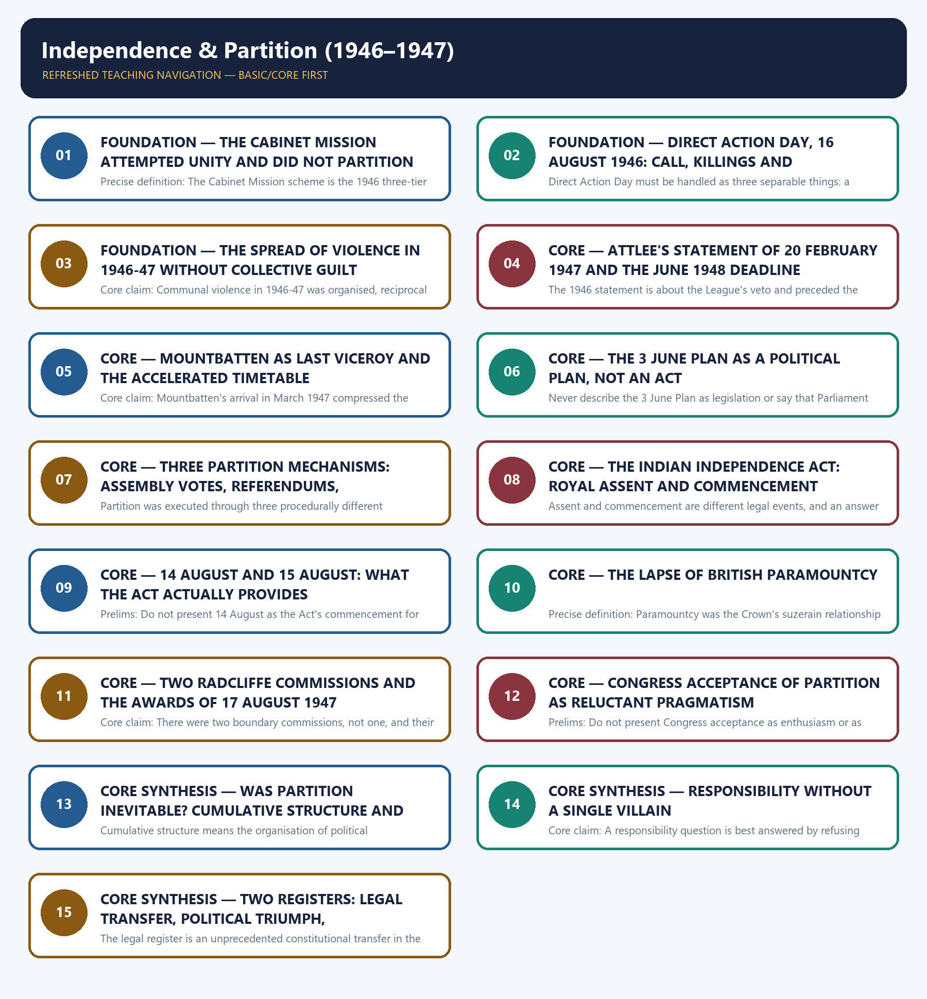

# Independence & Partition (1946–1947) - Learner-v2 Complete Learning Session

### SOURCE, PROGRESSION AND CURRENT-LINKAGE AUDIT

- **Repository owners queried:** Basic and Advanced Markdown for this topic, the master chronology, syllabus map and linked Modern History owners.
- **OCR book evidence queried:** The Basic and Advanced owner files were reconciled with the repository's Modern History OCR sources — Bipan Chandra's *Modern India*, *India's Struggle for Independence, 1857–1947* and Sekhar Bandyopadhyay's *From Plassey to Partition* — for the collapse of the Cabinet Mission scheme, Direct Action Day, the 3 June Plan, the Indian Independence Act and the boundary awards. Displacement is retained only as the owners' broad 10 to 15 million estimate, and death tolls are left unquantified because the local sources treat them as contested.
- **Qdrant:** not used; Markdown plus searchable local PDFs were sufficient.
- **PYQ integrity:** The only demand routed to this owner in the local ledgers is 2021 Prelims GS-I Q50 on International Mother Language Day and the Bangla language movement, which the Basic owner itself records as unresolved locally; no date, event or UNESCO designation is asserted for it. The 2019 Mains GS-I Q12 transfer-of-power demand is routed in `_PYQ-ROUTING-MAINS-GS1-GS2-ESSAY-2018-2023.md` to the adjacent Topic 26 owner and is carried here only as a shared endgame demand, clearly labelled as such. No official answer key is held for either entry, and no paraphrase is claimed to be verbatim.
- **Bounded live linkage:** The Ministry of Culture's own event page records that Partition Horrors Remembrance Day was observed on 13 and 14 August 2026 through commemorative programmes in Delhi, Amritsar and Kolkata, along with observances organised across States and Union Territories, and that these included exhibitions, documentaries, survivor testimonies, cultural programmes and silent marches paying homage to the victims and survivors of Partition. Only claims directly supported by that page are used here: no casualty figure, no comparative claim and no political interpretation is drawn from it, and the observance is treated as evidence of official public remembrance rather than as historical evidence about 1947 itself.
- **Fact/inference rule:** historical claims are source-backed; analytical judgements are explicitly framed as interpretation and do not invent figures.

## BASIC LEARNING SESSION



*Distinct embedded teaching-navigation image. The separate continuous Cārvāka-style flowchart package remains an independent at-a-glance artifact.*

### SESSION 1 — FOUNDATION — THE CABINET MISSION ATTEMPTED UNITY AND DID NOT PARTITION INDIA

#### DEFINITION / WHAT THIS IS CALLED

**Plain-language definition:** Core claim: Partition is often misattributed to the Cabinet Mission, but the Mission rejected a sovereign Pakistan and offered a united three-tier scheme, so the causal story must begin with the collapse of that offer rather than with the offer itself.

**Technical definition:** Precise definition: The Cabinet Mission scheme is the 1946 three-tier proposal of Union, groups and provinces that rejected a sovereign Pakistan and sought to preserve a single Indian union.

#### ANSWER-GRABBING OPENING — WRITE/ADAPT IN THE EXAM

> Never write that the Mission itself carried out a partition of India; it attempted unity and did not partition India, and its grouping device was a federal arrangement.

#### MUST-WRITE KEYWORDS

- **FOUNDATION**
- **The Cabinet Mission attempted unity**
- **did not partition India**
- **Precise definition**
- **Topic boundary**
- **Core claim**

**How to use them:** Frame the answer through FOUNDATION; define The Cabinet Mission attempted unity, connect did not partition India with Precise definition to explain the mechanism, and use Topic boundary for the decisive comparison or qualification.

##### VISUAL FIRST

```text
THE CABINET MISSION ATTEMPTED UNITY AND DID NOT PARTITION INDIA
CABINET MISSION 1946 -> UNITY ATTEMPT, NOT A PARTITION INSTRUMENT
|-- REJECTED -> a sovereign Pakistan
|-- PROPOSED -> Union + groups of provinces + provinces (weak centre)
|-- ACCEPTED (in some form) -> by both parties in June and July 1946
COLLAPSE -> incompatible readings -> withdrawal -> loss of trust -> Partition
RULE -> the Mission is where unity was last available, not where it ended.
```

*The visual fixes this subtopic's chronology, mechanism or boundary before the evidence.*

##### CONCEPT DEFINITIONS

- **Precise definition:** The Cabinet Mission scheme is the 1946 three-tier proposal of Union, groups and provinces that rejected a sovereign Pakistan and sought to preserve a single Indian union.
- **Topic boundary:** Apply this definition only within Independence & Partition (1946–1947); retain the named actor, institution, date and chronological role.

##### CORE EXPLANATION

Partition is often misattributed to the Cabinet Mission, but the Mission rejected a sovereign Pakistan and offered a united three-tier scheme, so the causal story must begin with the collapse of that offer rather than with the offer itself.

##### EVIDENCE AND MECHANISM

- The Mission's plan of 1946 proposed a Union, groups of provinces and provinces, with a deliberately weak centre.
- It rejected a sovereign Pakistan on administrative, economic and strategic grounds.
- Both parties accepted the scheme in some form in June and July 1946, so a united settlement remained constitutionally available after the elections.
- Partition followed the collapse of that scheme through incompatible interpretations, withdrawal of acceptance and the breakdown of trust.

##### EXAMINER CAUTION

- Never write that the Mission itself carried out a partition of India; it attempted unity and did not partition India, and its grouping device was a federal arrangement.

##### EXAM LINK

- **Prelims:** Never write that the Mission itself carried out a partition of India; it attempted unity and did not partition India, and its grouping device was a federal arrangement.
- **Mains:** Open a causes-of-Partition answer by clearing this misattribution, because it sets up the contingency argument that follows.

##### MINI RECAP

- **Core claim:** Partition is often misattributed to the Cabinet Mission, but the Mission rejected a sovereign Pakistan and offered a united three-tier scheme, so the causal story must begin with the collapse of that offer rather than with the offer itself.
- **Use:** Open a causes-of-Partition answer by clearing this misattribution, because it sets up the contingency argument that follows.

#### CLOSING RECALL FLOW — FOUNDATION — THE CABINET MISSION ATTEMPTED UNITY AND DID NOT PARTITION INDIA

```text
START / CONCEPT: FOUNDATION — The Cabinet Mission attempted unity and did not partition India
        |
        v
EXACT TERMS: FOUNDATION · The Cabinet Mission attempted unity · did not partition India · Precise definition · Topic boundary · Core claim
        |
        v
MECHANISM / ARGUMENT: Partition followed the collapse of that scheme through incompatible interpretations, withdrawal of acceptance and the breakdown of trust.
        |
        v
CONSEQUENCE / CONTRAST: Core claim: Partition is often misattributed to the Cabinet Mission, but the Mission rejected a sovereign Pakistan and offered a united three-tier scheme, so the causal story must begin with the collapse of that offer rather than with the offer itself.
        |
        v
UPSC TRAP / ANSWER-USE: Do not miss this limiting distinction: the Cabinet Mission scheme is the 1946 three-tier proposal of Union, groups and provinces...
        |
        v
ANSWER-GRABBING FORMULATION: Never write that the Mission itself carried out a partition of India; it attempted unity and did not partition India, and its grouping device was a federal arrangement.
```
### SESSION 2 — FOUNDATION — DIRECT ACTION DAY, 16 AUGUST 1946: CALL, KILLINGS AND CONSEQUENCES

#### DEFINITION / WHAT THIS IS CALLED

**Plain-language definition:** Precise definition: Direct Action Day is the Muslim League's political call for 16 August 1946, distinct from the Calcutta killings that followed it and from the later regional violence.

**Technical definition:** Direct Action Day must be handled as three separable things: a political call, the Calcutta killings that followed it, and the wider regional violence of the following months.

#### ANSWER-GRABBING OPENING — WRITE/ADAPT IN THE EXAM

> Precise definition: Direct Action Day is the Muslim League's political call for 16 August 1946, distinct from the Calcutta killings that followed it and from the later regional violence.

#### MUST-WRITE KEYWORDS

- **FOUNDATION**
- **Direct Action Day**
- **call**
- **killings**
- **consequences**
- **16 August 1946**

**How to use them:** Frame the answer through FOUNDATION; define Direct Action Day, connect call with killings to explain the mechanism, and use consequences for the decisive comparison or qualification.

##### VISUAL FIRST

```text
DIRECT ACTION DAY, 16 AUGUST 1946: CALL, KILLINGS AND CONSEQUENCES
16 AUG 1946 -> DIRECT ACTION DAY -> three separable things
|-- POLITICAL CALL -> Muslim League, after deadlock and its own withdrawal
|-- CALCUTTA -> mass killings remembered as the Great Calcutta Killings
|-- LATER REGIONAL VIOLENCE -> separate local actors, triggers and sequences
ORDER -> Direct Action precedes the Congress-only Interim Government (2 Sep 1946)
RULE -> separate call, killings and spread; assign agency to actors, not communities.
```

*The visual fixes this subtopic's chronology, mechanism or boundary before the evidence.*

##### CONCEPT DEFINITIONS

- **Precise definition:** Direct Action Day is the Muslim League's political call for 16 August 1946, distinct from the Calcutta killings that followed it and from the later regional violence.
- **Topic boundary:** Apply this definition only within Independence & Partition (1946–1947); retain the named actor, institution, date and chronological role.

##### CORE EXPLANATION

Direct Action Day must be handled as three separable things: a political call, the Calcutta killings that followed it, and the wider regional violence of the following months.

##### EVIDENCE AND MECHANISM

- The Muslim League issued the Direct Action call for 16 August 1946 after the constitutional deadlock and its own withdrawal of acceptance.
- In Calcutta the day was followed by mass killings remembered as the Great Calcutta Killings.
- The violence spread later to other regions, but each episode had its own local actors, triggers and sequence.
- Direct Action preceded the Congress-only Interim Government of September 1946, so it cannot be described as a reaction to that ministry.

##### EXAMINER CAUTION

- Keep the political call, the Calcutta killings and the later regional violence analytically distinct, and do not attribute the violence to any community as such.

##### EXAM LINK

- **Prelims:** Keep the political call, the Calcutta killings and the later regional violence analytically distinct, and do not attribute the violence to any community as such.
- **Mains:** Use the three-part separation to write about 1946 violence without sliding into either apologetics or collective blame.

##### MINI RECAP

- **Core claim:** Direct Action Day must be handled as three separable things: a political call, the Calcutta killings that followed it, and the wider regional violence of the following months.
- **Use:** Use the three-part separation to write about 1946 violence without sliding into either apologetics or collective blame.

#### CLOSING RECALL FLOW — FOUNDATION — DIRECT ACTION DAY, 16 AUGUST 1946: CALL, KILLINGS AND CONSEQUENCES

```text
START / CONCEPT: FOUNDATION — Direct Action Day, 16 August 1946: call, killings and consequences
        |
        v
EXACT TERMS: FOUNDATION · Direct Action Day · call · killings · consequences · 16 August 1946
        |
        v
MECHANISM / ARGUMENT: Direct Action Day must be handled as three separable things: a political call, the Calcutta killings that followed it, and the wider regional violence of the following months.
        |
        v
CONSEQUENCE / CONTRAST: Keep the political call, the Calcutta killings and the later regional violence analytically distinct, and do not attribute the violence to any community as such.
        |
        v
UPSC TRAP / ANSWER-USE: The violence spread later to other regions, but each episode had its own local actors, triggers and sequence.
        |
        v
ANSWER-GRABBING FORMULATION: Precise definition: Direct Action Day is the Muslim League's political call for 16 August 1946, distinct from the Calcutta killings that followed it and from the later regional violence.
```
### SESSION 3 — FOUNDATION — THE SPREAD OF VIOLENCE IN 1946-47 WITHOUT COLLECTIVE GUILT

#### DEFINITION / WHAT THIS IS CALLED

**Plain-language definition:** Precise definition: Reciprocal communal violence describes the retaliatory sequence of attacks across Noakhali, Bihar and Punjab in 1946-47, driven by organisations and local actors rather than by undifferentiated communities.

**Technical definition:** Core claim: Communal violence in 1946-47 was organised, reciprocal and regionally specific, and the discipline an answer must show is to assign agency to organisations and leaderships rather than to whole communities.

#### ANSWER-GRABBING OPENING — WRITE/ADAPT IN THE EXAM

> Core claim: Communal violence in 1946-47 was organised, reciprocal and regionally specific, and the discipline an answer must show is to assign agency to organisations and leaderships rather than to whole communities.

#### MUST-WRITE KEYWORDS

- **FOUNDATION**
- **Precise definition**
- **Topic boundary**
- **Core claim**
- **1946-47**
- **1946–1947**

**How to use them:** Frame the answer through FOUNDATION; define Precise definition, connect Topic boundary with Core claim to explain the mechanism, and use 1946-47 for the decisive comparison or qualification.

##### VISUAL FIRST

```text
THE SPREAD OF VIOLENCE IN 1946-47 WITHOUT COLLECTIVE GUILT
1946-47 VIOLENCE -> reciprocal waves, regionally specific
|-- NOAKHALI -> BIHAR -> PUNJAB (each with its own actors and triggers)
|-- DRIVERS -> organisations, armed bands, rumour, collapse of policing
|-- REGIONAL SPLIT -> Punjab and Bengal: territorial division and mass violence
                   -> elsewhere: political settlement and a minority question
RULE -> agency belongs to organisations and leaderships, never to whole communities.
```

*The visual fixes this subtopic's chronology, mechanism or boundary before the evidence.*

##### CONCEPT DEFINITIONS

- **Precise definition:** Reciprocal communal violence describes the retaliatory sequence of attacks across Noakhali, Bihar and Punjab in 1946-47, driven by organisations and local actors rather than by undifferentiated communities.
- **Topic boundary:** Apply this definition only within Independence & Partition (1946–1947); retain the named actor, institution, date and chronological role.

##### CORE EXPLANATION

Communal violence in 1946-47 was organised, reciprocal and regionally specific, and the discipline an answer must show is to assign agency to organisations and leaderships rather than to whole communities.

##### EVIDENCE AND MECHANISM

- Violence moved through Noakhali, Bihar and the Punjab in reciprocal waves during 1946-47.
- Local organisations, armed bands, rumour and the collapse of policing drove each episode.
- Regional experience differed sharply: Punjab and Bengal experienced territorial division and mass violence, while other provinces experienced a political settlement and a minority question.
- Attributing violence to a religious community as such is both historically false and analytically useless, since it explains no particular episode.

##### EXAMINER CAUTION

- Assign responsibility to named organisations, leaderships and local actors, and never to whole communities; regional variation must be stated rather than averaged away.

##### EXAM LINK

- **Prelims:** Assign responsibility to named organisations, leaderships and local actors, and never to whole communities; regional variation must be stated rather than averaged away.
- **Mains:** Use the regional-variation point to avoid a single national narrative of Partition violence in any 15 or 20-mark answer.

##### MINI RECAP

- **Core claim:** Communal violence in 1946-47 was organised, reciprocal and regionally specific, and the discipline an answer must show is to assign agency to organisations and leaderships rather than to whole communities.
- **Use:** Use the regional-variation point to avoid a single national narrative of Partition violence in any 15 or 20-mark answer.

#### CLOSING RECALL FLOW — FOUNDATION — THE SPREAD OF VIOLENCE IN 1946-47 WITHOUT COLLECTIVE GUILT

```text
START / CONCEPT: FOUNDATION — The spread of violence in 1946-47 without collective guilt
        |
        v
EXACT TERMS: FOUNDATION · Precise definition · Topic boundary · Core claim · 1946-47 · 1946–1947
        |
        v
MECHANISM / ARGUMENT: Precise definition: Reciprocal communal violence describes the retaliatory sequence of attacks across Noakhali, Bihar and Punjab in 1946-47, driven by organisations and local actors rather than by undifferentiated communities.
        |
        v
CONSEQUENCE / CONTRAST: Attributing violence to a religious community as such is both historically false and analytically useless, since it explains no particular episode.
        |
        v
UPSC TRAP / ANSWER-USE: Mains: Use the regional-variation point to avoid a single national narrative of Partition violence in any 15 or 20-mark answer.
        |
        v
ANSWER-GRABBING FORMULATION: Core claim: Communal violence in 1946-47 was organised, reciprocal and regionally specific, and the discipline an answer must show is to assign agency to organisations and leaderships rather than to whole communities.
```
### SESSION 4 — CORE — ATTLEE'S STATEMENT OF 20 FEBRUARY 1947 AND THE JUNE 1948 DEADLINE

#### DEFINITION / WHAT THIS IS CALLED

**Plain-language definition:** Precise definition: Attlee's statement of 20 February 1947 is the announcement of a fixed outer limit of June 1948 for the transfer of power to responsible Indian hands.

**Technical definition:** The 1946 statement is about the League's veto and preceded the Cabinet Mission; the 1947 statement sets the withdrawal deadline.

#### ANSWER-GRABBING OPENING — WRITE/ADAPT IN THE EXAM

> Precise definition: Attlee's statement of 20 February 1947 is the announcement of a fixed outer limit of June 1948 for the transfer of power to responsible Indian hands.

#### MUST-WRITE KEYWORDS

- **Attlee's statement of 20 February 1947**
- **the June 1948 deadline**
- **Precise definition**
- **Topic boundary**
- **Core claim**
- **1946–1947**

**How to use them:** Frame the answer through Attlee's statement of 20 February 1947; define the June 1948 deadline, connect Precise definition with Topic boundary to explain the mechanism, and use Core claim for the decisive comparison or qualification.

##### VISUAL FIRST

```text
ATTLEE'S STATEMENT OF 20 FEBRUARY 1947 AND THE JUNE 1948 DEADLINE
TWO ATTLEE STATEMENTS -> do not conflate
|-- 15 MAR 1946 -> "a minority will not be allowed to place a veto" -> pre-Mission
`-- 20 FEB 1947 -> transfer of power to responsible Indian hands, not later than June 1948
EFFECT -> a published outer limit converts negotiation into a race against a date
RULE -> one is about the veto, the other is about the deadline.
```

*The visual fixes this subtopic's chronology, mechanism or boundary before the evidence.*

##### CONCEPT DEFINITIONS

- **Precise definition:** Attlee's statement of 20 February 1947 is the announcement of a fixed outer limit of June 1948 for the transfer of power to responsible Indian hands.
- **Topic boundary:** Apply this definition only within Independence & Partition (1946–1947); retain the named actor, institution, date and chronological role.

##### CORE EXPLANATION

The February 1947 announcement changed the question from whether Britain would leave to how fast it could go, and it must be kept separate from Attlee's earlier statement about the minority veto.

##### EVIDENCE AND MECHANISM

- On 20 February 1947 Attlee announced that Britain would transfer power to responsible Indian hands not later than June 1948.
- The earlier statement of 15 March 1946 had said instead that a minority would not be allowed to place a veto on the progress of the majority.
- The 1946 statement is about the League's veto and preceded the Cabinet Mission; the 1947 statement sets the withdrawal deadline.
- A fixed outer limit turned every negotiating position into a race against a published date.

##### EXAMINER CAUTION

- Do not conflate the two Attlee statements; one addresses the minority veto in March 1946, the other sets the June 1948 deadline in February 1947.

##### EXAM LINK

- **Prelims:** Do not conflate the two Attlee statements; one addresses the minority veto in March 1946, the other sets the June 1948 deadline in February 1947.
- **Mains:** Use the deadline as the hinge between the constitutional deadlock of 1946 and the accelerated partition mechanics of 1947.

##### MINI RECAP

- **Core claim:** The February 1947 announcement changed the question from whether Britain would leave to how fast it could go, and it must be kept separate from Attlee's earlier statement about the minority veto.
- **Use:** Use the deadline as the hinge between the constitutional deadlock of 1946 and the accelerated partition mechanics of 1947.

#### CLOSING RECALL FLOW — CORE — ATTLEE'S STATEMENT OF 20 FEBRUARY 1947 AND THE JUNE 1948 DEADLINE

```text
START / CONCEPT: CORE — Attlee's statement of 20 February 1947 and the June 1948 deadline
        |
        v
EXACT TERMS: Attlee's statement of 20 February 1947 · the June 1948 deadline · Precise definition · Topic boundary · Core claim · 1946–1947
        |
        v
MECHANISM / ARGUMENT: Do not conflate the two Attlee statements; one addresses the minority veto in March 1946, the other sets the June 1948 deadline in February 1947.
        |
        v
CONSEQUENCE / CONTRAST: The earlier statement of 15 March 1946 had said instead that a minority would not be allowed to place a veto on the progress of the majority.
        |
        v
UPSC TRAP / ANSWER-USE: Do not miss this limiting distinction: the February 1947 announcement changed the question from whether Britain would leave to how...
        |
        v
ANSWER-GRABBING FORMULATION: Precise definition: Attlee's statement of 20 February 1947 is the announcement of a fixed outer limit of June 1948 for the transfer of power to responsible Indian hands.
```
### SESSION 5 — CORE — MOUNTBATTEN AS LAST VICEROY AND THE ACCELERATED TIMETABLE

#### DEFINITION / WHAT THIS IS CALLED

**Plain-language definition:** Precise definition: The accelerated timetable is Mountbatten's compression of the published June 1948 deadline into a transfer completed in August 1947.

**Technical definition:** Core claim: Mountbatten's arrival in March 1947 compressed the timetable drastically, and that compression explains a great deal about how Partition was executed without explaining why Partition was chosen.

#### ANSWER-GRABBING OPENING — WRITE/ADAPT IN THE EXAM

> Precise definition: The accelerated timetable is Mountbatten's compression of the published June 1948 deadline into a transfer completed in August 1947.

#### MUST-WRITE KEYWORDS

- **Mountbatten as last Viceroy**
- **the accelerated timetable**
- **Precise definition**
- **Topic boundary**
- **Core claim**
- **1946–1947**

**How to use them:** Frame the answer through Mountbatten as last Viceroy; define the accelerated timetable, connect Precise definition with Topic boundary to explain the mechanism, and use Core claim for the decisive comparison or qualification.

##### VISUAL FIRST

```text
MOUNTBATTEN AS LAST VICEROY AND THE ACCELERATED TIMETABLE
MAR 1947 -> MOUNTBATTEN ARRIVES AS LAST VICEROY
DEADLINE -> June 1948 outer limit compressed to August 1947
CONSEQUENCE -> administrative, military and boundary arrangements left incomplete
ANALYTICAL PLACE -> explains execution and disorder, not the choice to partition
RULE -> haste belongs in consequences, not in causes.
```

*The visual fixes this subtopic's chronology, mechanism or boundary before the evidence.*

##### CONCEPT DEFINITIONS

- **Precise definition:** The accelerated timetable is Mountbatten's compression of the published June 1948 deadline into a transfer completed in August 1947.
- **Topic boundary:** Apply this definition only within Independence & Partition (1946–1947); retain the named actor, institution, date and chronological role.

##### CORE EXPLANATION

Mountbatten's arrival in March 1947 compressed the timetable drastically, and that compression explains a great deal about how Partition was executed without explaining why Partition was chosen.

##### EVIDENCE AND MECHANISM

- Lord Mountbatten arrived in March 1947 as the last Viceroy of India.
- He converted the June 1948 outer limit into a far shorter timetable culminating in August 1947.
- The compression left administrative, military and boundary arrangements incomplete when power was transferred.
- Acceleration is therefore an analytical fact about execution and disorder, not a substitute for a causal account of the decision to partition.

##### EXAMINER CAUTION

- Do not let the haste argument become the whole explanation; haste worsened the violence and disorder, but the decision to partition had other and older causes.

##### EXAM LINK

- **Prelims:** Do not let the haste argument become the whole explanation; haste worsened the violence and disorder, but the decision to partition had other and older causes.
- **Mains:** Use the acceleration point in the consequences section of an answer, not in the causes section.

##### MINI RECAP

- **Core claim:** Mountbatten's arrival in March 1947 compressed the timetable drastically, and that compression explains a great deal about how Partition was executed without explaining why Partition was chosen.
- **Use:** Use the acceleration point in the consequences section of an answer, not in the causes section.

#### CLOSING RECALL FLOW — CORE — MOUNTBATTEN AS LAST VICEROY AND THE ACCELERATED TIMETABLE

```text
START / CONCEPT: CORE — Mountbatten as last Viceroy and the accelerated timetable
        |
        v
EXACT TERMS: Mountbatten as last Viceroy · the accelerated timetable · Precise definition · Topic boundary · Core claim · 1946–1947
        |
        v
MECHANISM / ARGUMENT: Do not let the haste argument become the whole explanation; haste worsened the violence and disorder, but the decision to partition had other and older causes.
        |
        v
CONSEQUENCE / CONTRAST: Acceleration is therefore an analytical fact about execution and disorder, not a substitute for a causal account of the decision to partition.
        |
        v
UPSC TRAP / ANSWER-USE: Mains: Use the acceleration point in the consequences section of an answer, not in the causes section.
        |
        v
ANSWER-GRABBING FORMULATION: Precise definition: The accelerated timetable is Mountbatten's compression of the published June 1948 deadline into a transfer completed in August 1947.
```
### SESSION 6 — CORE — THE 3 JUNE PLAN AS A POLITICAL PLAN, NOT AN ACT

#### DEFINITION / WHAT THIS IS CALLED

**Plain-language definition:** Precise definition: The 3 June Plan is the political plan announced by Mountbatten in 1947 that accepted Partition and set out the procedures by which it would be carried out.

**Technical definition:** Never describe the 3 June Plan as legislation or say that Parliament passed the Mountbatten Plan; the plan is political and the Act is legal.

#### ANSWER-GRABBING OPENING — WRITE/ADAPT IN THE EXAM

> Precise definition: The 3 June Plan is the political plan announced by Mountbatten in 1947 that accepted Partition and set out the procedures by which it would be carried out.

#### MUST-WRITE KEYWORDS

- **The 3 June Plan as a political plan**
- **not an Act**
- **Precise definition**
- **Topic boundary**
- **Core claim**
- **1946–1947**

**How to use them:** Frame the answer through The 3 June Plan as a political plan; define not an Act, connect Precise definition with Topic boundary to explain the mechanism, and use Core claim for the decisive comparison or qualification.

##### VISUAL FIRST

```text
THE 3 JUNE PLAN AS A POLITICAL PLAN, NOT AN ACT
3 JUNE 1947 -> MOUNTBATTEN PLAN -> a POLITICAL plan
|-- ACCEPTS -> Partition in principle
|-- PROVIDES FOR -> division of Punjab and Bengal
|                -> referendums in the North-West Frontier Province and Sylhet
|                -> boundary commissions
LIMIT -> not an Act of Parliament; transfers no power by itself
RULE -> the political decision precedes the legal enactment of July 1947.
```

*The visual fixes this subtopic's chronology, mechanism or boundary before the evidence.*

##### CONCEPT DEFINITIONS

- **Precise definition:** The 3 June Plan is the political plan announced by Mountbatten in 1947 that accepted Partition and set out the procedures by which it would be carried out.
- **Topic boundary:** Apply this definition only within Independence & Partition (1946–1947); retain the named actor, institution, date and chronological role.

##### CORE EXPLANATION

The 3 June Plan is a political decision document: it set the terms on which Partition and transfer would proceed, and it is not the statute that transferred power.

##### EVIDENCE AND MECHANISM

- The Mountbatten Plan was announced on 3 June 1947 and accepted Partition in principle.
- It provided for the division of Punjab and Bengal, referendums in the North-West Frontier Province and Sylhet, and boundary commissions.
- It was not an Act of Parliament and did not by itself transfer power or create any dominion.
- The legal transfer required a separate enactment at Westminster which followed in July 1947.

##### EXAMINER CAUTION

- Never describe the 3 June Plan as legislation or say that Parliament passed the Mountbatten Plan; the plan is political and the Act is legal.

##### EXAM LINK

- **Prelims:** Never describe the 3 June Plan as legislation or say that Parliament passed the Mountbatten Plan; the plan is political and the Act is legal.
- **Mains:** Use the plan-versus-Act distinction as the first line of any instruments question, before you describe either document.

##### MINI RECAP

- **Core claim:** The 3 June Plan is a political decision document: it set the terms on which Partition and transfer would proceed, and it is not the statute that transferred power.
- **Use:** Use the plan-versus-Act distinction as the first line of any instruments question, before you describe either document.

#### CLOSING RECALL FLOW — CORE — THE 3 JUNE PLAN AS A POLITICAL PLAN, NOT AN ACT

```text
START / CONCEPT: CORE — The 3 June Plan as a political plan, not an Act
        |
        v
EXACT TERMS: The 3 June Plan as a political plan · not an Act · Precise definition · Topic boundary · Core claim · 1946–1947
        |
        v
MECHANISM / ARGUMENT: Core claim: The 3 June Plan is a political decision document: it set the terms on which Partition and transfer would proceed, and it is not the statute that transferred power.
        |
        v
CONSEQUENCE / CONTRAST: Never describe the 3 June Plan as legislation or say that Parliament passed the Mountbatten Plan; the plan is political and the Act is legal.
        |
        v
UPSC TRAP / ANSWER-USE: It was not an Act of Parliament and did not by itself transfer power or create any dominion.
        |
        v
ANSWER-GRABBING FORMULATION: Precise definition: The 3 June Plan is the political plan announced by Mountbatten in 1947 that accepted Partition and set out the procedures by which it would be carried out.
```
### SESSION 7 — CORE — THREE PARTITION MECHANISMS: ASSEMBLY VOTES, REFERENDUMS, COMMISSIONS

#### DEFINITION / WHAT THIS IS CALLED

**Plain-language definition:** Precise definition: The three partition mechanisms are the provincial assembly votes for Punjab and Bengal, the referendums in the North-West Frontier Province and Sylhet, and the boundary commissions.

**Technical definition:** Partition was executed through three procedurally different mechanisms, and conflating them produces both factual error and a false picture of how consent was measured.

#### ANSWER-GRABBING OPENING — WRITE/ADAPT IN THE EXAM

> Precise definition: The three partition mechanisms are the provincial assembly votes for Punjab and Bengal, the referendums in the North-West Frontier Province and Sylhet, and the boundary commissions.

#### MUST-WRITE KEYWORDS

- **Three partition mechanisms**
- **assembly votes**
- **referendums**
- **commissions**
- **Precise definition**
- **Topic boundary**

**How to use them:** Frame the answer through Three partition mechanisms; define assembly votes, connect referendums with commissions to explain the mechanism, and use Precise definition for the decisive comparison or qualification.

##### VISUAL FIRST

```text
THREE PARTITION MECHANISMS: ASSEMBLY VOTES, REFERENDUMS, COMMISSIONS
HOW PARTITION WAS CARRIED OUT -> three different procedures
|-- ASSEMBLY VOTES -> Punjab and Bengal, by the two notional halves of each assembly
|-- REFERENDUMS -> North-West Frontier Province and Sylhet district of Assam
|                -> both results took them into Pakistan
`-- BOUNDARY COMMISSIONS -> technical line-drawing, separate from both routes
RULE -> match the province to its mechanism; never swap them.
```

*The visual fixes this subtopic's chronology, mechanism or boundary before the evidence.*

##### CONCEPT DEFINITIONS

- **Precise definition:** The three partition mechanisms are the provincial assembly votes for Punjab and Bengal, the referendums in the North-West Frontier Province and Sylhet, and the boundary commissions.
- **Topic boundary:** Apply this definition only within Independence & Partition (1946–1947); retain the named actor, institution, date and chronological role.

##### CORE EXPLANATION

Partition was executed through three procedurally different mechanisms, and conflating them produces both factual error and a false picture of how consent was measured.

##### EVIDENCE AND MECHANISM

- Punjab and Bengal were divided by separate votes of the notional Hindu-majority and Muslim-majority halves of each provincial legislative assembly.
- The North-West Frontier Province and the Sylhet district of Assam decided by referendum, and both results took them into Pakistan.
- The Congress-aligned boycott of the North-West Frontier Province poll is standard knowledge rather than a claim taken from the local owner files, and should be flagged as such.
- Boundary commissions then drew the actual lines, a technical task distinct from both the legislative and the referendum routes.

##### EXAMINER CAUTION

- Do not describe Punjab and Bengal as partitioned by referendum, and do not describe the North-West Frontier Province or Sylhet as divided by assembly vote.

##### EXAM LINK

- **Prelims:** Do not describe Punjab and Bengal as partitioned by referendum, and do not describe the North-West Frontier Province or Sylhet as divided by assembly vote.
- **Mains:** Use the three-mechanism map for any question that asks how, rather than why, Partition was carried out.

##### MINI RECAP

- **Core claim:** Partition was executed through three procedurally different mechanisms, and conflating them produces both factual error and a false picture of how consent was measured.
- **Use:** Use the three-mechanism map for any question that asks how, rather than why, Partition was carried out.

#### CLOSING RECALL FLOW — CORE — THREE PARTITION MECHANISMS: ASSEMBLY VOTES, REFERENDUMS, COMMISSIONS

```text
START / CONCEPT: CORE — Three partition mechanisms: assembly votes, referendums, commissions
        |
        v
EXACT TERMS: Three partition mechanisms · assembly votes · referendums · commissions · Precise definition · Topic boundary
        |
        v
MECHANISM / ARGUMENT: Partition was executed through three procedurally different mechanisms, and conflating them produces both factual error and a false picture of how consent was measured.
        |
        v
CONSEQUENCE / CONTRAST: Do not describe Punjab and Bengal as partitioned by referendum, and do not describe the North-West Frontier Province or Sylhet as divided by assembly vote.
        |
        v
UPSC TRAP / ANSWER-USE: Do not miss this limiting distinction: punjab and Bengal were divided by separate votes of the notional Hindu-majority and Muslim-majority...
        |
        v
ANSWER-GRABBING FORMULATION: Precise definition: The three partition mechanisms are the provincial assembly votes for Punjab and Bengal, the referendums in the North-West Frontier Province and Sylhet, and the boundary commissions.
```
### SESSION 8 — CORE — THE INDIAN INDEPENDENCE ACT: ROYAL ASSENT AND COMMENCEMENT

#### DEFINITION / WHAT THIS IS CALLED

**Plain-language definition:** Precise definition: The Indian Independence Act is the Westminster statute that received Royal Assent on 18 July 1947 and created the dominions of India and Pakistan from 15 August 1947.

**Technical definition:** Assent and commencement are different legal events, and an answer that gives only 'July 1947' loses the second half of the distinction.

#### ANSWER-GRABBING OPENING — WRITE/ADAPT IN THE EXAM

> Precise definition: The Indian Independence Act is the Westminster statute that received Royal Assent on 18 July 1947 and created the dominions of India and Pakistan from 15 August 1947.

#### MUST-WRITE KEYWORDS

- **The Indian Independence Act**
- **Royal Assent**
- **commencement**
- **Precise definition**
- **Topic boundary**
- **Core claim**

**How to use them:** Frame the answer through The Indian Independence Act; define Royal Assent, connect commencement with Precise definition to explain the mechanism, and use Topic boundary for the decisive comparison or qualification.

##### VISUAL FIRST

```text
THE INDIAN INDEPENDENCE ACT: ROYAL ASSENT AND COMMENCEMENT
INDIAN INDEPENDENCE ACT -> the LEGAL enactment
|-- ROYAL ASSENT -> 18 July 1947 (Westminster)
|-- COMMENCEMENT -> two dominions, India and Pakistan, from 15 August 1947
|-- ALSO PROVIDES -> lapse of British paramountcy over the princely states
SEQUENCE -> 3 June political plan -> 18 July assent -> 15 August commencement
RULE -> assent and commencement are separate legal events.
```

*The visual fixes this subtopic's chronology, mechanism or boundary before the evidence.*

##### CONCEPT DEFINITIONS

- **Precise definition:** The Indian Independence Act is the Westminster statute that received Royal Assent on 18 July 1947 and created the dominions of India and Pakistan from 15 August 1947.
- **Topic boundary:** Apply this definition only within Independence & Partition (1946–1947); retain the named actor, institution, date and chronological role.

##### CORE EXPLANATION

The Act is the legal instrument of transfer, and its two dates must be stated separately: it received Royal Assent on 18 July 1947 and it created the dominions from 15 August 1947.

##### EVIDENCE AND MECHANISM

- The Indian Independence Act received Royal Assent on 18 July 1947 at Westminster.
- It legally created the two independent dominions of India and Pakistan from 15 August 1947.
- It provided for the lapse of British paramountcy over the princely states.
- Assent and commencement are different legal events, and an answer that gives only 'July 1947' loses the second half of the distinction.

##### EXAMINER CAUTION

- Distinguish the Royal Assent of 18 July 1947 from the commencement of the two dominions on 15 August 1947; the Act followed and did not precede the political plan.

##### EXAM LINK

- **Prelims:** Distinguish the Royal Assent of 18 July 1947 from the commencement of the two dominions on 15 August 1947; the Act followed and did not precede the political plan.
- **Mains:** Use both dates in any instruments answer, because examiners test assent and commencement separately.

##### MINI RECAP

- **Core claim:** The Act is the legal instrument of transfer, and its two dates must be stated separately: it received Royal Assent on 18 July 1947 and it created the dominions from 15 August 1947.
- **Use:** Use both dates in any instruments answer, because examiners test assent and commencement separately.

#### CLOSING RECALL FLOW — CORE — THE INDIAN INDEPENDENCE ACT: ROYAL ASSENT AND COMMENCEMENT

```text
START / CONCEPT: CORE — The Indian Independence Act: Royal Assent and commencement
        |
        v
EXACT TERMS: The Indian Independence Act · Royal Assent · commencement · Precise definition · Topic boundary · Core claim
        |
        v
MECHANISM / ARGUMENT: Mains: Use both dates in any instruments answer, because examiners test assent and commencement separately.
        |
        v
CONSEQUENCE / CONTRAST: Distinguish the Royal Assent of 18 July 1947 from the commencement of the two dominions on 15 August 1947; the Act followed and did not precede the political plan.
        |
        v
UPSC TRAP / ANSWER-USE: Do not miss this limiting distinction: the Act is the legal instrument of transfer.
        |
        v
ANSWER-GRABBING FORMULATION: Precise definition: The Indian Independence Act is the Westminster statute that received Royal Assent on 18 July 1947 and created the dominions of India and Pakistan from 15 August 1947.
```
### SESSION 9 — CORE — 14 AUGUST AND 15 AUGUST: WHAT THE ACT ACTUALLY PROVIDES

#### DEFINITION / WHAT THIS IS CALLED

**Plain-language definition:** Mountbatten attended the Karachi ceremony on 14 August and the Delhi transfer on 15 August, which is an administrative fact about ceremonies rather than about the statute.

**Technical definition:** Prelims: Do not present 14 August as the Act's commencement for Pakistan; the statute created both dominions from 15 August 1947 and the 14 August observance is a separate commemorative fact.

#### ANSWER-GRABBING OPENING — WRITE/ADAPT IN THE EXAM

> Precise definition: Commencement is the date from which a statute takes legal effect, which for the Indian Independence Act is 15 August 1947 for both dominions.

#### MUST-WRITE KEYWORDS

- **what the Act actually provides**
- **Precise definition**
- **Topic boundary**
- **Core claim**
- **14 August**
- **15 August**

**How to use them:** Frame the answer through what the Act actually provides; define Precise definition, connect Topic boundary with Core claim to explain the mechanism, and use 14 August for the decisive comparison or qualification.

##### VISUAL FIRST

```text
14 AUGUST AND 15 AUGUST: WHAT THE ACT ACTUALLY PROVIDES
WHAT THE STATUTE SAYS      | WHAT COMMEMORATION SAYS
---------------------------|-------------------------------------------------
both dominions from        | Pakistan observes 14 August as its national day
15 August 1947             | ceremonies at Karachi (14th) and Delhi (15th)
RULE -> statutory commencement is one date; commemorative observance is another.
```

*The visual fixes this subtopic's chronology, mechanism or boundary before the evidence.*

##### CONCEPT DEFINITIONS

- **Precise definition:** Commencement is the date from which a statute takes legal effect, which for the Indian Independence Act is 15 August 1947 for both dominions.
- **Topic boundary:** Apply this definition only within Independence & Partition (1946–1947); retain the named actor, institution, date and chronological role.

##### CORE EXPLANATION

A common error conflates Pakistan's later national-day observance on 14 August with the legal commencement of the Act, and the two must be kept apart because only one of them is a statutory fact.

##### EVIDENCE AND MECHANISM

- The Act created both dominions from 15 August 1947, and that is the date the statute names.
- Pakistan's observance of 14 August as its national day is a later commemorative practice, not the Act's commencement date.
- Mountbatten attended the Karachi ceremony on 14 August and the Delhi transfer on 15 August, which is an administrative fact about ceremonies rather than about the statute.
- An answer that says the Act came into force on different dates for the two dominions has misread the enactment.

##### EXAMINER CAUTION

- Do not present 14 August as the Act's commencement for Pakistan; the statute created both dominions from 15 August 1947 and the 14 August observance is a separate commemorative fact.

##### EXAM LINK

- **Prelims:** Do not present 14 August as the Act's commencement for Pakistan; the statute created both dominions from 15 August 1947 and the 14 August observance is a separate commemorative fact.
- **Mains:** Use this precision in Prelims-style elimination, where the commencement date is a favourite close-option trap.

##### MINI RECAP

- **Core claim:** A common error conflates Pakistan's later national-day observance on 14 August with the legal commencement of the Act, and the two must be kept apart because only one of them is a statutory fact.
- **Use:** Use this precision in Prelims-style elimination, where the commencement date is a favourite close-option trap.

#### CLOSING RECALL FLOW — CORE — 14 AUGUST AND 15 AUGUST: WHAT THE ACT ACTUALLY PROVIDES

```text
START / CONCEPT: CORE — 14 August and 15 August: what the Act actually provides
        |
        v
EXACT TERMS: what the Act actually provides · Precise definition · Topic boundary · Core claim · 14 August · 15 August
        |
        v
MECHANISM / ARGUMENT: Core claim: A common error conflates Pakistan's later national-day observance on 14 August with the legal commencement of the Act, and the two must be kept apart because only one of them is a statutory fact.
        |
        v
CONSEQUENCE / CONTRAST: Do not present 14 August as the Act's commencement for Pakistan; the statute created both dominions from 15 August 1947 and the 14 August observance is a separate commemorative fact.
        |
        v
UPSC TRAP / ANSWER-USE: Pakistan's observance of 14 August as its national day is a later commemorative practice, not the Act's commencement date.
        |
        v
ANSWER-GRABBING FORMULATION: Precise definition: Commencement is the date from which a statute takes legal effect, which for the Indian Independence Act is 15 August 1947 for both dominions.
```
### SESSION 10 — CORE — THE LAPSE OF BRITISH PARAMOUNTCY

#### DEFINITION / WHAT THIS IS CALLED

**Plain-language definition:** The lapse is a legal fact about the Act, and the accession process that followed belongs to the integration topic.

**Technical definition:** Precise definition: Paramountcy was the Crown's suzerain relationship with the princely states, and its lapse under the Act meant it ended rather than passing to either dominion.

#### ANSWER-GRABBING OPENING — WRITE/ADAPT IN THE EXAM

> Never write that suzerainty over the princely states was inherited automatically by either dominion; paramountcy lapsed, which is precisely why accession had to be negotiated state by state.

#### MUST-WRITE KEYWORDS

- **The lapse of British paramountcy**
- **Precise definition**
- **Topic boundary**
- **Core claim**
- **Precise**
- **1946–1947**

**How to use them:** Frame the answer through The lapse of British paramountcy; define Precise definition, connect Topic boundary with Core claim to explain the mechanism, and use Precise for the decisive comparison or qualification.

##### VISUAL FIRST

```text
THE LAPSE OF BRITISH PARAMOUNTCY
PARAMOUNTCY -> LAPSED (it did not transfer)
|-- NOT INHERITED -> neither dominion succeeded to suzerainty automatically
|-- CONSEQUENCE -> each state's relationship had to be created afresh
|-- ROUTE -> accession or agreement, negotiated state by state
RULE -> "lapsed" is the operative verb; "transferred" is the error.
```

*The visual fixes this subtopic's chronology, mechanism or boundary before the evidence.*

##### CONCEPT DEFINITIONS

- **Precise definition:** Paramountcy was the Crown's suzerain relationship with the princely states, and its lapse under the Act meant it ended rather than passing to either dominion.
- **Topic boundary:** Apply this definition only within Independence & Partition (1946–1947); retain the named actor, institution, date and chronological role.

##### CORE EXPLANATION

Paramountcy lapsed rather than transferring, and that single verb created the entire princely-states problem that the next topic resolves.

##### EVIDENCE AND MECHANISM

- British paramountcy over the princely states lapsed under the Act rather than passing to either successor dominion.
- Paramountcy therefore did not pass wholesale to India, and no automatic inheritance of suzerainty occurred.
- Each state's relationship with a dominion had to be created afresh through accession or agreement.
- The lapse is a legal fact about the Act, and the accession process that followed belongs to the integration topic.

##### EXAMINER CAUTION

- Never write that suzerainty over the princely states was inherited automatically by either dominion; paramountcy lapsed, which is precisely why accession had to be negotiated state by state.

##### EXAM LINK

- **Prelims:** Never write that suzerainty over the princely states was inherited automatically by either dominion; paramountcy lapsed, which is precisely why accession had to be negotiated state by state.
- **Mains:** Use the lapse as the bridge sentence connecting this topic to the integration of the princely states.

##### MINI RECAP

- **Core claim:** Paramountcy lapsed rather than transferring, and that single verb created the entire princely-states problem that the next topic resolves.
- **Use:** Use the lapse as the bridge sentence connecting this topic to the integration of the princely states.

#### CLOSING RECALL FLOW — CORE — THE LAPSE OF BRITISH PARAMOUNTCY

```text
START / CONCEPT: CORE — The lapse of British paramountcy
        |
        v
EXACT TERMS: The lapse of British paramountcy · Precise definition · Topic boundary · Core claim · Precise · 1946–1947
        |
        v
MECHANISM / ARGUMENT: Precise definition: Paramountcy was the Crown's suzerain relationship with the princely states, and its lapse under the Act meant it ended rather than passing to either dominion.
        |
        v
CONSEQUENCE / CONTRAST: Core claim: Paramountcy lapsed rather than transferring, and that single verb created the entire princely-states problem that the next topic resolves.
        |
        v
UPSC TRAP / ANSWER-USE: Do not miss this limiting distinction: the lapse is a legal fact about the Act.
        |
        v
ANSWER-GRABBING FORMULATION: Never write that suzerainty over the princely states was inherited automatically by either dominion; paramountcy lapsed, which is precisely why accession had to be negotiated state by state.
```
### SESSION 11 — CORE — TWO RADCLIFFE COMMISSIONS AND THE AWARDS OF 17 AUGUST 1947

#### DEFINITION / WHAT THIS IS CALLED

**Plain-language definition:** Precise definition: The Radcliffe awards are the boundary decisions of the two 1947 commissions for Punjab and Bengal, published on 17 August 1947 after the transfer of power.

**Technical definition:** Core claim: There were two boundary commissions, not one, and their awards were published on 17 August 1947, after the transfer of power, which produced administrative uncertainty without being the sole cause of the violence.

#### ANSWER-GRABBING OPENING — WRITE/ADAPT IN THE EXAM

> Precise definition: The Radcliffe awards are the boundary decisions of the two 1947 commissions for Punjab and Bengal, published on 17 August 1947 after the transfer of power.

#### MUST-WRITE KEYWORDS

- **Two Radcliffe commissions**
- **the awards of 17 August 1947**
- **Precise definition**
- **Topic boundary**
- **Core claim**
- **1946–1947**

**How to use them:** Frame the answer through Two Radcliffe commissions; define the awards of 17 August 1947, connect Precise definition with Topic boundary to explain the mechanism, and use Core claim for the decisive comparison or qualification.

##### VISUAL FIRST

```text
TWO RADCLIFFE COMMISSIONS AND THE AWARDS OF 17 AUGUST 1947
BOUNDARY MECHANISM -> two commissions, one chairman
|-- PUNJAB COMMISSION | BENGAL COMMISSION -> chaired by Cyril Radcliffe
|-- COMPOSITION -> equal Congress-nominated and League-nominated judges
|-- DEADLOCK -> members divide -> decisions fall to the chairman
15 AUG 1947 -> transfer of power | 17 AUG 1947 -> awards published
CONSEQUENCE -> border districts uncertain; violence already under way before the line.
```

*The visual fixes this subtopic's chronology, mechanism or boundary before the evidence.*

##### CONCEPT DEFINITIONS

- **Precise definition:** The Radcliffe awards are the boundary decisions of the two 1947 commissions for Punjab and Bengal, published on 17 August 1947 after the transfer of power.
- **Topic boundary:** Apply this definition only within Independence & Partition (1946–1947); retain the named actor, institution, date and chronological role.

##### CORE EXPLANATION

There were two boundary commissions, not one, and their awards were published on 17 August 1947, after the transfer of power, which produced administrative uncertainty without being the sole cause of the violence.

##### EVIDENCE AND MECHANISM

- Two separate commissions, one for Punjab and one for Bengal, were chaired by Cyril Radcliffe, a British lawyer with no prior Indian experience.
- Each commission had an equal number of Congress-nominated and League-nominated judges, so when they divided the decisions fell to the chairman.
- The awards were published on 17 August 1947, after the transfer of power on 15 August.
- Many people in border districts therefore did not know which state they were in at independence, although large-scale violence had begun long before any line was drawn.

##### EXAMINER CAUTION

- Do not describe Radcliffe as an Indian leader, do not speak of a single commission, and do not claim that the award alone caused the violence.

##### EXAM LINK

- **Prelims:** Do not describe Radcliffe as an Indian leader, do not speak of a single commission, and do not claim that the award alone caused the violence.
- **Mains:** Use the publication date to explain administrative uncertainty while keeping the causes of violence multi-factorial.

##### MINI RECAP

- **Core claim:** There were two boundary commissions, not one, and their awards were published on 17 August 1947, after the transfer of power, which produced administrative uncertainty without being the sole cause of the violence.
- **Use:** Use the publication date to explain administrative uncertainty while keeping the causes of violence multi-factorial.

#### CLOSING RECALL FLOW — CORE — TWO RADCLIFFE COMMISSIONS AND THE AWARDS OF 17 AUGUST 1947

```text
START / CONCEPT: CORE — Two Radcliffe commissions and the awards of 17 August 1947
        |
        v
EXACT TERMS: Two Radcliffe commissions · the awards of 17 August 1947 · Precise definition · Topic boundary · Core claim · 1946–1947
        |
        v
MECHANISM / ARGUMENT: Core claim: There were two boundary commissions, not one, and their awards were published on 17 August 1947, after the transfer of power, which produced administrative uncertainty without being the sole cause of the violence.
        |
        v
CONSEQUENCE / CONTRAST: Do not describe Radcliffe as an Indian leader, do not speak of a single commission, and do not claim that the award alone caused the violence.
        |
        v
UPSC TRAP / ANSWER-USE: Many people in border districts therefore did not know which state they were in at independence, although large-scale violence had begun long before any line was drawn.
        |
        v
ANSWER-GRABBING FORMULATION: Precise definition: The Radcliffe awards are the boundary decisions of the two 1947 commissions for Punjab and Bengal, published on 17 August 1947 after the transfer of power.
```
### SESSION 12 — CORE — CONGRESS ACCEPTANCE OF PARTITION AS RELUCTANT PRAGMATISM

#### DEFINITION / WHAT THIS IS CALLED

**Plain-language definition:** Precise definition: Reluctant pragmatism describes Congress's 1947 acceptance of Partition as a constrained choice forced by deadlock, violence and a judgement about governability.

**Technical definition:** Prelims: Do not present Congress acceptance as enthusiasm or as long-standing policy; describe it as reluctant and pragmatic, tied to deadlock, violence and governability.

#### ANSWER-GRABBING OPENING — WRITE/ADAPT IN THE EXAM

> Do not present Congress acceptance as enthusiasm or as long-standing policy; describe it as reluctant and pragmatic, tied to deadlock, violence and governability.

#### MUST-WRITE KEYWORDS

- **Congress acceptance of Partition as reluctant pragmatism**
- **Precise definition**
- **Topic boundary**
- **Core claim**
- **Precise definition: Reluctant pragmatism**
- **1946–1947**

**How to use them:** Frame the answer through Congress acceptance of Partition as reluctant pragmatism; define Precise definition, connect Topic boundary with Core claim to explain the mechanism, and use Precise definition: Reluctant pragmatism for the decisive comparison or qualification.

##### VISUAL FIRST

```text
CONGRESS ACCEPTANCE OF PARTITION AS RELUCTANT PRAGMATISM
CONGRESS ACCEPTANCE -> reluctant and pragmatic, not programmatic
|-- TRIGGER -> constitutional deadlock of 1946; last unity scheme collapses
|-- PRESSURE -> escalating communal violence; fear of prolonged paralysis
|-- CALCULATION -> weak centre + compulsory grouping = ungovernable state
|-- PRECEDENT -> C.R. Formula 1944 shows the idea was not new in 1947
RULE -> a constrained late choice, never a long-standing Congress policy.
```

*The visual fixes this subtopic's chronology, mechanism or boundary before the evidence.*

##### CONCEPT DEFINITIONS

- **Precise definition:** Reluctant pragmatism describes Congress's 1947 acceptance of Partition as a constrained choice forced by deadlock, violence and a judgement about governability.
- **Topic boundary:** Apply this definition only within Independence & Partition (1946–1947); retain the named actor, institution, date and chronological role.

##### CORE EXPLANATION

Congress acceptance was a constrained choice made late, under deadlock and violence, and it must never be presented either as enthusiasm or as a long-standing policy.

##### EVIDENCE AND MECHANISM

- Acceptance followed the constitutional deadlock of 1946 and the failure of the last united-India scheme.
- Escalating communal violence made the prospect of prolonged paralysis appear more dangerous than division.
- The leadership judged that a weak centre with compulsory grouping would produce an ungovernable state, and preferred a workable strong centre.
- The willingness to contemplate separation had appeared as early as the C.R. Formula of 1944, so acceptance was not sudden, but it was never a Congress programme.

##### EXAMINER CAUTION

- Do not present Congress acceptance as enthusiasm or as long-standing policy; describe it as reluctant and pragmatic, tied to deadlock, violence and governability.

##### EXAM LINK

- **Prelims:** Do not present Congress acceptance as enthusiasm or as long-standing policy; describe it as reluctant and pragmatic, tied to deadlock, violence and governability.
- **Mains:** Use the reluctant-pragmatism formulation in any responsibility question, because it avoids both apologetics and accusation.

##### MINI RECAP

- **Core claim:** Congress acceptance was a constrained choice made late, under deadlock and violence, and it must never be presented either as enthusiasm or as a long-standing policy.
- **Use:** Use the reluctant-pragmatism formulation in any responsibility question, because it avoids both apologetics and accusation.

#### CLOSING RECALL FLOW — CORE — CONGRESS ACCEPTANCE OF PARTITION AS RELUCTANT PRAGMATISM

```text
START / CONCEPT: CORE — Congress acceptance of Partition as reluctant pragmatism
        |
        v
EXACT TERMS: Congress acceptance of Partition as reluctant pragmatism · Precise definition · Topic boundary · Core claim · Precise definition: Reluctant pragmatism · 1946–1947
        |
        v
MECHANISM / ARGUMENT: Precise definition: Reluctant pragmatism describes Congress's 1947 acceptance of Partition as a constrained choice forced by deadlock, violence and a judgement about governability.
        |
        v
CONSEQUENCE / CONTRAST: Formula of 1944, so acceptance was not sudden, but it was never a Congress programme.
        |
        v
UPSC TRAP / ANSWER-USE: Core claim: Congress acceptance was a constrained choice made late, under deadlock and violence, and it must never be presented either as enthusiasm or as a long-standing policy.
        |
        v
ANSWER-GRABBING FORMULATION: Do not present Congress acceptance as enthusiasm or as long-standing policy; describe it as reluctant and pragmatic, tied to deadlock, violence and governability.
```
### SESSION 13 — CORE SYNTHESIS — WAS PARTITION INEVITABLE? CUMULATIVE STRUCTURE AND CONTINGENCY

#### DEFINITION / WHAT THIS IS CALLED

**Plain-language definition:** Precise definition: Cumulative structure plus contingent decision is the explanatory frame in which long-run communal representation made Partition possible while specific 1946-47 choices made it actual.

**Technical definition:** Cumulative structure means the organisation of political representation around religious community from the separate electorates of 1909 onwards.

#### ANSWER-GRABBING OPENING — WRITE/ADAPT IN THE EXAM

> Precise definition: Cumulative structure plus contingent decision is the explanatory frame in which long-run communal representation made Partition possible while specific 1946-47 choices made it actual.

#### MUST-WRITE KEYWORDS

- **CORE SYNTHESIS**
- **Was Partition inevitable? Cumulative structure**
- **contingency**
- **Precise definition**
- **Topic boundary**
- **Core claim**

**How to use them:** Frame the answer through CORE SYNTHESIS; define Was Partition inevitable? Cumulative structure, connect contingency with Precise definition to explain the mechanism, and use Topic boundary for the decisive comparison or qualification.

##### VISUAL FIRST

```text
WAS PARTITION INEVITABLE? CUMULATIVE STRUCTURE AND CONTINGENCY
WAS PARTITION INEVITABLE? -> structure + contingency, not a single date
|-- STRUCTURE -> representation organised by community from 1909 onwards
|-- CONTINGENCY -> dated decisions of 1946-47 that closed each option
|-- NOT INEVITABLE FROM -> 1906 (League founded) | 1940 (Lahore) | 1945-46 (elections)
|-- EVIDENCE -> both parties accepted the Mission scheme in June-July 1946
RULE -> name the option, name the date it closed, then judge.
```

*The visual fixes this subtopic's chronology, mechanism or boundary before the evidence.*

##### CONCEPT DEFINITIONS

- **Precise definition:** Cumulative structure plus contingent decision is the explanatory frame in which long-run communal representation made Partition possible while specific 1946-47 choices made it actual.
- **Topic boundary:** Apply this definition only within Independence & Partition (1946–1947); retain the named actor, institution, date and chronological role.

##### CORE EXPLANATION

Inevitability is an interpretive claim rather than a demonstrated fact, and the strongest answer combines four decades of cumulative structure with a short chain of contingent, datable decisions.

##### EVIDENCE AND MECHANISM

- Cumulative structure means the organisation of political representation around religious community from the separate electorates of 1909 onwards.
- Contingency means the specific decisions of 1946 and 1947 that closed each remaining option in turn.
- Partition was not made inevitable by the founding of the Muslim League in 1906, by the Lahore Resolution of 1940 or by the elections of 1945-46.
- Both parties accepted the Cabinet Mission scheme in some form in June and July 1946, after the electoral verdict, so unity survived the verdict by more than a year.

##### EXAMINER CAUTION

- Do not assert that Partition was inevitable from any single date; state which options remained open, and identify precisely when each closed.

##### EXAM LINK

- **Prelims:** Do not assert that Partition was inevitable from any single date; state which options remained open, and identify precisely when each closed.
- **Mains:** Use structure-plus-contingency as the standard architecture for every 'was Partition inevitable' question.

##### MINI RECAP

- **Core claim:** Inevitability is an interpretive claim rather than a demonstrated fact, and the strongest answer combines four decades of cumulative structure with a short chain of contingent, datable decisions.
- **Use:** Use structure-plus-contingency as the standard architecture for every 'was Partition inevitable' question.

#### CLOSING RECALL FLOW — CORE SYNTHESIS — WAS PARTITION INEVITABLE? CUMULATIVE STRUCTURE AND CONTINGENCY

```text
START / CONCEPT: CORE SYNTHESIS — Was Partition inevitable? Cumulative structure and contingency
        |
        v
EXACT TERMS: CORE SYNTHESIS · Was Partition inevitable? Cumulative structure · contingency · Precise definition · Topic boundary · Core claim
        |
        v
MECHANISM / ARGUMENT: Partition was not made inevitable by the founding of the Muslim League in 1906, by the Lahore Resolution of 1940 or by the elections of 1945-46.
        |
        v
CONSEQUENCE / CONTRAST: Do not assert that Partition was inevitable from any single date; state which options remained open, and identify precisely when each closed.
        |
        v
UPSC TRAP / ANSWER-USE: Do not miss this limiting distinction: use structure-plus-contingency as the standard architecture for every 'was Partition inevitable' question.
        |
        v
ANSWER-GRABBING FORMULATION: Precise definition: Cumulative structure plus contingent decision is the explanatory frame in which long-run communal representation made Partition possible while specific 1946-47 choices made it actual.
```
### SESSION 14 — CORE SYNTHESIS — RESPONSIBILITY WITHOUT A SINGLE VILLAIN

#### DEFINITION / WHAT THIS IS CALLED

**Plain-language definition:** Precise definition: The no-single-villain rule is the requirement that responsibility for Partition be distributed across colonial policy, party strategies, communal organisations and mass dynamics.

**Technical definition:** Core claim: A responsibility question is best answered by refusing single-actor blame and specifying each actor's contribution together with the constraint under which it acted.

#### ANSWER-GRABBING OPENING — WRITE/ADAPT IN THE EXAM

> Precise definition: The no-single-villain rule is the requirement that responsibility for Partition be distributed across colonial policy, party strategies, communal organisations and mass dynamics.

#### MUST-WRITE KEYWORDS

- **CORE SYNTHESIS**
- **Responsibility without a single villain**
- **Precise definition**
- **Topic boundary**
- **Core claim**
- **1946–1947**

**How to use them:** Frame the answer through CORE SYNTHESIS; define Responsibility without a single villain, connect Precise definition with Topic boundary to explain the mechanism, and use Core claim for the decisive comparison or qualification.

##### VISUAL FIRST

```text
RESPONSIBILITY WITHOUT A SINGLE VILLAIN
RESPONSIBILITY -> contribution + constraint, actor by actor
|-- BRITISH POLICY -> communal representation from 1909; hasty 1947 withdrawal
|-- MUSLIM LEAGUE -> safeguards become nationhood after 1940; 1946 mandate
|-- CONGRESS -> 1916 acceptance of separate electorates; 1937 miscalculation; 1947 choice
|-- COMMUNAL ORGANISATIONS -> hardened boundaries, legitimised violence
|-- MASS FEAR + REGIONAL DYNAMICS -> Punjab, Bengal, United Provinces differ
RULE -> no single villain; agency belongs to organisations, not communities.
```

*The visual fixes this subtopic's chronology, mechanism or boundary before the evidence.*

##### CONCEPT DEFINITIONS

- **Precise definition:** The no-single-villain rule is the requirement that responsibility for Partition be distributed across colonial policy, party strategies, communal organisations and mass dynamics.
- **Topic boundary:** Apply this definition only within Independence & Partition (1946–1947); retain the named actor, institution, date and chronological role.

##### CORE EXPLANATION

A responsibility question is best answered by refusing single-actor blame and specifying each actor's contribution together with the constraint under which it acted.

##### EVIDENCE AND MECHANISM

- Colonial constitutional engineering created and repeatedly extended communal representation, and the hasty withdrawal of 1947 worsened the disorder.
- The Muslim League converted minority safeguards into a claim to separate nationhood after 1940 and used its 1946 mandate to make that claim unrefusable.
- Congress accepted separate electorates in 1916, underestimated the League after 1937, and accepted Partition in 1947 to secure a workable centre.
- Communal organisations on every side hardened boundaries and legitimised violence, while mass fear and distinct regional dynamics did the rest.

##### EXAMINER CAUTION

- Refuse single-villain explanations, and assign agency to organisations and leaderships rather than to religious communities.

##### EXAM LINK

- **Prelims:** Refuse single-villain explanations, and assign agency to organisations and leaderships rather than to religious communities.
- **Mains:** Use this actor-by-actor grid whenever a question asks who was responsible for Partition.

##### MINI RECAP

- **Core claim:** A responsibility question is best answered by refusing single-actor blame and specifying each actor's contribution together with the constraint under which it acted.
- **Use:** Use this actor-by-actor grid whenever a question asks who was responsible for Partition.

#### CLOSING RECALL FLOW — CORE SYNTHESIS — RESPONSIBILITY WITHOUT A SINGLE VILLAIN

```text
START / CONCEPT: CORE SYNTHESIS — Responsibility without a single villain
        |
        v
EXACT TERMS: CORE SYNTHESIS · Responsibility without a single villain · Precise definition · Topic boundary · Core claim · 1946–1947
        |
        v
MECHANISM / ARGUMENT: Core claim: A responsibility question is best answered by refusing single-actor blame and specifying each actor's contribution together with the constraint under which it acted.
        |
        v
CONSEQUENCE / CONTRAST: Colonial constitutional engineering created and repeatedly extended communal representation, and the hasty withdrawal of 1947 worsened the disorder.
        |
        v
UPSC TRAP / ANSWER-USE: Do not miss this limiting distinction: use this actor-by-actor grid whenever a question asks who was responsible for Partition.
        |
        v
ANSWER-GRABBING FORMULATION: Precise definition: The no-single-villain rule is the requirement that responsibility for Partition be distributed across colonial policy, party strategies, communal organisations and mass dynamics.
```
### SESSION 15 — CORE SYNTHESIS — TWO REGISTERS: LEGAL TRANSFER, POLITICAL TRIUMPH, HUMANITARIAN CATASTROPHE

#### DEFINITION / WHAT THIS IS CALLED

**Plain-language definition:** Precise definition: The three registers are the simultaneous legal, political and humanitarian descriptions of independence and Partition, none of which cancels the others.

**Technical definition:** The legal register is an unprecedented constitutional transfer in the colonial world, completed by statute.

#### ANSWER-GRABBING OPENING — WRITE/ADAPT IN THE EXAM

> Precise definition: The three registers are the simultaneous legal, political and humanitarian descriptions of independence and Partition, none of which cancels the others.

#### MUST-WRITE KEYWORDS

- **CORE SYNTHESIS**
- **Two registers**
- **legal transfer**
- **political triumph**
- **humanitarian catastrophe**
- **Precise definition**

**How to use them:** Frame the answer through CORE SYNTHESIS; define Two registers, connect legal transfer with political triumph to explain the mechanism, and use humanitarian catastrophe for the decisive comparison or qualification.

##### VISUAL FIRST

```text
TWO REGISTERS: LEGAL TRANSFER, POLITICAL TRIUMPH, HUMANITARIAN CATASTROPHE
THREE SIMULTANEOUS REGISTERS OF INDEPENDENCE
|-- LEGAL -> unprecedented constitutional transfer, completed by statute
|-- POLITICAL -> fulfilment of a mass movement; Nehru's "Tryst with Destiny"
|-- HUMANITARIAN -> displacement around 10 to 15 million (broad estimate)
|                -> death tolls contested; never state a precise figure
LOCATION -> Gandhi in Calcutta and Bengal for communal peace, not celebrating in Delhi
REMEMBRANCE -> Partition Horrors Remembrance Day, 13 and 14 August 2026
RULE -> all three registers are true at once; record all three.
```

*The visual fixes this subtopic's chronology, mechanism or boundary before the evidence.*

##### CONCEPT DEFINITIONS

- **Precise definition:** The three registers are the simultaneous legal, political and humanitarian descriptions of independence and Partition, none of which cancels the others.
- **Topic boundary:** Apply this definition only within Independence & Partition (1946–1947); retain the named actor, institution, date and chronological role.

##### CORE EXPLANATION

The final judgement of this topic is that three descriptions of the same weeks are simultaneously true, and an answer that records only one of them has answered only part of the question.

##### EVIDENCE AND MECHANISM

- The legal register is an unprecedented constitutional transfer in the colonial world, completed by statute.
- The political register is the fulfilment of a mass national movement, marked by Nehru's 'Tryst with Destiny' speech in the Constituent Assembly.
- The humanitarian register is displacement commonly estimated at around 10 to 15 million, with contested death tolls that must not be stated with false precision.
- Gandhi was in Calcutta and Bengal working for communal peace, not celebrating in Delhi, and the aftermath became the new state's first administrative test, remembered officially through the Ministry of Culture's Partition Horrors Remembrance Day observance on 13 and 14 August 2026.

##### EXAMINER CAUTION

- State displacement only as the broad 10 to 15 million estimate, never quantify deaths, and never place Gandhi in Delhi celebrating independence.

##### EXAM LINK

- **Prelims:** State displacement only as the broad 10 to 15 million estimate, never quantify deaths, and never place Gandhi in Delhi celebrating independence.
- **Mains:** Close any 20-mark answer with the three simultaneous registers rather than with a one-sided verdict.

##### MINI RECAP

- **Core claim:** The final judgement of this topic is that three descriptions of the same weeks are simultaneously true, and an answer that records only one of them has answered only part of the question.
- **Use:** Close any 20-mark answer with the three simultaneous registers rather than with a one-sided verdict.

#### CLOSING RECALL FLOW — CORE SYNTHESIS — TWO REGISTERS: LEGAL TRANSFER, POLITICAL TRIUMPH, HUMANITARIAN CATASTROPHE

```text
START / CONCEPT: CORE SYNTHESIS — Two registers: legal transfer, political triumph, humanitarian catastrophe
        |
        v
EXACT TERMS: CORE SYNTHESIS · Two registers · legal transfer · political triumph · humanitarian catastrophe · Precise definition
        |
        v
MECHANISM / ARGUMENT: The legal register is an unprecedented constitutional transfer in the colonial world, completed by statute.
        |
        v
CONSEQUENCE / CONTRAST: The humanitarian register is displacement commonly estimated at around 10 to 15 million, with contested death tolls that must not be stated with false precision.
        |
        v
UPSC TRAP / ANSWER-USE: Do not miss this limiting distinction: the political register is the fulfilment of a mass national movement, marked by Nehru's...
        |
        v
ANSWER-GRABBING FORMULATION: Precise definition: The three registers are the simultaneous legal, political and humanitarian descriptions of independence and Partition, none of which cancels the others.
```
## BASIC MCQS / REMEDIATION

### Q1. Which statement correctly identifies Cabinet Mission attempted unity?

A. The Cabinet Mission of 1946 rejected a sovereign Pakistan and proposed a united three-tier scheme of Union, groups and provinces; it attempted to preserve unity and did not partition India, so Partition must be explained by the collapse of that scheme and by what followed it rather than by the Mission itself.
B. Attlee announced on 20 February 1947 that Britain would transfer power to responsible Indian hands not later than June 1948, an announcement that must be distinguished from his earlier statement of 15 March 1946 that a minority would not be allowed to place a veto on the progress of the majority.
C. Direct Action Day on 16 August 1946 was a Muslim League political call issued after the constitutional deadlock; in Calcutta it was followed by the killings remembered as the Great Calcutta Killings, and the political call, the Calcutta violence and the later regional violence are three separable things that a careful answer keeps distinct.
D. Communal violence spread through Noakhali, Bihar and the Punjab in 1946-47 in reciprocal waves driven by organisations, local leaderships, rumour and armed bands; agency must be assigned to those organisations and leaderships and never to whole communities, and no religious community may be described as collectively guilty.

**Answer: A.**
**Explanation:** The Cabinet Mission of 1946 rejected a sovereign Pakistan and proposed a united three-tier scheme of Union, groups and provinces; it attempted to preserve unity and did not partition India, so Partition must be explained by the collapse of that scheme and by what followed it rather than by the Mission itself. This distinction preserves the source-backed chronology and prevents cross-matching errors in UPSC elimination.

### Q2. Which chronology card should be filed under Cabinet Mission attempted unity?

A. Attlee announced on 20 February 1947 that Britain would transfer power to responsible Indian hands not later than June 1948, an announcement that must be distinguished from his earlier statement of 15 March 1946 that a minority would not be allowed to place a veto on the progress of the majority.
B. The Cabinet Mission of 1946 rejected a sovereign Pakistan and proposed a united three-tier scheme of Union, groups and provinces; it attempted to preserve unity and did not partition India, so Partition must be explained by the collapse of that scheme and by what followed it rather than by the Mission itself.
C. Lord Mountbatten arrived in March 1947 as the last Viceroy and converted the June 1948 outer limit into a far shorter timetable; the acceleration is an analytical fact about how Partition was executed and about the disorder that followed, not an explanation of why Partition was chosen.
D. Communal violence spread through Noakhali, Bihar and the Punjab in 1946-47 in reciprocal waves driven by organisations, local leaderships, rumour and armed bands; agency must be assigned to those organisations and leaderships and never to whole communities, and no religious community may be described as collectively guilty.

**Answer: B.**
**Explanation:** The Cabinet Mission of 1946 rejected a sovereign Pakistan and proposed a united three-tier scheme of Union, groups and provinces; it attempted to preserve unity and did not partition India, so Partition must be explained by the collapse of that scheme and by what followed it rather than by the Mission itself. This distinction preserves the source-backed chronology and prevents cross-matching errors in UPSC elimination.

### Q3. Which option should a candidate retain when revising Cabinet Mission attempted unity?

A. Lord Mountbatten arrived in March 1947 as the last Viceroy and converted the June 1948 outer limit into a far shorter timetable; the acceleration is an analytical fact about how Partition was executed and about the disorder that followed, not an explanation of why Partition was chosen.
B. Attlee announced on 20 February 1947 that Britain would transfer power to responsible Indian hands not later than June 1948, an announcement that must be distinguished from his earlier statement of 15 March 1946 that a minority would not be allowed to place a veto on the progress of the majority.
C. The Cabinet Mission of 1946 rejected a sovereign Pakistan and proposed a united three-tier scheme of Union, groups and provinces; it attempted to preserve unity and did not partition India, so Partition must be explained by the collapse of that scheme and by what followed it rather than by the Mission itself.
D. The Mountbatten Plan announced on 3 June 1947 was a political plan: it accepted Partition and provided for the division of Punjab and Bengal, referendums in the North-West Frontier Province and Sylhet, and boundary commissions; it was not an Act of Parliament and did not by itself transfer power.

**Answer: C.**
**Explanation:** The Cabinet Mission of 1946 rejected a sovereign Pakistan and proposed a united three-tier scheme of Union, groups and provinces; it attempted to preserve unity and did not partition India, so Partition must be explained by the collapse of that scheme and by what followed it rather than by the Mission itself. This distinction preserves the source-backed chronology and prevents cross-matching errors in UPSC elimination.

### Q4. Which statement avoids a common matching trap about Cabinet Mission attempted unity?

A. Lord Mountbatten arrived in March 1947 as the last Viceroy and converted the June 1948 outer limit into a far shorter timetable; the acceleration is an analytical fact about how Partition was executed and about the disorder that followed, not an explanation of why Partition was chosen.
B. The decision to divide Punjab and Bengal was taken by separate votes of the notional Hindu-majority and Muslim-majority halves of each provincial legislative assembly, a legislative mechanism entirely distinct from a popular referendum.
C. The Mountbatten Plan announced on 3 June 1947 was a political plan: it accepted Partition and provided for the division of Punjab and Bengal, referendums in the North-West Frontier Province and Sylhet, and boundary commissions; it was not an Act of Parliament and did not by itself transfer power.
D. The Cabinet Mission of 1946 rejected a sovereign Pakistan and proposed a united three-tier scheme of Union, groups and provinces; it attempted to preserve unity and did not partition India, so Partition must be explained by the collapse of that scheme and by what followed it rather than by the Mission itself.

**Answer: D.**
**Explanation:** The Cabinet Mission of 1946 rejected a sovereign Pakistan and proposed a united three-tier scheme of Union, groups and provinces; it attempted to preserve unity and did not partition India, so Partition must be explained by the collapse of that scheme and by what followed it rather than by the Mission itself. This distinction preserves the source-backed chronology and prevents cross-matching errors in UPSC elimination.

### Q5. Which statement correctly identifies Direct Action Day, 16 August 1946?

A. Direct Action Day on 16 August 1946 was a Muslim League political call issued after the constitutional deadlock; in Calcutta it was followed by the killings remembered as the Great Calcutta Killings, and the political call, the Calcutta violence and the later regional violence are three separable things that a careful answer keeps distinct.
B. Lord Mountbatten arrived in March 1947 as the last Viceroy and converted the June 1948 outer limit into a far shorter timetable; the acceleration is an analytical fact about how Partition was executed and about the disorder that followed, not an explanation of why Partition was chosen.
C. Communal violence spread through Noakhali, Bihar and the Punjab in 1946-47 in reciprocal waves driven by organisations, local leaderships, rumour and armed bands; agency must be assigned to those organisations and leaderships and never to whole communities, and no religious community may be described as collectively guilty.
D. Attlee announced on 20 February 1947 that Britain would transfer power to responsible Indian hands not later than June 1948, an announcement that must be distinguished from his earlier statement of 15 March 1946 that a minority would not be allowed to place a veto on the progress of the majority.

**Answer: A.**
**Explanation:** Direct Action Day on 16 August 1946 was a Muslim League political call issued after the constitutional deadlock; in Calcutta it was followed by the killings remembered as the Great Calcutta Killings, and the political call, the Calcutta violence and the later regional violence are three separable things that a careful answer keeps distinct. This distinction preserves the source-backed chronology and prevents cross-matching errors in UPSC elimination.

### Q6. Which chronology card should be filed under Direct Action Day, 16 August 1946?

A. Lord Mountbatten arrived in March 1947 as the last Viceroy and converted the June 1948 outer limit into a far shorter timetable; the acceleration is an analytical fact about how Partition was executed and about the disorder that followed, not an explanation of why Partition was chosen.
B. Direct Action Day on 16 August 1946 was a Muslim League political call issued after the constitutional deadlock; in Calcutta it was followed by the killings remembered as the Great Calcutta Killings, and the political call, the Calcutta violence and the later regional violence are three separable things that a careful answer keeps distinct.
C. The Mountbatten Plan announced on 3 June 1947 was a political plan: it accepted Partition and provided for the division of Punjab and Bengal, referendums in the North-West Frontier Province and Sylhet, and boundary commissions; it was not an Act of Parliament and did not by itself transfer power.
D. Attlee announced on 20 February 1947 that Britain would transfer power to responsible Indian hands not later than June 1948, an announcement that must be distinguished from his earlier statement of 15 March 1946 that a minority would not be allowed to place a veto on the progress of the majority.

**Answer: B.**
**Explanation:** Direct Action Day on 16 August 1946 was a Muslim League political call issued after the constitutional deadlock; in Calcutta it was followed by the killings remembered as the Great Calcutta Killings, and the political call, the Calcutta violence and the later regional violence are three separable things that a careful answer keeps distinct. This distinction preserves the source-backed chronology and prevents cross-matching errors in UPSC elimination.

### Q7. Which option should a candidate retain when revising Direct Action Day, 16 August 1946?

A. The decision to divide Punjab and Bengal was taken by separate votes of the notional Hindu-majority and Muslim-majority halves of each provincial legislative assembly, a legislative mechanism entirely distinct from a popular referendum.
B. The Mountbatten Plan announced on 3 June 1947 was a political plan: it accepted Partition and provided for the division of Punjab and Bengal, referendums in the North-West Frontier Province and Sylhet, and boundary commissions; it was not an Act of Parliament and did not by itself transfer power.
C. Direct Action Day on 16 August 1946 was a Muslim League political call issued after the constitutional deadlock; in Calcutta it was followed by the killings remembered as the Great Calcutta Killings, and the political call, the Calcutta violence and the later regional violence are three separable things that a careful answer keeps distinct.
D. Lord Mountbatten arrived in March 1947 as the last Viceroy and converted the June 1948 outer limit into a far shorter timetable; the acceleration is an analytical fact about how Partition was executed and about the disorder that followed, not an explanation of why Partition was chosen.

**Answer: C.**
**Explanation:** Direct Action Day on 16 August 1946 was a Muslim League political call issued after the constitutional deadlock; in Calcutta it was followed by the killings remembered as the Great Calcutta Killings, and the political call, the Calcutta violence and the later regional violence are three separable things that a careful answer keeps distinct. This distinction preserves the source-backed chronology and prevents cross-matching errors in UPSC elimination.

### Q8. Which statement avoids a common matching trap about Direct Action Day, 16 August 1946?

A. The Mountbatten Plan announced on 3 June 1947 was a political plan: it accepted Partition and provided for the division of Punjab and Bengal, referendums in the North-West Frontier Province and Sylhet, and boundary commissions; it was not an Act of Parliament and did not by itself transfer power.
B. The North-West Frontier Province and the Sylhet district of Assam decided their future by referendum under the 3 June Plan, and both results took them into Pakistan; the Congress-aligned boycott of the North-West Frontier Province poll is standard knowledge rather than a claim drawn from the local owner files, and the referendum route applied only to these two cases.
C. The decision to divide Punjab and Bengal was taken by separate votes of the notional Hindu-majority and Muslim-majority halves of each provincial legislative assembly, a legislative mechanism entirely distinct from a popular referendum.
D. Direct Action Day on 16 August 1946 was a Muslim League political call issued after the constitutional deadlock; in Calcutta it was followed by the killings remembered as the Great Calcutta Killings, and the political call, the Calcutta violence and the later regional violence are three separable things that a careful answer keeps distinct.

**Answer: D.**
**Explanation:** Direct Action Day on 16 August 1946 was a Muslim League political call issued after the constitutional deadlock; in Calcutta it was followed by the killings remembered as the Great Calcutta Killings, and the political call, the Calcutta violence and the later regional violence are three separable things that a careful answer keeps distinct. This distinction preserves the source-backed chronology and prevents cross-matching errors in UPSC elimination.

### Q9. Which statement correctly identifies Regional violence of 1946-47 without collective guilt?

A. Communal violence spread through Noakhali, Bihar and the Punjab in 1946-47 in reciprocal waves driven by organisations, local leaderships, rumour and armed bands; agency must be assigned to those organisations and leaderships and never to whole communities, and no religious community may be described as collectively guilty.
B. Attlee announced on 20 February 1947 that Britain would transfer power to responsible Indian hands not later than June 1948, an announcement that must be distinguished from his earlier statement of 15 March 1946 that a minority would not be allowed to place a veto on the progress of the majority.
C. The Mountbatten Plan announced on 3 June 1947 was a political plan: it accepted Partition and provided for the division of Punjab and Bengal, referendums in the North-West Frontier Province and Sylhet, and boundary commissions; it was not an Act of Parliament and did not by itself transfer power.
D. Lord Mountbatten arrived in March 1947 as the last Viceroy and converted the June 1948 outer limit into a far shorter timetable; the acceleration is an analytical fact about how Partition was executed and about the disorder that followed, not an explanation of why Partition was chosen.

**Answer: A.**
**Explanation:** Communal violence spread through Noakhali, Bihar and the Punjab in 1946-47 in reciprocal waves driven by organisations, local leaderships, rumour and armed bands; agency must be assigned to those organisations and leaderships and never to whole communities, and no religious community may be described as collectively guilty. This distinction preserves the source-backed chronology and prevents cross-matching errors in UPSC elimination.

### Q10. Which chronology card should be filed under Regional violence of 1946-47 without collective guilt?

A. Lord Mountbatten arrived in March 1947 as the last Viceroy and converted the June 1948 outer limit into a far shorter timetable; the acceleration is an analytical fact about how Partition was executed and about the disorder that followed, not an explanation of why Partition was chosen.
B. Communal violence spread through Noakhali, Bihar and the Punjab in 1946-47 in reciprocal waves driven by organisations, local leaderships, rumour and armed bands; agency must be assigned to those organisations and leaderships and never to whole communities, and no religious community may be described as collectively guilty.
C. The Mountbatten Plan announced on 3 June 1947 was a political plan: it accepted Partition and provided for the division of Punjab and Bengal, referendums in the North-West Frontier Province and Sylhet, and boundary commissions; it was not an Act of Parliament and did not by itself transfer power.
D. The decision to divide Punjab and Bengal was taken by separate votes of the notional Hindu-majority and Muslim-majority halves of each provincial legislative assembly, a legislative mechanism entirely distinct from a popular referendum.

**Answer: B.**
**Explanation:** Communal violence spread through Noakhali, Bihar and the Punjab in 1946-47 in reciprocal waves driven by organisations, local leaderships, rumour and armed bands; agency must be assigned to those organisations and leaderships and never to whole communities, and no religious community may be described as collectively guilty. This distinction preserves the source-backed chronology and prevents cross-matching errors in UPSC elimination.

### Q11. Which option should a candidate retain when revising Regional violence of 1946-47 without collective guilt?

A. The North-West Frontier Province and the Sylhet district of Assam decided their future by referendum under the 3 June Plan, and both results took them into Pakistan; the Congress-aligned boycott of the North-West Frontier Province poll is standard knowledge rather than a claim drawn from the local owner files, and the referendum route applied only to these two cases.
B. The Mountbatten Plan announced on 3 June 1947 was a political plan: it accepted Partition and provided for the division of Punjab and Bengal, referendums in the North-West Frontier Province and Sylhet, and boundary commissions; it was not an Act of Parliament and did not by itself transfer power.
C. Communal violence spread through Noakhali, Bihar and the Punjab in 1946-47 in reciprocal waves driven by organisations, local leaderships, rumour and armed bands; agency must be assigned to those organisations and leaderships and never to whole communities, and no religious community may be described as collectively guilty.
D. The decision to divide Punjab and Bengal was taken by separate votes of the notional Hindu-majority and Muslim-majority halves of each provincial legislative assembly, a legislative mechanism entirely distinct from a popular referendum.

**Answer: C.**
**Explanation:** Communal violence spread through Noakhali, Bihar and the Punjab in 1946-47 in reciprocal waves driven by organisations, local leaderships, rumour and armed bands; agency must be assigned to those organisations and leaderships and never to whole communities, and no religious community may be described as collectively guilty. This distinction preserves the source-backed chronology and prevents cross-matching errors in UPSC elimination.

### Q12. Which statement avoids a common matching trap about Regional violence of 1946-47 without collective guilt?

A. The North-West Frontier Province and the Sylhet district of Assam decided their future by referendum under the 3 June Plan, and both results took them into Pakistan; the Congress-aligned boycott of the North-West Frontier Province poll is standard knowledge rather than a claim drawn from the local owner files, and the referendum route applied only to these two cases.
B. The decision to divide Punjab and Bengal was taken by separate votes of the notional Hindu-majority and Muslim-majority halves of each provincial legislative assembly, a legislative mechanism entirely distinct from a popular referendum.
C. The Indian Independence Act received Royal Assent on 18 July 1947 and legally created the two independent dominions of India and Pakistan from 15 August 1947; Pakistan's later observance of 14 August as its national day is a separate commemorative fact and must never be presented as the Act's date of commencement.
D. Communal violence spread through Noakhali, Bihar and the Punjab in 1946-47 in reciprocal waves driven by organisations, local leaderships, rumour and armed bands; agency must be assigned to those organisations and leaderships and never to whole communities, and no religious community may be described as collectively guilty.

**Answer: D.**
**Explanation:** Communal violence spread through Noakhali, Bihar and the Punjab in 1946-47 in reciprocal waves driven by organisations, local leaderships, rumour and armed bands; agency must be assigned to those organisations and leaderships and never to whole communities, and no religious community may be described as collectively guilty. This distinction preserves the source-backed chronology and prevents cross-matching errors in UPSC elimination.

### Q13. Which statement correctly identifies Attlee's statement of 20 February 1947?

A. Attlee announced on 20 February 1947 that Britain would transfer power to responsible Indian hands not later than June 1948, an announcement that must be distinguished from his earlier statement of 15 March 1946 that a minority would not be allowed to place a veto on the progress of the majority.
B. The Mountbatten Plan announced on 3 June 1947 was a political plan: it accepted Partition and provided for the division of Punjab and Bengal, referendums in the North-West Frontier Province and Sylhet, and boundary commissions; it was not an Act of Parliament and did not by itself transfer power.
C. Lord Mountbatten arrived in March 1947 as the last Viceroy and converted the June 1948 outer limit into a far shorter timetable; the acceleration is an analytical fact about how Partition was executed and about the disorder that followed, not an explanation of why Partition was chosen.
D. The decision to divide Punjab and Bengal was taken by separate votes of the notional Hindu-majority and Muslim-majority halves of each provincial legislative assembly, a legislative mechanism entirely distinct from a popular referendum.

**Answer: A.**
**Explanation:** Attlee announced on 20 February 1947 that Britain would transfer power to responsible Indian hands not later than June 1948, an announcement that must be distinguished from his earlier statement of 15 March 1946 that a minority would not be allowed to place a veto on the progress of the majority. This distinction preserves the source-backed chronology and prevents cross-matching errors in UPSC elimination.

### Q14. Which chronology card should be filed under Attlee's statement of 20 February 1947?

A. The decision to divide Punjab and Bengal was taken by separate votes of the notional Hindu-majority and Muslim-majority halves of each provincial legislative assembly, a legislative mechanism entirely distinct from a popular referendum.
B. Attlee announced on 20 February 1947 that Britain would transfer power to responsible Indian hands not later than June 1948, an announcement that must be distinguished from his earlier statement of 15 March 1946 that a minority would not be allowed to place a veto on the progress of the majority.
C. The North-West Frontier Province and the Sylhet district of Assam decided their future by referendum under the 3 June Plan, and both results took them into Pakistan; the Congress-aligned boycott of the North-West Frontier Province poll is standard knowledge rather than a claim drawn from the local owner files, and the referendum route applied only to these two cases.
D. The Mountbatten Plan announced on 3 June 1947 was a political plan: it accepted Partition and provided for the division of Punjab and Bengal, referendums in the North-West Frontier Province and Sylhet, and boundary commissions; it was not an Act of Parliament and did not by itself transfer power.

**Answer: B.**
**Explanation:** Attlee announced on 20 February 1947 that Britain would transfer power to responsible Indian hands not later than June 1948, an announcement that must be distinguished from his earlier statement of 15 March 1946 that a minority would not be allowed to place a veto on the progress of the majority. This distinction preserves the source-backed chronology and prevents cross-matching errors in UPSC elimination.

### Q15. Which option should a candidate retain when revising Attlee's statement of 20 February 1947?

A. The North-West Frontier Province and the Sylhet district of Assam decided their future by referendum under the 3 June Plan, and both results took them into Pakistan; the Congress-aligned boycott of the North-West Frontier Province poll is standard knowledge rather than a claim drawn from the local owner files, and the referendum route applied only to these two cases.
B. The decision to divide Punjab and Bengal was taken by separate votes of the notional Hindu-majority and Muslim-majority halves of each provincial legislative assembly, a legislative mechanism entirely distinct from a popular referendum.
C. Attlee announced on 20 February 1947 that Britain would transfer power to responsible Indian hands not later than June 1948, an announcement that must be distinguished from his earlier statement of 15 March 1946 that a minority would not be allowed to place a veto on the progress of the majority.
D. The Indian Independence Act received Royal Assent on 18 July 1947 and legally created the two independent dominions of India and Pakistan from 15 August 1947; Pakistan's later observance of 14 August as its national day is a separate commemorative fact and must never be presented as the Act's date of commencement.

**Answer: C.**
**Explanation:** Attlee announced on 20 February 1947 that Britain would transfer power to responsible Indian hands not later than June 1948, an announcement that must be distinguished from his earlier statement of 15 March 1946 that a minority would not be allowed to place a veto on the progress of the majority. This distinction preserves the source-backed chronology and prevents cross-matching errors in UPSC elimination.

### Q16. Which statement avoids a common matching trap about Attlee's statement of 20 February 1947?

A. The North-West Frontier Province and the Sylhet district of Assam decided their future by referendum under the 3 June Plan, and both results took them into Pakistan; the Congress-aligned boycott of the North-West Frontier Province poll is standard knowledge rather than a claim drawn from the local owner files, and the referendum route applied only to these two cases.
B. The Indian Independence Act received Royal Assent on 18 July 1947 and legally created the two independent dominions of India and Pakistan from 15 August 1947; Pakistan's later observance of 14 August as its national day is a separate commemorative fact and must never be presented as the Act's date of commencement.
C. The Act provided that British paramountcy over the princely states would lapse; paramountcy lapsed and did not pass wholesale to India or to Pakistan, which is precisely why accession had to be negotiated state by state rather than inherited automatically.
D. Attlee announced on 20 February 1947 that Britain would transfer power to responsible Indian hands not later than June 1948, an announcement that must be distinguished from his earlier statement of 15 March 1946 that a minority would not be allowed to place a veto on the progress of the majority.

**Answer: D.**
**Explanation:** Attlee announced on 20 February 1947 that Britain would transfer power to responsible Indian hands not later than June 1948, an announcement that must be distinguished from his earlier statement of 15 March 1946 that a minority would not be allowed to place a veto on the progress of the majority. This distinction preserves the source-backed chronology and prevents cross-matching errors in UPSC elimination.

### Q17. Which statement correctly identifies Mountbatten as the last Viceroy?

A. Lord Mountbatten arrived in March 1947 as the last Viceroy and converted the June 1948 outer limit into a far shorter timetable; the acceleration is an analytical fact about how Partition was executed and about the disorder that followed, not an explanation of why Partition was chosen.
B. The Mountbatten Plan announced on 3 June 1947 was a political plan: it accepted Partition and provided for the division of Punjab and Bengal, referendums in the North-West Frontier Province and Sylhet, and boundary commissions; it was not an Act of Parliament and did not by itself transfer power.
C. The decision to divide Punjab and Bengal was taken by separate votes of the notional Hindu-majority and Muslim-majority halves of each provincial legislative assembly, a legislative mechanism entirely distinct from a popular referendum.
D. The North-West Frontier Province and the Sylhet district of Assam decided their future by referendum under the 3 June Plan, and both results took them into Pakistan; the Congress-aligned boycott of the North-West Frontier Province poll is standard knowledge rather than a claim drawn from the local owner files, and the referendum route applied only to these two cases.

**Answer: A.**
**Explanation:** Lord Mountbatten arrived in March 1947 as the last Viceroy and converted the June 1948 outer limit into a far shorter timetable; the acceleration is an analytical fact about how Partition was executed and about the disorder that followed, not an explanation of why Partition was chosen. This distinction preserves the source-backed chronology and prevents cross-matching errors in UPSC elimination.

### Q18. Which chronology card should be filed under Mountbatten as the last Viceroy?

A. The North-West Frontier Province and the Sylhet district of Assam decided their future by referendum under the 3 June Plan, and both results took them into Pakistan; the Congress-aligned boycott of the North-West Frontier Province poll is standard knowledge rather than a claim drawn from the local owner files, and the referendum route applied only to these two cases.
B. Lord Mountbatten arrived in March 1947 as the last Viceroy and converted the June 1948 outer limit into a far shorter timetable; the acceleration is an analytical fact about how Partition was executed and about the disorder that followed, not an explanation of why Partition was chosen.
C. The Indian Independence Act received Royal Assent on 18 July 1947 and legally created the two independent dominions of India and Pakistan from 15 August 1947; Pakistan's later observance of 14 August as its national day is a separate commemorative fact and must never be presented as the Act's date of commencement.
D. The decision to divide Punjab and Bengal was taken by separate votes of the notional Hindu-majority and Muslim-majority halves of each provincial legislative assembly, a legislative mechanism entirely distinct from a popular referendum.

**Answer: B.**
**Explanation:** Lord Mountbatten arrived in March 1947 as the last Viceroy and converted the June 1948 outer limit into a far shorter timetable; the acceleration is an analytical fact about how Partition was executed and about the disorder that followed, not an explanation of why Partition was chosen. This distinction preserves the source-backed chronology and prevents cross-matching errors in UPSC elimination.

### Q19. Which option should a candidate retain when revising Mountbatten as the last Viceroy?

A. The Act provided that British paramountcy over the princely states would lapse; paramountcy lapsed and did not pass wholesale to India or to Pakistan, which is precisely why accession had to be negotiated state by state rather than inherited automatically.
B. The Indian Independence Act received Royal Assent on 18 July 1947 and legally created the two independent dominions of India and Pakistan from 15 August 1947; Pakistan's later observance of 14 August as its national day is a separate commemorative fact and must never be presented as the Act's date of commencement.
C. Lord Mountbatten arrived in March 1947 as the last Viceroy and converted the June 1948 outer limit into a far shorter timetable; the acceleration is an analytical fact about how Partition was executed and about the disorder that followed, not an explanation of why Partition was chosen.
D. The North-West Frontier Province and the Sylhet district of Assam decided their future by referendum under the 3 June Plan, and both results took them into Pakistan; the Congress-aligned boycott of the North-West Frontier Province poll is standard knowledge rather than a claim drawn from the local owner files, and the referendum route applied only to these two cases.

**Answer: C.**
**Explanation:** Lord Mountbatten arrived in March 1947 as the last Viceroy and converted the June 1948 outer limit into a far shorter timetable; the acceleration is an analytical fact about how Partition was executed and about the disorder that followed, not an explanation of why Partition was chosen. This distinction preserves the source-backed chronology and prevents cross-matching errors in UPSC elimination.

### Q20. Which statement avoids a common matching trap about Mountbatten as the last Viceroy?

A. Two separate boundary commissions, one for Punjab and one for Bengal, were chaired by Cyril Radcliffe, a British lawyer with no prior Indian experience; each commission had an equal number of Congress-nominated and League-nominated judges, so when those members divided the decisions fell to the chairman.
B. The Indian Independence Act received Royal Assent on 18 July 1947 and legally created the two independent dominions of India and Pakistan from 15 August 1947; Pakistan's later observance of 14 August as its national day is a separate commemorative fact and must never be presented as the Act's date of commencement.
C. The Act provided that British paramountcy over the princely states would lapse; paramountcy lapsed and did not pass wholesale to India or to Pakistan, which is precisely why accession had to be negotiated state by state rather than inherited automatically.
D. Lord Mountbatten arrived in March 1947 as the last Viceroy and converted the June 1948 outer limit into a far shorter timetable; the acceleration is an analytical fact about how Partition was executed and about the disorder that followed, not an explanation of why Partition was chosen.

**Answer: D.**
**Explanation:** Lord Mountbatten arrived in March 1947 as the last Viceroy and converted the June 1948 outer limit into a far shorter timetable; the acceleration is an analytical fact about how Partition was executed and about the disorder that followed, not an explanation of why Partition was chosen. This distinction preserves the source-backed chronology and prevents cross-matching errors in UPSC elimination.

### Q21. Which statement correctly identifies The 3 June Plan as a political plan?

A. The Mountbatten Plan announced on 3 June 1947 was a political plan: it accepted Partition and provided for the division of Punjab and Bengal, referendums in the North-West Frontier Province and Sylhet, and boundary commissions; it was not an Act of Parliament and did not by itself transfer power.
B. The Indian Independence Act received Royal Assent on 18 July 1947 and legally created the two independent dominions of India and Pakistan from 15 August 1947; Pakistan's later observance of 14 August as its national day is a separate commemorative fact and must never be presented as the Act's date of commencement.
C. The North-West Frontier Province and the Sylhet district of Assam decided their future by referendum under the 3 June Plan, and both results took them into Pakistan; the Congress-aligned boycott of the North-West Frontier Province poll is standard knowledge rather than a claim drawn from the local owner files, and the referendum route applied only to these two cases.
D. The decision to divide Punjab and Bengal was taken by separate votes of the notional Hindu-majority and Muslim-majority halves of each provincial legislative assembly, a legislative mechanism entirely distinct from a popular referendum.

**Answer: A.**
**Explanation:** The Mountbatten Plan announced on 3 June 1947 was a political plan: it accepted Partition and provided for the division of Punjab and Bengal, referendums in the North-West Frontier Province and Sylhet, and boundary commissions; it was not an Act of Parliament and did not by itself transfer power. This distinction preserves the source-backed chronology and prevents cross-matching errors in UPSC elimination.

### Q22. Which chronology card should be filed under The 3 June Plan as a political plan?

A. The Indian Independence Act received Royal Assent on 18 July 1947 and legally created the two independent dominions of India and Pakistan from 15 August 1947; Pakistan's later observance of 14 August as its national day is a separate commemorative fact and must never be presented as the Act's date of commencement.
B. The Mountbatten Plan announced on 3 June 1947 was a political plan: it accepted Partition and provided for the division of Punjab and Bengal, referendums in the North-West Frontier Province and Sylhet, and boundary commissions; it was not an Act of Parliament and did not by itself transfer power.
C. The Act provided that British paramountcy over the princely states would lapse; paramountcy lapsed and did not pass wholesale to India or to Pakistan, which is precisely why accession had to be negotiated state by state rather than inherited automatically.
D. The North-West Frontier Province and the Sylhet district of Assam decided their future by referendum under the 3 June Plan, and both results took them into Pakistan; the Congress-aligned boycott of the North-West Frontier Province poll is standard knowledge rather than a claim drawn from the local owner files, and the referendum route applied only to these two cases.

**Answer: B.**
**Explanation:** The Mountbatten Plan announced on 3 June 1947 was a political plan: it accepted Partition and provided for the division of Punjab and Bengal, referendums in the North-West Frontier Province and Sylhet, and boundary commissions; it was not an Act of Parliament and did not by itself transfer power. This distinction preserves the source-backed chronology and prevents cross-matching errors in UPSC elimination.

### Q23. Which option should a candidate retain when revising The 3 June Plan as a political plan?

A. The Indian Independence Act received Royal Assent on 18 July 1947 and legally created the two independent dominions of India and Pakistan from 15 August 1947; Pakistan's later observance of 14 August as its national day is a separate commemorative fact and must never be presented as the Act's date of commencement.
B. The Act provided that British paramountcy over the princely states would lapse; paramountcy lapsed and did not pass wholesale to India or to Pakistan, which is precisely why accession had to be negotiated state by state rather than inherited automatically.
C. The Mountbatten Plan announced on 3 June 1947 was a political plan: it accepted Partition and provided for the division of Punjab and Bengal, referendums in the North-West Frontier Province and Sylhet, and boundary commissions; it was not an Act of Parliament and did not by itself transfer power.
D. Two separate boundary commissions, one for Punjab and one for Bengal, were chaired by Cyril Radcliffe, a British lawyer with no prior Indian experience; each commission had an equal number of Congress-nominated and League-nominated judges, so when those members divided the decisions fell to the chairman.

**Answer: C.**
**Explanation:** The Mountbatten Plan announced on 3 June 1947 was a political plan: it accepted Partition and provided for the division of Punjab and Bengal, referendums in the North-West Frontier Province and Sylhet, and boundary commissions; it was not an Act of Parliament and did not by itself transfer power. This distinction preserves the source-backed chronology and prevents cross-matching errors in UPSC elimination.

### Q24. Which statement avoids a common matching trap about The 3 June Plan as a political plan?

A. Two separate boundary commissions, one for Punjab and one for Bengal, were chaired by Cyril Radcliffe, a British lawyer with no prior Indian experience; each commission had an equal number of Congress-nominated and League-nominated judges, so when those members divided the decisions fell to the chairman.
B. The Radcliffe awards were published on 17 August 1947, after the transfer of power, so people in many border districts did not know which state they were in when independence came; that delay aggravated uncertainty and flight, but the award alone did not cause all the violence, which had begun long before the line was drawn.
C. The Act provided that British paramountcy over the princely states would lapse; paramountcy lapsed and did not pass wholesale to India or to Pakistan, which is precisely why accession had to be negotiated state by state rather than inherited automatically.
D. The Mountbatten Plan announced on 3 June 1947 was a political plan: it accepted Partition and provided for the division of Punjab and Bengal, referendums in the North-West Frontier Province and Sylhet, and boundary commissions; it was not an Act of Parliament and did not by itself transfer power.

**Answer: D.**
**Explanation:** The Mountbatten Plan announced on 3 June 1947 was a political plan: it accepted Partition and provided for the division of Punjab and Bengal, referendums in the North-West Frontier Province and Sylhet, and boundary commissions; it was not an Act of Parliament and did not by itself transfer power. This distinction preserves the source-backed chronology and prevents cross-matching errors in UPSC elimination.

### Q25. Which statement correctly identifies Assembly votes divided Punjab and Bengal?

A. The decision to divide Punjab and Bengal was taken by separate votes of the notional Hindu-majority and Muslim-majority halves of each provincial legislative assembly, a legislative mechanism entirely distinct from a popular referendum.
B. The Act provided that British paramountcy over the princely states would lapse; paramountcy lapsed and did not pass wholesale to India or to Pakistan, which is precisely why accession had to be negotiated state by state rather than inherited automatically.
C. The Indian Independence Act received Royal Assent on 18 July 1947 and legally created the two independent dominions of India and Pakistan from 15 August 1947; Pakistan's later observance of 14 August as its national day is a separate commemorative fact and must never be presented as the Act's date of commencement.
D. The North-West Frontier Province and the Sylhet district of Assam decided their future by referendum under the 3 June Plan, and both results took them into Pakistan; the Congress-aligned boycott of the North-West Frontier Province poll is standard knowledge rather than a claim drawn from the local owner files, and the referendum route applied only to these two cases.

**Answer: A.**
**Explanation:** The decision to divide Punjab and Bengal was taken by separate votes of the notional Hindu-majority and Muslim-majority halves of each provincial legislative assembly, a legislative mechanism entirely distinct from a popular referendum. This distinction preserves the source-backed chronology and prevents cross-matching errors in UPSC elimination.

### Q26. Which chronology card should be filed under Assembly votes divided Punjab and Bengal?

A. The Indian Independence Act received Royal Assent on 18 July 1947 and legally created the two independent dominions of India and Pakistan from 15 August 1947; Pakistan's later observance of 14 August as its national day is a separate commemorative fact and must never be presented as the Act's date of commencement.
B. The decision to divide Punjab and Bengal was taken by separate votes of the notional Hindu-majority and Muslim-majority halves of each provincial legislative assembly, a legislative mechanism entirely distinct from a popular referendum.
C. The Act provided that British paramountcy over the princely states would lapse; paramountcy lapsed and did not pass wholesale to India or to Pakistan, which is precisely why accession had to be negotiated state by state rather than inherited automatically.
D. Two separate boundary commissions, one for Punjab and one for Bengal, were chaired by Cyril Radcliffe, a British lawyer with no prior Indian experience; each commission had an equal number of Congress-nominated and League-nominated judges, so when those members divided the decisions fell to the chairman.

**Answer: B.**
**Explanation:** The decision to divide Punjab and Bengal was taken by separate votes of the notional Hindu-majority and Muslim-majority halves of each provincial legislative assembly, a legislative mechanism entirely distinct from a popular referendum. This distinction preserves the source-backed chronology and prevents cross-matching errors in UPSC elimination.

### Q27. Which option should a candidate retain when revising Assembly votes divided Punjab and Bengal?

A. Two separate boundary commissions, one for Punjab and one for Bengal, were chaired by Cyril Radcliffe, a British lawyer with no prior Indian experience; each commission had an equal number of Congress-nominated and League-nominated judges, so when those members divided the decisions fell to the chairman.
B. The Radcliffe awards were published on 17 August 1947, after the transfer of power, so people in many border districts did not know which state they were in when independence came; that delay aggravated uncertainty and flight, but the award alone did not cause all the violence, which had begun long before the line was drawn.
C. The decision to divide Punjab and Bengal was taken by separate votes of the notional Hindu-majority and Muslim-majority halves of each provincial legislative assembly, a legislative mechanism entirely distinct from a popular referendum.
D. The Act provided that British paramountcy over the princely states would lapse; paramountcy lapsed and did not pass wholesale to India or to Pakistan, which is precisely why accession had to be negotiated state by state rather than inherited automatically.

**Answer: C.**
**Explanation:** The decision to divide Punjab and Bengal was taken by separate votes of the notional Hindu-majority and Muslim-majority halves of each provincial legislative assembly, a legislative mechanism entirely distinct from a popular referendum. This distinction preserves the source-backed chronology and prevents cross-matching errors in UPSC elimination.

### Q28. Which statement avoids a common matching trap about Assembly votes divided Punjab and Bengal?

A. Two separate boundary commissions, one for Punjab and one for Bengal, were chaired by Cyril Radcliffe, a British lawyer with no prior Indian experience; each commission had an equal number of Congress-nominated and League-nominated judges, so when those members divided the decisions fell to the chairman.
B. The Radcliffe awards were published on 17 August 1947, after the transfer of power, so people in many border districts did not know which state they were in when independence came; that delay aggravated uncertainty and flight, but the award alone did not cause all the violence, which had begun long before the line was drawn.
C. The three instruments of 1947 performed different functions and were separated in time and authority: the 3 June Plan was the political decision, the Indian Independence Act was the legal enactment, and the two Radcliffe awards were the boundary mechanism.
D. The decision to divide Punjab and Bengal was taken by separate votes of the notional Hindu-majority and Muslim-majority halves of each provincial legislative assembly, a legislative mechanism entirely distinct from a popular referendum.

**Answer: D.**
**Explanation:** The decision to divide Punjab and Bengal was taken by separate votes of the notional Hindu-majority and Muslim-majority halves of each provincial legislative assembly, a legislative mechanism entirely distinct from a popular referendum. This distinction preserves the source-backed chronology and prevents cross-matching errors in UPSC elimination.

### Q29. Which statement correctly identifies Referendums in the North-West Frontier Province and Sylhet?

A. The North-West Frontier Province and the Sylhet district of Assam decided their future by referendum under the 3 June Plan, and both results took them into Pakistan; the Congress-aligned boycott of the North-West Frontier Province poll is standard knowledge rather than a claim drawn from the local owner files, and the referendum route applied only to these two cases.
B. Two separate boundary commissions, one for Punjab and one for Bengal, were chaired by Cyril Radcliffe, a British lawyer with no prior Indian experience; each commission had an equal number of Congress-nominated and League-nominated judges, so when those members divided the decisions fell to the chairman.
C. The Indian Independence Act received Royal Assent on 18 July 1947 and legally created the two independent dominions of India and Pakistan from 15 August 1947; Pakistan's later observance of 14 August as its national day is a separate commemorative fact and must never be presented as the Act's date of commencement.
D. The Act provided that British paramountcy over the princely states would lapse; paramountcy lapsed and did not pass wholesale to India or to Pakistan, which is precisely why accession had to be negotiated state by state rather than inherited automatically.

**Answer: A.**
**Explanation:** The North-West Frontier Province and the Sylhet district of Assam decided their future by referendum under the 3 June Plan, and both results took them into Pakistan; the Congress-aligned boycott of the North-West Frontier Province poll is standard knowledge rather than a claim drawn from the local owner files, and the referendum route applied only to these two cases. This distinction preserves the source-backed chronology and prevents cross-matching errors in UPSC elimination.

### Q30. Which chronology card should be filed under Referendums in the North-West Frontier Province and Sylhet?

A. Two separate boundary commissions, one for Punjab and one for Bengal, were chaired by Cyril Radcliffe, a British lawyer with no prior Indian experience; each commission had an equal number of Congress-nominated and League-nominated judges, so when those members divided the decisions fell to the chairman.
B. The North-West Frontier Province and the Sylhet district of Assam decided their future by referendum under the 3 June Plan, and both results took them into Pakistan; the Congress-aligned boycott of the North-West Frontier Province poll is standard knowledge rather than a claim drawn from the local owner files, and the referendum route applied only to these two cases.
C. The Act provided that British paramountcy over the princely states would lapse; paramountcy lapsed and did not pass wholesale to India or to Pakistan, which is precisely why accession had to be negotiated state by state rather than inherited automatically.
D. The Radcliffe awards were published on 17 August 1947, after the transfer of power, so people in many border districts did not know which state they were in when independence came; that delay aggravated uncertainty and flight, but the award alone did not cause all the violence, which had begun long before the line was drawn.

**Answer: B.**
**Explanation:** The North-West Frontier Province and the Sylhet district of Assam decided their future by referendum under the 3 June Plan, and both results took them into Pakistan; the Congress-aligned boycott of the North-West Frontier Province poll is standard knowledge rather than a claim drawn from the local owner files, and the referendum route applied only to these two cases. This distinction preserves the source-backed chronology and prevents cross-matching errors in UPSC elimination.

### Q31. Which option should a candidate retain when revising Referendums in the North-West Frontier Province and Sylhet?

A. The three instruments of 1947 performed different functions and were separated in time and authority: the 3 June Plan was the political decision, the Indian Independence Act was the legal enactment, and the two Radcliffe awards were the boundary mechanism.
B. The Radcliffe awards were published on 17 August 1947, after the transfer of power, so people in many border districts did not know which state they were in when independence came; that delay aggravated uncertainty and flight, but the award alone did not cause all the violence, which had begun long before the line was drawn.
C. The North-West Frontier Province and the Sylhet district of Assam decided their future by referendum under the 3 June Plan, and both results took them into Pakistan; the Congress-aligned boycott of the North-West Frontier Province poll is standard knowledge rather than a claim drawn from the local owner files, and the referendum route applied only to these two cases.
D. Two separate boundary commissions, one for Punjab and one for Bengal, were chaired by Cyril Radcliffe, a British lawyer with no prior Indian experience; each commission had an equal number of Congress-nominated and League-nominated judges, so when those members divided the decisions fell to the chairman.

**Answer: C.**
**Explanation:** The North-West Frontier Province and the Sylhet district of Assam decided their future by referendum under the 3 June Plan, and both results took them into Pakistan; the Congress-aligned boycott of the North-West Frontier Province poll is standard knowledge rather than a claim drawn from the local owner files, and the referendum route applied only to these two cases. This distinction preserves the source-backed chronology and prevents cross-matching errors in UPSC elimination.

### Q32. Which statement avoids a common matching trap about Referendums in the North-West Frontier Province and Sylhet?

A. The Radcliffe awards were published on 17 August 1947, after the transfer of power, so people in many border districts did not know which state they were in when independence came; that delay aggravated uncertainty and flight, but the award alone did not cause all the violence, which had begun long before the line was drawn.
B. Congress acceptance of Partition was reluctant and pragmatic rather than programmatic: it followed the constitutional deadlock of 1946, escalating violence and the leadership's judgement that a weak centre with compulsory grouping would produce an ungovernable state, and it must never be presented as long-standing Congress policy.
C. The three instruments of 1947 performed different functions and were separated in time and authority: the 3 June Plan was the political decision, the Indian Independence Act was the legal enactment, and the two Radcliffe awards were the boundary mechanism.
D. The North-West Frontier Province and the Sylhet district of Assam decided their future by referendum under the 3 June Plan, and both results took them into Pakistan; the Congress-aligned boycott of the North-West Frontier Province poll is standard knowledge rather than a claim drawn from the local owner files, and the referendum route applied only to these two cases.

**Answer: D.**
**Explanation:** The North-West Frontier Province and the Sylhet district of Assam decided their future by referendum under the 3 June Plan, and both results took them into Pakistan; the Congress-aligned boycott of the North-West Frontier Province poll is standard knowledge rather than a claim drawn from the local owner files, and the referendum route applied only to these two cases. This distinction preserves the source-backed chronology and prevents cross-matching errors in UPSC elimination.

### Q33. Which statement correctly identifies Indian Independence Act: assent and commencement?

A. The Indian Independence Act received Royal Assent on 18 July 1947 and legally created the two independent dominions of India and Pakistan from 15 August 1947; Pakistan's later observance of 14 August as its national day is a separate commemorative fact and must never be presented as the Act's date of commencement.
B. Two separate boundary commissions, one for Punjab and one for Bengal, were chaired by Cyril Radcliffe, a British lawyer with no prior Indian experience; each commission had an equal number of Congress-nominated and League-nominated judges, so when those members divided the decisions fell to the chairman.
C. The Radcliffe awards were published on 17 August 1947, after the transfer of power, so people in many border districts did not know which state they were in when independence came; that delay aggravated uncertainty and flight, but the award alone did not cause all the violence, which had begun long before the line was drawn.
D. The Act provided that British paramountcy over the princely states would lapse; paramountcy lapsed and did not pass wholesale to India or to Pakistan, which is precisely why accession had to be negotiated state by state rather than inherited automatically.

**Answer: A.**
**Explanation:** The Indian Independence Act received Royal Assent on 18 July 1947 and legally created the two independent dominions of India and Pakistan from 15 August 1947; Pakistan's later observance of 14 August as its national day is a separate commemorative fact and must never be presented as the Act's date of commencement. This distinction preserves the source-backed chronology and prevents cross-matching errors in UPSC elimination.

### Q34. Which chronology card should be filed under Indian Independence Act: assent and commencement?

A. The Radcliffe awards were published on 17 August 1947, after the transfer of power, so people in many border districts did not know which state they were in when independence came; that delay aggravated uncertainty and flight, but the award alone did not cause all the violence, which had begun long before the line was drawn.
B. The Indian Independence Act received Royal Assent on 18 July 1947 and legally created the two independent dominions of India and Pakistan from 15 August 1947; Pakistan's later observance of 14 August as its national day is a separate commemorative fact and must never be presented as the Act's date of commencement.
C. Two separate boundary commissions, one for Punjab and one for Bengal, were chaired by Cyril Radcliffe, a British lawyer with no prior Indian experience; each commission had an equal number of Congress-nominated and League-nominated judges, so when those members divided the decisions fell to the chairman.
D. The three instruments of 1947 performed different functions and were separated in time and authority: the 3 June Plan was the political decision, the Indian Independence Act was the legal enactment, and the two Radcliffe awards were the boundary mechanism.

**Answer: B.**
**Explanation:** The Indian Independence Act received Royal Assent on 18 July 1947 and legally created the two independent dominions of India and Pakistan from 15 August 1947; Pakistan's later observance of 14 August as its national day is a separate commemorative fact and must never be presented as the Act's date of commencement. This distinction preserves the source-backed chronology and prevents cross-matching errors in UPSC elimination.

### Q35. Which option should a candidate retain when revising Indian Independence Act: assent and commencement?

A. The Radcliffe awards were published on 17 August 1947, after the transfer of power, so people in many border districts did not know which state they were in when independence came; that delay aggravated uncertainty and flight, but the award alone did not cause all the violence, which had begun long before the line was drawn.
B. The three instruments of 1947 performed different functions and were separated in time and authority: the 3 June Plan was the political decision, the Indian Independence Act was the legal enactment, and the two Radcliffe awards were the boundary mechanism.
C. The Indian Independence Act received Royal Assent on 18 July 1947 and legally created the two independent dominions of India and Pakistan from 15 August 1947; Pakistan's later observance of 14 August as its national day is a separate commemorative fact and must never be presented as the Act's date of commencement.
D. Congress acceptance of Partition was reluctant and pragmatic rather than programmatic: it followed the constitutional deadlock of 1946, escalating violence and the leadership's judgement that a weak centre with compulsory grouping would produce an ungovernable state, and it must never be presented as long-standing Congress policy.

**Answer: C.**
**Explanation:** The Indian Independence Act received Royal Assent on 18 July 1947 and legally created the two independent dominions of India and Pakistan from 15 August 1947; Pakistan's later observance of 14 August as its national day is a separate commemorative fact and must never be presented as the Act's date of commencement. This distinction preserves the source-backed chronology and prevents cross-matching errors in UPSC elimination.

### Q36. Which statement avoids a common matching trap about Indian Independence Act: assent and commencement?

A. Congress acceptance of Partition was reluctant and pragmatic rather than programmatic: it followed the constitutional deadlock of 1946, escalating violence and the leadership's judgement that a weak centre with compulsory grouping would produce an ungovernable state, and it must never be presented as long-standing Congress policy.
B. Partition was not made inevitable by the founding of the Muslim League in 1906, by the Lahore Resolution of 1940 or by the elections of 1945-46; it is best explained as cumulative structure plus contingent decisions, and both parties accepted the Cabinet Mission scheme in some form in June and July 1946, after the electoral verdict.
C. The three instruments of 1947 performed different functions and were separated in time and authority: the 3 June Plan was the political decision, the Indian Independence Act was the legal enactment, and the two Radcliffe awards were the boundary mechanism.
D. The Indian Independence Act received Royal Assent on 18 July 1947 and legally created the two independent dominions of India and Pakistan from 15 August 1947; Pakistan's later observance of 14 August as its national day is a separate commemorative fact and must never be presented as the Act's date of commencement.

**Answer: D.**
**Explanation:** The Indian Independence Act received Royal Assent on 18 July 1947 and legally created the two independent dominions of India and Pakistan from 15 August 1947; Pakistan's later observance of 14 August as its national day is a separate commemorative fact and must never be presented as the Act's date of commencement. This distinction preserves the source-backed chronology and prevents cross-matching errors in UPSC elimination.

### Q37. Which statement correctly identifies The lapse of British paramountcy?

A. The Act provided that British paramountcy over the princely states would lapse; paramountcy lapsed and did not pass wholesale to India or to Pakistan, which is precisely why accession had to be negotiated state by state rather than inherited automatically.
B. The Radcliffe awards were published on 17 August 1947, after the transfer of power, so people in many border districts did not know which state they were in when independence came; that delay aggravated uncertainty and flight, but the award alone did not cause all the violence, which had begun long before the line was drawn.
C. Two separate boundary commissions, one for Punjab and one for Bengal, were chaired by Cyril Radcliffe, a British lawyer with no prior Indian experience; each commission had an equal number of Congress-nominated and League-nominated judges, so when those members divided the decisions fell to the chairman.
D. The three instruments of 1947 performed different functions and were separated in time and authority: the 3 June Plan was the political decision, the Indian Independence Act was the legal enactment, and the two Radcliffe awards were the boundary mechanism.

**Answer: A.**
**Explanation:** The Act provided that British paramountcy over the princely states would lapse; paramountcy lapsed and did not pass wholesale to India or to Pakistan, which is precisely why accession had to be negotiated state by state rather than inherited automatically. This distinction preserves the source-backed chronology and prevents cross-matching errors in UPSC elimination.

### Q38. Which chronology card should be filed under The lapse of British paramountcy?

A. The Radcliffe awards were published on 17 August 1947, after the transfer of power, so people in many border districts did not know which state they were in when independence came; that delay aggravated uncertainty and flight, but the award alone did not cause all the violence, which had begun long before the line was drawn.
B. The Act provided that British paramountcy over the princely states would lapse; paramountcy lapsed and did not pass wholesale to India or to Pakistan, which is precisely why accession had to be negotiated state by state rather than inherited automatically.
C. Congress acceptance of Partition was reluctant and pragmatic rather than programmatic: it followed the constitutional deadlock of 1946, escalating violence and the leadership's judgement that a weak centre with compulsory grouping would produce an ungovernable state, and it must never be presented as long-standing Congress policy.
D. The three instruments of 1947 performed different functions and were separated in time and authority: the 3 June Plan was the political decision, the Indian Independence Act was the legal enactment, and the two Radcliffe awards were the boundary mechanism.

**Answer: B.**
**Explanation:** The Act provided that British paramountcy over the princely states would lapse; paramountcy lapsed and did not pass wholesale to India or to Pakistan, which is precisely why accession had to be negotiated state by state rather than inherited automatically. This distinction preserves the source-backed chronology and prevents cross-matching errors in UPSC elimination.

### Q39. Which option should a candidate retain when revising The lapse of British paramountcy?

A. The three instruments of 1947 performed different functions and were separated in time and authority: the 3 June Plan was the political decision, the Indian Independence Act was the legal enactment, and the two Radcliffe awards were the boundary mechanism.
B. Congress acceptance of Partition was reluctant and pragmatic rather than programmatic: it followed the constitutional deadlock of 1946, escalating violence and the leadership's judgement that a weak centre with compulsory grouping would produce an ungovernable state, and it must never be presented as long-standing Congress policy.
C. The Act provided that British paramountcy over the princely states would lapse; paramountcy lapsed and did not pass wholesale to India or to Pakistan, which is precisely why accession had to be negotiated state by state rather than inherited automatically.
D. Partition was not made inevitable by the founding of the Muslim League in 1906, by the Lahore Resolution of 1940 or by the elections of 1945-46; it is best explained as cumulative structure plus contingent decisions, and both parties accepted the Cabinet Mission scheme in some form in June and July 1946, after the electoral verdict.

**Answer: C.**
**Explanation:** The Act provided that British paramountcy over the princely states would lapse; paramountcy lapsed and did not pass wholesale to India or to Pakistan, which is precisely why accession had to be negotiated state by state rather than inherited automatically. This distinction preserves the source-backed chronology and prevents cross-matching errors in UPSC elimination.

### Q40. Which statement avoids a common matching trap about The lapse of British paramountcy?

A. Partition was not made inevitable by the founding of the Muslim League in 1906, by the Lahore Resolution of 1940 or by the elections of 1945-46; it is best explained as cumulative structure plus contingent decisions, and both parties accepted the Cabinet Mission scheme in some form in June and July 1946, after the electoral verdict.
B. Congress acceptance of Partition was reluctant and pragmatic rather than programmatic: it followed the constitutional deadlock of 1946, escalating violence and the leadership's judgement that a weak centre with compulsory grouping would produce an ungovernable state, and it must never be presented as long-standing Congress policy.
C. No single-villain explanation survives scrutiny: colonial constitutional engineering from the separate electorates of 1909 onwards and the hasty withdrawal of 1947, the Muslim League's strategy after 1940, Congress calculations about a strong centre, communal organisations on every side, mass fear and violence, and distinct regional dynamics in Punjab, Bengal and the United Provinces each carry part of the explanation.
D. The Act provided that British paramountcy over the princely states would lapse; paramountcy lapsed and did not pass wholesale to India or to Pakistan, which is precisely why accession had to be negotiated state by state rather than inherited automatically.

**Answer: D.**
**Explanation:** The Act provided that British paramountcy over the princely states would lapse; paramountcy lapsed and did not pass wholesale to India or to Pakistan, which is precisely why accession had to be negotiated state by state rather than inherited automatically. This distinction preserves the source-backed chronology and prevents cross-matching errors in UPSC elimination.

### Q41. Which statement correctly identifies Two Radcliffe boundary commissions?

A. Two separate boundary commissions, one for Punjab and one for Bengal, were chaired by Cyril Radcliffe, a British lawyer with no prior Indian experience; each commission had an equal number of Congress-nominated and League-nominated judges, so when those members divided the decisions fell to the chairman.
B. The Radcliffe awards were published on 17 August 1947, after the transfer of power, so people in many border districts did not know which state they were in when independence came; that delay aggravated uncertainty and flight, but the award alone did not cause all the violence, which had begun long before the line was drawn.
C. Congress acceptance of Partition was reluctant and pragmatic rather than programmatic: it followed the constitutional deadlock of 1946, escalating violence and the leadership's judgement that a weak centre with compulsory grouping would produce an ungovernable state, and it must never be presented as long-standing Congress policy.
D. The three instruments of 1947 performed different functions and were separated in time and authority: the 3 June Plan was the political decision, the Indian Independence Act was the legal enactment, and the two Radcliffe awards were the boundary mechanism.

**Answer: A.**
**Explanation:** Two separate boundary commissions, one for Punjab and one for Bengal, were chaired by Cyril Radcliffe, a British lawyer with no prior Indian experience; each commission had an equal number of Congress-nominated and League-nominated judges, so when those members divided the decisions fell to the chairman. This distinction preserves the source-backed chronology and prevents cross-matching errors in UPSC elimination.

### Q42. Which chronology card should be filed under Two Radcliffe boundary commissions?

A. The three instruments of 1947 performed different functions and were separated in time and authority: the 3 June Plan was the political decision, the Indian Independence Act was the legal enactment, and the two Radcliffe awards were the boundary mechanism.
B. Two separate boundary commissions, one for Punjab and one for Bengal, were chaired by Cyril Radcliffe, a British lawyer with no prior Indian experience; each commission had an equal number of Congress-nominated and League-nominated judges, so when those members divided the decisions fell to the chairman.
C. Partition was not made inevitable by the founding of the Muslim League in 1906, by the Lahore Resolution of 1940 or by the elections of 1945-46; it is best explained as cumulative structure plus contingent decisions, and both parties accepted the Cabinet Mission scheme in some form in June and July 1946, after the electoral verdict.
D. Congress acceptance of Partition was reluctant and pragmatic rather than programmatic: it followed the constitutional deadlock of 1946, escalating violence and the leadership's judgement that a weak centre with compulsory grouping would produce an ungovernable state, and it must never be presented as long-standing Congress policy.

**Answer: B.**
**Explanation:** Two separate boundary commissions, one for Punjab and one for Bengal, were chaired by Cyril Radcliffe, a British lawyer with no prior Indian experience; each commission had an equal number of Congress-nominated and League-nominated judges, so when those members divided the decisions fell to the chairman. This distinction preserves the source-backed chronology and prevents cross-matching errors in UPSC elimination.

### Q43. Which option should a candidate retain when revising Two Radcliffe boundary commissions?

A. Partition was not made inevitable by the founding of the Muslim League in 1906, by the Lahore Resolution of 1940 or by the elections of 1945-46; it is best explained as cumulative structure plus contingent decisions, and both parties accepted the Cabinet Mission scheme in some form in June and July 1946, after the electoral verdict.
B. No single-villain explanation survives scrutiny: colonial constitutional engineering from the separate electorates of 1909 onwards and the hasty withdrawal of 1947, the Muslim League's strategy after 1940, Congress calculations about a strong centre, communal organisations on every side, mass fear and violence, and distinct regional dynamics in Punjab, Bengal and the United Provinces each carry part of the explanation.
C. Two separate boundary commissions, one for Punjab and one for Bengal, were chaired by Cyril Radcliffe, a British lawyer with no prior Indian experience; each commission had an equal number of Congress-nominated and League-nominated judges, so when those members divided the decisions fell to the chairman.
D. Congress acceptance of Partition was reluctant and pragmatic rather than programmatic: it followed the constitutional deadlock of 1946, escalating violence and the leadership's judgement that a weak centre with compulsory grouping would produce an ungovernable state, and it must never be presented as long-standing Congress policy.

**Answer: C.**
**Explanation:** Two separate boundary commissions, one for Punjab and one for Bengal, were chaired by Cyril Radcliffe, a British lawyer with no prior Indian experience; each commission had an equal number of Congress-nominated and League-nominated judges, so when those members divided the decisions fell to the chairman. This distinction preserves the source-backed chronology and prevents cross-matching errors in UPSC elimination.

### Q44. Which statement avoids a common matching trap about Two Radcliffe boundary commissions?

A. Partition was not made inevitable by the founding of the Muslim League in 1906, by the Lahore Resolution of 1940 or by the elections of 1945-46; it is best explained as cumulative structure plus contingent decisions, and both parties accepted the Cabinet Mission scheme in some form in June and July 1946, after the electoral verdict.
B. No single-villain explanation survives scrutiny: colonial constitutional engineering from the separate electorates of 1909 onwards and the hasty withdrawal of 1947, the Muslim League's strategy after 1940, Congress calculations about a strong centre, communal organisations on every side, mass fear and violence, and distinct regional dynamics in Punjab, Bengal and the United Provinces each carry part of the explanation.
C. Displacement across the new border is commonly estimated at around 10 to 15 million people, and that figure may be used only as a broad estimate; death tolls are contested across a wide range and must not be stated with false precision in any answer.
D. Two separate boundary commissions, one for Punjab and one for Bengal, were chaired by Cyril Radcliffe, a British lawyer with no prior Indian experience; each commission had an equal number of Congress-nominated and League-nominated judges, so when those members divided the decisions fell to the chairman.

**Answer: D.**
**Explanation:** Two separate boundary commissions, one for Punjab and one for Bengal, were chaired by Cyril Radcliffe, a British lawyer with no prior Indian experience; each commission had an equal number of Congress-nominated and League-nominated judges, so when those members divided the decisions fell to the chairman. This distinction preserves the source-backed chronology and prevents cross-matching errors in UPSC elimination.

### Q45. Which statement correctly identifies Radcliffe awards published on 17 August 1947?

A. The Radcliffe awards were published on 17 August 1947, after the transfer of power, so people in many border districts did not know which state they were in when independence came; that delay aggravated uncertainty and flight, but the award alone did not cause all the violence, which had begun long before the line was drawn.
B. The three instruments of 1947 performed different functions and were separated in time and authority: the 3 June Plan was the political decision, the Indian Independence Act was the legal enactment, and the two Radcliffe awards were the boundary mechanism.
C. Congress acceptance of Partition was reluctant and pragmatic rather than programmatic: it followed the constitutional deadlock of 1946, escalating violence and the leadership's judgement that a weak centre with compulsory grouping would produce an ungovernable state, and it must never be presented as long-standing Congress policy.
D. Partition was not made inevitable by the founding of the Muslim League in 1906, by the Lahore Resolution of 1940 or by the elections of 1945-46; it is best explained as cumulative structure plus contingent decisions, and both parties accepted the Cabinet Mission scheme in some form in June and July 1946, after the electoral verdict.

**Answer: A.**
**Explanation:** The Radcliffe awards were published on 17 August 1947, after the transfer of power, so people in many border districts did not know which state they were in when independence came; that delay aggravated uncertainty and flight, but the award alone did not cause all the violence, which had begun long before the line was drawn. This distinction preserves the source-backed chronology and prevents cross-matching errors in UPSC elimination.

### Q46. Which chronology card should be filed under Radcliffe awards published on 17 August 1947?

A. Congress acceptance of Partition was reluctant and pragmatic rather than programmatic: it followed the constitutional deadlock of 1946, escalating violence and the leadership's judgement that a weak centre with compulsory grouping would produce an ungovernable state, and it must never be presented as long-standing Congress policy.
B. The Radcliffe awards were published on 17 August 1947, after the transfer of power, so people in many border districts did not know which state they were in when independence came; that delay aggravated uncertainty and flight, but the award alone did not cause all the violence, which had begun long before the line was drawn.
C. Partition was not made inevitable by the founding of the Muslim League in 1906, by the Lahore Resolution of 1940 or by the elections of 1945-46; it is best explained as cumulative structure plus contingent decisions, and both parties accepted the Cabinet Mission scheme in some form in June and July 1946, after the electoral verdict.
D. No single-villain explanation survives scrutiny: colonial constitutional engineering from the separate electorates of 1909 onwards and the hasty withdrawal of 1947, the Muslim League's strategy after 1940, Congress calculations about a strong centre, communal organisations on every side, mass fear and violence, and distinct regional dynamics in Punjab, Bengal and the United Provinces each carry part of the explanation.

**Answer: B.**
**Explanation:** The Radcliffe awards were published on 17 August 1947, after the transfer of power, so people in many border districts did not know which state they were in when independence came; that delay aggravated uncertainty and flight, but the award alone did not cause all the violence, which had begun long before the line was drawn. This distinction preserves the source-backed chronology and prevents cross-matching errors in UPSC elimination.

### Q47. Which option should a candidate retain when revising Radcliffe awards published on 17 August 1947?

A. No single-villain explanation survives scrutiny: colonial constitutional engineering from the separate electorates of 1909 onwards and the hasty withdrawal of 1947, the Muslim League's strategy after 1940, Congress calculations about a strong centre, communal organisations on every side, mass fear and violence, and distinct regional dynamics in Punjab, Bengal and the United Provinces each carry part of the explanation.
B. Partition was not made inevitable by the founding of the Muslim League in 1906, by the Lahore Resolution of 1940 or by the elections of 1945-46; it is best explained as cumulative structure plus contingent decisions, and both parties accepted the Cabinet Mission scheme in some form in June and July 1946, after the electoral verdict.
C. The Radcliffe awards were published on 17 August 1947, after the transfer of power, so people in many border districts did not know which state they were in when independence came; that delay aggravated uncertainty and flight, but the award alone did not cause all the violence, which had begun long before the line was drawn.
D. Displacement across the new border is commonly estimated at around 10 to 15 million people, and that figure may be used only as a broad estimate; death tolls are contested across a wide range and must not be stated with false precision in any answer.

**Answer: C.**
**Explanation:** The Radcliffe awards were published on 17 August 1947, after the transfer of power, so people in many border districts did not know which state they were in when independence came; that delay aggravated uncertainty and flight, but the award alone did not cause all the violence, which had begun long before the line was drawn. This distinction preserves the source-backed chronology and prevents cross-matching errors in UPSC elimination.

### Q48. Which statement avoids a common matching trap about Radcliffe awards published on 17 August 1947?

A. Displacement across the new border is commonly estimated at around 10 to 15 million people, and that figure may be used only as a broad estimate; death tolls are contested across a wide range and must not be stated with false precision in any answer.
B. At independence Gandhi was in Calcutta and Bengal working for communal peace, not celebrating in Delhi, while Jawaharlal Nehru delivered the 'Tryst with Destiny' speech in the Constituent Assembly; the contrast between the two locations is itself the clearest statement of what that moment meant.
C. No single-villain explanation survives scrutiny: colonial constitutional engineering from the separate electorates of 1909 onwards and the hasty withdrawal of 1947, the Muslim League's strategy after 1940, Congress calculations about a strong centre, communal organisations on every side, mass fear and violence, and distinct regional dynamics in Punjab, Bengal and the United Provinces each carry part of the explanation.
D. The Radcliffe awards were published on 17 August 1947, after the transfer of power, so people in many border districts did not know which state they were in when independence came; that delay aggravated uncertainty and flight, but the award alone did not cause all the violence, which had begun long before the line was drawn.

**Answer: D.**
**Explanation:** The Radcliffe awards were published on 17 August 1947, after the transfer of power, so people in many border districts did not know which state they were in when independence came; that delay aggravated uncertainty and flight, but the award alone did not cause all the violence, which had begun long before the line was drawn. This distinction preserves the source-backed chronology and prevents cross-matching errors in UPSC elimination.

### Q49. Which statement correctly identifies Three instruments, three functions?

A. The three instruments of 1947 performed different functions and were separated in time and authority: the 3 June Plan was the political decision, the Indian Independence Act was the legal enactment, and the two Radcliffe awards were the boundary mechanism.
B. Partition was not made inevitable by the founding of the Muslim League in 1906, by the Lahore Resolution of 1940 or by the elections of 1945-46; it is best explained as cumulative structure plus contingent decisions, and both parties accepted the Cabinet Mission scheme in some form in June and July 1946, after the electoral verdict.
C. Congress acceptance of Partition was reluctant and pragmatic rather than programmatic: it followed the constitutional deadlock of 1946, escalating violence and the leadership's judgement that a weak centre with compulsory grouping would produce an ungovernable state, and it must never be presented as long-standing Congress policy.
D. No single-villain explanation survives scrutiny: colonial constitutional engineering from the separate electorates of 1909 onwards and the hasty withdrawal of 1947, the Muslim League's strategy after 1940, Congress calculations about a strong centre, communal organisations on every side, mass fear and violence, and distinct regional dynamics in Punjab, Bengal and the United Provinces each carry part of the explanation.

**Answer: A.**
**Explanation:** The three instruments of 1947 performed different functions and were separated in time and authority: the 3 June Plan was the political decision, the Indian Independence Act was the legal enactment, and the two Radcliffe awards were the boundary mechanism. This distinction preserves the source-backed chronology and prevents cross-matching errors in UPSC elimination.

### Q50. Which chronology card should be filed under Three instruments, three functions?

A. Displacement across the new border is commonly estimated at around 10 to 15 million people, and that figure may be used only as a broad estimate; death tolls are contested across a wide range and must not be stated with false precision in any answer.
B. The three instruments of 1947 performed different functions and were separated in time and authority: the 3 June Plan was the political decision, the Indian Independence Act was the legal enactment, and the two Radcliffe awards were the boundary mechanism.
C. Partition was not made inevitable by the founding of the Muslim League in 1906, by the Lahore Resolution of 1940 or by the elections of 1945-46; it is best explained as cumulative structure plus contingent decisions, and both parties accepted the Cabinet Mission scheme in some form in June and July 1946, after the electoral verdict.
D. No single-villain explanation survives scrutiny: colonial constitutional engineering from the separate electorates of 1909 onwards and the hasty withdrawal of 1947, the Muslim League's strategy after 1940, Congress calculations about a strong centre, communal organisations on every side, mass fear and violence, and distinct regional dynamics in Punjab, Bengal and the United Provinces each carry part of the explanation.

**Answer: B.**
**Explanation:** The three instruments of 1947 performed different functions and were separated in time and authority: the 3 June Plan was the political decision, the Indian Independence Act was the legal enactment, and the two Radcliffe awards were the boundary mechanism. This distinction preserves the source-backed chronology and prevents cross-matching errors in UPSC elimination.

### Q51. Which option should a candidate retain when revising Three instruments, three functions?

A. At independence Gandhi was in Calcutta and Bengal working for communal peace, not celebrating in Delhi, while Jawaharlal Nehru delivered the 'Tryst with Destiny' speech in the Constituent Assembly; the contrast between the two locations is itself the clearest statement of what that moment meant.
B. No single-villain explanation survives scrutiny: colonial constitutional engineering from the separate electorates of 1909 onwards and the hasty withdrawal of 1947, the Muslim League's strategy after 1940, Congress calculations about a strong centre, communal organisations on every side, mass fear and violence, and distinct regional dynamics in Punjab, Bengal and the United Provinces each carry part of the explanation.
C. The three instruments of 1947 performed different functions and were separated in time and authority: the 3 June Plan was the political decision, the Indian Independence Act was the legal enactment, and the two Radcliffe awards were the boundary mechanism.
D. Displacement across the new border is commonly estimated at around 10 to 15 million people, and that figure may be used only as a broad estimate; death tolls are contested across a wide range and must not be stated with false precision in any answer.

**Answer: C.**
**Explanation:** The three instruments of 1947 performed different functions and were separated in time and authority: the 3 June Plan was the political decision, the Indian Independence Act was the legal enactment, and the two Radcliffe awards were the boundary mechanism. This distinction preserves the source-backed chronology and prevents cross-matching errors in UPSC elimination.

### Q52. Which statement avoids a common matching trap about Three instruments, three functions?

A. Legal transfer, political triumph and humanitarian catastrophe are analytically simultaneous: the same weeks produced an unprecedented constitutional transfer in the colonial world, the fulfilment of a mass national movement, and mass displacement and killing that the transfer's speed and its unpoliced boundary directly aggravated.
B. Displacement across the new border is commonly estimated at around 10 to 15 million people, and that figure may be used only as a broad estimate; death tolls are contested across a wide range and must not be stated with false precision in any answer.
C. At independence Gandhi was in Calcutta and Bengal working for communal peace, not celebrating in Delhi, while Jawaharlal Nehru delivered the 'Tryst with Destiny' speech in the Constituent Assembly; the contrast between the two locations is itself the clearest statement of what that moment meant.
D. The three instruments of 1947 performed different functions and were separated in time and authority: the 3 June Plan was the political decision, the Indian Independence Act was the legal enactment, and the two Radcliffe awards were the boundary mechanism.

**Answer: D.**
**Explanation:** The three instruments of 1947 performed different functions and were separated in time and authority: the 3 June Plan was the political decision, the Indian Independence Act was the legal enactment, and the two Radcliffe awards were the boundary mechanism. This distinction preserves the source-backed chronology and prevents cross-matching errors in UPSC elimination.

### Q53. Which statement correctly identifies Congress acceptance as reluctant pragmatism?

A. Congress acceptance of Partition was reluctant and pragmatic rather than programmatic: it followed the constitutional deadlock of 1946, escalating violence and the leadership's judgement that a weak centre with compulsory grouping would produce an ungovernable state, and it must never be presented as long-standing Congress policy.
B. Partition was not made inevitable by the founding of the Muslim League in 1906, by the Lahore Resolution of 1940 or by the elections of 1945-46; it is best explained as cumulative structure plus contingent decisions, and both parties accepted the Cabinet Mission scheme in some form in June and July 1946, after the electoral verdict.
C. No single-villain explanation survives scrutiny: colonial constitutional engineering from the separate electorates of 1909 onwards and the hasty withdrawal of 1947, the Muslim League's strategy after 1940, Congress calculations about a strong centre, communal organisations on every side, mass fear and violence, and distinct regional dynamics in Punjab, Bengal and the United Provinces each carry part of the explanation.
D. Displacement across the new border is commonly estimated at around 10 to 15 million people, and that figure may be used only as a broad estimate; death tolls are contested across a wide range and must not be stated with false precision in any answer.

**Answer: A.**
**Explanation:** Congress acceptance of Partition was reluctant and pragmatic rather than programmatic: it followed the constitutional deadlock of 1946, escalating violence and the leadership's judgement that a weak centre with compulsory grouping would produce an ungovernable state, and it must never be presented as long-standing Congress policy. This distinction preserves the source-backed chronology and prevents cross-matching errors in UPSC elimination.

### Q54. Which chronology card should be filed under Congress acceptance as reluctant pragmatism?

A. Displacement across the new border is commonly estimated at around 10 to 15 million people, and that figure may be used only as a broad estimate; death tolls are contested across a wide range and must not be stated with false precision in any answer.
B. Congress acceptance of Partition was reluctant and pragmatic rather than programmatic: it followed the constitutional deadlock of 1946, escalating violence and the leadership's judgement that a weak centre with compulsory grouping would produce an ungovernable state, and it must never be presented as long-standing Congress policy.
C. No single-villain explanation survives scrutiny: colonial constitutional engineering from the separate electorates of 1909 onwards and the hasty withdrawal of 1947, the Muslim League's strategy after 1940, Congress calculations about a strong centre, communal organisations on every side, mass fear and violence, and distinct regional dynamics in Punjab, Bengal and the United Provinces each carry part of the explanation.
D. At independence Gandhi was in Calcutta and Bengal working for communal peace, not celebrating in Delhi, while Jawaharlal Nehru delivered the 'Tryst with Destiny' speech in the Constituent Assembly; the contrast between the two locations is itself the clearest statement of what that moment meant.

**Answer: B.**
**Explanation:** Congress acceptance of Partition was reluctant and pragmatic rather than programmatic: it followed the constitutional deadlock of 1946, escalating violence and the leadership's judgement that a weak centre with compulsory grouping would produce an ungovernable state, and it must never be presented as long-standing Congress policy. This distinction preserves the source-backed chronology and prevents cross-matching errors in UPSC elimination.

### Q55. Which option should a candidate retain when revising Congress acceptance as reluctant pragmatism?

A. Legal transfer, political triumph and humanitarian catastrophe are analytically simultaneous: the same weeks produced an unprecedented constitutional transfer in the colonial world, the fulfilment of a mass national movement, and mass displacement and killing that the transfer's speed and its unpoliced boundary directly aggravated.
B. Displacement across the new border is commonly estimated at around 10 to 15 million people, and that figure may be used only as a broad estimate; death tolls are contested across a wide range and must not be stated with false precision in any answer.
C. Congress acceptance of Partition was reluctant and pragmatic rather than programmatic: it followed the constitutional deadlock of 1946, escalating violence and the leadership's judgement that a weak centre with compulsory grouping would produce an ungovernable state, and it must never be presented as long-standing Congress policy.
D. At independence Gandhi was in Calcutta and Bengal working for communal peace, not celebrating in Delhi, while Jawaharlal Nehru delivered the 'Tryst with Destiny' speech in the Constituent Assembly; the contrast between the two locations is itself the clearest statement of what that moment meant.

**Answer: C.**
**Explanation:** Congress acceptance of Partition was reluctant and pragmatic rather than programmatic: it followed the constitutional deadlock of 1946, escalating violence and the leadership's judgement that a weak centre with compulsory grouping would produce an ungovernable state, and it must never be presented as long-standing Congress policy. This distinction preserves the source-backed chronology and prevents cross-matching errors in UPSC elimination.

### Q56. Which statement avoids a common matching trap about Congress acceptance as reluctant pragmatism?

A. At independence Gandhi was in Calcutta and Bengal working for communal peace, not celebrating in Delhi, while Jawaharlal Nehru delivered the 'Tryst with Destiny' speech in the Constituent Assembly; the contrast between the two locations is itself the clearest statement of what that moment meant.
B. Partition's aftermath became the new state's first administrative test — refugee rehabilitation, a divided army, civil service and treasury, disrupted rivers, railways and trade, and minority questions on both sides — and it strengthened the constitutional case for a strong centre and for secularism as a state commitment; the Ministry of Culture's observance of Partition Horrors Remembrance Day on 13 and 14 August 2026 in Delhi, Amritsar and Kolkata, with exhibitions, documentaries, survivor testimonies and silent marches, is this package's only current-affairs anchor.
C. Legal transfer, political triumph and humanitarian catastrophe are analytically simultaneous: the same weeks produced an unprecedented constitutional transfer in the colonial world, the fulfilment of a mass national movement, and mass displacement and killing that the transfer's speed and its unpoliced boundary directly aggravated.
D. Congress acceptance of Partition was reluctant and pragmatic rather than programmatic: it followed the constitutional deadlock of 1946, escalating violence and the leadership's judgement that a weak centre with compulsory grouping would produce an ungovernable state, and it must never be presented as long-standing Congress policy.

**Answer: D.**
**Explanation:** Congress acceptance of Partition was reluctant and pragmatic rather than programmatic: it followed the constitutional deadlock of 1946, escalating violence and the leadership's judgement that a weak centre with compulsory grouping would produce an ungovernable state, and it must never be presented as long-standing Congress policy. This distinction preserves the source-backed chronology and prevents cross-matching errors in UPSC elimination.

### Q57. Which statement correctly identifies Partition was not inevitable in 1906, 1940 or 1946?

A. Partition was not made inevitable by the founding of the Muslim League in 1906, by the Lahore Resolution of 1940 or by the elections of 1945-46; it is best explained as cumulative structure plus contingent decisions, and both parties accepted the Cabinet Mission scheme in some form in June and July 1946, after the electoral verdict.
B. Displacement across the new border is commonly estimated at around 10 to 15 million people, and that figure may be used only as a broad estimate; death tolls are contested across a wide range and must not be stated with false precision in any answer.
C. At independence Gandhi was in Calcutta and Bengal working for communal peace, not celebrating in Delhi, while Jawaharlal Nehru delivered the 'Tryst with Destiny' speech in the Constituent Assembly; the contrast between the two locations is itself the clearest statement of what that moment meant.
D. No single-villain explanation survives scrutiny: colonial constitutional engineering from the separate electorates of 1909 onwards and the hasty withdrawal of 1947, the Muslim League's strategy after 1940, Congress calculations about a strong centre, communal organisations on every side, mass fear and violence, and distinct regional dynamics in Punjab, Bengal and the United Provinces each carry part of the explanation.

**Answer: A.**
**Explanation:** Partition was not made inevitable by the founding of the Muslim League in 1906, by the Lahore Resolution of 1940 or by the elections of 1945-46; it is best explained as cumulative structure plus contingent decisions, and both parties accepted the Cabinet Mission scheme in some form in June and July 1946, after the electoral verdict. This distinction preserves the source-backed chronology and prevents cross-matching errors in UPSC elimination.

### Q58. Which chronology card should be filed under Partition was not inevitable in 1906, 1940 or 1946?

A. Displacement across the new border is commonly estimated at around 10 to 15 million people, and that figure may be used only as a broad estimate; death tolls are contested across a wide range and must not be stated with false precision in any answer.
B. Partition was not made inevitable by the founding of the Muslim League in 1906, by the Lahore Resolution of 1940 or by the elections of 1945-46; it is best explained as cumulative structure plus contingent decisions, and both parties accepted the Cabinet Mission scheme in some form in June and July 1946, after the electoral verdict.
C. At independence Gandhi was in Calcutta and Bengal working for communal peace, not celebrating in Delhi, while Jawaharlal Nehru delivered the 'Tryst with Destiny' speech in the Constituent Assembly; the contrast between the two locations is itself the clearest statement of what that moment meant.
D. Legal transfer, political triumph and humanitarian catastrophe are analytically simultaneous: the same weeks produced an unprecedented constitutional transfer in the colonial world, the fulfilment of a mass national movement, and mass displacement and killing that the transfer's speed and its unpoliced boundary directly aggravated.

**Answer: B.**
**Explanation:** Partition was not made inevitable by the founding of the Muslim League in 1906, by the Lahore Resolution of 1940 or by the elections of 1945-46; it is best explained as cumulative structure plus contingent decisions, and both parties accepted the Cabinet Mission scheme in some form in June and July 1946, after the electoral verdict. This distinction preserves the source-backed chronology and prevents cross-matching errors in UPSC elimination.

### Q59. Which option should a candidate retain when revising Partition was not inevitable in 1906, 1940 or 1946?

A. At independence Gandhi was in Calcutta and Bengal working for communal peace, not celebrating in Delhi, while Jawaharlal Nehru delivered the 'Tryst with Destiny' speech in the Constituent Assembly; the contrast between the two locations is itself the clearest statement of what that moment meant.
B. Partition's aftermath became the new state's first administrative test — refugee rehabilitation, a divided army, civil service and treasury, disrupted rivers, railways and trade, and minority questions on both sides — and it strengthened the constitutional case for a strong centre and for secularism as a state commitment; the Ministry of Culture's observance of Partition Horrors Remembrance Day on 13 and 14 August 2026 in Delhi, Amritsar and Kolkata, with exhibitions, documentaries, survivor testimonies and silent marches, is this package's only current-affairs anchor.
C. Partition was not made inevitable by the founding of the Muslim League in 1906, by the Lahore Resolution of 1940 or by the elections of 1945-46; it is best explained as cumulative structure plus contingent decisions, and both parties accepted the Cabinet Mission scheme in some form in June and July 1946, after the electoral verdict.
D. Legal transfer, political triumph and humanitarian catastrophe are analytically simultaneous: the same weeks produced an unprecedented constitutional transfer in the colonial world, the fulfilment of a mass national movement, and mass displacement and killing that the transfer's speed and its unpoliced boundary directly aggravated.

**Answer: C.**
**Explanation:** Partition was not made inevitable by the founding of the Muslim League in 1906, by the Lahore Resolution of 1940 or by the elections of 1945-46; it is best explained as cumulative structure plus contingent decisions, and both parties accepted the Cabinet Mission scheme in some form in June and July 1946, after the electoral verdict. This distinction preserves the source-backed chronology and prevents cross-matching errors in UPSC elimination.

### Q60. Which statement avoids a common matching trap about Partition was not inevitable in 1906, 1940 or 1946?

A. The Cabinet Mission of 1946 rejected a sovereign Pakistan and proposed a united three-tier scheme of Union, groups and provinces; it attempted to preserve unity and did not partition India, so Partition must be explained by the collapse of that scheme and by what followed it rather than by the Mission itself.
B. Legal transfer, political triumph and humanitarian catastrophe are analytically simultaneous: the same weeks produced an unprecedented constitutional transfer in the colonial world, the fulfilment of a mass national movement, and mass displacement and killing that the transfer's speed and its unpoliced boundary directly aggravated.
C. Partition's aftermath became the new state's first administrative test — refugee rehabilitation, a divided army, civil service and treasury, disrupted rivers, railways and trade, and minority questions on both sides — and it strengthened the constitutional case for a strong centre and for secularism as a state commitment; the Ministry of Culture's observance of Partition Horrors Remembrance Day on 13 and 14 August 2026 in Delhi, Amritsar and Kolkata, with exhibitions, documentaries, survivor testimonies and silent marches, is this package's only current-affairs anchor.
D. Partition was not made inevitable by the founding of the Muslim League in 1906, by the Lahore Resolution of 1940 or by the elections of 1945-46; it is best explained as cumulative structure plus contingent decisions, and both parties accepted the Cabinet Mission scheme in some form in June and July 1946, after the electoral verdict.

**Answer: D.**
**Explanation:** Partition was not made inevitable by the founding of the Muslim League in 1906, by the Lahore Resolution of 1940 or by the elections of 1945-46; it is best explained as cumulative structure plus contingent decisions, and both parties accepted the Cabinet Mission scheme in some form in June and July 1946, after the electoral verdict. This distinction preserves the source-backed chronology and prevents cross-matching errors in UPSC elimination.

### Q61. Which statement correctly identifies No single-villain explanation?

A. No single-villain explanation survives scrutiny: colonial constitutional engineering from the separate electorates of 1909 onwards and the hasty withdrawal of 1947, the Muslim League's strategy after 1940, Congress calculations about a strong centre, communal organisations on every side, mass fear and violence, and distinct regional dynamics in Punjab, Bengal and the United Provinces each carry part of the explanation.
B. At independence Gandhi was in Calcutta and Bengal working for communal peace, not celebrating in Delhi, while Jawaharlal Nehru delivered the 'Tryst with Destiny' speech in the Constituent Assembly; the contrast between the two locations is itself the clearest statement of what that moment meant.
C. Displacement across the new border is commonly estimated at around 10 to 15 million people, and that figure may be used only as a broad estimate; death tolls are contested across a wide range and must not be stated with false precision in any answer.
D. Legal transfer, political triumph and humanitarian catastrophe are analytically simultaneous: the same weeks produced an unprecedented constitutional transfer in the colonial world, the fulfilment of a mass national movement, and mass displacement and killing that the transfer's speed and its unpoliced boundary directly aggravated.

**Answer: A.**
**Explanation:** No single-villain explanation survives scrutiny: colonial constitutional engineering from the separate electorates of 1909 onwards and the hasty withdrawal of 1947, the Muslim League's strategy after 1940, Congress calculations about a strong centre, communal organisations on every side, mass fear and violence, and distinct regional dynamics in Punjab, Bengal and the United Provinces each carry part of the explanation. This distinction preserves the source-backed chronology and prevents cross-matching errors in UPSC elimination.

### Q62. Which chronology card should be filed under No single-villain explanation?

A. At independence Gandhi was in Calcutta and Bengal working for communal peace, not celebrating in Delhi, while Jawaharlal Nehru delivered the 'Tryst with Destiny' speech in the Constituent Assembly; the contrast between the two locations is itself the clearest statement of what that moment meant.
B. No single-villain explanation survives scrutiny: colonial constitutional engineering from the separate electorates of 1909 onwards and the hasty withdrawal of 1947, the Muslim League's strategy after 1940, Congress calculations about a strong centre, communal organisations on every side, mass fear and violence, and distinct regional dynamics in Punjab, Bengal and the United Provinces each carry part of the explanation.
C. Partition's aftermath became the new state's first administrative test — refugee rehabilitation, a divided army, civil service and treasury, disrupted rivers, railways and trade, and minority questions on both sides — and it strengthened the constitutional case for a strong centre and for secularism as a state commitment; the Ministry of Culture's observance of Partition Horrors Remembrance Day on 13 and 14 August 2026 in Delhi, Amritsar and Kolkata, with exhibitions, documentaries, survivor testimonies and silent marches, is this package's only current-affairs anchor.
D. Legal transfer, political triumph and humanitarian catastrophe are analytically simultaneous: the same weeks produced an unprecedented constitutional transfer in the colonial world, the fulfilment of a mass national movement, and mass displacement and killing that the transfer's speed and its unpoliced boundary directly aggravated.

**Answer: B.**
**Explanation:** No single-villain explanation survives scrutiny: colonial constitutional engineering from the separate electorates of 1909 onwards and the hasty withdrawal of 1947, the Muslim League's strategy after 1940, Congress calculations about a strong centre, communal organisations on every side, mass fear and violence, and distinct regional dynamics in Punjab, Bengal and the United Provinces each carry part of the explanation. This distinction preserves the source-backed chronology and prevents cross-matching errors in UPSC elimination.

### Q63. Which option should a candidate retain when revising No single-villain explanation?

A. Legal transfer, political triumph and humanitarian catastrophe are analytically simultaneous: the same weeks produced an unprecedented constitutional transfer in the colonial world, the fulfilment of a mass national movement, and mass displacement and killing that the transfer's speed and its unpoliced boundary directly aggravated.
B. The Cabinet Mission of 1946 rejected a sovereign Pakistan and proposed a united three-tier scheme of Union, groups and provinces; it attempted to preserve unity and did not partition India, so Partition must be explained by the collapse of that scheme and by what followed it rather than by the Mission itself.
C. No single-villain explanation survives scrutiny: colonial constitutional engineering from the separate electorates of 1909 onwards and the hasty withdrawal of 1947, the Muslim League's strategy after 1940, Congress calculations about a strong centre, communal organisations on every side, mass fear and violence, and distinct regional dynamics in Punjab, Bengal and the United Provinces each carry part of the explanation.
D. Partition's aftermath became the new state's first administrative test — refugee rehabilitation, a divided army, civil service and treasury, disrupted rivers, railways and trade, and minority questions on both sides — and it strengthened the constitutional case for a strong centre and for secularism as a state commitment; the Ministry of Culture's observance of Partition Horrors Remembrance Day on 13 and 14 August 2026 in Delhi, Amritsar and Kolkata, with exhibitions, documentaries, survivor testimonies and silent marches, is this package's only current-affairs anchor.

**Answer: C.**
**Explanation:** No single-villain explanation survives scrutiny: colonial constitutional engineering from the separate electorates of 1909 onwards and the hasty withdrawal of 1947, the Muslim League's strategy after 1940, Congress calculations about a strong centre, communal organisations on every side, mass fear and violence, and distinct regional dynamics in Punjab, Bengal and the United Provinces each carry part of the explanation. This distinction preserves the source-backed chronology and prevents cross-matching errors in UPSC elimination.

### Q64. Which statement avoids a common matching trap about No single-villain explanation?

A. Direct Action Day on 16 August 1946 was a Muslim League political call issued after the constitutional deadlock; in Calcutta it was followed by the killings remembered as the Great Calcutta Killings, and the political call, the Calcutta violence and the later regional violence are three separable things that a careful answer keeps distinct.
B. Partition's aftermath became the new state's first administrative test — refugee rehabilitation, a divided army, civil service and treasury, disrupted rivers, railways and trade, and minority questions on both sides — and it strengthened the constitutional case for a strong centre and for secularism as a state commitment; the Ministry of Culture's observance of Partition Horrors Remembrance Day on 13 and 14 August 2026 in Delhi, Amritsar and Kolkata, with exhibitions, documentaries, survivor testimonies and silent marches, is this package's only current-affairs anchor.
C. The Cabinet Mission of 1946 rejected a sovereign Pakistan and proposed a united three-tier scheme of Union, groups and provinces; it attempted to preserve unity and did not partition India, so Partition must be explained by the collapse of that scheme and by what followed it rather than by the Mission itself.
D. No single-villain explanation survives scrutiny: colonial constitutional engineering from the separate electorates of 1909 onwards and the hasty withdrawal of 1947, the Muslim League's strategy after 1940, Congress calculations about a strong centre, communal organisations on every side, mass fear and violence, and distinct regional dynamics in Punjab, Bengal and the United Provinces each carry part of the explanation.

**Answer: D.**
**Explanation:** No single-villain explanation survives scrutiny: colonial constitutional engineering from the separate electorates of 1909 onwards and the hasty withdrawal of 1947, the Muslim League's strategy after 1940, Congress calculations about a strong centre, communal organisations on every side, mass fear and violence, and distinct regional dynamics in Punjab, Bengal and the United Provinces each carry part of the explanation. This distinction preserves the source-backed chronology and prevents cross-matching errors in UPSC elimination.

### Q65. Which statement correctly identifies Displacement as a broad estimate, deaths contested?

A. Displacement across the new border is commonly estimated at around 10 to 15 million people, and that figure may be used only as a broad estimate; death tolls are contested across a wide range and must not be stated with false precision in any answer.
B. Partition's aftermath became the new state's first administrative test — refugee rehabilitation, a divided army, civil service and treasury, disrupted rivers, railways and trade, and minority questions on both sides — and it strengthened the constitutional case for a strong centre and for secularism as a state commitment; the Ministry of Culture's observance of Partition Horrors Remembrance Day on 13 and 14 August 2026 in Delhi, Amritsar and Kolkata, with exhibitions, documentaries, survivor testimonies and silent marches, is this package's only current-affairs anchor.
C. Legal transfer, political triumph and humanitarian catastrophe are analytically simultaneous: the same weeks produced an unprecedented constitutional transfer in the colonial world, the fulfilment of a mass national movement, and mass displacement and killing that the transfer's speed and its unpoliced boundary directly aggravated.
D. At independence Gandhi was in Calcutta and Bengal working for communal peace, not celebrating in Delhi, while Jawaharlal Nehru delivered the 'Tryst with Destiny' speech in the Constituent Assembly; the contrast between the two locations is itself the clearest statement of what that moment meant.

**Answer: A.**
**Explanation:** Displacement across the new border is commonly estimated at around 10 to 15 million people, and that figure may be used only as a broad estimate; death tolls are contested across a wide range and must not be stated with false precision in any answer. This distinction preserves the source-backed chronology and prevents cross-matching errors in UPSC elimination.

### Q66. Which chronology card should be filed under Displacement as a broad estimate, deaths contested?

A. Partition's aftermath became the new state's first administrative test — refugee rehabilitation, a divided army, civil service and treasury, disrupted rivers, railways and trade, and minority questions on both sides — and it strengthened the constitutional case for a strong centre and for secularism as a state commitment; the Ministry of Culture's observance of Partition Horrors Remembrance Day on 13 and 14 August 2026 in Delhi, Amritsar and Kolkata, with exhibitions, documentaries, survivor testimonies and silent marches, is this package's only current-affairs anchor.
B. Displacement across the new border is commonly estimated at around 10 to 15 million people, and that figure may be used only as a broad estimate; death tolls are contested across a wide range and must not be stated with false precision in any answer.
C. The Cabinet Mission of 1946 rejected a sovereign Pakistan and proposed a united three-tier scheme of Union, groups and provinces; it attempted to preserve unity and did not partition India, so Partition must be explained by the collapse of that scheme and by what followed it rather than by the Mission itself.
D. Legal transfer, political triumph and humanitarian catastrophe are analytically simultaneous: the same weeks produced an unprecedented constitutional transfer in the colonial world, the fulfilment of a mass national movement, and mass displacement and killing that the transfer's speed and its unpoliced boundary directly aggravated.

**Answer: B.**
**Explanation:** Displacement across the new border is commonly estimated at around 10 to 15 million people, and that figure may be used only as a broad estimate; death tolls are contested across a wide range and must not be stated with false precision in any answer. This distinction preserves the source-backed chronology and prevents cross-matching errors in UPSC elimination.

### Q67. Which option should a candidate retain when revising Displacement as a broad estimate, deaths contested?

A. The Cabinet Mission of 1946 rejected a sovereign Pakistan and proposed a united three-tier scheme of Union, groups and provinces; it attempted to preserve unity and did not partition India, so Partition must be explained by the collapse of that scheme and by what followed it rather than by the Mission itself.
B. Partition's aftermath became the new state's first administrative test — refugee rehabilitation, a divided army, civil service and treasury, disrupted rivers, railways and trade, and minority questions on both sides — and it strengthened the constitutional case for a strong centre and for secularism as a state commitment; the Ministry of Culture's observance of Partition Horrors Remembrance Day on 13 and 14 August 2026 in Delhi, Amritsar and Kolkata, with exhibitions, documentaries, survivor testimonies and silent marches, is this package's only current-affairs anchor.
C. Displacement across the new border is commonly estimated at around 10 to 15 million people, and that figure may be used only as a broad estimate; death tolls are contested across a wide range and must not be stated with false precision in any answer.
D. Direct Action Day on 16 August 1946 was a Muslim League political call issued after the constitutional deadlock; in Calcutta it was followed by the killings remembered as the Great Calcutta Killings, and the political call, the Calcutta violence and the later regional violence are three separable things that a careful answer keeps distinct.

**Answer: C.**
**Explanation:** Displacement across the new border is commonly estimated at around 10 to 15 million people, and that figure may be used only as a broad estimate; death tolls are contested across a wide range and must not be stated with false precision in any answer. This distinction preserves the source-backed chronology and prevents cross-matching errors in UPSC elimination.

### Q68. Which statement avoids a common matching trap about Displacement as a broad estimate, deaths contested?

A. Direct Action Day on 16 August 1946 was a Muslim League political call issued after the constitutional deadlock; in Calcutta it was followed by the killings remembered as the Great Calcutta Killings, and the political call, the Calcutta violence and the later regional violence are three separable things that a careful answer keeps distinct.
B. The Cabinet Mission of 1946 rejected a sovereign Pakistan and proposed a united three-tier scheme of Union, groups and provinces; it attempted to preserve unity and did not partition India, so Partition must be explained by the collapse of that scheme and by what followed it rather than by the Mission itself.
C. Communal violence spread through Noakhali, Bihar and the Punjab in 1946-47 in reciprocal waves driven by organisations, local leaderships, rumour and armed bands; agency must be assigned to those organisations and leaderships and never to whole communities, and no religious community may be described as collectively guilty.
D. Displacement across the new border is commonly estimated at around 10 to 15 million people, and that figure may be used only as a broad estimate; death tolls are contested across a wide range and must not be stated with false precision in any answer.

**Answer: D.**
**Explanation:** Displacement across the new border is commonly estimated at around 10 to 15 million people, and that figure may be used only as a broad estimate; death tolls are contested across a wide range and must not be stated with false precision in any answer. This distinction preserves the source-backed chronology and prevents cross-matching errors in UPSC elimination.

### Q69. Which statement correctly identifies Gandhi in Calcutta, not celebrating in Delhi?

A. At independence Gandhi was in Calcutta and Bengal working for communal peace, not celebrating in Delhi, while Jawaharlal Nehru delivered the 'Tryst with Destiny' speech in the Constituent Assembly; the contrast between the two locations is itself the clearest statement of what that moment meant.
B. Legal transfer, political triumph and humanitarian catastrophe are analytically simultaneous: the same weeks produced an unprecedented constitutional transfer in the colonial world, the fulfilment of a mass national movement, and mass displacement and killing that the transfer's speed and its unpoliced boundary directly aggravated.
C. Partition's aftermath became the new state's first administrative test — refugee rehabilitation, a divided army, civil service and treasury, disrupted rivers, railways and trade, and minority questions on both sides — and it strengthened the constitutional case for a strong centre and for secularism as a state commitment; the Ministry of Culture's observance of Partition Horrors Remembrance Day on 13 and 14 August 2026 in Delhi, Amritsar and Kolkata, with exhibitions, documentaries, survivor testimonies and silent marches, is this package's only current-affairs anchor.
D. The Cabinet Mission of 1946 rejected a sovereign Pakistan and proposed a united three-tier scheme of Union, groups and provinces; it attempted to preserve unity and did not partition India, so Partition must be explained by the collapse of that scheme and by what followed it rather than by the Mission itself.

**Answer: A.**
**Explanation:** At independence Gandhi was in Calcutta and Bengal working for communal peace, not celebrating in Delhi, while Jawaharlal Nehru delivered the 'Tryst with Destiny' speech in the Constituent Assembly; the contrast between the two locations is itself the clearest statement of what that moment meant. This distinction preserves the source-backed chronology and prevents cross-matching errors in UPSC elimination.

### Q70. Which chronology card should be filed under Gandhi in Calcutta, not celebrating in Delhi?

A. Partition's aftermath became the new state's first administrative test — refugee rehabilitation, a divided army, civil service and treasury, disrupted rivers, railways and trade, and minority questions on both sides — and it strengthened the constitutional case for a strong centre and for secularism as a state commitment; the Ministry of Culture's observance of Partition Horrors Remembrance Day on 13 and 14 August 2026 in Delhi, Amritsar and Kolkata, with exhibitions, documentaries, survivor testimonies and silent marches, is this package's only current-affairs anchor.
B. At independence Gandhi was in Calcutta and Bengal working for communal peace, not celebrating in Delhi, while Jawaharlal Nehru delivered the 'Tryst with Destiny' speech in the Constituent Assembly; the contrast between the two locations is itself the clearest statement of what that moment meant.
C. The Cabinet Mission of 1946 rejected a sovereign Pakistan and proposed a united three-tier scheme of Union, groups and provinces; it attempted to preserve unity and did not partition India, so Partition must be explained by the collapse of that scheme and by what followed it rather than by the Mission itself.
D. Direct Action Day on 16 August 1946 was a Muslim League political call issued after the constitutional deadlock; in Calcutta it was followed by the killings remembered as the Great Calcutta Killings, and the political call, the Calcutta violence and the later regional violence are three separable things that a careful answer keeps distinct.

**Answer: B.**
**Explanation:** At independence Gandhi was in Calcutta and Bengal working for communal peace, not celebrating in Delhi, while Jawaharlal Nehru delivered the 'Tryst with Destiny' speech in the Constituent Assembly; the contrast between the two locations is itself the clearest statement of what that moment meant. This distinction preserves the source-backed chronology and prevents cross-matching errors in UPSC elimination.

### Q71. Which option should a candidate retain when revising Gandhi in Calcutta, not celebrating in Delhi?

A. Communal violence spread through Noakhali, Bihar and the Punjab in 1946-47 in reciprocal waves driven by organisations, local leaderships, rumour and armed bands; agency must be assigned to those organisations and leaderships and never to whole communities, and no religious community may be described as collectively guilty.
B. Direct Action Day on 16 August 1946 was a Muslim League political call issued after the constitutional deadlock; in Calcutta it was followed by the killings remembered as the Great Calcutta Killings, and the political call, the Calcutta violence and the later regional violence are three separable things that a careful answer keeps distinct.
C. At independence Gandhi was in Calcutta and Bengal working for communal peace, not celebrating in Delhi, while Jawaharlal Nehru delivered the 'Tryst with Destiny' speech in the Constituent Assembly; the contrast between the two locations is itself the clearest statement of what that moment meant.
D. The Cabinet Mission of 1946 rejected a sovereign Pakistan and proposed a united three-tier scheme of Union, groups and provinces; it attempted to preserve unity and did not partition India, so Partition must be explained by the collapse of that scheme and by what followed it rather than by the Mission itself.

**Answer: C.**
**Explanation:** At independence Gandhi was in Calcutta and Bengal working for communal peace, not celebrating in Delhi, while Jawaharlal Nehru delivered the 'Tryst with Destiny' speech in the Constituent Assembly; the contrast between the two locations is itself the clearest statement of what that moment meant. This distinction preserves the source-backed chronology and prevents cross-matching errors in UPSC elimination.

### Q72. Which statement avoids a common matching trap about Gandhi in Calcutta, not celebrating in Delhi?

A. Communal violence spread through Noakhali, Bihar and the Punjab in 1946-47 in reciprocal waves driven by organisations, local leaderships, rumour and armed bands; agency must be assigned to those organisations and leaderships and never to whole communities, and no religious community may be described as collectively guilty.
B. Direct Action Day on 16 August 1946 was a Muslim League political call issued after the constitutional deadlock; in Calcutta it was followed by the killings remembered as the Great Calcutta Killings, and the political call, the Calcutta violence and the later regional violence are three separable things that a careful answer keeps distinct.
C. Attlee announced on 20 February 1947 that Britain would transfer power to responsible Indian hands not later than June 1948, an announcement that must be distinguished from his earlier statement of 15 March 1946 that a minority would not be allowed to place a veto on the progress of the majority.
D. At independence Gandhi was in Calcutta and Bengal working for communal peace, not celebrating in Delhi, while Jawaharlal Nehru delivered the 'Tryst with Destiny' speech in the Constituent Assembly; the contrast between the two locations is itself the clearest statement of what that moment meant.

**Answer: D.**
**Explanation:** At independence Gandhi was in Calcutta and Bengal working for communal peace, not celebrating in Delhi, while Jawaharlal Nehru delivered the 'Tryst with Destiny' speech in the Constituent Assembly; the contrast between the two locations is itself the clearest statement of what that moment meant. This distinction preserves the source-backed chronology and prevents cross-matching errors in UPSC elimination.

### Q73. Which statement correctly identifies Three simultaneous registers of independence?

A. Legal transfer, political triumph and humanitarian catastrophe are analytically simultaneous: the same weeks produced an unprecedented constitutional transfer in the colonial world, the fulfilment of a mass national movement, and mass displacement and killing that the transfer's speed and its unpoliced boundary directly aggravated.
B. Partition's aftermath became the new state's first administrative test — refugee rehabilitation, a divided army, civil service and treasury, disrupted rivers, railways and trade, and minority questions on both sides — and it strengthened the constitutional case for a strong centre and for secularism as a state commitment; the Ministry of Culture's observance of Partition Horrors Remembrance Day on 13 and 14 August 2026 in Delhi, Amritsar and Kolkata, with exhibitions, documentaries, survivor testimonies and silent marches, is this package's only current-affairs anchor.
C. Direct Action Day on 16 August 1946 was a Muslim League political call issued after the constitutional deadlock; in Calcutta it was followed by the killings remembered as the Great Calcutta Killings, and the political call, the Calcutta violence and the later regional violence are three separable things that a careful answer keeps distinct.
D. The Cabinet Mission of 1946 rejected a sovereign Pakistan and proposed a united three-tier scheme of Union, groups and provinces; it attempted to preserve unity and did not partition India, so Partition must be explained by the collapse of that scheme and by what followed it rather than by the Mission itself.

**Answer: A.**
**Explanation:** Legal transfer, political triumph and humanitarian catastrophe are analytically simultaneous: the same weeks produced an unprecedented constitutional transfer in the colonial world, the fulfilment of a mass national movement, and mass displacement and killing that the transfer's speed and its unpoliced boundary directly aggravated. This distinction preserves the source-backed chronology and prevents cross-matching errors in UPSC elimination.

### Q74. Which chronology card should be filed under Three simultaneous registers of independence?

A. Communal violence spread through Noakhali, Bihar and the Punjab in 1946-47 in reciprocal waves driven by organisations, local leaderships, rumour and armed bands; agency must be assigned to those organisations and leaderships and never to whole communities, and no religious community may be described as collectively guilty.
B. Legal transfer, political triumph and humanitarian catastrophe are analytically simultaneous: the same weeks produced an unprecedented constitutional transfer in the colonial world, the fulfilment of a mass national movement, and mass displacement and killing that the transfer's speed and its unpoliced boundary directly aggravated.
C. The Cabinet Mission of 1946 rejected a sovereign Pakistan and proposed a united three-tier scheme of Union, groups and provinces; it attempted to preserve unity and did not partition India, so Partition must be explained by the collapse of that scheme and by what followed it rather than by the Mission itself.
D. Direct Action Day on 16 August 1946 was a Muslim League political call issued after the constitutional deadlock; in Calcutta it was followed by the killings remembered as the Great Calcutta Killings, and the political call, the Calcutta violence and the later regional violence are three separable things that a careful answer keeps distinct.

**Answer: B.**
**Explanation:** Legal transfer, political triumph and humanitarian catastrophe are analytically simultaneous: the same weeks produced an unprecedented constitutional transfer in the colonial world, the fulfilment of a mass national movement, and mass displacement and killing that the transfer's speed and its unpoliced boundary directly aggravated. This distinction preserves the source-backed chronology and prevents cross-matching errors in UPSC elimination.

### Q75. Which option should a candidate retain when revising Three simultaneous registers of independence?

A. Communal violence spread through Noakhali, Bihar and the Punjab in 1946-47 in reciprocal waves driven by organisations, local leaderships, rumour and armed bands; agency must be assigned to those organisations and leaderships and never to whole communities, and no religious community may be described as collectively guilty.
B. Attlee announced on 20 February 1947 that Britain would transfer power to responsible Indian hands not later than June 1948, an announcement that must be distinguished from his earlier statement of 15 March 1946 that a minority would not be allowed to place a veto on the progress of the majority.
C. Legal transfer, political triumph and humanitarian catastrophe are analytically simultaneous: the same weeks produced an unprecedented constitutional transfer in the colonial world, the fulfilment of a mass national movement, and mass displacement and killing that the transfer's speed and its unpoliced boundary directly aggravated.
D. Direct Action Day on 16 August 1946 was a Muslim League political call issued after the constitutional deadlock; in Calcutta it was followed by the killings remembered as the Great Calcutta Killings, and the political call, the Calcutta violence and the later regional violence are three separable things that a careful answer keeps distinct.

**Answer: C.**
**Explanation:** Legal transfer, political triumph and humanitarian catastrophe are analytically simultaneous: the same weeks produced an unprecedented constitutional transfer in the colonial world, the fulfilment of a mass national movement, and mass displacement and killing that the transfer's speed and its unpoliced boundary directly aggravated. This distinction preserves the source-backed chronology and prevents cross-matching errors in UPSC elimination.

### Q76. Which statement avoids a common matching trap about Three simultaneous registers of independence?

A. Lord Mountbatten arrived in March 1947 as the last Viceroy and converted the June 1948 outer limit into a far shorter timetable; the acceleration is an analytical fact about how Partition was executed and about the disorder that followed, not an explanation of why Partition was chosen.
B. Communal violence spread through Noakhali, Bihar and the Punjab in 1946-47 in reciprocal waves driven by organisations, local leaderships, rumour and armed bands; agency must be assigned to those organisations and leaderships and never to whole communities, and no religious community may be described as collectively guilty.
C. Attlee announced on 20 February 1947 that Britain would transfer power to responsible Indian hands not later than June 1948, an announcement that must be distinguished from his earlier statement of 15 March 1946 that a minority would not be allowed to place a veto on the progress of the majority.
D. Legal transfer, political triumph and humanitarian catastrophe are analytically simultaneous: the same weeks produced an unprecedented constitutional transfer in the colonial world, the fulfilment of a mass national movement, and mass displacement and killing that the transfer's speed and its unpoliced boundary directly aggravated.

**Answer: D.**
**Explanation:** Legal transfer, political triumph and humanitarian catastrophe are analytically simultaneous: the same weeks produced an unprecedented constitutional transfer in the colonial world, the fulfilment of a mass national movement, and mass displacement and killing that the transfer's speed and its unpoliced boundary directly aggravated. This distinction preserves the source-backed chronology and prevents cross-matching errors in UPSC elimination.

### Q77. Which statement correctly identifies Aftermath, institutions and public remembrance?

A. Partition's aftermath became the new state's first administrative test — refugee rehabilitation, a divided army, civil service and treasury, disrupted rivers, railways and trade, and minority questions on both sides — and it strengthened the constitutional case for a strong centre and for secularism as a state commitment; the Ministry of Culture's observance of Partition Horrors Remembrance Day on 13 and 14 August 2026 in Delhi, Amritsar and Kolkata, with exhibitions, documentaries, survivor testimonies and silent marches, is this package's only current-affairs anchor.
B. Direct Action Day on 16 August 1946 was a Muslim League political call issued after the constitutional deadlock; in Calcutta it was followed by the killings remembered as the Great Calcutta Killings, and the political call, the Calcutta violence and the later regional violence are three separable things that a careful answer keeps distinct.
C. The Cabinet Mission of 1946 rejected a sovereign Pakistan and proposed a united three-tier scheme of Union, groups and provinces; it attempted to preserve unity and did not partition India, so Partition must be explained by the collapse of that scheme and by what followed it rather than by the Mission itself.
D. Communal violence spread through Noakhali, Bihar and the Punjab in 1946-47 in reciprocal waves driven by organisations, local leaderships, rumour and armed bands; agency must be assigned to those organisations and leaderships and never to whole communities, and no religious community may be described as collectively guilty.

**Answer: A.**
**Explanation:** Partition's aftermath became the new state's first administrative test — refugee rehabilitation, a divided army, civil service and treasury, disrupted rivers, railways and trade, and minority questions on both sides — and it strengthened the constitutional case for a strong centre and for secularism as a state commitment; the Ministry of Culture's observance of Partition Horrors Remembrance Day on 13 and 14 August 2026 in Delhi, Amritsar and Kolkata, with exhibitions, documentaries, survivor testimonies and silent marches, is this package's only current-affairs anchor. This distinction preserves the source-backed chronology and prevents cross-matching errors in UPSC elimination.

### Q78. Which chronology card should be filed under Aftermath, institutions and public remembrance?

A. Communal violence spread through Noakhali, Bihar and the Punjab in 1946-47 in reciprocal waves driven by organisations, local leaderships, rumour and armed bands; agency must be assigned to those organisations and leaderships and never to whole communities, and no religious community may be described as collectively guilty.
B. Partition's aftermath became the new state's first administrative test — refugee rehabilitation, a divided army, civil service and treasury, disrupted rivers, railways and trade, and minority questions on both sides — and it strengthened the constitutional case for a strong centre and for secularism as a state commitment; the Ministry of Culture's observance of Partition Horrors Remembrance Day on 13 and 14 August 2026 in Delhi, Amritsar and Kolkata, with exhibitions, documentaries, survivor testimonies and silent marches, is this package's only current-affairs anchor.
C. Direct Action Day on 16 August 1946 was a Muslim League political call issued after the constitutional deadlock; in Calcutta it was followed by the killings remembered as the Great Calcutta Killings, and the political call, the Calcutta violence and the later regional violence are three separable things that a careful answer keeps distinct.
D. Attlee announced on 20 February 1947 that Britain would transfer power to responsible Indian hands not later than June 1948, an announcement that must be distinguished from his earlier statement of 15 March 1946 that a minority would not be allowed to place a veto on the progress of the majority.

**Answer: B.**
**Explanation:** Partition's aftermath became the new state's first administrative test — refugee rehabilitation, a divided army, civil service and treasury, disrupted rivers, railways and trade, and minority questions on both sides — and it strengthened the constitutional case for a strong centre and for secularism as a state commitment; the Ministry of Culture's observance of Partition Horrors Remembrance Day on 13 and 14 August 2026 in Delhi, Amritsar and Kolkata, with exhibitions, documentaries, survivor testimonies and silent marches, is this package's only current-affairs anchor. This distinction preserves the source-backed chronology and prevents cross-matching errors in UPSC elimination.

### Q79. Which option should a candidate retain when revising Aftermath, institutions and public remembrance?

A. Lord Mountbatten arrived in March 1947 as the last Viceroy and converted the June 1948 outer limit into a far shorter timetable; the acceleration is an analytical fact about how Partition was executed and about the disorder that followed, not an explanation of why Partition was chosen.
B. Attlee announced on 20 February 1947 that Britain would transfer power to responsible Indian hands not later than June 1948, an announcement that must be distinguished from his earlier statement of 15 March 1946 that a minority would not be allowed to place a veto on the progress of the majority.
C. Partition's aftermath became the new state's first administrative test — refugee rehabilitation, a divided army, civil service and treasury, disrupted rivers, railways and trade, and minority questions on both sides — and it strengthened the constitutional case for a strong centre and for secularism as a state commitment; the Ministry of Culture's observance of Partition Horrors Remembrance Day on 13 and 14 August 2026 in Delhi, Amritsar and Kolkata, with exhibitions, documentaries, survivor testimonies and silent marches, is this package's only current-affairs anchor.
D. Communal violence spread through Noakhali, Bihar and the Punjab in 1946-47 in reciprocal waves driven by organisations, local leaderships, rumour and armed bands; agency must be assigned to those organisations and leaderships and never to whole communities, and no religious community may be described as collectively guilty.

**Answer: C.**
**Explanation:** Partition's aftermath became the new state's first administrative test — refugee rehabilitation, a divided army, civil service and treasury, disrupted rivers, railways and trade, and minority questions on both sides — and it strengthened the constitutional case for a strong centre and for secularism as a state commitment; the Ministry of Culture's observance of Partition Horrors Remembrance Day on 13 and 14 August 2026 in Delhi, Amritsar and Kolkata, with exhibitions, documentaries, survivor testimonies and silent marches, is this package's only current-affairs anchor. This distinction preserves the source-backed chronology and prevents cross-matching errors in UPSC elimination.

### Q80. Which statement avoids a common matching trap about Aftermath, institutions and public remembrance?

A. The Mountbatten Plan announced on 3 June 1947 was a political plan: it accepted Partition and provided for the division of Punjab and Bengal, referendums in the North-West Frontier Province and Sylhet, and boundary commissions; it was not an Act of Parliament and did not by itself transfer power.
B. Attlee announced on 20 February 1947 that Britain would transfer power to responsible Indian hands not later than June 1948, an announcement that must be distinguished from his earlier statement of 15 March 1946 that a minority would not be allowed to place a veto on the progress of the majority.
C. Lord Mountbatten arrived in March 1947 as the last Viceroy and converted the June 1948 outer limit into a far shorter timetable; the acceleration is an analytical fact about how Partition was executed and about the disorder that followed, not an explanation of why Partition was chosen.
D. Partition's aftermath became the new state's first administrative test — refugee rehabilitation, a divided army, civil service and treasury, disrupted rivers, railways and trade, and minority questions on both sides — and it strengthened the constitutional case for a strong centre and for secularism as a state commitment; the Ministry of Culture's observance of Partition Horrors Remembrance Day on 13 and 14 August 2026 in Delhi, Amritsar and Kolkata, with exhibitions, documentaries, survivor testimonies and silent marches, is this package's only current-affairs anchor.

**Answer: D.**
**Explanation:** Partition's aftermath became the new state's first administrative test — refugee rehabilitation, a divided army, civil service and treasury, disrupted rivers, railways and trade, and minority questions on both sides — and it strengthened the constitutional case for a strong centre and for secularism as a state commitment; the Ministry of Culture's observance of Partition Horrors Remembrance Day on 13 and 14 August 2026 in Delhi, Amritsar and Kolkata, with exhibitions, documentaries, survivor testimonies and silent marches, is this package's only current-affairs anchor. This distinction preserves the source-backed chronology and prevents cross-matching errors in UPSC elimination.

## PYQS AND ANSWER PRACTICE

#### Historical PYQ Integration (2018-2023)

> **Status:** Question-level PYQ demand is integrated into this owner.
> **Provenance:** Audited local official-paper routing ledgers: `_PYQ-ROUTING-PRELIMS-2018-2023.md`.
> **Answer-key rule:** The official 2018-2023 Prelims/CSAT keys are not held locally; no option or answer has been inferred.

- **Years represented:** 2021
- **Paper(s):** Prelims GS-I
- **Routed question demands:** 1

| Year | Paper | Q | PYQ demand (neutral rendering) | Directive / format | Source status | Owner requirement |
|---:|---|---:|---|---|---|---|
| 2021 | Prelims GS-I | 50 | International Mother Language Day Bangla language movement | Objective question; official key unavailable locally | Routed; key unavailable locally | Cover the named fact/concept and its likely statement-level distinctions. |

##### What this owner must now support

- International Mother Language Day Bangla language movement

> The table integrates the examinable demand and paper metadata. It does not turn an unkeyed objective question into a solved answer, and it does not claim that lexical presence alone proves full conceptual sufficiency.
<!-- END GENERATED PYQ INTEGRATION: 2018-2023 -->

### PYQ DEMAND CARD 1 - 2021 Prelims GS-I Q50

**Demand:** International Mother Language Day and the Bangla language movement — recorded as a routed demand summary from `_PYQ-ROUTING-PRELIMS-2018-2023.md`, which the Basic owner itself flags as unresolved in the locally held sources.

**Status:** routed-demand-unresolved-locally-no-claim-asserted

**Model solution / safe handling:** This package deliberately asserts nothing about this demand. The subject matter concerns post-1947 East Pakistan and later Bangladesh and has no supporting content in the source books held here, so no date, event, commemorative designation or option letter is stated. The honest handling is to record the gap, keep the 1946-47 owner's scope intact, and treat this as a single-fact Prelims point to be closed from a verified official source when one is held.

### PYQ DEMAND CARD 2 - 2019 Mains GS-I Q12

**Demand:** British imperial power and the transfer of power in the 1940s — Assess, 15 marks, 250 words; routed in `_PYQ-ROUTING-MAINS-GS1-GS2-ESSAY-2018-2023.md` to the adjacent Topic 26 owner and carried here only as a shared endgame demand, not as a demand owned by this topic.

**Status:** adjacent-owner-routed-demand-shared-endgame-not-verbatim

**Model solution / safe handling:** For the 1947 half of this shared demand, assess the transfer through its instruments and their timing: Attlee's statement of 20 February 1947 set the June 1948 outer limit, Mountbatten compressed it, the 3 June Plan supplied the political decision, the Indian Independence Act received Royal Assent on 18 July 1947 and created the dominions from 15 August 1947, and the Radcliffe awards were published on 17 August 1947. Qualify the assessment by noting that paramountcy lapsed rather than passing wholesale to India, and close with the two registers of triumph and catastrophe. No answer key is claimed and no wording here is presented as the official stem.

### ORIGINAL MAINS 1 - 10 MARKS

**Question:** Distinguish the functions of the 3 June Plan, the Indian Independence Act and the two Radcliffe awards in the transfer of power of 1947. Answer in about 150 words.

**Model thesis:** Three different acts of authority — a political decision, a legal enactment and a boundary determination — were separated in time and authority, and that separation is itself part of the explanation of the disorder of August 1947.

**Evidence spine:**

- The Mountbatten Plan announced on 3 June 1947 was a political plan: it accepted Partition and provided for the division of Punjab and Bengal, referendums in the North-West Frontier Province and Sylhet, and boundary commissions; it was not an Act of Parliament and did not by itself transfer power.
- The Indian Independence Act received Royal Assent on 18 July 1947 and legally created the two independent dominions of India and Pakistan from 15 August 1947; Pakistan's later observance of 14 August as its national day is a separate commemorative fact and must never be presented as the Act's date of commencement.
- The Radcliffe awards were published on 17 August 1947, after the transfer of power, so people in many border districts did not know which state they were in when independence came; that delay aggravated uncertainty and flight, but the award alone did not cause all the violence, which had begun long before the line was drawn.
- The three instruments of 1947 performed different functions and were separated in time and authority: the 3 June Plan was the political decision, the Indian Independence Act was the legal enactment, and the two Radcliffe awards were the boundary mechanism.

**Balance:** Distinguish intention from outcome, identify regional or social variation, and avoid treating a formal measure as complete implementation.

**Conclusion:** Three different acts of authority — a political decision, a legal enactment and a boundary determination — were separated in time and authority, and that separation is itself part of the explanation of the disorder of August 1947.

### ORIGINAL MAINS 2 - 10 MARKS

**Question:** Explain why the Cabinet Mission cannot be described as the instrument that partitioned India. Answer in about 150 words.

**Model thesis:** The Mission rejected a sovereign Pakistan and offered a united three-tier union, so Partition must be traced to the collapse of that scheme and the decisions that followed it.

**Evidence spine:**

- The Cabinet Mission of 1946 rejected a sovereign Pakistan and proposed a united three-tier scheme of Union, groups and provinces; it attempted to preserve unity and did not partition India, so Partition must be explained by the collapse of that scheme and by what followed it rather than by the Mission itself.
- Direct Action Day on 16 August 1946 was a Muslim League political call issued after the constitutional deadlock; in Calcutta it was followed by the killings remembered as the Great Calcutta Killings, and the political call, the Calcutta violence and the later regional violence are three separable things that a careful answer keeps distinct.
- Partition was not made inevitable by the founding of the Muslim League in 1906, by the Lahore Resolution of 1940 or by the elections of 1945-46; it is best explained as cumulative structure plus contingent decisions, and both parties accepted the Cabinet Mission scheme in some form in June and July 1946, after the electoral verdict.

**Balance:** Distinguish intention from outcome, identify regional or social variation, and avoid treating a formal measure as complete implementation.

**Conclusion:** The Mission rejected a sovereign Pakistan and offered a united three-tier union, so Partition must be traced to the collapse of that scheme and the decisions that followed it.

### ORIGINAL MAINS 3 - 15 MARKS

**Question:** Examine the mechanisms through which Partition was actually carried out in 1947, distinguishing assembly votes, referendums and boundary commissions. Answer in about 250 words.

**Model thesis:** Partition was executed through three distinct procedures, each with its own constituency and legal character, and conflating them produces both factual error and a false picture of how consent was measured.

**Evidence spine:**

- The decision to divide Punjab and Bengal was taken by separate votes of the notional Hindu-majority and Muslim-majority halves of each provincial legislative assembly, a legislative mechanism entirely distinct from a popular referendum.
- The North-West Frontier Province and the Sylhet district of Assam decided their future by referendum under the 3 June Plan, and both results took them into Pakistan; the Congress-aligned boycott of the North-West Frontier Province poll is standard knowledge rather than a claim drawn from the local owner files, and the referendum route applied only to these two cases.
- Two separate boundary commissions, one for Punjab and one for Bengal, were chaired by Cyril Radcliffe, a British lawyer with no prior Indian experience; each commission had an equal number of Congress-nominated and League-nominated judges, so when those members divided the decisions fell to the chairman.
- The Radcliffe awards were published on 17 August 1947, after the transfer of power, so people in many border districts did not know which state they were in when independence came; that delay aggravated uncertainty and flight, but the award alone did not cause all the violence, which had begun long before the line was drawn.

**Balance:** Distinguish intention from outcome, identify regional or social variation, and avoid treating a formal measure as complete implementation.

**Conclusion:** Partition was executed through three distinct procedures, each with its own constituency and legal character, and conflating them produces both factual error and a false picture of how consent was measured.

### ORIGINAL MAINS 4 - 15 MARKS

**Question:** Assess Congress's acceptance of Partition in 1947 as a reluctant and pragmatic decision rather than a long-standing policy. Answer in about 250 words.

**Model thesis:** Acceptance followed deadlock, violence and a judgement about governability, so it is best read as a constrained choice made late rather than as a programme pursued early.

**Evidence spine:**

- The Cabinet Mission of 1946 rejected a sovereign Pakistan and proposed a united three-tier scheme of Union, groups and provinces; it attempted to preserve unity and did not partition India, so Partition must be explained by the collapse of that scheme and by what followed it rather than by the Mission itself.
- Congress acceptance of Partition was reluctant and pragmatic rather than programmatic: it followed the constitutional deadlock of 1946, escalating violence and the leadership's judgement that a weak centre with compulsory grouping would produce an ungovernable state, and it must never be presented as long-standing Congress policy.
- Partition was not made inevitable by the founding of the Muslim League in 1906, by the Lahore Resolution of 1940 or by the elections of 1945-46; it is best explained as cumulative structure plus contingent decisions, and both parties accepted the Cabinet Mission scheme in some form in June and July 1946, after the electoral verdict.
- No single-villain explanation survives scrutiny: colonial constitutional engineering from the separate electorates of 1909 onwards and the hasty withdrawal of 1947, the Muslim League's strategy after 1940, Congress calculations about a strong centre, communal organisations on every side, mass fear and violence, and distinct regional dynamics in Punjab, Bengal and the United Provinces each carry part of the explanation.

**Balance:** Distinguish intention from outcome, identify regional or social variation, and avoid treating a formal measure as complete implementation.

**Conclusion:** Acceptance followed deadlock, violence and a judgement about governability, so it is best read as a constrained choice made late rather than as a programme pursued early.

### ORIGINAL MAINS 5 - 20 MARKS

**Question:** Critically examine the claim that Partition was inevitable, using cumulative structure and contingent decisions rather than a single-villain explanation. Answer in about 300 words.

**Model thesis:** Four decades of communal representation made Partition possible and a chain of datable decisions in 1946 and 1947 made it actual, so inevitability is an interpretive claim rather than a demonstrated fact.

**Evidence spine:**

- The Cabinet Mission of 1946 rejected a sovereign Pakistan and proposed a united three-tier scheme of Union, groups and provinces; it attempted to preserve unity and did not partition India, so Partition must be explained by the collapse of that scheme and by what followed it rather than by the Mission itself.
- Congress acceptance of Partition was reluctant and pragmatic rather than programmatic: it followed the constitutional deadlock of 1946, escalating violence and the leadership's judgement that a weak centre with compulsory grouping would produce an ungovernable state, and it must never be presented as long-standing Congress policy.
- Partition was not made inevitable by the founding of the Muslim League in 1906, by the Lahore Resolution of 1940 or by the elections of 1945-46; it is best explained as cumulative structure plus contingent decisions, and both parties accepted the Cabinet Mission scheme in some form in June and July 1946, after the electoral verdict.
- No single-villain explanation survives scrutiny: colonial constitutional engineering from the separate electorates of 1909 onwards and the hasty withdrawal of 1947, the Muslim League's strategy after 1940, Congress calculations about a strong centre, communal organisations on every side, mass fear and violence, and distinct regional dynamics in Punjab, Bengal and the United Provinces each carry part of the explanation.

**Balance:** Distinguish intention from outcome, identify regional or social variation, and avoid treating a formal measure as complete implementation.

**Conclusion:** Four decades of communal representation made Partition possible and a chain of datable decisions in 1946 and 1947 made it actual, so inevitability is an interpretive claim rather than a demonstrated fact.

### ORIGINAL MAINS 6 - 20 MARKS

**Question:** Discuss why independence and Partition must be assessed together as legal transfer, political triumph and humanitarian catastrophe. Answer in about 300 words.

**Model thesis:** The same weeks delivered an unprecedented constitutional transfer, the fulfilment of a mass movement and a displacement crisis, and an answer that records only one register has answered only part of the question.

**Evidence spine:**

- The Radcliffe awards were published on 17 August 1947, after the transfer of power, so people in many border districts did not know which state they were in when independence came; that delay aggravated uncertainty and flight, but the award alone did not cause all the violence, which had begun long before the line was drawn.
- Displacement across the new border is commonly estimated at around 10 to 15 million people, and that figure may be used only as a broad estimate; death tolls are contested across a wide range and must not be stated with false precision in any answer.
- At independence Gandhi was in Calcutta and Bengal working for communal peace, not celebrating in Delhi, while Jawaharlal Nehru delivered the 'Tryst with Destiny' speech in the Constituent Assembly; the contrast between the two locations is itself the clearest statement of what that moment meant.
- Legal transfer, political triumph and humanitarian catastrophe are analytically simultaneous: the same weeks produced an unprecedented constitutional transfer in the colonial world, the fulfilment of a mass national movement, and mass displacement and killing that the transfer's speed and its unpoliced boundary directly aggravated.

**Balance:** Distinguish intention from outcome, identify regional or social variation, and avoid treating a formal measure as complete implementation.

**Conclusion:** The same weeks delivered an unprecedented constitutional transfer, the fulfilment of a mass movement and a displacement crisis, and an answer that records only one register has answered only part of the question.

## OPTIONAL ADVANCED DEPTH — NOT REQUIRED FOR A CORE ANSWER

#### Mini-timeline

| Date | Event |
|---|---|
| ✅ June 1946 | Cabinet Mission Plan begins to unravel over grouping and Constituent Assembly powers |
| ✅ 16 August 1946 | Direct Action Day leads to mass communal killings in Calcutta |
| ✅ 1946–47 | Noakhali, Bihar and Punjab violence deepen the Partition crisis |
| ✅ 20 February 1947 | Attlee declares a deadline for British withdrawal by June 1948 |
| ✅ March 1947 | Mountbatten takes charge as last Viceroy |
| ✅ 3 June 1947 | Partition plan announced; Bengal and Punjab division accepted |
| ✅ July 1947 | Indian Independence Act passed; paramountcy to lapse |
| ✅ 15 August 1947 | India becomes independent amid Partition violence and migration |

#### 1. Snapshot & core idea

**Deeper — Partition emerged from the failure of both constitutional compromise and social trust.**

- ✅ *India's Struggle for Independence* treats Partition as the tragic end of a long communalisation process intensified by colonial policy, League separatism and the crisis of transfer.
- ✅ The Cabinet Mission scheme failed because Congress viewed India as one sovereign nation-making unit, while the League saw compulsory grouping as the minimum safeguard for Muslim-majority zones.
- ✅ Direct Action Day and subsequent violence converted elite constitutional disagreement into mass fear and retaliatory communal mobilisation.
- ⚠️ Partition cannot be explained by one villain alone; it requires analysis of British haste, League intransigence, Congress's acceptance, and the accumulated growth of communal ideology.

**Deeper — Congress accepted Partition to secure a viable state and end civil conflict.**

- ✅ Congress leaders accepted Partition reluctantly because they feared a weak centre, continuing communal paralysis and prolonged violence if the Cabinet Mission framework survived unreconciled.
- ✅ The **3 June Plan** operationalised partition through legislative votes, referendums and boundary commissions.
- ✅ The **Indian Independence Act** created two dominions and allowed princely paramountcy to lapse, creating the next nation-building challenge.
- ⚠️ The human tragedy of Partition lay in the gap between high-political decisions and the inability of the state to protect ordinary people during mass migration.

#### 2. Key classification / data

| Interpretation / factor | Advanced use in answers |
|---|---|
| ✅ Communalism | Long-term growth of separate political identities and two-nation theory |
| ✅ League strategy | Demand for Pakistan hardened after 1940 and gained electoral legitimacy in Muslim seats |
| ✅ British policy | Divide-and-rule legacy and hasty withdrawal worsened the crisis |
| ✅ Congress calculation | Acceptance of Partition to secure a strong centre and end deadlock |
| ✅ Mountbatten Plan | Partition through division of provinces and boundary commissions |
| ✅ Indian Independence Act | Legal transfer; dominion status; lapse of paramountcy |
| ⚠️ Mass dimension | Violence, rumours, local militias and refugee flows shaped Partition beyond elite politics |
| ⚠️ Human cost | Death toll estimates vary widely; displacement is commonly placed around 10–15 million |

#### 3. Study links

> **Study link:** ✅ Cabinet Mission's failure → `advanced/26_Post-War-Upsurge-INA-RIN-Mutiny-Cabinet-Mission.md`.
> **Study link:** ✅ Princely states after lapse of paramountcy → `advanced/28_Integration-of-Princely-States.md`.
> **Study link:** ⚠️ Long-term communalism and separate electorates → `advanced/17_Growth-of-Communalism-and-Muslim-League.md`.

#### 4. Must-Know Facts (Prelims)

- ✅ **Attlee** announced on **20 February 1947** that power would be transferred by June 1948.
- ✅ **Mountbatten** became the last Viceroy in March 1947.
- ✅ **3 June Plan** accepted Partition and division of Punjab and Bengal.
- ✅ **NWFP** and **Sylhet** were to decide through referendum under the Partition process.
- ✅ **Indian Independence Act** created the dominions of India and Pakistan from **15 August 1947**.
- ✅ **British paramountcy lapsed** over princely states after the Act.
- ✅ **Radcliffe** chaired boundary commissions for Punjab and Bengal.
- ✅ Gandhi was in **Calcutta/Bengal** working for communal peace when Delhi celebrated independence.

#### 5. UPSC Traps

> 🔑 Trap: Do not confuse **responsibility for Partition** with **legal mechanics of Partition**; UPSC can ask both separately.

- ❌ Partition was inevitable from 1906. → It resulted from contingent political choices and cumulative communalisation; whether it became literally "unavoidable" even in 1947 remains a disputed counterfactual, not a provable fact.
- ❌ Congress always supported Partition. → Congress accepted it reluctantly in 1947 after constitutional deadlock and violence.
- ❌ British haste alone caused Partition. → Haste worsened violence, but communal politics and League-Congress deadlock were already central.
- ❌ Boundary commissions prevented mass violence. → The late and hurried award contributed to uncertainty and panic.
- ❌ Independence was a clean administrative transfer. → It occurred alongside refugee crisis, communal carnage and state breakdown in border regions.

#### 6. 📰 Current link

- ⚠️ **Borders, migration and historical memory.** Partition is an evergreen anchor for GS-1/GS-2 questions on refugee policy, citizenship, communal harmony, border management and remembrance of historical trauma. *(Escalate to 📰 when pegged to a verified news item.)*

#### 7. Mains angles

- ⚠️ GS-1: "Partition was the product of both high politics and mass communalisation." Discuss.
- ⚠️ GS-1: Evaluate Congress's acceptance of Partition as a pragmatic decision rather than ideological surrender.
- ⚠️ GS-1: Analyse the role of British policy and Mountbatten's haste in shaping the form and violence of Partition.
- ⚠️ GS-1: Explain why Gandhi's location in Calcutta during Independence is symbolically important for understanding 1947.

## CONSOLIDATED REGISTER NOTES

### COMPLETE TOPIC ASCII MASTER FLOW DIAGRAM

**High-yield use:** Follow the panels as one topic-specific conceptual atlas: root question, classifications, processes or arguments, comparisons, objections and a final answer-writing spine. This text-native master is separate from both graphical flowchart artifacts.

#### ASCII MASTER FLOW — PANEL 1/12: Cabinet Mission attempted unity

```ascii-master
CABINET MISSION 1946 -> UNITY ATTEMPT, NOT A PARTITION INSTRUMENT
|-- REJECTED -> a sovereign Pakistan
|-- PROPOSED -> Union + groups of provinces + provinces (weak centre)
|-- ACCEPTED (in some form) -> by both parties in June and July 1946
COLLAPSE -> incompatible readings -> withdrawal -> loss of trust -> Partition
RULE -> the Mission is where unity was last available, not where it ended.
```

#### ASCII MASTER FLOW — PANEL 2/12: Direct Action Day: call, killings, consequences

```ascii-master
16 AUG 1946 -> DIRECT ACTION DAY -> three separable things
|-- POLITICAL CALL -> Muslim League, after deadlock and its own withdrawal
|-- CALCUTTA -> mass killings remembered as the Great Calcutta Killings
|-- LATER REGIONAL VIOLENCE -> separate local actors, triggers and sequences
ORDER -> Direct Action precedes the Congress-only Interim Government (2 Sep 1946)
RULE -> separate call, killings and spread; assign agency to actors, not communities.
```

#### ASCII MASTER FLOW — PANEL 3/12: Violence of 1946-47 without collective guilt

```ascii-master
1946-47 VIOLENCE -> reciprocal waves, regionally specific
|-- NOAKHALI -> BIHAR -> PUNJAB (each with its own actors and triggers)
|-- DRIVERS -> organisations, armed bands, rumour, collapse of policing
|-- REGIONAL SPLIT -> Punjab and Bengal: territorial division and mass violence
                   -> elsewhere: political settlement and a minority question
RULE -> agency belongs to organisations and leaderships, never to whole communities.
```

#### ASCII MASTER FLOW — PANEL 4/12: Two Attlee statements, one deadline

```ascii-master
TWO ATTLEE STATEMENTS -> do not conflate
|-- 15 MAR 1946 -> "a minority will not be allowed to place a veto" -> pre-Mission
`-- 20 FEB 1947 -> transfer to responsible Indian hands, not later than June 1948
EFFECT -> a published outer limit converts negotiation into a race against a date
RULE -> one is about the veto, the other is about the deadline.
```

#### ASCII MASTER FLOW — PANEL 5/12: Mountbatten and the accelerated timetable

```ascii-master
MAR 1947 -> MOUNTBATTEN ARRIVES AS LAST VICEROY
DEADLINE -> June 1948 outer limit compressed to August 1947
CONSEQUENCE -> administrative, military and boundary arrangements left incomplete
ANALYTICAL PLACE -> explains execution and disorder, not the choice to partition
RULE -> haste belongs in consequences, not in causes.
```

#### ASCII MASTER FLOW — PANEL 6/12: 3 June Plan: a political plan, not an Act

```ascii-master
3 JUNE 1947 -> MOUNTBATTEN PLAN -> a POLITICAL plan
|-- ACCEPTS -> Partition in principle
|-- PROVIDES FOR -> division of Punjab and Bengal
|                -> referendums in the North-West Frontier Province and Sylhet
|                -> boundary commissions
LIMIT -> not an Act of Parliament; transfers no power by itself
RULE -> the political decision precedes the legal enactment of July 1947.
```

#### ASCII MASTER FLOW — PANEL 7/12: Three partition mechanisms

```ascii-master
HOW PARTITION WAS CARRIED OUT -> three different procedures
|-- ASSEMBLY VOTES -> Punjab and Bengal, by the two notional halves of each assembly
|-- REFERENDUMS -> North-West Frontier Province and Sylhet district of Assam
|                -> both results took them into Pakistan
`-- BOUNDARY COMMISSIONS -> technical line-drawing, separate from both routes
RULE -> match the province to its mechanism; never swap them.
```

#### ASCII MASTER FLOW — PANEL 8/12: Indian Independence Act: assent and commencement

```ascii-master
INDIAN INDEPENDENCE ACT -> the LEGAL enactment
|-- ROYAL ASSENT -> 18 July 1947 (Westminster)
|-- COMMENCEMENT -> two dominions, India and Pakistan, from 15 August 1947
|-- ALSO PROVIDES -> lapse of British paramountcy over the princely states
SEQUENCE -> 3 June political plan -> 18 July assent -> 15 August commencement
RULE -> assent and commencement are separate legal events.
```

#### ASCII MASTER FLOW — PANEL 9/12: Statutory commencement versus commemorative observance

```ascii-master
WHAT THE STATUTE SAYS      | WHAT COMMEMORATION SAYS
---------------------------|-------------------------------------------------
both dominions created     | Pakistan observes 14 August as its national day
from 15 August 1947        | ceremonies at Karachi (14th) and Delhi (15th)
RULE -> statutory commencement is one date; commemorative observance is another.
```

#### ASCII MASTER FLOW — PANEL 10/12: The lapse of paramountcy

```ascii-master
PARAMOUNTCY -> LAPSED (it did not transfer)
|-- NOT INHERITED -> neither dominion succeeded to suzerainty automatically
|-- CONSEQUENCE -> each state's relationship had to be created afresh
|-- ROUTE -> accession or agreement, negotiated state by state
RULE -> "lapsed" is the operative verb; "transferred" is the error.
```

#### ASCII MASTER FLOW — PANEL 11/12: Radcliffe: two commissions, awards of 17 August

```ascii-master
BOUNDARY MECHANISM -> two commissions, one chairman
|-- PUNJAB COMMISSION | BENGAL COMMISSION -> chaired by Cyril Radcliffe
|-- COMPOSITION -> equal Congress-nominated and League-nominated judges
|-- DEADLOCK -> members divide -> decisions fall to the chairman
15 AUG 1947 -> transfer of power | 17 AUG 1947 -> awards published
CONSEQUENCE -> border districts uncertain; violence already under way before the line.
```

#### ASCII MASTER FLOW — PANEL 12/12: Responsibility, contingency and the three registers

```ascii-master
CONGRESS ACCEPTANCE -> reluctant and pragmatic; deadlock, violence, governability
INEVITABILITY -> structure (1909 onwards) + contingency (dated 1946-47 decisions)
RESPONSIBILITY -> British policy | Muslim League | Congress | communal organisations
               -> mass fear and regional dynamics; no single villain
THREE REGISTERS -> legal transfer | political triumph | humanitarian catastrophe
HUMAN COST -> displacement around 10 to 15 million (broad estimate); deaths contested
GANDHI -> in Calcutta and Bengal for communal peace, not celebrating in Delhi
RULE -> record all three registers; a one-sided verdict answers only part.
```
