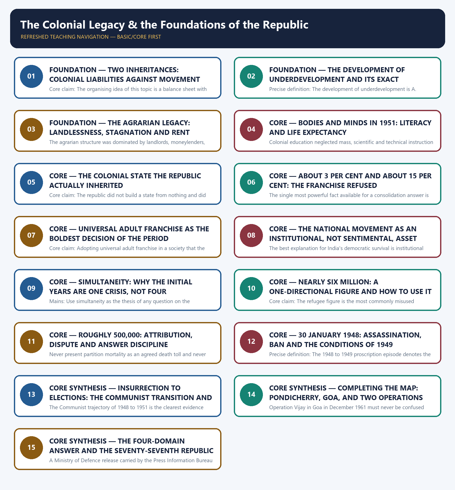

# The Colonial Legacy & the Foundations of the Republic - Learner-v2 Complete Learning Session

### SOURCE, PROGRESSION AND CURRENT-LINKAGE AUDIT

- **Repository owners queried:** Basic and Advanced Markdown for this topic, the master chronology, syllabus map and linked Modern History owners.
- **OCR book evidence queried:** The Basic and Advanced owner files were reconciled against the repository's OCR-searchable copy of Bipan Chandra, Mridula Mukherjee and Aditya Mukherjee, *India After Independence, 1947-2000*, whose opening chapters extract cleanly in the local file. That text supplies the attribution of the phrase development of underdevelopment to A. Gunder Frank and the four basic features of the colonial structure (book PDF page 18), the fall of about 14 per cent in per capita agricultural production between 1901 and 1941 and the rise of landless agricultural labourers from about 13 per cent in 1871 to about 28 per cent in 1951 (book PDF page 21), the finding that nearly 84 per cent of Indians were illiterate in 1951 with about 92 per cent illiteracy among women and a life expectancy of barely thirty-two years for an Indian born between 1940 and 1951 (book PDF pages 26-27), the colonial state's combination of authoritarian power with the rule of law and a relatively independent judiciary and the franchise figures of about 3 per cent after 1919 and about 15 per cent after 1935 (book PDF pages 27-28), the commitment to universal adult franchise and the explicit rejection of the rice-bowl theory (book PDF page 10), the handover of Pondicherry in 1954, the entry of Indian troops into Goa on the night of 17 December 1961, the arrival of nearly six million refugees and the estimate that nearly 500,000 people were killed (book PDF page 101), the assassination of Gandhi on 30 January 1948 by Nathuram Godse, the immediate ban on the Rashtriya Swayamsevak Sangh and the lifting of that ban in July 1949 on five stated conditions accepted from Patel as Home Minister (book PDF page 104), the payment of Rs 550 million to Pakistan in January 1948 following a fast by Gandhi (book PDF page 105), the Nehru-Liaqat Pact of 8 April 1950 and the resignations it provoked (book PDF page 106), and the legalisation of the Communist Party of India once it abandoned armed struggle including in Telengana (book PDF page 108). Every quantitative claim in this package is therefore carried as an attributed estimate of that source and never as an audited national statistic, and the local text's spellings Nehru-Liaqat and Telengana are recorded beside the owner's spellings so that a candidate is not surprised by either form.
- **Qdrant:** not used; Markdown plus searchable local PDFs were sufficient.
- **PYQ integrity:** The 2025 Mains GS-I Q12 stem is verbatim and locally verified: the repository export of the official 2025 General Studies Paper I carries the sentence directing the candidate to trace India's consolidation process during the early phase of independence in terms of polity, economy, education and international relations, with the instruction to answer in 250 words, and the audited local Mains routing ledger routes it to this owner at 15 marks. The 2021 Mains GS-I Q3 stem on princely-state integration is also verbatim and locally verified, but the ledger routes it to the Topic 28 owner, so it is carried here strictly as an adjacent routed demand and is not solved as though it belonged to this file. No Prelims question in the audited local Prelims routing ledgers is routed to this owner, so no Prelims stem, option set or answer letter is asserted anywhere in this package.
- **Bounded live linkage:** One official Government of India page was retrieved live on 31 August 2026 and is used only as a bounded commemorative bridge. A Ministry of Defence release carried by the Press Information Bureau and posted on 25 January 2026 records that the 77th Republic Day was celebrated on 26 January 2026 from Kartavya Path, that the President of India led the celebrations, that the President of the European Council and the President of the European Commission were the Chief Guests, and that the parade opened on the theme Vividata Mein Ekta - Unity in Diversity alongside 150 years of the national song. Only two things are drawn from that page. The first is the ordinal itself, which is a teaching device rather than a decoration: the parade is counted as the seventy-seventh precisely because 26 January 1950 is counted as the first, which fixes the distinction between independence in 1947 and the republic in 1950 better than any assertion could. The second is the theme of unity in diversity, which is used only to introduce the founding consensus as a historical choice. A ceremonial parade is not a historical source and nothing about the events, guests or equipment of 2026 is converted into evidence about the years 1947 to 1951; no claim is made here about any present-day constitutional or political controversy.
- **Fact/inference rule:** historical claims are source-backed; analytical judgements are explicitly framed as interpretation and do not invent figures.

## BASIC LEARNING SESSION



*Distinct embedded teaching-navigation image. The separate continuous Cārvāka-style flowchart package remains an independent at-a-glance artifact.*

### SESSION 1 — FOUNDATION — TWO INHERITANCES: COLONIAL LIABILITIES AGAINST MOVEMENT ASSETS

#### DEFINITION / WHAT THIS IS CALLED

**Plain-language definition:** Precise definition: The two-inheritance frame is the analytical separation of the colonial economic and administrative legacy from the political and institutional legacy of the national movement, treated as distinct inputs to the republic of 1950.

**Technical definition:** Core claim: The organising idea of this topic is a balance sheet with two columns that must never be mixed: what colonial rule left behind, which was overwhelmingly a liability, and what the national movement left behind, which was overwhelmingly an asset.

#### ANSWER-GRABBING OPENING — WRITE/ADAPT IN THE EXAM

> Core claim: The organising idea of this topic is a balance sheet with two columns that must never be mixed: what colonial rule left behind, which was overwhelmingly a liability, and what the national movement left behind, which was overwhelmingly an asset.

#### MUST-WRITE KEYWORDS

- **FOUNDATION**
- **Two inheritances**
- **colonial liabilities against movement assets**
- **Precise definition**
- **Topic boundary**
- **Core claim**

**How to use them:** Frame the answer through FOUNDATION; define Two inheritances, connect colonial liabilities against movement assets with Precise definition to explain the mechanism, and use Topic boundary for the decisive comparison or qualification.

##### VISUAL FIRST

```text
TWO INHERITANCES: COLONIAL LIABILITIES AGAINST MOVEMENT ASSETS
THE BALANCE SHEET OF 1947 -> two columns, never merged
COLONIAL LIABILITY (economic + administrative) | MOVEMENT ASSET (political)
  dependent, stagnant economy                  |  tested all-India leadership
  mass illiteracy; low life expectancy         |  party organised in every province
  famine-prone, rentier agriculture            |  democracy, civil liberties, secularism
  apparatus built for extraction and order     |  three decades of practised organisation
CENTRAL QUESTION -> how did column two carry column one without collapsing?
```

*The visual fixes this subtopic's chronology, mechanism or boundary before the evidence.*

##### CONCEPT DEFINITIONS

- **Precise definition:** The two-inheritance frame is the analytical separation of the colonial economic and administrative legacy from the political and institutional legacy of the national movement, treated as distinct inputs to the republic of 1950.
- **Topic boundary:** Apply this definition only within The Colonial Legacy & the Foundations of the Republic; retain the named actor, institution, date and chronological role.

##### CORE EXPLANATION

The organising idea of this topic is a balance sheet with two columns that must never be mixed: what colonial rule left behind, which was overwhelmingly a liability, and what the national movement left behind, which was overwhelmingly an asset.

##### EVIDENCE AND MECHANISM

- The colonial column carries a dependent and stagnant economy, mass illiteracy, low life expectancy, a famine-prone agriculture and an administrative apparatus designed for extraction and order.
- The movement column carries a tested all-India leadership, a party organised in every province, and settled commitments to democracy, civil liberties, secularism and social reform.
- Keeping the columns apart is what allows the central question to be asked at all: how did a state this poor sustain a democracy this ambitious?
- Mixing the columns produces the two commonest bad answers - a colonial-modernisation story that credits the empire with Indian democracy, and a nationalist story that forgets the material starting point.

##### EXAMINER CAUTION

- Never blur colonial economic and administrative liabilities into national-movement political assets; the whole analytical value of this topic lies in keeping the two inheritances distinct.

##### EXAM LINK

- **Prelims:** Never blur colonial economic and administrative liabilities into national-movement political assets; the whole analytical value of this topic lies in keeping the two inheritances distinct.
- **Mains:** Open any colonial-legacy or consolidation answer with the two columns, then spend the body proving each side with named evidence.

##### MINI RECAP

- **Core claim:** The organising idea of this topic is a balance sheet with two columns that must never be mixed: what colonial rule left behind, which was overwhelmingly a liability, and what the national movement left behind, which was overwhelmingly an asset.
- **Use:** Open any colonial-legacy or consolidation answer with the two columns, then spend the body proving each side with named evidence.

#### CLOSING RECALL FLOW — FOUNDATION — TWO INHERITANCES: COLONIAL LIABILITIES AGAINST MOVEMENT ASSETS

```text
START / CONCEPT: FOUNDATION — Two inheritances: colonial liabilities against movement assets
        |
        v
EXACT TERMS: FOUNDATION · Two inheritances · colonial liabilities against movement assets · Precise definition · Topic boundary · Core claim
        |
        v
MECHANISM / ARGUMENT: Precise definition: The two-inheritance frame is the analytical separation of the colonial economic and administrative legacy from the political and institutional legacy of the national movement, treated as distinct inputs to the republic of 1950.
        |
        v
CONSEQUENCE / CONTRAST: Keeping the columns apart is what allows the central question to be asked at all: how did a state this poor sustain a democracy this ambitious?
        |
        v
UPSC TRAP / ANSWER-USE: Do not miss this limiting distinction: mixing the columns produces the two commonest bad answers - a colonial-modernisation story that...
        |
        v
ANSWER-GRABBING FORMULATION: Core claim: The organising idea of this topic is a balance sheet with two columns that must never be mixed: what colonial rule left behind, which was overwhelmingly a liability, and what the national movement left behind, which was overwhelmingly an asset.
```
### SESSION 2 — FOUNDATION — THE DEVELOPMENT OF UNDERDEVELOPMENT AND ITS EXACT ATTRIBUTION

#### DEFINITION / WHAT THIS IS CALLED

**Plain-language definition:** Chandra describes the colonial economic outcome as the development of underdevelopment and expressly attributes the phrase to A.

**Technical definition:** Precise definition: The development of underdevelopment is A.

#### ANSWER-GRABBING OPENING — WRITE/ADAPT IN THE EXAM

> Precise definition: The development of underdevelopment is A.

#### MUST-WRITE KEYWORDS

- **FOUNDATION**
- **The development of underdevelopment**
- **its exact attribution**
- **Precise definition**
- **Topic boundary**
- **Core claim**

**How to use them:** Frame the answer through FOUNDATION; define The development of underdevelopment, connect its exact attribution with Precise definition to explain the mechanism, and use Topic boundary for the decisive comparison or qualification.

##### VISUAL FIRST

```text
THE DEVELOPMENT OF UNDERDEVELOPMENT AND ITS EXACT ATTRIBUTION
DEVELOPMENT OF UNDERDEVELOPMENT -> attribute to A. Gunder Frank (via Chandra)
CHANGE HAPPENED -> railways | administration | education | finance | communications
BUT THE FRAME    -> colonial structure -> subordinate integration with world capitalism
FORCED DIVISION  -> India exports foodstuffs and raw materials; imports manufactures
OUTCOME          -> poverty + dependence + subordination, not development
MISQUOTE TRAP    -> the claim is structural, not a denial that anything changed.
```

*The visual fixes this subtopic's chronology, mechanism or boundary before the evidence.*

##### CONCEPT DEFINITIONS

- **Precise definition:** The development of underdevelopment is A. Gunder Frank's phrase, used by Chandra, for a process in which real economic change occurs inside a colonial framework and produces dependence and poverty rather than self-sustaining growth.
- **Topic boundary:** Apply this definition only within The Colonial Legacy & the Foundations of the Republic; retain the named actor, institution, date and chronological role.

##### CORE EXPLANATION

The phrase that names the colonial economic outcome is precise, attributable and frequently misquoted, and using it correctly signals to an examiner that the candidate has read rather than absorbed the argument.

##### EVIDENCE AND MECHANISM

- Chandra describes the colonial economic outcome as the development of underdevelopment and expressly attributes the phrase to A. Gunder Frank.
- The argument is not that nothing changed: railways, administration, education, finance and communications all developed, and several of those changes were positive in themselves.
- The argument is that these changes operated inside a colonial framework, so they crystallised a structure that generated poverty, dependence and subordination to Britain.
- India's economy was integrated with the world capitalist system in a subordinate position, exporting foodstuffs and raw materials and importing manufactures under a forced division of labour.

##### EXAMINER CAUTION

- Do not present the phrase as Chandra's coinage; attribute it to A. Gunder Frank as the source does, and do not convert it into the claim that colonial rule produced no change at all.

##### EXAM LINK

- **Prelims:** Do not present the phrase as Chandra's coinage; attribute it to A. Gunder Frank as the source does, and do not convert it into the claim that colonial rule produced no change at all.
- **Mains:** Use the phrase once, attributed, as the thesis sentence of the economic-legacy paragraph, then prove it with the agrarian and human-development evidence.

##### MINI RECAP

- **Core claim:** The phrase that names the colonial economic outcome is precise, attributable and frequently misquoted, and using it correctly signals to an examiner that the candidate has read rather than absorbed the argument.
- **Use:** Use the phrase once, attributed, as the thesis sentence of the economic-legacy paragraph, then prove it with the agrarian and human-development evidence.

#### CLOSING RECALL FLOW — FOUNDATION — THE DEVELOPMENT OF UNDERDEVELOPMENT AND ITS EXACT ATTRIBUTION

```text
START / CONCEPT: FOUNDATION — The development of underdevelopment and its exact attribution
        |
        v
EXACT TERMS: FOUNDATION · The development of underdevelopment · its exact attribution · Precise definition · Topic boundary · Core claim
        |
        v
MECHANISM / ARGUMENT: Gunder Frank's phrase, used by Chandra, for a process in which real economic change occurs inside a colonial framework and produces dependence and poverty rather than self-sustaining growth.
        |
        v
CONSEQUENCE / CONTRAST: Chandra describes the colonial economic outcome as the development of underdevelopment and expressly attributes the phrase to A.
        |
        v
UPSC TRAP / ANSWER-USE: The argument is not that nothing changed: railways, administration, education, finance and communications all developed, and several of those changes were positive in themselves.
        |
        v
ANSWER-GRABBING FORMULATION: Precise definition: The development of underdevelopment is A.
```
### SESSION 3 — FOUNDATION — THE AGRARIAN LEGACY: LANDLESSNESS, STAGNATION AND RENT

#### DEFINITION / WHAT THIS IS CALLED

**Plain-language definition:** Precise definition: The agrarian legacy denotes the combination of falling per capita agricultural output, rising landlessness and a rentier structure of landlords, moneylenders and revenue demand that the republic inherited in 1947.

**Technical definition:** The agrarian structure was dominated by landlords, moneylenders, merchants and the colonial state, with subinfeudation, tenancy and sharecropping spreading in both zamindari and ryotwari areas.

#### ANSWER-GRABBING OPENING — WRITE/ADAPT IN THE EXAM

> Precise definition: The agrarian legacy denotes the combination of falling per capita agricultural output, rising landlessness and a rentier structure of landlords, moneylenders and revenue demand that the republic inherited in 1947.

#### MUST-WRITE KEYWORDS

- **FOUNDATION**
- **The agrarian legacy**
- **landlessness**
- **stagnation**
- **rent**
- **Precise definition**

**How to use them:** Frame the answer through FOUNDATION; define The agrarian legacy, connect landlessness with stagnation to explain the mechanism, and use rent for the decisive comparison or qualification.

##### VISUAL FIRST

```text
THE AGRARIAN LEGACY: LANDLESSNESS, STAGNATION AND RENT
AGRARIAN LEGACY -> two attributed movements plus one structure
OUTPUT   -> per capita agricultural production falls about 14% between 1901 and 1941
           (foodgrains fall further)
LABOUR   -> landless agricultural labourers rise from about 13% (1871) to about 28% (1951)
STRUCTURE-> landlords + moneylenders + merchants + colonial state
           subinfeudation, tenancy, sharecropping in zamindari AND ryotwari areas
INCENTIVE-> rack-renting and usury are safer than investment -> stagnation is rational
DISCIPLINE -> both figures are the source's estimates; attribute, never extrapolate.
```

*The visual fixes this subtopic's chronology, mechanism or boundary before the evidence.*

##### CONCEPT DEFINITIONS

- **Precise definition:** The agrarian legacy denotes the combination of falling per capita agricultural output, rising landlessness and a rentier structure of landlords, moneylenders and revenue demand that the republic inherited in 1947.
- **Topic boundary:** Apply this definition only within The Colonial Legacy & the Foundations of the Republic; retain the named actor, institution, date and chronological role.

##### CORE EXPLANATION

Agriculture is where the colonial economic structure is most measurable, and the two attributed movements that matter are a falling per capita output and a rising landless labour force.

##### EVIDENCE AND MECHANISM

- The source records a decline of about 14 per cent in per capita agricultural production between 1901 and 1941, with an even larger fall in per capita foodgrains.
- The same source records that landless agricultural labourers grew from about 13 per cent of the agricultural population in 1871 to about 28 per cent by 1951.
- The agrarian structure was dominated by landlords, moneylenders, merchants and the colonial state, with subinfeudation, tenancy and sharecropping spreading in both zamindari and ryotwari areas.
- The colonial state's interest in agriculture was confined largely to collecting land revenue, while landlords and moneylenders found rack-renting and usury safer than productive investment.

##### EXAMINER CAUTION

- Attribute both movements to the source and do not extend them to other years or convert them into national averages for periods the source does not cover.

##### EXAM LINK

- **Prelims:** Attribute both movements to the source and do not extend them to other years or convert them into national averages for periods the source does not cover.
- **Mains:** Use the two attributed trends as the evidence spine whenever a question asks what the republic inherited in agriculture.

##### MINI RECAP

- **Core claim:** Agriculture is where the colonial economic structure is most measurable, and the two attributed movements that matter are a falling per capita output and a rising landless labour force.
- **Use:** Use the two attributed trends as the evidence spine whenever a question asks what the republic inherited in agriculture.

#### CLOSING RECALL FLOW — FOUNDATION — THE AGRARIAN LEGACY: LANDLESSNESS, STAGNATION AND RENT

```text
START / CONCEPT: FOUNDATION — The agrarian legacy: landlessness, stagnation and rent
        |
        v
EXACT TERMS: FOUNDATION · The agrarian legacy · landlessness · stagnation · rent · Precise definition
        |
        v
MECHANISM / ARGUMENT: The agrarian structure was dominated by landlords, moneylenders, merchants and the colonial state, with subinfeudation, tenancy and sharecropping spreading in both zamindari and ryotwari areas.
        |
        v
CONSEQUENCE / CONTRAST: The colonial state's interest in agriculture was confined largely to collecting land revenue, while landlords and moneylenders found rack-renting and usury safer than productive investment.
        |
        v
UPSC TRAP / ANSWER-USE: Attribute both movements to the source and do not extend them to other years or convert them into national averages for periods the source does not cover.
        |
        v
ANSWER-GRABBING FORMULATION: Precise definition: The agrarian legacy denotes the combination of falling per capita agricultural output, rising landlessness and a rentier structure of landlords, moneylenders and revenue demand that the republic inherited in 1947.
```
### SESSION 4 — CORE — BODIES AND MINDS IN 1951: LITERACY AND LIFE EXPECTANCY

#### DEFINITION / WHAT THIS IS CALLED

**Plain-language definition:** Precise definition: The 1951 human-development baseline denotes the source-attributed estimates of literacy, female literacy, life expectancy and mortality that describe the population the republic began with.

**Technical definition:** Colonial education neglected mass, scientific and technical instruction and almost entirely neglected the education of girls, which is why the literacy figures are a statement about policy and not only about poverty.

#### ANSWER-GRABBING OPENING — WRITE/ADAPT IN THE EXAM

> Precise definition: The 1951 human-development baseline denotes the source-attributed estimates of literacy, female literacy, life expectancy and mortality that describe the population the republic began with.

#### MUST-WRITE KEYWORDS

- **Bodies**
- **minds in 1951**
- **literacy**
- **life expectancy**
- **Precise definition**
- **Topic boundary**

**How to use them:** Frame the answer through Bodies; define minds in 1951, connect literacy with life expectancy to explain the mechanism, and use Precise definition for the decisive comparison or qualification.

##### VISUAL FIRST

```text
BODIES AND MINDS IN 1951: LITERACY AND LIFE EXPECTANCY
1951 -> THE HUMAN STARTING POINT (all figures attributed to the source)
LITERACY        -> nearly 84% illiterate | about 92% illiteracy among women
WOMEN           -> about 8 literate women in every 100
LIFE EXPECTANCY -> barely 32 years for an Indian born between 1940 and 1951
MORTALITY       -> death rate about 25 per 1,000 (1941-50); infant mortality 175-190 per 1,000
CAUSE           -> colonial neglect of mass, technical and female education, not poverty alone
RULE            -> attribute, keep the year, never round into a fresh figure.
```

*The visual fixes this subtopic's chronology, mechanism or boundary before the evidence.*

##### CONCEPT DEFINITIONS

- **Precise definition:** The 1951 human-development baseline denotes the source-attributed estimates of literacy, female literacy, life expectancy and mortality that describe the population the republic began with.
- **Topic boundary:** Apply this definition only within The Colonial Legacy & the Foundations of the Republic; retain the named actor, institution, date and chronological role.

##### CORE EXPLANATION

The human-development figures for 1951 are the most quotable evidence in this topic and the most dangerous, because they are a single author's attributed estimates and are routinely repeated as though they were audited national statistics.

##### EVIDENCE AND MECHANISM

- The source records that in 1951 nearly 84 per cent of Indians were illiterate, with illiteracy at about 92 per cent among women, and that only about eight out of a hundred women were literate.
- The same source records that an Indian born between 1940 and 1951 could expect to live barely thirty-two years.
- It further records an annual death rate of about 25 per thousand during 1941 to 1950 and infant mortality between 175 and 190 per thousand live births, with malaria alone affecting a quarter of the population.
- Colonial education neglected mass, scientific and technical instruction and almost entirely neglected the education of girls, which is why the literacy figures are a statement about policy and not only about poverty.

##### EXAMINER CAUTION

- Attribute every one of these figures to the source, keep them attached to the year the source gives, and never round them into a new and cleaner claim.

##### EXAM LINK

- **Prelims:** Attribute every one of these figures to the source, keep them attached to the year the source gives, and never round them into a new and cleaner claim.
- **Mains:** Use these figures as the education-domain evidence in the 2025 four-domain consolidation answer.

##### MINI RECAP

- **Core claim:** The human-development figures for 1951 are the most quotable evidence in this topic and the most dangerous, because they are a single author's attributed estimates and are routinely repeated as though they were audited national statistics.
- **Use:** Use these figures as the education-domain evidence in the 2025 four-domain consolidation answer.

#### CLOSING RECALL FLOW — CORE — BODIES AND MINDS IN 1951: LITERACY AND LIFE EXPECTANCY

```text
START / CONCEPT: CORE — Bodies and minds in 1951: literacy and life expectancy
        |
        v
EXACT TERMS: Bodies · minds in 1951 · literacy · life expectancy · Precise definition · Topic boundary
        |
        v
MECHANISM / ARGUMENT: The human-development figures for 1951 are the most quotable evidence in this topic and the most dangerous, because they are a single author's attributed estimates and are routinely repeated as though they were audited national statistics.
        |
        v
CONSEQUENCE / CONTRAST: Colonial education neglected mass, scientific and technical instruction and almost entirely neglected the education of girls, which is why the literacy figures are a statement about policy and not only about poverty.
        |
        v
UPSC TRAP / ANSWER-USE: Do not miss this limiting distinction: the source records that in 1951 nearly 84 per cent of Indians were illiterate...
        |
        v
ANSWER-GRABBING FORMULATION: Precise definition: The 1951 human-development baseline denotes the source-attributed estimates of literacy, female literacy, life expectancy and mortality that describe the population the republic began with.
```
### SESSION 5 — CORE — THE COLONIAL STATE THE REPUBLIC ACTUALLY INHERITED

#### DEFINITION / WHAT THIS IS CALLED

**Plain-language definition:** Precise definition: The inherited colonial state denotes the administrative, police, judicial and legal apparatus transferred intact in 1947, authoritarian in design yet carrying rule-of-law elements that the republic retained and repurposed.

**Technical definition:** Core claim: The republic did not build a state from nothing and did not dismantle the one it received; it inherited an apparatus designed for order and extraction and attempted to convert it into an instrument of development, and that conversion is the real content of the phrase colonial legacy.

#### ANSWER-GRABBING OPENING — WRITE/ADAPT IN THE EXAM

> Precise definition: The inherited colonial state denotes the administrative, police, judicial and legal apparatus transferred intact in 1947, authoritarian in design yet carrying rule-of-law elements that the republic retained and repurposed.

#### MUST-WRITE KEYWORDS

- **The colonial state the republic actually inherited**
- **Precise definition**
- **Topic boundary**
- **Core claim**
- **Precise definition: The inherited colonial state**
- **Precise**

**How to use them:** Frame the answer through The colonial state the republic actually inherited; define Precise definition, connect Topic boundary with Core claim to explain the mechanism, and use Precise definition: The inherited colonial state for the decisive comparison or qualification.

##### VISUAL FIRST

```text
THE COLONIAL STATE THE REPUBLIC ACTUALLY INHERITED
THE INHERITED APPARATUS -> kept, not dismantled
AUTHORITARIAN CORE -> repressive laws | wide arbitrary power with officials and police
                   -> no separation of administrative and judicial functions in the district
LIBERAL FRAGMENTS  -> rule of law | relatively independent judiciary | limited press freedom
PATTERN            -> liberties extended in calm, curtailed in mass struggle
REPUBLIC'S TASK    -> convert an apparatus of ORDER and EXTRACTION into one of DEVELOPMENT
THESIS             -> continuity with conversion, not rupture.
```

*The visual fixes this subtopic's chronology, mechanism or boundary before the evidence.*

##### CONCEPT DEFINITIONS

- **Precise definition:** The inherited colonial state denotes the administrative, police, judicial and legal apparatus transferred intact in 1947, authoritarian in design yet carrying rule-of-law elements that the republic retained and repurposed.
- **Topic boundary:** Apply this definition only within The Colonial Legacy & the Foundations of the Republic; retain the named actor, institution, date and chronological role.

##### CORE EXPLANATION

The republic did not build a state from nothing and did not dismantle the one it received; it inherited an apparatus designed for order and extraction and attempted to convert it into an instrument of development, and that conversion is the real content of the phrase colonial legacy.

##### EVIDENCE AND MECHANISM

- The colonial state was basically authoritarian and autocratic yet carried liberal elements such as the rule of law and a relatively independent judiciary that partially checked arbitrary administration.
- Its laws were often repressive, were not framed by Indians through a democratic process, and left great arbitrary power with civil servants and the police.
- There was no separation of administrative and judicial functions, since the same officer administered a district as collector and dispensed justice as magistrate.
- Civil liberties of press, speech and association were extended in normal times and curtailed drastically during mass struggles, and were increasingly tampered with even in normal times after 1897.

##### EXAMINER CAUTION

- Do not treat the inherited administration as neutral machinery; it carried both the rule-of-law fragment that the republic kept and the arbitrary powers that the republic had to justify keeping.

##### EXAM LINK

- **Prelims:** Do not treat the inherited administration as neutral machinery; it carried both the rule-of-law fragment that the republic kept and the arbitrary powers that the republic had to justify keeping.
- **Mains:** Use the continuity-with-conversion thesis whenever a question asks what colonial legacy actually means in institutional terms.

##### MINI RECAP

- **Core claim:** The republic did not build a state from nothing and did not dismantle the one it received; it inherited an apparatus designed for order and extraction and attempted to convert it into an instrument of development, and that conversion is the real content of the phrase colonial legacy.
- **Use:** Use the continuity-with-conversion thesis whenever a question asks what colonial legacy actually means in institutional terms.

#### CLOSING RECALL FLOW — CORE — THE COLONIAL STATE THE REPUBLIC ACTUALLY INHERITED

```text
START / CONCEPT: CORE — The colonial state the republic actually inherited
        |
        v
EXACT TERMS: The colonial state the republic actually inherited · Precise definition · Topic boundary · Core claim · Precise definition: The inherited colonial state · Precise
        |
        v
MECHANISM / ARGUMENT: Core claim: The republic did not build a state from nothing and did not dismantle the one it received; it inherited an apparatus designed for order and extraction and attempted to convert it into an instrument of development, and that conversion is the real content of the phrase colonial legacy.
        |
        v
CONSEQUENCE / CONTRAST: Do not treat the inherited administration as neutral machinery; it carried both the rule-of-law fragment that the republic kept and the arbitrary powers that the republic had to justify keeping.
        |
        v
UPSC TRAP / ANSWER-USE: Its laws were often repressive, were not framed by Indians through a democratic process, and left great arbitrary power with civil servants and the police.
        |
        v
ANSWER-GRABBING FORMULATION: Precise definition: The inherited colonial state denotes the administrative, police, judicial and legal apparatus transferred intact in 1947, authoritarian in design yet carrying rule-of-law elements that the republic retained and repurposed.
```
### SESSION 6 — CORE — ABOUT 3 PER CENT AND ABOUT 15 PER CENT: THE FRANCHISE REFUSED

#### DEFINITION / WHAT THIS IS CALLED

**Plain-language definition:** Precise definition: The colonial franchise denotes the narrow statutory electorate of about 3 per cent of Indians after 1919 and about 15 per cent after 1935 under legislatures that held limited power.

**Technical definition:** The single most powerful fact available for a consolidation answer is the franchise contrast, because it measures exactly how far the republic broke with the state it inherited and cannot be explained by material conditions at all.

#### ANSWER-GRABBING OPENING — WRITE/ADAPT IN THE EXAM

> Precise definition: The colonial franchise denotes the narrow statutory electorate of about 3 per cent of Indians after 1919 and about 15 per cent after 1935 under legislatures that held limited power.

#### MUST-WRITE KEYWORDS

- **About 3 per cent**
- **about 15 per cent**
- **the franchise refused**
- **Precise definition**
- **Topic boundary**
- **Core claim**

**How to use them:** Frame the answer through About 3 per cent; define about 15 per cent, connect the franchise refused with Precise definition to explain the mechanism, and use Topic boundary for the decisive comparison or qualification.

##### VISUAL FIRST

```text
ABOUT 3 PER CENT AND ABOUT 15 PER CENT: THE FRANCHISE REFUSED
FRANCHISE UNDER COLONIAL RULE -> narrow by design
AFTER 1919 -> about 3 per cent of Indians could vote
AFTER 1935 -> about 15 per cent of Indians could vote
POWER      -> legislatures weak before 1935; supreme power retained by the British
PURPOSE    -> co-opt and weaken the national movement while keeping the reins
SIDE EFFECT-> Indians gain practical experience of elections and elected organs
CONTRAST   -> the republic replaces this outright, and does not widen it by degrees.
```

*The visual fixes this subtopic's chronology, mechanism or boundary before the evidence.*

##### CONCEPT DEFINITIONS

- **Precise definition:** The colonial franchise denotes the narrow statutory electorate of about 3 per cent of Indians after 1919 and about 15 per cent after 1935 under legislatures that held limited power.
- **Topic boundary:** Apply this definition only within The Colonial Legacy & the Foundations of the Republic; retain the named actor, institution, date and chronological role.

##### CORE EXPLANATION

The single most powerful fact available for a consolidation answer is the franchise contrast, because it measures exactly how far the republic broke with the state it inherited and cannot be explained by material conditions at all.

##### EVIDENCE AND MECHANISM

- The source records that only about 3 per cent of Indians could vote after 1919 and about 15 per cent after 1935.
- Elections and legislatures were introduced under Indian pressure, but the legislatures did not enjoy much power until 1935 and supreme power remained with the British even then.
- The colonial purpose of these reforms was to co-opt and weaken the national movement while retaining the reins of state power.
- The unintended effect was that Indians acquired practical experience of contesting elections and working elected organs, experience that proved useful after 1947.

##### EXAMINER CAUTION

- Universal adult franchise did not exist under colonial rule; state the two attributed percentages and the year each belongs to, and do not describe colonial reforms as democratisation.

##### EXAM LINK

- **Prelims:** Universal adult franchise did not exist under colonial rule; state the two attributed percentages and the year each belongs to, and do not describe colonial reforms as democratisation.
- **Mains:** Use the franchise contrast as the opening evidence of the polity domain in the 2025 consolidation answer.

##### MINI RECAP

- **Core claim:** The single most powerful fact available for a consolidation answer is the franchise contrast, because it measures exactly how far the republic broke with the state it inherited and cannot be explained by material conditions at all.
- **Use:** Use the franchise contrast as the opening evidence of the polity domain in the 2025 consolidation answer.

#### CLOSING RECALL FLOW — CORE — ABOUT 3 PER CENT AND ABOUT 15 PER CENT: THE FRANCHISE REFUSED

```text
START / CONCEPT: CORE — About 3 per cent and about 15 per cent: the franchise refused
        |
        v
EXACT TERMS: About 3 per cent · about 15 per cent · the franchise refused · Precise definition · Topic boundary · Core claim
        |
        v
MECHANISM / ARGUMENT: The single most powerful fact available for a consolidation answer is the franchise contrast, because it measures exactly how far the republic broke with the state it inherited and cannot be explained by material conditions at all.
        |
        v
CONSEQUENCE / CONTRAST: Universal adult franchise did not exist under colonial rule; state the two attributed percentages and the year each belongs to, and do not describe colonial reforms as democratisation.
        |
        v
UPSC TRAP / ANSWER-USE: Do not miss this limiting distinction: use the franchise contrast as the opening evidence of the polity domain in the...
        |
        v
ANSWER-GRABBING FORMULATION: Precise definition: The colonial franchise denotes the narrow statutory electorate of about 3 per cent of Indians after 1919 and about 15 per cent after 1935 under legislatures that held limited power.
```
### SESSION 7 — CORE — UNIVERSAL ADULT FRANCHISE AS THE BOLDEST DECISION OF THE PERIOD

#### DEFINITION / WHAT THIS IS CALLED

**Plain-language definition:** Precise definition: Universal adult franchise denotes the republic's immediate grant of the vote to all adult citizens, replacing rather than extending the narrow colonial electorate.

**Technical definition:** Core claim: Adopting universal adult franchise in a society that the same sources describe as about 84 per cent illiterate was a deliberate wager rather than an obvious step, and presenting it as a wager is what converts a fact into an argument.

#### ANSWER-GRABBING OPENING — WRITE/ADAPT IN THE EXAM

> Precise definition: Universal adult franchise denotes the republic's immediate grant of the vote to all adult citizens, replacing rather than extending the narrow colonial electorate.

#### MUST-WRITE KEYWORDS

- **Precise definition**
- **Topic boundary**
- **Core claim**
- **Precise definition: Universal adult franchise**
- **Precise**
- **Universal**

**How to use them:** Frame the answer through Precise definition; define Topic boundary, connect Core claim with Precise definition: Universal adult franchise to explain the mechanism, and use Precise for the decisive comparison or qualification.

##### VISUAL FIRST

```text
UNIVERSAL ADULT FRANCHISE AS THE BOLDEST DECISION OF THE PERIOD
THE WAGER OF UNIVERSAL ADULT FRANCHISE
STARTING CONDITION -> a population described by the source as about 84% illiterate
CONTRARY THEORY    -> the "rice-bowl theory": the poor want rice, not votes
DECISION           -> universal adult franchise at once, not a staged extension
REASONS GIVEN      -> democracy as integration | democracy as social change
                   -> minimal state encroachment on universities, press, unions, associations
FRAMING            -> a deliberate wager, not an obvious or uncontested step.
```

*The visual fixes this subtopic's chronology, mechanism or boundary before the evidence.*

##### CONCEPT DEFINITIONS

- **Precise definition:** Universal adult franchise denotes the republic's immediate grant of the vote to all adult citizens, replacing rather than extending the narrow colonial electorate.
- **Topic boundary:** Apply this definition only within The Colonial Legacy & the Foundations of the Republic; retain the named actor, institution, date and chronological role.

##### CORE EXPLANATION

Adopting universal adult franchise in a society that the same sources describe as about 84 per cent illiterate was a deliberate wager rather than an obvious step, and presenting it as a wager is what converts a fact into an argument.

##### EVIDENCE AND MECHANISM

- India was committed from the beginning to a democratic and civil libertarian political order with representative government based on free and fair elections on universal adult franchise.
- The leadership completely rejected the rice-bowl theory that the poor in an underdeveloped country cared more for a bowl of rice than for democracy.
- Democracy was also chosen instrumentally, as necessary for national integration in a diverse society and for bringing about social change.
- The state was to encroach as little as possible on rival civil sources of power such as universities, the press, trade unions, peasant organisations and professional associations.

##### EXAMINER CAUTION

- Do not call the adoption of universal franchise uncontroversial or inevitable; the sources present it as a bold and argued choice against a widely held contrary theory.

##### EXAM LINK

- **Prelims:** Do not call the adoption of universal franchise uncontroversial or inevitable; the sources present it as a bold and argued choice against a widely held contrary theory.
- **Mains:** Use the wager framing as the analytical high point of any answer on the foundations of the republic.

##### MINI RECAP

- **Core claim:** Adopting universal adult franchise in a society that the same sources describe as about 84 per cent illiterate was a deliberate wager rather than an obvious step, and presenting it as a wager is what converts a fact into an argument.
- **Use:** Use the wager framing as the analytical high point of any answer on the foundations of the republic.

#### CLOSING RECALL FLOW — CORE — UNIVERSAL ADULT FRANCHISE AS THE BOLDEST DECISION OF THE PERIOD

```text
START / CONCEPT: CORE — Universal adult franchise as the boldest decision of the period
        |
        v
EXACT TERMS: Precise definition · Topic boundary · Core claim · Precise definition: Universal adult franchise · Precise · Universal
        |
        v
MECHANISM / ARGUMENT: Core claim: Adopting universal adult franchise in a society that the same sources describe as about 84 per cent illiterate was a deliberate wager rather than an obvious step, and presenting it as a wager is what converts a fact into an argument.
        |
        v
CONSEQUENCE / CONTRAST: Do not call the adoption of universal franchise uncontroversial or inevitable; the sources present it as a bold and argued choice against a widely held contrary theory.
        |
        v
UPSC TRAP / ANSWER-USE: Do not miss this limiting distinction: india was committed from the beginning to a democratic and civil libertarian political order...
        |
        v
ANSWER-GRABBING FORMULATION: Precise definition: Universal adult franchise denotes the republic's immediate grant of the vote to all adult citizens, replacing rather than extending the narrow colonial electorate.
```
### SESSION 8 — CORE — THE NATIONAL MOVEMENT AS AN INSTITUTIONAL, NOT SENTIMENTAL, ASSET

#### DEFINITION / WHAT THIS IS CALLED

**Plain-language definition:** Precise definition: The movement's institutional asset denotes the leadership, organisation, accommodative practice and legitimacy that the national movement transferred to the republic, distinct from any material inheritance.

**Technical definition:** The best explanation for India's democratic survival is institutional residue rather than individual virtue, because the movement had already built the leadership, the organisation and the habits that a new state could not have manufactured for itself.

#### ANSWER-GRABBING OPENING — WRITE/ADAPT IN THE EXAM

> Precise definition: The movement's institutional asset denotes the leadership, organisation, accommodative practice and legitimacy that the national movement transferred to the republic, distinct from any material inheritance.

#### MUST-WRITE KEYWORDS

- **The national movement as an institutional**
- **not sentimental**
- **asset**
- **Precise definition**
- **Topic boundary**
- **Core claim**

**How to use them:** Frame the answer through The national movement as an institutional; define not sentimental, connect asset with Precise definition to explain the mechanism, and use Topic boundary for the decisive comparison or qualification.

##### VISUAL FIRST

```text
THE NATIONAL MOVEMENT AS AN INSTITUTIONAL, NOT SENTIMENTAL, ASSET
THE MOVEMENT'S INSTITUTIONAL RESIDUE
LEADERSHIP -> Nehru | Patel | Azad | Rajendra Prasad -> no single region, language or caste
BREADTH    -> first Nehru cabinet of fourteen includes five non-Congressmen
           -> B.R. Ambedkar chairs the Drafting Committee
ORGANISATION -> a party with structure in every province; three decades of practice
SERVICES   -> all-India services and a national army recruited on merit, under civilian control
COST LATER -> the same dominance becomes the "Congress system" whose decay is a later topic.
```

*The visual fixes this subtopic's chronology, mechanism or boundary before the evidence.*

##### CONCEPT DEFINITIONS

- **Precise definition:** The movement's institutional asset denotes the leadership, organisation, accommodative practice and legitimacy that the national movement transferred to the republic, distinct from any material inheritance.
- **Topic boundary:** Apply this definition only within The Colonial Legacy & the Foundations of the Republic; retain the named actor, institution, date and chronological role.

##### CORE EXPLANATION

The best explanation for India's democratic survival is institutional residue rather than individual virtue, because the movement had already built the leadership, the organisation and the habits that a new state could not have manufactured for itself.

##### EVIDENCE AND MECHANISM

- The prominent leaders of independent India - Nehru, Patel, Maulana Azad and Rajendra Prasad - were not associated with any one region, language, religion or caste, and the same was true of leading opponents.
- Congress leaders including Patel, Rajendra Prasad and Rajagopalachari were committed to democracy, civil liberties, secularism and independent economic development, differing from Nehru mainly on socialism and class analysis.
- The Congress leadership widened the base of the government by including distinguished non-Congressmen, and the first Nehru cabinet of fourteen included five, with B.R. Ambedkar chairing the Drafting Committee.
- The all-India administrative services and a national army recruited on individual merit across regions became further instruments of unity under civilian political authority.

##### EXAMINER CAUTION

- Do not reduce this to a list of great men; the asset was organisational and habitual, and the same Congress dominance that stabilised the transition later became a problem in its own right.

##### EXAM LINK

- **Prelims:** Do not reduce this to a list of great men; the asset was organisational and habitual, and the same Congress dominance that stabilised the transition later became a problem in its own right.
- **Mains:** Use this as the comparative paragraph explaining why India retained civilian and democratic government when many decolonised states did not.

##### MINI RECAP

- **Core claim:** The best explanation for India's democratic survival is institutional residue rather than individual virtue, because the movement had already built the leadership, the organisation and the habits that a new state could not have manufactured for itself.
- **Use:** Use this as the comparative paragraph explaining why India retained civilian and democratic government when many decolonised states did not.

#### CLOSING RECALL FLOW — CORE — THE NATIONAL MOVEMENT AS AN INSTITUTIONAL, NOT SENTIMENTAL, ASSET

```text
START / CONCEPT: CORE — The national movement as an institutional, not sentimental, asset
        |
        v
EXACT TERMS: The national movement as an institutional · not sentimental · asset · Precise definition · Topic boundary · Core claim
        |
        v
MECHANISM / ARGUMENT: The best explanation for India's democratic survival is institutional residue rather than individual virtue, because the movement had already built the leadership, the organisation and the habits that a new state could not have manufactured for itself.
        |
        v
CONSEQUENCE / CONTRAST: Do not reduce this to a list of great men; the asset was organisational and habitual, and the same Congress dominance that stabilised the transition later became a problem in its own right.
        |
        v
UPSC TRAP / ANSWER-USE: The prominent leaders of independent India - Nehru, Patel, Maulana Azad and Rajendra Prasad - were not associated with any one region, language, religion or caste, and the same was true of leading opponents.
        |
        v
ANSWER-GRABBING FORMULATION: Precise definition: The movement's institutional asset denotes the leadership, organisation, accommodative practice and legitimacy that the national movement transferred to the republic, distinct from any material inheritance.
```
### SESSION 9 — CORE — SIMULTANEITY: WHY THE INITIAL YEARS ARE ONE CRISIS, NOT FOUR

#### DEFINITION / WHAT THIS IS CALLED

**Plain-language definition:** Precise definition: Simultaneity denotes the concurrence, rather than the succession, of communal violence, insurgency, princely integration and armed conflict in the initial years of the republic.

**Technical definition:** Mains: Use simultaneity as the thesis of any question on the challenges of the initial years.

#### ANSWER-GRABBING OPENING — WRITE/ADAPT IN THE EXAM

> Precise definition: Simultaneity denotes the concurrence, rather than the succession, of communal violence, insurgency, princely integration and armed conflict in the initial years of the republic.

#### MUST-WRITE KEYWORDS

- **Simultaneity**
- **not four**
- **Precise definition**
- **Topic boundary**
- **Core claim**
- **COMMUNAL VIOLENCE**

**How to use them:** Frame the answer through Simultaneity; define not four, connect Precise definition with Topic boundary to explain the mechanism, and use Core claim for the decisive comparison or qualification.

##### VISUAL FIRST

```text
SIMULTANEITY: WHY THE INITIAL YEARS ARE ONE CRISIS, NOT FOUR
1947-51 -> FOUR PRESSURES AT ONCE (not a sequence)
        +---------------------------+
        |  COMMUNAL VIOLENCE        |
        |  TELANGANA INSURGENCY     |  ---> all live in the same months
        |  PRINCELY INTEGRATION     |
        |  KASHMIR WAR              |
        +---------------------------+
METHOD -> secular reassurance + coercive capacity + reconciliation, without suspending democracy
CONSEQUENCE -> the constitutional preference for a strong centre and emergency provisions.
```

*The visual fixes this subtopic's chronology, mechanism or boundary before the evidence.*

##### CONCEPT DEFINITIONS

- **Precise definition:** Simultaneity denotes the concurrence, rather than the succession, of communal violence, insurgency, princely integration and armed conflict in the initial years of the republic.
- **Topic boundary:** Apply this definition only within The Colonial Legacy & the Foundations of the Republic; retain the named actor, institution, date and chronological role.

##### CORE EXPLANATION

The achievement of 1947 to 1951 was not solving any single problem but surviving all of them at once, and an answer that sequences the crises has quietly removed the difficulty it was asked to explain.

##### EVIDENCE AND MECHANISM

- India became independent on 15 August 1947 and immediately faced refugee movement, communal killing, the division of the army and the treasury, princely integration and fighting in Kashmir.
- The four principal threats - communal violence, the Telangana insurgency, princely-state integration and the Kashmir war - unfolded together rather than in sequence.
- The leadership's method combined secular reassurance, coercive capacity and reconciliation, containing riots, banning and later rehabilitating a proscribed organisation, integrating states and defeating an insurgency while keeping the party behind it legal.
- Simultaneity also explains institutional choices, including the constitutional preference for a strong centre and for emergency provisions.

##### EXAMINER CAUTION

- Never present the crises as sequential; the Advanced owner explicitly warns against it, and simultaneity is the analytical point that a chronological narration destroys.

##### EXAM LINK

- **Prelims:** Never present the crises as sequential; the Advanced owner explicitly warns against it, and simultaneity is the analytical point that a chronological narration destroys.
- **Mains:** Use simultaneity as the thesis of any question on the challenges of the initial years.

##### MINI RECAP

- **Core claim:** The achievement of 1947 to 1951 was not solving any single problem but surviving all of them at once, and an answer that sequences the crises has quietly removed the difficulty it was asked to explain.
- **Use:** Use simultaneity as the thesis of any question on the challenges of the initial years.

#### CLOSING RECALL FLOW — CORE — SIMULTANEITY: WHY THE INITIAL YEARS ARE ONE CRISIS, NOT FOUR

```text
START / CONCEPT: CORE — Simultaneity: why the initial years are one crisis, not four
        |
        v
EXACT TERMS: Simultaneity · not four · Precise definition · Topic boundary · Core claim · COMMUNAL VIOLENCE
        |
        v
MECHANISM / ARGUMENT: Mains: Use simultaneity as the thesis of any question on the challenges of the initial years.
        |
        v
CONSEQUENCE / CONTRAST: Core claim: The achievement of 1947 to 1951 was not solving any single problem but surviving all of them at once, and an answer that sequences the crises has quietly removed the difficulty it was asked to explain.
        |
        v
UPSC TRAP / ANSWER-USE: Do not miss this limiting distinction: simultaneity also explains institutional choices, including the constitutional preference for a strong centre and...
        |
        v
ANSWER-GRABBING FORMULATION: Precise definition: Simultaneity denotes the concurrence, rather than the succession, of communal violence, insurgency, princely integration and armed conflict in the initial years of the republic.
```
### SESSION 10 — CORE — NEARLY SIX MILLION: A ONE-DIRECTIONAL FIGURE AND HOW TO USE IT

#### DEFINITION / WHAT THIS IS CALLED

**Plain-language definition:** Precise definition: The six-million refugee figure denotes the source's estimate of people entering India after Partition, a one-directional count and not a measure of total displacement.

**Technical definition:** Core claim: The refugee figure is the most commonly misused number in post-independence history, because it counts movement in one direction and is routinely quoted as though it measured total displacement across the new border.

#### ANSWER-GRABBING OPENING — WRITE/ADAPT IN THE EXAM

> Precise definition: The six-million refugee figure denotes the source's estimate of people entering India after Partition, a one-directional count and not a measure of total displacement.

#### MUST-WRITE KEYWORDS

- **Nearly six million**
- **a one-directional figure**
- **how to use it**
- **Precise definition**
- **Topic boundary**
- **Core claim**

**How to use them:** Frame the answer through Nearly six million; define a one-directional figure, connect how to use it with Precise definition to explain the mechanism, and use Topic boundary for the decisive comparison or qualification.

##### VISUAL FIRST

```text
NEARLY SIX MILLION: A ONE-DIRECTIONAL FIGURE AND HOW TO USE IT
REFUGEE FIGURE -> read the direction before quoting the number
NEARLY SIX MILLION -> people ENTERING INDIA (one direction only)
NOT                -> total displacement across the border in both directions
WEST FLOW  -> largely a single movement in 1947; land vacated by migrants; resettled by 1951
EAST FLOW  -> continuous migration from East Bengal year after year; little land available
           -> agricultural households pushed into a semi-urban and urban underclass
RULE -> one figure, one direction, two very different rehabilitation problems.
```

*The visual fixes this subtopic's chronology, mechanism or boundary before the evidence.*

##### CONCEPT DEFINITIONS

- **Precise definition:** The six-million refugee figure denotes the source's estimate of people entering India after Partition, a one-directional count and not a measure of total displacement.
- **Topic boundary:** Apply this definition only within The Colonial Legacy & the Foundations of the Republic; retain the named actor, institution, date and chronological role.

##### CORE EXPLANATION

The refugee figure is the most commonly misused number in post-independence history, because it counts movement in one direction and is routinely quoted as though it measured total displacement across the new border.

##### EVIDENCE AND MECHANISM

- The source records nearly six million refugees pouring into India after Partition, having lost everything.
- This is a figure for people entering India and is not the total displacement in both directions, which the source does not give in this form.
- By 1951 the rehabilitation of refugees from West Pakistan had been substantially completed, and most refugees from West Punjab could be resettled on land left by migrants to Pakistan.
- The eastern flow was structurally different: migration from East Bengal continued year after year, resettlement land was not available in the same way, and many agricultural households were pushed into a semi-urban and urban underclass.

##### EXAMINER CAUTION

- Always mark the figure as one-directional movement into India, and never describe six million as the total number displaced by Partition.

##### EXAM LINK

- **Prelims:** Always mark the figure as one-directional movement into India, and never describe six million as the total number displaced by Partition.
- **Mains:** Use the east-west contrast to show that rehabilitation was two different problems, not one.

##### MINI RECAP

- **Core claim:** The refugee figure is the most commonly misused number in post-independence history, because it counts movement in one direction and is routinely quoted as though it measured total displacement across the new border.
- **Use:** Use the east-west contrast to show that rehabilitation was two different problems, not one.

#### CLOSING RECALL FLOW — CORE — NEARLY SIX MILLION: A ONE-DIRECTIONAL FIGURE AND HOW TO USE IT

```text
START / CONCEPT: CORE — Nearly six million: a one-directional figure and how to use it
        |
        v
EXACT TERMS: Nearly six million · a one-directional figure · how to use it · Precise definition · Topic boundary · Core claim
        |
        v
MECHANISM / ARGUMENT: Core claim: The refugee figure is the most commonly misused number in post-independence history, because it counts movement in one direction and is routinely quoted as though it measured total displacement across the new border.
        |
        v
CONSEQUENCE / CONTRAST: This is a figure for people entering India and is not the total displacement in both directions, which the source does not give in this form.
        |
        v
UPSC TRAP / ANSWER-USE: The eastern flow was structurally different: migration from East Bengal continued year after year, resettlement land was not available in the same way, and many agricultural households were pushed into a semi-urban and urban underclass.
        |
        v
ANSWER-GRABBING FORMULATION: Precise definition: The six-million refugee figure denotes the source's estimate of people entering India after Partition, a one-directional count and not a measure of total displacement.
```
### SESSION 11 — CORE — ROUGHLY 500,000: ATTRIBUTION, DISPUTE AND ANSWER DISCIPLINE

#### DEFINITION / WHAT THIS IS CALLED

**Plain-language definition:** Partition mortality is the clearest test of source discipline in the whole subject, because a widely quoted figure exists, it is a single author's estimate, and the wider scholarship does not agree with it.

**Technical definition:** Never present partition mortality as an agreed death toll and never state it with false precision; attribution is not a hedge here, it is the accurate description of the evidence.

#### ANSWER-GRABBING OPENING — WRITE/ADAPT IN THE EXAM

> Partition mortality is the clearest test of source discipline in the whole subject, because a widely quoted figure exists, it is a single author's estimate, and the wider scholarship does not agree with it.

#### MUST-WRITE KEYWORDS

- **Roughly 500**
- **attribution**
- **dispute**
- **discipline**
- **Precise definition**
- **Topic boundary**

**How to use them:** Frame the answer through Roughly 500; define attribution, connect dispute with discipline to explain the mechanism, and use Precise definition for the decisive comparison or qualification.

##### VISUAL FIRST

```text
ROUGHLY 500,000: ATTRIBUTION, DISPUTE AND ANSWER DISCIPLINE
PARTITION MORTALITY -> how to write one safe sentence
SOURCE SAYS -> nearly 500,000 killed within a few months
OWNER SAYS  -> this is Chandra's estimate; wider scholarship differs substantially
THEREFORE   -> NOT settled scholarship; NOT an agreed death toll
SAFE SENTENCE -> "Chandra estimates roughly 500,000 deaths, though other scholarship
                 offers substantially different totals."
SAME RULE FOR -> literacy | life expectancy | landless labour | refugees | assets transfer.
```

*The visual fixes this subtopic's chronology, mechanism or boundary before the evidence.*

##### CONCEPT DEFINITIONS

- **Precise definition:** The 500,000 mortality estimate is Chandra's attributed figure for deaths in the months around Partition, explicitly contested by wider scholarship and therefore never to be stated as a settled total.
- **Topic boundary:** Apply this definition only within The Colonial Legacy & the Foundations of the Republic; retain the named actor, institution, date and chronological role.

##### CORE EXPLANATION

Partition mortality is the clearest test of source discipline in the whole subject, because a widely quoted figure exists, it is a single author's estimate, and the wider scholarship does not agree with it.

##### EVIDENCE AND MECHANISM

- The source states that nearly 500,000 people were killed in the span of a few months, alongside the destruction of property worth thousands of millions of rupees.
- The repository owner records explicitly that this is Chandra's estimate and that wider scholarship offers substantially different totals, so it is not settled scholarship.
- The correct exam behaviour is to name the author, give the estimate as an estimate, and state that other scholarship differs, in one sentence.
- The same discipline applies to every other figure in this topic, including literacy, life expectancy, landless labour, refugees and the assets transfer.

##### EXAMINER CAUTION

- Never present partition mortality as an agreed death toll and never state it with false precision; attribution is not a hedge here, it is the accurate description of the evidence.

##### EXAM LINK

- **Prelims:** Never present partition mortality as an agreed death toll and never state it with false precision; attribution is not a hedge here, it is the accurate description of the evidence.
- **Mains:** Use the attributed sentence as a demonstration of historiographical care in a 15 or 20-mark answer.

##### MINI RECAP

- **Core claim:** Partition mortality is the clearest test of source discipline in the whole subject, because a widely quoted figure exists, it is a single author's estimate, and the wider scholarship does not agree with it.
- **Use:** Use the attributed sentence as a demonstration of historiographical care in a 15 or 20-mark answer.

#### CLOSING RECALL FLOW — CORE — ROUGHLY 500,000: ATTRIBUTION, DISPUTE AND ANSWER DISCIPLINE

```text
START / CONCEPT: CORE — Roughly 500,000: attribution, dispute and answer discipline
        |
        v
EXACT TERMS: Roughly 500 · attribution · dispute · discipline · Precise definition · Topic boundary
        |
        v
MECHANISM / ARGUMENT: Precise definition: The 500,000 mortality estimate is Chandra's attributed figure for deaths in the months around Partition, explicitly contested by wider scholarship and therefore never to be stated as a settled total.
        |
        v
CONSEQUENCE / CONTRAST: Never present partition mortality as an agreed death toll and never state it with false precision; attribution is not a hedge here, it is the accurate description of the evidence.
        |
        v
UPSC TRAP / ANSWER-USE: The repository owner records explicitly that this is Chandra's estimate and that wider scholarship offers substantially different totals, so it is not settled scholarship.
        |
        v
ANSWER-GRABBING FORMULATION: Partition mortality is the clearest test of source discipline in the whole subject, because a widely quoted figure exists, it is a single author's estimate, and the wider scholarship does not agree with it.
```
### SESSION 12 — CORE — 30 JANUARY 1948: ASSASSINATION, BAN AND THE CONDITIONS OF 1949

#### DEFINITION / WHAT THIS IS CALLED

**Plain-language definition:** Gandhi's assassination is the hinge of the initial years, because it produced both the sharpest communal danger and the strongest secular consolidation, and the state's response shows how the republic combined proscription with civil-libertarian restraint.

**Technical definition:** Precise definition: The 1948 to 1949 proscription episode denotes the immediate ban on the Rashtriya Swayamsevak Sangh after Gandhi's assassination and its lifting in July 1949 on five conditions accepted from the Home Minister.

#### ANSWER-GRABBING OPENING — WRITE/ADAPT IN THE EXAM

> Precise definition: The 1948 to 1949 proscription episode denotes the immediate ban on the Rashtriya Swayamsevak Sangh after Gandhi's assassination and its lifting in July 1949 on five conditions accepted from the Home Minister.

#### MUST-WRITE KEYWORDS

- **assassination**
- **ban**
- **the conditions of 1949**
- **Precise definition**
- **Topic boundary**
- **30 January 1948**

**How to use them:** Frame the answer through assassination; define ban, connect the conditions of 1949 with Precise definition to explain the mechanism, and use Topic boundary for the decisive comparison or qualification.

##### VISUAL FIRST

```text
30 JANUARY 1948: ASSASSINATION, BAN AND THE CONDITIONS OF 1949
30 JANUARY 1948 AND AFTER -> firmness plus restraint
30 JAN 1948 -> Gandhi assassinated by Nathuram Godse -> communalism retreats sharply
IMMEDIATE   -> ban on the Rashtriya Swayamsevak Sangh; leaders and functionaries arrested
JAN 1948    -> after a fast by Gandhi, Rs 550 million paid to Pakistan (assets of Partition)
JULY 1949   -> ban lifted on FIVE accepted conditions laid down by Patel as Home Minister
             written constitution | cultural activity only | no violence or secrecy
             loyalty to flag and Constitution | democratic internal organisation
READING     -> proscription used, then withdrawn on terms; not permanent suppression.
```

*The visual fixes this subtopic's chronology, mechanism or boundary before the evidence.*

##### CONCEPT DEFINITIONS

- **Precise definition:** The 1948 to 1949 proscription episode denotes the immediate ban on the Rashtriya Swayamsevak Sangh after Gandhi's assassination and its lifting in July 1949 on five conditions accepted from the Home Minister.
- **Topic boundary:** Apply this definition only within The Colonial Legacy & the Foundations of the Republic; retain the named actor, institution, date and chronological role.

##### CORE EXPLANATION

Gandhi's assassination is the hinge of the initial years, because it produced both the sharpest communal danger and the strongest secular consolidation, and the state's response shows how the republic combined proscription with civil-libertarian restraint.

##### EVIDENCE AND MECHANISM

- Gandhi was assassinated on 30 January 1948 by Nathuram Godse, described in the source as a Hindu communal fanatic, and the shock caused communalism to retreat sharply.
- The government immediately banned the Rashtriya Swayamsevak Sangh and arrested most of its leaders and functionaries.
- The ban was lifted in July 1949 after the organisation accepted conditions laid down by Patel as Home Minister: a written and published constitution, restriction to cultural activity, renunciation of violence and secrecy, loyalty to India's flag and Constitution, and democratic internal organisation.
- In January 1948, following a fast by Gandhi, the Government of India paid Pakistan Rs 550 million as part of the assets of Partition even while fearing how the money might be used.
- The source also records Nehru's own preference, expressed in June 1949, that the fewer such bans and detentions there were the better, which is why the episode is evidence of restraint as well as of firmness.

##### EXAMINER CAUTION

- Use only the sourced dates and the sourced conditions for the ban and its lifting, and never suggest that Gandhi was killed by a member of a minority community.

##### EXAM LINK

- **Prelims:** Use only the sourced dates and the sourced conditions for the ban and its lifting, and never suggest that Gandhi was killed by a member of a minority community.
- **Mains:** Use this episode to show that the founding secularism combined coercive capacity with civil-libertarian restraint.

##### MINI RECAP

- **Core claim:** Gandhi's assassination is the hinge of the initial years, because it produced both the sharpest communal danger and the strongest secular consolidation, and the state's response shows how the republic combined proscription with civil-libertarian restraint.
- **Use:** Use this episode to show that the founding secularism combined coercive capacity with civil-libertarian restraint.

#### CLOSING RECALL FLOW — CORE — 30 JANUARY 1948: ASSASSINATION, BAN AND THE CONDITIONS OF 1949

```text
START / CONCEPT: CORE — 30 January 1948: assassination, ban and the conditions of 1949
        |
        v
EXACT TERMS: assassination · ban · the conditions of 1949 · Precise definition · Topic boundary · 30 January 1948
        |
        v
MECHANISM / ARGUMENT: Gandhi's assassination is the hinge of the initial years, because it produced both the sharpest communal danger and the strongest secular consolidation, and the state's response shows how the republic combined proscription with civil-libertarian restraint.
        |
        v
CONSEQUENCE / CONTRAST: Gandhi was assassinated on 30 January 1948 by Nathuram Godse, described in the source as a Hindu communal fanatic, and the shock caused communalism to retreat sharply.
        |
        v
UPSC TRAP / ANSWER-USE: Use only the sourced dates and the sourced conditions for the ban and its lifting, and never suggest that Gandhi was killed by a member of a minority community.
        |
        v
ANSWER-GRABBING FORMULATION: Precise definition: The 1948 to 1949 proscription episode denotes the immediate ban on the Rashtriya Swayamsevak Sangh after Gandhi's assassination and its lifting in July 1949 on five conditions accepted from the Home Minister.
```
### SESSION 13 — CORE SYNTHESIS — INSURRECTION TO ELECTIONS: THE COMMUNIST TRANSITION AND TELANGANA

#### DEFINITION / WHAT THIS IS CALLED

**Plain-language definition:** Precise definition: The Communist transition denotes the movement of the Communist Party of India from the insurrectionary line of February 1948 and the Telangana armed struggle to the parliamentary path adopted by mid-1951.

**Technical definition:** The Communist trajectory of 1948 to 1951 is the clearest evidence that the republic defeated an armed challenge without destroying the party that made it, and that combination is the actual content of the phrase democratic consolidation.

#### ANSWER-GRABBING OPENING — WRITE/ADAPT IN THE EXAM

> Precise definition: The Communist transition denotes the movement of the Communist Party of India from the insurrectionary line of February 1948 and the Telangana armed struggle to the parliamentary path adopted by mid-1951.

#### MUST-WRITE KEYWORDS

- **CORE SYNTHESIS**
- **Insurrection to elections**
- **the Communist transition**
- **Telangana**
- **Precise definition**
- **Topic boundary**

**How to use them:** Frame the answer through CORE SYNTHESIS; define Insurrection to elections, connect the Communist transition with Telangana to explain the mechanism, and use Precise definition for the decisive comparison or qualification.

##### VISUAL FIRST

```text
INSURRECTION TO ELECTIONS: THE COMMUNIST TRANSITION AND TELANGANA
INSURRECTION -> ELECTIONS (1946-52)
LATE 1946 -> Communist-led peasant struggle in Telangana inside Hyderabad state
FEB 1948  -> B.T. Ranadive line: independence declared false; armed struggle adopted
1948-51   -> insurgency contained by the state while the political door is left open
MID-1951  -> Telangana struggle called off; parliamentary path adopted
THEN      -> party legalised; leaders and cadres released; allowed to contest elections
LESSON    -> the challenge was defeated; the party was not abolished.
```

*The visual fixes this subtopic's chronology, mechanism or boundary before the evidence.*

##### CONCEPT DEFINITIONS

- **Precise definition:** The Communist transition denotes the movement of the Communist Party of India from the insurrectionary line of February 1948 and the Telangana armed struggle to the parliamentary path adopted by mid-1951.
- **Topic boundary:** Apply this definition only within The Colonial Legacy & the Foundations of the Republic; retain the named actor, institution, date and chronological role.

##### CORE EXPLANATION

The Communist trajectory of 1948 to 1951 is the clearest evidence that the republic defeated an armed challenge without destroying the party that made it, and that combination is the actual content of the phrase democratic consolidation.

##### EVIDENCE AND MECHANISM

- From February 1948 the Communist Party of India, under the line associated with B.T. Ranadive, declared independence false and turned to armed struggle.
- A Communist-led peasant struggle had developed in the Telangana region of Hyderabad state from the latter half of 1946, spelt Telengana in the local text, and it revived when peasant squads organised defence against the Razakars.
- The Telangana armed struggle was called off by mid-1951 as the party abandoned insurrection for the parliamentary path.
- Once the party gave up armed struggle and declared its intention to join the parliamentary process, it was legalised everywhere, its leaders and cadres were released, and it was allowed to contest the first general elections.

##### EXAMINER CAUTION

- Do not present the Communist Party as having always followed the parliamentary road, and do not present its suppression as permanent; the transition ran in both directions and is precisely attributable.

##### EXAM LINK

- **Prelims:** Do not present the Communist Party as having always followed the parliamentary road, and do not present its suppression as permanent; the transition ran in both directions and is precisely attributable.
- **Mains:** Use this as the internal-security paragraph in any answer on the initial years, paired with the secularism paragraph.

##### MINI RECAP

- **Core claim:** The Communist trajectory of 1948 to 1951 is the clearest evidence that the republic defeated an armed challenge without destroying the party that made it, and that combination is the actual content of the phrase democratic consolidation.
- **Use:** Use this as the internal-security paragraph in any answer on the initial years, paired with the secularism paragraph.

#### CLOSING RECALL FLOW — CORE SYNTHESIS — INSURRECTION TO ELECTIONS: THE COMMUNIST TRANSITION AND TELANGANA

```text
START / CONCEPT: CORE SYNTHESIS — Insurrection to elections: the Communist transition and Telangana
        |
        v
EXACT TERMS: CORE SYNTHESIS · Insurrection to elections · the Communist transition · Telangana · Precise definition · Topic boundary
        |
        v
MECHANISM / ARGUMENT: The Telangana armed struggle was called off by mid-1951 as the party abandoned insurrection for the parliamentary path.
        |
        v
CONSEQUENCE / CONTRAST: Do not present the Communist Party as having always followed the parliamentary road, and do not present its suppression as permanent; the transition ran in both directions and is precisely attributable.
        |
        v
UPSC TRAP / ANSWER-USE: Do not miss this limiting distinction: a Communist-led peasant struggle had developed in the Telangana region of Hyderabad state from...
        |
        v
ANSWER-GRABBING FORMULATION: Precise definition: The Communist transition denotes the movement of the Communist Party of India from the insurrectionary line of February 1948 and the Telangana armed struggle to the parliamentary path adopted by mid-1951.
```
### SESSION 14 — CORE SYNTHESIS — COMPLETING THE MAP: PONDICHERRY, GOA, AND TWO OPERATIONS

#### DEFINITION / WHAT THIS IS CALLED

**Plain-language definition:** Precise definition: Operation Vijay denotes the Indian military action beginning on the night of 17 December 1961 that ended Portuguese rule in Goa, distinct from Operation Polo, the Hyderabad police action of September 1948.

**Technical definition:** Operation Vijay in Goa in December 1961 must never be confused with Operation Polo, the Hyderabad police action of September 1948, since the two differ in date, adversary and constitutional character.

#### ANSWER-GRABBING OPENING — WRITE/ADAPT IN THE EXAM

> Precise definition: Operation Vijay denotes the Indian military action beginning on the night of 17 December 1961 that ended Portuguese rule in Goa, distinct from Operation Polo, the Hyderabad police action of September 1948.

#### MUST-WRITE KEYWORDS

- **CORE SYNTHESIS**
- **Completing the map**
- **Pondicherry**
- **Goa**
- **two Operations**
- **Precise definition**

**How to use them:** Frame the answer through CORE SYNTHESIS; define Completing the map, connect Pondicherry with Goa to explain the mechanism, and use two Operations for the decisive comparison or qualification.

##### VISUAL FIRST

```text
COMPLETING THE MAP: PONDICHERRY, GOA, AND TWO OPERATIONS
COMPLETING THE MAP -> two settlements, two operations, no confusion
1954            -> FRENCH possessions centred on Pondicherry handed over after negotiation
17 DEC 1961     -> Indian troops enter GOA -> OPERATION VIJAY -> Governor-General surrenders
ELAPSED         -> more than fourteen years after independence
DO NOT CONFUSE  -> OPERATION VIJAY  = Goa, December 1961, Portuguese rule ended
                -> OPERATION POLO   = Hyderabad, September 1948, princely accession secured
TRAP            -> "Goa joined in 1947" is wrong by fourteen years.
```

*The visual fixes this subtopic's chronology, mechanism or boundary before the evidence.*

##### CONCEPT DEFINITIONS

- **Precise definition:** Operation Vijay denotes the Indian military action beginning on the night of 17 December 1961 that ended Portuguese rule in Goa, distinct from Operation Polo, the Hyderabad police action of September 1948.
- **Topic boundary:** Apply this definition only within The Colonial Legacy & the Foundations of the Republic; retain the named actor, institution, date and chronological role.

##### CORE EXPLANATION

The territorial map of the republic was not complete in 1947, and the two enclave settlements are examined both for their dates and for the operation names that candidates routinely confuse.

##### EVIDENCE AND MECHANISM

- The French authorities negotiated and handed over Pondicherry and the other French possessions to India in 1954.
- The Portuguese refused to leave, a Goan freedom movement was suppressed, and satyagrahis marching from India were also suppressed, so the settlement was delayed for years.
- Indian troops entered Goa on the night of 17 December 1961 in the action known as Operation Vijay, the Governor-General surrendered without a fight, and the territorial and political integration of India was completed after more than fourteen years.
- Operation Vijay in Goa in December 1961 must never be confused with Operation Polo, the Hyderabad police action of September 1948, since the two differ in date, adversary and constitutional character.

##### EXAMINER CAUTION

- Neither Goa nor Pondicherry joined the Union in 1947; give 1954 and December 1961, and keep Operation Vijay and Operation Polo apart.

##### EXAM LINK

- **Prelims:** Neither Goa nor Pondicherry joined the Union in 1947; give 1954 and December 1961, and keep Operation Vijay and Operation Polo apart.
- **Mains:** Use the enclave settlements to close the polity and international relations domains of a consolidation answer.

##### MINI RECAP

- **Core claim:** The territorial map of the republic was not complete in 1947, and the two enclave settlements are examined both for their dates and for the operation names that candidates routinely confuse.
- **Use:** Use the enclave settlements to close the polity and international relations domains of a consolidation answer.

#### CLOSING RECALL FLOW — CORE SYNTHESIS — COMPLETING THE MAP: PONDICHERRY, GOA, AND TWO OPERATIONS

```text
START / CONCEPT: CORE SYNTHESIS — Completing the map: Pondicherry, Goa, and two Operations
        |
        v
EXACT TERMS: CORE SYNTHESIS · Completing the map · Pondicherry · Goa · two Operations · Precise definition
        |
        v
MECHANISM / ARGUMENT: Operation Vijay in Goa in December 1961 must never be confused with Operation Polo, the Hyderabad police action of September 1948, since the two differ in date, adversary and constitutional character.
        |
        v
CONSEQUENCE / CONTRAST: The territorial map of the republic was not complete in 1947, and the two enclave settlements are examined both for their dates and for the operation names that candidates routinely confuse.
        |
        v
UPSC TRAP / ANSWER-USE: "Goa joined in 1947" is wrong by fourteen years.
        |
        v
ANSWER-GRABBING FORMULATION: Precise definition: Operation Vijay denotes the Indian military action beginning on the night of 17 December 1961 that ended Portuguese rule in Goa, distinct from Operation Polo, the Hyderabad police action of September 1948.
```
### SESSION 15 — CORE SYNTHESIS — THE FOUR-DOMAIN ANSWER AND THE SEVENTY-SEVENTH REPUBLIC DAY

#### DEFINITION / WHAT THIS IS CALLED

**Plain-language definition:** Precise definition: The four-domain consolidation engine is the answer structure required by the 2025 GS-I demand, taking polity, economy, education and international relations in turn with one institution and one limitation in each.

**Technical definition:** A Ministry of Defence release carried by the Press Information Bureau on 25 January 2026 records the 77th Republic Day on 26 January 2026 on the parade theme of unity in diversity, and the ordinal is used here only because counting 1950 as the first Republic Day is what makes 2026 the seventy-seventh.

#### ANSWER-GRABBING OPENING — WRITE/ADAPT IN THE EXAM

> Precise definition: The four-domain consolidation engine is the answer structure required by the 2025 GS-I demand, taking polity, economy, education and international relations in turn with one institution and one limitation in each.

#### MUST-WRITE KEYWORDS

- **CORE SYNTHESIS**
- **The four-domain answer**
- **the seventy-seventh Republic Day**
- **Precise definition**
- **Topic boundary**
- **Core claim**

**How to use them:** Frame the answer through CORE SYNTHESIS; define The four-domain answer, connect the seventy-seventh Republic Day with Precise definition to explain the mechanism, and use Topic boundary for the decisive comparison or qualification.

##### VISUAL FIRST

```text
THE FOUR-DOMAIN ANSWER AND THE SEVENTY-SEVENTH REPUBLIC DAY
THE FOUR-DOMAIN ENGINE (2025 GS-I demand) -> one paragraph each, in this order
POLITY    -> accession and merger | Constitution 26 Nov 1949 / 26 Jan 1950 | universal franchise
             LIMIT: strong-centre bias; regional questions unresolved
ECONOMY   -> planned, state-led framework with a public-sector core and land-reform law
             LIMIT: slow growth; land reform largely unimplemented
EDUCATION -> from about 84% illiteracy (1951) to deliberate university, technical and
             scientific investment | LIMIT: elite-first; primary and female education lag
INT. REL. -> non-alignment and Asian solidarity; map completed 1954 and December 1961
             LIMIT: limited hard power
INTERLOCK -> settlement enables planning; planning needs peace; non-alignment buys peace
ANCHOR    -> 77th Republic Day on 26 January 2026 works only because 1950 was the first.
```

*The visual fixes this subtopic's chronology, mechanism or boundary before the evidence.*

##### CONCEPT DEFINITIONS

- **Precise definition:** The four-domain consolidation engine is the answer structure required by the 2025 GS-I demand, taking polity, economy, education and international relations in turn with one institution and one limitation in each.
- **Topic boundary:** Apply this definition only within The Colonial Legacy & the Foundations of the Republic; retain the named actor, institution, date and chronological role.

##### CORE EXPLANATION

This topic exists in the syllabus to be examined as a four-domain consolidation question, and the closing session solves that demand directly while using the live commemorative anchor only to fix the distinction between 1947 and 1950.

##### EVIDENCE AND MECHANISM

- The routed 2025 GS-I demand asks the candidate to trace India's consolidation process during the early phase of independence in terms of polity, economy, education and international relations, in 250 words.
- The founding consensus that answers it has five commitments - democracy, secularism, planning, civilian control of the armed forces and non-alignment - and each must be graded by an achievement and a limit rather than celebrated.
- The achievements to state are territorial unification, a constitution with universal adult franchise, secularism maintained after Gandhi's assassination, an insurgency ended by political means, and civilian control preserved; the limits are slow growth, land reform largely unimplemented, primary education and female literacy neglected, and a contested frontier unresolved.
- A Ministry of Defence release carried by the Press Information Bureau on 25 January 2026 records the 77th Republic Day on 26 January 2026 on the parade theme of unity in diversity, and the ordinal is used here only because counting 1950 as the first Republic Day is what makes 2026 the seventy-seventh.

##### EXAMINER CAUTION

- Answer the four named domains in the order the examiner names them, give each one institution and one limitation, and treat a ceremonial parade as a framing device and never as historical evidence about the years 1947 to 1951.

##### EXAM LINK

- **Prelims:** Answer the four named domains in the order the examiner names them, give each one institution and one limitation, and treat a ceremonial parade as a framing device and never as historical evidence about the years 1947 to 1951.
- **Mains:** Use this session as the direct model for the 2025 GS-I answer and for any founding-consensus evaluation.

##### MINI RECAP

- **Core claim:** This topic exists in the syllabus to be examined as a four-domain consolidation question, and the closing session solves that demand directly while using the live commemorative anchor only to fix the distinction between 1947 and 1950.
- **Use:** Use this session as the direct model for the 2025 GS-I answer and for any founding-consensus evaluation.

#### CLOSING RECALL FLOW — CORE SYNTHESIS — THE FOUR-DOMAIN ANSWER AND THE SEVENTY-SEVENTH REPUBLIC DAY

```text
START / CONCEPT: CORE SYNTHESIS — The four-domain answer and the seventy-seventh Republic Day
        |
        v
EXACT TERMS: CORE SYNTHESIS · The four-domain answer · the seventy-seventh Republic Day · Precise definition · Topic boundary · Core claim
        |
        v
MECHANISM / ARGUMENT: A Ministry of Defence release carried by the Press Information Bureau on 25 January 2026 records the 77th Republic Day on 26 January 2026 on the parade theme of unity in diversity, and the ordinal is used here only because counting 1950 as the first Republic Day is what makes 2026 the seventy-seventh.
        |
        v
CONSEQUENCE / CONTRAST: The founding consensus that answers it has five commitments - democracy, secularism, planning, civilian control of the armed forces and non-alignment - and each must be graded by an achievement and a limit rather than celebrated.
        |
        v
UPSC TRAP / ANSWER-USE: Do not miss this limiting distinction: use this session as the direct model for the 2025 GS-I answer and for...
        |
        v
ANSWER-GRABBING FORMULATION: Precise definition: The four-domain consolidation engine is the answer structure required by the 2025 GS-I demand, taking polity, economy, education and international relations in turn with one institution and one limitation in each.
```
## BASIC MCQS / REMEDIATION

### Q1. Which statement correctly identifies Landless agricultural labour from 1871 onwards?

A. The local OCR text of *India After Independence* records that landless agricultural labourers grew from about 13 per cent of the agricultural population in 1871 to about 28 per cent by the middle of the twentieth century, and this package carries that movement strictly as the source's attributed estimate.
B. Chandra describes the colonial economic outcome as the development of underdevelopment, a phrase he expressly attributes to A. Gunder Frank, meaning that real changes in railways, administration and education were locked inside a colonial framework that generated dependence and poverty rather than growth.
C. The source records that in 1951 nearly 84 per cent of Indians were illiterate with illiteracy at about 92 per cent among women, and that an Indian born between 1940 and 1951 could expect to live barely thirty-two years; every one of these numbers must be attributed and never rounded into a fresh claim.
D. The same source records a decline of about 14 per cent in per capita agricultural production between 1901 and 1941 with a larger fall in foodgrains, alongside an agrarian structure dominated by landlords, moneylenders and the colonial state, and these figures are carried as the source's own attributed estimates.

**Answer: A.**
**Explanation:** The local OCR text of *India After Independence* records that landless agricultural labourers grew from about 13 per cent of the agricultural population in 1871 to about 28 per cent by the middle of the twentieth century, and this package carries that movement strictly as the source's attributed estimate. This distinction preserves the source-backed chronology and prevents cross-matching errors in UPSC elimination.

### Q2. Which chronology card should be filed under Landless agricultural labour from 1871 onwards?

A. The source records that in 1951 nearly 84 per cent of Indians were illiterate with illiteracy at about 92 per cent among women, and that an Indian born between 1940 and 1951 could expect to live barely thirty-two years; every one of these numbers must be attributed and never rounded into a fresh claim.
B. The local OCR text of *India After Independence* records that landless agricultural labourers grew from about 13 per cent of the agricultural population in 1871 to about 28 per cent by the middle of the twentieth century, and this package carries that movement strictly as the source's attributed estimate.
C. The same source records a decline of about 14 per cent in per capita agricultural production between 1901 and 1941 with a larger fall in foodgrains, alongside an agrarian structure dominated by landlords, moneylenders and the colonial state, and these figures are carried as the source's own attributed estimates.
D. The colonial state was basically authoritarian and autocratic yet carried liberal fragments such as the rule of law, a relatively independent judiciary and limited press freedoms, and the republic inherited that apparatus of services, police, codes and district administration and had to convert an instrument of order into an instrument of development.

**Answer: B.**
**Explanation:** The local OCR text of *India After Independence* records that landless agricultural labourers grew from about 13 per cent of the agricultural population in 1871 to about 28 per cent by the middle of the twentieth century, and this package carries that movement strictly as the source's attributed estimate. This distinction preserves the source-backed chronology and prevents cross-matching errors in UPSC elimination.

### Q3. Which option should a candidate retain when revising Landless agricultural labour from 1871 onwards?

A. The source records that in 1951 nearly 84 per cent of Indians were illiterate with illiteracy at about 92 per cent among women, and that an Indian born between 1940 and 1951 could expect to live barely thirty-two years; every one of these numbers must be attributed and never rounded into a fresh claim.
B. The colonial state was basically authoritarian and autocratic yet carried liberal fragments such as the rule of law, a relatively independent judiciary and limited press freedoms, and the republic inherited that apparatus of services, police, codes and district administration and had to convert an instrument of order into an instrument of development.
C. The local OCR text of *India After Independence* records that landless agricultural labourers grew from about 13 per cent of the agricultural population in 1871 to about 28 per cent by the middle of the twentieth century, and this package carries that movement strictly as the source's attributed estimate.
D. The source records that only about 3 per cent of Indians could vote after 1919 and about 15 per cent after 1935, so representative institutions did exist under colonial rule while the electorate entitled to use them remained a small fraction of the population.

**Answer: C.**
**Explanation:** The local OCR text of *India After Independence* records that landless agricultural labourers grew from about 13 per cent of the agricultural population in 1871 to about 28 per cent by the middle of the twentieth century, and this package carries that movement strictly as the source's attributed estimate. This distinction preserves the source-backed chronology and prevents cross-matching errors in UPSC elimination.

### Q4. Which statement avoids a common matching trap about Landless agricultural labour from 1871 onwards?

A. The source records that only about 3 per cent of Indians could vote after 1919 and about 15 per cent after 1935, so representative institutions did exist under colonial rule while the electorate entitled to use them remained a small fraction of the population.
B. The colonial state was basically authoritarian and autocratic yet carried liberal fragments such as the rule of law, a relatively independent judiciary and limited press freedoms, and the republic inherited that apparatus of services, police, codes and district administration and had to convert an instrument of order into an instrument of development.
C. The republic did not widen the colonial franchise by degrees but replaced it outright with universal adult franchise, which is the sharpest single contrast available between a colonial liability and a republican choice and the fact that best answers a consolidation question.
D. The local OCR text of *India After Independence* records that landless agricultural labourers grew from about 13 per cent of the agricultural population in 1871 to about 28 per cent by the middle of the twentieth century, and this package carries that movement strictly as the source's attributed estimate.

**Answer: D.**
**Explanation:** The local OCR text of *India After Independence* records that landless agricultural labourers grew from about 13 per cent of the agricultural population in 1871 to about 28 per cent by the middle of the twentieth century, and this package carries that movement strictly as the source's attributed estimate. This distinction preserves the source-backed chronology and prevents cross-matching errors in UPSC elimination.

### Q5. Which statement correctly identifies The development of underdevelopment?

A. Chandra describes the colonial economic outcome as the development of underdevelopment, a phrase he expressly attributes to A. Gunder Frank, meaning that real changes in railways, administration and education were locked inside a colonial framework that generated dependence and poverty rather than growth.
B. The same source records a decline of about 14 per cent in per capita agricultural production between 1901 and 1941 with a larger fall in foodgrains, alongside an agrarian structure dominated by landlords, moneylenders and the colonial state, and these figures are carried as the source's own attributed estimates.
C. The colonial state was basically authoritarian and autocratic yet carried liberal fragments such as the rule of law, a relatively independent judiciary and limited press freedoms, and the republic inherited that apparatus of services, police, codes and district administration and had to convert an instrument of order into an instrument of development.
D. The source records that in 1951 nearly 84 per cent of Indians were illiterate with illiteracy at about 92 per cent among women, and that an Indian born between 1940 and 1951 could expect to live barely thirty-two years; every one of these numbers must be attributed and never rounded into a fresh claim.

**Answer: A.**
**Explanation:** Chandra describes the colonial economic outcome as the development of underdevelopment, a phrase he expressly attributes to A. Gunder Frank, meaning that real changes in railways, administration and education were locked inside a colonial framework that generated dependence and poverty rather than growth. This distinction preserves the source-backed chronology and prevents cross-matching errors in UPSC elimination.

### Q6. Which chronology card should be filed under The development of underdevelopment?

A. The source records that in 1951 nearly 84 per cent of Indians were illiterate with illiteracy at about 92 per cent among women, and that an Indian born between 1940 and 1951 could expect to live barely thirty-two years; every one of these numbers must be attributed and never rounded into a fresh claim.
B. Chandra describes the colonial economic outcome as the development of underdevelopment, a phrase he expressly attributes to A. Gunder Frank, meaning that real changes in railways, administration and education were locked inside a colonial framework that generated dependence and poverty rather than growth.
C. The source records that only about 3 per cent of Indians could vote after 1919 and about 15 per cent after 1935, so representative institutions did exist under colonial rule while the electorate entitled to use them remained a small fraction of the population.
D. The colonial state was basically authoritarian and autocratic yet carried liberal fragments such as the rule of law, a relatively independent judiciary and limited press freedoms, and the republic inherited that apparatus of services, police, codes and district administration and had to convert an instrument of order into an instrument of development.

**Answer: B.**
**Explanation:** Chandra describes the colonial economic outcome as the development of underdevelopment, a phrase he expressly attributes to A. Gunder Frank, meaning that real changes in railways, administration and education were locked inside a colonial framework that generated dependence and poverty rather than growth. This distinction preserves the source-backed chronology and prevents cross-matching errors in UPSC elimination.

### Q7. Which option should a candidate retain when revising The development of underdevelopment?

A. The colonial state was basically authoritarian and autocratic yet carried liberal fragments such as the rule of law, a relatively independent judiciary and limited press freedoms, and the republic inherited that apparatus of services, police, codes and district administration and had to convert an instrument of order into an instrument of development.
B. The source records that only about 3 per cent of Indians could vote after 1919 and about 15 per cent after 1935, so representative institutions did exist under colonial rule while the electorate entitled to use them remained a small fraction of the population.
C. Chandra describes the colonial economic outcome as the development of underdevelopment, a phrase he expressly attributes to A. Gunder Frank, meaning that real changes in railways, administration and education were locked inside a colonial framework that generated dependence and poverty rather than growth.
D. The republic did not widen the colonial franchise by degrees but replaced it outright with universal adult franchise, which is the sharpest single contrast available between a colonial liability and a republican choice and the fact that best answers a consolidation question.

**Answer: C.**
**Explanation:** Chandra describes the colonial economic outcome as the development of underdevelopment, a phrase he expressly attributes to A. Gunder Frank, meaning that real changes in railways, administration and education were locked inside a colonial framework that generated dependence and poverty rather than growth. This distinction preserves the source-backed chronology and prevents cross-matching errors in UPSC elimination.

### Q8. Which statement avoids a common matching trap about The development of underdevelopment?

A. The source records that only about 3 per cent of Indians could vote after 1919 and about 15 per cent after 1935, so representative institutions did exist under colonial rule while the electorate entitled to use them remained a small fraction of the population.
B. The republic did not widen the colonial franchise by degrees but replaced it outright with universal adult franchise, which is the sharpest single contrast available between a colonial liability and a republican choice and the fact that best answers a consolidation question.
C. Against the economic liabilities stands a political asset: a tested all-India leadership including Nehru, Patel, Rajendra Prasad, Maulana Azad and Rajagopalachari, a party organised in every province, and settled commitments to democracy, civil liberties, secularism and social reform.
D. Chandra describes the colonial economic outcome as the development of underdevelopment, a phrase he expressly attributes to A. Gunder Frank, meaning that real changes in railways, administration and education were locked inside a colonial framework that generated dependence and poverty rather than growth.

**Answer: D.**
**Explanation:** Chandra describes the colonial economic outcome as the development of underdevelopment, a phrase he expressly attributes to A. Gunder Frank, meaning that real changes in railways, administration and education were locked inside a colonial framework that generated dependence and poverty rather than growth. This distinction preserves the source-backed chronology and prevents cross-matching errors in UPSC elimination.

### Q9. Which statement correctly identifies Stagnant agriculture and a rentier agrarian structure?

A. The same source records a decline of about 14 per cent in per capita agricultural production between 1901 and 1941 with a larger fall in foodgrains, alongside an agrarian structure dominated by landlords, moneylenders and the colonial state, and these figures are carried as the source's own attributed estimates.
B. The source records that in 1951 nearly 84 per cent of Indians were illiterate with illiteracy at about 92 per cent among women, and that an Indian born between 1940 and 1951 could expect to live barely thirty-two years; every one of these numbers must be attributed and never rounded into a fresh claim.
C. The source records that only about 3 per cent of Indians could vote after 1919 and about 15 per cent after 1935, so representative institutions did exist under colonial rule while the electorate entitled to use them remained a small fraction of the population.
D. The colonial state was basically authoritarian and autocratic yet carried liberal fragments such as the rule of law, a relatively independent judiciary and limited press freedoms, and the republic inherited that apparatus of services, police, codes and district administration and had to convert an instrument of order into an instrument of development.

**Answer: A.**
**Explanation:** The same source records a decline of about 14 per cent in per capita agricultural production between 1901 and 1941 with a larger fall in foodgrains, alongside an agrarian structure dominated by landlords, moneylenders and the colonial state, and these figures are carried as the source's own attributed estimates. This distinction preserves the source-backed chronology and prevents cross-matching errors in UPSC elimination.

### Q10. Which chronology card should be filed under Stagnant agriculture and a rentier agrarian structure?

A. The source records that only about 3 per cent of Indians could vote after 1919 and about 15 per cent after 1935, so representative institutions did exist under colonial rule while the electorate entitled to use them remained a small fraction of the population.
B. The same source records a decline of about 14 per cent in per capita agricultural production between 1901 and 1941 with a larger fall in foodgrains, alongside an agrarian structure dominated by landlords, moneylenders and the colonial state, and these figures are carried as the source's own attributed estimates.
C. The republic did not widen the colonial franchise by degrees but replaced it outright with universal adult franchise, which is the sharpest single contrast available between a colonial liability and a republican choice and the fact that best answers a consolidation question.
D. The colonial state was basically authoritarian and autocratic yet carried liberal fragments such as the rule of law, a relatively independent judiciary and limited press freedoms, and the republic inherited that apparatus of services, police, codes and district administration and had to convert an instrument of order into an instrument of development.

**Answer: B.**
**Explanation:** The same source records a decline of about 14 per cent in per capita agricultural production between 1901 and 1941 with a larger fall in foodgrains, alongside an agrarian structure dominated by landlords, moneylenders and the colonial state, and these figures are carried as the source's own attributed estimates. This distinction preserves the source-backed chronology and prevents cross-matching errors in UPSC elimination.

### Q11. Which option should a candidate retain when revising Stagnant agriculture and a rentier agrarian structure?

A. Against the economic liabilities stands a political asset: a tested all-India leadership including Nehru, Patel, Rajendra Prasad, Maulana Azad and Rajagopalachari, a party organised in every province, and settled commitments to democracy, civil liberties, secularism and social reform.
B. The republic did not widen the colonial franchise by degrees but replaced it outright with universal adult franchise, which is the sharpest single contrast available between a colonial liability and a republican choice and the fact that best answers a consolidation question.
C. The same source records a decline of about 14 per cent in per capita agricultural production between 1901 and 1941 with a larger fall in foodgrains, alongside an agrarian structure dominated by landlords, moneylenders and the colonial state, and these figures are carried as the source's own attributed estimates.
D. The source records that only about 3 per cent of Indians could vote after 1919 and about 15 per cent after 1935, so representative institutions did exist under colonial rule while the electorate entitled to use them remained a small fraction of the population.

**Answer: C.**
**Explanation:** The same source records a decline of about 14 per cent in per capita agricultural production between 1901 and 1941 with a larger fall in foodgrains, alongside an agrarian structure dominated by landlords, moneylenders and the colonial state, and these figures are carried as the source's own attributed estimates. This distinction preserves the source-backed chronology and prevents cross-matching errors in UPSC elimination.

### Q12. Which statement avoids a common matching trap about Stagnant agriculture and a rentier agrarian structure?

A. The republic did not widen the colonial franchise by degrees but replaced it outright with universal adult franchise, which is the sharpest single contrast available between a colonial liability and a republican choice and the fact that best answers a consolidation question.
B. Against the economic liabilities stands a political asset: a tested all-India leadership including Nehru, Patel, Rajendra Prasad, Maulana Azad and Rajagopalachari, a party organised in every province, and settled commitments to democracy, civil liberties, secularism and social reform.
C. India became independent on 15 August 1947 and immediately faced refugee movement, communal killing, the division of the army and the treasury, princely integration and fighting in Kashmir at the same time, so the achievement of the initial years was simultaneity survived rather than any single problem solved.
D. The same source records a decline of about 14 per cent in per capita agricultural production between 1901 and 1941 with a larger fall in foodgrains, alongside an agrarian structure dominated by landlords, moneylenders and the colonial state, and these figures are carried as the source's own attributed estimates.

**Answer: D.**
**Explanation:** The same source records a decline of about 14 per cent in per capita agricultural production between 1901 and 1941 with a larger fall in foodgrains, alongside an agrarian structure dominated by landlords, moneylenders and the colonial state, and these figures are carried as the source's own attributed estimates. This distinction preserves the source-backed chronology and prevents cross-matching errors in UPSC elimination.

### Q13. Which statement correctly identifies Literacy and life expectancy at the moment of independence?

A. The source records that in 1951 nearly 84 per cent of Indians were illiterate with illiteracy at about 92 per cent among women, and that an Indian born between 1940 and 1951 could expect to live barely thirty-two years; every one of these numbers must be attributed and never rounded into a fresh claim.
B. The colonial state was basically authoritarian and autocratic yet carried liberal fragments such as the rule of law, a relatively independent judiciary and limited press freedoms, and the republic inherited that apparatus of services, police, codes and district administration and had to convert an instrument of order into an instrument of development.
C. The republic did not widen the colonial franchise by degrees but replaced it outright with universal adult franchise, which is the sharpest single contrast available between a colonial liability and a republican choice and the fact that best answers a consolidation question.
D. The source records that only about 3 per cent of Indians could vote after 1919 and about 15 per cent after 1935, so representative institutions did exist under colonial rule while the electorate entitled to use them remained a small fraction of the population.

**Answer: A.**
**Explanation:** The source records that in 1951 nearly 84 per cent of Indians were illiterate with illiteracy at about 92 per cent among women, and that an Indian born between 1940 and 1951 could expect to live barely thirty-two years; every one of these numbers must be attributed and never rounded into a fresh claim. This distinction preserves the source-backed chronology and prevents cross-matching errors in UPSC elimination.

### Q14. Which chronology card should be filed under Literacy and life expectancy at the moment of independence?

A. The source records that only about 3 per cent of Indians could vote after 1919 and about 15 per cent after 1935, so representative institutions did exist under colonial rule while the electorate entitled to use them remained a small fraction of the population.
B. The source records that in 1951 nearly 84 per cent of Indians were illiterate with illiteracy at about 92 per cent among women, and that an Indian born between 1940 and 1951 could expect to live barely thirty-two years; every one of these numbers must be attributed and never rounded into a fresh claim.
C. The republic did not widen the colonial franchise by degrees but replaced it outright with universal adult franchise, which is the sharpest single contrast available between a colonial liability and a republican choice and the fact that best answers a consolidation question.
D. Against the economic liabilities stands a political asset: a tested all-India leadership including Nehru, Patel, Rajendra Prasad, Maulana Azad and Rajagopalachari, a party organised in every province, and settled commitments to democracy, civil liberties, secularism and social reform.

**Answer: B.**
**Explanation:** The source records that in 1951 nearly 84 per cent of Indians were illiterate with illiteracy at about 92 per cent among women, and that an Indian born between 1940 and 1951 could expect to live barely thirty-two years; every one of these numbers must be attributed and never rounded into a fresh claim. This distinction preserves the source-backed chronology and prevents cross-matching errors in UPSC elimination.

### Q15. Which option should a candidate retain when revising Literacy and life expectancy at the moment of independence?

A. Against the economic liabilities stands a political asset: a tested all-India leadership including Nehru, Patel, Rajendra Prasad, Maulana Azad and Rajagopalachari, a party organised in every province, and settled commitments to democracy, civil liberties, secularism and social reform.
B. The republic did not widen the colonial franchise by degrees but replaced it outright with universal adult franchise, which is the sharpest single contrast available between a colonial liability and a republican choice and the fact that best answers a consolidation question.
C. The source records that in 1951 nearly 84 per cent of Indians were illiterate with illiteracy at about 92 per cent among women, and that an Indian born between 1940 and 1951 could expect to live barely thirty-two years; every one of these numbers must be attributed and never rounded into a fresh claim.
D. India became independent on 15 August 1947 and immediately faced refugee movement, communal killing, the division of the army and the treasury, princely integration and fighting in Kashmir at the same time, so the achievement of the initial years was simultaneity survived rather than any single problem solved.

**Answer: C.**
**Explanation:** The source records that in 1951 nearly 84 per cent of Indians were illiterate with illiteracy at about 92 per cent among women, and that an Indian born between 1940 and 1951 could expect to live barely thirty-two years; every one of these numbers must be attributed and never rounded into a fresh claim. This distinction preserves the source-backed chronology and prevents cross-matching errors in UPSC elimination.

### Q16. Which statement avoids a common matching trap about Literacy and life expectancy at the moment of independence?

A. Against the economic liabilities stands a political asset: a tested all-India leadership including Nehru, Patel, Rajendra Prasad, Maulana Azad and Rajagopalachari, a party organised in every province, and settled commitments to democracy, civil liberties, secularism and social reform.
B. The source records nearly six million refugees pouring into India after Partition, and this is a one-directional figure for people entering India that must never be presented as the total displacement in both directions across the new border.
C. India became independent on 15 August 1947 and immediately faced refugee movement, communal killing, the division of the army and the treasury, princely integration and fighting in Kashmir at the same time, so the achievement of the initial years was simultaneity survived rather than any single problem solved.
D. The source records that in 1951 nearly 84 per cent of Indians were illiterate with illiteracy at about 92 per cent among women, and that an Indian born between 1940 and 1951 could expect to live barely thirty-two years; every one of these numbers must be attributed and never rounded into a fresh claim.

**Answer: D.**
**Explanation:** The source records that in 1951 nearly 84 per cent of Indians were illiterate with illiteracy at about 92 per cent among women, and that an Indian born between 1940 and 1951 could expect to live barely thirty-two years; every one of these numbers must be attributed and never rounded into a fresh claim. This distinction preserves the source-backed chronology and prevents cross-matching errors in UPSC elimination.

### Q17. Which statement correctly identifies The colonial state: authoritarian core, liberal fragments?

A. The colonial state was basically authoritarian and autocratic yet carried liberal fragments such as the rule of law, a relatively independent judiciary and limited press freedoms, and the republic inherited that apparatus of services, police, codes and district administration and had to convert an instrument of order into an instrument of development.
B. The source records that only about 3 per cent of Indians could vote after 1919 and about 15 per cent after 1935, so representative institutions did exist under colonial rule while the electorate entitled to use them remained a small fraction of the population.
C. Against the economic liabilities stands a political asset: a tested all-India leadership including Nehru, Patel, Rajendra Prasad, Maulana Azad and Rajagopalachari, a party organised in every province, and settled commitments to democracy, civil liberties, secularism and social reform.
D. The republic did not widen the colonial franchise by degrees but replaced it outright with universal adult franchise, which is the sharpest single contrast available between a colonial liability and a republican choice and the fact that best answers a consolidation question.

**Answer: A.**
**Explanation:** The colonial state was basically authoritarian and autocratic yet carried liberal fragments such as the rule of law, a relatively independent judiciary and limited press freedoms, and the republic inherited that apparatus of services, police, codes and district administration and had to convert an instrument of order into an instrument of development. This distinction preserves the source-backed chronology and prevents cross-matching errors in UPSC elimination.

### Q18. Which chronology card should be filed under The colonial state: authoritarian core, liberal fragments?

A. India became independent on 15 August 1947 and immediately faced refugee movement, communal killing, the division of the army and the treasury, princely integration and fighting in Kashmir at the same time, so the achievement of the initial years was simultaneity survived rather than any single problem solved.
B. The colonial state was basically authoritarian and autocratic yet carried liberal fragments such as the rule of law, a relatively independent judiciary and limited press freedoms, and the republic inherited that apparatus of services, police, codes and district administration and had to convert an instrument of order into an instrument of development.
C. The republic did not widen the colonial franchise by degrees but replaced it outright with universal adult franchise, which is the sharpest single contrast available between a colonial liability and a republican choice and the fact that best answers a consolidation question.
D. Against the economic liabilities stands a political asset: a tested all-India leadership including Nehru, Patel, Rajendra Prasad, Maulana Azad and Rajagopalachari, a party organised in every province, and settled commitments to democracy, civil liberties, secularism and social reform.

**Answer: B.**
**Explanation:** The colonial state was basically authoritarian and autocratic yet carried liberal fragments such as the rule of law, a relatively independent judiciary and limited press freedoms, and the republic inherited that apparatus of services, police, codes and district administration and had to convert an instrument of order into an instrument of development. This distinction preserves the source-backed chronology and prevents cross-matching errors in UPSC elimination.

### Q19. Which option should a candidate retain when revising The colonial state: authoritarian core, liberal fragments?

A. The source records nearly six million refugees pouring into India after Partition, and this is a one-directional figure for people entering India that must never be presented as the total displacement in both directions across the new border.
B. India became independent on 15 August 1947 and immediately faced refugee movement, communal killing, the division of the army and the treasury, princely integration and fighting in Kashmir at the same time, so the achievement of the initial years was simultaneity survived rather than any single problem solved.
C. The colonial state was basically authoritarian and autocratic yet carried liberal fragments such as the rule of law, a relatively independent judiciary and limited press freedoms, and the republic inherited that apparatus of services, police, codes and district administration and had to convert an instrument of order into an instrument of development.
D. Against the economic liabilities stands a political asset: a tested all-India leadership including Nehru, Patel, Rajendra Prasad, Maulana Azad and Rajagopalachari, a party organised in every province, and settled commitments to democracy, civil liberties, secularism and social reform.

**Answer: C.**
**Explanation:** The colonial state was basically authoritarian and autocratic yet carried liberal fragments such as the rule of law, a relatively independent judiciary and limited press freedoms, and the republic inherited that apparatus of services, police, codes and district administration and had to convert an instrument of order into an instrument of development. This distinction preserves the source-backed chronology and prevents cross-matching errors in UPSC elimination.

### Q20. Which statement avoids a common matching trap about The colonial state: authoritarian core, liberal fragments?

A. India became independent on 15 August 1947 and immediately faced refugee movement, communal killing, the division of the army and the treasury, princely integration and fighting in Kashmir at the same time, so the achievement of the initial years was simultaneity survived rather than any single problem solved.
B. The source records nearly six million refugees pouring into India after Partition, and this is a one-directional figure for people entering India that must never be presented as the total displacement in both directions across the new border.
C. The source states that nearly 500,000 people were killed within a few months of Partition, but this is Chandra's estimate and is not settled scholarship, because wider scholarship offers substantially different totals, so the figure must always be attributed and never asserted as an agreed death toll.
D. The colonial state was basically authoritarian and autocratic yet carried liberal fragments such as the rule of law, a relatively independent judiciary and limited press freedoms, and the republic inherited that apparatus of services, police, codes and district administration and had to convert an instrument of order into an instrument of development.

**Answer: D.**
**Explanation:** The colonial state was basically authoritarian and autocratic yet carried liberal fragments such as the rule of law, a relatively independent judiciary and limited press freedoms, and the republic inherited that apparatus of services, police, codes and district administration and had to convert an instrument of order into an instrument of development. This distinction preserves the source-backed chronology and prevents cross-matching errors in UPSC elimination.

### Q21. Which statement correctly identifies The colonial franchise of about 3 and about 15 per cent?

A. The source records that only about 3 per cent of Indians could vote after 1919 and about 15 per cent after 1935, so representative institutions did exist under colonial rule while the electorate entitled to use them remained a small fraction of the population.
B. India became independent on 15 August 1947 and immediately faced refugee movement, communal killing, the division of the army and the treasury, princely integration and fighting in Kashmir at the same time, so the achievement of the initial years was simultaneity survived rather than any single problem solved.
C. Against the economic liabilities stands a political asset: a tested all-India leadership including Nehru, Patel, Rajendra Prasad, Maulana Azad and Rajagopalachari, a party organised in every province, and settled commitments to democracy, civil liberties, secularism and social reform.
D. The republic did not widen the colonial franchise by degrees but replaced it outright with universal adult franchise, which is the sharpest single contrast available between a colonial liability and a republican choice and the fact that best answers a consolidation question.

**Answer: A.**
**Explanation:** The source records that only about 3 per cent of Indians could vote after 1919 and about 15 per cent after 1935, so representative institutions did exist under colonial rule while the electorate entitled to use them remained a small fraction of the population. This distinction preserves the source-backed chronology and prevents cross-matching errors in UPSC elimination.

### Q22. Which chronology card should be filed under The colonial franchise of about 3 and about 15 per cent?

A. India became independent on 15 August 1947 and immediately faced refugee movement, communal killing, the division of the army and the treasury, princely integration and fighting in Kashmir at the same time, so the achievement of the initial years was simultaneity survived rather than any single problem solved.
B. The source records that only about 3 per cent of Indians could vote after 1919 and about 15 per cent after 1935, so representative institutions did exist under colonial rule while the electorate entitled to use them remained a small fraction of the population.
C. The source records nearly six million refugees pouring into India after Partition, and this is a one-directional figure for people entering India that must never be presented as the total displacement in both directions across the new border.
D. Against the economic liabilities stands a political asset: a tested all-India leadership including Nehru, Patel, Rajendra Prasad, Maulana Azad and Rajagopalachari, a party organised in every province, and settled commitments to democracy, civil liberties, secularism and social reform.

**Answer: B.**
**Explanation:** The source records that only about 3 per cent of Indians could vote after 1919 and about 15 per cent after 1935, so representative institutions did exist under colonial rule while the electorate entitled to use them remained a small fraction of the population. This distinction preserves the source-backed chronology and prevents cross-matching errors in UPSC elimination.

### Q23. Which option should a candidate retain when revising The colonial franchise of about 3 and about 15 per cent?

A. The source records nearly six million refugees pouring into India after Partition, and this is a one-directional figure for people entering India that must never be presented as the total displacement in both directions across the new border.
B. India became independent on 15 August 1947 and immediately faced refugee movement, communal killing, the division of the army and the treasury, princely integration and fighting in Kashmir at the same time, so the achievement of the initial years was simultaneity survived rather than any single problem solved.
C. The source records that only about 3 per cent of Indians could vote after 1919 and about 15 per cent after 1935, so representative institutions did exist under colonial rule while the electorate entitled to use them remained a small fraction of the population.
D. The source states that nearly 500,000 people were killed within a few months of Partition, but this is Chandra's estimate and is not settled scholarship, because wider scholarship offers substantially different totals, so the figure must always be attributed and never asserted as an agreed death toll.

**Answer: C.**
**Explanation:** The source records that only about 3 per cent of Indians could vote after 1919 and about 15 per cent after 1935, so representative institutions did exist under colonial rule while the electorate entitled to use them remained a small fraction of the population. This distinction preserves the source-backed chronology and prevents cross-matching errors in UPSC elimination.

### Q24. Which statement avoids a common matching trap about The colonial franchise of about 3 and about 15 per cent?

A. The source records nearly six million refugees pouring into India after Partition, and this is a one-directional figure for people entering India that must never be presented as the total displacement in both directions across the new border.
B. In January 1948, following a fast by Gandhi, the Government of India paid Pakistan Rs 550 million as part of the assets of Partition even while fearing how the money might be used, and this figure is carried as the source's attributed record of one specific transfer rather than as a full account of partition finance.
C. The source states that nearly 500,000 people were killed within a few months of Partition, but this is Chandra's estimate and is not settled scholarship, because wider scholarship offers substantially different totals, so the figure must always be attributed and never asserted as an agreed death toll.
D. The source records that only about 3 per cent of Indians could vote after 1919 and about 15 per cent after 1935, so representative institutions did exist under colonial rule while the electorate entitled to use them remained a small fraction of the population.

**Answer: D.**
**Explanation:** The source records that only about 3 per cent of Indians could vote after 1919 and about 15 per cent after 1935, so representative institutions did exist under colonial rule while the electorate entitled to use them remained a small fraction of the population. This distinction preserves the source-backed chronology and prevents cross-matching errors in UPSC elimination.

### Q25. Which statement correctly identifies Universal adult franchise as the republican break?

A. The republic did not widen the colonial franchise by degrees but replaced it outright with universal adult franchise, which is the sharpest single contrast available between a colonial liability and a republican choice and the fact that best answers a consolidation question.
B. The source records nearly six million refugees pouring into India after Partition, and this is a one-directional figure for people entering India that must never be presented as the total displacement in both directions across the new border.
C. Against the economic liabilities stands a political asset: a tested all-India leadership including Nehru, Patel, Rajendra Prasad, Maulana Azad and Rajagopalachari, a party organised in every province, and settled commitments to democracy, civil liberties, secularism and social reform.
D. India became independent on 15 August 1947 and immediately faced refugee movement, communal killing, the division of the army and the treasury, princely integration and fighting in Kashmir at the same time, so the achievement of the initial years was simultaneity survived rather than any single problem solved.

**Answer: A.**
**Explanation:** The republic did not widen the colonial franchise by degrees but replaced it outright with universal adult franchise, which is the sharpest single contrast available between a colonial liability and a republican choice and the fact that best answers a consolidation question. This distinction preserves the source-backed chronology and prevents cross-matching errors in UPSC elimination.

### Q26. Which chronology card should be filed under Universal adult franchise as the republican break?

A. The source states that nearly 500,000 people were killed within a few months of Partition, but this is Chandra's estimate and is not settled scholarship, because wider scholarship offers substantially different totals, so the figure must always be attributed and never asserted as an agreed death toll.
B. The republic did not widen the colonial franchise by degrees but replaced it outright with universal adult franchise, which is the sharpest single contrast available between a colonial liability and a republican choice and the fact that best answers a consolidation question.
C. The source records nearly six million refugees pouring into India after Partition, and this is a one-directional figure for people entering India that must never be presented as the total displacement in both directions across the new border.
D. India became independent on 15 August 1947 and immediately faced refugee movement, communal killing, the division of the army and the treasury, princely integration and fighting in Kashmir at the same time, so the achievement of the initial years was simultaneity survived rather than any single problem solved.

**Answer: B.**
**Explanation:** The republic did not widen the colonial franchise by degrees but replaced it outright with universal adult franchise, which is the sharpest single contrast available between a colonial liability and a republican choice and the fact that best answers a consolidation question. This distinction preserves the source-backed chronology and prevents cross-matching errors in UPSC elimination.

### Q27. Which option should a candidate retain when revising Universal adult franchise as the republican break?

A. The source states that nearly 500,000 people were killed within a few months of Partition, but this is Chandra's estimate and is not settled scholarship, because wider scholarship offers substantially different totals, so the figure must always be attributed and never asserted as an agreed death toll.
B. The source records nearly six million refugees pouring into India after Partition, and this is a one-directional figure for people entering India that must never be presented as the total displacement in both directions across the new border.
C. The republic did not widen the colonial franchise by degrees but replaced it outright with universal adult franchise, which is the sharpest single contrast available between a colonial liability and a republican choice and the fact that best answers a consolidation question.
D. In January 1948, following a fast by Gandhi, the Government of India paid Pakistan Rs 550 million as part of the assets of Partition even while fearing how the money might be used, and this figure is carried as the source's attributed record of one specific transfer rather than as a full account of partition finance.

**Answer: C.**
**Explanation:** The republic did not widen the colonial franchise by degrees but replaced it outright with universal adult franchise, which is the sharpest single contrast available between a colonial liability and a republican choice and the fact that best answers a consolidation question. This distinction preserves the source-backed chronology and prevents cross-matching errors in UPSC elimination.

### Q28. Which statement avoids a common matching trap about Universal adult franchise as the republican break?

A. In January 1948, following a fast by Gandhi, the Government of India paid Pakistan Rs 550 million as part of the assets of Partition even while fearing how the money might be used, and this figure is carried as the source's attributed record of one specific transfer rather than as a full account of partition finance.
B. Gandhi was assassinated on 30 January 1948 by Nathuram Godse, described in the source as a Hindu communal fanatic, and the government immediately banned the Rashtriya Swayamsevak Sangh and arrested most of its leaders and functionaries.
C. The source states that nearly 500,000 people were killed within a few months of Partition, but this is Chandra's estimate and is not settled scholarship, because wider scholarship offers substantially different totals, so the figure must always be attributed and never asserted as an agreed death toll.
D. The republic did not widen the colonial franchise by degrees but replaced it outright with universal adult franchise, which is the sharpest single contrast available between a colonial liability and a republican choice and the fact that best answers a consolidation question.

**Answer: D.**
**Explanation:** The republic did not widen the colonial franchise by degrees but replaced it outright with universal adult franchise, which is the sharpest single contrast available between a colonial liability and a republican choice and the fact that best answers a consolidation question. This distinction preserves the source-backed chronology and prevents cross-matching errors in UPSC elimination.

### Q29. Which statement correctly identifies The national movement as an institutional asset?

A. Against the economic liabilities stands a political asset: a tested all-India leadership including Nehru, Patel, Rajendra Prasad, Maulana Azad and Rajagopalachari, a party organised in every province, and settled commitments to democracy, civil liberties, secularism and social reform.
B. The source records nearly six million refugees pouring into India after Partition, and this is a one-directional figure for people entering India that must never be presented as the total displacement in both directions across the new border.
C. The source states that nearly 500,000 people were killed within a few months of Partition, but this is Chandra's estimate and is not settled scholarship, because wider scholarship offers substantially different totals, so the figure must always be attributed and never asserted as an agreed death toll.
D. India became independent on 15 August 1947 and immediately faced refugee movement, communal killing, the division of the army and the treasury, princely integration and fighting in Kashmir at the same time, so the achievement of the initial years was simultaneity survived rather than any single problem solved.

**Answer: A.**
**Explanation:** Against the economic liabilities stands a political asset: a tested all-India leadership including Nehru, Patel, Rajendra Prasad, Maulana Azad and Rajagopalachari, a party organised in every province, and settled commitments to democracy, civil liberties, secularism and social reform. This distinction preserves the source-backed chronology and prevents cross-matching errors in UPSC elimination.

### Q30. Which chronology card should be filed under The national movement as an institutional asset?

A. In January 1948, following a fast by Gandhi, the Government of India paid Pakistan Rs 550 million as part of the assets of Partition even while fearing how the money might be used, and this figure is carried as the source's attributed record of one specific transfer rather than as a full account of partition finance.
B. Against the economic liabilities stands a political asset: a tested all-India leadership including Nehru, Patel, Rajendra Prasad, Maulana Azad and Rajagopalachari, a party organised in every province, and settled commitments to democracy, civil liberties, secularism and social reform.
C. The source records nearly six million refugees pouring into India after Partition, and this is a one-directional figure for people entering India that must never be presented as the total displacement in both directions across the new border.
D. The source states that nearly 500,000 people were killed within a few months of Partition, but this is Chandra's estimate and is not settled scholarship, because wider scholarship offers substantially different totals, so the figure must always be attributed and never asserted as an agreed death toll.

**Answer: B.**
**Explanation:** Against the economic liabilities stands a political asset: a tested all-India leadership including Nehru, Patel, Rajendra Prasad, Maulana Azad and Rajagopalachari, a party organised in every province, and settled commitments to democracy, civil liberties, secularism and social reform. This distinction preserves the source-backed chronology and prevents cross-matching errors in UPSC elimination.

### Q31. Which option should a candidate retain when revising The national movement as an institutional asset?

A. Gandhi was assassinated on 30 January 1948 by Nathuram Godse, described in the source as a Hindu communal fanatic, and the government immediately banned the Rashtriya Swayamsevak Sangh and arrested most of its leaders and functionaries.
B. The source states that nearly 500,000 people were killed within a few months of Partition, but this is Chandra's estimate and is not settled scholarship, because wider scholarship offers substantially different totals, so the figure must always be attributed and never asserted as an agreed death toll.
C. Against the economic liabilities stands a political asset: a tested all-India leadership including Nehru, Patel, Rajendra Prasad, Maulana Azad and Rajagopalachari, a party organised in every province, and settled commitments to democracy, civil liberties, secularism and social reform.
D. In January 1948, following a fast by Gandhi, the Government of India paid Pakistan Rs 550 million as part of the assets of Partition even while fearing how the money might be used, and this figure is carried as the source's attributed record of one specific transfer rather than as a full account of partition finance.

**Answer: C.**
**Explanation:** Against the economic liabilities stands a political asset: a tested all-India leadership including Nehru, Patel, Rajendra Prasad, Maulana Azad and Rajagopalachari, a party organised in every province, and settled commitments to democracy, civil liberties, secularism and social reform. This distinction preserves the source-backed chronology and prevents cross-matching errors in UPSC elimination.

### Q32. Which statement avoids a common matching trap about The national movement as an institutional asset?

A. In January 1948, following a fast by Gandhi, the Government of India paid Pakistan Rs 550 million as part of the assets of Partition even while fearing how the money might be used, and this figure is carried as the source's attributed record of one specific transfer rather than as a full account of partition finance.
B. From February 1948 the Communist Party of India, under the line associated with B.T. Ranadive, declared independence false and turned to armed struggle, so the party that later became a parliamentary opposition first tested an insurrectionary road inside the new republic.
C. Gandhi was assassinated on 30 January 1948 by Nathuram Godse, described in the source as a Hindu communal fanatic, and the government immediately banned the Rashtriya Swayamsevak Sangh and arrested most of its leaders and functionaries.
D. Against the economic liabilities stands a political asset: a tested all-India leadership including Nehru, Patel, Rajendra Prasad, Maulana Azad and Rajagopalachari, a party organised in every province, and settled commitments to democracy, civil liberties, secularism and social reform.

**Answer: D.**
**Explanation:** Against the economic liabilities stands a political asset: a tested all-India leadership including Nehru, Patel, Rajendra Prasad, Maulana Azad and Rajagopalachari, a party organised in every province, and settled commitments to democracy, civil liberties, secularism and social reform. This distinction preserves the source-backed chronology and prevents cross-matching errors in UPSC elimination.

### Q33. Which statement correctly identifies Independence on 15 August 1947 and the simultaneity of crises?

A. India became independent on 15 August 1947 and immediately faced refugee movement, communal killing, the division of the army and the treasury, princely integration and fighting in Kashmir at the same time, so the achievement of the initial years was simultaneity survived rather than any single problem solved.
B. In January 1948, following a fast by Gandhi, the Government of India paid Pakistan Rs 550 million as part of the assets of Partition even while fearing how the money might be used, and this figure is carried as the source's attributed record of one specific transfer rather than as a full account of partition finance.
C. The source records nearly six million refugees pouring into India after Partition, and this is a one-directional figure for people entering India that must never be presented as the total displacement in both directions across the new border.
D. The source states that nearly 500,000 people were killed within a few months of Partition, but this is Chandra's estimate and is not settled scholarship, because wider scholarship offers substantially different totals, so the figure must always be attributed and never asserted as an agreed death toll.

**Answer: A.**
**Explanation:** India became independent on 15 August 1947 and immediately faced refugee movement, communal killing, the division of the army and the treasury, princely integration and fighting in Kashmir at the same time, so the achievement of the initial years was simultaneity survived rather than any single problem solved. This distinction preserves the source-backed chronology and prevents cross-matching errors in UPSC elimination.

### Q34. Which chronology card should be filed under Independence on 15 August 1947 and the simultaneity of crises?

A. Gandhi was assassinated on 30 January 1948 by Nathuram Godse, described in the source as a Hindu communal fanatic, and the government immediately banned the Rashtriya Swayamsevak Sangh and arrested most of its leaders and functionaries.
B. India became independent on 15 August 1947 and immediately faced refugee movement, communal killing, the division of the army and the treasury, princely integration and fighting in Kashmir at the same time, so the achievement of the initial years was simultaneity survived rather than any single problem solved.
C. The source states that nearly 500,000 people were killed within a few months of Partition, but this is Chandra's estimate and is not settled scholarship, because wider scholarship offers substantially different totals, so the figure must always be attributed and never asserted as an agreed death toll.
D. In January 1948, following a fast by Gandhi, the Government of India paid Pakistan Rs 550 million as part of the assets of Partition even while fearing how the money might be used, and this figure is carried as the source's attributed record of one specific transfer rather than as a full account of partition finance.

**Answer: B.**
**Explanation:** India became independent on 15 August 1947 and immediately faced refugee movement, communal killing, the division of the army and the treasury, princely integration and fighting in Kashmir at the same time, so the achievement of the initial years was simultaneity survived rather than any single problem solved. This distinction preserves the source-backed chronology and prevents cross-matching errors in UPSC elimination.

### Q35. Which option should a candidate retain when revising Independence on 15 August 1947 and the simultaneity of crises?

A. From February 1948 the Communist Party of India, under the line associated with B.T. Ranadive, declared independence false and turned to armed struggle, so the party that later became a parliamentary opposition first tested an insurrectionary road inside the new republic.
B. Gandhi was assassinated on 30 January 1948 by Nathuram Godse, described in the source as a Hindu communal fanatic, and the government immediately banned the Rashtriya Swayamsevak Sangh and arrested most of its leaders and functionaries.
C. India became independent on 15 August 1947 and immediately faced refugee movement, communal killing, the division of the army and the treasury, princely integration and fighting in Kashmir at the same time, so the achievement of the initial years was simultaneity survived rather than any single problem solved.
D. In January 1948, following a fast by Gandhi, the Government of India paid Pakistan Rs 550 million as part of the assets of Partition even while fearing how the money might be used, and this figure is carried as the source's attributed record of one specific transfer rather than as a full account of partition finance.

**Answer: C.**
**Explanation:** India became independent on 15 August 1947 and immediately faced refugee movement, communal killing, the division of the army and the treasury, princely integration and fighting in Kashmir at the same time, so the achievement of the initial years was simultaneity survived rather than any single problem solved. This distinction preserves the source-backed chronology and prevents cross-matching errors in UPSC elimination.

### Q36. Which statement avoids a common matching trap about Independence on 15 August 1947 and the simultaneity of crises?

A. Gandhi was assassinated on 30 January 1948 by Nathuram Godse, described in the source as a Hindu communal fanatic, and the government immediately banned the Rashtriya Swayamsevak Sangh and arrested most of its leaders and functionaries.
B. The ban on the Rashtriya Swayamsevak Sangh was lifted in July 1949 after it accepted conditions laid down by Patel as Home Minister: a written and published constitution, restriction to cultural activity, renunciation of violence and secrecy, loyalty to India's flag and Constitution, and democratic internal organisation.
C. From February 1948 the Communist Party of India, under the line associated with B.T. Ranadive, declared independence false and turned to armed struggle, so the party that later became a parliamentary opposition first tested an insurrectionary road inside the new republic.
D. India became independent on 15 August 1947 and immediately faced refugee movement, communal killing, the division of the army and the treasury, princely integration and fighting in Kashmir at the same time, so the achievement of the initial years was simultaneity survived rather than any single problem solved.

**Answer: D.**
**Explanation:** India became independent on 15 August 1947 and immediately faced refugee movement, communal killing, the division of the army and the treasury, princely integration and fighting in Kashmir at the same time, so the achievement of the initial years was simultaneity survived rather than any single problem solved. This distinction preserves the source-backed chronology and prevents cross-matching errors in UPSC elimination.

### Q37. Which statement correctly identifies Nearly six million refugees entering India?

A. The source records nearly six million refugees pouring into India after Partition, and this is a one-directional figure for people entering India that must never be presented as the total displacement in both directions across the new border.
B. Gandhi was assassinated on 30 January 1948 by Nathuram Godse, described in the source as a Hindu communal fanatic, and the government immediately banned the Rashtriya Swayamsevak Sangh and arrested most of its leaders and functionaries.
C. The source states that nearly 500,000 people were killed within a few months of Partition, but this is Chandra's estimate and is not settled scholarship, because wider scholarship offers substantially different totals, so the figure must always be attributed and never asserted as an agreed death toll.
D. In January 1948, following a fast by Gandhi, the Government of India paid Pakistan Rs 550 million as part of the assets of Partition even while fearing how the money might be used, and this figure is carried as the source's attributed record of one specific transfer rather than as a full account of partition finance.

**Answer: A.**
**Explanation:** The source records nearly six million refugees pouring into India after Partition, and this is a one-directional figure for people entering India that must never be presented as the total displacement in both directions across the new border. This distinction preserves the source-backed chronology and prevents cross-matching errors in UPSC elimination.

### Q38. Which chronology card should be filed under Nearly six million refugees entering India?

A. In January 1948, following a fast by Gandhi, the Government of India paid Pakistan Rs 550 million as part of the assets of Partition even while fearing how the money might be used, and this figure is carried as the source's attributed record of one specific transfer rather than as a full account of partition finance.
B. The source records nearly six million refugees pouring into India after Partition, and this is a one-directional figure for people entering India that must never be presented as the total displacement in both directions across the new border.
C. From February 1948 the Communist Party of India, under the line associated with B.T. Ranadive, declared independence false and turned to armed struggle, so the party that later became a parliamentary opposition first tested an insurrectionary road inside the new republic.
D. Gandhi was assassinated on 30 January 1948 by Nathuram Godse, described in the source as a Hindu communal fanatic, and the government immediately banned the Rashtriya Swayamsevak Sangh and arrested most of its leaders and functionaries.

**Answer: B.**
**Explanation:** The source records nearly six million refugees pouring into India after Partition, and this is a one-directional figure for people entering India that must never be presented as the total displacement in both directions across the new border. This distinction preserves the source-backed chronology and prevents cross-matching errors in UPSC elimination.

### Q39. Which option should a candidate retain when revising Nearly six million refugees entering India?

A. From February 1948 the Communist Party of India, under the line associated with B.T. Ranadive, declared independence false and turned to armed struggle, so the party that later became a parliamentary opposition first tested an insurrectionary road inside the new republic.
B. The ban on the Rashtriya Swayamsevak Sangh was lifted in July 1949 after it accepted conditions laid down by Patel as Home Minister: a written and published constitution, restriction to cultural activity, renunciation of violence and secrecy, loyalty to India's flag and Constitution, and democratic internal organisation.
C. The source records nearly six million refugees pouring into India after Partition, and this is a one-directional figure for people entering India that must never be presented as the total displacement in both directions across the new border.
D. Gandhi was assassinated on 30 January 1948 by Nathuram Godse, described in the source as a Hindu communal fanatic, and the government immediately banned the Rashtriya Swayamsevak Sangh and arrested most of its leaders and functionaries.

**Answer: C.**
**Explanation:** The source records nearly six million refugees pouring into India after Partition, and this is a one-directional figure for people entering India that must never be presented as the total displacement in both directions across the new border. This distinction preserves the source-backed chronology and prevents cross-matching errors in UPSC elimination.

### Q40. Which statement avoids a common matching trap about Nearly six million refugees entering India?

A. The Constitution was adopted on 26 November 1949 and came into force on 26 January 1950, so independence in 1947 and the republic in 1950 are two different constitutional events that must never be merged into a single date.
B. The ban on the Rashtriya Swayamsevak Sangh was lifted in July 1949 after it accepted conditions laid down by Patel as Home Minister: a written and published constitution, restriction to cultural activity, renunciation of violence and secrecy, loyalty to India's flag and Constitution, and democratic internal organisation.
C. From February 1948 the Communist Party of India, under the line associated with B.T. Ranadive, declared independence false and turned to armed struggle, so the party that later became a parliamentary opposition first tested an insurrectionary road inside the new republic.
D. The source records nearly six million refugees pouring into India after Partition, and this is a one-directional figure for people entering India that must never be presented as the total displacement in both directions across the new border.

**Answer: D.**
**Explanation:** The source records nearly six million refugees pouring into India after Partition, and this is a one-directional figure for people entering India that must never be presented as the total displacement in both directions across the new border. This distinction preserves the source-backed chronology and prevents cross-matching errors in UPSC elimination.

### Q41. Which statement correctly identifies Chandra's mortality estimate of roughly 500,000?

A. The source states that nearly 500,000 people were killed within a few months of Partition, but this is Chandra's estimate and is not settled scholarship, because wider scholarship offers substantially different totals, so the figure must always be attributed and never asserted as an agreed death toll.
B. In January 1948, following a fast by Gandhi, the Government of India paid Pakistan Rs 550 million as part of the assets of Partition even while fearing how the money might be used, and this figure is carried as the source's attributed record of one specific transfer rather than as a full account of partition finance.
C. From February 1948 the Communist Party of India, under the line associated with B.T. Ranadive, declared independence false and turned to armed struggle, so the party that later became a parliamentary opposition first tested an insurrectionary road inside the new republic.
D. Gandhi was assassinated on 30 January 1948 by Nathuram Godse, described in the source as a Hindu communal fanatic, and the government immediately banned the Rashtriya Swayamsevak Sangh and arrested most of its leaders and functionaries.

**Answer: A.**
**Explanation:** The source states that nearly 500,000 people were killed within a few months of Partition, but this is Chandra's estimate and is not settled scholarship, because wider scholarship offers substantially different totals, so the figure must always be attributed and never asserted as an agreed death toll. This distinction preserves the source-backed chronology and prevents cross-matching errors in UPSC elimination.

### Q42. Which chronology card should be filed under Chandra's mortality estimate of roughly 500,000?

A. The ban on the Rashtriya Swayamsevak Sangh was lifted in July 1949 after it accepted conditions laid down by Patel as Home Minister: a written and published constitution, restriction to cultural activity, renunciation of violence and secrecy, loyalty to India's flag and Constitution, and democratic internal organisation.
B. The source states that nearly 500,000 people were killed within a few months of Partition, but this is Chandra's estimate and is not settled scholarship, because wider scholarship offers substantially different totals, so the figure must always be attributed and never asserted as an agreed death toll.
C. Gandhi was assassinated on 30 January 1948 by Nathuram Godse, described in the source as a Hindu communal fanatic, and the government immediately banned the Rashtriya Swayamsevak Sangh and arrested most of its leaders and functionaries.
D. From February 1948 the Communist Party of India, under the line associated with B.T. Ranadive, declared independence false and turned to armed struggle, so the party that later became a parliamentary opposition first tested an insurrectionary road inside the new republic.

**Answer: B.**
**Explanation:** The source states that nearly 500,000 people were killed within a few months of Partition, but this is Chandra's estimate and is not settled scholarship, because wider scholarship offers substantially different totals, so the figure must always be attributed and never asserted as an agreed death toll. This distinction preserves the source-backed chronology and prevents cross-matching errors in UPSC elimination.

### Q43. Which option should a candidate retain when revising Chandra's mortality estimate of roughly 500,000?

A. From February 1948 the Communist Party of India, under the line associated with B.T. Ranadive, declared independence false and turned to armed struggle, so the party that later became a parliamentary opposition first tested an insurrectionary road inside the new republic.
B. The Constitution was adopted on 26 November 1949 and came into force on 26 January 1950, so independence in 1947 and the republic in 1950 are two different constitutional events that must never be merged into a single date.
C. The source states that nearly 500,000 people were killed within a few months of Partition, but this is Chandra's estimate and is not settled scholarship, because wider scholarship offers substantially different totals, so the figure must always be attributed and never asserted as an agreed death toll.
D. The ban on the Rashtriya Swayamsevak Sangh was lifted in July 1949 after it accepted conditions laid down by Patel as Home Minister: a written and published constitution, restriction to cultural activity, renunciation of violence and secrecy, loyalty to India's flag and Constitution, and democratic internal organisation.

**Answer: C.**
**Explanation:** The source states that nearly 500,000 people were killed within a few months of Partition, but this is Chandra's estimate and is not settled scholarship, because wider scholarship offers substantially different totals, so the figure must always be attributed and never asserted as an agreed death toll. This distinction preserves the source-backed chronology and prevents cross-matching errors in UPSC elimination.

### Q44. Which statement avoids a common matching trap about Chandra's mortality estimate of roughly 500,000?

A. On 8 April 1950 the prime ministers of India and Pakistan signed the agreement known as the Nehru-Liaquat Pact, spelt Nehru-Liaqat in the local text, to secure the protection of minorities in both countries; two ministers resigned in protest and migration from East Bengal continued despite it.
B. The ban on the Rashtriya Swayamsevak Sangh was lifted in July 1949 after it accepted conditions laid down by Patel as Home Minister: a written and published constitution, restriction to cultural activity, renunciation of violence and secrecy, loyalty to India's flag and Constitution, and democratic internal organisation.
C. The Constitution was adopted on 26 November 1949 and came into force on 26 January 1950, so independence in 1947 and the republic in 1950 are two different constitutional events that must never be merged into a single date.
D. The source states that nearly 500,000 people were killed within a few months of Partition, but this is Chandra's estimate and is not settled scholarship, because wider scholarship offers substantially different totals, so the figure must always be attributed and never asserted as an agreed death toll.

**Answer: D.**
**Explanation:** The source states that nearly 500,000 people were killed within a few months of Partition, but this is Chandra's estimate and is not settled scholarship, because wider scholarship offers substantially different totals, so the figure must always be attributed and never asserted as an agreed death toll. This distinction preserves the source-backed chronology and prevents cross-matching errors in UPSC elimination.

### Q45. Which statement correctly identifies The assets settlement of January 1948?

A. In January 1948, following a fast by Gandhi, the Government of India paid Pakistan Rs 550 million as part of the assets of Partition even while fearing how the money might be used, and this figure is carried as the source's attributed record of one specific transfer rather than as a full account of partition finance.
B. From February 1948 the Communist Party of India, under the line associated with B.T. Ranadive, declared independence false and turned to armed struggle, so the party that later became a parliamentary opposition first tested an insurrectionary road inside the new republic.
C. Gandhi was assassinated on 30 January 1948 by Nathuram Godse, described in the source as a Hindu communal fanatic, and the government immediately banned the Rashtriya Swayamsevak Sangh and arrested most of its leaders and functionaries.
D. The ban on the Rashtriya Swayamsevak Sangh was lifted in July 1949 after it accepted conditions laid down by Patel as Home Minister: a written and published constitution, restriction to cultural activity, renunciation of violence and secrecy, loyalty to India's flag and Constitution, and democratic internal organisation.

**Answer: A.**
**Explanation:** In January 1948, following a fast by Gandhi, the Government of India paid Pakistan Rs 550 million as part of the assets of Partition even while fearing how the money might be used, and this figure is carried as the source's attributed record of one specific transfer rather than as a full account of partition finance. This distinction preserves the source-backed chronology and prevents cross-matching errors in UPSC elimination.

### Q46. Which chronology card should be filed under The assets settlement of January 1948?

A. From February 1948 the Communist Party of India, under the line associated with B.T. Ranadive, declared independence false and turned to armed struggle, so the party that later became a parliamentary opposition first tested an insurrectionary road inside the new republic.
B. In January 1948, following a fast by Gandhi, the Government of India paid Pakistan Rs 550 million as part of the assets of Partition even while fearing how the money might be used, and this figure is carried as the source's attributed record of one specific transfer rather than as a full account of partition finance.
C. The Constitution was adopted on 26 November 1949 and came into force on 26 January 1950, so independence in 1947 and the republic in 1950 are two different constitutional events that must never be merged into a single date.
D. The ban on the Rashtriya Swayamsevak Sangh was lifted in July 1949 after it accepted conditions laid down by Patel as Home Minister: a written and published constitution, restriction to cultural activity, renunciation of violence and secrecy, loyalty to India's flag and Constitution, and democratic internal organisation.

**Answer: B.**
**Explanation:** In January 1948, following a fast by Gandhi, the Government of India paid Pakistan Rs 550 million as part of the assets of Partition even while fearing how the money might be used, and this figure is carried as the source's attributed record of one specific transfer rather than as a full account of partition finance. This distinction preserves the source-backed chronology and prevents cross-matching errors in UPSC elimination.

### Q47. Which option should a candidate retain when revising The assets settlement of January 1948?

A. The ban on the Rashtriya Swayamsevak Sangh was lifted in July 1949 after it accepted conditions laid down by Patel as Home Minister: a written and published constitution, restriction to cultural activity, renunciation of violence and secrecy, loyalty to India's flag and Constitution, and democratic internal organisation.
B. On 8 April 1950 the prime ministers of India and Pakistan signed the agreement known as the Nehru-Liaquat Pact, spelt Nehru-Liaqat in the local text, to secure the protection of minorities in both countries; two ministers resigned in protest and migration from East Bengal continued despite it.
C. In January 1948, following a fast by Gandhi, the Government of India paid Pakistan Rs 550 million as part of the assets of Partition even while fearing how the money might be used, and this figure is carried as the source's attributed record of one specific transfer rather than as a full account of partition finance.
D. The Constitution was adopted on 26 November 1949 and came into force on 26 January 1950, so independence in 1947 and the republic in 1950 are two different constitutional events that must never be merged into a single date.

**Answer: C.**
**Explanation:** In January 1948, following a fast by Gandhi, the Government of India paid Pakistan Rs 550 million as part of the assets of Partition even while fearing how the money might be used, and this figure is carried as the source's attributed record of one specific transfer rather than as a full account of partition finance. This distinction preserves the source-backed chronology and prevents cross-matching errors in UPSC elimination.

### Q48. Which statement avoids a common matching trap about The assets settlement of January 1948?

A. The Constitution was adopted on 26 November 1949 and came into force on 26 January 1950, so independence in 1947 and the republic in 1950 are two different constitutional events that must never be merged into a single date.
B. The Telangana armed struggle, spelt Telengana in the local text, was called off by mid-1951 as the Communist Party of India abandoned armed struggle for the parliamentary path, after which the party was legalised, its cadres were released and it was allowed to contest the first general elections.
C. On 8 April 1950 the prime ministers of India and Pakistan signed the agreement known as the Nehru-Liaquat Pact, spelt Nehru-Liaqat in the local text, to secure the protection of minorities in both countries; two ministers resigned in protest and migration from East Bengal continued despite it.
D. In January 1948, following a fast by Gandhi, the Government of India paid Pakistan Rs 550 million as part of the assets of Partition even while fearing how the money might be used, and this figure is carried as the source's attributed record of one specific transfer rather than as a full account of partition finance.

**Answer: D.**
**Explanation:** In January 1948, following a fast by Gandhi, the Government of India paid Pakistan Rs 550 million as part of the assets of Partition even while fearing how the money might be used, and this figure is carried as the source's attributed record of one specific transfer rather than as a full account of partition finance. This distinction preserves the source-backed chronology and prevents cross-matching errors in UPSC elimination.

### Q49. Which statement correctly identifies The assassination of Gandhi on 30 January 1948?

A. Gandhi was assassinated on 30 January 1948 by Nathuram Godse, described in the source as a Hindu communal fanatic, and the government immediately banned the Rashtriya Swayamsevak Sangh and arrested most of its leaders and functionaries.
B. From February 1948 the Communist Party of India, under the line associated with B.T. Ranadive, declared independence false and turned to armed struggle, so the party that later became a parliamentary opposition first tested an insurrectionary road inside the new republic.
C. The Constitution was adopted on 26 November 1949 and came into force on 26 January 1950, so independence in 1947 and the republic in 1950 are two different constitutional events that must never be merged into a single date.
D. The ban on the Rashtriya Swayamsevak Sangh was lifted in July 1949 after it accepted conditions laid down by Patel as Home Minister: a written and published constitution, restriction to cultural activity, renunciation of violence and secrecy, loyalty to India's flag and Constitution, and democratic internal organisation.

**Answer: A.**
**Explanation:** Gandhi was assassinated on 30 January 1948 by Nathuram Godse, described in the source as a Hindu communal fanatic, and the government immediately banned the Rashtriya Swayamsevak Sangh and arrested most of its leaders and functionaries. This distinction preserves the source-backed chronology and prevents cross-matching errors in UPSC elimination.

### Q50. Which chronology card should be filed under The assassination of Gandhi on 30 January 1948?

A. The Constitution was adopted on 26 November 1949 and came into force on 26 January 1950, so independence in 1947 and the republic in 1950 are two different constitutional events that must never be merged into a single date.
B. Gandhi was assassinated on 30 January 1948 by Nathuram Godse, described in the source as a Hindu communal fanatic, and the government immediately banned the Rashtriya Swayamsevak Sangh and arrested most of its leaders and functionaries.
C. The ban on the Rashtriya Swayamsevak Sangh was lifted in July 1949 after it accepted conditions laid down by Patel as Home Minister: a written and published constitution, restriction to cultural activity, renunciation of violence and secrecy, loyalty to India's flag and Constitution, and democratic internal organisation.
D. On 8 April 1950 the prime ministers of India and Pakistan signed the agreement known as the Nehru-Liaquat Pact, spelt Nehru-Liaqat in the local text, to secure the protection of minorities in both countries; two ministers resigned in protest and migration from East Bengal continued despite it.

**Answer: B.**
**Explanation:** Gandhi was assassinated on 30 January 1948 by Nathuram Godse, described in the source as a Hindu communal fanatic, and the government immediately banned the Rashtriya Swayamsevak Sangh and arrested most of its leaders and functionaries. This distinction preserves the source-backed chronology and prevents cross-matching errors in UPSC elimination.

### Q51. Which option should a candidate retain when revising The assassination of Gandhi on 30 January 1948?

A. The Constitution was adopted on 26 November 1949 and came into force on 26 January 1950, so independence in 1947 and the republic in 1950 are two different constitutional events that must never be merged into a single date.
B. The Telangana armed struggle, spelt Telengana in the local text, was called off by mid-1951 as the Communist Party of India abandoned armed struggle for the parliamentary path, after which the party was legalised, its cadres were released and it was allowed to contest the first general elections.
C. Gandhi was assassinated on 30 January 1948 by Nathuram Godse, described in the source as a Hindu communal fanatic, and the government immediately banned the Rashtriya Swayamsevak Sangh and arrested most of its leaders and functionaries.
D. On 8 April 1950 the prime ministers of India and Pakistan signed the agreement known as the Nehru-Liaquat Pact, spelt Nehru-Liaqat in the local text, to secure the protection of minorities in both countries; two ministers resigned in protest and migration from East Bengal continued despite it.

**Answer: C.**
**Explanation:** Gandhi was assassinated on 30 January 1948 by Nathuram Godse, described in the source as a Hindu communal fanatic, and the government immediately banned the Rashtriya Swayamsevak Sangh and arrested most of its leaders and functionaries. This distinction preserves the source-backed chronology and prevents cross-matching errors in UPSC elimination.

### Q52. Which statement avoids a common matching trap about The assassination of Gandhi on 30 January 1948?

A. On 8 April 1950 the prime ministers of India and Pakistan signed the agreement known as the Nehru-Liaquat Pact, spelt Nehru-Liaqat in the local text, to secure the protection of minorities in both countries; two ministers resigned in protest and migration from East Bengal continued despite it.
B. The Telangana armed struggle, spelt Telengana in the local text, was called off by mid-1951 as the Communist Party of India abandoned armed struggle for the parliamentary path, after which the party was legalised, its cadres were released and it was allowed to contest the first general elections.
C. The French possessions centred on Pondicherry were handed over after prolonged negotiation in 1954 and Indian troops entered Goa on the night of 17 December 1961 in the action known as Operation Vijay, so the territorial map was completed years after 1947 and Goa's Operation Vijay must never be confused with Hyderabad's Operation Polo of September 1948.
D. Gandhi was assassinated on 30 January 1948 by Nathuram Godse, described in the source as a Hindu communal fanatic, and the government immediately banned the Rashtriya Swayamsevak Sangh and arrested most of its leaders and functionaries.

**Answer: D.**
**Explanation:** Gandhi was assassinated on 30 January 1948 by Nathuram Godse, described in the source as a Hindu communal fanatic, and the government immediately banned the Rashtriya Swayamsevak Sangh and arrested most of its leaders and functionaries. This distinction preserves the source-backed chronology and prevents cross-matching errors in UPSC elimination.

### Q53. Which statement correctly identifies The Communist insurrectionary turn from February 1948?

A. From February 1948 the Communist Party of India, under the line associated with B.T. Ranadive, declared independence false and turned to armed struggle, so the party that later became a parliamentary opposition first tested an insurrectionary road inside the new republic.
B. On 8 April 1950 the prime ministers of India and Pakistan signed the agreement known as the Nehru-Liaquat Pact, spelt Nehru-Liaqat in the local text, to secure the protection of minorities in both countries; two ministers resigned in protest and migration from East Bengal continued despite it.
C. The ban on the Rashtriya Swayamsevak Sangh was lifted in July 1949 after it accepted conditions laid down by Patel as Home Minister: a written and published constitution, restriction to cultural activity, renunciation of violence and secrecy, loyalty to India's flag and Constitution, and democratic internal organisation.
D. The Constitution was adopted on 26 November 1949 and came into force on 26 January 1950, so independence in 1947 and the republic in 1950 are two different constitutional events that must never be merged into a single date.

**Answer: A.**
**Explanation:** From February 1948 the Communist Party of India, under the line associated with B.T. Ranadive, declared independence false and turned to armed struggle, so the party that later became a parliamentary opposition first tested an insurrectionary road inside the new republic. This distinction preserves the source-backed chronology and prevents cross-matching errors in UPSC elimination.

### Q54. Which chronology card should be filed under The Communist insurrectionary turn from February 1948?

A. The Constitution was adopted on 26 November 1949 and came into force on 26 January 1950, so independence in 1947 and the republic in 1950 are two different constitutional events that must never be merged into a single date.
B. From February 1948 the Communist Party of India, under the line associated with B.T. Ranadive, declared independence false and turned to armed struggle, so the party that later became a parliamentary opposition first tested an insurrectionary road inside the new republic.
C. The Telangana armed struggle, spelt Telengana in the local text, was called off by mid-1951 as the Communist Party of India abandoned armed struggle for the parliamentary path, after which the party was legalised, its cadres were released and it was allowed to contest the first general elections.
D. On 8 April 1950 the prime ministers of India and Pakistan signed the agreement known as the Nehru-Liaquat Pact, spelt Nehru-Liaqat in the local text, to secure the protection of minorities in both countries; two ministers resigned in protest and migration from East Bengal continued despite it.

**Answer: B.**
**Explanation:** From February 1948 the Communist Party of India, under the line associated with B.T. Ranadive, declared independence false and turned to armed struggle, so the party that later became a parliamentary opposition first tested an insurrectionary road inside the new republic. This distinction preserves the source-backed chronology and prevents cross-matching errors in UPSC elimination.

### Q55. Which option should a candidate retain when revising The Communist insurrectionary turn from February 1948?

A. The Telangana armed struggle, spelt Telengana in the local text, was called off by mid-1951 as the Communist Party of India abandoned armed struggle for the parliamentary path, after which the party was legalised, its cadres were released and it was allowed to contest the first general elections.
B. On 8 April 1950 the prime ministers of India and Pakistan signed the agreement known as the Nehru-Liaquat Pact, spelt Nehru-Liaqat in the local text, to secure the protection of minorities in both countries; two ministers resigned in protest and migration from East Bengal continued despite it.
C. From February 1948 the Communist Party of India, under the line associated with B.T. Ranadive, declared independence false and turned to armed struggle, so the party that later became a parliamentary opposition first tested an insurrectionary road inside the new republic.
D. The French possessions centred on Pondicherry were handed over after prolonged negotiation in 1954 and Indian troops entered Goa on the night of 17 December 1961 in the action known as Operation Vijay, so the territorial map was completed years after 1947 and Goa's Operation Vijay must never be confused with Hyderabad's Operation Polo of September 1948.

**Answer: C.**
**Explanation:** From February 1948 the Communist Party of India, under the line associated with B.T. Ranadive, declared independence false and turned to armed struggle, so the party that later became a parliamentary opposition first tested an insurrectionary road inside the new republic. This distinction preserves the source-backed chronology and prevents cross-matching errors in UPSC elimination.

### Q56. Which statement avoids a common matching trap about The Communist insurrectionary turn from February 1948?

A. The French possessions centred on Pondicherry were handed over after prolonged negotiation in 1954 and Indian troops entered Goa on the night of 17 December 1961 in the action known as Operation Vijay, so the territorial map was completed years after 1947 and Goa's Operation Vijay must never be confused with Hyderabad's Operation Polo of September 1948.
B. The Telangana armed struggle, spelt Telengana in the local text, was called off by mid-1951 as the Communist Party of India abandoned armed struggle for the parliamentary path, after which the party was legalised, its cadres were released and it was allowed to contest the first general elections.
C. A Ministry of Defence release carried by the Press Information Bureau on 25 January 2026 records that the 77th Republic Day was celebrated on 26 January 2026 on the parade theme of unity in diversity, and the ordinal is itself a teaching device because counting 1950 as the first Republic Day is exactly what makes 2026 the seventy-seventh.
D. From February 1948 the Communist Party of India, under the line associated with B.T. Ranadive, declared independence false and turned to armed struggle, so the party that later became a parliamentary opposition first tested an insurrectionary road inside the new republic.

**Answer: D.**
**Explanation:** From February 1948 the Communist Party of India, under the line associated with B.T. Ranadive, declared independence false and turned to armed struggle, so the party that later became a parliamentary opposition first tested an insurrectionary road inside the new republic. This distinction preserves the source-backed chronology and prevents cross-matching errors in UPSC elimination.

### Q57. Which statement correctly identifies The lifting of the ban in July 1949 on stated conditions?

A. The ban on the Rashtriya Swayamsevak Sangh was lifted in July 1949 after it accepted conditions laid down by Patel as Home Minister: a written and published constitution, restriction to cultural activity, renunciation of violence and secrecy, loyalty to India's flag and Constitution, and democratic internal organisation.
B. The Telangana armed struggle, spelt Telengana in the local text, was called off by mid-1951 as the Communist Party of India abandoned armed struggle for the parliamentary path, after which the party was legalised, its cadres were released and it was allowed to contest the first general elections.
C. The Constitution was adopted on 26 November 1949 and came into force on 26 January 1950, so independence in 1947 and the republic in 1950 are two different constitutional events that must never be merged into a single date.
D. On 8 April 1950 the prime ministers of India and Pakistan signed the agreement known as the Nehru-Liaquat Pact, spelt Nehru-Liaqat in the local text, to secure the protection of minorities in both countries; two ministers resigned in protest and migration from East Bengal continued despite it.

**Answer: A.**
**Explanation:** The ban on the Rashtriya Swayamsevak Sangh was lifted in July 1949 after it accepted conditions laid down by Patel as Home Minister: a written and published constitution, restriction to cultural activity, renunciation of violence and secrecy, loyalty to India's flag and Constitution, and democratic internal organisation. This distinction preserves the source-backed chronology and prevents cross-matching errors in UPSC elimination.

### Q58. Which chronology card should be filed under The lifting of the ban in July 1949 on stated conditions?

A. On 8 April 1950 the prime ministers of India and Pakistan signed the agreement known as the Nehru-Liaquat Pact, spelt Nehru-Liaqat in the local text, to secure the protection of minorities in both countries; two ministers resigned in protest and migration from East Bengal continued despite it.
B. The ban on the Rashtriya Swayamsevak Sangh was lifted in July 1949 after it accepted conditions laid down by Patel as Home Minister: a written and published constitution, restriction to cultural activity, renunciation of violence and secrecy, loyalty to India's flag and Constitution, and democratic internal organisation.
C. The Telangana armed struggle, spelt Telengana in the local text, was called off by mid-1951 as the Communist Party of India abandoned armed struggle for the parliamentary path, after which the party was legalised, its cadres were released and it was allowed to contest the first general elections.
D. The French possessions centred on Pondicherry were handed over after prolonged negotiation in 1954 and Indian troops entered Goa on the night of 17 December 1961 in the action known as Operation Vijay, so the territorial map was completed years after 1947 and Goa's Operation Vijay must never be confused with Hyderabad's Operation Polo of September 1948.

**Answer: B.**
**Explanation:** The ban on the Rashtriya Swayamsevak Sangh was lifted in July 1949 after it accepted conditions laid down by Patel as Home Minister: a written and published constitution, restriction to cultural activity, renunciation of violence and secrecy, loyalty to India's flag and Constitution, and democratic internal organisation. This distinction preserves the source-backed chronology and prevents cross-matching errors in UPSC elimination.

### Q59. Which option should a candidate retain when revising The lifting of the ban in July 1949 on stated conditions?

A. The Telangana armed struggle, spelt Telengana in the local text, was called off by mid-1951 as the Communist Party of India abandoned armed struggle for the parliamentary path, after which the party was legalised, its cadres were released and it was allowed to contest the first general elections.
B. A Ministry of Defence release carried by the Press Information Bureau on 25 January 2026 records that the 77th Republic Day was celebrated on 26 January 2026 on the parade theme of unity in diversity, and the ordinal is itself a teaching device because counting 1950 as the first Republic Day is exactly what makes 2026 the seventy-seventh.
C. The ban on the Rashtriya Swayamsevak Sangh was lifted in July 1949 after it accepted conditions laid down by Patel as Home Minister: a written and published constitution, restriction to cultural activity, renunciation of violence and secrecy, loyalty to India's flag and Constitution, and democratic internal organisation.
D. The French possessions centred on Pondicherry were handed over after prolonged negotiation in 1954 and Indian troops entered Goa on the night of 17 December 1961 in the action known as Operation Vijay, so the territorial map was completed years after 1947 and Goa's Operation Vijay must never be confused with Hyderabad's Operation Polo of September 1948.

**Answer: C.**
**Explanation:** The ban on the Rashtriya Swayamsevak Sangh was lifted in July 1949 after it accepted conditions laid down by Patel as Home Minister: a written and published constitution, restriction to cultural activity, renunciation of violence and secrecy, loyalty to India's flag and Constitution, and democratic internal organisation. This distinction preserves the source-backed chronology and prevents cross-matching errors in UPSC elimination.

### Q60. Which statement avoids a common matching trap about The lifting of the ban in July 1949 on stated conditions?

A. A Ministry of Defence release carried by the Press Information Bureau on 25 January 2026 records that the 77th Republic Day was celebrated on 26 January 2026 on the parade theme of unity in diversity, and the ordinal is itself a teaching device because counting 1950 as the first Republic Day is exactly what makes 2026 the seventy-seventh.
B. The French possessions centred on Pondicherry were handed over after prolonged negotiation in 1954 and Indian troops entered Goa on the night of 17 December 1961 in the action known as Operation Vijay, so the territorial map was completed years after 1947 and Goa's Operation Vijay must never be confused with Hyderabad's Operation Polo of September 1948.
C. The local OCR text of *India After Independence* records that landless agricultural labourers grew from about 13 per cent of the agricultural population in 1871 to about 28 per cent by the middle of the twentieth century, and this package carries that movement strictly as the source's attributed estimate.
D. The ban on the Rashtriya Swayamsevak Sangh was lifted in July 1949 after it accepted conditions laid down by Patel as Home Minister: a written and published constitution, restriction to cultural activity, renunciation of violence and secrecy, loyalty to India's flag and Constitution, and democratic internal organisation.

**Answer: D.**
**Explanation:** The ban on the Rashtriya Swayamsevak Sangh was lifted in July 1949 after it accepted conditions laid down by Patel as Home Minister: a written and published constitution, restriction to cultural activity, renunciation of violence and secrecy, loyalty to India's flag and Constitution, and democratic internal organisation. This distinction preserves the source-backed chronology and prevents cross-matching errors in UPSC elimination.

### Q61. Which statement correctly identifies Adoption on 26 November 1949 and commencement on 26 January 1950?

A. The Constitution was adopted on 26 November 1949 and came into force on 26 January 1950, so independence in 1947 and the republic in 1950 are two different constitutional events that must never be merged into a single date.
B. The French possessions centred on Pondicherry were handed over after prolonged negotiation in 1954 and Indian troops entered Goa on the night of 17 December 1961 in the action known as Operation Vijay, so the territorial map was completed years after 1947 and Goa's Operation Vijay must never be confused with Hyderabad's Operation Polo of September 1948.
C. On 8 April 1950 the prime ministers of India and Pakistan signed the agreement known as the Nehru-Liaquat Pact, spelt Nehru-Liaqat in the local text, to secure the protection of minorities in both countries; two ministers resigned in protest and migration from East Bengal continued despite it.
D. The Telangana armed struggle, spelt Telengana in the local text, was called off by mid-1951 as the Communist Party of India abandoned armed struggle for the parliamentary path, after which the party was legalised, its cadres were released and it was allowed to contest the first general elections.

**Answer: A.**
**Explanation:** The Constitution was adopted on 26 November 1949 and came into force on 26 January 1950, so independence in 1947 and the republic in 1950 are two different constitutional events that must never be merged into a single date. This distinction preserves the source-backed chronology and prevents cross-matching errors in UPSC elimination.

### Q62. Which chronology card should be filed under Adoption on 26 November 1949 and commencement on 26 January 1950?

A. The Telangana armed struggle, spelt Telengana in the local text, was called off by mid-1951 as the Communist Party of India abandoned armed struggle for the parliamentary path, after which the party was legalised, its cadres were released and it was allowed to contest the first general elections.
B. The Constitution was adopted on 26 November 1949 and came into force on 26 January 1950, so independence in 1947 and the republic in 1950 are two different constitutional events that must never be merged into a single date.
C. A Ministry of Defence release carried by the Press Information Bureau on 25 January 2026 records that the 77th Republic Day was celebrated on 26 January 2026 on the parade theme of unity in diversity, and the ordinal is itself a teaching device because counting 1950 as the first Republic Day is exactly what makes 2026 the seventy-seventh.
D. The French possessions centred on Pondicherry were handed over after prolonged negotiation in 1954 and Indian troops entered Goa on the night of 17 December 1961 in the action known as Operation Vijay, so the territorial map was completed years after 1947 and Goa's Operation Vijay must never be confused with Hyderabad's Operation Polo of September 1948.

**Answer: B.**
**Explanation:** The Constitution was adopted on 26 November 1949 and came into force on 26 January 1950, so independence in 1947 and the republic in 1950 are two different constitutional events that must never be merged into a single date. This distinction preserves the source-backed chronology and prevents cross-matching errors in UPSC elimination.

### Q63. Which option should a candidate retain when revising Adoption on 26 November 1949 and commencement on 26 January 1950?

A. A Ministry of Defence release carried by the Press Information Bureau on 25 January 2026 records that the 77th Republic Day was celebrated on 26 January 2026 on the parade theme of unity in diversity, and the ordinal is itself a teaching device because counting 1950 as the first Republic Day is exactly what makes 2026 the seventy-seventh.
B. The local OCR text of *India After Independence* records that landless agricultural labourers grew from about 13 per cent of the agricultural population in 1871 to about 28 per cent by the middle of the twentieth century, and this package carries that movement strictly as the source's attributed estimate.
C. The Constitution was adopted on 26 November 1949 and came into force on 26 January 1950, so independence in 1947 and the republic in 1950 are two different constitutional events that must never be merged into a single date.
D. The French possessions centred on Pondicherry were handed over after prolonged negotiation in 1954 and Indian troops entered Goa on the night of 17 December 1961 in the action known as Operation Vijay, so the territorial map was completed years after 1947 and Goa's Operation Vijay must never be confused with Hyderabad's Operation Polo of September 1948.

**Answer: C.**
**Explanation:** The Constitution was adopted on 26 November 1949 and came into force on 26 January 1950, so independence in 1947 and the republic in 1950 are two different constitutional events that must never be merged into a single date. This distinction preserves the source-backed chronology and prevents cross-matching errors in UPSC elimination.

### Q64. Which statement avoids a common matching trap about Adoption on 26 November 1949 and commencement on 26 January 1950?

A. A Ministry of Defence release carried by the Press Information Bureau on 25 January 2026 records that the 77th Republic Day was celebrated on 26 January 2026 on the parade theme of unity in diversity, and the ordinal is itself a teaching device because counting 1950 as the first Republic Day is exactly what makes 2026 the seventy-seventh.
B. Chandra describes the colonial economic outcome as the development of underdevelopment, a phrase he expressly attributes to A. Gunder Frank, meaning that real changes in railways, administration and education were locked inside a colonial framework that generated dependence and poverty rather than growth.
C. The local OCR text of *India After Independence* records that landless agricultural labourers grew from about 13 per cent of the agricultural population in 1871 to about 28 per cent by the middle of the twentieth century, and this package carries that movement strictly as the source's attributed estimate.
D. The Constitution was adopted on 26 November 1949 and came into force on 26 January 1950, so independence in 1947 and the republic in 1950 are two different constitutional events that must never be merged into a single date.

**Answer: D.**
**Explanation:** The Constitution was adopted on 26 November 1949 and came into force on 26 January 1950, so independence in 1947 and the republic in 1950 are two different constitutional events that must never be merged into a single date. This distinction preserves the source-backed chronology and prevents cross-matching errors in UPSC elimination.

### Q65. Which statement correctly identifies The Nehru-Liaquat Pact of 8 April 1950?

A. On 8 April 1950 the prime ministers of India and Pakistan signed the agreement known as the Nehru-Liaquat Pact, spelt Nehru-Liaqat in the local text, to secure the protection of minorities in both countries; two ministers resigned in protest and migration from East Bengal continued despite it.
B. The Telangana armed struggle, spelt Telengana in the local text, was called off by mid-1951 as the Communist Party of India abandoned armed struggle for the parliamentary path, after which the party was legalised, its cadres were released and it was allowed to contest the first general elections.
C. A Ministry of Defence release carried by the Press Information Bureau on 25 January 2026 records that the 77th Republic Day was celebrated on 26 January 2026 on the parade theme of unity in diversity, and the ordinal is itself a teaching device because counting 1950 as the first Republic Day is exactly what makes 2026 the seventy-seventh.
D. The French possessions centred on Pondicherry were handed over after prolonged negotiation in 1954 and Indian troops entered Goa on the night of 17 December 1961 in the action known as Operation Vijay, so the territorial map was completed years after 1947 and Goa's Operation Vijay must never be confused with Hyderabad's Operation Polo of September 1948.

**Answer: A.**
**Explanation:** On 8 April 1950 the prime ministers of India and Pakistan signed the agreement known as the Nehru-Liaquat Pact, spelt Nehru-Liaqat in the local text, to secure the protection of minorities in both countries; two ministers resigned in protest and migration from East Bengal continued despite it. This distinction preserves the source-backed chronology and prevents cross-matching errors in UPSC elimination.

### Q66. Which chronology card should be filed under The Nehru-Liaquat Pact of 8 April 1950?

A. The local OCR text of *India After Independence* records that landless agricultural labourers grew from about 13 per cent of the agricultural population in 1871 to about 28 per cent by the middle of the twentieth century, and this package carries that movement strictly as the source's attributed estimate.
B. On 8 April 1950 the prime ministers of India and Pakistan signed the agreement known as the Nehru-Liaquat Pact, spelt Nehru-Liaqat in the local text, to secure the protection of minorities in both countries; two ministers resigned in protest and migration from East Bengal continued despite it.
C. A Ministry of Defence release carried by the Press Information Bureau on 25 January 2026 records that the 77th Republic Day was celebrated on 26 January 2026 on the parade theme of unity in diversity, and the ordinal is itself a teaching device because counting 1950 as the first Republic Day is exactly what makes 2026 the seventy-seventh.
D. The French possessions centred on Pondicherry were handed over after prolonged negotiation in 1954 and Indian troops entered Goa on the night of 17 December 1961 in the action known as Operation Vijay, so the territorial map was completed years after 1947 and Goa's Operation Vijay must never be confused with Hyderabad's Operation Polo of September 1948.

**Answer: B.**
**Explanation:** On 8 April 1950 the prime ministers of India and Pakistan signed the agreement known as the Nehru-Liaquat Pact, spelt Nehru-Liaqat in the local text, to secure the protection of minorities in both countries; two ministers resigned in protest and migration from East Bengal continued despite it. This distinction preserves the source-backed chronology and prevents cross-matching errors in UPSC elimination.

### Q67. Which option should a candidate retain when revising The Nehru-Liaquat Pact of 8 April 1950?

A. Chandra describes the colonial economic outcome as the development of underdevelopment, a phrase he expressly attributes to A. Gunder Frank, meaning that real changes in railways, administration and education were locked inside a colonial framework that generated dependence and poverty rather than growth.
B. A Ministry of Defence release carried by the Press Information Bureau on 25 January 2026 records that the 77th Republic Day was celebrated on 26 January 2026 on the parade theme of unity in diversity, and the ordinal is itself a teaching device because counting 1950 as the first Republic Day is exactly what makes 2026 the seventy-seventh.
C. On 8 April 1950 the prime ministers of India and Pakistan signed the agreement known as the Nehru-Liaquat Pact, spelt Nehru-Liaqat in the local text, to secure the protection of minorities in both countries; two ministers resigned in protest and migration from East Bengal continued despite it.
D. The local OCR text of *India After Independence* records that landless agricultural labourers grew from about 13 per cent of the agricultural population in 1871 to about 28 per cent by the middle of the twentieth century, and this package carries that movement strictly as the source's attributed estimate.

**Answer: C.**
**Explanation:** On 8 April 1950 the prime ministers of India and Pakistan signed the agreement known as the Nehru-Liaquat Pact, spelt Nehru-Liaqat in the local text, to secure the protection of minorities in both countries; two ministers resigned in protest and migration from East Bengal continued despite it. This distinction preserves the source-backed chronology and prevents cross-matching errors in UPSC elimination.

### Q68. Which statement avoids a common matching trap about The Nehru-Liaquat Pact of 8 April 1950?

A. The same source records a decline of about 14 per cent in per capita agricultural production between 1901 and 1941 with a larger fall in foodgrains, alongside an agrarian structure dominated by landlords, moneylenders and the colonial state, and these figures are carried as the source's own attributed estimates.
B. The local OCR text of *India After Independence* records that landless agricultural labourers grew from about 13 per cent of the agricultural population in 1871 to about 28 per cent by the middle of the twentieth century, and this package carries that movement strictly as the source's attributed estimate.
C. Chandra describes the colonial economic outcome as the development of underdevelopment, a phrase he expressly attributes to A. Gunder Frank, meaning that real changes in railways, administration and education were locked inside a colonial framework that generated dependence and poverty rather than growth.
D. On 8 April 1950 the prime ministers of India and Pakistan signed the agreement known as the Nehru-Liaquat Pact, spelt Nehru-Liaqat in the local text, to secure the protection of minorities in both countries; two ministers resigned in protest and migration from East Bengal continued despite it.

**Answer: D.**
**Explanation:** On 8 April 1950 the prime ministers of India and Pakistan signed the agreement known as the Nehru-Liaquat Pact, spelt Nehru-Liaqat in the local text, to secure the protection of minorities in both countries; two ministers resigned in protest and migration from East Bengal continued despite it. This distinction preserves the source-backed chronology and prevents cross-matching errors in UPSC elimination.

### Q69. Which statement correctly identifies Telangana called off by mid-1951 and the CPI legalised?

A. The Telangana armed struggle, spelt Telengana in the local text, was called off by mid-1951 as the Communist Party of India abandoned armed struggle for the parliamentary path, after which the party was legalised, its cadres were released and it was allowed to contest the first general elections.
B. The French possessions centred on Pondicherry were handed over after prolonged negotiation in 1954 and Indian troops entered Goa on the night of 17 December 1961 in the action known as Operation Vijay, so the territorial map was completed years after 1947 and Goa's Operation Vijay must never be confused with Hyderabad's Operation Polo of September 1948.
C. The local OCR text of *India After Independence* records that landless agricultural labourers grew from about 13 per cent of the agricultural population in 1871 to about 28 per cent by the middle of the twentieth century, and this package carries that movement strictly as the source's attributed estimate.
D. A Ministry of Defence release carried by the Press Information Bureau on 25 January 2026 records that the 77th Republic Day was celebrated on 26 January 2026 on the parade theme of unity in diversity, and the ordinal is itself a teaching device because counting 1950 as the first Republic Day is exactly what makes 2026 the seventy-seventh.

**Answer: A.**
**Explanation:** The Telangana armed struggle, spelt Telengana in the local text, was called off by mid-1951 as the Communist Party of India abandoned armed struggle for the parliamentary path, after which the party was legalised, its cadres were released and it was allowed to contest the first general elections. This distinction preserves the source-backed chronology and prevents cross-matching errors in UPSC elimination.

### Q70. Which chronology card should be filed under Telangana called off by mid-1951 and the CPI legalised?

A. A Ministry of Defence release carried by the Press Information Bureau on 25 January 2026 records that the 77th Republic Day was celebrated on 26 January 2026 on the parade theme of unity in diversity, and the ordinal is itself a teaching device because counting 1950 as the first Republic Day is exactly what makes 2026 the seventy-seventh.
B. The Telangana armed struggle, spelt Telengana in the local text, was called off by mid-1951 as the Communist Party of India abandoned armed struggle for the parliamentary path, after which the party was legalised, its cadres were released and it was allowed to contest the first general elections.
C. The local OCR text of *India After Independence* records that landless agricultural labourers grew from about 13 per cent of the agricultural population in 1871 to about 28 per cent by the middle of the twentieth century, and this package carries that movement strictly as the source's attributed estimate.
D. Chandra describes the colonial economic outcome as the development of underdevelopment, a phrase he expressly attributes to A. Gunder Frank, meaning that real changes in railways, administration and education were locked inside a colonial framework that generated dependence and poverty rather than growth.

**Answer: B.**
**Explanation:** The Telangana armed struggle, spelt Telengana in the local text, was called off by mid-1951 as the Communist Party of India abandoned armed struggle for the parliamentary path, after which the party was legalised, its cadres were released and it was allowed to contest the first general elections. This distinction preserves the source-backed chronology and prevents cross-matching errors in UPSC elimination.

### Q71. Which option should a candidate retain when revising Telangana called off by mid-1951 and the CPI legalised?

A. Chandra describes the colonial economic outcome as the development of underdevelopment, a phrase he expressly attributes to A. Gunder Frank, meaning that real changes in railways, administration and education were locked inside a colonial framework that generated dependence and poverty rather than growth.
B. The local OCR text of *India After Independence* records that landless agricultural labourers grew from about 13 per cent of the agricultural population in 1871 to about 28 per cent by the middle of the twentieth century, and this package carries that movement strictly as the source's attributed estimate.
C. The Telangana armed struggle, spelt Telengana in the local text, was called off by mid-1951 as the Communist Party of India abandoned armed struggle for the parliamentary path, after which the party was legalised, its cadres were released and it was allowed to contest the first general elections.
D. The same source records a decline of about 14 per cent in per capita agricultural production between 1901 and 1941 with a larger fall in foodgrains, alongside an agrarian structure dominated by landlords, moneylenders and the colonial state, and these figures are carried as the source's own attributed estimates.

**Answer: C.**
**Explanation:** The Telangana armed struggle, spelt Telengana in the local text, was called off by mid-1951 as the Communist Party of India abandoned armed struggle for the parliamentary path, after which the party was legalised, its cadres were released and it was allowed to contest the first general elections. This distinction preserves the source-backed chronology and prevents cross-matching errors in UPSC elimination.

### Q72. Which statement avoids a common matching trap about Telangana called off by mid-1951 and the CPI legalised?

A. The same source records a decline of about 14 per cent in per capita agricultural production between 1901 and 1941 with a larger fall in foodgrains, alongside an agrarian structure dominated by landlords, moneylenders and the colonial state, and these figures are carried as the source's own attributed estimates.
B. Chandra describes the colonial economic outcome as the development of underdevelopment, a phrase he expressly attributes to A. Gunder Frank, meaning that real changes in railways, administration and education were locked inside a colonial framework that generated dependence and poverty rather than growth.
C. The source records that in 1951 nearly 84 per cent of Indians were illiterate with illiteracy at about 92 per cent among women, and that an Indian born between 1940 and 1951 could expect to live barely thirty-two years; every one of these numbers must be attributed and never rounded into a fresh claim.
D. The Telangana armed struggle, spelt Telengana in the local text, was called off by mid-1951 as the Communist Party of India abandoned armed struggle for the parliamentary path, after which the party was legalised, its cadres were released and it was allowed to contest the first general elections.

**Answer: D.**
**Explanation:** The Telangana armed struggle, spelt Telengana in the local text, was called off by mid-1951 as the Communist Party of India abandoned armed struggle for the parliamentary path, after which the party was legalised, its cadres were released and it was allowed to contest the first general elections. This distinction preserves the source-backed chronology and prevents cross-matching errors in UPSC elimination.

### Q73. Which statement correctly identifies Pondicherry in 1954 and Goa in December 1961?

A. The French possessions centred on Pondicherry were handed over after prolonged negotiation in 1954 and Indian troops entered Goa on the night of 17 December 1961 in the action known as Operation Vijay, so the territorial map was completed years after 1947 and Goa's Operation Vijay must never be confused with Hyderabad's Operation Polo of September 1948.
B. A Ministry of Defence release carried by the Press Information Bureau on 25 January 2026 records that the 77th Republic Day was celebrated on 26 January 2026 on the parade theme of unity in diversity, and the ordinal is itself a teaching device because counting 1950 as the first Republic Day is exactly what makes 2026 the seventy-seventh.
C. Chandra describes the colonial economic outcome as the development of underdevelopment, a phrase he expressly attributes to A. Gunder Frank, meaning that real changes in railways, administration and education were locked inside a colonial framework that generated dependence and poverty rather than growth.
D. The local OCR text of *India After Independence* records that landless agricultural labourers grew from about 13 per cent of the agricultural population in 1871 to about 28 per cent by the middle of the twentieth century, and this package carries that movement strictly as the source's attributed estimate.

**Answer: A.**
**Explanation:** The French possessions centred on Pondicherry were handed over after prolonged negotiation in 1954 and Indian troops entered Goa on the night of 17 December 1961 in the action known as Operation Vijay, so the territorial map was completed years after 1947 and Goa's Operation Vijay must never be confused with Hyderabad's Operation Polo of September 1948. This distinction preserves the source-backed chronology and prevents cross-matching errors in UPSC elimination.

### Q74. Which chronology card should be filed under Pondicherry in 1954 and Goa in December 1961?

A. The same source records a decline of about 14 per cent in per capita agricultural production between 1901 and 1941 with a larger fall in foodgrains, alongside an agrarian structure dominated by landlords, moneylenders and the colonial state, and these figures are carried as the source's own attributed estimates.
B. The French possessions centred on Pondicherry were handed over after prolonged negotiation in 1954 and Indian troops entered Goa on the night of 17 December 1961 in the action known as Operation Vijay, so the territorial map was completed years after 1947 and Goa's Operation Vijay must never be confused with Hyderabad's Operation Polo of September 1948.
C. The local OCR text of *India After Independence* records that landless agricultural labourers grew from about 13 per cent of the agricultural population in 1871 to about 28 per cent by the middle of the twentieth century, and this package carries that movement strictly as the source's attributed estimate.
D. Chandra describes the colonial economic outcome as the development of underdevelopment, a phrase he expressly attributes to A. Gunder Frank, meaning that real changes in railways, administration and education were locked inside a colonial framework that generated dependence and poverty rather than growth.

**Answer: B.**
**Explanation:** The French possessions centred on Pondicherry were handed over after prolonged negotiation in 1954 and Indian troops entered Goa on the night of 17 December 1961 in the action known as Operation Vijay, so the territorial map was completed years after 1947 and Goa's Operation Vijay must never be confused with Hyderabad's Operation Polo of September 1948. This distinction preserves the source-backed chronology and prevents cross-matching errors in UPSC elimination.

### Q75. Which option should a candidate retain when revising Pondicherry in 1954 and Goa in December 1961?

A. Chandra describes the colonial economic outcome as the development of underdevelopment, a phrase he expressly attributes to A. Gunder Frank, meaning that real changes in railways, administration and education were locked inside a colonial framework that generated dependence and poverty rather than growth.
B. The same source records a decline of about 14 per cent in per capita agricultural production between 1901 and 1941 with a larger fall in foodgrains, alongside an agrarian structure dominated by landlords, moneylenders and the colonial state, and these figures are carried as the source's own attributed estimates.
C. The French possessions centred on Pondicherry were handed over after prolonged negotiation in 1954 and Indian troops entered Goa on the night of 17 December 1961 in the action known as Operation Vijay, so the territorial map was completed years after 1947 and Goa's Operation Vijay must never be confused with Hyderabad's Operation Polo of September 1948.
D. The source records that in 1951 nearly 84 per cent of Indians were illiterate with illiteracy at about 92 per cent among women, and that an Indian born between 1940 and 1951 could expect to live barely thirty-two years; every one of these numbers must be attributed and never rounded into a fresh claim.

**Answer: C.**
**Explanation:** The French possessions centred on Pondicherry were handed over after prolonged negotiation in 1954 and Indian troops entered Goa on the night of 17 December 1961 in the action known as Operation Vijay, so the territorial map was completed years after 1947 and Goa's Operation Vijay must never be confused with Hyderabad's Operation Polo of September 1948. This distinction preserves the source-backed chronology and prevents cross-matching errors in UPSC elimination.

### Q76. Which statement avoids a common matching trap about Pondicherry in 1954 and Goa in December 1961?

A. The source records that in 1951 nearly 84 per cent of Indians were illiterate with illiteracy at about 92 per cent among women, and that an Indian born between 1940 and 1951 could expect to live barely thirty-two years; every one of these numbers must be attributed and never rounded into a fresh claim.
B. The colonial state was basically authoritarian and autocratic yet carried liberal fragments such as the rule of law, a relatively independent judiciary and limited press freedoms, and the republic inherited that apparatus of services, police, codes and district administration and had to convert an instrument of order into an instrument of development.
C. The same source records a decline of about 14 per cent in per capita agricultural production between 1901 and 1941 with a larger fall in foodgrains, alongside an agrarian structure dominated by landlords, moneylenders and the colonial state, and these figures are carried as the source's own attributed estimates.
D. The French possessions centred on Pondicherry were handed over after prolonged negotiation in 1954 and Indian troops entered Goa on the night of 17 December 1961 in the action known as Operation Vijay, so the territorial map was completed years after 1947 and Goa's Operation Vijay must never be confused with Hyderabad's Operation Polo of September 1948.

**Answer: D.**
**Explanation:** The French possessions centred on Pondicherry were handed over after prolonged negotiation in 1954 and Indian troops entered Goa on the night of 17 December 1961 in the action known as Operation Vijay, so the territorial map was completed years after 1947 and Goa's Operation Vijay must never be confused with Hyderabad's Operation Polo of September 1948. This distinction preserves the source-backed chronology and prevents cross-matching errors in UPSC elimination.

### Q77. Which statement correctly identifies The republic's anniversary as a live commemorative anchor?

A. A Ministry of Defence release carried by the Press Information Bureau on 25 January 2026 records that the 77th Republic Day was celebrated on 26 January 2026 on the parade theme of unity in diversity, and the ordinal is itself a teaching device because counting 1950 as the first Republic Day is exactly what makes 2026 the seventy-seventh.
B. The same source records a decline of about 14 per cent in per capita agricultural production between 1901 and 1941 with a larger fall in foodgrains, alongside an agrarian structure dominated by landlords, moneylenders and the colonial state, and these figures are carried as the source's own attributed estimates.
C. Chandra describes the colonial economic outcome as the development of underdevelopment, a phrase he expressly attributes to A. Gunder Frank, meaning that real changes in railways, administration and education were locked inside a colonial framework that generated dependence and poverty rather than growth.
D. The local OCR text of *India After Independence* records that landless agricultural labourers grew from about 13 per cent of the agricultural population in 1871 to about 28 per cent by the middle of the twentieth century, and this package carries that movement strictly as the source's attributed estimate.

**Answer: A.**
**Explanation:** A Ministry of Defence release carried by the Press Information Bureau on 25 January 2026 records that the 77th Republic Day was celebrated on 26 January 2026 on the parade theme of unity in diversity, and the ordinal is itself a teaching device because counting 1950 as the first Republic Day is exactly what makes 2026 the seventy-seventh. This distinction preserves the source-backed chronology and prevents cross-matching errors in UPSC elimination.

### Q78. Which chronology card should be filed under The republic's anniversary as a live commemorative anchor?

A. Chandra describes the colonial economic outcome as the development of underdevelopment, a phrase he expressly attributes to A. Gunder Frank, meaning that real changes in railways, administration and education were locked inside a colonial framework that generated dependence and poverty rather than growth.
B. A Ministry of Defence release carried by the Press Information Bureau on 25 January 2026 records that the 77th Republic Day was celebrated on 26 January 2026 on the parade theme of unity in diversity, and the ordinal is itself a teaching device because counting 1950 as the first Republic Day is exactly what makes 2026 the seventy-seventh.
C. The same source records a decline of about 14 per cent in per capita agricultural production between 1901 and 1941 with a larger fall in foodgrains, alongside an agrarian structure dominated by landlords, moneylenders and the colonial state, and these figures are carried as the source's own attributed estimates.
D. The source records that in 1951 nearly 84 per cent of Indians were illiterate with illiteracy at about 92 per cent among women, and that an Indian born between 1940 and 1951 could expect to live barely thirty-two years; every one of these numbers must be attributed and never rounded into a fresh claim.

**Answer: B.**
**Explanation:** A Ministry of Defence release carried by the Press Information Bureau on 25 January 2026 records that the 77th Republic Day was celebrated on 26 January 2026 on the parade theme of unity in diversity, and the ordinal is itself a teaching device because counting 1950 as the first Republic Day is exactly what makes 2026 the seventy-seventh. This distinction preserves the source-backed chronology and prevents cross-matching errors in UPSC elimination.

### Q79. Which option should a candidate retain when revising The republic's anniversary as a live commemorative anchor?

A. The colonial state was basically authoritarian and autocratic yet carried liberal fragments such as the rule of law, a relatively independent judiciary and limited press freedoms, and the republic inherited that apparatus of services, police, codes and district administration and had to convert an instrument of order into an instrument of development.
B. The same source records a decline of about 14 per cent in per capita agricultural production between 1901 and 1941 with a larger fall in foodgrains, alongside an agrarian structure dominated by landlords, moneylenders and the colonial state, and these figures are carried as the source's own attributed estimates.
C. A Ministry of Defence release carried by the Press Information Bureau on 25 January 2026 records that the 77th Republic Day was celebrated on 26 January 2026 on the parade theme of unity in diversity, and the ordinal is itself a teaching device because counting 1950 as the first Republic Day is exactly what makes 2026 the seventy-seventh.
D. The source records that in 1951 nearly 84 per cent of Indians were illiterate with illiteracy at about 92 per cent among women, and that an Indian born between 1940 and 1951 could expect to live barely thirty-two years; every one of these numbers must be attributed and never rounded into a fresh claim.

**Answer: C.**
**Explanation:** A Ministry of Defence release carried by the Press Information Bureau on 25 January 2026 records that the 77th Republic Day was celebrated on 26 January 2026 on the parade theme of unity in diversity, and the ordinal is itself a teaching device because counting 1950 as the first Republic Day is exactly what makes 2026 the seventy-seventh. This distinction preserves the source-backed chronology and prevents cross-matching errors in UPSC elimination.

### Q80. Which statement avoids a common matching trap about The republic's anniversary as a live commemorative anchor?

A. The colonial state was basically authoritarian and autocratic yet carried liberal fragments such as the rule of law, a relatively independent judiciary and limited press freedoms, and the republic inherited that apparatus of services, police, codes and district administration and had to convert an instrument of order into an instrument of development.
B. The source records that only about 3 per cent of Indians could vote after 1919 and about 15 per cent after 1935, so representative institutions did exist under colonial rule while the electorate entitled to use them remained a small fraction of the population.
C. The source records that in 1951 nearly 84 per cent of Indians were illiterate with illiteracy at about 92 per cent among women, and that an Indian born between 1940 and 1951 could expect to live barely thirty-two years; every one of these numbers must be attributed and never rounded into a fresh claim.
D. A Ministry of Defence release carried by the Press Information Bureau on 25 January 2026 records that the 77th Republic Day was celebrated on 26 January 2026 on the parade theme of unity in diversity, and the ordinal is itself a teaching device because counting 1950 as the first Republic Day is exactly what makes 2026 the seventy-seventh.

**Answer: D.**
**Explanation:** A Ministry of Defence release carried by the Press Information Bureau on 25 January 2026 records that the 77th Republic Day was celebrated on 26 January 2026 on the parade theme of unity in diversity, and the ordinal is itself a teaching device because counting 1950 as the first Republic Day is exactly what makes 2026 the seventy-seventh. This distinction preserves the source-backed chronology and prevents cross-matching errors in UPSC elimination.

## PYQS AND ANSWER PRACTICE

#### Recent PYQ Integration (2024-2025)

> **Status:** 2024-2025 question-level PYQ demand is integrated into this owner.
> **Provenance:** Audited local official-paper routing ledgers: `_PYQ-ROUTING-MAINS-GS1-GS2-ESSAY-2024-2025.md`.

- **Years represented:** 2025
- **Paper(s):** GS-I
- **Routed question demands:** 1

| Year | Paper | Q | PYQ demand (neutral rendering) | Directive / format | Source status | Owner requirement |
|---:|---|---|---|---|---|---|
| 2025 | GS-I | 12 | India's consolidation in the early phase of independence | Trace · 15 marks · 250 words | Routed to owning topic | Prepare context, core dimensions, evidence/examples, counterpoint and a concise conclusion. |

##### What this owner must now support

- India's consolidation in the early phase of independence

> This block integrates the 2024-2025 examinable demand and paper metadata. It is kept separate from the 2018-2023 block and does not convert an unkeyed/answer-free objective question into a solved answer.
<!-- END GENERATED PYQ INTEGRATION: 2024-2025 -->

### PYQ DEMAND CARD 1 - 2025 Mains GS-I Q12

**Demand:** Trace India's consolidation process during early phase of independence in terms of polity, economy, education and international relations. (Answer in 250 words)

**Status:** verbatim-official-stem-verified-locally in the repository export of the 2025 General Studies Paper I question paper, and routed to this owner at 15 marks by the audited local Mains routing ledger

**Model solution / safe handling:** The directive is Trace and the examiner has named four domains, so the structure is fixed before a word is written: one tight paragraph each for polity, economy, education and international relations, each carrying one named institution or decision and one honest limitation, and a closing sentence that links them. Open with a single-line thesis that consolidation was pursued on four fronts at once and that each front protected the others. For polity, trace the movement from a fragmented inheritance to a single constitutional order: the accession and merger of more than 560 princely states, the adoption of the Constitution on 26 November 1949 and its commencement on 26 January 1950, and above all the replacement of a colonial franchise of about 3 per cent after 1919 and about 15 per cent after 1935 by universal adult franchise; the limitation is the strong-centre bias and the unresolved regional question. For economy, trace the move from the development of underdevelopment to a state-led planned framework with a public-sector core and land reform legislation; the limitation is slow growth and land reform that was largely unimplemented. For education, begin from the source's finding that nearly 84 per cent of Indians were illiterate in 1951, with about 92 per cent illiteracy among women, and trace the deliberate state investment in universities, technical institutions and scientific research capacity; the limitation is that expansion was elite-first while primary education and female literacy lagged. For international relations, trace the choice of non-alignment and Asian solidarity by a militarily weak new state already fighting on a contested frontier, and complete the map with Pondicherry in 1954 and Goa in December 1961; the limitation is limited hard power. Close by showing the interlock: the political settlement made planning possible, planning required peace, peace was purchased by non-alignment, and education was the long-term condition of all three.

### PYQ DEMAND CARD 2 - 2021 Mains GS-I Q3

**Demand:** Assess the main administrative issues and socio-cultural problems in the integration process of Indian Princely States. (Answer in 150 words)

**Status:** adjacent-owner-routed-demand; the audited ledger routes this stem to the Topic 28 owner, and it is carried here only because princely integration is one of the four simultaneous crises of the initial years

**Model solution / safe handling:** Do not answer this question from the colonial-legacy owner. Use it instead as the integration paragraph inside a consolidation answer: state that paramountcy lapsed rather than being transferred, that the States Department under Patel and V.P. Menon secured accession on Defence, External Affairs and Communications, and that merger, democratisation and constitutional incorporation followed. The full solved treatment, including the socio-cultural head that the examiner names separately, belongs to the Topic 28 owner and is solved there; this package neither duplicates it nor claims it.

### ORIGINAL MAINS 1 - 10 MARKS

**Question:** Explain what the Indian republic inherited from colonial rule in the economic sphere. Answer in about 150 words.

**Model thesis:** The republic inherited underdevelopment as a structure rather than as mere poverty: a dependent and stagnant economy whose real changes in transport, administration and education were locked inside a framework that reproduced dependence.

**Evidence spine:**

- Chandra describes the colonial economic outcome as the development of underdevelopment, a phrase he expressly attributes to A. Gunder Frank, meaning that real changes in railways, administration and education were locked inside a colonial framework that generated dependence and poverty rather than growth.
- The same source records a decline of about 14 per cent in per capita agricultural production between 1901 and 1941 with a larger fall in foodgrains, alongside an agrarian structure dominated by landlords, moneylenders and the colonial state, and these figures are carried as the source's own attributed estimates.
- The local OCR text of *India After Independence* records that landless agricultural labourers grew from about 13 per cent of the agricultural population in 1871 to about 28 per cent by the middle of the twentieth century, and this package carries that movement strictly as the source's attributed estimate.
- The colonial state was basically authoritarian and autocratic yet carried liberal fragments such as the rule of law, a relatively independent judiciary and limited press freedoms, and the republic inherited that apparatus of services, police, codes and district administration and had to convert an instrument of order into an instrument of development.

**Balance:** Distinguish intention from outcome, identify regional or social variation, and avoid treating a formal measure as complete implementation.

**Conclusion:** The republic inherited underdevelopment as a structure rather than as mere poverty: a dependent and stagnant economy whose real changes in transport, administration and education were locked inside a framework that reproduced dependence.

### ORIGINAL MAINS 2 - 10 MARKS

**Question:** "The colonial franchise and universal adult suffrage belong to two different political worlds." Discuss. Answer in about 150 words.

**Model thesis:** The contrast between an electorate of about 3 per cent after 1919 and about 15 per cent after 1935 and the immediate adoption of universal adult franchise is the clearest measure of how far the republic broke with the state it inherited.

**Evidence spine:**

- The source records that only about 3 per cent of Indians could vote after 1919 and about 15 per cent after 1935, so representative institutions did exist under colonial rule while the electorate entitled to use them remained a small fraction of the population.
- The republic did not widen the colonial franchise by degrees but replaced it outright with universal adult franchise, which is the sharpest single contrast available between a colonial liability and a republican choice and the fact that best answers a consolidation question.
- Against the economic liabilities stands a political asset: a tested all-India leadership including Nehru, Patel, Rajendra Prasad, Maulana Azad and Rajagopalachari, a party organised in every province, and settled commitments to democracy, civil liberties, secularism and social reform.
- The Constitution was adopted on 26 November 1949 and came into force on 26 January 1950, so independence in 1947 and the republic in 1950 are two different constitutional events that must never be merged into a single date.

**Balance:** Distinguish intention from outcome, identify regional or social variation, and avoid treating a formal measure as complete implementation.

**Conclusion:** The contrast between an electorate of about 3 per cent after 1919 and about 15 per cent after 1935 and the immediate adoption of universal adult franchise is the clearest measure of how far the republic broke with the state it inherited.

### ORIGINAL MAINS 3 - 15 MARKS

**Question:** Assess the challenges of the initial years of the republic and the means by which the leadership contained them. Answer in about 250 words.

**Model thesis:** The achievement of the initial years was simultaneity survived: refugee resettlement, communal violence after Gandhi's assassination, an armed communist insurgency and a contested frontier were handled together, by a combination of secular reassurance, negotiated settlement and coercive capacity, without suspending democracy.

**Evidence spine:**

- India became independent on 15 August 1947 and immediately faced refugee movement, communal killing, the division of the army and the treasury, princely integration and fighting in Kashmir at the same time, so the achievement of the initial years was simultaneity survived rather than any single problem solved.
- The source records nearly six million refugees pouring into India after Partition, and this is a one-directional figure for people entering India that must never be presented as the total displacement in both directions across the new border.
- Gandhi was assassinated on 30 January 1948 by Nathuram Godse, described in the source as a Hindu communal fanatic, and the government immediately banned the Rashtriya Swayamsevak Sangh and arrested most of its leaders and functionaries.
- From February 1948 the Communist Party of India, under the line associated with B.T. Ranadive, declared independence false and turned to armed struggle, so the party that later became a parliamentary opposition first tested an insurrectionary road inside the new republic.
- The Telangana armed struggle, spelt Telengana in the local text, was called off by mid-1951 as the Communist Party of India abandoned armed struggle for the parliamentary path, after which the party was legalised, its cadres were released and it was allowed to contest the first general elections.

**Balance:** Distinguish intention from outcome, identify regional or social variation, and avoid treating a formal measure as complete implementation.

**Conclusion:** The achievement of the initial years was simultaneity survived: refugee resettlement, communal violence after Gandhi's assassination, an armed communist insurgency and a contested frontier were handled together, by a combination of secular reassurance, negotiated settlement and coercive capacity, without suspending democracy.

### ORIGINAL MAINS 4 - 15 MARKS

**Question:** Examine how the legacy of the national movement shaped the institutions and values of the Indian republic. Answer in about 250 words.

**Model thesis:** India's democratic survival is best explained by institutional residue rather than by individual virtue: a movement that had already practised elections, argument and organisation for three decades supplied the legitimacy that a new and desperately poor state could not have manufactured for itself.

**Evidence spine:**

- Against the economic liabilities stands a political asset: a tested all-India leadership including Nehru, Patel, Rajendra Prasad, Maulana Azad and Rajagopalachari, a party organised in every province, and settled commitments to democracy, civil liberties, secularism and social reform.
- The republic did not widen the colonial franchise by degrees but replaced it outright with universal adult franchise, which is the sharpest single contrast available between a colonial liability and a republican choice and the fact that best answers a consolidation question.
- The colonial state was basically authoritarian and autocratic yet carried liberal fragments such as the rule of law, a relatively independent judiciary and limited press freedoms, and the republic inherited that apparatus of services, police, codes and district administration and had to convert an instrument of order into an instrument of development.
- The Constitution was adopted on 26 November 1949 and came into force on 26 January 1950, so independence in 1947 and the republic in 1950 are two different constitutional events that must never be merged into a single date.

**Balance:** Distinguish intention from outcome, identify regional or social variation, and avoid treating a formal measure as complete implementation.

**Conclusion:** India's democratic survival is best explained by institutional residue rather than by individual virtue: a movement that had already practised elections, argument and organisation for three decades supplied the legitimacy that a new and desperately poor state could not have manufactured for itself.

### ORIGINAL MAINS 5 - 20 MARKS

**Question:** "India began its republican journey with an economy of scarcity but a polity of strength." Critically examine. Answer in about 300 words.

**Model thesis:** The asset-and-liability reading holds, but only if both sides are stated with their limits: the political inheritance was genuinely stabilising, while the deferral of land reform, mass education and female literacy shows that a polity of strength did not automatically convert into a society of opportunity.

**Evidence spine:**

- Chandra describes the colonial economic outcome as the development of underdevelopment, a phrase he expressly attributes to A. Gunder Frank, meaning that real changes in railways, administration and education were locked inside a colonial framework that generated dependence and poverty rather than growth.
- The source records that in 1951 nearly 84 per cent of Indians were illiterate with illiteracy at about 92 per cent among women, and that an Indian born between 1940 and 1951 could expect to live barely thirty-two years; every one of these numbers must be attributed and never rounded into a fresh claim.
- The source records that only about 3 per cent of Indians could vote after 1919 and about 15 per cent after 1935, so representative institutions did exist under colonial rule while the electorate entitled to use them remained a small fraction of the population.
- Against the economic liabilities stands a political asset: a tested all-India leadership including Nehru, Patel, Rajendra Prasad, Maulana Azad and Rajagopalachari, a party organised in every province, and settled commitments to democracy, civil liberties, secularism and social reform.
- The republic did not widen the colonial franchise by degrees but replaced it outright with universal adult franchise, which is the sharpest single contrast available between a colonial liability and a republican choice and the fact that best answers a consolidation question.
- The French possessions centred on Pondicherry were handed over after prolonged negotiation in 1954 and Indian troops entered Goa on the night of 17 December 1961 in the action known as Operation Vijay, so the territorial map was completed years after 1947 and Goa's Operation Vijay must never be confused with Hyderabad's Operation Polo of September 1948.

**Balance:** Distinguish intention from outcome, identify regional or social variation, and avoid treating a formal measure as complete implementation.

**Conclusion:** The asset-and-liability reading holds, but only if both sides are stated with their limits: the political inheritance was genuinely stabilising, while the deferral of land reform, mass education and female literacy shows that a polity of strength did not automatically convert into a society of opportunity.

### ORIGINAL MAINS 6 - 20 MARKS

**Question:** Evaluate the founding consensus of the early republic - democracy, secularism, planning, civilian control and non-alignment - by its achievements and its limits. Answer in about 300 words.

**Model thesis:** The founding consensus was a coherent settlement rather than a list of preferences, and it should be graded rather than celebrated: each of its five commitments was honoured institutionally and each was qualified in practice within the first decade and a half.

**Evidence spine:**

- Against the economic liabilities stands a political asset: a tested all-India leadership including Nehru, Patel, Rajendra Prasad, Maulana Azad and Rajagopalachari, a party organised in every province, and settled commitments to democracy, civil liberties, secularism and social reform.
- India became independent on 15 August 1947 and immediately faced refugee movement, communal killing, the division of the army and the treasury, princely integration and fighting in Kashmir at the same time, so the achievement of the initial years was simultaneity survived rather than any single problem solved.
- The ban on the Rashtriya Swayamsevak Sangh was lifted in July 1949 after it accepted conditions laid down by Patel as Home Minister: a written and published constitution, restriction to cultural activity, renunciation of violence and secrecy, loyalty to India's flag and Constitution, and democratic internal organisation.
- The Telangana armed struggle, spelt Telengana in the local text, was called off by mid-1951 as the Communist Party of India abandoned armed struggle for the parliamentary path, after which the party was legalised, its cadres were released and it was allowed to contest the first general elections.
- The French possessions centred on Pondicherry were handed over after prolonged negotiation in 1954 and Indian troops entered Goa on the night of 17 December 1961 in the action known as Operation Vijay, so the territorial map was completed years after 1947 and Goa's Operation Vijay must never be confused with Hyderabad's Operation Polo of September 1948.
- A Ministry of Defence release carried by the Press Information Bureau on 25 January 2026 records that the 77th Republic Day was celebrated on 26 January 2026 on the parade theme of unity in diversity, and the ordinal is itself a teaching device because counting 1950 as the first Republic Day is exactly what makes 2026 the seventy-seventh.

**Balance:** Distinguish intention from outcome, identify regional or social variation, and avoid treating a formal measure as complete implementation.

**Conclusion:** The founding consensus was a coherent settlement rather than a list of preferences, and it should be graded rather than celebrated: each of its five commitments was honoured institutionally and each was qualified in practice within the first decade and a half.

## OPTIONAL ADVANCED DEPTH — NOT REQUIRED FOR A CORE ANSWER

#### Mini-timeline

| Date | Event |
|---|---|
| ✅ 1947 | Simultaneous crises: Partition, refugees, princely states, Kashmir war, Communist insurgency |
| ✅ Jan 1948 | Rs 550 million transferred to Pakistan under the assets settlement; Gandhi assassinated (30 Jan) |
| ✅ Feb 1948 | CPI, under B.T. Ranadive, declares independence "fake" and turns to armed struggle |
| ✅ 1949–50 | RSS ban lifted (July 1949); Nehru–Liaquat Pact (Apr 1950); Constitution enforced (26 Jan 1950) |
| ✅ 1951 | Telangana struggle withdrawn; CPI legalised; first general election begins |
| ✅ 1954 / 1961 | Pondicherry transferred; Indian military action in Goa begins on the night of 17 Dec 1961 |

#### 1. Snapshot & core idea

**Deeper — the central thesis: political strength offset economic weakness.**

- ✅ The colonial economy was **structurally dependent** — commercialised agriculture without productivity growth, arrested industrialisation, and a state geared to extraction, not development.
- ✅ Landless agricultural labour had risen from about **13% (1871) to 28% (1951)**, a marker of colonial agrarian distress.
- ⚠️ The paradox of 1947 is that India was economically **among the poorest** nations yet politically **among the most confident** — because the freedom struggle had already built a democratic, participatory political culture.
- ⚠️ Chandra's argument: the national movement "**indigenised democracy**," giving the new institutions a legitimacy that most decolonising states lacked.

**Deeper — the initial years were a test of whether the centre could hold.**

- ✅ Four simultaneous threats — **communal violence, the Telangana insurgency, princely-state integration, and the Kashmir war** — could have Balkanised or militarised the state.
- ✅ The leadership chose **secularism plus force plus reconciliation**: containing riots, banning and then rehabilitating the RSS, integrating states, and defeating the Communist insurgency while keeping the CPI legal.
- ⚠️ The decision to adopt **universal adult franchise at once** — in a poor, largely illiterate society — was a deliberate wager that democracy would consolidate the nation rather than fracture it.
- ⚠️ This "nation-building consensus" (democracy, secularism, planning, non-alignment) set the frame that later chapters test against reality.

#### 2. Key classification / data

| Dimension | Advanced takeaway |
|---|---|
| ✅ Economy | "Development of underdevelopment" — dependent, stagnant, famine-prone at independence |
| ✅ Society | ~84% illiterate (1951); life expectancy ~32 years; deep caste/gender inequality |
| ✅ Polity | Leap to universal adult franchise; parliamentary, secular, federal republic |
| ✅ Security | Kashmir war + Telangana insurgency + communal riots handled simultaneously |
| ⚠️ Ideology | Nehruvian consensus: democracy + secularism + planning + non-alignment |
| ⚠️ Legacy | National movement supplied leadership, legitimacy and mass political culture |

#### 3. Study links

> **Study link:** ✅ The integration that immediately preceded the republic → `advanced/28_Integration-of-Princely-States.md`.
> **Study link:** ⚠️ Constitutional form of the new state → `Polity/advanced/02_Making-of-the-Constitution.md`.
> **Study link:** ✅ The economic model these years launched → `advanced/38_Economy-Land-Society-and-State-A-Post-Independence-Synthesis.md`.
> **Study link:** ⚠️ Colonial economic drain reversed after 1947 → `Modern-Indian-History/advanced/07_Economic-Impact-of-British-Rule.md`.

#### 4. Must-Know Facts (Prelims)

- ✅ Landless agricultural labourers rose from ~**13% (1871) to ~28% (1951)** — a colonial-agrarian marker.
- ✅ India paid Pakistan **Rs 550 million** under the assets settlement in **January 1948**.
- ✅ The **CPI's insurrectionary line** (1948–51) is associated with **B.T. Ranadive**; it was reversed after 1951 under **Ajoy Ghosh**.
- ✅ The **Nehru–Liaquat Pact (1950)** addressed minority security after post-Partition riots.
- ✅ Goa was integrated through **Indian military action (Operation Vijay) in December 1961**, ending Portuguese rule; do not confuse it with Hyderabad's 1948 "Police Action".
- ✅ Universal adult franchise was adopted at once — a radical break from the tiny colonial franchise.

#### 5. UPSC Traps

> 🔑 Trap: The republic's success was **not automatic** — it rested on deliberate choices to combine secular values with the coercive capacity to defeat insurgency and communal violence.

- ❌ The Nehruvian consensus was purely economic. → It was **political-cum-economic**: democracy, secularism, planning and non-alignment together.
- ❌ The CPI always followed the parliamentary road. → It pursued **armed insurrection (1948–51)** before switching to elections.
- ❌ Integration of states and the Kashmir war were sequential. → They unfolded **simultaneously** with communal violence in 1947–48.
- ❌ Adopting universal franchise was uncontroversial. → It was a **bold gamble** in a poor, largely illiterate society.
- ❌ Portuguese and French enclaves left in 1947. → They were integrated later — **Pondicherry (1954), Goa (1961)**.

#### 6. 📰 Current link

- 📰 **75 years of the Constitution (from 26 November 2024):** the Government launched a year-long “Hamara Samvidhan, Hamara Swabhimaan” commemoration of the Constitution's adoption (PIB, PRID 2076894). For this topic, the anchor is historical: universal franchise, parliamentary democracy and the founding consensus were deliberate nation-building choices in a poor, diverse post-colonial state.
- ⚠️ Articles, doctrines and present constitutional litigation remain in Polity; use the commemoration here only to illuminate the republic's founding choices and institutional inheritance.

#### 7. Mains angles

- ⚠️ GS-1: "India's political strength compensated for its economic weakness in 1947." Critically examine.
- ⚠️ GS-1: How did the legacy of the national movement shape the institutions and values of the Indian republic?
- ⚠️ GS-1: Evaluate the strategies by which the leadership contained the fourfold crisis of the "initial years."
- ⚠️ GS-1: "Universal adult franchise in a poor society was an act of faith." Discuss.

## CONSOLIDATED REGISTER NOTES

### COMPLETE TOPIC ASCII MASTER FLOW DIAGRAM

**High-yield use:** Follow the panels as one topic-specific conceptual atlas: root question, classifications, processes or arguments, comparisons, objections and a final answer-writing spine. This text-native master is separate from both graphical flowchart artifacts.

#### ASCII MASTER FLOW — PANEL 1/12: The balance sheet the republic opened with

```ascii-master
COLONIAL LIABILITY (economic and administrative) | MOVEMENT ASSET (political)
dependent, stagnant, famine-prone economy        | tested all-India leadership
mass illiteracy and low life expectancy          | party organised in every province
rentier agriculture, rising landlessness         | democracy, civil liberties, secularism
apparatus built for extraction and order         | three decades of practised organisation
CENTRAL QUESTION -> how did the second column carry the first without collapsing?
ERROR TO AVOID -> merging the columns and crediting the empire with Indian democracy.
```

#### ASCII MASTER FLOW — PANEL 2/12: How underdevelopment was developed

```ascii-master
SUBORDINATE INTEGRATION with the world capitalist system since the 1750s
-> forced international division of labour: raw materials out, manufactures in
-> real change in railways, administration, education, finance and communications
-> but change operating INSIDE a colonial frame crystallises a dependent structure
-> poverty, dependence and subordination reproduced rather than growth generated
ATTRIBUTION -> the phrase development of underdevelopment belongs to A. Gunder Frank.
```

#### ASCII MASTER FLOW — PANEL 3/12: The agrarian legacy in attributed numbers

```ascii-master
MEASURE                                   | SOURCE-ATTRIBUTED VALUE
per capita agricultural production        | falls about 14% between 1901 and 1941
per capita foodgrains                     | falls further than total production
landless agricultural labourers           | about 13% in 1871 rising to about 28% by 1951
land controlled by landlords by the 1940s | reported as over 70% in the local text
STRUCTURE -> landlords, moneylenders, merchants and the colonial revenue state
INCENTIVE -> rack-renting and usury are safer than investment, so stagnation is rational.
```

#### ASCII MASTER FLOW — PANEL 4/12: The human baseline of 1951

```ascii-master
MEASURE                   | SOURCE-ATTRIBUTED VALUE (1951 unless stated)
illiteracy, all Indians   | nearly 84 per cent
illiteracy, women         | about 92 per cent; about 8 literate women in every 100
life expectancy at birth  | barely 32 years for an Indian born between 1940 and 1951
death rate, 1941-50       | about 25 per 1,000 persons a year
infant mortality          | between 175 and 190 per 1,000 live births
CAUSE -> colonial neglect of mass, technical and female education, not poverty alone.
```

#### ASCII MASTER FLOW — PANEL 5/12: The state that was kept rather than dismantled

```ascii-master
INHERITED APPARATUS
|-- AUTHORITARIAN CORE -> repressive laws framed without Indian democratic consent
|                      -> wide arbitrary power with civil servants and police
|                      -> collector and district magistrate in one office
|-- LIBERAL FRAGMENTS  -> rule of law | relatively independent judiciary
|                      -> press, speech and association tolerated in calm periods
`-- REPUBLIC'S TASK    -> convert an instrument of order and extraction into one of development
THESIS -> continuity with conversion, not rupture; that conversion is the real legacy problem.
```

#### ASCII MASTER FLOW — PANEL 6/12: Three franchises, one break

```ascii-master
AFTER 1919 | about 3 per cent of Indians could vote | legislatures with little power
AFTER 1935 | about 15 per cent could vote            | supreme power still with the British
REPUBLIC   | universal adult franchise               | free and fair elections by right
COLONIAL PURPOSE -> co-opt and weaken the national movement while keeping the reins
UNINTENDED EFFECT -> Indians gain practical experience of elections and elected organs
THE BREAK -> the republic replaced the colonial franchise; it did not widen it by degrees.
```

#### ASCII MASTER FLOW — PANEL 7/12: Movement assets converted into republican institutions

```ascii-master
NATIONAL MOVEMENT
|-- LEADERSHIP -> Nehru | Patel | Azad | Rajendra Prasad -> no single region or community
|-- BREADTH    -> first Nehru cabinet of fourteen includes five non-Congressmen
|              -> B.R. Ambedkar chairs the Drafting Committee
|-- HABITS     -> accommodative politics; three decades of elections, argument, organisation
`-- CONVERSION -> all-India services and a national army on merit, under civilian control
LATER COST -> the same dominance becomes the Congress system whose decay is a later topic.
```

#### ASCII MASTER FLOW — PANEL 8/12: Four pressures in the same months

```ascii-master
COMMUNAL VIOLENCE        -> refugee movement, killing, minority insecurity
TELANGANA INSURGENCY     -> armed communist challenge inside the new republic
PRINCELY INTEGRATION     -> more than 560 units to accede, merge and democratise
CONTESTED FRONTIER       -> fighting and an international reference in Kashmir
PLUS -> a divided army and a divided treasury inherited on the first day
METHOD -> secular reassurance + coercive capacity + reconciliation, democracy not suspended
CONSEQUENCE -> the constitutional preference for a strong centre and emergency provisions.
```

#### ASCII MASTER FLOW — PANEL 9/12: Reading the two most misused figures

```ascii-master
FIGURE                | WHAT IT IS                 | WHAT IT IS NOT
nearly six million    | refugees ENTERING India    | total displacement both ways
roughly 500,000 dead  | Chandra's estimate         | settled or agreed scholarship
WEST FLOW -> largely one movement in 1947; land vacated; resettled substantially by 1951
EAST FLOW -> continuous migration from East Bengal; little land; urban underclass formed
SAFE SENTENCE -> name the author, mark the direction, record that other scholarship differs.
```

#### ASCII MASTER FLOW — PANEL 10/12: From assassination to the lifted ban

```ascii-master
JAN 1948    -> after a fast by Gandhi, Rs 550 million paid to Pakistan (assets settlement)
30 JAN 1948 -> Gandhi assassinated by Nathuram Godse -> communalism retreats sharply
IMMEDIATE   -> Rashtriya Swayamsevak Sangh banned; leaders and functionaries arrested
JUN 1949    -> Nehru records a preference for fewer bans and detentions
JULY 1949   -> ban lifted on accepted conditions: written and published constitution,
               cultural activity only, no violence or secrecy, loyalty to flag and
               Constitution, democratic internal organisation
READING     -> proscription used and then withdrawn on terms, not permanent suppression.
```

#### ASCII MASTER FLOW — PANEL 11/12: Insurrection converted into opposition

```ascii-master
LATE 1946 -> Communist-led peasant struggle develops in Telangana inside Hyderabad state
FEB 1948  -> B.T. Ranadive line declares independence false and adopts armed struggle
1948-51   -> insurgency contained by the state while the political door is kept open
MID-1951  -> Telangana struggle called off; the parliamentary path is adopted
THEN      -> party legalised everywhere; leaders and cadres released; elections contested
LESSON    -> the armed challenge was defeated and the party was not abolished.
```

#### ASCII MASTER FLOW — PANEL 12/12: Four domains, two dates and one completed map

```ascii-master
POLITY    -> integration, Constitution 26 Nov 1949 / 26 Jan 1950, universal adult franchise
             LIMIT: strong-centre bias and unresolved regional questions
ECONOMY   -> planned, state-led development with a public-sector core and land-reform law
             LIMIT: slow growth and land reform largely unimplemented
EDUCATION -> from about 84 per cent illiteracy to deliberate scientific and technical investment
             LIMIT: elite-first expansion; primary and female education lag badly
INT. REL. -> non-alignment and Asian solidarity; Pondicherry 1954; Goa 17 December 1961
             LIMIT: limited hard power
TWO DATES -> independence 15 Aug 1947 | republic 26 Jan 1950; the 2026 parade is the 77th
             precisely because 1950 counts as the first
DO NOT CONFUSE -> Operation Vijay (Goa, Dec 1961) with Operation Polo (Hyderabad, Sep 1948).
```
