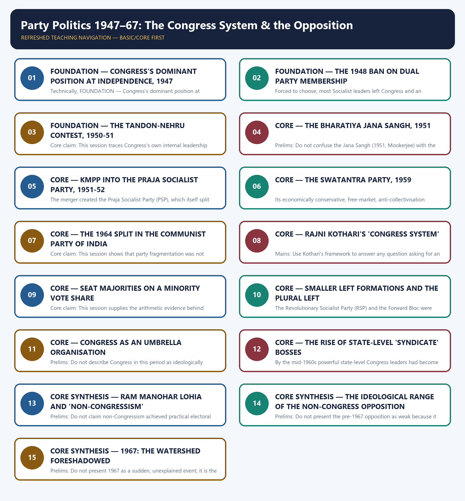

# Party Politics 1947–67: The Congress System & the Opposition - Learner-v2 Complete Learning Session

### SOURCE, PROGRESSION AND CURRENT-LINKAGE AUDIT

- **Repository owners queried:** Basic and Advanced Markdown for this topic, the master chronology, syllabus map and linked Modern History owners.
- **OCR book evidence queried:** The Basic and Advanced owner Markdown for this topic were reconciled against each other and against the folder's shared post-independence OCR source, Bipan Chandra, Mridula Mukherjee and Aditya Mukherjee, *India After Independence, 1947–2000*. Every date, name and institution used below already carries the owners' own ✅ (source-backed) or ⚠️ (inference) tagging, and that tagging is preserved rather than re-verified page by page against the raw PDF in this authoring pass.
- **Qdrant:** not used; Markdown plus searchable local PDFs were sufficient.
- **PYQ integrity:** One Prelims demand is routed to this owner in the local ledgers (`_PYQ-ROUTING-PRELIMS-2024-2025.md`): the 2024 Prelims GS-I Q73 party-leader matching question (Jana Sangh, Socialist Party, CFD, Swatantra), which is embedded verbatim below with no option or answer inferred. No Mains demand in the local 2018-2025 ledgers is routed to this owner.
- **Bounded live linkage:** No verified live current-affairs item is pegged to this topic. The owner's own material treats the Congress system and party fragmentation as an evergreen analytical theme rather than a dated news event, and that bounded framing is preserved rather than inventing a specific live source or date.
- **Fact/inference rule:** historical claims are source-backed; analytical judgements are explicitly framed as interpretation and do not invent figures.

## BASIC LEARNING SESSION



*Distinct embedded teaching-navigation image. The separate continuous Cārvāka-style flowchart package remains an independent at-a-glance artifact.*

### SESSION 1 — FOUNDATION — CONGRESS'S DOMINANT POSITION AT INDEPENDENCE, 1947

#### DEFINITION / WHAT THIS IS CALLED

**Plain-language definition:** Precise definition: Congress's 1947 dominant position is its unmatched all-India organisational reach and freedom-movement legacy at independence, the starting condition against which every later split, ban, merger and new party in this topic is read.

**Technical definition:** Technically, FOUNDATION — Congress's dominant position at Independence, 1947 is analysed by relating FOUNDATION to Congress's dominant position at Independence, then testing the relationship through Precise definition and Topic boundary.

#### ANSWER-GRABBING OPENING — WRITE/ADAPT IN THE EXAM

> Precise definition: Congress's 1947 dominant position is its unmatched all-India organisational reach and freedom-movement legacy at independence, the starting condition against which every later split, ban, merger and new party in this topic is read.

#### MUST-WRITE KEYWORDS

- **FOUNDATION**
- **Congress's dominant position at Independence**
- **Precise definition**
- **Topic boundary**
- **Core claim**
- **1948-1967**

**How to use them:** Frame the answer through FOUNDATION; define Congress's dominant position at Independence, connect Precise definition with Topic boundary to explain the mechanism, and use Core claim for the decisive comparison or qualification.

##### VISUAL FIRST

```text
CONGRESS'S DOMINANT POSITION AT INDEPENDENCE, 1947
1947 -> CONGRESS the only truly ALL-INDIA party, mass organisation
LEGACY -> decades of freedom-movement organisational reach and cadre strength
NO RIVAL -> no other 1947 party had comparable reach or nationalist legacy
CONSEQUENCE -> every 1948-1967 split, ban, merger, new party competes against this
FRAME -> this topic traces contestation of dominance, not permanent dominance
```

*The visual fixes this subtopic's chronology, mechanism or boundary before the evidence.*

##### CONCEPT DEFINITIONS

- **Precise definition:** Congress's 1947 dominant position is its unmatched all-India organisational reach and freedom-movement legacy at independence, the starting condition against which every later split, ban, merger and new party in this topic is read.
- **Topic boundary:** Apply this definition only within Party Politics 1947–67: The Congress System & the Opposition; retain the named actor, institution, date and chronological role.

##### CORE EXPLANATION

This orientation session states the starting condition the whole topic explains: Congress inherited a uniquely dominant, broad-based organisational position in 1947, and everything that follows is about how party politics operated inside and against that dominance through 1967.

##### EVIDENCE AND MECHANISM

- Congress entered independence as the only truly all-India party, with a mass organisational network built across decades of the freedom movement.
- No rival party in 1947 had comparable organisational reach, cadre strength or claim to the freedom struggle's legacy.
- This dominance set the terms on which every subsequent split, ban, merger and new party of 1948-1967 had to compete.

##### EXAMINER CAUTION

- Do not treat 1947 Congress dominance as permanent or uncontested; the rest of this topic traces how it was contested from within and without.

##### EXAM LINK

- **Prelims:** Do not treat 1947 Congress dominance as permanent or uncontested; the rest of this topic traces how it was contested from within and without.
- **Mains:** Use this session to open any answer on Congress dominance or the post-1947 party system by first stating the 1947 starting condition.

##### MINI RECAP

- **Core claim:** This orientation session states the starting condition the whole topic explains: Congress inherited a uniquely dominant, broad-based organisational position in 1947, and everything that follows is about how party politics operated inside and against that dominance through 1967.
- **Use:** Use this session to open any answer on Congress dominance or the post-1947 party system by first stating the 1947 starting condition.

#### CLOSING RECALL FLOW — FOUNDATION — CONGRESS'S DOMINANT POSITION AT INDEPENDENCE, 1947

```text
START / CONCEPT: FOUNDATION — Congress's dominant position at Independence, 1947
        |
        v
EXACT TERMS: FOUNDATION · Congress's dominant position at Independence · Precise definition · Topic boundary · Core claim · 1948-1967
        |
        v
MECHANISM / ARGUMENT: This orientation session states the starting condition the whole topic explains: Congress inherited a uniquely dominant, broad-based organisational position in 1947, and everything that follows is about how party politics operated inside and against that dominance through 1967.
        |
        v
CONSEQUENCE / CONTRAST: Do not treat 1947 Congress dominance as permanent or uncontested; the rest of this topic traces how it was contested from within and without.
        |
        v
UPSC TRAP / ANSWER-USE: Do not miss this limiting distinction: congress entered independence as the only truly all-India party, with a mass organisational network...
        |
        v
ANSWER-GRABBING FORMULATION: Precise definition: Congress's 1947 dominant position is its unmatched all-India organisational reach and freedom-movement legacy at independence, the starting condition against which every later split, ban, merger and new party in this topic is read.
```
### SESSION 2 — FOUNDATION — THE 1948 BAN ON DUAL PARTY MEMBERSHIP

#### DEFINITION / WHAT THIS IS CALLED

**Plain-language definition:** Precise definition: The 1948 dual-membership ban is the Congress constitutional amendment that forced Congress Socialist Party members to choose between Congress and an independent party, producing the Socialist exit of 1948.

**Technical definition:** Forced to choose, most Socialist leaders left Congress and an independent Socialist Party was formed.

#### ANSWER-GRABBING OPENING — WRITE/ADAPT IN THE EXAM

> Precise definition: The 1948 dual-membership ban is the Congress constitutional amendment that forced Congress Socialist Party members to choose between Congress and an independent party, producing the Socialist exit of 1948.

#### MUST-WRITE KEYWORDS

- **FOUNDATION**
- **The 1948 ban on dual party membership**
- **Precise definition**
- **Topic boundary**
- **Core claim**
- **1947–67**

**How to use them:** Frame the answer through FOUNDATION; define The 1948 ban on dual party membership, connect Precise definition with Topic boundary to explain the mechanism, and use Core claim for the decisive comparison or qualification.

##### VISUAL FIRST

```text
THE 1948 BAN ON DUAL PARTY MEMBERSHIP
CONGRESS CONSTITUTION -> amended 1948: BARS DUAL PARTY MEMBERSHIP
TARGET -> Congress Socialist Party (CSP) members inside Congress
FORCED CHOICE -> remain in Congress OR join an independent socialist party
RESULT -> most CSP leaders exit; an INDEPENDENT SOCIALIST PARTY is formed
```

*The visual fixes this subtopic's chronology, mechanism or boundary before the evidence.*

##### CONCEPT DEFINITIONS

- **Precise definition:** The 1948 dual-membership ban is the Congress constitutional amendment that forced Congress Socialist Party members to choose between Congress and an independent party, producing the Socialist exit of 1948.
- **Topic boundary:** Apply this definition only within Party Politics 1947–67: The Congress System & the Opposition; retain the named actor, institution, date and chronological role.

##### CORE EXPLANATION

This session opens the topic at its true starting point: a Congress constitutional rule, not an external event, that created India's independent non-Communist Left.

##### EVIDENCE AND MECHANISM

- Congress amended its own constitution in 1948 to bar dual party membership.
- The rule targeted Congress Socialist Party members who sat inside Congress while belonging to a separate organisation.
- Forced to choose, most Socialist leaders left Congress and an independent Socialist Party was formed.

##### EXAMINER CAUTION

- Do not describe the 1948 Socialist exit as a spontaneous ideological break; it followed directly from the dual-membership ban.

##### EXAM LINK

- **Prelims:** Do not describe the 1948 Socialist exit as a spontaneous ideological break; it followed directly from the dual-membership ban.
- **Mains:** Use this session to answer any question on the origin of India's independent Socialist party tradition.

##### MINI RECAP

- **Core claim:** This session opens the topic at its true starting point: a Congress constitutional rule, not an external event, that created India's independent non-Communist Left.
- **Use:** Use this session to answer any question on the origin of India's independent Socialist party tradition.

#### CLOSING RECALL FLOW — FOUNDATION — THE 1948 BAN ON DUAL PARTY MEMBERSHIP

```text
START / CONCEPT: FOUNDATION — The 1948 ban on dual party membership
        |
        v
EXACT TERMS: FOUNDATION · The 1948 ban on dual party membership · Precise definition · Topic boundary · Core claim · 1947–67
        |
        v
MECHANISM / ARGUMENT: Forced to choose, most Socialist leaders left Congress and an independent Socialist Party was formed.
        |
        v
CONSEQUENCE / CONTRAST: Core claim: This session opens the topic at its true starting point: a Congress constitutional rule, not an external event, that created India's independent non-Communist Left.
        |
        v
UPSC TRAP / ANSWER-USE: Do not describe the 1948 Socialist exit as a spontaneous ideological break; it followed directly from the dual-membership ban.
        |
        v
ANSWER-GRABBING FORMULATION: Precise definition: The 1948 dual-membership ban is the Congress constitutional amendment that forced Congress Socialist Party members to choose between Congress and an independent party, producing the Socialist exit of 1948.
```
### SESSION 3 — FOUNDATION — THE TANDON-NEHRU CONTEST, 1950-51

#### DEFINITION / WHAT THIS IS CALLED

**Plain-language definition:** Precise definition: The Tandon-Nehru contest refers to Purushottam Das Tandon's 1950 election as Congress president, his 1951 resignation amid friction with Nehru, and Nehru's subsequent assumption of the post.

**Technical definition:** Core claim: This session traces Congress's own internal leadership contest to show that factional competition operated inside the party even at its highest level.

#### ANSWER-GRABBING OPENING — WRITE/ADAPT IN THE EXAM

> Core claim: This session traces Congress's own internal leadership contest to show that factional competition operated inside the party even at its highest level.

#### MUST-WRITE KEYWORDS

- **FOUNDATION**
- **The Tandon-Nehru contest**
- **Precise definition**
- **Topic boundary**
- **Core claim**
- **1950-51**

**How to use them:** Frame the answer through FOUNDATION; define The Tandon-Nehru contest, connect Precise definition with Topic boundary to explain the mechanism, and use Core claim for the decisive comparison or qualification.

##### VISUAL FIRST

```text
THE TANDON-NEHRU CONTEST, 1950-51
CONGRESS PRESIDENTIAL CONTEST -> 1950
WINNER -> PURUSHOTTAM DAS TANDON defeats the Nehru-backed candidate
FRICTION -> Tandon's conservative-Hindu leanings clash with Nehru's secular line
1951 -> TANDON RESIGNS; NEHRU HIMSELF then takes over as Congress president
```

*The visual fixes this subtopic's chronology, mechanism or boundary before the evidence.*

##### CONCEPT DEFINITIONS

- **Precise definition:** The Tandon-Nehru contest refers to Purushottam Das Tandon's 1950 election as Congress president, his 1951 resignation amid friction with Nehru, and Nehru's subsequent assumption of the post.
- **Topic boundary:** Apply this definition only within Party Politics 1947–67: The Congress System & the Opposition; retain the named actor, institution, date and chronological role.

##### CORE EXPLANATION

This session traces Congress's own internal leadership contest to show that factional competition operated inside the party even at its highest level.

##### EVIDENCE AND MECHANISM

- Purushottam Das Tandon defeated the Nehru-backed candidate for the Congress presidency in 1950.
- Friction between Tandon's conservative-Hindu leanings and Nehru's secular line grew through 1950-51.
- Tandon resigned the Congress presidency in 1951, after which Nehru himself took over the post.

##### EXAMINER CAUTION

- Keep the sequence exact: Tandon wins in 1950, resigns in 1951, then Nehru takes over; do not reverse or compress this order.

##### EXAM LINK

- **Prelims:** Keep the sequence exact: Tandon wins in 1950, resigns in 1951, then Nehru takes over; do not reverse or compress this order.
- **Mains:** Use this contest to answer any question on internal ideological tension inside Congress in its first years of power.

##### MINI RECAP

- **Core claim:** This session traces Congress's own internal leadership contest to show that factional competition operated inside the party even at its highest level.
- **Use:** Use this contest to answer any question on internal ideological tension inside Congress in its first years of power.

#### CLOSING RECALL FLOW — FOUNDATION — THE TANDON-NEHRU CONTEST, 1950-51

```text
START / CONCEPT: FOUNDATION — The Tandon-Nehru contest, 1950-51
        |
        v
EXACT TERMS: FOUNDATION · The Tandon-Nehru contest · Precise definition · Topic boundary · Core claim · 1950-51
        |
        v
MECHANISM / ARGUMENT: Precise definition: The Tandon-Nehru contest refers to Purushottam Das Tandon's 1950 election as Congress president, his 1951 resignation amid friction with Nehru, and Nehru's subsequent assumption of the post.
        |
        v
CONSEQUENCE / CONTRAST: Keep the sequence exact: Tandon wins in 1950, resigns in 1951, then Nehru takes over; do not reverse or compress this order.
        |
        v
UPSC TRAP / ANSWER-USE: Do not miss this limiting distinction: use this contest to answer any question on internal ideological tension inside Congress in...
        |
        v
ANSWER-GRABBING FORMULATION: Core claim: This session traces Congress's own internal leadership contest to show that factional competition operated inside the party even at its highest level.
```
### SESSION 4 — CORE — THE BHARATIYA JANA SANGH, 1951

#### DEFINITION / WHAT THIS IS CALLED

**Plain-language definition:** Precise definition: The Bharatiya Jana Sangh is the party founded in 1951 by Syama Prasad Mookerjee on a Hindu-nationalist cultural-political platform, organisationally linked to the RSS network.

**Technical definition:** Prelims: Do not confuse the Jana Sangh (1951, Mookerjee) with the Swatantra Party (1959, Rajagopalachari); they are different right-of-Congress formations with different platforms.

#### ANSWER-GRABBING OPENING — WRITE/ADAPT IN THE EXAM

> Precise definition: The Bharatiya Jana Sangh is the party founded in 1951 by Syama Prasad Mookerjee on a Hindu-nationalist cultural-political platform, organisationally linked to the RSS network.

#### MUST-WRITE KEYWORDS

- **The Bharatiya Jana Sangh**
- **Precise definition**
- **Topic boundary**
- **Core claim**
- **Precise definition: The Bharatiya Jana Sangh**
- **1947–67**

**How to use them:** Frame the answer through The Bharatiya Jana Sangh; define Precise definition, connect Topic boundary with Core claim to explain the mechanism, and use Precise definition: The Bharatiya Jana Sangh for the decisive comparison or qualification.

##### VISUAL FIRST

```text
THE BHARATIYA JANA SANGH, 1951
BHARATIYA JANA SANGH -> founded 1951
FOUNDER -> SYAMA PRASAD MOOKERJEE (resigned from Nehru's cabinet)
LINK -> organisational links to the RSS network (state this carefully)
PLATFORM -> Hindu-nationalist cultural-political line, opposed to Congress's model
```

*The visual fixes this subtopic's chronology, mechanism or boundary before the evidence.*

##### CONCEPT DEFINITIONS

- **Precise definition:** The Bharatiya Jana Sangh is the party founded in 1951 by Syama Prasad Mookerjee on a Hindu-nationalist cultural-political platform, organisationally linked to the RSS network.
- **Topic boundary:** Apply this definition only within Party Politics 1947–67: The Congress System & the Opposition; retain the named actor, institution, date and chronological role.

##### CORE EXPLANATION

The Jana Sangh's founding introduces the Hindu-nationalist strand of opposition politics, and this session fixes its founder, date and organisational link precisely.

##### EVIDENCE AND MECHANISM

- The Bharatiya Jana Sangh was founded in 1951.
- Its founder, Syama Prasad Mookerjee, had earlier resigned from Nehru's cabinet.
- The party had organisational links to the RSS network and stood for a Hindu-nationalist cultural-political line opposed to Congress's secular, planning-led model.

##### EXAMINER CAUTION

- Do not confuse the Jana Sangh (1951, Mookerjee) with the Swatantra Party (1959, Rajagopalachari); they are different right-of-Congress formations with different platforms.

##### EXAM LINK

- **Prelims:** Do not confuse the Jana Sangh (1951, Mookerjee) with the Swatantra Party (1959, Rajagopalachari); they are different right-of-Congress formations with different platforms.
- **Mains:** Use this session to answer any question naming the founder or founding year of the Jana Sangh.

##### MINI RECAP

- **Core claim:** The Jana Sangh's founding introduces the Hindu-nationalist strand of opposition politics, and this session fixes its founder, date and organisational link precisely.
- **Use:** Use this session to answer any question naming the founder or founding year of the Jana Sangh.

#### CLOSING RECALL FLOW — CORE — THE BHARATIYA JANA SANGH, 1951

```text
START / CONCEPT: CORE — The Bharatiya Jana Sangh, 1951
        |
        v
EXACT TERMS: The Bharatiya Jana Sangh · Precise definition · Topic boundary · Core claim · Precise definition: The Bharatiya Jana Sangh · 1947–67
        |
        v
MECHANISM / ARGUMENT: The Bharatiya Jana Sangh was founded in 1951.
        |
        v
CONSEQUENCE / CONTRAST: Do not confuse the Jana Sangh (1951, Mookerjee) with the Swatantra Party (1959, Rajagopalachari); they are different right-of-Congress formations with different platforms.
        |
        v
UPSC TRAP / ANSWER-USE: Do not miss this limiting distinction: use this session to answer any question naming the founder or founding year of...
        |
        v
ANSWER-GRABBING FORMULATION: Precise definition: The Bharatiya Jana Sangh is the party founded in 1951 by Syama Prasad Mookerjee on a Hindu-nationalist cultural-political platform, organisationally linked to the RSS network.
```
### SESSION 5 — CORE — KMPP INTO THE PRAJA SOCIALIST PARTY, 1951-52

#### DEFINITION / WHAT THIS IS CALLED

**Plain-language definition:** Precise definition: The Praja Socialist Party (PSP) is the party formed in 1952 from the merger of J.B.

**Technical definition:** The merger created the Praja Socialist Party (PSP), which itself split and re-formed repeatedly through the 1950s and 1960s.

#### ANSWER-GRABBING OPENING — WRITE/ADAPT IN THE EXAM

> Precise definition: The Praja Socialist Party (PSP) is the party formed in 1952 from the merger of J.B.

#### MUST-WRITE KEYWORDS

- **KMPP into the Praja Socialist Party**
- **Precise definition**
- **Topic boundary**
- **Core claim**
- **1951-52**
- **1947–67**

**How to use them:** Frame the answer through KMPP into the Praja Socialist Party; define Precise definition, connect Topic boundary with Core claim to explain the mechanism, and use 1951-52 for the decisive comparison or qualification.

##### VISUAL FIRST

```text
KMPP INTO THE PRAJA SOCIALIST PARTY, 1951-52
KISAN MAZDOOR PRAJA PARTY (KMPP) -> founded 1951, led by J.B. KRIPALANI
1952 -> KMPP MERGES WITH THE SOCIALIST PARTY
RESULT -> PRAJA SOCIALIST PARTY (PSP) formed, 1952
INSTABILITY -> the PSP itself splits and re-forms repeatedly through the 1950s-60s
```

*The visual fixes this subtopic's chronology, mechanism or boundary before the evidence.*

##### CONCEPT DEFINITIONS

- **Precise definition:** The Praja Socialist Party (PSP) is the party formed in 1952 from the merger of J.B. Kripalani's 1951 Kisan Mazdoor Praja Party with the Socialist Party.
- **Topic boundary:** Apply this definition only within Party Politics 1947–67: The Congress System & the Opposition; retain the named actor, institution, date and chronological role.

##### CORE EXPLANATION

This session tracks the non-Communist Left's first major merger, establishing the pattern of instability that recurs throughout the rest of the topic.

##### EVIDENCE AND MECHANISM

- J.B. Kripalani founded the Kisan Mazdoor Praja Party (KMPP) in 1951.
- In 1952 the KMPP merged with the Socialist Party.
- The merger created the Praja Socialist Party (PSP), which itself split and re-formed repeatedly through the 1950s and 1960s.

##### EXAMINER CAUTION

- Keep the sequence exact: KMPP founded 1951, merger and PSP formed 1952; do not present PSP as founded directly in 1951.

##### EXAM LINK

- **Prelims:** Keep the sequence exact: KMPP founded 1951, merger and PSP formed 1952; do not present PSP as founded directly in 1951.
- **Mains:** Use this merger to answer any question on the organisational instability of India's non-Communist Left before 1967.

##### MINI RECAP

- **Core claim:** This session tracks the non-Communist Left's first major merger, establishing the pattern of instability that recurs throughout the rest of the topic.
- **Use:** Use this merger to answer any question on the organisational instability of India's non-Communist Left before 1967.

#### CLOSING RECALL FLOW — CORE — KMPP INTO THE PRAJA SOCIALIST PARTY, 1951-52

```text
START / CONCEPT: CORE — KMPP into the Praja Socialist Party, 1951-52
        |
        v
EXACT TERMS: KMPP into the Praja Socialist Party · Precise definition · Topic boundary · Core claim · 1951-52 · 1947–67
        |
        v
MECHANISM / ARGUMENT: The merger created the Praja Socialist Party (PSP), which itself split and re-formed repeatedly through the 1950s and 1960s.
        |
        v
CONSEQUENCE / CONTRAST: Keep the sequence exact: KMPP founded 1951, merger and PSP formed 1952; do not present PSP as founded directly in 1951.
        |
        v
UPSC TRAP / ANSWER-USE: Do not miss this limiting distinction: use this merger to answer any question on the organisational instability of India's non-Communist...
        |
        v
ANSWER-GRABBING FORMULATION: Precise definition: The Praja Socialist Party (PSP) is the party formed in 1952 from the merger of J.B.
```
### SESSION 6 — CORE — THE SWATANTRA PARTY, 1959

#### DEFINITION / WHAT THIS IS CALLED

**Plain-language definition:** Precise definition: The Swatantra Party is the free-market, anti-collectivisation party founded in 1959 by C.

**Technical definition:** Its economically conservative, free-market, anti-collectivisation platform directly opposed Congress's 'socialistic pattern', and it became one of the larger non-Congress parliamentary parties by the 1960s.

#### ANSWER-GRABBING OPENING — WRITE/ADAPT IN THE EXAM

> Precise definition: The Swatantra Party is the free-market, anti-collectivisation party founded in 1959 by C.

#### MUST-WRITE KEYWORDS

- **The Swatantra Party**
- **Precise definition**
- **Topic boundary**
- **Core claim**
- **Precise definition: The Swatantra Party**
- **1947–67**

**How to use them:** Frame the answer through The Swatantra Party; define Precise definition, connect Topic boundary with Core claim to explain the mechanism, and use Precise definition: The Swatantra Party for the decisive comparison or qualification.

##### VISUAL FIRST

```text
THE SWATANTRA PARTY, 1959
SWATANTRA PARTY -> founded 1959
FOUNDERS -> C. RAJAGOPALACHARI, MINOO MASANI, N.G. RANGA
PLATFORM -> free-market, anti-collectivisation, opposed the "socialistic pattern"
POSITION -> becomes one of the larger non-Congress parliamentary parties by the 1960s
```

*The visual fixes this subtopic's chronology, mechanism or boundary before the evidence.*

##### CONCEPT DEFINITIONS

- **Precise definition:** The Swatantra Party is the free-market, anti-collectivisation party founded in 1959 by C. Rajagopalachari, Minoo Masani and N.G. Ranga in opposition to Congress's socialistic pattern.
- **Topic boundary:** Apply this definition only within Party Politics 1947–67: The Congress System & the Opposition; retain the named actor, institution, date and chronological role.

##### CORE EXPLANATION

Swatantra's founding introduces the free-market strand of opposition politics, deliberately positioned opposite the Jana Sangh's cultural platform and opposite Congress's socialistic pattern.

##### EVIDENCE AND MECHANISM

- The Swatantra Party was founded in 1959.
- Its founders were C. Rajagopalachari, Minoo Masani and N.G. Ranga.
- Its economically conservative, free-market, anti-collectivisation platform directly opposed Congress's 'socialistic pattern', and it became one of the larger non-Congress parliamentary parties by the 1960s.

##### EXAMINER CAUTION

- Do not group Swatantra with the Jana Sangh as a single 'right-wing bloc'; their platforms differ in kind, not only in degree.

##### EXAM LINK

- **Prelims:** Do not group Swatantra with the Jana Sangh as a single 'right-wing bloc'; their platforms differ in kind, not only in degree.
- **Mains:** Use Swatantra's founders and platform to answer any question distinguishing economically conservative from culturally conservative opposition parties.

##### MINI RECAP

- **Core claim:** Swatantra's founding introduces the free-market strand of opposition politics, deliberately positioned opposite the Jana Sangh's cultural platform and opposite Congress's socialistic pattern.
- **Use:** Use Swatantra's founders and platform to answer any question distinguishing economically conservative from culturally conservative opposition parties.

#### CLOSING RECALL FLOW — CORE — THE SWATANTRA PARTY, 1959

```text
START / CONCEPT: CORE — The Swatantra Party, 1959
        |
        v
EXACT TERMS: The Swatantra Party · Precise definition · Topic boundary · Core claim · Precise definition: The Swatantra Party · 1947–67
        |
        v
MECHANISM / ARGUMENT: Its economically conservative, free-market, anti-collectivisation platform directly opposed Congress's 'socialistic pattern', and it became one of the larger non-Congress parliamentary parties by the 1960s.
        |
        v
CONSEQUENCE / CONTRAST: Do not group Swatantra with the Jana Sangh as a single 'right-wing bloc'; their platforms differ in kind, not only in degree.
        |
        v
UPSC TRAP / ANSWER-USE: Do not miss this limiting distinction: the Swatantra Party was founded in 1959.
        |
        v
ANSWER-GRABBING FORMULATION: Precise definition: The Swatantra Party is the free-market, anti-collectivisation party founded in 1959 by C.
```
### SESSION 7 — CORE — THE 1964 SPLIT IN THE COMMUNIST PARTY OF INDIA

#### DEFINITION / WHAT THIS IS CALLED

**Plain-language definition:** Precise definition: The 1964 CPI split is the division of the Communist Party of India into the CPI and CPI(M), driven by the Sino-Soviet split and differing responses to the 1962 war.

**Technical definition:** Core claim: This session shows that party fragmentation was not confined to the non-Communist Left; the organised Communist movement split too, on both ideological and strategic grounds.

#### ANSWER-GRABBING OPENING — WRITE/ADAPT IN THE EXAM

> Precise definition: The 1964 CPI split is the division of the Communist Party of India into the CPI and CPI(M), driven by the Sino-Soviet split and differing responses to the 1962 war.

#### MUST-WRITE KEYWORDS

- **Precise definition**
- **Topic boundary**
- **Core claim**
- **Precise definition: The 1964 CPI split**
- **Precise**
- **1947–67**

**How to use them:** Frame the answer through Precise definition; define Topic boundary, connect Core claim with Precise definition: The 1964 CPI split to explain the mechanism, and use Precise for the decisive comparison or qualification.

##### VISUAL FIRST

```text
THE 1964 SPLIT IN THE COMMUNIST PARTY OF INDIA
COMMUNIST PARTY OF INDIA -> internal strain through the early 1960s
FAULT LINES -> the Sino-Soviet split; differing responses to the 1962 border war
1964 -> THE PARTY SPLITS
RESULT -> CPI (one stream) and CPI(M) (the new formation)
```

*The visual fixes this subtopic's chronology, mechanism or boundary before the evidence.*

##### CONCEPT DEFINITIONS

- **Precise definition:** The 1964 CPI split is the division of the Communist Party of India into the CPI and CPI(M), driven by the Sino-Soviet split and differing responses to the 1962 war.
- **Topic boundary:** Apply this definition only within Party Politics 1947–67: The Congress System & the Opposition; retain the named actor, institution, date and chronological role.

##### CORE EXPLANATION

This session shows that party fragmentation was not confined to the non-Communist Left; the organised Communist movement split too, on both ideological and strategic grounds.

##### EVIDENCE AND MECHANISM

- Ideological strain over the Sino-Soviet split ran through the Communist Party of India in the early 1960s.
- Differing responses to the 1962 border war sharpened this strain.
- The party split in 1964 into the CPI and the new CPI(M), leaving the organised Left divided for the rest of the decade.

##### EXAMINER CAUTION

- Date the split precisely to 1964, before the 1967 election, not as a later or simultaneous event.

##### EXAM LINK

- **Prelims:** Date the split precisely to 1964, before the 1967 election, not as a later or simultaneous event.
- **Mains:** Use this split to answer any question on the fragmentation of the Indian Left in the 1960s.

##### MINI RECAP

- **Core claim:** This session shows that party fragmentation was not confined to the non-Communist Left; the organised Communist movement split too, on both ideological and strategic grounds.
- **Use:** Use this split to answer any question on the fragmentation of the Indian Left in the 1960s.

#### CLOSING RECALL FLOW — CORE — THE 1964 SPLIT IN THE COMMUNIST PARTY OF INDIA

```text
START / CONCEPT: CORE — The 1964 split in the Communist Party of India
        |
        v
EXACT TERMS: Precise definition · Topic boundary · Core claim · Precise definition: The 1964 CPI split · Precise · 1947–67
        |
        v
MECHANISM / ARGUMENT: Core claim: This session shows that party fragmentation was not confined to the non-Communist Left; the organised Communist movement split too, on both ideological and strategic grounds.
        |
        v
CONSEQUENCE / CONTRAST: Mains: Use this split to answer any question on the fragmentation of the Indian Left in the 1960s.
        |
        v
UPSC TRAP / ANSWER-USE: Do not miss this limiting distinction: this session shows that party fragmentation was not confined to the non-Communist Left.
        |
        v
ANSWER-GRABBING FORMULATION: Precise definition: The 1964 CPI split is the division of the Communist Party of India into the CPI and CPI(M), driven by the Sino-Soviet split and differing responses to the 1962 war.
```
### SESSION 8 — CORE — RAJNI KOTHARI'S 'CONGRESS SYSTEM'

#### DEFINITION / WHAT THIS IS CALLED

**Plain-language definition:** Precise definition: The 'Congress system' is Rajni Kothari's analytical term for a Congress functioning as a party of consensus that absorbed internal factions while opposition parties acted mainly as parties of pressure.

**Technical definition:** Mains: Use Kothari's framework to answer any question asking for an analytical model of Congress dominance between 1952 and 1967.

#### ANSWER-GRABBING OPENING — WRITE/ADAPT IN THE EXAM

> Precise definition: The 'Congress system' is Rajni Kothari's analytical term for a Congress functioning as a party of consensus that absorbed internal factions while opposition parties acted mainly as parties of pressure.

#### MUST-WRITE KEYWORDS

- **Rajni Kothari's 'Congress system'**
- **Precise definition**
- **Topic boundary**
- **Core claim**
- **Precise definition: The 'Congress system'**
- **1947–67**

**How to use them:** Frame the answer through Rajni Kothari's 'Congress system'; define Precise definition, connect Topic boundary with Core claim to explain the mechanism, and use Precise definition: The 'Congress system' for the decisive comparison or qualification.

##### VISUAL FIRST

```text
RAJNI KOTHARI'S 'CONGRESS SYSTEM'
RAJNI KOTHARI -> political scientist, coins the term "CONGRESS SYSTEM"
CLAIM -> Congress functions as a "PARTY OF CONSENSUS", absorbing factions internally
OPPOSITION ROLE -> parties of "PRESSURE", not alternative-government contenders
ATTRIBUTION -> Kothari's analytical term, NOT a Congress self-description
```

*The visual fixes this subtopic's chronology, mechanism or boundary before the evidence.*

##### CONCEPT DEFINITIONS

- **Precise definition:** The 'Congress system' is Rajni Kothari's analytical term for a Congress functioning as a party of consensus that absorbed internal factions while opposition parties acted mainly as parties of pressure.
- **Topic boundary:** Apply this definition only within Party Politics 1947–67: The Congress System & the Opposition; retain the named actor, institution, date and chronological role.

##### CORE EXPLANATION

This session names the analytical framework the whole topic has been building evidence for, and it is careful to attribute the framework to its author rather than to Congress itself.

##### EVIDENCE AND MECHANISM

- The political scientist Rajni Kothari coined the term 'Congress system'.
- Kothari described Congress as a 'party of consensus' that absorbed internal factions rather than losing them to separate parties.
- Opposition parties, in this model, acted as parties of 'pressure', influencing Congress factions rather than forming credible alternative governments.

##### EXAMINER CAUTION

- Always attribute 'Congress system' and 'party of consensus' to Rajni Kothari; never present these as Congress's own description of itself.

##### EXAM LINK

- **Prelims:** Always attribute 'Congress system' and 'party of consensus' to Rajni Kothari; never present these as Congress's own description of itself.
- **Mains:** Use Kothari's framework to answer any question asking for an analytical model of Congress dominance between 1952 and 1967.

##### MINI RECAP

- **Core claim:** This session names the analytical framework the whole topic has been building evidence for, and it is careful to attribute the framework to its author rather than to Congress itself.
- **Use:** Use Kothari's framework to answer any question asking for an analytical model of Congress dominance between 1952 and 1967.

#### CLOSING RECALL FLOW — CORE — RAJNI KOTHARI'S 'CONGRESS SYSTEM'

```text
START / CONCEPT: CORE — Rajni Kothari's 'Congress system'
        |
        v
EXACT TERMS: Rajni Kothari's 'Congress system' · Precise definition · Topic boundary · Core claim · Precise definition: The 'Congress system' · 1947–67
        |
        v
MECHANISM / ARGUMENT: Mains: Use Kothari's framework to answer any question asking for an analytical model of Congress dominance between 1952 and 1967.
        |
        v
CONSEQUENCE / CONTRAST: Core claim: This session names the analytical framework the whole topic has been building evidence for, and it is careful to attribute the framework to its author rather than to Congress itself.
        |
        v
UPSC TRAP / ANSWER-USE: Do not miss this limiting distinction: the 'Congress system' is Rajni Kothari's analytical term for a Congress functioning as a...
        |
        v
ANSWER-GRABBING FORMULATION: Precise definition: The 'Congress system' is Rajni Kothari's analytical term for a Congress functioning as a party of consensus that absorbed internal factions while opposition parties acted mainly as parties of pressure.
```
### SESSION 9 — CORE — SEAT MAJORITIES ON A MINORITY VOTE SHARE

#### DEFINITION / WHAT THIS IS CALLED

**Plain-language definition:** Precise definition: The seat-vote gap describes how Congress won comfortable parliamentary seat majorities in 1952, 1957 and 1962 while its national vote share stayed well under 50 per cent.

**Technical definition:** Core claim: This session supplies the arithmetic evidence behind Kothari's model, distinguishing Congress's seat dominance from any claim of majority political consent.

#### ANSWER-GRABBING OPENING — WRITE/ADAPT IN THE EXAM

> Precise definition: The seat-vote gap describes how Congress won comfortable parliamentary seat majorities in 1952, 1957 and 1962 while its national vote share stayed well under 50 per cent.

#### MUST-WRITE KEYWORDS

- **Seat majorities on a minority vote share**
- **Precise definition**
- **Topic boundary**
- **Core claim**
- **Precise definition: The seat-vote gap**
- **1947–67**

**How to use them:** Frame the answer through Seat majorities on a minority vote share; define Precise definition, connect Topic boundary with Core claim to explain the mechanism, and use Precise definition: The seat-vote gap for the decisive comparison or qualification.

##### VISUAL FIRST

```text
SEAT MAJORITIES ON A MINORITY VOTE SHARE
1952 / 1957 / 1962 ELECTIONS -> comfortable Congress SEAT majorities each time
VOTE SHARE -> stays WELL UNDER 50 per cent in each election
MECHANISM -> first-past-the-post arithmetic + a FRAGMENTED OPPOSITION
INFERENCE -> Congress dominance rested on electoral arithmetic, not consent alone
```

*The visual fixes this subtopic's chronology, mechanism or boundary before the evidence.*

##### CONCEPT DEFINITIONS

- **Precise definition:** The seat-vote gap describes how Congress won comfortable parliamentary seat majorities in 1952, 1957 and 1962 while its national vote share stayed well under 50 per cent.
- **Topic boundary:** Apply this definition only within Party Politics 1947–67: The Congress System & the Opposition; retain the named actor, institution, date and chronological role.

##### CORE EXPLANATION

This session supplies the arithmetic evidence behind Kothari's model, distinguishing Congress's seat dominance from any claim of majority political consent.

##### EVIDENCE AND MECHANISM

- In the 1952, 1957 and 1962 general elections Congress won comfortable parliamentary seat majorities.
- Its national vote share stayed well under 50 per cent in each of these elections.
- The gap reflects first-past-the-post arithmetic operating on a fragmented opposition, not majority consent alone.

##### EXAMINER CAUTION

- Never equate a Congress seat majority with a Congress vote majority; the two figures moved very differently across these elections.

##### EXAM LINK

- **Prelims:** Never equate a Congress seat majority with a Congress vote majority; the two figures moved very differently across these elections.
- **Mains:** Use this seat-versus-vote gap as the core evidence for any 'was Congress dominance consensual' Mains answer.

##### MINI RECAP

- **Core claim:** This session supplies the arithmetic evidence behind Kothari's model, distinguishing Congress's seat dominance from any claim of majority political consent.
- **Use:** Use this seat-versus-vote gap as the core evidence for any 'was Congress dominance consensual' Mains answer.

#### CLOSING RECALL FLOW — CORE — SEAT MAJORITIES ON A MINORITY VOTE SHARE

```text
START / CONCEPT: CORE — Seat majorities on a minority vote share
        |
        v
EXACT TERMS: Seat majorities on a minority vote share · Precise definition · Topic boundary · Core claim · Precise definition: The seat-vote gap · 1947–67
        |
        v
MECHANISM / ARGUMENT: Never equate a Congress seat majority with a Congress vote majority; the two figures moved very differently across these elections.
        |
        v
CONSEQUENCE / CONTRAST: The gap reflects first-past-the-post arithmetic operating on a fragmented opposition, not majority consent alone.
        |
        v
UPSC TRAP / ANSWER-USE: Do not miss this limiting distinction: this session supplies the arithmetic evidence behind Kothari's model, distinguishing Congress's seat dominance from...
        |
        v
ANSWER-GRABBING FORMULATION: Precise definition: The seat-vote gap describes how Congress won comfortable parliamentary seat majorities in 1952, 1957 and 1962 while its national vote share stayed well under 50 per cent.
```
### SESSION 10 — CORE — SMALLER LEFT FORMATIONS AND THE PLURAL LEFT

#### DEFINITION / WHAT THIS IS CALLED

**Plain-language definition:** Precise definition: RSP and Forward Bloc are smaller Left party formations, strongest in Bengal and Kerala, whose existence alongside the CPI and CPI(M) shows the plurality of India's organised Left before 1967.

**Technical definition:** The Revolutionary Socialist Party (RSP) and the Forward Bloc were smaller Left formations active mainly in Bengal and Kerala.

#### ANSWER-GRABBING OPENING — WRITE/ADAPT IN THE EXAM

> Precise definition: RSP and Forward Bloc are smaller Left party formations, strongest in Bengal and Kerala, whose existence alongside the CPI and CPI(M) shows the plurality of India's organised Left before 1967.

#### MUST-WRITE KEYWORDS

- **Smaller left formations**
- **the plural Left**
- **Precise definition**
- **Topic boundary**
- **Core claim**
- **1947-67**

**How to use them:** Frame the answer through Smaller left formations; define the plural Left, connect Precise definition with Topic boundary to explain the mechanism, and use Core claim for the decisive comparison or qualification.

##### VISUAL FIRST

```text
SMALLER LEFT FORMATIONS AND THE PLURAL LEFT
SMALLER LEFT FORMATIONS -> Revolutionary Socialist Party (RSP), Forward Bloc
BASE -> strongest in Bengal and Kerala, alongside the CPI/CPI(M)
ROLE -> add to a genuinely PLURAL, though fragmented, opposition landscape
NOT A MONOLITH -> the Indian Left of 1947-67 was NEVER a single unified bloc
```

*The visual fixes this subtopic's chronology, mechanism or boundary before the evidence.*

##### CONCEPT DEFINITIONS

- **Precise definition:** RSP and Forward Bloc are smaller Left party formations, strongest in Bengal and Kerala, whose existence alongside the CPI and CPI(M) shows the plurality of India's organised Left before 1967.
- **Topic boundary:** Apply this definition only within Party Politics 1947–67: The Congress System & the Opposition; retain the named actor, institution, date and chronological role.

##### CORE EXPLANATION

This session widens the picture of the organised Left beyond the CPI/CPI(M) split, showing a genuinely plural rather than monolithic Left landscape.

##### EVIDENCE AND MECHANISM

- The Revolutionary Socialist Party (RSP) and the Forward Bloc were smaller Left formations active mainly in Bengal and Kerala.
- Alongside the CPI and CPI(M), they added further plurality to the Left's organisational landscape.
- The Indian Left of 1947-67 was never a single unified bloc, a pattern that mirrors the fragmentation seen across the non-Communist opposition.

##### EXAMINER CAUTION

- Do not describe 'the Left' in this period as a single party or a single coherent bloc.

##### EXAM LINK

- **Prelims:** Do not describe 'the Left' in this period as a single party or a single coherent bloc.
- **Mains:** Use RSP and Forward Bloc as supporting evidence whenever a question asks about the plurality of the Indian Left before 1967.

##### MINI RECAP

- **Core claim:** This session widens the picture of the organised Left beyond the CPI/CPI(M) split, showing a genuinely plural rather than monolithic Left landscape.
- **Use:** Use RSP and Forward Bloc as supporting evidence whenever a question asks about the plurality of the Indian Left before 1967.

#### CLOSING RECALL FLOW — CORE — SMALLER LEFT FORMATIONS AND THE PLURAL LEFT

```text
START / CONCEPT: CORE — Smaller left formations and the plural Left
        |
        v
EXACT TERMS: Smaller left formations · the plural Left · Precise definition · Topic boundary · Core claim · 1947-67
        |
        v
MECHANISM / ARGUMENT: The Revolutionary Socialist Party (RSP) and the Forward Bloc were smaller Left formations active mainly in Bengal and Kerala.
        |
        v
CONSEQUENCE / CONTRAST: Do not describe 'the Left' in this period as a single party or a single coherent bloc.
        |
        v
UPSC TRAP / ANSWER-USE: The Indian Left of 1947-67 was never a single unified bloc, a pattern that mirrors the fragmentation seen across the non-Communist opposition.
        |
        v
ANSWER-GRABBING FORMULATION: Precise definition: RSP and Forward Bloc are smaller Left party formations, strongest in Bengal and Kerala, whose existence alongside the CPI and CPI(M) shows the plurality of India's organised Left before 1967.
```
### SESSION 11 — CORE — CONGRESS AS AN UMBRELLA ORGANISATION

#### DEFINITION / WHAT THIS IS CALLED

**Plain-language definition:** Precise definition: Congress as an umbrella organisation describes a party broad enough to hold Nehruvian planners, conservative traditionalists and regional bosses together, so that factional competition occurred mainly inside the party.

**Technical definition:** Prelims: Do not describe Congress in this period as ideologically uniform; its breadth is precisely why factional competition occurred inside it.

#### ANSWER-GRABBING OPENING — WRITE/ADAPT IN THE EXAM

> Precise definition: Congress as an umbrella organisation describes a party broad enough to hold Nehruvian planners, conservative traditionalists and regional bosses together, so that factional competition occurred mainly inside the party.

#### MUST-WRITE KEYWORDS

- **Congress as an umbrella organisation**
- **Precise definition**
- **Topic boundary**
- **Core claim**
- **Precise definition: Congress as an umbrella organisation**
- **1947–67**

**How to use them:** Frame the answer through Congress as an umbrella organisation; define Precise definition, connect Topic boundary with Core claim to explain the mechanism, and use Precise definition: Congress as an umbrella organisation for the decisive comparison or qualification.

##### VISUAL FIRST

```text
CONGRESS AS AN UMBRELLA ORGANISATION
CONGRESS ORGANISATION -> a broad UMBRELLA, not an ideologically narrow party
INTERNAL FACTIONS -> Nehruvian planners, conservative traditionalists, regional bosses
MECHANISM -> factional competition happens INSIDE Congress, not mainly between parties
LINK FORWARD -> this internal factionalism shapes the 1966 succession (topic 34)
```

*The visual fixes this subtopic's chronology, mechanism or boundary before the evidence.*

##### CONCEPT DEFINITIONS

- **Precise definition:** Congress as an umbrella organisation describes a party broad enough to hold Nehruvian planners, conservative traditionalists and regional bosses together, so that factional competition occurred mainly inside the party.
- **Topic boundary:** Apply this definition only within Party Politics 1947–67: The Congress System & the Opposition; retain the named actor, institution, date and chronological role.

##### CORE EXPLANATION

This session explains the mechanism behind Kothari's model: Congress absorbed ideological range internally rather than expelling it to separate parties.

##### EVIDENCE AND MECHANISM

- Congress functioned as a broad umbrella rather than an ideologically narrow party.
- Nehruvian planners, conservative traditionalists and regional bosses coexisted inside the same organisation.
- Much factional competition therefore occurred inside Congress rather than between separate parties.

##### EXAMINER CAUTION

- Do not describe Congress in this period as ideologically uniform; its breadth is precisely why factional competition occurred inside it.

##### EXAM LINK

- **Prelims:** Do not describe Congress in this period as ideologically uniform; its breadth is precisely why factional competition occurred inside it.
- **Mains:** Use this umbrella model to explain why India's party system looked like one-party dominance while containing real internal competition.

##### MINI RECAP

- **Core claim:** This session explains the mechanism behind Kothari's model: Congress absorbed ideological range internally rather than expelling it to separate parties.
- **Use:** Use this umbrella model to explain why India's party system looked like one-party dominance while containing real internal competition.

#### CLOSING RECALL FLOW — CORE — CONGRESS AS AN UMBRELLA ORGANISATION

```text
START / CONCEPT: CORE — Congress as an umbrella organisation
        |
        v
EXACT TERMS: Congress as an umbrella organisation · Precise definition · Topic boundary · Core claim · Precise definition: Congress as an umbrella organisation · 1947–67
        |
        v
MECHANISM / ARGUMENT: Core claim: This session explains the mechanism behind Kothari's model: Congress absorbed ideological range internally rather than expelling it to separate parties.
        |
        v
CONSEQUENCE / CONTRAST: Do not describe Congress in this period as ideologically uniform; its breadth is precisely why factional competition occurred inside it.
        |
        v
UPSC TRAP / ANSWER-USE: Mains: Use this umbrella model to explain why India's party system looked like one-party dominance while containing real internal competition.
        |
        v
ANSWER-GRABBING FORMULATION: Precise definition: Congress as an umbrella organisation describes a party broad enough to hold Nehruvian planners, conservative traditionalists and regional bosses together, so that factional competition occurred mainly inside the party.
```
### SESSION 12 — CORE — THE RISE OF STATE-LEVEL 'SYNDICATE' BOSSES

#### DEFINITION / WHAT THIS IS CALLED

**Plain-language definition:** Precise definition: The 'Syndicate' is the later label for the powerful state-level Congress leaders who became organisationally decisive by the mid-1960s and shaped the 1966 succession.

**Technical definition:** By the mid-1960s powerful state-level Congress leaders had become organisationally decisive inside the party.

#### ANSWER-GRABBING OPENING — WRITE/ADAPT IN THE EXAM

> Precise definition: The 'Syndicate' is the later label for the powerful state-level Congress leaders who became organisationally decisive by the mid-1960s and shaped the 1966 succession.

#### MUST-WRITE KEYWORDS

- **The rise of state-level 'Syndicate' bosses**
- **Precise definition**
- **Topic boundary**
- **Core claim**
- **Precise definition: The 'Syndicate'**
- **1947–67**

**How to use them:** Frame the answer through The rise of state-level 'Syndicate' bosses; define Precise definition, connect Topic boundary with Core claim to explain the mechanism, and use Precise definition: The 'Syndicate' for the decisive comparison or qualification.

##### VISUAL FIRST

```text
THE RISE OF STATE-LEVEL 'SYNDICATE' BOSSES
MID-1960s -> powerful STATE-LEVEL Congress leaders become decisive
LATER LABEL -> collectively referred to as the "SYNDICATE"
ROLE -> internal factional power brokers inside the Congress organisation
LINK FORWARD -> shapes the 1966 succession contest (topic 34)
```

*The visual fixes this subtopic's chronology, mechanism or boundary before the evidence.*

##### CONCEPT DEFINITIONS

- **Precise definition:** The 'Syndicate' is the later label for the powerful state-level Congress leaders who became organisationally decisive by the mid-1960s and shaped the 1966 succession.
- **Topic boundary:** Apply this definition only within Party Politics 1947–67: The Congress System & the Opposition; retain the named actor, institution, date and chronological role.

##### CORE EXPLANATION

This session names the organisational feature that becomes decisive in the topic immediately following this one: the state-level power brokers later called the 'Syndicate'.

##### EVIDENCE AND MECHANISM

- By the mid-1960s powerful state-level Congress leaders had become organisationally decisive inside the party.
- These leaders were later referred to collectively as the 'Syndicate'.
- Their internal factional structure shapes the 1966 succession contest examined in the following topic.

##### EXAMINER CAUTION

- Do not name specific Syndicate leaders or 1966 succession details here; that belongs to the following topic.

##### EXAM LINK

- **Prelims:** Do not name specific Syndicate leaders or 1966 succession details here; that belongs to the following topic.
- **Mains:** Use the Syndicate's rise to bridge from this topic's internal-factionalism analysis into the 1966 succession crisis.

##### MINI RECAP

- **Core claim:** This session names the organisational feature that becomes decisive in the topic immediately following this one: the state-level power brokers later called the 'Syndicate'.
- **Use:** Use the Syndicate's rise to bridge from this topic's internal-factionalism analysis into the 1966 succession crisis.

#### CLOSING RECALL FLOW — CORE — THE RISE OF STATE-LEVEL 'SYNDICATE' BOSSES

```text
START / CONCEPT: CORE — The rise of state-level 'Syndicate' bosses
        |
        v
EXACT TERMS: The rise of state-level 'Syndicate' bosses · Precise definition · Topic boundary · Core claim · Precise definition: The 'Syndicate' · 1947–67
        |
        v
MECHANISM / ARGUMENT: By the mid-1960s powerful state-level Congress leaders had become organisationally decisive inside the party.
        |
        v
CONSEQUENCE / CONTRAST: Do not name specific Syndicate leaders or 1966 succession details here; that belongs to the following topic.
        |
        v
UPSC TRAP / ANSWER-USE: Do not miss this limiting distinction: these leaders were later referred to collectively as the 'Syndicate'.
        |
        v
ANSWER-GRABBING FORMULATION: Precise definition: The 'Syndicate' is the later label for the powerful state-level Congress leaders who became organisationally decisive by the mid-1960s and shaped the 1966 succession.
```
### SESSION 13 — CORE SYNTHESIS — RAM MANOHAR LOHIA AND 'NON-CONGRESSISM'

#### DEFINITION / WHAT THIS IS CALLED

**Plain-language definition:** Precise definition: 'Non-Congressism' is Ram Manohar Lohia's doctrine calling for ideologically diverse opposition parties to unite electorally against Congress, a logic with little effect before 1967 but later used to build the 1977 Janata coalition.

**Technical definition:** Prelims: Do not claim non-Congressism achieved practical electoral success within this topic's own 1947-67 period.

#### ANSWER-GRABBING OPENING — WRITE/ADAPT IN THE EXAM

> Precise definition: 'Non-Congressism' is Ram Manohar Lohia's doctrine calling for ideologically diverse opposition parties to unite electorally against Congress, a logic with little effect before 1967 but later used to build the 1977 Janata coalition.

#### MUST-WRITE KEYWORDS

- **CORE SYNTHESIS**
- **Ram Manohar Lohia**
- **'non-Congressism'**
- **Precise definition**
- **Topic boundary**
- **Core claim**

**How to use them:** Frame the answer through CORE SYNTHESIS; define Ram Manohar Lohia, connect 'non-Congressism' with Precise definition to explain the mechanism, and use Topic boundary for the decisive comparison or qualification.

##### VISUAL FIRST

```text
RAM MANOHAR LOHIA AND 'NON-CONGRESSISM'
RAM MANOHAR LOHIA -> leading Socialist figure, critic of Congress dominance
DOCTRINE -> "NON-CONGRESSISM": opposition unity against Congress, despite ideology
EARLY YEARS -> little practical electoral effect before 1967
LATER PAYOFF -> the same logic underlies the Janata coalition of 1977 (topic 36)
```

*The visual fixes this subtopic's chronology, mechanism or boundary before the evidence.*

##### CONCEPT DEFINITIONS

- **Precise definition:** 'Non-Congressism' is Ram Manohar Lohia's doctrine calling for ideologically diverse opposition parties to unite electorally against Congress, a logic with little effect before 1967 but later used to build the 1977 Janata coalition.
- **Topic boundary:** Apply this definition only within Party Politics 1947–67: The Congress System & the Opposition; retain the named actor, institution, date and chronological role.

##### CORE EXPLANATION

This session introduces the strategic idea that eventually outlives the period this topic covers, connecting 1947-67 party politics to the much later Janata coalition.

##### EVIDENCE AND MECHANISM

- The Socialist leader Ram Manohar Lohia argued for 'non-Congressism'.
- The doctrine called for opposition unity against Congress even across ideological differences.
- It had little practical electoral effect before 1967 but prefigured the logic later used to build the Janata coalition of 1977.

##### EXAMINER CAUTION

- Do not claim non-Congressism achieved practical electoral success within this topic's own 1947-67 period.

##### EXAM LINK

- **Prelims:** Do not claim non-Congressism achieved practical electoral success within this topic's own 1947-67 period.
- **Mains:** Use Lohia's doctrine to bridge forward to any question on the ideological logic behind the 1977 Janata coalition.

##### MINI RECAP

- **Core claim:** This session introduces the strategic idea that eventually outlives the period this topic covers, connecting 1947-67 party politics to the much later Janata coalition.
- **Use:** Use Lohia's doctrine to bridge forward to any question on the ideological logic behind the 1977 Janata coalition.

#### CLOSING RECALL FLOW — CORE SYNTHESIS — RAM MANOHAR LOHIA AND 'NON-CONGRESSISM'

```text
START / CONCEPT: CORE SYNTHESIS — Ram Manohar Lohia and 'non-Congressism'
        |
        v
EXACT TERMS: CORE SYNTHESIS · Ram Manohar Lohia · 'non-Congressism' · Precise definition · Topic boundary · Core claim
        |
        v
MECHANISM / ARGUMENT: Do not claim non-Congressism achieved practical electoral success within this topic's own 1947-67 period.
        |
        v
CONSEQUENCE / CONTRAST: It had little practical electoral effect before 1967 but prefigured the logic later used to build the Janata coalition of 1977.
        |
        v
UPSC TRAP / ANSWER-USE: Do not miss this limiting distinction: use Lohia's doctrine to bridge forward to any question on the ideological logic behind...
        |
        v
ANSWER-GRABBING FORMULATION: Precise definition: 'Non-Congressism' is Ram Manohar Lohia's doctrine calling for ideologically diverse opposition parties to unite electorally against Congress, a logic with little effect before 1967 but later used to build the 1977 Janata coalition.
```
### SESSION 14 — CORE SYNTHESIS — THE IDEOLOGICAL RANGE OF THE NON-CONGRESS OPPOSITION

#### DEFINITION / WHAT THIS IS CALLED

**Plain-language definition:** Precise definition: The ideological range of the non-Congress opposition refers to the genuine but fragmented spread of Jana Sangh, Swatantra, Socialist and Communist parties active between 1947 and 1967.

**Technical definition:** Prelims: Do not present the pre-1967 opposition as weak because it lacked ideas; present it as fragmented despite having real ideological range.

#### ANSWER-GRABBING OPENING — WRITE/ADAPT IN THE EXAM

> Precise definition: The ideological range of the non-Congress opposition refers to the genuine but fragmented spread of Jana Sangh, Swatantra, Socialist and Communist parties active between 1947 and 1967.

#### MUST-WRITE KEYWORDS

- **CORE SYNTHESIS**
- **The ideological range of the non-Congress opposition**
- **Precise definition**
- **Topic boundary**
- **Core claim**
- **1947-1967**

**How to use them:** Frame the answer through CORE SYNTHESIS; define The ideological range of the non-Congress opposition, connect Precise definition with Topic boundary to explain the mechanism, and use Core claim for the decisive comparison or qualification.

##### VISUAL FIRST

```text
THE IDEOLOGICAL RANGE OF THE NON-CONGRESS OPPOSITION
1947-1967 OPPOSITION -> Jana Sangh + Swatantra + Socialists (PSP etc.) + CPI/CPI(M)
CHARACTER -> a genuine ideological RANGE, not a marginal opposition
PROBLEM -> this range remained FRAGMENTED, not unified, before 1967
CONSEQUENCE -> could not translate into a single alternative to Congress
```

*The visual fixes this subtopic's chronology, mechanism or boundary before the evidence.*

##### CONCEPT DEFINITIONS

- **Precise definition:** The ideological range of the non-Congress opposition refers to the genuine but fragmented spread of Jana Sangh, Swatantra, Socialist and Communist parties active between 1947 and 1967.
- **Topic boundary:** Apply this definition only within Party Politics 1947–67: The Congress System & the Opposition; retain the named actor, institution, date and chronological role.

##### CORE EXPLANATION

This session pulls together the full ideological spread this topic has surveyed, to show why that spread could not, on its own, translate into an alternative government before 1967.

##### EVIDENCE AND MECHANISM

- Between 1947 and 1967 the non-Congress opposition spanned the Hindu-nationalist Jana Sangh, the free-market Swatantra Party, several Socialist formations and a divided Communist movement.
- This was a genuine ideological range, not a marginal or token opposition.
- That range could not translate into a single alternative to Congress before 1967 because of its own internal fragmentation.

##### EXAMINER CAUTION

- Do not present the pre-1967 opposition as weak because it lacked ideas; present it as fragmented despite having real ideological range.

##### EXAM LINK

- **Prelims:** Do not present the pre-1967 opposition as weak because it lacked ideas; present it as fragmented despite having real ideological range.
- **Mains:** Use this synthesis to answer any question asking why a diverse opposition still failed to unseat Congress before 1967.

##### MINI RECAP

- **Core claim:** This session pulls together the full ideological spread this topic has surveyed, to show why that spread could not, on its own, translate into an alternative government before 1967.
- **Use:** Use this synthesis to answer any question asking why a diverse opposition still failed to unseat Congress before 1967.

#### CLOSING RECALL FLOW — CORE SYNTHESIS — THE IDEOLOGICAL RANGE OF THE NON-CONGRESS OPPOSITION

```text
START / CONCEPT: CORE SYNTHESIS — The ideological range of the non-Congress opposition
        |
        v
EXACT TERMS: CORE SYNTHESIS · The ideological range of the non-Congress opposition · Precise definition · Topic boundary · Core claim · 1947-1967
        |
        v
MECHANISM / ARGUMENT: Do not present the pre-1967 opposition as weak because it lacked ideas; present it as fragmented despite having real ideological range.
        |
        v
CONSEQUENCE / CONTRAST: This was a genuine ideological range, not a marginal or token opposition.
        |
        v
UPSC TRAP / ANSWER-USE: Core claim: This session pulls together the full ideological spread this topic has surveyed, to show why that spread could not, on its own, translate into an alternative government before 1967.
        |
        v
ANSWER-GRABBING FORMULATION: Precise definition: The ideological range of the non-Congress opposition refers to the genuine but fragmented spread of Jana Sangh, Swatantra, Socialist and Communist parties active between 1947 and 1967.
```
### SESSION 15 — CORE SYNTHESIS — 1967: THE WATERSHED FORESHADOWED

#### DEFINITION / WHAT THIS IS CALLED

**Plain-language definition:** Precise definition: The 1967 watershed is the general election in which Congress lost power in eight states for the first time, the cumulative outcome of the party-system fragmentation and declining vote share traced across this topic.

**Technical definition:** Prelims: Do not present 1967 as a sudden, unexplained event; it is the cumulative outcome of the party-system changes traced across this topic.

#### ANSWER-GRABBING OPENING — WRITE/ADAPT IN THE EXAM

> Precise definition: The 1967 watershed is the general election in which Congress lost power in eight states for the first time, the cumulative outcome of the party-system fragmentation and declining vote share traced across this topic.

#### MUST-WRITE KEYWORDS

- **CORE SYNTHESIS**
- **the watershed foreshadowed**
- **Precise definition**
- **Topic boundary**
- **Core claim**
- **1948-1964**

**How to use them:** Frame the answer through CORE SYNTHESIS; define the watershed foreshadowed, connect Precise definition with Topic boundary to explain the mechanism, and use Core claim for the decisive comparison or qualification.

##### VISUAL FIRST

```text
1967: THE WATERSHED FORESHADOWED
THROUGH 1948-1964 -> ban, splits, mergers, new parties reshape opposition
BY 1962 -> Congress SEAT majority stays large; VOTE SHARE keeps declining
1967 -> for the FIRST TIME, Congress loses power in eight states
READ THE THREAD -> 1967 is the payoff of two decades of party-system change
```

*The visual fixes this subtopic's chronology, mechanism or boundary before the evidence.*

##### CONCEPT DEFINITIONS

- **Precise definition:** The 1967 watershed is the general election in which Congress lost power in eight states for the first time, the cumulative outcome of the party-system fragmentation and declining vote share traced across this topic.
- **Topic boundary:** Apply this definition only within Party Politics 1947–67: The Congress System & the Opposition; retain the named actor, institution, date and chronological role.

##### CORE EXPLANATION

The closing session states the payoff of the whole topic: two decades of party-system change, read together with declining Congress vote shares, foreshadow 1967 rather than making it a sudden surprise.

##### EVIDENCE AND MECHANISM

- Congress's vote share declined steadily through the 1952, 1957 and 1962 general elections.
- Two decades of splits, mergers and new party formations are described across this topic.
- Together these trends foreshadowed the 1967 general election, in which Congress lost power in eight states for the first time.

##### EXAMINER CAUTION

- Do not present 1967 as a sudden, unexplained event; it is the cumulative outcome of the party-system changes traced across this topic.

##### EXAM LINK

- **Prelims:** Do not present 1967 as a sudden, unexplained event; it is the cumulative outcome of the party-system changes traced across this topic.
- **Mains:** Use this session to close any 20-mark answer tracing party-system fragmentation from 1948 to its 1967 consequences.

##### MINI RECAP

- **Core claim:** The closing session states the payoff of the whole topic: two decades of party-system change, read together with declining Congress vote shares, foreshadow 1967 rather than making it a sudden surprise.
- **Use:** Use this session to close any 20-mark answer tracing party-system fragmentation from 1948 to its 1967 consequences.

#### CLOSING RECALL FLOW — CORE SYNTHESIS — 1967: THE WATERSHED FORESHADOWED

```text
START / CONCEPT: CORE SYNTHESIS — 1967: the watershed foreshadowed
        |
        v
EXACT TERMS: CORE SYNTHESIS · the watershed foreshadowed · Precise definition · Topic boundary · Core claim · 1948-1964
        |
        v
MECHANISM / ARGUMENT: Two decades of splits, mergers and new party formations are described across this topic.
        |
        v
CONSEQUENCE / CONTRAST: Do not present 1967 as a sudden, unexplained event; it is the cumulative outcome of the party-system changes traced across this topic.
        |
        v
UPSC TRAP / ANSWER-USE: Do not miss this limiting distinction: use this session to close any 20-mark answer tracing party-system fragmentation from 1948 to...
        |
        v
ANSWER-GRABBING FORMULATION: Precise definition: The 1967 watershed is the general election in which Congress lost power in eight states for the first time, the cumulative outcome of the party-system fragmentation and declining vote share traced across this topic.
```
## BASIC MCQS / REMEDIATION

### Q1. Which statement correctly identifies The 1948 ban on dual party membership?

A. Congress amended its own constitution in 1948 to bar dual membership, targeting Congress Socialist Party members who sat inside Congress while also belonging to a separate organisation; forced to choose, most Socialist leaders left Congress and an independent Socialist Party was formed.
B. Purushottam Das Tandon defeated the Nehru-backed candidate for the Congress presidency in 1950; friction between Tandon's conservative leanings and Nehru's secular line led Tandon to resign in 1951, after which Nehru himself took over the party presidency.
C. J.B. Kripalani founded the Kisan Mazdoor Praja Party (KMPP) in 1951; in 1952 it merged with the Socialist Party to form the Praja Socialist Party (PSP), which itself split and re-formed repeatedly through the 1950s and 1960s.
D. The Bharatiya Jana Sangh was founded in 1951 by Syama Prasad Mookerjee, who had earlier resigned from Nehru's cabinet; the party had organisational links to the RSS network and stood for a Hindu-nationalist cultural-political line opposed to Congress's secular, planning-led model.

**Answer: A.**
**Explanation:** Congress amended its own constitution in 1948 to bar dual membership, targeting Congress Socialist Party members who sat inside Congress while also belonging to a separate organisation; forced to choose, most Socialist leaders left Congress and an independent Socialist Party was formed. This distinction preserves the source-backed chronology and prevents cross-matching errors in UPSC elimination.

### Q2. Which chronology card should be filed under The 1948 ban on dual party membership?

A. The Swatantra Party was founded in 1959 by C. Rajagopalachari, Minoo Masani and N.G. Ranga on an economically conservative, free-market, anti-collectivisation platform directly opposed to Congress's 'socialistic pattern', and it became one of the larger non-Congress parliamentary parties by the 1960s.
B. Congress amended its own constitution in 1948 to bar dual membership, targeting Congress Socialist Party members who sat inside Congress while also belonging to a separate organisation; forced to choose, most Socialist leaders left Congress and an independent Socialist Party was formed.
C. J.B. Kripalani founded the Kisan Mazdoor Praja Party (KMPP) in 1951; in 1952 it merged with the Socialist Party to form the Praja Socialist Party (PSP), which itself split and re-formed repeatedly through the 1950s and 1960s.
D. The Bharatiya Jana Sangh was founded in 1951 by Syama Prasad Mookerjee, who had earlier resigned from Nehru's cabinet; the party had organisational links to the RSS network and stood for a Hindu-nationalist cultural-political line opposed to Congress's secular, planning-led model.

**Answer: B.**
**Explanation:** Congress amended its own constitution in 1948 to bar dual membership, targeting Congress Socialist Party members who sat inside Congress while also belonging to a separate organisation; forced to choose, most Socialist leaders left Congress and an independent Socialist Party was formed. This distinction preserves the source-backed chronology and prevents cross-matching errors in UPSC elimination.

### Q3. Which option should a candidate retain when revising The 1948 ban on dual party membership?

A. J.B. Kripalani founded the Kisan Mazdoor Praja Party (KMPP) in 1951; in 1952 it merged with the Socialist Party to form the Praja Socialist Party (PSP), which itself split and re-formed repeatedly through the 1950s and 1960s.
B. The Swatantra Party was founded in 1959 by C. Rajagopalachari, Minoo Masani and N.G. Ranga on an economically conservative, free-market, anti-collectivisation platform directly opposed to Congress's 'socialistic pattern', and it became one of the larger non-Congress parliamentary parties by the 1960s.
C. Congress amended its own constitution in 1948 to bar dual membership, targeting Congress Socialist Party members who sat inside Congress while also belonging to a separate organisation; forced to choose, most Socialist leaders left Congress and an independent Socialist Party was formed.
D. Ideological strain over the Sino-Soviet split and over differing responses to the 1962 border war split the Communist Party of India in 1964 into the CPI and the new CPI(M), leaving the organised Left divided rather than unified for the rest of the decade.

**Answer: C.**
**Explanation:** Congress amended its own constitution in 1948 to bar dual membership, targeting Congress Socialist Party members who sat inside Congress while also belonging to a separate organisation; forced to choose, most Socialist leaders left Congress and an independent Socialist Party was formed. This distinction preserves the source-backed chronology and prevents cross-matching errors in UPSC elimination.

### Q4. Which statement avoids a common matching trap about The 1948 ban on dual party membership?

A. Ideological strain over the Sino-Soviet split and over differing responses to the 1962 border war split the Communist Party of India in 1964 into the CPI and the new CPI(M), leaving the organised Left divided rather than unified for the rest of the decade.
B. The political scientist Rajni Kothari coined the analytical term 'Congress system' to describe Congress as a 'party of consensus' that absorbed internal factions, casting opposition parties as parties of 'pressure' rather than credible alternative governments; this is an analytical label, not a Congress self-description.
C. The Swatantra Party was founded in 1959 by C. Rajagopalachari, Minoo Masani and N.G. Ranga on an economically conservative, free-market, anti-collectivisation platform directly opposed to Congress's 'socialistic pattern', and it became one of the larger non-Congress parliamentary parties by the 1960s.
D. Congress amended its own constitution in 1948 to bar dual membership, targeting Congress Socialist Party members who sat inside Congress while also belonging to a separate organisation; forced to choose, most Socialist leaders left Congress and an independent Socialist Party was formed.

**Answer: D.**
**Explanation:** Congress amended its own constitution in 1948 to bar dual membership, targeting Congress Socialist Party members who sat inside Congress while also belonging to a separate organisation; forced to choose, most Socialist leaders left Congress and an independent Socialist Party was formed. This distinction preserves the source-backed chronology and prevents cross-matching errors in UPSC elimination.

### Q5. Which statement correctly identifies The Tandon-Nehru contest, 1950-51?

A. Purushottam Das Tandon defeated the Nehru-backed candidate for the Congress presidency in 1950; friction between Tandon's conservative leanings and Nehru's secular line led Tandon to resign in 1951, after which Nehru himself took over the party presidency.
B. The Bharatiya Jana Sangh was founded in 1951 by Syama Prasad Mookerjee, who had earlier resigned from Nehru's cabinet; the party had organisational links to the RSS network and stood for a Hindu-nationalist cultural-political line opposed to Congress's secular, planning-led model.
C. J.B. Kripalani founded the Kisan Mazdoor Praja Party (KMPP) in 1951; in 1952 it merged with the Socialist Party to form the Praja Socialist Party (PSP), which itself split and re-formed repeatedly through the 1950s and 1960s.
D. The Swatantra Party was founded in 1959 by C. Rajagopalachari, Minoo Masani and N.G. Ranga on an economically conservative, free-market, anti-collectivisation platform directly opposed to Congress's 'socialistic pattern', and it became one of the larger non-Congress parliamentary parties by the 1960s.

**Answer: A.**
**Explanation:** Purushottam Das Tandon defeated the Nehru-backed candidate for the Congress presidency in 1950; friction between Tandon's conservative leanings and Nehru's secular line led Tandon to resign in 1951, after which Nehru himself took over the party presidency. This distinction preserves the source-backed chronology and prevents cross-matching errors in UPSC elimination.

### Q6. Which chronology card should be filed under The Tandon-Nehru contest, 1950-51?

A. The Swatantra Party was founded in 1959 by C. Rajagopalachari, Minoo Masani and N.G. Ranga on an economically conservative, free-market, anti-collectivisation platform directly opposed to Congress's 'socialistic pattern', and it became one of the larger non-Congress parliamentary parties by the 1960s.
B. Purushottam Das Tandon defeated the Nehru-backed candidate for the Congress presidency in 1950; friction between Tandon's conservative leanings and Nehru's secular line led Tandon to resign in 1951, after which Nehru himself took over the party presidency.
C. Ideological strain over the Sino-Soviet split and over differing responses to the 1962 border war split the Communist Party of India in 1964 into the CPI and the new CPI(M), leaving the organised Left divided rather than unified for the rest of the decade.
D. J.B. Kripalani founded the Kisan Mazdoor Praja Party (KMPP) in 1951; in 1952 it merged with the Socialist Party to form the Praja Socialist Party (PSP), which itself split and re-formed repeatedly through the 1950s and 1960s.

**Answer: B.**
**Explanation:** Purushottam Das Tandon defeated the Nehru-backed candidate for the Congress presidency in 1950; friction between Tandon's conservative leanings and Nehru's secular line led Tandon to resign in 1951, after which Nehru himself took over the party presidency. This distinction preserves the source-backed chronology and prevents cross-matching errors in UPSC elimination.

### Q7. Which option should a candidate retain when revising The Tandon-Nehru contest, 1950-51?

A. The political scientist Rajni Kothari coined the analytical term 'Congress system' to describe Congress as a 'party of consensus' that absorbed internal factions, casting opposition parties as parties of 'pressure' rather than credible alternative governments; this is an analytical label, not a Congress self-description.
B. The Swatantra Party was founded in 1959 by C. Rajagopalachari, Minoo Masani and N.G. Ranga on an economically conservative, free-market, anti-collectivisation platform directly opposed to Congress's 'socialistic pattern', and it became one of the larger non-Congress parliamentary parties by the 1960s.
C. Purushottam Das Tandon defeated the Nehru-backed candidate for the Congress presidency in 1950; friction between Tandon's conservative leanings and Nehru's secular line led Tandon to resign in 1951, after which Nehru himself took over the party presidency.
D. Ideological strain over the Sino-Soviet split and over differing responses to the 1962 border war split the Communist Party of India in 1964 into the CPI and the new CPI(M), leaving the organised Left divided rather than unified for the rest of the decade.

**Answer: C.**
**Explanation:** Purushottam Das Tandon defeated the Nehru-backed candidate for the Congress presidency in 1950; friction between Tandon's conservative leanings and Nehru's secular line led Tandon to resign in 1951, after which Nehru himself took over the party presidency. This distinction preserves the source-backed chronology and prevents cross-matching errors in UPSC elimination.

### Q8. Which statement avoids a common matching trap about The Tandon-Nehru contest, 1950-51?

A. In the 1952, 1957 and 1962 general elections Congress won comfortable parliamentary seat majorities while its national vote share stayed well under 50 per cent, a consequence of first-past-the-post arithmetic operating on a fragmented opposition rather than of majority consent alone.
B. Ideological strain over the Sino-Soviet split and over differing responses to the 1962 border war split the Communist Party of India in 1964 into the CPI and the new CPI(M), leaving the organised Left divided rather than unified for the rest of the decade.
C. The political scientist Rajni Kothari coined the analytical term 'Congress system' to describe Congress as a 'party of consensus' that absorbed internal factions, casting opposition parties as parties of 'pressure' rather than credible alternative governments; this is an analytical label, not a Congress self-description.
D. Purushottam Das Tandon defeated the Nehru-backed candidate for the Congress presidency in 1950; friction between Tandon's conservative leanings and Nehru's secular line led Tandon to resign in 1951, after which Nehru himself took over the party presidency.

**Answer: D.**
**Explanation:** Purushottam Das Tandon defeated the Nehru-backed candidate for the Congress presidency in 1950; friction between Tandon's conservative leanings and Nehru's secular line led Tandon to resign in 1951, after which Nehru himself took over the party presidency. This distinction preserves the source-backed chronology and prevents cross-matching errors in UPSC elimination.

### Q9. Which statement correctly identifies The Bharatiya Jana Sangh, 1951?

A. The Bharatiya Jana Sangh was founded in 1951 by Syama Prasad Mookerjee, who had earlier resigned from Nehru's cabinet; the party had organisational links to the RSS network and stood for a Hindu-nationalist cultural-political line opposed to Congress's secular, planning-led model.
B. The Swatantra Party was founded in 1959 by C. Rajagopalachari, Minoo Masani and N.G. Ranga on an economically conservative, free-market, anti-collectivisation platform directly opposed to Congress's 'socialistic pattern', and it became one of the larger non-Congress parliamentary parties by the 1960s.
C. Ideological strain over the Sino-Soviet split and over differing responses to the 1962 border war split the Communist Party of India in 1964 into the CPI and the new CPI(M), leaving the organised Left divided rather than unified for the rest of the decade.
D. J.B. Kripalani founded the Kisan Mazdoor Praja Party (KMPP) in 1951; in 1952 it merged with the Socialist Party to form the Praja Socialist Party (PSP), which itself split and re-formed repeatedly through the 1950s and 1960s.

**Answer: A.**
**Explanation:** The Bharatiya Jana Sangh was founded in 1951 by Syama Prasad Mookerjee, who had earlier resigned from Nehru's cabinet; the party had organisational links to the RSS network and stood for a Hindu-nationalist cultural-political line opposed to Congress's secular, planning-led model. This distinction preserves the source-backed chronology and prevents cross-matching errors in UPSC elimination.

### Q10. Which chronology card should be filed under The Bharatiya Jana Sangh, 1951?

A. The Swatantra Party was founded in 1959 by C. Rajagopalachari, Minoo Masani and N.G. Ranga on an economically conservative, free-market, anti-collectivisation platform directly opposed to Congress's 'socialistic pattern', and it became one of the larger non-Congress parliamentary parties by the 1960s.
B. The Bharatiya Jana Sangh was founded in 1951 by Syama Prasad Mookerjee, who had earlier resigned from Nehru's cabinet; the party had organisational links to the RSS network and stood for a Hindu-nationalist cultural-political line opposed to Congress's secular, planning-led model.
C. The political scientist Rajni Kothari coined the analytical term 'Congress system' to describe Congress as a 'party of consensus' that absorbed internal factions, casting opposition parties as parties of 'pressure' rather than credible alternative governments; this is an analytical label, not a Congress self-description.
D. Ideological strain over the Sino-Soviet split and over differing responses to the 1962 border war split the Communist Party of India in 1964 into the CPI and the new CPI(M), leaving the organised Left divided rather than unified for the rest of the decade.

**Answer: B.**
**Explanation:** The Bharatiya Jana Sangh was founded in 1951 by Syama Prasad Mookerjee, who had earlier resigned from Nehru's cabinet; the party had organisational links to the RSS network and stood for a Hindu-nationalist cultural-political line opposed to Congress's secular, planning-led model. This distinction preserves the source-backed chronology and prevents cross-matching errors in UPSC elimination.

### Q11. Which option should a candidate retain when revising The Bharatiya Jana Sangh, 1951?

A. The political scientist Rajni Kothari coined the analytical term 'Congress system' to describe Congress as a 'party of consensus' that absorbed internal factions, casting opposition parties as parties of 'pressure' rather than credible alternative governments; this is an analytical label, not a Congress self-description.
B. In the 1952, 1957 and 1962 general elections Congress won comfortable parliamentary seat majorities while its national vote share stayed well under 50 per cent, a consequence of first-past-the-post arithmetic operating on a fragmented opposition rather than of majority consent alone.
C. The Bharatiya Jana Sangh was founded in 1951 by Syama Prasad Mookerjee, who had earlier resigned from Nehru's cabinet; the party had organisational links to the RSS network and stood for a Hindu-nationalist cultural-political line opposed to Congress's secular, planning-led model.
D. Ideological strain over the Sino-Soviet split and over differing responses to the 1962 border war split the Communist Party of India in 1964 into the CPI and the new CPI(M), leaving the organised Left divided rather than unified for the rest of the decade.

**Answer: C.**
**Explanation:** The Bharatiya Jana Sangh was founded in 1951 by Syama Prasad Mookerjee, who had earlier resigned from Nehru's cabinet; the party had organisational links to the RSS network and stood for a Hindu-nationalist cultural-political line opposed to Congress's secular, planning-led model. This distinction preserves the source-backed chronology and prevents cross-matching errors in UPSC elimination.

### Q12. Which statement avoids a common matching trap about The Bharatiya Jana Sangh, 1951?

A. The political scientist Rajni Kothari coined the analytical term 'Congress system' to describe Congress as a 'party of consensus' that absorbed internal factions, casting opposition parties as parties of 'pressure' rather than credible alternative governments; this is an analytical label, not a Congress self-description.
B. In the 1952, 1957 and 1962 general elections Congress won comfortable parliamentary seat majorities while its national vote share stayed well under 50 per cent, a consequence of first-past-the-post arithmetic operating on a fragmented opposition rather than of majority consent alone.
C. The independent Socialist Party formed after the 1948 Congress exit was led by figures including Jayaprakash Narayan and Acharya Narendra Deva, giving India's non-Communist Left its first organised party distinct from Congress.
D. The Bharatiya Jana Sangh was founded in 1951 by Syama Prasad Mookerjee, who had earlier resigned from Nehru's cabinet; the party had organisational links to the RSS network and stood for a Hindu-nationalist cultural-political line opposed to Congress's secular, planning-led model.

**Answer: D.**
**Explanation:** The Bharatiya Jana Sangh was founded in 1951 by Syama Prasad Mookerjee, who had earlier resigned from Nehru's cabinet; the party had organisational links to the RSS network and stood for a Hindu-nationalist cultural-political line opposed to Congress's secular, planning-led model. This distinction preserves the source-backed chronology and prevents cross-matching errors in UPSC elimination.

### Q13. Which statement correctly identifies KMPP into the Praja Socialist Party, 1951-52?

A. J.B. Kripalani founded the Kisan Mazdoor Praja Party (KMPP) in 1951; in 1952 it merged with the Socialist Party to form the Praja Socialist Party (PSP), which itself split and re-formed repeatedly through the 1950s and 1960s.
B. The Swatantra Party was founded in 1959 by C. Rajagopalachari, Minoo Masani and N.G. Ranga on an economically conservative, free-market, anti-collectivisation platform directly opposed to Congress's 'socialistic pattern', and it became one of the larger non-Congress parliamentary parties by the 1960s.
C. The political scientist Rajni Kothari coined the analytical term 'Congress system' to describe Congress as a 'party of consensus' that absorbed internal factions, casting opposition parties as parties of 'pressure' rather than credible alternative governments; this is an analytical label, not a Congress self-description.
D. Ideological strain over the Sino-Soviet split and over differing responses to the 1962 border war split the Communist Party of India in 1964 into the CPI and the new CPI(M), leaving the organised Left divided rather than unified for the rest of the decade.

**Answer: A.**
**Explanation:** J.B. Kripalani founded the Kisan Mazdoor Praja Party (KMPP) in 1951; in 1952 it merged with the Socialist Party to form the Praja Socialist Party (PSP), which itself split and re-formed repeatedly through the 1950s and 1960s. This distinction preserves the source-backed chronology and prevents cross-matching errors in UPSC elimination.

### Q14. Which chronology card should be filed under KMPP into the Praja Socialist Party, 1951-52?

A. In the 1952, 1957 and 1962 general elections Congress won comfortable parliamentary seat majorities while its national vote share stayed well under 50 per cent, a consequence of first-past-the-post arithmetic operating on a fragmented opposition rather than of majority consent alone.
B. J.B. Kripalani founded the Kisan Mazdoor Praja Party (KMPP) in 1951; in 1952 it merged with the Socialist Party to form the Praja Socialist Party (PSP), which itself split and re-formed repeatedly through the 1950s and 1960s.
C. The political scientist Rajni Kothari coined the analytical term 'Congress system' to describe Congress as a 'party of consensus' that absorbed internal factions, casting opposition parties as parties of 'pressure' rather than credible alternative governments; this is an analytical label, not a Congress self-description.
D. Ideological strain over the Sino-Soviet split and over differing responses to the 1962 border war split the Communist Party of India in 1964 into the CPI and the new CPI(M), leaving the organised Left divided rather than unified for the rest of the decade.

**Answer: B.**
**Explanation:** J.B. Kripalani founded the Kisan Mazdoor Praja Party (KMPP) in 1951; in 1952 it merged with the Socialist Party to form the Praja Socialist Party (PSP), which itself split and re-formed repeatedly through the 1950s and 1960s. This distinction preserves the source-backed chronology and prevents cross-matching errors in UPSC elimination.

### Q15. Which option should a candidate retain when revising KMPP into the Praja Socialist Party, 1951-52?

A. The independent Socialist Party formed after the 1948 Congress exit was led by figures including Jayaprakash Narayan and Acharya Narendra Deva, giving India's non-Communist Left its first organised party distinct from Congress.
B. In the 1952, 1957 and 1962 general elections Congress won comfortable parliamentary seat majorities while its national vote share stayed well under 50 per cent, a consequence of first-past-the-post arithmetic operating on a fragmented opposition rather than of majority consent alone.
C. J.B. Kripalani founded the Kisan Mazdoor Praja Party (KMPP) in 1951; in 1952 it merged with the Socialist Party to form the Praja Socialist Party (PSP), which itself split and re-formed repeatedly through the 1950s and 1960s.
D. The political scientist Rajni Kothari coined the analytical term 'Congress system' to describe Congress as a 'party of consensus' that absorbed internal factions, casting opposition parties as parties of 'pressure' rather than credible alternative governments; this is an analytical label, not a Congress self-description.

**Answer: C.**
**Explanation:** J.B. Kripalani founded the Kisan Mazdoor Praja Party (KMPP) in 1951; in 1952 it merged with the Socialist Party to form the Praja Socialist Party (PSP), which itself split and re-formed repeatedly through the 1950s and 1960s. This distinction preserves the source-backed chronology and prevents cross-matching errors in UPSC elimination.

### Q16. Which statement avoids a common matching trap about KMPP into the Praja Socialist Party, 1951-52?

A. Between 1948 and 1951 the Communist Party of India pursued an insurrectionary line associated with B.T. Ranadive and tied to the armed Telangana peasant uprising, before abandoning armed struggle for parliamentary participation by 1951.
B. The independent Socialist Party formed after the 1948 Congress exit was led by figures including Jayaprakash Narayan and Acharya Narendra Deva, giving India's non-Communist Left its first organised party distinct from Congress.
C. In the 1952, 1957 and 1962 general elections Congress won comfortable parliamentary seat majorities while its national vote share stayed well under 50 per cent, a consequence of first-past-the-post arithmetic operating on a fragmented opposition rather than of majority consent alone.
D. J.B. Kripalani founded the Kisan Mazdoor Praja Party (KMPP) in 1951; in 1952 it merged with the Socialist Party to form the Praja Socialist Party (PSP), which itself split and re-formed repeatedly through the 1950s and 1960s.

**Answer: D.**
**Explanation:** J.B. Kripalani founded the Kisan Mazdoor Praja Party (KMPP) in 1951; in 1952 it merged with the Socialist Party to form the Praja Socialist Party (PSP), which itself split and re-formed repeatedly through the 1950s and 1960s. This distinction preserves the source-backed chronology and prevents cross-matching errors in UPSC elimination.

### Q17. Which statement correctly identifies The Swatantra Party, 1959?

A. The Swatantra Party was founded in 1959 by C. Rajagopalachari, Minoo Masani and N.G. Ranga on an economically conservative, free-market, anti-collectivisation platform directly opposed to Congress's 'socialistic pattern', and it became one of the larger non-Congress parliamentary parties by the 1960s.
B. In the 1952, 1957 and 1962 general elections Congress won comfortable parliamentary seat majorities while its national vote share stayed well under 50 per cent, a consequence of first-past-the-post arithmetic operating on a fragmented opposition rather than of majority consent alone.
C. The political scientist Rajni Kothari coined the analytical term 'Congress system' to describe Congress as a 'party of consensus' that absorbed internal factions, casting opposition parties as parties of 'pressure' rather than credible alternative governments; this is an analytical label, not a Congress self-description.
D. Ideological strain over the Sino-Soviet split and over differing responses to the 1962 border war split the Communist Party of India in 1964 into the CPI and the new CPI(M), leaving the organised Left divided rather than unified for the rest of the decade.

**Answer: A.**
**Explanation:** The Swatantra Party was founded in 1959 by C. Rajagopalachari, Minoo Masani and N.G. Ranga on an economically conservative, free-market, anti-collectivisation platform directly opposed to Congress's 'socialistic pattern', and it became one of the larger non-Congress parliamentary parties by the 1960s. This distinction preserves the source-backed chronology and prevents cross-matching errors in UPSC elimination.

### Q18. Which chronology card should be filed under The Swatantra Party, 1959?

A. The political scientist Rajni Kothari coined the analytical term 'Congress system' to describe Congress as a 'party of consensus' that absorbed internal factions, casting opposition parties as parties of 'pressure' rather than credible alternative governments; this is an analytical label, not a Congress self-description.
B. The Swatantra Party was founded in 1959 by C. Rajagopalachari, Minoo Masani and N.G. Ranga on an economically conservative, free-market, anti-collectivisation platform directly opposed to Congress's 'socialistic pattern', and it became one of the larger non-Congress parliamentary parties by the 1960s.
C. In the 1952, 1957 and 1962 general elections Congress won comfortable parliamentary seat majorities while its national vote share stayed well under 50 per cent, a consequence of first-past-the-post arithmetic operating on a fragmented opposition rather than of majority consent alone.
D. The independent Socialist Party formed after the 1948 Congress exit was led by figures including Jayaprakash Narayan and Acharya Narendra Deva, giving India's non-Communist Left its first organised party distinct from Congress.

**Answer: B.**
**Explanation:** The Swatantra Party was founded in 1959 by C. Rajagopalachari, Minoo Masani and N.G. Ranga on an economically conservative, free-market, anti-collectivisation platform directly opposed to Congress's 'socialistic pattern', and it became one of the larger non-Congress parliamentary parties by the 1960s. This distinction preserves the source-backed chronology and prevents cross-matching errors in UPSC elimination.

### Q19. Which option should a candidate retain when revising The Swatantra Party, 1959?

A. In the 1952, 1957 and 1962 general elections Congress won comfortable parliamentary seat majorities while its national vote share stayed well under 50 per cent, a consequence of first-past-the-post arithmetic operating on a fragmented opposition rather than of majority consent alone.
B. Between 1948 and 1951 the Communist Party of India pursued an insurrectionary line associated with B.T. Ranadive and tied to the armed Telangana peasant uprising, before abandoning armed struggle for parliamentary participation by 1951.
C. The Swatantra Party was founded in 1959 by C. Rajagopalachari, Minoo Masani and N.G. Ranga on an economically conservative, free-market, anti-collectivisation platform directly opposed to Congress's 'socialistic pattern', and it became one of the larger non-Congress parliamentary parties by the 1960s.
D. The independent Socialist Party formed after the 1948 Congress exit was led by figures including Jayaprakash Narayan and Acharya Narendra Deva, giving India's non-Communist Left its first organised party distinct from Congress.

**Answer: C.**
**Explanation:** The Swatantra Party was founded in 1959 by C. Rajagopalachari, Minoo Masani and N.G. Ranga on an economically conservative, free-market, anti-collectivisation platform directly opposed to Congress's 'socialistic pattern', and it became one of the larger non-Congress parliamentary parties by the 1960s. This distinction preserves the source-backed chronology and prevents cross-matching errors in UPSC elimination.

### Q20. Which statement avoids a common matching trap about The Swatantra Party, 1959?

A. The Dravida Munnetra Kazhagam (DMK) was founded in 1949 by C.N. Annadurai as a Dravidian, anti-Hindi regional opposition party in Madras state, and it went on to form the state's first non-Congress government after the 1967 general election.
B. Between 1948 and 1951 the Communist Party of India pursued an insurrectionary line associated with B.T. Ranadive and tied to the armed Telangana peasant uprising, before abandoning armed struggle for parliamentary participation by 1951.
C. The independent Socialist Party formed after the 1948 Congress exit was led by figures including Jayaprakash Narayan and Acharya Narendra Deva, giving India's non-Communist Left its first organised party distinct from Congress.
D. The Swatantra Party was founded in 1959 by C. Rajagopalachari, Minoo Masani and N.G. Ranga on an economically conservative, free-market, anti-collectivisation platform directly opposed to Congress's 'socialistic pattern', and it became one of the larger non-Congress parliamentary parties by the 1960s.

**Answer: D.**
**Explanation:** The Swatantra Party was founded in 1959 by C. Rajagopalachari, Minoo Masani and N.G. Ranga on an economically conservative, free-market, anti-collectivisation platform directly opposed to Congress's 'socialistic pattern', and it became one of the larger non-Congress parliamentary parties by the 1960s. This distinction preserves the source-backed chronology and prevents cross-matching errors in UPSC elimination.

### Q21. Which statement correctly identifies The 1964 split in the Communist Party of India?

A. Ideological strain over the Sino-Soviet split and over differing responses to the 1962 border war split the Communist Party of India in 1964 into the CPI and the new CPI(M), leaving the organised Left divided rather than unified for the rest of the decade.
B. The political scientist Rajni Kothari coined the analytical term 'Congress system' to describe Congress as a 'party of consensus' that absorbed internal factions, casting opposition parties as parties of 'pressure' rather than credible alternative governments; this is an analytical label, not a Congress self-description.
C. In the 1952, 1957 and 1962 general elections Congress won comfortable parliamentary seat majorities while its national vote share stayed well under 50 per cent, a consequence of first-past-the-post arithmetic operating on a fragmented opposition rather than of majority consent alone.
D. The independent Socialist Party formed after the 1948 Congress exit was led by figures including Jayaprakash Narayan and Acharya Narendra Deva, giving India's non-Communist Left its first organised party distinct from Congress.

**Answer: A.**
**Explanation:** Ideological strain over the Sino-Soviet split and over differing responses to the 1962 border war split the Communist Party of India in 1964 into the CPI and the new CPI(M), leaving the organised Left divided rather than unified for the rest of the decade. This distinction preserves the source-backed chronology and prevents cross-matching errors in UPSC elimination.

### Q22. Which chronology card should be filed under The 1964 split in the Communist Party of India?

A. Between 1948 and 1951 the Communist Party of India pursued an insurrectionary line associated with B.T. Ranadive and tied to the armed Telangana peasant uprising, before abandoning armed struggle for parliamentary participation by 1951.
B. Ideological strain over the Sino-Soviet split and over differing responses to the 1962 border war split the Communist Party of India in 1964 into the CPI and the new CPI(M), leaving the organised Left divided rather than unified for the rest of the decade.
C. In the 1952, 1957 and 1962 general elections Congress won comfortable parliamentary seat majorities while its national vote share stayed well under 50 per cent, a consequence of first-past-the-post arithmetic operating on a fragmented opposition rather than of majority consent alone.
D. The independent Socialist Party formed after the 1948 Congress exit was led by figures including Jayaprakash Narayan and Acharya Narendra Deva, giving India's non-Communist Left its first organised party distinct from Congress.

**Answer: B.**
**Explanation:** Ideological strain over the Sino-Soviet split and over differing responses to the 1962 border war split the Communist Party of India in 1964 into the CPI and the new CPI(M), leaving the organised Left divided rather than unified for the rest of the decade. This distinction preserves the source-backed chronology and prevents cross-matching errors in UPSC elimination.

### Q23. Which option should a candidate retain when revising The 1964 split in the Communist Party of India?

A. The independent Socialist Party formed after the 1948 Congress exit was led by figures including Jayaprakash Narayan and Acharya Narendra Deva, giving India's non-Communist Left its first organised party distinct from Congress.
B. The Dravida Munnetra Kazhagam (DMK) was founded in 1949 by C.N. Annadurai as a Dravidian, anti-Hindi regional opposition party in Madras state, and it went on to form the state's first non-Congress government after the 1967 general election.
C. Ideological strain over the Sino-Soviet split and over differing responses to the 1962 border war split the Communist Party of India in 1964 into the CPI and the new CPI(M), leaving the organised Left divided rather than unified for the rest of the decade.
D. Between 1948 and 1951 the Communist Party of India pursued an insurrectionary line associated with B.T. Ranadive and tied to the armed Telangana peasant uprising, before abandoning armed struggle for parliamentary participation by 1951.

**Answer: C.**
**Explanation:** Ideological strain over the Sino-Soviet split and over differing responses to the 1962 border war split the Communist Party of India in 1964 into the CPI and the new CPI(M), leaving the organised Left divided rather than unified for the rest of the decade. This distinction preserves the source-backed chronology and prevents cross-matching errors in UPSC elimination.

### Q24. Which statement avoids a common matching trap about The 1964 split in the Communist Party of India?

A. Through the 1950s and 1960s the Congress high command and its state units controlled nomination and ticket distribution centrally, a mechanism that let the party manage internal factional competition without it spilling into separate parties as often as it might otherwise have done.
B. The Dravida Munnetra Kazhagam (DMK) was founded in 1949 by C.N. Annadurai as a Dravidian, anti-Hindi regional opposition party in Madras state, and it went on to form the state's first non-Congress government after the 1967 general election.
C. Between 1948 and 1951 the Communist Party of India pursued an insurrectionary line associated with B.T. Ranadive and tied to the armed Telangana peasant uprising, before abandoning armed struggle for parliamentary participation by 1951.
D. Ideological strain over the Sino-Soviet split and over differing responses to the 1962 border war split the Communist Party of India in 1964 into the CPI and the new CPI(M), leaving the organised Left divided rather than unified for the rest of the decade.

**Answer: D.**
**Explanation:** Ideological strain over the Sino-Soviet split and over differing responses to the 1962 border war split the Communist Party of India in 1964 into the CPI and the new CPI(M), leaving the organised Left divided rather than unified for the rest of the decade. This distinction preserves the source-backed chronology and prevents cross-matching errors in UPSC elimination.

### Q25. Which statement correctly identifies Rajni Kothari's 'Congress system'?

A. The political scientist Rajni Kothari coined the analytical term 'Congress system' to describe Congress as a 'party of consensus' that absorbed internal factions, casting opposition parties as parties of 'pressure' rather than credible alternative governments; this is an analytical label, not a Congress self-description.
B. The independent Socialist Party formed after the 1948 Congress exit was led by figures including Jayaprakash Narayan and Acharya Narendra Deva, giving India's non-Communist Left its first organised party distinct from Congress.
C. In the 1952, 1957 and 1962 general elections Congress won comfortable parliamentary seat majorities while its national vote share stayed well under 50 per cent, a consequence of first-past-the-post arithmetic operating on a fragmented opposition rather than of majority consent alone.
D. Between 1948 and 1951 the Communist Party of India pursued an insurrectionary line associated with B.T. Ranadive and tied to the armed Telangana peasant uprising, before abandoning armed struggle for parliamentary participation by 1951.

**Answer: A.**
**Explanation:** The political scientist Rajni Kothari coined the analytical term 'Congress system' to describe Congress as a 'party of consensus' that absorbed internal factions, casting opposition parties as parties of 'pressure' rather than credible alternative governments; this is an analytical label, not a Congress self-description. This distinction preserves the source-backed chronology and prevents cross-matching errors in UPSC elimination.

### Q26. Which chronology card should be filed under Rajni Kothari's 'Congress system'?

A. The independent Socialist Party formed after the 1948 Congress exit was led by figures including Jayaprakash Narayan and Acharya Narendra Deva, giving India's non-Communist Left its first organised party distinct from Congress.
B. The political scientist Rajni Kothari coined the analytical term 'Congress system' to describe Congress as a 'party of consensus' that absorbed internal factions, casting opposition parties as parties of 'pressure' rather than credible alternative governments; this is an analytical label, not a Congress self-description.
C. The Dravida Munnetra Kazhagam (DMK) was founded in 1949 by C.N. Annadurai as a Dravidian, anti-Hindi regional opposition party in Madras state, and it went on to form the state's first non-Congress government after the 1967 general election.
D. Between 1948 and 1951 the Communist Party of India pursued an insurrectionary line associated with B.T. Ranadive and tied to the armed Telangana peasant uprising, before abandoning armed struggle for parliamentary participation by 1951.

**Answer: B.**
**Explanation:** The political scientist Rajni Kothari coined the analytical term 'Congress system' to describe Congress as a 'party of consensus' that absorbed internal factions, casting opposition parties as parties of 'pressure' rather than credible alternative governments; this is an analytical label, not a Congress self-description. This distinction preserves the source-backed chronology and prevents cross-matching errors in UPSC elimination.

### Q27. Which option should a candidate retain when revising Rajni Kothari's 'Congress system'?

A. Through the 1950s and 1960s the Congress high command and its state units controlled nomination and ticket distribution centrally, a mechanism that let the party manage internal factional competition without it spilling into separate parties as often as it might otherwise have done.
B. Between 1948 and 1951 the Communist Party of India pursued an insurrectionary line associated with B.T. Ranadive and tied to the armed Telangana peasant uprising, before abandoning armed struggle for parliamentary participation by 1951.
C. The political scientist Rajni Kothari coined the analytical term 'Congress system' to describe Congress as a 'party of consensus' that absorbed internal factions, casting opposition parties as parties of 'pressure' rather than credible alternative governments; this is an analytical label, not a Congress self-description.
D. The Dravida Munnetra Kazhagam (DMK) was founded in 1949 by C.N. Annadurai as a Dravidian, anti-Hindi regional opposition party in Madras state, and it went on to form the state's first non-Congress government after the 1967 general election.

**Answer: C.**
**Explanation:** The political scientist Rajni Kothari coined the analytical term 'Congress system' to describe Congress as a 'party of consensus' that absorbed internal factions, casting opposition parties as parties of 'pressure' rather than credible alternative governments; this is an analytical label, not a Congress self-description. This distinction preserves the source-backed chronology and prevents cross-matching errors in UPSC elimination.

### Q28. Which statement avoids a common matching trap about Rajni Kothari's 'Congress system'?

A. The 1952 and 1957 general elections used a mix of single-member and two-member constituencies, the latter reserved for Scheduled Castes or Scheduled Tribes, a structural feature of the era's electoral system distinct from the uniform single-member constituencies used from 1962 onward.
B. The Dravida Munnetra Kazhagam (DMK) was founded in 1949 by C.N. Annadurai as a Dravidian, anti-Hindi regional opposition party in Madras state, and it went on to form the state's first non-Congress government after the 1967 general election.
C. Through the 1950s and 1960s the Congress high command and its state units controlled nomination and ticket distribution centrally, a mechanism that let the party manage internal factional competition without it spilling into separate parties as often as it might otherwise have done.
D. The political scientist Rajni Kothari coined the analytical term 'Congress system' to describe Congress as a 'party of consensus' that absorbed internal factions, casting opposition parties as parties of 'pressure' rather than credible alternative governments; this is an analytical label, not a Congress self-description.

**Answer: D.**
**Explanation:** The political scientist Rajni Kothari coined the analytical term 'Congress system' to describe Congress as a 'party of consensus' that absorbed internal factions, casting opposition parties as parties of 'pressure' rather than credible alternative governments; this is an analytical label, not a Congress self-description. This distinction preserves the source-backed chronology and prevents cross-matching errors in UPSC elimination.

### Q29. Which statement correctly identifies Seat majorities on a minority vote share?

A. In the 1952, 1957 and 1962 general elections Congress won comfortable parliamentary seat majorities while its national vote share stayed well under 50 per cent, a consequence of first-past-the-post arithmetic operating on a fragmented opposition rather than of majority consent alone.
B. Between 1948 and 1951 the Communist Party of India pursued an insurrectionary line associated with B.T. Ranadive and tied to the armed Telangana peasant uprising, before abandoning armed struggle for parliamentary participation by 1951.
C. The independent Socialist Party formed after the 1948 Congress exit was led by figures including Jayaprakash Narayan and Acharya Narendra Deva, giving India's non-Communist Left its first organised party distinct from Congress.
D. The Dravida Munnetra Kazhagam (DMK) was founded in 1949 by C.N. Annadurai as a Dravidian, anti-Hindi regional opposition party in Madras state, and it went on to form the state's first non-Congress government after the 1967 general election.

**Answer: A.**
**Explanation:** In the 1952, 1957 and 1962 general elections Congress won comfortable parliamentary seat majorities while its national vote share stayed well under 50 per cent, a consequence of first-past-the-post arithmetic operating on a fragmented opposition rather than of majority consent alone. This distinction preserves the source-backed chronology and prevents cross-matching errors in UPSC elimination.

### Q30. Which chronology card should be filed under Seat majorities on a minority vote share?

A. Between 1948 and 1951 the Communist Party of India pursued an insurrectionary line associated with B.T. Ranadive and tied to the armed Telangana peasant uprising, before abandoning armed struggle for parliamentary participation by 1951.
B. In the 1952, 1957 and 1962 general elections Congress won comfortable parliamentary seat majorities while its national vote share stayed well under 50 per cent, a consequence of first-past-the-post arithmetic operating on a fragmented opposition rather than of majority consent alone.
C. Through the 1950s and 1960s the Congress high command and its state units controlled nomination and ticket distribution centrally, a mechanism that let the party manage internal factional competition without it spilling into separate parties as often as it might otherwise have done.
D. The Dravida Munnetra Kazhagam (DMK) was founded in 1949 by C.N. Annadurai as a Dravidian, anti-Hindi regional opposition party in Madras state, and it went on to form the state's first non-Congress government after the 1967 general election.

**Answer: B.**
**Explanation:** In the 1952, 1957 and 1962 general elections Congress won comfortable parliamentary seat majorities while its national vote share stayed well under 50 per cent, a consequence of first-past-the-post arithmetic operating on a fragmented opposition rather than of majority consent alone. This distinction preserves the source-backed chronology and prevents cross-matching errors in UPSC elimination.

### Q31. Which option should a candidate retain when revising Seat majorities on a minority vote share?

A. The 1952 and 1957 general elections used a mix of single-member and two-member constituencies, the latter reserved for Scheduled Castes or Scheduled Tribes, a structural feature of the era's electoral system distinct from the uniform single-member constituencies used from 1962 onward.
B. The Dravida Munnetra Kazhagam (DMK) was founded in 1949 by C.N. Annadurai as a Dravidian, anti-Hindi regional opposition party in Madras state, and it went on to form the state's first non-Congress government after the 1967 general election.
C. In the 1952, 1957 and 1962 general elections Congress won comfortable parliamentary seat majorities while its national vote share stayed well under 50 per cent, a consequence of first-past-the-post arithmetic operating on a fragmented opposition rather than of majority consent alone.
D. Through the 1950s and 1960s the Congress high command and its state units controlled nomination and ticket distribution centrally, a mechanism that let the party manage internal factional competition without it spilling into separate parties as often as it might otherwise have done.

**Answer: C.**
**Explanation:** In the 1952, 1957 and 1962 general elections Congress won comfortable parliamentary seat majorities while its national vote share stayed well under 50 per cent, a consequence of first-past-the-post arithmetic operating on a fragmented opposition rather than of majority consent alone. This distinction preserves the source-backed chronology and prevents cross-matching errors in UPSC elimination.

### Q32. Which statement avoids a common matching trap about Seat majorities on a minority vote share?

A. By the 1962 general election the Jana Sangh and the Swatantra Party had each secured a small but growing number of Lok Sabha seats, evidence that right-of-Congress opposition was gaining a parliamentary foothold even while Congress retained its overall majority.
B. The 1952 and 1957 general elections used a mix of single-member and two-member constituencies, the latter reserved for Scheduled Castes or Scheduled Tribes, a structural feature of the era's electoral system distinct from the uniform single-member constituencies used from 1962 onward.
C. Through the 1950s and 1960s the Congress high command and its state units controlled nomination and ticket distribution centrally, a mechanism that let the party manage internal factional competition without it spilling into separate parties as often as it might otherwise have done.
D. In the 1952, 1957 and 1962 general elections Congress won comfortable parliamentary seat majorities while its national vote share stayed well under 50 per cent, a consequence of first-past-the-post arithmetic operating on a fragmented opposition rather than of majority consent alone.

**Answer: D.**
**Explanation:** In the 1952, 1957 and 1962 general elections Congress won comfortable parliamentary seat majorities while its national vote share stayed well under 50 per cent, a consequence of first-past-the-post arithmetic operating on a fragmented opposition rather than of majority consent alone. This distinction preserves the source-backed chronology and prevents cross-matching errors in UPSC elimination.

### Q33. Which statement correctly identifies The Socialist Party, 1948, and its founders?

A. The independent Socialist Party formed after the 1948 Congress exit was led by figures including Jayaprakash Narayan and Acharya Narendra Deva, giving India's non-Communist Left its first organised party distinct from Congress.
B. Between 1948 and 1951 the Communist Party of India pursued an insurrectionary line associated with B.T. Ranadive and tied to the armed Telangana peasant uprising, before abandoning armed struggle for parliamentary participation by 1951.
C. The Dravida Munnetra Kazhagam (DMK) was founded in 1949 by C.N. Annadurai as a Dravidian, anti-Hindi regional opposition party in Madras state, and it went on to form the state's first non-Congress government after the 1967 general election.
D. Through the 1950s and 1960s the Congress high command and its state units controlled nomination and ticket distribution centrally, a mechanism that let the party manage internal factional competition without it spilling into separate parties as often as it might otherwise have done.

**Answer: A.**
**Explanation:** The independent Socialist Party formed after the 1948 Congress exit was led by figures including Jayaprakash Narayan and Acharya Narendra Deva, giving India's non-Communist Left its first organised party distinct from Congress. This distinction preserves the source-backed chronology and prevents cross-matching errors in UPSC elimination.

### Q34. Which chronology card should be filed under The Socialist Party, 1948, and its founders?

A. Through the 1950s and 1960s the Congress high command and its state units controlled nomination and ticket distribution centrally, a mechanism that let the party manage internal factional competition without it spilling into separate parties as often as it might otherwise have done.
B. The independent Socialist Party formed after the 1948 Congress exit was led by figures including Jayaprakash Narayan and Acharya Narendra Deva, giving India's non-Communist Left its first organised party distinct from Congress.
C. The Dravida Munnetra Kazhagam (DMK) was founded in 1949 by C.N. Annadurai as a Dravidian, anti-Hindi regional opposition party in Madras state, and it went on to form the state's first non-Congress government after the 1967 general election.
D. The 1952 and 1957 general elections used a mix of single-member and two-member constituencies, the latter reserved for Scheduled Castes or Scheduled Tribes, a structural feature of the era's electoral system distinct from the uniform single-member constituencies used from 1962 onward.

**Answer: B.**
**Explanation:** The independent Socialist Party formed after the 1948 Congress exit was led by figures including Jayaprakash Narayan and Acharya Narendra Deva, giving India's non-Communist Left its first organised party distinct from Congress. This distinction preserves the source-backed chronology and prevents cross-matching errors in UPSC elimination.

### Q35. Which option should a candidate retain when revising The Socialist Party, 1948, and its founders?

A. Through the 1950s and 1960s the Congress high command and its state units controlled nomination and ticket distribution centrally, a mechanism that let the party manage internal factional competition without it spilling into separate parties as often as it might otherwise have done.
B. The 1952 and 1957 general elections used a mix of single-member and two-member constituencies, the latter reserved for Scheduled Castes or Scheduled Tribes, a structural feature of the era's electoral system distinct from the uniform single-member constituencies used from 1962 onward.
C. The independent Socialist Party formed after the 1948 Congress exit was led by figures including Jayaprakash Narayan and Acharya Narendra Deva, giving India's non-Communist Left its first organised party distinct from Congress.
D. By the 1962 general election the Jana Sangh and the Swatantra Party had each secured a small but growing number of Lok Sabha seats, evidence that right-of-Congress opposition was gaining a parliamentary foothold even while Congress retained its overall majority.

**Answer: C.**
**Explanation:** The independent Socialist Party formed after the 1948 Congress exit was led by figures including Jayaprakash Narayan and Acharya Narendra Deva, giving India's non-Communist Left its first organised party distinct from Congress. This distinction preserves the source-backed chronology and prevents cross-matching errors in UPSC elimination.

### Q36. Which statement avoids a common matching trap about The Socialist Party, 1948, and its founders?

A. By the 1962 general election the Jana Sangh and the Swatantra Party had each secured a small but growing number of Lok Sabha seats, evidence that right-of-Congress opposition was gaining a parliamentary foothold even while Congress retained its overall majority.
B. The Socialist leader Ram Manohar Lohia argued for 'non-Congressism', a strategy of opposition unity against Congress even across ideological differences; the doctrine had little practical electoral effect before 1967 but prefigured the logic later used to build the Janata coalition of 1977.
C. The 1952 and 1957 general elections used a mix of single-member and two-member constituencies, the latter reserved for Scheduled Castes or Scheduled Tribes, a structural feature of the era's electoral system distinct from the uniform single-member constituencies used from 1962 onward.
D. The independent Socialist Party formed after the 1948 Congress exit was led by figures including Jayaprakash Narayan and Acharya Narendra Deva, giving India's non-Communist Left its first organised party distinct from Congress.

**Answer: D.**
**Explanation:** The independent Socialist Party formed after the 1948 Congress exit was led by figures including Jayaprakash Narayan and Acharya Narendra Deva, giving India's non-Communist Left its first organised party distinct from Congress. This distinction preserves the source-backed chronology and prevents cross-matching errors in UPSC elimination.

### Q37. Which statement correctly identifies The CPI's 1948 Ranadive line and the Telangana uprising?

A. Between 1948 and 1951 the Communist Party of India pursued an insurrectionary line associated with B.T. Ranadive and tied to the armed Telangana peasant uprising, before abandoning armed struggle for parliamentary participation by 1951.
B. The Dravida Munnetra Kazhagam (DMK) was founded in 1949 by C.N. Annadurai as a Dravidian, anti-Hindi regional opposition party in Madras state, and it went on to form the state's first non-Congress government after the 1967 general election.
C. The 1952 and 1957 general elections used a mix of single-member and two-member constituencies, the latter reserved for Scheduled Castes or Scheduled Tribes, a structural feature of the era's electoral system distinct from the uniform single-member constituencies used from 1962 onward.
D. Through the 1950s and 1960s the Congress high command and its state units controlled nomination and ticket distribution centrally, a mechanism that let the party manage internal factional competition without it spilling into separate parties as often as it might otherwise have done.

**Answer: A.**
**Explanation:** Between 1948 and 1951 the Communist Party of India pursued an insurrectionary line associated with B.T. Ranadive and tied to the armed Telangana peasant uprising, before abandoning armed struggle for parliamentary participation by 1951. This distinction preserves the source-backed chronology and prevents cross-matching errors in UPSC elimination.

### Q38. Which chronology card should be filed under The CPI's 1948 Ranadive line and the Telangana uprising?

A. The 1952 and 1957 general elections used a mix of single-member and two-member constituencies, the latter reserved for Scheduled Castes or Scheduled Tribes, a structural feature of the era's electoral system distinct from the uniform single-member constituencies used from 1962 onward.
B. Between 1948 and 1951 the Communist Party of India pursued an insurrectionary line associated with B.T. Ranadive and tied to the armed Telangana peasant uprising, before abandoning armed struggle for parliamentary participation by 1951.
C. By the 1962 general election the Jana Sangh and the Swatantra Party had each secured a small but growing number of Lok Sabha seats, evidence that right-of-Congress opposition was gaining a parliamentary foothold even while Congress retained its overall majority.
D. Through the 1950s and 1960s the Congress high command and its state units controlled nomination and ticket distribution centrally, a mechanism that let the party manage internal factional competition without it spilling into separate parties as often as it might otherwise have done.

**Answer: B.**
**Explanation:** Between 1948 and 1951 the Communist Party of India pursued an insurrectionary line associated with B.T. Ranadive and tied to the armed Telangana peasant uprising, before abandoning armed struggle for parliamentary participation by 1951. This distinction preserves the source-backed chronology and prevents cross-matching errors in UPSC elimination.

### Q39. Which option should a candidate retain when revising The CPI's 1948 Ranadive line and the Telangana uprising?

A. The 1952 and 1957 general elections used a mix of single-member and two-member constituencies, the latter reserved for Scheduled Castes or Scheduled Tribes, a structural feature of the era's electoral system distinct from the uniform single-member constituencies used from 1962 onward.
B. By the 1962 general election the Jana Sangh and the Swatantra Party had each secured a small but growing number of Lok Sabha seats, evidence that right-of-Congress opposition was gaining a parliamentary foothold even while Congress retained its overall majority.
C. Between 1948 and 1951 the Communist Party of India pursued an insurrectionary line associated with B.T. Ranadive and tied to the armed Telangana peasant uprising, before abandoning armed struggle for parliamentary participation by 1951.
D. The Socialist leader Ram Manohar Lohia argued for 'non-Congressism', a strategy of opposition unity against Congress even across ideological differences; the doctrine had little practical electoral effect before 1967 but prefigured the logic later used to build the Janata coalition of 1977.

**Answer: C.**
**Explanation:** Between 1948 and 1951 the Communist Party of India pursued an insurrectionary line associated with B.T. Ranadive and tied to the armed Telangana peasant uprising, before abandoning armed struggle for parliamentary participation by 1951. This distinction preserves the source-backed chronology and prevents cross-matching errors in UPSC elimination.

### Q40. Which statement avoids a common matching trap about The CPI's 1948 Ranadive line and the Telangana uprising?

A. The Socialist leader Ram Manohar Lohia argued for 'non-Congressism', a strategy of opposition unity against Congress even across ideological differences; the doctrine had little practical electoral effect before 1967 but prefigured the logic later used to build the Janata coalition of 1977.
B. The Revolutionary Socialist Party (RSP) and the Forward Bloc, strongest in Bengal and Kerala, added further plurality to a Left landscape that, alongside the CPI and CPI(M), was never a single unified bloc between 1947 and 1967.
C. By the 1962 general election the Jana Sangh and the Swatantra Party had each secured a small but growing number of Lok Sabha seats, evidence that right-of-Congress opposition was gaining a parliamentary foothold even while Congress retained its overall majority.
D. Between 1948 and 1951 the Communist Party of India pursued an insurrectionary line associated with B.T. Ranadive and tied to the armed Telangana peasant uprising, before abandoning armed struggle for parliamentary participation by 1951.

**Answer: D.**
**Explanation:** Between 1948 and 1951 the Communist Party of India pursued an insurrectionary line associated with B.T. Ranadive and tied to the armed Telangana peasant uprising, before abandoning armed struggle for parliamentary participation by 1951. This distinction preserves the source-backed chronology and prevents cross-matching errors in UPSC elimination.

### Q41. Which statement correctly identifies The DMK, founded 1949?

A. The Dravida Munnetra Kazhagam (DMK) was founded in 1949 by C.N. Annadurai as a Dravidian, anti-Hindi regional opposition party in Madras state, and it went on to form the state's first non-Congress government after the 1967 general election.
B. Through the 1950s and 1960s the Congress high command and its state units controlled nomination and ticket distribution centrally, a mechanism that let the party manage internal factional competition without it spilling into separate parties as often as it might otherwise have done.
C. The 1952 and 1957 general elections used a mix of single-member and two-member constituencies, the latter reserved for Scheduled Castes or Scheduled Tribes, a structural feature of the era's electoral system distinct from the uniform single-member constituencies used from 1962 onward.
D. By the 1962 general election the Jana Sangh and the Swatantra Party had each secured a small but growing number of Lok Sabha seats, evidence that right-of-Congress opposition was gaining a parliamentary foothold even while Congress retained its overall majority.

**Answer: A.**
**Explanation:** The Dravida Munnetra Kazhagam (DMK) was founded in 1949 by C.N. Annadurai as a Dravidian, anti-Hindi regional opposition party in Madras state, and it went on to form the state's first non-Congress government after the 1967 general election. This distinction preserves the source-backed chronology and prevents cross-matching errors in UPSC elimination.

### Q42. Which chronology card should be filed under The DMK, founded 1949?

A. By the 1962 general election the Jana Sangh and the Swatantra Party had each secured a small but growing number of Lok Sabha seats, evidence that right-of-Congress opposition was gaining a parliamentary foothold even while Congress retained its overall majority.
B. The Dravida Munnetra Kazhagam (DMK) was founded in 1949 by C.N. Annadurai as a Dravidian, anti-Hindi regional opposition party in Madras state, and it went on to form the state's first non-Congress government after the 1967 general election.
C. The 1952 and 1957 general elections used a mix of single-member and two-member constituencies, the latter reserved for Scheduled Castes or Scheduled Tribes, a structural feature of the era's electoral system distinct from the uniform single-member constituencies used from 1962 onward.
D. The Socialist leader Ram Manohar Lohia argued for 'non-Congressism', a strategy of opposition unity against Congress even across ideological differences; the doctrine had little practical electoral effect before 1967 but prefigured the logic later used to build the Janata coalition of 1977.

**Answer: B.**
**Explanation:** The Dravida Munnetra Kazhagam (DMK) was founded in 1949 by C.N. Annadurai as a Dravidian, anti-Hindi regional opposition party in Madras state, and it went on to form the state's first non-Congress government after the 1967 general election. This distinction preserves the source-backed chronology and prevents cross-matching errors in UPSC elimination.

### Q43. Which option should a candidate retain when revising The DMK, founded 1949?

A. The Revolutionary Socialist Party (RSP) and the Forward Bloc, strongest in Bengal and Kerala, added further plurality to a Left landscape that, alongside the CPI and CPI(M), was never a single unified bloc between 1947 and 1967.
B. The Socialist leader Ram Manohar Lohia argued for 'non-Congressism', a strategy of opposition unity against Congress even across ideological differences; the doctrine had little practical electoral effect before 1967 but prefigured the logic later used to build the Janata coalition of 1977.
C. The Dravida Munnetra Kazhagam (DMK) was founded in 1949 by C.N. Annadurai as a Dravidian, anti-Hindi regional opposition party in Madras state, and it went on to form the state's first non-Congress government after the 1967 general election.
D. By the 1962 general election the Jana Sangh and the Swatantra Party had each secured a small but growing number of Lok Sabha seats, evidence that right-of-Congress opposition was gaining a parliamentary foothold even while Congress retained its overall majority.

**Answer: C.**
**Explanation:** The Dravida Munnetra Kazhagam (DMK) was founded in 1949 by C.N. Annadurai as a Dravidian, anti-Hindi regional opposition party in Madras state, and it went on to form the state's first non-Congress government after the 1967 general election. This distinction preserves the source-backed chronology and prevents cross-matching errors in UPSC elimination.

### Q44. Which statement avoids a common matching trap about The DMK, founded 1949?

A. The Revolutionary Socialist Party (RSP) and the Forward Bloc, strongest in Bengal and Kerala, added further plurality to a Left landscape that, alongside the CPI and CPI(M), was never a single unified bloc between 1947 and 1967.
B. Congress functioned as a broad umbrella rather than an ideologically narrow party, holding Nehruvian planners, conservative traditionalists and regional bosses inside one organisation, so that much factional competition occurred inside Congress rather than between separate parties.
C. The Socialist leader Ram Manohar Lohia argued for 'non-Congressism', a strategy of opposition unity against Congress even across ideological differences; the doctrine had little practical electoral effect before 1967 but prefigured the logic later used to build the Janata coalition of 1977.
D. The Dravida Munnetra Kazhagam (DMK) was founded in 1949 by C.N. Annadurai as a Dravidian, anti-Hindi regional opposition party in Madras state, and it went on to form the state's first non-Congress government after the 1967 general election.

**Answer: D.**
**Explanation:** The Dravida Munnetra Kazhagam (DMK) was founded in 1949 by C.N. Annadurai as a Dravidian, anti-Hindi regional opposition party in Madras state, and it went on to form the state's first non-Congress government after the 1967 general election. This distinction preserves the source-backed chronology and prevents cross-matching errors in UPSC elimination.

### Q45. Which statement correctly identifies Congress's centralised ticket distribution?

A. Through the 1950s and 1960s the Congress high command and its state units controlled nomination and ticket distribution centrally, a mechanism that let the party manage internal factional competition without it spilling into separate parties as often as it might otherwise have done.
B. By the 1962 general election the Jana Sangh and the Swatantra Party had each secured a small but growing number of Lok Sabha seats, evidence that right-of-Congress opposition was gaining a parliamentary foothold even while Congress retained its overall majority.
C. The Socialist leader Ram Manohar Lohia argued for 'non-Congressism', a strategy of opposition unity against Congress even across ideological differences; the doctrine had little practical electoral effect before 1967 but prefigured the logic later used to build the Janata coalition of 1977.
D. The 1952 and 1957 general elections used a mix of single-member and two-member constituencies, the latter reserved for Scheduled Castes or Scheduled Tribes, a structural feature of the era's electoral system distinct from the uniform single-member constituencies used from 1962 onward.

**Answer: A.**
**Explanation:** Through the 1950s and 1960s the Congress high command and its state units controlled nomination and ticket distribution centrally, a mechanism that let the party manage internal factional competition without it spilling into separate parties as often as it might otherwise have done. This distinction preserves the source-backed chronology and prevents cross-matching errors in UPSC elimination.

### Q46. Which chronology card should be filed under Congress's centralised ticket distribution?

A. The Socialist leader Ram Manohar Lohia argued for 'non-Congressism', a strategy of opposition unity against Congress even across ideological differences; the doctrine had little practical electoral effect before 1967 but prefigured the logic later used to build the Janata coalition of 1977.
B. Through the 1950s and 1960s the Congress high command and its state units controlled nomination and ticket distribution centrally, a mechanism that let the party manage internal factional competition without it spilling into separate parties as often as it might otherwise have done.
C. The Revolutionary Socialist Party (RSP) and the Forward Bloc, strongest in Bengal and Kerala, added further plurality to a Left landscape that, alongside the CPI and CPI(M), was never a single unified bloc between 1947 and 1967.
D. By the 1962 general election the Jana Sangh and the Swatantra Party had each secured a small but growing number of Lok Sabha seats, evidence that right-of-Congress opposition was gaining a parliamentary foothold even while Congress retained its overall majority.

**Answer: B.**
**Explanation:** Through the 1950s and 1960s the Congress high command and its state units controlled nomination and ticket distribution centrally, a mechanism that let the party manage internal factional competition without it spilling into separate parties as often as it might otherwise have done. This distinction preserves the source-backed chronology and prevents cross-matching errors in UPSC elimination.

### Q47. Which option should a candidate retain when revising Congress's centralised ticket distribution?

A. The Revolutionary Socialist Party (RSP) and the Forward Bloc, strongest in Bengal and Kerala, added further plurality to a Left landscape that, alongside the CPI and CPI(M), was never a single unified bloc between 1947 and 1967.
B. The Socialist leader Ram Manohar Lohia argued for 'non-Congressism', a strategy of opposition unity against Congress even across ideological differences; the doctrine had little practical electoral effect before 1967 but prefigured the logic later used to build the Janata coalition of 1977.
C. Through the 1950s and 1960s the Congress high command and its state units controlled nomination and ticket distribution centrally, a mechanism that let the party manage internal factional competition without it spilling into separate parties as often as it might otherwise have done.
D. Congress functioned as a broad umbrella rather than an ideologically narrow party, holding Nehruvian planners, conservative traditionalists and regional bosses inside one organisation, so that much factional competition occurred inside Congress rather than between separate parties.

**Answer: C.**
**Explanation:** Through the 1950s and 1960s the Congress high command and its state units controlled nomination and ticket distribution centrally, a mechanism that let the party manage internal factional competition without it spilling into separate parties as often as it might otherwise have done. This distinction preserves the source-backed chronology and prevents cross-matching errors in UPSC elimination.

### Q48. Which statement avoids a common matching trap about Congress's centralised ticket distribution?

A. By the mid-1960s powerful state-level Congress leaders, later referred to as the 'Syndicate', had become organisationally decisive inside the party; this internal factional structure shapes the 1966 succession contest examined in the following topic.
B. Congress functioned as a broad umbrella rather than an ideologically narrow party, holding Nehruvian planners, conservative traditionalists and regional bosses inside one organisation, so that much factional competition occurred inside Congress rather than between separate parties.
C. The Revolutionary Socialist Party (RSP) and the Forward Bloc, strongest in Bengal and Kerala, added further plurality to a Left landscape that, alongside the CPI and CPI(M), was never a single unified bloc between 1947 and 1967.
D. Through the 1950s and 1960s the Congress high command and its state units controlled nomination and ticket distribution centrally, a mechanism that let the party manage internal factional competition without it spilling into separate parties as often as it might otherwise have done.

**Answer: D.**
**Explanation:** Through the 1950s and 1960s the Congress high command and its state units controlled nomination and ticket distribution centrally, a mechanism that let the party manage internal factional competition without it spilling into separate parties as often as it might otherwise have done. This distinction preserves the source-backed chronology and prevents cross-matching errors in UPSC elimination.

### Q49. Which statement correctly identifies Multi-member and reserved constituencies, 1952 and 1957?

A. The 1952 and 1957 general elections used a mix of single-member and two-member constituencies, the latter reserved for Scheduled Castes or Scheduled Tribes, a structural feature of the era's electoral system distinct from the uniform single-member constituencies used from 1962 onward.
B. By the 1962 general election the Jana Sangh and the Swatantra Party had each secured a small but growing number of Lok Sabha seats, evidence that right-of-Congress opposition was gaining a parliamentary foothold even while Congress retained its overall majority.
C. The Revolutionary Socialist Party (RSP) and the Forward Bloc, strongest in Bengal and Kerala, added further plurality to a Left landscape that, alongside the CPI and CPI(M), was never a single unified bloc between 1947 and 1967.
D. The Socialist leader Ram Manohar Lohia argued for 'non-Congressism', a strategy of opposition unity against Congress even across ideological differences; the doctrine had little practical electoral effect before 1967 but prefigured the logic later used to build the Janata coalition of 1977.

**Answer: A.**
**Explanation:** The 1952 and 1957 general elections used a mix of single-member and two-member constituencies, the latter reserved for Scheduled Castes or Scheduled Tribes, a structural feature of the era's electoral system distinct from the uniform single-member constituencies used from 1962 onward. This distinction preserves the source-backed chronology and prevents cross-matching errors in UPSC elimination.

### Q50. Which chronology card should be filed under Multi-member and reserved constituencies, 1952 and 1957?

A. The Revolutionary Socialist Party (RSP) and the Forward Bloc, strongest in Bengal and Kerala, added further plurality to a Left landscape that, alongside the CPI and CPI(M), was never a single unified bloc between 1947 and 1967.
B. The 1952 and 1957 general elections used a mix of single-member and two-member constituencies, the latter reserved for Scheduled Castes or Scheduled Tribes, a structural feature of the era's electoral system distinct from the uniform single-member constituencies used from 1962 onward.
C. The Socialist leader Ram Manohar Lohia argued for 'non-Congressism', a strategy of opposition unity against Congress even across ideological differences; the doctrine had little practical electoral effect before 1967 but prefigured the logic later used to build the Janata coalition of 1977.
D. Congress functioned as a broad umbrella rather than an ideologically narrow party, holding Nehruvian planners, conservative traditionalists and regional bosses inside one organisation, so that much factional competition occurred inside Congress rather than between separate parties.

**Answer: B.**
**Explanation:** The 1952 and 1957 general elections used a mix of single-member and two-member constituencies, the latter reserved for Scheduled Castes or Scheduled Tribes, a structural feature of the era's electoral system distinct from the uniform single-member constituencies used from 1962 onward. This distinction preserves the source-backed chronology and prevents cross-matching errors in UPSC elimination.

### Q51. Which option should a candidate retain when revising Multi-member and reserved constituencies, 1952 and 1957?

A. Congress functioned as a broad umbrella rather than an ideologically narrow party, holding Nehruvian planners, conservative traditionalists and regional bosses inside one organisation, so that much factional competition occurred inside Congress rather than between separate parties.
B. By the mid-1960s powerful state-level Congress leaders, later referred to as the 'Syndicate', had become organisationally decisive inside the party; this internal factional structure shapes the 1966 succession contest examined in the following topic.
C. The 1952 and 1957 general elections used a mix of single-member and two-member constituencies, the latter reserved for Scheduled Castes or Scheduled Tribes, a structural feature of the era's electoral system distinct from the uniform single-member constituencies used from 1962 onward.
D. The Revolutionary Socialist Party (RSP) and the Forward Bloc, strongest in Bengal and Kerala, added further plurality to a Left landscape that, alongside the CPI and CPI(M), was never a single unified bloc between 1947 and 1967.

**Answer: C.**
**Explanation:** The 1952 and 1957 general elections used a mix of single-member and two-member constituencies, the latter reserved for Scheduled Castes or Scheduled Tribes, a structural feature of the era's electoral system distinct from the uniform single-member constituencies used from 1962 onward. This distinction preserves the source-backed chronology and prevents cross-matching errors in UPSC elimination.

### Q52. Which statement avoids a common matching trap about Multi-member and reserved constituencies, 1952 and 1957?

A. Congress functioned as a broad umbrella rather than an ideologically narrow party, holding Nehruvian planners, conservative traditionalists and regional bosses inside one organisation, so that much factional competition occurred inside Congress rather than between separate parties.
B. By the mid-1960s powerful state-level Congress leaders, later referred to as the 'Syndicate', had become organisationally decisive inside the party; this internal factional structure shapes the 1966 succession contest examined in the following topic.
C. Between 1947 and 1967 the non-Congress opposition spanned the Hindu-nationalist Jana Sangh, the free-market Swatantra Party, several Socialist formations and a divided Communist movement, a genuine ideological range that could not translate into a single alternative to Congress before 1967.
D. The 1952 and 1957 general elections used a mix of single-member and two-member constituencies, the latter reserved for Scheduled Castes or Scheduled Tribes, a structural feature of the era's electoral system distinct from the uniform single-member constituencies used from 1962 onward.

**Answer: D.**
**Explanation:** The 1952 and 1957 general elections used a mix of single-member and two-member constituencies, the latter reserved for Scheduled Castes or Scheduled Tribes, a structural feature of the era's electoral system distinct from the uniform single-member constituencies used from 1962 onward. This distinction preserves the source-backed chronology and prevents cross-matching errors in UPSC elimination.

### Q53. Which statement correctly identifies Right-of-Congress parliamentary growth by 1962?

A. By the 1962 general election the Jana Sangh and the Swatantra Party had each secured a small but growing number of Lok Sabha seats, evidence that right-of-Congress opposition was gaining a parliamentary foothold even while Congress retained its overall majority.
B. The Revolutionary Socialist Party (RSP) and the Forward Bloc, strongest in Bengal and Kerala, added further plurality to a Left landscape that, alongside the CPI and CPI(M), was never a single unified bloc between 1947 and 1967.
C. The Socialist leader Ram Manohar Lohia argued for 'non-Congressism', a strategy of opposition unity against Congress even across ideological differences; the doctrine had little practical electoral effect before 1967 but prefigured the logic later used to build the Janata coalition of 1977.
D. Congress functioned as a broad umbrella rather than an ideologically narrow party, holding Nehruvian planners, conservative traditionalists and regional bosses inside one organisation, so that much factional competition occurred inside Congress rather than between separate parties.

**Answer: A.**
**Explanation:** By the 1962 general election the Jana Sangh and the Swatantra Party had each secured a small but growing number of Lok Sabha seats, evidence that right-of-Congress opposition was gaining a parliamentary foothold even while Congress retained its overall majority. This distinction preserves the source-backed chronology and prevents cross-matching errors in UPSC elimination.

### Q54. Which chronology card should be filed under Right-of-Congress parliamentary growth by 1962?

A. By the mid-1960s powerful state-level Congress leaders, later referred to as the 'Syndicate', had become organisationally decisive inside the party; this internal factional structure shapes the 1966 succession contest examined in the following topic.
B. By the 1962 general election the Jana Sangh and the Swatantra Party had each secured a small but growing number of Lok Sabha seats, evidence that right-of-Congress opposition was gaining a parliamentary foothold even while Congress retained its overall majority.
C. Congress functioned as a broad umbrella rather than an ideologically narrow party, holding Nehruvian planners, conservative traditionalists and regional bosses inside one organisation, so that much factional competition occurred inside Congress rather than between separate parties.
D. The Revolutionary Socialist Party (RSP) and the Forward Bloc, strongest in Bengal and Kerala, added further plurality to a Left landscape that, alongside the CPI and CPI(M), was never a single unified bloc between 1947 and 1967.

**Answer: B.**
**Explanation:** By the 1962 general election the Jana Sangh and the Swatantra Party had each secured a small but growing number of Lok Sabha seats, evidence that right-of-Congress opposition was gaining a parliamentary foothold even while Congress retained its overall majority. This distinction preserves the source-backed chronology and prevents cross-matching errors in UPSC elimination.

### Q55. Which option should a candidate retain when revising Right-of-Congress parliamentary growth by 1962?

A. Between 1947 and 1967 the non-Congress opposition spanned the Hindu-nationalist Jana Sangh, the free-market Swatantra Party, several Socialist formations and a divided Communist movement, a genuine ideological range that could not translate into a single alternative to Congress before 1967.
B. Congress functioned as a broad umbrella rather than an ideologically narrow party, holding Nehruvian planners, conservative traditionalists and regional bosses inside one organisation, so that much factional competition occurred inside Congress rather than between separate parties.
C. By the 1962 general election the Jana Sangh and the Swatantra Party had each secured a small but growing number of Lok Sabha seats, evidence that right-of-Congress opposition was gaining a parliamentary foothold even while Congress retained its overall majority.
D. By the mid-1960s powerful state-level Congress leaders, later referred to as the 'Syndicate', had become organisationally decisive inside the party; this internal factional structure shapes the 1966 succession contest examined in the following topic.

**Answer: C.**
**Explanation:** By the 1962 general election the Jana Sangh and the Swatantra Party had each secured a small but growing number of Lok Sabha seats, evidence that right-of-Congress opposition was gaining a parliamentary foothold even while Congress retained its overall majority. This distinction preserves the source-backed chronology and prevents cross-matching errors in UPSC elimination.

### Q56. Which statement avoids a common matching trap about Right-of-Congress parliamentary growth by 1962?

A. By the mid-1960s powerful state-level Congress leaders, later referred to as the 'Syndicate', had become organisationally decisive inside the party; this internal factional structure shapes the 1966 succession contest examined in the following topic.
B. The steady decline in Congress's vote share through 1952, 1957 and 1962, together with two decades of splits, mergers and new party formations described in this topic, foreshadowed the 1967 general election, in which Congress lost power in eight states for the first time.
C. Between 1947 and 1967 the non-Congress opposition spanned the Hindu-nationalist Jana Sangh, the free-market Swatantra Party, several Socialist formations and a divided Communist movement, a genuine ideological range that could not translate into a single alternative to Congress before 1967.
D. By the 1962 general election the Jana Sangh and the Swatantra Party had each secured a small but growing number of Lok Sabha seats, evidence that right-of-Congress opposition was gaining a parliamentary foothold even while Congress retained its overall majority.

**Answer: D.**
**Explanation:** By the 1962 general election the Jana Sangh and the Swatantra Party had each secured a small but growing number of Lok Sabha seats, evidence that right-of-Congress opposition was gaining a parliamentary foothold even while Congress retained its overall majority. This distinction preserves the source-backed chronology and prevents cross-matching errors in UPSC elimination.

### Q57. Which statement correctly identifies Ram Manohar Lohia and 'non-Congressism'?

A. The Socialist leader Ram Manohar Lohia argued for 'non-Congressism', a strategy of opposition unity against Congress even across ideological differences; the doctrine had little practical electoral effect before 1967 but prefigured the logic later used to build the Janata coalition of 1977.
B. Congress functioned as a broad umbrella rather than an ideologically narrow party, holding Nehruvian planners, conservative traditionalists and regional bosses inside one organisation, so that much factional competition occurred inside Congress rather than between separate parties.
C. The Revolutionary Socialist Party (RSP) and the Forward Bloc, strongest in Bengal and Kerala, added further plurality to a Left landscape that, alongside the CPI and CPI(M), was never a single unified bloc between 1947 and 1967.
D. By the mid-1960s powerful state-level Congress leaders, later referred to as the 'Syndicate', had become organisationally decisive inside the party; this internal factional structure shapes the 1966 succession contest examined in the following topic.

**Answer: A.**
**Explanation:** The Socialist leader Ram Manohar Lohia argued for 'non-Congressism', a strategy of opposition unity against Congress even across ideological differences; the doctrine had little practical electoral effect before 1967 but prefigured the logic later used to build the Janata coalition of 1977. This distinction preserves the source-backed chronology and prevents cross-matching errors in UPSC elimination.

### Q58. Which chronology card should be filed under Ram Manohar Lohia and 'non-Congressism'?

A. Congress functioned as a broad umbrella rather than an ideologically narrow party, holding Nehruvian planners, conservative traditionalists and regional bosses inside one organisation, so that much factional competition occurred inside Congress rather than between separate parties.
B. The Socialist leader Ram Manohar Lohia argued for 'non-Congressism', a strategy of opposition unity against Congress even across ideological differences; the doctrine had little practical electoral effect before 1967 but prefigured the logic later used to build the Janata coalition of 1977.
C. By the mid-1960s powerful state-level Congress leaders, later referred to as the 'Syndicate', had become organisationally decisive inside the party; this internal factional structure shapes the 1966 succession contest examined in the following topic.
D. Between 1947 and 1967 the non-Congress opposition spanned the Hindu-nationalist Jana Sangh, the free-market Swatantra Party, several Socialist formations and a divided Communist movement, a genuine ideological range that could not translate into a single alternative to Congress before 1967.

**Answer: B.**
**Explanation:** The Socialist leader Ram Manohar Lohia argued for 'non-Congressism', a strategy of opposition unity against Congress even across ideological differences; the doctrine had little practical electoral effect before 1967 but prefigured the logic later used to build the Janata coalition of 1977. This distinction preserves the source-backed chronology and prevents cross-matching errors in UPSC elimination.

### Q59. Which option should a candidate retain when revising Ram Manohar Lohia and 'non-Congressism'?

A. The steady decline in Congress's vote share through 1952, 1957 and 1962, together with two decades of splits, mergers and new party formations described in this topic, foreshadowed the 1967 general election, in which Congress lost power in eight states for the first time.
B. By the mid-1960s powerful state-level Congress leaders, later referred to as the 'Syndicate', had become organisationally decisive inside the party; this internal factional structure shapes the 1966 succession contest examined in the following topic.
C. The Socialist leader Ram Manohar Lohia argued for 'non-Congressism', a strategy of opposition unity against Congress even across ideological differences; the doctrine had little practical electoral effect before 1967 but prefigured the logic later used to build the Janata coalition of 1977.
D. Between 1947 and 1967 the non-Congress opposition spanned the Hindu-nationalist Jana Sangh, the free-market Swatantra Party, several Socialist formations and a divided Communist movement, a genuine ideological range that could not translate into a single alternative to Congress before 1967.

**Answer: C.**
**Explanation:** The Socialist leader Ram Manohar Lohia argued for 'non-Congressism', a strategy of opposition unity against Congress even across ideological differences; the doctrine had little practical electoral effect before 1967 but prefigured the logic later used to build the Janata coalition of 1977. This distinction preserves the source-backed chronology and prevents cross-matching errors in UPSC elimination.

### Q60. Which statement avoids a common matching trap about Ram Manohar Lohia and 'non-Congressism'?

A. The steady decline in Congress's vote share through 1952, 1957 and 1962, together with two decades of splits, mergers and new party formations described in this topic, foreshadowed the 1967 general election, in which Congress lost power in eight states for the first time.
B. Congress amended its own constitution in 1948 to bar dual membership, targeting Congress Socialist Party members who sat inside Congress while also belonging to a separate organisation; forced to choose, most Socialist leaders left Congress and an independent Socialist Party was formed.
C. Between 1947 and 1967 the non-Congress opposition spanned the Hindu-nationalist Jana Sangh, the free-market Swatantra Party, several Socialist formations and a divided Communist movement, a genuine ideological range that could not translate into a single alternative to Congress before 1967.
D. The Socialist leader Ram Manohar Lohia argued for 'non-Congressism', a strategy of opposition unity against Congress even across ideological differences; the doctrine had little practical electoral effect before 1967 but prefigured the logic later used to build the Janata coalition of 1977.

**Answer: D.**
**Explanation:** The Socialist leader Ram Manohar Lohia argued for 'non-Congressism', a strategy of opposition unity against Congress even across ideological differences; the doctrine had little practical electoral effect before 1967 but prefigured the logic later used to build the Janata coalition of 1977. This distinction preserves the source-backed chronology and prevents cross-matching errors in UPSC elimination.

### Q61. Which statement correctly identifies Smaller Left formations: RSP and Forward Bloc?

A. The Revolutionary Socialist Party (RSP) and the Forward Bloc, strongest in Bengal and Kerala, added further plurality to a Left landscape that, alongside the CPI and CPI(M), was never a single unified bloc between 1947 and 1967.
B. Between 1947 and 1967 the non-Congress opposition spanned the Hindu-nationalist Jana Sangh, the free-market Swatantra Party, several Socialist formations and a divided Communist movement, a genuine ideological range that could not translate into a single alternative to Congress before 1967.
C. By the mid-1960s powerful state-level Congress leaders, later referred to as the 'Syndicate', had become organisationally decisive inside the party; this internal factional structure shapes the 1966 succession contest examined in the following topic.
D. Congress functioned as a broad umbrella rather than an ideologically narrow party, holding Nehruvian planners, conservative traditionalists and regional bosses inside one organisation, so that much factional competition occurred inside Congress rather than between separate parties.

**Answer: A.**
**Explanation:** The Revolutionary Socialist Party (RSP) and the Forward Bloc, strongest in Bengal and Kerala, added further plurality to a Left landscape that, alongside the CPI and CPI(M), was never a single unified bloc between 1947 and 1967. This distinction preserves the source-backed chronology and prevents cross-matching errors in UPSC elimination.

### Q62. Which chronology card should be filed under Smaller Left formations: RSP and Forward Bloc?

A. Between 1947 and 1967 the non-Congress opposition spanned the Hindu-nationalist Jana Sangh, the free-market Swatantra Party, several Socialist formations and a divided Communist movement, a genuine ideological range that could not translate into a single alternative to Congress before 1967.
B. The Revolutionary Socialist Party (RSP) and the Forward Bloc, strongest in Bengal and Kerala, added further plurality to a Left landscape that, alongside the CPI and CPI(M), was never a single unified bloc between 1947 and 1967.
C. The steady decline in Congress's vote share through 1952, 1957 and 1962, together with two decades of splits, mergers and new party formations described in this topic, foreshadowed the 1967 general election, in which Congress lost power in eight states for the first time.
D. By the mid-1960s powerful state-level Congress leaders, later referred to as the 'Syndicate', had become organisationally decisive inside the party; this internal factional structure shapes the 1966 succession contest examined in the following topic.

**Answer: B.**
**Explanation:** The Revolutionary Socialist Party (RSP) and the Forward Bloc, strongest in Bengal and Kerala, added further plurality to a Left landscape that, alongside the CPI and CPI(M), was never a single unified bloc between 1947 and 1967. This distinction preserves the source-backed chronology and prevents cross-matching errors in UPSC elimination.

### Q63. Which option should a candidate retain when revising Smaller Left formations: RSP and Forward Bloc?

A. Congress amended its own constitution in 1948 to bar dual membership, targeting Congress Socialist Party members who sat inside Congress while also belonging to a separate organisation; forced to choose, most Socialist leaders left Congress and an independent Socialist Party was formed.
B. The steady decline in Congress's vote share through 1952, 1957 and 1962, together with two decades of splits, mergers and new party formations described in this topic, foreshadowed the 1967 general election, in which Congress lost power in eight states for the first time.
C. The Revolutionary Socialist Party (RSP) and the Forward Bloc, strongest in Bengal and Kerala, added further plurality to a Left landscape that, alongside the CPI and CPI(M), was never a single unified bloc between 1947 and 1967.
D. Between 1947 and 1967 the non-Congress opposition spanned the Hindu-nationalist Jana Sangh, the free-market Swatantra Party, several Socialist formations and a divided Communist movement, a genuine ideological range that could not translate into a single alternative to Congress before 1967.

**Answer: C.**
**Explanation:** The Revolutionary Socialist Party (RSP) and the Forward Bloc, strongest in Bengal and Kerala, added further plurality to a Left landscape that, alongside the CPI and CPI(M), was never a single unified bloc between 1947 and 1967. This distinction preserves the source-backed chronology and prevents cross-matching errors in UPSC elimination.

### Q64. Which statement avoids a common matching trap about Smaller Left formations: RSP and Forward Bloc?

A. Congress amended its own constitution in 1948 to bar dual membership, targeting Congress Socialist Party members who sat inside Congress while also belonging to a separate organisation; forced to choose, most Socialist leaders left Congress and an independent Socialist Party was formed.
B. Purushottam Das Tandon defeated the Nehru-backed candidate for the Congress presidency in 1950; friction between Tandon's conservative leanings and Nehru's secular line led Tandon to resign in 1951, after which Nehru himself took over the party presidency.
C. The steady decline in Congress's vote share through 1952, 1957 and 1962, together with two decades of splits, mergers and new party formations described in this topic, foreshadowed the 1967 general election, in which Congress lost power in eight states for the first time.
D. The Revolutionary Socialist Party (RSP) and the Forward Bloc, strongest in Bengal and Kerala, added further plurality to a Left landscape that, alongside the CPI and CPI(M), was never a single unified bloc between 1947 and 1967.

**Answer: D.**
**Explanation:** The Revolutionary Socialist Party (RSP) and the Forward Bloc, strongest in Bengal and Kerala, added further plurality to a Left landscape that, alongside the CPI and CPI(M), was never a single unified bloc between 1947 and 1967. This distinction preserves the source-backed chronology and prevents cross-matching errors in UPSC elimination.

### Q65. Which statement correctly identifies Congress as an umbrella organisation?

A. Congress functioned as a broad umbrella rather than an ideologically narrow party, holding Nehruvian planners, conservative traditionalists and regional bosses inside one organisation, so that much factional competition occurred inside Congress rather than between separate parties.
B. The steady decline in Congress's vote share through 1952, 1957 and 1962, together with two decades of splits, mergers and new party formations described in this topic, foreshadowed the 1967 general election, in which Congress lost power in eight states for the first time.
C. By the mid-1960s powerful state-level Congress leaders, later referred to as the 'Syndicate', had become organisationally decisive inside the party; this internal factional structure shapes the 1966 succession contest examined in the following topic.
D. Between 1947 and 1967 the non-Congress opposition spanned the Hindu-nationalist Jana Sangh, the free-market Swatantra Party, several Socialist formations and a divided Communist movement, a genuine ideological range that could not translate into a single alternative to Congress before 1967.

**Answer: A.**
**Explanation:** Congress functioned as a broad umbrella rather than an ideologically narrow party, holding Nehruvian planners, conservative traditionalists and regional bosses inside one organisation, so that much factional competition occurred inside Congress rather than between separate parties. This distinction preserves the source-backed chronology and prevents cross-matching errors in UPSC elimination.

### Q66. Which chronology card should be filed under Congress as an umbrella organisation?

A. Congress amended its own constitution in 1948 to bar dual membership, targeting Congress Socialist Party members who sat inside Congress while also belonging to a separate organisation; forced to choose, most Socialist leaders left Congress and an independent Socialist Party was formed.
B. Congress functioned as a broad umbrella rather than an ideologically narrow party, holding Nehruvian planners, conservative traditionalists and regional bosses inside one organisation, so that much factional competition occurred inside Congress rather than between separate parties.
C. Between 1947 and 1967 the non-Congress opposition spanned the Hindu-nationalist Jana Sangh, the free-market Swatantra Party, several Socialist formations and a divided Communist movement, a genuine ideological range that could not translate into a single alternative to Congress before 1967.
D. The steady decline in Congress's vote share through 1952, 1957 and 1962, together with two decades of splits, mergers and new party formations described in this topic, foreshadowed the 1967 general election, in which Congress lost power in eight states for the first time.

**Answer: B.**
**Explanation:** Congress functioned as a broad umbrella rather than an ideologically narrow party, holding Nehruvian planners, conservative traditionalists and regional bosses inside one organisation, so that much factional competition occurred inside Congress rather than between separate parties. This distinction preserves the source-backed chronology and prevents cross-matching errors in UPSC elimination.

### Q67. Which option should a candidate retain when revising Congress as an umbrella organisation?

A. Purushottam Das Tandon defeated the Nehru-backed candidate for the Congress presidency in 1950; friction between Tandon's conservative leanings and Nehru's secular line led Tandon to resign in 1951, after which Nehru himself took over the party presidency.
B. The steady decline in Congress's vote share through 1952, 1957 and 1962, together with two decades of splits, mergers and new party formations described in this topic, foreshadowed the 1967 general election, in which Congress lost power in eight states for the first time.
C. Congress functioned as a broad umbrella rather than an ideologically narrow party, holding Nehruvian planners, conservative traditionalists and regional bosses inside one organisation, so that much factional competition occurred inside Congress rather than between separate parties.
D. Congress amended its own constitution in 1948 to bar dual membership, targeting Congress Socialist Party members who sat inside Congress while also belonging to a separate organisation; forced to choose, most Socialist leaders left Congress and an independent Socialist Party was formed.

**Answer: C.**
**Explanation:** Congress functioned as a broad umbrella rather than an ideologically narrow party, holding Nehruvian planners, conservative traditionalists and regional bosses inside one organisation, so that much factional competition occurred inside Congress rather than between separate parties. This distinction preserves the source-backed chronology and prevents cross-matching errors in UPSC elimination.

### Q68. Which statement avoids a common matching trap about Congress as an umbrella organisation?

A. The Bharatiya Jana Sangh was founded in 1951 by Syama Prasad Mookerjee, who had earlier resigned from Nehru's cabinet; the party had organisational links to the RSS network and stood for a Hindu-nationalist cultural-political line opposed to Congress's secular, planning-led model.
B. Congress amended its own constitution in 1948 to bar dual membership, targeting Congress Socialist Party members who sat inside Congress while also belonging to a separate organisation; forced to choose, most Socialist leaders left Congress and an independent Socialist Party was formed.
C. Purushottam Das Tandon defeated the Nehru-backed candidate for the Congress presidency in 1950; friction between Tandon's conservative leanings and Nehru's secular line led Tandon to resign in 1951, after which Nehru himself took over the party presidency.
D. Congress functioned as a broad umbrella rather than an ideologically narrow party, holding Nehruvian planners, conservative traditionalists and regional bosses inside one organisation, so that much factional competition occurred inside Congress rather than between separate parties.

**Answer: D.**
**Explanation:** Congress functioned as a broad umbrella rather than an ideologically narrow party, holding Nehruvian planners, conservative traditionalists and regional bosses inside one organisation, so that much factional competition occurred inside Congress rather than between separate parties. This distinction preserves the source-backed chronology and prevents cross-matching errors in UPSC elimination.

### Q69. Which statement correctly identifies The rise of state-level 'Syndicate' bosses?

A. By the mid-1960s powerful state-level Congress leaders, later referred to as the 'Syndicate', had become organisationally decisive inside the party; this internal factional structure shapes the 1966 succession contest examined in the following topic.
B. The steady decline in Congress's vote share through 1952, 1957 and 1962, together with two decades of splits, mergers and new party formations described in this topic, foreshadowed the 1967 general election, in which Congress lost power in eight states for the first time.
C. Congress amended its own constitution in 1948 to bar dual membership, targeting Congress Socialist Party members who sat inside Congress while also belonging to a separate organisation; forced to choose, most Socialist leaders left Congress and an independent Socialist Party was formed.
D. Between 1947 and 1967 the non-Congress opposition spanned the Hindu-nationalist Jana Sangh, the free-market Swatantra Party, several Socialist formations and a divided Communist movement, a genuine ideological range that could not translate into a single alternative to Congress before 1967.

**Answer: A.**
**Explanation:** By the mid-1960s powerful state-level Congress leaders, later referred to as the 'Syndicate', had become organisationally decisive inside the party; this internal factional structure shapes the 1966 succession contest examined in the following topic. This distinction preserves the source-backed chronology and prevents cross-matching errors in UPSC elimination.

### Q70. Which chronology card should be filed under The rise of state-level 'Syndicate' bosses?

A. Congress amended its own constitution in 1948 to bar dual membership, targeting Congress Socialist Party members who sat inside Congress while also belonging to a separate organisation; forced to choose, most Socialist leaders left Congress and an independent Socialist Party was formed.
B. By the mid-1960s powerful state-level Congress leaders, later referred to as the 'Syndicate', had become organisationally decisive inside the party; this internal factional structure shapes the 1966 succession contest examined in the following topic.
C. Purushottam Das Tandon defeated the Nehru-backed candidate for the Congress presidency in 1950; friction between Tandon's conservative leanings and Nehru's secular line led Tandon to resign in 1951, after which Nehru himself took over the party presidency.
D. The steady decline in Congress's vote share through 1952, 1957 and 1962, together with two decades of splits, mergers and new party formations described in this topic, foreshadowed the 1967 general election, in which Congress lost power in eight states for the first time.

**Answer: B.**
**Explanation:** By the mid-1960s powerful state-level Congress leaders, later referred to as the 'Syndicate', had become organisationally decisive inside the party; this internal factional structure shapes the 1966 succession contest examined in the following topic. This distinction preserves the source-backed chronology and prevents cross-matching errors in UPSC elimination.

### Q71. Which option should a candidate retain when revising The rise of state-level 'Syndicate' bosses?

A. The Bharatiya Jana Sangh was founded in 1951 by Syama Prasad Mookerjee, who had earlier resigned from Nehru's cabinet; the party had organisational links to the RSS network and stood for a Hindu-nationalist cultural-political line opposed to Congress's secular, planning-led model.
B. Purushottam Das Tandon defeated the Nehru-backed candidate for the Congress presidency in 1950; friction between Tandon's conservative leanings and Nehru's secular line led Tandon to resign in 1951, after which Nehru himself took over the party presidency.
C. By the mid-1960s powerful state-level Congress leaders, later referred to as the 'Syndicate', had become organisationally decisive inside the party; this internal factional structure shapes the 1966 succession contest examined in the following topic.
D. Congress amended its own constitution in 1948 to bar dual membership, targeting Congress Socialist Party members who sat inside Congress while also belonging to a separate organisation; forced to choose, most Socialist leaders left Congress and an independent Socialist Party was formed.

**Answer: C.**
**Explanation:** By the mid-1960s powerful state-level Congress leaders, later referred to as the 'Syndicate', had become organisationally decisive inside the party; this internal factional structure shapes the 1966 succession contest examined in the following topic. This distinction preserves the source-backed chronology and prevents cross-matching errors in UPSC elimination.

### Q72. Which statement avoids a common matching trap about The rise of state-level 'Syndicate' bosses?

A. The Bharatiya Jana Sangh was founded in 1951 by Syama Prasad Mookerjee, who had earlier resigned from Nehru's cabinet; the party had organisational links to the RSS network and stood for a Hindu-nationalist cultural-political line opposed to Congress's secular, planning-led model.
B. J.B. Kripalani founded the Kisan Mazdoor Praja Party (KMPP) in 1951; in 1952 it merged with the Socialist Party to form the Praja Socialist Party (PSP), which itself split and re-formed repeatedly through the 1950s and 1960s.
C. Purushottam Das Tandon defeated the Nehru-backed candidate for the Congress presidency in 1950; friction between Tandon's conservative leanings and Nehru's secular line led Tandon to resign in 1951, after which Nehru himself took over the party presidency.
D. By the mid-1960s powerful state-level Congress leaders, later referred to as the 'Syndicate', had become organisationally decisive inside the party; this internal factional structure shapes the 1966 succession contest examined in the following topic.

**Answer: D.**
**Explanation:** By the mid-1960s powerful state-level Congress leaders, later referred to as the 'Syndicate', had become organisationally decisive inside the party; this internal factional structure shapes the 1966 succession contest examined in the following topic. This distinction preserves the source-backed chronology and prevents cross-matching errors in UPSC elimination.

### Q73. Which statement correctly identifies Ideological range of the non-Congress opposition?

A. Between 1947 and 1967 the non-Congress opposition spanned the Hindu-nationalist Jana Sangh, the free-market Swatantra Party, several Socialist formations and a divided Communist movement, a genuine ideological range that could not translate into a single alternative to Congress before 1967.
B. Purushottam Das Tandon defeated the Nehru-backed candidate for the Congress presidency in 1950; friction between Tandon's conservative leanings and Nehru's secular line led Tandon to resign in 1951, after which Nehru himself took over the party presidency.
C. Congress amended its own constitution in 1948 to bar dual membership, targeting Congress Socialist Party members who sat inside Congress while also belonging to a separate organisation; forced to choose, most Socialist leaders left Congress and an independent Socialist Party was formed.
D. The steady decline in Congress's vote share through 1952, 1957 and 1962, together with two decades of splits, mergers and new party formations described in this topic, foreshadowed the 1967 general election, in which Congress lost power in eight states for the first time.

**Answer: A.**
**Explanation:** Between 1947 and 1967 the non-Congress opposition spanned the Hindu-nationalist Jana Sangh, the free-market Swatantra Party, several Socialist formations and a divided Communist movement, a genuine ideological range that could not translate into a single alternative to Congress before 1967. This distinction preserves the source-backed chronology and prevents cross-matching errors in UPSC elimination.

### Q74. Which chronology card should be filed under Ideological range of the non-Congress opposition?

A. The Bharatiya Jana Sangh was founded in 1951 by Syama Prasad Mookerjee, who had earlier resigned from Nehru's cabinet; the party had organisational links to the RSS network and stood for a Hindu-nationalist cultural-political line opposed to Congress's secular, planning-led model.
B. Between 1947 and 1967 the non-Congress opposition spanned the Hindu-nationalist Jana Sangh, the free-market Swatantra Party, several Socialist formations and a divided Communist movement, a genuine ideological range that could not translate into a single alternative to Congress before 1967.
C. Congress amended its own constitution in 1948 to bar dual membership, targeting Congress Socialist Party members who sat inside Congress while also belonging to a separate organisation; forced to choose, most Socialist leaders left Congress and an independent Socialist Party was formed.
D. Purushottam Das Tandon defeated the Nehru-backed candidate for the Congress presidency in 1950; friction between Tandon's conservative leanings and Nehru's secular line led Tandon to resign in 1951, after which Nehru himself took over the party presidency.

**Answer: B.**
**Explanation:** Between 1947 and 1967 the non-Congress opposition spanned the Hindu-nationalist Jana Sangh, the free-market Swatantra Party, several Socialist formations and a divided Communist movement, a genuine ideological range that could not translate into a single alternative to Congress before 1967. This distinction preserves the source-backed chronology and prevents cross-matching errors in UPSC elimination.

### Q75. Which option should a candidate retain when revising Ideological range of the non-Congress opposition?

A. Purushottam Das Tandon defeated the Nehru-backed candidate for the Congress presidency in 1950; friction between Tandon's conservative leanings and Nehru's secular line led Tandon to resign in 1951, after which Nehru himself took over the party presidency.
B. The Bharatiya Jana Sangh was founded in 1951 by Syama Prasad Mookerjee, who had earlier resigned from Nehru's cabinet; the party had organisational links to the RSS network and stood for a Hindu-nationalist cultural-political line opposed to Congress's secular, planning-led model.
C. Between 1947 and 1967 the non-Congress opposition spanned the Hindu-nationalist Jana Sangh, the free-market Swatantra Party, several Socialist formations and a divided Communist movement, a genuine ideological range that could not translate into a single alternative to Congress before 1967.
D. J.B. Kripalani founded the Kisan Mazdoor Praja Party (KMPP) in 1951; in 1952 it merged with the Socialist Party to form the Praja Socialist Party (PSP), which itself split and re-formed repeatedly through the 1950s and 1960s.

**Answer: C.**
**Explanation:** Between 1947 and 1967 the non-Congress opposition spanned the Hindu-nationalist Jana Sangh, the free-market Swatantra Party, several Socialist formations and a divided Communist movement, a genuine ideological range that could not translate into a single alternative to Congress before 1967. This distinction preserves the source-backed chronology and prevents cross-matching errors in UPSC elimination.

### Q76. Which statement avoids a common matching trap about Ideological range of the non-Congress opposition?

A. J.B. Kripalani founded the Kisan Mazdoor Praja Party (KMPP) in 1951; in 1952 it merged with the Socialist Party to form the Praja Socialist Party (PSP), which itself split and re-formed repeatedly through the 1950s and 1960s.
B. The Swatantra Party was founded in 1959 by C. Rajagopalachari, Minoo Masani and N.G. Ranga on an economically conservative, free-market, anti-collectivisation platform directly opposed to Congress's 'socialistic pattern', and it became one of the larger non-Congress parliamentary parties by the 1960s.
C. The Bharatiya Jana Sangh was founded in 1951 by Syama Prasad Mookerjee, who had earlier resigned from Nehru's cabinet; the party had organisational links to the RSS network and stood for a Hindu-nationalist cultural-political line opposed to Congress's secular, planning-led model.
D. Between 1947 and 1967 the non-Congress opposition spanned the Hindu-nationalist Jana Sangh, the free-market Swatantra Party, several Socialist formations and a divided Communist movement, a genuine ideological range that could not translate into a single alternative to Congress before 1967.

**Answer: D.**
**Explanation:** Between 1947 and 1967 the non-Congress opposition spanned the Hindu-nationalist Jana Sangh, the free-market Swatantra Party, several Socialist formations and a divided Communist movement, a genuine ideological range that could not translate into a single alternative to Congress before 1967. This distinction preserves the source-backed chronology and prevents cross-matching errors in UPSC elimination.

### Q77. Which statement correctly identifies 1967: the watershed foreshadowed?

A. The steady decline in Congress's vote share through 1952, 1957 and 1962, together with two decades of splits, mergers and new party formations described in this topic, foreshadowed the 1967 general election, in which Congress lost power in eight states for the first time.
B. Purushottam Das Tandon defeated the Nehru-backed candidate for the Congress presidency in 1950; friction between Tandon's conservative leanings and Nehru's secular line led Tandon to resign in 1951, after which Nehru himself took over the party presidency.
C. Congress amended its own constitution in 1948 to bar dual membership, targeting Congress Socialist Party members who sat inside Congress while also belonging to a separate organisation; forced to choose, most Socialist leaders left Congress and an independent Socialist Party was formed.
D. The Bharatiya Jana Sangh was founded in 1951 by Syama Prasad Mookerjee, who had earlier resigned from Nehru's cabinet; the party had organisational links to the RSS network and stood for a Hindu-nationalist cultural-political line opposed to Congress's secular, planning-led model.

**Answer: A.**
**Explanation:** The steady decline in Congress's vote share through 1952, 1957 and 1962, together with two decades of splits, mergers and new party formations described in this topic, foreshadowed the 1967 general election, in which Congress lost power in eight states for the first time. This distinction preserves the source-backed chronology and prevents cross-matching errors in UPSC elimination.

### Q78. Which chronology card should be filed under 1967: the watershed foreshadowed?

A. The Bharatiya Jana Sangh was founded in 1951 by Syama Prasad Mookerjee, who had earlier resigned from Nehru's cabinet; the party had organisational links to the RSS network and stood for a Hindu-nationalist cultural-political line opposed to Congress's secular, planning-led model.
B. The steady decline in Congress's vote share through 1952, 1957 and 1962, together with two decades of splits, mergers and new party formations described in this topic, foreshadowed the 1967 general election, in which Congress lost power in eight states for the first time.
C. Purushottam Das Tandon defeated the Nehru-backed candidate for the Congress presidency in 1950; friction between Tandon's conservative leanings and Nehru's secular line led Tandon to resign in 1951, after which Nehru himself took over the party presidency.
D. J.B. Kripalani founded the Kisan Mazdoor Praja Party (KMPP) in 1951; in 1952 it merged with the Socialist Party to form the Praja Socialist Party (PSP), which itself split and re-formed repeatedly through the 1950s and 1960s.

**Answer: B.**
**Explanation:** The steady decline in Congress's vote share through 1952, 1957 and 1962, together with two decades of splits, mergers and new party formations described in this topic, foreshadowed the 1967 general election, in which Congress lost power in eight states for the first time. This distinction preserves the source-backed chronology and prevents cross-matching errors in UPSC elimination.

### Q79. Which option should a candidate retain when revising 1967: the watershed foreshadowed?

A. J.B. Kripalani founded the Kisan Mazdoor Praja Party (KMPP) in 1951; in 1952 it merged with the Socialist Party to form the Praja Socialist Party (PSP), which itself split and re-formed repeatedly through the 1950s and 1960s.
B. The Bharatiya Jana Sangh was founded in 1951 by Syama Prasad Mookerjee, who had earlier resigned from Nehru's cabinet; the party had organisational links to the RSS network and stood for a Hindu-nationalist cultural-political line opposed to Congress's secular, planning-led model.
C. The steady decline in Congress's vote share through 1952, 1957 and 1962, together with two decades of splits, mergers and new party formations described in this topic, foreshadowed the 1967 general election, in which Congress lost power in eight states for the first time.
D. The Swatantra Party was founded in 1959 by C. Rajagopalachari, Minoo Masani and N.G. Ranga on an economically conservative, free-market, anti-collectivisation platform directly opposed to Congress's 'socialistic pattern', and it became one of the larger non-Congress parliamentary parties by the 1960s.

**Answer: C.**
**Explanation:** The steady decline in Congress's vote share through 1952, 1957 and 1962, together with two decades of splits, mergers and new party formations described in this topic, foreshadowed the 1967 general election, in which Congress lost power in eight states for the first time. This distinction preserves the source-backed chronology and prevents cross-matching errors in UPSC elimination.

### Q80. Which statement avoids a common matching trap about 1967: the watershed foreshadowed?

A. The Swatantra Party was founded in 1959 by C. Rajagopalachari, Minoo Masani and N.G. Ranga on an economically conservative, free-market, anti-collectivisation platform directly opposed to Congress's 'socialistic pattern', and it became one of the larger non-Congress parliamentary parties by the 1960s.
B. Ideological strain over the Sino-Soviet split and over differing responses to the 1962 border war split the Communist Party of India in 1964 into the CPI and the new CPI(M), leaving the organised Left divided rather than unified for the rest of the decade.
C. J.B. Kripalani founded the Kisan Mazdoor Praja Party (KMPP) in 1951; in 1952 it merged with the Socialist Party to form the Praja Socialist Party (PSP), which itself split and re-formed repeatedly through the 1950s and 1960s.
D. The steady decline in Congress's vote share through 1952, 1957 and 1962, together with two decades of splits, mergers and new party formations described in this topic, foreshadowed the 1967 general election, in which Congress lost power in eight states for the first time.

**Answer: D.**
**Explanation:** The steady decline in Congress's vote share through 1952, 1957 and 1962, together with two decades of splits, mergers and new party formations described in this topic, foreshadowed the 1967 general election, in which Congress lost power in eight states for the first time. This distinction preserves the source-backed chronology and prevents cross-matching errors in UPSC elimination.

## PYQS AND ANSWER PRACTICE

#### Recent PYQ Integration (2024-2025)

> **Status:** 2024-2025 question-level PYQ demand is integrated into this owner.
> **Provenance:** Audited local official-paper routing ledgers: `_PYQ-ROUTING-PRELIMS-2024-2025.md`.
> **Answer-key rule:** The official 2024-2025 Prelims Set-A keys are present in the repository and CSAT Set-A keys are supplied; even so, no option or answer is recorded or inferred in this integration.

- **Years represented:** 2024
- **Paper(s):** Prelims GS-I
- **Routed question demands:** 1

| Year | Paper | Q | PYQ demand (neutral rendering) | Directive / format | Source status | Owner requirement |
|---:|---|---|---|---|---|---|
| 2024 | Prelims GS-I | 73 | Political party-leader matching (Jana Sangh, Socialist Party, CFD, Swatantra) | Objective question; official Set-A key available locally, answer not inferred | Key available locally (official Set-A answer key present); answer not recorded here | Cover the named fact/concept and its likely statement-level distinctions. |

##### What this owner must now support

- Political party-leader matching (Jana Sangh, Socialist Party, CFD, Swatantra)

> This block integrates the 2024-2025 examinable demand and paper metadata. It is kept separate from the 2018-2023 block and does not convert an unkeyed/answer-free objective question into a solved answer.
<!-- END GENERATED PYQ INTEGRATION: 2024-2025 -->

### ORIGINAL MAINS 1 - 10 MARKS

**Question:** How did the 1948 ban on dual party membership shape the later development of India's opposition parties? Answer in about 150 words.

**Model thesis:** By forcing Socialists out of Congress, the 1948 ban started the non-Communist Left's independent, and recurrently fragmented, organisational history outside the ruling party.

**Evidence spine:**

- Congress amended its own constitution in 1948 to bar dual membership, targeting Congress Socialist Party members who sat inside Congress while also belonging to a separate organisation; forced to choose, most Socialist leaders left Congress and an independent Socialist Party was formed.
- J.B. Kripalani founded the Kisan Mazdoor Praja Party (KMPP) in 1951; in 1952 it merged with the Socialist Party to form the Praja Socialist Party (PSP), which itself split and re-formed repeatedly through the 1950s and 1960s.
- The independent Socialist Party formed after the 1948 Congress exit was led by figures including Jayaprakash Narayan and Acharya Narendra Deva, giving India's non-Communist Left its first organised party distinct from Congress.
- Between 1948 and 1951 the Communist Party of India pursued an insurrectionary line associated with B.T. Ranadive and tied to the armed Telangana peasant uprising, before abandoning armed struggle for parliamentary participation by 1951.

**Balance:** Distinguish intention from outcome, identify regional or social variation, and avoid treating a formal measure as complete implementation.

**Conclusion:** By forcing Socialists out of Congress, the 1948 ban started the non-Communist Left's independent, and recurrently fragmented, organisational history outside the ruling party.

### ORIGINAL MAINS 2 - 10 MARKS

**Question:** Distinguish the ideological platforms of the Jana Sangh and the Swatantra Party. Answer in about 150 words.

**Model thesis:** The Jana Sangh's Hindu-nationalist cultural politics and Swatantra's free-market economic conservatism opposed Congress from different directions and should never be treated as a single ideological bloc.

**Evidence spine:**

- The Bharatiya Jana Sangh was founded in 1951 by Syama Prasad Mookerjee, who had earlier resigned from Nehru's cabinet; the party had organisational links to the RSS network and stood for a Hindu-nationalist cultural-political line opposed to Congress's secular, planning-led model.
- The Swatantra Party was founded in 1959 by C. Rajagopalachari, Minoo Masani and N.G. Ranga on an economically conservative, free-market, anti-collectivisation platform directly opposed to Congress's 'socialistic pattern', and it became one of the larger non-Congress parliamentary parties by the 1960s.

**Balance:** Distinguish intention from outcome, identify regional or social variation, and avoid treating a formal measure as complete implementation.

**Conclusion:** The Jana Sangh's Hindu-nationalist cultural politics and Swatantra's free-market economic conservatism opposed Congress from different directions and should never be treated as a single ideological bloc.

### ORIGINAL MAINS 3 - 15 MARKS

**Question:** Rajni Kothari's 'Congress system' explains one-party dominance without denying genuine political competition. Examine. Answer in about 250 words.

**Model thesis:** Kothari's model shows factional competition occurring mainly inside Congress, with opposition parties acting as pressure groups rather than alternative governments, which is compatible with real, if bounded, competition.

**Evidence spine:**

- The political scientist Rajni Kothari coined the analytical term 'Congress system' to describe Congress as a 'party of consensus' that absorbed internal factions, casting opposition parties as parties of 'pressure' rather than credible alternative governments; this is an analytical label, not a Congress self-description.
- In the 1952, 1957 and 1962 general elections Congress won comfortable parliamentary seat majorities while its national vote share stayed well under 50 per cent, a consequence of first-past-the-post arithmetic operating on a fragmented opposition rather than of majority consent alone.
- Through the 1950s and 1960s the Congress high command and its state units controlled nomination and ticket distribution centrally, a mechanism that let the party manage internal factional competition without it spilling into separate parties as often as it might otherwise have done.
- The 1952 and 1957 general elections used a mix of single-member and two-member constituencies, the latter reserved for Scheduled Castes or Scheduled Tribes, a structural feature of the era's electoral system distinct from the uniform single-member constituencies used from 1962 onward.

**Balance:** Distinguish intention from outcome, identify regional or social variation, and avoid treating a formal measure as complete implementation.

**Conclusion:** Kothari's model shows factional competition occurring mainly inside Congress, with opposition parties acting as pressure groups rather than alternative governments, which is compatible with real, if bounded, competition.

### ORIGINAL MAINS 4 - 15 MARKS

**Question:** Account for the instability of the non-Communist Left between 1948 and 1964. Answer in about 250 words.

**Model thesis:** Repeated splits and mergers, from the 1948 Socialist exit through the KMPP-PSP merger to continual PSP divisions, show an ideological family unable to settle its organisational form.

**Evidence spine:**

- Congress amended its own constitution in 1948 to bar dual membership, targeting Congress Socialist Party members who sat inside Congress while also belonging to a separate organisation; forced to choose, most Socialist leaders left Congress and an independent Socialist Party was formed.
- J.B. Kripalani founded the Kisan Mazdoor Praja Party (KMPP) in 1951; in 1952 it merged with the Socialist Party to form the Praja Socialist Party (PSP), which itself split and re-formed repeatedly through the 1950s and 1960s.
- The independent Socialist Party formed after the 1948 Congress exit was led by figures including Jayaprakash Narayan and Acharya Narendra Deva, giving India's non-Communist Left its first organised party distinct from Congress.
- Between 1948 and 1951 the Communist Party of India pursued an insurrectionary line associated with B.T. Ranadive and tied to the armed Telangana peasant uprising, before abandoning armed struggle for parliamentary participation by 1951.
- The Dravida Munnetra Kazhagam (DMK) was founded in 1949 by C.N. Annadurai as a Dravidian, anti-Hindi regional opposition party in Madras state, and it went on to form the state's first non-Congress government after the 1967 general election.

**Balance:** Distinguish intention from outcome, identify regional or social variation, and avoid treating a formal measure as complete implementation.

**Conclusion:** Repeated splits and mergers, from the 1948 Socialist exit through the KMPP-PSP merger to continual PSP divisions, show an ideological family unable to settle its organisational form.

### ORIGINAL MAINS 5 - 20 MARKS

**Question:** 'Congress's parliamentary dominance between 1952 and 1967 rested on electoral arithmetic more than on political consensus.' Evaluate. Answer in about 300 words.

**Model thesis:** First-past-the-post seat majorities on a minority vote share, combined with a fragmented opposition, better explain Congress dominance than any claim of near-universal political consensus.

**Evidence spine:**

- In the 1952, 1957 and 1962 general elections Congress won comfortable parliamentary seat majorities while its national vote share stayed well under 50 per cent, a consequence of first-past-the-post arithmetic operating on a fragmented opposition rather than of majority consent alone.
- The 1952 and 1957 general elections used a mix of single-member and two-member constituencies, the latter reserved for Scheduled Castes or Scheduled Tribes, a structural feature of the era's electoral system distinct from the uniform single-member constituencies used from 1962 onward.
- By the 1962 general election the Jana Sangh and the Swatantra Party had each secured a small but growing number of Lok Sabha seats, evidence that right-of-Congress opposition was gaining a parliamentary foothold even while Congress retained its overall majority.
- The Socialist leader Ram Manohar Lohia argued for 'non-Congressism', a strategy of opposition unity against Congress even across ideological differences; the doctrine had little practical electoral effect before 1967 but prefigured the logic later used to build the Janata coalition of 1977.

**Balance:** Distinguish intention from outcome, identify regional or social variation, and avoid treating a formal measure as complete implementation.

**Conclusion:** First-past-the-post seat majorities on a minority vote share, combined with a fragmented opposition, better explain Congress dominance than any claim of near-universal political consensus.

### ORIGINAL MAINS 6 - 20 MARKS

**Question:** Trace the fragmentation of India's opposition political landscape from 1948 to 1967 and assess its consequences for the 1967 general election. Answer in about 300 words.

**Model thesis:** Two decades of bans, splits, mergers and new formations left a genuinely plural but disunited opposition whose slow consolidation, alongside Congress's declining vote share, produced the 1967 watershed.

**Evidence spine:**

- Congress amended its own constitution in 1948 to bar dual membership, targeting Congress Socialist Party members who sat inside Congress while also belonging to a separate organisation; forced to choose, most Socialist leaders left Congress and an independent Socialist Party was formed.
- The Bharatiya Jana Sangh was founded in 1951 by Syama Prasad Mookerjee, who had earlier resigned from Nehru's cabinet; the party had organisational links to the RSS network and stood for a Hindu-nationalist cultural-political line opposed to Congress's secular, planning-led model.
- The Swatantra Party was founded in 1959 by C. Rajagopalachari, Minoo Masani and N.G. Ranga on an economically conservative, free-market, anti-collectivisation platform directly opposed to Congress's 'socialistic pattern', and it became one of the larger non-Congress parliamentary parties by the 1960s.
- Ideological strain over the Sino-Soviet split and over differing responses to the 1962 border war split the Communist Party of India in 1964 into the CPI and the new CPI(M), leaving the organised Left divided rather than unified for the rest of the decade.
- Between 1948 and 1951 the Communist Party of India pursued an insurrectionary line associated with B.T. Ranadive and tied to the armed Telangana peasant uprising, before abandoning armed struggle for parliamentary participation by 1951.
- The Socialist leader Ram Manohar Lohia argued for 'non-Congressism', a strategy of opposition unity against Congress even across ideological differences; the doctrine had little practical electoral effect before 1967 but prefigured the logic later used to build the Janata coalition of 1977.

**Balance:** Distinguish intention from outcome, identify regional or social variation, and avoid treating a formal measure as complete implementation.

**Conclusion:** Two decades of bans, splits, mergers and new formations left a genuinely plural but disunited opposition whose slow consolidation, alongside Congress's declining vote share, produced the 1967 watershed.

## OPTIONAL ADVANCED DEPTH — NOT REQUIRED FOR A CORE ANSWER

#### Mini-timeline

| Date | Event |
|---|---|
| ✅ 1946–47 | Nehru and Kripalani resign Congress presidencies — the party/government relationship debated |
| ✅ 1950–51 | Tandon–Nehru contest; Nehru's dominance of both party and government confirmed |
| ✅ 1952–57 | Congress dominance; opposition polls well in aggregate but stays divided |
| ✅ 1955–59 | Avadi socialism; Nagpur cooperative resolution alienates the right; Swatantra born (1959) |
| ✅ 1964 | CPI–CPM split institutionalises the divide over the parliamentary road |
| ✅ 1967 | Congress dominance cracks in the states (developed in topic 34) |

#### 1. Snapshot & core idea

**Deeper — thesis: the Congress system worked because Congress was itself a coalition.**

- ✅ Chandra stresses that Congress was **transformed from a movement into a party** yet retained a **plural, consensual, ideologically flexible** character — a "party of the centre" with a left orientation.
- ⚠️ Following Rajni Kothari, the system had a **mechanism of consensus and dissent**: factions inside Congress performed the function an opposition would, while external parties acted as **"parties of pressure"** that Congress absorbed.
- ✅ The **party-vs-government** question (Kripalani's demand that the organisation control the government) was settled in favour of **governmental responsibility to the legislature**, concentrating authority around Nehru.
- ⚠️ The system's genius was **co-optation**: Congress adopted the popular planks of its rivals (socialism, land reform, backward-class welfare), denying them space.

**Deeper — the opposition's fragmentation was structural, not accidental.**

- ✅ The **Socialists/PSP** were paralysed by the choice between **Asoka Mehta's cooperation** and **Lohia's militant anti-Congressism**, and drained by defections back to Congress.
- ✅ The **CPI's** oscillation — insurrection (Ranadive, 1948–51) → parliamentary path (Ajoy Ghosh) → **1964 split** — reflected an unresolved dispute over the class character of the Indian state.
- ✅ The **right** (Jana Sangh, Swatantra) grew as Congress's socialist rhetoric (Avadi, Nagpur) alienated propertied and business interests, but remained regionally confined.
- ⚠️ Because most opposition leaders were **former Congressmen** sharing its nationalist idiom, they could pressure but not yet present a coherent alternative — until anti-Congressism united them after 1967.

#### 2. Key classification / data

| Dimension | Advanced takeaway |
|---|---|
| ✅ Congress as coalition | A "party of consensus" absorbing rivals' agendas; factions as internal opposition |
| ✅ Party vs government | Settled for governmental responsibility to legislature — power around Nehru |
| ✅ Socialist paralysis | Cooperation (Mehta) vs militancy (Lohia); haemorrhage of leaders to Congress |
| ✅ Communist arc | Insurrection → parliamentary road → 1964 CPI–CPM split |
| ✅ Rise of the right | Avadi/Nagpur socialism opened space for Jana Sangh and Swatantra |
| ⚠️ Structural weakness | Ex-Congress opposition, ideologically scattered, unable to unite before 1967 |

#### 3. Study links

> **Study link:** ✅ The leader at the system's centre → `advanced/32_The-Nehru-Era-Hope-Foreign-Policy-and-Legacy.md`.
> **Study link:** ✅ The system's collapse and the 1969 split → `advanced/34_From-Shastri-to-Indira-1964-73.md`.
> **Study link:** ⚠️ Anti-defection and party regulation → `Polity/advanced/42_Anti-Defection-Law.md`.
> **Study link:** ⚠️ Communalism as an ideology (Jana Sangh/RSS) → `advanced/38_Economy-Land-Society-and-State-A-Post-Independence-Synthesis.md`.

#### 4. Must-Know Facts (Prelims)

- ✅ The **1950–51 Tandon–Nehru contest** confirmed Nehru's grip on both party and government.
- ✅ The **PSP** split between **Asoka Mehta** (cooperation) and **Rammanohar Lohia** (militant opposition).
- ✅ The **CPI's insurrectionary line (1948–51)** is linked to **B.T. Ranadive**; the parliamentary turn to **Ajoy Ghosh**.
- ✅ The **Swatantra Party (1959)** opposed planning and the public sector; the **Jana Sangh (1951)** was RSS-linked.
- ✅ The **socialistic-pattern turn (Avadi 1955, Nagpur 1959)** drove propertied interests toward the right.
- ✅ **Anti-Congressism** as an organising principle matured only around/after **1967**.

#### 5. UPSC Traps

> 🔑 Trap: The opposition's weakness was **structural** (fragmentation + shared Congress idiom), not merely a failure of leadership.

- ❌ The Congress system was static one-party rule. → It was a **dynamic consensus-and-dissent** system with real internal pluralism.
- ❌ The party controlled the government under Nehru. → The dispute was settled for **government responsible to the legislature**.
- ❌ The CPI split was over foreign policy. → It was over the **class character of the state and the parliamentary road**.
- ❌ Swatantra and Jana Sangh were natural allies of Congress socialism. → They **grew against** it.
- ❌ Anti-Congress unity existed from 1952. → It **crystallised around 1967**, ending Congress dominance in many states.

#### 6. 📰 Current link

- ⚠️ **Party dominance and opposition unity.** Contemporary debates on single-party dominance, coalition arithmetic and anti-defection recur to the Congress-system model. *(Escalate to 📰 when pegged to a verified news item.)*

#### 7. Mains angles

- ⚠️ GS-1: "The Congress system was one-party dominance without one-party rule." Critically examine.
- ⚠️ GS-1: Analyse the structural reasons for the opposition's failure to displace Congress before 1967.
- ⚠️ GS-1: Trace the ideological evolution of the Left and the Right as national alternatives.
- ⚠️ GS-1: How did Congress's strategy of co-optation shape Indian party politics?

## CONSOLIDATED REGISTER NOTES

### COMPLETE TOPIC ASCII MASTER FLOW DIAGRAM

**High-yield use:** Follow the panels as one topic-specific conceptual atlas: root question, classifications, processes or arguments, comparisons, objections and a final answer-writing spine. This text-native master is separate from both graphical flowchart artifacts.

#### ASCII MASTER FLOW — PANEL 1/12: The 1948 ban on dual party membership

```ascii-master
CONGRESS CONSTITUTION -> amended 1948: BARS DUAL PARTY MEMBERSHIP
TARGET -> Congress Socialist Party (CSP) members inside Congress
FORCED CHOICE -> remain in Congress OR join an independent socialist party
RESULT -> most CSP leaders exit; an INDEPENDENT SOCIALIST PARTY is formed
CONSEQUENCE -> the non-Communist Left's long history OUTSIDE Congress begins
```

#### ASCII MASTER FLOW — PANEL 2/12: The Tandon-Nehru contest, 1950-51

```ascii-master
1950 -> CONGRESS PRESIDENTIAL CONTEST: Tandon defeats the Nehru-backed candidate
1950-51 -> friction: Tandon's conservative-Hindu leanings vs Nehru's secular line
1951 -> TANDON RESIGNS the Congress presidency
1951 -> NEHRU HIMSELF then takes over as Congress president
TRAP -> do not reverse this order or compress it into a single year
```

#### ASCII MASTER FLOW — PANEL 3/12: Jana Sangh, 1951, is not Swatantra, 1959

```ascii-master
BHARATIYA JANA SANGH -> founded 1951, founder SYAMA PRASAD MOOKERJEE
LINK -> organisational links to the RSS network (state this carefully)
PLATFORM -> Hindu-nationalist cultural-political line
SWATANTRA PARTY -> founded 1959, founders RAJAGOPALACHARI / MASANI / RANGA
PLATFORM -> free-market, anti-collectivisation -> a DIFFERENT right-of-Congress line
```

#### ASCII MASTER FLOW — PANEL 4/12: KMPP, 1951, into the Praja Socialist Party, 1952

```ascii-master
1951 -> KISAN MAZDOOR PRAJA PARTY (KMPP) founded, led by J.B. KRIPALANI
1952 -> KMPP MERGES WITH THE SOCIALIST PARTY
1952 -> PRAJA SOCIALIST PARTY (PSP) formed as a result
AFTER 1952 -> the PSP itself splits and re-forms repeatedly through the 1950s-60s
```

#### ASCII MASTER FLOW — PANEL 5/12: The 1964 split in the Communist Party of India

```ascii-master
EARLY 1960s -> ideological strain: the Sino-Soviet split
SHARPENED BY -> differing responses to the 1962 border war
1964 -> THE COMMUNIST PARTY OF INDIA SPLITS
RESULT -> CPI (one stream) and the new CPI(M)
CONSEQUENCE -> the organised Left enters the mid-1960s divided, not unified
```

#### ASCII MASTER FLOW — PANEL 6/12: Rajni Kothari's 'Congress system'

```ascii-master
RAJNI KOTHARI -> political scientist, coins the term "CONGRESS SYSTEM"
CLAIM -> Congress functions as a "PARTY OF CONSENSUS", absorbing factions internally
OPPOSITION ROLE -> parties of "PRESSURE", not alternative-government contenders
ATTRIBUTION -> Kothari's analytical term, NOT a Congress self-description
BOUNDARY -> use only as an analytical lens on the evidence, never as fact-by-itself
```

#### ASCII MASTER FLOW — PANEL 7/12: Seat majorities on a minority vote share

```ascii-master
+-------+------------------------+---------------------------+
| YEAR  | CONGRESS SEAT RESULT    | CONGRESS NATIONAL VOTE    |
+-------+------------------------+---------------------------+
| 1952  | comfortable majority    | well under 50 per cent    |
| 1957  | comfortable majority    | well under 50 per cent    |
| 1962  | comfortable majority    | well under 50 per cent    |
+-------+------------------------+---------------------------+
MECHANISM -> first-past-the-post arithmetic acting on a fragmented opposition
```

#### ASCII MASTER FLOW — PANEL 8/12: The plural, fragmented Indian Left

```ascii-master
CPI -> pro-Soviet stream after the 1964 split
CPI(M) -> the new formation after the 1964 split
RSP / FORWARD BLOC -> smaller formations, strongest in Bengal and Kerala
KERALA, 1957 -> the era's clearest Left electoral success (topic 32)
READ IT CORRECTLY -> "the Left" was NEVER a single unified bloc, 1947-67
```

#### ASCII MASTER FLOW — PANEL 9/12: Congress as an umbrella, not a narrow party

```ascii-master
CONGRESS ORGANISATION -> a broad UMBRELLA
CONTAINS -> Nehruvian planners + conservative traditionalists + regional bosses
MECHANISM -> factional competition happens INSIDE Congress, not mainly between parties
BY THE MID-1960s -> state-level "SYNDICATE" bosses become organisationally decisive
LINK FORWARD -> this factionalism shapes the 1966 succession contest (topic 34)
```

#### ASCII MASTER FLOW — PANEL 10/12: Lohia's 'non-Congressism': a doctrine ahead of its time

```ascii-master
RAM MANOHAR LOHIA -> leading Socialist figure, critic of Congress dominance
DOCTRINE -> "NON-CONGRESSISM": unite the opposition against Congress, despite ideology
1947-67 -> little practical electoral effect
1977 -> the SAME logic underlies the Janata coalition (topic 36)
TRAP -> do not claim non-Congressism succeeded electorally within this topic's period
```

#### ASCII MASTER FLOW — PANEL 11/12: The opposition's ideological range, 1947-67

```ascii-master
+------------------+---------------------------------------------+
| PARTY/STREAM     | CORE POSITION                                |
+------------------+---------------------------------------------+
| Jana Sangh (1951) | Hindu-nationalist cultural politics          |
| Swatantra (1959)  | free-market economic conservatism            |
| PSP and streams   | non-Communist socialist politics             |
| CPI / CPI(M)      | organised communism, split from 1964         |
+------------------+---------------------------------------------+
PROBLEM -> real range, but FRAGMENTED, not unified, before 1967
```

#### ASCII MASTER FLOW — PANEL 12/12: 1967: the watershed this whole topic foreshadows

```ascii-master
1948-1964 -> ban, splits, mergers, new parties reshape the opposition
1952 / 1957 / 1962 -> Congress SEAT majority stays large; VOTE SHARE keeps declining
1964 -> CPI splits into CPI/CPI(M)
1967 -> for the FIRST TIME, Congress loses power in EIGHT STATES
READ THE THREAD -> 1967 is the payoff of two decades of party-system change
```
