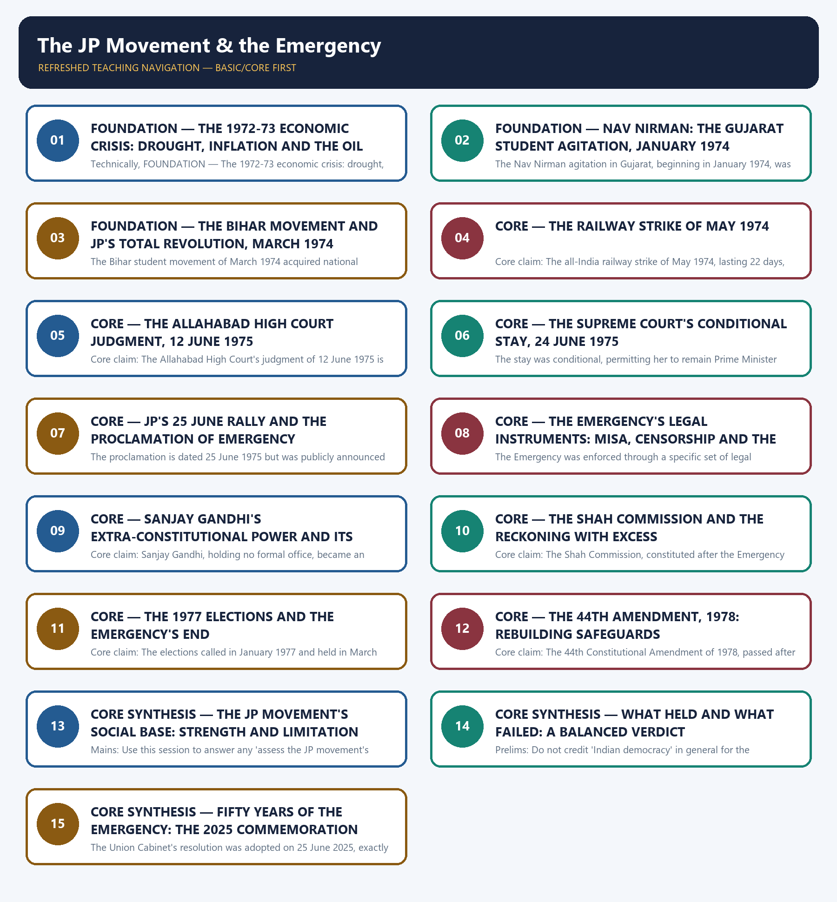

# The JP Movement & the Emergency - Learner-v2 Complete Learning Session

### SOURCE, PROGRESSION AND CURRENT-LINKAGE AUDIT

- **Repository owners queried:** Basic and Advanced Markdown for this topic, the master chronology, syllabus map and linked Modern History owners.
- **OCR book evidence queried:** The Basic and Advanced owner Markdown for this topic were reconciled against each other and against the folder's shared post-independence OCR source, Bipan Chandra, Mridula Mukherjee and Aditya Mukherjee, *India After Independence, 1947–2000*. Every date, name and institution used below already carries the owners' own ✅ (source-backed) or ⚠️ (inference) tagging, and that tagging is preserved rather than re-verified page by page against the raw PDF in this authoring pass.
- **Qdrant:** not used; Markdown plus searchable local PDFs were sufficient.
- **PYQ integrity:** No Prelims or Mains demand in the local 2018-2026 routing ledgers is routed to this owner; this is a transparent zero-direct-PYQ audit rather than an omission, and the owner's own basic and advanced files carry no 'PYQ Integration' section to integrate.
- **Bounded live linkage:** One verified live current-affairs item is preserved for this topic, exactly as recorded by the owner: on 25 June 2025 the Union Cabinet adopted an official resolution commemorating fifty years since the Emergency, honouring resistance to it and reaffirming constitutional democracy (PIB, PRID 2139543); the owner does not record a URL for this press release, so none is invented here, and the bounded wording and PRID citation are preserved rather than expanded with unverified detail.
- **Fact/inference rule:** historical claims are source-backed; analytical judgements are explicitly framed as interpretation and do not invent figures.

## BASIC LEARNING SESSION



*Distinct embedded teaching-navigation image. The separate continuous Cārvāka-style flowchart package remains an independent at-a-glance artifact.*

### SESSION 1 — FOUNDATION — THE 1972-73 ECONOMIC CRISIS: DROUGHT, INFLATION AND THE OIL SHOCK

#### DEFINITION / WHAT THIS IS CALLED

**Plain-language definition:** Precise definition: The 1972-73 economic crisis is the combination of twin monsoon failures, drought and the 1973 oil shock that produced a roughly 22 per cent price rise and eroded Indira Gandhi's post-1971 popularity.

**Technical definition:** Technically, FOUNDATION — The 1972-73 economic crisis: drought, inflation and the oil shock is analysed by relating FOUNDATION to The 1972-73 economic crisis, then testing the relationship through drought and inflation.

#### ANSWER-GRABBING OPENING — WRITE/ADAPT IN THE EXAM

> Precise definition: The 1972-73 economic crisis is the combination of twin monsoon failures, drought and the 1973 oil shock that produced a roughly 22 per cent price rise and eroded Indira Gandhi's post-1971 popularity.

#### MUST-WRITE KEYWORDS

- **FOUNDATION**
- **The 1972-73 economic crisis**
- **drought**
- **inflation**
- **the oil shock**
- **Precise definition**

**How to use them:** Frame the answer through FOUNDATION; define The 1972-73 economic crisis, connect drought with inflation to explain the mechanism, and use the oil shock for the decisive comparison or qualification.

##### VISUAL FIRST

```text
THE 1972-73 ECONOMIC CRISIS: DROUGHT, INFLATION AND THE OIL SHOCK
TWIN MONSOON FAILURES + 1973 OIL SHOCK -> deepening scarcity
PRICE RISE -> about 22 per cent over 1972-73
EFFECT -> inflation, unemployment, food scarcity erode Indira Gandhi's popularity
TIMING -> follows directly on the 1971 Garibi Hatao landslide
```

*The visual fixes this subtopic's chronology, mechanism or boundary before the evidence.*

##### CONCEPT DEFINITIONS

- **Precise definition:** The 1972-73 economic crisis is the combination of twin monsoon failures, drought and the 1973 oil shock that produced a roughly 22 per cent price rise and eroded Indira Gandhi's post-1971 popularity.
- **Topic boundary:** Apply this definition only within The JP Movement & the Emergency; retain the named actor, institution, date and chronological role.

##### CORE EXPLANATION

This topic opens where the previous one closed: the 1971 landslide's popularity was rapidly eroded by an economic crisis of twin monsoon failures, drought and the 1973 oil shock, the material precondition for the movements that followed.

##### EVIDENCE AND MECHANISM

- Two successive monsoon failures produced drought conditions across 1972-73.
- The 1973 oil shock added a further external inflationary pressure on top of the domestic harvest crisis.
- Prices rose by about 22 per cent over 1972-73, eroding Indira Gandhi's popularity within two years of her 1971 landslide.

##### EXAMINER CAUTION

- Do not treat the 1972-73 crisis as unrelated to the 1971 landslide; it directly explains how quickly that popularity eroded.

##### EXAM LINK

- **Prelims:** Do not treat the 1972-73 crisis as unrelated to the 1971 landslide; it directly explains how quickly that popularity eroded.
- **Mains:** Use this session to open any 'origins of the Emergency' Mains answer with its economic precondition.

##### MINI RECAP

- **Core claim:** This topic opens where the previous one closed: the 1971 landslide's popularity was rapidly eroded by an economic crisis of twin monsoon failures, drought and the 1973 oil shock, the material precondition for the movements that followed.
- **Use:** Use this session to open any 'origins of the Emergency' Mains answer with its economic precondition.

#### CLOSING RECALL FLOW — FOUNDATION — THE 1972-73 ECONOMIC CRISIS: DROUGHT, INFLATION AND THE OIL SHOCK

```text
START / CONCEPT: FOUNDATION — The 1972-73 economic crisis: drought, inflation and the oil shock
        |
        v
EXACT TERMS: FOUNDATION · The 1972-73 economic crisis · drought · inflation · the oil shock · Precise definition
        |
        v
MECHANISM / ARGUMENT: This topic opens where the previous one closed: the 1971 landslide's popularity was rapidly eroded by an economic crisis of twin monsoon failures, drought and the 1973 oil shock, the material precondition for the movements that followed.
        |
        v
CONSEQUENCE / CONTRAST: Do not treat the 1972-73 crisis as unrelated to the 1971 landslide; it directly explains how quickly that popularity eroded.
        |
        v
UPSC TRAP / ANSWER-USE: Do not miss this limiting distinction: the 1973 oil shock added a further external inflationary pressure on top of the...
        |
        v
ANSWER-GRABBING FORMULATION: Precise definition: The 1972-73 economic crisis is the combination of twin monsoon failures, drought and the 1973 oil shock that produced a roughly 22 per cent price rise and eroded Indira Gandhi's post-1971 popularity.
```
### SESSION 2 — FOUNDATION — NAV NIRMAN: THE GUJARAT STUDENT AGITATION, JANUARY 1974

#### DEFINITION / WHAT THIS IS CALLED

**Plain-language definition:** Precise definition: Nav Nirman is the student agitation that began in Gujarat in January 1974 over prices and corruption, the first of the movements that fed into the wider crisis of 1974-75.

**Technical definition:** The Nav Nirman agitation in Gujarat, beginning in January 1974, was the first of the student movements that grew out of the 1972-73 economic crisis and set the pattern later followed in Bihar.

#### ANSWER-GRABBING OPENING — WRITE/ADAPT IN THE EXAM

> Precise definition: Nav Nirman is the student agitation that began in Gujarat in January 1974 over prices and corruption, the first of the movements that fed into the wider crisis of 1974-75.

#### MUST-WRITE KEYWORDS

- **FOUNDATION**
- **Nav Nirman**
- **the Gujarat student agitation**
- **January 1974**
- **Precise definition**
- **Topic boundary**

**How to use them:** Frame the answer through FOUNDATION; define Nav Nirman, connect the Gujarat student agitation with January 1974 to explain the mechanism, and use Precise definition for the decisive comparison or qualification.

##### VISUAL FIRST

```text
NAV NIRMAN: THE GUJARAT STUDENT AGITATION, JANUARY 1974
NAV NIRMAN -> Gujarat, JANUARY 1974; students protest prices, corruption
BIHAR MOVEMENT -> MARCH 1974; JP takes leadership
JP'S CALL -> "Total Revolution" / Sampoorna Kranti
SPREAD -> student unrest becomes a nationwide anti-government movement
```

*The visual fixes this subtopic's chronology, mechanism or boundary before the evidence.*

##### CONCEPT DEFINITIONS

- **Precise definition:** Nav Nirman is the student agitation that began in Gujarat in January 1974 over prices and corruption, the first of the movements that fed into the wider crisis of 1974-75.
- **Topic boundary:** Apply this definition only within The JP Movement & the Emergency; retain the named actor, institution, date and chronological role.

##### CORE EXPLANATION

The Nav Nirman agitation in Gujarat, beginning in January 1974, was the first of the student movements that grew out of the 1972-73 economic crisis and set the pattern later followed in Bihar.

##### EVIDENCE AND MECHANISM

- The agitation began in Gujarat in January 1974 over rising prices and allegations of corruption.
- Students led the protest, drawing in the wider middle class rather than organised labour or the rural poor.
- Its success in forcing political change in Gujarat encouraged JP and others to see student mobilisation as a viable route to wider political change.

##### EXAMINER CAUTION

- Do not confuse Nav Nirman with the Bihar movement; Nav Nirman began earlier, in January 1974, and in a different state.

##### EXAM LINK

- **Prelims:** Do not confuse Nav Nirman with the Bihar movement; Nav Nirman began earlier, in January 1974, and in a different state.
- **Mains:** Use this session to answer any 'origins of the JP movement' Mains demand with its precise January 1974 starting point.

##### MINI RECAP

- **Core claim:** The Nav Nirman agitation in Gujarat, beginning in January 1974, was the first of the student movements that grew out of the 1972-73 economic crisis and set the pattern later followed in Bihar.
- **Use:** Use this session to answer any 'origins of the JP movement' Mains demand with its precise January 1974 starting point.

#### CLOSING RECALL FLOW — FOUNDATION — NAV NIRMAN: THE GUJARAT STUDENT AGITATION, JANUARY 1974

```text
START / CONCEPT: FOUNDATION — Nav Nirman: the Gujarat student agitation, January 1974
        |
        v
EXACT TERMS: FOUNDATION · Nav Nirman · the Gujarat student agitation · January 1974 · Precise definition · Topic boundary
        |
        v
MECHANISM / ARGUMENT: The Nav Nirman agitation in Gujarat, beginning in January 1974, was the first of the student movements that grew out of the 1972-73 economic crisis and set the pattern later followed in Bihar.
        |
        v
CONSEQUENCE / CONTRAST: Do not confuse Nav Nirman with the Bihar movement; Nav Nirman began earlier, in January 1974, and in a different state.
        |
        v
UPSC TRAP / ANSWER-USE: Do not miss this limiting distinction: use this session to answer any 'origins of the JP movement' Mains demand with...
        |
        v
ANSWER-GRABBING FORMULATION: Precise definition: Nav Nirman is the student agitation that began in Gujarat in January 1974 over prices and corruption, the first of the movements that fed into the wider crisis of 1974-75.
```
### SESSION 3 — FOUNDATION — THE BIHAR MOVEMENT AND JP'S TOTAL REVOLUTION, MARCH 1974

#### DEFINITION / WHAT THIS IS CALLED

**Plain-language definition:** Precise definition: Total Revolution, or Sampoorna Kranti, is Jayaprakash Narayan's call, from March 1974, for sweeping change against corruption and misgovernance beyond ordinary electoral politics.

**Technical definition:** The Bihar student movement of March 1974 acquired national significance once Jayaprakash Narayan took its leadership and reframed it as 'Total Revolution', or Sampoorna Kranti, against corruption and misgovernance.

#### ANSWER-GRABBING OPENING — WRITE/ADAPT IN THE EXAM

> Precise definition: Total Revolution, or Sampoorna Kranti, is Jayaprakash Narayan's call, from March 1974, for sweeping change against corruption and misgovernance beyond ordinary electoral politics.

#### MUST-WRITE KEYWORDS

- **FOUNDATION**
- **The Bihar movement**
- **JP's Total Revolution**
- **March 1974**
- **Precise definition**
- **Topic boundary**

**How to use them:** Frame the answer through FOUNDATION; define The Bihar movement, connect JP's Total Revolution with March 1974 to explain the mechanism, and use Precise definition for the decisive comparison or qualification.

##### VISUAL FIRST

```text
THE BIHAR MOVEMENT AND JP'S TOTAL REVOLUTION, MARCH 1974
BIHAR MOVEMENT -> begins MARCH 1974; local grievances, like Nav Nirman's
JP TAKES LEADERSHIP -> converts a state agitation into a national challenge
JP'S CALL -> "Total Revolution" / Sampoorna Kranti
SCOPE -> moral appeals to state institutions, beyond electoral politics alone
```

*The visual fixes this subtopic's chronology, mechanism or boundary before the evidence.*

##### CONCEPT DEFINITIONS

- **Precise definition:** Total Revolution, or Sampoorna Kranti, is Jayaprakash Narayan's call, from March 1974, for sweeping change against corruption and misgovernance beyond ordinary electoral politics.
- **Topic boundary:** Apply this definition only within The JP Movement & the Emergency; retain the named actor, institution, date and chronological role.

##### CORE EXPLANATION

The Bihar student movement of March 1974 acquired national significance once Jayaprakash Narayan took its leadership and reframed it as 'Total Revolution', or Sampoorna Kranti, against corruption and misgovernance.

##### EVIDENCE AND MECHANISM

- The Bihar student movement began in March 1974, initially over local grievances similar to Nav Nirman's.
- Jayaprakash Narayan, known as JP, assumed leadership of the movement and gave it an all-India political frame.
- 'Total Revolution' called for sweeping change beyond electoral politics, including moral appeals to state institutions.

##### EXAMINER CAUTION

- Do not describe JP's movement as confined to Bihar; his leadership converted a state agitation into a national political challenge.

##### EXAM LINK

- **Prelims:** Do not describe JP's movement as confined to Bihar; his leadership converted a state agitation into a national political challenge.
- **Mains:** Use this session to answer any 'JP's role in Indian democracy' Mains demand with the precise March 1974 starting point and the Total Revolution frame.

##### MINI RECAP

- **Core claim:** The Bihar student movement of March 1974 acquired national significance once Jayaprakash Narayan took its leadership and reframed it as 'Total Revolution', or Sampoorna Kranti, against corruption and misgovernance.
- **Use:** Use this session to answer any 'JP's role in Indian democracy' Mains demand with the precise March 1974 starting point and the Total Revolution frame.

#### CLOSING RECALL FLOW — FOUNDATION — THE BIHAR MOVEMENT AND JP'S TOTAL REVOLUTION, MARCH 1974

```text
START / CONCEPT: FOUNDATION — The Bihar movement and JP's Total Revolution, March 1974
        |
        v
EXACT TERMS: FOUNDATION · The Bihar movement · JP's Total Revolution · March 1974 · Precise definition · Topic boundary
        |
        v
MECHANISM / ARGUMENT: The Bihar student movement of March 1974 acquired national significance once Jayaprakash Narayan took its leadership and reframed it as 'Total Revolution', or Sampoorna Kranti, against corruption and misgovernance.
        |
        v
CONSEQUENCE / CONTRAST: Do not describe JP's movement as confined to Bihar; his leadership converted a state agitation into a national political challenge.
        |
        v
UPSC TRAP / ANSWER-USE: Do not miss this limiting distinction: use this session to answer any 'JP's role in Indian democracy' Mains demand with...
        |
        v
ANSWER-GRABBING FORMULATION: Precise definition: Total Revolution, or Sampoorna Kranti, is Jayaprakash Narayan's call, from March 1974, for sweeping change against corruption and misgovernance beyond ordinary electoral politics.
```
### SESSION 4 — CORE — THE RAILWAY STRIKE OF MAY 1974

#### DEFINITION / WHAT THIS IS CALLED

**Plain-language definition:** Precise definition: The railway strike of May 1974 is the 22-day all-India strike that added economic disruption to the political crisis building around the JP movement.

**Technical definition:** Core claim: The all-India railway strike of May 1974, lasting 22 days, added a direct economic challenge to the government on top of the political pressure already building from the student movements.

#### ANSWER-GRABBING OPENING — WRITE/ADAPT IN THE EXAM

> Precise definition: The railway strike of May 1974 is the 22-day all-India strike that added economic disruption to the political crisis building around the JP movement.

#### MUST-WRITE KEYWORDS

- **The railway strike of May 1974**
- **Precise definition**
- **Topic boundary**
- **Core claim**
- **Precise definition: The railway strike of May 1974**
- **Precise**

**How to use them:** Frame the answer through The railway strike of May 1974; define Precise definition, connect Topic boundary with Core claim to explain the mechanism, and use Precise definition: The railway strike of May 1974 for the decisive comparison or qualification.

##### VISUAL FIRST

```text
THE RAILWAY STRIKE OF MAY 1974
ALL-INDIA RAILWAY STRIKE -> MAY 1974, lasting 22 days
DIRECT CHALLENGE -> to the government's authority
ADDED DIMENSION -> economic disruption layered onto the political crisis
CONTEXT -> deepens the crisis JP's movement was already building on
```

*The visual fixes this subtopic's chronology, mechanism or boundary before the evidence.*

##### CONCEPT DEFINITIONS

- **Precise definition:** The railway strike of May 1974 is the 22-day all-India strike that added economic disruption to the political crisis building around the JP movement.
- **Topic boundary:** Apply this definition only within The JP Movement & the Emergency; retain the named actor, institution, date and chronological role.

##### CORE EXPLANATION

The all-India railway strike of May 1974, lasting 22 days, added a direct economic challenge to the government on top of the political pressure already building from the student movements.

##### EVIDENCE AND MECHANISM

- The strike was all-India in scope and lasted 22 days in May 1974.
- It directly challenged the government's authority over essential services.
- Its economic disruption compounded the political crisis JP's movement was already generating.

##### EXAMINER CAUTION

- Do not treat the railway strike as separate from the political crisis of 1974; it added an economic dimension to the same building confrontation.

##### EXAM LINK

- **Prelims:** Do not treat the railway strike as separate from the political crisis of 1974; it added an economic dimension to the same building confrontation.
- **Mains:** Use this session to answer any 'economic dimensions of the pre-Emergency crisis' Mains demand.

##### MINI RECAP

- **Core claim:** The all-India railway strike of May 1974, lasting 22 days, added a direct economic challenge to the government on top of the political pressure already building from the student movements.
- **Use:** Use this session to answer any 'economic dimensions of the pre-Emergency crisis' Mains demand.

#### CLOSING RECALL FLOW — CORE — THE RAILWAY STRIKE OF MAY 1974

```text
START / CONCEPT: CORE — The railway strike of May 1974
        |
        v
EXACT TERMS: The railway strike of May 1974 · Precise definition · Topic boundary · Core claim · Precise definition: The railway strike of May 1974 · Precise
        |
        v
MECHANISM / ARGUMENT: Core claim: The all-India railway strike of May 1974, lasting 22 days, added a direct economic challenge to the government on top of the political pressure already building from the student movements.
        |
        v
CONSEQUENCE / CONTRAST: Do not treat the railway strike as separate from the political crisis of 1974; it added an economic dimension to the same building confrontation.
        |
        v
UPSC TRAP / ANSWER-USE: Do not miss this limiting distinction: the strike was all-India in scope and lasted 22 days in May 1974.
        |
        v
ANSWER-GRABBING FORMULATION: Precise definition: The railway strike of May 1974 is the 22-day all-India strike that added economic disruption to the political crisis building around the JP movement.
```
### SESSION 5 — CORE — THE ALLAHABAD HIGH COURT JUDGMENT, 12 JUNE 1975

#### DEFINITION / WHAT THIS IS CALLED

**Plain-language definition:** Precise definition: The Allahabad High Court judgment of 12 June 1975 is Justice Jagmohanlal Sinha's ruling, on Raj Narain's petition, that set aside Indira Gandhi's 1971 election.

**Technical definition:** Core claim: The Allahabad High Court's judgment of 12 June 1975 is the legal crisis that converted a building political confrontation into an immediate personal threat to Indira Gandhi's premiership.

#### ANSWER-GRABBING OPENING — WRITE/ADAPT IN THE EXAM

> Precise definition: The Allahabad High Court judgment of 12 June 1975 is Justice Jagmohanlal Sinha's ruling, on Raj Narain's petition, that set aside Indira Gandhi's 1971 election.

#### MUST-WRITE KEYWORDS

- **The Allahabad High Court judgment**
- **Precise definition**
- **Topic boundary**
- **Core claim**
- **Precise**
- **12 June 1975**

**How to use them:** Frame the answer through The Allahabad High Court judgment; define Precise definition, connect Topic boundary with Core claim to explain the mechanism, and use Precise for the decisive comparison or qualification.

##### VISUAL FIRST

```text
THE ALLAHABAD HIGH COURT JUDGMENT, 12 JUNE 1975
PETITIONER -> Raj Narain
JUDGE -> Justice Jagmohanlal Sinha, Allahabad High Court
DATE -> 12 JUNE 1975
RULING -> sets aside Indira Gandhi's 1971 election on electoral malpractice
```

*The visual fixes this subtopic's chronology, mechanism or boundary before the evidence.*

##### CONCEPT DEFINITIONS

- **Precise definition:** The Allahabad High Court judgment of 12 June 1975 is Justice Jagmohanlal Sinha's ruling, on Raj Narain's petition, that set aside Indira Gandhi's 1971 election.
- **Topic boundary:** Apply this definition only within The JP Movement & the Emergency; retain the named actor, institution, date and chronological role.

##### CORE EXPLANATION

The Allahabad High Court's judgment of 12 June 1975 is the legal crisis that converted a building political confrontation into an immediate personal threat to Indira Gandhi's premiership.

##### EVIDENCE AND MECHANISM

- Raj Narain's petition challenged Indira Gandhi's 1971 election on grounds of electoral malpractice.
- Justice Jagmohanlal Sinha delivered the judgment on 12 June 1975, setting aside her election.
- The verdict, if it stood unmodified, would have disqualified her from the Lok Sabha and the premiership.

##### EXAMINER CAUTION

- Indira Gandhi was unseated by the Allahabad High Court, not the Supreme Court; keep the two courts and their rulings distinct.

##### EXAM LINK

- **Prelims:** Indira Gandhi was unseated by the Allahabad High Court, not the Supreme Court; keep the two courts and their rulings distinct.
- **Mains:** Use this session to answer any 'immediate trigger for the Emergency' Mains demand with the precise court, judge and date.

##### MINI RECAP

- **Core claim:** The Allahabad High Court's judgment of 12 June 1975 is the legal crisis that converted a building political confrontation into an immediate personal threat to Indira Gandhi's premiership.
- **Use:** Use this session to answer any 'immediate trigger for the Emergency' Mains demand with the precise court, judge and date.

#### CLOSING RECALL FLOW — CORE — THE ALLAHABAD HIGH COURT JUDGMENT, 12 JUNE 1975

```text
START / CONCEPT: CORE — The Allahabad High Court judgment, 12 June 1975
        |
        v
EXACT TERMS: The Allahabad High Court judgment · Precise definition · Topic boundary · Core claim · Precise · 12 June 1975
        |
        v
MECHANISM / ARGUMENT: Indira Gandhi was unseated by the Allahabad High Court, not the Supreme Court; keep the two courts and their rulings distinct.
        |
        v
CONSEQUENCE / CONTRAST: Core claim: The Allahabad High Court's judgment of 12 June 1975 is the legal crisis that converted a building political confrontation into an immediate personal threat to Indira Gandhi's premiership.
        |
        v
UPSC TRAP / ANSWER-USE: Do not miss this limiting distinction: use this session to answer any 'immediate trigger for the Emergency' Mains demand with...
        |
        v
ANSWER-GRABBING FORMULATION: Precise definition: The Allahabad High Court judgment of 12 June 1975 is Justice Jagmohanlal Sinha's ruling, on Raj Narain's petition, that set aside Indira Gandhi's 1971 election.
```
### SESSION 6 — CORE — THE SUPREME COURT'S CONDITIONAL STAY, 24 JUNE 1975

#### DEFINITION / WHAT THIS IS CALLED

**Plain-language definition:** Precise definition: The Supreme Court's conditional stay of 24 June 1975 is Justice V.R.

**Technical definition:** The stay was conditional, permitting her to remain Prime Minister while the appeal against the Allahabad judgment was pending.

#### ANSWER-GRABBING OPENING — WRITE/ADAPT IN THE EXAM

> Precise definition: The Supreme Court's conditional stay of 24 June 1975 is Justice V.R.

#### MUST-WRITE KEYWORDS

- **The Supreme Court's conditional stay**
- **Precise definition**
- **Topic boundary**
- **Core claim**
- **Precise**
- **24 June 1975**

**How to use them:** Frame the answer through The Supreme Court's conditional stay; define Precise definition, connect Topic boundary with Core claim to explain the mechanism, and use Precise for the decisive comparison or qualification.

##### VISUAL FIRST

```text
THE SUPREME COURT'S CONDITIONAL STAY, 24 JUNE 1975
COURT -> Supreme Court, Justice V.R. Krishna Iyer
DATE -> 24 JUNE 1975
RULING -> CONDITIONAL stay of the Allahabad verdict
EFFECT -> Indira Gandhi remains Prime Minister while the appeal is pending
```

*The visual fixes this subtopic's chronology, mechanism or boundary before the evidence.*

##### CONCEPT DEFINITIONS

- **Precise definition:** The Supreme Court's conditional stay of 24 June 1975 is Justice V.R. Krishna Iyer's ruling permitting Indira Gandhi to remain Prime Minister pending appeal of the Allahabad judgment.
- **Topic boundary:** Apply this definition only within The JP Movement & the Emergency; retain the named actor, institution, date and chronological role.

##### CORE EXPLANATION

The Supreme Court's conditional stay of 24 June 1975 kept Indira Gandhi in office pending appeal, but only conditionally, leaving her political and legal position unresolved in the days before the Emergency.

##### EVIDENCE AND MECHANISM

- Justice V.R. Krishna Iyer granted the stay on 24 June 1975.
- The stay was conditional, permitting her to remain Prime Minister while the appeal against the Allahabad judgment was pending.
- The stay did not resolve the underlying legal challenge, leaving political uncertainty that fed directly into the events of the following two days.

##### EXAMINER CAUTION

- The Supreme Court granted only a conditional stay on 24 June 1975; it did not overturn the Allahabad High Court's judgment.

##### EXAM LINK

- **Prelims:** The Supreme Court granted only a conditional stay on 24 June 1975; it did not overturn the Allahabad High Court's judgment.
- **Mains:** Use this session to answer any 'sequence of events before the Emergency' Mains demand with the precise 24 June date and judge.

##### MINI RECAP

- **Core claim:** The Supreme Court's conditional stay of 24 June 1975 kept Indira Gandhi in office pending appeal, but only conditionally, leaving her political and legal position unresolved in the days before the Emergency.
- **Use:** Use this session to answer any 'sequence of events before the Emergency' Mains demand with the precise 24 June date and judge.

#### CLOSING RECALL FLOW — CORE — THE SUPREME COURT'S CONDITIONAL STAY, 24 JUNE 1975

```text
START / CONCEPT: CORE — The Supreme Court's conditional stay, 24 June 1975
        |
        v
EXACT TERMS: The Supreme Court's conditional stay · Precise definition · Topic boundary · Core claim · Precise · 24 June 1975
        |
        v
MECHANISM / ARGUMENT: The stay was conditional, permitting her to remain Prime Minister while the appeal against the Allahabad judgment was pending.
        |
        v
CONSEQUENCE / CONTRAST: Mains: Use this session to answer any 'sequence of events before the Emergency' Mains demand with the precise 24 June date and judge.
        |
        v
UPSC TRAP / ANSWER-USE: Do not miss this limiting distinction: the Supreme Court's conditional stay of 24 June 1975 is Justice V.R.
        |
        v
ANSWER-GRABBING FORMULATION: Precise definition: The Supreme Court's conditional stay of 24 June 1975 is Justice V.R.
```
### SESSION 7 — CORE — JP'S 25 JUNE RALLY AND THE PROCLAMATION OF EMERGENCY

#### DEFINITION / WHAT THIS IS CALLED

**Plain-language definition:** Precise definition: The Emergency proclamation is the Article 352 declaration dated 25 June 1975 but publicly announced only on 26 June 1975, issued the same day as JP's Delhi rally.

**Technical definition:** The proclamation is dated 25 June 1975 but was publicly announced on 26 June 1975; the two dates must not be collapsed into one.

#### ANSWER-GRABBING OPENING — WRITE/ADAPT IN THE EXAM

> Precise definition: The Emergency proclamation is the Article 352 declaration dated 25 June 1975 but publicly announced only on 26 June 1975, issued the same day as JP's Delhi rally.

#### MUST-WRITE KEYWORDS

- **JP's 25 June rally**
- **the proclamation of Emergency**
- **Precise definition**
- **Topic boundary**
- **Core claim**
- **Article 352**

**How to use them:** Frame the answer through JP's 25 June rally; define the proclamation of Emergency, connect Precise definition with Topic boundary to explain the mechanism, and use Core claim for the decisive comparison or qualification.

##### VISUAL FIRST

```text
JP'S 25 JUNE RALLY AND THE PROCLAMATION OF EMERGENCY
JP'S DELHI RALLY -> 25 JUNE 1975; calls for civil disobedience
PROCLAMATION -> Article 352, DATED 25 JUNE 1975
PUBLIC ANNOUNCEMENT -> only on 26 JUNE 1975
TRAP -> the two dates must never be collapsed into one
```

*The visual fixes this subtopic's chronology, mechanism or boundary before the evidence.*

##### CONCEPT DEFINITIONS

- **Precise definition:** The Emergency proclamation is the Article 352 declaration dated 25 June 1975 but publicly announced only on 26 June 1975, issued the same day as JP's Delhi rally.
- **Topic boundary:** Apply this definition only within The JP Movement & the Emergency; retain the named actor, institution, date and chronological role.

##### CORE EXPLANATION

JP's mass rally in Delhi on 25 June 1975 and the Emergency proclamation dated the same day converged within hours, though the proclamation was only publicly announced the following morning.

##### EVIDENCE AND MECHANISM

- Jayaprakash Narayan addressed a mass rally in Delhi on 25 June 1975, calling for a countrywide programme of civil disobedience.
- The national Emergency was proclaimed under Article 352 with the proclamation dated 25 June 1975.
- The proclamation was publicly announced only on 26 June 1975, and opposition leaders were arrested under MISA.

##### EXAMINER CAUTION

- The proclamation is dated 25 June 1975 but was publicly announced on 26 June 1975; the two dates must not be collapsed into one.

##### EXAM LINK

- **Prelims:** The proclamation is dated 25 June 1975 but was publicly announced on 26 June 1975; the two dates must not be collapsed into one.
- **Mains:** Use the precise 25/26 June sequence to answer any 'exact chronology of the Emergency's declaration' Prelims-style demand.

##### MINI RECAP

- **Core claim:** JP's mass rally in Delhi on 25 June 1975 and the Emergency proclamation dated the same day converged within hours, though the proclamation was only publicly announced the following morning.
- **Use:** Use the precise 25/26 June sequence to answer any 'exact chronology of the Emergency's declaration' Prelims-style demand.

#### CLOSING RECALL FLOW — CORE — JP'S 25 JUNE RALLY AND THE PROCLAMATION OF EMERGENCY

```text
START / CONCEPT: CORE — JP's 25 June rally and the proclamation of Emergency
        |
        v
EXACT TERMS: JP's 25 June rally · the proclamation of Emergency · Precise definition · Topic boundary · Core claim · Article 352
        |
        v
MECHANISM / ARGUMENT: Core claim: JP's mass rally in Delhi on 25 June 1975 and the Emergency proclamation dated the same day converged within hours, though the proclamation was only publicly announced the following morning.
        |
        v
CONSEQUENCE / CONTRAST: The proclamation is dated 25 June 1975 but was publicly announced on 26 June 1975; the two dates must not be collapsed into one.
        |
        v
UPSC TRAP / ANSWER-USE: the two dates must never be collapsed into one.
        |
        v
ANSWER-GRABBING FORMULATION: Precise definition: The Emergency proclamation is the Article 352 declaration dated 25 June 1975 but publicly announced only on 26 June 1975, issued the same day as JP's Delhi rally.
```
### SESSION 8 — CORE — THE EMERGENCY'S LEGAL INSTRUMENTS: MISA, CENSORSHIP AND THE 42ND AMENDMENT

#### DEFINITION / WHAT THIS IS CALLED

**Plain-language definition:** Precise definition: MISA, the Maintenance of Internal Security Act, is the law under which over 100,000 people were detained without trial during the Emergency, alongside press censorship and the 42nd Amendment.

**Technical definition:** The Emergency was enforced through a specific set of legal instruments: detentions under MISA, press censorship, and the 42nd Amendment of 1976 that expanded central and executive power.

#### ANSWER-GRABBING OPENING — WRITE/ADAPT IN THE EXAM

> Precise definition: MISA, the Maintenance of Internal Security Act, is the law under which over 100,000 people were detained without trial during the Emergency, alongside press censorship and the 42nd Amendment.

#### MUST-WRITE KEYWORDS

- **The Emergency's legal instruments**
- **MISA**
- **censorship**
- **the 42nd Amendment**
- **Precise definition**
- **Topic boundary**

**How to use them:** Frame the answer through The Emergency's legal instruments; define MISA, connect censorship with the 42nd Amendment to explain the mechanism, and use Precise definition for the decisive comparison or qualification.

##### VISUAL FIRST

```text
THE EMERGENCY'S LEGAL INSTRUMENTS: MISA, CENSORSHIP AND THE 42ND AMENDMENT
DETENTIONS -> under MISA; over 100,000 held without trial, ~19 months
PRESS -> censorship imposed
CONSTITUTIONAL CHANGE -> 42nd Amendment, 1976; expands central/executive power
AGENDA -> Twenty-Point Programme, 1 July 1975
```

*The visual fixes this subtopic's chronology, mechanism or boundary before the evidence.*

##### CONCEPT DEFINITIONS

- **Precise definition:** MISA, the Maintenance of Internal Security Act, is the law under which over 100,000 people were detained without trial during the Emergency, alongside press censorship and the 42nd Amendment.
- **Topic boundary:** Apply this definition only within The JP Movement & the Emergency; retain the named actor, institution, date and chronological role.

##### CORE EXPLANATION

The Emergency was enforced through a specific set of legal instruments: detentions under MISA, press censorship, and the 42nd Amendment of 1976 that expanded central and executive power.

##### EVIDENCE AND MECHANISM

- Over 100,000 people were detained without trial under MISA over the roughly nineteen months of the Emergency.
- The press was censored, restricting reporting on detentions and government actions.
- The 42nd Constitutional Amendment of 1976 expanded central and executive power and curtailed several rights safeguards.

##### EXAMINER CAUTION

- Do not quantify sterilisations or demolitions with specific figures; only the approximate MISA detention figure of over 100,000 is recorded in the owner sources.

##### EXAM LINK

- **Prelims:** Do not quantify sterilisations or demolitions with specific figures; only the approximate MISA detention figure of over 100,000 is recorded in the owner sources.
- **Mains:** Use this session to answer any 'instruments of authoritarian rule during the Emergency' Mains demand.

##### MINI RECAP

- **Core claim:** The Emergency was enforced through a specific set of legal instruments: detentions under MISA, press censorship, and the 42nd Amendment of 1976 that expanded central and executive power.
- **Use:** Use this session to answer any 'instruments of authoritarian rule during the Emergency' Mains demand.

#### CLOSING RECALL FLOW — CORE — THE EMERGENCY'S LEGAL INSTRUMENTS: MISA, CENSORSHIP AND THE 42ND AMENDMENT

```text
START / CONCEPT: CORE — The Emergency's legal instruments: MISA, censorship and the 42nd Amendment
        |
        v
EXACT TERMS: The Emergency's legal instruments · MISA · censorship · the 42nd Amendment · Precise definition · Topic boundary
        |
        v
MECHANISM / ARGUMENT: The Emergency was enforced through a specific set of legal instruments: detentions under MISA, press censorship, and the 42nd Amendment of 1976 that expanded central and executive power.
        |
        v
CONSEQUENCE / CONTRAST: Do not quantify sterilisations or demolitions with specific figures; only the approximate MISA detention figure of over 100,000 is recorded in the owner sources.
        |
        v
UPSC TRAP / ANSWER-USE: Do not miss this limiting distinction: over 100,000 people were detained without trial under MISA over the roughly nineteen months...
        |
        v
ANSWER-GRABBING FORMULATION: Precise definition: MISA, the Maintenance of Internal Security Act, is the law under which over 100,000 people were detained without trial during the Emergency, alongside press censorship and the 42nd Amendment.
```
### SESSION 9 — CORE — SANJAY GANDHI'S EXTRA-CONSTITUTIONAL POWER AND ITS EXCESSES

#### DEFINITION / WHAT THIS IS CALLED

**Plain-language definition:** Precise definition: Sanjay Gandhi is Indira Gandhi's son who, holding no formal office, became an extra-constitutional power centre during the Emergency, associated with coercive sterilisation and slum-demolition excesses.

**Technical definition:** Core claim: Sanjay Gandhi, holding no formal office, became an extra-constitutional centre of power during the Emergency, and the excesses carried out under his influence, compulsory sterilisation and slum demolition, became the era's most damaging legacy.

#### ANSWER-GRABBING OPENING — WRITE/ADAPT IN THE EXAM

> Precise definition: Sanjay Gandhi is Indira Gandhi's son who, holding no formal office, became an extra-constitutional power centre during the Emergency, associated with coercive sterilisation and slum-demolition excesses.

#### MUST-WRITE KEYWORDS

- **Sanjay Gandhi's extra-constitutional power**
- **its excesses**
- **Precise definition**
- **Topic boundary**
- **Core claim**
- **Precise definition: Sanjay Gandhi**

**How to use them:** Frame the answer through Sanjay Gandhi's extra-constitutional power; define its excesses, connect Precise definition with Topic boundary to explain the mechanism, and use Core claim for the decisive comparison or qualification.

##### VISUAL FIRST

```text
SANJAY GANDHI'S EXTRA-CONSTITUTIONAL POWER AND ITS EXCESSES
POSITION -> no formal office; extra-constitutional power centre
PROGRAMME -> his own four-point programme, 1976
EXCESSES -> compulsory sterilisation drives
EXCESSES -> slum-demolition drives
```

*The visual fixes this subtopic's chronology, mechanism or boundary before the evidence.*

##### CONCEPT DEFINITIONS

- **Precise definition:** Sanjay Gandhi is Indira Gandhi's son who, holding no formal office, became an extra-constitutional power centre during the Emergency, associated with coercive sterilisation and slum-demolition excesses.
- **Topic boundary:** Apply this definition only within The JP Movement & the Emergency; retain the named actor, institution, date and chronological role.

##### CORE EXPLANATION

Sanjay Gandhi, holding no formal office, became an extra-constitutional centre of power during the Emergency, and the excesses carried out under his influence, compulsory sterilisation and slum demolition, became the era's most damaging legacy.

##### EVIDENCE AND MECHANISM

- Sanjay Gandhi held no formal government or party office yet exercised substantial influence over policy.
- He promoted his own four-point programme in 1976, alongside the government's Twenty-Point Programme.
- Compulsory sterilisation and slum-demolition drives carried out under his influence became the Emergency's most criticised excesses.

##### EXAMINER CAUTION

- Coercive sterilisation was not a marginal issue; it was among the most decisive causes of the Congress's 1977 defeat.

##### EXAM LINK

- **Prelims:** Coercive sterilisation was not a marginal issue; it was among the most decisive causes of the Congress's 1977 defeat.
- **Mains:** Use this session to answer any 'excesses of the Emergency' Mains demand with concrete, source-backed examples.

##### MINI RECAP

- **Core claim:** Sanjay Gandhi, holding no formal office, became an extra-constitutional centre of power during the Emergency, and the excesses carried out under his influence, compulsory sterilisation and slum demolition, became the era's most damaging legacy.
- **Use:** Use this session to answer any 'excesses of the Emergency' Mains demand with concrete, source-backed examples.

#### CLOSING RECALL FLOW — CORE — SANJAY GANDHI'S EXTRA-CONSTITUTIONAL POWER AND ITS EXCESSES

```text
START / CONCEPT: CORE — Sanjay Gandhi's extra-constitutional power and its excesses
        |
        v
EXACT TERMS: Sanjay Gandhi's extra-constitutional power · its excesses · Precise definition · Topic boundary · Core claim · Precise definition: Sanjay Gandhi
        |
        v
MECHANISM / ARGUMENT: Core claim: Sanjay Gandhi, holding no formal office, became an extra-constitutional centre of power during the Emergency, and the excesses carried out under his influence, compulsory sterilisation and slum demolition, became the era's most damaging legacy.
        |
        v
CONSEQUENCE / CONTRAST: Coercive sterilisation was not a marginal issue; it was among the most decisive causes of the Congress's 1977 defeat.
        |
        v
UPSC TRAP / ANSWER-USE: Do not miss this limiting distinction: compulsory sterilisation and slum-demolition drives carried out under his influence became the Emergency's most...
        |
        v
ANSWER-GRABBING FORMULATION: Precise definition: Sanjay Gandhi is Indira Gandhi's son who, holding no formal office, became an extra-constitutional power centre during the Emergency, associated with coercive sterilisation and slum-demolition excesses.
```
### SESSION 10 — CORE — THE SHAH COMMISSION AND THE RECKONING WITH EXCESS

#### DEFINITION / WHAT THIS IS CALLED

**Plain-language definition:** Precise definition: The Shah Commission is the official inquiry, constituted after the Emergency ended, into the abuses of power committed during it.

**Technical definition:** Core claim: The Shah Commission, constituted after the Emergency ended, carried out the formal official reckoning with its excesses, examining the abuses of power that had gone uninvestigated while the Emergency itself was in force.

#### ANSWER-GRABBING OPENING — WRITE/ADAPT IN THE EXAM

> Core claim: The Shah Commission, constituted after the Emergency ended, carried out the formal official reckoning with its excesses, examining the abuses of power that had gone uninvestigated while the Emergency itself was in force.

#### MUST-WRITE KEYWORDS

- **The Shah Commission**
- **the reckoning with excess**
- **Precise definition**
- **Topic boundary**
- **Core claim**
- **1975-77**

**How to use them:** Frame the answer through The Shah Commission; define the reckoning with excess, connect Precise definition with Topic boundary to explain the mechanism, and use Core claim for the decisive comparison or qualification.

##### VISUAL FIRST

```text
THE SHAH COMMISSION AND THE RECKONING WITH EXCESS
SANJAY GANDHI EXCESSES -> sterilisation and demolition drives, 1975-77
SHAH COMMISSION -> constituted AFTER the Emergency ended
FUNCTION -> formal inquiry into abuses of power during the Emergency
OUTCOME -> documentary record cited in later accounts of the Emergency
```

*The visual fixes this subtopic's chronology, mechanism or boundary before the evidence.*

##### CONCEPT DEFINITIONS

- **Precise definition:** The Shah Commission is the official inquiry, constituted after the Emergency ended, into the abuses of power committed during it.
- **Topic boundary:** Apply this definition only within The JP Movement & the Emergency; retain the named actor, institution, date and chronological role.

##### CORE EXPLANATION

The Shah Commission, constituted after the Emergency ended, carried out the formal official reckoning with its excesses, examining the abuses of power that had gone uninvestigated while the Emergency itself was in force.

##### EVIDENCE AND MECHANISM

- The Shah Commission was constituted after the Emergency ended, once the change of government made such an inquiry possible.
- It examined abuses of power, including detentions and excesses attributed to Sanjay Gandhi's circle.
- Its findings supplied the documentary record later cited in accounts of the Emergency's excesses.

##### EXAMINER CAUTION

- The Shah Commission inquired into Emergency excesses after the Emergency had ended, not during it.

##### EXAM LINK

- **Prelims:** The Shah Commission inquired into Emergency excesses after the Emergency had ended, not during it.
- **Mains:** Use this session to answer any 'official reckoning with Emergency excesses' Mains demand with the correct post-Emergency timing.

##### MINI RECAP

- **Core claim:** The Shah Commission, constituted after the Emergency ended, carried out the formal official reckoning with its excesses, examining the abuses of power that had gone uninvestigated while the Emergency itself was in force.
- **Use:** Use this session to answer any 'official reckoning with Emergency excesses' Mains demand with the correct post-Emergency timing.

#### CLOSING RECALL FLOW — CORE — THE SHAH COMMISSION AND THE RECKONING WITH EXCESS

```text
START / CONCEPT: CORE — The Shah Commission and the reckoning with excess
        |
        v
EXACT TERMS: The Shah Commission · the reckoning with excess · Precise definition · Topic boundary · Core claim · 1975-77
        |
        v
MECHANISM / ARGUMENT: Precise definition: The Shah Commission is the official inquiry, constituted after the Emergency ended, into the abuses of power committed during it.
        |
        v
CONSEQUENCE / CONTRAST: The Shah Commission inquired into Emergency excesses after the Emergency had ended, not during it.
        |
        v
UPSC TRAP / ANSWER-USE: Do not miss this limiting distinction: the Shah Commission was constituted after the Emergency ended, once the change of government...
        |
        v
ANSWER-GRABBING FORMULATION: Core claim: The Shah Commission, constituted after the Emergency ended, carried out the formal official reckoning with its excesses, examining the abuses of power that had gone uninvestigated while the Emergency itself was in force.
```
### SESSION 11 — CORE — THE 1977 ELECTIONS AND THE EMERGENCY'S END

#### DEFINITION / WHAT THIS IS CALLED

**Plain-language definition:** Precise definition: The 1977 elections, called in January and held in March, are the polls that defeated Congress and Sanjay Gandhi and ended the Emergency.

**Technical definition:** Core claim: The elections called in January 1977 and held in March 1977 delivered the electoral verdict that ended the Emergency, defeating both the Congress and Sanjay Gandhi personally.

#### ANSWER-GRABBING OPENING — WRITE/ADAPT IN THE EXAM

> Precise definition: The 1977 elections, called in January and held in March, are the polls that defeated Congress and Sanjay Gandhi and ended the Emergency.

#### MUST-WRITE KEYWORDS

- **The 1977 elections**
- **the Emergency's end**
- **Precise definition**
- **Topic boundary**
- **Core claim**
- **Precise**

**How to use them:** Frame the answer through The 1977 elections; define the Emergency's end, connect Precise definition with Topic boundary to explain the mechanism, and use Core claim for the decisive comparison or qualification.

##### VISUAL FIRST

```text
THE 1977 ELECTIONS AND THE EMERGENCY'S END
ELECTIONS CALLED -> January 1977
ELECTIONS HELD -> March 1977
RESULT -> Congress and Sanjay Gandhi defeated
MEANING -> a verdict FOR civil liberties; ends the Emergency
```

*The visual fixes this subtopic's chronology, mechanism or boundary before the evidence.*

##### CONCEPT DEFINITIONS

- **Precise definition:** The 1977 elections, called in January and held in March, are the polls that defeated Congress and Sanjay Gandhi and ended the Emergency.
- **Topic boundary:** Apply this definition only within The JP Movement & the Emergency; retain the named actor, institution, date and chronological role.

##### CORE EXPLANATION

The elections called in January 1977 and held in March 1977 delivered the electoral verdict that ended the Emergency, defeating both the Congress and Sanjay Gandhi personally.

##### EVIDENCE AND MECHANISM

- Elections were called in January 1977 after the Emergency had lasted roughly nineteen months.
- Polling was held in March 1977, and the electorate defeated Congress and Sanjay Gandhi.
- The defeat is read as a verdict for civil liberties rather than merely an anti-incumbency result.

##### EXAMINER CAUTION

- The Emergency was ended by the 1977 electoral verdict, not by any court ruling.

##### EXAM LINK

- **Prelims:** The Emergency was ended by the 1977 electoral verdict, not by any court ruling.
- **Mains:** Use this session to answer any 'how did the Emergency end' Mains demand with the precise January-to-March 1977 sequence.

##### MINI RECAP

- **Core claim:** The elections called in January 1977 and held in March 1977 delivered the electoral verdict that ended the Emergency, defeating both the Congress and Sanjay Gandhi personally.
- **Use:** Use this session to answer any 'how did the Emergency end' Mains demand with the precise January-to-March 1977 sequence.

#### CLOSING RECALL FLOW — CORE — THE 1977 ELECTIONS AND THE EMERGENCY'S END

```text
START / CONCEPT: CORE — The 1977 elections and the Emergency's end
        |
        v
EXACT TERMS: The 1977 elections · the Emergency's end · Precise definition · Topic boundary · Core claim · Precise
        |
        v
MECHANISM / ARGUMENT: The defeat is read as a verdict for civil liberties rather than merely an anti-incumbency result.
        |
        v
CONSEQUENCE / CONTRAST: The Emergency was ended by the 1977 electoral verdict, not by any court ruling.
        |
        v
UPSC TRAP / ANSWER-USE: Do not miss this limiting distinction: the elections called in January 1977 and held in March 1977 delivered the electoral...
        |
        v
ANSWER-GRABBING FORMULATION: Precise definition: The 1977 elections, called in January and held in March, are the polls that defeated Congress and Sanjay Gandhi and ended the Emergency.
```
### SESSION 12 — CORE — THE 44TH AMENDMENT, 1978: REBUILDING SAFEGUARDS

#### DEFINITION / WHAT THIS IS CALLED

**Plain-language definition:** Precise definition: The 44th Amendment of 1978 is the constitutional change, passed after the Emergency ended, that reversed many 42nd Amendment provisions and rebuilt rights safeguards.

**Technical definition:** Core claim: The 44th Constitutional Amendment of 1978, passed after the Emergency had ended, reversed many of the 42nd Amendment's provisions and rebuilt safeguards on fundamental rights.

#### ANSWER-GRABBING OPENING — WRITE/ADAPT IN THE EXAM

> Precise definition: The 44th Amendment of 1978 is the constitutional change, passed after the Emergency ended, that reversed many 42nd Amendment provisions and rebuilt rights safeguards.

#### MUST-WRITE KEYWORDS

- **The 44th Amendment**
- **rebuilding safeguards**
- **Precise definition**
- **Topic boundary**
- **Core claim**
- **Precise definition: The 44th Amendment of 1978**

**How to use them:** Frame the answer through The 44th Amendment; define rebuilding safeguards, connect Precise definition with Topic boundary to explain the mechanism, and use Core claim for the decisive comparison or qualification.

##### VISUAL FIRST

```text
THE 44TH AMENDMENT, 1978: REBUILDING SAFEGUARDS
44TH AMENDMENT -> 1978, passed AFTER the Emergency ended
REVERSES -> many 42nd Amendment expansions of central/executive power
RESTORES -> safeguards on fundamental rights curtailed in 1976
TRAP -> do not conflate the 42nd (1976, during) and 44th (1978, after) Amendments
```

*The visual fixes this subtopic's chronology, mechanism or boundary before the evidence.*

##### CONCEPT DEFINITIONS

- **Precise definition:** The 44th Amendment of 1978 is the constitutional change, passed after the Emergency ended, that reversed many 42nd Amendment provisions and rebuilt rights safeguards.
- **Topic boundary:** Apply this definition only within The JP Movement & the Emergency; retain the named actor, institution, date and chronological role.

##### CORE EXPLANATION

The 44th Constitutional Amendment of 1978, passed after the Emergency had ended, reversed many of the 42nd Amendment's provisions and rebuilt safeguards on fundamental rights.

##### EVIDENCE AND MECHANISM

- The 44th Amendment was passed in 1978, after the Emergency's end and the change of government.
- It reversed many of the 42nd Amendment's expansions of central and executive power.
- It restored and strengthened several safeguards on fundamental rights that had been curtailed in 1976.

##### EXAMINER CAUTION

- The 42nd Amendment (1976) was passed during the Emergency; the 44th Amendment (1978) came afterwards and reversed many of its provisions; do not conflate the two.

##### EXAM LINK

- **Prelims:** The 42nd Amendment (1976) was passed during the Emergency; the 44th Amendment (1978) came afterwards and reversed many of its provisions; do not conflate the two.
- **Mains:** Use this session to answer any 'constitutional correction after the Emergency' Mains demand.

##### MINI RECAP

- **Core claim:** The 44th Constitutional Amendment of 1978, passed after the Emergency had ended, reversed many of the 42nd Amendment's provisions and rebuilt safeguards on fundamental rights.
- **Use:** Use this session to answer any 'constitutional correction after the Emergency' Mains demand.

#### CLOSING RECALL FLOW — CORE — THE 44TH AMENDMENT, 1978: REBUILDING SAFEGUARDS

```text
START / CONCEPT: CORE — The 44th Amendment, 1978: rebuilding safeguards
        |
        v
EXACT TERMS: The 44th Amendment · rebuilding safeguards · Precise definition · Topic boundary · Core claim · Precise definition: The 44th Amendment of 1978
        |
        v
MECHANISM / ARGUMENT: Core claim: The 44th Constitutional Amendment of 1978, passed after the Emergency had ended, reversed many of the 42nd Amendment's provisions and rebuilt safeguards on fundamental rights.
        |
        v
CONSEQUENCE / CONTRAST: The 42nd Amendment (1976) was passed during the Emergency; the 44th Amendment (1978) came afterwards and reversed many of its provisions; do not conflate the two.
        |
        v
UPSC TRAP / ANSWER-USE: do not conflate the 42nd (1976, during) and 44th (1978, after) Amendments.
        |
        v
ANSWER-GRABBING FORMULATION: Precise definition: The 44th Amendment of 1978 is the constitutional change, passed after the Emergency ended, that reversed many 42nd Amendment provisions and rebuilt rights safeguards.
```
### SESSION 13 — CORE SYNTHESIS — THE JP MOVEMENT'S SOCIAL BASE: STRENGTH AND LIMITATION

#### DEFINITION / WHAT THIS IS CALLED

**Plain-language definition:** CORE SYNTHESIS — The JP movement's social base: strength and limitation comprises CORE SYNTHESIS, The JP movement's social base and strength as its core connected dimensions.

**Technical definition:** Mains: Use this session to answer any 'assess the JP movement's social composition' Mains demand.

#### ANSWER-GRABBING OPENING — WRITE/ADAPT IN THE EXAM

> It never acquired a rural or organised working-class base comparable to its urban strength.

#### MUST-WRITE KEYWORDS

- **CORE SYNTHESIS**
- **The JP movement's social base**
- **strength**
- **limitation**
- **Precise definition**
- **Topic boundary**

**How to use them:** Frame the answer through CORE SYNTHESIS; define The JP movement's social base, connect strength with limitation to explain the mechanism, and use Precise definition for the decisive comparison or qualification.

##### VISUAL FIRST

```text
THE JP MOVEMENT'S SOCIAL BASE: STRENGTH AND LIMITATION
BASE -> students, middle class, traders, intelligentsia
NOT THE BASE -> rural poor or the organised urban working class
STRENGTH -> moral authority sufficient to destabilise the government
LIMITATION -> no base broad enough to govern after 1977
```

*The visual fixes this subtopic's chronology, mechanism or boundary before the evidence.*

##### CONCEPT DEFINITIONS

- **Precise definition:** The JP movement's social base names its core constituency of students, the middle class, traders and the intelligentsia, distinct from the rural poor or organised labour.
- **Topic boundary:** Apply this definition only within The JP Movement & the Emergency; retain the named actor, institution, date and chronological role.

##### CORE EXPLANATION

The JP movement's social base of students, the middle class, traders and the intelligentsia gave it moral authority sufficient to destabilise the government but never a rural or working-class foundation broad enough to govern afterwards.

##### EVIDENCE AND MECHANISM

- The movement mobilised students, the middle class and traders across several states.
- It drew significant support from the intelligentsia, lending it moral and rhetorical authority.
- It never acquired a rural or organised working-class base comparable to its urban strength.

##### EXAMINER CAUTION

- The JP movement was led mainly by students, the middle class and traders, not by workers and peasants.

##### EXAM LINK

- **Prelims:** The JP movement was led mainly by students, the middle class and traders, not by workers and peasants.
- **Mains:** Use this session to answer any 'assess the JP movement's social composition' Mains demand.

##### MINI RECAP

- **Core claim:** The JP movement's social base of students, the middle class, traders and the intelligentsia gave it moral authority sufficient to destabilise the government but never a rural or working-class foundation broad enough to govern afterwards.
- **Use:** Use this session to answer any 'assess the JP movement's social composition' Mains demand.

#### CLOSING RECALL FLOW — CORE SYNTHESIS — THE JP MOVEMENT'S SOCIAL BASE: STRENGTH AND LIMITATION

```text
START / CONCEPT: CORE SYNTHESIS — The JP movement's social base: strength and limitation
        |
        v
EXACT TERMS: CORE SYNTHESIS · The JP movement's social base · strength · limitation · Precise definition · Topic boundary
        |
        v
MECHANISM / ARGUMENT: The JP movement was led mainly by students, the middle class and traders, not by workers and peasants.
        |
        v
CONSEQUENCE / CONTRAST: Mains: Use this session to answer any 'assess the JP movement's social composition' Mains demand.
        |
        v
UPSC TRAP / ANSWER-USE: Do not miss this limiting distinction: it never acquired a rural or organised working-class base comparable to its urban strength.
        |
        v
ANSWER-GRABBING FORMULATION: It never acquired a rural or organised working-class base comparable to its urban strength.
```
### SESSION 14 — CORE SYNTHESIS — WHAT HELD AND WHAT FAILED: A BALANCED VERDICT

#### DEFINITION / WHAT THIS IS CALLED

**Plain-language definition:** A balanced verdict on the Emergency must specify precisely what held, the electoral machinery, and what failed, Parliament, the ruling party and the judiciary's protection of personal liberty in the detention cases.

**Technical definition:** Prelims: Do not credit 'Indian democracy' in general for the Emergency's end; specify that it was the electorate, not the other institutions, that held.

#### ANSWER-GRABBING OPENING — WRITE/ADAPT IN THE EXAM

> A balanced verdict on the Emergency must specify precisely what held, the electoral machinery, and what failed, Parliament, the ruling party and the judiciary's protection of personal liberty in the detention cases.

#### MUST-WRITE KEYWORDS

- **CORE SYNTHESIS**
- **What held**
- **what failed**
- **a balanced verdict**
- **Precise definition**
- **Topic boundary**

**How to use them:** Frame the answer through CORE SYNTHESIS; define What held, connect what failed with a balanced verdict to explain the mechanism, and use Precise definition for the decisive comparison or qualification.

##### VISUAL FIRST

```text
WHAT HELD AND WHAT FAILED: A BALANCED VERDICT
HELD -> the electoral machinery itself; free verdict delivered in 1977
FAILED -> Parliament; failed to check the executive
FAILED -> the ruling party; offered no internal restraint
FAILED -> judiciary's detention jurisprudence, in the MISA cases
```

*The visual fixes this subtopic's chronology, mechanism or boundary before the evidence.*

##### CONCEPT DEFINITIONS

- **Precise definition:** 'What held and what failed' names the institution-by-institution verdict on the Emergency: the electoral machinery held while Parliament, the ruling party and detention jurisprudence failed.
- **Topic boundary:** Apply this definition only within The JP Movement & the Emergency; retain the named actor, institution, date and chronological role.

##### CORE EXPLANATION

A balanced verdict on the Emergency must specify precisely what held, the electoral machinery, and what failed, Parliament, the ruling party and the judiciary's protection of personal liberty in the detention cases.

##### EVIDENCE AND MECHANISM

- The electoral machinery itself held, delivering a free and decisive verdict in 1977.
- Parliament and the ruling party failed to restrain the executive's suspension of civil liberties.
- The higher judiciary's detention jurisprudence, in the MISA cases, also failed to protect personal liberty during the Emergency.

##### EXAMINER CAUTION

- Do not credit 'Indian democracy' in general for the Emergency's end; specify that it was the electorate, not the other institutions, that held.

##### EXAM LINK

- **Prelims:** Do not credit 'Indian democracy' in general for the Emergency's end; specify that it was the electorate, not the other institutions, that held.
- **Mains:** Use this session to structure any 'did Indian democracy pass the test of the Emergency' Mains answer with institution-by-institution precision.

##### MINI RECAP

- **Core claim:** A balanced verdict on the Emergency must specify precisely what held, the electoral machinery, and what failed, Parliament, the ruling party and the judiciary's protection of personal liberty in the detention cases.
- **Use:** Use this session to structure any 'did Indian democracy pass the test of the Emergency' Mains answer with institution-by-institution precision.

#### CLOSING RECALL FLOW — CORE SYNTHESIS — WHAT HELD AND WHAT FAILED: A BALANCED VERDICT

```text
START / CONCEPT: CORE SYNTHESIS — What held and what failed: a balanced verdict
        |
        v
EXACT TERMS: CORE SYNTHESIS · What held · what failed · a balanced verdict · Precise definition · Topic boundary
        |
        v
MECHANISM / ARGUMENT: Mains: Use this session to structure any 'did Indian democracy pass the test of the Emergency' Mains answer with institution-by-institution precision.
        |
        v
CONSEQUENCE / CONTRAST: Do not credit 'Indian democracy' in general for the Emergency's end; specify that it was the electorate, not the other institutions, that held.
        |
        v
UPSC TRAP / ANSWER-USE: Do not miss this limiting distinction: a balanced verdict on the Emergency must specify precisely what held, the electoral machinery.
        |
        v
ANSWER-GRABBING FORMULATION: A balanced verdict on the Emergency must specify precisely what held, the electoral machinery, and what failed, Parliament, the ruling party and the judiciary's protection of personal liberty in the detention cases.
```
### SESSION 15 — CORE SYNTHESIS — FIFTY YEARS OF THE EMERGENCY: THE 2025 COMMEMORATION

#### DEFINITION / WHAT THIS IS CALLED

**Plain-language definition:** Precise definition: The 2025 Emergency commemoration is the Union Cabinet's 25 June 2025 resolution marking fifty years since the Emergency, cited to PIB PRID 2139543.

**Technical definition:** The Union Cabinet's resolution was adopted on 25 June 2025, exactly fifty years after the proclamation's dated day.

#### ANSWER-GRABBING OPENING — WRITE/ADAPT IN THE EXAM

> Precise definition: The 2025 Emergency commemoration is the Union Cabinet's 25 June 2025 resolution marking fifty years since the Emergency, cited to PIB PRID 2139543.

#### MUST-WRITE KEYWORDS

- **CORE SYNTHESIS**
- **Fifty years of the Emergency**
- **the 2025 commemoration**
- **Precise definition**
- **Topic boundary**
- **Core claim**

**How to use them:** Frame the answer through CORE SYNTHESIS; define Fifty years of the Emergency, connect the 2025 commemoration with Precise definition to explain the mechanism, and use Topic boundary for the decisive comparison or qualification.

##### VISUAL FIRST

```text
FIFTY YEARS OF THE EMERGENCY: THE 2025 COMMEMORATION
EVENT -> Union Cabinet resolution, 25 JUNE 2025
CONTENT -> commemorates fifty years since the Emergency
FRAMING -> honours resistance; reaffirms constitutional democracy
SOURCE -> PIB, PRID 2139543 (no public URL recorded by the owner)
```

*The visual fixes this subtopic's chronology, mechanism or boundary before the evidence.*

##### CONCEPT DEFINITIONS

- **Precise definition:** The 2025 Emergency commemoration is the Union Cabinet's 25 June 2025 resolution marking fifty years since the Emergency, cited to PIB PRID 2139543.
- **Topic boundary:** Apply this definition only within The JP Movement & the Emergency; retain the named actor, institution, date and chronological role.

##### CORE EXPLANATION

On 25 June 2025 the Union Cabinet adopted an official resolution commemorating fifty years since the Emergency, a verified live linkage that fixes this topic's chronology exactly at the proclamation's dated day.

##### EVIDENCE AND MECHANISM

- The Union Cabinet's resolution was adopted on 25 June 2025, exactly fifty years after the proclamation's dated day.
- The resolution honours resistance to the Emergency and reaffirms constitutional democracy.
- The source is a Press Information Bureau release, PRID 2139543; the owner records no public URL for it.

##### EXAMINER CAUTION

- Do not invent a URL for this PIB release; only the PRID 2139543 citation is recorded by the owner.

##### EXAM LINK

- **Prelims:** Do not invent a URL for this PIB release; only the PRID 2139543 citation is recorded by the owner.
- **Mains:** Use this session to bridge the historical Emergency to a verified 2025 current-affairs anchor in any recent-linkage Mains or Prelims answer.

##### MINI RECAP

- **Core claim:** On 25 June 2025 the Union Cabinet adopted an official resolution commemorating fifty years since the Emergency, a verified live linkage that fixes this topic's chronology exactly at the proclamation's dated day.
- **Use:** Use this session to bridge the historical Emergency to a verified 2025 current-affairs anchor in any recent-linkage Mains or Prelims answer.

#### CLOSING RECALL FLOW — CORE SYNTHESIS — FIFTY YEARS OF THE EMERGENCY: THE 2025 COMMEMORATION

```text
START / CONCEPT: CORE SYNTHESIS — Fifty years of the Emergency: the 2025 commemoration
        |
        v
EXACT TERMS: CORE SYNTHESIS · Fifty years of the Emergency · the 2025 commemoration · Precise definition · Topic boundary · Core claim
        |
        v
MECHANISM / ARGUMENT: Do not invent a URL for this PIB release; only the PRID 2139543 citation is recorded by the owner.
        |
        v
CONSEQUENCE / CONTRAST: The Union Cabinet's resolution was adopted on 25 June 2025, exactly fifty years after the proclamation's dated day.
        |
        v
UPSC TRAP / ANSWER-USE: Do not miss this limiting distinction: the source is a Press Information Bureau release, PRID 2139543.
        |
        v
ANSWER-GRABBING FORMULATION: Precise definition: The 2025 Emergency commemoration is the Union Cabinet's 25 June 2025 resolution marking fifty years since the Emergency, cited to PIB PRID 2139543.
```
## BASIC MCQS / REMEDIATION

### Q1. Which statement correctly identifies The 1972-73 economic crisis?

A. By 1973 two failed monsoons, drought and the 1973 oil shock had produced a price rise of about 22 per cent over 1972-73, deepening inflation, unemployment and food scarcity that eroded Indira Gandhi's popularity after her 1971 landslide.
B. The Bihar student movement erupted in March 1974 and Jayaprakash Narayan, known as JP, took its leadership, calling for 'Total Revolution' or Sampoorna Kranti against corruption and misgovernance.
C. An all-India railway strike lasting 22 days took place in May 1974, directly challenging the government and adding an economic dimension to the political crisis building around JP's movement.
D. The Nav Nirman student agitation began in Gujarat in January 1974 over rising prices and corruption, becoming the first of the student movements that grew into a nationwide protest.

**Answer: A.**
**Explanation:** By 1973 two failed monsoons, drought and the 1973 oil shock had produced a price rise of about 22 per cent over 1972-73, deepening inflation, unemployment and food scarcity that eroded Indira Gandhi's popularity after her 1971 landslide. This distinction preserves the source-backed chronology and prevents cross-matching errors in UPSC elimination.

### Q2. Which chronology card should be filed under The 1972-73 economic crisis?

A. The Bihar student movement erupted in March 1974 and Jayaprakash Narayan, known as JP, took its leadership, calling for 'Total Revolution' or Sampoorna Kranti against corruption and misgovernance.
B. By 1973 two failed monsoons, drought and the 1973 oil shock had produced a price rise of about 22 per cent over 1972-73, deepening inflation, unemployment and food scarcity that eroded Indira Gandhi's popularity after her 1971 landslide.
C. An all-India railway strike lasting 22 days took place in May 1974, directly challenging the government and adding an economic dimension to the political crisis building around JP's movement.
D. On 12 June 1975 the Allahabad High Court, in a judgment by Justice Jagmohanlal Sinha on Raj Narain's petition, set aside Indira Gandhi's 1971 election on grounds of electoral malpractice.

**Answer: B.**
**Explanation:** By 1973 two failed monsoons, drought and the 1973 oil shock had produced a price rise of about 22 per cent over 1972-73, deepening inflation, unemployment and food scarcity that eroded Indira Gandhi's popularity after her 1971 landslide. This distinction preserves the source-backed chronology and prevents cross-matching errors in UPSC elimination.

### Q3. Which option should a candidate retain when revising The 1972-73 economic crisis?

A. On 24 June 1975 the Supreme Court, through Justice V.R. Krishna Iyer, granted Indira Gandhi a conditional stay of the Allahabad High Court's verdict, permitting her to remain Prime Minister while the appeal was pending.
B. On 12 June 1975 the Allahabad High Court, in a judgment by Justice Jagmohanlal Sinha on Raj Narain's petition, set aside Indira Gandhi's 1971 election on grounds of electoral malpractice.
C. By 1973 two failed monsoons, drought and the 1973 oil shock had produced a price rise of about 22 per cent over 1972-73, deepening inflation, unemployment and food scarcity that eroded Indira Gandhi's popularity after her 1971 landslide.
D. An all-India railway strike lasting 22 days took place in May 1974, directly challenging the government and adding an economic dimension to the political crisis building around JP's movement.

**Answer: C.**
**Explanation:** By 1973 two failed monsoons, drought and the 1973 oil shock had produced a price rise of about 22 per cent over 1972-73, deepening inflation, unemployment and food scarcity that eroded Indira Gandhi's popularity after her 1971 landslide. This distinction preserves the source-backed chronology and prevents cross-matching errors in UPSC elimination.

### Q4. Which statement avoids a common matching trap about The 1972-73 economic crisis?

A. On 12 June 1975 the Allahabad High Court, in a judgment by Justice Jagmohanlal Sinha on Raj Narain's petition, set aside Indira Gandhi's 1971 election on grounds of electoral malpractice.
B. On 24 June 1975 the Supreme Court, through Justice V.R. Krishna Iyer, granted Indira Gandhi a conditional stay of the Allahabad High Court's verdict, permitting her to remain Prime Minister while the appeal was pending.
C. On 25 June 1975 Jayaprakash Narayan addressed a mass rally in Delhi and announced a countrywide programme of civil disobedience, fusing the political and legal crises on the same day.
D. By 1973 two failed monsoons, drought and the 1973 oil shock had produced a price rise of about 22 per cent over 1972-73, deepening inflation, unemployment and food scarcity that eroded Indira Gandhi's popularity after her 1971 landslide.

**Answer: D.**
**Explanation:** By 1973 two failed monsoons, drought and the 1973 oil shock had produced a price rise of about 22 per cent over 1972-73, deepening inflation, unemployment and food scarcity that eroded Indira Gandhi's popularity after her 1971 landslide. This distinction preserves the source-backed chronology and prevents cross-matching errors in UPSC elimination.

### Q5. Which statement correctly identifies Nav Nirman, Gujarat, January 1974?

A. The Nav Nirman student agitation began in Gujarat in January 1974 over rising prices and corruption, becoming the first of the student movements that grew into a nationwide protest.
B. An all-India railway strike lasting 22 days took place in May 1974, directly challenging the government and adding an economic dimension to the political crisis building around JP's movement.
C. On 12 June 1975 the Allahabad High Court, in a judgment by Justice Jagmohanlal Sinha on Raj Narain's petition, set aside Indira Gandhi's 1971 election on grounds of electoral malpractice.
D. The Bihar student movement erupted in March 1974 and Jayaprakash Narayan, known as JP, took its leadership, calling for 'Total Revolution' or Sampoorna Kranti against corruption and misgovernance.

**Answer: A.**
**Explanation:** The Nav Nirman student agitation began in Gujarat in January 1974 over rising prices and corruption, becoming the first of the student movements that grew into a nationwide protest. This distinction preserves the source-backed chronology and prevents cross-matching errors in UPSC elimination.

### Q6. Which chronology card should be filed under Nav Nirman, Gujarat, January 1974?

A. On 24 June 1975 the Supreme Court, through Justice V.R. Krishna Iyer, granted Indira Gandhi a conditional stay of the Allahabad High Court's verdict, permitting her to remain Prime Minister while the appeal was pending.
B. The Nav Nirman student agitation began in Gujarat in January 1974 over rising prices and corruption, becoming the first of the student movements that grew into a nationwide protest.
C. On 12 June 1975 the Allahabad High Court, in a judgment by Justice Jagmohanlal Sinha on Raj Narain's petition, set aside Indira Gandhi's 1971 election on grounds of electoral malpractice.
D. An all-India railway strike lasting 22 days took place in May 1974, directly challenging the government and adding an economic dimension to the political crisis building around JP's movement.

**Answer: B.**
**Explanation:** The Nav Nirman student agitation began in Gujarat in January 1974 over rising prices and corruption, becoming the first of the student movements that grew into a nationwide protest. This distinction preserves the source-backed chronology and prevents cross-matching errors in UPSC elimination.

### Q7. Which option should a candidate retain when revising Nav Nirman, Gujarat, January 1974?

A. On 12 June 1975 the Allahabad High Court, in a judgment by Justice Jagmohanlal Sinha on Raj Narain's petition, set aside Indira Gandhi's 1971 election on grounds of electoral malpractice.
B. On 25 June 1975 Jayaprakash Narayan addressed a mass rally in Delhi and announced a countrywide programme of civil disobedience, fusing the political and legal crises on the same day.
C. The Nav Nirman student agitation began in Gujarat in January 1974 over rising prices and corruption, becoming the first of the student movements that grew into a nationwide protest.
D. On 24 June 1975 the Supreme Court, through Justice V.R. Krishna Iyer, granted Indira Gandhi a conditional stay of the Allahabad High Court's verdict, permitting her to remain Prime Minister while the appeal was pending.

**Answer: C.**
**Explanation:** The Nav Nirman student agitation began in Gujarat in January 1974 over rising prices and corruption, becoming the first of the student movements that grew into a nationwide protest. This distinction preserves the source-backed chronology and prevents cross-matching errors in UPSC elimination.

### Q8. Which statement avoids a common matching trap about Nav Nirman, Gujarat, January 1974?

A. The national Emergency was proclaimed under Article 352 with the proclamation dated 25 June 1975, but it was only publicly announced on 26 June 1975, and opposition leaders were arrested under the Maintenance of Internal Security Act, or MISA.
B. On 25 June 1975 Jayaprakash Narayan addressed a mass rally in Delhi and announced a countrywide programme of civil disobedience, fusing the political and legal crises on the same day.
C. On 24 June 1975 the Supreme Court, through Justice V.R. Krishna Iyer, granted Indira Gandhi a conditional stay of the Allahabad High Court's verdict, permitting her to remain Prime Minister while the appeal was pending.
D. The Nav Nirman student agitation began in Gujarat in January 1974 over rising prices and corruption, becoming the first of the student movements that grew into a nationwide protest.

**Answer: D.**
**Explanation:** The Nav Nirman student agitation began in Gujarat in January 1974 over rising prices and corruption, becoming the first of the student movements that grew into a nationwide protest. This distinction preserves the source-backed chronology and prevents cross-matching errors in UPSC elimination.

### Q9. Which statement correctly identifies The Bihar movement and JP's Total Revolution, March 1974?

A. The Bihar student movement erupted in March 1974 and Jayaprakash Narayan, known as JP, took its leadership, calling for 'Total Revolution' or Sampoorna Kranti against corruption and misgovernance.
B. On 12 June 1975 the Allahabad High Court, in a judgment by Justice Jagmohanlal Sinha on Raj Narain's petition, set aside Indira Gandhi's 1971 election on grounds of electoral malpractice.
C. An all-India railway strike lasting 22 days took place in May 1974, directly challenging the government and adding an economic dimension to the political crisis building around JP's movement.
D. On 24 June 1975 the Supreme Court, through Justice V.R. Krishna Iyer, granted Indira Gandhi a conditional stay of the Allahabad High Court's verdict, permitting her to remain Prime Minister while the appeal was pending.

**Answer: A.**
**Explanation:** The Bihar student movement erupted in March 1974 and Jayaprakash Narayan, known as JP, took its leadership, calling for 'Total Revolution' or Sampoorna Kranti against corruption and misgovernance. This distinction preserves the source-backed chronology and prevents cross-matching errors in UPSC elimination.

### Q10. Which chronology card should be filed under The Bihar movement and JP's Total Revolution, March 1974?

A. On 24 June 1975 the Supreme Court, through Justice V.R. Krishna Iyer, granted Indira Gandhi a conditional stay of the Allahabad High Court's verdict, permitting her to remain Prime Minister while the appeal was pending.
B. The Bihar student movement erupted in March 1974 and Jayaprakash Narayan, known as JP, took its leadership, calling for 'Total Revolution' or Sampoorna Kranti against corruption and misgovernance.
C. On 12 June 1975 the Allahabad High Court, in a judgment by Justice Jagmohanlal Sinha on Raj Narain's petition, set aside Indira Gandhi's 1971 election on grounds of electoral malpractice.
D. On 25 June 1975 Jayaprakash Narayan addressed a mass rally in Delhi and announced a countrywide programme of civil disobedience, fusing the political and legal crises on the same day.

**Answer: B.**
**Explanation:** The Bihar student movement erupted in March 1974 and Jayaprakash Narayan, known as JP, took its leadership, calling for 'Total Revolution' or Sampoorna Kranti against corruption and misgovernance. This distinction preserves the source-backed chronology and prevents cross-matching errors in UPSC elimination.

### Q11. Which option should a candidate retain when revising The Bihar movement and JP's Total Revolution, March 1974?

A. The national Emergency was proclaimed under Article 352 with the proclamation dated 25 June 1975, but it was only publicly announced on 26 June 1975, and opposition leaders were arrested under the Maintenance of Internal Security Act, or MISA.
B. On 25 June 1975 Jayaprakash Narayan addressed a mass rally in Delhi and announced a countrywide programme of civil disobedience, fusing the political and legal crises on the same day.
C. The Bihar student movement erupted in March 1974 and Jayaprakash Narayan, known as JP, took its leadership, calling for 'Total Revolution' or Sampoorna Kranti against corruption and misgovernance.
D. On 24 June 1975 the Supreme Court, through Justice V.R. Krishna Iyer, granted Indira Gandhi a conditional stay of the Allahabad High Court's verdict, permitting her to remain Prime Minister while the appeal was pending.

**Answer: C.**
**Explanation:** The Bihar student movement erupted in March 1974 and Jayaprakash Narayan, known as JP, took its leadership, calling for 'Total Revolution' or Sampoorna Kranti against corruption and misgovernance. This distinction preserves the source-backed chronology and prevents cross-matching errors in UPSC elimination.

### Q12. Which statement avoids a common matching trap about The Bihar movement and JP's Total Revolution, March 1974?

A. On 25 June 1975 Jayaprakash Narayan addressed a mass rally in Delhi and announced a countrywide programme of civil disobedience, fusing the political and legal crises on the same day.
B. The national Emergency was proclaimed under Article 352 with the proclamation dated 25 June 1975, but it was only publicly announced on 26 June 1975, and opposition leaders were arrested under the Maintenance of Internal Security Act, or MISA.
C. Over 100,000 people were detained without trial under MISA during the roughly nineteen months of the Emergency, as civil liberties were suspended and the press was censored.
D. The Bihar student movement erupted in March 1974 and Jayaprakash Narayan, known as JP, took its leadership, calling for 'Total Revolution' or Sampoorna Kranti against corruption and misgovernance.

**Answer: D.**
**Explanation:** The Bihar student movement erupted in March 1974 and Jayaprakash Narayan, known as JP, took its leadership, calling for 'Total Revolution' or Sampoorna Kranti against corruption and misgovernance. This distinction preserves the source-backed chronology and prevents cross-matching errors in UPSC elimination.

### Q13. Which statement correctly identifies The all-India railway strike, May 1974?

A. An all-India railway strike lasting 22 days took place in May 1974, directly challenging the government and adding an economic dimension to the political crisis building around JP's movement.
B. On 24 June 1975 the Supreme Court, through Justice V.R. Krishna Iyer, granted Indira Gandhi a conditional stay of the Allahabad High Court's verdict, permitting her to remain Prime Minister while the appeal was pending.
C. On 25 June 1975 Jayaprakash Narayan addressed a mass rally in Delhi and announced a countrywide programme of civil disobedience, fusing the political and legal crises on the same day.
D. On 12 June 1975 the Allahabad High Court, in a judgment by Justice Jagmohanlal Sinha on Raj Narain's petition, set aside Indira Gandhi's 1971 election on grounds of electoral malpractice.

**Answer: A.**
**Explanation:** An all-India railway strike lasting 22 days took place in May 1974, directly challenging the government and adding an economic dimension to the political crisis building around JP's movement. This distinction preserves the source-backed chronology and prevents cross-matching errors in UPSC elimination.

### Q14. Which chronology card should be filed under The all-India railway strike, May 1974?

A. On 25 June 1975 Jayaprakash Narayan addressed a mass rally in Delhi and announced a countrywide programme of civil disobedience, fusing the political and legal crises on the same day.
B. An all-India railway strike lasting 22 days took place in May 1974, directly challenging the government and adding an economic dimension to the political crisis building around JP's movement.
C. On 24 June 1975 the Supreme Court, through Justice V.R. Krishna Iyer, granted Indira Gandhi a conditional stay of the Allahabad High Court's verdict, permitting her to remain Prime Minister while the appeal was pending.
D. The national Emergency was proclaimed under Article 352 with the proclamation dated 25 June 1975, but it was only publicly announced on 26 June 1975, and opposition leaders were arrested under the Maintenance of Internal Security Act, or MISA.

**Answer: B.**
**Explanation:** An all-India railway strike lasting 22 days took place in May 1974, directly challenging the government and adding an economic dimension to the political crisis building around JP's movement. This distinction preserves the source-backed chronology and prevents cross-matching errors in UPSC elimination.

### Q15. Which option should a candidate retain when revising The all-India railway strike, May 1974?

A. The national Emergency was proclaimed under Article 352 with the proclamation dated 25 June 1975, but it was only publicly announced on 26 June 1975, and opposition leaders were arrested under the Maintenance of Internal Security Act, or MISA.
B. On 25 June 1975 Jayaprakash Narayan addressed a mass rally in Delhi and announced a countrywide programme of civil disobedience, fusing the political and legal crises on the same day.
C. An all-India railway strike lasting 22 days took place in May 1974, directly challenging the government and adding an economic dimension to the political crisis building around JP's movement.
D. Over 100,000 people were detained without trial under MISA during the roughly nineteen months of the Emergency, as civil liberties were suspended and the press was censored.

**Answer: C.**
**Explanation:** An all-India railway strike lasting 22 days took place in May 1974, directly challenging the government and adding an economic dimension to the political crisis building around JP's movement. This distinction preserves the source-backed chronology and prevents cross-matching errors in UPSC elimination.

### Q16. Which statement avoids a common matching trap about The all-India railway strike, May 1974?

A. The government announced a Twenty-Point Programme on 1 July 1975 to frame the Emergency's 'positive' agenda, and Sanjay Gandhi, Indira Gandhi's son, added his own four-point programme in 1976 alongside it.
B. The national Emergency was proclaimed under Article 352 with the proclamation dated 25 June 1975, but it was only publicly announced on 26 June 1975, and opposition leaders were arrested under the Maintenance of Internal Security Act, or MISA.
C. Over 100,000 people were detained without trial under MISA during the roughly nineteen months of the Emergency, as civil liberties were suspended and the press was censored.
D. An all-India railway strike lasting 22 days took place in May 1974, directly challenging the government and adding an economic dimension to the political crisis building around JP's movement.

**Answer: D.**
**Explanation:** An all-India railway strike lasting 22 days took place in May 1974, directly challenging the government and adding an economic dimension to the political crisis building around JP's movement. This distinction preserves the source-backed chronology and prevents cross-matching errors in UPSC elimination.

### Q17. Which statement correctly identifies The Allahabad High Court judgment, 12 June 1975?

A. On 12 June 1975 the Allahabad High Court, in a judgment by Justice Jagmohanlal Sinha on Raj Narain's petition, set aside Indira Gandhi's 1971 election on grounds of electoral malpractice.
B. On 25 June 1975 Jayaprakash Narayan addressed a mass rally in Delhi and announced a countrywide programme of civil disobedience, fusing the political and legal crises on the same day.
C. The national Emergency was proclaimed under Article 352 with the proclamation dated 25 June 1975, but it was only publicly announced on 26 June 1975, and opposition leaders were arrested under the Maintenance of Internal Security Act, or MISA.
D. On 24 June 1975 the Supreme Court, through Justice V.R. Krishna Iyer, granted Indira Gandhi a conditional stay of the Allahabad High Court's verdict, permitting her to remain Prime Minister while the appeal was pending.

**Answer: A.**
**Explanation:** On 12 June 1975 the Allahabad High Court, in a judgment by Justice Jagmohanlal Sinha on Raj Narain's petition, set aside Indira Gandhi's 1971 election on grounds of electoral malpractice. This distinction preserves the source-backed chronology and prevents cross-matching errors in UPSC elimination.

### Q18. Which chronology card should be filed under The Allahabad High Court judgment, 12 June 1975?

A. Over 100,000 people were detained without trial under MISA during the roughly nineteen months of the Emergency, as civil liberties were suspended and the press was censored.
B. On 12 June 1975 the Allahabad High Court, in a judgment by Justice Jagmohanlal Sinha on Raj Narain's petition, set aside Indira Gandhi's 1971 election on grounds of electoral malpractice.
C. On 25 June 1975 Jayaprakash Narayan addressed a mass rally in Delhi and announced a countrywide programme of civil disobedience, fusing the political and legal crises on the same day.
D. The national Emergency was proclaimed under Article 352 with the proclamation dated 25 June 1975, but it was only publicly announced on 26 June 1975, and opposition leaders were arrested under the Maintenance of Internal Security Act, or MISA.

**Answer: B.**
**Explanation:** On 12 June 1975 the Allahabad High Court, in a judgment by Justice Jagmohanlal Sinha on Raj Narain's petition, set aside Indira Gandhi's 1971 election on grounds of electoral malpractice. This distinction preserves the source-backed chronology and prevents cross-matching errors in UPSC elimination.

### Q19. Which option should a candidate retain when revising The Allahabad High Court judgment, 12 June 1975?

A. The national Emergency was proclaimed under Article 352 with the proclamation dated 25 June 1975, but it was only publicly announced on 26 June 1975, and opposition leaders were arrested under the Maintenance of Internal Security Act, or MISA.
B. Over 100,000 people were detained without trial under MISA during the roughly nineteen months of the Emergency, as civil liberties were suspended and the press was censored.
C. On 12 June 1975 the Allahabad High Court, in a judgment by Justice Jagmohanlal Sinha on Raj Narain's petition, set aside Indira Gandhi's 1971 election on grounds of electoral malpractice.
D. The government announced a Twenty-Point Programme on 1 July 1975 to frame the Emergency's 'positive' agenda, and Sanjay Gandhi, Indira Gandhi's son, added his own four-point programme in 1976 alongside it.

**Answer: C.**
**Explanation:** On 12 June 1975 the Allahabad High Court, in a judgment by Justice Jagmohanlal Sinha on Raj Narain's petition, set aside Indira Gandhi's 1971 election on grounds of electoral malpractice. This distinction preserves the source-backed chronology and prevents cross-matching errors in UPSC elimination.

### Q20. Which statement avoids a common matching trap about The Allahabad High Court judgment, 12 June 1975?

A. The 42nd Constitutional Amendment of 1976 greatly expanded central and executive power and curtailed several safeguards on fundamental rights during the Emergency.
B. The government announced a Twenty-Point Programme on 1 July 1975 to frame the Emergency's 'positive' agenda, and Sanjay Gandhi, Indira Gandhi's son, added his own four-point programme in 1976 alongside it.
C. Over 100,000 people were detained without trial under MISA during the roughly nineteen months of the Emergency, as civil liberties were suspended and the press was censored.
D. On 12 June 1975 the Allahabad High Court, in a judgment by Justice Jagmohanlal Sinha on Raj Narain's petition, set aside Indira Gandhi's 1971 election on grounds of electoral malpractice.

**Answer: D.**
**Explanation:** On 12 June 1975 the Allahabad High Court, in a judgment by Justice Jagmohanlal Sinha on Raj Narain's petition, set aside Indira Gandhi's 1971 election on grounds of electoral malpractice. This distinction preserves the source-backed chronology and prevents cross-matching errors in UPSC elimination.

### Q21. Which statement correctly identifies The Supreme Court's conditional stay, 24 June 1975?

A. On 24 June 1975 the Supreme Court, through Justice V.R. Krishna Iyer, granted Indira Gandhi a conditional stay of the Allahabad High Court's verdict, permitting her to remain Prime Minister while the appeal was pending.
B. On 25 June 1975 Jayaprakash Narayan addressed a mass rally in Delhi and announced a countrywide programme of civil disobedience, fusing the political and legal crises on the same day.
C. The national Emergency was proclaimed under Article 352 with the proclamation dated 25 June 1975, but it was only publicly announced on 26 June 1975, and opposition leaders were arrested under the Maintenance of Internal Security Act, or MISA.
D. Over 100,000 people were detained without trial under MISA during the roughly nineteen months of the Emergency, as civil liberties were suspended and the press was censored.

**Answer: A.**
**Explanation:** On 24 June 1975 the Supreme Court, through Justice V.R. Krishna Iyer, granted Indira Gandhi a conditional stay of the Allahabad High Court's verdict, permitting her to remain Prime Minister while the appeal was pending. This distinction preserves the source-backed chronology and prevents cross-matching errors in UPSC elimination.

### Q22. Which chronology card should be filed under The Supreme Court's conditional stay, 24 June 1975?

A. Over 100,000 people were detained without trial under MISA during the roughly nineteen months of the Emergency, as civil liberties were suspended and the press was censored.
B. On 24 June 1975 the Supreme Court, through Justice V.R. Krishna Iyer, granted Indira Gandhi a conditional stay of the Allahabad High Court's verdict, permitting her to remain Prime Minister while the appeal was pending.
C. The national Emergency was proclaimed under Article 352 with the proclamation dated 25 June 1975, but it was only publicly announced on 26 June 1975, and opposition leaders were arrested under the Maintenance of Internal Security Act, or MISA.
D. The government announced a Twenty-Point Programme on 1 July 1975 to frame the Emergency's 'positive' agenda, and Sanjay Gandhi, Indira Gandhi's son, added his own four-point programme in 1976 alongside it.

**Answer: B.**
**Explanation:** On 24 June 1975 the Supreme Court, through Justice V.R. Krishna Iyer, granted Indira Gandhi a conditional stay of the Allahabad High Court's verdict, permitting her to remain Prime Minister while the appeal was pending. This distinction preserves the source-backed chronology and prevents cross-matching errors in UPSC elimination.

### Q23. Which option should a candidate retain when revising The Supreme Court's conditional stay, 24 June 1975?

A. The government announced a Twenty-Point Programme on 1 July 1975 to frame the Emergency's 'positive' agenda, and Sanjay Gandhi, Indira Gandhi's son, added his own four-point programme in 1976 alongside it.
B. Over 100,000 people were detained without trial under MISA during the roughly nineteen months of the Emergency, as civil liberties were suspended and the press was censored.
C. On 24 June 1975 the Supreme Court, through Justice V.R. Krishna Iyer, granted Indira Gandhi a conditional stay of the Allahabad High Court's verdict, permitting her to remain Prime Minister while the appeal was pending.
D. The 42nd Constitutional Amendment of 1976 greatly expanded central and executive power and curtailed several safeguards on fundamental rights during the Emergency.

**Answer: C.**
**Explanation:** On 24 June 1975 the Supreme Court, through Justice V.R. Krishna Iyer, granted Indira Gandhi a conditional stay of the Allahabad High Court's verdict, permitting her to remain Prime Minister while the appeal was pending. This distinction preserves the source-backed chronology and prevents cross-matching errors in UPSC elimination.

### Q24. Which statement avoids a common matching trap about The Supreme Court's conditional stay, 24 June 1975?

A. The 42nd Constitutional Amendment of 1976 greatly expanded central and executive power and curtailed several safeguards on fundamental rights during the Emergency.
B. The government announced a Twenty-Point Programme on 1 July 1975 to frame the Emergency's 'positive' agenda, and Sanjay Gandhi, Indira Gandhi's son, added his own four-point programme in 1976 alongside it.
C. Sanjay Gandhi, holding no formal office, became an extra-constitutional power centre during the Emergency, and compulsory sterilisation and slum-demolition drives carried out under his influence were the era's worst excesses.
D. On 24 June 1975 the Supreme Court, through Justice V.R. Krishna Iyer, granted Indira Gandhi a conditional stay of the Allahabad High Court's verdict, permitting her to remain Prime Minister while the appeal was pending.

**Answer: D.**
**Explanation:** On 24 June 1975 the Supreme Court, through Justice V.R. Krishna Iyer, granted Indira Gandhi a conditional stay of the Allahabad High Court's verdict, permitting her to remain Prime Minister while the appeal was pending. This distinction preserves the source-backed chronology and prevents cross-matching errors in UPSC elimination.

### Q25. Which statement correctly identifies JP's 25 June 1975 Delhi rally?

A. On 25 June 1975 Jayaprakash Narayan addressed a mass rally in Delhi and announced a countrywide programme of civil disobedience, fusing the political and legal crises on the same day.
B. The government announced a Twenty-Point Programme on 1 July 1975 to frame the Emergency's 'positive' agenda, and Sanjay Gandhi, Indira Gandhi's son, added his own four-point programme in 1976 alongside it.
C. The national Emergency was proclaimed under Article 352 with the proclamation dated 25 June 1975, but it was only publicly announced on 26 June 1975, and opposition leaders were arrested under the Maintenance of Internal Security Act, or MISA.
D. Over 100,000 people were detained without trial under MISA during the roughly nineteen months of the Emergency, as civil liberties were suspended and the press was censored.

**Answer: A.**
**Explanation:** On 25 June 1975 Jayaprakash Narayan addressed a mass rally in Delhi and announced a countrywide programme of civil disobedience, fusing the political and legal crises on the same day. This distinction preserves the source-backed chronology and prevents cross-matching errors in UPSC elimination.

### Q26. Which chronology card should be filed under JP's 25 June 1975 Delhi rally?

A. The government announced a Twenty-Point Programme on 1 July 1975 to frame the Emergency's 'positive' agenda, and Sanjay Gandhi, Indira Gandhi's son, added his own four-point programme in 1976 alongside it.
B. On 25 June 1975 Jayaprakash Narayan addressed a mass rally in Delhi and announced a countrywide programme of civil disobedience, fusing the political and legal crises on the same day.
C. Over 100,000 people were detained without trial under MISA during the roughly nineteen months of the Emergency, as civil liberties were suspended and the press was censored.
D. The 42nd Constitutional Amendment of 1976 greatly expanded central and executive power and curtailed several safeguards on fundamental rights during the Emergency.

**Answer: B.**
**Explanation:** On 25 June 1975 Jayaprakash Narayan addressed a mass rally in Delhi and announced a countrywide programme of civil disobedience, fusing the political and legal crises on the same day. This distinction preserves the source-backed chronology and prevents cross-matching errors in UPSC elimination.

### Q27. Which option should a candidate retain when revising JP's 25 June 1975 Delhi rally?

A. Sanjay Gandhi, holding no formal office, became an extra-constitutional power centre during the Emergency, and compulsory sterilisation and slum-demolition drives carried out under his influence were the era's worst excesses.
B. The 42nd Constitutional Amendment of 1976 greatly expanded central and executive power and curtailed several safeguards on fundamental rights during the Emergency.
C. On 25 June 1975 Jayaprakash Narayan addressed a mass rally in Delhi and announced a countrywide programme of civil disobedience, fusing the political and legal crises on the same day.
D. The government announced a Twenty-Point Programme on 1 July 1975 to frame the Emergency's 'positive' agenda, and Sanjay Gandhi, Indira Gandhi's son, added his own four-point programme in 1976 alongside it.

**Answer: C.**
**Explanation:** On 25 June 1975 Jayaprakash Narayan addressed a mass rally in Delhi and announced a countrywide programme of civil disobedience, fusing the political and legal crises on the same day. This distinction preserves the source-backed chronology and prevents cross-matching errors in UPSC elimination.

### Q28. Which statement avoids a common matching trap about JP's 25 June 1975 Delhi rally?

A. The Shah Commission was later constituted to inquire into the excesses committed during the Emergency, examining abuses of power once the Emergency had ended.
B. The 42nd Constitutional Amendment of 1976 greatly expanded central and executive power and curtailed several safeguards on fundamental rights during the Emergency.
C. Sanjay Gandhi, holding no formal office, became an extra-constitutional power centre during the Emergency, and compulsory sterilisation and slum-demolition drives carried out under his influence were the era's worst excesses.
D. On 25 June 1975 Jayaprakash Narayan addressed a mass rally in Delhi and announced a countrywide programme of civil disobedience, fusing the political and legal crises on the same day.

**Answer: D.**
**Explanation:** On 25 June 1975 Jayaprakash Narayan addressed a mass rally in Delhi and announced a countrywide programme of civil disobedience, fusing the political and legal crises on the same day. This distinction preserves the source-backed chronology and prevents cross-matching errors in UPSC elimination.

### Q29. Which statement correctly identifies The Emergency proclamation: dated 25 June, announced 26 June?

A. The national Emergency was proclaimed under Article 352 with the proclamation dated 25 June 1975, but it was only publicly announced on 26 June 1975, and opposition leaders were arrested under the Maintenance of Internal Security Act, or MISA.
B. Over 100,000 people were detained without trial under MISA during the roughly nineteen months of the Emergency, as civil liberties were suspended and the press was censored.
C. The 42nd Constitutional Amendment of 1976 greatly expanded central and executive power and curtailed several safeguards on fundamental rights during the Emergency.
D. The government announced a Twenty-Point Programme on 1 July 1975 to frame the Emergency's 'positive' agenda, and Sanjay Gandhi, Indira Gandhi's son, added his own four-point programme in 1976 alongside it.

**Answer: A.**
**Explanation:** The national Emergency was proclaimed under Article 352 with the proclamation dated 25 June 1975, but it was only publicly announced on 26 June 1975, and opposition leaders were arrested under the Maintenance of Internal Security Act, or MISA. This distinction preserves the source-backed chronology and prevents cross-matching errors in UPSC elimination.

### Q30. Which chronology card should be filed under The Emergency proclamation: dated 25 June, announced 26 June?

A. The 42nd Constitutional Amendment of 1976 greatly expanded central and executive power and curtailed several safeguards on fundamental rights during the Emergency.
B. The national Emergency was proclaimed under Article 352 with the proclamation dated 25 June 1975, but it was only publicly announced on 26 June 1975, and opposition leaders were arrested under the Maintenance of Internal Security Act, or MISA.
C. The government announced a Twenty-Point Programme on 1 July 1975 to frame the Emergency's 'positive' agenda, and Sanjay Gandhi, Indira Gandhi's son, added his own four-point programme in 1976 alongside it.
D. Sanjay Gandhi, holding no formal office, became an extra-constitutional power centre during the Emergency, and compulsory sterilisation and slum-demolition drives carried out under his influence were the era's worst excesses.

**Answer: B.**
**Explanation:** The national Emergency was proclaimed under Article 352 with the proclamation dated 25 June 1975, but it was only publicly announced on 26 June 1975, and opposition leaders were arrested under the Maintenance of Internal Security Act, or MISA. This distinction preserves the source-backed chronology and prevents cross-matching errors in UPSC elimination.

### Q31. Which option should a candidate retain when revising The Emergency proclamation: dated 25 June, announced 26 June?

A. Sanjay Gandhi, holding no formal office, became an extra-constitutional power centre during the Emergency, and compulsory sterilisation and slum-demolition drives carried out under his influence were the era's worst excesses.
B. The Shah Commission was later constituted to inquire into the excesses committed during the Emergency, examining abuses of power once the Emergency had ended.
C. The national Emergency was proclaimed under Article 352 with the proclamation dated 25 June 1975, but it was only publicly announced on 26 June 1975, and opposition leaders were arrested under the Maintenance of Internal Security Act, or MISA.
D. The 42nd Constitutional Amendment of 1976 greatly expanded central and executive power and curtailed several safeguards on fundamental rights during the Emergency.

**Answer: C.**
**Explanation:** The national Emergency was proclaimed under Article 352 with the proclamation dated 25 June 1975, but it was only publicly announced on 26 June 1975, and opposition leaders were arrested under the Maintenance of Internal Security Act, or MISA. This distinction preserves the source-backed chronology and prevents cross-matching errors in UPSC elimination.

### Q32. Which statement avoids a common matching trap about The Emergency proclamation: dated 25 June, announced 26 June?

A. Sanjay Gandhi, holding no formal office, became an extra-constitutional power centre during the Emergency, and compulsory sterilisation and slum-demolition drives carried out under his influence were the era's worst excesses.
B. In elections called in January 1977 and held in March 1977, the electorate defeated the Congress and Sanjay Gandhi, a verdict for civil liberties that ended the Emergency.
C. The Shah Commission was later constituted to inquire into the excesses committed during the Emergency, examining abuses of power once the Emergency had ended.
D. The national Emergency was proclaimed under Article 352 with the proclamation dated 25 June 1975, but it was only publicly announced on 26 June 1975, and opposition leaders were arrested under the Maintenance of Internal Security Act, or MISA.

**Answer: D.**
**Explanation:** The national Emergency was proclaimed under Article 352 with the proclamation dated 25 June 1975, but it was only publicly announced on 26 June 1975, and opposition leaders were arrested under the Maintenance of Internal Security Act, or MISA. This distinction preserves the source-backed chronology and prevents cross-matching errors in UPSC elimination.

### Q33. Which statement correctly identifies Detentions under MISA?

A. Over 100,000 people were detained without trial under MISA during the roughly nineteen months of the Emergency, as civil liberties were suspended and the press was censored.
B. The government announced a Twenty-Point Programme on 1 July 1975 to frame the Emergency's 'positive' agenda, and Sanjay Gandhi, Indira Gandhi's son, added his own four-point programme in 1976 alongside it.
C. Sanjay Gandhi, holding no formal office, became an extra-constitutional power centre during the Emergency, and compulsory sterilisation and slum-demolition drives carried out under his influence were the era's worst excesses.
D. The 42nd Constitutional Amendment of 1976 greatly expanded central and executive power and curtailed several safeguards on fundamental rights during the Emergency.

**Answer: A.**
**Explanation:** Over 100,000 people were detained without trial under MISA during the roughly nineteen months of the Emergency, as civil liberties were suspended and the press was censored. This distinction preserves the source-backed chronology and prevents cross-matching errors in UPSC elimination.

### Q34. Which chronology card should be filed under Detentions under MISA?

A. The Shah Commission was later constituted to inquire into the excesses committed during the Emergency, examining abuses of power once the Emergency had ended.
B. Over 100,000 people were detained without trial under MISA during the roughly nineteen months of the Emergency, as civil liberties were suspended and the press was censored.
C. Sanjay Gandhi, holding no formal office, became an extra-constitutional power centre during the Emergency, and compulsory sterilisation and slum-demolition drives carried out under his influence were the era's worst excesses.
D. The 42nd Constitutional Amendment of 1976 greatly expanded central and executive power and curtailed several safeguards on fundamental rights during the Emergency.

**Answer: B.**
**Explanation:** Over 100,000 people were detained without trial under MISA during the roughly nineteen months of the Emergency, as civil liberties were suspended and the press was censored. This distinction preserves the source-backed chronology and prevents cross-matching errors in UPSC elimination.

### Q35. Which option should a candidate retain when revising Detentions under MISA?

A. In elections called in January 1977 and held in March 1977, the electorate defeated the Congress and Sanjay Gandhi, a verdict for civil liberties that ended the Emergency.
B. Sanjay Gandhi, holding no formal office, became an extra-constitutional power centre during the Emergency, and compulsory sterilisation and slum-demolition drives carried out under his influence were the era's worst excesses.
C. Over 100,000 people were detained without trial under MISA during the roughly nineteen months of the Emergency, as civil liberties were suspended and the press was censored.
D. The Shah Commission was later constituted to inquire into the excesses committed during the Emergency, examining abuses of power once the Emergency had ended.

**Answer: C.**
**Explanation:** Over 100,000 people were detained without trial under MISA during the roughly nineteen months of the Emergency, as civil liberties were suspended and the press was censored. This distinction preserves the source-backed chronology and prevents cross-matching errors in UPSC elimination.

### Q36. Which statement avoids a common matching trap about Detentions under MISA?

A. The 44th Constitutional Amendment of 1978, passed after the Emergency had ended, reversed many of the 42nd Amendment's provisions and rebuilt safeguards on fundamental rights.
B. The Shah Commission was later constituted to inquire into the excesses committed during the Emergency, examining abuses of power once the Emergency had ended.
C. In elections called in January 1977 and held in March 1977, the electorate defeated the Congress and Sanjay Gandhi, a verdict for civil liberties that ended the Emergency.
D. Over 100,000 people were detained without trial under MISA during the roughly nineteen months of the Emergency, as civil liberties were suspended and the press was censored.

**Answer: D.**
**Explanation:** Over 100,000 people were detained without trial under MISA during the roughly nineteen months of the Emergency, as civil liberties were suspended and the press was censored. This distinction preserves the source-backed chronology and prevents cross-matching errors in UPSC elimination.

### Q37. Which statement correctly identifies The Twenty-Point Programme and Sanjay Gandhi's four-point programme?

A. The government announced a Twenty-Point Programme on 1 July 1975 to frame the Emergency's 'positive' agenda, and Sanjay Gandhi, Indira Gandhi's son, added his own four-point programme in 1976 alongside it.
B. The Shah Commission was later constituted to inquire into the excesses committed during the Emergency, examining abuses of power once the Emergency had ended.
C. The 42nd Constitutional Amendment of 1976 greatly expanded central and executive power and curtailed several safeguards on fundamental rights during the Emergency.
D. Sanjay Gandhi, holding no formal office, became an extra-constitutional power centre during the Emergency, and compulsory sterilisation and slum-demolition drives carried out under his influence were the era's worst excesses.

**Answer: A.**
**Explanation:** The government announced a Twenty-Point Programme on 1 July 1975 to frame the Emergency's 'positive' agenda, and Sanjay Gandhi, Indira Gandhi's son, added his own four-point programme in 1976 alongside it. This distinction preserves the source-backed chronology and prevents cross-matching errors in UPSC elimination.

### Q38. Which chronology card should be filed under The Twenty-Point Programme and Sanjay Gandhi's four-point programme?

A. In elections called in January 1977 and held in March 1977, the electorate defeated the Congress and Sanjay Gandhi, a verdict for civil liberties that ended the Emergency.
B. The government announced a Twenty-Point Programme on 1 July 1975 to frame the Emergency's 'positive' agenda, and Sanjay Gandhi, Indira Gandhi's son, added his own four-point programme in 1976 alongside it.
C. The Shah Commission was later constituted to inquire into the excesses committed during the Emergency, examining abuses of power once the Emergency had ended.
D. Sanjay Gandhi, holding no formal office, became an extra-constitutional power centre during the Emergency, and compulsory sterilisation and slum-demolition drives carried out under his influence were the era's worst excesses.

**Answer: B.**
**Explanation:** The government announced a Twenty-Point Programme on 1 July 1975 to frame the Emergency's 'positive' agenda, and Sanjay Gandhi, Indira Gandhi's son, added his own four-point programme in 1976 alongside it. This distinction preserves the source-backed chronology and prevents cross-matching errors in UPSC elimination.

### Q39. Which option should a candidate retain when revising The Twenty-Point Programme and Sanjay Gandhi's four-point programme?

A. The Shah Commission was later constituted to inquire into the excesses committed during the Emergency, examining abuses of power once the Emergency had ended.
B. In elections called in January 1977 and held in March 1977, the electorate defeated the Congress and Sanjay Gandhi, a verdict for civil liberties that ended the Emergency.
C. The government announced a Twenty-Point Programme on 1 July 1975 to frame the Emergency's 'positive' agenda, and Sanjay Gandhi, Indira Gandhi's son, added his own four-point programme in 1976 alongside it.
D. The 44th Constitutional Amendment of 1978, passed after the Emergency had ended, reversed many of the 42nd Amendment's provisions and rebuilt safeguards on fundamental rights.

**Answer: C.**
**Explanation:** The government announced a Twenty-Point Programme on 1 July 1975 to frame the Emergency's 'positive' agenda, and Sanjay Gandhi, Indira Gandhi's son, added his own four-point programme in 1976 alongside it. This distinction preserves the source-backed chronology and prevents cross-matching errors in UPSC elimination.

### Q40. Which statement avoids a common matching trap about The Twenty-Point Programme and Sanjay Gandhi's four-point programme?

A. The 44th Constitutional Amendment of 1978, passed after the Emergency had ended, reversed many of the 42nd Amendment's provisions and rebuilt safeguards on fundamental rights.
B. The JP movement mobilised students, the middle class, traders and the intelligentsia with considerable moral authority, but it never acquired a rural or working-class base comparable to its urban strength.
C. In elections called in January 1977 and held in March 1977, the electorate defeated the Congress and Sanjay Gandhi, a verdict for civil liberties that ended the Emergency.
D. The government announced a Twenty-Point Programme on 1 July 1975 to frame the Emergency's 'positive' agenda, and Sanjay Gandhi, Indira Gandhi's son, added his own four-point programme in 1976 alongside it.

**Answer: D.**
**Explanation:** The government announced a Twenty-Point Programme on 1 July 1975 to frame the Emergency's 'positive' agenda, and Sanjay Gandhi, Indira Gandhi's son, added his own four-point programme in 1976 alongside it. This distinction preserves the source-backed chronology and prevents cross-matching errors in UPSC elimination.

### Q41. Which statement correctly identifies The 42nd Amendment, 1976?

A. The 42nd Constitutional Amendment of 1976 greatly expanded central and executive power and curtailed several safeguards on fundamental rights during the Emergency.
B. The Shah Commission was later constituted to inquire into the excesses committed during the Emergency, examining abuses of power once the Emergency had ended.
C. Sanjay Gandhi, holding no formal office, became an extra-constitutional power centre during the Emergency, and compulsory sterilisation and slum-demolition drives carried out under his influence were the era's worst excesses.
D. In elections called in January 1977 and held in March 1977, the electorate defeated the Congress and Sanjay Gandhi, a verdict for civil liberties that ended the Emergency.

**Answer: A.**
**Explanation:** The 42nd Constitutional Amendment of 1976 greatly expanded central and executive power and curtailed several safeguards on fundamental rights during the Emergency. This distinction preserves the source-backed chronology and prevents cross-matching errors in UPSC elimination.

### Q42. Which chronology card should be filed under The 42nd Amendment, 1976?

A. The Shah Commission was later constituted to inquire into the excesses committed during the Emergency, examining abuses of power once the Emergency had ended.
B. The 42nd Constitutional Amendment of 1976 greatly expanded central and executive power and curtailed several safeguards on fundamental rights during the Emergency.
C. In elections called in January 1977 and held in March 1977, the electorate defeated the Congress and Sanjay Gandhi, a verdict for civil liberties that ended the Emergency.
D. The 44th Constitutional Amendment of 1978, passed after the Emergency had ended, reversed many of the 42nd Amendment's provisions and rebuilt safeguards on fundamental rights.

**Answer: B.**
**Explanation:** The 42nd Constitutional Amendment of 1976 greatly expanded central and executive power and curtailed several safeguards on fundamental rights during the Emergency. This distinction preserves the source-backed chronology and prevents cross-matching errors in UPSC elimination.

### Q43. Which option should a candidate retain when revising The 42nd Amendment, 1976?

A. The JP movement mobilised students, the middle class, traders and the intelligentsia with considerable moral authority, but it never acquired a rural or working-class base comparable to its urban strength.
B. In elections called in January 1977 and held in March 1977, the electorate defeated the Congress and Sanjay Gandhi, a verdict for civil liberties that ended the Emergency.
C. The 42nd Constitutional Amendment of 1976 greatly expanded central and executive power and curtailed several safeguards on fundamental rights during the Emergency.
D. The 44th Constitutional Amendment of 1978, passed after the Emergency had ended, reversed many of the 42nd Amendment's provisions and rebuilt safeguards on fundamental rights.

**Answer: C.**
**Explanation:** The 42nd Constitutional Amendment of 1976 greatly expanded central and executive power and curtailed several safeguards on fundamental rights during the Emergency. This distinction preserves the source-backed chronology and prevents cross-matching errors in UPSC elimination.

### Q44. Which statement avoids a common matching trap about The 42nd Amendment, 1976?

A. The JP movement mobilised students, the middle class, traders and the intelligentsia with considerable moral authority, but it never acquired a rural or working-class base comparable to its urban strength.
B. Bipan Chandra's account assigns responsibility evenly: JP's extra-parliamentary call for the police and army to disobey unlawful orders risked an undemocratic outcome, while Indira Gandhi's refusal of the constitutional exit of dissolving the Lok Sabha and holding fresh elections chose an authoritarian remedy instead.
C. The 44th Constitutional Amendment of 1978, passed after the Emergency had ended, reversed many of the 42nd Amendment's provisions and rebuilt safeguards on fundamental rights.
D. The 42nd Constitutional Amendment of 1976 greatly expanded central and executive power and curtailed several safeguards on fundamental rights during the Emergency.

**Answer: D.**
**Explanation:** The 42nd Constitutional Amendment of 1976 greatly expanded central and executive power and curtailed several safeguards on fundamental rights during the Emergency. This distinction preserves the source-backed chronology and prevents cross-matching errors in UPSC elimination.

### Q45. Which statement correctly identifies Sanjay Gandhi's extra-constitutional power and its excesses?

A. Sanjay Gandhi, holding no formal office, became an extra-constitutional power centre during the Emergency, and compulsory sterilisation and slum-demolition drives carried out under his influence were the era's worst excesses.
B. The 44th Constitutional Amendment of 1978, passed after the Emergency had ended, reversed many of the 42nd Amendment's provisions and rebuilt safeguards on fundamental rights.
C. The Shah Commission was later constituted to inquire into the excesses committed during the Emergency, examining abuses of power once the Emergency had ended.
D. In elections called in January 1977 and held in March 1977, the electorate defeated the Congress and Sanjay Gandhi, a verdict for civil liberties that ended the Emergency.

**Answer: A.**
**Explanation:** Sanjay Gandhi, holding no formal office, became an extra-constitutional power centre during the Emergency, and compulsory sterilisation and slum-demolition drives carried out under his influence were the era's worst excesses. This distinction preserves the source-backed chronology and prevents cross-matching errors in UPSC elimination.

### Q46. Which chronology card should be filed under Sanjay Gandhi's extra-constitutional power and its excesses?

A. The JP movement mobilised students, the middle class, traders and the intelligentsia with considerable moral authority, but it never acquired a rural or working-class base comparable to its urban strength.
B. Sanjay Gandhi, holding no formal office, became an extra-constitutional power centre during the Emergency, and compulsory sterilisation and slum-demolition drives carried out under his influence were the era's worst excesses.
C. The 44th Constitutional Amendment of 1978, passed after the Emergency had ended, reversed many of the 42nd Amendment's provisions and rebuilt safeguards on fundamental rights.
D. In elections called in January 1977 and held in March 1977, the electorate defeated the Congress and Sanjay Gandhi, a verdict for civil liberties that ended the Emergency.

**Answer: B.**
**Explanation:** Sanjay Gandhi, holding no formal office, became an extra-constitutional power centre during the Emergency, and compulsory sterilisation and slum-demolition drives carried out under his influence were the era's worst excesses. This distinction preserves the source-backed chronology and prevents cross-matching errors in UPSC elimination.

### Q47. Which option should a candidate retain when revising Sanjay Gandhi's extra-constitutional power and its excesses?

A. Bipan Chandra's account assigns responsibility evenly: JP's extra-parliamentary call for the police and army to disobey unlawful orders risked an undemocratic outcome, while Indira Gandhi's refusal of the constitutional exit of dissolving the Lok Sabha and holding fresh elections chose an authoritarian remedy instead.
B. The JP movement mobilised students, the middle class, traders and the intelligentsia with considerable moral authority, but it never acquired a rural or working-class base comparable to its urban strength.
C. Sanjay Gandhi, holding no formal office, became an extra-constitutional power centre during the Emergency, and compulsory sterilisation and slum-demolition drives carried out under his influence were the era's worst excesses.
D. The 44th Constitutional Amendment of 1978, passed after the Emergency had ended, reversed many of the 42nd Amendment's provisions and rebuilt safeguards on fundamental rights.

**Answer: C.**
**Explanation:** Sanjay Gandhi, holding no formal office, became an extra-constitutional power centre during the Emergency, and compulsory sterilisation and slum-demolition drives carried out under his influence were the era's worst excesses. This distinction preserves the source-backed chronology and prevents cross-matching errors in UPSC elimination.

### Q48. Which statement avoids a common matching trap about Sanjay Gandhi's extra-constitutional power and its excesses?

A. The Emergency's causal chain runs from the 1971 landslide and personalised leadership, through the 1972-73 economic crisis and the student movements of 1974, to the Allahabad judgment and JP's rally of June 1975, and then to the proclamation, its instruments, its excesses and the 1977 reversal.
B. The JP movement mobilised students, the middle class, traders and the intelligentsia with considerable moral authority, but it never acquired a rural or working-class base comparable to its urban strength.
C. Bipan Chandra's account assigns responsibility evenly: JP's extra-parliamentary call for the police and army to disobey unlawful orders risked an undemocratic outcome, while Indira Gandhi's refusal of the constitutional exit of dissolving the Lok Sabha and holding fresh elections chose an authoritarian remedy instead.
D. Sanjay Gandhi, holding no formal office, became an extra-constitutional power centre during the Emergency, and compulsory sterilisation and slum-demolition drives carried out under his influence were the era's worst excesses.

**Answer: D.**
**Explanation:** Sanjay Gandhi, holding no formal office, became an extra-constitutional power centre during the Emergency, and compulsory sterilisation and slum-demolition drives carried out under his influence were the era's worst excesses. This distinction preserves the source-backed chronology and prevents cross-matching errors in UPSC elimination.

### Q49. Which statement correctly identifies The Shah Commission?

A. The Shah Commission was later constituted to inquire into the excesses committed during the Emergency, examining abuses of power once the Emergency had ended.
B. In elections called in January 1977 and held in March 1977, the electorate defeated the Congress and Sanjay Gandhi, a verdict for civil liberties that ended the Emergency.
C. The JP movement mobilised students, the middle class, traders and the intelligentsia with considerable moral authority, but it never acquired a rural or working-class base comparable to its urban strength.
D. The 44th Constitutional Amendment of 1978, passed after the Emergency had ended, reversed many of the 42nd Amendment's provisions and rebuilt safeguards on fundamental rights.

**Answer: A.**
**Explanation:** The Shah Commission was later constituted to inquire into the excesses committed during the Emergency, examining abuses of power once the Emergency had ended. This distinction preserves the source-backed chronology and prevents cross-matching errors in UPSC elimination.

### Q50. Which chronology card should be filed under The Shah Commission?

A. Bipan Chandra's account assigns responsibility evenly: JP's extra-parliamentary call for the police and army to disobey unlawful orders risked an undemocratic outcome, while Indira Gandhi's refusal of the constitutional exit of dissolving the Lok Sabha and holding fresh elections chose an authoritarian remedy instead.
B. The Shah Commission was later constituted to inquire into the excesses committed during the Emergency, examining abuses of power once the Emergency had ended.
C. The JP movement mobilised students, the middle class, traders and the intelligentsia with considerable moral authority, but it never acquired a rural or working-class base comparable to its urban strength.
D. The 44th Constitutional Amendment of 1978, passed after the Emergency had ended, reversed many of the 42nd Amendment's provisions and rebuilt safeguards on fundamental rights.

**Answer: B.**
**Explanation:** The Shah Commission was later constituted to inquire into the excesses committed during the Emergency, examining abuses of power once the Emergency had ended. This distinction preserves the source-backed chronology and prevents cross-matching errors in UPSC elimination.

### Q51. Which option should a candidate retain when revising The Shah Commission?

A. The JP movement mobilised students, the middle class, traders and the intelligentsia with considerable moral authority, but it never acquired a rural or working-class base comparable to its urban strength.
B. Bipan Chandra's account assigns responsibility evenly: JP's extra-parliamentary call for the police and army to disobey unlawful orders risked an undemocratic outcome, while Indira Gandhi's refusal of the constitutional exit of dissolving the Lok Sabha and holding fresh elections chose an authoritarian remedy instead.
C. The Shah Commission was later constituted to inquire into the excesses committed during the Emergency, examining abuses of power once the Emergency had ended.
D. The Emergency's causal chain runs from the 1971 landslide and personalised leadership, through the 1972-73 economic crisis and the student movements of 1974, to the Allahabad judgment and JP's rally of June 1975, and then to the proclamation, its instruments, its excesses and the 1977 reversal.

**Answer: C.**
**Explanation:** The Shah Commission was later constituted to inquire into the excesses committed during the Emergency, examining abuses of power once the Emergency had ended. This distinction preserves the source-backed chronology and prevents cross-matching errors in UPSC elimination.

### Q52. Which statement avoids a common matching trap about The Shah Commission?

A. During the Emergency the electoral machinery itself held, producing a free verdict in 1977, while Parliament, the ruling party, the constitutional amendment process and, in the detention cases, the higher judiciary's protection of personal liberty, all failed to prevent the suspension of civil rights.
B. The Emergency's causal chain runs from the 1971 landslide and personalised leadership, through the 1972-73 economic crisis and the student movements of 1974, to the Allahabad judgment and JP's rally of June 1975, and then to the proclamation, its instruments, its excesses and the 1977 reversal.
C. Bipan Chandra's account assigns responsibility evenly: JP's extra-parliamentary call for the police and army to disobey unlawful orders risked an undemocratic outcome, while Indira Gandhi's refusal of the constitutional exit of dissolving the Lok Sabha and holding fresh elections chose an authoritarian remedy instead.
D. The Shah Commission was later constituted to inquire into the excesses committed during the Emergency, examining abuses of power once the Emergency had ended.

**Answer: D.**
**Explanation:** The Shah Commission was later constituted to inquire into the excesses committed during the Emergency, examining abuses of power once the Emergency had ended. This distinction preserves the source-backed chronology and prevents cross-matching errors in UPSC elimination.

### Q53. Which statement correctly identifies The 1977 elections and the Emergency's end?

A. In elections called in January 1977 and held in March 1977, the electorate defeated the Congress and Sanjay Gandhi, a verdict for civil liberties that ended the Emergency.
B. The 44th Constitutional Amendment of 1978, passed after the Emergency had ended, reversed many of the 42nd Amendment's provisions and rebuilt safeguards on fundamental rights.
C. Bipan Chandra's account assigns responsibility evenly: JP's extra-parliamentary call for the police and army to disobey unlawful orders risked an undemocratic outcome, while Indira Gandhi's refusal of the constitutional exit of dissolving the Lok Sabha and holding fresh elections chose an authoritarian remedy instead.
D. The JP movement mobilised students, the middle class, traders and the intelligentsia with considerable moral authority, but it never acquired a rural or working-class base comparable to its urban strength.

**Answer: A.**
**Explanation:** In elections called in January 1977 and held in March 1977, the electorate defeated the Congress and Sanjay Gandhi, a verdict for civil liberties that ended the Emergency. This distinction preserves the source-backed chronology and prevents cross-matching errors in UPSC elimination.

### Q54. Which chronology card should be filed under The 1977 elections and the Emergency's end?

A. The JP movement mobilised students, the middle class, traders and the intelligentsia with considerable moral authority, but it never acquired a rural or working-class base comparable to its urban strength.
B. In elections called in January 1977 and held in March 1977, the electorate defeated the Congress and Sanjay Gandhi, a verdict for civil liberties that ended the Emergency.
C. Bipan Chandra's account assigns responsibility evenly: JP's extra-parliamentary call for the police and army to disobey unlawful orders risked an undemocratic outcome, while Indira Gandhi's refusal of the constitutional exit of dissolving the Lok Sabha and holding fresh elections chose an authoritarian remedy instead.
D. The Emergency's causal chain runs from the 1971 landslide and personalised leadership, through the 1972-73 economic crisis and the student movements of 1974, to the Allahabad judgment and JP's rally of June 1975, and then to the proclamation, its instruments, its excesses and the 1977 reversal.

**Answer: B.**
**Explanation:** In elections called in January 1977 and held in March 1977, the electorate defeated the Congress and Sanjay Gandhi, a verdict for civil liberties that ended the Emergency. This distinction preserves the source-backed chronology and prevents cross-matching errors in UPSC elimination.

### Q55. Which option should a candidate retain when revising The 1977 elections and the Emergency's end?

A. Bipan Chandra's account assigns responsibility evenly: JP's extra-parliamentary call for the police and army to disobey unlawful orders risked an undemocratic outcome, while Indira Gandhi's refusal of the constitutional exit of dissolving the Lok Sabha and holding fresh elections chose an authoritarian remedy instead.
B. The Emergency's causal chain runs from the 1971 landslide and personalised leadership, through the 1972-73 economic crisis and the student movements of 1974, to the Allahabad judgment and JP's rally of June 1975, and then to the proclamation, its instruments, its excesses and the 1977 reversal.
C. In elections called in January 1977 and held in March 1977, the electorate defeated the Congress and Sanjay Gandhi, a verdict for civil liberties that ended the Emergency.
D. During the Emergency the electoral machinery itself held, producing a free verdict in 1977, while Parliament, the ruling party, the constitutional amendment process and, in the detention cases, the higher judiciary's protection of personal liberty, all failed to prevent the suspension of civil rights.

**Answer: C.**
**Explanation:** In elections called in January 1977 and held in March 1977, the electorate defeated the Congress and Sanjay Gandhi, a verdict for civil liberties that ended the Emergency. This distinction preserves the source-backed chronology and prevents cross-matching errors in UPSC elimination.

### Q56. Which statement avoids a common matching trap about The 1977 elections and the Emergency's end?

A. During the Emergency the electoral machinery itself held, producing a free verdict in 1977, while Parliament, the ruling party, the constitutional amendment process and, in the detention cases, the higher judiciary's protection of personal liberty, all failed to prevent the suspension of civil rights.
B. The Emergency's causal chain runs from the 1971 landslide and personalised leadership, through the 1972-73 economic crisis and the student movements of 1974, to the Allahabad judgment and JP's rally of June 1975, and then to the proclamation, its instruments, its excesses and the 1977 reversal.
C. On 25 June 2025 the Union Cabinet adopted an official resolution commemorating fifty years since the Emergency, honouring resistance to it and reaffirming constitutional democracy, fixing the chronology that the proclamation was dated 25 June 1975 and publicly announced on 26 June.
D. In elections called in January 1977 and held in March 1977, the electorate defeated the Congress and Sanjay Gandhi, a verdict for civil liberties that ended the Emergency.

**Answer: D.**
**Explanation:** In elections called in January 1977 and held in March 1977, the electorate defeated the Congress and Sanjay Gandhi, a verdict for civil liberties that ended the Emergency. This distinction preserves the source-backed chronology and prevents cross-matching errors in UPSC elimination.

### Q57. Which statement correctly identifies The 44th Amendment, 1978?

A. The 44th Constitutional Amendment of 1978, passed after the Emergency had ended, reversed many of the 42nd Amendment's provisions and rebuilt safeguards on fundamental rights.
B. The JP movement mobilised students, the middle class, traders and the intelligentsia with considerable moral authority, but it never acquired a rural or working-class base comparable to its urban strength.
C. Bipan Chandra's account assigns responsibility evenly: JP's extra-parliamentary call for the police and army to disobey unlawful orders risked an undemocratic outcome, while Indira Gandhi's refusal of the constitutional exit of dissolving the Lok Sabha and holding fresh elections chose an authoritarian remedy instead.
D. The Emergency's causal chain runs from the 1971 landslide and personalised leadership, through the 1972-73 economic crisis and the student movements of 1974, to the Allahabad judgment and JP's rally of June 1975, and then to the proclamation, its instruments, its excesses and the 1977 reversal.

**Answer: A.**
**Explanation:** The 44th Constitutional Amendment of 1978, passed after the Emergency had ended, reversed many of the 42nd Amendment's provisions and rebuilt safeguards on fundamental rights. This distinction preserves the source-backed chronology and prevents cross-matching errors in UPSC elimination.

### Q58. Which chronology card should be filed under The 44th Amendment, 1978?

A. During the Emergency the electoral machinery itself held, producing a free verdict in 1977, while Parliament, the ruling party, the constitutional amendment process and, in the detention cases, the higher judiciary's protection of personal liberty, all failed to prevent the suspension of civil rights.
B. The 44th Constitutional Amendment of 1978, passed after the Emergency had ended, reversed many of the 42nd Amendment's provisions and rebuilt safeguards on fundamental rights.
C. The Emergency's causal chain runs from the 1971 landslide and personalised leadership, through the 1972-73 economic crisis and the student movements of 1974, to the Allahabad judgment and JP's rally of June 1975, and then to the proclamation, its instruments, its excesses and the 1977 reversal.
D. Bipan Chandra's account assigns responsibility evenly: JP's extra-parliamentary call for the police and army to disobey unlawful orders risked an undemocratic outcome, while Indira Gandhi's refusal of the constitutional exit of dissolving the Lok Sabha and holding fresh elections chose an authoritarian remedy instead.

**Answer: B.**
**Explanation:** The 44th Constitutional Amendment of 1978, passed after the Emergency had ended, reversed many of the 42nd Amendment's provisions and rebuilt safeguards on fundamental rights. This distinction preserves the source-backed chronology and prevents cross-matching errors in UPSC elimination.

### Q59. Which option should a candidate retain when revising The 44th Amendment, 1978?

A. During the Emergency the electoral machinery itself held, producing a free verdict in 1977, while Parliament, the ruling party, the constitutional amendment process and, in the detention cases, the higher judiciary's protection of personal liberty, all failed to prevent the suspension of civil rights.
B. On 25 June 2025 the Union Cabinet adopted an official resolution commemorating fifty years since the Emergency, honouring resistance to it and reaffirming constitutional democracy, fixing the chronology that the proclamation was dated 25 June 1975 and publicly announced on 26 June.
C. The 44th Constitutional Amendment of 1978, passed after the Emergency had ended, reversed many of the 42nd Amendment's provisions and rebuilt safeguards on fundamental rights.
D. The Emergency's causal chain runs from the 1971 landslide and personalised leadership, through the 1972-73 economic crisis and the student movements of 1974, to the Allahabad judgment and JP's rally of June 1975, and then to the proclamation, its instruments, its excesses and the 1977 reversal.

**Answer: C.**
**Explanation:** The 44th Constitutional Amendment of 1978, passed after the Emergency had ended, reversed many of the 42nd Amendment's provisions and rebuilt safeguards on fundamental rights. This distinction preserves the source-backed chronology and prevents cross-matching errors in UPSC elimination.

### Q60. Which statement avoids a common matching trap about The 44th Amendment, 1978?

A. On 25 June 2025 the Union Cabinet adopted an official resolution commemorating fifty years since the Emergency, honouring resistance to it and reaffirming constitutional democracy, fixing the chronology that the proclamation was dated 25 June 1975 and publicly announced on 26 June.
B. During the Emergency the electoral machinery itself held, producing a free verdict in 1977, while Parliament, the ruling party, the constitutional amendment process and, in the detention cases, the higher judiciary's protection of personal liberty, all failed to prevent the suspension of civil rights.
C. By 1973 two failed monsoons, drought and the 1973 oil shock had produced a price rise of about 22 per cent over 1972-73, deepening inflation, unemployment and food scarcity that eroded Indira Gandhi's popularity after her 1971 landslide.
D. The 44th Constitutional Amendment of 1978, passed after the Emergency had ended, reversed many of the 42nd Amendment's provisions and rebuilt safeguards on fundamental rights.

**Answer: D.**
**Explanation:** The 44th Constitutional Amendment of 1978, passed after the Emergency had ended, reversed many of the 42nd Amendment's provisions and rebuilt safeguards on fundamental rights. This distinction preserves the source-backed chronology and prevents cross-matching errors in UPSC elimination.

### Q61. Which statement correctly identifies The JP movement's social base?

A. The JP movement mobilised students, the middle class, traders and the intelligentsia with considerable moral authority, but it never acquired a rural or working-class base comparable to its urban strength.
B. The Emergency's causal chain runs from the 1971 landslide and personalised leadership, through the 1972-73 economic crisis and the student movements of 1974, to the Allahabad judgment and JP's rally of June 1975, and then to the proclamation, its instruments, its excesses and the 1977 reversal.
C. During the Emergency the electoral machinery itself held, producing a free verdict in 1977, while Parliament, the ruling party, the constitutional amendment process and, in the detention cases, the higher judiciary's protection of personal liberty, all failed to prevent the suspension of civil rights.
D. Bipan Chandra's account assigns responsibility evenly: JP's extra-parliamentary call for the police and army to disobey unlawful orders risked an undemocratic outcome, while Indira Gandhi's refusal of the constitutional exit of dissolving the Lok Sabha and holding fresh elections chose an authoritarian remedy instead.

**Answer: A.**
**Explanation:** The JP movement mobilised students, the middle class, traders and the intelligentsia with considerable moral authority, but it never acquired a rural or working-class base comparable to its urban strength. This distinction preserves the source-backed chronology and prevents cross-matching errors in UPSC elimination.

### Q62. Which chronology card should be filed under The JP movement's social base?

A. On 25 June 2025 the Union Cabinet adopted an official resolution commemorating fifty years since the Emergency, honouring resistance to it and reaffirming constitutional democracy, fixing the chronology that the proclamation was dated 25 June 1975 and publicly announced on 26 June.
B. The JP movement mobilised students, the middle class, traders and the intelligentsia with considerable moral authority, but it never acquired a rural or working-class base comparable to its urban strength.
C. During the Emergency the electoral machinery itself held, producing a free verdict in 1977, while Parliament, the ruling party, the constitutional amendment process and, in the detention cases, the higher judiciary's protection of personal liberty, all failed to prevent the suspension of civil rights.
D. The Emergency's causal chain runs from the 1971 landslide and personalised leadership, through the 1972-73 economic crisis and the student movements of 1974, to the Allahabad judgment and JP's rally of June 1975, and then to the proclamation, its instruments, its excesses and the 1977 reversal.

**Answer: B.**
**Explanation:** The JP movement mobilised students, the middle class, traders and the intelligentsia with considerable moral authority, but it never acquired a rural or working-class base comparable to its urban strength. This distinction preserves the source-backed chronology and prevents cross-matching errors in UPSC elimination.

### Q63. Which option should a candidate retain when revising The JP movement's social base?

A. On 25 June 2025 the Union Cabinet adopted an official resolution commemorating fifty years since the Emergency, honouring resistance to it and reaffirming constitutional democracy, fixing the chronology that the proclamation was dated 25 June 1975 and publicly announced on 26 June.
B. During the Emergency the electoral machinery itself held, producing a free verdict in 1977, while Parliament, the ruling party, the constitutional amendment process and, in the detention cases, the higher judiciary's protection of personal liberty, all failed to prevent the suspension of civil rights.
C. The JP movement mobilised students, the middle class, traders and the intelligentsia with considerable moral authority, but it never acquired a rural or working-class base comparable to its urban strength.
D. By 1973 two failed monsoons, drought and the 1973 oil shock had produced a price rise of about 22 per cent over 1972-73, deepening inflation, unemployment and food scarcity that eroded Indira Gandhi's popularity after her 1971 landslide.

**Answer: C.**
**Explanation:** The JP movement mobilised students, the middle class, traders and the intelligentsia with considerable moral authority, but it never acquired a rural or working-class base comparable to its urban strength. This distinction preserves the source-backed chronology and prevents cross-matching errors in UPSC elimination.

### Q64. Which statement avoids a common matching trap about The JP movement's social base?

A. On 25 June 2025 the Union Cabinet adopted an official resolution commemorating fifty years since the Emergency, honouring resistance to it and reaffirming constitutional democracy, fixing the chronology that the proclamation was dated 25 June 1975 and publicly announced on 26 June.
B. The Nav Nirman student agitation began in Gujarat in January 1974 over rising prices and corruption, becoming the first of the student movements that grew into a nationwide protest.
C. By 1973 two failed monsoons, drought and the 1973 oil shock had produced a price rise of about 22 per cent over 1972-73, deepening inflation, unemployment and food scarcity that eroded Indira Gandhi's popularity after her 1971 landslide.
D. The JP movement mobilised students, the middle class, traders and the intelligentsia with considerable moral authority, but it never acquired a rural or working-class base comparable to its urban strength.

**Answer: D.**
**Explanation:** The JP movement mobilised students, the middle class, traders and the intelligentsia with considerable moral authority, but it never acquired a rural or working-class base comparable to its urban strength. This distinction preserves the source-backed chronology and prevents cross-matching errors in UPSC elimination.

### Q65. Which statement correctly identifies Chandra's balanced historiography of blame?

A. Bipan Chandra's account assigns responsibility evenly: JP's extra-parliamentary call for the police and army to disobey unlawful orders risked an undemocratic outcome, while Indira Gandhi's refusal of the constitutional exit of dissolving the Lok Sabha and holding fresh elections chose an authoritarian remedy instead.
B. During the Emergency the electoral machinery itself held, producing a free verdict in 1977, while Parliament, the ruling party, the constitutional amendment process and, in the detention cases, the higher judiciary's protection of personal liberty, all failed to prevent the suspension of civil rights.
C. The Emergency's causal chain runs from the 1971 landslide and personalised leadership, through the 1972-73 economic crisis and the student movements of 1974, to the Allahabad judgment and JP's rally of June 1975, and then to the proclamation, its instruments, its excesses and the 1977 reversal.
D. On 25 June 2025 the Union Cabinet adopted an official resolution commemorating fifty years since the Emergency, honouring resistance to it and reaffirming constitutional democracy, fixing the chronology that the proclamation was dated 25 June 1975 and publicly announced on 26 June.

**Answer: A.**
**Explanation:** Bipan Chandra's account assigns responsibility evenly: JP's extra-parliamentary call for the police and army to disobey unlawful orders risked an undemocratic outcome, while Indira Gandhi's refusal of the constitutional exit of dissolving the Lok Sabha and holding fresh elections chose an authoritarian remedy instead. This distinction preserves the source-backed chronology and prevents cross-matching errors in UPSC elimination.

### Q66. Which chronology card should be filed under Chandra's balanced historiography of blame?

A. By 1973 two failed monsoons, drought and the 1973 oil shock had produced a price rise of about 22 per cent over 1972-73, deepening inflation, unemployment and food scarcity that eroded Indira Gandhi's popularity after her 1971 landslide.
B. Bipan Chandra's account assigns responsibility evenly: JP's extra-parliamentary call for the police and army to disobey unlawful orders risked an undemocratic outcome, while Indira Gandhi's refusal of the constitutional exit of dissolving the Lok Sabha and holding fresh elections chose an authoritarian remedy instead.
C. On 25 June 2025 the Union Cabinet adopted an official resolution commemorating fifty years since the Emergency, honouring resistance to it and reaffirming constitutional democracy, fixing the chronology that the proclamation was dated 25 June 1975 and publicly announced on 26 June.
D. During the Emergency the electoral machinery itself held, producing a free verdict in 1977, while Parliament, the ruling party, the constitutional amendment process and, in the detention cases, the higher judiciary's protection of personal liberty, all failed to prevent the suspension of civil rights.

**Answer: B.**
**Explanation:** Bipan Chandra's account assigns responsibility evenly: JP's extra-parliamentary call for the police and army to disobey unlawful orders risked an undemocratic outcome, while Indira Gandhi's refusal of the constitutional exit of dissolving the Lok Sabha and holding fresh elections chose an authoritarian remedy instead. This distinction preserves the source-backed chronology and prevents cross-matching errors in UPSC elimination.

### Q67. Which option should a candidate retain when revising Chandra's balanced historiography of blame?

A. By 1973 two failed monsoons, drought and the 1973 oil shock had produced a price rise of about 22 per cent over 1972-73, deepening inflation, unemployment and food scarcity that eroded Indira Gandhi's popularity after her 1971 landslide.
B. On 25 June 2025 the Union Cabinet adopted an official resolution commemorating fifty years since the Emergency, honouring resistance to it and reaffirming constitutional democracy, fixing the chronology that the proclamation was dated 25 June 1975 and publicly announced on 26 June.
C. Bipan Chandra's account assigns responsibility evenly: JP's extra-parliamentary call for the police and army to disobey unlawful orders risked an undemocratic outcome, while Indira Gandhi's refusal of the constitutional exit of dissolving the Lok Sabha and holding fresh elections chose an authoritarian remedy instead.
D. The Nav Nirman student agitation began in Gujarat in January 1974 over rising prices and corruption, becoming the first of the student movements that grew into a nationwide protest.

**Answer: C.**
**Explanation:** Bipan Chandra's account assigns responsibility evenly: JP's extra-parliamentary call for the police and army to disobey unlawful orders risked an undemocratic outcome, while Indira Gandhi's refusal of the constitutional exit of dissolving the Lok Sabha and holding fresh elections chose an authoritarian remedy instead. This distinction preserves the source-backed chronology and prevents cross-matching errors in UPSC elimination.

### Q68. Which statement avoids a common matching trap about Chandra's balanced historiography of blame?

A. The Nav Nirman student agitation began in Gujarat in January 1974 over rising prices and corruption, becoming the first of the student movements that grew into a nationwide protest.
B. The Bihar student movement erupted in March 1974 and Jayaprakash Narayan, known as JP, took its leadership, calling for 'Total Revolution' or Sampoorna Kranti against corruption and misgovernance.
C. By 1973 two failed monsoons, drought and the 1973 oil shock had produced a price rise of about 22 per cent over 1972-73, deepening inflation, unemployment and food scarcity that eroded Indira Gandhi's popularity after her 1971 landslide.
D. Bipan Chandra's account assigns responsibility evenly: JP's extra-parliamentary call for the police and army to disobey unlawful orders risked an undemocratic outcome, while Indira Gandhi's refusal of the constitutional exit of dissolving the Lok Sabha and holding fresh elections chose an authoritarian remedy instead.

**Answer: D.**
**Explanation:** Bipan Chandra's account assigns responsibility evenly: JP's extra-parliamentary call for the police and army to disobey unlawful orders risked an undemocratic outcome, while Indira Gandhi's refusal of the constitutional exit of dissolving the Lok Sabha and holding fresh elections chose an authoritarian remedy instead. This distinction preserves the source-backed chronology and prevents cross-matching errors in UPSC elimination.

### Q69. Which statement correctly identifies The causal mechanism chain?

A. The Emergency's causal chain runs from the 1971 landslide and personalised leadership, through the 1972-73 economic crisis and the student movements of 1974, to the Allahabad judgment and JP's rally of June 1975, and then to the proclamation, its instruments, its excesses and the 1977 reversal.
B. On 25 June 2025 the Union Cabinet adopted an official resolution commemorating fifty years since the Emergency, honouring resistance to it and reaffirming constitutional democracy, fixing the chronology that the proclamation was dated 25 June 1975 and publicly announced on 26 June.
C. During the Emergency the electoral machinery itself held, producing a free verdict in 1977, while Parliament, the ruling party, the constitutional amendment process and, in the detention cases, the higher judiciary's protection of personal liberty, all failed to prevent the suspension of civil rights.
D. By 1973 two failed monsoons, drought and the 1973 oil shock had produced a price rise of about 22 per cent over 1972-73, deepening inflation, unemployment and food scarcity that eroded Indira Gandhi's popularity after her 1971 landslide.

**Answer: A.**
**Explanation:** The Emergency's causal chain runs from the 1971 landslide and personalised leadership, through the 1972-73 economic crisis and the student movements of 1974, to the Allahabad judgment and JP's rally of June 1975, and then to the proclamation, its instruments, its excesses and the 1977 reversal. This distinction preserves the source-backed chronology and prevents cross-matching errors in UPSC elimination.

### Q70. Which chronology card should be filed under The causal mechanism chain?

A. On 25 June 2025 the Union Cabinet adopted an official resolution commemorating fifty years since the Emergency, honouring resistance to it and reaffirming constitutional democracy, fixing the chronology that the proclamation was dated 25 June 1975 and publicly announced on 26 June.
B. The Emergency's causal chain runs from the 1971 landslide and personalised leadership, through the 1972-73 economic crisis and the student movements of 1974, to the Allahabad judgment and JP's rally of June 1975, and then to the proclamation, its instruments, its excesses and the 1977 reversal.
C. By 1973 two failed monsoons, drought and the 1973 oil shock had produced a price rise of about 22 per cent over 1972-73, deepening inflation, unemployment and food scarcity that eroded Indira Gandhi's popularity after her 1971 landslide.
D. The Nav Nirman student agitation began in Gujarat in January 1974 over rising prices and corruption, becoming the first of the student movements that grew into a nationwide protest.

**Answer: B.**
**Explanation:** The Emergency's causal chain runs from the 1971 landslide and personalised leadership, through the 1972-73 economic crisis and the student movements of 1974, to the Allahabad judgment and JP's rally of June 1975, and then to the proclamation, its instruments, its excesses and the 1977 reversal. This distinction preserves the source-backed chronology and prevents cross-matching errors in UPSC elimination.

### Q71. Which option should a candidate retain when revising The causal mechanism chain?

A. The Nav Nirman student agitation began in Gujarat in January 1974 over rising prices and corruption, becoming the first of the student movements that grew into a nationwide protest.
B. By 1973 two failed monsoons, drought and the 1973 oil shock had produced a price rise of about 22 per cent over 1972-73, deepening inflation, unemployment and food scarcity that eroded Indira Gandhi's popularity after her 1971 landslide.
C. The Emergency's causal chain runs from the 1971 landslide and personalised leadership, through the 1972-73 economic crisis and the student movements of 1974, to the Allahabad judgment and JP's rally of June 1975, and then to the proclamation, its instruments, its excesses and the 1977 reversal.
D. The Bihar student movement erupted in March 1974 and Jayaprakash Narayan, known as JP, took its leadership, calling for 'Total Revolution' or Sampoorna Kranti against corruption and misgovernance.

**Answer: C.**
**Explanation:** The Emergency's causal chain runs from the 1971 landslide and personalised leadership, through the 1972-73 economic crisis and the student movements of 1974, to the Allahabad judgment and JP's rally of June 1975, and then to the proclamation, its instruments, its excesses and the 1977 reversal. This distinction preserves the source-backed chronology and prevents cross-matching errors in UPSC elimination.

### Q72. Which statement avoids a common matching trap about The causal mechanism chain?

A. The Nav Nirman student agitation began in Gujarat in January 1974 over rising prices and corruption, becoming the first of the student movements that grew into a nationwide protest.
B. The Bihar student movement erupted in March 1974 and Jayaprakash Narayan, known as JP, took its leadership, calling for 'Total Revolution' or Sampoorna Kranti against corruption and misgovernance.
C. An all-India railway strike lasting 22 days took place in May 1974, directly challenging the government and adding an economic dimension to the political crisis building around JP's movement.
D. The Emergency's causal chain runs from the 1971 landslide and personalised leadership, through the 1972-73 economic crisis and the student movements of 1974, to the Allahabad judgment and JP's rally of June 1975, and then to the proclamation, its instruments, its excesses and the 1977 reversal.

**Answer: D.**
**Explanation:** The Emergency's causal chain runs from the 1971 landslide and personalised leadership, through the 1972-73 economic crisis and the student movements of 1974, to the Allahabad judgment and JP's rally of June 1975, and then to the proclamation, its instruments, its excesses and the 1977 reversal. This distinction preserves the source-backed chronology and prevents cross-matching errors in UPSC elimination.

### Q73. Which statement correctly identifies What held and what failed?

A. During the Emergency the electoral machinery itself held, producing a free verdict in 1977, while Parliament, the ruling party, the constitutional amendment process and, in the detention cases, the higher judiciary's protection of personal liberty, all failed to prevent the suspension of civil rights.
B. The Nav Nirman student agitation began in Gujarat in January 1974 over rising prices and corruption, becoming the first of the student movements that grew into a nationwide protest.
C. By 1973 two failed monsoons, drought and the 1973 oil shock had produced a price rise of about 22 per cent over 1972-73, deepening inflation, unemployment and food scarcity that eroded Indira Gandhi's popularity after her 1971 landslide.
D. On 25 June 2025 the Union Cabinet adopted an official resolution commemorating fifty years since the Emergency, honouring resistance to it and reaffirming constitutional democracy, fixing the chronology that the proclamation was dated 25 June 1975 and publicly announced on 26 June.

**Answer: A.**
**Explanation:** During the Emergency the electoral machinery itself held, producing a free verdict in 1977, while Parliament, the ruling party, the constitutional amendment process and, in the detention cases, the higher judiciary's protection of personal liberty, all failed to prevent the suspension of civil rights. This distinction preserves the source-backed chronology and prevents cross-matching errors in UPSC elimination.

### Q74. Which chronology card should be filed under What held and what failed?

A. The Nav Nirman student agitation began in Gujarat in January 1974 over rising prices and corruption, becoming the first of the student movements that grew into a nationwide protest.
B. During the Emergency the electoral machinery itself held, producing a free verdict in 1977, while Parliament, the ruling party, the constitutional amendment process and, in the detention cases, the higher judiciary's protection of personal liberty, all failed to prevent the suspension of civil rights.
C. By 1973 two failed monsoons, drought and the 1973 oil shock had produced a price rise of about 22 per cent over 1972-73, deepening inflation, unemployment and food scarcity that eroded Indira Gandhi's popularity after her 1971 landslide.
D. The Bihar student movement erupted in March 1974 and Jayaprakash Narayan, known as JP, took its leadership, calling for 'Total Revolution' or Sampoorna Kranti against corruption and misgovernance.

**Answer: B.**
**Explanation:** During the Emergency the electoral machinery itself held, producing a free verdict in 1977, while Parliament, the ruling party, the constitutional amendment process and, in the detention cases, the higher judiciary's protection of personal liberty, all failed to prevent the suspension of civil rights. This distinction preserves the source-backed chronology and prevents cross-matching errors in UPSC elimination.

### Q75. Which option should a candidate retain when revising What held and what failed?

A. The Nav Nirman student agitation began in Gujarat in January 1974 over rising prices and corruption, becoming the first of the student movements that grew into a nationwide protest.
B. An all-India railway strike lasting 22 days took place in May 1974, directly challenging the government and adding an economic dimension to the political crisis building around JP's movement.
C. During the Emergency the electoral machinery itself held, producing a free verdict in 1977, while Parliament, the ruling party, the constitutional amendment process and, in the detention cases, the higher judiciary's protection of personal liberty, all failed to prevent the suspension of civil rights.
D. The Bihar student movement erupted in March 1974 and Jayaprakash Narayan, known as JP, took its leadership, calling for 'Total Revolution' or Sampoorna Kranti against corruption and misgovernance.

**Answer: C.**
**Explanation:** During the Emergency the electoral machinery itself held, producing a free verdict in 1977, while Parliament, the ruling party, the constitutional amendment process and, in the detention cases, the higher judiciary's protection of personal liberty, all failed to prevent the suspension of civil rights. This distinction preserves the source-backed chronology and prevents cross-matching errors in UPSC elimination.

### Q76. Which statement avoids a common matching trap about What held and what failed?

A. On 12 June 1975 the Allahabad High Court, in a judgment by Justice Jagmohanlal Sinha on Raj Narain's petition, set aside Indira Gandhi's 1971 election on grounds of electoral malpractice.
B. The Bihar student movement erupted in March 1974 and Jayaprakash Narayan, known as JP, took its leadership, calling for 'Total Revolution' or Sampoorna Kranti against corruption and misgovernance.
C. An all-India railway strike lasting 22 days took place in May 1974, directly challenging the government and adding an economic dimension to the political crisis building around JP's movement.
D. During the Emergency the electoral machinery itself held, producing a free verdict in 1977, while Parliament, the ruling party, the constitutional amendment process and, in the detention cases, the higher judiciary's protection of personal liberty, all failed to prevent the suspension of civil rights.

**Answer: D.**
**Explanation:** During the Emergency the electoral machinery itself held, producing a free verdict in 1977, while Parliament, the ruling party, the constitutional amendment process and, in the detention cases, the higher judiciary's protection of personal liberty, all failed to prevent the suspension of civil rights. This distinction preserves the source-backed chronology and prevents cross-matching errors in UPSC elimination.

### Q77. Which statement correctly identifies Fifty years of the Emergency, 25 June 2025?

A. On 25 June 2025 the Union Cabinet adopted an official resolution commemorating fifty years since the Emergency, honouring resistance to it and reaffirming constitutional democracy, fixing the chronology that the proclamation was dated 25 June 1975 and publicly announced on 26 June.
B. The Bihar student movement erupted in March 1974 and Jayaprakash Narayan, known as JP, took its leadership, calling for 'Total Revolution' or Sampoorna Kranti against corruption and misgovernance.
C. By 1973 two failed monsoons, drought and the 1973 oil shock had produced a price rise of about 22 per cent over 1972-73, deepening inflation, unemployment and food scarcity that eroded Indira Gandhi's popularity after her 1971 landslide.
D. The Nav Nirman student agitation began in Gujarat in January 1974 over rising prices and corruption, becoming the first of the student movements that grew into a nationwide protest.

**Answer: A.**
**Explanation:** On 25 June 2025 the Union Cabinet adopted an official resolution commemorating fifty years since the Emergency, honouring resistance to it and reaffirming constitutional democracy, fixing the chronology that the proclamation was dated 25 June 1975 and publicly announced on 26 June. This distinction preserves the source-backed chronology and prevents cross-matching errors in UPSC elimination.

### Q78. Which chronology card should be filed under Fifty years of the Emergency, 25 June 2025?

A. The Nav Nirman student agitation began in Gujarat in January 1974 over rising prices and corruption, becoming the first of the student movements that grew into a nationwide protest.
B. On 25 June 2025 the Union Cabinet adopted an official resolution commemorating fifty years since the Emergency, honouring resistance to it and reaffirming constitutional democracy, fixing the chronology that the proclamation was dated 25 June 1975 and publicly announced on 26 June.
C. An all-India railway strike lasting 22 days took place in May 1974, directly challenging the government and adding an economic dimension to the political crisis building around JP's movement.
D. The Bihar student movement erupted in March 1974 and Jayaprakash Narayan, known as JP, took its leadership, calling for 'Total Revolution' or Sampoorna Kranti against corruption and misgovernance.

**Answer: B.**
**Explanation:** On 25 June 2025 the Union Cabinet adopted an official resolution commemorating fifty years since the Emergency, honouring resistance to it and reaffirming constitutional democracy, fixing the chronology that the proclamation was dated 25 June 1975 and publicly announced on 26 June. This distinction preserves the source-backed chronology and prevents cross-matching errors in UPSC elimination.

### Q79. Which option should a candidate retain when revising Fifty years of the Emergency, 25 June 2025?

A. On 12 June 1975 the Allahabad High Court, in a judgment by Justice Jagmohanlal Sinha on Raj Narain's petition, set aside Indira Gandhi's 1971 election on grounds of electoral malpractice.
B. An all-India railway strike lasting 22 days took place in May 1974, directly challenging the government and adding an economic dimension to the political crisis building around JP's movement.
C. On 25 June 2025 the Union Cabinet adopted an official resolution commemorating fifty years since the Emergency, honouring resistance to it and reaffirming constitutional democracy, fixing the chronology that the proclamation was dated 25 June 1975 and publicly announced on 26 June.
D. The Bihar student movement erupted in March 1974 and Jayaprakash Narayan, known as JP, took its leadership, calling for 'Total Revolution' or Sampoorna Kranti against corruption and misgovernance.

**Answer: C.**
**Explanation:** On 25 June 2025 the Union Cabinet adopted an official resolution commemorating fifty years since the Emergency, honouring resistance to it and reaffirming constitutional democracy, fixing the chronology that the proclamation was dated 25 June 1975 and publicly announced on 26 June. This distinction preserves the source-backed chronology and prevents cross-matching errors in UPSC elimination.

### Q80. Which statement avoids a common matching trap about Fifty years of the Emergency, 25 June 2025?

A. On 24 June 1975 the Supreme Court, through Justice V.R. Krishna Iyer, granted Indira Gandhi a conditional stay of the Allahabad High Court's verdict, permitting her to remain Prime Minister while the appeal was pending.
B. An all-India railway strike lasting 22 days took place in May 1974, directly challenging the government and adding an economic dimension to the political crisis building around JP's movement.
C. On 12 June 1975 the Allahabad High Court, in a judgment by Justice Jagmohanlal Sinha on Raj Narain's petition, set aside Indira Gandhi's 1971 election on grounds of electoral malpractice.
D. On 25 June 2025 the Union Cabinet adopted an official resolution commemorating fifty years since the Emergency, honouring resistance to it and reaffirming constitutional democracy, fixing the chronology that the proclamation was dated 25 June 1975 and publicly announced on 26 June.

**Answer: D.**
**Explanation:** On 25 June 2025 the Union Cabinet adopted an official resolution commemorating fifty years since the Emergency, honouring resistance to it and reaffirming constitutional democracy, fixing the chronology that the proclamation was dated 25 June 1975 and publicly announced on 26 June. This distinction preserves the source-backed chronology and prevents cross-matching errors in UPSC elimination.

## PYQS AND ANSWER PRACTICE

### TRANSPARENT ZERO-DIRECT-PYQ AUDIT

No Prelims or Mains demand in the local 2018-2026 routing ledgers is routed to this owner; this is a transparent zero-direct-PYQ audit rather than an omission, and the owner's own basic and advanced files carry no 'PYQ Integration' section to integrate.

No adjacent Geography, International Relations, Governance or Polity question is relabelled as a direct Modern History PYQ.

### ORIGINAL MAINS 1 - 10 MARKS

**Question:** Examine the immediate trigger for the declaration of the Emergency in June 1975. Answer in about 150 words.

**Model thesis:** The Allahabad High Court's verdict against Indira Gandhi personally, converted within days into a proclamation of national emergency after JP's rally raised the political stakes, shows a personal legal threat becoming a national measure.

**Evidence spine:**

- On 12 June 1975 the Allahabad High Court, in a judgment by Justice Jagmohanlal Sinha on Raj Narain's petition, set aside Indira Gandhi's 1971 election on grounds of electoral malpractice.
- On 24 June 1975 the Supreme Court, through Justice V.R. Krishna Iyer, granted Indira Gandhi a conditional stay of the Allahabad High Court's verdict, permitting her to remain Prime Minister while the appeal was pending.
- On 25 June 1975 Jayaprakash Narayan addressed a mass rally in Delhi and announced a countrywide programme of civil disobedience, fusing the political and legal crises on the same day.

**Balance:** Distinguish intention from outcome, identify regional or social variation, and avoid treating a formal measure as complete implementation.

**Conclusion:** The Allahabad High Court's verdict against Indira Gandhi personally, converted within days into a proclamation of national emergency after JP's rally raised the political stakes, shows a personal legal threat becoming a national measure.

### ORIGINAL MAINS 2 - 10 MARKS

**Question:** Assess the social base and limitations of the JP movement. Answer in about 150 words.

**Model thesis:** The JP movement's moral authority rested on students, the middle class, traders and the intelligentsia, but its lack of a rural or working-class base explains both its capacity to destabilise the government and its inability to sustain one after 1977.

**Evidence spine:**

- The Nav Nirman student agitation began in Gujarat in January 1974 over rising prices and corruption, becoming the first of the student movements that grew into a nationwide protest.
- The Bihar student movement erupted in March 1974 and Jayaprakash Narayan, known as JP, took its leadership, calling for 'Total Revolution' or Sampoorna Kranti against corruption and misgovernance.
- The JP movement mobilised students, the middle class, traders and the intelligentsia with considerable moral authority, but it never acquired a rural or working-class base comparable to its urban strength.

**Balance:** Distinguish intention from outcome, identify regional or social variation, and avoid treating a formal measure as complete implementation.

**Conclusion:** The JP movement's moral authority rested on students, the middle class, traders and the intelligentsia, but its lack of a rural or working-class base explains both its capacity to destabilise the government and its inability to sustain one after 1977.

### ORIGINAL MAINS 3 - 15 MARKS

**Question:** 'The Emergency was produced by the convergence of an economic crisis, a political crisis and a legal crisis, none of which alone would have sufficed.' Examine. Answer in about 250 words.

**Model thesis:** Inflation and scarcity supplied the economic crisis, the student movements and JP's leadership supplied the political crisis, and the Allahabad judgment supplied the legal crisis, and their convergence in June 1975 explains the timing and severity of the response.

**Evidence spine:**

- By 1973 two failed monsoons, drought and the 1973 oil shock had produced a price rise of about 22 per cent over 1972-73, deepening inflation, unemployment and food scarcity that eroded Indira Gandhi's popularity after her 1971 landslide.
- The Bihar student movement erupted in March 1974 and Jayaprakash Narayan, known as JP, took its leadership, calling for 'Total Revolution' or Sampoorna Kranti against corruption and misgovernance.
- On 12 June 1975 the Allahabad High Court, in a judgment by Justice Jagmohanlal Sinha on Raj Narain's petition, set aside Indira Gandhi's 1971 election on grounds of electoral malpractice.
- The national Emergency was proclaimed under Article 352 with the proclamation dated 25 June 1975, but it was only publicly announced on 26 June 1975, and opposition leaders were arrested under the Maintenance of Internal Security Act, or MISA.

**Balance:** Distinguish intention from outcome, identify regional or social variation, and avoid treating a formal measure as complete implementation.

**Conclusion:** Inflation and scarcity supplied the economic crisis, the student movements and JP's leadership supplied the political crisis, and the Allahabad judgment supplied the legal crisis, and their convergence in June 1975 explains the timing and severity of the response.

### ORIGINAL MAINS 4 - 15 MARKS

**Question:** Analyse the instruments and the principal excesses of the Emergency regime, 1975-77. Answer in about 250 words.

**Model thesis:** MISA detentions, censorship and the 42nd Amendment supplied the legal instruments, while Sanjay Gandhi's extra-constitutional authority produced the era's worst excesses in coercive sterilisation and demolitions.

**Evidence spine:**

- The national Emergency was proclaimed under Article 352 with the proclamation dated 25 June 1975, but it was only publicly announced on 26 June 1975, and opposition leaders were arrested under the Maintenance of Internal Security Act, or MISA.
- Over 100,000 people were detained without trial under MISA during the roughly nineteen months of the Emergency, as civil liberties were suspended and the press was censored.
- The government announced a Twenty-Point Programme on 1 July 1975 to frame the Emergency's 'positive' agenda, and Sanjay Gandhi, Indira Gandhi's son, added his own four-point programme in 1976 alongside it.
- The 42nd Constitutional Amendment of 1976 greatly expanded central and executive power and curtailed several safeguards on fundamental rights during the Emergency.

**Balance:** Distinguish intention from outcome, identify regional or social variation, and avoid treating a formal measure as complete implementation.

**Conclusion:** MISA detentions, censorship and the 42nd Amendment supplied the legal instruments, while Sanjay Gandhi's extra-constitutional authority produced the era's worst excesses in coercive sterilisation and demolitions.

### ORIGINAL MAINS 5 - 20 MARKS

**Question:** 'Indian democracy both failed and passed the test of the Emergency.' Discuss with reference to its causes, its conduct and its end. Answer in about 300 words.

**Model thesis:** Parliament, the ruling party and, in the detention cases, the higher judiciary failed to prevent the suspension of liberties, while the electoral machinery itself held and delivered a decisive reversal in 1977, so the verdict must specify that it was the voters, not the institutions, who passed the test.

**Evidence spine:**

- On 12 June 1975 the Allahabad High Court, in a judgment by Justice Jagmohanlal Sinha on Raj Narain's petition, set aside Indira Gandhi's 1971 election on grounds of electoral malpractice.
- On 25 June 1975 Jayaprakash Narayan addressed a mass rally in Delhi and announced a countrywide programme of civil disobedience, fusing the political and legal crises on the same day.
- The Shah Commission was later constituted to inquire into the excesses committed during the Emergency, examining abuses of power once the Emergency had ended.
- The Emergency's causal chain runs from the 1971 landslide and personalised leadership, through the 1972-73 economic crisis and the student movements of 1974, to the Allahabad judgment and JP's rally of June 1975, and then to the proclamation, its instruments, its excesses and the 1977 reversal.
- During the Emergency the electoral machinery itself held, producing a free verdict in 1977, while Parliament, the ruling party, the constitutional amendment process and, in the detention cases, the higher judiciary's protection of personal liberty, all failed to prevent the suspension of civil rights.

**Balance:** Distinguish intention from outcome, identify regional or social variation, and avoid treating a formal measure as complete implementation.

**Conclusion:** Parliament, the ruling party and, in the detention cases, the higher judiciary failed to prevent the suspension of liberties, while the electoral machinery itself held and delivered a decisive reversal in 1977, so the verdict must specify that it was the voters, not the institutions, who passed the test.

### ORIGINAL MAINS 6 - 20 MARKS

**Question:** Trace the crisis of 1972-77 from its economic origins to its electoral resolution, and evaluate what it revealed about the resilience of Indian democratic institutions. Answer in about 300 words.

**Model thesis:** An economic crisis produced a political challenge, a court judgment made the crisis personal, a leadership without internal checks answered with a national proclamation, and the electorate's 1977 verdict, followed by the 44th Amendment's safeguards, is the clearest evidence that the underlying institutions could still be restored.

**Evidence spine:**

- By 1973 two failed monsoons, drought and the 1973 oil shock had produced a price rise of about 22 per cent over 1972-73, deepening inflation, unemployment and food scarcity that eroded Indira Gandhi's popularity after her 1971 landslide.
- The Bihar student movement erupted in March 1974 and Jayaprakash Narayan, known as JP, took its leadership, calling for 'Total Revolution' or Sampoorna Kranti against corruption and misgovernance.
- On 12 June 1975 the Allahabad High Court, in a judgment by Justice Jagmohanlal Sinha on Raj Narain's petition, set aside Indira Gandhi's 1971 election on grounds of electoral malpractice.
- The national Emergency was proclaimed under Article 352 with the proclamation dated 25 June 1975, but it was only publicly announced on 26 June 1975, and opposition leaders were arrested under the Maintenance of Internal Security Act, or MISA.
- The 42nd Constitutional Amendment of 1976 greatly expanded central and executive power and curtailed several safeguards on fundamental rights during the Emergency.
- In elections called in January 1977 and held in March 1977, the electorate defeated the Congress and Sanjay Gandhi, a verdict for civil liberties that ended the Emergency.
- The 44th Constitutional Amendment of 1978, passed after the Emergency had ended, reversed many of the 42nd Amendment's provisions and rebuilt safeguards on fundamental rights.

**Balance:** Distinguish intention from outcome, identify regional or social variation, and avoid treating a formal measure as complete implementation.

**Conclusion:** An economic crisis produced a political challenge, a court judgment made the crisis personal, a leadership without internal checks answered with a national proclamation, and the electorate's 1977 verdict, followed by the 44th Amendment's safeguards, is the clearest evidence that the underlying institutions could still be restored.

## OPTIONAL ADVANCED DEPTH — NOT REQUIRED FOR A CORE ANSWER

#### Mini-timeline

| Date | Event |
|---|---|
| ✅ 1971–73 | Bangladesh-refugee burden, twin monsoon failures, oil shock → ~22% price rise (1972–73) |
| ✅ 1974 | Nav Nirman (Gujarat) and the Bihar movement; railway strike (22 days); JP's "Total Revolution" |
| ✅ 12 June 1975 | Allahabad HC judgment; 24 June — SC (Justice V.R. Krishna Iyer) grants a conditional stay |
| ✅ Night of 25–26 June 1975 | Emergency proclamation dated 25 June; publicly announced on 26 June; opposition arrests begin and over 100,000 are detained over 19 months |
| ✅ 1 July 1975 | Twenty-Point Programme; later Sanjay Gandhi's four-point programme (1976) |
| ✅ 1976 | Elections postponed; 42nd Amendment; sterilisation and demolition excesses peak |
| ✅ 1977 | Elections called (Jan); held (Mar); Congress and Sanjay Gandhi defeated |

#### 1. Snapshot & core idea

**Deeper — thesis: both sides abandoned the democratic route, but the electorate restored it.**

- ✅ Chandra's structural reading: a genuine **economic crisis** (recession, unemployment, inflation, scarcity, oil shock) fused with a **political crisis** (Congress decay, corruption, de-institutionalisation) to create a revolutionary situation.
- ⚠️ He is even-handed in assigning responsibility: **JP's extra-parliamentary movement** — calling on the police and army to disobey "illegal" orders — opened the door to **undemocratic, even quasi-fascist**, possibilities.
- ⚠️ Equally, **Indira had a constitutional exit** she refused — dissolving the Lok Sabha and holding early elections — choosing instead an authoritarian remedy.
- ✅ The Emergency is thus framed as a **temporary abnormal expedient that turned draconian**, not an inevitability.

**Deeper — the Emergency's paradox and its verdict.**

- ✅ The Emergency was **initially accepted** by many for restoring order, ending strikes, disciplining smugglers and stabilising prices — under a constitutional, "temporary" framing.
- ✅ Disillusion grew with **censorship, mass arrests (MISA), the 42nd Amendment**, Sanjay Gandhi's **extra-constitutional power**, and above all **coercive sterilisation** and slum demolitions.
- ✅ The **1977 verdict** showed that attachment to **civil liberties, fundamental rights and judicial independence** extended well beyond the middle classes to the mass electorate.
- ⚠️ The lasting outcome: talk of "development through discipline/dictatorship" collapsed, and the **44th Amendment (1978)** later rebuilt safeguards — democracy emerged **stronger**.

#### 2. Key classification / data

| Dimension | Advanced takeaway |
|---|---|
| ✅ Dual crisis | Economic (inflation, drought, oil) + political (Congress decay, corruption) |
| ✅ JP movement | Extra-parliamentary; middle-class base; risked undemocratic drift |
| ✅ Trigger | Allahabad HC verdict → refusal of the electoral exit → Emergency |
| ✅ Instruments | MISA, censorship, 42nd Amendment, postponed elections |
| ✅ Excesses | Sanjay Gandhi's power; forced sterilisation; demolitions |
| ⚠️ Verdict | 1977 mass rejection of authoritarianism; democracy strengthened |

#### 3. Study links

> **Study link:** ✅ The de-institutionalisation that preceded the crisis → `advanced/34_From-Shastri-to-Indira-1964-73.md`.
> **Study link:** ✅ The Janata aftermath and Indira's return → `advanced/36_Janata-Interregnum-Indiras-Return-and-Regional-Crises.md`.
> **Study link:** ⚠️ Emergency provisions and the 44th Amendment safeguards → `Polity/advanced/14_Emergency-Provisions.md`.
> **Study link:** ⚠️ Basic-structure limits on amendment power → `Polity/advanced/10_Amendment-and-Basic-Structure.md`.

#### 4. Must-Know Facts (Prelims)

- ✅ The **1972–73** price rise was about **22%**; twin monsoon failures and the oil shock deepened the crisis.
- ✅ The **railway strike (May 1974)** lasted about **22 days**.
- ✅ The **Supreme Court (24 June 1975, Justice V.R. Krishna Iyer)** granted Indira a **conditional stay** the day before the Emergency.
- ✅ Over **100,000 people** were detained during the ~19 months of the Emergency.
- ✅ The **Twenty-Point Programme (1975)** and Sanjay Gandhi's **four-point programme (1976)** framed the "positive" agenda.
- ✅ The **Shah Commission** later inquired into Emergency excesses.

#### 5. UPSC Traps

> 🔑 Trap: Chandra insists **both** protagonists spurned the democratic option — JP's call for defiance and Indira's refusal to hold elections — so the crisis was avoidable.

- ❌ The JP movement was purely peaceful and democratic. → It courted **extra-constitutional** methods and risked an undemocratic outcome.
- ❌ The public opposed the Emergency from day one. → Many **initially welcomed** the restoration of order.
- ❌ The 42nd Amendment protected fundamental rights. → It **curtailed** them; the **44th (1978)** restored safeguards.
- ❌ The judiciary ended the Emergency. → The **1977 electorate** did; the courts had earlier been circumscribed.
- ❌ Sterilisation was a marginal issue. → **Coercive sterilisation** was among the most decisive causes of Congress's 1977 defeat.

#### 6. 📰 Current link

- 📰 **Fifty years of the Emergency (25 June 2025):** the Union Cabinet adopted an official resolution honouring resistance to the Emergency and reaffirming constitutional democracy (PIB, PRID 2139543). Use the commemoration to connect censorship, MISA, the 42nd Amendment, coercive excesses and the 1977 electoral verdict.
- ✅ **Chronology correction:** the proclamation bears the date **25 June 1975**; it was publicly announced on **26 June**. Do not collapse those two markers.
- ⚠️ Detailed Article 352/44th-Amendment doctrine belongs to Polity; this file owns the historical crisis and democratic recovery.

#### 7. Mains angles

- ⚠️ GS-1: "The Emergency was avoidable; both sides abandoned democracy." Critically examine.
- ⚠️ GS-1: Analyse the economic and political roots of the 1973–75 crisis.
- ⚠️ GS-1: "The 1977 verdict proved that civil liberties had struck deep roots." Discuss.
- ⚠️ GS-1: Evaluate the JP movement's character and its ambiguous democratic legacy.

## CONSOLIDATED REGISTER NOTES

### COMPLETE TOPIC ASCII MASTER FLOW DIAGRAM

**High-yield use:** Follow the panels as one topic-specific conceptual atlas: root question, classifications, processes or arguments, comparisons, objections and a final answer-writing spine. This text-native master is separate from both graphical flowchart artifacts.

#### ASCII MASTER FLOW — PANEL 1/12: The 1972-73 economic crisis

```ascii-master
TWIN MONSOON FAILURES + 1973 OIL SHOCK -> deepening scarcity
PRICE RISE -> about 22 per cent over 1972-73
EFFECT -> inflation, unemployment, food scarcity erode Indira Gandhi's popularity
TIMING -> follows directly on the 1971 Garibi Hatao landslide
```

#### ASCII MASTER FLOW — PANEL 2/12: Nav Nirman and the Bihar movement, 1974

```ascii-master
NAV NIRMAN -> Gujarat, JANUARY 1974; students protest prices and corruption
BIHAR MOVEMENT -> MARCH 1974; JP takes leadership
JP'S CALL -> "Total Revolution" / Sampoorna Kranti
SPREAD -> student unrest becomes a nationwide anti-government movement
```

#### ASCII MASTER FLOW — PANEL 3/12: The railway strike, May 1974

```ascii-master
ALL-INDIA RAILWAY STRIKE -> MAY 1974, lasting 22 days
DIRECT CHALLENGE -> to the government's authority
ADDED DIMENSION -> economic disruption layered onto the political crisis
CONTEXT -> deepens the crisis JP's movement was already building on
```

#### ASCII MASTER FLOW — PANEL 4/12: The Allahabad High Court judgment, 12 June 1975

```ascii-master
PETITIONER -> Raj Narain
JUDGE -> Justice Jagmohanlal Sinha, Allahabad High Court
DATE -> 12 JUNE 1975
RULING -> sets aside Indira Gandhi's 1971 election on electoral malpractice
```

#### ASCII MASTER FLOW — PANEL 5/12: The Supreme Court's conditional stay, 24 June 1975

```ascii-master
COURT -> Supreme Court, Justice V.R. Krishna Iyer
DATE -> 24 JUNE 1975
RULING -> CONDITIONAL stay of the Allahabad verdict
EFFECT -> Indira Gandhi remains Prime Minister while the appeal is pending
```

#### ASCII MASTER FLOW — PANEL 6/12: The proclamation: dated 25 June, announced 26 June

```ascii-master
JP'S DELHI RALLY -> 25 JUNE 1975; calls for civil disobedience
PROCLAMATION -> Article 352, DATED 25 JUNE 1975
PUBLIC ANNOUNCEMENT -> only on 26 JUNE 1975
TRAP -> the two dates must never be collapsed into one
```

#### ASCII MASTER FLOW — PANEL 7/12: Instruments of the Emergency: MISA, censorship, 42nd Amendment

```ascii-master
DETENTIONS -> under MISA; over 100,000 held without trial, ~19 months
PRESS -> censorship imposed
CONSTITUTIONAL CHANGE -> 42nd Amendment, 1976; expands central/executive power
AGENDA -> Twenty-Point Programme, 1 July 1975
```

#### ASCII MASTER FLOW — PANEL 8/12: Sanjay Gandhi's extra-constitutional power and its excesses

```ascii-master
POSITION -> no formal office; extra-constitutional power centre
PROGRAMME -> his own four-point programme, 1976
EXCESSES -> compulsory sterilisation drives
EXCESSES -> slum-demolition drives
```

#### ASCII MASTER FLOW — PANEL 9/12: 1977: the electoral reversal

```ascii-master
ELECTIONS CALLED -> January 1977
ELECTIONS HELD -> March 1977
RESULT -> Congress and Sanjay Gandhi defeated
MEANING -> a verdict FOR civil liberties; ends the Emergency
```

#### ASCII MASTER FLOW — PANEL 10/12: What held and what failed

```ascii-master
HELD -> the electoral machinery itself; free verdict delivered in 1977
FAILED -> Parliament; failed to check the executive
FAILED -> the ruling party; offered no internal restraint
FAILED -> judiciary's detention jurisprudence, in the MISA cases
```

#### ASCII MASTER FLOW — PANEL 11/12: The JP movement's social base

```ascii-master
BASE -> students, middle class, traders, intelligentsia
NOT THE BASE -> rural poor or the organised urban working class
STRENGTH -> moral authority sufficient to destabilise the government
LIMITATION -> no base broad enough to govern after 1977
```

#### ASCII MASTER FLOW — PANEL 12/12: Fifty years of the Emergency, 2025

```ascii-master
EVENT -> Union Cabinet resolution, 25 JUNE 2025
CONTENT -> commemorates fifty years since the Emergency
FRAMING -> honours resistance; reaffirms constitutional democracy
SOURCE -> PIB, PRID 2139543 (no public URL recorded by the owner)
```
