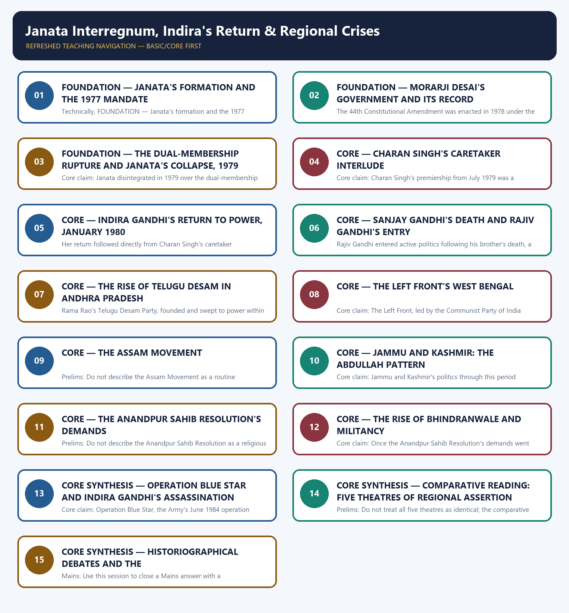

# Janata Interregnum, Indira's Return & Regional Crises - Learner-v2 Complete Learning Session

### SOURCE, PROGRESSION AND CURRENT-LINKAGE AUDIT

- **Repository owners queried:** Basic and Advanced Markdown for this topic, the master chronology, syllabus map and linked Modern History owners.
- **OCR book evidence queried:** The Basic and Advanced owner Markdown for this topic were reconciled against each other and against the folder's shared post-independence OCR source, Bipan Chandra, Mridula Mukherjee and Aditya Mukherjee, *India After Independence, 1947–2000*. Every date, name and institution used below already carries the owners' own ✅ (source-backed) or ⚠️ (inference) tagging, and that tagging is preserved rather than re-verified page by page against the raw PDF in this authoring pass.
- **Qdrant:** not used; Markdown plus searchable local PDFs were sufficient.
- **PYQ integrity:** No Prelims or Mains demand in the local 2018-2026 routing ledgers is routed to this owner; this is a transparent zero-direct-PYQ audit rather than an omission, and the owner's own basic and advanced files carry no 'PYQ Integration' section to integrate.
- **Bounded live linkage:** No verified live current-affairs item is pegged to this topic. The owner's own Current-link section frames regional parties, federalism and internal security as a recurring analytical theme rather than as a dated news event, and that bounded, unattributed framing is preserved here rather than inventing a specific live source or date.
- **Fact/inference rule:** historical claims are source-backed; analytical judgements are explicitly framed as interpretation and do not invent figures.

## BASIC LEARNING SESSION



*Distinct embedded teaching-navigation image. The separate continuous Cārvāka-style flowchart package remains an independent at-a-glance artifact.*

### SESSION 1 — FOUNDATION — JANATA'S FORMATION AND THE 1977 MANDATE

#### DEFINITION / WHAT THIS IS CALLED

**Plain-language definition:** Prelims: Do not conflate the party's January 1977 formation with its March 1977 election victory; they are two separate, sequential events.

**Technical definition:** Technically, FOUNDATION — Janata's formation and the 1977 mandate is analysed by relating FOUNDATION to Janata's formation, then testing the relationship through the 1977 mandate and Precise definition.

#### ANSWER-GRABBING OPENING — WRITE/ADAPT IN THE EXAM

> Do not conflate the party's January 1977 formation with its March 1977 election victory; they are two separate, sequential events.

#### MUST-WRITE KEYWORDS

- **FOUNDATION**
- **Janata's formation**
- **the 1977 mandate**
- **Precise definition**
- **Topic boundary**
- **Core claim**

**How to use them:** Frame the answer through FOUNDATION; define Janata's formation, connect the 1977 mandate with Precise definition to explain the mechanism, and use Topic boundary for the decisive comparison or qualification.

##### VISUAL FIRST

```text
JANATA'S FORMATION AND THE 1977 MANDATE
JANATA PARTY -> formed JANUARY 1977 (Congress-O+Jana Sangh+BLD+Socialists)
ELECTION -> MARCH 1977; wins 330 of 542 seats
GOVERNMENT -> MORARJI DESAI becomes Prime Minister
SIGNIFICANCE -> India's first non-Congress government at the Centre
```

*The visual fixes this subtopic's chronology, mechanism or boundary before the evidence.*

##### CONCEPT DEFINITIONS

- **Precise definition:** The Janata Party is the January 1977 merger of Congress (O), the Jana Sangh, the Bharatiya Lok Dal and the Socialists that won the March 1977 general election and formed India's first non-Congress government at the Centre under Morarji Desai.
- **Topic boundary:** Apply this definition only within Janata Interregnum, Indira's Return & Regional Crises; retain the named actor, institution, date and chronological role.

##### CORE EXPLANATION

Janata's formation in January 1977 united the anti-Emergency opposition into one electoral front, and within weeks that front converted a shared grievance into India's first non-Congress government at the Centre.

##### EVIDENCE AND MECHANISM

- The Janata Party was formed in January 1977 by merging Congress (O), the Jana Sangh, the Bharatiya Lok Dal and the Socialists.
- The merged party won 330 of 542 seats in the March 1977 general election.
- Morarji Desai became Prime Minister, heading India's first non-Congress government at the Centre.

##### EXAMINER CAUTION

- Do not conflate the party's January 1977 formation with its March 1977 election victory; they are two separate, sequential events.

##### EXAM LINK

- **Prelims:** Do not conflate the party's January 1977 formation with its March 1977 election victory; they are two separate, sequential events.
- **Mains:** Use this session to open any answer on the political consequences of the Emergency or on India's first non-Congress government.

##### MINI RECAP

- **Core claim:** Janata's formation in January 1977 united the anti-Emergency opposition into one electoral front, and within weeks that front converted a shared grievance into India's first non-Congress government at the Centre.
- **Use:** Use this session to open any answer on the political consequences of the Emergency or on India's first non-Congress government.

#### CLOSING RECALL FLOW — FOUNDATION — JANATA'S FORMATION AND THE 1977 MANDATE

```text
START / CONCEPT: FOUNDATION — Janata's formation and the 1977 mandate
        |
        v
EXACT TERMS: FOUNDATION · Janata's formation · the 1977 mandate · Precise definition · Topic boundary · Core claim
        |
        v
MECHANISM / ARGUMENT: The Janata Party was formed in January 1977 by merging Congress (O), the Jana Sangh, the Bharatiya Lok Dal and the Socialists.
        |
        v
CONSEQUENCE / CONTRAST: Morarji Desai became Prime Minister, heading India's first non-Congress government at the Centre.
        |
        v
UPSC TRAP / ANSWER-USE: Do not miss this limiting distinction: use this session to open any answer on the political consequences of the Emergency...
        |
        v
ANSWER-GRABBING FORMULATION: Do not conflate the party's January 1977 formation with its March 1977 election victory; they are two separate, sequential events.
```
### SESSION 2 — FOUNDATION — MORARJI DESAI'S GOVERNMENT AND ITS RECORD

#### DEFINITION / WHAT THIS IS CALLED

**Plain-language definition:** FOUNDATION — Morarji Desai's government and its record comprises FOUNDATION, Morarji Desai's government and its record as its core connected dimensions.

**Technical definition:** The 44th Constitutional Amendment was enacted in 1978 under the Janata government.

#### ANSWER-GRABBING OPENING — WRITE/ADAPT IN THE EXAM

> This achievement is credited to the government even though its own internal coalition later collapsed.

#### MUST-WRITE KEYWORDS

- **FOUNDATION**
- **Morarji Desai's government**
- **its record**
- **Precise definition**
- **Topic boundary**
- **Core claim**

**How to use them:** Frame the answer through FOUNDATION; define Morarji Desai's government, connect its record with Precise definition to explain the mechanism, and use Topic boundary for the decisive comparison or qualification.

##### VISUAL FIRST

```text
MORARJI DESAI'S GOVERNMENT AND ITS RECORD
44TH CONSTITUTIONAL AMENDMENT -> enacted 1978, under the JANATA government
EFFECT -> reverses several Emergency-era provisions
EFFECT -> restores civil-liberties safeguards
BALANCE -> a durable achievement despite the coalition's later collapse
```

*The visual fixes this subtopic's chronology, mechanism or boundary before the evidence.*

##### CONCEPT DEFINITIONS

- **Precise definition:** The 44th Constitutional Amendment, 1978, is Janata's durable achievement that reversed Emergency-era provisions and restored civil-liberties safeguards, distinct from and prior to the coalition's own 1979 collapse.
- **Topic boundary:** Apply this definition only within Janata Interregnum, Indira's Return & Regional Crises; retain the named actor, institution, date and chronological role.

##### CORE EXPLANATION

Morarji Desai's government, despite its short life, delivered one durable constitutional achievement, the 44th Constitutional Amendment of 1978, which reversed many Emergency-era provisions and restored civil-liberties safeguards.

##### EVIDENCE AND MECHANISM

- The 44th Constitutional Amendment was enacted in 1978 under the Janata government.
- It reversed several Emergency-era provisions and restored civil-liberties safeguards.
- This achievement is credited to the government even though its own internal coalition later collapsed.

##### EXAMINER CAUTION

- Do not let the government's later collapse erase its 44th Constitutional Amendment achievement; both facts belong in a balanced answer.

##### EXAM LINK

- **Prelims:** Do not let the government's later collapse erase its 44th Constitutional Amendment achievement; both facts belong in a balanced answer.
- **Mains:** Use this session to answer any Mains question that asks you to both credit and critique the Janata government.

##### MINI RECAP

- **Core claim:** Morarji Desai's government, despite its short life, delivered one durable constitutional achievement, the 44th Constitutional Amendment of 1978, which reversed many Emergency-era provisions and restored civil-liberties safeguards.
- **Use:** Use this session to answer any Mains question that asks you to both credit and critique the Janata government.

#### CLOSING RECALL FLOW — FOUNDATION — MORARJI DESAI'S GOVERNMENT AND ITS RECORD

```text
START / CONCEPT: FOUNDATION — Morarji Desai's government and its record
        |
        v
EXACT TERMS: FOUNDATION · Morarji Desai's government · its record · Precise definition · Topic boundary · Core claim
        |
        v
MECHANISM / ARGUMENT: The 44th Constitutional Amendment was enacted in 1978 under the Janata government.
        |
        v
CONSEQUENCE / CONTRAST: Do not let the government's later collapse erase its 44th Constitutional Amendment achievement; both facts belong in a balanced answer.
        |
        v
UPSC TRAP / ANSWER-USE: Do not miss this limiting distinction: use this session to answer any Mains question that asks you to both credit...
        |
        v
ANSWER-GRABBING FORMULATION: This achievement is credited to the government even though its own internal coalition later collapsed.
```
### SESSION 3 — FOUNDATION — THE DUAL-MEMBERSHIP RUPTURE AND JANATA'S COLLAPSE, 1979

#### DEFINITION / WHAT THIS IS CALLED

**Plain-language definition:** Precise definition: The dual-membership dispute is the unresolved 1979 question of whether Jana Sangh members inside Janata could also belong to the RSS, the structural trigger of the coalition's collapse.

**Technical definition:** Core claim: Janata disintegrated in 1979 over the dual-membership dispute, whether Jana Sangh members could simultaneously belong to the RSS, a fault line sharpened by personal rivalry among Morarji Desai, Charan Singh and Jagjivan Ram.

#### ANSWER-GRABBING OPENING — WRITE/ADAPT IN THE EXAM

> Do not reduce Janata's 1979 collapse to personality clashes alone; the dual-membership dispute was the structural trigger.

#### MUST-WRITE KEYWORDS

- **FOUNDATION**
- **The dual-membership rupture**
- **Janata's collapse**
- **Precise definition**
- **Topic boundary**
- **Core claim**

**How to use them:** Frame the answer through FOUNDATION; define The dual-membership rupture, connect Janata's collapse with Precise definition to explain the mechanism, and use Topic boundary for the decisive comparison or qualification.

##### VISUAL FIRST

```text
THE DUAL-MEMBERSHIP RUPTURE AND JANATA'S COLLAPSE, 1979
DISPUTE -> can a Jana Sangh member also belong to the RSS?
COMPOUNDING FACTOR -> rivalry: Morarji Desai vs Charan Singh vs Jagjivan Ram
OUTCOME -> Janata splits, 1979
LESSON -> anti-Emergency unity was not a governing programme
```

*The visual fixes this subtopic's chronology, mechanism or boundary before the evidence.*

##### CONCEPT DEFINITIONS

- **Precise definition:** The dual-membership dispute is the unresolved 1979 question of whether Jana Sangh members inside Janata could also belong to the RSS, the structural trigger of the coalition's collapse.
- **Topic boundary:** Apply this definition only within Janata Interregnum, Indira's Return & Regional Crises; retain the named actor, institution, date and chronological role.

##### CORE EXPLANATION

Janata disintegrated in 1979 over the dual-membership dispute, whether Jana Sangh members could simultaneously belong to the RSS, a fault line sharpened by personal rivalry among Morarji Desai, Charan Singh and Jagjivan Ram.

##### EVIDENCE AND MECHANISM

- The dispute asked whether Jana Sangh members inside Janata could retain separate membership of the RSS.
- This unresolved question, compounded by rivalry among Morarji Desai, Charan Singh and Jagjivan Ram, split the coalition by 1979.
- The rupture proved that shared opposition to Indira Gandhi and the Emergency was not, by itself, a governing programme.

##### EXAMINER CAUTION

- Do not reduce Janata's 1979 collapse to personality clashes alone; the dual-membership dispute was the structural trigger.

##### EXAM LINK

- **Prelims:** Do not reduce Janata's 1979 collapse to personality clashes alone; the dual-membership dispute was the structural trigger.
- **Mains:** Use this session for any Mains question analysing why negative-unity coalitions struggle to govern.

##### MINI RECAP

- **Core claim:** Janata disintegrated in 1979 over the dual-membership dispute, whether Jana Sangh members could simultaneously belong to the RSS, a fault line sharpened by personal rivalry among Morarji Desai, Charan Singh and Jagjivan Ram.
- **Use:** Use this session for any Mains question analysing why negative-unity coalitions struggle to govern.

#### CLOSING RECALL FLOW — FOUNDATION — THE DUAL-MEMBERSHIP RUPTURE AND JANATA'S COLLAPSE, 1979

```text
START / CONCEPT: FOUNDATION — The dual-membership rupture and Janata's collapse, 1979
        |
        v
EXACT TERMS: FOUNDATION · The dual-membership rupture · Janata's collapse · Precise definition · Topic boundary · Core claim
        |
        v
MECHANISM / ARGUMENT: Core claim: Janata disintegrated in 1979 over the dual-membership dispute, whether Jana Sangh members could simultaneously belong to the RSS, a fault line sharpened by personal rivalry among Morarji Desai, Charan Singh and Jagjivan Ram.
        |
        v
CONSEQUENCE / CONTRAST: The rupture proved that shared opposition to Indira Gandhi and the Emergency was not, by itself, a governing programme.
        |
        v
UPSC TRAP / ANSWER-USE: Do not miss this limiting distinction: the dual-membership dispute is the unresolved 1979 question of whether Jana Sangh members inside...
        |
        v
ANSWER-GRABBING FORMULATION: Do not reduce Janata's 1979 collapse to personality clashes alone; the dual-membership dispute was the structural trigger.
```
### SESSION 4 — CORE — CHARAN SINGH'S CARETAKER INTERLUDE

#### DEFINITION / WHAT THIS IS CALLED

**Plain-language definition:** Precise definition: Charan Singh's caretaker government, from July 1979, is the unconfirmed premiership that never faced a parliamentary confidence vote and never won a general election.

**Technical definition:** Core claim: Charan Singh's premiership from July 1979 was a caretaker interlude rather than a mandate: he never faced Parliament for a vote of confidence and never won a general election as Janata's leader.

#### ANSWER-GRABBING OPENING — WRITE/ADAPT IN THE EXAM

> Precise definition: Charan Singh's caretaker government, from July 1979, is the unconfirmed premiership that never faced a parliamentary confidence vote and never won a general election.

#### MUST-WRITE KEYWORDS

- **Charan Singh's caretaker interlude**
- **Precise definition**
- **Topic boundary**
- **Core claim**
- **Precise**
- **Charan Singh's**

**How to use them:** Frame the answer through Charan Singh's caretaker interlude; define Precise definition, connect Topic boundary with Core claim to explain the mechanism, and use Precise for the decisive comparison or qualification.

##### VISUAL FIRST

```text
CHARAN SINGH'S CARETAKER INTERLUDE
CHARAN SINGH -> becomes PM, JULY 1979, after Desai's resignation
CONFIDENCE VOTE -> never faced in Parliament
ELECTION -> never won as Janata's leader
STATUS -> caretaker interlude, not a mandate
```

*The visual fixes this subtopic's chronology, mechanism or boundary before the evidence.*

##### CONCEPT DEFINITIONS

- **Precise definition:** Charan Singh's caretaker government, from July 1979, is the unconfirmed premiership that never faced a parliamentary confidence vote and never won a general election.
- **Topic boundary:** Apply this definition only within Janata Interregnum, Indira's Return & Regional Crises; retain the named actor, institution, date and chronological role.

##### CORE EXPLANATION

Charan Singh's premiership from July 1979 was a caretaker interlude rather than a mandate: he never faced Parliament for a vote of confidence and never won a general election as Janata's leader.

##### EVIDENCE AND MECHANISM

- Charan Singh became Prime Minister in July 1979, after Morarji Desai's resignation.
- His government never faced Parliament for a vote of confidence.
- He never won a general election as Janata's leader; his premiership had no electoral mandate.

##### EXAMINER CAUTION

- Do not describe Charan Singh's premiership as an elected mandate; it was an unconfirmed caretaker arrangement.

##### EXAM LINK

- **Prelims:** Do not describe Charan Singh's premiership as an elected mandate; it was an unconfirmed caretaker arrangement.
- **Mains:** Use this session to distinguish caretaker governments from mandated ones in any comparative Mains answer.

##### MINI RECAP

- **Core claim:** Charan Singh's premiership from July 1979 was a caretaker interlude rather than a mandate: he never faced Parliament for a vote of confidence and never won a general election as Janata's leader.
- **Use:** Use this session to distinguish caretaker governments from mandated ones in any comparative Mains answer.

#### CLOSING RECALL FLOW — CORE — CHARAN SINGH'S CARETAKER INTERLUDE

```text
START / CONCEPT: CORE — Charan Singh's caretaker interlude
        |
        v
EXACT TERMS: Charan Singh's caretaker interlude · Precise definition · Topic boundary · Core claim · Precise · Charan Singh's
        |
        v
MECHANISM / ARGUMENT: Core claim: Charan Singh's premiership from July 1979 was a caretaker interlude rather than a mandate: he never faced Parliament for a vote of confidence and never won a general election as Janata's leader.
        |
        v
CONSEQUENCE / CONTRAST: Do not describe Charan Singh's premiership as an elected mandate; it was an unconfirmed caretaker arrangement.
        |
        v
UPSC TRAP / ANSWER-USE: Do not miss this limiting distinction: charan Singh became Prime Minister in July 1979, after Morarji Desai's resignation.
        |
        v
ANSWER-GRABBING FORMULATION: Precise definition: Charan Singh's caretaker government, from July 1979, is the unconfirmed premiership that never faced a parliamentary confidence vote and never won a general election.
```
### SESSION 5 — CORE — INDIRA GANDHI'S RETURN TO POWER, JANUARY 1980

#### DEFINITION / WHAT THIS IS CALLED

**Plain-language definition:** Precise definition: Indira Gandhi's January 1980 return to power is her Congress (I)'s 353-of-529-seat victory, read as a verdict on Janata's failure rather than a renewed personal mandate.

**Technical definition:** Her return followed directly from Charan Singh's caretaker premiership, which never faced Parliament.

#### ANSWER-GRABBING OPENING — WRITE/ADAPT IN THE EXAM

> Precise definition: Indira Gandhi's January 1980 return to power is her Congress (I)'s 353-of-529-seat victory, read as a verdict on Janata's failure rather than a renewed personal mandate.

#### MUST-WRITE KEYWORDS

- **Indira Gandhi's return to power**
- **January 1980**
- **Precise definition**
- **Topic boundary**
- **Core claim**
- **Precise**

**How to use them:** Frame the answer through Indira Gandhi's return to power; define January 1980, connect Precise definition with Topic boundary to explain the mechanism, and use Core claim for the decisive comparison or qualification.

##### VISUAL FIRST

```text
INDIRA GANDHI'S RETURN TO POWER, JANUARY 1980
JANATA COLLAPSE -> 1979
ELECTION -> JANUARY 1980; CONGRESS (I) wins 353 of 529 seats
READING -> a verdict on Janata's failure
NOT -> a fresh, positive endorsement of Indira Gandhi or the Emergency
```

*The visual fixes this subtopic's chronology, mechanism or boundary before the evidence.*

##### CONCEPT DEFINITIONS

- **Precise definition:** Indira Gandhi's January 1980 return to power is her Congress (I)'s 353-of-529-seat victory, read as a verdict on Janata's failure rather than a renewed personal mandate.
- **Topic boundary:** Apply this definition only within Janata Interregnum, Indira's Return & Regional Crises; retain the named actor, institution, date and chronological role.

##### CORE EXPLANATION

Indira Gandhi's return to power in January 1980, on the scale of 353 of 529 seats, measured the public's verdict on Janata's failure rather than a fresh, positive endorsement of her own record.

##### EVIDENCE AND MECHANISM

- Congress (I) won 353 of 529 seats in the January 1980 general election.
- This scale of victory reflected Janata's collapse rather than a renewed personal mandate for Indira Gandhi.
- Her return followed directly from Charan Singh's caretaker premiership, which never faced Parliament.

##### EXAMINER CAUTION

- Do not read the 1980 result as public endorsement of the Emergency; it was a verdict on Janata's governing failure.

##### EXAM LINK

- **Prelims:** Do not read the 1980 result as public endorsement of the Emergency; it was a verdict on Janata's governing failure.
- **Mains:** Use this session to answer questions on how coalition failure, not renewed popularity, restored Indira Gandhi.

##### MINI RECAP

- **Core claim:** Indira Gandhi's return to power in January 1980, on the scale of 353 of 529 seats, measured the public's verdict on Janata's failure rather than a fresh, positive endorsement of her own record.
- **Use:** Use this session to answer questions on how coalition failure, not renewed popularity, restored Indira Gandhi.

#### CLOSING RECALL FLOW — CORE — INDIRA GANDHI'S RETURN TO POWER, JANUARY 1980

```text
START / CONCEPT: CORE — Indira Gandhi's return to power, January 1980
        |
        v
EXACT TERMS: Indira Gandhi's return to power · January 1980 · Precise definition · Topic boundary · Core claim · Precise
        |
        v
MECHANISM / ARGUMENT: Do not read the 1980 result as public endorsement of the Emergency; it was a verdict on Janata's governing failure.
        |
        v
CONSEQUENCE / CONTRAST: Mains: Use this session to answer questions on how coalition failure, not renewed popularity, restored Indira Gandhi.
        |
        v
UPSC TRAP / ANSWER-USE: Her return followed directly from Charan Singh's caretaker premiership, which never faced Parliament.
        |
        v
ANSWER-GRABBING FORMULATION: Precise definition: Indira Gandhi's January 1980 return to power is her Congress (I)'s 353-of-529-seat victory, read as a verdict on Janata's failure rather than a renewed personal mandate.
```
### SESSION 6 — CORE — SANJAY GANDHI'S DEATH AND RAJIV GANDHI'S ENTRY

#### DEFINITION / WHAT THIS IS CALLED

**Plain-language definition:** Precise definition: Sanjay Gandhi's death, June 1980, is the air-crash fatality that opened the succession question bringing Rajiv Gandhi into active politics, a transition this topic notes but does not narrate beyond.

**Technical definition:** Rajiv Gandhi entered active politics following his brother's death, a development this topic records but does not narrate further.

#### ANSWER-GRABBING OPENING — WRITE/ADAPT IN THE EXAM

> Precise definition: Sanjay Gandhi's death, June 1980, is the air-crash fatality that opened the succession question bringing Rajiv Gandhi into active politics, a transition this topic notes but does not narrate beyond.

#### MUST-WRITE KEYWORDS

- **Sanjay Gandhi's death**
- **Rajiv Gandhi's entry**
- **Precise definition**
- **Topic boundary**
- **Core claim**
- **Precise definition: Sanjay Gandhi's death, June 1980,**

**How to use them:** Frame the answer through Sanjay Gandhi's death; define Rajiv Gandhi's entry, connect Precise definition with Topic boundary to explain the mechanism, and use Core claim for the decisive comparison or qualification.

##### VISUAL FIRST

```text
SANJAY GANDHI'S DEATH AND RAJIV GANDHI'S ENTRY
JUNE 1980 -> Sanjay Gandhi dies in an air crash
CONSEQUENCE -> succession question opens inside the Congress
ENTRY -> Rajiv Gandhi enters active politics
BOUNDARY -> his own premiership belongs to the following topic
```

*The visual fixes this subtopic's chronology, mechanism or boundary before the evidence.*

##### CONCEPT DEFINITIONS

- **Precise definition:** Sanjay Gandhi's death, June 1980, is the air-crash fatality that opened the succession question bringing Rajiv Gandhi into active politics, a transition this topic notes but does not narrate beyond.
- **Topic boundary:** Apply this definition only within Janata Interregnum, Indira's Return & Regional Crises; retain the named actor, institution, date and chronological role.

##### CORE EXPLANATION

Sanjay Gandhi's death in an air crash in June 1980 removed Indira Gandhi's political heir apparent and brought his elder brother Rajiv Gandhi into active politics, a transition this topic notes without extending into Rajiv's own later premiership.

##### EVIDENCE AND MECHANISM

- Sanjay Gandhi died in an air crash in June 1980, only months into Indira Gandhi's return to power.
- His death opened a succession question inside the Congress and the Gandhi family.
- Rajiv Gandhi entered active politics following his brother's death, a development this topic records but does not narrate further.

##### EXAMINER CAUTION

- Do not extend this topic's account into Rajiv Gandhi's own premiership; that belongs to the following topic.

##### EXAM LINK

- **Prelims:** Do not extend this topic's account into Rajiv Gandhi's own premiership; that belongs to the following topic.
- **Mains:** Use this session to mark the precise transition point between this topic and the following one on Rajiv Gandhi.

##### MINI RECAP

- **Core claim:** Sanjay Gandhi's death in an air crash in June 1980 removed Indira Gandhi's political heir apparent and brought his elder brother Rajiv Gandhi into active politics, a transition this topic notes without extending into Rajiv's own later premiership.
- **Use:** Use this session to mark the precise transition point between this topic and the following one on Rajiv Gandhi.

#### CLOSING RECALL FLOW — CORE — SANJAY GANDHI'S DEATH AND RAJIV GANDHI'S ENTRY

```text
START / CONCEPT: CORE — Sanjay Gandhi's death and Rajiv Gandhi's entry
        |
        v
EXACT TERMS: Sanjay Gandhi's death · Rajiv Gandhi's entry · Precise definition · Topic boundary · Core claim · Precise definition: Sanjay Gandhi's death, June 1980,
        |
        v
MECHANISM / ARGUMENT: Rajiv Gandhi entered active politics following his brother's death, a development this topic records but does not narrate further.
        |
        v
CONSEQUENCE / CONTRAST: Do not extend this topic's account into Rajiv Gandhi's own premiership; that belongs to the following topic.
        |
        v
UPSC TRAP / ANSWER-USE: Do not miss this limiting distinction: use this session to mark the precise transition point between this topic and the...
        |
        v
ANSWER-GRABBING FORMULATION: Precise definition: Sanjay Gandhi's death, June 1980, is the air-crash fatality that opened the succession question bringing Rajiv Gandhi into active politics, a transition this topic notes but does not narrate beyond.
```
### SESSION 7 — CORE — THE RISE OF TELUGU DESAM IN ANDHRA PRADESH

#### DEFINITION / WHAT THIS IS CALLED

**Plain-language definition:** Precise definition: The Telugu Desam Party is N.T.

**Technical definition:** Rama Rao's Telugu Desam Party, founded and swept to power within a single year, demonstrated how regional self-respect and resentment of central interference could convert a film star's popularity into a durable regional party.

#### ANSWER-GRABBING OPENING — WRITE/ADAPT IN THE EXAM

> Precise definition: The Telugu Desam Party is N.T.

#### MUST-WRITE KEYWORDS

- **The rise of Telugu Desam in Andhra Pradesh**
- **Precise definition**
- **Topic boundary**
- **Core claim**
- **Precise definition: The Telugu Desam Party**
- **Precise**

**How to use them:** Frame the answer through The rise of Telugu Desam in Andhra Pradesh; define Precise definition, connect Topic boundary with Core claim to explain the mechanism, and use Precise definition: The Telugu Desam Party for the decisive comparison or qualification.

##### VISUAL FIRST

```text
THE RISE OF TELUGU DESAM IN ANDHRA PRADESH
FOUNDER -> N.T. Rama Rao, a Telugu film star
PARTY -> Telugu Desam, newly founded
ELECTION -> sweeps the 1983 Andhra Pradesh state election
PLATFORM -> Telugu self-respect + resentment of central interference
```

*The visual fixes this subtopic's chronology, mechanism or boundary before the evidence.*

##### CONCEPT DEFINITIONS

- **Precise definition:** The Telugu Desam Party is N.T. Rama Rao's newly founded regional party that swept the 1983 Andhra Pradesh election on a platform of Telugu self-respect and resistance to central interference.
- **Topic boundary:** Apply this definition only within Janata Interregnum, Indira's Return & Regional Crises; retain the named actor, institution, date and chronological role.

##### CORE EXPLANATION

N.T. Rama Rao's Telugu Desam Party, founded and swept to power within a single year, demonstrated how regional self-respect and resentment of central interference could convert a film star's popularity into a durable regional party.

##### EVIDENCE AND MECHANISM

- N.T. Rama Rao, a Telugu film star, founded the Telugu Desam Party.
- The party swept the 1983 Andhra Pradesh state election.
- Its platform combined Telugu self-respect with resentment of central interference in state politics.

##### EXAMINER CAUTION

- Do not describe Telugu Desam as a Congress splinter; it was a newly founded regional party.

##### EXAM LINK

- **Prelims:** Do not describe Telugu Desam as a Congress splinter; it was a newly founded regional party.
- **Mains:** Use this session for any Mains question on the rise of regional parties as an independent electoral force.

##### MINI RECAP

- **Core claim:** N.T. Rama Rao's Telugu Desam Party, founded and swept to power within a single year, demonstrated how regional self-respect and resentment of central interference could convert a film star's popularity into a durable regional party.
- **Use:** Use this session for any Mains question on the rise of regional parties as an independent electoral force.

#### CLOSING RECALL FLOW — CORE — THE RISE OF TELUGU DESAM IN ANDHRA PRADESH

```text
START / CONCEPT: CORE — The rise of Telugu Desam in Andhra Pradesh
        |
        v
EXACT TERMS: The rise of Telugu Desam in Andhra Pradesh · Precise definition · Topic boundary · Core claim · Precise definition: The Telugu Desam Party · Precise
        |
        v
MECHANISM / ARGUMENT: Rama Rao's Telugu Desam Party, founded and swept to power within a single year, demonstrated how regional self-respect and resentment of central interference could convert a film star's popularity into a durable regional party.
        |
        v
CONSEQUENCE / CONTRAST: Do not describe Telugu Desam as a Congress splinter; it was a newly founded regional party.
        |
        v
UPSC TRAP / ANSWER-USE: Do not miss this limiting distinction: use this session for any Mains question on the rise of regional parties as...
        |
        v
ANSWER-GRABBING FORMULATION: Precise definition: The Telugu Desam Party is N.T.
```
### SESSION 8 — CORE — THE LEFT FRONT'S WEST BENGAL

#### DEFINITION / WHAT THIS IS CALLED

**Plain-language definition:** Precise definition: The Left Front is the CPI(M)-led coalition under Jyoti Basu that took office in West Bengal in 1977 and governed continuously thereafter through an agrarian-reformist programme.

**Technical definition:** Core claim: The Left Front, led by the Communist Party of India (Marxist) under Jyoti Basu, formed the government of West Bengal in 1977 and governed continuously thereafter, building the era's most durable agrarian-reformist regional regime.

#### ANSWER-GRABBING OPENING — WRITE/ADAPT IN THE EXAM

> Precise definition: The Left Front is the CPI(M)-led coalition under Jyoti Basu that took office in West Bengal in 1977 and governed continuously thereafter through an agrarian-reformist programme.

#### MUST-WRITE KEYWORDS

- **The Left Front's West Bengal**
- **Precise definition**
- **Topic boundary**
- **Core claim**
- **Precise definition: The Left Front**
- **Precise**

**How to use them:** Frame the answer through The Left Front's West Bengal; define Precise definition, connect Topic boundary with Core claim to explain the mechanism, and use Precise definition: The Left Front for the decisive comparison or qualification.

##### VISUAL FIRST

```text
THE LEFT FRONT'S WEST BENGAL
LEFT FRONT -> takes office in WEST BENGAL, 1977
LEADER -> Jyoti Basu, CPI(M)
DURATION -> governs continuously thereafter
BASIS -> an agrarian-reformist regional regime
```

*The visual fixes this subtopic's chronology, mechanism or boundary before the evidence.*

##### CONCEPT DEFINITIONS

- **Precise definition:** The Left Front is the CPI(M)-led coalition under Jyoti Basu that took office in West Bengal in 1977 and governed continuously thereafter through an agrarian-reformist programme.
- **Topic boundary:** Apply this definition only within Janata Interregnum, Indira's Return & Regional Crises; retain the named actor, institution, date and chronological role.

##### CORE EXPLANATION

The Left Front, led by the Communist Party of India (Marxist) under Jyoti Basu, formed the government of West Bengal in 1977 and governed continuously thereafter, building the era's most durable agrarian-reformist regional regime.

##### EVIDENCE AND MECHANISM

- The Left Front took office in West Bengal in 1977 under the CPI(M)'s Jyoti Basu.
- It governed the state continuously from that point onward.
- Its durability rested on an agrarian-reformist regime distinct from the Centre's own policy line.

##### EXAMINER CAUTION

- Do not confuse the Left Front's continuous West Bengal rule with a national-level Left government; its power was state-specific.

##### EXAM LINK

- **Prelims:** Do not confuse the Left Front's continuous West Bengal rule with a national-level Left government; its power was state-specific.
- **Mains:** Use this session to contrast durable, programmatic regional rule with the volatility of national coalition politics.

##### MINI RECAP

- **Core claim:** The Left Front, led by the Communist Party of India (Marxist) under Jyoti Basu, formed the government of West Bengal in 1977 and governed continuously thereafter, building the era's most durable agrarian-reformist regional regime.
- **Use:** Use this session to contrast durable, programmatic regional rule with the volatility of national coalition politics.

#### CLOSING RECALL FLOW — CORE — THE LEFT FRONT'S WEST BENGAL

```text
START / CONCEPT: CORE — The Left Front's West Bengal
        |
        v
EXACT TERMS: The Left Front's West Bengal · Precise definition · Topic boundary · Core claim · Precise definition: The Left Front · Precise
        |
        v
MECHANISM / ARGUMENT: Core claim: The Left Front, led by the Communist Party of India (Marxist) under Jyoti Basu, formed the government of West Bengal in 1977 and governed continuously thereafter, building the era's most durable agrarian-reformist regional regime.
        |
        v
CONSEQUENCE / CONTRAST: Do not confuse the Left Front's continuous West Bengal rule with a national-level Left government; its power was state-specific.
        |
        v
UPSC TRAP / ANSWER-USE: Do not miss this limiting distinction: use this session to contrast durable, programmatic regional rule with the volatility of national...
        |
        v
ANSWER-GRABBING FORMULATION: Precise definition: The Left Front is the CPI(M)-led coalition under Jyoti Basu that took office in West Bengal in 1977 and governed continuously thereafter through an agrarian-reformist programme.
```
### SESSION 9 — CORE — THE ASSAM MOVEMENT

#### DEFINITION / WHAT THIS IS CALLED

**Plain-language definition:** Precise definition: The Assam Movement is the AASU-led mass agitation over illegal migration and the 'foreigner' question that the Centre struggled to contain through the early 1980s.

**Technical definition:** Prelims: Do not describe the Assam Movement as a routine law-and-order episode; it was a sustained mass political agitation.

#### ANSWER-GRABBING OPENING — WRITE/ADAPT IN THE EXAM

> Precise definition: The Assam Movement is the AASU-led mass agitation over illegal migration and the 'foreigner' question that the Centre struggled to contain through the early 1980s.

#### MUST-WRITE KEYWORDS

- **The Assam Movement**
- **Precise definition**
- **Topic boundary**
- **Core claim**
- **Precise definition: The Assam Movement**
- **Precise**

**How to use them:** Frame the answer through The Assam Movement; define Precise definition, connect Topic boundary with Core claim to explain the mechanism, and use Precise definition: The Assam Movement for the decisive comparison or qualification.

##### VISUAL FIRST

```text
THE ASSAM MOVEMENT
LED BY -> All Assam Students' Union (AASU)
GRIEVANCE -> illegal migration and the "foreigner" question
FORM -> sustained mass agitation
CENTRE'S POSITION -> struggled to contain it through the early 1980s
```

*The visual fixes this subtopic's chronology, mechanism or boundary before the evidence.*

##### CONCEPT DEFINITIONS

- **Precise definition:** The Assam Movement is the AASU-led mass agitation over illegal migration and the 'foreigner' question that the Centre struggled to contain through the early 1980s.
- **Topic boundary:** Apply this definition only within Janata Interregnum, Indira's Return & Regional Crises; retain the named actor, institution, date and chronological role.

##### CORE EXPLANATION

The Assam Movement, led by the All Assam Students' Union, mobilised sustained mass agitation on the question of illegal migration and 'foreigners', an issue the Centre struggled to contain through the early 1980s.

##### EVIDENCE AND MECHANISM

- The All Assam Students' Union led the Assam Movement.
- Its central grievance was illegal migration and the 'foreigner' question in the state.
- The Centre struggled to contain the agitation through the early 1980s, before its eventual 1985 accord.

##### EXAMINER CAUTION

- Do not describe the Assam Movement as a routine law-and-order episode; it was a sustained mass political agitation.

##### EXAM LINK

- **Prelims:** Do not describe the Assam Movement as a routine law-and-order episode; it was a sustained mass political agitation.
- **Mains:** Use this session to answer questions on migration-driven regional agitation and the limits of central authority.

##### MINI RECAP

- **Core claim:** The Assam Movement, led by the All Assam Students' Union, mobilised sustained mass agitation on the question of illegal migration and 'foreigners', an issue the Centre struggled to contain through the early 1980s.
- **Use:** Use this session to answer questions on migration-driven regional agitation and the limits of central authority.

#### CLOSING RECALL FLOW — CORE — THE ASSAM MOVEMENT

```text
START / CONCEPT: CORE — The Assam Movement
        |
        v
EXACT TERMS: The Assam Movement · Precise definition · Topic boundary · Core claim · Precise definition: The Assam Movement · Precise
        |
        v
MECHANISM / ARGUMENT: Do not describe the Assam Movement as a routine law-and-order episode; it was a sustained mass political agitation.
        |
        v
CONSEQUENCE / CONTRAST: Its central grievance was illegal migration and the 'foreigner' question in the state.
        |
        v
UPSC TRAP / ANSWER-USE: Do not miss this limiting distinction: use this session to answer questions on migration-driven regional agitation and the limits of...
        |
        v
ANSWER-GRABBING FORMULATION: Precise definition: The Assam Movement is the AASU-led mass agitation over illegal migration and the 'foreigner' question that the Centre struggled to contain through the early 1980s.
```
### SESSION 10 — CORE — JAMMU AND KASHMIR: THE ABDULLAH PATTERN

#### DEFINITION / WHAT THIS IS CALLED

**Plain-language definition:** Precise definition: The Abdullah pattern is the recurring 1970s-80s sequence in which the elected Jammu and Kashmir governments of Sheikh Abdullah and then Farooq Abdullah faced repeated central interference.

**Technical definition:** Core claim: Jammu and Kashmir's politics through this period followed a recurring pattern: elected governments led first by Sheikh Abdullah and then by his son Farooq Abdullah repeatedly faced central interference, corroding state-level democratic legitimacy.

#### ANSWER-GRABBING OPENING — WRITE/ADAPT IN THE EXAM

> Precise definition: The Abdullah pattern is the recurring 1970s-80s sequence in which the elected Jammu and Kashmir governments of Sheikh Abdullah and then Farooq Abdullah faced repeated central interference.

#### MUST-WRITE KEYWORDS

- **Jammu**
- **Kashmir**
- **the Abdullah pattern**
- **Precise definition**
- **Topic boundary**
- **Core claim**

**How to use them:** Frame the answer through Jammu; define Kashmir, connect the Abdullah pattern with Precise definition to explain the mechanism, and use Topic boundary for the decisive comparison or qualification.

##### VISUAL FIRST

```text
JAMMU AND KASHMIR: THE ABDULLAH PATTERN
LEADERSHIP -> Sheikh Abdullah, then son Farooq Abdullah
PATTERN -> elected state governments face central interference
EFFECT -> corrodes state-level democratic legitimacy
RESTRAINT -> recorded as federal practice, not present-day politics
```

*The visual fixes this subtopic's chronology, mechanism or boundary before the evidence.*

##### CONCEPT DEFINITIONS

- **Precise definition:** The Abdullah pattern is the recurring 1970s-80s sequence in which the elected Jammu and Kashmir governments of Sheikh Abdullah and then Farooq Abdullah faced repeated central interference.
- **Topic boundary:** Apply this definition only within Janata Interregnum, Indira's Return & Regional Crises; retain the named actor, institution, date and chronological role.

##### CORE EXPLANATION

Jammu and Kashmir's politics through this period followed a recurring pattern: elected governments led first by Sheikh Abdullah and then by his son Farooq Abdullah repeatedly faced central interference, corroding state-level democratic legitimacy.

##### EVIDENCE AND MECHANISM

- Sheikh Abdullah and then Farooq Abdullah led Jammu and Kashmir's elected politics in this period.
- Their governments repeatedly faced central interference despite their electoral standing.
- This recurring pattern is recorded here strictly as a description of federal practice, without extending into present-day politics.

##### EXAMINER CAUTION

- Do not extend this account of the Abdullah pattern beyond the federal-interference description into any present-day political controversy.

##### EXAM LINK

- **Prelims:** Do not extend this account of the Abdullah pattern beyond the federal-interference description into any present-day political controversy.
- **Mains:** Use this session for a restrained factual answer on federal interference with elected state governments.

##### MINI RECAP

- **Core claim:** Jammu and Kashmir's politics through this period followed a recurring pattern: elected governments led first by Sheikh Abdullah and then by his son Farooq Abdullah repeatedly faced central interference, corroding state-level democratic legitimacy.
- **Use:** Use this session for a restrained factual answer on federal interference with elected state governments.

#### CLOSING RECALL FLOW — CORE — JAMMU AND KASHMIR: THE ABDULLAH PATTERN

```text
START / CONCEPT: CORE — Jammu and Kashmir: the Abdullah pattern
        |
        v
EXACT TERMS: Jammu · Kashmir · the Abdullah pattern · Precise definition · Topic boundary · Core claim
        |
        v
MECHANISM / ARGUMENT: Core claim: Jammu and Kashmir's politics through this period followed a recurring pattern: elected governments led first by Sheikh Abdullah and then by his son Farooq Abdullah repeatedly faced central interference, corroding state-level democratic legitimacy.
        |
        v
CONSEQUENCE / CONTRAST: Do not extend this account of the Abdullah pattern beyond the federal-interference description into any present-day political controversy.
        |
        v
UPSC TRAP / ANSWER-USE: Do not miss this limiting distinction: this recurring pattern is recorded here strictly as a description of federal practice, without...
        |
        v
ANSWER-GRABBING FORMULATION: Precise definition: The Abdullah pattern is the recurring 1970s-80s sequence in which the elected Jammu and Kashmir governments of Sheikh Abdullah and then Farooq Abdullah faced repeated central interference.
```
### SESSION 11 — CORE — THE ANANDPUR SAHIB RESOLUTION'S DEMANDS

#### DEFINITION / WHAT THIS IS CALLED

**Plain-language definition:** Precise definition: The Anandpur Sahib Resolution is the Akali charter combining a Chandigarh territorial claim, a river-waters demand and a state-autonomy demand, framed as a negotiable federal-economic document.

**Technical definition:** Prelims: Do not describe the Anandpur Sahib Resolution as a religious or secessionist charter at the point it was framed; it was a negotiable federal-economic document.

#### ANSWER-GRABBING OPENING — WRITE/ADAPT IN THE EXAM

> Precise definition: The Anandpur Sahib Resolution is the Akali charter combining a Chandigarh territorial claim, a river-waters demand and a state-autonomy demand, framed as a negotiable federal-economic document.

#### MUST-WRITE KEYWORDS

- **The Anandpur Sahib Resolution's demands**
- **Precise definition**
- **Topic boundary**
- **Core claim**
- **Precise definition: The Anandpur Sahib Resolution**
- **Precise**

**How to use them:** Frame the answer through The Anandpur Sahib Resolution's demands; define Precise definition, connect Topic boundary with Core claim to explain the mechanism, and use Precise definition: The Anandpur Sahib Resolution for the decisive comparison or qualification.

##### VISUAL FIRST

```text
THE ANANDPUR SAHIB RESOLUTION'S DEMANDS
TERRITORIAL DEMAND -> Chandigarh
ECONOMIC DEMAND -> a fairer share of river waters
FEDERAL DEMAND -> greater state autonomy
CHARACTER AT FRAMING -> a negotiable federal-economic charter
```

*The visual fixes this subtopic's chronology, mechanism or boundary before the evidence.*

##### CONCEPT DEFINITIONS

- **Precise definition:** The Anandpur Sahib Resolution is the Akali charter combining a Chandigarh territorial claim, a river-waters demand and a state-autonomy demand, framed as a negotiable federal-economic document.
- **Topic boundary:** Apply this definition only within Janata Interregnum, Indira's Return & Regional Crises; retain the named actor, institution, date and chronological role.

##### CORE EXPLANATION

The Anandpur Sahib Resolution codified Akali demands into a negotiable federal-economic charter, combining a territorial claim over Chandigarh, a call for a fairer river-waters share, and a request for greater state autonomy.

##### EVIDENCE AND MECHANISM

- The Resolution claimed Chandigarh as a territorial demand.
- It sought a fairer share of river waters for Punjab.
- It called for greater state autonomy within the federal structure.

##### EXAMINER CAUTION

- Do not describe the Anandpur Sahib Resolution as a religious or secessionist charter at the point it was framed; it was a negotiable federal-economic document.

##### EXAM LINK

- **Prelims:** Do not describe the Anandpur Sahib Resolution as a religious or secessionist charter at the point it was framed; it was a negotiable federal-economic document.
- **Mains:** Use this session to open any answer on the Punjab crisis's federal-economic origins.

##### MINI RECAP

- **Core claim:** The Anandpur Sahib Resolution codified Akali demands into a negotiable federal-economic charter, combining a territorial claim over Chandigarh, a call for a fairer river-waters share, and a request for greater state autonomy.
- **Use:** Use this session to open any answer on the Punjab crisis's federal-economic origins.

#### CLOSING RECALL FLOW — CORE — THE ANANDPUR SAHIB RESOLUTION'S DEMANDS

```text
START / CONCEPT: CORE — The Anandpur Sahib Resolution's demands
        |
        v
EXACT TERMS: The Anandpur Sahib Resolution's demands · Precise definition · Topic boundary · Core claim · Precise definition: The Anandpur Sahib Resolution · Precise
        |
        v
MECHANISM / ARGUMENT: Do not describe the Anandpur Sahib Resolution as a religious or secessionist charter at the point it was framed; it was a negotiable federal-economic document.
        |
        v
CONSEQUENCE / CONTRAST: Mains: Use this session to open any answer on the Punjab crisis's federal-economic origins.
        |
        v
UPSC TRAP / ANSWER-USE: Do not miss this limiting distinction: do not describe the Anandpur Sahib Resolution as a religious or secessionist charter at...
        |
        v
ANSWER-GRABBING FORMULATION: Precise definition: The Anandpur Sahib Resolution is the Akali charter combining a Chandigarh territorial claim, a river-waters demand and a state-autonomy demand, framed as a negotiable federal-economic document.
```
### SESSION 12 — CORE — THE RISE OF BHINDRANWALE AND MILITANCY

#### DEFINITION / WHAT THIS IS CALLED

**Plain-language definition:** Precise definition: The rise of Bhindranwale is the shift from unsettled negotiable Akali demands to armed militancy in Punjab, filling the political space negotiation had failed to occupy.

**Technical definition:** Core claim: Once the Anandpur Sahib Resolution's demands went unsettled through ordinary negotiation, the vacated political space in Punjab was filled by the rise of Jarnail Singh Bhindranwale and armed militancy.

#### ANSWER-GRABBING OPENING — WRITE/ADAPT IN THE EXAM

> Precise definition: The rise of Bhindranwale is the shift from unsettled negotiable Akali demands to armed militancy in Punjab, filling the political space negotiation had failed to occupy.

#### MUST-WRITE KEYWORDS

- **The rise of Bhindranwale**
- **militancy**
- **Precise definition**
- **Topic boundary**
- **Core claim**
- **Precise definition: The rise of Bhindranwale**

**How to use them:** Frame the answer through The rise of Bhindranwale; define militancy, connect Precise definition with Topic boundary to explain the mechanism, and use Core claim for the decisive comparison or qualification.

##### VISUAL FIRST

```text
THE RISE OF BHINDRANWALE AND MILITANCY
STEP 1 -> Anandpur Sahib demands remain unsettled
STEP 2 -> the negotiable political space is vacated
STEP 3 -> Bhindranwale rises within that vacated space
STEP 4 -> armed militancy replaces negotiable politics
```

*The visual fixes this subtopic's chronology, mechanism or boundary before the evidence.*

##### CONCEPT DEFINITIONS

- **Precise definition:** The rise of Bhindranwale is the shift from unsettled negotiable Akali demands to armed militancy in Punjab, filling the political space negotiation had failed to occupy.
- **Topic boundary:** Apply this definition only within Janata Interregnum, Indira's Return & Regional Crises; retain the named actor, institution, date and chronological role.

##### CORE EXPLANATION

Once the Anandpur Sahib Resolution's demands went unsettled through ordinary negotiation, the vacated political space in Punjab was filled by the rise of Jarnail Singh Bhindranwale and armed militancy.

##### EVIDENCE AND MECHANISM

- The Resolution's federal-economic demands remained unsettled through negotiation.
- Jarnail Singh Bhindranwale rose within the resulting vacated political space.
- His rise marked the shift from negotiable politics toward armed militancy in Punjab.

##### EXAMINER CAUTION

- Do not present Bhindranwale's rise as the crisis's origin; it followed the prior failure to settle the Resolution's negotiable demands.

##### EXAM LINK

- **Prelims:** Do not present Bhindranwale's rise as the crisis's origin; it followed the prior failure to settle the Resolution's negotiable demands.
- **Mains:** Use this session to trace the sequence from unsettled demand to militancy in any Punjab-crisis answer.

##### MINI RECAP

- **Core claim:** Once the Anandpur Sahib Resolution's demands went unsettled through ordinary negotiation, the vacated political space in Punjab was filled by the rise of Jarnail Singh Bhindranwale and armed militancy.
- **Use:** Use this session to trace the sequence from unsettled demand to militancy in any Punjab-crisis answer.

#### CLOSING RECALL FLOW — CORE — THE RISE OF BHINDRANWALE AND MILITANCY

```text
START / CONCEPT: CORE — The rise of Bhindranwale and militancy
        |
        v
EXACT TERMS: The rise of Bhindranwale · militancy · Precise definition · Topic boundary · Core claim · Precise definition: The rise of Bhindranwale
        |
        v
MECHANISM / ARGUMENT: Core claim: Once the Anandpur Sahib Resolution's demands went unsettled through ordinary negotiation, the vacated political space in Punjab was filled by the rise of Jarnail Singh Bhindranwale and armed militancy.
        |
        v
CONSEQUENCE / CONTRAST: Do not present Bhindranwale's rise as the crisis's origin; it followed the prior failure to settle the Resolution's negotiable demands.
        |
        v
UPSC TRAP / ANSWER-USE: Do not miss this limiting distinction: use this session to trace the sequence from unsettled demand to militancy in any...
        |
        v
ANSWER-GRABBING FORMULATION: Precise definition: The rise of Bhindranwale is the shift from unsettled negotiable Akali demands to armed militancy in Punjab, filling the political space negotiation had failed to occupy.
```
### SESSION 13 — CORE SYNTHESIS — OPERATION BLUE STAR AND INDIRA GANDHI'S ASSASSINATION

#### DEFINITION / WHAT THIS IS CALLED

**Plain-language definition:** Precise definition: Operation Blue Star and Indira Gandhi's assassination are the June and 31 October 1984 events closing this topic's Punjab chronology, recorded here without casualty figures or community characterisation.

**Technical definition:** Core claim: Operation Blue Star, the Army's June 1984 operation against militants entrenched in the Golden Temple complex, was followed within months by Indira Gandhi's assassination on 31 October 1984, closing this topic's chronology.

#### ANSWER-GRABBING OPENING — WRITE/ADAPT IN THE EXAM

> Precise definition: Operation Blue Star and Indira Gandhi's assassination are the June and 31 October 1984 events closing this topic's Punjab chronology, recorded here without casualty figures or community characterisation.

#### MUST-WRITE KEYWORDS

- **CORE SYNTHESIS**
- **Operation Blue Star**
- **Indira Gandhi's assassination**
- **Precise definition**
- **Topic boundary**
- **Core claim**

**How to use them:** Frame the answer through CORE SYNTHESIS; define Operation Blue Star, connect Indira Gandhi's assassination with Precise definition to explain the mechanism, and use Topic boundary for the decisive comparison or qualification.

##### VISUAL FIRST

```text
OPERATION BLUE STAR AND INDIRA GANDHI'S ASSASSINATION
OPERATION BLUE STAR -> JUNE 1984, Golden Temple complex, Amritsar
INTERVAL -> several months of continued tension
ASSASSINATION -> INDIRA GANDHI, 31 OCTOBER 1984
RESTRAINT -> no casualty figures, no community characterisation here
```

*The visual fixes this subtopic's chronology, mechanism or boundary before the evidence.*

##### CONCEPT DEFINITIONS

- **Precise definition:** Operation Blue Star and Indira Gandhi's assassination are the June and 31 October 1984 events closing this topic's Punjab chronology, recorded here without casualty figures or community characterisation.
- **Topic boundary:** Apply this definition only within Janata Interregnum, Indira's Return & Regional Crises; retain the named actor, institution, date and chronological role.

##### CORE EXPLANATION

Operation Blue Star, the Army's June 1984 operation against militants entrenched in the Golden Temple complex, was followed within months by Indira Gandhi's assassination on 31 October 1984, closing this topic's chronology.

##### EVIDENCE AND MECHANISM

- Operation Blue Star took place in June 1984 against militants entrenched at the Golden Temple complex, Amritsar.
- Indira Gandhi was assassinated on 31 October 1984.
- This topic records neither casualty figures nor any community characterisation for either event.

##### EXAMINER CAUTION

- Do not state casualty figures or characterise any community when describing Operation Blue Star or the assassination.

##### EXAM LINK

- **Prelims:** Do not state casualty figures or characterise any community when describing Operation Blue Star or the assassination.
- **Mains:** Use this session to close any Mains answer tracing the Punjab crisis to its October 1984 turning point, with restraint on unverified detail.

##### MINI RECAP

- **Core claim:** Operation Blue Star, the Army's June 1984 operation against militants entrenched in the Golden Temple complex, was followed within months by Indira Gandhi's assassination on 31 October 1984, closing this topic's chronology.
- **Use:** Use this session to close any Mains answer tracing the Punjab crisis to its October 1984 turning point, with restraint on unverified detail.

#### CLOSING RECALL FLOW — CORE SYNTHESIS — OPERATION BLUE STAR AND INDIRA GANDHI'S ASSASSINATION

```text
START / CONCEPT: CORE SYNTHESIS — Operation Blue Star and Indira Gandhi's assassination
        |
        v
EXACT TERMS: CORE SYNTHESIS · Operation Blue Star · Indira Gandhi's assassination · Precise definition · Topic boundary · Core claim
        |
        v
MECHANISM / ARGUMENT: Core claim: Operation Blue Star, the Army's June 1984 operation against militants entrenched in the Golden Temple complex, was followed within months by Indira Gandhi's assassination on 31 October 1984, closing this topic's chronology.
        |
        v
CONSEQUENCE / CONTRAST: Do not state casualty figures or characterise any community when describing Operation Blue Star or the assassination.
        |
        v
UPSC TRAP / ANSWER-USE: Do not miss this limiting distinction: indira Gandhi was assassinated on 31 October 1984.
        |
        v
ANSWER-GRABBING FORMULATION: Precise definition: Operation Blue Star and Indira Gandhi's assassination are the June and 31 October 1984 events closing this topic's Punjab chronology, recorded here without casualty figures or community characterisation.
```
### SESSION 14 — CORE SYNTHESIS — COMPARATIVE READING: FIVE THEATRES OF REGIONAL ASSERTION

#### DEFINITION / WHAT THIS IS CALLED

**Plain-language definition:** CORE SYNTHESIS — Comparative reading: five theatres of regional assertion comprises CORE SYNTHESIS, Comparative reading and five theatres of regional assertion as its core connected dimensions.

**Technical definition:** Prelims: Do not treat all five theatres as identical; the comparative pattern lies in the route each demand took, electoral or otherwise, not in a single shared outcome.

#### ANSWER-GRABBING OPENING — WRITE/ADAPT IN THE EXAM

> Precise definition: The comparative reading of five regional theatres shows that the route a demand took, electoral absorption versus negotiation-failure escalation, explains its outcome more than the state itself.

#### MUST-WRITE KEYWORDS

- **CORE SYNTHESIS**
- **Comparative reading**
- **five theatres of regional assertion**
- **Precise definition**
- **Topic boundary**
- **Core claim**

**How to use them:** Frame the answer through CORE SYNTHESIS; define Comparative reading, connect five theatres of regional assertion with Precise definition to explain the mechanism, and use Topic boundary for the decisive comparison or qualification.

##### VISUAL FIRST

```text
COMPARATIVE READING: FIVE THEATRES OF REGIONAL ASSERTION
ELECTORAL ROUTE -> Andhra Pradesh, West Bengal: demands absorbed
NEGOTIATION-FAILURE ROUTE -> Punjab, Assam: demands escalate toward crisis
INTERFERENCE ROUTE -> Jammu and Kashmir: legitimate, yet interfered with
PATTERN -> the route taken, not the state, explains the outcome
```

*The visual fixes this subtopic's chronology, mechanism or boundary before the evidence.*

##### CONCEPT DEFINITIONS

- **Precise definition:** The comparative reading of five regional theatres shows that the route a demand took, electoral absorption versus negotiation-failure escalation, explains its outcome more than the state itself.
- **Topic boundary:** Apply this definition only within Janata Interregnum, Indira's Return & Regional Crises; retain the named actor, institution, date and chronological role.

##### CORE EXPLANATION

Across Assam, Punjab, Andhra Pradesh, West Bengal and Jammu and Kashmir, demands pursued through elections were absorbed into competitive federal politics, while demands pursued outside elections after negotiation failed escalated toward crisis.

##### EVIDENCE AND MECHANISM

- Andhra Pradesh's Telugu Desam and West Bengal's Left Front pursued their demands through elections and were absorbed into federal politics.
- Punjab's and Assam's demands, when negotiation failed, escalated toward crisis before their eventual 1985 accords.
- Jammu and Kashmir's Abdullah-led politics sits between these poles, electorally legitimate yet repeatedly subject to central interference.

##### EXAMINER CAUTION

- Do not treat all five theatres as identical; the comparative pattern lies in the route each demand took, electoral or otherwise, not in a single shared outcome.

##### EXAM LINK

- **Prelims:** Do not treat all five theatres as identical; the comparative pattern lies in the route each demand took, electoral or otherwise, not in a single shared outcome.
- **Mains:** Use this session for any comparative Mains answer on regional assertion across multiple states in the 1980s.

##### MINI RECAP

- **Core claim:** Across Assam, Punjab, Andhra Pradesh, West Bengal and Jammu and Kashmir, demands pursued through elections were absorbed into competitive federal politics, while demands pursued outside elections after negotiation failed escalated toward crisis.
- **Use:** Use this session for any comparative Mains answer on regional assertion across multiple states in the 1980s.

#### CLOSING RECALL FLOW — CORE SYNTHESIS — COMPARATIVE READING: FIVE THEATRES OF REGIONAL ASSERTION

```text
START / CONCEPT: CORE SYNTHESIS — Comparative reading: five theatres of regional assertion
        |
        v
EXACT TERMS: CORE SYNTHESIS · Comparative reading · five theatres of regional assertion · Precise definition · Topic boundary · Core claim
        |
        v
MECHANISM / ARGUMENT: Do not treat all five theatres as identical; the comparative pattern lies in the route each demand took, electoral or otherwise, not in a single shared outcome.
        |
        v
CONSEQUENCE / CONTRAST: Mains: Use this session for any comparative Mains answer on regional assertion across multiple states in the 1980s.
        |
        v
UPSC TRAP / ANSWER-USE: Core claim: Across Assam, Punjab, Andhra Pradesh, West Bengal and Jammu and Kashmir, demands pursued through elections were absorbed into competitive federal politics, while demands pursued outside elections after negotiation failed escalated toward crisis.
        |
        v
ANSWER-GRABBING FORMULATION: Precise definition: The comparative reading of five regional theatres shows that the route a demand took, electoral absorption versus negotiation-failure escalation, explains its outcome more than the state itself.
```
### SESSION 15 — CORE SYNTHESIS — HISTORIOGRAPHICAL DEBATES AND THE DELAYED-ACCOMMODATION THESIS

#### DEFINITION / WHAT THIS IS CALLED

**Plain-language definition:** Core claim: Three historiographical readings dispute the Punjab crisis's cause, political mismanagement, national security, or federalist erosion, while the delayed-accommodation thesis argues that the 1985 accords resembled what could have been settled earlier, measuring the intervening years as the cost of postponement.

**Technical definition:** Mains: Use this session to close a Mains answer with a historiographical evaluation of the Punjab crisis's causes.

#### ANSWER-GRABBING OPENING — WRITE/ADAPT IN THE EXAM

> Core claim: Three historiographical readings dispute the Punjab crisis's cause, political mismanagement, national security, or federalist erosion, while the delayed-accommodation thesis argues that the 1985 accords resembled what could have been settled earlier, measuring the intervening years as the cost of postponement.

#### MUST-WRITE KEYWORDS

- **CORE SYNTHESIS**
- **Historiographical debates**
- **the delayed-accommodation thesis**
- **Precise definition**
- **Topic boundary**
- **Core claim**

**How to use them:** Frame the answer through CORE SYNTHESIS; define Historiographical debates, connect the delayed-accommodation thesis with Precise definition to explain the mechanism, and use Topic boundary for the decisive comparison or qualification.

##### VISUAL FIRST

```text
HISTORIOGRAPHICAL DEBATES AND THE DELAYED-ACCOMMODATION THESIS
READING 1 -> political-management: mishandling of a negotiable demand
READING 2 -> national-security: cross-border militant support
READING 3 -> federalist: erosion of state autonomy
DELAYED-ACCOMMODATION -> 1985 accords resembled an earlier-available deal
```

*The visual fixes this subtopic's chronology, mechanism or boundary before the evidence.*

##### CONCEPT DEFINITIONS

- **Precise definition:** The delayed-accommodation thesis argues that the 1985 Punjab and Assam accords resembled settlements available earlier, so the intervening years measured the cost of postponed negotiation rather than the absence of a workable deal.
- **Topic boundary:** Apply this definition only within Janata Interregnum, Indira's Return & Regional Crises; retain the named actor, institution, date and chronological role.

##### CORE EXPLANATION

Three historiographical readings dispute the Punjab crisis's cause, political mismanagement, national security, or federalist erosion, while the delayed-accommodation thesis argues that the 1985 accords resembled what could have been settled earlier, measuring the intervening years as the cost of postponement.

##### EVIDENCE AND MECHANISM

- The political-management reading blames central mishandling of a negotiable federal-economic demand; Bipan Chandra privileges this reading.
- The national-security and federalist readings foreground cross-border militant support and the erosion of state autonomy respectively.
- The delayed-accommodation thesis holds that the 1985 accords resembled an earlier-available settlement, so the interval measured postponement's cost.

##### EXAMINER CAUTION

- Do not present only one historiographical reading as settled fact; this topic records all three while noting which one the owner privileges.

##### EXAM LINK

- **Prelims:** Do not present only one historiographical reading as settled fact; this topic records all three while noting which one the owner privileges.
- **Mains:** Use this session to close a Mains answer with a historiographical evaluation of the Punjab crisis's causes.

##### MINI RECAP

- **Core claim:** Three historiographical readings dispute the Punjab crisis's cause, political mismanagement, national security, or federalist erosion, while the delayed-accommodation thesis argues that the 1985 accords resembled what could have been settled earlier, measuring the intervening years as the cost of postponement.
- **Use:** Use this session to close a Mains answer with a historiographical evaluation of the Punjab crisis's causes.

#### CLOSING RECALL FLOW — CORE SYNTHESIS — HISTORIOGRAPHICAL DEBATES AND THE DELAYED-ACCOMMODATION THESIS

```text
START / CONCEPT: CORE SYNTHESIS — Historiographical debates and the delayed-accommodation thesis
        |
        v
EXACT TERMS: CORE SYNTHESIS · Historiographical debates · the delayed-accommodation thesis · Precise definition · Topic boundary · Core claim
        |
        v
MECHANISM / ARGUMENT: Mains: Use this session to close a Mains answer with a historiographical evaluation of the Punjab crisis's causes.
        |
        v
CONSEQUENCE / CONTRAST: Do not present only one historiographical reading as settled fact; this topic records all three while noting which one the owner privileges.
        |
        v
UPSC TRAP / ANSWER-USE: Precise definition: The delayed-accommodation thesis argues that the 1985 Punjab and Assam accords resembled settlements available earlier, so the intervening years measured the cost of postponed negotiation rather than the absence of a workable deal.
        |
        v
ANSWER-GRABBING FORMULATION: Core claim: Three historiographical readings dispute the Punjab crisis's cause, political mismanagement, national security, or federalist erosion, while the delayed-accommodation thesis argues that the 1985 accords resembled what could have been settled earlier, measuring the intervening years as the cost of postponement.
```
## BASIC MCQS / REMEDIATION

### Q1. Which statement correctly identifies The Janata Party's formation, January 1977?

A. The Janata Party was formed in January 1977 as a merger of Congress (O), the Jana Sangh, the Bharatiya Lok Dal and the Socialists, uniting the anti-Emergency opposition into a single electoral front.
B. The Janata Party won the March 1977 general election with 330 of 542 seats, and Morarji Desai became Prime Minister of India's first non-Congress government at the Centre.
C. Janata disintegrated by 1979 over the 'dual membership' controversy, the question of whether Jana Sangh members inside the party could retain their separate membership of the Rashtriya Swayamsevak Sangh, compounded by personal rivalries among Morarji Desai, Charan Singh and Jagjivan Ram.
D. Charan Singh headed a caretaker government from July 1979, after Morarji Desai resigned, without ever facing Parliament for a vote of confidence.

**Answer: A.**
**Explanation:** The Janata Party was formed in January 1977 as a merger of Congress (O), the Jana Sangh, the Bharatiya Lok Dal and the Socialists, uniting the anti-Emergency opposition into a single electoral front. This distinction preserves the source-backed chronology and prevents cross-matching errors in UPSC elimination.

### Q2. Which chronology card should be filed under The Janata Party's formation, January 1977?

A. Janata disintegrated by 1979 over the 'dual membership' controversy, the question of whether Jana Sangh members inside the party could retain their separate membership of the Rashtriya Swayamsevak Sangh, compounded by personal rivalries among Morarji Desai, Charan Singh and Jagjivan Ram.
B. The Janata Party was formed in January 1977 as a merger of Congress (O), the Jana Sangh, the Bharatiya Lok Dal and the Socialists, uniting the anti-Emergency opposition into a single electoral front.
C. Charan Singh headed a caretaker government from July 1979, after Morarji Desai resigned, without ever facing Parliament for a vote of confidence.
D. Indira Gandhi returned to power in January 1980 when Congress (I) won 353 of 529 seats, a scale of victory that reflected Janata's collapse rather than a fresh positive mandate for her.

**Answer: B.**
**Explanation:** The Janata Party was formed in January 1977 as a merger of Congress (O), the Jana Sangh, the Bharatiya Lok Dal and the Socialists, uniting the anti-Emergency opposition into a single electoral front. This distinction preserves the source-backed chronology and prevents cross-matching errors in UPSC elimination.

### Q3. Which option should a candidate retain when revising The Janata Party's formation, January 1977?

A. Sanjay Gandhi died in an air crash in June 1980, an event that brought his elder brother Rajiv Gandhi into active politics.
B. Indira Gandhi returned to power in January 1980 when Congress (I) won 353 of 529 seats, a scale of victory that reflected Janata's collapse rather than a fresh positive mandate for her.
C. The Janata Party was formed in January 1977 as a merger of Congress (O), the Jana Sangh, the Bharatiya Lok Dal and the Socialists, uniting the anti-Emergency opposition into a single electoral front.
D. Charan Singh headed a caretaker government from July 1979, after Morarji Desai resigned, without ever facing Parliament for a vote of confidence.

**Answer: C.**
**Explanation:** The Janata Party was formed in January 1977 as a merger of Congress (O), the Jana Sangh, the Bharatiya Lok Dal and the Socialists, uniting the anti-Emergency opposition into a single electoral front. This distinction preserves the source-backed chronology and prevents cross-matching errors in UPSC elimination.

### Q4. Which statement avoids a common matching trap about The Janata Party's formation, January 1977?

A. Indira Gandhi returned to power in January 1980 when Congress (I) won 353 of 529 seats, a scale of victory that reflected Janata's collapse rather than a fresh positive mandate for her.
B. N.T. Rama Rao, a Telugu film star, founded the Telugu Desam Party and swept the 1983 Andhra Pradesh state election on a platform of Telugu self-respect and resentment of central interference.
C. Sanjay Gandhi died in an air crash in June 1980, an event that brought his elder brother Rajiv Gandhi into active politics.
D. The Janata Party was formed in January 1977 as a merger of Congress (O), the Jana Sangh, the Bharatiya Lok Dal and the Socialists, uniting the anti-Emergency opposition into a single electoral front.

**Answer: D.**
**Explanation:** The Janata Party was formed in January 1977 as a merger of Congress (O), the Jana Sangh, the Bharatiya Lok Dal and the Socialists, uniting the anti-Emergency opposition into a single electoral front. This distinction preserves the source-backed chronology and prevents cross-matching errors in UPSC elimination.

### Q5. Which statement correctly identifies The 1977 election and Morarji Desai's government?

A. The Janata Party won the March 1977 general election with 330 of 542 seats, and Morarji Desai became Prime Minister of India's first non-Congress government at the Centre.
B. Indira Gandhi returned to power in January 1980 when Congress (I) won 353 of 529 seats, a scale of victory that reflected Janata's collapse rather than a fresh positive mandate for her.
C. Janata disintegrated by 1979 over the 'dual membership' controversy, the question of whether Jana Sangh members inside the party could retain their separate membership of the Rashtriya Swayamsevak Sangh, compounded by personal rivalries among Morarji Desai, Charan Singh and Jagjivan Ram.
D. Charan Singh headed a caretaker government from July 1979, after Morarji Desai resigned, without ever facing Parliament for a vote of confidence.

**Answer: A.**
**Explanation:** The Janata Party won the March 1977 general election with 330 of 542 seats, and Morarji Desai became Prime Minister of India's first non-Congress government at the Centre. This distinction preserves the source-backed chronology and prevents cross-matching errors in UPSC elimination.

### Q6. Which chronology card should be filed under The 1977 election and Morarji Desai's government?

A. Charan Singh headed a caretaker government from July 1979, after Morarji Desai resigned, without ever facing Parliament for a vote of confidence.
B. The Janata Party won the March 1977 general election with 330 of 542 seats, and Morarji Desai became Prime Minister of India's first non-Congress government at the Centre.
C. Indira Gandhi returned to power in January 1980 when Congress (I) won 353 of 529 seats, a scale of victory that reflected Janata's collapse rather than a fresh positive mandate for her.
D. Sanjay Gandhi died in an air crash in June 1980, an event that brought his elder brother Rajiv Gandhi into active politics.

**Answer: B.**
**Explanation:** The Janata Party won the March 1977 general election with 330 of 542 seats, and Morarji Desai became Prime Minister of India's first non-Congress government at the Centre. This distinction preserves the source-backed chronology and prevents cross-matching errors in UPSC elimination.

### Q7. Which option should a candidate retain when revising The 1977 election and Morarji Desai's government?

A. N.T. Rama Rao, a Telugu film star, founded the Telugu Desam Party and swept the 1983 Andhra Pradesh state election on a platform of Telugu self-respect and resentment of central interference.
B. Sanjay Gandhi died in an air crash in June 1980, an event that brought his elder brother Rajiv Gandhi into active politics.
C. The Janata Party won the March 1977 general election with 330 of 542 seats, and Morarji Desai became Prime Minister of India's first non-Congress government at the Centre.
D. Indira Gandhi returned to power in January 1980 when Congress (I) won 353 of 529 seats, a scale of victory that reflected Janata's collapse rather than a fresh positive mandate for her.

**Answer: C.**
**Explanation:** The Janata Party won the March 1977 general election with 330 of 542 seats, and Morarji Desai became Prime Minister of India's first non-Congress government at the Centre. This distinction preserves the source-backed chronology and prevents cross-matching errors in UPSC elimination.

### Q8. Which statement avoids a common matching trap about The 1977 election and Morarji Desai's government?

A. The Left Front, led by the Communist Party of India (Marxist) under Jyoti Basu, formed the government of West Bengal in 1977 and governed the state continuously thereafter, building a durable agrarian-reformist regime.
B. N.T. Rama Rao, a Telugu film star, founded the Telugu Desam Party and swept the 1983 Andhra Pradesh state election on a platform of Telugu self-respect and resentment of central interference.
C. Sanjay Gandhi died in an air crash in June 1980, an event that brought his elder brother Rajiv Gandhi into active politics.
D. The Janata Party won the March 1977 general election with 330 of 542 seats, and Morarji Desai became Prime Minister of India's first non-Congress government at the Centre.

**Answer: D.**
**Explanation:** The Janata Party won the March 1977 general election with 330 of 542 seats, and Morarji Desai became Prime Minister of India's first non-Congress government at the Centre. This distinction preserves the source-backed chronology and prevents cross-matching errors in UPSC elimination.

### Q9. Which statement correctly identifies The 'dual membership' rupture, 1979?

A. Janata disintegrated by 1979 over the 'dual membership' controversy, the question of whether Jana Sangh members inside the party could retain their separate membership of the Rashtriya Swayamsevak Sangh, compounded by personal rivalries among Morarji Desai, Charan Singh and Jagjivan Ram.
B. Sanjay Gandhi died in an air crash in June 1980, an event that brought his elder brother Rajiv Gandhi into active politics.
C. Charan Singh headed a caretaker government from July 1979, after Morarji Desai resigned, without ever facing Parliament for a vote of confidence.
D. Indira Gandhi returned to power in January 1980 when Congress (I) won 353 of 529 seats, a scale of victory that reflected Janata's collapse rather than a fresh positive mandate for her.

**Answer: A.**
**Explanation:** Janata disintegrated by 1979 over the 'dual membership' controversy, the question of whether Jana Sangh members inside the party could retain their separate membership of the Rashtriya Swayamsevak Sangh, compounded by personal rivalries among Morarji Desai, Charan Singh and Jagjivan Ram. This distinction preserves the source-backed chronology and prevents cross-matching errors in UPSC elimination.

### Q10. Which chronology card should be filed under The 'dual membership' rupture, 1979?

A. N.T. Rama Rao, a Telugu film star, founded the Telugu Desam Party and swept the 1983 Andhra Pradesh state election on a platform of Telugu self-respect and resentment of central interference.
B. Janata disintegrated by 1979 over the 'dual membership' controversy, the question of whether Jana Sangh members inside the party could retain their separate membership of the Rashtriya Swayamsevak Sangh, compounded by personal rivalries among Morarji Desai, Charan Singh and Jagjivan Ram.
C. Indira Gandhi returned to power in January 1980 when Congress (I) won 353 of 529 seats, a scale of victory that reflected Janata's collapse rather than a fresh positive mandate for her.
D. Sanjay Gandhi died in an air crash in June 1980, an event that brought his elder brother Rajiv Gandhi into active politics.

**Answer: B.**
**Explanation:** Janata disintegrated by 1979 over the 'dual membership' controversy, the question of whether Jana Sangh members inside the party could retain their separate membership of the Rashtriya Swayamsevak Sangh, compounded by personal rivalries among Morarji Desai, Charan Singh and Jagjivan Ram. This distinction preserves the source-backed chronology and prevents cross-matching errors in UPSC elimination.

### Q11. Which option should a candidate retain when revising The 'dual membership' rupture, 1979?

A. N.T. Rama Rao, a Telugu film star, founded the Telugu Desam Party and swept the 1983 Andhra Pradesh state election on a platform of Telugu self-respect and resentment of central interference.
B. The Left Front, led by the Communist Party of India (Marxist) under Jyoti Basu, formed the government of West Bengal in 1977 and governed the state continuously thereafter, building a durable agrarian-reformist regime.
C. Janata disintegrated by 1979 over the 'dual membership' controversy, the question of whether Jana Sangh members inside the party could retain their separate membership of the Rashtriya Swayamsevak Sangh, compounded by personal rivalries among Morarji Desai, Charan Singh and Jagjivan Ram.
D. Sanjay Gandhi died in an air crash in June 1980, an event that brought his elder brother Rajiv Gandhi into active politics.

**Answer: C.**
**Explanation:** Janata disintegrated by 1979 over the 'dual membership' controversy, the question of whether Jana Sangh members inside the party could retain their separate membership of the Rashtriya Swayamsevak Sangh, compounded by personal rivalries among Morarji Desai, Charan Singh and Jagjivan Ram. This distinction preserves the source-backed chronology and prevents cross-matching errors in UPSC elimination.

### Q12. Which statement avoids a common matching trap about The 'dual membership' rupture, 1979?

A. N.T. Rama Rao, a Telugu film star, founded the Telugu Desam Party and swept the 1983 Andhra Pradesh state election on a platform of Telugu self-respect and resentment of central interference.
B. The Assam Movement, led by the All Assam Students' Union, mobilised mass agitation on the question of illegal migration and 'foreigners', an issue the Centre struggled to contain through the early 1980s.
C. The Left Front, led by the Communist Party of India (Marxist) under Jyoti Basu, formed the government of West Bengal in 1977 and governed the state continuously thereafter, building a durable agrarian-reformist regime.
D. Janata disintegrated by 1979 over the 'dual membership' controversy, the question of whether Jana Sangh members inside the party could retain their separate membership of the Rashtriya Swayamsevak Sangh, compounded by personal rivalries among Morarji Desai, Charan Singh and Jagjivan Ram.

**Answer: D.**
**Explanation:** Janata disintegrated by 1979 over the 'dual membership' controversy, the question of whether Jana Sangh members inside the party could retain their separate membership of the Rashtriya Swayamsevak Sangh, compounded by personal rivalries among Morarji Desai, Charan Singh and Jagjivan Ram. This distinction preserves the source-backed chronology and prevents cross-matching errors in UPSC elimination.

### Q13. Which statement correctly identifies Charan Singh's caretaker government, July 1979?

A. Charan Singh headed a caretaker government from July 1979, after Morarji Desai resigned, without ever facing Parliament for a vote of confidence.
B. Sanjay Gandhi died in an air crash in June 1980, an event that brought his elder brother Rajiv Gandhi into active politics.
C. Indira Gandhi returned to power in January 1980 when Congress (I) won 353 of 529 seats, a scale of victory that reflected Janata's collapse rather than a fresh positive mandate for her.
D. N.T. Rama Rao, a Telugu film star, founded the Telugu Desam Party and swept the 1983 Andhra Pradesh state election on a platform of Telugu self-respect and resentment of central interference.

**Answer: A.**
**Explanation:** Charan Singh headed a caretaker government from July 1979, after Morarji Desai resigned, without ever facing Parliament for a vote of confidence. This distinction preserves the source-backed chronology and prevents cross-matching errors in UPSC elimination.

### Q14. Which chronology card should be filed under Charan Singh's caretaker government, July 1979?

A. Sanjay Gandhi died in an air crash in June 1980, an event that brought his elder brother Rajiv Gandhi into active politics.
B. Charan Singh headed a caretaker government from July 1979, after Morarji Desai resigned, without ever facing Parliament for a vote of confidence.
C. The Left Front, led by the Communist Party of India (Marxist) under Jyoti Basu, formed the government of West Bengal in 1977 and governed the state continuously thereafter, building a durable agrarian-reformist regime.
D. N.T. Rama Rao, a Telugu film star, founded the Telugu Desam Party and swept the 1983 Andhra Pradesh state election on a platform of Telugu self-respect and resentment of central interference.

**Answer: B.**
**Explanation:** Charan Singh headed a caretaker government from July 1979, after Morarji Desai resigned, without ever facing Parliament for a vote of confidence. This distinction preserves the source-backed chronology and prevents cross-matching errors in UPSC elimination.

### Q15. Which option should a candidate retain when revising Charan Singh's caretaker government, July 1979?

A. The Left Front, led by the Communist Party of India (Marxist) under Jyoti Basu, formed the government of West Bengal in 1977 and governed the state continuously thereafter, building a durable agrarian-reformist regime.
B. The Assam Movement, led by the All Assam Students' Union, mobilised mass agitation on the question of illegal migration and 'foreigners', an issue the Centre struggled to contain through the early 1980s.
C. Charan Singh headed a caretaker government from July 1979, after Morarji Desai resigned, without ever facing Parliament for a vote of confidence.
D. N.T. Rama Rao, a Telugu film star, founded the Telugu Desam Party and swept the 1983 Andhra Pradesh state election on a platform of Telugu self-respect and resentment of central interference.

**Answer: C.**
**Explanation:** Charan Singh headed a caretaker government from July 1979, after Morarji Desai resigned, without ever facing Parliament for a vote of confidence. This distinction preserves the source-backed chronology and prevents cross-matching errors in UPSC elimination.

### Q16. Which statement avoids a common matching trap about Charan Singh's caretaker government, July 1979?

A. The Assam Movement, led by the All Assam Students' Union, mobilised mass agitation on the question of illegal migration and 'foreigners', an issue the Centre struggled to contain through the early 1980s.
B. In Jammu and Kashmir the politics of the Abdullah family, first Sheikh Abdullah and then his son Farooq Abdullah, played out against a recurring pattern of central interference with elected state governments.
C. The Left Front, led by the Communist Party of India (Marxist) under Jyoti Basu, formed the government of West Bengal in 1977 and governed the state continuously thereafter, building a durable agrarian-reformist regime.
D. Charan Singh headed a caretaker government from July 1979, after Morarji Desai resigned, without ever facing Parliament for a vote of confidence.

**Answer: D.**
**Explanation:** Charan Singh headed a caretaker government from July 1979, after Morarji Desai resigned, without ever facing Parliament for a vote of confidence. This distinction preserves the source-backed chronology and prevents cross-matching errors in UPSC elimination.

### Q17. Which statement correctly identifies Indira Gandhi's return, January 1980?

A. Indira Gandhi returned to power in January 1980 when Congress (I) won 353 of 529 seats, a scale of victory that reflected Janata's collapse rather than a fresh positive mandate for her.
B. N.T. Rama Rao, a Telugu film star, founded the Telugu Desam Party and swept the 1983 Andhra Pradesh state election on a platform of Telugu self-respect and resentment of central interference.
C. The Left Front, led by the Communist Party of India (Marxist) under Jyoti Basu, formed the government of West Bengal in 1977 and governed the state continuously thereafter, building a durable agrarian-reformist regime.
D. Sanjay Gandhi died in an air crash in June 1980, an event that brought his elder brother Rajiv Gandhi into active politics.

**Answer: A.**
**Explanation:** Indira Gandhi returned to power in January 1980 when Congress (I) won 353 of 529 seats, a scale of victory that reflected Janata's collapse rather than a fresh positive mandate for her. This distinction preserves the source-backed chronology and prevents cross-matching errors in UPSC elimination.

### Q18. Which chronology card should be filed under Indira Gandhi's return, January 1980?

A. The Assam Movement, led by the All Assam Students' Union, mobilised mass agitation on the question of illegal migration and 'foreigners', an issue the Centre struggled to contain through the early 1980s.
B. Indira Gandhi returned to power in January 1980 when Congress (I) won 353 of 529 seats, a scale of victory that reflected Janata's collapse rather than a fresh positive mandate for her.
C. N.T. Rama Rao, a Telugu film star, founded the Telugu Desam Party and swept the 1983 Andhra Pradesh state election on a platform of Telugu self-respect and resentment of central interference.
D. The Left Front, led by the Communist Party of India (Marxist) under Jyoti Basu, formed the government of West Bengal in 1977 and governed the state continuously thereafter, building a durable agrarian-reformist regime.

**Answer: B.**
**Explanation:** Indira Gandhi returned to power in January 1980 when Congress (I) won 353 of 529 seats, a scale of victory that reflected Janata's collapse rather than a fresh positive mandate for her. This distinction preserves the source-backed chronology and prevents cross-matching errors in UPSC elimination.

### Q19. Which option should a candidate retain when revising Indira Gandhi's return, January 1980?

A. In Jammu and Kashmir the politics of the Abdullah family, first Sheikh Abdullah and then his son Farooq Abdullah, played out against a recurring pattern of central interference with elected state governments.
B. The Left Front, led by the Communist Party of India (Marxist) under Jyoti Basu, formed the government of West Bengal in 1977 and governed the state continuously thereafter, building a durable agrarian-reformist regime.
C. Indira Gandhi returned to power in January 1980 when Congress (I) won 353 of 529 seats, a scale of victory that reflected Janata's collapse rather than a fresh positive mandate for her.
D. The Assam Movement, led by the All Assam Students' Union, mobilised mass agitation on the question of illegal migration and 'foreigners', an issue the Centre struggled to contain through the early 1980s.

**Answer: C.**
**Explanation:** Indira Gandhi returned to power in January 1980 when Congress (I) won 353 of 529 seats, a scale of victory that reflected Janata's collapse rather than a fresh positive mandate for her. This distinction preserves the source-backed chronology and prevents cross-matching errors in UPSC elimination.

### Q20. Which statement avoids a common matching trap about Indira Gandhi's return, January 1980?

A. The Assam Movement, led by the All Assam Students' Union, mobilised mass agitation on the question of illegal migration and 'foreigners', an issue the Centre struggled to contain through the early 1980s.
B. In Jammu and Kashmir the politics of the Abdullah family, first Sheikh Abdullah and then his son Farooq Abdullah, played out against a recurring pattern of central interference with elected state governments.
C. Akali demands in Punjab were codified in the Anandpur Sahib Resolution, which combined a territorial claim over Chandigarh, a demand for a fairer share of river waters, and a call for greater state autonomy within the federal structure.
D. Indira Gandhi returned to power in January 1980 when Congress (I) won 353 of 529 seats, a scale of victory that reflected Janata's collapse rather than a fresh positive mandate for her.

**Answer: D.**
**Explanation:** Indira Gandhi returned to power in January 1980 when Congress (I) won 353 of 529 seats, a scale of victory that reflected Janata's collapse rather than a fresh positive mandate for her. This distinction preserves the source-backed chronology and prevents cross-matching errors in UPSC elimination.

### Q21. Which statement correctly identifies Sanjay Gandhi's death, June 1980?

A. Sanjay Gandhi died in an air crash in June 1980, an event that brought his elder brother Rajiv Gandhi into active politics.
B. The Assam Movement, led by the All Assam Students' Union, mobilised mass agitation on the question of illegal migration and 'foreigners', an issue the Centre struggled to contain through the early 1980s.
C. The Left Front, led by the Communist Party of India (Marxist) under Jyoti Basu, formed the government of West Bengal in 1977 and governed the state continuously thereafter, building a durable agrarian-reformist regime.
D. N.T. Rama Rao, a Telugu film star, founded the Telugu Desam Party and swept the 1983 Andhra Pradesh state election on a platform of Telugu self-respect and resentment of central interference.

**Answer: A.**
**Explanation:** Sanjay Gandhi died in an air crash in June 1980, an event that brought his elder brother Rajiv Gandhi into active politics. This distinction preserves the source-backed chronology and prevents cross-matching errors in UPSC elimination.

### Q22. Which chronology card should be filed under Sanjay Gandhi's death, June 1980?

A. In Jammu and Kashmir the politics of the Abdullah family, first Sheikh Abdullah and then his son Farooq Abdullah, played out against a recurring pattern of central interference with elected state governments.
B. Sanjay Gandhi died in an air crash in June 1980, an event that brought his elder brother Rajiv Gandhi into active politics.
C. The Assam Movement, led by the All Assam Students' Union, mobilised mass agitation on the question of illegal migration and 'foreigners', an issue the Centre struggled to contain through the early 1980s.
D. The Left Front, led by the Communist Party of India (Marxist) under Jyoti Basu, formed the government of West Bengal in 1977 and governed the state continuously thereafter, building a durable agrarian-reformist regime.

**Answer: B.**
**Explanation:** Sanjay Gandhi died in an air crash in June 1980, an event that brought his elder brother Rajiv Gandhi into active politics. This distinction preserves the source-backed chronology and prevents cross-matching errors in UPSC elimination.

### Q23. Which option should a candidate retain when revising Sanjay Gandhi's death, June 1980?

A. In Jammu and Kashmir the politics of the Abdullah family, first Sheikh Abdullah and then his son Farooq Abdullah, played out against a recurring pattern of central interference with elected state governments.
B. The Assam Movement, led by the All Assam Students' Union, mobilised mass agitation on the question of illegal migration and 'foreigners', an issue the Centre struggled to contain through the early 1980s.
C. Sanjay Gandhi died in an air crash in June 1980, an event that brought his elder brother Rajiv Gandhi into active politics.
D. Akali demands in Punjab were codified in the Anandpur Sahib Resolution, which combined a territorial claim over Chandigarh, a demand for a fairer share of river waters, and a call for greater state autonomy within the federal structure.

**Answer: C.**
**Explanation:** Sanjay Gandhi died in an air crash in June 1980, an event that brought his elder brother Rajiv Gandhi into active politics. This distinction preserves the source-backed chronology and prevents cross-matching errors in UPSC elimination.

### Q24. Which statement avoids a common matching trap about Sanjay Gandhi's death, June 1980?

A. Once the Anandpur Sahib Resolution's federal-economic demands went unsettled, the vacated political space was filled by the rise of Jarnail Singh Bhindranwale and armed militancy in Punjab.
B. In Jammu and Kashmir the politics of the Abdullah family, first Sheikh Abdullah and then his son Farooq Abdullah, played out against a recurring pattern of central interference with elected state governments.
C. Akali demands in Punjab were codified in the Anandpur Sahib Resolution, which combined a territorial claim over Chandigarh, a demand for a fairer share of river waters, and a call for greater state autonomy within the federal structure.
D. Sanjay Gandhi died in an air crash in June 1980, an event that brought his elder brother Rajiv Gandhi into active politics.

**Answer: D.**
**Explanation:** Sanjay Gandhi died in an air crash in June 1980, an event that brought his elder brother Rajiv Gandhi into active politics. This distinction preserves the source-backed chronology and prevents cross-matching errors in UPSC elimination.

### Q25. Which statement correctly identifies Telugu Desam's breakthrough, 1983?

A. N.T. Rama Rao, a Telugu film star, founded the Telugu Desam Party and swept the 1983 Andhra Pradesh state election on a platform of Telugu self-respect and resentment of central interference.
B. In Jammu and Kashmir the politics of the Abdullah family, first Sheikh Abdullah and then his son Farooq Abdullah, played out against a recurring pattern of central interference with elected state governments.
C. The Left Front, led by the Communist Party of India (Marxist) under Jyoti Basu, formed the government of West Bengal in 1977 and governed the state continuously thereafter, building a durable agrarian-reformist regime.
D. The Assam Movement, led by the All Assam Students' Union, mobilised mass agitation on the question of illegal migration and 'foreigners', an issue the Centre struggled to contain through the early 1980s.

**Answer: A.**
**Explanation:** N.T. Rama Rao, a Telugu film star, founded the Telugu Desam Party and swept the 1983 Andhra Pradesh state election on a platform of Telugu self-respect and resentment of central interference. This distinction preserves the source-backed chronology and prevents cross-matching errors in UPSC elimination.

### Q26. Which chronology card should be filed under Telugu Desam's breakthrough, 1983?

A. The Assam Movement, led by the All Assam Students' Union, mobilised mass agitation on the question of illegal migration and 'foreigners', an issue the Centre struggled to contain through the early 1980s.
B. N.T. Rama Rao, a Telugu film star, founded the Telugu Desam Party and swept the 1983 Andhra Pradesh state election on a platform of Telugu self-respect and resentment of central interference.
C. Akali demands in Punjab were codified in the Anandpur Sahib Resolution, which combined a territorial claim over Chandigarh, a demand for a fairer share of river waters, and a call for greater state autonomy within the federal structure.
D. In Jammu and Kashmir the politics of the Abdullah family, first Sheikh Abdullah and then his son Farooq Abdullah, played out against a recurring pattern of central interference with elected state governments.

**Answer: B.**
**Explanation:** N.T. Rama Rao, a Telugu film star, founded the Telugu Desam Party and swept the 1983 Andhra Pradesh state election on a platform of Telugu self-respect and resentment of central interference. This distinction preserves the source-backed chronology and prevents cross-matching errors in UPSC elimination.

### Q27. Which option should a candidate retain when revising Telugu Desam's breakthrough, 1983?

A. In Jammu and Kashmir the politics of the Abdullah family, first Sheikh Abdullah and then his son Farooq Abdullah, played out against a recurring pattern of central interference with elected state governments.
B. Once the Anandpur Sahib Resolution's federal-economic demands went unsettled, the vacated political space was filled by the rise of Jarnail Singh Bhindranwale and armed militancy in Punjab.
C. N.T. Rama Rao, a Telugu film star, founded the Telugu Desam Party and swept the 1983 Andhra Pradesh state election on a platform of Telugu self-respect and resentment of central interference.
D. Akali demands in Punjab were codified in the Anandpur Sahib Resolution, which combined a territorial claim over Chandigarh, a demand for a fairer share of river waters, and a call for greater state autonomy within the federal structure.

**Answer: C.**
**Explanation:** N.T. Rama Rao, a Telugu film star, founded the Telugu Desam Party and swept the 1983 Andhra Pradesh state election on a platform of Telugu self-respect and resentment of central interference. This distinction preserves the source-backed chronology and prevents cross-matching errors in UPSC elimination.

### Q28. Which statement avoids a common matching trap about Telugu Desam's breakthrough, 1983?

A. Akali demands in Punjab were codified in the Anandpur Sahib Resolution, which combined a territorial claim over Chandigarh, a demand for a fairer share of river waters, and a call for greater state autonomy within the federal structure.
B. Operation Blue Star, the Indian Army's operation against militants entrenched in the Golden Temple complex at Amritsar, took place in June 1984.
C. Once the Anandpur Sahib Resolution's federal-economic demands went unsettled, the vacated political space was filled by the rise of Jarnail Singh Bhindranwale and armed militancy in Punjab.
D. N.T. Rama Rao, a Telugu film star, founded the Telugu Desam Party and swept the 1983 Andhra Pradesh state election on a platform of Telugu self-respect and resentment of central interference.

**Answer: D.**
**Explanation:** N.T. Rama Rao, a Telugu film star, founded the Telugu Desam Party and swept the 1983 Andhra Pradesh state election on a platform of Telugu self-respect and resentment of central interference. This distinction preserves the source-backed chronology and prevents cross-matching errors in UPSC elimination.

### Q29. Which statement correctly identifies The Left Front's West Bengal, from 1977?

A. The Left Front, led by the Communist Party of India (Marxist) under Jyoti Basu, formed the government of West Bengal in 1977 and governed the state continuously thereafter, building a durable agrarian-reformist regime.
B. Akali demands in Punjab were codified in the Anandpur Sahib Resolution, which combined a territorial claim over Chandigarh, a demand for a fairer share of river waters, and a call for greater state autonomy within the federal structure.
C. The Assam Movement, led by the All Assam Students' Union, mobilised mass agitation on the question of illegal migration and 'foreigners', an issue the Centre struggled to contain through the early 1980s.
D. In Jammu and Kashmir the politics of the Abdullah family, first Sheikh Abdullah and then his son Farooq Abdullah, played out against a recurring pattern of central interference with elected state governments.

**Answer: A.**
**Explanation:** The Left Front, led by the Communist Party of India (Marxist) under Jyoti Basu, formed the government of West Bengal in 1977 and governed the state continuously thereafter, building a durable agrarian-reformist regime. This distinction preserves the source-backed chronology and prevents cross-matching errors in UPSC elimination.

### Q30. Which chronology card should be filed under The Left Front's West Bengal, from 1977?

A. In Jammu and Kashmir the politics of the Abdullah family, first Sheikh Abdullah and then his son Farooq Abdullah, played out against a recurring pattern of central interference with elected state governments.
B. The Left Front, led by the Communist Party of India (Marxist) under Jyoti Basu, formed the government of West Bengal in 1977 and governed the state continuously thereafter, building a durable agrarian-reformist regime.
C. Akali demands in Punjab were codified in the Anandpur Sahib Resolution, which combined a territorial claim over Chandigarh, a demand for a fairer share of river waters, and a call for greater state autonomy within the federal structure.
D. Once the Anandpur Sahib Resolution's federal-economic demands went unsettled, the vacated political space was filled by the rise of Jarnail Singh Bhindranwale and armed militancy in Punjab.

**Answer: B.**
**Explanation:** The Left Front, led by the Communist Party of India (Marxist) under Jyoti Basu, formed the government of West Bengal in 1977 and governed the state continuously thereafter, building a durable agrarian-reformist regime. This distinction preserves the source-backed chronology and prevents cross-matching errors in UPSC elimination.

### Q31. Which option should a candidate retain when revising The Left Front's West Bengal, from 1977?

A. Once the Anandpur Sahib Resolution's federal-economic demands went unsettled, the vacated political space was filled by the rise of Jarnail Singh Bhindranwale and armed militancy in Punjab.
B. Operation Blue Star, the Indian Army's operation against militants entrenched in the Golden Temple complex at Amritsar, took place in June 1984.
C. The Left Front, led by the Communist Party of India (Marxist) under Jyoti Basu, formed the government of West Bengal in 1977 and governed the state continuously thereafter, building a durable agrarian-reformist regime.
D. Akali demands in Punjab were codified in the Anandpur Sahib Resolution, which combined a territorial claim over Chandigarh, a demand for a fairer share of river waters, and a call for greater state autonomy within the federal structure.

**Answer: C.**
**Explanation:** The Left Front, led by the Communist Party of India (Marxist) under Jyoti Basu, formed the government of West Bengal in 1977 and governed the state continuously thereafter, building a durable agrarian-reformist regime. This distinction preserves the source-backed chronology and prevents cross-matching errors in UPSC elimination.

### Q32. Which statement avoids a common matching trap about The Left Front's West Bengal, from 1977?

A. Operation Blue Star, the Indian Army's operation against militants entrenched in the Golden Temple complex at Amritsar, took place in June 1984.
B. Indira Gandhi was assassinated on 31 October 1984, months after Operation Blue Star and years after the Emergency had already ended.
C. Once the Anandpur Sahib Resolution's federal-economic demands went unsettled, the vacated political space was filled by the rise of Jarnail Singh Bhindranwale and armed militancy in Punjab.
D. The Left Front, led by the Communist Party of India (Marxist) under Jyoti Basu, formed the government of West Bengal in 1977 and governed the state continuously thereafter, building a durable agrarian-reformist regime.

**Answer: D.**
**Explanation:** The Left Front, led by the Communist Party of India (Marxist) under Jyoti Basu, formed the government of West Bengal in 1977 and governed the state continuously thereafter, building a durable agrarian-reformist regime. This distinction preserves the source-backed chronology and prevents cross-matching errors in UPSC elimination.

### Q33. Which statement correctly identifies The Assam Movement?

A. The Assam Movement, led by the All Assam Students' Union, mobilised mass agitation on the question of illegal migration and 'foreigners', an issue the Centre struggled to contain through the early 1980s.
B. In Jammu and Kashmir the politics of the Abdullah family, first Sheikh Abdullah and then his son Farooq Abdullah, played out against a recurring pattern of central interference with elected state governments.
C. Once the Anandpur Sahib Resolution's federal-economic demands went unsettled, the vacated political space was filled by the rise of Jarnail Singh Bhindranwale and armed militancy in Punjab.
D. Akali demands in Punjab were codified in the Anandpur Sahib Resolution, which combined a territorial claim over Chandigarh, a demand for a fairer share of river waters, and a call for greater state autonomy within the federal structure.

**Answer: A.**
**Explanation:** The Assam Movement, led by the All Assam Students' Union, mobilised mass agitation on the question of illegal migration and 'foreigners', an issue the Centre struggled to contain through the early 1980s. This distinction preserves the source-backed chronology and prevents cross-matching errors in UPSC elimination.

### Q34. Which chronology card should be filed under The Assam Movement?

A. Akali demands in Punjab were codified in the Anandpur Sahib Resolution, which combined a territorial claim over Chandigarh, a demand for a fairer share of river waters, and a call for greater state autonomy within the federal structure.
B. The Assam Movement, led by the All Assam Students' Union, mobilised mass agitation on the question of illegal migration and 'foreigners', an issue the Centre struggled to contain through the early 1980s.
C. Operation Blue Star, the Indian Army's operation against militants entrenched in the Golden Temple complex at Amritsar, took place in June 1984.
D. Once the Anandpur Sahib Resolution's federal-economic demands went unsettled, the vacated political space was filled by the rise of Jarnail Singh Bhindranwale and armed militancy in Punjab.

**Answer: B.**
**Explanation:** The Assam Movement, led by the All Assam Students' Union, mobilised mass agitation on the question of illegal migration and 'foreigners', an issue the Centre struggled to contain through the early 1980s. This distinction preserves the source-backed chronology and prevents cross-matching errors in UPSC elimination.

### Q35. Which option should a candidate retain when revising The Assam Movement?

A. Operation Blue Star, the Indian Army's operation against militants entrenched in the Golden Temple complex at Amritsar, took place in June 1984.
B. Once the Anandpur Sahib Resolution's federal-economic demands went unsettled, the vacated political space was filled by the rise of Jarnail Singh Bhindranwale and armed militancy in Punjab.
C. The Assam Movement, led by the All Assam Students' Union, mobilised mass agitation on the question of illegal migration and 'foreigners', an issue the Centre struggled to contain through the early 1980s.
D. Indira Gandhi was assassinated on 31 October 1984, months after Operation Blue Star and years after the Emergency had already ended.

**Answer: C.**
**Explanation:** The Assam Movement, led by the All Assam Students' Union, mobilised mass agitation on the question of illegal migration and 'foreigners', an issue the Centre struggled to contain through the early 1980s. This distinction preserves the source-backed chronology and prevents cross-matching errors in UPSC elimination.

### Q36. Which statement avoids a common matching trap about The Assam Movement?

A. Indira Gandhi was assassinated on 31 October 1984, months after Operation Blue Star and years after the Emergency had already ended.
B. Operation Blue Star, the Indian Army's operation against militants entrenched in the Golden Temple complex at Amritsar, took place in June 1984.
C. Janata's own durable achievement, the 44th Constitutional Amendment of 1978, reversed many Emergency-era provisions and restored civil-liberties safeguards, a credit due before assessing the government's later collapse.
D. The Assam Movement, led by the All Assam Students' Union, mobilised mass agitation on the question of illegal migration and 'foreigners', an issue the Centre struggled to contain through the early 1980s.

**Answer: D.**
**Explanation:** The Assam Movement, led by the All Assam Students' Union, mobilised mass agitation on the question of illegal migration and 'foreigners', an issue the Centre struggled to contain through the early 1980s. This distinction preserves the source-backed chronology and prevents cross-matching errors in UPSC elimination.

### Q37. Which statement correctly identifies Jammu and Kashmir: the Abdullah pattern?

A. In Jammu and Kashmir the politics of the Abdullah family, first Sheikh Abdullah and then his son Farooq Abdullah, played out against a recurring pattern of central interference with elected state governments.
B. Akali demands in Punjab were codified in the Anandpur Sahib Resolution, which combined a territorial claim over Chandigarh, a demand for a fairer share of river waters, and a call for greater state autonomy within the federal structure.
C. Once the Anandpur Sahib Resolution's federal-economic demands went unsettled, the vacated political space was filled by the rise of Jarnail Singh Bhindranwale and armed militancy in Punjab.
D. Operation Blue Star, the Indian Army's operation against militants entrenched in the Golden Temple complex at Amritsar, took place in June 1984.

**Answer: A.**
**Explanation:** In Jammu and Kashmir the politics of the Abdullah family, first Sheikh Abdullah and then his son Farooq Abdullah, played out against a recurring pattern of central interference with elected state governments. This distinction preserves the source-backed chronology and prevents cross-matching errors in UPSC elimination.

### Q38. Which chronology card should be filed under Jammu and Kashmir: the Abdullah pattern?

A. Once the Anandpur Sahib Resolution's federal-economic demands went unsettled, the vacated political space was filled by the rise of Jarnail Singh Bhindranwale and armed militancy in Punjab.
B. In Jammu and Kashmir the politics of the Abdullah family, first Sheikh Abdullah and then his son Farooq Abdullah, played out against a recurring pattern of central interference with elected state governments.
C. Indira Gandhi was assassinated on 31 October 1984, months after Operation Blue Star and years after the Emergency had already ended.
D. Operation Blue Star, the Indian Army's operation against militants entrenched in the Golden Temple complex at Amritsar, took place in June 1984.

**Answer: B.**
**Explanation:** In Jammu and Kashmir the politics of the Abdullah family, first Sheikh Abdullah and then his son Farooq Abdullah, played out against a recurring pattern of central interference with elected state governments. This distinction preserves the source-backed chronology and prevents cross-matching errors in UPSC elimination.

### Q39. Which option should a candidate retain when revising Jammu and Kashmir: the Abdullah pattern?

A. Janata's own durable achievement, the 44th Constitutional Amendment of 1978, reversed many Emergency-era provisions and restored civil-liberties safeguards, a credit due before assessing the government's later collapse.
B. Indira Gandhi was assassinated on 31 October 1984, months after Operation Blue Star and years after the Emergency had already ended.
C. In Jammu and Kashmir the politics of the Abdullah family, first Sheikh Abdullah and then his son Farooq Abdullah, played out against a recurring pattern of central interference with elected state governments.
D. Operation Blue Star, the Indian Army's operation against militants entrenched in the Golden Temple complex at Amritsar, took place in June 1984.

**Answer: C.**
**Explanation:** In Jammu and Kashmir the politics of the Abdullah family, first Sheikh Abdullah and then his son Farooq Abdullah, played out against a recurring pattern of central interference with elected state governments. This distinction preserves the source-backed chronology and prevents cross-matching errors in UPSC elimination.

### Q40. Which statement avoids a common matching trap about Jammu and Kashmir: the Abdullah pattern?

A. Indira Gandhi was assassinated on 31 October 1984, months after Operation Blue Star and years after the Emergency had already ended.
B. Bipan Chandra's advanced reading treats the regional assertion of the 1980s not as a failure of national integration but as its consequence: state politics became genuinely autonomous, as caste, class, language and regional pride produced durable regional parties the Centre could not dislodge.
C. Janata's own durable achievement, the 44th Constitutional Amendment of 1978, reversed many Emergency-era provisions and restored civil-liberties safeguards, a credit due before assessing the government's later collapse.
D. In Jammu and Kashmir the politics of the Abdullah family, first Sheikh Abdullah and then his son Farooq Abdullah, played out against a recurring pattern of central interference with elected state governments.

**Answer: D.**
**Explanation:** In Jammu and Kashmir the politics of the Abdullah family, first Sheikh Abdullah and then his son Farooq Abdullah, played out against a recurring pattern of central interference with elected state governments. This distinction preserves the source-backed chronology and prevents cross-matching errors in UPSC elimination.

### Q41. Which statement correctly identifies The Anandpur Sahib Resolution?

A. Akali demands in Punjab were codified in the Anandpur Sahib Resolution, which combined a territorial claim over Chandigarh, a demand for a fairer share of river waters, and a call for greater state autonomy within the federal structure.
B. Once the Anandpur Sahib Resolution's federal-economic demands went unsettled, the vacated political space was filled by the rise of Jarnail Singh Bhindranwale and armed militancy in Punjab.
C. Operation Blue Star, the Indian Army's operation against militants entrenched in the Golden Temple complex at Amritsar, took place in June 1984.
D. Indira Gandhi was assassinated on 31 October 1984, months after Operation Blue Star and years after the Emergency had already ended.

**Answer: A.**
**Explanation:** Akali demands in Punjab were codified in the Anandpur Sahib Resolution, which combined a territorial claim over Chandigarh, a demand for a fairer share of river waters, and a call for greater state autonomy within the federal structure. This distinction preserves the source-backed chronology and prevents cross-matching errors in UPSC elimination.

### Q42. Which chronology card should be filed under The Anandpur Sahib Resolution?

A. Indira Gandhi was assassinated on 31 October 1984, months after Operation Blue Star and years after the Emergency had already ended.
B. Akali demands in Punjab were codified in the Anandpur Sahib Resolution, which combined a territorial claim over Chandigarh, a demand for a fairer share of river waters, and a call for greater state autonomy within the federal structure.
C. Operation Blue Star, the Indian Army's operation against militants entrenched in the Golden Temple complex at Amritsar, took place in June 1984.
D. Janata's own durable achievement, the 44th Constitutional Amendment of 1978, reversed many Emergency-era provisions and restored civil-liberties safeguards, a credit due before assessing the government's later collapse.

**Answer: B.**
**Explanation:** Akali demands in Punjab were codified in the Anandpur Sahib Resolution, which combined a territorial claim over Chandigarh, a demand for a fairer share of river waters, and a call for greater state autonomy within the federal structure. This distinction preserves the source-backed chronology and prevents cross-matching errors in UPSC elimination.

### Q43. Which option should a candidate retain when revising The Anandpur Sahib Resolution?

A. Indira Gandhi was assassinated on 31 October 1984, months after Operation Blue Star and years after the Emergency had already ended.
B. Bipan Chandra's advanced reading treats the regional assertion of the 1980s not as a failure of national integration but as its consequence: state politics became genuinely autonomous, as caste, class, language and regional pride produced durable regional parties the Centre could not dislodge.
C. Akali demands in Punjab were codified in the Anandpur Sahib Resolution, which combined a territorial claim over Chandigarh, a demand for a fairer share of river waters, and a call for greater state autonomy within the federal structure.
D. Janata's own durable achievement, the 44th Constitutional Amendment of 1978, reversed many Emergency-era provisions and restored civil-liberties safeguards, a credit due before assessing the government's later collapse.

**Answer: C.**
**Explanation:** Akali demands in Punjab were codified in the Anandpur Sahib Resolution, which combined a territorial claim over Chandigarh, a demand for a fairer share of river waters, and a call for greater state autonomy within the federal structure. This distinction preserves the source-backed chronology and prevents cross-matching errors in UPSC elimination.

### Q44. Which statement avoids a common matching trap about The Anandpur Sahib Resolution?

A. Janata's own durable achievement, the 44th Constitutional Amendment of 1978, reversed many Emergency-era provisions and restored civil-liberties safeguards, a credit due before assessing the government's later collapse.
B. Bipan Chandra's advanced reading treats the regional assertion of the 1980s not as a failure of national integration but as its consequence: state politics became genuinely autonomous, as caste, class, language and regional pride produced durable regional parties the Centre could not dislodge.
C. Across Assam, Punjab, Andhra Pradesh, West Bengal and Jammu and Kashmir, demands pursued through elections were absorbed into competitive federal politics, while demands pursued outside elections after negotiation failed escalated toward crisis.
D. Akali demands in Punjab were codified in the Anandpur Sahib Resolution, which combined a territorial claim over Chandigarh, a demand for a fairer share of river waters, and a call for greater state autonomy within the federal structure.

**Answer: D.**
**Explanation:** Akali demands in Punjab were codified in the Anandpur Sahib Resolution, which combined a territorial claim over Chandigarh, a demand for a fairer share of river waters, and a call for greater state autonomy within the federal structure. This distinction preserves the source-backed chronology and prevents cross-matching errors in UPSC elimination.

### Q45. Which statement correctly identifies The rise of Bhindranwale and militancy?

A. Once the Anandpur Sahib Resolution's federal-economic demands went unsettled, the vacated political space was filled by the rise of Jarnail Singh Bhindranwale and armed militancy in Punjab.
B. Operation Blue Star, the Indian Army's operation against militants entrenched in the Golden Temple complex at Amritsar, took place in June 1984.
C. Janata's own durable achievement, the 44th Constitutional Amendment of 1978, reversed many Emergency-era provisions and restored civil-liberties safeguards, a credit due before assessing the government's later collapse.
D. Indira Gandhi was assassinated on 31 October 1984, months after Operation Blue Star and years after the Emergency had already ended.

**Answer: A.**
**Explanation:** Once the Anandpur Sahib Resolution's federal-economic demands went unsettled, the vacated political space was filled by the rise of Jarnail Singh Bhindranwale and armed militancy in Punjab. This distinction preserves the source-backed chronology and prevents cross-matching errors in UPSC elimination.

### Q46. Which chronology card should be filed under The rise of Bhindranwale and militancy?

A. Indira Gandhi was assassinated on 31 October 1984, months after Operation Blue Star and years after the Emergency had already ended.
B. Once the Anandpur Sahib Resolution's federal-economic demands went unsettled, the vacated political space was filled by the rise of Jarnail Singh Bhindranwale and armed militancy in Punjab.
C. Janata's own durable achievement, the 44th Constitutional Amendment of 1978, reversed many Emergency-era provisions and restored civil-liberties safeguards, a credit due before assessing the government's later collapse.
D. Bipan Chandra's advanced reading treats the regional assertion of the 1980s not as a failure of national integration but as its consequence: state politics became genuinely autonomous, as caste, class, language and regional pride produced durable regional parties the Centre could not dislodge.

**Answer: B.**
**Explanation:** Once the Anandpur Sahib Resolution's federal-economic demands went unsettled, the vacated political space was filled by the rise of Jarnail Singh Bhindranwale and armed militancy in Punjab. This distinction preserves the source-backed chronology and prevents cross-matching errors in UPSC elimination.

### Q47. Which option should a candidate retain when revising The rise of Bhindranwale and militancy?

A. Janata's own durable achievement, the 44th Constitutional Amendment of 1978, reversed many Emergency-era provisions and restored civil-liberties safeguards, a credit due before assessing the government's later collapse.
B. Across Assam, Punjab, Andhra Pradesh, West Bengal and Jammu and Kashmir, demands pursued through elections were absorbed into competitive federal politics, while demands pursued outside elections after negotiation failed escalated toward crisis.
C. Once the Anandpur Sahib Resolution's federal-economic demands went unsettled, the vacated political space was filled by the rise of Jarnail Singh Bhindranwale and armed militancy in Punjab.
D. Bipan Chandra's advanced reading treats the regional assertion of the 1980s not as a failure of national integration but as its consequence: state politics became genuinely autonomous, as caste, class, language and regional pride produced durable regional parties the Centre could not dislodge.

**Answer: C.**
**Explanation:** Once the Anandpur Sahib Resolution's federal-economic demands went unsettled, the vacated political space was filled by the rise of Jarnail Singh Bhindranwale and armed militancy in Punjab. This distinction preserves the source-backed chronology and prevents cross-matching errors in UPSC elimination.

### Q48. Which statement avoids a common matching trap about The rise of Bhindranwale and militancy?

A. Across Assam, Punjab, Andhra Pradesh, West Bengal and Jammu and Kashmir, demands pursued through elections were absorbed into competitive federal politics, while demands pursued outside elections after negotiation failed escalated toward crisis.
B. Bipan Chandra's advanced reading treats the regional assertion of the 1980s not as a failure of national integration but as its consequence: state politics became genuinely autonomous, as caste, class, language and regional pride produced durable regional parties the Centre could not dislodge.
C. A political-management reading blames central mishandling of legitimate federal-economic demands; a national-security reading foregrounds cross-border support for militancy; a federalist reading blames the erosion of state autonomy and the misuse of Article 356; Chandra privileges the political-management thesis while noting all three.
D. Once the Anandpur Sahib Resolution's federal-economic demands went unsettled, the vacated political space was filled by the rise of Jarnail Singh Bhindranwale and armed militancy in Punjab.

**Answer: D.**
**Explanation:** Once the Anandpur Sahib Resolution's federal-economic demands went unsettled, the vacated political space was filled by the rise of Jarnail Singh Bhindranwale and armed militancy in Punjab. This distinction preserves the source-backed chronology and prevents cross-matching errors in UPSC elimination.

### Q49. Which statement correctly identifies Operation Blue Star, June 1984?

A. Operation Blue Star, the Indian Army's operation against militants entrenched in the Golden Temple complex at Amritsar, took place in June 1984.
B. Bipan Chandra's advanced reading treats the regional assertion of the 1980s not as a failure of national integration but as its consequence: state politics became genuinely autonomous, as caste, class, language and regional pride produced durable regional parties the Centre could not dislodge.
C. Janata's own durable achievement, the 44th Constitutional Amendment of 1978, reversed many Emergency-era provisions and restored civil-liberties safeguards, a credit due before assessing the government's later collapse.
D. Indira Gandhi was assassinated on 31 October 1984, months after Operation Blue Star and years after the Emergency had already ended.

**Answer: A.**
**Explanation:** Operation Blue Star, the Indian Army's operation against militants entrenched in the Golden Temple complex at Amritsar, took place in June 1984. This distinction preserves the source-backed chronology and prevents cross-matching errors in UPSC elimination.

### Q50. Which chronology card should be filed under Operation Blue Star, June 1984?

A. Bipan Chandra's advanced reading treats the regional assertion of the 1980s not as a failure of national integration but as its consequence: state politics became genuinely autonomous, as caste, class, language and regional pride produced durable regional parties the Centre could not dislodge.
B. Operation Blue Star, the Indian Army's operation against militants entrenched in the Golden Temple complex at Amritsar, took place in June 1984.
C. Across Assam, Punjab, Andhra Pradesh, West Bengal and Jammu and Kashmir, demands pursued through elections were absorbed into competitive federal politics, while demands pursued outside elections after negotiation failed escalated toward crisis.
D. Janata's own durable achievement, the 44th Constitutional Amendment of 1978, reversed many Emergency-era provisions and restored civil-liberties safeguards, a credit due before assessing the government's later collapse.

**Answer: B.**
**Explanation:** Operation Blue Star, the Indian Army's operation against militants entrenched in the Golden Temple complex at Amritsar, took place in June 1984. This distinction preserves the source-backed chronology and prevents cross-matching errors in UPSC elimination.

### Q51. Which option should a candidate retain when revising Operation Blue Star, June 1984?

A. A political-management reading blames central mishandling of legitimate federal-economic demands; a national-security reading foregrounds cross-border support for militancy; a federalist reading blames the erosion of state autonomy and the misuse of Article 356; Chandra privileges the political-management thesis while noting all three.
B. Bipan Chandra's advanced reading treats the regional assertion of the 1980s not as a failure of national integration but as its consequence: state politics became genuinely autonomous, as caste, class, language and regional pride produced durable regional parties the Centre could not dislodge.
C. Operation Blue Star, the Indian Army's operation against militants entrenched in the Golden Temple complex at Amritsar, took place in June 1984.
D. Across Assam, Punjab, Andhra Pradesh, West Bengal and Jammu and Kashmir, demands pursued through elections were absorbed into competitive federal politics, while demands pursued outside elections after negotiation failed escalated toward crisis.

**Answer: C.**
**Explanation:** Operation Blue Star, the Indian Army's operation against militants entrenched in the Golden Temple complex at Amritsar, took place in June 1984. This distinction preserves the source-backed chronology and prevents cross-matching errors in UPSC elimination.

### Q52. Which statement avoids a common matching trap about Operation Blue Star, June 1984?

A. Across Assam, Punjab, Andhra Pradesh, West Bengal and Jammu and Kashmir, demands pursued through elections were absorbed into competitive federal politics, while demands pursued outside elections after negotiation failed escalated toward crisis.
B. A political-management reading blames central mishandling of legitimate federal-economic demands; a national-security reading foregrounds cross-border support for militancy; a federalist reading blames the erosion of state autonomy and the misuse of Article 356; Chandra privileges the political-management thesis while noting all three.
C. The delayed-accommodation argument holds that the eventual settlements of Punjab and Assam, reached only in 1985 through their respective accords, resembled what could have been negotiated earlier, so that the intervening violence measured the cost of postponement rather than the absence of a workable settlement.
D. Operation Blue Star, the Indian Army's operation against militants entrenched in the Golden Temple complex at Amritsar, took place in June 1984.

**Answer: D.**
**Explanation:** Operation Blue Star, the Indian Army's operation against militants entrenched in the Golden Temple complex at Amritsar, took place in June 1984. This distinction preserves the source-backed chronology and prevents cross-matching errors in UPSC elimination.

### Q53. Which statement correctly identifies Indira Gandhi's assassination, 31 October 1984?

A. Indira Gandhi was assassinated on 31 October 1984, months after Operation Blue Star and years after the Emergency had already ended.
B. Across Assam, Punjab, Andhra Pradesh, West Bengal and Jammu and Kashmir, demands pursued through elections were absorbed into competitive federal politics, while demands pursued outside elections after negotiation failed escalated toward crisis.
C. Janata's own durable achievement, the 44th Constitutional Amendment of 1978, reversed many Emergency-era provisions and restored civil-liberties safeguards, a credit due before assessing the government's later collapse.
D. Bipan Chandra's advanced reading treats the regional assertion of the 1980s not as a failure of national integration but as its consequence: state politics became genuinely autonomous, as caste, class, language and regional pride produced durable regional parties the Centre could not dislodge.

**Answer: A.**
**Explanation:** Indira Gandhi was assassinated on 31 October 1984, months after Operation Blue Star and years after the Emergency had already ended. This distinction preserves the source-backed chronology and prevents cross-matching errors in UPSC elimination.

### Q54. Which chronology card should be filed under Indira Gandhi's assassination, 31 October 1984?

A. A political-management reading blames central mishandling of legitimate federal-economic demands; a national-security reading foregrounds cross-border support for militancy; a federalist reading blames the erosion of state autonomy and the misuse of Article 356; Chandra privileges the political-management thesis while noting all three.
B. Indira Gandhi was assassinated on 31 October 1984, months after Operation Blue Star and years after the Emergency had already ended.
C. Bipan Chandra's advanced reading treats the regional assertion of the 1980s not as a failure of national integration but as its consequence: state politics became genuinely autonomous, as caste, class, language and regional pride produced durable regional parties the Centre could not dislodge.
D. Across Assam, Punjab, Andhra Pradesh, West Bengal and Jammu and Kashmir, demands pursued through elections were absorbed into competitive federal politics, while demands pursued outside elections after negotiation failed escalated toward crisis.

**Answer: B.**
**Explanation:** Indira Gandhi was assassinated on 31 October 1984, months after Operation Blue Star and years after the Emergency had already ended. This distinction preserves the source-backed chronology and prevents cross-matching errors in UPSC elimination.

### Q55. Which option should a candidate retain when revising Indira Gandhi's assassination, 31 October 1984?

A. The delayed-accommodation argument holds that the eventual settlements of Punjab and Assam, reached only in 1985 through their respective accords, resembled what could have been negotiated earlier, so that the intervening violence measured the cost of postponement rather than the absence of a workable settlement.
B. Across Assam, Punjab, Andhra Pradesh, West Bengal and Jammu and Kashmir, demands pursued through elections were absorbed into competitive federal politics, while demands pursued outside elections after negotiation failed escalated toward crisis.
C. Indira Gandhi was assassinated on 31 October 1984, months after Operation Blue Star and years after the Emergency had already ended.
D. A political-management reading blames central mishandling of legitimate federal-economic demands; a national-security reading foregrounds cross-border support for militancy; a federalist reading blames the erosion of state autonomy and the misuse of Article 356; Chandra privileges the political-management thesis while noting all three.

**Answer: C.**
**Explanation:** Indira Gandhi was assassinated on 31 October 1984, months after Operation Blue Star and years after the Emergency had already ended. This distinction preserves the source-backed chronology and prevents cross-matching errors in UPSC elimination.

### Q56. Which statement avoids a common matching trap about Indira Gandhi's assassination, 31 October 1984?

A. The delayed-accommodation argument holds that the eventual settlements of Punjab and Assam, reached only in 1985 through their respective accords, resembled what could have been negotiated earlier, so that the intervening violence measured the cost of postponement rather than the absence of a workable settlement.
B. A political-management reading blames central mishandling of legitimate federal-economic demands; a national-security reading foregrounds cross-border support for militancy; a federalist reading blames the erosion of state autonomy and the misuse of Article 356; Chandra privileges the political-management thesis while noting all three.
C. This owner records the demands, dates, actions and outcomes of the Punjab, Assam and Jammu and Kashmir crises with strict restraint: it does not state casualty figures, does not characterise or assign motives to any community, and does not extend the Punjab narrative beyond the assassination of 31 October 1984, leaving the 1985 accords to the following topic.
D. Indira Gandhi was assassinated on 31 October 1984, months after Operation Blue Star and years after the Emergency had already ended.

**Answer: D.**
**Explanation:** Indira Gandhi was assassinated on 31 October 1984, months after Operation Blue Star and years after the Emergency had already ended. This distinction preserves the source-backed chronology and prevents cross-matching errors in UPSC elimination.

### Q57. Which statement correctly identifies The 44th Amendment, 1978: Janata's achievement?

A. Janata's own durable achievement, the 44th Constitutional Amendment of 1978, reversed many Emergency-era provisions and restored civil-liberties safeguards, a credit due before assessing the government's later collapse.
B. Bipan Chandra's advanced reading treats the regional assertion of the 1980s not as a failure of national integration but as its consequence: state politics became genuinely autonomous, as caste, class, language and regional pride produced durable regional parties the Centre could not dislodge.
C. Across Assam, Punjab, Andhra Pradesh, West Bengal and Jammu and Kashmir, demands pursued through elections were absorbed into competitive federal politics, while demands pursued outside elections after negotiation failed escalated toward crisis.
D. A political-management reading blames central mishandling of legitimate federal-economic demands; a national-security reading foregrounds cross-border support for militancy; a federalist reading blames the erosion of state autonomy and the misuse of Article 356; Chandra privileges the political-management thesis while noting all three.

**Answer: A.**
**Explanation:** Janata's own durable achievement, the 44th Constitutional Amendment of 1978, reversed many Emergency-era provisions and restored civil-liberties safeguards, a credit due before assessing the government's later collapse. This distinction preserves the source-backed chronology and prevents cross-matching errors in UPSC elimination.

### Q58. Which chronology card should be filed under The 44th Amendment, 1978: Janata's achievement?

A. A political-management reading blames central mishandling of legitimate federal-economic demands; a national-security reading foregrounds cross-border support for militancy; a federalist reading blames the erosion of state autonomy and the misuse of Article 356; Chandra privileges the political-management thesis while noting all three.
B. Janata's own durable achievement, the 44th Constitutional Amendment of 1978, reversed many Emergency-era provisions and restored civil-liberties safeguards, a credit due before assessing the government's later collapse.
C. Across Assam, Punjab, Andhra Pradesh, West Bengal and Jammu and Kashmir, demands pursued through elections were absorbed into competitive federal politics, while demands pursued outside elections after negotiation failed escalated toward crisis.
D. The delayed-accommodation argument holds that the eventual settlements of Punjab and Assam, reached only in 1985 through their respective accords, resembled what could have been negotiated earlier, so that the intervening violence measured the cost of postponement rather than the absence of a workable settlement.

**Answer: B.**
**Explanation:** Janata's own durable achievement, the 44th Constitutional Amendment of 1978, reversed many Emergency-era provisions and restored civil-liberties safeguards, a credit due before assessing the government's later collapse. This distinction preserves the source-backed chronology and prevents cross-matching errors in UPSC elimination.

### Q59. Which option should a candidate retain when revising The 44th Amendment, 1978: Janata's achievement?

A. A political-management reading blames central mishandling of legitimate federal-economic demands; a national-security reading foregrounds cross-border support for militancy; a federalist reading blames the erosion of state autonomy and the misuse of Article 356; Chandra privileges the political-management thesis while noting all three.
B. The delayed-accommodation argument holds that the eventual settlements of Punjab and Assam, reached only in 1985 through their respective accords, resembled what could have been negotiated earlier, so that the intervening violence measured the cost of postponement rather than the absence of a workable settlement.
C. Janata's own durable achievement, the 44th Constitutional Amendment of 1978, reversed many Emergency-era provisions and restored civil-liberties safeguards, a credit due before assessing the government's later collapse.
D. This owner records the demands, dates, actions and outcomes of the Punjab, Assam and Jammu and Kashmir crises with strict restraint: it does not state casualty figures, does not characterise or assign motives to any community, and does not extend the Punjab narrative beyond the assassination of 31 October 1984, leaving the 1985 accords to the following topic.

**Answer: C.**
**Explanation:** Janata's own durable achievement, the 44th Constitutional Amendment of 1978, reversed many Emergency-era provisions and restored civil-liberties safeguards, a credit due before assessing the government's later collapse. This distinction preserves the source-backed chronology and prevents cross-matching errors in UPSC elimination.

### Q60. Which statement avoids a common matching trap about The 44th Amendment, 1978: Janata's achievement?

A. The delayed-accommodation argument holds that the eventual settlements of Punjab and Assam, reached only in 1985 through their respective accords, resembled what could have been negotiated earlier, so that the intervening violence measured the cost of postponement rather than the absence of a workable settlement.
B. The Janata Party was formed in January 1977 as a merger of Congress (O), the Jana Sangh, the Bharatiya Lok Dal and the Socialists, uniting the anti-Emergency opposition into a single electoral front.
C. This owner records the demands, dates, actions and outcomes of the Punjab, Assam and Jammu and Kashmir crises with strict restraint: it does not state casualty figures, does not characterise or assign motives to any community, and does not extend the Punjab narrative beyond the assassination of 31 October 1984, leaving the 1985 accords to the following topic.
D. Janata's own durable achievement, the 44th Constitutional Amendment of 1978, reversed many Emergency-era provisions and restored civil-liberties safeguards, a credit due before assessing the government's later collapse.

**Answer: D.**
**Explanation:** Janata's own durable achievement, the 44th Constitutional Amendment of 1978, reversed many Emergency-era provisions and restored civil-liberties safeguards, a credit due before assessing the government's later collapse. This distinction preserves the source-backed chronology and prevents cross-matching errors in UPSC elimination.

### Q61. Which statement correctly identifies Regional assertion as a consequence, not a failure, of integration?

A. Bipan Chandra's advanced reading treats the regional assertion of the 1980s not as a failure of national integration but as its consequence: state politics became genuinely autonomous, as caste, class, language and regional pride produced durable regional parties the Centre could not dislodge.
B. A political-management reading blames central mishandling of legitimate federal-economic demands; a national-security reading foregrounds cross-border support for militancy; a federalist reading blames the erosion of state autonomy and the misuse of Article 356; Chandra privileges the political-management thesis while noting all three.
C. Across Assam, Punjab, Andhra Pradesh, West Bengal and Jammu and Kashmir, demands pursued through elections were absorbed into competitive federal politics, while demands pursued outside elections after negotiation failed escalated toward crisis.
D. The delayed-accommodation argument holds that the eventual settlements of Punjab and Assam, reached only in 1985 through their respective accords, resembled what could have been negotiated earlier, so that the intervening violence measured the cost of postponement rather than the absence of a workable settlement.

**Answer: A.**
**Explanation:** Bipan Chandra's advanced reading treats the regional assertion of the 1980s not as a failure of national integration but as its consequence: state politics became genuinely autonomous, as caste, class, language and regional pride produced durable regional parties the Centre could not dislodge. This distinction preserves the source-backed chronology and prevents cross-matching errors in UPSC elimination.

### Q62. Which chronology card should be filed under Regional assertion as a consequence, not a failure, of integration?

A. This owner records the demands, dates, actions and outcomes of the Punjab, Assam and Jammu and Kashmir crises with strict restraint: it does not state casualty figures, does not characterise or assign motives to any community, and does not extend the Punjab narrative beyond the assassination of 31 October 1984, leaving the 1985 accords to the following topic.
B. Bipan Chandra's advanced reading treats the regional assertion of the 1980s not as a failure of national integration but as its consequence: state politics became genuinely autonomous, as caste, class, language and regional pride produced durable regional parties the Centre could not dislodge.
C. The delayed-accommodation argument holds that the eventual settlements of Punjab and Assam, reached only in 1985 through their respective accords, resembled what could have been negotiated earlier, so that the intervening violence measured the cost of postponement rather than the absence of a workable settlement.
D. A political-management reading blames central mishandling of legitimate federal-economic demands; a national-security reading foregrounds cross-border support for militancy; a federalist reading blames the erosion of state autonomy and the misuse of Article 356; Chandra privileges the political-management thesis while noting all three.

**Answer: B.**
**Explanation:** Bipan Chandra's advanced reading treats the regional assertion of the 1980s not as a failure of national integration but as its consequence: state politics became genuinely autonomous, as caste, class, language and regional pride produced durable regional parties the Centre could not dislodge. This distinction preserves the source-backed chronology and prevents cross-matching errors in UPSC elimination.

### Q63. Which option should a candidate retain when revising Regional assertion as a consequence, not a failure, of integration?

A. The delayed-accommodation argument holds that the eventual settlements of Punjab and Assam, reached only in 1985 through their respective accords, resembled what could have been negotiated earlier, so that the intervening violence measured the cost of postponement rather than the absence of a workable settlement.
B. This owner records the demands, dates, actions and outcomes of the Punjab, Assam and Jammu and Kashmir crises with strict restraint: it does not state casualty figures, does not characterise or assign motives to any community, and does not extend the Punjab narrative beyond the assassination of 31 October 1984, leaving the 1985 accords to the following topic.
C. Bipan Chandra's advanced reading treats the regional assertion of the 1980s not as a failure of national integration but as its consequence: state politics became genuinely autonomous, as caste, class, language and regional pride produced durable regional parties the Centre could not dislodge.
D. The Janata Party was formed in January 1977 as a merger of Congress (O), the Jana Sangh, the Bharatiya Lok Dal and the Socialists, uniting the anti-Emergency opposition into a single electoral front.

**Answer: C.**
**Explanation:** Bipan Chandra's advanced reading treats the regional assertion of the 1980s not as a failure of national integration but as its consequence: state politics became genuinely autonomous, as caste, class, language and regional pride produced durable regional parties the Centre could not dislodge. This distinction preserves the source-backed chronology and prevents cross-matching errors in UPSC elimination.

### Q64. Which statement avoids a common matching trap about Regional assertion as a consequence, not a failure, of integration?

A. The Janata Party won the March 1977 general election with 330 of 542 seats, and Morarji Desai became Prime Minister of India's first non-Congress government at the Centre.
B. This owner records the demands, dates, actions and outcomes of the Punjab, Assam and Jammu and Kashmir crises with strict restraint: it does not state casualty figures, does not characterise or assign motives to any community, and does not extend the Punjab narrative beyond the assassination of 31 October 1984, leaving the 1985 accords to the following topic.
C. The Janata Party was formed in January 1977 as a merger of Congress (O), the Jana Sangh, the Bharatiya Lok Dal and the Socialists, uniting the anti-Emergency opposition into a single electoral front.
D. Bipan Chandra's advanced reading treats the regional assertion of the 1980s not as a failure of national integration but as its consequence: state politics became genuinely autonomous, as caste, class, language and regional pride produced durable regional parties the Centre could not dislodge.

**Answer: D.**
**Explanation:** Bipan Chandra's advanced reading treats the regional assertion of the 1980s not as a failure of national integration but as its consequence: state politics became genuinely autonomous, as caste, class, language and regional pride produced durable regional parties the Centre could not dislodge. This distinction preserves the source-backed chronology and prevents cross-matching errors in UPSC elimination.

### Q65. Which statement correctly identifies The comparative pattern across theatres?

A. Across Assam, Punjab, Andhra Pradesh, West Bengal and Jammu and Kashmir, demands pursued through elections were absorbed into competitive federal politics, while demands pursued outside elections after negotiation failed escalated toward crisis.
B. This owner records the demands, dates, actions and outcomes of the Punjab, Assam and Jammu and Kashmir crises with strict restraint: it does not state casualty figures, does not characterise or assign motives to any community, and does not extend the Punjab narrative beyond the assassination of 31 October 1984, leaving the 1985 accords to the following topic.
C. A political-management reading blames central mishandling of legitimate federal-economic demands; a national-security reading foregrounds cross-border support for militancy; a federalist reading blames the erosion of state autonomy and the misuse of Article 356; Chandra privileges the political-management thesis while noting all three.
D. The delayed-accommodation argument holds that the eventual settlements of Punjab and Assam, reached only in 1985 through their respective accords, resembled what could have been negotiated earlier, so that the intervening violence measured the cost of postponement rather than the absence of a workable settlement.

**Answer: A.**
**Explanation:** Across Assam, Punjab, Andhra Pradesh, West Bengal and Jammu and Kashmir, demands pursued through elections were absorbed into competitive federal politics, while demands pursued outside elections after negotiation failed escalated toward crisis. This distinction preserves the source-backed chronology and prevents cross-matching errors in UPSC elimination.

### Q66. Which chronology card should be filed under The comparative pattern across theatres?

A. The delayed-accommodation argument holds that the eventual settlements of Punjab and Assam, reached only in 1985 through their respective accords, resembled what could have been negotiated earlier, so that the intervening violence measured the cost of postponement rather than the absence of a workable settlement.
B. Across Assam, Punjab, Andhra Pradesh, West Bengal and Jammu and Kashmir, demands pursued through elections were absorbed into competitive federal politics, while demands pursued outside elections after negotiation failed escalated toward crisis.
C. This owner records the demands, dates, actions and outcomes of the Punjab, Assam and Jammu and Kashmir crises with strict restraint: it does not state casualty figures, does not characterise or assign motives to any community, and does not extend the Punjab narrative beyond the assassination of 31 October 1984, leaving the 1985 accords to the following topic.
D. The Janata Party was formed in January 1977 as a merger of Congress (O), the Jana Sangh, the Bharatiya Lok Dal and the Socialists, uniting the anti-Emergency opposition into a single electoral front.

**Answer: B.**
**Explanation:** Across Assam, Punjab, Andhra Pradesh, West Bengal and Jammu and Kashmir, demands pursued through elections were absorbed into competitive federal politics, while demands pursued outside elections after negotiation failed escalated toward crisis. This distinction preserves the source-backed chronology and prevents cross-matching errors in UPSC elimination.

### Q67. Which option should a candidate retain when revising The comparative pattern across theatres?

A. The Janata Party was formed in January 1977 as a merger of Congress (O), the Jana Sangh, the Bharatiya Lok Dal and the Socialists, uniting the anti-Emergency opposition into a single electoral front.
B. This owner records the demands, dates, actions and outcomes of the Punjab, Assam and Jammu and Kashmir crises with strict restraint: it does not state casualty figures, does not characterise or assign motives to any community, and does not extend the Punjab narrative beyond the assassination of 31 October 1984, leaving the 1985 accords to the following topic.
C. Across Assam, Punjab, Andhra Pradesh, West Bengal and Jammu and Kashmir, demands pursued through elections were absorbed into competitive federal politics, while demands pursued outside elections after negotiation failed escalated toward crisis.
D. The Janata Party won the March 1977 general election with 330 of 542 seats, and Morarji Desai became Prime Minister of India's first non-Congress government at the Centre.

**Answer: C.**
**Explanation:** Across Assam, Punjab, Andhra Pradesh, West Bengal and Jammu and Kashmir, demands pursued through elections were absorbed into competitive federal politics, while demands pursued outside elections after negotiation failed escalated toward crisis. This distinction preserves the source-backed chronology and prevents cross-matching errors in UPSC elimination.

### Q68. Which statement avoids a common matching trap about The comparative pattern across theatres?

A. Janata disintegrated by 1979 over the 'dual membership' controversy, the question of whether Jana Sangh members inside the party could retain their separate membership of the Rashtriya Swayamsevak Sangh, compounded by personal rivalries among Morarji Desai, Charan Singh and Jagjivan Ram.
B. The Janata Party won the March 1977 general election with 330 of 542 seats, and Morarji Desai became Prime Minister of India's first non-Congress government at the Centre.
C. The Janata Party was formed in January 1977 as a merger of Congress (O), the Jana Sangh, the Bharatiya Lok Dal and the Socialists, uniting the anti-Emergency opposition into a single electoral front.
D. Across Assam, Punjab, Andhra Pradesh, West Bengal and Jammu and Kashmir, demands pursued through elections were absorbed into competitive federal politics, while demands pursued outside elections after negotiation failed escalated toward crisis.

**Answer: D.**
**Explanation:** Across Assam, Punjab, Andhra Pradesh, West Bengal and Jammu and Kashmir, demands pursued through elections were absorbed into competitive federal politics, while demands pursued outside elections after negotiation failed escalated toward crisis. This distinction preserves the source-backed chronology and prevents cross-matching errors in UPSC elimination.

### Q69. Which statement correctly identifies Three historiographical readings of the Punjab crisis?

A. A political-management reading blames central mishandling of legitimate federal-economic demands; a national-security reading foregrounds cross-border support for militancy; a federalist reading blames the erosion of state autonomy and the misuse of Article 356; Chandra privileges the political-management thesis while noting all three.
B. This owner records the demands, dates, actions and outcomes of the Punjab, Assam and Jammu and Kashmir crises with strict restraint: it does not state casualty figures, does not characterise or assign motives to any community, and does not extend the Punjab narrative beyond the assassination of 31 October 1984, leaving the 1985 accords to the following topic.
C. The delayed-accommodation argument holds that the eventual settlements of Punjab and Assam, reached only in 1985 through their respective accords, resembled what could have been negotiated earlier, so that the intervening violence measured the cost of postponement rather than the absence of a workable settlement.
D. The Janata Party was formed in January 1977 as a merger of Congress (O), the Jana Sangh, the Bharatiya Lok Dal and the Socialists, uniting the anti-Emergency opposition into a single electoral front.

**Answer: A.**
**Explanation:** A political-management reading blames central mishandling of legitimate federal-economic demands; a national-security reading foregrounds cross-border support for militancy; a federalist reading blames the erosion of state autonomy and the misuse of Article 356; Chandra privileges the political-management thesis while noting all three. This distinction preserves the source-backed chronology and prevents cross-matching errors in UPSC elimination.

### Q70. Which chronology card should be filed under Three historiographical readings of the Punjab crisis?

A. The Janata Party was formed in January 1977 as a merger of Congress (O), the Jana Sangh, the Bharatiya Lok Dal and the Socialists, uniting the anti-Emergency opposition into a single electoral front.
B. A political-management reading blames central mishandling of legitimate federal-economic demands; a national-security reading foregrounds cross-border support for militancy; a federalist reading blames the erosion of state autonomy and the misuse of Article 356; Chandra privileges the political-management thesis while noting all three.
C. The Janata Party won the March 1977 general election with 330 of 542 seats, and Morarji Desai became Prime Minister of India's first non-Congress government at the Centre.
D. This owner records the demands, dates, actions and outcomes of the Punjab, Assam and Jammu and Kashmir crises with strict restraint: it does not state casualty figures, does not characterise or assign motives to any community, and does not extend the Punjab narrative beyond the assassination of 31 October 1984, leaving the 1985 accords to the following topic.

**Answer: B.**
**Explanation:** A political-management reading blames central mishandling of legitimate federal-economic demands; a national-security reading foregrounds cross-border support for militancy; a federalist reading blames the erosion of state autonomy and the misuse of Article 356; Chandra privileges the political-management thesis while noting all three. This distinction preserves the source-backed chronology and prevents cross-matching errors in UPSC elimination.

### Q71. Which option should a candidate retain when revising Three historiographical readings of the Punjab crisis?

A. The Janata Party won the March 1977 general election with 330 of 542 seats, and Morarji Desai became Prime Minister of India's first non-Congress government at the Centre.
B. The Janata Party was formed in January 1977 as a merger of Congress (O), the Jana Sangh, the Bharatiya Lok Dal and the Socialists, uniting the anti-Emergency opposition into a single electoral front.
C. A political-management reading blames central mishandling of legitimate federal-economic demands; a national-security reading foregrounds cross-border support for militancy; a federalist reading blames the erosion of state autonomy and the misuse of Article 356; Chandra privileges the political-management thesis while noting all three.
D. Janata disintegrated by 1979 over the 'dual membership' controversy, the question of whether Jana Sangh members inside the party could retain their separate membership of the Rashtriya Swayamsevak Sangh, compounded by personal rivalries among Morarji Desai, Charan Singh and Jagjivan Ram.

**Answer: C.**
**Explanation:** A political-management reading blames central mishandling of legitimate federal-economic demands; a national-security reading foregrounds cross-border support for militancy; a federalist reading blames the erosion of state autonomy and the misuse of Article 356; Chandra privileges the political-management thesis while noting all three. This distinction preserves the source-backed chronology and prevents cross-matching errors in UPSC elimination.

### Q72. Which statement avoids a common matching trap about Three historiographical readings of the Punjab crisis?

A. Charan Singh headed a caretaker government from July 1979, after Morarji Desai resigned, without ever facing Parliament for a vote of confidence.
B. The Janata Party won the March 1977 general election with 330 of 542 seats, and Morarji Desai became Prime Minister of India's first non-Congress government at the Centre.
C. Janata disintegrated by 1979 over the 'dual membership' controversy, the question of whether Jana Sangh members inside the party could retain their separate membership of the Rashtriya Swayamsevak Sangh, compounded by personal rivalries among Morarji Desai, Charan Singh and Jagjivan Ram.
D. A political-management reading blames central mishandling of legitimate federal-economic demands; a national-security reading foregrounds cross-border support for militancy; a federalist reading blames the erosion of state autonomy and the misuse of Article 356; Chandra privileges the political-management thesis while noting all three.

**Answer: D.**
**Explanation:** A political-management reading blames central mishandling of legitimate federal-economic demands; a national-security reading foregrounds cross-border support for militancy; a federalist reading blames the erosion of state autonomy and the misuse of Article 356; Chandra privileges the political-management thesis while noting all three. This distinction preserves the source-backed chronology and prevents cross-matching errors in UPSC elimination.

### Q73. Which statement correctly identifies The delayed-accommodation thesis?

A. The delayed-accommodation argument holds that the eventual settlements of Punjab and Assam, reached only in 1985 through their respective accords, resembled what could have been negotiated earlier, so that the intervening violence measured the cost of postponement rather than the absence of a workable settlement.
B. This owner records the demands, dates, actions and outcomes of the Punjab, Assam and Jammu and Kashmir crises with strict restraint: it does not state casualty figures, does not characterise or assign motives to any community, and does not extend the Punjab narrative beyond the assassination of 31 October 1984, leaving the 1985 accords to the following topic.
C. The Janata Party was formed in January 1977 as a merger of Congress (O), the Jana Sangh, the Bharatiya Lok Dal and the Socialists, uniting the anti-Emergency opposition into a single electoral front.
D. The Janata Party won the March 1977 general election with 330 of 542 seats, and Morarji Desai became Prime Minister of India's first non-Congress government at the Centre.

**Answer: A.**
**Explanation:** The delayed-accommodation argument holds that the eventual settlements of Punjab and Assam, reached only in 1985 through their respective accords, resembled what could have been negotiated earlier, so that the intervening violence measured the cost of postponement rather than the absence of a workable settlement. This distinction preserves the source-backed chronology and prevents cross-matching errors in UPSC elimination.

### Q74. Which chronology card should be filed under The delayed-accommodation thesis?

A. Janata disintegrated by 1979 over the 'dual membership' controversy, the question of whether Jana Sangh members inside the party could retain their separate membership of the Rashtriya Swayamsevak Sangh, compounded by personal rivalries among Morarji Desai, Charan Singh and Jagjivan Ram.
B. The delayed-accommodation argument holds that the eventual settlements of Punjab and Assam, reached only in 1985 through their respective accords, resembled what could have been negotiated earlier, so that the intervening violence measured the cost of postponement rather than the absence of a workable settlement.
C. The Janata Party won the March 1977 general election with 330 of 542 seats, and Morarji Desai became Prime Minister of India's first non-Congress government at the Centre.
D. The Janata Party was formed in January 1977 as a merger of Congress (O), the Jana Sangh, the Bharatiya Lok Dal and the Socialists, uniting the anti-Emergency opposition into a single electoral front.

**Answer: B.**
**Explanation:** The delayed-accommodation argument holds that the eventual settlements of Punjab and Assam, reached only in 1985 through their respective accords, resembled what could have been negotiated earlier, so that the intervening violence measured the cost of postponement rather than the absence of a workable settlement. This distinction preserves the source-backed chronology and prevents cross-matching errors in UPSC elimination.

### Q75. Which option should a candidate retain when revising The delayed-accommodation thesis?

A. The Janata Party won the March 1977 general election with 330 of 542 seats, and Morarji Desai became Prime Minister of India's first non-Congress government at the Centre.
B. Janata disintegrated by 1979 over the 'dual membership' controversy, the question of whether Jana Sangh members inside the party could retain their separate membership of the Rashtriya Swayamsevak Sangh, compounded by personal rivalries among Morarji Desai, Charan Singh and Jagjivan Ram.
C. The delayed-accommodation argument holds that the eventual settlements of Punjab and Assam, reached only in 1985 through their respective accords, resembled what could have been negotiated earlier, so that the intervening violence measured the cost of postponement rather than the absence of a workable settlement.
D. Charan Singh headed a caretaker government from July 1979, after Morarji Desai resigned, without ever facing Parliament for a vote of confidence.

**Answer: C.**
**Explanation:** The delayed-accommodation argument holds that the eventual settlements of Punjab and Assam, reached only in 1985 through their respective accords, resembled what could have been negotiated earlier, so that the intervening violence measured the cost of postponement rather than the absence of a workable settlement. This distinction preserves the source-backed chronology and prevents cross-matching errors in UPSC elimination.

### Q76. Which statement avoids a common matching trap about The delayed-accommodation thesis?

A. Charan Singh headed a caretaker government from July 1979, after Morarji Desai resigned, without ever facing Parliament for a vote of confidence.
B. Janata disintegrated by 1979 over the 'dual membership' controversy, the question of whether Jana Sangh members inside the party could retain their separate membership of the Rashtriya Swayamsevak Sangh, compounded by personal rivalries among Morarji Desai, Charan Singh and Jagjivan Ram.
C. Indira Gandhi returned to power in January 1980 when Congress (I) won 353 of 529 seats, a scale of victory that reflected Janata's collapse rather than a fresh positive mandate for her.
D. The delayed-accommodation argument holds that the eventual settlements of Punjab and Assam, reached only in 1985 through their respective accords, resembled what could have been negotiated earlier, so that the intervening violence measured the cost of postponement rather than the absence of a workable settlement.

**Answer: D.**
**Explanation:** The delayed-accommodation argument holds that the eventual settlements of Punjab and Assam, reached only in 1985 through their respective accords, resembled what could have been negotiated earlier, so that the intervening violence measured the cost of postponement rather than the absence of a workable settlement. This distinction preserves the source-backed chronology and prevents cross-matching errors in UPSC elimination.

### Q77. Which statement correctly identifies The restraint rule for this owner?

A. This owner records the demands, dates, actions and outcomes of the Punjab, Assam and Jammu and Kashmir crises with strict restraint: it does not state casualty figures, does not characterise or assign motives to any community, and does not extend the Punjab narrative beyond the assassination of 31 October 1984, leaving the 1985 accords to the following topic.
B. The Janata Party was formed in January 1977 as a merger of Congress (O), the Jana Sangh, the Bharatiya Lok Dal and the Socialists, uniting the anti-Emergency opposition into a single electoral front.
C. Janata disintegrated by 1979 over the 'dual membership' controversy, the question of whether Jana Sangh members inside the party could retain their separate membership of the Rashtriya Swayamsevak Sangh, compounded by personal rivalries among Morarji Desai, Charan Singh and Jagjivan Ram.
D. The Janata Party won the March 1977 general election with 330 of 542 seats, and Morarji Desai became Prime Minister of India's first non-Congress government at the Centre.

**Answer: A.**
**Explanation:** This owner records the demands, dates, actions and outcomes of the Punjab, Assam and Jammu and Kashmir crises with strict restraint: it does not state casualty figures, does not characterise or assign motives to any community, and does not extend the Punjab narrative beyond the assassination of 31 October 1984, leaving the 1985 accords to the following topic. This distinction preserves the source-backed chronology and prevents cross-matching errors in UPSC elimination.

### Q78. Which chronology card should be filed under The restraint rule for this owner?

A. Charan Singh headed a caretaker government from July 1979, after Morarji Desai resigned, without ever facing Parliament for a vote of confidence.
B. This owner records the demands, dates, actions and outcomes of the Punjab, Assam and Jammu and Kashmir crises with strict restraint: it does not state casualty figures, does not characterise or assign motives to any community, and does not extend the Punjab narrative beyond the assassination of 31 October 1984, leaving the 1985 accords to the following topic.
C. The Janata Party won the March 1977 general election with 330 of 542 seats, and Morarji Desai became Prime Minister of India's first non-Congress government at the Centre.
D. Janata disintegrated by 1979 over the 'dual membership' controversy, the question of whether Jana Sangh members inside the party could retain their separate membership of the Rashtriya Swayamsevak Sangh, compounded by personal rivalries among Morarji Desai, Charan Singh and Jagjivan Ram.

**Answer: B.**
**Explanation:** This owner records the demands, dates, actions and outcomes of the Punjab, Assam and Jammu and Kashmir crises with strict restraint: it does not state casualty figures, does not characterise or assign motives to any community, and does not extend the Punjab narrative beyond the assassination of 31 October 1984, leaving the 1985 accords to the following topic. This distinction preserves the source-backed chronology and prevents cross-matching errors in UPSC elimination.

### Q79. Which option should a candidate retain when revising The restraint rule for this owner?

A. Charan Singh headed a caretaker government from July 1979, after Morarji Desai resigned, without ever facing Parliament for a vote of confidence.
B. Janata disintegrated by 1979 over the 'dual membership' controversy, the question of whether Jana Sangh members inside the party could retain their separate membership of the Rashtriya Swayamsevak Sangh, compounded by personal rivalries among Morarji Desai, Charan Singh and Jagjivan Ram.
C. This owner records the demands, dates, actions and outcomes of the Punjab, Assam and Jammu and Kashmir crises with strict restraint: it does not state casualty figures, does not characterise or assign motives to any community, and does not extend the Punjab narrative beyond the assassination of 31 October 1984, leaving the 1985 accords to the following topic.
D. Indira Gandhi returned to power in January 1980 when Congress (I) won 353 of 529 seats, a scale of victory that reflected Janata's collapse rather than a fresh positive mandate for her.

**Answer: C.**
**Explanation:** This owner records the demands, dates, actions and outcomes of the Punjab, Assam and Jammu and Kashmir crises with strict restraint: it does not state casualty figures, does not characterise or assign motives to any community, and does not extend the Punjab narrative beyond the assassination of 31 October 1984, leaving the 1985 accords to the following topic. This distinction preserves the source-backed chronology and prevents cross-matching errors in UPSC elimination.

### Q80. Which statement avoids a common matching trap about The restraint rule for this owner?

A. Indira Gandhi returned to power in January 1980 when Congress (I) won 353 of 529 seats, a scale of victory that reflected Janata's collapse rather than a fresh positive mandate for her.
B. Charan Singh headed a caretaker government from July 1979, after Morarji Desai resigned, without ever facing Parliament for a vote of confidence.
C. Sanjay Gandhi died in an air crash in June 1980, an event that brought his elder brother Rajiv Gandhi into active politics.
D. This owner records the demands, dates, actions and outcomes of the Punjab, Assam and Jammu and Kashmir crises with strict restraint: it does not state casualty figures, does not characterise or assign motives to any community, and does not extend the Punjab narrative beyond the assassination of 31 October 1984, leaving the 1985 accords to the following topic.

**Answer: D.**
**Explanation:** This owner records the demands, dates, actions and outcomes of the Punjab, Assam and Jammu and Kashmir crises with strict restraint: it does not state casualty figures, does not characterise or assign motives to any community, and does not extend the Punjab narrative beyond the assassination of 31 October 1984, leaving the 1985 accords to the following topic. This distinction preserves the source-backed chronology and prevents cross-matching errors in UPSC elimination.

## PYQS AND ANSWER PRACTICE

### TRANSPARENT ZERO-DIRECT-PYQ AUDIT

No Prelims or Mains demand in the local 2018-2026 routing ledgers is routed to this owner; this is a transparent zero-direct-PYQ audit rather than an omission, and the owner's own basic and advanced files carry no 'PYQ Integration' section to integrate.

No adjacent Geography, International Relations, Governance or Polity question is relabelled as a direct Modern History PYQ.

### ORIGINAL MAINS 1 - 10 MARKS

**Question:** Why did the Janata experiment of 1977-1980 fail? Analyse its internal contradictions. Answer in about 150 words.

**Model thesis:** Janata proved that a coalition united only by anti-Indira, anti-Emergency sentiment could win power but not exercise it: absent a shared programme, a single leader or a common organisational culture, the dual-membership dispute supplied the fault line on which the government collapsed by 1979.

**Evidence spine:**

- The Janata Party was formed in January 1977 as a merger of Congress (O), the Jana Sangh, the Bharatiya Lok Dal and the Socialists, uniting the anti-Emergency opposition into a single electoral front.
- The Janata Party won the March 1977 general election with 330 of 542 seats, and Morarji Desai became Prime Minister of India's first non-Congress government at the Centre.
- Janata disintegrated by 1979 over the 'dual membership' controversy, the question of whether Jana Sangh members inside the party could retain their separate membership of the Rashtriya Swayamsevak Sangh, compounded by personal rivalries among Morarji Desai, Charan Singh and Jagjivan Ram.
- Charan Singh headed a caretaker government from July 1979, after Morarji Desai resigned, without ever facing Parliament for a vote of confidence.

**Balance:** Distinguish intention from outcome, identify regional or social variation, and avoid treating a formal measure as complete implementation.

**Conclusion:** Janata proved that a coalition united only by anti-Indira, anti-Emergency sentiment could win power but not exercise it: absent a shared programme, a single leader or a common organisational culture, the dual-membership dispute supplied the fault line on which the government collapsed by 1979.

### ORIGINAL MAINS 2 - 10 MARKS

**Question:** Discuss the sources and forms of regional political assertion in India during the 1980s, with examples. Answer in about 150 words.

**Model thesis:** State-specific social coalitions of caste, language and regional pride, most visibly in Andhra Pradesh's Telugu Desam and West Bengal's Left Front, produced durable regional parties that the Centre could not dislodge, converting regional identity into an independent electoral resource.

**Evidence spine:**

- N.T. Rama Rao, a Telugu film star, founded the Telugu Desam Party and swept the 1983 Andhra Pradesh state election on a platform of Telugu self-respect and resentment of central interference.
- The Left Front, led by the Communist Party of India (Marxist) under Jyoti Basu, formed the government of West Bengal in 1977 and governed the state continuously thereafter, building a durable agrarian-reformist regime.
- The Assam Movement, led by the All Assam Students' Union, mobilised mass agitation on the question of illegal migration and 'foreigners', an issue the Centre struggled to contain through the early 1980s.
- In Jammu and Kashmir the politics of the Abdullah family, first Sheikh Abdullah and then his son Farooq Abdullah, played out against a recurring pattern of central interference with elected state governments.
- Bipan Chandra's advanced reading treats the regional assertion of the 1980s not as a failure of national integration but as its consequence: state politics became genuinely autonomous, as caste, class, language and regional pride produced durable regional parties the Centre could not dislodge.

**Balance:** Distinguish intention from outcome, identify regional or social variation, and avoid treating a formal measure as complete implementation.

**Conclusion:** State-specific social coalitions of caste, language and regional pride, most visibly in Andhra Pradesh's Telugu Desam and West Bengal's Left Front, produced durable regional parties that the Centre could not dislodge, converting regional identity into an independent electoral resource.

### ORIGINAL MAINS 3 - 15 MARKS

**Question:** Trace the causes and consequences of the Punjab crisis up to October 1984. Answer in about 250 words.

**Model thesis:** A negotiable federal-economic demand, the Anandpur Sahib Resolution, was not settled while it remained negotiable; the vacated political space was filled by militancy, and the resulting operation against the Golden Temple was followed within months by Indira Gandhi's assassination.

**Evidence spine:**

- Akali demands in Punjab were codified in the Anandpur Sahib Resolution, which combined a territorial claim over Chandigarh, a demand for a fairer share of river waters, and a call for greater state autonomy within the federal structure.
- Once the Anandpur Sahib Resolution's federal-economic demands went unsettled, the vacated political space was filled by the rise of Jarnail Singh Bhindranwale and armed militancy in Punjab.
- Operation Blue Star, the Indian Army's operation against militants entrenched in the Golden Temple complex at Amritsar, took place in June 1984.
- Indira Gandhi was assassinated on 31 October 1984, months after Operation Blue Star and years after the Emergency had already ended.

**Balance:** Distinguish intention from outcome, identify regional or social variation, and avoid treating a formal measure as complete implementation.

**Conclusion:** A negotiable federal-economic demand, the Anandpur Sahib Resolution, was not settled while it remained negotiable; the vacated political space was filled by militancy, and the resulting operation against the Golden Temple was followed within months by Indira Gandhi's assassination.

### ORIGINAL MAINS 4 - 15 MARKS

**Question:** Compare the central government's handling of the regional crises in Punjab, Assam, Andhra Pradesh and West Bengal in the late 1970s and 1980s. Answer in about 250 words.

**Model thesis:** Demands pursued electorally, as in Andhra Pradesh and West Bengal, were absorbed into competitive federal politics, while demands pursued outside elections after negotiation failed, as in Punjab and Assam, escalated toward crisis before eventual accords in 1985.

**Evidence spine:**

- N.T. Rama Rao, a Telugu film star, founded the Telugu Desam Party and swept the 1983 Andhra Pradesh state election on a platform of Telugu self-respect and resentment of central interference.
- The Left Front, led by the Communist Party of India (Marxist) under Jyoti Basu, formed the government of West Bengal in 1977 and governed the state continuously thereafter, building a durable agrarian-reformist regime.
- The Assam Movement, led by the All Assam Students' Union, mobilised mass agitation on the question of illegal migration and 'foreigners', an issue the Centre struggled to contain through the early 1980s.
- Akali demands in Punjab were codified in the Anandpur Sahib Resolution, which combined a territorial claim over Chandigarh, a demand for a fairer share of river waters, and a call for greater state autonomy within the federal structure.
- Across Assam, Punjab, Andhra Pradesh, West Bengal and Jammu and Kashmir, demands pursued through elections were absorbed into competitive federal politics, while demands pursued outside elections after negotiation failed escalated toward crisis.
- The delayed-accommodation argument holds that the eventual settlements of Punjab and Assam, reached only in 1985 through their respective accords, resembled what could have been negotiated earlier, so that the intervening violence measured the cost of postponement rather than the absence of a workable settlement.

**Balance:** Distinguish intention from outcome, identify regional or social variation, and avoid treating a formal measure as complete implementation.

**Conclusion:** Demands pursued electorally, as in Andhra Pradesh and West Bengal, were absorbed into competitive federal politics, while demands pursued outside elections after negotiation failed, as in Punjab and Assam, escalated toward crisis before eventual accords in 1985.

### ORIGINAL MAINS 5 - 20 MARKS

**Question:** 'Anti-Congressism was sufficient to win an election and insufficient to sustain a government.' Evaluate this statement with reference to the Janata interregnum and Indira Gandhi's return to power. Answer in about 300 words.

**Model thesis:** The scale of Janata's 1977 victory and the scale of its 1979 collapse both testify to a coalition defined only by what it opposed; Indira Gandhi's 1980 return, in turn, measured the public's verdict on that failure rather than a renewed personal mandate, together demonstrating that a negative coalition can capture office but not govern.

**Evidence spine:**

- The Janata Party was formed in January 1977 as a merger of Congress (O), the Jana Sangh, the Bharatiya Lok Dal and the Socialists, uniting the anti-Emergency opposition into a single electoral front.
- The Janata Party won the March 1977 general election with 330 of 542 seats, and Morarji Desai became Prime Minister of India's first non-Congress government at the Centre.
- Janata disintegrated by 1979 over the 'dual membership' controversy, the question of whether Jana Sangh members inside the party could retain their separate membership of the Rashtriya Swayamsevak Sangh, compounded by personal rivalries among Morarji Desai, Charan Singh and Jagjivan Ram.
- Charan Singh headed a caretaker government from July 1979, after Morarji Desai resigned, without ever facing Parliament for a vote of confidence.
- Indira Gandhi returned to power in January 1980 when Congress (I) won 353 of 529 seats, a scale of victory that reflected Janata's collapse rather than a fresh positive mandate for her.
- The Left Front, led by the Communist Party of India (Marxist) under Jyoti Basu, formed the government of West Bengal in 1977 and governed the state continuously thereafter, building a durable agrarian-reformist regime.

**Balance:** Distinguish intention from outcome, identify regional or social variation, and avoid treating a formal measure as complete implementation.

**Conclusion:** The scale of Janata's 1977 victory and the scale of its 1979 collapse both testify to a coalition defined only by what it opposed; Indira Gandhi's 1980 return, in turn, measured the public's verdict on that failure rather than a renewed personal mandate, together demonstrating that a negative coalition can capture office but not govern.

### ORIGINAL MAINS 6 - 20 MARKS

**Question:** Trace India's political trajectory from the formation of the Janata Party in January 1977 to Indira Gandhi's assassination in October 1984, and assess whether the regional assertions of this period represented a crisis for, or a maturing of, Indian federalism. Answer in about 300 words.

**Model thesis:** A decade that opened with the first non-Congress government at the Centre and closed with the assassination of a sitting Prime Minister was, at the state level, less a story of national disintegration than of state politics becoming genuinely autonomous; where that autonomy was accommodated it deepened federalism, and where it was resisted, as in Punjab, it produced the era's gravest crisis.

**Evidence spine:**

- The Janata Party was formed in January 1977 as a merger of Congress (O), the Jana Sangh, the Bharatiya Lok Dal and the Socialists, uniting the anti-Emergency opposition into a single electoral front.
- The Janata Party won the March 1977 general election with 330 of 542 seats, and Morarji Desai became Prime Minister of India's first non-Congress government at the Centre.
- Indira Gandhi returned to power in January 1980 when Congress (I) won 353 of 529 seats, a scale of victory that reflected Janata's collapse rather than a fresh positive mandate for her.
- N.T. Rama Rao, a Telugu film star, founded the Telugu Desam Party and swept the 1983 Andhra Pradesh state election on a platform of Telugu self-respect and resentment of central interference.
- The Left Front, led by the Communist Party of India (Marxist) under Jyoti Basu, formed the government of West Bengal in 1977 and governed the state continuously thereafter, building a durable agrarian-reformist regime.
- Akali demands in Punjab were codified in the Anandpur Sahib Resolution, which combined a territorial claim over Chandigarh, a demand for a fairer share of river waters, and a call for greater state autonomy within the federal structure.
- Operation Blue Star, the Indian Army's operation against militants entrenched in the Golden Temple complex at Amritsar, took place in June 1984.
- Indira Gandhi was assassinated on 31 October 1984, months after Operation Blue Star and years after the Emergency had already ended.
- Bipan Chandra's advanced reading treats the regional assertion of the 1980s not as a failure of national integration but as its consequence: state politics became genuinely autonomous, as caste, class, language and regional pride produced durable regional parties the Centre could not dislodge.
- Across Assam, Punjab, Andhra Pradesh, West Bengal and Jammu and Kashmir, demands pursued through elections were absorbed into competitive federal politics, while demands pursued outside elections after negotiation failed escalated toward crisis.

**Balance:** Distinguish intention from outcome, identify regional or social variation, and avoid treating a formal measure as complete implementation.

**Conclusion:** A decade that opened with the first non-Congress government at the Centre and closed with the assassination of a sitting Prime Minister was, at the state level, less a story of national disintegration than of state politics becoming genuinely autonomous; where that autonomy was accommodated it deepened federalism, and where it was resisted, as in Punjab, it produced the era's gravest crisis.

## OPTIONAL ADVANCED DEPTH — NOT REQUIRED FOR A CORE ANSWER

#### Mini-timeline

| Date | Event |
|---|---|
| ✅ 1977 | Janata wins (330/542); Sanjeeva Reddy President; Left Front takes West Bengal |
| ✅ 1978 | Congress splits again — Indira forms Congress(I) |
| ✅ 1979–80 | Janata collapses on "dual membership"; Charan Singh caretaker; Indira returns (1980) |
| ✅ 1980 | Sanjay Gandhi dies; Rajiv enters politics |
| ✅ 1983 | Telugu Desam (NTR) breakthrough; Assam agitation violence peaks |
| ✅ 1984 | Operation Blue Star (June); Indira assassinated (31 Oct); anti-Sikh violence |

#### 1. Snapshot & core idea

**Deeper — thesis: the Centre's dominance could not erase state-specific social coalitions.**

- ✅ **Janata's failure** was structural: a coalition united only by **anti-Indira sentiment**, lacking a shared programme, and destabilised by the **Jana Sangh–RSS "dual membership"** controversy and personal rivalries (Desai, Charan Singh, Jagjivan Ram).
- ⚠️ Indira's **1980 return** rode on Janata's collapse rather than a positive mandate; her second term showed **organisational drift** and reliance on personal and dynastic authority.
- ✅ Chandra's key argument is that **state politics became autonomous**: caste, class, language and regional-pride cleavages produced durable **regional parties** the Centre could not dislodge.
- ⚠️ The **plebiscitary centralisation** of the 1970s (topic 34) thus coexisted with, and provoked, an intensifying **regional counter-assertion** in the 1980s.

**Deeper — the regional crises reveal a pattern of centre–periphery mismanagement.**

- ✅ **Tamil Nadu** (DMK/AIADMK) and **Andhra (Telugu Desam, 1983)** show **Dravidian and sub-national pride** displacing Congress; **West Bengal's Left Front** built a durable agrarian-reformist regime.
- ✅ The **Assam Movement** channelled anxieties over "**foreigners**"/migration into a mass agitation that the Centre struggled to contain.
- ✅ In **Jammu & Kashmir**, repeated **central interference** with elected state governments (the Abdullah dynasty) corroded democratic legitimacy.
- ✅ The **Punjab crisis** is Chandra's cautionary case: legitimate **Akali federal-economic demands** (Anandpur Sahib Resolution) were mishandled, communal-militant forces (**Bhindranwale**) filled the vacuum, and **Operation Blue Star (1984)** and its aftermath — Indira's assassination and anti-Sikh violence — followed.

#### 2. Key classification / data

| Dimension | Advanced takeaway |
|---|---|
| ✅ Janata's flaw | Negative unity (anti-Indira) + dual-membership split → collapse |
| ✅ Indira 1980 | Return by default; drift, dynastic reliance, weak organisation |
| ✅ Regional autonomy | State social coalitions the Centre could not override |
| ✅ Dravidian/Telugu | DMK/AIADMK and NTR's Telugu Desam displace Congress |
| ✅ Assam & Kashmir | Migration anxiety + central interference breed instability |
| ✅ Punjab | Mishandled federal demands → militancy → Blue Star → assassination |

#### 3. Study links

> **Study link:** ✅ The Emergency and its backlash → `advanced/35_The-JP-Movement-and-the-Emergency.md`.
> **Study link:** ✅ The coalition era that followed → `advanced/37_The-Rajiv-Years-and-Run-up-to-the-Millennium.md`.
> **Study link:** ✅ Reorganisation roots of regionalism (incl. Punjab 1966) → `advanced/30_Linguistic-Reorganisation-and-Regionalism.md`.
> **Study link:** ⚠️ Centre–State and inter-state relations → `Polity/advanced/13_Centre-State-and-Inter-State-Relations.md`.

#### 4. Must-Know Facts (Prelims)

- ✅ **Janata (1977)** was a merger of Congress(O), Jana Sangh, BLD and the Socialists; it collapsed on the **dual-membership** issue.
- ✅ **Congress(I)** was formed after the **1978 split**; Indira returned in **1980**.
- ✅ **N.T. Rama Rao** founded **Telugu Desam** and won Andhra in **1983** on Telugu self-respect.
- ✅ The **Left Front (Jyoti Basu)** ruled West Bengal continuously from **1977**.
- ✅ The **Anandpur Sahib Resolution** codified Akali demands, including greater state autonomy.
- ✅ **Operation Blue Star (June 1984)** was followed by Indira's assassination and **anti-Sikh violence**.

#### 5. UPSC Traps

> 🔑 Trap: The Punjab tragedy flowed from **mishandled federal-economic grievances**, into which communal militancy was inserted — not from religion alone.

- ❌ Janata failed only due to personality clashes. → The **dual-membership (RSS) issue** was a structural fault line.
- ❌ Indira's 1980 win reflected a strong positive mandate. → It largely reflected **Janata's collapse**.
- ❌ Telugu Desam grew out of Congress. → It was a **new regional party** built on Telugu pride.
- ❌ The Assam Movement was a law-and-order episode. → It was a **mass movement** over migration and identity.
- ❌ The Punjab crisis was purely religious. → It began with **federal-economic Akali demands** that were mismanaged.

#### 6. 📰 Current link

- ⚠️ **Federalism, migration and internal security.** Debates on state autonomy, citizenship/migration (Assam) and Centre–State trust draw directly on these 1980s crises. *(Escalate to 📰 when pegged to a verified news item.)*

#### 7. Mains angles

- ⚠️ GS-1: "Janata could win an election but not run a government." Critically examine.
- ⚠️ GS-1: "The 1980s saw plebiscitary centralism provoke regional counter-assertion." Discuss.
- ⚠️ GS-1: Analyse how the mishandling of federal demands turned the Punjab problem into a crisis.
- ⚠️ GS-1: Assess the impact of central interference on state politics in Kashmir and Assam.

## CONSOLIDATED REGISTER NOTES

### COMPLETE TOPIC ASCII MASTER FLOW DIAGRAM

**High-yield use:** Follow the panels as one topic-specific conceptual atlas: root question, classifications, processes or arguments, comparisons, objections and a final answer-writing spine. This text-native master is separate from both graphical flowchart artifacts.

#### ASCII MASTER FLOW — PANEL 1/12: Janata's rise and fall, 1977-1980

```ascii-master
JANATA PARTY FORMED -> JANUARY 1977 (Congress-O + Jana Sangh + BLD + Socialists)
ELECTION WON -> MARCH 1977 (330 of 542); MORARJI DESAI becomes PM
COLLAPSE -> 1979, over the "dual membership" (Jana Sangh-RSS) dispute
CARETAKER -> CHARAN SINGH, from JULY 1979, no confidence vote faced
```

#### ASCII MASTER FLOW — PANEL 2/12: The dual-membership fault line

```ascii-master
QUESTION -> can a Jana Sangh member also belong to the RSS?
JANATA'S ANSWER -> never agreed upon inside the governing coalition
CONSEQUENCE -> Jana Sangh faction exits; government loses its majority
LESSON -> a negative-unity coalition needs one positive, shared answer
```

#### ASCII MASTER FLOW — PANEL 3/12: Indira's return, January 1980

```ascii-master
JANATA COLLAPSES -> 1979, Charan Singh caretaker, no confidence vote
ELECTION -> JANUARY 1980; CONGRESS (I) wins 353 of 529 seats
READING -> a verdict on JANATA'S FAILURE, not a fresh mandate for Indira
AFTERMATH -> SANJAY GANDHI dies, JUNE 1980; RAJIV GANDHI enters politics
```

#### ASCII MASTER FLOW — PANEL 4/12: Regional parties on the map

```ascii-master
TAMIL NADU -> DMK / AIADMK dominance
ANDHRA PRADESH -> TELUGU DESAM (N.T. RAMA RAO), sweeps 1983
WEST BENGAL -> LEFT FRONT (JYOTI BASU), governing continuously from 1977
JAMMU AND KASHMIR -> Abdullah family politics vs central interference
```

#### ASCII MASTER FLOW — PANEL 5/12: The Assam Movement

```ascii-master
LED BY -> All Assam Students' Union (AASU)
GRIEVANCE -> illegal migration and the "foreigner" question
FORM -> mass agitation, not a law-and-order episode
CENTRE'S RESPONSE -> struggled to contain it through the early 1980s
```

#### ASCII MASTER FLOW — PANEL 6/12: Jammu and Kashmir: the Abdullah pattern

```ascii-master
LEADERSHIP -> Sheikh Abdullah, then his son Farooq Abdullah
PATTERN -> elected state governments face repeated central interference
EFFECT -> corrodes democratic legitimacy at the state level
RESTRAINT -> this owner records the pattern; it avoids present-day politics
```

#### ASCII MASTER FLOW — PANEL 7/12: The Anandpur Sahib Resolution's demands

```ascii-master
TERRITORIAL -> a claim over Chandigarh
ECONOMIC -> a fairer share of river waters
FEDERAL -> a demand for greater state autonomy
STATUS AT FRAMING -> a negotiable federal-economic charter
```

#### ASCII MASTER FLOW — PANEL 8/12: The Punjab escalation ladder

```ascii-master
STEP 1 -> Anandpur Sahib Resolution's demands go unsettled
STEP 2 -> the negotiable political space is vacated
STEP 3 -> BHINDRANWALE and militancy rise to fill it
STEP 4 -> OPERATION BLUE STAR, June 1984, Golden Temple, Amritsar
```

#### ASCII MASTER FLOW — PANEL 9/12: Operation Blue Star and its aftermath

```ascii-master
OPERATION BLUE STAR -> JUNE 1984, Golden Temple complex, Amritsar
INTERVAL -> several months of continued tension
ASSASSINATION -> INDIRA GANDHI, 31 OCTOBER 1984
RESTRAINT -> no casualty figures or community characterisation here
```

#### ASCII MASTER FLOW — PANEL 10/12: Comparative engine: five theatres of regional crisis

```ascii-master
THEATRE      | ACTOR               | ROUTE                   | OUTCOME
PUNJAB       | Akali Dal/militants | negotiation -> force    | Accord, 1985
ASSAM        | AASU                | agitation -> negotiation| Accord, 1985
ANDHRA/WB    | Telugu Desam/Left   | elections               | absorbed
```

#### ASCII MASTER FLOW — PANEL 11/12: Three historiographical readings of the 1980s

```ascii-master
POLITICAL-MANAGEMENT -> blames mishandling of federal-economic demands
NATIONAL-SECURITY -> foregrounds cross-border support for militancy
FEDERALIST -> blames erosion of state autonomy, misuse of Article 356
CHANDRA'S CHOICE -> privileges the political-management reading
```

#### ASCII MASTER FLOW — PANEL 12/12: The delayed-accommodation thesis

```ascii-master
CLAIM -> the 1985 accords resembled what could have been agreed earlier
EVIDENCE -> the Mizo Accord precedent settled a similar demand
CONSEQUENCE -> the years in between measure the cost of postponement
LIMIT -> settlement analysis belongs to the following topic, basic/37
```
