# The British Conquest of Bengal (Plassey 1757, Buxar 1764, Dual Government) — Learner-v2 Complete Learning Session

## BASIC LEARNING SESSION

### DEEP-REVIEW LEARNING CONTRACT

| Control | Binding rule for this package |
|---|---|
| Syllabus boundary | Complete Modern History Core is taught chronologically and causally before optional enrichment. |
| Evidence method | Claim → named Act/treaty/record/organisation/person/region or scholarly evidence → analysis → qualification. |
| Date discipline | Event, proposal, enactment, commencement, official policy, implementation and later interpretation remain distinct. |
| Historiography | Colonial, nationalist, Marxist, subaltern, Cambridge, feminist and other relevant arguments are attributed and tested, never used as labels alone. |
| Practice contract | Every solved item has demand decoding, an examiner-grade model, an executable answer/compression plan, marks rationale and answer-specific improvement. |
| Approval | This immutable successor remains `approved: false` pending explicit approval. |

**Canonical Basic/Core owner:** `upsc-ai-kit\knowledge\Modern-Indian-History\basic\04_British-Conquest-of-Bengal.md`  
**Canonical topic owner:** `upsc-ai-kit\knowledge\Modern-Indian-History\basic\04_British-Conquest-of-Bengal.md`  
**Optional Advanced owner:** `upsc-ai-kit\knowledge\Modern-Indian-History\advanced\04_British-Conquest-of-Bengal.md`  
**Official syllabus mapping:** `upsc-ai-kit\knowledge\Modern-Indian-History\OFFICIAL-UPSC-SYLLABUS-MAPPING.md`

### EVIDENCE, PYQ AND CURRENT-STATUS CONTROL

- **Official and primary evidence:** Acts, charters, treaties, proclamations, committee reports, proceedings, organisational resolutions, speeches and contemporary records are dated and read for authorship and purpose.
- **Regional and social evidence:** petitions, newspapers, memoirs, local studies and material geography qualify elite or all-India generalisation.
- **Economic and quantitative evidence:** revenue, trade, price, wage, craft and mortality claims retain unit, region, period and uncertainty; statistics are never invented.
- **Scholarly interpretation:** historian schools are competing explanations tied to named evidence, not memorised verdicts.
- **PYQ discipline:** repository ledgers and locally held official papers control wording and metadata; reconstructed wording and unavailable official keys remain explicitly labelled.
- **Current-status note, rechecked 2026-08-31:** The Daily Star discussion published on 21 June 2026 is used only as a contemporary public-memory and historiography anchor: it highlights conspiracy, European rivalry, Murshidabad court tensions, the ambiguity of 'independent Bengal', and the danger of reducing Plassey to betrayal. Static causation comes from repository owners and local books. No unverified archive material is used.

**Live/primary context sources recorded by the predecessor generation:**

- `https://www.thedailystar.net/news/bangladesh/news/plassey-must-be-revisited-beyond-betrayal-4203881`


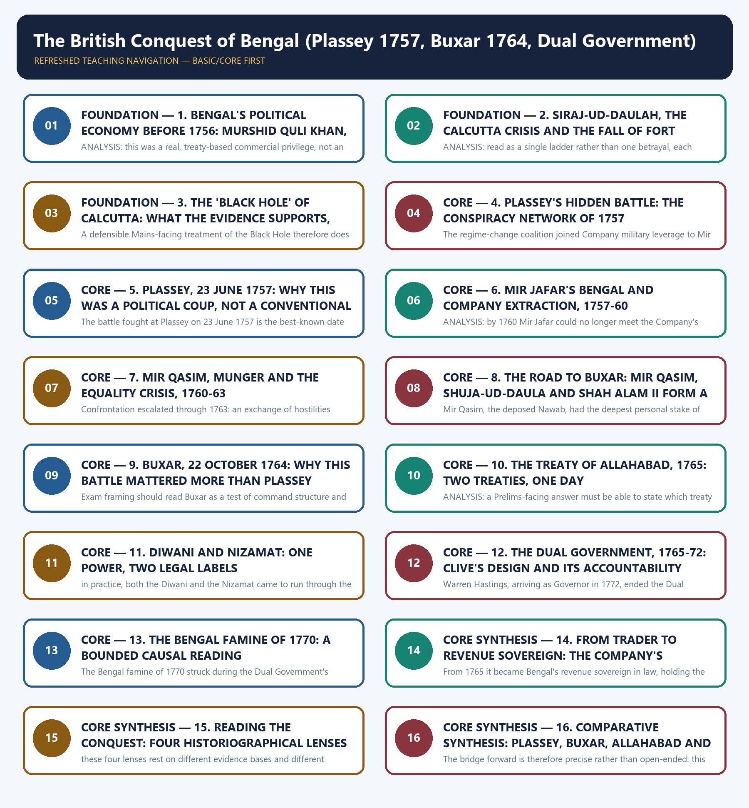

*Distinct embedded teaching-navigation image. The separate continuous Cārvāka-style flowchart package remains an independent at-a-glance artifact.*

#### Source audit, progression and syllabus boundary

- **Foundation:** chronology, institutions, actors and exact terminology.
- **Core:** mechanisms, comparisons, causal chains, Indian agency and exam traps.
- **Core synthesis:** historiography, answer architecture, boundaries and bridges.
- **Optional Advanced:** the separate owner is taught only after Basic practice.
- **Static source order:** repository Markdown → OCR-searchable Bipan Chandra, Sekhar Bandyopadhyay and Satish Chandra → bounded live anchor; Qdrant not needed.
- **PYQ integrity:** Repository routing audits assign Topic 04 zero direct PYQs. The verified 2022 GS-I Company-armies and famine questions remain explicitly labelled as bounded bridges owned by Topics 05 and 07; no official answer is fabricated.

#### Live-linkage block

✅ **Bounded contemporary-memory fact:** on 21 June 2026, *The Daily Star* reported a historical discussion urging readers to interpret Plassey through conspiracy, European rivalry, Murshidabad court tensions, commercial ambition, public memory and the contested meaning of an 'independent Bengal'.

⚠️ **Inference boundary:** the report is a historiography/public-memory anchor only. The 1717 privilege conflict, Plassey, Buxar, Diwani, Dual Government and famine analysis below rest on repository owners and local books. No suspicious AI-generated archive item is used.

### SESSION 1 — FOUNDATION — 1. BENGAL'S POLITICAL ECONOMY BEFORE 1756: MURSHID QULI KHAN, ALIVARDI KHAN AND THE LIMITS OF COMPANY PRIVILEGE

#### DEFINITION / WHAT THIS IS CALLED

**Plain-language definition:** ANALYSIS: Murshid Quli Khan, Alivardi Khan and Siraj-ud-Daulah in turn all resisted this extension of the 1717 privilege, because it was never authorised by any farman -- a careful Prelims-facing answer must hold this exact line: the 1717 farman was a real, Company-only, treaty-based exemption, while dastak abuse by servants and their agents was an unauthorised extension that no Nawab ever accepted, and confusing the two is the single most common error in Prelims-style option-writing on this period.

**Technical definition:** ANALYSIS: this was a real, treaty-based commercial privilege, not an unlimited licence, and every Bengal Nawab from Murshid Quli Khan onward treated it as exactly that -- a bounded exemption for the Company's own trade, not a cover for private profiteering by its servants or their Indian agents, which is precisely the distinction the next subtopic examines in detail.

#### ANSWER-GRABBING OPENING — WRITE/ADAPT IN THE EXAM

> ANALYSIS: Murshid Quli Khan, Alivardi Khan and Siraj-ud-Daulah in turn all resisted this extension of the 1717 privilege, because it was never authorised by any farman -- a careful Prelims-facing answer must hold this exact line: the 1717 farman was a real, Company-only, treaty-based exemption, while dastak abuse by servants and their agents was an unauthorised extension that no Nawab ever accepted, and confusing the two is the single most common error in Prelims-style option-writing on this period.

#### MUST-WRITE KEYWORDS

- **FOUNDATION**
- **Murshid Quli Khan**
- **Alivardi Khan**
- **the limits of Company privilege**
- **By**
- **1. Bengal's political economy before 1756**

**How to use them:** Frame the answer through FOUNDATION; define Murshid Quli Khan, connect Alivardi Khan with the limits of Company privilege to explain the mechanism, and use By for the decisive comparison or qualification.

By the middle of the eighteenth century Bengal was Mughal India's richest subah -- a dense, overlapping web of political authority and commercial opportunity, not a power vacuum waiting to be filled. Murshid Quli Khan, appointed Diwan of Bengal under Aurangzeb and later its de facto Nawab, had shifted the provincial capital from Dhaka to Murshidabad (named for himself) and built a stable ijaradari (revenue-farming) settlement that reduced jagir turnover and tied Bengal's finances closely to the Jagat Seth banking house, which financed the Nawab's treasury and, in time, much of Bengal's internal and external trade. His successors held this settlement together through the 1720s and 1730s; Alivardi Khan then took the throne after defeating and killing Sarfaraz Khan in 1740, and spent much of his reign containing repeated Maratha Bargi raids into western Bengal before agreeing, in 1751, to cede Orissa and pay an annual chauth to keep the Marathas out altogether. Alivardi died in April 1756 and was succeeded by his grandson, Siraj-ud-Daulah.

FACT: the English East India Company's core commercial privilege in Bengal rested on the 1717 farman of the Mughal emperor Farrukhsiyar, which confirmed duty-free import and export of the Company's own registered goods and the Company's right to issue dastak passes certifying such cargo as duty-exempt -- an extension of an earlier 1690s Aurangzeb-era concession, layered on Calcutta's existing zamindari and fortification rights. ANALYSIS: this was a real, treaty-based commercial privilege, not an unlimited licence, and every Bengal Nawab from Murshid Quli Khan onward treated it as exactly that -- a bounded exemption for the Company's own trade, not a cover for private profiteering by its servants or their Indian agents, which is precisely the distinction the next subtopic examines in detail.

Company privilege and Nawabi political authority overlapped at every major node of Bengal's political economy: Murshidabad (the Nawab's capital, mint and the Jagat Seths' headquarters), Kasimbazar (English, Dutch and French silk factories), Calcutta and Fort William (Company headquarters, fortified from 1755 without the Nawab's permission), Chandernagore (the rival French factory) and Hughli and Dhaka (older Mughal-era ports and administrative seats). This structural overlap -- not any single flashpoint -- produced the recurring friction that Siraj-ud-Daulah inherited in 1756, and it is why Part II treats the Calcutta crisis as an escalation ladder rather than a single act of provocation.

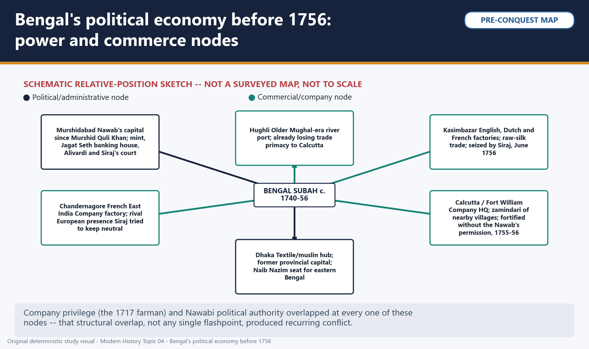

*Visual 1: Bengal's political economy before 1756: power and commerce nodes. Original deterministic study visual; schematic maps are NOT TO SCALE where marked.*


FACT: Company servants and their Indian trading partners routinely sold or misused dastak passes to cover private trade that had nothing to do with the Company's own registered goods, evading internal transit duties that Indian merchants continued to pay in full. ANALYSIS: Murshid Quli Khan, Alivardi Khan and Siraj-ud-Daulah in turn all resisted this extension of the 1717 privilege, because it was never authorised by any farman -- a careful Prelims-facing answer must hold this exact line: the 1717 farman was a real, Company-only, treaty-based exemption, while dastak abuse by servants and their agents was an unauthorised extension that no Nawab ever accepted, and confusing the two is the single most common error in Prelims-style option-writing on this period.


*Visual 2: The 1717 farman and the dastak: privilege vs abuse. Original deterministic study visual; schematic maps are NOT TO SCALE where marked.*


#### PART II - THE CALCUTTA CRISIS AND ITS MEMORY

#### CLOSING RECALL FLOW — FOUNDATION — 1. BENGAL'S POLITICAL ECONOMY BEFORE 1756: MURSHID QULI KHAN, ALIVARDI KHAN AND THE LIMITS OF COMPANY PRIVILEGE

```text
START / CONCEPT: FOUNDATION — 1. Bengal's political economy before 1756: Murshid Quli Khan, Alivardi Khan and the limits of Company privilege
        |
        v
EXACT TERMS: FOUNDATION · Murshid Quli Khan · Alivardi Khan · the limits of Company privilege · By · 1. Bengal's political economy before 1756
        |
        v
MECHANISM / ARGUMENT: ANALYSIS: this was a real, treaty-based commercial privilege, not an unlimited licence, and every Bengal Nawab from Murshid Quli Khan onward treated it as exactly that -- a bounded exemption for the Company's own trade, not a cover for private profiteering by its servants or their Indian agents, which is precisely the distinction the next subtopic examines in detail.
        |
        v
CONSEQUENCE / CONTRAST: By the middle of the eighteenth century Bengal was Mughal India's richest subah -- a dense, overlapping web of political authority and commercial opportunity, not a power vacuum waiting to be filled.
        |
        v
UPSC TRAP / ANSWER-USE: Do not miss this limiting distinction: murshid Quli Khan, appointed Diwan of Bengal under Aurangzeb and later its de facto...
        |
        v
ANSWER-GRABBING FORMULATION: ANALYSIS: Murshid Quli Khan, Alivardi Khan and Siraj-ud-Daulah in turn all resisted this extension of the 1717 privilege, because it was never authorised by any farman -- a careful Prelims-facing answer must hold this exact line: the 1717 farman was a real, Company-only, treaty-based exemption, while dastak abuse by servants and their agents was an unauthorised extension that no Nawab ever accepted, and confusing the two is the single most common error in Prelims-style option-writing on this period.
```
### SESSION 2 — FOUNDATION — 2. SIRAJ-UD-DAULAH, THE CALCUTTA CRISIS AND THE FALL OF FORT WILLIAM, 1756

#### DEFINITION / WHAT THIS IS CALLED

**Plain-language definition:** Siraj-ud-Daulah succeeded his grandfather Alivardi Khan in April 1756 as a young, insecure ruler facing rival claimants within his own court and a Company that had, since 1755, been strengthening Fort William's defences without seeking his permission -- ostensibly in anticipation of the wider Anglo-French war then breaking out in Europe (the Seven Years' War, 1756-63), which threatened to spill into Bengal through the rival English and French factories at Calcutta and Chandernagore.

**Technical definition:** ANALYSIS: read as a single ladder rather than one betrayal, each stage of this escalation narrowed Siraj's options and widened the Company's -- the unauthorised fortification created the original grievance, the Company's refusal to climb down converted a demand into a demonstration of resolve, and the fall of Calcutta itself then created the very opening (a humiliated Company needing to recover its position by force) that Robert Clive and Admiral Charles Watson exploited from Madras.

#### ANSWER-GRABBING OPENING — WRITE/ADAPT IN THE EXAM

> Siraj-ud-Daulah succeeded his grandfather Alivardi Khan in April 1756 as a young, insecure ruler facing rival claimants within his own court and a Company that had, since 1755, been strengthening Fort William's defences without seeking his permission -- ostensibly in anticipation of the wider Anglo-French war then breaking out in Europe (the Seven Years' War, 1756-63), which threatened to spill into Bengal through the rival English and French factories at Calcutta and Chandernagore.

#### MUST-WRITE KEYWORDS

- **FOUNDATION**
- **the Calcutta crisis**
- **the fall of Fort William**
- **2. Siraj-ud-Daulah**
- **1756-63**
- **1755-1757**

**How to use them:** Frame the answer through FOUNDATION; define the Calcutta crisis, connect the fall of Fort William with 2. Siraj-ud-Daulah to explain the mechanism, and use 1756-63 for the decisive comparison or qualification.

Siraj-ud-Daulah succeeded his grandfather Alivardi Khan in April 1756 as a young, insecure ruler facing rival claimants within his own court and a Company that had, since 1755, been strengthening Fort William's defences without seeking his permission -- ostensibly in anticipation of the wider Anglo-French war then breaking out in Europe (the Seven Years' War, 1756-63), which threatened to spill into Bengal through the rival English and French factories at Calcutta and Chandernagore. Siraj demanded that the English stop this unauthorised fortification and dismantle what had already been built; when the Calcutta Council under Governor Roger Drake refused or prevaricated, Siraj moved from warning to action.

FACT: Siraj first seized the English factory at Kasimbazar in early June 1756 as a demonstrative warning, then marched on Calcutta itself and captured Fort William on 20 June 1756; Drake and most senior officials fled downriver to Fulta, leaving the fort's remaining defenders to surrender. ANALYSIS: read as a single ladder rather than one betrayal, each stage of this escalation narrowed Siraj's options and widened the Company's -- the unauthorised fortification created the original grievance, the Company's refusal to climb down converted a demand into a demonstration of resolve, and the fall of Calcutta itself then created the very opening (a humiliated Company needing to recover its position by force) that Robert Clive and Admiral Charles Watson exploited from Madras.

The Company's response came in two stages. Clive and Watson sailed from Madras with troops and warships, recovered Calcutta on 2 January 1757, and secured the Treaty of Alinagar in February 1757, which restored the Company's trading privileges and compensation for its losses. They then moved pre-emptively against Chandernagore in March 1757, seizing the French factory and removing Siraj's potential European counterweight before any confrontation with the Nawab himself -- a calculated step that left Siraj diplomatically isolated just as the Plassey conspiracy, examined in Part III, was reaching maturity.

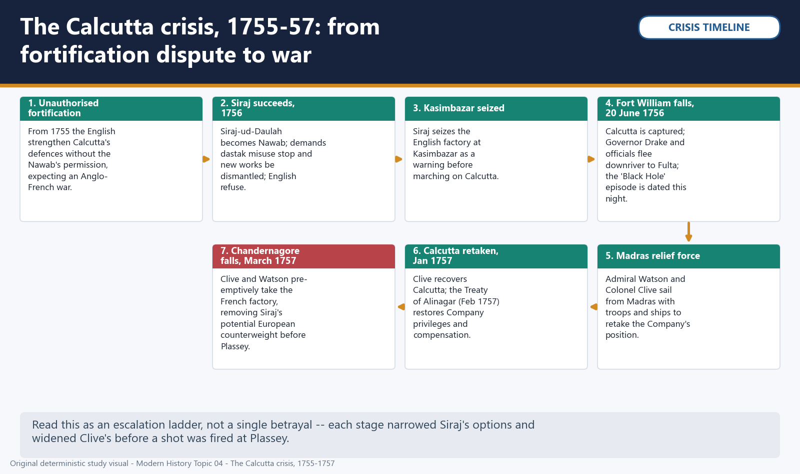

*Visual 3: The Calcutta crisis, 1755-1757: from fortification dispute to war. Original deterministic study visual; schematic maps are NOT TO SCALE where marked.*

#### CLOSING RECALL FLOW — FOUNDATION — 2. SIRAJ-UD-DAULAH, THE CALCUTTA CRISIS AND THE FALL OF FORT WILLIAM, 1756

```text
START / CONCEPT: FOUNDATION — 2. Siraj-ud-Daulah, the Calcutta crisis and the fall of Fort William, 1756
        |
        v
EXACT TERMS: FOUNDATION · the Calcutta crisis · the fall of Fort William · 2. Siraj-ud-Daulah · 1756-63 · 1755-1757
        |
        v
MECHANISM / ARGUMENT: ANALYSIS: read as a single ladder rather than one betrayal, each stage of this escalation narrowed Siraj's options and widened the Company's -- the unauthorised fortification created the original grievance, the Company's refusal to climb down converted a demand into a demonstration of resolve, and the fall of Calcutta itself then created the very opening (a humiliated Company needing to recover its position by force) that Robert Clive and Admiral Charles Watson exploited from Madras.
        |
        v
CONSEQUENCE / CONTRAST: Siraj demanded that the English stop this unauthorised fortification and dismantle what had already been built; when the Calcutta Council under Governor Roger Drake refused or prevaricated, Siraj moved from warning to action.
        |
        v
UPSC TRAP / ANSWER-USE: Do not miss this limiting distinction: they then moved pre-emptively against Chandernagore in March 1757, seizing the French factory and...
        |
        v
ANSWER-GRABBING FORMULATION: Siraj-ud-Daulah succeeded his grandfather Alivardi Khan in April 1756 as a young, insecure ruler facing rival claimants within his own court and a Company that had, since 1755, been strengthening Fort William's defences without seeking his permission -- ostensibly in anticipation of the wider Anglo-French war then breaking out in Europe (the Seven Years' War, 1756-63), which threatened to spill into Bengal through the rival English and French factories at Calcutta and Chandernagore.
```
### SESSION 3 — FOUNDATION — 3. THE 'BLACK HOLE' OF CALCUTTA: WHAT THE EVIDENCE SUPPORTS, AND WHAT IT DOES NOT

#### DEFINITION / WHAT THIS IS CALLED

**Plain-language definition:** The best-known episode of the Calcutta crisis is also its most historiographically contested.

**Technical definition:** A defensible Mains-facing treatment of the Black Hole therefore does two things at once: it declines to cite a precise casualty figure as verified fact, and it notes that the episode's contested memory -- not just the event itself -- is part of what a complete historical account must explain.

#### ANSWER-GRABBING OPENING — WRITE/ADAPT IN THE EXAM

> The best-known episode of the Calcutta crisis is also its most historiographically contested.

#### MUST-WRITE KEYWORDS

- **FOUNDATION**
- **what the evidence supports**
- **what it does not**
- **The best-known episode of the Calcutta crisis**
- **Calcutta**
- **3. The 'Black Hole' of Calcutta**

**How to use them:** Frame the answer through FOUNDATION; define what the evidence supports, connect what it does not with The best-known episode of the Calcutta crisis to explain the mechanism, and use Calcutta for the decisive comparison or qualification.

The best-known episode of the Calcutta crisis is also its most historiographically contested. J.Z. Holwell, a Company official captured when Fort William fell, later published an account describing English prisoners suffocating overnight, on 20-21 June 1756, in a small guardroom at the fort -- an episode that became known as the 'Black Hole of Calcutta' and, for generations of British readers, a founding atrocity story about Bengal.

FACT: Holwell's account rests on a single interested narrator -- a survivor with every institutional and personal incentive to dramatise his own ordeal -- and no independently corroborated casualty count exists; the room's capacity and the number of prisoners involved are both disputed in the historical record. ANALYSIS: source-critical practice requires treating a single-witness, self-interested account as exactly that, not as a settled body count, and a careful answer should note the evidentiary weakness explicitly rather than either repeating a specific death toll as fact or (equally unjustifiably) declaring the whole episode invented; the defensible position is agnosticism about the exact numbers, combined with clarity that the episode was real in some form but became inflated and politically instrumentalised in British colonial memory.

This is not merely an antiquarian dispute: the episode's memory became a live political site in the twentieth century. By that period, Indian nationalist opinion increasingly treated the Holwell narrative as exaggerated or invented specifically to blacken Siraj-ud-Daulah's reputation and retrospectively justify Company conquest; Subhas Chandra Bose led an actual civil-disobedience campaign in 1940 demanding the removal of the Holwell memorial in Calcutta, and the monument was subsequently taken down. A defensible Mains-facing treatment of the Black Hole therefore does two things at once: it declines to cite a precise casualty figure as verified fact, and it notes that the episode's contested memory -- not just the event itself -- is part of what a complete historical account must explain.

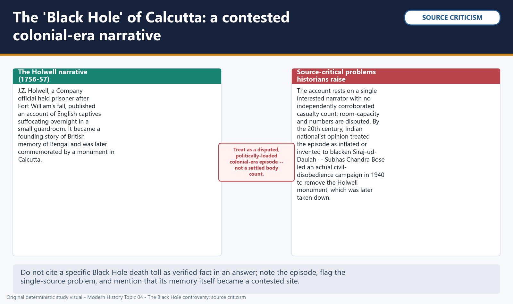

*Visual 4: The 'Black Hole' of Calcutta: a contested colonial-era narrative. Original deterministic study visual; schematic maps are NOT TO SCALE where marked.*


#### PART III - PLASSEY, 1757

#### CLOSING RECALL FLOW — FOUNDATION — 3. THE 'BLACK HOLE' OF CALCUTTA: WHAT THE EVIDENCE SUPPORTS, AND WHAT IT DOES NOT

```text
START / CONCEPT: FOUNDATION — 3. The 'Black Hole' of Calcutta: what the evidence supports, and what it does not
        |
        v
EXACT TERMS: FOUNDATION · what the evidence supports · what it does not · The best-known episode of the Calcutta crisis · Calcutta · 3. The 'Black Hole' of Calcutta
        |
        v
MECHANISM / ARGUMENT: By that period, Indian nationalist opinion increasingly treated the Holwell narrative as exaggerated or invented specifically to blacken Siraj-ud-Daulah's reputation and retrospectively justify Company conquest; Subhas Chandra Bose led an actual civil-disobedience campaign in 1940 demanding the removal of the Holwell memorial in Calcutta, and the monument was subsequently taken down.
        |
        v
CONSEQUENCE / CONTRAST: A defensible Mains-facing treatment of the Black Hole therefore does two things at once: it declines to cite a precise casualty figure as verified fact, and it notes that the episode's contested memory -- not just the event itself -- is part of what a complete historical account must explain.
        |
        v
UPSC TRAP / ANSWER-USE: Do not miss this limiting distinction: holwell, a Company official captured when Fort William fell, later published an account describing...
        |
        v
ANSWER-GRABBING FORMULATION: The best-known episode of the Calcutta crisis is also its most historiographically contested.
```
### SESSION 4 — CORE — 4. PLASSEY'S HIDDEN BATTLE: THE CONSPIRACY NETWORK OF 1757

#### DEFINITION / WHAT THIS IS CALLED

**Plain-language definition:** The Plassey conspiracy was a planned change of Nawab in which Company officials and dissatisfied Bengal elites coordinated before the battlefield encounter.

**Technical definition:** The regime-change coalition joined Company military leverage to Mir Jafar's command defection, Jagat Seth credit, Rai Durlabh's administrative position and Amichand's brokerage, thereby disabling Siraj-ud-Daulah's effective chain of command.

#### ANSWER-GRABBING OPENING — WRITE/ADAPT IN THE EXAM

> Plassey was politically decided through a coalition whose members sought different gains but converged on removing Siraj-ud-Daulah.

#### MUST-WRITE KEYWORDS

- **Company military leverage**
- **Mir Jafar**
- **Jagat Seth**
- **Rai Durlabh**
- **Amichand**
- **regime-change coalition**

**How to use them:** Map Company military leverage to Mir Jafar's non-participation, Jagat Seth's financial support and Rai Durlabh's administrative influence; then use Amichand to show that brokerage and deception operated within the regime-change coalition.

While the Chandernagore operation was underway, Clive and the Calcutta Council were simultaneously negotiating, from Fulta and Calcutta, a parallel political plot to replace Siraj-ud-Daulah with a more compliant Nawab. This conspiracy drew together a disaffected court faction with genuinely independent grievances against Siraj, not a group Clive invented from nothing: Mir Jafar, Siraj's Mir Bakshi (army paymaster and senior commander), stood to gain the throne itself and kept his own large contingent out of the Plassey fighting; the Jagat Seth banking house (led by Mahtab Rai and Swarup Chand), Bengal's leading financiers, feared Siraj's hostility to their commercial and political position and both financed and lent legitimacy to the plot; Rai Durlabh, Bengal's Diwan, brought fiscal and administrative backing and likewise held his contingent back from battle; and Amichand (Omichand), a wealthy Armenian-Bengali merchant-financier, served as the crucial go-between with Clive.

FACT: because Amichand knew enough about the conspiracy to threaten exposure unless he received a five per cent commission from the Nawab's treasury, Clive had two versions of the treaty prepared -- a genuine one on white paper without any clause for Amichand, and a second, fraudulent one on red paper carrying the commission clause, which was shown to Amichand alone; Admiral Watson refused to sign the fraudulent copy, so Clive had Watson's signature forged onto it. ANALYSIS: this episode is frequently cited as the clearest single instance of Clive's personal conduct at Plassey, and it matters analytically because it shows that deception was not confined to the conspiracy's Indian participants alone -- the Company's own commander defrauded his co-conspirator exactly as he was defrauding the sitting Nawab, which complicates any account that reduces Plassey to Indian betrayal alone.

Historians continue to debate whether the conspiracy originated within Murshidabad's own disaffected court faction or was substantially assembled and driven from Calcutta by Clive; what is not seriously disputed is the underlying collusion itself, between a genuinely alienated faction at Siraj's court and a Company willing to use bribery, forged documents and secret letters to engineer regime change before a single major battle was fought.


*Visual 5: The Plassey conspiracy, 1757: who wanted Siraj replaced, and why. Original deterministic study visual; schematic maps are NOT TO SCALE where marked.*

#### CLOSING RECALL FLOW — CORE — 4. PLASSEY'S HIDDEN BATTLE: THE CONSPIRACY NETWORK OF 1757

```text
START / CONCEPT: CORE — 4. Plassey's hidden battle: the conspiracy network of 1757
        |
        v
EXACT TERMS: Company military leverage · Mir Jafar · Jagat Seth · Rai Durlabh · Amichand · regime-change coalition
        |
        v
MECHANISM / ARGUMENT: Secret correspondence and treaty bargaining aligned the Company's capacity with elite control of credit, office and military contingents, so most of the Nawabi army was politically neutralised before the fighting at Plassey began.
        |
        v
CONSEQUENCE / CONTRAST: The coalition installed Mir Jafar and made the Company Bengal's kingmaker, but it did not yet confer the military supremacy or legal revenue title later secured through Buxar and the Diwani.
        |
        v
UPSC TRAP / ANSWER-USE: Do not reduce the coalition to a single-word betrayal story, treat every Indian actor as having the same motive, or claim that conspiracy at Plassey alone completed Company sovereignty.
        |
        v
ANSWER-GRABBING FORMULATION: Plassey was politically decided through a coalition whose members sought different gains but converged on removing Siraj-ud-Daulah.
```
### SESSION 5 — CORE — 5. PLASSEY, 23 JUNE 1757: WHY THIS WAS A POLITICAL COUP, NOT A CONVENTIONAL MILITARY TRIUMPH

#### DEFINITION / WHAT THIS IS CALLED

**Plain-language definition:** ANALYSIS: precisely because the fighting itself was this lopsided and this brief, the decisive factor at Plassey was not superior Company generalship or firepower in an open contest but the pre-arranged political conspiracy examined in subtopic 4 -- a matrix comparison makes the point directly: where a conventional military triumph would show a full day's pitched battle deciding the outcome through force of arms, what Plassey actually shows is numbers rendered irrelevant by a bargain struck in advance, with the fighting itself serving mainly to validate a political transaction rather than decide it.

**Technical definition:** The battle fought at Plassey on 23 June 1757 is the best-known date in this topic, and also the most commonly misdescribed.

#### ANSWER-GRABBING OPENING — WRITE/ADAPT IN THE EXAM

> ANALYSIS: precisely because the fighting itself was this lopsided and this brief, the decisive factor at Plassey was not superior Company generalship or firepower in an open contest but the pre-arranged political conspiracy examined in subtopic 4 -- a matrix comparison makes the point directly: where a conventional military triumph would show a full day's pitched battle deciding the outcome through force of arms, what Plassey actually shows is numbers rendered irrelevant by a bargain struck in advance, with the fighting itself serving mainly to validate a political transaction rather than decide it.

#### MUST-WRITE KEYWORDS

- **not a conventional military triumph**
- **Plassey**
- **Siraj-ud-Daulah's**
- **Clive's Company**
- **5. Plassey**
- **23 June 1757**

**How to use them:** Frame the answer through not a conventional military triumph; define Plassey, connect Siraj-ud-Daulah's with Clive's Company to explain the mechanism, and use 5. Plassey for the decisive comparison or qualification.

The battle fought at Plassey on 23 June 1757 is the best-known date in this topic, and also the most commonly misdescribed. Siraj-ud-Daulah's nominal army heavily outnumbered Clive's Company force, yet numbers barely mattered once the conspiracy had already neutralised the largest wings of that army: Mir Jafar's and Rai Durlabh's contingents, together the bulk of Siraj's strength, had a prior understanding with Clive and gave no order to engage. Real combat that day was confined to the smaller, genuinely loyal wing commanded by Mir Madan and Mohan Lal, which fought hard in an artillery exchange until Mir Madan was mortally wounded; once he fell, Siraj's headquarters lost its nerve, and Siraj -- advised, ironically, by the same Mir Jafar who had already agreed to replace him -- ordered a general retreat. Siraj fled the field, was captured attempting to escape further, and was executed on the orders of Mir Jafar's son Miran on 2 July 1757.

FACT: inherited casualty estimates for Plassey are not supported by an independently audited modern roll and should not be repeated as precise fact, and should be treated with the same caution as any inherited eighteenth-century casualty estimate. ANALYSIS: precisely because the fighting itself was this lopsided and this brief, the decisive factor at Plassey was not superior Company generalship or firepower in an open contest but the pre-arranged political conspiracy examined in subtopic 4 -- a matrix comparison makes the point directly: where a conventional military triumph would show a full day's pitched battle deciding the outcome through force of arms, what Plassey actually shows is numbers rendered irrelevant by a bargain struck in advance, with the fighting itself serving mainly to validate a political transaction rather than decide it.


*Visual 6: The Plassey battlefield, 23 June 1757: a schematic sketch. Original deterministic study visual; schematic maps are NOT TO SCALE where marked.*


Describing Plassey correctly in an examination therefore means describing a negotiated transfer of power validated by a brief, one-sided skirmish -- not a hard-fought battlefield victory that happened to change the throne. The immediate settlement installed Mir Jafar as Nawab and made the Company Bengal's de facto political kingmaker, but -- and this limit matters for what follows -- it did not yet make the Company Bengal's ruler in any legal sense; that further, more consequential step required Buxar and the Treaty of Allahabad, examined in Parts IV and V.

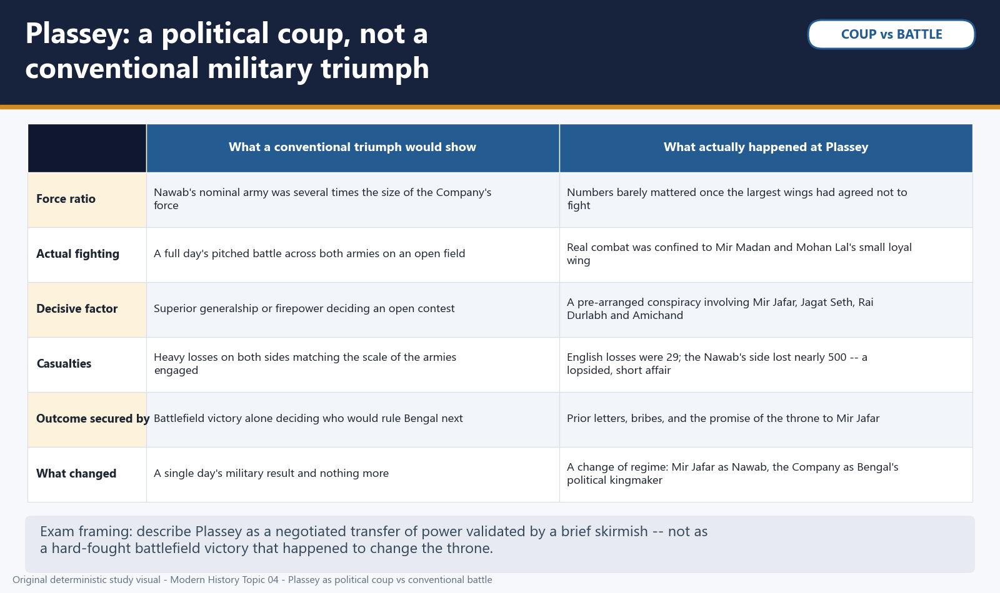

*Visual 7: Plassey: a political coup, not a conventional military triumph. Original deterministic study visual; schematic maps are NOT TO SCALE where marked.*


#### PART IV - MIR JAFAR, MIR QASIM AND THE ROAD TO BUXAR

#### CLOSING RECALL FLOW — CORE — 5. PLASSEY, 23 JUNE 1757: WHY THIS WAS A POLITICAL COUP, NOT A CONVENTIONAL MILITARY TRIUMPH

```text
START / CONCEPT: CORE — 5. Plassey, 23 June 1757: why this was a political coup, not a conventional military triumph
        |
        v
EXACT TERMS: not a conventional military triumph · Plassey · Siraj-ud-Daulah's · Clive's Company · 5. Plassey · 23 June 1757
        |
        v
MECHANISM / ARGUMENT: The battle fought at Plassey on 23 June 1757 is the best-known date in this topic, and also the most commonly misdescribed.
        |
        v
CONSEQUENCE / CONTRAST: inherited casualty estimates for Plassey are not supported by an independently audited modern roll and should not be repeated as precise fact, and should be treated with the same caution as any inherited eighteenth-century casualty estimate.
        |
        v
UPSC TRAP / ANSWER-USE: Describing Plassey correctly in an examination therefore means describing a negotiated transfer of power validated by a brief, one-sided skirmish -- not a hard-fought battlefield victory that happened to change the throne.
        |
        v
ANSWER-GRABBING FORMULATION: ANALYSIS: precisely because the fighting itself was this lopsided and this brief, the decisive factor at Plassey was not superior Company generalship or firepower in an open contest but the pre-arranged political conspiracy examined in subtopic 4 -- a matrix comparison makes the point directly: where a conventional military triumph would show a full day's pitched battle deciding the outcome through force of arms, what Plassey actually shows is numbers rendered irrelevant by a bargain struck in advance, with the fighting itself serving mainly to validate a political transaction rather than decide it.
```
### SESSION 6 — CORE — 6. MIR JAFAR'S BENGAL AND COMPANY EXTRACTION, 1757-60

#### DEFINITION / WHAT THIS IS CALLED

**Plain-language definition:** The Company and its individual officials received large transfers and concessions from Mir Jafar's treasury, alongside private fortunes accumulated by Company officials -- Clive's own share, combined with a substantial jagir grant, made him one of the wealthiest Company servants ever to return from India, and his later parliamentary testimony ("at this moment I stand astonished at my own moderation") is often cited precisely because it was delivered in his own defence against corruption charges, not as a boast.

**Technical definition:** ANALYSIS: by 1760 Mir Jafar could no longer meet the Company's escalating fresh demands (driven partly by the Company's own regional military commitments, including operations against the Dutch at Chinsura in 1759), and the Company deposed him in favour of his son-in-law, Mir Qasim -- a sequence that shows extraction and political control as mutually reinforcing rather than as a single bribe followed by stable rule.

#### ANSWER-GRABBING OPENING — WRITE/ADAPT IN THE EXAM

> The Company and its individual officials received large transfers and concessions from Mir Jafar's treasury, alongside private fortunes accumulated by Company officials -- Clive's own share, combined with a substantial jagir grant, made him one of the wealthiest Company servants ever to return from India, and his later parliamentary testimony ("at this moment I stand astonished at my own moderation") is often cited precisely because it was delivered in his own defence against corruption charges, not as a boast.

#### MUST-WRITE KEYWORDS

- **Company extraction**
- **The Company**
- **Mir Jafar's**
- **Company**
- **6. Mir Jafar's Bengal**
- **1757-60**

**How to use them:** Frame the answer through Company extraction; define The Company, connect Mir Jafar's with Company to explain the mechanism, and use 6. Mir Jafar's Bengal for the decisive comparison or qualification.

Mir Jafar's installation as Nawab immediately after Plassey converted the conspiracy's political bargain into a running financial and political relationship, not a one-off reward. The Company and its individual officials received large transfers and concessions from Mir Jafar's treasury, alongside private fortunes accumulated by Company officials -- Clive's own share, combined with a substantial jagir grant, made him one of the wealthiest Company servants ever to return from India, and his later parliamentary testimony ("at this moment I stand astonished at my own moderation") is often cited precisely because it was delivered in his own defence against corruption charges, not as a boast. Mir Jafar also ceded the zamindari of the 24 Parganas near Calcutta to the Company, converting it from a mere trading concern into a substantial territorial revenue-holder in its own right even before any Diwani grant existed.

FACT: this extraction operated as a repeating circuit rather than a single transaction -- Mir Jafar's dependence on Company military backing to hold his own throne required continual fresh payments, and each round of payment deepened his financial dependence on the Company, which in turn deepened the Company's political leverage over him. ANALYSIS: by 1760 Mir Jafar could no longer meet the Company's escalating fresh demands (driven partly by the Company's own regional military commitments, including operations against the Dutch at Chinsura in 1759), and the Company deposed him in favour of his son-in-law, Mir Qasim -- a sequence that shows extraction and political control as mutually reinforcing rather than as a single bribe followed by stable rule. It is worth being precise about scope here: this subtopic bounds itself to 1757-60 Company leverage and personal fortunes; the fuller structural drain-of-wealth analysis, spanning land revenue and the broader colonial economy, is Topic 07's material, not repeated here.

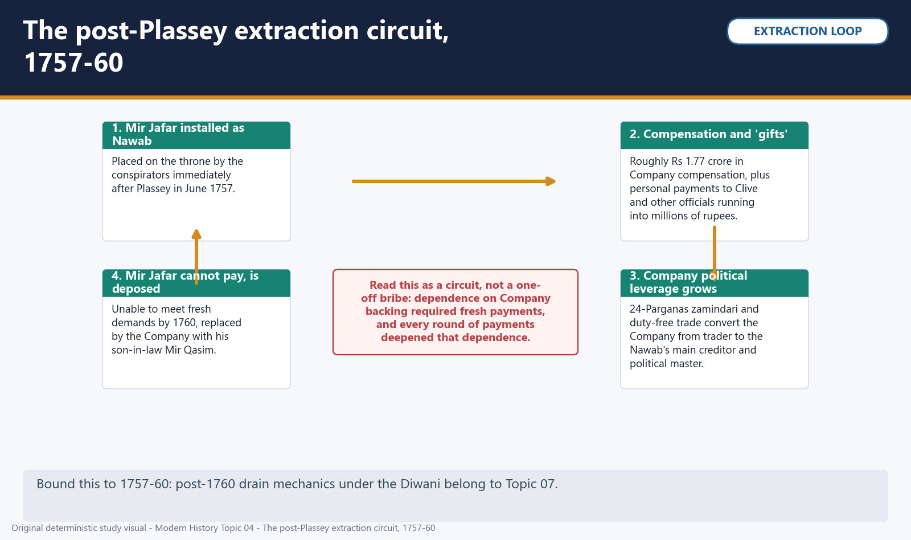

*Visual 8: The post-Plassey extraction circuit, 1757-60. Original deterministic study visual; schematic maps are NOT TO SCALE where marked.*

#### CLOSING RECALL FLOW — CORE — 6. MIR JAFAR'S BENGAL AND COMPANY EXTRACTION, 1757-60

```text
START / CONCEPT: CORE — 6. Mir Jafar's Bengal and Company extraction, 1757-60
        |
        v
EXACT TERMS: Company extraction · The Company · Mir Jafar's · Company · 6. Mir Jafar's Bengal · 1757-60
        |
        v
MECHANISM / ARGUMENT: ANALYSIS: by 1760 Mir Jafar could no longer meet the Company's escalating fresh demands (driven partly by the Company's own regional military commitments, including operations against the Dutch at Chinsura in 1759), and the Company deposed him in favour of his son-in-law, Mir Qasim -- a sequence that shows extraction and political control as mutually reinforcing rather than as a single bribe followed by stable rule.
        |
        v
CONSEQUENCE / CONTRAST: It is worth being precise about scope here: this subtopic bounds itself to 1757-60 Company leverage and personal fortunes; the fuller structural drain-of-wealth analysis, spanning land revenue and the broader colonial economy, is Topic 07's material, not repeated here.
        |
        v
UPSC TRAP / ANSWER-USE: Do not miss this limiting distinction: the Company and its individual officials received large transfers and concessions from Mir Jafar's...
        |
        v
ANSWER-GRABBING FORMULATION: The Company and its individual officials received large transfers and concessions from Mir Jafar's treasury, alongside private fortunes accumulated by Company officials -- Clive's own share, combined with a substantial jagir grant, made him one of the wealthiest Company servants ever to return from India, and his later parliamentary testimony ("at this moment I stand astonished at my own moderation") is often cited precisely because it was delivered in his own defence against corruption charges, not as a boast.
```
### SESSION 7 — CORE — 7. MIR QASIM, MUNGER AND THE EQUALITY CRISIS, 1760-63

#### DEFINITION / WHAT THIS IS CALLED

**Plain-language definition:** Mir Qasim, installed in 1760, was a considerably more capable and assertive ruler than his predecessor, and his reign is best read as a genuine reform effort colliding with the very Company leverage that had installed him.

**Technical definition:** Confrontation escalated through 1763: an exchange of hostilities between Mir Qasim's forces and Company detachments culminated in the killing of a large number of European prisoners at Patna in October 1763 -- an episode remembered as the Patna Massacre and carried out under commanders in Mir Qasim's service after fighting had already broken out -- while Mir Qasim's own forces suffered a rapid series of defeats at Company hands at Katwa, Giria and Udhanala later that year.

#### ANSWER-GRABBING OPENING — WRITE/ADAPT IN THE EXAM

> Mir Qasim, installed in 1760, was a considerably more capable and assertive ruler than his predecessor, and his reign is best read as a genuine reform effort colliding with the very Company leverage that had installed him.

#### MUST-WRITE KEYWORDS

- **Munger**
- **the equality crisis**
- **Mir Qasim**
- **Company**
- **7. Mir Qasim**
- **1760-63**

**How to use them:** Frame the answer through Munger; define the equality crisis, connect Mir Qasim with Company to explain the mechanism, and use 7. Mir Qasim for the decisive comparison or qualification.

Mir Qasim, installed in 1760, was a considerably more capable and assertive ruler than his predecessor, and his reign is best read as a genuine reform effort colliding with the very Company leverage that had installed him. He shifted his capital from Murshidabad to Munger (Monghyr) in Bihar, deliberately putting distance between himself and Calcutta's overbearing influence while positioning himself closer to his own recruits and revenue base; he reorganised revenue collection to strengthen his own fiscal position, and rebuilt a retrained, partly European-drilled army and artillery corps commanded in part by European mercenaries in his service, seeking real military self-sufficiency rather than dependence on Company protection.

FACT: in 1763, in direct response to the continuing abuse of dastak privileges by Company servants and their Indian agents -- who used tax-free passes to undercut Indian merchants who still paid internal transit duties in full -- Mir Qasim abolished internal transit duties altogether, for Indian and English private traders alike. ANALYSIS: Mir Qasim's stated aim was equal, uniform taxation for all merchants regardless of nationality, not an anti-British nationalist gesture in the modern sense; the Company's Calcutta Council, however, read this fairness measure as an intolerable threat to its private-trade profits precisely because it erased the very tax advantage that dastak abuse had manufactured, and rejected equal treatment outright -- a useful corrective to any answer that flattens Mir Qasim's reform into simple anti-colonial resistance, when his own aim was administrative and commercial parity, with conflict with the Company as a consequence rather than his primary objective.

Confrontation escalated through 1763: an exchange of hostilities between Mir Qasim's forces and Company detachments culminated in the killing of a large number of European prisoners at Patna in October 1763 -- an episode remembered as the Patna Massacre and carried out under commanders in Mir Qasim's service after fighting had already broken out -- while Mir Qasim's own forces suffered a rapid series of defeats at Company hands at Katwa, Giria and Udhanala later that year. Defeated and with his own territory lost, Mir Qasim fled to Awadh to seek the protection of its Nawab-Wazir, Shuja-ud-Daula, setting the stage for the coalition examined next.

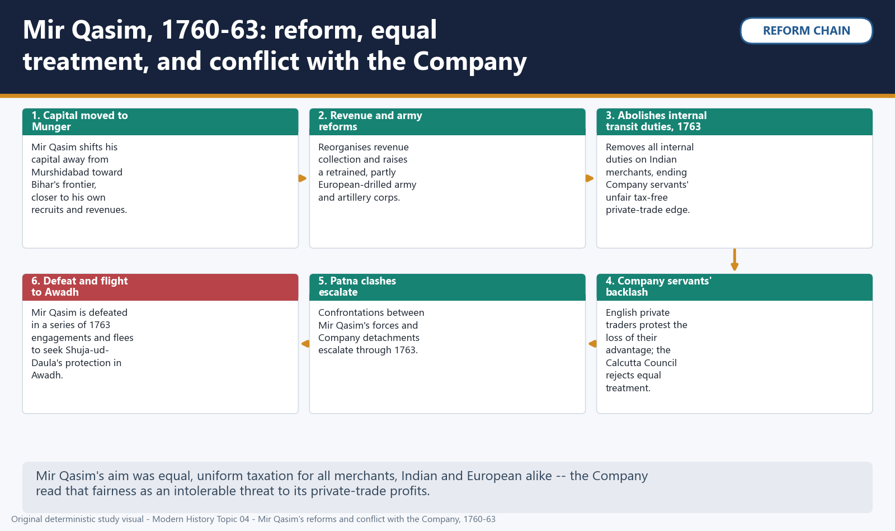

*Visual 9: Mir Qasim, 1760-63: reform, equal treatment, and conflict with the Company. Original deterministic study visual; schematic maps are NOT TO SCALE where marked.*

#### CLOSING RECALL FLOW — CORE — 7. MIR QASIM, MUNGER AND THE EQUALITY CRISIS, 1760-63

```text
START / CONCEPT: CORE — 7. Mir Qasim, Munger and the equality crisis, 1760-63
        |
        v
EXACT TERMS: Munger · the equality crisis · Mir Qasim · Company · 7. Mir Qasim · 1760-63
        |
        v
MECHANISM / ARGUMENT: Confrontation escalated through 1763: an exchange of hostilities between Mir Qasim's forces and Company detachments culminated in the killing of a large number of European prisoners at Patna in October 1763 -- an episode remembered as the Patna Massacre and carried out under commanders in Mir Qasim's service after fighting had already broken out -- while Mir Qasim's own forces suffered a rapid series of defeats at Company hands at Katwa, Giria and Udhanala later that year.
        |
        v
CONSEQUENCE / CONTRAST: The resulting consequence is that an exchange of hostilities between Mir Qasim's forces and Company detachments culminated in the...
        |
        v
UPSC TRAP / ANSWER-USE: Do not miss this limiting distinction: an exchange of hostilities between Mir Qasim's forces and Company detachments culminated in the...
        |
        v
ANSWER-GRABBING FORMULATION: Mir Qasim, installed in 1760, was a considerably more capable and assertive ruler than his predecessor, and his reign is best read as a genuine reform effort colliding with the very Company leverage that had installed him.
```
### SESSION 8 — CORE — 8. THE ROAD TO BUXAR: MIR QASIM, SHUJA-UD-DAULA AND SHAH ALAM II FORM A COALITION

#### DEFINITION / WHAT THIS IS CALLED

**Plain-language definition:** ANALYSIS: this segmented command structure is the analytical key to why the coalition ultimately lost to a numerically smaller but unified Company force under Hector Munro at Buxar -- three motives and three separate commanders produced one alliance in name but not one army in practice, a structural weakness examined directly in the next subtopic's comparison with the Company's command.

**Technical definition:** Mir Qasim, the deposed Nawab, had the deepest personal stake of the three and brought his own treasury and his drilled army to the alliance.

#### ANSWER-GRABBING OPENING — WRITE/ADAPT IN THE EXAM

> ANALYSIS: this segmented command structure is the analytical key to why the coalition ultimately lost to a numerically smaller but unified Company force under Hector Munro at Buxar -- three motives and three separate commanders produced one alliance in name but not one army in practice, a structural weakness examined directly in the next subtopic's comparison with the Company's command.

#### MUST-WRITE KEYWORDS

- **Mir Qasim**
- **Shuja-ud-Daula**
- **Shah Alam II form a coalition**
- **Nawab**
- **Shah Alam II**
- **8. The road to Buxar**

**How to use them:** Frame the answer through Mir Qasim; define Shuja-ud-Daula, connect Shah Alam II form a coalition with Nawab to explain the mechanism, and use Shah Alam II for the decisive comparison or qualification.

Mir Qasim's flight to Awadh in 1763 produced an alliance of genuine but distinct interests rather than a single unified anti-Company front. Mir Qasim, the deposed Nawab, had the deepest personal stake of the three and brought his own treasury and his drilled army to the alliance. Shuja-ud-Daula, Awadh's Nawab-Wazir, joined chiefly for the prospect of gaining Bihar and a promised indemnity from Mir Qasim, calculating that a weakened Company presence on his eastern frontier served Awadh's own interests. Shah Alam II, the fugitive Mughal emperor who had proclaimed himself emperor in Bihar in 1759 after his father Alamgir II's murder in Delhi, sought the coalition's military help to secure his own restoration and had every reason to see a reversal of Company power in Bengal and Bihar as a step toward that goal.

FACT: each of the three coalition partners retained control of their own treasury and their own military contingent, with no single supreme commander and no shared war-chest; coordination depended on shifting personal trust between three rulers who did not, in fact, fully trust one another. ANALYSIS: this segmented command structure is the analytical key to why the coalition ultimately lost to a numerically smaller but unified Company force under Hector Munro at Buxar -- three motives and three separate commanders produced one alliance in name but not one army in practice, a structural weakness examined directly in the next subtopic's comparison with the Company's command.


*Visual 10: The Buxar coalition, 1764: three partners, three motives. Original deterministic study visual; schematic maps are NOT TO SCALE where marked.*


#### PART V - BUXAR AND ALLAHABAD

#### CLOSING RECALL FLOW — CORE — 8. THE ROAD TO BUXAR: MIR QASIM, SHUJA-UD-DAULA AND SHAH ALAM II FORM A COALITION

```text
START / CONCEPT: CORE — 8. The road to Buxar: Mir Qasim, Shuja-ud-Daula and Shah Alam II form a coalition
        |
        v
EXACT TERMS: Mir Qasim · Shuja-ud-Daula · Shah Alam II form a coalition · Nawab · Shah Alam II · 8. The road to Buxar
        |
        v
MECHANISM / ARGUMENT: Mir Qasim, the deposed Nawab, had the deepest personal stake of the three and brought his own treasury and his drilled army to the alliance.
        |
        v
CONSEQUENCE / CONTRAST: each of the three coalition partners retained control of their own treasury and their own military contingent, with no single supreme commander and no shared war-chest; coordination depended on shifting personal trust between three rulers who did not, in fact, fully trust one another.
        |
        v
UPSC TRAP / ANSWER-USE: Do not miss this limiting distinction: shah Alam II, the fugitive Mughal emperor who had proclaimed himself emperor in Bihar...
        |
        v
ANSWER-GRABBING FORMULATION: ANALYSIS: this segmented command structure is the analytical key to why the coalition ultimately lost to a numerically smaller but unified Company force under Hector Munro at Buxar -- three motives and three separate commanders produced one alliance in name but not one army in practice, a structural weakness examined directly in the next subtopic's comparison with the Company's command.
```
### SESSION 9 — CORE — 9. BUXAR, 22 OCTOBER 1764: WHY THIS BATTLE MATTERED MORE THAN PLASSEY

#### DEFINITION / WHAT THIS IS CALLED

**Plain-language definition:** ANALYSIS: this is precisely why Buxar, not Plassey, is the strategically more decisive of the two engagements for a Mains-facing answer -- Plassey changed who occupied Bengal's throne, but it was Buxar that broke the coalition capable of contesting Company power across Bengal, Bihar and Awadh, clearing the path to the legal settlement examined next; an answer that treats Plassey alone as "the conquest of Bengal" misses the further, arguably more consequential step that Buxar and Allahabad supplied.

**Technical definition:** Exam framing should read Buxar as a test of command structure and logistics rather than of firepower alone; the fuller territorial-expansion narrative that follows from this military outcome -- the Company's subsequent campaigns and relationships with other regional powers -- is bounded here and belongs in full to Modern History Topic 05.

#### ANSWER-GRABBING OPENING — WRITE/ADAPT IN THE EXAM

> ANALYSIS: this is precisely why Buxar, not Plassey, is the strategically more decisive of the two engagements for a Mains-facing answer -- Plassey changed who occupied Bengal's throne, but it was Buxar that broke the coalition capable of contesting Company power across Bengal, Bihar and Awadh, clearing the path to the legal settlement examined next; an answer that treats Plassey alone as "the conquest of Bengal" misses the further, arguably more consequential step that Buxar and Allahabad supplied.

#### MUST-WRITE KEYWORDS

- **why this battle mattered more than Plassey**
- **Where Mir Qasim**
- **Shuja-ud-Daula**
- **Shah Alam II**
- **9. Buxar**
- **22 October 1764**

**How to use them:** Frame the answer through why this battle mattered more than Plassey; define Where Mir Qasim, connect Shuja-ud-Daula with Shah Alam II to explain the mechanism, and use 9. Buxar for the decisive comparison or qualification.

The coalition's combined forces met a unified Company army under Hector Munro at Buxar on 22 October 1764. Where Mir Qasim, Shuja-ud-Daula and Shah Alam II each retained separate treasuries and contingents with no shared command, Munro commanded one integrated force with a single chain of command, one supply and pay system, and one battle plan -- a structural advantage that outweighed the coalition's larger combined numbers and produced a comparatively decisive Company victory.

FACT: unlike Plassey, which was settled chiefly through a pre-arranged political conspiracy with minimal real fighting, Buxar was a harder-fought, more conventional pitched battle against a genuine coalition army, decided principally by the coalition's segmented command structure rather than by any comparable political arrangement beforehand. ANALYSIS: this is precisely why Buxar, not Plassey, is the strategically more decisive of the two engagements for a Mains-facing answer -- Plassey changed who occupied Bengal's throne, but it was Buxar that broke the coalition capable of contesting Company power across Bengal, Bihar and Awadh, clearing the path to the legal settlement examined next; an answer that treats Plassey alone as "the conquest of Bengal" misses the further, arguably more consequential step that Buxar and Allahabad supplied.


*Visual 11: Buxar, 22 October 1764: why segmented command lost to unified command. Original deterministic study visual; schematic maps are NOT TO SCALE where marked.*


Exam framing should read Buxar as a test of command structure and logistics rather than of firepower alone; the fuller territorial-expansion narrative that follows from this military outcome -- the Company's subsequent campaigns and relationships with other regional powers -- is bounded here and belongs in full to Modern History Topic 05.


*Visual 12: Plassey vs Buxar: comparing the two turning points. Original deterministic study visual; schematic maps are NOT TO SCALE where marked.*

#### CLOSING RECALL FLOW — CORE — 9. BUXAR, 22 OCTOBER 1764: WHY THIS BATTLE MATTERED MORE THAN PLASSEY

```text
START / CONCEPT: CORE — 9. Buxar, 22 October 1764: why this battle mattered more than Plassey
        |
        v
EXACT TERMS: why this battle mattered more than Plassey · Where Mir Qasim · Shuja-ud-Daula · Shah Alam II · 9. Buxar · 22 October 1764
        |
        v
MECHANISM / ARGUMENT: unlike Plassey, which was settled chiefly through a pre-arranged political conspiracy with minimal real fighting, Buxar was a harder-fought, more conventional pitched battle against a genuine coalition army, decided principally by the coalition's segmented command structure rather than by any comparable political arrangement beforehand.
        |
        v
CONSEQUENCE / CONTRAST: Exam framing should read Buxar as a test of command structure and logistics rather than of firepower alone; the fuller territorial-expansion narrative that follows from this military outcome -- the Company's subsequent campaigns and relationships with other regional powers -- is bounded here and belongs in full to Modern History Topic 05.
        |
        v
UPSC TRAP / ANSWER-USE: Do not miss this limiting distinction: where Mir Qasim, Shuja-ud-Daula and Shah Alam II each retained separate treasuries and contingents...
        |
        v
ANSWER-GRABBING FORMULATION: ANALYSIS: this is precisely why Buxar, not Plassey, is the strategically more decisive of the two engagements for a Mains-facing answer -- Plassey changed who occupied Bengal's throne, but it was Buxar that broke the coalition capable of contesting Company power across Bengal, Bihar and Awadh, clearing the path to the legal settlement examined next; an answer that treats Plassey alone as "the conquest of Bengal" misses the further, arguably more consequential step that Buxar and Allahabad supplied.
```
### SESSION 10 — CORE — 10. THE TREATY OF ALLAHABAD, 1765: TWO TREATIES, ONE DAY

#### DEFINITION / WHAT THIS IS CALLED

**Plain-language definition:** Under the separate treaty with Shuja-ud-Daula, Awadh was restored to him -- minus Kora, Allahabad and territory already occupied by the Company -- in exchange for a war indemnity, a defensive alliance, and duty-free Company trade within Awadh.

**Technical definition:** ANALYSIS: a Prelims-facing answer must be able to state which treaty did which job; a Mains-facing answer should further note that receiving the Diwani through an emperor still formally recognised as the ultimate source of legal authority in India let the Company present its new revenue power as legally derived and legitimate, even though that same emperor was, in practical terms, now a Company-protected pensioner with negligible independent power of his own.

#### ANSWER-GRABBING OPENING — WRITE/ADAPT IN THE EXAM

> these were two distinct legal instruments signed on the same day, not one combined settlement -- the Shah Alam II treaty created a legal revenue title for the Company in Bengal, Bihar and Orissa, while the Shuja-ud-Daula treaty separately secured Awadh as a buffer state to the Company's west.

#### MUST-WRITE KEYWORDS

- **two treaties**
- **one day**
- **Buxar's**
- **On**
- **Allahabad**
- **10. The Treaty of Allahabad**

**How to use them:** Frame the answer through two treaties; define one day, connect Buxar's with On to explain the mechanism, and use Allahabad for the decisive comparison or qualification.

Buxar's aftermath was settled diplomatically, not simply by continued conquest. On 12 August 1765, two separate treaties were signed at Allahabad, each doing a different job. Under the treaty with Shah Alam II, the Company received the Diwani -- the right to collect and administer land revenue -- of Bengal, Bihar and Orissa, in exchange for a stipulated annual payment to the emperor; in the same instrument, the emperor ceded the districts of Kora and Allahabad to himself, where he took up residence as a pensioned ruler substantially dependent on Company protection rather than as a governing sovereign in any effective sense. Under the separate treaty with Shuja-ud-Daula, Awadh was restored to him -- minus Kora, Allahabad and territory already occupied by the Company -- in exchange for a war indemnity, a defensive alliance, and duty-free Company trade within Awadh.

FACT: these were two distinct legal instruments signed on the same day, not one combined settlement -- the Shah Alam II treaty created a legal revenue title for the Company in Bengal, Bihar and Orissa, while the Shuja-ud-Daula treaty separately secured Awadh as a buffer state to the Company's west. ANALYSIS: a Prelims-facing answer must be able to state which treaty did which job; a Mains-facing answer should further note that receiving the Diwani through an emperor still formally recognised as the ultimate source of legal authority in India let the Company present its new revenue power as legally derived and legitimate, even though that same emperor was, in practical terms, now a Company-protected pensioner with negligible independent power of his own.

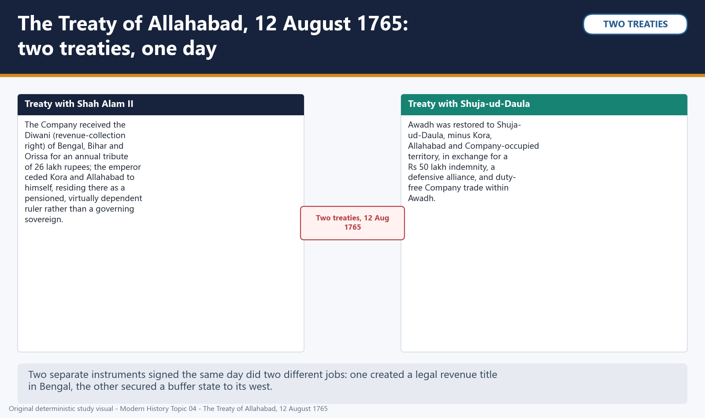

*Visual 13: The Treaty of Allahabad, 12 August 1765: two treaties, one day. Original deterministic study visual; schematic maps are NOT TO SCALE where marked.*

#### CLOSING RECALL FLOW — CORE — 10. THE TREATY OF ALLAHABAD, 1765: TWO TREATIES, ONE DAY

```text
START / CONCEPT: CORE — 10. The Treaty of Allahabad, 1765: two treaties, one day
        |
        v
EXACT TERMS: two treaties · one day · Buxar's · On · Allahabad · 10. The Treaty of Allahabad
        |
        v
MECHANISM / ARGUMENT: Under the separate treaty with Shuja-ud-Daula, Awadh was restored to him -- minus Kora, Allahabad and territory already occupied by the Company -- in exchange for a war indemnity, a defensive alliance, and duty-free Company trade within Awadh.
        |
        v
CONSEQUENCE / CONTRAST: Buxar's aftermath was settled diplomatically, not simply by continued conquest.
        |
        v
UPSC TRAP / ANSWER-USE: Do not miss this limiting distinction: on 12 August 1765, two separate treaties were signed at Allahabad, each doing a...
        |
        v
ANSWER-GRABBING FORMULATION: these were two distinct legal instruments signed on the same day, not one combined settlement -- the Shah Alam II treaty created a legal revenue title for the Company in Bengal, Bihar and Orissa, while the Shuja-ud-Daula treaty separately secured Awadh as a buffer state to the Company's west.
```
### SESSION 11 — CORE — 11. DIWANI AND NIZAMAT: ONE POWER, TWO LEGAL LABELS

#### DEFINITION / WHAT THIS IS CALLED

**Plain-language definition:** ANALYSIS: do not present Diwani and Nizamat as a genuine fifty-fifty power-sharing arrangement between the Company and the Nawab -- the correct exam-safe formulation is that the Company held the substantively powerful revenue right directly, while nominal executive authority remained with a Nawab whose own capacity to exercise it independently was already hollowed out, a distinction that becomes the central subject of the Dual Government examined in Part VI.

**Technical definition:** in practice, both the Diwani and the Nizamat came to run through the same set of Company-influenced deputies from very early on, so the split between the two was real and legally meaningful on paper but not an equal or operationally independent division of power in fact.

#### ANSWER-GRABBING OPENING — WRITE/ADAPT IN THE EXAM

> in practice, both the Diwani and the Nizamat came to run through the same set of Company-influenced deputies from very early on, so the split between the two was real and legally meaningful on paper but not an equal or operationally independent division of power in fact.

#### MUST-WRITE KEYWORDS

- **Nizamat**
- **one power**
- **two legal labels**
- **The Diwani**
- **Bengal's**
- **11. Diwani**

**How to use them:** Frame the answer through Nizamat; define one power, connect two legal labels with The Diwani to explain the mechanism, and use Bengal's for the decisive comparison or qualification.

The Diwani grant requires careful legal precision, because it did not transfer the whole of Bengal's governing authority to the Company in one stroke. The Diwani -- granted by the Mughal emperor -- was specifically the right to collect and administer land revenue in Bengal, Bihar and Orissa; the Company exercised it through Naib Diwans, Muhammad Reza Khan for Bengal and Raja Shitab Rai for Bihar, rather than through direct Company officials in the first instance. The Nizamat -- covering police, criminal justice and military administration -- was nominally retained by the Nawab of Bengal.

FACT: in practice, both the Diwani and the Nizamat came to run through the same set of Company-influenced deputies from very early on, so the split between the two was real and legally meaningful on paper but not an equal or operationally independent division of power in fact. ANALYSIS: do not present Diwani and Nizamat as a genuine fifty-fifty power-sharing arrangement between the Company and the Nawab -- the correct exam-safe formulation is that the Company held the substantively powerful revenue right directly, while nominal executive authority remained with a Nawab whose own capacity to exercise it independently was already hollowed out, a distinction that becomes the central subject of the Dual Government examined in Part VI.

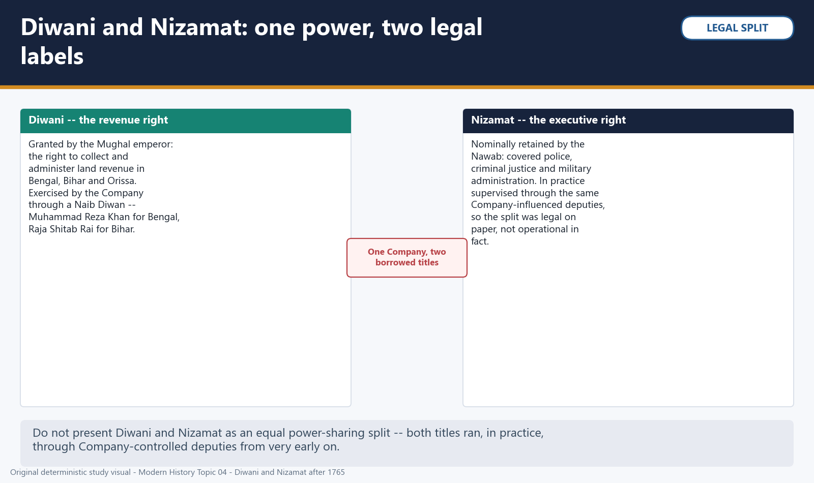

*Visual 14: Diwani and Nizamat: one power, two legal labels. Original deterministic study visual; schematic maps are NOT TO SCALE where marked.*


#### PART VI - THE DUAL GOVERNMENT AND ITS COSTS

#### CLOSING RECALL FLOW — CORE — 11. DIWANI AND NIZAMAT: ONE POWER, TWO LEGAL LABELS

```text
START / CONCEPT: CORE — 11. Diwani and Nizamat: one power, two legal labels
        |
        v
EXACT TERMS: Nizamat · one power · two legal labels · The Diwani · Bengal's · 11. Diwani
        |
        v
MECHANISM / ARGUMENT: The Diwani grant requires careful legal precision, because it did not transfer the whole of Bengal's governing authority to the Company in one stroke.
        |
        v
CONSEQUENCE / CONTRAST: ANALYSIS: do not present Diwani and Nizamat as a genuine fifty-fifty power-sharing arrangement between the Company and the Nawab -- the correct exam-safe formulation is that the Company held the substantively powerful revenue right directly, while nominal executive authority remained with a Nawab whose own capacity to exercise it independently was already hollowed out, a distinction that becomes the central subject of the Dual Government examined in Part VI.
        |
        v
UPSC TRAP / ANSWER-USE: Do not miss this limiting distinction: the Nizamat -- covering police, criminal justice and military administration -- was nominally retained...
        |
        v
ANSWER-GRABBING FORMULATION: in practice, both the Diwani and the Nizamat came to run through the same set of Company-influenced deputies from very early on, so the split between the two was real and legally meaningful on paper but not an equal or operationally independent division of power in fact.
```
### SESSION 12 — CORE — 12. THE DUAL GOVERNMENT, 1765-72: CLIVE'S DESIGN AND ITS ACCOUNTABILITY PARADOX

#### DEFINITION / WHAT THIS IS CALLED

**Plain-language definition:** CORE — 12. The Dual Government, 1765-72: Clive's design and its accountability paradox comprises Clive's design, its accountability paradox and Robert Clive as its core connected dimensions.

**Technical definition:** Warren Hastings, arriving as Governor in 1772, ended the Dual Government that year, having the Company itself "stand forth as Diwan" and administer revenue directly rather than through Naib Diwans, formally closing the seven-year experiment Clive had created.

#### ANSWER-GRABBING OPENING — WRITE/ADAPT IN THE EXAM

> this arrangement was Clive's own deliberate design, not an accident of circumstance, and it produced what is best described as an accountability paradox -- the Company exercised real power while bearing no formal responsibility for Bengal's governance or welfare, while the Nawab's government bore nominal responsibility while holding no real power to act on it.

#### MUST-WRITE KEYWORDS

- **Clive's design**
- **its accountability paradox**
- **Robert Clive**
- **Governor**
- **12. The Dual Government**
- **1765-72**

**How to use them:** Frame the answer through Clive's design; define its accountability paradox, connect Robert Clive with Governor to explain the mechanism, and use 12. The Dual Government for the decisive comparison or qualification.

Robert Clive, returning as Governor for a second term after Allahabad, deliberately chose not to have the Company assume direct, formal administration of Bengal in 1765. Instead he designed what came to be called the Dual Government: the Company held the Diwani and, through its Naib Diwans, the real revenue-collection and administrative power in Bengal, while the Nawab's government nominally retained the Nizamat -- answerability for law, order and criminal justice -- without the revenue or military resources needed to discharge that responsibility, since those now flowed through the Company's own deputies.

FACT: this arrangement was Clive's own deliberate design, not an accident of circumstance, and it produced what is best described as an accountability paradox -- the Company exercised real power while bearing no formal responsibility for Bengal's governance or welfare, while the Nawab's government bore nominal responsibility while holding no real power to act on it. ANALYSIS: this structure suited the Company's immediate interests precisely because it let it extract Bengal's revenue while avoiding the direct political and administrative costs -- and the international scrutiny -- that formal annexation would have invited, but it left no single accountable authority positioned to correct fiscal or administrative failure when one arose, a vulnerability the 1770 famine, examined next, exposed with particular clarity.

The clearest contemporary admission of the system's failure comes from Clive himself: testifying before the House of Commons in 1772, he stated that in Bengal "corruption universally prevails, and confusion and mismanagement pervade every department" -- a striking admission given that Clive had designed the very system he was describing. Warren Hastings, arriving as Governor in 1772, ended the Dual Government that year, having the Company itself "stand forth as Diwan" and administer revenue directly rather than through Naib Diwans, formally closing the seven-year experiment Clive had created.


*Visual 15: The Dual Government, 1765-72: an accountability paradox. Original deterministic study visual; schematic maps are NOT TO SCALE where marked.*


Holding the full sixteen-year span in view -- from the Calcutta crisis of 1756 through Hastings's reform in 1772 -- is itself an examiner-tested skill: Prelims option-writing routinely tests precise sequencing across 1757, 1764, 1765, 1770 and 1772, and a candidate who can anchor each date to the specific decision it represents, not merely to "a battle" or "a treaty" in the abstract, is far better placed than one who has only memorised the names.


*Visual 16: Master timeline: from the Calcutta crisis to the end of Dual Government. Original deterministic study visual; schematic maps are NOT TO SCALE where marked.*

#### CLOSING RECALL FLOW — CORE — 12. THE DUAL GOVERNMENT, 1765-72: CLIVE'S DESIGN AND ITS ACCOUNTABILITY PARADOX

```text
START / CONCEPT: CORE — 12. The Dual Government, 1765-72: Clive's design and its accountability paradox
        |
        v
EXACT TERMS: Clive's design · its accountability paradox · Robert Clive · Governor · 12. The Dual Government · 1765-72
        |
        v
MECHANISM / ARGUMENT: Warren Hastings, arriving as Governor in 1772, ended the Dual Government that year, having the Company itself "stand forth as Diwan" and administer revenue directly rather than through Naib Diwans, formally closing the seven-year experiment Clive had created.
        |
        v
CONSEQUENCE / CONTRAST: Instead he designed what came to be called the Dual Government: the Company held the Diwani and, through its Naib Diwans, the real revenue-collection and administrative power in Bengal, while the Nawab's government nominally retained the Nizamat -- answerability for law, order and criminal justice -- without the revenue or military resources needed to discharge that responsibility, since those now flowed through the Company's own deputies.
        |
        v
UPSC TRAP / ANSWER-USE: Robert Clive, returning as Governor for a second term after Allahabad, deliberately chose not to have the Company assume direct, formal administration of Bengal in 1765.
        |
        v
ANSWER-GRABBING FORMULATION: this arrangement was Clive's own deliberate design, not an accident of circumstance, and it produced what is best described as an accountability paradox -- the Company exercised real power while bearing no formal responsibility for Bengal's governance or welfare, while the Nawab's government bore nominal responsibility while holding no real power to act on it.
```
### SESSION 13 — CORE — 13. THE BENGAL FAMINE OF 1770: A BOUNDED CAUSAL READING

#### DEFINITION / WHAT THIS IS CALLED

**Plain-language definition:** ANALYSIS: both principal secondary accounts consulted for this package treat the famine as a compound failure -- a poor harvest meeting a fiscally rigid and administratively confused governance structure -- and that compound framing, not drought alone and not Company policy alone, is the defensible exam position; a monocausal answer in either direction should be marked down.

**Technical definition:** The Bengal famine of 1770 struck during the Dual Government's operation and must be explained with a bounded, multi-causal framing rather than any single, monocausal claim.

#### ANSWER-GRABBING OPENING — WRITE/ADAPT IN THE EXAM

> The Bengal famine of 1770 struck during the Dual Government's operation and must be explained with a bounded, multi-causal framing rather than any single, monocausal claim.

#### MUST-WRITE KEYWORDS

- **a bounded causal reading**
- **The Bengal**
- **Dual Government's**
- **Company**
- **13. The Bengal famine of 1770**
- **1769-70**

**How to use them:** Frame the answer through a bounded causal reading; define The Bengal, connect Dual Government's with Company to explain the mechanism, and use 13. The Bengal famine of 1770 for the decisive comparison or qualification.

The Bengal famine of 1770 struck during the Dual Government's operation and must be explained with a bounded, multi-causal framing rather than any single, monocausal claim. A poor 1768 harvest and drought conditions sharply reduced food-grain output heading into 1769-70 -- a genuine natural trigger that a defensible account cannot omit. But the famine's severity and the scale of suffering it produced cannot be explained by the natural trigger alone.

FACT: the Company continued to insist on near-full land-revenue collection through the famine, in some accounts even raising certain assessments in 1771, while Company and merchant trade in food-grain and other commodities continued to be conducted for commercial profit rather than being redirected toward relief; the Dual Government's own overlapping and unclear lines of Company and Naib Diwan authority further slowed any coordinated relief response. ANALYSIS: both principal secondary accounts consulted for this package treat the famine as a compound failure -- a poor harvest meeting a fiscally rigid and administratively confused governance structure -- and that compound framing, not drought alone and not Company policy alone, is the defensible exam position; a monocausal answer in either direction should be marked down.

On the human cost, this package deliberately withholds any specific mortality figure as verified fact. Both core textbooks consulted here describe an estimate of a very large but disputed scale of population loss, but this is a widely repeated estimate rather than a precise, census-based demographic count, and later colonial-era figures (such as those associated with W.W. Hunter's nineteenth-century account) are themselves historiographically disputed rather than officially audited. A defensible answer states the compound causal structure clearly, notes that contemporary and later estimates of scale exist without treating any single number as settled fact, and explicitly avoids fabricating precision the evidence does not support.


*Visual 17: The Bengal famine, 1770: a bounded, multi-causal reading. Original deterministic study visual; schematic maps are NOT TO SCALE where marked.*


#### PART VII - COMPANY, AGENCY AND HISTORIOGRAPHY

#### CLOSING RECALL FLOW — CORE — 13. THE BENGAL FAMINE OF 1770: A BOUNDED CAUSAL READING

```text
START / CONCEPT: CORE — 13. The Bengal famine of 1770: a bounded causal reading
        |
        v
EXACT TERMS: a bounded causal reading · The Bengal · Dual Government's · Company · 13. The Bengal famine of 1770 · 1769-70
        |
        v
MECHANISM / ARGUMENT: A defensible answer states the compound causal structure clearly, notes that contemporary and later estimates of scale exist without treating any single number as settled fact, and explicitly avoids fabricating precision the evidence does not support.
        |
        v
CONSEQUENCE / CONTRAST: ANALYSIS: both principal secondary accounts consulted for this package treat the famine as a compound failure -- a poor harvest meeting a fiscally rigid and administratively confused governance structure -- and that compound framing, not drought alone and not Company policy alone, is the defensible exam position; a monocausal answer in either direction should be marked down.
        |
        v
UPSC TRAP / ANSWER-USE: Both core textbooks consulted here describe an estimate of a very large but disputed scale of population loss, but this is a widely repeated estimate rather than a precise, census-based demographic count, and later colonial-era figures (such as those associated with W.W.
        |
        v
ANSWER-GRABBING FORMULATION: The Bengal famine of 1770 struck during the Dual Government's operation and must be explained with a bounded, multi-causal framing rather than any single, monocausal claim.
```
### SESSION 14 — CORE SYNTHESIS — 14. FROM TRADER TO REVENUE SOVEREIGN: THE COMPANY'S TRANSFORMATION AND THE SPECTRUM OF INDIAN AGENCY

#### DEFINITION / WHAT THIS IS CALLED

**Plain-language definition:** Tracing the Company's own transformation across this topic's sixteen-year span is itself a useful revision device.

**Technical definition:** From 1765 it became Bengal's revenue sovereign in law, holding the Diwani and collecting and disposing of land revenue through its own deputies.

#### ANSWER-GRABBING OPENING — WRITE/ADAPT IN THE EXAM

> This transformation was not something the Company achieved alone, and Indian participants across the period occupied a genuine spectrum of positions rather than a single moral category of either collaborator or victim.

#### MUST-WRITE KEYWORDS

- **CORE SYNTHESIS**
- **the Company's transformation**
- **the spectrum of Indian agency**
- **14. From trader to revenue sovereign**
- **1757-72**
- **1756-72**

**How to use them:** Frame the answer through CORE SYNTHESIS; define the Company's transformation, connect the spectrum of Indian agency with 14. From trader to revenue sovereign to explain the mechanism, and use 1757-72 for the decisive comparison or qualification.

Tracing the Company's own transformation across this topic's sixteen-year span is itself a useful revision device. Before 1757 it operated as a licensed trader, holding Mughal-Nawabi farman privilege as a commercial tenant of Bengal's political economy, not a ruler. Between 1757 and 1764 it became a political kingmaker, making and unmaking Nawabs (Mir Jafar, then Mir Qasim) while remaining formally a company of merchants. From 1765 it became Bengal's revenue sovereign in law, holding the Diwani and collecting and disposing of land revenue through its own deputies. From 1772, under Hastings, it became an administering state outright, replacing Indian intermediaries with its own officers.

FACT: this is best understood as a sequence of thresholds, each converting the gains of the previous stage into a wider claim to authority, rather than a single, sudden seizure of power in 1757. ANALYSIS: framing the conquest this way directly counters the common exam trap of treating Plassey alone as "the conquest of Bengal" -- the Company's status changed qualitatively at each of at least four distinct points, and a strong Mains answer should be able to name the specific legal or institutional change (zamindari grant, Diwani grant, Hastings's reform) that marked each threshold rather than treating 1757-72 as one undifferentiated process.

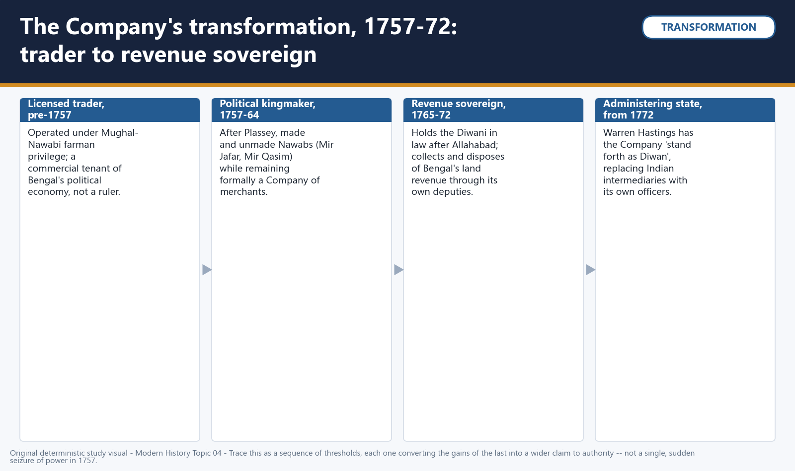

*Visual 18: The Company's transformation, 1757-72: trader to revenue sovereign. Original deterministic study visual; schematic maps are NOT TO SCALE where marked.*


This transformation was not something the Company achieved alone, and Indian participants across the period occupied a genuine spectrum of positions rather than a single moral category of either collaborator or victim. Mir Jafar joined the conspiracy for the throne and became financially and militarily dependent on Company backing -- a case of collaboration. The Jagat Seths financed the plot to protect their own commercial and credit position -- collaboration for calculated institutional interest, not personal ambition alone. Amichand acted as a go-between with Clive and was then cheated of his own promised commission by a forged treaty -- a case of constrained bargaining that still ended in betrayal by the very party he had helped. Mir Qasim cooperated at first as Company-installed Nawab, then resisted equal-trade encroachment on his own fiscal authority and lost -- conditional cooperation giving way to resistance. Siraj-ud-Daulah resisted Company fortification and privilege-abuse outright from the start and was removed from power by force -- direct resistance. Bengal's peasantry, by contrast, bore land-revenue demands and famine risk through 1770 with almost no political voice or protection at all.

FACT: reducing every one of these actors to either "traitor" or "dupe" flattens a set of genuinely different, unequally constrained choices into a single morality tale. ANALYSIS: the defensible exam position treats Indian agency across the conquest as a spectrum -- collaboration, constrained bargaining, conditional cooperation and resistance -- with each actor's position explicable by their own institutional interests and real (if unequal) options, not as a single verdict on "Indian character" or a simple story of European cunning defeating Indian innocence.


*Visual 19: Indian agency, 1756-72: a spectrum, not a single verdict. Original deterministic study visual; schematic maps are NOT TO SCALE where marked.*

#### CLOSING RECALL FLOW — CORE SYNTHESIS — 14. FROM TRADER TO REVENUE SOVEREIGN: THE COMPANY'S TRANSFORMATION AND THE SPECTRUM OF INDIAN AGENCY

```text
START / CONCEPT: CORE SYNTHESIS — 14. From trader to revenue sovereign: the Company's transformation and the spectrum of Indian agency
        |
        v
EXACT TERMS: CORE SYNTHESIS · the Company's transformation · the spectrum of Indian agency · 14. From trader to revenue sovereign · 1757-72 · 1756-72
        |
        v
MECHANISM / ARGUMENT: From 1765 it became Bengal's revenue sovereign in law, holding the Diwani and collecting and disposing of land revenue through its own deputies.
        |
        v
CONSEQUENCE / CONTRAST: ANALYSIS: the defensible exam position treats Indian agency across the conquest as a spectrum -- collaboration, constrained bargaining, conditional cooperation and resistance -- with each actor's position explicable by their own institutional interests and real (if unequal) options, not as a single verdict on "Indian character" or a simple story of European cunning defeating Indian innocence.
        |
        v
UPSC TRAP / ANSWER-USE: Between 1757 and 1764 it became a political kingmaker, making and unmaking Nawabs (Mir Jafar, then Mir Qasim) while remaining formally a company of merchants.
        |
        v
ANSWER-GRABBING FORMULATION: This transformation was not something the Company achieved alone, and Indian participants across the period occupied a genuine spectrum of positions rather than a single moral category of either collaborator or victim.
```
### SESSION 15 — CORE SYNTHESIS — 15. READING THE CONQUEST: FOUR HISTORIOGRAPHICAL LENSES

#### DEFINITION / WHAT THIS IS CALLED

**Plain-language definition:** Four historiographical lenses offer distinct, defensible ways of reading this topic's material, and naming the lens being used is itself an exam-earning move.

**Technical definition:** these four lenses rest on different evidence bases and different emphases, not a single agreed narrative, and each is defensible when applied consistently.

#### ANSWER-GRABBING OPENING — WRITE/ADAPT IN THE EXAM

> Four historiographical lenses offer distinct, defensible ways of reading this topic's material, and naming the lens being used is itself an exam-earning move.

#### MUST-WRITE KEYWORDS

- **CORE SYNTHESIS**
- **four historiographical lenses**
- **Four**
- **Plassey**
- **15. Reading the conquest**
- **1757-72**

**How to use them:** Frame the answer through CORE SYNTHESIS; define four historiographical lenses, connect Four with Plassey to explain the mechanism, and use 15. Reading the conquest for the decisive comparison or qualification.

Four historiographical lenses offer distinct, defensible ways of reading this topic's material, and naming the lens being used is itself an exam-earning move. The nationalist critique holds that Plassey and Buxar began a one-way economic drain; R.C. Dutt, as cited within Bipan Chandra's account, characterised the post-Plassey decades as a period of "open plunder and loot" -- a framing this package uses to explain post-Plassey extraction and the 1770 famine's fiscal backdrop, while leaving the full drain-of-wealth mechanics to Topic 07. The collaboration thesis holds that Indian elites -- bankers, zamindars, courtiers -- collaborated with the Company for their own local interests, not out of weakness, which explains directly why the Jagat Seths, Mir Jafar and Rai Durlabh joined the Plassey conspiracy. The corporate/fiscal-military state thesis, associated with historians including P.J. Marshall and C.A. Bayly, holds that the Company became a hybrid fiscal-military corporate state, continuous with earlier fiscal practice rather than a sudden rupture -- a lens that explains the Diwani grant and the Dual Government as an evolving revenue-military apparatus. A Bengal political-economy view, consistent with Sekhar Bandyopadhyay's account, emphasises that Bengal's own dense commercial and banking networks shaped how conquest and revenue extraction actually functioned on the ground, which explains the Jagat Seths' and Bengal's credit markets' central role throughout 1757-72.

FACT: these four lenses rest on different evidence bases and different emphases, not a single agreed narrative, and each is defensible when applied consistently. ANALYSIS: a strong Mains answer names the lens it is using explicitly -- "read through a nationalist lens" or "read through the collaboration thesis" -- and applies it consistently through the answer, rather than mixing incompatible framings within a single paragraph, which is precisely what examiners reward and what a mixed, unnamed framing forfeits.

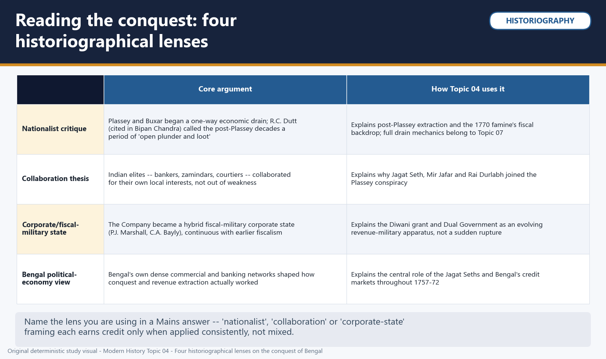

*Visual 20: Reading the conquest: four historiographical lenses. Original deterministic study visual; schematic maps are NOT TO SCALE where marked.*


#### PART VIII - SYNTHESIS AND THE BRIDGE FORWARD

#### CLOSING RECALL FLOW — CORE SYNTHESIS — 15. READING THE CONQUEST: FOUR HISTORIOGRAPHICAL LENSES

```text
START / CONCEPT: CORE SYNTHESIS — 15. Reading the conquest: four historiographical lenses
        |
        v
EXACT TERMS: CORE SYNTHESIS · four historiographical lenses · Four · Plassey · 15. Reading the conquest · 1757-72
        |
        v
MECHANISM / ARGUMENT: these four lenses rest on different evidence bases and different emphases, not a single agreed narrative, and each is defensible when applied consistently.
        |
        v
CONSEQUENCE / CONTRAST: Dutt, as cited within Bipan Chandra's account, characterised the post-Plassey decades as a period of "open plunder and loot" -- a framing this package uses to explain post-Plassey extraction and the 1770 famine's fiscal backdrop, while leaving the full drain-of-wealth mechanics to Topic 07.
        |
        v
UPSC TRAP / ANSWER-USE: The collaboration thesis holds that Indian elites -- bankers, zamindars, courtiers -- collaborated with the Company for their own local interests, not out of weakness, which explains directly why the Jagat Seths, Mir Jafar and Rai Durlabh joined the Plassey conspiracy.
        |
        v
ANSWER-GRABBING FORMULATION: Four historiographical lenses offer distinct, defensible ways of reading this topic's material, and naming the lens being used is itself an exam-earning move.
```
### SESSION 16 — CORE SYNTHESIS — 16. COMPARATIVE SYNTHESIS: PLASSEY, BUXAR, ALLAHABAD AND THE DUAL GOVERNMENT, AND THE BRIDGE FORWARD

#### DEFINITION / WHAT THIS IS CALLED

**Plain-language definition:** ANALYSIS: the recurring exam trap is treating Plassey as the whole story because it is the more famous name; a precise answer must be able to state which specific change followed from which specific event -- regime change from Plassey, legal revenue title from Allahabad -- and the Dual Government (1765-72) as the administrative structure that then converted that legal title into lived governance, however dysfunctionally, until Hastings ended it in 1772.

**Technical definition:** The bridge forward is therefore precise rather than open-ended: this topic's narrative closes in 1772, with Warren Hastings ending the Dual Government and the Company beginning to administer Bengal directly; the Regulating Act of 1773, which first subjected Company rule to parliamentary oversight, and the deeper economic architecture that Company rule then built on the foundation this topic describes, are Topics 06 and 07's material, picked up from exactly this point and not re-derived here.

#### ANSWER-GRABBING OPENING — WRITE/ADAPT IN THE EXAM

> ANALYSIS: the recurring exam trap is treating Plassey as the whole story because it is the more famous name; a precise answer must be able to state which specific change followed from which specific event -- regime change from Plassey, legal revenue title from Allahabad -- and the Dual Government (1765-72) as the administrative structure that then converted that legal title into lived governance, however dysfunctionally, until Hastings ended it in 1772.

#### MUST-WRITE KEYWORDS

- **CORE SYNTHESIS**
- **Plassey**
- **Buxar**
- **Allahabad**
- **the Dual Government**
- **16. Comparative synthesis**

**How to use them:** Frame the answer through CORE SYNTHESIS; define Plassey, connect Buxar with Allahabad to explain the mechanism, and use the Dual Government for the decisive comparison or qualification.

Bringing Plassey and Buxar into direct comparison sharpens exactly the causal-chain precision this topic tests most often. Plassey (1757) was a brief, one-sided skirmish decided mainly by a pre-arranged conspiracy, defeating a single Nawab with divided, half-loyal generals, under Clive's relatively small Company force reinforced from Madras; its mechanism was personal conspiracy and payment substituting for a real military contest, and its immediate outcome was Mir Jafar installed as a Company-dependent Nawab. Buxar (1764) was a harder-fought, more conventional pitched battle against a genuine three-part coalition -- a deposed Nawab, the Wazir of Awadh, and the Mughal emperor -- under Munro's unified force built on Bengal's post-Plassey resources; its mechanism was superior unified command defeating a larger but segmented coalition army, and its immediate outcome was the Treaty of Allahabad, granting the Diwani of Bengal-Bihar-Orissa to the Company.

FACT: Plassey made the Company Bengal's political kingmaker in practice; Buxar and Allahabad made the Company a recognised revenue-sovereign in law -- and it is this second, legal transformation that is the more strategically decisive of the two turning points. ANALYSIS: the recurring exam trap is treating Plassey as the whole story because it is the more famous name; a precise answer must be able to state which specific change followed from which specific event -- regime change from Plassey, legal revenue title from Allahabad -- and the Dual Government (1765-72) as the administrative structure that then converted that legal title into lived governance, however dysfunctionally, until Hastings ended it in 1772.

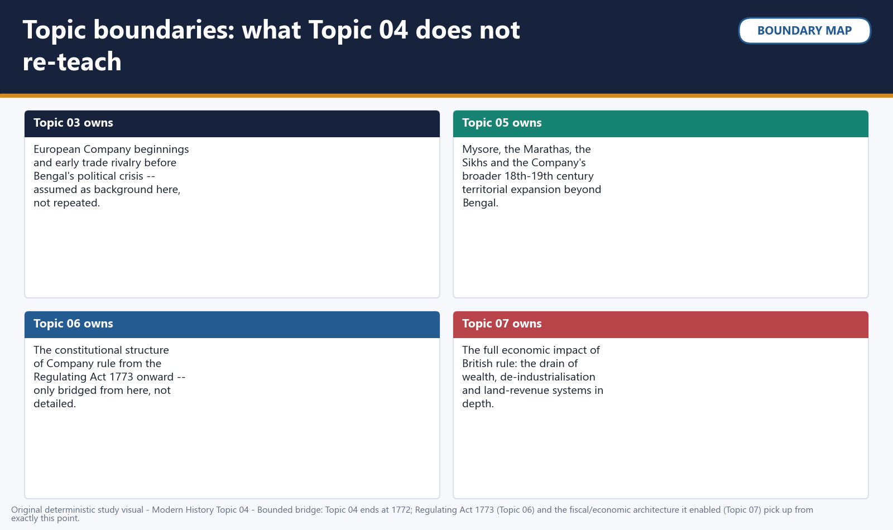

*Visual 21: Topic boundaries: what Topic 04 does not re-teach. Original deterministic study visual; schematic maps are NOT TO SCALE where marked.*


This topic's own boundary is worth stating plainly, because a well-bounded answer earns more credit than an overreaching one. Topic 03 owns the European Company's early beginnings and trade rivalry before Bengal's political crisis, assumed here as background and not repeated. Topic 05 owns Mysore, the Marathas, the Sikhs and the Company's broader eighteenth- and nineteenth-century territorial expansion beyond Bengal; Buxar and the coalition's military detail are referenced here only as far as they explain the Bengal settlement, not as a full campaign history. Topic 06 owns the constitutional structure of Company rule from the Regulating Act of 1773 onward, bridged here only at the exact point -- 1772 -- where this topic's own narrative ends. Topic 07 owns the full economic impact of British rule -- the drain of wealth, de-industrialisation and land-revenue systems in depth -- of which this topic's post-Plassey extraction and famine material are only the opening, bounded chapter.

The bridge forward is therefore precise rather than open-ended: this topic's narrative closes in 1772, with Warren Hastings ending the Dual Government and the Company beginning to administer Bengal directly; the Regulating Act of 1773, which first subjected Company rule to parliamentary oversight, and the deeper economic architecture that Company rule then built on the foundation this topic describes, are Topics 06 and 07's material, picked up from exactly this point and not re-derived here.

#### PART IX - SOURCES, PYQ AUDIT AND PRACTICE

#### CLOSING RECALL FLOW — CORE SYNTHESIS — 16. COMPARATIVE SYNTHESIS: PLASSEY, BUXAR, ALLAHABAD AND THE DUAL GOVERNMENT, AND THE BRIDGE FORWARD

```text
START / CONCEPT: CORE SYNTHESIS — 16. Comparative synthesis: Plassey, Buxar, Allahabad and the Dual Government, and the bridge forward
        |
        v
EXACT TERMS: CORE SYNTHESIS · Plassey · Buxar · Allahabad · the Dual Government · 16. Comparative synthesis
        |
        v
MECHANISM / ARGUMENT: Buxar (1764) was a harder-fought, more conventional pitched battle against a genuine three-part coalition -- a deposed Nawab, the Wazir of Awadh, and the Mughal emperor -- under Munro's unified force built on Bengal's post-Plassey resources; its mechanism was superior unified command defeating a larger but segmented coalition army, and its immediate outcome was the Treaty of Allahabad, granting the Diwani of Bengal-Bihar-Orissa to the Company.
        |
        v
CONSEQUENCE / CONTRAST: The bridge forward is therefore precise rather than open-ended: this topic's narrative closes in 1772, with Warren Hastings ending the Dual Government and the Company beginning to administer Bengal directly; the Regulating Act of 1773, which first subjected Company rule to parliamentary oversight, and the deeper economic architecture that Company rule then built on the foundation this topic describes, are Topics 06 and 07's material, picked up from exactly this point and not re-derived here.
        |
        v
UPSC TRAP / ANSWER-USE: Do not miss this limiting distinction: plassey made the Company Bengal's political kingmaker in practice.
        |
        v
ANSWER-GRABBING FORMULATION: ANALYSIS: the recurring exam trap is treating Plassey as the whole story because it is the more famous name; a precise answer must be able to state which specific change followed from which specific event -- regime change from Plassey, legal revenue title from Allahabad -- and the Dual Government (1765-72) as the administrative structure that then converted that legal title into lived governance, however dysfunctionally, until Hastings ended it in 1772.
```
### MODERN HISTORY DEEP-REVIEW CORE CONTROL

- **Must remember:** Plassey on 23 June 1757, Buxar on 22 October 1764, the 1765 Allahabad settlement and Diwani grant, and the 1765-72 Dual Government are separate stages.
- **Close distinction:** Plassey enabled political leverage through conspiracy and finance; Buxar established a broader military-fiscal superiority against Mir Qasim, Shuja-ud-Daula and Shah Alam II.
- **Evidence / interpretation limit:** Company records and later nationalist accounts must be checked against Bengal court, banking and revenue evidence; conquest was contingent, collaborative and coercive.

## BASIC MCQS / REMEDIATION

### Q1. What did the 1717 Farrukhsiyar farman actually grant the English East India Company in Bengal?

A. Duty-free import and export of the Company's own registered goods, certified by dastak passes
B. The right to maintain an armed garrison at Murshidabad itself
C. A permanent exemption from internal transit duties for any merchant carrying a Company employee's personal letter
D. Full zamindari and revenue-collection rights over Murshidabad and its surrounding parganas

**Answer: A.**
**Explanation:** The farman was a bounded, Company-only commercial privilege; the other options describe things no Nawab ever granted, or things that mimic servants' later dastak abuse rather than the farman's actual terms.

### Q2. Which of the following correctly describes resistance to dastak abuse before 1757?

A. The Mughal emperor personally revoked the 1717 farman once abuse was reported
B. Murshid Quli Khan, Alivardi Khan and Siraj-ud-Daulah all resisted the unauthorised extension of dastak privileges by Company servants
C. Only Siraj-ud-Daulah objected to it; Murshid Quli Khan and Alivardi Khan tolerated it as a cost of trade
D. Dastak abuse was permanently resolved by the Treaty of Alinagar in 1757

**Answer: B.**
**Explanation:** All three successive Nawabs objected to the same unauthorised extension; the farman was never revoked, and Alinagar addressed the Calcutta crisis of 1756-57, not dastak abuse specifically.

### Q3. Why did Siraj-ud-Daulah march on Calcutta in June 1756?

A. To seize the Company's textile monopoly at Dhaka
B. To pre-empt a French attack on Chandernagore
C. Because the English refused to stop unauthorised fortification of Fort William and dismantle existing works
D. In direct retaliation for the Black Hole incident

**Answer: C.**
**Explanation:** The fortification dispute was the proximate cause; the Black Hole is alleged to have occurred only after Calcutta fell, so it cannot have caused the march, and Chandernagore was seized by the Company later, not attacked by the French first.

### Q4. Why did Clive and Watson seize the French factory at Chandernagore in March 1757, before any confrontation with Siraj-ud-Daulah?

A. Because the 1717 farman entitled the Company to seize rival European factories during wartime
B. On the direct written order of Mir Jafar
C. Because Chandernagore had itself attacked Fort William in 1756
D. To remove Siraj's potential French counterweight while the Plassey conspiracy was maturing

**Answer: D.**
**Explanation:** This was a calculated pre-emptive move tied to the wider Anglo-French war and the developing Plassey conspiracy; no such Chandernagore attack, farman clause, or Mir Jafar directive existed.

### Q5. What is the principal source-critical problem with the Holwell account of the 'Black Hole of Calcutta'?

A. It rests on a single interested narrator with no independently corroborated casualty count
B. It was written by an anonymous Bengali chronicler with no connection to the Company
C. Modern forensic examination of the Fort William guardroom has settled the exact death toll
D. It was independently verified by three separate Company officials before publication

**Answer: A.**
**Explanation:** Holwell was himself a Company official and survivor with a strong personal stake in the story; no independent corroboration or forensic settlement of numbers exists, which is exactly why the episode must be treated as disputed.

### Q6. Which of the following was NOT part of the 1757 Plassey conspiracy network?

A. Rai Durlabh, Bengal's Diwan
B. Shuja-ud-Daula, the Nawab-Wazir of Awadh
C. The Jagat Seth banking house
D. Mir Jafar, Siraj-ud-Daulah's own Mir Bakshi

**Answer: B.**
**Explanation:** Shuja-ud-Daula joined the later Buxar coalition of 1764, seven years after Plassey; he had no role in the 1757 conspiracy against Siraj-ud-Daulah.

### Q7. What was the 'red treaty' deception in the Plassey conspiracy?

A. A secret treaty in which Mir Jafar promised Bengal's Diwani to the Mughal emperor
B. A false peace treaty shown to Siraj-ud-Daulah to delay his mobilisation
C. A fraudulent copy of the conspiracy treaty carrying a commission clause for Amichand, with Admiral Watson's signature forged onto it after he refused to sign
D. The genuine treaty version that was later honoured in full after Plassey

**Answer: C.**
**Explanation:** Clive prepared a genuine white-paper treaty without any Amichand clause and a fraudulent red-paper version with a forged Watson signature, deceiving his own co-conspirator, not Siraj or the emperor.

### Q8. Which best describes the decisive mechanism at the Battle of Plassey, 23 June 1757?

A. Naval bombardment from Company ships on the Hooghly river decided the outcome
B. Superior Company artillery overwhelmed a numerically smaller Nawabi force
C. A full day's pitched battle, evenly matched, was turned by a late cavalry charge
D. A pre-arranged political conspiracy had already neutralised most of Siraj's army before serious fighting began

**Answer: D.**
**Explanation:** Mir Jafar's and Rai Durlabh's wings, the bulk of Siraj's nominal strength, had a prior understanding with Clive and never engaged; the conspiracy, not artillery, naval power or a cavalry charge, was decisive.

### Q9. At Plassey, which two commanders led the only wing that fought hard for Siraj-ud-Daulah?

A. Mir Madan and Mohan Lal
B. Mir Jafar and Rai Durlabh
C. Amichand and Jagat Seth
D. Shuja-ud-Daula and Mir Qasim

**Answer: A.**
**Explanation:** Mir Madan and Mohan Lal's wing fought a genuine artillery duel; Mir Jafar and Rai Durlabh were the conspirators who withheld their forces, and the remaining names had no battlefield command role at Plassey.

### Q10. What territorial or fiscal concession did Mir Jafar grant the Company immediately after Plassey, beyond cash compensation?

A. The fortress and district of Munger
B. The zamindari of the 24 Parganas near Calcutta
C. The Diwani of Bengal, Bihar and Orissa
D. Duty-free trade throughout the entire Mughal empire

**Answer: B.**
**Explanation:** The Diwani came only in 1765 via the Treaty of Allahabad; the 24-Parganas zamindari grant is the correct 1757 concession, well before any Diwani existed.

### Q11. Why was Mir Jafar deposed by the Company in 1760?

A. He allied openly with the French at Chandernagore
B. He abolished internal transit duties, angering Company traders
C. He could no longer meet the Company's escalating fresh financial demands, driven partly by its regional military commitments
D. He refused to pay any compensation after Plassey

**Answer: C.**
**Explanation:** The duty-abolition measure (the fourth option) describes Mir Qasim's later 1763 reform, not Mir Jafar's; Mir Jafar's actual failure was fiscal exhaustion under continuing Company demands.

### Q12. Why did Mir Qasim shift his capital from Murshidabad to Munger after 1760?

A. Munger was closer to the Mughal emperor's court at Delhi
B. The Jagat Seths refused to extend him further credit at Murshidabad
C. Murshidabad had been destroyed in the Calcutta crisis fighting
D. To gain distance from Calcutta's overbearing influence while positioning himself closer to his own recruits and revenue base

**Answer: D.**
**Explanation:** The move to Munger (Monghyr) in Bihar was a deliberate assertion of administrative and military independence from Company oversight, not a response to any of the other listed events.

### Q13. What was Mir Qasim's stated aim in abolishing internal transit duties in 1763?

A. Equal, uniform taxation for Indian and European merchants alike
B. To punish Indian merchants who had collaborated with the Company
C. To comply with a direct order from the Mughal emperor Shah Alam II
D. To raise additional revenue for his own treasury by taxing all trade at a higher combined rate

**Answer: A.**
**Explanation:** Mir Qasim's measure removed duties rather than raising them; its explicit aim was competitive parity between Indian and European traders, not revenue-raising, favouritism, or imperial instruction.

### Q14. Which three parties formed the coalition defeated at the Battle of Buxar in 1764?

A. Mir Jafar, the Jagat Seths and Rai Durlabh
B. Mir Qasim, Shuja-ud-Daula and Shah Alam II
C. Warren Hastings, Muhammad Reza Khan and Raja Shitab Rai
D. Siraj-ud-Daulah, Amichand and Mir Madan

**Answer: B.**
**Explanation:** The first option names 1757 Plassey conspirators; the third mixes a Nawab already dead by 1764 with Plassey-era figures; the fourth names Dual Government-era administrators from after 1765, not the 1764 coalition.

### Q15. What was the principal reason the Buxar coalition lost to a numerically smaller Company force?

A. Shah Alam II refused to commit any troops to the battle
B. Heavy monsoon rains disabled the coalition's cavalry
C. The coalition's segmented command -- three separate treasuries and commanders with no shared war-chest -- could not match the Company's single unified chain of command
D. The coalition lacked artillery of any kind

**Answer: C.**
**Explanation:** The coalition did field a large combined force with artillery and committed troops from all three partners; its structural weakness was divided, mutually distrustful command, not equipment, troop refusal or weather.

### Q16. Which statement correctly distinguishes what Plassey changed from what Buxar and Allahabad changed?

A. Plassey granted the Diwani; Buxar merely confirmed Mir Jafar as Nawab
B. Both events achieved identical outcomes and can be treated as a single turning point
C. Buxar changed who sat on Bengal's throne; Plassey created the Company's legal revenue title
D. Plassey changed who sat on the throne; Buxar and Allahabad created the Company's legal revenue title, the more decisive change

**Answer: D.**
**Explanation:** The fourth option states the correct, examiner-tested sequence; the first and third options reverse the actual causal order, and the second collapses a distinction the exam specifically tests.

### Q17. The two treaties signed at Allahabad on 12 August 1765 did which two distinct things?

A. One granted the Company the Diwani of Bengal-Bihar-Orissa from Shah Alam II; the other restored Awadh to Shuja-ud-Daula in exchange for an indemnity
B. One treaty ended the Bengal famine response; the other began the Regulating Act process
C. Both treaties jointly restored the full Mughal empire's real authority over Bengal
D. One treaty abolished the Nizamat outright; the other created the Dual Government

**Answer: A.**
**Explanation:** The Diwani grant and the Awadh restoration were the two real 1765 instruments; the Nizamat was not abolished (it continued nominally), and the famine (1770) and Regulating Act (1773) are later, unrelated events.

### Q18. Which statement most accurately describes the Diwani-Nizamat split after 1765?

A. The Diwani and Nizamat were merged into a single office in 1765 and separated again only in 1772
B. The Company held the substantively powerful Diwani through its own Naib Diwans, while the Nawab's Nizamat was nominal and, in practice, ran through the same Company-influenced deputies
C. The Nizamat was more powerful than the Diwani because it covered military affairs
D. The Company and the Nawab shared power on genuinely equal terms, each fully independent in their own domain

**Answer: B.**
**Explanation:** The split was legally real but operationally unequal from very early on; describing it as equal power-sharing or as a merged office both misstate the arrangement, and revenue collection was the more consequential power in practice.

### Q19. The Dual Government's 'accountability paradox' refers to which arrangement?

A. The Nawab held real power while the Company held only ceremonial status
B. Both the Company and the Nawab held equal formal responsibility for Bengal's welfare
C. The Company held real power without formal responsibility, while the Nawab's government held nominal responsibility without real power
D. Neither the Company nor the Nawab held any responsibility for Bengal at all

**Answer: C.**
**Explanation:** This is Clive's own 1765 design, named directly in his 1772 testimony about pervasive 'confusion and mismanagement'; the other options each misstate which side held power versus responsibility.

### Q20. Which causal formulation for the Bengal famine of 1770 is most defensible?

A. A precise mortality total is required even when the evidence cannot sustain it.
B. Natural conditions alone explain severity and governance is irrelevant.
C. Company policy alone created the drought.
D. Harvest failure and disease formed the shock, while revenue rigidity and divided administration amplified vulnerability.

**Answer: D.**
**Explanation:** Harvest failure and disease formed the shock, while revenue rigidity and divided administration amplified vulnerability.

### Q21. Which term describes Murshid Quli Khan's method of assigning revenue collection to the highest bidder, later criticised for encouraging short-term extraction over long-term agrarian investment?

A. Ijaradari (revenue farming)
B. Permanent Settlement
C. Ryotwari settlement
D. Zamindari settlement

**Answer: A.**
**Explanation:** Ijaradari was Murshid Quli Khan's own method; the other three are different revenue systems from later, mostly post-1793 Company administration, not his Bengal.

### Q22. Two different battles at a place called Giria appear in this topic's timeline. Which pairing is correct?

A. Giria refers to a single 1757 battle also known as Plassey
B. Alivardi Khan's 1740 Giria victory was over Sarfaraz Khan for the Nawabship; Mir Qasim's 1763 Giria defeat was against the Company during his own conflict
C. Alivardi Khan's 1740 Giria victory was against the Company; Mir Qasim's 1763 Giria defeat was against Shuja-ud-Daula
D. Both Giria battles were fought by the same person, twenty-three years apart

**Answer: B.**
**Explanation:** These are two separate battles at the same place name, 23 years apart, involving different combatants and different stakes; year-anchoring, not the place name alone, distinguishes them.

### Q23. Which of these is the clearest example of individual servant abuse, as distinct from the Company's own chartered privilege?

A. The Company's right to fortify Fort William under its original settlement terms
B. The Company's right to mint coinage after 1765
C. A private Company servant using a personal dastak to move his own unregistered goods duty-free, for personal profit
D. The Company's tax-free trade in its own registered goods under the 1717 farman

**Answer: C.**
**Explanation:** This is precisely the abuse pattern Nawabs objected to -- a personal privilege stretched beyond its authorised, Company-only, registered-goods scope; the other options describe genuine institutional or later authorised rights.

### Q24. Which issue most directly converted Company-Nawab friction into the 1756 Calcutta crisis?

A. Mir Qasim abolished inland duties before becoming Nawab.
B. Awadh was annexed by the Company.
C. The Nawab granted the Company the Diwani before Plassey.
D. The Company strengthened Fort William without Nawabi permission and resisted Siraj's demand to stop.

**Answer: D.**
**Explanation:** The Company strengthened Fort William without Nawabi permission and resisted Siraj's demand to stop.

### Q25. Which Company factory fell to Siraj-ud-Daulah's forces in June 1756, before Fort William itself was attacked?

A. Kasimbazar
B. Chandernagore
C. Patna
D. Munger

**Answer: A.**
**Explanation:** Kasimbazar, the Company's up-country factory near Murshidabad, was seized first; Chandernagore was a French factory seized later by the Company itself, and Munger/Patna belong to Mir Qasim's later career.

### Q26. On which date did Fort William, Calcutta, fall to Siraj-ud-Daulah's forces in 1756?

A. 12 August 1765
B. 20 June 1756
C. 23 June 1757
D. 2 January 1757

**Answer: B.**
**Explanation:** Fort William fell on 20 June 1756; 2 January 1757 is Clive/Watson's recapture, 23 June 1757 is Plassey, and 12 August 1765 is the Treaty of Allahabad.

### Q27. What happened to the Holwell monument commemorating the 'Black Hole' victims in 1940?

A. It was declared a protected heritage monument by the Archaeological Survey of India
B. It was expanded into a full memorial museum by the colonial government
C. It was removed from its central Calcutta location amid nationalist campaigning that questioned the episode's contested memory
D. It was relocated to Fort William's parade ground for the first time

**Answer: C.**
**Explanation:** The 1940 removal, linked to nationalist agitation, reflects exactly the episode's disputed and politically charged historical memory, not commemorative expansion or heritage recognition.

### Q28. The Treaty of Alinagar, February 1757, achieved which outcome?

A. It formally deposed Siraj-ud-Daulah
B. It ended the Anglo-French rivalry in Bengal permanently
C. It granted the Company the Diwani of Bengal
D. It restored the Company's Calcutta privileges and compensated its losses, temporarily settling the crisis before Plassey

**Answer: D.**
**Explanation:** Alinagar was a temporary settlement following the Fort William recapture; the Diwani (1765) and Siraj's deposition (Plassey, June 1757) both came later, and Anglo-French rivalry continued well beyond 1757.

### Q29. What was the strategic significance of the Company's capture of French Chandernagore in March 1757?

A. It removed Siraj-ud-Daulah's potential French military counterweight just as the Plassey conspiracy was maturing
B. It marked the first Company factory established anywhere in Bengal
C. It directly triggered the Black Hole incident
D. It gave the Company its first access to Bengal's textile trade

**Answer: A.**
**Explanation:** The other options are chronologically impossible: Company textile-trade access and its first Bengal factories long predated 1757, and the Black Hole (1756) preceded Chandernagore's capture (1757), not the reverse.

### Q30. What is the most defensible reading of the Jagat Seth banking house's motive for joining the Plassey conspiracy?

A. A personal blood feud with Siraj-ud-Daulah's family stretching back generations
B. Protecting their credit and banking interests, which Siraj-ud-Daulah's hostility and unpredictability threatened
C. Direct instructions from the Mughal emperor Alamgir II
D. Religious solidarity with the incoming Company administration

**Answer: B.**
**Explanation:** The Jagat Seths' documented concern was financial and institutional self-preservation under an unpredictable young Nawab, fitting the broader pattern of interest-based, not simply ideological, participation.

### Q31. What official position did Rai Durlabh hold in Siraj-ud-Daulah's administration before joining the Plassey conspiracy?

A. Naib Nazim of Bihar
B. Mir Bakshi (paymaster-general)
C. Diwan (chief revenue officer) of Bengal
D. Qiladar of Munger fort

**Answer: C.**
**Explanation:** Rai Durlabh was Bengal's Diwan; Mir Jafar held the Mir Bakshi post, and the other two positions belong to different office-holders later in this topic's timeline.

### Q32. What was Amichand (Omichand)'s specific role in the events preceding Plassey?

A. Commander of Siraj-ud-Daulah's cavalry wing
B. The Mughal-appointed governor of Bihar
C. Bengal's Diwan and chief revenue officer
D. A wealthy merchant-broker who demanded a commission for his conspiracy role and was deceived by Clive's forged 'red treaty'

**Answer: D.**
**Explanation:** Amichand was a merchant-broker central to the conspiracy's financing and negotiation, not a military commander, revenue officer, or provincial governor.

### Q33. Robert Clive's role at Plassey is best described in modern analysis as combining which two functions?

A. Military commander and chief political negotiator of the conspiracy
B. Company director in London and Parliamentary representative
C. Mughal-appointed provincial governor and religious mediator
D. Naval admiral and chief revenue collector

**Answer: A.**
**Explanation:** Clive personally led both the nominal battlefield operation and the secret political negotiations with Mir Jafar's camp -- central to reading Plassey as a political coup rather than a purely military event.

### Q34. How should casualty claims about Plassey be handled in an examination answer?

A. Replace source criticism with larger speculative estimates.
B. Avoid unsupported precision and focus on the conspiracy-backed political mechanism rather than inherited battlefield totals.
C. State that no fighting occurred at all.
D. Treat every repeated textbook number as an audited roll.

**Answer: B.**
**Explanation:** Avoid unsupported precision and focus on the conspiracy-backed political mechanism rather than inherited battlefield totals.

### Q35. Which of the following was NOT part of the immediate 1757 Plassey settlement?

A. Company compensation payments and territorial concessions
B. Mir Jafar's installation as Nawab of Bengal
C. The grant of Diwani rights over Bengal, Bihar and Orissa
D. Confirmation of the Company's Calcutta trading privileges

**Answer: C.**
**Explanation:** The Diwani grant came only in 1765 via the Treaty of Allahabad, eight years after Plassey; the other three were genuinely part of the 1757 settlement.

### Q36. What best describes the post-Plassey extraction mechanism under Mir Jafar?

A. The Company immediately assumed direct administration in 1757.
B. A single payment ended Company intervention in Bengal.
C. Mir Jafar received the Diwani from Shah Alam II.
D. Transfers and concessions deepened the client's dependence and expanded Company political leverage.

**Answer: D.**
**Explanation:** Transfers and concessions deepened the client's dependence and expanded Company political leverage.

### Q37. What personal grant did Robert Clive receive from Mir Jafar in addition to Company compensation?

A. A jagir (land grant) yielding a substantial personal annual income, on top of personal gifts
B. Command of the Mughal imperial army
C. Ownership of the Jagat Seth banking house
D. The formal title of Nawab of Bengal

**Answer: A.**
**Explanation:** Clive's jagir grant became a major point of later controversy, including in his 1772-73 parliamentary scrutiny, precisely because it was a personal, not institutional, gain.

### Q38. After Plassey, how did the Company primarily sustain its political leverage over Bengal's Nawab?

A. Through direct Mughal imperial appointment as co-ruler
B. Through its role as kingmaker and financier, with a Nawab dependent on continued Company military support against external threats
C. Through a permanent occupation force stationed inside Murshidabad's palace
D. Through control of the Nawab's personal religious establishment

**Answer: B.**
**Explanation:** The Company's leverage was structural and financial-military, best understood as the extraction 'circuit' described for the 1757-60 period, not imperial appointment, palace occupation, or religious control.

### Q39. Why did the Company's demands on Mir Jafar escalate rather than stabilise after 1757?

A. Bengal's agricultural output increased, allowing larger extractions without strain
B. Mir Jafar voluntarily offered ever-larger gifts to secure Company favour
C. The Company's own regional military and administrative costs kept rising, and it passed these costs on to a Nawab it now effectively controlled
D. The Mughal emperor demanded an increased tribute share from the Company

**Answer: C.**
**Explanation:** Rising Company costs, not voluntary generosity, imperial pressure, or an agricultural windfall, drove the escalating demands that eventually exhausted Mir Jafar's capacity to pay.

### Q40. Which of the following was part of Mir Qasim's military and fiscal reform programme after 1760?

A. Outsourcing all revenue collection to European trading companies
B. Disbanding his standing army entirely in favour of feudal levies
C. Adopting French artillery exclusively while banning Indian gunsmiths
D. Reorganising and modernising his army's training and equipment while tightening fiscal administration from his new Munger base

**Answer: D.**
**Explanation:** Mir Qasim's programme aimed at strengthening, not disbanding, his military and administrative capacity; the other options describe measures he did not undertake.

### Q41. The Patna Massacre of October 1763 refers to which event?

A. The killing of a group of English Company prisoners on Mir Qasim's orders during his conflict with the Company
B. The killing of Siraj-ud-Daulah by Mir Jafar's son
C. A Company massacre of Bengali weavers protesting duty policy
D. A famine-related mass-death event in Patna city

**Answer: A.**
**Explanation:** The Patna Massacre refers specifically to Mir Qasim's killing of English captives during the escalating 1763 conflict; the other options describe unrelated or fictional events.

### Q42. In which order did Mir Qasim suffer defeats against the Company in 1763, before fleeing to Awadh?

A. Giria, then Udhanala, then Katwa
B. Katwa, then Giria, then Udhanala
C. All three battles were fought simultaneously on a single day
D. Udhanala, then Giria, then Katwa

**Answer: B.**
**Explanation:** The sequence of reverses at Katwa, Giria and Udhanala through 1763 progressively weakened Mir Qasim's position before his flight to Awadh; the other orderings do not match the actual campaign chronology.

### Q43. After his 1763 defeats, where did Mir Qasim take refuge, setting up the coalition that fought at Buxar?

A. The Maratha court at Pune
B. The Sikh Misls in Punjab
C. Shuja-ud-Daula's court in Awadh
D. The Mysore court under Haidar Ali

**Answer: C.**
**Explanation:** Mir Qasim fled to Awadh, where Shuja-ud-Daula's protection and shared interest with the fugitive emperor Shah Alam II formed the coalition that met the Company at Buxar in 1764.

### Q44. The Battle of Buxar was fought on which date, at a location on which river?

A. 2 January 1757, on the Hooghly at Calcutta
B. 12 August 1765, on the Ganges near Allahabad
C. 23 June 1757, on the Bhagirathi-Hooghly
D. 22 October 1764, on the Ganges near Buxar in present-day Bihar

**Answer: D.**
**Explanation:** The other three dates/locations belong to Plassey, the Treaty of Allahabad, and the Fort William recapture respectively -- each a genuinely different event in this topic's chronology.

### Q45. Major Hector Munro commanded the Company forces at Buxar; which of these best describes his command's key structural advantage?

A. A single, unified chain of command, unlike the coalition's three separate treasuries and commanders
B. Superior knowledge of the local terrain from decades of prior residence
C. Direct reinforcement from a simultaneous naval bombardment
D. Overwhelming numerical superiority of at least five to one

**Answer: A.**
**Explanation:** Munro's force was actually outnumbered by the coalition; its decisive advantage was unified command and coordination, not numbers, terrain familiarity, or naval support -- Buxar was an inland battle with no naval role.

### Q46. What happened to Mir Qasim after the Company's victory at Buxar?

A. He was executed publicly by the Company at Munger
B. He disappeared into obscurity, dying in reduced circumstances some years later without recovering political power
C. He became the Company's first Naib Diwan
D. He was restored as Nawab of Bengal under a new treaty

**Answer: B.**
**Explanation:** Unlike Shuja-ud-Daula and Shah Alam II, who both received negotiated 1765 settlements, Mir Qasim's political career effectively ended at Buxar without restoration, execution, or an administrative post.

### Q47. What was Shah Alam II's status under the 1765 Treaty of Allahabad arrangements?

A. Appointed as the Company's Resident at Murshidabad
B. Full sovereign ruler of Bengal, Bihar and Orissa with real administrative power
C. Nominal Mughal emperor, recognised in title, but a Company-supported pensioner holding Kora and Allahabad districts
D. Formally deposed and stripped of the imperial title altogether

**Answer: C.**
**Explanation:** Shah Alam II retained his imperial title and received Kora, Allahabad, and an annual payment, but held no genuine administrative power over Bengal -- distinct from full sovereignty, deposition, or a Company post.

### Q48. What did the 1765 Diwani grant change most directly?

A. It made the Company Nawab and abolished every Nizamat function.
B. It annexed Awadh into Bengal.
C. It created the EIC's original commercial charter.
D. It gave the Company a recognised legal-fiscal title to collect the revenues of Bengal, Bihar and Orissa.

**Answer: D.**
**Explanation:** It gave the Company a recognised legal-fiscal title to collect the revenues of Bengal, Bihar and Orissa.

### Q49. Which two districts were ceded to Shah Alam II as part of the 1765 Allahabad settlement, forming the material basis of his pensioner status?

A. Kora and Allahabad
B. Awadh and Lucknow
C. Munger and Patna
D. Murshidabad and Kasimbazar

**Answer: A.**
**Explanation:** Kora and Allahabad were the specific districts assigned to the emperor; the other pairs name places tied to different actors, including Awadh itself, which remained Shuja-ud-Daula's separately restored territory.

### Q50. What was the strategic result of the separate Allahabad settlement with Shuja-ud-Daula?

A. The settlement merged Diwani and Nizamat into Nawabship.
B. Most of Awadh was restored under its ruler so that it could serve as a buffer rather than being annexed.
C. Shah Alam II transferred the French factories to Awadh.
D. The Company made Mir Qasim Nawab again.

**Answer: B.**
**Explanation:** Most of Awadh was restored under its ruler so that it could serve as a buffer rather than being annexed.

### Q51. What powers did the Diwani specifically confer on its holder?

A. Command of the Nawab's standing army
B. Criminal justice administration across Bengal
C. The right to collect land revenue and administer civil justice in Bengal, Bihar and Orissa
D. Appointment of the Mughal emperor's own household staff

**Answer: C.**
**Explanation:** Revenue collection and civil justice were the Diwani's specific domain; military command and criminal justice belonged to the Nizamat, and household appointments were an unrelated Mughal court function.

### Q52. Which powers remained, at least nominally, within the Nizamat rather than the Diwani after 1765?

A. The stipulated annual payment to the emperor
B. Land revenue collection across the three provinces
C. Civil justice administration in revenue disputes
D. Criminal justice administration and nominal military command, formally retained by the Nawab's office

**Answer: D.**
**Explanation:** These functions stayed with the Nizamat in form, even as Company-influenced deputies effectively ran much administration in practice; the other options describe Diwani-side functions or the separate tribute arrangement.

### Q53. Who were appointed as the Company's principal Naib Diwans (deputy revenue administrators) for Bengal and Bihar respectively during the Dual Government?

A. Muhammad Reza Khan for Bengal and Raja Shitab Rai for Bihar
B. Robert Clive for Bengal and Hector Munro for Bihar
C. Mir Jafar for Bengal and Mir Qasim for Bihar
D. Warren Hastings for Bengal and Robert Clive for Bihar

**Answer: A.**
**Explanation:** Muhammad Reza Khan and Raja Shitab Rai were the actual Indian intermediaries administering revenue for the Company; the other names belong to earlier Nawabs or Company officials holding different roles.

### Q54. In 1772, Warren Hastings ended the Dual Government by taking which specific step?

A. Transferring the Diwani back to the Mughal emperor
B. Having the Company itself 'stand forth as Diwan,' assuming direct revenue administration rather than governing through Naib Diwans
C. Restoring full sovereign power to the Nawab of Bengal
D. Formally annexing Bengal to the British Crown

**Answer: B.**
**Explanation:** Hastings's own phrase, that the Company would 'stand forth as Diwan,' captures the shift to direct administration; Crown annexation came only in 1858, and no full Nawabi restoration or Diwani reversion occurred.

### Q55. Which combination of factors is the most defensible explanation for the severity of the Bengal famine of 1770?

A. A sudden, unprecedented locust infestation with no prior harvest problems
B. Company revenue policy alone, with no natural trigger
C. A poor 1768 harvest and 1769-70 drought combined with revenue rigidity, commercial priorities and Dual Government administrative confusion
D. Drought alone, with governance playing no meaningful role

**Answer: C.**
**Explanation:** The sources consulted converge on compound causation combining natural and governance factors; monocausal claims and the unsupported locust claim overstate certainty the evidence does not provide.

### Q56. Which sequence best captures the Company's transformation described in this topic, from trader to sovereign power?

A. Sovereign power first, then trading company, then kingmaker
B. Kingmaker first, then sovereign power, then trading company
C. Trading company and sovereign power simultaneously from the Company's founding in 1600
D. Trading company with local privileges, then political kingmaker after Plassey, then direct revenue sovereign after Buxar and the Diwani grant

**Answer: D.**
**Explanation:** This sequence -- commerce, then political leverage, then formal revenue sovereignty -- is the structural transformation this topic traces, unfolding across nearly a decade, not instantaneously or in reverse order.

### Q57. Which of these best reflects a 'constrained choice' rather than a simple 'betrayal' reading of Mir Jafar's role in the Plassey conspiracy?

A. Mir Jafar, as a senior military commander sidelined by Siraj-ud-Daulah's inner circle, saw an alliance with the Company as his best available path to power
B. Mir Jafar was coerced at gunpoint into signing the conspiracy treaty
C. Mir Jafar had no prior relationship with Siraj-ud-Daulah's court and joined the conspiracy as an outsider
D. Mir Jafar acted purely out of personal greed with no institutional context whatsoever

**Answer: A.**
**Explanation:** Reading his choice through his actual institutional position is the 'constrained choice' framing this topic uses, in contrast to a purely moralised, coercion-based, or context-free account.

### Q58. Which named historian's phrase 'open plunder and loot,' cited within Bipan Chandra's own analysis, represents the nationalist historiographical critique of Company extraction from Bengal?

A. C.A. Bayly
B. R.C. Dutt
C. P.J. Marshall
D. Percival Spear

**Answer: B.**
**Explanation:** R.C. Dutt's characterisation, as cited in Bipan Chandra's work, represents the nationalist economic-drain critique; Marshall and Bayly represent a different, corporate/fiscal-military-state historiographical lens.

### Q59. The 'collaboration thesis' historiographical lens on Plassey and its aftermath emphasises which analytical focus?

A. Denial that Bengal's political economy played any role in the conquest
B. Purely military tactics and troop-movement analysis
C. The specific institutional interests (bankers, nobles, military commanders) that led Indian elites to align with the Company at particular moments
D. A single moral verdict of collective Indian betrayal

**Answer: C.**
**Explanation:** This lens, associated with the wider Cambridge school approach, is precisely about specific, interest-based elite alignment, not troop movements, a single moral verdict, or a denial of political-economy context.

### Q60. Which historiographical framing, associated with historians such as P.J. Marshall and C.A. Bayly, describes the Company's post-Plassey transformation?

A. The 'pure commerce' view, denying any political or military dimension to the Company's activity
B. The 'monocausal drought' explanation applied to the entire conquest period
C. The 'betrayal narrative,' focused solely on Mir Jafar's personal culpability
D. The 'corporate-military-fiscal state' framing, describing the Company's fusion of trading, taxing and war-making functions into a single institutional form

**Answer: D.**
**Explanation:** This framing captures the Company's institutional fusion of commerce, coercion and revenue administration, distinct from a personalised betrayal narrative, a purely commercial view, or an unrelated drought-based explanation.

### Q61. Which historiographical approach, associated with historians such as Sekhar Bandyopadhyay, situates the conquest within Bengal's own pre-existing political-economic structures rather than treating it as an external event imposed on a passive region?

A. The Bengal political-economy approach, tracing continuities and ruptures in Bengal's own commercial and agrarian structures across the conquest period
B. The 'purely religious' approach, framing the conquest as a primarily sectarian conflict
C. The 'sudden rupture' approach, treating 1757 as a total break with no prior continuity
D. The 'great man' approach, explaining the conquest solely through Clive's individual genius

**Answer: A.**
**Explanation:** This approach foregrounds Bengal's own internal political-economic structures and continuities, in contrast to a sudden-rupture, sectarian, or purely biographical framing.

### Q62. In a comparative assessment, why is Buxar often judged strategically more decisive than Plassey, despite Plassey's greater fame?

A. Plassey is historiographically disputed while Buxar's outcome faces no historical debate
B. Buxar, through the subsequent Treaty of Allahabad, produced the Company's formal legal revenue title (the Diwani), whereas Plassey only changed Bengal's ruling personnel
C. Buxar involved a larger territorial area than all of Bengal
D. Buxar was fought entirely without any Indian participants on either side

**Answer: B.**
**Explanation:** The decisive distinction is legal-institutional, not territorial scale, participant composition, or relative historiographical controversy -- both battles in fact involve debate and predominantly Indian troops on most sides.

### Q63. Topic 04 ends its narrative at 1772-73. Which subsequent development is explicitly handed to a later topic (Topic 06) rather than analysed in depth here?

A. The Battle of Buxar's tactical details
B. The 1763 abolition of internal transit duties by Mir Qasim
C. The 1773 Regulating Act's reform of Company governance structures
D. The exact terms of the 1765 Diwani grant

**Answer: C.**
**Explanation:** The Regulating Act of 1773, and the constitutional reforms that followed it, are explicitly Topic 06's material; Topic 04's own boundary ends at the Dual Government's 1772 termination, used here only as a forward-looking bridge.

### Q64. How many Prelims or Mains questions are directly routed to Topic 04 in this repository's own PYQ ledgers, as verified by this topic's audit?

A. Twelve, spread evenly across the past decade
B. One, from 2022, owned exclusively by this topic
C. Three, all from the 2013-2015 period
D. Zero directly routed items; only two adjacent items exist, both explicitly owned by other topics and used here strictly as bounded, labelled bridges

**Answer: D.**
**Explanation:** The repository's own ledgers show zero PYQs routed to Topic 04; the two adjacent items used in this package are explicitly attributed to their owning topics (05 and 07), never claimed as Topic 04's own.

### Q65. A student writes: 'The 1717 farman itself authorised Company servants to trade duty-free using dastaks for their personal goods.' What is the correct remedial statement?

A. The farman authorised only the Company's own registered trade goods; dastak misuse for servants' personal trade was an unauthorised extension that Nawabs consistently resisted
B. The farman authorised personal trade but only for goods worth under a fixed value
C. The statement is entirely accurate as written
D. The farman was issued in 1757, not 1717, making the entire statement's date wrong

**Answer: A.**
**Explanation:** This is the single most common conflation in this topic; the date 1717 is itself correct, so the fix is scope (Company-only vs personal), not the year.

### Q66. A student writes: 'Plassey was a hard-fought, evenly matched pitched battle decided by superior British tactics.' What is the correct remedial statement?

A. The statement is accurate; British tactical superiority alone explains the outcome
B. Real fighting was confined mainly to Mir Madan's and Mohan Lal's small loyal wing; the bulk of Siraj's nominal force, under conspirators Mir Jafar and Rai Durlabh, never engaged -- making this substantially a political, not tactical, victory
C. The battle lasted several days of continuous fighting before a British breakthrough
D. Naval bombardment, not land tactics, decided the battle

**Answer: B.**
**Explanation:** The evenly-matched/tactical-superiority framing, and the multi-day and naval-bombardment variants, all misdescribe Plassey's actual, largely pre-arranged, one-day outcome.

### Q67. A student writes: 'The British conquest of Bengal was complete by 1757.' What is the correct remedial statement?

A. The statement is accurate; nothing of significance happened after 1757
B. The conquest was actually complete earlier, by 1740
C. Plassey (1757) only changed Bengal's ruling personnel; the Company's durable legal revenue title came only with Buxar (1764) and the Treaty of Allahabad (1765) -- conquest in the fullest sense is an eight-year process, not a single 1757 event
D. The conquest was not complete until the Regulating Act of 1773

**Answer: C.**
**Explanation:** While 1773 is too late a marker (governance reform, not conquest, is what that year addresses), the core correction is that 1757 alone did not establish revenue sovereignty -- that took until 1765.

### Q68. A student writes: 'The Company received the Diwani of Bengal immediately after its victory at Plassey in 1757.' What is the correct remedial statement?

A. The statement is accurate as written
B. The Diwani was granted at the Treaty of Alinagar in early 1757
C. The Diwani was granted in 1740, well before Plassey
D. The Diwani was granted only in 1765, via the Treaty of Allahabad, eight years after Plassey, following the Company's separate victory at Buxar

**Answer: D.**
**Explanation:** This 1757-vs-1765 date confusion is one of the most heavily exam-tested traps in this topic; the eight-year gap and Buxar's intervening role must be stated explicitly.

### Q69. A student writes: 'Mir Jafar granted the Company the Diwani of Bengal after Plassey in 1757.' What is the correct remedial statement?

A. Mir Jafar granted the Company the zamindari of the 24 Parganas in 1757; the Diwani came only in 1765 from Emperor Shah Alam II, not from Mir Jafar
B. No grant of any kind was made in 1757
C. The statement is accurate; Mir Jafar did grant the Diwani in 1757
D. Mir Jafar granted the Nizamat, not the Diwani, in 1757

**Answer: A.**
**Explanation:** The specific 1757 grant was the 24-Parganas zamindari from Mir Jafar; the Diwani is a distinct 1765 grant from a different authority (the Mughal emperor), not the Nawab.

### Q70. A student writes: 'Mir Jafar abolished internal transit duties to promote equal trade in 1763.' What is the correct remedial statement?

A. The statement is accurate as written
B. This measure belongs to Mir Qasim, not Mir Jafar; Mir Jafar had already been deposed in 1760, three years before this 1763 reform
C. The measure refers to a Company policy, not any Nawab's initiative
D. The measure was actually undertaken jointly by both Nawabs in sequence

**Answer: B.**
**Explanation:** This is a common actor-confusion error; keeping the 1757-60 Mir Jafar period and the 1760-63 Mir Qasim period chronologically separate resolves it immediately.

### Q71. A student writes: 'Alivardi Khan was defeated at the Battle of Giria.' What is the correct remedial statement?

A. There is no such place as Giria in this topic's chronology
B. Both Giria battles were fought against the Company by the same ruler
C. Alivardi Khan won at Giria in 1740 (over Sarfaraz Khan, to become Nawab); Mir Qasim suffered a defeat at a place also called Giria in 1763, during his conflict with the Company -- two different battles, 23 years apart
D. The statement is accurate as written

**Answer: C.**
**Explanation:** The place-name repetition (Giria, 1740 and 1763) is a frequent trap; year-anchoring each battle to its correct ruler and opponent resolves the confusion.

### Q72. A student writes: 'Mir Jafar and Jagat Seth led the coalition defeated at Buxar in 1764.' What is the correct remedial statement?

A. Mir Jafar and Jagat Seth were present at Buxar but played a minor role
B. Only Jagat Seth was present at Buxar; Mir Jafar was not involved in this period at all
C. The statement is accurate as written
D. Mir Jafar and Jagat Seth were 1757 Plassey conspirators; the 1764 Buxar coalition instead comprised Mir Qasim, Shuja-ud-Daula and Shah Alam II

**Answer: D.**
**Explanation:** This is a common cross-event actor confusion; Plassey's conspirators (1757) and Buxar's coalition members (1764) are two entirely distinct sets of historical actors, separated by seven years and opposing loyalties.

### Q73. A student writes: 'The Nizamat gave the Company the right to collect land revenue in Bengal.' What is the correct remedial statement?

A. Revenue collection was the Diwani's function, held substantively by the Company; the Nizamat covered criminal justice and nominal military command, retained in form by the Nawab
B. Both the Diwani and Nizamat covered identical, overlapping functions with no real distinction
C. The Nizamat was abolished in 1765, so it held no functions at all
D. The statement is accurate as written

**Answer: A.**
**Explanation:** This function-swap, attributing revenue collection to the Nizamat instead of the Diwani, is a frequent and serious factual error; the two offices had genuinely distinct domains.

### Q74. A student writes: 'The Dual Government of 1765-72 meant Bengal was ruled jointly and equally by two separate Nawabs.' What is the correct remedial statement?

A. It refers to joint rule by the Mughal emperor and the Nawab, with no Company role at all
B. The Dual Government was not a two-Nawab arrangement at all; it was the Company, holding the substantive Diwani, governing alongside a single Nawab's nominal Nizamat, with real power concentrated in the Company's Naib Diwans
C. The statement is accurate as written
D. It refers to two separate Company Governors ruling different halves of Bengal

**Answer: B.**
**Explanation:** 'Dual' refers to the Diwani-Nizamat split between the Company and one Nawab's office, not to two rival Nawabs or two Company governors -- a frequent terminological misreading.

### Q75. A student writes: 'In 1772, Warren Hastings formally annexed Bengal to the British Crown, ending Mughal sovereignty.' What is the correct remedial statement?

A. The statement is accurate as written
B. Hastings's 1772 action concerned only Awadh, not Bengal
C. In 1772, Hastings ended the Dual Government by having the Company itself 'stand forth as Diwan' and administer revenue directly -- an internal administrative shift, not a Crown annexation, which occurred only in 1858
D. Hastings restored full Mughal sovereignty over Bengal in 1772, reversing the Company's role entirely

**Answer: C.**
**Explanation:** This overclaim, confusing an internal Company administrative reform with formal Crown annexation (which came 86 years later, after the 1857 revolt), is a serious chronological error worth correcting precisely.

### Q76. A student blames the 1770 famine entirely on Company revenue policy. What is the correction?

A. Revenue policy had no bearing on vulnerability or relief.
B. The famine should be explained only through a precise population-loss estimate.
C. Dual Government had already ended before the famine.
D. Company governance amplified a crisis with natural and epidemiological dimensions; neither side of the causal pair should be erased.

**Answer: D.**
**Explanation:** Company governance amplified a crisis with natural and epidemiological dimensions; neither side of the causal pair should be erased.

### Q77. A student writes: 'The Treaty of Allahabad, 1765, was a single document granting the Diwani and restoring Awadh in one combined agreement.' What is the correct remedial statement?

A. Two separate instruments were signed on the same day, 12 August 1765 -- one with Shah Alam II granting the Diwani, another with Shuja-ud-Daula restoring most of Awadh for an indemnity; treating them as one document elides a distinction examiners test directly
B. The statement is accurate as written
C. Only the Diwani treaty was signed in 1765; Awadh was never restored to Shuja-ud-Daula
D. Only the Awadh treaty was signed in 1765; the Diwani grant came a decade later

**Answer: A.**
**Explanation:** The 'two treaties, same day, different jobs' framing is essential; both events did occur in 1765, so the alternative date claims are also incorrect.

### Q78. A student writes: 'The Black Hole of Calcutta is a settled historical fact with an exact, universally agreed death toll.' What is the correct remedial statement?

A. The exact death toll was confirmed by twentieth-century forensic examination of Fort William's ruins
B. The episode rests substantially on a single interested narrator (Holwell) with no independent corroboration of the casualty count, and its memory has been historically contested, including the 1940 removal of its commemorative monument amid nationalist campaigning -- it should be discussed with explicit source-criticism, not treated as an exact settled fact
C. The episode has been entirely disproven and definitely did not occur in any form
D. The statement is accurate as written

**Answer: B.**
**Explanation:** The defensible position is neither blank certainty nor blank denial, but disciplined source-criticism -- acknowledging the episode is alleged and disputed in its specifics, without asserting it never happened at all.

### Q79. A student supplies exact Plassey casualty totals without a reliable source. What is the correction?

A. Use the figures as proof that Plassey alone completed Company sovereignty.
B. Claim that the battle involved no casualties of any kind.
C. Omit false precision, identify the estimates as disputed if mentioned, and analyse the conspiracy and command collapse.
D. Increase the estimates to make the battle appear more decisive.

**Answer: C.**
**Explanation:** Omit false precision, identify the estimates as disputed if mentioned, and analyse the conspiracy and command collapse.

**Demand decoding:** Treat “Q64. How many Prelims or Mains questions are directly routed to Topic 04 in this…” as a statement-level chronology and attribution problem: verify every date, Act/provision, person, organisation, region and causal claim independently, without inventing an official key.

**Detailed examiner-grade model status:** The solved analysis above is the executable content base. Preserve its exact chronology, named evidence, causal logic, counter-position and qualification.

**Executable exam-length answer / compression plan:** Fix the tested time window; separate event/enactment/commencement; match each actor and provision; eliminate the closest distractor with one named record, treaty, session or regional fact.

**Why this earns marks:** It preserves exact chronology and answer-text mapping, uses named evidence and keeps inferred elimination distinct from an official key.

**How to improve this answer:** For “Q64. How many Prelims or Mains questions are directly routed to Topic 04 in this…”, add one explicit line showing why the nearest distractor fails on date, legal status, geography, attribution or degree.

### Q80. A student writes: 'The 2022 GS-I Mains question on Company armies acquiring political power is a directly routed Topic 04 PYQ.' What is the correct remedial statement?

A. No such question exists in any repository ledger
B. The statement is accurate; this question is directly routed to Topic 04
C. The question exists but is routed to Topic 06, not Topic 04
D. This question is verified and used in this package, but it is explicitly owned by Topic 05 (broader territorial expansion) in the repository's ledgers and is used here only as a labelled, bounded adjacent bridge -- Topic 04 itself has zero directly routed PYQs

**Answer: D.**
**Explanation:** Overclaiming PYQ ownership violates this package's strict integrity policy; adjacent items must always carry their true owning topic, never be silently absorbed as if directly routed to the topic using them.

## PYQS AND ANSWER PRACTICE

**Demand decoding:** The directive **answer** requires a direct position on “Q80. A student writes: 'The 2022 GS-I Mains question on Company armies acquiring political…”, coverage of every clause, chronological-causal analysis, named evidence, a counter-position and a qualified verdict.

**Detailed examiner-grade model status:** The solved analysis above is the executable content base. Preserve its exact chronology, named evidence, causal logic, counter-position and qualification.

**Executable exam-length answer / compression plan:** For a 15-mark answer, open with a two-sentence thesis; organise five named Acts, events, organisations, regions, primary records or scholarly positions as claim → evidence → analysis → qualification; reserve the final lines for a graded conclusion.

**Why this earns marks:** The answer obeys the directive, distinguishes dates and policy stages, connects evidence to mechanism, recognises regional/social variation and avoids teleology or hero worship.

**How to improve this answer:** For “Q80. A student writes: 'The 2022 GS-I Mains question on Company armies acquiring political…”, replace the weakest generalisation with one additional named primary/official record or attributed scholarly interpretation and state exactly what it cannot prove.

#### Transparent PYQ audit and route decision

**Audit scope:** every Prelims and Mains GS-I/GS-II/Essay routing ledger and integration-audit file currently in the repository, covering 2018 through 2026, was checked line by line for any question mentioning Murshid Quli Khan, Alivardi Khan, the 1717 farman or dastak abuse, Siraj-ud-Daulah, the Calcutta crisis or the Black Hole, the Plassey conspiracy or battle, Mir Jafar, Mir Qasim, Buxar, Shah Alam II, Shuja-ud-Daula, the Treaty of Allahabad, the Diwani/Nizamat split, the Dual Government, or the Bengal famine of 1770.

**Audit result:** `PYQ-INTEGRATION-AUDIT-2018-2023.md`, `PYQ-INTEGRATION-AUDIT-2024-2025.md` and `PYQ-INTEGRATION-AUDIT-2026.md` each explicitly list Modern History Topic 04 (basic and advanced files alike) as owning no routed question across their respective windows. No Prelims or Mains question in any checked ledger, and no entry in either PYQ-ROUTING-PRELIMS or PYQ-ROUTING-MAINS ledger, is routed to Topic 04.

**Workbook/session policy consequence:** because this topic owns zero verified direct PYQs, this package does not fabricate a "Topic 04 PYQ list," and no official answer key is invented where none exists. Two thematically adjacent items only are used below, each with true ownership named explicitly, strictly as bounded bridge illustrations:

1. **2022 Mains GS-I, Q2**, 10 marks/150 words -- *"Why did the armies of the British East India Company -- mostly comprising of Indian soldiers -- win consistently against the more numerous and better equipped armies of the then Indian rulers? Give reasons."* This repository's own routing ledger (`_PYQ-ROUTING-MAINS-GS1-GS2-ESSAY-2018-2023.md`) stores only a neutral thematic rendering of this item ("East India Company armies winning against Indian rulers") and routes it to **Modern History Topic 05** (British Territorial Expansion), not to Topic 04; the fully verbatim wording quoted above was independently cross-checked against live official-paper sources for this package and is reproduced here only as a bounded forward-bridge illustration, since Topic 04's own account of segmented coalition command at Buxar (subtopic 9) is a relevant precondition to this question's theme, even though the specific multi-theatre military-fiscal mechanism the question tests belongs to Topic 05.
2. **2022 Mains GS-I, Q3**, 10 marks/150 words -- *"Why was there a sudden spurt in famines in colonial India since the mid-eighteenth century? Give reasons."* This repository's ledger again stores only a neutral paraphrase ("spurt in famines in colonial India since the mid-eighteenth century"); the verbatim wording above was likewise independently cross-checked for this package. It is routed to **Modern History Topic 07** (economic impact of British rule), and is referenced here only descriptively, as a thematic pointer toward the 1770 famine's place in a longer colonial pattern -- never claimed as Topic 04's own question, and not developed here into a full solved answer.

**Adjacent evidence is not substitution:** an adjacent item illustrates a related theme; it is never claimed as "this topic's own question," and a candidate should not cite either item in an answer as if Topic 04 itself were the question's subject. No further PYQ is claimed for this topic. Where this package's own original MCQs and Mains questions appear below, they are clearly original practice material, not represented as previous UPSC questions, and any answer without a locally verified official key is explicitly labelled **INFERRED ANSWER -- NOT OFFICIALLY VERIFIED**.

#### Evidence and answer-writing drills


*Visual 2: Repeat: the farman-vs-dastak-abuse distinction, previewed before the drills below. Original deterministic study visual; schematic maps are NOT TO SCALE where marked.*


##### Drill 1 - The 1717 farman is not the same claim as dastak abuse

**Claim:** Write the 1717 Farrukhsiyar farman as a real, treaty-based, Company-only duty exemption; write servants' dastak misuse as a separate, unauthorised extension that Murshid Quli Khan, Alivardi Khan and Siraj-ud-Daulah all resisted. Never merge the two into one generic "trade privilege."

**Exam move:** Prelims statement-pairs on this period are built almost entirely around this exact split -- answer by testing whether a statement describes the 1717 grant itself or servants' abuse of it, not by recalling the year alone.

##### Drill 2 - The Black Hole is a source-criticism question, not a body-count question

**Claim:** Name Holwell as a single interested narrator, note the absence of independent corroboration, and mention the episode's own later contested memory (the 1940 campaign against the Holwell monument) as part of the answer, not a footnote.

**Exam move:** If a question asks you to "discuss" the Black Hole, spend as many words on why the evidence is disputed as on what is alleged to have happened -- a answer that states a specific death toll as settled fact has already lost marks before reaching its conclusion.

##### Drill 3 - Plassey is a coup question, even when it is asked as a battle question

**Claim:** Whatever the question's wording, describe Plassey's decisive mechanism as the pre-arranged conspiracy (Mir Jafar, Jagat Seth, Rai Durlabh, Amichand), with real fighting confined to Mir Madan's and Mohan Lal's small loyal wing.

**Exam move:** If a question asks "how was Plassey won," the expected answer is political, not tactical; a purely military description of troop movements, without the conspiracy, answers a different and less accurate question.

##### Drill 4 - Hold casualty figures loosely, and say so explicitly


**Exam move:** Add a short qualifying clause -- "figures traditionally cited in general accounts" -- whenever a casualty number appears in an answer; this single habit protects against being marked down for false precision.

##### Drill 5 - Post-Plassey extraction is a circuit, not a bribe

**Claim:** Describe Mir Jafar's payments, Clive's personal fortune and the 24-Parganas zamindari grant as a self-reinforcing circuit -- dependence produces payment, payment deepens dependence -- ending in Mir Jafar's own deposition in 1760 once he could not sustain it.

**Exam move:** A "why was Mir Jafar deposed" question is answered by this circuit, not by a single act of defiance on his part; keep this subtopic's material bounded to 1757-60 and hand the wider drain-of-wealth analysis to Topic 07 rather than re-deriving it here.

##### Drill 6 - Mir Qasim wanted equal taxation, not simply to expel the Company

**Claim:** State his 1763 abolition of internal duties as aimed at equal treatment for Indian and European merchants alike; treat Company hostility to this measure as the consequence of lost tax advantage, not evidence that Mir Qasim was primarily an anti-colonial nationalist in the modern sense.

**Exam move:** A question inviting a character assessment of Mir Qasim rewards naming his specific administrative aims (Munger, army reform, equal duties) before any conflict narrative, not the reverse order.

##### Drill 7 - Buxar's coalition lost to structure, not to a lack of courage

**Claim:** Explain the coalition's defeat through its own segmented command -- three treasuries, three commanders, no shared war-chest -- against Munro's single unified chain of command, rather than through any claim about troop quality or morale.

**Exam move:** If a question invites comparison between Plassey and Buxar's military character, lead with command structure, not troop numbers -- numbers favoured the coalition; structure did not.

##### Drill 8 - State precisely which event changed what

**Claim:** Attribute regime change (a new Nawab) to Plassey, and the Company's legal revenue title to Buxar plus the Treaty of Allahabad; never credit Plassey alone with establishing Company sovereignty in Bengal.

**Exam move:** Any answer beginning "the British conquered Bengal at Plassey in 1757" without qualification has already made the single most common factual overreach on this topic; add "politically" after "conquered" or replace the sentence with the Plassey-then-Buxar-then-Allahabad sequence.

##### Drill 9 - Two treaties at Allahabad did two different jobs

**Claim:** Name the Shah Alam II treaty as the source of the Diwani grant and the Shuja-ud-Daula treaty as the separate Awadh-restoration settlement, both signed 12 August 1765; never describe "the Treaty of Allahabad" as a single undifferentiated document.

**Exam move:** A Prelims option that says "the Treaty of Allahabad restored Awadh to Shuja-ud-Daula and granted the Diwani to the Company" is correct only if you recognise it is quietly describing two instruments as one -- true in combined outcome, imprecise in legal form.

##### Drill 10 - Diwani and Nizamat were not an equal split

**Claim:** State that the Company held the substantively powerful Diwani directly through its own Naib Diwans, while the Nawab's Nizamat was nominal and, in practice, exercised through the same Company-influenced deputies.

**Exam move:** Reject any statement describing 1765-72 Bengal as "jointly ruled" by the Company and the Nawab on genuinely equal terms; the correct formulation is one substantive power-holder and one nominal title-holder, which is exactly the Dual Government's own internal paradox.

##### Drill 11 - Name the Dual Government's paradox in both directions

**Claim:** State both halves explicitly -- Company power without formal responsibility, Nawab's government responsibility without real power -- rather than describing only one side of the arrangement.

**Exam move:** A 15-mark "why did the Dual Government fail" answer that names only Company misrule, or only the Nawab's weakness, has described half the mechanism; both halves together are what "failed by design" means here.

##### Drill 12 - The 1770 famine takes two causes, stated together, never one

**Claim:** Pair the natural trigger (poor 1768 harvest, 1769-70 drought) with the governance vulnerability (revenue rigidity, commercial priorities, Dual Government administrative confusion) in the same sentence; never present drought or Company policy as a sufficient standalone cause.

**Exam move:** Do not state a specific famine mortality figure as verified fact; if scale must be mentioned, attribute it explicitly as a repeated secondary-source estimate, not a census result.

##### Drill 13 - Indian actors chose within constraints; they were not simply traitors or dupes

**Claim:** Place each named actor (Mir Jafar, Jagat Seth, Amichand, Mir Qasim, Siraj-ud-Daulah, Bengal's peasantry) on the collaboration-to-resistance spectrum with their own institutional motive stated, rather than collapsing all of them into a single moral verdict.

**Exam move:** An answer that uses the word "betrayal" as its entire explanatory mechanism has substituted a moral label for an analytical one; name the specific interest (credit protection, personal ambition, fiscal parity) instead.

**Demand decoding:** The directive **answer** requires a direct position on “Transparent PYQ audit and route decision”, coverage of every clause, chronological-causal analysis, named evidence, a counter-position and a qualified verdict.

**Detailed examiner-grade model status:** The solved analysis above is the executable content base. Preserve its exact chronology, named evidence, causal logic, counter-position and qualification.

**Executable exam-length answer / compression plan:** For a 15-mark answer, open with a two-sentence thesis; organise five named Acts, events, organisations, regions, primary records or scholarly positions as claim → evidence → analysis → qualification; reserve the final lines for a graded conclusion.

**Why this earns marks:** The answer obeys the directive, distinguishes dates and policy stages, connects evidence to mechanism, recognises regional/social variation and avoids teleology or hero worship.

**How to improve this answer:** For “Transparent PYQ audit and route decision”, replace the weakest generalisation with one additional named primary/official record or attributed scholarly interpretation and state exactly what it cannot prove.

##### Drill 14 - Never invent a PYQ, an official key, or a topic boundary

**Claim:** This topic owns zero routed PYQs, per the repository's own three integration audits; any adjacent item used must carry its true owning topic explicitly, and any answer without a locally verified official key must be labelled INFERRED ANSWER -- NOT OFFICIALLY VERIFIED.

**Exam move:** When a question edges toward Topics 03, 05, 06 or 07's material, state the boundary explicitly ("this is [Topic]'s material") rather than either refusing to engage or silently absorbing that topic's content as if it were Topic 04's own.

#### Mains practice: solved model answers

Word limits scale with marks in this package's own convention: 10 marks = 150 words, 15 marks = 250 words, 20 marks = 300 words. The "Directive alignment" and "Why this earns marks" notes are examiner-craft scaffolding around the answer, not part of the counted word limit.


*Visual 21: Repeat: topic boundaries, previewed before Mains practice (see Mains 2's bounded bridge answer). Original deterministic study visual; schematic maps are NOT TO SCALE where marked.*

**Demand decoding:** The directive **answer** requires a direct position on “Drill 14 - Never invent a PYQ, an official key, or a topic boundary”, coverage of every clause, chronological-causal analysis, named evidence, a counter-position and a qualified verdict.

**Detailed examiner-grade model status:** The solved analysis above is the executable content base. Preserve its exact chronology, named evidence, causal logic, counter-position and qualification.

**Executable exam-length answer / compression plan:** For a 15-mark answer, open with a two-sentence thesis; organise five named Acts, events, organisations, regions, primary records or scholarly positions as claim → evidence → analysis → qualification; reserve the final lines for a graded conclusion.

**How to improve this answer:** For “Drill 14 - Never invent a PYQ, an official key, or a topic boundary”, replace the weakest generalisation with one additional named primary/official record or attributed scholarly interpretation and state exactly what it cannot prove.

##### Mains 1 - 10 marks | 150 words

**Question:** Examine the political method by which the English East India Company acquired the Diwani of Bengal in 1765.

**Directive alignment:** "Examine" requires identifying the actual mechanism -- military leverage converted into a legal instrument -- not a narrative retelling of battles.

**Introduction:** The Diwani was not won on a battlefield; it was negotiated from a position of military dominance established at Buxar.

**Answer:** The Diwani of Bengal, Bihar and Orissa was acquired through a two-step political method: military victory creating leverage, then a negotiated legal grant from the one authority still recognised as its source. Company forces under Hector Munro had defeated the Mir Qasim-Shuja-ud-Daula-Shah Alam II coalition at Buxar in October 1764. Rather than annex territory outright, Clive negotiated the Treaty of Allahabad (12 August 1765): Shah Alam II, a fugitive emperor without a throne, granted the Diwani in exchange for a stipulated annual payment and the districts, Kora and Allahabad, that gave him a nominal seat. This was conquest legitimised through Mughal legal form rather than open usurpation.

**Qualification:** The Nizamat (criminal justice, nominal military command) was not transferred in 1765; it stayed, in form, with the Nawab.

**Verdict:** The Company's method was to convert battlefield leverage into a legally sanctioned fiscal title, not to rule as an open conqueror.

**Why this earns marks:** Full marks require naming Buxar as the precondition, the exact 1765 instrument and authority (Shah Alam II, not Mir Jafar), the tribute figure, and the Nizamat's separate, unresolved status.


*Visual 22: Answer spine, 10 marks: the political method behind the 1765 Diwani grant. Original deterministic study visual; schematic maps are NOT TO SCALE where marked.*

**Demand decoding:** The directive **examine** requires a direct position on “Examine the political method by which the English East India Company acquired the Diwani of…”, coverage of every clause, chronological-causal analysis, named evidence, a counter-position and a qualified verdict.

**Detailed examiner-grade model status:** The solved analysis above is the executable content base. Preserve its exact chronology, named evidence, causal logic, counter-position and qualification.

**Executable exam-length answer / compression plan:** For a 10-mark answer, open with a two-sentence thesis; organise three named Acts, events, organisations, regions, primary records or scholarly positions as claim → evidence → analysis → qualification; reserve the final lines for a graded conclusion.

**How to improve this answer:** For “Examine the political method by which the English East India Company acquired the Diwani of…”, replace the weakest generalisation with one additional named primary/official record or attributed scholarly interpretation and state exactly what it cannot prove.

##### Mains 2 - 10 marks | 150 words (bounded bridge to a verified Topic 05 PYQ)

**Question (2022 Mains GS-I, Q2 -- verified verbatim, owned by Modern History Topic 05):** "Why did the armies of the British East India Company -- mostly comprising of Indian soldiers -- win consistently against the more numerous and better equipped armies of the then Indian rulers? Give reasons."

**Boundary note:** This question's complete answer (Mysore, Maratha and Sikh theatres, subsidiary-alliance financing, subcontinent-wide comparison) belongs to Topic 05. What follows is a bounded, explicitly labelled bridge answer drawing only on Topic 04's own Bengal evidence -- a partial illustration, not a complete answer to the full examination demand.

**Directive alignment:** "Why... Give reasons" calls for causal reasons, not a chronological account.

**Introduction:** Within Bengal alone, the Company's decisive victories at Plassey and Buxar rested less on raw military superiority and more on unified command exploiting the opposing camp's political divisions.

**Answer (bounded to Topic 04 evidence only):** At Plassey, Mir Jafar's and Rai Durlabh's wings, the bulk of Siraj-ud-Daulah's nominal strength, withheld their forces under a prior conspiracy; only Mir Madan's and Mohan Lal's small wing fought. At Buxar, the Mir Qasim-Shuja-ud-Daula-Shah Alam II coalition fielded a larger combined force but divided it across three separate treasuries and commanders, while Hector Munro commanded a single coordinated force. In both cases, Company success depended on converting an opponent's structural or political disunity into a battlefield advantage.

**Qualification:** This bridge covers only the Bengal theatre; the fuller comparative answer -- Mysore's centralised resistance, Maratha confederate rivalry, Sikh frontier collapse, and Company financing through Bengal's own revenues -- is Topic 05's material and is not attempted here.

**Verdict:** Bengal's evidence supports "disunity exploited by unified command" as one genuine causal thread, but this alone under-answers a subcontinent-wide question.

**Why this earns marks:** A candidate must recognise that a single-region answer, however well evidenced, under-answers a "then Indian rulers" (plural) question -- exactly the boundary discipline this package models by refusing to over-extend Topic 04's material into Topic 05's territory.

**Demand decoding:** The directive **answer** requires a direct position on “Mains 2 - 10 marks | 150 words (bounded bridge to a verified Topic 05 PYQ)”, coverage of every clause, chronological-causal analysis, named evidence, a counter-position and a qualified verdict.

**Detailed examiner-grade model status:** The solved analysis above is the executable content base. Preserve its exact chronology, named evidence, causal logic, counter-position and qualification.

**Executable exam-length answer / compression plan:** For a 10-mark answer, open with a two-sentence thesis; organise three named Acts, events, organisations, regions, primary records or scholarly positions as claim → evidence → analysis → qualification; reserve the final lines for a graded conclusion.

**How to improve this answer:** For “Mains 2 - 10 marks | 150 words (bounded bridge to a verified Topic 05 PYQ)”, replace the weakest generalisation with one additional named primary/official record or attributed scholarly interpretation and state exactly what it cannot prove.

##### Mains 3 - 10 marks | 150 words

**Question:** Account for the source-critical problems in accepting the traditional narrative of the 1756 "Black Hole of Calcutta" as settled historical fact.

**Directive alignment:** "Account for" requires reasoned explanation of why the evidentiary basis is weak, not a retelling of the alleged events.

**Introduction:** The Black Hole episode is a case study in single-source history: its evidentiary weight rests almost entirely on one interested witness.

**Answer:** The narrative's central problem is that it derives almost wholly from John Zephaniah Holwell, a Company official and self-described survivor with a direct personal and institutional stake in dramatising Fort William's fall. No independent Indian, French, or neutral European account from 1756 corroborates Holwell's specific casualty figures, and subsequent scholarship has repeatedly noted the absence of any corroborating administrative or eyewitness record. The episode's contested memory is itself documented: colonial Calcutta's Holwell monument was removed from its central site in 1940 amid nationalist campaigning that questioned the narrative's political use. A single interested narrator, absent corroboration, and a demonstrably contested public memory together mean the episode should be presented as alleged and disputed, not audited fact.

**Qualification:** This does not require asserting the episode never happened in any form; the defensible position is agnosticism about scale and precision, not blanket denial.

**Verdict:** The Black Hole belongs in this topic as a case study in source criticism, not as a settled casualty count.

**Why this earns marks:** Full marks require naming Holwell specifically, stating the corroboration problem precisely, and citing the monument's contested memory as evidence of disputed status.

**Demand decoding:** The directive **answer** requires a direct position on “Account for the source-critical problems in accepting the traditional narrative of the 1756…”, coverage of every clause, chronological-causal analysis, named evidence, a counter-position and a qualified verdict.

**Detailed examiner-grade model status:** The solved analysis above is the executable content base. Preserve its exact chronology, named evidence, causal logic, counter-position and qualification.

**Executable exam-length answer / compression plan:** For a 10-mark answer, open with a two-sentence thesis; organise three named Acts, events, organisations, regions, primary records or scholarly positions as claim → evidence → analysis → qualification; reserve the final lines for a graded conclusion.

**How to improve this answer:** For “Account for the source-critical problems in accepting the traditional narrative of the 1756…”, replace the weakest generalisation with one additional named primary/official record or attributed scholarly interpretation and state exactly what it cannot prove.

##### Mains 4 - 15 marks | 250 words

**Question:** Discuss why the Dual Government established by Robert Clive in Bengal (1765-72) failed as a system of governance, despite its apparent administrative convenience for the Company.

**Directive alignment:** "Discuss" requires weighing multiple structural causes, not a single-factor explanation.

**Introduction:** The Dual Government's failure was not incidental maladministration; it was a structural consequence of splitting power from responsibility between two authorities.

**Structural design:** Clive's 1765 arrangement gave the Company the substantively powerful Diwani (revenue collection, civil justice) through its own Naib Diwans, Muhammad Reza Khan in Bengal and Raja Shitab Rai in Bihar, while the Nawab retained only the nominal Nizamat (criminal justice, titular military command).

**The accountability paradox:** This created power without responsibility -- the Company, which controlled revenue, bore no formal administrative duty to Bengal's population -- and responsibility without power -- the Nawab's office, formally answerable for governance, controlled neither revenue nor real administrative machinery. Clive's own later testimony, in 1772, described the result as one where "corruption universally prevails, and confusion and mismanagement pervade every department."

**Fiscal and administrative outcomes:** Revenue collection prioritised short-term extraction over investment in agrarian or famine infrastructure, and the two-tier administrative chain (Company oversight, Naib Diwan implementation, local revenue officials beneath that) diffused responsibility so thoroughly that no single office could be held accountable for failures -- a vulnerability starkly exposed by the 1770 famine.

**Qualification:** The individual competence of the Naib Diwans is not primarily at issue; the failure is best read as designed into the structure itself, not attributable mainly to individual misconduct.

**Verdict:** The Dual Government failed because it deliberately separated power from responsibility on both sides of the arrangement -- precisely why Warren Hastings ended it in 1772 by having the Company itself "stand forth as Diwan."

**Why this earns marks:** A strong answer states both halves of the paradox explicitly, uses Clive's own 1772 testimony as evidence, and connects the structural failure forward to Hastings's remedy; naming only one half of the paradox caps the answer below full marks.


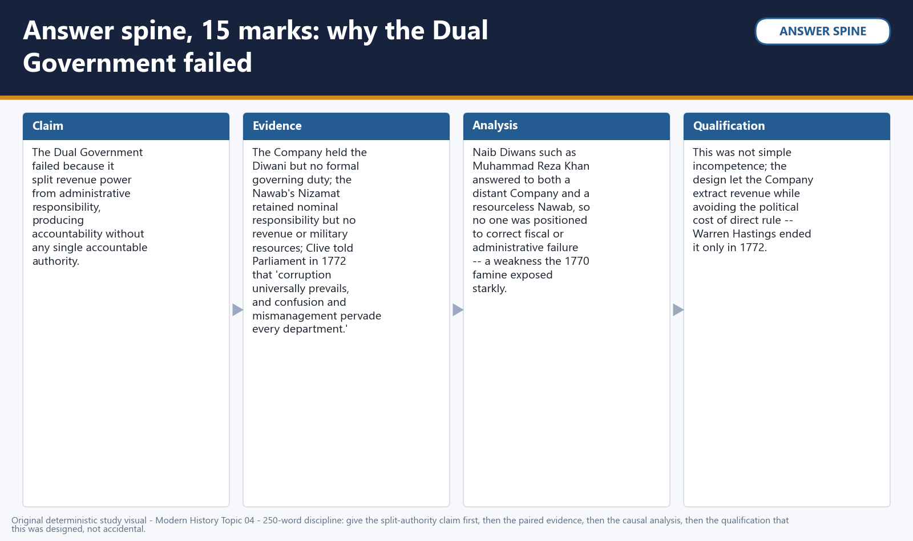

*Visual 23: Answer spine, 15 marks: why the Dual Government failed structurally. Original deterministic study visual; schematic maps are NOT TO SCALE where marked.*

**Demand decoding:** The directive **discuss** requires a direct position on “Discuss why the Dual Government established by Robert Clive in Bengal (1765-72) failed as a…”, coverage of every clause, chronological-causal analysis, named evidence, a counter-position and a qualified verdict.

**Detailed examiner-grade model status:** The solved analysis above is the executable content base. Preserve its exact chronology, named evidence, causal logic, counter-position and qualification.

**Executable exam-length answer / compression plan:** For a 15-mark answer, open with a two-sentence thesis; organise five named Acts, events, organisations, regions, primary records or scholarly positions as claim → evidence → analysis → qualification; reserve the final lines for a graded conclusion.

**How to improve this answer:** For “Discuss why the Dual Government established by Robert Clive in Bengal (1765-72) failed as a…”, replace the weakest generalisation with one additional named primary/official record or attributed scholarly interpretation and state exactly what it cannot prove.

##### Mains 5 - 15 marks | 250 words

**Question:** Evaluate Mir Qasim's administrative and fiscal reforms as Nawab of Bengal (1760-63), and explain why they brought him into direct conflict with the East India Company.

**Directive alignment:** "Evaluate... and explain" requires both an assessment of the reforms' substance and a causal account of the resulting conflict.

**Introduction:** Mir Qasim's short reign is best read as a genuine, if ultimately unsuccessful, attempt to rebuild Nawabi authority against mounting Company pressure.

**Reform substance:** After his 1760 installation, replacing the fiscally exhausted Mir Jafar, Mir Qasim shifted his capital from Murshidabad to Munger, gaining distance from Calcutta's influence while positioning himself nearer his own recruitment base; he reorganised and modernised his army's training and equipment, and tightened fiscal administration.

**The equality measure:** His most consequential step was the 1763 abolition of internal transit duties, applied equally to Indian and European traders alike, removing the tax advantage Company servants had exploited (often via dastak misuse) over Indian merchants.

**Company response and conflict:** Company traders, having lost their competitive advantage, protested; escalating friction produced open conflict, including the October 1763 Patna Massacre (the killing of English captives during hostilities) and a sequence of defeats for Mir Qasim at Katwa, Giria and Udhanala through 1763.

**Aftermath:** Defeated, Mir Qasim fled to Shuja-ud-Daula's Awadh, where the coalition that fought at Buxar in 1764 took shape.

**Qualification:** Mir Qasim's aims are better read as strengthening Nawabi sovereignty and ensuring commercial parity than as a modern anti-colonial nationalism; his conflict with the Company followed from lost privilege, not an anachronistic anti-imperial programme.

**Verdict:** Mir Qasim's reforms were substantively serious state-building measures whose direct effect -- removing Company servants' fiscal advantage -- made conflict with the Company almost unavoidable.

**Why this earns marks:** A complete answer names the specific reforms, the precise equality rationale, the Patna Massacre and defeat sequence, and correctly distinguishes Mir Qasim's aims from a retrospective nationalist framing.

**Demand decoding:** The directive **evaluate** requires a direct position on “Evaluate Mir Qasim's administrative and fiscal reforms as Nawab of Bengal (1760-63), and…”, coverage of every clause, chronological-causal analysis, named evidence, a counter-position and a qualified verdict.

**Detailed examiner-grade model status:** The solved analysis above is the executable content base. Preserve its exact chronology, named evidence, causal logic, counter-position and qualification.

**Executable exam-length answer / compression plan:** For a 15-mark answer, open with a two-sentence thesis; organise five named Acts, events, organisations, regions, primary records or scholarly positions as claim → evidence → analysis → qualification; reserve the final lines for a graded conclusion.

**How to improve this answer:** For “Evaluate Mir Qasim's administrative and fiscal reforms as Nawab of Bengal (1760-63), and…”, replace the weakest generalisation with one additional named primary/official record or attributed scholarly interpretation and state exactly what it cannot prove.

##### Mains 6 - 15 marks | 250 words

**Question:** Examine the causes of the Bengal famine of 1770, and assess the extent to which the East India Company's administrative and revenue policies contributed to its severity.

**Directive alignment:** "Examine... and assess the extent" requires both cause-listing and a calibrated judgement of relative weight, not a monocausal verdict either way.

**Introduction:** The famine of 1770 is best explained as a natural trigger meeting a governance system unusually poorly positioned to absorb it.

**Natural trigger:** A poor 1768 harvest was compounded by drought conditions through 1769-70, reducing the food-grain base going into the crisis.

**Governance vulnerability:** This natural shock met a Dual Government marked by revenue rigidity (land revenue demands were not meaningfully relaxed to match falling output), commercial priorities that could crowd out subsistence considerations, and the administrative confusion built into the divided Diwani-Nizamat structure.

**Weighing the contribution:** The available evidence supports treating the Company's governance failures as a severity-amplifying factor operating alongside, not instead of, the natural trigger -- drought and harvest failure were real and would have caused hardship under any administration, but the Dual Government's specific rigidities plausibly worsened the outcome.

**Qualification:** Any specific mortality estimate (sometimes expressed through disputed secondary-source estimates) should be treated as a repeated historiographical estimate, not a census-verified figure, and precise numbers should not be asserted as settled fact.

**Verdict:** The famine's severity is best explained by compound causation -- natural failure meeting institutional vulnerability -- with the Company's revenue rigidity as a real but not sole contributing factor.

**Why this earns marks:** Strong answers state both causal strands explicitly, calibrate the Company's contribution as amplifying rather than sole, and add an explicit mortality-estimate caveat.

**Demand decoding:** The directive **examine** requires a direct position on “Examine the causes of the Bengal famine of 1770, and assess the extent to which the East…”, coverage of every clause, chronological-causal analysis, named evidence, a counter-position and a qualified verdict.

**Detailed examiner-grade model status:** The solved analysis above is the executable content base. Preserve its exact chronology, named evidence, causal logic, counter-position and qualification.

**Executable exam-length answer / compression plan:** For a 15-mark answer, open with a two-sentence thesis; organise five named Acts, events, organisations, regions, primary records or scholarly positions as claim → evidence → analysis → qualification; reserve the final lines for a graded conclusion.

**How to improve this answer:** For “Examine the causes of the Bengal famine of 1770, and assess the extent to which the East…”, replace the weakest generalisation with one additional named primary/official record or attributed scholarly interpretation and state exactly what it cannot prove.

##### Mains 7 - 15 marks | 250 words

**Question:** "The British conquest of Bengal was as much the work of Indian bankers, nobles and soldiers as of the East India Company." Examine this statement with reference to the events of 1756-65.

**Directive alignment:** "Examine... with reference to" requires specific named evidence across the stated period, not generalised assertion.

**Introduction:** Read across 1756-65, Bengal's conquest depended at every decisive juncture on Indian actors making specific, interest-driven choices, not solely on Company initiative.

**Financial and political actors:** The Jagat Seth banking house's participation in the Plassey conspiracy protected its credit and banking interests against an unpredictable young Nawab; Mir Jafar, a senior commander sidelined within Siraj-ud-Daulah's court, saw alliance with the Company as his most viable path to power; Rai Durlabh, Bengal's Diwan, and the broker Amichand each pursued their own institutional or financial stakes.

**Post-conquest administration:** After 1765, the Dual Government depended entirely on Indian intermediaries -- Muhammad Reza Khan and Raja Shitab Rai as Naib Diwans -- without whom the Company had neither the administrative language nor local knowledge to collect revenue at all.

**Resistance as counter-evidence:** The statement is not one-directional collaboration only -- Mir Qasim's 1760-63 reforms and Siraj-ud-Daulah's own initial resistance to Company privilege show Indian agency running in both directions, resistance and alignment alike, each rooted in specific institutional calculation.

**Qualification:** This reading should not collapse into either a "willing collaboration" or a "simple betrayal" morality tale; each actor's choice reflected a real, bounded set of options, not free political agency in the modern sense, nor pure treachery.

**Verdict:** The statement is substantially correct: the conquest was co-produced by Company military-political method and specific, self-interested Indian financial, administrative and military participation.

**Why this earns marks:** A complete answer names specific individuals and their specific institutional motives, shows agency running in both directions, and explicitly avoids a single moralised verdict.

**Demand decoding:** The directive **examine** requires a direct position on “"The British conquest of Bengal was as much the work of Indian bankers, nobles and soldiers…”, coverage of every clause, chronological-causal analysis, named evidence, a counter-position and a qualified verdict.

**Detailed examiner-grade model status:** The solved analysis above is the executable content base. Preserve its exact chronology, named evidence, causal logic, counter-position and qualification.

**Executable exam-length answer / compression plan:** For a 15-mark answer, open with a two-sentence thesis; organise five named Acts, events, organisations, regions, primary records or scholarly positions as claim → evidence → analysis → qualification; reserve the final lines for a graded conclusion.

**How to improve this answer:** For “"The British conquest of Bengal was as much the work of Indian bankers, nobles and soldiers…”, replace the weakest generalisation with one additional named primary/official record or attributed scholarly interpretation and state exactly what it cannot prove.

##### Mains 8 - 15 marks | 250 words

**Question:** Compare the nationalist and the "corporate-military-fiscal state" interpretations of the East India Company's transformation in Bengal after Plassey.

**Directive alignment:** "Compare" requires setting the two named lenses side by side on shared ground, not describing them in isolation.

**Introduction:** These two lenses read the same 1757-72 evidence toward different analytical ends -- moral-economic critique versus institutional description.

**Nationalist lens:** Associated with R.C. Dutt (whose characterisation of Company extraction as "open plunder and loot" is cited within Bipan Chandra's own analysis) and carried forward by Bipan Chandra's economic-nationalist historiography, this lens foregrounds the drain of wealth, the post-Plassey extraction circuit, and reads the Company's transformation primarily as organised economic exploitation with a clear moral verdict attached.

**Corporate-military-fiscal state lens:** Associated with historians such as P.J. Marshall and C.A. Bayly, this lens describes the same transformation institutionally -- the Company's fusion of trading, taxing and war-making functions into a single organisational form -- with less emphasis on moral verdict and more on explaining how such a fusion was administratively and fiscally possible.

**Point of comparison:** Both lenses agree on the empirical sequence (trader to kingmaker to revenue sovereign) and both take the extraction evidence seriously; they differ chiefly in whether the analytical centre of gravity is moral-economic critique or institutional-structural description.

**Qualification:** These are not the only two lenses available -- collaboration-thesis and Bengal-political-economy approaches (the latter associated with Sekhar Bandyopadhyay) offer further angles this comparison does not exhaust.

**Verdict:** The two lenses are complementary rather than contradictory: one supplies moral-economic judgement, the other institutional mechanism.

**Why this earns marks:** Full marks require naming specific historians correctly attributed to each lens, identifying genuine points of both agreement and difference, and avoiding the error of treating one lens as simply "right" and the other "wrong."

**Demand decoding:** The directive **compare** requires a direct position on “Compare the nationalist and the "corporate-military-fiscal state" interpretations of the…”, coverage of every clause, chronological-causal analysis, named evidence, a counter-position and a qualified verdict.

**Detailed examiner-grade model status:** The solved analysis above is the executable content base. Preserve its exact chronology, named evidence, causal logic, counter-position and qualification.

**Executable exam-length answer / compression plan:** For a 15-mark answer, open with a two-sentence thesis; organise five named Acts, events, organisations, regions, primary records or scholarly positions as claim → evidence → analysis → qualification; reserve the final lines for a graded conclusion.

**How to improve this answer:** For “Compare the nationalist and the "corporate-military-fiscal state" interpretations of the…”, replace the weakest generalisation with one additional named primary/official record or attributed scholarly interpretation and state exactly what it cannot prove.

##### Mains 9 - 20 marks | 300 words

**Question:** "Plassey supplied the political opening, but Buxar and the Treaty of Allahabad supplied the durable institutional foundation of British power in Bengal." Critically examine this statement.

**Directive alignment:** "Critically examine" requires testing the statement's claim against evidence for and against, not simply illustrating it.

**Introduction:** This statement's core distinction -- regime change versus legal-institutional foundation -- holds up well against the evidence, though it requires qualification about intervening developments.

**The case for the statement:** Plassey (23 June 1757) replaced Siraj-ud-Daulah with the Company's chosen client Mir Jafar, but changed nothing in Bengal's formal constitutional position -- the Company remained, in law, a chartered trading concern operating under Mughal-derived local privilege. Only Buxar (22 October 1764), where a unified Company command under Hector Munro defeated the combined Mir Qasim-Shuja-ud-Daula-Shah Alam II coalition, and the subsequent Treaty of Allahabad (12 August 1765) -- granting the Diwani of Bengal, Bihar and Orissa from the emperor himself in exchange for a stipulated tribute -- gave the Company a durable, legally sourced revenue title.

**Testing the claim against intervening developments:** Between 1757 and 1764, the post-Plassey extraction circuit and Mir Jafar's 1760 deposition show the Company was already exercising substantial de facto political control well before Buxar, so "political opening" understates how much power Plassey's aftermath actually generated, even without a legal title attached.

**Assessing durability:** Still, 1757-64's power remained personalist and revocable, dependent on which client Nawab the Company could install or depose, whereas the Diwani was a title good against successive Nawabs and against later Parliamentary scrutiny -- an institutional fact rather than a personal arrangement.

**The Nizamat qualification:** Even after 1765, the Nizamat remained formally with the Nawab, so "durable institutional foundation" should be read as revenue and administrative dominance specifically, not total, unqualified sovereignty.

**Qualification:** The statement's binary slightly understates the substantial de facto power the Company already held in 1757-64; the more precise formulation is that Plassey opened informal political dominance, and Buxar-Allahabad converted it into formal, legal sovereignty.

**Verdict:** The statement is broadly correct, provided "political opening" is not read as merely nominal.

**Why this earns marks:** A top answer engages critically rather than restating the quotation, and precisely distinguishes Diwani-level durability from the still-nominal Nizamat.


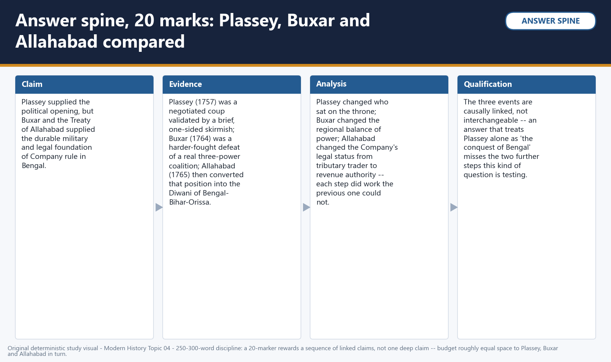

*Visual 24: Answer spine, 20 marks: Plassey's opening versus Buxar-Allahabad's institutional foundation. Original deterministic study visual; schematic maps are NOT TO SCALE where marked.*

**Demand decoding:** The directive **answer** requires a direct position on “"Plassey supplied the political opening, but Buxar and the Treaty of Allahabad supplied the…”, coverage of every clause, chronological-causal analysis, named evidence, a counter-position and a qualified verdict.

**Detailed examiner-grade model status:** The solved analysis above is the executable content base. Preserve its exact chronology, named evidence, causal logic, counter-position and qualification.

**Executable exam-length answer / compression plan:** For a 20-mark answer, open with a two-sentence thesis; organise six to eight named Acts, events, organisations, regions, primary records or scholarly positions as claim → evidence → analysis → qualification; reserve the final lines for a graded conclusion.

**How to improve this answer:** For “"Plassey supplied the political opening, but Buxar and the Treaty of Allahabad supplied the…”, replace the weakest generalisation with one additional named primary/official record or attributed scholarly interpretation and state exactly what it cannot prove.

##### Mains 10 - 20 marks | 300 words

**Question:** Trace the transformation of the English East India Company from a chartered trading concern to a territorial revenue-collecting power in Bengal between 1757 and 1772, and examine the main drivers of this transformation at each stage.

**Directive alignment:** "Trace... and examine the main drivers" requires a staged chronological account paired with causal analysis at each stage.

**Introduction:** The Company's transformation unfolded in three distinguishable stages, each driven by a different mechanism: political kingmaking, coalition victory, and legal-institutional conversion.

**Stage one -- political kingmaker (1757-60):** Following Plassey, the driver was leverage over a dependent client Nawab: Mir Jafar's payments, Clive's personal jagir, and the Company's escalating fiscal demands, tied to its own rising regional military costs, produced a self-reinforcing extraction circuit Mir Jafar could not indefinitely sustain, ending in his 1760 deposition.

**Stage two -- contested sovereignty (1760-64):** Mir Qasim's attempt to rebuild genuine Nawabi authority directly threatened Company commercial privilege, driving escalating conflict that culminated in his defeat and flight to Awadh, and the formation of the Buxar coalition.

**Stage three -- legal-institutional conversion (1764-72):** The driver shifted from political manoeuvre to formal institution-building: Buxar's unified-command victory, followed by the Diwani grant, converted military dominance into a legally sourced revenue title; the Dual Government then attempted, and structurally failed, to administer this title through Indian intermediaries under a nominal Nawab, prompting Hastings's 1772 decision to have the Company itself "stand forth as Diwan."

**Cross-stage continuity:** Across all three stages, the recurring driver is the Company's growing need to fund its own expanding military-political commitments, requiring progressively more secure and direct access to Bengal's revenue base.

**Qualification:** This staged account should not be read as a smoothly planned strategy; each stage responded to immediate crises more than to any single long-term design formed in 1757.

**Verdict:** The Company's transformation was driven, at each stage, by the widening gap between its expanding footprint and the security of its revenue base -- a gap the first two stages failed to close.

**Why this earns marks:** Full marks require distinct, correctly sequenced stages with named drivers, plus the cross-stage continuity argument, and an explicit caution against over-reading the sequence as deliberately planned from the outset.

**Demand decoding:** The directive **trace** requires a direct position on “Trace the transformation of the English East India Company from a chartered trading concern…”, coverage of every clause, chronological-causal analysis, named evidence, a counter-position and a qualified verdict.

**Detailed examiner-grade model status:** The solved analysis above is the executable content base. Preserve its exact chronology, named evidence, causal logic, counter-position and qualification.

**Executable exam-length answer / compression plan:** For a 20-mark answer, open with a two-sentence thesis; organise six to eight named Acts, events, organisations, regions, primary records or scholarly positions as claim → evidence → analysis → qualification; reserve the final lines for a graded conclusion.

**How to improve this answer:** For “Trace the transformation of the English East India Company from a chartered trading concern…”, replace the weakest generalisation with one additional named primary/official record or attributed scholarly interpretation and state exactly what it cannot prove.

##### Mains 11 - 20 marks | 300 words

**Question:** "The settlement of 1765 created a divided sovereignty in Bengal that no single institution could be held fully accountable for." Discuss this statement with reference to the Diwani-Nizamat split and the Dual Government (1765-72).

**Directive alignment:** "Discuss... with reference to" requires engaging the accountability claim specifically, using both named institutions as evidence.

**Introduction:** The 1765 settlement's defining feature was not an absence of power, but a deliberate separation of power from responsibility across two institutions simultaneously.

**The Diwani-Nizamat split itself:** The Treaty of Allahabad gave the Company the Diwani -- land revenue collection and civil justice -- while the Nizamat, covering criminal justice and nominal military command, remained formally with the Nawab; a real legal division, in which the Diwani was substantively far more consequential.

**Operationalising the split -- the Dual Government:** The Company administered its Diwani through Naib Diwans, Indian intermediaries who exercised real administrative power without ultimate accountability to Bengal's population, while the Nawab's own office, formally responsible under the Nizamat, lacked the revenue and administrative machinery to act on that responsibility.

**Testing the "no single institution accountable" claim:** This is well supported -- the Company disclaimed direct administrative responsibility while governing "behind the curtain," the Naib Diwans answered to a Company that bore no formal welfare duty itself, and the Nawab's office had responsibility on paper but no operative power; Clive's own 1772 testimony describing pervasive "confusion and mismanagement" is direct evidence contemporaries recognised this gap.

**Consequence:** This diffusion of accountability is a structural explanation for administrative failures culminating in the 1770 famine, and is precisely why Hastings's 1772 reform sought to close the gap by making the Company itself directly answerable as Diwan.

**Qualification:** The claim should not imply total institutional collapse; revenue was in fact collected and courts did function -- the failure is one of accountability, not total non-function.

**Verdict:** The statement holds: 1765's divided sovereignty let both the Company and the Nawab's office avoid full accountability, a vulnerability only addressed by Hastings's 1772 structural change.

**Why this earns marks:** A strong answer connects the legal split to the operational accountability gap, cites Clive's own testimony as evidence, and distinguishes diffused accountability from total governmental collapse.

**Demand decoding:** The directive **discuss** requires a direct position on “"The settlement of 1765 created a divided sovereignty in Bengal that no single institution…”, coverage of every clause, chronological-causal analysis, named evidence, a counter-position and a qualified verdict.

**Detailed examiner-grade model status:** The solved analysis above is the executable content base. Preserve its exact chronology, named evidence, causal logic, counter-position and qualification.

**Executable exam-length answer / compression plan:** For a 20-mark answer, open with a two-sentence thesis; organise six to eight named Acts, events, organisations, regions, primary records or scholarly positions as claim → evidence → analysis → qualification; reserve the final lines for a graded conclusion.

**How to improve this answer:** For “"The settlement of 1765 created a divided sovereignty in Bengal that no single institution…”, replace the weakest generalisation with one additional named primary/official record or attributed scholarly interpretation and state exactly what it cannot prove.

##### Mains 12 - 20 marks | 300 words

**Question:** "The conquest of Bengal is best understood not as a single battle or treaty but as a decade-long process of corporate-state formation, co-produced by Company initiative and Indian institutional choices." Critically evaluate this characterisation with reference to Plassey, Buxar and the Dual Government.

**Directive alignment:** "Critically evaluate... with reference to" requires testing the "process not event" and "co-produced" claims against named evidence from all three episodes.

**Introduction:** Read across Plassey, Buxar and the Dual Government together, this characterisation withstands scrutiny on both its central claims, provided each is precisely evidenced.

**Testing "a decade-long process, not a single event":** Plassey (1757) changed Bengal's ruler but not its legal-constitutional position; real institutional change required Buxar's 1764 victory and the 1765 Diwani grant; even then, the Dual Government was itself an unstable, transitional arrangement, only resolved by Hastings's 1772 decision -- a full fifteen years after Plassey.

**Testing "co-produced by Company initiative and Indian institutional choices":** At Plassey, the conspiracy network supplied the mechanism of victory as much as Clive's own planning; at Buxar, the coalition's segmented command was itself an Indian-side institutional choice that shaped the outcome as much as Munro's unified leadership; under the Dual Government, Indian Naib Diwans were the actual administrative machinery through which the Diwani operated at all.

**Weighing the "corporate-state formation" framing:** This is best read through the corporate-military-fiscal state lens (Marshall, Bayly), while the nationalist lens (Dutt, cited in Chandra) supplies the necessary moral-economic counterweight regarding the extraction this process enabled.

**Qualification:** "Co-produced" should not imply equal power or shared benefit; each Indian actor operated within a constrained, unequal set of options, and the process's ultimate institutional beneficiary was unambiguously the Company.

**Verdict:** The characterisation is substantially sound: 1757-72 is best read as an extended process of corporate-state formation in which Indian institutional actors were indispensable, though the process's power remained fundamentally asymmetric throughout.

**Why this earns marks:** A top-band answer tests both halves of the characterisation against named evidence from all three episodes, invokes the correct historiographical lens by name, and adds the asymmetry qualification.

**Demand decoding:** The directive **answer** requires a direct position on “"The conquest of Bengal is best understood not as a single battle or treaty but as a…”, coverage of every clause, chronological-causal analysis, named evidence, a counter-position and a qualified verdict.

**Detailed examiner-grade model status:** The solved analysis above is the executable content base. Preserve its exact chronology, named evidence, causal logic, counter-position and qualification.

**Executable exam-length answer / compression plan:** For a 20-mark answer, open with a two-sentence thesis; organise six to eight named Acts, events, organisations, regions, primary records or scholarly positions as claim → evidence → analysis → qualification; reserve the final lines for a graded conclusion.

**How to improve this answer:** For “"The conquest of Bengal is best understood not as a single battle or treaty but as a…”, replace the weakest generalisation with one additional named primary/official record or attributed scholarly interpretation and state exactly what it cannot prove.

## OPTIONAL ADVANCED DEPTH — NOT REQUIRED FOR A CORE ANSWER

> **Subject:** History (Modern India) · **Tier:** Advanced (deeper understanding) · **GS Paper:** GS-I (also Prelims).
> **Grounded in:** Bipan Chandra, *Modern India* (Ch. IV), cross-checked against Sekhar Bandyopadhyay, *From Plassey to Partition* — with historiography on plunder, collaboration and early colonial state formation.
> ✅ = from source book · ⚠️ = inference / standard knowledge · 📰 = current affairs.
> *Companion: `basic/04_British-Conquest-of-Bengal.md`. Chronology spine: `00_Master-Chronology.md`.*

---

#### Mini-timeline

| Date | Event |
|---|---|
| ✅ 1717 | Farrukhsiyar's farman grants Company trade privileges in Bengal |
| ✅ 1756 | Siraj-ud-Daula objects to Company fortification and misuse of privileges |
| ✅ 23 June 1757 | Plassey: Clive defeats Siraj through elite conspiracy and defection |
| ✅ 1760 | Mir Qasim replaces Mir Jafar and attempts administrative-military reform |
| ✅ 1763 | Mir Qasim's conflict with the Company escalates after inland-duty disputes |
| ✅ 22 Oct 1764 | Buxar: Hector Munro defeats Mir Qasim, Shuja-ud-Daula and Shah Alam II |
| ✅ 1765 | Treaty of Allahabad grants Diwani of Bengal, Bihar and Orissa to the Company |
| ✅ 1765–72 | Dual Government: Company revenue authority without direct administrative responsibility |
| ✅ 1770 | Bengal Famine exposes the destructive effects of revenue extraction and misrule |
| ✅ 1772 | Warren Hastings abolishes Dual Government and begins direct Company administration |

#### 1. Snapshot & core idea

**Deeper — Bengal's conquest was commercial privilege converted into sovereignty.**

- ✅ The Company used the **1717 farman** and **dastaks** to expand duty-free trade beyond legitimate Company goods, damaging the Nawab's revenue and Indian merchants.
- ✅ Company servants pursued private trade under the cover of Company privileges, creating a conflict between Bengal's fiscal sovereignty and Company commercial immunity.
- ✅ Fortification of Calcutta without Nawab permission challenged Siraj-ud-Daula's authority and made the Company appear like a political power.
- ⚠️ The Black Hole narrative should be treated cautiously because its details and later use as imperial justification are contested.

**Deeper — Plassey, Buxar and Diwani formed a three-stage conquest.**

- ✅ **Plassey** was a palace-and-banking conspiracy involving Mir Jafar, Rai Durlabh, Jagat Seth and Amichand; it gave the Company a pliant Nawab and enormous leverage.
- ✅ **Mir Qasim** tried to restore autonomy through administrative reform, military reorganisation and abolition of inland duties; this threatened Company privilege.
- ✅ **Buxar** mattered more militarily because the Company defeated a combined Bengal-Awadh-Mughal force, proving supremacy beyond palace politics.
- ✅ **Allahabad (1765)** gave the Company Diwani while keeping Awadh as a buffer, producing a revenue-backed territorial corporation.
- ✅ **Dual Government** made the Company revenue collector while the Nawab remained responsible for administration, producing exploitation without accountability.

#### 2. Key classification / data

| Stage | Mechanism | Indian actors | Company gain | Advanced significance |
|---|---|---|---|---|
| ✅ Trade privilege | 1717 farman, dastaks, private trade | Bengal Nawabs vs Company servants | Duty-free commercial advantage | ⚠️ Fiscal sovereignty undermined |
| ✅ Plassey | Conspiracy and defection | Siraj, Mir Jafar, Jagat Seth, Rai Durlabh, Amichand | Puppet Nawab and political leverage | ⚠️ Indian elite collaboration mattered |
| ✅ Mir Qasim phase | Reform from Munger; abolition of inland duties | Mir Qasim | Conflict sharpened | ⚠️ Nawabi autonomy tried to recover fiscal equality |
| ✅ Buxar | Open military battle | Mir Qasim, Shuja-ud-Daula, Shah Alam II | Military supremacy | ⚠️ Company became north Indian power |
| ✅ Allahabad/Diwani | Treaty and revenue grant | Shah Alam II, Awadh, Clive | Bengal-Bihar-Orissa revenues | ⚠️ Company-state and early drain begin |
| ✅ Dual Government | Revenue without administration | Nawab's officials, Company supervisors | Revenue extraction | ⚠️ Power without responsibility |

#### 3. Study links

> **Study link:** ✅ Bengal's successor-state status is background → `advanced/02_Indian-States-and-Society-18th-Century.md`.
> **Study link:** ✅ The European commercial phase explains the 1717 farman and fortified settlements → `advanced/03_Beginnings-of-European-Settlements.md`.
> **Study link:** ⚠️ Bengal revenues finance later territorial expansion and subsidiary diplomacy → `advanced/05_British-Territorial-Expansion.md`.

#### 4. Must-Know Facts (Prelims)

- ✅ **Plassey**: 23 June 1757; Robert Clive vs Siraj-ud-Daula; conspiracy by Mir Jafar, Rai Durlabh, Jagat Seth and Amichand.
- ✅ **Mir Jafar** was installed after Plassey; **Mir Qasim** later replaced him.
- ✅ **Mir Qasim** shifted capital to **Munger**, reformed army/administration and abolished inland duties.
- ✅ **Buxar**: 22 Oct 1764; Hector Munro defeated Mir Qasim, Shuja-ud-Daula of Awadh and Mughal emperor Shah Alam II.
- ✅ **Treaty of Allahabad (1765)**: Diwani of Bengal, Bihar and Orissa granted to the Company; Awadh preserved as buffer.
- ✅ **Dual Government**: 1765–72; started under Clive, ended by Warren Hastings.
- ✅ **Bengal Famine (1770)** combined harvest failure and disease with an extractive, unaccountable revenue order; the Company's role concerns vulnerability and response, not a monocausal claim that taxation alone produced drought.
- ⚠️ Key phrase: **"power without responsibility"** for Dual Government.

#### 5. UPSC Traps

> 🔑 Trap: Do not moralise Plassey as only betrayal; analyse the political economy — trade privilege, merchant-bankers, revenue rights and military finance.

- ❌ Plassey alone made the Company sovereign. → Sovereignty emerged through **Plassey + Buxar + Diwani**.
- ❌ Buxar was only a Bengal battle. → It defeated a wider confederacy involving **Awadh** and the **Mughal emperor**.
- ❌ Mir Qasim was simply anti-English. → He sought to restore fiscal equality and administrative authority.
- ❌ Diwani was just a commercial privilege. → It was a **revenue right**, transforming the Company into a territorial power.
- ❌ Drain theory begins only with later nationalism. → The **material basis** of drain began with revenue extraction and remittances after Diwani, though nationalist theory came later.

#### 6. 📰 Current link

- ⚠️ **Colonial drain and restitution debates.** The conquest of Bengal is repeatedly invoked in debates on colonial extraction, famine memory, museum narratives and economic reparations. *(Escalate to 📰 when pegged to a verified news item.)*

#### 7. Mains angles

- ⚠️ Evaluate the statement: "The Battle of Plassey was a political revolution; the Battle of Buxar was a military revolution."
- ⚠️ Explain how Company servants' private trade undermined Bengal's sovereignty before open conquest.
- ⚠️ Discuss the Dual Government as a colonial mechanism that separated revenue power from administrative responsibility.
- ⚠️ Trace the beginning of economic drain from the Diwani settlement and Bengal's fiscal subordination.

#### ➕ Historiography note (PYQ-gap)

⚠️ Historians debate whether Bengal's conquest should be read mainly as military conquest, commercial plunder or collaboration with Indian elites. A balanced answer notes all three: Company commercial privilege created conflict; Indian bankers and factions enabled Plassey; Buxar and Diwani institutionalised sovereignty. The "plunder of Bengal" thesis highlights gifts, private fortunes, revenue extraction and remittances as the early material basis of the later nationalist **drain theory**.

## CONSOLIDATED REGISTER NOTES

### COMPLETE TOPIC ASCII MASTER FLOW DIAGRAM

#### ASCII MASTER FLOW — PANEL 1/12: Bengal before 1756: successor state and sovereignty conflict

```ascii-master
BENGAL -> wealthy Mughal successor state, not a political vacuum
1717 FARMAN -> bounded privilege for Company trade | DASTAK ABUSE -> servants' private trade
FORTIFICATION + customs + jurisdiction -> commercial dispute becomes sovereignty dispute
SIRAJ 1756 -> inherits court rivalry and a Company testing Nawabi authority.
MUST REMEMBER: Plassey on 23 June 1757, Buxar on 22 October 1764, the 1765 Allahabad
  settlement and Diwani grant, and the 1765-72 Dual Government are separate stages.
```

#### ASCII MASTER FLOW — PANEL 2/12: Calcutta crisis and the Black Hole caution

```ascii-master
UNAUTHORISED FORTIFICATION -> Kasimbazar seized -> Fort William falls in June 1756
CLIVE / WATSON -> Calcutta recovered -> Alinagar -> Chandernagore removed as counterweight
BLACK HOLE -> Holwell is an interested, weakly corroborated narrator
RULE -> never make a disputed body count or atrocity story the causal centre of conquest.
```

#### ASCII MASTER FLOW — PANEL 3/12: Plassey's hidden battle: conspiracy and collaboration

```ascii-master
COMPANY / CLIVE -> regime-change plan + secret correspondence + coercive leverage
MIR JAFAR -> throne | JAGAT SETH -> credit and security | RAI DURLABH -> office
AMICHAND -> broker later deceived | MIR MADAN / MOHAN LAL -> loyal resistance
VERDICT -> interests explain collaboration better than a one-word betrayal morality tale.
```

#### ASCII MASTER FLOW — PANEL 4/12: Plassey and the Mir Jafar client regime

```ascii-master
PLASSEY, 23 JUNE 1757 -> conspiracy neutralises most Nawabi command
RESULT -> Mir Jafar installed; Company becomes kingmaker and gains political entry
CLIENT CYCLE -> dependence -> transfers / concessions -> deeper Company leverage
LIMIT -> Plassey changed the ruler; it did not yet grant legal-fiscal sovereignty.
```

#### ASCII MASTER FLOW — PANEL 5/12: Mir Qasim: reform, equality and conflict

```ascii-master
MIR QASIM 1760 -> shifts capital to Munger + strengthens administration and army
COMPANY PRIVATE TRADE -> duty privilege distorts competition and weakens Nawabi revenue
RESPONSE 1763 -> abolish inland duties for all traders: equality, not modern nationalism
COMPANY RESISTS LOST ADVANTAGE -> war -> Mir Qasim seeks an Awadh-Mughal coalition.
```

#### ASCII MASTER FLOW — PANEL 6/12: Buxar: coalition breadth versus unified Company command

```ascii-master
COALITION -> Mir Qasim + Shuja-ud-Daula + Shah Alam II; distinct motives
STRUCTURAL WEAKNESS -> separate treasuries, commands and political objectives
COMPANY -> Hector Munro's integrated command, supply and payment system
BUXAR, 22 OCTOBER 1764 -> open military supremacy, unlike Plassey's palace coup.
```

#### ASCII MASTER FLOW — PANEL 7/12: Three-stage conquest thesis

```ascii-master
PLASSEY 1757 -> POLITICAL ENTRY: client Nawab and Company kingmaking
BUXAR 1764 -> MILITARY SUPREMACY: Bengal-Awadh-emperor coalition defeated
ALLAHABAD / DIWANI 1765 -> LEGAL-FISCAL TITLE: revenue authority institutionalised
RULE -> Plassey alone did not complete Company sovereignty over Bengal.
```

#### ASCII MASTER FLOW — PANEL 8/12: Allahabad, Diwani, Nizamat and the Awadh buffer

```ascii-master
SHAH ALAM II SETTLEMENT -> Company receives Diwani of Bengal, Bihar and Orissa
SHUJA-UD-DAULA SETTLEMENT -> Awadh restored as a strategic buffer, not annexed
DIWANI -> revenue / civil side | NIZAMAT -> nominal police, criminal and military side
CAUTION -> Diwani was not Nawabship and the legal split was not equal power-sharing.
```

#### ASCII MASTER FLOW — PANEL 9/12: Dual Government: power separated from responsibility

```ascii-master
1765-72 -> Company holds revenue power through Indian deputies
NAWAB'S ESTABLISHMENT -> nominal Nizamat and public responsibility without resources
PARADOX -> Company power without responsibility / Nawab responsibility without power
RESULT -> extraction incentives + diffused accountability + weak corrective capacity.
```

#### ASCII MASTER FLOW — PANEL 10/12: Famine, accountability and the 1772 termination

```ascii-master
1770 FAMINE -> harvest failure / drought and disease create the natural shock
DUAL GOVERNMENT -> revenue rigidity and administrative confusion amplify vulnerability
CAUTION -> Company policy mattered but did not alone cause drought or the catastrophe
HASTINGS 1772 -> ends Dual Government; direct administration bridges to Topic 06.
CLOSE DISTINCTION: Plassey enabled political leverage through conspiracy and finance; Buxar
  established a broader military-fiscal superiority against Mir Qasim, Shuja-ud-Daula and Shah
  Alam II.
```

#### ASCII MASTER FLOW — PANEL 11/12: Company-state, early drain mechanism and historiography

```ascii-master
TRADE PRIVILEGE -> kingmaking -> Diwani -> revenue funds purchases and armies
INDIAN AGENCY -> collaboration, resistance and administration operate under unequal power
LENSES -> nationalist extraction | collaboration | corporate-fiscal state | Bengal continuity
2026 MEMORY ANCHOR -> revisit Plassey beyond betrayal; static causation remains book-grounded.
EVIDENCE LIMIT: Company records and later nationalist accounts must be checked against Bengal
  court, banking and revenue evidence; conquest was contingent, collaborative and coercive.
```

#### ASCII MASTER FLOW — PANEL 12/12: Topic 04 answer spine and boundaries

```ascii-master
OPEN -> sovereignty conflict over privilege, private trade, fortification and jurisdiction
TRACE -> conspiracy / client regime -> reform and war -> Buxar -> Diwani -> Dual Government
WEIGH -> collaboration + Company capacity; famine is multicausal; reject false precision
CLOSE -> 1772 ends this topic; expansion and 1773+ regulation pass to Topics 05-06.
```
