# Structure of Government & Constitutional Development, 1757-1858 — Learner-v2 Complete Learning Session

## BASIC LEARNING SESSION

### DEEP-REVIEW LEARNING CONTRACT

| Control | Binding rule for this package |
|---|---|
| Syllabus boundary | Complete Modern History Core is taught chronologically and causally before optional enrichment. |
| Evidence method | Claim → named Act/treaty/record/organisation/person/region or scholarly evidence → analysis → qualification. |
| Date discipline | Event, proposal, enactment, commencement, official policy, implementation and later interpretation remain distinct. |
| Historiography | Colonial, nationalist, Marxist, subaltern, Cambridge, feminist and other relevant arguments are attributed and tested, never used as labels alone. |
| Practice contract | Every solved item has demand decoding, an examiner-grade model, an executable answer/compression plan, marks rationale and answer-specific improvement. |
| Approval | This immutable successor remains `approved: false` pending explicit approval. |

**Canonical Basic/Core owner:** `upsc-ai-kit\knowledge\Modern-Indian-History\basic\06_Government-Structure-and-Constitutional-Development-1757-1858.md`  
**Canonical topic owner:** `upsc-ai-kit\knowledge\Modern-Indian-History\basic\06_Government-Structure-and-Constitutional-Development-1757-1858.md`  
**Optional Advanced owner:** `upsc-ai-kit\knowledge\Modern-Indian-History\advanced\06_Government-Structure-and-Constitutional-Development-1757-1858.md`  
**Official syllabus mapping:** `upsc-ai-kit\knowledge\Modern-Indian-History\OFFICIAL-UPSC-SYLLABUS-MAPPING.md`

### EVIDENCE, PYQ AND CURRENT-STATUS CONTROL

- **Official and primary evidence:** Acts, charters, treaties, proclamations, committee reports, proceedings, organisational resolutions, speeches and contemporary records are dated and read for authorship and purpose.
- **Regional and social evidence:** petitions, newspapers, memoirs, local studies and material geography qualify elite or all-India generalisation.
- **Economic and quantitative evidence:** revenue, trade, price, wage, craft and mortality claims retain unit, region, period and uncertainty; statistics are never invented.
- **Scholarly interpretation:** historian schools are competing explanations tied to named evidence, not memorised verdicts.
- **PYQ discipline:** repository ledgers and locally held official papers control wording and metadata; reconstructed wording and unavailable official keys remain explicitly labelled.
- **Current-status note, rechecked 2026-08-31:** PIB's Constitution Day 2025 account is used as a bounded constitutional-heritage anchor for public engagement with constitutional values. It does not project democratic intent onto the Company-era acts, which created imperial control without Indian representation.

**Live/primary context sources recorded by the predecessor generation:**

- `https://pib.gov.in/PressReleasePage.aspx?PRID=2194656`


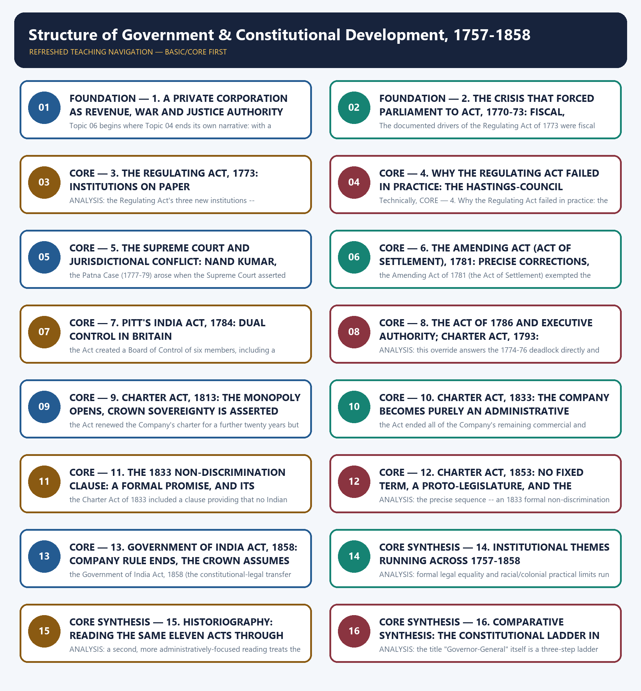

*Distinct embedded teaching-navigation image. The separate continuous Cārvāka-style flowchart package remains an independent at-a-glance artifact.*

#### Source audit, progression and syllabus boundary

- **Foundation:** chronology, institutions, actors and exact terminology.
- **Core:** mechanisms, comparisons, causal chains, Indian agency and exam traps.
- **Core synthesis:** historiography, answer architecture, boundaries and bridges.
- **Optional Advanced:** the separate owner is taught only after Basic practice.
- **Static source order:** repository Markdown -> OCR-searchable Bipan Chandra, Sekhar Bandyopadhyay and constitutional reference material -> bounded live official anchor; Qdrant not needed.
- **PYQ integrity:** The verified 2019 and 2023 Prelims demands on the Charter Act of 1813 and the Governor-General designation are retained. Their official local keys are unavailable, so the package teaches elimination logic without fabricating a key.

#### Live-linkage block

✅ **Bounded official constitutional-heritage fact:** PIB's Constitution Day 2025 account records national public engagement with constitutional values and multilingual access to the Constitution.

⚠️ **Inference boundary:** this is a public-heritage bridge, not evidence that the Company-era statutes were democratic. The 1773-1858 acts centralised imperial control while excluding Indians from effective representation.

### SESSION 1 — FOUNDATION — 1. A PRIVATE CORPORATION AS REVENUE, WAR AND JUSTICE AUTHORITY

#### DEFINITION / WHAT THIS IS CALLED

**Plain-language definition:** ANALYSIS: Topic 06's own analytical starting point is narrower and sharper than Topic 04's: given that a private corporation now held sovereign revenue, war and justice powers over tens of millions of people, with no British constitutional framework designed for that fact, what happened next in London and in Bengal, and why.

**Technical definition:** Topic 06 begins where Topic 04 ends its own narrative: with a chartered trading corporation that had, by 1765, become Bengal's Diwan -- its revenue authority -- while continuing to raise armies, make war and dispense justice through its own and the Nawab's overlapping courts.

#### ANSWER-GRABBING OPENING — WRITE/ADAPT IN THE EXAM

> Topic 06 begins where Topic 04 ends its own narrative: with a chartered trading corporation that had, by 1765, become Bengal's Diwan -- its revenue authority -- while continuing to raise armies, make war and dispense justice through its own and the Nawab's overlapping courts.

#### MUST-WRITE KEYWORDS

- **FOUNDATION**
- **war**
- **justice authority**
- **1. A private corporation as revenue**
- **1773-1858**
- **1765-72**

**How to use them:** Frame the answer through FOUNDATION; define war, connect justice authority with 1. A private corporation as revenue to explain the mechanism, and use 1773-1858 for the decisive comparison or qualification.

Topic 06 begins where Topic 04 ends its own narrative: with a chartered trading corporation that had, by 1765, become Bengal's Diwan -- its revenue authority -- while continuing to raise armies, make war and dispense justice through its own and the Nawab's overlapping courts. This is the single starting fact that every account of 1773-1858 must hold onto: the East India Company in 1765-72 was simultaneously a London-headquartered joint-stock trading corporation, answerable to its shareholders and Court of Directors, and a territorial sovereign in Bengal, Bihar and Orissa, answerable to no Indian authority in any binding sense and to the British Parliament in no clear constitutional sense either.

FACT: the Diwani grant of 1765 and the Dual Government of 1765-72 are, for this topic, only the trigger -- the structural anomaly that made a constitutional response necessary -- not the subject of extended analysis here; their causes, mechanics and the 1770 famine's causal reading belong fully to Topic 04, and this package deliberately does not re-derive that material. ANALYSIS: Topic 06's own analytical starting point is narrower and sharper than Topic 04's: given that a private corporation now held sovereign revenue, war and justice powers over tens of millions of people, with no British constitutional framework designed for that fact, what happened next in London and in Bengal, and why.

The problem was structural before it was moral. A body incorporated to trade profitably in Asian goods now administered a treasury larger than many contemporary European states, commanded a substantial Bengal army, and exercised the Nawab's nominal Nizamat as well as its own Diwani in practice -- all while its Court of Directors remained a body of merchant-shareholders in London with no constitutional accountability to Parliament, the Crown, or the people of Bengal for how that power was used. No existing British institution -- not the Privy Council, not Parliament, not the Crown -- had a settled procedure for supervising a chartered company that had, in effect, become a sovereign government of an overseas territory.

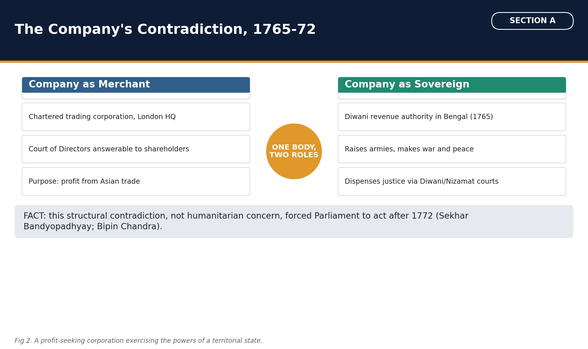

*Visual 2: The Company's contradiction, 1765-72 -- one body, two roles. Original deterministic study visual; schematic charts are NOT TO SCALE where marked.*

#### CLOSING RECALL FLOW — FOUNDATION — 1. A PRIVATE CORPORATION AS REVENUE, WAR AND JUSTICE AUTHORITY

```text
START / CONCEPT: FOUNDATION — 1. A private corporation as revenue, war and justice authority
        |
        v
EXACT TERMS: FOUNDATION · war · justice authority · 1. A private corporation as revenue · 1773-1858 · 1765-72
        |
        v
MECHANISM / ARGUMENT: ANALYSIS: Topic 06's own analytical starting point is narrower and sharper than Topic 04's: given that a private corporation now held sovereign revenue, war and justice powers over tens of millions of people, with no British constitutional framework designed for that fact, what happened next in London and in Bengal, and why.
        |
        v
CONSEQUENCE / CONTRAST: No existing British institution -- not the Privy Council, not Parliament, not the Crown -- had a settled procedure for supervising a chartered company that had, in effect, become a sovereign government of an overseas territory.
        |
        v
UPSC TRAP / ANSWER-USE: Do not miss this limiting distinction: this is the single starting fact that every account of 1773-1858 must hold onto.
        |
        v
ANSWER-GRABBING FORMULATION: Topic 06 begins where Topic 04 ends its own narrative: with a chartered trading corporation that had, by 1765, become Bengal's Diwan -- its revenue authority -- while continuing to raise armies, make war and dispense justice through its own and the Nawab's overlapping courts.
```
### SESSION 2 — FOUNDATION — 2. THE CRISIS THAT FORCED PARLIAMENT TO ACT, 1770-73: FISCAL, POLITICAL, AND PATRONAGE -- NOT HUMANITARIAN

#### DEFINITION / WHAT THIS IS CALLED

**Plain-language definition:** ANALYSIS: read together, a fiscal crisis that threatened the Company's own solvency and a patronage crisis that threatened Parliament's own political equilibrium are the two forces that produced the Regulating Act of 1773 -- a defensible Mains answer states both explicitly and resists the single-cause humanitarian narrative that a weaker answer often reaches for by default.

**Technical definition:** The documented drivers of the Regulating Act of 1773 were fiscal crisis, patronage anxiety and a parliamentary demand for accountability -- not primarily compassion for the 1770 Bengal famine, however much that famine is now understood, with hindsight, as a symptom of the same governance failure.

#### ANSWER-GRABBING OPENING — WRITE/ADAPT IN THE EXAM

> ANALYSIS: read together, a fiscal crisis that threatened the Company's own solvency and a patronage crisis that threatened Parliament's own political equilibrium are the two forces that produced the Regulating Act of 1773 -- a defensible Mains answer states both explicitly and resists the single-cause humanitarian narrative that a weaker answer often reaches for by default.

#### MUST-WRITE KEYWORDS

- **FOUNDATION**
- **fiscal**
- **political**
- **patronage -- not humanitarian**
- **2. The crisis that forced Parliament to act**
- **1770-73**

**How to use them:** Frame the answer through FOUNDATION; define fiscal, connect political with patronage -- not humanitarian to explain the mechanism, and use 2. The crisis that forced Parliament to act for the decisive comparison or qualification.

The standard account that "Parliament acted because of humanitarian concern for Bengal's suffering" is a simplification this topic must actively resist. The documented drivers of the Regulating Act of 1773 were fiscal crisis, patronage anxiety and a parliamentary demand for accountability -- not primarily compassion for the 1770 Bengal famine, however much that famine is now understood, with hindsight, as a symptom of the same governance failure.

FACT: the Bengal revenue crisis of 1770, compounded by the Company's own commercial difficulties elsewhere and a severe cash-flow crisis in Britain, led the Company's Court of Directors to apply to the British government for a loan in 1772 -- an application that exposed the Company's financial mismanagement directly to Parliament and triggered a Parliamentary Secret Committee and a Select Committee of enquiry (April 1772) into the Company's affairs in India. ANALYSIS: this loan request, not the famine itself, is the proximate, documented trigger that put Company governance onto Parliament's own agenda; the famine is best read as part of the underlying governance failure that the loan crisis exposed, not as the announced reason Parliament gave for legislating.

FACT: alongside the fiscal trigger, English political society was separately alarmed by the spectacle of returning "Nabobs" -- Company servants who had made spectacular private fortunes in Bengal and were now buying parliamentary seats and landed estates in Britain, threatening to convert Indian wealth into disruptive domestic political patronage outside existing party structures. Edmund Burke's 1772 remark that it was Parliament's duty "to superintend the affairs of this... Company" reflects this patronage-and-accountability anxiety directly. ANALYSIS: read together, a fiscal crisis that threatened the Company's own solvency and a patronage crisis that threatened Parliament's own political equilibrium are the two forces that produced the Regulating Act of 1773 -- a defensible Mains answer states both explicitly and resists the single-cause humanitarian narrative that a weaker answer often reaches for by default.

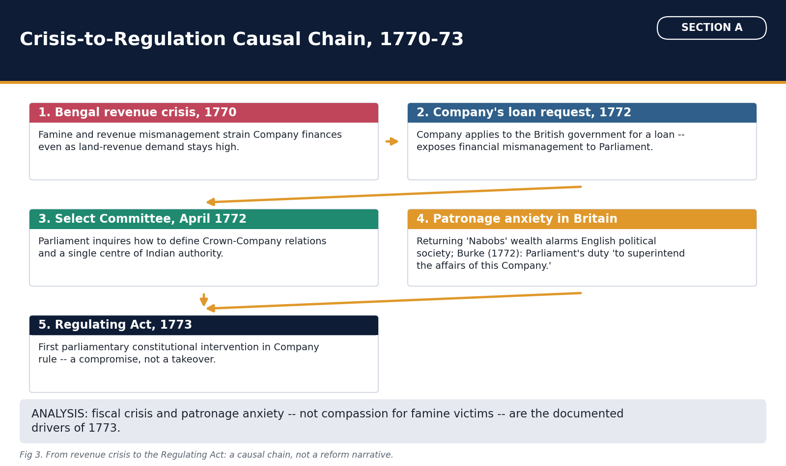

*Visual 3: Crisis-to-regulation causal chain, 1770-73. Original deterministic study visual; schematic charts are NOT TO SCALE where marked.*


TRAP: do not write "Parliament passed the Regulating Act to protect Bengal's peasantry from famine" as a standalone causal claim -- the loan request and the Nabob-patronage anxiety are the two documented drivers; famine-relief motives, if mentioned at all, must be presented as at most a minor, secondary strand within a fiscal-and-political explanation, never as the leading cause.

#### PART II -- THE REGULATING ACT, 1773

#### CLOSING RECALL FLOW — FOUNDATION — 2. THE CRISIS THAT FORCED PARLIAMENT TO ACT, 1770-73: FISCAL, POLITICAL, AND PATRONAGE -- NOT HUMANITARIAN

```text
START / CONCEPT: FOUNDATION — 2. The crisis that forced Parliament to act, 1770-73: fiscal, political, and patronage -- not humanitarian
        |
        v
EXACT TERMS: FOUNDATION · fiscal · political · patronage -- not humanitarian · 2. The crisis that forced Parliament to act · 1770-73
        |
        v
MECHANISM / ARGUMENT: The standard account that "Parliament acted because of humanitarian concern for Bengal's suffering" is a simplification this topic must actively resist.
        |
        v
CONSEQUENCE / CONTRAST: The documented drivers of the Regulating Act of 1773 were fiscal crisis, patronage anxiety and a parliamentary demand for accountability -- not primarily compassion for the 1770 Bengal famine, however much that famine is now understood, with hindsight, as a symptom of the same governance failure.
        |
        v
UPSC TRAP / ANSWER-USE: do not write "Parliament passed the Regulating Act to protect Bengal's peasantry from famine" as a standalone causal claim -- the loan request and the Nabob-patronage anxiety are the two documented drivers; famine-relief motives, if mentioned at all, must be presented as at most a minor, secondary strand within a fiscal-and-political explanation, never as the leading cause.
        |
        v
ANSWER-GRABBING FORMULATION: ANALYSIS: read together, a fiscal crisis that threatened the Company's own solvency and a patronage crisis that threatened Parliament's own political equilibrium are the two forces that produced the Regulating Act of 1773 -- a defensible Mains answer states both explicitly and resists the single-cause humanitarian narrative that a weaker answer often reaches for by default.
```
### SESSION 3 — CORE — 3. THE REGULATING ACT, 1773: INSTITUTIONS ON PAPER

#### DEFINITION / WHAT THIS IS CALLED

**Plain-language definition:** Parliament's first constitutional intervention in Company rule, the Regulating Act of 1773, was a compromise, not a takeover: it left the Company's trade monopoly and its territorial administration in place, while layering a set of new institutions on top, designed to make the Company's exercise of power more accountable to Parliament and more coherent within Bengal itself.

**Technical definition:** ANALYSIS: the Regulating Act's three new institutions -- Governor-General-in-Council, a reporting duty on the Directors, and a Crown-appointed Supreme Court -- together represent Parliament's first attempt to build parliamentary oversight and the rule of law into a structure that, until 1773, had none; the next two subtopics show why this first attempt did not work as intended.

#### ANSWER-GRABBING OPENING — WRITE/ADAPT IN THE EXAM

> Parliament's first constitutional intervention in Company rule, the Regulating Act of 1773, was a compromise, not a takeover: it left the Company's trade monopoly and its territorial administration in place, while layering a set of new institutions on top, designed to make the Company's exercise of power more accountable to Parliament and more coherent within Bengal itself.

#### MUST-WRITE KEYWORDS

- **institutions on paper**
- **Parliament's**
- **Company**
- **Regulating Act**
- **Company's**
- **3. The Regulating Act**

**How to use them:** Frame the answer through institutions on paper; define Parliament's, connect Company with Regulating Act to explain the mechanism, and use Company's for the decisive comparison or qualification.

Parliament's first constitutional intervention in Company rule, the Regulating Act of 1773, was a compromise, not a takeover: it left the Company's trade monopoly and its territorial administration in place, while layering a set of new institutions on top, designed to make the Company's exercise of power more accountable to Parliament and more coherent within Bengal itself.

FACT: the Regulating Act created a Governor-General of Fort William (Bengal) -- not of India, a distinction the next subtopic returns to repeatedly -- supported by a Council of four members; Warren Hastings became its first holder. The Governor-General-in-Council was vested with both legislative and executive power over Bengal, and the Act gave this Bengal government a supervisory role over the Bombay and Madras presidencies specifically in matters of war and peace, though the presidencies' subordination in war/peace matters was qualified by an "except in emergency situations" phrasing -- a loophole that Pitt's India Act closed more completely in 1784. ANALYSIS: this two-part design -- a Bengal executive with a supervisory (not yet fully commanding) relationship to the other presidencies -- is the direct institutional ancestor of the later Governor-General of India office created only in 1833; conflating "Governor-General of Bengal" (1773) with "Governor-General of India" (1833) is the single most frequent factual error on this entire topic, tested directly in PYQ 2023 GS-I Q50 (Part X).

FACT: the Act also obliged the Company's Court of Directors to lay all correspondence touching civil, military and revenue affairs before the British Ministry -- a reporting duty, not a transfer of executive power -- and provided, through the associated 1774 Charter, for a Supreme Court of Judicature at Calcutta, staffed by Crown-appointed judges applying English law, to sit alongside the existing Company (Diwani/Nizamat-derived) court system. ANALYSIS: the Regulating Act's three new institutions -- Governor-General-in-Council, a reporting duty on the Directors, and a Crown-appointed Supreme Court -- together represent Parliament's first attempt to build parliamentary oversight and the rule of law into a structure that, until 1773, had none; the next two subtopics show why this first attempt did not work as intended.

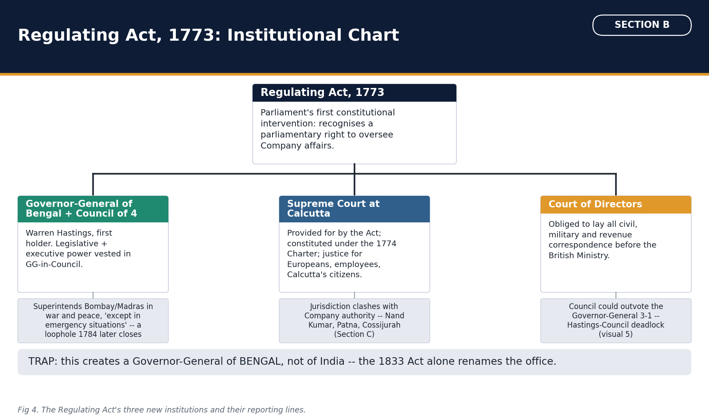

*Visual 4: The Regulating Act, 1773 -- institutional chart. Original deterministic study visual; schematic charts are NOT TO SCALE where marked.*


TRAP: the Regulating Act of 1773 creates a Governor-General of BENGAL; only the Charter Act of 1833 renames the office Governor-General of INDIA. Any Prelims option asserting the 1773 Act itself created a "Governor-General of India" is incorrect on this ground alone.

#### CLOSING RECALL FLOW — CORE — 3. THE REGULATING ACT, 1773: INSTITUTIONS ON PAPER

```text
START / CONCEPT: CORE — 3. The Regulating Act, 1773: institutions on paper
        |
        v
EXACT TERMS: institutions on paper · Parliament's · Company · Regulating Act · Company's · 3. The Regulating Act
        |
        v
MECHANISM / ARGUMENT: the Regulating Act created a Governor-General of Fort William (Bengal) -- not of India, a distinction the next subtopic returns to repeatedly -- supported by a Council of four members; Warren Hastings became its first holder.
        |
        v
CONSEQUENCE / CONTRAST: ANALYSIS: the Regulating Act's three new institutions -- Governor-General-in-Council, a reporting duty on the Directors, and a Crown-appointed Supreme Court -- together represent Parliament's first attempt to build parliamentary oversight and the rule of law into a structure that, until 1773, had none; the next two subtopics show why this first attempt did not work as intended.
        |
        v
UPSC TRAP / ANSWER-USE: Do not miss this limiting distinction: the Regulating Act of 1773 creates a Governor-General of BENGAL.
        |
        v
ANSWER-GRABBING FORMULATION: Parliament's first constitutional intervention in Company rule, the Regulating Act of 1773, was a compromise, not a takeover: it left the Company's trade monopoly and its territorial administration in place, while layering a set of new institutions on top, designed to make the Company's exercise of power more accountable to Parliament and more coherent within Bengal itself.
```
### SESSION 4 — CORE — 4. WHY THE REGULATING ACT FAILED IN PRACTICE: THE HASTINGS-COUNCIL DEADLOCK

#### DEFINITION / WHAT THIS IS CALLED

**Plain-language definition:** ANALYSIS: the Regulating Act's own four-member Council design, which required no special majority and gave the Governor-General no tie-breaking advantage beyond a casting vote usable only when the Council was evenly split, is the direct structural cause of this deadlock; the flaw was corrected only by Pitt's India Act's smaller, three-member council in 1784, which reduced the votes a Governor-General needed to secure a majority.

**Technical definition:** Technically, CORE — 4. Why the Regulating Act failed in practice: the Hastings-Council deadlock is analysed by relating the Hastings-Council deadlock to Bengal Council, then testing the relationship through Warren Hastings and Governor-General.

#### ANSWER-GRABBING OPENING — WRITE/ADAPT IN THE EXAM

> ANALYSIS: the Regulating Act's own four-member Council design, which required no special majority and gave the Governor-General no tie-breaking advantage beyond a casting vote usable only when the Council was evenly split, is the direct structural cause of this deadlock; the flaw was corrected only by Pitt's India Act's smaller, three-member council in 1784, which reduced the votes a Governor-General needed to secure a majority.

#### MUST-WRITE KEYWORDS

- **the Hastings-Council deadlock**
- **Bengal Council**
- **Warren Hastings**
- **Governor-General**
- **4. Why the Regulating Act failed in practice**
- **1774-76**

**How to use them:** Frame the answer through the Hastings-Council deadlock; define Bengal Council, connect Warren Hastings with Governor-General to explain the mechanism, and use 4. Why the Regulating Act failed in practice for the decisive comparison or qualification.

A well-designed institution can still fail through a design flaw in its voting arithmetic, and that is exactly what happened to the Bengal Council between 1774 and 1776. Warren Hastings, as Governor-General, held only one vote among the Council's four members; the other three -- Philip Francis, John Clavering and George Monson -- formed a standing majority bloc that repeatedly outvoted Hastings on Bengal policy, producing sustained executive deadlock rather than a working government.

FACT: this three-against-one arithmetic meant Hastings, despite holding the Governor-General's title and formal executive authority, could be and regularly was overruled by his own Council on substantive Bengal policy through much of 1774-76; the deadlock was resolved only when Monson died in 1776, restoring Hastings's casting vote as a matter of chance, not through any statutory fix. ANALYSIS: the Regulating Act's own four-member Council design, which required no special majority and gave the Governor-General no tie-breaking advantage beyond a casting vote usable only when the Council was evenly split, is the direct structural cause of this deadlock; the flaw was corrected only by Pitt's India Act's smaller, three-member council in 1784, which reduced the votes a Governor-General needed to secure a majority. A defensible answer states this as a design defect in the 1773 Act itself, not merely as a personality clash between Hastings and his colleagues, even though the conflict was also personally bitter -- Francis and Hastings fought a duel in 1780 over it.

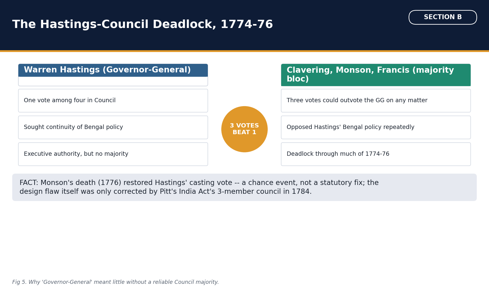

*Visual 5: The Hastings-Council deadlock, 1774-76. Original deterministic study visual; schematic charts are NOT TO SCALE where marked.*


TRAP: "the Regulating Act failed because Warren Hastings was incompetent" is an answer that mistakes a structural voting-arithmetic flaw for a personal failing; name the 3-1 Council majority explicitly as the mechanism, and name Monson's 1776 death as the (non-statutory, contingent) resolution, with Pitt's India Act's 1784 three-member council as the actual statutory fix.

#### PART III -- THE SUPREME COURT AND JURISDICTIONAL CONFLICT

#### CLOSING RECALL FLOW — CORE — 4. WHY THE REGULATING ACT FAILED IN PRACTICE: THE HASTINGS-COUNCIL DEADLOCK

```text
START / CONCEPT: CORE — 4. Why the Regulating Act failed in practice: the Hastings-Council deadlock
        |
        v
EXACT TERMS: the Hastings-Council deadlock · Bengal Council · Warren Hastings · Governor-General · 4. Why the Regulating Act failed in practice · 1774-76
        |
        v
MECHANISM / ARGUMENT: this three-against-one arithmetic meant Hastings, despite holding the Governor-General's title and formal executive authority, could be and regularly was overruled by his own Council on substantive Bengal policy through much of 1774-76; the deadlock was resolved only when Monson died in 1776, restoring Hastings's casting vote as a matter of chance, not through any statutory fix.
        |
        v
CONSEQUENCE / CONTRAST: A defensible answer states this as a design defect in the 1773 Act itself, not merely as a personality clash between Hastings and his colleagues, even though the conflict was also personally bitter -- Francis and Hastings fought a duel in 1780 over it.
        |
        v
UPSC TRAP / ANSWER-USE: Do not miss this limiting distinction: "the Regulating Act failed because Warren Hastings was incompetent" is an answer that mistakes...
        |
        v
ANSWER-GRABBING FORMULATION: ANALYSIS: the Regulating Act's own four-member Council design, which required no special majority and gave the Governor-General no tie-breaking advantage beyond a casting vote usable only when the Council was evenly split, is the direct structural cause of this deadlock; the flaw was corrected only by Pitt's India Act's smaller, three-member council in 1784, which reduced the votes a Governor-General needed to secure a majority.
```
### SESSION 5 — CORE — 5. THE SUPREME COURT AND JURISDICTIONAL CONFLICT: NAND KUMAR, PATNA, COSSIJURAH

#### DEFINITION / WHAT THIS IS CALLED

**Plain-language definition:** ANALYSIS: this jurisdictional overlap, not any single personality conflict, is the structural reason the Nand Kumar, Patna and Cossijurah episodes below all arose within a few years of each other; a strong answer names the overlap as the underlying cause before narrating any individual case.

**Technical definition:** the Patna Case (1777-79) arose when the Supreme Court asserted jurisdiction over a property/inheritance dispute that had already been decided by a Company (Patna) provincial court applying Islamic personal law, effectively claiming appellate authority over the Company's own judicial system; the Cossijurah Case (1779-80) arose when the Supreme Court attempted to assert jurisdiction over a zamindar (of Cossijurah) for a revenue-related debt matter that the Company's own revenue administration considered its own exclusive domain, provoking the Governor-General-in-Council to threaten armed resistance to the Supreme Court's own process-servers.

#### ANSWER-GRABBING OPENING — WRITE/ADAPT IN THE EXAM

> ANALYSIS: this jurisdictional overlap, not any single personality conflict, is the structural reason the Nand Kumar, Patna and Cossijurah episodes below all arose within a few years of each other; a strong answer names the overlap as the underlying cause before narrating any individual case.

#### MUST-WRITE KEYWORDS

- **jurisdictional conflict**
- **Nand Kumar**
- **Patna**
- **Cossijurah**
- **5. The Supreme Court**
- **1777-79**

**How to use them:** Frame the answer through jurisdictional conflict; define Nand Kumar, connect Patna with Cossijurah to explain the mechanism, and use 5. The Supreme Court for the decisive comparison or qualification.

The 1774 Charter's Supreme Court at Calcutta was meant to bring English due process to a fast-growing colonial settlement, but its jurisdiction over "British subjects" and the Company's own zamindari/Diwani-derived court system was left dangerously undefined, producing repeated, serious clashes between judicial and executive authority in Hastings's Bengal.

FACT: the Supreme Court's clearest area of competence was justice for Europeans, Company employees and Calcutta's own residents; the Company's own Diwani-derived Adalats continued to handle revenue and zamindari disputes and Persian/Mughal-derived procedure elsewhere in Bengal. Between these two systems lay a large, contested "disputed zone" -- Company servants' official acts, and any case where the two jurisdictions' claims overlapped. ANALYSIS: this jurisdictional overlap, not any single personality conflict, is the structural reason the Nand Kumar, Patna and Cossijurah episodes below all arose within a few years of each other; a strong answer names the overlap as the underlying cause before narrating any individual case.

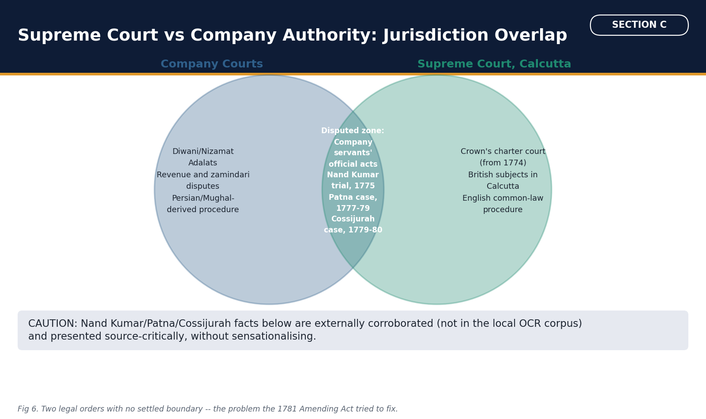

*Visual 6: Supreme Court vs Company authority -- jurisdiction overlap. Original deterministic study visual; schematic charts are NOT TO SCALE where marked.*


FACT: in 1775, Maharaja Nand Kumar, an Indian notable who had separately accused Warren Hastings of corruption before the Bengal Council, was tried before the Supreme Court on a forgery charge (dating to an alleged 1770 offence) brought by a private Indian litigant, convicted under English law by Chief Justice Elijah Impey, and executed in 1775 -- forgery being a capital offence under English law though not typically under the pre-existing Indian legal practice applied to such matters. ANALYSIS: this case must be handled source-critically, not sensationally: the accusation that Hastings and Impey (close personal associates) engineered Nand Kumar's prosecution and execution to silence a corruption accuser is a serious historical allegation repeated in much nationalist-inflected writing, but it rests on circumstantial timing and personal association rather than a demonstrated causal order proven beyond dispute; a defensible answer states the documented facts (the accusation against Hastings, the forgery trial, the execution, the Hastings-Impey personal closeness) and labels the "deliberate silencing" reading as a widely-held but contested interpretation, not settled fact.

FACT: the Patna Case (1777-79) arose when the Supreme Court asserted jurisdiction over a property/inheritance dispute that had already been decided by a Company (Patna) provincial court applying Islamic personal law, effectively claiming appellate authority over the Company's own judicial system; the Cossijurah Case (1779-80) arose when the Supreme Court attempted to assert jurisdiction over a zamindar (of Cossijurah) for a revenue-related debt matter that the Company's own revenue administration considered its own exclusive domain, provoking the Governor-General-in-Council to threaten armed resistance to the Supreme Court's own process-servers. ANALYSIS: both episodes show the same underlying structural problem from two different angles -- Patna shows the Supreme Court reaching into personal-law/civil-court territory it was not clearly built for, and Cossijurah shows it reaching into revenue administration, an area the executive government regarded as non-negotiably its own -- and both, taken together, made some parliamentary correction of the Supreme Court's jurisdiction all but inevitable by 1781.

TRAP: do not sensationalise the Nand Kumar episode into a proven judicial murder plot; state the accusation, the documented facts, and the source-critical caution together, and do not omit that Nand Kumar's forgery trial concerned a genuinely separate 1770 allegation, not the corruption charge against Hastings itself.

#### CLOSING RECALL FLOW — CORE — 5. THE SUPREME COURT AND JURISDICTIONAL CONFLICT: NAND KUMAR, PATNA, COSSIJURAH

```text
START / CONCEPT: CORE — 5. The Supreme Court and jurisdictional conflict: Nand Kumar, Patna, Cossijurah
        |
        v
EXACT TERMS: jurisdictional conflict · Nand Kumar · Patna · Cossijurah · 5. The Supreme Court · 1777-79
        |
        v
MECHANISM / ARGUMENT: the Patna Case (1777-79) arose when the Supreme Court asserted jurisdiction over a property/inheritance dispute that had already been decided by a Company (Patna) provincial court applying Islamic personal law, effectively claiming appellate authority over the Company's own judicial system; the Cossijurah Case (1779-80) arose when the Supreme Court attempted to assert jurisdiction over a zamindar (of Cossijurah) for a revenue-related debt matter that the Company's own revenue administration considered its own exclusive domain, provoking the Governor-General-in-Council to threaten armed resistance to the Supreme Court's own process-servers.
        |
        v
CONSEQUENCE / CONTRAST: ANALYSIS: both episodes show the same underlying structural problem from two different angles -- Patna shows the Supreme Court reaching into personal-law/civil-court territory it was not clearly built for, and Cossijurah shows it reaching into revenue administration, an area the executive government regarded as non-negotiably its own -- and both, taken together, made some parliamentary correction of the Supreme Court's jurisdiction all but inevitable by 1781.
        |
        v
UPSC TRAP / ANSWER-USE: do not sensationalise the Nand Kumar episode into a proven judicial murder plot; state the accusation, the documented facts, and the source-critical caution together, and do not omit that Nand Kumar's forgery trial concerned a genuinely separate 1770 allegation, not the corruption charge against Hastings itself.
        |
        v
ANSWER-GRABBING FORMULATION: ANALYSIS: this jurisdictional overlap, not any single personality conflict, is the structural reason the Nand Kumar, Patna and Cossijurah episodes below all arose within a few years of each other; a strong answer names the overlap as the underlying cause before narrating any individual case.
```
### SESSION 6 — CORE — 6. THE AMENDING ACT (ACT OF SETTLEMENT), 1781: PRECISE CORRECTIONS, NOT A GENERAL FIX

#### DEFINITION / WHAT THIS IS CALLED

**Plain-language definition:** ANALYSIS: Sekhar Bandyopadhyay's own assessment is precise on this point -- the 1781 Act "defined more precisely the jurisdiction of the Supreme Court, but did not address the other anomalies" in Bengal's government; it is a targeted jurisdictional correction, not a fix for the separate Council-deadlock problem (subtopic 4), which persisted until Pitt's India Act's 1784 executive reforms and the Act of 1786.

**Technical definition:** the Amending Act of 1781 (the Act of Settlement) exempted the Governor-General-in-Council's own official acts from the Supreme Court's jurisdiction when performed in an official/public capacity; excluded revenue-collection matters from the Supreme Court entirely, routing them instead to the Company's own revenue courts and to appeal before the Governor-General-in-Council; directed the Supreme Court to apply Hindu law to Hindus and Muslim law to Muslims specifically in personal-law matters (marriage, inheritance, caste usage and religious practice); and directed that appeals from provincial (Company) courts should go to the Governor-General-in-Council or the Sadar Diwani Adalat, not to the Supreme Court.

#### ANSWER-GRABBING OPENING — WRITE/ADAPT IN THE EXAM

> the Amending Act of 1781 (the Act of Settlement) exempted the Governor-General-in-Council's own official acts from the Supreme Court's jurisdiction when performed in an official/public capacity; excluded revenue-collection matters from the Supreme Court entirely, routing them instead to the Company's own revenue courts and to appeal before the Governor-General-in-Council; directed the Supreme Court to apply Hindu law to Hindus and Muslim law to Muslims specifically in personal-law matters (marriage, inheritance, caste usage and religious practice); and directed that appeals from provincial (Company) courts should go to the Governor-General-in-Council or the Sadar Diwani Adalat, not to the Supreme Court.

#### MUST-WRITE KEYWORDS

- **precise corrections**
- **not a general fix**
- **Parliament's**
- **Patna**
- **Cossijurah**
- **6. The Amending Act (Act of Settlement)**

**How to use them:** Frame the answer through precise corrections; define not a general fix, connect Parliament's with Patna to explain the mechanism, and use Cossijurah for the decisive comparison or qualification.

Parliament's response to the Patna and Cossijurah crises was narrow and targeted, not a wholesale redesign of Bengal's government -- a distinction this topic must hold precisely, because a common error is to credit the 1781 Act with fixing problems it did not touch at all.

FACT: the Amending Act of 1781 (the Act of Settlement) exempted the Governor-General-in-Council's own official acts from the Supreme Court's jurisdiction when performed in an official/public capacity; excluded revenue-collection matters from the Supreme Court entirely, routing them instead to the Company's own revenue courts and to appeal before the Governor-General-in-Council; directed the Supreme Court to apply Hindu law to Hindus and Muslim law to Muslims specifically in personal-law matters (marriage, inheritance, caste usage and religious practice); and directed that appeals from provincial (Company) courts should go to the Governor-General-in-Council or the Sadar Diwani Adalat, not to the Supreme Court. ANALYSIS: Sekhar Bandyopadhyay's own assessment is precise on this point -- the 1781 Act "defined more precisely the jurisdiction of the Supreme Court, but did not address the other anomalies" in Bengal's government; it is a targeted jurisdictional correction, not a fix for the separate Council-deadlock problem (subtopic 4), which persisted until Pitt's India Act's 1784 executive reforms and the Act of 1786.

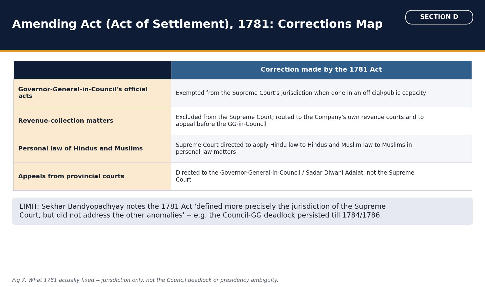

*Visual 7: Amending Act, 1781 -- corrections map. Original deterministic study visual; schematic charts are NOT TO SCALE where marked.*


TRAP: the 1781 Act corrects Supreme Court jurisdiction ONLY -- it does not resolve the Council's 3-1 deadlock problem (that required 1784's smaller council and 1786's override power), and it does not transfer general appellate authority in provincial matters to the Supreme Court; keep "jurisdiction correction" and "executive deadlock correction" as two entirely separate statutory fixes, arriving in different Acts, in different years.

#### PART IV -- PITT'S INDIA ACT AND EXECUTIVE REFORM

#### CLOSING RECALL FLOW — CORE — 6. THE AMENDING ACT (ACT OF SETTLEMENT), 1781: PRECISE CORRECTIONS, NOT A GENERAL FIX

```text
START / CONCEPT: CORE — 6. The Amending Act (Act of Settlement), 1781: precise corrections, not a general fix
        |
        v
EXACT TERMS: precise corrections · not a general fix · Parliament's · Patna · Cossijurah · 6. The Amending Act (Act of Settlement)
        |
        v
MECHANISM / ARGUMENT: Parliament's response to the Patna and Cossijurah crises was narrow and targeted, not a wholesale redesign of Bengal's government -- a distinction this topic must hold precisely, because a common error is to credit the 1781 Act with fixing problems it did not touch at all.
        |
        v
CONSEQUENCE / CONTRAST: ANALYSIS: Sekhar Bandyopadhyay's own assessment is precise on this point -- the 1781 Act "defined more precisely the jurisdiction of the Supreme Court, but did not address the other anomalies" in Bengal's government; it is a targeted jurisdictional correction, not a fix for the separate Council-deadlock problem (subtopic 4), which persisted until Pitt's India Act's 1784 executive reforms and the Act of 1786.
        |
        v
UPSC TRAP / ANSWER-USE: the 1781 Act corrects Supreme Court jurisdiction ONLY -- it does not resolve the Council's 3-1 deadlock problem (that required 1784's smaller council and 1786's override power), and it does not transfer general appellate authority in provincial matters to the Supreme Court; keep "jurisdiction correction" and "executive deadlock correction" as two entirely separate statutory fixes, arriving in different Acts, in different years.
        |
        v
ANSWER-GRABBING FORMULATION: the Amending Act of 1781 (the Act of Settlement) exempted the Governor-General-in-Council's own official acts from the Supreme Court's jurisdiction when performed in an official/public capacity; excluded revenue-collection matters from the Supreme Court entirely, routing them instead to the Company's own revenue courts and to appeal before the Governor-General-in-Council; directed the Supreme Court to apply Hindu law to Hindus and Muslim law to Muslims specifically in personal-law matters (marriage, inheritance, caste usage and religious practice); and directed that appeals from provincial (Company) courts should go to the Governor-General-in-Council or the Sadar Diwani Adalat, not to the Supreme Court.
```
### SESSION 7 — CORE — 7. PITT'S INDIA ACT, 1784: DUAL CONTROL IN BRITAIN

#### DEFINITION / WHAT THIS IS CALLED

**Plain-language definition:** By 1784 it was clear the Regulating Act's own oversight design -- a mere reporting duty owed by the Court of Directors to the British Ministry -- gave Parliament no real supervisory teeth over Company government in India.

**Technical definition:** the Act created a Board of Control of six members, including a Secretary of State and the Chancellor of the Exchequer, empowered in the Act's own phrasing to "superintend, direct and control" the Company's civil, military and revenue affairs in India; Board orders binding on Indian administration were to be transmitted to the Company's Court of Directors through a Secret Committee of Directors, providing a channel for urgent or confidential orders without full deliberation by the whole Court.

#### ANSWER-GRABBING OPENING — WRITE/ADAPT IN THE EXAM

> Pitt's India Act also reduced the Bengal Council from the Regulating Act's Governor-General-plus-four to a smaller Governor-General-plus-three, meaning the Governor-General now needed only one ally, not two, to secure a working majority; presidency subordination to the Bengal government was also extended more clearly to cover war, diplomacy and revenue matters together, closing the Regulating Act's narrower and more ambiguous "war/peace... except in emergency situations" wording.

#### MUST-WRITE KEYWORDS

- **dual control in Britain**
- **By**
- **Regulating Act's**
- **Court**
- **7. Pitt's India Act**
- **1765-72**

**How to use them:** Frame the answer through dual control in Britain; define By, connect Regulating Act's with Court to explain the mechanism, and use 7. Pitt's India Act for the decisive comparison or qualification.

By 1784 it was clear the Regulating Act's own oversight design -- a mere reporting duty owed by the Court of Directors to the British Ministry -- gave Parliament no real supervisory teeth over Company government in India. Pitt's India Act answered this by creating a permanent Crown supervisory body in London, while leaving the Company's commercial structure and trade monopoly untouched.

FACT: the Act created a Board of Control of six members, including a Secretary of State and the Chancellor of the Exchequer, empowered in the Act's own phrasing to "superintend, direct and control" the Company's civil, military and revenue affairs in India; Board orders binding on Indian administration were to be transmitted to the Company's Court of Directors through a Secret Committee of Directors, providing a channel for urgent or confidential orders without full deliberation by the whole Court. ANALYSIS: this created a genuine dual-control structure within Britain itself -- the Crown-appointed Board of Control on the political side, the Company's own Court of Directors retaining patronage and commercial administration on the other -- a design that let Parliament supervise Indian governance without either nationalising the Company's assets or assuming direct fiscal liability for it; the Company's trade monopoly itself remained fully intact under this Act, in exchange for accepting this new political superintendence.

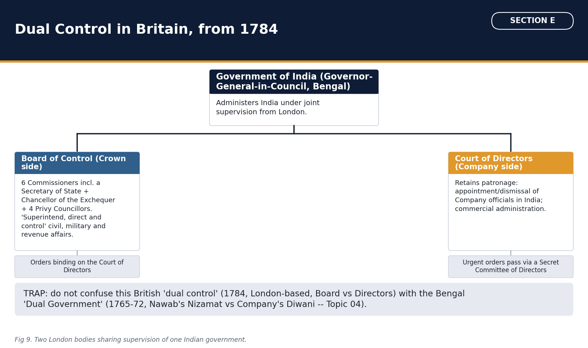

*Visual 9: Dual control in Britain, from 1784. Original deterministic study visual; schematic charts are NOT TO SCALE where marked.*


FACT: Pitt's India Act also reduced the Bengal Council from the Regulating Act's Governor-General-plus-four to a smaller Governor-General-plus-three, meaning the Governor-General now needed only one ally, not two, to secure a working majority; presidency subordination to the Bengal government was also extended more clearly to cover war, diplomacy and revenue matters together, closing the Regulating Act's narrower and more ambiguous "war/peace... except in emergency situations" wording. ANALYSIS: read together with subtopic 4, this is the direct statutory fix for the Hastings-Council deadlock -- a smaller council structurally reduces the odds of a standing hostile majority, even though it does not eliminate the possibility outright, which is precisely why the Act of 1786 (subtopic 8) added a further, more direct override power for the Governor-General alone.

TRAP: the single highest-value distinction on this entire topic is that Pitt's India Act's 1784 "dual control" (Board of Control vs Court of Directors, both London-based, supervising an Indian government from Britain) is NOT the same institution as Bengal's own 1765-72 "Dual Government" (Nawab's nominal Nizamat vs Company's substantive Diwani, examined fully in Topic 04) -- different institutions, different decades, different locations of authority; never use the two labels interchangeably.

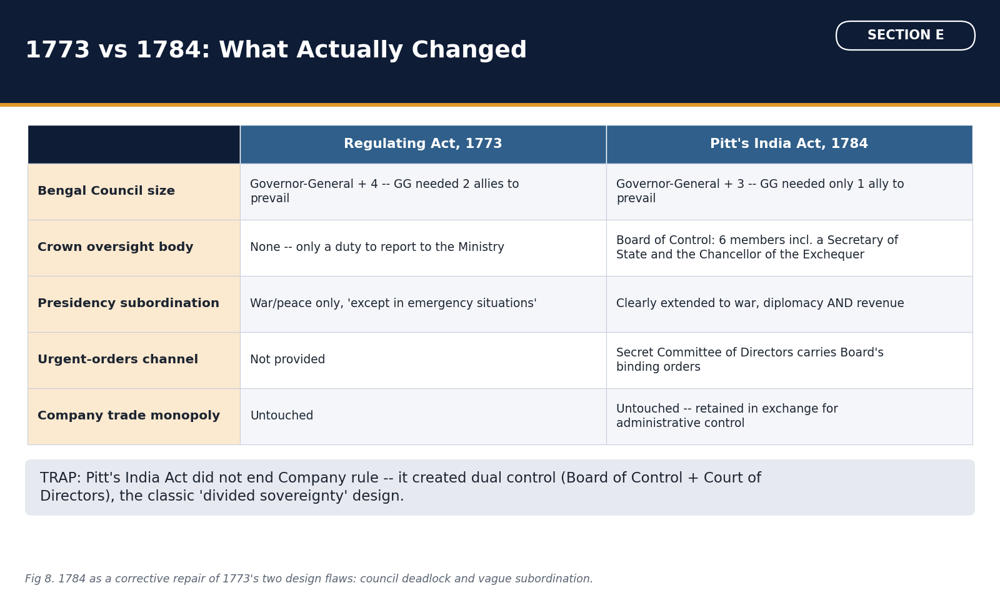

*Visual 8: 1773 vs 1784 -- what actually changed. Original deterministic study visual; schematic charts are NOT TO SCALE where marked.*

#### CLOSING RECALL FLOW — CORE — 7. PITT'S INDIA ACT, 1784: DUAL CONTROL IN BRITAIN

```text
START / CONCEPT: CORE — 7. Pitt's India Act, 1784: dual control in Britain
        |
        v
EXACT TERMS: dual control in Britain · By · Regulating Act's · Court · 7. Pitt's India Act · 1765-72
        |
        v
MECHANISM / ARGUMENT: By 1784 it was clear the Regulating Act's own oversight design -- a mere reporting duty owed by the Court of Directors to the British Ministry -- gave Parliament no real supervisory teeth over Company government in India.
        |
        v
CONSEQUENCE / CONTRAST: the Act created a Board of Control of six members, including a Secretary of State and the Chancellor of the Exchequer, empowered in the Act's own phrasing to "superintend, direct and control" the Company's civil, military and revenue affairs in India; Board orders binding on Indian administration were to be transmitted to the Company's Court of Directors through a Secret Committee of Directors, providing a channel for urgent or confidential orders without full deliberation by the whole Court.
        |
        v
UPSC TRAP / ANSWER-USE: the single highest-value distinction on this entire topic is that Pitt's India Act's 1784 "dual control" (Board of Control vs Court of Directors, both London-based, supervising an Indian government from Britain) is NOT the same institution as Bengal's own 1765-72 "Dual Government" (Nawab's nominal Nizamat vs Company's substantive Diwani, examined fully in Topic 04) -- different institutions, different decades, different locations of authority; never use the two labels interchangeably.
        |
        v
ANSWER-GRABBING FORMULATION: Pitt's India Act also reduced the Bengal Council from the Regulating Act's Governor-General-plus-four to a smaller Governor-General-plus-three, meaning the Governor-General now needed only one ally, not two, to secure a working majority; presidency subordination to the Bengal government was also extended more clearly to cover war, diplomacy and revenue matters together, closing the Regulating Act's narrower and more ambiguous "war/peace... except in emergency situations" wording.
```
### SESSION 8 — CORE — 8. THE ACT OF 1786 AND EXECUTIVE AUTHORITY; CHARTER ACT, 1793: CONTINUATION AND CODIFICATION

#### DEFINITION / WHAT THIS IS CALLED

**Plain-language definition:** ANALYSIS: 1793 is best read as a continuation-and-consolidation Act -- it did not restructure the Board of Control/Court of Directors relationship established in 1784, nor did it touch the Governor-General's 1786 override power; its own distinctive contribution is codification and a further twenty-year renewal of exactly the trade-monopoly-for-political-supervision bargain struck in 1784, a bargain the next Charter Act, in 1813, would finally begin to unwind.

**Technical definition:** ANALYSIS: this override answers the 1774-76 deadlock directly and precisely -- it is a bounded power in specified matters, not a general dictatorship, and an answer that overstates it as unlimited authority misreads the Act's own careful, matter-specific phrasing.

#### ANSWER-GRABBING OPENING — WRITE/ADAPT IN THE EXAM

> ANALYSIS: 1793 is best read as a continuation-and-consolidation Act -- it did not restructure the Board of Control/Court of Directors relationship established in 1784, nor did it touch the Governor-General's 1786 override power; its own distinctive contribution is codification and a further twenty-year renewal of exactly the trade-monopoly-for-political-supervision bargain struck in 1784, a bargain the next Charter Act, in 1813, would finally begin to unwind.

#### MUST-WRITE KEYWORDS

- **executive authority**
- **Charter Act**
- **continuation**
- **codification**
- **8. The Act of 1786**
- **1774-76**

**How to use them:** Frame the answer through executive authority; define Charter Act, connect continuation with codification to explain the mechanism, and use 8. The Act of 1786 for the decisive comparison or qualification.

Pitt's India Act's smaller three-member council reduced, but did not eliminate, the risk of executive deadlock; a further Act in 1786 closed the remaining gap by giving the Governor-General a direct, though bounded, override power.

FACT: the Act of 1786 empowered the Governor-General to overrule the Council's majority "in matters of importance affecting... safety, peace, or the interests of the Empire" -- a precise, bounded override power for specified categories of decision, not a general grant of dictatorial authority over ordinary administration; Lord Cornwallis, appointed Governor-General in 1786, held this office together with the position of Commander-in-Chief, unifying civil and military command in Bengal for the first time under statute. ANALYSIS: this override answers the 1774-76 deadlock directly and precisely -- it is a bounded power in specified matters, not a general dictatorship, and an answer that overstates it as unlimited authority misreads the Act's own careful, matter-specific phrasing.

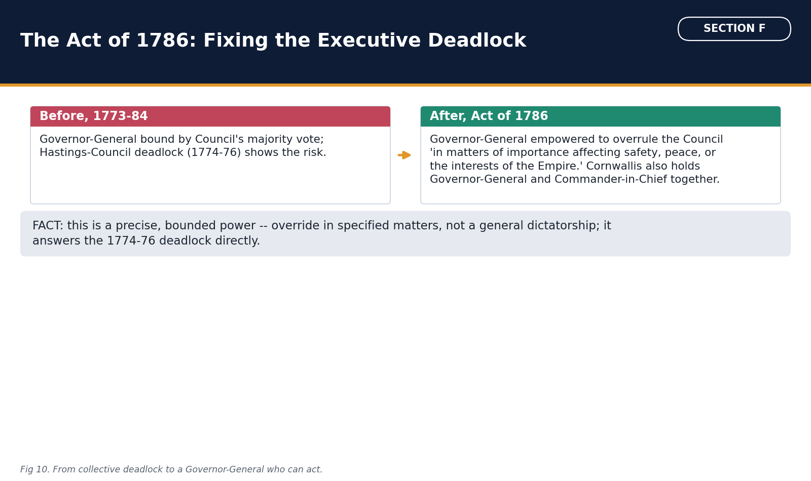

*Visual 10: The Act of 1786 -- fixing the executive deadlock. Original deterministic study visual; schematic charts are NOT TO SCALE where marked.*


FACT: the Charter Act of 1793 renewed the Company's charter and trade monopoly for a further twenty years, and consolidated Cornwallis-era administrative practice by codifying Bengal regulations into a printed, systematised body of law, issued with translations for wider administrative use. ANALYSIS: 1793 is best read as a continuation-and-consolidation Act -- it did not restructure the Board of Control/Court of Directors relationship established in 1784, nor did it touch the Governor-General's 1786 override power; its own distinctive contribution is codification and a further twenty-year renewal of exactly the trade-monopoly-for-political-supervision bargain struck in 1784, a bargain the next Charter Act, in 1813, would finally begin to unwind.

TRAP: do not credit the Charter Act of 1793 with ending or even reducing the Company's trade monopoly -- that monopoly was renewed, not reduced, in 1793; the first real opening of Indian trade to non-Company British subjects comes only with the Charter Act of 1813 (Part V).

#### PART V -- THE CHARTER ACTS: 1813 AND 1833

#### CLOSING RECALL FLOW — CORE — 8. THE ACT OF 1786 AND EXECUTIVE AUTHORITY; CHARTER ACT, 1793: CONTINUATION AND CODIFICATION

```text
START / CONCEPT: CORE — 8. The Act of 1786 and executive authority; Charter Act, 1793: continuation and codification
        |
        v
EXACT TERMS: executive authority · Charter Act · continuation · codification · 8. The Act of 1786 · 1774-76
        |
        v
MECHANISM / ARGUMENT: the Charter Act of 1793 renewed the Company's charter and trade monopoly for a further twenty years, and consolidated Cornwallis-era administrative practice by codifying Bengal regulations into a printed, systematised body of law, issued with translations for wider administrative use.
        |
        v
CONSEQUENCE / CONTRAST: ANALYSIS: this override answers the 1774-76 deadlock directly and precisely -- it is a bounded power in specified matters, not a general dictatorship, and an answer that overstates it as unlimited authority misreads the Act's own careful, matter-specific phrasing.
        |
        v
UPSC TRAP / ANSWER-USE: do not credit the Charter Act of 1793 with ending or even reducing the Company's trade monopoly -- that monopoly was renewed, not reduced, in 1793; the first real opening of Indian trade to non-Company British subjects comes only with the Charter Act of 1813 (Part V).
        |
        v
ANSWER-GRABBING FORMULATION: ANALYSIS: 1793 is best read as a continuation-and-consolidation Act -- it did not restructure the Board of Control/Court of Directors relationship established in 1784, nor did it touch the Governor-General's 1786 override power; its own distinctive contribution is codification and a further twenty-year renewal of exactly the trade-monopoly-for-political-supervision bargain struck in 1784, a bargain the next Charter Act, in 1813, would finally begin to unwind.
```
### SESSION 9 — CORE — 9. CHARTER ACT, 1813: THE MONOPOLY OPENS, CROWN SOVEREIGNTY IS ASSERTED

#### DEFINITION / WHAT THIS IS CALLED

**Plain-language definition:** The Charter Act of 1813 is this topic's single most heavily PYQ-tested statute, and it must be handled with exact statutory precision -- three distinct provisions, each independently verifiable, are routinely tested together.

**Technical definition:** the Act renewed the Company's charter for a further twenty years but ended the Company's monopoly of trade with India, opening it to other British subjects, while specifically preserving the Company's exclusive monopoly over the tea trade and over all trade with China; the Act asserted, in its own language, the "undoubted sovereignty of the Crown of the United Kingdom of Great Britain and Ireland" over the Company's Indian territories, for the first time placing an explicit Crown-sovereignty claim on the statute book even while day-to-day administration remained with the Company; the Act permitted Christian missionaries to enter and preach in Company territory, reversing an earlier restrictive practice, and earmarked a sum of one lakh rupees a year for "the revival and promotion of literature and the encouragement of the learned natives of India" and for the introduction of useful scientific knowledge.

#### ANSWER-GRABBING OPENING — WRITE/ADAPT IN THE EXAM

> the Act renewed the Company's charter for a further twenty years but ended the Company's monopoly of trade with India, opening it to other British subjects, while specifically preserving the Company's exclusive monopoly over the tea trade and over all trade with China; the Act asserted, in its own language, the "undoubted sovereignty of the Crown of the United Kingdom of Great Britain and Ireland" over the Company's Indian territories, for the first time placing an explicit Crown-sovereignty claim on the statute book even while day-to-day administration remained with the Company; the Act permitted Christian missionaries to enter and preach in Company territory, reversing an earlier restrictive practice, and earmarked a sum of one lakh rupees a year for "the revival and promotion of literature and the encouragement of the learned natives of India" and for the introduction of useful scientific knowledge.

#### MUST-WRITE KEYWORDS

- **the monopoly opens**
- **Crown sovereignty is asserted**
- **The Charter Act of 1813**
- **The Charter Act**
- **PYQ-tested**
- **9. Charter Act**

**How to use them:** Frame the answer through the monopoly opens; define Crown sovereignty is asserted, connect The Charter Act of 1813 with The Charter Act to explain the mechanism, and use PYQ-tested for the decisive comparison or qualification.

The Charter Act of 1813 is this topic's single most heavily PYQ-tested statute, and it must be handled with exact statutory precision -- three distinct provisions, each independently verifiable, are routinely tested together.

FACT: the Act renewed the Company's charter for a further twenty years but ended the Company's monopoly of trade with India, opening it to other British subjects, while specifically preserving the Company's exclusive monopoly over the tea trade and over all trade with China; the Act asserted, in its own language, the "undoubted sovereignty of the Crown of the United Kingdom of Great Britain and Ireland" over the Company's Indian territories, for the first time placing an explicit Crown-sovereignty claim on the statute book even while day-to-day administration remained with the Company; the Act permitted Christian missionaries to enter and preach in Company territory, reversing an earlier restrictive practice, and earmarked a sum of one lakh rupees a year for "the revival and promotion of literature and the encouragement of the learned natives of India" and for the introduction of useful scientific knowledge. ANALYSIS: three separate statutory moves -- trade liberalisation (with a carved-out exception), a symbolic-but-real sovereignty assertion, and a modest permissive/funding gesture toward education and missionary activity -- are bundled in a single Act, which is exactly why Prelims-style multi-statement questions target it; a precise answer keeps each of the three claims separately verifiable rather than treating "1813" as one single undifferentiated fact.

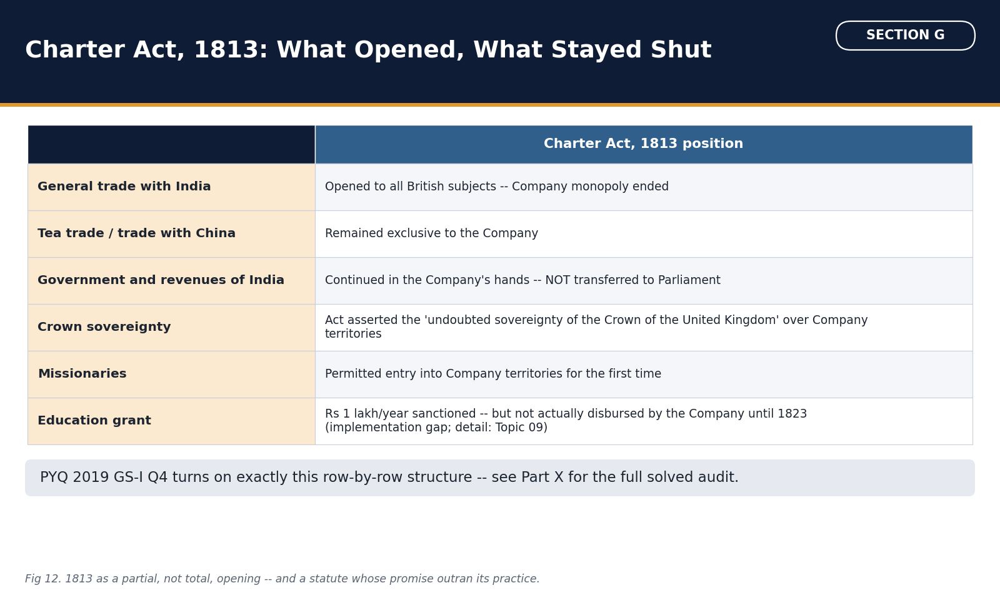

*Visual 12: Charter Act, 1813 -- the monopoly opens. Original deterministic study visual; schematic charts are NOT TO SCALE where marked.*


FACT: the one-lakh education grant was a statutory authorisation, not an operating programme -- actual disbursement was delayed for years amid the Anglicist-Orientalist dispute over medium of instruction, a controversy resolved only by Macaulay's 1835 Minute on Education, which lies outside this topic's scope and is examined fully under Topic 09 (education and press). ANALYSIS: this is a general pattern worth naming once and reusing across the topic -- a Charter Act's text authorises or promises something on paper; whether and how it is actually implemented is frequently a separate, later story, and a rigorous answer never assumes a statute's passage instantly caused its stated purpose to be realised on the ground.

TRAP: do not overclaim a one-way causal chain from "1813 permits missionaries and funds education" straight to "1813 caused Western education/social reform in Bengal" -- the permissive/funding provisions of 1813 are a precondition, examined for their statutory content here, while the actual unfolding of educational policy, missionary impact and social-reform debates belongs to Topic 09 and to later decades; this topic's job is the statute's exact wording, not its downstream social history.

#### CLOSING RECALL FLOW — CORE — 9. CHARTER ACT, 1813: THE MONOPOLY OPENS, CROWN SOVEREIGNTY IS ASSERTED

```text
START / CONCEPT: CORE — 9. Charter Act, 1813: the monopoly opens, Crown sovereignty is asserted
        |
        v
EXACT TERMS: the monopoly opens · Crown sovereignty is asserted · The Charter Act of 1813 · The Charter Act · PYQ-tested · 9. Charter Act
        |
        v
MECHANISM / ARGUMENT: ANALYSIS: three separate statutory moves -- trade liberalisation (with a carved-out exception), a symbolic-but-real sovereignty assertion, and a modest permissive/funding gesture toward education and missionary activity -- are bundled in a single Act, which is exactly why Prelims-style multi-statement questions target it; a precise answer keeps each of the three claims separately verifiable rather than treating "1813" as one single undifferentiated fact.
        |
        v
CONSEQUENCE / CONTRAST: The Charter Act of 1813 is this topic's single most heavily PYQ-tested statute, and it must be handled with exact statutory precision -- three distinct provisions, each independently verifiable, are routinely tested together.
        |
        v
UPSC TRAP / ANSWER-USE: do not overclaim a one-way causal chain from "1813 permits missionaries and funds education" straight to "1813 caused Western education/social reform in Bengal" -- the permissive/funding provisions of 1813 are a precondition, examined for their statutory content here, while the actual unfolding of educational policy, missionary impact and social-reform debates belongs to Topic 09 and to later decades; this topic's job is the statute's exact wording, not its downstream social history.
        |
        v
ANSWER-GRABBING FORMULATION: the Act renewed the Company's charter for a further twenty years but ended the Company's monopoly of trade with India, opening it to other British subjects, while specifically preserving the Company's exclusive monopoly over the tea trade and over all trade with China; the Act asserted, in its own language, the "undoubted sovereignty of the Crown of the United Kingdom of Great Britain and Ireland" over the Company's Indian territories, for the first time placing an explicit Crown-sovereignty claim on the statute book even while day-to-day administration remained with the Company; the Act permitted Christian missionaries to enter and preach in Company territory, reversing an earlier restrictive practice, and earmarked a sum of one lakh rupees a year for "the revival and promotion of literature and the encouragement of the learned natives of India" and for the introduction of useful scientific knowledge.
```
### SESSION 10 — CORE — 10. CHARTER ACT, 1833: THE COMPANY BECOMES PURELY AN ADMINISTRATIVE AGENCY

#### DEFINITION / WHAT THIS IS CALLED

**Plain-language definition:** ANALYSIS: two distinct centralisations are happening together here and must not be blurred into one -- an executive/titular centralisation (Bengal's Governor-General becomes India's Governor-General) and a legislative centralisation (law-making authority for the presidencies is drawn together under the Governor-General-in-Council, with the presidency governments' own power to legislate independently correspondingly curtailed, though they retained more limited local administrative rule-making).

**Technical definition:** the Act ended all of the Company's remaining commercial and trading activities outright, converting it into a purely administrative body holding its Indian possessions, in the Act's own trust-like framing, for the Crown; it upgraded the Governor-General of Bengal into the Governor-General of India (the first holder of this new title being Lord William Bentinck, already Governor-General of Bengal at the time), with legislative authority over the whole of British India now centralised in the Governor-General-in-Council rather than distributed separately among the presidency governments; it added a fourth, Law Member to the Governor-General's Council -- a member without executive department responsibilities, whose function was purely legislative and legal -- the first holder of this office being Thomas Babington Macaulay; and it established a Law Commission, under Macaulay's chairmanship, tasked with examining and codifying Indian law into a unified, systematic body of codes.

#### ANSWER-GRABBING OPENING — WRITE/ADAPT IN THE EXAM

> ANALYSIS: two distinct centralisations are happening together here and must not be blurred into one -- an executive/titular centralisation (Bengal's Governor-General becomes India's Governor-General) and a legislative centralisation (law-making authority for the presidencies is drawn together under the Governor-General-in-Council, with the presidency governments' own power to legislate independently correspondingly curtailed, though they retained more limited local administrative rule-making).

#### MUST-WRITE KEYWORDS

- **the Company becomes purely an administrative agency**
- **Act**
- **Company's**
- **10. Charter Act**
- **1757-1858**
- **1833-58**

**How to use them:** Frame the answer through the Company becomes purely an administrative agency; define Act, connect Company's with 10. Charter Act to explain the mechanism, and use 1757-1858 for the decisive comparison or qualification.

The Charter Act of 1833 marks the single largest structural leap in this entire topic -- the Company's transformation from a commercial-and-administrative hybrid into a purely administrative agency holding Indian territory in trust for the Crown, alongside the first true all-India legislative centralisation.

FACT: the Act ended all of the Company's remaining commercial and trading activities outright, converting it into a purely administrative body holding its Indian possessions, in the Act's own trust-like framing, for the Crown; it upgraded the Governor-General of Bengal into the Governor-General of India (the first holder of this new title being Lord William Bentinck, already Governor-General of Bengal at the time), with legislative authority over the whole of British India now centralised in the Governor-General-in-Council rather than distributed separately among the presidency governments; it added a fourth, Law Member to the Governor-General's Council -- a member without executive department responsibilities, whose function was purely legislative and legal -- the first holder of this office being Thomas Babington Macaulay; and it established a Law Commission, under Macaulay's chairmanship, tasked with examining and codifying Indian law into a unified, systematic body of codes. ANALYSIS: two distinct centralisations are happening together here and must not be blurred into one -- an executive/titular centralisation (Bengal's Governor-General becomes India's Governor-General) and a legislative centralisation (law-making authority for the presidencies is drawn together under the Governor-General-in-Council, with the presidency governments' own power to legislate independently correspondingly curtailed, though they retained more limited local administrative rule-making).

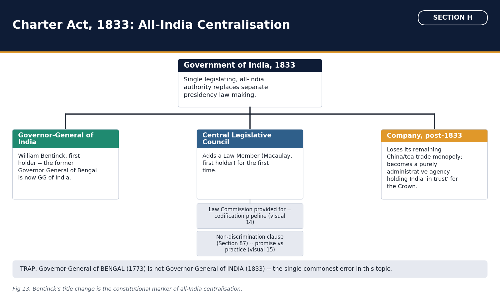

*Visual 13: Charter Act, 1833 -- all-India centralisation. Original deterministic study visual; schematic charts are NOT TO SCALE where marked.*


FACT: this is also the correct statutory answer to a directly tested Prelims question -- "by which Act was the Governor-General of Bengal designated as the Governor-General of India" is answered by the Charter Act of 1833, not by the Regulating Act (which created only a Governor-General of Bengal/Fort William), Pitt's India Act (which restructured the Bengal Council but created no all-India office), or the Charter Act of 1793 (a renewal-and-codification Act with no such title change); this exact question is examined fully in the PYQ audit (Part IX). ANALYSIS: the Law Commission's codification mandate, while set in motion here in 1833, did not itself produce finished codes within this topic's own 1757-1858 window -- the landmark codes it set in train (the Indian Penal Code chief among them) were enacted only after 1858, and the Commission's 1833-58 work is therefore this topic's upstream trigger for a downstream story that properly belongs to a later period, not a completed achievement to credit to 1833 itself.

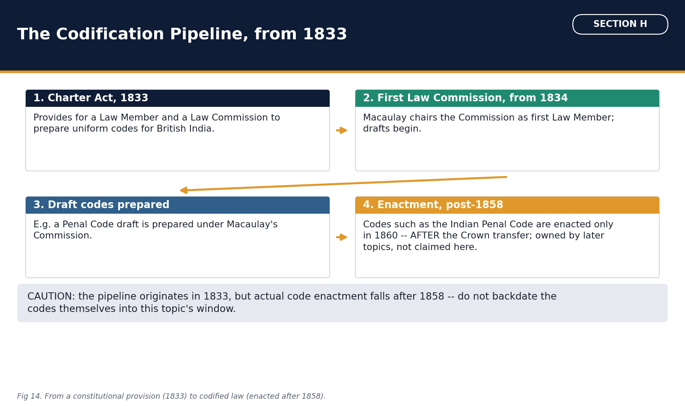

*Visual 14: Codification pipeline, 1833 onward. Original deterministic study visual; schematic charts are NOT TO SCALE where marked.*

#### CLOSING RECALL FLOW — CORE — 10. CHARTER ACT, 1833: THE COMPANY BECOMES PURELY AN ADMINISTRATIVE AGENCY

```text
START / CONCEPT: CORE — 10. Charter Act, 1833: the Company becomes purely an administrative agency
        |
        v
EXACT TERMS: the Company becomes purely an administrative agency · Act · Company's · 10. Charter Act · 1757-1858 · 1833-58
        |
        v
MECHANISM / ARGUMENT: this is also the correct statutory answer to a directly tested Prelims question -- "by which Act was the Governor-General of Bengal designated as the Governor-General of India" is answered by the Charter Act of 1833, not by the Regulating Act (which created only a Governor-General of Bengal/Fort William), Pitt's India Act (which restructured the Bengal Council but created no all-India office), or the Charter Act of 1793 (a renewal-and-codification Act with no such title change); this exact question is examined fully in the PYQ audit (Part IX).
        |
        v
CONSEQUENCE / CONTRAST: ANALYSIS: the Law Commission's codification mandate, while set in motion here in 1833, did not itself produce finished codes within this topic's own 1757-1858 window -- the landmark codes it set in train (the Indian Penal Code chief among them) were enacted only after 1858, and the Commission's 1833-58 work is therefore this topic's upstream trigger for a downstream story that properly belongs to a later period, not a completed achievement to credit to 1833 itself.
        |
        v
UPSC TRAP / ANSWER-USE: the Act ended all of the Company's remaining commercial and trading activities outright, converting it into a purely administrative body holding its Indian possessions, in the Act's own trust-like framing, for the Crown; it upgraded the Governor-General of Bengal into the Governor-General of India (the first holder of this new title being Lord William Bentinck, already Governor-General of Bengal at the time), with legislative authority over the whole of British India now centralised in the Governor-General-in-Council rather than distributed separately among the presidency governments; it added a fourth, Law Member to the Governor-General's Council -- a member without executive department responsibilities, whose function was purely legislative and legal -- the first holder of this office being Thomas Babington Macaulay; and it established a Law Commission, under Macaulay's chairmanship, tasked with examining and codifying Indian law into a unified, systematic body of codes.
        |
        v
ANSWER-GRABBING FORMULATION: ANALYSIS: two distinct centralisations are happening together here and must not be blurred into one -- an executive/titular centralisation (Bengal's Governor-General becomes India's Governor-General) and a legislative centralisation (law-making authority for the presidencies is drawn together under the Governor-General-in-Council, with the presidency governments' own power to legislate independently correspondingly curtailed, though they retained more limited local administrative rule-making).
```
### SESSION 11 — CORE — 11. THE 1833 NON-DISCRIMINATION CLAUSE: A FORMAL PROMISE, AND ITS PRACTICE GAP

#### DEFINITION / WHAT THIS IS CALLED

**Plain-language definition:** ANALYSIS: this clause is historically significant precisely because of the size of the gap between its formal promise and its practical effect -- in the decades immediately following 1833, the number of Indians who actually secured entry into the higher, covenanted ranks of Company service remained extremely small, since the clause removed a formal legal bar without creating any practical mechanism (competitive, accessible examinations; language of testing; location of testing) by which Indians could realistically compete for those posts on equal terms; the practical opening of a genuine competitive route, examined in subtopic 12, would not arrive until the Charter Act of 1853, and even then only partially and gradually.

**Technical definition:** the Charter Act of 1833 included a clause providing that no Indian subject of the Company, nor any natural-born subject residing in India, was to be disbarred from holding any office, place or employment under the Company by reason only of religion, place of birth, descent or colour -- a formal, statutory promise of non-discrimination in Company service.

#### ANSWER-GRABBING OPENING — WRITE/ADAPT IN THE EXAM

> ANALYSIS: this clause is historically significant precisely because of the size of the gap between its formal promise and its practical effect -- in the decades immediately following 1833, the number of Indians who actually secured entry into the higher, covenanted ranks of Company service remained extremely small, since the clause removed a formal legal bar without creating any practical mechanism (competitive, accessible examinations; language of testing; location of testing) by which Indians could realistically compete for those posts on equal terms; the practical opening of a genuine competitive route, examined in subtopic 12, would not arrive until the Charter Act of 1853, and even then only partially and gradually.

#### MUST-WRITE KEYWORDS

- **a formal promise**
- **its practice gap**
- **Charter Act**
- **11. The 1833 non-discrimination clause**
- **1833-55**
- **1853-55**

**How to use them:** Frame the answer through a formal promise; define its practice gap, connect Charter Act with 11. The 1833 non-discrimination clause to explain the mechanism, and use 1833-55 for the decisive comparison or qualification.

FACT: the Charter Act of 1833 included a clause providing that no Indian subject of the Company, nor any natural-born subject residing in India, was to be disbarred from holding any office, place or employment under the Company by reason only of religion, place of birth, descent or colour -- a formal, statutory promise of non-discrimination in Company service. ANALYSIS: this clause is historically significant precisely because of the size of the gap between its formal promise and its practical effect -- in the decades immediately following 1833, the number of Indians who actually secured entry into the higher, covenanted ranks of Company service remained extremely small, since the clause removed a formal legal bar without creating any practical mechanism (competitive, accessible examinations; language of testing; location of testing) by which Indians could realistically compete for those posts on equal terms; the practical opening of a genuine competitive route, examined in subtopic 12, would not arrive until the Charter Act of 1853, and even then only partially and gradually.

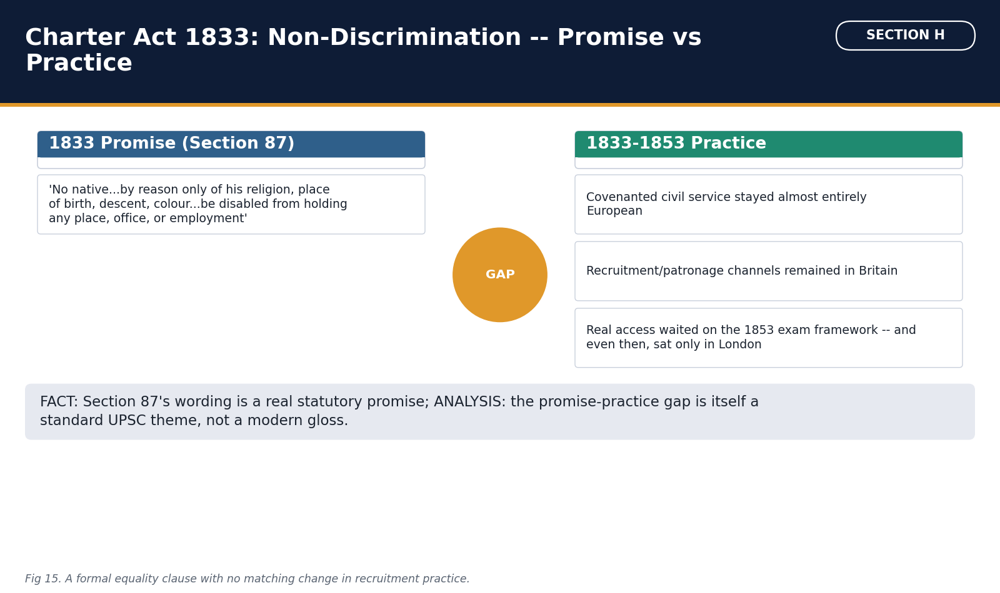

*Visual 15: The 1833 promise versus its practice, 1833-55. Original deterministic study visual; schematic charts are NOT TO SCALE where marked.*


TRAP: the highest-value framing for this clause is "an 1833 promise, an 1853-55 partial mechanism, and a persistently thin practical outcome for decades after" -- never state or imply that the 1833 clause itself opened the civil service to Indians in practice; it removed only a formal legal bar, one among many practical barriers that persisted for a long time afterward.

#### PART VI -- THE CHARTER ACT OF 1853

#### CLOSING RECALL FLOW — CORE — 11. THE 1833 NON-DISCRIMINATION CLAUSE: A FORMAL PROMISE, AND ITS PRACTICE GAP

```text
START / CONCEPT: CORE — 11. The 1833 non-discrimination clause: a formal promise, and its practice gap
        |
        v
EXACT TERMS: a formal promise · its practice gap · Charter Act · 11. The 1833 non-discrimination clause · 1833-55 · 1853-55
        |
        v
MECHANISM / ARGUMENT: the Charter Act of 1833 included a clause providing that no Indian subject of the Company, nor any natural-born subject residing in India, was to be disbarred from holding any office, place or employment under the Company by reason only of religion, place of birth, descent or colour -- a formal, statutory promise of non-discrimination in Company service.
        |
        v
CONSEQUENCE / CONTRAST: The resulting consequence is that this clause is historically significant precisely because of the size of the gap between...
        |
        v
UPSC TRAP / ANSWER-USE: the highest-value framing for this clause is "an 1833 promise, an 1853-55 partial mechanism, and a persistently thin practical outcome for decades after" -- never state or imply that the 1833 clause itself opened the civil service to Indians in practice; it removed only a formal legal bar, one among many practical barriers that persisted for a long time afterward.
        |
        v
ANSWER-GRABBING FORMULATION: ANALYSIS: this clause is historically significant precisely because of the size of the gap between its formal promise and its practical effect -- in the decades immediately following 1833, the number of Indians who actually secured entry into the higher, covenanted ranks of Company service remained extremely small, since the clause removed a formal legal bar without creating any practical mechanism (competitive, accessible examinations; language of testing; location of testing) by which Indians could realistically compete for those posts on equal terms; the practical opening of a genuine competitive route, examined in subtopic 12, would not arrive until the Charter Act of 1853, and even then only partially and gradually.
```
### SESSION 12 — CORE — 12. CHARTER ACT, 1853: NO FIXED TERM, A PROTO-LEGISLATURE, AND THE CIVIL-SERVICE REFORM SEQUENCE

#### DEFINITION / WHAT THIS IS CALLED

**Plain-language definition:** The Charter Act of 1853 is the last Charter Act before the Revolt and the Government of India Act, 1858, and it differs from every earlier renewal in one structurally important way: it did not renew Company rule for a fixed further term at all.

**Technical definition:** ANALYSIS: the precise sequence -- an 1833 formal non-discrimination promise, an 1853 Act ending patronage and opening the principle of competition, an 1854 committee designing the mechanism, and a first 1855 examination operationalising it -- must be kept in that exact four-step order; a common, high-value trap is to state or imply that the 1853 Act itself instantly produced full competitive recruitment, collapsing four years and four distinct steps into one.

#### ANSWER-GRABBING OPENING — WRITE/ADAPT IN THE EXAM

> The Charter Act of 1853 is the last Charter Act before the Revolt and the Government of India Act, 1858, and it differs from every earlier renewal in one structurally important way: it did not renew Company rule for a fixed further term at all.

#### MUST-WRITE KEYWORDS

- **no fixed term**
- **a proto-legislature**
- **the civil-service reform sequence**
- **The Charter Act of 1853**
- **The Charter Act**
- **12. Charter Act**

**How to use them:** Frame the answer through no fixed term; define a proto-legislature, connect the civil-service reform sequence with The Charter Act of 1853 to explain the mechanism, and use The Charter Act for the decisive comparison or qualification.

The Charter Act of 1853 is the last Charter Act before the Revolt and the Government of India Act, 1858, and it differs from every earlier renewal in one structurally important way: it did not renew Company rule for a fixed further term at all.

FACT: unlike the twenty-year renewals of 1793, 1813 and 1833, the Charter Act of 1853 continued Company rule and territorial possession only "until Parliament shall otherwise provide" -- an open-ended continuation, terminable by Parliament at any time it chose, rather than a fixed-term charter due for renewed parliamentary bargaining at a set future date. ANALYSIS: this open-ended, terminable-at-will phrasing is itself a signal that Parliament was no longer treating Company rule as a stable, self-renewing institutional arrangement -- it functions as a structural precondition for the relatively swift, decisive transfer of authority Parliament would enact in 1858, without needing to wait for any charter-renewal deadline.

FACT: the Act enlarged the Governor-General's Council for legislative purposes by adding additional legislative members alongside the existing (smaller) executive Council, creating for the first time a recognisably separate legislative body -- distinct in membership and function from the executive Council -- with judges of the Calcutta Supreme Court and representatives drawn from the Madras, Bombay, Bengal and Agra (North-Western Provinces) administrations sitting among these additional legislative members. ANALYSIS: this is the first real institutional step toward separating legislative and executive functions at the centre, and toward provincial administrations having a voice at all in central law-making -- though it is essential not to overstate this as "representation" in any democratic sense: the additional members were British officials or Company nominees drawing on regional administrative expertise, and no Indian sat on this enlarged Council; the step is procedural/administrative broadening, not political representation.

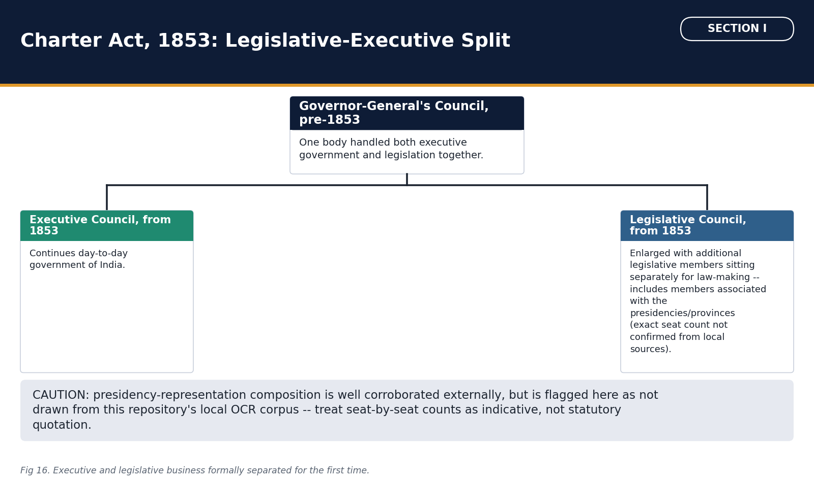

*Visual 16: Charter Act, 1853 -- legislative-executive split. Original deterministic study visual; schematic charts are NOT TO SCALE where marked.*


FACT: the Act also ended the Company Directors' power of patronage nomination to the civil service and opened recruitment to competition in principle, but the Act's own text did not itself design or operate an examination system; a separate committee under Macaulay's chairmanship in 1854 (the Macaulay Committee on the Indian Civil Service) worked out the syllabus, age limits and administrative rules for competitive recruitment, and the first actual competitive examination for the Indian Civil Service under this new principle was held only in 1855. ANALYSIS: the precise sequence -- an 1833 formal non-discrimination promise, an 1853 Act ending patronage and opening the principle of competition, an 1854 committee designing the mechanism, and a first 1855 examination operationalising it -- must be kept in that exact four-step order; a common, high-value trap is to state or imply that the 1853 Act itself instantly produced full competitive recruitment, collapsing four years and four distinct steps into one.

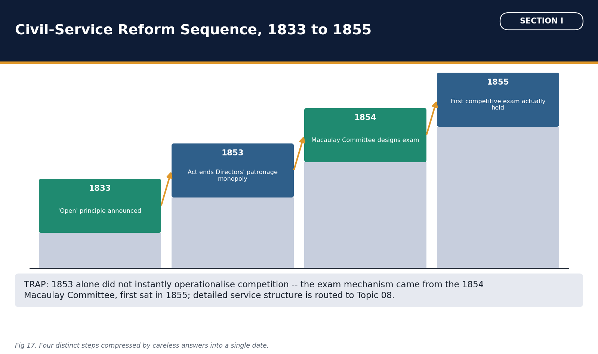

*Visual 17: Civil-service reform sequence, 1833 to 1855. Original deterministic study visual; schematic charts are NOT TO SCALE where marked.*


TRAP: never write "the Charter Act of 1853 opened the Indian Civil Service to competitive examination" as a stand-alone, completed-in-1853 fact -- state instead that 1853 ended patronage and opened the principle, that the 1854 Macaulay Committee designed the mechanism, and that 1855 saw the first actual examination; the detailed structure, syllabus and career path of the resulting civil service itself is routed to Topic 08 and is not re-derived here.

#### PART VII -- THE GOVERNMENT OF INDIA ACT, 1858: THE FULL ENDPOINT

#### CLOSING RECALL FLOW — CORE — 12. CHARTER ACT, 1853: NO FIXED TERM, A PROTO-LEGISLATURE, AND THE CIVIL-SERVICE REFORM SEQUENCE

```text
START / CONCEPT: CORE — 12. Charter Act, 1853: no fixed term, a proto-legislature, and the civil-service reform sequence
        |
        v
EXACT TERMS: no fixed term · a proto-legislature · the civil-service reform sequence · The Charter Act of 1853 · The Charter Act · 12. Charter Act
        |
        v
MECHANISM / ARGUMENT: unlike the twenty-year renewals of 1793, 1813 and 1833, the Charter Act of 1853 continued Company rule and territorial possession only "until Parliament shall otherwise provide" -- an open-ended continuation, terminable by Parliament at any time it chose, rather than a fixed-term charter due for renewed parliamentary bargaining at a set future date.
        |
        v
CONSEQUENCE / CONTRAST: ANALYSIS: this is the first real institutional step toward separating legislative and executive functions at the centre, and toward provincial administrations having a voice at all in central law-making -- though it is essential not to overstate this as "representation" in any democratic sense: the additional members were British officials or Company nominees drawing on regional administrative expertise, and no Indian sat on this enlarged Council; the step is procedural/administrative broadening, not political representation.
        |
        v
UPSC TRAP / ANSWER-USE: never write "the Charter Act of 1853 opened the Indian Civil Service to competitive examination" as a stand-alone, completed-in-1853 fact -- state instead that 1853 ended patronage and opened the principle, that the 1854 Macaulay Committee designed the mechanism, and that 1855 saw the first actual examination; the detailed structure, syllabus and career path of the resulting civil service itself is routed to Topic 08 and is not re-derived here.
        |
        v
ANSWER-GRABBING FORMULATION: The Charter Act of 1853 is the last Charter Act before the Revolt and the Government of India Act, 1858, and it differs from every earlier renewal in one structurally important way: it did not renew Company rule for a fixed further term at all.
```
### SESSION 13 — CORE — 13. GOVERNMENT OF INDIA ACT, 1858: COMPANY RULE ENDS, THE CROWN ASSUMES DIRECT AUTHORITY

#### DEFINITION / WHAT THIS IS CALLED

**Plain-language definition:** The Government of India Act, 1858 is this topic's terminal statute -- the point at which the East India Company's century-long constitutional role in Indian governance ends outright and direct Crown authority begins, and it must be understood as both a genuine rupture (in ultimate legal sovereignty) and a marked continuity (in day-to-day administrative machinery).

**Technical definition:** the Government of India Act, 1858 (the constitutional-legal transfer instrument, passed by Parliament) is a separate document from the Queen's Proclamation of 1 November 1858 (a political-policy announcement read out to the Indian public at ceremonial durbars), which added its own distinct promises -- non-interference in religious belief and custom, honouring of existing treaties and engagements with princely states, formally equal treatment before the law regardless of race or creed, and a qualified amnesty for those involved in the Revolt (with named exceptions) -- none of which are provisions of the 1858 Act itself.

#### ANSWER-GRABBING OPENING — WRITE/ADAPT IN THE EXAM

> The Government of India Act, 1858 is this topic's terminal statute -- the point at which the East India Company's century-long constitutional role in Indian governance ends outright and direct Crown authority begins, and it must be understood as both a genuine rupture (in ultimate legal sovereignty) and a marked continuity (in day-to-day administrative machinery).

#### MUST-WRITE KEYWORDS

- **Company rule ends**
- **the Crown assumes direct authority**
- **The Government of India Act, 1858**
- **13. Government of India Act**
- **1772-73**
- **1853-55**

**How to use them:** Frame the answer through Company rule ends; define the Crown assumes direct authority, connect The Government of India Act, 1858 with 13. Government of India Act to explain the mechanism, and use 1772-73 for the decisive comparison or qualification.

The Government of India Act, 1858 is this topic's terminal statute -- the point at which the East India Company's century-long constitutional role in Indian governance ends outright and direct Crown authority begins, and it must be understood as both a genuine rupture (in ultimate legal sovereignty) and a marked continuity (in day-to-day administrative machinery).

FACT: the Revolt of 1857 is the immediate, proximate trigger for the 1858 Act, but the structural pressure for reform substantially predates the Revolt -- the Charter Act of 1853's own open-ended, no-fixed-term continuation of Company rule (subtopic 12) already signalled that Parliament regarded the Company's constitutional position as provisional rather than settled, and Parliament had been progressively concentrating political supervisory power in Crown-appointed bodies (the Board of Control from 1784, an ever-larger Crown sovereignty claim from 1813, a purely administrative Company from 1833) for three-quarters of a century before 1857. ANALYSIS: a precise answer therefore treats the Revolt as the trigger that determined the timing and the immediate political urgency of the transfer, while treating the preceding seventy-five years of incremental Crown-supervisory centralisation as the deeper structural cause that made 1858's transfer a comparatively short constitutional step rather than a sudden revolution -- this is the same "trigger vs. underlying cause" logic already used for the 1772-73 crisis in Part I, now applied to this topic's other endpoint.

FACT: the Act abolished Company rule outright, together with both of its supervisory apparatus in Britain -- the Board of Control (created 1784) and the Company's own Court of Directors -- and replaced them with a Secretary of State for India, a British Cabinet-level minister directly responsible to Parliament, described in the administrative practice of the period as the "fountain of authority" for Indian government; the Secretary of State was assisted by a statutory Council of India of fifteen members, an initial majority of whom (seven of the fifteen) were required to have prior East India Company service or directorship experience, preserving institutional and administrative memory even as ultimate legal authority shifted entirely to the Crown. ANALYSIS: this is the clearest single marker of "rupture within continuity" on this whole topic -- the apex institutions (Company, Board, Directors) are abolished by name, yet a majority of the new Council of India's first members were themselves drawn from the very Company machinery just abolished, and much of the existing civil, military and revenue administration below the apex continued largely unchanged in personnel and practice.

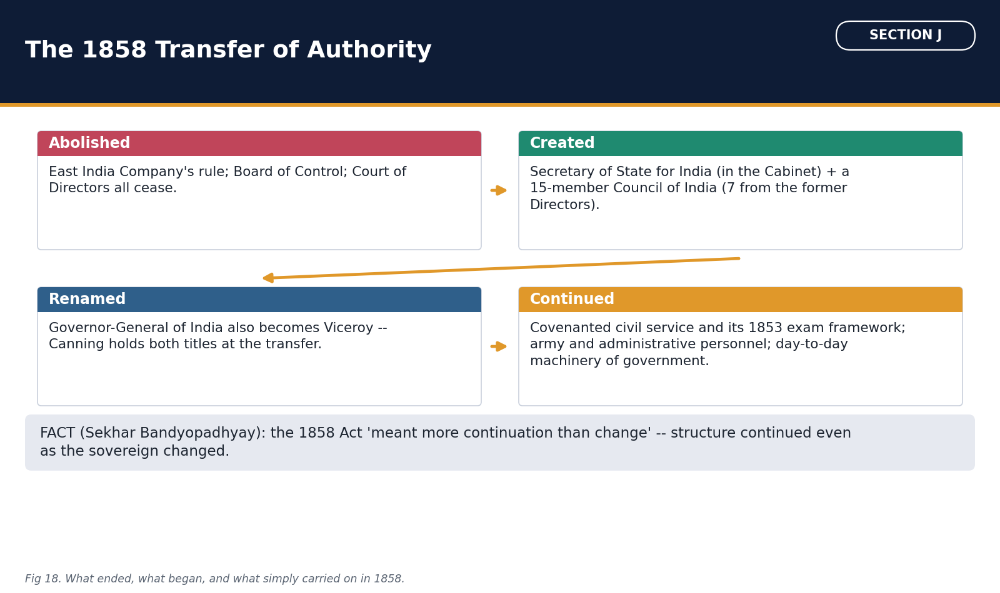

*Visual 18: 1858 -- the transfer of authority. Original deterministic study visual; schematic charts are NOT TO SCALE where marked.*


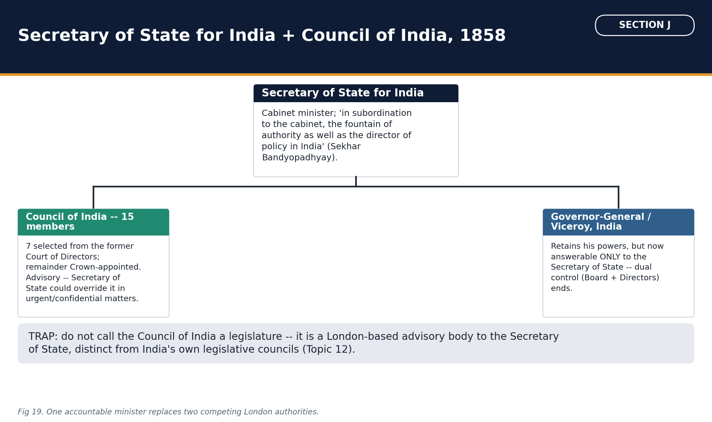

*Visual 19: Secretary of State and Council of India structure. Original deterministic study visual; schematic charts are NOT TO SCALE where marked.*


FACT: the office of Governor-General of India (created 1833) was retained, but its holder now also carried the new title of Viceroy, the Crown's direct personal representative in India -- Lord Canning, already Governor-General since 1856, became the first to hold the combined Governor-General-and-Viceroy title in 1858; the Company's armed forces and its patronage powers over civil and military appointments were likewise transferred to the Crown, with the already-operating 1853-55 competitive-examination principle for civil recruitment (subtopic 12) continuing under the new Crown administration rather than being reopened or redesigned by the 1858 Act itself. ANALYSIS: a scholarly assessment often quoted for this transition holds that 1858 "meant more continuation than change" in day-to-day administrative practice, and a separate assessment (Thomas Metcalf's) characterises the post-1858 official temperament as marked by "a new attitude of caution and conservatism" rather than by any wholesale institutional reinvention -- both readings support the same conclusion this topic insists on throughout: sovereignty and apex constitutional authority changed decisively in 1858, while administrative machinery, personnel and recently-settled reforms (like the 1853-55 civil-service principle) mostly continued.

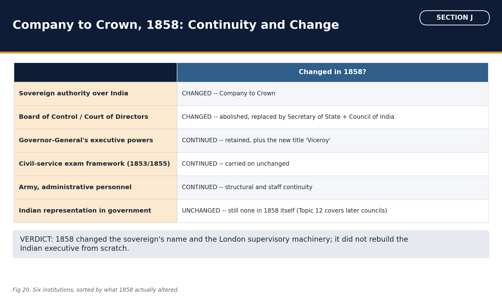

*Visual 20: Company to Crown -- what changed, what continued. Original deterministic study visual; schematic charts are NOT TO SCALE where marked.*


FACT: the Government of India Act, 1858 (the constitutional-legal transfer instrument, passed by Parliament) is a separate document from the Queen's Proclamation of 1 November 1858 (a political-policy announcement read out to the Indian public at ceremonial durbars), which added its own distinct promises -- non-interference in religious belief and custom, honouring of existing treaties and engagements with princely states, formally equal treatment before the law regardless of race or creed, and a qualified amnesty for those involved in the Revolt (with named exceptions) -- none of which are provisions of the 1858 Act itself. ANALYSIS: examination answers frequently conflate the Act and the Proclamation into one single 1858 event; they must be kept as two distinct instruments with two distinct functions, one legal-constitutional and one political-declaratory, issued in the same year but doing different work.

TRAP: this topic's own constitutional coverage ends at the 1858 Act and its accompanying Proclamation; the subsequent build-out of representative, if still heavily non-elected and restricted, legislative councils under the Indian Councils Act of 1861 and later reforms is Topic 12's territory (post-1858 councils and Crown administration) -- do not narrate the 1861 Councils Act or any later representative reform as part of this topic's own endpoint.

#### PART VIII -- THEMES, HISTORIOGRAPHY AND COMPARATIVE SYNTHESIS

#### CLOSING RECALL FLOW — CORE — 13. GOVERNMENT OF INDIA ACT, 1858: COMPANY RULE ENDS, THE CROWN ASSUMES DIRECT AUTHORITY

```text
START / CONCEPT: CORE — 13. Government of India Act, 1858: Company rule ends, the Crown assumes direct authority
        |
        v
EXACT TERMS: Company rule ends · the Crown assumes direct authority · The Government of India Act, 1858 · 13. Government of India Act · 1772-73 · 1853-55
        |
        v
MECHANISM / ARGUMENT: the Act abolished Company rule outright, together with both of its supervisory apparatus in Britain -- the Board of Control (created 1784) and the Company's own Court of Directors -- and replaced them with a Secretary of State for India, a British Cabinet-level minister directly responsible to Parliament, described in the administrative practice of the period as the "fountain of authority" for Indian government; the Secretary of State was assisted by a statutory Council of India of fifteen members, an initial majority of whom (seven of the fifteen) were required to have prior East India Company service or directorship experience, preserving institutional and administrative memory even as ultimate legal authority shifted entirely to the Crown.
        |
        v
CONSEQUENCE / CONTRAST: the office of Governor-General of India (created 1833) was retained, but its holder now also carried the new title of Viceroy, the Crown's direct personal representative in India -- Lord Canning, already Governor-General since 1856, became the first to hold the combined Governor-General-and-Viceroy title in 1858; the Company's armed forces and its patronage powers over civil and military appointments were likewise transferred to the Crown, with the already-operating 1853-55 competitive-examination principle for civil recruitment (subtopic 12) continuing under the new Crown administration rather than being reopened or redesigned by the 1858 Act itself.
        |
        v
UPSC TRAP / ANSWER-USE: this topic's own constitutional coverage ends at the 1858 Act and its accompanying Proclamation; the subsequent build-out of representative, if still heavily non-elected and restricted, legislative councils under the Indian Councils Act of 1861 and later reforms is Topic 12's territory (post-1858 councils and Crown administration) -- do not narrate the 1861 Councils Act or any later representative reform as part of this topic's own endpoint.
        |
        v
ANSWER-GRABBING FORMULATION: The Government of India Act, 1858 is this topic's terminal statute -- the point at which the East India Company's century-long constitutional role in Indian governance ends outright and direct Crown authority begins, and it must be understood as both a genuine rupture (in ultimate legal sovereignty) and a marked continuity (in day-to-day administrative machinery).
```
### SESSION 14 — CORE SYNTHESIS — 14. INSTITUTIONAL THEMES RUNNING ACROSS 1757-1858

#### DEFINITION / WHAT THIS IS CALLED

**Plain-language definition:** Read end to end, these eleven Acts trace a small number of recurring institutional movements, each of which is independently examinable and each of which is best remembered as a ladder with named rungs rather than a vague overall "trend.".

**Technical definition:** ANALYSIS: formal legal equality and racial/colonial practical limits run persistently side by side across this whole topic -- the 1833 non-discrimination clause (subtopic 11) is the clearest single example, promising formal equality of opportunity in Company service while the lived reality of the higher covenanted service remained overwhelmingly European for decades afterward; commercial identity itself also shifts along a single spectrum across the topic -- the Company begins as a trading corporation with an incidental governance function after 1765, becomes a fully non-commercial administrative agency in 1833, and becomes an abolished predecessor to direct Crown administration in 1858.

#### ANSWER-GRABBING OPENING — WRITE/ADAPT IN THE EXAM

> Read end to end, these eleven Acts trace a small number of recurring institutional movements, each of which is independently examinable and each of which is best remembered as a ladder with named rungs rather than a vague overall "trend.".

#### MUST-WRITE KEYWORDS

- **CORE SYNTHESIS**
- **Read**
- **14. Institutional themes running across 1757-1858**
- **1773-1858**
- **1853-55**
- **1757-1858**

**How to use them:** Frame the answer through CORE SYNTHESIS; define Read, connect 14. Institutional themes running across 1757-1858 with 1773-1858 to explain the mechanism, and use 1853-55 for the decisive comparison or qualification.

Read end to end, these eleven Acts trace a small number of recurring institutional movements, each of which is independently examinable and each of which is best remembered as a ladder with named rungs rather than a vague overall "trend."

FACT: parliamentary sovereignty and control over Company governance grows in a stepped sequence -- from the Regulating Act's mere reporting duty (1773), to Pitt's India Act's standing Board of Control (1784), to the Charter Act of 1813's explicit Crown-sovereignty assertion, to the Charter Act of 1833's fully non-commercial, trust-holding Company, to the Government of India Act's outright abolition of Company rule (1858). ANALYSIS: at every one of these steps, Parliament's chosen instrument is oversight and supervision layered onto (or eventually replacing) existing Company machinery, not an immediate direct assumption of administration -- direct Crown administration is the last step in the sequence, not an early one, which is why treating "British control of India" as a single undifferentiated fact starting in 1757 or 1773 is a serious chronological error.

FACT: executive authority moves from a four-member, tie-prone Bengal Council (1773) to a smaller three-member Council with wider subordination (1784) to a Governor-General with a bounded override power (1786) to an all-India Governor-General (1833) to a Governor-General who is also Viceroy (1858); legislative authority moves in a separate but parallel track, from no distinct legislative body at all, through the presidencies' own limited separate rule-making powers, to the Governor-General-in-Council's all-India legislative monopoly (1833), to a Council enlarged specifically for legislative business with its own additional members (1853). ANALYSIS: keep executive centralisation (fewer people needed to form a working majority; a titular upgrade from Bengal to India to Viceroy) and legislative centralisation (law-making power drawn away from the presidencies toward one central body) as two separate, parallel ladders that happen to share some of the same named Acts as their rungs.

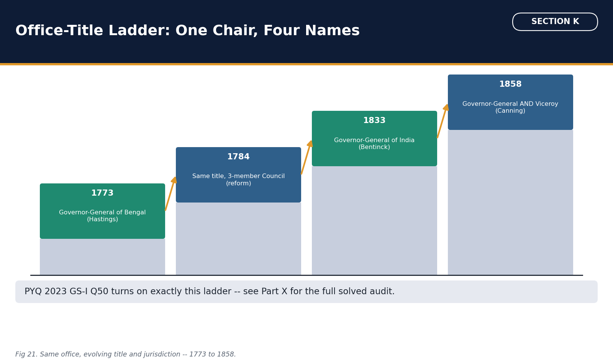

*Visual 21: The office-title ladder, 1773-1858. Original deterministic study visual; schematic charts are NOT TO SCALE where marked.*


FACT: judicial authority begins as a genuinely plural, poorly-coordinated patchwork -- Supreme Court, Company Diwani-derived Adalats, and religious/personal-law forums operating side by side with no settled boundary (Part III) -- and is only partially rationalised by the 1781 Amending Act's jurisdictional carve-outs, with a further, more ambitious rationalising step (codification under a single Law Commission) only begun, not completed, by 1833; the pluralism of applying Hindu law to Hindus and Muslim law to Muslims in personal matters (directed by the 1781 Act) is itself best read as a colonial governance technique for managing a religiously plural population under a single legal umbrella, not as a simple, neutral respect for local custom. ANALYSIS: formal legal equality and racial/colonial practical limits run persistently side by side across this whole topic -- the 1833 non-discrimination clause (subtopic 11) is the clearest single example, promising formal equality of opportunity in Company service while the lived reality of the higher covenanted service remained overwhelmingly European for decades afterward; commercial identity itself also shifts along a single spectrum across the topic -- the Company begins as a trading corporation with an incidental governance function after 1765, becomes a fully non-commercial administrative agency in 1833, and becomes an abolished predecessor to direct Crown administration in 1858.

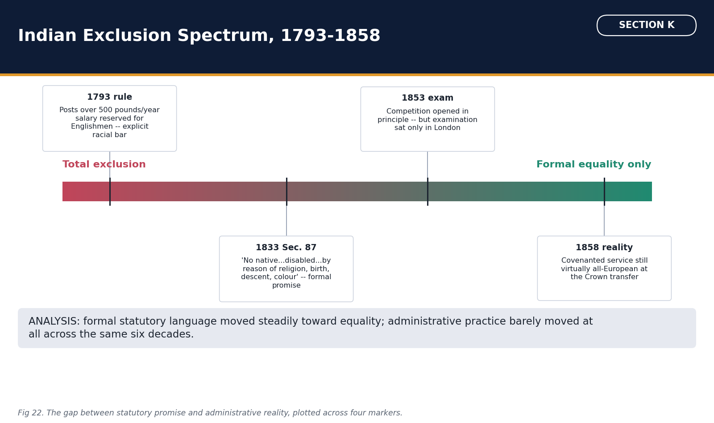

*Visual 22: The Indian exclusion spectrum, 1773-1858. Original deterministic study visual; schematic charts are NOT TO SCALE where marked.*


TRAP: across all eleven Acts examined in this topic, no Indian individual sits on the Governor-General's Council, the enlarged 1853 Legislative Council, the Board of Control, or the 1858 Council of India -- formal legal-equality promises (1833) and modest civil-service competitive openings (1853-55) run alongside total exclusion from any legislative or executive seat of authority throughout this entire 1757-1858 period; do not let an answer about "reform" in this period imply Indian political representation, which begins only later and even then in a heavily restricted form (Topic 12).

#### CLOSING RECALL FLOW — CORE SYNTHESIS — 14. INSTITUTIONAL THEMES RUNNING ACROSS 1757-1858

```text
START / CONCEPT: CORE SYNTHESIS — 14. Institutional themes running across 1757-1858
        |
        v
EXACT TERMS: CORE SYNTHESIS · Read · 14. Institutional themes running across 1757-1858 · 1773-1858 · 1853-55 · 1757-1858
        |
        v
MECHANISM / ARGUMENT: ANALYSIS: formal legal equality and racial/colonial practical limits run persistently side by side across this whole topic -- the 1833 non-discrimination clause (subtopic 11) is the clearest single example, promising formal equality of opportunity in Company service while the lived reality of the higher covenanted service remained overwhelmingly European for decades afterward; commercial identity itself also shifts along a single spectrum across the topic -- the Company begins as a trading corporation with an incidental governance function after 1765, becomes a fully non-commercial administrative agency in 1833, and becomes an abolished predecessor to direct Crown administration in 1858.
        |
        v
CONSEQUENCE / CONTRAST: judicial authority begins as a genuinely plural, poorly-coordinated patchwork -- Supreme Court, Company Diwani-derived Adalats, and religious/personal-law forums operating side by side with no settled boundary (Part III) -- and is only partially rationalised by the 1781 Amending Act's jurisdictional carve-outs, with a further, more ambitious rationalising step (codification under a single Law Commission) only begun, not completed, by 1833; the pluralism of applying Hindu law to Hindus and Muslim law to Muslims in personal matters (directed by the 1781 Act) is itself best read as a colonial governance technique for managing a religiously plural population under a single legal umbrella, not as a simple, neutral respect for local custom.
        |
        v
UPSC TRAP / ANSWER-USE: across all eleven Acts examined in this topic, no Indian individual sits on the Governor-General's Council, the enlarged 1853 Legislative Council, the Board of Control, or the 1858 Council of India -- formal legal-equality promises (1833) and modest civil-service competitive openings (1853-55) run alongside total exclusion from any legislative or executive seat of authority throughout this entire 1757-1858 period; do not let an answer about "reform" in this period imply Indian political representation, which begins only later and even then in a heavily restricted form (Topic 12).
        |
        v
ANSWER-GRABBING FORMULATION: Read end to end, these eleven Acts trace a small number of recurring institutional movements, each of which is independently examinable and each of which is best remembered as a ladder with named rungs rather than a vague overall "trend.".
```
### SESSION 15 — CORE SYNTHESIS — 15. HISTORIOGRAPHY: READING THE SAME ELEVEN ACTS THROUGH DIFFERENT LENSES

#### DEFINITION / WHAT THIS IS CALLED

**Plain-language definition:** ANALYSIS: a separate, economically-focused reading connects the Charter Act of 1813's trade opening and the Charter Act of 1833's full commercial wind-up to Britain's own domestic transition from mercantilist monopoly toward industrial free trade, driven substantially by British manufacturing and mercantile interests (notably textile and mercantile lobbies) agitating against the Company's chartered trading privileges -- on this reading, 1813 and 1833 are as much episodes in British domestic economic-policy history as they are episodes in Indian constitutional history.

**Technical definition:** ANALYSIS: a second, more administratively-focused reading treats the same sequence of Acts as a genuine, if slow and repeatedly improvised, maturation of accountable, rule-bound governance out of an initially undisciplined and corruption-prone trading-company administration -- this "rule-of-law/administrative maturation" narrative does not deny the presence of British self-interest, but places greater interpretive weight on the institutional problem-solving visible in each Act (Supreme Court jurisdiction fixes in 1781, executive-deadlock fixes in 1784 and 1786, codification from 1833) as ends pursued partly for their own sake.

#### ANSWER-GRABBING OPENING — WRITE/ADAPT IN THE EXAM

> ANALYSIS: a second, more administratively-focused reading treats the same sequence of Acts as a genuine, if slow and repeatedly improvised, maturation of accountable, rule-bound governance out of an initially undisciplined and corruption-prone trading-company administration -- this "rule-of-law/administrative maturation" narrative does not deny the presence of British self-interest, but places greater interpretive weight on the institutional problem-solving visible in each Act (Supreme Court jurisdiction fixes in 1781, executive-deadlock fixes in 1784 and 1786, codification from 1833) as ends pursued partly for their own sake.

#### MUST-WRITE KEYWORDS

- **CORE SYNTHESIS**
- **reading the same eleven Acts through different lenses**
- **Company**
- **15. Historiography**
- **1772-73**
- **1773-1858**

**How to use them:** Frame the answer through CORE SYNTHESIS; define reading the same eleven Acts through different lenses, connect Company with 15. Historiography to explain the mechanism, and use 1772-73 for the decisive comparison or qualification.

FACT: this topic's own narrative -- that Company financial crisis, parliamentary patronage anxiety and political accountability concerns, not humanitarian motive, drove the 1772-73 intervention (Part I) -- follows a critical political-economy reading associated with historians such as Bipan Chandra, who situate British intervention in India within Britain's own fiscal, mercantile and imperial interests rather than in altruistic or civilising motives. ANALYSIS: a second, more administratively-focused reading treats the same sequence of Acts as a genuine, if slow and repeatedly improvised, maturation of accountable, rule-bound governance out of an initially undisciplined and corruption-prone trading-company administration -- this "rule-of-law/administrative maturation" narrative does not deny the presence of British self-interest, but places greater interpretive weight on the institutional problem-solving visible in each Act (Supreme Court jurisdiction fixes in 1781, executive-deadlock fixes in 1784 and 1786, codification from 1833) as ends pursued partly for their own sake.

FACT: a more recent historiographical trend, sometimes described broadly as "company-state" or "corporate-sovereignty" scholarship, treats the East India Company in this period as an unusual hybrid sovereign-and-commercial entity, and reads the 1773-1858 sequence of Acts less as a single, coherent constitutional design pursued consistently by Parliament from the outset, and more as a chain of largely ad hoc, crisis-driven improvisations -- each Act responding to the specific institutional failure exposed by the one before it (Regulating Act to Council deadlock; Amending Act to jurisdictional conflict; Pitt's Act to both problems at once). ANALYSIS: a separate, economically-focused reading connects the Charter Act of 1813's trade opening and the Charter Act of 1833's full commercial wind-up to Britain's own domestic transition from mercantilist monopoly toward industrial free trade, driven substantially by British manufacturing and mercantile interests (notably textile and mercantile lobbies) agitating against the Company's chartered trading privileges -- on this reading, 1813 and 1833 are as much episodes in British domestic economic-policy history as they are episodes in Indian constitutional history.

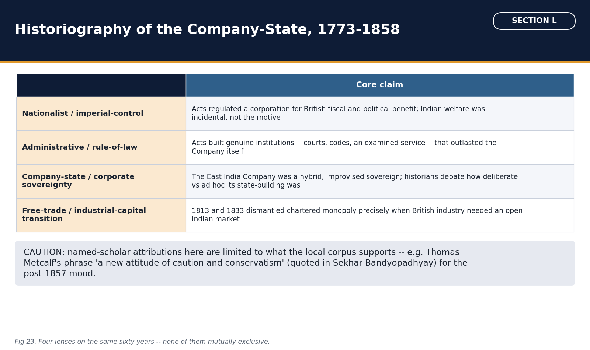

*Visual 23: Historiography -- four lenses on the same eleven Acts. Original deterministic study visual; schematic charts are NOT TO SCALE where marked.*


TRAP: these four lenses (critical political-economy; administrative/rule-of-law maturation; company-state/corporate-sovereignty improvisation; free-trade/industrial-capital transition) are complementary emphases on the same eleven Acts, not four mutually exclusive accounts of different events -- a strong Mains answer can use more than one lens on the same Act (for instance, reading 1833 through both the administrative-centralisation lens and the free-trade/industrial-capital lens at once) rather than being forced to pick only one.

#### CLOSING RECALL FLOW — CORE SYNTHESIS — 15. HISTORIOGRAPHY: READING THE SAME ELEVEN ACTS THROUGH DIFFERENT LENSES

```text
START / CONCEPT: CORE SYNTHESIS — 15. Historiography: reading the same eleven Acts through different lenses
        |
        v
EXACT TERMS: CORE SYNTHESIS · reading the same eleven Acts through different lenses · Company · 15. Historiography · 1772-73 · 1773-1858
        |
        v
MECHANISM / ARGUMENT: a more recent historiographical trend, sometimes described broadly as "company-state" or "corporate-sovereignty" scholarship, treats the East India Company in this period as an unusual hybrid sovereign-and-commercial entity, and reads the 1773-1858 sequence of Acts less as a single, coherent constitutional design pursued consistently by Parliament from the outset, and more as a chain of largely ad hoc, crisis-driven improvisations -- each Act responding to the specific institutional failure exposed by the one before it (Regulating Act to Council deadlock; Amending Act to jurisdictional conflict; Pitt's Act to both problems at once).
        |
        v
CONSEQUENCE / CONTRAST: this topic's own narrative -- that Company financial crisis, parliamentary patronage anxiety and political accountability concerns, not humanitarian motive, drove the 1772-73 intervention (Part I) -- follows a critical political-economy reading associated with historians such as Bipan Chandra, who situate British intervention in India within Britain's own fiscal, mercantile and imperial interests rather than in altruistic or civilising motives.
        |
        v
UPSC TRAP / ANSWER-USE: these four lenses (critical political-economy; administrative/rule-of-law maturation; company-state/corporate-sovereignty improvisation; free-trade/industrial-capital transition) are complementary emphases on the same eleven Acts, not four mutually exclusive accounts of different events -- a strong Mains answer can use more than one lens on the same Act (for instance, reading 1833 through both the administrative-centralisation lens and the free-trade/industrial-capital lens at once) rather than being forced to pick only one.
        |
        v
ANSWER-GRABBING FORMULATION: ANALYSIS: a second, more administratively-focused reading treats the same sequence of Acts as a genuine, if slow and repeatedly improvised, maturation of accountable, rule-bound governance out of an initially undisciplined and corruption-prone trading-company administration -- this "rule-of-law/administrative maturation" narrative does not deny the presence of British self-interest, but places greater interpretive weight on the institutional problem-solving visible in each Act (Supreme Court jurisdiction fixes in 1781, executive-deadlock fixes in 1784 and 1786, codification from 1833) as ends pursued partly for their own sake.
```
### SESSION 16 — CORE SYNTHESIS — 16. COMPARATIVE SYNTHESIS: THE CONSTITUTIONAL LADDER IN FULL

#### DEFINITION / WHAT THIS IS CALLED

**Plain-language definition:** ANALYSIS: the single-sentence synthesis this topic aims to leave a student with is that 1757-1858 is not one uniform "British rule," but a stepped, name-and-date-specific ladder of eleven Acts moving a commercial corporation toward an administrative agency and finally toward direct Crown sovereignty, with parliamentary oversight, executive authority, legislative power and judicial coordination each climbing that ladder at a different pace and by different named rungs.

**Technical definition:** ANALYSIS: the title "Governor-General" itself is a three-step ladder worth memorising as its own fact -- Governor-General of Bengal/Fort William (Regulating Act, 1773) to Governor-General of India (Charter Act, 1833, first held by Bentinck) to Governor-General who is also Viceroy (Government of India Act, 1858, first held in combination by Canning) -- and the 1833 non-discrimination promise against the 1853-55 competitive-examination mechanism is the topic's clearest promise-versus-practice comparison, examined fully in subtopics 11 and 12.

#### ANSWER-GRABBING OPENING — WRITE/ADAPT IN THE EXAM

> ANALYSIS: the single-sentence synthesis this topic aims to leave a student with is that 1757-1858 is not one uniform "British rule," but a stepped, name-and-date-specific ladder of eleven Acts moving a commercial corporation toward an administrative agency and finally toward direct Crown sovereignty, with parliamentary oversight, executive authority, legislative power and judicial coordination each climbing that ladder at a different pace and by different named rungs.

#### MUST-WRITE KEYWORDS

- **CORE SYNTHESIS**
- **the constitutional ladder in full**
- **16. Comparative synthesis**
- **1765-72**
- **1784-1858**
- **1773-1858**

**How to use them:** Frame the answer through CORE SYNTHESIS; define the constitutional ladder in full, connect 16. Comparative synthesis with 1765-72 to explain the mechanism, and use 1784-1858 for the decisive comparison or qualification.

FACT: 1773's Regulating Act created a four-member, tie-prone Bengal Council with only a reporting duty owed to Britain, while 1784's Pitt's India Act created a smaller three-member Council and a standing, empowered Board of Control in London -- the clearest single before/after comparison on this topic, and one repeatedly tested by contrasting "what changed" against "what stayed the same" (the Supreme Court and the trade monopoly, notably, were untouched by 1784). ANALYSIS: keep Bengal's 1765-72 Dual Government (Nawab's Nizamat/Company's Diwani, Topic 04's territory) and Britain's own 1784-1858 dual control (Board of Control/Court of Directors) as two entirely distinct "dual" structures, decades and continents apart, sharing only the loose word "dual" -- the single most heavily-flagged trap on this whole topic (subtopic 7).

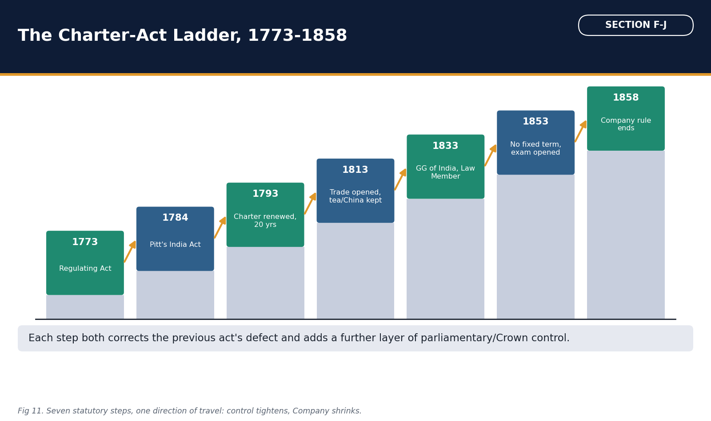

*Visual 11: The charter-act ladder, 1773-1858. Original deterministic study visual; schematic charts are NOT TO SCALE where marked.*


FACT: the 1813, 1833 and 1853 Charter Acts form their own internal progression -- 1813 opens Indian trade to non-Company British subjects (tea and China trade excepted) while leaving the Company's administrative and commercial structure otherwise intact; 1833 ends all Company commerce outright, creates the all-India Governor-General and Law Member, and begins codification; 1853 removes even the fixed-term renewal logic itself, creates a distinct legislative body, and ends patronage nomination to the civil service in principle. ANALYSIS: the title "Governor-General" itself is a three-step ladder worth memorising as its own fact -- Governor-General of Bengal/Fort William (Regulating Act, 1773) to Governor-General of India (Charter Act, 1833, first held by Bentinck) to Governor-General who is also Viceroy (Government of India Act, 1858, first held in combination by Canning) -- and the 1833 non-discrimination promise against the 1853-55 competitive-examination mechanism is the topic's clearest promise-versus-practice comparison, examined fully in subtopics 11 and 12.

FACT: measured strictly by what survived the 1858 transfer of authority unchanged, a great deal of Company-built structure persisted directly into Crown administration -- the office of Governor-General (now titled Viceroy), the 1853-55 competitive-examination principle for civil recruitment, the bulk of serving administrative and military personnel, and even a majority of the new Council of India's first members, who were themselves former Company men. ANALYSIS: the single-sentence synthesis this topic aims to leave a student with is that 1757-1858 is not one uniform "British rule," but a stepped, name-and-date-specific ladder of eleven Acts moving a commercial corporation toward an administrative agency and finally toward direct Crown sovereignty, with parliamentary oversight, executive authority, legislative power and judicial coordination each climbing that ladder at a different pace and by different named rungs.

TRAP: a rapid year-recitation ("1773, 1784, 1793, 1813, 1833, 1853, 1858") without the specific institutional change attached to each date scores badly on both Prelims (which tests exact provisions) and Mains (which rewards named-evidence analysis); always pair a year with its specific institutional change, never the bare year alone.

#### PART IX -- SOURCES, PYQ AUDIT AND PRACTICE

#### CLOSING RECALL FLOW — CORE SYNTHESIS — 16. COMPARATIVE SYNTHESIS: THE CONSTITUTIONAL LADDER IN FULL

```text
START / CONCEPT: CORE SYNTHESIS — 16. Comparative synthesis: the constitutional ladder in full
        |
        v
EXACT TERMS: CORE SYNTHESIS · the constitutional ladder in full · 16. Comparative synthesis · 1765-72 · 1784-1858 · 1773-1858
        |
        v
MECHANISM / ARGUMENT: ANALYSIS: the title "Governor-General" itself is a three-step ladder worth memorising as its own fact -- Governor-General of Bengal/Fort William (Regulating Act, 1773) to Governor-General of India (Charter Act, 1833, first held by Bentinck) to Governor-General who is also Viceroy (Government of India Act, 1858, first held in combination by Canning) -- and the 1833 non-discrimination promise against the 1853-55 competitive-examination mechanism is the topic's clearest promise-versus-practice comparison, examined fully in subtopics 11 and 12.
        |
        v
CONSEQUENCE / CONTRAST: the 1813, 1833 and 1853 Charter Acts form their own internal progression -- 1813 opens Indian trade to non-Company British subjects (tea and China trade excepted) while leaving the Company's administrative and commercial structure otherwise intact; 1833 ends all Company commerce outright, creates the all-India Governor-General and Law Member, and begins codification; 1853 removes even the fixed-term renewal logic itself, creates a distinct legislative body, and ends patronage nomination to the civil service in principle.
        |
        v
UPSC TRAP / ANSWER-USE: Do not miss this limiting distinction: measured strictly by what survived the 1858 transfer of authority unchanged, a great deal...
        |
        v
ANSWER-GRABBING FORMULATION: ANALYSIS: the single-sentence synthesis this topic aims to leave a student with is that 1757-1858 is not one uniform "British rule," but a stepped, name-and-date-specific ladder of eleven Acts moving a commercial corporation toward an administrative agency and finally toward direct Crown sovereignty, with parliamentary oversight, executive authority, legislative power and judicial coordination each climbing that ladder at a different pace and by different named rungs.
```
### MODERN HISTORY DEEP-REVIEW CORE CONTROL

- **Must remember:** Regulating Act 1773, Pitt's India Act 1784, Charter Acts 1813, 1833 and 1853, and Government of India Act 1858 changed different corporate, executive, legislative and patronage arrangements.
- **Close distinction:** Distinguish enactment from commencement and policy from implementation: the 1833 Act ended Company commerce, while open competitive recruitment developed through later measures.
- **Evidence / interpretation limit:** Read statutory text with Company practice and parliamentary inquiry; constitutional centralisation did not remove distance, discretion, corruption or racial exclusion.

## BASIC MCQS / REMEDIATION

### Q1. By 1765-72, the East India Company in Bengal held which combination of functions simultaneously?

A. Revenue authority (Diwani), army command, and dispensation of justice through overlapping courts, alongside its original trading-corporation identity
B. Only a trading privilege, with all governance functions remaining exclusively with the Nawab's own administration
C. Only military command, with revenue and justice remaining entirely with the Nawab
D. Full Crown-sanctioned sovereignty, formally recognised by Parliament from 1765 itself

**Answer: A.**
**Explanation:** This is this topic's own starting fact -- a chartered trading corporation had become, in practice, a territorial sovereign in Bengal, with no British constitutional framework designed for that combination; the other options each remove one of the genuinely simultaneous functions.

### Q2. What was the primary driver of Parliament's 1772-73 intervention in Company affairs?

A. A direct military defeat suffered by Company forces in Bengal
B. Company financial crisis (a bankruptcy-threatening cash crisis and a Bank of England loan request) combined with parliamentary concern over patronage and accountability
C. A wave of British public humanitarian concern over the 1770 Bengal famine
D. A formal request from the Mughal emperor for British Parliament to intervene

**Answer: B.**
**Explanation:** The famine forms background context, not the causal headline; Parliament's actual trigger was the Company's own solvency crisis and the political-patronage and accountability anxieties this crisis exposed.

### Q3. Which of the following correctly describes the Regulating Act, 1773's core executive institution?

A. A Board of Control in London directly administering Bengal
B. A Governor-General of India with an eight-member all-India council
C. A Governor-General of Fort William (Bengal) with a four-member Council, and presidency governments subordinated to Bengal in specified matters
D. A Viceroy directly appointed by the Crown, with no Council at all

**Answer: C.**
**Explanation:** The Regulating Act's institution was explicitly Bengal-specific (Fort William), with a four-member Council and only bounded presidency subordination; the all-India Governor-Generalship arrives only in 1833, and the Board of Control only in 1784.

### Q4. Why did the Regulating Act's Bengal Council prove unworkable in 1774-76?

A. Warren Hastings refused to attend Council meetings
B. The Company's Court of Directors dissolved the Council directly
C. The Supreme Court overruled every Council decision
D. A standing 3-1 majority (Clavering, Monson and Francis against Hastings and Barwell) repeatedly outvoted the Governor-General, a deadlock resolved only contingently by Monson's 1776 death, with a statutory fix arriving only in 1784

**Answer: D.**
**Explanation:** The failure was structural vote-arithmetic, not personal incompetence or judicial overreach; the correct answer names the specific 3-1 split and both the contingent 1776 resolution and the real 1784 statutory fix.

### Q5. The 1775 trial and execution of Maharaja Nand Kumar should be treated, in a rigorous answer, as which of the following?

A. A source-critical case -- Nand Kumar's separate corruption accusation against Hastings, his 1775 forgery trial and execution under English law, and the Hastings-Impey personal closeness are documented facts, while the "deliberate silencing" reading remains a contested, widely held interpretation, not settled fact
B. A case with no connection whatsoever to Warren Hastings or the Supreme Court
C. A settled instance of proven judicial murder by Hastings and Impey, established beyond dispute
D. An entirely fabricated episode with no basis in any historical record

**Answer: A.**
**Explanation:** A precise answer separates the documented facts from the contested causal interpretation, rather than either dismissing the episode or treating the conspiracy theory as proven.

### Q6. The Patna Case (1777-79) and the Cossijurah Case (1779-80) both illustrate which underlying structural problem?

A. A conflict between the Bengal Council and the Board of Control
B. The Supreme Court's undefined jurisdiction overlapping with the Company's own courts and revenue administration -- Patna in personal-law/civil-court territory, Cossijurah in revenue-administration territory
C. A dispute purely about the personal conduct of Warren Hastings
D. A rebellion by zamindars against Company rule

**Answer: B.**
**Explanation:** Both cases are best read as two angles on the same structural overlap between Supreme Court jurisdiction and Company judicial/revenue authority, which together made the 1781 Amending Act necessary.

### Q7. Which of the following was NOT a correction made by the Amending Act (Act of Settlement), 1781?

A. Excluding revenue-collection matters from the Supreme Court's jurisdiction
B. Directing that Hindu law apply to Hindus and Muslim law to Muslims in personal-law matters before the Supreme Court
C. Reducing the Bengal Council from four members to three, ending the 1774-76 style deadlock
D. Exempting the Governor-General-in-Council's own official acts from Supreme Court jurisdiction

**Answer: C.**
**Explanation:** The 1781 Act corrected Supreme Court jurisdiction only; the Council-size reduction that fixed the executive deadlock is a separate, later provision of Pitt's India Act, 1784.

### Q8. Pitt's India Act, 1784's Board of Control was empowered, in the Act's own phrasing, to do what?

A. Appoint the Governor-General without any reference to the Company's Court of Directors
B. Abolish the Company's Court of Directors outright
C. Directly govern India in place of the Company's own administration
D. "Superintend, direct and control" the Company's civil, military and revenue affairs in India, while the Company's trade monopoly remained intact

**Answer: D.**
**Explanation:** The Board of Control supervised Company administration from London through this exact statutory phrase, without displacing the Company's own commercial and administrative machinery or ending its trade monopoly, which continued until the Charter Act of 1813 began to open it.

### Q9. How did Pitt's India Act, 1784 change the size of the Bengal Council, and with what structural effect?

A. It reduced the Council from a Governor-General-plus-four to a Governor-General-plus-three, meaning the Governor-General now needed only one ally for a working majority
B. It left the Council's size unchanged but gave the Governor-General a casting vote for the first time
C. It enlarged the Council to six members, making consensus even harder to reach
D. It abolished the Council entirely, leaving the Governor-General to rule alone

**Answer: A.**
**Explanation:** This smaller council is the direct statutory response to the Regulating Act's 3-1 deadlock problem, reducing (though not eliminating) the odds of a standing hostile majority.

### Q10. Which of the following correctly distinguishes Bengal's Dual Government from Pitt's India Act's "dual control"?

A. The Dual Government continued unchanged until 1858, running parallel to dual control
B. The Dual Government (1765-72, Nawab's Nizamat vs Company's Diwani, Bengal) and dual control (from 1784, Board of Control vs Court of Directors, both based in Britain) are different institutions, in different decades, located in different places
C. They are two names for the exact same institution, just at different dates
D. Dual control refers only to Bengal's own internal administration after 1784

**Answer: B.**
**Explanation:** This is this topic's single highest-value trap -- conflating the two "dual" structures collapses two decades, two continents and four separate institutions into one confused answer.

### Q11. The Act of 1786 gave the Governor-General which specific power?

A. Unlimited dictatorial authority over all Bengal administration, overriding the Council in every matter
B. The power to appoint the Board of Control's members directly
C. A bounded override power against the Council's majority, specifically "in matters of importance affecting safety, peace, or the interests of the Empire," combined for Cornwallis with the Commander-in-Chief's office
D. The power to dissolve the Supreme Court

**Answer: C.**
**Explanation:** The 1786 override is precise and matter-specific, not a general grant of unlimited authority; Cornwallis's simultaneous holding of the Commander-in-Chief's office is a separate but related unification of civil-military command.

### Q12. What was the Charter Act of 1793's principal distinctive contribution?

A. Ending the Company's trade monopoly entirely
B. Creating the office of Governor-General of India
C. Creating the Board of Control for the first time
D. Renewing the Company's charter and trade monopoly for twenty years, and codifying Cornwallis-era Bengal regulations into a systematised, translated body of law

**Answer: D.**
**Explanation:** 1793 is a continuation-and-codification Act; it neither ended the trade monopoly (which happened only partly in 1813) nor created the Board of Control (1784) or the all-India Governor-Generalship (1833).

### Q13. Which of the following is a correct statutory provision of the Charter Act, 1813?

A. It ended the Company's monopoly of trade in India for other British subjects, while preserving the Company's monopoly over tea and China trade specifically
B. It transferred all Indian revenue collection directly to the British Parliament
C. It ended the Company's monopoly over all trade, including tea and China trade, with no exceptions
D. It abolished the Company's charter outright

**Answer: A.**
**Explanation:** The tea/China exception is the exact, frequently tested precision point of this provision; options C, C and D each misstate the Act's actual scope.

### Q14. The Charter Act, 1813 also included which further provision, distinct from the trade provision?

A. The introduction of open competitive examinations for the civil service
B. An assertion of the "undoubted sovereignty of the Crown of the United Kingdom" over the Company's Indian territories, alongside permission for missionaries to enter and preach, and a one-lakh-rupee education grant
C. The direct abolition of the Company's Court of Directors
D. The creation of a Legislative Council with additional members

**Answer: B.**
**Explanation:** These are 1813's other two verifiable provisions; the Court of Directors survived until 1858, the Legislative Council with additional members arrives in 1853, and competitive examinations are an 1853-55 development.

### Q15. Which Act designated the Governor-General of Bengal as the Governor-General of India, and who first held the resulting all-India title?

A. The Government of India Act, 1858; Lord Canning
B. Pitt's India Act, 1784; Warren Hastings
C. The Charter Act of 1833; Lord William Bentinck
D. The Charter Act of 1793; Lord Cornwallis

**Answer: C.**
**Explanation:** This is directly tested (2023 Prelims GS-I, Q50, subtopic 10); Bentinck, already Governor-General of Bengal, became the first Governor-General of India under this 1833 upgrade -- Canning's 1858 title is the separate, later Viceroy addition.

### Q16. Which two new features did the Charter Act, 1833 add to the Governor-General's Council?

A. A Secretary of State and a Council of India
B. A Viceroy and an enlarged Legislative Council with additional members
C. A Board of Control and a Secret Committee
D. A fourth, Law Member (first held by Thomas Babington Macaulay) and a Law Commission tasked with codifying Indian law

**Answer: D.**
**Explanation:** The Law Member and Law Commission are 1833's specific legal-institutional additions; the Secretary of State/Council of India belong to 1858, the Board of Control/Secret Committee to 1784, and the enlarged Legislative Council to 1853.

### Q17. The Charter Act of 1833's non-discrimination clause is best understood as which of the following?

A. A formal promise removing a legal bar to Company office by reason of religion, place of birth, descent or colour, whose practical effect remained extremely limited for decades, since it created no accessible competitive mechanism by itself
B. A clause that immediately produced large-scale Indian entry into the higher covenanted civil service
C. A clause specifically limited to only the judicial service
D. A clause that was never implemented in any form and was formally repealed soon after

**Answer: A.**
**Explanation:** This is the topic's clearest promise-versus-practice example -- a formal legal bar was removed, but no practical, accessible route existed until the 1853-55 developments, and even then only partially.

### Q18. Which of the following correctly describes a structural feature of the Charter Act, 1853?

A. It fixed a new twenty-year renewal term, like every earlier Charter Act
B. It enlarged the Governor-General's Council for legislative purposes by adding additional legislative members (including Supreme Court judges and presidency representatives), distinct from the smaller executive Council
C. It abolished the office of Governor-General
D. It created the Board of Control for the first time

**Answer: B.**
**Explanation:** 1853 uniquely continued Company rule only "until Parliament shall otherwise provide" (no fixed term) and created this first real legislative-executive institutional split; the Board of Control dates to 1784.

### Q19. What is the correct four-step sequence of civil-service reform between 1833 and 1855?

A. 1833 first competitive examination held -> 1853 Act ends the examination -> 1854 patronage restored -> 1855 non-discrimination clause added
B. 1858 introduced competitive examinations for the first time, replacing the 1833 clause
C. 1833 formal non-discrimination promise -> 1853 Act ends patronage and opens the competitive principle -> 1854 Macaulay Committee designs the mechanism -> 1855 first competitive examination held
D. 1853 alone instantly introduced full, operating competitive recruitment, with no further steps needed

**Answer: C.**
**Explanation:** Collapsing this exact four-step, four-year sequence into "1853 alone" is this topic's most common civil-service trap; the detailed service structure itself is routed to Topic 08.

### Q20. The Government of India Act, 1858 abolished which three institutions together?

A. The Regulating Act, the Amending Act, and the Charter Act of 1793
B. The Supreme Court, the Sadar Diwani Adalat, and the Legislative Council
C. The Governor-General's office, the Diwani, and the Nizamat
D. Company rule itself, the Board of Control (created 1784), and the Company's own Court of Directors -- replaced by a Secretary of State for India and a statutory Council of India

**Answer: D.**
**Explanation:** These three apex bodies are precisely what 1858 abolished; the Governor-General's office itself (now also carrying the Viceroy title) was retained, not abolished, and the Supreme Court/Sadar Diwani Adalat/Legislative Council are separate judicial and legislative institutions untouched by this specific provision.

### Q21. The 1765 Diwani grant and the Dual Government (1765-72), fully examined in Topic 04, function in Topic 06's own narrative as which of the following?

A. The trigger -- the structural anomaly (a private corporation holding sovereign revenue, war and justice powers) that made a British constitutional response necessary, without being re-derived here in detail
B. The subject of Topic 06's own most detailed analysis
C. An episode entirely unrelated to the Regulating Act, 1773
D. A development that occurred after, not before, the Regulating Act, 1773

**Answer: A.**
**Explanation:** Topic 06 deliberately treats 1765-72 only as its own starting trigger, per this topic's own boundary discipline, since the full mechanics belong to Topic 04.

### Q22. What specific financial event forced the East India Company to approach the British government in 1772?

A. The Company's own gold reserves were seized by the Nawab of Bengal
B. A cash crisis threatening the Company's solvency, leading it to request an emergency loan (understood in this topic's own terms as arranged through Bank of England channels)
C. A trade embargo imposed by France
D. A currency devaluation ordered by the Mughal emperor

**Answer: B.**
**Explanation:** This financial emergency, not a humanitarian response to the 1770 famine, is the proximate trigger that brought Company affairs before Parliament in 1772-73.

### Q23. How many members sat on the Bengal Council created by the Regulating Act, 1773, including the Governor-General?

A. Six
B. Three
C. Four
D. Five

**Answer: C.**
**Explanation:** The Regulating Act created a Governor-General plus a four-member Council (Warren Hastings alongside Barwell, Clavering, Monson and Francis) -- this specific number is precisely what Pitt's India Act reduced in 1784.

### Q24. The Regulating Act's language on presidency subordination to Bengal covered which matters?

A. All administrative matters without any exception whatsoever
B. Only commercial and trading matters
C. Only matters of religious administration
D. War and peace-related matters, subject to a narrower and more ambiguous "except in emergency situations"-type qualification later widened by Pitt's India Act, 1784

**Answer: D.**
**Explanation:** The Regulating Act's own subordination clause was narrower and more qualified than later provisions; Pitt's India Act clarified and extended presidency subordination to Bengal more broadly.

### Q25. Who was appointed the first Governor-General under the Regulating Act, 1773?

A. Warren Hastings
B. Lord Canning
C. Lord William Bentinck
D. Lord Cornwallis

**Answer: A.**
**Explanation:** Hastings became the first Governor-General of Fort William (Bengal) under the 1773 Act; Cornwallis (1786), Bentinck (1833, first Governor-General of India) and Canning (1858, first Viceroy) hold later, distinct titles.

### Q26. Which three Council members formed the standing majority that repeatedly outvoted Warren Hastings between 1774 and 1776?

A. Nand Kumar, Impey and Barwell
B. Clavering, Monson and Francis
C. Macaulay, Bentinck and Metcalfe
D. Barwell, Impey and Cornwallis

**Answer: B.**
**Explanation:** These three named Council members formed the 3-1 majority against Hastings and his sole ally Barwell -- the precise structural mechanism behind the Regulating Act's practical failure.

### Q27. What event contingently, though not statutorily, broke the Hastings-Council deadlock in 1776?

A. The Charter Act of 1793's council reforms
B. A direct Crown order dismissing Clavering and Francis
C. Monson's death, restoring Hastings's casting-vote advantage
D. The passage of the Amending Act

**Answer: C.**
**Explanation:** Monson's 1776 death was a contingent, non-statutory event; the actual statutory fix for this deadlock problem came only with Pitt's India Act's smaller council in 1784.

### Q28. Which office, established under the 1774 Charter, gave the Supreme Court at Calcutta its first Chief Justice?

A. Warren Hastings himself
B. Thomas Babington Macaulay
C. Lord Cornwallis
D. Sir Elijah Impey

**Answer: D.**
**Explanation:** Impey, a close personal associate of Hastings, was the Supreme Court's first Chief Justice under the 1774 Charter -- this personal closeness is central to the source-critical caution around the Nand Kumar episode.

### Q29. Why is forgery relevant to understanding the severity of Nand Kumar's 1775 sentence?

A. Forgery was a capital offence under the English law the Supreme Court applied, though not typically treated as a capital matter under the pre-existing Indian legal practice applied to such matters
B. Nand Kumar was actually acquitted of the forgery charge
C. Forgery carried no penalty at all under English law
D. The forgery charge was later proven to be a British fabrication with no basis in any document

**Answer: A.**
**Explanation:** This legal-severity mismatch (a capital English-law penalty applied via the new Supreme Court) is part of why the episode remains historically contested, alongside the timing relative to Nand Kumar's own corruption accusation against Hastings.

### Q30. The Patna Case (1777-79) specifically involved the Supreme Court asserting jurisdiction over which kind of matter?

A. A dispute over Company shareholding in London
B. A property/inheritance dispute already decided by a Company provincial court applying Islamic personal law
C. A criminal rebellion case
D. A revenue-collection dispute involving a zamindar's debts

**Answer: B.**
**Explanation:** Patna shows the Supreme Court reaching into personal-law/civil-court territory already settled by a Company court; Cossijurah (Q31) shows the parallel revenue-administration version of the same overlap.

### Q31. The Cossijurah Case (1779-80) specifically provoked which executive response?

A. The Supreme Court was permanently abolished
B. Parliament immediately annexed Cossijurah to the Crown
C. The Governor-General-in-Council threatened armed resistance to the Supreme Court's own process-servers over a zamindar's revenue-related debt matter
D. The Company voluntarily submitted to full Supreme Court jurisdiction over all revenue matters

**Answer: C.**
**Explanation:** This sharp executive-judicial confrontation over revenue-administration territory, alongside Patna's personal-law-territory clash, made the 1781 Amending Act's jurisdictional corrections all but inevitable.

### Q32. Which matter did the Amending Act of 1781 specifically exclude from the Supreme Court's jurisdiction, routing it instead to the Company's own revenue courts and the Governor-General-in-Council?

A. Ecclesiastical disputes
B. Commercial contract disputes between British merchants
C. Criminal cases involving Europeans
D. Revenue-collection matters

**Answer: D.**
**Explanation:** This is one of the 1781 Act's four precise corrections (alongside the official-acts exemption, the Hindu/Muslim personal-law direction, and provincial-appeal routing) -- directly responding to the Cossijurah-type conflict.

### Q33. The Amending Act of 1781 directed the Supreme Court to apply which law in personal-law matters?

A. Hindu law to Hindus and Muslim law to Muslims, specifically in matters such as marriage, inheritance, caste usage and religious practice
B. No law at all -- personal-law matters were entirely excluded from any court
C. French civil law, following the Chandernagore precedent
D. English common law uniformly to all litigants regardless of religion

**Answer: A.**
**Explanation:** This personal-law pluralism direction, examined further as a colonial governance technique in subtopic 14, is a distinct 1781 provision from the revenue-matter exclusion and official-acts exemption.

### Q34. How many members composed the Board of Control created by Pitt's India Act, 1784, including a Secretary of State and the Chancellor of the Exchequer?

A. Three
B. Six
C. Nine
D. Fifteen

**Answer: B.**
**Explanation:** The six-member Board, including these two senior ministers, gave Parliament its first standing supervisory body over Company administration -- distinct from the fifteen-member Council of India created only in 1858.

### Q35. What was the function of the Secret Committee created alongside the Board of Control in 1784?

A. To supervise missionary activity in India
B. To codify Bengal's regulations into a printed body of law
C. To provide a channel for the Board's urgent or confidential orders to reach the Company's Court of Directors without full deliberation by the whole Court
D. To try capital criminal cases in Bengal

**Answer: C.**
**Explanation:** The Secret Committee is a specific administrative mechanism within the 1784 dual-control design, distinct from the Board of Control's own general supervisory power.

### Q36. To how many members (including the Governor-General) did Pitt's India Act, 1784 reduce the Bengal Council?

A. Two
B. Five
C. Six
D. Three

**Answer: D.**
**Explanation:** This reduction from the Regulating Act's four-member Council structurally lowered the odds of a standing hostile majority, directly answering the 1774-76 deadlock.

### Q37. Lord Cornwallis, appointed Governor-General in 1786, combined that office with which other position?

A. Commander-in-Chief, unifying civil and military command in Bengal for the first time under statute
B. President of the Court of Directors
C. Chairman of the Board of Control
D. Chief Justice of the Supreme Court

**Answer: A.**
**Explanation:** This unification, alongside Cornwallis's new bounded override power under the Act of 1786, marks a significant executive-authority consolidation distinct from any judicial or legislative change.

### Q38. For how many years did the Charter Act of 1793 renew the East India Company's charter and trade monopoly?

A. Thirty years
B. Twenty years
C. Ten years
D. Indefinitely, with no fixed term

**Answer: B.**
**Explanation:** This twenty-year renewal pattern (also seen in 1813 and 1833) is broken only by the Charter Act of 1853, which abandoned a fixed term altogether.

### Q39. What was the Charter Act of 1793's specific contribution to Bengal's legal administration?

A. Creating the Supreme Court for the first time
B. Introducing competitive examinations for the civil service
C. Codifying Cornwallis-era Bengal regulations into a printed, systematised body of law, issued with translations
D. Establishing the Board of Control

**Answer: C.**
**Explanation:** This administrative codification is distinct from, and a precursor in spirit to, the more ambitious all-India Law Commission codification effort begun only in 1833.

### Q40. What was the size and purpose of the education-related grant introduced by the Charter Act, 1813?

A. Ten lakh rupees, for direct construction of English-medium schools
B. Fifty thousand rupees, for missionary institutions exclusively
C. Five lakh rupees, disbursed immediately and fully upon the Act's passage
D. One lakh rupees a year, statutorily earmarked for "the revival and promotion of literature and the encouragement of the learned natives of India" and useful scientific knowledge, though actual disbursement was delayed for years

**Answer: D.**
**Explanation:** The exact sum and delayed-implementation caveat are both precision points; the dispute over how it was eventually used belongs to Topic 09, resolved only by Macaulay's 1835 Minute on Education.

### Q41. The Charter Act of 1813 permitted which group to enter and operate in Company territory, reversing an earlier restrictive practice?

A. Christian missionaries
B. Non-Company Indian merchants only
C. French trading companies
D. Foreign diplomatic missions

**Answer: A.**
**Explanation:** This permissive missionary provision is a third, separate strand of the 1813 Act, alongside the trade-opening and Crown-sovereignty provisions.

### Q42. After the Charter Act of 1833, what was the Company's own legal status regarding trade?

A. It retained a reduced but still active trading role limited to tea and China
B. It became a purely administrative, non-commercial body holding its Indian possessions in trust for the Crown, with all commercial activity ended outright
C. It expanded its commercial activity to compensate for reduced administrative duties
D. It was permitted to trade freely in India but not with China

**Answer: B.**
**Explanation:** 1833 is the decisive break from 1813's partial opening -- the Company's commercial identity ends completely here, five decades before its administrative identity itself ends in 1858.

### Q43. Lord William Bentinck, already Governor-General of Bengal, became the first holder of which new title under the Charter Act, 1833?

A. Chairman of the Board of Control
B. Viceroy of India
C. Governor-General of India
D. Secretary of State for India

**Answer: C.**
**Explanation:** This all-India upgrade of the existing Bengal office is a distinct, separately examinable fact from the later 1858 addition of the Viceroy title to the same office.

### Q44. What was the specific mandate given to the Law Commission established under the Charter Act, 1833?

A. To manage the Company's remaining commercial assets
B. To try Nand Kumar-style forgery cases directly
C. To supervise missionary education institutions
D. To examine and codify Indian law into a unified, systematic body of codes, under Macaulay's chairmanship

**Answer: D.**
**Explanation:** This 1833 mandate set a codification process in motion that produced its major finished codes only after 1858, outside this topic's own 1757-1858 window.

### Q45. Which best describes the finished output of the 1833 Law Commission's codification mandate, within this topic's own 1757-1858 window?

A. The mandate was begun and set in motion in 1833, but its major finished codes were enacted only after 1858, outside this topic's own period
B. The mandate applied only to Bombay and Madras, excluding Bengal
C. The mandate was abandoned entirely and never produced any code
D. Full completion of the Indian Penal Code by 1840

**Answer: A.**
**Explanation:** This is an important precision point -- 1833 is this topic's upstream trigger for a downstream codification story, not a completed achievement to credit to 1833 itself.

### Q46. The Charter Act of 1833's non-discrimination clause specifically barred disqualification from Company office on which grounds?

A. Educational qualification alone
B. Religion, place of birth, descent or colour
C. Prior criminal record only
D. Age and gender only

**Answer: B.**
**Explanation:** This is the clause's exact scope; its practical effect remained thin for decades, since removing a formal bar did not by itself create an accessible competitive mechanism.

### Q47. The Charter Act of 1853 continued Company rule under which distinctive condition, unlike the earlier Charter Acts?

A. A conditional renewal subject to a referendum in Bengal
B. A fixed fifty-year renewal term
C. Continuation only "until Parliament shall otherwise provide," with no fixed further term at all
D. Automatic permanent renewal with no possibility of future termination

**Answer: C.**
**Explanation:** This open-ended, terminable-at-will phrasing signals Parliament's readiness to end Company rule at any time, functioning as a structural precondition for 1858's comparatively swift transfer.

### Q48. Who sat among the additional legislative members added to the Governor-General's Council by the Charter Act, 1853?

A. Missionaries nominated by the Church of England
B. Elected Indian representatives from each presidency
C. Only serving military officers
D. Judges of the Calcutta Supreme Court and representatives drawn from the Madras, Bombay, Bengal and Agra (North-Western Provinces) administrations

**Answer: D.**
**Explanation:** These were British officials or Company nominees offering regional administrative input, not democratic representation; no Indian sat on this enlarged Council.

### Q49. What did the Charter Act of 1853 do to the Company Directors' power over civil-service recruitment?

A. It ended patronage nomination and opened recruitment to competition in principle, without itself designing or operating an examination system
B. It strengthened patronage nomination further
C. It transferred patronage power to the Governor-General personally
D. It abolished civil-service recruitment altogether

**Answer: A.**
**Explanation:** The Act's own text did not design the exam system; that required the separate 1854 Macaulay Committee, with the first actual examination held only in 1855.

### Q50. What was the specific function of the 1854 Macaulay Committee, distinct from the Charter Act of 1853 itself?

A. It negotiated the Treaty of Allahabad
B. It designed the syllabus, age limits and administrative rules for competitive civil-service recruitment under the principle the 1853 Act had opened
C. It drafted the Charter Act of 1858
D. It tried Nand Kumar's forgery case

**Answer: B.**
**Explanation:** This committee is the second of four steps in the 1833-1855 civil-service reform sequence, operationalising the principle the 1853 Act had only opened.

### Q51. In which year was the first actual competitive examination held for the Indian Civil Service under the new 1853-54 principle and mechanism?

A. 1833
B. 1858
C. 1855
D. 1853

**Answer: C.**
**Explanation:** This is the fourth and final step of the sequence -- 1833 promise, 1853 Act, 1854 committee, 1855 first examination -- and must never be collapsed into "1853" alone.

### Q52. Alongside Company rule itself, which two supervisory bodies did the Government of India Act, 1858 abolish?

A. The Supreme Court and the Sadar Diwani Adalat
B. The Legislative Council and the Law Commission
C. The Regulating Act's Council and the Amending Act's provisions
D. The Board of Control (created 1784) and the Company's own Court of Directors

**Answer: D.**
**Explanation:** These two bodies, both central to the 1784 dual-control design, were replaced by the Secretary of State for India and the statutory Council of India.

### Q53. The new office created by the 1858 Act to replace the Board of Control was described in the administrative practice of the period using which phrase?

A. "Fountain of authority"
B. "Custodian of the Crown"
C. "President of the Presidencies"
D. "Guardian of the Diwani"

**Answer: A.**
**Explanation:** This phrase, describing the new Secretary of State for India's centrality, reflects how completely political authority over Indian administration was concentrated in this single Crown minister after 1858.

### Q54. How many members composed the statutory Council of India created in 1858, and what proportion had prior East India Company service or directorship experience?

A. Six members, matching the earlier Board of Control's size exactly
B. Fifteen members, with an initial majority of seven having prior Company service or directorship experience
C. Twenty members, all newly appointed with no Company background whatsoever
D. Ten members, with a minority of two having prior Company experience

**Answer: B.**
**Explanation:** This detail is this topic's clearest single marker of "rupture within continuity" -- apex institutions abolished by name, while a majority of the new Council's first members were themselves drawn from the just-abolished Company machinery.

### Q55. Lord Canning, already Governor-General since 1856, became the first holder of which combined title in 1858?

A. Secretary of State for India
B. Chairman of the Board of Control
C. Governor-General and Viceroy of India, combined
D. President of the Council of India

**Answer: C.**
**Explanation:** The Governor-General's office (created 1833) was retained, not abolished, in 1858; the Viceroy title was added to it, with Canning the first to hold both together.

### Q56. Which of the following correctly distinguishes the Government of India Act, 1858 from the Queen's Proclamation of 1 November 1858?

A. They are the same single legal document under two different names
B. The Act was issued only in India, while the Proclamation was passed only in the British Parliament
C. The Proclamation abolished the Company, while the Act announced policy promises
D. The Act is the constitutional-legal transfer instrument passed by Parliament; the Proclamation is a separate political-policy announcement adding promises of religious non-interference, treaty recognition, formal equality before law, and a qualified amnesty

**Answer: D.**
**Explanation:** Conflating these two distinct 1858 instruments into one event is a frequently tested error; their functions (legal-constitutional versus political-declaratory) are genuinely separate.

### Q57. Read across all eleven Acts examined in this topic, parliamentary sovereignty over Company governance grows through which correctly stepped sequence?

A. Reporting duty (1773) -> standing Board of Control (1784) -> Crown-sovereignty assertion (1813) -> fully non-commercial trust-holding Company (1833) -> outright abolition of Company rule (1858)
B. Crown-sovereignty assertion (1773) -> reporting duty (1858)
C. Abolition of Company rule (1773) -> reporting duty (1784) -> Board of Control (1813)
D. All steps occurred simultaneously in a single 1773 Act

**Answer: A.**
**Explanation:** This is the topic's own parliamentary-sovereignty ladder; direct Crown administration is the last step, not an early one, which is why treating "British control of India" as beginning uniformly at 1757 or 1773 is a chronological error.

### Q58. Which pairing correctly keeps this topic's executive-centralisation and legislative-centralisation tracks separate?

A. Both tracks are identical and interchangeable at every date
B. Executive: Governor-General of Bengal (1773) -> smaller Council (1784) -> bounded override (1786) -> Governor-General of India (1833) -> Governor-General-and-Viceroy (1858); Legislative: no distinct body -> all-India legislative monopoly under the Governor-General-in-Council (1833) -> a Council enlarged specifically for legislative business (1853)
C. The legislative track precedes the executive track by fifty years
D. Executive centralisation began only in 1858, with no earlier steps

**Answer: B.**
**Explanation:** These are two parallel ladders sharing some of the same named Acts as their rungs, but tracking genuinely different institutional movements.

### Q59. Across the entire 1757-1858 period examined in this topic, which statement about Indian representation in central legislative or executive bodies is correct?

A. Indian representation began with the Charter Act of 1833's non-discrimination clause
B. Indian representation was fully achieved by the Government of India Act, 1858
C. No Indian individual sat on the Governor-General's Council, the 1853 enlarged Legislative Council, the Board of Control, or the 1858 Council of India
D. Indians formed a majority on the 1853 Legislative Council

**Answer: C.**
**Explanation:** Formal legal-equality promises (1833) and modest civil-service openings (1853-55) ran alongside total exclusion from any legislative or executive seat throughout this entire period; genuine, if still restricted, Indian representation begins only later, under Topic 12's material.

### Q60. The reading that Company financial crisis, parliamentary patronage anxiety and political accountability concerns -- not humanitarian motive -- drove the 1772-73 intervention follows which broad historiographical tradition, as used consistently in this topic's own narrative?

A. A reading found only in colonial-era official correspondence
B. A purely legal-formalist reading with no attention to political economy
C. A reading that denies any British parliamentary involvement occurred at all
D. A critical political-economy reading, associated with historians such as Bipan Chandra

**Answer: D.**
**Explanation:** This is the lens this topic's own Part I narrative follows explicitly, situating British intervention within Britain's own fiscal, mercantile and imperial interests rather than altruistic motive.

### Q61. The historiographical trend describing the East India Company in this period as an unusual hybrid sovereign-and-commercial entity, and reading the 1773-1858 Acts as largely ad hoc, crisis-driven improvisations, is best described as which lens?

A. The company-state/corporate-sovereignty reading
B. The administrative/rule-of-law maturation reading
C. The free-trade/industrial-capital transition reading
D. The nationalist political-economy reading

**Answer: A.**
**Explanation:** This more recent historiographical trend treats each Act as responding to the specific institutional failure exposed by the one before it, rather than as part of one coherent, pre-planned constitutional design.

### Q62. Which historiographical lens connects the Charter Act of 1813's trade opening and the Charter Act of 1833's full commercial wind-up to Britain's own domestic shift from mercantilist monopoly toward industrial free trade?

A. The company-state/corporate-sovereignty reading
B. The free-trade/industrial-capital transition reading, emphasising British manufacturing and mercantile lobbying against the Company's chartered privileges
C. The administrative/rule-of-law maturation reading
D. The critical political-economy reading of the 1772-73 crisis specifically

**Answer: B.**
**Explanation:** This reading situates 1813 and 1833 as much within British domestic economic-policy history as within Indian constitutional history.

### Q63. Which three-step title ladder correctly traces the Governor-Generalship's evolution across this topic?

A. Governor-General of India (1773) -> Governor-General of Bengal (1833) -> Viceroy alone (1858)
B. Governor-General of India (1784) -> Governor-General of Bengal (1813) -> Viceroy (1833)
C. Governor-General of Bengal/Fort William (Regulating Act, 1773) -> Governor-General of India (Charter Act, 1833, first held by Bentinck) -> Governor-General who is also Viceroy (Government of India Act, 1858, first held in combination by Canning)
D. Viceroy (1773) -> Governor-General of Bengal (1833) -> Governor-General of India (1858)

**Answer: C.**
**Explanation:** This exact three-rung, three-date, three-named-office-holder ladder is this topic's own comparative-synthesis backbone.

### Q64. Per this topic's own transparent PYQ audit of the repository's routing ledgers, how many Prelims or Mains questions are directly routed to Modern History Topic 06?

A. Zero, exactly like Topic 04
B. Twelve verified questions across Prelims and Mains combined
C. Exactly one verified Mains question only
D. Exactly two verified Prelims questions (2019 GS-I Q4 on the Charter Act of 1813; 2023 GS-I Q50 on the Act designating the Governor-General of India), both with locally unavailable official keys

**Answer: D.**
**Explanation:** This is the topic's own audited, transparent PYQ count, fully solved in the PYQ audit section above with explicit INFERRED ANSWER labelling for both.

### Q65. A student writes: "The Regulating Act, 1773 created the post of Governor-General of India." What is the correct remedial statement?

A. The Regulating Act created the Governor-General of Fort William (Bengal), a Bengal-specific office with no all-India scope; the Governor-General of India title arrives only with the Charter Act of 1833
B. The Regulating Act created the office of Viceroy, not Governor-General
C. The statement is entirely correct as written
D. The Regulating Act applied this title only to Madras, not Bengal

**Answer: A.**
**Explanation:** This date-and-title conflation is one of the topic's most common errors and is directly relevant to the 2023 PYQ.

### Q66. A student writes: "The Regulating Act failed because Warren Hastings was personally incompetent as an administrator." What is the correct remedial statement?

A. The Act failed because the Supreme Court repeatedly overruled Hastings
B. The Act failed due to a structural 3-1 Council voting majority (Clavering, Monson, Francis) against Hastings, resolved only contingently by Monson's 1776 death, with the actual statutory fix arriving in Pitt's India Act, 1784
C. The statement is correct; Hastings's incompetence is well documented as the sole cause
D. The Act never actually failed in practice

**Answer: B.**
**Explanation:** This mistakes a structural vote-arithmetic flaw for a personal failing -- name the mechanism, not the personality.

### Q67. A student writes: "The Nand Kumar trial and execution prove, beyond any dispute, that Hastings and Impey conspired to murder a whistleblower." What is the correct remedial statement?

A. Nand Kumar was never actually tried by the Supreme Court
B. The statement is entirely proven and requires no qualification
C. The documented facts (Nand Kumar's separate corruption accusation, the 1775 forgery trial and execution, the Hastings-Impey personal closeness) support a widely held but contested interpretation of deliberate silencing; this remains a source-critical question, not a settled fact
D. The forgery charge and the corruption accusation against Hastings were the same charge

**Answer: C.**
**Explanation:** Sensationalising this episode into settled fact, rather than a source-critical question, is a specifically flagged trap in this topic.

### Q68. A student writes: "The Amending Act of 1781 fixed the Bengal Council's executive deadlock problem." What is the correct remedial statement?

A. The statement is correct; the 1781 Act addressed both problems together
B. The 1781 Act created the Board of Control
C. The 1781 Act abolished the Bengal Council entirely
D. The 1781 Act corrected Supreme Court jurisdiction only (official-acts exemption, revenue-matter exclusion, personal-law direction, provincial-appeal routing); the Council's executive-deadlock problem was fixed separately, by Pitt's India Act's smaller council in 1784 and the Act of 1786's override power

**Answer: D.**
**Explanation:** Jurisdiction-correction and executive-deadlock-correction are two entirely separate statutory fixes, arriving in different Acts, in different years.

### Q69. A student writes: "Pitt's India Act's 1784 'dual control' is the same institution as Bengal's 1765-72 Dual Government." What is the correct remedial statement?

A. These are two entirely distinct institutions -- the Dual Government (Nawab's Nizamat vs Company's Diwani, Bengal, 1765-72, Topic 04) and dual control (Board of Control vs Court of Directors, both based in Britain, from 1784) -- sharing only the loose word "dual"
B. The Dual Government continued unchanged as part of dual control until 1858
C. The statement is correct; both refer to the same Board of Control structure
D. Dual control replaced the Dual Government directly in 1772

**Answer: A.**
**Explanation:** This is this topic's single highest-value trap, spanning different decades, different institutions and different locations.

### Q70. A student writes: "The Charter Act of 1793 ended the East India Company's trade monopoly." What is the correct remedial statement?

A. The Company never held a trade monopoly at any point
B. The 1793 Act renewed, rather than ended, the Company's trade monopoly for a further twenty years; the first real opening of Indian trade to non-Company British subjects comes only with the Charter Act of 1813
C. The Company's trade monopoly was first ended by the Regulating Act of 1773
D. The statement is correct as written

**Answer: B.**
**Explanation:** 1793 is a continuation-and-codification Act, not a liberalising one; the monopoly's partial opening is specifically an 1813 development.

### Q71. A student writes: "The Charter Act of 1813 ended the Company's monopoly over all trade, with no exceptions at all." What is the correct remedial statement?

A. The statement is correct; no exceptions existed
B. The 1813 Act preserved the Company's monopoly over all trade without any change
C. The 1813 Act ended the Company's trade monopoly in India for other British subjects while specifically preserving the Company's exclusive monopoly over tea and all China trade
D. The exceptions applied only to Bengal, not to Madras or Bombay

**Answer: C.**
**Explanation:** The tea/China exception is this Act's single most frequently tested precision point, directly relevant to the 2019 PYQ.

### Q72. A student writes: "The 1813 education grant of one lakh rupees was immediately and fully disbursed for Indian education upon the Act's passage." What is the correct remedial statement?

A. The grant was disbursed in full within the same year, 1813
B. The grant was never mentioned in the 1813 Act at all
C. The statement is correct as written
D. The grant was a statutory authorisation, not an operating programme; actual disbursement was delayed for years amid the Anglicist-Orientalist dispute, resolved only by Macaulay's 1835 Minute on Education, a matter belonging to Topic 09

**Answer: D.**
**Explanation:** A statute's passage does not itself guarantee its stated purpose was instantly realised on the ground -- a recurring pattern across this whole topic.

### Q73. A student writes: "The Charter Act of 1833 ended only some of the Company's commercial activities, while allowing limited trade to continue." What is the correct remedial statement?

A. The 1833 Act ended all of the Company's remaining commercial and trading activities outright, converting it into a purely administrative body holding its territories in trust for the Crown
B. The Company's commercial activity was never affected by any Charter Act
C. The statement is correct; limited tea trade continued after 1833
D. Commercial activity ended only in 1858, not in 1833

**Answer: A.**
**Explanation:** 1833 is a complete, not partial, commercial wind-up -- distinct from 1813's only-partial trade opening.

### Q74. A student writes: "The 1833 non-discrimination clause immediately opened the higher civil service to large numbers of Indians in practice." What is the correct remedial statement?

A. The clause was repealed within a year of its passage
B. The clause removed only a formal legal bar; the number of Indians actually securing entry into the higher covenanted ranks remained extremely small for decades, since no practical, accessible competitive mechanism existed until 1853-55, and even then only partially
C. The statement is correct; Indian entry into the covenanted service surged immediately after 1833
D. The clause applied only to the judicial service, not the wider civil service

**Answer: B.**
**Explanation:** This is the topic's clearest promise-versus-practice gap -- a formal legal bar removed, but persistent practical barriers remained for a long time afterward.

### Q75. A student writes: "The Charter Act of 1853 itself instantly introduced full, operating competitive examinations for the Indian Civil Service." What is the correct remedial statement?

A. The statement is correct as written
B. No competitive examination was ever held before 1858
C. The 1853 Act ended patronage nomination and opened the principle of competition only; the 1854 Macaulay Committee designed the actual mechanism, and the first competitive examination was held only in 1855
D. Competitive examinations were introduced by the Regulating Act of 1773

**Answer: C.**
**Explanation:** Collapsing this exact four-step, four-year sequence into "1853 alone" is one of this topic's most common and heavily flagged traps.

### Q76. A student writes: "The Government of India Act, 1858 was caused solely by the Revolt of 1857, with no earlier structural pressure for reform." What is the correct remedial statement?

A. The statement is correct; no prior developments are relevant
B. The 1858 Act was planned in full detail as early as 1773
C. The Revolt of 1857 played no role at all in the 1858 Act's timing
D. The Revolt was the immediate, proximate trigger, but structural pressure substantially predates it -- the Charter Act of 1853's own open-ended continuation and seventy-five years of incremental Crown-supervisory centralisation (1784, 1813, 1833) made 1858's transfer a comparatively short constitutional step, not a sudden revolution

**Answer: D.**
**Explanation:** This is the same "trigger vs. underlying cause" logic used for the 1772-73 crisis, now applied to this topic's other endpoint.

### Q77. A student writes: "The Government of India Act, 1858 and the Queen's Proclamation of 1858 are the same single document." What is the correct remedial statement?

A. They are two distinct instruments -- the Act is the constitutional-legal transfer instrument passed by Parliament; the Proclamation (1 November 1858) is a separate political-policy announcement with its own distinct promises (religious non-interference, treaty recognition, formal equality before law, qualified amnesty)
B. The Proclamation was issued decades before the Act
C. The Act contains the amnesty provisions, and the Proclamation contains the abolition of the Company
D. The statement is correct; both were issued as one combined text

**Answer: A.**
**Explanation:** Conflating these two 1858 instruments into one event is a frequently tested and specifically flagged error.

### Q78. A student writes: "The Government of India Act, 1858 abolished the office of Governor-General entirely, replacing it with an entirely new and separate office called Viceroy." What is the correct remedial statement?

A. The Governor-General's office was abolished in 1833, not 1858
B. The Governor-General's office (created 1833) was retained, not abolished; the new Viceroy title was added to and combined with it, with Lord Canning the first to hold both together from 1858
C. The statement is correct; the offices were entirely separate and held by different people
D. The Viceroy title existed before 1858 and was abolished by the 1858 Act

**Answer: B.**
**Explanation:** 1858 abolished Company rule, the Board of Control and the Court of Directors -- not the Governor-General's own office, which continued in a combined, expanded form.

### Q79. A student writes: "This topic's own coverage includes the Indian Councils Act of 1861 and later representative-council reforms." What is the correct remedial statement?

A. Topic 06 and Topic 12 cover identical, fully overlapping material
B. The statement is correct; 1861 is this topic's own final Act
C. This topic's constitutional coverage ends at the 1858 Act and its accompanying Proclamation; the Indian Councils Act of 1861 and later representative reforms belong to Topic 12 (post-1858 councils and Crown administration)
D. The Indian Councils Act of 1861 actually predates the Regulating Act of 1773

**Answer: C.**
**Explanation:** Keeping this topic's own endpoint precisely at 1858 is an explicitly stated boundary discipline, matching this topic's own ownership statement.

### Q80. A student writes: "Modern History Topic 06 has zero verified PYQs, exactly like Topic 04." What is the correct remedial statement?

A. Topic 06 owns exactly one routed Mains PYQ
B. The statement is correct; Topic 06 has no routed PYQs at all
C. Topic 06's PYQs have officially verified answer keys held locally
D. Topic 06 owns exactly two verified, routed Prelims PYQs -- 2019 GS-I Q4 (Charter Act of 1813) and 2023 GS-I Q50 (Governor-General of India designation) -- both confirmed via the repository's own routing ledger, each solved above with an explicit INFERRED ANSWER label since no official key exists locally

**Answer: D.**
**Explanation:** Unlike Topic 04 (zero routed PYQs), Topic 06 owns two verified, directly routed Prelims questions -- never invent a PYQ count, and never claim an official key exists where an exhaustive local search found none.

## PYQS AND ANSWER PRACTICE

**Demand decoding:** Treat “Q64. Per this topic's own transparent PYQ audit of the repository's routing ledgers, how…” as a statement-level chronology and attribution problem: verify every date, Act/provision, person, organisation, region and causal claim independently, without inventing an official key.

**Detailed examiner-grade model status:** The solved analysis above is the executable content base. Preserve its exact chronology, named evidence, causal logic, counter-position and qualification.

**Executable exam-length answer / compression plan:** Fix the tested time window; separate event/enactment/commencement; match each actor and provision; eliminate the closest distractor with one named record, treaty, session or regional fact.

**Why this earns marks:** It preserves exact chronology and answer-text mapping, uses named evidence and keeps inferred elimination distinct from an official key.

**How to improve this answer:** For “Q64. Per this topic's own transparent PYQ audit of the repository's routing ledgers, how…”, add one explicit line showing why the nearest distractor fails on date, legal status, geography, attribution or degree.

#### Transparent PYQ audit and route decision

**Audit scope:** every Prelims and Mains GS-I/GS-II/CSAT routing ledger and integration-audit file currently in the repository (`_PYQ-ROUTING-PRELIMS-2018-2023.md`, `_PYQ-ROUTING-PRELIMS-2024-2025.md`, `_PYQ-ROUTING-PRELIMS-2026.md`, `_PYQ-ROUTING-MAINS-GS1-GS2-ESSAY-2018-2023.md`, `_PYQ-ROUTING-MAINS-GS1-GS2-ESSAY-2024-2025.md`, `PYQ-INTEGRATION-AUDIT-2018-2023.md`, `PYQ-INTEGRATION-AUDIT-2024-2025.md`, `PYQ-INTEGRATION-AUDIT-2026.md`) was checked line by line for any question mentioning the Regulating Act, the Supreme Court at Calcutta, Nand Kumar, the Amending Act/Act of Settlement, Pitt's India Act, the Board of Control, the Act of 1786, the Charter Acts of 1793/1813/1833/1853, the Governor-General/Viceroy title sequence, or the Government of India Act, 1858.

**Audit result:** `_PYQ-ROUTING-PRELIMS-2018-2023.md` routes exactly two verified Prelims questions to this topic's basic file, `Modern-Indian-History/basic/06_Government-Structure-and-Constitutional-Development-1757-1858.md`: **2019 Prelims GS-I, Q4** (Charter Act of 1813 provisions) and **2023 Prelims GS-I, Q50** (the Act that designated the Governor-General of Bengal as Governor-General of India), both marked in the ledger as "Routed; key unavailable locally." No further Prelims question appears in the 2024-2025 or 2026 windows, and no Mains or CSAT ledger entry routes to this topic in any window audited. The companion per-file audits (`PYQ-INTEGRATION-AUDIT-2018-2023.md` and later years) separately confirm that the advanced/06 file itself carries no additional directly routed question beyond these same two, which are attributed to the basic/06 file.

**Workbook/session policy consequence:** this topic therefore owns exactly two verified, directly routed Prelims PYQs, both reproduced below in their full, exact, official wording and original option order, exactly as recovered from locally held official question-paper OCR. Neither question's official answer key exists in any locally held file (confirmed after an exhaustive local search restricted to genuinely available official keys covering 2024, 2025 and 2026 only); accordingly, both answers below are independently derived from this package's own verified statutory evidence and are explicitly labelled **INFERRED ANSWER -- NOT OFFICIALLY VERIFIED**, each with a stated confidence level and elimination reasoning. No other PYQ, and no official key for either question above, is invented anywhere in this package.

#### Evidence and answer-writing drills


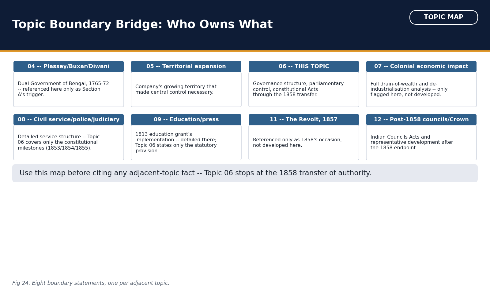

*Visual 24: Repeat: topic-boundary map, previewed before the drills below. Original deterministic study visual; schematic charts are NOT TO SCALE where marked.*


##### Drill 1 -- Name the crisis as fiscal and political, never humanitarian

**Claim:** State the 1772-73 crisis as Company bankruptcy risk, an emergency government loan, and parliamentary anxiety over unaccountable patronage and mismanagement; never lead with, or imply, a humanitarian motive tied to the 1770 famine as Parliament's primary driver.

**Exam move:** A question asking "why did Parliament intervene in Company affairs in 1773" is answered with the financial-crisis-and-accountability mechanism first; the famine belongs in the background context, not the causal headline.

##### Drill 2 -- State the Regulating Act's exact institutional design, not a vague "more control" answer

**Claim:** Name the Governor-General of Fort William/Bengal, the four-member Council, the narrower Bengal-subordination-of-presidencies wording, the Court of Directors' reporting duty, and the Supreme Court/1774 Charter together as the Act's five components.

**Exam move:** A statement-based question on the Regulating Act tests these five components independently -- know which specific component each option is really describing before selecting an answer.

##### Drill 3 -- The Regulating Act failed on Council arithmetic, not personal failure

**Claim:** Name the 3-1 Hastings-Council split (1774-76) as the structural cause of failure, Monson's 1776 death as the contingent (non-statutory) resolution, and Pitt's India Act's smaller council (1784) as the actual statutory fix.

**Exam move:** Reject any answer attributing the Regulating Act's failure to Warren Hastings's personal competence alone; the vote-arithmetic mechanism is the examinable cause.

##### Drill 4 -- Handle Nand Kumar source-critically, never as settled fact

**Claim:** State the documented facts (the corruption accusation against Hastings, the separate 1770 forgery charge, the 1775 trial and execution, the Hastings-Impey personal closeness) and explicitly flag the "deliberate silencing" reading as a widely held but contested interpretation.

**Exam move:** A question inviting assessment of the Nand Kumar episode rewards naming the source-critical caution explicitly, not simply retelling the narrative as though the causal link to Hastings were proven.

##### Drill 5 -- Distinguish the Patna and Cossijurah jurisdictional zones precisely

**Claim:** Name Patna as a personal-law/civil-court jurisdiction clash and Cossijurah as a revenue-administration jurisdiction clash; state both as instances of the same underlying Supreme-Court-versus-Company-courts overlap.

**Exam move:** A question on "why was the Amending Act of 1781 needed" is answered by naming both cases and the general overlap they exposed, not by naming only one case.

##### Drill 6 -- State exactly what the 1781 Act fixed, and exactly what it left untouched

**Claim:** Name the four precise 1781 corrections (official-acts exemption, revenue-matter exclusion, Hindu/Muslim personal-law direction, provincial-appeal routing) and state explicitly that the Council-deadlock problem was untouched by this Act.

**Exam move:** Reject any answer crediting the 1781 Act with fixing the executive deadlock; that required 1784's smaller council and 1786's override power, entirely separate fixes.

##### Drill 7 -- Never conflate Bengal's Dual Government with Britain's dual control

**Claim:** Name the Bengal Dual Government (1765-72, Nawab's Nizamat vs Company's Diwani, Topic 04) and Pitt's India Act's dual control (1784 onward, Board of Control vs Court of Directors, both in Britain) as two entirely distinct institutions.

**Exam move:** Any option using the word "dual" in a governance-structure question must be checked against which decade, which location and which two bodies it actually names before selecting it.

##### Drill 8 -- Route civil-service reform through its exact four-step sequence

**Claim:** State the sequence precisely: an 1833 formal non-discrimination promise, an 1853 Act ending patronage and opening the competitive principle, an 1854 Macaulay Committee designing the mechanism, and a first 1855 examination operationalising it.

**Exam move:** Reject any answer that credits 1833 with opening the civil service in practice, or that credits 1853 alone with instantly producing full competitive recruitment; both are promise-versus-practice traps.

##### Drill 9 -- State the 1813 Charter Act's three provisions as independently verifiable

**Claim:** Name trade liberalisation (with the tea/China exception), the Crown-sovereignty assertion, and the missionary/education gesture as three separate statutory moves, each checkable on its own.

**Exam move:** This is this topic's single most heavily tested Act; a Prelims statement-set question should be answered statement by statement against this three-part checklist, never by a single undifferentiated "1813 was a reforming Act" impression.

##### Drill 10 -- Keep the 1833 Act's two centralisations separate

**Claim:** Name the executive/titular centralisation (Governor-General of Bengal to Governor-General of India) and the legislative centralisation (all-India law-making power concentrated in the Governor-General-in-Council) as two distinct movements that happen to arrive in the same Act.

**Exam move:** A question naming "the Act that created the Governor-General of India" tests the titular centralisation specifically; do not answer it by describing the Law Member or Law Commission instead, which are separate provisions of the same Act.

##### Drill 11 -- The 1858 Act and the Queen's Proclamation are two different documents

**Claim:** Name the Government of India Act, 1858 as the constitutional-legal transfer instrument (abolishing Company rule, the Board of Control and the Court of Directors, creating the Secretary of State and Council of India) and the Queen's Proclamation of 1 November 1858 as the separate political-policy announcement (non-interference in religion, treaty recognition, formal equality before law, qualified amnesty).

**Exam move:** A question asking specifically what the 1858 Act itself provided should not be answered with Proclamation content (religious non-interference, amnesty), and vice versa; keep the two documents' content in two separate mental boxes.

##### Drill 12 -- State 1858 as rupture-in-sovereignty alongside continuity-in-administration

**Claim:** Name the abolished apex bodies (Company, Board of Control, Court of Directors) alongside the retained or continued elements (the Governor-General's office, now also Viceroy; the 1853-55 civil-service principle; a majority of the new Council of India's first members being ex-Company men) in the same answer.

**Exam move:** A "how much did 1858 actually change" question rewards naming both halves explicitly -- rupture at the apex, continuity below it -- rather than treating 1858 as either a total revolution or a mere formality.

##### Drill 13 -- Keep this topic's own endpoint at 1858, not beyond it

**Claim:** State explicitly that the Indian Councils Act of 1861 and all later representative-council reforms are Topic 12's material, and that the Revolt of 1857's own causes and course are Topic 11's material, referenced here only as this topic's trigger.

**Exam move:** When a question edges toward post-1858 councils or the Revolt's own detailed narrative, name the boundary explicitly rather than silently absorbing that material as though it belonged to this topic.

**Demand decoding:** The directive **answer** requires a direct position on “Transparent PYQ audit and route decision”, coverage of every clause, chronological-causal analysis, named evidence, a counter-position and a qualified verdict.

**Detailed examiner-grade model status:** The solved analysis above is the executable content base. Preserve its exact chronology, named evidence, causal logic, counter-position and qualification.

**Executable exam-length answer / compression plan:** For a 15-mark answer, open with a two-sentence thesis; organise five named Acts, events, organisations, regions, primary records or scholarly positions as claim → evidence → analysis → qualification; reserve the final lines for a graded conclusion.

**Why this earns marks:** The answer obeys the directive, distinguishes dates and policy stages, connects evidence to mechanism, recognises regional/social variation and avoids teleology or hero worship.

**How to improve this answer:** For “Transparent PYQ audit and route decision”, replace the weakest generalisation with one additional named primary/official record or attributed scholarly interpretation and state exactly what it cannot prove.

##### Drill 14 -- Never invent a PYQ, an official key, or a topic boundary

**Claim:** This topic owns exactly two verified, routed Prelims PYQs (2019 GS-I Q4; 2023 GS-I Q50), per the repository's own routing ledger; neither has a locally held official key, so both answers here are explicitly labelled INFERRED ANSWER -- NOT OFFICIALLY VERIFIED, with elimination reasoning shown in full.

**Exam move:** Never present either of this topic's two inferred answers as officially confirmed, and never claim a third PYQ for this topic that the ledgers do not themselves show.

#### Mains practice: solved model answers

Word limits scale with marks in this package's own convention: 10 marks = 150 words, 15 marks = 250 words, 20 marks = 300 words. The "Directive alignment" and "Why this earns marks" notes are examiner-craft scaffolding around the answer, not part of the counted word limit.


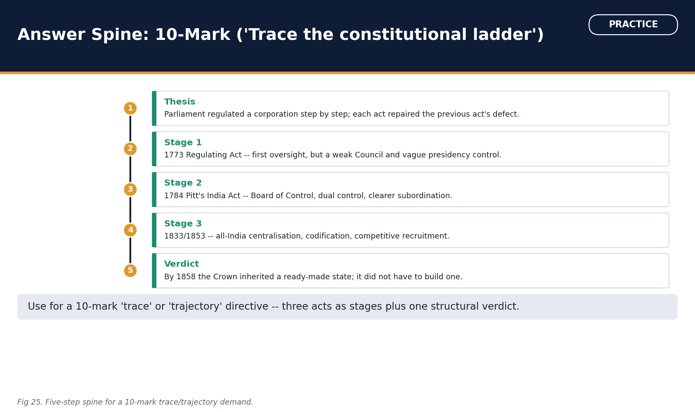

*Visual 25: Answer spine, 10 marks -- the fiscal-and-patronage case for parliamentary intervention, 1772-73. Original deterministic study visual; schematic charts are NOT TO SCALE where marked.*

**Demand decoding:** The directive **answer** requires a direct position on “Drill 14 -- Never invent a PYQ, an official key, or a topic boundary”, coverage of every clause, chronological-causal analysis, named evidence, a counter-position and a qualified verdict.

**Detailed examiner-grade model status:** The solved analysis above is the executable content base. Preserve its exact chronology, named evidence, causal logic, counter-position and qualification.

**Executable exam-length answer / compression plan:** For a 15-mark answer, open with a two-sentence thesis; organise five named Acts, events, organisations, regions, primary records or scholarly positions as claim → evidence → analysis → qualification; reserve the final lines for a graded conclusion.

**How to improve this answer:** For “Drill 14 -- Never invent a PYQ, an official key, or a topic boundary”, replace the weakest generalisation with one additional named primary/official record or attributed scholarly interpretation and state exactly what it cannot prove.

##### Mains 1 - 10 marks | 150 words

**Question:** Examine why Parliament's 1772-73 intervention in East India Company affairs is better explained by fiscal crisis and political accountability concerns than by humanitarian motive.

**Directive alignment:** "Examine" requires identifying the actual causal mechanism behind intervention, not a general narrative of Company misrule.

**Introduction:** By 1772, the Company's own solvency, not conscience, brought its Indian government before Parliament.

**Answer:** A cash crisis threatening the Company's solvency forced it to seek an emergency government-backed loan in 1772, exposing to Parliament a private corporation exercising sovereign revenue, war and justice powers over Bengal with no constitutional accountability to the Crown, Parliament, or Bengal's population. Parliamentary debate of the period centred on the Company's mismanagement, the unregulated patronage its Court of Directors controlled, and the political risk of a chartered corporation operating as an unsupervised sovereign, rather than primarily on the 1770 Bengal famine's human cost, which formed background context rather than the intervention's causal headline. The Regulating Act, 1773 that resulted was framed around financial oversight, patronage and accountability provisions.

**Qualification:** This reading does not deny that famine-related mismanagement featured in contemporary criticism; it denies that humanitarian concern was the primary driver of Parliament's specific 1772-73 legislative response.

**Verdict:** Fiscal crisis and accountability anxiety, not humanitarian motive, are the defensible primary drivers of the 1773 intervention.

**Why this earns marks:** Full marks require naming the 1772 cash crisis and loan request specifically, alongside the patronage/accountability concern, while correctly relegating the famine to background context rather than causal headline.

**Demand decoding:** The directive **examine** requires a direct position on “Examine why Parliament's 1772-73 intervention in East India Company affairs is better…”, coverage of every clause, chronological-causal analysis, named evidence, a counter-position and a qualified verdict.

**Detailed examiner-grade model status:** The solved analysis above is the executable content base. Preserve its exact chronology, named evidence, causal logic, counter-position and qualification.

**Executable exam-length answer / compression plan:** For a 10-mark answer, open with a two-sentence thesis; organise three named Acts, events, organisations, regions, primary records or scholarly positions as claim → evidence → analysis → qualification; reserve the final lines for a graded conclusion.

**How to improve this answer:** For “Examine why Parliament's 1772-73 intervention in East India Company affairs is better…”, replace the weakest generalisation with one additional named primary/official record or attributed scholarly interpretation and state exactly what it cannot prove.

##### Mains 2 - 10 marks | 150 words

**Question:** Distinguish the institutional design of the Regulating Act, 1773 from that of Pitt's India Act, 1784, with particular reference to the size of the Bengal Council.

**Directive alignment:** "Distinguish" requires a precise, paired before/after comparison, not a general description of either Act alone.

**Introduction:** The single clearest before/after institutional comparison in this topic is the Bengal Council's own size, and what that size change was meant to fix.

**Answer:** The Regulating Act, 1773 created a Governor-General of Fort William (Bengal) with a four-member Council, a design that produced a standing 3-1 majority (Clavering, Monson, Francis) against Warren Hastings between 1774 and 1776. Pitt's India Act, 1784 reduced this Council to a Governor-General-plus-three, meaning the Governor-General now needed only one ally, not two, for a working majority, while also creating a standing Board of Control in London -- an institution entirely absent from the 1773 design -- and extending presidency subordination to Bengal more clearly across war, diplomacy and revenue matters together.

**Qualification:** The smaller council reduced, but did not by itself eliminate, deadlock risk; the Act of 1786 added a further, direct override power the following year.

**Verdict:** 1784's smaller council and new Board of Control directly answer 1773's specific structural weaknesses.

**Why this earns marks:** A top answer names the exact council sizes (four vs three) and connects the change causally to the 1774-76 deadlock, rather than describing both Acts in parallel without contrasting them.

**Demand decoding:** The directive **answer** requires a direct position on “Distinguish the institutional design of the Regulating Act, 1773 from that of Pitt's India…”, coverage of every clause, chronological-causal analysis, named evidence, a counter-position and a qualified verdict.

**Detailed examiner-grade model status:** The solved analysis above is the executable content base. Preserve its exact chronology, named evidence, causal logic, counter-position and qualification.

**Executable exam-length answer / compression plan:** For a 10-mark answer, open with a two-sentence thesis; organise three named Acts, events, organisations, regions, primary records or scholarly positions as claim → evidence → analysis → qualification; reserve the final lines for a graded conclusion.

**How to improve this answer:** For “Distinguish the institutional design of the Regulating Act, 1773 from that of Pitt's India…”, replace the weakest generalisation with one additional named primary/official record or attributed scholarly interpretation and state exactly what it cannot prove.

##### Mains 3 - 10 marks | 150 words

**Question:** Account for the source-critical problems in treating the 1775 trial and execution of Maharaja Nand Kumar as a settled case of judicial murder.

**Directive alignment:** "Account for" requires reasoned explanation of why the evidentiary and interpretive basis is contested, not a retelling of the episode.

**Introduction:** The Nand Kumar episode is a case study in the gap between documented fact and contested interpretation.

**Answer:** The documented facts are narrow: Nand Kumar had separately accused Warren Hastings of corruption before the Bengal Council; he was then tried before the Supreme Court on an unrelated 1770 forgery charge brought by a private litigant; forgery was a capital offence under the English law the Court applied, though not typically so under the pre-existing Indian legal practice for such matters; he was convicted by Chief Justice Elijah Impey, a close personal associate of Hastings, and executed in 1775. The inference that Hastings and Impey engineered this outcome to silence a corruption accuser rests on circumstantial timing and personal association, not on a causal link proven beyond dispute.

**Qualification:** This does not require denying the trial's severity or its remarkable timing; it requires refusing to state the conspiracy reading as settled fact.

**Verdict:** The episode is best presented as documented facts plus a widely held, but contested, interpretation -- not as proven judicial murder.

**Why this earns marks:** Full marks require naming the separate 1770 forgery charge precisely, the Hastings-Impey closeness, and the explicit source-critical qualification together.


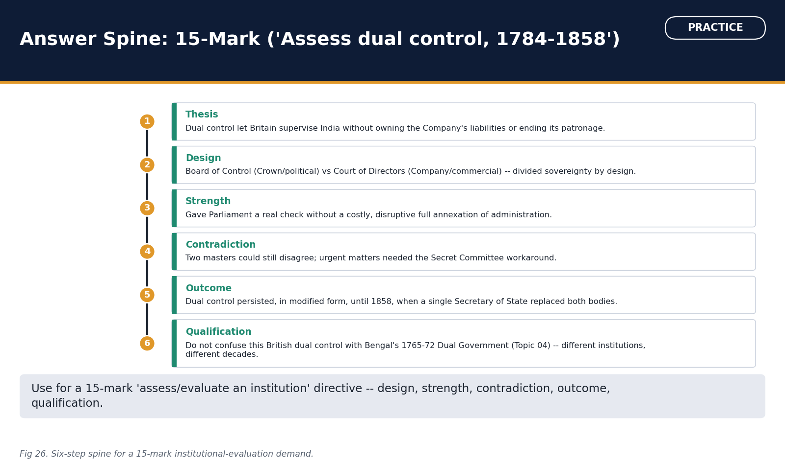

*Visual 26: Answer spine, 15 marks -- distinguishing jurisdiction-correction from executive-deadlock-correction, 1781 vs 1784. Original deterministic study visual; schematic charts are NOT TO SCALE where marked.*

**Demand decoding:** The directive **answer** requires a direct position on “Account for the source-critical problems in treating the 1775 trial and execution of…”, coverage of every clause, chronological-causal analysis, named evidence, a counter-position and a qualified verdict.

**Detailed examiner-grade model status:** The solved analysis above is the executable content base. Preserve its exact chronology, named evidence, causal logic, counter-position and qualification.

**Executable exam-length answer / compression plan:** For a 10-mark answer, open with a two-sentence thesis; organise three named Acts, events, organisations, regions, primary records or scholarly positions as claim → evidence → analysis → qualification; reserve the final lines for a graded conclusion.

**How to improve this answer:** For “Account for the source-critical problems in treating the 1775 trial and execution of…”, replace the weakest generalisation with one additional named primary/official record or attributed scholarly interpretation and state exactly what it cannot prove.

##### Mains 4 - 15 marks | 250 words

**Question:** Discuss the exact corrections made by the Amending Act (Act of Settlement), 1781, and explain why it did not resolve the Regulating Act's own executive-deadlock problem.

**Directive alignment:** "Discuss... and explain" requires both an itemised account of the 1781 corrections and a causal explanation of their limited scope.

**Introduction:** The Amending Act of 1781 answered a jurisdictional crisis, not an executive one, and its own precision is best appreciated by naming what it left untouched.

**The four 1781 corrections:** The Act exempted the Governor-General-in-Council's own official acts, performed in a public capacity, from Supreme Court jurisdiction; excluded revenue-collection matters entirely, routing them to the Company's own revenue courts and to appeal before the Governor-General-in-Council; directed the Supreme Court to apply Hindu law to Hindus and Muslim law to Muslims in personal-law matters; and routed appeals from provincial Company courts to the Governor-General-in-Council or the Sadar Diwani Adalat, not the Supreme Court.

**The triggering crises:** These corrections responded directly to the Patna Case (1777-79, a personal-law/civil-court jurisdiction clash) and the Cossijurah Case (1779-80, a revenue-administration jurisdiction clash), both exposing the same underlying Supreme-Court-versus-Company-authority overlap.

**Why the executive deadlock remained unresolved:** The 1781 Act's own scope was jurisdictional, not structural-executive; it made no change to the Bengal Council's size or voting arithmetic, the actual mechanism behind the 1774-76 deadlock. That separate problem was addressed only by Pitt's India Act's three-member council (1784) and the Act of 1786's bounded override power.

**Qualification:** Sekhar Bandyopadhyay's own assessment captures this precisely: the 1781 Act "defined more precisely the jurisdiction of the Supreme Court, but did not address the other anomalies" in Bengal's government.

**Verdict:** 1781 is a precise, targeted jurisdictional fix; the executive-deadlock fix is a separate, later statutory story.

**Why this earns marks:** A top answer lists all four corrections specifically and states explicitly, with named evidence, why the deadlock problem required entirely separate later legislation.

**Demand decoding:** The directive **discuss** requires a direct position on “Discuss the exact corrections made by the Amending Act (Act of Settlement), 1781, and…”, coverage of every clause, chronological-causal analysis, named evidence, a counter-position and a qualified verdict.

**Detailed examiner-grade model status:** The solved analysis above is the executable content base. Preserve its exact chronology, named evidence, causal logic, counter-position and qualification.

**Executable exam-length answer / compression plan:** For a 15-mark answer, open with a two-sentence thesis; organise five named Acts, events, organisations, regions, primary records or scholarly positions as claim → evidence → analysis → qualification; reserve the final lines for a graded conclusion.

**How to improve this answer:** For “Discuss the exact corrections made by the Amending Act (Act of Settlement), 1781, and…”, replace the weakest generalisation with one additional named primary/official record or attributed scholarly interpretation and state exactly what it cannot prove.

##### Mains 5 - 15 marks | 250 words

**Question:** Evaluate the Charter Act of 1813 as a bundle of three distinct statutory provisions, and explain why this makes it one of this topic's most heavily tested Prelims Acts.

**Directive alignment:** "Evaluate... and explain" requires both an itemised account of each provision and an examiner-facing explanation of testability.

**Introduction:** The Charter Act of 1813 bundles three independently verifiable claims into a single statute, which is exactly why it rewards a statement-by-statement reading.

**The trade provision:** The Act ended the Company's monopoly of trade with India for other British subjects, while specifically preserving the Company's exclusive monopoly over the tea trade and all trade with China -- a precise exception frequently tested as a standalone true/false statement.

**The sovereignty provision:** The Act asserted, in its own language, the "undoubted sovereignty of the Crown of the United Kingdom" over the Company's Indian territories -- a symbolic-but-real assertion, distinct from any transfer of administrative control, which remained with the Company.

**The permissive/funding provision:** The Act permitted Christian missionaries to enter and preach in Company territory, and earmarked one lakh rupees a year for education and useful knowledge -- a statutory authorisation whose actual disbursement was delayed for years, resolved only by the 1835 Minute on Education (Topic 09).

**Why this makes 1813 heavily tested:** Because these three claims are genuinely independent -- one can be true while another is false -- the Act is ideally suited to Prelims statement-based questions (exactly the structure of the 2019 GS-I Q4 PYQ examined in this topic's own PYQ audit), rewarding candidates who verify each claim separately rather than forming one undifferentiated impression of "1813 as a reforming Act."

**Qualification:** None of these three provisions should be read as instantly, fully implemented on the ground; each is a statutory claim, with its practical unfolding a separate question.

**Verdict:** 1813's bundled, independently verifiable structure is precisely what makes it this topic's most examination-relevant single Act.

**Why this earns marks:** A top answer names all three provisions with their exact qualifying details (the tea/China exception; the exact sovereignty phrase; the delayed education-grant disbursement) and explicitly connects this structure to its own testability.

**Demand decoding:** The directive **evaluate** requires a direct position on “Evaluate the Charter Act of 1813 as a bundle of three distinct statutory provisions, and…”, coverage of every clause, chronological-causal analysis, named evidence, a counter-position and a qualified verdict.

**Detailed examiner-grade model status:** The solved analysis above is the executable content base. Preserve its exact chronology, named evidence, causal logic, counter-position and qualification.

**Executable exam-length answer / compression plan:** For a 15-mark answer, open with a two-sentence thesis; organise five named Acts, events, organisations, regions, primary records or scholarly positions as claim → evidence → analysis → qualification; reserve the final lines for a graded conclusion.

**How to improve this answer:** For “Evaluate the Charter Act of 1813 as a bundle of three distinct statutory provisions, and…”, replace the weakest generalisation with one additional named primary/official record or attributed scholarly interpretation and state exactly what it cannot prove.

##### Mains 6 - 15 marks | 250 words

**Question:** Discuss the two distinct centralisations -- executive/titular and legislative -- introduced together by the Charter Act of 1833.

**Directive alignment:** "Discuss" requires separating two genuinely distinct institutional movements that arrive in the same Act, not treating "1833 centralisation" as one undifferentiated fact.

**Introduction:** The Charter Act of 1833 is this topic's largest single structural leap precisely because it bundles two different kinds of centralisation into one statute.

**The executive/titular centralisation:** The Act upgraded the Governor-General of Bengal into the Governor-General of India, with Lord William Bentinck, already Governor-General of Bengal, becoming the first holder of this new all-India title -- a change in office and title, not in law-making power itself.

**The legislative centralisation:** Separately, the Act centralised legislative authority for the whole of British India in the Governor-General-in-Council, correspondingly curtailing the presidency governments' own earlier, more independent rule-making powers, and added a fourth, Law Member (first held by Thomas Babington Macaulay) without executive departmental responsibilities, alongside a Law Commission tasked with codifying Indian law.

**Why the two must be kept separate:** A question naming "the Act that created the Governor-General of India" (as in the 2023 PYQ examined in this topic's audit) tests the titular centralisation specifically; answering it by describing the Law Member or Law Commission instead conflates two separate provisions of the same Act.

**A bounded caveat on codification:** The Law Commission's mandate was begun, not completed, in 1833 -- its major finished codes were enacted only after 1858, outside this topic's own period.

**Qualification:** The Act also ended all Company commercial activity outright, a third, purely economic change running alongside these two centralisations, examined separately in this topic's own institutional-themes subtopic.

**Verdict:** 1833 is best understood as three simultaneous but analytically separate moves -- titular, legislative and commercial -- bundled in one statute.

**Why this earns marks:** A top answer keeps all three strands distinct, names Bentinck and Macaulay specifically, and flags the codification-completion caveat.

**Demand decoding:** The directive **discuss** requires a direct position on “Discuss the two distinct centralisations -- executive/titular and legislative -- introduced…”, coverage of every clause, chronological-causal analysis, named evidence, a counter-position and a qualified verdict.

**Detailed examiner-grade model status:** The solved analysis above is the executable content base. Preserve its exact chronology, named evidence, causal logic, counter-position and qualification.

**Executable exam-length answer / compression plan:** For a 15-mark answer, open with a two-sentence thesis; organise five named Acts, events, organisations, regions, primary records or scholarly positions as claim → evidence → analysis → qualification; reserve the final lines for a graded conclusion.

**How to improve this answer:** For “Discuss the two distinct centralisations -- executive/titular and legislative -- introduced…”, replace the weakest generalisation with one additional named primary/official record or attributed scholarly interpretation and state exactly what it cannot prove.

##### Mains 7 - 15 marks | 250 words

**Question:** "The Charter Act of 1833's non-discrimination clause was a promise without a mechanism." Discuss this statement with reference to the Charter Act of 1853.

**Directive alignment:** "Discuss... with reference to" requires testing the quoted claim specifically against the 1853 Act's own provisions.

**Introduction:** The gap between an 1833 legal promise and an operating mechanism is this topic's clearest case study in promise-versus-practice.

**The 1833 promise:** The Charter Act of 1833 provided that no Indian subject of the Company was to be disbarred from Company office by reason of religion, place of birth, descent or colour -- a formal, statutory non-discrimination promise.

**Why it remained a promise without a mechanism:** The clause removed a legal bar without creating any practical route -- no accessible competitive examination, no defined syllabus or venue -- by which Indians could realistically compete for higher covenanted posts; the number of Indians actually entering those ranks in the following decades remained extremely small.

**The 1853-55 partial mechanism:** The Charter Act of 1853 ended the Directors' patronage-nomination power and opened recruitment to competition in principle, but did not itself design or operate an examination; the 1854 Macaulay Committee designed the syllabus and rules, and the first actual competitive examination was held only in 1855.

**Testing the claim's limits:** Even this 1853-55 mechanism was only a partial fulfilment -- practical barriers (examination location in Britain, age limits, financial and cultural access) continued to limit Indian entry for a long time afterward, a detailed story properly routed to Topic 08.

**Qualification:** The statement should not be read as implying 1833 was meaningless; it established the necessary formal-legal precondition without which even the limited 1853-55 mechanism could not have followed.

**Verdict:** The statement holds precisely: 1833 promised, 1853-55 partially mechanised, and full practical access remained elusive for decades beyond this topic's own endpoint.

**Why this earns marks:** A top answer names the exact four-step sequence (1833, 1853, 1854, 1855) and explicitly tests, rather than merely restates, the quoted claim.

**Demand decoding:** The directive **discuss** requires a direct position on “"The Charter Act of 1833's non-discrimination clause was a promise without a mechanism."…”, coverage of every clause, chronological-causal analysis, named evidence, a counter-position and a qualified verdict.

**Detailed examiner-grade model status:** The solved analysis above is the executable content base. Preserve its exact chronology, named evidence, causal logic, counter-position and qualification.

**Executable exam-length answer / compression plan:** For a 15-mark answer, open with a two-sentence thesis; organise five named Acts, events, organisations, regions, primary records or scholarly positions as claim → evidence → analysis → qualification; reserve the final lines for a graded conclusion.

**How to improve this answer:** For “"The Charter Act of 1833's non-discrimination clause was a promise without a mechanism."…”, replace the weakest generalisation with one additional named primary/official record or attributed scholarly interpretation and state exactly what it cannot prove.

##### Mains 8 - 15 marks | 250 words

**Question:** Examine the institutional significance of Pitt's India Act, 1784's "dual control," distinguishing it clearly from Bengal's earlier Dual Government (1765-72).

**Directive alignment:** "Examine... distinguishing it clearly from" demands the comparison be made explicit and structured, not left implicit.

**Introduction:** These two "dual" structures are separated by a decade, an ocean, and their entire institutional logic, making the distinction itself the examinable content.

**Bengal's Dual Government (1765-72, Topic 04):** The Company held the Diwani (revenue, civil justice) through its own Naib Diwans, while the Nawab retained only the nominal Nizamat -- a Bengal-based, Indian-facing arrangement examined fully under Topic 04, with this topic treating it only as its own starting trigger.

**Pitt's India Act's dual control (from 1784):** A Crown-appointed Board of Control of six members (including the Secretary of State and Chancellor of the Exchequer), empowered to "superintend, direct and control" Company affairs, operated alongside the Company's own Court of Directors, which retained patronage and day-to-day commercial administration -- both bodies based in Britain, supervising Indian governance from London.

**The institutional significance of dual control:** This design let Parliament supervise Indian governance politically without nationalising Company assets or assuming direct fiscal liability, while the Company's trade monopoly remained fully intact in exchange for accepting this new political superintendence -- a durable compromise that lasted, with later Charter Act modifications, until 1858.

**The distinguishing test:** Different decades (1765-72 vs 1784 onward), different locations (Bengal vs Britain), and different institutional pairs (Nawab/Company vs Board of Control/Court of Directors) -- sharing only the word "dual."

**Qualification:** Neither structure should be described as an equal partnership; both concentrated substantive power on one side while preserving a nominal or patronage-based role for the other.

**Verdict:** Dual control is a distinct, later, Britain-based supervisory compromise, not a continuation or renaming of Bengal's earlier Dual Government.

**Why this earns marks:** A top answer names both structures' exact institutional composition and states the decade/location/institution-pair distinction explicitly, rather than merely asserting they differ.


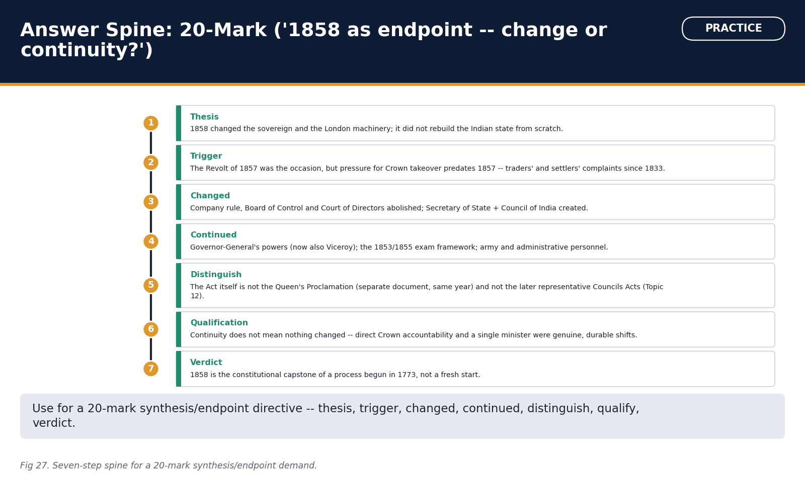

*Visual 27: Answer spine, 20 marks -- 1858 as rupture-in-sovereignty alongside continuity-in-administration. Original deterministic study visual; schematic charts are NOT TO SCALE where marked.*

**Demand decoding:** The directive **examine** requires a direct position on “Examine the institutional significance of Pitt's India Act, 1784's "dual control,"…”, coverage of every clause, chronological-causal analysis, named evidence, a counter-position and a qualified verdict.

**Detailed examiner-grade model status:** The solved analysis above is the executable content base. Preserve its exact chronology, named evidence, causal logic, counter-position and qualification.

**Executable exam-length answer / compression plan:** For a 15-mark answer, open with a two-sentence thesis; organise five named Acts, events, organisations, regions, primary records or scholarly positions as claim → evidence → analysis → qualification; reserve the final lines for a graded conclusion.

**How to improve this answer:** For “Examine the institutional significance of Pitt's India Act, 1784's "dual control,"…”, replace the weakest generalisation with one additional named primary/official record or attributed scholarly interpretation and state exactly what it cannot prove.

##### Mains 9 - 20 marks | 300 words

**Question:** "The Government of India Act, 1858 represented more continuation than change." Critically examine this characterisation with reference to the institutions it abolished and the institutions it retained.

**Directive alignment:** "Critically examine" requires testing the statement against named evidence on both sides, not simply illustrating it.

**Introduction:** Read against its own text, the 1858 Act supports this characterisation only if "continuation" is measured at the administrative level while "change" is conceded fully at the level of ultimate sovereignty.

**The case for change:** The Act abolished Company rule outright, together with the Board of Control (1784) and the Company's own Court of Directors, replacing them with a Secretary of State for India -- a Cabinet-level minister directly responsible to Parliament, described in period administrative practice as the "fountain of authority" -- assisted by a statutory Council of India. Sovereignty over India passed decisively and directly to the Crown, ending even the Company's residual legal personality as a governing authority.

**The case for continuation:** Seven of the fifteen initial Council of India members had prior Company service or directorship experience; the Governor-General's office (created 1833) continued, with Lord Canning, already Governor-General since 1856, simply adding the Viceroy title in 1858; the 1853-55 competitive-examination principle for civil recruitment continued unaltered; and the bulk of serving administrative and military personnel carried on in place. A period assessment holds that 1858 "meant more continuation than change" in day-to-day administrative practice, and Thomas Metcalf's characterisation of a post-1858 "new attitude of caution and conservatism" supports a similarly gradualist reading.

**Weighing the two:** The rupture is real and total at the apex (legal sovereignty, named institutions abolished); the continuity is real and substantial below it (personnel, mechanisms, office-holders).

**Qualification:** "More continuation than change" should not be read as denying the 1858 Act's constitutional significance; it is a claim about administrative practice, not about legal sovereignty, where the change was total.

**Verdict:** The characterisation is defensible precisely because it operates at the administrative level; at the sovereignty level, 1858 is unambiguously a rupture.

**Why this earns marks:** A top answer keeps the sovereignty-level rupture and the administrative-level continuity analytically distinct, citing named evidence (Board of Control, Court of Directors, Council of India's ex-Company majority, Canning) for each.

**Demand decoding:** The directive **critically examine** requires a direct position on “"The Government of India Act, 1858 represented more continuation than change." Critically…”, coverage of every clause, chronological-causal analysis, named evidence, a counter-position and a qualified verdict.

**Detailed examiner-grade model status:** The solved analysis above is the executable content base. Preserve its exact chronology, named evidence, causal logic, counter-position and qualification.

**Executable exam-length answer / compression plan:** For a 20-mark answer, open with a two-sentence thesis; organise six to eight named Acts, events, organisations, regions, primary records or scholarly positions as claim → evidence → analysis → qualification; reserve the final lines for a graded conclusion.

**How to improve this answer:** For “"The Government of India Act, 1858 represented more continuation than change." Critically…”, replace the weakest generalisation with one additional named primary/official record or attributed scholarly interpretation and state exactly what it cannot prove.

##### Mains 10 - 20 marks | 300 words

**Question:** Trace the evolution of the Governor-General's office from 1773 to 1858, and examine the institutional significance of each stage.

**Directive alignment:** "Trace... and examine" requires a staged chronological account paired with an explanation of why each stage mattered institutionally.

**Introduction:** The Governor-Generalship's own title changes are a compact, three-rung ladder that tracks this topic's entire executive-centralisation story.

**Stage one -- Governor-General of Fort William/Bengal (1773):** The Regulating Act created this Bengal-specific office, with Warren Hastings its first holder, subordinate to a four-member Council whose 3-1 voting arithmetic (Clavering, Monson, Francis against Hastings) produced the 1774-76 deadlock -- the office's own authority was, at this stage, structurally weak against its Council.

**Stage two -- a strengthened Bengal office (1784-86):** Pitt's India Act reduced the Council to three members, easing the majority-formation problem, and the Act of 1786 gave the Governor-General a bounded override power "in matters of importance affecting safety, peace, or the interests of the Empire," with Cornwallis also holding the Commander-in-Chief's office -- a genuine strengthening, though still bounded to Bengal and to specified matters.

**Stage three -- Governor-General of India (1833):** The Charter Act of 1833 upgraded the office to an all-India title, with Lord William Bentinck its first holder, paired with the centralisation of legislative authority for all British India in the Governor-General-in-Council -- the office's scope now extended well beyond Bengal for the first time.

**Stage four -- Governor-General and Viceroy (1858):** The Government of India Act, 1858 retained this office while adding the Viceroy title, with Lord Canning, already Governor-General since 1856, the first to hold both together, now representing the Crown directly rather than a still-intact Company.

**Institutional significance across the sequence:** Each stage answers a specific prior weakness -- Council arithmetic (1784), executive deadlock (1786), fragmented presidency authority (1833), and Company intermediation itself (1858) -- making the office steadily more central, more empowered, and eventually a direct Crown appointment.

**Qualification:** This ladder should not be read as a smoothly pre-planned design; each stage responded to a specific crisis exposed by the one before it.

**Verdict:** The Governor-Generalship's evolution is this topic's clearest single institutional through-line, from a weak Bengal office to a Crown Viceroyalty.

**Why this earns marks:** Full marks require all four named stages, their dates, their first office-holders, and the specific institutional problem each stage answered.

**Demand decoding:** The directive **trace** requires a direct position on “Trace the evolution of the Governor-General's office from 1773 to 1858, and examine the…”, coverage of every clause, chronological-causal analysis, named evidence, a counter-position and a qualified verdict.

**Detailed examiner-grade model status:** The solved analysis above is the executable content base. Preserve its exact chronology, named evidence, causal logic, counter-position and qualification.

**Executable exam-length answer / compression plan:** For a 20-mark answer, open with a two-sentence thesis; organise six to eight named Acts, events, organisations, regions, primary records or scholarly positions as claim → evidence → analysis → qualification; reserve the final lines for a graded conclusion.

**How to improve this answer:** For “Trace the evolution of the Governor-General's office from 1773 to 1858, and examine the…”, replace the weakest generalisation with one additional named primary/official record or attributed scholarly interpretation and state exactly what it cannot prove.

##### Mains 11 - 20 marks | 300 words

**Question:** "Constitutional reform in colonial India between 1773 and 1858 was a story of parliamentary sovereignty steadily displacing corporate autonomy." Critically evaluate this statement with reference to at least four named Acts.

**Directive alignment:** "Critically evaluate... with reference to" requires testing the displacement claim against named evidence, not merely narrating the Acts in sequence.

**Introduction:** Read across the Regulating Act, Pitt's India Act, the Charter Act of 1833 and the Government of India Act, 1858, the statement holds as a description of direction, though "steadily" requires qualification against this topic's own uneven pace of change.

**Testing the claim with named evidence:** The Regulating Act, 1773 gave Parliament only a reporting duty from the Company's Court of Directors -- corporate autonomy remained largely intact. Pitt's India Act, 1784 created a standing Board of Control empowered to "superintend, direct and control" Company affairs -- a first real assertion of parliamentary supervisory sovereignty, though the Company's trade monopoly and administrative machinery remained its own. The Charter Act of 1833 ended all Company commercial activity outright, converting it into a purely administrative trust-holder for the Crown -- corporate autonomy now reduced to administrative execution alone. The Government of India Act, 1858 abolished Company rule, the Board of Control and the Court of Directors together, completing the displacement with direct Crown sovereignty.

**Testing "steadily":** The pace was distinctly uneven -- long stretches of limited change (1793's mere renewal-and-codification) punctuated by sharp steps (1784, 1833, 1858), each typically triggered by a specific crisis (Council deadlock, jurisdictional conflict, fiscal pressure, the Revolt of 1857) rather than by continuous, gradual pressure.

**A continuity qualification:** Even 1858's completion retained substantial administrative continuity -- a majority of the new Council of India's first members were former Company men, and the 1853-55 civil-service principle continued unaltered -- so "displacement" is most accurate at the level of ultimate sovereignty, not of administrative personnel or method.

**Qualification:** The statement's implicit teleology (as if 1858 were always the designed endpoint) should be tempered by the company-state historiographical reading, which treats each Act as an improvised response to its own preceding crisis.

**Verdict:** The statement is substantially correct on displacement of ultimate authority, provided "steadily" is read as crisis-punctuated rather than smoothly continuous.

**Why this earns marks:** A top answer names at least four Acts with their specific provisions, and separately tests both "displacing corporate autonomy" and "steadily" rather than treating the quotation as a single, indivisible claim.

**Demand decoding:** The directive **answer** requires a direct position on “"Constitutional reform in colonial India between 1773 and 1858 was a story of parliamentary…”, coverage of every clause, chronological-causal analysis, named evidence, a counter-position and a qualified verdict.

**Detailed examiner-grade model status:** The solved analysis above is the executable content base. Preserve its exact chronology, named evidence, causal logic, counter-position and qualification.

**Executable exam-length answer / compression plan:** For a 20-mark answer, open with a two-sentence thesis; organise six to eight named Acts, events, organisations, regions, primary records or scholarly positions as claim → evidence → analysis → qualification; reserve the final lines for a graded conclusion.

**How to improve this answer:** For “"Constitutional reform in colonial India between 1773 and 1858 was a story of parliamentary…”, replace the weakest generalisation with one additional named primary/official record or attributed scholarly interpretation and state exactly what it cannot prove.

##### Mains 12 - 20 marks | 300 words

**Question:** Evaluate the civil-service reform sequence between 1833 and 1855 as a case study in the gap between formal promise and practical implementation in colonial governance.

**Directive alignment:** "Evaluate... as a case study" requires assessing the sequence's significance as an illustration of a general pattern, not merely reciting its four steps.

**Introduction:** Few sequences in this topic illustrate the promise-practice gap as precisely, and as measurably across dated steps, as civil-service reform between 1833 and 1855.

**The four-step sequence itself:** The Charter Act of 1833 promised, in its own non-discrimination clause, that no Indian subject would be disbarred from Company office by reason of religion, place of birth, descent or colour. The Charter Act of 1853 ended the Directors' patronage-nomination power and opened recruitment to competition in principle, without designing any examination mechanism itself. The 1854 Macaulay Committee then designed the syllabus, age limits and administrative rules. The first actual competitive examination under this new principle was held only in 1855.

**Evaluating the gap at each stage:** Between 1833 and 1853, the promise operated with no mechanism at all -- a purely formal-legal removal of disqualification, producing an extremely small practical increase in Indian entry to the higher covenanted ranks. Between 1853 and 1855, the principle existed in statute before any operating mechanism existed, a full two-year design lag. Even after 1855, further practical barriers (examination location, age limits, financial and cultural access) continued to limit real Indian participation for a long time afterward, a story properly routed to Topic 08.

**Why this matters as a case study:** This sequence demonstrates, with unusually precise dating, a general pattern found elsewhere in this topic -- the 1813 education grant's delayed disbursement, and the 1858 Act's sovereignty-versus-administration gap are structurally similar promise-practice stories -- making civil-service reform a compact, teachable model of how colonial governance repeatedly authorised more than it operationalised.

**Qualification:** This should not be read as implying deliberate bad faith at each step; institutional design lags (as with the 1854 committee) are a normal feature of implementing any newly opened principle, not necessarily evidence of insincerity.

**Verdict:** The 1833-1855 sequence is this topic's clearest, most precisely dated case study in the general colonial pattern of formal promise outrunning practical mechanism.

**Why this earns marks:** A top answer states all four dated steps precisely, assesses the gap at each transition specifically, and connects the pattern outward to at least one other comparable promise-practice example in this topic.

**Demand decoding:** The directive **evaluate** requires a direct position on “Evaluate the civil-service reform sequence between 1833 and 1855 as a case study in the gap…”, coverage of every clause, chronological-causal analysis, named evidence, a counter-position and a qualified verdict.

**Detailed examiner-grade model status:** The solved analysis above is the executable content base. Preserve its exact chronology, named evidence, causal logic, counter-position and qualification.

**Executable exam-length answer / compression plan:** For a 20-mark answer, open with a two-sentence thesis; organise six to eight named Acts, events, organisations, regions, primary records or scholarly positions as claim → evidence → analysis → qualification; reserve the final lines for a graded conclusion.

**How to improve this answer:** For “Evaluate the civil-service reform sequence between 1833 and 1855 as a case study in the gap…”, replace the weakest generalisation with one additional named primary/official record or attributed scholarly interpretation and state exactly what it cannot prove.

## OPTIONAL ADVANCED DEPTH — NOT REQUIRED FOR A CORE ANSWER

> **Subject:** History (Modern India) · **Tier:** Advanced (deeper understanding) · **GS Paper:** GS-I (also Prelims).
> **Grounded in:** Bipin Chandra, *Modern India* (Ch. V) + *India's Struggle for Independence* (backdrop) — with the historiographical debate on the Company-state.
> ✅ = from source book · ⚠️ = inference / standard knowledge · 📰 = current affairs.
> *Companion: `basic/06_Government-Structure-and-Constitutional-Development-1757-1858.md`. Chronology spine: `00_Master-Chronology.md`.*

---

#### Mini-timeline

| Date | Event |
|---|---|
| ✅ 1765 | Diwani of Bengal gives the Company revenue authority and makes regulation unavoidable |
| ✅ 1773 | Regulating Act establishes Governor-General of Bengal and Supreme Court framework |
| ✅ 1781 | Amending Act limits jurisdictional confusion created by 1773 |
| ✅ 1784 | Pitt's India Act establishes Board of Control over political affairs |
| ✅ 1786 | Cornwallis receives power to override council and act as Commander-in-Chief |
| ✅ 1813 | Charter Act ends monopoly except tea and China and asserts Crown sovereignty |
| ✅ 1833 | Charter Act centralises legislation and makes Company a purely administrative agency |
| ✅ 1853 | Charter Act separates legislative/executive work and introduces competitive recruitment |

#### 1. Snapshot & core idea

**Deeper — parliamentary control emerged through crisis, not design.**

- ✅ The Company's territorial authority after **1765** created a contradiction: a profit-seeking commercial corporation was collecting revenue, maintaining armies and dispensing justice in India.
- ✅ The **Regulating Act, 1773** was Parliament's first serious attempt to control this contradiction by giving Bengal primacy, establishing a Governor-General-in-Council and creating the Supreme Court at Calcutta.
- ✅ The Act's defects were immediate: conflict between the Governor-General and Council, tension between the Supreme Court and Company courts, and unclear limits of Bombay and Madras in war and diplomacy.
- ✅ The **Amending Act, 1781** attempted to remove these practical defects by clarifying jurisdiction and protecting official actions from excessive judicial interference.
- ⚠️ The constitutional story is therefore not a smooth liberal evolution; it is a sequence of emergency repairs to keep imperial extraction administratively stable.

**Deeper — centralisation created the Company-state.**

- ✅ **Pitt's India Act, 1784** produced dual government in Britain: the **Court of Directors** managed Company affairs while the **Board of Control** supervised political matters in the name of the Crown.
- ✅ **Charter Act, 1833** marked the high point of centralisation: one Governor-General of India, one central law-making council, a Law Member, and a Law Commission for codification.
- ✅ The Company's commercial functions ended in **1833**, making it a purely administrative and political instrument of British imperial rule.
- ✅ **Charter Act, 1853** separated legislative from executive functions and opened civil service recruitment through competitive examination, though practical access for Indians remained limited.
- ⚠️ The pre-1858 structure anticipated Crown rule: centralised executive, codified law, bureaucratic recruitment and parliamentary oversight were already in place before the formal transfer to the Crown.

#### 2. Key classification / data

| Theme | Institutional change | Analytical significance |
|---|---|---|
| ✅ Parliamentary oversight | Regulating Act and Pitt's India Act | Company sovereignty placed under British Parliament and Crown supervision |
| ✅ Executive centralisation | Bengal presidency elevated in 1773; Governor-General of India in 1833 | Presidency autonomy reduced; all-India authority developed |
| ✅ Legal centralisation | Supreme Court, Law Member, Law Commission | Colonial rule moved toward codified and uniform law |
| ✅ Commercial-to-political shift | Company monopoly weakened in 1813 and ended in 1833 | Company became administrative state rather than merchant body |
| ✅ Recruitment reform | Charter Act 1853 and Macaulay Committee | Merit principle announced, but social and geographic barriers remained |
| ⚠️ Ideological justification | "Good government", order, rule of law | Imperial control framed as reform and accountability |

#### 3. Study links

> **Study link:** ✅ Bengal conquest and Diwani as the constitutional trigger → `advanced/04_British-Conquest-of-Bengal.md`.
> **Study link:** ✅ Expansion created a need for uniform command → `advanced/05_British-Territorial-Expansion.md`.
> **Study link:** ⚠️ Civil service, law and police institutions → `advanced/08_Administrative-Organisation.md`.
> **Study link:** ⚠️ After 1858 Crown rule and councils → `advanced/12`.

#### 4. Must-Know Facts (Prelims)

- ✅ **Regulating Act, 1773**: Governor-General of Bengal, Council of four, Supreme Court at Calcutta, parliamentary oversight.
- ✅ **Warren Hastings** was the first Governor-General of Bengal; **William Bentinck** was the first Governor-General of India.
- ✅ **Supreme Court at Calcutta** began in **1774**.
- ✅ **Pitt's India Act, 1784**: Board of Control + Court of Directors = dual government in Britain.
- ✅ **Act of 1786**: Cornwallis could override the council and combine Governor-General with Commander-in-Chief.
- ✅ **Charter Act, 1813**: monopoly ended except tea and China trade; ₹1 lakh education grant; missionaries allowed; Crown sovereignty asserted.
- ✅ **Charter Act, 1833**: Law Member, Law Commission, centralisation, end of Company commercial functions.
- ✅ **Charter Act, 1853**: separate legislative and executive councils; competitive examination for civil service.
- ⚠️ "Open recruitment" as an idea belongs to **1833**, but practical competitive examination belongs to **1853**.

#### 5. UPSC Traps

> 🔑 Trap: The phrase **Company-state** means a hybrid body — legally a Company, practically a sovereign territorial state.

- ❌ The Crown ruled India directly after Pitt's India Act. → ✅ The Crown supervised through the Board of Control; direct Crown rule came only in **1858**.
- ❌ The Charter Act 1833 decentralised administration. → ✅ It strongly **centralised** legislation and executive authority.
- ❌ The Law Commission was created by the 1853 Act. → ✅ The first Law Commission followed the **1833 Act**.
- ❌ Competitive civil service immediately enabled equal Indian entry. → ✅ The exam was in London and later age limits restricted Indian access in practice.
- ❌ The 1773 Act solved all administrative defects. → ✅ Its defects required the **1781 Amending Act** and later reforms.

#### 6. 📰 Current link

- ⚠️ **Civil-service reform and constitutional oversight.** Present debates on exam design, executive accountability and federal centralisation can be historically anchored in the colonial evolution of competitive recruitment and centralised law-making. *(Escalate to 📰 when pegged to a verified news item on UPSC/civil services or constitutional reform.)*

#### 7. Mains angles

- ⚠️ GS-1: "The Company-state was born from the contradiction between commerce and sovereignty." Discuss with reference to 1773–1853.
- ⚠️ GS-1: Evaluate the role of **Pitt's India Act** in transforming Company rule into Crown-supervised imperial governance.
- ⚠️ GS-1: Analyse the Charter Acts as instruments of centralisation, codification and bureaucratic rationalisation.
- ⚠️ GS-1: Discuss the continuity between pre-1858 Company reforms and post-1858 Crown administration.
- ⚠️ GS-1: Explain why constitutional development under the Company was driven more by imperial control than by Indian representation.

#### ➕ Historiography note (PYQ-gap)

⚠️ Historians use the term **Company-state** to capture the East India Company's unusual nature: a commercial corporation exercising sovereign powers of revenue, war, justice and legislation. Nationalist readings stress exploitation and parliamentary control as devices for imperial extraction; administrative histories stress the growth of rule-bound institutions; recent scholarship highlights the hybrid, improvised and violent nature of Company sovereignty. For UPSC, the safe synthesis is: constitutional development before 1858 was not democratic self-government, but the creation of a centralised colonial state.

## CONSOLIDATED REGISTER NOTES

### COMPLETE TOPIC ASCII MASTER FLOW DIAGRAM

#### ASCII MASTER FLOW — PANEL 1/12: The Company-state constitutional problem

```ascii-master
LONDON COMPANY -> shareholders, directors, trade and patronage
INDIAN SOVEREIGN -> revenue, war, justice and legislation after Diwani
CONTRADICTION -> private profit joined to public coercive power
PARLIAMENTARY RESPONSE -> regulate, supervise, centralise and finally transfer rule.
MUST REMEMBER: Regulating Act 1773, Pitt's India Act 1784, Charter Acts 1813, 1833 and 1853,
  and Government of India Act 1858 changed different corporate, executive, legislative and
  patronage arrangements.
```

#### ASCII MASTER FLOW — PANEL 2/12: Regulating Act 1773: first framework

```ascii-master
GOVERNOR-GENERAL OF BENGAL + COUNCIL OF FOUR -> Warren Hastings first
BOMBAY / MADRAS -> subordinated in war and peace, with practical ambiguities
SUPREME COURT AT CALCUTTA -> begins 1774 under Crown-appointed judges
DIRECTORS REPORT TO MINISTRY -> oversight begins, but Company rule continues.
```

#### ASCII MASTER FLOW — PANEL 3/12: Why the 1773 design malfunctioned

```ascii-master
COUNCIL ARITHMETIC -> Francis-Clavering-Monson majority can outvote Hastings
JURISDICTIONAL OVERLAP -> Supreme Court clashes with Company revenue and civil courts
CASES -> Nand Kumar, Patna and Cossijurah expose uncertainty
LESSON -> constitutional repair follows administrative conflict, not a smooth master plan.
```

#### ASCII MASTER FLOW — PANEL 4/12: Amending Act 1781: targeted jurisdictional repair

```ascii-master
BEFORE -> official acts and revenue matters exposed to disputed Court reach
1781 -> official public acts exempted; revenue jurisdiction excluded
PERSONAL LAW -> Hindu and Muslim law to guide relevant cases
LIMIT -> corrected Court-executive conflict, not the Council voting problem.
```

#### ASCII MASTER FLOW — PANEL 5/12: Pitt's India Act 1784: dual control in Britain

```ascii-master
COURT OF DIRECTORS -> commerce, appointments and routine Company administration
BOARD OF CONTROL -> Crown-supervised political, military and revenue direction
INDIA -> stronger Bengal control over presidencies and smaller executive council
VERDICT -> supervision without immediate Crown takeover.
```

#### ASCII MASTER FLOW — PANEL 6/12: Executive consolidation, 1786-1793

```ascii-master
1786 -> Cornwallis may override council in special cases and serve as commander
1793 -> override power generalised to future governors-general and governors
1793 -> Company monopoly renewed for twenty years
DIRECTION -> stronger personal executive within a still Company-run constitution.
```

#### ASCII MASTER FLOW — PANEL 7/12: Charter Act 1813: partial commercial opening

```ascii-master
ENDED -> Company monopoly over Indian trade
RETAINED -> tea monopoly and trade with China
ADDED -> Crown sovereignty claim, missionary entry and education provision
MEANING -> British industrial access expands while the Company remains territorial ruler.
```

#### ASCII MASTER FLOW — PANEL 8/12: Charter Act 1833: all-India centralisation

```ascii-master
GG OF BENGAL -> GOVERNOR-GENERAL OF INDIA; William Bentinck first
PRESIDENCY LEGISLATURES -> legislative power centralised in the Government of India
LAW MEMBER + LAW COMMISSION -> Macaulay and codification drive
COMPANY COMMERCE ENDS -> corporation becomes a purely administrative agency.
```

#### ASCII MASTER FLOW — PANEL 9/12: The 1833 equality promise and practice gap

```ascii-master
STATUTORY LANGUAGE -> Indians not to be excluded from Company office by identity
INSTITUTIONAL REALITY -> patronage and racial barriers remain
EXAM DISTINCTION -> 1833 voices open eligibility; it does not create the 1853 exam
ANALYTICAL USE -> liberal language coexists with an unrepresentative imperial state.
```

#### ASCII MASTER FLOW — PANEL 10/12: Charter Act 1853: legislature and recruitment

```ascii-master
EXECUTIVE COUNCIL -> legislative members added for a distinct law-making function
CENTRAL LEGISLATIVE COUNCIL -> procedure resembles a small official parliament
OPEN COMPETITION -> civil-service recruitment principle implemented through later rules
LIMIT -> London examination and access barriers make formal openness unequal in practice.
CLOSE DISTINCTION: Distinguish enactment from commencement and policy from implementation: the
  1833 Act ended Company commerce, while open competitive recruitment developed through later
  measures.
```

#### ASCII MASTER FLOW — PANEL 11/12: Government of India Act 1858: transfer, not reinvention

```ascii-master
ABOLISHED -> Company rule, Court of Directors and Board of Control
CREATED -> Secretary of State for India assisted by an India Council
INDIA -> Governor-General also becomes Viceroy; Canning first
CONTINUITY -> central executive, councils, codes and bureaucracy largely survive transfer.
EVIDENCE LIMIT: Read statutory text with Company practice and parliamentary inquiry;
  constitutional centralisation did not remove distance, discretion, corruption or racial
  exclusion.
```

#### ASCII MASTER FLOW — PANEL 12/12: Constitutional ladder, 1773-1858

```ascii-master
1773 OVERSIGHT -> 1781 JURISDICTIONAL REPAIR -> 1784 CROWN SUPERVISION
1813 MONOPOLY BREACH -> 1833 CENTRAL GOVERNMENT + CODIFICATION
1853 LEGISLATIVE SPECIALISATION + COMPETITIVE RECRUITMENT
1858 CROWN RULE -> sovereign changes; colonial centralisation remains.
```
