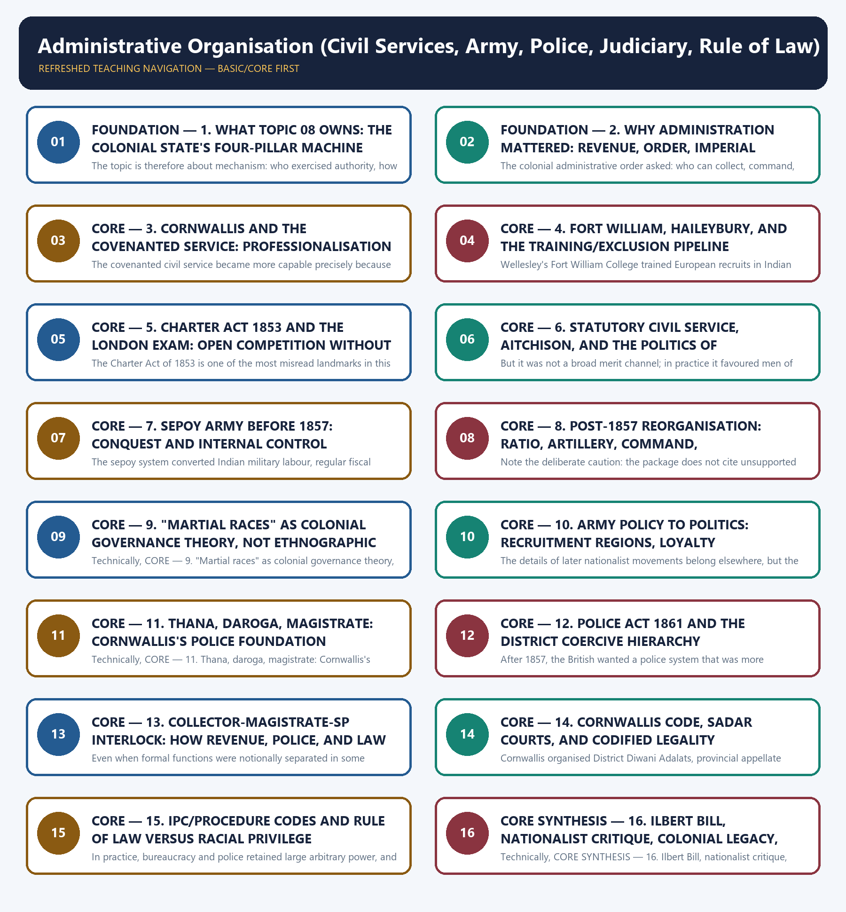

# Administrative Organisation (Civil Services, Army, Police, Judiciary, Rule of Law) — Learner-v2 Complete Learning Session

## BASIC LEARNING SESSION

### DEEP-REVIEW LEARNING CONTRACT

| Control | Binding rule for this package |
|---|---|
| Syllabus boundary | Complete Modern History Core is taught chronologically and causally before optional enrichment. |
| Evidence method | Claim → named Act/treaty/record/organisation/person/region or scholarly evidence → analysis → qualification. |
| Date discipline | Event, proposal, enactment, commencement, official policy, implementation and later interpretation remain distinct. |
| Historiography | Colonial, nationalist, Marxist, subaltern, Cambridge, feminist and other relevant arguments are attributed and tested, never used as labels alone. |
| Practice contract | Every solved item has demand decoding, an examiner-grade model, an executable answer/compression plan, marks rationale and answer-specific improvement. |
| Approval | This immutable successor remains `approved: false` pending explicit approval. |

**Canonical Basic/Core owner:** `upsc-ai-kit\knowledge\Modern-Indian-History\basic\08_Administrative-Organisation.md`  
**Canonical topic owner:** `upsc-ai-kit\knowledge\Modern-Indian-History\basic\08_Administrative-Organisation.md`  
**Optional Advanced owner:** `upsc-ai-kit\knowledge\Modern-Indian-History\advanced\08_Administrative-Organisation.md`  
**Official syllabus mapping:** `upsc-ai-kit\knowledge\Modern-Indian-History\OFFICIAL-UPSC-SYLLABUS-MAPPING.md`

### EVIDENCE, PYQ AND CURRENT-STATUS CONTROL

- **Official and primary evidence:** Acts, charters, treaties, proclamations, committee reports, proceedings, organisational resolutions, speeches and contemporary records are dated and read for authorship and purpose.
- **Regional and social evidence:** petitions, newspapers, memoirs, local studies and material geography qualify elite or all-India generalisation.
- **Economic and quantitative evidence:** revenue, trade, price, wage, craft and mortality claims retain unit, region, period and uncertainty; statistics are never invented.
- **Scholarly interpretation:** historian schools are competing explanations tied to named evidence, not memorised verdicts.
- **PYQ discipline:** repository ledgers and locally held official papers control wording and metadata; reconstructed wording and unavailable official keys remain explicitly labelled.
- **Current-status note, rechecked 2026-08-31:** PIB's 31 July 2025 Mission Karmayogi update and BPR&D's new-criminal-laws hub provide bounded contrasts with colonial recruitment, training, policing and codification. They are not evidence for nineteenth-century institutional facts.

**Live/primary context sources recorded by the predecessor generation:**

- `https://pib.gov.in/PressReleasePage.aspx?PRID=2150998`
- `https://bprd.nic.in/page/new_criminal_laws`




*Distinct embedded teaching-navigation image. The separate continuous Cārvāka-style flowchart package remains an independent at-a-glance artifact.*

#### Source audit, progression and syllabus boundary

- **Foundation:** chronology, institutions, actors and exact terminology.
- **Core:** mechanisms, comparisons, causal chains, Indian agency and exam traps.
- **Core synthesis:** historiography, answer architecture, boundaries and bridges.
- **Optional Advanced:** the separate owner is taught only after Basic practice.
- **Static source order:** repository Markdown -> OCR-searchable Bipan Chandra and Sekhar Bandyopadhyay -> bounded live research; Qdrant not needed.
- **PYQ integrity:** The repository's 2018-2026 PYQ integration audits route zero direct questions to Topic 08. The package therefore uses a transparent zero-PYQ audit and labels any Topic 05, 06 or 09 question only as an adjacent bridge, never as Topic-08-owned.

#### Live-linkage block

✅ **Bounded official institutional links:** PIB's 31 July 2025 Mission Karmayogi update records competency-based civil-service capacity building, while BPR&D's new-criminal-laws hub documents implementation resources for BNS, BNSS and BSA.

⚠️ **Inference boundary:** these sources create a present-day comparison with colonial recruitment, policing and codification. They do not prove any nineteenth-century fact or erase current implementation debates.

### SESSION 1 — FOUNDATION — 1. WHAT TOPIC 08 OWNS: THE COLONIAL STATE'S FOUR-PILLAR MACHINE

#### DEFINITION / WHAT THIS IS CALLED

**Plain-language definition:** Its core subject is the machine by which British rule was made durable on the ground: a superior civil service that monopolised command, an army that conquered and deterred resistance, a police system that enforced order in the district, and a judiciary-plus-code structure that translated coercion into legality.

**Technical definition:** The topic is therefore about mechanism: who exercised authority, how the district state worked, why the administrative order was modern in form yet racial in structure, and how legality and coercion reinforced each other.

#### ANSWER-GRABBING OPENING — WRITE/ADAPT IN THE EXAM

> Topic 08 should be treated as an institutions owner, not as a catch-all colonial-history chapter.

#### MUST-WRITE KEYWORDS

- **FOUNDATION**
- **the colonial state's four-pillar machine**
- **Civil service**
- **Revenue collection, executive command, district governance**
- **Army**
- **1. What Topic 08 owns**

**How to use them:** Frame the answer through FOUNDATION; define the colonial state's four-pillar machine, connect Civil service with Revenue collection, executive command, district governance to explain the mechanism, and use Army for the decisive comparison or qualification.

Topic 08 should be treated as an institutions owner, not as a catch-all colonial-history chapter. Its core subject is the machine by which British rule was made durable on the ground: a superior civil service that monopolised command, an army that conquered and deterred resistance, a police system that enforced order in the district, and a judiciary-plus-code structure that translated coercion into legality. The topic is therefore about mechanism: who exercised authority, how the district state worked, why the administrative order was modern in form yet racial in structure, and how legality and coercion reinforced each other.

| Pillar | Core function | Main chronological anchors | Boundary note |
|---|---|---|---|
| Civil service | Revenue collection, executive command, district governance | Cornwallis, Fort William/Haileybury, Charter Act 1853, Statutory Civil Service, Aitchison | Constitutional representation after 1858 belongs mainly to Topic 12 |
| Army | Conquest, imperial defence, internal control | Pre-1857 sepoy army, post-1857 reorganisation, recruitment doctrine | Campaign detail belongs to Topic 05; revolt politics belongs to Topic 11 |
| Police | Surveillance, coercive order, enforcement in district and thana | Cornwallis thana/daroga system, Police Act 1861 | Public sphere and press-policing overlaps with Topic 09 |
| Judiciary and rule of law | Courts, appeals, codified procedures, official legality | Cornwallis Code, Sadar courts, Law Commission, IPC 1860, Ilbert Bill 1883 | Councils and later representative reforms belong to Topic 12 |

The biggest Topic 08 mistake is to slip from machinery to representation. This topic does not primarily ask whether Indians were represented; it asks how they were ruled. A strong answer therefore explains chains of command, exclusion from superior posts, the district fusion of revenue and coercion, and the contradiction between legal uniformity and racial privilege.

#### CLOSING RECALL FLOW — FOUNDATION — 1. WHAT TOPIC 08 OWNS: THE COLONIAL STATE'S FOUR-PILLAR MACHINE

```text
START / CONCEPT: FOUNDATION — 1. What Topic 08 owns: the colonial state's four-pillar machine
        |
        v
EXACT TERMS: FOUNDATION · the colonial state's four-pillar machine · Civil service · Revenue collection, executive command, district governance · Army · 1. What Topic 08 owns
        |
        v
MECHANISM / ARGUMENT: Its core subject is the machine by which British rule was made durable on the ground: a superior civil service that monopolised command, an army that conquered and deterred resistance, a police system that enforced order in the district, and a judiciary-plus-code structure that translated coercion into legality.
        |
        v
CONSEQUENCE / CONTRAST: The topic is therefore about mechanism: who exercised authority, how the district state worked, why the administrative order was modern in form yet racial in structure, and how legality and coercion reinforced each other.
        |
        v
UPSC TRAP / ANSWER-USE: This topic does not primarily ask whether Indians were represented; it asks how they were ruled.
        |
        v
ANSWER-GRABBING FORMULATION: Topic 08 should be treated as an institutions owner, not as a catch-all colonial-history chapter.
```
### SESSION 2 — FOUNDATION — 2. WHY ADMINISTRATION MATTERED: REVENUE, ORDER, IMPERIAL CONTROL, NOT REPRESENTATION

#### DEFINITION / WHAT THIS IS CALLED

**Plain-language definition:** FOUNDATION — 2. Why administration mattered: revenue, order, imperial control, not representation comprises FOUNDATION, revenue and order as its core connected dimensions.

**Technical definition:** The colonial administrative order asked: who can collect, command, punish, and report upward most efficiently?

#### ANSWER-GRABBING OPENING — WRITE/ADAPT IN THE EXAM

> That is why administration mattered more than ceremony.

#### MUST-WRITE KEYWORDS

- **FOUNDATION**
- **revenue**
- **order**
- **imperial control**
- **not representation**
- **2. Why administration mattered**

**How to use them:** Frame the answer through FOUNDATION; define revenue, connect order with imperial control to explain the mechanism, and use not representation for the decisive comparison or qualification.

The colonial state could not survive on conquest alone. It needed regular land revenue, predictable district supervision, suppression of disorder, and a legal language that turned command into routine governance. That is why administration mattered more than ceremony. British rule did not first create representative institutions and then administer them; it first built extractive and coercive institutions and only much later allowed tightly controlled association.

```text
Land revenue demand
   -> district collector and record system
   -> magisterial authority and police enforcement
   -> courts and codes to make command look legal
   -> army as final guarantee if district coercion failed
   -> imperial control reproduced without popular consent
```

The contrast with representative government should be stated explicitly. A representative order asks: who authorises rule? The colonial administrative order asked: who can collect, command, punish, and report upward most efficiently? Topic 07 supplies the economic extraction angle behind this structure; Topic 08 owns the apparatus that made such extraction possible.

This is why later characterisations such as "steel frame" or "bureaucratic despotism" are useful only when carefully handled. They are not magical quotations that settle the argument. They are analytical descriptions of a state that prized efficiency, hierarchy, and obedience far more than participation.

#### CLOSING RECALL FLOW — FOUNDATION — 2. WHY ADMINISTRATION MATTERED: REVENUE, ORDER, IMPERIAL CONTROL, NOT REPRESENTATION

```text
START / CONCEPT: FOUNDATION — 2. Why administration mattered: revenue, order, imperial control, not representation
        |
        v
EXACT TERMS: FOUNDATION · revenue · order · imperial control · not representation · 2. Why administration mattered
        |
        v
MECHANISM / ARGUMENT: The colonial administrative order asked: who can collect, command, punish, and report upward most efficiently?
        |
        v
CONSEQUENCE / CONTRAST: British rule did not first create representative institutions and then administer them; it first built extractive and coercive institutions and only much later allowed tightly controlled association.
        |
        v
UPSC TRAP / ANSWER-USE: The colonial state could not survive on conquest alone.
        |
        v
ANSWER-GRABBING FORMULATION: That is why administration mattered more than ceremony.
```
### SESSION 3 — CORE — 3. CORNWALLIS AND THE COVENANTED SERVICE: PROFESSIONALISATION PLUS EXCLUSION

#### DEFINITION / WHAT THIS IS CALLED

**Plain-language definition:** The key UPSC line is not "Cornwallis created honest administration." It is: Cornwallis linked professionalisation and exclusion.

**Technical definition:** The covenanted civil service became more capable precisely because it became more exclusive.

#### ANSWER-GRABBING OPENING — WRITE/ADAPT IN THE EXAM

> The key UPSC line is not "Cornwallis created honest administration." It is: Cornwallis linked professionalisation and exclusion.

#### MUST-WRITE KEYWORDS

- **the covenanted service**
- **professionalisation plus exclusion**
- **Higher salaries**
- **Reduced the incentive for overt private corruption**
- **Anti-bribery enforcement**
- **3. Cornwallis**

**How to use them:** Frame the answer through the covenanted service; define professionalisation plus exclusion, connect Higher salaries with Reduced the incentive for overt private corruption to explain the mechanism, and use Anti-bribery enforcement for the decisive comparison or qualification.

Cornwallis stands at the centre of colonial administrative history because he professionalised the higher service while hardening its racial closure. Earlier Company servants had combined trade, private gain, and public office in notoriously corrupt ways. Cornwallis concluded that moral preaching would not suffice. He enforced rules against presents, bribes, and private trade, raised official salaries, and preferred seniority-based promotion so that higher officers would be less dependent on patronage.

| Cornwallis move | Administrative gain | Colonial limit |
|---|---|---|
| Higher salaries | Reduced the incentive for overt private corruption | The remedy was applied to Europeans, not equally to Indians |
| Anti-bribery enforcement | Gave the service discipline and prestige | Discipline served empire, not public representation |
| Seniority promotion | Produced continuity and internal cohesion | Encouraged a closed caste-like service culture |
| Formal exclusion of Indians from superior posts | Preserved European control of command | Turned efficiency into racial monopoly |

The key UPSC line is not "Cornwallis created honest administration." It is: Cornwallis linked professionalisation and exclusion. The covenanted civil service became more capable precisely because it became more exclusive. Repository and OCR evidence alike preserve this point. Superior posts were effectively reserved for Europeans, while Indians were recruited in larger numbers mainly into subordinate levels because they were cheaper and easier to obtain.

So Cornwallis should be taught as a two-sided reformer: anti-corruption in method, anti-equality in structure. That double character is the heart of Topic 08.

#### CLOSING RECALL FLOW — CORE — 3. CORNWALLIS AND THE COVENANTED SERVICE: PROFESSIONALISATION PLUS EXCLUSION

```text
START / CONCEPT: CORE — 3. Cornwallis and the covenanted service: professionalisation plus exclusion
        |
        v
EXACT TERMS: the covenanted service · professionalisation plus exclusion · Higher salaries · Reduced the incentive for overt private corruption · Anti-bribery enforcement · 3. Cornwallis
        |
        v
MECHANISM / ARGUMENT: The covenanted civil service became more capable precisely because it became more exclusive.
        |
        v
CONSEQUENCE / CONTRAST: Cornwallis concluded that moral preaching would not suffice.
        |
        v
UPSC TRAP / ANSWER-USE: Superior posts were effectively reserved for Europeans, while Indians were recruited in larger numbers mainly into subordinate levels because they were cheaper and easier to obtain.
        |
        v
ANSWER-GRABBING FORMULATION: The key UPSC line is not "Cornwallis created honest administration." It is: Cornwallis linked professionalisation and exclusion.
```
### SESSION 4 — CORE — 4. FORT WILLIAM, HAILEYBURY, AND THE TRAINING/EXCLUSION PIPELINE

#### DEFINITION / WHAT THIS IS CALLED

**Plain-language definition:** Fort William College and Haileybury were successive training institutions for European Company civil servants, combining administrative preparation with an exclusive higher-service identity.

**Technical definition:** Wellesley's Fort William College trained European recruits in Indian languages, law and administration from 1800, while the East India College moved training to England and then Haileybury by 1809 under closer Court of Directors control.

#### ANSWER-GRABBING OPENING — WRITE/ADAPT IN THE EXAM

> The shift from Fort William in Calcutta to Haileybury in England shows that colonial training built both practical governing competence and a socially closed European service corps.

#### MUST-WRITE KEYWORDS

- **Fort William College**
- **Wellesley**
- **East India College**
- **Haileybury**

**How to use them:** Define Fort William College as Wellesley's 1800 Calcutta training institution, contrast it with the East India College at Haileybury from 1809, and connect European recruit training to both governing competence and exclusion.

The next question is obvious: if the service was expected to rule vast territories, how were its officers prepared? Wellesley answered this by founding Fort William College at Calcutta in 1800 to train young European recruits in Indian languages, law, and administrative usage. The logic was practical: a district officer governing Indian society needed linguistic and legal competence. Sekhar Bandyopadhyay's account also preserves a sharper ideological edge - the service was to be trained as an imperial governing corps, not merely as clerks.

But Fort William was short-lived as the main training centre. The Court of Directors feared that a Calcutta-based training world might shift loyalties from London to India. Fort William therefore lost its central training role; the East India College was founded at Hertford in 1805 and moved to Haileybury in 1809. Haileybury mattered less because it made officers experts on India and more because it manufactured an exclusive service identity before they arrived.

Two exam traps follow from this sequence:

1. Fort William and Haileybury were institutions for European civil servants, not for Indian aspirants.
2. Fort William came first at Calcutta; Haileybury followed in England.

So the training story is really an exclusion story. The higher service did not merely keep Indians out at the point of appointment; it socialised Europeans into a governing club before posting.

#### CLOSING RECALL FLOW — CORE — 4. FORT WILLIAM, HAILEYBURY, AND THE TRAINING/EXCLUSION PIPELINE

```text
START / CONCEPT: CORE — 4. Fort William, Haileybury, and the training/exclusion pipeline
        |
        v
EXACT TERMS: Fort William College · Wellesley · East India College · Haileybury
        |
        v
MECHANISM / ARGUMENT: Training supplied linguistic and administrative skills while residential socialisation and overseas location reproduced a cohesive European governing identity before district posting.
        |
        v
CONSEQUENCE / CONTRAST: The higher service became more professionally prepared without becoming more accessible to Indians, so competence and racial exclusion developed together.
        |
        v
UPSC TRAP / ANSWER-USE: Do not treat Fort William or Haileybury as colleges created for Indian civil-service aspirants, and do not reverse their chronology.
        |
        v
ANSWER-GRABBING FORMULATION: The shift from Fort William in Calcutta to Haileybury in England shows that colonial training built both practical governing competence and a socially closed European service corps.
```
### SESSION 5 — CORE — 5. CHARTER ACT 1853 AND THE LONDON EXAM: OPEN COMPETITION WITHOUT INDIANISATION

#### DEFINITION / WHAT THIS IS CALLED

**Plain-language definition:** Its importance is real: it introduced the principle of open competitive examination for civil-service recruitment and ended the old nomination monopoly of the Court of Directors.

**Technical definition:** The Charter Act of 1853 is one of the most misread landmarks in this topic.

#### ANSWER-GRABBING OPENING — WRITE/ADAPT IN THE EXAM

> Its importance is real: it introduced the principle of open competitive examination for civil-service recruitment and ended the old nomination monopoly of the Court of Directors.

#### MUST-WRITE KEYWORDS

- **the London exam**
- **open competition without Indianisation**
- **Competitive examination**
- **Selection by merit rather than family nomination alone**
- **Examination was held in England**
- **5. Charter Act 1853**

**How to use them:** Frame the answer through the London exam; define open competition without Indianisation, connect Competitive examination with Selection by merit rather than family nomination alone to explain the mechanism, and use Examination was held in England for the decisive comparison or qualification.

The Charter Act of 1853 is one of the most misread landmarks in this topic. Its importance is real: it introduced the principle of open competitive examination for civil-service recruitment and ended the old nomination monopoly of the Court of Directors. But open competition did not mean practical equality of entry.

| Formal change | What it promised | What limited Indian entry |
|---|---|---|
| Competitive examination | Selection by merit rather than family nomination alone | Examination was held in England |
| Wider legal eligibility | The service was no longer a purely nominated preserve | Travel cost, social location, and educational access favoured British candidates |
| Abolition of Haileybury after 1858 | Recruitment shifted to examination via the Civil Service Commission | The exam remained structurally distant from most Indians |

The user-specified caution is essential: 1853 did not make practical Indian entry easy. Indian candidates had to cross oceans, bear high costs, compete through a curriculum framed by British educational privilege, and later confront age limits that cut their chances further. So 1853 should be written as a formal opening without substantive Indianisation.

This is also the exact bridge to later politics. Once the state proclaimed merit, Indians could ask why the system was still effectively racial. The examination question therefore became a constitutional and moral question, not just a technical one.

#### CLOSING RECALL FLOW — CORE — 5. CHARTER ACT 1853 AND THE LONDON EXAM: OPEN COMPETITION WITHOUT INDIANISATION

```text
START / CONCEPT: CORE — 5. Charter Act 1853 and the London exam: open competition without Indianisation
        |
        v
EXACT TERMS: the London exam · open competition without Indianisation · Competitive examination · Selection by merit rather than family nomination alone · Examination was held in England · 5. Charter Act 1853
        |
        v
MECHANISM / ARGUMENT: Indian candidates had to cross oceans, bear high costs, compete through a curriculum framed by British educational privilege, and later confront age limits that cut their chances further.
        |
        v
CONSEQUENCE / CONTRAST: The user-specified caution is essential: 1853 did not make practical Indian entry easy.
        |
        v
UPSC TRAP / ANSWER-USE: The examination question therefore became a constitutional and moral question, not just a technical one.
        |
        v
ANSWER-GRABBING FORMULATION: Its importance is real: it introduced the principle of open competitive examination for civil-service recruitment and ended the old nomination monopoly of the Court of Directors.
```
### SESSION 6 — CORE — 6. STATUTORY CIVIL SERVICE, AITCHISON, AND THE POLITICS OF INDIANISATION

#### DEFINITION / WHAT THIS IS CALLED

**Plain-language definition:** By the later nineteenth century, Indianisation had become a public grievance.

**Technical definition:** But it was not a broad merit channel; in practice it favoured men of respectable or aristocratic family background and did not dismantle the monopoly of the superior service.

#### ANSWER-GRABBING OPENING — WRITE/ADAPT IN THE EXAM

> But it was not a broad merit channel; in practice it favoured men of respectable or aristocratic family background and did not dismantle the monopoly of the superior service.

#### MUST-WRITE KEYWORDS

- **Aitchison**
- **the politics of Indianisation**
- **Simultaneous exam**
- **Repeated resistance from European officialdom**
- **Monopoly substantially preserved**
- **6. Statutory Civil Service**

**How to use them:** Frame the answer through Aitchison; define the politics of Indianisation, connect Simultaneous exam with Repeated resistance from European officialdom to explain the mechanism, and use Monopoly substantially preserved for the decisive comparison or qualification.

By the later nineteenth century, Indianisation had become a public grievance. The issue was not just jobs. It involved dignity, economy, and political trust. Indians argued that an Indianised administration would be less racially aloof, less expensive, and more responsive to local society. Nationalists also demanded simultaneous civil-service examinations in India and England so that legal eligibility could become real eligibility.

The colonial response remained guarded. Lytton's Statutory Civil Service of 1878-79 offered a narrow nominated route for a few Indians into higher positions. But it was not a broad merit channel; in practice it favoured men of respectable or aristocratic family background and did not dismantle the monopoly of the superior service. The Aitchison Commission of 1886 then addressed the public services, classification, and the Indianisation question. Its significance lies not in a dramatic transfer of power but in showing that the issue could no longer be dismissed as marginal.

| Demand | Indian argument | Colonial answer | Result |
|---|---|---|---|
| Simultaneous exam | Merit should be accessible in India too | Repeated resistance from European officialdom | Monopoly substantially preserved |
| Wider Indian entry | Administration should know the people it governs | Limited nominated concessions | Symbolic rather than equal |
| Service reform | Classification and promotion needed review | Aitchison Commission, 1886 | Recognition without parity |

Thus Indianisation should be written as a politics of constrained concession. The service remained command-heavy and racially guarded, but the demand against exclusion had become a durable nationalist theme.

#### CLOSING RECALL FLOW — CORE — 6. STATUTORY CIVIL SERVICE, AITCHISON, AND THE POLITICS OF INDIANISATION

```text
START / CONCEPT: CORE — 6. Statutory Civil Service, Aitchison, and the politics of Indianisation
        |
        v
EXACT TERMS: Aitchison · the politics of Indianisation · Simultaneous exam · Repeated resistance from European officialdom · Monopoly substantially preserved · 6. Statutory Civil Service
        |
        v
MECHANISM / ARGUMENT: By the later nineteenth century, Indianisation had become a public grievance.
        |
        v
CONSEQUENCE / CONTRAST: Thus Indianisation should be written as a politics of constrained concession.
        |
        v
UPSC TRAP / ANSWER-USE: The service remained command-heavy and racially guarded, but the demand against exclusion had become a durable nationalist theme.
        |
        v
ANSWER-GRABBING FORMULATION: But it was not a broad merit channel; in practice it favoured men of respectable or aristocratic family background and did not dismantle the monopoly of the superior service.
```
### SESSION 7 — CORE — 7. SEPOY ARMY BEFORE 1857: CONQUEST AND INTERNAL CONTROL

#### DEFINITION / WHAT THIS IS CALLED

**Plain-language definition:** Before 1857, the Company army combined predominantly Indian rank-and-file manpower with European command to conquer territories and reinforce internal colonial order.

**Technical definition:** The sepoy system converted Indian military labour, regular fiscal support, regimental discipline and a British officer monopoly into a force usable for both external campaigns and domestic coercive reserve.

#### ANSWER-GRABBING OPENING — WRITE/ADAPT IN THE EXAM

> The pre-1857 Company army was not only a battlefield institution; it was the military foundation of conquest and the final enforcement arm behind district administration.

#### MUST-WRITE KEYWORDS

- **sepoy army**
- **Indian rank and file**
- **European command**
- **regular pay**
- **territorial conquest**
- **internal control**

**How to use them:** Define the manpower-command structure, separate Topic 05 campaign detail from Topic 08 administration, and show how regular pay, discipline and fiscal capacity supported conquest and internal order.

The second pillar of British rule was the army. Its genius, from the colonial point of view, was that it was predominantly Indian in rank and file but European in command. This allowed the Company to conquer Indian powers, defend imperial interests, and police the interior without bearing the full cost of a wholly European force.

Three points matter most. First, the sepoy army was an instrument of conquest, and the campaign history of Mysore, the Marathas, Sindh, and the Sikhs belongs largely to Topic 05. Second, it was also an internal-security institution. The army stood behind the district state whenever civil authority failed. Third, it worked because soldiers were paid regularly, drilled steadily, and officered by a British command structure that monopolised higher authority.

This explains an apparent paradox: how could Indians help conquer India? The answer is historical, not moralistic. Modern Indian nationalism did not yet organise soldierly loyalty. The sepoy served the paymaster, the regiment, and the commanding structure. British fiscal capacity gave that structure regularity which many Indian polities, under stress, could not match for long periods.

So the pre-1857 army should not be reduced to battle statistics. It should be understood as a disciplined military labour system resting on Indian manpower and European command.

#### CLOSING RECALL FLOW — CORE — 7. SEPOY ARMY BEFORE 1857: CONQUEST AND INTERNAL CONTROL

```text
START / CONCEPT: CORE — 7. Sepoy army before 1857: conquest and internal control
        |
        v
EXACT TERMS: sepoy army · Indian rank and file · European command · regular pay · territorial conquest · internal control
        |
        v
MECHANISM / ARGUMENT: Company revenue financed regular military labour, British officers monopolised higher command and the army backed civil authority when ordinary district coercion proved insufficient.
        |
        v
CONSEQUENCE / CONTRAST: A relatively small European ruling establishment could expand territorially and police a much larger population through Indian manpower organised under colonial command.
        |
        v
UPSC TRAP / ANSWER-USE: Do not reduce the sepoy army to battle lists or assume that later Indian nationalism already determined soldiers' loyalties before 1857.
        |
        v
ANSWER-GRABBING FORMULATION: The pre-1857 Company army was not only a battlefield institution; it was the military foundation of conquest and the final enforcement arm behind district administration.
```
### SESSION 8 — CORE — 8. POST-1857 REORGANISATION: RATIO, ARTILLERY, COMMAND, FRAGMENTATION

#### DEFINITION / WHAT THIS IS CALLED

**Plain-language definition:** What matters is the direction of policy - raise the European share, secure artillery, fragment recruitment, and prevent a repeat of 1857's cross-unit contagion.

**Technical definition:** Note the deliberate caution: the package does not cite unsupported post-1857 ratios.

#### ANSWER-GRABBING OPENING — WRITE/ADAPT IN THE EXAM

> Note the deliberate caution: the package does not cite unsupported post-1857 ratios.

#### MUST-WRITE KEYWORDS

- **ratio**
- **artillery**
- **command**
- **fragmentation**
- **Higher European proportion in key arms and commands**
- **8. Post-1857 reorganisation**

**How to use them:** Frame the answer through ratio; define artillery, connect command with fragmentation to explain the mechanism, and use Higher European proportion in key arms and commands for the decisive comparison or qualification.

The revolt of 1857 forced the British to rethink the army as a political problem. The lesson drawn by the Raj was not that Indian manpower could be abandoned. It was that Indian manpower must never again achieve dangerous cohesion. Hence the reorganisation after 1857 changed composition, control, and recruitment logic.

| Perceived lesson of 1857 | Reorganising response | Political meaning |
|---|---|---|
| Too much common sepoy solidarity is dangerous | Higher European proportion in key arms and commands | Trust was limited structurally, not rhetorically |
| Heavy weapons should not be left vulnerable | Artillery was kept largely under European hands | Firepower became a racial command question |
| Broadly similar recruitment can aid collective revolt | Recruitment was fragmented by caste, religion, and region | Divide-and-rule was built into personnel policy |
| District disorder can become military rebellion | Army and civil authority were more tightly watched | Military policy became governance policy |

Note the deliberate caution: the package does not cite unsupported post-1857 ratios. What matters is the direction of policy - raise the European share, secure artillery, fragment recruitment, and prevent a repeat of 1857's cross-unit contagion.

This is the proper bridge to Topic 11. Topic 11 owns the revolt's causes and spread; Topic 08 owns the institutional lesson the rulers drew from it.

#### CLOSING RECALL FLOW — CORE — 8. POST-1857 REORGANISATION: RATIO, ARTILLERY, COMMAND, FRAGMENTATION

```text
START / CONCEPT: CORE — 8. Post-1857 reorganisation: ratio, artillery, command, fragmentation
        |
        v
EXACT TERMS: ratio · artillery · command · fragmentation · Higher European proportion in key arms and commands · 8. Post-1857 reorganisation
        |
        v
MECHANISM / ARGUMENT: The lesson drawn by the Raj was not that Indian manpower could be abandoned.
        |
        v
CONSEQUENCE / CONTRAST: What matters is the direction of policy - raise the European share, secure artillery, fragment recruitment, and prevent a repeat of 1857's cross-unit contagion.
        |
        v
UPSC TRAP / ANSWER-USE: It was that Indian manpower must never again achieve dangerous cohesion.
        |
        v
ANSWER-GRABBING FORMULATION: Note the deliberate caution: the package does not cite unsupported post-1857 ratios.
```
### SESSION 9 — CORE — 9. "MARTIAL RACES" AS COLONIAL GOVERNANCE THEORY, NOT ETHNOGRAPHIC TRUTH

#### DEFINITION / WHAT THIS IS CALLED

**Plain-language definition:** The phrase "martial races" must never be written as if it described scientific reality.

**Technical definition:** Technically, CORE — 9. "Martial races" as colonial governance theory, not ethnographic truth is analysed by relating not ethnographic truth to "Certain races were naturally martial.", then testing the relationship through "The doctrine reflected objective Indian ethnology." and The doctrine reflected colonial stereotypes and governance needs.

#### ANSWER-GRABBING OPENING — WRITE/ADAPT IN THE EXAM

> Groups such as Pathans, Jats, Rajputs, and Gurkhas were valorised in colonial military discourse, while others were downgraded.

#### MUST-WRITE KEYWORDS

- **not ethnographic truth**
- **"Certain races were naturally martial."**
- **"The doctrine reflected objective Indian ethnology."**
- **The doctrine reflected colonial stereotypes and governance needs**
- **It**
- **9. "Martial races" as colonial governance theory**

**How to use them:** Frame the answer through not ethnographic truth; define "Certain races were naturally martial.", connect "The doctrine reflected objective Indian ethnology." with The doctrine reflected colonial stereotypes and governance needs to explain the mechanism, and use It for the decisive comparison or qualification.

The phrase "martial races" must never be written as if it described scientific reality. It was a colonial ideology used to classify some communities as especially fit for soldiering and others as less trustworthy or less martial. In administrative practice, it justified selective recruitment and helped stabilise European command.

The theory worked by combining stereotype and utility. Groups such as Pathans, Jats, Rajputs, and Gurkhas were valorised in colonial military discourse, while others were downgraded. The point was not neutral ethnography. It was to create a soldierly order in which supposedly "warlike" groups would fight under British officers while remaining segmented from one another.

| Wrong way to write it | Correct Topic 08 formulation |
|---|---|
| "Certain races were naturally martial." | The Raj classified certain communities as "martial" for recruitment purposes |
| "The doctrine reflected objective Indian ethnology." | The doctrine reflected colonial stereotypes and governance needs |
| "Martial races explains Indian military history." | The doctrine explains British recruitment policy after 1857 |

This doctrinal point matters beyond the barracks. Once recruitment becomes theory-laden, ethnography becomes governance. Colonial knowledge produced categories and then ruled through them.

#### CLOSING RECALL FLOW — CORE — 9. "MARTIAL RACES" AS COLONIAL GOVERNANCE THEORY, NOT ETHNOGRAPHIC TRUTH

```text
START / CONCEPT: CORE — 9. "Martial races" as colonial governance theory, not ethnographic truth
        |
        v
EXACT TERMS: not ethnographic truth · "Certain races were naturally martial." · "The doctrine reflected objective Indian ethnology." · The doctrine reflected colonial stereotypes and governance needs · It · 9. "Martial races" as colonial governance theory
        |
        v
MECHANISM / ARGUMENT: The phrase "martial races" must never be written as if it described scientific reality.
        |
        v
CONSEQUENCE / CONTRAST: It was to create a soldierly order in which supposedly "warlike" groups would fight under British officers while remaining segmented from one another.
        |
        v
UPSC TRAP / ANSWER-USE: Do not miss this limiting distinction: it was a colonial ideology used to classify some communities as especially fit for...
        |
        v
ANSWER-GRABBING FORMULATION: Groups such as Pathans, Jats, Rajputs, and Gurkhas were valorised in colonial military discourse, while others were downgraded.
```
### SESSION 10 — CORE — 10. ARMY POLICY TO POLITICS: RECRUITMENT REGIONS, LOYALTY ENGINEERING, LATER BLOWBACK

#### DEFINITION / WHAT THIS IS CALLED

**Plain-language definition:** The safe UPSC formulation is therefore: recruitment policy was a political technology.

**Technical definition:** The details of later nationalist movements belong elsewhere, but the institutional origin of those later tensions is owned here.

#### ANSWER-GRABBING OPENING — WRITE/ADAPT IN THE EXAM

> The safe UPSC formulation is therefore: recruitment policy was a political technology.

#### MUST-WRITE KEYWORDS

- **recruitment regions**
- **loyalty engineering**
- **later blowback**
- **Recruitment**
- **Religious**
- **10. Army policy to politics**

**How to use them:** Frame the answer through recruitment regions; define loyalty engineering, connect later blowback with Recruitment to explain the mechanism, and use Religious for the decisive comparison or qualification.

Post-1857 army policy shaped politics outside the cantonment too. Recruitment became regionally weighted, culturally curated, and tied to loyalty management. The Raj encouraged regimental honour, controlled separation between communities, and cultivated the idea that the soldier owed fidelity to the salt of the master who paid him. Religious practice and martial self-image were not ignored; they were administered.

This had three political consequences. First, recruitment created privileged military regions and pension societies. Second, the army became a standing reminder that empire relied on Indian bodies under foreign command. Third, the system eventually showed limits. Later history supplied moments of blowback: wartime recruitment pressure could breed resentment, and twentieth-century episodes such as the Garhwali refusal at Peshawar or the INA/RIN challenge showed that the dream of permanently depoliticised Indian military labour was never fully secure.

The safe UPSC formulation is therefore: recruitment policy was a political technology. It distributed material benefit, shaped regional relationships with the Raj, and sought to prevent army-wide solidarity. The details of later nationalist movements belong elsewhere, but the institutional origin of those later tensions is owned here.

#### CLOSING RECALL FLOW — CORE — 10. ARMY POLICY TO POLITICS: RECRUITMENT REGIONS, LOYALTY ENGINEERING, LATER BLOWBACK

```text
START / CONCEPT: CORE — 10. Army policy to politics: recruitment regions, loyalty engineering, later blowback
        |
        v
EXACT TERMS: recruitment regions · loyalty engineering · later blowback · Recruitment · Religious · 10. Army policy to politics
        |
        v
MECHANISM / ARGUMENT: Later history supplied moments of blowback: wartime recruitment pressure could breed resentment, and twentieth-century episodes such as the Garhwali refusal at Peshawar or the INA/RIN challenge showed that the dream of permanently depoliticised Indian military labour was never fully secure.
        |
        v
CONSEQUENCE / CONTRAST: The details of later nationalist movements belong elsewhere, but the institutional origin of those later tensions is owned here.
        |
        v
UPSC TRAP / ANSWER-USE: Religious practice and martial self-image were not ignored; they were administered.
        |
        v
ANSWER-GRABBING FORMULATION: The safe UPSC formulation is therefore: recruitment policy was a political technology.
```
### SESSION 11 — CORE — 11. THANA, DAROGA, MAGISTRATE: CORNWALLIS'S POLICE FOUNDATION

#### DEFINITION / WHAT THIS IS CALLED

**Plain-language definition:** CORE — 11. Thana, daroga, magistrate: Cornwallis's police foundation comprises daroga, magistrate and Cornwallis's police foundation as its core connected dimensions.

**Technical definition:** Technically, CORE — 11. Thana, daroga, magistrate: Cornwallis's police foundation is analysed by relating daroga to magistrate, then testing the relationship through Cornwallis's police foundation and Cornwallis.

#### ANSWER-GRABBING OPENING — WRITE/ADAPT IN THE EXAM

> This is the key chronology warning: thana and daroga are earlier than the Police Act of 1861.

#### MUST-WRITE KEYWORDS

- **daroga**
- **magistrate**
- **Cornwallis's police foundation**
- **Cornwallis**
- **Each**
- **11. Thana**

**How to use them:** Frame the answer through daroga; define magistrate, connect Cornwallis's police foundation with Cornwallis to explain the mechanism, and use Each for the decisive comparison or qualification.

The third pillar was the police. Cornwallis relieved zamindars of police functions and built a more regular structure around circles or thanas. Each thana was headed by a daroga, usually an Indian subordinate official, while village watchmen continued at the village level. The logic was straightforward: order should not depend on semi-autonomous landed intermediaries if the colonial state wanted predictable control.

This is the key chronology warning: thana and daroga are earlier than the Police Act of 1861. They belong to Cornwallis's police foundation. The 1861 Act later gave statutory and more standardised shape to a structure whose roots were older.

The police had a mixed administrative reputation. It could suppress major crimes and aid order, but it was also feared, extortionary, and unsympathetic in ordinary life. Colonial criticism itself sometimes admitted this. That is why Topic 08 should describe the police as an order-serving body, not a rights-protecting public service in the modern democratic sense.

So whenever a question says "police reform under the British," first separate the Cornwallis foundation from the 1861 statutory structure. That distinction alone solves many close-option errors.

#### CLOSING RECALL FLOW — CORE — 11. THANA, DAROGA, MAGISTRATE: CORNWALLIS'S POLICE FOUNDATION

```text
START / CONCEPT: CORE — 11. Thana, daroga, magistrate: Cornwallis's police foundation
        |
        v
EXACT TERMS: daroga · magistrate · Cornwallis's police foundation · Cornwallis · Each · 11. Thana
        |
        v
MECHANISM / ARGUMENT: Each thana was headed by a daroga, usually an Indian subordinate official, while village watchmen continued at the village level.
        |
        v
CONSEQUENCE / CONTRAST: That is why Topic 08 should describe the police as an order-serving body, not a rights-protecting public service in the modern democratic sense.
        |
        v
UPSC TRAP / ANSWER-USE: Do not miss this limiting distinction: cornwallis relieved zamindars of police functions and built a more regular structure around circles...
        |
        v
ANSWER-GRABBING FORMULATION: This is the key chronology warning: thana and daroga are earlier than the Police Act of 1861.
```
### SESSION 12 — CORE — 12. POLICE ACT 1861 AND THE DISTRICT COERCIVE HIERARCHY

#### DEFINITION / WHAT THIS IS CALLED

**Plain-language definition:** The safest concluding line is simple: Police Act 1861 created a durable colonial police framework for order and control, not a people-centred rights architecture.

**Technical definition:** After 1857, the British wanted a police system that was more dependable, centralised, and subordinated to district executive authority.

#### ANSWER-GRABBING OPENING — WRITE/ADAPT IN THE EXAM

> The safest concluding line is simple: Police Act 1861 created a durable colonial police framework for order and control, not a people-centred rights architecture.

#### MUST-WRITE KEYWORDS

- **the district coercive hierarchy**
- **Province**
- **Inspector-General**
- **District**
- **Superintendent of Police**
- **12. Police Act 1861**

**How to use them:** Frame the answer through the district coercive hierarchy; define Province, connect Inspector-General with District to explain the mechanism, and use Superintendent of Police for the decisive comparison or qualification.

After 1857, the British wanted a police system that was more dependable, centralised, and subordinated to district executive authority. The Police Act of 1861 supplied the durable structure: provincial leadership under an Inspector-General, district organisation under a Superintendent of Police, and routine alignment with the magistracy. This was not a police of local consent. It was a police of orderly subordination.

| Level | Office | Institutional meaning |
|---|---|---|
| Province | Inspector-General | Police became a regular administrative branch |
| District | Superintendent of Police | Daily coercive command was district-based |
| District executive link | Magistrate / collector-magistrate oversight | Police remained tied to civil authority, not autonomous citizenship protection |
| Lower field structure | Thanas and subordinate officers | Local reach of the coercive state |

The 1861 Act must therefore be read in two ways at once. It modernised organisation by making police hierarchy more regular. But it also deepened coercive capacity by placing that hierarchy squarely within the district state. Later punitive and surveillance uses of the police were built on this foundation.

The safest concluding line is simple: Police Act 1861 created a durable colonial police framework for order and control, not a people-centred rights architecture.

#### CLOSING RECALL FLOW — CORE — 12. POLICE ACT 1861 AND THE DISTRICT COERCIVE HIERARCHY

```text
START / CONCEPT: CORE — 12. Police Act 1861 and the district coercive hierarchy
        |
        v
EXACT TERMS: the district coercive hierarchy · Province · Inspector-General · District · Superintendent of Police · 12. Police Act 1861
        |
        v
MECHANISM / ARGUMENT: After 1857, the British wanted a police system that was more dependable, centralised, and subordinated to district executive authority.
        |
        v
CONSEQUENCE / CONTRAST: This was not a police of local consent.
        |
        v
UPSC TRAP / ANSWER-USE: Do not miss this limiting distinction: the 1861 Act must therefore be read in two ways at once.
        |
        v
ANSWER-GRABBING FORMULATION: The safest concluding line is simple: Police Act 1861 created a durable colonial police framework for order and control, not a people-centred rights architecture.
```
### SESSION 13 — CORE — 13. COLLECTOR-MAGISTRATE-SP INTERLOCK: HOW REVENUE, POLICE, AND LAW FUSED ON THE GROUND

#### DEFINITION / WHAT THIS IS CALLED

**Plain-language definition:** CORE — 13. Collector-magistrate-SP interlock: how revenue, police, and law fused on the ground comprises how revenue, police and law fused on the ground as its core connected dimensions.

**Technical definition:** Even when formal functions were notionally separated in some phases, the lived colonial state fused revenue, magisterial authority, police force, and legal procedure into one operating system.

#### ANSWER-GRABBING OPENING — WRITE/ADAPT IN THE EXAM

> OCR corroboration is particularly useful here: by the 1830s the district collector again carried heavy combinations of revenue, magisterial, and some judicial responsibilities, while the 1861 police remained subordinate to district civilian authority.

#### MUST-WRITE KEYWORDS

- **how revenue**
- **police**
- **law fused on the ground**
- **Even**
- **That**
- **13. Collector-magistrate-SP interlock**

**How to use them:** Frame the answer through how revenue; define police, connect law fused on the ground with Even to explain the mechanism, and use That for the decisive comparison or qualification.

The district was the real workshop of empire. Even when formal functions were notionally separated in some phases, the lived colonial state fused revenue, magisterial authority, police force, and legal procedure into one operating system. That is why the collector-magistrate-SP relationship matters so much.

```text
Assessment and records
   -> collector's revenue demand
Default, dispute, protest, suspicion
   -> magistrate's authority and order
Search, arrest, patrol, enforcement
   -> police through thana and district chain
Charge, trial, decree, punishment
   -> courts and procedure
Escalation beyond district capacity
   -> army as final reserve
```

Cornwallis had separated judge and collector in principle on the civil side, and that institutional move should not be erased. But the broader district state kept drawing powers back together. OCR corroboration is particularly useful here: by the 1830s the district collector again carried heavy combinations of revenue, magisterial, and some judicial responsibilities, while the 1861 police remained subordinate to district civilian authority.

This interlock explains why peasants, townspeople, and nationalists often experienced different branches of government as one coercive whole. Topic 07 shows what was being extracted; Topic 08 shows how the district machine extracted and enforced it.

#### CLOSING RECALL FLOW — CORE — 13. COLLECTOR-MAGISTRATE-SP INTERLOCK: HOW REVENUE, POLICE, AND LAW FUSED ON THE GROUND

```text
START / CONCEPT: CORE — 13. Collector-magistrate-SP interlock: how revenue, police, and law fused on the ground
        |
        v
EXACT TERMS: how revenue · police · law fused on the ground · Even · That · 13. Collector-magistrate-SP interlock
        |
        v
MECHANISM / ARGUMENT: Even when formal functions were notionally separated in some phases, the lived colonial state fused revenue, magisterial authority, police force, and legal procedure into one operating system.
        |
        v
CONSEQUENCE / CONTRAST: Cornwallis had separated judge and collector in principle on the civil side, and that institutional move should not be erased.
        |
        v
UPSC TRAP / ANSWER-USE: Do not miss this limiting distinction: this interlock explains why peasants, townspeople.
        |
        v
ANSWER-GRABBING FORMULATION: OCR corroboration is particularly useful here: by the 1830s the district collector again carried heavy combinations of revenue, magisterial, and some judicial responsibilities, while the 1861 police remained subordinate to district civilian authority.
```
### SESSION 14 — CORE — 14. CORNWALLIS CODE, SADAR COURTS, AND CODIFIED LEGALITY

#### DEFINITION / WHAT THIS IS CALLED

**Plain-language definition:** The Cornwallis Code of 1793 gave colonial civil and criminal justice a more regular hierarchy of district, provincial and Sadar courts while retaining European control at the commanding levels.

**Technical definition:** Cornwallis organised District Diwani Adalats, provincial appellate channels, Courts of Circuit, the Sadar Diwani Adalat and Sadar Nizamat Adalat, with Indian Munsifs and Amins concentrated in subordinate judicial work.

#### ANSWER-GRABBING OPENING — WRITE/ADAPT IN THE EXAM

> The Cornwallis Code of 1793 organised Sadar courts and lower judicial layers into a more regular colonial hierarchy, making codified legality more predictable without making justice racially or socially equal.

#### MUST-WRITE KEYWORDS

- **Cornwallis Code 1793**
- **District Diwani Adalat**
- **Sadar Diwani Adalat**
- **Courts of Circuit**
- **Sadar Nizamat Adalat**
- **Munsifs and Amins**

**How to use them:** Define the Cornwallis Code of 1793, map the District and Sadar Diwani Adalats alongside Courts of Circuit and the Sadar Nizamat Adalat, place Munsifs and Amins below, and distinguish codified legality from equal justice.

British judicial organisation in India did not begin from nothing with Cornwallis, because Warren Hastings had already started institutional change. But Cornwallis stabilised the system in 1793 and gave it recognisable hierarchy. District Diwani Adalats dealt with civil matters; appeals moved upward through provincial levels to the Sadar Diwani Adalat. On the criminal side, Courts of Circuit and the Sadar Nizamat Adalat stood at the higher levels, while Indian subordinate judicial personnel such as Munsifs and Amins worked below.

| Judicial layer | Core role |
|---|---|
| District civil court | Everyday civil adjudication |
| Provincial appeal structure | Review of lower civil decisions |
| Sadar Diwani Adalat | Highest civil appellate authority in the old structure |
| Courts of Circuit / criminal layers | Criminal trials above petty level |
| Sadar Nizamat Adalat | Highest criminal authority in the old structure |
| Munsifs and Amins | Subordinate judicial work with Indian personnel |

Two analytical points are vital. First, the British made justice more hierarchical and more regular in procedure. Second, this did not mean power became socially equal. European superintendence remained decisive at the higher levels. Bentinck later reworked parts of the system and enlarged Indian subordinate judicial responsibilities, but the central feature stayed intact: the colonial state sought a court order that was regular enough to govern efficiently.

So the Cornwallis Code should be described as a major step in judicial structuring, not as the arrival of social justice.

#### CLOSING RECALL FLOW — CORE — 14. CORNWALLIS CODE, SADAR COURTS, AND CODIFIED LEGALITY

```text
START / CONCEPT: CORE — 14. Cornwallis Code, Sadar courts, and codified legality
        |
        v
EXACT TERMS: Cornwallis Code 1793 · District Diwani Adalat · Sadar Diwani Adalat · Courts of Circuit · Sadar Nizamat Adalat · Munsifs and Amins
        |
        v
MECHANISM / ARGUMENT: A graded court hierarchy, written procedures and appellate supervision made adjudication more regular and governable while reserving decisive authority for the colonial state.
        |
        v
CONSEQUENCE / CONTRAST: Colonial legality became more predictable and administratively usable, yet procedural modernisation coexisted with racial hierarchy and coercive imperial purposes.
        |
        v
UPSC TRAP / ANSWER-USE: Do not claim that Cornwallis created British judicial organisation from nothing or equate codified hierarchy with social justice and racial equality.
        |
        v
ANSWER-GRABBING FORMULATION: The Cornwallis Code of 1793 organised Sadar courts and lower judicial layers into a more regular colonial hierarchy, making codified legality more predictable without making justice racially or socially equal.
```
### SESSION 15 — CORE — 15. IPC/PROCEDURE CODES AND RULE OF LAW VERSUS RACIAL PRIVILEGE

#### DEFINITION / WHAT THIS IS CALLED

**Plain-language definition:** The exact required line is this: codification was genuine legal modernisation inside a racial and repressive colonial order.

**Technical definition:** In practice, bureaucracy and police retained large arbitrary power, and racial privilege cut through the promise of equal legality.

#### ANSWER-GRABBING OPENING — WRITE/ADAPT IN THE EXAM

> The exact required line is this: codification was genuine legal modernisation inside a racial and repressive colonial order.

#### MUST-WRITE KEYWORDS

- **rule of law versus racial privilege**
- **Greater uniformity of criminal law**
- **Predictable procedure**
- **Social access to justice remained unequal**
- **Territorial legal unification**
- **15. IPC/procedure codes**

**How to use them:** Frame the answer through rule of law versus racial privilege; define Greater uniformity of criminal law, connect Predictable procedure with Social access to justice remained unequal to explain the mechanism, and use Territorial legal unification for the decisive comparison or qualification.

The next phase was codification. The Charter Act of 1833 concentrated lawmaking power in the Governor-General-in-Council and opened the way for systematic legislative work. The Law Commission tradition associated with Macaulay then pushed toward codified, all-India legal uniformity. The Indian Penal Code was enacted in 1860; civil and criminal procedure codes followed in the same wider codifying stream.

This mattered genuinely. India was increasingly governed by written, enacted, discussable law rather than only by dispersed custom or ruler's discretion. In that limited but real sense, codification was legal modernisation.

Yet the second half of the answer must be written with equal firmness. Rule of law in theory meant rule according to known law, defined rights and duties, and at least formal liability of officials for excess. In practice, bureaucracy and police retained large arbitrary power, and racial privilege cut through the promise of equal legality. Repressive use of law was not an accidental distortion of codification; it lived inside the same legal order.

| Genuine gain | Enduring colonial ceiling |
|---|---|
| Greater uniformity of criminal law | The same system could criminalise dissent |
| Predictable procedure | Social access to justice remained unequal |
| Territorial legal unification | Racial privilege survived inside the "uniform" order |
| Formal rule-bound governance | Executive power remained strong on the ground |

The exact required line is this: codification was genuine legal modernisation inside a racial and repressive colonial order.

#### CLOSING RECALL FLOW — CORE — 15. IPC/PROCEDURE CODES AND RULE OF LAW VERSUS RACIAL PRIVILEGE

```text
START / CONCEPT: CORE — 15. IPC/procedure codes and rule of law versus racial privilege
        |
        v
EXACT TERMS: rule of law versus racial privilege · Greater uniformity of criminal law · Predictable procedure · Social access to justice remained unequal · Territorial legal unification · 15. IPC/procedure codes
        |
        v
MECHANISM / ARGUMENT: In practice, bureaucracy and police retained large arbitrary power, and racial privilege cut through the promise of equal legality.
        |
        v
CONSEQUENCE / CONTRAST: In that limited but real sense, codification was legal modernisation.
        |
        v
UPSC TRAP / ANSWER-USE: Repressive use of law was not an accidental distortion of codification; it lived inside the same legal order.
        |
        v
ANSWER-GRABBING FORMULATION: The exact required line is this: codification was genuine legal modernisation inside a racial and repressive colonial order.
```
### SESSION 16 — CORE SYNTHESIS — 16. ILBERT BILL, NATIONALIST CRITIQUE, COLONIAL LEGACY, AND BOUNDED CURRENT BRIDGE

#### DEFINITION / WHAT THIS IS CALLED

**Plain-language definition:** The Ilbert Bill controversy of 1883 is the decisive episode for exposing the ceiling of colonial legality.

**Technical definition:** Technically, CORE SYNTHESIS — 16. Ilbert Bill, nationalist critique, colonial legacy, and bounded current bridge is analysed by relating CORE SYNTHESIS to nationalist critique, then testing the relationship through colonial legacy and bounded current bridge.

#### ANSWER-GRABBING OPENING — WRITE/ADAPT IN THE EXAM

> The Ilbert Bill controversy of 1883 is the decisive episode for exposing the ceiling of colonial legality.

#### MUST-WRITE KEYWORDS

- **CORE SYNTHESIS**
- **nationalist critique**
- **colonial legacy**
- **bounded current bridge**
- **The Ilbert Bill controversy of 1883**
- **16. Ilbert Bill**

**How to use them:** Frame the answer through CORE SYNTHESIS; define nationalist critique, connect colonial legacy with bounded current bridge to explain the mechanism, and use The Ilbert Bill controversy of 1883 for the decisive comparison or qualification.

The Ilbert Bill controversy of 1883 is the decisive episode for exposing the ceiling of colonial legality. Ripon's law member, C.P. Ilbert, proposed that Indian district magistrates and session judges should be able to try European offenders in the mofussil. The measure did not abolish empire. It merely tested whether the state's own proclaimed equality before law could cross the colour line.

European opposition - the so-called white mutiny around the bill - revealed that many colonials accepted legality only so long as racial privilege remained untouched. The final compromise diluted the principle. That is why the Ilbert controversy belongs squarely in Topic 08: it shows that the rule of law was formally asserted but racially bounded in operation.

This section also needs strict topic boundaries. The press campaign and public agitation around Ilbert touches Topic 09's public-sphere story, but Topic 08 owns the judicial-racial contradiction itself. The revolt of 1857 as a political event belongs to Topic 11, though this topic owns the administrative and military lessons drawn from it. Councils, local self-government, and later representative concessions after 1858 belong mainly to Topic 12.

The legacy line should be balanced. Independent India inherited district administration, service traditions, police hierarchy, and a codified legal order, but not the legitimacy of colonial purpose. That is why the current bridge must stay bounded. Mission Karmayogi's capacity-building platform and the BPRD new criminal laws hub show that modern India still treats civil-service capability and criminal-justice architecture as state essentials. They do not prove that colonial administration was benign. They only remind us that institutional form can outlive imperial purpose and must be democratically repurposed.

#### CLOSING RECALL FLOW — CORE SYNTHESIS — 16. ILBERT BILL, NATIONALIST CRITIQUE, COLONIAL LEGACY, AND BOUNDED CURRENT BRIDGE

```text
START / CONCEPT: CORE SYNTHESIS — 16. Ilbert Bill, nationalist critique, colonial legacy, and bounded current bridge
        |
        v
EXACT TERMS: CORE SYNTHESIS · nationalist critique · colonial legacy · bounded current bridge · The Ilbert Bill controversy of 1883 · 16. Ilbert Bill
        |
        v
MECHANISM / ARGUMENT: That is why the Ilbert controversy belongs squarely in Topic 08: it shows that the rule of law was formally asserted but racially bounded in operation.
        |
        v
CONSEQUENCE / CONTRAST: They do not prove that colonial administration was benign.
        |
        v
UPSC TRAP / ANSWER-USE: The measure did not abolish empire.
        |
        v
ANSWER-GRABBING FORMULATION: The Ilbert Bill controversy of 1883 is the decisive episode for exposing the ceiling of colonial legality.
```
### MODERN HISTORY DEEP-REVIEW CORE CONTROL

- **Must remember:** Civil service, presidency armies, police, courts and district administration formed an extractive-security state whose institutions changed across Company and Crown phases.
- **Close distinction:** The proclaimed rule of law coexisted with racial bars, executive discretion and unequal access; Cornwallis reforms, the daroga police and the Ilbert Bill controversy require separate contexts.
- **Evidence / interpretation limit:** Official manuals show institutional design, not uniform local experience; subaltern petitions, trials and regional practice qualify claims of either pure modernisation or pure continuity.

## BASIC MCQS / REMEDIATION

### Q1. What best defines Topic 08's core ownership within Modern History?

A. The colonial state's civil service, army, police, and judiciary as an interlocking machine of control
B. The complete story of the Revolt of 1857 from causes to suppression
C. The full constitutional journey from the Regulating Act to the Government of India Act, 1935
D. The economic history of drain, deindustrialisation, and famines

**Answer: A.**
**Explanation:** Topic 08 owns the machinery of rule. Constitutional development, economic extraction, and revolt politics are adjacent topics, but the administrative apparatus itself is the centre here.

### Q2. Which purpose stood at the centre of colonial administration in India?

A. Immediate transfer of authority to elected institutions
B. Revenue collection, order, and imperial control rather than representation
C. Social equality as the first objective of every reform
D. Universal adult participation in district governance

**Answer: B.**
**Explanation:** The colonial state built administration to collect revenue, maintain order, and secure empire. Representation came late, partially, and under tightly controlled conditions.

### Q3. Which reform is most closely associated with Cornwallis in the higher civil service?

A. Full equality of entry for Indians into superior posts
B. Simultaneous competitive examinations in India and England
C. Higher salaries and stricter anti-corruption discipline combined with a European monopoly of top offices
D. Abolition of district collectors in favour of elected councils

**Answer: C.**
**Explanation:** Cornwallis professionalised the service by salary and discipline, but he also hardened racial exclusion. That double movement is the real historical significance of his reform.

### Q4. What most accurately describes the racial structure of the covenanted service?

A. Racial distinctions disappeared once bribery rules were tightened
B. Indians and Europeans held superior posts in equal proportion from 1793 onward
C. Indians dominated the higher service while Europeans stayed in subordinate roles
D. Indians could fill many lower or subordinate roles, but superior offices were effectively reserved for Europeans

**Answer: D.**
**Explanation:** The British used Indians widely in subordinate service, but command-heavy superior posts remained racially closed. Efficiency and exclusion were built together.

### Q5. Why did Wellesley found Fort William College at Calcutta?

A. To train European civil-service recruits in Indian languages, law, and administrative work
B. To hold simultaneous ICS examinations in India
C. To prepare Indian peasants for revenue settlement
D. To replace every Sadar court with elected tribunals

**Answer: A.**
**Explanation:** Fort William was a training institution for European recruits, not an Indianisation measure. Its purpose was imperial competence in governance, not democratisation.

### Q6. What made Haileybury important in the training pipeline?

A. It opened all higher posts to Indians on equal terms
B. It replaced Calcutta-centred training with an England-based formation of an exclusive governing corps
C. It converted the service into an elected body
D. It ended the district system

**Answer: B.**
**Explanation:** Haileybury mattered less for egalitarian access than for producing a socially cohesive imperial service. It followed the decline of Fort William's central training role.

### Q7. What did the Charter Act of 1853 change in civil-service recruitment?

A. It made Indians automatically eligible for senior office without examination
B. It abolished all examinations for the higher service
C. It introduced open competitive examination in place of the old nomination monopoly
D. It created village panchayat control over district appointments

**Answer: C.**
**Explanation:** The Act shifted recruitment toward open competition, ending the directors' hold over appointments. But formal openness did not remove structural barriers for Indians.

### Q8. Why did the 1853 reform fail to produce real Indianisation immediately?

A. Because Indians refused to enter the civil service
B. Because the exam only tested agriculture and village customs
C. Because all higher offices were abolished in 1853
D. Because the examination remained in England and was socially and materially difficult for most Indians to access

**Answer: D.**
**Explanation:** Location, cost, educational privilege, and later age restrictions made the London exam a narrow gateway. Legal eligibility was not the same as practical accessibility.

### Q9. What was Lytton's Statutory Civil Service of 1878-79?

A. A limited nominated route that allowed a small number of Indians into higher positions without ending European dominance
B. A military doctrine that classified regiments by caste
C. The complete abolition of the ICS
D. A police reform that replaced darogas with village councils

**Answer: A.**
**Explanation:** The Statutory Civil Service was a concession without parity. It did not create broad, open Indian access to the superior service.

### Q10. Why is the Aitchison Commission of 1886 important in Topic 08?

A. It founded Fort William College
B. It addressed classification of public services and the politics of Indianisation
C. It ended the Ilbert controversy
D. It introduced the Police Act

**Answer: B.**
**Explanation:** Aitchison matters because it recognised service structure and Indianisation as major administrative questions. It did not itself create equal sharing of superior power.

### Q11. Before 1857, the Company's sepoy army primarily functioned as

A. an elected provincial militia answerable to local councils
B. a volunteer nationalist army
C. a force for conquest, imperial defence, and internal control under European officers
D. a ceremonial body with little role in conquest

**Answer: C.**
**Explanation:** The sepoy army was central to conquest and governance. Its Indian rank and file served within a command structure monopolised by European officers.

### Q12. What was a major post-1857 military principle of the Raj?

A. Abolish European command in the army
B. Transfer artillery entirely to Indian district boards
C. End all distinctions among recruitment regions
D. Keep decisive heavy-force capacity, especially artillery, largely under European control

**Answer: D.**
**Explanation:** After 1857 the Raj sought to prevent dangerous military autonomy among Indian troops. Control of artillery became part of that political lesson.

### Q13. In Topic 08, the phrase "martial races" should be understood as

A. a colonial recruitment ideology rather than an ethnographic truth
B. a nationalist slogan coined against the British
C. a synonym for all peasants recruited into police service
D. a neutral scientific account of Indian communities

**Answer: A.**
**Explanation:** The phrase reflects stereotype-based governance. It explained whom the Raj preferred to recruit, not an objective anthropology of India.

### Q14. Which practice best shows loyalty engineering in the colonial army?

A. Merging all communities into one undifferentiated national army
B. Encouraging regimental honour and managed religious-cultural separation under British command
C. Universal election of commanders by sepoys
D. Replacing salaries with unpaid patriotic service

**Answer: B.**
**Explanation:** The Raj cultivated honour, salt-loyalty, and selective recognition of custom to bind troops while preventing wider solidarity.

### Q15. What belongs to Cornwallis's earlier police foundation rather than to the Police Act of 1861?

A. The codified district SP structure
B. The provincial Inspector-General's office
C. The thana-and-daroga arrangement replacing zamindari police functions
D. The compromise formula after the Ilbert Bill agitation

**Answer: C.**
**Explanation:** Thana and daroga belong to the Cornwallis phase. The Police Act of 1861 later regularised and deepened hierarchy on a wider statutory basis.

### Q16. What did the Police Act of 1861 primarily provide?

A. Abolition of district coercive supervision
B. Elected rural policing under local boards
C. Judicial independence from the executive in village courts
D. A regular provincial-district police hierarchy aligned with district executive authority

**Answer: D.**
**Explanation:** The Act created durable hierarchy under IG and SP while keeping police tied to district authority. Its logic was order and control, not democratic accountability.

### Q17. What does the collector-magistrate-SP interlock explain best?

A. How revenue, policing, and legal authority worked together in the district
B. Why Fort William closed in 1802
C. How constitutional debates were settled in Parliament
D. Why the Ilbert Bill was introduced in London

**Answer: A.**
**Explanation:** The district machine linked assessment, enforcement, arrest, prosecution, and punishment. This is the operational core of Topic 08's ground-level state.

### Q18. The Cornwallis Code is most closely linked with

A. the abolition of all appeals in civil cases
B. the stabilisation of a more regular judicial hierarchy in the late eighteenth century
C. the Partition of Bengal
D. the end of codified law in India

**Answer: B.**
**Explanation:** Cornwallis did not invent every judicial change from zero, but he systematised and stabilised hierarchy. That is why his code remains a major marker in this topic.

### Q19. The Indian Penal Code of 1860 is best connected to

A. the Permanent Settlement of 1793
B. the revolt strategy of 1857 alone
C. the Law Commission tradition opened by the 1833 constitutional-legal turn
D. the Fort William language curriculum

**Answer: C.**
**Explanation:** IPC 1860 belongs to a longer codifying sequence tied to the Law Commission and the 1833 concentration of lawmaking power, not to an isolated post-1857 impulse.

### Q20. What did the Ilbert Bill controversy of 1883 reveal most clearly?

A. That district collectors had lost all authority
B. That all Europeans welcomed equal legal treatment in India
C. That Indianisation of the army had already succeeded
D. That colonial rule proclaimed legal equality but resisted it when racial privilege was threatened

**Answer: D.**
**Explanation:** Ilbert is the clearest stress test of colonial legality. The backlash showed that race could override the universal language of rule of law.

### Q21. Why should Topic 08 not be written mainly as a chapter on representative institutions?

A. Because its central subject is how the colonial state ruled through administrative machinery
B. Because all constitutional issues were settled before 1793
C. Because civil-service questions never intersected with politics
D. Because representation did not exist anywhere in nineteenth-century India

**Answer: A.**
**Explanation:** Topic 08 is about the machinery of rule. Representation is a later and adjacent question, but the centre here is command, enforcement, and legality.

### Q22. Which statement best distinguishes covenanted and subordinate service in colonial India?

A. The two were identical after Cornwallis
B. Covenanted service carried superior command and status, while Indians were used more widely in lower or subordinate roles
C. Covenanted service was village-level only, while subordinate service ruled provinces
D. Subordinate service alone handled revenue, army, and police

**Answer: B.**
**Explanation:** The hierarchy mattered. Superior authority remained racially guarded while Indians filled many cheaper and more accessible subordinate posts.

### Q23. Why did Cornwallis favour promotion by seniority in the civil service?

A. To eliminate every form of hierarchy
B. To let district peasants appoint officers
C. To reduce dependence on outside influence and build internal service continuity
D. To transfer patronage to zamindars

**Answer: C.**
**Explanation:** Seniority was meant to stabilise the service and reduce patronage pressures. It also deepened the closed internal culture of the higher bureaucracy.

### Q24. Why were high salaries important in Cornwallis's administrative logic?

A. They allowed the Company to end land revenue
B. They funded missionary schools directly
C. They made all Indians equal before law
D. They were supposed to reduce the incentive for European officials to take bribes or pursue private corrupt gain

**Answer: D.**
**Explanation:** Cornwallis believed better-paid officials could be disciplined more strictly. The anti-corruption gain did not remove the racial structure of superior office.

### Q25. Why did Fort William College lose its central training role?

A. The Court of Directors feared that Calcutta-based training might shift official loyalties away from London
B. The Police Act made it unnecessary
C. It was replaced by the Ilbert Bill
D. Indian nationalists forced its closure after 1857

**Answer: A.**
**Explanation:** The issue was imperial control over the service's formation. That is why England-based training later became preferred.

### Q26. What was one important effect of Haileybury in the training pipeline?

A. It created elected district judges
B. It reinforced an exclusive service identity before officers came to India
C. It abolished all language study
D. It democratised entry for village India

**Answer: B.**
**Explanation:** Haileybury trained officers socially as a governing corps. Its importance lay not in Indian inclusion but in imperial cohesion.

### Q27. What is the safest way to distinguish the 1833 and 1853 civil-service changes?

A. 1833 destroyed the service and 1853 recreated it from zero
B. 1833 opened simultaneous exams in India and England, while 1853 closed them
C. 1833 pointed toward competition in limited form, while 1853 established open competitive examination as principle
D. 1833 and 1853 were identical in effect

**Answer: C.**
**Explanation:** This distinction preserves chronology accurately. The decisive formal break with nomination monopoly is associated with 1853.

### Q28. What was the most immediate practical consequence of keeping the civil-service exam in London?

A. It converted the army into a police force
B. It raised district revenue instantly
C. It ended European social privilege in recruitment
D. It kept formal merit from becoming broad Indian access

**Answer: D.**
**Explanation:** Location was itself a barrier. Travel, cost, and educational preparation preserved inequality despite the rhetoric of open competition.

### Q29. Why did Indianisation become a major public issue in the late nineteenth century?

A. Because it combined self-respect, anti-racial critique, and concern over expensive foreign officialdom
B. Because Indians opposed all examinations on principle
C. Because Indians wanted only ceremonial titles
D. Because the Ilbert Bill had already solved it

**Answer: A.**
**Explanation:** Indianisation was not just about employment. It became a question of dignity, economy, and access to state power.

### Q30. Why was the Statutory Civil Service an inadequate answer to Indianisation demands?

A. It abolished every superior office
B. It offered narrow nomination without dismantling the racial structure of higher command
C. It created full simultaneous competition in India
D. It shifted the issue from the civil service to the army

**Answer: B.**
**Explanation:** The concession admitted a few people without admitting equality. That is why it failed to satisfy broader Indian demands.

### Q31. Which statement about the Aitchison Commission is correct?

A. It enacted the Indian Penal Code in 1860
B. It created thanas under Cornwallis
C. It belonged to 1886 and dealt with public-service classification and Indianisation questions
D. It organised the white mutiny against Ilbert

**Answer: C.**
**Explanation:** Aitchison belongs to the service-reform and Indianisation debate. It should not be confused with police, penal, or Ilbert chronology.

### Q32. Why is the district often called the basic unit of colonial power?

A. Because armies were elected district by district
B. Because all legal codification was abolished at district level
C. Because Parliament met in every district
D. Because revenue administration, magisterial authority, police, and routine governance converged there

**Answer: D.**
**Explanation:** The district made empire operational. It fused extraction, coercion, and legality into a daily governing structure.

### Q33. Why did the colonial state rely heavily on Indian sepoys before 1857?

A. Because Indian manpower under British command was more practical and affordable than an all-European army
B. Because British officers refused district duty
C. Because sepoys elected their own commanders
D. Because it had no interest in conquest

**Answer: A.**
**Explanation:** The British needed a large force at manageable cost. Indian manpower supplied scale, while command remained European.

### Q34. Why were officer ranks kept overwhelmingly British in the colonial army?

A. To turn the army into a neutral social service
B. To preserve strategic command and keep coercive authority in European hands
C. To encourage national self-government
D. To remove racial hierarchy from military life

**Answer: B.**
**Explanation:** Officer monopoly was political, not accidental. It let the state use Indian troops without surrendering superior control.

### Q35. How should one explain the paradox that Indians helped conquer India?

A. By claiming Indians were biologically unsuited for politics
B. By denying that Indian troops mattered
C. By noting the absence of modern nationalism and the importance of regular pay, drill, and command structure
D. By assuming every sepoy supported British ideology

**Answer: C.**
**Explanation:** The explanation lies in the historical structure of military labour, not in racial fantasy or moral simplification.

### Q36. What was the key military lesson the Raj drew from 1857?

A. District police were enough and the army was unnecessary
B. Indian troops should immediately run the state alone
C. Artillery should be democratised
D. Army organisation must prevent dangerous solidarity through tighter European control and fragmented recruitment

**Answer: D.**
**Explanation:** The Raj still needed Indian manpower. What changed was the effort to prevent another broad military cohesion against colonial rule.

### Q37. In post-1857 policy, fragmentation of recruitment mainly meant

A. organising manpower in ways that reduced the chance of collective, broad-based military unity
B. recruiting only from one city
C. abolishing regiments
D. removing all cultural distinctions from the army

**Answer: A.**
**Explanation:** Fragmentation was a strategy, not a neutral demographic fact. It was meant to prevent large-scale solidarity among armed Indians.

### Q38. How should colonial ethnography be linked to the "martial races" doctrine?

A. It ended all stereotyping in the army
B. It supplied categories that recruitment policy then treated as governance tools
C. It replaced British officers with Indian ones
D. It proved race science beyond doubt

**Answer: B.**
**Explanation:** Colonial knowledge classified communities and then governed through those classifications. The doctrine was part of administrative control.

### Q39. What political effect followed from regionally weighted military recruitment?

A. It abolished civil administration
B. It removed the need for police
C. It gave some regions a distinct, state-linked military relationship through service, pension, and honour structures
D. It made all regions equally tied to the Raj

**Answer: C.**
**Explanation:** Recruitment did not affect all regions equally. It produced uneven military-state linkages with social and political consequences.

### Q40. Which later development best illustrates the limits of colonial loyalty engineering?

A. The 1833 Law Commission
B. The spread of Permanent Settlement
C. The founding of Calcutta Madrasa
D. Later episodes such as the Garhwali refusal or the INA/RIN challenge showed that military depoliticisation could fail

**Answer: D.**
**Explanation:** Later crises showed that the Raj could manage military loyalty but never guarantee permanent depoliticisation of Indian soldiers.

### Q41. What changed when Cornwallis removed police functions from zamindars?

A. Policing moved toward a more regular state-controlled structure rather than landlord-police authority
B. Every thana was abolished
C. Revenue collection ended
D. The Ilbert Bill became unnecessary

**Answer: A.**
**Explanation:** This shift marks the move from intermediary policing toward bureaucratic policing. It is central to the origin story of colonial police power.

### Q42. After Cornwallis's police reorganisation, village watchmen

A. replaced district magistrates
B. continued to function at village level even while the higher police structure became more regular
C. became judges of the Sadar Diwani Adalat
D. were completely eliminated everywhere

**Answer: B.**
**Explanation:** The older village layer did not disappear at once. Regularisation above did not erase all local continuity below.

### Q43. Why is the colonial police often described as order-centred rather than people-centred?

A. Because it had no district presence
B. Because it was elected by local bodies
C. Because its structure and practice prioritised surveillance, enforcement, and regime security over citizen rights
D. Because it never dealt with crime

**Answer: C.**
**Explanation:** The police was designed to secure order and authority. It was not founded as a democratic public-rights institution.

### Q44. Which hierarchy best fits the Police Act 1861 framework?

A. Sadar Diwani Adalat -> Law Commission -> Governor-General
B. Fort William -> Haileybury -> Civil Service Commission
C. Panchayat -> village parliament -> district ballot committee
D. Provincial Inspector-General -> district Superintendent of Police -> local thana structure

**Answer: D.**
**Explanation:** The Act organised a regular chain from province to district to local enforcement. That hierarchy explains its long institutional afterlife.

### Q45. Under the colonial district order, the Superintendent of Police was most meaningfully linked to

A. district executive authority rather than fully autonomous local self-government
B. independent judiciary alone
C. sovereign village republics
D. the abolition of magistracy

**Answer: A.**
**Explanation:** The SP sat inside the district executive order. Police autonomy in the modern democratic sense was not the organising principle.

### Q46. Why is the colonial police hierarchy often called coercive?

A. Because it rejected every form of record-keeping
B. Because its purpose was enforcement of order and authority, not accountable public consent
C. Because it was designed mainly to expand juries
D. Because it existed only during wartime

**Answer: B.**
**Explanation:** The hierarchy was permanent and rule-serving. It is called coercive because control outweighed consent at its foundation.

### Q47. Which institution stood at the top of the older civil appellate structure discussed under the Cornwallis Code?

A. Provincial police office
B. Haileybury Senate
C. Sadar Diwani Adalat
D. District board

**Answer: C.**
**Explanation:** On the civil side, the older appellate ladder culminated in the Sadar Diwani Adalat. Police and training bodies belong elsewhere.

### Q48. Which contrast best captures the civil-criminal division in the older court order?

A. Civil matters were decided only by panchayats and criminal matters only by zamindars
B. Civil and criminal authority disappeared after 1793
C. Civil courts handled all army recruitment while criminal courts handled taxation
D. Civil justice centred on Diwani courts and appeals, while criminal justice moved through separate criminal layers ending in the Sadar Nizamat side

**Answer: D.**
**Explanation:** Topic 08 requires the student to keep the two judicial streams distinct. That distinction is crucial for close-option questions.

### Q49. Why is Bentinck relevant to Topic 08's judicial story?

A. He enlarged some Indian subordinate judicial roles and altered parts of the earlier court structure
B. He led the Ilbert agitation
C. He founded the Police Act
D. He introduced Fort William College

**Answer: A.**
**Explanation:** Bentinck belongs to the judicial-adjustment story. He should not be confused with later police legislation.

### Q50. What did codification after 1833 mainly mean?

A. The end of all enacted law
B. A move toward written, enacted, and more territorially uniform law
C. The abolition of criminal procedure
D. Exclusive return to unrecorded custom everywhere

**Answer: B.**
**Explanation:** Codification made law more systematic and legible. That was a real administrative change, even though inequality persisted within it.

### Q51. In theory, the rule of law under the British claimed that

A. every district officer could ignore legal limits freely
B. racial privilege had no history in India
C. administration should proceed according to known law rather than only personal discretion
D. written law was unnecessary

**Answer: C.**
**Explanation:** The formal claim of rule of law was rule through known law. The problem was the gap between theory and unequal practice.

### Q52. What is the most important practical limit to that rule-of-law claim in colonial India?

A. Indian officials always outranked Europeans
B. There were no courts at all
C. All laws were local and unwritten
D. Bureaucratic and police arbitrariness, combined with racial privilege, cut into formal equality

**Answer: D.**
**Explanation:** The limit was not absence of law but unequal operation of law. Executive power and race narrowed the promise of legality.

### Q53. What was the central issue in the Ilbert Bill controversy?

A. Whether Indian district magistrates and session judges could try European offenders in the mofussil
B. Whether the Charter Act of 1813 should be repealed
C. Whether zamindars should collect police taxes
D. Whether Indians should serve as village watchmen

**Answer: A.**
**Explanation:** Ilbert was about judicial racial equality. It tested whether the state's legal language would cross the colour line in practice.

### Q54. Why did the Ilbert compromise still expose racial privilege?

A. Because it kept the principle untouched and undisputed
B. Because the very need to dilute the bill showed that many Europeans rejected full equality before Indian judges
C. Because it expanded unqualified equality without resistance
D. Because it transferred all trials to London

**Answer: B.**
**Explanation:** The compromise mattered because it revealed the ceiling of colonial universalism. Equality faltered when race was placed at stake.

### Q55. Which statement best marks the Topic 08-Topic 09 boundary?

A. Topic 08 owns all education policy and Topic 09 owns only army reform
B. Topic 09 owns the Police Act and Topic 08 owns Wood's Despatch
C. Topic 08 owns the judicial-racial contradiction of Ilbert; Topic 09 owns the larger education-and-press public sphere
D. There is no boundary between them

**Answer: C.**
**Explanation:** The same historical episode can touch multiple themes. Topic 08 owns the legal contradiction; Topic 09 owns the broader public-sphere context.

### Q56. Which statement best marks the Topic 08-Topic 11 boundary?

A. Topic 11 owns only the cartridge issue and Topic 08 owns all other causes
B. Topic 08 owns the complete suppression campaign
C. Topic 08 owns every narrative detail of 1857
D. Topic 11 owns the revolt's causes and spread, while Topic 08 owns the army and administrative lessons drawn from it

**Answer: D.**
**Explanation:** Topic 08 uses 1857 to explain military and administrative restructuring, not to retell the rebellion itself.

### Q57. Which statement best marks the Topic 08-Topic 12 boundary?

A. Topic 12 owns constitutional-council change after 1858, while Topic 08 owns administrative machinery and service-police-judicial structure
B. Topic 12 owns only the army and Topic 08 owns only councils
C. There is no meaningful boundary between them
D. Topic 08 owns Ripon's local self-government resolution entirely

**Answer: A.**
**Explanation:** This boundary keeps constitutional representation separate from administrative machinery, while still allowing analytical bridges between them.

### Q58. How should codification be evaluated in a high-quality Topic 08 answer?

A. As pure repression with no legal modernisation at all
B. As genuine legal modernisation that still operated inside a racial and repressive colonial order
C. As perfect justice without coercive purpose
D. As an issue unrelated to administration

**Answer: B.**
**Explanation:** The strongest answer holds two truths together: codification modernised legal technique, but did so inside an unequal imperial structure.

### Q59. What is the safest way to use the phrase "steel frame" in this topic?

A. As a synonym for village self-rule
B. As a quote proving racial equality
C. As a later characterisation of the ICS's durability and commanding role, not as proof of benevolent governance
D. As a statutory phrase from the Police Act 1861

**Answer: C.**
**Explanation:** The phrase is useful when qualified. It highlights durability and command, not popular legitimacy.

### Q60. What is the safest way to use the phrase "bureaucratic despotism"?

A. As a literal official slogan of the Raj
B. As proof that courts never existed
C. As a name for the 1853 Charter Act
D. As a careful characterisation of centralised, unrepresentative administrative power

**Answer: D.**
**Explanation:** Like "steel frame," this phrase is interpretive rather than official. It helps only when linked to coercive, non-representative rule.

### Q61. Why is Mission Karmayogi a useful bounded current bridge for Topic 08?

A. It shows that capacity-building of civil servants remains a state concern in democratic India
B. It proves colonial civil service was already democratic
C. It is evidence for Cornwallis's original motives
D. It replaces all historical sources on administration

**Answer: A.**
**Explanation:** Mission Karmayogi is relevant as a modern bridge about administrative capability. It is not evidence for colonial motives or colonial legitimacy.

### Q62. Why is the BPRD new criminal laws hub a bounded current bridge rather than colonial proof?

A. Because it proves the IPC was identical to the 2023 laws
B. Because it shows ongoing concern with criminal-justice structure in present India, not historical validation of colonial law
C. Because it abolishes all need to study the Ilbert Bill
D. Because it is unrelated to any form of legal architecture

**Answer: B.**
**Explanation:** The hub matters as a present-day reminder that legal architecture still matters. It cannot be used as evidence about nineteenth-century colonial intent.

### Q63. Which synthesis best captures Topic 08 as a whole?

A. Colonial administration can be reduced to one law, one act, and one governor-general
B. Colonial governance had no durable institutional legacy at all
C. Colonial rule rested on an interlocking superior service, army, police, and codified judicial order built for control
D. Colonial administration was mainly a chain of representative councils

**Answer: C.**
**Explanation:** This synthesis preserves the system character of the topic. Isolated facts only become meaningful when connected through the logic of control.

### Q64. Which concluding judgement is closest to the evidence in Topic 08?

A. The British created only military power and no administrative order
B. Colonial legality was purely fake and therefore institutionally irrelevant
C. Colonial administration was fully representative but temporarily misunderstood
D. The colonial state was modern in technique and durable in institutions, but unequal in spirit and imperial in purpose

**Answer: D.**
**Explanation:** The best conclusion avoids both dismissal and celebration. Topic 08 requires a balanced but critical judgement.

### Q65. Which statement correctly separates 1853 from practical Indian entry?

A. The 1853 principle of open competition did not remove the London barrier and therefore did not amount to easy Indianisation
B. The 1853 reform abolished all barriers of cost, travel, and educational privilege
C. The 1853 reform held district-level exams across India immediately
D. The 1853 reform was mainly a police measure

**Answer: A.**
**Explanation:** This is the topic's core caution. A formal merit principle can coexist with a structurally exclusionary gateway.

### Q66. What is the correct relation between Cornwallis police reform and the 1861 Act?

A. The 1861 Act created the first police system in India from nothing
B. Cornwallis laid the earlier thana/daroga foundation, while 1861 later regularised hierarchy more fully
C. Both belong to 1883
D. Cornwallis ended all police work and 1861 restored it

**Answer: B.**
**Explanation:** Students often collapse origin and codification into one date. The correct answer preserves both sequence and institutional development.

### Q67. Which chronology pair correctly identifies the Indian Penal Code?

A. Aitchison Commission - 1883
B. Ilbert Bill - 1878-79
C. Indian Penal Code - 1860
D. Police Act - 1860

**Answer: C.**
**Explanation:** IPC = 1860 is non-negotiable. It belongs to the codification stream, not to the police statute or the Ilbert/Aitchison chronology.

### Q68. Which chronology pair correctly identifies the Ilbert Bill?

A. Haileybury - a village police school in Bengal
B. Statutory Civil Service - 1861
C. Fort William College - 1886
D. Ilbert Bill - 1883

**Answer: D.**
**Explanation:** Ilbert 1883 should be fixed precisely. Fort William and Haileybury belong to the civil-service training story, not to late nineteenth-century police questions.

### Q69. Which chronology pair correctly identifies the Aitchison Commission?

A. Aitchison Commission - 1886
B. IPC - 1886
C. Police Act - 1853
D. Charter Act competitive exam - 1861

**Answer: A.**
**Explanation:** Aitchison belongs to public-service classification and Indianisation. It must not be merged with the dates of competition, penal law, or police reorganisation.

### Q70. Which chronology pair correctly identifies the Statutory Civil Service?

A. Statutory Civil Service - 1883
B. Statutory Civil Service - 1878-79
C. Statutory Civil Service - 1860
D. Statutory Civil Service - 1853

**Answer: B.**
**Explanation:** This is the correct repository chronology. It sits between the 1853 competition principle and the 1883 Ilbert controversy.

### Q71. Which formulation about the London exam is historically correct?

A. It removed the need for nationalist criticism
B. It made the service fully provincial
C. It kept the superior service socially tilted toward those who could access England-based competition
D. It was a full answer to Indianisation

**Answer: C.**
**Explanation:** The exam's location preserved privilege. That is exactly why open competition did not mean equal entry in practice.

### Q72. Which institutional sequence is correct?

A. Haileybury -> Fort William -> Cornwallis Code
B. Ilbert Bill -> Fort William -> Aitchison
C. Police Act -> Fort William -> Charter Act 1813
D. Fort William -> Haileybury -> London exam system after open competition

**Answer: D.**
**Explanation:** The sequence begins with India-based training, shifts to England-based training, and then moves into the examination-centred recruitment system.

### Q73. Which statement about district authority is most precise?

A. Cornwallis separated civil judge and collector in principle, even though the broader district state later re-fused many powers in practice
B. Cornwallis made collector and civil judge permanently identical
C. The district had no connection to police
D. District officers stopped mattering after 1793

**Answer: A.**
**Explanation:** This protects the student from both oversimplification and overcorrection. Formal separation and later practical fusion both matter.

### Q74. Which statement avoids the common "martial races" error?

A. The British merely described pre-existing natural facts and added no ideology
B. The term should be treated as a colonial category used for recruitment and control
C. It has no connection with post-1857 policy
D. It means every recruited group had equal command opportunities

**Answer: B.**
**Explanation:** The doctrine is meaningful only when marked as colonial ideology. It linked selective recruitment to political control.

### Q75. What is the safest one-line summary of the Indianisation demand?

A. Indians opposed every European officer personally
B. Indians wanted no examinations at all
C. Indians demanded access to higher administration on terms not blocked by racial and location barriers
D. Indians wanted easy titles without responsibility

**Answer: C.**
**Explanation:** Indianisation was a demand for fair access and dignity, not a rejection of merit or responsibility.

### Q76. Which line best preserves the codification argument?

A. Codification had no administrative significance
B. IPC 1860 appeared unrelated to earlier legal reform
C. Codification ended rule of law
D. Law Commission work after 1833 fed the codification stream that culminated in the IPC and procedure codes

**Answer: D.**
**Explanation:** The correct line keeps chronology, institution, and outcome connected. That is how codification should be remembered.

### Q77. Which statement most accurately summarises the Ilbert controversy?

A. It was a fight over whether Indian judges could exercise criminal jurisdiction over Europeans in the mofussil, and the backlash exposed racial limits of equality
B. It replaced the Police Act
C. It opened simultaneous ICS examinations
D. It was mainly an argument over army recruitment areas

**Answer: A.**
**Explanation:** This is the cleanest exam-ready description. It captures issue, arena, and significance together.

### Q78. Which statement best captures what post-1857 army reform was trying to prevent?

A. The teaching of English in colleges
B. The future emergence of dangerous, broad-based sepoy solidarity against the Raj
C. District courts from hearing criminal cases
D. Any use of Indian soldiers whatsoever

**Answer: B.**
**Explanation:** The Raj still needed Indian troops, but it wanted to prevent another politically contagious military unity.

### Q79. Which statement best captures what the Police Act of 1861 was trying to secure?

A. Local democratic policing insulated from district executives
B. Village sovereignty over criminal law
C. A regular police structure serving orderly executive control
D. Equal legal jurisdiction between Indian and European judges

**Answer: C.**
**Explanation:** The Act aimed at disciplined hierarchy and executive order. Democratic autonomy and racial equality were not its organising principles.

### Q80. Which final judgement is most defensible for Topic 08 revision?

A. Colonial administration should be remembered only as chaos without structure
B. The topic is best studied as separate facts with no connecting logic
C. Colonial administration should be remembered only as benevolent efficiency
D. The topic is best studied as a connected system in which professionalisation, coercion, codification, and racial hierarchy reinforced one another

**Answer: D.**
**Explanation:** The topic becomes answer-worthy only when its institutions are connected into one machine of rule. Isolated facts miss the real historical logic.

## PYQS AND ANSWER PRACTICE

#### Transparent PYQ audit and route decision

**Audit scope:** every relevant repository ledger and integration audit for 2018-2023, 2024-2025, and 2026 was checked for direct routing to `Modern-Indian-History/basic/08_Administrative-Organisation.md` or `Modern-Indian-History/advanced/08_Administrative-Organisation.md`.

**Audit result:** `PYQ-INTEGRATION-AUDIT-2018-2023.md`, `PYQ-INTEGRATION-AUDIT-2024-2025.md`, and `PYQ-INTEGRATION-AUDIT-2026.md` each explicitly place Topic 08 among owners with no routed question in their respective windows. The repository-wide audit position is therefore transparent and stable: **2018-2026 routing assigns zero direct UPSC PYQs to Topic 08**.

**Route consequence:** this package does not fabricate a Topic-08 PYQ bank, does not invent any official key, and does not re-label adjacent questions as Topic-08-owned. Adjacent bridges may be mentioned only as adjacent:

1. **Topic 05 bridge only:** broader Company-army victory questions belong to territorial-expansion ownership, not to Topic 08, even though Topic 08 explains the institutional military machine.
2. **Topic 06 bridge only:** Charter Act and constitutional-structure questions may touch civil-service recruitment, but their primary constitutional ownership remains adjacent, not here.
3. **Topic 09 bridge only:** education, press, and public-sphere questions may overlap with the Ilbert agitation context, but not with Topic 08 ownership.

**Workbook/session policy consequence:** every MCQ and every Mains answer below is original practice material. The package is transparent about that status in headings, directives, and verdict notes.

#### Evidence and answer-writing drills

##### Drill 1 - Start with ownership before you start writing

**Claim:** Define Topic 08 as the machinery of rule - civil service, army, police, judiciary, rule of law.

**Exam move:** If a question drifts toward representation, explicitly bound it to Topic 12 and return to machinery.

##### Drill 2 - Use the four-pillar chain, not a random office list

**Claim:** Revenue needs the collector, the magistrate, the police, the court, and finally the army.

**Exam move:** Convert descriptions into a causal chain whenever the demand says "how" or "explain."

##### Drill 3 - Cornwallis is professionalisation plus exclusion

**Claim:** High salaries and anti-corruption discipline must be paired with the European monopoly of superior posts.

**Exam move:** Never praise Cornwallis without adding the colour bar in the same paragraph.

##### Drill 4 - Keep Fort William and Haileybury in the right sequence

**Claim:** Fort William at Calcutta came first; Haileybury in England followed.

**Exam move:** When an option mixes location and chronology, solve it before solving purpose.

##### Drill 5 - 1853 changed recruitment rules, not ground reality for Indians

**Claim:** Open competition did not equal easy access.

**Exam move:** Answer with "formal opening, practical barrier" whenever 1853 appears.

##### Drill 6 - Indianisation is a political issue, not a footnote

**Claim:** It combined dignity, economy, and access to power.

**Exam move:** In Mains answers, show why simultaneous examination mattered beyond employment.

##### Drill 7 - Pre-1857 army means Indian rank and British command

**Claim:** The army's structure, not just its campaigns, explains durability.

**Exam move:** Use Topic 05 for war narrative, Topic 08 for institutional explanation.

##### Drill 8 - Post-1857 reorganisation should be stated directionally

**Claim:** Higher European share, artillery control, fragmented recruitment.

**Exam move:** Avoid unsupported numeric ratios unless a source is explicitly cited.

##### Drill 9 - "Martial races" must be flagged as colonial ideology

**Claim:** It was governance theory, not objective anthropology.

**Exam move:** Replace "were martial" with "were classified as martial."

##### Drill 10 - Show how recruitment became politics

**Claim:** Recruitment regions, honour codes, and pensions tied local society to the Raj.

**Exam move:** Add one line on later blowback to show institutional consequences over time.

##### Drill 11 - Thana/daroga is earlier than Police Act 1861

**Claim:** Cornwallis created the foundational police circles.

**Exam move:** If a question asks chronology, split foundation from later statutory codification.

##### Drill 12 - Police Act 1861 is hierarchy plus subordination

**Claim:** IG, SP, and the district executive link are the heart of the Act.

**Exam move:** Do not describe 1861 as citizen-centred reform; describe it as order-centred organisation.

##### Drill 13 - Write the district as an interlock

**Claim:** Collector, magistrate, SP, thana, and court functioned as one operating system.

**Exam move:** Draw or describe the chain from assessment to punishment.

##### Drill 14 - Cornwallis Code is hierarchy, not equality

**Claim:** Sadar courts and district courts regularised justice but did not democratise it.

**Exam move:** Pair judicial structure with the limit of European dominance.

##### Drill 15 - Keep the 1833-1860 legal sequence intact

**Claim:** Law Commission tradition after 1833 leads to IPC 1860 and the procedure-code stream.

**Exam move:** If the question says codification, do not jump straight to Ilbert without naming this sequence.

##### Drill 16 - Rule of law must be written in two halves

**Claim:** Law-bound governance in theory, arbitrary and racial practice in reality.

**Exam move:** This two-part frame is the safest answer spine for evaluative questions.

##### Drill 17 - Ilbert Bill is the stress test of colonial equality

**Claim:** The issue was whether Indian judges could try Europeans in the mofussil.

**Exam move:** A correct answer names the principle tested, the racial backlash, and the diluted compromise.

##### Drill 18 - Use current anchors only as bounded legacy bridges

**Claim:** Mission Karmayogi and the BPRD laws hub show the ongoing importance of state capability and legal architecture.

**Exam move:** State clearly that present-day anchors do not prove colonial causation or virtue.

#### Mains practice: solved model answers

Word limits scale in the usual repository way: 10 marks = about 150 words, 15 marks = about 250 words, 20 marks = about 300 words. Because the repository audits route zero direct PYQs to Topic 08, **all twelve items below are original practice** and are labelled accordingly.

**Demand decoding:** The directive **answer** requires a direct position on “Transparent PYQ audit and route decision”, coverage of every clause, chronological-causal analysis, named evidence, a counter-position and a qualified verdict.

**Detailed examiner-grade model status:** The solved analysis above is the executable content base. Preserve its exact chronology, named evidence, causal logic, counter-position and qualification.

**Executable exam-length answer / compression plan:** For a 15-mark answer, open with a two-sentence thesis; organise five named Acts, events, organisations, regions, primary records or scholarly positions as claim → evidence → analysis → qualification; reserve the final lines for a graded conclusion.

**Why this earns marks:** The answer obeys the directive, distinguishes dates and policy stages, connects evidence to mechanism, recognises regional/social variation and avoids teleology or hero worship.

**How to improve this answer:** For “Transparent PYQ audit and route decision”, replace the weakest generalisation with one additional named primary/official record or attributed scholarly interpretation and state exactly what it cannot prove.

##### Original practice 10-marker 1 (10 marks, 150 words)

**Question:** Explain why Topic 08 should be studied as the machinery of colonial rule rather than as a chapter on representative government.

**Directive alignment:** "Explain" requires mechanism, not slogan.

**Introduction:** Topic 08 is about how British rule operated on the ground, not mainly about who consented to it.

**Developed answer:** The topic's real spine is the interlocking structure of civil service, army, police, judiciary, and codified law. The superior civil service collected revenue and commanded districts. The army secured conquest and deterred revolt. The police converted district authority into everyday enforcement. Courts and codes translated coercion into a language of legality. Representation was weak, delayed, and carefully controlled; machinery was immediate and central. That is why this owner belongs with the study of extraction, order, and command rather than with later representative reforms.

**Qualification:** Constitutional acts and councils matter, but their fuller ownership lies adjacent, especially in Topic 12.

**Verdict:** Topic 08 is the architecture of rule, not the history of popular authorisation.

**Why it earns marks:** It earns marks because it defines ownership, names the pillars, and separates machinery from representation without denying the later constitutional context.

**Demand decoding:** The directive **explain** requires a direct position on “Explain why Topic 08 should be studied as the machinery of colonial rule rather than as a…”, coverage of every clause, chronological-causal analysis, named evidence, a counter-position and a qualified verdict.

**Detailed examiner-grade model status:** The solved analysis above is the executable content base. Preserve its exact chronology, named evidence, causal logic, counter-position and qualification.

**Executable exam-length answer / compression plan:** For a 10-mark answer, open with a two-sentence thesis; organise three named Acts, events, organisations, regions, primary records or scholarly positions as claim → evidence → analysis → qualification; reserve the final lines for a graded conclusion.

**Why this earns marks:** The answer obeys the directive, distinguishes dates and policy stages, connects evidence to mechanism, recognises regional/social variation and avoids teleology or hero worship.

**How to improve this answer:** For “Explain why Topic 08 should be studied as the machinery of colonial rule rather than as a…”, replace the weakest generalisation with one additional named primary/official record or attributed scholarly interpretation and state exactly what it cannot prove.

##### Original practice 10-marker 2 (10 marks, 150 words)

**Question:** Examine Cornwallis's contribution to the civil service in India.

**Directive alignment:** "Examine" requires both gain and limit.

**Introduction:** Cornwallis reshaped the higher service by combining discipline with exclusion.

**Developed answer:** He attacked corruption by enforcing rules against presents and private gain, raising salaries, and preferring promotion by seniority. These changes helped turn the service into a more regular and prestigious governing body. But the same reform also reserved superior posts for Europeans and pushed Indians downward into subordinate roles. So Cornwallis's contribution was not simply honesty in office; it was the creation of a professional imperial bureaucracy whose competence rested on a racial monopoly of command.

**Qualification:** One should not erase earlier administrative change before Cornwallis, but he is the decisive organiser of the covenanted-service tradition.

**Verdict:** Cornwallis professionalised the service while hardening its colour bar.

**Why it earns marks:** The answer follows the directive by refusing one-sided praise and by joining salary, discipline, and exclusion in one analytical frame.

**Demand decoding:** The directive **examine** requires a direct position on “Examine Cornwallis's contribution to the civil service in India.”, coverage of every clause, chronological-causal analysis, named evidence, a counter-position and a qualified verdict.

**Detailed examiner-grade model status:** The solved analysis above is the executable content base. Preserve its exact chronology, named evidence, causal logic, counter-position and qualification.

**Executable exam-length answer / compression plan:** For a 10-mark answer, open with a two-sentence thesis; organise three named Acts, events, organisations, regions, primary records or scholarly positions as claim → evidence → analysis → qualification; reserve the final lines for a graded conclusion.

**Why this earns marks:** The answer obeys the directive, distinguishes dates and policy stages, connects evidence to mechanism, recognises regional/social variation and avoids teleology or hero worship.

**How to improve this answer:** For “Examine Cornwallis's contribution to the civil service in India.”, replace the weakest generalisation with one additional named primary/official record or attributed scholarly interpretation and state exactly what it cannot prove.

##### Original practice 10-marker 3 (10 marks, 150 words)

**Question:** Distinguish between Cornwallis's police foundation and the Police Act of 1861.

**Directive alignment:** "Distinguish" requires crisp contrast.

**Introduction:** The two belong to different moments and different levels of institutional development.

**Developed answer:** Cornwallis's earlier reform removed police functions from zamindars and built a more regular thana-and-daroga structure. It marked the shift from intermediary policing toward bureaucratic policing. The Police Act of 1861 came much later, after 1857, and gave a more standard provincial-district hierarchy through offices such as Inspector-General and Superintendent of Police, while keeping police tied to district executive authority. So Cornwallis provided the earlier foundation; 1861 supplied the durable statutory frame of the colonial police state.

**Qualification:** The 1861 Act did not create policing from nothing; it regularised and strengthened an older state-centred trajectory.

**Verdict:** Foundation belongs to Cornwallis; codified hierarchy belongs to 1861.

**Why it earns marks:** It directly addresses the most common factual confusion and links chronology with institutional purpose.

**Demand decoding:** The directive **answer** requires a direct position on “Distinguish between Cornwallis's police foundation and the Police Act of 1861.”, coverage of every clause, chronological-causal analysis, named evidence, a counter-position and a qualified verdict.

**Detailed examiner-grade model status:** The solved analysis above is the executable content base. Preserve its exact chronology, named evidence, causal logic, counter-position and qualification.

**Executable exam-length answer / compression plan:** For a 10-mark answer, open with a two-sentence thesis; organise three named Acts, events, organisations, regions, primary records or scholarly positions as claim → evidence → analysis → qualification; reserve the final lines for a graded conclusion.

**Why this earns marks:** The answer obeys the directive, distinguishes dates and policy stages, connects evidence to mechanism, recognises regional/social variation and avoids teleology or hero worship.

**How to improve this answer:** For “Distinguish between Cornwallis's police foundation and the Police Act of 1861.”, replace the weakest generalisation with one additional named primary/official record or attributed scholarly interpretation and state exactly what it cannot prove.

##### Original practice 10-marker 4 (10 marks, 150 words)

**Question:** How far did codification advance the rule of law in colonial India?

**Directive alignment:** "How far" requires a measured judgement.

**Introduction:** Codification advanced legality in form, but not equality in full practice.

**Developed answer:** The Law Commission tradition after 1833 and enactments such as the Indian Penal Code, 1860, moved India toward written, territorially more uniform law. That was a real change from dispersed, uneven, and less systematised legal regimes. In that sense codification did advance rule-bound governance. Yet the same order operated through powerful bureaucracy and police, and racial privilege survived within it. Colonial law could regularise administration and also legalise repression. The Ilbert Bill controversy later exposed this ceiling sharply.

**Qualification:** Therefore codification should neither be dismissed as unreal nor celebrated as full justice.

**Verdict:** It was genuine legal modernisation inside an unequal imperial order.

**Why it earns marks:** It answers both parts of the demand - advance and limit - with specific sequence and a clear evaluative line.

**Demand decoding:** The directive **answer** requires a direct position on “How far did codification advance the rule of law in colonial India?”, coverage of every clause, chronological-causal analysis, named evidence, a counter-position and a qualified verdict.

**Detailed examiner-grade model status:** The solved analysis above is the executable content base. Preserve its exact chronology, named evidence, causal logic, counter-position and qualification.

**Executable exam-length answer / compression plan:** For a 10-mark answer, open with a two-sentence thesis; organise three named Acts, events, organisations, regions, primary records or scholarly positions as claim → evidence → analysis → qualification; reserve the final lines for a graded conclusion.

**Why this earns marks:** The answer obeys the directive, distinguishes dates and policy stages, connects evidence to mechanism, recognises regional/social variation and avoids teleology or hero worship.

**How to improve this answer:** For “How far did codification advance the rule of law in colonial India?”, replace the weakest generalisation with one additional named primary/official record or attributed scholarly interpretation and state exactly what it cannot prove.

##### Original practice 15-marker 1 (15 marks, 250 words)

**Question:** Discuss the significance and limits of the Charter Act of 1853 in the history of civil-service recruitment in India.

**Directive alignment:** "Discuss" requires formal change, practical barrier, and political consequence.

**Introduction:** The Charter Act of 1853 is important not because it Indianised the service, but because it made exclusion harder to defend openly.

**Developed answer:** Its central move was to replace the old nomination monopoly with the principle of open competitive examination. In institutional terms, this mattered greatly. Recruitment to the higher civil service could now be presented as a merit question rather than a family favour dispensed by the Court of Directors. The later abolition of Haileybury's central role and the shift to Civil Service Commission examination completed the transition from patronage to examined entry. Yet the practical structure remained deeply unequal. The examination was held in England; access depended on travel, money, schooling, and social position that overwhelmingly favoured British candidates. Later age rules further hurt Indian aspirants. So the Act opened the door in law while keeping the corridor narrow in practice.

The political significance followed directly from this contradiction. Once the state proclaimed merit, Indian critics could demand simultaneous examinations in India and England and expose the racial structure of access. Thus 1853 did not settle Indianisation; it sharpened it as a public issue.

**Qualification:** One should also remember that 1833 had earlier pointed toward competitive thinking, but 1853 made the decisive formal break with patronage monopoly.

**Verdict:** The Act's importance lies in formal principle; its limit lies in the England-centred social reality of recruitment.

**Why it earns marks:** It is directive-faithful because it weighs reform and failure together, and it shows why a technical change became a political controversy.

**Demand decoding:** The directive **discuss** requires a direct position on “Discuss the significance and limits of the Charter Act of 1853 in the history of civil-…”, coverage of every clause, chronological-causal analysis, named evidence, a counter-position and a qualified verdict.

**Detailed examiner-grade model status:** The solved analysis above is the executable content base. Preserve its exact chronology, named evidence, causal logic, counter-position and qualification.

**Executable exam-length answer / compression plan:** For a 15-mark answer, open with a two-sentence thesis; organise five named Acts, events, organisations, regions, primary records or scholarly positions as claim → evidence → analysis → qualification; reserve the final lines for a graded conclusion.

**Why this earns marks:** The answer obeys the directive, distinguishes dates and policy stages, connects evidence to mechanism, recognises regional/social variation and avoids teleology or hero worship.

**How to improve this answer:** For “Discuss the significance and limits of the Charter Act of 1853 in the history of civil-…”, replace the weakest generalisation with one additional named primary/official record or attributed scholarly interpretation and state exactly what it cannot prove.

##### Original practice 15-marker 2 (15 marks, 250 words)

**Question:** Analyse post-1857 military reorganisation as a strategy of governance rather than a purely technical reform.

**Directive alignment:** "Analyse" requires moving from military measure to political meaning.

**Introduction:** After 1857 the British did not merely rearrange regiments; they redesigned the army as a preventive political instrument.

**Developed answer:** The Raj concluded that the danger lay not simply in battlefield weakness but in the possibility of armed Indian solidarity. Therefore the army was reorganised along several connected lines. The European share in sensitive arms and higher commands was raised; artillery was retained largely in European hands; recruitment was fragmented by caste, region, and religion; and the logic later described as "martial races" shaped selective intake. These were not neutral technical decisions. They were a programme to ensure that Indian manpower remained available while political trust remained withheld.

The governance character of the reform becomes clearer when seen beyond barracks. Recruitment patterns tied some regions more closely to the colonial state through service and pension networks. Honour, custom, and loyalty to salt were cultivated administratively. In this way military policy entered social and political life. The army became a managed labour structure and a lesson in divide-and-rule.

**Qualification:** This should not be reduced to a single doctrine alone. Pay, drill, and command discipline remained important. But the governing intention after 1857 is unmistakable.

**Verdict:** Post-1857 military reform was a politics of control using army structure as its instrument.

**Why it earns marks:** It explains not just what changed but why it changed, and connects recruitment, artillery, and command to colonial statecraft.

**Demand decoding:** The directive **analyse** requires a direct position on “Analyse post-1857 military reorganisation as a strategy of governance rather than a purely…”, coverage of every clause, chronological-causal analysis, named evidence, a counter-position and a qualified verdict.

**Detailed examiner-grade model status:** The solved analysis above is the executable content base. Preserve its exact chronology, named evidence, causal logic, counter-position and qualification.

**Executable exam-length answer / compression plan:** For a 15-mark answer, open with a two-sentence thesis; organise five named Acts, events, organisations, regions, primary records or scholarly positions as claim → evidence → analysis → qualification; reserve the final lines for a graded conclusion.

**Why this earns marks:** The answer obeys the directive, distinguishes dates and policy stages, connects evidence to mechanism, recognises regional/social variation and avoids teleology or hero worship.

**How to improve this answer:** For “Analyse post-1857 military reorganisation as a strategy of governance rather than a purely…”, replace the weakest generalisation with one additional named primary/official record or attributed scholarly interpretation and state exactly what it cannot prove.

##### Original practice 15-marker 3 (15 marks, 250 words)

**Question:** Explain how the collector-magistrate-police interlock made the district the basic unit of colonial power.

**Directive alignment:** "Explain" requires a ground-level chain of operation.

**Introduction:** The district became the real workshop of empire because multiple branches of authority converged there.

**Developed answer:** Revenue assessment and record-keeping fed into the collector's authority. Non-payment, protest, suspicion, and dispute brought magisterial power into action. Police, through thana networks and district hierarchy, enforced surveillance, arrest, and order. Courts and procedures then clothed enforcement in legality. If district resources proved inadequate, the army stood behind the system as final reserve. This chain meant that subjects did not encounter isolated departments; they encountered one operating state.

The interlock should be written with nuance. Cornwallis separated civil judge and collector in principle, especially within the structured judicial side. But the broader district order repeatedly drew revenue, magisterial, and coercive powers together in practice. OCR corroboration that district officers regained wide combined responsibilities by the nineteenth century helps explain why the district remained so dominant.

This mechanism also clarifies the relationship with adjacent topics. Topic 07 explains what extraction did to society; Topic 08 explains how the district machine extracted, enforced, and legally processed.

**Qualification:** District practice varied across regions, especially between regulation and non-regulation areas, but the interlocking logic remained common.

**Verdict:** The district was basic because it fused collection, coercion, and legality into one routine system of rule.

**Why it earns marks:** It supplies mechanism, nuance, and boundary discipline instead of merely listing offices.

**Demand decoding:** The directive **explain** requires a direct position on “Explain how the collector-magistrate-police interlock made the district the basic unit of…”, coverage of every clause, chronological-causal analysis, named evidence, a counter-position and a qualified verdict.

**Detailed examiner-grade model status:** The solved analysis above is the executable content base. Preserve its exact chronology, named evidence, causal logic, counter-position and qualification.

**Executable exam-length answer / compression plan:** For a 15-mark answer, open with a two-sentence thesis; organise five named Acts, events, organisations, regions, primary records or scholarly positions as claim → evidence → analysis → qualification; reserve the final lines for a graded conclusion.

**Why this earns marks:** The answer obeys the directive, distinguishes dates and policy stages, connects evidence to mechanism, recognises regional/social variation and avoids teleology or hero worship.

**How to improve this answer:** For “Explain how the collector-magistrate-police interlock made the district the basic unit of…”, replace the weakest generalisation with one additional named primary/official record or attributed scholarly interpretation and state exactly what it cannot prove.

##### Original practice 15-marker 4 (15 marks, 250 words)

**Question:** Discuss the Ilbert Bill controversy as the clearest test of the colonial state's claim to the rule of law.

**Directive alignment:** "Discuss" requires principle, backlash, and historical significance.

**Introduction:** The Ilbert Bill controversy showed that colonial legality could speak universal language but stop at racial equality.

**Developed answer:** In 1883 C.P. Ilbert, serving under Ripon, proposed that qualified Indian district magistrates and session judges should be able to try European offenders in the mofussil. The proposal did not abolish empire; it simply asked whether the state's own formal commitment to legal equality could extend across race. The violent European backlash answered the question. Many colonials treated trial by an Indian judge as intolerable. The so-called white mutiny around the bill exposed how shallow universalist legality became when it touched racial privilege.

The ultimate compromise diluted the principle, which is precisely why the episode is historically decisive. It revealed that the rule of law under colonialism was not merely limited by administrative weakness; it was checked by organised racial power. At the same time, the agitation taught politically conscious Indians that constitutional language and legal principle alone would not secure equality without collective political pressure.

**Qualification:** The larger press and associational mobilisation around Ilbert connects to Topic 09 and later nationalist politics, but the contradiction being tested here is judicial and legal.

**Verdict:** Ilbert was the courtroom stress test of colonial equality, and the state largely failed that test.

**Why it earns marks:** It ties law, race, politics, and topic boundary together while keeping the directive tightly focused.

**Demand decoding:** The directive **discuss** requires a direct position on “Discuss the Ilbert Bill controversy as the clearest test of the colonial state's claim to…”, coverage of every clause, chronological-causal analysis, named evidence, a counter-position and a qualified verdict.

**Detailed examiner-grade model status:** The solved analysis above is the executable content base. Preserve its exact chronology, named evidence, causal logic, counter-position and qualification.

**Executable exam-length answer / compression plan:** For a 15-mark answer, open with a two-sentence thesis; organise five named Acts, events, organisations, regions, primary records or scholarly positions as claim → evidence → analysis → qualification; reserve the final lines for a graded conclusion.

**Why this earns marks:** The answer obeys the directive, distinguishes dates and policy stages, connects evidence to mechanism, recognises regional/social variation and avoids teleology or hero worship.

**How to improve this answer:** For “Discuss the Ilbert Bill controversy as the clearest test of the colonial state's claim to…”, replace the weakest generalisation with one additional named primary/official record or attributed scholarly interpretation and state exactly what it cannot prove.

##### Original practice 20-marker 1 (20 marks, 300 words)

**Question:** "The colonial state in India was modern in administrative technique but deeply unequal in social spirit." Discuss with reference to the civil service, police, judiciary, and codified law.

**Directive alignment:** "Discuss" requires balanced treatment across institutions.

**Introduction:** The colonial state cannot be understood either as pure disorder or as neutral modern governance. It was a technically capable but socially unequal order.

**Developed answer:** In the civil service, modern technique appeared in recruitment discipline, salary structure, hierarchical responsibility, and the creation of a permanent superior bureaucracy. Cornwallis's reforms and later competitive examination gave the service coherence. Yet the higher service remained racially guarded. Professionalisation and exclusion advanced together.

In policing, regular structure replaced looser intermediary arrangements. Cornwallis's thana/daroga foundation and the Police Act of 1861 created clearer chains of order from province to district to thana. This was modern organisation, but not democratic policing. The aim was surveillance, executive control, and revenue-protecting order.

In the judiciary, hierarchical courts, appeals, and specialised civil-criminal tracks made procedure more regular. The Law Commission tradition and the IPC 1860 deepened territorial legal uniformity. That too was modernisation in a real sense. Yet courts and codes operated within a society structured by race and executive dominance. The Ilbert Bill controversy proved that the language of equality could be withdrawn once Europeans felt racially threatened.

Taken together, these institutions created a legal-administrative state that was stronger, more legible, and more durable than many pre-colonial arrangements it replaced. But durability was achieved for imperial command, not for popular citizenship. The state governed by file, code, district, and force - not by consent.

**Qualification:** This judgement should not erase genuine institutional achievements or later democratic repurposing after independence.

**Verdict:** Colonial administration was modern in technique precisely because it systematised hierarchy; it was unequal in spirit because that hierarchy was racial and imperial.

**Why it earns marks:** It compares all four pillars, preserves balance, and delivers a reasoned final judgement instead of a slogan.

**Demand decoding:** The directive **discuss** requires a direct position on “"The colonial state in India was modern in administrative technique but deeply unequal in…”, coverage of every clause, chronological-causal analysis, named evidence, a counter-position and a qualified verdict.

**Detailed examiner-grade model status:** The solved analysis above is the executable content base. Preserve its exact chronology, named evidence, causal logic, counter-position and qualification.

**Executable exam-length answer / compression plan:** For a 20-mark answer, open with a two-sentence thesis; organise six to eight named Acts, events, organisations, regions, primary records or scholarly positions as claim → evidence → analysis → qualification; reserve the final lines for a graded conclusion.

**Why this earns marks:** The answer obeys the directive, distinguishes dates and policy stages, connects evidence to mechanism, recognises regional/social variation and avoids teleology or hero worship.

**How to improve this answer:** For “"The colonial state in India was modern in administrative technique but deeply unequal in…”, replace the weakest generalisation with one additional named primary/official record or attributed scholarly interpretation and state exactly what it cannot prove.

##### Original practice 20-marker 2 (20 marks, 300 words)

**Question:** Evaluate the Indian Civil Service as both a professional bureaucracy and an instrument of racial monopoly.

**Directive alignment:** "Evaluate" requires claim, evidence, and measured conclusion.

**Introduction:** The ICS and its earlier covenanted form were effective not despite exclusion, but partly through an exclusionary design.

**Developed answer:** As a professional bureaucracy, the service had clear strengths. Cornwallis attacked private corruption through salary reform and stricter discipline. Seniority-based continuity strengthened internal cohesion. Training institutions such as Fort William and Haileybury prepared officers as a governing corps. Later open competition after 1853 replaced outright nomination monopoly with a merit principle. District officers accumulated wide knowledge of revenue, law, records, and procedure, giving the bureaucracy remarkable staying power.

But the same service was also a racial monopoly. Superior posts were effectively reserved for Europeans for long periods, while Indians were concentrated in subordinate roles. The 1853 examination was held in England, ensuring that formal merit did not become equal access. Indianisation became a public grievance precisely because the bureaucracy combined prestige with exclusion. Limited responses - such as the Statutory Civil Service of 1878-79 and the Aitchison Commission of 1886 - recognised pressure without surrendering superior control.

This duality shaped the service's historical legacy. It could be admired for regularity and attacked for arrogance. Later characterisations such as "steel frame" capture durability, but not justice. The service held empire together through files, districts, and law, yet it did so by keeping the governing summit racially narrow.

**Qualification:** A strong answer should avoid portraying every official as equally capable or every Indian excluded from all responsibility; the issue is structure, not caricature.

**Verdict:** The ICS was professional in method and monopolistic in power - a durable bureaucracy built to govern India without sharing command with Indians on equal terms.

**Why it earns marks:** It provides a true evaluation, not a one-sided denunciation, and uses chronology to explain why Indianisation became politically explosive.

**Demand decoding:** The directive **evaluate** requires a direct position on “Evaluate the Indian Civil Service as both a professional bureaucracy and an instrument of…”, coverage of every clause, chronological-causal analysis, named evidence, a counter-position and a qualified verdict.

**Detailed examiner-grade model status:** The solved analysis above is the executable content base. Preserve its exact chronology, named evidence, causal logic, counter-position and qualification.

**Executable exam-length answer / compression plan:** For a 20-mark answer, open with a two-sentence thesis; organise six to eight named Acts, events, organisations, regions, primary records or scholarly positions as claim → evidence → analysis → qualification; reserve the final lines for a graded conclusion.

**Why this earns marks:** The answer obeys the directive, distinguishes dates and policy stages, connects evidence to mechanism, recognises regional/social variation and avoids teleology or hero worship.

**How to improve this answer:** For “Evaluate the Indian Civil Service as both a professional bureaucracy and an instrument of…”, replace the weakest generalisation with one additional named primary/official record or attributed scholarly interpretation and state exactly what it cannot prove.

##### Original practice 20-marker 3 (20 marks, 300 words)

**Question:** Assess how the army, police, and district administration together made British rule in India durable.

**Directive alignment:** "Assess" requires institutional interconnection and graded judgement.

**Introduction:** British rule endured not because one institution was omnipotent, but because several coercive and administrative structures reinforced one another.

**Developed answer:** The army supplied conquest capacity, imperial defence, and the final reserve against large disorder. Its structure - Indian sepoy rank under European command - gave the state scale without surrendering control. After 1857, the Raj redesigned the army politically by increasing European control in key arms, fragmenting recruitment, and using "martial races" doctrine to manage loyalty.

The police translated high-level coercive capacity into daily district order. Cornwallis's earlier thana-daroga system and the Police Act of 1861 created a regular mechanism of patrol, arrest, intelligence, and enforcement aligned with executive authority. Police made the state present in ordinary life.

District administration connected these forces to revenue and law. The collector-magistrate structure linked records, assessment, disputes, and punishment. Courts and procedure turned coercion into enforceable legality. Thus subjects met not separate institutions but one governing chain: revenue demand, executive order, police action, court process, and, if required, military support.

This interlocking design made British rule durable because failure in one branch could often be covered by another. Files, stations, barracks, courts, and thanas all pointed upward into a centralised imperial order.

**Qualification:** Durability should not be confused with legitimacy. The system remained vulnerable to political challenge, as later nationalist movements showed.

**Verdict:** British rule lasted because army, police, and district administration formed a mutually reinforcing structure of extraction, order, and legalised coercion.

**Why it earns marks:** It answers in system terms, shows institutional linkage, and ends with a qualified judgement rather than a mechanical list.

**Demand decoding:** The directive **assess** requires a direct position on “Assess how the army, police, and district administration together made British rule in…”, coverage of every clause, chronological-causal analysis, named evidence, a counter-position and a qualified verdict.

**Detailed examiner-grade model status:** The solved analysis above is the executable content base. Preserve its exact chronology, named evidence, causal logic, counter-position and qualification.

**Executable exam-length answer / compression plan:** For a 20-mark answer, open with a two-sentence thesis; organise six to eight named Acts, events, organisations, regions, primary records or scholarly positions as claim → evidence → analysis → qualification; reserve the final lines for a graded conclusion.

**Why this earns marks:** The answer obeys the directive, distinguishes dates and policy stages, connects evidence to mechanism, recognises regional/social variation and avoids teleology or hero worship.

**How to improve this answer:** For “Assess how the army, police, and district administration together made British rule in…”, replace the weakest generalisation with one additional named primary/official record or attributed scholarly interpretation and state exactly what it cannot prove.

##### Original practice 20-marker 4 (20 marks, 300 words)

**Question:** Evaluate the colonial legacy of civil-service structure, police hierarchy, and codified law in modern India, keeping continuity and change clearly distinguished.

**Directive alignment:** "Evaluate" requires continuity, change, and caution against false equivalence.

**Introduction:** Modern India inherited institutional forms from colonial rule, but not the legitimacy of colonial purpose.

**Developed answer:** The civil-service legacy is clearest in continuity of a permanent, examination-based, district-aware higher bureaucracy. Independent India did not discard the administrative need for trained officials; it repurposed that need within a democratic Constitution. Present-day capacity-building efforts such as Mission Karmayogi show that state competence remains central, though the normative framework is now service to citizens rather than service to empire.

The police legacy is more troubled. The basic hierarchical form created and regularised under colonial rule proved durable. Even after independence, debates on accountability, executive control, and police reform continued precisely because the inherited structure had been built for order and obedience more than public rights. That is why present-day criminal-justice and policing discussions often return, implicitly or explicitly, to the colonial inheritance.

Codified law shows both the gain and the burden of continuity. Enacted, relatively uniform legal systems remain indispensable to a modern state. At the same time, the replacement of colonial-era criminal laws by new enactments, and the existence of administrative resources such as the BPRD new criminal laws hub, remind us that democratic India continuously revises inherited legal architecture.

The essential distinction is this: continuity of form does not mean continuity of purpose. Files, codes, courts, and service training can survive empire, but in a republic they must be judged by accountability, equality, and constitutional rights.

**Qualification:** A simplistic "colonial institutions are unchanged" claim ignores major democratic transformation; a celebratory continuity claim ignores the burden of coercive design.

**Verdict:** Modern India inherited durable administrative and legal forms from colonial rule, but its central historical task has been to democratise and reorient them.

**Why it earns marks:** It compares continuity with change, uses current bridges carefully, and avoids both total rupture and false sameness.

**Demand decoding:** The directive **evaluate** requires a direct position on “Evaluate the colonial legacy of civil-service structure, police hierarchy, and codified law…”, coverage of every clause, chronological-causal analysis, named evidence, a counter-position and a qualified verdict.

**Detailed examiner-grade model status:** The solved analysis above is the executable content base. Preserve its exact chronology, named evidence, causal logic, counter-position and qualification.

**Executable exam-length answer / compression plan:** For a 20-mark answer, open with a two-sentence thesis; organise six to eight named Acts, events, organisations, regions, primary records or scholarly positions as claim → evidence → analysis → qualification; reserve the final lines for a graded conclusion.

**Why this earns marks:** The answer obeys the directive, distinguishes dates and policy stages, connects evidence to mechanism, recognises regional/social variation and avoids teleology or hero worship.

**How to improve this answer:** For “Evaluate the colonial legacy of civil-service structure, police hierarchy, and codified law…”, replace the weakest generalisation with one additional named primary/official record or attributed scholarly interpretation and state exactly what it cannot prove.

## OPTIONAL ADVANCED DEPTH — NOT REQUIRED FOR A CORE ANSWER

> **Subject:** History (Modern India) · **Tier:** Advanced (deeper understanding) · **GS Paper:** GS-I (also Prelims).
> **Grounded in:** Bipin Chandra, *Modern India* (Ch. VI) + *India's Struggle for Independence* (backdrop) — with the historiographical debate on colonial bureaucracy and rule of law.
> ✅ = from source book · ⚠️ = inference / standard knowledge · 📰 = current affairs.
> *Companion: `basic/08_Administrative-Organisation.md`. Chronology spine: `00_Master-Chronology.md`.*

---

#### Mini-timeline

| Date | Event |
|---|---|
| ✅ 1793 | Cornwallis Code consolidates civil service, courts and administrative separation |
| ✅ 1853 | Competitive civil service recruitment introduced by Charter Act |
| ✅ 1857–58 | Revolt forces major reconsideration of army and administrative control |
| ✅ 1860 | Indian Penal Code enacted as a landmark of codified criminal law |
| ✅ 1861 | Police Act gives statutory shape to colonial police hierarchy |
| ✅ 1878–79 | Statutory Civil Service under Lytton gives limited nominated entry |
| ✅ 1883 | Ilbert Bill controversy reveals racial anxieties in the judiciary |
| ✅ 1886 | Aitchison Commission addresses classification and Indianisation of services |

#### 1. Snapshot & core idea

**Deeper — administrative organisation was the architecture of bureaucratic despotism.**

- ✅ British rule in India was maintained through a small but powerful European civil service, a large Indian sepoy army under European command, a district-centred police system and codified courts.
- ✅ **Cornwallis** professionalised the covenanted civil service through high salaries and anti-corruption measures, but also hardened racial exclusion by reserving superior posts for Europeans.
- ✅ The civil servant was collector, magistrate, administrator and local face of the state; the district became the basic unit of colonial power.
- ✅ The **1853** competitive examination announced merit, but examination in London, expensive preparation and age rules kept the service socially and racially exclusive.
- ⚠️ The Indianisation demand became a political issue because Indians saw exclusion from administration as both racial humiliation and denial of representative governance.

**Deeper — law and order were modern in form, colonial in purpose.**

- ✅ The colonial army made conquest possible and suppressed rebellion; after 1857, British policy increased the European ratio and divided recruitment by caste, religion and region.
- ✅ The police system created under Cornwallis and later codified by the **Police Act, 1861** was designed for surveillance, revenue protection and coercive order.
- ✅ The judiciary proclaimed rule of law, equality before law and codification, yet European privilege and laws against dissent limited substantive equality.
- ✅ The **Ilbert Bill controversy (1883)** exposed the racial contradiction: many Europeans opposed Indian judges trying European defendants.
- ⚠️ The colonial state was therefore legalistic rather than liberal: it valued predictable authority, not democratic accountability.

#### 2. Key classification / data

| Institution | Colonial function | Ideological claim | Limitation |
|---|---|---|---|
| ✅ Civil Service | Revenue, district administration, executive command | Efficiency and integrity | Racial exclusion and over-centralisation |
| ✅ Army | Conquest, frontier control, internal suppression | Security and order | European command and divide-and-rule recruitment |
| ✅ Police | Surveillance, crime control, coercion | Public order | Repressive district-centred policing |
| ✅ Judiciary | Civil/criminal adjudication and codification | Rule of law and equality | Racial privilege and political offences |
| ✅ Codified law | Uniform legal framework | Rational modern law | Used to criminalise dissent and protect empire |
| ⚠️ Bureaucratic despotism | Centralised rule without representation | Good governance | Absence of popular consent |

#### 3. Study links

> **Study link:** ✅ Constitutional centralisation and civil service competition → `advanced/06_Government-Structure-and-Constitutional-Development-1757-1858.md`.
> **Study link:** ✅ Economic extraction enforced through bureaucracy and law → `advanced/07_Economic-Impact-of-British-Rule.md`.
> **Study link:** ⚠️ Press restrictions and social policy as administrative intervention → `advanced/09_Social-and-Cultural-Policy-Education-Press.md`.
> **Study link:** ⚠️ Revolt of 1857 and military reorganisation → `advanced/11`.

#### 4. Must-Know Facts (Prelims)

- ✅ **Cornwallis** founded the covenanted civil service tradition and is linked with high salaries to reduce corruption.
- ✅ **Haileybury College** trained civil servants before open competition.
- ✅ **Charter Act, 1853** introduced open competitive examination; practical barriers still excluded most Indians.
- ✅ **Lytton's Statutory Civil Service (1878–79)** was a limited alternative route for Indians.
- ✅ **Aitchison Commission, 1886** is linked with public services and Indianisation.
- ✅ **Police Act, 1861** placed police under provincial and district hierarchy.
- ✅ **IPC 1860** is a key codification milestone associated with Macaulay's Law Commission legacy.
- ✅ **Ilbert Bill controversy, 1883** exposed racial inequality within the legal order.
- ⚠️ "Rule of law" must be qualified by racial discrimination, sedition laws and executive dominance.

#### 5. UPSC Traps

> 🔑 Trap: Do not write a celebratory answer on "modern administration" without noting its colonial objective.

- ❌ The civil service was neutral and representative. → ✅ It was efficient but racially exclusive and imperial in purpose.
- ❌ Codification automatically meant justice. → ✅ Codification also made repression predictable and legally defensible.
- ❌ The Ilbert Bill controversy was only a legal technicality. → ✅ It exposed European racial fears and Indian political humiliation.
- ❌ Post-1857 army policy trusted Indian soldiers more. → ✅ It deliberately increased European control and divided Indian recruitment.
- ❌ Police Act 1861 was designed around citizen rights. → ✅ It was designed around order, surveillance and coercion.

#### 6. 📰 Current link

- ⚠️ **Colonial laws and institutional reform.** Debates on replacing colonial criminal laws, reforming police accountability and reducing executive control over investigation can be traced to the colonial administrative state. *(Escalate to 📰 when pegged to a verified news item on criminal-law reform, sedition or police reforms.)*

#### 7. Mains angles

- ⚠️ GS-1: "The British Indian administration was modern in technique but despotic in spirit." Discuss.
- ⚠️ GS-1: Evaluate the civil service as both an instrument of efficient governance and racial domination.
- ⚠️ GS-1: Analyse the ideology of rule of law in colonial India with reference to the Ilbert Bill controversy.
- ⚠️ GS-1: Explain how army and police organisation helped sustain colonial rule after 1857.
- ⚠️ GS-1: Discuss the long-term institutional legacy of colonial bureaucracy, police and codified law.

#### ➕ Historiography note (PYQ-gap)

⚠️ Liberal administrative histories often emphasise efficiency, codification and the rule of law; nationalist and postcolonial interpretations stress that these institutions served revenue extraction, racial hierarchy and coercive order. A balanced UPSC answer should avoid both extremes: the British did create durable modern institutions, but those institutions were designed for an unrepresentative colonial state and not for democratic citizenship.

## CONSOLIDATED REGISTER NOTES

### COMPLETE TOPIC ASCII MASTER FLOW DIAGRAM

#### ASCII MASTER FLOW — PANEL 1/12: The colonial state's four-pillar machine

```ascii-master
CIVIL SERVICE -> command, revenue and district administration
ARMY -> conquest, frontier defence and final coercive guarantee
POLICE -> surveillance, collection support and public order
JUDICIARY / CODES -> predictable legality and imperial legitimacy
COMMON PURPOSE -> efficient rule without representative accountability.
MUST REMEMBER: Civil service, presidency armies, police, courts and district administration
  formed an extractive-security state whose institutions changed across Company and Crown
  phases.
```

#### ASCII MASTER FLOW — PANEL 2/12: Professionalisation and exclusion grew together

```ascii-master
HIGH SALARIES + RULES -> less private trade and a more disciplined service
COVENANTED POSTS -> superior command reserved mainly for Europeans
DISTRICT AUTHORITY -> collector and magistrate become the local state
VERDICT -> administrative capacity strengthened through racial closure.
```

#### ASCII MASTER FLOW — PANEL 3/12: Training to competition did not equal Indianisation

```ascii-master
FORT WILLIAM -> language and administrative training in India
HAILEYBURY -> Company training in Britain before open competition
1853 COMPETITION -> formal merit principle; London access barriers remain
1878-79 STATUTORY SERVICE -> limited nominated route
1886 AITCHISON -> classification and Indianisation remain contested.
```

#### ASCII MASTER FLOW — PANEL 4/12: The district state concentrated authority

```ascii-master
GOVERNMENT OF INDIA / PROVINCE -> policy and supervision
DISTRICT COLLECTOR-MAGISTRATE -> revenue plus executive-magisterial command
SUPERINTENDENT OF POLICE -> coercive hierarchy under executive influence
THANA / DAROGA -> local surveillance and enforcement
COURTS -> legality around the same district-centred state.
```

#### ASCII MASTER FLOW — PANEL 5/12: The army before and after 1857

```ascii-master
BEFORE 1857 -> Indian sepoy mass under European officers enables conquest
1857 LESSON -> common military solidarity is treated as a regime threat
AFTER 1857 -> stronger European command, artillery control and fragmented recruitment
PURPOSE -> preserve fighting capacity while preventing unified political action.
```

#### ASCII MASTER FLOW — PANEL 6/12: Martial races was a doctrine of rule

```ascii-master
COLONIAL CLASSIFICATION -> selected groups labelled naturally martial
RECRUITMENT CONCENTRATION -> Punjab, frontier regions and Nepal gain weight
SEPARATE UNITS + HONOUR CODES -> loyalty engineered through difference
RACIAL CLAIM -> fit to fight but allegedly unfit to command
RULE -> teach the category as ideology, never biological truth.
```

#### ASCII MASTER FLOW — PANEL 7/12: Police design moved from thana to statute

```ascii-master
CORNWALLIS -> thana and daroga structure under district authority
PRE-1861 PRACTICE -> policing serves order, revenue and local surveillance
POLICE ACT 1861 -> provincial Inspector-General and district Superintendent
LEGACY QUESTION -> executive control versus public accountability.
```

#### ASCII MASTER FLOW — PANEL 8/12: Police was designed for order, not citizen service

```ascii-master
REVENUE DISPUTE / PROTEST -> district executive identifies a threat
POLICE SURVEILLANCE -> intelligence, arrest and crowd control
MAGISTERIAL POWER -> executive direction gains legal force
ARMY BACKSTOP -> escalated resistance meets military coercion
RESULT -> regime security outranks accountable public service.
```

#### ASCII MASTER FLOW — PANEL 9/12: Codification modernised and controlled

```ascii-master
CORNWALLIS CODE -> institutional ordering and judicial separation in principle
SADAR / DISTRICT COURTS -> graded civil and criminal adjudication
LAW COMMISSION TRADITION -> uniform written codes
IPC 1860 + PROCEDURE -> predictability across a centralised state
LIMIT -> the same legal form could authorise repression.
```

#### ASCII MASTER FLOW — PANEL 10/12: Rule of law had a racial ceiling

```ascii-master
FORMAL CLAIM -> uniform law, evidence and procedure
PRACTICAL ORDER -> executive dominance and political offences
RACIAL PRIVILEGE -> Europeans resist equal jurisdiction
ILBERT BILL 1883 -> collision makes the hierarchy visible
VERDICT -> legalistic administration was not liberal citizenship.
CLOSE DISTINCTION: The proclaimed rule of law coexisted with racial bars, executive discretion
  and unequal access; Cornwallis reforms, the daroga police and the Ilbert Bill controversy
  require separate contexts.
```

#### ASCII MASTER FLOW — PANEL 11/12: Ilbert Bill exposed organised racial privilege

```ascii-master
PROPOSAL -> qualified Indian judges may try European British subjects
EUROPEAN AGITATION -> equality framed as a racial threat
COMPROMISE -> original principle diluted
INDIAN RESPONSE -> humiliation strengthens organised political critique
USE -> decisive evidence that formal legality stopped at racial power.
EVIDENCE LIMIT: Official manuals show institutional design, not uniform local experience;
  subaltern petitions, trials and regional practice qualify claims of either pure
  modernisation or pure continuity.
```

#### ASCII MASTER FLOW — PANEL 12/12: Interlock, contradiction and legacy

```ascii-master
REVENUE -> collector commands the district
ORDER -> police and army secure extraction and political control
LEGALITY -> courts and codes regularise authority
EXCLUSION -> superior command remains racially restricted
LEGACY -> durable institutions require democratic repurposing, not simple celebration.
```
