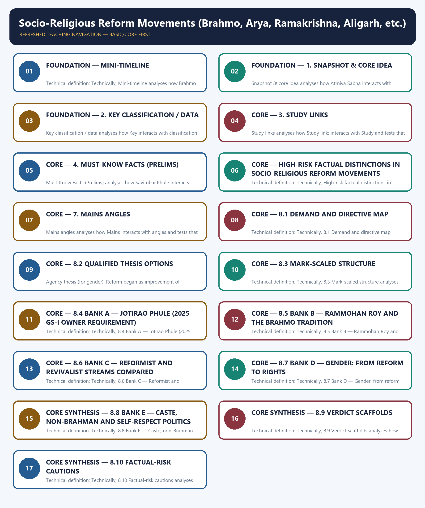

# Socio-Religious Reform Movements (Brahmo, Arya, Ramakrishna, Aligarh, etc.) - Learner-v2 Complete Learning Session

### SOURCE, PROGRESSION AND CURRENT-LINKAGE AUDIT

- **Repository owners queried:** Basic and Advanced Markdown for this topic, the master chronology, syllabus map and linked Modern History owners.
- **OCR book evidence queried:** OCR checks located Brahmo Samaj around pages 129-132 and Arya Samaj around pages 221-222 of Bipan Chandra. Sekhar Bandyopadhyay discusses Brahmo around pages 169-170, Arya around page 171 and Rukhmabai around pages 254-255.
- **Qdrant:** not used; Markdown plus searchable local PDFs were sufficient.
- **PYQ integrity:** The package solves the 2019 and 2021 GS-I reform demands and the 2025 Phule demand. Routed objective demands are covered by evidence cards, except Vital-Vidhvansak, which remains an explicit unsupported local gap.
- **Bounded live linkage:** The PM India record of the International Arya Mahasammelan 2025 is used only as an official public-memory anchor for 150 years of Arya Samaj. Historical evaluation remains grounded in repository owners and OCR books.
- **Fact/inference rule:** historical claims are source-backed; analytical judgements are explicitly framed as interpretation and do not invent figures.

## BASIC LEARNING SESSION

### DEEP-REVIEW LEARNING CONTRACT

| Control | Binding rule for this package |
|---|---|
| Syllabus boundary | Complete Modern History Core is taught chronologically and causally before optional enrichment. |
| Evidence method | Claim → named Act/treaty/record/organisation/person/region or scholarly evidence → analysis → qualification. |
| Date discipline | Event, proposal, enactment, commencement, official policy, implementation and later interpretation remain distinct. |
| Historiography | Colonial, nationalist, Marxist, subaltern, Cambridge, feminist and other relevant arguments are attributed and tested, never used as labels alone. |
| Practice contract | Every solved item has demand decoding, an examiner-grade model, an executable answer/compression plan, marks rationale and answer-specific improvement. |
| Approval | This immutable successor remains `approved: false` pending explicit approval. |

**Canonical Basic/Core owner:** `upsc-ai-kit\knowledge\Modern-Indian-History\basic\10_Socio-Religious-Reform-Movements.md`  
**Canonical topic owner:** `upsc-ai-kit\knowledge\Modern-Indian-History\basic\10_Socio-Religious-Reform-Movements.md`  
**Optional Advanced owner:** `upsc-ai-kit\knowledge\Modern-Indian-History\advanced\10_Socio-Religious-Reform-Movements.md`  
**Official syllabus mapping:** `upsc-ai-kit\knowledge\Modern-Indian-History\OFFICIAL-UPSC-SYLLABUS-MAPPING.md`

### EVIDENCE, PYQ AND CURRENT-STATUS CONTROL

- **Official and primary evidence:** Acts, charters, treaties, proclamations, committee reports, proceedings, organisational resolutions, speeches and contemporary records are dated and read for authorship and purpose.
- **Regional and social evidence:** petitions, newspapers, memoirs, local studies and material geography qualify elite or all-India generalisation.
- **Economic and quantitative evidence:** revenue, trade, price, wage, craft and mortality claims retain unit, region, period and uncertainty; statistics are never invented.
- **Scholarly interpretation:** historian schools are competing explanations tied to named evidence, not memorised verdicts.
- **PYQ discipline:** repository ledgers and locally held official papers control wording and metadata; reconstructed wording and unavailable official keys remain explicitly labelled.
- **Current-status note, rechecked 2026-08-31:** The PM India record of the International Arya Mahasammelan 2025 is used only as an official public-memory anchor for 150 years of Arya Samaj. Historical evaluation remains grounded in repository owners and OCR books.

**Live/primary context sources recorded by the predecessor generation:**

- `https://www.pmindia.gov.in/en/news_updates/pm-addresses-the-international-arya-mahasammelan-2025-in-new-delhi/`




*Distinct embedded teaching-navigation image. The separate continuous Cārvāka-style flowchart package remains an independent at-a-glance artifact.*

### SESSION 1 — FOUNDATION — MINI-TIMELINE

#### DEFINITION / WHAT THIS IS CALLED

**Plain-language definition:** Plain definition: Mini-timeline is a learner's map within Socio-Religious Reform Movements (Brahmo, Arya, Ramakrishna, Aligarh, etc.) that groups Brahmo Samaj, Deoband and Satyashodhak Samaj.

**Technical definition:** Technical definition: Technically, Mini-timeline analyses how Brahmo Samaj interacts with Deoband and tests that relationship through Satyashodhak Samaj and Arya Samaj.

#### ANSWER-GRABBING OPENING — WRITE/ADAPT IN THE EXAM

> Plain definition: Mini-timeline is a learner's map within Socio-Religious Reform Movements (Brahmo, Arya, Ramakrishna, Aligarh, etc.) that groups Brahmo Samaj, Deoband and Satyashodhak Samaj.

#### MUST-WRITE KEYWORDS

- **FOUNDATION**
- **Mini-timeline**
- **Plain definition**
- **Technical definition**
- **Brahmo Samaj**
- **Deoband**

**How to use them:** Frame the answer through FOUNDATION; define Mini-timeline, connect Plain definition with Technical definition to explain the mechanism, and use Brahmo Samaj for the decisive comparison or qualification.

##### VISUAL FIRST

```text
MINI-TIMELINE
Brahmo Samaj -> Deoband -> Satyashodhak Samaj -> Arya Samaj
context -> evidence -> mechanism -> qualification -> UPSC judgement
```

*The visual fixes the subtopic's evidence-to-judgement sequence before detail.*

##### CONCEPT DEFINITIONS

- **Plain definition:** Mini-timeline is a learner's map within Socio-Religious Reform Movements (Brahmo, Arya, Ramakrishna, Aligarh, etc.) that groups Brahmo Samaj, Deoband and Satyashodhak Samaj.
- **Technical definition:** Technically, Mini-timeline analyses how Brahmo Samaj interacts with Deoband and tests that relationship through Satyashodhak Samaj and Arya Samaj.

| Date | Event |
|---|---|
| ✅ 1828 | **Brahmo Samaj** founded by Raja Rammohan Roy in Calcutta |
| ✅ 1866 | **Deoband** school founded as an orthodox Islamic educational movement |
| ✅ 1873 | Jyotiba Phule founded **Satyashodhak Samaj** in Maharashtra |
| ✅ 1875 | Swami Dayananda Saraswati founded **Arya Samaj**; MAO College opened at Aligarh |
| ✅ 1878 | **Sadharan Brahmo Samaj** formed after the Keshab Chandra Sen split |
| ✅ 1893 | Swami Vivekananda addressed the Chicago Parliament of Religions |
| ✅ 1897 | **Ramakrishna Mission** founded by Swami Vivekananda |

##### EXAM LINK

- **Prelims:** preserve the exact actor-date-institution match and eliminate category errors.
- **Mains:** connect evidence to mechanism, add one limitation and end with a graded verdict.

##### MINI RECAP

- Retain the distinction expressed by **Mini-timeline**; do not reduce it to an isolated fact.

#### CLOSING RECALL FLOW — FOUNDATION — MINI-TIMELINE

```text
START / CONCEPT: FOUNDATION — Mini-timeline
        |
        v
EXACT TERMS: FOUNDATION · Mini-timeline · Plain definition · Technical definition · Brahmo Samaj · Deoband
        |
        v
MECHANISM / ARGUMENT: Technical definition: Technically, Mini-timeline analyses how Brahmo Samaj interacts with Deoband and tests that relationship through Satyashodhak Samaj and Arya Samaj.
        |
        v
CONSEQUENCE / CONTRAST: Retain the distinction expressed by Mini-timeline; do not reduce it to an isolated fact.
        |
        v
UPSC TRAP / ANSWER-USE: Do not miss this limiting distinction: retain the distinction expressed by Mini-timeline.
        |
        v
ANSWER-GRABBING FORMULATION: Plain definition: Mini-timeline is a learner's map within Socio-Religious Reform Movements (Brahmo, Arya, Ramakrishna, Aligarh, etc.) that groups Brahmo Samaj, Deoband and Satyashodhak Samaj.
```
### SESSION 2 — FOUNDATION — 1. SNAPSHOT & CORE IDEA

#### DEFINITION / WHAT THIS IS CALLED

**Plain-language definition:** Snapshot & core idea is a learner's map within Socio-Religious Reform Movements (Brahmo, Arya, Ramakrishna, Aligarh, etc.) that groups Atmiya Sabha, Brahmo Samaj (1828) and Debendranath Tagore.

**Technical definition:** Snapshot & core idea analyses how Atmiya Sabha interacts with Brahmo Samaj (1828) and tests that relationship through Debendranath Tagore and Keshab Chandra Sen.

#### ANSWER-GRABBING OPENING — WRITE/ADAPT IN THE EXAM

> Snapshot & core idea is a learner's map within Socio-Religious Reform Movements (Brahmo, Arya, Ramakrishna, Aligarh, etc.) that groups Atmiya Sabha, Brahmo Samaj (1828) and Debendranath Tagore.

#### MUST-WRITE KEYWORDS

- **FOUNDATION**
- **Plain definition**
- **Technical definition**
- **Atmiya Sabha**
- **Brahmo Samaj (1828)**
- **1. Snapshot & core idea**

**How to use them:** Frame the answer through FOUNDATION; define Plain definition, connect Technical definition with Atmiya Sabha to explain the mechanism, and use Brahmo Samaj (1828) for the decisive comparison or qualification.

##### VISUAL FIRST

```text
1. SNAPSHOT & CORE IDEA
Atmiya Sabha -> Brahmo Samaj (1828) -> Debendranath Tagore -> Keshab Chandra Sen
context -> evidence -> mechanism -> qualification -> UPSC judgement
```

*The visual fixes the subtopic's evidence-to-judgement sequence before detail.*

##### CONCEPT DEFINITIONS

- **Plain definition:** 1. Snapshot & core idea is a learner's map within Socio-Religious Reform Movements (Brahmo, Arya, Ramakrishna, Aligarh, etc.) that groups Atmiya Sabha, Brahmo Samaj (1828) and Debendranath Tagore.
- **Technical definition:** Technically, 1. Snapshot & core idea analyses how Atmiya Sabha interacts with Brahmo Samaj (1828) and tests that relationship through Debendranath Tagore and Keshab Chandra Sen.

**Foundation — reform tried to modernise society without abandoning Indian roots.**

- ✅ Nineteenth-century reform movements attacked social evils such as sati, child marriage, caste rigidity, purdah, denial of women's education and irrational customs.
- ✅ Raja Rammohan Roy combined monotheism, rationalism and social reform; he founded **Atmiya Sabha** and later the **Brahmo Samaj (1828)**, opposed sati and idolatry, supported English education, and used *Sambad Kaumudi* for public opinion.
- ✅ The Brahmo tradition continued under **Debendranath Tagore** and **Keshab Chandra Sen**, but internal differences led to splits, including the **Sadharan Brahmo Samaj (1878)**.
- ✅ In western India, **Prarthana Samaj** was associated with Atmaram Pandurang, M.G. Ranade and R.G. Bhandarkar; it emphasised social reform, widow remarriage and women's uplift.

**Foundation — reformist and revivalist streams both shaped nationalism.**

- ✅ **Arya Samaj** under Swami Dayananda Saraswati gave the slogan **"Back to the Vedas"**, rejected idolatry and caste rigidity, promoted *Satyarth Prakash*, shuddhi and DAV education.
- ✅ **Ramakrishna Paramhansa** stressed spiritual experience; **Swami Vivekananda** popularised practical Vedanta, represented India at Chicago in 1893 and founded the Ramakrishna Mission in 1897.
- ✅ Reform also emerged among Muslims, Parsis, Sikhs and oppressed castes through Aligarh, Deoband, Rahnumai Mazdayasnan Sabha, Singh Sabha, Phule's Satyashodhak Samaj and Sri Narayana Guru's movement.
- ✅ Anti-caste and women's reform had distinct agendas: **Jyotiba and Savitribai Phule** linked caste critique with education; **Pandita Ramabai** foregrounded women's autonomy; **Sri Narayana Guru**, later non-Brahmin and Self-Respect currents challenged hierarchy beyond upper-caste social reform.

##### EXAM LINK

- **Prelims:** preserve the exact actor-date-institution match and eliminate category errors.
- **Mains:** connect evidence to mechanism, add one limitation and end with a graded verdict.

##### MINI RECAP

- Retain the distinction expressed by **1. Snapshot & core idea**; do not reduce it to an isolated fact.

#### CLOSING RECALL FLOW — FOUNDATION — 1. SNAPSHOT & CORE IDEA

```text
START / CONCEPT: FOUNDATION — 1. Snapshot & core idea
        |
        v
EXACT TERMS: FOUNDATION · Plain definition · Technical definition · Atmiya Sabha · Brahmo Samaj (1828) · 1. Snapshot & core idea
        |
        v
MECHANISM / ARGUMENT: Snapshot & core idea analyses how Atmiya Sabha interacts with Brahmo Samaj (1828) and tests that relationship through Debendranath Tagore and Keshab Chandra Sen.
        |
        v
CONSEQUENCE / CONTRAST: Snapshot & core idea; do not reduce it to an isolated fact.
        |
        v
UPSC TRAP / ANSWER-USE: ✅ Nineteenth-century reform movements attacked social evils such as sati, child marriage, caste rigidity, purdah, denial of women's education and irrational customs. ✅ Raja Rammohan Roy combined monotheism, rationalism and social reform; he founded Atmiya Sabha and later the Brahmo Samaj (1828), opposed sati and idolatry, supported English education, and used Sambad Kaumudi for public opinion. ✅ The Brahmo tradition continued under Debendranath Tagore and Keshab Chandra Sen, but internal differences led to splits, including the Sadharan Brahmo Samaj (1878). ✅ In western India, Prarthana Samaj was associated with Atmaram Pandurang, M.G.
        |
        v
ANSWER-GRABBING FORMULATION: Snapshot & core idea is a learner's map within Socio-Religious Reform Movements (Brahmo, Arya, Ramakrishna, Aligarh, etc.) that groups Atmiya Sabha, Brahmo Samaj (1828) and Debendranath Tagore.
```
### SESSION 3 — FOUNDATION — 2. KEY CLASSIFICATION / DATA

#### DEFINITION / WHAT THIS IS CALLED

**Plain-language definition:** Key classification / data is a learner's map within Socio-Religious Reform Movements (Brahmo, Arya, Ramakrishna, Aligarh, etc.) that groups Key, classification and data.

**Technical definition:** Key classification / data analyses how Key interacts with classification and tests that relationship through data and context.

#### ANSWER-GRABBING OPENING — WRITE/ADAPT IN THE EXAM

> Key classification / data is a learner's map within Socio-Religious Reform Movements (Brahmo, Arya, Ramakrishna, Aligarh, etc.) that groups Key, classification and data.

#### MUST-WRITE KEYWORDS

- **FOUNDATION**
- **Plain definition**
- **Technical definition**
- **✅ Reformist Hindu**
- **Brahmo Samaj — Rammohan Roy, Debendranath, Keshab**
- **2. Key classification / data**

**How to use them:** Frame the answer through FOUNDATION; define Plain definition, connect Technical definition with ✅ Reformist Hindu to explain the mechanism, and use Brahmo Samaj — Rammohan Roy, Debendranath, Keshab for the decisive comparison or qualification.

##### VISUAL FIRST

```text
2. KEY CLASSIFICATION / DATA
Key -> classification -> data
context -> evidence -> mechanism -> qualification -> UPSC judgement
```

*The visual fixes the subtopic's evidence-to-judgement sequence before detail.*

##### CONCEPT DEFINITIONS

- **Plain definition:** 2. Key classification / data is a learner's map within Socio-Religious Reform Movements (Brahmo, Arya, Ramakrishna, Aligarh, etc.) that groups Key, classification and data.
- **Technical definition:** Technically, 2. Key classification / data analyses how Key interacts with classification and tests that relationship through data and context.

| Stream / community | Organisation / leader | Core emphasis |
|---|---|---|
| ✅ Reformist Hindu | Brahmo Samaj — Rammohan Roy, Debendranath, Keshab | Monotheism, social reform, anti-sati, rational religion |
| ✅ Western India reform | Prarthana Samaj — Atmaram Pandurang, Ranade, Bhandarkar | Devotional reform, widow remarriage, women's education |
| ✅ Radical rationalist | Young Bengal — Henry Vivian Derozio | Free thought, attack on orthodoxy, modern education |
| ✅ Revivalist Hindu | Arya Samaj — Dayananda Saraswati | Vedic authority, shuddhi, DAV schools, anti-idolatry |
| ✅ Spiritual-humanist | Ramakrishna Mission — Vivekananda | Practical Vedanta, service, national self-confidence |
| ✅ Muslim reform | Aligarh — Syed Ahmad Khan; Deoband; Ahmadiyya | Modern education / orthodox revival / religious reform |
| ✅ Anti-caste | Phule, Sri Narayana Guru, Justice Movement | Caste critique, social equality, education of lower castes |
| ✅ Women's agency | Savitribai Phule, Pandita Ramabai and women's organisations | Girls' education, widowhood, legal and social autonomy—not merely reform "for" women |

##### EXAM LINK

- **Prelims:** preserve the exact actor-date-institution match and eliminate category errors.
- **Mains:** connect evidence to mechanism, add one limitation and end with a graded verdict.

##### MINI RECAP

- Retain the distinction expressed by **2. Key classification / data**; do not reduce it to an isolated fact.

#### CLOSING RECALL FLOW — FOUNDATION — 2. KEY CLASSIFICATION / DATA

```text
START / CONCEPT: FOUNDATION — 2. Key classification / data
        |
        v
EXACT TERMS: FOUNDATION · Plain definition · Technical definition · ✅ Reformist Hindu · Brahmo Samaj — Rammohan Roy, Debendranath, Keshab · 2. Key classification / data
        |
        v
MECHANISM / ARGUMENT: Key classification / data analyses how Key interacts with classification and tests that relationship through data and context.
        |
        v
CONSEQUENCE / CONTRAST: Key classification / data; do not reduce it to an isolated fact.
        |
        v
UPSC TRAP / ANSWER-USE: Do not miss this limiting distinction: do not reduce it to an isolated fact.
        |
        v
ANSWER-GRABBING FORMULATION: Key classification / data is a learner's map within Socio-Religious Reform Movements (Brahmo, Arya, Ramakrishna, Aligarh, etc.) that groups Key, classification and data.
```
### SESSION 4 — CORE — 3. STUDY LINKS

#### DEFINITION / WHAT THIS IS CALLED

**Plain-language definition:** Study links is a learner's map within Socio-Religious Reform Movements (Brahmo, Arya, Ramakrishna, Aligarh, etc.) that groups Study link:, Study and links.

**Technical definition:** Study links analyses how Study link: interacts with Study and tests that relationship through links and context.

#### ANSWER-GRABBING OPENING — WRITE/ADAPT IN THE EXAM

> Study links is a learner's map within Socio-Religious Reform Movements (Brahmo, Arya, Ramakrishna, Aligarh, etc.) that groups Study link:, Study and links.

#### MUST-WRITE KEYWORDS

- **Plain definition**
- **Technical definition**
- **Study link**
- **Study links**
- **Study**
- **3. Study links**

**How to use them:** Frame the answer through Plain definition; define Technical definition, connect Study link with Study links to explain the mechanism, and use Study for the decisive comparison or qualification.

##### VISUAL FIRST

```text
3. STUDY LINKS
Study link: -> Study -> links
context -> evidence -> mechanism -> qualification -> UPSC judgement
```

*The visual fixes the subtopic's evidence-to-judgement sequence before detail.*

##### CONCEPT DEFINITIONS

- **Plain definition:** 3. Study links is a learner's map within Socio-Religious Reform Movements (Brahmo, Arya, Ramakrishna, Aligarh, etc.) that groups Study link:, Study and links.
- **Technical definition:** Technically, 3. Study links analyses how Study link: interacts with Study and tests that relationship through links and context.

> **Study link:** ✅ Social and cultural policy background → `basic/09_Social-and-Cultural-Policy-Education-Press.md`.
> **Study link:** ⚠️ Reform currents shaped early nationalist leadership → `basic/14_Foundation-of-INC-and-Moderate-Phase.md`.
> **Study link:** ⚠️ Anti-caste and gender politics later connect to constitutional equality and post-independence social change → `basic/29_Colonial-Legacy-and-Foundations-of-the-Republic.md` and `basic/38_Economy-Land-Society-and-State-A-Post-Independence-Synthesis.md`.

##### EXAM LINK

- **Prelims:** preserve the exact actor-date-institution match and eliminate category errors.
- **Mains:** connect evidence to mechanism, add one limitation and end with a graded verdict.

##### MINI RECAP

- Retain the distinction expressed by **3. Study links**; do not reduce it to an isolated fact.

#### CLOSING RECALL FLOW — CORE — 3. STUDY LINKS

```text
START / CONCEPT: CORE — 3. Study links
        |
        v
EXACT TERMS: Plain definition · Technical definition · Study link · Study links · Study · 3. Study links
        |
        v
MECHANISM / ARGUMENT: Study links analyses how Study link: interacts with Study and tests that relationship through links and context.
        |
        v
CONSEQUENCE / CONTRAST: Study links; do not reduce it to an isolated fact.
        |
        v
UPSC TRAP / ANSWER-USE: Do not miss this limiting distinction: do not reduce it to an isolated fact.
        |
        v
ANSWER-GRABBING FORMULATION: Study links is a learner's map within Socio-Religious Reform Movements (Brahmo, Arya, Ramakrishna, Aligarh, etc.) that groups Study link:, Study and links.
```
### SESSION 5 — CORE — 4. MUST-KNOW FACTS (PRELIMS)

#### DEFINITION / WHAT THIS IS CALLED

**Plain-language definition:** Must-Know Facts (Prelims) is a learner's map within Socio-Religious Reform Movements (Brahmo, Arya, Ramakrishna, Aligarh, etc.) that groups Savitribai Phule, Pandita Ramabai and Reformist.

**Technical definition:** Must-Know Facts (Prelims) analyses how Savitribai Phule interacts with Pandita Ramabai and tests that relationship through Reformist and revivalist.

#### ANSWER-GRABBING OPENING — WRITE/ADAPT IN THE EXAM

> Must-Know Facts (Prelims) is a learner's map within Socio-Religious Reform Movements (Brahmo, Arya, Ramakrishna, Aligarh, etc.) that groups Savitribai Phule, Pandita Ramabai and Reformist.

#### MUST-WRITE KEYWORDS

- **Plain definition**
- **Technical definition**
- **Brahmo Samaj = 1828 = Raja Rammohan Roy**
- **Arya Samaj = 1875 = Swami Dayananda Saraswati**
- **Ramakrishna Mission = 1897 = Swami Vivekananda**
- **4. Must-Know Facts (Prelims)**

**How to use them:** Frame the answer through Plain definition; define Technical definition, connect Brahmo Samaj = 1828 = Raja Rammohan Roy with Arya Samaj = 1875 = Swami Dayananda Saraswati to explain the mechanism, and use Ramakrishna Mission = 1897 = Swami Vivekananda for the decisive comparison or qualification.

##### VISUAL FIRST

```text
4. MUST-KNOW FACTS (PRELIMS)
Savitribai Phule -> Pandita Ramabai -> Reformist -> revivalist
context -> evidence -> mechanism -> qualification -> UPSC judgement
```

*The visual fixes the subtopic's evidence-to-judgement sequence before detail.*

##### CONCEPT DEFINITIONS

- **Plain definition:** 4. Must-Know Facts (Prelims) is a learner's map within Socio-Religious Reform Movements (Brahmo, Arya, Ramakrishna, Aligarh, etc.) that groups Savitribai Phule, Pandita Ramabai and Reformist.
- **Technical definition:** Technically, 4. Must-Know Facts (Prelims) analyses how Savitribai Phule interacts with Pandita Ramabai and tests that relationship through Reformist and revivalist.

- ✅ **Brahmo Samaj = 1828 = Raja Rammohan Roy**; remember anti-sati, monotheism and English education.
- ✅ **Arya Samaj = 1875 = Swami Dayananda Saraswati**; remember *Satyarth Prakash*, shuddhi and DAV schools.
- ✅ **Ramakrishna Mission = 1897 = Swami Vivekananda**; remember Chicago address in 1893 and practical Vedanta.
- ✅ **Satyashodhak Samaj = 1873 = Jyotiba Phule**; remember *Gulamgiri* and anti-caste mobilisation.
- ✅ **MAO College, Aligarh = 1875 = Syed Ahmad Khan**; remember modern scientific education for Muslims.
- ✅ **Savitribai Phule** is central to girls' education and anti-caste pedagogy; **Pandita Ramabai** to women's education and critique of upper-caste patriarchy.
- ⚠️ **Reformist** usually means reinterpretation with modern reason; **revivalist** usually means return to a purified ancient/religious source.

##### EXAM LINK

- **Prelims:** preserve the exact actor-date-institution match and eliminate category errors.
- **Mains:** connect evidence to mechanism, add one limitation and end with a graded verdict.

##### MINI RECAP

- Retain the distinction expressed by **4. Must-Know Facts (Prelims)**; do not reduce it to an isolated fact.

#### CLOSING RECALL FLOW — CORE — 4. MUST-KNOW FACTS (PRELIMS)

```text
START / CONCEPT: CORE — 4. Must-Know Facts (Prelims)
        |
        v
EXACT TERMS: Plain definition · Technical definition · Brahmo Samaj = 1828 = Raja Rammohan Roy · Arya Samaj = 1875 = Swami Dayananda Saraswati · Ramakrishna Mission = 1897 = Swami Vivekananda · 4. Must-Know Facts (Prelims)
        |
        v
MECHANISM / ARGUMENT: Must-Know Facts (Prelims) analyses how Savitribai Phule interacts with Pandita Ramabai and tests that relationship through Reformist and revivalist.
        |
        v
CONSEQUENCE / CONTRAST: Must-Know Facts (Prelims); do not reduce it to an isolated fact.
        |
        v
UPSC TRAP / ANSWER-USE: Do not miss this limiting distinction: ✅ Brahmo Samaj = 1828 = Raja Rammohan Roy.
        |
        v
ANSWER-GRABBING FORMULATION: Must-Know Facts (Prelims) is a learner's map within Socio-Religious Reform Movements (Brahmo, Arya, Ramakrishna, Aligarh, etc.) that groups Savitribai Phule, Pandita Ramabai and Reformist.
```
### SESSION 6 — CORE — HIGH-RISK FACTUAL DISTINCTIONS IN SOCIO-RELIGIOUS REFORM MOVEMENTS (BRAHMO, ARYA, RAMAKRISHNA, ALIGARH, ETC.)

#### DEFINITION / WHAT THIS IS CALLED

**Plain-language definition:** Plain definition: High-risk factual distinctions in Socio-Religious Reform Movements (Brahmo, Arya, Ramakrishna, Aligarh, etc.) is a learner's map within Socio-Religious Reform Movements (Brahmo, Arya, Ramakrishna, Aligarh, etc.) that groups founder → organisation → year → region, Calcutta and 1828.

**Technical definition:** Technical definition: Technically, High-risk factual distinctions in Socio-Religious Reform Movements (Brahmo, Arya, Ramakrishna, Aligarh, etc.) analyses how founder → organisation → year → region interacts with Calcutta and tests that relationship through 1828 and opposed idolatry.

#### ANSWER-GRABBING OPENING — WRITE/ADAPT IN THE EXAM

> Retain the distinction expressed by High-risk factual distinctions in Socio-Religious Reform Movements (Brahmo, Arya, Ramakrishna, Aligarh, etc.); do not reduce it to an isolated fact.

#### MUST-WRITE KEYWORDS

- **High-risk factual distinctions in Socio-Religious Reform Movements (Brahmo**
- **Arya**
- **Ramakrishna**
- **Aligarh**
- **etc.)**
- **Plain definition**

**How to use them:** Frame the answer through High-risk factual distinctions in Socio-Religious Reform Movements (Brahmo; define Arya, connect Ramakrishna with Aligarh to explain the mechanism, and use etc.) for the decisive comparison or qualification.

##### VISUAL FIRST

```text
HIGH-RISK FACTUAL DISTINCTIONS IN SOCIO-RELIGIOUS REFORM MOVEMENTS (BRAHMO, ARYA, RAMAKRISHNA, ALIGARH, ETC.)
founder → organisation → year → region -> Calcutta -> 1828 -> opposed idolatry
context -> evidence -> mechanism -> qualification -> UPSC judgement
```

*The visual fixes the subtopic's evidence-to-judgement sequence before detail.*

##### CONCEPT DEFINITIONS

- **Plain definition:** High-risk factual distinctions in Socio-Religious Reform Movements (Brahmo, Arya, Ramakrishna, Aligarh, etc.) is a learner's map within Socio-Religious Reform Movements (Brahmo, Arya, Ramakrishna, Aligarh, etc.) that groups founder → organisation → year → region, Calcutta and 1828.
- **Technical definition:** Technically, High-risk factual distinctions in Socio-Religious Reform Movements (Brahmo, Arya, Ramakrishna, Aligarh, etc.) analyses how founder → organisation → year → region interacts with Calcutta and tests that relationship through 1828 and opposed idolatry.

> 🔑 Trap: Match **founder → organisation → year → region**; UPSC often mixes Brahmo, Arya and Ramakrishna dates.

- ❌ Brahmo Samaj was founded in Bombay. → It was founded in **Calcutta** by Rammohan Roy in **1828**.
- ❌ Arya Samaj supported idol worship. → It **opposed idolatry** and called for a return to the Vedas.
- ❌ Ramakrishna Mission was founded by Ramakrishna Paramhansa. → It was founded by **Swami Vivekananda** in **1897**.
- ❌ Aligarh and Deoband had identical methods. → Aligarh stressed **modern Western education**; Deoband stressed **orthodox Islamic learning**.

##### EXAM LINK

- **Prelims:** preserve the exact actor-date-institution match and eliminate category errors.
- **Mains:** connect evidence to mechanism, add one limitation and end with a graded verdict.

##### MINI RECAP

- Retain the distinction expressed by **High-risk factual distinctions in Socio-Religious Reform Movements (Brahmo, Arya, Ramakrishna, Aligarh, etc.)**; do not reduce it to an isolated fact.

#### CLOSING RECALL FLOW — CORE — HIGH-RISK FACTUAL DISTINCTIONS IN SOCIO-RELIGIOUS REFORM MOVEMENTS (BRAHMO, ARYA, RAMAKRISHNA, ALIGARH, ETC.)

```text
START / CONCEPT: CORE — High-risk factual distinctions in Socio-Religious Reform Movements (Brahmo, Arya, Ramakrishna, Aligarh, etc.)
        |
        v
EXACT TERMS: High-risk factual distinctions in Socio-Religious Reform Movements (Brahmo · Arya · Ramakrishna · Aligarh · etc.) · Plain definition
        |
        v
MECHANISM / ARGUMENT: Technical definition: Technically, High-risk factual distinctions in Socio-Religious Reform Movements (Brahmo, Arya, Ramakrishna, Aligarh, etc.) analyses how founder → organisation → year → region interacts with Calcutta and tests that relationship through 1828 and opposed idolatry.
        |
        v
CONSEQUENCE / CONTRAST: Plain definition: High-risk factual distinctions in Socio-Religious Reform Movements (Brahmo, Arya, Ramakrishna, Aligarh, etc.) is a learner's map within Socio-Religious Reform Movements (Brahmo, Arya, Ramakrishna, Aligarh, etc.) that groups founder → organisation → year → region, Calcutta and 1828.
        |
        v
UPSC TRAP / ANSWER-USE: Do not miss this limiting distinction: ❌ Brahmo Samaj was founded in Bombay. → It was founded in Calcutta by...
        |
        v
ANSWER-GRABBING FORMULATION: Retain the distinction expressed by High-risk factual distinctions in Socio-Religious Reform Movements (Brahmo, Arya, Ramakrishna, Aligarh, etc.); do not reduce it to an isolated fact.
```
### CORE — 6. 📰 Current link

##### VISUAL FIRST

```text
6. 📰 CURRENT LINK
Current -> link
context -> evidence -> mechanism -> qualification -> UPSC judgement
```

*The visual fixes the subtopic's evidence-to-judgement sequence before detail.*

##### CONCEPT DEFINITIONS

- **Plain definition:** 6. 📰 Current link is a learner's map within Socio-Religious Reform Movements (Brahmo, Arya, Ramakrishna, Aligarh, etc.) that groups Current, link and context.
- **Technical definition:** Technically, 6. 📰 Current link analyses how Current interacts with link and tests that relationship through context and evidence.

- ⚠️ **Debates on personal law, gender justice, caste discrimination and religious reform.** Nineteenth-century reform movements offer historical context for present debates on social reform, equality and community autonomy. *(Escalate to 📰 when pegged to a verified news item.)*

##### EXAM LINK

- **Prelims:** preserve the exact actor-date-institution match and eliminate category errors.
- **Mains:** connect evidence to mechanism, add one limitation and end with a graded verdict.

##### MINI RECAP

- Retain the distinction expressed by **6. 📰 Current link**; do not reduce it to an isolated fact.
### SESSION 7 — CORE — 7. MAINS ANGLES

#### DEFINITION / WHAT THIS IS CALLED

**Plain-language definition:** Mains angles is a learner's map within Socio-Religious Reform Movements (Brahmo, Arya, Ramakrishna, Aligarh, etc.) that groups Mains, angles and context.

**Technical definition:** Mains angles analyses how Mains interacts with angles and tests that relationship through context and evidence.

#### ANSWER-GRABBING OPENING — WRITE/ADAPT IN THE EXAM

> Mains angles is a learner's map within Socio-Religious Reform Movements (Brahmo, Arya, Ramakrishna, Aligarh, etc.) that groups Mains, angles and context.

#### MUST-WRITE KEYWORDS

- **Plain definition**
- **Technical definition**
- **Mains angles**
- **Socio-Religious Reform Movements**
- **Brahmo**
- **7. Mains angles**

**How to use them:** Frame the answer through Plain definition; define Technical definition, connect Mains angles with Socio-Religious Reform Movements to explain the mechanism, and use Brahmo for the decisive comparison or qualification.

##### VISUAL FIRST

```text
7. MAINS ANGLES
Mains -> angles
context -> evidence -> mechanism -> qualification -> UPSC judgement
```

*The visual fixes the subtopic's evidence-to-judgement sequence before detail.*

##### CONCEPT DEFINITIONS

- **Plain definition:** 7. Mains angles is a learner's map within Socio-Religious Reform Movements (Brahmo, Arya, Ramakrishna, Aligarh, etc.) that groups Mains, angles and context.
- **Technical definition:** Technically, 7. Mains angles analyses how Mains interacts with angles and tests that relationship through context and evidence.

- ⚠️ GS-1: Discuss how socio-religious reform movements created a social base for modern Indian nationalism.
- ⚠️ GS-1: Compare reformist and revivalist strategies in nineteenth-century India with examples from Brahmo Samaj and Arya Samaj.
- ⚠️ GS-1: Examine the role of women, education and caste critique in the making of modern Indian public life.

##### EXAM LINK

- **Prelims:** preserve the exact actor-date-institution match and eliminate category errors.
- **Mains:** connect evidence to mechanism, add one limitation and end with a graded verdict.

##### MINI RECAP

- Retain the distinction expressed by **7. Mains angles**; do not reduce it to an isolated fact.

#### CLOSING RECALL FLOW — CORE — 7. MAINS ANGLES

```text
START / CONCEPT: CORE — 7. Mains angles
        |
        v
EXACT TERMS: Plain definition · Technical definition · Mains angles · Socio-Religious Reform Movements · Brahmo · 7. Mains angles
        |
        v
MECHANISM / ARGUMENT: Mains angles analyses how Mains interacts with angles and tests that relationship through context and evidence.
        |
        v
CONSEQUENCE / CONTRAST: Mains angles; do not reduce it to an isolated fact.
        |
        v
UPSC TRAP / ANSWER-USE: Do not miss this limiting distinction: discuss how socio-religious reform movements created a social base for modern Indian nationalism. ⚠️...
        |
        v
ANSWER-GRABBING FORMULATION: Mains angles is a learner's map within Socio-Religious Reform Movements (Brahmo, Arya, Ramakrishna, Aligarh, etc.) that groups Mains, angles and context.
```
### CORE — Answer architecture overview

##### VISUAL FIRST

```text
ANSWER ARCHITECTURE OVERVIEW
2025 GS-I 15-mark Phule demand -> Answer -> architecture -> overview
context -> evidence -> mechanism -> qualification -> UPSC judgement
```

*The visual fixes the subtopic's evidence-to-judgement sequence before detail.*

##### CONCEPT DEFINITIONS

- **Plain definition:** Answer architecture overview is a learner's map within Socio-Religious Reform Movements (Brahmo, Arya, Ramakrishna, Aligarh, etc.) that groups 2025 GS-I 15-mark Phule demand, Answer and architecture.
- **Technical definition:** Technically, Answer architecture overview analyses how 2025 GS-I 15-mark Phule demand interacts with Answer and tests that relationship through architecture and overview.

> Purpose: this owner must support the **2025 GS-I 15-mark Phule demand**, the Rammohan Roy and Periyar Prelims demands, and unfamiliar comparison/critical-evaluation questions on reform, caste, gender and community. The banks below are separated by social group so that a caste question and a gender question do not receive the same evidence.

##### EXAM LINK

- **Prelims:** preserve the exact actor-date-institution match and eliminate category errors.
- **Mains:** connect evidence to mechanism, add one limitation and end with a graded verdict.

##### MINI RECAP

- Retain the distinction expressed by **Answer architecture overview**; do not reduce it to an isolated fact.
### SESSION 8 — CORE — 8.1 DEMAND AND DIRECTIVE MAP

#### DEFINITION / WHAT THIS IS CALLED

**Plain-language definition:** Plain definition: 8.1 Demand and directive map is a learner's map within Socio-Religious Reform Movements (Brahmo, Arya, Ramakrishna, Aligarh, etc.) that groups Demand, and and directive.

**Technical definition:** Technical definition: Technically, 8.1 Demand and directive map analyses how Demand interacts with and and tests that relationship through directive and map.

#### ANSWER-GRABBING OPENING — WRITE/ADAPT IN THE EXAM

> Plain definition: 8.1 Demand and directive map is a learner's map within Socio-Religious Reform Movements (Brahmo, Arya, Ramakrishna, Aligarh, etc.) that groups Demand, and and directive.

#### MUST-WRITE KEYWORDS

- **directive map**
- **Plain definition**
- **Technical definition**
- **Individual reformer**
- **8.1 Demand**
- **8.1 Demand and directive map**

**How to use them:** Frame the answer through directive map; define Plain definition, connect Technical definition with Individual reformer to explain the mechanism, and use 8.1 Demand for the decisive comparison or qualification.

##### VISUAL FIRST

```text
8.1 DEMAND AND DIRECTIVE MAP
Demand -> and -> directive -> map
context -> evidence -> mechanism -> qualification -> UPSC judgement
```

*The visual fixes the subtopic's evidence-to-judgement sequence before detail.*

##### CONCEPT DEFINITIONS

- **Plain definition:** 8.1 Demand and directive map is a learner's map within Socio-Religious Reform Movements (Brahmo, Arya, Ramakrishna, Aligarh, etc.) that groups Demand, and and directive.
- **Technical definition:** Technically, 8.1 Demand and directive map analyses how Demand interacts with and and tests that relationship through directive and map.

| Demand family | Typical directive signals | Answer spine to use |
|---|---|---|
| Individual reformer | "Discuss Phule's efforts and writings", "Contribution of Rammohan Roy" | Social location → diagnosis → institutions/writings → method → limits and legacy |
| Reformist vs revivalist | "Compare Brahmo and Arya Samaj" | Source of authority → method → social programme → political consequence |
| Caste critique | "Assess non-Brahman and anti-caste movements" | Diagnosis of hierarchy → organisation → base → relation to nationalism → limits |
| Gender | "Did reform empower women or reform them?" | Reform *for* women → women's own agency → law → orthodox backlash |
| Community-specific | "Muslim/Parsi/Sikh reform" | Crisis → response type (modernist/orthodox/revivalist) → institution → political afterlife |
| Reform and nationalism | "How did reform prepare nationalism?" | Rationality/self-respect → organisation-building → contradictions bequeathed |

##### EXAM LINK

- **Prelims:** preserve the exact actor-date-institution match and eliminate category errors.
- **Mains:** connect evidence to mechanism, add one limitation and end with a graded verdict.

##### MINI RECAP

- Retain the distinction expressed by **8.1 Demand and directive map**; do not reduce it to an isolated fact.

#### CLOSING RECALL FLOW — CORE — 8.1 DEMAND AND DIRECTIVE MAP

```text
START / CONCEPT: CORE — 8.1 Demand and directive map
        |
        v
EXACT TERMS: directive map · Plain definition · Technical definition · Individual reformer · 8.1 Demand · 8.1 Demand and directive map
        |
        v
MECHANISM / ARGUMENT: Technical definition: Technically, 8.1 Demand and directive map analyses how Demand interacts with and and tests that relationship through directive and map.
        |
        v
CONSEQUENCE / CONTRAST: Retain the distinction expressed by 8.1 Demand and directive map; do not reduce it to an isolated fact.
        |
        v
UPSC TRAP / ANSWER-USE: Do not miss this limiting distinction: retain the distinction expressed by 8.1 Demand and directive map.
        |
        v
ANSWER-GRABBING FORMULATION: Plain definition: 8.1 Demand and directive map is a learner's map within Socio-Religious Reform Movements (Brahmo, Arya, Ramakrishna, Aligarh, etc.) that groups Demand, and and directive.
```
### SESSION 9 — CORE — 8.2 QUALIFIED THESIS OPTIONS

#### DEFINITION / WHAT THIS IS CALLED

**Plain-language definition:** Plain definition: 8.2 Qualified thesis options is a learner's map within Socio-Religious Reform Movements (Brahmo, Arya, Ramakrishna, Aligarh, etc.) that groups Two-front thesis:, Agency thesis (for gender): and Backlash thesis:.

**Technical definition:** Agency thesis (for gender): Reform began as improvement of women's condition by men and was transformed when women — Savitribai Phule, Pandita Ramabai, and litigants such as Rukhmabai — became actors rather than objects; the shift from welfare to rights is the analytical story.

#### ANSWER-GRABBING OPENING — WRITE/ADAPT IN THE EXAM

> Plain definition: 8.2 Qualified thesis options is a learner's map within Socio-Religious Reform Movements (Brahmo, Arya, Ramakrishna, Aligarh, etc.) that groups Two-front thesis:, Agency thesis (for gender): and Backlash thesis:.

#### MUST-WRITE KEYWORDS

- **Plain definition**
- **Technical definition**
- **Two-front thesis**
- **Social-location thesis (best for Phule)**
- **Agency thesis (for gender)**
- **8.2 Qualified thesis options**

**How to use them:** Frame the answer through Plain definition; define Technical definition, connect Two-front thesis with Social-location thesis (best for Phule) to explain the mechanism, and use Agency thesis (for gender) for the decisive comparison or qualification.

##### VISUAL FIRST

```text
8.2 QUALIFIED THESIS OPTIONS
Two-front thesis: -> Agency thesis (for gender): -> Backlash thesis:
context -> evidence -> mechanism -> qualification -> UPSC judgement
```

*The visual fixes the subtopic's evidence-to-judgement sequence before detail.*

##### CONCEPT DEFINITIONS

- **Plain definition:** 8.2 Qualified thesis options is a learner's map within Socio-Religious Reform Movements (Brahmo, Arya, Ramakrishna, Aligarh, etc.) that groups Two-front thesis:, Agency thesis (for gender): and Backlash thesis:.
- **Technical definition:** Technically, 8.2 Qualified thesis options analyses how Two-front thesis: interacts with Agency thesis (for gender): and tests that relationship through Backlash thesis: and context.

- **Two-front thesis:** *Nineteenth-century reform fought on two fronts at once — against indigenous social hierarchy and against colonial cultural contempt — and this dual pressure explains why the same movements could be modernising in method and revivalist in idiom.*
- **Social-location thesis (best for Phule):** *Reform looked different from below: where upper-caste reformers sought to purify a tradition they owned, Phule's Satyashodhak Samaj identified that tradition itself as the instrument of domination and built an alternative around education, self-respect and non-Brahman solidarity.*
- **Agency thesis (for gender):** *Reform began as improvement of women's condition by men and was transformed when women — Savitribai Phule, Pandita Ramabai, and litigants such as Rukhmabai — became actors rather than objects; the shift from welfare to rights is the analytical story.*
- **Backlash thesis:** *Every advance in reform legislation generated an orthodox counter-mobilisation with a broader social base than the reformers, and by the 1890s that counter-mobilisation had learned to speak the nationalist language of non-interference — the origin of a lasting tension between social reform and political nationalism.*

##### EXAM LINK

- **Prelims:** preserve the exact actor-date-institution match and eliminate category errors.
- **Mains:** connect evidence to mechanism, add one limitation and end with a graded verdict.

##### MINI RECAP

- Retain the distinction expressed by **8.2 Qualified thesis options**; do not reduce it to an isolated fact.

#### CLOSING RECALL FLOW — CORE — 8.2 QUALIFIED THESIS OPTIONS

```text
START / CONCEPT: CORE — 8.2 Qualified thesis options
        |
        v
EXACT TERMS: Plain definition · Technical definition · Two-front thesis · Social-location thesis (best for Phule) · Agency thesis (for gender) · 8.2 Qualified thesis options
        |
        v
MECHANISM / ARGUMENT: Technical definition: Technically, 8.2 Qualified thesis options analyses how Two-front thesis: interacts with Agency thesis (for gender): and tests that relationship through Backlash thesis: and context.
        |
        v
CONSEQUENCE / CONTRAST: Retain the distinction expressed by 8.2 Qualified thesis options; do not reduce it to an isolated fact.
        |
        v
UPSC TRAP / ANSWER-USE: Do not miss this limiting distinction: nineteenth-century reform fought on two fronts at once — against indigenous social hierarchy and...
        |
        v
ANSWER-GRABBING FORMULATION: Plain definition: 8.2 Qualified thesis options is a learner's map within Socio-Religious Reform Movements (Brahmo, Arya, Ramakrishna, Aligarh, etc.) that groups Two-front thesis:, Agency thesis (for gender): and Backlash thesis:.
```
### SESSION 10 — CORE — 8.3 MARK-SCALED STRUCTURE

#### DEFINITION / WHAT THIS IS CALLED

**Plain-language definition:** Plain definition: 8.3 Mark-scaled structure is a learner's map within Socio-Religious Reform Movements (Brahmo, Arya, Ramakrishna, Aligarh, etc.) that groups Mark-scaled, structure and context.

**Technical definition:** Technical definition: Technically, 8.3 Mark-scaled structure analyses how Mark-scaled interacts with structure and tests that relationship through context and evidence.

#### ANSWER-GRABBING OPENING — WRITE/ADAPT IN THE EXAM

> Plain definition: 8.3 Mark-scaled structure is a learner's map within Socio-Religious Reform Movements (Brahmo, Arya, Ramakrishna, Aligarh, etc.) that groups Mark-scaled, structure and context.

#### MUST-WRITE KEYWORDS

- **Plain definition**
- **Technical definition**
- **Thesis → two dimensions (idea + institution) → one limit → verdict**
- **8.3 Mark-scaled structure**
- **2–3 named organisations/texts**
- **15 (e.g. the Phule demand)**

**How to use them:** Frame the answer through Plain definition; define Technical definition, connect Thesis → two dimensions (idea + institution) → one limit → verdict with 8.3 Mark-scaled structure to explain the mechanism, and use 2–3 named organisations/texts for the decisive comparison or qualification.

##### VISUAL FIRST

```text
8.3 MARK-SCALED STRUCTURE
Mark-scaled -> structure
context -> evidence -> mechanism -> qualification -> UPSC judgement
```

*The visual fixes the subtopic's evidence-to-judgement sequence before detail.*

##### CONCEPT DEFINITIONS

- **Plain definition:** 8.3 Mark-scaled structure is a learner's map within Socio-Religious Reform Movements (Brahmo, Arya, Ramakrishna, Aligarh, etc.) that groups Mark-scaled, structure and context.
- **Technical definition:** Technically, 8.3 Mark-scaled structure analyses how Mark-scaled interacts with structure and tests that relationship through context and evidence.

| Marks | Recommended architecture | Evidence load |
|---:|---|---|
| 10 | Thesis → two dimensions (idea + institution) → one limit → verdict | 2–3 named organisations/texts |
| 15 (e.g. the Phule demand) | Thesis → social location and diagnosis → institutions and writings → education and gender work → limits/criticism → legacy | 4–6 units with dates and names |
| 20 | Thesis → reformist/revivalist streams → caste critique → gender → community reform → regional spread → relation to nationalism → graded verdict | 6–8 units across at least three social groups |

##### EXAM LINK

- **Prelims:** preserve the exact actor-date-institution match and eliminate category errors.
- **Mains:** connect evidence to mechanism, add one limitation and end with a graded verdict.

##### MINI RECAP

- Retain the distinction expressed by **8.3 Mark-scaled structure**; do not reduce it to an isolated fact.

#### CLOSING RECALL FLOW — CORE — 8.3 MARK-SCALED STRUCTURE

```text
START / CONCEPT: CORE — 8.3 Mark-scaled structure
        |
        v
EXACT TERMS: Plain definition · Technical definition · Thesis → two dimensions (idea + institution) → one limit → verdict · 8.3 Mark-scaled structure · 2–3 named organisations/texts · 15 (e.g. the Phule demand)
        |
        v
MECHANISM / ARGUMENT: Technical definition: Technically, 8.3 Mark-scaled structure analyses how Mark-scaled interacts with structure and tests that relationship through context and evidence.
        |
        v
CONSEQUENCE / CONTRAST: Retain the distinction expressed by 8.3 Mark-scaled structure; do not reduce it to an isolated fact.
        |
        v
UPSC TRAP / ANSWER-USE: Do not miss this limiting distinction: retain the distinction expressed by 8.3 Mark-scaled structure.
        |
        v
ANSWER-GRABBING FORMULATION: Plain definition: 8.3 Mark-scaled structure is a learner's map within Socio-Religious Reform Movements (Brahmo, Arya, Ramakrishna, Aligarh, etc.) that groups Mark-scaled, structure and context.
```
### SESSION 11 — CORE — 8.4 BANK A — JOTIRAO PHULE (2025 GS-I OWNER REQUIREMENT)

#### DEFINITION / WHAT THIS IS CALLED

**Plain-language definition:** Plain definition: 8.4 Bank A — Jotirao Phule (2025 GS-I owner requirement) is a learner's map within Socio-Religious Reform Movements (Brahmo, Arya, Ramakrishna, Aligarh, etc.) that groups Claim:, Evidence: and Mali (gardener) caste.

**Technical definition:** Technical definition: Technically, 8.4 Bank A — Jotirao Phule (2025 GS-I owner requirement) analyses how Claim: interacts with Evidence: and tests that relationship through Mali (gardener) caste and widow remarriage.

#### ANSWER-GRABBING OPENING — WRITE/ADAPT IN THE EXAM

> Plain definition: 8.4 Bank A — Jotirao Phule (2025 GS-I owner requirement) is a learner's map within Socio-Religious Reform Movements (Brahmo, Arya, Ramakrishna, Aligarh, etc.) that groups Claim:, Evidence: and Mali (gardener) caste.

#### MUST-WRITE KEYWORDS

- **Jotirao Phule (2025 GS-I owner requirement)**
- **Plain definition**
- **Technical definition**
- **Claim**
- **Mali (gardener) caste**
- **8.4 Bank A**

**How to use them:** Frame the answer through Jotirao Phule (2025 GS-I owner requirement); define Plain definition, connect Technical definition with Claim to explain the mechanism, and use Mali (gardener) caste for the decisive comparison or qualification.

##### VISUAL FIRST

```text
8.4 BANK A — JOTIRAO PHULE (2025 GS-I OWNER REQUIREMENT)
Claim: -> Evidence: -> Mali (gardener) caste -> widow remarriage
context -> evidence -> mechanism -> qualification -> UPSC judgement
```

*The visual fixes the subtopic's evidence-to-judgement sequence before detail.*

##### CONCEPT DEFINITIONS

- **Plain definition:** 8.4 Bank A — Jotirao Phule (2025 GS-I owner requirement) is a learner's map within Socio-Religious Reform Movements (Brahmo, Arya, Ramakrishna, Aligarh, etc.) that groups Claim:, Evidence: and Mali (gardener) caste.
- **Technical definition:** Technically, 8.4 Bank A — Jotirao Phule (2025 GS-I owner requirement) analyses how Claim: interacts with Evidence: and tests that relationship through Mali (gardener) caste and widow remarriage.

- **Claim:** Phule reframed social reform as a question of power rather than of custom.
- **Evidence:** ✅ A leader of the **Mali (gardener) caste**, he founded the **Satyashodhak Samaj (Truthseekers' Society) in 1873**, arguing that **Brahman domination and monopoly over power and opportunity lay at the root of the predicament of the Shudra and Ati-Shudra castes**. ✅ He inverted the Orientalist theory of Aryanisation, holding that Brahmans were the progeny of alien Aryans who had subjugated the land's original inhabitants, and sought to unite non-Brahman peasant castes and dalit groups in a common movement. ✅ In **1851 Phule and his wife started a girls' school at Poona**, and he was a pioneer of the **widow remarriage** movement in Maharashtra; his writings include *Gulamgiri*.
- **Significance:** He converted a religious-cultural argument into a political theory of caste domination, and made education the practical instrument of emancipation — which is why his legacy runs forward into non-Brahman politics, Ambedkarite thought and the Self-Respect movement.
- **Limit/caution:** ✅ In the 1880s–90s his focus shifted toward mobilising the **Kunbi peasantry**, contesting the Brahman-dominated **Poona Sarvajanik Sabha**'s claim to represent peasants; ⚠️ this brought a privileging of Maratha/Kshatriya identity that **Rosalind O'Hanlon** has argued came "at times perilously close to a simple Sanskritising claim". Use this as the balance paragraph — it prevents a hagiographic answer and shows awareness of the historiography.

##### EXAM LINK

- **Prelims:** preserve the exact actor-date-institution match and eliminate category errors.
- **Mains:** connect evidence to mechanism, add one limitation and end with a graded verdict.

##### MINI RECAP

- Retain the distinction expressed by **8.4 Bank A — Jotirao Phule (2025 GS-I owner requirement)**; do not reduce it to an isolated fact.

#### CLOSING RECALL FLOW — CORE — 8.4 BANK A — JOTIRAO PHULE (2025 GS-I OWNER REQUIREMENT)

```text
START / CONCEPT: CORE — 8.4 Bank A — Jotirao Phule (2025 GS-I owner requirement)
        |
        v
EXACT TERMS: Jotirao Phule (2025 GS-I owner requirement) · Plain definition · Technical definition · Claim · Mali (gardener) caste · 8.4 Bank A
        |
        v
MECHANISM / ARGUMENT: Technical definition: Technically, 8.4 Bank A — Jotirao Phule (2025 GS-I owner requirement) analyses how Claim: interacts with Evidence: and tests that relationship through Mali (gardener) caste and widow remarriage.
        |
        v
CONSEQUENCE / CONTRAST: Retain the distinction expressed by 8.4 Bank A — Jotirao Phule (2025 GS-I owner requirement); do not reduce it to an isolated fact.
        |
        v
UPSC TRAP / ANSWER-USE: Limit/caution: ✅ In the 1880s–90s his focus shifted toward mobilising the Kunbi peasantry, contesting the Brahman-dominated Poona Sarvajanik Sabha's claim to represent peasants; ⚠️ this brought a privileging of Maratha/Kshatriya identity that Rosalind O'Hanlon has argued came "at times perilously close to a simple Sanskritising claim".
        |
        v
ANSWER-GRABBING FORMULATION: Plain definition: 8.4 Bank A — Jotirao Phule (2025 GS-I owner requirement) is a learner's map within Socio-Religious Reform Movements (Brahmo, Arya, Ramakrishna, Aligarh, etc.) that groups Claim:, Evidence: and Mali (gardener) caste.
```
### SESSION 12 — CORE — 8.5 BANK B — RAMMOHAN ROY AND THE BRAHMO TRADITION

#### DEFINITION / WHAT THIS IS CALLED

**Plain-language definition:** Plain definition: 8.5 Bank B — Rammohan Roy and the Brahmo tradition is a learner's map within Socio-Religious Reform Movements (Brahmo, Arya, Ramakrishna, Aligarh, etc.) that groups Claim:, Evidence: and Atmiya Sabha.

**Technical definition:** Technical definition: Technically, 8.5 Bank B — Rammohan Roy and the Brahmo tradition analyses how Claim: interacts with Evidence: and tests that relationship through Atmiya Sabha and Brahmo Samaj (1828).

#### ANSWER-GRABBING OPENING — WRITE/ADAPT IN THE EXAM

> Plain definition: 8.5 Bank B — Rammohan Roy and the Brahmo tradition is a learner's map within Socio-Religious Reform Movements (Brahmo, Arya, Ramakrishna, Aligarh, etc.) that groups Claim:, Evidence: and Atmiya Sabha.

#### MUST-WRITE KEYWORDS

- **Rammohan Roy**
- **the Brahmo tradition**
- **Plain definition**
- **Technical definition**
- **Claim**
- **8.5 Bank B**

**How to use them:** Frame the answer through Rammohan Roy; define the Brahmo tradition, connect Plain definition with Technical definition to explain the mechanism, and use Claim for the decisive comparison or qualification.

##### VISUAL FIRST

```text
8.5 BANK B — RAMMOHAN ROY AND THE BRAHMO TRADITION
Claim: -> Evidence: -> Atmiya Sabha -> Brahmo Samaj (1828)
context -> evidence -> mechanism -> qualification -> UPSC judgement
```

*The visual fixes the subtopic's evidence-to-judgement sequence before detail.*

##### CONCEPT DEFINITIONS

- **Plain definition:** 8.5 Bank B — Rammohan Roy and the Brahmo tradition is a learner's map within Socio-Religious Reform Movements (Brahmo, Arya, Ramakrishna, Aligarh, etc.) that groups Claim:, Evidence: and Atmiya Sabha.
- **Technical definition:** Technically, 8.5 Bank B — Rammohan Roy and the Brahmo tradition analyses how Claim: interacts with Evidence: and tests that relationship through Atmiya Sabha and Brahmo Samaj (1828).

- **Claim:** Roy's importance lies in method — the use of textual reason against custom — as much as in any single campaign.
- **Evidence:** ✅ He combined monotheism, rationalism and social reform; founded the **Atmiya Sabha** and the **Brahmo Samaj (1828)** in Calcutta; opposed **sati** and idolatry; supported English and scientific education; and used *Sambad Kaumudi* to shape public opinion. The tradition continued under **Debendranath Tagore** and **Keshab Chandra Sen**, splitting into the **Sadharan Brahmo Samaj (1878)**.
- **Significance:** He established the pattern all later reform followed — argue from within the tradition's own authoritative texts, build a voluntary association, and use print to create a public.
- **Limit/caution:** Brahmo influence was socially narrow — urban, educated, largely upper-caste Bengal; the splits show how difficult it was to hold rationalism and devotional practice together.

##### EXAM LINK

- **Prelims:** preserve the exact actor-date-institution match and eliminate category errors.
- **Mains:** connect evidence to mechanism, add one limitation and end with a graded verdict.

##### MINI RECAP

- Retain the distinction expressed by **8.5 Bank B — Rammohan Roy and the Brahmo tradition**; do not reduce it to an isolated fact.

#### CLOSING RECALL FLOW — CORE — 8.5 BANK B — RAMMOHAN ROY AND THE BRAHMO TRADITION

```text
START / CONCEPT: CORE — 8.5 Bank B — Rammohan Roy and the Brahmo tradition
        |
        v
EXACT TERMS: Rammohan Roy · the Brahmo tradition · Plain definition · Technical definition · Claim · 8.5 Bank B
        |
        v
MECHANISM / ARGUMENT: Technical definition: Technically, 8.5 Bank B — Rammohan Roy and the Brahmo tradition analyses how Claim: interacts with Evidence: and tests that relationship through Atmiya Sabha and Brahmo Samaj (1828).
        |
        v
CONSEQUENCE / CONTRAST: Retain the distinction expressed by 8.5 Bank B — Rammohan Roy and the Brahmo tradition; do not reduce it to an isolated fact.
        |
        v
UPSC TRAP / ANSWER-USE: Limit/caution: Brahmo influence was socially narrow — urban, educated, largely upper-caste Bengal; the splits show how difficult it was to hold rationalism and devotional practice together.
        |
        v
ANSWER-GRABBING FORMULATION: Plain definition: 8.5 Bank B — Rammohan Roy and the Brahmo tradition is a learner's map within Socio-Religious Reform Movements (Brahmo, Arya, Ramakrishna, Aligarh, etc.) that groups Claim:, Evidence: and Atmiya Sabha.
```
### SESSION 13 — CORE — 8.6 BANK C — REFORMIST AND REVIVALIST STREAMS COMPARED

#### DEFINITION / WHAT THIS IS CALLED

**Plain-language definition:** Plain definition: 8.6 Bank C — Reformist and revivalist streams compared is a learner's map within Socio-Religious Reform Movements (Brahmo, Arya, Ramakrishna, Aligarh, etc.) that groups shuddhi, Analytical use: and source of authority.

**Technical definition:** Technical definition: Technically, 8.6 Bank C — Reformist and revivalist streams compared analyses how shuddhi interacts with Analytical use: and tests that relationship through source of authority and context.

#### ANSWER-GRABBING OPENING — WRITE/ADAPT IN THE EXAM

> Plain definition: 8.6 Bank C — Reformist and revivalist streams compared is a learner's map within Socio-Religious Reform Movements (Brahmo, Arya, Ramakrishna, Aligarh, etc.) that groups shuddhi, Analytical use: and source of authority.

#### MUST-WRITE KEYWORDS

- **Reformist**
- **revivalist streams compared**
- **Plain definition**
- **Technical definition**
- **shuddhi**
- **8.6 Bank C**

**How to use them:** Frame the answer through Reformist; define revivalist streams compared, connect Plain definition with Technical definition to explain the mechanism, and use shuddhi for the decisive comparison or qualification.

##### VISUAL FIRST

```text
8.6 BANK C — REFORMIST AND REVIVALIST STREAMS COMPARED
shuddhi -> Analytical use: -> source of authority
context -> evidence -> mechanism -> qualification -> UPSC judgement
```

*The visual fixes the subtopic's evidence-to-judgement sequence before detail.*

##### CONCEPT DEFINITIONS

- **Plain definition:** 8.6 Bank C — Reformist and revivalist streams compared is a learner's map within Socio-Religious Reform Movements (Brahmo, Arya, Ramakrishna, Aligarh, etc.) that groups shuddhi, Analytical use: and source of authority.
- **Technical definition:** Technically, 8.6 Bank C — Reformist and revivalist streams compared analyses how shuddhi interacts with Analytical use: and tests that relationship through source of authority and context.

| Stream | Source of authority | Method | Social programme | Political afterlife |
|---|---|---|---|---|
| ✅ Brahmo Samaj (1828) | Reasoned monotheism, selective scripture | Association, print, petition, legislation | Anti-sati, women's education, widow remarriage | Liberal-constitutional nationalism |
| ✅ Prarthana Samaj (Atmaram Pandurang, Ranade, Bhandarkar) | Bhakti devotional tradition | Cautious, "least resistance" reform | Widow remarriage, women's uplift | Moderate politics in western India |
| ✅ Young Bengal (Derozio) | Free thought and rationalism | Debate, journalism, iconoclasm | Attack on orthodoxy | Intellectual radicalism, limited base |
| ✅ Arya Samaj (1875, Dayananda) | "Back to the Vedas"; *Satyarth Prakash* | Preaching, **shuddhi**, DAV schools | Anti-idolatry, anti-caste rigidity, education | Assertive Hindu identity; contested communal effects |
| ✅ Ramakrishna Mission (1897, Vivekananda) | Practical Vedanta; Chicago 1893 | Service, monastic organisation | Relief, education, national self-confidence | Cultural nationalism |
| ✅ Aligarh (Syed Ahmad Khan, MAO College 1875) | Reconciliation of Islam with modern science | Modern education, avoidance of agitational politics | Muslim access to service and profession | Separate political trajectory (see `basic/17`) |
| ✅ Deoband (1866) | Orthodox Islamic learning | Seminary education | Religious authenticity | Later anti-colonial and pro-Congress strands |
| ✅ Parsi and Sikh reform | Rahnumai Mazdayasnan Sabha; Singh Sabha | Association, education, law | Religious purification, women's legal status | Community modernisation |

- **Analytical use:** the "reformist versus revivalist" distinction is about the **source of authority** (reason and modern values versus a purified ancient source), not about who was more progressive — Arya Samaj's revivalist idiom carried an aggressively anti-caste and pro-education programme.

##### EXAM LINK

- **Prelims:** preserve the exact actor-date-institution match and eliminate category errors.
- **Mains:** connect evidence to mechanism, add one limitation and end with a graded verdict.

##### MINI RECAP

- Retain the distinction expressed by **8.6 Bank C — Reformist and revivalist streams compared**; do not reduce it to an isolated fact.

#### CLOSING RECALL FLOW — CORE — 8.6 BANK C — REFORMIST AND REVIVALIST STREAMS COMPARED

```text
START / CONCEPT: CORE — 8.6 Bank C — Reformist and revivalist streams compared
        |
        v
EXACT TERMS: Reformist · revivalist streams compared · Plain definition · Technical definition · shuddhi · 8.6 Bank C
        |
        v
MECHANISM / ARGUMENT: Technical definition: Technically, 8.6 Bank C — Reformist and revivalist streams compared analyses how shuddhi interacts with Analytical use: and tests that relationship through source of authority and context.
        |
        v
CONSEQUENCE / CONTRAST: Retain the distinction expressed by 8.6 Bank C — Reformist and revivalist streams compared; do not reduce it to an isolated fact.
        |
        v
UPSC TRAP / ANSWER-USE: Analytical use: the "reformist versus revivalist" distinction is about the source of authority (reason and modern values versus a purified ancient source), not about who was more progressive — Arya Samaj's revivalist idiom carried an aggressively anti-caste and pro-education programme.
        |
        v
ANSWER-GRABBING FORMULATION: Plain definition: 8.6 Bank C — Reformist and revivalist streams compared is a learner's map within Socio-Religious Reform Movements (Brahmo, Arya, Ramakrishna, Aligarh, etc.) that groups shuddhi, Analytical use: and source of authority.
```
### SESSION 14 — CORE — 8.7 BANK D — GENDER: FROM REFORM TO RIGHTS

#### DEFINITION / WHAT THIS IS CALLED

**Plain-language definition:** Plain definition: 8.7 Bank D — Gender: from reform to rights is a learner's map within Socio-Religious Reform Movements (Brahmo, Arya, Ramakrishna, Aligarh, etc.) that groups Claim:, Evidence: and thirty-five girls' schools.

**Technical definition:** Technical definition: Technically, 8.7 Bank D — Gender: from reform to rights analyses how Claim: interacts with Evidence: and tests that relationship through thirty-five girls' schools and 1821.

#### ANSWER-GRABBING OPENING — WRITE/ADAPT IN THE EXAM

> Plain definition: 8.7 Bank D — Gender: from reform to rights is a learner's map within Socio-Religious Reform Movements (Brahmo, Arya, Ramakrishna, Aligarh, etc.) that groups Claim:, Evidence: and thirty-five girls' schools.

#### MUST-WRITE KEYWORDS

- **Gender**
- **from reform to rights**
- **Plain definition**
- **Technical definition**
- **Claim**
- **8.7 Bank D**

**How to use them:** Frame the answer through Gender; define from reform to rights, connect Plain definition with Technical definition to explain the mechanism, and use Claim for the decisive comparison or qualification.

##### VISUAL FIRST

```text
8.7 BANK D — GENDER: FROM REFORM TO RIGHTS
Claim: -> Evidence: -> thirty-five girls' schools -> 1821
context -> evidence -> mechanism -> qualification -> UPSC judgement
```

*The visual fixes the subtopic's evidence-to-judgement sequence before detail.*

##### CONCEPT DEFINITIONS

- **Plain definition:** 8.7 Bank D — Gender: from reform to rights is a learner's map within Socio-Religious Reform Movements (Brahmo, Arya, Ramakrishna, Aligarh, etc.) that groups Claim:, Evidence: and thirty-five girls' schools.
- **Technical definition:** Technically, 8.7 Bank D — Gender: from reform to rights analyses how Claim: interacts with Evidence: and tests that relationship through thirty-five girls' schools and 1821.

- **Claim:** The decisive shift was from reform undertaken for women to reform contested by women.
- **Evidence:** ✅ The **Bethune School, founded in Calcutta in 1849**, was the first major fruit of the women's-education movement of the 1840s–50s; **Ishwar Chandra Vidyasagar, as Secretary to the Bethune School**, was among the pioneers of higher education for women, organised **thirty-five girls' schools** as a Government Inspector of Schools, and secured **twenty-five widow remarriages between 1855 and 1860**. ✅ Missionaries had taken the first steps in modern girls' education in **1821**, but with an emphasis on Christian religious instruction that limited their acceptance. ✅ In **1851 Jotiba Phule and his wife started a girls' school at Poona**. ⚠️ **Pandita Ramabai** foregrounded women's autonomy rather than male-led improvement.
- **Significance:** Answers the routed "Bethune Female School secretary" demand directly (Vidyasagar) and gives a gender answer a real institutional spine instead of a list of statutes.
- **Limit/caution:** ✅ Social resistance was severe — Bethune School struggled to secure students, pupils and even their parents faced abuse and boycott — so do not present institutional founding as social acceptance.

**The Rukhmabai case and the age-of-consent conflict (routed Prelims demand)**
- **Evidence:** ✅ **Behramji Malabari's 1884 "Note"** on child marriage leading to enforced widowhood provoked a countrywide debate. In a court case running from **1884 to 1888**, **Rukhmabai**, a twenty-two-year-old woman of the carpenter caste married in infancy and living separately for eleven years, was taken to the **Bombay High Court** by her husband Dadaji for refusing to recognise his conjugal rights; she argued that an unconsummated marriage was not binding on her as an adult. She **lost** the case and, threatened with imprisonment, avoided it through a compromise. Reformists formed the **Rukhmabai Defence Committee**, of which Malabari was an important member.
- **Significance:** ✅ Reformist opinion then exerted moral pressure that produced the **Age of Consent Act of 1891**, raising the age of consent from **ten to twelve**; the **first act against child marriage, in 1860**, had prohibited consummation for a Hindu girl below ten. ✅ The 1891 measure provoked a powerful orthodox backlash with a **wider mass base than the reformist movement**, in which conservative sentiment converged with the nationalist argument that foreign rulers had no right to interfere in religious and social custom — even though the same orthodoxy was simultaneously using the British legal system in the Rukhmabai case and accepting government legislation on cow slaughter.
- **Limit/caution:** ⚠️ The interpretation that intervention threatened the family as the last "sovereign space" not yet colonised is Bandyopadhyay's analytical framing; present it as an interpretation.

**Was reform done *to* women or *by* them? (for the standard agency demand)**

| Evidence for "reform imposed ON women" | Evidence for "reform achieved BY women" |
|---|---|
| ✅ The founding campaigns were male-led: **Rammohan Roy** on sati, **Vidyasagar** on widow remarriage and girls' schooling, **Malabari's 1884 "Note"** on child marriage | ✅ **Rukhmabai** initiated nothing less than the decisive test case herself — she **refused to recognise conjugal rights** and **argued in the Bombay High Court that an unconsummated infant marriage was not binding on her as an adult**, forcing the question into public law |
| ✅ The legislative instruments were framed and enacted by men and by a colonial state — sati (1829), widow remarriage (1856), age of consent (1860, 1891) | ✅ **Savitribai Phule** co-founded and ran the **Poona girls' school of 1851** with Jotiba Phule — teaching, not merely being taught, at a moment when girls' education was violently resisted |
| ✅ Reform was often argued in terms of the reputation of the community or of scriptural authority rather than of women's rights | ⚠️ **Pandita Ramabai** shifted the argument from improving women's condition to asserting women's **autonomy**, and directed her critique at upper-caste patriarchy itself rather than at particular customs |
| ✅ Social resistance was directed at the reformers' institutions — the **Bethune School struggled to secure students**, and pupils and even parents faced abuse and boycott | ⚠️ Women's participation in the Swadeshi movement, and on a wide scale in Civil Disobedience, converted them from objects of reform into political actors (`basic/15`, `basic/22`) |

- ⚠️ **The balanced verdict:** the *initiative* in nineteenth-century social legislation was overwhelmingly male and the *decisive evidence* was often female — Rukhmabai's refusal did more to make child marriage a national question than any memorandum, and Savitribai Phule's classroom did more for girls' education than any resolution. The honest answer states that reform began as improvement *of* women's condition and was transformed, unevenly and against resistance, into a claim *by* women.
- ⚠️ **Caution:** do not attribute organisations, writings or dates to Savitribai Phule or Pandita Ramabai beyond what is recorded above; the source material held here supports their role and not a detailed bibliography.

##### EXAM LINK

- **Prelims:** preserve the exact actor-date-institution match and eliminate category errors.
- **Mains:** connect evidence to mechanism, add one limitation and end with a graded verdict.

##### MINI RECAP

- Retain the distinction expressed by **8.7 Bank D — Gender: from reform to rights**; do not reduce it to an isolated fact.

#### CLOSING RECALL FLOW — CORE — 8.7 BANK D — GENDER: FROM REFORM TO RIGHTS

```text
START / CONCEPT: CORE — 8.7 Bank D — Gender: from reform to rights
        |
        v
EXACT TERMS: Gender · from reform to rights · Plain definition · Technical definition · Claim · 8.7 Bank D
        |
        v
MECHANISM / ARGUMENT: Technical definition: Technically, 8.7 Bank D — Gender: from reform to rights analyses how Claim: interacts with Evidence: and tests that relationship through thirty-five girls' schools and 1821.
        |
        v
CONSEQUENCE / CONTRAST: Retain the distinction expressed by 8.7 Bank D — Gender: from reform to rights; do not reduce it to an isolated fact.
        |
        v
UPSC TRAP / ANSWER-USE: In a court case running from 1884 to 1888, Rukhmabai, a twenty-two-year-old woman of the carpenter caste married in infancy and living separately for eleven years, was taken to the Bombay High Court by her husband Dadaji for refusing to recognise his conjugal rights; she argued that an unconsummated marriage was not binding on her as an adult.
        |
        v
ANSWER-GRABBING FORMULATION: Plain definition: 8.7 Bank D — Gender: from reform to rights is a learner's map within Socio-Religious Reform Movements (Brahmo, Arya, Ramakrishna, Aligarh, etc.) that groups Claim:, Evidence: and thirty-five girls' schools.
```
### SESSION 15 — CORE SYNTHESIS — 8.8 BANK E — CASTE, NON-BRAHMAN AND SELF-RESPECT POLITICS

#### DEFINITION / WHAT THIS IS CALLED

**Plain-language definition:** Plain definition: 8.8 Bank E — Caste, non-Brahman and Self-Respect politics is a learner's map within Socio-Religious Reform Movements (Brahmo, Arya, Ramakrishna, Aligarh, etc.) that groups Claim:, Evidence: and Self-Respect movement.

**Technical definition:** Technical definition: Technically, 8.8 Bank E — Caste, non-Brahman and Self-Respect politics analyses how Claim: interacts with Evidence: and tests that relationship through Self-Respect movement and E.V.

#### ANSWER-GRABBING OPENING — WRITE/ADAPT IN THE EXAM

> Plain definition: 8.8 Bank E — Caste, non-Brahman and Self-Respect politics is a learner's map within Socio-Religious Reform Movements (Brahmo, Arya, Ramakrishna, Aligarh, etc.) that groups Claim:, Evidence: and Self-Respect movement.

#### MUST-WRITE KEYWORDS

- **CORE SYNTHESIS**
- **Caste**
- **non-Brahman**
- **Self-Respect politics**
- **Plain definition**
- **8.8 Bank E**

**How to use them:** Frame the answer through CORE SYNTHESIS; define Caste, connect non-Brahman with Self-Respect politics to explain the mechanism, and use Plain definition for the decisive comparison or qualification.

##### VISUAL FIRST

```text
8.8 BANK E — CASTE, NON-BRAHMAN AND SELF-RESPECT POLITICS
Claim: -> Evidence: -> Self-Respect movement -> E.V. Ramaswamy Naicker, "Periyar"
context -> evidence -> mechanism -> qualification -> UPSC judgement
```

*The visual fixes the subtopic's evidence-to-judgement sequence before detail.*

##### CONCEPT DEFINITIONS

- **Plain definition:** 8.8 Bank E — Caste, non-Brahman and Self-Respect politics is a learner's map within Socio-Religious Reform Movements (Brahmo, Arya, Ramakrishna, Aligarh, etc.) that groups Claim:, Evidence: and Self-Respect movement.
- **Technical definition:** Technically, 8.8 Bank E — Caste, non-Brahman and Self-Respect politics analyses how Claim: interacts with Evidence: and tests that relationship through Self-Respect movement and E.V. Ramaswamy Naicker, "Periyar".

- **Claim:** Anti-caste politics moved from social reform to a rival theory of Indian society.
- **Evidence:** ✅ After Phule, the **Self-Respect movement** emerged in south India under **E.V. Ramaswamy Naicker, "Periyar"**. Once an enthusiastic campaigner for the non-cooperation programme, he **left the Congress in 1925**, believing it neither able nor willing to offer substantive citizenship to non-Brahmans, and was incensed by Gandhi's pro-Brahman and pro-*varnashrama dharma* utterances during his **1927 Madras tour**. He built a critique of Aryanism, Brahmanism and Hinduism as creating **multiple structures of subjection for Shudras, Adi-Dravidas (untouchables) and women**, holding that **before self-rule what was needed was self-respect**. The movement drew on pride in Dravidian antiquity and Tamil language and culture, and famously inverted the Ramayana to make Ravana an ideal Dravidian and Rama an evil Aryan.
- **Significance:** ✅ Unlike the **Justice Party** — which lost the 1926 elections to the Swarajists, saw non-Brahmans return to the Congress, and by **1946 did not field a candidate** — the Self-Respect ideology was **more inclusive in its appeal**, which is why it outlived the party form and shaped later Dravidian politics.
- **Limit/caution:** ⚠️ Periyar himself had reservations about privileging Tamil, since this risked alienating non-Tamil-speaking Dravidians, creating a lasting tension between "Tamil" and "Dravidian" identities. ⚠️ **Sri Narayana Guru** in Kerala represents a different, more spiritually framed route to the same challenge to hierarchy.

##### EXAM LINK

- **Prelims:** preserve the exact actor-date-institution match and eliminate category errors.
- **Mains:** connect evidence to mechanism, add one limitation and end with a graded verdict.

##### MINI RECAP

- Retain the distinction expressed by **8.8 Bank E — Caste, non-Brahman and Self-Respect politics**; do not reduce it to an isolated fact.

#### CLOSING RECALL FLOW — CORE SYNTHESIS — 8.8 BANK E — CASTE, NON-BRAHMAN AND SELF-RESPECT POLITICS

```text
START / CONCEPT: CORE SYNTHESIS — 8.8 Bank E — Caste, non-Brahman and Self-Respect politics
        |
        v
EXACT TERMS: CORE SYNTHESIS · Caste · non-Brahman · Self-Respect politics · Plain definition · 8.8 Bank E
        |
        v
MECHANISM / ARGUMENT: Technical definition: Technically, 8.8 Bank E — Caste, non-Brahman and Self-Respect politics analyses how Claim: interacts with Evidence: and tests that relationship through Self-Respect movement and E.V.
        |
        v
CONSEQUENCE / CONTRAST: Retain the distinction expressed by 8.8 Bank E — Caste, non-Brahman and Self-Respect politics; do not reduce it to an isolated fact.
        |
        v
UPSC TRAP / ANSWER-USE: Significance: ✅ Unlike the Justice Party — which lost the 1926 elections to the Swarajists, saw non-Brahmans return to the Congress, and by 1946 did not field a candidate — the Self-Respect ideology was more inclusive in its appeal, which is why it outlived the party form and shaped later Dravidian politics.
        |
        v
ANSWER-GRABBING FORMULATION: Plain definition: 8.8 Bank E — Caste, non-Brahman and Self-Respect politics is a learner's map within Socio-Religious Reform Movements (Brahmo, Arya, Ramakrishna, Aligarh, etc.) that groups Claim:, Evidence: and Self-Respect movement.
```
### SESSION 16 — CORE SYNTHESIS — 8.9 VERDICT SCAFFOLDS

#### DEFINITION / WHAT THIS IS CALLED

**Plain-language definition:** Plain definition: 8.9 Verdict scaffolds is a learner's map within Socio-Religious Reform Movements (Brahmo, Arya, Ramakrishna, Aligarh, etc.) that groups Phule verdict:, Reform verdict: and Gender verdict:.

**Technical definition:** Technical definition: Technically, 8.9 Verdict scaffolds analyses how Phule verdict: interacts with Reform verdict: and tests that relationship through Gender verdict: and Backlash verdict:.

#### ANSWER-GRABBING OPENING — WRITE/ADAPT IN THE EXAM

> Plain definition: 8.9 Verdict scaffolds is a learner's map within Socio-Religious Reform Movements (Brahmo, Arya, Ramakrishna, Aligarh, etc.) that groups Phule verdict:, Reform verdict: and Gender verdict:.

#### MUST-WRITE KEYWORDS

- **CORE SYNTHESIS**
- **Plain definition**
- **Technical definition**
- **Phule verdict**
- **Reform verdict**
- **8.9 Verdict scaffolds**

**How to use them:** Frame the answer through CORE SYNTHESIS; define Plain definition, connect Technical definition with Phule verdict to explain the mechanism, and use Reform verdict for the decisive comparison or qualification.

##### VISUAL FIRST

```text
8.9 VERDICT SCAFFOLDS
Phule verdict: -> Reform verdict: -> Gender verdict: -> Backlash verdict:
context -> evidence -> mechanism -> qualification -> UPSC judgement
```

*The visual fixes the subtopic's evidence-to-judgement sequence before detail.*

##### CONCEPT DEFINITIONS

- **Plain definition:** 8.9 Verdict scaffolds is a learner's map within Socio-Religious Reform Movements (Brahmo, Arya, Ramakrishna, Aligarh, etc.) that groups Phule verdict:, Reform verdict: and Gender verdict:.
- **Technical definition:** Technically, 8.9 Verdict scaffolds analyses how Phule verdict: interacts with Reform verdict: and tests that relationship through Gender verdict: and Backlash verdict:.

- **Phule verdict:** "Phule's achievement was to relocate the caste question from the domain of religious custom to the domain of power, and his limitation was that the peasant-caste solidarity he built could drift toward the very status claims he had attacked."
- **Reform verdict:** "Reform modernised the outlook of a small elite and organised the vocabulary — reason, dignity, education — that far larger movements later used against both orthodoxy and empire."
- **Gender verdict:** "Colonial-era legislation improved women's legal position marginally and their political standing considerably, because the debates it provoked forced women's own voices into the public record."
- **Backlash verdict:** "By 1891 the reform question had become a national question: the orthodox discovered that opposing reform could be presented as opposing foreign rule."

##### EXAM LINK

- **Prelims:** preserve the exact actor-date-institution match and eliminate category errors.
- **Mains:** connect evidence to mechanism, add one limitation and end with a graded verdict.

##### MINI RECAP

- Retain the distinction expressed by **8.9 Verdict scaffolds**; do not reduce it to an isolated fact.

#### CLOSING RECALL FLOW — CORE SYNTHESIS — 8.9 VERDICT SCAFFOLDS

```text
START / CONCEPT: CORE SYNTHESIS — 8.9 Verdict scaffolds
        |
        v
EXACT TERMS: CORE SYNTHESIS · Plain definition · Technical definition · Phule verdict · Reform verdict · 8.9 Verdict scaffolds
        |
        v
MECHANISM / ARGUMENT: Technical definition: Technically, 8.9 Verdict scaffolds analyses how Phule verdict: interacts with Reform verdict: and tests that relationship through Gender verdict: and Backlash verdict:.
        |
        v
CONSEQUENCE / CONTRAST: Retain the distinction expressed by 8.9 Verdict scaffolds; do not reduce it to an isolated fact.
        |
        v
UPSC TRAP / ANSWER-USE: Do not miss this limiting distinction: "Phule's achievement was to relocate the caste question from the domain of religious custom...
        |
        v
ANSWER-GRABBING FORMULATION: Plain definition: 8.9 Verdict scaffolds is a learner's map within Socio-Religious Reform Movements (Brahmo, Arya, Ramakrishna, Aligarh, etc.) that groups Phule verdict:, Reform verdict: and Gender verdict:.
```
### SESSION 17 — CORE SYNTHESIS — 8.10 FACTUAL-RISK CAUTIONS

#### DEFINITION / WHAT THIS IS CALLED

**Plain-language definition:** Plain definition: 8.10 Factual-risk cautions is a learner's map within Socio-Religious Reform Movements (Brahmo, Arya, Ramakrishna, Aligarh, etc.) that groups 1897, Vivekananda, 1873, Phule and 1891.

**Technical definition:** Technical definition: Technically, 8.10 Factual-risk cautions analyses how 1897, Vivekananda interacts with 1873, Phule and tests that relationship through 1891 and ten to twelve.

#### ANSWER-GRABBING OPENING — WRITE/ADAPT IN THE EXAM

> Plain definition: 8.10 Factual-risk cautions is a learner's map within Socio-Religious Reform Movements (Brahmo, Arya, Ramakrishna, Aligarh, etc.) that groups 1897, Vivekananda, 1873, Phule and 1891.

#### MUST-WRITE KEYWORDS

- **CORE SYNTHESIS**
- **Plain definition**
- **Technical definition**
- **8.10 Factual-risk cautions**
- **1897, Vivekananda**
- **1873, Phule**

**How to use them:** Frame the answer through CORE SYNTHESIS; define Plain definition, connect Technical definition with 8.10 Factual-risk cautions to explain the mechanism, and use 1897, Vivekananda for the decisive comparison or qualification.

##### VISUAL FIRST

```text
8.10 FACTUAL-RISK CAUTIONS
1897, Vivekananda -> 1873, Phule -> 1891 -> ten to twelve
context -> evidence -> mechanism -> qualification -> UPSC judgement
```

*The visual fixes the subtopic's evidence-to-judgement sequence before detail.*

##### CONCEPT DEFINITIONS

- **Plain definition:** 8.10 Factual-risk cautions is a learner's map within Socio-Religious Reform Movements (Brahmo, Arya, Ramakrishna, Aligarh, etc.) that groups 1897, Vivekananda, 1873, Phule and 1891.
- **Technical definition:** Technically, 8.10 Factual-risk cautions analyses how 1897, Vivekananda interacts with 1873, Phule and tests that relationship through 1891 and ten to twelve.

- Brahmo Samaj = 1828, Calcutta, Rammohan Roy; Arya Samaj = 1875, Dayananda; Ramakrishna Mission = **1897, Vivekananda** (not Ramakrishna Paramhansa); Satyashodhak Samaj = **1873, Phule**.
- Age of Consent Act = **1891**, raising the age from **ten to twelve**; the earlier act was **1860**. Do not conflate them or attribute either to a later reformer.
- The Rukhmabai case ran **1884–88** in the **Bombay High Court** and she **lost**; do not narrate it as a legal victory.
- Bethune School = Calcutta, **1849**; Vidyasagar was its **Secretary**, not its founder.
- Periyar left the Congress in **1925**; the 1927 Madras episode is a trigger, not the founding date of the movement.
- Do not quote Macaulay-style phrases, Phule's or Periyar's words as verbatim quotations.
- ⚠️ **Unresolved locally:** the routed demands on the *Vital-Vidhvansak* journal (2020 Prelims Q28) and the exact publication chronology of early Dalit journalism have **no supporting content in any source held in this repository**, and the 2020 official key is not held locally. Do not attribute the journal to any named publisher without verified external evidence; record it as an open factual gap. It is a single-fact Prelims point with no Mains consequence.
<!-- BEGIN GENERATED PYQ INTEGRATION: 2024-2025 -->

##### EXAM LINK

- **Prelims:** preserve the exact actor-date-institution match and eliminate category errors.
- **Mains:** connect evidence to mechanism, add one limitation and end with a graded verdict.

##### MINI RECAP

- Retain the distinction expressed by **8.10 Factual-risk cautions**; do not reduce it to an isolated fact.

#### CLOSING RECALL FLOW — CORE SYNTHESIS — 8.10 FACTUAL-RISK CAUTIONS

```text
START / CONCEPT: CORE SYNTHESIS — 8.10 Factual-risk cautions
        |
        v
EXACT TERMS: CORE SYNTHESIS · Plain definition · Technical definition · 8.10 Factual-risk cautions · 1897, Vivekananda · 1873, Phule
        |
        v
MECHANISM / ARGUMENT: Technical definition: Technically, 8.10 Factual-risk cautions analyses how 1897, Vivekananda interacts with 1873, Phule and tests that relationship through 1891 and ten to twelve.
        |
        v
CONSEQUENCE / CONTRAST: Retain the distinction expressed by 8.10 Factual-risk cautions; do not reduce it to an isolated fact.
        |
        v
UPSC TRAP / ANSWER-USE: Do not conflate them or attribute either to a later reformer.
        |
        v
ANSWER-GRABBING FORMULATION: Plain definition: 8.10 Factual-risk cautions is a learner's map within Socio-Religious Reform Movements (Brahmo, Arya, Ramakrishna, Aligarh, etc.) that groups 1897, Vivekananda, 1873, Phule and 1891.
```
### MODERN HISTORY DEEP-REVIEW CORE CONTROL

- **Must remember:** Brahmo Samaj (1828), Satyashodhak Samaj (1873), Arya Samaj (1875), MAO College (1875), Ramakrishna Mission (1897), Singh Sabha and Deoband belong to distinct regional-intellectual projects.
- **Close distinction:** Reform, revival, caste critique, women's rights and community consolidation overlapped but were not one linear liberal movement; legal enactment never proves social implementation.
- **Evidence / interpretation limit:** Feminist, Dalit-bahujan and regional evidence must qualify elite male reform narratives, while colonial archives cannot be treated as neutral measures of Indian society.

## BASIC MCQS / REMEDIATION

### Q1. Which statement correctly identifies Atmiya Sabha?

A. Rammohan Roy founded the Atmiya Sabha in Calcutta in 1815 as an early reform association.
B. Rammohan Roy founded the Brahmo Samaj in Calcutta in 1828 around monotheism, reason and social reform.
C. Debendranath Tagore revitalised the Brahmo movement after Rammohan Roy.
D. The Sadharan Brahmo Samaj formed in 1878 after conflict around Keshab Chandra Sen.

**Answer: A.**
**Explanation:** Rammohan Roy founded the Atmiya Sabha in Calcutta in 1815 as an early reform association. This distinction preserves the source-backed chronology and prevents cross-matching errors in UPSC elimination.

### Q2. Which chronology card should be filed under Atmiya Sabha?

A. The Sadharan Brahmo Samaj formed in 1878 after conflict around Keshab Chandra Sen.
B. Rammohan Roy founded the Atmiya Sabha in Calcutta in 1815 as an early reform association.
C. Henry Vivian Derozio's Young Bengal current promoted free thought and criticism of orthodoxy.
D. Debendranath Tagore revitalised the Brahmo movement after Rammohan Roy.

**Answer: B.**
**Explanation:** Rammohan Roy founded the Atmiya Sabha in Calcutta in 1815 as an early reform association. This distinction preserves the source-backed chronology and prevents cross-matching errors in UPSC elimination.

### Q3. Which option should a candidate retain when revising Atmiya Sabha?

A. Atmaram Pandurang, M.G. Ranade and R.G. Bhandarkar shaped the Prarthana Samaj's cautious social reform.
B. The Sadharan Brahmo Samaj formed in 1878 after conflict around Keshab Chandra Sen.
C. Rammohan Roy founded the Atmiya Sabha in Calcutta in 1815 as an early reform association.
D. Henry Vivian Derozio's Young Bengal current promoted free thought and criticism of orthodoxy.

**Answer: C.**
**Explanation:** Rammohan Roy founded the Atmiya Sabha in Calcutta in 1815 as an early reform association. This distinction preserves the source-backed chronology and prevents cross-matching errors in UPSC elimination.

### Q4. Which statement avoids a common matching trap about Atmiya Sabha?

A. Atmaram Pandurang, M.G. Ranade and R.G. Bhandarkar shaped the Prarthana Samaj's cautious social reform.
B. Dayanand Saraswati founded Arya Samaj in 1875 and called for a return to the Vedas.
C. Henry Vivian Derozio's Young Bengal current promoted free thought and criticism of orthodoxy.
D. Rammohan Roy founded the Atmiya Sabha in Calcutta in 1815 as an early reform association.

**Answer: D.**
**Explanation:** Rammohan Roy founded the Atmiya Sabha in Calcutta in 1815 as an early reform association. This distinction preserves the source-backed chronology and prevents cross-matching errors in UPSC elimination.

### Q5. Which statement correctly identifies Brahmo Samaj?

A. Rammohan Roy founded the Brahmo Samaj in Calcutta in 1828 around monotheism, reason and social reform.
B. Debendranath Tagore revitalised the Brahmo movement after Rammohan Roy.
C. The Sadharan Brahmo Samaj formed in 1878 after conflict around Keshab Chandra Sen.
D. Henry Vivian Derozio's Young Bengal current promoted free thought and criticism of orthodoxy.

**Answer: A.**
**Explanation:** Rammohan Roy founded the Brahmo Samaj in Calcutta in 1828 around monotheism, reason and social reform. This distinction preserves the source-backed chronology and prevents cross-matching errors in UPSC elimination.

### Q6. Which chronology card should be filed under Brahmo Samaj?

A. Henry Vivian Derozio's Young Bengal current promoted free thought and criticism of orthodoxy.
B. Rammohan Roy founded the Brahmo Samaj in Calcutta in 1828 around monotheism, reason and social reform.
C. Atmaram Pandurang, M.G. Ranade and R.G. Bhandarkar shaped the Prarthana Samaj's cautious social reform.
D. The Sadharan Brahmo Samaj formed in 1878 after conflict around Keshab Chandra Sen.

**Answer: B.**
**Explanation:** Rammohan Roy founded the Brahmo Samaj in Calcutta in 1828 around monotheism, reason and social reform. This distinction preserves the source-backed chronology and prevents cross-matching errors in UPSC elimination.

### Q7. Which option should a candidate retain when revising Brahmo Samaj?

A. Henry Vivian Derozio's Young Bengal current promoted free thought and criticism of orthodoxy.
B. Atmaram Pandurang, M.G. Ranade and R.G. Bhandarkar shaped the Prarthana Samaj's cautious social reform.
C. Rammohan Roy founded the Brahmo Samaj in Calcutta in 1828 around monotheism, reason and social reform.
D. Dayanand Saraswati founded Arya Samaj in 1875 and called for a return to the Vedas.

**Answer: C.**
**Explanation:** Rammohan Roy founded the Brahmo Samaj in Calcutta in 1828 around monotheism, reason and social reform. This distinction preserves the source-backed chronology and prevents cross-matching errors in UPSC elimination.

### Q8. Which statement avoids a common matching trap about Brahmo Samaj?

A. Atmaram Pandurang, M.G. Ranade and R.G. Bhandarkar shaped the Prarthana Samaj's cautious social reform.
B. Satyarth Prakash, shuddhi and DAV education are central associations of Arya Samaj.
C. Dayanand Saraswati founded Arya Samaj in 1875 and called for a return to the Vedas.
D. Rammohan Roy founded the Brahmo Samaj in Calcutta in 1828 around monotheism, reason and social reform.

**Answer: D.**
**Explanation:** Rammohan Roy founded the Brahmo Samaj in Calcutta in 1828 around monotheism, reason and social reform. This distinction preserves the source-backed chronology and prevents cross-matching errors in UPSC elimination.

### Q9. Which statement correctly identifies Debendranath Tagore?

A. Debendranath Tagore revitalised the Brahmo movement after Rammohan Roy.
B. Henry Vivian Derozio's Young Bengal current promoted free thought and criticism of orthodoxy.
C. Atmaram Pandurang, M.G. Ranade and R.G. Bhandarkar shaped the Prarthana Samaj's cautious social reform.
D. The Sadharan Brahmo Samaj formed in 1878 after conflict around Keshab Chandra Sen.

**Answer: A.**
**Explanation:** Debendranath Tagore revitalised the Brahmo movement after Rammohan Roy. This distinction preserves the source-backed chronology and prevents cross-matching errors in UPSC elimination.

### Q10. Which chronology card should be filed under Debendranath Tagore?

A. Henry Vivian Derozio's Young Bengal current promoted free thought and criticism of orthodoxy.
B. Debendranath Tagore revitalised the Brahmo movement after Rammohan Roy.
C. Atmaram Pandurang, M.G. Ranade and R.G. Bhandarkar shaped the Prarthana Samaj's cautious social reform.
D. Dayanand Saraswati founded Arya Samaj in 1875 and called for a return to the Vedas.

**Answer: B.**
**Explanation:** Debendranath Tagore revitalised the Brahmo movement after Rammohan Roy. This distinction preserves the source-backed chronology and prevents cross-matching errors in UPSC elimination.

### Q11. Which option should a candidate retain when revising Debendranath Tagore?

A. Atmaram Pandurang, M.G. Ranade and R.G. Bhandarkar shaped the Prarthana Samaj's cautious social reform.
B. Dayanand Saraswati founded Arya Samaj in 1875 and called for a return to the Vedas.
C. Debendranath Tagore revitalised the Brahmo movement after Rammohan Roy.
D. Satyarth Prakash, shuddhi and DAV education are central associations of Arya Samaj.

**Answer: C.**
**Explanation:** Debendranath Tagore revitalised the Brahmo movement after Rammohan Roy. This distinction preserves the source-backed chronology and prevents cross-matching errors in UPSC elimination.

### Q12. Which statement avoids a common matching trap about Debendranath Tagore?

A. Satyarth Prakash, shuddhi and DAV education are central associations of Arya Samaj.
B. Dayanand Saraswati founded Arya Samaj in 1875 and called for a return to the Vedas.
C. Vivekananda founded the Ramakrishna Mission in 1897 after his 1893 Chicago address.
D. Debendranath Tagore revitalised the Brahmo movement after Rammohan Roy.

**Answer: D.**
**Explanation:** Debendranath Tagore revitalised the Brahmo movement after Rammohan Roy. This distinction preserves the source-backed chronology and prevents cross-matching errors in UPSC elimination.

### Q13. Which statement correctly identifies Sadharan Brahmo Samaj?

A. The Sadharan Brahmo Samaj formed in 1878 after conflict around Keshab Chandra Sen.
B. Henry Vivian Derozio's Young Bengal current promoted free thought and criticism of orthodoxy.
C. Atmaram Pandurang, M.G. Ranade and R.G. Bhandarkar shaped the Prarthana Samaj's cautious social reform.
D. Dayanand Saraswati founded Arya Samaj in 1875 and called for a return to the Vedas.

**Answer: A.**
**Explanation:** The Sadharan Brahmo Samaj formed in 1878 after conflict around Keshab Chandra Sen. This distinction preserves the source-backed chronology and prevents cross-matching errors in UPSC elimination.

### Q14. Which chronology card should be filed under Sadharan Brahmo Samaj?

A. Satyarth Prakash, shuddhi and DAV education are central associations of Arya Samaj.
B. The Sadharan Brahmo Samaj formed in 1878 after conflict around Keshab Chandra Sen.
C. Dayanand Saraswati founded Arya Samaj in 1875 and called for a return to the Vedas.
D. Atmaram Pandurang, M.G. Ranade and R.G. Bhandarkar shaped the Prarthana Samaj's cautious social reform.

**Answer: B.**
**Explanation:** The Sadharan Brahmo Samaj formed in 1878 after conflict around Keshab Chandra Sen. This distinction preserves the source-backed chronology and prevents cross-matching errors in UPSC elimination.

### Q15. Which option should a candidate retain when revising Sadharan Brahmo Samaj?

A. Dayanand Saraswati founded Arya Samaj in 1875 and called for a return to the Vedas.
B. Vivekananda founded the Ramakrishna Mission in 1897 after his 1893 Chicago address.
C. The Sadharan Brahmo Samaj formed in 1878 after conflict around Keshab Chandra Sen.
D. Satyarth Prakash, shuddhi and DAV education are central associations of Arya Samaj.

**Answer: C.**
**Explanation:** The Sadharan Brahmo Samaj formed in 1878 after conflict around Keshab Chandra Sen. This distinction preserves the source-backed chronology and prevents cross-matching errors in UPSC elimination.

### Q16. Which statement avoids a common matching trap about Sadharan Brahmo Samaj?

A. Satyarth Prakash, shuddhi and DAV education are central associations of Arya Samaj.
B. Jotirao Phule founded Satyashodhak Samaj in 1873 to challenge Brahmanical domination and organise non-Brahman groups.
C. Vivekananda founded the Ramakrishna Mission in 1897 after his 1893 Chicago address.
D. The Sadharan Brahmo Samaj formed in 1878 after conflict around Keshab Chandra Sen.

**Answer: D.**
**Explanation:** The Sadharan Brahmo Samaj formed in 1878 after conflict around Keshab Chandra Sen. This distinction preserves the source-backed chronology and prevents cross-matching errors in UPSC elimination.

### Q17. Which statement correctly identifies Young Bengal?

A. Henry Vivian Derozio's Young Bengal current promoted free thought and criticism of orthodoxy.
B. Satyarth Prakash, shuddhi and DAV education are central associations of Arya Samaj.
C. Dayanand Saraswati founded Arya Samaj in 1875 and called for a return to the Vedas.
D. Atmaram Pandurang, M.G. Ranade and R.G. Bhandarkar shaped the Prarthana Samaj's cautious social reform.

**Answer: A.**
**Explanation:** Henry Vivian Derozio's Young Bengal current promoted free thought and criticism of orthodoxy. This distinction preserves the source-backed chronology and prevents cross-matching errors in UPSC elimination.

### Q18. Which chronology card should be filed under Young Bengal?

A. Dayanand Saraswati founded Arya Samaj in 1875 and called for a return to the Vedas.
B. Henry Vivian Derozio's Young Bengal current promoted free thought and criticism of orthodoxy.
C. Satyarth Prakash, shuddhi and DAV education are central associations of Arya Samaj.
D. Vivekananda founded the Ramakrishna Mission in 1897 after his 1893 Chicago address.

**Answer: B.**
**Explanation:** Henry Vivian Derozio's Young Bengal current promoted free thought and criticism of orthodoxy. This distinction preserves the source-backed chronology and prevents cross-matching errors in UPSC elimination.

### Q19. Which option should a candidate retain when revising Young Bengal?

A. Jotirao Phule founded Satyashodhak Samaj in 1873 to challenge Brahmanical domination and organise non-Brahman groups.
B. Vivekananda founded the Ramakrishna Mission in 1897 after his 1893 Chicago address.
C. Henry Vivian Derozio's Young Bengal current promoted free thought and criticism of orthodoxy.
D. Satyarth Prakash, shuddhi and DAV education are central associations of Arya Samaj.

**Answer: C.**
**Explanation:** Henry Vivian Derozio's Young Bengal current promoted free thought and criticism of orthodoxy. This distinction preserves the source-backed chronology and prevents cross-matching errors in UPSC elimination.

### Q20. Which statement avoids a common matching trap about Young Bengal?

A. Jotirao and Savitribai Phule opened a girls' school at Poona in 1851.
B. Vivekananda founded the Ramakrishna Mission in 1897 after his 1893 Chicago address.
C. Jotirao Phule founded Satyashodhak Samaj in 1873 to challenge Brahmanical domination and organise non-Brahman groups.
D. Henry Vivian Derozio's Young Bengal current promoted free thought and criticism of orthodoxy.

**Answer: D.**
**Explanation:** Henry Vivian Derozio's Young Bengal current promoted free thought and criticism of orthodoxy. This distinction preserves the source-backed chronology and prevents cross-matching errors in UPSC elimination.

### Q21. Which statement correctly identifies Prarthana Samaj?

A. Atmaram Pandurang, M.G. Ranade and R.G. Bhandarkar shaped the Prarthana Samaj's cautious social reform.
B. Satyarth Prakash, shuddhi and DAV education are central associations of Arya Samaj.
C. Dayanand Saraswati founded Arya Samaj in 1875 and called for a return to the Vedas.
D. Vivekananda founded the Ramakrishna Mission in 1897 after his 1893 Chicago address.

**Answer: A.**
**Explanation:** Atmaram Pandurang, M.G. Ranade and R.G. Bhandarkar shaped the Prarthana Samaj's cautious social reform. This distinction preserves the source-backed chronology and prevents cross-matching errors in UPSC elimination.

### Q22. Which chronology card should be filed under Prarthana Samaj?

A. Satyarth Prakash, shuddhi and DAV education are central associations of Arya Samaj.
B. Atmaram Pandurang, M.G. Ranade and R.G. Bhandarkar shaped the Prarthana Samaj's cautious social reform.
C. Jotirao Phule founded Satyashodhak Samaj in 1873 to challenge Brahmanical domination and organise non-Brahman groups.
D. Vivekananda founded the Ramakrishna Mission in 1897 after his 1893 Chicago address.

**Answer: B.**
**Explanation:** Atmaram Pandurang, M.G. Ranade and R.G. Bhandarkar shaped the Prarthana Samaj's cautious social reform. This distinction preserves the source-backed chronology and prevents cross-matching errors in UPSC elimination.

### Q23. Which option should a candidate retain when revising Prarthana Samaj?

A. Vivekananda founded the Ramakrishna Mission in 1897 after his 1893 Chicago address.
B. Jotirao and Savitribai Phule opened a girls' school at Poona in 1851.
C. Atmaram Pandurang, M.G. Ranade and R.G. Bhandarkar shaped the Prarthana Samaj's cautious social reform.
D. Jotirao Phule founded Satyashodhak Samaj in 1873 to challenge Brahmanical domination and organise non-Brahman groups.

**Answer: C.**
**Explanation:** Atmaram Pandurang, M.G. Ranade and R.G. Bhandarkar shaped the Prarthana Samaj's cautious social reform. This distinction preserves the source-backed chronology and prevents cross-matching errors in UPSC elimination.

### Q24. Which statement avoids a common matching trap about Prarthana Samaj?

A. Jotirao Phule founded Satyashodhak Samaj in 1873 to challenge Brahmanical domination and organise non-Brahman groups.
B. Bethune School opened in Calcutta in 1849, and Vidyasagar served as its Secretary and advanced women's education.
C. Jotirao and Savitribai Phule opened a girls' school at Poona in 1851.
D. Atmaram Pandurang, M.G. Ranade and R.G. Bhandarkar shaped the Prarthana Samaj's cautious social reform.

**Answer: D.**
**Explanation:** Atmaram Pandurang, M.G. Ranade and R.G. Bhandarkar shaped the Prarthana Samaj's cautious social reform. This distinction preserves the source-backed chronology and prevents cross-matching errors in UPSC elimination.

### Q25. Which statement correctly identifies Arya Samaj?

A. Dayanand Saraswati founded Arya Samaj in 1875 and called for a return to the Vedas.
B. Jotirao Phule founded Satyashodhak Samaj in 1873 to challenge Brahmanical domination and organise non-Brahman groups.
C. Satyarth Prakash, shuddhi and DAV education are central associations of Arya Samaj.
D. Vivekananda founded the Ramakrishna Mission in 1897 after his 1893 Chicago address.

**Answer: A.**
**Explanation:** Dayanand Saraswati founded Arya Samaj in 1875 and called for a return to the Vedas. This distinction preserves the source-backed chronology and prevents cross-matching errors in UPSC elimination.

### Q26. Which chronology card should be filed under Arya Samaj?

A. Jotirao and Savitribai Phule opened a girls' school at Poona in 1851.
B. Dayanand Saraswati founded Arya Samaj in 1875 and called for a return to the Vedas.
C. Jotirao Phule founded Satyashodhak Samaj in 1873 to challenge Brahmanical domination and organise non-Brahman groups.
D. Vivekananda founded the Ramakrishna Mission in 1897 after his 1893 Chicago address.

**Answer: B.**
**Explanation:** Dayanand Saraswati founded Arya Samaj in 1875 and called for a return to the Vedas. This distinction preserves the source-backed chronology and prevents cross-matching errors in UPSC elimination.

### Q27. Which option should a candidate retain when revising Arya Samaj?

A. Jotirao Phule founded Satyashodhak Samaj in 1873 to challenge Brahmanical domination and organise non-Brahman groups.
B. Bethune School opened in Calcutta in 1849, and Vidyasagar served as its Secretary and advanced women's education.
C. Dayanand Saraswati founded Arya Samaj in 1875 and called for a return to the Vedas.
D. Jotirao and Savitribai Phule opened a girls' school at Poona in 1851.

**Answer: C.**
**Explanation:** Dayanand Saraswati founded Arya Samaj in 1875 and called for a return to the Vedas. This distinction preserves the source-backed chronology and prevents cross-matching errors in UPSC elimination.

### Q28. Which statement avoids a common matching trap about Arya Samaj?

A. Rukhmabai contested conjugal rights in the Bombay High Court during 1884-88 and lost the case after making child marriage a public issue.
B. Bethune School opened in Calcutta in 1849, and Vidyasagar served as its Secretary and advanced women's education.
C. Jotirao and Savitribai Phule opened a girls' school at Poona in 1851.
D. Dayanand Saraswati founded Arya Samaj in 1875 and called for a return to the Vedas.

**Answer: D.**
**Explanation:** Dayanand Saraswati founded Arya Samaj in 1875 and called for a return to the Vedas. This distinction preserves the source-backed chronology and prevents cross-matching errors in UPSC elimination.

### Q29. Which statement correctly identifies Arya institutions?

A. Satyarth Prakash, shuddhi and DAV education are central associations of Arya Samaj.
B. Jotirao and Savitribai Phule opened a girls' school at Poona in 1851.
C. Vivekananda founded the Ramakrishna Mission in 1897 after his 1893 Chicago address.
D. Jotirao Phule founded Satyashodhak Samaj in 1873 to challenge Brahmanical domination and organise non-Brahman groups.

**Answer: A.**
**Explanation:** Satyarth Prakash, shuddhi and DAV education are central associations of Arya Samaj. This distinction preserves the source-backed chronology and prevents cross-matching errors in UPSC elimination.

### Q30. Which chronology card should be filed under Arya institutions?

A. Jotirao and Savitribai Phule opened a girls' school at Poona in 1851.
B. Satyarth Prakash, shuddhi and DAV education are central associations of Arya Samaj.
C. Jotirao Phule founded Satyashodhak Samaj in 1873 to challenge Brahmanical domination and organise non-Brahman groups.
D. Bethune School opened in Calcutta in 1849, and Vidyasagar served as its Secretary and advanced women's education.

**Answer: B.**
**Explanation:** Satyarth Prakash, shuddhi and DAV education are central associations of Arya Samaj. This distinction preserves the source-backed chronology and prevents cross-matching errors in UPSC elimination.

### Q31. Which option should a candidate retain when revising Arya institutions?

A. Bethune School opened in Calcutta in 1849, and Vidyasagar served as its Secretary and advanced women's education.
B. Rukhmabai contested conjugal rights in the Bombay High Court during 1884-88 and lost the case after making child marriage a public issue.
C. Satyarth Prakash, shuddhi and DAV education are central associations of Arya Samaj.
D. Jotirao and Savitribai Phule opened a girls' school at Poona in 1851.

**Answer: C.**
**Explanation:** Satyarth Prakash, shuddhi and DAV education are central associations of Arya Samaj. This distinction preserves the source-backed chronology and prevents cross-matching errors in UPSC elimination.

### Q32. Which statement avoids a common matching trap about Arya institutions?

A. Bethune School opened in Calcutta in 1849, and Vidyasagar served as its Secretary and advanced women's education.
B. Rukhmabai contested conjugal rights in the Bombay High Court during 1884-88 and lost the case after making child marriage a public issue.
C. The Age of Consent Act of 1891 raised the relevant age from ten to twelve amid intense controversy.
D. Satyarth Prakash, shuddhi and DAV education are central associations of Arya Samaj.

**Answer: D.**
**Explanation:** Satyarth Prakash, shuddhi and DAV education are central associations of Arya Samaj. This distinction preserves the source-backed chronology and prevents cross-matching errors in UPSC elimination.

### Q33. Which statement correctly identifies Ramakrishna Mission?

A. Vivekananda founded the Ramakrishna Mission in 1897 after his 1893 Chicago address.
B. Jotirao Phule founded Satyashodhak Samaj in 1873 to challenge Brahmanical domination and organise non-Brahman groups.
C. Bethune School opened in Calcutta in 1849, and Vidyasagar served as its Secretary and advanced women's education.
D. Jotirao and Savitribai Phule opened a girls' school at Poona in 1851.

**Answer: A.**
**Explanation:** Vivekananda founded the Ramakrishna Mission in 1897 after his 1893 Chicago address. This distinction preserves the source-backed chronology and prevents cross-matching errors in UPSC elimination.

### Q34. Which chronology card should be filed under Ramakrishna Mission?

A. Bethune School opened in Calcutta in 1849, and Vidyasagar served as its Secretary and advanced women's education.
B. Vivekananda founded the Ramakrishna Mission in 1897 after his 1893 Chicago address.
C. Rukhmabai contested conjugal rights in the Bombay High Court during 1884-88 and lost the case after making child marriage a public issue.
D. Jotirao and Savitribai Phule opened a girls' school at Poona in 1851.

**Answer: B.**
**Explanation:** Vivekananda founded the Ramakrishna Mission in 1897 after his 1893 Chicago address. This distinction preserves the source-backed chronology and prevents cross-matching errors in UPSC elimination.

### Q35. Which option should a candidate retain when revising Ramakrishna Mission?

A. Rukhmabai contested conjugal rights in the Bombay High Court during 1884-88 and lost the case after making child marriage a public issue.
B. Bethune School opened in Calcutta in 1849, and Vidyasagar served as its Secretary and advanced women's education.
C. Vivekananda founded the Ramakrishna Mission in 1897 after his 1893 Chicago address.
D. The Age of Consent Act of 1891 raised the relevant age from ten to twelve amid intense controversy.

**Answer: C.**
**Explanation:** Vivekananda founded the Ramakrishna Mission in 1897 after his 1893 Chicago address. This distinction preserves the source-backed chronology and prevents cross-matching errors in UPSC elimination.

### Q36. Which statement avoids a common matching trap about Ramakrishna Mission?

A. The Age of Consent Act of 1891 raised the relevant age from ten to twelve amid intense controversy.
B. Syed Ahmad Khan's Aligarh movement used modern education, including MAO College in 1875, to address Muslim social disadvantage.
C. Rukhmabai contested conjugal rights in the Bombay High Court during 1884-88 and lost the case after making child marriage a public issue.
D. Vivekananda founded the Ramakrishna Mission in 1897 after his 1893 Chicago address.

**Answer: D.**
**Explanation:** Vivekananda founded the Ramakrishna Mission in 1897 after his 1893 Chicago address. This distinction preserves the source-backed chronology and prevents cross-matching errors in UPSC elimination.

### Q37. Which statement correctly identifies Satyashodhak Samaj?

A. Jotirao Phule founded Satyashodhak Samaj in 1873 to challenge Brahmanical domination and organise non-Brahman groups.
B. Rukhmabai contested conjugal rights in the Bombay High Court during 1884-88 and lost the case after making child marriage a public issue.
C. Bethune School opened in Calcutta in 1849, and Vidyasagar served as its Secretary and advanced women's education.
D. Jotirao and Savitribai Phule opened a girls' school at Poona in 1851.

**Answer: A.**
**Explanation:** Jotirao Phule founded Satyashodhak Samaj in 1873 to challenge Brahmanical domination and organise non-Brahman groups. This distinction preserves the source-backed chronology and prevents cross-matching errors in UPSC elimination.

### Q38. Which chronology card should be filed under Satyashodhak Samaj?

A. Rukhmabai contested conjugal rights in the Bombay High Court during 1884-88 and lost the case after making child marriage a public issue.
B. Jotirao Phule founded Satyashodhak Samaj in 1873 to challenge Brahmanical domination and organise non-Brahman groups.
C. Bethune School opened in Calcutta in 1849, and Vidyasagar served as its Secretary and advanced women's education.
D. The Age of Consent Act of 1891 raised the relevant age from ten to twelve amid intense controversy.

**Answer: B.**
**Explanation:** Jotirao Phule founded Satyashodhak Samaj in 1873 to challenge Brahmanical domination and organise non-Brahman groups. This distinction preserves the source-backed chronology and prevents cross-matching errors in UPSC elimination.

### Q39. Which option should a candidate retain when revising Satyashodhak Samaj?

A. Rukhmabai contested conjugal rights in the Bombay High Court during 1884-88 and lost the case after making child marriage a public issue.
B. The Age of Consent Act of 1891 raised the relevant age from ten to twelve amid intense controversy.
C. Jotirao Phule founded Satyashodhak Samaj in 1873 to challenge Brahmanical domination and organise non-Brahman groups.
D. Syed Ahmad Khan's Aligarh movement used modern education, including MAO College in 1875, to address Muslim social disadvantage.

**Answer: C.**
**Explanation:** Jotirao Phule founded Satyashodhak Samaj in 1873 to challenge Brahmanical domination and organise non-Brahman groups. This distinction preserves the source-backed chronology and prevents cross-matching errors in UPSC elimination.

### Q40. Which statement avoids a common matching trap about Satyashodhak Samaj?

A. The Age of Consent Act of 1891 raised the relevant age from ten to twelve amid intense controversy.
B. Syed Ahmad Khan's Aligarh movement used modern education, including MAO College in 1875, to address Muslim social disadvantage.
C. The Deoband seminary was founded in 1866 and represented an orthodox educational response distinct from Aligarh.
D. Jotirao Phule founded Satyashodhak Samaj in 1873 to challenge Brahmanical domination and organise non-Brahman groups.

**Answer: D.**
**Explanation:** Jotirao Phule founded Satyashodhak Samaj in 1873 to challenge Brahmanical domination and organise non-Brahman groups. This distinction preserves the source-backed chronology and prevents cross-matching errors in UPSC elimination.

### Q41. Which statement correctly identifies Phule girls' school?

A. Jotirao and Savitribai Phule opened a girls' school at Poona in 1851.
B. Bethune School opened in Calcutta in 1849, and Vidyasagar served as its Secretary and advanced women's education.
C. Rukhmabai contested conjugal rights in the Bombay High Court during 1884-88 and lost the case after making child marriage a public issue.
D. The Age of Consent Act of 1891 raised the relevant age from ten to twelve amid intense controversy.

**Answer: A.**
**Explanation:** Jotirao and Savitribai Phule opened a girls' school at Poona in 1851. This distinction preserves the source-backed chronology and prevents cross-matching errors in UPSC elimination.

### Q42. Which chronology card should be filed under Phule girls' school?

A. The Age of Consent Act of 1891 raised the relevant age from ten to twelve amid intense controversy.
B. Jotirao and Savitribai Phule opened a girls' school at Poona in 1851.
C. Rukhmabai contested conjugal rights in the Bombay High Court during 1884-88 and lost the case after making child marriage a public issue.
D. Syed Ahmad Khan's Aligarh movement used modern education, including MAO College in 1875, to address Muslim social disadvantage.

**Answer: B.**
**Explanation:** Jotirao and Savitribai Phule opened a girls' school at Poona in 1851. This distinction preserves the source-backed chronology and prevents cross-matching errors in UPSC elimination.

### Q43. Which option should a candidate retain when revising Phule girls' school?

A. The Age of Consent Act of 1891 raised the relevant age from ten to twelve amid intense controversy.
B. The Deoband seminary was founded in 1866 and represented an orthodox educational response distinct from Aligarh.
C. Jotirao and Savitribai Phule opened a girls' school at Poona in 1851.
D. Syed Ahmad Khan's Aligarh movement used modern education, including MAO College in 1875, to address Muslim social disadvantage.

**Answer: C.**
**Explanation:** Jotirao and Savitribai Phule opened a girls' school at Poona in 1851. This distinction preserves the source-backed chronology and prevents cross-matching errors in UPSC elimination.

### Q44. Which statement avoids a common matching trap about Phule girls' school?

A. Syed Ahmad Khan's Aligarh movement used modern education, including MAO College in 1875, to address Muslim social disadvantage.
B. The Theosophical Society was founded in 1875 and shifted its headquarters to Adyar in 1882.
C. The Deoband seminary was founded in 1866 and represented an orthodox educational response distinct from Aligarh.
D. Jotirao and Savitribai Phule opened a girls' school at Poona in 1851.

**Answer: D.**
**Explanation:** Jotirao and Savitribai Phule opened a girls' school at Poona in 1851. This distinction preserves the source-backed chronology and prevents cross-matching errors in UPSC elimination.

### Q45. Which statement correctly identifies Bethune School and Vidyasagar?

A. Bethune School opened in Calcutta in 1849, and Vidyasagar served as its Secretary and advanced women's education.
B. Rukhmabai contested conjugal rights in the Bombay High Court during 1884-88 and lost the case after making child marriage a public issue.
C. The Age of Consent Act of 1891 raised the relevant age from ten to twelve amid intense controversy.
D. Syed Ahmad Khan's Aligarh movement used modern education, including MAO College in 1875, to address Muslim social disadvantage.

**Answer: A.**
**Explanation:** Bethune School opened in Calcutta in 1849, and Vidyasagar served as its Secretary and advanced women's education. This distinction preserves the source-backed chronology and prevents cross-matching errors in UPSC elimination.

### Q46. Which chronology card should be filed under Bethune School and Vidyasagar?

A. Syed Ahmad Khan's Aligarh movement used modern education, including MAO College in 1875, to address Muslim social disadvantage.
B. Bethune School opened in Calcutta in 1849, and Vidyasagar served as its Secretary and advanced women's education.
C. The Age of Consent Act of 1891 raised the relevant age from ten to twelve amid intense controversy.
D. The Deoband seminary was founded in 1866 and represented an orthodox educational response distinct from Aligarh.

**Answer: B.**
**Explanation:** Bethune School opened in Calcutta in 1849, and Vidyasagar served as its Secretary and advanced women's education. This distinction preserves the source-backed chronology and prevents cross-matching errors in UPSC elimination.

### Q47. Which option should a candidate retain when revising Bethune School and Vidyasagar?

A. The Theosophical Society was founded in 1875 and shifted its headquarters to Adyar in 1882.
B. The Deoband seminary was founded in 1866 and represented an orthodox educational response distinct from Aligarh.
C. Bethune School opened in Calcutta in 1849, and Vidyasagar served as its Secretary and advanced women's education.
D. Syed Ahmad Khan's Aligarh movement used modern education, including MAO College in 1875, to address Muslim social disadvantage.

**Answer: C.**
**Explanation:** Bethune School opened in Calcutta in 1849, and Vidyasagar served as its Secretary and advanced women's education. This distinction preserves the source-backed chronology and prevents cross-matching errors in UPSC elimination.

### Q48. Which statement avoids a common matching trap about Bethune School and Vidyasagar?

A. Rahnumai Mazdayasnan Sabha and Singh Sabha represent Parsi and Sikh community reform respectively.
B. The Deoband seminary was founded in 1866 and represented an orthodox educational response distinct from Aligarh.
C. The Theosophical Society was founded in 1875 and shifted its headquarters to Adyar in 1882.
D. Bethune School opened in Calcutta in 1849, and Vidyasagar served as its Secretary and advanced women's education.

**Answer: D.**
**Explanation:** Bethune School opened in Calcutta in 1849, and Vidyasagar served as its Secretary and advanced women's education. This distinction preserves the source-backed chronology and prevents cross-matching errors in UPSC elimination.

### Q49. Which statement correctly identifies Rukhmabai case?

A. Rukhmabai contested conjugal rights in the Bombay High Court during 1884-88 and lost the case after making child marriage a public issue.
B. The Age of Consent Act of 1891 raised the relevant age from ten to twelve amid intense controversy.
C. Syed Ahmad Khan's Aligarh movement used modern education, including MAO College in 1875, to address Muslim social disadvantage.
D. The Deoband seminary was founded in 1866 and represented an orthodox educational response distinct from Aligarh.

**Answer: A.**
**Explanation:** Rukhmabai contested conjugal rights in the Bombay High Court during 1884-88 and lost the case after making child marriage a public issue. This distinction preserves the source-backed chronology and prevents cross-matching errors in UPSC elimination.

### Q50. Which chronology card should be filed under Rukhmabai case?

A. The Theosophical Society was founded in 1875 and shifted its headquarters to Adyar in 1882.
B. Rukhmabai contested conjugal rights in the Bombay High Court during 1884-88 and lost the case after making child marriage a public issue.
C. The Deoband seminary was founded in 1866 and represented an orthodox educational response distinct from Aligarh.
D. Syed Ahmad Khan's Aligarh movement used modern education, including MAO College in 1875, to address Muslim social disadvantage.

**Answer: B.**
**Explanation:** Rukhmabai contested conjugal rights in the Bombay High Court during 1884-88 and lost the case after making child marriage a public issue. This distinction preserves the source-backed chronology and prevents cross-matching errors in UPSC elimination.

### Q51. Which option should a candidate retain when revising Rukhmabai case?

A. The Deoband seminary was founded in 1866 and represented an orthodox educational response distinct from Aligarh.
B. The Theosophical Society was founded in 1875 and shifted its headquarters to Adyar in 1882.
C. Rukhmabai contested conjugal rights in the Bombay High Court during 1884-88 and lost the case after making child marriage a public issue.
D. Rahnumai Mazdayasnan Sabha and Singh Sabha represent Parsi and Sikh community reform respectively.

**Answer: C.**
**Explanation:** Rukhmabai contested conjugal rights in the Bombay High Court during 1884-88 and lost the case after making child marriage a public issue. This distinction preserves the source-backed chronology and prevents cross-matching errors in UPSC elimination.

### Q52. Which statement avoids a common matching trap about Rukhmabai case?

A. Rahnumai Mazdayasnan Sabha and Singh Sabha represent Parsi and Sikh community reform respectively.
B. The Theosophical Society was founded in 1875 and shifted its headquarters to Adyar in 1882.
C. Sri Narayana Guru pursued a spiritually framed challenge to caste hierarchy in Kerala.
D. Rukhmabai contested conjugal rights in the Bombay High Court during 1884-88 and lost the case after making child marriage a public issue.

**Answer: D.**
**Explanation:** Rukhmabai contested conjugal rights in the Bombay High Court during 1884-88 and lost the case after making child marriage a public issue. This distinction preserves the source-backed chronology and prevents cross-matching errors in UPSC elimination.

### Q53. Which statement correctly identifies Age of Consent Act?

A. The Age of Consent Act of 1891 raised the relevant age from ten to twelve amid intense controversy.
B. The Deoband seminary was founded in 1866 and represented an orthodox educational response distinct from Aligarh.
C. Syed Ahmad Khan's Aligarh movement used modern education, including MAO College in 1875, to address Muslim social disadvantage.
D. The Theosophical Society was founded in 1875 and shifted its headquarters to Adyar in 1882.

**Answer: A.**
**Explanation:** The Age of Consent Act of 1891 raised the relevant age from ten to twelve amid intense controversy. This distinction preserves the source-backed chronology and prevents cross-matching errors in UPSC elimination.

### Q54. Which chronology card should be filed under Age of Consent Act?

A. The Theosophical Society was founded in 1875 and shifted its headquarters to Adyar in 1882.
B. The Age of Consent Act of 1891 raised the relevant age from ten to twelve amid intense controversy.
C. Rahnumai Mazdayasnan Sabha and Singh Sabha represent Parsi and Sikh community reform respectively.
D. The Deoband seminary was founded in 1866 and represented an orthodox educational response distinct from Aligarh.

**Answer: B.**
**Explanation:** The Age of Consent Act of 1891 raised the relevant age from ten to twelve amid intense controversy. This distinction preserves the source-backed chronology and prevents cross-matching errors in UPSC elimination.

### Q55. Which option should a candidate retain when revising Age of Consent Act?

A. Rahnumai Mazdayasnan Sabha and Singh Sabha represent Parsi and Sikh community reform respectively.
B. Sri Narayana Guru pursued a spiritually framed challenge to caste hierarchy in Kerala.
C. The Age of Consent Act of 1891 raised the relevant age from ten to twelve amid intense controversy.
D. The Theosophical Society was founded in 1875 and shifted its headquarters to Adyar in 1882.

**Answer: C.**
**Explanation:** The Age of Consent Act of 1891 raised the relevant age from ten to twelve amid intense controversy. This distinction preserves the source-backed chronology and prevents cross-matching errors in UPSC elimination.

### Q56. Which statement avoids a common matching trap about Age of Consent Act?

A. Sri Narayana Guru pursued a spiritually framed challenge to caste hierarchy in Kerala.
B. Periyar led the Self-Respect Movement, linking anti-Brahmanism, gender critique and social dignity in south India.
C. Rahnumai Mazdayasnan Sabha and Singh Sabha represent Parsi and Sikh community reform respectively.
D. The Age of Consent Act of 1891 raised the relevant age from ten to twelve amid intense controversy.

**Answer: D.**
**Explanation:** The Age of Consent Act of 1891 raised the relevant age from ten to twelve amid intense controversy. This distinction preserves the source-backed chronology and prevents cross-matching errors in UPSC elimination.

### Q57. Which statement correctly identifies Aligarh movement?

A. Syed Ahmad Khan's Aligarh movement used modern education, including MAO College in 1875, to address Muslim social disadvantage.
B. The Theosophical Society was founded in 1875 and shifted its headquarters to Adyar in 1882.
C. The Deoband seminary was founded in 1866 and represented an orthodox educational response distinct from Aligarh.
D. Rahnumai Mazdayasnan Sabha and Singh Sabha represent Parsi and Sikh community reform respectively.

**Answer: A.**
**Explanation:** Syed Ahmad Khan's Aligarh movement used modern education, including MAO College in 1875, to address Muslim social disadvantage. This distinction preserves the source-backed chronology and prevents cross-matching errors in UPSC elimination.

### Q58. Which chronology card should be filed under Aligarh movement?

A. Sri Narayana Guru pursued a spiritually framed challenge to caste hierarchy in Kerala.
B. Syed Ahmad Khan's Aligarh movement used modern education, including MAO College in 1875, to address Muslim social disadvantage.
C. The Theosophical Society was founded in 1875 and shifted its headquarters to Adyar in 1882.
D. Rahnumai Mazdayasnan Sabha and Singh Sabha represent Parsi and Sikh community reform respectively.

**Answer: B.**
**Explanation:** Syed Ahmad Khan's Aligarh movement used modern education, including MAO College in 1875, to address Muslim social disadvantage. This distinction preserves the source-backed chronology and prevents cross-matching errors in UPSC elimination.

### Q59. Which option should a candidate retain when revising Aligarh movement?

A. Periyar led the Self-Respect Movement, linking anti-Brahmanism, gender critique and social dignity in south India.
B. Sri Narayana Guru pursued a spiritually framed challenge to caste hierarchy in Kerala.
C. Syed Ahmad Khan's Aligarh movement used modern education, including MAO College in 1875, to address Muslim social disadvantage.
D. Rahnumai Mazdayasnan Sabha and Singh Sabha represent Parsi and Sikh community reform respectively.

**Answer: C.**
**Explanation:** Syed Ahmad Khan's Aligarh movement used modern education, including MAO College in 1875, to address Muslim social disadvantage. This distinction preserves the source-backed chronology and prevents cross-matching errors in UPSC elimination.

### Q60. Which statement avoids a common matching trap about Aligarh movement?

A. Periyar led the Self-Respect Movement, linking anti-Brahmanism, gender critique and social dignity in south India.
B. Sri Narayana Guru pursued a spiritually framed challenge to caste hierarchy in Kerala.
C. Rammohan Roy founded the Atmiya Sabha in Calcutta in 1815 as an early reform association.
D. Syed Ahmad Khan's Aligarh movement used modern education, including MAO College in 1875, to address Muslim social disadvantage.

**Answer: D.**
**Explanation:** Syed Ahmad Khan's Aligarh movement used modern education, including MAO College in 1875, to address Muslim social disadvantage. This distinction preserves the source-backed chronology and prevents cross-matching errors in UPSC elimination.

### Q61. Which statement correctly identifies Deoband?

A. The Deoband seminary was founded in 1866 and represented an orthodox educational response distinct from Aligarh.
B. Rahnumai Mazdayasnan Sabha and Singh Sabha represent Parsi and Sikh community reform respectively.
C. Sri Narayana Guru pursued a spiritually framed challenge to caste hierarchy in Kerala.
D. The Theosophical Society was founded in 1875 and shifted its headquarters to Adyar in 1882.

**Answer: A.**
**Explanation:** The Deoband seminary was founded in 1866 and represented an orthodox educational response distinct from Aligarh. This distinction preserves the source-backed chronology and prevents cross-matching errors in UPSC elimination.

### Q62. Which chronology card should be filed under Deoband?

A. Sri Narayana Guru pursued a spiritually framed challenge to caste hierarchy in Kerala.
B. The Deoband seminary was founded in 1866 and represented an orthodox educational response distinct from Aligarh.
C. Rahnumai Mazdayasnan Sabha and Singh Sabha represent Parsi and Sikh community reform respectively.
D. Periyar led the Self-Respect Movement, linking anti-Brahmanism, gender critique and social dignity in south India.

**Answer: B.**
**Explanation:** The Deoband seminary was founded in 1866 and represented an orthodox educational response distinct from Aligarh. This distinction preserves the source-backed chronology and prevents cross-matching errors in UPSC elimination.

### Q63. Which option should a candidate retain when revising Deoband?

A. Rammohan Roy founded the Atmiya Sabha in Calcutta in 1815 as an early reform association.
B. Periyar led the Self-Respect Movement, linking anti-Brahmanism, gender critique and social dignity in south India.
C. The Deoband seminary was founded in 1866 and represented an orthodox educational response distinct from Aligarh.
D. Sri Narayana Guru pursued a spiritually framed challenge to caste hierarchy in Kerala.

**Answer: C.**
**Explanation:** The Deoband seminary was founded in 1866 and represented an orthodox educational response distinct from Aligarh. This distinction preserves the source-backed chronology and prevents cross-matching errors in UPSC elimination.

### Q64. Which statement avoids a common matching trap about Deoband?

A. Rammohan Roy founded the Atmiya Sabha in Calcutta in 1815 as an early reform association.
B. Rammohan Roy founded the Brahmo Samaj in Calcutta in 1828 around monotheism, reason and social reform.
C. Periyar led the Self-Respect Movement, linking anti-Brahmanism, gender critique and social dignity in south India.
D. The Deoband seminary was founded in 1866 and represented an orthodox educational response distinct from Aligarh.

**Answer: D.**
**Explanation:** The Deoband seminary was founded in 1866 and represented an orthodox educational response distinct from Aligarh. This distinction preserves the source-backed chronology and prevents cross-matching errors in UPSC elimination.

### Q65. Which statement correctly identifies Theosophical Society?

A. The Theosophical Society was founded in 1875 and shifted its headquarters to Adyar in 1882.
B. Periyar led the Self-Respect Movement, linking anti-Brahmanism, gender critique and social dignity in south India.
C. Sri Narayana Guru pursued a spiritually framed challenge to caste hierarchy in Kerala.
D. Rahnumai Mazdayasnan Sabha and Singh Sabha represent Parsi and Sikh community reform respectively.

**Answer: A.**
**Explanation:** The Theosophical Society was founded in 1875 and shifted its headquarters to Adyar in 1882. This distinction preserves the source-backed chronology and prevents cross-matching errors in UPSC elimination.

### Q66. Which chronology card should be filed under Theosophical Society?

A. Sri Narayana Guru pursued a spiritually framed challenge to caste hierarchy in Kerala.
B. The Theosophical Society was founded in 1875 and shifted its headquarters to Adyar in 1882.
C. Periyar led the Self-Respect Movement, linking anti-Brahmanism, gender critique and social dignity in south India.
D. Rammohan Roy founded the Atmiya Sabha in Calcutta in 1815 as an early reform association.

**Answer: B.**
**Explanation:** The Theosophical Society was founded in 1875 and shifted its headquarters to Adyar in 1882. This distinction preserves the source-backed chronology and prevents cross-matching errors in UPSC elimination.

### Q67. Which option should a candidate retain when revising Theosophical Society?

A. Rammohan Roy founded the Atmiya Sabha in Calcutta in 1815 as an early reform association.
B. Rammohan Roy founded the Brahmo Samaj in Calcutta in 1828 around monotheism, reason and social reform.
C. The Theosophical Society was founded in 1875 and shifted its headquarters to Adyar in 1882.
D. Periyar led the Self-Respect Movement, linking anti-Brahmanism, gender critique and social dignity in south India.

**Answer: C.**
**Explanation:** The Theosophical Society was founded in 1875 and shifted its headquarters to Adyar in 1882. This distinction preserves the source-backed chronology and prevents cross-matching errors in UPSC elimination.

### Q68. Which statement avoids a common matching trap about Theosophical Society?

A. Rammohan Roy founded the Atmiya Sabha in Calcutta in 1815 as an early reform association.
B. Debendranath Tagore revitalised the Brahmo movement after Rammohan Roy.
C. Rammohan Roy founded the Brahmo Samaj in Calcutta in 1828 around monotheism, reason and social reform.
D. The Theosophical Society was founded in 1875 and shifted its headquarters to Adyar in 1882.

**Answer: D.**
**Explanation:** The Theosophical Society was founded in 1875 and shifted its headquarters to Adyar in 1882. This distinction preserves the source-backed chronology and prevents cross-matching errors in UPSC elimination.

### Q69. Which statement correctly identifies Community reform?

A. Rahnumai Mazdayasnan Sabha and Singh Sabha represent Parsi and Sikh community reform respectively.
B. Sri Narayana Guru pursued a spiritually framed challenge to caste hierarchy in Kerala.
C. Periyar led the Self-Respect Movement, linking anti-Brahmanism, gender critique and social dignity in south India.
D. Rammohan Roy founded the Atmiya Sabha in Calcutta in 1815 as an early reform association.

**Answer: A.**
**Explanation:** Rahnumai Mazdayasnan Sabha and Singh Sabha represent Parsi and Sikh community reform respectively. This distinction preserves the source-backed chronology and prevents cross-matching errors in UPSC elimination.

### Q70. Which chronology card should be filed under Community reform?

A. Periyar led the Self-Respect Movement, linking anti-Brahmanism, gender critique and social dignity in south India.
B. Rahnumai Mazdayasnan Sabha and Singh Sabha represent Parsi and Sikh community reform respectively.
C. Rammohan Roy founded the Brahmo Samaj in Calcutta in 1828 around monotheism, reason and social reform.
D. Rammohan Roy founded the Atmiya Sabha in Calcutta in 1815 as an early reform association.

**Answer: B.**
**Explanation:** Rahnumai Mazdayasnan Sabha and Singh Sabha represent Parsi and Sikh community reform respectively. This distinction preserves the source-backed chronology and prevents cross-matching errors in UPSC elimination.

### Q71. Which option should a candidate retain when revising Community reform?

A. Rammohan Roy founded the Brahmo Samaj in Calcutta in 1828 around monotheism, reason and social reform.
B. Debendranath Tagore revitalised the Brahmo movement after Rammohan Roy.
C. Rahnumai Mazdayasnan Sabha and Singh Sabha represent Parsi and Sikh community reform respectively.
D. Rammohan Roy founded the Atmiya Sabha in Calcutta in 1815 as an early reform association.

**Answer: C.**
**Explanation:** Rahnumai Mazdayasnan Sabha and Singh Sabha represent Parsi and Sikh community reform respectively. This distinction preserves the source-backed chronology and prevents cross-matching errors in UPSC elimination.

### Q72. Which statement avoids a common matching trap about Community reform?

A. Rammohan Roy founded the Brahmo Samaj in Calcutta in 1828 around monotheism, reason and social reform.
B. Debendranath Tagore revitalised the Brahmo movement after Rammohan Roy.
C. The Sadharan Brahmo Samaj formed in 1878 after conflict around Keshab Chandra Sen.
D. Rahnumai Mazdayasnan Sabha and Singh Sabha represent Parsi and Sikh community reform respectively.

**Answer: D.**
**Explanation:** Rahnumai Mazdayasnan Sabha and Singh Sabha represent Parsi and Sikh community reform respectively. This distinction preserves the source-backed chronology and prevents cross-matching errors in UPSC elimination.

### Q73. Which statement correctly identifies Sri Narayana Guru?

A. Sri Narayana Guru pursued a spiritually framed challenge to caste hierarchy in Kerala.
B. Rammohan Roy founded the Atmiya Sabha in Calcutta in 1815 as an early reform association.
C. Rammohan Roy founded the Brahmo Samaj in Calcutta in 1828 around monotheism, reason and social reform.
D. Periyar led the Self-Respect Movement, linking anti-Brahmanism, gender critique and social dignity in south India.

**Answer: A.**
**Explanation:** Sri Narayana Guru pursued a spiritually framed challenge to caste hierarchy in Kerala. This distinction preserves the source-backed chronology and prevents cross-matching errors in UPSC elimination.

### Q74. Which chronology card should be filed under Sri Narayana Guru?

A. Rammohan Roy founded the Brahmo Samaj in Calcutta in 1828 around monotheism, reason and social reform.
B. Sri Narayana Guru pursued a spiritually framed challenge to caste hierarchy in Kerala.
C. Debendranath Tagore revitalised the Brahmo movement after Rammohan Roy.
D. Rammohan Roy founded the Atmiya Sabha in Calcutta in 1815 as an early reform association.

**Answer: B.**
**Explanation:** Sri Narayana Guru pursued a spiritually framed challenge to caste hierarchy in Kerala. This distinction preserves the source-backed chronology and prevents cross-matching errors in UPSC elimination.

### Q75. Which option should a candidate retain when revising Sri Narayana Guru?

A. The Sadharan Brahmo Samaj formed in 1878 after conflict around Keshab Chandra Sen.
B. Rammohan Roy founded the Brahmo Samaj in Calcutta in 1828 around monotheism, reason and social reform.
C. Sri Narayana Guru pursued a spiritually framed challenge to caste hierarchy in Kerala.
D. Debendranath Tagore revitalised the Brahmo movement after Rammohan Roy.

**Answer: C.**
**Explanation:** Sri Narayana Guru pursued a spiritually framed challenge to caste hierarchy in Kerala. This distinction preserves the source-backed chronology and prevents cross-matching errors in UPSC elimination.

### Q76. Which statement avoids a common matching trap about Sri Narayana Guru?

A. Henry Vivian Derozio's Young Bengal current promoted free thought and criticism of orthodoxy.
B. Debendranath Tagore revitalised the Brahmo movement after Rammohan Roy.
C. The Sadharan Brahmo Samaj formed in 1878 after conflict around Keshab Chandra Sen.
D. Sri Narayana Guru pursued a spiritually framed challenge to caste hierarchy in Kerala.

**Answer: D.**
**Explanation:** Sri Narayana Guru pursued a spiritually framed challenge to caste hierarchy in Kerala. This distinction preserves the source-backed chronology and prevents cross-matching errors in UPSC elimination.

### Q77. Which statement correctly identifies Self-Respect Movement?

A. Periyar led the Self-Respect Movement, linking anti-Brahmanism, gender critique and social dignity in south India.
B. Debendranath Tagore revitalised the Brahmo movement after Rammohan Roy.
C. Rammohan Roy founded the Brahmo Samaj in Calcutta in 1828 around monotheism, reason and social reform.
D. Rammohan Roy founded the Atmiya Sabha in Calcutta in 1815 as an early reform association.

**Answer: A.**
**Explanation:** Periyar led the Self-Respect Movement, linking anti-Brahmanism, gender critique and social dignity in south India. This distinction preserves the source-backed chronology and prevents cross-matching errors in UPSC elimination.

### Q78. Which chronology card should be filed under Self-Respect Movement?

A. Debendranath Tagore revitalised the Brahmo movement after Rammohan Roy.
B. Periyar led the Self-Respect Movement, linking anti-Brahmanism, gender critique and social dignity in south India.
C. Rammohan Roy founded the Brahmo Samaj in Calcutta in 1828 around monotheism, reason and social reform.
D. The Sadharan Brahmo Samaj formed in 1878 after conflict around Keshab Chandra Sen.

**Answer: B.**
**Explanation:** Periyar led the Self-Respect Movement, linking anti-Brahmanism, gender critique and social dignity in south India. This distinction preserves the source-backed chronology and prevents cross-matching errors in UPSC elimination.

### Q79. Which option should a candidate retain when revising Self-Respect Movement?

A. Henry Vivian Derozio's Young Bengal current promoted free thought and criticism of orthodoxy.
B. The Sadharan Brahmo Samaj formed in 1878 after conflict around Keshab Chandra Sen.
C. Periyar led the Self-Respect Movement, linking anti-Brahmanism, gender critique and social dignity in south India.
D. Debendranath Tagore revitalised the Brahmo movement after Rammohan Roy.

**Answer: C.**
**Explanation:** Periyar led the Self-Respect Movement, linking anti-Brahmanism, gender critique and social dignity in south India. This distinction preserves the source-backed chronology and prevents cross-matching errors in UPSC elimination.

### Q80. Which statement avoids a common matching trap about Self-Respect Movement?

A. Atmaram Pandurang, M.G. Ranade and R.G. Bhandarkar shaped the Prarthana Samaj's cautious social reform.
B. The Sadharan Brahmo Samaj formed in 1878 after conflict around Keshab Chandra Sen.
C. Henry Vivian Derozio's Young Bengal current promoted free thought and criticism of orthodoxy.
D. Periyar led the Self-Respect Movement, linking anti-Brahmanism, gender critique and social dignity in south India.

**Answer: D.**
**Explanation:** Periyar led the Self-Respect Movement, linking anti-Brahmanism, gender critique and social dignity in south India. This distinction preserves the source-backed chronology and prevents cross-matching errors in UPSC elimination.

## PYQS AND ANSWER PRACTICE

#### Recent PYQ Integration (2024-2025)

> **Status:** 2024-2025 question-level PYQ demand is integrated into this owner.
> **Provenance:** Audited local official-paper routing ledgers: `_PYQ-ROUTING-MAINS-GS1-GS2-ESSAY-2024-2025.md`, `_PYQ-ROUTING-PRELIMS-2024-2025.md`.
> **Answer-key rule:** The official 2024-2025 Prelims Set-A keys are present in the repository and CSAT Set-A keys are supplied; even so, no option or answer is recorded or inferred in this integration.

- **Years represented:** 2025
- **Paper(s):** GS-I, Prelims GS-I
- **Routed question demands:** 3

| Year | Paper | Q | PYQ demand (neutral rendering) | Directive / format | Source status | Owner requirement |
|---:|---|---|---|---|---|---|
| 2025 | GS-I | 11 | Jotirao Phule's social reform efforts and writings | Discuss · 15 marks · 250 words | Routed to owning topic | Prepare context, core dimensions, evidence/examples, counterpoint and a concise conclusion. |
| 2025 | Prelims GS-I | 11 | Raja Ram Mohan Roy - thought and reform | Objective question; official Set-A key available locally, answer not inferred | Key available locally (official Set-A answer key present); answer not recorded here | Cover the named fact/concept and its likely statement-level distinctions. |
| 2025 | Prelims GS-I | 78 | Founder of the 'Self-Respect Movement' (Periyar) | Objective question; official Set-A key available locally, answer not inferred | Key available locally (official Set-A answer key present); answer not recorded here | Cover the named fact/concept and its likely statement-level distinctions. |

##### What this owner must now support

- Jotirao Phule's social reform efforts and writings
- Raja Ram Mohan Roy - thought and reform
- Founder of the 'Self-Respect Movement' (Periyar)

> This block integrates the 2024-2025 examinable demand and paper metadata. It is kept separate from the 2018-2023 block and does not convert an unkeyed/answer-free objective question into a solved answer.
<!-- END GENERATED PYQ INTEGRATION: 2024-2025 -->

<!-- BEGIN GENERATED PYQ INTEGRATION: 2018-2023 -->

#### Historical PYQ Integration (2018-2023)

> **Status:** Question-level PYQ demand is integrated into this owner.
> **Provenance:** Audited local official-paper routing ledgers: `_PYQ-ROUTING-PRELIMS-2018-2023.md`.
> **Answer-key rule:** The official 2018-2023 Prelims/CSAT keys are not held locally; no option or answer has been inferred.

- **Years represented:** 2018, 2019, 2020, 2021
- **Paper(s):** Prelims GS-I
- **Routed question demands:** 5

| Year | Paper | Q | PYQ demand (neutral rendering) | Directive / format | Source status | Owner requirement |
|---:|---|---:|---|---|---|---|
| 2018 | Prelims GS-I | 80 | Chronological order of 19th century socio-religious reform events | Objective question; official key unavailable locally | Routed; key unavailable locally | Cover the named fact/concept and its likely statement-level distinctions. |
| 2019 | Prelims GS-I | 6 | Social reform movement organizations and leaders matching | Objective question; official key unavailable locally | Routed; key unavailable locally | Cover the named fact/concept and its likely statement-level distinctions. |
| 2020 | Prelims GS-I | 28 | Vital-Vidhvansak journal untouchable audience first publisher | Objective question; official key unavailable locally | Routed; key unavailable locally | Cover the named fact/concept and its likely statement-level distinctions. |
| 2020 | Prelims GS-I | 32 | Rakhmabai case 1884 women's rights age of consent | Objective question; official key unavailable locally | Routed; key unavailable locally | Cover the named fact/concept and its likely statement-level distinctions. |
| 2021 | Prelims GS-I | 46 | Bethune Female School secretary social reform Calcutta | Objective question; official key unavailable locally | Routed; key unavailable locally | Cover the named fact/concept and its likely statement-level distinctions. |

##### What this owner must now support

- Chronological order of 19th century socio-religious reform events
- Social reform movement organizations and leaders matching
- Vital-Vidhvansak journal untouchable audience first publisher
- Rakhmabai case 1884 women's rights age of consent
- Bethune Female School secretary social reform Calcutta

> The table integrates the examinable demand and paper metadata. It does not turn an unkeyed objective question into a solved answer, and it does not claim that lexical presence alone proves full conceptual sufficiency.
<!-- END GENERATED PYQ INTEGRATION: 2018-2023 -->

#### Historical PYQ Integration (2018-2023)

> **Status:** Question-level PYQ demand is integrated into this owner.
> **Provenance:** Audited local official-paper routing ledgers: `_PYQ-ROUTING-MAINS-GS1-GS2-ESSAY-2018-2023.md`.

- **Years represented:** 2019, 2021
- **Paper(s):** GS-I
- **Routed question demands:** 2

| Year | Paper | Q | PYQ demand (neutral rendering) | Directive / format | Source status | Owner requirement |
|---:|---|---:|---|---|---|---|
| 2019 | GS-I | 3 | Nineteenth century Indian Renaissance and national identity | Examine · 10 marks · 150 words | Routed to owning topic | Prepare context, core dimensions, evidence/examples, counterpoint and a concise conclusion. |
| 2021 | GS-I | 2 | Socio-religious reform movements: Young Bengal and Brahmo Samaj | Trace · 10 marks · 150 words | Routed to owning topic | Prepare context, core dimensions, evidence/examples, counterpoint and a concise conclusion. |

##### What this owner must now support

- Nineteenth century Indian Renaissance and national identity
- Socio-religious reform movements: Young Bengal and Brahmo Samaj

> The table integrates the examinable demand and paper metadata. It does not turn an unkeyed objective question into a solved answer, and it does not claim that lexical presence alone proves full conceptual sufficiency.
<!-- END GENERATED PYQ INTEGRATION: 2018-2023 -->

### PYQ DEMAND CARD 1 - 2018 Prelims GS-I

**Demand:** Chronology of nineteenth-century reform events

**Status:** solved-demand-card

**Model solution / safe handling:** Use the anchor order Brahmo Samaj 1828, Satyashodhak Samaj 1873, Arya Samaj and MAO College 1875, Sadharan Brahmo 1878, and Ramakrishna Mission 1897.

**Demand decoding:** Treat “PYQ DEMAND CARD 1 - 2018 Prelims GS-I” as a statement-level chronology and attribution problem: verify every date, Act/provision, person, organisation, region and causal claim independently, without inventing an official key.

**Detailed examiner-grade model status:** The solved analysis above is the executable content base. Preserve its exact chronology, named evidence, causal logic, counter-position and qualification.

**Executable exam-length answer / compression plan:** Fix the tested time window; separate event/enactment/commencement; match each actor and provision; eliminate the closest distractor with one named record, treaty, session or regional fact.

**Why this earns marks:** It preserves exact chronology and answer-text mapping, uses named evidence and keeps inferred elimination distinct from an official key.

**How to improve this answer:** For “PYQ DEMAND CARD 1 - 2018 Prelims GS-I”, add one explicit line showing why the nearest distractor fails on date, legal status, geography, attribution or degree.

### PYQ DEMAND CARD 2 - 2019 Prelims GS-I

**Demand:** Reform organisations and leaders

**Status:** solved-demand-card

**Model solution / safe handling:** Match Brahmo-Rammohan Roy, Arya-Dayanand, Ramakrishna Mission-Vivekananda, Satyashodhak-Phule, and Aligarh-Syed Ahmad Khan.

**Demand decoding:** Treat “PYQ DEMAND CARD 2 - 2019 Prelims GS-I” as a statement-level chronology and attribution problem: verify every date, Act/provision, person, organisation, region and causal claim independently, without inventing an official key.

**Detailed examiner-grade model status:** The solved analysis above is the executable content base. Preserve its exact chronology, named evidence, causal logic, counter-position and qualification.

**Executable exam-length answer / compression plan:** Fix the tested time window; separate event/enactment/commencement; match each actor and provision; eliminate the closest distractor with one named record, treaty, session or regional fact.

**Why this earns marks:** It preserves exact chronology and answer-text mapping, uses named evidence and keeps inferred elimination distinct from an official key.

**How to improve this answer:** For “PYQ DEMAND CARD 2 - 2019 Prelims GS-I”, add one explicit line showing why the nearest distractor fails on date, legal status, geography, attribution or degree.

### PYQ DEMAND CARD 3 - 2019 GS-I

**Demand:** Indian Renaissance and national identity

**Status:** model-solution

**Model solution / safe handling:** The reform era created rational criticism, cultural self-respect, print publics and voluntary associations that fed nationalism. Its urban and upper-caste limits require correction through Phule, women's agency and regional community reform.

**Demand decoding:** The directive **answer** requires a direct position on “PYQ DEMAND CARD 3 - 2019 GS-I”, coverage of every clause, chronological-causal analysis, named evidence, a counter-position and a qualified verdict.

**Detailed examiner-grade model status:** The solved analysis above is the executable content base. Preserve its exact chronology, named evidence, causal logic, counter-position and qualification.

**Executable exam-length answer / compression plan:** For a 15-mark answer, open with a two-sentence thesis; organise five named Acts, events, organisations, regions, primary records or scholarly positions as claim → evidence → analysis → qualification; reserve the final lines for a graded conclusion.

**Why this earns marks:** The answer obeys the directive, distinguishes dates and policy stages, connects evidence to mechanism, recognises regional/social variation and avoids teleology or hero worship.

**How to improve this answer:** For “PYQ DEMAND CARD 3 - 2019 GS-I”, replace the weakest generalisation with one additional named primary/official record or attributed scholarly interpretation and state exactly what it cannot prove.

### PYQ DEMAND CARD 4 - 2020 Prelims GS-I

**Demand:** Vital-Vidhvansak and early Dalit journalism

**Status:** open-evidence-gap

**Model solution / safe handling:** The held repository contains no supporting attribution and no official local key. No publisher is asserted.

**Demand decoding:** Treat “PYQ DEMAND CARD 4 - 2020 Prelims GS-I” as a statement-level chronology and attribution problem: verify every date, Act/provision, person, organisation, region and causal claim independently, without inventing an official key.

**Detailed examiner-grade model status:** The solved analysis above is the executable content base. Preserve its exact chronology, named evidence, causal logic, counter-position and qualification.

**Executable exam-length answer / compression plan:** Fix the tested time window; separate event/enactment/commencement; match each actor and provision; eliminate the closest distractor with one named record, treaty, session or regional fact.

**Why this earns marks:** It preserves exact chronology and answer-text mapping, uses named evidence and keeps inferred elimination distinct from an official key.

**How to improve this answer:** For “PYQ DEMAND CARD 4 - 2020 Prelims GS-I”, add one explicit line showing why the nearest distractor fails on date, legal status, geography, attribution or degree.

### PYQ DEMAND CARD 5 - 2020 Prelims GS-I

**Demand:** Rukhmabai case

**Status:** solved-demand-card

**Model solution / safe handling:** The case ran in the Bombay High Court in 1884-88 over conjugal rights after infant marriage. Rukhmabai lost, but the controversy strengthened pressure preceding the 1891 Age of Consent Act.

**Demand decoding:** Treat “PYQ DEMAND CARD 5 - 2020 Prelims GS-I” as a statement-level chronology and attribution problem: verify every date, Act/provision, person, organisation, region and causal claim independently, without inventing an official key.

**Detailed examiner-grade model status:** The solved analysis above is the executable content base. Preserve its exact chronology, named evidence, causal logic, counter-position and qualification.

**Executable exam-length answer / compression plan:** Fix the tested time window; separate event/enactment/commencement; match each actor and provision; eliminate the closest distractor with one named record, treaty, session or regional fact.

**Why this earns marks:** It preserves exact chronology and answer-text mapping, uses named evidence and keeps inferred elimination distinct from an official key.

**How to improve this answer:** For “PYQ DEMAND CARD 5 - 2020 Prelims GS-I”, add one explicit line showing why the nearest distractor fails on date, legal status, geography, attribution or degree.

### PYQ DEMAND CARD 6 - 2021 Prelims GS-I

**Demand:** Bethune Female School Secretary

**Status:** solved-demand-card

**Model solution / safe handling:** The source-backed association is Ishwar Chandra Vidyasagar as Secretary; do not misstate him as the school's founder.

**Demand decoding:** Treat “PYQ DEMAND CARD 6 - 2021 Prelims GS-I” as a statement-level chronology and attribution problem: verify every date, Act/provision, person, organisation, region and causal claim independently, without inventing an official key.

**Detailed examiner-grade model status:** The solved analysis above is the executable content base. Preserve its exact chronology, named evidence, causal logic, counter-position and qualification.

**Executable exam-length answer / compression plan:** Fix the tested time window; separate event/enactment/commencement; match each actor and provision; eliminate the closest distractor with one named record, treaty, session or regional fact.

**Why this earns marks:** It preserves exact chronology and answer-text mapping, uses named evidence and keeps inferred elimination distinct from an official key.

**How to improve this answer:** For “PYQ DEMAND CARD 6 - 2021 Prelims GS-I”, add one explicit line showing why the nearest distractor fails on date, legal status, geography, attribution or degree.

### PYQ DEMAND CARD 7 - 2021 GS-I

**Demand:** Young Bengal and Brahmo Samaj

**Status:** model-solution

**Model solution / safe handling:** Young Bengal used iconoclastic free thought under Derozio, while Brahmo Samaj built a durable monotheistic association under Rammohan Roy and successors. Both challenged orthodoxy, but Brahmo developed a wider institutional afterlife.

**Demand decoding:** The directive **answer** requires a direct position on “PYQ DEMAND CARD 7 - 2021 GS-I”, coverage of every clause, chronological-causal analysis, named evidence, a counter-position and a qualified verdict.

**Detailed examiner-grade model status:** The solved analysis above is the executable content base. Preserve its exact chronology, named evidence, causal logic, counter-position and qualification.

**Executable exam-length answer / compression plan:** For a 15-mark answer, open with a two-sentence thesis; organise five named Acts, events, organisations, regions, primary records or scholarly positions as claim → evidence → analysis → qualification; reserve the final lines for a graded conclusion.

**Why this earns marks:** The answer obeys the directive, distinguishes dates and policy stages, connects evidence to mechanism, recognises regional/social variation and avoids teleology or hero worship.

**How to improve this answer:** For “PYQ DEMAND CARD 7 - 2021 GS-I”, replace the weakest generalisation with one additional named primary/official record or attributed scholarly interpretation and state exactly what it cannot prove.

### PYQ DEMAND CARD 8 - 2025 GS-I

**Demand:** Jotirao Phule's efforts and writings

**Status:** model-solution

**Model solution / safe handling:** Phule founded Satyashodhak Samaj in 1873, attacked Brahmanical control, used Gulamgiri and an alternative Aryan account, promoted girls' education with Savitribai and organised Shudra-Ati-Shudra assertion. His peasant-caste coalition also carried internal tensions.

**Demand decoding:** The directive **answer** requires a direct position on “PYQ DEMAND CARD 8 - 2025 GS-I”, coverage of every clause, chronological-causal analysis, named evidence, a counter-position and a qualified verdict.

**Detailed examiner-grade model status:** The solved analysis above is the executable content base. Preserve its exact chronology, named evidence, causal logic, counter-position and qualification.

**Executable exam-length answer / compression plan:** For a 15-mark answer, open with a two-sentence thesis; organise five named Acts, events, organisations, regions, primary records or scholarly positions as claim → evidence → analysis → qualification; reserve the final lines for a graded conclusion.

**Why this earns marks:** The answer obeys the directive, distinguishes dates and policy stages, connects evidence to mechanism, recognises regional/social variation and avoids teleology or hero worship.

**How to improve this answer:** For “PYQ DEMAND CARD 8 - 2025 GS-I”, replace the weakest generalisation with one additional named primary/official record or attributed scholarly interpretation and state exactly what it cannot prove.

### PYQ DEMAND CARD 9 - 2025 Prelims GS-I

**Demand:** Raja Rammohan Roy's thought and reform

**Status:** solved-demand-card

**Model solution / safe handling:** Retain monotheism, reason, opposition to sati and idolatry, support for English and scientific education, Brahmo Samaj and Sambad Kaumudi.

**Demand decoding:** Treat “PYQ DEMAND CARD 9 - 2025 Prelims GS-I” as a statement-level chronology and attribution problem: verify every date, Act/provision, person, organisation, region and causal claim independently, without inventing an official key.

**Detailed examiner-grade model status:** The solved analysis above is the executable content base. Preserve its exact chronology, named evidence, causal logic, counter-position and qualification.

**Executable exam-length answer / compression plan:** Fix the tested time window; separate event/enactment/commencement; match each actor and provision; eliminate the closest distractor with one named record, treaty, session or regional fact.

**Why this earns marks:** It preserves exact chronology and answer-text mapping, uses named evidence and keeps inferred elimination distinct from an official key.

**How to improve this answer:** For “PYQ DEMAND CARD 9 - 2025 Prelims GS-I”, add one explicit line showing why the nearest distractor fails on date, legal status, geography, attribution or degree.

### PYQ DEMAND CARD 10 - 2025 Prelims GS-I

**Demand:** Founder of the Self-Respect Movement

**Status:** solved-demand-card

**Model solution / safe handling:** The movement is associated with E.V. Ramaswamy Naicker, Periyar, and an anti-caste, anti-Brahmanical programme of social dignity.

**Demand decoding:** Treat “PYQ DEMAND CARD 10 - 2025 Prelims GS-I” as a statement-level chronology and attribution problem: verify every date, Act/provision, person, organisation, region and causal claim independently, without inventing an official key.

**Detailed examiner-grade model status:** The solved analysis above is the executable content base. Preserve its exact chronology, named evidence, causal logic, counter-position and qualification.

**Executable exam-length answer / compression plan:** Fix the tested time window; separate event/enactment/commencement; match each actor and provision; eliminate the closest distractor with one named record, treaty, session or regional fact.

**Why this earns marks:** It preserves exact chronology and answer-text mapping, uses named evidence and keeps inferred elimination distinct from an official key.

**How to improve this answer:** For “PYQ DEMAND CARD 10 - 2025 Prelims GS-I”, add one explicit line showing why the nearest distractor fails on date, legal status, geography, attribution or degree.

### ORIGINAL MAINS 1 - 10 MARKS

**Question:** Trace the development of the Brahmo movement from Rammohan Roy to the Sadharan Brahmo Samaj. Answer in about 150 words.

**Model thesis:** The movement institutionalised rational monotheism but repeatedly divided over authority, social radicalism and religious form.

**Evidence spine:**

- Rammohan Roy founded the Atmiya Sabha in Calcutta in 1815 as an early reform association.
- Rammohan Roy founded the Brahmo Samaj in Calcutta in 1828 around monotheism, reason and social reform.
- Debendranath Tagore revitalised the Brahmo movement after Rammohan Roy.
- The Sadharan Brahmo Samaj formed in 1878 after conflict around Keshab Chandra Sen.

**Balance:** Distinguish intention from outcome, identify regional or social variation, and avoid treating a formal measure as complete implementation.

**Conclusion:** The movement institutionalised rational monotheism but repeatedly divided over authority, social radicalism and religious form.

### ORIGINAL MAINS 2 - 10 MARKS

**Question:** Distinguish the methods of Aligarh and Deoband in responding to colonial rule. Answer in about 150 words.

**Model thesis:** Both addressed Muslim social crisis through education, but differed sharply over modern Western learning and religious authority.

**Evidence spine:**

- Syed Ahmad Khan's Aligarh movement used modern education, including MAO College in 1875, to address Muslim social disadvantage.
- The Deoband seminary was founded in 1866 and represented an orthodox educational response distinct from Aligarh.

**Balance:** Distinguish intention from outcome, identify regional or social variation, and avoid treating a formal measure as complete implementation.

**Conclusion:** Both addressed Muslim social crisis through education, but differed sharply over modern Western learning and religious authority.

### ORIGINAL MAINS 3 - 15 MARKS

**Question:** Was nineteenth-century Indian reform a renaissance or an elite awakening? Answer in about 250 words.

**Model thesis:** Reform widened rational criticism and public action, yet its reach was uneven and corrected by anti-caste and women's agency.

**Evidence spine:**

- Rammohan Roy founded the Brahmo Samaj in Calcutta in 1828 around monotheism, reason and social reform.
- Henry Vivian Derozio's Young Bengal current promoted free thought and criticism of orthodoxy.
- Dayanand Saraswati founded Arya Samaj in 1875 and called for a return to the Vedas.
- Jotirao Phule founded Satyashodhak Samaj in 1873 to challenge Brahmanical domination and organise non-Brahman groups.
- Jotirao and Savitribai Phule opened a girls' school at Poona in 1851.
- Sri Narayana Guru pursued a spiritually framed challenge to caste hierarchy in Kerala.
- Periyar led the Self-Respect Movement, linking anti-Brahmanism, gender critique and social dignity in south India.

**Balance:** Distinguish intention from outcome, identify regional or social variation, and avoid treating a formal measure as complete implementation.

**Conclusion:** Reform widened rational criticism and public action, yet its reach was uneven and corrected by anti-caste and women's agency.

### ORIGINAL MAINS 4 - 15 MARKS

**Question:** Discuss Jotirao Phule's social reform efforts and writings. Answer in about 250 words.

**Model thesis:** Phule converted caste from a question of custom into a structure of power and made education and organisation instruments of emancipation.

**Evidence spine:**

- Jotirao Phule founded Satyashodhak Samaj in 1873 to challenge Brahmanical domination and organise non-Brahman groups.
- Jotirao and Savitribai Phule opened a girls' school at Poona in 1851.
- Sri Narayana Guru pursued a spiritually framed challenge to caste hierarchy in Kerala.
- Periyar led the Self-Respect Movement, linking anti-Brahmanism, gender critique and social dignity in south India.

**Balance:** Distinguish intention from outcome, identify regional or social variation, and avoid treating a formal measure as complete implementation.

**Conclusion:** Phule converted caste from a question of custom into a structure of power and made education and organisation instruments of emancipation.

### ORIGINAL MAINS 5 - 20 MARKS

**Question:** Compare reformist, revivalist, anti-caste and community-specific reform streams in colonial India. Answer in about 300 words.

**Model thesis:** The streams differed in authority and constituency but shared modern instruments of print, education, association and mobilisation.

**Evidence spine:**

- Rammohan Roy founded the Brahmo Samaj in Calcutta in 1828 around monotheism, reason and social reform.
- Atmaram Pandurang, M.G. Ranade and R.G. Bhandarkar shaped the Prarthana Samaj's cautious social reform.
- Dayanand Saraswati founded Arya Samaj in 1875 and called for a return to the Vedas.
- Vivekananda founded the Ramakrishna Mission in 1897 after his 1893 Chicago address.
- Jotirao Phule founded Satyashodhak Samaj in 1873 to challenge Brahmanical domination and organise non-Brahman groups.
- Syed Ahmad Khan's Aligarh movement used modern education, including MAO College in 1875, to address Muslim social disadvantage.
- The Deoband seminary was founded in 1866 and represented an orthodox educational response distinct from Aligarh.
- Rahnumai Mazdayasnan Sabha and Singh Sabha represent Parsi and Sikh community reform respectively.

**Balance:** Distinguish intention from outcome, identify regional or social variation, and avoid treating a formal measure as complete implementation.

**Conclusion:** The streams differed in authority and constituency but shared modern instruments of print, education, association and mobilisation.

### ORIGINAL MAINS 6 - 20 MARKS

**Question:** Examine the movement from reform for women to reform by women in nineteenth-century India. Answer in about 300 words.

**Model thesis:** Male-led campaigns opened legal and educational space, while Savitribai, Rukhmabai and Pandita Ramabai shifted the debate toward agency and rights.

**Evidence spine:**

- Jotirao and Savitribai Phule opened a girls' school at Poona in 1851.
- Bethune School opened in Calcutta in 1849, and Vidyasagar served as its Secretary and advanced women's education.
- Rukhmabai contested conjugal rights in the Bombay High Court during 1884-88 and lost the case after making child marriage a public issue.
- The Age of Consent Act of 1891 raised the relevant age from ten to twelve amid intense controversy.

**Balance:** Distinguish intention from outcome, identify regional or social variation, and avoid treating a formal measure as complete implementation.

**Conclusion:** Male-led campaigns opened legal and educational space, while Savitribai, Rukhmabai and Pandita Ramabai shifted the debate toward agency and rights.

## OPTIONAL ADVANCED DEPTH — NOT REQUIRED FOR A CORE ANSWER

#### Mini-timeline

| Date | Event |
|---|---|
| ✅ 1828 | Raja Rammohan Roy founded **Brahmo Samaj** in Calcutta |
| ✅ 1866 | **Deoband** founded; Islamic reform took an orthodox educational route |
| ✅ 1873 | Jyotiba Phule founded **Satyashodhak Samaj**; anti-caste critique sharpened |
| ✅ 1875 | **Arya Samaj** founded by Dayananda; **MAO College** founded at Aligarh |
| ✅ 1875 | Theosophical Society founded by Blavatsky and Olcott outside India |
| ✅ 1882 | Theosophical headquarters shifted to **Adyar** near Madras |
| ✅ 1897 | Swami Vivekananda founded the **Ramakrishna Mission** |

#### 1. Snapshot & core idea

**Deeper — reform was a dialogue between colonial modernity and indigenous resources.**

- ✅ Bipin Chandra treats the reform movements as part of the wider intellectual awakening produced by modern education, print culture, new middle classes and contact with Western liberal-rational ideas.
- ⚠️ The reformers did not simply imitate the West; they selectively used reason, scripture and public debate to defend social change within Indian cultural idioms.
- ✅ Raja Rammohan Roy's Brahmo programme fused monotheism, rational religion, anti-sati agitation, support for English education and journalism through *Sambad Kaumudi*.
- ✅ The Brahmo movement diversified under Debendranath Tagore and Keshab Chandra Sen; the later split and **Sadharan Brahmo Samaj (1878)** showed tensions over leadership, social radicalism and religious authority.

**Deeper — the reform/revival divide is useful but not absolute.**

- ✅ Arya Samaj was revivalist in slogan — **"Back to the Vedas"** — but modern in organisation, education and mobilisation through DAV institutions and public debate.
- ✅ Ramakrishna-Vivekananda placed spiritual universalism and service at the centre; Vivekananda's Chicago address in 1893 helped convert spiritual confidence into national self-respect.
- ✅ Muslim responses ranged from Syed Ahmad Khan's Aligarh modernism to Deoband's orthodox educational reform; both addressed the crisis of Muslim society after 1857 by different routes.
- ⚠️ Anti-caste reformers such as Phule and Sri Narayana Guru questioned whether upper-caste reform adequately addressed social oppression; this became a major critique of the "renaissance" narrative.
- ⚠️ Women's history adds another correction: women were not only objects of sati, widowhood or education reform. **Savitribai Phule** and **Pandita Ramabai** were intellectual and organisational actors, while reforms could also recast women as symbols of community honour and respectability.

#### 2. Key classification / data

| Debate / category | Key examples | Advanced takeaway |
|---|---|---|
| ✅ Reformist stream | Brahmo Samaj, Prarthana Samaj, Aligarh | Reason, education and selective reinterpretation of tradition |
| ✅ Revivalist stream | Arya Samaj, Singh Sabha, Deoband | Return to purified scripture/community identity with modern organisation |
| ✅ Spiritual universalist | Ramakrishna Mission, Theosophical Society | Religious universalism, Vedanta, cultural self-confidence |
| ✅ Anti-caste radical | Satyashodhak Samaj, SNDP, Justice Movement | Social equality, non-Brahmin assertion and education |
| ✅ Women's question | Pandita Ramabai, widow remarriage, education campaigns | Reform made women symbols of both progress and community honour |
| ⚠️ Historiographic critique | "Indian renaissance" debate | Renaissance label can overstate urban, upper-caste and elite reach |

#### 3. Study links

> **Study link:** ✅ Education, press and social policy background → `advanced/09_Social-and-Cultural-Policy-Education-Press.md`.
> **Study link:** ⚠️ Reform associations trained the early public sphere that fed the INC → `advanced/14_Foundation-of-INC-and-Moderate-Phase.md`.
> **Study link:** ⚠️ Anti-caste and gender lines continue into constitutional equality and post-colonial democracy → `advanced/29_Colonial-Legacy-and-Foundations-of-the-Republic.md` and `advanced/38_Economy-Land-Society-and-State-A-Post-Independence-Synthesis.md`.

#### 4. Must-Know Facts (Prelims)

- ✅ **Raja Rammohan Roy**: Atmiya Sabha, Brahmo Samaj (1828), anti-sati, monotheism, *Sambad Kaumudi*, English education.
- ✅ **Keshab Chandra Sen**: associated with Brahmo reform and later split; **Sadharan Brahmo Samaj (1878)** followed internal conflict.
- ✅ **Prarthana Samaj**: Bombay; Atmaram Pandurang, M.G. Ranade, R.G. Bhandarkar.
- ✅ **Arya Samaj**: Dayananda Saraswati, 1875, *Satyarth Prakash*, shuddhi, DAV schools, anti-idolatry.
- ✅ **Theosophical Society**: Blavatsky and Olcott (1875), Adyar headquarters (1882), Annie Besant later linked it to Indian public life.
- ✅ **Phule**: Satyashodhak Samaj (1873), *Gulamgiri*, critique of Brahmanical caste hierarchy.
- ✅ **Savitribai Phule**: pioneering girls' education and anti-caste work; **Pandita Ramabai**: women's education and a critique that cannot be reduced to male-led social legislation.

#### 5. UPSC Traps

> 🔑 Trap: Do not treat "reform" as automatically liberal and "revival" as automatically conservative; both could contain modern and conservative elements.

- ❌ Indian reform was a direct copy of European Enlightenment. → It was a **selective synthesis** of modern reason and Indian religious-social resources.
- ❌ The nineteenth-century "renaissance" covered all Indians equally. → It was strongest among **urban educated groups**; anti-caste and women's voices exposed exclusions.
- ❌ Arya Samaj was only backward-looking. → It used modern schools, print, associations and public mobilisation.
- ❌ Muslim reform was one movement. → Aligarh, Deoband and Ahmadiyya represented **different** responses to colonial rule and religious change.

#### 6. 📰 Current link

- ⚠️ **Contemporary debates on gender justice, caste equity, religious reform and minority education.** Reform movements provide a historical lens for analysing how law, community and social change interact in India. *(Escalate to 📰 when pegged to a verified news item.)*

#### 7. Mains angles

- ⚠️ GS-1: Critically examine the term "Indian renaissance" in the context of nineteenth-century socio-religious reform.
- ⚠️ GS-1: Was revivalism a barrier to modernity or a vehicle for cultural self-confidence? Discuss with Arya Samaj and Ramakrishna Mission.
- ⚠️ GS-1: Analyse the "woman question" as a site where colonial criticism, nationalist defence and genuine reform intersected.
- ⚠️ GS-1: Evaluate anti-caste movements as a corrective to elite accounts of reform.

## CONSOLIDATED REGISTER NOTES

### COMPLETE TOPIC ASCII MASTER FLOW DIAGRAM

#### ASCII MASTER FLOW — PANEL 1/12: Atmiya Sabha in socio-religious reform

```ascii-master
FOCUS -> Atmiya Sabha
EVIDENCE -> Rammohan Roy founded the Atmiya Sabha in Calcutta in 1815 as an early reform
            association.
EXAM USE -> use Atmiya Sabha to match actor, date, mechanism and limit.
LIMIT -> do not transfer Atmiya Sabha to another institution or theatre.
MUST REMEMBER: Brahmo Samaj (1828), Satyashodhak Samaj (1873), Arya Samaj (1875), MAO College
  (1875), Ramakrishna Mission (1897), Singh Sabha and Deoband belong to distinct
  regional-intellectual projects.
```

#### ASCII MASTER FLOW — PANEL 2/12: Brahmo Samaj in socio-religious reform

```ascii-master
FOCUS -> Brahmo Samaj
EVIDENCE -> Rammohan Roy founded the Brahmo Samaj in Calcutta in 1828 around monotheism,
            reason and social reform.
EXAM USE -> use Brahmo Samaj to match actor, date, mechanism and limit.
LIMIT -> do not transfer Brahmo Samaj to another institution or theatre.
```

#### ASCII MASTER FLOW — PANEL 3/12: Debendranath Tagore in socio-religious reform

```ascii-master
FOCUS -> Debendranath Tagore
EVIDENCE -> Debendranath Tagore revitalised the Brahmo movement after Rammohan Roy.
EXAM USE -> use Debendranath Tagore to match actor, date, mechanism and limit.
LIMIT -> do not transfer Debendranath Tagore to another institution or theatre.
```

#### ASCII MASTER FLOW — PANEL 4/12: Sadharan Brahmo Samaj in socio-religious reform

```ascii-master
FOCUS -> Sadharan Brahmo Samaj
EVIDENCE -> The Sadharan Brahmo Samaj formed in 1878 after conflict around Keshab Chandra Sen.
EXAM USE -> use Sadharan Brahmo Samaj to match actor, date, mechanism and limit.
LIMIT -> do not transfer Sadharan Brahmo Samaj to another institution or theatre.
```

#### ASCII MASTER FLOW — PANEL 5/12: Young Bengal in socio-religious reform

```ascii-master
FOCUS -> Young Bengal
EVIDENCE -> Henry Vivian Derozio's Young Bengal current promoted free thought and criticism of
            orthodoxy.
EXAM USE -> use Young Bengal to match actor, date, mechanism and limit.
LIMIT -> do not transfer Young Bengal to another institution or theatre.
```

#### ASCII MASTER FLOW — PANEL 6/12: Prarthana Samaj in socio-religious reform

```ascii-master
FOCUS -> Prarthana Samaj
EVIDENCE -> Atmaram Pandurang, M.G. Ranade and R.G. Bhandarkar shaped the Prarthana Samaj's
            cautious social reform.
EXAM USE -> use Prarthana Samaj to match actor, date, mechanism and limit.
LIMIT -> do not transfer Prarthana Samaj to another institution or theatre.
```

#### ASCII MASTER FLOW — PANEL 7/12: Arya Samaj in socio-religious reform

```ascii-master
FOCUS -> Arya Samaj
EVIDENCE -> Dayanand Saraswati founded Arya Samaj in 1875 and called for a return to the
            Vedas.
EXAM USE -> use Arya Samaj to match actor, date, mechanism and limit.
LIMIT -> do not transfer Arya Samaj to another institution or theatre.
```

#### ASCII MASTER FLOW — PANEL 8/12: Arya institutions in socio-religious reform

```ascii-master
FOCUS -> Arya institutions
EVIDENCE -> Satyarth Prakash, shuddhi and DAV education are central associations of Arya
            Samaj.
EXAM USE -> use Arya institutions to match actor, date, mechanism and limit.
LIMIT -> do not transfer Arya institutions to another institution or theatre.
```

#### ASCII MASTER FLOW — PANEL 9/12: Ramakrishna Mission in socio-religious reform

```ascii-master
FOCUS -> Ramakrishna Mission
EVIDENCE -> Vivekananda founded the Ramakrishna Mission in 1897 after his 1893 Chicago
            address.
EXAM USE -> use Ramakrishna Mission to match actor, date, mechanism and limit.
LIMIT -> do not transfer Ramakrishna Mission to another institution or theatre.
```

#### ASCII MASTER FLOW — PANEL 10/12: Satyashodhak Samaj in socio-religious reform

```ascii-master
FOCUS -> Satyashodhak Samaj
EVIDENCE -> Jotirao Phule founded Satyashodhak Samaj in 1873 to challenge Brahmanical
            domination and organise non-Brahman groups.
EXAM USE -> use Satyashodhak Samaj to match actor, date, mechanism and limit.
LIMIT -> do not transfer Satyashodhak Samaj to another institution or theatre.
CLOSE DISTINCTION: Reform, revival, caste critique, women's rights and community consolidation
  overlapped but were not one linear liberal movement; legal enactment never proves social
  implementation.
```

#### ASCII MASTER FLOW — PANEL 11/12: Phule girls' school in socio-religious reform

```ascii-master
FOCUS -> Phule girls' school
EVIDENCE -> Jotirao and Savitribai Phule opened a girls' school at Poona in 1851.
EXAM USE -> use Phule girls' school to match actor, date, mechanism and limit.
LIMIT -> do not transfer Phule girls' school to another institution or theatre.
EVIDENCE LIMIT: Feminist, Dalit-bahujan and regional evidence must qualify elite male reform
  narratives, while colonial archives cannot be treated as neutral measures of Indian society.
```

#### ASCII MASTER FLOW — PANEL 12/12: Bethune School and Vidyasagar in socio-religious reform

```ascii-master
FOCUS -> Bethune School and Vidyasagar
EVIDENCE -> Bethune School opened in Calcutta in 1849, and Vidyasagar served as its Secretary
            and advanced women's education.
EXAM USE -> use Bethune School and Vidyasagar to match actor, date, mechanism and limit.
LIMIT -> do not transfer Bethune School and Vidyasagar to another institution or theatre.
```
