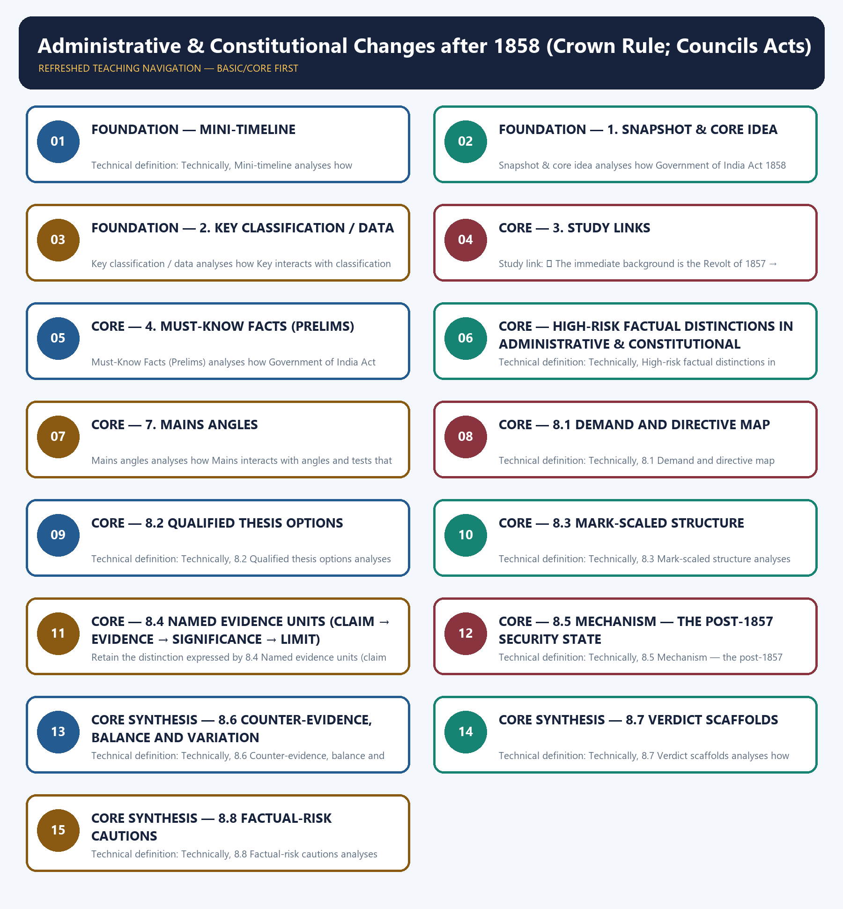

# Administrative & Constitutional Changes after 1858 (Crown Rule; Councils Acts) - Learner-v2 Complete Learning Session

### SOURCE, PROGRESSION AND CURRENT-LINKAGE AUDIT

- **Repository owners queried:** Basic and Advanced Markdown for this topic, the master chronology, syllabus map and linked Modern History owners.
- **OCR book evidence queried:** OCR checks located the Secretary of State and Council structure around PDF page 153, the Indian Councils Act 1861 around page 154, local self-government around page 157 and the 1892 Act around page 210 of Bipan Chandra.
- **Qdrant:** not used; Markdown plus searchable local PDFs were sufficient.
- **PYQ integrity:** Repository routing audits assign no direct 2018-2026 PYQ to Topic 12. The package therefore records a transparent zero-direct-PYQ audit and uses only original practice plus bounded links to Topics 06, 08, 11 and 14.
- **Bounded live linkage:** PIB's Constitution-75 campaign record is used only as a present-day constitutional-memory bridge. It does not imply continuity between colonial consultative councils and democratic responsible government.
- **Fact/inference rule:** historical claims are source-backed; analytical judgements are explicitly framed as interpretation and do not invent figures.

## BASIC LEARNING SESSION

### DEEP-REVIEW LEARNING CONTRACT

| Control | Binding rule for this package |
|---|---|
| Syllabus boundary | Complete Modern History Core is taught chronologically and causally before optional enrichment. |
| Evidence method | Claim → named Act/treaty/record/organisation/person/region or scholarly evidence → analysis → qualification. |
| Date discipline | Event, proposal, enactment, commencement, official policy, implementation and later interpretation remain distinct. |
| Historiography | Colonial, nationalist, Marxist, subaltern, Cambridge, feminist and other relevant arguments are attributed and tested, never used as labels alone. |
| Practice contract | Every solved item has demand decoding, an examiner-grade model, an executable answer/compression plan, marks rationale and answer-specific improvement. |
| Approval | This immutable successor remains `approved: false` pending explicit approval. |

**Canonical Basic/Core owner:** `upsc-ai-kit\knowledge\Modern-Indian-History\basic\12_Administrative-Changes-After-1858.md`  
**Canonical topic owner:** `upsc-ai-kit\knowledge\Modern-Indian-History\basic\12_Administrative-Changes-After-1858.md`  
**Optional Advanced owner:** `upsc-ai-kit\knowledge\Modern-Indian-History\advanced\12_Administrative-Changes-After-1858.md`  
**Official syllabus mapping:** `upsc-ai-kit\knowledge\Modern-Indian-History\OFFICIAL-UPSC-SYLLABUS-MAPPING.md`

### EVIDENCE, PYQ AND CURRENT-STATUS CONTROL

- **Official and primary evidence:** Acts, charters, treaties, proclamations, committee reports, proceedings, organisational resolutions, speeches and contemporary records are dated and read for authorship and purpose.
- **Regional and social evidence:** petitions, newspapers, memoirs, local studies and material geography qualify elite or all-India generalisation.
- **Economic and quantitative evidence:** revenue, trade, price, wage, craft and mortality claims retain unit, region, period and uncertainty; statistics are never invented.
- **Scholarly interpretation:** historian schools are competing explanations tied to named evidence, not memorised verdicts.
- **PYQ discipline:** repository ledgers and locally held official papers control wording and metadata; reconstructed wording and unavailable official keys remain explicitly labelled.
- **Current-status note, rechecked 2026-08-31:** PIB's Constitution-75 campaign record is used only as a present-day constitutional-memory bridge. It does not imply continuity between colonial consultative councils and democratic responsible government.

**Live/primary context sources recorded by the predecessor generation:**

- `https://pib.gov.in/PressReleasePage.aspx?PRID=2076894`




*Distinct embedded teaching-navigation image. The separate continuous Cārvāka-style flowchart package remains an independent at-a-glance artifact.*

### SESSION 1 — FOUNDATION — MINI-TIMELINE

#### DEFINITION / WHAT THIS IS CALLED

**Plain-language definition:** Plain definition: Mini-timeline is a learner's map within Administrative & Constitutional Changes after 1858 (Crown Rule; Councils Acts) that groups Government of India Act, Queen's Proclamation and Viceroy.

**Technical definition:** Technical definition: Technically, Mini-timeline analyses how Government of India Act interacts with Queen's Proclamation and tests that relationship through Viceroy and Indian Councils Act.

#### ANSWER-GRABBING OPENING — WRITE/ADAPT IN THE EXAM

> Plain definition: Mini-timeline is a learner's map within Administrative & Constitutional Changes after 1858 (Crown Rule; Councils Acts) that groups Government of India Act, Queen's Proclamation and Viceroy.

#### MUST-WRITE KEYWORDS

- **FOUNDATION**
- **Mini-timeline**
- **Plain definition**
- **Technical definition**
- **Government of India Act**
- **Queen's Proclamation**

**How to use them:** Frame the answer through FOUNDATION; define Mini-timeline, connect Plain definition with Technical definition to explain the mechanism, and use Government of India Act for the decisive comparison or qualification.

##### VISUAL FIRST

```text
MINI-TIMELINE
Government of India Act -> Queen's Proclamation -> Viceroy -> Indian Councils Act
context -> evidence -> mechanism -> qualification -> UPSC judgement
```

*The visual fixes the subtopic's evidence-to-judgement sequence before detail.*

##### CONCEPT DEFINITIONS

- **Plain definition:** Mini-timeline is a learner's map within Administrative & Constitutional Changes after 1858 (Crown Rule; Councils Acts) that groups Government of India Act, Queen's Proclamation and Viceroy.
- **Technical definition:** Technically, Mini-timeline analyses how Government of India Act interacts with Queen's Proclamation and tests that relationship through Viceroy and Indian Councils Act.

| Date | Event |
|---|---|
| ✅ 1858 | **Government of India Act** ended Company rule and transferred power to the Crown |
| ✅ 1858 | **Queen's Proclamation** promised non-interference in religion and respect for princes |
| ✅ 1858 | Governor-General became **Viceroy**; Lord Canning was the first Viceroy |
| ✅ 1861 | **Indian Councils Act** introduced portfolio system and nominated non-officials |
| ✅ 1870 | Lord Mayo's financial decentralisation began limited provincial finance |
| ✅ 1882 | Lord Ripon's Resolution became the "Magna Carta" of local self-government |
| ✅ 1892 | Indian Councils Act enlarged councils and allowed limited budget discussion |

##### EXAM LINK

- **Prelims:** preserve the exact actor-date-institution match and eliminate category errors.
- **Mains:** connect evidence to mechanism, add one limitation and end with a graded verdict.

##### MINI RECAP

- Retain the distinction expressed by **Mini-timeline**; do not reduce it to an isolated fact.

#### CLOSING RECALL FLOW — FOUNDATION — MINI-TIMELINE

```text
START / CONCEPT: FOUNDATION — Mini-timeline
        |
        v
EXACT TERMS: FOUNDATION · Mini-timeline · Plain definition · Technical definition · Government of India Act · Queen's Proclamation
        |
        v
MECHANISM / ARGUMENT: Technical definition: Technically, Mini-timeline analyses how Government of India Act interacts with Queen's Proclamation and tests that relationship through Viceroy and Indian Councils Act.
        |
        v
CONSEQUENCE / CONTRAST: Retain the distinction expressed by Mini-timeline; do not reduce it to an isolated fact.
        |
        v
UPSC TRAP / ANSWER-USE: Do not miss this limiting distinction: retain the distinction expressed by Mini-timeline.
        |
        v
ANSWER-GRABBING FORMULATION: Plain definition: Mini-timeline is a learner's map within Administrative & Constitutional Changes after 1858 (Crown Rule; Councils Acts) that groups Government of India Act, Queen's Proclamation and Viceroy.
```
### SESSION 2 — FOUNDATION — 1. SNAPSHOT & CORE IDEA

#### DEFINITION / WHAT THIS IS CALLED

**Plain-language definition:** Snapshot & core idea is a learner's map within Administrative & Constitutional Changes after 1858 (Crown Rule; Councils Acts) that groups Government of India Act 1858, Secretary of State for India and 15-member Council of India.

**Technical definition:** Snapshot & core idea analyses how Government of India Act 1858 interacts with Secretary of State for India and tests that relationship through 15-member Council of India and Viceroy.

#### ANSWER-GRABBING OPENING — WRITE/ADAPT IN THE EXAM

> Snapshot & core idea is a learner's map within Administrative & Constitutional Changes after 1858 (Crown Rule; Councils Acts) that groups Government of India Act 1858, Secretary of State for India and 15-member Council of India.

#### MUST-WRITE KEYWORDS

- **FOUNDATION**
- **Plain definition**
- **Technical definition**
- **Government of India Act 1858**
- **Secretary of State for India**
- **1. Snapshot & core idea**

**How to use them:** Frame the answer through FOUNDATION; define Plain definition, connect Technical definition with Government of India Act 1858 to explain the mechanism, and use Secretary of State for India for the decisive comparison or qualification.

##### VISUAL FIRST

```text
1. SNAPSHOT & CORE IDEA
Government of India Act 1858 -> Secretary of State for India -> 15-member Council of India -> Viceroy
context -> evidence -> mechanism -> qualification -> UPSC judgement
```

*The visual fixes the subtopic's evidence-to-judgement sequence before detail.*

##### CONCEPT DEFINITIONS

- **Plain definition:** 1. Snapshot & core idea is a learner's map within Administrative & Constitutional Changes after 1858 (Crown Rule; Councils Acts) that groups Government of India Act 1858, Secretary of State for India and 15-member Council of India.
- **Technical definition:** Technically, 1. Snapshot & core idea analyses how Government of India Act 1858 interacts with Secretary of State for India and tests that relationship through 15-member Council of India and Viceroy.

**Foundation — 1858 replaced Company rule with Crown rule.**

- ✅ The **Government of India Act 1858** abolished the East India Company's rule and the Board of Control, transferring Indian administration directly to the British Crown.
- ✅ A **Secretary of State for India** was created in Britain, assisted by a **15-member Council of India**.
- ✅ The Governor-General of India also became the **Viceroy**, representing the Crown; **Canning** was the first Viceroy.
- ✅ The **Queen's Proclamation (1858)** promised non-intervention in religion, respect for treaties with princes and equality in public employment, though equality remained largely unfulfilled.

**Foundation — later Acts gave controlled association, not democracy.**

- ✅ The **Indian Councils Act 1861** restored legislative councils, allowed nominated non-official Indian members and introduced the portfolio system under Canning.
- ✅ The **Indian Councils Act 1892** enlarged councils, accepted an indirect election principle in practice and permitted discussion of the budget and questions.
- ✅ Local self-government was encouraged by **Ripon's Resolution of 1882**, remembered as the "Magna Carta of local self-government".
- ✅ The army was reorganised after 1857 by increasing the European proportion, keeping artillery mainly with Europeans and using divide-and-rule recruitment.

##### EXAM LINK

- **Prelims:** preserve the exact actor-date-institution match and eliminate category errors.
- **Mains:** connect evidence to mechanism, add one limitation and end with a graded verdict.

##### MINI RECAP

- Retain the distinction expressed by **1. Snapshot & core idea**; do not reduce it to an isolated fact.

#### CLOSING RECALL FLOW — FOUNDATION — 1. SNAPSHOT & CORE IDEA

```text
START / CONCEPT: FOUNDATION — 1. Snapshot & core idea
        |
        v
EXACT TERMS: FOUNDATION · Plain definition · Technical definition · Government of India Act 1858 · Secretary of State for India · 1. Snapshot & core idea
        |
        v
MECHANISM / ARGUMENT: Snapshot & core idea analyses how Government of India Act 1858 interacts with Secretary of State for India and tests that relationship through 15-member Council of India and Viceroy.
        |
        v
CONSEQUENCE / CONTRAST: Snapshot & core idea; do not reduce it to an isolated fact.
        |
        v
UPSC TRAP / ANSWER-USE: Do not miss this limiting distinction: foundation — 1858 replaced Company rule with Crown rule.
        |
        v
ANSWER-GRABBING FORMULATION: Snapshot & core idea is a learner's map within Administrative & Constitutional Changes after 1858 (Crown Rule; Councils Acts) that groups Government of India Act 1858, Secretary of State for India and 15-member Council of India.
```
### SESSION 3 — FOUNDATION — 2. KEY CLASSIFICATION / DATA

#### DEFINITION / WHAT THIS IS CALLED

**Plain-language definition:** Key classification / data is a learner's map within Administrative & Constitutional Changes after 1858 (Crown Rule; Councils Acts) that groups Key, classification and data.

**Technical definition:** Key classification / data analyses how Key interacts with classification and tests that relationship through data and context.

#### ANSWER-GRABBING OPENING — WRITE/ADAPT IN THE EXAM

> Key classification / data is a learner's map within Administrative & Constitutional Changes after 1858 (Crown Rule; Councils Acts) that groups Key, classification and data.

#### MUST-WRITE KEYWORDS

- **FOUNDATION**
- **Plain definition**
- **Technical definition**
- **✅ Government of India Act 1858**
- **Crown rule; Company and Board of Control abolished**
- **2. Key classification / data**

**How to use them:** Frame the answer through FOUNDATION; define Plain definition, connect Technical definition with ✅ Government of India Act 1858 to explain the mechanism, and use Crown rule; Company and Board of Control abolished for the decisive comparison or qualification.

##### VISUAL FIRST

```text
2. KEY CLASSIFICATION / DATA
Key -> classification -> data
context -> evidence -> mechanism -> qualification -> UPSC judgement
```

*The visual fixes the subtopic's evidence-to-judgement sequence before detail.*

##### CONCEPT DEFINITIONS

- **Plain definition:** 2. Key classification / data is a learner's map within Administrative & Constitutional Changes after 1858 (Crown Rule; Councils Acts) that groups Key, classification and data.
- **Technical definition:** Technically, 2. Key classification / data analyses how Key interacts with classification and tests that relationship through data and context.

| Change | Main feature |
|---|---|
| ✅ Government of India Act 1858 | Crown rule; Company and Board of Control abolished |
| ✅ Secretary of State | British Cabinet minister controlling Indian affairs from London |
| ✅ Viceroy | Governor-General as representative of the Crown in India |
| ✅ Queen's Proclamation | Religious non-interference, treaty respect, formal equality promise |
| ✅ Indian Councils Act 1861 | Portfolio system; nominated Indians; legislative devolution begins |
| ✅ Indian Councils Act 1892 | Larger councils; indirect election principle; budget discussion/questions |
| ✅ Ripon's Resolution 1882 | Local self-government ideal; municipal and district bodies encouraged |

##### EXAM LINK

- **Prelims:** preserve the exact actor-date-institution match and eliminate category errors.
- **Mains:** connect evidence to mechanism, add one limitation and end with a graded verdict.

##### MINI RECAP

- Retain the distinction expressed by **2. Key classification / data**; do not reduce it to an isolated fact.

#### CLOSING RECALL FLOW — FOUNDATION — 2. KEY CLASSIFICATION / DATA

```text
START / CONCEPT: FOUNDATION — 2. Key classification / data
        |
        v
EXACT TERMS: FOUNDATION · Plain definition · Technical definition · ✅ Government of India Act 1858 · Crown rule; Company and Board of Control abolished · 2. Key classification / data
        |
        v
MECHANISM / ARGUMENT: Key classification / data analyses how Key interacts with classification and tests that relationship through data and context.
        |
        v
CONSEQUENCE / CONTRAST: Key classification / data; do not reduce it to an isolated fact.
        |
        v
UPSC TRAP / ANSWER-USE: Do not miss this limiting distinction: do not reduce it to an isolated fact.
        |
        v
ANSWER-GRABBING FORMULATION: Key classification / data is a learner's map within Administrative & Constitutional Changes after 1858 (Crown Rule; Councils Acts) that groups Key, classification and data.
```
### SESSION 4 — CORE — 3. STUDY LINKS

#### DEFINITION / WHAT THIS IS CALLED

**Plain-language definition:** Study links is a learner's map within Administrative & Constitutional Changes after 1858 (Crown Rule; Councils Acts) that groups Study link:, Study and links.

**Technical definition:** Study link: ✅ The immediate background is the Revolt of 1857 → basic/11The-Revolt-of-1857.md.

#### ANSWER-GRABBING OPENING — WRITE/ADAPT IN THE EXAM

> Study links is a learner's map within Administrative & Constitutional Changes after 1858 (Crown Rule; Councils Acts) that groups Study link:, Study and links.

#### MUST-WRITE KEYWORDS

- **Plain definition**
- **Technical definition**
- **Study link**
- **Study links**
- **3. Study links**
- **1757-1858**

**How to use them:** Frame the answer through Plain definition; define Technical definition, connect Study link with Study links to explain the mechanism, and use 3. Study links for the decisive comparison or qualification.

##### VISUAL FIRST

```text
3. STUDY LINKS
Study link: -> Study -> links
context -> evidence -> mechanism -> qualification -> UPSC judgement
```

*The visual fixes the subtopic's evidence-to-judgement sequence before detail.*

##### CONCEPT DEFINITIONS

- **Plain definition:** 3. Study links is a learner's map within Administrative & Constitutional Changes after 1858 (Crown Rule; Councils Acts) that groups Study link:, Study and links.
- **Technical definition:** Technically, 3. Study links analyses how Study link: interacts with Study and tests that relationship through links and context.

> **Study link:** ✅ The immediate background is the Revolt of 1857 → `basic/11_The-Revolt-of-1857.md`.
> **Study link:** ⚠️ Earlier constitutional development from 1773 to 1858 → `basic/06_Government-Structure-and-Constitutional-Development-1757-1858.md`.
> **Study link:** ✅ Later nationalist demands for representation → `basic/14_Foundation-of-INC-and-Moderate-Phase.md` and `basic/18_WWI-Home-Rule-and-Lucknow-Pact.md`.

##### EXAM LINK

- **Prelims:** preserve the exact actor-date-institution match and eliminate category errors.
- **Mains:** connect evidence to mechanism, add one limitation and end with a graded verdict.

##### MINI RECAP

- Retain the distinction expressed by **3. Study links**; do not reduce it to an isolated fact.

#### CLOSING RECALL FLOW — CORE — 3. STUDY LINKS

```text
START / CONCEPT: CORE — 3. Study links
        |
        v
EXACT TERMS: Plain definition · Technical definition · Study link · Study links · 3. Study links · 1757-1858
        |
        v
MECHANISM / ARGUMENT: Study links analyses how Study link: interacts with Study and tests that relationship through links and context.
        |
        v
CONSEQUENCE / CONTRAST: Study links; do not reduce it to an isolated fact.
        |
        v
UPSC TRAP / ANSWER-USE: Do not miss this limiting distinction: ✅ The immediate background is the Revolt of 1857 → basic/11The-Revolt-of-1857.md.
        |
        v
ANSWER-GRABBING FORMULATION: Study links is a learner's map within Administrative & Constitutional Changes after 1858 (Crown Rule; Councils Acts) that groups Study link:, Study and links.
```
### SESSION 5 — CORE — 4. MUST-KNOW FACTS (PRELIMS)

#### DEFINITION / WHAT THIS IS CALLED

**Plain-language definition:** Must-Know Facts (Prelims) is a learner's map within Administrative & Constitutional Changes after 1858 (Crown Rule; Councils Acts) that groups Government of India Act 1858, Secretary of State for India and Viceroy.

**Technical definition:** Must-Know Facts (Prelims) analyses how Government of India Act 1858 interacts with Secretary of State for India and tests that relationship through Viceroy and Lord Canning.

#### ANSWER-GRABBING OPENING — WRITE/ADAPT IN THE EXAM

> Must-Know Facts (Prelims) is a learner's map within Administrative & Constitutional Changes after 1858 (Crown Rule; Councils Acts) that groups Government of India Act 1858, Secretary of State for India and Viceroy.

#### MUST-WRITE KEYWORDS

- **Plain definition**
- **Technical definition**
- **Government of India Act 1858**
- **Secretary of State for India**
- **Viceroy**
- **4. Must-Know Facts (Prelims)**

**How to use them:** Frame the answer through Plain definition; define Technical definition, connect Government of India Act 1858 with Secretary of State for India to explain the mechanism, and use Viceroy for the decisive comparison or qualification.

##### VISUAL FIRST

```text
4. MUST-KNOW FACTS (PRELIMS)
Government of India Act 1858 -> Secretary of State for India -> Viceroy -> Lord Canning
context -> evidence -> mechanism -> qualification -> UPSC judgement
```

*The visual fixes the subtopic's evidence-to-judgement sequence before detail.*

##### CONCEPT DEFINITIONS

- **Plain definition:** 4. Must-Know Facts (Prelims) is a learner's map within Administrative & Constitutional Changes after 1858 (Crown Rule; Councils Acts) that groups Government of India Act 1858, Secretary of State for India and Viceroy.
- **Technical definition:** Technically, 4. Must-Know Facts (Prelims) analyses how Government of India Act 1858 interacts with Secretary of State for India and tests that relationship through Viceroy and Lord Canning.

- ✅ **Government of India Act 1858** = Crown rule, Secretary of State, Council of India, end of Company rule.
- ✅ **Secretary of State for India** sat in Britain; **Viceroy** governed in India as Crown representative.
- ✅ **Lord Canning** was the first Viceroy.
- ✅ **Indian Councils Act 1861** = portfolio system, nominated non-official members, beginning of legislative decentralisation.
- ✅ **Ripon's Resolution 1882** = "Magna Carta of local self-government".
- ✅ **Indian Councils Act 1892** = enlarged councils, limited budget discussion and questions.

##### EXAM LINK

- **Prelims:** preserve the exact actor-date-institution match and eliminate category errors.
- **Mains:** connect evidence to mechanism, add one limitation and end with a graded verdict.

##### MINI RECAP

- Retain the distinction expressed by **4. Must-Know Facts (Prelims)**; do not reduce it to an isolated fact.

#### CLOSING RECALL FLOW — CORE — 4. MUST-KNOW FACTS (PRELIMS)

```text
START / CONCEPT: CORE — 4. Must-Know Facts (Prelims)
        |
        v
EXACT TERMS: Plain definition · Technical definition · Government of India Act 1858 · Secretary of State for India · Viceroy · 4. Must-Know Facts (Prelims)
        |
        v
MECHANISM / ARGUMENT: Must-Know Facts (Prelims) analyses how Government of India Act 1858 interacts with Secretary of State for India and tests that relationship through Viceroy and Lord Canning.
        |
        v
CONSEQUENCE / CONTRAST: Must-Know Facts (Prelims); do not reduce it to an isolated fact.
        |
        v
UPSC TRAP / ANSWER-USE: Do not miss this limiting distinction: ✅ Government of India Act 1858 = Crown rule, Secretary of State, Council of...
        |
        v
ANSWER-GRABBING FORMULATION: Must-Know Facts (Prelims) is a learner's map within Administrative & Constitutional Changes after 1858 (Crown Rule; Councils Acts) that groups Government of India Act 1858, Secretary of State for India and Viceroy.
```
### SESSION 6 — CORE — HIGH-RISK FACTUAL DISTINCTIONS IN ADMINISTRATIVE & CONSTITUTIONAL CHANGES AFTER 1858 (CROWN RULE; COUNCILS ACTS)

#### DEFINITION / WHAT THIS IS CALLED

**Plain-language definition:** Plain definition: High-risk factual distinctions in Administrative & Constitutional Changes after 1858 (Crown Rule; Councils Acts) is a learner's map within Administrative & Constitutional Changes after 1858 (Crown Rule; Councils Acts) that groups Secretary of State ≠ Viceroy, Crown and nomination.

**Technical definition:** Technical definition: Technically, High-risk factual distinctions in Administrative & Constitutional Changes after 1858 (Crown Rule; Councils Acts) analyses how Secretary of State ≠ Viceroy interacts with Crown and tests that relationship through nomination and context.

#### ANSWER-GRABBING OPENING — WRITE/ADAPT IN THE EXAM

> Plain definition: High-risk factual distinctions in Administrative & Constitutional Changes after 1858 (Crown Rule; Councils Acts) is a learner's map within Administrative & Constitutional Changes after 1858 (Crown Rule; Councils Acts) that groups Secretary of State ≠ Viceroy, Crown and nomination.

#### MUST-WRITE KEYWORDS

- **Councils Acts)**
- **Plain definition**
- **Technical definition**
- **Secretary of State ≠ Viceroy**
- **Crown**
- **nomination**

**How to use them:** Frame the answer through Councils Acts); define Plain definition, connect Technical definition with Secretary of State ≠ Viceroy to explain the mechanism, and use Crown for the decisive comparison or qualification.

##### VISUAL FIRST

```text
HIGH-RISK FACTUAL DISTINCTIONS IN ADMINISTRATIVE & CONSTITUTIONAL CHANGES AFTER 1858 (CROWN RULE; COUNCILS ACTS)
Secretary of State ≠ Viceroy -> Crown -> nomination
context -> evidence -> mechanism -> qualification -> UPSC judgement
```

*The visual fixes the subtopic's evidence-to-judgement sequence before detail.*

##### CONCEPT DEFINITIONS

- **Plain definition:** High-risk factual distinctions in Administrative & Constitutional Changes after 1858 (Crown Rule; Councils Acts) is a learner's map within Administrative & Constitutional Changes after 1858 (Crown Rule; Councils Acts) that groups Secretary of State ≠ Viceroy, Crown and nomination.
- **Technical definition:** Technically, High-risk factual distinctions in Administrative & Constitutional Changes after 1858 (Crown Rule; Councils Acts) analyses how Secretary of State ≠ Viceroy interacts with Crown and tests that relationship through nomination and context.

> 🔑 Trap: **Secretary of State ≠ Viceroy**; one controlled India from Britain, the other governed in India.

- ❌ Government of India Act 1858 introduced elected legislatures. → It transferred authority to the **Crown**, not democracy.
- ❌ Queen's Proclamation fully implemented equality in services. → It promised equality, but racial barriers persisted.
- ❌ Indian Councils Act 1861 introduced direct elections. → It allowed **nomination**, not direct election.
- ❌ Ripon's local bodies were fully autonomous. → They were important but remained under colonial supervision.

##### EXAM LINK

- **Prelims:** preserve the exact actor-date-institution match and eliminate category errors.
- **Mains:** connect evidence to mechanism, add one limitation and end with a graded verdict.

##### MINI RECAP

- Retain the distinction expressed by **High-risk factual distinctions in Administrative & Constitutional Changes after 1858 (Crown Rule; Councils Acts)**; do not reduce it to an isolated fact.

#### CLOSING RECALL FLOW — CORE — HIGH-RISK FACTUAL DISTINCTIONS IN ADMINISTRATIVE & CONSTITUTIONAL CHANGES AFTER 1858 (CROWN RULE; COUNCILS ACTS)

```text
START / CONCEPT: CORE — High-risk factual distinctions in Administrative & Constitutional Changes after 1858 (Crown Rule; Councils Acts)
        |
        v
EXACT TERMS: Councils Acts) · Plain definition · Technical definition · Secretary of State ≠ Viceroy · Crown · nomination
        |
        v
MECHANISM / ARGUMENT: Technical definition: Technically, High-risk factual distinctions in Administrative & Constitutional Changes after 1858 (Crown Rule; Councils Acts) analyses how Secretary of State ≠ Viceroy interacts with Crown and tests that relationship through nomination and context.
        |
        v
CONSEQUENCE / CONTRAST: Retain the distinction expressed by High-risk factual distinctions in Administrative & Constitutional Changes after 1858 (Crown Rule; Councils Acts); do not reduce it to an isolated fact.
        |
        v
UPSC TRAP / ANSWER-USE: ❌ Government of India Act 1858 introduced elected legislatures. → It transferred authority to the Crown, not democracy. ❌ Queen's Proclamation fully implemented equality in services. → It promised equality, but racial barriers persisted. ❌ Indian Councils Act 1861 introduced direct elections. → It allowed nomination, not direct election. ❌ Ripon's local bodies were fully autonomous. → They were important but remained under colonial supervision.
        |
        v
ANSWER-GRABBING FORMULATION: Plain definition: High-risk factual distinctions in Administrative & Constitutional Changes after 1858 (Crown Rule; Councils Acts) is a learner's map within Administrative & Constitutional Changes after 1858 (Crown Rule; Councils Acts) that groups Secretary of State ≠ Viceroy, Crown and nomination.
```
### CORE — 6. 📰 Current link

##### VISUAL FIRST

```text
6. 📰 CURRENT LINK
Current -> link
context -> evidence -> mechanism -> qualification -> UPSC judgement
```

*The visual fixes the subtopic's evidence-to-judgement sequence before detail.*

##### CONCEPT DEFINITIONS

- **Plain definition:** 6. 📰 Current link is a learner's map within Administrative & Constitutional Changes after 1858 (Crown Rule; Councils Acts) that groups Current, link and context.
- **Technical definition:** Technically, 6. 📰 Current link analyses how Current interacts with link and tests that relationship through context and evidence.

- ⚠️ **Debates on federalism, local bodies and civil-service accountability.** Post-1858 institutions are an early colonial background to later constitutional ideas of representation, decentralisation and bureaucracy. *(Escalate to 📰 when pegged to a verified news item.)*

##### EXAM LINK

- **Prelims:** preserve the exact actor-date-institution match and eliminate category errors.
- **Mains:** connect evidence to mechanism, add one limitation and end with a graded verdict.

##### MINI RECAP

- Retain the distinction expressed by **6. 📰 Current link**; do not reduce it to an isolated fact.
### SESSION 7 — CORE — 7. MAINS ANGLES

#### DEFINITION / WHAT THIS IS CALLED

**Plain-language definition:** Mains angles is a learner's map within Administrative & Constitutional Changes after 1858 (Crown Rule; Councils Acts) that groups Mains, angles and context.

**Technical definition:** Mains angles analyses how Mains interacts with angles and tests that relationship through context and evidence.

#### ANSWER-GRABBING OPENING — WRITE/ADAPT IN THE EXAM

> Mains angles is a learner's map within Administrative & Constitutional Changes after 1858 (Crown Rule; Councils Acts) that groups Mains, angles and context.

#### MUST-WRITE KEYWORDS

- **Plain definition**
- **Technical definition**
- **Mains angles**
- **Administrative**
- **Constitutional Changes**
- **7. Mains angles**

**How to use them:** Frame the answer through Plain definition; define Technical definition, connect Mains angles with Administrative to explain the mechanism, and use Constitutional Changes for the decisive comparison or qualification.

##### VISUAL FIRST

```text
7. MAINS ANGLES
Mains -> angles
context -> evidence -> mechanism -> qualification -> UPSC judgement
```

*The visual fixes the subtopic's evidence-to-judgement sequence before detail.*

##### CONCEPT DEFINITIONS

- **Plain definition:** 7. Mains angles is a learner's map within Administrative & Constitutional Changes after 1858 (Crown Rule; Councils Acts) that groups Mains, angles and context.
- **Technical definition:** Technically, 7. Mains angles analyses how Mains interacts with angles and tests that relationship through context and evidence.

- ⚠️ GS-1: Analyse how the Revolt of 1857 changed British administrative policy in India.
- ⚠️ GS-1: Discuss whether post-1858 constitutional reforms represented genuine inclusion or controlled association.
- ⚠️ GS-1: Explain the significance of Ripon's local self-government policy in the growth of political training.

##### EXAM LINK

- **Prelims:** preserve the exact actor-date-institution match and eliminate category errors.
- **Mains:** connect evidence to mechanism, add one limitation and end with a graded verdict.

##### MINI RECAP

- Retain the distinction expressed by **7. Mains angles**; do not reduce it to an isolated fact.

#### CLOSING RECALL FLOW — CORE — 7. MAINS ANGLES

```text
START / CONCEPT: CORE — 7. Mains angles
        |
        v
EXACT TERMS: Plain definition · Technical definition · Mains angles · Administrative · Constitutional Changes · 7. Mains angles
        |
        v
MECHANISM / ARGUMENT: Mains angles analyses how Mains interacts with angles and tests that relationship through context and evidence.
        |
        v
CONSEQUENCE / CONTRAST: Mains angles; do not reduce it to an isolated fact.
        |
        v
UPSC TRAP / ANSWER-USE: Do not miss this limiting distinction: analyse how the Revolt of 1857 changed British administrative policy in India. ⚠️ GS-1.
        |
        v
ANSWER-GRABBING FORMULATION: Mains angles is a learner's map within Administrative & Constitutional Changes after 1858 (Crown Rule; Councils Acts) that groups Mains, angles and context.
```
### CORE — Answer architecture overview

##### VISUAL FIRST

```text
ANSWER ARCHITECTURE OVERVIEW
Answer -> architecture -> overview
context -> evidence -> mechanism -> qualification -> UPSC judgement
```

*The visual fixes the subtopic's evidence-to-judgement sequence before detail.*

##### CONCEPT DEFINITIONS

- **Plain definition:** Answer architecture overview is a learner's map within Administrative & Constitutional Changes after 1858 (Crown Rule; Councils Acts) that groups Answer, architecture and overview.
- **Technical definition:** Technically, Answer architecture overview analyses how Answer interacts with architecture and tests that relationship through overview and context.

> Purpose: support demands on **why 1858 changed the form but not the character of colonial rule**, and on the difference between association and representation in the Councils Acts.

##### EXAM LINK

- **Prelims:** preserve the exact actor-date-institution match and eliminate category errors.
- **Mains:** connect evidence to mechanism, add one limitation and end with a graded verdict.

##### MINI RECAP

- Retain the distinction expressed by **Answer architecture overview**; do not reduce it to an isolated fact.
### SESSION 8 — CORE — 8.1 DEMAND AND DIRECTIVE MAP

#### DEFINITION / WHAT THIS IS CALLED

**Plain-language definition:** Plain definition: 8.1 Demand and directive map is a learner's map within Administrative & Constitutional Changes after 1858 (Crown Rule; Councils Acts) that groups Demand, and and directive.

**Technical definition:** Technical definition: Technically, 8.1 Demand and directive map analyses how Demand interacts with and and tests that relationship through directive and map.

#### ANSWER-GRABBING OPENING — WRITE/ADAPT IN THE EXAM

> Plain definition: 8.1 Demand and directive map is a learner's map within Administrative & Constitutional Changes after 1858 (Crown Rule; Councils Acts) that groups Demand, and and directive.

#### MUST-WRITE KEYWORDS

- **directive map**
- **Plain definition**
- **Technical definition**
- **8.1 Demand**
- **8.1 Demand and directive map**
- **1857 → policy change**

**How to use them:** Frame the answer through directive map; define Plain definition, connect Technical definition with 8.1 Demand to explain the mechanism, and use 8.1 Demand and directive map for the decisive comparison or qualification.

##### VISUAL FIRST

```text
8.1 DEMAND AND DIRECTIVE MAP
Demand -> and -> directive -> map
context -> evidence -> mechanism -> qualification -> UPSC judgement
```

*The visual fixes the subtopic's evidence-to-judgement sequence before detail.*

##### CONCEPT DEFINITIONS

- **Plain definition:** 8.1 Demand and directive map is a learner's map within Administrative & Constitutional Changes after 1858 (Crown Rule; Councils Acts) that groups Demand, and and directive.
- **Technical definition:** Technically, 8.1 Demand and directive map analyses how Demand interacts with and and tests that relationship through directive and map.

| Demand family | Typical directive signals | Answer spine to use |
|---|---|---|
| 1857 → policy change | "How did the Revolt change British policy?" | Security lesson → constitutional change → army → social alliances → ideology |
| Reform evaluation | "Genuine inclusion or controlled association?" | What was conceded → what was withheld → who benefited → verdict |
| Councils trajectory | "Trace representation from 1861 to 1892" | Nomination → indirect election principle → budget/questions → still no responsibility |
| Local self-government | "Significance of Ripon's Resolution" | Stated purpose → political-training function → financial and supervisory limits |
| Princes and paramountcy | "Assess post-1858 policy toward princes" | Proclamation guarantee → conciliation → subordinate isolation |
| Promise vs practice | "Was the Queen's Proclamation honoured?" | Text → implementation → nationalist use of the gap |

##### EXAM LINK

- **Prelims:** preserve the exact actor-date-institution match and eliminate category errors.
- **Mains:** connect evidence to mechanism, add one limitation and end with a graded verdict.

##### MINI RECAP

- Retain the distinction expressed by **8.1 Demand and directive map**; do not reduce it to an isolated fact.

#### CLOSING RECALL FLOW — CORE — 8.1 DEMAND AND DIRECTIVE MAP

```text
START / CONCEPT: CORE — 8.1 Demand and directive map
        |
        v
EXACT TERMS: directive map · Plain definition · Technical definition · 8.1 Demand · 8.1 Demand and directive map · 1857 → policy change
        |
        v
MECHANISM / ARGUMENT: Technical definition: Technically, 8.1 Demand and directive map analyses how Demand interacts with and and tests that relationship through directive and map.
        |
        v
CONSEQUENCE / CONTRAST: Retain the distinction expressed by 8.1 Demand and directive map; do not reduce it to an isolated fact.
        |
        v
UPSC TRAP / ANSWER-USE: Do not miss this limiting distinction: retain the distinction expressed by 8.1 Demand and directive map.
        |
        v
ANSWER-GRABBING FORMULATION: Plain definition: 8.1 Demand and directive map is a learner's map within Administrative & Constitutional Changes after 1858 (Crown Rule; Councils Acts) that groups Demand, and and directive.
```
### SESSION 9 — CORE — 8.2 QUALIFIED THESIS OPTIONS

#### DEFINITION / WHAT THIS IS CALLED

**Plain-language definition:** Plain definition: 8.2 Qualified thesis options is a learner's map within Administrative & Constitutional Changes after 1858 (Crown Rule; Councils Acts) that groups Continuity thesis:, Alliance-reconstruction thesis: and Association-not-representation thesis:.

**Technical definition:** Technical definition: Technically, 8.2 Qualified thesis options analyses how Continuity thesis: interacts with Alliance-reconstruction thesis: and tests that relationship through Association-not-representation thesis: and Charter-of-grievance thesis:.

#### ANSWER-GRABBING OPENING — WRITE/ADAPT IN THE EXAM

> Plain definition: 8.2 Qualified thesis options is a learner's map within Administrative & Constitutional Changes after 1858 (Crown Rule; Councils Acts) that groups Continuity thesis:, Alliance-reconstruction thesis: and Association-not-representation thesis:.

#### MUST-WRITE KEYWORDS

- **Plain definition**
- **Technical definition**
- **Continuity thesis**
- **Alliance-reconstruction thesis**
- **Association-not-representation thesis**
- **8.2 Qualified thesis options**

**How to use them:** Frame the answer through Plain definition; define Technical definition, connect Continuity thesis with Alliance-reconstruction thesis to explain the mechanism, and use Association-not-representation thesis for the decisive comparison or qualification.

##### VISUAL FIRST

```text
8.2 QUALIFIED THESIS OPTIONS
Continuity thesis: -> Alliance-reconstruction thesis: -> Association-not-representation thesis: -> Charter-of-grievance thesis:
context -> evidence -> mechanism -> qualification -> UPSC judgement
```

*The visual fixes the subtopic's evidence-to-judgement sequence before detail.*

##### CONCEPT DEFINITIONS

- **Plain definition:** 8.2 Qualified thesis options is a learner's map within Administrative & Constitutional Changes after 1858 (Crown Rule; Councils Acts) that groups Continuity thesis:, Alliance-reconstruction thesis: and Association-not-representation thesis:.
- **Technical definition:** Technically, 8.2 Qualified thesis options analyses how Continuity thesis: interacts with Alliance-reconstruction thesis: and tests that relationship through Association-not-representation thesis: and Charter-of-grievance thesis:.

- **Continuity thesis:** *1858 transferred sovereignty from a corporation to the Crown without altering the purposes of government; the Secretary of State replaced the Court of Directors, but revenue, order and racial hierarchy remained the operating principles.*
- **Alliance-reconstruction thesis:** *The real post-1857 innovation was social rather than constitutional — the Raj abandoned the annexationist assault on princes and landed magnates and rebuilt itself on their loyalty.*
- **Association-not-representation thesis:** *The Councils Acts of 1861 and 1892 created consultation without power: Indians could be nominated, could later be indirectly chosen, could ask questions and discuss the budget — and could not vote a government out, amend a demand or hold an executive responsible.*
- **Charter-of-grievance thesis:** *The Queen's Proclamation mattered less as policy than as text: by promising religious non-interference and equality in public employment, it gave nationalists a British commitment against which British practice could be measured.*

##### EXAM LINK

- **Prelims:** preserve the exact actor-date-institution match and eliminate category errors.
- **Mains:** connect evidence to mechanism, add one limitation and end with a graded verdict.

##### MINI RECAP

- Retain the distinction expressed by **8.2 Qualified thesis options**; do not reduce it to an isolated fact.

#### CLOSING RECALL FLOW — CORE — 8.2 QUALIFIED THESIS OPTIONS

```text
START / CONCEPT: CORE — 8.2 Qualified thesis options
        |
        v
EXACT TERMS: Plain definition · Technical definition · Continuity thesis · Alliance-reconstruction thesis · Association-not-representation thesis · 8.2 Qualified thesis options
        |
        v
MECHANISM / ARGUMENT: Technical definition: Technically, 8.2 Qualified thesis options analyses how Continuity thesis: interacts with Alliance-reconstruction thesis: and tests that relationship through Association-not-representation thesis: and Charter-of-grievance thesis:.
        |
        v
CONSEQUENCE / CONTRAST: Retain the distinction expressed by 8.2 Qualified thesis options; do not reduce it to an isolated fact.
        |
        v
UPSC TRAP / ANSWER-USE: Continuity thesis: 1858 transferred sovereignty from a corporation to the Crown without altering the purposes of government; the Secretary of State replaced the Court of Directors, but revenue, order and racial hierarchy remained the operating principles.
        |
        v
ANSWER-GRABBING FORMULATION: Plain definition: 8.2 Qualified thesis options is a learner's map within Administrative & Constitutional Changes after 1858 (Crown Rule; Councils Acts) that groups Continuity thesis:, Alliance-reconstruction thesis: and Association-not-representation thesis:.
```
### SESSION 10 — CORE — 8.3 MARK-SCALED STRUCTURE

#### DEFINITION / WHAT THIS IS CALLED

**Plain-language definition:** Plain definition: 8.3 Mark-scaled structure is a learner's map within Administrative & Constitutional Changes after 1858 (Crown Rule; Councils Acts) that groups Mark-scaled, structure and context.

**Technical definition:** Technical definition: Technically, 8.3 Mark-scaled structure analyses how Mark-scaled interacts with structure and tests that relationship through context and evidence.

#### ANSWER-GRABBING OPENING — WRITE/ADAPT IN THE EXAM

> Plain definition: 8.3 Mark-scaled structure is a learner's map within Administrative & Constitutional Changes after 1858 (Crown Rule; Councils Acts) that groups Mark-scaled, structure and context.

#### MUST-WRITE KEYWORDS

- **Plain definition**
- **Technical definition**
- **Thesis → constitutional change → one limit → verdict**
- **8.3 Mark-scaled structure**
- **2–3 statutes/institutions**
- **4–5 units with dates**

**How to use them:** Frame the answer through Plain definition; define Technical definition, connect Thesis → constitutional change → one limit → verdict with 8.3 Mark-scaled structure to explain the mechanism, and use 2–3 statutes/institutions for the decisive comparison or qualification.

##### VISUAL FIRST

```text
8.3 MARK-SCALED STRUCTURE
Mark-scaled -> structure
context -> evidence -> mechanism -> qualification -> UPSC judgement
```

*The visual fixes the subtopic's evidence-to-judgement sequence before detail.*

##### CONCEPT DEFINITIONS

- **Plain definition:** 8.3 Mark-scaled structure is a learner's map within Administrative & Constitutional Changes after 1858 (Crown Rule; Councils Acts) that groups Mark-scaled, structure and context.
- **Technical definition:** Technically, 8.3 Mark-scaled structure analyses how Mark-scaled interacts with structure and tests that relationship through context and evidence.

| Marks | Recommended architecture | Evidence load |
|---:|---|---|
| 10 | Thesis → constitutional change → one limit → verdict | 2–3 statutes/institutions |
| 15 | Thesis → 1858 settlement → councils trajectory → local self-government → limits → verdict | 4–5 units with dates |
| 20 | Thesis → security logic of 1857 → constitutional, military, princely and ideological changes → councils and local bodies → nationalist response → graded verdict | 6–8 units linking `basic/11`, `basic/08` and `basic/14` |

##### EXAM LINK

- **Prelims:** preserve the exact actor-date-institution match and eliminate category errors.
- **Mains:** connect evidence to mechanism, add one limitation and end with a graded verdict.

##### MINI RECAP

- Retain the distinction expressed by **8.3 Mark-scaled structure**; do not reduce it to an isolated fact.

#### CLOSING RECALL FLOW — CORE — 8.3 MARK-SCALED STRUCTURE

```text
START / CONCEPT: CORE — 8.3 Mark-scaled structure
        |
        v
EXACT TERMS: Plain definition · Technical definition · Thesis → constitutional change → one limit → verdict · 8.3 Mark-scaled structure · 2–3 statutes/institutions · 4–5 units with dates
        |
        v
MECHANISM / ARGUMENT: Technical definition: Technically, 8.3 Mark-scaled structure analyses how Mark-scaled interacts with structure and tests that relationship through context and evidence.
        |
        v
CONSEQUENCE / CONTRAST: Retain the distinction expressed by 8.3 Mark-scaled structure; do not reduce it to an isolated fact.
        |
        v
UPSC TRAP / ANSWER-USE: Do not miss this limiting distinction: retain the distinction expressed by 8.3 Mark-scaled structure.
        |
        v
ANSWER-GRABBING FORMULATION: Plain definition: 8.3 Mark-scaled structure is a learner's map within Administrative & Constitutional Changes after 1858 (Crown Rule; Councils Acts) that groups Mark-scaled, structure and context.
```
### SESSION 11 — CORE — 8.4 NAMED EVIDENCE UNITS (CLAIM → EVIDENCE → SIGNIFICANCE → LIMIT)

#### DEFINITION / WHAT THIS IS CALLED

**Plain-language definition:** Plain definition: 8.4 Named evidence units (claim → evidence → significance → limit) is a learner's map within Administrative & Constitutional Changes after 1858 (Crown Rule; Councils Acts) that groups A.

**Technical definition:** Retain the distinction expressed by 8.4 Named evidence units (claim → evidence → significance → limit); do not reduce it to an isolated fact.

#### ANSWER-GRABBING OPENING — WRITE/ADAPT IN THE EXAM

> Plain definition: 8.4 Named evidence units (claim → evidence → significance → limit) is a learner's map within Administrative & Constitutional Changes after 1858 (Crown Rule; Councils Acts) that groups A.

#### MUST-WRITE KEYWORDS

- **Plain definition**
- **Technical definition**
- **A. The 1858 settlement**
- **Claim**
- **Government of India Act 1858**
- **8.4 Named evidence units (claim → evidence → significance → limit)**

**How to use them:** Frame the answer through Plain definition; define Technical definition, connect A. The 1858 settlement with Claim to explain the mechanism, and use Government of India Act 1858 for the decisive comparison or qualification.

##### VISUAL FIRST

```text
8.4 NAMED EVIDENCE UNITS (CLAIM → EVIDENCE → SIGNIFICANCE → LIMIT)
A. The 1858 settlement -> Claim: -> Evidence: -> Government of India Act 1858
context -> evidence -> mechanism -> qualification -> UPSC judgement
```

*The visual fixes the subtopic's evidence-to-judgement sequence before detail.*

##### CONCEPT DEFINITIONS

- **Plain definition:** 8.4 Named evidence units (claim → evidence → significance → limit) is a learner's map within Administrative & Constitutional Changes after 1858 (Crown Rule; Councils Acts) that groups A. The 1858 settlement, Claim: and Evidence:.
- **Technical definition:** Technically, 8.4 Named evidence units (claim → evidence → significance → limit) analyses how A. The 1858 settlement interacts with Claim: and tests that relationship through Evidence: and Government of India Act 1858.

**A. The 1858 settlement**
- **Claim:** Sovereignty changed hands; the machinery did not.
- **Evidence:** ✅ The **Government of India Act 1858** abolished Company rule and the Board of Control; a **Secretary of State for India** with a **fifteen-member Council of India** was created in Britain; the Governor-General became **Viceroy**, with **Canning** the first holder.
- **Significance:** Control moved to a Cabinet minister answerable to Parliament — which is why Indian political demand thereafter targeted London as well as Calcutta and why the India Office budget and Home Charges became nationalist issues.
- **Limit/caution:** Parliamentary answerability was thin in practice; Indian affairs rarely commanded sustained Commons attention.

**B. The Queen's Proclamation and its gap**
- **Claim:** The Proclamation created an obligation the state did not meet.
- **Evidence:** ✅ It promised **non-intervention in religion**, respect for **treaties with princes** and **equality in public employment** — the last of which remained largely unfulfilled.
- **Significance:** The unfulfilled equality clause became a standing nationalist argument, notably in the campaign for Indianisation of the services and in the Ilbert Bill controversy (`basic/08`).
- **Limit/caution:** Religious non-interference was honoured more consistently — with the effect of slowing further social legislation, which is an ambivalent outcome, not a straightforward gain.

**C. Councils Act, 1861 — consultation begins**
- **Claim:** Indians were admitted to the legislative process as advisers, not as representatives.
- **Evidence:** ✅ It restored legislative councils, permitted **nominated non-official Indian members**, and introduced the **portfolio system** under Canning; it also began legislative devolution to the provinces.
- **Significance:** The portfolio system created modern departmental government; nomination created a channel through which loyal Indian opinion could be heard and controlled at the same time.
- **Limit/caution:** No election, no budget power, no responsibility — say all three when assessing it.

**D. Councils Act, 1892 — the election principle, indirectly**
- **Claim:** 1892 conceded the form of representation while withholding its substance.
- **Evidence:** ✅ It enlarged the councils, accepted an **indirect election principle in practice** through recommending bodies, and permitted **discussion of the budget and the asking of questions**.
- **Significance:** It converted Congress's early demands into partial concessions and thereby validated the Moderate method — the direct causal link to `basic/14`.
- **Limit/caution:** Members could discuss the budget but not vote on it or move amendments; the concession is procedural.

**E. Financial and local decentralisation**
- **Claim:** Decentralisation began as a fiscal expedient and acquired a political function.
- **Evidence:** ✅ **Mayo's financial decentralisation from 1870** gave provinces limited financial responsibility; **Ripon's Resolution of 1882** is remembered as the **"Magna Carta of local self-government"**, encouraging municipal and district boards.
- **Significance:** Local bodies became the first practical school of Indian electoral politics — candidature, canvassing, budgets and factional organisation — which fed directly into later provincial politics.
- **Limit/caution:** Local bodies were financially starved and remained under official supervision, with district officers often retaining chairmanship; describe them as political training, not self-rule.

**F. Princes and landed magnates as the new base**
- **Claim:** After 1857 the Raj systematically converted potential enemies into stakeholders.
- **Evidence:** ✅ Treaty guarantees to princes under the Proclamation, the end of Lapse-style annexation, and the restoration of dispossessed landed magnates such as the Awadh taluqdars (see `basic/11`).
- **Significance:** Explains why princely India and the landlord order remained largely outside the national movement for decades and why the states' peoples' question (`basic/23`) arose separately and late.
- **Limit/caution:** Conciliation coexisted with tighter paramountcy — princes gained security and lost autonomy.

##### EXAM LINK

- **Prelims:** preserve the exact actor-date-institution match and eliminate category errors.
- **Mains:** connect evidence to mechanism, add one limitation and end with a graded verdict.

##### MINI RECAP

- Retain the distinction expressed by **8.4 Named evidence units (claim → evidence → significance → limit)**; do not reduce it to an isolated fact.

#### CLOSING RECALL FLOW — CORE — 8.4 NAMED EVIDENCE UNITS (CLAIM → EVIDENCE → SIGNIFICANCE → LIMIT)

```text
START / CONCEPT: CORE — 8.4 Named evidence units (claim → evidence → significance → limit)
        |
        v
EXACT TERMS: Plain definition · Technical definition · A. The 1858 settlement · Claim · Government of India Act 1858 · 8.4 Named evidence units (claim → evidence → significance → limit)
        |
        v
MECHANISM / ARGUMENT: Retain the distinction expressed by 8.4 Named evidence units (claim → evidence → significance → limit); do not reduce it to an isolated fact.
        |
        v
CONSEQUENCE / CONTRAST: The Queen's Proclamation and its gap Claim: The Proclamation created an obligation the state did not meet.
        |
        v
UPSC TRAP / ANSWER-USE: Councils Act, 1861 — consultation begins Claim: Indians were admitted to the legislative process as advisers, not as representatives.
        |
        v
ANSWER-GRABBING FORMULATION: Plain definition: 8.4 Named evidence units (claim → evidence → significance → limit) is a learner's map within Administrative & Constitutional Changes after 1858 (Crown Rule; Councils Acts) that groups A.
```
### SESSION 12 — CORE — 8.5 MECHANISM — THE POST-1857 SECURITY STATE

#### DEFINITION / WHAT THIS IS CALLED

**Plain-language definition:** Plain definition: 8.5 Mechanism — the post-1857 security state is a learner's map within Administrative & Constitutional Changes after 1858 (Crown Rule; Councils Acts) that groups Mechanism, the and post-1857.

**Technical definition:** Technical definition: Technically, 8.5 Mechanism — the post-1857 security state analyses how Mechanism interacts with the and tests that relationship through post-1857 and security.

#### ANSWER-GRABBING OPENING — WRITE/ADAPT IN THE EXAM

> Plain definition: 8.5 Mechanism — the post-1857 security state is a learner's map within Administrative & Constitutional Changes after 1858 (Crown Rule; Councils Acts) that groups Mechanism, the and post-1857.

#### MUST-WRITE KEYWORDS

- **the post-1857 security state**
- **Plain definition**
- **Technical definition**
- **Plain definition: 8.5 Mechanism — the post-1857 security state**
- **8.5 Mechanism**
- **8.5 Mechanism — the post-1857 security state**

**How to use them:** Frame the answer through the post-1857 security state; define Plain definition, connect Technical definition with Plain definition: 8.5 Mechanism — the post-1857 security state to explain the mechanism, and use 8.5 Mechanism for the decisive comparison or qualification.

##### VISUAL FIRST

```text
8.5 MECHANISM — THE POST-1857 SECURITY STATE
Mechanism -> the -> post-1857 -> security
context -> evidence -> mechanism -> qualification -> UPSC judgement
```

*The visual fixes the subtopic's evidence-to-judgement sequence before detail.*

##### CONCEPT DEFINITIONS

- **Plain definition:** 8.5 Mechanism — the post-1857 security state is a learner's map within Administrative & Constitutional Changes after 1858 (Crown Rule; Councils Acts) that groups Mechanism, the and post-1857.
- **Technical definition:** Technically, 8.5 Mechanism — the post-1857 security state analyses how Mechanism interacts with the and tests that relationship through post-1857 and security.

```text
1857 lesson: rule cannot rest on Indian troops or on annexation alone
   -> Crown sovereignty + Secretary of State (visible, treaty-honouring authority)
   -> army recomposed against solidarity (basic/08)
   -> princes and landlords guaranteed -> allies with something to lose
   -> Indian elite opinion given a nominated voice -> grievance channelled, not empowered
   -> local bodies + provincial finance -> costs devolved, control retained
```

##### EXAM LINK

- **Prelims:** preserve the exact actor-date-institution match and eliminate category errors.
- **Mains:** connect evidence to mechanism, add one limitation and end with a graded verdict.

##### MINI RECAP

- Retain the distinction expressed by **8.5 Mechanism — the post-1857 security state**; do not reduce it to an isolated fact.

#### CLOSING RECALL FLOW — CORE — 8.5 MECHANISM — THE POST-1857 SECURITY STATE

```text
START / CONCEPT: CORE — 8.5 Mechanism — the post-1857 security state
        |
        v
EXACT TERMS: the post-1857 security state · Plain definition · Technical definition · Plain definition: 8.5 Mechanism — the post-1857 security state · 8.5 Mechanism · 8.5 Mechanism — the post-1857 security state
        |
        v
MECHANISM / ARGUMENT: Technical definition: Technically, 8.5 Mechanism — the post-1857 security state analyses how Mechanism interacts with the and tests that relationship through post-1857 and security.
        |
        v
CONSEQUENCE / CONTRAST: Retain the distinction expressed by 8.5 Mechanism — the post-1857 security state; do not reduce it to an isolated fact.
        |
        v
UPSC TRAP / ANSWER-USE: Do not miss this limiting distinction: retain the distinction expressed by 8.5 Mechanism — the post-1857 security state.
        |
        v
ANSWER-GRABBING FORMULATION: Plain definition: 8.5 Mechanism — the post-1857 security state is a learner's map within Administrative & Constitutional Changes after 1858 (Crown Rule; Councils Acts) that groups Mechanism, the and post-1857.
```
### SESSION 13 — CORE SYNTHESIS — 8.6 COUNTER-EVIDENCE, BALANCE AND VARIATION

#### DEFINITION / WHAT THIS IS CALLED

**Plain-language definition:** Plain definition: 8.6 Counter-evidence, balance and variation is a learner's map within Administrative & Constitutional Changes after 1858 (Crown Rule; Councils Acts) that groups Real gains to concede:, Against a purely cynical reading: and Variation:.

**Technical definition:** Technical definition: Technically, 8.6 Counter-evidence, balance and variation analyses how Real gains to concede: interacts with Against a purely cynical reading: and tests that relationship through Variation: and context.

#### ANSWER-GRABBING OPENING — WRITE/ADAPT IN THE EXAM

> Plain definition: 8.6 Counter-evidence, balance and variation is a learner's map within Administrative & Constitutional Changes after 1858 (Crown Rule; Councils Acts) that groups Real gains to concede:, Against a purely cynical reading: and Variation:.

#### MUST-WRITE KEYWORDS

- **CORE SYNTHESIS**
- **balance**
- **variation**
- **Plain definition**
- **Technical definition**
- **8.6 Counter-evidence**

**How to use them:** Frame the answer through CORE SYNTHESIS; define balance, connect variation with Plain definition to explain the mechanism, and use Technical definition for the decisive comparison or qualification.

##### VISUAL FIRST

```text
8.6 COUNTER-EVIDENCE, BALANCE AND VARIATION
Real gains to concede: -> Against a purely cynical reading: -> Variation:
context -> evidence -> mechanism -> qualification -> UPSC judgement
```

*The visual fixes the subtopic's evidence-to-judgement sequence before detail.*

##### CONCEPT DEFINITIONS

- **Plain definition:** 8.6 Counter-evidence, balance and variation is a learner's map within Administrative & Constitutional Changes after 1858 (Crown Rule; Councils Acts) that groups Real gains to concede:, Against a purely cynical reading: and Variation:.
- **Technical definition:** Technically, 8.6 Counter-evidence, balance and variation analyses how Real gains to concede: interacts with Against a purely cynical reading: and tests that relationship through Variation: and context.

- **Real gains to concede:** departmental government, provincial finance, a legal framework for municipalities, and an official record in which Indian opinion could be entered.
- **Against a purely cynical reading:** Ripon's intent was genuinely liberal; his Resolution was diluted by officials and by the same European opinion that defeated the Ilbert Bill.
- **Variation:** presidency towns had older municipal traditions; local self-government developed very unevenly between provinces, and hardly at all in princely and non-regulation areas.
- ⚠️ "Magna Carta of local self-government" is a conventional label; treat it as such, not as a contemporary official description.

##### EXAM LINK

- **Prelims:** preserve the exact actor-date-institution match and eliminate category errors.
- **Mains:** connect evidence to mechanism, add one limitation and end with a graded verdict.

##### MINI RECAP

- Retain the distinction expressed by **8.6 Counter-evidence, balance and variation**; do not reduce it to an isolated fact.

#### CLOSING RECALL FLOW — CORE SYNTHESIS — 8.6 COUNTER-EVIDENCE, BALANCE AND VARIATION

```text
START / CONCEPT: CORE SYNTHESIS — 8.6 Counter-evidence, balance and variation
        |
        v
EXACT TERMS: CORE SYNTHESIS · balance · variation · Plain definition · Technical definition · 8.6 Counter-evidence
        |
        v
MECHANISM / ARGUMENT: Technical definition: Technically, 8.6 Counter-evidence, balance and variation analyses how Real gains to concede: interacts with Against a purely cynical reading: and tests that relationship through Variation: and context.
        |
        v
CONSEQUENCE / CONTRAST: Retain the distinction expressed by 8.6 Counter-evidence, balance and variation; do not reduce it to an isolated fact.
        |
        v
UPSC TRAP / ANSWER-USE: Variation: presidency towns had older municipal traditions; local self-government developed very unevenly between provinces, and hardly at all in princely and non-regulation areas. ⚠️ "Magna Carta of local self-government" is a conventional label; treat it as such, not as a contemporary official description.
        |
        v
ANSWER-GRABBING FORMULATION: Plain definition: 8.6 Counter-evidence, balance and variation is a learner's map within Administrative & Constitutional Changes after 1858 (Crown Rule; Councils Acts) that groups Real gains to concede:, Against a purely cynical reading: and Variation:.
```
### SESSION 14 — CORE SYNTHESIS — 8.7 VERDICT SCAFFOLDS

#### DEFINITION / WHAT THIS IS CALLED

**Plain-language definition:** Plain definition: 8.7 Verdict scaffolds is a learner's map within Administrative & Constitutional Changes after 1858 (Crown Rule; Councils Acts) that groups Continuity verdict:, Reform verdict: and Local-government verdict:.

**Technical definition:** Technical definition: Technically, 8.7 Verdict scaffolds analyses how Continuity verdict: interacts with Reform verdict: and tests that relationship through Local-government verdict: and context.

#### ANSWER-GRABBING OPENING — WRITE/ADAPT IN THE EXAM

> Plain definition: 8.7 Verdict scaffolds is a learner's map within Administrative & Constitutional Changes after 1858 (Crown Rule; Councils Acts) that groups Continuity verdict:, Reform verdict: and Local-government verdict:.

#### MUST-WRITE KEYWORDS

- **CORE SYNTHESIS**
- **Plain definition**
- **Technical definition**
- **Continuity verdict**
- **Reform verdict**
- **8.7 Verdict scaffolds**

**How to use them:** Frame the answer through CORE SYNTHESIS; define Plain definition, connect Technical definition with Continuity verdict to explain the mechanism, and use Reform verdict for the decisive comparison or qualification.

##### VISUAL FIRST

```text
8.7 VERDICT SCAFFOLDS
Continuity verdict: -> Reform verdict: -> Local-government verdict:
context -> evidence -> mechanism -> qualification -> UPSC judgement
```

*The visual fixes the subtopic's evidence-to-judgement sequence before detail.*

##### CONCEPT DEFINITIONS

- **Plain definition:** 8.7 Verdict scaffolds is a learner's map within Administrative & Constitutional Changes after 1858 (Crown Rule; Councils Acts) that groups Continuity verdict:, Reform verdict: and Local-government verdict:.
- **Technical definition:** Technically, 8.7 Verdict scaffolds analyses how Continuity verdict: interacts with Reform verdict: and tests that relationship through Local-government verdict: and context.

- **Continuity verdict:** "1858 changed the name of the sovereign and the address of the authority; the collector, the police, the code and the revenue demand stayed exactly where they were."
- **Reform verdict:** "Between 1861 and 1892 Indians moved from being consulted to being partially chosen and allowed to ask questions — a real advance in access and none at all in power."
- **Local-government verdict:** "Ripon's boards mattered less for what they governed than for what they taught; the first generation of Indian politicians learned the trade in municipalities."

##### EXAM LINK

- **Prelims:** preserve the exact actor-date-institution match and eliminate category errors.
- **Mains:** connect evidence to mechanism, add one limitation and end with a graded verdict.

##### MINI RECAP

- Retain the distinction expressed by **8.7 Verdict scaffolds**; do not reduce it to an isolated fact.

#### CLOSING RECALL FLOW — CORE SYNTHESIS — 8.7 VERDICT SCAFFOLDS

```text
START / CONCEPT: CORE SYNTHESIS — 8.7 Verdict scaffolds
        |
        v
EXACT TERMS: CORE SYNTHESIS · Plain definition · Technical definition · Continuity verdict · Reform verdict · 8.7 Verdict scaffolds
        |
        v
MECHANISM / ARGUMENT: Technical definition: Technically, 8.7 Verdict scaffolds analyses how Continuity verdict: interacts with Reform verdict: and tests that relationship through Local-government verdict: and context.
        |
        v
CONSEQUENCE / CONTRAST: Retain the distinction expressed by 8.7 Verdict scaffolds; do not reduce it to an isolated fact.
        |
        v
UPSC TRAP / ANSWER-USE: Do not miss this limiting distinction: "1858 changed the name of the sovereign and the address of the authority.
        |
        v
ANSWER-GRABBING FORMULATION: Plain definition: 8.7 Verdict scaffolds is a learner's map within Administrative & Constitutional Changes after 1858 (Crown Rule; Councils Acts) that groups Continuity verdict:, Reform verdict: and Local-government verdict:.
```
### SESSION 15 — CORE SYNTHESIS — 8.8 FACTUAL-RISK CAUTIONS

#### DEFINITION / WHAT THIS IS CALLED

**Plain-language definition:** Plain definition: 8.8 Factual-risk cautions is a learner's map within Administrative & Constitutional Changes after 1858 (Crown Rule; Councils Acts) that groups fifteen, first Viceroy and nomination.

**Technical definition:** Technical definition: Technically, 8.8 Factual-risk cautions analyses how fifteen interacts with first Viceroy and tests that relationship through nomination and 1892.

#### ANSWER-GRABBING OPENING — WRITE/ADAPT IN THE EXAM

> Plain definition: 8.8 Factual-risk cautions is a learner's map within Administrative & Constitutional Changes after 1858 (Crown Rule; Councils Acts) that groups fifteen, first Viceroy and nomination.

#### MUST-WRITE KEYWORDS

- **CORE SYNTHESIS**
- **Plain definition**
- **Technical definition**
- **fifteen**
- **first Viceroy**
- **8.8 Factual-risk cautions**

**How to use them:** Frame the answer through CORE SYNTHESIS; define Plain definition, connect Technical definition with fifteen to explain the mechanism, and use first Viceroy for the decisive comparison or qualification.

##### VISUAL FIRST

```text
8.8 FACTUAL-RISK CAUTIONS
fifteen -> first Viceroy -> nomination -> 1892
context -> evidence -> mechanism -> qualification -> UPSC judgement
```

*The visual fixes the subtopic's evidence-to-judgement sequence before detail.*

##### CONCEPT DEFINITIONS

- **Plain definition:** 8.8 Factual-risk cautions is a learner's map within Administrative & Constitutional Changes after 1858 (Crown Rule; Councils Acts) that groups fifteen, first Viceroy and nomination.
- **Technical definition:** Technically, 8.8 Factual-risk cautions analyses how fifteen interacts with first Viceroy and tests that relationship through nomination and 1892.

- Secretary of State (London) ≠ Viceroy (India); the Council of India had **fifteen** members.
- Canning was the **first Viceroy**, and the same person who had been Governor-General.
- The 1861 Act allowed **nomination** only; the **1892** Act introduced the indirect election principle and budget discussion.
- Ripon's Resolution is **1882**; Mayo's financial decentralisation begins **1870**.
- The Proclamation's equality promise was **not** implemented — state the gap explicitly.
- Do not describe any pre-1909 arrangement as introducing separate electorates or elected majorities.

##### EXAM LINK

- **Prelims:** preserve the exact actor-date-institution match and eliminate category errors.
- **Mains:** connect evidence to mechanism, add one limitation and end with a graded verdict.

##### MINI RECAP

- Retain the distinction expressed by **8.8 Factual-risk cautions**; do not reduce it to an isolated fact.

#### CLOSING RECALL FLOW — CORE SYNTHESIS — 8.8 FACTUAL-RISK CAUTIONS

```text
START / CONCEPT: CORE SYNTHESIS — 8.8 Factual-risk cautions
        |
        v
EXACT TERMS: CORE SYNTHESIS · Plain definition · Technical definition · fifteen · first Viceroy · 8.8 Factual-risk cautions
        |
        v
MECHANISM / ARGUMENT: Technical definition: Technically, 8.8 Factual-risk cautions analyses how fifteen interacts with first Viceroy and tests that relationship through nomination and 1892.
        |
        v
CONSEQUENCE / CONTRAST: Retain the distinction expressed by 8.8 Factual-risk cautions; do not reduce it to an isolated fact.
        |
        v
UPSC TRAP / ANSWER-USE: The Proclamation's equality promise was not implemented — state the gap explicitly.
        |
        v
ANSWER-GRABBING FORMULATION: Plain definition: 8.8 Factual-risk cautions is a learner's map within Administrative & Constitutional Changes after 1858 (Crown Rule; Councils Acts) that groups fifteen, first Viceroy and nomination.
```
### MODERN HISTORY DEEP-REVIEW CORE CONTROL

- **Must remember:** The 1858 Crown transfer, Indian Councils Acts 1861 and 1892, Morley-Minto reforms of 1909, army reorganisation and the princely-state settlement changed different governing relationships.
- **Close distinction:** Queen Victoria's Proclamation of 1 November 1858 stated policy; its promises on religion, office and princes must be distinguished from later implementation and racial practice.
- **Evidence / interpretation limit:** Statutes and proclamations record formal design, while budgets, recruitment and council proceedings reveal the limits of representation, decentralisation and Indian participation.

## BASIC MCQS / REMEDIATION

### Q1. Which statement correctly identifies Government of India Act 1858?

A. The Government of India Act 1858 ended Company rule and abolished the Board of Control.
B. The Governor-General also became the Crown's Viceroy, and Canning was the first Viceroy.
C. A British Cabinet minister, the Secretary of State for India controlled Indian affairs from London.
D. The Secretary of State was assisted by a fifteen-member Council of India.

**Answer: A.**
**Explanation:** The Government of India Act 1858 ended Company rule and abolished the Board of Control. This distinction preserves the source-backed chronology and prevents cross-matching errors in UPSC elimination.

### Q2. Which chronology card should be filed under Government of India Act 1858?

A. The 1858 Proclamation promised religious non-interference, treaty respect and formal equality in public employment.
B. The Government of India Act 1858 ended Company rule and abolished the Board of Control.
C. The Governor-General also became the Crown's Viceroy, and Canning was the first Viceroy.
D. The Secretary of State was assisted by a fifteen-member Council of India.

**Answer: B.**
**Explanation:** The Government of India Act 1858 ended Company rule and abolished the Board of Control. This distinction preserves the source-backed chronology and prevents cross-matching errors in UPSC elimination.

### Q3. Which option should a candidate retain when revising Government of India Act 1858?

A. The 1858 Proclamation promised religious non-interference, treaty respect and formal equality in public employment.
B. The Raj ended Lapse-style annexation and used treaty guarantees to turn princes into protected but subordinate allies.
C. The Government of India Act 1858 ended Company rule and abolished the Board of Control.
D. The Governor-General also became the Crown's Viceroy, and Canning was the first Viceroy.

**Answer: C.**
**Explanation:** The Government of India Act 1858 ended Company rule and abolished the Board of Control. This distinction preserves the source-backed chronology and prevents cross-matching errors in UPSC elimination.

### Q4. Which statement avoids a common matching trap about Government of India Act 1858?

A. The 1858 Proclamation promised religious non-interference, treaty respect and formal equality in public employment.
B. After 1857 the Raj increased the European proportion, guarded artillery and divided recruitment by region, caste and community.
C. The Raj ended Lapse-style annexation and used treaty guarantees to turn princes into protected but subordinate allies.
D. The Government of India Act 1858 ended Company rule and abolished the Board of Control.

**Answer: D.**
**Explanation:** The Government of India Act 1858 ended Company rule and abolished the Board of Control. This distinction preserves the source-backed chronology and prevents cross-matching errors in UPSC elimination.

### Q5. Which statement correctly identifies Secretary of State for India?

A. A British Cabinet minister, the Secretary of State for India controlled Indian affairs from London.
B. The 1858 Proclamation promised religious non-interference, treaty respect and formal equality in public employment.
C. The Secretary of State was assisted by a fifteen-member Council of India.
D. The Governor-General also became the Crown's Viceroy, and Canning was the first Viceroy.

**Answer: A.**
**Explanation:** A British Cabinet minister, the Secretary of State for India controlled Indian affairs from London. This distinction preserves the source-backed chronology and prevents cross-matching errors in UPSC elimination.

### Q6. Which chronology card should be filed under Secretary of State for India?

A. The Governor-General also became the Crown's Viceroy, and Canning was the first Viceroy.
B. A British Cabinet minister, the Secretary of State for India controlled Indian affairs from London.
C. The Raj ended Lapse-style annexation and used treaty guarantees to turn princes into protected but subordinate allies.
D. The 1858 Proclamation promised religious non-interference, treaty respect and formal equality in public employment.

**Answer: B.**
**Explanation:** A British Cabinet minister, the Secretary of State for India controlled Indian affairs from London. This distinction preserves the source-backed chronology and prevents cross-matching errors in UPSC elimination.

### Q7. Which option should a candidate retain when revising Secretary of State for India?

A. The Raj ended Lapse-style annexation and used treaty guarantees to turn princes into protected but subordinate allies.
B. The 1858 Proclamation promised religious non-interference, treaty respect and formal equality in public employment.
C. A British Cabinet minister, the Secretary of State for India controlled Indian affairs from London.
D. After 1857 the Raj increased the European proportion, guarded artillery and divided recruitment by region, caste and community.

**Answer: C.**
**Explanation:** A British Cabinet minister, the Secretary of State for India controlled Indian affairs from London. This distinction preserves the source-backed chronology and prevents cross-matching errors in UPSC elimination.

### Q8. Which statement avoids a common matching trap about Secretary of State for India?

A. The 1861 Act restored legislative councils and permitted nominated non-official Indian members.
B. After 1857 the Raj increased the European proportion, guarded artillery and divided recruitment by region, caste and community.
C. The Raj ended Lapse-style annexation and used treaty guarantees to turn princes into protected but subordinate allies.
D. A British Cabinet minister, the Secretary of State for India controlled Indian affairs from London.

**Answer: D.**
**Explanation:** A British Cabinet minister, the Secretary of State for India controlled Indian affairs from London. This distinction preserves the source-backed chronology and prevents cross-matching errors in UPSC elimination.

### Q9. Which statement correctly identifies Council of India?

A. The Secretary of State was assisted by a fifteen-member Council of India.
B. The 1858 Proclamation promised religious non-interference, treaty respect and formal equality in public employment.
C. The Governor-General also became the Crown's Viceroy, and Canning was the first Viceroy.
D. The Raj ended Lapse-style annexation and used treaty guarantees to turn princes into protected but subordinate allies.

**Answer: A.**
**Explanation:** The Secretary of State was assisted by a fifteen-member Council of India. This distinction preserves the source-backed chronology and prevents cross-matching errors in UPSC elimination.

### Q10. Which chronology card should be filed under Council of India?

A. The 1858 Proclamation promised religious non-interference, treaty respect and formal equality in public employment.
B. The Secretary of State was assisted by a fifteen-member Council of India.
C. The Raj ended Lapse-style annexation and used treaty guarantees to turn princes into protected but subordinate allies.
D. After 1857 the Raj increased the European proportion, guarded artillery and divided recruitment by region, caste and community.

**Answer: B.**
**Explanation:** The Secretary of State was assisted by a fifteen-member Council of India. This distinction preserves the source-backed chronology and prevents cross-matching errors in UPSC elimination.

### Q11. Which option should a candidate retain when revising Council of India?

A. After 1857 the Raj increased the European proportion, guarded artillery and divided recruitment by region, caste and community.
B. The Raj ended Lapse-style annexation and used treaty guarantees to turn princes into protected but subordinate allies.
C. The Secretary of State was assisted by a fifteen-member Council of India.
D. The 1861 Act restored legislative councils and permitted nominated non-official Indian members.

**Answer: C.**
**Explanation:** The Secretary of State was assisted by a fifteen-member Council of India. This distinction preserves the source-backed chronology and prevents cross-matching errors in UPSC elimination.

### Q12. Which statement avoids a common matching trap about Council of India?

A. Canning's portfolio system assigned departmental responsibility within the executive council.
B. The 1861 Act restored legislative councils and permitted nominated non-official Indian members.
C. After 1857 the Raj increased the European proportion, guarded artillery and divided recruitment by region, caste and community.
D. The Secretary of State was assisted by a fifteen-member Council of India.

**Answer: D.**
**Explanation:** The Secretary of State was assisted by a fifteen-member Council of India. This distinction preserves the source-backed chronology and prevents cross-matching errors in UPSC elimination.

### Q13. Which statement correctly identifies Viceroy?

A. The Governor-General also became the Crown's Viceroy, and Canning was the first Viceroy.
B. After 1857 the Raj increased the European proportion, guarded artillery and divided recruitment by region, caste and community.
C. The Raj ended Lapse-style annexation and used treaty guarantees to turn princes into protected but subordinate allies.
D. The 1858 Proclamation promised religious non-interference, treaty respect and formal equality in public employment.

**Answer: A.**
**Explanation:** The Governor-General also became the Crown's Viceroy, and Canning was the first Viceroy. This distinction preserves the source-backed chronology and prevents cross-matching errors in UPSC elimination.

### Q14. Which chronology card should be filed under Viceroy?

A. The 1861 Act restored legislative councils and permitted nominated non-official Indian members.
B. The Governor-General also became the Crown's Viceroy, and Canning was the first Viceroy.
C. After 1857 the Raj increased the European proportion, guarded artillery and divided recruitment by region, caste and community.
D. The Raj ended Lapse-style annexation and used treaty guarantees to turn princes into protected but subordinate allies.

**Answer: B.**
**Explanation:** The Governor-General also became the Crown's Viceroy, and Canning was the first Viceroy. This distinction preserves the source-backed chronology and prevents cross-matching errors in UPSC elimination.

### Q15. Which option should a candidate retain when revising Viceroy?

A. The 1861 Act restored legislative councils and permitted nominated non-official Indian members.
B. After 1857 the Raj increased the European proportion, guarded artillery and divided recruitment by region, caste and community.
C. The Governor-General also became the Crown's Viceroy, and Canning was the first Viceroy.
D. Canning's portfolio system assigned departmental responsibility within the executive council.

**Answer: C.**
**Explanation:** The Governor-General also became the Crown's Viceroy, and Canning was the first Viceroy. This distinction preserves the source-backed chronology and prevents cross-matching errors in UPSC elimination.

### Q16. Which statement avoids a common matching trap about Viceroy?

A. The 1861 Act restored legislative councils and permitted nominated non-official Indian members.
B. The 1861 settlement restored limited legislative powers to Bombay and Madras and enabled new provincial councils.
C. Canning's portfolio system assigned departmental responsibility within the executive council.
D. The Governor-General also became the Crown's Viceroy, and Canning was the first Viceroy.

**Answer: D.**
**Explanation:** The Governor-General also became the Crown's Viceroy, and Canning was the first Viceroy. This distinction preserves the source-backed chronology and prevents cross-matching errors in UPSC elimination.

### Q17. Which statement correctly identifies Queen's Proclamation?

A. The 1858 Proclamation promised religious non-interference, treaty respect and formal equality in public employment.
B. The 1861 Act restored legislative councils and permitted nominated non-official Indian members.
C. After 1857 the Raj increased the European proportion, guarded artillery and divided recruitment by region, caste and community.
D. The Raj ended Lapse-style annexation and used treaty guarantees to turn princes into protected but subordinate allies.

**Answer: A.**
**Explanation:** The 1858 Proclamation promised religious non-interference, treaty respect and formal equality in public employment. This distinction preserves the source-backed chronology and prevents cross-matching errors in UPSC elimination.

### Q18. Which chronology card should be filed under Queen's Proclamation?

A. The 1861 Act restored legislative councils and permitted nominated non-official Indian members.
B. The 1858 Proclamation promised religious non-interference, treaty respect and formal equality in public employment.
C. Canning's portfolio system assigned departmental responsibility within the executive council.
D. After 1857 the Raj increased the European proportion, guarded artillery and divided recruitment by region, caste and community.

**Answer: B.**
**Explanation:** The 1858 Proclamation promised religious non-interference, treaty respect and formal equality in public employment. This distinction preserves the source-backed chronology and prevents cross-matching errors in UPSC elimination.

### Q19. Which option should a candidate retain when revising Queen's Proclamation?

A. The 1861 Act restored legislative councils and permitted nominated non-official Indian members.
B. The 1861 settlement restored limited legislative powers to Bombay and Madras and enabled new provincial councils.
C. The 1858 Proclamation promised religious non-interference, treaty respect and formal equality in public employment.
D. Canning's portfolio system assigned departmental responsibility within the executive council.

**Answer: C.**
**Explanation:** The 1858 Proclamation promised religious non-interference, treaty respect and formal equality in public employment. This distinction preserves the source-backed chronology and prevents cross-matching errors in UPSC elimination.

### Q20. Which statement avoids a common matching trap about Queen's Proclamation?

A. Canning's portfolio system assigned departmental responsibility within the executive council.
B. Mayo's financial decentralisation from 1870 assigned selected spending responsibilities to provinces.
C. The 1861 settlement restored limited legislative powers to Bombay and Madras and enabled new provincial councils.
D. The 1858 Proclamation promised religious non-interference, treaty respect and formal equality in public employment.

**Answer: D.**
**Explanation:** The 1858 Proclamation promised religious non-interference, treaty respect and formal equality in public employment. This distinction preserves the source-backed chronology and prevents cross-matching errors in UPSC elimination.

### Q21. Which statement correctly identifies Princes after 1858?

A. The Raj ended Lapse-style annexation and used treaty guarantees to turn princes into protected but subordinate allies.
B. After 1857 the Raj increased the European proportion, guarded artillery and divided recruitment by region, caste and community.
C. The 1861 Act restored legislative councils and permitted nominated non-official Indian members.
D. Canning's portfolio system assigned departmental responsibility within the executive council.

**Answer: A.**
**Explanation:** The Raj ended Lapse-style annexation and used treaty guarantees to turn princes into protected but subordinate allies. This distinction preserves the source-backed chronology and prevents cross-matching errors in UPSC elimination.

### Q22. Which chronology card should be filed under Princes after 1858?

A. The 1861 Act restored legislative councils and permitted nominated non-official Indian members.
B. The Raj ended Lapse-style annexation and used treaty guarantees to turn princes into protected but subordinate allies.
C. The 1861 settlement restored limited legislative powers to Bombay and Madras and enabled new provincial councils.
D. Canning's portfolio system assigned departmental responsibility within the executive council.

**Answer: B.**
**Explanation:** The Raj ended Lapse-style annexation and used treaty guarantees to turn princes into protected but subordinate allies. This distinction preserves the source-backed chronology and prevents cross-matching errors in UPSC elimination.

### Q23. Which option should a candidate retain when revising Princes after 1858?

A. The 1861 settlement restored limited legislative powers to Bombay and Madras and enabled new provincial councils.
B. Canning's portfolio system assigned departmental responsibility within the executive council.
C. The Raj ended Lapse-style annexation and used treaty guarantees to turn princes into protected but subordinate allies.
D. Mayo's financial decentralisation from 1870 assigned selected spending responsibilities to provinces.

**Answer: C.**
**Explanation:** The Raj ended Lapse-style annexation and used treaty guarantees to turn princes into protected but subordinate allies. This distinction preserves the source-backed chronology and prevents cross-matching errors in UPSC elimination.

### Q24. Which statement avoids a common matching trap about Princes after 1858?

A. The 1861 settlement restored limited legislative powers to Bombay and Madras and enabled new provincial councils.
B. Mayo's financial decentralisation from 1870 assigned selected spending responsibilities to provinces.
C. Ripon's 1882 Resolution encouraged municipal and district boards and became a conventional landmark of local self-government.
D. The Raj ended Lapse-style annexation and used treaty guarantees to turn princes into protected but subordinate allies.

**Answer: D.**
**Explanation:** The Raj ended Lapse-style annexation and used treaty guarantees to turn princes into protected but subordinate allies. This distinction preserves the source-backed chronology and prevents cross-matching errors in UPSC elimination.

### Q25. Which statement correctly identifies Army reorganisation?

A. After 1857 the Raj increased the European proportion, guarded artillery and divided recruitment by region, caste and community.
B. The 1861 Act restored legislative councils and permitted nominated non-official Indian members.
C. The 1861 settlement restored limited legislative powers to Bombay and Madras and enabled new provincial councils.
D. Canning's portfolio system assigned departmental responsibility within the executive council.

**Answer: A.**
**Explanation:** After 1857 the Raj increased the European proportion, guarded artillery and divided recruitment by region, caste and community. This distinction preserves the source-backed chronology and prevents cross-matching errors in UPSC elimination.

### Q26. Which chronology card should be filed under Army reorganisation?

A. The 1861 settlement restored limited legislative powers to Bombay and Madras and enabled new provincial councils.
B. After 1857 the Raj increased the European proportion, guarded artillery and divided recruitment by region, caste and community.
C. Canning's portfolio system assigned departmental responsibility within the executive council.
D. Mayo's financial decentralisation from 1870 assigned selected spending responsibilities to provinces.

**Answer: B.**
**Explanation:** After 1857 the Raj increased the European proportion, guarded artillery and divided recruitment by region, caste and community. This distinction preserves the source-backed chronology and prevents cross-matching errors in UPSC elimination.

### Q27. Which option should a candidate retain when revising Army reorganisation?

A. Ripon's 1882 Resolution encouraged municipal and district boards and became a conventional landmark of local self-government.
B. Mayo's financial decentralisation from 1870 assigned selected spending responsibilities to provinces.
C. After 1857 the Raj increased the European proportion, guarded artillery and divided recruitment by region, caste and community.
D. The 1861 settlement restored limited legislative powers to Bombay and Madras and enabled new provincial councils.

**Answer: C.**
**Explanation:** After 1857 the Raj increased the European proportion, guarded artillery and divided recruitment by region, caste and community. This distinction preserves the source-backed chronology and prevents cross-matching errors in UPSC elimination.

### Q28. Which statement avoids a common matching trap about Army reorganisation?

A. Ripon's 1882 Resolution encouraged municipal and district boards and became a conventional landmark of local self-government.
B. The 1892 Act enlarged councils and accepted an indirect election principle through recommending bodies.
C. Mayo's financial decentralisation from 1870 assigned selected spending responsibilities to provinces.
D. After 1857 the Raj increased the European proportion, guarded artillery and divided recruitment by region, caste and community.

**Answer: D.**
**Explanation:** After 1857 the Raj increased the European proportion, guarded artillery and divided recruitment by region, caste and community. This distinction preserves the source-backed chronology and prevents cross-matching errors in UPSC elimination.

### Q29. Which statement correctly identifies Indian Councils Act 1861?

A. The 1861 Act restored legislative councils and permitted nominated non-official Indian members.
B. Canning's portfolio system assigned departmental responsibility within the executive council.
C. Mayo's financial decentralisation from 1870 assigned selected spending responsibilities to provinces.
D. The 1861 settlement restored limited legislative powers to Bombay and Madras and enabled new provincial councils.

**Answer: A.**
**Explanation:** The 1861 Act restored legislative councils and permitted nominated non-official Indian members. This distinction preserves the source-backed chronology and prevents cross-matching errors in UPSC elimination.

### Q30. Which chronology card should be filed under Indian Councils Act 1861?

A. Mayo's financial decentralisation from 1870 assigned selected spending responsibilities to provinces.
B. The 1861 Act restored legislative councils and permitted nominated non-official Indian members.
C. The 1861 settlement restored limited legislative powers to Bombay and Madras and enabled new provincial councils.
D. Ripon's 1882 Resolution encouraged municipal and district boards and became a conventional landmark of local self-government.

**Answer: B.**
**Explanation:** The 1861 Act restored legislative councils and permitted nominated non-official Indian members. This distinction preserves the source-backed chronology and prevents cross-matching errors in UPSC elimination.

### Q31. Which option should a candidate retain when revising Indian Councils Act 1861?

A. Mayo's financial decentralisation from 1870 assigned selected spending responsibilities to provinces.
B. The 1892 Act enlarged councils and accepted an indirect election principle through recommending bodies.
C. The 1861 Act restored legislative councils and permitted nominated non-official Indian members.
D. Ripon's 1882 Resolution encouraged municipal and district boards and became a conventional landmark of local self-government.

**Answer: C.**
**Explanation:** The 1861 Act restored legislative councils and permitted nominated non-official Indian members. This distinction preserves the source-backed chronology and prevents cross-matching errors in UPSC elimination.

### Q32. Which statement avoids a common matching trap about Indian Councils Act 1861?

A. The 1892 Act enlarged councils and accepted an indirect election principle through recommending bodies.
B. Ripon's 1882 Resolution encouraged municipal and district boards and became a conventional landmark of local self-government.
C. The 1892 Act allowed budget discussion and questions but not executive responsibility or full budget control.
D. The 1861 Act restored legislative councils and permitted nominated non-official Indian members.

**Answer: D.**
**Explanation:** The 1861 Act restored legislative councils and permitted nominated non-official Indian members. This distinction preserves the source-backed chronology and prevents cross-matching errors in UPSC elimination.

### Q33. Which statement correctly identifies Portfolio system?

A. Canning's portfolio system assigned departmental responsibility within the executive council.
B. The 1861 settlement restored limited legislative powers to Bombay and Madras and enabled new provincial councils.
C. Ripon's 1882 Resolution encouraged municipal and district boards and became a conventional landmark of local self-government.
D. Mayo's financial decentralisation from 1870 assigned selected spending responsibilities to provinces.

**Answer: A.**
**Explanation:** Canning's portfolio system assigned departmental responsibility within the executive council. This distinction preserves the source-backed chronology and prevents cross-matching errors in UPSC elimination.

### Q34. Which chronology card should be filed under Portfolio system?

A. Ripon's 1882 Resolution encouraged municipal and district boards and became a conventional landmark of local self-government.
B. Canning's portfolio system assigned departmental responsibility within the executive council.
C. Mayo's financial decentralisation from 1870 assigned selected spending responsibilities to provinces.
D. The 1892 Act enlarged councils and accepted an indirect election principle through recommending bodies.

**Answer: B.**
**Explanation:** Canning's portfolio system assigned departmental responsibility within the executive council. This distinction preserves the source-backed chronology and prevents cross-matching errors in UPSC elimination.

### Q35. Which option should a candidate retain when revising Portfolio system?

A. The 1892 Act enlarged councils and accepted an indirect election principle through recommending bodies.
B. The 1892 Act allowed budget discussion and questions but not executive responsibility or full budget control.
C. Canning's portfolio system assigned departmental responsibility within the executive council.
D. Ripon's 1882 Resolution encouraged municipal and district boards and became a conventional landmark of local self-government.

**Answer: C.**
**Explanation:** Canning's portfolio system assigned departmental responsibility within the executive council. This distinction preserves the source-backed chronology and prevents cross-matching errors in UPSC elimination.

### Q36. Which statement avoids a common matching trap about Portfolio system?

A. The 1892 Act allowed budget discussion and questions but not executive responsibility or full budget control.
B. The Councils Acts associated selected Indians with legislation without creating representative responsible government.
C. The 1892 Act enlarged councils and accepted an indirect election principle through recommending bodies.
D. Canning's portfolio system assigned departmental responsibility within the executive council.

**Answer: D.**
**Explanation:** Canning's portfolio system assigned departmental responsibility within the executive council. This distinction preserves the source-backed chronology and prevents cross-matching errors in UPSC elimination.

### Q37. Which statement correctly identifies Legislative devolution?

A. The 1861 settlement restored limited legislative powers to Bombay and Madras and enabled new provincial councils.
B. Ripon's 1882 Resolution encouraged municipal and district boards and became a conventional landmark of local self-government.
C. The 1892 Act enlarged councils and accepted an indirect election principle through recommending bodies.
D. Mayo's financial decentralisation from 1870 assigned selected spending responsibilities to provinces.

**Answer: A.**
**Explanation:** The 1861 settlement restored limited legislative powers to Bombay and Madras and enabled new provincial councils. This distinction preserves the source-backed chronology and prevents cross-matching errors in UPSC elimination.

### Q38. Which chronology card should be filed under Legislative devolution?

A. The 1892 Act allowed budget discussion and questions but not executive responsibility or full budget control.
B. The 1861 settlement restored limited legislative powers to Bombay and Madras and enabled new provincial councils.
C. Ripon's 1882 Resolution encouraged municipal and district boards and became a conventional landmark of local self-government.
D. The 1892 Act enlarged councils and accepted an indirect election principle through recommending bodies.

**Answer: B.**
**Explanation:** The 1861 settlement restored limited legislative powers to Bombay and Madras and enabled new provincial councils. This distinction preserves the source-backed chronology and prevents cross-matching errors in UPSC elimination.

### Q39. Which option should a candidate retain when revising Legislative devolution?

A. The 1892 Act enlarged councils and accepted an indirect election principle through recommending bodies.
B. The Councils Acts associated selected Indians with legislation without creating representative responsible government.
C. The 1861 settlement restored limited legislative powers to Bombay and Madras and enabled new provincial councils.
D. The 1892 Act allowed budget discussion and questions but not executive responsibility or full budget control.

**Answer: C.**
**Explanation:** The 1861 settlement restored limited legislative powers to Bombay and Madras and enabled new provincial councils. This distinction preserves the source-backed chronology and prevents cross-matching errors in UPSC elimination.

### Q40. Which statement avoids a common matching trap about Legislative devolution?

A. The 1892 Act allowed budget discussion and questions but not executive responsibility or full budget control.
B. The Councils Acts associated selected Indians with legislation without creating representative responsible government.
C. Racial barriers and examination conditions frustrated the Proclamation's promise of equal public employment.
D. The 1861 settlement restored limited legislative powers to Bombay and Madras and enabled new provincial councils.

**Answer: D.**
**Explanation:** The 1861 settlement restored limited legislative powers to Bombay and Madras and enabled new provincial councils. This distinction preserves the source-backed chronology and prevents cross-matching errors in UPSC elimination.

### Q41. Which statement correctly identifies Mayo's decentralisation?

A. Mayo's financial decentralisation from 1870 assigned selected spending responsibilities to provinces.
B. Ripon's 1882 Resolution encouraged municipal and district boards and became a conventional landmark of local self-government.
C. The 1892 Act allowed budget discussion and questions but not executive responsibility or full budget control.
D. The 1892 Act enlarged councils and accepted an indirect election principle through recommending bodies.

**Answer: A.**
**Explanation:** Mayo's financial decentralisation from 1870 assigned selected spending responsibilities to provinces. This distinction preserves the source-backed chronology and prevents cross-matching errors in UPSC elimination.

### Q42. Which chronology card should be filed under Mayo's decentralisation?

A. The 1892 Act allowed budget discussion and questions but not executive responsibility or full budget control.
B. Mayo's financial decentralisation from 1870 assigned selected spending responsibilities to provinces.
C. The Councils Acts associated selected Indians with legislation without creating representative responsible government.
D. The 1892 Act enlarged councils and accepted an indirect election principle through recommending bodies.

**Answer: B.**
**Explanation:** Mayo's financial decentralisation from 1870 assigned selected spending responsibilities to provinces. This distinction preserves the source-backed chronology and prevents cross-matching errors in UPSC elimination.

### Q43. Which option should a candidate retain when revising Mayo's decentralisation?

A. The 1892 Act allowed budget discussion and questions but not executive responsibility or full budget control.
B. Racial barriers and examination conditions frustrated the Proclamation's promise of equal public employment.
C. Mayo's financial decentralisation from 1870 assigned selected spending responsibilities to provinces.
D. The Councils Acts associated selected Indians with legislation without creating representative responsible government.

**Answer: C.**
**Explanation:** Mayo's financial decentralisation from 1870 assigned selected spending responsibilities to provinces. This distinction preserves the source-backed chronology and prevents cross-matching errors in UPSC elimination.

### Q44. Which statement avoids a common matching trap about Mayo's decentralisation?

A. Local bodies and councils trained Indian elites in budgets, questions, candidature and organised public argument.
B. Racial barriers and examination conditions frustrated the Proclamation's promise of equal public employment.
C. The Councils Acts associated selected Indians with legislation without creating representative responsible government.
D. Mayo's financial decentralisation from 1870 assigned selected spending responsibilities to provinces.

**Answer: D.**
**Explanation:** Mayo's financial decentralisation from 1870 assigned selected spending responsibilities to provinces. This distinction preserves the source-backed chronology and prevents cross-matching errors in UPSC elimination.

### Q45. Which statement correctly identifies Ripon's Resolution?

A. Ripon's 1882 Resolution encouraged municipal and district boards and became a conventional landmark of local self-government.
B. The 1892 Act enlarged councils and accepted an indirect election principle through recommending bodies.
C. The 1892 Act allowed budget discussion and questions but not executive responsibility or full budget control.
D. The Councils Acts associated selected Indians with legislation without creating representative responsible government.

**Answer: A.**
**Explanation:** Ripon's 1882 Resolution encouraged municipal and district boards and became a conventional landmark of local self-government. This distinction preserves the source-backed chronology and prevents cross-matching errors in UPSC elimination.

### Q46. Which chronology card should be filed under Ripon's Resolution?

A. The Councils Acts associated selected Indians with legislation without creating representative responsible government.
B. Ripon's 1882 Resolution encouraged municipal and district boards and became a conventional landmark of local self-government.
C. Racial barriers and examination conditions frustrated the Proclamation's promise of equal public employment.
D. The 1892 Act allowed budget discussion and questions but not executive responsibility or full budget control.

**Answer: B.**
**Explanation:** Ripon's 1882 Resolution encouraged municipal and district boards and became a conventional landmark of local self-government. This distinction preserves the source-backed chronology and prevents cross-matching errors in UPSC elimination.

### Q47. Which option should a candidate retain when revising Ripon's Resolution?

A. Racial barriers and examination conditions frustrated the Proclamation's promise of equal public employment.
B. The Councils Acts associated selected Indians with legislation without creating representative responsible government.
C. Ripon's 1882 Resolution encouraged municipal and district boards and became a conventional landmark of local self-government.
D. Local bodies and councils trained Indian elites in budgets, questions, candidature and organised public argument.

**Answer: C.**
**Explanation:** Ripon's 1882 Resolution encouraged municipal and district boards and became a conventional landmark of local self-government. This distinction preserves the source-backed chronology and prevents cross-matching errors in UPSC elimination.

### Q48. Which statement avoids a common matching trap about Ripon's Resolution?

A. Racial barriers and examination conditions frustrated the Proclamation's promise of equal public employment.
B. Crown rule tied Indian administration more directly to British Cabinet, parliamentary and imperial strategy.
C. Local bodies and councils trained Indian elites in budgets, questions, candidature and organised public argument.
D. Ripon's 1882 Resolution encouraged municipal and district boards and became a conventional landmark of local self-government.

**Answer: D.**
**Explanation:** Ripon's 1882 Resolution encouraged municipal and district boards and became a conventional landmark of local self-government. This distinction preserves the source-backed chronology and prevents cross-matching errors in UPSC elimination.

### Q49. Which statement correctly identifies Indian Councils Act 1892?

A. The 1892 Act enlarged councils and accepted an indirect election principle through recommending bodies.
B. Racial barriers and examination conditions frustrated the Proclamation's promise of equal public employment.
C. The Councils Acts associated selected Indians with legislation without creating representative responsible government.
D. The 1892 Act allowed budget discussion and questions but not executive responsibility or full budget control.

**Answer: A.**
**Explanation:** The 1892 Act enlarged councils and accepted an indirect election principle through recommending bodies. This distinction preserves the source-backed chronology and prevents cross-matching errors in UPSC elimination.

### Q50. Which chronology card should be filed under Indian Councils Act 1892?

A. Racial barriers and examination conditions frustrated the Proclamation's promise of equal public employment.
B. The 1892 Act enlarged councils and accepted an indirect election principle through recommending bodies.
C. The Councils Acts associated selected Indians with legislation without creating representative responsible government.
D. Local bodies and councils trained Indian elites in budgets, questions, candidature and organised public argument.

**Answer: B.**
**Explanation:** The 1892 Act enlarged councils and accepted an indirect election principle through recommending bodies. This distinction preserves the source-backed chronology and prevents cross-matching errors in UPSC elimination.

### Q51. Which option should a candidate retain when revising Indian Councils Act 1892?

A. Crown rule tied Indian administration more directly to British Cabinet, parliamentary and imperial strategy.
B. Local bodies and councils trained Indian elites in budgets, questions, candidature and organised public argument.
C. The 1892 Act enlarged councils and accepted an indirect election principle through recommending bodies.
D. Racial barriers and examination conditions frustrated the Proclamation's promise of equal public employment.

**Answer: C.**
**Explanation:** The 1892 Act enlarged councils and accepted an indirect election principle through recommending bodies. This distinction preserves the source-backed chronology and prevents cross-matching errors in UPSC elimination.

### Q52. Which statement avoids a common matching trap about Indian Councils Act 1892?

A. Security for princely dynasties coexisted with tighter British paramountcy and reduced external autonomy.
B. Local bodies and councils trained Indian elites in budgets, questions, candidature and organised public argument.
C. Crown rule tied Indian administration more directly to British Cabinet, parliamentary and imperial strategy.
D. The 1892 Act enlarged councils and accepted an indirect election principle through recommending bodies.

**Answer: D.**
**Explanation:** The 1892 Act enlarged councils and accepted an indirect election principle through recommending bodies. This distinction preserves the source-backed chronology and prevents cross-matching errors in UPSC elimination.

### Q53. Which statement correctly identifies Budget discussion?

A. The 1892 Act allowed budget discussion and questions but not executive responsibility or full budget control.
B. Local bodies and councils trained Indian elites in budgets, questions, candidature and organised public argument.
C. Racial barriers and examination conditions frustrated the Proclamation's promise of equal public employment.
D. The Councils Acts associated selected Indians with legislation without creating representative responsible government.

**Answer: A.**
**Explanation:** The 1892 Act allowed budget discussion and questions but not executive responsibility or full budget control. This distinction preserves the source-backed chronology and prevents cross-matching errors in UPSC elimination.

### Q54. Which chronology card should be filed under Budget discussion?

A. Racial barriers and examination conditions frustrated the Proclamation's promise of equal public employment.
B. The 1892 Act allowed budget discussion and questions but not executive responsibility or full budget control.
C. Crown rule tied Indian administration more directly to British Cabinet, parliamentary and imperial strategy.
D. Local bodies and councils trained Indian elites in budgets, questions, candidature and organised public argument.

**Answer: B.**
**Explanation:** The 1892 Act allowed budget discussion and questions but not executive responsibility or full budget control. This distinction preserves the source-backed chronology and prevents cross-matching errors in UPSC elimination.

### Q55. Which option should a candidate retain when revising Budget discussion?

A. Security for princely dynasties coexisted with tighter British paramountcy and reduced external autonomy.
B. Local bodies and councils trained Indian elites in budgets, questions, candidature and organised public argument.
C. The 1892 Act allowed budget discussion and questions but not executive responsibility or full budget control.
D. Crown rule tied Indian administration more directly to British Cabinet, parliamentary and imperial strategy.

**Answer: C.**
**Explanation:** The 1892 Act allowed budget discussion and questions but not executive responsibility or full budget control. This distinction preserves the source-backed chronology and prevents cross-matching errors in UPSC elimination.

### Q56. Which statement avoids a common matching trap about Budget discussion?

A. Security for princely dynasties coexisted with tighter British paramountcy and reduced external autonomy.
B. The collector, police, courts and revenue priorities survived the transfer from Company to Crown.
C. Crown rule tied Indian administration more directly to British Cabinet, parliamentary and imperial strategy.
D. The 1892 Act allowed budget discussion and questions but not executive responsibility or full budget control.

**Answer: D.**
**Explanation:** The 1892 Act allowed budget discussion and questions but not executive responsibility or full budget control. This distinction preserves the source-backed chronology and prevents cross-matching errors in UPSC elimination.

### Q57. Which statement correctly identifies Controlled association?

A. The Councils Acts associated selected Indians with legislation without creating representative responsible government.
B. Racial barriers and examination conditions frustrated the Proclamation's promise of equal public employment.
C. Local bodies and councils trained Indian elites in budgets, questions, candidature and organised public argument.
D. Crown rule tied Indian administration more directly to British Cabinet, parliamentary and imperial strategy.

**Answer: A.**
**Explanation:** The Councils Acts associated selected Indians with legislation without creating representative responsible government. This distinction preserves the source-backed chronology and prevents cross-matching errors in UPSC elimination.

### Q58. Which chronology card should be filed under Controlled association?

A. Local bodies and councils trained Indian elites in budgets, questions, candidature and organised public argument.
B. The Councils Acts associated selected Indians with legislation without creating representative responsible government.
C. Security for princely dynasties coexisted with tighter British paramountcy and reduced external autonomy.
D. Crown rule tied Indian administration more directly to British Cabinet, parliamentary and imperial strategy.

**Answer: B.**
**Explanation:** The Councils Acts associated selected Indians with legislation without creating representative responsible government. This distinction preserves the source-backed chronology and prevents cross-matching errors in UPSC elimination.

### Q59. Which option should a candidate retain when revising Controlled association?

A. The collector, police, courts and revenue priorities survived the transfer from Company to Crown.
B. Crown rule tied Indian administration more directly to British Cabinet, parliamentary and imperial strategy.
C. The Councils Acts associated selected Indians with legislation without creating representative responsible government.
D. Security for princely dynasties coexisted with tighter British paramountcy and reduced external autonomy.

**Answer: C.**
**Explanation:** The Councils Acts associated selected Indians with legislation without creating representative responsible government. This distinction preserves the source-backed chronology and prevents cross-matching errors in UPSC elimination.

### Q60. Which statement avoids a common matching trap about Controlled association?

A. The collector, police, courts and revenue priorities survived the transfer from Company to Crown.
B. The Government of India Act 1858 ended Company rule and abolished the Board of Control.
C. Security for princely dynasties coexisted with tighter British paramountcy and reduced external autonomy.
D. The Councils Acts associated selected Indians with legislation without creating representative responsible government.

**Answer: D.**
**Explanation:** The Councils Acts associated selected Indians with legislation without creating representative responsible government. This distinction preserves the source-backed chronology and prevents cross-matching errors in UPSC elimination.

### Q61. Which statement correctly identifies Equality gap?

A. Racial barriers and examination conditions frustrated the Proclamation's promise of equal public employment.
B. Crown rule tied Indian administration more directly to British Cabinet, parliamentary and imperial strategy.
C. Local bodies and councils trained Indian elites in budgets, questions, candidature and organised public argument.
D. Security for princely dynasties coexisted with tighter British paramountcy and reduced external autonomy.

**Answer: A.**
**Explanation:** Racial barriers and examination conditions frustrated the Proclamation's promise of equal public employment. This distinction preserves the source-backed chronology and prevents cross-matching errors in UPSC elimination.

### Q62. Which chronology card should be filed under Equality gap?

A. The collector, police, courts and revenue priorities survived the transfer from Company to Crown.
B. Racial barriers and examination conditions frustrated the Proclamation's promise of equal public employment.
C. Crown rule tied Indian administration more directly to British Cabinet, parliamentary and imperial strategy.
D. Security for princely dynasties coexisted with tighter British paramountcy and reduced external autonomy.

**Answer: B.**
**Explanation:** Racial barriers and examination conditions frustrated the Proclamation's promise of equal public employment. This distinction preserves the source-backed chronology and prevents cross-matching errors in UPSC elimination.

### Q63. Which option should a candidate retain when revising Equality gap?

A. Security for princely dynasties coexisted with tighter British paramountcy and reduced external autonomy.
B. The collector, police, courts and revenue priorities survived the transfer from Company to Crown.
C. Racial barriers and examination conditions frustrated the Proclamation's promise of equal public employment.
D. The Government of India Act 1858 ended Company rule and abolished the Board of Control.

**Answer: C.**
**Explanation:** Racial barriers and examination conditions frustrated the Proclamation's promise of equal public employment. This distinction preserves the source-backed chronology and prevents cross-matching errors in UPSC elimination.

### Q64. Which statement avoids a common matching trap about Equality gap?

A. A British Cabinet minister, the Secretary of State for India controlled Indian affairs from London.
B. The Government of India Act 1858 ended Company rule and abolished the Board of Control.
C. The collector, police, courts and revenue priorities survived the transfer from Company to Crown.
D. Racial barriers and examination conditions frustrated the Proclamation's promise of equal public employment.

**Answer: D.**
**Explanation:** Racial barriers and examination conditions frustrated the Proclamation's promise of equal public employment. This distinction preserves the source-backed chronology and prevents cross-matching errors in UPSC elimination.

### Q65. Which statement correctly identifies Political training?

A. Local bodies and councils trained Indian elites in budgets, questions, candidature and organised public argument.
B. Crown rule tied Indian administration more directly to British Cabinet, parliamentary and imperial strategy.
C. Security for princely dynasties coexisted with tighter British paramountcy and reduced external autonomy.
D. The collector, police, courts and revenue priorities survived the transfer from Company to Crown.

**Answer: A.**
**Explanation:** Local bodies and councils trained Indian elites in budgets, questions, candidature and organised public argument. This distinction preserves the source-backed chronology and prevents cross-matching errors in UPSC elimination.

### Q66. Which chronology card should be filed under Political training?

A. The Government of India Act 1858 ended Company rule and abolished the Board of Control.
B. Local bodies and councils trained Indian elites in budgets, questions, candidature and organised public argument.
C. The collector, police, courts and revenue priorities survived the transfer from Company to Crown.
D. Security for princely dynasties coexisted with tighter British paramountcy and reduced external autonomy.

**Answer: B.**
**Explanation:** Local bodies and councils trained Indian elites in budgets, questions, candidature and organised public argument. This distinction preserves the source-backed chronology and prevents cross-matching errors in UPSC elimination.

### Q67. Which option should a candidate retain when revising Political training?

A. A British Cabinet minister, the Secretary of State for India controlled Indian affairs from London.
B. The collector, police, courts and revenue priorities survived the transfer from Company to Crown.
C. Local bodies and councils trained Indian elites in budgets, questions, candidature and organised public argument.
D. The Government of India Act 1858 ended Company rule and abolished the Board of Control.

**Answer: C.**
**Explanation:** Local bodies and councils trained Indian elites in budgets, questions, candidature and organised public argument. This distinction preserves the source-backed chronology and prevents cross-matching errors in UPSC elimination.

### Q68. Which statement avoids a common matching trap about Political training?

A. The Government of India Act 1858 ended Company rule and abolished the Board of Control.
B. A British Cabinet minister, the Secretary of State for India controlled Indian affairs from London.
C. The Secretary of State was assisted by a fifteen-member Council of India.
D. Local bodies and councils trained Indian elites in budgets, questions, candidature and organised public argument.

**Answer: D.**
**Explanation:** Local bodies and councils trained Indian elites in budgets, questions, candidature and organised public argument. This distinction preserves the source-backed chronology and prevents cross-matching errors in UPSC elimination.

### Q69. Which statement correctly identifies Direct imperial control?

A. Crown rule tied Indian administration more directly to British Cabinet, parliamentary and imperial strategy.
B. Security for princely dynasties coexisted with tighter British paramountcy and reduced external autonomy.
C. The Government of India Act 1858 ended Company rule and abolished the Board of Control.
D. The collector, police, courts and revenue priorities survived the transfer from Company to Crown.

**Answer: A.**
**Explanation:** Crown rule tied Indian administration more directly to British Cabinet, parliamentary and imperial strategy. This distinction preserves the source-backed chronology and prevents cross-matching errors in UPSC elimination.

### Q70. Which chronology card should be filed under Direct imperial control?

A. The Government of India Act 1858 ended Company rule and abolished the Board of Control.
B. Crown rule tied Indian administration more directly to British Cabinet, parliamentary and imperial strategy.
C. The collector, police, courts and revenue priorities survived the transfer from Company to Crown.
D. A British Cabinet minister, the Secretary of State for India controlled Indian affairs from London.

**Answer: B.**
**Explanation:** Crown rule tied Indian administration more directly to British Cabinet, parliamentary and imperial strategy. This distinction preserves the source-backed chronology and prevents cross-matching errors in UPSC elimination.

### Q71. Which option should a candidate retain when revising Direct imperial control?

A. The Secretary of State was assisted by a fifteen-member Council of India.
B. The Government of India Act 1858 ended Company rule and abolished the Board of Control.
C. Crown rule tied Indian administration more directly to British Cabinet, parliamentary and imperial strategy.
D. A British Cabinet minister, the Secretary of State for India controlled Indian affairs from London.

**Answer: C.**
**Explanation:** Crown rule tied Indian administration more directly to British Cabinet, parliamentary and imperial strategy. This distinction preserves the source-backed chronology and prevents cross-matching errors in UPSC elimination.

### Q72. Which statement avoids a common matching trap about Direct imperial control?

A. The Governor-General also became the Crown's Viceroy, and Canning was the first Viceroy.
B. The Secretary of State was assisted by a fifteen-member Council of India.
C. A British Cabinet minister, the Secretary of State for India controlled Indian affairs from London.
D. Crown rule tied Indian administration more directly to British Cabinet, parliamentary and imperial strategy.

**Answer: D.**
**Explanation:** Crown rule tied Indian administration more directly to British Cabinet, parliamentary and imperial strategy. This distinction preserves the source-backed chronology and prevents cross-matching errors in UPSC elimination.

### Q73. Which statement correctly identifies Tighter paramountcy?

A. Security for princely dynasties coexisted with tighter British paramountcy and reduced external autonomy.
B. A British Cabinet minister, the Secretary of State for India controlled Indian affairs from London.
C. The Government of India Act 1858 ended Company rule and abolished the Board of Control.
D. The collector, police, courts and revenue priorities survived the transfer from Company to Crown.

**Answer: A.**
**Explanation:** Security for princely dynasties coexisted with tighter British paramountcy and reduced external autonomy. This distinction preserves the source-backed chronology and prevents cross-matching errors in UPSC elimination.

### Q74. Which chronology card should be filed under Tighter paramountcy?

A. The Government of India Act 1858 ended Company rule and abolished the Board of Control.
B. Security for princely dynasties coexisted with tighter British paramountcy and reduced external autonomy.
C. The Secretary of State was assisted by a fifteen-member Council of India.
D. A British Cabinet minister, the Secretary of State for India controlled Indian affairs from London.

**Answer: B.**
**Explanation:** Security for princely dynasties coexisted with tighter British paramountcy and reduced external autonomy. This distinction preserves the source-backed chronology and prevents cross-matching errors in UPSC elimination.

### Q75. Which option should a candidate retain when revising Tighter paramountcy?

A. The Governor-General also became the Crown's Viceroy, and Canning was the first Viceroy.
B. A British Cabinet minister, the Secretary of State for India controlled Indian affairs from London.
C. Security for princely dynasties coexisted with tighter British paramountcy and reduced external autonomy.
D. The Secretary of State was assisted by a fifteen-member Council of India.

**Answer: C.**
**Explanation:** Security for princely dynasties coexisted with tighter British paramountcy and reduced external autonomy. This distinction preserves the source-backed chronology and prevents cross-matching errors in UPSC elimination.

### Q76. Which statement avoids a common matching trap about Tighter paramountcy?

A. The Secretary of State was assisted by a fifteen-member Council of India.
B. The 1858 Proclamation promised religious non-interference, treaty respect and formal equality in public employment.
C. The Governor-General also became the Crown's Viceroy, and Canning was the first Viceroy.
D. Security for princely dynasties coexisted with tighter British paramountcy and reduced external autonomy.

**Answer: D.**
**Explanation:** Security for princely dynasties coexisted with tighter British paramountcy and reduced external autonomy. This distinction preserves the source-backed chronology and prevents cross-matching errors in UPSC elimination.

### Q77. Which statement correctly identifies Administrative continuity?

A. The collector, police, courts and revenue priorities survived the transfer from Company to Crown.
B. The Secretary of State was assisted by a fifteen-member Council of India.
C. The Government of India Act 1858 ended Company rule and abolished the Board of Control.
D. A British Cabinet minister, the Secretary of State for India controlled Indian affairs from London.

**Answer: A.**
**Explanation:** The collector, police, courts and revenue priorities survived the transfer from Company to Crown. This distinction preserves the source-backed chronology and prevents cross-matching errors in UPSC elimination.

### Q78. Which chronology card should be filed under Administrative continuity?

A. The Secretary of State was assisted by a fifteen-member Council of India.
B. The collector, police, courts and revenue priorities survived the transfer from Company to Crown.
C. A British Cabinet minister, the Secretary of State for India controlled Indian affairs from London.
D. The Governor-General also became the Crown's Viceroy, and Canning was the first Viceroy.

**Answer: B.**
**Explanation:** The collector, police, courts and revenue priorities survived the transfer from Company to Crown. This distinction preserves the source-backed chronology and prevents cross-matching errors in UPSC elimination.

### Q79. Which option should a candidate retain when revising Administrative continuity?

A. The 1858 Proclamation promised religious non-interference, treaty respect and formal equality in public employment.
B. The Governor-General also became the Crown's Viceroy, and Canning was the first Viceroy.
C. The collector, police, courts and revenue priorities survived the transfer from Company to Crown.
D. The Secretary of State was assisted by a fifteen-member Council of India.

**Answer: C.**
**Explanation:** The collector, police, courts and revenue priorities survived the transfer from Company to Crown. This distinction preserves the source-backed chronology and prevents cross-matching errors in UPSC elimination.

### Q80. Which statement avoids a common matching trap about Administrative continuity?

A. The Raj ended Lapse-style annexation and used treaty guarantees to turn princes into protected but subordinate allies.
B. The Governor-General also became the Crown's Viceroy, and Canning was the first Viceroy.
C. The 1858 Proclamation promised religious non-interference, treaty respect and formal equality in public employment.
D. The collector, police, courts and revenue priorities survived the transfer from Company to Crown.

**Answer: D.**
**Explanation:** The collector, police, courts and revenue priorities survived the transfer from Company to Crown. This distinction preserves the source-backed chronology and prevents cross-matching errors in UPSC elimination.

## PYQS AND ANSWER PRACTICE

### TRANSPARENT ZERO-DIRECT-PYQ AUDIT

Repository routing audits assign no direct 2018-2026 PYQ to Topic 12. The package therefore records a transparent zero-direct-PYQ audit and uses only original practice plus bounded links to Topics 06, 08, 11 and 14.

No adjacent Geography, International Relations, Governance or Polity question is relabelled as a direct Modern History PYQ.

### ORIGINAL MAINS 1 - 10 MARKS

**Question:** What changed and what continued under the Government of India Act 1858? Answer in about 150 words.

**Model thesis:** Sovereignty and the London control chain changed, while the local coercive and revenue machinery largely continued.

**Evidence spine:**

- The Government of India Act 1858 ended Company rule and abolished the Board of Control.
- A British Cabinet minister, the Secretary of State for India controlled Indian affairs from London.
- The Secretary of State was assisted by a fifteen-member Council of India.
- The Governor-General also became the Crown's Viceroy, and Canning was the first Viceroy.
- Crown rule tied Indian administration more directly to British Cabinet, parliamentary and imperial strategy.
- The collector, police, courts and revenue priorities survived the transfer from Company to Crown.

**Balance:** Distinguish intention from outcome, identify regional or social variation, and avoid treating a formal measure as complete implementation.

**Conclusion:** Sovereignty and the London control chain changed, while the local coercive and revenue machinery largely continued.

**Demand decoding:** The directive **answer** requires a direct position on “What changed and what continued under the Government of India Act 1858? Answer in about 150…”, coverage of every clause, chronological-causal analysis, named evidence, a counter-position and a qualified verdict.

**Detailed examiner-grade model status:** The solved analysis above is the executable content base. Preserve its exact chronology, named evidence, causal logic, counter-position and qualification.

**Executable exam-length answer / compression plan:** For a 10-mark answer, open with a two-sentence thesis; organise three named Acts, events, organisations, regions, primary records or scholarly positions as claim → evidence → analysis → qualification; reserve the final lines for a graded conclusion.

**Why this earns marks:** The answer obeys the directive, distinguishes dates and policy stages, connects evidence to mechanism, recognises regional/social variation and avoids teleology or hero worship.

**How to improve this answer:** For “What changed and what continued under the Government of India Act 1858? Answer in about 150…”, replace the weakest generalisation with one additional named primary/official record or attributed scholarly interpretation and state exactly what it cannot prove.

### ORIGINAL MAINS 2 - 10 MARKS

**Question:** Why is the Indian Councils Act 1861 better described as association than representation? Answer in about 150 words.

**Model thesis:** It admitted nominated Indians to deliberation while withholding election, budget power and executive responsibility.

**Evidence spine:**

- The 1861 Act restored legislative councils and permitted nominated non-official Indian members.
- Canning's portfolio system assigned departmental responsibility within the executive council.
- The 1861 settlement restored limited legislative powers to Bombay and Madras and enabled new provincial councils.
- The Councils Acts associated selected Indians with legislation without creating representative responsible government.

**Balance:** Distinguish intention from outcome, identify regional or social variation, and avoid treating a formal measure as complete implementation.

**Conclusion:** It admitted nominated Indians to deliberation while withholding election, budget power and executive responsibility.

**Demand decoding:** The directive **answer** requires a direct position on “Why is the Indian Councils Act 1861 better described as association than representation?…”, coverage of every clause, chronological-causal analysis, named evidence, a counter-position and a qualified verdict.

**Detailed examiner-grade model status:** The solved analysis above is the executable content base. Preserve its exact chronology, named evidence, causal logic, counter-position and qualification.

**Executable exam-length answer / compression plan:** For a 10-mark answer, open with a two-sentence thesis; organise three named Acts, events, organisations, regions, primary records or scholarly positions as claim → evidence → analysis → qualification; reserve the final lines for a graded conclusion.

**Why this earns marks:** The answer obeys the directive, distinguishes dates and policy stages, connects evidence to mechanism, recognises regional/social variation and avoids teleology or hero worship.

**How to improve this answer:** For “Why is the Indian Councils Act 1861 better described as association than representation?…”, replace the weakest generalisation with one additional named primary/official record or attributed scholarly interpretation and state exactly what it cannot prove.

### ORIGINAL MAINS 3 - 15 MARKS

**Question:** Assess the Queen's Proclamation as both a conciliatory charter and an imperial instrument. Answer in about 250 words.

**Model thesis:** Its promises reassured religion, princes and public employment while rebuilding a more secure colonial alliance.

**Evidence spine:**

- The 1858 Proclamation promised religious non-interference, treaty respect and formal equality in public employment.
- The Raj ended Lapse-style annexation and used treaty guarantees to turn princes into protected but subordinate allies.
- Racial barriers and examination conditions frustrated the Proclamation's promise of equal public employment.
- Security for princely dynasties coexisted with tighter British paramountcy and reduced external autonomy.

**Balance:** Distinguish intention from outcome, identify regional or social variation, and avoid treating a formal measure as complete implementation.

**Conclusion:** Its promises reassured religion, princes and public employment while rebuilding a more secure colonial alliance.

**Demand decoding:** The directive **assess** requires a direct position on “Assess the Queen's Proclamation as both a conciliatory charter and an imperial instrument.…”, coverage of every clause, chronological-causal analysis, named evidence, a counter-position and a qualified verdict.

**Detailed examiner-grade model status:** The solved analysis above is the executable content base. Preserve its exact chronology, named evidence, causal logic, counter-position and qualification.

**Executable exam-length answer / compression plan:** For a 15-mark answer, open with a two-sentence thesis; organise five named Acts, events, organisations, regions, primary records or scholarly positions as claim → evidence → analysis → qualification; reserve the final lines for a graded conclusion.

**Why this earns marks:** The answer obeys the directive, distinguishes dates and policy stages, connects evidence to mechanism, recognises regional/social variation and avoids teleology or hero worship.

**How to improve this answer:** For “Assess the Queen's Proclamation as both a conciliatory charter and an imperial instrument.…”, replace the weakest generalisation with one additional named primary/official record or attributed scholarly interpretation and state exactly what it cannot prove.

### ORIGINAL MAINS 4 - 15 MARKS

**Question:** Trace the constitutional movement from the Councils Act 1861 to the Councils Act 1892. Answer in about 250 words.

**Model thesis:** The movement ran from nomination and legislative devolution to indirect selection, questions and budget discussion, not to responsibility.

**Evidence spine:**

- The 1861 Act restored legislative councils and permitted nominated non-official Indian members.
- Canning's portfolio system assigned departmental responsibility within the executive council.
- The 1861 settlement restored limited legislative powers to Bombay and Madras and enabled new provincial councils.
- The 1892 Act enlarged councils and accepted an indirect election principle through recommending bodies.
- The 1892 Act allowed budget discussion and questions but not executive responsibility or full budget control.
- The Councils Acts associated selected Indians with legislation without creating representative responsible government.

**Balance:** Distinguish intention from outcome, identify regional or social variation, and avoid treating a formal measure as complete implementation.

**Conclusion:** The movement ran from nomination and legislative devolution to indirect selection, questions and budget discussion, not to responsibility.

**Demand decoding:** The directive **trace** requires a direct position on “Trace the constitutional movement from the Councils Act 1861 to the Councils Act 1892.…”, coverage of every clause, chronological-causal analysis, named evidence, a counter-position and a qualified verdict.

**Detailed examiner-grade model status:** The solved analysis above is the executable content base. Preserve its exact chronology, named evidence, causal logic, counter-position and qualification.

**Executable exam-length answer / compression plan:** For a 15-mark answer, open with a two-sentence thesis; organise five named Acts, events, organisations, regions, primary records or scholarly positions as claim → evidence → analysis → qualification; reserve the final lines for a graded conclusion.

**Why this earns marks:** The answer obeys the directive, distinguishes dates and policy stages, connects evidence to mechanism, recognises regional/social variation and avoids teleology or hero worship.

**How to improve this answer:** For “Trace the constitutional movement from the Councils Act 1861 to the Councils Act 1892.…”, replace the weakest generalisation with one additional named primary/official record or attributed scholarly interpretation and state exactly what it cannot prove.

### ORIGINAL MAINS 5 - 20 MARKS

**Question:** Analyse the constitutional, military, princely and administrative reconstruction of the Raj after 1857. Answer in about 300 words.

**Model thesis:** The post-revolt state centralised imperial sovereignty while decentralising selected costs and rebuilding alliances with princes, landlords and Indian elites.

**Evidence spine:**

- The Government of India Act 1858 ended Company rule and abolished the Board of Control.
- The 1858 Proclamation promised religious non-interference, treaty respect and formal equality in public employment.
- The Raj ended Lapse-style annexation and used treaty guarantees to turn princes into protected but subordinate allies.
- After 1857 the Raj increased the European proportion, guarded artillery and divided recruitment by region, caste and community.
- The 1861 Act restored legislative councils and permitted nominated non-official Indian members.
- Mayo's financial decentralisation from 1870 assigned selected spending responsibilities to provinces.
- Ripon's 1882 Resolution encouraged municipal and district boards and became a conventional landmark of local self-government.
- Crown rule tied Indian administration more directly to British Cabinet, parliamentary and imperial strategy.
- Security for princely dynasties coexisted with tighter British paramountcy and reduced external autonomy.

**Balance:** Distinguish intention from outcome, identify regional or social variation, and avoid treating a formal measure as complete implementation.

**Conclusion:** The post-revolt state centralised imperial sovereignty while decentralising selected costs and rebuilding alliances with princes, landlords and Indian elites.

**Demand decoding:** The directive **analyse** requires a direct position on “Analyse the constitutional, military, princely and administrative reconstruction of the Raj…”, coverage of every clause, chronological-causal analysis, named evidence, a counter-position and a qualified verdict.

**Detailed examiner-grade model status:** The solved analysis above is the executable content base. Preserve its exact chronology, named evidence, causal logic, counter-position and qualification.

**Executable exam-length answer / compression plan:** For a 20-mark answer, open with a two-sentence thesis; organise six to eight named Acts, events, organisations, regions, primary records or scholarly positions as claim → evidence → analysis → qualification; reserve the final lines for a graded conclusion.

**Why this earns marks:** The answer obeys the directive, distinguishes dates and policy stages, connects evidence to mechanism, recognises regional/social variation and avoids teleology or hero worship.

**How to improve this answer:** For “Analyse the constitutional, military, princely and administrative reconstruction of the Raj…”, replace the weakest generalisation with one additional named primary/official record or attributed scholarly interpretation and state exactly what it cannot prove.

### ORIGINAL MAINS 6 - 20 MARKS

**Question:** Did local self-government under Mayo and Ripon democratise colonial India? Answer in about 300 words.

**Model thesis:** The reforms created administrative devolution and political training, but finance, official supervision and executive supremacy limited democratisation.

**Evidence spine:**

- Mayo's financial decentralisation from 1870 assigned selected spending responsibilities to provinces.
- Ripon's 1882 Resolution encouraged municipal and district boards and became a conventional landmark of local self-government.
- The 1892 Act allowed budget discussion and questions but not executive responsibility or full budget control.
- Local bodies and councils trained Indian elites in budgets, questions, candidature and organised public argument.

**Balance:** Distinguish intention from outcome, identify regional or social variation, and avoid treating a formal measure as complete implementation.

**Conclusion:** The reforms created administrative devolution and political training, but finance, official supervision and executive supremacy limited democratisation.

**Demand decoding:** The directive **answer** requires a direct position on “Did local self-government under Mayo and Ripon democratise colonial India? Answer in about…”, coverage of every clause, chronological-causal analysis, named evidence, a counter-position and a qualified verdict.

**Detailed examiner-grade model status:** The solved analysis above is the executable content base. Preserve its exact chronology, named evidence, causal logic, counter-position and qualification.

**Executable exam-length answer / compression plan:** For a 20-mark answer, open with a two-sentence thesis; organise six to eight named Acts, events, organisations, regions, primary records or scholarly positions as claim → evidence → analysis → qualification; reserve the final lines for a graded conclusion.

**Why this earns marks:** The answer obeys the directive, distinguishes dates and policy stages, connects evidence to mechanism, recognises regional/social variation and avoids teleology or hero worship.

**How to improve this answer:** For “Did local self-government under Mayo and Ripon democratise colonial India? Answer in about…”, replace the weakest generalisation with one additional named primary/official record or attributed scholarly interpretation and state exactly what it cannot prove.

## OPTIONAL ADVANCED DEPTH — NOT REQUIRED FOR A CORE ANSWER

#### Mini-timeline

| Date | Event |
|---|---|
| ✅ 1858 | Government of India Act: Crown assumed direct rule over India |
| ✅ 1858 | Queen's Proclamation announced religion-neutrality and respect for princes |
| ✅ 1861 | Indian Councils Act introduced portfolio system and nominated Indians |
| ✅ 1870 | Mayo's financial decentralisation assigned some heads to provinces |
| ✅ 1882 | Ripon's Resolution expanded local self-government institutions |
| ✅ 1892 | Indian Councils Act expanded councils and widened limited deliberation |
| ⚠️ 1909 | Later Morley-Minto reforms built on the council-reform ladder |

#### 1. Snapshot & core idea

**Deeper — Crown rule was centralised imperial control dressed in paternal language.**

- ✅ The **Government of India Act 1858** shifted the centre of control from the Company to the British Parliament-Cabinet system through the Secretary of State for India and his Council.
- ✅ The abolition of the Company and Board of Control simplified authority but also made India more directly tied to British imperial strategy.
- ✅ The Queen's Proclamation promised religious non-interference and respect for princes because British officials drew lessons from the political and religious anxieties behind 1857.
- ⚠️ The promise of equality in public employment was constrained by racial attitudes, examination barriers and the higher bureaucracy's European dominance.

**Deeper — the constitutional ladder began as controlled association.**

- ✅ The **Indian Councils Act 1861** brought nominated Indians into legislative councils and introduced Canning's portfolio system, but the executive remained dominant.
- ✅ The **Indian Councils Act 1892** enlarged councils and permitted limited budget discussion and questions, but representation was indirect, narrow and carefully controlled.
- ✅ Ripon's local self-government policy created municipal and district-level training grounds for Indian public life.
- ⚠️ The post-1858 state moved from open exclusion to cautious consultation because it wanted legitimacy without surrendering power.

#### 2. Key classification / data

| Theme | Instrument | Advanced significance |
|---|---|---|
| ✅ Central imperial control | Government of India Act 1858 | India governed through Secretary of State and Viceroy |
| ✅ Conciliation after revolt | Queen's Proclamation 1858 | Princes, religion and property reassured after 1857 |
| ✅ Executive efficiency | Portfolio system, 1861 | Departmental responsibility in the Viceroy's council |
| ✅ Controlled inclusion | Councils Acts 1861 and 1892 | Indians associated, but executive supremacy retained |
| ✅ Decentralisation | Mayo finance, Ripon local bodies | Administrative convenience plus political training |
| ✅ Army reorganisation | Peel Commission and post-1857 policy | European ratio raised; artillery guarded; recruitment divided |
| ⚠️ Constitutional continuity | 1861 → 1892 → 1909 → 1919 → 1935 | Slow transition from nomination to limited elections |

#### 3. Study links

> **Study link:** ✅ 1857 forced the policy shift → `advanced/11_The-Revolt-of-1857.md`.
> **Study link:** ⚠️ Earlier Company constitutional structure → `advanced/06_Government-Structure-and-Constitutional-Development-1757-1858.md`.
> **Study link:** ✅ Moderate constitutional demands and council reforms → `advanced/14_Foundation-of-INC-and-Moderate-Phase.md` and `advanced/18_WWI-Home-Rule-and-Lucknow-Pact.md`.

#### 4. Must-Know Facts (Prelims)

- ✅ **Secretary of State for India + 15-member Council of India** were created by the Government of India Act 1858.
- ✅ **Canning** was the last Governor-General under Company transition and first Viceroy under Crown rule.
- ✅ **Queen's Proclamation** promised non-interference in religion and respect for treaties with Indian princes.
- ✅ **Indian Councils Act 1861**: portfolio system, nominated non-official Indians and legislative devolution to provinces.
- ✅ **Indian Councils Act 1892**: enlarged councils, budget discussion and questions; indirect election principle in practice.
- ✅ **Ripon 1882**: "Magna Carta of local self-government".

#### 5. UPSC Traps

> 🔑 Trap: Post-1858 reforms created **consultation without responsibility**; do not project later parliamentary democracy backward.

- ❌ The Viceroy was subordinate to elected Indian representatives. → The Viceroy remained an imperial executive authority.
- ❌ 1892 created responsible government. → It only widened discussion and indirect representation.
- ❌ Decentralisation meant federalism. → It was mainly administrative and financial convenience under imperial control.
- ❌ Army reform was neutral professionalisation. → It also reflected divide-and-rule fears after 1857.

#### 6. 📰 Current link

- ⚠️ **Centre-state relations, local bodies and civil-service reform debates.** Colonial decentralisation and bureaucracy offer a historical baseline for understanding India's later constitutional design. *(Escalate to 📰 when pegged to a verified news item.)*

#### 7. Mains angles

- ⚠️ GS-1: Evaluate the Government of India Act 1858 as a shift from Company rule to imperial bureaucratic centralisation.
- ⚠️ GS-1: Discuss the Queen's Proclamation as both a conciliatory charter and an instrument of imperial consolidation.
- ⚠️ GS-1: Trace the evolution from nominated councils to limited representation between 1861 and 1892.
- ⚠️ GS-1: Analyse how local self-government created political training without creating real self-rule.

## CONSOLIDATED REGISTER NOTES

### COMPLETE TOPIC ASCII MASTER FLOW DIAGRAM

#### ASCII MASTER FLOW — PANEL 1/12: Government of India Act 1858 in post-1858 Crown rule

```ascii-master
FOCUS -> Government of India Act 1858
EVIDENCE -> The Government of India Act 1858 ended Company rule and abolished the Board of
            Control.
EXAM USE -> use Government of India Act 1858 to match actor, date, mechanism and limit.
LIMIT -> do not transfer Government of India Act 1858 to another institution or theatre.
MUST REMEMBER: The 1858 Crown transfer, Indian Councils Acts 1861 and 1892, Morley-Minto
  reforms of 1909, army reorganisation and the princely-state settlement changed different
  governing relationships.
```

#### ASCII MASTER FLOW — PANEL 2/12: Secretary of State for India in post-1858 Crown rule

```ascii-master
FOCUS -> Secretary of State for India
EVIDENCE -> A British Cabinet minister, the Secretary of State for India controlled Indian
            affairs from London.
EXAM USE -> use Secretary of State for India to match actor, date, mechanism and limit.
LIMIT -> do not transfer Secretary of State for India to another institution or theatre.
```

#### ASCII MASTER FLOW — PANEL 3/12: Council of India in post-1858 Crown rule

```ascii-master
FOCUS -> Council of India
EVIDENCE -> The Secretary of State was assisted by a fifteen-member Council of India.
EXAM USE -> use Council of India to match actor, date, mechanism and limit.
LIMIT -> do not transfer Council of India to another institution or theatre.
```

#### ASCII MASTER FLOW — PANEL 4/12: Viceroy in post-1858 Crown rule

```ascii-master
FOCUS -> Viceroy
EVIDENCE -> The Governor-General also became the Crown's Viceroy, and Canning was the first
            Viceroy.
EXAM USE -> use Viceroy to match actor, date, mechanism and limit.
LIMIT -> do not transfer Viceroy to another institution or theatre.
```

#### ASCII MASTER FLOW — PANEL 5/12: Queen's Proclamation in post-1858 Crown rule

```ascii-master
FOCUS -> Queen's Proclamation
EVIDENCE -> The 1858 Proclamation promised religious non-interference, treaty respect and
            formal equality in public employment.
EXAM USE -> use Queen's Proclamation to match actor, date, mechanism and limit.
LIMIT -> do not transfer Queen's Proclamation to another institution or theatre.
```

#### ASCII MASTER FLOW — PANEL 6/12: Princes after 1858 in post-1858 Crown rule

```ascii-master
FOCUS -> Princes after 1858
EVIDENCE -> The Raj ended Lapse-style annexation and used treaty guarantees to turn princes
            into protected but subordinate allies.
EXAM USE -> use Princes after 1858 to match actor, date, mechanism and limit.
LIMIT -> do not transfer Princes after 1858 to another institution or theatre.
```

#### ASCII MASTER FLOW — PANEL 7/12: Army reorganisation in post-1858 Crown rule

```ascii-master
FOCUS -> Army reorganisation
EVIDENCE -> After 1857 the Raj increased the European proportion, guarded artillery and
            divided recruitment by region, caste and community.
EXAM USE -> use Army reorganisation to match actor, date, mechanism and limit.
LIMIT -> do not transfer Army reorganisation to another institution or theatre.
```

#### ASCII MASTER FLOW — PANEL 8/12: Indian Councils Act 1861 in post-1858 Crown rule

```ascii-master
FOCUS -> Indian Councils Act 1861
EVIDENCE -> The 1861 Act restored legislative councils and permitted nominated non-official
            Indian members.
EXAM USE -> use Indian Councils Act 1861 to match actor, date, mechanism and limit.
LIMIT -> do not transfer Indian Councils Act 1861 to another institution or theatre.
```

#### ASCII MASTER FLOW — PANEL 9/12: Portfolio system in post-1858 Crown rule

```ascii-master
FOCUS -> Portfolio system
EVIDENCE -> Canning's portfolio system assigned departmental responsibility within the
            executive council.
EXAM USE -> use Portfolio system to match actor, date, mechanism and limit.
LIMIT -> do not transfer Portfolio system to another institution or theatre.
```

#### ASCII MASTER FLOW — PANEL 10/12: Legislative devolution in post-1858 Crown rule

```ascii-master
FOCUS -> Legislative devolution
EVIDENCE -> The 1861 settlement restored limited legislative powers to Bombay and Madras and
            enabled new provincial councils.
EXAM USE -> use Legislative devolution to match actor, date, mechanism and limit.
LIMIT -> do not transfer Legislative devolution to another institution or theatre.
CLOSE DISTINCTION: Queen Victoria's Proclamation of 1 November 1858 stated policy; its
  promises on religion, office and princes must be distinguished from later implementation and
  racial practice.
```

#### ASCII MASTER FLOW — PANEL 11/12: Mayo's decentralisation in post-1858 Crown rule

```ascii-master
FOCUS -> Mayo's decentralisation
EVIDENCE -> Mayo's financial decentralisation from 1870 assigned selected spending
            responsibilities to provinces.
EXAM USE -> use Mayo's decentralisation to match actor, date, mechanism and limit.
LIMIT -> do not transfer Mayo's decentralisation to another institution or theatre.
EVIDENCE LIMIT: Statutes and proclamations record formal design, while budgets, recruitment
  and council proceedings reveal the limits of representation, decentralisation and Indian
  participation.
```

#### ASCII MASTER FLOW — PANEL 12/12: Ripon's Resolution in post-1858 Crown rule

```ascii-master
FOCUS -> Ripon's Resolution
EVIDENCE -> Ripon's 1882 Resolution encouraged municipal and district boards and became a
            conventional landmark of local self-government.
EXAM USE -> use Ripon's Resolution to match actor, date, mechanism and limit.
LIMIT -> do not transfer Ripon's Resolution to another institution or theatre.
```
