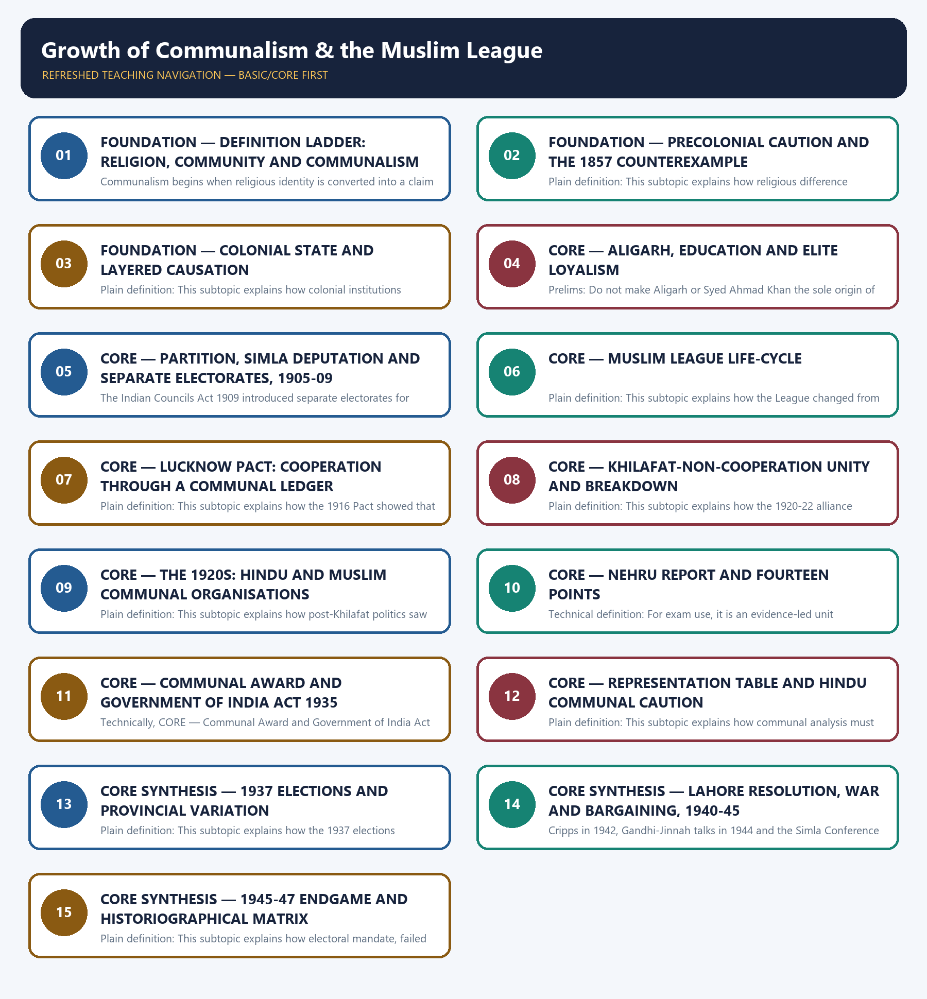

# Growth of Communalism & the Muslim League - Learner-v2 Complete Learning Session

### SOURCE, PROGRESSION AND CURRENT-LINKAGE AUDIT

- **Repository owners queried:** Basic and Advanced Markdown for this topic, the master chronology, syllabus map and linked Modern History owners.
- **OCR book evidence queried:** OCR checks use Bipan Chandra's Modern India and India's Struggle for Independence for the modernist definition, constitutional incentives, League development, Congress-League relations and the 1940-47 endgame. Sekhar Bandyopadhyay supplies provincial and coalition qualifications.
- **Qdrant:** not used; Markdown plus searchable local PDFs were sufficient.
- **PYQ integrity:** The verified and routed 2018 GS-I Q20 on power struggle and relative deprivation is solved as a direct Mains question. The provisional local key for 2026 Prelims Q18 is not treated as official; that demand remains a verification and evidence-gap card.
- **Bounded live linkage:** Parliament Digital Library is retained only as a constitutional archive bridge. No present-day party position is used as evidence for colonial communalism or the decisions that culminated in Partition.
- **Fact/inference rule:** historical claims are source-backed; analytical judgements are explicitly framed as interpretation and do not invent figures.

## BASIC LEARNING SESSION

### DEEP-REVIEW LEARNING CONTRACT

| Control | Binding rule for this package |
|---|---|
| Syllabus boundary | Complete Modern History Core is taught chronologically and causally before optional enrichment. |
| Evidence method | Claim → named Act/treaty/record/organisation/person/region or scholarly evidence → analysis → qualification. |
| Date discipline | Event, proposal, enactment, commencement, official policy, implementation and later interpretation remain distinct. |
| Historiography | Colonial, nationalist, Marxist, subaltern, Cambridge, feminist and other relevant arguments are attributed and tested, never used as labels alone. |
| Practice contract | Every solved item has demand decoding, an examiner-grade model, an executable answer/compression plan, marks rationale and answer-specific improvement. |
| Approval | This immutable successor remains `approved: false` pending explicit approval. |

**Canonical Basic/Core owner:** `upsc-ai-kit\knowledge\Modern-Indian-History\basic\17_Growth-of-Communalism-and-Muslim-League.md`  
**Canonical topic owner:** `upsc-ai-kit\knowledge\Modern-Indian-History\basic\17_Growth-of-Communalism-and-Muslim-League.md`  
**Optional Advanced owner:** `upsc-ai-kit\knowledge\Modern-Indian-History\advanced\17_Growth-of-Communalism-and-Muslim-League.md`  
**Official syllabus mapping:** `upsc-ai-kit\knowledge\Modern-Indian-History\OFFICIAL-UPSC-SYLLABUS-MAPPING.md`

### EVIDENCE, PYQ AND CURRENT-STATUS CONTROL

- **Official and primary evidence:** Acts, charters, treaties, proclamations, committee reports, proceedings, organisational resolutions, speeches and contemporary records are dated and read for authorship and purpose.
- **Regional and social evidence:** petitions, newspapers, memoirs, local studies and material geography qualify elite or all-India generalisation.
- **Economic and quantitative evidence:** revenue, trade, price, wage, craft and mortality claims retain unit, region, period and uncertainty; statistics are never invented.
- **Scholarly interpretation:** historian schools are competing explanations tied to named evidence, not memorised verdicts.
- **PYQ discipline:** repository ledgers and locally held official papers control wording and metadata; reconstructed wording and unavailable official keys remain explicitly labelled.
- **Current-status note, rechecked 2026-08-31:** Parliament Digital Library is retained only as a constitutional archive bridge. No present-day party position is used as evidence for colonial communalism or the decisions that culminated in Partition.

**Live/primary context sources recorded by the predecessor generation:**

- `https://elibrary.sansad.in/`




*Distinct embedded teaching-navigation image. The separate continuous Cārvāka-style flowchart package remains an independent at-a-glance artifact.*

### SESSION 1 — FOUNDATION — DEFINITION LADDER: RELIGION, COMMUNITY AND COMMUNALISM

#### DEFINITION / WHAT THIS IS CALLED

**Plain-language definition:** Plain definition: This subtopic explains how communalism begins when religious identity is converted into a claim about common secular interests and can intensify into hostility.

**Technical definition:** Communalism begins when religious identity is converted into a claim about common secular interests and can intensify into hostility.

#### ANSWER-GRABBING OPENING — WRITE/ADAPT IN THE EXAM

> Religion and religiosity do not by themselves constitute communalism.

#### MUST-WRITE KEYWORDS

- **FOUNDATION**
- **Definition ladder**
- **religion**
- **community**
- **communalism**
- **Plain definition**

**How to use them:** Frame the answer through FOUNDATION; define Definition ladder, connect religion with community to explain the mechanism, and use communalism for the decisive comparison or qualification.

##### VISUAL FIRST

```text
DEFINITION LADDER: RELIGION, COMMUNITY AND COMMUNALISM
RELIGION / COMMUNITY LIFE
          |
COMMON SECULAR INTEREST -> DIVERGENT INTEREST -> HOSTILE INTEREST
          |
ORGANISATION + REPRESENTATION + POLITICAL MOBILISATION
```

*The visual fixes the subtopic's causal or comparative structure before the detailed evidence.*

##### CONCEPT DEFINITIONS

- **Plain definition:** This subtopic explains how communalism begins when religious identity is converted into a claim about common secular interests and can intensify into hostility.
- **Technical definition:** For exam use, it is a conceptual unit defining the category, its mechanism and its changing political form within Growth of Communalism & the Muslim League.

##### CORE EXPLANATION

Communalism begins when religious identity is converted into a claim about common secular interests and can intensify into hostility.

##### EVIDENCE AND MECHANISM

- Religion and religiosity do not by themselves constitute communalism.
- Bipan Chandra's first stage assumes common secular interests among co-religionists.
- The second sees interests of communities as divergent; the third treats them as antagonistic.
- The stages are an attributed modernist interpretation, not a timeless law.

##### EXAMINER CAUTION

- Do not use communalism as a synonym for faith, reform or riot.

##### EXAM LINK

- **Prelims:** Do not use communalism as a synonym for faith, reform or riot.
- **Mains:** Define the ideology before narrating organisations or constitutional events.

##### MINI RECAP

- **Core claim:** Communalism begins when religious identity is converted into a claim about common secular interests and can intensify into hostility.
- **Use:** Define the ideology before narrating organisations or constitutional events.

#### CLOSING RECALL FLOW — FOUNDATION — DEFINITION LADDER: RELIGION, COMMUNITY AND COMMUNALISM

```text
START / CONCEPT: FOUNDATION — Definition ladder: religion, community and communalism
        |
        v
EXACT TERMS: FOUNDATION · Definition ladder · religion · community · communalism · Plain definition
        |
        v
MECHANISM / ARGUMENT: Technical definition: For exam use, it is a conceptual unit defining the category, its mechanism and its changing political form within Growth of Communalism & the Muslim League.
        |
        v
CONSEQUENCE / CONTRAST: Do not use communalism as a synonym for faith, reform or riot.
        |
        v
UPSC TRAP / ANSWER-USE: The stages are an attributed modernist interpretation, not a timeless law.
        |
        v
ANSWER-GRABBING FORMULATION: Religion and religiosity do not by themselves constitute communalism.
```
### SESSION 2 — FOUNDATION — PRECOLONIAL CAUTION AND THE 1857 COUNTEREXAMPLE

#### DEFINITION / WHAT THIS IS CALLED

**Plain-language definition:** Technical definition: For exam use, it is an evidence-led unit connecting actors, institutions, mechanism, outcome and qualification within Growth of Communalism & the Muslim League.

**Technical definition:** Plain definition: This subtopic explains how religious difference existed before colonial rule, but modern communal politics cannot be read backward as an unbroken civilisational conflict.

#### ANSWER-GRABBING OPENING — WRITE/ADAPT IN THE EXAM

> Plain definition: This subtopic explains how religious difference existed before colonial rule, but modern communal politics cannot be read backward as an unbroken civilisational conflict.

#### MUST-WRITE KEYWORDS

- **FOUNDATION**
- **Precolonial caution**
- **the 1857 counterexample**
- **Plain definition**
- **Technical definition**
- **Core claim**

**How to use them:** Frame the answer through FOUNDATION; define Precolonial caution, connect the 1857 counterexample with Plain definition to explain the mechanism, and use Technical definition for the decisive comparison or qualification.

##### VISUAL FIRST

```text
PRECOLONIAL CAUTION AND THE 1857 COUNTEREXAMPLE
RELIGIOUS DIFFERENCE BEFORE COLONIAL RULE
             +
1857 SHARED ACTION IN IMPORTANT REGIONS
             +
MODERN PRINT / ORGANISATION / ELECTORAL INSTITUTIONS
             =
DISCONTINUITY OF POLITICAL FORM, NOT TIMELESS HOSTILITY
```

*The visual fixes the subtopic's causal or comparative structure before the detailed evidence.*

##### CONCEPT DEFINITIONS

- **Plain definition:** This subtopic explains how religious difference existed before colonial rule, but modern communal politics cannot be read backward as an unbroken civilisational conflict.
- **Technical definition:** For exam use, it is an evidence-led unit connecting actors, institutions, mechanism, outcome and qualification within Growth of Communalism & the Muslim League.

##### CORE EXPLANATION

Religious difference existed before colonial rule, but modern communal politics cannot be read backward as an unbroken civilisational conflict.

##### EVIDENCE AND MECHANISM

- The 1857 rebellion included important zones of shared Hindu-Muslim political action.
- Local conflicts and religious idioms did not amount to modern electoral communalism.
- Modern organisations, print publics and representative institutions altered the political form.
- Neither Hindus nor Muslims ever acted as internally uniform blocs.

##### EXAMINER CAUTION

- Avoid both primordial hostility and a romantic claim of permanent precolonial harmony.

##### EXAM LINK

- **Prelims:** Avoid both primordial hostility and a romantic claim of permanent precolonial harmony.
- **Mains:** Use continuity of difference plus discontinuity of political form as the balanced argument.

##### MINI RECAP

- **Core claim:** Religious difference existed before colonial rule, but modern communal politics cannot be read backward as an unbroken civilisational conflict.
- **Use:** Use continuity of difference plus discontinuity of political form as the balanced argument.

#### CLOSING RECALL FLOW — FOUNDATION — PRECOLONIAL CAUTION AND THE 1857 COUNTEREXAMPLE

```text
START / CONCEPT: FOUNDATION — Precolonial caution and the 1857 counterexample
        |
        v
EXACT TERMS: FOUNDATION · Precolonial caution · the 1857 counterexample · Plain definition · Technical definition · Core claim
        |
        v
MECHANISM / ARGUMENT: Technical definition: For exam use, it is an evidence-led unit connecting actors, institutions, mechanism, outcome and qualification within Growth of Communalism & the Muslim League.
        |
        v
CONSEQUENCE / CONTRAST: Mains: Use continuity of difference plus discontinuity of political form as the balanced argument.
        |
        v
UPSC TRAP / ANSWER-USE: Do not miss this limiting distinction: this subtopic explains how religious difference existed before colonial rule.
        |
        v
ANSWER-GRABBING FORMULATION: Plain definition: This subtopic explains how religious difference existed before colonial rule, but modern communal politics cannot be read backward as an unbroken civilisational conflict.
```
### SESSION 3 — FOUNDATION — COLONIAL STATE AND LAYERED CAUSATION

#### DEFINITION / WHAT THIS IS CALLED

**Plain-language definition:** Mains: Build a layered answer: state design plus material competition plus organised politics plus contingency.

**Technical definition:** Plain definition: This subtopic explains how colonial institutions interacted with social competition and political choices; no single layer alone explains communal growth.

#### ANSWER-GRABBING OPENING — WRITE/ADAPT IN THE EXAM

> Plain definition: This subtopic explains how colonial institutions interacted with social competition and political choices; no single layer alone explains communal growth.

#### MUST-WRITE KEYWORDS

- **FOUNDATION**
- **Colonial state**
- **layered causation**
- **Plain definition**
- **Technical definition**
- **Core claim**

**How to use them:** Frame the answer through FOUNDATION; define Colonial state, connect layered causation with Plain definition to explain the mechanism, and use Technical definition for the decisive comparison or qualification.

##### VISUAL FIRST

```text
COLONIAL STATE AND LAYERED CAUSATION
STATE CATEGORIES + MATERIAL COMPETITION + ELITE CLAIM-MAKING
             + CONSTITUTIONAL INCENTIVES + PARTY CHOICES
                              |
                    COMMUNAL POLITICAL GROWTH
RULE: interaction, not one timeless or all-powerful cause.
```

*The visual fixes the subtopic's causal or comparative structure before the detailed evidence.*

##### CONCEPT DEFINITIONS

- **Plain definition:** This subtopic explains how colonial institutions interacted with social competition and political choices; no single layer alone explains communal growth.
- **Technical definition:** For exam use, it is a causal unit linking conditions, political choices, mechanisms and limits within Growth of Communalism & the Muslim League.

##### CORE EXPLANATION

Colonial institutions interacted with social competition and political choices; no single layer alone explains communal growth.

##### EVIDENCE AND MECHANISM

- Enumeration and census made communities legible administrative categories.
- Patronage and constitutional representation rewarded recognised spokesmen.
- Uneven education and scarce employment intensified elite competition.
- Press and associations converted grievances into organised community claims.
- Congress, League, provincial parties and British governments made contingent choices within this field.

##### EXAMINER CAUTION

- The British-invented-only thesis removes Indian agency and regional variation.

##### EXAM LINK

- **Prelims:** The British-invented-only thesis removes Indian agency and regional variation.
- **Mains:** Build a layered answer: state design plus material competition plus organised politics plus contingency.

##### MINI RECAP

- **Core claim:** Colonial institutions interacted with social competition and political choices; no single layer alone explains communal growth.
- **Use:** Build a layered answer: state design plus material competition plus organised politics plus contingency.

#### CLOSING RECALL FLOW — FOUNDATION — COLONIAL STATE AND LAYERED CAUSATION

```text
START / CONCEPT: FOUNDATION — Colonial state and layered causation
        |
        v
EXACT TERMS: FOUNDATION · Colonial state · layered causation · Plain definition · Technical definition · Core claim
        |
        v
MECHANISM / ARGUMENT: Mains: Build a layered answer: state design plus material competition plus organised politics plus contingency.
        |
        v
CONSEQUENCE / CONTRAST: Core claim: Colonial institutions interacted with social competition and political choices; no single layer alone explains communal growth.
        |
        v
UPSC TRAP / ANSWER-USE: Do not miss this limiting distinction: for exam use, it is a causal unit linking conditions, political choices, mechanisms and...
        |
        v
ANSWER-GRABBING FORMULATION: Plain definition: This subtopic explains how colonial institutions interacted with social competition and political choices; no single layer alone explains communal growth.
```
### SESSION 4 — CORE — ALIGARH, EDUCATION AND ELITE LOYALISM

#### DEFINITION / WHAT THIS IS CALLED

**Plain-language definition:** Plain definition: This subtopic explains how the Aligarh movement addressed educational disadvantage, while Syed Ahmad Khan's later politics stressed loyalism and caution toward Congress.

**Technical definition:** Prelims: Do not make Aligarh or Syed Ahmad Khan the sole origin of Muslim politics.

#### ANSWER-GRABBING OPENING — WRITE/ADAPT IN THE EXAM

> Plain definition: This subtopic explains how the Aligarh movement addressed educational disadvantage, while Syed Ahmad Khan's later politics stressed loyalism and caution toward Congress.

#### MUST-WRITE KEYWORDS

- **Aligarh**
- **education**
- **elite loyalism**
- **Plain definition**
- **Technical definition**
- **Core claim**

**How to use them:** Frame the answer through Aligarh; define education, connect elite loyalism with Plain definition to explain the mechanism, and use Technical definition for the decisive comparison or qualification.

##### VISUAL FIRST

```text
ALIGARH, EDUCATION AND ELITE LOYALISM
EDUCATIONAL DISADVANTAGE -> ALIGARH REFORM
                              |
LATER ELITE LOYALISM / CONGRESS CAUTION
                              |
SAFEGUARD CLAIMS, ALONGSIDE MANY ALTERNATIVE MUSLIM CURRENTS
```

*The visual fixes the subtopic's causal or comparative structure before the detailed evidence.*

##### CONCEPT DEFINITIONS

- **Plain definition:** This subtopic explains how the Aligarh movement addressed educational disadvantage, while Syed Ahmad Khan's later politics stressed loyalism and caution toward Congress.
- **Technical definition:** For exam use, it is an evidence-led unit connecting actors, institutions, mechanism, outcome and qualification within Growth of Communalism & the Muslim League.

##### CORE EXPLANATION

The Aligarh movement addressed educational disadvantage, while Syed Ahmad Khan's later politics stressed loyalism and caution toward Congress.

##### EVIDENCE AND MECHANISM

- Educational reform and communal politics must not be treated as identical.
- Uneven access to English education affected competition for offices and professions.
- Elite anxiety encouraged demands for safeguards and recognised representation.
- Muslim opinion also contained Deobandi, nationalist, regional and class alternatives.

##### EXAMINER CAUTION

- Do not make Aligarh or Syed Ahmad Khan the sole origin of Muslim politics.

##### EXAM LINK

- **Prelims:** Do not make Aligarh or Syed Ahmad Khan the sole origin of Muslim politics.
- **Mains:** Explain how educational context could support, but did not predetermine, political loyalism.

##### MINI RECAP

- **Core claim:** The Aligarh movement addressed educational disadvantage, while Syed Ahmad Khan's later politics stressed loyalism and caution toward Congress.
- **Use:** Explain how educational context could support, but did not predetermine, political loyalism.

#### CLOSING RECALL FLOW — CORE — ALIGARH, EDUCATION AND ELITE LOYALISM

```text
START / CONCEPT: CORE — Aligarh, education and elite loyalism
        |
        v
EXACT TERMS: Aligarh · education · elite loyalism · Plain definition · Technical definition · Core claim
        |
        v
MECHANISM / ARGUMENT: Technical definition: For exam use, it is an evidence-led unit connecting actors, institutions, mechanism, outcome and qualification within Growth of Communalism & the Muslim League.
        |
        v
CONSEQUENCE / CONTRAST: Do not make Aligarh or Syed Ahmad Khan the sole origin of Muslim politics.
        |
        v
UPSC TRAP / ANSWER-USE: Mains: Explain how educational context could support, but did not predetermine, political loyalism.
        |
        v
ANSWER-GRABBING FORMULATION: Plain definition: This subtopic explains how the Aligarh movement addressed educational disadvantage, while Syed Ahmad Khan's later politics stressed loyalism and caution toward Congress.
```
### SESSION 5 — CORE — PARTITION, SIMLA DEPUTATION AND SEPARATE ELECTORATES, 1905-09

#### DEFINITION / WHAT THIS IS CALLED

**Plain-language definition:** Plain definition: This subtopic explains how the sequence from Bengal partition to elite deputation, League formation and separate electorates institutionalised a new politics of safeguards.

**Technical definition:** The Indian Councils Act 1909 introduced separate electorates for Muslims.

#### ANSWER-GRABBING OPENING — WRITE/ADAPT IN THE EXAM

> Plain definition: This subtopic explains how the sequence from Bengal partition to elite deputation, League formation and separate electorates institutionalised a new politics of safeguards.

#### MUST-WRITE KEYWORDS

- **Partition**
- **Simla Deputation**
- **separate electorates**
- **Plain definition**
- **Technical definition**
- **1905-09**

**How to use them:** Frame the answer through Partition; define Simla Deputation, connect separate electorates with Plain definition to explain the mechanism, and use Technical definition for the decisive comparison or qualification.

##### VISUAL FIRST

```text
PARTITION, SIMLA DEPUTATION AND SEPARATE ELECTORATES, 1905-09
1905 BENGAL PARTITION -> 1 OCT 1906 SIMLA DEPUTATION
        -> 30 DEC 1906 LEAGUE -> 1909 SEPARATE ELECTORATES
CLAIM -> ORGANISATION -> CONSTITUTIONAL REWARD
```

*The visual fixes the subtopic's causal or comparative structure before the detailed evidence.*

##### CONCEPT DEFINITIONS

- **Plain definition:** This subtopic explains how the sequence from Bengal partition to elite deputation, League formation and separate electorates institutionalised a new politics of safeguards.
- **Technical definition:** For exam use, it is a chronological evidence unit separating trigger, organisation, response and consequence within Growth of Communalism & the Muslim League.

##### CORE EXPLANATION

The sequence from Bengal partition to elite deputation, League formation and separate electorates institutionalised a new politics of safeguards.

##### EVIDENCE AND MECHANISM

- The 1905 Bengal partition generated divergent regional and community responses.
- The Simla Deputation met Minto on 1 October 1906 and sought separate representation.
- The League was founded at Dhaka on 30 December 1906.
- The Indian Councils Act 1909 introduced separate electorates for Muslims.

##### EXAMINER CAUTION

- Do not collapse the deputation, League foundation and statutory concession into one event.

##### EXAM LINK

- **Prelims:** Do not collapse the deputation, League foundation and statutory concession into one event.
- **Mains:** Use chronology to show claim-making, organisation and constitutional reward.

##### MINI RECAP

- **Core claim:** The sequence from Bengal partition to elite deputation, League formation and separate electorates institutionalised a new politics of safeguards.
- **Use:** Use chronology to show claim-making, organisation and constitutional reward.

#### CLOSING RECALL FLOW — CORE — PARTITION, SIMLA DEPUTATION AND SEPARATE ELECTORATES, 1905-09

```text
START / CONCEPT: CORE — Partition, Simla Deputation and separate electorates, 1905-09
        |
        v
EXACT TERMS: Partition · Simla Deputation · separate electorates · Plain definition · Technical definition · 1905-09
        |
        v
MECHANISM / ARGUMENT: The Indian Councils Act 1909 introduced separate electorates for Muslims.
        |
        v
CONSEQUENCE / CONTRAST: Do not collapse the deputation, League foundation and statutory concession into one event.
        |
        v
UPSC TRAP / ANSWER-USE: Do not miss this limiting distinction: for exam use, it is a chronological evidence unit separating trigger, organisation, response and...
        |
        v
ANSWER-GRABBING FORMULATION: Plain definition: This subtopic explains how the sequence from Bengal partition to elite deputation, League formation and separate electorates institutionalised a new politics of safeguards.
```
### SESSION 6 — CORE — MUSLIM LEAGUE LIFE-CYCLE

#### DEFINITION / WHAT THIS IS CALLED

**Plain-language definition:** Technical definition: For exam use, it is a conceptual unit defining the category, its mechanism and its changing political form within Growth of Communalism & the Muslim League.

**Technical definition:** Plain definition: This subtopic explains how the League changed from an elite loyalist safeguard body into a wider electoral claimant; its 1906 character cannot explain its 1946 position.

#### ANSWER-GRABBING OPENING — WRITE/ADAPT IN THE EXAM

> Technical definition: For exam use, it is a conceptual unit defining the category, its mechanism and its changing political form within Growth of Communalism & the Muslim League.

#### MUST-WRITE KEYWORDS

- **Muslim League life-cycle**
- **Plain definition**
- **Technical definition**
- **Core claim**
- **Plain**
- **1945-46**

**How to use them:** Frame the answer through Muslim League life-cycle; define Plain definition, connect Technical definition with Core claim to explain the mechanism, and use Plain for the decisive comparison or qualification.

##### VISUAL FIRST

```text
MUSLIM LEAGUE LIFE-CYCLE
1906 SAFEGUARDS -> 1913 SELF-GOVERNMENT -> 1916 COOPERATION
        -> UNEVEN 1920s -> POST-1937 MOBILISATION
        -> 1945-46 MUSLIM-ELECTORATE MANDATE
RULE: organisational aims and reach changed over time.
```

*The visual fixes the subtopic's causal or comparative structure before the detailed evidence.*

##### CONCEPT DEFINITIONS

- **Plain definition:** This subtopic explains how the League changed from an elite loyalist safeguard body into a wider electoral claimant; its 1906 character cannot explain its 1946 position.
- **Technical definition:** For exam use, it is a conceptual unit defining the category, its mechanism and its changing political form within Growth of Communalism & the Muslim League.

##### CORE EXPLANATION

The League changed from an elite loyalist safeguard body into a wider electoral claimant; its 1906 character cannot explain its 1946 position.

##### EVIDENCE AND MECHANISM

- The early League sought safeguards and influence within colonial government.
- Its 1913 self-government objective enabled closer cooperation with Congress.
- Its position was uneven in the 1920s and weak in several provinces before 1937.
- After 1937 it expanded mobilisation and reframed provincial and all-India grievances.
- The 1945-46 elections strengthened its claim among Muslim electorates.

##### EXAMINER CAUTION

- The League did not demand Pakistan from its foundation.

##### EXAM LINK

- **Prelims:** The League did not demand Pakistan from its foundation.
- **Mains:** Periodise organisational aims, social reach and bargaining position.

##### MINI RECAP

- **Core claim:** The League changed from an elite loyalist safeguard body into a wider electoral claimant; its 1906 character cannot explain its 1946 position.
- **Use:** Periodise organisational aims, social reach and bargaining position.

#### CLOSING RECALL FLOW — CORE — MUSLIM LEAGUE LIFE-CYCLE

```text
START / CONCEPT: CORE — Muslim League life-cycle
        |
        v
EXACT TERMS: Muslim League life-cycle · Plain definition · Technical definition · Core claim · Plain · 1945-46
        |
        v
MECHANISM / ARGUMENT: Plain definition: This subtopic explains how the League changed from an elite loyalist safeguard body into a wider electoral claimant; its 1906 character cannot explain its 1946 position.
        |
        v
CONSEQUENCE / CONTRAST: Core claim: The League changed from an elite loyalist safeguard body into a wider electoral claimant; its 1906 character cannot explain its 1946 position.
        |
        v
UPSC TRAP / ANSWER-USE: Do not miss this limiting distinction: its position was uneven in the 1920s and weak in several provinces before 1937.
        |
        v
ANSWER-GRABBING FORMULATION: Technical definition: For exam use, it is a conceptual unit defining the category, its mechanism and its changing political form within Growth of Communalism & the Muslim League.
```
### SESSION 7 — CORE — LUCKNOW PACT: COOPERATION THROUGH A COMMUNAL LEDGER

#### DEFINITION / WHAT THIS IS CALLED

**Plain-language definition:** Lucknow neither introduced separate electorates nor permanently ended communal politics.

**Technical definition:** Plain definition: This subtopic explains how the 1916 Pact showed that Congress-League agreement was possible while also confirming separate electorates as the currency of negotiation.

#### ANSWER-GRABBING OPENING — WRITE/ADAPT IN THE EXAM

> Plain definition: This subtopic explains how the 1916 Pact showed that Congress-League agreement was possible while also confirming separate electorates as the currency of negotiation.

#### MUST-WRITE KEYWORDS

- **Lucknow Pact**
- **cooperation through a communal ledger**
- **Plain definition**
- **Technical definition**
- **Core claim**
- **Plain**

**How to use them:** Frame the answer through Lucknow Pact; define cooperation through a communal ledger, connect Plain definition with Technical definition to explain the mechanism, and use Core claim for the decisive comparison or qualification.

##### VISUAL FIRST

```text
LUCKNOW PACT: COOPERATION THROUGH A COMMUNAL LEDGER
GAIN: JOINT CONSTITUTIONAL PROGRAMME + TEMPORARY UNITY
COST: CONGRESS ACCEPTS SEPARATE ELECTORATES / SAFEGUARDS
PARADOX: all-India cooperation negotiated through communal categories
```

*The visual fixes the subtopic's causal or comparative structure before the detailed evidence.*

##### CONCEPT DEFINITIONS

- **Plain definition:** This subtopic explains how the 1916 Pact showed that Congress-League agreement was possible while also confirming separate electorates as the currency of negotiation.
- **Technical definition:** For exam use, it is an evidence-led unit connecting actors, institutions, mechanism, outcome and qualification within Growth of Communalism & the Muslim League.

##### CORE EXPLANATION

The 1916 Pact showed that Congress-League agreement was possible while also confirming separate electorates as the currency of negotiation.

##### EVIDENCE AND MECHANISM

- Congress and League supported a joint constitutional reform programme.
- Congress accepted separate electorates and negotiated representation safeguards.
- The pact widened nationalist unity during the Home Rule and wartime setting.
- Its tactical gain and institutional concession must be assessed together.

##### EXAMINER CAUTION

- Lucknow neither introduced separate electorates nor permanently ended communal politics.

##### EXAM LINK

- **Prelims:** Lucknow neither introduced separate electorates nor permanently ended communal politics.
- **Mains:** Frame it as unity on communal terms rather than as simple success or betrayal.

##### MINI RECAP

- **Core claim:** The 1916 Pact showed that Congress-League agreement was possible while also confirming separate electorates as the currency of negotiation.
- **Use:** Frame it as unity on communal terms rather than as simple success or betrayal.

#### CLOSING RECALL FLOW — CORE — LUCKNOW PACT: COOPERATION THROUGH A COMMUNAL LEDGER

```text
START / CONCEPT: CORE — Lucknow Pact: cooperation through a communal ledger
        |
        v
EXACT TERMS: Lucknow Pact · cooperation through a communal ledger · Plain definition · Technical definition · Core claim · Plain
        |
        v
MECHANISM / ARGUMENT: Technical definition: For exam use, it is an evidence-led unit connecting actors, institutions, mechanism, outcome and qualification within Growth of Communalism & the Muslim League.
        |
        v
CONSEQUENCE / CONTRAST: Core claim: The 1916 Pact showed that Congress-League agreement was possible while also confirming separate electorates as the currency of negotiation.
        |
        v
UPSC TRAP / ANSWER-USE: Do not miss this limiting distinction: lucknow neither introduced separate electorates nor permanently ended communal politics.
        |
        v
ANSWER-GRABBING FORMULATION: Plain definition: This subtopic explains how the 1916 Pact showed that Congress-League agreement was possible while also confirming separate electorates as the currency of negotiation.
```
### SESSION 8 — CORE — KHILAFAT-NON-COOPERATION UNITY AND BREAKDOWN

#### DEFINITION / WHAT THIS IS CALLED

**Plain-language definition:** Technical definition: For exam use, it is a causal unit linking conditions, political choices, mechanisms and limits within Growth of Communalism & the Muslim League.

**Technical definition:** Plain definition: This subtopic explains how the 1920-22 alliance achieved unusually broad joint mobilisation but did not create durable secular organisation beneath the coalition.

#### ANSWER-GRABBING OPENING — WRITE/ADAPT IN THE EXAM

> Plain definition: This subtopic explains how the 1920-22 alliance achieved unusually broad joint mobilisation but did not create durable secular organisation beneath the coalition.

#### MUST-WRITE KEYWORDS

- **Khilafat-Non-Cooperation unity**
- **breakdown**
- **Plain definition**
- **Technical definition**
- **Core claim**
- **1920-22**

**How to use them:** Frame the answer through Khilafat-Non-Cooperation unity; define breakdown, connect Plain definition with Technical definition to explain the mechanism, and use Core claim for the decisive comparison or qualification.

##### VISUAL FIRST

```text
KHILAFAT-NON-COOPERATION UNITY AND BREAKDOWN
KHILAFAT GRIEVANCE + NON-COOPERATION
                 |
      BROAD JOINT MOBILISATION
                 |
WITHDRAWAL / TURKISH CHANGE -> COALITION WEAKENS
                 |
LOCAL CONFLICT AND ORGANISATIONAL RIVALRY RE-EMERGE
```

*The visual fixes the subtopic's causal or comparative structure before the detailed evidence.*

##### CONCEPT DEFINITIONS

- **Plain definition:** This subtopic explains how the 1920-22 alliance achieved unusually broad joint mobilisation but did not create durable secular organisation beneath the coalition.
- **Technical definition:** For exam use, it is a causal unit linking conditions, political choices, mechanisms and limits within Growth of Communalism & the Muslim League.

##### CORE EXPLANATION

The 1920-22 alliance achieved unusually broad joint mobilisation but did not create durable secular organisation beneath the coalition.

##### EVIDENCE AND MECHANISM

- Congress connected Non-Cooperation with the Khilafat grievance.
- Joint action demonstrated that religiously framed issues could enter anti-colonial mobilisation.
- Withdrawal and the changing Turkish context weakened the alliance.
- Subsequent riots and organisational rivalry exposed the limits of episodic unity.

##### EXAMINER CAUTION

- Do not say that Khilafat either permanently solved or single-handedly caused communalism.

##### EXAM LINK

- **Prelims:** Do not say that Khilafat either permanently solved or single-handedly caused communalism.
- **Mains:** Distinguish mobilisation success from long-term ideological transformation.

##### MINI RECAP

- **Core claim:** The 1920-22 alliance achieved unusually broad joint mobilisation but did not create durable secular organisation beneath the coalition.
- **Use:** Distinguish mobilisation success from long-term ideological transformation.

#### CLOSING RECALL FLOW — CORE — KHILAFAT-NON-COOPERATION UNITY AND BREAKDOWN

```text
START / CONCEPT: CORE — Khilafat-Non-Cooperation unity and breakdown
        |
        v
EXACT TERMS: Khilafat-Non-Cooperation unity · breakdown · Plain definition · Technical definition · Core claim · 1920-22
        |
        v
MECHANISM / ARGUMENT: Core claim: The 1920-22 alliance achieved unusually broad joint mobilisation but did not create durable secular organisation beneath the coalition.
        |
        v
CONSEQUENCE / CONTRAST: Do not say that Khilafat either permanently solved or single-handedly caused communalism.
        |
        v
UPSC TRAP / ANSWER-USE: Do not miss this limiting distinction: for exam use, it is a causal unit linking conditions, political choices, mechanisms and...
        |
        v
ANSWER-GRABBING FORMULATION: Plain definition: This subtopic explains how the 1920-22 alliance achieved unusually broad joint mobilisation but did not create durable secular organisation beneath the coalition.
```
### SESSION 9 — CORE — THE 1920S: HINDU AND MUSLIM COMMUNAL ORGANISATIONS

#### DEFINITION / WHAT THIS IS CALLED

**Plain-language definition:** Technical definition: For exam use, it is an evidence-led unit connecting actors, institutions, mechanism, outcome and qualification within Growth of Communalism & the Muslim League.

**Technical definition:** Plain definition: This subtopic explains how post-Khilafat politics saw competing organisations, press campaigns and identity consolidation, but neither community became politically uniform.

#### ANSWER-GRABBING OPENING — WRITE/ADAPT IN THE EXAM

> Plain definition: This subtopic explains how post-Khilafat politics saw competing organisations, press campaigns and identity consolidation, but neither community became politically uniform.

#### MUST-WRITE KEYWORDS

- **The 1920s**
- **Hindu**
- **Muslim communal organisations**
- **Plain definition**
- **Technical definition**
- **Core claim**

**How to use them:** Frame the answer through The 1920s; define Hindu, connect Muslim communal organisations with Plain definition to explain the mechanism, and use Technical definition for the decisive comparison or qualification.

##### VISUAL FIRST

```text
THE 1920S: HINDU AND MUSLIM COMMUNAL ORGANISATIONS
1920-22 KHILAFAT-NCM -> 1923 HINDUTVA -> 1925 RSS
        -> RIOTS / ORGANISATIONAL RIVALRY -> 1928 NEHRU REPORT
        -> 1929 FOURTEEN POINTS
RULE: compare organisations without homogenising communities.
```

*The visual fixes the subtopic's causal or comparative structure before the detailed evidence.*

##### CONCEPT DEFINITIONS

- **Plain definition:** This subtopic explains how post-Khilafat politics saw competing organisations, press campaigns and identity consolidation, but neither community became politically uniform.
- **Technical definition:** For exam use, it is an evidence-led unit connecting actors, institutions, mechanism, outcome and qualification within Growth of Communalism & the Muslim League.

##### CORE EXPLANATION

Post-Khilafat politics saw competing organisations, press campaigns and identity consolidation, but neither community became politically uniform.

##### EVIDENCE AND MECHANISM

- The Hindu Mahasabha had emerged in 1915 and expanded organised Hindu claims.
- Savarkar's Hindutva appeared in 1923 and the RSS was founded in 1925.
- Muslim politics included the League, ulema, regional parties and nationalist Muslims.
- Local riots and elite competition varied by province and issue.

##### EXAMINER CAUTION

- Use historiographical caution rather than treating all organisations as identical.

##### EXAM LINK

- **Prelims:** Use historiographical caution rather than treating all organisations as identical.
- **Mains:** Compare shared communal logic while preserving different structures, programmes and constituencies.

##### MINI RECAP

- **Core claim:** Post-Khilafat politics saw competing organisations, press campaigns and identity consolidation, but neither community became politically uniform.
- **Use:** Compare shared communal logic while preserving different structures, programmes and constituencies.

#### CLOSING RECALL FLOW — CORE — THE 1920S: HINDU AND MUSLIM COMMUNAL ORGANISATIONS

```text
START / CONCEPT: CORE — The 1920s: Hindu and Muslim communal organisations
        |
        v
EXACT TERMS: The 1920s · Hindu · Muslim communal organisations · Plain definition · Technical definition · Core claim
        |
        v
MECHANISM / ARGUMENT: Technical definition: For exam use, it is an evidence-led unit connecting actors, institutions, mechanism, outcome and qualification within Growth of Communalism & the Muslim League.
        |
        v
CONSEQUENCE / CONTRAST: Core claim: Post-Khilafat politics saw competing organisations, press campaigns and identity consolidation, but neither community became politically uniform.
        |
        v
UPSC TRAP / ANSWER-USE: Use: Compare shared communal logic while preserving different structures, programmes and constituencies.
        |
        v
ANSWER-GRABBING FORMULATION: Plain definition: This subtopic explains how post-Khilafat politics saw competing organisations, press campaigns and identity consolidation, but neither community became politically uniform.
```
### SESSION 10 — CORE — NEHRU REPORT AND FOURTEEN POINTS

#### DEFINITION / WHAT THIS IS CALLED

**Plain-language definition:** Prelims: Do not read the Fourteen Points as identical to the Lahore Resolution.

**Technical definition:** Technical definition: For exam use, it is an evidence-led unit connecting actors, institutions, mechanism, outcome and qualification within Growth of Communalism & the Muslim League.

#### ANSWER-GRABBING OPENING — WRITE/ADAPT IN THE EXAM

> Do not read the Fourteen Points as identical to the Lahore Resolution.

#### MUST-WRITE KEYWORDS

- **Nehru Report**
- **Fourteen Points**
- **Plain definition**
- **Technical definition**
- **Core claim**
- **1928-29**

**How to use them:** Frame the answer through Nehru Report; define Fourteen Points, connect Plain definition with Technical definition to explain the mechanism, and use Core claim for the decisive comparison or qualification.

##### VISUAL FIRST

```text
NEHRU REPORT AND FOURTEEN POINTS
AXIS                 NEHRU REPORT          FOURTEEN POINTS
federation       -> common framework   | safeguards / autonomy
electorates      -> joint direction    | minority protections
residuary powers -> stronger centre    | provincial concern
```

*The visual fixes the subtopic's causal or comparative structure before the detailed evidence.*

##### CONCEPT DEFINITIONS

- **Plain definition:** This subtopic explains how the 1928-29 exchange concentrated disputes over federation, residuary powers, representation and safeguards.
- **Technical definition:** For exam use, it is an evidence-led unit connecting actors, institutions, mechanism, outcome and qualification within Growth of Communalism & the Muslim League.

##### CORE EXPLANATION

The 1928-29 exchange concentrated disputes over federation, residuary powers, representation and safeguards.

##### EVIDENCE AND MECHANISM

- The Nehru Report proposed a constitutional framework without separate electorates in its final design.
- Jinnah's Fourteen Points answered with federal and minority safeguards.
- The dispute reflected failed bargaining, not an already completed demand for Partition.
- Constitutional form and political trust interacted.

##### EXAMINER CAUTION

- Do not read the Fourteen Points as identical to the Lahore Resolution.

##### EXAM LINK

- **Prelims:** Do not read the Fourteen Points as identical to the Lahore Resolution.
- **Mains:** Use a side-by-side matrix of centre, provinces, electorates and safeguards.

##### MINI RECAP

- **Core claim:** The 1928-29 exchange concentrated disputes over federation, residuary powers, representation and safeguards.
- **Use:** Use a side-by-side matrix of centre, provinces, electorates and safeguards.

#### CLOSING RECALL FLOW — CORE — NEHRU REPORT AND FOURTEEN POINTS

```text
START / CONCEPT: CORE — Nehru Report and Fourteen Points
        |
        v
EXACT TERMS: Nehru Report · Fourteen Points · Plain definition · Technical definition · Core claim · 1928-29
        |
        v
MECHANISM / ARGUMENT: Technical definition: For exam use, it is an evidence-led unit connecting actors, institutions, mechanism, outcome and qualification within Growth of Communalism & the Muslim League.
        |
        v
CONSEQUENCE / CONTRAST: Plain definition: This subtopic explains how the 1928-29 exchange concentrated disputes over federation, residuary powers, representation and safeguards.
        |
        v
UPSC TRAP / ANSWER-USE: Do not miss this limiting distinction: use a side-by-side matrix of centre, provinces, electorates and safeguards.
        |
        v
ANSWER-GRABBING FORMULATION: Do not read the Fourteen Points as identical to the Lahore Resolution.
```
### SESSION 11 — CORE — COMMUNAL AWARD AND GOVERNMENT OF INDIA ACT 1935

#### DEFINITION / WHAT THIS IS CALLED

**Plain-language definition:** Technical definition: For exam use, it is an evidence-led unit connecting actors, institutions, mechanism, outcome and qualification within Growth of Communalism & the Muslim League.

**Technical definition:** Technically, CORE — Communal Award and Government of India Act 1935 is analysed by relating Communal Award to Government of India Act 1935, then testing the relationship through Plain definition and Technical definition.

#### ANSWER-GRABBING OPENING — WRITE/ADAPT IN THE EXAM

> Plain definition: This subtopic explains how the 1930s expanded representative arenas while preserving multiple forms of community and interest representation.

#### MUST-WRITE KEYWORDS

- **Communal Award**
- **Government of India Act 1935**
- **Plain definition**
- **Technical definition**
- **Core claim**
- **India Act 1935**

**How to use them:** Frame the answer through Communal Award; define Government of India Act 1935, connect Plain definition with Technical definition to explain the mechanism, and use Core claim for the decisive comparison or qualification.

##### VISUAL FIRST

```text
COMMUNAL AWARD AND GOVERNMENT OF INDIA ACT 1935
1932 COMMUNAL AWARD -> EXPANDED COMMUNITY REPRESENTATION
1935 ACT -> PROVINCIAL AUTONOMY -> ELECTIONS / COALITIONS
DISTINGUISH: separate electorate | reserved seat | nomination | weightage
```

*The visual fixes the subtopic's causal or comparative structure before the detailed evidence.*

##### CONCEPT DEFINITIONS

- **Plain definition:** This subtopic explains how the 1930s expanded representative arenas while preserving multiple forms of community and interest representation.
- **Technical definition:** For exam use, it is an evidence-led unit connecting actors, institutions, mechanism, outcome and qualification within Growth of Communalism & the Muslim League.

##### CORE EXPLANATION

The 1930s expanded representative arenas while preserving multiple forms of community and interest representation.

##### EVIDENCE AND MECHANISM

- The Communal Award of 1932 extended community-based representation.
- Separate electorates, reserved seats, nomination and weightage are distinct devices.
- The Government of India Act 1935 established provincial autonomy.
- Provincial elections made coalition strategy and ministries decisive political tests.

##### EXAMINER CAUTION

- Do not treat every reserved or nominated seat as a separate electorate.

##### EXAM LINK

- **Prelims:** Do not treat every reserved or nominated seat as a separate electorate.
- **Mains:** Explain how constitutional design created incentives but did not dictate one electoral result.

##### MINI RECAP

- **Core claim:** The 1930s expanded representative arenas while preserving multiple forms of community and interest representation.
- **Use:** Explain how constitutional design created incentives but did not dictate one electoral result.

#### CLOSING RECALL FLOW — CORE — COMMUNAL AWARD AND GOVERNMENT OF INDIA ACT 1935

```text
START / CONCEPT: CORE — Communal Award and Government of India Act 1935
        |
        v
EXACT TERMS: Communal Award · Government of India Act 1935 · Plain definition · Technical definition · Core claim · India Act 1935
        |
        v
MECHANISM / ARGUMENT: Technical definition: For exam use, it is an evidence-led unit connecting actors, institutions, mechanism, outcome and qualification within Growth of Communalism & the Muslim League.
        |
        v
CONSEQUENCE / CONTRAST: Do not treat every reserved or nominated seat as a separate electorate.
        |
        v
UPSC TRAP / ANSWER-USE: Mains: Explain how constitutional design created incentives but did not dictate one electoral result.
        |
        v
ANSWER-GRABBING FORMULATION: Plain definition: This subtopic explains how the 1930s expanded representative arenas while preserving multiple forms of community and interest representation.
```
### SESSION 12 — CORE — REPRESENTATION TABLE AND HINDU COMMUNAL CAUTION

#### DEFINITION / WHAT THIS IS CALLED

**Plain-language definition:** Congress, Hindu society, Hindu communal organisations and all Hindus are not interchangeable.

**Technical definition:** Plain definition: This subtopic explains how communal analysis must identify organisations and incentives without assigning collective guilt to religious populations.

#### ANSWER-GRABBING OPENING — WRITE/ADAPT IN THE EXAM

> Congress, Hindu society, Hindu communal organisations and all Hindus are not interchangeable.

#### MUST-WRITE KEYWORDS

- **Representation table**
- **Hindu communal caution**
- **Plain definition**
- **Technical definition**
- **Core claim**
- **Plain**

**How to use them:** Frame the answer through Representation table; define Hindu communal caution, connect Plain definition with Technical definition to explain the mechanism, and use Core claim for the decisive comparison or qualification.

##### VISUAL FIRST

```text
REPRESENTATION TABLE AND HINDU COMMUNAL CAUTION
ORGANISATION / CLAIM      !=      WHOLE COMMUNITY
HINDU MAHASABHA / RSS      !=      ALL HINDUS
LEAGUE / OTHER MUSLIM PARTIES !=   ALL MUSLIMS
CONGRESS TERRITORIAL CLAIM !=      EVERY MEMBER'S CULTURAL IDIOM
```

*The visual fixes the subtopic's causal or comparative structure before the detailed evidence.*

##### CONCEPT DEFINITIONS

- **Plain definition:** This subtopic explains how communal analysis must identify organisations and incentives without assigning collective guilt to religious populations.
- **Technical definition:** For exam use, it is a comparison unit that holds actors and institutions to a common analytical axis within Growth of Communalism & the Muslim League.

##### CORE EXPLANATION

Communal analysis must identify organisations and incentives without assigning collective guilt to religious populations.

##### EVIDENCE AND MECHANISM

- The Hindu Mahasabha and RSS belong to analyses of organised Hindu communal politics.
- Congress contained Hindu cultural idioms but officially claimed territorial nationalism.
- Muslim parties and publics remained divided by province, class, sect and strategy.
- The same organisation could change programme and coalition behaviour over time.

##### EXAMINER CAUTION

- Congress, Hindu society, Hindu communal organisations and all Hindus are not interchangeable.

##### EXAM LINK

- **Prelims:** Congress, Hindu society, Hindu communal organisations and all Hindus are not interchangeable.
- **Mains:** Name the organisation, period, constituency and claim instead of writing community-wide abstractions.

##### MINI RECAP

- **Core claim:** Communal analysis must identify organisations and incentives without assigning collective guilt to religious populations.
- **Use:** Name the organisation, period, constituency and claim instead of writing community-wide abstractions.

#### CLOSING RECALL FLOW — CORE — REPRESENTATION TABLE AND HINDU COMMUNAL CAUTION

```text
START / CONCEPT: CORE — Representation table and Hindu communal caution
        |
        v
EXACT TERMS: Representation table · Hindu communal caution · Plain definition · Technical definition · Core claim · Plain
        |
        v
MECHANISM / ARGUMENT: Plain definition: This subtopic explains how communal analysis must identify organisations and incentives without assigning collective guilt to religious populations.
        |
        v
CONSEQUENCE / CONTRAST: Core claim: Communal analysis must identify organisations and incentives without assigning collective guilt to religious populations.
        |
        v
UPSC TRAP / ANSWER-USE: Do not miss this limiting distinction: for exam use, it is a comparison unit that holds actors and institutions to...
        |
        v
ANSWER-GRABBING FORMULATION: Congress, Hindu society, Hindu communal organisations and all Hindus are not interchangeable.
```
### SESSION 13 — CORE SYNTHESIS — 1937 ELECTIONS AND PROVINCIAL VARIATION

#### DEFINITION / WHAT THIS IS CALLED

**Plain-language definition:** Mains: Provincial comparison is the best safeguard against an all-India teleology.

**Technical definition:** Plain definition: This subtopic explains how the 1937 elections exposed the gap between all-India claims and provincial politics in the United Provinces, Punjab, Bengal and the NWFP.

#### ANSWER-GRABBING OPENING — WRITE/ADAPT IN THE EXAM

> Plain definition: This subtopic explains how the 1937 elections exposed the gap between all-India claims and provincial politics in the United Provinces, Punjab, Bengal and the NWFP.

#### MUST-WRITE KEYWORDS

- **CORE SYNTHESIS**
- **provincial variation**
- **Plain definition**
- **Technical definition**
- **Core claim**
- **1937 elections**

**How to use them:** Frame the answer through CORE SYNTHESIS; define provincial variation, connect Plain definition with Technical definition to explain the mechanism, and use Core claim for the decisive comparison or qualification.

##### VISUAL FIRST

```text
1937 ELECTIONS AND PROVINCIAL VARIATION
UNITED PROVINCES -> OFFICE / COALITION BARGAINING
PUNJAB           -> UNIONIST AGRARIAN COALITION
BENGAL           -> PEASANT / LANDED / REGIONAL ALIGNMENTS
NWFP             -> STRONG NON-LEAGUE MUSLIM POLITICS
RULE: province and class qualify every all-India claim.
```

*The visual fixes the subtopic's causal or comparative structure before the detailed evidence.*

##### CONCEPT DEFINITIONS

- **Plain definition:** This subtopic explains how the 1937 elections exposed the gap between all-India claims and provincial politics in the United Provinces, Punjab, Bengal and the NWFP.
- **Technical definition:** For exam use, it is an evidence-led unit connecting actors, institutions, mechanism, outcome and qualification within Growth of Communalism & the Muslim League.

##### CORE EXPLANATION

The 1937 elections exposed the gap between all-India claims and provincial politics in the United Provinces, Punjab, Bengal and the NWFP.

##### EVIDENCE AND MECHANISM

- The League's performance was uneven and regional parties retained major influence.
- The Congress-League coalition dispute in the United Provinces became politically consequential.
- Punjab and Bengal had agrarian, landed and coalition structures unlike the United Provinces.
- The North-West Frontier Province did not fit a simple League-versus-Congress binary.

##### EXAMINER CAUTION

- Do not infer uniform Muslim support for the League from its later 1945-46 mandate.

##### EXAM LINK

- **Prelims:** Do not infer uniform Muslim support for the League from its later 1945-46 mandate.
- **Mains:** Provincial comparison is the best safeguard against an all-India teleology.

##### MINI RECAP

- **Core claim:** The 1937 elections exposed the gap between all-India claims and provincial politics in the United Provinces, Punjab, Bengal and the NWFP.
- **Use:** Provincial comparison is the best safeguard against an all-India teleology.

#### CLOSING RECALL FLOW — CORE SYNTHESIS — 1937 ELECTIONS AND PROVINCIAL VARIATION

```text
START / CONCEPT: CORE SYNTHESIS — 1937 elections and provincial variation
        |
        v
EXACT TERMS: CORE SYNTHESIS · provincial variation · Plain definition · Technical definition · Core claim · 1937 elections
        |
        v
MECHANISM / ARGUMENT: Technical definition: For exam use, it is an evidence-led unit connecting actors, institutions, mechanism, outcome and qualification within Growth of Communalism & the Muslim League.
        |
        v
CONSEQUENCE / CONTRAST: Punjab and Bengal had agrarian, landed and coalition structures unlike the United Provinces.
        |
        v
UPSC TRAP / ANSWER-USE: Do not infer uniform Muslim support for the League from its later 1945-46 mandate.
        |
        v
ANSWER-GRABBING FORMULATION: Plain definition: This subtopic explains how the 1937 elections exposed the gap between all-India claims and provincial politics in the United Provinces, Punjab, Bengal and the NWFP.
```
### SESSION 14 — CORE SYNTHESIS — LAHORE RESOLUTION, WAR AND BARGAINING, 1940-45

#### DEFINITION / WHAT THIS IS CALLED

**Plain-language definition:** Plain definition: This subtopic explains how the Lahore Resolution changed the bargaining framework during wartime, but multiple constitutional possibilities remained under negotiation.

**Technical definition:** Cripps in 1942, Gandhi-Jinnah talks in 1944 and the Simla Conference in 1945 show continued bargaining.

#### ANSWER-GRABBING OPENING — WRITE/ADAPT IN THE EXAM

> Plain definition: This subtopic explains how the Lahore Resolution changed the bargaining framework during wartime, but multiple constitutional possibilities remained under negotiation.

#### MUST-WRITE KEYWORDS

- **CORE SYNTHESIS**
- **Lahore Resolution**
- **war**
- **bargaining**
- **Plain definition**
- **1940-45**

**How to use them:** Frame the answer through CORE SYNTHESIS; define Lahore Resolution, connect war with bargaining to explain the mechanism, and use Plain definition for the decisive comparison or qualification.

##### VISUAL FIRST

```text
LAHORE RESOLUTION, WAR AND BARGAINING, 1940-45
23 MAR 1940 LAHORE RESOLUTION
        -> 1942 CRIPPS -> 1944 GANDHI-JINNAH -> 1945 SIMLA
ALTERNATIVES REMAIN OPEN; WAR CHANGES BARGAINING POWER.
```

*The visual fixes the subtopic's causal or comparative structure before the detailed evidence.*

##### CONCEPT DEFINITIONS

- **Plain definition:** This subtopic explains how the Lahore Resolution changed the bargaining framework during wartime, but multiple constitutional possibilities remained under negotiation.
- **Technical definition:** For exam use, it is a chronological evidence unit separating trigger, organisation, response and consequence within Growth of Communalism & the Muslim League.

##### CORE EXPLANATION

The Lahore Resolution changed the bargaining framework during wartime, but multiple constitutional possibilities remained under negotiation.

##### EVIDENCE AND MECHANISM

- The resolution was adopted on 23 March 1940.
- It referred to independent states in Muslim-majority zones and did not use the word Pakistan.
- Cripps in 1942, Gandhi-Jinnah talks in 1944 and the Simla Conference in 1945 show continued bargaining.
- War altered British dependence, Congress strategy and League organisational opportunity.

##### EXAMINER CAUTION

- Do not make 1940 proof that Partition had become inevitable.

##### EXAM LINK

- **Prelims:** Do not make 1940 proof that Partition had become inevitable.
- **Mains:** Assess the resolution as a major shift whose practical meaning remained contested.

##### MINI RECAP

- **Core claim:** The Lahore Resolution changed the bargaining framework during wartime, but multiple constitutional possibilities remained under negotiation.
- **Use:** Assess the resolution as a major shift whose practical meaning remained contested.

#### CLOSING RECALL FLOW — CORE SYNTHESIS — LAHORE RESOLUTION, WAR AND BARGAINING, 1940-45

```text
START / CONCEPT: CORE SYNTHESIS — Lahore Resolution, war and bargaining, 1940-45
        |
        v
EXACT TERMS: CORE SYNTHESIS · Lahore Resolution · war · bargaining · Plain definition · 1940-45
        |
        v
MECHANISM / ARGUMENT: Cripps in 1942, Gandhi-Jinnah talks in 1944 and the Simla Conference in 1945 show continued bargaining.
        |
        v
CONSEQUENCE / CONTRAST: Technical definition: For exam use, it is a chronological evidence unit separating trigger, organisation, response and consequence within Growth of Communalism & the Muslim League.
        |
        v
UPSC TRAP / ANSWER-USE: It referred to independent states in Muslim-majority zones and did not use the word Pakistan.
        |
        v
ANSWER-GRABBING FORMULATION: Plain definition: This subtopic explains how the Lahore Resolution changed the bargaining framework during wartime, but multiple constitutional possibilities remained under negotiation.
```
### SESSION 15 — CORE SYNTHESIS — 1945-47 ENDGAME AND HISTORIOGRAPHICAL MATRIX

#### DEFINITION / WHAT THIS IS CALLED

**Plain-language definition:** Technical definition: For exam use, it is a chronological evidence unit separating trigger, organisation, response and consequence within Growth of Communalism & the Muslim League.

**Technical definition:** Plain definition: This subtopic explains how electoral mandate, failed federal bargaining, violence and accelerated British withdrawal narrowed alternatives between 1945 and 1947.

#### ANSWER-GRABBING OPENING — WRITE/ADAPT IN THE EXAM

> Plain definition: This subtopic explains how electoral mandate, failed federal bargaining, violence and accelerated British withdrawal narrowed alternatives between 1945 and 1947.

#### MUST-WRITE KEYWORDS

- **CORE SYNTHESIS**
- **historiographical matrix**
- **Plain definition**
- **Technical definition**
- **Core claim**
- **1945-47 endgame**

**How to use them:** Frame the answer through CORE SYNTHESIS; define historiographical matrix, connect Plain definition with Technical definition to explain the mechanism, and use Core claim for the decisive comparison or qualification.

##### VISUAL FIRST

```text
1945-47 ENDGAME AND HISTORIOGRAPHICAL MATRIX
1945-46 ELECTIONS -> 16 MAY CABINET MISSION
        -> GROUPING DISPUTE -> 16 AUG DIRECT ACTION / VIOLENCE
        -> 3 JUNE PLAN -> INDEPENDENCE ACT / PARTITION
INTERPRET: ideology + regions + bargaining + contingency.
```

*The visual fixes the subtopic's causal or comparative structure before the detailed evidence.*

##### CONCEPT DEFINITIONS

- **Plain definition:** This subtopic explains how electoral mandate, failed federal bargaining, violence and accelerated British withdrawal narrowed alternatives between 1945 and 1947.
- **Technical definition:** For exam use, it is a chronological evidence unit separating trigger, organisation, response and consequence within Growth of Communalism & the Muslim League.

##### CORE EXPLANATION

Electoral mandate, failed federal bargaining, violence and accelerated British withdrawal narrowed alternatives between 1945 and 1947.

##### EVIDENCE AND MECHANISM

- The 1945-46 elections strengthened the League among Muslim electorates.
- The Cabinet Mission statement of 16 May 1946 proposed a union and provincial grouping.
- Direct Action Day on 16 August 1946 and subsequent violence deepened political breakdown.
- The 3 June Plan and Indian Independence Act implemented Partition in 1947.
- Bipan Chandra stresses ideology and instrumental politics; regional studies stress coalitions; Jalal-type readings stress bargaining and contingency.
- The verified 2018 GS-I question requires power struggle and relative deprivation to be argued together.

##### EXAMINER CAUTION

- Avoid British-only, Congress-only, League-from-1906 and timeless-hostility explanations.

##### EXAM LINK

- **Prelims:** Avoid British-only, Congress-only, League-from-1906 and timeless-hostility explanations.
- **Mains:** Conclude with multi-causality and contingency, not collective blame or uncited casualty figures.

##### MINI RECAP

- **Core claim:** Electoral mandate, failed federal bargaining, violence and accelerated British withdrawal narrowed alternatives between 1945 and 1947.
- **Use:** Conclude with multi-causality and contingency, not collective blame or uncited casualty figures.

#### CLOSING RECALL FLOW — CORE SYNTHESIS — 1945-47 ENDGAME AND HISTORIOGRAPHICAL MATRIX

```text
START / CONCEPT: CORE SYNTHESIS — 1945-47 endgame and historiographical matrix
        |
        v
EXACT TERMS: CORE SYNTHESIS · historiographical matrix · Plain definition · Technical definition · Core claim · 1945-47 endgame
        |
        v
MECHANISM / ARGUMENT: Technical definition: For exam use, it is a chronological evidence unit separating trigger, organisation, response and consequence within Growth of Communalism & the Muslim League.
        |
        v
CONSEQUENCE / CONTRAST: Use: Conclude with multi-causality and contingency, not collective blame or uncited casualty figures.
        |
        v
UPSC TRAP / ANSWER-USE: Do not miss this limiting distinction: the verified 2018 GS-I question requires power struggle and relative deprivation to be argued...
        |
        v
ANSWER-GRABBING FORMULATION: Plain definition: This subtopic explains how electoral mandate, failed federal bargaining, violence and accelerated British withdrawal narrowed alternatives between 1945 and 1947.
```
### MODERN HISTORY DEEP-REVIEW CORE CONTROL

- **Must remember:** The Simla Deputation and Muslim League foundation at Dacca in 1906, separate electorates in 1909 and the Lucknow Pact of 1916 are distinct institutional moments.
- **Close distinction:** Communalism was historically produced through representation, elite competition, colonial classification and social mobilisation; it was not an ancient, inevitable Hindu-Muslim essence.
- **Evidence / interpretation limit:** Colonial, nationalist, Cambridge and subaltern explanations need provincial evidence and must include Hindu communal organisations as well as Muslim League trajectories.

## BASIC MCQS / REMEDIATION

### Q1. Which statement correctly identifies Modern political ideology?

A. Communalism is a modern political ideology that treats religious communities as bearers of separate secular interests; it is not religious faith or timeless hostility.
B. Census classification, patronage, constitutional categories and representation by community helped make religious identity a field of organised political claim-making.
C. Shared Hindu-Muslim participation in parts of the 1857 rebellion undermines any claim that later communal division was historically automatic or politically homogeneous.
D. From the 1870s-80s, Syed Ahmad Khan's educational project was joined in his later politics by elite loyalism and caution toward Congress.

**Answer: A.**
**Explanation:** Communalism is a modern political ideology that treats religious communities as bearers of separate secular interests; it is not religious faith or timeless hostility. This distinction preserves the source-backed chronology and prevents cross-matching errors in UPSC elimination.

### Q2. Which chronology card should be filed under Modern political ideology?

A. The 1905 partition created divergent political responses and gave communal and regional claims greater institutional and public weight.
B. Communalism is a modern political ideology that treats religious communities as bearers of separate secular interests; it is not religious faith or timeless hostility.
C. From the 1870s-80s, Syed Ahmad Khan's educational project was joined in his later politics by elite loyalism and caution toward Congress.
D. Census classification, patronage, constitutional categories and representation by community helped make religious identity a field of organised political claim-making.

**Answer: B.**
**Explanation:** Communalism is a modern political ideology that treats religious communities as bearers of separate secular interests; it is not religious faith or timeless hostility. This distinction preserves the source-backed chronology and prevents cross-matching errors in UPSC elimination.

### Q3. Which option should a candidate retain when revising Modern political ideology?

A. From the 1870s-80s, Syed Ahmad Khan's educational project was joined in his later politics by elite loyalism and caution toward Congress.
B. The 1905 partition created divergent political responses and gave communal and regional claims greater institutional and public weight.
C. Communalism is a modern political ideology that treats religious communities as bearers of separate secular interests; it is not religious faith or timeless hostility.
D. On 1 October 1906 the Simla Deputation led by the Aga Khan sought separate Muslim representation from Viceroy Minto.

**Answer: C.**
**Explanation:** Communalism is a modern political ideology that treats religious communities as bearers of separate secular interests; it is not religious faith or timeless hostility. This distinction preserves the source-backed chronology and prevents cross-matching errors in UPSC elimination.

### Q4. Which statement avoids a common matching trap about Modern political ideology?

A. On 1 October 1906 the Simla Deputation led by the Aga Khan sought separate Muslim representation from Viceroy Minto.
B. The All-India Muslim League was founded at Dhaka on 30 December 1906 by elite leaders seeking safeguards and influence within the Raj.
C. The 1905 partition created divergent political responses and gave communal and regional claims greater institutional and public weight.
D. Communalism is a modern political ideology that treats religious communities as bearers of separate secular interests; it is not religious faith or timeless hostility.

**Answer: D.**
**Explanation:** Communalism is a modern political ideology that treats religious communities as bearers of separate secular interests; it is not religious faith or timeless hostility. This distinction preserves the source-backed chronology and prevents cross-matching errors in UPSC elimination.

### Q5. Which statement correctly identifies 1857 caution?

A. Shared Hindu-Muslim participation in parts of the 1857 rebellion undermines any claim that later communal division was historically automatic or politically homogeneous.
B. The 1905 partition created divergent political responses and gave communal and regional claims greater institutional and public weight.
C. From the 1870s-80s, Syed Ahmad Khan's educational project was joined in his later politics by elite loyalism and caution toward Congress.
D. Census classification, patronage, constitutional categories and representation by community helped make religious identity a field of organised political claim-making.

**Answer: A.**
**Explanation:** Shared Hindu-Muslim participation in parts of the 1857 rebellion undermines any claim that later communal division was historically automatic or politically homogeneous. This distinction preserves the source-backed chronology and prevents cross-matching errors in UPSC elimination.

### Q6. Which chronology card should be filed under 1857 caution?

A. From the 1870s-80s, Syed Ahmad Khan's educational project was joined in his later politics by elite loyalism and caution toward Congress.
B. Shared Hindu-Muslim participation in parts of the 1857 rebellion undermines any claim that later communal division was historically automatic or politically homogeneous.
C. On 1 October 1906 the Simla Deputation led by the Aga Khan sought separate Muslim representation from Viceroy Minto.
D. The 1905 partition created divergent political responses and gave communal and regional claims greater institutional and public weight.

**Answer: B.**
**Explanation:** Shared Hindu-Muslim participation in parts of the 1857 rebellion undermines any claim that later communal division was historically automatic or politically homogeneous. This distinction preserves the source-backed chronology and prevents cross-matching errors in UPSC elimination.

### Q7. Which option should a candidate retain when revising 1857 caution?

A. On 1 October 1906 the Simla Deputation led by the Aga Khan sought separate Muslim representation from Viceroy Minto.
B. The All-India Muslim League was founded at Dhaka on 30 December 1906 by elite leaders seeking safeguards and influence within the Raj.
C. Shared Hindu-Muslim participation in parts of the 1857 rebellion undermines any claim that later communal division was historically automatic or politically homogeneous.
D. The 1905 partition created divergent political responses and gave communal and regional claims greater institutional and public weight.

**Answer: C.**
**Explanation:** Shared Hindu-Muslim participation in parts of the 1857 rebellion undermines any claim that later communal division was historically automatic or politically homogeneous. This distinction preserves the source-backed chronology and prevents cross-matching errors in UPSC elimination.

### Q8. Which statement avoids a common matching trap about 1857 caution?

A. The Indian Councils Act 1909 introduced separate electorates for Muslims, giving community-specific electoral appeals a constitutional incentive.
B. The All-India Muslim League was founded at Dhaka on 30 December 1906 by elite leaders seeking safeguards and influence within the Raj.
C. On 1 October 1906 the Simla Deputation led by the Aga Khan sought separate Muslim representation from Viceroy Minto.
D. Shared Hindu-Muslim participation in parts of the 1857 rebellion undermines any claim that later communal division was historically automatic or politically homogeneous.

**Answer: D.**
**Explanation:** Shared Hindu-Muslim participation in parts of the 1857 rebellion undermines any claim that later communal division was historically automatic or politically homogeneous. This distinction preserves the source-backed chronology and prevents cross-matching errors in UPSC elimination.

### Q9. Which statement correctly identifies Colonial categorisation?

A. Census classification, patronage, constitutional categories and representation by community helped make religious identity a field of organised political claim-making.
B. From the 1870s-80s, Syed Ahmad Khan's educational project was joined in his later politics by elite loyalism and caution toward Congress.
C. The 1905 partition created divergent political responses and gave communal and regional claims greater institutional and public weight.
D. On 1 October 1906 the Simla Deputation led by the Aga Khan sought separate Muslim representation from Viceroy Minto.

**Answer: A.**
**Explanation:** Census classification, patronage, constitutional categories and representation by community helped make religious identity a field of organised political claim-making. This distinction preserves the source-backed chronology and prevents cross-matching errors in UPSC elimination.

### Q10. Which chronology card should be filed under Colonial categorisation?

A. The All-India Muslim League was founded at Dhaka on 30 December 1906 by elite leaders seeking safeguards and influence within the Raj.
B. Census classification, patronage, constitutional categories and representation by community helped make religious identity a field of organised political claim-making.
C. On 1 October 1906 the Simla Deputation led by the Aga Khan sought separate Muslim representation from Viceroy Minto.
D. The 1905 partition created divergent political responses and gave communal and regional claims greater institutional and public weight.

**Answer: B.**
**Explanation:** Census classification, patronage, constitutional categories and representation by community helped make religious identity a field of organised political claim-making. This distinction preserves the source-backed chronology and prevents cross-matching errors in UPSC elimination.

### Q11. Which option should a candidate retain when revising Colonial categorisation?

A. The Indian Councils Act 1909 introduced separate electorates for Muslims, giving community-specific electoral appeals a constitutional incentive.
B. The All-India Muslim League was founded at Dhaka on 30 December 1906 by elite leaders seeking safeguards and influence within the Raj.
C. Census classification, patronage, constitutional categories and representation by community helped make religious identity a field of organised political claim-making.
D. On 1 October 1906 the Simla Deputation led by the Aga Khan sought separate Muslim representation from Viceroy Minto.

**Answer: C.**
**Explanation:** Census classification, patronage, constitutional categories and representation by community helped make religious identity a field of organised political claim-making. This distinction preserves the source-backed chronology and prevents cross-matching errors in UPSC elimination.

### Q12. Which statement avoids a common matching trap about Colonial categorisation?

A. The All-India Muslim League was founded at Dhaka on 30 December 1906 by elite leaders seeking safeguards and influence within the Raj.
B. In 1913 the Muslim League adopted self-government under the British Crown as an objective, enabling closer constitutional cooperation.
C. The Indian Councils Act 1909 introduced separate electorates for Muslims, giving community-specific electoral appeals a constitutional incentive.
D. Census classification, patronage, constitutional categories and representation by community helped make religious identity a field of organised political claim-making.

**Answer: D.**
**Explanation:** Census classification, patronage, constitutional categories and representation by community helped make religious identity a field of organised political claim-making. This distinction preserves the source-backed chronology and prevents cross-matching errors in UPSC elimination.

### Q13. Which statement correctly identifies Aligarh and elite loyalism?

A. From the 1870s-80s, Syed Ahmad Khan's educational project was joined in his later politics by elite loyalism and caution toward Congress.
B. The All-India Muslim League was founded at Dhaka on 30 December 1906 by elite leaders seeking safeguards and influence within the Raj.
C. The 1905 partition created divergent political responses and gave communal and regional claims greater institutional and public weight.
D. On 1 October 1906 the Simla Deputation led by the Aga Khan sought separate Muslim representation from Viceroy Minto.

**Answer: A.**
**Explanation:** From the 1870s-80s, Syed Ahmad Khan's educational project was joined in his later politics by elite loyalism and caution toward Congress. This distinction preserves the source-backed chronology and prevents cross-matching errors in UPSC elimination.

### Q14. Which chronology card should be filed under Aligarh and elite loyalism?

A. On 1 October 1906 the Simla Deputation led by the Aga Khan sought separate Muslim representation from Viceroy Minto.
B. From the 1870s-80s, Syed Ahmad Khan's educational project was joined in his later politics by elite loyalism and caution toward Congress.
C. The All-India Muslim League was founded at Dhaka on 30 December 1906 by elite leaders seeking safeguards and influence within the Raj.
D. The Indian Councils Act 1909 introduced separate electorates for Muslims, giving community-specific electoral appeals a constitutional incentive.

**Answer: B.**
**Explanation:** From the 1870s-80s, Syed Ahmad Khan's educational project was joined in his later politics by elite loyalism and caution toward Congress. This distinction preserves the source-backed chronology and prevents cross-matching errors in UPSC elimination.

### Q15. Which option should a candidate retain when revising Aligarh and elite loyalism?

A. The All-India Muslim League was founded at Dhaka on 30 December 1906 by elite leaders seeking safeguards and influence within the Raj.
B. The Indian Councils Act 1909 introduced separate electorates for Muslims, giving community-specific electoral appeals a constitutional incentive.
C. From the 1870s-80s, Syed Ahmad Khan's educational project was joined in his later politics by elite loyalism and caution toward Congress.
D. In 1913 the Muslim League adopted self-government under the British Crown as an objective, enabling closer constitutional cooperation.

**Answer: C.**
**Explanation:** From the 1870s-80s, Syed Ahmad Khan's educational project was joined in his later politics by elite loyalism and caution toward Congress. This distinction preserves the source-backed chronology and prevents cross-matching errors in UPSC elimination.

### Q16. Which statement avoids a common matching trap about Aligarh and elite loyalism?

A. In 1913 the Muslim League adopted self-government under the British Crown as an objective, enabling closer constitutional cooperation.
B. The Indian Councils Act 1909 introduced separate electorates for Muslims, giving community-specific electoral appeals a constitutional incentive.
C. The All-India Hindu Mahasabha emerged in 1915; its placement within Hindu communal politics should be stated as a historical interpretation.
D. From the 1870s-80s, Syed Ahmad Khan's educational project was joined in his later politics by elite loyalism and caution toward Congress.

**Answer: D.**
**Explanation:** From the 1870s-80s, Syed Ahmad Khan's educational project was joined in his later politics by elite loyalism and caution toward Congress. This distinction preserves the source-backed chronology and prevents cross-matching errors in UPSC elimination.

### Q17. Which statement correctly identifies Partition of Bengal?

A. The 1905 partition created divergent political responses and gave communal and regional claims greater institutional and public weight.
B. The Indian Councils Act 1909 introduced separate electorates for Muslims, giving community-specific electoral appeals a constitutional incentive.
C. On 1 October 1906 the Simla Deputation led by the Aga Khan sought separate Muslim representation from Viceroy Minto.
D. The All-India Muslim League was founded at Dhaka on 30 December 1906 by elite leaders seeking safeguards and influence within the Raj.

**Answer: A.**
**Explanation:** The 1905 partition created divergent political responses and gave communal and regional claims greater institutional and public weight. This distinction preserves the source-backed chronology and prevents cross-matching errors in UPSC elimination.

### Q18. Which chronology card should be filed under Partition of Bengal?

A. The Indian Councils Act 1909 introduced separate electorates for Muslims, giving community-specific electoral appeals a constitutional incentive.
B. The 1905 partition created divergent political responses and gave communal and regional claims greater institutional and public weight.
C. In 1913 the Muslim League adopted self-government under the British Crown as an objective, enabling closer constitutional cooperation.
D. The All-India Muslim League was founded at Dhaka on 30 December 1906 by elite leaders seeking safeguards and influence within the Raj.

**Answer: B.**
**Explanation:** The 1905 partition created divergent political responses and gave communal and regional claims greater institutional and public weight. This distinction preserves the source-backed chronology and prevents cross-matching errors in UPSC elimination.

### Q19. Which option should a candidate retain when revising Partition of Bengal?

A. In 1913 the Muslim League adopted self-government under the British Crown as an objective, enabling closer constitutional cooperation.
B. The All-India Hindu Mahasabha emerged in 1915; its placement within Hindu communal politics should be stated as a historical interpretation.
C. The 1905 partition created divergent political responses and gave communal and regional claims greater institutional and public weight.
D. The Indian Councils Act 1909 introduced separate electorates for Muslims, giving community-specific electoral appeals a constitutional incentive.

**Answer: C.**
**Explanation:** The 1905 partition created divergent political responses and gave communal and regional claims greater institutional and public weight. This distinction preserves the source-backed chronology and prevents cross-matching errors in UPSC elimination.

### Q20. Which statement avoids a common matching trap about Partition of Bengal?

A. The Congress-League Lucknow Pact of 1916 achieved cooperation on reform while Congress accepted separate electorates and agreed representation safeguards.
B. The All-India Hindu Mahasabha emerged in 1915; its placement within Hindu communal politics should be stated as a historical interpretation.
C. In 1913 the Muslim League adopted self-government under the British Crown as an objective, enabling closer constitutional cooperation.
D. The 1905 partition created divergent political responses and gave communal and regional claims greater institutional and public weight.

**Answer: D.**
**Explanation:** The 1905 partition created divergent political responses and gave communal and regional claims greater institutional and public weight. This distinction preserves the source-backed chronology and prevents cross-matching errors in UPSC elimination.

### Q21. Which statement correctly identifies Simla Deputation?

A. On 1 October 1906 the Simla Deputation led by the Aga Khan sought separate Muslim representation from Viceroy Minto.
B. In 1913 the Muslim League adopted self-government under the British Crown as an objective, enabling closer constitutional cooperation.
C. The All-India Muslim League was founded at Dhaka on 30 December 1906 by elite leaders seeking safeguards and influence within the Raj.
D. The Indian Councils Act 1909 introduced separate electorates for Muslims, giving community-specific electoral appeals a constitutional incentive.

**Answer: A.**
**Explanation:** On 1 October 1906 the Simla Deputation led by the Aga Khan sought separate Muslim representation from Viceroy Minto. This distinction preserves the source-backed chronology and prevents cross-matching errors in UPSC elimination.

### Q22. Which chronology card should be filed under Simla Deputation?

A. In 1913 the Muslim League adopted self-government under the British Crown as an objective, enabling closer constitutional cooperation.
B. On 1 October 1906 the Simla Deputation led by the Aga Khan sought separate Muslim representation from Viceroy Minto.
C. The Indian Councils Act 1909 introduced separate electorates for Muslims, giving community-specific electoral appeals a constitutional incentive.
D. The All-India Hindu Mahasabha emerged in 1915; its placement within Hindu communal politics should be stated as a historical interpretation.

**Answer: B.**
**Explanation:** On 1 October 1906 the Simla Deputation led by the Aga Khan sought separate Muslim representation from Viceroy Minto. This distinction preserves the source-backed chronology and prevents cross-matching errors in UPSC elimination.

### Q23. Which option should a candidate retain when revising Simla Deputation?

A. In 1913 the Muslim League adopted self-government under the British Crown as an objective, enabling closer constitutional cooperation.
B. The All-India Hindu Mahasabha emerged in 1915; its placement within Hindu communal politics should be stated as a historical interpretation.
C. On 1 October 1906 the Simla Deputation led by the Aga Khan sought separate Muslim representation from Viceroy Minto.
D. The Congress-League Lucknow Pact of 1916 achieved cooperation on reform while Congress accepted separate electorates and agreed representation safeguards.

**Answer: C.**
**Explanation:** On 1 October 1906 the Simla Deputation led by the Aga Khan sought separate Muslim representation from Viceroy Minto. This distinction preserves the source-backed chronology and prevents cross-matching errors in UPSC elimination.

### Q24. Which statement avoids a common matching trap about Simla Deputation?

A. The All-India Hindu Mahasabha emerged in 1915; its placement within Hindu communal politics should be stated as a historical interpretation.
B. The Khilafat-Non-Cooperation alliance of 1920-22 produced major political unity, but its breakdown did not dissolve communal organisations or local conflict.
C. The Congress-League Lucknow Pact of 1916 achieved cooperation on reform while Congress accepted separate electorates and agreed representation safeguards.
D. On 1 October 1906 the Simla Deputation led by the Aga Khan sought separate Muslim representation from Viceroy Minto.

**Answer: D.**
**Explanation:** On 1 October 1906 the Simla Deputation led by the Aga Khan sought separate Muslim representation from Viceroy Minto. This distinction preserves the source-backed chronology and prevents cross-matching errors in UPSC elimination.

### Q25. Which statement correctly identifies Muslim League foundation?

A. The All-India Muslim League was founded at Dhaka on 30 December 1906 by elite leaders seeking safeguards and influence within the Raj.
B. The All-India Hindu Mahasabha emerged in 1915; its placement within Hindu communal politics should be stated as a historical interpretation.
C. In 1913 the Muslim League adopted self-government under the British Crown as an objective, enabling closer constitutional cooperation.
D. The Indian Councils Act 1909 introduced separate electorates for Muslims, giving community-specific electoral appeals a constitutional incentive.

**Answer: A.**
**Explanation:** The All-India Muslim League was founded at Dhaka on 30 December 1906 by elite leaders seeking safeguards and influence within the Raj. This distinction preserves the source-backed chronology and prevents cross-matching errors in UPSC elimination.

### Q26. Which chronology card should be filed under Muslim League foundation?

A. In 1913 the Muslim League adopted self-government under the British Crown as an objective, enabling closer constitutional cooperation.
B. The All-India Muslim League was founded at Dhaka on 30 December 1906 by elite leaders seeking safeguards and influence within the Raj.
C. The Congress-League Lucknow Pact of 1916 achieved cooperation on reform while Congress accepted separate electorates and agreed representation safeguards.
D. The All-India Hindu Mahasabha emerged in 1915; its placement within Hindu communal politics should be stated as a historical interpretation.

**Answer: B.**
**Explanation:** The All-India Muslim League was founded at Dhaka on 30 December 1906 by elite leaders seeking safeguards and influence within the Raj. This distinction preserves the source-backed chronology and prevents cross-matching errors in UPSC elimination.

### Q27. Which option should a candidate retain when revising Muslim League foundation?

A. The All-India Hindu Mahasabha emerged in 1915; its placement within Hindu communal politics should be stated as a historical interpretation.
B. The Khilafat-Non-Cooperation alliance of 1920-22 produced major political unity, but its breakdown did not dissolve communal organisations or local conflict.
C. The All-India Muslim League was founded at Dhaka on 30 December 1906 by elite leaders seeking safeguards and influence within the Raj.
D. The Congress-League Lucknow Pact of 1916 achieved cooperation on reform while Congress accepted separate electorates and agreed representation safeguards.

**Answer: C.**
**Explanation:** The All-India Muslim League was founded at Dhaka on 30 December 1906 by elite leaders seeking safeguards and influence within the Raj. This distinction preserves the source-backed chronology and prevents cross-matching errors in UPSC elimination.

### Q28. Which statement avoids a common matching trap about Muslim League foundation?

A. The Congress-League Lucknow Pact of 1916 achieved cooperation on reform while Congress accepted separate electorates and agreed representation safeguards.
B. The Khilafat-Non-Cooperation alliance of 1920-22 produced major political unity, but its breakdown did not dissolve communal organisations or local conflict.
C. Savarkar's Hindutva appeared in 1923 and the RSS was founded in 1925; neither should be treated as representing all Hindu political opinion.
D. The All-India Muslim League was founded at Dhaka on 30 December 1906 by elite leaders seeking safeguards and influence within the Raj.

**Answer: D.**
**Explanation:** The All-India Muslim League was founded at Dhaka on 30 December 1906 by elite leaders seeking safeguards and influence within the Raj. This distinction preserves the source-backed chronology and prevents cross-matching errors in UPSC elimination.

### Q29. Which statement correctly identifies Separate electorates?

A. The Indian Councils Act 1909 introduced separate electorates for Muslims, giving community-specific electoral appeals a constitutional incentive.
B. In 1913 the Muslim League adopted self-government under the British Crown as an objective, enabling closer constitutional cooperation.
C. The Congress-League Lucknow Pact of 1916 achieved cooperation on reform while Congress accepted separate electorates and agreed representation safeguards.
D. The All-India Hindu Mahasabha emerged in 1915; its placement within Hindu communal politics should be stated as a historical interpretation.

**Answer: A.**
**Explanation:** The Indian Councils Act 1909 introduced separate electorates for Muslims, giving community-specific electoral appeals a constitutional incentive. This distinction preserves the source-backed chronology and prevents cross-matching errors in UPSC elimination.

### Q30. Which chronology card should be filed under Separate electorates?

A. The Congress-League Lucknow Pact of 1916 achieved cooperation on reform while Congress accepted separate electorates and agreed representation safeguards.
B. The Indian Councils Act 1909 introduced separate electorates for Muslims, giving community-specific electoral appeals a constitutional incentive.
C. The All-India Hindu Mahasabha emerged in 1915; its placement within Hindu communal politics should be stated as a historical interpretation.
D. The Khilafat-Non-Cooperation alliance of 1920-22 produced major political unity, but its breakdown did not dissolve communal organisations or local conflict.

**Answer: B.**
**Explanation:** The Indian Councils Act 1909 introduced separate electorates for Muslims, giving community-specific electoral appeals a constitutional incentive. This distinction preserves the source-backed chronology and prevents cross-matching errors in UPSC elimination.

### Q31. Which option should a candidate retain when revising Separate electorates?

A. The Khilafat-Non-Cooperation alliance of 1920-22 produced major political unity, but its breakdown did not dissolve communal organisations or local conflict.
B. The Congress-League Lucknow Pact of 1916 achieved cooperation on reform while Congress accepted separate electorates and agreed representation safeguards.
C. The Indian Councils Act 1909 introduced separate electorates for Muslims, giving community-specific electoral appeals a constitutional incentive.
D. Savarkar's Hindutva appeared in 1923 and the RSS was founded in 1925; neither should be treated as representing all Hindu political opinion.

**Answer: C.**
**Explanation:** The Indian Councils Act 1909 introduced separate electorates for Muslims, giving community-specific electoral appeals a constitutional incentive. This distinction preserves the source-backed chronology and prevents cross-matching errors in UPSC elimination.

### Q32. Which statement avoids a common matching trap about Separate electorates?

A. The Nehru Report of 1928 and Jinnah's Fourteen Points of 1929 exposed conflict over federation, residuary powers and minority safeguards.
B. Savarkar's Hindutva appeared in 1923 and the RSS was founded in 1925; neither should be treated as representing all Hindu political opinion.
C. The Khilafat-Non-Cooperation alliance of 1920-22 produced major political unity, but its breakdown did not dissolve communal organisations or local conflict.
D. The Indian Councils Act 1909 introduced separate electorates for Muslims, giving community-specific electoral appeals a constitutional incentive.

**Answer: D.**
**Explanation:** The Indian Councils Act 1909 introduced separate electorates for Muslims, giving community-specific electoral appeals a constitutional incentive. This distinction preserves the source-backed chronology and prevents cross-matching errors in UPSC elimination.

### Q33. Which statement correctly identifies League self-government goal?

A. In 1913 the Muslim League adopted self-government under the British Crown as an objective, enabling closer constitutional cooperation.
B. The Khilafat-Non-Cooperation alliance of 1920-22 produced major political unity, but its breakdown did not dissolve communal organisations or local conflict.
C. The All-India Hindu Mahasabha emerged in 1915; its placement within Hindu communal politics should be stated as a historical interpretation.
D. The Congress-League Lucknow Pact of 1916 achieved cooperation on reform while Congress accepted separate electorates and agreed representation safeguards.

**Answer: A.**
**Explanation:** In 1913 the Muslim League adopted self-government under the British Crown as an objective, enabling closer constitutional cooperation. This distinction preserves the source-backed chronology and prevents cross-matching errors in UPSC elimination.

### Q34. Which chronology card should be filed under League self-government goal?

A. The Congress-League Lucknow Pact of 1916 achieved cooperation on reform while Congress accepted separate electorates and agreed representation safeguards.
B. In 1913 the Muslim League adopted self-government under the British Crown as an objective, enabling closer constitutional cooperation.
C. Savarkar's Hindutva appeared in 1923 and the RSS was founded in 1925; neither should be treated as representing all Hindu political opinion.
D. The Khilafat-Non-Cooperation alliance of 1920-22 produced major political unity, but its breakdown did not dissolve communal organisations or local conflict.

**Answer: B.**
**Explanation:** In 1913 the Muslim League adopted self-government under the British Crown as an objective, enabling closer constitutional cooperation. This distinction preserves the source-backed chronology and prevents cross-matching errors in UPSC elimination.

### Q35. Which option should a candidate retain when revising League self-government goal?

A. The Khilafat-Non-Cooperation alliance of 1920-22 produced major political unity, but its breakdown did not dissolve communal organisations or local conflict.
B. Savarkar's Hindutva appeared in 1923 and the RSS was founded in 1925; neither should be treated as representing all Hindu political opinion.
C. In 1913 the Muslim League adopted self-government under the British Crown as an objective, enabling closer constitutional cooperation.
D. The Nehru Report of 1928 and Jinnah's Fourteen Points of 1929 exposed conflict over federation, residuary powers and minority safeguards.

**Answer: C.**
**Explanation:** In 1913 the Muslim League adopted self-government under the British Crown as an objective, enabling closer constitutional cooperation. This distinction preserves the source-backed chronology and prevents cross-matching errors in UPSC elimination.

### Q36. Which statement avoids a common matching trap about League self-government goal?

A. The Communal Award of 1932 extended community-based representation; separate electorates, reserved seats and nomination must remain analytically distinct.
B. The Nehru Report of 1928 and Jinnah's Fourteen Points of 1929 exposed conflict over federation, residuary powers and minority safeguards.
C. Savarkar's Hindutva appeared in 1923 and the RSS was founded in 1925; neither should be treated as representing all Hindu political opinion.
D. In 1913 the Muslim League adopted self-government under the British Crown as an objective, enabling closer constitutional cooperation.

**Answer: D.**
**Explanation:** In 1913 the Muslim League adopted self-government under the British Crown as an objective, enabling closer constitutional cooperation. This distinction preserves the source-backed chronology and prevents cross-matching errors in UPSC elimination.

### Q37. Which statement correctly identifies Hindu Mahasabha?

A. The All-India Hindu Mahasabha emerged in 1915; its placement within Hindu communal politics should be stated as a historical interpretation.
B. The Congress-League Lucknow Pact of 1916 achieved cooperation on reform while Congress accepted separate electorates and agreed representation safeguards.
C. Savarkar's Hindutva appeared in 1923 and the RSS was founded in 1925; neither should be treated as representing all Hindu political opinion.
D. The Khilafat-Non-Cooperation alliance of 1920-22 produced major political unity, but its breakdown did not dissolve communal organisations or local conflict.

**Answer: A.**
**Explanation:** The All-India Hindu Mahasabha emerged in 1915; its placement within Hindu communal politics should be stated as a historical interpretation. This distinction preserves the source-backed chronology and prevents cross-matching errors in UPSC elimination.

### Q38. Which chronology card should be filed under Hindu Mahasabha?

A. Savarkar's Hindutva appeared in 1923 and the RSS was founded in 1925; neither should be treated as representing all Hindu political opinion.
B. The All-India Hindu Mahasabha emerged in 1915; its placement within Hindu communal politics should be stated as a historical interpretation.
C. The Khilafat-Non-Cooperation alliance of 1920-22 produced major political unity, but its breakdown did not dissolve communal organisations or local conflict.
D. The Nehru Report of 1928 and Jinnah's Fourteen Points of 1929 exposed conflict over federation, residuary powers and minority safeguards.

**Answer: B.**
**Explanation:** The All-India Hindu Mahasabha emerged in 1915; its placement within Hindu communal politics should be stated as a historical interpretation. This distinction preserves the source-backed chronology and prevents cross-matching errors in UPSC elimination.

### Q39. Which option should a candidate retain when revising Hindu Mahasabha?

A. The Communal Award of 1932 extended community-based representation; separate electorates, reserved seats and nomination must remain analytically distinct.
B. Savarkar's Hindutva appeared in 1923 and the RSS was founded in 1925; neither should be treated as representing all Hindu political opinion.
C. The All-India Hindu Mahasabha emerged in 1915; its placement within Hindu communal politics should be stated as a historical interpretation.
D. The Nehru Report of 1928 and Jinnah's Fourteen Points of 1929 exposed conflict over federation, residuary powers and minority safeguards.

**Answer: C.**
**Explanation:** The All-India Hindu Mahasabha emerged in 1915; its placement within Hindu communal politics should be stated as a historical interpretation. This distinction preserves the source-backed chronology and prevents cross-matching errors in UPSC elimination.

### Q40. Which statement avoids a common matching trap about Hindu Mahasabha?

A. The Government of India Act 1935 created provincial autonomy and an electoral arena in which provincial coalitions and community claims interacted.
B. The Nehru Report of 1928 and Jinnah's Fourteen Points of 1929 exposed conflict over federation, residuary powers and minority safeguards.
C. The Communal Award of 1932 extended community-based representation; separate electorates, reserved seats and nomination must remain analytically distinct.
D. The All-India Hindu Mahasabha emerged in 1915; its placement within Hindu communal politics should be stated as a historical interpretation.

**Answer: D.**
**Explanation:** The All-India Hindu Mahasabha emerged in 1915; its placement within Hindu communal politics should be stated as a historical interpretation. This distinction preserves the source-backed chronology and prevents cross-matching errors in UPSC elimination.

### Q41. Which statement correctly identifies Lucknow Pact?

A. The Congress-League Lucknow Pact of 1916 achieved cooperation on reform while Congress accepted separate electorates and agreed representation safeguards.
B. The Khilafat-Non-Cooperation alliance of 1920-22 produced major political unity, but its breakdown did not dissolve communal organisations or local conflict.
C. Savarkar's Hindutva appeared in 1923 and the RSS was founded in 1925; neither should be treated as representing all Hindu political opinion.
D. The Nehru Report of 1928 and Jinnah's Fourteen Points of 1929 exposed conflict over federation, residuary powers and minority safeguards.

**Answer: A.**
**Explanation:** The Congress-League Lucknow Pact of 1916 achieved cooperation on reform while Congress accepted separate electorates and agreed representation safeguards. This distinction preserves the source-backed chronology and prevents cross-matching errors in UPSC elimination.

### Q42. Which chronology card should be filed under Lucknow Pact?

A. The Nehru Report of 1928 and Jinnah's Fourteen Points of 1929 exposed conflict over federation, residuary powers and minority safeguards.
B. The Congress-League Lucknow Pact of 1916 achieved cooperation on reform while Congress accepted separate electorates and agreed representation safeguards.
C. Savarkar's Hindutva appeared in 1923 and the RSS was founded in 1925; neither should be treated as representing all Hindu political opinion.
D. The Communal Award of 1932 extended community-based representation; separate electorates, reserved seats and nomination must remain analytically distinct.

**Answer: B.**
**Explanation:** The Congress-League Lucknow Pact of 1916 achieved cooperation on reform while Congress accepted separate electorates and agreed representation safeguards. This distinction preserves the source-backed chronology and prevents cross-matching errors in UPSC elimination.

### Q43. Which option should a candidate retain when revising Lucknow Pact?

A. The Communal Award of 1932 extended community-based representation; separate electorates, reserved seats and nomination must remain analytically distinct.
B. The Nehru Report of 1928 and Jinnah's Fourteen Points of 1929 exposed conflict over federation, residuary powers and minority safeguards.
C. The Congress-League Lucknow Pact of 1916 achieved cooperation on reform while Congress accepted separate electorates and agreed representation safeguards.
D. The Government of India Act 1935 created provincial autonomy and an electoral arena in which provincial coalitions and community claims interacted.

**Answer: C.**
**Explanation:** The Congress-League Lucknow Pact of 1916 achieved cooperation on reform while Congress accepted separate electorates and agreed representation safeguards. This distinction preserves the source-backed chronology and prevents cross-matching errors in UPSC elimination.

### Q44. Which statement avoids a common matching trap about Lucknow Pact?

A. The Government of India Act 1935 created provincial autonomy and an electoral arena in which provincial coalitions and community claims interacted.
B. The Communal Award of 1932 extended community-based representation; separate electorates, reserved seats and nomination must remain analytically distinct.
C. The 1937 elections exposed the League's uneven provincial strength; Congress ministries and failed coalition bargaining later became central to competing political narratives.
D. The Congress-League Lucknow Pact of 1916 achieved cooperation on reform while Congress accepted separate electorates and agreed representation safeguards.

**Answer: D.**
**Explanation:** The Congress-League Lucknow Pact of 1916 achieved cooperation on reform while Congress accepted separate electorates and agreed representation safeguards. This distinction preserves the source-backed chronology and prevents cross-matching errors in UPSC elimination.

### Q45. Which statement correctly identifies Khilafat and Non-Cooperation?

A. The Khilafat-Non-Cooperation alliance of 1920-22 produced major political unity, but its breakdown did not dissolve communal organisations or local conflict.
B. The Communal Award of 1932 extended community-based representation; separate electorates, reserved seats and nomination must remain analytically distinct.
C. The Nehru Report of 1928 and Jinnah's Fourteen Points of 1929 exposed conflict over federation, residuary powers and minority safeguards.
D. Savarkar's Hindutva appeared in 1923 and the RSS was founded in 1925; neither should be treated as representing all Hindu political opinion.

**Answer: A.**
**Explanation:** The Khilafat-Non-Cooperation alliance of 1920-22 produced major political unity, but its breakdown did not dissolve communal organisations or local conflict. This distinction preserves the source-backed chronology and prevents cross-matching errors in UPSC elimination.

### Q46. Which chronology card should be filed under Khilafat and Non-Cooperation?

A. The Government of India Act 1935 created provincial autonomy and an electoral arena in which provincial coalitions and community claims interacted.
B. The Khilafat-Non-Cooperation alliance of 1920-22 produced major political unity, but its breakdown did not dissolve communal organisations or local conflict.
C. The Communal Award of 1932 extended community-based representation; separate electorates, reserved seats and nomination must remain analytically distinct.
D. The Nehru Report of 1928 and Jinnah's Fourteen Points of 1929 exposed conflict over federation, residuary powers and minority safeguards.

**Answer: B.**
**Explanation:** The Khilafat-Non-Cooperation alliance of 1920-22 produced major political unity, but its breakdown did not dissolve communal organisations or local conflict. This distinction preserves the source-backed chronology and prevents cross-matching errors in UPSC elimination.

### Q47. Which option should a candidate retain when revising Khilafat and Non-Cooperation?

A. The Government of India Act 1935 created provincial autonomy and an electoral arena in which provincial coalitions and community claims interacted.
B. The Communal Award of 1932 extended community-based representation; separate electorates, reserved seats and nomination must remain analytically distinct.
C. The Khilafat-Non-Cooperation alliance of 1920-22 produced major political unity, but its breakdown did not dissolve communal organisations or local conflict.
D. The 1937 elections exposed the League's uneven provincial strength; Congress ministries and failed coalition bargaining later became central to competing political narratives.

**Answer: C.**
**Explanation:** The Khilafat-Non-Cooperation alliance of 1920-22 produced major political unity, but its breakdown did not dissolve communal organisations or local conflict. This distinction preserves the source-backed chronology and prevents cross-matching errors in UPSC elimination.

### Q48. Which statement avoids a common matching trap about Khilafat and Non-Cooperation?

A. On 23 March 1940 the League adopted the Lahore Resolution calling for independent states in Muslim-majority zones; the text did not use the word Pakistan.
B. The Government of India Act 1935 created provincial autonomy and an electoral arena in which provincial coalitions and community claims interacted.
C. The 1937 elections exposed the League's uneven provincial strength; Congress ministries and failed coalition bargaining later became central to competing political narratives.
D. The Khilafat-Non-Cooperation alliance of 1920-22 produced major political unity, but its breakdown did not dissolve communal organisations or local conflict.

**Answer: D.**
**Explanation:** The Khilafat-Non-Cooperation alliance of 1920-22 produced major political unity, but its breakdown did not dissolve communal organisations or local conflict. This distinction preserves the source-backed chronology and prevents cross-matching errors in UPSC elimination.

### Q49. Which statement correctly identifies Hindutva and RSS?

A. Savarkar's Hindutva appeared in 1923 and the RSS was founded in 1925; neither should be treated as representing all Hindu political opinion.
B. The Government of India Act 1935 created provincial autonomy and an electoral arena in which provincial coalitions and community claims interacted.
C. The Nehru Report of 1928 and Jinnah's Fourteen Points of 1929 exposed conflict over federation, residuary powers and minority safeguards.
D. The Communal Award of 1932 extended community-based representation; separate electorates, reserved seats and nomination must remain analytically distinct.

**Answer: A.**
**Explanation:** Savarkar's Hindutva appeared in 1923 and the RSS was founded in 1925; neither should be treated as representing all Hindu political opinion. This distinction preserves the source-backed chronology and prevents cross-matching errors in UPSC elimination.

### Q50. Which chronology card should be filed under Hindutva and RSS?

A. The 1937 elections exposed the League's uneven provincial strength; Congress ministries and failed coalition bargaining later became central to competing political narratives.
B. Savarkar's Hindutva appeared in 1923 and the RSS was founded in 1925; neither should be treated as representing all Hindu political opinion.
C. The Communal Award of 1932 extended community-based representation; separate electorates, reserved seats and nomination must remain analytically distinct.
D. The Government of India Act 1935 created provincial autonomy and an electoral arena in which provincial coalitions and community claims interacted.

**Answer: B.**
**Explanation:** Savarkar's Hindutva appeared in 1923 and the RSS was founded in 1925; neither should be treated as representing all Hindu political opinion. This distinction preserves the source-backed chronology and prevents cross-matching errors in UPSC elimination.

### Q51. Which option should a candidate retain when revising Hindutva and RSS?

A. The 1937 elections exposed the League's uneven provincial strength; Congress ministries and failed coalition bargaining later became central to competing political narratives.
B. The Government of India Act 1935 created provincial autonomy and an electoral arena in which provincial coalitions and community claims interacted.
C. Savarkar's Hindutva appeared in 1923 and the RSS was founded in 1925; neither should be treated as representing all Hindu political opinion.
D. On 23 March 1940 the League adopted the Lahore Resolution calling for independent states in Muslim-majority zones; the text did not use the word Pakistan.

**Answer: C.**
**Explanation:** Savarkar's Hindutva appeared in 1923 and the RSS was founded in 1925; neither should be treated as representing all Hindu political opinion. This distinction preserves the source-backed chronology and prevents cross-matching errors in UPSC elimination.

### Q52. Which statement avoids a common matching trap about Hindutva and RSS?

A. The 1937 elections exposed the League's uneven provincial strength; Congress ministries and failed coalition bargaining later became central to competing political narratives.
B. On 23 March 1940 the League adopted the Lahore Resolution calling for independent states in Muslim-majority zones; the text did not use the word Pakistan.
C. The 1945-46 elections strengthened the League's claim among Muslim electorates; the Cabinet Mission statement of 16 May 1946 proposed a united union with grouped provinces.
D. Savarkar's Hindutva appeared in 1923 and the RSS was founded in 1925; neither should be treated as representing all Hindu political opinion.

**Answer: D.**
**Explanation:** Savarkar's Hindutva appeared in 1923 and the RSS was founded in 1925; neither should be treated as representing all Hindu political opinion. This distinction preserves the source-backed chronology and prevents cross-matching errors in UPSC elimination.

### Q53. Which statement correctly identifies Nehru Report and Fourteen Points?

A. The Nehru Report of 1928 and Jinnah's Fourteen Points of 1929 exposed conflict over federation, residuary powers and minority safeguards.
B. The Government of India Act 1935 created provincial autonomy and an electoral arena in which provincial coalitions and community claims interacted.
C. The 1937 elections exposed the League's uneven provincial strength; Congress ministries and failed coalition bargaining later became central to competing political narratives.
D. The Communal Award of 1932 extended community-based representation; separate electorates, reserved seats and nomination must remain analytically distinct.

**Answer: A.**
**Explanation:** The Nehru Report of 1928 and Jinnah's Fourteen Points of 1929 exposed conflict over federation, residuary powers and minority safeguards. This distinction preserves the source-backed chronology and prevents cross-matching errors in UPSC elimination.

### Q54. Which chronology card should be filed under Nehru Report and Fourteen Points?

A. On 23 March 1940 the League adopted the Lahore Resolution calling for independent states in Muslim-majority zones; the text did not use the word Pakistan.
B. The Nehru Report of 1928 and Jinnah's Fourteen Points of 1929 exposed conflict over federation, residuary powers and minority safeguards.
C. The 1937 elections exposed the League's uneven provincial strength; Congress ministries and failed coalition bargaining later became central to competing political narratives.
D. The Government of India Act 1935 created provincial autonomy and an electoral arena in which provincial coalitions and community claims interacted.

**Answer: B.**
**Explanation:** The Nehru Report of 1928 and Jinnah's Fourteen Points of 1929 exposed conflict over federation, residuary powers and minority safeguards. This distinction preserves the source-backed chronology and prevents cross-matching errors in UPSC elimination.

### Q55. Which option should a candidate retain when revising Nehru Report and Fourteen Points?

A. The 1945-46 elections strengthened the League's claim among Muslim electorates; the Cabinet Mission statement of 16 May 1946 proposed a united union with grouped provinces.
B. The 1937 elections exposed the League's uneven provincial strength; Congress ministries and failed coalition bargaining later became central to competing political narratives.
C. The Nehru Report of 1928 and Jinnah's Fourteen Points of 1929 exposed conflict over federation, residuary powers and minority safeguards.
D. On 23 March 1940 the League adopted the Lahore Resolution calling for independent states in Muslim-majority zones; the text did not use the word Pakistan.

**Answer: C.**
**Explanation:** The Nehru Report of 1928 and Jinnah's Fourteen Points of 1929 exposed conflict over federation, residuary powers and minority safeguards. This distinction preserves the source-backed chronology and prevents cross-matching errors in UPSC elimination.

### Q56. Which statement avoids a common matching trap about Nehru Report and Fourteen Points?

A. On 23 March 1940 the League adopted the Lahore Resolution calling for independent states in Muslim-majority zones; the text did not use the word Pakistan.
B. The 1945-46 elections strengthened the League's claim among Muslim electorates; the Cabinet Mission statement of 16 May 1946 proposed a united union with grouped provinces.
C. Direct Action Day on 16 August 1946, failed constitutional bargaining, the 3 June 1947 Plan and the Indian Independence Act led to Partition; no single actor or timeless community explains the outcome.
D. The Nehru Report of 1928 and Jinnah's Fourteen Points of 1929 exposed conflict over federation, residuary powers and minority safeguards.

**Answer: D.**
**Explanation:** The Nehru Report of 1928 and Jinnah's Fourteen Points of 1929 exposed conflict over federation, residuary powers and minority safeguards. This distinction preserves the source-backed chronology and prevents cross-matching errors in UPSC elimination.

### Q57. Which statement correctly identifies Communal Award?

A. The Communal Award of 1932 extended community-based representation; separate electorates, reserved seats and nomination must remain analytically distinct.
B. The 1937 elections exposed the League's uneven provincial strength; Congress ministries and failed coalition bargaining later became central to competing political narratives.
C. On 23 March 1940 the League adopted the Lahore Resolution calling for independent states in Muslim-majority zones; the text did not use the word Pakistan.
D. The Government of India Act 1935 created provincial autonomy and an electoral arena in which provincial coalitions and community claims interacted.

**Answer: A.**
**Explanation:** The Communal Award of 1932 extended community-based representation; separate electorates, reserved seats and nomination must remain analytically distinct. This distinction preserves the source-backed chronology and prevents cross-matching errors in UPSC elimination.

### Q58. Which chronology card should be filed under Communal Award?

A. The 1937 elections exposed the League's uneven provincial strength; Congress ministries and failed coalition bargaining later became central to competing political narratives.
B. The Communal Award of 1932 extended community-based representation; separate electorates, reserved seats and nomination must remain analytically distinct.
C. The 1945-46 elections strengthened the League's claim among Muslim electorates; the Cabinet Mission statement of 16 May 1946 proposed a united union with grouped provinces.
D. On 23 March 1940 the League adopted the Lahore Resolution calling for independent states in Muslim-majority zones; the text did not use the word Pakistan.

**Answer: B.**
**Explanation:** The Communal Award of 1932 extended community-based representation; separate electorates, reserved seats and nomination must remain analytically distinct. This distinction preserves the source-backed chronology and prevents cross-matching errors in UPSC elimination.

### Q59. Which option should a candidate retain when revising Communal Award?

A. Direct Action Day on 16 August 1946, failed constitutional bargaining, the 3 June 1947 Plan and the Indian Independence Act led to Partition; no single actor or timeless community explains the outcome.
B. The 1945-46 elections strengthened the League's claim among Muslim electorates; the Cabinet Mission statement of 16 May 1946 proposed a united union with grouped provinces.
C. The Communal Award of 1932 extended community-based representation; separate electorates, reserved seats and nomination must remain analytically distinct.
D. On 23 March 1940 the League adopted the Lahore Resolution calling for independent states in Muslim-majority zones; the text did not use the word Pakistan.

**Answer: C.**
**Explanation:** The Communal Award of 1932 extended community-based representation; separate electorates, reserved seats and nomination must remain analytically distinct. This distinction preserves the source-backed chronology and prevents cross-matching errors in UPSC elimination.

### Q60. Which statement avoids a common matching trap about Communal Award?

A. Direct Action Day on 16 August 1946, failed constitutional bargaining, the 3 June 1947 Plan and the Indian Independence Act led to Partition; no single actor or timeless community explains the outcome.
B. The 1945-46 elections strengthened the League's claim among Muslim electorates; the Cabinet Mission statement of 16 May 1946 proposed a united union with grouped provinces.
C. Communalism is a modern political ideology that treats religious communities as bearers of separate secular interests; it is not religious faith or timeless hostility.
D. The Communal Award of 1932 extended community-based representation; separate electorates, reserved seats and nomination must remain analytically distinct.

**Answer: D.**
**Explanation:** The Communal Award of 1932 extended community-based representation; separate electorates, reserved seats and nomination must remain analytically distinct. This distinction preserves the source-backed chronology and prevents cross-matching errors in UPSC elimination.

### Q61. Which statement correctly identifies Government of India Act 1935?

A. The Government of India Act 1935 created provincial autonomy and an electoral arena in which provincial coalitions and community claims interacted.
B. The 1937 elections exposed the League's uneven provincial strength; Congress ministries and failed coalition bargaining later became central to competing political narratives.
C. The 1945-46 elections strengthened the League's claim among Muslim electorates; the Cabinet Mission statement of 16 May 1946 proposed a united union with grouped provinces.
D. On 23 March 1940 the League adopted the Lahore Resolution calling for independent states in Muslim-majority zones; the text did not use the word Pakistan.

**Answer: A.**
**Explanation:** The Government of India Act 1935 created provincial autonomy and an electoral arena in which provincial coalitions and community claims interacted. This distinction preserves the source-backed chronology and prevents cross-matching errors in UPSC elimination.

### Q62. Which chronology card should be filed under Government of India Act 1935?

A. Direct Action Day on 16 August 1946, failed constitutional bargaining, the 3 June 1947 Plan and the Indian Independence Act led to Partition; no single actor or timeless community explains the outcome.
B. The Government of India Act 1935 created provincial autonomy and an electoral arena in which provincial coalitions and community claims interacted.
C. On 23 March 1940 the League adopted the Lahore Resolution calling for independent states in Muslim-majority zones; the text did not use the word Pakistan.
D. The 1945-46 elections strengthened the League's claim among Muslim electorates; the Cabinet Mission statement of 16 May 1946 proposed a united union with grouped provinces.

**Answer: B.**
**Explanation:** The Government of India Act 1935 created provincial autonomy and an electoral arena in which provincial coalitions and community claims interacted. This distinction preserves the source-backed chronology and prevents cross-matching errors in UPSC elimination.

### Q63. Which option should a candidate retain when revising Government of India Act 1935?

A. Direct Action Day on 16 August 1946, failed constitutional bargaining, the 3 June 1947 Plan and the Indian Independence Act led to Partition; no single actor or timeless community explains the outcome.
B. The 1945-46 elections strengthened the League's claim among Muslim electorates; the Cabinet Mission statement of 16 May 1946 proposed a united union with grouped provinces.
C. The Government of India Act 1935 created provincial autonomy and an electoral arena in which provincial coalitions and community claims interacted.
D. Communalism is a modern political ideology that treats religious communities as bearers of separate secular interests; it is not religious faith or timeless hostility.

**Answer: C.**
**Explanation:** The Government of India Act 1935 created provincial autonomy and an electoral arena in which provincial coalitions and community claims interacted. This distinction preserves the source-backed chronology and prevents cross-matching errors in UPSC elimination.

### Q64. Which statement avoids a common matching trap about Government of India Act 1935?

A. Direct Action Day on 16 August 1946, failed constitutional bargaining, the 3 June 1947 Plan and the Indian Independence Act led to Partition; no single actor or timeless community explains the outcome.
B. Shared Hindu-Muslim participation in parts of the 1857 rebellion undermines any claim that later communal division was historically automatic or politically homogeneous.
C. Communalism is a modern political ideology that treats religious communities as bearers of separate secular interests; it is not religious faith or timeless hostility.
D. The Government of India Act 1935 created provincial autonomy and an electoral arena in which provincial coalitions and community claims interacted.

**Answer: D.**
**Explanation:** The Government of India Act 1935 created provincial autonomy and an electoral arena in which provincial coalitions and community claims interacted. This distinction preserves the source-backed chronology and prevents cross-matching errors in UPSC elimination.

### Q65. Which statement correctly identifies 1937 elections and ministries?

A. The 1937 elections exposed the League's uneven provincial strength; Congress ministries and failed coalition bargaining later became central to competing political narratives.
B. Direct Action Day on 16 August 1946, failed constitutional bargaining, the 3 June 1947 Plan and the Indian Independence Act led to Partition; no single actor or timeless community explains the outcome.
C. On 23 March 1940 the League adopted the Lahore Resolution calling for independent states in Muslim-majority zones; the text did not use the word Pakistan.
D. The 1945-46 elections strengthened the League's claim among Muslim electorates; the Cabinet Mission statement of 16 May 1946 proposed a united union with grouped provinces.

**Answer: A.**
**Explanation:** The 1937 elections exposed the League's uneven provincial strength; Congress ministries and failed coalition bargaining later became central to competing political narratives. This distinction preserves the source-backed chronology and prevents cross-matching errors in UPSC elimination.

### Q66. Which chronology card should be filed under 1937 elections and ministries?

A. Communalism is a modern political ideology that treats religious communities as bearers of separate secular interests; it is not religious faith or timeless hostility.
B. The 1937 elections exposed the League's uneven provincial strength; Congress ministries and failed coalition bargaining later became central to competing political narratives.
C. Direct Action Day on 16 August 1946, failed constitutional bargaining, the 3 June 1947 Plan and the Indian Independence Act led to Partition; no single actor or timeless community explains the outcome.
D. The 1945-46 elections strengthened the League's claim among Muslim electorates; the Cabinet Mission statement of 16 May 1946 proposed a united union with grouped provinces.

**Answer: B.**
**Explanation:** The 1937 elections exposed the League's uneven provincial strength; Congress ministries and failed coalition bargaining later became central to competing political narratives. This distinction preserves the source-backed chronology and prevents cross-matching errors in UPSC elimination.

### Q67. Which option should a candidate retain when revising 1937 elections and ministries?

A. Shared Hindu-Muslim participation in parts of the 1857 rebellion undermines any claim that later communal division was historically automatic or politically homogeneous.
B. Communalism is a modern political ideology that treats religious communities as bearers of separate secular interests; it is not religious faith or timeless hostility.
C. The 1937 elections exposed the League's uneven provincial strength; Congress ministries and failed coalition bargaining later became central to competing political narratives.
D. Direct Action Day on 16 August 1946, failed constitutional bargaining, the 3 June 1947 Plan and the Indian Independence Act led to Partition; no single actor or timeless community explains the outcome.

**Answer: C.**
**Explanation:** The 1937 elections exposed the League's uneven provincial strength; Congress ministries and failed coalition bargaining later became central to competing political narratives. This distinction preserves the source-backed chronology and prevents cross-matching errors in UPSC elimination.

### Q68. Which statement avoids a common matching trap about 1937 elections and ministries?

A. Census classification, patronage, constitutional categories and representation by community helped make religious identity a field of organised political claim-making.
B. Shared Hindu-Muslim participation in parts of the 1857 rebellion undermines any claim that later communal division was historically automatic or politically homogeneous.
C. Communalism is a modern political ideology that treats religious communities as bearers of separate secular interests; it is not religious faith or timeless hostility.
D. The 1937 elections exposed the League's uneven provincial strength; Congress ministries and failed coalition bargaining later became central to competing political narratives.

**Answer: D.**
**Explanation:** The 1937 elections exposed the League's uneven provincial strength; Congress ministries and failed coalition bargaining later became central to competing political narratives. This distinction preserves the source-backed chronology and prevents cross-matching errors in UPSC elimination.

### Q69. Which statement correctly identifies Lahore Resolution?

A. On 23 March 1940 the League adopted the Lahore Resolution calling for independent states in Muslim-majority zones; the text did not use the word Pakistan.
B. Direct Action Day on 16 August 1946, failed constitutional bargaining, the 3 June 1947 Plan and the Indian Independence Act led to Partition; no single actor or timeless community explains the outcome.
C. The 1945-46 elections strengthened the League's claim among Muslim electorates; the Cabinet Mission statement of 16 May 1946 proposed a united union with grouped provinces.
D. Communalism is a modern political ideology that treats religious communities as bearers of separate secular interests; it is not religious faith or timeless hostility.

**Answer: A.**
**Explanation:** On 23 March 1940 the League adopted the Lahore Resolution calling for independent states in Muslim-majority zones; the text did not use the word Pakistan. This distinction preserves the source-backed chronology and prevents cross-matching errors in UPSC elimination.

### Q70. Which chronology card should be filed under Lahore Resolution?

A. Communalism is a modern political ideology that treats religious communities as bearers of separate secular interests; it is not religious faith or timeless hostility.
B. On 23 March 1940 the League adopted the Lahore Resolution calling for independent states in Muslim-majority zones; the text did not use the word Pakistan.
C. Direct Action Day on 16 August 1946, failed constitutional bargaining, the 3 June 1947 Plan and the Indian Independence Act led to Partition; no single actor or timeless community explains the outcome.
D. Shared Hindu-Muslim participation in parts of the 1857 rebellion undermines any claim that later communal division was historically automatic or politically homogeneous.

**Answer: B.**
**Explanation:** On 23 March 1940 the League adopted the Lahore Resolution calling for independent states in Muslim-majority zones; the text did not use the word Pakistan. This distinction preserves the source-backed chronology and prevents cross-matching errors in UPSC elimination.

### Q71. Which option should a candidate retain when revising Lahore Resolution?

A. Census classification, patronage, constitutional categories and representation by community helped make religious identity a field of organised political claim-making.
B. Shared Hindu-Muslim participation in parts of the 1857 rebellion undermines any claim that later communal division was historically automatic or politically homogeneous.
C. On 23 March 1940 the League adopted the Lahore Resolution calling for independent states in Muslim-majority zones; the text did not use the word Pakistan.
D. Communalism is a modern political ideology that treats religious communities as bearers of separate secular interests; it is not religious faith or timeless hostility.

**Answer: C.**
**Explanation:** On 23 March 1940 the League adopted the Lahore Resolution calling for independent states in Muslim-majority zones; the text did not use the word Pakistan. This distinction preserves the source-backed chronology and prevents cross-matching errors in UPSC elimination.

### Q72. Which statement avoids a common matching trap about Lahore Resolution?

A. Shared Hindu-Muslim participation in parts of the 1857 rebellion undermines any claim that later communal division was historically automatic or politically homogeneous.
B. From the 1870s-80s, Syed Ahmad Khan's educational project was joined in his later politics by elite loyalism and caution toward Congress.
C. Census classification, patronage, constitutional categories and representation by community helped make religious identity a field of organised political claim-making.
D. On 23 March 1940 the League adopted the Lahore Resolution calling for independent states in Muslim-majority zones; the text did not use the word Pakistan.

**Answer: D.**
**Explanation:** On 23 March 1940 the League adopted the Lahore Resolution calling for independent states in Muslim-majority zones; the text did not use the word Pakistan. This distinction preserves the source-backed chronology and prevents cross-matching errors in UPSC elimination.

### Q73. Which statement correctly identifies 1945-46 mandate and Cabinet Mission?

A. The 1945-46 elections strengthened the League's claim among Muslim electorates; the Cabinet Mission statement of 16 May 1946 proposed a united union with grouped provinces.
B. Shared Hindu-Muslim participation in parts of the 1857 rebellion undermines any claim that later communal division was historically automatic or politically homogeneous.
C. Direct Action Day on 16 August 1946, failed constitutional bargaining, the 3 June 1947 Plan and the Indian Independence Act led to Partition; no single actor or timeless community explains the outcome.
D. Communalism is a modern political ideology that treats religious communities as bearers of separate secular interests; it is not religious faith or timeless hostility.

**Answer: A.**
**Explanation:** The 1945-46 elections strengthened the League's claim among Muslim electorates; the Cabinet Mission statement of 16 May 1946 proposed a united union with grouped provinces. This distinction preserves the source-backed chronology and prevents cross-matching errors in UPSC elimination.

### Q74. Which chronology card should be filed under 1945-46 mandate and Cabinet Mission?

A. Census classification, patronage, constitutional categories and representation by community helped make religious identity a field of organised political claim-making.
B. The 1945-46 elections strengthened the League's claim among Muslim electorates; the Cabinet Mission statement of 16 May 1946 proposed a united union with grouped provinces.
C. Communalism is a modern political ideology that treats religious communities as bearers of separate secular interests; it is not religious faith or timeless hostility.
D. Shared Hindu-Muslim participation in parts of the 1857 rebellion undermines any claim that later communal division was historically automatic or politically homogeneous.

**Answer: B.**
**Explanation:** The 1945-46 elections strengthened the League's claim among Muslim electorates; the Cabinet Mission statement of 16 May 1946 proposed a united union with grouped provinces. This distinction preserves the source-backed chronology and prevents cross-matching errors in UPSC elimination.

### Q75. Which option should a candidate retain when revising 1945-46 mandate and Cabinet Mission?

A. From the 1870s-80s, Syed Ahmad Khan's educational project was joined in his later politics by elite loyalism and caution toward Congress.
B. Shared Hindu-Muslim participation in parts of the 1857 rebellion undermines any claim that later communal division was historically automatic or politically homogeneous.
C. The 1945-46 elections strengthened the League's claim among Muslim electorates; the Cabinet Mission statement of 16 May 1946 proposed a united union with grouped provinces.
D. Census classification, patronage, constitutional categories and representation by community helped make religious identity a field of organised political claim-making.

**Answer: C.**
**Explanation:** The 1945-46 elections strengthened the League's claim among Muslim electorates; the Cabinet Mission statement of 16 May 1946 proposed a united union with grouped provinces. This distinction preserves the source-backed chronology and prevents cross-matching errors in UPSC elimination.

### Q76. Which statement avoids a common matching trap about 1945-46 mandate and Cabinet Mission?

A. The 1905 partition created divergent political responses and gave communal and regional claims greater institutional and public weight.
B. Census classification, patronage, constitutional categories and representation by community helped make religious identity a field of organised political claim-making.
C. From the 1870s-80s, Syed Ahmad Khan's educational project was joined in his later politics by elite loyalism and caution toward Congress.
D. The 1945-46 elections strengthened the League's claim among Muslim electorates; the Cabinet Mission statement of 16 May 1946 proposed a united union with grouped provinces.

**Answer: D.**
**Explanation:** The 1945-46 elections strengthened the League's claim among Muslim electorates; the Cabinet Mission statement of 16 May 1946 proposed a united union with grouped provinces. This distinction preserves the source-backed chronology and prevents cross-matching errors in UPSC elimination.

### Q77. Which statement correctly identifies 1946-47 endgame?

A. Direct Action Day on 16 August 1946, failed constitutional bargaining, the 3 June 1947 Plan and the Indian Independence Act led to Partition; no single actor or timeless community explains the outcome.
B. Census classification, patronage, constitutional categories and representation by community helped make religious identity a field of organised political claim-making.
C. Communalism is a modern political ideology that treats religious communities as bearers of separate secular interests; it is not religious faith or timeless hostility.
D. Shared Hindu-Muslim participation in parts of the 1857 rebellion undermines any claim that later communal division was historically automatic or politically homogeneous.

**Answer: A.**
**Explanation:** Direct Action Day on 16 August 1946, failed constitutional bargaining, the 3 June 1947 Plan and the Indian Independence Act led to Partition; no single actor or timeless community explains the outcome. This distinction preserves the source-backed chronology and prevents cross-matching errors in UPSC elimination.

### Q78. Which chronology card should be filed under 1946-47 endgame?

A. From the 1870s-80s, Syed Ahmad Khan's educational project was joined in his later politics by elite loyalism and caution toward Congress.
B. Direct Action Day on 16 August 1946, failed constitutional bargaining, the 3 June 1947 Plan and the Indian Independence Act led to Partition; no single actor or timeless community explains the outcome.
C. Census classification, patronage, constitutional categories and representation by community helped make religious identity a field of organised political claim-making.
D. Shared Hindu-Muslim participation in parts of the 1857 rebellion undermines any claim that later communal division was historically automatic or politically homogeneous.

**Answer: B.**
**Explanation:** Direct Action Day on 16 August 1946, failed constitutional bargaining, the 3 June 1947 Plan and the Indian Independence Act led to Partition; no single actor or timeless community explains the outcome. This distinction preserves the source-backed chronology and prevents cross-matching errors in UPSC elimination.

### Q79. Which option should a candidate retain when revising 1946-47 endgame?

A. Census classification, patronage, constitutional categories and representation by community helped make religious identity a field of organised political claim-making.
B. From the 1870s-80s, Syed Ahmad Khan's educational project was joined in his later politics by elite loyalism and caution toward Congress.
C. Direct Action Day on 16 August 1946, failed constitutional bargaining, the 3 June 1947 Plan and the Indian Independence Act led to Partition; no single actor or timeless community explains the outcome.
D. The 1905 partition created divergent political responses and gave communal and regional claims greater institutional and public weight.

**Answer: C.**
**Explanation:** Direct Action Day on 16 August 1946, failed constitutional bargaining, the 3 June 1947 Plan and the Indian Independence Act led to Partition; no single actor or timeless community explains the outcome. This distinction preserves the source-backed chronology and prevents cross-matching errors in UPSC elimination.

### Q80. Which statement avoids a common matching trap about 1946-47 endgame?

A. From the 1870s-80s, Syed Ahmad Khan's educational project was joined in his later politics by elite loyalism and caution toward Congress.
B. The 1905 partition created divergent political responses and gave communal and regional claims greater institutional and public weight.
C. On 1 October 1906 the Simla Deputation led by the Aga Khan sought separate Muslim representation from Viceroy Minto.
D. Direct Action Day on 16 August 1946, failed constitutional bargaining, the 3 June 1947 Plan and the Indian Independence Act led to Partition; no single actor or timeless community explains the outcome.

**Answer: D.**
**Explanation:** Direct Action Day on 16 August 1946, failed constitutional bargaining, the 3 June 1947 Plan and the Indian Independence Act led to Partition; no single actor or timeless community explains the outcome. This distinction preserves the source-backed chronology and prevents cross-matching errors in UPSC elimination.

## PYQS AND ANSWER PRACTICE

### TRANSPARENT ZERO-DIRECT-PYQ AUDIT

The verified and routed 2018 GS-I Q20 on power struggle and relative deprivation is solved as a direct Mains question. The provisional local key for 2026 Prelims Q18 is not treated as official; that demand remains a verification and evidence-gap card.

No adjacent Geography, International Relations, Governance or Polity question is relabelled as a direct Modern History PYQ.

### PYQ DEMAND CARD 1 - 2018 GS-I Q20

**Demand:** 'Communalism arises either due to power struggle or relative deprivation.' Argue by giving suitable illustrations. (15 marks, 250 words)

**Status:** model-solution

**Model solution / safe handling:** Power struggle explains how elites and organisations compete for office, representation and authority; relative deprivation explains how perceived loss against another group makes such appeals credible. Colonial electorates, scarce services and provincial coalition competition could join both mechanisms. Neither religious difference nor deprivation automatically creates communalism: political actors frame grievances, institutions reward some claims, and regional conditions shape outcomes. The two causes therefore interact rather than operate as exclusive explanations.

**Demand decoding:** The directive **answer** requires a direct position on “PYQ DEMAND CARD 1 - 2018 GS-I Q20”, coverage of every clause, chronological-causal analysis, named evidence, a counter-position and a qualified verdict.

**Detailed examiner-grade model status:** The solved analysis above is the executable content base. Preserve its exact chronology, named evidence, causal logic, counter-position and qualification.

**Executable exam-length answer / compression plan:** For a 15-mark answer, open with a two-sentence thesis; organise five named Acts, events, organisations, regions, primary records or scholarly positions as claim → evidence → analysis → qualification; reserve the final lines for a graded conclusion.

**Why this earns marks:** The answer obeys the directive, distinguishes dates and policy stages, connects evidence to mechanism, recognises regional/social variation and avoids teleology or hero worship.

**How to improve this answer:** For “PYQ DEMAND CARD 1 - 2018 GS-I Q20”, replace the weakest generalisation with one additional named primary/official record or attributed scholarly interpretation and state exactly what it cannot prove.

### PYQ DEMAND CARD 2 - 2026 Prelims GS-I Q18

**Demand:** Assess the statements concerning the Montagu-Chelmsford reforms, separate electorates and community-based political alliances.

**Status:** provisional-key-evidence-gap

**Model solution / safe handling:** The routed demand is locally recorded and a provisional Set-A key exists, but no official final key is held. Use it only to verify the distinctions among separate electorates, reserved seats, nomination and political alliances; do not publish an answer letter.

**Demand decoding:** Treat “PYQ DEMAND CARD 2 - 2026 Prelims GS-I Q18” as a statement-level chronology and attribution problem: verify every date, Act/provision, person, organisation, region and causal claim independently, without inventing an official key.

**Detailed examiner-grade model status:** The solved analysis above is the executable content base. Preserve its exact chronology, named evidence, causal logic, counter-position and qualification.

**Executable exam-length answer / compression plan:** Fix the tested time window; separate event/enactment/commencement; match each actor and provision; eliminate the closest distractor with one named record, treaty, session or regional fact.

**Why this earns marks:** It preserves exact chronology and answer-text mapping, uses named evidence and keeps inferred elimination distinct from an official key.

**How to improve this answer:** For “PYQ DEMAND CARD 2 - 2026 Prelims GS-I Q18”, add one explicit line showing why the nearest distractor fails on date, legal status, geography, attribution or degree.

### ORIGINAL MAINS 1 - 10 MARKS

**Question:** Why must communalism be analysed as a modern political ideology rather than as religious faith? Answer in about 150 words.

**Model thesis:** Communalism translates religious identity into claims about secular political interests through modern organisations, representation and competition; devotion alone does not perform that work.

**Evidence spine:**

- Communalism is a modern political ideology that treats religious communities as bearers of separate secular interests; it is not religious faith or timeless hostility.
- Shared Hindu-Muslim participation in parts of the 1857 rebellion undermines any claim that later communal division was historically automatic or politically homogeneous.
- Census classification, patronage, constitutional categories and representation by community helped make religious identity a field of organised political claim-making.
- From the 1870s-80s, Syed Ahmad Khan's educational project was joined in his later politics by elite loyalism and caution toward Congress.

**Balance:** Distinguish intention from outcome, identify regional or social variation, and avoid treating a formal measure as complete implementation.

**Conclusion:** Communalism translates religious identity into claims about secular political interests through modern organisations, representation and competition; devotion alone does not perform that work.

**Demand decoding:** The directive **answer** requires a direct position on “Why must communalism be analysed as a modern political ideology rather than as religious…”, coverage of every clause, chronological-causal analysis, named evidence, a counter-position and a qualified verdict.

**Detailed examiner-grade model status:** The solved analysis above is the executable content base. Preserve its exact chronology, named evidence, causal logic, counter-position and qualification.

**Executable exam-length answer / compression plan:** For a 10-mark answer, open with a two-sentence thesis; organise three named Acts, events, organisations, regions, primary records or scholarly positions as claim → evidence → analysis → qualification; reserve the final lines for a graded conclusion.

**Why this earns marks:** The answer obeys the directive, distinguishes dates and policy stages, connects evidence to mechanism, recognises regional/social variation and avoids teleology or hero worship.

**How to improve this answer:** For “Why must communalism be analysed as a modern political ideology rather than as religious…”, replace the weakest generalisation with one additional named primary/official record or attributed scholarly interpretation and state exactly what it cannot prove.

### ORIGINAL MAINS 2 - 10 MARKS

**Question:** How did separate electorates alter the incentives of colonial constitutional politics? Answer in about 150 words.

**Model thesis:** Separate electorates rewarded community-specific claim-making and made safeguards, weightage and recognised spokesmen recurring terms of negotiation without making later outcomes inevitable.

**Evidence spine:**

- On 1 October 1906 the Simla Deputation led by the Aga Khan sought separate Muslim representation from Viceroy Minto.
- The All-India Muslim League was founded at Dhaka on 30 December 1906 by elite leaders seeking safeguards and influence within the Raj.
- The Indian Councils Act 1909 introduced separate electorates for Muslims, giving community-specific electoral appeals a constitutional incentive.
- The Congress-League Lucknow Pact of 1916 achieved cooperation on reform while Congress accepted separate electorates and agreed representation safeguards.
- The Communal Award of 1932 extended community-based representation; separate electorates, reserved seats and nomination must remain analytically distinct.

**Balance:** Distinguish intention from outcome, identify regional or social variation, and avoid treating a formal measure as complete implementation.

**Conclusion:** Separate electorates rewarded community-specific claim-making and made safeguards, weightage and recognised spokesmen recurring terms of negotiation without making later outcomes inevitable.

**Demand decoding:** The directive **answer** requires a direct position on “How did separate electorates alter the incentives of colonial constitutional politics?…”, coverage of every clause, chronological-causal analysis, named evidence, a counter-position and a qualified verdict.

**Detailed examiner-grade model status:** The solved analysis above is the executable content base. Preserve its exact chronology, named evidence, causal logic, counter-position and qualification.

**Executable exam-length answer / compression plan:** For a 10-mark answer, open with a two-sentence thesis; organise three named Acts, events, organisations, regions, primary records or scholarly positions as claim → evidence → analysis → qualification; reserve the final lines for a graded conclusion.

**Why this earns marks:** The answer obeys the directive, distinguishes dates and policy stages, connects evidence to mechanism, recognises regional/social variation and avoids teleology or hero worship.

**How to improve this answer:** For “How did separate electorates alter the incentives of colonial constitutional politics?…”, replace the weakest generalisation with one additional named primary/official record or attributed scholarly interpretation and state exactly what it cannot prove.

### ORIGINAL MAINS 3 - 15 MARKS

**Question:** Trace the Muslim League's evolution from elite safeguards to mass electoral mobilisation. Answer in about 250 words.

**Model thesis:** The League moved from loyalist safeguards through constitutional cooperation and uneven provincial influence to post-1937 mobilisation and the Muslim-electorate mandate of 1945-46.

**Evidence spine:**

- The All-India Muslim League was founded at Dhaka on 30 December 1906 by elite leaders seeking safeguards and influence within the Raj.
- In 1913 the Muslim League adopted self-government under the British Crown as an objective, enabling closer constitutional cooperation.
- The Congress-League Lucknow Pact of 1916 achieved cooperation on reform while Congress accepted separate electorates and agreed representation safeguards.
- The Nehru Report of 1928 and Jinnah's Fourteen Points of 1929 exposed conflict over federation, residuary powers and minority safeguards.
- The 1937 elections exposed the League's uneven provincial strength; Congress ministries and failed coalition bargaining later became central to competing political narratives.
- On 23 March 1940 the League adopted the Lahore Resolution calling for independent states in Muslim-majority zones; the text did not use the word Pakistan.
- The 1945-46 elections strengthened the League's claim among Muslim electorates; the Cabinet Mission statement of 16 May 1946 proposed a united union with grouped provinces.

**Balance:** Distinguish intention from outcome, identify regional or social variation, and avoid treating a formal measure as complete implementation.

**Conclusion:** The League moved from loyalist safeguards through constitutional cooperation and uneven provincial influence to post-1937 mobilisation and the Muslim-electorate mandate of 1945-46.

**Demand decoding:** The directive **trace** requires a direct position on “Trace the Muslim League's evolution from elite safeguards to mass electoral mobilisation.…”, coverage of every clause, chronological-causal analysis, named evidence, a counter-position and a qualified verdict.

**Detailed examiner-grade model status:** The solved analysis above is the executable content base. Preserve its exact chronology, named evidence, causal logic, counter-position and qualification.

**Executable exam-length answer / compression plan:** For a 15-mark answer, open with a two-sentence thesis; organise five named Acts, events, organisations, regions, primary records or scholarly positions as claim → evidence → analysis → qualification; reserve the final lines for a graded conclusion.

**Why this earns marks:** The answer obeys the directive, distinguishes dates and policy stages, connects evidence to mechanism, recognises regional/social variation and avoids teleology or hero worship.

**How to improve this answer:** For “Trace the Muslim League's evolution from elite safeguards to mass electoral mobilisation.…”, replace the weakest generalisation with one additional named primary/official record or attributed scholarly interpretation and state exactly what it cannot prove.

### ORIGINAL MAINS 4 - 15 MARKS

**Question:** Assess the achievements and contradictions of Congress-League unity from Lucknow to the Khilafat-Non-Cooperation phase. Answer in about 250 words.

**Model thesis:** The alliances demonstrated that joint action was possible, but Lucknow relied on communal representation and the later coalition could not replace continuous secular organisation.

**Evidence spine:**

- The Congress-League Lucknow Pact of 1916 achieved cooperation on reform while Congress accepted separate electorates and agreed representation safeguards.
- The Khilafat-Non-Cooperation alliance of 1920-22 produced major political unity, but its breakdown did not dissolve communal organisations or local conflict.

**Balance:** Distinguish intention from outcome, identify regional or social variation, and avoid treating a formal measure as complete implementation.

**Conclusion:** The alliances demonstrated that joint action was possible, but Lucknow relied on communal representation and the later coalition could not replace continuous secular organisation.

**Demand decoding:** The directive **assess** requires a direct position on “Assess the achievements and contradictions of Congress-League unity from Lucknow to the…”, coverage of every clause, chronological-causal analysis, named evidence, a counter-position and a qualified verdict.

**Detailed examiner-grade model status:** The solved analysis above is the executable content base. Preserve its exact chronology, named evidence, causal logic, counter-position and qualification.

**Executable exam-length answer / compression plan:** For a 15-mark answer, open with a two-sentence thesis; organise five named Acts, events, organisations, regions, primary records or scholarly positions as claim → evidence → analysis → qualification; reserve the final lines for a graded conclusion.

**Why this earns marks:** The answer obeys the directive, distinguishes dates and policy stages, connects evidence to mechanism, recognises regional/social variation and avoids teleology or hero worship.

**How to improve this answer:** For “Assess the achievements and contradictions of Congress-League unity from Lucknow to the…”, replace the weakest generalisation with one additional named primary/official record or attributed scholarly interpretation and state exactly what it cannot prove.

### ORIGINAL MAINS 5 - 20 MARKS

**Question:** Why did communal politics develop differently in the United Provinces, Punjab, Bengal and the North-West Frontier Province? Answer in about 300 words.

**Model thesis:** Provincial social structures, parties, landholding, coalition options and state institutions mediated all-India communal claims, preventing a uniform national trajectory.

**Evidence spine:**

- Census classification, patronage, constitutional categories and representation by community helped make religious identity a field of organised political claim-making.
- The Government of India Act 1935 created provincial autonomy and an electoral arena in which provincial coalitions and community claims interacted.
- The 1937 elections exposed the League's uneven provincial strength; Congress ministries and failed coalition bargaining later became central to competing political narratives.
- The 1945-46 elections strengthened the League's claim among Muslim electorates; the Cabinet Mission statement of 16 May 1946 proposed a united union with grouped provinces.

**Balance:** Distinguish intention from outcome, identify regional or social variation, and avoid treating a formal measure as complete implementation.

**Conclusion:** Provincial social structures, parties, landholding, coalition options and state institutions mediated all-India communal claims, preventing a uniform national trajectory.

**Demand decoding:** The directive **answer** requires a direct position on “Why did communal politics develop differently in the United Provinces, Punjab, Bengal and…”, coverage of every clause, chronological-causal analysis, named evidence, a counter-position and a qualified verdict.

**Detailed examiner-grade model status:** The solved analysis above is the executable content base. Preserve its exact chronology, named evidence, causal logic, counter-position and qualification.

**Executable exam-length answer / compression plan:** For a 20-mark answer, open with a two-sentence thesis; organise six to eight named Acts, events, organisations, regions, primary records or scholarly positions as claim → evidence → analysis → qualification; reserve the final lines for a graded conclusion.

**Why this earns marks:** The answer obeys the directive, distinguishes dates and policy stages, connects evidence to mechanism, recognises regional/social variation and avoids teleology or hero worship.

**How to improve this answer:** For “Why did communal politics develop differently in the United Provinces, Punjab, Bengal and…”, replace the weakest generalisation with one additional named primary/official record or attributed scholarly interpretation and state exactly what it cannot prove.

### ORIGINAL MAINS 6 - 20 MARKS

**Question:** Was Partition inevitable after the Lahore Resolution of 1940? Answer in about 300 words.

**Model thesis:** The resolution changed the bargaining field but Cripps, the Gandhi-Jinnah talks, Simla and the Cabinet Mission show continuing contingency; war, elections, failed coalitions and violence narrowed the available alternatives.

**Evidence spine:**

- On 23 March 1940 the League adopted the Lahore Resolution calling for independent states in Muslim-majority zones; the text did not use the word Pakistan.
- The 1945-46 elections strengthened the League's claim among Muslim electorates; the Cabinet Mission statement of 16 May 1946 proposed a united union with grouped provinces.
- Direct Action Day on 16 August 1946, failed constitutional bargaining, the 3 June 1947 Plan and the Indian Independence Act led to Partition; no single actor or timeless community explains the outcome.

**Balance:** Distinguish intention from outcome, identify regional or social variation, and avoid treating a formal measure as complete implementation.

**Conclusion:** The resolution changed the bargaining field but Cripps, the Gandhi-Jinnah talks, Simla and the Cabinet Mission show continuing contingency; war, elections, failed coalitions and violence narrowed the available alternatives.

**Demand decoding:** The directive **answer** requires a direct position on “Was Partition inevitable after the Lahore Resolution of 1940? Answer in about 300 words.”, coverage of every clause, chronological-causal analysis, named evidence, a counter-position and a qualified verdict.

**Detailed examiner-grade model status:** The solved analysis above is the executable content base. Preserve its exact chronology, named evidence, causal logic, counter-position and qualification.

**Executable exam-length answer / compression plan:** For a 20-mark answer, open with a two-sentence thesis; organise six to eight named Acts, events, organisations, regions, primary records or scholarly positions as claim → evidence → analysis → qualification; reserve the final lines for a graded conclusion.

**Why this earns marks:** The answer obeys the directive, distinguishes dates and policy stages, connects evidence to mechanism, recognises regional/social variation and avoids teleology or hero worship.

**How to improve this answer:** For “Was Partition inevitable after the Lahore Resolution of 1940? Answer in about 300 words.”, replace the weakest generalisation with one additional named primary/official record or attributed scholarly interpretation and state exactly what it cannot prove.

## OPTIONAL ADVANCED DEPTH — NOT REQUIRED FOR A CORE ANSWER

#### Mini-timeline

| Date | Event |
|---|---|
| ✅ 1870s–80s | Syed Ahmad Khan's later politics moved toward Muslim elite loyalism and distance from Congress |
| ✅ 1906 | All-India Muslim League founded at Dhaka under elite Muslim leadership |
| ✅ 1909 | Separate electorates for Muslims introduced by Morley-Minto reforms |
| ✅ 1915 | Hindu Mahasabha emerged as organised Hindu communal politics expanded |
| ✅ 1916 | Lucknow Pact produced Congress-League cooperation but validated separate electorates |
| ✅ 1920s | Post-Khilafat decade saw recurring communal riots in several regions |
| ⚠️ 1923 | Savarkar's *Hindutva* articulated a political-cultural Hindu identity framework |
| ✅ 1940 | Lahore Resolution marked a later decisive stage in the Pakistan-demand trajectory |

#### 1. Snapshot & core idea

**Deeper — Bipin Chandra defines communalism as a staged modern ideology.**

- ✅ Bipin Chandra defines communalism as an ideology built in **three stages**: (1) people who follow the same religion are assumed to share **common secular interests** — political, economic, social and cultural — the bedrock that turns a religion into a "community"; (2) in a multi-religious society these secular interests are seen as **dissimilar and divergent** from those of other religious communities; (3) the interests are finally seen as **mutually incompatible, antagonistic and hostile**.
- ✅ In Chandra's terminology, the first two stages form **liberal/mild communalism** and the third **extreme or fascistic communalism**. The label is the author's analytical judgement and should be attributed, not treated as a neutral legal classification of organisations.
- ✅ Communalism grew from colonial structures, middle-class competition, political underdevelopment and the failure to fully spread secular economic nationalism among the masses.
- ⚠️ This theory is instrumental and modernist: it explains communalism through politics and social interests, not primordial hatred.

**Deeper — nationalism could challenge communalism but not automatically dissolve it.**

- ✅ The Congress tried to build territorial nationalism, while communal organisations argued for representation through religious communities.
- ✅ Separate electorates converted community identity into a constitutional category and rewarded leaders who claimed to speak for religious blocs.
- ✅ The Lucknow Pact was a tactical high point of unity, but it conceded the principle of communal representation.
- ✅ Post-Khilafat communal riots and the growth of Hindu and Muslim communal organisations showed the limits of symbolic unity without deeper secular political organisation.

#### 2. Key classification / data

| Analytical theme | Advanced detail |
|---|---|
| ✅ Stage 1 (bedrock) | Co-religionists assumed to share common secular (political, economic, social, cultural) interests → religion becomes a "community" |
| ✅ Stage 2 (liberal communalism) | Secular interests of different religious communities seen as dissimilar and divergent |
| ✅ Stage 3 (Chandra: extreme/fascistic communalism) | Those interests seen as mutually incompatible, antagonistic and hostile |
| ✅ Colonial role | Separate electorates, official patronage and divide-and-rule institutionalised identity politics |
| ✅ Socio-economic root | Competition among educated middle classes for jobs, seats, status and access to government |
| ✅ Muslim League | Founded in Dhaka in 1906 by elite leadership; later trajectory moved toward Pakistan demand |
| ✅ Hindu communalism | Hindu Mahasabha, Punjab Hindu Sabha, Savarkar's *Hindutva* and RSS in later development |
| ⚠️ Nationalist weakness | Secular nationalism did not always penetrate local society faster than communal mobilisation |

#### 3. Study links

> **Study link:** ✅ Morley-Minto and separate electorates connect back to `advanced/15_Militant-Nationalism-and-Swadeshi.md`.
> **Study link:** ✅ Lucknow Pact connects forward to `advanced/18_WWI-Home-Rule-and-Lucknow-Pact.md`.
> **Study link:** ✅ Khilafat, Non-Cooperation and post-1920s communal tension connect forward to `advanced/20_Non-Cooperation-and-Khilafat-Movement.md`.
> **Study link:** ⚠️ Lahore Resolution and Partition endgame connect forward to `advanced/27_Independence-and-Partition.md`.

#### 4. Must-Know Facts (Prelims)

- ✅ **Muslim League** was founded in **1906** at **Dhaka**; **Aga Khan** and **Nawab Salimullah** are key elite names.
- ✅ **Separate electorates** for Muslims were introduced by **Morley-Minto / Indian Councils Act 1909**.
- ✅ **Lucknow Pact 1916** accepted separate electorates while producing temporary Congress-League unity.
- ⚠️ **Hindu Mahasabha** emerged in **1915** and **RSS** was founded in **1925**; their classification here follows Chandra's ideological framework.
- ✅ **Savarkar's Hindutva** was published in **1923**.
- ✅ **Lahore Resolution** came in **1940**, much later than League foundation and separate electorates.
- ✅ The **Lahore Resolution** used the formulation "independent states" and did not name "Pakistan"; its later political interpretation hardened toward a sovereign Pakistan demand.
- ✅ Bipin Chandra's three stages run **common secular interests → divergent interests → mutually hostile interests** (the first two = liberal communalism; the third = extreme/fascist communalism).
- ⚠️ Use "communalism" only for political ideology, not as a synonym for religious devotion.

#### 5. UPSC Traps

> 🔑 Trap: Separate electorates did not merely reflect communalism; they helped produce and reward communal politics.

- ❌ Communalism is timeless and primordial. → ✅ Bipin Chandra explains it as a modern political ideology shaped by colonialism and social competition.
- ❌ Congress-League unity in 1916 disproved communal politics. → ✅ It was temporary and rested on acceptance of separate electorates.
- ❌ Hindu communalism emerged only after Partition. → ✅ Hindu Mahasabha, Savarkar's *Hindutva* and RSS developed before independence.
- ❌ The Muslim League demanded Pakistan from its birth in 1906. → ✅ Its early elite loyalist phase differed from the later Lahore Resolution trajectory.

#### 6. 📰 Current link

- ⚠️ **Constitutional secularism and identity representation.** The history of communalism is an evergreen GS-1/GS-2 hook for debates on secularism, minority rights, electoral mobilisation and citizenship. *(Escalate to 📰 when pegged to a verified news item.)*

#### 7. Mains angles

- ⚠️ GS-1: Evaluate Bipin Chandra's view that communalism was a modern ideology rather than an ancient social instinct.
- ⚠️ GS-1: Analyse how separate electorates institutionalised communal categories in colonial constitutional politics.
- ⚠️ GS-1: Discuss why Indian nationalism challenged communalism ideologically but could not fully prevent its expansion.

## CONSOLIDATED REGISTER NOTES

### COMPLETE TOPIC ASCII MASTER FLOW DIAGRAM

#### ASCII MASTER FLOW — PANEL 1/12: Communalism definition ladder

```ascii-master
RELIGION -> faith, practice and community life
STAGE 1 -> co-religionists are said to share secular interests
STAGE 2 -> interests are said to diverge from other communities
STAGE 3 -> interests are presented as hostile and irreconcilable
POLITICAL FORM -> organisation, representation and mobilisation
RULE -> communalism is not faith, reform or riot.
MUST REMEMBER: The Simla Deputation and Muslim League foundation at Dacca in 1906, separate
  electorates in 1909 and the Lucknow Pact of 1916 are distinct institutional moments.
```

#### ASCII MASTER FLOW — PANEL 2/12: Layered causation wheel

```ascii-master
COLONIAL STATE -> census, patronage and constitutional categories
MATERIAL FIELD -> uneven education, jobs and professional opportunity
ELITE ACTION -> press, associations and claims to representation
INSTITUTIONS -> electorates, weightage, safeguards and ministries
CONTINGENCY -> party choices, war, coalitions and failed negotiations
VERDICT -> interacting causes, not timeless hostility or one culprit.
```

#### ASCII MASTER FLOW — PANEL 3/12: Constitutional rail, 1905-47

```ascii-master
1905-09 -> Bengal partition, Simla, League and separate electorates
1916-19 -> Lucknow bargain and wider communal representation
1928-35 -> Nehru Report, Fourteen Points, Award and provincial autonomy
1937-40 -> elections, ministries and Lahore Resolution
1942-46 -> Cripps, Gandhi-Jinnah, Simla and Cabinet Mission
1947 -> 3 June Plan, Independence Act and Partition.
```

#### ASCII MASTER FLOW — PANEL 4/12: Muslim League life-cycle

```ascii-master
1906 -> elite safeguards and loyalist influence within the Raj
1913 -> self-government objective
1916 -> constitutional cooperation at Lucknow
1920s -> uneven organisation and competing Muslim currents
POST-1937 -> wider mobilisation and ministry grievance narrative
1945-46 -> strong Muslim-electorate mandate; not all-Muslim unanimity.
```

#### ASCII MASTER FLOW — PANEL 5/12: Separate-electorate incentive loop

```ascii-master
COMMUNITY ELECTORATE -> candidate addresses one recognised electorate
COMMUNAL CLAIM -> leader presents group-specific safeguards
STATE RECOGNITION -> recognised spokesman gains bargaining value
COMPETITION -> rival organisations intensify representative claims
NEGOTIATION -> weightage and seats become recurring demands
LOOP LIMIT -> incentives shape politics but do not predetermine Partition.
```

#### ASCII MASTER FLOW — PANEL 6/12: Lucknow Pact ledger

```ascii-master
GAIN -> Congress-League joint constitutional programme
GAIN -> temporary all-India political cooperation
CONCESSION -> Congress accepts separate electorates
BARGAIN -> representation safeguards and weightage
PARADOX -> unity is achieved through communal categories
VERDICT -> tactical advance with a long institutional shadow.
```

#### ASCII MASTER FLOW — PANEL 7/12: The 1920s sequence

```ascii-master
1920-22 -> Khilafat-Non-Cooperation joint mobilisation
BREAKDOWN -> coalition weakens; local conflict and rivalry grow
1923 -> Savarkar's Hindutva
1925 -> RSS founded
1928 -> Nehru Report
1929 -> Jinnah's Fourteen Points.
```

#### ASCII MASTER FLOW — PANEL 8/12: Nehru Report and Fourteen Points matrix

```ascii-master
NEHRU REPORT -> stronger common constitutional framework
NEHRU REPORT -> no continuation of separate electorates in final design
FOURTEEN POINTS -> federal safeguards and provincial autonomy
FOURTEEN POINTS -> minority representation and residuary-power concerns
SHARED FIELD -> constitutional bargaining, not yet a settled Partition plan
TRAP -> 1929 demands are not the 1940 Lahore Resolution.
```

#### ASCII MASTER FLOW — PANEL 9/12: Representation devices are not interchangeable

```ascii-master
SEPARATE ELECTORATE -> only community voters choose community candidate
RESERVED SEAT -> a seat is set aside; electorate rules may differ
WEIGHTAGE -> representation exceeds a simple population ratio
NOMINATION -> authority appoints rather than voters elect
GROUPING -> provinces enter constitutional sections or groups
EXAM RULE -> identify mechanism before judging its political effect.
```

#### ASCII MASTER FLOW — PANEL 10/12: Provincial variation map

```ascii-master
UNITED PROVINCES -> service politics and failed coalition bargaining
PUNJAB -> landed, agrarian and Unionist coalition structures
BENGAL -> peasant, landlord, regional and communal alignments
NWFP -> strong non-League Muslim and Congress-allied politics
ALL-INDIA LEAGUE -> influence varied before post-1937 expansion
RULE -> province, class and coalition qualify every national claim.
CLOSE DISTINCTION: Communalism was historically produced through representation, elite
  competition, colonial classification and social mobilisation; it was not an ancient,
  inevitable Hindu-Muslim essence.
```

#### ASCII MASTER FLOW — PANEL 11/12: Decision tree from Lahore to Partition

```ascii-master
23 MAR 1940 -> Lahore Resolution changes the bargaining framework
1942-45 -> Cripps, Gandhi-Jinnah and Simla leave alternatives open
1945-46 ELECTIONS -> League claim among Muslim electorates strengthens
16 MAY 1946 -> Cabinet Mission proposes union plus grouping
16 AUG 1946 -> Direct Action and violence deepen breakdown
1947 -> 3 June Plan and Independence Act implement Partition.
EVIDENCE LIMIT: Colonial, nationalist, Cambridge and subaltern explanations need provincial
  evidence and must include Hindu communal organisations as well as Muslim League
  trajectories.
```

#### ASCII MASTER FLOW — PANEL 12/12: Historiography and answer-writing matrix

```ascii-master
BIPAN CHANDRA -> modern ideology, elite interest and three stages
COLONIAL-STATE LENS -> enumeration and constitutional incentives
REGIONAL / CAMBRIDGE LENS -> coalitions, patronage and provincial elites
JALAL-TYPE LENS -> bargaining strategy and contingency
REJECT -> primordial hatred, one-cause blame and homogeneous communities
VERDICT -> multi-causal growth; contingent but increasingly constrained endgame.
```
