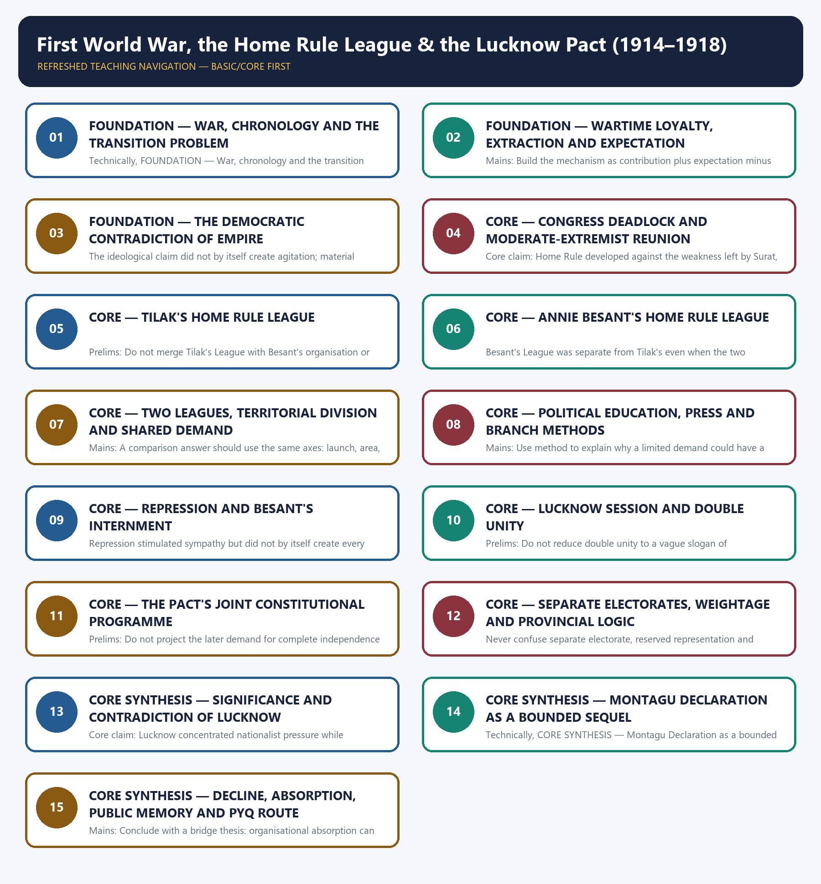

# First World War, the Home Rule League & the Lucknow Pact (1914–1918) - Learner-v2 Complete Learning Session

### SOURCE, PROGRESSION AND CURRENT-LINKAGE AUDIT

- **Repository owners queried:** Basic and Advanced Markdown for this topic, the master chronology, syllabus map and linked Modern History owners.
- **OCR book evidence queried:** OCR checks use Bipan Chandra's India's Struggle for Independence, printed pages 141-152, and Modern India, approximately pages 254-258, for the two Leagues, repression, Lucknow and the transition. Sekhar Bandyopadhyay, especially pages 286-288 and the adjacent Home Rule discussion, supplies wartime-economic and regional qualification. The Congress-League Scheme transcription supplies the Pact's exact provisions.
- **Qdrant:** not used; Markdown plus searchable local PDFs were sufficient.
- **PYQ integrity:** UPSC Prelims 2018 Q79 on the All India Home Rule League's 1920 renaming as Swarajya Sabha is retained as a routed demand card. The official answer key is unavailable locally, so no answer letter is inferred.
- **Bounded live linkage:** A 2026 Commonwealth War Graves Commission report records that 9,909 previously uncommemorated Indian Army servicemen were added to its records after the Punjab Registers project. This is used only as a public-memory bridge; it does not quantify wartime extraction or prove a nationalist causal claim.
- **Fact/inference rule:** historical claims are source-backed; analytical judgements are explicitly framed as interpretation and do not invent figures.

## BASIC LEARNING SESSION

### DEEP-REVIEW LEARNING CONTRACT

| Control | Binding rule for this package |
|---|---|
| Syllabus boundary | Complete Modern History Core is taught chronologically and causally before optional enrichment. |
| Evidence method | Claim → named Act/treaty/record/organisation/person/region or scholarly evidence → analysis → qualification. |
| Date discipline | Event, proposal, enactment, commencement, official policy, implementation and later interpretation remain distinct. |
| Historiography | Colonial, nationalist, Marxist, subaltern, Cambridge, feminist and other relevant arguments are attributed and tested, never used as labels alone. |
| Practice contract | Every solved item has demand decoding, an examiner-grade model, an executable answer/compression plan, marks rationale and answer-specific improvement. |
| Approval | This immutable successor remains `approved: false` pending explicit approval. |

**Canonical Basic/Core owner:** `upsc-ai-kit\knowledge\Modern-Indian-History\basic\18_WWI-Home-Rule-and-Lucknow-Pact.md`  
**Canonical topic owner:** `upsc-ai-kit\knowledge\Modern-Indian-History\basic\18_WWI-Home-Rule-and-Lucknow-Pact.md`  
**Optional Advanced owner:** `upsc-ai-kit\knowledge\Modern-Indian-History\advanced\18_WWI-Home-Rule-and-Lucknow-Pact.md`  
**Official syllabus mapping:** `upsc-ai-kit\knowledge\Modern-Indian-History\OFFICIAL-UPSC-SYLLABUS-MAPPING.md`

### EVIDENCE, PYQ AND CURRENT-STATUS CONTROL

- **Official and primary evidence:** Acts, charters, treaties, proclamations, committee reports, proceedings, organisational resolutions, speeches and contemporary records are dated and read for authorship and purpose.
- **Regional and social evidence:** petitions, newspapers, memoirs, local studies and material geography qualify elite or all-India generalisation.
- **Economic and quantitative evidence:** revenue, trade, price, wage, craft and mortality claims retain unit, region, period and uncertainty; statistics are never invented.
- **Scholarly interpretation:** historian schools are competing explanations tied to named evidence, not memorised verdicts.
- **PYQ discipline:** repository ledgers and locally held official papers control wording and metadata; reconstructed wording and unavailable official keys remain explicitly labelled.
- **Current-status note, rechecked 2026-08-31:** A 2026 Commonwealth War Graves Commission report records that 9,909 previously uncommemorated Indian Army servicemen were added to its records after the Punjab Registers project. This is used only as a public-memory bridge; it does not quantify wartime extraction or prove a nationalist causal claim.

**Live/primary context sources recorded by the predecessor generation:**

- `https://www.cwgc.org/our-work/news/thousands-of-indian-first-world-war-soldiers-commemorated-after-historical-omission/`
- `https://www.constitutionofindia.net/historical-constitution/the-congress-league-scheme-1916-inc-aiml/`




*Distinct embedded teaching-navigation image. The separate continuous Cārvāka-style flowchart package remains an independent at-a-glance artifact.*

### SESSION 1 — FOUNDATION — WAR, CHRONOLOGY AND THE TRANSITION PROBLEM

#### DEFINITION / WHAT THIS IS CALLED

**Plain-language definition:** FOUNDATION — War, chronology and the transition problem comprises FOUNDATION, War and chronology as its core connected dimensions.

**Technical definition:** Technically, FOUNDATION — War, chronology and the transition problem is analysed by relating FOUNDATION to War, then testing the relationship through chronology and the transition problem.

#### ANSWER-GRABBING OPENING — WRITE/ADAPT IN THE EXAM

> FOUNDATION — War, chronology and the transition problem comprises FOUNDATION, War and chronology as its core connected dimensions.

#### MUST-WRITE KEYWORDS

- **FOUNDATION**
- **War**
- **chronology**
- **the transition problem**
- **Precise definition**
- **Topic boundary**

**How to use them:** Frame the answer through FOUNDATION; define War, connect chronology with the transition problem to explain the mechanism, and use Precise definition for the decisive comparison or qualification.

##### VISUAL FIRST

```text
WAR, CHRONOLOGY AND THE TRANSITION PROBLEM
JUN 1914 TILAK RELEASE -> DEC 1915 READMISSION AUTHORISED
APR-SEP 1916 TWO LEAGUES -> DEC 1916 LUCKNOW
1917 SECURITY / INTERNMENT -> 20 AUG DECLARATION
JUL-LATE 1918 REFORM DIVISION + TILAK ABROAD -> DECLINE
```

*The visual fixes this subtopic's chronology, mechanism or comparison before the evidence.*

##### CONCEPT DEFINITIONS

- **Precise definition:** A transition sequence linking imperial war, revived constitutional agitation, negotiated unity and an incomplete official response.
- **Topic boundary:** Apply this definition only within First World War, the Home Rule League & the Lucknow Pact (1914–1918); preserve the named actors, date and institutional setting.

##### CORE EXPLANATION

The period 1914-18 links wartime loyalty and extraction to Home Rule, Lucknow unity, a bounded imperial promise and the threshold of Gandhian politics.

##### EVIDENCE AND MECHANISM

- Tilak's June 1914 release and Congress's December 1915 readmission decision precede the two separate Leagues of 1916.
- Lucknow in December 1916 publicly consummates Congress reunion and Congress-League bargaining.
- Tilak's 1916-17 security and exclusion proceedings and the June 1917 internments precede the Montagu Declaration.
- The July 1918 reform proposals and Tilak's late-1918 departure for England help explain organisational decline.

##### EXAMINER CAUTION

- Do not read every event as an inevitable step toward Gandhi or independence.

##### EXAM LINK

- **Prelims:** Do not read every event as an inevitable step toward Gandhi or independence.
- **Mains:** Use a chronological thesis that identifies both continuity and changing political scale.

##### MINI RECAP

- **Core claim:** The period 1914-18 links wartime loyalty and extraction to Home Rule, Lucknow unity, a bounded imperial promise and the threshold of Gandhian politics.
- **Use:** Use a chronological thesis that identifies both continuity and changing political scale.

#### CLOSING RECALL FLOW — FOUNDATION — WAR, CHRONOLOGY AND THE TRANSITION PROBLEM

```text
START / CONCEPT: FOUNDATION — War, chronology and the transition problem
        |
        v
EXACT TERMS: FOUNDATION · War · chronology · the transition problem · Precise definition · Topic boundary
        |
        v
MECHANISM / ARGUMENT: The period 1914-18 links wartime loyalty and extraction to Home Rule, Lucknow unity, a bounded imperial promise and the threshold of Gandhian politics.
        |
        v
CONSEQUENCE / CONTRAST: The July 1918 reform proposals and Tilak's late-1918 departure for England help explain organisational decline.
        |
        v
UPSC TRAP / ANSWER-USE: Do not miss this limiting distinction: use a chronological thesis that identifies both continuity and changing political scale.
        |
        v
ANSWER-GRABBING FORMULATION: FOUNDATION — War, chronology and the transition problem comprises FOUNDATION, War and chronology as its core connected dimensions.
```
### SESSION 2 — FOUNDATION — WARTIME LOYALTY, EXTRACTION AND EXPECTATION

#### DEFINITION / WHAT THIS IS CALLED

**Plain-language definition:** Precise definition: Wartime reciprocity is the political expectation that extraordinary colonial support should produce a meaningful constitutional return.

**Technical definition:** Mains: Build the mechanism as contribution plus expectation minus adequate reward.

#### ANSWER-GRABBING OPENING — WRITE/ADAPT IN THE EXAM

> Precise definition: Wartime reciprocity is the political expectation that extraordinary colonial support should produce a meaningful constitutional return.

#### MUST-WRITE KEYWORDS

- **FOUNDATION**
- **Wartime loyalty**
- **extraction**
- **expectation**
- **Precise definition**
- **Topic boundary**

**How to use them:** Frame the answer through FOUNDATION; define Wartime loyalty, connect extraction with expectation to explain the mechanism, and use Precise definition for the decisive comparison or qualification.

##### VISUAL FIRST

```text
WARTIME LOYALTY, EXTRACTION AND EXPECTATION
INDIAN SUPPORT -> soldiers + money + materials
        |                         |
 EXPECTED REFORM          TAX / LOAN / RECRUITMENT / SHORTAGE
        |                         |
        +---- reciprocity gap ----+ -> ASSERTIVE POLITICAL DEMAND
```

*The visual fixes this subtopic's chronology, mechanism or comparison before the evidence.*

##### CONCEPT DEFINITIONS

- **Precise definition:** Wartime reciprocity is the political expectation that extraordinary colonial support should produce a meaningful constitutional return.
- **Topic boundary:** Apply this definition only within First World War, the Home Rule League & the Lucknow Pact (1914–1918); preserve the named actors, date and institutional setting.

##### CORE EXPLANATION

Indian wartime support created a claim to constitutional reciprocity, while coercive extraction made loyalism increasingly difficult to sustain.

##### EVIDENCE AND MECHANISM

- The Raj drew soldiers, money and materials from India for an imperial war.
- Recruitment pressure, taxes, war loans, shortages and price rises distributed costs unequally.
- Selected industries and traders also gained from import disruption and wartime demand.
- Nationalist support was political and conditional rather than proof of permanent consent.

##### EXAMINER CAUTION

- Avoid unsupported troop, revenue, inflation or casualty totals.

##### EXAM LINK

- **Prelims:** Avoid unsupported troop, revenue, inflation or casualty totals.
- **Mains:** Build the mechanism as contribution plus expectation minus adequate reward.

##### MINI RECAP

- **Core claim:** Indian wartime support created a claim to constitutional reciprocity, while coercive extraction made loyalism increasingly difficult to sustain.
- **Use:** Build the mechanism as contribution plus expectation minus adequate reward.

#### CLOSING RECALL FLOW — FOUNDATION — WARTIME LOYALTY, EXTRACTION AND EXPECTATION

```text
START / CONCEPT: FOUNDATION — Wartime loyalty, extraction and expectation
        |
        v
EXACT TERMS: FOUNDATION · Wartime loyalty · extraction · expectation · Precise definition · Topic boundary
        |
        v
MECHANISM / ARGUMENT: Mains: Build the mechanism as contribution plus expectation minus adequate reward.
        |
        v
CONSEQUENCE / CONTRAST: Indian wartime support created a claim to constitutional reciprocity, while coercive extraction made loyalism increasingly difficult to sustain.
        |
        v
UPSC TRAP / ANSWER-USE: Nationalist support was political and conditional rather than proof of permanent consent.
        |
        v
ANSWER-GRABBING FORMULATION: Precise definition: Wartime reciprocity is the political expectation that extraordinary colonial support should produce a meaningful constitutional return.
```
### SESSION 3 — FOUNDATION — THE DEMOCRATIC CONTRADICTION OF EMPIRE

#### DEFINITION / WHAT THIS IS CALLED

**Plain-language definition:** Precise definition: The democratic contradiction is the gap between Britain's stated defence of liberty and its denial of self-government to colonial subjects.

**Technical definition:** The ideological claim did not by itself create agitation; material pressure and organisation mattered.

#### ANSWER-GRABBING OPENING — WRITE/ADAPT IN THE EXAM

> Precise definition: The democratic contradiction is the gap between Britain's stated defence of liberty and its denial of self-government to colonial subjects.

#### MUST-WRITE KEYWORDS

- **FOUNDATION**
- **The democratic contradiction of empire**
- **Precise definition**
- **Topic boundary**
- **Core claim**
- **1914–1918**

**How to use them:** Frame the answer through FOUNDATION; define The democratic contradiction of empire, connect Precise definition with Topic boundary to explain the mechanism, and use Core claim for the decisive comparison or qualification.

##### VISUAL FIRST

```text
THE DEMOCRATIC CONTRADICTION OF EMPIRE
BRITISH WAR CLAIM: liberty / democracy
                    versus
INDIAN CONDITION: colonial subjection / coercive extraction
                    |
        NATIONALIST ARGUMENT FOR SELF-GOVERNMENT
```

*The visual fixes this subtopic's chronology, mechanism or comparison before the evidence.*

##### CONCEPT DEFINITIONS

- **Precise definition:** The democratic contradiction is the gap between Britain's stated defence of liberty and its denial of self-government to colonial subjects.
- **Topic boundary:** Apply this definition only within First World War, the Home Rule League & the Lucknow Pact (1914–1918); preserve the named actors, date and institutional setting.

##### CORE EXPLANATION

Wartime claims about democracy and liberty supplied nationalists with a language for exposing the contradiction of colonial government.

##### EVIDENCE AND MECHANISM

- The ideological claim did not by itself create agitation; material pressure and organisation mattered.
- Self-government became a more legitimate public demand during the imperial crisis.
- The war internationalised political vocabulary without granting self-determination to India.

##### EXAMINER CAUTION

- Do not treat European wartime rhetoric as a binding promise already made to India.

##### EXAM LINK

- **Prelims:** Do not treat European wartime rhetoric as a binding promise already made to India.
- **Mains:** Use ideology as an enabling argument joined to pressure, organisation and political choice.

##### MINI RECAP

- **Core claim:** Wartime claims about democracy and liberty supplied nationalists with a language for exposing the contradiction of colonial government.
- **Use:** Use ideology as an enabling argument joined to pressure, organisation and political choice.

#### CLOSING RECALL FLOW — FOUNDATION — THE DEMOCRATIC CONTRADICTION OF EMPIRE

```text
START / CONCEPT: FOUNDATION — The democratic contradiction of empire
        |
        v
EXACT TERMS: FOUNDATION · The democratic contradiction of empire · Precise definition · Topic boundary · Core claim · 1914–1918
        |
        v
MECHANISM / ARGUMENT: The ideological claim did not by itself create agitation; material pressure and organisation mattered.
        |
        v
CONSEQUENCE / CONTRAST: Do not treat European wartime rhetoric as a binding promise already made to India.
        |
        v
UPSC TRAP / ANSWER-USE: Do not miss this limiting distinction: self-government became a more legitimate public demand during the imperial crisis.
        |
        v
ANSWER-GRABBING FORMULATION: Precise definition: The democratic contradiction is the gap between Britain's stated defence of liberty and its denial of self-government to colonial subjects.
```
### SESSION 4 — CORE — CONGRESS DEADLOCK AND MODERATE-EXTREMIST REUNION

#### DEFINITION / WHAT THIS IS CALLED

**Plain-language definition:** Precise definition: Congress reunion was the negotiated restoration of cooperation between currents divided at Surat, not the disappearance of their differences.

**Technical definition:** Core claim: Home Rule developed against the weakness left by Surat, repression and intermittent Congress politics, making reunion a condition of wider action.

#### ANSWER-GRABBING OPENING — WRITE/ADAPT IN THE EXAM

> Precise definition: Congress reunion was the negotiated restoration of cooperation between currents divided at Surat, not the disappearance of their differences.

#### MUST-WRITE KEYWORDS

- **Congress deadlock**
- **Moderate-Extremist reunion**
- **Precise definition**
- **Topic boundary**
- **Core claim**
- **1914–1918**

**How to use them:** Frame the answer through Congress deadlock; define Moderate-Extremist reunion, connect Precise definition with Topic boundary to explain the mechanism, and use Core claim for the decisive comparison or qualification.

##### VISUAL FIRST

```text
CONGRESS DEADLOCK AND MODERATE-EXTREMIST REUNION
1907 SURAT SPLIT -> REPRESSION + WEAK CONTINUOUS ACTION
JUN 1914 TILAK RELEASE -> DEC 1915 READMISSION AUTHORISED
                           |
DEC 1916 LUCKNOW -> PUBLIC REUNION WITHOUT IDEOLOGICAL UNIFORMITY
```

*The visual fixes this subtopic's chronology, mechanism or comparison before the evidence.*

##### CONCEPT DEFINITIONS

- **Precise definition:** Congress reunion was the negotiated restoration of cooperation between currents divided at Surat, not the disappearance of their differences.
- **Topic boundary:** Apply this definition only within First World War, the Home Rule League & the Lucknow Pact (1914–1918); preserve the named actors, date and institutional setting.

##### CORE EXPLANATION

Home Rule developed against the weakness left by Surat, repression and intermittent Congress politics, making reunion a condition of wider action.

##### EVIDENCE AND MECHANISM

- Tilak's June 1914 release strengthened the campaign for readmission.
- Congress authorised readmission in December 1915 as resistance to reunion weakened.
- The Lucknow Congress publicly consummated cooperation without erasing ideological differences.

##### EXAMINER CAUTION

- Reunion was a negotiated political repair, not proof that the Surat conflict had never mattered.

##### EXAM LINK

- **Prelims:** Reunion was a negotiated political repair, not proof that the Surat conflict had never mattered.
- **Mains:** Explain why organisational unity enlarged leverage under wartime conditions.

##### MINI RECAP

- **Core claim:** Home Rule developed against the weakness left by Surat, repression and intermittent Congress politics, making reunion a condition of wider action.
- **Use:** Explain why organisational unity enlarged leverage under wartime conditions.

#### CLOSING RECALL FLOW — CORE — CONGRESS DEADLOCK AND MODERATE-EXTREMIST REUNION

```text
START / CONCEPT: CORE — Congress deadlock and Moderate-Extremist reunion
        |
        v
EXACT TERMS: Congress deadlock · Moderate-Extremist reunion · Precise definition · Topic boundary · Core claim · 1914–1918
        |
        v
MECHANISM / ARGUMENT: Core claim: Home Rule developed against the weakness left by Surat, repression and intermittent Congress politics, making reunion a condition of wider action.
        |
        v
CONSEQUENCE / CONTRAST: Reunion was a negotiated political repair, not proof that the Surat conflict had never mattered.
        |
        v
UPSC TRAP / ANSWER-USE: Do not miss this limiting distinction: explain why organisational unity enlarged leverage under wartime conditions.
        |
        v
ANSWER-GRABBING FORMULATION: Precise definition: Congress reunion was the negotiated restoration of cooperation between currents divided at Surat, not the disappearance of their differences.
```
### SESSION 5 — CORE — TILAK'S HOME RULE LEAGUE

#### DEFINITION / WHAT THIS IS CALLED

**Plain-language definition:** Precise definition: Tilak's League was the separately organised April 1916 constitutional campaign in Maharashtra except Bombay city, Karnataka, the Central Provinces and Berar.

**Technical definition:** Prelims: Do not merge Tilak's League with Besant's organisation or label it a clandestine society.

#### ANSWER-GRABBING OPENING — WRITE/ADAPT IN THE EXAM

> Do not merge Tilak's League with Besant's organisation or label it a clandestine society.

#### MUST-WRITE KEYWORDS

- **Tilak's Home Rule League**
- **Precise definition**
- **Topic boundary**
- **Core claim**
- **Precise**
- **1914–1918**

**How to use them:** Frame the answer through Tilak's Home Rule League; define Precise definition, connect Topic boundary with Core claim to explain the mechanism, and use Precise for the decisive comparison or qualification.

##### VISUAL FIRST

```text
TILAK'S HOME RULE LEAGUE
APRIL 1916 | TILAK
ZONE -> Maharashtra except Bombay city + Karnataka + C.P. + Berar
METHOD -> vernacular tours + pamphlets + meetings + branches
DEMAND -> constitutional Home Rule; not secret revolutionary action
```

*The visual fixes this subtopic's chronology, mechanism or comparison before the evidence.*

##### CONCEPT DEFINITIONS

- **Precise definition:** Tilak's League was the separately organised April 1916 constitutional campaign in Maharashtra except Bombay city, Karnataka, the Central Provinces and Berar.
- **Topic boundary:** Apply this definition only within First World War, the Home Rule League & the Lucknow Pact (1914–1918); preserve the named actors, date and institutional setting.

##### CORE EXPLANATION

Tilak's April 1916 League converted constitutional self-government into a sustained regional campaign through vernacular communication and local organisation.

##### EVIDENCE AND MECHANISM

- Its principal field covered Maharashtra excluding Bombay city, Karnataka, the Central Provinces and Berar.
- Meetings, tours, pamphlets and local branches carried politics beyond Congress sessions.
- Tilak defended a broad territorial nationalism rather than a secret revolutionary programme.

##### EXAMINER CAUTION

- Do not merge Tilak's League with Besant's organisation or label it a clandestine society.

##### EXAM LINK

- **Prelims:** Do not merge Tilak's League with Besant's organisation or label it a clandestine society.
- **Mains:** Match founder, date, zone, method and constitutional demand.

##### MINI RECAP

- **Core claim:** Tilak's April 1916 League converted constitutional self-government into a sustained regional campaign through vernacular communication and local organisation.
- **Use:** Match founder, date, zone, method and constitutional demand.

#### CLOSING RECALL FLOW — CORE — TILAK'S HOME RULE LEAGUE

```text
START / CONCEPT: CORE — Tilak's Home Rule League
        |
        v
EXACT TERMS: Tilak's Home Rule League · Precise definition · Topic boundary · Core claim · Precise · 1914–1918
        |
        v
MECHANISM / ARGUMENT: Precise definition: Tilak's League was the separately organised April 1916 constitutional campaign in Maharashtra except Bombay city, Karnataka, the Central Provinces and Berar.
        |
        v
CONSEQUENCE / CONTRAST: Its principal field covered Maharashtra excluding Bombay city, Karnataka, the Central Provinces and Berar.
        |
        v
UPSC TRAP / ANSWER-USE: Do not miss this limiting distinction: match founder, date, zone, method and constitutional demand.
        |
        v
ANSWER-GRABBING FORMULATION: Do not merge Tilak's League with Besant's organisation or label it a clandestine society.
```
### SESSION 6 — CORE — ANNIE BESANT'S HOME RULE LEAGUE

#### DEFINITION / WHAT THIS IS CALLED

**Plain-language definition:** Precise definition: Besant's League was the separately organised September 1916 campaign using Adyar, press and associational networks across the complementary field, including Bombay city.

**Technical definition:** Besant's League was separate from Tilak's even when the two cooperated.

#### ANSWER-GRABBING OPENING — WRITE/ADAPT IN THE EXAM

> Precise definition: Besant's League was the separately organised September 1916 campaign using Adyar, press and associational networks across the complementary field, including Bombay city.

#### MUST-WRITE KEYWORDS

- **Annie Besant's Home Rule League**
- **Precise definition**
- **Topic boundary**
- **Core claim**
- **Precise**
- **1914–1918**

**How to use them:** Frame the answer through Annie Besant's Home Rule League; define Precise definition, connect Topic boundary with Core claim to explain the mechanism, and use Precise for the decisive comparison or qualification.

##### VISUAL FIRST

```text
ANNIE BESANT'S HOME RULE LEAGUE
SEPTEMBER 1916 | ADYAR / MADRAS
NETWORK -> Besant + Arundale + Wadia + C.P. Ramaswami Aiyar
PRESS -> New India + Commonweal
FIELD -> most regions outside Tilak's zone, including Bombay city
```

*The visual fixes this subtopic's chronology, mechanism or comparison before the evidence.*

##### CONCEPT DEFINITIONS

- **Precise definition:** Besant's League was the separately organised September 1916 campaign using Adyar, press and associational networks across the complementary field, including Bombay city.
- **Topic boundary:** Apply this definition only within First World War, the Home Rule League & the Lucknow Pact (1914–1918); preserve the named actors, date and institutional setting.

##### CORE EXPLANATION

Besant's September 1916 League used Theosophical, journalistic and political networks to extend Home Rule across most areas outside Tilak's zone.

##### EVIDENCE AND MECHANISM

- Adyar and Madras were central organisational anchors.
- George Arundale, B.P. Wadia and C.P. Ramaswami Aiyar were important associates.
- New India and Commonweal connected public argument to branch-building and lectures.
- Her field included Bombay city and most areas outside Tilak's assigned zone.

##### EXAMINER CAUTION

- Besant's League was separate from Tilak's even when the two cooperated.

##### EXAM LINK

- **Prelims:** Besant's League was separate from Tilak's even when the two cooperated.
- **Mains:** Use organisation, territorial complementarity, associates and press as one evidence cluster.

##### MINI RECAP

- **Core claim:** Besant's September 1916 League used Theosophical, journalistic and political networks to extend Home Rule across most areas outside Tilak's zone.
- **Use:** Use organisation, territorial complementarity, associates and press as one evidence cluster.

#### CLOSING RECALL FLOW — CORE — ANNIE BESANT'S HOME RULE LEAGUE

```text
START / CONCEPT: CORE — Annie Besant's Home Rule League
        |
        v
EXACT TERMS: Annie Besant's Home Rule League · Precise definition · Topic boundary · Core claim · Precise · 1914–1918
        |
        v
MECHANISM / ARGUMENT: Besant's League was separate from Tilak's even when the two cooperated.
        |
        v
CONSEQUENCE / CONTRAST: Mains: Use organisation, territorial complementarity, associates and press as one evidence cluster.
        |
        v
UPSC TRAP / ANSWER-USE: Do not miss this limiting distinction: adyar and Madras were central organisational anchors.
        |
        v
ANSWER-GRABBING FORMULATION: Precise definition: Besant's League was the separately organised September 1916 campaign using Adyar, press and associational networks across the complementary field, including Bombay city.
```
### SESSION 7 — CORE — TWO LEAGUES, TERRITORIAL DIVISION AND SHARED DEMAND

#### DEFINITION / WHAT THIS IS CALLED

**Plain-language definition:** Precise definition: Territorial division means coordinated but distinct spheres of work under a shared Home Rule objective.

**Technical definition:** Mains: A comparison answer should use the same axes: launch, area, network, medium and demand.

#### ANSWER-GRABBING OPENING — WRITE/ADAPT IN THE EXAM

> Precise definition: Territorial division means coordinated but distinct spheres of work under a shared Home Rule objective.

#### MUST-WRITE KEYWORDS

- **Two Leagues**
- **territorial division**
- **shared demand**
- **Precise definition**
- **Topic boundary**
- **Core claim**

**How to use them:** Frame the answer through Two Leagues; define territorial division, connect shared demand with Precise definition to explain the mechanism, and use Topic boundary for the decisive comparison or qualification.

##### VISUAL FIRST

```text
TWO LEAGUES, TERRITORIAL DIVISION AND SHARED DEMAND
AXIS          TILAK LEAGUE             BESANT LEAGUE
launch        April 1916              September 1916
field         west / central          wider complementary area
network       regional-vernacular     press / Theosophical links
shared goal   self-government within the British Empire
```

*The visual fixes this subtopic's chronology, mechanism or comparison before the evidence.*

##### CONCEPT DEFINITIONS

- **Precise definition:** Territorial division means coordinated but distinct spheres of work under a shared Home Rule objective.
- **Topic boundary:** Apply this definition only within First World War, the Home Rule League & the Lucknow Pact (1914–1918); preserve the named actors, date and institutional setting.

##### CORE EXPLANATION

The two Leagues divided fields of work to reduce rivalry while sharing the demand for Home Rule within the Empire.

##### EVIDENCE AND MECHANISM

- Tilak concentrated in Maharashtra excluding Bombay city, Karnataka, the Central Provinces and Berar.
- Besant worked through a wider all-India field that included Bombay city.
- Both treated political education and recurring local activity as organisational necessities.
- Neither made immediate complete independence its formal demand.

##### EXAMINER CAUTION

- Territorial complementarity did not make the Leagues one organisation.

##### EXAM LINK

- **Prelims:** Territorial complementarity did not make the Leagues one organisation.
- **Mains:** A comparison answer should use the same axes: launch, area, network, medium and demand.

##### MINI RECAP

- **Core claim:** The two Leagues divided fields of work to reduce rivalry while sharing the demand for Home Rule within the Empire.
- **Use:** A comparison answer should use the same axes: launch, area, network, medium and demand.

#### CLOSING RECALL FLOW — CORE — TWO LEAGUES, TERRITORIAL DIVISION AND SHARED DEMAND

```text
START / CONCEPT: CORE — Two Leagues, territorial division and shared demand
        |
        v
EXACT TERMS: Two Leagues · territorial division · shared demand · Precise definition · Topic boundary · Core claim
        |
        v
MECHANISM / ARGUMENT: Mains: A comparison answer should use the same axes: launch, area, network, medium and demand.
        |
        v
CONSEQUENCE / CONTRAST: The resulting consequence is that territorial division means coordinated but distinct spheres of work under a shared Home Rule...
        |
        v
UPSC TRAP / ANSWER-USE: Do not miss this limiting distinction: territorial division means coordinated but distinct spheres of work under a shared Home Rule...
        |
        v
ANSWER-GRABBING FORMULATION: Precise definition: Territorial division means coordinated but distinct spheres of work under a shared Home Rule objective.
```
### SESSION 8 — CORE — POLITICAL EDUCATION, PRESS AND BRANCH METHODS

#### DEFINITION / WHAT THIS IS CALLED

**Plain-language definition:** Precise definition: Continuous agitation is recurring local political communication between annual national meetings.

**Technical definition:** Mains: Use method to explain why a limited demand could have a larger organisational legacy.

#### ANSWER-GRABBING OPENING — WRITE/ADAPT IN THE EXAM

> Precise definition: Continuous agitation is recurring local political communication between annual national meetings.

#### MUST-WRITE KEYWORDS

- **Political education**
- **press**
- **branch methods**
- **Precise definition**
- **Topic boundary**
- **Core claim**

**How to use them:** Frame the answer through Political education; define press, connect branch methods with Precise definition to explain the mechanism, and use Topic boundary for the decisive comparison or qualification.

##### VISUAL FIRST

```text
POLITICAL EDUCATION, PRESS AND BRANCH METHODS
NEWSPAPER -> PAMPHLET -> LECTURE -> LOCAL BRANCH
     |             |            |             |
 public claim   simple case   repeat contact   local worker
     +------------- CONTINUOUS POLITICAL EDUCATION -------------+
```

*The visual fixes this subtopic's chronology, mechanism or comparison before the evidence.*

##### CONCEPT DEFINITIONS

- **Precise definition:** Continuous agitation is recurring local political communication between annual national meetings.
- **Topic boundary:** Apply this definition only within First World War, the Home Rule League & the Lucknow Pact (1914–1918); preserve the named actors, date and institutional setting.

##### CORE EXPLANATION

Home Rule's organisational novelty lay in continuous political education through print, speech, local branches and repeat contact.

##### EVIDENCE AND MECHANISM

- Pamphlets simplified constitutional demands for wider audiences.
- Newspapers and lecture tours sustained attention between annual Congress meetings.
- Libraries, discussion circles and branches created local workers, though reach remained socially uneven.

##### EXAMINER CAUTION

- Do not equate a wider public sphere with full peasant-worker mass mobilisation.

##### EXAM LINK

- **Prelims:** Do not equate a wider public sphere with full peasant-worker mass mobilisation.
- **Mains:** Use method to explain why a limited demand could have a larger organisational legacy.

##### MINI RECAP

- **Core claim:** Home Rule's organisational novelty lay in continuous political education through print, speech, local branches and repeat contact.
- **Use:** Use method to explain why a limited demand could have a larger organisational legacy.

#### CLOSING RECALL FLOW — CORE — POLITICAL EDUCATION, PRESS AND BRANCH METHODS

```text
START / CONCEPT: CORE — Political education, press and branch methods
        |
        v
EXACT TERMS: Political education · press · branch methods · Precise definition · Topic boundary · Core claim
        |
        v
MECHANISM / ARGUMENT: Mains: Use method to explain why a limited demand could have a larger organisational legacy.
        |
        v
CONSEQUENCE / CONTRAST: Do not equate a wider public sphere with full peasant-worker mass mobilisation.
        |
        v
UPSC TRAP / ANSWER-USE: Do not miss this limiting distinction: libraries, discussion circles and branches created local workers, though reach remained socially uneven.
        |
        v
ANSWER-GRABBING FORMULATION: Precise definition: Continuous agitation is recurring local political communication between annual national meetings.
```
### SESSION 9 — CORE — REPRESSION AND BESANT'S INTERNMENT

#### DEFINITION / WHAT THIS IS CALLED

**Plain-language definition:** Precise definition: Internment is executive confinement without an ordinary criminal conviction, used here to restrict nationalist organisation.

**Technical definition:** Repression stimulated sympathy but did not by itself create every later nationalist gain.

#### ANSWER-GRABBING OPENING — WRITE/ADAPT IN THE EXAM

> Precise definition: Internment is executive confinement without an ordinary criminal conviction, used here to restrict nationalist organisation.

#### MUST-WRITE KEYWORDS

- **Repression**
- **Besant's internment**
- **Precise definition**
- **Topic boundary**
- **Core claim**
- **1914–1918**

**How to use them:** Frame the answer through Repression; define Besant's internment, connect Precise definition with Topic boundary to explain the mechanism, and use Core claim for the decisive comparison or qualification.

##### VISUAL FIRST

```text
REPRESSION AND BESANT'S INTERNMENT
TILAK SECURITY CASE / EXCLUSION + STUDENT RESTRICTIONS
                         |
NOV 1916 RESTRAINT -> JUN 1917 BESANT, WADIA, ARUNDALE INTERNED
                         |
PROTEST -> RELEASE + BESANT'S 1917 CONGRESS PRESIDENCY
```

*The visual fixes this subtopic's chronology, mechanism or comparison before the evidence.*

##### CONCEPT DEFINITIONS

- **Precise definition:** Internment is executive confinement without an ordinary criminal conviction, used here to restrict nationalist organisation.
- **Topic boundary:** Apply this definition only within First World War, the Home Rule League & the Lucknow Pact (1914–1918); preserve the named actors, date and institutional setting.

##### CORE EXPLANATION

Government repression transformed Home Rule from a constitutional demand into a civil-liberty issue and enlarged sympathy for Besant.

##### EVIDENCE AND MECHANISM

- Tilak faced security proceedings in 1916 and later exclusion from Punjab and Delhi.
- Students faced restrictions, and Besant was subjected to territorial restraint in November 1916.
- Annie Besant, B.P. Wadia and George Arundale were interned in June 1917.
- Protest over internment widened support, and her later Congress presidency marked enhanced prestige.

##### EXAMINER CAUTION

- Repression stimulated sympathy but did not by itself create every later nationalist gain.

##### EXAM LINK

- **Prelims:** Repression stimulated sympathy but did not by itself create every later nationalist gain.
- **Mains:** Show the feedback loop from restriction to publicity, coalition and political cost.

##### MINI RECAP

- **Core claim:** Government repression transformed Home Rule from a constitutional demand into a civil-liberty issue and enlarged sympathy for Besant.
- **Use:** Show the feedback loop from restriction to publicity, coalition and political cost.

#### CLOSING RECALL FLOW — CORE — REPRESSION AND BESANT'S INTERNMENT

```text
START / CONCEPT: CORE — Repression and Besant's internment
        |
        v
EXACT TERMS: Repression · Besant's internment · Precise definition · Topic boundary · Core claim · 1914–1918
        |
        v
MECHANISM / ARGUMENT: Repression stimulated sympathy but did not by itself create every later nationalist gain.
        |
        v
CONSEQUENCE / CONTRAST: Protest over internment widened support, and her later Congress presidency marked enhanced prestige.
        |
        v
UPSC TRAP / ANSWER-USE: Do not miss this limiting distinction: and Besant was subjected to territorial restraint in November 1916.
        |
        v
ANSWER-GRABBING FORMULATION: Precise definition: Internment is executive confinement without an ordinary criminal conviction, used here to restrict nationalist organisation.
```
### SESSION 10 — CORE — LUCKNOW SESSION AND DOUBLE UNITY

#### DEFINITION / WHAT THIS IS CALLED

**Plain-language definition:** Precise definition: Double unity means Congress internal reunion plus Congress-League constitutional cooperation at the same session.

**Technical definition:** Prelims: Do not reduce double unity to a vague slogan of Hindu-Muslim harmony.

#### ANSWER-GRABBING OPENING — WRITE/ADAPT IN THE EXAM

> Do not reduce double unity to a vague slogan of Hindu-Muslim harmony.

#### MUST-WRITE KEYWORDS

- **Lucknow Session**
- **double unity**
- **Precise definition**
- **Topic boundary**
- **Core claim**
- **1914–1918**

**How to use them:** Frame the answer through Lucknow Session; define double unity, connect Precise definition with Topic boundary to explain the mechanism, and use Core claim for the decisive comparison or qualification.

##### VISUAL FIRST

```text
LUCKNOW SESSION AND DOUBLE UNITY
DECEMBER 1916 | PRESIDENT: AMBICA CHARAN MAZUMDAR
      +----------------------+----------------------+
      |                                             |
CONGRESS REUNION                              CONGRESS-LEAGUE PACT
Moderate + Extremist                    Tilak / Besant / Jinnah bridge
      +---------------- DOUBLE UNITY ---------------+
```

*The visual fixes this subtopic's chronology, mechanism or comparison before the evidence.*

##### CONCEPT DEFINITIONS

- **Precise definition:** Double unity means Congress internal reunion plus Congress-League constitutional cooperation at the same session.
- **Topic boundary:** Apply this definition only within First World War, the Home Rule League & the Lucknow Pact (1914–1918); preserve the named actors, date and institutional setting.

##### CORE EXPLANATION

The December 1916 Lucknow Session achieved two settlements at once: Moderate-Extremist reunion and Congress-League constitutional cooperation.

##### EVIDENCE AND MECHANISM

- Ambica Charan Mazumdar presided over the Congress session.
- Tilak and Besant promoted rapprochement, while Jinnah helped bridge the two organisations.
- Malaviya opposed the communal-representation bargain.
- The two forms of unity had different actors, histories and institutional consequences.

##### EXAMINER CAUTION

- Do not reduce double unity to a vague slogan of Hindu-Muslim harmony.

##### EXAM LINK

- **Prelims:** Do not reduce double unity to a vague slogan of Hindu-Muslim harmony.
- **Mains:** State each unity separately before assessing their combined bargaining value.

##### MINI RECAP

- **Core claim:** The December 1916 Lucknow Session achieved two settlements at once: Moderate-Extremist reunion and Congress-League constitutional cooperation.
- **Use:** State each unity separately before assessing their combined bargaining value.

#### CLOSING RECALL FLOW — CORE — LUCKNOW SESSION AND DOUBLE UNITY

```text
START / CONCEPT: CORE — Lucknow Session and double unity
        |
        v
EXACT TERMS: Lucknow Session · double unity · Precise definition · Topic boundary · Core claim · 1914–1918
        |
        v
MECHANISM / ARGUMENT: Precise definition: Double unity means Congress internal reunion plus Congress-League constitutional cooperation at the same session.
        |
        v
CONSEQUENCE / CONTRAST: The two forms of unity had different actors, histories and institutional consequences.
        |
        v
UPSC TRAP / ANSWER-USE: Do not miss this limiting distinction: state each unity separately before assessing their combined bargaining value.
        |
        v
ANSWER-GRABBING FORMULATION: Do not reduce double unity to a vague slogan of Hindu-Muslim harmony.
```
### SESSION 11 — CORE — THE PACT'S JOINT CONSTITUTIONAL PROGRAMME

#### DEFINITION / WHAT THIS IS CALLED

**Plain-language definition:** Precise definition: A joint constitutional programme is a negotiated set of reform demands publicly advanced by separate political organisations.

**Technical definition:** Prelims: Do not project the later demand for complete independence into the 1916 programme.

#### ANSWER-GRABBING OPENING — WRITE/ADAPT IN THE EXAM

> Precise definition: A joint constitutional programme is a negotiated set of reform demands publicly advanced by separate political organisations.

#### MUST-WRITE KEYWORDS

- **The Pact's joint constitutional programme**
- **Precise definition**
- **Topic boundary**
- **Core claim**
- **Precise definition: A joint constitutional programme**
- **1914–1918**

**How to use them:** Frame the answer through The Pact's joint constitutional programme; define Precise definition, connect Topic boundary with Core claim to explain the mechanism, and use Precise definition: A joint constitutional programme for the decisive comparison or qualification.

##### VISUAL FIRST

```text
THE PACT'S JOINT CONSTITUTIONAL PROGRAMME
COMMON PLATFORM
   -> four-fifths elected legislatures
   -> 150-member Imperial Council
   -> provincial finance + Indianised executives
BOUNDARY -> neither sovereignty nor immediate responsible government
```

*The visual fixes this subtopic's chronology, mechanism or comparison before the evidence.*

##### CONCEPT DEFINITIONS

- **Precise definition:** A joint constitutional programme is a negotiated set of reform demands publicly advanced by separate political organisations.
- **Topic boundary:** Apply this definition only within First World War, the Home Rule League & the Lucknow Pact (1914–1918); preserve the named actors, date and institutional setting.

##### CORE EXPLANATION

The Lucknow Pact sought wider representation and Indian authority through a common programme that increased pressure on the colonial state.

##### EVIDENCE AND MECHANISM

- The Scheme proposed four-fifths elected members in provincial and Imperial legislatures.
- It proposed a 150-member Imperial Legislative Council and one-third Muslim representation among elected Indian members.
- It sought provincial fiscal authority, greater Indian participation in the executive and reduced Secretary-of-State control.
- The agreement made inter-organisational bargaining more credible during wartime.
- Its constitutional content remained short of sovereignty or immediate responsible government.

##### EXAMINER CAUTION

- Do not project the later demand for complete independence into the 1916 programme.

##### EXAM LINK

- **Prelims:** Do not project the later demand for complete independence into the 1916 programme.
- **Mains:** Distinguish common demand, bargaining leverage and the limits of the constitutional horizon.

##### MINI RECAP

- **Core claim:** The Lucknow Pact sought wider representation and Indian authority through a common programme that increased pressure on the colonial state.
- **Use:** Distinguish common demand, bargaining leverage and the limits of the constitutional horizon.

#### CLOSING RECALL FLOW — CORE — THE PACT'S JOINT CONSTITUTIONAL PROGRAMME

```text
START / CONCEPT: CORE — The Pact's joint constitutional programme
        |
        v
EXACT TERMS: The Pact's joint constitutional programme · Precise definition · Topic boundary · Core claim · Precise definition: A joint constitutional programme · 1914–1918
        |
        v
MECHANISM / ARGUMENT: Do not project the later demand for complete independence into the 1916 programme.
        |
        v
CONSEQUENCE / CONTRAST: Use: Distinguish common demand, bargaining leverage and the limits of the constitutional horizon.
        |
        v
UPSC TRAP / ANSWER-USE: Do not miss this limiting distinction: a joint constitutional programme is a negotiated set of reform demands publicly advanced by...
        |
        v
ANSWER-GRABBING FORMULATION: Precise definition: A joint constitutional programme is a negotiated set of reform demands publicly advanced by separate political organisations.
```
### SESSION 12 — CORE — SEPARATE ELECTORATES, WEIGHTAGE AND PROVINCIAL LOGIC

#### DEFINITION / WHAT THIS IS CALLED

**Plain-language definition:** Precise definition: Separate electorate defines the voting body; weightage adjusts representation relative to population or political bargain.

**Technical definition:** Never confuse separate electorate, reserved representation and weightage; attribute the ratios to the 1916 Scheme.

#### ANSWER-GRABBING OPENING — WRITE/ADAPT IN THE EXAM

> Precise definition: Separate electorate defines the voting body; weightage adjusts representation relative to population or political bargain.

#### MUST-WRITE KEYWORDS

- **Separate electorates**
- **weightage**
- **provincial logic**
- **Precise definition**
- **Topic boundary**
- **Core claim**

**How to use them:** Frame the answer through Separate electorates; define weightage, connect provincial logic with Precise definition to explain the mechanism, and use Topic boundary for the decisive comparison or qualification.

##### VISUAL FIRST

```text
SEPARATE ELECTORATES, WEIGHTAGE AND PROVINCIAL LOGIC
MUSLIM SHARES -> Punjab 50 | Bengal 40 | Bombay 1/3 | U.P. 30
                 Bihar 25 | C.P. 15 | Madras 15
CENTRE -> one-third of elected Indian members
SAFEGUARD -> three-fourths community opposition blocks a measure
RULE -> electorate, weightage and veto are different mechanisms
```

*The visual fixes this subtopic's chronology, mechanism or comparison before the evidence.*

##### CONCEPT DEFINITIONS

- **Precise definition:** Separate electorate defines the voting body; weightage adjusts representation relative to population or political bargain.
- **Topic boundary:** Apply this definition only within First World War, the Home Rule League & the Lucknow Pact (1914–1918); preserve the named actors, date and institutional setting.

##### CORE EXPLANATION

The Pact organised Muslim representation through separate electorates and negotiated provincial weightage, making community a constitutional category.

##### EVIDENCE AND MECHANISM

- Separate electorates had already been introduced under the 1909 reforms.
- Weightage concerns the share of representation, not the identity of the electorate.
- The verified shares were Punjab 50%, Bengal 40%, Bombay one-third, United Provinces 30%, Bihar 25%, and 15% each in the Central Provinces and Madras.
- At the centre, one-third of elected Indian members were to be Muslim.

##### EXAMINER CAUTION

- Never confuse separate electorate, reserved representation and weightage; attribute the ratios to the 1916 Scheme.

##### EXAM LINK

- **Prelims:** Never confuse separate electorate, reserved representation and weightage; attribute the ratios to the 1916 Scheme.
- **Mains:** Explain the institutional mechanism before evaluating its political consequences.

##### MINI RECAP

- **Core claim:** The Pact organised Muslim representation through separate electorates and negotiated provincial weightage, making community a constitutional category.
- **Use:** Explain the institutional mechanism before evaluating its political consequences.

#### CLOSING RECALL FLOW — CORE — SEPARATE ELECTORATES, WEIGHTAGE AND PROVINCIAL LOGIC

```text
START / CONCEPT: CORE — Separate electorates, weightage and provincial logic
        |
        v
EXACT TERMS: Separate electorates · weightage · provincial logic · Precise definition · Topic boundary · Core claim
        |
        v
MECHANISM / ARGUMENT: Never confuse separate electorate, reserved representation and weightage; attribute the ratios to the 1916 Scheme.
        |
        v
CONSEQUENCE / CONTRAST: Separate electorates had already been introduced under the 1909 reforms.
        |
        v
UPSC TRAP / ANSWER-USE: Do not miss this limiting distinction: the verified shares were Punjab 50%, Bengal 40%, Bombay one-third, United Provinces 30%, Bihar...
        |
        v
ANSWER-GRABBING FORMULATION: Precise definition: Separate electorate defines the voting body; weightage adjusts representation relative to population or political bargain.
```
### SESSION 13 — CORE SYNTHESIS — SIGNIFICANCE AND CONTRADICTION OF LUCKNOW

#### DEFINITION / WHAT THIS IS CALLED

**Plain-language definition:** Precise definition: The Lucknow contradiction is that anti-colonial unity was strengthened through community-specific constitutional representation.

**Technical definition:** Core claim: Lucknow concentrated nationalist pressure while embedding a communal representation bargain whose tactical gain and long-term risk must be held together.

#### ANSWER-GRABBING OPENING — WRITE/ADAPT IN THE EXAM

> Precise definition: The Lucknow contradiction is that anti-colonial unity was strengthened through community-specific constitutional representation.

#### MUST-WRITE KEYWORDS

- **CORE SYNTHESIS**
- **Significance**
- **contradiction of Lucknow**
- **Precise definition**
- **Topic boundary**
- **Core claim**

**How to use them:** Frame the answer through CORE SYNTHESIS; define Significance, connect contradiction of Lucknow with Precise definition to explain the mechanism, and use Topic boundary for the decisive comparison or qualification.

##### VISUAL FIRST

```text
SIGNIFICANCE AND CONTRADICTION OF LUCKNOW
IMMEDIATE GAIN                 INSTITUTIONAL COST
joint bargaining power     |     community-coded representation
temporary cooperation      |     separate electorate accepted
                  GRADED VERDICT
real nationalist advance without deterministic Partition claim
```

*The visual fixes this subtopic's chronology, mechanism or comparison before the evidence.*

##### CONCEPT DEFINITIONS

- **Precise definition:** The Lucknow contradiction is that anti-colonial unity was strengthened through community-specific constitutional representation.
- **Topic boundary:** Apply this definition only within First World War, the Home Rule League & the Lucknow Pact (1914–1918); preserve the named actors, date and institutional setting.

##### CORE EXPLANATION

Lucknow concentrated nationalist pressure while embedding a communal representation bargain whose tactical gain and long-term risk must be held together.

##### EVIDENCE AND MECHANISM

- The common programme demonstrated that Congress-League cooperation was possible.
- The Pact also recognised political communities through negotiated representation.
- A measure affecting a community could be blocked when three-fourths of that community's council members opposed it.
- Later communal outcomes were not inevitable, but the institutional precedent mattered.

##### EXAMINER CAUTION

- Avoid both celebratory unity without cost and deterministic claims that the Pact caused Partition.

##### EXAM LINK

- **Prelims:** Avoid both celebratory unity without cost and deterministic claims that the Pact caused Partition.
- **Mains:** Use a two-column evaluation: immediate leverage against institutional contradiction.

##### MINI RECAP

- **Core claim:** Lucknow concentrated nationalist pressure while embedding a communal representation bargain whose tactical gain and long-term risk must be held together.
- **Use:** Use a two-column evaluation: immediate leverage against institutional contradiction.

#### CLOSING RECALL FLOW — CORE SYNTHESIS — SIGNIFICANCE AND CONTRADICTION OF LUCKNOW

```text
START / CONCEPT: CORE SYNTHESIS — Significance and contradiction of Lucknow
        |
        v
EXACT TERMS: CORE SYNTHESIS · Significance · contradiction of Lucknow · Precise definition · Topic boundary · Core claim
        |
        v
MECHANISM / ARGUMENT: Core claim: Lucknow concentrated nationalist pressure while embedding a communal representation bargain whose tactical gain and long-term risk must be held together.
        |
        v
CONSEQUENCE / CONTRAST: Later communal outcomes were not inevitable, but the institutional precedent mattered.
        |
        v
UPSC TRAP / ANSWER-USE: Do not miss this limiting distinction: mains: Use a two-column evaluation: immediate leverage against institutional contradiction.
        |
        v
ANSWER-GRABBING FORMULATION: Precise definition: The Lucknow contradiction is that anti-colonial unity was strengthened through community-specific constitutional representation.
```
### SESSION 14 — CORE SYNTHESIS — MONTAGU DECLARATION AS A BOUNDED SEQUEL

#### DEFINITION / WHAT THIS IS CALLED

**Plain-language definition:** Prelims: Do not describe the Declaration as responsible government granted in 1917.

**Technical definition:** Technically, CORE SYNTHESIS — Montagu Declaration as a bounded sequel is analysed by relating CORE SYNTHESIS to Montagu Declaration as a bounded sequel, then testing the relationship through Precise definition and Topic boundary.

#### ANSWER-GRABBING OPENING — WRITE/ADAPT IN THE EXAM

> Do not describe the Declaration as responsible government granted in 1917.

#### MUST-WRITE KEYWORDS

- **CORE SYNTHESIS**
- **Montagu Declaration as a bounded sequel**
- **Precise definition**
- **Topic boundary**
- **Core claim**
- **1914–1918**

**How to use them:** Frame the answer through CORE SYNTHESIS; define Montagu Declaration as a bounded sequel, connect Precise definition with Topic boundary to explain the mechanism, and use Core claim for the decisive comparison or qualification.

##### VISUAL FIRST

```text
MONTAGU DECLARATION AS A BOUNDED SEQUEL
PRESSURE: war + Home Rule + Lucknow
                    |
20 AUG 1917 -> gradual responsible government announced
                    |
BOUNDARIES -> gradualism + executive control + Empire retained
```

*The visual fixes this subtopic's chronology, mechanism or comparison before the evidence.*

##### CONCEPT DEFINITIONS

- **Precise definition:** A bounded concession recognises a direction of reform while limiting its pace, scope and transfer of authority.
- **Topic boundary:** Apply this definition only within First World War, the Home Rule League & the Lucknow Pact (1914–1918); preserve the named actors, date and institutional setting.

##### CORE EXPLANATION

The declaration of 20 August 1917 acknowledged responsible government as a gradual imperial objective without conceding immediate popular sovereignty.

##### EVIDENCE AND MECHANISM

- It followed wartime need, Home Rule pressure and wider nationalist unity.
- Increasing Indian association and gradual responsible government were the stated direction.
- Executive discretion, gradualism and imperial membership bounded the promise.

##### EXAMINER CAUTION

- Do not describe the Declaration as responsible government granted in 1917.

##### EXAM LINK

- **Prelims:** Do not describe the Declaration as responsible government granted in 1917.
- **Mains:** Present it as a constitutional ratchet and an inadequate response, not a complete settlement.

##### MINI RECAP

- **Core claim:** The declaration of 20 August 1917 acknowledged responsible government as a gradual imperial objective without conceding immediate popular sovereignty.
- **Use:** Present it as a constitutional ratchet and an inadequate response, not a complete settlement.

#### CLOSING RECALL FLOW — CORE SYNTHESIS — MONTAGU DECLARATION AS A BOUNDED SEQUEL

```text
START / CONCEPT: CORE SYNTHESIS — Montagu Declaration as a bounded sequel
        |
        v
EXACT TERMS: CORE SYNTHESIS · Montagu Declaration as a bounded sequel · Precise definition · Topic boundary · Core claim · 1914–1918
        |
        v
MECHANISM / ARGUMENT: It followed wartime need, Home Rule pressure and wider nationalist unity.
        |
        v
CONSEQUENCE / CONTRAST: Use: Present it as a constitutional ratchet and an inadequate response, not a complete settlement.
        |
        v
UPSC TRAP / ANSWER-USE: Do not miss this limiting distinction: increasing Indian association and gradual responsible government were the stated direction.
        |
        v
ANSWER-GRABBING FORMULATION: Do not describe the Declaration as responsible government granted in 1917.
```
### SESSION 15 — CORE SYNTHESIS — DECLINE, ABSORPTION, PUBLIC MEMORY AND PYQ ROUTE

#### DEFINITION / WHAT THIS IS CALLED

**Plain-language definition:** Precise definition: Organisational absorption occurs when a movement loses separate momentum but transfers personnel, methods and demands into a successor phase.

**Technical definition:** Mains: Conclude with a bridge thesis: organisational absorption can coexist with historical significance.

#### ANSWER-GRABBING OPENING — WRITE/ADAPT IN THE EXAM

> Precise definition: Organisational absorption occurs when a movement loses separate momentum but transfers personnel, methods and demands into a successor phase.

#### MUST-WRITE KEYWORDS

- **CORE SYNTHESIS**
- **Decline**
- **absorption**
- **public memory**
- **PYQ route**
- **Precise definition**

**How to use them:** Frame the answer through CORE SYNTHESIS; define Decline, connect absorption with public memory to explain the mechanism, and use PYQ route for the decisive comparison or qualification.

##### VISUAL FIRST

```text
DECLINE, ABSORPTION, PUBLIC MEMORY AND PYQ ROUTE
1918 -> MODERATE EXIT + REFORM DIVISION + BESANT VACILLATION
TILAK IN ENGLAND -> principal organiser absent
BRANCHES + CADRES -> later Gandhian mass-political bridge
2018 Q79 -> Swarajya Sabha route; no inferred answer letter
2026 CWGC -> 9,909 names added to records; memory bridge only
```

*The visual fixes this subtopic's chronology, mechanism or comparison before the evidence.*

##### CONCEPT DEFINITIONS

- **Precise definition:** Organisational absorption occurs when a movement loses separate momentum but transfers personnel, methods and demands into a successor phase.
- **Topic boundary:** Apply this definition only within First World War, the Home Rule League & the Lucknow Pact (1914–1918); preserve the named actors, date and institutional setting.

##### CORE EXPLANATION

Home Rule declined as a separate movement but transferred cadres, methods and expectations into the Gandhian phase; its wartime setting also survives in public memory.

##### EVIDENCE AND MECHANISM

- Moderate withdrawal after Besant's release and the reform promise narrowed the agitation.
- Divisions over the July 1918 reform proposals and Besant's vacillation weakened unity.
- Tilak's late-1918 departure for England deprived the movement of a principal organiser.
- Branch work and political education later remained useful to Congress mobilisation under Gandhi.
- The 2018 Q79 renaming card is retained without inventing an official key.
- The 2026 CWGC report adds 9,909 previously uncommemorated servicemen after the Punjab Registers project.

##### EXAMINER CAUTION

- Use the CWGC report only for memory and archival recovery, not as proof of Home Rule causation.

##### EXAM LINK

- **Prelims:** Use the CWGC report only for memory and archival recovery, not as proof of Home Rule causation.
- **Mains:** Conclude with a bridge thesis: organisational absorption can coexist with historical significance.

##### MINI RECAP

- **Core claim:** Home Rule declined as a separate movement but transferred cadres, methods and expectations into the Gandhian phase; its wartime setting also survives in public memory.
- **Use:** Conclude with a bridge thesis: organisational absorption can coexist with historical significance.

#### CLOSING RECALL FLOW — CORE SYNTHESIS — DECLINE, ABSORPTION, PUBLIC MEMORY AND PYQ ROUTE

```text
START / CONCEPT: CORE SYNTHESIS — Decline, absorption, public memory and PYQ route
        |
        v
EXACT TERMS: CORE SYNTHESIS · Decline · absorption · public memory · PYQ route · Precise definition
        |
        v
MECHANISM / ARGUMENT: Mains: Conclude with a bridge thesis: organisational absorption can coexist with historical significance.
        |
        v
CONSEQUENCE / CONTRAST: Use the CWGC report only for memory and archival recovery, not as proof of Home Rule causation.
        |
        v
UPSC TRAP / ANSWER-USE: Do not miss this limiting distinction: the 2018 Q79 renaming card is retained without inventing an official key.
        |
        v
ANSWER-GRABBING FORMULATION: Precise definition: Organisational absorption occurs when a movement loses separate momentum but transfers personnel, methods and demands into a successor phase.
```
### MODERN HISTORY DEEP-REVIEW CORE CONTROL

- **Must remember:** Tilak's and Annie Besant's Home Rule Leagues began separately in 1916; the Lucknow Congress and Congress-League Pact followed in December 1916, before the Montagu Declaration of 20 August 1917.
- **Close distinction:** Home Rule mobilisation, Congress reunion and the Lucknow compromise were connected but institutionally distinct; separate electorates remained embedded in the pact.
- **Evidence / interpretation limit:** Wartime recruitment, taxation, repression, Ghadar activity and provincial league networks qualify a leadership-only account of political revival.

## BASIC MCQS / REMEDIATION

### Q1. Which statement correctly identifies Wartime loyalty and expectation?

A. At the First World War's outbreak, leading Indian nationalists supported Britain while expecting meaningful constitutional advance.
B. The Surat split and subsequent repression had weakened continuous Congress agitation before the wartime effort at reunion.
C. India supplied soldiers, money and materials, while taxation, war loans, recruitment pressure, shortages and rising prices widened hardship, even as selected industries and traders gained wartime opportunities.
D. British wartime language about liberty and democracy sharpened the contradiction between imperial claims and colonial subjection.

**Answer: A.**
**Explanation:** At the First World War's outbreak, leading Indian nationalists supported Britain while expecting meaningful constitutional advance. This distinction preserves the source-backed chronology and prevents cross-matching errors in UPSC elimination.

### Q2. Which chronology card should be filed under Wartime loyalty and expectation?

A. The Surat split and subsequent repression had weakened continuous Congress agitation before the wartime effort at reunion.
B. At the First World War's outbreak, leading Indian nationalists supported Britain while expecting meaningful constitutional advance.
C. Congress authorised readmission of the Extremist current in December 1915; the Lucknow Congress of December 1916 publicly consummated reunion.
D. British wartime language about liberty and democracy sharpened the contradiction between imperial claims and colonial subjection.

**Answer: B.**
**Explanation:** At the First World War's outbreak, leading Indian nationalists supported Britain while expecting meaningful constitutional advance. This distinction preserves the source-backed chronology and prevents cross-matching errors in UPSC elimination.

### Q3. Which option should a candidate retain when revising Wartime loyalty and expectation?

A. The Surat split and subsequent repression had weakened continuous Congress agitation before the wartime effort at reunion.
B. Tilak launched his Home Rule League in April 1916, working mainly in Maharashtra excluding Bombay city, Karnataka, the Central Provinces and Berar.
C. At the First World War's outbreak, leading Indian nationalists supported Britain while expecting meaningful constitutional advance.
D. Congress authorised readmission of the Extremist current in December 1915; the Lucknow Congress of December 1916 publicly consummated reunion.

**Answer: C.**
**Explanation:** At the First World War's outbreak, leading Indian nationalists supported Britain while expecting meaningful constitutional advance. This distinction preserves the source-backed chronology and prevents cross-matching errors in UPSC elimination.

### Q4. Which statement avoids a common matching trap about Wartime loyalty and expectation?

A. Annie Besant launched a separate Home Rule League in September 1916 from Adyar, with activity across most areas outside Tilak's zone, including Bombay city.
B. Tilak launched his Home Rule League in April 1916, working mainly in Maharashtra excluding Bombay city, Karnataka, the Central Provinces and Berar.
C. Congress authorised readmission of the Extremist current in December 1915; the Lucknow Congress of December 1916 publicly consummated reunion.
D. At the First World War's outbreak, leading Indian nationalists supported Britain while expecting meaningful constitutional advance.

**Answer: D.**
**Explanation:** At the First World War's outbreak, leading Indian nationalists supported Britain while expecting meaningful constitutional advance. This distinction preserves the source-backed chronology and prevents cross-matching errors in UPSC elimination.

### Q5. Which statement correctly identifies Wartime extraction?

A. India supplied soldiers, money and materials, while taxation, war loans, recruitment pressure, shortages and rising prices widened hardship, even as selected industries and traders gained wartime opportunities.
B. British wartime language about liberty and democracy sharpened the contradiction between imperial claims and colonial subjection.
C. Congress authorised readmission of the Extremist current in December 1915; the Lucknow Congress of December 1916 publicly consummated reunion.
D. The Surat split and subsequent repression had weakened continuous Congress agitation before the wartime effort at reunion.

**Answer: A.**
**Explanation:** India supplied soldiers, money and materials, while taxation, war loans, recruitment pressure, shortages and rising prices widened hardship, even as selected industries and traders gained wartime opportunities. This distinction preserves the source-backed chronology and prevents cross-matching errors in UPSC elimination.

### Q6. Which chronology card should be filed under Wartime extraction?

A. Congress authorised readmission of the Extremist current in December 1915; the Lucknow Congress of December 1916 publicly consummated reunion.
B. India supplied soldiers, money and materials, while taxation, war loans, recruitment pressure, shortages and rising prices widened hardship, even as selected industries and traders gained wartime opportunities.
C. Tilak launched his Home Rule League in April 1916, working mainly in Maharashtra excluding Bombay city, Karnataka, the Central Provinces and Berar.
D. The Surat split and subsequent repression had weakened continuous Congress agitation before the wartime effort at reunion.

**Answer: B.**
**Explanation:** India supplied soldiers, money and materials, while taxation, war loans, recruitment pressure, shortages and rising prices widened hardship, even as selected industries and traders gained wartime opportunities. This distinction preserves the source-backed chronology and prevents cross-matching errors in UPSC elimination.

### Q7. Which option should a candidate retain when revising Wartime extraction?

A. Annie Besant launched a separate Home Rule League in September 1916 from Adyar, with activity across most areas outside Tilak's zone, including Bombay city.
B. Tilak launched his Home Rule League in April 1916, working mainly in Maharashtra excluding Bombay city, Karnataka, the Central Provinces and Berar.
C. India supplied soldiers, money and materials, while taxation, war loans, recruitment pressure, shortages and rising prices widened hardship, even as selected industries and traders gained wartime opportunities.
D. Congress authorised readmission of the Extremist current in December 1915; the Lucknow Congress of December 1916 publicly consummated reunion.

**Answer: C.**
**Explanation:** India supplied soldiers, money and materials, while taxation, war loans, recruitment pressure, shortages and rising prices widened hardship, even as selected industries and traders gained wartime opportunities. This distinction preserves the source-backed chronology and prevents cross-matching errors in UPSC elimination.

### Q8. Which statement avoids a common matching trap about Wartime extraction?

A. George Arundale, B.P. Wadia and C.P. Ramaswami Aiyar were prominent associates; New India and Commonweal supported Besant's propaganda.
B. Annie Besant launched a separate Home Rule League in September 1916 from Adyar, with activity across most areas outside Tilak's zone, including Bombay city.
C. Tilak launched his Home Rule League in April 1916, working mainly in Maharashtra excluding Bombay city, Karnataka, the Central Provinces and Berar.
D. India supplied soldiers, money and materials, while taxation, war loans, recruitment pressure, shortages and rising prices widened hardship, even as selected industries and traders gained wartime opportunities.

**Answer: D.**
**Explanation:** India supplied soldiers, money and materials, while taxation, war loans, recruitment pressure, shortages and rising prices widened hardship, even as selected industries and traders gained wartime opportunities. This distinction preserves the source-backed chronology and prevents cross-matching errors in UPSC elimination.

### Q9. Which statement correctly identifies Democratic contradiction?

A. British wartime language about liberty and democracy sharpened the contradiction between imperial claims and colonial subjection.
B. Tilak launched his Home Rule League in April 1916, working mainly in Maharashtra excluding Bombay city, Karnataka, the Central Provinces and Berar.
C. The Surat split and subsequent repression had weakened continuous Congress agitation before the wartime effort at reunion.
D. Congress authorised readmission of the Extremist current in December 1915; the Lucknow Congress of December 1916 publicly consummated reunion.

**Answer: A.**
**Explanation:** British wartime language about liberty and democracy sharpened the contradiction between imperial claims and colonial subjection. This distinction preserves the source-backed chronology and prevents cross-matching errors in UPSC elimination.

### Q10. Which chronology card should be filed under Democratic contradiction?

A. Tilak launched his Home Rule League in April 1916, working mainly in Maharashtra excluding Bombay city, Karnataka, the Central Provinces and Berar.
B. British wartime language about liberty and democracy sharpened the contradiction between imperial claims and colonial subjection.
C. Annie Besant launched a separate Home Rule League in September 1916 from Adyar, with activity across most areas outside Tilak's zone, including Bombay city.
D. Congress authorised readmission of the Extremist current in December 1915; the Lucknow Congress of December 1916 publicly consummated reunion.

**Answer: B.**
**Explanation:** British wartime language about liberty and democracy sharpened the contradiction between imperial claims and colonial subjection. This distinction preserves the source-backed chronology and prevents cross-matching errors in UPSC elimination.

### Q11. Which option should a candidate retain when revising Democratic contradiction?

A. Annie Besant launched a separate Home Rule League in September 1916 from Adyar, with activity across most areas outside Tilak's zone, including Bombay city.
B. Tilak launched his Home Rule League in April 1916, working mainly in Maharashtra excluding Bombay city, Karnataka, the Central Provinces and Berar.
C. British wartime language about liberty and democracy sharpened the contradiction between imperial claims and colonial subjection.
D. George Arundale, B.P. Wadia and C.P. Ramaswami Aiyar were prominent associates; New India and Commonweal supported Besant's propaganda.

**Answer: C.**
**Explanation:** British wartime language about liberty and democracy sharpened the contradiction between imperial claims and colonial subjection. This distinction preserves the source-backed chronology and prevents cross-matching errors in UPSC elimination.

### Q12. Which statement avoids a common matching trap about Democratic contradiction?

A. Annie Besant launched a separate Home Rule League in September 1916 from Adyar, with activity across most areas outside Tilak's zone, including Bombay city.
B. George Arundale, B.P. Wadia and C.P. Ramaswami Aiyar were prominent associates; New India and Commonweal supported Besant's propaganda.
C. The Leagues demanded self-government within the British Empire on the Home Rule model, not immediate complete independence.
D. British wartime language about liberty and democracy sharpened the contradiction between imperial claims and colonial subjection.

**Answer: D.**
**Explanation:** British wartime language about liberty and democracy sharpened the contradiction between imperial claims and colonial subjection. This distinction preserves the source-backed chronology and prevents cross-matching errors in UPSC elimination.

### Q13. Which statement correctly identifies Congress deadlock?

A. The Surat split and subsequent repression had weakened continuous Congress agitation before the wartime effort at reunion.
B. Tilak launched his Home Rule League in April 1916, working mainly in Maharashtra excluding Bombay city, Karnataka, the Central Provinces and Berar.
C. Annie Besant launched a separate Home Rule League in September 1916 from Adyar, with activity across most areas outside Tilak's zone, including Bombay city.
D. Congress authorised readmission of the Extremist current in December 1915; the Lucknow Congress of December 1916 publicly consummated reunion.

**Answer: A.**
**Explanation:** The Surat split and subsequent repression had weakened continuous Congress agitation before the wartime effort at reunion. This distinction preserves the source-backed chronology and prevents cross-matching errors in UPSC elimination.

### Q14. Which chronology card should be filed under Congress deadlock?

A. Tilak launched his Home Rule League in April 1916, working mainly in Maharashtra excluding Bombay city, Karnataka, the Central Provinces and Berar.
B. The Surat split and subsequent repression had weakened continuous Congress agitation before the wartime effort at reunion.
C. Annie Besant launched a separate Home Rule League in September 1916 from Adyar, with activity across most areas outside Tilak's zone, including Bombay city.
D. George Arundale, B.P. Wadia and C.P. Ramaswami Aiyar were prominent associates; New India and Commonweal supported Besant's propaganda.

**Answer: B.**
**Explanation:** The Surat split and subsequent repression had weakened continuous Congress agitation before the wartime effort at reunion. This distinction preserves the source-backed chronology and prevents cross-matching errors in UPSC elimination.

### Q15. Which option should a candidate retain when revising Congress deadlock?

A. Annie Besant launched a separate Home Rule League in September 1916 from Adyar, with activity across most areas outside Tilak's zone, including Bombay city.
B. The Leagues demanded self-government within the British Empire on the Home Rule model, not immediate complete independence.
C. The Surat split and subsequent repression had weakened continuous Congress agitation before the wartime effort at reunion.
D. George Arundale, B.P. Wadia and C.P. Ramaswami Aiyar were prominent associates; New India and Commonweal supported Besant's propaganda.

**Answer: C.**
**Explanation:** The Surat split and subsequent repression had weakened continuous Congress agitation before the wartime effort at reunion. This distinction preserves the source-backed chronology and prevents cross-matching errors in UPSC elimination.

### Q16. Which statement avoids a common matching trap about Congress deadlock?

A. George Arundale, B.P. Wadia and C.P. Ramaswami Aiyar were prominent associates; New India and Commonweal supported Besant's propaganda.
B. Branches, lectures, pamphlets, newspapers, libraries and political classes made agitation continuous beyond annual Congress sessions.
C. The Leagues demanded self-government within the British Empire on the Home Rule model, not immediate complete independence.
D. The Surat split and subsequent repression had weakened continuous Congress agitation before the wartime effort at reunion.

**Answer: D.**
**Explanation:** The Surat split and subsequent repression had weakened continuous Congress agitation before the wartime effort at reunion. This distinction preserves the source-backed chronology and prevents cross-matching errors in UPSC elimination.

### Q17. Which statement correctly identifies Moderate-Extremist reunion?

A. Congress authorised readmission of the Extremist current in December 1915; the Lucknow Congress of December 1916 publicly consummated reunion.
B. Tilak launched his Home Rule League in April 1916, working mainly in Maharashtra excluding Bombay city, Karnataka, the Central Provinces and Berar.
C. George Arundale, B.P. Wadia and C.P. Ramaswami Aiyar were prominent associates; New India and Commonweal supported Besant's propaganda.
D. Annie Besant launched a separate Home Rule League in September 1916 from Adyar, with activity across most areas outside Tilak's zone, including Bombay city.

**Answer: A.**
**Explanation:** Congress authorised readmission of the Extremist current in December 1915; the Lucknow Congress of December 1916 publicly consummated reunion. This distinction preserves the source-backed chronology and prevents cross-matching errors in UPSC elimination.

### Q18. Which chronology card should be filed under Moderate-Extremist reunion?

A. Annie Besant launched a separate Home Rule League in September 1916 from Adyar, with activity across most areas outside Tilak's zone, including Bombay city.
B. Congress authorised readmission of the Extremist current in December 1915; the Lucknow Congress of December 1916 publicly consummated reunion.
C. The Leagues demanded self-government within the British Empire on the Home Rule model, not immediate complete independence.
D. George Arundale, B.P. Wadia and C.P. Ramaswami Aiyar were prominent associates; New India and Commonweal supported Besant's propaganda.

**Answer: B.**
**Explanation:** Congress authorised readmission of the Extremist current in December 1915; the Lucknow Congress of December 1916 publicly consummated reunion. This distinction preserves the source-backed chronology and prevents cross-matching errors in UPSC elimination.

### Q19. Which option should a candidate retain when revising Moderate-Extremist reunion?

A. Branches, lectures, pamphlets, newspapers, libraries and political classes made agitation continuous beyond annual Congress sessions.
B. George Arundale, B.P. Wadia and C.P. Ramaswami Aiyar were prominent associates; New India and Commonweal supported Besant's propaganda.
C. Congress authorised readmission of the Extremist current in December 1915; the Lucknow Congress of December 1916 publicly consummated reunion.
D. The Leagues demanded self-government within the British Empire on the Home Rule model, not immediate complete independence.

**Answer: C.**
**Explanation:** Congress authorised readmission of the Extremist current in December 1915; the Lucknow Congress of December 1916 publicly consummated reunion. This distinction preserves the source-backed chronology and prevents cross-matching errors in UPSC elimination.

### Q20. Which statement avoids a common matching trap about Moderate-Extremist reunion?

A. Branches, lectures, pamphlets, newspapers, libraries and political classes made agitation continuous beyond annual Congress sessions.
B. The Leagues demanded self-government within the British Empire on the Home Rule model, not immediate complete independence.
C. Tilak faced security proceedings and territorial exclusion, students faced restrictions, and Annie Besant, B.P. Wadia and George Arundale were interned in June 1917, widening the civil-liberty issue.
D. Congress authorised readmission of the Extremist current in December 1915; the Lucknow Congress of December 1916 publicly consummated reunion.

**Answer: D.**
**Explanation:** Congress authorised readmission of the Extremist current in December 1915; the Lucknow Congress of December 1916 publicly consummated reunion. This distinction preserves the source-backed chronology and prevents cross-matching errors in UPSC elimination.

### Q21. Which statement correctly identifies Tilak's Home Rule League?

A. Tilak launched his Home Rule League in April 1916, working mainly in Maharashtra excluding Bombay city, Karnataka, the Central Provinces and Berar.
B. The Leagues demanded self-government within the British Empire on the Home Rule model, not immediate complete independence.
C. Annie Besant launched a separate Home Rule League in September 1916 from Adyar, with activity across most areas outside Tilak's zone, including Bombay city.
D. George Arundale, B.P. Wadia and C.P. Ramaswami Aiyar were prominent associates; New India and Commonweal supported Besant's propaganda.

**Answer: A.**
**Explanation:** Tilak launched his Home Rule League in April 1916, working mainly in Maharashtra excluding Bombay city, Karnataka, the Central Provinces and Berar. This distinction preserves the source-backed chronology and prevents cross-matching errors in UPSC elimination.

### Q22. Which chronology card should be filed under Tilak's Home Rule League?

A. The Leagues demanded self-government within the British Empire on the Home Rule model, not immediate complete independence.
B. Tilak launched his Home Rule League in April 1916, working mainly in Maharashtra excluding Bombay city, Karnataka, the Central Provinces and Berar.
C. Branches, lectures, pamphlets, newspapers, libraries and political classes made agitation continuous beyond annual Congress sessions.
D. George Arundale, B.P. Wadia and C.P. Ramaswami Aiyar were prominent associates; New India and Commonweal supported Besant's propaganda.

**Answer: B.**
**Explanation:** Tilak launched his Home Rule League in April 1916, working mainly in Maharashtra excluding Bombay city, Karnataka, the Central Provinces and Berar. This distinction preserves the source-backed chronology and prevents cross-matching errors in UPSC elimination.

### Q23. Which option should a candidate retain when revising Tilak's Home Rule League?

A. Branches, lectures, pamphlets, newspapers, libraries and political classes made agitation continuous beyond annual Congress sessions.
B. The Leagues demanded self-government within the British Empire on the Home Rule model, not immediate complete independence.
C. Tilak launched his Home Rule League in April 1916, working mainly in Maharashtra excluding Bombay city, Karnataka, the Central Provinces and Berar.
D. Tilak faced security proceedings and territorial exclusion, students faced restrictions, and Annie Besant, B.P. Wadia and George Arundale were interned in June 1917, widening the civil-liberty issue.

**Answer: C.**
**Explanation:** Tilak launched his Home Rule League in April 1916, working mainly in Maharashtra excluding Bombay city, Karnataka, the Central Provinces and Berar. This distinction preserves the source-backed chronology and prevents cross-matching errors in UPSC elimination.

### Q24. Which statement avoids a common matching trap about Tilak's Home Rule League?

A. Branches, lectures, pamphlets, newspapers, libraries and political classes made agitation continuous beyond annual Congress sessions.
B. Tilak faced security proceedings and territorial exclusion, students faced restrictions, and Annie Besant, B.P. Wadia and George Arundale were interned in June 1917, widening the civil-liberty issue.
C. After release from internment, Annie Besant became Congress president in 1917, marking the movement's political prestige.
D. Tilak launched his Home Rule League in April 1916, working mainly in Maharashtra excluding Bombay city, Karnataka, the Central Provinces and Berar.

**Answer: D.**
**Explanation:** Tilak launched his Home Rule League in April 1916, working mainly in Maharashtra excluding Bombay city, Karnataka, the Central Provinces and Berar. This distinction preserves the source-backed chronology and prevents cross-matching errors in UPSC elimination.

### Q25. Which statement correctly identifies Besant's Home Rule League?

A. Annie Besant launched a separate Home Rule League in September 1916 from Adyar, with activity across most areas outside Tilak's zone, including Bombay city.
B. The Leagues demanded self-government within the British Empire on the Home Rule model, not immediate complete independence.
C. George Arundale, B.P. Wadia and C.P. Ramaswami Aiyar were prominent associates; New India and Commonweal supported Besant's propaganda.
D. Branches, lectures, pamphlets, newspapers, libraries and political classes made agitation continuous beyond annual Congress sessions.

**Answer: A.**
**Explanation:** Annie Besant launched a separate Home Rule League in September 1916 from Adyar, with activity across most areas outside Tilak's zone, including Bombay city. This distinction preserves the source-backed chronology and prevents cross-matching errors in UPSC elimination.

### Q26. Which chronology card should be filed under Besant's Home Rule League?

A. The Leagues demanded self-government within the British Empire on the Home Rule model, not immediate complete independence.
B. Annie Besant launched a separate Home Rule League in September 1916 from Adyar, with activity across most areas outside Tilak's zone, including Bombay city.
C. Tilak faced security proceedings and territorial exclusion, students faced restrictions, and Annie Besant, B.P. Wadia and George Arundale were interned in June 1917, widening the civil-liberty issue.
D. Branches, lectures, pamphlets, newspapers, libraries and political classes made agitation continuous beyond annual Congress sessions.

**Answer: B.**
**Explanation:** Annie Besant launched a separate Home Rule League in September 1916 from Adyar, with activity across most areas outside Tilak's zone, including Bombay city. This distinction preserves the source-backed chronology and prevents cross-matching errors in UPSC elimination.

### Q27. Which option should a candidate retain when revising Besant's Home Rule League?

A. After release from internment, Annie Besant became Congress president in 1917, marking the movement's political prestige.
B. Tilak faced security proceedings and territorial exclusion, students faced restrictions, and Annie Besant, B.P. Wadia and George Arundale were interned in June 1917, widening the civil-liberty issue.
C. Annie Besant launched a separate Home Rule League in September 1916 from Adyar, with activity across most areas outside Tilak's zone, including Bombay city.
D. Branches, lectures, pamphlets, newspapers, libraries and political classes made agitation continuous beyond annual Congress sessions.

**Answer: C.**
**Explanation:** Annie Besant launched a separate Home Rule League in September 1916 from Adyar, with activity across most areas outside Tilak's zone, including Bombay city. This distinction preserves the source-backed chronology and prevents cross-matching errors in UPSC elimination.

### Q28. Which statement avoids a common matching trap about Besant's Home Rule League?

A. Tilak faced security proceedings and territorial exclusion, students faced restrictions, and Annie Besant, B.P. Wadia and George Arundale were interned in June 1917, widening the civil-liberty issue.
B. After release from internment, Annie Besant became Congress president in 1917, marking the movement's political prestige.
C. Under Congress president Ambica Charan Mazumdar, Lucknow produced Congress reunion and a Congress-League agreement shaped by leaders including Tilak, Besant and Jinnah, despite Malaviya's opposition.
D. Annie Besant launched a separate Home Rule League in September 1916 from Adyar, with activity across most areas outside Tilak's zone, including Bombay city.

**Answer: D.**
**Explanation:** Annie Besant launched a separate Home Rule League in September 1916 from Adyar, with activity across most areas outside Tilak's zone, including Bombay city. This distinction preserves the source-backed chronology and prevents cross-matching errors in UPSC elimination.

### Q29. Which statement correctly identifies Besant's associates and press?

A. George Arundale, B.P. Wadia and C.P. Ramaswami Aiyar were prominent associates; New India and Commonweal supported Besant's propaganda.
B. Branches, lectures, pamphlets, newspapers, libraries and political classes made agitation continuous beyond annual Congress sessions.
C. Tilak faced security proceedings and territorial exclusion, students faced restrictions, and Annie Besant, B.P. Wadia and George Arundale were interned in June 1917, widening the civil-liberty issue.
D. The Leagues demanded self-government within the British Empire on the Home Rule model, not immediate complete independence.

**Answer: A.**
**Explanation:** George Arundale, B.P. Wadia and C.P. Ramaswami Aiyar were prominent associates; New India and Commonweal supported Besant's propaganda. This distinction preserves the source-backed chronology and prevents cross-matching errors in UPSC elimination.

### Q30. Which chronology card should be filed under Besant's associates and press?

A. After release from internment, Annie Besant became Congress president in 1917, marking the movement's political prestige.
B. George Arundale, B.P. Wadia and C.P. Ramaswami Aiyar were prominent associates; New India and Commonweal supported Besant's propaganda.
C. Branches, lectures, pamphlets, newspapers, libraries and political classes made agitation continuous beyond annual Congress sessions.
D. Tilak faced security proceedings and territorial exclusion, students faced restrictions, and Annie Besant, B.P. Wadia and George Arundale were interned in June 1917, widening the civil-liberty issue.

**Answer: B.**
**Explanation:** George Arundale, B.P. Wadia and C.P. Ramaswami Aiyar were prominent associates; New India and Commonweal supported Besant's propaganda. This distinction preserves the source-backed chronology and prevents cross-matching errors in UPSC elimination.

### Q31. Which option should a candidate retain when revising Besant's associates and press?

A. After release from internment, Annie Besant became Congress president in 1917, marking the movement's political prestige.
B. Under Congress president Ambica Charan Mazumdar, Lucknow produced Congress reunion and a Congress-League agreement shaped by leaders including Tilak, Besant and Jinnah, despite Malaviya's opposition.
C. George Arundale, B.P. Wadia and C.P. Ramaswami Aiyar were prominent associates; New India and Commonweal supported Besant's propaganda.
D. Tilak faced security proceedings and territorial exclusion, students faced restrictions, and Annie Besant, B.P. Wadia and George Arundale were interned in June 1917, widening the civil-liberty issue.

**Answer: C.**
**Explanation:** George Arundale, B.P. Wadia and C.P. Ramaswami Aiyar were prominent associates; New India and Commonweal supported Besant's propaganda. This distinction preserves the source-backed chronology and prevents cross-matching errors in UPSC elimination.

### Q32. Which statement avoids a common matching trap about Besant's associates and press?

A. The Scheme proposed four-fifths elected legislatures, a 150-member Imperial Legislative Council, greater Indian control, provincial fiscal authority and increased Indianisation of the executive.
B. Under Congress president Ambica Charan Mazumdar, Lucknow produced Congress reunion and a Congress-League agreement shaped by leaders including Tilak, Besant and Jinnah, despite Malaviya's opposition.
C. After release from internment, Annie Besant became Congress president in 1917, marking the movement's political prestige.
D. George Arundale, B.P. Wadia and C.P. Ramaswami Aiyar were prominent associates; New India and Commonweal supported Besant's propaganda.

**Answer: D.**
**Explanation:** George Arundale, B.P. Wadia and C.P. Ramaswami Aiyar were prominent associates; New India and Commonweal supported Besant's propaganda. This distinction preserves the source-backed chronology and prevents cross-matching errors in UPSC elimination.

### Q33. Which statement correctly identifies Home Rule demand?

A. The Leagues demanded self-government within the British Empire on the Home Rule model, not immediate complete independence.
B. Tilak faced security proceedings and territorial exclusion, students faced restrictions, and Annie Besant, B.P. Wadia and George Arundale were interned in June 1917, widening the civil-liberty issue.
C. Branches, lectures, pamphlets, newspapers, libraries and political classes made agitation continuous beyond annual Congress sessions.
D. After release from internment, Annie Besant became Congress president in 1917, marking the movement's political prestige.

**Answer: A.**
**Explanation:** The Leagues demanded self-government within the British Empire on the Home Rule model, not immediate complete independence. This distinction preserves the source-backed chronology and prevents cross-matching errors in UPSC elimination.

### Q34. Which chronology card should be filed under Home Rule demand?

A. After release from internment, Annie Besant became Congress president in 1917, marking the movement's political prestige.
B. The Leagues demanded self-government within the British Empire on the Home Rule model, not immediate complete independence.
C. Under Congress president Ambica Charan Mazumdar, Lucknow produced Congress reunion and a Congress-League agreement shaped by leaders including Tilak, Besant and Jinnah, despite Malaviya's opposition.
D. Tilak faced security proceedings and territorial exclusion, students faced restrictions, and Annie Besant, B.P. Wadia and George Arundale were interned in June 1917, widening the civil-liberty issue.

**Answer: B.**
**Explanation:** The Leagues demanded self-government within the British Empire on the Home Rule model, not immediate complete independence. This distinction preserves the source-backed chronology and prevents cross-matching errors in UPSC elimination.

### Q35. Which option should a candidate retain when revising Home Rule demand?

A. After release from internment, Annie Besant became Congress president in 1917, marking the movement's political prestige.
B. Under Congress president Ambica Charan Mazumdar, Lucknow produced Congress reunion and a Congress-League agreement shaped by leaders including Tilak, Besant and Jinnah, despite Malaviya's opposition.
C. The Leagues demanded self-government within the British Empire on the Home Rule model, not immediate complete independence.
D. The Scheme proposed four-fifths elected legislatures, a 150-member Imperial Legislative Council, greater Indian control, provincial fiscal authority and increased Indianisation of the executive.

**Answer: C.**
**Explanation:** The Leagues demanded self-government within the British Empire on the Home Rule model, not immediate complete independence. This distinction preserves the source-backed chronology and prevents cross-matching errors in UPSC elimination.

### Q36. Which statement avoids a common matching trap about Home Rule demand?

A. The Scheme proposed four-fifths elected legislatures, a 150-member Imperial Legislative Council, greater Indian control, provincial fiscal authority and increased Indianisation of the executive.
B. Congress accepted separate electorates for Muslims at Lucknow; the device had already entered statute through the 1909 reforms.
C. Under Congress president Ambica Charan Mazumdar, Lucknow produced Congress reunion and a Congress-League agreement shaped by leaders including Tilak, Besant and Jinnah, despite Malaviya's opposition.
D. The Leagues demanded self-government within the British Empire on the Home Rule model, not immediate complete independence.

**Answer: D.**
**Explanation:** The Leagues demanded self-government within the British Empire on the Home Rule model, not immediate complete independence. This distinction preserves the source-backed chronology and prevents cross-matching errors in UPSC elimination.

### Q37. Which statement correctly identifies Home Rule methods?

A. Branches, lectures, pamphlets, newspapers, libraries and political classes made agitation continuous beyond annual Congress sessions.
B. After release from internment, Annie Besant became Congress president in 1917, marking the movement's political prestige.
C. Tilak faced security proceedings and territorial exclusion, students faced restrictions, and Annie Besant, B.P. Wadia and George Arundale were interned in June 1917, widening the civil-liberty issue.
D. Under Congress president Ambica Charan Mazumdar, Lucknow produced Congress reunion and a Congress-League agreement shaped by leaders including Tilak, Besant and Jinnah, despite Malaviya's opposition.

**Answer: A.**
**Explanation:** Branches, lectures, pamphlets, newspapers, libraries and political classes made agitation continuous beyond annual Congress sessions. This distinction preserves the source-backed chronology and prevents cross-matching errors in UPSC elimination.

### Q38. Which chronology card should be filed under Home Rule methods?

A. After release from internment, Annie Besant became Congress president in 1917, marking the movement's political prestige.
B. Branches, lectures, pamphlets, newspapers, libraries and political classes made agitation continuous beyond annual Congress sessions.
C. Under Congress president Ambica Charan Mazumdar, Lucknow produced Congress reunion and a Congress-League agreement shaped by leaders including Tilak, Besant and Jinnah, despite Malaviya's opposition.
D. The Scheme proposed four-fifths elected legislatures, a 150-member Imperial Legislative Council, greater Indian control, provincial fiscal authority and increased Indianisation of the executive.

**Answer: B.**
**Explanation:** Branches, lectures, pamphlets, newspapers, libraries and political classes made agitation continuous beyond annual Congress sessions. This distinction preserves the source-backed chronology and prevents cross-matching errors in UPSC elimination.

### Q39. Which option should a candidate retain when revising Home Rule methods?

A. Congress accepted separate electorates for Muslims at Lucknow; the device had already entered statute through the 1909 reforms.
B. Under Congress president Ambica Charan Mazumdar, Lucknow produced Congress reunion and a Congress-League agreement shaped by leaders including Tilak, Besant and Jinnah, despite Malaviya's opposition.
C. Branches, lectures, pamphlets, newspapers, libraries and political classes made agitation continuous beyond annual Congress sessions.
D. The Scheme proposed four-fifths elected legislatures, a 150-member Imperial Legislative Council, greater Indian control, provincial fiscal authority and increased Indianisation of the executive.

**Answer: C.**
**Explanation:** Branches, lectures, pamphlets, newspapers, libraries and political classes made agitation continuous beyond annual Congress sessions. This distinction preserves the source-backed chronology and prevents cross-matching errors in UPSC elimination.

### Q40. Which statement avoids a common matching trap about Home Rule methods?

A. The Pact fixed Muslim shares at Punjab 50%, Bengal 40%, Bombay one-third, United Provinces 30%, Bihar 25%, and Central Provinces and Madras 15% each; one-third of elected Indian central members were to be Muslim.
B. The Scheme proposed four-fifths elected legislatures, a 150-member Imperial Legislative Council, greater Indian control, provincial fiscal authority and increased Indianisation of the executive.
C. Congress accepted separate electorates for Muslims at Lucknow; the device had already entered statute through the 1909 reforms.
D. Branches, lectures, pamphlets, newspapers, libraries and political classes made agitation continuous beyond annual Congress sessions.

**Answer: D.**
**Explanation:** Branches, lectures, pamphlets, newspapers, libraries and political classes made agitation continuous beyond annual Congress sessions. This distinction preserves the source-backed chronology and prevents cross-matching errors in UPSC elimination.

### Q41. Which statement correctly identifies Government repression?

A. Tilak faced security proceedings and territorial exclusion, students faced restrictions, and Annie Besant, B.P. Wadia and George Arundale were interned in June 1917, widening the civil-liberty issue.
B. After release from internment, Annie Besant became Congress president in 1917, marking the movement's political prestige.
C. The Scheme proposed four-fifths elected legislatures, a 150-member Imperial Legislative Council, greater Indian control, provincial fiscal authority and increased Indianisation of the executive.
D. Under Congress president Ambica Charan Mazumdar, Lucknow produced Congress reunion and a Congress-League agreement shaped by leaders including Tilak, Besant and Jinnah, despite Malaviya's opposition.

**Answer: A.**
**Explanation:** Tilak faced security proceedings and territorial exclusion, students faced restrictions, and Annie Besant, B.P. Wadia and George Arundale were interned in June 1917, widening the civil-liberty issue. This distinction preserves the source-backed chronology and prevents cross-matching errors in UPSC elimination.

### Q42. Which chronology card should be filed under Government repression?

A. Under Congress president Ambica Charan Mazumdar, Lucknow produced Congress reunion and a Congress-League agreement shaped by leaders including Tilak, Besant and Jinnah, despite Malaviya's opposition.
B. Tilak faced security proceedings and territorial exclusion, students faced restrictions, and Annie Besant, B.P. Wadia and George Arundale were interned in June 1917, widening the civil-liberty issue.
C. Congress accepted separate electorates for Muslims at Lucknow; the device had already entered statute through the 1909 reforms.
D. The Scheme proposed four-fifths elected legislatures, a 150-member Imperial Legislative Council, greater Indian control, provincial fiscal authority and increased Indianisation of the executive.

**Answer: B.**
**Explanation:** Tilak faced security proceedings and territorial exclusion, students faced restrictions, and Annie Besant, B.P. Wadia and George Arundale were interned in June 1917, widening the civil-liberty issue. This distinction preserves the source-backed chronology and prevents cross-matching errors in UPSC elimination.

### Q43. Which option should a candidate retain when revising Government repression?

A. Congress accepted separate electorates for Muslims at Lucknow; the device had already entered statute through the 1909 reforms.
B. The Pact fixed Muslim shares at Punjab 50%, Bengal 40%, Bombay one-third, United Provinces 30%, Bihar 25%, and Central Provinces and Madras 15% each; one-third of elected Indian central members were to be Muslim.
C. Tilak faced security proceedings and territorial exclusion, students faced restrictions, and Annie Besant, B.P. Wadia and George Arundale were interned in June 1917, widening the civil-liberty issue.
D. The Scheme proposed four-fifths elected legislatures, a 150-member Imperial Legislative Council, greater Indian control, provincial fiscal authority and increased Indianisation of the executive.

**Answer: C.**
**Explanation:** Tilak faced security proceedings and territorial exclusion, students faced restrictions, and Annie Besant, B.P. Wadia and George Arundale were interned in June 1917, widening the civil-liberty issue. This distinction preserves the source-backed chronology and prevents cross-matching errors in UPSC elimination.

### Q44. Which statement avoids a common matching trap about Government repression?

A. The Pact achieved real cooperation while making religious community an institutional unit of bargaining and protecting a community when three-fourths of its members opposed a measure affecting it.
B. The Pact fixed Muslim shares at Punjab 50%, Bengal 40%, Bombay one-third, United Provinces 30%, Bihar 25%, and Central Provinces and Madras 15% each; one-third of elected Indian central members were to be Muslim.
C. Congress accepted separate electorates for Muslims at Lucknow; the device had already entered statute through the 1909 reforms.
D. Tilak faced security proceedings and territorial exclusion, students faced restrictions, and Annie Besant, B.P. Wadia and George Arundale were interned in June 1917, widening the civil-liberty issue.

**Answer: D.**
**Explanation:** Tilak faced security proceedings and territorial exclusion, students faced restrictions, and Annie Besant, B.P. Wadia and George Arundale were interned in June 1917, widening the civil-liberty issue. This distinction preserves the source-backed chronology and prevents cross-matching errors in UPSC elimination.

### Q45. Which statement correctly identifies Besant's Congress presidency?

A. After release from internment, Annie Besant became Congress president in 1917, marking the movement's political prestige.
B. Congress accepted separate electorates for Muslims at Lucknow; the device had already entered statute through the 1909 reforms.
C. Under Congress president Ambica Charan Mazumdar, Lucknow produced Congress reunion and a Congress-League agreement shaped by leaders including Tilak, Besant and Jinnah, despite Malaviya's opposition.
D. The Scheme proposed four-fifths elected legislatures, a 150-member Imperial Legislative Council, greater Indian control, provincial fiscal authority and increased Indianisation of the executive.

**Answer: A.**
**Explanation:** After release from internment, Annie Besant became Congress president in 1917, marking the movement's political prestige. This distinction preserves the source-backed chronology and prevents cross-matching errors in UPSC elimination.

### Q46. Which chronology card should be filed under Besant's Congress presidency?

A. The Pact fixed Muslim shares at Punjab 50%, Bengal 40%, Bombay one-third, United Provinces 30%, Bihar 25%, and Central Provinces and Madras 15% each; one-third of elected Indian central members were to be Muslim.
B. After release from internment, Annie Besant became Congress president in 1917, marking the movement's political prestige.
C. Congress accepted separate electorates for Muslims at Lucknow; the device had already entered statute through the 1909 reforms.
D. The Scheme proposed four-fifths elected legislatures, a 150-member Imperial Legislative Council, greater Indian control, provincial fiscal authority and increased Indianisation of the executive.

**Answer: B.**
**Explanation:** After release from internment, Annie Besant became Congress president in 1917, marking the movement's political prestige. This distinction preserves the source-backed chronology and prevents cross-matching errors in UPSC elimination.

### Q47. Which option should a candidate retain when revising Besant's Congress presidency?

A. Congress accepted separate electorates for Muslims at Lucknow; the device had already entered statute through the 1909 reforms.
B. The Pact achieved real cooperation while making religious community an institutional unit of bargaining and protecting a community when three-fourths of its members opposed a measure affecting it.
C. After release from internment, Annie Besant became Congress president in 1917, marking the movement's political prestige.
D. The Pact fixed Muslim shares at Punjab 50%, Bengal 40%, Bombay one-third, United Provinces 30%, Bihar 25%, and Central Provinces and Madras 15% each; one-third of elected Indian central members were to be Muslim.

**Answer: C.**
**Explanation:** After release from internment, Annie Besant became Congress president in 1917, marking the movement's political prestige. This distinction preserves the source-backed chronology and prevents cross-matching errors in UPSC elimination.

### Q48. Which statement avoids a common matching trap about Besant's Congress presidency?

A. The Pact achieved real cooperation while making religious community an institutional unit of bargaining and protecting a community when three-fourths of its members opposed a measure affecting it.
B. The declaration of 20 August 1917 promised increasing Indian association and gradual responsible government, not immediate transfer.
C. The Pact fixed Muslim shares at Punjab 50%, Bengal 40%, Bombay one-third, United Provinces 30%, Bihar 25%, and Central Provinces and Madras 15% each; one-third of elected Indian central members were to be Muslim.
D. After release from internment, Annie Besant became Congress president in 1917, marking the movement's political prestige.

**Answer: D.**
**Explanation:** After release from internment, Annie Besant became Congress president in 1917, marking the movement's political prestige. This distinction preserves the source-backed chronology and prevents cross-matching errors in UPSC elimination.

### Q49. Which statement correctly identifies Lucknow double unity?

A. Under Congress president Ambica Charan Mazumdar, Lucknow produced Congress reunion and a Congress-League agreement shaped by leaders including Tilak, Besant and Jinnah, despite Malaviya's opposition.
B. Congress accepted separate electorates for Muslims at Lucknow; the device had already entered statute through the 1909 reforms.
C. The Scheme proposed four-fifths elected legislatures, a 150-member Imperial Legislative Council, greater Indian control, provincial fiscal authority and increased Indianisation of the executive.
D. The Pact fixed Muslim shares at Punjab 50%, Bengal 40%, Bombay one-third, United Provinces 30%, Bihar 25%, and Central Provinces and Madras 15% each; one-third of elected Indian central members were to be Muslim.

**Answer: A.**
**Explanation:** Under Congress president Ambica Charan Mazumdar, Lucknow produced Congress reunion and a Congress-League agreement shaped by leaders including Tilak, Besant and Jinnah, despite Malaviya's opposition. This distinction preserves the source-backed chronology and prevents cross-matching errors in UPSC elimination.

### Q50. Which chronology card should be filed under Lucknow double unity?

A. Congress accepted separate electorates for Muslims at Lucknow; the device had already entered statute through the 1909 reforms.
B. Under Congress president Ambica Charan Mazumdar, Lucknow produced Congress reunion and a Congress-League agreement shaped by leaders including Tilak, Besant and Jinnah, despite Malaviya's opposition.
C. The Pact achieved real cooperation while making religious community an institutional unit of bargaining and protecting a community when three-fourths of its members opposed a measure affecting it.
D. The Pact fixed Muslim shares at Punjab 50%, Bengal 40%, Bombay one-third, United Provinces 30%, Bihar 25%, and Central Provinces and Madras 15% each; one-third of elected Indian central members were to be Muslim.

**Answer: B.**
**Explanation:** Under Congress president Ambica Charan Mazumdar, Lucknow produced Congress reunion and a Congress-League agreement shaped by leaders including Tilak, Besant and Jinnah, despite Malaviya's opposition. This distinction preserves the source-backed chronology and prevents cross-matching errors in UPSC elimination.

### Q51. Which option should a candidate retain when revising Lucknow double unity?

A. The declaration of 20 August 1917 promised increasing Indian association and gradual responsible government, not immediate transfer.
B. The Pact fixed Muslim shares at Punjab 50%, Bengal 40%, Bombay one-third, United Provinces 30%, Bihar 25%, and Central Provinces and Madras 15% each; one-third of elected Indian central members were to be Muslim.
C. Under Congress president Ambica Charan Mazumdar, Lucknow produced Congress reunion and a Congress-League agreement shaped by leaders including Tilak, Besant and Jinnah, despite Malaviya's opposition.
D. The Pact achieved real cooperation while making religious community an institutional unit of bargaining and protecting a community when three-fourths of its members opposed a measure affecting it.

**Answer: C.**
**Explanation:** Under Congress president Ambica Charan Mazumdar, Lucknow produced Congress reunion and a Congress-League agreement shaped by leaders including Tilak, Besant and Jinnah, despite Malaviya's opposition. This distinction preserves the source-backed chronology and prevents cross-matching errors in UPSC elimination.

### Q52. Which statement avoids a common matching trap about Lucknow double unity?

A. The declaration of 20 August 1917 promised increasing Indian association and gradual responsible government, not immediate transfer.
B. The Pact achieved real cooperation while making religious community an institutional unit of bargaining and protecting a community when three-fourths of its members opposed a measure affecting it.
C. In 1918 moderate withdrawal, divisions over reform proposals, Besant's vacillation and Tilak's departure for England weakened the Leagues; Gandhi subsequently inherited parts of their political network.
D. Under Congress president Ambica Charan Mazumdar, Lucknow produced Congress reunion and a Congress-League agreement shaped by leaders including Tilak, Besant and Jinnah, despite Malaviya's opposition.

**Answer: D.**
**Explanation:** Under Congress president Ambica Charan Mazumdar, Lucknow produced Congress reunion and a Congress-League agreement shaped by leaders including Tilak, Besant and Jinnah, despite Malaviya's opposition. This distinction preserves the source-backed chronology and prevents cross-matching errors in UPSC elimination.

### Q53. Which statement correctly identifies Joint constitutional demands?

A. The Scheme proposed four-fifths elected legislatures, a 150-member Imperial Legislative Council, greater Indian control, provincial fiscal authority and increased Indianisation of the executive.
B. Congress accepted separate electorates for Muslims at Lucknow; the device had already entered statute through the 1909 reforms.
C. The Pact fixed Muslim shares at Punjab 50%, Bengal 40%, Bombay one-third, United Provinces 30%, Bihar 25%, and Central Provinces and Madras 15% each; one-third of elected Indian central members were to be Muslim.
D. The Pact achieved real cooperation while making religious community an institutional unit of bargaining and protecting a community when three-fourths of its members opposed a measure affecting it.

**Answer: A.**
**Explanation:** The Scheme proposed four-fifths elected legislatures, a 150-member Imperial Legislative Council, greater Indian control, provincial fiscal authority and increased Indianisation of the executive. This distinction preserves the source-backed chronology and prevents cross-matching errors in UPSC elimination.

### Q54. Which chronology card should be filed under Joint constitutional demands?

A. The Pact achieved real cooperation while making religious community an institutional unit of bargaining and protecting a community when three-fourths of its members opposed a measure affecting it.
B. The Scheme proposed four-fifths elected legislatures, a 150-member Imperial Legislative Council, greater Indian control, provincial fiscal authority and increased Indianisation of the executive.
C. The Pact fixed Muslim shares at Punjab 50%, Bengal 40%, Bombay one-third, United Provinces 30%, Bihar 25%, and Central Provinces and Madras 15% each; one-third of elected Indian central members were to be Muslim.
D. The declaration of 20 August 1917 promised increasing Indian association and gradual responsible government, not immediate transfer.

**Answer: B.**
**Explanation:** The Scheme proposed four-fifths elected legislatures, a 150-member Imperial Legislative Council, greater Indian control, provincial fiscal authority and increased Indianisation of the executive. This distinction preserves the source-backed chronology and prevents cross-matching errors in UPSC elimination.

### Q55. Which option should a candidate retain when revising Joint constitutional demands?

A. The declaration of 20 August 1917 promised increasing Indian association and gradual responsible government, not immediate transfer.
B. In 1918 moderate withdrawal, divisions over reform proposals, Besant's vacillation and Tilak's departure for England weakened the Leagues; Gandhi subsequently inherited parts of their political network.
C. The Scheme proposed four-fifths elected legislatures, a 150-member Imperial Legislative Council, greater Indian control, provincial fiscal authority and increased Indianisation of the executive.
D. The Pact achieved real cooperation while making religious community an institutional unit of bargaining and protecting a community when three-fourths of its members opposed a measure affecting it.

**Answer: C.**
**Explanation:** The Scheme proposed four-fifths elected legislatures, a 150-member Imperial Legislative Council, greater Indian control, provincial fiscal authority and increased Indianisation of the executive. This distinction preserves the source-backed chronology and prevents cross-matching errors in UPSC elimination.

### Q56. Which statement avoids a common matching trap about Joint constitutional demands?

A. Under the Pact, a measure affecting a community could not proceed when three-fourths of that community's council members opposed it, showing how political unity was mediated through communal safeguards.
B. In 1918 moderate withdrawal, divisions over reform proposals, Besant's vacillation and Tilak's departure for England weakened the Leagues; Gandhi subsequently inherited parts of their political network.
C. The declaration of 20 August 1917 promised increasing Indian association and gradual responsible government, not immediate transfer.
D. The Scheme proposed four-fifths elected legislatures, a 150-member Imperial Legislative Council, greater Indian control, provincial fiscal authority and increased Indianisation of the executive.

**Answer: D.**
**Explanation:** The Scheme proposed four-fifths elected legislatures, a 150-member Imperial Legislative Council, greater Indian control, provincial fiscal authority and increased Indianisation of the executive. This distinction preserves the source-backed chronology and prevents cross-matching errors in UPSC elimination.

### Q57. Which statement correctly identifies Separate electorates?

A. Congress accepted separate electorates for Muslims at Lucknow; the device had already entered statute through the 1909 reforms.
B. The Pact fixed Muslim shares at Punjab 50%, Bengal 40%, Bombay one-third, United Provinces 30%, Bihar 25%, and Central Provinces and Madras 15% each; one-third of elected Indian central members were to be Muslim.
C. The declaration of 20 August 1917 promised increasing Indian association and gradual responsible government, not immediate transfer.
D. The Pact achieved real cooperation while making religious community an institutional unit of bargaining and protecting a community when three-fourths of its members opposed a measure affecting it.

**Answer: A.**
**Explanation:** Congress accepted separate electorates for Muslims at Lucknow; the device had already entered statute through the 1909 reforms. This distinction preserves the source-backed chronology and prevents cross-matching errors in UPSC elimination.

### Q58. Which chronology card should be filed under Separate electorates?

A. The Pact achieved real cooperation while making religious community an institutional unit of bargaining and protecting a community when three-fourths of its members opposed a measure affecting it.
B. Congress accepted separate electorates for Muslims at Lucknow; the device had already entered statute through the 1909 reforms.
C. The declaration of 20 August 1917 promised increasing Indian association and gradual responsible government, not immediate transfer.
D. In 1918 moderate withdrawal, divisions over reform proposals, Besant's vacillation and Tilak's departure for England weakened the Leagues; Gandhi subsequently inherited parts of their political network.

**Answer: B.**
**Explanation:** Congress accepted separate electorates for Muslims at Lucknow; the device had already entered statute through the 1909 reforms. This distinction preserves the source-backed chronology and prevents cross-matching errors in UPSC elimination.

### Q59. Which option should a candidate retain when revising Separate electorates?

A. Under the Pact, a measure affecting a community could not proceed when three-fourths of that community's council members opposed it, showing how political unity was mediated through communal safeguards.
B. In 1918 moderate withdrawal, divisions over reform proposals, Besant's vacillation and Tilak's departure for England weakened the Leagues; Gandhi subsequently inherited parts of their political network.
C. Congress accepted separate electorates for Muslims at Lucknow; the device had already entered statute through the 1909 reforms.
D. The declaration of 20 August 1917 promised increasing Indian association and gradual responsible government, not immediate transfer.

**Answer: C.**
**Explanation:** Congress accepted separate electorates for Muslims at Lucknow; the device had already entered statute through the 1909 reforms. This distinction preserves the source-backed chronology and prevents cross-matching errors in UPSC elimination.

### Q60. Which statement avoids a common matching trap about Separate electorates?

A. Under the Pact, a measure affecting a community could not proceed when three-fourths of that community's council members opposed it, showing how political unity was mediated through communal safeguards.
B. At the First World War's outbreak, leading Indian nationalists supported Britain while expecting meaningful constitutional advance.
C. In 1918 moderate withdrawal, divisions over reform proposals, Besant's vacillation and Tilak's departure for England weakened the Leagues; Gandhi subsequently inherited parts of their political network.
D. Congress accepted separate electorates for Muslims at Lucknow; the device had already entered statute through the 1909 reforms.

**Answer: D.**
**Explanation:** Congress accepted separate electorates for Muslims at Lucknow; the device had already entered statute through the 1909 reforms. This distinction preserves the source-backed chronology and prevents cross-matching errors in UPSC elimination.

### Q61. Which statement correctly identifies Weightage and provincial ratios?

A. The Pact fixed Muslim shares at Punjab 50%, Bengal 40%, Bombay one-third, United Provinces 30%, Bihar 25%, and Central Provinces and Madras 15% each; one-third of elected Indian central members were to be Muslim.
B. In 1918 moderate withdrawal, divisions over reform proposals, Besant's vacillation and Tilak's departure for England weakened the Leagues; Gandhi subsequently inherited parts of their political network.
C. The Pact achieved real cooperation while making religious community an institutional unit of bargaining and protecting a community when three-fourths of its members opposed a measure affecting it.
D. The declaration of 20 August 1917 promised increasing Indian association and gradual responsible government, not immediate transfer.

**Answer: A.**
**Explanation:** The Pact fixed Muslim shares at Punjab 50%, Bengal 40%, Bombay one-third, United Provinces 30%, Bihar 25%, and Central Provinces and Madras 15% each; one-third of elected Indian central members were to be Muslim. This distinction preserves the source-backed chronology and prevents cross-matching errors in UPSC elimination.

### Q62. Which chronology card should be filed under Weightage and provincial ratios?

A. Under the Pact, a measure affecting a community could not proceed when three-fourths of that community's council members opposed it, showing how political unity was mediated through communal safeguards.
B. The Pact fixed Muslim shares at Punjab 50%, Bengal 40%, Bombay one-third, United Provinces 30%, Bihar 25%, and Central Provinces and Madras 15% each; one-third of elected Indian central members were to be Muslim.
C. The declaration of 20 August 1917 promised increasing Indian association and gradual responsible government, not immediate transfer.
D. In 1918 moderate withdrawal, divisions over reform proposals, Besant's vacillation and Tilak's departure for England weakened the Leagues; Gandhi subsequently inherited parts of their political network.

**Answer: B.**
**Explanation:** The Pact fixed Muslim shares at Punjab 50%, Bengal 40%, Bombay one-third, United Provinces 30%, Bihar 25%, and Central Provinces and Madras 15% each; one-third of elected Indian central members were to be Muslim. This distinction preserves the source-backed chronology and prevents cross-matching errors in UPSC elimination.

### Q63. Which option should a candidate retain when revising Weightage and provincial ratios?

A. At the First World War's outbreak, leading Indian nationalists supported Britain while expecting meaningful constitutional advance.
B. In 1918 moderate withdrawal, divisions over reform proposals, Besant's vacillation and Tilak's departure for England weakened the Leagues; Gandhi subsequently inherited parts of their political network.
C. The Pact fixed Muslim shares at Punjab 50%, Bengal 40%, Bombay one-third, United Provinces 30%, Bihar 25%, and Central Provinces and Madras 15% each; one-third of elected Indian central members were to be Muslim.
D. Under the Pact, a measure affecting a community could not proceed when three-fourths of that community's council members opposed it, showing how political unity was mediated through communal safeguards.

**Answer: C.**
**Explanation:** The Pact fixed Muslim shares at Punjab 50%, Bengal 40%, Bombay one-third, United Provinces 30%, Bihar 25%, and Central Provinces and Madras 15% each; one-third of elected Indian central members were to be Muslim. This distinction preserves the source-backed chronology and prevents cross-matching errors in UPSC elimination.

### Q64. Which statement avoids a common matching trap about Weightage and provincial ratios?

A. India supplied soldiers, money and materials, while taxation, war loans, recruitment pressure, shortages and rising prices widened hardship, even as selected industries and traders gained wartime opportunities.
B. At the First World War's outbreak, leading Indian nationalists supported Britain while expecting meaningful constitutional advance.
C. Under the Pact, a measure affecting a community could not proceed when three-fourths of that community's council members opposed it, showing how political unity was mediated through communal safeguards.
D. The Pact fixed Muslim shares at Punjab 50%, Bengal 40%, Bombay one-third, United Provinces 30%, Bihar 25%, and Central Provinces and Madras 15% each; one-third of elected Indian central members were to be Muslim.

**Answer: D.**
**Explanation:** The Pact fixed Muslim shares at Punjab 50%, Bengal 40%, Bombay one-third, United Provinces 30%, Bihar 25%, and Central Provinces and Madras 15% each; one-third of elected Indian central members were to be Muslim. This distinction preserves the source-backed chronology and prevents cross-matching errors in UPSC elimination.

### Q65. Which statement correctly identifies Lucknow contradiction?

A. The Pact achieved real cooperation while making religious community an institutional unit of bargaining and protecting a community when three-fourths of its members opposed a measure affecting it.
B. Under the Pact, a measure affecting a community could not proceed when three-fourths of that community's council members opposed it, showing how political unity was mediated through communal safeguards.
C. In 1918 moderate withdrawal, divisions over reform proposals, Besant's vacillation and Tilak's departure for England weakened the Leagues; Gandhi subsequently inherited parts of their political network.
D. The declaration of 20 August 1917 promised increasing Indian association and gradual responsible government, not immediate transfer.

**Answer: A.**
**Explanation:** The Pact achieved real cooperation while making religious community an institutional unit of bargaining and protecting a community when three-fourths of its members opposed a measure affecting it. This distinction preserves the source-backed chronology and prevents cross-matching errors in UPSC elimination.

### Q66. Which chronology card should be filed under Lucknow contradiction?

A. Under the Pact, a measure affecting a community could not proceed when three-fourths of that community's council members opposed it, showing how political unity was mediated through communal safeguards.
B. The Pact achieved real cooperation while making religious community an institutional unit of bargaining and protecting a community when three-fourths of its members opposed a measure affecting it.
C. At the First World War's outbreak, leading Indian nationalists supported Britain while expecting meaningful constitutional advance.
D. In 1918 moderate withdrawal, divisions over reform proposals, Besant's vacillation and Tilak's departure for England weakened the Leagues; Gandhi subsequently inherited parts of their political network.

**Answer: B.**
**Explanation:** The Pact achieved real cooperation while making religious community an institutional unit of bargaining and protecting a community when three-fourths of its members opposed a measure affecting it. This distinction preserves the source-backed chronology and prevents cross-matching errors in UPSC elimination.

### Q67. Which option should a candidate retain when revising Lucknow contradiction?

A. Under the Pact, a measure affecting a community could not proceed when three-fourths of that community's council members opposed it, showing how political unity was mediated through communal safeguards.
B. India supplied soldiers, money and materials, while taxation, war loans, recruitment pressure, shortages and rising prices widened hardship, even as selected industries and traders gained wartime opportunities.
C. The Pact achieved real cooperation while making religious community an institutional unit of bargaining and protecting a community when three-fourths of its members opposed a measure affecting it.
D. At the First World War's outbreak, leading Indian nationalists supported Britain while expecting meaningful constitutional advance.

**Answer: C.**
**Explanation:** The Pact achieved real cooperation while making religious community an institutional unit of bargaining and protecting a community when three-fourths of its members opposed a measure affecting it. This distinction preserves the source-backed chronology and prevents cross-matching errors in UPSC elimination.

### Q68. Which statement avoids a common matching trap about Lucknow contradiction?

A. British wartime language about liberty and democracy sharpened the contradiction between imperial claims and colonial subjection.
B. At the First World War's outbreak, leading Indian nationalists supported Britain while expecting meaningful constitutional advance.
C. India supplied soldiers, money and materials, while taxation, war loans, recruitment pressure, shortages and rising prices widened hardship, even as selected industries and traders gained wartime opportunities.
D. The Pact achieved real cooperation while making religious community an institutional unit of bargaining and protecting a community when three-fourths of its members opposed a measure affecting it.

**Answer: D.**
**Explanation:** The Pact achieved real cooperation while making religious community an institutional unit of bargaining and protecting a community when three-fourths of its members opposed a measure affecting it. This distinction preserves the source-backed chronology and prevents cross-matching errors in UPSC elimination.

### Q69. Which statement correctly identifies Montagu Declaration?

A. The declaration of 20 August 1917 promised increasing Indian association and gradual responsible government, not immediate transfer.
B. Under the Pact, a measure affecting a community could not proceed when three-fourths of that community's council members opposed it, showing how political unity was mediated through communal safeguards.
C. In 1918 moderate withdrawal, divisions over reform proposals, Besant's vacillation and Tilak's departure for England weakened the Leagues; Gandhi subsequently inherited parts of their political network.
D. At the First World War's outbreak, leading Indian nationalists supported Britain while expecting meaningful constitutional advance.

**Answer: A.**
**Explanation:** The declaration of 20 August 1917 promised increasing Indian association and gradual responsible government, not immediate transfer. This distinction preserves the source-backed chronology and prevents cross-matching errors in UPSC elimination.

### Q70. Which chronology card should be filed under Montagu Declaration?

A. At the First World War's outbreak, leading Indian nationalists supported Britain while expecting meaningful constitutional advance.
B. The declaration of 20 August 1917 promised increasing Indian association and gradual responsible government, not immediate transfer.
C. India supplied soldiers, money and materials, while taxation, war loans, recruitment pressure, shortages and rising prices widened hardship, even as selected industries and traders gained wartime opportunities.
D. Under the Pact, a measure affecting a community could not proceed when three-fourths of that community's council members opposed it, showing how political unity was mediated through communal safeguards.

**Answer: B.**
**Explanation:** The declaration of 20 August 1917 promised increasing Indian association and gradual responsible government, not immediate transfer. This distinction preserves the source-backed chronology and prevents cross-matching errors in UPSC elimination.

### Q71. Which option should a candidate retain when revising Montagu Declaration?

A. India supplied soldiers, money and materials, while taxation, war loans, recruitment pressure, shortages and rising prices widened hardship, even as selected industries and traders gained wartime opportunities.
B. At the First World War's outbreak, leading Indian nationalists supported Britain while expecting meaningful constitutional advance.
C. The declaration of 20 August 1917 promised increasing Indian association and gradual responsible government, not immediate transfer.
D. British wartime language about liberty and democracy sharpened the contradiction between imperial claims and colonial subjection.

**Answer: C.**
**Explanation:** The declaration of 20 August 1917 promised increasing Indian association and gradual responsible government, not immediate transfer. This distinction preserves the source-backed chronology and prevents cross-matching errors in UPSC elimination.

### Q72. Which statement avoids a common matching trap about Montagu Declaration?

A. India supplied soldiers, money and materials, while taxation, war loans, recruitment pressure, shortages and rising prices widened hardship, even as selected industries and traders gained wartime opportunities.
B. The Surat split and subsequent repression had weakened continuous Congress agitation before the wartime effort at reunion.
C. British wartime language about liberty and democracy sharpened the contradiction between imperial claims and colonial subjection.
D. The declaration of 20 August 1917 promised increasing Indian association and gradual responsible government, not immediate transfer.

**Answer: D.**
**Explanation:** The declaration of 20 August 1917 promised increasing Indian association and gradual responsible government, not immediate transfer. This distinction preserves the source-backed chronology and prevents cross-matching errors in UPSC elimination.

### Q73. Which statement correctly identifies Decline and absorption?

A. In 1918 moderate withdrawal, divisions over reform proposals, Besant's vacillation and Tilak's departure for England weakened the Leagues; Gandhi subsequently inherited parts of their political network.
B. Under the Pact, a measure affecting a community could not proceed when three-fourths of that community's council members opposed it, showing how political unity was mediated through communal safeguards.
C. India supplied soldiers, money and materials, while taxation, war loans, recruitment pressure, shortages and rising prices widened hardship, even as selected industries and traders gained wartime opportunities.
D. At the First World War's outbreak, leading Indian nationalists supported Britain while expecting meaningful constitutional advance.

**Answer: A.**
**Explanation:** In 1918 moderate withdrawal, divisions over reform proposals, Besant's vacillation and Tilak's departure for England weakened the Leagues; Gandhi subsequently inherited parts of their political network. This distinction preserves the source-backed chronology and prevents cross-matching errors in UPSC elimination.

### Q74. Which chronology card should be filed under Decline and absorption?

A. India supplied soldiers, money and materials, while taxation, war loans, recruitment pressure, shortages and rising prices widened hardship, even as selected industries and traders gained wartime opportunities.
B. In 1918 moderate withdrawal, divisions over reform proposals, Besant's vacillation and Tilak's departure for England weakened the Leagues; Gandhi subsequently inherited parts of their political network.
C. British wartime language about liberty and democracy sharpened the contradiction between imperial claims and colonial subjection.
D. At the First World War's outbreak, leading Indian nationalists supported Britain while expecting meaningful constitutional advance.

**Answer: B.**
**Explanation:** In 1918 moderate withdrawal, divisions over reform proposals, Besant's vacillation and Tilak's departure for England weakened the Leagues; Gandhi subsequently inherited parts of their political network. This distinction preserves the source-backed chronology and prevents cross-matching errors in UPSC elimination.

### Q75. Which option should a candidate retain when revising Decline and absorption?

A. The Surat split and subsequent repression had weakened continuous Congress agitation before the wartime effort at reunion.
B. British wartime language about liberty and democracy sharpened the contradiction between imperial claims and colonial subjection.
C. In 1918 moderate withdrawal, divisions over reform proposals, Besant's vacillation and Tilak's departure for England weakened the Leagues; Gandhi subsequently inherited parts of their political network.
D. India supplied soldiers, money and materials, while taxation, war loans, recruitment pressure, shortages and rising prices widened hardship, even as selected industries and traders gained wartime opportunities.

**Answer: C.**
**Explanation:** In 1918 moderate withdrawal, divisions over reform proposals, Besant's vacillation and Tilak's departure for England weakened the Leagues; Gandhi subsequently inherited parts of their political network. This distinction preserves the source-backed chronology and prevents cross-matching errors in UPSC elimination.

### Q76. Which statement avoids a common matching trap about Decline and absorption?

A. British wartime language about liberty and democracy sharpened the contradiction between imperial claims and colonial subjection.
B. The Surat split and subsequent repression had weakened continuous Congress agitation before the wartime effort at reunion.
C. Congress authorised readmission of the Extremist current in December 1915; the Lucknow Congress of December 1916 publicly consummated reunion.
D. In 1918 moderate withdrawal, divisions over reform proposals, Besant's vacillation and Tilak's departure for England weakened the Leagues; Gandhi subsequently inherited parts of their political network.

**Answer: D.**
**Explanation:** In 1918 moderate withdrawal, divisions over reform proposals, Besant's vacillation and Tilak's departure for England weakened the Leagues; Gandhi subsequently inherited parts of their political network. This distinction preserves the source-backed chronology and prevents cross-matching errors in UPSC elimination.

### Q77. Which statement correctly identifies Council safeguard mechanism?

A. Under the Pact, a measure affecting a community could not proceed when three-fourths of that community's council members opposed it, showing how political unity was mediated through communal safeguards.
B. British wartime language about liberty and democracy sharpened the contradiction between imperial claims and colonial subjection.
C. At the First World War's outbreak, leading Indian nationalists supported Britain while expecting meaningful constitutional advance.
D. India supplied soldiers, money and materials, while taxation, war loans, recruitment pressure, shortages and rising prices widened hardship, even as selected industries and traders gained wartime opportunities.

**Answer: A.**
**Explanation:** Under the Pact, a measure affecting a community could not proceed when three-fourths of that community's council members opposed it, showing how political unity was mediated through communal safeguards. This distinction preserves the source-backed chronology and prevents cross-matching errors in UPSC elimination.

### Q78. Which chronology card should be filed under Council safeguard mechanism?

A. India supplied soldiers, money and materials, while taxation, war loans, recruitment pressure, shortages and rising prices widened hardship, even as selected industries and traders gained wartime opportunities.
B. Under the Pact, a measure affecting a community could not proceed when three-fourths of that community's council members opposed it, showing how political unity was mediated through communal safeguards.
C. British wartime language about liberty and democracy sharpened the contradiction between imperial claims and colonial subjection.
D. The Surat split and subsequent repression had weakened continuous Congress agitation before the wartime effort at reunion.

**Answer: B.**
**Explanation:** Under the Pact, a measure affecting a community could not proceed when three-fourths of that community's council members opposed it, showing how political unity was mediated through communal safeguards. This distinction preserves the source-backed chronology and prevents cross-matching errors in UPSC elimination.

### Q79. Which option should a candidate retain when revising Council safeguard mechanism?

A. The Surat split and subsequent repression had weakened continuous Congress agitation before the wartime effort at reunion.
B. Congress authorised readmission of the Extremist current in December 1915; the Lucknow Congress of December 1916 publicly consummated reunion.
C. Under the Pact, a measure affecting a community could not proceed when three-fourths of that community's council members opposed it, showing how political unity was mediated through communal safeguards.
D. British wartime language about liberty and democracy sharpened the contradiction between imperial claims and colonial subjection.

**Answer: C.**
**Explanation:** Under the Pact, a measure affecting a community could not proceed when three-fourths of that community's council members opposed it, showing how political unity was mediated through communal safeguards. This distinction preserves the source-backed chronology and prevents cross-matching errors in UPSC elimination.

### Q80. Which statement avoids a common matching trap about Council safeguard mechanism?

A. Congress authorised readmission of the Extremist current in December 1915; the Lucknow Congress of December 1916 publicly consummated reunion.
B. Tilak launched his Home Rule League in April 1916, working mainly in Maharashtra excluding Bombay city, Karnataka, the Central Provinces and Berar.
C. The Surat split and subsequent repression had weakened continuous Congress agitation before the wartime effort at reunion.
D. Under the Pact, a measure affecting a community could not proceed when three-fourths of that community's council members opposed it, showing how political unity was mediated through communal safeguards.

**Answer: D.**
**Explanation:** Under the Pact, a measure affecting a community could not proceed when three-fourths of that community's council members opposed it, showing how political unity was mediated through communal safeguards. This distinction preserves the source-backed chronology and prevents cross-matching errors in UPSC elimination.

## PYQS AND ANSWER PRACTICE

#### 2026 PYQ Integration

> **Status:** 2026 question-level PYQ demand is integrated into this owner.
> **Provenance:** Audited local official-paper routing ledgers: `_PYQ-ROUTING-PRELIMS-2026.md`.
> **Answer-key rule:** The 2026 Prelims and CSAT Set-A keys held locally are **provisional**; no option or answer is recorded or inferred in this integration.

- **Year represented:** 2026
- **Paper(s):** Prelims GS-I
- **Routed question demands:** 1

| Year | Paper | Q | PYQ demand (neutral rendering) | Directive / format | Source status | Owner requirement |
|---:|---|---|---|---|---|---|
| 2026 | Prelims GS-I | 18 | Montagu-Chelmsford reforms, separate electorates, and community-based political alliances | Objective question; provisional 2026 Set-A key present locally, answer not inferred | Provisional 2026 Set-A key present locally (`Ans-2026-GS1-Provisional`); key is provisional - no answer letter recorded or inferred here | Cover the named fact/concept and its likely statement-level distinctions. |

##### What this owner must now support

- Montagu-Chelmsford reforms, separate electorates, and community-based political alliances

> This block integrates the 2026 examinable demand and paper metadata. It is kept separate from the 2018-2023 and 2024-2025 blocks and does not convert a provisionally-keyed, answer-free objective question into a solved answer.
<!-- END GENERATED PYQ INTEGRATION: 2026 -->

<!-- BEGIN GENERATED PYQ INTEGRATION: 2018-2023 -->

#### Historical PYQ Integration (2018-2023)

> **Status:** Question-level PYQ demand is integrated into this owner.
> **Provenance:** Audited local official-paper routing ledgers: `_PYQ-ROUTING-PRELIMS-2018-2023.md`.
> **Answer-key rule:** The official 2018-2023 Prelims/CSAT keys are not held locally; no option or answer has been inferred.

- **Years represented:** 2018, 2021, 2022
- **Paper(s):** Prelims GS-I
- **Routed question demands:** 3

| Year | Paper | Q | PYQ demand (neutral rendering) | Directive / format | Source status | Owner requirement |
|---:|---|---:|---|---|---|---|
| 2018 | Prelims GS-I | 79 | All India Home Rule League renamed Swarajya Sabha 1920 | Objective question; official key unavailable locally | Routed; key unavailable locally | Cover the named fact/concept and its likely statement-level distinctions. |
| 2021 | Prelims GS-I | 42 | Women political rights Montagu-Chelmsford GoI Act 1935 | Objective question; official key unavailable locally | Routed; key unavailable locally | Cover the named fact/concept and its likely statement-level distinctions. |
| 2022 | Prelims GS-I | 51 | Government of India Act 1919 reserved and transferred subjects | Objective question; official key unavailable locally | Routed; key unavailable locally | Cover the named fact/concept and its likely statement-level distinctions. |

##### What this owner must now support

- All India Home Rule League renamed Swarajya Sabha 1920
- Women political rights Montagu-Chelmsford GoI Act 1935
- Government of India Act 1919 reserved and transferred subjects

> The table integrates the examinable demand and paper metadata. It does not turn an unkeyed objective question into a solved answer, and it does not claim that lexical presence alone proves full conceptual sufficiency.
<!-- END GENERATED PYQ INTEGRATION: 2018-2023 -->

### PYQ DEMAND CARD 1 - 2018 Prelims GS-I Q79

**Demand:** Identify the organisation that changed its name to Swarajya Sabha in 1920.

**Status:** routed-key-unavailable

**Model solution / safe handling:** The official question source records the All India Home Rule League among the options and the repository routing records its renaming as Swarajya Sabha. Because the official key is unavailable locally, no answer letter is published or inferred.

**Demand decoding:** Treat “PYQ DEMAND CARD 1 - 2018 Prelims GS-I Q79” as a statement-level chronology and attribution problem: verify every date, Act/provision, person, organisation, region and causal claim independently, without inventing an official key.

**Detailed examiner-grade model status:** The solved analysis above is the executable content base. Preserve its exact chronology, named evidence, causal logic, counter-position and qualification.

**Executable exam-length answer / compression plan:** Fix the tested time window; separate event/enactment/commencement; match each actor and provision; eliminate the closest distractor with one named record, treaty, session or regional fact.

**Why this earns marks:** It preserves exact chronology and answer-text mapping, uses named evidence and keeps inferred elimination distinct from an official key.

**How to improve this answer:** For “PYQ DEMAND CARD 1 - 2018 Prelims GS-I Q79”, add one explicit line showing why the nearest distractor fails on date, legal status, geography, attribution or degree.

### PYQ DEMAND CARD 2 - 2024 GS-I Q12

**Demand:** How far is it correct to say that the First World War was fought essentially for the preservation of the balance of power?

**Status:** cross-cutting-world-history-model

**Model solution / safe handling:** Treat balance of power as a major structural cause, then qualify it through alliance commitments, imperial rivalry, nationalism, arms competition and the July Crisis. Use it only to frame India's imperial war setting, not as a direct Home Rule question.

**Demand decoding:** The directive **answer** requires a direct position on “PYQ DEMAND CARD 2 - 2024 GS-I Q12”, coverage of every clause, chronological-causal analysis, named evidence, a counter-position and a qualified verdict.

**Detailed examiner-grade model status:** The solved analysis above is the executable content base. Preserve its exact chronology, named evidence, causal logic, counter-position and qualification.

**Executable exam-length answer / compression plan:** For a 15-mark answer, open with a two-sentence thesis; organise five named Acts, events, organisations, regions, primary records or scholarly positions as claim → evidence → analysis → qualification; reserve the final lines for a graded conclusion.

**Why this earns marks:** The answer obeys the directive, distinguishes dates and policy stages, connects evidence to mechanism, recognises regional/social variation and avoids teleology or hero worship.

**How to improve this answer:** For “PYQ DEMAND CARD 2 - 2024 GS-I Q12”, replace the weakest generalisation with one additional named primary/official record or attributed scholarly interpretation and state exactly what it cannot prove.

### ORIGINAL MAINS 1 - 10 MARKS

**Question:** Why did the First World War convert nationalist loyalty into a demand for constitutional reward? Answer in about 150 words.

**Model thesis:** Wartime support created an expectation of political reciprocity, while material pressure and imperial democratic rhetoric made continued subjection harder to defend.

**Evidence spine:**

- At the First World War's outbreak, leading Indian nationalists supported Britain while expecting meaningful constitutional advance.
- India supplied soldiers, money and materials, while taxation, war loans, recruitment pressure, shortages and rising prices widened hardship, even as selected industries and traders gained wartime opportunities.
- British wartime language about liberty and democracy sharpened the contradiction between imperial claims and colonial subjection.
- The declaration of 20 August 1917 promised increasing Indian association and gradual responsible government, not immediate transfer.

**Balance:** Distinguish intention from outcome, identify regional or social variation, and avoid treating a formal measure as complete implementation.

**Conclusion:** Wartime support created an expectation of political reciprocity, while material pressure and imperial democratic rhetoric made continued subjection harder to defend.

**Demand decoding:** The directive **answer** requires a direct position on “Why did the First World War convert nationalist loyalty into a demand for constitutional…”, coverage of every clause, chronological-causal analysis, named evidence, a counter-position and a qualified verdict.

**Detailed examiner-grade model status:** The solved analysis above is the executable content base. Preserve its exact chronology, named evidence, causal logic, counter-position and qualification.

**Executable exam-length answer / compression plan:** For a 10-mark answer, open with a two-sentence thesis; organise three named Acts, events, organisations, regions, primary records or scholarly positions as claim → evidence → analysis → qualification; reserve the final lines for a graded conclusion.

**Why this earns marks:** The answer obeys the directive, distinguishes dates and policy stages, connects evidence to mechanism, recognises regional/social variation and avoids teleology or hero worship.

**How to improve this answer:** For “Why did the First World War convert nationalist loyalty into a demand for constitutional…”, replace the weakest generalisation with one additional named primary/official record or attributed scholarly interpretation and state exactly what it cannot prove.

### ORIGINAL MAINS 2 - 10 MARKS

**Question:** Distinguish Tilak's and Annie Besant's Home Rule Leagues. Answer in about 150 words.

**Model thesis:** They shared the demand for self-government and methods of political education, but remained separate bodies with different launch dates, territorial fields and organisational networks.

**Evidence spine:**

- Tilak launched his Home Rule League in April 1916, working mainly in Maharashtra excluding Bombay city, Karnataka, the Central Provinces and Berar.
- Annie Besant launched a separate Home Rule League in September 1916 from Adyar, with activity across most areas outside Tilak's zone, including Bombay city.
- George Arundale, B.P. Wadia and C.P. Ramaswami Aiyar were prominent associates; New India and Commonweal supported Besant's propaganda.
- The Leagues demanded self-government within the British Empire on the Home Rule model, not immediate complete independence.
- Branches, lectures, pamphlets, newspapers, libraries and political classes made agitation continuous beyond annual Congress sessions.

**Balance:** Distinguish intention from outcome, identify regional or social variation, and avoid treating a formal measure as complete implementation.

**Conclusion:** They shared the demand for self-government and methods of political education, but remained separate bodies with different launch dates, territorial fields and organisational networks.

**Demand decoding:** The directive **answer** requires a direct position on “Distinguish Tilak's and Annie Besant's Home Rule Leagues. Answer in about 150 words.”, coverage of every clause, chronological-causal analysis, named evidence, a counter-position and a qualified verdict.

**Detailed examiner-grade model status:** The solved analysis above is the executable content base. Preserve its exact chronology, named evidence, causal logic, counter-position and qualification.

**Executable exam-length answer / compression plan:** For a 10-mark answer, open with a two-sentence thesis; organise three named Acts, events, organisations, regions, primary records or scholarly positions as claim → evidence → analysis → qualification; reserve the final lines for a graded conclusion.

**Why this earns marks:** The answer obeys the directive, distinguishes dates and policy stages, connects evidence to mechanism, recognises regional/social variation and avoids teleology or hero worship.

**How to improve this answer:** For “Distinguish Tilak's and Annie Besant's Home Rule Leagues. Answer in about 150 words.”, replace the weakest generalisation with one additional named primary/official record or attributed scholarly interpretation and state exactly what it cannot prove.

### ORIGINAL MAINS 3 - 15 MARKS

**Question:** Assess the Home Rule movement as an organisational bridge to Gandhian mass politics. Answer in about 250 words.

**Model thesis:** The Leagues normalised continuous propaganda, branches and local activism through mainly educated and professional leadership, with uneven rural penetration; their demand remained narrower than later satyagraha.

**Evidence spine:**

- Tilak launched his Home Rule League in April 1916, working mainly in Maharashtra excluding Bombay city, Karnataka, the Central Provinces and Berar.
- Annie Besant launched a separate Home Rule League in September 1916 from Adyar, with activity across most areas outside Tilak's zone, including Bombay city.
- The Leagues demanded self-government within the British Empire on the Home Rule model, not immediate complete independence.
- Branches, lectures, pamphlets, newspapers, libraries and political classes made agitation continuous beyond annual Congress sessions.
- Tilak faced security proceedings and territorial exclusion, students faced restrictions, and Annie Besant, B.P. Wadia and George Arundale were interned in June 1917, widening the civil-liberty issue.
- In 1918 moderate withdrawal, divisions over reform proposals, Besant's vacillation and Tilak's departure for England weakened the Leagues; Gandhi subsequently inherited parts of their political network.

**Balance:** Distinguish intention from outcome, identify regional or social variation, and avoid treating a formal measure as complete implementation.

**Conclusion:** The Leagues normalised continuous propaganda, branches and local activism through mainly educated and professional leadership, with uneven rural penetration; their demand remained narrower than later satyagraha.

**Demand decoding:** The directive **assess** requires a direct position on “Assess the Home Rule movement as an organisational bridge to Gandhian mass politics. Answer…”, coverage of every clause, chronological-causal analysis, named evidence, a counter-position and a qualified verdict.

**Detailed examiner-grade model status:** The solved analysis above is the executable content base. Preserve its exact chronology, named evidence, causal logic, counter-position and qualification.

**Executable exam-length answer / compression plan:** For a 15-mark answer, open with a two-sentence thesis; organise five named Acts, events, organisations, regions, primary records or scholarly positions as claim → evidence → analysis → qualification; reserve the final lines for a graded conclusion.

**Why this earns marks:** The answer obeys the directive, distinguishes dates and policy stages, connects evidence to mechanism, recognises regional/social variation and avoids teleology or hero worship.

**How to improve this answer:** For “Assess the Home Rule movement as an organisational bridge to Gandhian mass politics. Answer…”, replace the weakest generalisation with one additional named primary/official record or attributed scholarly interpretation and state exactly what it cannot prove.

### ORIGINAL MAINS 4 - 15 MARKS

**Question:** Why is the Lucknow Session of 1916 described as an achievement of double unity? Answer in about 250 words.

**Model thesis:** Lucknow repaired the Congress split and enabled a joint Congress-League scheme, but its unity depended on a contested communal-representation bargain.

**Evidence spine:**

- Congress authorised readmission of the Extremist current in December 1915; the Lucknow Congress of December 1916 publicly consummated reunion.
- Under Congress president Ambica Charan Mazumdar, Lucknow produced Congress reunion and a Congress-League agreement shaped by leaders including Tilak, Besant and Jinnah, despite Malaviya's opposition.
- The Scheme proposed four-fifths elected legislatures, a 150-member Imperial Legislative Council, greater Indian control, provincial fiscal authority and increased Indianisation of the executive.
- Congress accepted separate electorates for Muslims at Lucknow; the device had already entered statute through the 1909 reforms.
- The Pact fixed Muslim shares at Punjab 50%, Bengal 40%, Bombay one-third, United Provinces 30%, Bihar 25%, and Central Provinces and Madras 15% each; one-third of elected Indian central members were to be Muslim.
- The Pact achieved real cooperation while making religious community an institutional unit of bargaining and protecting a community when three-fourths of its members opposed a measure affecting it.

**Balance:** Distinguish intention from outcome, identify regional or social variation, and avoid treating a formal measure as complete implementation.

**Conclusion:** Lucknow repaired the Congress split and enabled a joint Congress-League scheme, but its unity depended on a contested communal-representation bargain.

**Demand decoding:** The directive **answer** requires a direct position on “Why is the Lucknow Session of 1916 described as an achievement of double unity? Answer in…”, coverage of every clause, chronological-causal analysis, named evidence, a counter-position and a qualified verdict.

**Detailed examiner-grade model status:** The solved analysis above is the executable content base. Preserve its exact chronology, named evidence, causal logic, counter-position and qualification.

**Executable exam-length answer / compression plan:** For a 15-mark answer, open with a two-sentence thesis; organise five named Acts, events, organisations, regions, primary records or scholarly positions as claim → evidence → analysis → qualification; reserve the final lines for a graded conclusion.

**Why this earns marks:** The answer obeys the directive, distinguishes dates and policy stages, connects evidence to mechanism, recognises regional/social variation and avoids teleology or hero worship.

**How to improve this answer:** For “Why is the Lucknow Session of 1916 described as an achievement of double unity? Answer in…”, replace the weakest generalisation with one additional named primary/official record or attributed scholarly interpretation and state exactly what it cannot prove.

### ORIGINAL MAINS 5 - 20 MARKS

**Question:** Critically examine the Lucknow Pact as both a nationalist advance and a constitutional contradiction. Answer in about 300 words.

**Model thesis:** The Pact concentrated anti-colonial bargaining power through a common programme, while separate electorates and negotiated weightage institutionalised community as the medium of representation.

**Evidence spine:**

- Under Congress president Ambica Charan Mazumdar, Lucknow produced Congress reunion and a Congress-League agreement shaped by leaders including Tilak, Besant and Jinnah, despite Malaviya's opposition.
- The Scheme proposed four-fifths elected legislatures, a 150-member Imperial Legislative Council, greater Indian control, provincial fiscal authority and increased Indianisation of the executive.
- Congress accepted separate electorates for Muslims at Lucknow; the device had already entered statute through the 1909 reforms.
- The Pact fixed Muslim shares at Punjab 50%, Bengal 40%, Bombay one-third, United Provinces 30%, Bihar 25%, and Central Provinces and Madras 15% each; one-third of elected Indian central members were to be Muslim.
- The Pact achieved real cooperation while making religious community an institutional unit of bargaining and protecting a community when three-fourths of its members opposed a measure affecting it.

**Balance:** Distinguish intention from outcome, identify regional or social variation, and avoid treating a formal measure as complete implementation.

**Conclusion:** The Pact concentrated anti-colonial bargaining power through a common programme, while separate electorates and negotiated weightage institutionalised community as the medium of representation.

**Demand decoding:** The directive **critically examine** requires a direct position on “Critically examine the Lucknow Pact as both a nationalist advance and a constitutional…”, coverage of every clause, chronological-causal analysis, named evidence, a counter-position and a qualified verdict.

**Detailed examiner-grade model status:** The solved analysis above is the executable content base. Preserve its exact chronology, named evidence, causal logic, counter-position and qualification.

**Executable exam-length answer / compression plan:** For a 20-mark answer, open with a two-sentence thesis; organise six to eight named Acts, events, organisations, regions, primary records or scholarly positions as claim → evidence → analysis → qualification; reserve the final lines for a graded conclusion.

**Why this earns marks:** The answer obeys the directive, distinguishes dates and policy stages, connects evidence to mechanism, recognises regional/social variation and avoids teleology or hero worship.

**How to improve this answer:** For “Critically examine the Lucknow Pact as both a nationalist advance and a constitutional…”, replace the weakest generalisation with one additional named primary/official record or attributed scholarly interpretation and state exactly what it cannot prove.

### ORIGINAL MAINS 6 - 20 MARKS

**Question:** Trace the sequence from wartime mobilisation to the Montagu Declaration and the transition toward Gandhian politics. Answer in about 300 words.

**Model thesis:** War generated expectation and pressure; Home Rule organised public demand; Lucknow widened unity; the bounded 1917 promise failed to settle the issue and activists entered a new mass-political phase.

**Evidence spine:**

- At the First World War's outbreak, leading Indian nationalists supported Britain while expecting meaningful constitutional advance.
- India supplied soldiers, money and materials, while taxation, war loans, recruitment pressure, shortages and rising prices widened hardship, even as selected industries and traders gained wartime opportunities.
- British wartime language about liberty and democracy sharpened the contradiction between imperial claims and colonial subjection.
- Branches, lectures, pamphlets, newspapers, libraries and political classes made agitation continuous beyond annual Congress sessions.
- Tilak faced security proceedings and territorial exclusion, students faced restrictions, and Annie Besant, B.P. Wadia and George Arundale were interned in June 1917, widening the civil-liberty issue.
- Under Congress president Ambica Charan Mazumdar, Lucknow produced Congress reunion and a Congress-League agreement shaped by leaders including Tilak, Besant and Jinnah, despite Malaviya's opposition.
- The declaration of 20 August 1917 promised increasing Indian association and gradual responsible government, not immediate transfer.
- In 1918 moderate withdrawal, divisions over reform proposals, Besant's vacillation and Tilak's departure for England weakened the Leagues; Gandhi subsequently inherited parts of their political network.

**Balance:** Distinguish intention from outcome, identify regional or social variation, and avoid treating a formal measure as complete implementation.

**Conclusion:** War generated expectation and pressure; Home Rule organised public demand; Lucknow widened unity; the bounded 1917 promise failed to settle the issue and activists entered a new mass-political phase.

**Demand decoding:** The directive **trace** requires a direct position on “Trace the sequence from wartime mobilisation to the Montagu Declaration and the transition…”, coverage of every clause, chronological-causal analysis, named evidence, a counter-position and a qualified verdict.

**Detailed examiner-grade model status:** The solved analysis above is the executable content base. Preserve its exact chronology, named evidence, causal logic, counter-position and qualification.

**Executable exam-length answer / compression plan:** For a 20-mark answer, open with a two-sentence thesis; organise six to eight named Acts, events, organisations, regions, primary records or scholarly positions as claim → evidence → analysis → qualification; reserve the final lines for a graded conclusion.

**Why this earns marks:** The answer obeys the directive, distinguishes dates and policy stages, connects evidence to mechanism, recognises regional/social variation and avoids teleology or hero worship.

**How to improve this answer:** For “Trace the sequence from wartime mobilisation to the Montagu Declaration and the transition…”, replace the weakest generalisation with one additional named primary/official record or attributed scholarly interpretation and state exactly what it cannot prove.

## OPTIONAL ADVANCED DEPTH — NOT REQUIRED FOR A CORE ANSWER

#### Mini-timeline

| Date | Event |
|---|---|
| ✅ 1914 | First World War begins; Indian nationalist leaders initially support the British war effort |
| ✅ 1915–16 | Extremists return toward Congress politics; pressure grows for a united nationalist front |
| ✅ April 1916 | Tilak launches his Home Rule League; organisational work spreads through western and central India |
| ✅ September 1916 | Annie Besant launches her Home Rule League from Adyar/Madras |
| ✅ December 1916 | Lucknow Session: Moderate-Extremist reunion and Congress-League Pact |
| ✅ June 1917 | Besant interned; repression turns Home Rule into a popular political issue |
| ✅ 20 August 1917 | Montagu Declaration announces the British objective of gradual responsible government in India |
| ✅ 1917 | Besant becomes Congress president, symbolising the League's prestige |

#### 1. Snapshot & core idea

**Deeper — Home Rule as the organisational bridge.**

- ✅ *India's Struggle for Independence* treats the Home Rule agitation as a bridge between the earlier elite politics of petitions and the later mass politics of Gandhi: it widened nationalist discussion through branches, lectures, pamphlets and local leadership.
- ✅ Tilak's politics after release from Mandalay emphasised a disciplined constitutional agitation for **Swaraj**, not a return to secret revolutionary action.
- ✅ Besant's Theosophical and journalistic networks helped connect English-educated groups, students, professionals and provincial activists to an all-India demand for Home Rule.
- ⚠️ The movement did not yet mobilise peasants and workers on the scale of Non-Cooperation, but it created a public mood in which self-government became a normal political demand.

**Deeper — unity was strategic, not friction-free.**

- ✅ The Lucknow Congress allowed the re-entry of Tilak and his followers, ending the damaging Moderate-Extremist split of Surat.
- ✅ Congress and the Muslim League agreed on a joint constitutional scheme, with Congress accepting separate electorates and weightage for Muslims in certain provinces.
- ⚠️ The Pact demonstrated tactical Congress-League unity against colonial rule, but it also strengthened representation by religious community. Its later effects are disputed: avoid a teleological claim that the 1916 bargain made Partition inevitable.
- ✅ The Montagu Declaration followed wartime pressure and agitation; it promised increasing Indian association in administration and gradual responsible government, not immediate transfer of power.

#### 2. Key classification / data

| Dimension | Advanced understanding |
|---|---|
| ✅ War context | Indian loyalty, imperial military needs and economic sacrifices created a claim for political reward |
| ✅ Tilak's strategy | Constitutional agitation, vernacular outreach and local branches after the Mandalay phase |
| ✅ Besant's strategy | English press, Theosophical networks, public lectures and all-India propaganda |
| ✅ Repression effect | Besant's internment in June 1917 made Home Rule a wider civil-liberty issue |
| ✅ Congress unity | Lucknow repaired the Surat split and brought Extremists back into Congress legitimacy |
| ✅ Congress-League Pact | Joint reform demand plus separate electorates; unity carried a communal concession |
| ⚠️ Historical role | Transitional movement: more popular than Moderatism, less mass-based than Gandhian satyagraha |

#### 3. Study links

> **Study link:** ✅ Surat Split and Extremist politics → `advanced/15_Militant-Nationalism-and-Swadeshi.md`.
> **Study link:** ✅ Communal representation and Muslim League growth → `advanced/17_Growth-of-Communalism-and-Muslim-League.md`.
> **Study link:** ✅ Gandhian mobilisation after the war → `advanced/19_Gandhis-Rise-Rowlatt-and-Jallianwala.md`.

#### 4. Must-Know Facts (Prelims)

- ✅ Tilak's Home Rule League was founded in **April 1916**; Besant's in **September 1916**.
- ✅ Besant's League was associated with **Adyar/Madras**, **George Arundale** and **B.P. Wadia**.
- ✅ The **Lucknow Session (1916)** produced both Congress internal reunion and the Congress-League Pact.
- ✅ The **Congress accepted separate electorates** for Muslims under the Lucknow Pact.
- ✅ The **Montagu Declaration (20 August 1917)** stated the goal of increasing Indian association and gradual responsible government.
- ✅ Annie Besant's internment in **June 1917** boosted the movement rather than suppressing it.
- ⚠️ The movement's key slogan was Home Rule/self-government, not complete independence.

#### 5. UPSC Traps

> 🔑 Trap: Treat Home Rule, Lucknow Pact and Montagu Declaration as a sequence: agitation → unity/pressure → official promise.

- ❌ Home Rule Leagues were revolutionary secret societies. → ✅ They were **open constitutional agitation organisations** using propaganda and meetings.
- ❌ The Lucknow Pact abolished communal politics. → ✅ It temporarily united Congress and League while accepting **separate electorates**.
- ❌ Montagu Declaration was a British gift unrelated to Indian pressure. → ✅ It came amid wartime needs, nationalist agitation and imperial anxiety.
- ❌ Home Rule was a failure because it faded after 1917. → ✅ It prepared cadres, slogans and expectations for the next phase.
- ❌ Besant was only a social reformer. → ✅ She became a major nationalist leader and **Congress president in 1917**.

#### 6. 📰 Current link

- ⚠️ **War memorials, diaspora soldiers and decolonising imperial memory.** India's WWI role can be linked to current public-history debates on colonial soldiers, representation and imperial promises betrayed after the war. *(Escalate to 📰 when pegged to a verified news item.)*

#### 7. Mains angles

- ⚠️ GS-1: "Home Rule was the rehearsal of mass nationalism before Gandhi." Discuss with reference to organisation, propaganda and leadership.
- ⚠️ GS-1: Analyse how the Lucknow Pact combined nationalist unity with the institutionalisation of communal representation.
- ⚠️ GS-1: Show how World War I converted constitutional loyalism into an assertive demand for responsible government.

## CONSOLIDATED REGISTER NOTES

### COMPLETE TOPIC ASCII MASTER FLOW DIAGRAM

#### ASCII MASTER FLOW — PANEL 1/12: Wartime-to-transition chronology

```ascii-master
JUN 1914 -> Tilak released; wartime support and extraction begin
DEC 1915 -> Congress authorises Extremist readmission
APR-SEP 1916 -> Tilak and Besant create separate Leagues
DEC 1916 -> Lucknow publicly consummates double unity and Pact
1917 -> security action, internments and bounded Montagu promise
1918 -> reform division and Tilak's absence weaken the movement.
MUST REMEMBER: Tilak's and Annie Besant's Home Rule Leagues began separately in 1916; the
  Lucknow Congress and Congress-League Pact followed in December 1916, before the Montagu
  Declaration of 20 August 1917.
```

#### ASCII MASTER FLOW — PANEL 2/12: Loyalty, extraction and reciprocity gap

```ascii-master
SUPPORT -> soldiers, money and materials
EXPECTATION -> constitutional reward after wartime loyalty
PRESSURE -> taxes, loans, recruitment, shortages and price rises
OFFSET -> selected industries and traders gain wartime opportunities
CONTRADICTION -> imperial liberty language versus colonial rule
GAP -> sacrifice is not matched by adequate political power
RESULT -> demand shifts from hopeful support to organised pressure.
```

#### ASCII MASTER FLOW — PANEL 3/12: Congress repair before renewed agitation

```ascii-master
1907 SURAT -> divided Congress
            JUN 1914 -> Tilak released
            DEC 1915 -> Congress authorises readmission
            WAR -> increases need for a united constitutional front
            DEC 1916 -> public reunion at Lucknow
LIMIT -> reunion restores cooperation, not ideological uniformity.
```

#### ASCII MASTER FLOW — PANEL 4/12: Two Home Rule Leagues identity matrix

```ascii-master
AXIS       TILAK                     BESANT
launch     April 1916                September 1916
field      Maharashtra except        most other areas,
           Bombay; Karnataka; C.P.    including Bombay city
network    regional workers          Arundale, Wadia, Ramaswami Aiyar
rule       separate organisations; shared constitutional demand.
```

#### ASCII MASTER FLOW — PANEL 5/12: Home Rule demand and method

```ascii-master
GOAL -> self-government within the British Empire
NOT GOAL -> immediate complete independence
PRESS -> New India, Commonweal and wider political journalism
CONTACT -> tours, lectures, pamphlets and public meetings
ORGANISATION -> branches, libraries and political classes
EFFECT -> continuous political education beyond annual sessions.
```

#### ASCII MASTER FLOW — PANEL 6/12: Repression feedback loop

```ascii-master
            LEAGUE EXPANSION -> security cases, exclusions and student restrictions
            NOV 1916 -> Besant restricted
            JUNE 1917 -> Besant, Wadia and Arundale interned
            INTERNMENT -> civil-liberty protest and wider sympathy
RELEASE -> movement prestige rises
1917 -> Besant becomes Congress president.
```

#### ASCII MASTER FLOW — PANEL 7/12: Lucknow double-unity map

```ascii-master
PRESIDENT -> Ambica Charan Mazumdar
TRACK A -> Moderates + Tilak's current achieve Congress reunion
TRACK B -> Congress + League adopt a joint constitutional scheme
BRIDGES -> Tilak, Besant and Jinnah; Malaviya dissents
MERGER POINT -> stronger wartime bargaining platform
CAUTION -> the two settlements carried different institutional costs.
```

#### ASCII MASTER FLOW — PANEL 8/12: Joint demand and constitutional ceiling

```ascii-master
LEGISLATURES -> four-fifths elected
IMPERIAL COUNCIL -> proposed strength of 150
EXECUTIVE -> greater Indian participation
PROVINCES -> wider fiscal and internal authority
CEILING -> no immediate responsible government or sovereignty
VALUE -> common platform increases bargaining credibility.
```

#### ASCII MASTER FLOW — PANEL 9/12: Representation devices and provincial logic

```ascii-master
PUNJAB 50 | BENGAL 40 | BOMBAY 1/3 | U.P. 30
BIHAR 25 | C.P. 15 | MADRAS 15
CENTRE -> one-third of elected Indian members
SAFEGUARD -> three-fourths community opposition blocks a measure
1909 -> separate electorates statutory; 1916 -> Congress accepts them
RULE -> electorate, weightage and veto are distinct mechanisms.
```

#### ASCII MASTER FLOW — PANEL 10/12: Lucknow balance sheet

```ascii-master
GAIN -> Congress reunion
GAIN -> Congress-League common reform platform
GAIN -> concentrated pressure during wartime
COST -> communal category becomes a bargaining unit
COST -> separate electorates receive Congress acceptance
VERDICT -> real tactical advance with a durable contradiction.
CLOSE DISTINCTION: Home Rule mobilisation, Congress reunion and the Lucknow compromise were
  connected but institutionally distinct; separate electorates remained embedded in the pact.
```

#### ASCII MASTER FLOW — PANEL 11/12: Montagu Declaration boundary ladder

```ascii-master
PRESSURE -> war needs + Home Rule + Lucknow unity
20 AUG 1917 -> responsible government stated as an objective
METHOD -> increasing Indian association
PACE -> gradual development
BOUNDARY -> executive discretion and imperial membership remain
SEQUEL -> promise opens, but does not settle, constitutional conflict.
EVIDENCE LIMIT: Wartime recruitment, taxation, repression, Ghadar activity and provincial
  league networks qualify a leadership-only account of political revival.
```

#### ASCII MASTER FLOW — PANEL 12/12: Absorption, memory and examination bridge

```ascii-master
            1918 DECLINE -> moderate exit + reform division + Besant vacillation
            TILAK ABROAD -> principal organiser absent
            TRANSFER -> cadres, branches and propaganda habits later aid Congress
            2018 Q79 -> 1920 Swarajya Sabha renaming route; key unavailable
            2026 CWGC -> Punjab Registers recover omitted servicemen
            VERIFIED FIGURE -> 9,909 names added to CWGC records
BOUNDARY -> commemoration evidence, not nationalist causal proof.
```
