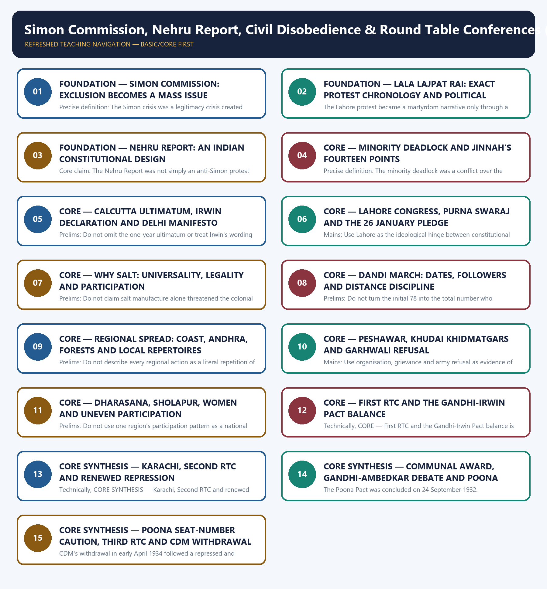

# Simon Commission, Nehru Report, Civil Disobedience & Round Table Conferences (1927–1934) - Learner-v2 Complete Learning Session

### SOURCE, PROGRESSION AND CURRENT-LINKAGE AUDIT

- **Repository owners queried:** Basic and Advanced Markdown for this topic, the master chronology, syllabus map and linked Modern History owners.
- **OCR book evidence queried:** The Basic and Advanced owners were reconciled with the repository OCR of Bipan Chandra's Modern India and India's Struggle for Independence. The route is stated as about 385/388 km; historical sources that render it as 240 miles are explicitly identified as a source variation. The local Bipan Chandra OCR's 147-seat Poona Pact figure is not silently preferred over the widespread 148 convention.
- **Qdrant:** not used; Markdown plus searchable local PDFs were sufficient.
- **PYQ integrity:** The exact 2025 Prelims GS-I Q74 stem is taken from `knowledge-export/Prelims PYQ/2025-GS1-Set A.md`; its official Series-A answer A (Poona Pact) is independently confirmed from `books/prelima_question_paper_answers/Ans-2025-GS1.pdf`. The exact 2020 Gandhi-Irwin Pact stem is retained from the local official-paper OCR, but no answer letter is invented because no local official key is held.
- **Bounded live linkage:** The 12 March 2026 date was the 96th calendar anniversary of the Dandi March's departure. The anniversary is used only as a restrained public-memory bridge. The Central Bureau of Communication page on the National Salt Satyagraha Memorial at Dandi supplies official static memorial context; no claim is made that a Prime Minister, Vice-President or minister issued an independently verified 2026 tribute.
- **Fact/inference rule:** historical claims are source-backed; analytical judgements are explicitly framed as interpretation and do not invent figures.

## BASIC LEARNING SESSION

### DEEP-REVIEW LEARNING CONTRACT

| Control | Binding rule for this package |
|---|---|
| Syllabus boundary | Complete Modern History Core is taught chronologically and causally before optional enrichment. |
| Evidence method | Claim → named Act/treaty/record/organisation/person/region or scholarly evidence → analysis → qualification. |
| Date discipline | Event, proposal, enactment, commencement, official policy, implementation and later interpretation remain distinct. |
| Historiography | Colonial, nationalist, Marxist, subaltern, Cambridge, feminist and other relevant arguments are attributed and tested, never used as labels alone. |
| Practice contract | Every solved item has demand decoding, an examiner-grade model, an executable answer/compression plan, marks rationale and answer-specific improvement. |
| Approval | This immutable successor remains `approved: false` pending explicit approval. |

**Canonical Basic/Core owner:** `upsc-ai-kit\knowledge\Modern-Indian-History\basic\22_Simon-Nehru-Report-CDM-and-RTC.md`  
**Canonical topic owner:** `upsc-ai-kit\knowledge\Modern-Indian-History\basic\22_Simon-Nehru-Report-CDM-and-RTC.md`  
**Optional Advanced owner:** `upsc-ai-kit\knowledge\Modern-Indian-History\advanced\22_Simon-Nehru-Report-CDM-and-RTC.md`  
**Official syllabus mapping:** `upsc-ai-kit\knowledge\Modern-Indian-History\OFFICIAL-UPSC-SYLLABUS-MAPPING.md`

### EVIDENCE, PYQ AND CURRENT-STATUS CONTROL

- **Official and primary evidence:** Acts, charters, treaties, proclamations, committee reports, proceedings, organisational resolutions, speeches and contemporary records are dated and read for authorship and purpose.
- **Regional and social evidence:** petitions, newspapers, memoirs, local studies and material geography qualify elite or all-India generalisation.
- **Economic and quantitative evidence:** revenue, trade, price, wage, craft and mortality claims retain unit, region, period and uncertainty; statistics are never invented.
- **Scholarly interpretation:** historian schools are competing explanations tied to named evidence, not memorised verdicts.
- **PYQ discipline:** repository ledgers and locally held official papers control wording and metadata; reconstructed wording and unavailable official keys remain explicitly labelled.
- **Current-status note, rechecked 2026-08-31:** The 12 March 2026 date was the 96th calendar anniversary of the Dandi March's departure. The anniversary is used only as a restrained public-memory bridge. The Central Bureau of Communication page on the National Salt Satyagraha Memorial at Dandi supplies official static memorial context; no claim is made that a Prime Minister, Vice-President or minister issued an independently verified 2026 tribute.

**Live/primary context sources recorded by the predecessor generation:**

- `https://aspirant.academy/en/current-affairs/046d2fba-ef0f-53ac-96ca-fede9b88f790`
- `https://cbcindia.gov.in/outreachactivities/the-national-salt-satyagraha-memorial-dandi-gujarat/`




*Distinct embedded teaching-navigation image. The separate continuous Cārvāka-style flowchart package remains an independent at-a-glance artifact.*

### SESSION 1 — FOUNDATION — SIMON COMMISSION: EXCLUSION BECOMES A MASS ISSUE

#### DEFINITION / WHAT THIS IS CALLED

**Plain-language definition:** FOUNDATION — Simon Commission: exclusion becomes a mass issue comprises FOUNDATION, Simon Commission and exclusion becomes a mass issue as its core connected dimensions.

**Technical definition:** Precise definition: The Simon crisis was a legitimacy crisis created when an imperial government excluded Indians from the statutory review of India's own constitutional system.

#### ANSWER-GRABBING OPENING — WRITE/ADAPT IN THE EXAM

> Use: Open a constitutional-deadlock answer with exclusion as the mechanism that joined elite and mass protest.

#### MUST-WRITE KEYWORDS

- **FOUNDATION**
- **Simon Commission**
- **exclusion becomes a mass issue**
- **Precise definition**
- **Topic boundary**
- **Core claim**

**How to use them:** Frame the answer through FOUNDATION; define Simon Commission, connect exclusion becomes a mass issue with Precise definition to explain the mechanism, and use Topic boundary for the decisive comparison or qualification.

##### VISUAL FIRST

```text
SIMON COMMISSION: EXCLUSION BECOMES A MASS ISSUE
1927 -> all-British statutory commission appointed
NO INDIAN MEMBER -> constitutional review loses representative legitimacy
3 FEB 1928 -> arrival meets hartals + black flags + "Simon Go Back"
POLITICAL EFFECT -> constitutional protest becomes a national mass issue
```

*The visual fixes this subtopic's chronology, mechanism or boundary before the evidence.*

##### CONCEPT DEFINITIONS

- **Precise definition:** The Simon crisis was a legitimacy crisis created when an imperial government excluded Indians from the statutory review of India's own constitutional system.
- **Topic boundary:** Apply this definition only within Simon Commission, Nehru Report, Civil Disobedience & Round Table Conferences (1927–1934); retain the named actor, institution, date and chronological role.

##### CORE EXPLANATION

The Simon Commission converted a scheduled constitutional review into a legitimacy crisis because Britain appointed an all-British body in 1927 to judge India's constitutional future.

##### EVIDENCE AND MECHANISM

- The commission had no Indian member.
- Its arrival on 3 February 1928 met hartals, black flags and 'Simon Go Back' demonstrations.
- The boycott crossed important party boundaries even though Indian political opinion was not perfectly uniform.
- Exclusion linked constitutional criticism to street mobilisation.

##### EXAMINER CAUTION

- Keep appointment in 1927 distinct from arrival on 3 February 1928.

##### EXAM LINK

- **Prelims:** Keep appointment in 1927 distinct from arrival on 3 February 1928.
- **Mains:** Open a constitutional-deadlock answer with exclusion as the mechanism that joined elite and mass protest.

##### MINI RECAP

- **Core claim:** The Simon Commission converted a scheduled constitutional review into a legitimacy crisis because Britain appointed an all-British body in 1927 to judge India's constitutional future.
- **Use:** Open a constitutional-deadlock answer with exclusion as the mechanism that joined elite and mass protest.

#### CLOSING RECALL FLOW — FOUNDATION — SIMON COMMISSION: EXCLUSION BECOMES A MASS ISSUE

```text
START / CONCEPT: FOUNDATION — Simon Commission: exclusion becomes a mass issue
        |
        v
EXACT TERMS: FOUNDATION · Simon Commission · exclusion becomes a mass issue · Precise definition · Topic boundary · Core claim
        |
        v
MECHANISM / ARGUMENT: Precise definition: The Simon crisis was a legitimacy crisis created when an imperial government excluded Indians from the statutory review of India's own constitutional system.
        |
        v
CONSEQUENCE / CONTRAST: The boycott crossed important party boundaries even though Indian political opinion was not perfectly uniform.
        |
        v
UPSC TRAP / ANSWER-USE: Do not miss this limiting distinction: the commission had no Indian member.
        |
        v
ANSWER-GRABBING FORMULATION: Use: Open a constitutional-deadlock answer with exclusion as the mechanism that joined elite and mass protest.
```
### SESSION 2 — FOUNDATION — LALA LAJPAT RAI: EXACT PROTEST CHRONOLOGY AND POLITICAL AFTERLIFE

#### DEFINITION / WHAT THIS IS CALLED

**Plain-language definition:** Precise definition: The Lajpat Rai chronology is a causal bridge from anti-Simon mass protest to HSRA retaliation, while preserving distinct actors and dates.

**Technical definition:** The Lahore protest became a martyrdom narrative only through a precise two-date sequence: the lathi-charge on 30 October 1928 and Lala Lajpat Rai's death on 17 November 1928.

#### ANSWER-GRABBING OPENING — WRITE/ADAPT IN THE EXAM

> Precise definition: The Lajpat Rai chronology is a causal bridge from anti-Simon mass protest to HSRA retaliation, while preserving distinct actors and dates.

#### MUST-WRITE KEYWORDS

- **FOUNDATION**
- **Lala Lajpat Rai**
- **exact protest chronology**
- **political afterlife**
- **Precise definition**
- **Topic boundary**

**How to use them:** Frame the answer through FOUNDATION; define Lala Lajpat Rai, connect exact protest chronology with political afterlife to explain the mechanism, and use Precise definition for the decisive comparison or qualification.

##### VISUAL FIRST

```text
LALA LAJPAT RAI: EXACT PROTEST CHRONOLOGY AND POLITICAL AFTERLIFE
30 OCT 1928 -> Lahore anti-Simon protest -> police lathi-charge
17 NOV 1928 -> Lala Lajpat Rai dies
POLITICAL AFTERLIFE -> HSRA plans retaliation
DEC 1928 -> Saunders killed; a connected consequence, not the same event
```

*The visual fixes this subtopic's chronology, mechanism or boundary before the evidence.*

##### CONCEPT DEFINITIONS

- **Precise definition:** The Lajpat Rai chronology is a causal bridge from anti-Simon mass protest to HSRA retaliation, while preserving distinct actors and dates.
- **Topic boundary:** Apply this definition only within Simon Commission, Nehru Report, Civil Disobedience & Round Table Conferences (1927–1934); retain the named actor, institution, date and chronological role.

##### CORE EXPLANATION

The Lahore protest became a martyrdom narrative only through a precise two-date sequence: the lathi-charge on 30 October 1928 and Lala Lajpat Rai's death on 17 November 1928.

##### EVIDENCE AND MECHANISM

- Rai led an anti-Simon demonstration at Lahore.
- Police used lathis on 30 October 1928.
- Rai died on 17 November 1928 after the injuries.
- Revolutionary retaliation against Saunders belongs to the subsequent HSRA chain, not to the Simon Commission itself.

##### EXAMINER CAUTION

- Do not collapse injury and death into one date or call Saunders a member of the Commission.

##### EXAM LINK

- **Prelims:** Do not collapse injury and death into one date or call Saunders a member of the Commission.
- **Mains:** Use the two-date chain as evidence for the interaction between mass protest and revolutionary politics.

##### MINI RECAP

- **Core claim:** The Lahore protest became a martyrdom narrative only through a precise two-date sequence: the lathi-charge on 30 October 1928 and Lala Lajpat Rai's death on 17 November 1928.
- **Use:** Use the two-date chain as evidence for the interaction between mass protest and revolutionary politics.

#### CLOSING RECALL FLOW — FOUNDATION — LALA LAJPAT RAI: EXACT PROTEST CHRONOLOGY AND POLITICAL AFTERLIFE

```text
START / CONCEPT: FOUNDATION — Lala Lajpat Rai: exact protest chronology and political afterlife
        |
        v
EXACT TERMS: FOUNDATION · Lala Lajpat Rai · exact protest chronology · political afterlife · Precise definition · Topic boundary
        |
        v
MECHANISM / ARGUMENT: The Lahore protest became a martyrdom narrative only through a precise two-date sequence: the lathi-charge on 30 October 1928 and Lala Lajpat Rai's death on 17 November 1928.
        |
        v
CONSEQUENCE / CONTRAST: Do not collapse injury and death into one date or call Saunders a member of the Commission.
        |
        v
UPSC TRAP / ANSWER-USE: Do not miss this limiting distinction: use the two-date chain as evidence for the interaction between mass protest and revolutionary...
        |
        v
ANSWER-GRABBING FORMULATION: Precise definition: The Lajpat Rai chronology is a causal bridge from anti-Simon mass protest to HSRA retaliation, while preserving distinct actors and dates.
```
### SESSION 3 — FOUNDATION — NEHRU REPORT: AN INDIAN CONSTITUTIONAL DESIGN

#### DEFINITION / WHAT THIS IS CALLED

**Plain-language definition:** Precise definition: The Nehru Report was an Indian constitutional draft combining Dominion Status, responsible government, rights and a qualified joint-electorate minority formula.

**Technical definition:** Core claim: The Nehru Report was not simply an anti-Simon protest document; it was an Indian attempt to design responsible government under Dominion Status while balancing rights and minority representation.

#### ANSWER-GRABBING OPENING — WRITE/ADAPT IN THE EXAM

> Core claim: The Nehru Report was not simply an anti-Simon protest document; it was an Indian attempt to design responsible government under Dominion Status while balancing rights and minority representation.

#### MUST-WRITE KEYWORDS

- **FOUNDATION**
- **Nehru Report**
- **an Indian constitutional design**
- **Precise definition**
- **Topic boundary**
- **Core claim**

**How to use them:** Frame the answer through FOUNDATION; define Nehru Report, connect an Indian constitutional design with Precise definition to explain the mechanism, and use Topic boundary for the decisive comparison or qualification.

##### VISUAL FIRST

```text
NEHRU REPORT: AN INDIAN CONSTITUTIONAL DESIGN
NEHRU REPORT (1928)
|-- status -> Dominion Status
|-- government -> responsible executive
|-- rights -> constitutional guarantees
`-- representation -> joint electorates + qualified minority reservations
LIMIT -> neither complete independence nor a settled communal compromise
```

*The visual fixes this subtopic's chronology, mechanism or boundary before the evidence.*

##### CONCEPT DEFINITIONS

- **Precise definition:** The Nehru Report was an Indian constitutional draft combining Dominion Status, responsible government, rights and a qualified joint-electorate minority formula.
- **Topic boundary:** Apply this definition only within Simon Commission, Nehru Report, Civil Disobedience & Round Table Conferences (1927–1934); retain the named actor, institution, date and chronological role.

##### CORE EXPLANATION

The Nehru Report was not simply an anti-Simon protest document; it was an Indian attempt to design responsible government under Dominion Status while balancing rights and minority representation.

##### EVIDENCE AND MECHANISM

- Motilal Nehru chaired the All-Parties committee.
- The report proposed responsible government and enforceable rights.
- It preferred joint electorates but retained qualified minority reservations where minorities required protection.
- Its Dominion framework separated it from Lahore's later Purna Swaraj position.

##### EXAMINER CAUTION

- Do not equate joint electorates with abolition of every minority safeguard.

##### EXAM LINK

- **Prelims:** Do not equate joint electorates with abolition of every minority safeguard.
- **Mains:** Assess the Report as both a constitution-making milestone and a failed inter-communal bargain.

##### MINI RECAP

- **Core claim:** The Nehru Report was not simply an anti-Simon protest document; it was an Indian attempt to design responsible government under Dominion Status while balancing rights and minority representation.
- **Use:** Assess the Report as both a constitution-making milestone and a failed inter-communal bargain.

#### CLOSING RECALL FLOW — FOUNDATION — NEHRU REPORT: AN INDIAN CONSTITUTIONAL DESIGN

```text
START / CONCEPT: FOUNDATION — Nehru Report: an Indian constitutional design
        |
        v
EXACT TERMS: FOUNDATION · Nehru Report · an Indian constitutional design · Precise definition · Topic boundary · Core claim
        |
        v
MECHANISM / ARGUMENT: Precise definition: The Nehru Report was an Indian constitutional draft combining Dominion Status, responsible government, rights and a qualified joint-electorate minority formula.
        |
        v
CONSEQUENCE / CONTRAST: It preferred joint electorates but retained qualified minority reservations where minorities required protection.
        |
        v
UPSC TRAP / ANSWER-USE: Do not equate joint electorates with abolition of every minority safeguard.
        |
        v
ANSWER-GRABBING FORMULATION: Core claim: The Nehru Report was not simply an anti-Simon protest document; it was an Indian attempt to design responsible government under Dominion Status while balancing rights and minority representation.
```
### SESSION 4 — CORE — MINORITY DEADLOCK AND JINNAH'S FOURTEEN POINTS

#### DEFINITION / WHAT THIS IS CALLED

**Plain-language definition:** Core claim: Jinnah's Fourteen Points of 1929 emerged after proposed amendments failed to reconcile Muslim representation demands with the Nehru Report's constitutional structure.

**Technical definition:** Precise definition: The minority deadlock was a conflict over the institutional location of security, representation and federal power in a future Indian state.

#### ANSWER-GRABBING OPENING — WRITE/ADAPT IN THE EXAM

> The Fourteen Points followed the 1928 report; they did not precede it.

#### MUST-WRITE KEYWORDS

- **Minority deadlock**
- **Jinnah's Fourteen Points**
- **Precise definition**
- **Topic boundary**
- **Core claim**
- **1927–1934**

**How to use them:** Frame the answer through Minority deadlock; define Jinnah's Fourteen Points, connect Precise definition with Topic boundary to explain the mechanism, and use Core claim for the decisive comparison or qualification.

##### VISUAL FIRST

```text
MINORITY DEADLOCK AND JINNAH'S FOURTEEN POINTS
NEHRU REPORT FORMULA
       ↓ contested on representation + residuary powers
JINNAH'S CALCUTTA AMENDMENTS -> rejected
       ↓
FOURTEEN POINTS (1929)
RESULT -> anti-colonial unity does not settle minority constitutional security
```

*The visual fixes this subtopic's chronology, mechanism or boundary before the evidence.*

##### CONCEPT DEFINITIONS

- **Precise definition:** The minority deadlock was a conflict over the institutional location of security, representation and federal power in a future Indian state.
- **Topic boundary:** Apply this definition only within Simon Commission, Nehru Report, Civil Disobedience & Round Table Conferences (1927–1934); retain the named actor, institution, date and chronological role.

##### CORE EXPLANATION

Jinnah's Fourteen Points of 1929 emerged after proposed amendments failed to reconcile Muslim representation demands with the Nehru Report's constitutional structure.

##### EVIDENCE AND MECHANISM

- The disagreement concerned representation at the Centre and in Punjab and Bengal, residuary powers and separate electorates.
- The Fourteen Points followed the 1928 report; they did not precede it.
- The Hindu Mahasabha and other interests also constrained compromise.
- The deadlock exposed competing constitutional securities inside the anti-colonial field.

##### EXAMINER CAUTION

- Do not narrate the deadlock as a two-person disagreement detached from institutional and provincial interests.

##### EXAM LINK

- **Prelims:** Do not narrate the deadlock as a two-person disagreement detached from institutional and provincial interests.
- **Mains:** Use the episode to show why anti-imperial agreement did not automatically produce agreement on the future polity.

##### MINI RECAP

- **Core claim:** Jinnah's Fourteen Points of 1929 emerged after proposed amendments failed to reconcile Muslim representation demands with the Nehru Report's constitutional structure.
- **Use:** Use the episode to show why anti-imperial agreement did not automatically produce agreement on the future polity.

#### CLOSING RECALL FLOW — CORE — MINORITY DEADLOCK AND JINNAH'S FOURTEEN POINTS

```text
START / CONCEPT: CORE — Minority deadlock and Jinnah's Fourteen Points
        |
        v
EXACT TERMS: Minority deadlock · Jinnah's Fourteen Points · Precise definition · Topic boundary · Core claim · 1927–1934
        |
        v
MECHANISM / ARGUMENT: Core claim: Jinnah's Fourteen Points of 1929 emerged after proposed amendments failed to reconcile Muslim representation demands with the Nehru Report's constitutional structure.
        |
        v
CONSEQUENCE / CONTRAST: Do not narrate the deadlock as a two-person disagreement detached from institutional and provincial interests.
        |
        v
UPSC TRAP / ANSWER-USE: Do not miss this limiting distinction: the minority deadlock was a conflict over the institutional location of security, representation and...
        |
        v
ANSWER-GRABBING FORMULATION: The Fourteen Points followed the 1928 report; they did not precede it.
```
### SESSION 5 — CORE — CALCUTTA ULTIMATUM, IRWIN DECLARATION AND DELHI MANIFESTO

#### DEFINITION / WHAT THIS IS CALLED

**Plain-language definition:** Precise definition: The 1928-29 ultimatum sequence tested whether imperial language would be converted into a binding transfer programme and found it insufficient.

**Technical definition:** Prelims: Do not omit the one-year ultimatum or treat Irwin's wording as an immediate grant of Dominion Status.

#### ANSWER-GRABBING OPENING — WRITE/ADAPT IN THE EXAM

> Do not omit the one-year ultimatum or treat Irwin's wording as an immediate grant of Dominion Status.

#### MUST-WRITE KEYWORDS

- **Calcutta ultimatum**
- **Irwin Declaration**
- **Delhi Manifesto**
- **Precise definition**
- **Topic boundary**
- **Core claim**

**How to use them:** Frame the answer through Calcutta ultimatum; define Irwin Declaration, connect Delhi Manifesto with Precise definition to explain the mechanism, and use Topic boundary for the decisive comparison or qualification.

##### VISUAL FIRST

```text
CALCUTTA ULTIMATUM, IRWIN DECLARATION AND DELHI MANIFESTO
DEC 1928 CALCUTTA -> one-year Dominion ultimatum
31 OCT 1929 IRWIN -> Dominion as "natural issue"; RTC promised
DELHI MANIFESTO -> RTC must implement, not merely discuss
NO BINDING ASSURANCE -> Dominion middle ground collapses
DEC 1929 -> Lahore adopts Purna Swaraj
```

*The visual fixes this subtopic's chronology, mechanism or boundary before the evidence.*

##### CONCEPT DEFINITIONS

- **Precise definition:** The 1928-29 ultimatum sequence tested whether imperial language would be converted into a binding transfer programme and found it insufficient.
- **Topic boundary:** Apply this definition only within Simon Commission, Nehru Report, Civil Disobedience & Round Table Conferences (1927–1934); retain the named actor, institution, date and chronological role.

##### CORE EXPLANATION

Between December 1928 and December 1929, Congress moved from a one-year Dominion ultimatum to rejecting vague imperial assurances that did not commit an RTC to implement Dominion Status.

##### EVIDENCE AND MECHANISM

- Calcutta Congress gave Britain one year from December 1928.
- Irwin's 31 October 1929 declaration called Dominion Status the natural issue of constitutional progress.
- The Delhi Manifesto asked that the RTC implement rather than merely debate the objective.
- Failure to secure assurance cleared the path to Lahore.

##### EXAMINER CAUTION

- Do not omit the one-year ultimatum or treat Irwin's wording as an immediate grant of Dominion Status.

##### EXAM LINK

- **Prelims:** Do not omit the one-year ultimatum or treat Irwin's wording as an immediate grant of Dominion Status.
- **Mains:** This is the causal bridge required between the Nehru Report and Purna Swaraj.

##### MINI RECAP

- **Core claim:** Between December 1928 and December 1929, Congress moved from a one-year Dominion ultimatum to rejecting vague imperial assurances that did not commit an RTC to implement Dominion Status.
- **Use:** This is the causal bridge required between the Nehru Report and Purna Swaraj.

#### CLOSING RECALL FLOW — CORE — CALCUTTA ULTIMATUM, IRWIN DECLARATION AND DELHI MANIFESTO

```text
START / CONCEPT: CORE — Calcutta ultimatum, Irwin Declaration and Delhi Manifesto
        |
        v
EXACT TERMS: Calcutta ultimatum · Irwin Declaration · Delhi Manifesto · Precise definition · Topic boundary · Core claim
        |
        v
MECHANISM / ARGUMENT: Precise definition: The 1928-29 ultimatum sequence tested whether imperial language would be converted into a binding transfer programme and found it insufficient.
        |
        v
CONSEQUENCE / CONTRAST: Mains: This is the causal bridge required between the Nehru Report and Purna Swaraj.
        |
        v
UPSC TRAP / ANSWER-USE: Do not miss this limiting distinction: do not omit the one-year ultimatum or treat Irwin's wording as an immediate grant...
        |
        v
ANSWER-GRABBING FORMULATION: Do not omit the one-year ultimatum or treat Irwin's wording as an immediate grant of Dominion Status.
```
### SESSION 6 — CORE — LAHORE CONGRESS, PURNA SWARAJ AND THE 26 JANUARY PLEDGE

#### DEFINITION / WHAT THIS IS CALLED

**Plain-language definition:** Precise definition: Purna Swaraj was the Congress goal adopted at Lahore and publicly ritualised through the 26 January pledge before civil disobedience began.

**Technical definition:** Mains: Use Lahore as the ideological hinge between constitutional deadlock and civil disobedience.

#### ANSWER-GRABBING OPENING — WRITE/ADAPT IN THE EXAM

> Precise definition: Purna Swaraj was the Congress goal adopted at Lahore and publicly ritualised through the 26 January pledge before civil disobedience began.

#### MUST-WRITE KEYWORDS

- **Lahore Congress**
- **Purna Swaraj**
- **the 26 January pledge**
- **Precise definition**
- **Topic boundary**
- **Core claim**

**How to use them:** Frame the answer through Lahore Congress; define Purna Swaraj, connect the 26 January pledge with Precise definition to explain the mechanism, and use Topic boundary for the decisive comparison or qualification.

##### VISUAL FIRST

```text
LAHORE CONGRESS, PURNA SWARAJ AND THE 26 JANUARY PLEDGE
DEC 1929 LAHORE -> PURNA SWARAJ ADOPTED
        ↓ public translation
26 JAN 1930 -> INDEPENDENCE PLEDGE
        ↓ strategic translation
12 MAR 1930 -> DANDI MARCH BEGINS
RULE -> goal, pledge and campaign are related but separately dated
```

*The visual fixes this subtopic's chronology, mechanism or boundary before the evidence.*

##### CONCEPT DEFINITIONS

- **Precise definition:** Purna Swaraj was the Congress goal adopted at Lahore and publicly ritualised through the 26 January pledge before civil disobedience began.
- **Topic boundary:** Apply this definition only within Simon Commission, Nehru Report, Civil Disobedience & Round Table Conferences (1927–1934); retain the named actor, institution, date and chronological role.

##### CORE EXPLANATION

The Lahore Congress transformed complete independence from a radical pressure into the Congress goal, then converted it into a public pledge observed on 26 January 1930.

##### EVIDENCE AND MECHANISM

- Jawaharlal Nehru presided at Lahore in December 1929.
- Congress adopted Purna Swaraj, not Dominion Status.
- The tricolour was hoisted on the banks of the Ravi.
- 26 January 1930 was observed as nationalist Independence Day.

##### EXAMINER CAUTION

- Keep the December 1929 resolution, 26 January pledge and March 1930 movement launch as three distinct steps.

##### EXAM LINK

- **Prelims:** Keep the December 1929 resolution, 26 January pledge and March 1930 movement launch as three distinct steps.
- **Mains:** Use Lahore as the ideological hinge between constitutional deadlock and civil disobedience.

##### MINI RECAP

- **Core claim:** The Lahore Congress transformed complete independence from a radical pressure into the Congress goal, then converted it into a public pledge observed on 26 January 1930.
- **Use:** Use Lahore as the ideological hinge between constitutional deadlock and civil disobedience.

#### CLOSING RECALL FLOW — CORE — LAHORE CONGRESS, PURNA SWARAJ AND THE 26 JANUARY PLEDGE

```text
START / CONCEPT: CORE — Lahore Congress, Purna Swaraj and the 26 January pledge
        |
        v
EXACT TERMS: Lahore Congress · Purna Swaraj · the 26 January pledge · Precise definition · Topic boundary · Core claim
        |
        v
MECHANISM / ARGUMENT: Mains: Use Lahore as the ideological hinge between constitutional deadlock and civil disobedience.
        |
        v
CONSEQUENCE / CONTRAST: The tricolour was hoisted on the banks of the Ravi.
        |
        v
UPSC TRAP / ANSWER-USE: Do not miss this limiting distinction: purna Swaraj was the Congress goal adopted at Lahore and publicly ritualised through the...
        |
        v
ANSWER-GRABBING FORMULATION: Precise definition: Purna Swaraj was the Congress goal adopted at Lahore and publicly ritualised through the 26 January pledge before civil disobedience began.
```
### SESSION 7 — CORE — WHY SALT: UNIVERSALITY, LEGALITY AND PARTICIPATION

#### DEFINITION / WHAT THIS IS CALLED

**Plain-language definition:** Making or collecting salt created a clear civil breach without requiring weapons or specialised organisation.

**Technical definition:** Prelims: Do not claim salt manufacture alone threatened the colonial economy.

#### ANSWER-GRABBING OPENING — WRITE/ADAPT IN THE EXAM

> Do not claim salt manufacture alone threatened the colonial economy.

#### MUST-WRITE KEYWORDS

- **Why salt**
- **universality**
- **legality**
- **participation**
- **Precise definition**
- **Topic boundary**

**How to use them:** Frame the answer through Why salt; define universality, connect legality with participation to explain the mechanism, and use Precise definition for the decisive comparison or qualification.

##### VISUAL FIRST

```text
WHY SALT: UNIVERSALITY, LEGALITY AND PARTICIPATION
UNIVERSAL NECESSITY + COLONIAL MONOPOLY
                ↓
SIMPLE, VISIBLE AND REPEATABLE BREACH OF LAW
                ↓
LOW ENTRY BARRIER FOR REGIONS, CLASSES AND WOMEN
                ↓
MORAL LEGIBILITY + MASS POLITICAL PARTICIPATION
```

*The visual fixes this subtopic's chronology, mechanism or boundary before the evidence.*

##### CONCEPT DEFINITIONS

- **Precise definition:** The salt strategy converted an everyday necessity into a repeatable act of law-breaking whose moral visibility exceeded its direct economic effect.
- **Topic boundary:** Apply this definition only within Simon Commission, Nehru Report, Civil Disobedience & Round Table Conferences (1927–1934); retain the named actor, institution, date and chronological role.

##### CORE EXPLANATION

Salt supplied a rare combination of universal consumption, visible colonial monopoly, simple law-breaking and participation open to people excluded from elite constitutional politics.

##### EVIDENCE AND MECHANISM

- The tax and monopoly touched rich and poor consumers.
- Making or collecting salt created a clear civil breach without requiring weapons or specialised organisation.
- The issue enabled women and local groups to enter action through manufacture, sale, picketing and boycott.
- Its economic scale was less important than its legal and moral symbolism.

##### EXAMINER CAUTION

- Do not claim salt manufacture alone threatened the colonial economy.

##### EXAM LINK

- **Prelims:** Do not claim salt manufacture alone threatened the colonial economy.
- **Mains:** Explain symbol choice through mechanism rather than describing it as Gandhi's intuition.

##### MINI RECAP

- **Core claim:** Salt supplied a rare combination of universal consumption, visible colonial monopoly, simple law-breaking and participation open to people excluded from elite constitutional politics.
- **Use:** Explain symbol choice through mechanism rather than describing it as Gandhi's intuition.

#### CLOSING RECALL FLOW — CORE — WHY SALT: UNIVERSALITY, LEGALITY AND PARTICIPATION

```text
START / CONCEPT: CORE — Why salt: universality, legality and participation
        |
        v
EXACT TERMS: Why salt · universality · legality · participation · Precise definition · Topic boundary
        |
        v
MECHANISM / ARGUMENT: The issue enabled women and local groups to enter action through manufacture, sale, picketing and boycott.
        |
        v
CONSEQUENCE / CONTRAST: Making or collecting salt created a clear civil breach without requiring weapons or specialised organisation.
        |
        v
UPSC TRAP / ANSWER-USE: Do not miss this limiting distinction: its economic scale was less important than its legal and moral symbolism.
        |
        v
ANSWER-GRABBING FORMULATION: Do not claim salt manufacture alone threatened the colonial economy.
```
### SESSION 8 — CORE — DANDI MARCH: DATES, FOLLOWERS AND DISTANCE DISCIPLINE

#### DEFINITION / WHAT THIS IS CALLED

**Plain-language definition:** Precise definition: The Dandi March was a staged mobilisation from Sabarmati to Dandi, with a fixed initial cadre, expanding public participation and a deliberately visible terminal breach.

**Technical definition:** Prelims: Do not turn the initial 78 into the total number who accompanied the march at every stage.

#### ANSWER-GRABBING OPENING — WRITE/ADAPT IN THE EXAM

> Do not turn the initial 78 into the total number who accompanied the march at every stage.

#### MUST-WRITE KEYWORDS

- **Dandi March**
- **dates**
- **followers**
- **distance discipline**
- **Precise definition**
- **Topic boundary**

**How to use them:** Frame the answer through Dandi March; define dates, connect followers with distance discipline to explain the mechanism, and use Precise definition for the decisive comparison or qualification.

##### VISUAL FIRST

```text
DANDI MARCH: DATES, FOLLOWERS AND DISTANCE DISCIPLINE
12 MAR 1930 -> SABARMATI -> Gandhi + 78 chosen followers
ROUTE -> about 385/388 km; some historical sources state 240 miles
VILLAGE STAGES -> speeches + recruitment + public discipline
6 APR 1930 -> DANDI -> salt law broken -> national signal
```

*The visual fixes this subtopic's chronology, mechanism or boundary before the evidence.*

##### CONCEPT DEFINITIONS

- **Precise definition:** The Dandi March was a staged mobilisation from Sabarmati to Dandi, with a fixed initial cadre, expanding public participation and a deliberately visible terminal breach.
- **Topic boundary:** Apply this definition only within Simon Commission, Nehru Report, Civil Disobedience & Round Table Conferences (1927–1934); retain the named actor, institution, date and chronological role.

##### CORE EXPLANATION

The march ran from 12 March to 6 April 1930: Gandhi began with 78 chosen followers and broke the salt law at Dandi after a route best stated as about 385/388 km.

##### EVIDENCE AND MECHANISM

- The starting point was Sabarmati Ashram.
- The initial group numbered 78 chosen followers; crowds grew en route.
- The salt law was broken on 6 April 1930.
- Some historical sources state 240 miles; the package flags that variation instead of presenting competing conversions as exact.

##### EXAMINER CAUTION

- Do not turn the initial 78 into the total number who accompanied the march at every stage.

##### EXAM LINK

- **Prelims:** Do not turn the initial 78 into the total number who accompanied the march at every stage.
- **Mains:** A Prelims answer must preserve dates, initial party and route wording together.

##### MINI RECAP

- **Core claim:** The march ran from 12 March to 6 April 1930: Gandhi began with 78 chosen followers and broke the salt law at Dandi after a route best stated as about 385/388 km.
- **Use:** A Prelims answer must preserve dates, initial party and route wording together.

#### CLOSING RECALL FLOW — CORE — DANDI MARCH: DATES, FOLLOWERS AND DISTANCE DISCIPLINE

```text
START / CONCEPT: CORE — Dandi March: dates, followers and distance discipline
        |
        v
EXACT TERMS: Dandi March · dates · followers · distance discipline · Precise definition · Topic boundary
        |
        v
MECHANISM / ARGUMENT: Precise definition: The Dandi March was a staged mobilisation from Sabarmati to Dandi, with a fixed initial cadre, expanding public participation and a deliberately visible terminal breach.
        |
        v
CONSEQUENCE / CONTRAST: Mains: A Prelims answer must preserve dates, initial party and route wording together.
        |
        v
UPSC TRAP / ANSWER-USE: Do not miss this limiting distinction: the starting point was Sabarmati Ashram.
        |
        v
ANSWER-GRABBING FORMULATION: Do not turn the initial 78 into the total number who accompanied the march at every stage.
```
### SESSION 9 — CORE — REGIONAL SPREAD: COAST, ANDHRA, FORESTS AND LOCAL REPERTOIRES

#### DEFINITION / WHAT THIS IS CALLED

**Plain-language definition:** Mains: Use regional adaptation to prove that national scale depended on local repertoires.

**Technical definition:** Prelims: Do not describe every regional action as a literal repetition of Dandi.

#### ANSWER-GRABBING OPENING — WRITE/ADAPT IN THE EXAM

> Do not describe every regional action as a literal repetition of Dandi.

#### MUST-WRITE KEYWORDS

- **Regional spread**
- **coast**
- **Andhra**
- **forests**
- **local repertoires**
- **Precise definition**

**How to use them:** Frame the answer through Regional spread; define coast, connect Andhra with forests to explain the mechanism, and use local repertoires for the decisive comparison or qualification.

##### VISUAL FIRST

```text
REGIONAL SPREAD: COAST, ANDHRA, FORESTS AND LOCAL REPERTOIRES
DANDI SIGNAL
|-- Vedaranyam -> Rajagopalachari
|-- Payyannur -> Kelappan
|-- Andhra -> sibirams / mobilisation camps
|-- inland agrarian zones -> revenue resistance
`-- forest regions -> forest-law defiance
NATIONAL MOVEMENT = COMMON LEGITIMACY + REGIONAL REPERTOIRES
```

*The visual fixes this subtopic's chronology, mechanism or boundary before the evidence.*

##### CONCEPT DEFINITIONS

- **Precise definition:** Regionalisation was the process by which a common civil-disobedience principle was translated into locally relevant forms of colonial law-breaking.
- **Topic boundary:** Apply this definition only within Simon Commission, Nehru Report, Civil Disobedience & Round Table Conferences (1927–1934); retain the named actor, institution, date and chronological role.

##### CORE EXPLANATION

Civil Disobedience became national because regions translated the salt signal into locally workable marches, camps, boycotts, revenue resistance and forest-law defiance.

##### EVIDENCE AND MECHANISM

- Rajagopalachari led the Vedaranyam march in Tamil country.
- Kelappan led the Payyannur march in Malabar.
- Andhra organisers used sibirams as disciplined mobilisation camps.
- Inland regions adapted civil disobedience to revenue and forest restrictions.

##### EXAMINER CAUTION

- Do not describe every regional action as a literal repetition of Dandi.

##### EXAM LINK

- **Prelims:** Do not describe every regional action as a literal repetition of Dandi.
- **Mains:** Use regional adaptation to prove that national scale depended on local repertoires.

##### MINI RECAP

- **Core claim:** Civil Disobedience became national because regions translated the salt signal into locally workable marches, camps, boycotts, revenue resistance and forest-law defiance.
- **Use:** Use regional adaptation to prove that national scale depended on local repertoires.

#### CLOSING RECALL FLOW — CORE — REGIONAL SPREAD: COAST, ANDHRA, FORESTS AND LOCAL REPERTOIRES

```text
START / CONCEPT: CORE — Regional spread: coast, Andhra, forests and local repertoires
        |
        v
EXACT TERMS: Regional spread · coast · Andhra · forests · local repertoires · Precise definition
        |
        v
MECHANISM / ARGUMENT: Mains: Use regional adaptation to prove that national scale depended on local repertoires.
        |
        v
CONSEQUENCE / CONTRAST: Precise definition: Regionalisation was the process by which a common civil-disobedience principle was translated into locally relevant forms of colonial law-breaking.
        |
        v
UPSC TRAP / ANSWER-USE: Do not miss this limiting distinction: civil Disobedience became national because regions translated the salt signal into locally workable marches...
        |
        v
ANSWER-GRABBING FORMULATION: Do not describe every regional action as a literal repetition of Dandi.
```
### SESSION 10 — CORE — PESHAWAR, KHUDAI KHIDMATGARS AND GARHWALI REFUSAL

#### DEFINITION / WHAT THIS IS CALLED

**Plain-language definition:** CORE — Peshawar, Khudai Khidmatgars and Garhwali refusal comprises Peshawar, Khudai Khidmatgars and Garhwali refusal as its core connected dimensions.

**Technical definition:** Mains: Use organisation, grievance and army refusal as evidence of movement depth.

#### ANSWER-GRABBING OPENING — WRITE/ADAPT IN THE EXAM

> The Garhwali refusal mattered because the army was a core colonial instrument.

#### MUST-WRITE KEYWORDS

- **Peshawar**
- **Khudai Khidmatgars**
- **Garhwali refusal**
- **Precise definition**
- **Topic boundary**
- **Core claim**

**How to use them:** Frame the answer through Peshawar; define Khudai Khidmatgars, connect Garhwali refusal with Precise definition to explain the mechanism, and use Topic boundary for the decisive comparison or qualification.

##### VISUAL FIRST

```text
PESHAWAR, KHUDAI KHIDMATGARS AND GARHWALI REFUSAL
PRIOR MASS WORK -> KHAN ABDUL GHAFFAR KHAN
        ↓
KHUDAI KHIDMATGARS -> disciplined non-violent organisation
        ↓
APRIL 1930 PESHAWAR MASS MOBILISATION
        ↓
GARHWALI SOLDIERS REFUSE TO FIRE -> coercive apparatus strained
```

*The visual fixes this subtopic's chronology, mechanism or boundary before the evidence.*

##### CONCEPT DEFINITIONS

- **Precise definition:** The Frontier case shows that national calls became durable where prior local organisation connected them to local grievances and discipline.
- **Topic boundary:** Apply this definition only within Simon Commission, Nehru Report, Civil Disobedience & Round Table Conferences (1927–1934); retain the named actor, institution, date and chronological role.

##### CORE EXPLANATION

The Frontier theatre demonstrated organisational depth and strain inside the coercive apparatus: Khudai Khidmatgar mobilisation sustained Peshawar protest while Garhwali soldiers refused to fire.

##### EVIDENCE AND MECHANISM

- Khan Abdul Ghaffar Khan's prior organising made non-violent Frontier mobilisation possible.
- The Khudai Khidmatgars connected national civil disobedience to local agrarian and political grievances.
- Peshawar demonstrations followed arrests in April 1930.
- The Garhwali refusal mattered because the army was a core colonial instrument.

##### EXAMINER CAUTION

- Do not explain Frontier participation through stereotypes about religion or martial character.

##### EXAM LINK

- **Prelims:** Do not explain Frontier participation through stereotypes about religion or martial character.
- **Mains:** Use organisation, grievance and army refusal as evidence of movement depth.

##### MINI RECAP

- **Core claim:** The Frontier theatre demonstrated organisational depth and strain inside the coercive apparatus: Khudai Khidmatgar mobilisation sustained Peshawar protest while Garhwali soldiers refused to fire.
- **Use:** Use organisation, grievance and army refusal as evidence of movement depth.

#### CLOSING RECALL FLOW — CORE — PESHAWAR, KHUDAI KHIDMATGARS AND GARHWALI REFUSAL

```text
START / CONCEPT: CORE — Peshawar, Khudai Khidmatgars and Garhwali refusal
        |
        v
EXACT TERMS: Peshawar · Khudai Khidmatgars · Garhwali refusal · Precise definition · Topic boundary · Core claim
        |
        v
MECHANISM / ARGUMENT: Do not explain Frontier participation through stereotypes about religion or martial character.
        |
        v
CONSEQUENCE / CONTRAST: Mains: Use organisation, grievance and army refusal as evidence of movement depth.
        |
        v
UPSC TRAP / ANSWER-USE: Do not miss this limiting distinction: peshawar demonstrations followed arrests in April 1930.
        |
        v
ANSWER-GRABBING FORMULATION: The Garhwali refusal mattered because the army was a core colonial instrument.
```
### SESSION 11 — CORE — DHARASANA, SHOLAPUR, WOMEN AND UNEVEN PARTICIPATION

#### DEFINITION / WHAT THIS IS CALLED

**Plain-language definition:** Dharasana made non-violent suffering internationally visible, Sholapur revealed how quickly authority could fracture, and women's participation widened the repertoire even as Muslim participation remained uneven outside the Frontier.

**Technical definition:** Prelims: Do not use one region's participation pattern as a national average.

#### ANSWER-GRABBING OPENING — WRITE/ADAPT IN THE EXAM

> Dharasana made non-violent suffering internationally visible, Sholapur revealed how quickly authority could fracture, and women's participation widened the repertoire even as Muslim participation remained uneven outside the Frontier.

#### MUST-WRITE KEYWORDS

- **Dharasana**
- **Sholapur**
- **women**
- **uneven participation**
- **Precise definition**
- **Topic boundary**

**How to use them:** Frame the answer through Dharasana; define Sholapur, connect women with uneven participation to explain the mechanism, and use Precise definition for the decisive comparison or qualification.

##### VISUAL FIRST

```text
DHARASANA, SHOLAPUR, WOMEN AND UNEVEN PARTICIPATION
DHARASANA -> Sarojini Naidu -> disciplined suffering -> global publicity
SHOLAPUR -> worker-crowd action -> temporary authority breakdown
WOMEN -> salt-making + picketing + boycott visibility
MUSLIM PARTICIPATION -> uneven; NWFP is a major exception
VERDICT -> wide movement, differentiated social geography
```

*The visual fixes this subtopic's chronology, mechanism or boundary before the evidence.*

##### CONCEPT DEFINITIONS

- **Precise definition:** The movement's social geography combined visible widening with uneven regional and community participation rather than uniform mobilisation.
- **Topic boundary:** Apply this definition only within Simon Commission, Nehru Report, Civil Disobedience & Round Table Conferences (1927–1934); retain the named actor, institution, date and chronological role.

##### CORE EXPLANATION

Dharasana made non-violent suffering internationally visible, Sholapur revealed how quickly authority could fracture, and women's participation widened the repertoire even as Muslim participation remained uneven outside the Frontier.

##### EVIDENCE AND MECHANISM

- Sarojini Naidu led the Dharasana phase after Gandhi's arrest.
- Publicised lathi violence at Dharasana strengthened moral pressure.
- Sholapur workers and crowds produced a temporary breakdown of authority.
- Women joined salt-making and picketing; participation varied by region and community.

##### EXAMINER CAUTION

- Do not use one region's participation pattern as a national average.

##### EXAM LINK

- **Prelims:** Do not use one region's participation pattern as a national average.
- **Mains:** A social-base answer needs both expansion and unevenness.

##### MINI RECAP

- **Core claim:** Dharasana made non-violent suffering internationally visible, Sholapur revealed how quickly authority could fracture, and women's participation widened the repertoire even as Muslim participation remained uneven outside the Frontier.
- **Use:** A social-base answer needs both expansion and unevenness.

#### CLOSING RECALL FLOW — CORE — DHARASANA, SHOLAPUR, WOMEN AND UNEVEN PARTICIPATION

```text
START / CONCEPT: CORE — Dharasana, Sholapur, women and uneven participation
        |
        v
EXACT TERMS: Dharasana · Sholapur · women · uneven participation · Precise definition · Topic boundary
        |
        v
MECHANISM / ARGUMENT: Do not use one region's participation pattern as a national average.
        |
        v
CONSEQUENCE / CONTRAST: Use: A social-base answer needs both expansion and unevenness.
        |
        v
UPSC TRAP / ANSWER-USE: Do not miss this limiting distinction: dharasana made non-violent suffering internationally visible, Sholapur revealed how quickly authority could fracture.
        |
        v
ANSWER-GRABBING FORMULATION: Dharasana made non-violent suffering internationally visible, Sholapur revealed how quickly authority could fracture, and women's participation widened the repertoire even as Muslim participation remained uneven outside the Frontier.
```
### SESSION 12 — CORE — FIRST RTC AND THE GANDHI-IRWIN PACT BALANCE

#### DEFINITION / WHAT THIS IS CALLED

**Plain-language definition:** Core claim: The failure of a First RTC without Congress created the setting for the 5 March 1931 Pact, a tactical exchange of movement suspension and RTC participation for bounded administrative concessions.

**Technical definition:** Technically, CORE — First RTC and the Gandhi-Irwin Pact balance is analysed by relating First RTC to the Gandhi-Irwin Pact balance, then testing the relationship through Precise definition and Topic boundary.

#### ANSWER-GRABBING OPENING — WRITE/ADAPT IN THE EXAM

> Core claim: The failure of a First RTC without Congress created the setting for the 5 March 1931 Pact, a tactical exchange of movement suspension and RTC participation for bounded administrative concessions.

#### MUST-WRITE KEYWORDS

- **First RTC**
- **the Gandhi-Irwin Pact balance**
- **Precise definition**
- **Topic boundary**
- **Core claim**
- **1927–1934**

**How to use them:** Frame the answer through First RTC; define the Gandhi-Irwin Pact balance, connect Precise definition with Topic boundary to explain the mechanism, and use Core claim for the decisive comparison or qualification.

##### VISUAL FIRST

```text
FIRST RTC AND THE GANDHI-IRWIN PACT BALANCE
FIRST RTC WITHOUT CONGRESS -> legitimacy and implementation gap
5 MAR 1931 PACT
CONGRESS GIVES -> suspends CDM + attends Second RTC
GOVERNMENT GIVES -> bounded release/restoration/salt/picketing concessions
REFUSAL -> no police-excess inquiry; no independence settlement
```

*The visual fixes this subtopic's chronology, mechanism or boundary before the evidence.*

##### CONCEPT DEFINITIONS

- **Precise definition:** The Gandhi-Irwin Pact was a tactical truce exchanging Congress's movement leverage for bounded relief and entry into negotiation.
- **Topic boundary:** Apply this definition only within Simon Commission, Nehru Report, Civil Disobedience & Round Table Conferences (1927–1934); retain the named actor, institution, date and chronological role.

##### CORE EXPLANATION

The failure of a First RTC without Congress created the setting for the 5 March 1931 Pact, a tactical exchange of movement suspension and RTC participation for bounded administrative concessions.

##### EVIDENCE AND MECHANISM

- Congress was absent from the First RTC, November 1930-January 1931.
- The Pact covered non-violent political prisoners, uncollected fines and unsold confiscated land.
- It permitted bounded coastal salt-making and peaceful picketing.
- The government refused an inquiry into police excesses.

##### EXAMINER CAUTION

- Do not add independence, universal prisoner release or police inquiry to the government's concessions.

##### EXAM LINK

- **Prelims:** Do not add independence, universal prisoner release or police inquiry to the government's concessions.
- **Mains:** Evaluate the Pact by listing what each side gave and what remained withheld.

##### MINI RECAP

- **Core claim:** The failure of a First RTC without Congress created the setting for the 5 March 1931 Pact, a tactical exchange of movement suspension and RTC participation for bounded administrative concessions.
- **Use:** Evaluate the Pact by listing what each side gave and what remained withheld.

#### CLOSING RECALL FLOW — CORE — FIRST RTC AND THE GANDHI-IRWIN PACT BALANCE

```text
START / CONCEPT: CORE — First RTC and the Gandhi-Irwin Pact balance
        |
        v
EXACT TERMS: First RTC · the Gandhi-Irwin Pact balance · Precise definition · Topic boundary · Core claim · 1927–1934
        |
        v
MECHANISM / ARGUMENT: Use: Evaluate the Pact by listing what each side gave and what remained withheld.
        |
        v
CONSEQUENCE / CONTRAST: Precise definition: The Gandhi-Irwin Pact was a tactical truce exchanging Congress's movement leverage for bounded relief and entry into negotiation.
        |
        v
UPSC TRAP / ANSWER-USE: Do not add independence, universal prisoner release or police inquiry to the government's concessions.
        |
        v
ANSWER-GRABBING FORMULATION: Core claim: The failure of a First RTC without Congress created the setting for the 5 March 1931 Pact, a tactical exchange of movement suspension and RTC participation for bounded administrative concessions.
```
### SESSION 13 — CORE SYNTHESIS — KARACHI, SECOND RTC AND RENEWED REPRESSION

#### DEFINITION / WHAT THIS IS CALLED

**Plain-language definition:** Prelims: Do not reduce Karachi to Pact ratification or claim the Second RTC granted Congress's constitutional demand.

**Technical definition:** Technically, CORE SYNTHESIS — Karachi, Second RTC and renewed repression is analysed by relating CORE SYNTHESIS to Karachi, then testing the relationship through Second RTC and renewed repression.

#### ANSWER-GRABBING OPENING — WRITE/ADAPT IN THE EXAM

> Do not reduce Karachi to Pact ratification or claim the Second RTC granted Congress's constitutional demand.

#### MUST-WRITE KEYWORDS

- **CORE SYNTHESIS**
- **Karachi**
- **Second RTC**
- **renewed repression**
- **Precise definition**
- **Topic boundary**

**How to use them:** Frame the answer through CORE SYNTHESIS; define Karachi, connect Second RTC with renewed repression to explain the mechanism, and use Precise definition for the decisive comparison or qualification.

##### VISUAL FIRST

```text
KARACHI, SECOND RTC AND RENEWED REPRESSION
MARCH 1931 KARACHI
|-- ratifies Gandhi-Irwin Pact
`-- Fundamental Rights + National Economic Programme
SECOND RTC -> Gandhi sole Congress representative -> deadlock
RETURN -> arrests + ordinances + renewed repression
CDM RESUMES -> weaker organisational room, sharper coercion
```

*The visual fixes this subtopic's chronology, mechanism or boundary before the evidence.*

##### CONCEPT DEFINITIONS

- **Precise definition:** Karachi connected a tactical political truce to a substantive social vision of Swaraj before imperial deadlock reopened confrontation.
- **Topic boundary:** Apply this definition only within Simon Commission, Nehru Report, Civil Disobedience & Round Table Conferences (1927–1934); retain the named actor, institution, date and chronological role.

##### CORE EXPLANATION

Karachi gave the truce social content through Fundamental Rights and a National Economic Programme, but the Second RTC deadlocked and Congress returned to a movement environment transformed by repression.

##### EVIDENCE AND MECHANISM

- Karachi ratified the Pact in March 1931.
- Its rights and economic resolutions described what Swaraj should mean for citizens, workers and peasants.
- Gandhi attended the Second RTC as sole Congress representative.
- After deadlock, CDM resumed under ordinances, arrests and broad repression.

##### EXAMINER CAUTION

- Do not reduce Karachi to Pact ratification or claim the Second RTC granted Congress's constitutional demand.

##### EXAM LINK

- **Prelims:** Do not reduce Karachi to Pact ratification or claim the Second RTC granted Congress's constitutional demand.
- **Mains:** Connect political negotiation to the social definition of Swaraj and then to renewed coercion.

##### MINI RECAP

- **Core claim:** Karachi gave the truce social content through Fundamental Rights and a National Economic Programme, but the Second RTC deadlocked and Congress returned to a movement environment transformed by repression.
- **Use:** Connect political negotiation to the social definition of Swaraj and then to renewed coercion.

#### CLOSING RECALL FLOW — CORE SYNTHESIS — KARACHI, SECOND RTC AND RENEWED REPRESSION

```text
START / CONCEPT: CORE SYNTHESIS — Karachi, Second RTC and renewed repression
        |
        v
EXACT TERMS: CORE SYNTHESIS · Karachi · Second RTC · renewed repression · Precise definition · Topic boundary
        |
        v
MECHANISM / ARGUMENT: Use: Connect political negotiation to the social definition of Swaraj and then to renewed coercion.
        |
        v
CONSEQUENCE / CONTRAST: Its rights and economic resolutions described what Swaraj should mean for citizens, workers and peasants.
        |
        v
UPSC TRAP / ANSWER-USE: Do not miss this limiting distinction: do not reduce Karachi to Pact ratification or claim the Second RTC granted Congress's...
        |
        v
ANSWER-GRABBING FORMULATION: Do not reduce Karachi to Pact ratification or claim the Second RTC granted Congress's constitutional demand.
```
### SESSION 14 — CORE SYNTHESIS — COMMUNAL AWARD, GANDHI-AMBEDKAR DEBATE AND POONA PACT

#### DEFINITION / WHAT THIS IS CALLED

**Plain-language definition:** Precise definition: The Gandhi-Ambedkar debate concerned which electoral institution could secure dignity and representation without reproducing social domination.

**Technical definition:** The Poona Pact was concluded on 24 September 1932.

#### ANSWER-GRABBING OPENING — WRITE/ADAPT IN THE EXAM

> Precise definition: The Gandhi-Ambedkar debate concerned which electoral institution could secure dignity and representation without reproducing social domination.

#### MUST-WRITE KEYWORDS

- **CORE SYNTHESIS**
- **Communal Award**
- **Gandhi-Ambedkar debate**
- **Poona Pact**
- **Precise definition**
- **Topic boundary**

**How to use them:** Frame the answer through CORE SYNTHESIS; define Communal Award, connect Gandhi-Ambedkar debate with Poona Pact to explain the mechanism, and use Precise definition for the decisive comparison or qualification.

##### VISUAL FIRST

```text
COMMUNAL AWARD, GANDHI-AMBEDKAR DEBATE AND POONA PACT
COMMUNAL AWARD -> separate electorates for Depressed Classes
GANDHI -> fears permanent social separation
AMBEDKAR -> seeks independent political voice
20 SEP 1932 -> Gandhi's fast begins in Yeravda
24 SEP 1932 -> POONA PACT
DESIGN -> reserved seats in joint electorates; disagreement persists
```

*The visual fixes this subtopic's chronology, mechanism or boundary before the evidence.*

##### CONCEPT DEFINITIONS

- **Precise definition:** The Gandhi-Ambedkar debate concerned which electoral institution could secure dignity and representation without reproducing social domination.
- **Topic boundary:** Apply this definition only within Simon Commission, Nehru Report, Civil Disobedience & Round Table Conferences (1927–1934); retain the named actor, institution, date and chronological role.

##### CORE EXPLANATION

The 1932 representation crisis opposed two serious political fears: Gandhi feared separate electorates would harden untouchability into permanent social separation, while Ambedkar feared joint electorates would deny Depressed Classes an independent political voice.

##### EVIDENCE AND MECHANISM

- The Communal Award extended separate electorates to Depressed Classes.
- Gandhi's Yeravda fast began on 20 September 1932.
- The Poona Pact was concluded on 24 September 1932.
- It substituted reserved seats in joint electorates; the fast created a coercive bargaining context that a balanced answer must name.

##### EXAMINER CAUTION

- Do not describe the settlement as full agreement or flatten either side into bad faith.

##### EXAM LINK

- **Prelims:** Do not describe the settlement as full agreement or flatten either side into bad faith.
- **Mains:** Build the answer as representation problem, rival safeguards, coercive context, institutional compromise and unresolved legacy.

##### MINI RECAP

- **Core claim:** The 1932 representation crisis opposed two serious political fears: Gandhi feared separate electorates would harden untouchability into permanent social separation, while Ambedkar feared joint electorates would deny Depressed Classes an independent political voice.
- **Use:** Build the answer as representation problem, rival safeguards, coercive context, institutional compromise and unresolved legacy.

#### CLOSING RECALL FLOW — CORE SYNTHESIS — COMMUNAL AWARD, GANDHI-AMBEDKAR DEBATE AND POONA PACT

```text
START / CONCEPT: CORE SYNTHESIS — Communal Award, Gandhi-Ambedkar debate and Poona Pact
        |
        v
EXACT TERMS: CORE SYNTHESIS · Communal Award · Gandhi-Ambedkar debate · Poona Pact · Precise definition · Topic boundary
        |
        v
MECHANISM / ARGUMENT: The Poona Pact was concluded on 24 September 1932.
        |
        v
CONSEQUENCE / CONTRAST: The 1932 representation crisis opposed two serious political fears: Gandhi feared separate electorates would harden untouchability into permanent social separation, while Ambedkar feared joint electorates would deny Depressed Classes an independent political voice.
        |
        v
UPSC TRAP / ANSWER-USE: Do not describe the settlement as full agreement or flatten either side into bad faith.
        |
        v
ANSWER-GRABBING FORMULATION: Precise definition: The Gandhi-Ambedkar debate concerned which electoral institution could secure dignity and representation without reproducing social domination.
```
### SESSION 15 — CORE SYNTHESIS — POONA SEAT-NUMBER CAUTION, THIRD RTC AND CDM WITHDRAWAL

#### DEFINITION / WHAT THIS IS CALLED

**Plain-language definition:** The end phase requires evidentiary restraint: Poona's provincial seat total varies between the local OCR's 147 and the widespread 148 convention, the Third RTC had limited importance without Congress, and CDM ended under repression in early April 1934.

**Technical definition:** CDM's withdrawal in early April 1934 followed a repressed and declining resumed phase, not an immediate post-Pact ending.

#### ANSWER-GRABBING OPENING — WRITE/ADAPT IN THE EXAM

> The Third RTC was largely formal and should not be overstated.

#### MUST-WRITE KEYWORDS

- **CORE SYNTHESIS**
- **Poona seat-number caution**
- **Third RTC**
- **CDM withdrawal**
- **Precise definition**
- **Topic boundary**

**How to use them:** Frame the answer through CORE SYNTHESIS; define Poona seat-number caution, connect Third RTC with CDM withdrawal to explain the mechanism, and use Precise definition for the decisive comparison or qualification.

##### VISUAL FIRST

```text
POONA SEAT-NUMBER CAUTION, THIRD RTC AND CDM WITHDRAWAL
POONA PACT NUMBER -> local OCR 147 | widespread convention 148
RULE -> attribute the variation; do not present false certainty
THIRD RTC -> Congress absent -> limited/formal significance
1932-34 -> resumed CDM under repression
EARLY APRIL 1934 -> withdrawal
VERDICT -> no immediate freedom, durable legitimacy shift
```

*The visual fixes this subtopic's chronology, mechanism or boundary before the evidence.*

##### CONCEPT DEFINITIONS

- **Precise definition:** The end-phase verdict separates disputed quantitative detail, weak constitutional conferencing and the strategic closure of a repressed movement.
- **Topic boundary:** Apply this definition only within Simon Commission, Nehru Report, Civil Disobedience & Round Table Conferences (1927–1934); retain the named actor, institution, date and chronological role.

##### CORE EXPLANATION

The end phase requires evidentiary restraint: Poona's provincial seat total varies between the local OCR's 147 and the widespread 148 convention, the Third RTC had limited importance without Congress, and CDM ended under repression in early April 1934.

##### EVIDENCE AND MECHANISM

- The package identifies the 147/148 variation rather than silently choosing one total.
- Congress was absent from the Third RTC.
- The Third RTC was largely formal and should not be overstated.
- CDM's withdrawal in early April 1934 followed a repressed and declining resumed phase, not an immediate post-Pact ending.

##### EXAMINER CAUTION

- Do not state a disputed seat total as uncontested or make the Third RTC the decisive constitutional settlement.

##### EXAM LINK

- **Prelims:** Do not state a disputed seat total as uncontested or make the Third RTC the decisive constitutional settlement.
- **Mains:** End a period answer with a qualified verdict on transformed political consciousness despite limited immediate concession.

##### MINI RECAP

- **Core claim:** The end phase requires evidentiary restraint: Poona's provincial seat total varies between the local OCR's 147 and the widespread 148 convention, the Third RTC had limited importance without Congress, and CDM ended under repression in early April 1934.
- **Use:** End a period answer with a qualified verdict on transformed political consciousness despite limited immediate concession.

#### CLOSING RECALL FLOW — CORE SYNTHESIS — POONA SEAT-NUMBER CAUTION, THIRD RTC AND CDM WITHDRAWAL

```text
START / CONCEPT: CORE SYNTHESIS — Poona seat-number caution, Third RTC and CDM withdrawal
        |
        v
EXACT TERMS: CORE SYNTHESIS · Poona seat-number caution · Third RTC · CDM withdrawal · Precise definition · Topic boundary
        |
        v
MECHANISM / ARGUMENT: The end phase requires evidentiary restraint: Poona's provincial seat total varies between the local OCR's 147 and the widespread 148 convention, the Third RTC had limited importance without Congress, and CDM ended under repression in early April 1934.
        |
        v
CONSEQUENCE / CONTRAST: Do not state a disputed seat total as uncontested or make the Third RTC the decisive constitutional settlement.
        |
        v
UPSC TRAP / ANSWER-USE: CDM's withdrawal in early April 1934 followed a repressed and declining resumed phase, not an immediate post-Pact ending.
        |
        v
ANSWER-GRABBING FORMULATION: The Third RTC was largely formal and should not be overstated.
```
### MODERN HISTORY DEEP-REVIEW CORE CONTROL

- **Must remember:** Simon Commission protest, the 1928 Nehru Report, Lahore's Purna Swaraj resolution in 1929, the 1930 salt march, Gandhi-Irwin Pact of 5 March 1931 and three Round Table Conferences form separate stages.
- **Close distinction:** The Communal Award and Poona Pact belong to 1932 and addressed representation differently; Civil Disobedience changed phases before formal withdrawal in 1934.
- **Evidence / interpretation limit:** Official conference records, Congress resolutions, Ambedkar-Gandhi positions and regional no-tax or forest struggles prevent an elite-negotiation-only account.

## BASIC MCQS / REMEDIATION

### Q1. Which statement correctly identifies Simon Commission appointment and composition?

A. The Simon Commission was appointed in 1927 as an all-British statutory commission with no Indian member.
B. The 1928 Motilal Nehru committee proposed Dominion Status, responsible government, rights, joint electorates and qualified minority reservations rather than a simple end to safeguards.
C. The Lahore lathi-charge occurred on 30 October 1928; Lala Lajpat Rai died on 17 November 1928.
D. The Commission arrived on 3 February 1928 and met hartals, black flags and the slogan 'Simon Go Back'.

**Answer: A.**
**Explanation:** The Simon Commission was appointed in 1927 as an all-British statutory commission with no Indian member. This distinction preserves the source-backed chronology and prevents cross-matching errors in UPSC elimination.

### Q2. Which chronology card should be filed under Simon Commission appointment and composition?

A. The Lahore lathi-charge occurred on 30 October 1928; Lala Lajpat Rai died on 17 November 1928.
B. The Simon Commission was appointed in 1927 as an all-British statutory commission with no Indian member.
C. The 1928 Motilal Nehru committee proposed Dominion Status, responsible government, rights, joint electorates and qualified minority reservations rather than a simple end to safeguards.
D. Jinnah's Fourteen Points followed in 1929 after the Nehru Report compromise failed to settle minority representation.

**Answer: B.**
**Explanation:** The Simon Commission was appointed in 1927 as an all-British statutory commission with no Indian member. This distinction preserves the source-backed chronology and prevents cross-matching errors in UPSC elimination.

### Q3. Which option should a candidate retain when revising Simon Commission appointment and composition?

A. The Calcutta Congress of December 1928 gave Britain one year to concede Dominion Status before Congress moved to complete independence and civil disobedience.
B. Jinnah's Fourteen Points followed in 1929 after the Nehru Report compromise failed to settle minority representation.
C. The Simon Commission was appointed in 1927 as an all-British statutory commission with no Indian member.
D. The 1928 Motilal Nehru committee proposed Dominion Status, responsible government, rights, joint electorates and qualified minority reservations rather than a simple end to safeguards.

**Answer: C.**
**Explanation:** The Simon Commission was appointed in 1927 as an all-British statutory commission with no Indian member. This distinction preserves the source-backed chronology and prevents cross-matching errors in UPSC elimination.

### Q4. Which statement avoids a common matching trap about Simon Commission appointment and composition?

A. The Calcutta Congress of December 1928 gave Britain one year to concede Dominion Status before Congress moved to complete independence and civil disobedience.
B. Jinnah's Fourteen Points followed in 1929 after the Nehru Report compromise failed to settle minority representation.
C. Irwin's 31 October 1929 declaration described Dominion Status as the natural issue of constitutional progress; the Delhi Manifesto demanded an implementing, not merely debating, RTC.
D. The Simon Commission was appointed in 1927 as an all-British statutory commission with no Indian member.

**Answer: D.**
**Explanation:** The Simon Commission was appointed in 1927 as an all-British statutory commission with no Indian member. This distinction preserves the source-backed chronology and prevents cross-matching errors in UPSC elimination.

### Q5. Which statement correctly identifies Simon Commission arrival?

A. The Commission arrived on 3 February 1928 and met hartals, black flags and the slogan 'Simon Go Back'.
B. The 1928 Motilal Nehru committee proposed Dominion Status, responsible government, rights, joint electorates and qualified minority reservations rather than a simple end to safeguards.
C. The Lahore lathi-charge occurred on 30 October 1928; Lala Lajpat Rai died on 17 November 1928.
D. Jinnah's Fourteen Points followed in 1929 after the Nehru Report compromise failed to settle minority representation.

**Answer: A.**
**Explanation:** The Commission arrived on 3 February 1928 and met hartals, black flags and the slogan 'Simon Go Back'. This distinction preserves the source-backed chronology and prevents cross-matching errors in UPSC elimination.

### Q6. Which chronology card should be filed under Simon Commission arrival?

A. The Calcutta Congress of December 1928 gave Britain one year to concede Dominion Status before Congress moved to complete independence and civil disobedience.
B. The Commission arrived on 3 February 1928 and met hartals, black flags and the slogan 'Simon Go Back'.
C. The 1928 Motilal Nehru committee proposed Dominion Status, responsible government, rights, joint electorates and qualified minority reservations rather than a simple end to safeguards.
D. Jinnah's Fourteen Points followed in 1929 after the Nehru Report compromise failed to settle minority representation.

**Answer: B.**
**Explanation:** The Commission arrived on 3 February 1928 and met hartals, black flags and the slogan 'Simon Go Back'. This distinction preserves the source-backed chronology and prevents cross-matching errors in UPSC elimination.

### Q7. Which option should a candidate retain when revising Simon Commission arrival?

A. Irwin's 31 October 1929 declaration described Dominion Status as the natural issue of constitutional progress; the Delhi Manifesto demanded an implementing, not merely debating, RTC.
B. The Calcutta Congress of December 1928 gave Britain one year to concede Dominion Status before Congress moved to complete independence and civil disobedience.
C. The Commission arrived on 3 February 1928 and met hartals, black flags and the slogan 'Simon Go Back'.
D. Jinnah's Fourteen Points followed in 1929 after the Nehru Report compromise failed to settle minority representation.

**Answer: C.**
**Explanation:** The Commission arrived on 3 February 1928 and met hartals, black flags and the slogan 'Simon Go Back'. This distinction preserves the source-backed chronology and prevents cross-matching errors in UPSC elimination.

### Q8. Which statement avoids a common matching trap about Simon Commission arrival?

A. Irwin's 31 October 1929 declaration described Dominion Status as the natural issue of constitutional progress; the Delhi Manifesto demanded an implementing, not merely debating, RTC.
B. The Calcutta Congress of December 1928 gave Britain one year to concede Dominion Status before Congress moved to complete independence and civil disobedience.
C. The Lahore Congress adopted Purna Swaraj in December 1929, followed by the Independence Pledge on 26 January 1930.
D. The Commission arrived on 3 February 1928 and met hartals, black flags and the slogan 'Simon Go Back'.

**Answer: D.**
**Explanation:** The Commission arrived on 3 February 1928 and met hartals, black flags and the slogan 'Simon Go Back'. This distinction preserves the source-backed chronology and prevents cross-matching errors in UPSC elimination.

### Q9. Which statement correctly identifies Lala Lajpat Rai chronology?

A. The Lahore lathi-charge occurred on 30 October 1928; Lala Lajpat Rai died on 17 November 1928.
B. The Calcutta Congress of December 1928 gave Britain one year to concede Dominion Status before Congress moved to complete independence and civil disobedience.
C. The 1928 Motilal Nehru committee proposed Dominion Status, responsible government, rights, joint electorates and qualified minority reservations rather than a simple end to safeguards.
D. Jinnah's Fourteen Points followed in 1929 after the Nehru Report compromise failed to settle minority representation.

**Answer: A.**
**Explanation:** The Lahore lathi-charge occurred on 30 October 1928; Lala Lajpat Rai died on 17 November 1928. This distinction preserves the source-backed chronology and prevents cross-matching errors in UPSC elimination.

### Q10. Which chronology card should be filed under Lala Lajpat Rai chronology?

A. The Calcutta Congress of December 1928 gave Britain one year to concede Dominion Status before Congress moved to complete independence and civil disobedience.
B. The Lahore lathi-charge occurred on 30 October 1928; Lala Lajpat Rai died on 17 November 1928.
C. Irwin's 31 October 1929 declaration described Dominion Status as the natural issue of constitutional progress; the Delhi Manifesto demanded an implementing, not merely debating, RTC.
D. Jinnah's Fourteen Points followed in 1929 after the Nehru Report compromise failed to settle minority representation.

**Answer: B.**
**Explanation:** The Lahore lathi-charge occurred on 30 October 1928; Lala Lajpat Rai died on 17 November 1928. This distinction preserves the source-backed chronology and prevents cross-matching errors in UPSC elimination.

### Q11. Which option should a candidate retain when revising Lala Lajpat Rai chronology?

A. The Calcutta Congress of December 1928 gave Britain one year to concede Dominion Status before Congress moved to complete independence and civil disobedience.
B. Irwin's 31 October 1929 declaration described Dominion Status as the natural issue of constitutional progress; the Delhi Manifesto demanded an implementing, not merely debating, RTC.
C. The Lahore lathi-charge occurred on 30 October 1928; Lala Lajpat Rai died on 17 November 1928.
D. The Lahore Congress adopted Purna Swaraj in December 1929, followed by the Independence Pledge on 26 January 1930.

**Answer: C.**
**Explanation:** The Lahore lathi-charge occurred on 30 October 1928; Lala Lajpat Rai died on 17 November 1928. This distinction preserves the source-backed chronology and prevents cross-matching errors in UPSC elimination.

### Q12. Which statement avoids a common matching trap about Lala Lajpat Rai chronology?

A. Irwin's 31 October 1929 declaration described Dominion Status as the natural issue of constitutional progress; the Delhi Manifesto demanded an implementing, not merely debating, RTC.
B. Gandhi left Sabarmati with 78 chosen followers on 12 March 1930 and broke the salt law at Dandi on 6 April 1930.
C. The Lahore Congress adopted Purna Swaraj in December 1929, followed by the Independence Pledge on 26 January 1930.
D. The Lahore lathi-charge occurred on 30 October 1928; Lala Lajpat Rai died on 17 November 1928.

**Answer: D.**
**Explanation:** The Lahore lathi-charge occurred on 30 October 1928; Lala Lajpat Rai died on 17 November 1928. This distinction preserves the source-backed chronology and prevents cross-matching errors in UPSC elimination.

### Q13. Which statement correctly identifies Nehru Report design?

A. The 1928 Motilal Nehru committee proposed Dominion Status, responsible government, rights, joint electorates and qualified minority reservations rather than a simple end to safeguards.
B. Irwin's 31 October 1929 declaration described Dominion Status as the natural issue of constitutional progress; the Delhi Manifesto demanded an implementing, not merely debating, RTC.
C. Jinnah's Fourteen Points followed in 1929 after the Nehru Report compromise failed to settle minority representation.
D. The Calcutta Congress of December 1928 gave Britain one year to concede Dominion Status before Congress moved to complete independence and civil disobedience.

**Answer: A.**
**Explanation:** The 1928 Motilal Nehru committee proposed Dominion Status, responsible government, rights, joint electorates and qualified minority reservations rather than a simple end to safeguards. This distinction preserves the source-backed chronology and prevents cross-matching errors in UPSC elimination.

### Q14. Which chronology card should be filed under Nehru Report design?

A. The Calcutta Congress of December 1928 gave Britain one year to concede Dominion Status before Congress moved to complete independence and civil disobedience.
B. The 1928 Motilal Nehru committee proposed Dominion Status, responsible government, rights, joint electorates and qualified minority reservations rather than a simple end to safeguards.
C. Irwin's 31 October 1929 declaration described Dominion Status as the natural issue of constitutional progress; the Delhi Manifesto demanded an implementing, not merely debating, RTC.
D. The Lahore Congress adopted Purna Swaraj in December 1929, followed by the Independence Pledge on 26 January 1930.

**Answer: B.**
**Explanation:** The 1928 Motilal Nehru committee proposed Dominion Status, responsible government, rights, joint electorates and qualified minority reservations rather than a simple end to safeguards. This distinction preserves the source-backed chronology and prevents cross-matching errors in UPSC elimination.

### Q15. Which option should a candidate retain when revising Nehru Report design?

A. Gandhi left Sabarmati with 78 chosen followers on 12 March 1930 and broke the salt law at Dandi on 6 April 1930.
B. Irwin's 31 October 1929 declaration described Dominion Status as the natural issue of constitutional progress; the Delhi Manifesto demanded an implementing, not merely debating, RTC.
C. The 1928 Motilal Nehru committee proposed Dominion Status, responsible government, rights, joint electorates and qualified minority reservations rather than a simple end to safeguards.
D. The Lahore Congress adopted Purna Swaraj in December 1929, followed by the Independence Pledge on 26 January 1930.

**Answer: C.**
**Explanation:** The 1928 Motilal Nehru committee proposed Dominion Status, responsible government, rights, joint electorates and qualified minority reservations rather than a simple end to safeguards. This distinction preserves the source-backed chronology and prevents cross-matching errors in UPSC elimination.

### Q16. Which statement avoids a common matching trap about Nehru Report design?

A. The Lahore Congress adopted Purna Swaraj in December 1929, followed by the Independence Pledge on 26 January 1930.
B. The Dandi route is safest stated as about 385/388 km; some historical sources render it as 240 miles, so false exactness must be avoided.
C. Gandhi left Sabarmati with 78 chosen followers on 12 March 1930 and broke the salt law at Dandi on 6 April 1930.
D. The 1928 Motilal Nehru committee proposed Dominion Status, responsible government, rights, joint electorates and qualified minority reservations rather than a simple end to safeguards.

**Answer: D.**
**Explanation:** The 1928 Motilal Nehru committee proposed Dominion Status, responsible government, rights, joint electorates and qualified minority reservations rather than a simple end to safeguards. This distinction preserves the source-backed chronology and prevents cross-matching errors in UPSC elimination.

### Q17. Which statement correctly identifies Jinnah's Fourteen Points?

A. Jinnah's Fourteen Points followed in 1929 after the Nehru Report compromise failed to settle minority representation.
B. Irwin's 31 October 1929 declaration described Dominion Status as the natural issue of constitutional progress; the Delhi Manifesto demanded an implementing, not merely debating, RTC.
C. The Lahore Congress adopted Purna Swaraj in December 1929, followed by the Independence Pledge on 26 January 1930.
D. The Calcutta Congress of December 1928 gave Britain one year to concede Dominion Status before Congress moved to complete independence and civil disobedience.

**Answer: A.**
**Explanation:** Jinnah's Fourteen Points followed in 1929 after the Nehru Report compromise failed to settle minority representation. This distinction preserves the source-backed chronology and prevents cross-matching errors in UPSC elimination.

### Q18. Which chronology card should be filed under Jinnah's Fourteen Points?

A. The Lahore Congress adopted Purna Swaraj in December 1929, followed by the Independence Pledge on 26 January 1930.
B. Jinnah's Fourteen Points followed in 1929 after the Nehru Report compromise failed to settle minority representation.
C. Irwin's 31 October 1929 declaration described Dominion Status as the natural issue of constitutional progress; the Delhi Manifesto demanded an implementing, not merely debating, RTC.
D. Gandhi left Sabarmati with 78 chosen followers on 12 March 1930 and broke the salt law at Dandi on 6 April 1930.

**Answer: B.**
**Explanation:** Jinnah's Fourteen Points followed in 1929 after the Nehru Report compromise failed to settle minority representation. This distinction preserves the source-backed chronology and prevents cross-matching errors in UPSC elimination.

### Q19. Which option should a candidate retain when revising Jinnah's Fourteen Points?

A. The Lahore Congress adopted Purna Swaraj in December 1929, followed by the Independence Pledge on 26 January 1930.
B. The Dandi route is safest stated as about 385/388 km; some historical sources render it as 240 miles, so false exactness must be avoided.
C. Jinnah's Fourteen Points followed in 1929 after the Nehru Report compromise failed to settle minority representation.
D. Gandhi left Sabarmati with 78 chosen followers on 12 March 1930 and broke the salt law at Dandi on 6 April 1930.

**Answer: C.**
**Explanation:** Jinnah's Fourteen Points followed in 1929 after the Nehru Report compromise failed to settle minority representation. This distinction preserves the source-backed chronology and prevents cross-matching errors in UPSC elimination.

### Q20. Which statement avoids a common matching trap about Jinnah's Fourteen Points?

A. Gandhi left Sabarmati with 78 chosen followers on 12 March 1930 and broke the salt law at Dandi on 6 April 1930.
B. Rajagopalachari led the Vedaranyam march, Kelappan led the Payyannur march, and Andhra activists organised sibirams.
C. The Dandi route is safest stated as about 385/388 km; some historical sources render it as 240 miles, so false exactness must be avoided.
D. Jinnah's Fourteen Points followed in 1929 after the Nehru Report compromise failed to settle minority representation.

**Answer: D.**
**Explanation:** Jinnah's Fourteen Points followed in 1929 after the Nehru Report compromise failed to settle minority representation. This distinction preserves the source-backed chronology and prevents cross-matching errors in UPSC elimination.

### Q21. Which statement correctly identifies Calcutta ultimatum?

A. The Calcutta Congress of December 1928 gave Britain one year to concede Dominion Status before Congress moved to complete independence and civil disobedience.
B. Irwin's 31 October 1929 declaration described Dominion Status as the natural issue of constitutional progress; the Delhi Manifesto demanded an implementing, not merely debating, RTC.
C. Gandhi left Sabarmati with 78 chosen followers on 12 March 1930 and broke the salt law at Dandi on 6 April 1930.
D. The Lahore Congress adopted Purna Swaraj in December 1929, followed by the Independence Pledge on 26 January 1930.

**Answer: A.**
**Explanation:** The Calcutta Congress of December 1928 gave Britain one year to concede Dominion Status before Congress moved to complete independence and civil disobedience. This distinction preserves the source-backed chronology and prevents cross-matching errors in UPSC elimination.

### Q22. Which chronology card should be filed under Calcutta ultimatum?

A. The Lahore Congress adopted Purna Swaraj in December 1929, followed by the Independence Pledge on 26 January 1930.
B. The Calcutta Congress of December 1928 gave Britain one year to concede Dominion Status before Congress moved to complete independence and civil disobedience.
C. The Dandi route is safest stated as about 385/388 km; some historical sources render it as 240 miles, so false exactness must be avoided.
D. Gandhi left Sabarmati with 78 chosen followers on 12 March 1930 and broke the salt law at Dandi on 6 April 1930.

**Answer: B.**
**Explanation:** The Calcutta Congress of December 1928 gave Britain one year to concede Dominion Status before Congress moved to complete independence and civil disobedience. This distinction preserves the source-backed chronology and prevents cross-matching errors in UPSC elimination.

### Q23. Which option should a candidate retain when revising Calcutta ultimatum?

A. Gandhi left Sabarmati with 78 chosen followers on 12 March 1930 and broke the salt law at Dandi on 6 April 1930.
B. The Dandi route is safest stated as about 385/388 km; some historical sources render it as 240 miles, so false exactness must be avoided.
C. The Calcutta Congress of December 1928 gave Britain one year to concede Dominion Status before Congress moved to complete independence and civil disobedience.
D. Rajagopalachari led the Vedaranyam march, Kelappan led the Payyannur march, and Andhra activists organised sibirams.

**Answer: C.**
**Explanation:** The Calcutta Congress of December 1928 gave Britain one year to concede Dominion Status before Congress moved to complete independence and civil disobedience. This distinction preserves the source-backed chronology and prevents cross-matching errors in UPSC elimination.

### Q24. Which statement avoids a common matching trap about Calcutta ultimatum?

A. The Dandi route is safest stated as about 385/388 km; some historical sources render it as 240 miles, so false exactness must be avoided.
B. Rajagopalachari led the Vedaranyam march, Kelappan led the Payyannur march, and Andhra activists organised sibirams.
C. Peshawar mobilisation centred on the Khudai Khidmatgars, while Garhwali soldiers refused to fire on demonstrators.
D. The Calcutta Congress of December 1928 gave Britain one year to concede Dominion Status before Congress moved to complete independence and civil disobedience.

**Answer: D.**
**Explanation:** The Calcutta Congress of December 1928 gave Britain one year to concede Dominion Status before Congress moved to complete independence and civil disobedience. This distinction preserves the source-backed chronology and prevents cross-matching errors in UPSC elimination.

### Q25. Which statement correctly identifies Irwin Declaration and Delhi Manifesto?

A. Irwin's 31 October 1929 declaration described Dominion Status as the natural issue of constitutional progress; the Delhi Manifesto demanded an implementing, not merely debating, RTC.
B. The Lahore Congress adopted Purna Swaraj in December 1929, followed by the Independence Pledge on 26 January 1930.
C. The Dandi route is safest stated as about 385/388 km; some historical sources render it as 240 miles, so false exactness must be avoided.
D. Gandhi left Sabarmati with 78 chosen followers on 12 March 1930 and broke the salt law at Dandi on 6 April 1930.

**Answer: A.**
**Explanation:** Irwin's 31 October 1929 declaration described Dominion Status as the natural issue of constitutional progress; the Delhi Manifesto demanded an implementing, not merely debating, RTC. This distinction preserves the source-backed chronology and prevents cross-matching errors in UPSC elimination.

### Q26. Which chronology card should be filed under Irwin Declaration and Delhi Manifesto?

A. The Dandi route is safest stated as about 385/388 km; some historical sources render it as 240 miles, so false exactness must be avoided.
B. Irwin's 31 October 1929 declaration described Dominion Status as the natural issue of constitutional progress; the Delhi Manifesto demanded an implementing, not merely debating, RTC.
C. Gandhi left Sabarmati with 78 chosen followers on 12 March 1930 and broke the salt law at Dandi on 6 April 1930.
D. Rajagopalachari led the Vedaranyam march, Kelappan led the Payyannur march, and Andhra activists organised sibirams.

**Answer: B.**
**Explanation:** Irwin's 31 October 1929 declaration described Dominion Status as the natural issue of constitutional progress; the Delhi Manifesto demanded an implementing, not merely debating, RTC. This distinction preserves the source-backed chronology and prevents cross-matching errors in UPSC elimination.

### Q27. Which option should a candidate retain when revising Irwin Declaration and Delhi Manifesto?

A. Rajagopalachari led the Vedaranyam march, Kelappan led the Payyannur march, and Andhra activists organised sibirams.
B. Peshawar mobilisation centred on the Khudai Khidmatgars, while Garhwali soldiers refused to fire on demonstrators.
C. Irwin's 31 October 1929 declaration described Dominion Status as the natural issue of constitutional progress; the Delhi Manifesto demanded an implementing, not merely debating, RTC.
D. The Dandi route is safest stated as about 385/388 km; some historical sources render it as 240 miles, so false exactness must be avoided.

**Answer: C.**
**Explanation:** Irwin's 31 October 1929 declaration described Dominion Status as the natural issue of constitutional progress; the Delhi Manifesto demanded an implementing, not merely debating, RTC. This distinction preserves the source-backed chronology and prevents cross-matching errors in UPSC elimination.

### Q28. Which statement avoids a common matching trap about Irwin Declaration and Delhi Manifesto?

A. Peshawar mobilisation centred on the Khudai Khidmatgars, while Garhwali soldiers refused to fire on demonstrators.
B. Rajagopalachari led the Vedaranyam march, Kelappan led the Payyannur march, and Andhra activists organised sibirams.
C. Sarojini Naidu led the Dharasana phase after Gandhi's arrest, while Sholapur saw a severe temporary breakdown of authority.
D. Irwin's 31 October 1929 declaration described Dominion Status as the natural issue of constitutional progress; the Delhi Manifesto demanded an implementing, not merely debating, RTC.

**Answer: D.**
**Explanation:** Irwin's 31 October 1929 declaration described Dominion Status as the natural issue of constitutional progress; the Delhi Manifesto demanded an implementing, not merely debating, RTC. This distinction preserves the source-backed chronology and prevents cross-matching errors in UPSC elimination.

### Q29. Which statement correctly identifies Lahore and the pledge?

A. The Lahore Congress adopted Purna Swaraj in December 1929, followed by the Independence Pledge on 26 January 1930.
B. Rajagopalachari led the Vedaranyam march, Kelappan led the Payyannur march, and Andhra activists organised sibirams.
C. Gandhi left Sabarmati with 78 chosen followers on 12 March 1930 and broke the salt law at Dandi on 6 April 1930.
D. The Dandi route is safest stated as about 385/388 km; some historical sources render it as 240 miles, so false exactness must be avoided.

**Answer: A.**
**Explanation:** The Lahore Congress adopted Purna Swaraj in December 1929, followed by the Independence Pledge on 26 January 1930. This distinction preserves the source-backed chronology and prevents cross-matching errors in UPSC elimination.

### Q30. Which chronology card should be filed under Lahore and the pledge?

A. Rajagopalachari led the Vedaranyam march, Kelappan led the Payyannur march, and Andhra activists organised sibirams.
B. The Lahore Congress adopted Purna Swaraj in December 1929, followed by the Independence Pledge on 26 January 1930.
C. The Dandi route is safest stated as about 385/388 km; some historical sources render it as 240 miles, so false exactness must be avoided.
D. Peshawar mobilisation centred on the Khudai Khidmatgars, while Garhwali soldiers refused to fire on demonstrators.

**Answer: B.**
**Explanation:** The Lahore Congress adopted Purna Swaraj in December 1929, followed by the Independence Pledge on 26 January 1930. This distinction preserves the source-backed chronology and prevents cross-matching errors in UPSC elimination.

### Q31. Which option should a candidate retain when revising Lahore and the pledge?

A. Sarojini Naidu led the Dharasana phase after Gandhi's arrest, while Sholapur saw a severe temporary breakdown of authority.
B. Rajagopalachari led the Vedaranyam march, Kelappan led the Payyannur march, and Andhra activists organised sibirams.
C. The Lahore Congress adopted Purna Swaraj in December 1929, followed by the Independence Pledge on 26 January 1930.
D. Peshawar mobilisation centred on the Khudai Khidmatgars, while Garhwali soldiers refused to fire on demonstrators.

**Answer: C.**
**Explanation:** The Lahore Congress adopted Purna Swaraj in December 1929, followed by the Independence Pledge on 26 January 1930. This distinction preserves the source-backed chronology and prevents cross-matching errors in UPSC elimination.

### Q32. Which statement avoids a common matching trap about Lahore and the pledge?

A. Sarojini Naidu led the Dharasana phase after Gandhi's arrest, while Sholapur saw a severe temporary breakdown of authority.
B. Women entered picketing and salt-making prominently; Muslim participation was uneven, with the NWFP a major exception.
C. Peshawar mobilisation centred on the Khudai Khidmatgars, while Garhwali soldiers refused to fire on demonstrators.
D. The Lahore Congress adopted Purna Swaraj in December 1929, followed by the Independence Pledge on 26 January 1930.

**Answer: D.**
**Explanation:** The Lahore Congress adopted Purna Swaraj in December 1929, followed by the Independence Pledge on 26 January 1930. This distinction preserves the source-backed chronology and prevents cross-matching errors in UPSC elimination.

### Q33. Which statement correctly identifies Dandi March chronology?

A. Gandhi left Sabarmati with 78 chosen followers on 12 March 1930 and broke the salt law at Dandi on 6 April 1930.
B. Peshawar mobilisation centred on the Khudai Khidmatgars, while Garhwali soldiers refused to fire on demonstrators.
C. The Dandi route is safest stated as about 385/388 km; some historical sources render it as 240 miles, so false exactness must be avoided.
D. Rajagopalachari led the Vedaranyam march, Kelappan led the Payyannur march, and Andhra activists organised sibirams.

**Answer: A.**
**Explanation:** Gandhi left Sabarmati with 78 chosen followers on 12 March 1930 and broke the salt law at Dandi on 6 April 1930. This distinction preserves the source-backed chronology and prevents cross-matching errors in UPSC elimination.

### Q34. Which chronology card should be filed under Dandi March chronology?

A. Peshawar mobilisation centred on the Khudai Khidmatgars, while Garhwali soldiers refused to fire on demonstrators.
B. Gandhi left Sabarmati with 78 chosen followers on 12 March 1930 and broke the salt law at Dandi on 6 April 1930.
C. Sarojini Naidu led the Dharasana phase after Gandhi's arrest, while Sholapur saw a severe temporary breakdown of authority.
D. Rajagopalachari led the Vedaranyam march, Kelappan led the Payyannur march, and Andhra activists organised sibirams.

**Answer: B.**
**Explanation:** Gandhi left Sabarmati with 78 chosen followers on 12 March 1930 and broke the salt law at Dandi on 6 April 1930. This distinction preserves the source-backed chronology and prevents cross-matching errors in UPSC elimination.

### Q35. Which option should a candidate retain when revising Dandi March chronology?

A. Peshawar mobilisation centred on the Khudai Khidmatgars, while Garhwali soldiers refused to fire on demonstrators.
B. Women entered picketing and salt-making prominently; Muslim participation was uneven, with the NWFP a major exception.
C. Gandhi left Sabarmati with 78 chosen followers on 12 March 1930 and broke the salt law at Dandi on 6 April 1930.
D. Sarojini Naidu led the Dharasana phase after Gandhi's arrest, while Sholapur saw a severe temporary breakdown of authority.

**Answer: C.**
**Explanation:** Gandhi left Sabarmati with 78 chosen followers on 12 March 1930 and broke the salt law at Dandi on 6 April 1930. This distinction preserves the source-backed chronology and prevents cross-matching errors in UPSC elimination.

### Q36. Which statement avoids a common matching trap about Dandi March chronology?

A. Sarojini Naidu led the Dharasana phase after Gandhi's arrest, while Sholapur saw a severe temporary breakdown of authority.
B. Congress was absent from the First RTC (November 1930-January 1931); Gandhi was sole Congress representative at the Second; Congress was absent from the limited Third RTC.
C. Women entered picketing and salt-making prominently; Muslim participation was uneven, with the NWFP a major exception.
D. Gandhi left Sabarmati with 78 chosen followers on 12 March 1930 and broke the salt law at Dandi on 6 April 1930.

**Answer: D.**
**Explanation:** Gandhi left Sabarmati with 78 chosen followers on 12 March 1930 and broke the salt law at Dandi on 6 April 1930. This distinction preserves the source-backed chronology and prevents cross-matching errors in UPSC elimination.

### Q37. Which statement correctly identifies Dandi distance caution?

A. The Dandi route is safest stated as about 385/388 km; some historical sources render it as 240 miles, so false exactness must be avoided.
B. Peshawar mobilisation centred on the Khudai Khidmatgars, while Garhwali soldiers refused to fire on demonstrators.
C. Rajagopalachari led the Vedaranyam march, Kelappan led the Payyannur march, and Andhra activists organised sibirams.
D. Sarojini Naidu led the Dharasana phase after Gandhi's arrest, while Sholapur saw a severe temporary breakdown of authority.

**Answer: A.**
**Explanation:** The Dandi route is safest stated as about 385/388 km; some historical sources render it as 240 miles, so false exactness must be avoided. This distinction preserves the source-backed chronology and prevents cross-matching errors in UPSC elimination.

### Q38. Which chronology card should be filed under Dandi distance caution?

A. Peshawar mobilisation centred on the Khudai Khidmatgars, while Garhwali soldiers refused to fire on demonstrators.
B. The Dandi route is safest stated as about 385/388 km; some historical sources render it as 240 miles, so false exactness must be avoided.
C. Women entered picketing and salt-making prominently; Muslim participation was uneven, with the NWFP a major exception.
D. Sarojini Naidu led the Dharasana phase after Gandhi's arrest, while Sholapur saw a severe temporary breakdown of authority.

**Answer: B.**
**Explanation:** The Dandi route is safest stated as about 385/388 km; some historical sources render it as 240 miles, so false exactness must be avoided. This distinction preserves the source-backed chronology and prevents cross-matching errors in UPSC elimination.

### Q39. Which option should a candidate retain when revising Dandi distance caution?

A. Sarojini Naidu led the Dharasana phase after Gandhi's arrest, while Sholapur saw a severe temporary breakdown of authority.
B. Congress was absent from the First RTC (November 1930-January 1931); Gandhi was sole Congress representative at the Second; Congress was absent from the limited Third RTC.
C. The Dandi route is safest stated as about 385/388 km; some historical sources render it as 240 miles, so false exactness must be avoided.
D. Women entered picketing and salt-making prominently; Muslim participation was uneven, with the NWFP a major exception.

**Answer: C.**
**Explanation:** The Dandi route is safest stated as about 385/388 km; some historical sources render it as 240 miles, so false exactness must be avoided. This distinction preserves the source-backed chronology and prevents cross-matching errors in UPSC elimination.

### Q40. Which statement avoids a common matching trap about Dandi distance caution?

A. The 5 March 1931 Pact suspended CDM for RTC participation and secured bounded concessions on non-violent prisoners, unsold confiscated land, uncollected fines, salt and peaceful picketing, but no inquiry into police excesses.
B. Congress was absent from the First RTC (November 1930-January 1931); Gandhi was sole Congress representative at the Second; Congress was absent from the limited Third RTC.
C. Women entered picketing and salt-making prominently; Muslim participation was uneven, with the NWFP a major exception.
D. The Dandi route is safest stated as about 385/388 km; some historical sources render it as 240 miles, so false exactness must be avoided.

**Answer: D.**
**Explanation:** The Dandi route is safest stated as about 385/388 km; some historical sources render it as 240 miles, so false exactness must be avoided. This distinction preserves the source-backed chronology and prevents cross-matching errors in UPSC elimination.

### Q41. Which statement correctly identifies Regional salt marches?

A. Rajagopalachari led the Vedaranyam march, Kelappan led the Payyannur march, and Andhra activists organised sibirams.
B. Women entered picketing and salt-making prominently; Muslim participation was uneven, with the NWFP a major exception.
C. Peshawar mobilisation centred on the Khudai Khidmatgars, while Garhwali soldiers refused to fire on demonstrators.
D. Sarojini Naidu led the Dharasana phase after Gandhi's arrest, while Sholapur saw a severe temporary breakdown of authority.

**Answer: A.**
**Explanation:** Rajagopalachari led the Vedaranyam march, Kelappan led the Payyannur march, and Andhra activists organised sibirams. This distinction preserves the source-backed chronology and prevents cross-matching errors in UPSC elimination.

### Q42. Which chronology card should be filed under Regional salt marches?

A. Women entered picketing and salt-making prominently; Muslim participation was uneven, with the NWFP a major exception.
B. Rajagopalachari led the Vedaranyam march, Kelappan led the Payyannur march, and Andhra activists organised sibirams.
C. Sarojini Naidu led the Dharasana phase after Gandhi's arrest, while Sholapur saw a severe temporary breakdown of authority.
D. Congress was absent from the First RTC (November 1930-January 1931); Gandhi was sole Congress representative at the Second; Congress was absent from the limited Third RTC.

**Answer: B.**
**Explanation:** Rajagopalachari led the Vedaranyam march, Kelappan led the Payyannur march, and Andhra activists organised sibirams. This distinction preserves the source-backed chronology and prevents cross-matching errors in UPSC elimination.

### Q43. Which option should a candidate retain when revising Regional salt marches?

A. Congress was absent from the First RTC (November 1930-January 1931); Gandhi was sole Congress representative at the Second; Congress was absent from the limited Third RTC.
B. The 5 March 1931 Pact suspended CDM for RTC participation and secured bounded concessions on non-violent prisoners, unsold confiscated land, uncollected fines, salt and peaceful picketing, but no inquiry into police excesses.
C. Rajagopalachari led the Vedaranyam march, Kelappan led the Payyannur march, and Andhra activists organised sibirams.
D. Women entered picketing and salt-making prominently; Muslim participation was uneven, with the NWFP a major exception.

**Answer: C.**
**Explanation:** Rajagopalachari led the Vedaranyam march, Kelappan led the Payyannur march, and Andhra activists organised sibirams. This distinction preserves the source-backed chronology and prevents cross-matching errors in UPSC elimination.

### Q44. Which statement avoids a common matching trap about Regional salt marches?

A. Congress was absent from the First RTC (November 1930-January 1931); Gandhi was sole Congress representative at the Second; Congress was absent from the limited Third RTC.
B. Karachi ratified the Pact and adopted Fundamental Rights and the National Economic Programme, defining social content for Swaraj.
C. The 5 March 1931 Pact suspended CDM for RTC participation and secured bounded concessions on non-violent prisoners, unsold confiscated land, uncollected fines, salt and peaceful picketing, but no inquiry into police excesses.
D. Rajagopalachari led the Vedaranyam march, Kelappan led the Payyannur march, and Andhra activists organised sibirams.

**Answer: D.**
**Explanation:** Rajagopalachari led the Vedaranyam march, Kelappan led the Payyannur march, and Andhra activists organised sibirams. This distinction preserves the source-backed chronology and prevents cross-matching errors in UPSC elimination.

### Q45. Which statement correctly identifies Frontier and army refusal?

A. Peshawar mobilisation centred on the Khudai Khidmatgars, while Garhwali soldiers refused to fire on demonstrators.
B. Sarojini Naidu led the Dharasana phase after Gandhi's arrest, while Sholapur saw a severe temporary breakdown of authority.
C. Congress was absent from the First RTC (November 1930-January 1931); Gandhi was sole Congress representative at the Second; Congress was absent from the limited Third RTC.
D. Women entered picketing and salt-making prominently; Muslim participation was uneven, with the NWFP a major exception.

**Answer: A.**
**Explanation:** Peshawar mobilisation centred on the Khudai Khidmatgars, while Garhwali soldiers refused to fire on demonstrators. This distinction preserves the source-backed chronology and prevents cross-matching errors in UPSC elimination.

### Q46. Which chronology card should be filed under Frontier and army refusal?

A. Congress was absent from the First RTC (November 1930-January 1931); Gandhi was sole Congress representative at the Second; Congress was absent from the limited Third RTC.
B. Peshawar mobilisation centred on the Khudai Khidmatgars, while Garhwali soldiers refused to fire on demonstrators.
C. Women entered picketing and salt-making prominently; Muslim participation was uneven, with the NWFP a major exception.
D. The 5 March 1931 Pact suspended CDM for RTC participation and secured bounded concessions on non-violent prisoners, unsold confiscated land, uncollected fines, salt and peaceful picketing, but no inquiry into police excesses.

**Answer: B.**
**Explanation:** Peshawar mobilisation centred on the Khudai Khidmatgars, while Garhwali soldiers refused to fire on demonstrators. This distinction preserves the source-backed chronology and prevents cross-matching errors in UPSC elimination.

### Q47. Which option should a candidate retain when revising Frontier and army refusal?

A. Karachi ratified the Pact and adopted Fundamental Rights and the National Economic Programme, defining social content for Swaraj.
B. The 5 March 1931 Pact suspended CDM for RTC participation and secured bounded concessions on non-violent prisoners, unsold confiscated land, uncollected fines, salt and peaceful picketing, but no inquiry into police excesses.
C. Peshawar mobilisation centred on the Khudai Khidmatgars, while Garhwali soldiers refused to fire on demonstrators.
D. Congress was absent from the First RTC (November 1930-January 1931); Gandhi was sole Congress representative at the Second; Congress was absent from the limited Third RTC.

**Answer: C.**
**Explanation:** Peshawar mobilisation centred on the Khudai Khidmatgars, while Garhwali soldiers refused to fire on demonstrators. This distinction preserves the source-backed chronology and prevents cross-matching errors in UPSC elimination.

### Q48. Which statement avoids a common matching trap about Frontier and army refusal?

A. The Communal Award extended separate electorates to the Depressed Classes; Gandhi's Yeravda fast began on 20 September 1932.
B. The 5 March 1931 Pact suspended CDM for RTC participation and secured bounded concessions on non-violent prisoners, unsold confiscated land, uncollected fines, salt and peaceful picketing, but no inquiry into police excesses.
C. Karachi ratified the Pact and adopted Fundamental Rights and the National Economic Programme, defining social content for Swaraj.
D. Peshawar mobilisation centred on the Khudai Khidmatgars, while Garhwali soldiers refused to fire on demonstrators.

**Answer: D.**
**Explanation:** Peshawar mobilisation centred on the Khudai Khidmatgars, while Garhwali soldiers refused to fire on demonstrators. This distinction preserves the source-backed chronology and prevents cross-matching errors in UPSC elimination.

### Q49. Which statement correctly identifies Dharasana and Sholapur?

A. Sarojini Naidu led the Dharasana phase after Gandhi's arrest, while Sholapur saw a severe temporary breakdown of authority.
B. The 5 March 1931 Pact suspended CDM for RTC participation and secured bounded concessions on non-violent prisoners, unsold confiscated land, uncollected fines, salt and peaceful picketing, but no inquiry into police excesses.
C. Women entered picketing and salt-making prominently; Muslim participation was uneven, with the NWFP a major exception.
D. Congress was absent from the First RTC (November 1930-January 1931); Gandhi was sole Congress representative at the Second; Congress was absent from the limited Third RTC.

**Answer: A.**
**Explanation:** Sarojini Naidu led the Dharasana phase after Gandhi's arrest, while Sholapur saw a severe temporary breakdown of authority. This distinction preserves the source-backed chronology and prevents cross-matching errors in UPSC elimination.

### Q50. Which chronology card should be filed under Dharasana and Sholapur?

A. The 5 March 1931 Pact suspended CDM for RTC participation and secured bounded concessions on non-violent prisoners, unsold confiscated land, uncollected fines, salt and peaceful picketing, but no inquiry into police excesses.
B. Sarojini Naidu led the Dharasana phase after Gandhi's arrest, while Sholapur saw a severe temporary breakdown of authority.
C. Karachi ratified the Pact and adopted Fundamental Rights and the National Economic Programme, defining social content for Swaraj.
D. Congress was absent from the First RTC (November 1930-January 1931); Gandhi was sole Congress representative at the Second; Congress was absent from the limited Third RTC.

**Answer: B.**
**Explanation:** Sarojini Naidu led the Dharasana phase after Gandhi's arrest, while Sholapur saw a severe temporary breakdown of authority. This distinction preserves the source-backed chronology and prevents cross-matching errors in UPSC elimination.

### Q51. Which option should a candidate retain when revising Dharasana and Sholapur?

A. The Communal Award extended separate electorates to the Depressed Classes; Gandhi's Yeravda fast began on 20 September 1932.
B. The 5 March 1931 Pact suspended CDM for RTC participation and secured bounded concessions on non-violent prisoners, unsold confiscated land, uncollected fines, salt and peaceful picketing, but no inquiry into police excesses.
C. Sarojini Naidu led the Dharasana phase after Gandhi's arrest, while Sholapur saw a severe temporary breakdown of authority.
D. Karachi ratified the Pact and adopted Fundamental Rights and the National Economic Programme, defining social content for Swaraj.

**Answer: C.**
**Explanation:** Sarojini Naidu led the Dharasana phase after Gandhi's arrest, while Sholapur saw a severe temporary breakdown of authority. This distinction preserves the source-backed chronology and prevents cross-matching errors in UPSC elimination.

### Q52. Which statement avoids a common matching trap about Dharasana and Sholapur?

A. The Communal Award extended separate electorates to the Depressed Classes; Gandhi's Yeravda fast began on 20 September 1932.
B. Karachi ratified the Pact and adopted Fundamental Rights and the National Economic Programme, defining social content for Swaraj.
C. The Poona Pact of 24 September 1932 substituted reserved seats in joint electorates for separate electorates; the local Bipan Chandra OCR gives 147 provincial seats while 148 is the widespread convention, so the total is identified as disputed.
D. Sarojini Naidu led the Dharasana phase after Gandhi's arrest, while Sholapur saw a severe temporary breakdown of authority.

**Answer: D.**
**Explanation:** Sarojini Naidu led the Dharasana phase after Gandhi's arrest, while Sholapur saw a severe temporary breakdown of authority. This distinction preserves the source-backed chronology and prevents cross-matching errors in UPSC elimination.

### Q53. Which statement correctly identifies Participation pattern?

A. Women entered picketing and salt-making prominently; Muslim participation was uneven, with the NWFP a major exception.
B. The 5 March 1931 Pact suspended CDM for RTC participation and secured bounded concessions on non-violent prisoners, unsold confiscated land, uncollected fines, salt and peaceful picketing, but no inquiry into police excesses.
C. Congress was absent from the First RTC (November 1930-January 1931); Gandhi was sole Congress representative at the Second; Congress was absent from the limited Third RTC.
D. Karachi ratified the Pact and adopted Fundamental Rights and the National Economic Programme, defining social content for Swaraj.

**Answer: A.**
**Explanation:** Women entered picketing and salt-making prominently; Muslim participation was uneven, with the NWFP a major exception. This distinction preserves the source-backed chronology and prevents cross-matching errors in UPSC elimination.

### Q54. Which chronology card should be filed under Participation pattern?

A. Karachi ratified the Pact and adopted Fundamental Rights and the National Economic Programme, defining social content for Swaraj.
B. Women entered picketing and salt-making prominently; Muslim participation was uneven, with the NWFP a major exception.
C. The 5 March 1931 Pact suspended CDM for RTC participation and secured bounded concessions on non-violent prisoners, unsold confiscated land, uncollected fines, salt and peaceful picketing, but no inquiry into police excesses.
D. The Communal Award extended separate electorates to the Depressed Classes; Gandhi's Yeravda fast began on 20 September 1932.

**Answer: B.**
**Explanation:** Women entered picketing and salt-making prominently; Muslim participation was uneven, with the NWFP a major exception. This distinction preserves the source-backed chronology and prevents cross-matching errors in UPSC elimination.

### Q55. Which option should a candidate retain when revising Participation pattern?

A. Karachi ratified the Pact and adopted Fundamental Rights and the National Economic Programme, defining social content for Swaraj.
B. The Communal Award extended separate electorates to the Depressed Classes; Gandhi's Yeravda fast began on 20 September 1932.
C. Women entered picketing and salt-making prominently; Muslim participation was uneven, with the NWFP a major exception.
D. The Poona Pact of 24 September 1932 substituted reserved seats in joint electorates for separate electorates; the local Bipan Chandra OCR gives 147 provincial seats while 148 is the widespread convention, so the total is identified as disputed.

**Answer: C.**
**Explanation:** Women entered picketing and salt-making prominently; Muslim participation was uneven, with the NWFP a major exception. This distinction preserves the source-backed chronology and prevents cross-matching errors in UPSC elimination.

### Q56. Which statement avoids a common matching trap about Participation pattern?

A. The Communal Award extended separate electorates to the Depressed Classes; Gandhi's Yeravda fast began on 20 September 1932.
B. CDM resumed under intensive repression after the Second RTC and was withdrawn in early April 1934.
C. The Poona Pact of 24 September 1932 substituted reserved seats in joint electorates for separate electorates; the local Bipan Chandra OCR gives 147 provincial seats while 148 is the widespread convention, so the total is identified as disputed.
D. Women entered picketing and salt-making prominently; Muslim participation was uneven, with the NWFP a major exception.

**Answer: D.**
**Explanation:** Women entered picketing and salt-making prominently; Muslim participation was uneven, with the NWFP a major exception. This distinction preserves the source-backed chronology and prevents cross-matching errors in UPSC elimination.

### Q57. Which statement correctly identifies Round Table Conference sequence?

A. Congress was absent from the First RTC (November 1930-January 1931); Gandhi was sole Congress representative at the Second; Congress was absent from the limited Third RTC.
B. Karachi ratified the Pact and adopted Fundamental Rights and the National Economic Programme, defining social content for Swaraj.
C. The Communal Award extended separate electorates to the Depressed Classes; Gandhi's Yeravda fast began on 20 September 1932.
D. The 5 March 1931 Pact suspended CDM for RTC participation and secured bounded concessions on non-violent prisoners, unsold confiscated land, uncollected fines, salt and peaceful picketing, but no inquiry into police excesses.

**Answer: A.**
**Explanation:** Congress was absent from the First RTC (November 1930-January 1931); Gandhi was sole Congress representative at the Second; Congress was absent from the limited Third RTC. This distinction preserves the source-backed chronology and prevents cross-matching errors in UPSC elimination.

### Q58. Which chronology card should be filed under Round Table Conference sequence?

A. Karachi ratified the Pact and adopted Fundamental Rights and the National Economic Programme, defining social content for Swaraj.
B. Congress was absent from the First RTC (November 1930-January 1931); Gandhi was sole Congress representative at the Second; Congress was absent from the limited Third RTC.
C. The Poona Pact of 24 September 1932 substituted reserved seats in joint electorates for separate electorates; the local Bipan Chandra OCR gives 147 provincial seats while 148 is the widespread convention, so the total is identified as disputed.
D. The Communal Award extended separate electorates to the Depressed Classes; Gandhi's Yeravda fast began on 20 September 1932.

**Answer: B.**
**Explanation:** Congress was absent from the First RTC (November 1930-January 1931); Gandhi was sole Congress representative at the Second; Congress was absent from the limited Third RTC. This distinction preserves the source-backed chronology and prevents cross-matching errors in UPSC elimination.

### Q59. Which option should a candidate retain when revising Round Table Conference sequence?

A. CDM resumed under intensive repression after the Second RTC and was withdrawn in early April 1934.
B. The Communal Award extended separate electorates to the Depressed Classes; Gandhi's Yeravda fast began on 20 September 1932.
C. Congress was absent from the First RTC (November 1930-January 1931); Gandhi was sole Congress representative at the Second; Congress was absent from the limited Third RTC.
D. The Poona Pact of 24 September 1932 substituted reserved seats in joint electorates for separate electorates; the local Bipan Chandra OCR gives 147 provincial seats while 148 is the widespread convention, so the total is identified as disputed.

**Answer: C.**
**Explanation:** Congress was absent from the First RTC (November 1930-January 1931); Gandhi was sole Congress representative at the Second; Congress was absent from the limited Third RTC. This distinction preserves the source-backed chronology and prevents cross-matching errors in UPSC elimination.

### Q60. Which statement avoids a common matching trap about Round Table Conference sequence?

A. The Poona Pact of 24 September 1932 substituted reserved seats in joint electorates for separate electorates; the local Bipan Chandra OCR gives 147 provincial seats while 148 is the widespread convention, so the total is identified as disputed.
B. CDM resumed under intensive repression after the Second RTC and was withdrawn in early April 1934.
C. The Simon Commission was appointed in 1927 as an all-British statutory commission with no Indian member.
D. Congress was absent from the First RTC (November 1930-January 1931); Gandhi was sole Congress representative at the Second; Congress was absent from the limited Third RTC.

**Answer: D.**
**Explanation:** Congress was absent from the First RTC (November 1930-January 1931); Gandhi was sole Congress representative at the Second; Congress was absent from the limited Third RTC. This distinction preserves the source-backed chronology and prevents cross-matching errors in UPSC elimination.

### Q61. Which statement correctly identifies Gandhi-Irwin Pact?

A. The 5 March 1931 Pact suspended CDM for RTC participation and secured bounded concessions on non-violent prisoners, unsold confiscated land, uncollected fines, salt and peaceful picketing, but no inquiry into police excesses.
B. The Poona Pact of 24 September 1932 substituted reserved seats in joint electorates for separate electorates; the local Bipan Chandra OCR gives 147 provincial seats while 148 is the widespread convention, so the total is identified as disputed.
C. Karachi ratified the Pact and adopted Fundamental Rights and the National Economic Programme, defining social content for Swaraj.
D. The Communal Award extended separate electorates to the Depressed Classes; Gandhi's Yeravda fast began on 20 September 1932.

**Answer: A.**
**Explanation:** The 5 March 1931 Pact suspended CDM for RTC participation and secured bounded concessions on non-violent prisoners, unsold confiscated land, uncollected fines, salt and peaceful picketing, but no inquiry into police excesses. This distinction preserves the source-backed chronology and prevents cross-matching errors in UPSC elimination.

### Q62. Which chronology card should be filed under Gandhi-Irwin Pact?

A. The Poona Pact of 24 September 1932 substituted reserved seats in joint electorates for separate electorates; the local Bipan Chandra OCR gives 147 provincial seats while 148 is the widespread convention, so the total is identified as disputed.
B. The 5 March 1931 Pact suspended CDM for RTC participation and secured bounded concessions on non-violent prisoners, unsold confiscated land, uncollected fines, salt and peaceful picketing, but no inquiry into police excesses.
C. CDM resumed under intensive repression after the Second RTC and was withdrawn in early April 1934.
D. The Communal Award extended separate electorates to the Depressed Classes; Gandhi's Yeravda fast began on 20 September 1932.

**Answer: B.**
**Explanation:** The 5 March 1931 Pact suspended CDM for RTC participation and secured bounded concessions on non-violent prisoners, unsold confiscated land, uncollected fines, salt and peaceful picketing, but no inquiry into police excesses. This distinction preserves the source-backed chronology and prevents cross-matching errors in UPSC elimination.

### Q63. Which option should a candidate retain when revising Gandhi-Irwin Pact?

A. The Poona Pact of 24 September 1932 substituted reserved seats in joint electorates for separate electorates; the local Bipan Chandra OCR gives 147 provincial seats while 148 is the widespread convention, so the total is identified as disputed.
B. CDM resumed under intensive repression after the Second RTC and was withdrawn in early April 1934.
C. The 5 March 1931 Pact suspended CDM for RTC participation and secured bounded concessions on non-violent prisoners, unsold confiscated land, uncollected fines, salt and peaceful picketing, but no inquiry into police excesses.
D. The Simon Commission was appointed in 1927 as an all-British statutory commission with no Indian member.

**Answer: C.**
**Explanation:** The 5 March 1931 Pact suspended CDM for RTC participation and secured bounded concessions on non-violent prisoners, unsold confiscated land, uncollected fines, salt and peaceful picketing, but no inquiry into police excesses. This distinction preserves the source-backed chronology and prevents cross-matching errors in UPSC elimination.

### Q64. Which statement avoids a common matching trap about Gandhi-Irwin Pact?

A. CDM resumed under intensive repression after the Second RTC and was withdrawn in early April 1934.
B. The Commission arrived on 3 February 1928 and met hartals, black flags and the slogan 'Simon Go Back'.
C. The Simon Commission was appointed in 1927 as an all-British statutory commission with no Indian member.
D. The 5 March 1931 Pact suspended CDM for RTC participation and secured bounded concessions on non-violent prisoners, unsold confiscated land, uncollected fines, salt and peaceful picketing, but no inquiry into police excesses.

**Answer: D.**
**Explanation:** The 5 March 1931 Pact suspended CDM for RTC participation and secured bounded concessions on non-violent prisoners, unsold confiscated land, uncollected fines, salt and peaceful picketing, but no inquiry into police excesses. This distinction preserves the source-backed chronology and prevents cross-matching errors in UPSC elimination.

### Q65. Which statement correctly identifies Karachi Congress?

A. Karachi ratified the Pact and adopted Fundamental Rights and the National Economic Programme, defining social content for Swaraj.
B. The Communal Award extended separate electorates to the Depressed Classes; Gandhi's Yeravda fast began on 20 September 1932.
C. CDM resumed under intensive repression after the Second RTC and was withdrawn in early April 1934.
D. The Poona Pact of 24 September 1932 substituted reserved seats in joint electorates for separate electorates; the local Bipan Chandra OCR gives 147 provincial seats while 148 is the widespread convention, so the total is identified as disputed.

**Answer: A.**
**Explanation:** Karachi ratified the Pact and adopted Fundamental Rights and the National Economic Programme, defining social content for Swaraj. This distinction preserves the source-backed chronology and prevents cross-matching errors in UPSC elimination.

### Q66. Which chronology card should be filed under Karachi Congress?

A. The Simon Commission was appointed in 1927 as an all-British statutory commission with no Indian member.
B. Karachi ratified the Pact and adopted Fundamental Rights and the National Economic Programme, defining social content for Swaraj.
C. CDM resumed under intensive repression after the Second RTC and was withdrawn in early April 1934.
D. The Poona Pact of 24 September 1932 substituted reserved seats in joint electorates for separate electorates; the local Bipan Chandra OCR gives 147 provincial seats while 148 is the widespread convention, so the total is identified as disputed.

**Answer: B.**
**Explanation:** Karachi ratified the Pact and adopted Fundamental Rights and the National Economic Programme, defining social content for Swaraj. This distinction preserves the source-backed chronology and prevents cross-matching errors in UPSC elimination.

### Q67. Which option should a candidate retain when revising Karachi Congress?

A. The Commission arrived on 3 February 1928 and met hartals, black flags and the slogan 'Simon Go Back'.
B. The Simon Commission was appointed in 1927 as an all-British statutory commission with no Indian member.
C. Karachi ratified the Pact and adopted Fundamental Rights and the National Economic Programme, defining social content for Swaraj.
D. CDM resumed under intensive repression after the Second RTC and was withdrawn in early April 1934.

**Answer: C.**
**Explanation:** Karachi ratified the Pact and adopted Fundamental Rights and the National Economic Programme, defining social content for Swaraj. This distinction preserves the source-backed chronology and prevents cross-matching errors in UPSC elimination.

### Q68. Which statement avoids a common matching trap about Karachi Congress?

A. The Commission arrived on 3 February 1928 and met hartals, black flags and the slogan 'Simon Go Back'.
B. The Simon Commission was appointed in 1927 as an all-British statutory commission with no Indian member.
C. The Lahore lathi-charge occurred on 30 October 1928; Lala Lajpat Rai died on 17 November 1928.
D. Karachi ratified the Pact and adopted Fundamental Rights and the National Economic Programme, defining social content for Swaraj.

**Answer: D.**
**Explanation:** Karachi ratified the Pact and adopted Fundamental Rights and the National Economic Programme, defining social content for Swaraj. This distinction preserves the source-backed chronology and prevents cross-matching errors in UPSC elimination.

### Q69. Which statement correctly identifies Communal Award and fast?

A. The Communal Award extended separate electorates to the Depressed Classes; Gandhi's Yeravda fast began on 20 September 1932.
B. The Poona Pact of 24 September 1932 substituted reserved seats in joint electorates for separate electorates; the local Bipan Chandra OCR gives 147 provincial seats while 148 is the widespread convention, so the total is identified as disputed.
C. The Simon Commission was appointed in 1927 as an all-British statutory commission with no Indian member.
D. CDM resumed under intensive repression after the Second RTC and was withdrawn in early April 1934.

**Answer: A.**
**Explanation:** The Communal Award extended separate electorates to the Depressed Classes; Gandhi's Yeravda fast began on 20 September 1932. This distinction preserves the source-backed chronology and prevents cross-matching errors in UPSC elimination.

### Q70. Which chronology card should be filed under Communal Award and fast?

A. The Commission arrived on 3 February 1928 and met hartals, black flags and the slogan 'Simon Go Back'.
B. The Communal Award extended separate electorates to the Depressed Classes; Gandhi's Yeravda fast began on 20 September 1932.
C. CDM resumed under intensive repression after the Second RTC and was withdrawn in early April 1934.
D. The Simon Commission was appointed in 1927 as an all-British statutory commission with no Indian member.

**Answer: B.**
**Explanation:** The Communal Award extended separate electorates to the Depressed Classes; Gandhi's Yeravda fast began on 20 September 1932. This distinction preserves the source-backed chronology and prevents cross-matching errors in UPSC elimination.

### Q71. Which option should a candidate retain when revising Communal Award and fast?

A. The Simon Commission was appointed in 1927 as an all-British statutory commission with no Indian member.
B. The Lahore lathi-charge occurred on 30 October 1928; Lala Lajpat Rai died on 17 November 1928.
C. The Communal Award extended separate electorates to the Depressed Classes; Gandhi's Yeravda fast began on 20 September 1932.
D. The Commission arrived on 3 February 1928 and met hartals, black flags and the slogan 'Simon Go Back'.

**Answer: C.**
**Explanation:** The Communal Award extended separate electorates to the Depressed Classes; Gandhi's Yeravda fast began on 20 September 1932. This distinction preserves the source-backed chronology and prevents cross-matching errors in UPSC elimination.

### Q72. Which statement avoids a common matching trap about Communal Award and fast?

A. The Commission arrived on 3 February 1928 and met hartals, black flags and the slogan 'Simon Go Back'.
B. The Lahore lathi-charge occurred on 30 October 1928; Lala Lajpat Rai died on 17 November 1928.
C. The 1928 Motilal Nehru committee proposed Dominion Status, responsible government, rights, joint electorates and qualified minority reservations rather than a simple end to safeguards.
D. The Communal Award extended separate electorates to the Depressed Classes; Gandhi's Yeravda fast began on 20 September 1932.

**Answer: D.**
**Explanation:** The Communal Award extended separate electorates to the Depressed Classes; Gandhi's Yeravda fast began on 20 September 1932. This distinction preserves the source-backed chronology and prevents cross-matching errors in UPSC elimination.

### Q73. Which statement correctly identifies Poona Pact settlement and number caution?

A. The Poona Pact of 24 September 1932 substituted reserved seats in joint electorates for separate electorates; the local Bipan Chandra OCR gives 147 provincial seats while 148 is the widespread convention, so the total is identified as disputed.
B. CDM resumed under intensive repression after the Second RTC and was withdrawn in early April 1934.
C. The Commission arrived on 3 February 1928 and met hartals, black flags and the slogan 'Simon Go Back'.
D. The Simon Commission was appointed in 1927 as an all-British statutory commission with no Indian member.

**Answer: A.**
**Explanation:** The Poona Pact of 24 September 1932 substituted reserved seats in joint electorates for separate electorates; the local Bipan Chandra OCR gives 147 provincial seats while 148 is the widespread convention, so the total is identified as disputed. This distinction preserves the source-backed chronology and prevents cross-matching errors in UPSC elimination.

### Q74. Which chronology card should be filed under Poona Pact settlement and number caution?

A. The Commission arrived on 3 February 1928 and met hartals, black flags and the slogan 'Simon Go Back'.
B. The Poona Pact of 24 September 1932 substituted reserved seats in joint electorates for separate electorates; the local Bipan Chandra OCR gives 147 provincial seats while 148 is the widespread convention, so the total is identified as disputed.
C. The Simon Commission was appointed in 1927 as an all-British statutory commission with no Indian member.
D. The Lahore lathi-charge occurred on 30 October 1928; Lala Lajpat Rai died on 17 November 1928.

**Answer: B.**
**Explanation:** The Poona Pact of 24 September 1932 substituted reserved seats in joint electorates for separate electorates; the local Bipan Chandra OCR gives 147 provincial seats while 148 is the widespread convention, so the total is identified as disputed. This distinction preserves the source-backed chronology and prevents cross-matching errors in UPSC elimination.

### Q75. Which option should a candidate retain when revising Poona Pact settlement and number caution?

A. The 1928 Motilal Nehru committee proposed Dominion Status, responsible government, rights, joint electorates and qualified minority reservations rather than a simple end to safeguards.
B. The Lahore lathi-charge occurred on 30 October 1928; Lala Lajpat Rai died on 17 November 1928.
C. The Poona Pact of 24 September 1932 substituted reserved seats in joint electorates for separate electorates; the local Bipan Chandra OCR gives 147 provincial seats while 148 is the widespread convention, so the total is identified as disputed.
D. The Commission arrived on 3 February 1928 and met hartals, black flags and the slogan 'Simon Go Back'.

**Answer: C.**
**Explanation:** The Poona Pact of 24 September 1932 substituted reserved seats in joint electorates for separate electorates; the local Bipan Chandra OCR gives 147 provincial seats while 148 is the widespread convention, so the total is identified as disputed. This distinction preserves the source-backed chronology and prevents cross-matching errors in UPSC elimination.

### Q76. Which statement avoids a common matching trap about Poona Pact settlement and number caution?

A. Jinnah's Fourteen Points followed in 1929 after the Nehru Report compromise failed to settle minority representation.
B. The 1928 Motilal Nehru committee proposed Dominion Status, responsible government, rights, joint electorates and qualified minority reservations rather than a simple end to safeguards.
C. The Lahore lathi-charge occurred on 30 October 1928; Lala Lajpat Rai died on 17 November 1928.
D. The Poona Pact of 24 September 1932 substituted reserved seats in joint electorates for separate electorates; the local Bipan Chandra OCR gives 147 provincial seats while 148 is the widespread convention, so the total is identified as disputed.

**Answer: D.**
**Explanation:** The Poona Pact of 24 September 1932 substituted reserved seats in joint electorates for separate electorates; the local Bipan Chandra OCR gives 147 provincial seats while 148 is the widespread convention, so the total is identified as disputed. This distinction preserves the source-backed chronology and prevents cross-matching errors in UPSC elimination.

### Q77. Which statement correctly identifies Resumption and withdrawal?

A. CDM resumed under intensive repression after the Second RTC and was withdrawn in early April 1934.
B. The Simon Commission was appointed in 1927 as an all-British statutory commission with no Indian member.
C. The Commission arrived on 3 February 1928 and met hartals, black flags and the slogan 'Simon Go Back'.
D. The Lahore lathi-charge occurred on 30 October 1928; Lala Lajpat Rai died on 17 November 1928.

**Answer: A.**
**Explanation:** CDM resumed under intensive repression after the Second RTC and was withdrawn in early April 1934. This distinction preserves the source-backed chronology and prevents cross-matching errors in UPSC elimination.

### Q78. Which chronology card should be filed under Resumption and withdrawal?

A. The Lahore lathi-charge occurred on 30 October 1928; Lala Lajpat Rai died on 17 November 1928.
B. CDM resumed under intensive repression after the Second RTC and was withdrawn in early April 1934.
C. The 1928 Motilal Nehru committee proposed Dominion Status, responsible government, rights, joint electorates and qualified minority reservations rather than a simple end to safeguards.
D. The Commission arrived on 3 February 1928 and met hartals, black flags and the slogan 'Simon Go Back'.

**Answer: B.**
**Explanation:** CDM resumed under intensive repression after the Second RTC and was withdrawn in early April 1934. This distinction preserves the source-backed chronology and prevents cross-matching errors in UPSC elimination.

### Q79. Which option should a candidate retain when revising Resumption and withdrawal?

A. Jinnah's Fourteen Points followed in 1929 after the Nehru Report compromise failed to settle minority representation.
B. The 1928 Motilal Nehru committee proposed Dominion Status, responsible government, rights, joint electorates and qualified minority reservations rather than a simple end to safeguards.
C. CDM resumed under intensive repression after the Second RTC and was withdrawn in early April 1934.
D. The Lahore lathi-charge occurred on 30 October 1928; Lala Lajpat Rai died on 17 November 1928.

**Answer: C.**
**Explanation:** CDM resumed under intensive repression after the Second RTC and was withdrawn in early April 1934. This distinction preserves the source-backed chronology and prevents cross-matching errors in UPSC elimination.

### Q80. Which statement avoids a common matching trap about Resumption and withdrawal?

A. The 1928 Motilal Nehru committee proposed Dominion Status, responsible government, rights, joint electorates and qualified minority reservations rather than a simple end to safeguards.
B. The Calcutta Congress of December 1928 gave Britain one year to concede Dominion Status before Congress moved to complete independence and civil disobedience.
C. Jinnah's Fourteen Points followed in 1929 after the Nehru Report compromise failed to settle minority representation.
D. CDM resumed under intensive repression after the Second RTC and was withdrawn in early April 1934.

**Answer: D.**
**Explanation:** CDM resumed under intensive repression after the Second RTC and was withdrawn in early April 1934. This distinction preserves the source-backed chronology and prevents cross-matching errors in UPSC elimination.

## PYQS AND ANSWER PRACTICE

#### Recent PYQ Integration (2024-2025)

> **Status:** 2024-2025 question-level PYQ demand is integrated into this owner.
> **Provenance:** Audited local official-paper routing ledgers: `_PYQ-ROUTING-PRELIMS-2024-2025.md`.
> **Answer-key rule:** The official 2024-2025 Prelims Set-A keys are present in the repository and CSAT Set-A keys are supplied; even so, no option or answer is recorded or inferred in this integration.

- **Years represented:** 2025
- **Paper(s):** Prelims GS-I
- **Routed question demands:** 1

| Year | Paper | Q | PYQ demand (neutral rendering) | Directive / format | Source status | Owner requirement |
|---:|---|---|---|---|---|---|
| 2025 | Prelims GS-I | 74 | Event after which Gandhi took up upliftment of 'Harijans' | Objective question; official Set-A key available locally, answer not inferred | Key available locally (official Set-A answer key present); answer not recorded here | Cover the named fact/concept and its likely statement-level distinctions. |

##### What this owner must now support

- Event after which Gandhi took up upliftment of 'Harijans'

> This block integrates the 2024-2025 examinable demand and paper metadata. It is kept separate from the 2018-2023 block and does not convert an unkeyed/answer-free objective question into a solved answer.
<!-- END GENERATED PYQ INTEGRATION: 2024-2025 -->

<!-- BEGIN GENERATED PYQ INTEGRATION: 2018-2023 -->

#### Historical PYQ Integration (2018-2023)

> **Status:** Question-level PYQ demand is integrated into this owner.
> **Provenance:** Audited local official-paper routing ledgers: `_PYQ-ROUTING-PRELIMS-2018-2023.md`.
> **Answer-key rule:** The official 2018-2023 Prelims/CSAT keys are not held locally; no option or answer has been inferred.

- **Years represented:** 2020
- **Paper(s):** Prelims GS-I
- **Routed question demands:** 1

| Year | Paper | Q | PYQ demand (neutral rendering) | Directive / format | Source status | Owner requirement |
|---:|---|---:|---|---|---|---|
| 2020 | Prelims GS-I | 27 | Gandhi-Irwin Pact terms and CDM withdrawal conditions | Objective question; official key unavailable locally | Routed; key unavailable locally | Cover the named fact/concept and its likely statement-level distinctions. |

##### What this owner must now support

- Gandhi-Irwin Pact terms and CDM withdrawal conditions

> The table integrates the examinable demand and paper metadata. It does not turn an unkeyed objective question into a solved answer, and it does not claim that lexical presence alone proves full conceptual sufficiency.
<!-- END GENERATED PYQ INTEGRATION: 2018-2023 -->

### PYQ DEMAND CARD 1 - 2025 Prelims GS-I Q74

**Demand:** Subsequent to which one of the following events, Gandhiji, who consistently opposed untouchability and appealed for its eradication from all spheres, decided to include the upliftment of 'Harijans' in his political and social programme? (2025-GS1-Set A.md)

**Status:** official-key-confirmed

**Model solution / safe handling:** The official Series-A answer is **A - The Poona Pact**, verified directly from `Ans-2025-GS1.pdf`. The package links the answer to the post-Communal-Award fast, Pact and Harijan-work sequence.

**Demand decoding:** Treat “PYQ DEMAND CARD 1 - 2025 Prelims GS-I Q74” as a statement-level chronology and attribution problem: verify every date, Act/provision, person, organisation, region and causal claim independently, without inventing an official key.

**Detailed examiner-grade model status:** The solved analysis above is the executable content base. Preserve its exact chronology, named evidence, causal logic, counter-position and qualification.

**Executable exam-length answer / compression plan:** Fix the tested time window; separate event/enactment/commencement; match each actor and provision; eliminate the closest distractor with one named record, treaty, session or regional fact.

**Why this earns marks:** It preserves exact chronology and answer-text mapping, uses named evidence and keeps inferred elimination distinct from an official key.

**How to improve this answer:** For “PYQ DEMAND CARD 1 - 2025 Prelims GS-I Q74”, add one explicit line showing why the nearest distractor fails on date, legal status, geography, attribution or degree.

### PYQ DEMAND CARD 2 - 2020 Prelims GS-I Q27

**Demand:** The Gandhi-Irwin Pact included which of the following? 1. Invitation to Congress to participate in the Round Table Conference; 2. Withdrawal of Ordinances promulgated in connection with the Civil Disobedience Movement; 3. Acceptance of Gandhiji's suggestion for enquiry into police excesses; 4. Release of only those prisoners who were not charged with violence. (CSP_2020_GS_Paper-1.pdf.md)

**Status:** official-stem-key-unavailable

**Model solution / safe handling:** Statements 1, 2 and 4 are retained by the source-backed Pact balance; statement 3 is excluded because the inquiry demand was refused. No answer letter is asserted without a held official key.

**Demand decoding:** Treat “PYQ DEMAND CARD 2 - 2020 Prelims GS-I Q27” as a statement-level chronology and attribution problem: verify every date, Act/provision, person, organisation, region and causal claim independently, without inventing an official key.

**Detailed examiner-grade model status:** The solved analysis above is the executable content base. Preserve its exact chronology, named evidence, causal logic, counter-position and qualification.

**Executable exam-length answer / compression plan:** Fix the tested time window; separate event/enactment/commencement; match each actor and provision; eliminate the closest distractor with one named record, treaty, session or regional fact.

**Why this earns marks:** It preserves exact chronology and answer-text mapping, uses named evidence and keeps inferred elimination distinct from an official key.

**How to improve this answer:** For “PYQ DEMAND CARD 2 - 2020 Prelims GS-I Q27”, add one explicit line showing why the nearest distractor fails on date, legal status, geography, attribution or degree.

### ORIGINAL MAINS 1 - 10 MARKS

**Question:** Explain how the Simon Commission boycott radicalised the constitutional debate by 1929. Answer in about 150 words.

**Model thesis:** Exclusion delegitimised reform from above, while the Nehru Report's unresolved minority bargain narrowed the space for Dominion compromise.

**Evidence spine:**

- The Simon Commission was appointed in 1927 as an all-British statutory commission with no Indian member.
- The Commission arrived on 3 February 1928 and met hartals, black flags and the slogan 'Simon Go Back'.
- The Lahore lathi-charge occurred on 30 October 1928; Lala Lajpat Rai died on 17 November 1928.
- The 1928 Motilal Nehru committee proposed Dominion Status, responsible government, rights, joint electorates and qualified minority reservations rather than a simple end to safeguards.
- Jinnah's Fourteen Points followed in 1929 after the Nehru Report compromise failed to settle minority representation.

**Balance:** Distinguish intention from outcome, identify regional or social variation, and avoid treating a formal measure as complete implementation.

**Conclusion:** Exclusion delegitimised reform from above, while the Nehru Report's unresolved minority bargain narrowed the space for Dominion compromise.

**Demand decoding:** The directive **explain** requires a direct position on “Explain how the Simon Commission boycott radicalised the constitutional debate by 1929.…”, coverage of every clause, chronological-causal analysis, named evidence, a counter-position and a qualified verdict.

**Detailed examiner-grade model status:** The solved analysis above is the executable content base. Preserve its exact chronology, named evidence, causal logic, counter-position and qualification.

**Executable exam-length answer / compression plan:** For a 10-mark answer, open with a two-sentence thesis; organise three named Acts, events, organisations, regions, primary records or scholarly positions as claim → evidence → analysis → qualification; reserve the final lines for a graded conclusion.

**Why this earns marks:** The answer obeys the directive, distinguishes dates and policy stages, connects evidence to mechanism, recognises regional/social variation and avoids teleology or hero worship.

**How to improve this answer:** For “Explain how the Simon Commission boycott radicalised the constitutional debate by 1929.…”, replace the weakest generalisation with one additional named primary/official record or attributed scholarly interpretation and state exactly what it cannot prove.

### ORIGINAL MAINS 2 - 10 MARKS

**Question:** Why was salt an unusually effective instrument of civil disobedience? Answer in about 150 words.

**Model thesis:** Salt joined universality, a clear law-breaking act and low-cost participation to a moral attack on colonial monopoly.

**Evidence spine:**

- Gandhi left Sabarmati with 78 chosen followers on 12 March 1930 and broke the salt law at Dandi on 6 April 1930.
- The Dandi route is safest stated as about 385/388 km; some historical sources render it as 240 miles, so false exactness must be avoided.
- Rajagopalachari led the Vedaranyam march, Kelappan led the Payyannur march, and Andhra activists organised sibirams.
- Women entered picketing and salt-making prominently; Muslim participation was uneven, with the NWFP a major exception.

**Balance:** Distinguish intention from outcome, identify regional or social variation, and avoid treating a formal measure as complete implementation.

**Conclusion:** Salt joined universality, a clear law-breaking act and low-cost participation to a moral attack on colonial monopoly.

**Demand decoding:** The directive **answer** requires a direct position on “Why was salt an unusually effective instrument of civil disobedience? Answer in about 150…”, coverage of every clause, chronological-causal analysis, named evidence, a counter-position and a qualified verdict.

**Detailed examiner-grade model status:** The solved analysis above is the executable content base. Preserve its exact chronology, named evidence, causal logic, counter-position and qualification.

**Executable exam-length answer / compression plan:** For a 10-mark answer, open with a two-sentence thesis; organise three named Acts, events, organisations, regions, primary records or scholarly positions as claim → evidence → analysis → qualification; reserve the final lines for a graded conclusion.

**Why this earns marks:** The answer obeys the directive, distinguishes dates and policy stages, connects evidence to mechanism, recognises regional/social variation and avoids teleology or hero worship.

**How to improve this answer:** For “Why was salt an unusually effective instrument of civil disobedience? Answer in about 150…”, replace the weakest generalisation with one additional named primary/official record or attributed scholarly interpretation and state exactly what it cannot prove.

### ORIGINAL MAINS 3 - 15 MARKS

**Question:** Civil Disobedience was much wider than the Dandi March. Discuss. Answer in about 250 words.

**Model thesis:** Dandi supplied the symbol, but regional marches, Frontier mobilisation, army refusal, Dharasana, Sholapur, women and varied rural action supplied the movement's national depth.

**Evidence spine:**

- Gandhi left Sabarmati with 78 chosen followers on 12 March 1930 and broke the salt law at Dandi on 6 April 1930.
- Rajagopalachari led the Vedaranyam march, Kelappan led the Payyannur march, and Andhra activists organised sibirams.
- Peshawar mobilisation centred on the Khudai Khidmatgars, while Garhwali soldiers refused to fire on demonstrators.
- Sarojini Naidu led the Dharasana phase after Gandhi's arrest, while Sholapur saw a severe temporary breakdown of authority.
- Women entered picketing and salt-making prominently; Muslim participation was uneven, with the NWFP a major exception.

**Balance:** Distinguish intention from outcome, identify regional or social variation, and avoid treating a formal measure as complete implementation.

**Conclusion:** Dandi supplied the symbol, but regional marches, Frontier mobilisation, army refusal, Dharasana, Sholapur, women and varied rural action supplied the movement's national depth.

**Demand decoding:** The directive **discuss** requires a direct position on “Civil Disobedience was much wider than the Dandi March. Discuss. Answer in about 250 words.”, coverage of every clause, chronological-causal analysis, named evidence, a counter-position and a qualified verdict.

**Detailed examiner-grade model status:** The solved analysis above is the executable content base. Preserve its exact chronology, named evidence, causal logic, counter-position and qualification.

**Executable exam-length answer / compression plan:** For a 15-mark answer, open with a two-sentence thesis; organise five named Acts, events, organisations, regions, primary records or scholarly positions as claim → evidence → analysis → qualification; reserve the final lines for a graded conclusion.

**Why this earns marks:** The answer obeys the directive, distinguishes dates and policy stages, connects evidence to mechanism, recognises regional/social variation and avoids teleology or hero worship.

**How to improve this answer:** For “Civil Disobedience was much wider than the Dandi March. Discuss. Answer in about 250 words.”, replace the weakest generalisation with one additional named primary/official record or attributed scholarly interpretation and state exactly what it cannot prove.

### ORIGINAL MAINS 4 - 15 MARKS

**Question:** Assess the Gandhi-Irwin Pact as a strategic settlement. Answer in about 250 words.

**Model thesis:** The Pact recognised Congress as an indispensable negotiating force and secured bounded relief, but left coercive power, police accountability and independence untouched.

**Evidence spine:**

- Congress was absent from the First RTC (November 1930-January 1931); Gandhi was sole Congress representative at the Second; Congress was absent from the limited Third RTC.
- The 5 March 1931 Pact suspended CDM for RTC participation and secured bounded concessions on non-violent prisoners, unsold confiscated land, uncollected fines, salt and peaceful picketing, but no inquiry into police excesses.
- Karachi ratified the Pact and adopted Fundamental Rights and the National Economic Programme, defining social content for Swaraj.
- CDM resumed under intensive repression after the Second RTC and was withdrawn in early April 1934.

**Balance:** Distinguish intention from outcome, identify regional or social variation, and avoid treating a formal measure as complete implementation.

**Conclusion:** The Pact recognised Congress as an indispensable negotiating force and secured bounded relief, but left coercive power, police accountability and independence untouched.

**Demand decoding:** The directive **assess** requires a direct position on “Assess the Gandhi-Irwin Pact as a strategic settlement. Answer in about 250 words.”, coverage of every clause, chronological-causal analysis, named evidence, a counter-position and a qualified verdict.

**Detailed examiner-grade model status:** The solved analysis above is the executable content base. Preserve its exact chronology, named evidence, causal logic, counter-position and qualification.

**Executable exam-length answer / compression plan:** For a 15-mark answer, open with a two-sentence thesis; organise five named Acts, events, organisations, regions, primary records or scholarly positions as claim → evidence → analysis → qualification; reserve the final lines for a graded conclusion.

**Why this earns marks:** The answer obeys the directive, distinguishes dates and policy stages, connects evidence to mechanism, recognises regional/social variation and avoids teleology or hero worship.

**How to improve this answer:** For “Assess the Gandhi-Irwin Pact as a strategic settlement. Answer in about 250 words.”, replace the weakest generalisation with one additional named primary/official record or attributed scholarly interpretation and state exactly what it cannot prove.

### ORIGINAL MAINS 5 - 20 MARKS

**Question:** Trace the constitutional and mass-political sequence from the Simon Commission to the withdrawal of CDM. Answer in about 300 words.

**Model thesis:** The period formed a single escalation cycle: exclusion, Indian constitution-making, Purna Swaraj, mass illegality, negotiation, representation conflict, repression and strategic withdrawal.

**Evidence spine:**

- The Simon Commission was appointed in 1927 as an all-British statutory commission with no Indian member.
- The 1928 Motilal Nehru committee proposed Dominion Status, responsible government, rights, joint electorates and qualified minority reservations rather than a simple end to safeguards.
- Jinnah's Fourteen Points followed in 1929 after the Nehru Report compromise failed to settle minority representation.
- The Calcutta Congress of December 1928 gave Britain one year to concede Dominion Status before Congress moved to complete independence and civil disobedience.
- Irwin's 31 October 1929 declaration described Dominion Status as the natural issue of constitutional progress; the Delhi Manifesto demanded an implementing, not merely debating, RTC.
- The Lahore Congress adopted Purna Swaraj in December 1929, followed by the Independence Pledge on 26 January 1930.
- Gandhi left Sabarmati with 78 chosen followers on 12 March 1930 and broke the salt law at Dandi on 6 April 1930.
- Congress was absent from the First RTC (November 1930-January 1931); Gandhi was sole Congress representative at the Second; Congress was absent from the limited Third RTC.
- The 5 March 1931 Pact suspended CDM for RTC participation and secured bounded concessions on non-violent prisoners, unsold confiscated land, uncollected fines, salt and peaceful picketing, but no inquiry into police excesses.
- The Communal Award extended separate electorates to the Depressed Classes; Gandhi's Yeravda fast began on 20 September 1932.
- The Poona Pact of 24 September 1932 substituted reserved seats in joint electorates for separate electorates; the local Bipan Chandra OCR gives 147 provincial seats while 148 is the widespread convention, so the total is identified as disputed.
- CDM resumed under intensive repression after the Second RTC and was withdrawn in early April 1934.

**Balance:** Distinguish intention from outcome, identify regional or social variation, and avoid treating a formal measure as complete implementation.

**Conclusion:** The period formed a single escalation cycle: exclusion, Indian constitution-making, Purna Swaraj, mass illegality, negotiation, representation conflict, repression and strategic withdrawal.

**Demand decoding:** The directive **trace** requires a direct position on “Trace the constitutional and mass-political sequence from the Simon Commission to the…”, coverage of every clause, chronological-causal analysis, named evidence, a counter-position and a qualified verdict.

**Detailed examiner-grade model status:** The solved analysis above is the executable content base. Preserve its exact chronology, named evidence, causal logic, counter-position and qualification.

**Executable exam-length answer / compression plan:** For a 20-mark answer, open with a two-sentence thesis; organise six to eight named Acts, events, organisations, regions, primary records or scholarly positions as claim → evidence → analysis → qualification; reserve the final lines for a graded conclusion.

**Why this earns marks:** The answer obeys the directive, distinguishes dates and policy stages, connects evidence to mechanism, recognises regional/social variation and avoids teleology or hero worship.

**How to improve this answer:** For “Trace the constitutional and mass-political sequence from the Simon Commission to the…”, replace the weakest generalisation with one additional named primary/official record or attributed scholarly interpretation and state exactly what it cannot prove.

### ORIGINAL MAINS 6 - 20 MARKS

**Question:** Critically examine the Gandhi-Ambedkar disagreement and the Poona Pact's representational compromise. Answer in about 300 words.

**Model thesis:** A balanced answer must hold together Gandhi's fear of permanent social separation, Ambedkar's demand for autonomous political voice, the coercive fast context and the Pact's joint-electorate reservation design.

**Evidence spine:**

- The Communal Award extended separate electorates to the Depressed Classes; Gandhi's Yeravda fast began on 20 September 1932.
- The Poona Pact of 24 September 1932 substituted reserved seats in joint electorates for separate electorates; the local Bipan Chandra OCR gives 147 provincial seats while 148 is the widespread convention, so the total is identified as disputed.

**Balance:** Distinguish intention from outcome, identify regional or social variation, and avoid treating a formal measure as complete implementation.

**Conclusion:** A balanced answer must hold together Gandhi's fear of permanent social separation, Ambedkar's demand for autonomous political voice, the coercive fast context and the Pact's joint-electorate reservation design.

**Demand decoding:** The directive **critically examine** requires a direct position on “Critically examine the Gandhi-Ambedkar disagreement and the Poona Pact's representational…”, coverage of every clause, chronological-causal analysis, named evidence, a counter-position and a qualified verdict.

**Detailed examiner-grade model status:** The solved analysis above is the executable content base. Preserve its exact chronology, named evidence, causal logic, counter-position and qualification.

**Executable exam-length answer / compression plan:** For a 20-mark answer, open with a two-sentence thesis; organise six to eight named Acts, events, organisations, regions, primary records or scholarly positions as claim → evidence → analysis → qualification; reserve the final lines for a graded conclusion.

**Why this earns marks:** The answer obeys the directive, distinguishes dates and policy stages, connects evidence to mechanism, recognises regional/social variation and avoids teleology or hero worship.

**How to improve this answer:** For “Critically examine the Gandhi-Ambedkar disagreement and the Poona Pact's representational…”, replace the weakest generalisation with one additional named primary/official record or attributed scholarly interpretation and state exactly what it cannot prove.

## OPTIONAL ADVANCED DEPTH — NOT REQUIRED FOR A CORE ANSWER

#### Mini-timeline

| Date | Event |
|---|---|
| ✅ 1927 | Simon Commission appointed |
| ✅ 1928 | Commission arrives; all-white composition triggers boycott, hartals and "Simon Go Back" |
| ✅ 1928 | Lala Lajpat Rai leads Lahore protest, is injured in lathi-charge and dies in November |
| ✅ 1928 | Nehru Report offers an Indian constitutional draft based on dominion status and rights |
| ✅ 1929 | Jinnah presents Fourteen Points after rejecting the Nehru Report's minority formula |
| ✅ Dec 1929 | Lahore Congress adopts Purna Swaraj; Jawaharlal Nehru presides |
| ✅ 1930 | Dandi Salt March opens Civil Disobedience and transforms salt into a mass political symbol |
| ✅ 1930 | First Round Table Conference meets without Congress participation |
| ✅ 5 Mar 1931 | Gandhi–Irwin Pact: CDM suspended and Congress agrees to attend the Second RTC |
| ✅ Sept–Dec 1931 | Second RTC deadlocks on minorities |
| ✅ 1932 | Communal Award, Gandhi's fast and Poona Pact reshape Depressed Classes representation |
| ✅ 1932–34 | CDM resumes under repression and is finally withdrawn in 1934 |

#### 1. Snapshot & core idea

**Deeper — the Simon-to-Lahore phase changed the Congress goal and exposed unresolved representation questions.**

- ✅ *India's Struggle for Independence* treats the late 1920s as a convergence of constitutional agitation and mass politics.
- ✅ The **Nehru Report** offered dominion status, fundamental rights, responsible government and joint electorates.
- ✅ Rejection by **Jinnah** and sections of the Hindu Mahasabha showed that communal representation remained unresolved.
- ✅ **Jawaharlal Nehru** and **Subhas Chandra Bose** pushed beyond dominion status toward full independence.
- ⚠️ The Lahore resolution was therefore not a sudden rhetorical leap; it crystallised frustration with British delay, the limits of dominion politics and the pressure of radical youth.

**Deeper — CDM was both a mass struggle and a negotiated confrontation.**

- ✅ Gandhi's choice of **salt** turned an everyday necessity into a moral challenge to colonial taxation.
- ✅ Spread to **Dharasana**, **Peshawar**, **Sholapur**, the **NWFP** and forests made CDM more than one march.
- ✅ **Khan Abdul Ghaffar Khan** and the **Khudai Khidmatgars** carried disciplined non-violence into the Frontier.
- ✅ Women participated visibly in picketing, salt-making and boycott campaigns, widening the social base of nationalist politics.
- ✅ The **Gandhi–Irwin Pact** was a tactical truce, not an independence settlement.
- ✅ The **Second RTC** exposed deadlock over minorities, princes and Congress's national claim.

#### 2. Key classification / data

| Issue | Advanced significance | UPSC use |
|---|---|---|
| ✅ Simon boycott | All-white commission delegitimised British reform from above | Shows constitutional grievance becoming mass protest |
| ✅ Nehru Report | Indian draft constitution; rights + dominion status + joint electorates | Early rights discourse and minority deadlock |
| ✅ Purna Swaraj | Congress goal shifts from dominion to complete independence | Ideological turning point before CDM |
| ✅ Dandi strategy | Low-cost, high-symbolism challenge to monopoly and taxation | Gandhian mass mobilisation technique |
| ✅ Dharasana | Non-violent suffering before world opinion | Moral pressure and media politics |
| ✅ NWFP | Khudai Khidmatgars / Red Shirts join non-violent struggle | Corrects stereotype that non-violence was regionally narrow |
| ✅ RTCs | Negotiation arena dominated by federation, minorities and princes | Limits of constitutional bargaining under imperial control |
| ✅ Communal Award | Separate electorates extended, including Depressed Classes | Trigger for Gandhi–Ambedkar conflict |
| ✅ Poona Pact | Reserved seats in joint electorate after Gandhi's fast | Social justice vs nationalist unity debate |

#### 3. Study links

> **Study link:** ✅ Constitutional ladder from 1909 and 1919 reforms → `advanced/18` and `advanced/20`.
> **Study link:** ✅ Youth radicalism and revolutionaries of the 1920s → `advanced/21`.
> **Study link:** ✅ 1935 Act and provincial ministries grow out of Simon/RTC processes → `advanced/24`.

#### 4. Must-Know Facts (Prelims)

- ✅ Simon Commission was appointed in **1927** and came to India in **1928** without Indian members.
- ✅ Lala Lajpat Rai died in **November 1928** after the Lahore lathi-charge during anti-Simon agitation.
- ✅ Nehru Report was prepared under **Motilal Nehru** and proposed **dominion status**, **fundamental rights** and **joint electorates**.
- ✅ **Jinnah's Fourteen Points (1929)** were a response to perceived inadequacy of minority safeguards.
- ✅ **Lahore Congress (Dec 1929)**: Jawaharlal Nehru presided; **Purna Swaraj** adopted; tricolour hoisted at Ravi.
- ✅ **Dandi March**: **12 March–6 April 1930**, Sabarmati to Dandi, salt law broken.
- ✅ **First RTC (1930)**: Congress absent; **Second RTC (1931)**: Gandhi sole Congress representative; **Third RTC (1932)** followed after renewed deadlock.
- ✅ **Communal Award (1932)** by Ramsay MacDonald gave separate electorates including Depressed Classes.
- ✅ **Poona Pact (Sept 1932)** was between Gandhi and Ambedkar and provided reserved seats in joint electorates.

#### 5. UPSC Traps

> 🔑 Trap: Do not treat CDM as a straight-line victory; it was a high-mobilisation movement whose gains were moral, organisational and political, not immediate transfer of power.

- ❌ The Nehru Report and Purna Swaraj resolution said the same thing. → ✅ Nehru Report sought **dominion status**; Lahore adopted **complete independence**.
- ❌ Round Table Conferences were Congress-led negotiations. → ✅ Congress was absent from the First RTC and isolated at the Second RTC.
- ❌ Communal Award and Poona Pact were identical. → ✅ The Award gave separate electorates; Poona Pact substituted reserved seats in joint electorates.
- ❌ Gandhi–Irwin Pact granted independence. → ✅ It was a truce over CDM prisoners, confiscations and Congress participation in RTC.
- ❌ CDM was socially uniform across India. → ✅ It had varied regional forms, from salt and forest satyagraha to no-tax campaigns and Frontier mobilisation.

#### 6. 📰 Current link

- ⚠️ **Representation, reservation and electoral safeguards.** The Gandhi–Ambedkar debate around the Communal Award and Poona Pact remains an evergreen hook for discussions on social justice, political representation and the meaning of substantive equality. *(Escalate to 📰 when pegged to a verified court, Parliament or election-related news item.)*

#### 7. Mains angles

- ⚠️ GS-1: "Civil Disobedience was more than the Salt March." Examine the regional spread and social depth of CDM.
- ⚠️ GS-1: Evaluate the Nehru Report as both a milestone in Indian constitutional thinking and a failure of inter-communal agreement.
- ⚠️ GS-1: Discuss the Gandhi–Irwin Pact as a tactical compromise within a larger strategy of mass struggle and negotiation.

## CONSOLIDATED REGISTER NOTES

### COMPLETE TOPIC ASCII MASTER FLOW DIAGRAM

#### ASCII MASTER FLOW — PANEL 1/12: Simon exclusion and boycott

```ascii-master
1927 -> all-British Simon Commission appointed; no Indian member
3 FEB 1928 -> arrival -> hartals + black flags + "Simon Go Back"
POLITICAL RESPONSE -> boycott converts constitutional exclusion into mass protest
EFFECT -> constitutional exclusion becomes a national legitimacy crisis.
MUST REMEMBER: Simon Commission protest, the 1928 Nehru Report, Lahore's Purna Swaraj
  resolution in 1929, the 1930 salt march, Gandhi-Irwin Pact of 5 March 1931 and three Round
  Table Conferences form separate stages.
```

#### ASCII MASTER FLOW — PANEL 2/12: Lajpat Rai exact chronology

```ascii-master
30 OCT 1928 -> Lahore lathi-charge during anti-Simon protest
17 NOV 1928 -> Lala Lajpat Rai dies
POLITICAL AFTERLIFE -> the death intensifies anti-colonial anger
DEC 1928 -> Saunders retaliation belongs to the later HSRA chain.
```

#### ASCII MASTER FLOW — PANEL 3/12: Nehru Report constitutional matrix

```ascii-master
STATUS -> Dominion Status, not complete independence
GOVERNMENT -> responsible executive | RIGHTS -> constitutional guarantees
ELECTION -> joint electorates + qualified minority reservations
LIMIT -> constitution-making milestone; communal settlement incomplete.
```

#### ASCII MASTER FLOW — PANEL 4/12: From Calcutta to Lahore

```ascii-master
DEC 1928 -> Calcutta gives a one-year Dominion ultimatum
31 OCT 1929 -> Irwin Declaration | Delhi Manifesto seeks implementation
DEC 1929 -> Lahore adopts Purna Swaraj
26 JAN 1930 -> Independence Pledge.
```

#### ASCII MASTER FLOW — PANEL 5/12: Dandi march exact-data rail

```ascii-master
12 MAR 1930 -> Sabarmati -> Gandhi + 78 chosen followers
ROUTE -> about 385/388 km; some historical sources state 240 miles
6 APR 1930 -> Dandi -> salt law broken
RULE -> initial party is not the total crowd throughout the march.
```

#### ASCII MASTER FLOW — PANEL 6/12: Regional civil-disobedience map

```ascii-master
VEDARANYAM -> Rajagopalachari | PAYYANNUR -> Kelappan
ANDHRA -> sibirams | PESHAWAR -> Khudai Khidmatgars
GARHWALI -> refusal to fire | DHARASANA -> Sarojini Naidu
SHOLAPUR -> temporary breakdown of authority.
```

#### ASCII MASTER FLOW — PANEL 7/12: Participation and variation

```ascii-master
WOMEN -> salt-making + picketing + boycott visibility
MUSLIM PARTICIPATION -> uneven; NWFP is the major exception
REGIONAL FORMS -> salt + revenue + forest + worker action
VERDICT -> wide movement, not uniform social geography.
```

#### ASCII MASTER FLOW — PANEL 8/12: Gandhi-Irwin concession balance

```ascii-master
CONGRESS -> suspends CDM + agrees to Second RTC
GOVERNMENT -> bounded release, restoration, salt and picketing concessions
REFUSED -> inquiry into police excesses
5 MAR 1931 -> tactical truce, not independence.
```

#### ASCII MASTER FLOW — PANEL 9/12: Round Table Conference sequence

```ascii-master
FIRST RTC, NOV 1930-JAN 1931 -> Congress absent
SECOND RTC, 1931 -> Gandhi sole Congress representative -> deadlock
THIRD RTC, 1932 -> Congress absent; limited/formal importance
RESULT -> conferencing cannot replace political leverage.
```

#### ASCII MASTER FLOW — PANEL 10/12: Karachi social-content bridge

```ascii-master
KARACHI, MARCH 1931
|-- ratifies Gandhi-Irwin Pact
|-- Fundamental Rights
`-- National Economic Programme
USE -> shows what Swaraj should mean socially and economically.
CLOSE DISTINCTION: The Communal Award and Poona Pact belong to 1932 and addressed
  representation differently; Civil Disobedience changed phases before formal withdrawal in
  1934.
```

#### ASCII MASTER FLOW — PANEL 11/12: Communal Award to Poona Pact

```ascii-master
COMMUNAL AWARD -> separate electorates for Depressed Classes
20 SEP 1932 -> Gandhi's fast begins
24 SEP 1932 -> Poona Pact
REPLACEMENT -> reserved seats in joint electorates
DEBATE -> integration versus independent political voice; coercive context.
EVIDENCE LIMIT: Official conference records, Congress resolutions, Ambedkar-Gandhi positions
  and regional no-tax or forest struggles prevent an elite-negotiation-only account.
```

#### ASCII MASTER FLOW — PANEL 12/12: Disputed number and movement closure

```ascii-master
POONA PROVINCIAL SEATS -> local OCR 147 | widespread convention 148
RULE -> attribute variation; never present the total as uncontested
1932-34 -> CDM resumes under repression
EARLY APRIL 1934 -> movement withdrawn.
```
