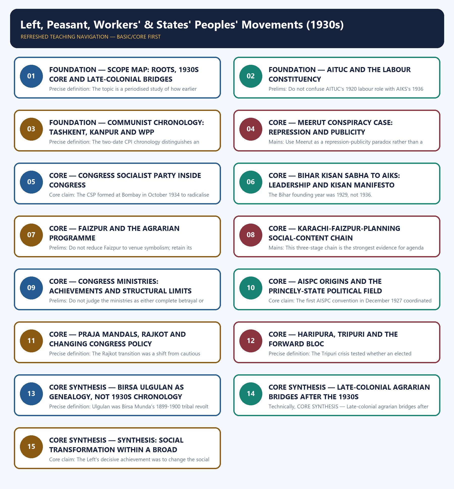

# Left, Peasant, Workers' & States' Peoples' Movements (1930s) - Learner-v2 Complete Learning Session

### SOURCE, PROGRESSION AND CURRENT-LINKAGE AUDIT

- **Repository owners queried:** Basic and Advanced Markdown for this topic, the master chronology, syllabus map and linked Modern History owners.
- **OCR book evidence queried:** The Basic and Advanced owners were reconciled with the repository OCR of India's Struggle for Independence. Tashkent 1920 is identified as the international/emigre communist formation and Kanpur 1925 as the all-India organisation formed inside India. The AISPC first convention is fixed to December 1927, with the source spelling G.R. Abhayankar.
- **Qdrant:** not used; Markdown plus searchable local PDFs were sufficient.
- **PYQ integrity:** Exact local official-paper wording is retained for the 2019, 2020 and 2023 GS-I questions. The 2020 Ulgulan objective stem is retained from the local official-paper OCR without an answer letter because no local official key is held. The 2026 Forward Bloc stem is explicitly provisional and receives no answer letter.
- **Bounded live linkage:** The Hindu report on farm-worker organisations announcing an indefinite countrywide protest from 1 July 2026 over rural-employment policy is used only as an organisational-lineage and labour-rights bridge. Contemporary policy claims are kept separate from the history of the 1930s; no unrelated secondary strike claim is used.
- **Fact/inference rule:** historical claims are source-backed; analytical judgements are explicitly framed as interpretation and do not invent figures.

## BASIC LEARNING SESSION

### DEEP-REVIEW LEARNING CONTRACT

| Control | Binding rule for this package |
|---|---|
| Syllabus boundary | Complete Modern History Core is taught chronologically and causally before optional enrichment. |
| Evidence method | Claim → named Act/treaty/record/organisation/person/region or scholarly evidence → analysis → qualification. |
| Date discipline | Event, proposal, enactment, commencement, official policy, implementation and later interpretation remain distinct. |
| Historiography | Colonial, nationalist, Marxist, subaltern, Cambridge, feminist and other relevant arguments are attributed and tested, never used as labels alone. |
| Practice contract | Every solved item has demand decoding, an examiner-grade model, an executable answer/compression plan, marks rationale and answer-specific improvement. |
| Approval | This immutable successor remains `approved: false` pending explicit approval. |

**Canonical Basic/Core owner:** `upsc-ai-kit\knowledge\Modern-Indian-History\basic\23_Left-Peasant-Workers-and-States-Peoples-Movements.md`  
**Canonical topic owner:** `upsc-ai-kit\knowledge\Modern-Indian-History\basic\23_Left-Peasant-Workers-and-States-Peoples-Movements.md`  
**Optional Advanced owner:** `upsc-ai-kit\knowledge\Modern-Indian-History\advanced\23_Left-Peasant-Workers-and-States-Peoples-Movements.md`  
**Official syllabus mapping:** `upsc-ai-kit\knowledge\Modern-Indian-History\OFFICIAL-UPSC-SYLLABUS-MAPPING.md`

### EVIDENCE, PYQ AND CURRENT-STATUS CONTROL

- **Official and primary evidence:** Acts, charters, treaties, proclamations, committee reports, proceedings, organisational resolutions, speeches and contemporary records are dated and read for authorship and purpose.
- **Regional and social evidence:** petitions, newspapers, memoirs, local studies and material geography qualify elite or all-India generalisation.
- **Economic and quantitative evidence:** revenue, trade, price, wage, craft and mortality claims retain unit, region, period and uncertainty; statistics are never invented.
- **Scholarly interpretation:** historian schools are competing explanations tied to named evidence, not memorised verdicts.
- **PYQ discipline:** repository ledgers and locally held official papers control wording and metadata; reconstructed wording and unavailable official keys remain explicitly labelled.
- **Current-status note, rechecked 2026-08-31:** The Hindu report on farm-worker organisations announcing an indefinite countrywide protest from 1 July 2026 over rural-employment policy is used only as an organisational-lineage and labour-rights bridge. Contemporary policy claims are kept separate from the history of the 1930s; no unrelated secondary strike claim is used.

**Live/primary context sources recorded by the predecessor generation:**

- `https://www.thehindu.com/news/national/farm-workers-unions-activists-announce-protest-from-july-1-for-vb-g-ram-g-repeal/article71113860.ece`




*Distinct embedded teaching-navigation image. The separate continuous Cārvāka-style flowchart package remains an independent at-a-glance artifact.*

### SESSION 1 — FOUNDATION — SCOPE MAP: ROOTS, 1930S CORE AND LATE-COLONIAL BRIDGES

#### DEFINITION / WHAT THIS IS CALLED

**Plain-language definition:** Chronology is the organising discipline for this topic: pre-1930 organisations are roots, the 1930s are the core phase, and 1945-46 movements are consequences or late-colonial bridges.

**Technical definition:** Precise definition: The topic is a periodised study of how earlier organisations enabled the 1930s social turn and later movements radicalised its unresolved demands.

#### ANSWER-GRABBING OPENING — WRITE/ADAPT IN THE EXAM

> Chronology is the organising discipline for this topic: pre-1930 organisations are roots, the 1930s are the core phase, and 1945-46 movements are consequences or late-colonial bridges.

#### MUST-WRITE KEYWORDS

- **FOUNDATION**
- **Scope map**
- **roots**
- **late-colonial bridges**
- **Precise definition**
- **1930s core**

**How to use them:** Frame the answer through FOUNDATION; define Scope map, connect roots with late-colonial bridges to explain the mechanism, and use Precise definition for the decisive comparison or qualification.

##### VISUAL FIRST

```text
SCOPE MAP: ROOTS, 1930S CORE AND LATE-COLONIAL BRIDGES
ROOTS -> AITUC 1920 | Tashkent 1920 | Kanpur 1925 | AISPC 1927
        | Bardoli 1928 | Bihar Kisan Sabha 1929
CORE -> CSP 1934 | AIKS + Faizpur 1936 | Ministries 1937-39 | NPC 1938
BRIDGES -> Warli 1945 | Tebhaga/Telangana/Punnapra-Vayalar 1946
GENEALOGY -> Birsa Ulgulan 1899-1900
```

*The visual fixes this subtopic's chronology, mechanism or boundary before the evidence.*

##### CONCEPT DEFINITIONS

- **Precise definition:** The topic is a periodised study of how earlier organisations enabled the 1930s social turn and later movements radicalised its unresolved demands.
- **Topic boundary:** Apply this definition only within Left, Peasant, Workers' & States' Peoples' Movements (1930s); retain the named actor, institution, date and chronological role.

##### CORE EXPLANATION

Chronology is the organising discipline for this topic: pre-1930 organisations are roots, the 1930s are the core phase, and 1945-46 movements are consequences or late-colonial bridges.

##### EVIDENCE AND MECHANISM

- AITUC, early communist organisation, Bardoli and AISPC precede the 1930s.
- CSP, AIKS, Faizpur, ministries, planning and Praja Mandal awakening form the core 1930s sequence.
- Warli, Tebhaga, Telangana and Punnapra-Vayalar belong to 1945-46.
- Birsa Ulgulan in 1899-1900 is a deeper tribal genealogy.

##### EXAMINER CAUTION

- Do not pull every agrarian or tribal movement into the 1930s.

##### EXAM LINK

- **Prelims:** Do not pull every agrarian or tribal movement into the 1930s.
- **Mains:** Begin broad answers with a roots-core-consequences periodisation.

##### MINI RECAP

- **Core claim:** Chronology is the organising discipline for this topic: pre-1930 organisations are roots, the 1930s are the core phase, and 1945-46 movements are consequences or late-colonial bridges.
- **Use:** Begin broad answers with a roots-core-consequences periodisation.

#### CLOSING RECALL FLOW — FOUNDATION — SCOPE MAP: ROOTS, 1930S CORE AND LATE-COLONIAL BRIDGES

```text
START / CONCEPT: FOUNDATION — Scope map: roots, 1930s core and late-colonial bridges
        |
        v
EXACT TERMS: FOUNDATION · Scope map · roots · late-colonial bridges · Precise definition · 1930s core
        |
        v
MECHANISM / ARGUMENT: Precise definition: The topic is a periodised study of how earlier organisations enabled the 1930s social turn and later movements radicalised its unresolved demands.
        |
        v
CONSEQUENCE / CONTRAST: Do not pull every agrarian or tribal movement into the 1930s.
        |
        v
UPSC TRAP / ANSWER-USE: Do not miss this limiting distinction: begin broad answers with a roots-core-consequences periodisation.
        |
        v
ANSWER-GRABBING FORMULATION: Chronology is the organising discipline for this topic: pre-1930 organisations are roots, the 1930s are the core phase, and 1945-46 movements are consequences or late-colonial bridges.
```
### SESSION 2 — FOUNDATION — AITUC AND THE LABOUR CONSTITUENCY

#### DEFINITION / WHAT THIS IS CALLED

**Plain-language definition:** Precise definition: AITUC was an all-India trade-union platform that organised industrial labour as a distinct political constituency within anti-colonial India.

**Technical definition:** Prelims: Do not confuse AITUC's 1920 labour role with AIKS's 1936 peasant role.

#### ANSWER-GRABBING OPENING — WRITE/ADAPT IN THE EXAM

> Precise definition: AITUC was an all-India trade-union platform that organised industrial labour as a distinct political constituency within anti-colonial India.

#### MUST-WRITE KEYWORDS

- **FOUNDATION**
- **AITUC**
- **the labour constituency**
- **Precise definition**
- **Topic boundary**
- **Core claim**

**How to use them:** Frame the answer through FOUNDATION; define AITUC, connect the labour constituency with Precise definition to explain the mechanism, and use Topic boundary for the decisive comparison or qualification.

##### VISUAL FIRST

```text
AITUC AND THE LABOUR CONSTITUENCY
1920 -> AITUC FOUNDED
FIRST PRESIDENT -> LALA LAJPAT RAI
BASE -> industrial workers; especially organised urban centres
METHOD -> unions + strikes + political representation
LIMIT -> geographically concentrated, not the whole Indian workforce
```

*The visual fixes this subtopic's chronology, mechanism or boundary before the evidence.*

##### CONCEPT DEFINITIONS

- **Precise definition:** AITUC was an all-India trade-union platform that organised industrial labour as a distinct political constituency within anti-colonial India.
- **Topic boundary:** Apply this definition only within Left, Peasant, Workers' & States' Peoples' Movements (1930s); retain the named actor, institution, date and chronological role.

##### CORE EXPLANATION

AITUC made industrial labour visible as an organised all-India constituency from 1920, with Lala Lajpat Rai as first president, before the socialist consolidation of the 1930s.

##### EVIDENCE AND MECHANISM

- AITUC was founded in 1920.
- Lala Lajpat Rai was its first president.
- Textile and railway action connected workplace demands to anti-imperial politics.
- Trade union strength remained concentrated in selected industrial centres.

##### EXAMINER CAUTION

- Do not confuse AITUC's 1920 labour role with AIKS's 1936 peasant role.

##### EXAM LINK

- **Prelims:** Do not confuse AITUC's 1920 labour role with AIKS's 1936 peasant role.
- **Mains:** Use AITUC to show that social-base expansion began before the CSP and AIKS.

##### MINI RECAP

- **Core claim:** AITUC made industrial labour visible as an organised all-India constituency from 1920, with Lala Lajpat Rai as first president, before the socialist consolidation of the 1930s.
- **Use:** Use AITUC to show that social-base expansion began before the CSP and AIKS.

#### CLOSING RECALL FLOW — FOUNDATION — AITUC AND THE LABOUR CONSTITUENCY

```text
START / CONCEPT: FOUNDATION — AITUC and the labour constituency
        |
        v
EXACT TERMS: FOUNDATION · AITUC · the labour constituency · Precise definition · Topic boundary · Core claim
        |
        v
MECHANISM / ARGUMENT: Do not confuse AITUC's 1920 labour role with AIKS's 1936 peasant role.
        |
        v
CONSEQUENCE / CONTRAST: Mains: Use AITUC to show that social-base expansion began before the CSP and AIKS.
        |
        v
UPSC TRAP / ANSWER-USE: Do not miss this limiting distinction: lala Lajpat Rai was its first president.
        |
        v
ANSWER-GRABBING FORMULATION: Precise definition: AITUC was an all-India trade-union platform that organised industrial labour as a distinct political constituency within anti-colonial India.
```
### SESSION 3 — FOUNDATION — COMMUNIST CHRONOLOGY: TASHKENT, KANPUR AND WPP

#### DEFINITION / WHAT THIS IS CALLED

**Plain-language definition:** Roy is associated with the Tashkent formation.

**Technical definition:** Precise definition: The two-date CPI chronology distinguishes an international founding initiative from the later all-India organisational formation inside India.

#### ANSWER-GRABBING OPENING — WRITE/ADAPT IN THE EXAM

> Roy is associated with the Tashkent formation.

#### MUST-WRITE KEYWORDS

- **FOUNDATION**
- **Communist chronology**
- **Tashkent**
- **Kanpur**
- **WPP**
- **Precise definition**

**How to use them:** Frame the answer through FOUNDATION; define Communist chronology, connect Tashkent with Kanpur to explain the mechanism, and use WPP for the decisive comparison or qualification.

##### VISUAL FIRST

```text
COMMUNIST CHRONOLOGY: TASHKENT, KANPUR AND WPP
TASHKENT 1920 -> international/emigre communist formation
KANPUR 1925 -> all-India organisation formed inside India
WPP -> open workers-peasants political activity in the late 1920s
CSP 1934 -> separate socialist current within Congress
RULE -> related left histories, not one interchangeable organisation
```

*The visual fixes this subtopic's chronology, mechanism or boundary before the evidence.*

##### CONCEPT DEFINITIONS

- **Precise definition:** The two-date CPI chronology distinguishes an international founding initiative from the later all-India organisational formation inside India.
- **Topic boundary:** Apply this definition only within Left, Peasant, Workers' & States' Peoples' Movements (1930s); retain the named actor, institution, date and chronological role.

##### CORE EXPLANATION

Communist formation cannot be compressed into one unexplained date: Tashkent 1920 identifies an international/emigre initiative, Kanpur 1925 an all-India organisation inside India, and Workers' and Peasants' Parties a later open political form.

##### EVIDENCE AND MECHANISM

- M.N. Roy is associated with the Tashkent formation.
- Kanpur 1925 marks organisation within India.
- Workers' and Peasants' Parties linked labour and peasant work to Congress-left activity.
- These currents were not identical to the later CSP.

##### EXAMINER CAUTION

- Never write only 'CPI founded in 1925' without qualifying the 1920 history.

##### EXAM LINK

- **Prelims:** Never write only 'CPI founded in 1925' without qualifying the 1920 history.
- **Mains:** A strong answer distinguishes location, organisational form and political arena.

##### MINI RECAP

- **Core claim:** Communist formation cannot be compressed into one unexplained date: Tashkent 1920 identifies an international/emigre initiative, Kanpur 1925 an all-India organisation inside India, and Workers' and Peasants' Parties a later open political form.
- **Use:** A strong answer distinguishes location, organisational form and political arena.

#### CLOSING RECALL FLOW — FOUNDATION — COMMUNIST CHRONOLOGY: TASHKENT, KANPUR AND WPP

```text
START / CONCEPT: FOUNDATION — Communist chronology: Tashkent, Kanpur and WPP
        |
        v
EXACT TERMS: FOUNDATION · Communist chronology · Tashkent · Kanpur · WPP · Precise definition
        |
        v
MECHANISM / ARGUMENT: Precise definition: The two-date CPI chronology distinguishes an international founding initiative from the later all-India organisational formation inside India.
        |
        v
CONSEQUENCE / CONTRAST: These currents were not identical to the later CSP.
        |
        v
UPSC TRAP / ANSWER-USE: Do not miss this limiting distinction: a strong answer distinguishes location, organisational form and political arena.
        |
        v
ANSWER-GRABBING FORMULATION: Roy is associated with the Tashkent formation.
```
### SESSION 4 — CORE — MEERUT CONSPIRACY CASE: REPRESSION AND PUBLICITY

#### DEFINITION / WHAT THIS IS CALLED

**Plain-language definition:** Precise definition: Meerut was a colonial conspiracy prosecution whose political effect combined organisational repression with unintended ideological publicity.

**Technical definition:** Mains: Use Meerut as a repression-publicity paradox rather than a bare case name.

#### ANSWER-GRABBING OPENING — WRITE/ADAPT IN THE EXAM

> Precise definition: Meerut was a colonial conspiracy prosecution whose political effect combined organisational repression with unintended ideological publicity.

#### MUST-WRITE KEYWORDS

- **Meerut Conspiracy Case**
- **repression**
- **publicity**
- **Precise definition**
- **Topic boundary**
- **Core claim**

**How to use them:** Frame the answer through Meerut Conspiracy Case; define repression, connect publicity with Precise definition to explain the mechanism, and use Topic boundary for the decisive comparison or qualification.

##### VISUAL FIRST

```text
MEERUT CONSPIRACY CASE: REPRESSION AND PUBLICITY
COLONIAL AIM -> disable communist + trade-union organisation
1929 ARRESTS -> prolonged MEERUT TRIAL -> 1933
DIRECT EFFECT -> leadership disruption + imprisonment
PARADOXICAL EFFECT -> national publicity for labour and socialist arguments
EVIDENCE RULE -> avoid unreconciled precise accused counts
```

*The visual fixes this subtopic's chronology, mechanism or boundary before the evidence.*

##### CONCEPT DEFINITIONS

- **Precise definition:** Meerut was a colonial conspiracy prosecution whose political effect combined organisational repression with unintended ideological publicity.
- **Topic boundary:** Apply this definition only within Left, Peasant, Workers' & States' Peoples' Movements (1930s); retain the named actor, institution, date and chronological role.

##### CORE EXPLANATION

The Meerut Conspiracy Case of 1929-33 sought to disable communist and trade-union networks, yet its extended public trial also exposed a wider audience to socialist and labour politics.

##### EVIDENCE AND MECHANISM

- The case began with arrests in 1929 and lasted to 1933.
- It targeted communist and trade-union organisers.
- The package avoids a precise accused count because held sources and summaries require reconciliation.
- Repression could weaken organisations while publicising their ideas.

##### EXAMINER CAUTION

- Do not turn an unreconciled accused count into a memorised fact.

##### EXAM LINK

- **Prelims:** Do not turn an unreconciled accused count into a memorised fact.
- **Mains:** Use Meerut as a repression-publicity paradox rather than a bare case name.

##### MINI RECAP

- **Core claim:** The Meerut Conspiracy Case of 1929-33 sought to disable communist and trade-union networks, yet its extended public trial also exposed a wider audience to socialist and labour politics.
- **Use:** Use Meerut as a repression-publicity paradox rather than a bare case name.

#### CLOSING RECALL FLOW — CORE — MEERUT CONSPIRACY CASE: REPRESSION AND PUBLICITY

```text
START / CONCEPT: CORE — Meerut Conspiracy Case: repression and publicity
        |
        v
EXACT TERMS: Meerut Conspiracy Case · repression · publicity · Precise definition · Topic boundary · Core claim
        |
        v
MECHANISM / ARGUMENT: Mains: Use Meerut as a repression-publicity paradox rather than a bare case name.
        |
        v
CONSEQUENCE / CONTRAST: Repression could weaken organisations while publicising their ideas.
        |
        v
UPSC TRAP / ANSWER-USE: Do not turn an unreconciled accused count into a memorised fact.
        |
        v
ANSWER-GRABBING FORMULATION: Precise definition: Meerut was a colonial conspiracy prosecution whose political effect combined organisational repression with unintended ideological publicity.
```
### SESSION 5 — CORE — CONGRESS SOCIALIST PARTY INSIDE CONGRESS

#### DEFINITION / WHAT THIS IS CALLED

**Plain-language definition:** Precise definition: The CSP was an organised socialist current inside Congress that combined commitment to national unity with pressure for social transformation.

**Technical definition:** Core claim: The CSP formed at Bombay in October 1934 to radicalise the national movement from within Congress, not to create an organisation identical with the CPI.

#### ANSWER-GRABBING OPENING — WRITE/ADAPT IN THE EXAM

> Precise definition: The CSP was an organised socialist current inside Congress that combined commitment to national unity with pressure for social transformation.

#### MUST-WRITE KEYWORDS

- **Congress Socialist Party inside Congress**
- **Precise definition**
- **Topic boundary**
- **Core claim**
- **Precise**
- **The CSP**

**How to use them:** Frame the answer through Congress Socialist Party inside Congress; define Precise definition, connect Topic boundary with Core claim to explain the mechanism, and use Precise for the decisive comparison or qualification.

##### VISUAL FIRST

```text
CONGRESS SOCIALIST PARTY INSIDE CONGRESS
BOMBAY, OCTOBER 1934 -> CSP FORMED WITHIN CONGRESS
LEADERS -> J.P. Narayan | Narendra Dev | Lohia | Minoo Masani
STRATEGY -> radicalise the national platform from inside
GAIN -> access to Congress mass legitimacy
LIMIT -> socialist programme operates within a broad multi-class coalition
```

*The visual fixes this subtopic's chronology, mechanism or boundary before the evidence.*

##### CONCEPT DEFINITIONS

- **Precise definition:** The CSP was an organised socialist current inside Congress that combined commitment to national unity with pressure for social transformation.
- **Topic boundary:** Apply this definition only within Left, Peasant, Workers' & States' Peoples' Movements (1930s); retain the named actor, institution, date and chronological role.

##### CORE EXPLANATION

The CSP formed at Bombay in October 1934 to radicalise the national movement from within Congress, not to create an organisation identical with the CPI.

##### EVIDENCE AND MECHANISM

- Key leaders included J.P. Narayan and Acharya Narendra Dev.
- Ram Manohar Lohia and Minoo Masani were also central.
- Members agreed that the anti-imperialist national struggle remained primary.
- The inside-Congress choice preserved coalition breadth but constrained class autonomy.

##### EXAMINER CAUTION

- CSP and CPI had interactions, but they were not the same organisation.

##### EXAM LINK

- **Prelims:** CSP and CPI had interactions, but they were not the same organisation.
- **Mains:** Use organisational location to explain both CSP influence and its limits.

##### MINI RECAP

- **Core claim:** The CSP formed at Bombay in October 1934 to radicalise the national movement from within Congress, not to create an organisation identical with the CPI.
- **Use:** Use organisational location to explain both CSP influence and its limits.

#### CLOSING RECALL FLOW — CORE — CONGRESS SOCIALIST PARTY INSIDE CONGRESS

```text
START / CONCEPT: CORE — Congress Socialist Party inside Congress
        |
        v
EXACT TERMS: Congress Socialist Party inside Congress · Precise definition · Topic boundary · Core claim · Precise · The CSP
        |
        v
MECHANISM / ARGUMENT: Core claim: The CSP formed at Bombay in October 1934 to radicalise the national movement from within Congress, not to create an organisation identical with the CPI.
        |
        v
CONSEQUENCE / CONTRAST: CSP and CPI had interactions, but they were not the same organisation.
        |
        v
UPSC TRAP / ANSWER-USE: Do not miss this limiting distinction: use organisational location to explain both CSP influence and its limits.
        |
        v
ANSWER-GRABBING FORMULATION: Precise definition: The CSP was an organised socialist current inside Congress that combined commitment to national unity with pressure for social transformation.
```
### SESSION 6 — CORE — BIHAR KISAN SABHA TO AIKS: LEADERSHIP AND KISAN MANIFESTO

#### DEFINITION / WHAT THIS IS CALLED

**Plain-language definition:** Prelims: Do not call AIKS the beginning of organised peasant politics or swap Sahajanand's presidency and Ranga's secretaryship.

**Technical definition:** The Bihar founding year was 1929, not 1936.

#### ANSWER-GRABBING OPENING — WRITE/ADAPT IN THE EXAM

> Do not call AIKS the beginning of organised peasant politics or swap Sahajanand's presidency and Ranga's secretaryship.

#### MUST-WRITE KEYWORDS

- **Bihar Kisan Sabha to AIKS**
- **leadership**
- **Kisan Manifesto**
- **Precise definition**
- **Topic boundary**
- **Core claim**

**How to use them:** Frame the answer through Bihar Kisan Sabha to AIKS; define leadership, connect Kisan Manifesto with Precise definition to explain the mechanism, and use Topic boundary for the decisive comparison or qualification.

##### VISUAL FIRST

```text
BIHAR KISAN SABHA TO AIKS: LEADERSHIP AND KISAN MANIFESTO
1929 -> BIHAR PROVINCIAL KISAN SABHA -> SAHAJANAND
APRIL 1936 -> LUCKNOW -> ALL-INDIA KISAN CONGRESS
PRESIDENT -> SAHAJANAND SARASWATI
GENERAL SECRETARY -> N.G. RANGA
PROGRAMME -> KISAN MANIFESTO
EFFECT -> provincial peasant organisations gain an all-India coordinating platform
```

*The visual fixes this subtopic's chronology, mechanism or boundary before the evidence.*

##### CONCEPT DEFINITIONS

- **Precise definition:** The provincial-to-national kisan ladder connected Sahajanand's 1929 Bihar organisation to the 1936 all-India coordinating platform.
- **Topic boundary:** Apply this definition only within Left, Peasant, Workers' & States' Peoples' Movements (1930s); retain the named actor, institution, date and chronological role.

##### CORE EXPLANATION

The Bihar Provincial Kisan Sabha, founded by Swami Sahajanand Saraswati in 1929, supplied a provincial base for the All-India Kisan Congress at Lucknow in April 1936, with Sahajanand as president and N.G. Ranga as general secretary.

##### EVIDENCE AND MECHANISM

- The Bihar founding year was 1929, not 1936.
- Sahajanand linked tenancy, rent, illegal levies, zamindari and later Bakasht questions.
- The organisation later used the name All India Kisan Sabha.
- Its founding meeting coincided with the Congress's Lucknow setting.
- The Kisan Manifesto carried demands into the Congress arena.
- Leadership linked Bihar mobilisation to Ranga's Andhra agrarian work.

##### EXAMINER CAUTION

- Do not call AIKS the beginning of organised peasant politics or swap Sahajanand's presidency and Ranga's secretaryship.

##### EXAM LINK

- **Prelims:** Do not call AIKS the beginning of organised peasant politics or swap Sahajanand's presidency and Ranga's secretaryship.
- **Mains:** Use the provincial-to-national ladder and retain place, month, year and offices together.

##### MINI RECAP

- **Core claim:** The Bihar Provincial Kisan Sabha, founded by Swami Sahajanand Saraswati in 1929, supplied a provincial base for the All-India Kisan Congress at Lucknow in April 1936, with Sahajanand as president and N.G. Ranga as general secretary.
- **Use:** Use the provincial-to-national ladder and retain place, month, year and offices together.

#### CLOSING RECALL FLOW — CORE — BIHAR KISAN SABHA TO AIKS: LEADERSHIP AND KISAN MANIFESTO

```text
START / CONCEPT: CORE — Bihar Kisan Sabha to AIKS: leadership and Kisan Manifesto
        |
        v
EXACT TERMS: Bihar Kisan Sabha to AIKS · leadership · Kisan Manifesto · Precise definition · Topic boundary · Core claim
        |
        v
MECHANISM / ARGUMENT: The Bihar founding year was 1929, not 1936.
        |
        v
CONSEQUENCE / CONTRAST: Mains: Use the provincial-to-national ladder and retain place, month, year and offices together.
        |
        v
UPSC TRAP / ANSWER-USE: Do not miss this limiting distinction: do not call AIKS the beginning of organised peasant politics or swap Sahajanand's presidency...
        |
        v
ANSWER-GRABBING FORMULATION: Do not call AIKS the beginning of organised peasant politics or swap Sahajanand's presidency and Ranga's secretaryship.
```
### SESSION 7 — CORE — FAIZPUR AND THE AGRARIAN PROGRAMME

#### DEFINITION / WHAT THIS IS CALLED

**Plain-language definition:** Precise definition: The Faizpur agrarian programme was the Congress-level translation of organised peasant demands into commitments on rents, debt, tenure and labour.

**Technical definition:** Prelims: Do not reduce Faizpur to venue symbolism; retain its programme content.

#### ANSWER-GRABBING OPENING — WRITE/ADAPT IN THE EXAM

> Do not reduce Faizpur to venue symbolism; retain its programme content.

#### MUST-WRITE KEYWORDS

- **Faizpur**
- **the agrarian programme**
- **Precise definition**
- **Topic boundary**
- **Core claim**
- **Precise**

**How to use them:** Frame the answer through Faizpur; define the agrarian programme, connect Precise definition with Topic boundary to explain the mechanism, and use Core claim for the decisive comparison or qualification.

##### VISUAL FIRST

```text
FAIZPUR AND THE AGRARIAN PROGRAMME
KISAN MANIFESTO
        ↓ enters Congress debate
FAIZPUR, DECEMBER 1936
|-- reduce rent/revenue
|-- debt relief + end feudal dues
|-- security of tenure
`-- living wage + peasant-union recognition
RESULT -> agrarian question becomes a national programme
```

*The visual fixes this subtopic's chronology, mechanism or boundary before the evidence.*

##### CONCEPT DEFINITIONS

- **Precise definition:** The Faizpur agrarian programme was the Congress-level translation of organised peasant demands into commitments on rents, debt, tenure and labour.
- **Topic boundary:** Apply this definition only within Left, Peasant, Workers' & States' Peoples' Movements (1930s); retain the named actor, institution, date and chronological role.

##### CORE EXPLANATION

Faizpur in December 1936 translated organised peasant pressure into a Congress agrarian programme addressing rent and revenue, debt, feudal dues, tenure, labour and union rights.

##### EVIDENCE AND MECHANISM

- The second all-India kisan session met alongside the Congress setting.
- The programme included substantial rent-revenue reduction and debt relief.
- It demanded abolition of feudal dues and greater security of tenure.
- Agricultural labour and peasant unions entered the programme explicitly.

##### EXAMINER CAUTION

- Do not reduce Faizpur to venue symbolism; retain its programme content.

##### EXAM LINK

- **Prelims:** Do not reduce Faizpur to venue symbolism; retain its programme content.
- **Mains:** Use Faizpur as institutional proof that class demands changed Congress commitments.

##### MINI RECAP

- **Core claim:** Faizpur in December 1936 translated organised peasant pressure into a Congress agrarian programme addressing rent and revenue, debt, feudal dues, tenure, labour and union rights.
- **Use:** Use Faizpur as institutional proof that class demands changed Congress commitments.

#### CLOSING RECALL FLOW — CORE — FAIZPUR AND THE AGRARIAN PROGRAMME

```text
START / CONCEPT: CORE — Faizpur and the agrarian programme
        |
        v
EXACT TERMS: Faizpur · the agrarian programme · Precise definition · Topic boundary · Core claim · Precise
        |
        v
MECHANISM / ARGUMENT: Precise definition: The Faizpur agrarian programme was the Congress-level translation of organised peasant demands into commitments on rents, debt, tenure and labour.
        |
        v
CONSEQUENCE / CONTRAST: Mains: Use Faizpur as institutional proof that class demands changed Congress commitments.
        |
        v
UPSC TRAP / ANSWER-USE: Do not miss this limiting distinction: do not reduce Faizpur to venue symbolism.
        |
        v
ANSWER-GRABBING FORMULATION: Do not reduce Faizpur to venue symbolism; retain its programme content.
```
### SESSION 8 — CORE — KARACHI-FAIZPUR-PLANNING SOCIAL-CONTENT CHAIN

#### DEFINITION / WHAT THIS IS CALLED

**Plain-language definition:** Precise definition: The social-content chain is the staged institutional adoption of rights, agrarian reform and planning within a broad nationalist coalition.

**Technical definition:** Mains: This three-stage chain is the strongest evidence for agenda transformation.

#### ANSWER-GRABBING OPENING — WRITE/ADAPT IN THE EXAM

> Precise definition: The social-content chain is the staged institutional adoption of rights, agrarian reform and planning within a broad nationalist coalition.

#### MUST-WRITE KEYWORDS

- **Karachi-Faizpur-planning social-content chain**
- **Precise definition**
- **Topic boundary**
- **Core claim**
- **Precise definition: The social-content chain**
- **Precise**

**How to use them:** Frame the answer through Karachi-Faizpur-planning social-content chain; define Precise definition, connect Topic boundary with Core claim to explain the mechanism, and use Precise definition: The social-content chain for the decisive comparison or qualification.

##### VISUAL FIRST

```text
KARACHI-FAIZPUR-PLANNING SOCIAL-CONTENT CHAIN
KARACHI 1931 -> RIGHTS + LABOUR + NATIONAL ECONOMIC PROGRAMME
        ↓
FAIZPUR 1936 -> AGRARIAN PROGRAMME
        ↓
NATIONAL PLANNING COMMITTEE 1938 -> PLANNED TRANSFORMATION
VERDICT -> social content widens; Congress remains broad and multi-class
```

*The visual fixes this subtopic's chronology, mechanism or boundary before the evidence.*

##### CONCEPT DEFINITIONS

- **Precise definition:** The social-content chain is the staged institutional adoption of rights, agrarian reform and planning within a broad nationalist coalition.
- **Topic boundary:** Apply this definition only within Left, Peasant, Workers' & States' Peoples' Movements (1930s); retain the named actor, institution, date and chronological role.

##### CORE EXPLANATION

Karachi 1931, Faizpur 1936 and the National Planning Committee in 1938 form a chain through which civil rights, labour protection, agrarian reform and planning entered Congress commitments.

##### EVIDENCE AND MECHANISM

- Karachi linked political liberties to an economic programme.
- Faizpur specified agrarian demands.
- The National Planning Committee extended social content into planned development.
- Left influence was larger ideologically than its organisational numbers.

##### EXAMINER CAUTION

- Do not conclude from this chain that a communist organisation captured Congress.

##### EXAM LINK

- **Prelims:** Do not conclude from this chain that a communist organisation captured Congress.
- **Mains:** This three-stage chain is the strongest evidence for agenda transformation.

##### MINI RECAP

- **Core claim:** Karachi 1931, Faizpur 1936 and the National Planning Committee in 1938 form a chain through which civil rights, labour protection, agrarian reform and planning entered Congress commitments.
- **Use:** This three-stage chain is the strongest evidence for agenda transformation.

#### CLOSING RECALL FLOW — CORE — KARACHI-FAIZPUR-PLANNING SOCIAL-CONTENT CHAIN

```text
START / CONCEPT: CORE — Karachi-Faizpur-planning social-content chain
        |
        v
EXACT TERMS: Karachi-Faizpur-planning social-content chain · Precise definition · Topic boundary · Core claim · Precise definition: The social-content chain · Precise
        |
        v
MECHANISM / ARGUMENT: Do not conclude from this chain that a communist organisation captured Congress.
        |
        v
CONSEQUENCE / CONTRAST: Mains: This three-stage chain is the strongest evidence for agenda transformation.
        |
        v
UPSC TRAP / ANSWER-USE: Do not miss this limiting distinction: left influence was larger ideologically than its organisational numbers.
        |
        v
ANSWER-GRABBING FORMULATION: Precise definition: The social-content chain is the staged institutional adoption of rights, agrarian reform and planning within a broad nationalist coalition.
```
### SESSION 9 — CORE — CONGRESS MINISTRIES: ACHIEVEMENTS AND STRUCTURAL LIMITS

#### DEFINITION / WHAT THIS IS CALLED

**Plain-language definition:** Precise definition: The ministry gap was the distance between a radicalising programme and provincial implementation constrained by law, franchise and coalition interests.

**Technical definition:** Prelims: Do not judge the ministries as either complete betrayal or complete fulfilment.

#### ANSWER-GRABBING OPENING — WRITE/ADAPT IN THE EXAM

> Do not judge the ministries as either complete betrayal or complete fulfilment.

#### MUST-WRITE KEYWORDS

- **Congress Ministries**
- **achievements**
- **structural limits**
- **Precise definition**
- **Topic boundary**
- **Core claim**

**How to use them:** Frame the answer through Congress Ministries; define achievements, connect structural limits with Precise definition to explain the mechanism, and use Topic boundary for the decisive comparison or qualification.

##### VISUAL FIRST

```text
CONGRESS MINISTRIES: ACHIEVEMENTS AND STRUCTURAL LIMITS
1937-39 CONGRESS MINISTRIES
PROMISE -> Karachi + Faizpur social commitments
ACTION -> provincial tenancy/labour reforms, uneven by region
GAPS -> sub-tenants + agricultural labourers
STRUCTURAL LIMITS -> restricted franchise + landlord weight + limited powers
VERDICT -> partial reform exposes coalition constraints
```

*The visual fixes this subtopic's chronology, mechanism or boundary before the evidence.*

##### CONCEPT DEFINITIONS

- **Precise definition:** The ministry gap was the distance between a radicalising programme and provincial implementation constrained by law, franchise and coalition interests.
- **Topic boundary:** Apply this definition only within Left, Peasant, Workers' & States' Peoples' Movements (1930s); retain the named actor, institution, date and chronological role.

##### CORE EXPLANATION

The Congress ministries of 1937-39 made reform possible but also exposed the limits imposed by provincial powers, landlord interests, restricted franchise and uneven mobilisation.

##### EVIDENCE AND MECHANISM

- Tenancy and labour measures varied across provinces.
- Sub-tenants of occupancy tenants were often outside effective protection.
- Agricultural labourers had limited organisation and voting power.
- Office demonstrated the gap between programme and implementable coalition policy.

##### EXAMINER CAUTION

- Do not judge the ministries as either complete betrayal or complete fulfilment.

##### EXAM LINK

- **Prelims:** Do not judge the ministries as either complete betrayal or complete fulfilment.
- **Mains:** Use named excluded groups to convert a general limitation into evidence.

##### MINI RECAP

- **Core claim:** The Congress ministries of 1937-39 made reform possible but also exposed the limits imposed by provincial powers, landlord interests, restricted franchise and uneven mobilisation.
- **Use:** Use named excluded groups to convert a general limitation into evidence.

#### CLOSING RECALL FLOW — CORE — CONGRESS MINISTRIES: ACHIEVEMENTS AND STRUCTURAL LIMITS

```text
START / CONCEPT: CORE — Congress Ministries: achievements and structural limits
        |
        v
EXACT TERMS: Congress Ministries · achievements · structural limits · Precise definition · Topic boundary · Core claim
        |
        v
MECHANISM / ARGUMENT: Precise definition: The ministry gap was the distance between a radicalising programme and provincial implementation constrained by law, franchise and coalition interests.
        |
        v
CONSEQUENCE / CONTRAST: Mains: Use named excluded groups to convert a general limitation into evidence.
        |
        v
UPSC TRAP / ANSWER-USE: Do not miss this limiting distinction: tenancy and labour measures varied across provinces.
        |
        v
ANSWER-GRABBING FORMULATION: Do not judge the ministries as either complete betrayal or complete fulfilment.
```
### SESSION 10 — CORE — AISPC ORIGINS AND THE PRINCELY-STATE POLITICAL FIELD

#### DEFINITION / WHAT THIS IS CALLED

**Plain-language definition:** Precise definition: AISPC was the coordinating platform for democratic movements inside princely India, a political field distinct from British provincial government.

**Technical definition:** Core claim: The first AISPC convention in December 1927 coordinated political workers from princely states, where the immediate target was princely autocracy and denial of rights rather than British provincial ministries.

#### ANSWER-GRABBING OPENING — WRITE/ADAPT IN THE EXAM

> Precise definition: AISPC was the coordinating platform for democratic movements inside princely India, a political field distinct from British provincial government.

#### MUST-WRITE KEYWORDS

- **AISPC origins**
- **the princely-state political field**
- **Precise definition**
- **Topic boundary**
- **Core claim**
- **Precise**

**How to use them:** Frame the answer through AISPC origins; define the princely-state political field, connect Precise definition with Topic boundary to explain the mechanism, and use Core claim for the decisive comparison or qualification.

##### VISUAL FIRST

```text
AISPC ORIGINS AND THE PRINCELY-STATE POLITICAL FIELD
PRINCELY STATE SYSTEM -> autocracy under imperial paramountcy
LOCAL RESPONSE -> PRAJA MANDALS / STATES' PEOPLE'S CONFERENCES
DECEMBER 1927 -> FIRST AISPC CONVENTION
ORGANISERS -> Balwantrai Mehta | Maniklal Kothari | G.R. Abhayankar
TARGET -> responsible government and rights inside princely states
```

*The visual fixes this subtopic's chronology, mechanism or boundary before the evidence.*

##### CONCEPT DEFINITIONS

- **Precise definition:** AISPC was the coordinating platform for democratic movements inside princely India, a political field distinct from British provincial government.
- **Topic boundary:** Apply this definition only within Left, Peasant, Workers' & States' Peoples' Movements (1930s); retain the named actor, institution, date and chronological role.

##### CORE EXPLANATION

The first AISPC convention in December 1927 coordinated political workers from princely states, where the immediate target was princely autocracy and denial of rights rather than British provincial ministries.

##### EVIDENCE AND MECHANISM

- Balwantrai Mehta, Maniklal Kothari and G.R. Abhayankar were central.
- Praja Mandals had already emerged in several states.
- Paramountcy insulated princes while imperial power structured the wider system.
- The Congress initially urged state peoples to rely on their own strength.

##### EXAMINER CAUTION

- Ignore the OCR anomaly that moves the first AISPC convention to 1936.

##### EXAM LINK

- **Prelims:** Ignore the OCR anomaly that moves the first AISPC convention to 1936.
- **Mains:** Define the distinct political field before discussing Congress intervention.

##### MINI RECAP

- **Core claim:** The first AISPC convention in December 1927 coordinated political workers from princely states, where the immediate target was princely autocracy and denial of rights rather than British provincial ministries.
- **Use:** Define the distinct political field before discussing Congress intervention.

#### CLOSING RECALL FLOW — CORE — AISPC ORIGINS AND THE PRINCELY-STATE POLITICAL FIELD

```text
START / CONCEPT: CORE — AISPC origins and the princely-state political field
        |
        v
EXACT TERMS: AISPC origins · the princely-state political field · Precise definition · Topic boundary · Core claim · Precise
        |
        v
MECHANISM / ARGUMENT: Ignore the OCR anomaly that moves the first AISPC convention to 1936.
        |
        v
CONSEQUENCE / CONTRAST: Core claim: The first AISPC convention in December 1927 coordinated political workers from princely states, where the immediate target was princely autocracy and denial of rights rather than British provincial ministries.
        |
        v
UPSC TRAP / ANSWER-USE: Do not miss this limiting distinction: define the distinct political field before discussing Congress intervention.
        |
        v
ANSWER-GRABBING FORMULATION: Precise definition: AISPC was the coordinating platform for democratic movements inside princely India, a political field distinct from British provincial government.
```
### SESSION 11 — CORE — PRAJA MANDALS, RAJKOT AND CHANGING CONGRESS POLICY

#### DEFINITION / WHAT THIS IS CALLED

**Plain-language definition:** Mains: Use Rajkot to explain a policy transition rather than a sudden total reversal.

**Technical definition:** Precise definition: The Rajkot transition was a shift from cautious sympathy to closer national identification as princely-state mobilisation acquired mass force.

#### ANSWER-GRABBING OPENING — WRITE/ADAPT IN THE EXAM

> Mains: Use Rajkot to explain a policy transition rather than a sudden total reversal.

#### MUST-WRITE KEYWORDS

- **Praja Mandals**
- **Rajkot**
- **changing Congress policy**
- **Precise definition**
- **Topic boundary**
- **Core claim**

**How to use them:** Frame the answer through Praja Mandals; define Rajkot, connect changing Congress policy with Precise definition to explain the mechanism, and use Topic boundary for the decisive comparison or qualification.

##### VISUAL FIRST

```text
PRAJA MANDALS, RAJKOT AND CHANGING CONGRESS POLICY
1938 HARIPURA -> Congress still stresses restraint
1938-39 -> PRAJA MANDAL AWAKENING ACROSS STATES
RAJKOT -> direct intervention tests the old boundary
POLICY SHIFT -> closer Congress identification with states' peoples
LATER RELEVANCE -> democratic base for integration, not deterministic inevitability
```

*The visual fixes this subtopic's chronology, mechanism or boundary before the evidence.*

##### CONCEPT DEFINITIONS

- **Precise definition:** The Rajkot transition was a shift from cautious sympathy to closer national identification as princely-state mobilisation acquired mass force.
- **Topic boundary:** Apply this definition only within Left, Peasant, Workers' & States' Peoples' Movements (1930s); retain the named actor, institution, date and chronological role.

##### CORE EXPLANATION

The 1938-39 awakening and Rajkot struggle pushed Congress from a policy of organisational restraint toward closer identification with states' peoples, without making 1947 integration automatic.

##### EVIDENCE AND MECHANISM

- Praja Mandals expanded across several princely states in 1938-39.
- Rajkot drew Patel, Kasturba Gandhi and Gandhi into a direct test.
- Haripura in 1938 reiterated caution even as pressure for involvement grew.
- The movements created democratic cadre and legitimacy relevant to later integration, but did not predetermine accession outcomes.

##### EXAMINER CAUTION

- Do not call these movements campaigns against elected British Indian ministries.

##### EXAM LINK

- **Prelims:** Do not call these movements campaigns against elected British Indian ministries.
- **Mains:** Use Rajkot to explain a policy transition rather than a sudden total reversal.

##### MINI RECAP

- **Core claim:** The 1938-39 awakening and Rajkot struggle pushed Congress from a policy of organisational restraint toward closer identification with states' peoples, without making 1947 integration automatic.
- **Use:** Use Rajkot to explain a policy transition rather than a sudden total reversal.

#### CLOSING RECALL FLOW — CORE — PRAJA MANDALS, RAJKOT AND CHANGING CONGRESS POLICY

```text
START / CONCEPT: CORE — Praja Mandals, Rajkot and changing Congress policy
        |
        v
EXACT TERMS: Praja Mandals · Rajkot · changing Congress policy · Precise definition · Topic boundary · Core claim
        |
        v
MECHANISM / ARGUMENT: Precise definition: The Rajkot transition was a shift from cautious sympathy to closer national identification as princely-state mobilisation acquired mass force.
        |
        v
CONSEQUENCE / CONTRAST: The movements created democratic cadre and legitimacy relevant to later integration, but did not predetermine accession outcomes.
        |
        v
UPSC TRAP / ANSWER-USE: Do not call these movements campaigns against elected British Indian ministries.
        |
        v
ANSWER-GRABBING FORMULATION: Mains: Use Rajkot to explain a policy transition rather than a sudden total reversal.
```
### SESSION 12 — CORE — HARIPURA, TRIPURI AND THE FORWARD BLOC

#### DEFINITION / WHAT THIS IS CALLED

**Plain-language definition:** Prelims: Do not place Forward Bloc before Tripuri or treat the crisis as only personal.

**Technical definition:** Precise definition: The Tripuri crisis tested whether an elected Congress president could govern without the confidence of the Working Committee and Gandhian core.

#### ANSWER-GRABBING OPENING — WRITE/ADAPT IN THE EXAM

> Do not place Forward Bloc before Tripuri or treat the crisis as only personal.

#### MUST-WRITE KEYWORDS

- **Haripura**
- **Tripuri**
- **the Forward Bloc**
- **Precise definition**
- **Topic boundary**
- **Core claim**

**How to use them:** Frame the answer through Haripura; define Tripuri, connect the Forward Bloc with Precise definition to explain the mechanism, and use Topic boundary for the decisive comparison or qualification.

##### VISUAL FIRST

```text
HARIPURA, TRIPURI AND THE FORWARD BLOC
HARIPURA 1938 -> BOSE PRESIDENCY + PLANNING EMPHASIS
TRIPURI 1939 -> re-election against Gandhian preference
INSTITUTIONAL QUESTION -> president versus Working Committee authority
STRATEGIC QUESTION -> timing and form of anti-imperialist confrontation
RESIGNATION -> FORWARD BLOC, 1939
```

*The visual fixes this subtopic's chronology, mechanism or boundary before the evidence.*

##### CONCEPT DEFINITIONS

- **Precise definition:** The Tripuri crisis tested whether an elected Congress president could govern without the confidence of the Working Committee and Gandhian core.
- **Topic boundary:** Apply this definition only within Left, Peasant, Workers' & States' Peoples' Movements (1930s); retain the named actor, institution, date and chronological role.

##### CORE EXPLANATION

The Bose sequence was an institutional and ideological crisis over presidential authority, Working Committee control, planning and anti-imperialist strategy on the eve of war, not merely a personality clash.

##### EVIDENCE AND MECHANISM

- Bose was Congress president at Haripura in 1938.
- He won re-election at Tripuri in 1939 against Gandhian opposition.
- The Working Committee conflict made formal electoral victory insufficient for organisational control.
- Bose resigned and formed the Forward Bloc in 1939.

##### EXAMINER CAUTION

- Do not place Forward Bloc before Tripuri or treat the crisis as only personal.

##### EXAM LINK

- **Prelims:** Do not place Forward Bloc before Tripuri or treat the crisis as only personal.
- **Mains:** Use the sequence to analyse the Congress constitution and strategic disagreement.

##### MINI RECAP

- **Core claim:** The Bose sequence was an institutional and ideological crisis over presidential authority, Working Committee control, planning and anti-imperialist strategy on the eve of war, not merely a personality clash.
- **Use:** Use the sequence to analyse the Congress constitution and strategic disagreement.

#### CLOSING RECALL FLOW — CORE — HARIPURA, TRIPURI AND THE FORWARD BLOC

```text
START / CONCEPT: CORE — Haripura, Tripuri and the Forward Bloc
        |
        v
EXACT TERMS: Haripura · Tripuri · the Forward Bloc · Precise definition · Topic boundary · Core claim
        |
        v
MECHANISM / ARGUMENT: Precise definition: The Tripuri crisis tested whether an elected Congress president could govern without the confidence of the Working Committee and Gandhian core.
        |
        v
CONSEQUENCE / CONTRAST: Core claim: The Bose sequence was an institutional and ideological crisis over presidential authority, Working Committee control, planning and anti-imperialist strategy on the eve of war, not merely a personality clash.
        |
        v
UPSC TRAP / ANSWER-USE: Do not miss this limiting distinction: bose resigned and formed the Forward Bloc in 1939.
        |
        v
ANSWER-GRABBING FORMULATION: Do not place Forward Bloc before Tripuri or treat the crisis as only personal.
```
### SESSION 13 — CORE SYNTHESIS — BIRSA ULGULAN AS GENEALOGY, NOT 1930S CHRONOLOGY

#### DEFINITION / WHAT THIS IS CALLED

**Plain-language definition:** Ulgulan means the Great Tumult in the official 2020 stem.

**Technical definition:** Precise definition: Ulgulan was Birsa Munda's 1899-1900 tribal revolt linking local land and outsider grievances to an explicitly anti-colonial political horizon.

#### ANSWER-GRABBING OPENING — WRITE/ADAPT IN THE EXAM

> Precise definition: Ulgulan was Birsa Munda's 1899-1900 tribal revolt linking local land and outsider grievances to an explicitly anti-colonial political horizon.

#### MUST-WRITE KEYWORDS

- **CORE SYNTHESIS**
- **Birsa Ulgulan as genealogy**
- **not 1930s chronology**
- **Precise definition**
- **Topic boundary**
- **Core claim**

**How to use them:** Frame the answer through CORE SYNTHESIS; define Birsa Ulgulan as genealogy, connect not 1930s chronology with Precise definition to explain the mechanism, and use Topic boundary for the decisive comparison or qualification.

##### VISUAL FIRST

```text
BIRSA ULGULAN AS GENEALOGY, NOT 1930S CHRONOLOGY
LAND ALIENATION + DIKUS + COLONIAL RULE
        ↓
BIRSA'S RELIGIOUS-POLITICAL MOBILISATION
        ↓
ULGULAN, 1899-1900, CHOTA NAGPUR
        ↓
ANTI-RAJ HORIZON
BOUNDARY -> genealogy for Topic 23, not a 1930s event
```

*The visual fixes this subtopic's chronology, mechanism or boundary before the evidence.*

##### CONCEPT DEFINITIONS

- **Precise definition:** Ulgulan was Birsa Munda's 1899-1900 tribal revolt linking local land and outsider grievances to an explicitly anti-colonial political horizon.
- **Topic boundary:** Apply this definition only within Left, Peasant, Workers' & States' Peoples' Movements (1930s); retain the named actor, institution, date and chronological role.

##### CORE EXPLANATION

Birsa Munda's Ulgulan of 1899-1900 belongs to the genealogy of tribal anti-colonial politics: land alienation, dikus and colonial power combined with a religious-political idiom.

##### EVIDENCE AND MECHANISM

- Ulgulan means the Great Tumult in the official 2020 stem.
- The movement occurred in Chota Nagpur in 1899-1900.
- Its targets included exploitative intermediaries and British rule.
- It must not be redated into the 1930s merely because the PYQ is routed to a social-movements owner.

##### EXAMINER CAUTION

- Do not invent a 2020 answer letter without a held official key.

##### EXAM LINK

- **Prelims:** Do not invent a 2020 answer letter without a held official key.
- **Mains:** Use Birsa as genealogy and route a full tribal answer beyond this topic.

##### MINI RECAP

- **Core claim:** Birsa Munda's Ulgulan of 1899-1900 belongs to the genealogy of tribal anti-colonial politics: land alienation, dikus and colonial power combined with a religious-political idiom.
- **Use:** Use Birsa as genealogy and route a full tribal answer beyond this topic.

#### CLOSING RECALL FLOW — CORE SYNTHESIS — BIRSA ULGULAN AS GENEALOGY, NOT 1930S CHRONOLOGY

```text
START / CONCEPT: CORE SYNTHESIS — Birsa Ulgulan as genealogy, not 1930s chronology
        |
        v
EXACT TERMS: CORE SYNTHESIS · Birsa Ulgulan as genealogy · not 1930s chronology · Precise definition · Topic boundary · Core claim
        |
        v
MECHANISM / ARGUMENT: It must not be redated into the 1930s merely because the PYQ is routed to a social-movements owner.
        |
        v
CONSEQUENCE / CONTRAST: Do not invent a 2020 answer letter without a held official key.
        |
        v
UPSC TRAP / ANSWER-USE: Do not miss this limiting distinction: use Birsa as genealogy and route a full tribal answer beyond this topic.
        |
        v
ANSWER-GRABBING FORMULATION: Precise definition: Ulgulan was Birsa Munda's 1899-1900 tribal revolt linking local land and outsider grievances to an explicitly anti-colonial political horizon.
```
### SESSION 14 — CORE SYNTHESIS — LATE-COLONIAL AGRARIAN BRIDGES AFTER THE 1930S

#### DEFINITION / WHAT THIS IS CALLED

**Plain-language definition:** Precise definition: The late-colonial bridge is the post-1930s radicalisation of agrarian and labour conflicts through class organisation and weakening state authority.

**Technical definition:** Technically, CORE SYNTHESIS — Late-colonial agrarian bridges after the 1930s is analysed by relating CORE SYNTHESIS to Late-colonial agrarian bridges after the 1930s, then testing the relationship through Precise definition and Topic boundary.

#### ANSWER-GRABBING OPENING — WRITE/ADAPT IN THE EXAM

> Precise definition: The late-colonial bridge is the post-1930s radicalisation of agrarian and labour conflicts through class organisation and weakening state authority.

#### MUST-WRITE KEYWORDS

- **CORE SYNTHESIS**
- **Late-colonial agrarian bridges after the 1930s**
- **Precise definition**
- **Topic boundary**
- **Core claim**
- **1945-46**

**How to use them:** Frame the answer through CORE SYNTHESIS; define Late-colonial agrarian bridges after the 1930s, connect Precise definition with Topic boundary to explain the mechanism, and use Core claim for the decisive comparison or qualification.

##### VISUAL FIRST

```text
LATE-COLONIAL AGRARIAN BRIDGES AFTER THE 1930S
1930s ORGANISATION -> unresolved land, labour and autocracy questions
1945 -> WARLI labour/forced-labour bridge
1946 -> TEBHAGA sharecroppers demand two-thirds
1946 -> TELANGANA anti-landlord struggle under Hyderabad
1946 -> PUNNAPRA-VAYALAR in Travancore
RULE -> consequences/bridges, not the central 1930s phase
```

*The visual fixes this subtopic's chronology, mechanism or boundary before the evidence.*

##### CONCEPT DEFINITIONS

- **Precise definition:** The late-colonial bridge is the post-1930s radicalisation of agrarian and labour conflicts through class organisation and weakening state authority.
- **Topic boundary:** Apply this definition only within Left, Peasant, Workers' & States' Peoples' Movements (1930s); retain the named actor, institution, date and chronological role.

##### CORE EXPLANATION

Warli, Tebhaga, Telangana and Punnapra-Vayalar show how unresolved questions of labour, sharecropping, landlord power and princely rule radicalised in 1945-46, but they are consequences rather than the topic's core decade.

##### EVIDENCE AND MECHANISM

- Warli belongs to 1945.
- Tebhaga in 1946 demanded two-thirds of produce for Bengal sharecroppers.
- Telangana from 1946 opposed landlord oppression under Hyderabad's Nizam.
- Punnapra-Vayalar occurred in Travancore in 1946.

##### EXAMINER CAUTION

- Do not use these later struggles to erase the organisational work of the 1930s.

##### EXAM LINK

- **Prelims:** Do not use these later struggles to erase the organisational work of the 1930s.
- **Mains:** Close the chronology by showing radicalisation without collapsing periods.

##### MINI RECAP

- **Core claim:** Warli, Tebhaga, Telangana and Punnapra-Vayalar show how unresolved questions of labour, sharecropping, landlord power and princely rule radicalised in 1945-46, but they are consequences rather than the topic's core decade.
- **Use:** Close the chronology by showing radicalisation without collapsing periods.

#### CLOSING RECALL FLOW — CORE SYNTHESIS — LATE-COLONIAL AGRARIAN BRIDGES AFTER THE 1930S

```text
START / CONCEPT: CORE SYNTHESIS — Late-colonial agrarian bridges after the 1930s
        |
        v
EXACT TERMS: CORE SYNTHESIS · Late-colonial agrarian bridges after the 1930s · Precise definition · Topic boundary · Core claim · 1945-46
        |
        v
MECHANISM / ARGUMENT: Use: Close the chronology by showing radicalisation without collapsing periods.
        |
        v
CONSEQUENCE / CONTRAST: Core claim: Warli, Tebhaga, Telangana and Punnapra-Vayalar show how unresolved questions of labour, sharecropping, landlord power and princely rule radicalised in 1945-46, but they are consequences rather than the topic's core decade.
        |
        v
UPSC TRAP / ANSWER-USE: Do not use these later struggles to erase the organisational work of the 1930s.
        |
        v
ANSWER-GRABBING FORMULATION: Precise definition: The late-colonial bridge is the post-1930s radicalisation of agrarian and labour conflicts through class organisation and weakening state authority.
```
### SESSION 15 — CORE SYNTHESIS — SYNTHESIS: SOCIAL TRANSFORMATION WITHIN A BROAD COALITION

#### DEFINITION / WHAT THIS IS CALLED

**Plain-language definition:** Precise definition: Agenda transformation means that organised social constituencies altered Congress commitments even though no single left organisation captured the nationalist coalition.

**Technical definition:** Core claim: The Left's decisive achievement was to change the social content and commitments of nationalism through organisations and pressure from below; its decisive limit was that Congress remained broad, multi-class and committed to coalition unity.

#### ANSWER-GRABBING OPENING — WRITE/ADAPT IN THE EXAM

> Precise definition: Agenda transformation means that organised social constituencies altered Congress commitments even though no single left organisation captured the nationalist coalition.

#### MUST-WRITE KEYWORDS

- **CORE SYNTHESIS**
- **Synthesis**
- **social transformation within a broad coalition**
- **Precise definition**
- **Topic boundary**
- **Core claim**

**How to use them:** Frame the answer through CORE SYNTHESIS; define Synthesis, connect social transformation within a broad coalition with Precise definition to explain the mechanism, and use Topic boundary for the decisive comparison or qualification.

##### VISUAL FIRST

```text
SYNTHESIS: SOCIAL TRANSFORMATION WITHIN A BROAD COALITION
PRESSURE FROM BELOW
|-- workers -> AITUC + trade unions
|-- peasants -> provincial sabhas + AIKS
|-- princely-state subjects -> Praja Mandals + AISPC
`-- socialist-left -> CSP + Bose + planning
CONGRESS RESPONSE -> wider social programme
LIMIT -> broad multi-class coalition, uneven implementation
```

*The visual fixes this subtopic's chronology, mechanism or boundary before the evidence.*

##### CONCEPT DEFINITIONS

- **Precise definition:** Agenda transformation means that organised social constituencies altered Congress commitments even though no single left organisation captured the nationalist coalition.
- **Topic boundary:** Apply this definition only within Left, Peasant, Workers' & States' Peoples' Movements (1930s); retain the named actor, institution, date and chronological role.

##### CORE EXPLANATION

The Left's decisive achievement was to change the social content and commitments of nationalism through organisations and pressure from below; its decisive limit was that Congress remained broad, multi-class and committed to coalition unity.

##### EVIDENCE AND MECHANISM

- Labour organisation made workers a named political constituency.
- Kisan organisation moved agrarian demands into Congress programmes.
- States' peoples widened the territorial meaning of nationalism.
- CSP, Bose and planning changed debate without establishing a single left command over Congress.

##### EXAMINER CAUTION

- Do not equate ideological influence with communist capture.

##### EXAM LINK

- **Prelims:** Do not equate ideological influence with communist capture.
- **Mains:** End with a graded verdict that links widened commitments to implementation limits.

##### MINI RECAP

- **Core claim:** The Left's decisive achievement was to change the social content and commitments of nationalism through organisations and pressure from below; its decisive limit was that Congress remained broad, multi-class and committed to coalition unity.
- **Use:** End with a graded verdict that links widened commitments to implementation limits.

#### CLOSING RECALL FLOW — CORE SYNTHESIS — SYNTHESIS: SOCIAL TRANSFORMATION WITHIN A BROAD COALITION

```text
START / CONCEPT: CORE SYNTHESIS — Synthesis: social transformation within a broad coalition
        |
        v
EXACT TERMS: CORE SYNTHESIS · Synthesis · social transformation within a broad coalition · Precise definition · Topic boundary · Core claim
        |
        v
MECHANISM / ARGUMENT: Core claim: The Left's decisive achievement was to change the social content and commitments of nationalism through organisations and pressure from below; its decisive limit was that Congress remained broad, multi-class and committed to coalition unity.
        |
        v
CONSEQUENCE / CONTRAST: Do not equate ideological influence with communist capture.
        |
        v
UPSC TRAP / ANSWER-USE: Do not miss this limiting distinction: end with a graded verdict that links widened commitments to implementation limits.
        |
        v
ANSWER-GRABBING FORMULATION: Precise definition: Agenda transformation means that organised social constituencies altered Congress commitments even though no single left organisation captured the nationalist coalition.
```
### MODERN HISTORY DEEP-REVIEW CORE CONTROL

- **Must remember:** CSP (1934), All India Kisan Sabha (1936), trade unions, communist networks and princely-state Praja Mandals linked national politics to class and regional struggles in different ways.
- **Close distinction:** The CPI's origin requires qualification between the 1920 Tashkent formation and the 1925 Kanpur conference; peasant, labour, caste and women's movements were not Congress appendages.
- **Evidence / interpretation limit:** Party documents, labour reports and local movement studies must recover agency while avoiding the claim that one ideological line uniformly controlled India's diverse social struggles.

## BASIC MCQS / REMEDIATION

### Q1. Which statement correctly identifies AITUC foundation?

A. The All India Trade Union Congress was founded in 1920, with Lala Lajpat Rai as its first president.
B. Workers' and Peasants' Parties linked labour, communist and Congress-left activity before the intensified repression of 1929.
C. The Meerut Conspiracy Case ran from 1929 to 1933 against communist and trade-union activists; the package avoids an unreconciled precise accused count.
D. Tashkent 1920 marks an international/emigre communist formation, while Kanpur 1925 marks the all-India organisation formed inside India; both dates require qualification.

**Answer: A.**
**Explanation:** The All India Trade Union Congress was founded in 1920, with Lala Lajpat Rai as its first president. This distinction preserves the source-backed chronology and prevents cross-matching errors in UPSC elimination.

### Q2. Which chronology card should be filed under AITUC foundation?

A. Swami Sahajanand Saraswati founded the Bihar Provincial Kisan Sabha in 1929.
B. The All India Trade Union Congress was founded in 1920, with Lala Lajpat Rai as its first president.
C. The Meerut Conspiracy Case ran from 1929 to 1933 against communist and trade-union activists; the package avoids an unreconciled precise accused count.
D. Workers' and Peasants' Parties linked labour, communist and Congress-left activity before the intensified repression of 1929.

**Answer: B.**
**Explanation:** The All India Trade Union Congress was founded in 1920, with Lala Lajpat Rai as its first president. This distinction preserves the source-backed chronology and prevents cross-matching errors in UPSC elimination.

### Q3. Which option should a candidate retain when revising AITUC foundation?

A. The Meerut Conspiracy Case ran from 1929 to 1933 against communist and trade-union activists; the package avoids an unreconciled precise accused count.
B. Swami Sahajanand Saraswati founded the Bihar Provincial Kisan Sabha in 1929.
C. The All India Trade Union Congress was founded in 1920, with Lala Lajpat Rai as its first president.
D. Karachi 1931 joined civil liberties to labour protection and a National Economic Programme.

**Answer: C.**
**Explanation:** The All India Trade Union Congress was founded in 1920, with Lala Lajpat Rai as its first president. This distinction preserves the source-backed chronology and prevents cross-matching errors in UPSC elimination.

### Q4. Which statement avoids a common matching trap about AITUC foundation?

A. Swami Sahajanand Saraswati founded the Bihar Provincial Kisan Sabha in 1929.
B. The CSP formed within Congress at Bombay in October 1934 under J.P. Narayan, Acharya Narendra Dev, Ram Manohar Lohia and Minoo Masani; it was not identical with the CPI.
C. Karachi 1931 joined civil liberties to labour protection and a National Economic Programme.
D. The All India Trade Union Congress was founded in 1920, with Lala Lajpat Rai as its first president.

**Answer: D.**
**Explanation:** The All India Trade Union Congress was founded in 1920, with Lala Lajpat Rai as its first president. This distinction preserves the source-backed chronology and prevents cross-matching errors in UPSC elimination.

### Q5. Which statement correctly identifies Communist formation chronology?

A. Tashkent 1920 marks an international/emigre communist formation, while Kanpur 1925 marks the all-India organisation formed inside India; both dates require qualification.
B. Workers' and Peasants' Parties linked labour, communist and Congress-left activity before the intensified repression of 1929.
C. Swami Sahajanand Saraswati founded the Bihar Provincial Kisan Sabha in 1929.
D. The Meerut Conspiracy Case ran from 1929 to 1933 against communist and trade-union activists; the package avoids an unreconciled precise accused count.

**Answer: A.**
**Explanation:** Tashkent 1920 marks an international/emigre communist formation, while Kanpur 1925 marks the all-India organisation formed inside India; both dates require qualification. This distinction preserves the source-backed chronology and prevents cross-matching errors in UPSC elimination.

### Q6. Which chronology card should be filed under Communist formation chronology?

A. The Meerut Conspiracy Case ran from 1929 to 1933 against communist and trade-union activists; the package avoids an unreconciled precise accused count.
B. Tashkent 1920 marks an international/emigre communist formation, while Kanpur 1925 marks the all-India organisation formed inside India; both dates require qualification.
C. Karachi 1931 joined civil liberties to labour protection and a National Economic Programme.
D. Swami Sahajanand Saraswati founded the Bihar Provincial Kisan Sabha in 1929.

**Answer: B.**
**Explanation:** Tashkent 1920 marks an international/emigre communist formation, while Kanpur 1925 marks the all-India organisation formed inside India; both dates require qualification. This distinction preserves the source-backed chronology and prevents cross-matching errors in UPSC elimination.

### Q7. Which option should a candidate retain when revising Communist formation chronology?

A. The CSP formed within Congress at Bombay in October 1934 under J.P. Narayan, Acharya Narendra Dev, Ram Manohar Lohia and Minoo Masani; it was not identical with the CPI.
B. Karachi 1931 joined civil liberties to labour protection and a National Economic Programme.
C. Tashkent 1920 marks an international/emigre communist formation, while Kanpur 1925 marks the all-India organisation formed inside India; both dates require qualification.
D. Swami Sahajanand Saraswati founded the Bihar Provincial Kisan Sabha in 1929.

**Answer: C.**
**Explanation:** Tashkent 1920 marks an international/emigre communist formation, while Kanpur 1925 marks the all-India organisation formed inside India; both dates require qualification. This distinction preserves the source-backed chronology and prevents cross-matching errors in UPSC elimination.

### Q8. Which statement avoids a common matching trap about Communist formation chronology?

A. The All-India Kisan Congress, later AIKS, met at Lucknow in April 1936 with Sahajanand Saraswati as president and N.G. Ranga as general secretary.
B. The CSP formed within Congress at Bombay in October 1934 under J.P. Narayan, Acharya Narendra Dev, Ram Manohar Lohia and Minoo Masani; it was not identical with the CPI.
C. Karachi 1931 joined civil liberties to labour protection and a National Economic Programme.
D. Tashkent 1920 marks an international/emigre communist formation, while Kanpur 1925 marks the all-India organisation formed inside India; both dates require qualification.

**Answer: D.**
**Explanation:** Tashkent 1920 marks an international/emigre communist formation, while Kanpur 1925 marks the all-India organisation formed inside India; both dates require qualification. This distinction preserves the source-backed chronology and prevents cross-matching errors in UPSC elimination.

### Q9. Which statement correctly identifies Workers' and Peasants' Parties?

A. Workers' and Peasants' Parties linked labour, communist and Congress-left activity before the intensified repression of 1929.
B. Karachi 1931 joined civil liberties to labour protection and a National Economic Programme.
C. Swami Sahajanand Saraswati founded the Bihar Provincial Kisan Sabha in 1929.
D. The Meerut Conspiracy Case ran from 1929 to 1933 against communist and trade-union activists; the package avoids an unreconciled precise accused count.

**Answer: A.**
**Explanation:** Workers' and Peasants' Parties linked labour, communist and Congress-left activity before the intensified repression of 1929. This distinction preserves the source-backed chronology and prevents cross-matching errors in UPSC elimination.

### Q10. Which chronology card should be filed under Workers' and Peasants' Parties?

A. The CSP formed within Congress at Bombay in October 1934 under J.P. Narayan, Acharya Narendra Dev, Ram Manohar Lohia and Minoo Masani; it was not identical with the CPI.
B. Workers' and Peasants' Parties linked labour, communist and Congress-left activity before the intensified repression of 1929.
C. Karachi 1931 joined civil liberties to labour protection and a National Economic Programme.
D. Swami Sahajanand Saraswati founded the Bihar Provincial Kisan Sabha in 1929.

**Answer: B.**
**Explanation:** Workers' and Peasants' Parties linked labour, communist and Congress-left activity before the intensified repression of 1929. This distinction preserves the source-backed chronology and prevents cross-matching errors in UPSC elimination.

### Q11. Which option should a candidate retain when revising Workers' and Peasants' Parties?

A. The CSP formed within Congress at Bombay in October 1934 under J.P. Narayan, Acharya Narendra Dev, Ram Manohar Lohia and Minoo Masani; it was not identical with the CPI.
B. Karachi 1931 joined civil liberties to labour protection and a National Economic Programme.
C. Workers' and Peasants' Parties linked labour, communist and Congress-left activity before the intensified repression of 1929.
D. The All-India Kisan Congress, later AIKS, met at Lucknow in April 1936 with Sahajanand Saraswati as president and N.G. Ranga as general secretary.

**Answer: C.**
**Explanation:** Workers' and Peasants' Parties linked labour, communist and Congress-left activity before the intensified repression of 1929. This distinction preserves the source-backed chronology and prevents cross-matching errors in UPSC elimination.

### Q12. Which statement avoids a common matching trap about Workers' and Peasants' Parties?

A. The All-India Kisan Congress, later AIKS, met at Lucknow in April 1936 with Sahajanand Saraswati as president and N.G. Ranga as general secretary.
B. The December 1936 Faizpur setting connected the Kisan Manifesto to rent-revenue reduction, debt relief, tenure, labour and peasant-union demands.
C. The CSP formed within Congress at Bombay in October 1934 under J.P. Narayan, Acharya Narendra Dev, Ram Manohar Lohia and Minoo Masani; it was not identical with the CPI.
D. Workers' and Peasants' Parties linked labour, communist and Congress-left activity before the intensified repression of 1929.

**Answer: D.**
**Explanation:** Workers' and Peasants' Parties linked labour, communist and Congress-left activity before the intensified repression of 1929. This distinction preserves the source-backed chronology and prevents cross-matching errors in UPSC elimination.

### Q13. Which statement correctly identifies Meerut Conspiracy Case?

A. The Meerut Conspiracy Case ran from 1929 to 1933 against communist and trade-union activists; the package avoids an unreconciled precise accused count.
B. Karachi 1931 joined civil liberties to labour protection and a National Economic Programme.
C. Swami Sahajanand Saraswati founded the Bihar Provincial Kisan Sabha in 1929.
D. The CSP formed within Congress at Bombay in October 1934 under J.P. Narayan, Acharya Narendra Dev, Ram Manohar Lohia and Minoo Masani; it was not identical with the CPI.

**Answer: A.**
**Explanation:** The Meerut Conspiracy Case ran from 1929 to 1933 against communist and trade-union activists; the package avoids an unreconciled precise accused count. This distinction preserves the source-backed chronology and prevents cross-matching errors in UPSC elimination.

### Q14. Which chronology card should be filed under Meerut Conspiracy Case?

A. Karachi 1931 joined civil liberties to labour protection and a National Economic Programme.
B. The Meerut Conspiracy Case ran from 1929 to 1933 against communist and trade-union activists; the package avoids an unreconciled precise accused count.
C. The All-India Kisan Congress, later AIKS, met at Lucknow in April 1936 with Sahajanand Saraswati as president and N.G. Ranga as general secretary.
D. The CSP formed within Congress at Bombay in October 1934 under J.P. Narayan, Acharya Narendra Dev, Ram Manohar Lohia and Minoo Masani; it was not identical with the CPI.

**Answer: B.**
**Explanation:** The Meerut Conspiracy Case ran from 1929 to 1933 against communist and trade-union activists; the package avoids an unreconciled precise accused count. This distinction preserves the source-backed chronology and prevents cross-matching errors in UPSC elimination.

### Q15. Which option should a candidate retain when revising Meerut Conspiracy Case?

A. The December 1936 Faizpur setting connected the Kisan Manifesto to rent-revenue reduction, debt relief, tenure, labour and peasant-union demands.
B. The CSP formed within Congress at Bombay in October 1934 under J.P. Narayan, Acharya Narendra Dev, Ram Manohar Lohia and Minoo Masani; it was not identical with the CPI.
C. The Meerut Conspiracy Case ran from 1929 to 1933 against communist and trade-union activists; the package avoids an unreconciled precise accused count.
D. The All-India Kisan Congress, later AIKS, met at Lucknow in April 1936 with Sahajanand Saraswati as president and N.G. Ranga as general secretary.

**Answer: C.**
**Explanation:** The Meerut Conspiracy Case ran from 1929 to 1933 against communist and trade-union activists; the package avoids an unreconciled precise accused count. This distinction preserves the source-backed chronology and prevents cross-matching errors in UPSC elimination.

### Q16. Which statement avoids a common matching trap about Meerut Conspiracy Case?

A. Congress ministries of 1937-39 passed reforms but structural and franchise limits left sub-tenants and agricultural labourers especially weakly protected.
B. The All-India Kisan Congress, later AIKS, met at Lucknow in April 1936 with Sahajanand Saraswati as president and N.G. Ranga as general secretary.
C. The December 1936 Faizpur setting connected the Kisan Manifesto to rent-revenue reduction, debt relief, tenure, labour and peasant-union demands.
D. The Meerut Conspiracy Case ran from 1929 to 1933 against communist and trade-union activists; the package avoids an unreconciled precise accused count.

**Answer: D.**
**Explanation:** The Meerut Conspiracy Case ran from 1929 to 1933 against communist and trade-union activists; the package avoids an unreconciled precise accused count. This distinction preserves the source-backed chronology and prevents cross-matching errors in UPSC elimination.

### Q17. Which statement correctly identifies Bihar Provincial Kisan Sabha?

A. Swami Sahajanand Saraswati founded the Bihar Provincial Kisan Sabha in 1929.
B. The CSP formed within Congress at Bombay in October 1934 under J.P. Narayan, Acharya Narendra Dev, Ram Manohar Lohia and Minoo Masani; it was not identical with the CPI.
C. The All-India Kisan Congress, later AIKS, met at Lucknow in April 1936 with Sahajanand Saraswati as president and N.G. Ranga as general secretary.
D. Karachi 1931 joined civil liberties to labour protection and a National Economic Programme.

**Answer: A.**
**Explanation:** Swami Sahajanand Saraswati founded the Bihar Provincial Kisan Sabha in 1929. This distinction preserves the source-backed chronology and prevents cross-matching errors in UPSC elimination.

### Q18. Which chronology card should be filed under Bihar Provincial Kisan Sabha?

A. The CSP formed within Congress at Bombay in October 1934 under J.P. Narayan, Acharya Narendra Dev, Ram Manohar Lohia and Minoo Masani; it was not identical with the CPI.
B. Swami Sahajanand Saraswati founded the Bihar Provincial Kisan Sabha in 1929.
C. The December 1936 Faizpur setting connected the Kisan Manifesto to rent-revenue reduction, debt relief, tenure, labour and peasant-union demands.
D. The All-India Kisan Congress, later AIKS, met at Lucknow in April 1936 with Sahajanand Saraswati as president and N.G. Ranga as general secretary.

**Answer: B.**
**Explanation:** Swami Sahajanand Saraswati founded the Bihar Provincial Kisan Sabha in 1929. This distinction preserves the source-backed chronology and prevents cross-matching errors in UPSC elimination.

### Q19. Which option should a candidate retain when revising Bihar Provincial Kisan Sabha?

A. The December 1936 Faizpur setting connected the Kisan Manifesto to rent-revenue reduction, debt relief, tenure, labour and peasant-union demands.
B. The All-India Kisan Congress, later AIKS, met at Lucknow in April 1936 with Sahajanand Saraswati as president and N.G. Ranga as general secretary.
C. Swami Sahajanand Saraswati founded the Bihar Provincial Kisan Sabha in 1929.
D. Congress ministries of 1937-39 passed reforms but structural and franchise limits left sub-tenants and agricultural labourers especially weakly protected.

**Answer: C.**
**Explanation:** Swami Sahajanand Saraswati founded the Bihar Provincial Kisan Sabha in 1929. This distinction preserves the source-backed chronology and prevents cross-matching errors in UPSC elimination.

### Q20. Which statement avoids a common matching trap about Bihar Provincial Kisan Sabha?

A. Congress ministries of 1937-39 passed reforms but structural and franchise limits left sub-tenants and agricultural labourers especially weakly protected.
B. The National Planning Committee of 1938 extended the Karachi-Faizpur chain from rights and agrarian demands toward planned economic transformation.
C. The December 1936 Faizpur setting connected the Kisan Manifesto to rent-revenue reduction, debt relief, tenure, labour and peasant-union demands.
D. Swami Sahajanand Saraswati founded the Bihar Provincial Kisan Sabha in 1929.

**Answer: D.**
**Explanation:** Swami Sahajanand Saraswati founded the Bihar Provincial Kisan Sabha in 1929. This distinction preserves the source-backed chronology and prevents cross-matching errors in UPSC elimination.

### Q21. Which statement correctly identifies Karachi social programme?

A. Karachi 1931 joined civil liberties to labour protection and a National Economic Programme.
B. The December 1936 Faizpur setting connected the Kisan Manifesto to rent-revenue reduction, debt relief, tenure, labour and peasant-union demands.
C. The All-India Kisan Congress, later AIKS, met at Lucknow in April 1936 with Sahajanand Saraswati as president and N.G. Ranga as general secretary.
D. The CSP formed within Congress at Bombay in October 1934 under J.P. Narayan, Acharya Narendra Dev, Ram Manohar Lohia and Minoo Masani; it was not identical with the CPI.

**Answer: A.**
**Explanation:** Karachi 1931 joined civil liberties to labour protection and a National Economic Programme. This distinction preserves the source-backed chronology and prevents cross-matching errors in UPSC elimination.

### Q22. Which chronology card should be filed under Karachi social programme?

A. The December 1936 Faizpur setting connected the Kisan Manifesto to rent-revenue reduction, debt relief, tenure, labour and peasant-union demands.
B. Karachi 1931 joined civil liberties to labour protection and a National Economic Programme.
C. The All-India Kisan Congress, later AIKS, met at Lucknow in April 1936 with Sahajanand Saraswati as president and N.G. Ranga as general secretary.
D. Congress ministries of 1937-39 passed reforms but structural and franchise limits left sub-tenants and agricultural labourers especially weakly protected.

**Answer: B.**
**Explanation:** Karachi 1931 joined civil liberties to labour protection and a National Economic Programme. This distinction preserves the source-backed chronology and prevents cross-matching errors in UPSC elimination.

### Q23. Which option should a candidate retain when revising Karachi social programme?

A. The National Planning Committee of 1938 extended the Karachi-Faizpur chain from rights and agrarian demands toward planned economic transformation.
B. The December 1936 Faizpur setting connected the Kisan Manifesto to rent-revenue reduction, debt relief, tenure, labour and peasant-union demands.
C. Karachi 1931 joined civil liberties to labour protection and a National Economic Programme.
D. Congress ministries of 1937-39 passed reforms but structural and franchise limits left sub-tenants and agricultural labourers especially weakly protected.

**Answer: C.**
**Explanation:** Karachi 1931 joined civil liberties to labour protection and a National Economic Programme. This distinction preserves the source-backed chronology and prevents cross-matching errors in UPSC elimination.

### Q24. Which statement avoids a common matching trap about Karachi social programme?

A. The National Planning Committee of 1938 extended the Karachi-Faizpur chain from rights and agrarian demands toward planned economic transformation.
B. Congress ministries of 1937-39 passed reforms but structural and franchise limits left sub-tenants and agricultural labourers especially weakly protected.
C. The first AISPC convention met in December 1927; Balwantrai Mehta, Maniklal Kothari and G.R. Abhayankar were central to it.
D. Karachi 1931 joined civil liberties to labour protection and a National Economic Programme.

**Answer: D.**
**Explanation:** Karachi 1931 joined civil liberties to labour protection and a National Economic Programme. This distinction preserves the source-backed chronology and prevents cross-matching errors in UPSC elimination.

### Q25. Which statement correctly identifies Congress Socialist Party?

A. The CSP formed within Congress at Bombay in October 1934 under J.P. Narayan, Acharya Narendra Dev, Ram Manohar Lohia and Minoo Masani; it was not identical with the CPI.
B. The All-India Kisan Congress, later AIKS, met at Lucknow in April 1936 with Sahajanand Saraswati as president and N.G. Ranga as general secretary.
C. Congress ministries of 1937-39 passed reforms but structural and franchise limits left sub-tenants and agricultural labourers especially weakly protected.
D. The December 1936 Faizpur setting connected the Kisan Manifesto to rent-revenue reduction, debt relief, tenure, labour and peasant-union demands.

**Answer: A.**
**Explanation:** The CSP formed within Congress at Bombay in October 1934 under J.P. Narayan, Acharya Narendra Dev, Ram Manohar Lohia and Minoo Masani; it was not identical with the CPI. This distinction preserves the source-backed chronology and prevents cross-matching errors in UPSC elimination.

### Q26. Which chronology card should be filed under Congress Socialist Party?

A. The December 1936 Faizpur setting connected the Kisan Manifesto to rent-revenue reduction, debt relief, tenure, labour and peasant-union demands.
B. The CSP formed within Congress at Bombay in October 1934 under J.P. Narayan, Acharya Narendra Dev, Ram Manohar Lohia and Minoo Masani; it was not identical with the CPI.
C. The National Planning Committee of 1938 extended the Karachi-Faizpur chain from rights and agrarian demands toward planned economic transformation.
D. Congress ministries of 1937-39 passed reforms but structural and franchise limits left sub-tenants and agricultural labourers especially weakly protected.

**Answer: B.**
**Explanation:** The CSP formed within Congress at Bombay in October 1934 under J.P. Narayan, Acharya Narendra Dev, Ram Manohar Lohia and Minoo Masani; it was not identical with the CPI. This distinction preserves the source-backed chronology and prevents cross-matching errors in UPSC elimination.

### Q27. Which option should a candidate retain when revising Congress Socialist Party?

A. The first AISPC convention met in December 1927; Balwantrai Mehta, Maniklal Kothari and G.R. Abhayankar were central to it.
B. The National Planning Committee of 1938 extended the Karachi-Faizpur chain from rights and agrarian demands toward planned economic transformation.
C. The CSP formed within Congress at Bombay in October 1934 under J.P. Narayan, Acharya Narendra Dev, Ram Manohar Lohia and Minoo Masani; it was not identical with the CPI.
D. Congress ministries of 1937-39 passed reforms but structural and franchise limits left sub-tenants and agricultural labourers especially weakly protected.

**Answer: C.**
**Explanation:** The CSP formed within Congress at Bombay in October 1934 under J.P. Narayan, Acharya Narendra Dev, Ram Manohar Lohia and Minoo Masani; it was not identical with the CPI. This distinction preserves the source-backed chronology and prevents cross-matching errors in UPSC elimination.

### Q28. Which statement avoids a common matching trap about Congress Socialist Party?

A. The National Planning Committee of 1938 extended the Karachi-Faizpur chain from rights and agrarian demands toward planned economic transformation.
B. The first AISPC convention met in December 1927; Balwantrai Mehta, Maniklal Kothari and G.R. Abhayankar were central to it.
C. Praja Mandals and States' Peoples' Movements opposed princely autocracy and denial of rights, not British provincial ministries.
D. The CSP formed within Congress at Bombay in October 1934 under J.P. Narayan, Acharya Narendra Dev, Ram Manohar Lohia and Minoo Masani; it was not identical with the CPI.

**Answer: D.**
**Explanation:** The CSP formed within Congress at Bombay in October 1934 under J.P. Narayan, Acharya Narendra Dev, Ram Manohar Lohia and Minoo Masani; it was not identical with the CPI. This distinction preserves the source-backed chronology and prevents cross-matching errors in UPSC elimination.

### Q29. Which statement correctly identifies All-India Kisan Congress?

A. The All-India Kisan Congress, later AIKS, met at Lucknow in April 1936 with Sahajanand Saraswati as president and N.G. Ranga as general secretary.
B. The December 1936 Faizpur setting connected the Kisan Manifesto to rent-revenue reduction, debt relief, tenure, labour and peasant-union demands.
C. The National Planning Committee of 1938 extended the Karachi-Faizpur chain from rights and agrarian demands toward planned economic transformation.
D. Congress ministries of 1937-39 passed reforms but structural and franchise limits left sub-tenants and agricultural labourers especially weakly protected.

**Answer: A.**
**Explanation:** The All-India Kisan Congress, later AIKS, met at Lucknow in April 1936 with Sahajanand Saraswati as president and N.G. Ranga as general secretary. This distinction preserves the source-backed chronology and prevents cross-matching errors in UPSC elimination.

### Q30. Which chronology card should be filed under All-India Kisan Congress?

A. The first AISPC convention met in December 1927; Balwantrai Mehta, Maniklal Kothari and G.R. Abhayankar were central to it.
B. The All-India Kisan Congress, later AIKS, met at Lucknow in April 1936 with Sahajanand Saraswati as president and N.G. Ranga as general secretary.
C. The National Planning Committee of 1938 extended the Karachi-Faizpur chain from rights and agrarian demands toward planned economic transformation.
D. Congress ministries of 1937-39 passed reforms but structural and franchise limits left sub-tenants and agricultural labourers especially weakly protected.

**Answer: B.**
**Explanation:** The All-India Kisan Congress, later AIKS, met at Lucknow in April 1936 with Sahajanand Saraswati as president and N.G. Ranga as general secretary. This distinction preserves the source-backed chronology and prevents cross-matching errors in UPSC elimination.

### Q31. Which option should a candidate retain when revising All-India Kisan Congress?

A. The first AISPC convention met in December 1927; Balwantrai Mehta, Maniklal Kothari and G.R. Abhayankar were central to it.
B. The National Planning Committee of 1938 extended the Karachi-Faizpur chain from rights and agrarian demands toward planned economic transformation.
C. The All-India Kisan Congress, later AIKS, met at Lucknow in April 1936 with Sahajanand Saraswati as president and N.G. Ranga as general secretary.
D. Praja Mandals and States' Peoples' Movements opposed princely autocracy and denial of rights, not British provincial ministries.

**Answer: C.**
**Explanation:** The All-India Kisan Congress, later AIKS, met at Lucknow in April 1936 with Sahajanand Saraswati as president and N.G. Ranga as general secretary. This distinction preserves the source-backed chronology and prevents cross-matching errors in UPSC elimination.

### Q32. Which statement avoids a common matching trap about All-India Kisan Congress?

A. The first AISPC convention met in December 1927; Balwantrai Mehta, Maniklal Kothari and G.R. Abhayankar were central to it.
B. The 1938-39 awakening included Rajkot and other princely-state struggles and pushed Congress from restraint toward closer identification without making later integration inevitable.
C. Praja Mandals and States' Peoples' Movements opposed princely autocracy and denial of rights, not British provincial ministries.
D. The All-India Kisan Congress, later AIKS, met at Lucknow in April 1936 with Sahajanand Saraswati as president and N.G. Ranga as general secretary.

**Answer: D.**
**Explanation:** The All-India Kisan Congress, later AIKS, met at Lucknow in April 1936 with Sahajanand Saraswati as president and N.G. Ranga as general secretary. This distinction preserves the source-backed chronology and prevents cross-matching errors in UPSC elimination.

### Q33. Which statement correctly identifies Faizpur agrarian programme?

A. The December 1936 Faizpur setting connected the Kisan Manifesto to rent-revenue reduction, debt relief, tenure, labour and peasant-union demands.
B. The National Planning Committee of 1938 extended the Karachi-Faizpur chain from rights and agrarian demands toward planned economic transformation.
C. The first AISPC convention met in December 1927; Balwantrai Mehta, Maniklal Kothari and G.R. Abhayankar were central to it.
D. Congress ministries of 1937-39 passed reforms but structural and franchise limits left sub-tenants and agricultural labourers especially weakly protected.

**Answer: A.**
**Explanation:** The December 1936 Faizpur setting connected the Kisan Manifesto to rent-revenue reduction, debt relief, tenure, labour and peasant-union demands. This distinction preserves the source-backed chronology and prevents cross-matching errors in UPSC elimination.

### Q34. Which chronology card should be filed under Faizpur agrarian programme?

A. Praja Mandals and States' Peoples' Movements opposed princely autocracy and denial of rights, not British provincial ministries.
B. The December 1936 Faizpur setting connected the Kisan Manifesto to rent-revenue reduction, debt relief, tenure, labour and peasant-union demands.
C. The National Planning Committee of 1938 extended the Karachi-Faizpur chain from rights and agrarian demands toward planned economic transformation.
D. The first AISPC convention met in December 1927; Balwantrai Mehta, Maniklal Kothari and G.R. Abhayankar were central to it.

**Answer: B.**
**Explanation:** The December 1936 Faizpur setting connected the Kisan Manifesto to rent-revenue reduction, debt relief, tenure, labour and peasant-union demands. This distinction preserves the source-backed chronology and prevents cross-matching errors in UPSC elimination.

### Q35. Which option should a candidate retain when revising Faizpur agrarian programme?

A. Praja Mandals and States' Peoples' Movements opposed princely autocracy and denial of rights, not British provincial ministries.
B. The first AISPC convention met in December 1927; Balwantrai Mehta, Maniklal Kothari and G.R. Abhayankar were central to it.
C. The December 1936 Faizpur setting connected the Kisan Manifesto to rent-revenue reduction, debt relief, tenure, labour and peasant-union demands.
D. The 1938-39 awakening included Rajkot and other princely-state struggles and pushed Congress from restraint toward closer identification without making later integration inevitable.

**Answer: C.**
**Explanation:** The December 1936 Faizpur setting connected the Kisan Manifesto to rent-revenue reduction, debt relief, tenure, labour and peasant-union demands. This distinction preserves the source-backed chronology and prevents cross-matching errors in UPSC elimination.

### Q36. Which statement avoids a common matching trap about Faizpur agrarian programme?

A. Bose's Haripura presidency in 1938, Tripuri re-election and institutional crisis in 1939, resignation and Forward Bloc formation in 1939 form one sequence.
B. The 1938-39 awakening included Rajkot and other princely-state struggles and pushed Congress from restraint toward closer identification without making later integration inevitable.
C. Praja Mandals and States' Peoples' Movements opposed princely autocracy and denial of rights, not British provincial ministries.
D. The December 1936 Faizpur setting connected the Kisan Manifesto to rent-revenue reduction, debt relief, tenure, labour and peasant-union demands.

**Answer: D.**
**Explanation:** The December 1936 Faizpur setting connected the Kisan Manifesto to rent-revenue reduction, debt relief, tenure, labour and peasant-union demands. This distinction preserves the source-backed chronology and prevents cross-matching errors in UPSC elimination.

### Q37. Which statement correctly identifies Congress Ministries' limits?

A. Congress ministries of 1937-39 passed reforms but structural and franchise limits left sub-tenants and agricultural labourers especially weakly protected.
B. The first AISPC convention met in December 1927; Balwantrai Mehta, Maniklal Kothari and G.R. Abhayankar were central to it.
C. The National Planning Committee of 1938 extended the Karachi-Faizpur chain from rights and agrarian demands toward planned economic transformation.
D. Praja Mandals and States' Peoples' Movements opposed princely autocracy and denial of rights, not British provincial ministries.

**Answer: A.**
**Explanation:** Congress ministries of 1937-39 passed reforms but structural and franchise limits left sub-tenants and agricultural labourers especially weakly protected. This distinction preserves the source-backed chronology and prevents cross-matching errors in UPSC elimination.

### Q38. Which chronology card should be filed under Congress Ministries' limits?

A. Praja Mandals and States' Peoples' Movements opposed princely autocracy and denial of rights, not British provincial ministries.
B. Congress ministries of 1937-39 passed reforms but structural and franchise limits left sub-tenants and agricultural labourers especially weakly protected.
C. The first AISPC convention met in December 1927; Balwantrai Mehta, Maniklal Kothari and G.R. Abhayankar were central to it.
D. The 1938-39 awakening included Rajkot and other princely-state struggles and pushed Congress from restraint toward closer identification without making later integration inevitable.

**Answer: B.**
**Explanation:** Congress ministries of 1937-39 passed reforms but structural and franchise limits left sub-tenants and agricultural labourers especially weakly protected. This distinction preserves the source-backed chronology and prevents cross-matching errors in UPSC elimination.

### Q39. Which option should a candidate retain when revising Congress Ministries' limits?

A. Praja Mandals and States' Peoples' Movements opposed princely autocracy and denial of rights, not British provincial ministries.
B. Bose's Haripura presidency in 1938, Tripuri re-election and institutional crisis in 1939, resignation and Forward Bloc formation in 1939 form one sequence.
C. Congress ministries of 1937-39 passed reforms but structural and franchise limits left sub-tenants and agricultural labourers especially weakly protected.
D. The 1938-39 awakening included Rajkot and other princely-state struggles and pushed Congress from restraint toward closer identification without making later integration inevitable.

**Answer: C.**
**Explanation:** Congress ministries of 1937-39 passed reforms but structural and franchise limits left sub-tenants and agricultural labourers especially weakly protected. This distinction preserves the source-backed chronology and prevents cross-matching errors in UPSC elimination.

### Q40. Which statement avoids a common matching trap about Congress Ministries' limits?

A. Left influence changed nationalism's social content and commitments, but Congress remained a broad, multi-class coalition rather than becoming communist.
B. The 1938-39 awakening included Rajkot and other princely-state struggles and pushed Congress from restraint toward closer identification without making later integration inevitable.
C. Bose's Haripura presidency in 1938, Tripuri re-election and institutional crisis in 1939, resignation and Forward Bloc formation in 1939 form one sequence.
D. Congress ministries of 1937-39 passed reforms but structural and franchise limits left sub-tenants and agricultural labourers especially weakly protected.

**Answer: D.**
**Explanation:** Congress ministries of 1937-39 passed reforms but structural and franchise limits left sub-tenants and agricultural labourers especially weakly protected. This distinction preserves the source-backed chronology and prevents cross-matching errors in UPSC elimination.

### Q41. Which statement correctly identifies National Planning Committee?

A. The National Planning Committee of 1938 extended the Karachi-Faizpur chain from rights and agrarian demands toward planned economic transformation.
B. The 1938-39 awakening included Rajkot and other princely-state struggles and pushed Congress from restraint toward closer identification without making later integration inevitable.
C. Praja Mandals and States' Peoples' Movements opposed princely autocracy and denial of rights, not British provincial ministries.
D. The first AISPC convention met in December 1927; Balwantrai Mehta, Maniklal Kothari and G.R. Abhayankar were central to it.

**Answer: A.**
**Explanation:** The National Planning Committee of 1938 extended the Karachi-Faizpur chain from rights and agrarian demands toward planned economic transformation. This distinction preserves the source-backed chronology and prevents cross-matching errors in UPSC elimination.

### Q42. Which chronology card should be filed under National Planning Committee?

A. Bose's Haripura presidency in 1938, Tripuri re-election and institutional crisis in 1939, resignation and Forward Bloc formation in 1939 form one sequence.
B. The National Planning Committee of 1938 extended the Karachi-Faizpur chain from rights and agrarian demands toward planned economic transformation.
C. Praja Mandals and States' Peoples' Movements opposed princely autocracy and denial of rights, not British provincial ministries.
D. The 1938-39 awakening included Rajkot and other princely-state struggles and pushed Congress from restraint toward closer identification without making later integration inevitable.

**Answer: B.**
**Explanation:** The National Planning Committee of 1938 extended the Karachi-Faizpur chain from rights and agrarian demands toward planned economic transformation. This distinction preserves the source-backed chronology and prevents cross-matching errors in UPSC elimination.

### Q43. Which option should a candidate retain when revising National Planning Committee?

A. Bose's Haripura presidency in 1938, Tripuri re-election and institutional crisis in 1939, resignation and Forward Bloc formation in 1939 form one sequence.
B. Left influence changed nationalism's social content and commitments, but Congress remained a broad, multi-class coalition rather than becoming communist.
C. The National Planning Committee of 1938 extended the Karachi-Faizpur chain from rights and agrarian demands toward planned economic transformation.
D. The 1938-39 awakening included Rajkot and other princely-state struggles and pushed Congress from restraint toward closer identification without making later integration inevitable.

**Answer: C.**
**Explanation:** The National Planning Committee of 1938 extended the Karachi-Faizpur chain from rights and agrarian demands toward planned economic transformation. This distinction preserves the source-backed chronology and prevents cross-matching errors in UPSC elimination.

### Q44. Which statement avoids a common matching trap about National Planning Committee?

A. Birsa Munda's Ulgulan belongs to 1899-1900 and supplies a genealogy of tribal anti-colonial politics, not a 1930s event.
B. Bose's Haripura presidency in 1938, Tripuri re-election and institutional crisis in 1939, resignation and Forward Bloc formation in 1939 form one sequence.
C. Left influence changed nationalism's social content and commitments, but Congress remained a broad, multi-class coalition rather than becoming communist.
D. The National Planning Committee of 1938 extended the Karachi-Faizpur chain from rights and agrarian demands toward planned economic transformation.

**Answer: D.**
**Explanation:** The National Planning Committee of 1938 extended the Karachi-Faizpur chain from rights and agrarian demands toward planned economic transformation. This distinction preserves the source-backed chronology and prevents cross-matching errors in UPSC elimination.

### Q45. Which statement correctly identifies AISPC founding?

A. The first AISPC convention met in December 1927; Balwantrai Mehta, Maniklal Kothari and G.R. Abhayankar were central to it.
B. Bose's Haripura presidency in 1938, Tripuri re-election and institutional crisis in 1939, resignation and Forward Bloc formation in 1939 form one sequence.
C. Praja Mandals and States' Peoples' Movements opposed princely autocracy and denial of rights, not British provincial ministries.
D. The 1938-39 awakening included Rajkot and other princely-state struggles and pushed Congress from restraint toward closer identification without making later integration inevitable.

**Answer: A.**
**Explanation:** The first AISPC convention met in December 1927; Balwantrai Mehta, Maniklal Kothari and G.R. Abhayankar were central to it. This distinction preserves the source-backed chronology and prevents cross-matching errors in UPSC elimination.

### Q46. Which chronology card should be filed under AISPC founding?

A. Bose's Haripura presidency in 1938, Tripuri re-election and institutional crisis in 1939, resignation and Forward Bloc formation in 1939 form one sequence.
B. The first AISPC convention met in December 1927; Balwantrai Mehta, Maniklal Kothari and G.R. Abhayankar were central to it.
C. Left influence changed nationalism's social content and commitments, but Congress remained a broad, multi-class coalition rather than becoming communist.
D. The 1938-39 awakening included Rajkot and other princely-state struggles and pushed Congress from restraint toward closer identification without making later integration inevitable.

**Answer: B.**
**Explanation:** The first AISPC convention met in December 1927; Balwantrai Mehta, Maniklal Kothari and G.R. Abhayankar were central to it. This distinction preserves the source-backed chronology and prevents cross-matching errors in UPSC elimination.

### Q47. Which option should a candidate retain when revising AISPC founding?

A. Bose's Haripura presidency in 1938, Tripuri re-election and institutional crisis in 1939, resignation and Forward Bloc formation in 1939 form one sequence.
B. Left influence changed nationalism's social content and commitments, but Congress remained a broad, multi-class coalition rather than becoming communist.
C. The first AISPC convention met in December 1927; Balwantrai Mehta, Maniklal Kothari and G.R. Abhayankar were central to it.
D. Birsa Munda's Ulgulan belongs to 1899-1900 and supplies a genealogy of tribal anti-colonial politics, not a 1930s event.

**Answer: C.**
**Explanation:** The first AISPC convention met in December 1927; Balwantrai Mehta, Maniklal Kothari and G.R. Abhayankar were central to it. This distinction preserves the source-backed chronology and prevents cross-matching errors in UPSC elimination.

### Q48. Which statement avoids a common matching trap about AISPC founding?

A. Eka, Bardoli, AITUC, early communist organisation and AISPC are roots that explain the 1930s, not events to be redated into it.
B. Left influence changed nationalism's social content and commitments, but Congress remained a broad, multi-class coalition rather than becoming communist.
C. Birsa Munda's Ulgulan belongs to 1899-1900 and supplies a genealogy of tribal anti-colonial politics, not a 1930s event.
D. The first AISPC convention met in December 1927; Balwantrai Mehta, Maniklal Kothari and G.R. Abhayankar were central to it.

**Answer: D.**
**Explanation:** The first AISPC convention met in December 1927; Balwantrai Mehta, Maniklal Kothari and G.R. Abhayankar were central to it. This distinction preserves the source-backed chronology and prevents cross-matching errors in UPSC elimination.

### Q49. Which statement correctly identifies Praja Mandal target?

A. Praja Mandals and States' Peoples' Movements opposed princely autocracy and denial of rights, not British provincial ministries.
B. Left influence changed nationalism's social content and commitments, but Congress remained a broad, multi-class coalition rather than becoming communist.
C. Bose's Haripura presidency in 1938, Tripuri re-election and institutional crisis in 1939, resignation and Forward Bloc formation in 1939 form one sequence.
D. The 1938-39 awakening included Rajkot and other princely-state struggles and pushed Congress from restraint toward closer identification without making later integration inevitable.

**Answer: A.**
**Explanation:** Praja Mandals and States' Peoples' Movements opposed princely autocracy and denial of rights, not British provincial ministries. This distinction preserves the source-backed chronology and prevents cross-matching errors in UPSC elimination.

### Q50. Which chronology card should be filed under Praja Mandal target?

A. Left influence changed nationalism's social content and commitments, but Congress remained a broad, multi-class coalition rather than becoming communist.
B. Praja Mandals and States' Peoples' Movements opposed princely autocracy and denial of rights, not British provincial ministries.
C. Bose's Haripura presidency in 1938, Tripuri re-election and institutional crisis in 1939, resignation and Forward Bloc formation in 1939 form one sequence.
D. Birsa Munda's Ulgulan belongs to 1899-1900 and supplies a genealogy of tribal anti-colonial politics, not a 1930s event.

**Answer: B.**
**Explanation:** Praja Mandals and States' Peoples' Movements opposed princely autocracy and denial of rights, not British provincial ministries. This distinction preserves the source-backed chronology and prevents cross-matching errors in UPSC elimination.

### Q51. Which option should a candidate retain when revising Praja Mandal target?

A. Left influence changed nationalism's social content and commitments, but Congress remained a broad, multi-class coalition rather than becoming communist.
B. Eka, Bardoli, AITUC, early communist organisation and AISPC are roots that explain the 1930s, not events to be redated into it.
C. Praja Mandals and States' Peoples' Movements opposed princely autocracy and denial of rights, not British provincial ministries.
D. Birsa Munda's Ulgulan belongs to 1899-1900 and supplies a genealogy of tribal anti-colonial politics, not a 1930s event.

**Answer: C.**
**Explanation:** Praja Mandals and States' Peoples' Movements opposed princely autocracy and denial of rights, not British provincial ministries. This distinction preserves the source-backed chronology and prevents cross-matching errors in UPSC elimination.

### Q52. Which statement avoids a common matching trap about Praja Mandal target?

A. Eka, Bardoli, AITUC, early communist organisation and AISPC are roots that explain the 1930s, not events to be redated into it.
B. Birsa Munda's Ulgulan belongs to 1899-1900 and supplies a genealogy of tribal anti-colonial politics, not a 1930s event.
C. Warli (1945), Tebhaga, Telangana and Punnapra-Vayalar (1946) are late-colonial consequences or bridges, not the central 1930s phase.
D. Praja Mandals and States' Peoples' Movements opposed princely autocracy and denial of rights, not British provincial ministries.

**Answer: D.**
**Explanation:** Praja Mandals and States' Peoples' Movements opposed princely autocracy and denial of rights, not British provincial ministries. This distinction preserves the source-backed chronology and prevents cross-matching errors in UPSC elimination.

### Q53. Which statement correctly identifies 1938-39 princely-state awakening?

A. The 1938-39 awakening included Rajkot and other princely-state struggles and pushed Congress from restraint toward closer identification without making later integration inevitable.
B. Birsa Munda's Ulgulan belongs to 1899-1900 and supplies a genealogy of tribal anti-colonial politics, not a 1930s event.
C. Left influence changed nationalism's social content and commitments, but Congress remained a broad, multi-class coalition rather than becoming communist.
D. Bose's Haripura presidency in 1938, Tripuri re-election and institutional crisis in 1939, resignation and Forward Bloc formation in 1939 form one sequence.

**Answer: A.**
**Explanation:** The 1938-39 awakening included Rajkot and other princely-state struggles and pushed Congress from restraint toward closer identification without making later integration inevitable. This distinction preserves the source-backed chronology and prevents cross-matching errors in UPSC elimination.

### Q54. Which chronology card should be filed under 1938-39 princely-state awakening?

A. Eka, Bardoli, AITUC, early communist organisation and AISPC are roots that explain the 1930s, not events to be redated into it.
B. The 1938-39 awakening included Rajkot and other princely-state struggles and pushed Congress from restraint toward closer identification without making later integration inevitable.
C. Birsa Munda's Ulgulan belongs to 1899-1900 and supplies a genealogy of tribal anti-colonial politics, not a 1930s event.
D. Left influence changed nationalism's social content and commitments, but Congress remained a broad, multi-class coalition rather than becoming communist.

**Answer: B.**
**Explanation:** The 1938-39 awakening included Rajkot and other princely-state struggles and pushed Congress from restraint toward closer identification without making later integration inevitable. This distinction preserves the source-backed chronology and prevents cross-matching errors in UPSC elimination.

### Q55. Which option should a candidate retain when revising 1938-39 princely-state awakening?

A. Eka, Bardoli, AITUC, early communist organisation and AISPC are roots that explain the 1930s, not events to be redated into it.
B. Warli (1945), Tebhaga, Telangana and Punnapra-Vayalar (1946) are late-colonial consequences or bridges, not the central 1930s phase.
C. The 1938-39 awakening included Rajkot and other princely-state struggles and pushed Congress from restraint toward closer identification without making later integration inevitable.
D. Birsa Munda's Ulgulan belongs to 1899-1900 and supplies a genealogy of tribal anti-colonial politics, not a 1930s event.

**Answer: C.**
**Explanation:** The 1938-39 awakening included Rajkot and other princely-state struggles and pushed Congress from restraint toward closer identification without making later integration inevitable. This distinction preserves the source-backed chronology and prevents cross-matching errors in UPSC elimination.

### Q56. Which statement avoids a common matching trap about 1938-39 princely-state awakening?

A. The reported 1 July 2026 farm-worker protest is used only to illustrate organisational lineage and labour-rights vocabulary, not as evidence about 1930s events.
B. Warli (1945), Tebhaga, Telangana and Punnapra-Vayalar (1946) are late-colonial consequences or bridges, not the central 1930s phase.
C. Eka, Bardoli, AITUC, early communist organisation and AISPC are roots that explain the 1930s, not events to be redated into it.
D. The 1938-39 awakening included Rajkot and other princely-state struggles and pushed Congress from restraint toward closer identification without making later integration inevitable.

**Answer: D.**
**Explanation:** The 1938-39 awakening included Rajkot and other princely-state struggles and pushed Congress from restraint toward closer identification without making later integration inevitable. This distinction preserves the source-backed chronology and prevents cross-matching errors in UPSC elimination.

### Q57. Which statement correctly identifies Haripura-Tripuri-Forward Bloc?

A. Bose's Haripura presidency in 1938, Tripuri re-election and institutional crisis in 1939, resignation and Forward Bloc formation in 1939 form one sequence.
B. Left influence changed nationalism's social content and commitments, but Congress remained a broad, multi-class coalition rather than becoming communist.
C. Birsa Munda's Ulgulan belongs to 1899-1900 and supplies a genealogy of tribal anti-colonial politics, not a 1930s event.
D. Eka, Bardoli, AITUC, early communist organisation and AISPC are roots that explain the 1930s, not events to be redated into it.

**Answer: A.**
**Explanation:** Bose's Haripura presidency in 1938, Tripuri re-election and institutional crisis in 1939, resignation and Forward Bloc formation in 1939 form one sequence. This distinction preserves the source-backed chronology and prevents cross-matching errors in UPSC elimination.

### Q58. Which chronology card should be filed under Haripura-Tripuri-Forward Bloc?

A. Eka, Bardoli, AITUC, early communist organisation and AISPC are roots that explain the 1930s, not events to be redated into it.
B. Bose's Haripura presidency in 1938, Tripuri re-election and institutional crisis in 1939, resignation and Forward Bloc formation in 1939 form one sequence.
C. Warli (1945), Tebhaga, Telangana and Punnapra-Vayalar (1946) are late-colonial consequences or bridges, not the central 1930s phase.
D. Birsa Munda's Ulgulan belongs to 1899-1900 and supplies a genealogy of tribal anti-colonial politics, not a 1930s event.

**Answer: B.**
**Explanation:** Bose's Haripura presidency in 1938, Tripuri re-election and institutional crisis in 1939, resignation and Forward Bloc formation in 1939 form one sequence. This distinction preserves the source-backed chronology and prevents cross-matching errors in UPSC elimination.

### Q59. Which option should a candidate retain when revising Haripura-Tripuri-Forward Bloc?

A. Warli (1945), Tebhaga, Telangana and Punnapra-Vayalar (1946) are late-colonial consequences or bridges, not the central 1930s phase.
B. Eka, Bardoli, AITUC, early communist organisation and AISPC are roots that explain the 1930s, not events to be redated into it.
C. Bose's Haripura presidency in 1938, Tripuri re-election and institutional crisis in 1939, resignation and Forward Bloc formation in 1939 form one sequence.
D. The reported 1 July 2026 farm-worker protest is used only to illustrate organisational lineage and labour-rights vocabulary, not as evidence about 1930s events.

**Answer: C.**
**Explanation:** Bose's Haripura presidency in 1938, Tripuri re-election and institutional crisis in 1939, resignation and Forward Bloc formation in 1939 form one sequence. This distinction preserves the source-backed chronology and prevents cross-matching errors in UPSC elimination.

### Q60. Which statement avoids a common matching trap about Haripura-Tripuri-Forward Bloc?

A. Warli (1945), Tebhaga, Telangana and Punnapra-Vayalar (1946) are late-colonial consequences or bridges, not the central 1930s phase.
B. The All India Trade Union Congress was founded in 1920, with Lala Lajpat Rai as its first president.
C. The reported 1 July 2026 farm-worker protest is used only to illustrate organisational lineage and labour-rights vocabulary, not as evidence about 1930s events.
D. Bose's Haripura presidency in 1938, Tripuri re-election and institutional crisis in 1939, resignation and Forward Bloc formation in 1939 form one sequence.

**Answer: D.**
**Explanation:** Bose's Haripura presidency in 1938, Tripuri re-election and institutional crisis in 1939, resignation and Forward Bloc formation in 1939 form one sequence. This distinction preserves the source-backed chronology and prevents cross-matching errors in UPSC elimination.

### Q61. Which statement correctly identifies Congress remained broad?

A. Left influence changed nationalism's social content and commitments, but Congress remained a broad, multi-class coalition rather than becoming communist.
B. Birsa Munda's Ulgulan belongs to 1899-1900 and supplies a genealogy of tribal anti-colonial politics, not a 1930s event.
C. Warli (1945), Tebhaga, Telangana and Punnapra-Vayalar (1946) are late-colonial consequences or bridges, not the central 1930s phase.
D. Eka, Bardoli, AITUC, early communist organisation and AISPC are roots that explain the 1930s, not events to be redated into it.

**Answer: A.**
**Explanation:** Left influence changed nationalism's social content and commitments, but Congress remained a broad, multi-class coalition rather than becoming communist. This distinction preserves the source-backed chronology and prevents cross-matching errors in UPSC elimination.

### Q62. Which chronology card should be filed under Congress remained broad?

A. The reported 1 July 2026 farm-worker protest is used only to illustrate organisational lineage and labour-rights vocabulary, not as evidence about 1930s events.
B. Left influence changed nationalism's social content and commitments, but Congress remained a broad, multi-class coalition rather than becoming communist.
C. Warli (1945), Tebhaga, Telangana and Punnapra-Vayalar (1946) are late-colonial consequences or bridges, not the central 1930s phase.
D. Eka, Bardoli, AITUC, early communist organisation and AISPC are roots that explain the 1930s, not events to be redated into it.

**Answer: B.**
**Explanation:** Left influence changed nationalism's social content and commitments, but Congress remained a broad, multi-class coalition rather than becoming communist. This distinction preserves the source-backed chronology and prevents cross-matching errors in UPSC elimination.

### Q63. Which option should a candidate retain when revising Congress remained broad?

A. Warli (1945), Tebhaga, Telangana and Punnapra-Vayalar (1946) are late-colonial consequences or bridges, not the central 1930s phase.
B. The All India Trade Union Congress was founded in 1920, with Lala Lajpat Rai as its first president.
C. Left influence changed nationalism's social content and commitments, but Congress remained a broad, multi-class coalition rather than becoming communist.
D. The reported 1 July 2026 farm-worker protest is used only to illustrate organisational lineage and labour-rights vocabulary, not as evidence about 1930s events.

**Answer: C.**
**Explanation:** Left influence changed nationalism's social content and commitments, but Congress remained a broad, multi-class coalition rather than becoming communist. This distinction preserves the source-backed chronology and prevents cross-matching errors in UPSC elimination.

### Q64. Which statement avoids a common matching trap about Congress remained broad?

A. The reported 1 July 2026 farm-worker protest is used only to illustrate organisational lineage and labour-rights vocabulary, not as evidence about 1930s events.
B. Tashkent 1920 marks an international/emigre communist formation, while Kanpur 1925 marks the all-India organisation formed inside India; both dates require qualification.
C. The All India Trade Union Congress was founded in 1920, with Lala Lajpat Rai as its first president.
D. Left influence changed nationalism's social content and commitments, but Congress remained a broad, multi-class coalition rather than becoming communist.

**Answer: D.**
**Explanation:** Left influence changed nationalism's social content and commitments, but Congress remained a broad, multi-class coalition rather than becoming communist. This distinction preserves the source-backed chronology and prevents cross-matching errors in UPSC elimination.

### Q65. Which statement correctly identifies Birsa genealogy?

A. Birsa Munda's Ulgulan belongs to 1899-1900 and supplies a genealogy of tribal anti-colonial politics, not a 1930s event.
B. Eka, Bardoli, AITUC, early communist organisation and AISPC are roots that explain the 1930s, not events to be redated into it.
C. The reported 1 July 2026 farm-worker protest is used only to illustrate organisational lineage and labour-rights vocabulary, not as evidence about 1930s events.
D. Warli (1945), Tebhaga, Telangana and Punnapra-Vayalar (1946) are late-colonial consequences or bridges, not the central 1930s phase.

**Answer: A.**
**Explanation:** Birsa Munda's Ulgulan belongs to 1899-1900 and supplies a genealogy of tribal anti-colonial politics, not a 1930s event. This distinction preserves the source-backed chronology and prevents cross-matching errors in UPSC elimination.

### Q66. Which chronology card should be filed under Birsa genealogy?

A. Warli (1945), Tebhaga, Telangana and Punnapra-Vayalar (1946) are late-colonial consequences or bridges, not the central 1930s phase.
B. Birsa Munda's Ulgulan belongs to 1899-1900 and supplies a genealogy of tribal anti-colonial politics, not a 1930s event.
C. The All India Trade Union Congress was founded in 1920, with Lala Lajpat Rai as its first president.
D. The reported 1 July 2026 farm-worker protest is used only to illustrate organisational lineage and labour-rights vocabulary, not as evidence about 1930s events.

**Answer: B.**
**Explanation:** Birsa Munda's Ulgulan belongs to 1899-1900 and supplies a genealogy of tribal anti-colonial politics, not a 1930s event. This distinction preserves the source-backed chronology and prevents cross-matching errors in UPSC elimination.

### Q67. Which option should a candidate retain when revising Birsa genealogy?

A. The reported 1 July 2026 farm-worker protest is used only to illustrate organisational lineage and labour-rights vocabulary, not as evidence about 1930s events.
B. The All India Trade Union Congress was founded in 1920, with Lala Lajpat Rai as its first president.
C. Birsa Munda's Ulgulan belongs to 1899-1900 and supplies a genealogy of tribal anti-colonial politics, not a 1930s event.
D. Tashkent 1920 marks an international/emigre communist formation, while Kanpur 1925 marks the all-India organisation formed inside India; both dates require qualification.

**Answer: C.**
**Explanation:** Birsa Munda's Ulgulan belongs to 1899-1900 and supplies a genealogy of tribal anti-colonial politics, not a 1930s event. This distinction preserves the source-backed chronology and prevents cross-matching errors in UPSC elimination.

### Q68. Which statement avoids a common matching trap about Birsa genealogy?

A. The All India Trade Union Congress was founded in 1920, with Lala Lajpat Rai as its first president.
B. Tashkent 1920 marks an international/emigre communist formation, while Kanpur 1925 marks the all-India organisation formed inside India; both dates require qualification.
C. Workers' and Peasants' Parties linked labour, communist and Congress-left activity before the intensified repression of 1929.
D. Birsa Munda's Ulgulan belongs to 1899-1900 and supplies a genealogy of tribal anti-colonial politics, not a 1930s event.

**Answer: D.**
**Explanation:** Birsa Munda's Ulgulan belongs to 1899-1900 and supplies a genealogy of tribal anti-colonial politics, not a 1930s event. This distinction preserves the source-backed chronology and prevents cross-matching errors in UPSC elimination.

### Q69. Which statement correctly identifies Roots before the 1930s?

A. Eka, Bardoli, AITUC, early communist organisation and AISPC are roots that explain the 1930s, not events to be redated into it.
B. The reported 1 July 2026 farm-worker protest is used only to illustrate organisational lineage and labour-rights vocabulary, not as evidence about 1930s events.
C. The All India Trade Union Congress was founded in 1920, with Lala Lajpat Rai as its first president.
D. Warli (1945), Tebhaga, Telangana and Punnapra-Vayalar (1946) are late-colonial consequences or bridges, not the central 1930s phase.

**Answer: A.**
**Explanation:** Eka, Bardoli, AITUC, early communist organisation and AISPC are roots that explain the 1930s, not events to be redated into it. This distinction preserves the source-backed chronology and prevents cross-matching errors in UPSC elimination.

### Q70. Which chronology card should be filed under Roots before the 1930s?

A. The reported 1 July 2026 farm-worker protest is used only to illustrate organisational lineage and labour-rights vocabulary, not as evidence about 1930s events.
B. Eka, Bardoli, AITUC, early communist organisation and AISPC are roots that explain the 1930s, not events to be redated into it.
C. Tashkent 1920 marks an international/emigre communist formation, while Kanpur 1925 marks the all-India organisation formed inside India; both dates require qualification.
D. The All India Trade Union Congress was founded in 1920, with Lala Lajpat Rai as its first president.

**Answer: B.**
**Explanation:** Eka, Bardoli, AITUC, early communist organisation and AISPC are roots that explain the 1930s, not events to be redated into it. This distinction preserves the source-backed chronology and prevents cross-matching errors in UPSC elimination.

### Q71. Which option should a candidate retain when revising Roots before the 1930s?

A. The All India Trade Union Congress was founded in 1920, with Lala Lajpat Rai as its first president.
B. Workers' and Peasants' Parties linked labour, communist and Congress-left activity before the intensified repression of 1929.
C. Eka, Bardoli, AITUC, early communist organisation and AISPC are roots that explain the 1930s, not events to be redated into it.
D. Tashkent 1920 marks an international/emigre communist formation, while Kanpur 1925 marks the all-India organisation formed inside India; both dates require qualification.

**Answer: C.**
**Explanation:** Eka, Bardoli, AITUC, early communist organisation and AISPC are roots that explain the 1930s, not events to be redated into it. This distinction preserves the source-backed chronology and prevents cross-matching errors in UPSC elimination.

### Q72. Which statement avoids a common matching trap about Roots before the 1930s?

A. Workers' and Peasants' Parties linked labour, communist and Congress-left activity before the intensified repression of 1929.
B. The Meerut Conspiracy Case ran from 1929 to 1933 against communist and trade-union activists; the package avoids an unreconciled precise accused count.
C. Tashkent 1920 marks an international/emigre communist formation, while Kanpur 1925 marks the all-India organisation formed inside India; both dates require qualification.
D. Eka, Bardoli, AITUC, early communist organisation and AISPC are roots that explain the 1930s, not events to be redated into it.

**Answer: D.**
**Explanation:** Eka, Bardoli, AITUC, early communist organisation and AISPC are roots that explain the 1930s, not events to be redated into it. This distinction preserves the source-backed chronology and prevents cross-matching errors in UPSC elimination.

### Q73. Which statement correctly identifies Late-colonial consequences?

A. Warli (1945), Tebhaga, Telangana and Punnapra-Vayalar (1946) are late-colonial consequences or bridges, not the central 1930s phase.
B. The All India Trade Union Congress was founded in 1920, with Lala Lajpat Rai as its first president.
C. The reported 1 July 2026 farm-worker protest is used only to illustrate organisational lineage and labour-rights vocabulary, not as evidence about 1930s events.
D. Tashkent 1920 marks an international/emigre communist formation, while Kanpur 1925 marks the all-India organisation formed inside India; both dates require qualification.

**Answer: A.**
**Explanation:** Warli (1945), Tebhaga, Telangana and Punnapra-Vayalar (1946) are late-colonial consequences or bridges, not the central 1930s phase. This distinction preserves the source-backed chronology and prevents cross-matching errors in UPSC elimination.

### Q74. Which chronology card should be filed under Late-colonial consequences?

A. Workers' and Peasants' Parties linked labour, communist and Congress-left activity before the intensified repression of 1929.
B. Warli (1945), Tebhaga, Telangana and Punnapra-Vayalar (1946) are late-colonial consequences or bridges, not the central 1930s phase.
C. Tashkent 1920 marks an international/emigre communist formation, while Kanpur 1925 marks the all-India organisation formed inside India; both dates require qualification.
D. The All India Trade Union Congress was founded in 1920, with Lala Lajpat Rai as its first president.

**Answer: B.**
**Explanation:** Warli (1945), Tebhaga, Telangana and Punnapra-Vayalar (1946) are late-colonial consequences or bridges, not the central 1930s phase. This distinction preserves the source-backed chronology and prevents cross-matching errors in UPSC elimination.

### Q75. Which option should a candidate retain when revising Late-colonial consequences?

A. Workers' and Peasants' Parties linked labour, communist and Congress-left activity before the intensified repression of 1929.
B. Tashkent 1920 marks an international/emigre communist formation, while Kanpur 1925 marks the all-India organisation formed inside India; both dates require qualification.
C. Warli (1945), Tebhaga, Telangana and Punnapra-Vayalar (1946) are late-colonial consequences or bridges, not the central 1930s phase.
D. The Meerut Conspiracy Case ran from 1929 to 1933 against communist and trade-union activists; the package avoids an unreconciled precise accused count.

**Answer: C.**
**Explanation:** Warli (1945), Tebhaga, Telangana and Punnapra-Vayalar (1946) are late-colonial consequences or bridges, not the central 1930s phase. This distinction preserves the source-backed chronology and prevents cross-matching errors in UPSC elimination.

### Q76. Which statement avoids a common matching trap about Late-colonial consequences?

A. Swami Sahajanand Saraswati founded the Bihar Provincial Kisan Sabha in 1929.
B. Workers' and Peasants' Parties linked labour, communist and Congress-left activity before the intensified repression of 1929.
C. The Meerut Conspiracy Case ran from 1929 to 1933 against communist and trade-union activists; the package avoids an unreconciled precise accused count.
D. Warli (1945), Tebhaga, Telangana and Punnapra-Vayalar (1946) are late-colonial consequences or bridges, not the central 1930s phase.

**Answer: D.**
**Explanation:** Warli (1945), Tebhaga, Telangana and Punnapra-Vayalar (1946) are late-colonial consequences or bridges, not the central 1930s phase. This distinction preserves the source-backed chronology and prevents cross-matching errors in UPSC elimination.

### Q77. Which statement correctly identifies Organisational-lineage current bridge?

A. The reported 1 July 2026 farm-worker protest is used only to illustrate organisational lineage and labour-rights vocabulary, not as evidence about 1930s events.
B. Tashkent 1920 marks an international/emigre communist formation, while Kanpur 1925 marks the all-India organisation formed inside India; both dates require qualification.
C. Workers' and Peasants' Parties linked labour, communist and Congress-left activity before the intensified repression of 1929.
D. The All India Trade Union Congress was founded in 1920, with Lala Lajpat Rai as its first president.

**Answer: A.**
**Explanation:** The reported 1 July 2026 farm-worker protest is used only to illustrate organisational lineage and labour-rights vocabulary, not as evidence about 1930s events. This distinction preserves the source-backed chronology and prevents cross-matching errors in UPSC elimination.

### Q78. Which chronology card should be filed under Organisational-lineage current bridge?

A. Tashkent 1920 marks an international/emigre communist formation, while Kanpur 1925 marks the all-India organisation formed inside India; both dates require qualification.
B. The reported 1 July 2026 farm-worker protest is used only to illustrate organisational lineage and labour-rights vocabulary, not as evidence about 1930s events.
C. The Meerut Conspiracy Case ran from 1929 to 1933 against communist and trade-union activists; the package avoids an unreconciled precise accused count.
D. Workers' and Peasants' Parties linked labour, communist and Congress-left activity before the intensified repression of 1929.

**Answer: B.**
**Explanation:** The reported 1 July 2026 farm-worker protest is used only to illustrate organisational lineage and labour-rights vocabulary, not as evidence about 1930s events. This distinction preserves the source-backed chronology and prevents cross-matching errors in UPSC elimination.

### Q79. Which option should a candidate retain when revising Organisational-lineage current bridge?

A. Workers' and Peasants' Parties linked labour, communist and Congress-left activity before the intensified repression of 1929.
B. Swami Sahajanand Saraswati founded the Bihar Provincial Kisan Sabha in 1929.
C. The reported 1 July 2026 farm-worker protest is used only to illustrate organisational lineage and labour-rights vocabulary, not as evidence about 1930s events.
D. The Meerut Conspiracy Case ran from 1929 to 1933 against communist and trade-union activists; the package avoids an unreconciled precise accused count.

**Answer: C.**
**Explanation:** The reported 1 July 2026 farm-worker protest is used only to illustrate organisational lineage and labour-rights vocabulary, not as evidence about 1930s events. This distinction preserves the source-backed chronology and prevents cross-matching errors in UPSC elimination.

### Q80. Which statement avoids a common matching trap about Organisational-lineage current bridge?

A. Karachi 1931 joined civil liberties to labour protection and a National Economic Programme.
B. The Meerut Conspiracy Case ran from 1929 to 1933 against communist and trade-union activists; the package avoids an unreconciled precise accused count.
C. Swami Sahajanand Saraswati founded the Bihar Provincial Kisan Sabha in 1929.
D. The reported 1 July 2026 farm-worker protest is used only to illustrate organisational lineage and labour-rights vocabulary, not as evidence about 1930s events.

**Answer: D.**
**Explanation:** The reported 1 July 2026 farm-worker protest is used only to illustrate organisational lineage and labour-rights vocabulary, not as evidence about 1930s events. This distinction preserves the source-backed chronology and prevents cross-matching errors in UPSC elimination.

## PYQS AND ANSWER PRACTICE

#### 2026 PYQ Integration

> **Status:** 2026 question-level PYQ demand is integrated into this owner.
> **Provenance:** Audited local official-paper routing ledgers: `_PYQ-ROUTING-PRELIMS-2026.md`.
> **Answer-key rule:** The 2026 Prelims and CSAT Set-A keys held locally are **provisional**; no option or answer is recorded or inferred in this integration.

- **Year represented:** 2026
- **Paper(s):** Prelims GS-I
- **Routed question demands:** 1

| Year | Paper | Q | PYQ demand (neutral rendering) | Directive / format | Source status | Owner requirement |
|---:|---|---|---|---|---|---|
| 2026 | Prelims GS-I | 16 | Formation of Forward Bloc and Congress political alignments in 1939 | Objective question; provisional 2026 Set-A key present locally, answer not inferred | Provisional 2026 Set-A key present locally (`Ans-2026-GS1-Provisional`); key is provisional - no answer letter recorded or inferred here | Cover the named fact/concept and its likely statement-level distinctions. |

##### What this owner must now support

- Formation of Forward Bloc and Congress political alignments in 1939

> This block integrates the 2026 examinable demand and paper metadata. It is kept separate from the 2018-2023 and 2024-2025 blocks and does not convert a provisionally-keyed, answer-free objective question into a solved answer.
<!-- END GENERATED PYQ INTEGRATION: 2026 -->

<!-- BEGIN GENERATED PYQ INTEGRATION: 2018-2023 -->

#### Historical PYQ Integration (2018-2023)

> **Status:** Question-level PYQ demand is integrated into this owner.
> **Provenance:** Audited local official-paper routing ledgers: `_PYQ-ROUTING-PRELIMS-2018-2023.md`.
> **Answer-key rule:** The official 2018-2023 Prelims/CSAT keys are not held locally; no option or answer has been inferred.

- **Years represented:** 2020
- **Paper(s):** Prelims GS-I
- **Routed question demands:** 1

| Year | Paper | Q | PYQ demand (neutral rendering) | Directive / format | Source status | Owner requirement |
|---:|---|---:|---|---|---|---|
| 2020 | Prelims GS-I | 35 | Ulgulan Great Tumult Birsa Munda tribal revolt event | Objective question; official key unavailable locally | Routed; key unavailable locally | Cover the named fact/concept and its likely statement-level distinctions. |

##### What this owner must now support

- Ulgulan Great Tumult Birsa Munda tribal revolt event

> The table integrates the examinable demand and paper metadata. It does not turn an unkeyed objective question into a solved answer, and it does not claim that lexical presence alone proves full conceptual sufficiency.
<!-- END GENERATED PYQ INTEGRATION: 2018-2023 -->

#### Historical PYQ Integration (2018-2023)

> **Status:** Question-level PYQ demand is integrated into this owner.
> **Provenance:** Audited local official-paper routing ledgers: `_PYQ-ROUTING-MAINS-GS1-GS2-ESSAY-2018-2023.md`.

- **Years represented:** 2019, 2020, 2023
- **Paper(s):** GS-I
- **Routed question demands:** 3

| Year | Paper | Q | PYQ demand (neutral rendering) | Directive / format | Source status | Owner requirement |
|---:|---|---:|---|---|---|---|
| 2019 | GS-I | 11 | Many voices strengthening the nationalist movement in the Gandhian phase | Elaborate · 15 marks · 250 words | Routed to owning topic | Prepare context, core dimensions, evidence/examples, counterpoint and a concise conclusion. |
| 2020 | GS-I | 13 | Ideological strands of the national movement since the 1920s | Discuss · 15 marks · 250 words | Cross-cutting; the question spans several ideological strands | Prepare context, core dimensions, evidence/examples, counterpoint and a concise conclusion. |
| 2023 | GS-I | 13 | Colonial rule and the tribals and the tribal response | How did and What was · 15 marks · 250 words | Routed to owning topic | Prepare context, core dimensions, evidence/examples, counterpoint and a concise conclusion. |

##### What this owner must now support

- Many voices strengthening the nationalist movement in the Gandhian phase
- Ideological strands of the national movement since the 1920s
- Colonial rule and the tribals and the tribal response

> The table integrates the examinable demand and paper metadata. It does not turn an unkeyed objective question into a solved answer, and it does not claim that lexical presence alone proves full conceptual sufficiency.
<!-- END GENERATED PYQ INTEGRATION: 2018-2023 -->

### PYQ DEMAND CARD 1 - 2019 GS-I Q11

**Demand:** Many voices had strengthened and enriched the nationalist movement during the Gandhian phase. Elaborate. (Answer in 250 words) [QP-CSM19-GeneralStudies-I.pdf.md]

**Status:** official-wording-bounded-model

**Model solution / safe handling:** Organise the answer by Gandhian mass politics, socialist and communist currents, peasants, workers, women, tribals and princely-state subjects; explain enrichment without erasing autonomous agendas or Congress's coalition limits.

**Demand decoding:** The directive **answer** requires a direct position on “PYQ DEMAND CARD 1 - 2019 GS-I Q11”, coverage of every clause, chronological-causal analysis, named evidence, a counter-position and a qualified verdict.

**Detailed examiner-grade model status:** The solved analysis above is the executable content base. Preserve its exact chronology, named evidence, causal logic, counter-position and qualification.

**Executable exam-length answer / compression plan:** For a 15-mark answer, open with a two-sentence thesis; organise five named Acts, events, organisations, regions, primary records or scholarly positions as claim → evidence → analysis → qualification; reserve the final lines for a graded conclusion.

**Why this earns marks:** The answer obeys the directive, distinguishes dates and policy stages, connects evidence to mechanism, recognises regional/social variation and avoids teleology or hero worship.

**How to improve this answer:** For “PYQ DEMAND CARD 1 - 2019 GS-I Q11”, replace the weakest generalisation with one additional named primary/official record or attributed scholarly interpretation and state exactly what it cannot prove.

### PYQ DEMAND CARD 2 - 2020 GS-I Q13

**Demand:** Since the decade of the 1920s, the national movement acquired various ideological strands and thereby expanded its social base. Discuss. (Answer in 250 words) [Gen_St_P1.pdf.md]

**Status:** official-wording-bounded-model

**Model solution / safe handling:** Use communist, socialist, revolutionary, peasant, labour and states' peoples' strands, then show their institutional effect on Karachi, Faizpur and planning while retaining a graded verdict.

**Demand decoding:** The directive **answer** requires a direct position on “PYQ DEMAND CARD 2 - 2020 GS-I Q13”, coverage of every clause, chronological-causal analysis, named evidence, a counter-position and a qualified verdict.

**Detailed examiner-grade model status:** The solved analysis above is the executable content base. Preserve its exact chronology, named evidence, causal logic, counter-position and qualification.

**Executable exam-length answer / compression plan:** For a 15-mark answer, open with a two-sentence thesis; organise five named Acts, events, organisations, regions, primary records or scholarly positions as claim → evidence → analysis → qualification; reserve the final lines for a graded conclusion.

**Why this earns marks:** The answer obeys the directive, distinguishes dates and policy stages, connects evidence to mechanism, recognises regional/social variation and avoids teleology or hero worship.

**How to improve this answer:** For “PYQ DEMAND CARD 2 - 2020 GS-I Q13”, replace the weakest generalisation with one additional named primary/official record or attributed scholarly interpretation and state exactly what it cannot prove.

### PYQ DEMAND CARD 3 - 2023 GS-I Q13

**Demand:** How did the colonial rule affect the tribals in India and what was the tribal response to the colonial oppression? (Answer in 250 words) [QP-CSM-23-GENERAL-STUDIES-PAPER-I-180923.pdf.md]

**Status:** official-wording-cross-topic-model

**Model solution / safe handling:** This topic uses Birsa's Ulgulan only as genealogy. A full answer must range across land alienation, forest restrictions, forced labour, dikus, cultural intrusion and regionally varied tribal responses rather than forcing them into the 1930s.

**Demand decoding:** The directive **answer** requires a direct position on “PYQ DEMAND CARD 3 - 2023 GS-I Q13”, coverage of every clause, chronological-causal analysis, named evidence, a counter-position and a qualified verdict.

**Detailed examiner-grade model status:** The solved analysis above is the executable content base. Preserve its exact chronology, named evidence, causal logic, counter-position and qualification.

**Executable exam-length answer / compression plan:** For a 15-mark answer, open with a two-sentence thesis; organise five named Acts, events, organisations, regions, primary records or scholarly positions as claim → evidence → analysis → qualification; reserve the final lines for a graded conclusion.

**Why this earns marks:** The answer obeys the directive, distinguishes dates and policy stages, connects evidence to mechanism, recognises regional/social variation and avoids teleology or hero worship.

**How to improve this answer:** For “PYQ DEMAND CARD 3 - 2023 GS-I Q13”, replace the weakest generalisation with one additional named primary/official record or attributed scholarly interpretation and state exactly what it cannot prove.

### PYQ DEMAND CARD 4 - 2020 Prelims GS-I Q35

**Demand:** With reference to the history of India, 'Ulgulan' or the Great Tumult is the description of which of the following events? (CSP_2020_GS_Paper-1.pdf.md)

**Status:** official-stem-key-unavailable

**Model solution / safe handling:** The source-backed identification is Birsa Munda's revolt of 1899-1900, but no answer letter is asserted because a local official 2020 key is unavailable.

**Demand decoding:** Treat “PYQ DEMAND CARD 4 - 2020 Prelims GS-I Q35” as a statement-level chronology and attribution problem: verify every date, Act/provision, person, organisation, region and causal claim independently, without inventing an official key.

**Detailed examiner-grade model status:** The solved analysis above is the executable content base. Preserve its exact chronology, named evidence, causal logic, counter-position and qualification.

**Executable exam-length answer / compression plan:** Fix the tested time window; separate event/enactment/commencement; match each actor and provision; eliminate the closest distractor with one named record, treaty, session or regional fact.

**Why this earns marks:** It preserves exact chronology and answer-text mapping, uses named evidence and keeps inferred elimination distinct from an official key.

**How to improve this answer:** For “PYQ DEMAND CARD 4 - 2020 Prelims GS-I Q35”, add one explicit line showing why the nearest distractor fails on date, legal status, geography, attribution or degree.

### PYQ DEMAND CARD 5 - 2026 Prelims GS-I Q16

**Demand:** Which of the following factors contributed to the formation of the Forward Bloc by Subhas Chandra Bose in 1939? (2026-GS1-Set A.md)

**Status:** provisional-key-no-answer-letter

**Model solution / safe handling:** Use the stem only to revise the Tripuri institutional alignment. The held 2026 key is provisional, so this package records no answer letter and makes no independent key inference.

**Demand decoding:** Treat “PYQ DEMAND CARD 5 - 2026 Prelims GS-I Q16” as a statement-level chronology and attribution problem: verify every date, Act/provision, person, organisation, region and causal claim independently, without inventing an official key.

**Detailed examiner-grade model status:** The solved analysis above is the executable content base. Preserve its exact chronology, named evidence, causal logic, counter-position and qualification.

**Executable exam-length answer / compression plan:** Fix the tested time window; separate event/enactment/commencement; match each actor and provision; eliminate the closest distractor with one named record, treaty, session or regional fact.

**Why this earns marks:** It preserves exact chronology and answer-text mapping, uses named evidence and keeps inferred elimination distinct from an official key.

**How to improve this answer:** For “PYQ DEMAND CARD 5 - 2026 Prelims GS-I Q16”, add one explicit line showing why the nearest distractor fails on date, legal status, geography, attribution or degree.

### ORIGINAL MAINS 1 - 10 MARKS

**Question:** Distinguish the organisational roles of AITUC, CSP and AIKS. Answer in about 150 words.

**Model thesis:** The three bodies organised different constituencies and occupied different relations to Congress: labour federation, socialist current within Congress and all-India peasant platform.

**Evidence spine:**

- The All India Trade Union Congress was founded in 1920, with Lala Lajpat Rai as its first president.
- The CSP formed within Congress at Bombay in October 1934 under J.P. Narayan, Acharya Narendra Dev, Ram Manohar Lohia and Minoo Masani; it was not identical with the CPI.
- The All-India Kisan Congress, later AIKS, met at Lucknow in April 1936 with Sahajanand Saraswati as president and N.G. Ranga as general secretary.

**Balance:** Distinguish intention from outcome, identify regional or social variation, and avoid treating a formal measure as complete implementation.

**Conclusion:** The three bodies organised different constituencies and occupied different relations to Congress: labour federation, socialist current within Congress and all-India peasant platform.

**Demand decoding:** The directive **answer** requires a direct position on “Distinguish the organisational roles of AITUC, CSP and AIKS. Answer in about 150 words.”, coverage of every clause, chronological-causal analysis, named evidence, a counter-position and a qualified verdict.

**Detailed examiner-grade model status:** The solved analysis above is the executable content base. Preserve its exact chronology, named evidence, causal logic, counter-position and qualification.

**Executable exam-length answer / compression plan:** For a 10-mark answer, open with a two-sentence thesis; organise three named Acts, events, organisations, regions, primary records or scholarly positions as claim → evidence → analysis → qualification; reserve the final lines for a graded conclusion.

**Why this earns marks:** The answer obeys the directive, distinguishes dates and policy stages, connects evidence to mechanism, recognises regional/social variation and avoids teleology or hero worship.

**How to improve this answer:** For “Distinguish the organisational roles of AITUC, CSP and AIKS. Answer in about 150 words.”, replace the weakest generalisation with one additional named primary/official record or attributed scholarly interpretation and state exactly what it cannot prove.

### ORIGINAL MAINS 2 - 10 MARKS

**Question:** Why must CPI formation be explained through both 1920 and 1925? Answer in about 150 words.

**Model thesis:** The two dates identify different sites and organisational moments: international/emigre formation at Tashkent and an all-India organisation inside India at Kanpur.

**Evidence spine:**

- Tashkent 1920 marks an international/emigre communist formation, while Kanpur 1925 marks the all-India organisation formed inside India; both dates require qualification.
- Workers' and Peasants' Parties linked labour, communist and Congress-left activity before the intensified repression of 1929.
- The Meerut Conspiracy Case ran from 1929 to 1933 against communist and trade-union activists; the package avoids an unreconciled precise accused count.

**Balance:** Distinguish intention from outcome, identify regional or social variation, and avoid treating a formal measure as complete implementation.

**Conclusion:** The two dates identify different sites and organisational moments: international/emigre formation at Tashkent and an all-India organisation inside India at Kanpur.

**Demand decoding:** The directive **answer** requires a direct position on “Why must CPI formation be explained through both 1920 and 1925? Answer in about 150 words.”, coverage of every clause, chronological-causal analysis, named evidence, a counter-position and a qualified verdict.

**Detailed examiner-grade model status:** The solved analysis above is the executable content base. Preserve its exact chronology, named evidence, causal logic, counter-position and qualification.

**Executable exam-length answer / compression plan:** For a 10-mark answer, open with a two-sentence thesis; organise three named Acts, events, organisations, regions, primary records or scholarly positions as claim → evidence → analysis → qualification; reserve the final lines for a graded conclusion.

**Why this earns marks:** The answer obeys the directive, distinguishes dates and policy stages, connects evidence to mechanism, recognises regional/social variation and avoids teleology or hero worship.

**How to improve this answer:** For “Why must CPI formation be explained through both 1920 and 1925? Answer in about 150 words.”, replace the weakest generalisation with one additional named primary/official record or attributed scholarly interpretation and state exactly what it cannot prove.

### ORIGINAL MAINS 3 - 15 MARKS

**Question:** Explain how peasant organisation changed the Congress's social programme during the 1930s. Answer in about 250 words.

**Model thesis:** Provincial kisan organisation, AIKS and the Kisan Manifesto pressed agrarian demands into Faizpur, while ministry outcomes revealed class and franchise limits.

**Evidence spine:**

- Swami Sahajanand Saraswati founded the Bihar Provincial Kisan Sabha in 1929.
- Karachi 1931 joined civil liberties to labour protection and a National Economic Programme.
- The All-India Kisan Congress, later AIKS, met at Lucknow in April 1936 with Sahajanand Saraswati as president and N.G. Ranga as general secretary.
- The December 1936 Faizpur setting connected the Kisan Manifesto to rent-revenue reduction, debt relief, tenure, labour and peasant-union demands.
- Congress ministries of 1937-39 passed reforms but structural and franchise limits left sub-tenants and agricultural labourers especially weakly protected.

**Balance:** Distinguish intention from outcome, identify regional or social variation, and avoid treating a formal measure as complete implementation.

**Conclusion:** Provincial kisan organisation, AIKS and the Kisan Manifesto pressed agrarian demands into Faizpur, while ministry outcomes revealed class and franchise limits.

**Demand decoding:** The directive **explain** requires a direct position on “Explain how peasant organisation changed the Congress's social programme during the 1930s.…”, coverage of every clause, chronological-causal analysis, named evidence, a counter-position and a qualified verdict.

**Detailed examiner-grade model status:** The solved analysis above is the executable content base. Preserve its exact chronology, named evidence, causal logic, counter-position and qualification.

**Executable exam-length answer / compression plan:** For a 15-mark answer, open with a two-sentence thesis; organise five named Acts, events, organisations, regions, primary records or scholarly positions as claim → evidence → analysis → qualification; reserve the final lines for a graded conclusion.

**Why this earns marks:** The answer obeys the directive, distinguishes dates and policy stages, connects evidence to mechanism, recognises regional/social variation and avoids teleology or hero worship.

**How to improve this answer:** For “Explain how peasant organisation changed the Congress's social programme during the 1930s.…”, replace the weakest generalisation with one additional named primary/official record or attributed scholarly interpretation and state exactly what it cannot prove.

### ORIGINAL MAINS 4 - 15 MARKS

**Question:** Assess States' Peoples' Movements as a democratic extension of Indian nationalism. Answer in about 250 words.

**Model thesis:** AISPC and Praja Mandals carried rights claims into princely India, challenged autocracy and altered Congress policy, while later integration remained contingent rather than predetermined.

**Evidence spine:**

- The first AISPC convention met in December 1927; Balwantrai Mehta, Maniklal Kothari and G.R. Abhayankar were central to it.
- Praja Mandals and States' Peoples' Movements opposed princely autocracy and denial of rights, not British provincial ministries.
- The 1938-39 awakening included Rajkot and other princely-state struggles and pushed Congress from restraint toward closer identification without making later integration inevitable.

**Balance:** Distinguish intention from outcome, identify regional or social variation, and avoid treating a formal measure as complete implementation.

**Conclusion:** AISPC and Praja Mandals carried rights claims into princely India, challenged autocracy and altered Congress policy, while later integration remained contingent rather than predetermined.

**Demand decoding:** The directive **assess** requires a direct position on “Assess States' Peoples' Movements as a democratic extension of Indian nationalism. Answer…”, coverage of every clause, chronological-causal analysis, named evidence, a counter-position and a qualified verdict.

**Detailed examiner-grade model status:** The solved analysis above is the executable content base. Preserve its exact chronology, named evidence, causal logic, counter-position and qualification.

**Executable exam-length answer / compression plan:** For a 15-mark answer, open with a two-sentence thesis; organise five named Acts, events, organisations, regions, primary records or scholarly positions as claim → evidence → analysis → qualification; reserve the final lines for a graded conclusion.

**Why this earns marks:** The answer obeys the directive, distinguishes dates and policy stages, connects evidence to mechanism, recognises regional/social variation and avoids teleology or hero worship.

**How to improve this answer:** For “Assess States' Peoples' Movements as a democratic extension of Indian nationalism. Answer…”, replace the weakest generalisation with one additional named primary/official record or attributed scholarly interpretation and state exactly what it cannot prove.

### ORIGINAL MAINS 5 - 20 MARKS

**Question:** The 1930s changed the social content of nationalism without turning Congress into a communist party. Discuss. Answer in about 300 words.

**Model thesis:** Left, labour and peasant pressure institutionalised rights, agrarian reform and planning inside a broad anti-imperialist coalition whose class compromises remained visible.

**Evidence spine:**

- The All India Trade Union Congress was founded in 1920, with Lala Lajpat Rai as its first president.
- Tashkent 1920 marks an international/emigre communist formation, while Kanpur 1925 marks the all-India organisation formed inside India; both dates require qualification.
- The Meerut Conspiracy Case ran from 1929 to 1933 against communist and trade-union activists; the package avoids an unreconciled precise accused count.
- Karachi 1931 joined civil liberties to labour protection and a National Economic Programme.
- The CSP formed within Congress at Bombay in October 1934 under J.P. Narayan, Acharya Narendra Dev, Ram Manohar Lohia and Minoo Masani; it was not identical with the CPI.
- The All-India Kisan Congress, later AIKS, met at Lucknow in April 1936 with Sahajanand Saraswati as president and N.G. Ranga as general secretary.
- The December 1936 Faizpur setting connected the Kisan Manifesto to rent-revenue reduction, debt relief, tenure, labour and peasant-union demands.
- Congress ministries of 1937-39 passed reforms but structural and franchise limits left sub-tenants and agricultural labourers especially weakly protected.
- The National Planning Committee of 1938 extended the Karachi-Faizpur chain from rights and agrarian demands toward planned economic transformation.
- Left influence changed nationalism's social content and commitments, but Congress remained a broad, multi-class coalition rather than becoming communist.

**Balance:** Distinguish intention from outcome, identify regional or social variation, and avoid treating a formal measure as complete implementation.

**Conclusion:** Left, labour and peasant pressure institutionalised rights, agrarian reform and planning inside a broad anti-imperialist coalition whose class compromises remained visible.

**Demand decoding:** The directive **discuss** requires a direct position on “The 1930s changed the social content of nationalism without turning Congress into a…”, coverage of every clause, chronological-causal analysis, named evidence, a counter-position and a qualified verdict.

**Detailed examiner-grade model status:** The solved analysis above is the executable content base. Preserve its exact chronology, named evidence, causal logic, counter-position and qualification.

**Executable exam-length answer / compression plan:** For a 20-mark answer, open with a two-sentence thesis; organise six to eight named Acts, events, organisations, regions, primary records or scholarly positions as claim → evidence → analysis → qualification; reserve the final lines for a graded conclusion.

**Why this earns marks:** The answer obeys the directive, distinguishes dates and policy stages, connects evidence to mechanism, recognises regional/social variation and avoids teleology or hero worship.

**How to improve this answer:** For “The 1930s changed the social content of nationalism without turning Congress into a…”, replace the weakest generalisation with one additional named primary/official record or attributed scholarly interpretation and state exactly what it cannot prove.

### ORIGINAL MAINS 6 - 20 MARKS

**Question:** Analyse the roots, core phase and late-colonial consequences of peasant, worker and states' peoples' mobilisation. Answer in about 300 words.

**Model thesis:** Chronological discipline separates pre-1930 roots from the 1930s organisational core and the radical 1945-46 bridge, while showing the mechanisms connecting them.

**Evidence spine:**

- Eka, Bardoli, AITUC, early communist organisation and AISPC are roots that explain the 1930s, not events to be redated into it.
- The All India Trade Union Congress was founded in 1920, with Lala Lajpat Rai as its first president.
- Workers' and Peasants' Parties linked labour, communist and Congress-left activity before the intensified repression of 1929.
- Swami Sahajanand Saraswati founded the Bihar Provincial Kisan Sabha in 1929.
- The All-India Kisan Congress, later AIKS, met at Lucknow in April 1936 with Sahajanand Saraswati as president and N.G. Ranga as general secretary.
- The first AISPC convention met in December 1927; Balwantrai Mehta, Maniklal Kothari and G.R. Abhayankar were central to it.
- The 1938-39 awakening included Rajkot and other princely-state struggles and pushed Congress from restraint toward closer identification without making later integration inevitable.
- Warli (1945), Tebhaga, Telangana and Punnapra-Vayalar (1946) are late-colonial consequences or bridges, not the central 1930s phase.

**Balance:** Distinguish intention from outcome, identify regional or social variation, and avoid treating a formal measure as complete implementation.

**Conclusion:** Chronological discipline separates pre-1930 roots from the 1930s organisational core and the radical 1945-46 bridge, while showing the mechanisms connecting them.

**Demand decoding:** The directive **analyse** requires a direct position on “Analyse the roots, core phase and late-colonial consequences of peasant, worker and states'…”, coverage of every clause, chronological-causal analysis, named evidence, a counter-position and a qualified verdict.

**Detailed examiner-grade model status:** The solved analysis above is the executable content base. Preserve its exact chronology, named evidence, causal logic, counter-position and qualification.

**Executable exam-length answer / compression plan:** For a 20-mark answer, open with a two-sentence thesis; organise six to eight named Acts, events, organisations, regions, primary records or scholarly positions as claim → evidence → analysis → qualification; reserve the final lines for a graded conclusion.

**Why this earns marks:** The answer obeys the directive, distinguishes dates and policy stages, connects evidence to mechanism, recognises regional/social variation and avoids teleology or hero worship.

**How to improve this answer:** For “Analyse the roots, core phase and late-colonial consequences of peasant, worker and states'…”, replace the weakest generalisation with one additional named primary/official record or attributed scholarly interpretation and state exactly what it cannot prove.

## OPTIONAL ADVANCED DEPTH — NOT REQUIRED FOR A CORE ANSWER

#### Mini-timeline

| Date | Event |
|---|---|
| ✅ 1920 | AITUC founded as an all-India trade-union body with Lala Lajpat Rai as first president |
| ✅ 1925 | CPI linked with the Kanpur formation point; M.N. Roy associated with early communist thought |
| ✅ 1927 | All India States Peoples' Conference founded for princely-state struggles |
| ✅ 1928 | Bardoli revenue satyagraha led by Vallabhbhai Patel |
| ✅ 1929–33 | Meerut Conspiracy Case prosecutes left and trade-union activists |
| ✅ 1931 | Karachi resolution links civil liberties with socio-economic rights |
| ✅ 1934 | Congress Socialist Party formed within Congress |
| ✅ 1936 | All India Kisan Sabha formed; Faizpur Congress highlights agrarian programme |
| ✅ 1937–46 | Bakasht, Warli and Tebhaga struggles deepen tenancy, labour and sharecropping demands |
| ✅ 1946 onward | Telangana armed struggle begins against landlord power and the Hyderabad state |
| ✅ 1938 | Bose's Haripura presidency stresses planning and stronger anti-imperialism |
| ✅ 1939 | Tripuri crisis; Bose resigns and forms Forward Bloc |

#### 1. Snapshot & core idea

**Deeper — the Left gave nationalism a sharper socio-economic programme.**

- ✅ *India's Struggle for Independence* presents the 1930s as a decade when the Congress became a broad platform containing Gandhian, socialist, communist, peasant, labour and left-nationalist strands.
- ✅ **Jawaharlal Nehru** and **Subhas Chandra Bose** popularised socialist language inside nationalism, linking anti-imperialism with planning, labour rights and social transformation.
- ✅ The **Congress Socialist Party (1934)** worked within Congress rather than outside it, showing that left politics sought to radicalise the national platform from within.
- ✅ Communists faced colonial repression through conspiracy cases, especially the **Meerut Conspiracy Case (1929–33)**, but labour and anti-imperialist networks expanded despite repression.
- ⚠️ The ideological effect of the Left was larger than its organisational numbers because it pushed Congress to speak of rights, redistribution, planning and anti-fascism.

**Deeper — pressure from below reshaped Congress and exposed class tensions.**

- ✅ Peasant mobilisation moved from **Champaran**, **Awadh/Eka**, **Moplah** and **Bardoli** toward the **All India Kisan Sabha (1936)**. These were not interchangeable: Moplah joined agrarian and anti-imperial anger to a later communal rupture, while Bardoli remained a disciplined revenue satyagraha under Congress leadership.
- ✅ Labour activism through **AITUC**, textile strikes and railway strikes made industrial workers visible as a political category within anti-colonial struggle.
- ✅ The **Karachi Resolution (1931)** and **Faizpur Congress (1936)** showed that Congress could not remain confined to constitutional freedom; it had to address labour protection, civil liberties and agrarian distress.
- ✅ States' Peoples' Movements challenged autocracy in princely states while also widening nationalism beyond British Indian provinces.
- ✅ The **Tripuri crisis** showed a real tension between Bose's left-nationalist impatience and the Gandhian-majority preference for organisational discipline and controlled mass struggle.
- ✅ The late-colonial sequence—**Bakasht**, **Warli**, **Tebhaga** and **Telangana**—shows movement from rent and tenancy reform toward sharper class organisation, sharecropper claims and, in Telangana, armed struggle.

#### 2. Key classification / data

| Current | Organisation / leaders | Advanced interpretation |
|---|---|---|
| ✅ Congress socialism | CSP; J.P. Narayan, Narendra Dev, Lohia, Masani | Left pressure from inside Congress |
| ✅ Communist | M.N. Roy; CPI/Kanpur; Meerut Case | Anti-imperialist class politics under repression |
| ✅ Trade union | AITUC; textile and railway strikes | Worker question enters national politics |
| ✅ Peasant | Bardoli; AIKS; Sahajanand Saraswati; N.G. Ranga | Agrarian class demands become national |
| ✅ Radical agrarian phase | Bakasht; Warli; Tebhaga; Telangana | Regional class conflict, tribal labour, sharecropping and armed struggle |
| ✅ Rights programme | Karachi 1931; Faizpur 1936 | Civil-political rights linked to economic justice |
| ✅ Princely states | AISPC 1927 | Anti-autocracy struggles outside British provinces |
| ✅ Bose line | Haripura, Tripuri, Forward Bloc | Militant planning-oriented nationalism within Congress |
| ⚠️ Historiography | Marxist and subaltern readings | Focus on class, peasants, workers and local agency |

#### 3. Study links

> **Study link:** ✅ Earlier Gandhian peasant laboratories → `advanced/19_Gandhis-Rise-Rowlatt-and-Jallianwala.md`.
> **Study link:** ✅ Karachi resolution and CDM social base → `advanced/22_Simon-Nehru-Report-CDM-and-RTC.md`.
> **Study link:** ✅ Congress office-acceptance and ministries → `advanced/24_Government-of-India-Act-1935-and-Congress-Ministries.md`.

#### 4. Must-Know Facts (Prelims)

- ✅ **AITUC (1920)** had **Lala Lajpat Rai** as first president.
- ✅ **CPI** is associated with the **Kanpur formation point (1925)** in standard UPSC chronology.
- ✅ **Meerut Conspiracy Case (1929–33)** targeted communist and trade-union activists.
- ✅ **Congress Socialist Party (1934)** worked within Congress.
- ✅ **All India Kisan Sabha (1936)** was associated with **Sahajanand Saraswati** and **N.G. Ranga**.
- ✅ **Bardoli Satyagraha (1928)** was led by Vallabhbhai Patel and gave him the title **Sardar**.
- ✅ **AISPC (1927)** linked princely-state peoples' movements.
- ✅ **Bose**: Haripura president **1938**, Tripuri president **1939**, Forward Bloc **1939**.
- ✅ **Tebhaga (1946)** sought a two-thirds share for Bengal's bargadars; **Telangana (1946–51)** joined anti-landlord struggle to resistance against the Nizam and continued after independence.

#### 5. UPSC Traps

> 🔑 Trap: "Left influence" does not mean Congress became communist; it means socialist and class-based demands pressured the mainstream nationalist agenda.

- ❌ CSP was a separate party outside Congress at birth. → ✅ It was formed **within Congress** in 1934.
- ❌ Peasant politics began only with AIKS. → ✅ Earlier local struggles such as Champaran, Awadh/Eka, Moplah and Bardoli preceded AIKS.
- ❌ Every peasant movement had the same class or communal character. → ✅ Region, land system, leadership and political context produced sharply different trajectories.
- ❌ States' Peoples' Movements fought the British directly in British provinces. → ✅ They challenged autocracy and rights denial in **princely states**.
- ❌ Tripuri was only a Bose-Gandhi personality clash. → ✅ It reflected ideological and organisational differences over strategy, planning and leadership control.
- ❌ Labour movements were marginal to nationalism. → ✅ AITUC and strikes made labour a recognised component of the freedom struggle.

#### 6. 📰 Current link

- ⚠️ **Economic justice in nationalism and the Constitution.** The labour-peasant-left current is an evergreen hook for welfare-state debates, Directive Principles, labour rights and farmer mobilisation in democratic India. *(Escalate to 📰 when pegged to a verified policy, court or Parliament news item.)*

#### 7. Mains angles

- ⚠️ GS-1: "The 1930s transformed Indian nationalism from political anti-imperialism into a broader social movement." Discuss.
- ⚠️ GS-1: Examine the role of peasant and worker organisations in pushing Congress toward socio-economic programmes.
- ⚠️ GS-1: Analyse the ideological tensions between Gandhian leadership and the socialist-left current within Congress.
- ⚠️ GS-1: Evaluate States' Peoples' Movements as a bridge between anti-colonial nationalism and democratic rights in princely India.

## CONSOLIDATED REGISTER NOTES

### COMPLETE TOPIC ASCII MASTER FLOW DIAGRAM

#### ASCII MASTER FLOW — PANEL 1/12: Roots-core-bridges chronology

```ascii-master
ROOTS -> AITUC 1920 | Kanpur 1925 | AISPC 1927 | Bihar Sabha 1929
CORE -> CSP 1934 | AIKS/Faizpur 1936 | Ministries 1937-39 | NPC 1938
BRIDGES -> Warli 1945 | Tebhaga/Telangana/Punnapra-Vayalar 1946
GENEALOGY -> Birsa Ulgulan 1899-1900.
MUST REMEMBER: CSP (1934), All India Kisan Sabha (1936), trade unions, communist networks and
  princely-state Praja Mandals linked national politics to class and regional struggles in
  different ways.
```

#### ASCII MASTER FLOW — PANEL 2/12: AITUC versus AIKS

```ascii-master
AITUC -> 1920 -> industrial labour -> Lala Lajpat Rai first president
AIKS -> 1936 -> peasant coordination -> Sahajanand + N.G. Ranga
COMMON -> organised social constituencies enter nationalist politics
TRAP -> never swap dates, bases or offices.
```

#### ASCII MASTER FLOW — PANEL 3/12: Two-date communist chronology

```ascii-master
TASHKENT 1920 -> international/emigre communist formation
KANPUR 1925 -> all-India organisation formed inside India
WPP -> open workers-peasants activity
CSP 1934 -> distinct socialist current within Congress.
```

#### ASCII MASTER FLOW — PANEL 4/12: Meerut repression-publicity paradox

```ascii-master
1929 -> arrests target communist and trade-union networks
1929-33 -> prolonged Meerut Conspiracy Case
DIRECT -> disruption + imprisonment
PARADOX -> socialist and labour arguments gain national publicity
RULE -> avoid unreconciled accused counts.
```

#### ASCII MASTER FLOW — PANEL 5/12: CSP inside-Congress map

```ascii-master
BOMBAY, OCTOBER 1934 -> CSP formed within Congress
LEADERS -> J.P. Narayan | Narendra Dev | Lohia | Minoo Masani
METHOD -> radicalise Congress from inside
TRAP -> CSP and CPI are not identical.
```

#### ASCII MASTER FLOW — PANEL 6/12: Kisan organisation ladder

```ascii-master
1929 -> Bihar Provincial Kisan Sabha -> Sahajanand Saraswati
APRIL 1936 -> All-India Kisan Congress at Lucknow
OFFICES -> Sahajanand president | N.G. Ranga general secretary
PROGRAMME -> Kisan Manifesto -> Faizpur agrarian demands.
```

#### ASCII MASTER FLOW — PANEL 7/12: Karachi-Faizpur-planning chain

```ascii-master
KARACHI 1931 -> rights + labour + economic programme
FAIZPUR 1936 -> rent, debt, tenure and agricultural-labour demands
NPC 1938 -> planned economic transformation
VERDICT -> social content widens; Congress remains multi-class.
```

#### ASCII MASTER FLOW — PANEL 8/12: Congress ministry gap

```ascii-master
ACHIEVEMENT -> provincial tenancy and labour reforms
GAP -> sub-tenants and agricultural labourers remain weakly protected
LIMITS -> restricted franchise + landlord weight + provincial powers
VERDICT -> partial implementation, neither fulfilment nor simple betrayal.
```

#### ASCII MASTER FLOW — PANEL 9/12: AISPC and Praja Mandal field

```ascii-master
DECEMBER 1927 -> first AISPC convention
ORGANISERS -> Balwantrai Mehta | Maniklal Kothari | G.R. Abhayankar
UNITS -> Praja Mandals in princely states
TARGET -> princely autocracy and denial of rights, not British ministries.
```

#### ASCII MASTER FLOW — PANEL 10/12: Rajkot policy transition

```ascii-master
HARIPURA 1938 -> Congress reiterates restraint
1938-39 -> Praja Mandal awakening expands
RAJKOT -> old non-intervention boundary is directly tested
SHIFT -> closer identification
LIMIT -> later integration was enabled, not predetermined.
CLOSE DISTINCTION: The CPI's origin requires qualification between the 1920 Tashkent formation
  and the 1925 Kanpur conference; peasant, labour, caste and women's movements were not
  Congress appendages.
```

#### ASCII MASTER FLOW — PANEL 11/12: Bose institutional sequence

```ascii-master
HARIPURA 1938 -> Bose president
TRIPURI 1939 -> re-elected against Gandhian preference
CRISIS -> presidency versus Working Committee authority + strategy
RESIGNATION -> Forward Bloc formed in 1939.
EVIDENCE LIMIT: Party documents, labour reports and local movement studies must recover agency
  while avoiding the claim that one ideological line uniformly controlled India's diverse
  social struggles.
```

#### ASCII MASTER FLOW — PANEL 12/12: Genealogy and late bridges

```ascii-master
1899-1900 -> Birsa Ulgulan: tribal anti-colonial genealogy
1945 -> Warli | 1946 -> Tebhaga, Telangana, Punnapra-Vayalar
CORE 1930s -> organisation, programme, ministries, princely-state awakening
RULE -> preserve chronology while explaining connection.
```
