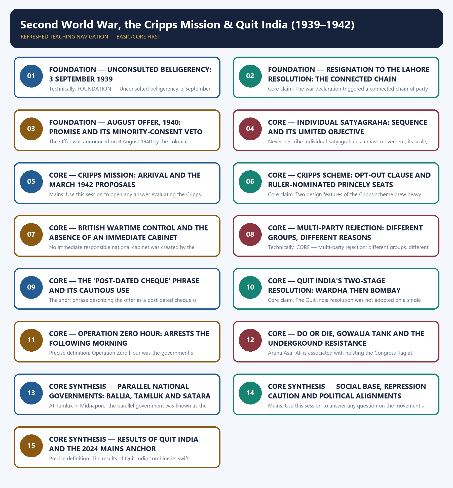

# Second World War, the Cripps Mission & Quit India (1939–1942) - Learner-v2 Complete Learning Session

### SOURCE, PROGRESSION AND CURRENT-LINKAGE AUDIT

- **Repository owners queried:** Basic and Advanced Markdown for this topic, the master chronology, syllabus map and linked Modern History owners.
- **OCR book evidence queried:** The Basic and Advanced owner files were reconciled with the repository's constitutional and political-history OCR sources for the Second World War period, the August Offer, the Cripps Mission and the Quit India Movement; the 'post-dated cheque' quotation is retained only in its shorter, better-attested form.
- **Qdrant:** not used; Markdown plus searchable local PDFs were sufficient.
- **PYQ integrity:** The exact 2024 Mains GS-I Q3 stem is taken verbatim from `knowledge-export/Mains PYQ/UPSC Mains 2024 GS Paper I.md` and cross-confirmed against `_PYQ-ROUTING-MAINS-GS1-GS2-ESSAY-2024-2025.md`. The 2021 Prelims Q43 and 2022 Prelims Q54 entries are recorded as routing-ledger demand summaries from `_PYQ-ROUTING-PRELIMS-2018-2023.md` rather than verbatim stems, and no answer letter is asserted for either because no official stem or key is held locally.
- **Bounded live linkage:** A verified InsightsIAS current-affairs page dated 8 August 2026 on the Quit India Movement is used only as a restrained study-relevance bridge; any incidental claim of an official parliamentary or government tribute could not be independently verified against any official source, so this package treats it strictly as private-website study commentary and makes no claim about any 2026 official or parliamentary tribute.
- **Fact/inference rule:** historical claims are source-backed; analytical judgements are explicitly framed as interpretation and do not invent figures.

## BASIC LEARNING SESSION

### DEEP-REVIEW LEARNING CONTRACT

| Control | Binding rule for this package |
|---|---|
| Syllabus boundary | Complete Modern History Core is taught chronologically and causally before optional enrichment. |
| Evidence method | Claim → named Act/treaty/record/organisation/person/region or scholarly evidence → analysis → qualification. |
| Date discipline | Event, proposal, enactment, commencement, official policy, implementation and later interpretation remain distinct. |
| Historiography | Colonial, nationalist, Marxist, subaltern, Cambridge, feminist and other relevant arguments are attributed and tested, never used as labels alone. |
| Practice contract | Every solved item has demand decoding, an examiner-grade model, an executable answer/compression plan, marks rationale and answer-specific improvement. |
| Approval | This immutable successor remains `approved: false` pending explicit approval. |

**Canonical Basic/Core owner:** `upsc-ai-kit\knowledge\Modern-Indian-History\basic\25_WWII-Cripps-Mission-and-Quit-India.md`  
**Canonical topic owner:** `upsc-ai-kit\knowledge\Modern-Indian-History\basic\25_WWII-Cripps-Mission-and-Quit-India.md`  
**Optional Advanced owner:** `upsc-ai-kit\knowledge\Modern-Indian-History\advanced\25_WWII-Cripps-Mission-and-Quit-India.md`  
**Official syllabus mapping:** `upsc-ai-kit\knowledge\Modern-Indian-History\OFFICIAL-UPSC-SYLLABUS-MAPPING.md`

### EVIDENCE, PYQ AND CURRENT-STATUS CONTROL

- **Official and primary evidence:** Acts, charters, treaties, proclamations, committee reports, proceedings, organisational resolutions, speeches and contemporary records are dated and read for authorship and purpose.
- **Regional and social evidence:** petitions, newspapers, memoirs, local studies and material geography qualify elite or all-India generalisation.
- **Economic and quantitative evidence:** revenue, trade, price, wage, craft and mortality claims retain unit, region, period and uncertainty; statistics are never invented.
- **Scholarly interpretation:** historian schools are competing explanations tied to named evidence, not memorised verdicts.
- **PYQ discipline:** repository ledgers and locally held official papers control wording and metadata; reconstructed wording and unavailable official keys remain explicitly labelled.
- **Current-status note, rechecked 2026-08-31:** A verified InsightsIAS current-affairs page dated 8 August 2026 on the Quit India Movement is used only as a restrained study-relevance bridge; any incidental claim of an official parliamentary or government tribute could not be independently verified against any official source, so this package treats it strictly as private-website study commentary and makes no claim about any 2026 official or parliamentary tribute.

**Live/primary context sources recorded by the predecessor generation:**

- `https://www.insightsonindia.com/2026/08/08/the-quit-india-movement/`




*Distinct embedded teaching-navigation image. The separate continuous Cārvāka-style flowchart package remains an independent at-a-glance artifact.*

### SESSION 1 — FOUNDATION — UNCONSULTED BELLIGERENCY: 3 SEPTEMBER 1939

#### DEFINITION / WHAT THIS IS CALLED

**Plain-language definition:** Precise definition: Unconsulted belligerency refers to the Viceroy's 3 September 1939 declaration of India as a party to the war without any prior consultation of Indian political opinion.

**Technical definition:** Technically, FOUNDATION — Unconsulted belligerency: 3 September 1939 is analysed by relating FOUNDATION to Unconsulted belligerency, then testing the relationship through Precise definition and Topic boundary.

#### ANSWER-GRABBING OPENING — WRITE/ADAPT IN THE EXAM

> Precise definition: Unconsulted belligerency refers to the Viceroy's 3 September 1939 declaration of India as a party to the war without any prior consultation of Indian political opinion.

#### MUST-WRITE KEYWORDS

- **FOUNDATION**
- **Unconsulted belligerency**
- **Precise definition**
- **Topic boundary**
- **Core claim**
- **3 September 1939**

**How to use them:** Frame the answer through FOUNDATION; define Unconsulted belligerency, connect Precise definition with Topic boundary to explain the mechanism, and use Core claim for the decisive comparison or qualification.

##### VISUAL FIRST

```text
UNCONSULTED BELLIGERENCY: 3 SEPTEMBER 1939
3 SEP 1939 -> Britain declares war on Germany
SAME DAY -> Viceroy declares India a belligerent
NO CONSULTATION -> no Indian party, leader or legislature consulted
EFFECT -> unconsulted declaration becomes the immediate political grievance.
```

*The visual fixes this subtopic's chronology, mechanism or boundary before the evidence.*

##### CONCEPT DEFINITIONS

- **Precise definition:** Unconsulted belligerency refers to the Viceroy's 3 September 1939 declaration of India as a party to the war without any prior consultation of Indian political opinion.
- **Topic boundary:** Apply this definition only within Second World War, the Cripps Mission & Quit India (1939–1942); retain the named actor, institution, date and chronological role.

##### CORE EXPLANATION

The Second World War entered Indian politics through a single unilateral act: the Viceroy declared India a belligerent on 3 September 1939 without consulting any Indian political leader or elected legislature.

##### EVIDENCE AND MECHANISM

- The Viceroy's declaration followed Britain's own declaration of war on Germany the same day.
- No Indian political party, leader or elected provincial legislature was consulted before the declaration.
- The absence of consultation, not the war itself, became the immediate political grievance.
- This single unconsulted act set the tone for Congress's response through the following months.

##### EXAMINER CAUTION

- State clearly that India was made a belligerent without consultation; do not imply any Indian legislature endorsed the declaration in advance.

##### EXAM LINK

- **Prelims:** State clearly that India was made a belligerent without consultation; do not imply any Indian legislature endorsed the declaration in advance.
- **Mains:** Open any answer on the origins of wartime political conflict with this exact unconsulted-belligerency fact.

##### MINI RECAP

- **Core claim:** The Second World War entered Indian politics through a single unilateral act: the Viceroy declared India a belligerent on 3 September 1939 without consulting any Indian political leader or elected legislature.
- **Use:** Open any answer on the origins of wartime political conflict with this exact unconsulted-belligerency fact.

#### CLOSING RECALL FLOW — FOUNDATION — UNCONSULTED BELLIGERENCY: 3 SEPTEMBER 1939

```text
START / CONCEPT: FOUNDATION — Unconsulted belligerency: 3 September 1939
        |
        v
EXACT TERMS: FOUNDATION · Unconsulted belligerency · Precise definition · Topic boundary · Core claim · 3 September 1939
        |
        v
MECHANISM / ARGUMENT: The Viceroy's declaration followed Britain's own declaration of war on Germany the same day.
        |
        v
CONSEQUENCE / CONTRAST: The absence of consultation, not the war itself, became the immediate political grievance.
        |
        v
UPSC TRAP / ANSWER-USE: State clearly that India was made a belligerent without consultation; do not imply any Indian legislature endorsed the declaration in advance.
        |
        v
ANSWER-GRABBING FORMULATION: Precise definition: Unconsulted belligerency refers to the Viceroy's 3 September 1939 declaration of India as a party to the war without any prior consultation of Indian political opinion.
```
### SESSION 2 — FOUNDATION — RESIGNATION TO THE LAHORE RESOLUTION: THE CONNECTED CHAIN

#### DEFINITION / WHAT THIS IS CALLED

**Plain-language definition:** Precise definition: The resignation-to-Lahore chain is the linked but separately dated sequence running from the 1939 Congress resignations through Deliverance Day to the March 1940 Lahore Resolution.

**Technical definition:** Core claim: The war declaration triggered a connected chain of party responses — Congress resignation, the League's Deliverance Day, and eventually the Lahore Resolution — that must be read as linked stages, not one flattened event.

#### ANSWER-GRABBING OPENING — WRITE/ADAPT IN THE EXAM

> Core claim: The war declaration triggered a connected chain of party responses — Congress resignation, the League's Deliverance Day, and eventually the Lahore Resolution — that must be read as linked stages, not one flattened event.

#### MUST-WRITE KEYWORDS

- **FOUNDATION**
- **Resignation to the Lahore Resolution**
- **the connected chain**
- **Precise definition**
- **Topic boundary**
- **Core claim**

**How to use them:** Frame the answer through FOUNDATION; define Resignation to the Lahore Resolution, connect the connected chain with Precise definition to explain the mechanism, and use Topic boundary for the decisive comparison or qualification.

##### VISUAL FIRST

```text
RESIGNATION TO THE LAHORE RESOLUTION: THE CONNECTED CHAIN
OCT-NOV 1939 -> Congress ministries resign
22 DEC 1939 -> Muslim League Deliverance Day
MAR 1940 -> Lahore Resolution
RULE -> three connected but separately dated stages, never merged into one.
```

*The visual fixes this subtopic's chronology, mechanism or boundary before the evidence.*

##### CONCEPT DEFINITIONS

- **Precise definition:** The resignation-to-Lahore chain is the linked but separately dated sequence running from the 1939 Congress resignations through Deliverance Day to the March 1940 Lahore Resolution.
- **Topic boundary:** Apply this definition only within Second World War, the Cripps Mission & Quit India (1939–1942); retain the named actor, institution, date and chronological role.

##### CORE EXPLANATION

The war declaration triggered a connected chain of party responses — Congress resignation, the League's Deliverance Day, and eventually the Lahore Resolution — that must be read as linked stages, not one flattened event.

##### EVIDENCE AND MECHANISM

- Congress ministries resigned between October and November 1939 in protest at the unconsulted declaration.
- The Muslim League observed 22 December 1939 as a Deliverance Day marking the resignations.
- The Lahore Resolution followed in March 1940 as a later, connected but distinct development.
- Each stage had its own actor and date; none should be merged into the others.

##### EXAMINER CAUTION

- Keep resignation, Deliverance Day and Lahore as three separately dated stages of one connected chain, not one single event.

##### EXAM LINK

- **Prelims:** Keep resignation, Deliverance Day and Lahore as three separately dated stages of one connected chain, not one single event.
- **Mains:** Use this chain to link the Second World War topic back to the Congress-ministries topic without duplicating its detail.

##### MINI RECAP

- **Core claim:** The war declaration triggered a connected chain of party responses — Congress resignation, the League's Deliverance Day, and eventually the Lahore Resolution — that must be read as linked stages, not one flattened event.
- **Use:** Use this chain to link the Second World War topic back to the Congress-ministries topic without duplicating its detail.

#### CLOSING RECALL FLOW — FOUNDATION — RESIGNATION TO THE LAHORE RESOLUTION: THE CONNECTED CHAIN

```text
START / CONCEPT: FOUNDATION — Resignation to the Lahore Resolution: the connected chain
        |
        v
EXACT TERMS: FOUNDATION · Resignation to the Lahore Resolution · the connected chain · Precise definition · Topic boundary · Core claim
        |
        v
MECHANISM / ARGUMENT: Precise definition: The resignation-to-Lahore chain is the linked but separately dated sequence running from the 1939 Congress resignations through Deliverance Day to the March 1940 Lahore Resolution.
        |
        v
CONSEQUENCE / CONTRAST: The Lahore Resolution followed in March 1940 as a later, connected but distinct development.
        |
        v
UPSC TRAP / ANSWER-USE: Do not miss this limiting distinction: use this chain to link the Second World War topic back to the Congress-ministries...
        |
        v
ANSWER-GRABBING FORMULATION: Core claim: The war declaration triggered a connected chain of party responses — Congress resignation, the League's Deliverance Day, and eventually the Lahore Resolution — that must be read as linked stages, not one flattened event.
```
### SESSION 3 — FOUNDATION — AUGUST OFFER, 1940: PROMISE AND ITS MINORITY-CONSENT VETO

#### DEFINITION / WHAT THIS IS CALLED

**Plain-language definition:** Prelims: Do not describe the August Offer as granting immediate self-government; its constitution-making promise was conditional and deferred to after the war.

**Technical definition:** The Offer was announced on 8 August 1940 by the colonial government.

#### ANSWER-GRABBING OPENING — WRITE/ADAPT IN THE EXAM

> Do not describe the August Offer as granting immediate self-government; its constitution-making promise was conditional and deferred to after the war.

#### MUST-WRITE KEYWORDS

- **FOUNDATION**
- **August Offer**
- **promise**
- **its minority-consent veto**
- **Precise definition**
- **Topic boundary**

**How to use them:** Frame the answer through FOUNDATION; define August Offer, connect promise with its minority-consent veto to explain the mechanism, and use Precise definition for the decisive comparison or qualification.

##### VISUAL FIRST

```text
AUGUST OFFER, 1940: PROMISE AND ITS MINORITY-CONSENT VETO
8 AUG 1940 -> AUGUST OFFER
PROMISE -> expanded, representative body for post-war constitution-making
CONDITION -> no constitution without minority consent (effective veto)
LIMIT -> no immediate national government offered.
```

*The visual fixes this subtopic's chronology, mechanism or boundary before the evidence.*

##### CONCEPT DEFINITIONS

- **Precise definition:** The August Offer was the 8 August 1940 proposal for a more representative post-war constitution-making body, conditioned on minority consent and offering no immediate national government.
- **Topic boundary:** Apply this definition only within Second World War, the Cripps Mission & Quit India (1939–1942); retain the named actor, institution, date and chronological role.

##### CORE EXPLANATION

The August Offer of 8 August 1940 promised an expanded, more representative post-war constitution-making body, but attached a minority-consent condition that functioned as an effective veto and offered no immediate national government.

##### EVIDENCE AND MECHANISM

- The Offer was announced on 8 August 1940 by the colonial government.
- It proposed a more representative body to design a post-war constitution.
- It promised that no future constitution would be adopted without the consent of India's minorities.
- It did not offer any immediate national government during the war itself.

##### EXAMINER CAUTION

- Do not describe the August Offer as granting immediate self-government; its constitution-making promise was conditional and deferred to after the war.

##### EXAM LINK

- **Prelims:** Do not describe the August Offer as granting immediate self-government; its constitution-making promise was conditional and deferred to after the war.
- **Mains:** Use the minority-consent clause to contrast the August Offer with the Cripps proposals two years later.

##### MINI RECAP

- **Core claim:** The August Offer of 8 August 1940 promised an expanded, more representative post-war constitution-making body, but attached a minority-consent condition that functioned as an effective veto and offered no immediate national government.
- **Use:** Use the minority-consent clause to contrast the August Offer with the Cripps proposals two years later.

#### CLOSING RECALL FLOW — FOUNDATION — AUGUST OFFER, 1940: PROMISE AND ITS MINORITY-CONSENT VETO

```text
START / CONCEPT: FOUNDATION — August Offer, 1940: promise and its minority-consent veto
        |
        v
EXACT TERMS: FOUNDATION · August Offer · promise · its minority-consent veto · Precise definition · Topic boundary
        |
        v
MECHANISM / ARGUMENT: The Offer was announced on 8 August 1940 by the colonial government.
        |
        v
CONSEQUENCE / CONTRAST: Mains: Use the minority-consent clause to contrast the August Offer with the Cripps proposals two years later.
        |
        v
UPSC TRAP / ANSWER-USE: Do not miss this limiting distinction: the August Offer was the 8 August 1940 proposal for a more representative post-war...
        |
        v
ANSWER-GRABBING FORMULATION: Do not describe the August Offer as granting immediate self-government; its constitution-making promise was conditional and deferred to after the war.
```
### SESSION 4 — CORE — INDIVIDUAL SATYAGRAHA: SEQUENCE AND ITS LIMITED OBJECTIVE

#### DEFINITION / WHAT THIS IS CALLED

**Plain-language definition:** Core claim: Individual Satyagraha, beginning 17 October 1940, was a deliberately narrow campaign with a named first and second satyagrahi and a limited anti-war free-speech objective, not a mass movement.

**Technical definition:** Never describe Individual Satyagraha as a mass movement; its scale, method and objective were all deliberately limited.

#### ANSWER-GRABBING OPENING — WRITE/ADAPT IN THE EXAM

> Core claim: Individual Satyagraha, beginning 17 October 1940, was a deliberately narrow campaign with a named first and second satyagrahi and a limited anti-war free-speech objective, not a mass movement.

#### MUST-WRITE KEYWORDS

- **Individual Satyagraha**
- **sequence**
- **its limited objective**
- **Precise definition**
- **Topic boundary**
- **Core claim**

**How to use them:** Frame the answer through Individual Satyagraha; define sequence, connect its limited objective with Precise definition to explain the mechanism, and use Topic boundary for the decisive comparison or qualification.

##### VISUAL FIRST

```text
INDIVIDUAL SATYAGRAHA: SEQUENCE AND ITS LIMITED OBJECTIVE
17 OCT 1940 -> Vinoba Bhave, first individual satyagrahi
NEXT -> Jawaharlal Nehru, second individual satyagrahi
METHOD -> individually selected participants court arrest one by one
OBJECTIVE -> limited anti-war free-speech right, not mass civil disobedience.
```

*The visual fixes this subtopic's chronology, mechanism or boundary before the evidence.*

##### CONCEPT DEFINITIONS

- **Precise definition:** Individual Satyagraha was a campaign of individually selected protesters, beginning with Vinoba Bhave on 17 October 1940, pursuing a narrow anti-war free-speech objective.
- **Topic boundary:** Apply this definition only within Second World War, the Cripps Mission & Quit India (1939–1942); retain the named actor, institution, date and chronological role.

##### CORE EXPLANATION

Individual Satyagraha, beginning 17 October 1940, was a deliberately narrow campaign with a named first and second satyagrahi and a limited anti-war free-speech objective, not a mass movement.

##### EVIDENCE AND MECHANISM

- Vinoba Bhave offered individual civil disobedience first, on 17 October 1940.
- Jawaharlal Nehru followed as the second satyagrahi.
- Each participant was individually selected and individually courted arrest rather than acting as part of a crowd.
- The campaign's objective was narrowly the right to publicly oppose India's forced participation in the war.

##### EXAMINER CAUTION

- Never describe Individual Satyagraha as a mass movement; its scale, method and objective were all deliberately limited.

##### EXAM LINK

- **Prelims:** Never describe Individual Satyagraha as a mass movement; its scale, method and objective were all deliberately limited.
- **Mains:** Use this session to contrast the restrained method of Individual Satyagraha with the mass character of Quit India.

##### MINI RECAP

- **Core claim:** Individual Satyagraha, beginning 17 October 1940, was a deliberately narrow campaign with a named first and second satyagrahi and a limited anti-war free-speech objective, not a mass movement.
- **Use:** Use this session to contrast the restrained method of Individual Satyagraha with the mass character of Quit India.

#### CLOSING RECALL FLOW — CORE — INDIVIDUAL SATYAGRAHA: SEQUENCE AND ITS LIMITED OBJECTIVE

```text
START / CONCEPT: CORE — Individual Satyagraha: sequence and its limited objective
        |
        v
EXACT TERMS: Individual Satyagraha · sequence · its limited objective · Precise definition · Topic boundary · Core claim
        |
        v
MECHANISM / ARGUMENT: Never describe Individual Satyagraha as a mass movement; its scale, method and objective were all deliberately limited.
        |
        v
CONSEQUENCE / CONTRAST: Mains: Use this session to contrast the restrained method of Individual Satyagraha with the mass character of Quit India.
        |
        v
UPSC TRAP / ANSWER-USE: Do not miss this limiting distinction: individual Satyagraha was a campaign of individually selected protesters, beginning with Vinoba Bhave on...
        |
        v
ANSWER-GRABBING FORMULATION: Core claim: Individual Satyagraha, beginning 17 October 1940, was a deliberately narrow campaign with a named first and second satyagrahi and a limited anti-war free-speech objective, not a mass movement.
```
### SESSION 5 — CORE — CRIPPS MISSION: ARRIVAL AND THE MARCH 1942 PROPOSALS

#### DEFINITION / WHAT THIS IS CALLED

**Plain-language definition:** Precise definition: The Cripps proposals were the late-March 1942 offer of post-war Dominion status and a post-war constitution-making mechanism, announced after Cripps's arrival in India that same month.

**Technical definition:** Mains: Use this session to open any answer evaluating the Cripps Mission's proposals.

#### ANSWER-GRABBING OPENING — WRITE/ADAPT IN THE EXAM

> State the Cripps proposals as a post-war promise; do not describe them as offering any immediate constitutional change during the war.

#### MUST-WRITE KEYWORDS

- **Cripps Mission**
- **arrival**
- **the March 1942 proposals**
- **Precise definition**
- **Topic boundary**
- **Core claim**

**How to use them:** Frame the answer through Cripps Mission; define arrival, connect the March 1942 proposals with Precise definition to explain the mechanism, and use Topic boundary for the decisive comparison or qualification.

##### VISUAL FIRST

```text
CRIPPS MISSION: ARRIVAL AND THE MARCH 1942 PROPOSALS
MAR 1942 -> Cripps arrives in India
LATE MAR 1942 -> proposals announced
OFFER -> Dominion status after the war + post-war constitution-making body
LIMIT -> no change to India's status during the war itself.
```

*The visual fixes this subtopic's chronology, mechanism or boundary before the evidence.*

##### CONCEPT DEFINITIONS

- **Precise definition:** The Cripps proposals were the late-March 1942 offer of post-war Dominion status and a post-war constitution-making mechanism, announced after Cripps's arrival in India that same month.
- **Topic boundary:** Apply this definition only within Second World War, the Cripps Mission & Quit India (1939–1942); retain the named actor, institution, date and chronological role.

##### CORE EXPLANATION

Sir Stafford Cripps arrived in India in March 1942 and announced proposals offering post-war Dominion status and a constitution-making mechanism, while deferring any change during the war itself.

##### EVIDENCE AND MECHANISM

- Cripps arrived in India in March 1942 amid wartime pressure following Japan's advance.
- His proposals were announced in late March 1942.
- They offered Dominion status for India after the war ended.
- They proposed a constitution-making body to be convened once the war concluded, not immediately.

##### EXAMINER CAUTION

- State the Cripps proposals as a post-war promise; do not describe them as offering any immediate constitutional change during the war.

##### EXAM LINK

- **Prelims:** State the Cripps proposals as a post-war promise; do not describe them as offering any immediate constitutional change during the war.
- **Mains:** Use this session to open any answer evaluating the Cripps Mission's proposals.

##### MINI RECAP

- **Core claim:** Sir Stafford Cripps arrived in India in March 1942 and announced proposals offering post-war Dominion status and a constitution-making mechanism, while deferring any change during the war itself.
- **Use:** Use this session to open any answer evaluating the Cripps Mission's proposals.

#### CLOSING RECALL FLOW — CORE — CRIPPS MISSION: ARRIVAL AND THE MARCH 1942 PROPOSALS

```text
START / CONCEPT: CORE — Cripps Mission: arrival and the March 1942 proposals
        |
        v
EXACT TERMS: Cripps Mission · arrival · the March 1942 proposals · Precise definition · Topic boundary · Core claim
        |
        v
MECHANISM / ARGUMENT: Precise definition: The Cripps proposals were the late-March 1942 offer of post-war Dominion status and a post-war constitution-making mechanism, announced after Cripps's arrival in India that same month.
        |
        v
CONSEQUENCE / CONTRAST: Mains: Use this session to open any answer evaluating the Cripps Mission's proposals.
        |
        v
UPSC TRAP / ANSWER-USE: Do not miss this limiting distinction: his proposals were announced in late March 1942.
        |
        v
ANSWER-GRABBING FORMULATION: State the Cripps proposals as a post-war promise; do not describe them as offering any immediate constitutional change during the war.
```
### SESSION 6 — CORE — CRIPPS SCHEME: OPT-OUT CLAUSE AND RULER-NOMINATED PRINCELY SEATS

#### DEFINITION / WHAT THIS IS CALLED

**Plain-language definition:** Precise definition: The opt-out clause let provinces and princely states decline to join the proposed post-war Indian union, while princely representation in the constitution-making body was by ruler nomination rather than election.

**Technical definition:** Core claim: Two design features of the Cripps scheme drew heavy criticism: provinces and princely states could opt out of the future union, and princely representation would come through ruler nomination, not election.

#### ANSWER-GRABBING OPENING — WRITE/ADAPT IN THE EXAM

> Precise definition: The opt-out clause let provinces and princely states decline to join the proposed post-war Indian union, while princely representation in the constitution-making body was by ruler nomination rather than election.

#### MUST-WRITE KEYWORDS

- **Cripps scheme**
- **opt-out clause**
- **ruler-nominated princely seats**
- **Precise definition**
- **Topic boundary**
- **Core claim**

**How to use them:** Frame the answer through Cripps scheme; define opt-out clause, connect ruler-nominated princely seats with Precise definition to explain the mechanism, and use Topic boundary for the decisive comparison or qualification.

##### VISUAL FIRST

```text
CRIPPS SCHEME: OPT-OUT CLAUSE AND RULER-NOMINATED PRINCELY SEATS
CRIPPS SCHEME: TWO CONTESTED FEATURES
|-- OPT-OUT -> any province or princely state may not join the new union
`-- PRINCELY SEATS -> members nominated by rulers, not popularly elected
EFFECT -> both features fuelled objections from different political groups.
```

*The visual fixes this subtopic's chronology, mechanism or boundary before the evidence.*

##### CONCEPT DEFINITIONS

- **Precise definition:** The opt-out clause let provinces and princely states decline to join the proposed post-war Indian union, while princely representation in the constitution-making body was by ruler nomination rather than election.
- **Topic boundary:** Apply this definition only within Second World War, the Cripps Mission & Quit India (1939–1942); retain the named actor, institution, date and chronological role.

##### CORE EXPLANATION

Two design features of the Cripps scheme drew heavy criticism: provinces and princely states could opt out of the future union, and princely representation would come through ruler nomination, not election.

##### EVIDENCE AND MECHANISM

- Any province could opt out of the new Indian union the constitution-making body might create.
- Any princely state could similarly not accede to that union.
- Princely states would be represented in the constitution-making body by members nominated by their rulers.
- No popularly elected process determined princely representation under this scheme.

##### EXAMINER CAUTION

- State both features precisely: opt-out applied to provinces and princely states, while princely representation was by ruler nomination, not election.

##### EXAM LINK

- **Prelims:** State both features precisely: opt-out applied to provinces and princely states, while princely representation was by ruler nomination, not election.
- **Mains:** Use this session for any question testing the structural objections to the Cripps proposals.

##### MINI RECAP

- **Core claim:** Two design features of the Cripps scheme drew heavy criticism: provinces and princely states could opt out of the future union, and princely representation would come through ruler nomination, not election.
- **Use:** Use this session for any question testing the structural objections to the Cripps proposals.

#### CLOSING RECALL FLOW — CORE — CRIPPS SCHEME: OPT-OUT CLAUSE AND RULER-NOMINATED PRINCELY SEATS

```text
START / CONCEPT: CORE — Cripps scheme: opt-out clause and ruler-nominated princely seats
        |
        v
EXACT TERMS: Cripps scheme · opt-out clause · ruler-nominated princely seats · Precise definition · Topic boundary · Core claim
        |
        v
MECHANISM / ARGUMENT: Core claim: Two design features of the Cripps scheme drew heavy criticism: provinces and princely states could opt out of the future union, and princely representation would come through ruler nomination, not election.
        |
        v
CONSEQUENCE / CONTRAST: State both features precisely: opt-out applied to provinces and princely states, while princely representation was by ruler nomination, not election.
        |
        v
UPSC TRAP / ANSWER-USE: Any princely state could similarly not accede to that union.
        |
        v
ANSWER-GRABBING FORMULATION: Precise definition: The opt-out clause let provinces and princely states decline to join the proposed post-war Indian union, while princely representation in the constitution-making body was by ruler nomination rather than election.
```
### SESSION 7 — CORE — BRITISH WARTIME CONTROL AND THE ABSENCE OF AN IMMEDIATE CABINET

#### DEFINITION / WHAT THIS IS CALLED

**Plain-language definition:** Precise definition: British wartime control refers to the Cripps scheme's retention of defence and overall war conduct under British authority, alongside its offer of no immediate responsible national cabinet.

**Technical definition:** No immediate responsible national cabinet was created by the proposals.

#### ANSWER-GRABBING OPENING — WRITE/ADAPT IN THE EXAM

> Precise definition: British wartime control refers to the Cripps scheme's retention of defence and overall war conduct under British authority, alongside its offer of no immediate responsible national cabinet.

#### MUST-WRITE KEYWORDS

- **British wartime control**
- **the absence of an immediate cabinet**
- **Precise definition**
- **Topic boundary**
- **Core claim**
- **1939–1942**

**How to use them:** Frame the answer through British wartime control; define the absence of an immediate cabinet, connect Precise definition with Topic boundary to explain the mechanism, and use Core claim for the decisive comparison or qualification.

##### VISUAL FIRST

```text
BRITISH WARTIME CONTROL AND THE ABSENCE OF AN IMMEDIATE CABINET
CRIPPS SCHEME: WARTIME REALITY
DEFENCE + WAR CONDUCT -> remain under British control throughout the war
NATIONAL CABINET -> none created immediately
RULE -> a separate objection from the opt-out and princely-nomination features.
```

*The visual fixes this subtopic's chronology, mechanism or boundary before the evidence.*

##### CONCEPT DEFINITIONS

- **Precise definition:** British wartime control refers to the Cripps scheme's retention of defence and overall war conduct under British authority, alongside its offer of no immediate responsible national cabinet.
- **Topic boundary:** Apply this definition only within Second World War, the Cripps Mission & Quit India (1939–1942); retain the named actor, institution, date and chronological role.

##### CORE EXPLANATION

Alongside its post-war promises, the Cripps scheme kept defence and the general conduct of the war firmly under British control and offered no immediate responsible national cabinet.

##### EVIDENCE AND MECHANISM

- Defence and the general conduct of the war remained under British control for the duration of the war.
- No immediate responsible national cabinet was created by the proposals.
- Real executive power during the war stayed with the Viceroy and British authorities.
- This wartime-control feature is distinct from, and additional to, the opt-out and princely-nomination features already covered.

##### EXAMINER CAUTION

- Do not conflate the wartime-control feature with the opt-out clause; they are separate objections to the same proposals.

##### EXAM LINK

- **Prelims:** Do not conflate the wartime-control feature with the opt-out clause; they are separate objections to the same proposals.
- **Mains:** Use this session to complete the list of Cripps-scheme features before analysing why every party rejected them.

##### MINI RECAP

- **Core claim:** Alongside its post-war promises, the Cripps scheme kept defence and the general conduct of the war firmly under British control and offered no immediate responsible national cabinet.
- **Use:** Use this session to complete the list of Cripps-scheme features before analysing why every party rejected them.

#### CLOSING RECALL FLOW — CORE — BRITISH WARTIME CONTROL AND THE ABSENCE OF AN IMMEDIATE CABINET

```text
START / CONCEPT: CORE — British wartime control and the absence of an immediate cabinet
        |
        v
EXACT TERMS: British wartime control · the absence of an immediate cabinet · Precise definition · Topic boundary · Core claim · 1939–1942
        |
        v
MECHANISM / ARGUMENT: No immediate responsible national cabinet was created by the proposals.
        |
        v
CONSEQUENCE / CONTRAST: Do not conflate the wartime-control feature with the opt-out clause; they are separate objections to the same proposals.
        |
        v
UPSC TRAP / ANSWER-USE: Do not miss this limiting distinction: this wartime-control feature is distinct from.
        |
        v
ANSWER-GRABBING FORMULATION: Precise definition: British wartime control refers to the Cripps scheme's retention of defence and overall war conduct under British authority, alongside its offer of no immediate responsible national cabinet.
```
### SESSION 8 — CORE — MULTI-PARTY REJECTION: DIFFERENT GROUPS, DIFFERENT REASONS

#### DEFINITION / WHAT THIS IS CALLED

**Plain-language definition:** Precise definition: Multi-party rejection describes how Congress, the Muslim League, Sikh and Hindu Mahasabha opinion, and some princely opinion each rejected the Cripps proposals for their own distinct reasons.

**Technical definition:** Technically, CORE — Multi-party rejection: different groups, different reasons is analysed by relating Multi-party rejection to different groups, then testing the relationship through different reasons and Precise definition.

#### ANSWER-GRABBING OPENING — WRITE/ADAPT IN THE EXAM

> Precise definition: Multi-party rejection describes how Congress, the Muslim League, Sikh and Hindu Mahasabha opinion, and some princely opinion each rejected the Cripps proposals for their own distinct reasons.

#### MUST-WRITE KEYWORDS

- **Multi-party rejection**
- **different groups**
- **different reasons**
- **Precise definition**
- **Topic boundary**
- **Core claim**

**How to use them:** Frame the answer through Multi-party rejection; define different groups, connect different reasons with Precise definition to explain the mechanism, and use Topic boundary for the decisive comparison or qualification.

##### VISUAL FIRST

```text
MULTI-PARTY REJECTION: DIFFERENT GROUPS, DIFFERENT REASONS
REJECTIONS OF THE CRIPPS PROPOSALS (DISTINCT REASONS)
CONGRESS -> deferred, conditional offer; no immediate responsible government
LEAGUE -> no guarantee of a separate Pakistan
SIKH / HINDU MAHASABHA -> separate minority and communal objections
PRINCELY OPINION -> concerns over opt-out and accession arrangements.
```

*The visual fixes this subtopic's chronology, mechanism or boundary before the evidence.*

##### CONCEPT DEFINITIONS

- **Precise definition:** Multi-party rejection describes how Congress, the Muslim League, Sikh and Hindu Mahasabha opinion, and some princely opinion each rejected the Cripps proposals for their own distinct reasons.
- **Topic boundary:** Apply this definition only within Second World War, the Cripps Mission & Quit India (1939–1942); retain the named actor, institution, date and chronological role.

##### CORE EXPLANATION

Every major political formation rejected the Cripps proposals, but for different, not identical, reasons rooted in each group's own priorities.

##### EVIDENCE AND MECHANISM

- Congress objected to the deferred, conditional nature of the offer and the absence of immediate responsible government.
- The Muslim League objected that the scheme did not guarantee a separate Pakistan.
- Sikh opinion and the Hindu Mahasabha raised separate objections rooted in minority and communal concerns.
- Some princely opinion objected to aspects of the proposed opt-out and accession arrangements.

##### EXAMINER CAUTION

- Never present the rejection as uniform; name each group's distinct reason separately.

##### EXAM LINK

- **Prelims:** Never present the rejection as uniform; name each group's distinct reason separately.
- **Mains:** Use this session for any 'why did the Cripps Mission fail' question that expects differentiated party reasoning.

##### MINI RECAP

- **Core claim:** Every major political formation rejected the Cripps proposals, but for different, not identical, reasons rooted in each group's own priorities.
- **Use:** Use this session for any 'why did the Cripps Mission fail' question that expects differentiated party reasoning.

#### CLOSING RECALL FLOW — CORE — MULTI-PARTY REJECTION: DIFFERENT GROUPS, DIFFERENT REASONS

```text
START / CONCEPT: CORE — Multi-party rejection: different groups, different reasons
        |
        v
EXACT TERMS: Multi-party rejection · different groups · different reasons · Precise definition · Topic boundary · Core claim
        |
        v
MECHANISM / ARGUMENT: Mains: Use this session for any 'why did the Cripps Mission fail' question that expects differentiated party reasoning.
        |
        v
CONSEQUENCE / CONTRAST: The resulting consequence is that multi-party rejection describes how Congress, the Muslim League, Sikh and Hindu Mahasabha opinion.
        |
        v
UPSC TRAP / ANSWER-USE: Do not miss this limiting distinction: multi-party rejection describes how Congress, the Muslim League, Sikh and Hindu Mahasabha opinion.
        |
        v
ANSWER-GRABBING FORMULATION: Precise definition: Multi-party rejection describes how Congress, the Muslim League, Sikh and Hindu Mahasabha opinion, and some princely opinion each rejected the Cripps proposals for their own distinct reasons.
```
### SESSION 9 — CORE — THE 'POST-DATED CHEQUE' PHRASE AND ITS CAUTIOUS USE

#### DEFINITION / WHAT THIS IS CALLED

**Plain-language definition:** Precise definition: The post-dated cheque phrase is Gandhi's characterisation of the Cripps proposals as a promise deferred to an uncertain future, retained here only in its shorter, better-attested form.

**Technical definition:** The short phrase describing the offer as a post-dated cheque is widely and reliably quoted.

#### ANSWER-GRABBING OPENING — WRITE/ADAPT IN THE EXAM

> Precise definition: The post-dated cheque phrase is Gandhi's characterisation of the Cripps proposals as a promise deferred to an uncertain future, retained here only in its shorter, better-attested form.

#### MUST-WRITE KEYWORDS

- **The 'post-dated cheque' phrase**
- **its cautious use**
- **Precise definition**
- **Topic boundary**
- **Core claim**
- **1939–1942**

**How to use them:** Frame the answer through The 'post-dated cheque' phrase; define its cautious use, connect Precise definition with Topic boundary to explain the mechanism, and use Core claim for the decisive comparison or qualification.

##### VISUAL FIRST

```text
THE 'POST-DATED CHEQUE' PHRASE AND ITS CAUTIOUS USE
GANDHI ON THE CRIPPS PROPOSALS
SHORT PHRASE -> "post-dated cheque" -> well attested, safe to use
LONGER VERSION -> adds a crashing bank -> provenance uncertain, use cautiously
RULE -> applies to Cripps only, never to the 1940 August Offer.
```

*The visual fixes this subtopic's chronology, mechanism or boundary before the evidence.*

##### CONCEPT DEFINITIONS

- **Precise definition:** The post-dated cheque phrase is Gandhi's characterisation of the Cripps proposals as a promise deferred to an uncertain future, retained here only in its shorter, better-attested form.
- **Topic boundary:** Apply this definition only within Second World War, the Cripps Mission & Quit India (1939–1942); retain the named actor, institution, date and chronological role.

##### CORE EXPLANATION

Gandhi's remark on the Cripps proposals is best used in its shorter, better-attested form; the longer version adding a crashing bank carries uncertain provenance and should be used only with that caveat.

##### EVIDENCE AND MECHANISM

- The short phrase describing the offer as a post-dated cheque is widely and reliably quoted.
- A longer version adding a crashing bank is commonly repeated but its exact wording and occasion are less certain.
- This package therefore uses only the shorter phrase as safely attested.
- The phrase applies specifically to the Cripps proposals, never to the earlier August Offer.

##### EXAMINER CAUTION

- Use only the shorter post-dated cheque phrase; do not present the longer crashing-bank version as certainly authentic, and never apply the phrase to the August Offer.

##### EXAM LINK

- **Prelims:** Use only the shorter post-dated cheque phrase; do not present the longer crashing-bank version as certainly authentic, and never apply the phrase to the August Offer.
- **Mains:** Use this session whenever a question invites a quotation characterising the Cripps Mission's failure.

##### MINI RECAP

- **Core claim:** Gandhi's remark on the Cripps proposals is best used in its shorter, better-attested form; the longer version adding a crashing bank carries uncertain provenance and should be used only with that caveat.
- **Use:** Use this session whenever a question invites a quotation characterising the Cripps Mission's failure.

#### CLOSING RECALL FLOW — CORE — THE 'POST-DATED CHEQUE' PHRASE AND ITS CAUTIOUS USE

```text
START / CONCEPT: CORE — The 'post-dated cheque' phrase and its cautious use
        |
        v
EXACT TERMS: The 'post-dated cheque' phrase · its cautious use · Precise definition · Topic boundary · Core claim · 1939–1942
        |
        v
MECHANISM / ARGUMENT: The short phrase describing the offer as a post-dated cheque is widely and reliably quoted.
        |
        v
CONSEQUENCE / CONTRAST: Use only the shorter post-dated cheque phrase; do not present the longer crashing-bank version as certainly authentic, and never apply the phrase to the August Offer.
        |
        v
UPSC TRAP / ANSWER-USE: Do not miss this limiting distinction: this package therefore uses only the shorter phrase as safely attested.
        |
        v
ANSWER-GRABBING FORMULATION: Precise definition: The post-dated cheque phrase is Gandhi's characterisation of the Cripps proposals as a promise deferred to an uncertain future, retained here only in its shorter, better-attested form.
```
### SESSION 10 — CORE — QUIT INDIA'S TWO-STAGE RESOLUTION: WARDHA THEN BOMBAY

#### DEFINITION / WHAT THIS IS CALLED

**Plain-language definition:** Precise definition: The two-stage Quit India resolution is the sequence in which the Congress Working Committee approved the resolution at Wardha on 14 July 1942 before the All-India Congress Committee ratified it at Bombay on 8 August 1942.

**Technical definition:** Core claim: The Quit India resolution was not adopted on a single date; it passed through two distinct stages, first at Wardha and then at Bombay, each with its own body and date.

#### ANSWER-GRABBING OPENING — WRITE/ADAPT IN THE EXAM

> Precise definition: The two-stage Quit India resolution is the sequence in which the Congress Working Committee approved the resolution at Wardha on 14 July 1942 before the All-India Congress Committee ratified it at Bombay on 8 August 1942.

#### MUST-WRITE KEYWORDS

- **Quit India's two-stage resolution**
- **Wardha then Bombay**
- **Precise definition**
- **Topic boundary**
- **Core claim**
- **1939–1942**

**How to use them:** Frame the answer through Quit India's two-stage resolution; define Wardha then Bombay, connect Precise definition with Topic boundary to explain the mechanism, and use Core claim for the decisive comparison or qualification.

##### VISUAL FIRST

```text
QUIT INDIA'S TWO-STAGE RESOLUTION: WARDHA THEN BOMBAY
14 JUL 1942, WARDHA -> Congress Working Committee approves resolution
8 AUG 1942, BOMBAY -> All-India Congress Committee ratifies resolution
RULE -> two distinct bodies and dates; never collapse into a single date.
```

*The visual fixes this subtopic's chronology, mechanism or boundary before the evidence.*

##### CONCEPT DEFINITIONS

- **Precise definition:** The two-stage Quit India resolution is the sequence in which the Congress Working Committee approved the resolution at Wardha on 14 July 1942 before the All-India Congress Committee ratified it at Bombay on 8 August 1942.
- **Topic boundary:** Apply this definition only within Second World War, the Cripps Mission & Quit India (1939–1942); retain the named actor, institution, date and chronological role.

##### CORE EXPLANATION

The Quit India resolution was not adopted on a single date; it passed through two distinct stages, first at Wardha and then at Bombay, each with its own body and date.

##### EVIDENCE AND MECHANISM

- The Congress Working Committee approved the resolution at Wardha on 14 July 1942.
- The All-India Congress Committee ratified it at Bombay on 8 August 1942.
- Wardha and Bombay involved different Congress bodies, not the same one meeting twice.
- Collapsing the two dates into one loses an exam-tested distinction.

##### EXAMINER CAUTION

- Always name both the Wardha (14 July 1942) and Bombay (8 August 1942) stages separately; never state a single date for the resolution.

##### EXAM LINK

- **Prelims:** Always name both the Wardha (14 July 1942) and Bombay (8 August 1942) stages separately; never state a single date for the resolution.
- **Mains:** Use this two-stage sequence to open any answer on the immediate lead-up to Quit India.

##### MINI RECAP

- **Core claim:** The Quit India resolution was not adopted on a single date; it passed through two distinct stages, first at Wardha and then at Bombay, each with its own body and date.
- **Use:** Use this two-stage sequence to open any answer on the immediate lead-up to Quit India.

#### CLOSING RECALL FLOW — CORE — QUIT INDIA'S TWO-STAGE RESOLUTION: WARDHA THEN BOMBAY

```text
START / CONCEPT: CORE — Quit India's two-stage resolution: Wardha then Bombay
        |
        v
EXACT TERMS: Quit India's two-stage resolution · Wardha then Bombay · Precise definition · Topic boundary · Core claim · 1939–1942
        |
        v
MECHANISM / ARGUMENT: Core claim: The Quit India resolution was not adopted on a single date; it passed through two distinct stages, first at Wardha and then at Bombay, each with its own body and date.
        |
        v
CONSEQUENCE / CONTRAST: Mains: Use this two-stage sequence to open any answer on the immediate lead-up to Quit India.
        |
        v
UPSC TRAP / ANSWER-USE: Do not miss this limiting distinction: the Quit India resolution was not adopted on a single date.
        |
        v
ANSWER-GRABBING FORMULATION: Precise definition: The two-stage Quit India resolution is the sequence in which the Congress Working Committee approved the resolution at Wardha on 14 July 1942 before the All-India Congress Committee ratified it at Bombay on 8 August 1942.
```
### SESSION 11 — CORE — OPERATION ZERO HOUR: ARRESTS THE FOLLOWING MORNING

#### DEFINITION / WHAT THIS IS CALLED

**Plain-language definition:** The sequence, rather than a claimed 24-hour interval, is the frequently tested precise detail.

**Technical definition:** Precise definition: Operation Zero Hour was the government's mass-arrest operation against Congress leadership, beginning in the early hours of 9 August 1942, the morning after the Bombay resolution.

#### ANSWER-GRABBING OPENING — WRITE/ADAPT IN THE EXAM

> This was the following morning and calendar day after the AICC's 8 August 1942 Bombay ratification, not a full 24 hours later.

#### MUST-WRITE KEYWORDS

- **Operation Zero Hour**
- **arrests the following morning**
- **Precise definition**
- **Topic boundary**
- **Core claim**
- **1939–1942**

**How to use them:** Frame the answer through Operation Zero Hour; define arrests the following morning, connect Precise definition with Topic boundary to explain the mechanism, and use Core claim for the decisive comparison or qualification.

##### VISUAL FIRST

```text
OPERATION ZERO HOUR: ARRESTS THE FOLLOWING MORNING
8 AUG 1942 -> AICC ratifies Quit India resolution at Bombay
9 AUG 1942 (early hours) -> Operation Zero Hour: mass arrests begin
INTERVAL -> within hours, on the following calendar day
RULE -> preserve the sequence without claiming a full 24-hour gap.
```

*The visual fixes this subtopic's chronology, mechanism or boundary before the evidence.*

##### CONCEPT DEFINITIONS

- **Precise definition:** Operation Zero Hour was the government's mass-arrest operation against Congress leadership, beginning in the early hours of 9 August 1942, the morning after the Bombay resolution.
- **Topic boundary:** Apply this definition only within Second World War, the Cripps Mission & Quit India (1939–1942); retain the named actor, institution, date and chronological role.

##### CORE EXPLANATION

The government's mass-arrest operation, referred to as Operation Zero Hour, began early on 9 August 1942, within hours of the 8 August Bombay ratification and on the following calendar day.

##### EVIDENCE AND MECHANISM

- Arrests of senior Congress leaders began in the early hours of 9 August 1942.
- This was the following morning and calendar day after the AICC's 8 August 1942 Bombay ratification, not a full 24 hours later.
- The government acted pre-emptively to decapitate Congress leadership before mass mobilisation could organise.
- The sequence, rather than a claimed 24-hour interval, is the frequently tested precise detail.

##### EXAMINER CAUTION

- State the arrests as beginning in the early hours of 9 August 1942, the following morning after the 8 August resolution.

##### EXAM LINK

- **Prelims:** State the arrests as beginning in the early hours of 9 August 1942, the following morning after the 8 August resolution.
- **Mains:** Use this exact following-morning sequence whenever a question tests the precise sequence around the Quit India resolution's passage.

##### MINI RECAP

- **Core claim:** The government's mass-arrest operation, referred to as Operation Zero Hour, began early on 9 August 1942, within hours of the 8 August Bombay ratification and on the following calendar day.
- **Use:** Use this exact following-morning sequence whenever a question tests the precise sequence around the Quit India resolution's passage.

#### CLOSING RECALL FLOW — CORE — OPERATION ZERO HOUR: ARRESTS THE FOLLOWING MORNING

```text
START / CONCEPT: CORE — Operation Zero Hour: arrests the following morning
        |
        v
EXACT TERMS: Operation Zero Hour · arrests the following morning · Precise definition · Topic boundary · Core claim · 1939–1942
        |
        v
MECHANISM / ARGUMENT: Precise definition: Operation Zero Hour was the government's mass-arrest operation against Congress leadership, beginning in the early hours of 9 August 1942, the morning after the Bombay resolution.
        |
        v
CONSEQUENCE / CONTRAST: The sequence, rather than a claimed 24-hour interval, is the frequently tested precise detail.
        |
        v
UPSC TRAP / ANSWER-USE: Do not miss this limiting distinction: the government acted pre-emptively to decapitate Congress leadership before mass mobilisation could organise.
        |
        v
ANSWER-GRABBING FORMULATION: This was the following morning and calendar day after the AICC's 8 August 1942 Bombay ratification, not a full 24 hours later.
```
### SESSION 12 — CORE — DO OR DIE, GOWALIA TANK AND THE UNDERGROUND RESISTANCE

#### DEFINITION / WHAT THIS IS CALLED

**Plain-language definition:** Precise definition: The underground Quit India leadership refers to figures such as Aruna Asaf Ali at Gowalia Tank, Usha Mehta's Congress Radio, and Jayaprakash Narayan with Ram Manohar Lohia, who sustained the movement after the arrests.

**Technical definition:** Aruna Asaf Ali is associated with hoisting the Congress flag at Gowalia Tank in Bombay after the leaders' arrest.

#### ANSWER-GRABBING OPENING — WRITE/ADAPT IN THE EXAM

> Aruna Asaf Ali is associated with hoisting the Congress flag at Gowalia Tank in Bombay after the leaders' arrest.

#### MUST-WRITE KEYWORDS

- **Do or Die**
- **Gowalia Tank**
- **the underground resistance**
- **Precise definition**
- **Topic boundary**
- **Core claim**

**How to use them:** Frame the answer through Do or Die; define Gowalia Tank, connect the underground resistance with Precise definition to explain the mechanism, and use Topic boundary for the decisive comparison or qualification.

##### VISUAL FIRST

```text
DO OR DIE, GOWALIA TANK AND THE UNDERGROUND RESISTANCE
8 AUG 1942 -> Gandhi's "Do or Die" call, before his arrest
GOWALIA TANK, BOMBAY -> Aruna Asaf Ali hoists the Congress flag
UNDERGROUND -> Usha Mehta's secret Congress Radio
UNDERGROUND -> Jayaprakash Narayan and Ram Manohar Lohia organise resistance.
```

*The visual fixes this subtopic's chronology, mechanism or boundary before the evidence.*

##### CONCEPT DEFINITIONS

- **Precise definition:** The underground Quit India leadership refers to figures such as Aruna Asaf Ali at Gowalia Tank, Usha Mehta's Congress Radio, and Jayaprakash Narayan with Ram Manohar Lohia, who sustained the movement after the arrests.
- **Topic boundary:** Apply this definition only within Second World War, the Cripps Mission & Quit India (1939–1942); retain the named actor, institution, date and chronological role.

##### CORE EXPLANATION

After the leadership's arrest, the movement's public symbols and its underground continuation both trace to specific named individuals rather than an anonymous crowd.

##### EVIDENCE AND MECHANISM

- Gandhi's 8 August 1942 call to 'Do or Die' set the movement's defiant tone before his own arrest.
- Aruna Asaf Ali is associated with hoisting the Congress flag at Gowalia Tank in Bombay after the leaders' arrest.
- Usha Mehta ran secret Congress Radio broadcasts to keep the movement's message alive underground.
- Jayaprakash Narayan and Ram Manohar Lohia organised clandestine resistance networks after most senior leaders were arrested.

##### EXAMINER CAUTION

- Name each individual precisely — Gandhi, Aruna Asaf Ali, Usha Mehta, Jayaprakash Narayan, Ram Manohar Lohia — rather than describing the underground movement generically.

##### EXAM LINK

- **Prelims:** Name each individual precisely — Gandhi, Aruna Asaf Ali, Usha Mehta, Jayaprakash Narayan, Ram Manohar Lohia — rather than describing the underground movement generically.
- **Mains:** Use these named figures whenever a question asks for specific individuals associated with Quit India's leadership vacuum.

##### MINI RECAP

- **Core claim:** After the leadership's arrest, the movement's public symbols and its underground continuation both trace to specific named individuals rather than an anonymous crowd.
- **Use:** Use these named figures whenever a question asks for specific individuals associated with Quit India's leadership vacuum.

#### CLOSING RECALL FLOW — CORE — DO OR DIE, GOWALIA TANK AND THE UNDERGROUND RESISTANCE

```text
START / CONCEPT: CORE — Do or Die, Gowalia Tank and the underground resistance
        |
        v
EXACT TERMS: Do or Die · Gowalia Tank · the underground resistance · Precise definition · Topic boundary · Core claim
        |
        v
MECHANISM / ARGUMENT: Precise definition: The underground Quit India leadership refers to figures such as Aruna Asaf Ali at Gowalia Tank, Usha Mehta's Congress Radio, and Jayaprakash Narayan with Ram Manohar Lohia, who sustained the movement after the arrests.
        |
        v
CONSEQUENCE / CONTRAST: Jayaprakash Narayan and Ram Manohar Lohia organised clandestine resistance networks after most senior leaders were arrested.
        |
        v
UPSC TRAP / ANSWER-USE: Do not miss this limiting distinction: gandhi's 8 August 1942 call to 'Do or Die' set the movement's defiant tone...
        |
        v
ANSWER-GRABBING FORMULATION: Aruna Asaf Ali is associated with hoisting the Congress flag at Gowalia Tank in Bombay after the leaders' arrest.
```
### SESSION 13 — CORE SYNTHESIS — PARALLEL NATIONAL GOVERNMENTS: BALLIA, TAMLUK AND SATARA

#### DEFINITION / WHAT THIS IS CALLED

**Plain-language definition:** Precise definition: Parallel national governments were locally declared alternative administrations during Quit India, including Ballia, the Jatiya Sarkar at Tamluk in Midnapore, and the Prati Sarkar at Satara.

**Technical definition:** At Tamluk in Midnapore, the parallel government was known as the Jatiya Sarkar.

#### ANSWER-GRABBING OPENING — WRITE/ADAPT IN THE EXAM

> Precise definition: Parallel national governments were locally declared alternative administrations during Quit India, including Ballia, the Jatiya Sarkar at Tamluk in Midnapore, and the Prati Sarkar at Satara.

#### MUST-WRITE KEYWORDS

- **CORE SYNTHESIS**
- **Parallel national governments**
- **Ballia**
- **Tamluk**
- **Satara**
- **Precise definition**

**How to use them:** Frame the answer through CORE SYNTHESIS; define Parallel national governments, connect Ballia with Tamluk to explain the mechanism, and use Satara for the decisive comparison or qualification.

##### VISUAL FIRST

```text
PARALLEL NATIONAL GOVERNMENTS: BALLIA, TAMLUK AND SATARA
PARALLEL NATIONAL GOVERNMENTS DURING QUIT INDIA
BALLIA -> parallel government declared
TAMLUK (MIDNAPORE) -> Jatiya Sarkar
SATARA -> Prati Sarkar
RULE -> three distinct sites, names and durations; never treat as identical.
```

*The visual fixes this subtopic's chronology, mechanism or boundary before the evidence.*

##### CONCEPT DEFINITIONS

- **Precise definition:** Parallel national governments were locally declared alternative administrations during Quit India, including Ballia, the Jatiya Sarkar at Tamluk in Midnapore, and the Prati Sarkar at Satara.
- **Topic boundary:** Apply this definition only within Second World War, the Cripps Mission & Quit India (1939–1942); retain the named actor, institution, date and chronological role.

##### CORE EXPLANATION

In three separate localities, Quit India produced short-lived parallel national governments, each with its own name and its own distinct duration.

##### EVIDENCE AND MECHANISM

- A parallel government was declared at Ballia.
- At Tamluk in Midnapore, the parallel government was known as the Jatiya Sarkar.
- At Satara, the parallel government was known as the Prati Sarkar.
- Each of the three survived for a different length of time before being suppressed or wound down.

##### EXAMINER CAUTION

- Name each parallel government's location and, where named, its title; do not treat all three as identical in duration or character.

##### EXAM LINK

- **Prelims:** Name each parallel government's location and, where named, its title; do not treat all three as identical in duration or character.
- **Mains:** Use this session for any question naming specific parallel-government sites during Quit India.

##### MINI RECAP

- **Core claim:** In three separate localities, Quit India produced short-lived parallel national governments, each with its own name and its own distinct duration.
- **Use:** Use this session for any question naming specific parallel-government sites during Quit India.

#### CLOSING RECALL FLOW — CORE SYNTHESIS — PARALLEL NATIONAL GOVERNMENTS: BALLIA, TAMLUK AND SATARA

```text
START / CONCEPT: CORE SYNTHESIS — Parallel national governments: Ballia, Tamluk and Satara
        |
        v
EXACT TERMS: CORE SYNTHESIS · Parallel national governments · Ballia · Tamluk · Satara · Precise definition
        |
        v
MECHANISM / ARGUMENT: At Tamluk in Midnapore, the parallel government was known as the Jatiya Sarkar.
        |
        v
CONSEQUENCE / CONTRAST: At Satara, the parallel government was known as the Prati Sarkar.
        |
        v
UPSC TRAP / ANSWER-USE: Name each parallel government's location and, where named, its title; do not treat all three as identical in duration or character.
        |
        v
ANSWER-GRABBING FORMULATION: Precise definition: Parallel national governments were locally declared alternative administrations during Quit India, including Ballia, the Jatiya Sarkar at Tamluk in Midnapore, and the Prati Sarkar at Satara.
```
### SESSION 14 — CORE SYNTHESIS — SOCIAL BASE, REPRESSION CAUTION AND POLITICAL ALIGNMENTS

#### DEFINITION / WHAT THIS IS CALLED

**Plain-language definition:** Quit India drew a genuinely broad social base and regionally varied intensity, faced harsh repression that must be stated cautiously, and saw distinctly different political groups align in different ways.

**Technical definition:** Mains: Use this session to answer any question on the movement's social composition, methods or the stance of non-Congress political groups.

#### ANSWER-GRABBING OPENING — WRITE/ADAPT IN THE EXAM

> Quit India drew a genuinely broad social base and regionally varied intensity, faced harsh repression that must be stated cautiously, and saw distinctly different political groups align in different ways.

#### MUST-WRITE KEYWORDS

- **CORE SYNTHESIS**
- **Social base**
- **repression caution**
- **political alignments**
- **Precise definition**
- **Topic boundary**

**How to use them:** Frame the answer through CORE SYNTHESIS; define Social base, connect repression caution with political alignments to explain the mechanism, and use Precise definition for the decisive comparison or qualification.

##### VISUAL FIRST

```text
SOCIAL BASE, REPRESSION CAUTION AND POLITICAL ALIGNMENTS
QUIT INDIA: BASE, METHOD AND ALIGNMENTS
BASE -> students, workers, peasants; regionally variable intensity
METHOD -> sabotage alongside Congress's own non-violent creed
REPRESSION -> harsh; no unsupported exact casualty/arrest total stated
ALIGNMENTS -> League aloof/opposed; CPI People's War line; Mahasabha/princes distant.
```

*The visual fixes this subtopic's chronology, mechanism or boundary before the evidence.*

##### CONCEPT DEFINITIONS

- **Precise definition:** The movement's social base and political alignments refer to its broad but regionally variable student-worker-peasant participation alongside the distinct, non-uniform stances of the League, the CPI, the Hindu Mahasabha and princely rulers.
- **Topic boundary:** Apply this definition only within Second World War, the Cripps Mission & Quit India (1939–1942); retain the named actor, institution, date and chronological role.

##### CORE EXPLANATION

Quit India drew a genuinely broad social base and regionally varied intensity, faced harsh repression that must be stated cautiously, and saw distinctly different political groups align in different ways.

##### EVIDENCE AND MECHANISM

- Students, workers and peasants all participated, with intensity varying by region.
- The movement combined sabotage of communication lines with Congress's own official non-violent creed.
- Repression was harsh, but this package avoids stating unsupported exact casualty or arrest totals.
- The Muslim League stayed aloof from or opposed the movement, the Communist Party of India followed a People's War line after June 1941, and the Hindu Mahasabha and many princely rulers remained distant.

##### EXAMINER CAUTION

- Never assert a specific unqualified casualty or arrest figure; state repression as harsh without an invented total.

##### EXAM LINK

- **Prelims:** Never assert a specific unqualified casualty or arrest figure; state repression as harsh without an invented total.
- **Mains:** Use this session to answer any question on the movement's social composition, methods or the stance of non-Congress political groups.

##### MINI RECAP

- **Core claim:** Quit India drew a genuinely broad social base and regionally varied intensity, faced harsh repression that must be stated cautiously, and saw distinctly different political groups align in different ways.
- **Use:** Use this session to answer any question on the movement's social composition, methods or the stance of non-Congress political groups.

#### CLOSING RECALL FLOW — CORE SYNTHESIS — SOCIAL BASE, REPRESSION CAUTION AND POLITICAL ALIGNMENTS

```text
START / CONCEPT: CORE SYNTHESIS — Social base, repression caution and political alignments
        |
        v
EXACT TERMS: CORE SYNTHESIS · Social base · repression caution · political alignments · Precise definition · Topic boundary
        |
        v
MECHANISM / ARGUMENT: Mains: Use this session to answer any question on the movement's social composition, methods or the stance of non-Congress political groups.
        |
        v
CONSEQUENCE / CONTRAST: Repression was harsh, but this package avoids stating unsupported exact casualty or arrest totals.
        |
        v
UPSC TRAP / ANSWER-USE: Do not miss this limiting distinction: the Muslim League stayed aloof from or opposed the movement, the Communist Party of...
        |
        v
ANSWER-GRABBING FORMULATION: Quit India drew a genuinely broad social base and regionally varied intensity, faced harsh repression that must be stated cautiously, and saw distinctly different political groups align in different ways.
```
### SESSION 15 — CORE SYNTHESIS — RESULTS OF QUIT INDIA AND THE 2024 MAINS ANCHOR

#### DEFINITION / WHAT THIS IS CALLED

**Plain-language definition:** Mains: Use this session as the closing anchor for any full narrative answer on the origins and results of Quit India.

**Technical definition:** Precise definition: The results of Quit India combine its swift government suppression within months with its lasting demonstration of popular anti-colonial sentiment, without the movement alone securing independence.

#### ANSWER-GRABBING OPENING — WRITE/ADAPT IN THE EXAM

> Core claim: Quit India was suppressed within months, and it did not by itself win independence, but it demonstrated the depth of popular anti-colonial sentiment — exactly the balance a verified 2024 Mains question asks candidates to strike.

#### MUST-WRITE KEYWORDS

- **CORE SYNTHESIS**
- **Results of Quit India**
- **the 2024 Mains anchor**
- **Precise definition**
- **Topic boundary**
- **Core claim**

**How to use them:** Frame the answer through CORE SYNTHESIS; define Results of Quit India, connect the 2024 Mains anchor with Precise definition to explain the mechanism, and use Topic boundary for the decisive comparison or qualification.

##### VISUAL FIRST

```text
RESULTS OF QUIT INDIA AND THE 2024 MAINS ANCHOR
QUIT INDIA: RESULTS
IMMEDIATE -> suppressed within months by mass arrests and force
NOT ACHIEVED -> independence was not secured by the movement alone
LASTING SIGNIFICANCE -> demonstrated depth of popular anti-colonial sentiment
ANCHOR -> 2024 Mains GS-I Q3 asks for events leading to Quit India and its results.
```

*The visual fixes this subtopic's chronology, mechanism or boundary before the evidence.*

##### CONCEPT DEFINITIONS

- **Precise definition:** The results of Quit India combine its swift government suppression within months with its lasting demonstration of popular anti-colonial sentiment, without the movement alone securing independence.
- **Topic boundary:** Apply this definition only within Second World War, the Cripps Mission & Quit India (1939–1942); retain the named actor, institution, date and chronological role.

##### CORE EXPLANATION

Quit India was suppressed within months, and it did not by itself win independence, but it demonstrated the depth of popular anti-colonial sentiment — exactly the balance a verified 2024 Mains question asks candidates to strike.

##### EVIDENCE AND MECHANISM

- The government suppressed the movement within months through mass arrests and force.
- The movement did not by itself secure India's independence.
- It nonetheless demonstrated the depth and breadth of popular anti-colonial sentiment across regions and social groups.
- A verified 2024 Mains GS-I question asks what events led to the Quit India Movement and what its results were.

##### EXAMINER CAUTION

- State the results with both halves together: swift suppression and no immediate independence, alongside lasting demonstration of popular sentiment.

##### EXAM LINK

- **Prelims:** State the results with both halves together: swift suppression and no immediate independence, alongside lasting demonstration of popular sentiment.
- **Mains:** Use this session as the closing anchor for any full narrative answer on the origins and results of Quit India.

##### MINI RECAP

- **Core claim:** Quit India was suppressed within months, and it did not by itself win independence, but it demonstrated the depth of popular anti-colonial sentiment — exactly the balance a verified 2024 Mains question asks candidates to strike.
- **Use:** Use this session as the closing anchor for any full narrative answer on the origins and results of Quit India.

#### CLOSING RECALL FLOW — CORE SYNTHESIS — RESULTS OF QUIT INDIA AND THE 2024 MAINS ANCHOR

```text
START / CONCEPT: CORE SYNTHESIS — Results of Quit India and the 2024 Mains anchor
        |
        v
EXACT TERMS: CORE SYNTHESIS · Results of Quit India · the 2024 Mains anchor · Precise definition · Topic boundary · Core claim
        |
        v
MECHANISM / ARGUMENT: Mains: Use this session as the closing anchor for any full narrative answer on the origins and results of Quit India.
        |
        v
CONSEQUENCE / CONTRAST: Precise definition: The results of Quit India combine its swift government suppression within months with its lasting demonstration of popular anti-colonial sentiment, without the movement alone securing independence.
        |
        v
UPSC TRAP / ANSWER-USE: Do not miss this limiting distinction: a verified 2024 Mains GS-I question asks what events led to the Quit India...
        |
        v
ANSWER-GRABBING FORMULATION: Core claim: Quit India was suppressed within months, and it did not by itself win independence, but it demonstrated the depth of popular anti-colonial sentiment — exactly the balance a verified 2024 Mains question asks candidates to strike.
```
### MODERN HISTORY DEEP-REVIEW CORE CONTROL

- **Must remember:** India was declared at war on 3 September 1939; the August Offer, Individual Satyagraha, Cripps Mission of March-April 1942 and Quit India resolution of 8 August 1942 were different constitutional-political moments.
- **Close distinction:** Cripps offered a post-war constitution-making route with a provincial non-accession option, not immediate full independence; Quit India combined central arrests with decentralised underground and parallel action.
- **Evidence / interpretation limit:** Official repression records, underground communications, local rebellions and the 1943 Bengal famine context qualify both leaderless-chaos and perfectly coordinated-revolution narratives.

## BASIC MCQS / REMEDIATION

### Q1. Which statement correctly identifies Unconsulted belligerency, 3 September 1939?

A. The Viceroy declared war on Germany on 3 September 1939; the Viceroy simultaneously declared India a belligerent without consulting any Indian political leader or elected legislature.
B. The August Offer of 8 August 1940 proposed an expanded, more representative body for post-war constitution-making and promised that minority views would be given full weight, but it did not offer an immediate national government.
C. The August Offer's constitution-making promise carried a minority-consent condition: no future constitution would be adopted without the consent of India's minorities, giving minority communities an effective veto over any post-war settlement.
D. Congress ministries resigned between October and November 1939 in protest; the Muslim League observed 22 December 1939 as a Deliverance Day, and the Lahore Resolution of March 1940 followed as one link in a chain of connected party responses rather than one simple cause.

**Answer: A.**
**Explanation:** The Viceroy declared war on Germany on 3 September 1939; the Viceroy simultaneously declared India a belligerent without consulting any Indian political leader or elected legislature. This distinction preserves the source-backed chronology and prevents cross-matching errors in UPSC elimination.

### Q2. Which chronology card should be filed under Unconsulted belligerency, 3 September 1939?

A. The August Offer of 8 August 1940 proposed an expanded, more representative body for post-war constitution-making and promised that minority views would be given full weight, but it did not offer an immediate national government.
B. The Viceroy declared war on Germany on 3 September 1939; the Viceroy simultaneously declared India a belligerent without consulting any Indian political leader or elected legislature.
C. Individual Satyagraha began on 17 October 1940 with Vinoba Bhave offering civil disobedience first, followed by Jawaharlal Nehru as the second satyagrahi, each individually courting arrest rather than launching mass action.
D. The August Offer's constitution-making promise carried a minority-consent condition: no future constitution would be adopted without the consent of India's minorities, giving minority communities an effective veto over any post-war settlement.

**Answer: B.**
**Explanation:** The Viceroy declared war on Germany on 3 September 1939; the Viceroy simultaneously declared India a belligerent without consulting any Indian political leader or elected legislature. This distinction preserves the source-backed chronology and prevents cross-matching errors in UPSC elimination.

### Q3. Which option should a candidate retain when revising Unconsulted belligerency, 3 September 1939?

A. Individual Satyagraha pursued a limited anti-war free-speech objective — the right to publicly oppose India's forced participation in the war — and must not be described as a mass movement.
B. The August Offer's constitution-making promise carried a minority-consent condition: no future constitution would be adopted without the consent of India's minorities, giving minority communities an effective veto over any post-war settlement.
C. The Viceroy declared war on Germany on 3 September 1939; the Viceroy simultaneously declared India a belligerent without consulting any Indian political leader or elected legislature.
D. Individual Satyagraha began on 17 October 1940 with Vinoba Bhave offering civil disobedience first, followed by Jawaharlal Nehru as the second satyagrahi, each individually courting arrest rather than launching mass action.

**Answer: C.**
**Explanation:** The Viceroy declared war on Germany on 3 September 1939; the Viceroy simultaneously declared India a belligerent without consulting any Indian political leader or elected legislature. This distinction preserves the source-backed chronology and prevents cross-matching errors in UPSC elimination.

### Q4. Which statement avoids a common matching trap about Unconsulted belligerency, 3 September 1939?

A. Sir Stafford Cripps arrived in India in March 1942 and announced his proposals in late March 1942, offering Dominion status after the war and a constitution-making body to be convened once the war ended.
B. Individual Satyagraha pursued a limited anti-war free-speech objective — the right to publicly oppose India's forced participation in the war — and must not be described as a mass movement.
C. Individual Satyagraha began on 17 October 1940 with Vinoba Bhave offering civil disobedience first, followed by Jawaharlal Nehru as the second satyagrahi, each individually courting arrest rather than launching mass action.
D. The Viceroy declared war on Germany on 3 September 1939; the Viceroy simultaneously declared India a belligerent without consulting any Indian political leader or elected legislature.

**Answer: D.**
**Explanation:** The Viceroy declared war on Germany on 3 September 1939; the Viceroy simultaneously declared India a belligerent without consulting any Indian political leader or elected legislature. This distinction preserves the source-backed chronology and prevents cross-matching errors in UPSC elimination.

### Q5. Which statement correctly identifies Resignation to Lahore Resolution chain?

A. Congress ministries resigned between October and November 1939 in protest; the Muslim League observed 22 December 1939 as a Deliverance Day, and the Lahore Resolution of March 1940 followed as one link in a chain of connected party responses rather than one simple cause.
B. The August Offer of 8 August 1940 proposed an expanded, more representative body for post-war constitution-making and promised that minority views would be given full weight, but it did not offer an immediate national government.
C. The August Offer's constitution-making promise carried a minority-consent condition: no future constitution would be adopted without the consent of India's minorities, giving minority communities an effective veto over any post-war settlement.
D. Individual Satyagraha began on 17 October 1940 with Vinoba Bhave offering civil disobedience first, followed by Jawaharlal Nehru as the second satyagrahi, each individually courting arrest rather than launching mass action.

**Answer: A.**
**Explanation:** Congress ministries resigned between October and November 1939 in protest; the Muslim League observed 22 December 1939 as a Deliverance Day, and the Lahore Resolution of March 1940 followed as one link in a chain of connected party responses rather than one simple cause. This distinction preserves the source-backed chronology and prevents cross-matching errors in UPSC elimination.

### Q6. Which chronology card should be filed under Resignation to Lahore Resolution chain?

A. The August Offer's constitution-making promise carried a minority-consent condition: no future constitution would be adopted without the consent of India's minorities, giving minority communities an effective veto over any post-war settlement.
B. Congress ministries resigned between October and November 1939 in protest; the Muslim League observed 22 December 1939 as a Deliverance Day, and the Lahore Resolution of March 1940 followed as one link in a chain of connected party responses rather than one simple cause.
C. Individual Satyagraha pursued a limited anti-war free-speech objective — the right to publicly oppose India's forced participation in the war — and must not be described as a mass movement.
D. Individual Satyagraha began on 17 October 1940 with Vinoba Bhave offering civil disobedience first, followed by Jawaharlal Nehru as the second satyagrahi, each individually courting arrest rather than launching mass action.

**Answer: B.**
**Explanation:** Congress ministries resigned between October and November 1939 in protest; the Muslim League observed 22 December 1939 as a Deliverance Day, and the Lahore Resolution of March 1940 followed as one link in a chain of connected party responses rather than one simple cause. This distinction preserves the source-backed chronology and prevents cross-matching errors in UPSC elimination.

### Q7. Which option should a candidate retain when revising Resignation to Lahore Resolution chain?

A. Individual Satyagraha pursued a limited anti-war free-speech objective — the right to publicly oppose India's forced participation in the war — and must not be described as a mass movement.
B. Sir Stafford Cripps arrived in India in March 1942 and announced his proposals in late March 1942, offering Dominion status after the war and a constitution-making body to be convened once the war ended.
C. Congress ministries resigned between October and November 1939 in protest; the Muslim League observed 22 December 1939 as a Deliverance Day, and the Lahore Resolution of March 1940 followed as one link in a chain of connected party responses rather than one simple cause.
D. Individual Satyagraha began on 17 October 1940 with Vinoba Bhave offering civil disobedience first, followed by Jawaharlal Nehru as the second satyagrahi, each individually courting arrest rather than launching mass action.

**Answer: C.**
**Explanation:** Congress ministries resigned between October and November 1939 in protest; the Muslim League observed 22 December 1939 as a Deliverance Day, and the Lahore Resolution of March 1940 followed as one link in a chain of connected party responses rather than one simple cause. This distinction preserves the source-backed chronology and prevents cross-matching errors in UPSC elimination.

### Q8. Which statement avoids a common matching trap about Resignation to Lahore Resolution chain?

A. The Cripps proposals allowed any province, or any princely state, to opt out of, or not accede to, the new Indian union that the post-war constitution-making body might create.
B. Individual Satyagraha pursued a limited anti-war free-speech objective — the right to publicly oppose India's forced participation in the war — and must not be described as a mass movement.
C. Sir Stafford Cripps arrived in India in March 1942 and announced his proposals in late March 1942, offering Dominion status after the war and a constitution-making body to be convened once the war ended.
D. Congress ministries resigned between October and November 1939 in protest; the Muslim League observed 22 December 1939 as a Deliverance Day, and the Lahore Resolution of March 1940 followed as one link in a chain of connected party responses rather than one simple cause.

**Answer: D.**
**Explanation:** Congress ministries resigned between October and November 1939 in protest; the Muslim League observed 22 December 1939 as a Deliverance Day, and the Lahore Resolution of March 1940 followed as one link in a chain of connected party responses rather than one simple cause. This distinction preserves the source-backed chronology and prevents cross-matching errors in UPSC elimination.

### Q9. Which statement correctly identifies August Offer's constitution-making promise?

A. The August Offer of 8 August 1940 proposed an expanded, more representative body for post-war constitution-making and promised that minority views would be given full weight, but it did not offer an immediate national government.
B. Individual Satyagraha began on 17 October 1940 with Vinoba Bhave offering civil disobedience first, followed by Jawaharlal Nehru as the second satyagrahi, each individually courting arrest rather than launching mass action.
C. The August Offer's constitution-making promise carried a minority-consent condition: no future constitution would be adopted without the consent of India's minorities, giving minority communities an effective veto over any post-war settlement.
D. Individual Satyagraha pursued a limited anti-war free-speech objective — the right to publicly oppose India's forced participation in the war — and must not be described as a mass movement.

**Answer: A.**
**Explanation:** The August Offer of 8 August 1940 proposed an expanded, more representative body for post-war constitution-making and promised that minority views would be given full weight, but it did not offer an immediate national government. This distinction preserves the source-backed chronology and prevents cross-matching errors in UPSC elimination.

### Q10. Which chronology card should be filed under August Offer's constitution-making promise?

A. Sir Stafford Cripps arrived in India in March 1942 and announced his proposals in late March 1942, offering Dominion status after the war and a constitution-making body to be convened once the war ended.
B. The August Offer of 8 August 1940 proposed an expanded, more representative body for post-war constitution-making and promised that minority views would be given full weight, but it did not offer an immediate national government.
C. Individual Satyagraha pursued a limited anti-war free-speech objective — the right to publicly oppose India's forced participation in the war — and must not be described as a mass movement.
D. Individual Satyagraha began on 17 October 1940 with Vinoba Bhave offering civil disobedience first, followed by Jawaharlal Nehru as the second satyagrahi, each individually courting arrest rather than launching mass action.

**Answer: B.**
**Explanation:** The August Offer of 8 August 1940 proposed an expanded, more representative body for post-war constitution-making and promised that minority views would be given full weight, but it did not offer an immediate national government. This distinction preserves the source-backed chronology and prevents cross-matching errors in UPSC elimination.

### Q11. Which option should a candidate retain when revising August Offer's constitution-making promise?

A. Sir Stafford Cripps arrived in India in March 1942 and announced his proposals in late March 1942, offering Dominion status after the war and a constitution-making body to be convened once the war ended.
B. The Cripps proposals allowed any province, or any princely state, to opt out of, or not accede to, the new Indian union that the post-war constitution-making body might create.
C. The August Offer of 8 August 1940 proposed an expanded, more representative body for post-war constitution-making and promised that minority views would be given full weight, but it did not offer an immediate national government.
D. Individual Satyagraha pursued a limited anti-war free-speech objective — the right to publicly oppose India's forced participation in the war — and must not be described as a mass movement.

**Answer: C.**
**Explanation:** The August Offer of 8 August 1940 proposed an expanded, more representative body for post-war constitution-making and promised that minority views would be given full weight, but it did not offer an immediate national government. This distinction preserves the source-backed chronology and prevents cross-matching errors in UPSC elimination.

### Q12. Which statement avoids a common matching trap about August Offer's constitution-making promise?

A. Sir Stafford Cripps arrived in India in March 1942 and announced his proposals in late March 1942, offering Dominion status after the war and a constitution-making body to be convened once the war ended.
B. The Cripps proposals allowed any province, or any princely state, to opt out of, or not accede to, the new Indian union that the post-war constitution-making body might create.
C. Princely states would be represented in the proposed constitution-making body by members nominated by their rulers rather than by any popularly elected process.
D. The August Offer of 8 August 1940 proposed an expanded, more representative body for post-war constitution-making and promised that minority views would be given full weight, but it did not offer an immediate national government.

**Answer: D.**
**Explanation:** The August Offer of 8 August 1940 proposed an expanded, more representative body for post-war constitution-making and promised that minority views would be given full weight, but it did not offer an immediate national government. This distinction preserves the source-backed chronology and prevents cross-matching errors in UPSC elimination.

### Q13. Which statement correctly identifies August Offer's minority-consent veto?

A. The August Offer's constitution-making promise carried a minority-consent condition: no future constitution would be adopted without the consent of India's minorities, giving minority communities an effective veto over any post-war settlement.
B. Individual Satyagraha pursued a limited anti-war free-speech objective — the right to publicly oppose India's forced participation in the war — and must not be described as a mass movement.
C. Individual Satyagraha began on 17 October 1940 with Vinoba Bhave offering civil disobedience first, followed by Jawaharlal Nehru as the second satyagrahi, each individually courting arrest rather than launching mass action.
D. Sir Stafford Cripps arrived in India in March 1942 and announced his proposals in late March 1942, offering Dominion status after the war and a constitution-making body to be convened once the war ended.

**Answer: A.**
**Explanation:** The August Offer's constitution-making promise carried a minority-consent condition: no future constitution would be adopted without the consent of India's minorities, giving minority communities an effective veto over any post-war settlement. This distinction preserves the source-backed chronology and prevents cross-matching errors in UPSC elimination.

### Q14. Which chronology card should be filed under August Offer's minority-consent veto?

A. The Cripps proposals allowed any province, or any princely state, to opt out of, or not accede to, the new Indian union that the post-war constitution-making body might create.
B. The August Offer's constitution-making promise carried a minority-consent condition: no future constitution would be adopted without the consent of India's minorities, giving minority communities an effective veto over any post-war settlement.
C. Sir Stafford Cripps arrived in India in March 1942 and announced his proposals in late March 1942, offering Dominion status after the war and a constitution-making body to be convened once the war ended.
D. Individual Satyagraha pursued a limited anti-war free-speech objective — the right to publicly oppose India's forced participation in the war — and must not be described as a mass movement.

**Answer: B.**
**Explanation:** The August Offer's constitution-making promise carried a minority-consent condition: no future constitution would be adopted without the consent of India's minorities, giving minority communities an effective veto over any post-war settlement. This distinction preserves the source-backed chronology and prevents cross-matching errors in UPSC elimination.

### Q15. Which option should a candidate retain when revising August Offer's minority-consent veto?

A. The Cripps proposals allowed any province, or any princely state, to opt out of, or not accede to, the new Indian union that the post-war constitution-making body might create.
B. Sir Stafford Cripps arrived in India in March 1942 and announced his proposals in late March 1942, offering Dominion status after the war and a constitution-making body to be convened once the war ended.
C. The August Offer's constitution-making promise carried a minority-consent condition: no future constitution would be adopted without the consent of India's minorities, giving minority communities an effective veto over any post-war settlement.
D. Princely states would be represented in the proposed constitution-making body by members nominated by their rulers rather than by any popularly elected process.

**Answer: C.**
**Explanation:** The August Offer's constitution-making promise carried a minority-consent condition: no future constitution would be adopted without the consent of India's minorities, giving minority communities an effective veto over any post-war settlement. This distinction preserves the source-backed chronology and prevents cross-matching errors in UPSC elimination.

### Q16. Which statement avoids a common matching trap about August Offer's minority-consent veto?

A. Princely states would be represented in the proposed constitution-making body by members nominated by their rulers rather than by any popularly elected process.
B. The Cripps proposals kept defence and the general conduct of the war under British control for the war's duration and offered no immediate responsible national cabinet.
C. The Cripps proposals allowed any province, or any princely state, to opt out of, or not accede to, the new Indian union that the post-war constitution-making body might create.
D. The August Offer's constitution-making promise carried a minority-consent condition: no future constitution would be adopted without the consent of India's minorities, giving minority communities an effective veto over any post-war settlement.

**Answer: D.**
**Explanation:** The August Offer's constitution-making promise carried a minority-consent condition: no future constitution would be adopted without the consent of India's minorities, giving minority communities an effective veto over any post-war settlement. This distinction preserves the source-backed chronology and prevents cross-matching errors in UPSC elimination.

### Q17. Which statement correctly identifies Individual Satyagraha's October 1940 sequence?

A. Individual Satyagraha began on 17 October 1940 with Vinoba Bhave offering civil disobedience first, followed by Jawaharlal Nehru as the second satyagrahi, each individually courting arrest rather than launching mass action.
B. Individual Satyagraha pursued a limited anti-war free-speech objective — the right to publicly oppose India's forced participation in the war — and must not be described as a mass movement.
C. The Cripps proposals allowed any province, or any princely state, to opt out of, or not accede to, the new Indian union that the post-war constitution-making body might create.
D. Sir Stafford Cripps arrived in India in March 1942 and announced his proposals in late March 1942, offering Dominion status after the war and a constitution-making body to be convened once the war ended.

**Answer: A.**
**Explanation:** Individual Satyagraha began on 17 October 1940 with Vinoba Bhave offering civil disobedience first, followed by Jawaharlal Nehru as the second satyagrahi, each individually courting arrest rather than launching mass action. This distinction preserves the source-backed chronology and prevents cross-matching errors in UPSC elimination.

### Q18. Which chronology card should be filed under Individual Satyagraha's October 1940 sequence?

A. The Cripps proposals allowed any province, or any princely state, to opt out of, or not accede to, the new Indian union that the post-war constitution-making body might create.
B. Individual Satyagraha began on 17 October 1940 with Vinoba Bhave offering civil disobedience first, followed by Jawaharlal Nehru as the second satyagrahi, each individually courting arrest rather than launching mass action.
C. Sir Stafford Cripps arrived in India in March 1942 and announced his proposals in late March 1942, offering Dominion status after the war and a constitution-making body to be convened once the war ended.
D. Princely states would be represented in the proposed constitution-making body by members nominated by their rulers rather than by any popularly elected process.

**Answer: B.**
**Explanation:** Individual Satyagraha began on 17 October 1940 with Vinoba Bhave offering civil disobedience first, followed by Jawaharlal Nehru as the second satyagrahi, each individually courting arrest rather than launching mass action. This distinction preserves the source-backed chronology and prevents cross-matching errors in UPSC elimination.

### Q19. Which option should a candidate retain when revising Individual Satyagraha's October 1940 sequence?

A. The Cripps proposals kept defence and the general conduct of the war under British control for the war's duration and offered no immediate responsible national cabinet.
B. Princely states would be represented in the proposed constitution-making body by members nominated by their rulers rather than by any popularly elected process.
C. Individual Satyagraha began on 17 October 1940 with Vinoba Bhave offering civil disobedience first, followed by Jawaharlal Nehru as the second satyagrahi, each individually courting arrest rather than launching mass action.
D. The Cripps proposals allowed any province, or any princely state, to opt out of, or not accede to, the new Indian union that the post-war constitution-making body might create.

**Answer: C.**
**Explanation:** Individual Satyagraha began on 17 October 1940 with Vinoba Bhave offering civil disobedience first, followed by Jawaharlal Nehru as the second satyagrahi, each individually courting arrest rather than launching mass action. This distinction preserves the source-backed chronology and prevents cross-matching errors in UPSC elimination.

### Q20. Which statement avoids a common matching trap about Individual Satyagraha's October 1940 sequence?

A. The Cripps proposals kept defence and the general conduct of the war under British control for the war's duration and offered no immediate responsible national cabinet.
B. Princely states would be represented in the proposed constitution-making body by members nominated by their rulers rather than by any popularly elected process.
C. Congress objected to the deferred and conditional nature of the offer, the League objected that it did not guarantee Pakistan, and Sikh, Hindu Mahasabha and some princely opinion raised separate objections, so the rejection was multi-party and not uniform in its reasoning.
D. Individual Satyagraha began on 17 October 1940 with Vinoba Bhave offering civil disobedience first, followed by Jawaharlal Nehru as the second satyagrahi, each individually courting arrest rather than launching mass action.

**Answer: D.**
**Explanation:** Individual Satyagraha began on 17 October 1940 with Vinoba Bhave offering civil disobedience first, followed by Jawaharlal Nehru as the second satyagrahi, each individually courting arrest rather than launching mass action. This distinction preserves the source-backed chronology and prevents cross-matching errors in UPSC elimination.

### Q21. Which statement correctly identifies Individual Satyagraha's limited objective?

A. Individual Satyagraha pursued a limited anti-war free-speech objective — the right to publicly oppose India's forced participation in the war — and must not be described as a mass movement.
B. Sir Stafford Cripps arrived in India in March 1942 and announced his proposals in late March 1942, offering Dominion status after the war and a constitution-making body to be convened once the war ended.
C. Princely states would be represented in the proposed constitution-making body by members nominated by their rulers rather than by any popularly elected process.
D. The Cripps proposals allowed any province, or any princely state, to opt out of, or not accede to, the new Indian union that the post-war constitution-making body might create.

**Answer: A.**
**Explanation:** Individual Satyagraha pursued a limited anti-war free-speech objective — the right to publicly oppose India's forced participation in the war — and must not be described as a mass movement. This distinction preserves the source-backed chronology and prevents cross-matching errors in UPSC elimination.

### Q22. Which chronology card should be filed under Individual Satyagraha's limited objective?

A. The Cripps proposals allowed any province, or any princely state, to opt out of, or not accede to, the new Indian union that the post-war constitution-making body might create.
B. Individual Satyagraha pursued a limited anti-war free-speech objective — the right to publicly oppose India's forced participation in the war — and must not be described as a mass movement.
C. Princely states would be represented in the proposed constitution-making body by members nominated by their rulers rather than by any popularly elected process.
D. The Cripps proposals kept defence and the general conduct of the war under British control for the war's duration and offered no immediate responsible national cabinet.

**Answer: B.**
**Explanation:** Individual Satyagraha pursued a limited anti-war free-speech objective — the right to publicly oppose India's forced participation in the war — and must not be described as a mass movement. This distinction preserves the source-backed chronology and prevents cross-matching errors in UPSC elimination.

### Q23. Which option should a candidate retain when revising Individual Satyagraha's limited objective?

A. The Cripps proposals kept defence and the general conduct of the war under British control for the war's duration and offered no immediate responsible national cabinet.
B. Congress objected to the deferred and conditional nature of the offer, the League objected that it did not guarantee Pakistan, and Sikh, Hindu Mahasabha and some princely opinion raised separate objections, so the rejection was multi-party and not uniform in its reasoning.
C. Individual Satyagraha pursued a limited anti-war free-speech objective — the right to publicly oppose India's forced participation in the war — and must not be described as a mass movement.
D. Princely states would be represented in the proposed constitution-making body by members nominated by their rulers rather than by any popularly elected process.

**Answer: C.**
**Explanation:** Individual Satyagraha pursued a limited anti-war free-speech objective — the right to publicly oppose India's forced participation in the war — and must not be described as a mass movement. This distinction preserves the source-backed chronology and prevents cross-matching errors in UPSC elimination.

### Q24. Which statement avoids a common matching trap about Individual Satyagraha's limited objective?

A. Congress objected to the deferred and conditional nature of the offer, the League objected that it did not guarantee Pakistan, and Sikh, Hindu Mahasabha and some princely opinion raised separate objections, so the rejection was multi-party and not uniform in its reasoning.
B. Gandhi's remark that the offer was like a post-dated cheque is commonly quoted in its short form; the longer phrase adding a 'crashing bank' is widely repeated but its exact wording and occasion carry uncertain provenance, so this package uses only the shorter, better-attested phrase and applies it solely to the Cripps proposals, never to the August Offer.
C. The Cripps proposals kept defence and the general conduct of the war under British control for the war's duration and offered no immediate responsible national cabinet.
D. Individual Satyagraha pursued a limited anti-war free-speech objective — the right to publicly oppose India's forced participation in the war — and must not be described as a mass movement.

**Answer: D.**
**Explanation:** Individual Satyagraha pursued a limited anti-war free-speech objective — the right to publicly oppose India's forced participation in the war — and must not be described as a mass movement. This distinction preserves the source-backed chronology and prevents cross-matching errors in UPSC elimination.

### Q25. Which statement correctly identifies Cripps Mission arrival and proposals, March 1942?

A. Sir Stafford Cripps arrived in India in March 1942 and announced his proposals in late March 1942, offering Dominion status after the war and a constitution-making body to be convened once the war ended.
B. Princely states would be represented in the proposed constitution-making body by members nominated by their rulers rather than by any popularly elected process.
C. The Cripps proposals kept defence and the general conduct of the war under British control for the war's duration and offered no immediate responsible national cabinet.
D. The Cripps proposals allowed any province, or any princely state, to opt out of, or not accede to, the new Indian union that the post-war constitution-making body might create.

**Answer: A.**
**Explanation:** Sir Stafford Cripps arrived in India in March 1942 and announced his proposals in late March 1942, offering Dominion status after the war and a constitution-making body to be convened once the war ended. This distinction preserves the source-backed chronology and prevents cross-matching errors in UPSC elimination.

### Q26. Which chronology card should be filed under Cripps Mission arrival and proposals, March 1942?

A. Princely states would be represented in the proposed constitution-making body by members nominated by their rulers rather than by any popularly elected process.
B. Sir Stafford Cripps arrived in India in March 1942 and announced his proposals in late March 1942, offering Dominion status after the war and a constitution-making body to be convened once the war ended.
C. Congress objected to the deferred and conditional nature of the offer, the League objected that it did not guarantee Pakistan, and Sikh, Hindu Mahasabha and some princely opinion raised separate objections, so the rejection was multi-party and not uniform in its reasoning.
D. The Cripps proposals kept defence and the general conduct of the war under British control for the war's duration and offered no immediate responsible national cabinet.

**Answer: B.**
**Explanation:** Sir Stafford Cripps arrived in India in March 1942 and announced his proposals in late March 1942, offering Dominion status after the war and a constitution-making body to be convened once the war ended. This distinction preserves the source-backed chronology and prevents cross-matching errors in UPSC elimination.

### Q27. Which option should a candidate retain when revising Cripps Mission arrival and proposals, March 1942?

A. The Cripps proposals kept defence and the general conduct of the war under British control for the war's duration and offered no immediate responsible national cabinet.
B. Congress objected to the deferred and conditional nature of the offer, the League objected that it did not guarantee Pakistan, and Sikh, Hindu Mahasabha and some princely opinion raised separate objections, so the rejection was multi-party and not uniform in its reasoning.
C. Sir Stafford Cripps arrived in India in March 1942 and announced his proposals in late March 1942, offering Dominion status after the war and a constitution-making body to be convened once the war ended.
D. Gandhi's remark that the offer was like a post-dated cheque is commonly quoted in its short form; the longer phrase adding a 'crashing bank' is widely repeated but its exact wording and occasion carry uncertain provenance, so this package uses only the shorter, better-attested phrase and applies it solely to the Cripps proposals, never to the August Offer.

**Answer: C.**
**Explanation:** Sir Stafford Cripps arrived in India in March 1942 and announced his proposals in late March 1942, offering Dominion status after the war and a constitution-making body to be convened once the war ended. This distinction preserves the source-backed chronology and prevents cross-matching errors in UPSC elimination.

### Q28. Which statement avoids a common matching trap about Cripps Mission arrival and proposals, March 1942?

A. Gandhi's remark that the offer was like a post-dated cheque is commonly quoted in its short form; the longer phrase adding a 'crashing bank' is widely repeated but its exact wording and occasion carry uncertain provenance, so this package uses only the shorter, better-attested phrase and applies it solely to the Cripps proposals, never to the August Offer.
B. Congress objected to the deferred and conditional nature of the offer, the League objected that it did not guarantee Pakistan, and Sikh, Hindu Mahasabha and some princely opinion raised separate objections, so the rejection was multi-party and not uniform in its reasoning.
C. The Quit India resolution was adopted in two stages: the Congress Working Committee approved it at Wardha on 14 July 1942, and the All-India Congress Committee ratified it at Bombay on 8 August 1942 — a two-stage process that should never be collapsed into a single date.
D. Sir Stafford Cripps arrived in India in March 1942 and announced his proposals in late March 1942, offering Dominion status after the war and a constitution-making body to be convened once the war ended.

**Answer: D.**
**Explanation:** Sir Stafford Cripps arrived in India in March 1942 and announced his proposals in late March 1942, offering Dominion status after the war and a constitution-making body to be convened once the war ended. This distinction preserves the source-backed chronology and prevents cross-matching errors in UPSC elimination.

### Q29. Which statement correctly identifies Cripps opt-out and non-accession clause?

A. The Cripps proposals allowed any province, or any princely state, to opt out of, or not accede to, the new Indian union that the post-war constitution-making body might create.
B. Congress objected to the deferred and conditional nature of the offer, the League objected that it did not guarantee Pakistan, and Sikh, Hindu Mahasabha and some princely opinion raised separate objections, so the rejection was multi-party and not uniform in its reasoning.
C. Princely states would be represented in the proposed constitution-making body by members nominated by their rulers rather than by any popularly elected process.
D. The Cripps proposals kept defence and the general conduct of the war under British control for the war's duration and offered no immediate responsible national cabinet.

**Answer: A.**
**Explanation:** The Cripps proposals allowed any province, or any princely state, to opt out of, or not accede to, the new Indian union that the post-war constitution-making body might create. This distinction preserves the source-backed chronology and prevents cross-matching errors in UPSC elimination.

### Q30. Which chronology card should be filed under Cripps opt-out and non-accession clause?

A. Congress objected to the deferred and conditional nature of the offer, the League objected that it did not guarantee Pakistan, and Sikh, Hindu Mahasabha and some princely opinion raised separate objections, so the rejection was multi-party and not uniform in its reasoning.
B. The Cripps proposals allowed any province, or any princely state, to opt out of, or not accede to, the new Indian union that the post-war constitution-making body might create.
C. The Cripps proposals kept defence and the general conduct of the war under British control for the war's duration and offered no immediate responsible national cabinet.
D. Gandhi's remark that the offer was like a post-dated cheque is commonly quoted in its short form; the longer phrase adding a 'crashing bank' is widely repeated but its exact wording and occasion carry uncertain provenance, so this package uses only the shorter, better-attested phrase and applies it solely to the Cripps proposals, never to the August Offer.

**Answer: B.**
**Explanation:** The Cripps proposals allowed any province, or any princely state, to opt out of, or not accede to, the new Indian union that the post-war constitution-making body might create. This distinction preserves the source-backed chronology and prevents cross-matching errors in UPSC elimination.

### Q31. Which option should a candidate retain when revising Cripps opt-out and non-accession clause?

A. The Quit India resolution was adopted in two stages: the Congress Working Committee approved it at Wardha on 14 July 1942, and the All-India Congress Committee ratified it at Bombay on 8 August 1942 — a two-stage process that should never be collapsed into a single date.
B. Congress objected to the deferred and conditional nature of the offer, the League objected that it did not guarantee Pakistan, and Sikh, Hindu Mahasabha and some princely opinion raised separate objections, so the rejection was multi-party and not uniform in its reasoning.
C. The Cripps proposals allowed any province, or any princely state, to opt out of, or not accede to, the new Indian union that the post-war constitution-making body might create.
D. Gandhi's remark that the offer was like a post-dated cheque is commonly quoted in its short form; the longer phrase adding a 'crashing bank' is widely repeated but its exact wording and occasion carry uncertain provenance, so this package uses only the shorter, better-attested phrase and applies it solely to the Cripps proposals, never to the August Offer.

**Answer: C.**
**Explanation:** The Cripps proposals allowed any province, or any princely state, to opt out of, or not accede to, the new Indian union that the post-war constitution-making body might create. This distinction preserves the source-backed chronology and prevents cross-matching errors in UPSC elimination.

### Q32. Which statement avoids a common matching trap about Cripps opt-out and non-accession clause?

A. The Quit India resolution was adopted in two stages: the Congress Working Committee approved it at Wardha on 14 July 1942, and the All-India Congress Committee ratified it at Bombay on 8 August 1942 — a two-stage process that should never be collapsed into a single date.
B. Mass arrests under what the government called Operation Zero Hour began early on 9 August 1942, one day after, not on the same day as, the Bombay resolution.
C. Gandhi's remark that the offer was like a post-dated cheque is commonly quoted in its short form; the longer phrase adding a 'crashing bank' is widely repeated but its exact wording and occasion carry uncertain provenance, so this package uses only the shorter, better-attested phrase and applies it solely to the Cripps proposals, never to the August Offer.
D. The Cripps proposals allowed any province, or any princely state, to opt out of, or not accede to, the new Indian union that the post-war constitution-making body might create.

**Answer: D.**
**Explanation:** The Cripps proposals allowed any province, or any princely state, to opt out of, or not accede to, the new Indian union that the post-war constitution-making body might create. This distinction preserves the source-backed chronology and prevents cross-matching errors in UPSC elimination.

### Q33. Which statement correctly identifies Princely nomination in the Cripps scheme?

A. Princely states would be represented in the proposed constitution-making body by members nominated by their rulers rather than by any popularly elected process.
B. Gandhi's remark that the offer was like a post-dated cheque is commonly quoted in its short form; the longer phrase adding a 'crashing bank' is widely repeated but its exact wording and occasion carry uncertain provenance, so this package uses only the shorter, better-attested phrase and applies it solely to the Cripps proposals, never to the August Offer.
C. The Cripps proposals kept defence and the general conduct of the war under British control for the war's duration and offered no immediate responsible national cabinet.
D. Congress objected to the deferred and conditional nature of the offer, the League objected that it did not guarantee Pakistan, and Sikh, Hindu Mahasabha and some princely opinion raised separate objections, so the rejection was multi-party and not uniform in its reasoning.

**Answer: A.**
**Explanation:** Princely states would be represented in the proposed constitution-making body by members nominated by their rulers rather than by any popularly elected process. This distinction preserves the source-backed chronology and prevents cross-matching errors in UPSC elimination.

### Q34. Which chronology card should be filed under Princely nomination in the Cripps scheme?

A. Gandhi's remark that the offer was like a post-dated cheque is commonly quoted in its short form; the longer phrase adding a 'crashing bank' is widely repeated but its exact wording and occasion carry uncertain provenance, so this package uses only the shorter, better-attested phrase and applies it solely to the Cripps proposals, never to the August Offer.
B. Princely states would be represented in the proposed constitution-making body by members nominated by their rulers rather than by any popularly elected process.
C. The Quit India resolution was adopted in two stages: the Congress Working Committee approved it at Wardha on 14 July 1942, and the All-India Congress Committee ratified it at Bombay on 8 August 1942 — a two-stage process that should never be collapsed into a single date.
D. Congress objected to the deferred and conditional nature of the offer, the League objected that it did not guarantee Pakistan, and Sikh, Hindu Mahasabha and some princely opinion raised separate objections, so the rejection was multi-party and not uniform in its reasoning.

**Answer: B.**
**Explanation:** Princely states would be represented in the proposed constitution-making body by members nominated by their rulers rather than by any popularly elected process. This distinction preserves the source-backed chronology and prevents cross-matching errors in UPSC elimination.

### Q35. Which option should a candidate retain when revising Princely nomination in the Cripps scheme?

A. The Quit India resolution was adopted in two stages: the Congress Working Committee approved it at Wardha on 14 July 1942, and the All-India Congress Committee ratified it at Bombay on 8 August 1942 — a two-stage process that should never be collapsed into a single date.
B. Mass arrests under what the government called Operation Zero Hour began early on 9 August 1942, one day after, not on the same day as, the Bombay resolution.
C. Princely states would be represented in the proposed constitution-making body by members nominated by their rulers rather than by any popularly elected process.
D. Gandhi's remark that the offer was like a post-dated cheque is commonly quoted in its short form; the longer phrase adding a 'crashing bank' is widely repeated but its exact wording and occasion carry uncertain provenance, so this package uses only the shorter, better-attested phrase and applies it solely to the Cripps proposals, never to the August Offer.

**Answer: C.**
**Explanation:** Princely states would be represented in the proposed constitution-making body by members nominated by their rulers rather than by any popularly elected process. This distinction preserves the source-backed chronology and prevents cross-matching errors in UPSC elimination.

### Q36. Which statement avoids a common matching trap about Princely nomination in the Cripps scheme?

A. The Quit India resolution was adopted in two stages: the Congress Working Committee approved it at Wardha on 14 July 1942, and the All-India Congress Committee ratified it at Bombay on 8 August 1942 — a two-stage process that should never be collapsed into a single date.
B. Mass arrests under what the government called Operation Zero Hour began early on 9 August 1942, one day after, not on the same day as, the Bombay resolution.
C. Gandhi's 8 August 1942 call to 'Do or Die' set the movement's tone, and Aruna Asaf Ali is associated with hoisting the Congress flag at Gowalia Tank in Bombay after the leadership's arrest.
D. Princely states would be represented in the proposed constitution-making body by members nominated by their rulers rather than by any popularly elected process.

**Answer: D.**
**Explanation:** Princely states would be represented in the proposed constitution-making body by members nominated by their rulers rather than by any popularly elected process. This distinction preserves the source-backed chronology and prevents cross-matching errors in UPSC elimination.

### Q37. Which statement correctly identifies British wartime control and no immediate cabinet?

A. The Cripps proposals kept defence and the general conduct of the war under British control for the war's duration and offered no immediate responsible national cabinet.
B. The Quit India resolution was adopted in two stages: the Congress Working Committee approved it at Wardha on 14 July 1942, and the All-India Congress Committee ratified it at Bombay on 8 August 1942 — a two-stage process that should never be collapsed into a single date.
C. Congress objected to the deferred and conditional nature of the offer, the League objected that it did not guarantee Pakistan, and Sikh, Hindu Mahasabha and some princely opinion raised separate objections, so the rejection was multi-party and not uniform in its reasoning.
D. Gandhi's remark that the offer was like a post-dated cheque is commonly quoted in its short form; the longer phrase adding a 'crashing bank' is widely repeated but its exact wording and occasion carry uncertain provenance, so this package uses only the shorter, better-attested phrase and applies it solely to the Cripps proposals, never to the August Offer.

**Answer: A.**
**Explanation:** The Cripps proposals kept defence and the general conduct of the war under British control for the war's duration and offered no immediate responsible national cabinet. This distinction preserves the source-backed chronology and prevents cross-matching errors in UPSC elimination.

### Q38. Which chronology card should be filed under British wartime control and no immediate cabinet?

A. Gandhi's remark that the offer was like a post-dated cheque is commonly quoted in its short form; the longer phrase adding a 'crashing bank' is widely repeated but its exact wording and occasion carry uncertain provenance, so this package uses only the shorter, better-attested phrase and applies it solely to the Cripps proposals, never to the August Offer.
B. The Cripps proposals kept defence and the general conduct of the war under British control for the war's duration and offered no immediate responsible national cabinet.
C. The Quit India resolution was adopted in two stages: the Congress Working Committee approved it at Wardha on 14 July 1942, and the All-India Congress Committee ratified it at Bombay on 8 August 1942 — a two-stage process that should never be collapsed into a single date.
D. Mass arrests under what the government called Operation Zero Hour began early on 9 August 1942, one day after, not on the same day as, the Bombay resolution.

**Answer: B.**
**Explanation:** The Cripps proposals kept defence and the general conduct of the war under British control for the war's duration and offered no immediate responsible national cabinet. This distinction preserves the source-backed chronology and prevents cross-matching errors in UPSC elimination.

### Q39. Which option should a candidate retain when revising British wartime control and no immediate cabinet?

A. The Quit India resolution was adopted in two stages: the Congress Working Committee approved it at Wardha on 14 July 1942, and the All-India Congress Committee ratified it at Bombay on 8 August 1942 — a two-stage process that should never be collapsed into a single date.
B. Mass arrests under what the government called Operation Zero Hour began early on 9 August 1942, one day after, not on the same day as, the Bombay resolution.
C. The Cripps proposals kept defence and the general conduct of the war under British control for the war's duration and offered no immediate responsible national cabinet.
D. Gandhi's 8 August 1942 call to 'Do or Die' set the movement's tone, and Aruna Asaf Ali is associated with hoisting the Congress flag at Gowalia Tank in Bombay after the leadership's arrest.

**Answer: C.**
**Explanation:** The Cripps proposals kept defence and the general conduct of the war under British control for the war's duration and offered no immediate responsible national cabinet. This distinction preserves the source-backed chronology and prevents cross-matching errors in UPSC elimination.

### Q40. Which statement avoids a common matching trap about British wartime control and no immediate cabinet?

A. Gandhi's 8 August 1942 call to 'Do or Die' set the movement's tone, and Aruna Asaf Ali is associated with hoisting the Congress flag at Gowalia Tank in Bombay after the leadership's arrest.
B. Mass arrests under what the government called Operation Zero Hour began early on 9 August 1942, one day after, not on the same day as, the Bombay resolution.
C. Underground resistance included Usha Mehta's secret Congress Radio broadcasts and the clandestine organising of Jayaprakash Narayan and Ram Manohar Lohia after most senior leaders were arrested.
D. The Cripps proposals kept defence and the general conduct of the war under British control for the war's duration and offered no immediate responsible national cabinet.

**Answer: D.**
**Explanation:** The Cripps proposals kept defence and the general conduct of the war under British control for the war's duration and offered no immediate responsible national cabinet. This distinction preserves the source-backed chronology and prevents cross-matching errors in UPSC elimination.

### Q41. Which statement correctly identifies Multi-party rejection of the Cripps proposals?

A. Congress objected to the deferred and conditional nature of the offer, the League objected that it did not guarantee Pakistan, and Sikh, Hindu Mahasabha and some princely opinion raised separate objections, so the rejection was multi-party and not uniform in its reasoning.
B. Gandhi's remark that the offer was like a post-dated cheque is commonly quoted in its short form; the longer phrase adding a 'crashing bank' is widely repeated but its exact wording and occasion carry uncertain provenance, so this package uses only the shorter, better-attested phrase and applies it solely to the Cripps proposals, never to the August Offer.
C. The Quit India resolution was adopted in two stages: the Congress Working Committee approved it at Wardha on 14 July 1942, and the All-India Congress Committee ratified it at Bombay on 8 August 1942 — a two-stage process that should never be collapsed into a single date.
D. Mass arrests under what the government called Operation Zero Hour began early on 9 August 1942, one day after, not on the same day as, the Bombay resolution.

**Answer: A.**
**Explanation:** Congress objected to the deferred and conditional nature of the offer, the League objected that it did not guarantee Pakistan, and Sikh, Hindu Mahasabha and some princely opinion raised separate objections, so the rejection was multi-party and not uniform in its reasoning. This distinction preserves the source-backed chronology and prevents cross-matching errors in UPSC elimination.

### Q42. Which chronology card should be filed under Multi-party rejection of the Cripps proposals?

A. Mass arrests under what the government called Operation Zero Hour began early on 9 August 1942, one day after, not on the same day as, the Bombay resolution.
B. Congress objected to the deferred and conditional nature of the offer, the League objected that it did not guarantee Pakistan, and Sikh, Hindu Mahasabha and some princely opinion raised separate objections, so the rejection was multi-party and not uniform in its reasoning.
C. Gandhi's 8 August 1942 call to 'Do or Die' set the movement's tone, and Aruna Asaf Ali is associated with hoisting the Congress flag at Gowalia Tank in Bombay after the leadership's arrest.
D. The Quit India resolution was adopted in two stages: the Congress Working Committee approved it at Wardha on 14 July 1942, and the All-India Congress Committee ratified it at Bombay on 8 August 1942 — a two-stage process that should never be collapsed into a single date.

**Answer: B.**
**Explanation:** Congress objected to the deferred and conditional nature of the offer, the League objected that it did not guarantee Pakistan, and Sikh, Hindu Mahasabha and some princely opinion raised separate objections, so the rejection was multi-party and not uniform in its reasoning. This distinction preserves the source-backed chronology and prevents cross-matching errors in UPSC elimination.

### Q43. Which option should a candidate retain when revising Multi-party rejection of the Cripps proposals?

A. Gandhi's 8 August 1942 call to 'Do or Die' set the movement's tone, and Aruna Asaf Ali is associated with hoisting the Congress flag at Gowalia Tank in Bombay after the leadership's arrest.
B. Mass arrests under what the government called Operation Zero Hour began early on 9 August 1942, one day after, not on the same day as, the Bombay resolution.
C. Congress objected to the deferred and conditional nature of the offer, the League objected that it did not guarantee Pakistan, and Sikh, Hindu Mahasabha and some princely opinion raised separate objections, so the rejection was multi-party and not uniform in its reasoning.
D. Underground resistance included Usha Mehta's secret Congress Radio broadcasts and the clandestine organising of Jayaprakash Narayan and Ram Manohar Lohia after most senior leaders were arrested.

**Answer: C.**
**Explanation:** Congress objected to the deferred and conditional nature of the offer, the League objected that it did not guarantee Pakistan, and Sikh, Hindu Mahasabha and some princely opinion raised separate objections, so the rejection was multi-party and not uniform in its reasoning. This distinction preserves the source-backed chronology and prevents cross-matching errors in UPSC elimination.

### Q44. Which statement avoids a common matching trap about Multi-party rejection of the Cripps proposals?

A. Gandhi's 8 August 1942 call to 'Do or Die' set the movement's tone, and Aruna Asaf Ali is associated with hoisting the Congress flag at Gowalia Tank in Bombay after the leadership's arrest.
B. Parallel national governments were declared at Ballia, at Tamluk in Midnapore as the Jatiya Sarkar, and at Satara as the Prati Sarkar, each surviving for a different duration before being suppressed or wound down.
C. Underground resistance included Usha Mehta's secret Congress Radio broadcasts and the clandestine organising of Jayaprakash Narayan and Ram Manohar Lohia after most senior leaders were arrested.
D. Congress objected to the deferred and conditional nature of the offer, the League objected that it did not guarantee Pakistan, and Sikh, Hindu Mahasabha and some princely opinion raised separate objections, so the rejection was multi-party and not uniform in its reasoning.

**Answer: D.**
**Explanation:** Congress objected to the deferred and conditional nature of the offer, the League objected that it did not guarantee Pakistan, and Sikh, Hindu Mahasabha and some princely opinion raised separate objections, so the rejection was multi-party and not uniform in its reasoning. This distinction preserves the source-backed chronology and prevents cross-matching errors in UPSC elimination.

### Q45. Which statement correctly identifies Post-dated cheque phrase and its provenance?

A. Gandhi's remark that the offer was like a post-dated cheque is commonly quoted in its short form; the longer phrase adding a 'crashing bank' is widely repeated but its exact wording and occasion carry uncertain provenance, so this package uses only the shorter, better-attested phrase and applies it solely to the Cripps proposals, never to the August Offer.
B. Gandhi's 8 August 1942 call to 'Do or Die' set the movement's tone, and Aruna Asaf Ali is associated with hoisting the Congress flag at Gowalia Tank in Bombay after the leadership's arrest.
C. Mass arrests under what the government called Operation Zero Hour began early on 9 August 1942, one day after, not on the same day as, the Bombay resolution.
D. The Quit India resolution was adopted in two stages: the Congress Working Committee approved it at Wardha on 14 July 1942, and the All-India Congress Committee ratified it at Bombay on 8 August 1942 — a two-stage process that should never be collapsed into a single date.

**Answer: A.**
**Explanation:** Gandhi's remark that the offer was like a post-dated cheque is commonly quoted in its short form; the longer phrase adding a 'crashing bank' is widely repeated but its exact wording and occasion carry uncertain provenance, so this package uses only the shorter, better-attested phrase and applies it solely to the Cripps proposals, never to the August Offer. This distinction preserves the source-backed chronology and prevents cross-matching errors in UPSC elimination.

### Q46. Which chronology card should be filed under Post-dated cheque phrase and its provenance?

A. Mass arrests under what the government called Operation Zero Hour began early on 9 August 1942, one day after, not on the same day as, the Bombay resolution.
B. Gandhi's remark that the offer was like a post-dated cheque is commonly quoted in its short form; the longer phrase adding a 'crashing bank' is widely repeated but its exact wording and occasion carry uncertain provenance, so this package uses only the shorter, better-attested phrase and applies it solely to the Cripps proposals, never to the August Offer.
C. Underground resistance included Usha Mehta's secret Congress Radio broadcasts and the clandestine organising of Jayaprakash Narayan and Ram Manohar Lohia after most senior leaders were arrested.
D. Gandhi's 8 August 1942 call to 'Do or Die' set the movement's tone, and Aruna Asaf Ali is associated with hoisting the Congress flag at Gowalia Tank in Bombay after the leadership's arrest.

**Answer: B.**
**Explanation:** Gandhi's remark that the offer was like a post-dated cheque is commonly quoted in its short form; the longer phrase adding a 'crashing bank' is widely repeated but its exact wording and occasion carry uncertain provenance, so this package uses only the shorter, better-attested phrase and applies it solely to the Cripps proposals, never to the August Offer. This distinction preserves the source-backed chronology and prevents cross-matching errors in UPSC elimination.

### Q47. Which option should a candidate retain when revising Post-dated cheque phrase and its provenance?

A. Underground resistance included Usha Mehta's secret Congress Radio broadcasts and the clandestine organising of Jayaprakash Narayan and Ram Manohar Lohia after most senior leaders were arrested.
B. Parallel national governments were declared at Ballia, at Tamluk in Midnapore as the Jatiya Sarkar, and at Satara as the Prati Sarkar, each surviving for a different duration before being suppressed or wound down.
C. Gandhi's remark that the offer was like a post-dated cheque is commonly quoted in its short form; the longer phrase adding a 'crashing bank' is widely repeated but its exact wording and occasion carry uncertain provenance, so this package uses only the shorter, better-attested phrase and applies it solely to the Cripps proposals, never to the August Offer.
D. Gandhi's 8 August 1942 call to 'Do or Die' set the movement's tone, and Aruna Asaf Ali is associated with hoisting the Congress flag at Gowalia Tank in Bombay after the leadership's arrest.

**Answer: C.**
**Explanation:** Gandhi's remark that the offer was like a post-dated cheque is commonly quoted in its short form; the longer phrase adding a 'crashing bank' is widely repeated but its exact wording and occasion carry uncertain provenance, so this package uses only the shorter, better-attested phrase and applies it solely to the Cripps proposals, never to the August Offer. This distinction preserves the source-backed chronology and prevents cross-matching errors in UPSC elimination.

### Q48. Which statement avoids a common matching trap about Post-dated cheque phrase and its provenance?

A. Parallel national governments were declared at Ballia, at Tamluk in Midnapore as the Jatiya Sarkar, and at Satara as the Prati Sarkar, each surviving for a different duration before being suppressed or wound down.
B. Underground resistance included Usha Mehta's secret Congress Radio broadcasts and the clandestine organising of Jayaprakash Narayan and Ram Manohar Lohia after most senior leaders were arrested.
C. The movement combined student, worker and peasant participation with regional variation in intensity and included both sabotage of communication lines and Congress's own non-violent creed; repression was harsh, but this package avoids stating unsupported exact casualty or arrest totals.
D. Gandhi's remark that the offer was like a post-dated cheque is commonly quoted in its short form; the longer phrase adding a 'crashing bank' is widely repeated but its exact wording and occasion carry uncertain provenance, so this package uses only the shorter, better-attested phrase and applies it solely to the Cripps proposals, never to the August Offer.

**Answer: D.**
**Explanation:** Gandhi's remark that the offer was like a post-dated cheque is commonly quoted in its short form; the longer phrase adding a 'crashing bank' is widely repeated but its exact wording and occasion carry uncertain provenance, so this package uses only the shorter, better-attested phrase and applies it solely to the Cripps proposals, never to the August Offer. This distinction preserves the source-backed chronology and prevents cross-matching errors in UPSC elimination.

### Q49. Which statement correctly identifies Quit India's two-stage resolution?

A. The Quit India resolution was adopted in two stages: the Congress Working Committee approved it at Wardha on 14 July 1942, and the All-India Congress Committee ratified it at Bombay on 8 August 1942 — a two-stage process that should never be collapsed into a single date.
B. Mass arrests under what the government called Operation Zero Hour began early on 9 August 1942, one day after, not on the same day as, the Bombay resolution.
C. Underground resistance included Usha Mehta's secret Congress Radio broadcasts and the clandestine organising of Jayaprakash Narayan and Ram Manohar Lohia after most senior leaders were arrested.
D. Gandhi's 8 August 1942 call to 'Do or Die' set the movement's tone, and Aruna Asaf Ali is associated with hoisting the Congress flag at Gowalia Tank in Bombay after the leadership's arrest.

**Answer: A.**
**Explanation:** The Quit India resolution was adopted in two stages: the Congress Working Committee approved it at Wardha on 14 July 1942, and the All-India Congress Committee ratified it at Bombay on 8 August 1942 — a two-stage process that should never be collapsed into a single date. This distinction preserves the source-backed chronology and prevents cross-matching errors in UPSC elimination.

### Q50. Which chronology card should be filed under Quit India's two-stage resolution?

A. Gandhi's 8 August 1942 call to 'Do or Die' set the movement's tone, and Aruna Asaf Ali is associated with hoisting the Congress flag at Gowalia Tank in Bombay after the leadership's arrest.
B. The Quit India resolution was adopted in two stages: the Congress Working Committee approved it at Wardha on 14 July 1942, and the All-India Congress Committee ratified it at Bombay on 8 August 1942 — a two-stage process that should never be collapsed into a single date.
C. Parallel national governments were declared at Ballia, at Tamluk in Midnapore as the Jatiya Sarkar, and at Satara as the Prati Sarkar, each surviving for a different duration before being suppressed or wound down.
D. Underground resistance included Usha Mehta's secret Congress Radio broadcasts and the clandestine organising of Jayaprakash Narayan and Ram Manohar Lohia after most senior leaders were arrested.

**Answer: B.**
**Explanation:** The Quit India resolution was adopted in two stages: the Congress Working Committee approved it at Wardha on 14 July 1942, and the All-India Congress Committee ratified it at Bombay on 8 August 1942 — a two-stage process that should never be collapsed into a single date. This distinction preserves the source-backed chronology and prevents cross-matching errors in UPSC elimination.

### Q51. Which option should a candidate retain when revising Quit India's two-stage resolution?

A. Parallel national governments were declared at Ballia, at Tamluk in Midnapore as the Jatiya Sarkar, and at Satara as the Prati Sarkar, each surviving for a different duration before being suppressed or wound down.
B. The movement combined student, worker and peasant participation with regional variation in intensity and included both sabotage of communication lines and Congress's own non-violent creed; repression was harsh, but this package avoids stating unsupported exact casualty or arrest totals.
C. The Quit India resolution was adopted in two stages: the Congress Working Committee approved it at Wardha on 14 July 1942, and the All-India Congress Committee ratified it at Bombay on 8 August 1942 — a two-stage process that should never be collapsed into a single date.
D. Underground resistance included Usha Mehta's secret Congress Radio broadcasts and the clandestine organising of Jayaprakash Narayan and Ram Manohar Lohia after most senior leaders were arrested.

**Answer: C.**
**Explanation:** The Quit India resolution was adopted in two stages: the Congress Working Committee approved it at Wardha on 14 July 1942, and the All-India Congress Committee ratified it at Bombay on 8 August 1942 — a two-stage process that should never be collapsed into a single date. This distinction preserves the source-backed chronology and prevents cross-matching errors in UPSC elimination.

### Q52. Which statement avoids a common matching trap about Quit India's two-stage resolution?

A. The movement combined student, worker and peasant participation with regional variation in intensity and included both sabotage of communication lines and Congress's own non-violent creed; repression was harsh, but this package avoids stating unsupported exact casualty or arrest totals.
B. Parallel national governments were declared at Ballia, at Tamluk in Midnapore as the Jatiya Sarkar, and at Satara as the Prati Sarkar, each surviving for a different duration before being suppressed or wound down.
C. The Muslim League remained aloof from or opposed the movement, the Communist Party of India followed a People's War line supporting the British war effort after June 1941, and the Hindu Mahasabha and many princely rulers stayed distant from or opposed the agitation.
D. The Quit India resolution was adopted in two stages: the Congress Working Committee approved it at Wardha on 14 July 1942, and the All-India Congress Committee ratified it at Bombay on 8 August 1942 — a two-stage process that should never be collapsed into a single date.

**Answer: D.**
**Explanation:** The Quit India resolution was adopted in two stages: the Congress Working Committee approved it at Wardha on 14 July 1942, and the All-India Congress Committee ratified it at Bombay on 8 August 1942 — a two-stage process that should never be collapsed into a single date. This distinction preserves the source-backed chronology and prevents cross-matching errors in UPSC elimination.

### Q53. Which statement correctly identifies Operation Zero Hour timing?

A. Mass arrests under what the government called Operation Zero Hour began early on 9 August 1942, one day after, not on the same day as, the Bombay resolution.
B. Parallel national governments were declared at Ballia, at Tamluk in Midnapore as the Jatiya Sarkar, and at Satara as the Prati Sarkar, each surviving for a different duration before being suppressed or wound down.
C. Gandhi's 8 August 1942 call to 'Do or Die' set the movement's tone, and Aruna Asaf Ali is associated with hoisting the Congress flag at Gowalia Tank in Bombay after the leadership's arrest.
D. Underground resistance included Usha Mehta's secret Congress Radio broadcasts and the clandestine organising of Jayaprakash Narayan and Ram Manohar Lohia after most senior leaders were arrested.

**Answer: A.**
**Explanation:** Mass arrests under what the government called Operation Zero Hour began early on 9 August 1942, one day after, not on the same day as, the Bombay resolution. This distinction preserves the source-backed chronology and prevents cross-matching errors in UPSC elimination.

### Q54. Which chronology card should be filed under Operation Zero Hour timing?

A. Parallel national governments were declared at Ballia, at Tamluk in Midnapore as the Jatiya Sarkar, and at Satara as the Prati Sarkar, each surviving for a different duration before being suppressed or wound down.
B. Mass arrests under what the government called Operation Zero Hour began early on 9 August 1942, one day after, not on the same day as, the Bombay resolution.
C. Underground resistance included Usha Mehta's secret Congress Radio broadcasts and the clandestine organising of Jayaprakash Narayan and Ram Manohar Lohia after most senior leaders were arrested.
D. The movement combined student, worker and peasant participation with regional variation in intensity and included both sabotage of communication lines and Congress's own non-violent creed; repression was harsh, but this package avoids stating unsupported exact casualty or arrest totals.

**Answer: B.**
**Explanation:** Mass arrests under what the government called Operation Zero Hour began early on 9 August 1942, one day after, not on the same day as, the Bombay resolution. This distinction preserves the source-backed chronology and prevents cross-matching errors in UPSC elimination.

### Q55. Which option should a candidate retain when revising Operation Zero Hour timing?

A. The movement combined student, worker and peasant participation with regional variation in intensity and included both sabotage of communication lines and Congress's own non-violent creed; repression was harsh, but this package avoids stating unsupported exact casualty or arrest totals.
B. Parallel national governments were declared at Ballia, at Tamluk in Midnapore as the Jatiya Sarkar, and at Satara as the Prati Sarkar, each surviving for a different duration before being suppressed or wound down.
C. Mass arrests under what the government called Operation Zero Hour began early on 9 August 1942, one day after, not on the same day as, the Bombay resolution.
D. The Muslim League remained aloof from or opposed the movement, the Communist Party of India followed a People's War line supporting the British war effort after June 1941, and the Hindu Mahasabha and many princely rulers stayed distant from or opposed the agitation.

**Answer: C.**
**Explanation:** Mass arrests under what the government called Operation Zero Hour began early on 9 August 1942, one day after, not on the same day as, the Bombay resolution. This distinction preserves the source-backed chronology and prevents cross-matching errors in UPSC elimination.

### Q56. Which statement avoids a common matching trap about Operation Zero Hour timing?

A. Quit India was suppressed by the government within months through mass arrests and force, and it did not by itself win India's independence, but it demonstrated the depth of popular anti-colonial sentiment; a verified 2024 Mains GS-I question asks what events led to the Quit India Movement and its results, and this package treats that question as its primary anchor.
B. The movement combined student, worker and peasant participation with regional variation in intensity and included both sabotage of communication lines and Congress's own non-violent creed; repression was harsh, but this package avoids stating unsupported exact casualty or arrest totals.
C. The Muslim League remained aloof from or opposed the movement, the Communist Party of India followed a People's War line supporting the British war effort after June 1941, and the Hindu Mahasabha and many princely rulers stayed distant from or opposed the agitation.
D. Mass arrests under what the government called Operation Zero Hour began early on 9 August 1942, one day after, not on the same day as, the Bombay resolution.

**Answer: D.**
**Explanation:** Mass arrests under what the government called Operation Zero Hour began early on 9 August 1942, one day after, not on the same day as, the Bombay resolution. This distinction preserves the source-backed chronology and prevents cross-matching errors in UPSC elimination.

### Q57. Which statement correctly identifies Do or Die and the Gowalia Tank flag?

A. Gandhi's 8 August 1942 call to 'Do or Die' set the movement's tone, and Aruna Asaf Ali is associated with hoisting the Congress flag at Gowalia Tank in Bombay after the leadership's arrest.
B. Parallel national governments were declared at Ballia, at Tamluk in Midnapore as the Jatiya Sarkar, and at Satara as the Prati Sarkar, each surviving for a different duration before being suppressed or wound down.
C. Underground resistance included Usha Mehta's secret Congress Radio broadcasts and the clandestine organising of Jayaprakash Narayan and Ram Manohar Lohia after most senior leaders were arrested.
D. The movement combined student, worker and peasant participation with regional variation in intensity and included both sabotage of communication lines and Congress's own non-violent creed; repression was harsh, but this package avoids stating unsupported exact casualty or arrest totals.

**Answer: A.**
**Explanation:** Gandhi's 8 August 1942 call to 'Do or Die' set the movement's tone, and Aruna Asaf Ali is associated with hoisting the Congress flag at Gowalia Tank in Bombay after the leadership's arrest. This distinction preserves the source-backed chronology and prevents cross-matching errors in UPSC elimination.

### Q58. Which chronology card should be filed under Do or Die and the Gowalia Tank flag?

A. The Muslim League remained aloof from or opposed the movement, the Communist Party of India followed a People's War line supporting the British war effort after June 1941, and the Hindu Mahasabha and many princely rulers stayed distant from or opposed the agitation.
B. Gandhi's 8 August 1942 call to 'Do or Die' set the movement's tone, and Aruna Asaf Ali is associated with hoisting the Congress flag at Gowalia Tank in Bombay after the leadership's arrest.
C. Parallel national governments were declared at Ballia, at Tamluk in Midnapore as the Jatiya Sarkar, and at Satara as the Prati Sarkar, each surviving for a different duration before being suppressed or wound down.
D. The movement combined student, worker and peasant participation with regional variation in intensity and included both sabotage of communication lines and Congress's own non-violent creed; repression was harsh, but this package avoids stating unsupported exact casualty or arrest totals.

**Answer: B.**
**Explanation:** Gandhi's 8 August 1942 call to 'Do or Die' set the movement's tone, and Aruna Asaf Ali is associated with hoisting the Congress flag at Gowalia Tank in Bombay after the leadership's arrest. This distinction preserves the source-backed chronology and prevents cross-matching errors in UPSC elimination.

### Q59. Which option should a candidate retain when revising Do or Die and the Gowalia Tank flag?

A. The movement combined student, worker and peasant participation with regional variation in intensity and included both sabotage of communication lines and Congress's own non-violent creed; repression was harsh, but this package avoids stating unsupported exact casualty or arrest totals.
B. Quit India was suppressed by the government within months through mass arrests and force, and it did not by itself win India's independence, but it demonstrated the depth of popular anti-colonial sentiment; a verified 2024 Mains GS-I question asks what events led to the Quit India Movement and its results, and this package treats that question as its primary anchor.
C. Gandhi's 8 August 1942 call to 'Do or Die' set the movement's tone, and Aruna Asaf Ali is associated with hoisting the Congress flag at Gowalia Tank in Bombay after the leadership's arrest.
D. The Muslim League remained aloof from or opposed the movement, the Communist Party of India followed a People's War line supporting the British war effort after June 1941, and the Hindu Mahasabha and many princely rulers stayed distant from or opposed the agitation.

**Answer: C.**
**Explanation:** Gandhi's 8 August 1942 call to 'Do or Die' set the movement's tone, and Aruna Asaf Ali is associated with hoisting the Congress flag at Gowalia Tank in Bombay after the leadership's arrest. This distinction preserves the source-backed chronology and prevents cross-matching errors in UPSC elimination.

### Q60. Which statement avoids a common matching trap about Do or Die and the Gowalia Tank flag?

A. The Muslim League remained aloof from or opposed the movement, the Communist Party of India followed a People's War line supporting the British war effort after June 1941, and the Hindu Mahasabha and many princely rulers stayed distant from or opposed the agitation.
B. The Viceroy declared war on Germany on 3 September 1939; the Viceroy simultaneously declared India a belligerent without consulting any Indian political leader or elected legislature.
C. Quit India was suppressed by the government within months through mass arrests and force, and it did not by itself win India's independence, but it demonstrated the depth of popular anti-colonial sentiment; a verified 2024 Mains GS-I question asks what events led to the Quit India Movement and its results, and this package treats that question as its primary anchor.
D. Gandhi's 8 August 1942 call to 'Do or Die' set the movement's tone, and Aruna Asaf Ali is associated with hoisting the Congress flag at Gowalia Tank in Bombay after the leadership's arrest.

**Answer: D.**
**Explanation:** Gandhi's 8 August 1942 call to 'Do or Die' set the movement's tone, and Aruna Asaf Ali is associated with hoisting the Congress flag at Gowalia Tank in Bombay after the leadership's arrest. This distinction preserves the source-backed chronology and prevents cross-matching errors in UPSC elimination.

### Q61. Which statement correctly identifies Underground resistance networks?

A. Underground resistance included Usha Mehta's secret Congress Radio broadcasts and the clandestine organising of Jayaprakash Narayan and Ram Manohar Lohia after most senior leaders were arrested.
B. Parallel national governments were declared at Ballia, at Tamluk in Midnapore as the Jatiya Sarkar, and at Satara as the Prati Sarkar, each surviving for a different duration before being suppressed or wound down.
C. The movement combined student, worker and peasant participation with regional variation in intensity and included both sabotage of communication lines and Congress's own non-violent creed; repression was harsh, but this package avoids stating unsupported exact casualty or arrest totals.
D. The Muslim League remained aloof from or opposed the movement, the Communist Party of India followed a People's War line supporting the British war effort after June 1941, and the Hindu Mahasabha and many princely rulers stayed distant from or opposed the agitation.

**Answer: A.**
**Explanation:** Underground resistance included Usha Mehta's secret Congress Radio broadcasts and the clandestine organising of Jayaprakash Narayan and Ram Manohar Lohia after most senior leaders were arrested. This distinction preserves the source-backed chronology and prevents cross-matching errors in UPSC elimination.

### Q62. Which chronology card should be filed under Underground resistance networks?

A. The movement combined student, worker and peasant participation with regional variation in intensity and included both sabotage of communication lines and Congress's own non-violent creed; repression was harsh, but this package avoids stating unsupported exact casualty or arrest totals.
B. Underground resistance included Usha Mehta's secret Congress Radio broadcasts and the clandestine organising of Jayaprakash Narayan and Ram Manohar Lohia after most senior leaders were arrested.
C. Quit India was suppressed by the government within months through mass arrests and force, and it did not by itself win India's independence, but it demonstrated the depth of popular anti-colonial sentiment; a verified 2024 Mains GS-I question asks what events led to the Quit India Movement and its results, and this package treats that question as its primary anchor.
D. The Muslim League remained aloof from or opposed the movement, the Communist Party of India followed a People's War line supporting the British war effort after June 1941, and the Hindu Mahasabha and many princely rulers stayed distant from or opposed the agitation.

**Answer: B.**
**Explanation:** Underground resistance included Usha Mehta's secret Congress Radio broadcasts and the clandestine organising of Jayaprakash Narayan and Ram Manohar Lohia after most senior leaders were arrested. This distinction preserves the source-backed chronology and prevents cross-matching errors in UPSC elimination.

### Q63. Which option should a candidate retain when revising Underground resistance networks?

A. The Viceroy declared war on Germany on 3 September 1939; the Viceroy simultaneously declared India a belligerent without consulting any Indian political leader or elected legislature.
B. The Muslim League remained aloof from or opposed the movement, the Communist Party of India followed a People's War line supporting the British war effort after June 1941, and the Hindu Mahasabha and many princely rulers stayed distant from or opposed the agitation.
C. Underground resistance included Usha Mehta's secret Congress Radio broadcasts and the clandestine organising of Jayaprakash Narayan and Ram Manohar Lohia after most senior leaders were arrested.
D. Quit India was suppressed by the government within months through mass arrests and force, and it did not by itself win India's independence, but it demonstrated the depth of popular anti-colonial sentiment; a verified 2024 Mains GS-I question asks what events led to the Quit India Movement and its results, and this package treats that question as its primary anchor.

**Answer: C.**
**Explanation:** Underground resistance included Usha Mehta's secret Congress Radio broadcasts and the clandestine organising of Jayaprakash Narayan and Ram Manohar Lohia after most senior leaders were arrested. This distinction preserves the source-backed chronology and prevents cross-matching errors in UPSC elimination.

### Q64. Which statement avoids a common matching trap about Underground resistance networks?

A. Quit India was suppressed by the government within months through mass arrests and force, and it did not by itself win India's independence, but it demonstrated the depth of popular anti-colonial sentiment; a verified 2024 Mains GS-I question asks what events led to the Quit India Movement and its results, and this package treats that question as its primary anchor.
B. The Viceroy declared war on Germany on 3 September 1939; the Viceroy simultaneously declared India a belligerent without consulting any Indian political leader or elected legislature.
C. Congress ministries resigned between October and November 1939 in protest; the Muslim League observed 22 December 1939 as a Deliverance Day, and the Lahore Resolution of March 1940 followed as one link in a chain of connected party responses rather than one simple cause.
D. Underground resistance included Usha Mehta's secret Congress Radio broadcasts and the clandestine organising of Jayaprakash Narayan and Ram Manohar Lohia after most senior leaders were arrested.

**Answer: D.**
**Explanation:** Underground resistance included Usha Mehta's secret Congress Radio broadcasts and the clandestine organising of Jayaprakash Narayan and Ram Manohar Lohia after most senior leaders were arrested. This distinction preserves the source-backed chronology and prevents cross-matching errors in UPSC elimination.

### Q65. Which statement correctly identifies Parallel national governments?

A. Parallel national governments were declared at Ballia, at Tamluk in Midnapore as the Jatiya Sarkar, and at Satara as the Prati Sarkar, each surviving for a different duration before being suppressed or wound down.
B. The Muslim League remained aloof from or opposed the movement, the Communist Party of India followed a People's War line supporting the British war effort after June 1941, and the Hindu Mahasabha and many princely rulers stayed distant from or opposed the agitation.
C. The movement combined student, worker and peasant participation with regional variation in intensity and included both sabotage of communication lines and Congress's own non-violent creed; repression was harsh, but this package avoids stating unsupported exact casualty or arrest totals.
D. Quit India was suppressed by the government within months through mass arrests and force, and it did not by itself win India's independence, but it demonstrated the depth of popular anti-colonial sentiment; a verified 2024 Mains GS-I question asks what events led to the Quit India Movement and its results, and this package treats that question as its primary anchor.

**Answer: A.**
**Explanation:** Parallel national governments were declared at Ballia, at Tamluk in Midnapore as the Jatiya Sarkar, and at Satara as the Prati Sarkar, each surviving for a different duration before being suppressed or wound down. This distinction preserves the source-backed chronology and prevents cross-matching errors in UPSC elimination.

### Q66. Which chronology card should be filed under Parallel national governments?

A. The Muslim League remained aloof from or opposed the movement, the Communist Party of India followed a People's War line supporting the British war effort after June 1941, and the Hindu Mahasabha and many princely rulers stayed distant from or opposed the agitation.
B. Parallel national governments were declared at Ballia, at Tamluk in Midnapore as the Jatiya Sarkar, and at Satara as the Prati Sarkar, each surviving for a different duration before being suppressed or wound down.
C. The Viceroy declared war on Germany on 3 September 1939; the Viceroy simultaneously declared India a belligerent without consulting any Indian political leader or elected legislature.
D. Quit India was suppressed by the government within months through mass arrests and force, and it did not by itself win India's independence, but it demonstrated the depth of popular anti-colonial sentiment; a verified 2024 Mains GS-I question asks what events led to the Quit India Movement and its results, and this package treats that question as its primary anchor.

**Answer: B.**
**Explanation:** Parallel national governments were declared at Ballia, at Tamluk in Midnapore as the Jatiya Sarkar, and at Satara as the Prati Sarkar, each surviving for a different duration before being suppressed or wound down. This distinction preserves the source-backed chronology and prevents cross-matching errors in UPSC elimination.

### Q67. Which option should a candidate retain when revising Parallel national governments?

A. Quit India was suppressed by the government within months through mass arrests and force, and it did not by itself win India's independence, but it demonstrated the depth of popular anti-colonial sentiment; a verified 2024 Mains GS-I question asks what events led to the Quit India Movement and its results, and this package treats that question as its primary anchor.
B. The Viceroy declared war on Germany on 3 September 1939; the Viceroy simultaneously declared India a belligerent without consulting any Indian political leader or elected legislature.
C. Parallel national governments were declared at Ballia, at Tamluk in Midnapore as the Jatiya Sarkar, and at Satara as the Prati Sarkar, each surviving for a different duration before being suppressed or wound down.
D. Congress ministries resigned between October and November 1939 in protest; the Muslim League observed 22 December 1939 as a Deliverance Day, and the Lahore Resolution of March 1940 followed as one link in a chain of connected party responses rather than one simple cause.

**Answer: C.**
**Explanation:** Parallel national governments were declared at Ballia, at Tamluk in Midnapore as the Jatiya Sarkar, and at Satara as the Prati Sarkar, each surviving for a different duration before being suppressed or wound down. This distinction preserves the source-backed chronology and prevents cross-matching errors in UPSC elimination.

### Q68. Which statement avoids a common matching trap about Parallel national governments?

A. The August Offer of 8 August 1940 proposed an expanded, more representative body for post-war constitution-making and promised that minority views would be given full weight, but it did not offer an immediate national government.
B. Congress ministries resigned between October and November 1939 in protest; the Muslim League observed 22 December 1939 as a Deliverance Day, and the Lahore Resolution of March 1940 followed as one link in a chain of connected party responses rather than one simple cause.
C. The Viceroy declared war on Germany on 3 September 1939; the Viceroy simultaneously declared India a belligerent without consulting any Indian political leader or elected legislature.
D. Parallel national governments were declared at Ballia, at Tamluk in Midnapore as the Jatiya Sarkar, and at Satara as the Prati Sarkar, each surviving for a different duration before being suppressed or wound down.

**Answer: D.**
**Explanation:** Parallel national governments were declared at Ballia, at Tamluk in Midnapore as the Jatiya Sarkar, and at Satara as the Prati Sarkar, each surviving for a different duration before being suppressed or wound down. This distinction preserves the source-backed chronology and prevents cross-matching errors in UPSC elimination.

### Q69. Which statement correctly identifies Movement's social base and repression caution?

A. The movement combined student, worker and peasant participation with regional variation in intensity and included both sabotage of communication lines and Congress's own non-violent creed; repression was harsh, but this package avoids stating unsupported exact casualty or arrest totals.
B. The Muslim League remained aloof from or opposed the movement, the Communist Party of India followed a People's War line supporting the British war effort after June 1941, and the Hindu Mahasabha and many princely rulers stayed distant from or opposed the agitation.
C. Quit India was suppressed by the government within months through mass arrests and force, and it did not by itself win India's independence, but it demonstrated the depth of popular anti-colonial sentiment; a verified 2024 Mains GS-I question asks what events led to the Quit India Movement and its results, and this package treats that question as its primary anchor.
D. The Viceroy declared war on Germany on 3 September 1939; the Viceroy simultaneously declared India a belligerent without consulting any Indian political leader or elected legislature.

**Answer: A.**
**Explanation:** The movement combined student, worker and peasant participation with regional variation in intensity and included both sabotage of communication lines and Congress's own non-violent creed; repression was harsh, but this package avoids stating unsupported exact casualty or arrest totals. This distinction preserves the source-backed chronology and prevents cross-matching errors in UPSC elimination.

### Q70. Which chronology card should be filed under Movement's social base and repression caution?

A. The Viceroy declared war on Germany on 3 September 1939; the Viceroy simultaneously declared India a belligerent without consulting any Indian political leader or elected legislature.
B. The movement combined student, worker and peasant participation with regional variation in intensity and included both sabotage of communication lines and Congress's own non-violent creed; repression was harsh, but this package avoids stating unsupported exact casualty or arrest totals.
C. Congress ministries resigned between October and November 1939 in protest; the Muslim League observed 22 December 1939 as a Deliverance Day, and the Lahore Resolution of March 1940 followed as one link in a chain of connected party responses rather than one simple cause.
D. Quit India was suppressed by the government within months through mass arrests and force, and it did not by itself win India's independence, but it demonstrated the depth of popular anti-colonial sentiment; a verified 2024 Mains GS-I question asks what events led to the Quit India Movement and its results, and this package treats that question as its primary anchor.

**Answer: B.**
**Explanation:** The movement combined student, worker and peasant participation with regional variation in intensity and included both sabotage of communication lines and Congress's own non-violent creed; repression was harsh, but this package avoids stating unsupported exact casualty or arrest totals. This distinction preserves the source-backed chronology and prevents cross-matching errors in UPSC elimination.

### Q71. Which option should a candidate retain when revising Movement's social base and repression caution?

A. The Viceroy declared war on Germany on 3 September 1939; the Viceroy simultaneously declared India a belligerent without consulting any Indian political leader or elected legislature.
B. The August Offer of 8 August 1940 proposed an expanded, more representative body for post-war constitution-making and promised that minority views would be given full weight, but it did not offer an immediate national government.
C. The movement combined student, worker and peasant participation with regional variation in intensity and included both sabotage of communication lines and Congress's own non-violent creed; repression was harsh, but this package avoids stating unsupported exact casualty or arrest totals.
D. Congress ministries resigned between October and November 1939 in protest; the Muslim League observed 22 December 1939 as a Deliverance Day, and the Lahore Resolution of March 1940 followed as one link in a chain of connected party responses rather than one simple cause.

**Answer: C.**
**Explanation:** The movement combined student, worker and peasant participation with regional variation in intensity and included both sabotage of communication lines and Congress's own non-violent creed; repression was harsh, but this package avoids stating unsupported exact casualty or arrest totals. This distinction preserves the source-backed chronology and prevents cross-matching errors in UPSC elimination.

### Q72. Which statement avoids a common matching trap about Movement's social base and repression caution?

A. Congress ministries resigned between October and November 1939 in protest; the Muslim League observed 22 December 1939 as a Deliverance Day, and the Lahore Resolution of March 1940 followed as one link in a chain of connected party responses rather than one simple cause.
B. The August Offer of 8 August 1940 proposed an expanded, more representative body for post-war constitution-making and promised that minority views would be given full weight, but it did not offer an immediate national government.
C. The August Offer's constitution-making promise carried a minority-consent condition: no future constitution would be adopted without the consent of India's minorities, giving minority communities an effective veto over any post-war settlement.
D. The movement combined student, worker and peasant participation with regional variation in intensity and included both sabotage of communication lines and Congress's own non-violent creed; repression was harsh, but this package avoids stating unsupported exact casualty or arrest totals.

**Answer: D.**
**Explanation:** The movement combined student, worker and peasant participation with regional variation in intensity and included both sabotage of communication lines and Congress's own non-violent creed; repression was harsh, but this package avoids stating unsupported exact casualty or arrest totals. This distinction preserves the source-backed chronology and prevents cross-matching errors in UPSC elimination.

### Q73. Which statement correctly identifies Political alignments during Quit India?

A. The Muslim League remained aloof from or opposed the movement, the Communist Party of India followed a People's War line supporting the British war effort after June 1941, and the Hindu Mahasabha and many princely rulers stayed distant from or opposed the agitation.
B. Congress ministries resigned between October and November 1939 in protest; the Muslim League observed 22 December 1939 as a Deliverance Day, and the Lahore Resolution of March 1940 followed as one link in a chain of connected party responses rather than one simple cause.
C. Quit India was suppressed by the government within months through mass arrests and force, and it did not by itself win India's independence, but it demonstrated the depth of popular anti-colonial sentiment; a verified 2024 Mains GS-I question asks what events led to the Quit India Movement and its results, and this package treats that question as its primary anchor.
D. The Viceroy declared war on Germany on 3 September 1939; the Viceroy simultaneously declared India a belligerent without consulting any Indian political leader or elected legislature.

**Answer: A.**
**Explanation:** The Muslim League remained aloof from or opposed the movement, the Communist Party of India followed a People's War line supporting the British war effort after June 1941, and the Hindu Mahasabha and many princely rulers stayed distant from or opposed the agitation. This distinction preserves the source-backed chronology and prevents cross-matching errors in UPSC elimination.

### Q74. Which chronology card should be filed under Political alignments during Quit India?

A. The Viceroy declared war on Germany on 3 September 1939; the Viceroy simultaneously declared India a belligerent without consulting any Indian political leader or elected legislature.
B. The Muslim League remained aloof from or opposed the movement, the Communist Party of India followed a People's War line supporting the British war effort after June 1941, and the Hindu Mahasabha and many princely rulers stayed distant from or opposed the agitation.
C. Congress ministries resigned between October and November 1939 in protest; the Muslim League observed 22 December 1939 as a Deliverance Day, and the Lahore Resolution of March 1940 followed as one link in a chain of connected party responses rather than one simple cause.
D. The August Offer of 8 August 1940 proposed an expanded, more representative body for post-war constitution-making and promised that minority views would be given full weight, but it did not offer an immediate national government.

**Answer: B.**
**Explanation:** The Muslim League remained aloof from or opposed the movement, the Communist Party of India followed a People's War line supporting the British war effort after June 1941, and the Hindu Mahasabha and many princely rulers stayed distant from or opposed the agitation. This distinction preserves the source-backed chronology and prevents cross-matching errors in UPSC elimination.

### Q75. Which option should a candidate retain when revising Political alignments during Quit India?

A. Congress ministries resigned between October and November 1939 in protest; the Muslim League observed 22 December 1939 as a Deliverance Day, and the Lahore Resolution of March 1940 followed as one link in a chain of connected party responses rather than one simple cause.
B. The August Offer's constitution-making promise carried a minority-consent condition: no future constitution would be adopted without the consent of India's minorities, giving minority communities an effective veto over any post-war settlement.
C. The Muslim League remained aloof from or opposed the movement, the Communist Party of India followed a People's War line supporting the British war effort after June 1941, and the Hindu Mahasabha and many princely rulers stayed distant from or opposed the agitation.
D. The August Offer of 8 August 1940 proposed an expanded, more representative body for post-war constitution-making and promised that minority views would be given full weight, but it did not offer an immediate national government.

**Answer: C.**
**Explanation:** The Muslim League remained aloof from or opposed the movement, the Communist Party of India followed a People's War line supporting the British war effort after June 1941, and the Hindu Mahasabha and many princely rulers stayed distant from or opposed the agitation. This distinction preserves the source-backed chronology and prevents cross-matching errors in UPSC elimination.

### Q76. Which statement avoids a common matching trap about Political alignments during Quit India?

A. The August Offer's constitution-making promise carried a minority-consent condition: no future constitution would be adopted without the consent of India's minorities, giving minority communities an effective veto over any post-war settlement.
B. The August Offer of 8 August 1940 proposed an expanded, more representative body for post-war constitution-making and promised that minority views would be given full weight, but it did not offer an immediate national government.
C. Individual Satyagraha began on 17 October 1940 with Vinoba Bhave offering civil disobedience first, followed by Jawaharlal Nehru as the second satyagrahi, each individually courting arrest rather than launching mass action.
D. The Muslim League remained aloof from or opposed the movement, the Communist Party of India followed a People's War line supporting the British war effort after June 1941, and the Hindu Mahasabha and many princely rulers stayed distant from or opposed the agitation.

**Answer: D.**
**Explanation:** The Muslim League remained aloof from or opposed the movement, the Communist Party of India followed a People's War line supporting the British war effort after June 1941, and the Hindu Mahasabha and many princely rulers stayed distant from or opposed the agitation. This distinction preserves the source-backed chronology and prevents cross-matching errors in UPSC elimination.

### Q77. Which statement correctly identifies Quit India's results and the 2024 Mains anchor?

A. Quit India was suppressed by the government within months through mass arrests and force, and it did not by itself win India's independence, but it demonstrated the depth of popular anti-colonial sentiment; a verified 2024 Mains GS-I question asks what events led to the Quit India Movement and its results, and this package treats that question as its primary anchor.
B. The Viceroy declared war on Germany on 3 September 1939; the Viceroy simultaneously declared India a belligerent without consulting any Indian political leader or elected legislature.
C. The August Offer of 8 August 1940 proposed an expanded, more representative body for post-war constitution-making and promised that minority views would be given full weight, but it did not offer an immediate national government.
D. Congress ministries resigned between October and November 1939 in protest; the Muslim League observed 22 December 1939 as a Deliverance Day, and the Lahore Resolution of March 1940 followed as one link in a chain of connected party responses rather than one simple cause.

**Answer: A.**
**Explanation:** Quit India was suppressed by the government within months through mass arrests and force, and it did not by itself win India's independence, but it demonstrated the depth of popular anti-colonial sentiment; a verified 2024 Mains GS-I question asks what events led to the Quit India Movement and its results, and this package treats that question as its primary anchor. This distinction preserves the source-backed chronology and prevents cross-matching errors in UPSC elimination.

### Q78. Which chronology card should be filed under Quit India's results and the 2024 Mains anchor?

A. The August Offer of 8 August 1940 proposed an expanded, more representative body for post-war constitution-making and promised that minority views would be given full weight, but it did not offer an immediate national government.
B. Quit India was suppressed by the government within months through mass arrests and force, and it did not by itself win India's independence, but it demonstrated the depth of popular anti-colonial sentiment; a verified 2024 Mains GS-I question asks what events led to the Quit India Movement and its results, and this package treats that question as its primary anchor.
C. Congress ministries resigned between October and November 1939 in protest; the Muslim League observed 22 December 1939 as a Deliverance Day, and the Lahore Resolution of March 1940 followed as one link in a chain of connected party responses rather than one simple cause.
D. The August Offer's constitution-making promise carried a minority-consent condition: no future constitution would be adopted without the consent of India's minorities, giving minority communities an effective veto over any post-war settlement.

**Answer: B.**
**Explanation:** Quit India was suppressed by the government within months through mass arrests and force, and it did not by itself win India's independence, but it demonstrated the depth of popular anti-colonial sentiment; a verified 2024 Mains GS-I question asks what events led to the Quit India Movement and its results, and this package treats that question as its primary anchor. This distinction preserves the source-backed chronology and prevents cross-matching errors in UPSC elimination.

### Q79. Which option should a candidate retain when revising Quit India's results and the 2024 Mains anchor?

A. The August Offer's constitution-making promise carried a minority-consent condition: no future constitution would be adopted without the consent of India's minorities, giving minority communities an effective veto over any post-war settlement.
B. The August Offer of 8 August 1940 proposed an expanded, more representative body for post-war constitution-making and promised that minority views would be given full weight, but it did not offer an immediate national government.
C. Quit India was suppressed by the government within months through mass arrests and force, and it did not by itself win India's independence, but it demonstrated the depth of popular anti-colonial sentiment; a verified 2024 Mains GS-I question asks what events led to the Quit India Movement and its results, and this package treats that question as its primary anchor.
D. Individual Satyagraha began on 17 October 1940 with Vinoba Bhave offering civil disobedience first, followed by Jawaharlal Nehru as the second satyagrahi, each individually courting arrest rather than launching mass action.

**Answer: C.**
**Explanation:** Quit India was suppressed by the government within months through mass arrests and force, and it did not by itself win India's independence, but it demonstrated the depth of popular anti-colonial sentiment; a verified 2024 Mains GS-I question asks what events led to the Quit India Movement and its results, and this package treats that question as its primary anchor. This distinction preserves the source-backed chronology and prevents cross-matching errors in UPSC elimination.

### Q80. Which statement avoids a common matching trap about Quit India's results and the 2024 Mains anchor?

A. Individual Satyagraha pursued a limited anti-war free-speech objective — the right to publicly oppose India's forced participation in the war — and must not be described as a mass movement.
B. Individual Satyagraha began on 17 October 1940 with Vinoba Bhave offering civil disobedience first, followed by Jawaharlal Nehru as the second satyagrahi, each individually courting arrest rather than launching mass action.
C. The August Offer's constitution-making promise carried a minority-consent condition: no future constitution would be adopted without the consent of India's minorities, giving minority communities an effective veto over any post-war settlement.
D. Quit India was suppressed by the government within months through mass arrests and force, and it did not by itself win India's independence, but it demonstrated the depth of popular anti-colonial sentiment; a verified 2024 Mains GS-I question asks what events led to the Quit India Movement and its results, and this package treats that question as its primary anchor.

**Answer: D.**
**Explanation:** Quit India was suppressed by the government within months through mass arrests and force, and it did not by itself win India's independence, but it demonstrated the depth of popular anti-colonial sentiment; a verified 2024 Mains GS-I question asks what events led to the Quit India Movement and its results, and this package treats that question as its primary anchor. This distinction preserves the source-backed chronology and prevents cross-matching errors in UPSC elimination.

## PYQS AND ANSWER PRACTICE

#### Recent PYQ Integration (2024-2025)

> **Status:** 2024-2025 question-level PYQ demand is integrated into this owner.
> **Provenance:** Audited local official-paper routing ledgers: `_PYQ-ROUTING-MAINS-GS1-GS2-ESSAY-2024-2025.md`.

- **Years represented:** 2024
- **Paper(s):** GS-I
- **Routed question demands:** 1

| Year | Paper | Q | PYQ demand (neutral rendering) | Directive / format | Source status | Owner requirement |
|---:|---|---|---|---|---|---|
| 2024 | GS-I | 3 | Events leading to the Quit India Movement and its results | Explain · 10 marks · 150 words | Routed to owning topic | Prepare context, core dimensions, evidence/examples, counterpoint and a concise conclusion. |

##### What this owner must now support

- Events leading to the Quit India Movement and its results

> This block integrates the 2024-2025 examinable demand and paper metadata. It is kept separate from the 2018-2023 block and does not convert an unkeyed/answer-free objective question into a solved answer.
<!-- END GENERATED PYQ INTEGRATION: 2024-2025 -->

<!-- BEGIN GENERATED PYQ INTEGRATION: 2018-2023 -->

#### Historical PYQ Integration (2018-2023)

> **Status:** Question-level PYQ demand is integrated into this owner.
> **Provenance:** Audited local official-paper routing ledgers: `_PYQ-ROUTING-PRELIMS-2018-2023.md`.
> **Answer-key rule:** The official 2018-2023 Prelims/CSAT keys are not held locally; no option or answer has been inferred.

- **Years represented:** 2021, 2022
- **Paper(s):** Prelims GS-I
- **Routed question demands:** 2

| Year | Paper | Q | PYQ demand (neutral rendering) | Directive / format | Source status | Owner requirement |
|---:|---|---:|---|---|---|---|
| 2021 | Prelims GS-I | 43 | Quit India Resolution adopted August 1942 AICC | Objective question; official key unavailable locally | Routed; key unavailable locally | Cover the named fact/concept and its likely statement-level distinctions. |
| 2022 | Prelims GS-I | 54 | Cripps Mission proposals for Indian constitution and provinces | Objective question; official key unavailable locally | Routed; key unavailable locally | Cover the named fact/concept and its likely statement-level distinctions. |

##### What this owner must now support

- Quit India Resolution adopted August 1942 AICC
- Cripps Mission proposals for Indian constitution and provinces

> The table integrates the examinable demand and paper metadata. It does not turn an unkeyed objective question into a solved answer, and it does not claim that lexical presence alone proves full conceptual sufficiency.
<!-- END GENERATED PYQ INTEGRATION: 2018-2023 -->

### PYQ DEMAND CARD 1 - 2024 Mains GS-I Q3

**Demand:** What were the events that led to the Quit India Movement? Point out its results. (Answer in 150 words) [UPSC Mains 2024 GS Paper I.md]

**Status:** official-mains-question-verbatim-confirmed

**Model solution / safe handling:** Trace unconsulted belligerency (3 September 1939), the ministries' resignation and the Lahore Resolution chain, the August Offer's limits, Individual Satyagraha, the Cripps Mission's rejection by every major group, and the two-stage Quit India resolution (Wardha 14 July, Bombay 8 August 1942) as the events; state the results as swift suppression through Operation Zero Hour without the movement alone winning independence, alongside its lasting demonstration of popular anti-colonial sentiment.

**Demand decoding:** The directive **answer** requires a direct position on “PYQ DEMAND CARD 1 - 2024 Mains GS-I Q3”, coverage of every clause, chronological-causal analysis, named evidence, a counter-position and a qualified verdict.

**Detailed examiner-grade model status:** The solved analysis above is the executable content base. Preserve its exact chronology, named evidence, causal logic, counter-position and qualification.

**Executable exam-length answer / compression plan:** For a 15-mark answer, open with a two-sentence thesis; organise five named Acts, events, organisations, regions, primary records or scholarly positions as claim → evidence → analysis → qualification; reserve the final lines for a graded conclusion.

**Why this earns marks:** The answer obeys the directive, distinguishes dates and policy stages, connects evidence to mechanism, recognises regional/social variation and avoids teleology or hero worship.

**How to improve this answer:** For “PYQ DEMAND CARD 1 - 2024 Mains GS-I Q3”, replace the weakest generalisation with one additional named primary/official record or attributed scholarly interpretation and state exactly what it cannot prove.

### PYQ DEMAND CARD 2 - 2021 Prelims GS-I Q43

**Demand:** Quit India Resolution adopted August 1942 AICC (routing-ledger demand summary; exact stem not held locally) [_PYQ-ROUTING-PRELIMS-2018-2023.md]

**Status:** official-stem-verbatim-unavailable-neutral-demand-only

**Model solution / safe handling:** Use only the routed demand theme — the AICC's August 1942 ratification of the Quit India Resolution at Bombay on 8 August 1942 — for revision; no verbatim stem or answer letter is asserted because neither is held locally.

**Demand decoding:** Treat “PYQ DEMAND CARD 2 - 2021 Prelims GS-I Q43” as a statement-level chronology and attribution problem: verify every date, Act/provision, person, organisation, region and causal claim independently, without inventing an official key.

**Detailed examiner-grade model status:** The solved analysis above is the executable content base. Preserve its exact chronology, named evidence, causal logic, counter-position and qualification.

**Executable exam-length answer / compression plan:** Fix the tested time window; separate event/enactment/commencement; match each actor and provision; eliminate the closest distractor with one named record, treaty, session or regional fact.

**Why this earns marks:** It preserves exact chronology and answer-text mapping, uses named evidence and keeps inferred elimination distinct from an official key.

**How to improve this answer:** For “PYQ DEMAND CARD 2 - 2021 Prelims GS-I Q43”, add one explicit line showing why the nearest distractor fails on date, legal status, geography, attribution or degree.

### PYQ DEMAND CARD 3 - 2022 Prelims GS-I Q54

**Demand:** Cripps Mission proposals for Indian constitution and provinces (routing-ledger demand summary; exact stem not held locally) [_PYQ-ROUTING-PRELIMS-2018-2023.md]

**Status:** official-stem-verbatim-unavailable-neutral-demand-only

**Model solution / safe handling:** Use only the routed demand theme — the Cripps proposals' post-war constitution-making body and the province/princely-state opt-out clause — for revision; no verbatim stem or answer letter is asserted because neither is held locally.

**Demand decoding:** Treat “PYQ DEMAND CARD 3 - 2022 Prelims GS-I Q54” as a statement-level chronology and attribution problem: verify every date, Act/provision, person, organisation, region and causal claim independently, without inventing an official key.

**Detailed examiner-grade model status:** The solved analysis above is the executable content base. Preserve its exact chronology, named evidence, causal logic, counter-position and qualification.

**Executable exam-length answer / compression plan:** Fix the tested time window; separate event/enactment/commencement; match each actor and provision; eliminate the closest distractor with one named record, treaty, session or regional fact.

**Why this earns marks:** It preserves exact chronology and answer-text mapping, uses named evidence and keeps inferred elimination distinct from an official key.

**How to improve this answer:** For “PYQ DEMAND CARD 3 - 2022 Prelims GS-I Q54”, add one explicit line showing why the nearest distractor fails on date, legal status, geography, attribution or degree.

### ORIGINAL MAINS 1 - 10 MARKS

**Question:** Explain how India's unconsulted entry into the Second World War as a belligerent connected to the Congress ministries' resignation and the subsequent chain of party responses. Answer in about 150 words.

**Model thesis:** Unilateral belligerency without consultation supplied the direct trigger for resignation, which the Muslim League marked separately through its own Deliverance Day before the Lahore Resolution followed months later as a connected, not identical, response.

**Evidence spine:**

- The Viceroy declared war on Germany on 3 September 1939; the Viceroy simultaneously declared India a belligerent without consulting any Indian political leader or elected legislature.
- Congress ministries resigned between October and November 1939 in protest; the Muslim League observed 22 December 1939 as a Deliverance Day, and the Lahore Resolution of March 1940 followed as one link in a chain of connected party responses rather than one simple cause.

**Balance:** Distinguish intention from outcome, identify regional or social variation, and avoid treating a formal measure as complete implementation.

**Conclusion:** Unilateral belligerency without consultation supplied the direct trigger for resignation, which the Muslim League marked separately through its own Deliverance Day before the Lahore Resolution followed months later as a connected, not identical, response.

**Demand decoding:** The directive **explain** requires a direct position on “Explain how India's unconsulted entry into the Second World War as a belligerent connected…”, coverage of every clause, chronological-causal analysis, named evidence, a counter-position and a qualified verdict.

**Detailed examiner-grade model status:** The solved analysis above is the executable content base. Preserve its exact chronology, named evidence, causal logic, counter-position and qualification.

**Executable exam-length answer / compression plan:** For a 10-mark answer, open with a two-sentence thesis; organise three named Acts, events, organisations, regions, primary records or scholarly positions as claim → evidence → analysis → qualification; reserve the final lines for a graded conclusion.

**Why this earns marks:** The answer obeys the directive, distinguishes dates and policy stages, connects evidence to mechanism, recognises regional/social variation and avoids teleology or hero worship.

**How to improve this answer:** For “Explain how India's unconsulted entry into the Second World War as a belligerent connected…”, replace the weakest generalisation with one additional named primary/official record or attributed scholarly interpretation and state exactly what it cannot prove.

### ORIGINAL MAINS 2 - 10 MARKS

**Question:** Distinguish the August Offer of 1940 from the Cripps proposals of 1942 in their treatment of post-war constitution-making and immediate self-government. Answer in about 150 words.

**Model thesis:** Both offers deferred real power to a post-war constitution-making process, but the August Offer's minority-consent condition and the Cripps opt-out and nomination clauses reveal two distinct, non-identical designs for managing minority and princely consent.

**Evidence spine:**

- The August Offer of 8 August 1940 proposed an expanded, more representative body for post-war constitution-making and promised that minority views would be given full weight, but it did not offer an immediate national government.
- Sir Stafford Cripps arrived in India in March 1942 and announced his proposals in late March 1942, offering Dominion status after the war and a constitution-making body to be convened once the war ended.

**Balance:** Distinguish intention from outcome, identify regional or social variation, and avoid treating a formal measure as complete implementation.

**Conclusion:** Both offers deferred real power to a post-war constitution-making process, but the August Offer's minority-consent condition and the Cripps opt-out and nomination clauses reveal two distinct, non-identical designs for managing minority and princely consent.

**Demand decoding:** The directive **answer** requires a direct position on “Distinguish the August Offer of 1940 from the Cripps proposals of 1942 in their treatment…”, coverage of every clause, chronological-causal analysis, named evidence, a counter-position and a qualified verdict.

**Detailed examiner-grade model status:** The solved analysis above is the executable content base. Preserve its exact chronology, named evidence, causal logic, counter-position and qualification.

**Executable exam-length answer / compression plan:** For a 10-mark answer, open with a two-sentence thesis; organise three named Acts, events, organisations, regions, primary records or scholarly positions as claim → evidence → analysis → qualification; reserve the final lines for a graded conclusion.

**Why this earns marks:** The answer obeys the directive, distinguishes dates and policy stages, connects evidence to mechanism, recognises regional/social variation and avoids teleology or hero worship.

**How to improve this answer:** For “Distinguish the August Offer of 1940 from the Cripps proposals of 1942 in their treatment…”, replace the weakest generalisation with one additional named primary/official record or attributed scholarly interpretation and state exactly what it cannot prove.

### ORIGINAL MAINS 3 - 15 MARKS

**Question:** Critically examine why the Cripps proposals of 1942 were rejected by every major political formation in India. Answer in about 250 words.

**Model thesis:** Deferred post-war Dominion status, an opt-out clause, ruler-nominated princely representation and continued British wartime control together gave Congress, the League and other groups distinct, non-identical grounds for rejection.

**Evidence spine:**

- The Cripps proposals allowed any province, or any princely state, to opt out of, or not accede to, the new Indian union that the post-war constitution-making body might create.
- Princely states would be represented in the proposed constitution-making body by members nominated by their rulers rather than by any popularly elected process.
- The Cripps proposals kept defence and the general conduct of the war under British control for the war's duration and offered no immediate responsible national cabinet.
- Congress objected to the deferred and conditional nature of the offer, the League objected that it did not guarantee Pakistan, and Sikh, Hindu Mahasabha and some princely opinion raised separate objections, so the rejection was multi-party and not uniform in its reasoning.

**Balance:** Distinguish intention from outcome, identify regional or social variation, and avoid treating a formal measure as complete implementation.

**Conclusion:** Deferred post-war Dominion status, an opt-out clause, ruler-nominated princely representation and continued British wartime control together gave Congress, the League and other groups distinct, non-identical grounds for rejection.

**Demand decoding:** The directive **critically examine** requires a direct position on “Critically examine why the Cripps proposals of 1942 were rejected by every major political…”, coverage of every clause, chronological-causal analysis, named evidence, a counter-position and a qualified verdict.

**Detailed examiner-grade model status:** The solved analysis above is the executable content base. Preserve its exact chronology, named evidence, causal logic, counter-position and qualification.

**Executable exam-length answer / compression plan:** For a 15-mark answer, open with a two-sentence thesis; organise five named Acts, events, organisations, regions, primary records or scholarly positions as claim → evidence → analysis → qualification; reserve the final lines for a graded conclusion.

**Why this earns marks:** The answer obeys the directive, distinguishes dates and policy stages, connects evidence to mechanism, recognises regional/social variation and avoids teleology or hero worship.

**How to improve this answer:** For “Critically examine why the Cripps proposals of 1942 were rejected by every major political…”, replace the weakest generalisation with one additional named primary/official record or attributed scholarly interpretation and state exactly what it cannot prove.

### ORIGINAL MAINS 4 - 15 MARKS

**Question:** Examine the character and limited objective of Individual Satyagraha, distinguishing it clearly from a mass civil-disobedience movement. Answer in about 250 words.

**Model thesis:** Individual Satyagraha's narrow anti-war free-speech objective and its individually selected participants mark it as a deliberately restrained campaign, distinct in scale and method from the harsh but genuinely mass repression later associated with Quit India.

**Evidence spine:**

- Individual Satyagraha began on 17 October 1940 with Vinoba Bhave offering civil disobedience first, followed by Jawaharlal Nehru as the second satyagrahi, each individually courting arrest rather than launching mass action.
- Individual Satyagraha pursued a limited anti-war free-speech objective — the right to publicly oppose India's forced participation in the war — and must not be described as a mass movement.
- The movement combined student, worker and peasant participation with regional variation in intensity and included both sabotage of communication lines and Congress's own non-violent creed; repression was harsh, but this package avoids stating unsupported exact casualty or arrest totals.

**Balance:** Distinguish intention from outcome, identify regional or social variation, and avoid treating a formal measure as complete implementation.

**Conclusion:** Individual Satyagraha's narrow anti-war free-speech objective and its individually selected participants mark it as a deliberately restrained campaign, distinct in scale and method from the harsh but genuinely mass repression later associated with Quit India.

**Demand decoding:** The directive **examine** requires a direct position on “Examine the character and limited objective of Individual Satyagraha, distinguishing it…”, coverage of every clause, chronological-causal analysis, named evidence, a counter-position and a qualified verdict.

**Detailed examiner-grade model status:** The solved analysis above is the executable content base. Preserve its exact chronology, named evidence, causal logic, counter-position and qualification.

**Executable exam-length answer / compression plan:** For a 15-mark answer, open with a two-sentence thesis; organise five named Acts, events, organisations, regions, primary records or scholarly positions as claim → evidence → analysis → qualification; reserve the final lines for a graded conclusion.

**Why this earns marks:** The answer obeys the directive, distinguishes dates and policy stages, connects evidence to mechanism, recognises regional/social variation and avoids teleology or hero worship.

**How to improve this answer:** For “Examine the character and limited objective of Individual Satyagraha, distinguishing it…”, replace the weakest generalisation with one additional named primary/official record or attributed scholarly interpretation and state exactly what it cannot prove.

### ORIGINAL MAINS 5 - 20 MARKS

**Question:** Critically examine the Cripps Mission's proposals of 1942 and the reasons for their rejection by different Indian political groups. Answer in about 300 words.

**Model thesis:** The Cripps scheme combined a genuine post-war constitutional offer with an opt-out clause, ruler-nominated princely representation and continued British wartime control, producing a multi-party rejection whose reasoning differed sharply across Congress, the League and other groups.

**Evidence spine:**

- Sir Stafford Cripps arrived in India in March 1942 and announced his proposals in late March 1942, offering Dominion status after the war and a constitution-making body to be convened once the war ended.
- The Cripps proposals allowed any province, or any princely state, to opt out of, or not accede to, the new Indian union that the post-war constitution-making body might create.
- Princely states would be represented in the proposed constitution-making body by members nominated by their rulers rather than by any popularly elected process.
- The Cripps proposals kept defence and the general conduct of the war under British control for the war's duration and offered no immediate responsible national cabinet.
- Congress objected to the deferred and conditional nature of the offer, the League objected that it did not guarantee Pakistan, and Sikh, Hindu Mahasabha and some princely opinion raised separate objections, so the rejection was multi-party and not uniform in its reasoning.

**Balance:** Distinguish intention from outcome, identify regional or social variation, and avoid treating a formal measure as complete implementation.

**Conclusion:** The Cripps scheme combined a genuine post-war constitutional offer with an opt-out clause, ruler-nominated princely representation and continued British wartime control, producing a multi-party rejection whose reasoning differed sharply across Congress, the League and other groups.

**Demand decoding:** The directive **critically examine** requires a direct position on “Critically examine the Cripps Mission's proposals of 1942 and the reasons for their…”, coverage of every clause, chronological-causal analysis, named evidence, a counter-position and a qualified verdict.

**Detailed examiner-grade model status:** The solved analysis above is the executable content base. Preserve its exact chronology, named evidence, causal logic, counter-position and qualification.

**Executable exam-length answer / compression plan:** For a 20-mark answer, open with a two-sentence thesis; organise six to eight named Acts, events, organisations, regions, primary records or scholarly positions as claim → evidence → analysis → qualification; reserve the final lines for a graded conclusion.

**Why this earns marks:** The answer obeys the directive, distinguishes dates and policy stages, connects evidence to mechanism, recognises regional/social variation and avoids teleology or hero worship.

**How to improve this answer:** For “Critically examine the Cripps Mission's proposals of 1942 and the reasons for their…”, replace the weakest generalisation with one additional named primary/official record or attributed scholarly interpretation and state exactly what it cannot prove.

### ORIGINAL MAINS 6 - 20 MARKS

**Question:** Trace the full chain of developments from India's forced entry into the Second World War to the Quit India Movement, and evaluate the movement's immediate and long-term results. Answer in about 300 words.

**Model thesis:** Unconsulted belligerency, the resignation-to-Lahore chain, the Cripps Mission's failure and the two-stage Quit India resolution together explain the movement's origins, while its swift suppression alongside its lasting demonstration of popular anti-colonial sentiment together define its results.

**Evidence spine:**

- The Viceroy declared war on Germany on 3 September 1939; the Viceroy simultaneously declared India a belligerent without consulting any Indian political leader or elected legislature.
- Sir Stafford Cripps arrived in India in March 1942 and announced his proposals in late March 1942, offering Dominion status after the war and a constitution-making body to be convened once the war ended.
- The Quit India resolution was adopted in two stages: the Congress Working Committee approved it at Wardha on 14 July 1942, and the All-India Congress Committee ratified it at Bombay on 8 August 1942 — a two-stage process that should never be collapsed into a single date.
- Quit India was suppressed by the government within months through mass arrests and force, and it did not by itself win India's independence, but it demonstrated the depth of popular anti-colonial sentiment; a verified 2024 Mains GS-I question asks what events led to the Quit India Movement and its results, and this package treats that question as its primary anchor.

**Balance:** Distinguish intention from outcome, identify regional or social variation, and avoid treating a formal measure as complete implementation.

**Conclusion:** Unconsulted belligerency, the resignation-to-Lahore chain, the Cripps Mission's failure and the two-stage Quit India resolution together explain the movement's origins, while its swift suppression alongside its lasting demonstration of popular anti-colonial sentiment together define its results.

**Demand decoding:** The directive **trace** requires a direct position on “Trace the full chain of developments from India's forced entry into the Second World War to…”, coverage of every clause, chronological-causal analysis, named evidence, a counter-position and a qualified verdict.

**Detailed examiner-grade model status:** The solved analysis above is the executable content base. Preserve its exact chronology, named evidence, causal logic, counter-position and qualification.

**Executable exam-length answer / compression plan:** For a 20-mark answer, open with a two-sentence thesis; organise six to eight named Acts, events, organisations, regions, primary records or scholarly positions as claim → evidence → analysis → qualification; reserve the final lines for a graded conclusion.

**Why this earns marks:** The answer obeys the directive, distinguishes dates and policy stages, connects evidence to mechanism, recognises regional/social variation and avoids teleology or hero worship.

**How to improve this answer:** For “Trace the full chain of developments from India's forced entry into the Second World War to…”, replace the weakest generalisation with one additional named primary/official record or attributed scholarly interpretation and state exactly what it cannot prove.

## OPTIONAL ADVANCED DEPTH — NOT REQUIRED FOR A CORE ANSWER

#### Mini-timeline

| Date | Event |
|---|---|
| ✅ September 1939 | India is declared at war without consultation; Congress asks for a statement of war aims |
| ✅ 1939 | Congress ministries resign; League later observes the resignations politically as an opportunity |
| ✅ August 1940 | August Offer promises post-war constitutional advance and minority safeguards |
| ✅ October 1940–41 | Individual Satyagraha registers principled opposition to imperial war policy |
| ✅ March–April 1942 | Cripps Mission proposes post-war dominion status and a constitution-making body |
| ✅ 8 August 1942 | AICC adopts Quit India at Bombay; Gandhi gives "Do or Die" |
| ✅ 1942–44 | Underground activity, sabotage, parallel governments and repression mark the movement |

#### 1. Snapshot & core idea

**Deeper — wartime politics made the Raj appear morally and administratively indefensible.**

- ✅ *India's Struggle for Independence* presents the war years as a decisive phase in which imperial claims to defend democracy clashed with the denial of Indian self-government.
- ✅ The Congress response was not isolationist; it objected to being committed to war without a declaration that India would be free and without an immediate national government.
- ✅ The **August Offer** retained the Viceroy's control and gave minorities a practical veto, strengthening the colonial pattern of using communal safeguards to block national transfer of power.
- ✅ The **Cripps proposals** recognised constitution-making but weakened national unity by allowing British Indian provinces not to accept the new constitution; princely-state representation remained controlled by rulers rather than popular election.

**Deeper — Quit India combined spontaneity, organisation and a new threshold of defiance.**

- ✅ The arrest of the entire top leadership on **9 August 1942** produced a decentralised upsurge; local activists, students, workers, peasants and underground socialists carried the struggle forward.
- ✅ The movement included strikes, processions, attacks on railways and telegraphs, disruption of police stations, underground bulletins and clandestine radio broadcasts.
- ✅ **Parallel governments** at Ballia, Tamluk and Satara showed that Quit India was not merely protest; in pockets it attempted alternative authority.
- ⚠️ The movement's significance lay less in immediate success and more in making long-term British rule appear unworkable in the face of recurring mass refusal.

#### 2. Key classification / data

| Debate / dimension | Advanced takeaway |
|---|---|
| ✅ Congress war position | Support for anti-fascist principles required Indian freedom and responsible government |
| ✅ August Offer problem | Dominion goal postponed; minority veto entrenched; no immediate transfer |
| ✅ Cripps contradiction | Constitution-making conceded, but unity weakened by provincial non-accession and undemocratic princely-state representation |
| ✅ Spontaneity vs organisation | Leader arrests caused spontaneity; underground networks supplied continuity |
| ✅ Violence question | Sabotage and attacks occurred; official repression was severe; ideology remained anti-colonial mass resistance |
| ✅ Parallel governments | Ballia, Tamluk and Satara represented local experiments in national authority |
| ✅ Political alignments | Muslim League, Hindu Mahasabha and Communists did not join Congress-led Quit India |
| ⚠️ Historical significance | Final mass movement that convinced Britain that ruling India indefinitely was untenable |

#### 3. Study links

> **Study link:** ✅ Congress ministries and provincial autonomy → `advanced/24_Government-of-India-Act-1935-and-Congress-Ministries.md`.
> **Study link:** ✅ Post-war armed-forces disaffection and INA trials → `advanced/26_Post-War-Upsurge-INA-RIN-Mutiny-Cabinet-Mission.md`.
> **Study link:** ⚠️ Compare mass politics across NCM, CDM and Quit India → `advanced/20`, `advanced/22`, `advanced/25`.

#### 4. Must-Know Facts (Prelims)

- ✅ **Linlithgow** announced the **August Offer (1940)**.
- ✅ **Vinoba Bhave** was the first Individual Satyagrahi; **Jawaharlal Nehru** was the second.
- ✅ **Sir Stafford Cripps** led the 1942 mission; Congress and the Muslim League both rejected the proposals.
- ✅ Gandhi's criticism of the Cripps offer is remembered as a **"post-dated cheque"** on a failing/crashing bank.
- ✅ **Quit India resolution** was passed by the AICC at **Gowalia Tank, Bombay, on 8 August 1942**.
- ✅ **Jayaprakash Narayan** and **Ram Manohar Lohia** were important underground socialist leaders.
- ✅ **Aruna Asaf Ali** and **Usha Mehta** are high-yield names for the flag-hoisting and secret Congress Radio respectively.
- ✅ **Tamluk's Jatiya Sarkar** and **Satara's Prati Sarkar** are the two most frequently cited parallel governments.

#### 5. UPSC Traps

> 🔑 Trap: Quit India was not a simple centrally planned campaign; it became a **leaderless but not purposeless** mass upsurge after arrests.

- ❌ The Cripps Mission accepted Pakistan. → It did not create Pakistan, but the provincial option to stay out made partition **implicit as a possibility**.
- ❌ Congress rejected Cripps because it opposed constitution-making. → Congress rejected the lack of **immediate self-government** and the secession clause.
- ❌ Quit India failed because British repression crushed it quickly. → It failed as an immediate transfer strategy but succeeded in showing that rule required continuous coercion.
- ❌ The Communists led Quit India. → They stayed aloof because the Soviet Union's entry into war made it a **People's War** against fascism.
- ❌ Parallel governments were symbolic only. → Some performed local administrative, judicial and relief functions before repression.

#### 6. 📰 Current link

- ⚠️ **Civil liberties during national emergencies.** Quit India's arrests, censorship and repression are an evergreen anchor for GS-2/GS-1 discussions on preventive detention, emergency powers and the legitimacy of mass civil resistance. *(Escalate to 📰 when pegged to a verified news item.)*

#### 7. Mains angles

- ⚠️ GS-1: "Quit India was spontaneous, but not unorganised." Evaluate with reference to underground networks and parallel governments.
- ⚠️ GS-1: Examine whether the Cripps Mission failed because of British insincerity, Congress maximalism or communal deadlock.
- ⚠️ GS-1: Discuss the violence question in Quit India without losing sight of colonial repression and the larger anti-imperialist context.
- ⚠️ GS-1: Compare Non-Cooperation, Civil Disobedience and Quit India as three stages of Gandhian mass mobilisation.

## CONSOLIDATED REGISTER NOTES

### COMPLETE TOPIC ASCII MASTER FLOW DIAGRAM

#### ASCII MASTER FLOW — PANEL 1/12: Unconsulted belligerency and the response chain

```ascii-master
3 SEP 1939 -> Viceroy declares India a belligerent, no consultation
OCT-NOV 1939 -> Congress ministries resign
22 DEC 1939 -> League Deliverance Day -> MAR 1940 -> Lahore Resolution
RULE -> three connected but separately dated stages.
MUST REMEMBER: India was declared at war on 3 September 1939; the August Offer, Individual
  Satyagraha, Cripps Mission of March-April 1942 and Quit India resolution of 8 August 1942
  were different constitutional-political moments.
```

#### ASCII MASTER FLOW — PANEL 2/12: August Offer: promise and minority-consent veto

```ascii-master
8 AUG 1940 -> AUGUST OFFER
PROMISE -> expanded, representative post-war constitution-making body
CONDITION -> no constitution without minority consent (effective veto)
LIMIT -> no immediate national government offered.
```

#### ASCII MASTER FLOW — PANEL 3/12: Individual Satyagraha: sequence and limited objective

```ascii-master
17 OCT 1940 -> Vinoba Bhave, first satyagrahi
NEXT -> Jawaharlal Nehru, second satyagrahi
METHOD -> selected individuals publicly assert the right to oppose the war
OBJECTIVE -> limited anti-war free-speech right, not mass civil disobedience.
```

#### ASCII MASTER FLOW — PANEL 4/12: Cripps arrival and the March 1942 proposals

```ascii-master
MAR 1942 -> Cripps arrives in India
LATE MAR 1942 -> proposals announced
OFFER -> Dominion status after the war + post-war constitution-making body
LIMIT -> no change to India's status during the war itself.
```

#### ASCII MASTER FLOW — PANEL 5/12: Cripps scheme: opt-out and princely nomination

```ascii-master
OPT-OUT -> any province or princely state may not join the new union
PRINCELY SEATS -> members nominated by rulers, not popularly elected
UNION DESIGN -> accession would be negotiated after the war
EFFECT -> both features fuelled objections from different political groups.
```

#### ASCII MASTER FLOW — PANEL 6/12: British wartime control and no immediate cabinet

```ascii-master
DEFENCE + WAR CONDUCT -> remain under British control throughout the war
NATIONAL CABINET -> none created immediately
EXECUTIVE GAP -> Indian leaders receive no present control over the wartime state
RULE -> a separate objection from the opt-out and princely-nomination features.
```

#### ASCII MASTER FLOW — PANEL 7/12: Multi-party rejection of the Cripps proposals

```ascii-master
CONGRESS -> deferred, conditional offer; no immediate responsible government
LEAGUE -> no guarantee of a separate Pakistan
SIKH / HINDU MAHASABHA -> separate minority and communal objections
PRINCELY OPINION -> concerns over opt-out and accession arrangements.
```

#### ASCII MASTER FLOW — PANEL 8/12: Post-dated cheque phrase, cautious provenance

```ascii-master
SHORT PHRASE -> "post-dated cheque" -> well attested, safe to use
LONGER VERSION -> adds a crashing bank -> provenance uncertain
REFERENCE -> the criticism concerns deferred Cripps promises
RULE -> applies to Cripps only, never to the 1940 August Offer.
```

#### ASCII MASTER FLOW — PANEL 9/12: Quit India's two-stage resolution

```ascii-master
14 JUL 1942, WARDHA -> Congress Working Committee approves resolution
8 AUG 1942, BOMBAY -> All-India Congress Committee ratifies resolution
POLITICAL MOVE -> committee draft becomes the national organisation's mandate
RULE -> two distinct bodies and dates; never a single date.
```

#### ASCII MASTER FLOW — PANEL 10/12: Operation Zero Hour, the following morning after Bombay

```ascii-master
8 AUG 1942 -> AICC ratifies Quit India resolution at Bombay
9 AUG 1942 (early hours) -> Operation Zero Hour: mass arrests begin
CONSEQUENCE -> central leadership is removed before an organised campaign develops
RULE -> within hours, on the following calendar day; not a full 24-hour gap.
CLOSE DISTINCTION: Cripps offered a post-war constitution-making route with a provincial
  non-accession option, not immediate full independence; Quit India combined central arrests
  with decentralised underground and parallel action.
```

#### ASCII MASTER FLOW — PANEL 11/12: Do or Die, Gowalia Tank and underground resistance

```ascii-master
8 AUG 1942 -> Gandhi's "Do or Die" call, before his arrest
GOWALIA TANK, BOMBAY -> Aruna Asaf Ali hoists the Congress flag
UNDERGROUND -> Usha Mehta's Congress Radio
UNDERGROUND -> Jayaprakash Narayan and Ram Manohar Lohia organise resistance.
EVIDENCE LIMIT: Official repression records, underground communications, local rebellions and
  the 1943 Bengal famine context qualify both leaderless-chaos and perfectly
  coordinated-revolution narratives.
```

#### ASCII MASTER FLOW — PANEL 12/12: Parallel governments, social base and results

```ascii-master
PARALLEL GOVERNMENTS -> Ballia; Jatiya Sarkar (Tamluk); Prati Sarkar (Satara)
BASE -> students, workers, peasants; regionally variable intensity
ALIGNMENTS -> League aloof/opposed; CPI People's War line; Mahasabha/princes distant
RESULTS -> suppressed within months; no solo independence; lasting sentiment shown.
```
